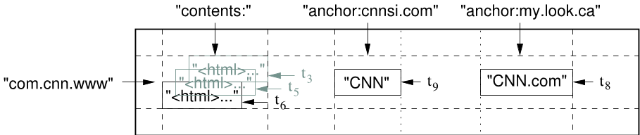
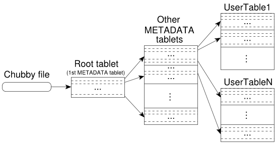
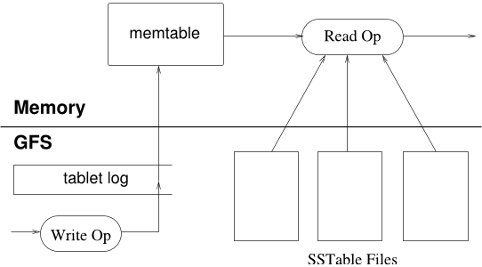
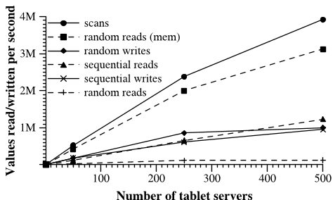

# Bigtable：结构化数据的分布式存储系统

Fay Chang、Jeffrey Dean、Sanjay Ghemawat、Wilson C. Hsieh、Deborah A. Wallach、Mike Burrows、Tushar Chandra、Andrew Fikes、Robert E. Gruber

{fay,jeff,sanjay,wilsonh,kerr,m3b,tushar,fikes,gruber}@google.com

Google, Inc.

## 摘要

Bigtable 是一个用于管理结构化数据的分布式存储系统，设计目标是扩展到极大规模：在数千台通用服务器上存储 PB 级数据。Google 的许多项目都使用 Bigtable 存储数据，包括网页索引、Google Earth 和 Google Finance。这些应用对 Bigtable 的要求差异很大：数据类型和大小从 URL、网页到卫星影像不等，延迟要求也从后端批量处理到实时数据服务不等。尽管需求各异，Bigtable 仍成功地为所有这些 Google 产品提供了灵活的高性能解决方案。本文介绍 Bigtable 提供的简单数据模型——客户端可以动态控制数据的布局和格式——以及 Bigtable 的设计与实现。

## 1. 引言

在过去两年半中，我们在 Google 设计、实现并部署了一个用于管理结构化数据的分布式存储系统 Bigtable。Bigtable 旨在可靠地扩展到 PB 级数据和数千台机器。它实现了几个目标：适用范围广、可扩展、高性能和高可用。Google Analytics、Google Finance、Orkut、个性化搜索、Writely 和 Google Earth 等六十多个 Google 产品和项目都在使用 Bigtable。这些产品的工作负载要求各不相同，从注重吞吐量的批处理作业到对延迟敏感的最终用户数据服务。它们使用的 Bigtable 集群配置跨度也很大，从几台到数千台服务器不等，存储的数据最多达数百 TB。

Bigtable 在许多方面类似数据库，并与数据库采用了许多相同的实现策略。并行数据库 [14] 和内存数据库 [13] 已经实现可扩展性和高性能，但 Bigtable 提供的接口与这些系统不同。Bigtable 不支持完整的关系数据模型，而是向客户端提供一种简单的数据模型，使其可以动态控制数据布局和格式，并能推断底层存储中数据的局部性。数据使用可以是任意字符串的行名和列名进行索引。Bigtable 同样把数据视为无解释的字符串，不过客户端通常会把各种结构化和半结构化数据序列化到这些字符串中。客户端可以通过谨慎选择模式来控制数据的局部性。最后，Bigtable 的模式参数允许客户端动态控制从内存还是磁盘提供数据。

第 2 节详细介绍数据模型，第 3 节概述客户端 API。第 4 节简要说明 Bigtable 所依赖的 Google 基础设施。第 5 节介绍 Bigtable 实现的基本原理，第 6 节介绍为提高 Bigtable 性能而做出的若干改进。第 7 节给出 Bigtable 的性能测量结果。第 8 节通过若干示例说明 Google 如何使用 Bigtable，第 9 节讨论我们在设计和支持 Bigtable 过程中总结的经验。最后，第 10 节介绍相关工作，第 11 节给出结论。

## 2. 数据模型

Bigtable 是一个稀疏、分布式、持久化的多维有序映射。该映射以行键、列键和时间戳为索引；映射中的每个值都是未经解释的字节数组。

$$
(row:string, column:string, time:int64) \rightarrow string
$$



> 图 1。一个用于存储网页的示例表切片。行名是反转后的 URL。`contents` 列族保存页面内容，`anchor` 列族保存所有指向该页面的锚文本。Sports Illustrated 和 MY-look 的首页都引用了 CNN 首页，因此该行包含名为 `anchor:cnnsi.com` 和 `anchor:my.look.ca` 的列。每个 `anchor` 单元格只有一个版本；`contents` 列有三个版本，时间戳分别为 $t_3$、$t_5$ 和 $t_6$。

我们在考察 Bigtable 类系统的多种潜在用途后确定了这一数据模型。下面给出一个曾影响若干设计决策的具体示例。假设我们希望保存大量网页及相关信息的副本，并让许多不同项目使用这些数据；将这张表称为 *Webtable*。如图 1 所示，在 Webtable 中，我们用 URL 作为行键，用网页的不同属性作为列名，并把网页内容存入 *`contents:`* 列，时间戳则是抓取网页的时间。

### 行

表的行键可以是任意字符串（目前最大为 64 KB，不过大多数用户通常使用 10～100 字节）。对同一行键下数据的每次读取或写入都是原子的，无论该行涉及多少个不同的列。这项设计让客户端在同一行发生并发更新时更容易推断系统行为。

Bigtable 按行键的字典序维护数据。表的行范围会动态分区，每个行范围称为一个*数据片（tablet）*，它是数据分布和负载均衡的基本单位。因此，读取较短的行范围很高效，通常只需与少量机器通信。客户端可以通过选择适当的行键，使数据访问具有良好的局部性。例如，在 Webtable 中，我们通过反转 URL 的主机名组成部分，把同一域中的页面归入连续的行。`maps.google.com/index.html` 的数据会存储在键 `com.google.maps/index.html` 下。把同一域的页面相邻存储，可以提高某些主机和域分析的效率。

### 列族

列键被组织成称为*列族（column family）*的集合，列族是访问控制的基本单位。同一列族中存储的数据通常属于同一类型，我们也会把同一列族中的数据一同压缩。必须先创建列族，才能在其中的列键下存储数据；列族创建后，可以使用其中的任意列键。我们希望一张表中不同列族的数量较少（最多几百个），而且列族在运行期间很少变化。相比之下，一张表可以拥有无限数量的列。

列键使用 `family:qualifier` 语法命名。列族名必须是可打印字符，限定符则可以是任意字符串。Webtable 的一个示例列族是 `language`，它保存网页所使用的语言。`language` 族中只使用一个列键，用于保存各网页的语言 ID。另一个有用的列族是 `anchor`；如图 1 所示，该族中的每个列键代表一个锚点。限定符是引用网站的名称，单元格内容是链接文本。

访问控制以及磁盘和内存用量统计都在列族级别执行。在 Webtable 示例中，这些控制使我们能够管理几类不同的应用：有些应用添加新的基础数据，有些读取基础数据并创建派生列族，还有一些只能查看现有数据（出于隐私原因，甚至可能无权查看所有现有列族）。

### 时间戳

Bigtable 的每个单元格可以包含同一份数据的多个版本，这些版本按时间戳索引。Bigtable 的时间戳是 64 位整数。时间戳可以由 Bigtable 分配，此时它以微秒表示“实际时间”；也可以由客户端应用显式分配。需要避免冲突的应用必须自行生成唯一时间戳。单元格的不同版本按时间戳降序存储，以便先读到最新版本。

```cpp
// Open the table
Table *T = OpenOrDie("/bigtable/web/webtable");

// Write a new anchor and delete an old anchor
RowMutation r1(T, "com.cnn.www");
r1.Set("anchor:www.c-span.org", "CNN");
r1.Delete("anchor:www.abc.com");
Operation op;
Apply(&op, &r1);
```

> 图 2。写入 Bigtable。

为了降低版本化数据的管理负担，我们为每个列族提供两项设置，使 Bigtable 可以自动对单元格版本执行垃圾回收。客户端可以指定只保留单元格最近的 $n$ 个版本，也可以指定只保留足够新的版本，例如只保留最近七天写入的值。

在 Webtable 示例中，`contents:` 列所存抓取页面的时间戳，就是这些页面版本实际被抓取的时间。利用上述垃圾回收机制，我们可以只保留每个页面最新的三个版本。

## 3. API

Bigtable API 提供创建和删除表及列族的函数，也提供修改集群、表和列族元数据（例如访问控制权限）的函数。

客户端应用可以在 Bigtable 中写入或删除值、查找单行中的值，或者迭代表中的一部分数据。图 2 展示了使用 `RowMutation` 抽象执行一系列更新的 C++ 代码。为使示例简短，省略了无关细节。`Apply` 调用对 Webtable 执行一次原子变更：为 `www.cnn.com` 添加一个锚点，并删除另一个锚点。

图 3 展示了使用 `Scanner` 抽象迭代特定行中所有锚点的 C++ 代码。客户端可以迭代多个列族，并通过多种机制限制扫描产生的行、列和时间戳。例如，可以限制上述扫描，使其只产生列名与正则表达式 `anchor:*.cnn.com` 匹配的锚点，或者只产生时间戳位于当前时间之前十天内的锚点。

```cpp
Scanner scanner(T);
Scanner *stream;
stream = scanner.FetchColumnFamily("anchor");
stream->SetReturnAllVersions();
scanner.Lookup("com.cnn.www");
for (; !stream->Done(); stream->Next()) {
    printf("%s %s %ld %s\n",
           scanner.RowName(),
           stream->ColumnName(),
           stream->MicroTimestamp(),
           stream->Value());
}
```

> 图 3。读取 Bigtable。

Bigtable 还支持若干功能，使用户能够以更复杂的方式操作数据。第一，Bigtable 支持单行事务，可用于对同一行键下的数据执行原子的“读取—修改—写入”序列。Bigtable 目前不支持跨行键的通用事务，但提供了由客户端批量写入多个行键的接口。第二，Bigtable 允许把单元格用作整数计数器。最后，Bigtable 支持在服务器地址空间中执行客户端提供的脚本。这些脚本使用 Google 为数据处理开发的语言 Sawzall [28] 编写。目前，基于 Sawzall 的 API 不允许客户端脚本把数据写回 Bigtable，但支持多种数据转换、基于任意表达式的过滤，以及通过多种运算符进行汇总。

Bigtable 可以与 MapReduce [12] 配合使用；MapReduce 是 Google 开发的一个运行大规模并行计算的框架。我们编写了一组封装，使 Bigtable 既可作为 MapReduce 作业的输入源，也可作为其输出目标。

## 4. 构建基础

Bigtable 构建在 Google 的其他几项基础设施之上。它使用分布式 Google 文件系统（GFS）[17] 存储日志和数据文件。Bigtable 集群通常运行在一组共享机器中，这些机器还会运行各种其他分布式应用，因此 Bigtable 进程常与其他应用的进程共享机器。Bigtable 依赖集群管理系统来调度作业、管理共享机器上的资源、处理机器故障并监控机器状态。

Bigtable 内部使用 Google SSTable 文件格式存储数据。SSTable 提供从键到值的持久、有序且不可变的映射，键和值都可以是任意字节串。它支持查找指定键所对应的值，以及迭代指定键范围内的所有键值对。每个 SSTable 内部包含一系列数据块，数据块通常为 64 KB，也可以配置。SSTable 末尾存有用于定位数据块的索引；打开 SSTable 时，该索引会载入内存。一次查找只需一次磁盘寻道：首先在内存索引中二分查找相应数据块，然后从磁盘读取该数据块。还可以选择把整个 SSTable 映射到内存，使查找和扫描不必访问磁盘。

Bigtable 依赖一个名为 Chubby [8] 的高可用持久化分布式锁服务。一个 Chubby 服务包含五个活跃副本，其中一个被选为主副本并主动处理请求。只要多数副本正在运行且能够相互通信，服务就处于可用状态。Chubby 使用 Paxos 算法 [9, 23] 在发生故障时保持副本一致。Chubby 提供由目录和小文件组成的命名空间。每个目录或文件都可以用作锁，对文件的读写是原子的。Chubby 客户端库为 Chubby 文件提供一致性缓存。每个 Chubby 客户端都维护一个与 Chubby 服务的会话；如果无法在租约到期前续租，会话就会过期。会话过期后，客户端将失去所有锁和打开的句柄。Chubby 客户端还可以在 Chubby 文件和目录上注册回调，以便在内容变化或会话过期时收到通知。

Bigtable 使用 Chubby 完成多项任务：确保任一时刻最多只有一个活跃主服务器；存储 Bigtable 数据的引导位置（见第 5.1 节）；发现数据片服务器并最终确认其死亡（见第 5.2 节）；存储 Bigtable 模式信息，即每张表的列族信息；以及存储访问控制列表。如果 Chubby 长时间不可用，Bigtable 也会不可用。我们最近在横跨 11 个 Chubby 实例的 14 个 Bigtable 集群中测量了这一影响。由于 Chubby 不可用（由 Chubby 停机或网络问题导致），Bigtable 服务器时间中部分数据不可访问的平均比例为 0.0047%；受影响最严重的单个集群中，这一比例为 0.0326%。

## 5. 实现

Bigtable 的实现包含三个主要组件：链接到每个客户端的库、一台主服务器和许多数据片服务器。可以根据工作负载变化，动态向集群中添加或移除数据片服务器。

主服务器负责把数据片分配给数据片服务器，检测数据片服务器的加入和失效，平衡数据片服务器的负载，以及对 GFS 中的文件执行垃圾回收。此外，它还处理表和列族创建等模式变更。

每台数据片服务器管理一组数据片，通常为十到一千个。数据片服务器处理其所加载数据片的读写请求，并拆分增长得过大的数据片。

与许多采用单一主服务器的分布式存储系统 [17, 21] 一样，客户端数据不经过主服务器：客户端直接与数据片服务器通信，执行读写。Bigtable 客户端不依赖主服务器获取数据片位置信息，因此大多数客户端从不与主服务器通信。实践中，主服务器的负载因而很轻。

一个 Bigtable 集群存储多张表。每张表由一组数据片组成，每个数据片包含一个行范围内的全部数据。每张表最初只有一个数据片。随着表不断增长，它会自动拆分成多个数据片，默认情况下每个数据片约为 100～200 MB。

### 5.1 数据片位置

我们使用一个类似 B$^{+}$ 树 [10] 的三级层次结构存储数据片位置信息（见图 4）。



> 图 4。数据片位置层次结构。

第一级是 Chubby 中的一个文件，保存根数据片的位置。根数据片保存一张特殊的 `METADATA` 表中所有数据片的位置。每个 `METADATA` 数据片保存一组用户数据片的位置。根数据片就是 `METADATA` 表的第一个数据片，但会受到特殊处理——它永远不会拆分——从而确保数据片位置层次结构不超过三级。

`METADATA` 表把数据片的位置存储在一个行键下，该行键由数据片所属表的标识符和结束行编码而成。每个 `METADATA` 行在内存中存储约 1 KB 数据。如果把 `METADATA` 数据片适度限制为 128 MB，我们的三级位置方案足以寻址 $2^{34}$ 个数据片；按每个数据片 128 MB 计算，即 $2^{61}$ 字节。

客户端库会缓存数据片位置。如果客户端不知道某个数据片的位置，或者发现缓存的位置信息有误，就会沿数据片位置层次结构递归向上查找。如果客户端缓存为空，位置算法需要三次网络往返，其中包括一次 Chubby 读取。如果客户端缓存已经过期，位置算法最多可能需要六次往返，因为过期的缓存项只有在查找未命中时才会被发现；这里假定 `METADATA` 数据片不会频繁迁移。数据片位置保存在内存中，因此不需要访问 GFS。为了进一步降低常见情况下的开销，客户端库还会预取数据片位置：每次读取 `METADATA` 表时，它会同时读取多个数据片的元数据。

我们还在 `METADATA` 表中保存辅助信息，包括与每个数据片有关的所有事件日志，例如服务器何时开始为该数据片提供服务。这些信息有助于调试和性能分析。

### 5.2 数据片分配

每个数据片在任一时刻只分配给一台数据片服务器。主服务器跟踪存活的数据片服务器集合，以及数据片当前到数据片服务器的分配关系，其中也包括尚未分配的数据片。如果某个数据片尚未分配，同时有一台数据片服务器具备足够空间，主服务器便向该服务器发送数据片加载请求，将数据片分配给它。

Bigtable 使用 Chubby 跟踪数据片服务器。数据片服务器启动时，会在特定 Chubby 目录中创建一个名称唯一的文件，并获取该文件的排他锁。主服务器监视这个目录（称为*服务器目录*）来发现数据片服务器。如果数据片服务器失去排他锁，例如网络分区导致它失去 Chubby 会话，它就停止为自己的数据片提供服务。（Chubby 提供了一种高效机制，使数据片服务器无需产生网络流量即可检查自己是否仍持有锁。）只要文件仍存在，数据片服务器就会尝试重新获取其排他锁。如果文件已不存在，该数据片服务器将永远无法再次提供服务，因此会自行终止。每当数据片服务器终止时，例如集群管理系统正在从集群中移除它所在的机器，它都会尝试释放锁，使主服务器能更快地重新分配其数据片。

主服务器负责检测数据片服务器何时停止提供服务，并尽快重新分配其数据片。为此，主服务器会定期询问每台数据片服务器所持锁的状态。如果一台数据片服务器报告自己已失去锁，或者主服务器连续多次无法联系该服务器，主服务器就尝试获取该服务器文件的排他锁。如果能够获得锁，说明 Chubby 仍然可用，而数据片服务器已经死亡或无法连接 Chubby；主服务器会删除该服务器文件，确保它永远不能再次提供服务。文件删除后，主服务器可以把原先分配给该服务器的全部数据片移入未分配集合。为了避免 Bigtable 集群受到主服务器与 Chubby 之间网络问题的影响，如果主服务器的 Chubby 会话过期，它会自行终止。不过，如上所述，主服务器故障不会改变数据片到数据片服务器的分配关系。

集群管理系统启动主服务器后，主服务器必须先发现当前的数据片分配，才能修改它们。启动过程如下：

1. 主服务器在 Chubby 中取得一个唯一的主服务器锁，防止多个主服务器实例并发运行。
2. 主服务器扫描 Chubby 中的服务器目录，找出存活的服务器。
3. 主服务器与每台存活的数据片服务器通信，查明已经分配给各服务器的数据片。
4. 主服务器扫描 `METADATA` 表，获取数据片集合。每当扫描遇到尚未分配的数据片，主服务器就把它加入未分配集合，使其可以参与后续分配。

这里有一个问题：只有先分配 `METADATA` 数据片，才能扫描 `METADATA` 表。因此，在开始第 4 步之前，如果第 3 步没有发现根数据片的分配，主服务器会把根数据片加入未分配集合，确保它得到分配。根数据片包含所有 `METADATA` 数据片的名称，因此主服务器扫描完根数据片后便知道它们的存在。

只有在创建或删除表、把两个现有数据片合并成一个更大的数据片，或者把一个现有数据片拆成两个较小的数据片时，现有数据片集合才会变化。除拆分外，其余操作都由主服务器发起，因此主服务器可以跟踪这些变化。数据片拆分由数据片服务器发起，需要特殊处理。数据片服务器把新数据片的信息写入 `METADATA` 表，以提交拆分；提交完成后，它会通知主服务器。如果拆分通知因数据片服务器或主服务器死亡而丢失，主服务器会在要求数据片服务器加载已被拆分的数据片时发现新数据片。数据片服务器在 `METADATA` 表中找到的条目只涵盖主服务器要求加载的数据片的一部分，因此会把这次拆分通知主服务器。

### 5.3 数据片服务

如图 5 所示，数据片的持久状态存储在 GFS 中。



> 图 5。数据片的表示方式。

更新会提交到保存重做记录的提交日志。最近提交的更新保存在内存中一个名为 memtable 的有序缓冲区里，较早的更新则存储在一系列 SSTable 中。恢复数据片时，数据片服务器会从 `METADATA` 表读取其元数据。这些元数据包含组成该数据片的 SSTable 列表，以及一组重做点；重做点指向可能包含该数据片数据的提交日志。服务器把各 SSTable 的索引读入内存，并应用重做点之后提交的所有更新，以重建 memtable。

写操作到达数据片服务器后，服务器会检查操作格式是否正确，以及发送者是否有权执行该变更。授权检查通过读取 Chubby 文件中的允许写入者列表完成；这项读取几乎总能命中 Chubby 客户端缓存。有效变更会写入提交日志。系统使用组提交来提高大量小变更的吞吐量 [13, 16]。写入提交后，其内容会插入 memtable。

读操作到达数据片服务器时，也会接受格式和授权检查。有效读取会在 SSTable 序列与 memtable 的合并视图上执行。SSTable 和 memtable 都是按字典序排列的数据结构，因此可以高效形成合并视图。

拆分和合并数据片期间，传入的读写操作仍可继续执行。

### 5.4 压实

随着写操作执行，memtable 会不断增大。当其大小达到阈值时，当前 memtable 会被冻结，系统创建新的 memtable，并把冻结的 memtable 转换为 SSTable 后写入 GFS。这个*小型压实（minor compaction）*过程有两个目的：减少数据片服务器的内存占用；如果服务器死亡，减少恢复期间必须从提交日志读取的数据量。压实期间，传入的读写操作仍可继续执行。

每次小型压实都会创建一个新的 SSTable。如果不加限制，读操作可能需要合并任意数量 SSTable 中的更新。为此，我们在后台定期执行*合并压实（merging compaction）*，限制这类文件的数量。合并压实读取若干 SSTable 和 memtable 的内容，并写出一个新的 SSTable。压实完成后，输入的 SSTable 和 memtable 即可丢弃。

把所有 SSTable 重写成恰好一个 SSTable 的合并压实称为*主压实（major compaction）*。非主压实生成的 SSTable 可以包含特殊删除条目，用来屏蔽仍然存活的旧 SSTable 中已删除的数据。主压实生成的 SSTable 则不包含删除信息或已删除数据。Bigtable 会循环遍历所有数据片，定期对其执行主压实。这样既能回收已删除数据占用的资源，也能确保已删除数据及时从系统中消失；这对于存储敏感数据的服务很重要。

## 6. 改进

为了达到用户所要求的高性能、高可用性和可靠性，上一节介绍的实现还需要多项改进。本节更详细地介绍实现中的若干部分，以说明这些改进。

### 局部性组

客户端可以把多个列族归入一个*局部性组（locality group）*。每个数据片会为每个局部性组分别生成一个 SSTable。把通常不会一起访问的列族分隔到不同局部性组中，可以提高读取效率。例如，Webtable 的页面元数据（如语言和校验和）可以位于一个局部性组，页面内容位于另一个局部性组；只想读取元数据的应用不必遍历所有页面内容。

一些有用的调优参数也可以按局部性组指定。例如，可以把局部性组声明为驻留内存。内存局部性组的 SSTable 会按需加载到数据片服务器的内存中。加载后，读取属于这些局部性组的列族便不必访问磁盘。该功能适用于频繁访问的小块数据；我们在内部用它保存 `METADATA` 表的 `location` 列族。

### 压缩

客户端可以控制是否压缩局部性组的 SSTable；如果压缩，还可以选择压缩格式。用户指定的压缩格式分别应用于每个 SSTable 数据块，数据块大小可通过局部性组的调优参数控制。分别压缩每个数据块会牺牲一些空间，但读取 SSTable 的一小部分时无需解压整个文件。许多客户端使用一种自定义的两遍压缩方案。第一遍采用 Bentley 和 McIlroy 的方案 [6]，在较大的窗口中压缩较长的公共字符串；第二遍使用一种快速压缩算法，在数据的 16 KB 小窗口中查找重复内容。两遍压缩都很快：在当时的现代机器上，编码速度为 100～200 MB/s，解码速度为 400～1000 MB/s。

虽然选择压缩算法时更看重速度而非空间节省，但这种两遍压缩方案的效果出乎意料地好。例如，Webtable 使用该方案存储网页内容。在一项实验中，我们把大量文档存入一个经过压缩的局部性组。实验只保存每份文档的一个版本，而不是所有可用版本，最终空间缩减到原来的十分之一。这远好于 Gzip 对 HTML 页面通常只能缩减到三分之一或四分之一的效果，原因在于 Webtable 的行布局方式：同一主机的所有页面相邻存储，使 Bentley-McIlroy 算法能够识别这些页面中大量共享的样板内容。不仅是 Webtable，许多应用都会选择行名，使相似数据聚集在一起，从而获得很高的压缩比。在 Bigtable 中保存同一值的多个版本时，压缩比还会进一步提高。

### 用缓存提高读取性能

为提高读取性能，数据片服务器使用两级缓存。扫描缓存（Scan Cache）是较高层缓存，用于缓存 SSTable 接口返回给数据片服务器代码的键值对。数据块缓存（Block Cache）是较低层缓存，用于缓存从 GFS 读取的 SSTable 数据块。扫描缓存最适合反复读取同一数据的应用。数据块缓存适合读取位置邻近于最近所读数据的应用，例如顺序读取，或者在某个热点行的同一局部性组中随机读取不同列。

### 布隆过滤器

如第 5.3 节所述，一次读操作必须读取构成数据片状态的所有 SSTable。如果这些 SSTable 不在内存中，最终可能需要多次访问磁盘。为减少访问次数，客户端可以指定为特定局部性组中的 SSTable 创建布隆过滤器 [7]。借助布隆过滤器，我们可以判断某个 SSTable 是否可能包含指定行列对的数据。对于某些应用，只需使用少量数据片服务器内存保存布隆过滤器，就能大幅减少读操作所需的磁盘寻道次数。使用布隆过滤器也意味着，对不存在行或列的大多数查找都不必访问磁盘。

### 提交日志实现

如果把每个数据片的提交日志分别保存在一个日志文件中，GFS 就会并发写入大量文件。取决于各 GFS 服务器的底层文件系统实现，这些写入可能为了访问不同的物理日志文件而导致大量磁盘寻道。此外，每个数据片使用独立日志文件会使组提交中的分组变小，降低组提交优化的效果。为解决这些问题，我们把变更追加到每台数据片服务器的单个提交日志中，使不同数据片的变更混合存放在同一个物理日志文件里 [18, 20]。

正常运行时，单一日志能带来显著的性能优势，却会使恢复更加复杂。数据片服务器死亡后，它所服务的数据片会迁移到大量其他数据片服务器，通常每台服务器只加载原服务器的少量数据片。为了恢复某个数据片的状态，新数据片服务器必须重新应用原服务器写入其提交日志的相应变更，但这些数据片的变更混合在同一物理日志文件中。一种做法是让每台新数据片服务器读取完整的提交日志，只应用自己所需数据片的条目。然而，如果 100 台机器各自从故障服务器分配到一个数据片，日志文件就会被读取 100 次，每台服务器各读一次。

为了避免重复读取日志，我们首先按键 $langle \text{table}, \text{row name}, \text{log sequence number} \rangle$ 对提交日志条目排序。排序结果中，同一数据片的所有变更都连续排列，因此只需一次磁盘寻道和随后的顺序读取即可高效读出。为了并行排序，我们把日志文件划分为 64 MB 的段，并在不同数据片服务器上并行排序各段。排序过程由主服务器协调，在数据片服务器表示需要从某个提交日志文件恢复变更时启动。

出于多种原因，向 GFS 写提交日志有时会出现性能波动。例如，参与写入的一台 GFS 服务器可能崩溃；通往特定三台 GFS 服务器的网络路径可能拥塞；或者这些服务器负载过高。为避免 GFS 延迟突增影响变更，每台数据片服务器实际使用两个日志写入线程，分别写入自己的日志文件，但任一时刻只启用其中一个线程。如果向当前日志文件的写入性能不佳，系统就切换到另一个线程，由新启用的线程写入提交日志队列中的变更。日志条目包含序列号，使恢复过程能够忽略日志切换产生的重复条目。

### 加快数据片恢复

如果主服务器把数据片从一台数据片服务器移到另一台，源数据片服务器会先对该数据片执行一次小型压实。压实减少了提交日志中尚未压实的状态，从而缩短恢复时间。完成后，数据片服务器停止为该数据片提供服务。在真正卸载数据片之前，它还会执行另一次通常很快的小型压实，以清除第一次压实期间到达、仍残留在日志中的未压实状态。第二次小型压实完成后，另一台数据片服务器便可加载该数据片，而无需恢复任何日志条目。

### 利用不可变性

我们生成的所有 SSTable 都不可变；除了 SSTable 缓存外，Bigtable 系统的其他许多部分也因此得到简化。例如，从 SSTable 读取数据时，不需要同步对文件系统的访问，因而可以高效实现行级并发控制。读写操作都会访问的唯一可变数据结构是 memtable。为减少读取 memtable 时的争用，我们对 memtable 的每一行采用写时复制，并允许读写并行执行。

由于 SSTable 不可变，永久移除已删除数据的问题就转化为对过时 SSTable 执行垃圾回收。每个数据片的 SSTable 都登记在 `METADATA` 表中。主服务器在 SSTable 集合上执行标记—清除垃圾回收 [25]，其中 `METADATA` 表包含根集合，以此移除过时的 SSTable。

最后，SSTable 的不可变性使我们能够快速拆分数据片。我们不为每个子数据片生成一组新的 SSTable，而是让子数据片共享父数据片的 SSTable。

## 7. 性能评估

我们搭建了一个包含 $N$ 台数据片服务器的 Bigtable 集群，通过改变 $N$ 来测量 Bigtable 的性能和可扩展性。每台数据片服务器配置 1 GB 内存，并向一个由 1786 台机器组成的 GFS 单元写入数据；每台机器配有两块 400 GB IDE 硬盘。$N$ 台客户端机器产生测试所用的 Bigtable 负载。（客户端数量与数据片服务器相同，以确保客户端绝不成为瓶颈。）每台机器配有两颗双核 2 GHz Opteron 处理器、足以容纳所有运行进程工作集的物理内存，以及一条千兆以太网链路。机器通过两级树形交换网络连接，根部可用聚合带宽约为 100～200 Gbps。所有机器都位于同一托管设施，因此任意两台机器之间的往返时间都小于 1 毫秒。

数据片服务器、主服务器、测试客户端和 GFS 服务器运行在同一组机器上。每台机器都运行一个 GFS 服务器，其中一些还运行数据片服务器、客户端进程，或者实验期间同时使用该资源池的其他作业进程。

$R$ 表示测试中涉及的不同 Bigtable 行键数量。$R$ 的取值使每项基准测试在每台数据片服务器上读写约 1 GB 数据。

顺序写入基准测试使用名称从 0 到 $R-1$ 的行键。该行键空间被划分成 $10N$ 个大小相等的范围。中央调度器把这些范围分配给 $N$ 个客户端；客户端处理完上一个范围后，调度器便把下一个可用范围分配给它。这种动态分配减轻了客户端机器上其他进程造成的性能波动。我们在每个行键下写入一个字符串。每个字符串都是随机生成的，因而无法压缩；不同的行键使用不同字符串，所以也无法跨行压缩。随机写入基准测试与此类似，但会在写入前立即把行键对 $R$ 取模散列，使整个测试期间的写入负载大致均匀地分布在完整行空间中。

| 实验 | 1 台数据片服务器 | 50 台 | 250 台 | 500 台 |
| --- | ---: | ---: | ---: | ---: |
| 随机读取 | 1212 | 593 | 479 | 241 |
| 随机读取（内存） | 10811 | 8511 | 8000 | 6250 |
| 随机写入 | 8850 | 3745 | 3425 | 2000 |
| 顺序读取 | 4425 | 2463 | 2625 | 2469 |
| 顺序写入 | 8547 | 3623 | 2451 | 1905 |
| 扫描 | 15385 | 10526 | 9524 | 7843 |



> 图 6。每秒读写的 1000 字节值数量。表格显示每台数据片服务器的速率，折线图显示聚合速率。

*顺序读取*基准测试生成行键的方式与顺序写入完全相同，但它不在行键下写入数据，而是读取先前执行顺序写入基准测试时存入该行键的字符串。类似地，*随机读取*基准测试执行与随机写入基准测试对应的操作。

*扫描*基准测试与顺序读取类似，但会利用 Bigtable API 提供的功能，扫描一个行范围内的所有值。一次 RPC 可以从数据片服务器取回较长的值序列，因此扫描减少了基准测试执行的 RPC 数量。

随机读取（内存）基准测试与随机读取类似，但保存测试数据的局部性组被标记为驻留内存，所以读取由数据片服务器内存满足，不需要访问 GFS。仅在这项测试中，我们把每台数据片服务器的数据量从 1 GB 降至 100 MB，使其能轻松放入数据片服务器的可用内存。

图 6 从两个角度展示了 Bigtable 读写 1000 字节值时的基准测试性能。表格显示每台数据片服务器每秒执行的操作数，折线图显示每秒聚合操作数。

### 单台数据片服务器的性能

先考察只有一台数据片服务器时的性能。随机读取比其他所有操作慢一个数量级以上。每次随机读取都会通过网络从 GFS 向数据片服务器传输一个 64 KB 的 SSTable 数据块，却只使用其中一个 1000 字节的值。数据片服务器每秒执行约 1200 次读取，相当于以约 75 MB/s 从 GFS 读取数据。由于网络栈、SSTable 解析和 Bigtable 代码的开销，这一带宽足以耗尽数据片服务器的 CPU，也几乎足以用满系统中的网络链路。访问模式如此的 Bigtable 应用大多会把数据块大小降到更小的值，通常为 8 KB。

内存随机读取快得多，因为每次 1000 字节读取都直接由数据片服务器的本地内存满足，无需从 GFS 取回 64 KB 的大数据块。

随机写入和顺序写入都比随机读取快，因为每台数据片服务器会把所有传入写入追加到单个提交日志，并利用组提交把这些写入高效地流式传输到 GFS。随机写入与顺序写入的性能没有显著差异；两种情况下，数据片服务器的所有写入都会记录到同一份提交日志。

顺序读取比随机读取快，因为从 GFS 取回的每个 64 KB SSTable 数据块都会存入数据块缓存，随后用于处理接下来的 64 个读取请求。

扫描速度更快，因为数据片服务器可以响应一次客户端 RPC 返回大量值，把 RPC 开销分摊到许多值上。

### 扩展能力

当系统中的数据片服务器从 1 台增加到 500 台时，聚合吞吐量大幅增长，超过原来的 100 倍。例如，内存随机读取性能提高了将近 300 倍，而数据片服务器数量增加了 500 倍。这是因为该测试的性能瓶颈是单台数据片服务器的 CPU。

不过，性能并未线性增长。在大多数测试中，从 1 台增加到 50 台数据片服务器时，单台服务器吞吐量会显著下降。原因是多服务器配置存在负载不均，其他进程常会争用 CPU 和网络。我们的负载均衡算法试图处理这种不均衡，但由于两个主要原因无法做到尽善尽美：为了减少数据片迁移次数，再平衡受到限速；数据片迁移时会短暂不可用，通常不到一秒。此外，基准测试产生的负载会随测试进度不断移动。

随机读取测试的扩展效果最差：服务器数量增加 500 倍时，聚合吞吐量只提高 100 倍。如上所述，这是因为每读取 1000 字节，都要通过网络传输一个 64 KB 的大数据块。传输会使网络中多条共享的 1 Gbps 链路饱和，因此机器数量增加时，单台服务器吞吐量显著下降。

## 8. 真实应用

截至 2006 年 8 月，Google 的各个机器集群中运行着 388 个非测试 Bigtable 集群，共包含约 24,500 台数据片服务器。表 1 粗略展示了每个集群的数据片服务器数量分布。许多集群用于开发，因此有相当长时间处于空闲状态。另有一组由 14 个繁忙集群组成，共含 8,069 台数据片服务器；这组集群每秒处理的请求总量超过 120 万，传入 RPC 流量约为 741 MB/s，传出 RPC 流量约为 16 GB/s。

| 每个集群的数据片服务器数 | 集群数 |
| --- | ---: |
| 0～19 | 259 |
| 20～49 | 47 |
| 50～99 | 20 |
| 100～499 | 50 |
| >500 | 12 |

> 表 1。Bigtable 集群中数据片服务器数量的分布。

表 2 给出了当时正在使用的部分表的数据。有些表存储直接向用户提供的数据，另一些则存储批处理数据；这些表的总大小、平均单元格大小、从内存提供的数据比例和模式复杂度差异很大。本节余下部分简要介绍三个产品团队如何使用 Bigtable。

| 项目 | 表大小（TB） | 压缩比 | 单元格数（十亿） | 列族数 | 局部性组数 | 内存中占比 | 对延迟敏感？ |
| --- | ---: | ---: | ---: | ---: | ---: | ---: | --- |
| Crawl | 800 | 11% | 1000 | 16 | 8 | 0% | 否 |
| Crawl | 50 | 33% | 200 | 2 | 2 | 0% | 否 |
| Google Analytics | 20 | 29% | 10 | 1 | 1 | 0% | 是 |
| Google Analytics | 200 | 14% | 80 | 1 | 1 | 0% | 是 |
| Google Base | 2 | 31% | 10 | 29 | 3 | 15% | 是 |
| Google Earth | 0.5 | 64% | 8 | 7 | 2 | 33% | 是 |
| Google Earth | 70 | – | 9 | 8 | 3 | 0% | 否 |
| Orkut | 9 | – | 0.9 | 8 | 5 | 1% | 是 |
| 个性化搜索 | 4 | 47% | 6 | 93 | 11 | 5% | 是 |

> 表 2。生产环境中部分表的特征。表大小为压缩前的大小；表大小和单元格数均为近似值。未启用压缩的表不提供压缩比。

### 8.1 Google Analytics

Google Analytics（analytics.google.com）是一项帮助网站管理员分析网站流量模式的服务。它既提供每日独立访客数、每个 URL 每日浏览量等聚合统计，也提供网站跟踪报告，例如先前看过某个页面的用户中最终完成购买的比例。

为了启用这项服务，网站管理员会在网页中嵌入一小段 JavaScript 程序。每当页面被访问时，该程序就会运行，并在 Google Analytics 中记录请求的各种信息，例如用户标识符和所获取页面的信息。Google Analytics 汇总这些数据，再提供给网站管理员。

这里简要介绍 Google Analytics 使用的两张表。原始点击表（约 200 TB）为每个最终用户会话维护一行。行名是由网站名称和会话创建时间组成的元组。该模式确保访问同一网站的会话连续存放，并按时间顺序排列。该表压缩后为原大小的 14%。

汇总表（约 20 TB）包含每个网站的多种预定义汇总。系统通过定期调度的 MapReduce 作业，从原始点击表生成汇总表。每个 MapReduce 作业从原始点击表提取最近的会话数据。整个系统的吞吐量受 GFS 吞吐量限制。该表压缩后为原大小的 29%。

### 8.2 Google Earth

Google 运营着一组服务，通过基于 Web 的 Google Maps 界面（maps.google.com）和专用 Google Earth 客户端软件（earth.google.com），让用户访问世界地表的高分辨率卫星影像。这些产品允许用户在地表导航：可以平移、查看和标注多个分辨率级别的卫星影像。系统使用一张表预处理数据，使用另一组表向客户端提供数据。

预处理流水线使用一张表存储原始影像。预处理过程中，影像会经过清理和整合，形成最终的服务数据。该表包含约 70 TB 数据，因此从磁盘提供。影像本身已经经过高效压缩，所以关闭了 Bigtable 压缩。

影像表的每一行对应一个地理区块。行的命名方式确保相邻地理区块彼此邻近存储。表中有一个列族用于跟踪各区块的数据来源。这个列族包含大量列，基本上每幅原始数据影像对应一列。每个区块只由少量影像构建，因此该列族非常稀疏。

预处理流水线大量依赖在 Bigtable 上运行 MapReduce 来转换数据。在某些 MapReduce 作业中，整个系统的每台数据片服务器每秒处理超过 1 MB 数据。

服务系统使用一张表为 GFS 中存储的数据建立索引。这张表相对较小，约为 500 GB，但每个数据中心每秒必须以低延迟处理数万次查询。因此，该表托管在数百台数据片服务器上，并包含驻留内存的列族。

### 8.3 个性化搜索

个性化搜索（www.google.com/psearch）是一项需用户主动选择加入的服务，它记录用户在 Google 网页搜索、图片和新闻等多种产品中的查询和点击。用户可以浏览自己的搜索历史，重新访问以前的查询和点击，也可以根据自己过去使用 Google 的模式请求个性化搜索结果。

个性化搜索把每位用户的数据存入 Bigtable。每位用户都有唯一的用户 ID，并分配到以该 ID 命名的一行。所有用户操作都存储在一张表中，每类操作使用一个独立列族，例如有一个列族保存所有网页查询。每个数据元素都以对应用户操作的发生时间作为 Bigtable 时间戳。个性化搜索通过在 Bigtable 上运行 MapReduce 生成用户画像，再用这些画像对实时搜索结果进行个性化。

个性化搜索数据复制到多个 Bigtable 集群，以提高可用性，并减少客户端距离造成的延迟。个性化搜索团队最初在 Bigtable 之上构建了客户端复制机制，保证所有副本最终一致。当前系统改用内置在服务器中的复制子系统。

个性化搜索存储系统的设计允许其他团队在自己的列中添加新的每用户信息。如今，许多需要保存每用户配置选项和设置的其他 Google 产品也使用该系统。多个团队共享一张表，导致列族数量异常庞大。为支持共享，我们向 Bigtable 添加了一种简单的配额机制，限制特定客户端在共享表中的存储用量，从而在使用该系统存储每用户信息的不同产品团队之间提供一定隔离。

## 9. 经验

在设计、实现、维护和支持 Bigtable 的过程中，我们积累了有用的经验，也总结出一些值得注意的教训。

第一，大型分布式系统会遭遇多种故障，而不只是许多分布式协议所假定的标准网络分区和失效即停故障。例如，我们遇到过由下列各种原因造成的问题：内存和网络数据损坏、严重的时钟偏差、机器挂起、长时间且非对称的网络分区、所依赖其他系统（例如 Chubby）的缺陷、GFS 配额耗尽，以及计划内和计划外的硬件维护。随着处理这类问题的经验增多，我们修改了多种协议。例如，我们向 RPC 机制加入校验和。另一些问题则通过消除系统某个部分对另一部分所做的假设来解决。例如，我们不再假定某项 Chubby 操作只会返回一组固定错误中的一种。

第二，在明确新功能将如何使用之前，推迟添加它们很重要。例如，我们最初计划在 API 中支持通用事务，但由于没有迫切用途，最终没有实现。如今已有许多真实应用运行在 Bigtable 上，我们得以考察它们的实际需求，并发现大多数应用只需要单行事务。用户要求分布式事务时，最重要的用途是维护二级索引；我们计划添加一种专用机制来满足这一需求。新机制不如分布式事务通用，但效率更高，尤其适用于跨越数百行乃至更多行的更新，而且能更好地配合我们的跨数据中心乐观复制方案。

支持 Bigtable 的一项实践经验，是适当的系统级监控非常重要；这里既包括监控 Bigtable 本身，也包括使用 Bigtable 的客户端进程。例如，我们扩展了 RPC 系统，对抽样的一部分 RPC 详细跟踪系统代表该 RPC 执行的重要操作。该功能帮助我们发现并修复了许多问题，例如数据片数据结构上的锁争用、提交 Bigtable 变更时写入 GFS 过慢，以及 `METADATA` 数据片不可用时访问 `METADATA` 表发生阻塞。另一个有用的监控方式是把每个 Bigtable 集群登记到 Chubby。这样便能找到所有集群，了解它们的规模、所运行的软件版本、接收的流量，以及是否存在延迟异常增大等问题。

最重要的经验是简单设计的价值。我们的系统包含约 10 万行非测试代码，而且代码会随时间以意想不到的方式演变；我们发现，清晰的代码和设计对代码维护与调试帮助极大。数据片服务器成员协议就是一个例子。最初的协议很简单：主服务器定期向数据片服务器发放租约，数据片服务器则在租约过期时自行终止。遗憾的是，发生网络问题时，这项协议会显著降低可用性，而且对主服务器恢复时间很敏感。我们多次重新设计协议，最终得到了性能良好的版本，但所得协议过于复杂，还依赖 Chubby 中很少被其他应用使用的功能。我们发现，自己耗费了过多时间调试隐蔽的边界情况，不仅涉及 Bigtable 代码，也涉及 Chubby 代码。最终，我们废弃了这项协议，改用一个更新、更简单、只依赖 Chubby 常用功能的协议。

## 10. 相关工作

Boxwood 项目 [24] 提供分布式协商、锁、分布式数据块存储和分布式 B 树存储，因此其部分组件在某些方面与 Chubby、GFS 和 Bigtable 重叠。在每个重叠之处，Boxwood 的组件似乎都比对应的 Google 服务面向更低的层次。Boxwood 的目标是提供用于构建文件系统或数据库等高层服务的基础设施，而 Bigtable 的目标是直接支持希望存储数据的客户端应用。

近期许多项目都在研究通过广域网提供分布式存储或高层服务的问题，通常号称达到“互联网规模”。其中包括始于 CAN [29]、Chord [32]、Tapestry [37] 和 Pastry [30] 等项目的分布式哈希表研究。这些系统需要解决 Bigtable 不会遇到的问题，例如带宽变化很大、参与者不可信或频繁重新配置；去中心化控制和拜占庭容错并非 Bigtable 的目标。

就向应用开发者提供的分布式数据存储模型而言，我们认为分布式 B 树或分布式哈希表提供的键值对模型限制过多。键值对是一项有用的构建基础，但不应是提供给开发者的唯一基础。我们选择的模型比简单键值对更丰富，支持稀疏的半结构化数据；同时，它又足够简单，可以采用非常高效的平面文件表示，而且足够透明，使用户能通过局部性组调节系统的重要行为。

多家数据库厂商已经开发出可以存储大量数据的并行数据库。Oracle Real Application Cluster 数据库 [27] 使用共享磁盘存储数据（Bigtable 使用 GFS），并使用分布式锁管理器（Bigtable 使用 Chubby）。IBM DB2 Parallel Edition [4] 采用类似 Bigtable 的无共享架构 [33]。每台 DB2 服务器负责表中的一部分行，并将其存储在本地关系数据库中。两种产品都提供包含事务的完整关系模型。

一些系统按列而非按行组织磁盘数据，Bigtable 的局部性组实现了与它们相似的压缩和磁盘读取性能收益。这些系统包括 C-Store [1, 34]、Sybase IQ [15, 36]、SenSage [31]、KDB+ [22] 等商业产品，以及 MonetDB/X100 中的 ColumnBM 存储层 [38]。AT&T 的 Daytona 数据库 [19] 也把数据纵向和横向分区到平面文件中，并获得良好的数据压缩比。局部性组不支持 Ailamaki [2] 所述的 CPU 缓存级优化。

Bigtable 使用 memtable 和 SSTable 存储数据片更新的方式，类似日志结构合并树（Log-Structured Merge Tree）[26] 存储索引数据更新的方式。两种系统都会先在内存中缓冲有序数据，再将其写入磁盘；读取时则必须合并内存和磁盘中的数据。

C-Store 与 Bigtable 有许多共同特征：两者都采用无共享架构，都用两种不同的数据结构分别保存最近写入和长期数据，并通过一种机制把数据从一种形式转移到另一种形式。两者的 API 差异很大：C-Store 表现得像关系数据库；Bigtable 则提供较低层的读写接口，并设计为每台服务器每秒支持数千次这类操作。C-Store 是“读取优化的关系 DBMS”，而 Bigtable 在读取密集型和写入密集型应用中都能提供良好性能。

Bigtable 的负载均衡器需要解决无共享数据库所面临的部分负载和内存均衡问题（例如 [11, 35]），但我们的问题稍简单一些：第一，我们不考虑同一数据存在多个副本，并可能因视图或索引而采用不同形式的情况；第二，由用户指定哪些数据属于内存、哪些应留在磁盘，而不是由系统动态判断；第三，我们没有需要执行或优化的复杂查询。

## 11. 结论

本文介绍了 Bigtable——Google 用于存储结构化数据的分布式系统。Bigtable 集群自 2005 年 4 月起投入生产使用，在此之前，我们为设计和实现投入了约七人年。截至 2006 年 8 月，已有六十多个项目使用 Bigtable。用户认可 Bigtable 实现所提供的性能和高可用性，也认可随着资源需求变化，只需向系统添加更多机器便能扩展集群容量。

考虑到 Bigtable 接口不同寻常，一个值得关注的问题是用户适应它有多困难。新用户有时不确定如何充分利用 Bigtable 接口，尤其是已经习惯支持通用事务的关系数据库时。尽管如此，许多 Google 产品成功使用 Bigtable，说明我们的设计在实践中效果良好。

我们正在实现 Bigtable 的多项附加功能，例如支持二级索引，以及用于构建跨数据中心复制、拥有多个主副本的 Bigtable 基础设施。我们也已开始把 Bigtable 作为服务部署给产品团队，使各团队不必维护自己的集群。随着服务集群不断扩展，我们需要在 Bigtable 内部解决更多资源共享问题 [3, 5]。

最后，我们发现，在 Google 构建自己的存储解决方案有显著优势。自行设计 Bigtable 数据模型带来了很大灵活性。此外，我们可以控制 Bigtable 的实现及其所依赖的其他 Google 基础设施，因此能够随时消除出现的瓶颈和低效之处。

## 致谢

感谢匿名评审、David Nagle 和论文指导评审 Brad Calder 提供反馈。Google 内部众多用户的反馈令 Bigtable 系统获益良多。此外，感谢以下人员对 Bigtable 的贡献：Dan Aguayo、Sameer Ajmani、Zhifeng Chen、Bill Coughran、Mike Epstein、Healfdene Goguen、Robert Griesemer、Jeremy Hylton、Josh Hyman、Alex Khesin、Joanna Kulik、Alberto Lerner、Sherry Listgarten、Mike Maloney、Eduardo Pinheiro、Kathy Polizzi、Frank Yellin 和 Arthur Zwiegingew。

## 参考文献

[1] ABADI, D. J., MADDEN, S. R., AND FERREIRA, M. C. Integrating compression and execution in column-oriented database systems. *Proc. of SIGMOD* (2006).

[2] AILAMAKI, A., DEWITT, D. J., HILL, M. D., AND SKOUNAKIS, M. Weaving relations for cache performance. In The VLDB Journal (2001), pp. 169–180.

[3] BANGA, G., DRUSCHEL, P., AND MOGUL, J. C. Resource containers: A new facility for resource management in server systems. In Proc. of the 3rd OSDI (Feb. 1999), pp. 45–58.

[4] BARU, C. K., FECTEAU, G., GOYAL, A., HSIAO, H., JHINGRAN, A., PADMANABHAN, S., COPELAND, G. P., AND WILSON, W. G. DB2 parallel edition. IBM Systems Journal 34, 2 (1995), 292–322.

[5] BAVIER, A., BOWMAN, M., CHUN, B., CULLER, D., KARLIN, S., PETERSON, L., ROSCOE, T., SPALINK, T., AND WAWRZONIAK, M. Operating system support for planetary-scale network services. In Proc. of the 1st NSDI (Mar. 2004), pp. 253–266.

[6] BENTLEY, J. L., AND MCILROY, M. D. Data compression using long common strings. In Data Compression Conference (1999), pp. 287–295.

[7] BLOOM, B. H. Space/time trade-offs in hash coding with allowable errors. CACM 13, 7 (1970), 422–426.

[8] BURROWS, M. The Chubby lock service for loosely-coupled distributed systems. In Proc. of the 7th OSDI (Nov. 2006).

[9] CHANDRA, T., GRIESEMER, R., AND REDSTONE, J. Paxos made live—An engineering perspective. In Proc. of PODC (2007).

[10] COMER, D. Ubiquitous B-tree. Computing Surveys 11, 2 (June 1979), 121–137.

[11] COPELAND, G. P., ALEXANDER, W., BOUGHTER, E. E., AND KELLER, T. W. Data placement in Bubba. In Proc. of SIGMOD (1988), pp. 99–108.

[12] DEAN, J., AND GHEMAWAT, S. MapReduce: Simplified data processing on large clusters. In Proc. of the 6th OSDI (Dec. 2004), pp. 137–150.

[13] DEWITT, D., KATZ, R., OLKEN, F., SHAPIRO, L., STONEBRAKER, M., AND WOOD, D. Implementation techniques for main memory database systems. In Proc. of SIGMOD (June 1984), pp. 1–8.

[14] DEWITT, D. J., AND GRAY, J. Parallel database systems: The future of high performance database systems. CACM 35, 6 (June 1992), 85–98.

[15] FRENCH, C. D. One size fits all database architectures do not work for DSS. In Proc. of SIGMOD (May 1995), pp. 449–450.

[16] GAWLICK, D., AND KINKADE, D. Varieties of concurrency control in IMS/VS fast path. Database Engineering Bulletin 8, 2 (1985), 3–10.

[17] GHEMAWAT, S., GOBIOFF, H., AND LEUNG, S.-T. The Google file system. In Proc. of the 19th ACM SOSP (Dec. 2003), pp. 29–43.

[18] GRAY, J. Notes on database operating systems. In Operating Systems—An Advanced Course, vol. 60 of Lecture Notes in Computer Science. Springer-Verlag, 1978.

[19] GREER, R. Daytona and the fourth-generation language Cymbal. In Proc. of SIGMOD (1999), pp. 525–526.

[20] HAGMANN, R. Reimplementing the Cedar file system using logging and group commit. In Proc. of the 11th SOSP (Dec. 1987), pp. 155–162.

[21] HARTMAN, J. H., AND OUSTERHOUT, J. K. The Zebra striped network file system. In Proc. of the 14th SOSP (Asheville, NC, 1993), pp. 29–43.

[22] KX.COM. kx.com/products/database.php. Product page.

[23] LAMPORT, L. The part-time parliament. ACM TOCS 16, 2 (1998), 133–169.

[24] MACCORMICK, J., MURPHY, N., NAJORK, M., THEKKATH, C. A., AND ZHOU, L. Boxwood: Abstractions as the foundation for storage infrastructure. In Proc. of the 6th OSDI (Dec. 2004), pp. 105–120.

[25] MCCARTHY, J. Recursive functions of symbolic expressions and their computation by machine. CACM 3, 4 (Apr. 1960), 184–195.

[26] O’NEIL, P., CHENG, E., GAWLICK, D., AND O’NEIL, E. The log-structured merge-tree (LSM-tree). Acta Inf. 33, 4 (1996), 351–385.

[27] ORACLE.COM. www.oracle.com/technology/products/database/clustering/index.html. Product page.

[28] PIKE, R., DORWARD, S., GRIESEMER, R., AND QUINLAN, S. Interpreting the data: Parallel analysis with Sawzall. Scientific Programming Journal 13, 4 (2005), 227–298.

[29] RATNASAMY, S., FRANCIS, P., HANDLEY, M., KARP, R., AND SHENKER, S. A scalable content-addressable network. In Proc. of SIGCOMM (Aug. 2001), pp. 161–172.

[30] ROWSTRON, A., AND DRUSCHEL, P. Pastry: Scalable, distributed object location and routing for large-scale peer-to-peer systems. In Proc. of Middleware 2001 (Nov. 2001), pp. 329–350.

[31] SENSAGE.COM. sensage.com/products-sensage.htm. Product page.

[32] STOICA, I., MORRIS, R., KARGER, D., KAASHOEK, M. F., AND BALAKRISHNAN, H. Chord: A scalable peer-to-peer lookup service for Internet applications. In Proc. of SIGCOMM (Aug. 2001), pp. 149–160.

[33] STONEBRAKER, M. The case for shared nothing. Database Engineering Bulletin 9, 1 (Mar. 1986), 4–9.

[34] STONEBRAKER, M., ABADI, D. J., BATKIN, A., CHEN, X., CHERNIACK, M., FERREIRA, M., LAU, E., LIN, A., MADDEN, S., O’NEIL, E., O’NEIL, P., RASIN, A., TRAN, N., AND ZDONIK, S. C-Store: A column-oriented DBMS. In Proc. of VLDB (Aug. 2005), pp. 553–564.

[35] STONEBRAKER, M., AOKI, P. M., DEVINE, R., LITWIN, W., AND OLSON, M. A. Mariposa: A new architecture for distributed data. In Proc. of the Tenth ICDE (1994), IEEE Computer Society, pp. 54–65.

[36] SYBASE.COM. www.sybase.com/products/database-servers/sybaseiq. Product page.

[37] ZHAO, B. Y., KUBIATOWICZ, J., AND JOSEPH, A. D. Tapestry: An infrastructure for fault-tolerant wide-area location and routing. Tech. Rep. UCB/CSD-01-1141, CS Division, UC Berkeley, Apr. 2001.

[38] ZUKOWSKI, M., BONCZ, P. A., NES, N., AND HEMAN, S. MonetDB/X100—A DBMS in the CPU cache. IEEE Data Eng. Bull. 28, 2 (2005), 17–22.
