# Building Event-Driven Microservices  

Leveraging Organizational Data at Scale  

Adam Bellemare  

Foreword by Martin Kleppmann  

“The definitive guide to data streaming architectures. This book is a must-read for anyone in the field.”  

Jay Kreps, cofounder and CEO of Confluent  

“The insider’s secret to managing scale and taming complexity.”  

K. Scott Morrison, consultant and former CTO of PHEMI Systems  

"This book will give you everything you need to know to wrap your head around event-driven systems: from the basic concepts of modeling your data as events all the way to the practical concerns of testing and deploying to production."  

Martin Kleppmann, associate professor at the University of Cambridge and author of *Designing Data-Intensive Applications*  

## Building Event-Driven Microservices  

Event-driven microservices offer an optimal approach to harnessing event streams, reacting and responding to changes as they occur across your company. With this fully revised and updated guide, you'll learn how to apply the principles of event-driven architecture to create event streams and build powerful microservice applications.  

Author Adam Bellemare takes you through the process of creating event-driven microservice architectures, from first principles all the way to advanced applications. Covering events, event streams, and microservices, this book will give you powerful and reusable patterns for sharing and using important data all across your organization.  

• The theory and principles of event-driven architectures  

• How to design and build event-driven microservice architectures to deliver exceptional business value  

• Event and event-stream design patterns, including schemas and evolution through time  

• Microservice application patterns, both as singular services and as a collection of multiple services  

• Tooling and techniques to get your event-driven microservice ecosystem off the ground and set yourself up for success  

• Integrating event-driven applications into your existing architecture  

Adam Bellemare is a principal technologist at Confluent. In addition to Building Event-Driven Microservices, he's the author of Building an Event-Driven Data Mesh. Previously, he worked in data platform engineering and data streaming at Shopify and Flipp, where he built, developed, and evangelized event-driven architectures and microservices.  

# Building Event-Driven Microservices  

Leveraging Organizational Data at Scale  

Adam Bellemare  

Foreword by Martin Kleppmann  

## Building Event-Driven Microservices  

by Adam Bellemare  

Copyright © 2025 Adam Bellemare. All rights reserved.  

Printed in the United States of America.  

Published by O’Reilly Media, Inc., 141 Stony Circle, Suite 195, Santa Rosa, CA 95401.  

O’Reilly books may be purchased for educational, business, or sales promotional use. Online editions are also available for most titles (http://oreilly.com). For more information, contact our corporate/institutional sales department: 800-998-9938 or corporate@oreilly.com.  

Acquisitions Editor: Louise Corrigan  

Indexer: Potomac Indexing, LLC  

Development Editor: Corbin Collins  

Cover Designer: Karen Montgomery  

Production Editor: Clare Laylock  

Cover Illustrator: Karen Montgomery  

Copyeditor: Kim Cofer  

Interior Designer: David Futato  

Proofreader: Vanessa Moore  

Interior Illustrator: O’Reilly Media, Inc.  

First Edition  

Second Edition  

## Revision History for the Second Edition  

2025-09-15: First Release  

See https://www.oreilly.com/catalog/errata.csp?isbn=0642572147761 for release details.  

The O’Reilly logo is a registered trademark of O’Reilly Media, Inc. Building Event-Driven Microservices, the cover image, and related trade dress are trademarks of O’Reilly Media, Inc.  

The views expressed in this work are those of the author, and do not represent the publisher’s views. While the publisher and the author have used good faith efforts to ensure that the information and instructions contained in this work are accurate, the publisher and the author disclaim all responsibility for errors or omissions, including without limitation responsibility for damages resulting from the use of or reliance on this work. Use of the information and instructions contained in this work is at your own risk. If any code samples or other technology this work contains or describes is subject to open source licenses or the intellectual property rights of others, it is your responsibility to ensure that your use thereof complies with such licenses and/or rights.  

This work is part of a collaboration between O’Reilly and Confluent. See our statement of editorial independence.  

979-8-341-62219-7  

[LSI]  

## Table of Contents  

**[Foreword](#foreword)**

**[Part I. Introduction to Event-Driven Microservices](#introduction-to-event-driven-microservices)**

1. **[Why Event-Driven Microservices](#why-event-driven-microservices)**
2. **[Fundamentals of Events and Event Streams](#fundamentals-of-events-and-event-streams)**
3. **[Fundamentals of Event-Driven Microservices](#fundamentals-of-event-driven-microservices)**

**[Part II. Events and Event Streams](#events-and-event-streams)**

4. **[Schemas and Data Contracts](#schemas-and-data-contracts)**
5. **[Designing Events](#designing-events)**
6. **[Integrating Event-Driven Architectures with Existing Systems](#integrating-event-driven-architectures-with-existing-systems)**
7. **[Denormalization and Eventification](#denormalization-and-eventification)**
8. **[Stateful Event-Driven Microservices](#stateful-event-driven-microservices)**
9. **[Deterministic Stream Processing](#deterministic-stream-processing)**
10. **[Building Workflows with Microservices](#building-workflows-with-microservices)**

**[Part III. Event-Driven Microservices Frameworks](#event-driven-microservices-frameworks)**

11. **[Basic Producer and Consumer Microservices](#basic-producer-and-consumer-microservices)**
12. **[Heavyweight Framework Microservices](#heavyweight-framework-microservices)**
13. **[Lightweight Framework Microservices](#lightweight-framework-microservices)**
14. **[Streaming SQL](#streaming-sql)**
15. **[Microservices Using Functions as a Service](#microservices-using-functions-as-a-service)**

**[Part IV. Consistency, Bad Data, and Supportive Tooling](#consistency-bad-data-and-supportive-tooling)**

16. **[Eventual Consistency](#eventual-consistency)**
17. **[Integrating Event-Driven and Request-Response Microservices](#integrating-event-driven-and-request-response-microservices)**
18. **[Handling Bad Data in Event Streams](#handling-bad-data-in-event-streams)**
19. **[Supportive Tooling](#supportive-tooling)**
20. **[Testing Event-Driven Microservices](#testing-event-driven-microservices)**
21. **[Deploying Event-Driven Microservices](#deploying-event-driven-microservices)**
22. **[Conclusion](#conclusion)**

**[Index](#index)**


# Foreword  

I am a big fan of the event-driven microservices architecture. I was introduced to it when I was an engineer at LinkedIn in 2012, around the time when Apache Kafka was brand new and stream processing based on Kafka was just getting started. I gave a conference talk about it called "Turning the Database Inside-Out" in 2014, which is still my most-viewed talk on YouTube. And when I wrote my book *Designing Data-Intensive Applications* (O'Reilly, 2017) I started seeing event streams everywhere, in all the data systems we use every day. Database durability, replication for high availability, transactions, real-time collaboration, updating large-scale analytics systems ... it's all event logs.  

In the decade since then, I have moved to academia, and I am now on the faculty of the Department of Computer Science and Technology at the University of Cambridge. Although I've shifted research topics a bit, I'm still working on distributed systems, and I still keep coming back to events. They enable scalability, fault tolerance, decentralization, decoupling, debugability, evolvability, and many other wonderful things. Events, events, events! They're great! Use them!  

Given my excitement for the topic, I was, of course, delighted when Adam asked me to write a foreword for the second edition of his book. He has been in the data engineering space for 15 years too and started working with Apache Kafka in 2015 after version 0.8.2 came out. He built event-driven data pipelines and microservices platforms in several ecommerce organizations, bridging data from the operational to the analytical space, before ending up as a principal technologist at Confluent. He is a great writer, and he has deep insights into all the practical details that go into building scalable and reliable production systems.  

However, getting your head around event-driven systems can be challenging because it's a shift in mindset. Most of us are used to the request-response model of services, since that's how most database queries, REST APIs, and service calls work: you make a request and get back a response. The request-response architecture is so common that it's easy to take it for granted. You might think it's the only way of doing things.  

The trouble with request-response is: what if the data changes after you got the response? The only way you can find out is by sending another request—in other words, by polling. The more often you poll, the quicker you find out if something changed. But most of the time, nothing changed, which makes frequent polling inefficient. Really, it would be so nice if you could simply be notified when something changed, so that you don't have to keep asking. And that's what event-driven systems are all about.  

This book will give you everything you need to know to wrap your head around event-driven systems: from the basic concepts of modeling your data as events all the way to the practical concerns of testing and deploying to production. You will learn about best practices, schemas, and the trade-offs and benefits of various approaches. You will see a selection of languages and frameworks, including basic producer/consumer frameworks, streaming frameworks, functions as a service, streaming SQL, change-data capture, and more.  

Not all services should be event-driven: traditional microservices and monoliths have their place too. But for the situations where event-driven microservices are a good fit, they really shine. Read on to find out what those situations are and what benefits you can get from event-driven microservices: they enable better communication of data between systems managed by different teams; they allow the same data to be interpreted in multiple ways depending on your business use case; they give you scalability and resilience by decoupling services from each other; and they give you the ability to respond to things in real time as they happen.  

Given how powerful this approach is, I'm so glad that Adam has written this book so that you can learn all of these things too, allowing you to make well-informed decisions on when and how to go event-driven.  

Hope you enjoy the book!  

— Martin Kleppmann  

Associate professor at the University of Cambridge  

Author of Designing Data-Intensive Applications  

Cambridge, UK, August 2025  

I first wrote this book to be the one that I wish I'd had when I started out on my
journey into the world of event-driven microservices. While I wrote much of it based
on my own experiences, I was very fortunate to learn and grow alongside many
great colleagues and mentors. I've done my best to distill everything I know about
event-driven microservices into this book, and I hope that it serves you well on your
own journey.  

In the five intervening years between this second edition and the first, I've had the opportunity to live and experience an even wider and more detailed world of event-driven architectures and microservices. As a Principal Technologist at Confluent, I've been privileged to engage with countless amazing organizations doing some really remarkable things—some as our customers, and some as members of the vibrant Apache Kafka community.  

While many factors have influenced this second edition, two stand above the rest. The first is the content that I wish I had put in for the first edition, including detailed examinations of schemas, event design, orchestration, and eventual consistency. Though primarily theoretical in nature, these subjects prove to be essential for building well-designed event-driven microservices.  

The second major influencing factor is that of dominant technology trends. It is far easier today than it has ever been to get started building event-driven microservices. Many things have changed since the first edition of this book, including:  

#### The dominance of Apache Kafka  

Apache Kafka has solidified itself as the de-facto standard event broker. Notably, there are now many Kafka clones out there that use the Kafka APIs, but have completely custom and proprietary implementations under the hood. These Kafka clones provide deployment flexibility and cost savings at the expense of additional latency. Some clones, like Warpstream, run entirely on cloud storage (AWS S3, GCP, Azure, etc.), forgoing local disk in favor of a cloud native model.  

#### The dominance of Kubernetes and containers  

Five years ago, Kubernetes was prolific but not necessarily everywhere. Now it’s effectively the de-facto standard for container management. Just like event brokers, while some companies host their own in-house, many others rely on cloud services instead.  

#### The continued adoption of cloud services  

Larger established companies continue to move more and more services into the cloud. Meanwhile, many startups and smaller companies have simply never used on-premise or self-hosted software, opting entirely for cloud native services.  

#### Growth of streaming SQL queries  

Streaming SQL has become much more mature and refined during the past five years. Adoption has steadily increased, particularly as it’s an easy way to create long-running data-intensive transformations that previously would have required a fully defined microservice. When bundled with fully managed cloud services, you may find that what you would’ve written as a microservice five years ago can be written as a streaming SQL query today.  

#### Increasing demand for high-quality data  

Event-driven architecture has seen a significant boost in popularity thanks in part to generative AI. Event streams provide well-defined and near-real-time data right off the shelf, making it very attractive for powering not only your core business operations, but also your analytics, reporting, predictions, and AI models. You simply tap into the event streams to get the data you need, the same as you would for any other microservice.  

There are also various technologies that I mention throughout this book, most of which I have first-hand experience with. But the world is big, and time is limited, so I’m happy to point out when I may not be as experienced with a tool or task as I would like. As you read through this book, think about your own tools that you use at your organization, and whether you can reuse them to help you in your pursuit of event-driven microservices. By focusing on the fundamentals, you’ll be able to make your own informed decisions toward your technology selections.  

Event-driven microservices provide you with a framework to build business-aligned services unconstrained from archaic data locality limitations. By publishing business facts to event streams, you make your important data available across your organization to whatever services require it. Your service can subscribe to the data it needs to build its own data models and power its own business functions. You, in turn, get to choose the best technologies suited for the job, no longer constrained to legacy choices made long ago.  

The best part about event-driven microservices is that it's not an all-or-nothing approach. You can gain significant value just implementing a few services as event-driven, even if you choose to leave the rest of your services alone. Build as many or as few event-driven services as you choose, in line with your business growth.  

I hope that this book helps you on your journey into the world of event-driven
microservices.  

## Conventions Used in This Book  

The following typographical conventions are used in this book:  

Italic  

Indicates new terms, URLs, email addresses, filenames, and file extensions.  

Constant width  

Used for program listings, as well as within paragraphs to refer to program elements such as variable or function names, databases, data types, environment variables, statements, and keywords.  

> [!TIP]
> This element signifies a tip or suggestion.

> [!NOTE]
> This element signifies a general note.

> [!WARNING]
> This element indicates a warning or caution.

## O'Reilly Online Learning  


For more than 40 years, O'Reilly Media has provided technology and business training, knowledge, and insight to help companies succeed.  

Our unique network of experts and innovators share their knowledge and expertise through books, articles, and our online learning platform. O'Reilly's online learning platform gives you on-demand access to live training courses, in-depth learning paths, interactive coding environments, and a vast collection of text and video from O'Reilly and 200+ other publishers. For more information, visit https://oreilly.com.  

## How to Contact Us  

Please address comments and questions concerning this book to the publisher:  

O'Reilly Media, Inc.  

141 Stony Circle, Suite 195  

Santa Rosa, CA 95401  

800-889-8969 (in the United States or Canada)  

707-827-7019 (international or local)  

707-829-0104 (fax)  

support@oreilly.com  

https://oreilly.com/about/contact.html  

We have a web page for this book, where we list errata, examples, and any additional information. You can access this page at https://oreil.ly/building-event-driven-microservices-2e.  

For news and information about our books and courses, visit https://oreilly.com.  

Find us on LinkedIn: https://linkedin.com/company/oreilly-media  

Watch us on YouTube: https://youtube.com/oreillymedia  

## Acknowledgements  

There are many people I would like to thank who helped me ideate, create, and finish this book.  

I'd like to give my thanks to both Stephanie Buscemi and Kris Muller from Confluent who, together, were instrumental in organizing and launching the collaboration for this second edition. Without them, this book would still be just an idea.  

I was fortunate enough to work with my first-edition editor, Corbin Collins, for a
second time. His feedback and suggestions really helped keep me accountable and on
track, and I am grateful for his assistance.  

My thanks also go out to Clare Laylock, my production editor, for getting into the nitty-gritty details of producing this book. Her attention to detail and thoroughness have been critical for taking the rough cut and getting it into a polished final form. Similarly, I thank Kim Cofer for copyediting this book, both in her speed and thoroughness. It was quite impressive and humbling to compare the before and after once she got through with it.  

I am very grateful for my friends and colleagues Andrew Sellers, Matthew O'Keefe, and Jack Vanlightly who provided me with valuable, insightful, and actionable feedback. They each contributed key improvements and helped reveal the inevitable blindspots in my narratives and explanations. I would also like to thank Ben Stopford and Scott Morrison once again for their extensive reviewing of the first edition. I couldn't have done it without their help.  

My thanks also go out to everyone else at O'Reilly who helped make this book. I am thrilled to work with such a great team of editors, producers, content specialists, production specialists, and marketers, and I appreciate all the work that they've done for this book.  

Finally, thanks to everyone else who contributed to the ever-expanding knowledge base of event-driven microservices. I try to keep as up-to-date on everyone's thoughts, books, blogs, presentations, and comments as I can. I think that the ecosystem of ideas, tools, frameworks, and options is far larger and healthier today than it was five years ago at the completion of the first edition, and I look forward to seeing where we can go in the future.  

# Introduction to Event-Driven Microservices  

# Why Event-Driven Microservices  

The medium is the message.  

—Marshall McLuhan  

McLuhan argues that it is not the *content* of media, but rather engagement with its medium, that impacts humankind and introduces fundamental changes to society. Newspapers, radio, television, the internet, instant messaging, and social media have all changed human interaction and social structures thanks to our collective engagement.  

The same is true with computer system architectures. You need only look at the history of computing inventions to see how network communications, relational databases, data storage technology, and cloud computing have significantly altered the architectures we build and the systems we use. The continual improvement and innovation of these technologies not only have changed how we build our products and businesses but have had a profound impact on how our organizations, teams, and people communicate with one another. From centralized mainframes to distributed mobile applications, each new medium has fundamentally changed our relationship with computing, and with it, the relationships of our services with one another.  

## What Are Event-Driven Microservices?  

Microservices and microservice-style architectures have been around for many years, in many different forms, under many different names. Service-oriented architectures (SOAs) are often composed of multiple microservices synchronously communicating directly with one another. Message-passing architectures use consumable events to asynchronously communicate with one another. Event-driven architecture is certainly not new, but the need for handling big data sets, at scale and in real time, is new and necessitates a change from the old architectural styles.  

First, a point of clarity. *Synchronous communication* means the requesting service waits for a response to its request. It will typically *block* waiting for a reply, doing no other work until it receives a response. *Asynchronous communication* means that the requester will continue doing other work without waiting for a response. While there are a variety of ways to implement asynchronous communications, for the purposes of this book we're going to be focused primarily on using events via event streams. After all, this is a book on event-driven microservices.  

In a modern event-driven microservices architecture, systems communicate asynchronously by issuing and consuming events. These events aren't destroyed upon consumption as in a message-passing architecture (more on this in Chapter 2) but instead remain readily available for other consumers to read as they require. This distinction is important, as it allows for the truly powerful patterns covered in this book.  

Microservices are small and purpose-built to fulfill the business requirements of the organization. While the definition of *small* can vary, the service should fit (conceptually) within one's own head, and should focus on solving specific business problems. The team that owns the microservice should be a relatively small team, or one that takes no more than **two pizzas to feed**, as popularized by Amazon's adoption of microservice architectures.  

In its simplest form, an event-driven microservice is a purpose-built service that consumes and/or produces events. Figure 1-1 shows a simple example of a microservice that consumes events from two input streams, processes and reacts to them, and produces its results to an output stream.  

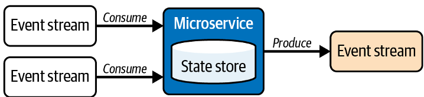

>Figure 1-1. A simple two-input, one-output event-driven microservice, with its own internal state store  

The microservice is entirely responsible for:  

• Consuming events from the selected input stream(s)  

• Producing data to the selected output stream(s)  

• Storing and managing its own state in its own state store  

• Processing, storing, and reacting to the events according to its own business logic  

• Maintaining scalability, both in terms of processing power and state storage  

• Integrating with monitoring solutions  

> [!TIP]
> Consumer microservices consume and process events from one or more input event streams, whereas producer microservices produce events to event streams for other services to consume. It is common for an event-driven microservice to be both.  

Microservices may be stateless or stateful (see Chapter 8), though the vast majority of nontrivial microservices require some state storage. Event-driven microservices may also rely on and communicate with request-response APIs and other third-party endpoints (see Chapter 17). They may be built using lightweight frameworks (see Chapter 13), heavyweight frameworks (see Chapter 12), functions-as-a-service (see Chapter 15), SQL queries (see Chapter 14), or just as a plain old basic producer and consumer frameworks (see Chapter 11).  

In any case, an event-driven microservice, by definition, is driven by an event loop of consuming and/or producing events. Chapter 3 digs deeper into more microservice details, but for now, here are a few primary benefits of event-driven microservices:  

## Technological flexibility  

Services use the most appropriate languages and technologies. This also allows for easy prototyping using pioneering technology.  

## Business requirement flexibility  

Ownership of granular microservices is easy to reorganize. There are fewer cross-team dependencies compared to large services, and the organization can react more quickly to changes in business requirements that would otherwise be impeded by barriers to data access.  

## Loose coupling  

Event-driven microservices are coupled on domain data and not on a specific implementation API. Schemas can be used to greatly improve how data changes are managed, as will be discussed in Chapter 4.  

## Continuous integration and delivery  

It's easy to ship a small, modular microservice, and roll it back if needed.  

## High testability  

Microservices tend to have fewer dependencies than large monoliths, making it easier to mock out the required testing endpoints and ensure proper code coverage.  

## Scalability  

Individual services can scale up and down as needed.  

## Granularity  

Services map neatly to bounded contexts (see the next section) and can be easily rewritten when business requirements change.  

Composing the microservices (nodes) requires examining what responsibilities and work should be on the inside, and what should remain on the outside. Figuring out just where those boundaries lie is where domain-driven design and bounded contexts come in.  

## Introduction to Domain-Driven Design and Bounded Contexts  

Domain-driven design, as coined by Eric Evans in his book of the same title, introduces some important concepts for building event-driven microservices. Given the wealth of articles (such as “What Is the Domain Model in Domain Driven Design?”), books (such as *Implementing Domain-Driven Design*), and internet blogs readily available to talk about this subject, I will keep this section brief.  

The following concepts underpin domain-driven design:  

#### Domain  

The problem space that a business occupies and provides solutions to. This encompasses everything that the business must contend with, including rules, processes, ideas, business-specific terminology, and anything related to its problem space.  

### Subdomain  

A component of the main domain. Each subdomain focuses on a specific subset of responsibilities and typically reflects some of the business's organizational structure (such as warehouse, sales, and engineering). A large subdomain can be seen as a domain in its own right, and may be broken down into further subdomains.  

### Domain (and subdomain) model  

A domain model is a construct that the business uses to represent reality and to write solutions against. Domain models have their own internal terminology that describes their model space, unique to their domain. While other domains may use the same or similar terminology, it may not signify the same thing.  

### *Bounded context*  

The logical boundaries, including the inputs, outputs, events, requirements, processes, and data models relevant to the subdomain. As a best practice, loosely coupling between bounded contexts prevents changes from one context from affecting another context.  

Figure 1-2 shows an example of these concepts illustrated as a box diagram.  

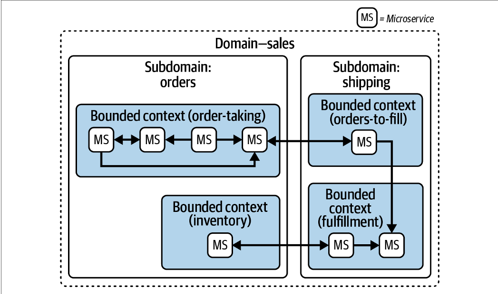

>Figure 1-2. Domains, subdomains, bounded contexts, and microservices  

At the highest level in the diagram is the sales domain, which is itself a subdomain of the entire business as a whole (not shown for simplicity). Within this domain are two subdomains, the orders domain and the shipping domain. Within each of these are an assortment of bounded contexts, each responsible for fulfilling a set of business requirements—for example, taking orders, managing inventory, queuing up orders to fill, and fulfillment itself.  

You may notice that some bounded contexts contain multiple microservices, while some contain just one. There is no strict rule for the quantity of microservices within a bounded context. The only requirement is that the services within fulfill the purpose of that context. Just one service can fulfill some bounded contexts; others may use several, each with its own different technology choices and responsibilities.  

By aligning bounded contexts on business requirements, teams can focus on solving their specific problems in a loosely coupled and highly cohesive way. They have autonomy to design and implement a solution for the specific business needs, which greatly reduces inter-team dependencies and enables each team to focus on their own requirements.  

In contrast, creating microservices that provide general technical capabilities commonly leads to problems. This pattern is often seen in point-to-point request-response microservices and in traditional monolith-style computing systems, where teams own specific technical layers of the application.  

The main issue with technological alignment is that it distributes the responsibility of fulfilling the business function across *multiple teams and services*. Because no single team is solely responsible for implementing a solution, each service becomes coupled to another across both team and API boundaries, making changes difficult and expensive. A seemingly innocent change, a bug, or a failed service can have serious ripple effects to the business-serving capabilities of all services that use the technical system. Eliminating cross-cutting technological and team dependencies will reduce a microservice's sensitivity to change, letting you focus your efforts on solving business problems, not coupling problems.  

> [!NOTE]
> Technologically aligned services still have their uses for serving non-functional requirements, like authentication, authorization, logging, and monitoring use cases. Do not develop your own solutions for each and every microservice.  

Figure 1-3 shows two scenarios: sole ownership on the left and cross-cutting ownership on the right. With sole ownership, the team is fully organized around the two independent business requirements (bounded contexts) and has complete control over its application code and the data storage layer. On the right, the teams have been organized via technical requirements, where the application layer is managed separate from the data layer. This creates explicit dependencies between the teams, as well as implicit dependencies between the business requirements.  

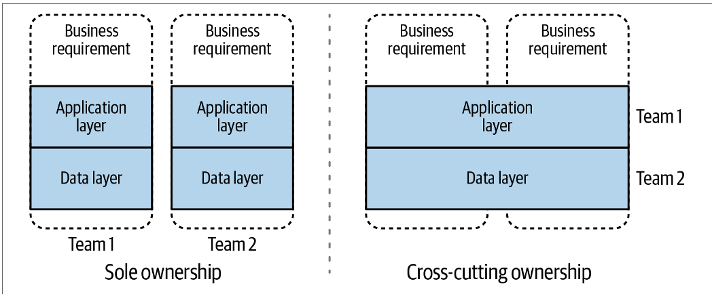

>Figure 1-3. Alignment on business contexts versus on technological contexts  

While it is most common to model your event-driven microservice architectures around business requirements, there are trade-offs that you must consider. You may encounter code replication, as multiple services may need to do the same sort of work.  

Code may be replicated to multiple services, and many services may use similar data access patterns. Developers may try to reduce repetition by exposing their data directly to other services, leading to tighter coupling and complex APIs that must serve a multitude of business use cases. In these cases, the subsequent tight coupling may be far more costly in the long run than repeating logic and storing similar data. These trade-offs will be examined in greater detail throughout this book.  

## Microservices, Boundaries, and Communication Structures  

To cut to the chase, event-driven microservices work well because they decouple what a service *does* from how it *accesses data*. Where legacy monolithic systems and request-response-based point-to-point microservices bundle data and service together into the same unit, event-driven microservices split them apart. But let's back up for a moment and look at this from a communications perspective, to get an idea of just how powerful this decoupling is.  

An organization's teams, systems, and people all must *communicate* with one another to fulfill their goals. These communications form an interconnected topology of dependencies called a *communication structure*. There are three main communication structures, and each affects the way businesses operate.  

## Business Communication Structures  

The *business communication structure* (see Figure 1-4) embodies communication between teams and departments, each driven by the major requirements and responsibilities assigned to it. For example, engineering produces software products, sales sells to customers, and support ensures that customers and clients are satisfied. The organization of teams and the provisioning of their goals, from the major business units down to the work of the individual contributor, fall under this structure.  

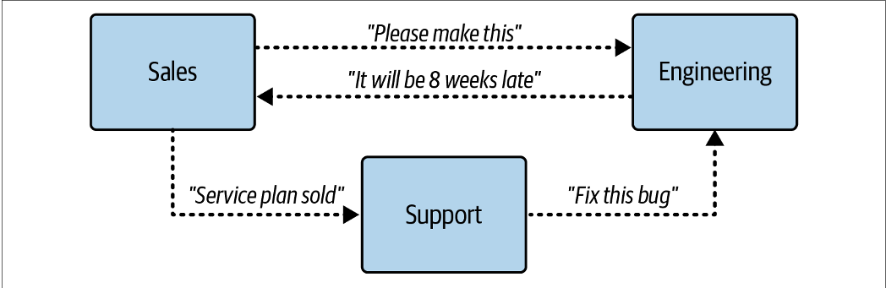

>Figure 1-4. Sample business communication structure  

## Implementation Communication Structures  

The *implementation communication structure* (see Figure 1-5) is the data and logic that builds up a solution to solve a business problem. It formalizes business processes and data structures *into code* so that business operations can be performed quickly and efficiently. An implementation communication structure is the hardened code, data, and APIs that make up a computerized solution.  

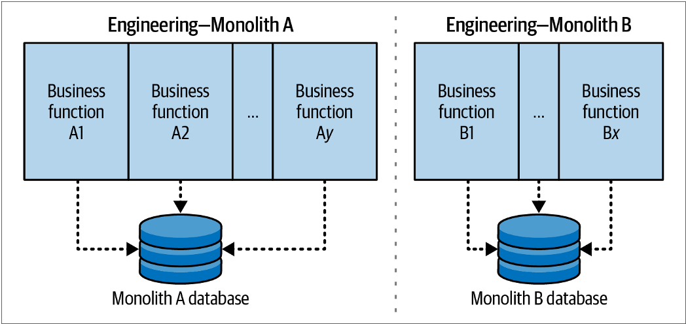

>Figure 1-5. Sample implementation communication structure  

The quintessential historical example of an implementation communication structure for software engineering is the monolithic database application. The business communication structure defines what it is the services need to do, and the implementation communication structure does them.  

### Data Communication Structures  

The third and final communication structure in this three-layer model is the *data communication structure*, as illustrated in Figure 1-6.  

This is the communication structure that enables businesses to access *data* from across the organization. For human-to-human data communication, we have things like instant messaging, email, and phone calls. But what options do you have for the computerized implementations that serve our business use cases?  

The unfortunate truth is that the data communication structure of an organization is usually neglected and left as an afterthought. It's most commonly found as a haphazard bolted-on interface to the service itself, relying on it to play double duty as both the implementation communication structure (serving business use cases) and also providing data communications. New services are often left to their own devices to figure out how to get their own data, or else they may simply wrap it into the same
implementation, regardless of whether it *should* be in there.  

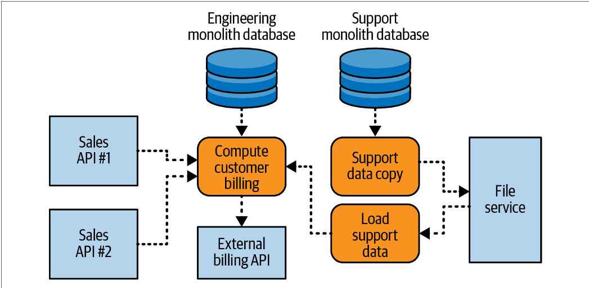

>Figure 1-6. Sample ad hoc data communication structure  

The fact of the matter is that while an implementation may do very well at solving its business problems, it's unreasonable to expect it to also be a first-class citizen in providing its data to other services. This is where event-driven microservices come in, decoupling the data communication structure from the implementation itself.  

But there's another major social force at play that influences how we build our
services.  

## Conway's Law and Communication Structures  

Organizations which design systems...are constrained to produce designs which are copies of the communication structures of these organizations.  

—Melvin Conway, *How Do Committees Invent?* (April 1968)  

This quote, known as *Conway's Law*, implies that a team will build products and services according to the communication structures of its organization. Business communication structures organize people into teams, and these teams typically produce services that are delimited by their team boundaries. These services are limited to accessing data within their own bounded context. But because domain concepts span the business, these services often require important and commonly used data created and stored within other bounded contexts.  

Though they excel at supplying the needs of their own bounded context, implementation communication structures are generally poor at providing data communication.  

Their poor data communication capabilities influence the design of products in two
ways:  

• First, due to the difficulties in communicating important common domain data across the organization, they discourage the creation of new, logically separate products.  

• Second, they provide easy access to existing domain data within their own bounded context making it attractive to collocate your new service functionality within the same bounded context. After all, you can get access to the data and the database, and you don't need to worry about setting up any deployment pipelines or monitoring. This particular pattern is embodied by monolithic designs.  

These two properties act as a carrot and a stick. The latter provides the carrot, luring you to keep everything in one safe store. The former acts as a stick, forcing you to confront and deal with data access problems *before* you can even get started on building your service.  

> [!WARNING]
> If you find that it is too hard to access data in your organization or that your products are scope-creeping because all the data is located in a single implementation, you're likely encountering the lack of data communication structure. This problem will grow as your organization grows, develops new products, and increasingly needs to access commonly used domain data.  

Some organizations attempt to mitigate the inability to access domain data from
other implementations, but these efforts have their own drawbacks:  

• Shared databases result in inappropriate coupling between services on internal data models.  

• Read-only database replicas can remedy performance issues in heavy database querying, but they still lead to tight coupling on private domain models.  

• Periodically executed batch processes can dump data into a file store for other processes, but leads to complexity and performance considerations both in the creation and ingestion of the data. Furthermore, it's error prone and can result in duplicate data, missing data, and multiple sources of what should be the same data (but isn't).  

Event-driven architectures in the form of event streams provide the solution to these data communication issues, but requires you to invest into event-driven architectures. Still not yet convinced? Let's look at a real-life scenario that's repeated daily around the world.  

## Communication Structures in Traditional Computing  

Consider the following scenario. A single team has a single service backed by a single data store. They are happily providing their business functions, and all is well in the world. One day the team lead comes in with a new business requirement. It's somewhat related to what the team is already doing and could possibly just be added on to its existing service. However, it's also different enough that it could go into its own new service, particularly as the team is growing and it's getting challenging to keep up with all the new features and products.  

The team is at a crossroads: does it implement the new business requirement in a new service or simply add it to the existing service? Let's take a look at the team's options in a bit more detail.  

### Option 1: Make a New Service  

The business requirement is different enough that it could make sense to put it into a new service. But what about data? This new business function needs some of the old data, but that data is currently locked up in the existing service. Additionally, the team doesn't really have a process for launching new, fully independent services.  

On the other hand, the team is getting big, lots of other teams are working on the same service (and breaking it sometimes), and the company is growing quickly. If the team has to be divided in the future, having modular and independent systems may make divvying up ownership much easier.  

### Option 2: Add It to the Existing Service  

The other option is to create the new data structures and business logic within the existing service. After all, the data is already in the data store, and the logging, monitoring, testing, deployment, and rollback processes are already defined and in use. The team is familiar with the system and can get to work immediately on implementing the business logic. But there are also significant risks associated with this approach, primarily around coupling, sustainable growth, and scalability.  

## Pros and Cons of Each Option  

Given these two options, many would choose the second option of adding the functionality to the existing system. There is nothing wrong with this choice; monolithic architectures are useful and powerful structures and can provide exceptional value to a business. But their reasons for choosing this second option are based around two main problems:  

• Accessing another system's data is difficult to do reliably, especially at scale and in real time.  

• Creating and managing new services has substantial overhead and risk associated with it, especially if there is no established way to do so within the organization.  

Accessing local data is always easier than accessing data in another data store. Any data encapsulated in another team's data store is difficult to obtain, as it requires crossing both implementation and business communication boundaries. This becomes increasingly difficult to maintain and scale as data, connection count, and performance requirements grow.  

Though copying data into your new service is a worthy approach, it's not foolproof. This model encourages many direct point-to-point couplings, which become problematic to maintain as an organization grows, business units and ownership change, and products mature and phase out. You must also take care to not expose the internal data model of the source system, lest other systems tightly couple to it. The internal data model is a system's private domain, and the system's owners should be free to change it as their business requirements demand.  

Scalability, performance, and system availability are often issues for both systems, as the data replication query may place an unsustainable load on the source system. Failed sync processes may not be noticed until an emergency occurs. Tribal knowledge may result in a team copying a copy of data, thinking that it's the original source of truth.  

Copied data will always be somewhat stale by the time the query is complete and the data is transferred. The larger the data set and the more complex its sourcing, the more likely a copy will be out of sync with the original. This is problematic when systems expect one another to have perfect, up-to-date copies, particularly when communicating with one another about that data. For instance, a reporting service may report different values than a billing service due to staleness. This can have serious downstream consequences for service quality, reporting, analytics, and monetary-based decision making.  

The inability to efficiently disseminate data throughout a company is not due to a fundamental flaw in the concept. Quite the contrary: it's due to a weak or nonexistent data communication structure. By providing data as a first-class citizen through event streams, you can provide a robust data communication structure that can power any and all services across your organization.  

## The Team Scenario, Continued  

Fast-forward a year. The team decided to go with the second option and incorporate the new features within the same service. It was quick, it was easy, and the team has implemented several new features since then. As the company has grown, the team has grown, and now it is time for it to be reorganized into several smaller, more focused teams.  

Each new team must now claim certain business functions from the previous service. The business requirements of each team are neatly divided based on areas of the business that need the most attention. Dividing the implementation communication structure, however, is not proving to be easy. Just as before, it seems that the teams each require large amounts of the same data to fulfill their requirements. New questions arise:  

• Which team should own which data?  

• Where should the data reside?  

• What about data where some teams need to modify the values?  

The team leads decide that it may be best to just share the service instead, and they can all work on their respective modules. This will require a lot more cross-team communication and synchronization of efforts, which may be a drag on productivity. And what about in the future, if they double in size again? Or if the business requirements change enough that they're no longer able to fulfill everything with the same data structure?  

## Event-Driven Data Communication  

As introduced in Figure 1-1, the event-driven approach offers an alternative with several major benefits, including:  

Events form a durable canonical record  

Events represent important business facts and can comprise several types of data (explored further in Chapter 4). Nearly anything can be communicated as an event, from simple occurrences to complex, stateful records. Events are the data; they are not merely signals indicating data is ready elsewhere or just a means of direct data transfer from one implementation to another. Rather, events and their streams act both as data storage and as a means of asynchronous communication between services.  

### Limitation of producer responsibilities  

Producers must write the data they intend to share to an event stream. They are responsible for the format, schema, and contents of the event, as well as producing them to the stream when the conditions are met. They are not, however, responsible for supporting the querying needs and requirements of other services. Instead, they abdicate that responsibility by publishing events, leaving it up to the consumer to build their own data models and querying layers.  

### Separation of consumer responsibilities  

Consumers consume events at their own rate of progress, react to their contents, update their data models, and potentially emit their own events in turn. The consumer remains fully responsible for any mixing of data from multiple event streams, special query functionality, or other business-specific implementation logic. A consumer does *not* rely on the producer to provide it with a querying API—instead, it relies just on the events written by the producer service(s).  

### Events form a canonical replayable record  

There's no more need to figure out how to get data encapsulated within some system—you simply consume it from the associated event stream. Events form a continuous, canonical narrative detailing everything that the producer chooses to share. Event streams become the primary means by which systems communicate with one another, providing a reusable source of data for all other systems and services.  

### Events provide independence from a specific implementation  

Event streams contain core events central to the operation of the business. Though teams may restructure and projects may come and go, the core data remains readily available to any new service, independent of any specific implementation communication structures. In other words, you can swap one event-stream producer for another without any impact to downstream consumers.  

#### Align services with business needs  

Given that data is freely accessible through event streams, you can now mix and match events to build up your own data models. You can freely choose the technologies you need to support your own business use cases, building microservices that map neatly to the bounded context of the problem space.  

> [!TIP]
> You don't have to share *all* the data as event streams, but only the data that other teams require. Just as a monolith restricts access to its own internal data model, so too does an event-driven microservice.  

## Example Team Using Event-Driven Microservices  

Let's revisit the team from earlier but with an event-driven data communication structure.  

The team receives a new business requirement. It's somewhat related to the business functions provided by their current services, but different enough that it may be best to implement it with its own dedicated service. Does adding it to an existing service overextend and distort the currently defined bounded context? Or is it a simple extension, perhaps the addition of some new related data or functionality, of an existing service?  

In an event-driven architecture, the team can create a new microservice and ingest the data to power that feature from the event streams. The team can process and populate its data model using the historical event-stream data, keeping only the fields and values that the service cares about while discarding the rest. Storage and data modeling is left entirely up to the team, as is the application life cycle.  

Business risks are also alleviated, as the small, finer-grained services allow for single team ownership, enabling the teams to scale and reorganize as necessary. When the team grows too large to manage under a single business owner, it can split up and reassign ownership of its microservices in a much more granular way. Event-stream ownership moves with the producing service, providing a clear and well-defined lineage and responsibility model.  

Microservice architectures can prevent spaghetti code and expansive monoliths from sprawling further, given a minimal overhead for creating new microservices and accessing event-stream data. Scaling concerns are now focused on individual event-processing services, which can scale their CPU, memory, disk, and instance count as required. The remaining scaling requirements are offloaded onto the data communication structure, which must ensure that it can handle the various loads of services consuming from and producing to its event streams.  

To do all of this, however, the team needs to ensure that the data is indeed present in the data communication structure, and must have the means for easily spinning up and managing a fleet of microservices. This requires an organization-wide adoption of event-driven microservice architecture.  

Before wrapping up this chapter, there's one more subject to cover. Even though this book isn't specifically about request-response microservices, it's worth taking a brief look at them before getting deeper into the nuts and bolts of event-driven microservices.  

## Request-Response Microservices  

Services can communicate with each other asynchronously through events via an event stream, or directly via a request-response architecture. I’ve historically called these types of services “synchronous” services, since they require that both the requestor and the responder be online and ready to work. But as many have pointed out to me, request-response architectures can be synchronous (the requestor blocks until it receives a response) and asynchronous (the requestor wraps the request in a Future, then checks back in later for the response). So to be precise, let’s stick with “request-response” architecture, where one service directly communicates with the other through a request, and not through a stream of events.  

### Drawbacks of Request-Response Microservices  

Several issues with request-response microservices make them difficult to use at large scale. This is not to say that a company cannot succeed by using request-response microservices, as evidenced by the achievements of companies such as Netflix, Lyft, Uber, and Facebook. But many companies have also made fortunes using archaic and horribly tangled spaghetti-code monoliths, so do not confuse the ultimate success of a company with the quality of its underlying architecture.  

Furthermore, note that neither point-to-point request-response microservices nor asynchronous event-driven microservices are strictly better than the other. Both have their place in an organization, as some tasks are far better suited to one over the other. However, in my own experiences and that of many of my peers and colleagues, event-driven microservice architectures offer an unparalleled flexibility and power that is absent in request-response microservices. Perhaps you’ll come to agree as you proceed through this book, but at the very least, you’ll gain an understanding of their strengths and drawbacks.  

Following are some of the biggest shortcomings of request-response microservices.  

### Point-to-point couplings  

Request-response microservices rely on other services to help them perform their business tasks. Those services, in turn, have their own dependent services, which have their own dependent services, and so on. This can lead to excessive fanout and difficulty in tracing which services are responsible for fulfilling specific parts of the business logic. The number of connections between services can become staggeringly high, which further entrenches the existing communication structures and makes future changes more difficult.  

### Dependent scaling  

The ability to scale up your own service depends on the ability of all dependent services to scale up as well and is directly related to the degree of communications fanout. Implementation technologies can be a bottleneck on scalability. This is further complicated by highly variable request-and-response load patterns, which all need to be handled synchronously across the entire architecture.  

### Service failure handling  

If a dependent service is down, then the calling service must decide how to handle the exception. Deciding how to handle the outages, when to retry, when to fail, and how to recover to ensure data consistency becomes increasingly difficult the more services there are within the ecosystem.  

### API versioning and dependency management  

Multiple API definitions and service versions will often need to exist at the same time. It is not always possible or desirable to force clients to upgrade to the newest API. This can add a lot of complexity in orchestrating API change requests across multiple services, especially if they are accompanied by changes to the underlying data structures.  

### Data access tied to the implementation  

Request-response microservices have all the same problems as traditional services when it comes to accessing external data. Although there are service design strategies for mitigating the need to access external data, microservices will often still need to access commonly used data from other services. This puts the onus of data access and scalability back on the implementation communication structure.  

### Distributed monoliths  

Services may be composed such that they act as a distributed monolith, with many intertwining calls being made between them. This situation often arises when a team is decomposing a monolith and decides to use synchronous point-to-point calls to mimic the existing boundaries within that monolith. Point-to-point services make it easy to blur the lines between the bounded contexts, as the function calls to remote systems can slot in line-for-line with existing monolith code.  

### Testing  

Integration testing can be difficult, as each service requires fully operational dependents, which require their own in turn. Stubbing them out may work for unit tests, but seldom proves sufficient for more extensive testing requirements.  

### Benefits of Request-Response Microservices  

Several undeniable benefits are provided by request-response microservices. Certain data access patterns are favorable to direct request-response couplings, such as authenticating a user and reporting on an AB test. Integrations with external third-party solutions almost always use a request-response mechanism and generally provide a flexible, language-agnostic communication mechanism over HTTP.  

Tracing operations across multiple systems can be easier in a request-response environment than in an event-driven asynchronous one. Detailed logs can show which functions were called on which systems, allowing for high debuggability and visibility into business operations.  

Services hosting web and mobile experiences are by and large powered by request-response designs. Clients receive a timely response dedicated entirely to their needs.  

The experience factor is also quite important, especially as many developers in today's market tend to be much more experienced with request-response, monolithic-style coding. This makes acquiring talent for request-response systems easier, in general, than acquiring talent for asynchronous event-driven development.  

> [!TIP]
> A company's architecture could only rarely, if ever, be based entirely on event-driven microservices. Hybrid architectures are certainly the norm, where synchronous, asynchronous, request-response, and event-driven solutions operate side-by-side as the problem space requires.  

Chapter 17 revisits request-response architectures and shows several common patterns for integration into event-driven architectures.  

#### Summary  

Event-driven microservices provide a powerful framework for building purpose-built applications to solve your business problems. Fundamental to its success is rethinking how you create and communicate data across the company. Data communication structures are often underdeveloped and ad hoc, but the introduction of a durable, easy-to-access set of domain events, as embodied by event-driven systems, enables smaller, purpose-built implementations to be used.  

This chapter just scratches the surface of event-driven microservices. The next two chapters will respectively dig deeper into both event streams and microservices, providing you with the basic building blocks for the remainder of this book.  

# Fundamentals of Events and Event Streams

Event streams served by an *event broker* tend to be the dominant mode for powerful event-driven architectures, though you'll find that queues and ephemeral messaging also have a place. The second half of this chapter will cover each of these modes in more detail.  

For now, let's now take a closer look at events, records, and messages, as well as the relationship between an event stream and an event broker.  

### What's an Event?  

An event can be anything that has happened within the scope of the business communication structure. Receiving an invoice, booking a meeting room, requesting a cup of coffee (yes, you can hook up a coffee machine to an event stream), hiring a new employee, and successfully completing arbitrary code are all examples of events that happen within a business. It is important to recognize that events can be anything that is important to the business. Once these events start being captured, event-driven systems can be created to harness and use them across the organization.  

An event is a *recording* of what happened, much like how an application's information and error logs record what takes place in the application. Unlike these logs, however, events are *also* the single source of truth, as covered in **Chapter 1**. As such, they must contain all the information required to accurately describe what happened.  

Events are immutable. You can't modify an event once it is published to the event stream. Immutability is an essential property for ensuring that consumers can access the exact same data. Mutating data that has already been read by several consumers is of no benefit, since there is no way to easily notify them that they must make a change to data that they've already read. You can, however, create and publish a new event containing the necessary corrections or updates.  

Events use schemas, which is covered in more detail in Chapter 4. For now, consider events to have well-defined field names, types, and default values.  

I avoid using the term *message* when discussing event streams and event-driven architectures. It's an overloaded term that has different meanings for different people, and is also heavily influenced by the technology you're using. Think about what messages mean in our day-to-day life, particularly if you use instant messaging. One person sends a message *to* a specific person or *to* a specific private group. Additionally, the messages may or may not be durable—some chat applications delete the messages after they're read, others after a period of time.  

Events in an event-driven architecture are more akin to a post that you publish to a social media platform or message board. The posting is public to all who have access, and everyone is free to read it and use it as they see fit. More than one person can read the post, and of course the post can be read again and again. It isn't deleted just because it's old. Event streams are effectively a *broadcast* to share important data, letting others subscribe to it and use it however they see fit.  

Just to be clear, you can use event streams to send messages. All messages are events, but not all events are messages. But for clarity's sake, I'll use the terms event and record instead of message for the remaining chapters of this book. But before we dig further into events, let's take a brief look at the event stream.  

### What's an Event Stream?  

An event stream is a durable and append-only immutable log. Records are added to the end of the log (the tail) as they are published by the producer. Consumers begin at the start of the log (the head) and consume records at their own processing rate.  

In its most basic form, an event stream is a timestamped sequence of business facts pertaining to a domain. Events form the basis for communicating important business data between domains reliably and repeatedly.  

Event streams have several critical properties that enable us to rely on them for event-driven microservices, and as the basis for effective inter-domain data communication as a whole. For clarity, and with a bit of repetition, these properties include:  

##### Immutability  

Events cannot be modified once written to the log. The contents cannot be altered, nor can their offset position, timestamp, or any other associated metadata. You may only add new events.  

##### Partitioned  

Partitions provide the means for supporting massive data sets. A consumer can subscribe to one or more partitions from a single event stream, allowing multiple instances of a single microservice to consume and process the stream in parallel.  

##### Indexed  

Events are assigned an immutable index when written to the log. The index, also often called an offset, uniquely identifies the event.  

#### Ordered  

Records in an event-stream partition are served to clients in the exact same order
that they were originally published.  

#### Durability and replayability  

Events are durable. They can be consumed either immediately or in the future. Events can be replayed by new and existing consumers alike, provided the event broker has sufficient storage to host the historical data. Events are not deleted once they are read, nor are they simply discarded in the case of an absence of consumers.  

#### Indefinite storage support  

You can retain all events in your stream for as long as necessary. There is no forced expiry or time-limited retention, allowing you to consume and reconsume events as often as you need.  

Figure 2-1 shows an event stream with three partitions. New events have just been appended to partition 0 (offset 5) and partition 1 (offset 7). The microservice consuming these events has two instances. Instance 0 is consuming only partition 0, whereas instance 1 is consuming both partition 1 and partition 2.  

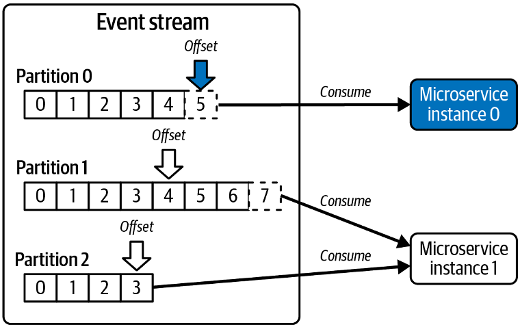

>Figure 2-1. An event stream with two microservice instances consuming from three partitions  

With sufficient processing power, the consuming service will remain up-to-date with the event stream. Meanwhile, a new consumer beginning at an earlier offset (or the head) will need to process all events to catch up to the latest event. Microservice instance 1 in Figure 2-1 is currently at offset 4 and must still process 5, 6, and 7.  

Event streams are hosted on an event broker, with one of the most popular (and de-facto standard) being Apache Kafka. The event broker, such as in the case of Kafka, provides a structure known as a topic that we can write our events to. It also handles everything from data replication and rebalancing to client connections and access controls. Publishers write events to the event stream hosted in the broker, while consumers subscribe to event streams and receive the events.  

Unfortunately, due to a long and often messy history, event brokers have often been confused with ephemeral messaging and queues. Each of these three options is different from the others. Let’s take a deeper look at each, and why event streams form the backbone of a modern event-driven architectures.  

## Ephemeral Messaging  

A channel is an ephemeral substrate for communicating a message between one producer and one or more subscribers. Messages are directed to specific consumers, and they are not stored for any significant length of time, nor are they written to durable storage by the broker. In the case of a system failure or a lack of subscribers on the channel, the messages are simply discarded, providing at-most-once delivery. NATS.io Core (not JetStream) is an example of this form of implementation.  

Figure 2-2 shows a single producer sending messages to the ephemeral channel within the event broker. The ephemeral messages are then passed on to the currently subscribed consumers. In this figure, consumer 0 obtains messages 7 and 8, but consumer 1 does not because it is newly subscribed and has no access to historical data. Instead, consumer 1 will receive only message 9 and any subsequent messages.  

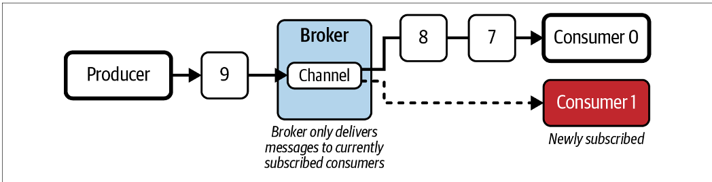

>Figure 2-2. An ephemeral message-passing broker forwarding messages  

Ephemeral communication lends itself well to direct service-to-service communication with low overhead. It is a message-passing architecture, and is not to be confused with a durable publish-subscribe architecture as provided by event streams.  

Message-passing architectures provide point-to-point communication between systems that don't necessarily need at-least-once delivery and can tolerate some data loss. As an example, the online dating application Tinder uses NATS to notify users of updates. If the message is not received, it's not a big deal—a missed push notification to the user only has a minor (though negative) effect on the user experience.  

Ephemeral message-passing brokers lack the necessary indefinite retention, durability, and replayability of events that we need to build event-driven data products. Message-passing architectures are useful for event-driven communication between systems for current operational purposes but are completely unsuited for providing the means to communicate data products.  

### Queuing  

A queue is a durable sequence of stored records awaiting processing. It is fairly common to have multiple consumers that asynchronously (and competitively) select, process, and acknowledge records on a first-come, first-served basis. This is one of the major differences when compared to event streams, which use partition-exclusive subscriptions and strict in-order processing.  

Two common and free open source queue brokers include RabbitMQ and Apache ActiveMQ. Both of these provide robust queueing semantics and support common queueing protocols, including both Advanced Message Queuing Protocol (AMQP) and Message Queuing Telemetry Transport (MQTT). These protocol standards enable interoperability with other frameworks, clients, and services.  

One common use of a queue is as a work queue. The producer publishes records representing work to do. The consumers cooperatively dequeue the records, process them, and then signal the queue broker that the work is complete on a per-record basis. The broker then typically deletes the processed records, which is the second major difference when compared to the event stream, as the latter retains the records as long as specified (including indefinitely).  

Figure 2-3 shows two subscribers consuming records from a queue in a round-robin manner. Note that the queue contains records currently being processed (dashed lines) and those yet to be processed (solid lines).  

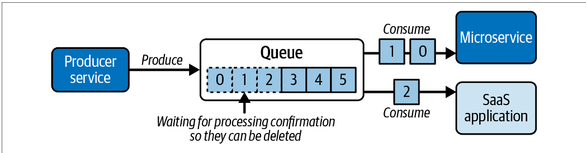

>Figure 2-3. A queue with two subscribers, each processing a subset of events  

Queues typically provide *at-least-once* processing guarantees. Records may be processed more than once, particularly if a subscriber fails to commit its progress back to the broker, say, due to a crash. In this case, another subscriber picks up the record and processes it again.  

Queue brokers can also provide *priority-based record ordering* for their consumers, so that high-priority records get pushed to the front, ahead of lower-priority records. Queues provide an ideal data structure for priority ordering, since they do not enforce a strict first-in, first-out ordering like an event stream.  

If multiple independent consumers (e.g., microservice applications) each need access to the records in the queue, then you have to make a decision. One option is to use a per-consumer queue, ensuring that each consumer obtains their own copy of the record through their own queue. A second option is to use a durable event stream, where each consumer gets a copy of each record all sourced from a single logical queue. Let's take a look at each of these options in turn.  

### Queues via Modern Queue Brokers  

Modern queue brokers provide a *publish-subscribe* mechanism that allows for loose coupling between a producer and its interested consumers. Instead of publishing directly to each and every queue that may need the record, the producer sends its message to an *exchange* hosted on the broker. The exchange then routes a *copy* of the record to each subscribing queue that is registered at the time the exchange receives the record. Figure 2-4 shows an example of this behavior.  

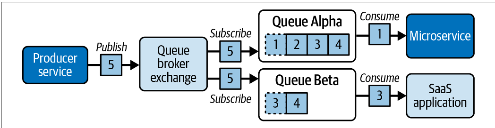

>Figure 2-4. An exchange distributing records to each subscribed queue  

The producer service publishes its records to the exchange, which in turn provides a copy to each of the Alpha and Beta queues.  

> [!NOTE]
> Modern queue brokers may also support replayability and infinite retention of records via durable append-only logs—effectively the same as an event stream. For example, both Solace and RabbitMQ Streams allow for individual consumers to replay queued records as though they were event streams.  

Historically, queue brokers have limited the time-to-live (TTL) for storing records in the queue. Records not processed within a certain time frame are marked as dead, purged, and no longer delivered to the subscribers. Similar to ephemeral communications, time-based retention and nonreplayable data has influenced the false notion that brokers (queue and event alike) cannot be used to retain data indefinitely.  

With that being said, it is important to note that short TTLs are no longer the norm, at least for the more modern queue technologies. For example, both RabbitMQ and ActiveMQ let you set unlimited TTL for your records, letting you keep them in the queue for as long as is necessary for your business.  

Queues provide excellent input buffer capabilities for parallelizable work, particularly where order of the events is not important. You can rely on a queue to buffer records that need processing by another system, allowing the producer application to get on with its other tasks. The queue will durably store all the records until your consumer service can get to working on them. Additionally, your consumer can scale up its processing by registering new consumers on the queue, and sharing processing in a round-robin manner.  

## Queues via Apache Kafka  

One of the big changes since the first edition of this book is the introduction of
queues for Kafka (KIP-932) as an early access release for Kafka 4.0. Historically, Kafka
has not provided any queue functionality, so if you wanted to implement a queue
(and not an event stream) you were forced to use something else.  

But what's wrong with using an event stream as a queue? Here are a few of the
original problems that the KIP-932 contributors resolved:  

One consumer per-partition limitation  

When consuming a stream of records as an event stream, Kafka will allow only one consumer instance to consume per partition. You cannot add other instances to process that partition under the same consumer group.  

### Head-of-line blocking  

Given that there is only one consumer instance per partition, if a record is taking a very long time to process, no additional forward progress can be made until it is finished. It is blocked by the record at the head of the line.  

### Per-record failures and retries  

There is no per-record retry mechanism, nor any way to mark if a record is failed (perhaps it has been retried three times already). With the Kafka consumer protocol for event streams, you must acknowledge the entire batch of consumed records, or redo the entire batch. Any per-record tracking would need to be implemented in custom code within the consumer.  

Queues for Kafka (KIP-932) introduces the concept of a *share group*. It is similar to the **Kafka consumer group** (discussed more in the next chapter, and illustrated in Figure 3-2), but it treats the append-only log of a Kafka topic as a *queue* instead of as an event stream. This feature allows consumers to read, process, and commit progress back to the broker as though they were consuming from a queue, not an event stream.  

KIP-932 provides the comprehensive details about exactly how it works. In short, you instantiate a KafkaShareConsumer that registers its own share group, which enables the following features:  

#### Multiple instances per partition  

Consumer instances can share processing of a single partition for much higher throughput. Record batches are distributed to each consumer instance and can be processed out of order.  

#### Individual record acknowledgment  

Records are acknowledged individually. There is no more head-of-line blocking as the consumers can process and acknowledge the records in any order.  

#### Retries  

The failure to process a record is tracked by the share group, and can be retried multiple times until reaching a maximum count (default 5) or until success.  

#### Processing timeouts  

Share groups can release records that have timed out during processing for other instances to process, say, due to an individual instance failure.  

#### Rewindable progress  

Share groups can be rewound to replay data from a specific offset. Unlike traditional queues, the data in a Kafka topic is not deleted after processing.  

Queues for Kafka add extra flexibility to the event broker architecture, allowing you to use queue semantics without having to spin up and manage a dedicated queue broker.  

### The Structure of an Event  

Events, as written to an event stream, are typically represented using a key, a value, and a header. Together, these three components form the record representing the event. An example of the record structure is shown in Figure 2-5, containing a minimal set of details pertaining to an ecommerce order.  

| Record|datetime: 1737392751, custom_field_1:  "didáctica "|
| ---|---|
| Key|OrderID: 6232729|
| Value|CustomerID: 7819810923871, Address:  "123 Fake Street ", Products: [123, 444, 728], Costs: [12.99, 22.99, 6.00], Subtotal: 41.98, Taxes: 5.46, Total: 47.44|  

>Figure 2-5. A simple ecommerce order showing the items purchased by a user, along with the total cost  

The header (also known as record properties)  

Contains metadata about the event itself, and is often a proprietary format depending on the event broker. The record is usually used to record information such as datetimes, tracking IDs, and user-defined key-value pairs that aren’t suitable for the value.  

The key  

The key is optional but extremely useful. It is most commonly used to route the event to a specific partition of the event stream, so that all records of the same key are colocated. It can also be used to represent a unique entity, which is covered in more detail in “Entity Events” on page 32.  

The value  

Contains the bulk of the data relating to the event. If you think of the event key as the primary key of a database table’s row, then think of the value as all the other fields in that row. The value carries the majority of an event’s data.  

The record’s exact structure will vary with your technology of choice. For example, queues and ephemeral messaging tend to use similar yet different conventions and components, such as header keys, routing keys, and binding keys, to name a few. But for the most part, following this three-piece record format is generally applicable for
all events.  

Events tend to fall into three main classifications: unkeyed events, keyed events, and entity events. Let's take a closer look at each.  

## Unkeyed Events  

Unkeyed events do not contain a key. They're generally considered to be fully independent of one another. There is no special treatment for routing to a particular partition.  

Unkeyed events are commonly some form of raw measurement. For example, a camera that photographs an automobile running through a red light creates an unkeyed event, as shown in Figure 2-6.  

| Record|datetime: 1736322412|
| ---|---|
| Key|null|
| Value|camera_id: 2734578334, photo_uri:  "S3://... " , local_time: 1736297212, measured_speed:  "23 m/s "|  

>Figure 2-6. An unkeyed red-light traffic camera event  

Could the red-light camera have produced the event with the camera_id as the key?
Sure! But it didn't, because it records the data only in that specific format, and this
specific camera doesn't support custom post-processing. You get the event in the
format that it specifies in the user manual.  

If you want to add a key, you'll have to do some additional processing and emit a new
event stream, as you'll see in the next section.  

## Keyed Events  

Keyed events contain a non-null key related to something important about the event.
The event key is specified by the producer service when it creates the record, and
remains immutable once written to the event stream.  

If we were to apply a key to the red light traffic camera data, we may choose to use the driver's license plate. You can see an example of that in Figure 2-7.  

| Record|datetime: 1736322412|
| ---|---|
| Key|license_plate:  "FAST 321 "|
| Value|camera_id: 2734578334, photo_uri:  "S3://... " , local_time: 1736297212, vehicle_color:  "red ", vehicle_type:  "4-door sedan ", vehicle_speed:  "23 m/s "|  

>Figure 2-7. A red-light traffic camera event keyed on the driver’s license plate  

A key enables the producer to partition the records deterministically, with all records of the same key going to the same event-stream partition, as per Figure 2-8. This is known as data locality, and is an essential property for building scalable event-driven microservices.  

Data locality is a guarantee to the consumers that all data of a given key will be in just a single partition. In turn, consumers can easily divide up the work on a per-partition basis, knowing that any key-based work they perform will rely on reading only a single partition, and not all the events from all partitions.  

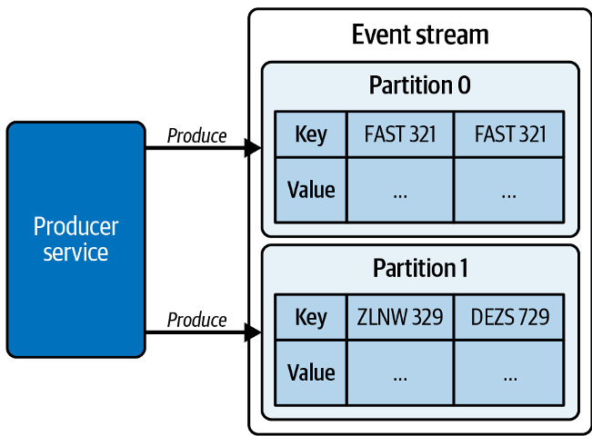

>Figure 2-8. The traffic camera events are partitioned by the license plate key  

As illustrated in the partitioned topic, you can see that there are at least two events for FAST 321. Each of these events represents an instance of the car running through a red light. Keep this in mind as we go to our final event classification, the entity event.  

## Entity Events  

An entity event represents a unique thing, and is keyed on a unique ID that represents that thing. It describes the properties and state of the entity at a specific point in time. Entity events are also sometimes called state events, as they represent the state of a given thing at a given point in time.  

For something a bit more concrete, and to continue the red-light camera analogy, you could expect to see a Car as an entity event. You may also see entity events for Driver, Tire, Intersection, or any other number of “things” involved in the scenario. A Car entity is featured in Figure 2-9.  

| Record|datetime: 1737333331|
| ---|---|
| Key|Item:  "WBAYE4C59DD136996 "|
| Value|make:  "Dodge ", model:  "Charger ", year: 1969, color:  "red ", classification:  "sports car "|  

>Figure 2-9. A Car entity describing the sports car that keeps running the red lights  

You may find it helpful to think of an entity event like you would think of a row in a database table. Both have a primary key, and both represent the data for that primary key as it is at the current point in time. And much like a database row, the data is only valid for as long as the data remains unchanged. Thus, if you were to repaint the car to blue, you could expect to see a new event with the color updated, as in Figure 2-10.  

| Record|datetime: 1737829481|
| ---|---|
| Key|VIN:  "WBAYE4C59DD136996 "|
| Value|make:  "Dodge ", model:  "Charger ", year: 1969, color:  "blue ", classification:  "sports car "|  

>Figure 2-10. The car has been repainted blue  

You may also notice that the datetime field has been updated to represent when the car was painted blue (or at least when it was reported). You’ll also notice that the entity event also contains all the data that didn’t change. This is intentional, and it actually allows us to do some pretty powerful things with entity events (Chapter 5 will cover this subject in more detail).  

Similarly to how *keyed events* each go to the same partition, the same is true for *entity events*. Figure 2-11 shows an event stream with two events for the FAST 321—one when it was red (the oldest event), and one while it is blue (the latest event, appended to the tail of the stream).  

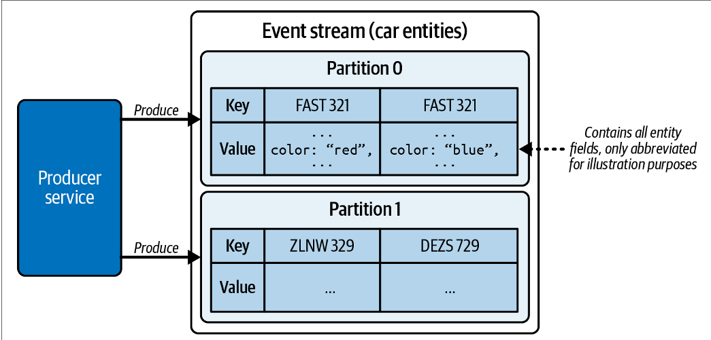

>Figure 2-11. The producer appends a full entity event whenever an entity is created, updated, or deleted  

Entity events are particularly important in event-driven architectures. They provide the basis for *event-carried state transfer* (ECST), as the state of the entity is carried by the event to all consumers. ECST allows for the *materialization* of entity event streams into the consumer's bounded context, which is covered in "Materializing State from Entity Events" on page 36.  

There is more to event design than what has been covered in this chapter so far, but that will have to wait until Chapter 5. Instead, let's look at how we might use these events that I've just introduced to build real-world, event-driven microservices.  

## Repartitioning Event Streams  

Repartitioning is when a service reads events from one stream and writes them to a new stream with a different key, a different key-to-partition mapping strategy, and/or a different partition count. Repartitioning is a key component of event-driven microservices, as it lets you join, group, and aggregate data from streams of varying partition counts, partition strategies, and differing keys. Figure 2-12 shows a micro-service reading from an event stream with two partitions and writing the same data back to a four-partition output stream.  

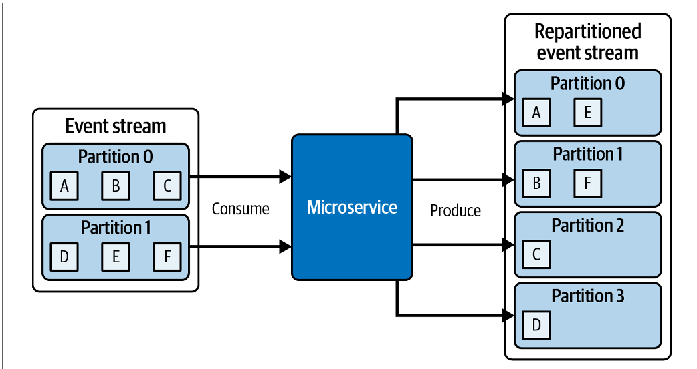

>Figure 2-12. Repartitioning a stream from two to four partitions  

Repartitioning event streams may introduce out-of-order data (explored in more detail in "Multiple producers to multiple partitions" on page 212).  

## Copartitioning Event Streams  

Two event streams are copartitioned when they have the same key, the same key-to-partition mapping strategy, and the same partition count. Copartitioning is required for joins on primary keys, aggregations, and reduce operations, by assigning the same keyed data to the same processing instances for the purposes of data locality. Figure 2-13 shows two microservice instances, each consuming from two copartitioned streams.  

Microservice instance 0 is assigned partition 0 from both copartitioned streams, while instance 1 is assigned partition 1 from both streams. All events with the key of A are routed to instance 0, while all events of key D are routed to instance 1.  

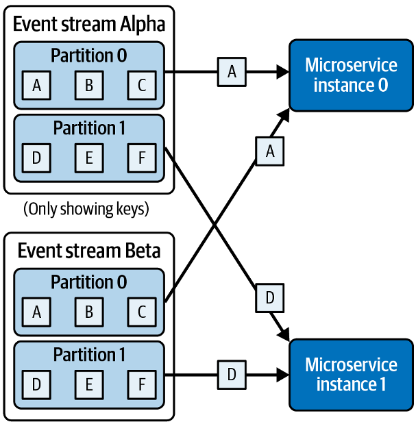

>Figure 2-13. Copartitioned event streams Alpha and Beta consumed by two microservice instances  

## Aggregating State from Keyed Events  

An aggregation is the process of consuming two or more events and combining them into a single result. Aggregations are a common data processing primitive for event-driven architectures, and are one of the primary ways to generate state out of a series of events. Building an aggregation requires storing and maintaining durable state, such that aggregation progress is persisted if the service fails. State and recovery are covered in Chapter 8.  

The keyed event plays an important role in aggregations, since all the data of the same key is in the same partition. Thus, you can simply aggregate a single key by reading a single partition. If you’re reading multiple topics, then you’ll need to ensure that they’re partitioned identically—otherwise, you’re going to have to repartition the data so that the streams match one another. We’ll cover this in the next section.  

An aggregation may be as simple as a sum, as shown in Figure 2-14; for example, summing up the traffic infraction tickets that have been issued to the owner of a speeding sports car, and computing the total of the amount owed.  

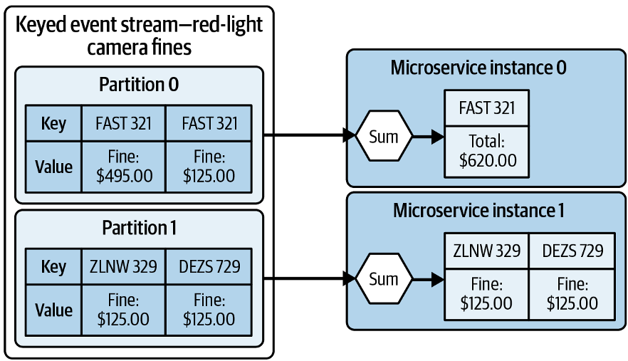

>Figure 2-14. Aggregating the keyed events of the red-light camera fines  

Aggregations may also be more complex, incorporating multiple input streams, multiple event types, and internal state machines to derive more complex results. We’ll revisit aggregations throughout the book, but for now, let’s take a look at materializations.  

### Materializing State from Entity Events  

A materialization is a projection of a stream into a table. You materialize a table by applying entity events, in order, from an entity event stream. Each entity event is upserted into the table, such that the most recently read event for a given key is represented. This is illustrated in Figure 2-15, where FAST 321 and SJFH 372 both have the newest values in their materialized table.  

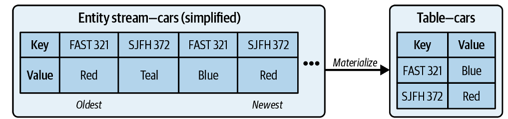

>Figure 2-15. Materializing an event stream into a table  

You can also convert a table into a stream of entity events by publishing each update to the event stream.  

> [!TIP]
> Stream-table duality is the principle that a stream can be represented by a table, and a table can be represented as a stream. It is fundamental to the sharing of state between event-driven microservices, without any direct coupling between producer and consumer services.  

In the same way, you can have a table record all updates and in doing so produce a stream of data representing the table's state over time. In the following example, BB is upserted twice, while DD is upserted just once. The output stream in Figure 2-16 shows three upsert events representing these operations.  

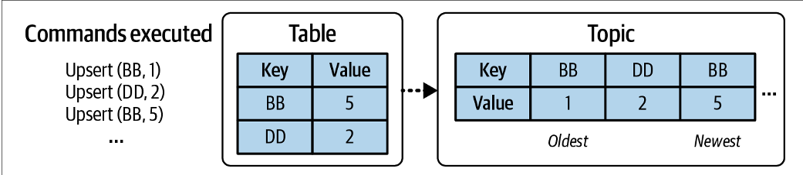

>Figure 2-16. Generating an event stream from the changes applied to a table  

A relational database table is created and populated through a series of data insertion, update, and deletion commands. These commands can be produced as events to an immutable log, such as a local append-only file (like the binary log in MySQL) or an external event stream. By playing back the entire contents of the log, you can reconstruct the table and all of its data contents.  

## Deleting Events and Event-Stream Compaction  

First, the bad news. You can't delete a record from an event stream as you would a row in a database table. A major part of the value proposition of an event stream is its immutability. But you can issue a *new* event, known as a *tombstone*, that will allow you to delete records with the same key. Tombstones are most commonly used with entity event streams.  

A tombstone is a keyed event with its value set to null, a convention established by the Apache Kafka project. Tombstones serve two purposes. First, they signal to the consumer that the data associated with that event key should now be considered deleted. To use the database analogy, deleting a row from a table would be equivalent to publishing a tombstone to an event stream for the same primary key.  

Secondly, tombstones enable compaction. Compaction is an event broker process that reduces the size of the event streams by retaining only the most recent events for a given key. Events older than the tombstone will be deleted, and the remaining events are compacted down into a smaller set of files that are faster and easier to read. Event  

stream offsets are maintained such that no changes are required by the consumers.
Figure 2-17 illustrates the logical compaction of an event stream in the event broker.  

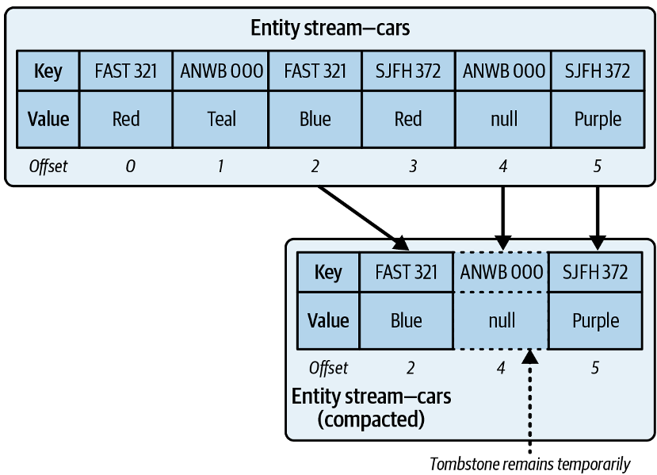

>Figure 2-17. After compaction, only the most recent record is kept for a given key, while all earlier records of the same key are deleted  

The tombstone record typically remains in the event stream for a short period of time. In the case of Apache Kafka, the default value of 24 hours gives consumers a chance to read the tombstone before it too is (asynchronously) cleaned up.  

Compaction is an asynchronous process performed only when a certain set of criteria is met, including dirty ratio, or record count in inactive segments. You can also manually trigger compaction. The precise mechanics of compaction vary with event broker selection, so you'll have to consult your documentation accordingly.  

Compaction reduces both disk usage and the quantity of events that must be processed to reach the current state, at the expense of eliminating a portion of the event-stream history. Compaction typically provides several useful configurations and guarantees, including:  

## Minimum compaction lag  

You can specify the minimum amount of time a record must live in the event stream before it is eligible for compaction. For example, Apache Kafka provides a min.compaction.lag.ms property on its topics. You can set this to a reasonable value, say, 24 hours or 7 days, to ensure that your consumers can read the data before it is compacted away.  

## Offset guarantees  

Offsets remain unchanged before, during, and after compaction. Compaction will introduce gaps between sequential offsets, but there remains no consequences for consumers sequentially consuming the event stream. Trying to read a specific offset that no longer exists will result in an error.  

### Consistency guarantees  

A consumer reading from the start of a compacted topic can *materialize* exactly the same table as a consumer that has been running since the beginning.  

> [!WARNING]
> While you may be able to find tools that allow you to delete records from an event stream manually, be very careful. Manually deleting records can lead to unexpected results, particularly if you have consumers that have already read the data. Simply deleting the records won't fix the consumers' derived state. Prevention of bad data is essential, and is covered more in Chapter 18.  

Stream-table duality and materialization allow services to communicate state between one another. Compaction lets us keep the event streams to a reasonable size, in line with the domain of the data.  

## The Kappa Architecture  

The kappa architecture was first presented in 2014 by Jay Kreps, cocreator of Apache Kafka and cofounder of Confluent. The kappa architecture relies on event streams as the sole record for both current and historical data. Consumers simply start consuming from the start of the stream to get a full picture of everything that has happened since inception, eventually reaching the head of the stream and the latest events, as per Figure 2-18.  

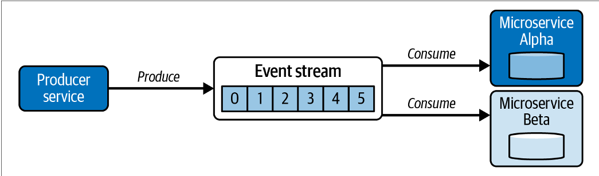

>Figure 2-18. Kappa architecture, with each service building its state from just an event stream  

Kappa architectures do not use a secondary store for historical data, as is the case in the lambda architecture (more on that in the next section). Kappa relies entirely on the event stream for storage and serving.  

Kappa architectures have only been realized with modern event brokers, in combination with cheap storage ushered in with the cloud computing revolution. It is affordable and easy to store as much data as you need in the stream, and you are no longer limited by broker technologies that applied mandatory TTLs, deleting your records after a few hours or days.  

Event-driven microservices simply materialize their own state from the streams as they need. There is no need to access data from a secondary store somewhere else, nor any of the complexity overhead in managing extra permissions. It's clean, simple, and easy to code.  

There are some trade-offs with kappa. Each service must build its own state, and for extremely large data sets it may take some time to materialize from the event stream. A low partition count and insufficient parallelization may see your service take many hours or days to materialize. This is often called *hydration time*, and you'll need to plan for it in your service life cycle.  

You can mitigate the hydration time problem by maintaining snapshots or backups of your materialized and computed state. Then, when loading your application, your service simply loads from its backed-up data and restores processing from where it left off. While this is a responsibility of the application itself, snapshots and backups come with leading stream-processing technologies such as Apache Kafka Streams, Apache Flink, and Apache Spark Structured Streaming, just to name a few of the open source industry leaders.  

The kappa architecture is key to building decoupled event-driven microservices, as it provides your services with a single powerful guarantee—that your event stream can act as a single source of truth for a given set of data. There is no need to go elsewhere to a secondary or tertiary store. All the data you need is in that event stream, ready to go for your services.  

What does the kappa architecture look like in code? Example 2-1 shows a Kafka Streams application with two KTables, which is just a stream materialized into a table using ECST. Next, the products KTable and the productReviews KTable are joined using a nonwindowed INNER join to create a KTable of denormalized and enriched product data. Stream-processing frameworks make it very easy to handle event streams, build up internal state using ECST, and merge and join data from various data products, in just a few lines of code.  

### Example 2-1. Showcasing joins with Kafka Streams  

StreamsBuilder builder = new StreamsBuilder();

// Materializes the tables from the source Kafka topics
KTable products = builder.table("products");
KTable productReviews = builder.table("product_reviews");

// Join events on the primary key, apply business logic as needed
KTable productsWithReviews = products.join(productReviews, businessLogic(...), ...);
builder.build();  

Apache Flink can provide something similar, as shown in Example 2-2.  

### Example 2-2. Showcasing joins with Flink SQL  

CREATE TABLE PRODUCTS (
    product_id BIGINT,
    name VARCHAR,
    brand VARCHAR,
    description VARCHAR,
    timestamp TIMESTAMP(3),
    PRIMARY KEY (product_id) NOT ENFORCED,
) WITH (
    'connector' = 'kafka',
    'topic' = 'products',
    'format' = 'protobuf',
    'properties.bootstrap.servers' = 'localhost:9092',
    'properties.group.id' = 'foobar'
);

CREATE TABLE PRODUCT_REREVIEWS (
    product_id BIGINT,
    reviews VARCHAR,
    timestamp TIMESTAMP(3),
    PRIMARY KEY (product_id) NOT ENFORCED,
) WITH (
    'connector' = 'kafka',
    'topic' = 'product_reviews',
    'format' = 'protobuf',
    'properties.bootstrap.servers' = 'localhost:9092',
    'properties.group.id' = 'foobar'
);

CREATE TABLE PRODUCTS_WITH_REREVIEWS AS
SELECT *
FROM PRODUCTS
INNER JOIN PRODUCT_REREVIEWS
ON PRODUCTS.product_id = PRODUCT_REREVIEWS.product_id;  

Both the Flink SQL and the Kafka Streams code samples are simple, clear, and concise. This book will go deeper into each of these options, and more, in Part III. But for now, as we look at the lambda architecture, just keep in mind how easy it is to leverage the kappa architecture. It just takes a few lines of code to transform a stream of events into a self-updating table capable of driving your microservice code.  

### The Lambda Architecture  

The lambda architecture relies on both an event stream for real-time data and a secondary repository for storage of historical data. The lambda architecture is predicated on the outdated notion that you cannot store events in an event stream indefinitely. It is, however, consistent with the outdated technologies that enforced mandatory TTLs on event streams. It remains stubbornly persistent in the minds of many, and so I include it in this book for the sake of historical context, but not as an endorsement for use.  

Consumers in a lambda architecture must obtain their historical data from the historical repository first, loading it into their respective state stores. Then, the consumers must swap over to the event stream for further updates and changes.  

There are two main versions of this architecture. In the first, the historical repository and the stream are built independently. In the second, the historical repository is built from the stream. Let's take a look at the first, first.  

The historical repository contains the results of aggregations, materializations, or richer computations. It's not just another location to store events. Historically speaking, the historical repository has often simply been just the internal database of the source system. In other words, you'd ask the source system for the historical data, load it into your system, then swap over to the event stream. This is a bit of an antipattern as it puts the entire consumer load on the producer service, but it's common enough that it's worth mentioning.  

Figure 2-19 shows a simplified implementation of the lambda architecture. The producer writes new data to both the event stream and the historical data store.  

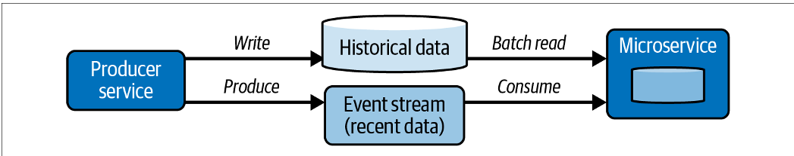

>Figure 2-19. Lambda architecture, writing to both the stream and the historical data table at the same time  

A major flaw in this plan is that the data is not written atomically. The reality is that it’s very difficult to get high-performance distributed transactions across multiple independent systems. What tends to happen in reality is that the producer updates one system first (say, the historical data store), then the other (the event stream). An intermittent failure during the writes may see the event written to the historical store but not the stream—or vice versa, depending on your code.  

The problem is that your stream and historical data set will diverge, meaning that you get different results if you build from the stream than you would from the historical data. An old consumer reading solely from the stream may compute a different result than a new consumer bootstrapping itself from the historical data. This can cause serious problems in your organization, and it can be very difficult to track down the reason why—particularly since the event-stream data is time-limited, and evidence of its divergence is deleted after just a few days.  

In the second version of lambda architecture, the historical data is populated directly from the initial event stream, as shown in Figure 2-20.  

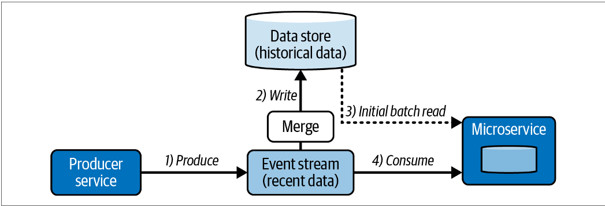

>Figure 2-20. Historical lambda data build from the event stream  

The producer writes directly to the event stream (1). The historical data is populated by a secondary process that merges it into the data store (2). The consumer in turn reads the historical data first (3), then switches over to the event stream (4).  

If you squint a little, you may find that this second version looks an awful lot like the kappa architecture—except that the service is building the state store outside of the microservice. The only complication is that we’ve introduced this awkward split between the event broker and the historic data store, which is an artifact due to the now-invalid notion that an event broker cannot store events indefinitely.  

Overall, the lambda architecture may seem simple in theory, but it ends up being very difficult to do well *in practice*. Why? Here are a few of the major obstacles:  

The producer must maintain extra code  

The code that writes to the stream, and the code that writes to the historical store.  

The consumer must maintain two code paths  

One path reads from the historical store, and one path reads from the stream.
The consumer must write code that seamlessly switches from one to the other,
without missing any data or accidentally duplicating data. This can be quite
challenging in practice, particularly with distributed systems and intermittent
failures.  

Streamed data may not converge to the same results as the historical data  

Consumers may not get exactly the same results if reading from the stream as reading from the table. The producer must ensure that the data between the two does not diverge over time, but this is challenging without atomic updates to both the stream and the historical data store.  

The stream and historical data models must evolve in sync  

Data isn't static. If you have to update the data format, it will require code changes in two places: the historical store and the stream.  

Merging multiple lambda-powered data sets is almost impossible  

It's easy to merge multiple kappa data sets, as illustrated in Example 2-1. There is no crossover from the historical offline data store to the event stream. In contrast, with lambdas, you must reconcile the offline historical data sets with each other *and* with the event streams. With two streams there is just one reconciliation (stream-stream), whereas in a kappa mode there are four reconciliations—one for each combination of stream and offline data store.  

The long and the short of it is that lambda architecture is simply too difficult to manage at any reasonable scale. It puts the entire onus of accessing data onto the consumer, and increases significantly in complexity when you move beyond just a single source of data. It is far easier, both cognitively and coding-wise, to rely on the kappa architecture with the single stream source for providing historical data.  

### Event Data Definitions and Schemas  

Event data serves as the means of long-term and implementation-agnostic data storage, as well as the communication mechanism between services. Therefore, it is important that both the producers and consumers of events have a common understanding of the meaning of the data. Ideally, the consumer can interpret the contents and meaning of an event without having to consult with the owner of the producing service. This requires a common data specification between producers and consumers, and is analogous to an API definition between synchronous request-
response services.  

Schematization selections such as Apache Avro and Google's Protobuf provide two features that are leveraged heavily in event-driven microservices. First, they provide an evolution framework, where certain sets of changes can be safely made to the schemas without requiring downstream consumers to make a code change. Second, they also provide the means to generate typed classes (where applicable) to convert the schematized data into plain old objects in the language of your choice. This makes the creation of business logic far simpler and more transparent in the development of microservices. Chapter 4 covers these topics in greater detail.  

## Powering Microservices with the Event Broker  

Event broker systems suitable for large-scale enterprises all generally follow the same model. Multiple, distributed event brokers work together in a cluster to provide a platform for the production and consumption of event streams and queues. This model provides several essential features that are required for running an event-driven ecosystem at scale:  

### Scalability  

Additional event broker instances can be added to increase the cluster's production, consumption, and data storage capacity.  

### Durability  

Event data is replicated between nodes. This permits a cluster of brokers to both preserve and continue serving data when a broker fails.  

### High-availability  

A cluster of event broker nodes enables clients to connect to other nodes in the case of a broker failure. This permits the clients to maintain full uptime.  

### High-performance  

Multiple broker nodes share the production and consumption load. In addition, each broker node must be highly performant to be able to handle hundreds of thousands of writes or reads per second.  

Though there are different ways in which event data can be stored, replicated, and accessed behind the scenes of an event broker, they all generally provide the same mechanisms of storage and access to their clients.  

## Selecting an Event Broker  

Though this book makes frequent reference to Apache Kafka as an example, other event brokers could make suitable selections. Instead of comparing technologies directly, consider the following factors closely when selecting your event broker.  

### Support Tooling  

Support tools are essential for effectively developing event-driven microservices. Many of these tools are bound to the implementation of the event broker itself. Chapter 19 covers tooling in more detail, but for now, some of the things we'd be looking for when selecting an event broker include:  

• Browsing event-stream records and schemas  

• Quotas, access control, and topic management  

• Monitoring, throughput, and lag measurements  

### Hosted Services  

Hosted services allow you to outsource the creation and management of your event
broker. Key considerations include:  

• Do hosted solutions exist?  

• Will you purchase a hosted solution or host it internally?  

• Does the hosting agent provide monitoring, scaling, disaster recovery, replication, and multizone deployments?  

• Does it couple you to a single specific service provider?  

• Are there professional support services available?  

### Client Libraries and Processing Frameworks  

You have multiple event broker implementations to select from, each of which has varying levels of client support. It is important that your commonly used languages and tools work well with the client libraries:  

• Do client libraries and frameworks exist in the required languages?  

• Will you be able to build the libraries if they do not exist?  

• Are you using commonly used frameworks or trying to roll your own?  

## Community Support  

Community support is an extremely important aspect of selecting an event broker. An open source and freely available project, such as Apache Kafka, is a particularly good example of an event broker with large community support. Key considerations include:  

• Is there online community support?  

• Is the technology mature and production-ready?  

• Is the technology commonly used across many organizations?  

• Is the technology attractive to prospective employees?  

• Will employees be excited to build with these technologies?  

### Indefinite and Tiered Storage  

Indefinite storage lets you store events forever, provided you have the storage space to do so. Depending on the size of your event streams and the retention duration (e.g., indefinite), it may be preferable to store older data segments in slower but cheaper storage.  

Tiered storage provides multiple tiers (or layers) for storing events. The fastest and most expensive tier is served directly from the broker nodes themselves, either from in memory or on locally attached solid state drives (SSDs). A subsequent lower-cost and lower-performance tier typically includes a dedicated large-scale storage service, such as Amazon's S3, Google Cloud Storage, or Azure Storage. Data in the high-performance tier is moved asynchronously to a lower tier as it ages, but remains fully addressable and replayable through the event broker's consumer API. Key considerations include:  

• Is tiered storage automatically supported?  

• Can data be rolled into lower or higher tiers based on usage?  

• Can data be seamlessly retrieved from whichever tier it is stored in?  

### Summary  

Event streams provide durable, replayable, and scalable data access. They can provide a full history of events, allowing your consumers to read whatever data they need via a single API. Every consumer is guaranteed an identical copy of the data, provided they read the stream as it was written.  

Your event broker forms the core of your event-driven architectures. It's responsible for hosting the event streams, and providing consistent, high-performance access to the underlying data. It’s responsible for durability, fault-tolerance, and scaling, to ensure that you can focus on building your services, not struggling with data access.  

The producer service publishes a set of important business facts, broadcasting the data via the event stream to subscribed consumer services. The producer is no longer responsible for the varied query needs of all other services across the organization.  

Consumers do not query the producer service for data, eliminating unnecessary point-to-point connections from your architecture. Previously, a team may simply have written SQL queries or used request-response APIs to access data stored in a monolith’s database. In an event-driven architecture, they instead access that data from an event stream, materializing and aggregating their own state for their own business needs.  

The adoption of event-driven microservices enables the creation of services that use only the event broker to store and access data. While local copies of the events may certainly be used by the business logic of the microservice, the event broker remains the single source of truth for all data.  

In the next chapter, we’ll take a look at the basics of event-driven microservices, and how they relate to event streams.  

# Fundamentals of Event-Driven Microservices  

An *event-driven microservice* is an application much like any other. It requires the exact same type of compute, storage, and network resources as any other application. It also requires a place to store the source code, tools to build and deploy the application, and monitoring and logging to ensure healthy operation. As an event-driven application, it reads events from a stream (or streams), does work based on those events, and then outputs results—in the form of new events, API calls, or other forms of work.  

Chapter 1 briefly introduced the main benefits of event-driven microservices. In this chapter, I'll cover the fundamentals of event-driven microservices, exploring their roles and responsibilities, along with the requirements, rules, and recommendations for building healthy applications.  

## The Basics of Event-Driven Microservices  

Event-driven means that the events drive the business logic, just as water from a stream turns the water wheel of a mill (see Figure 3-1). Event-driven applications, be they micro or macro, typically do work only when there are events coming through it (or a timer expires—also an event). Otherwise, they sit idle until there are new events to process.  


>Figure 3-1. The water stream powers the wheel, as event streams power the microservice (Source: Laxey Wheel, wikimedia)  

The consumer microservice reads events from the stream. Each consumer is responsible for updating its own pointers to previously read indices within the event stream. This index, known as the offset, is the measurement of the current event from the beginning of the event stream. Offsets permit multiple consumers to consume and track their progress independently of one another, as shown in Figure 3-2.  

The *consumer group* allows for multiple consumers to be viewed as the same logical entity and enables horizontal scaling of message consumption. When a new consumer instance joins a consumer group, partitions are typically automatically redistributed among the active instances in a process known as *rebalancing*. Instances will receive events only from the partitions assigned to them. State, especially *local state*, may also require rebalancing (this is discussed further in Chapter 8).  

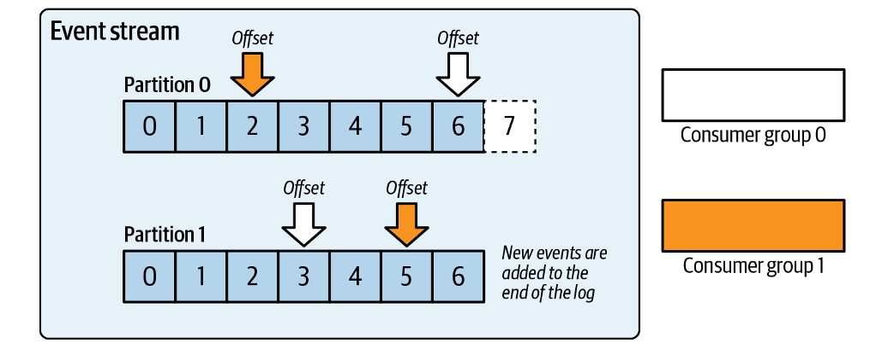

>Figure 3-2. Consumer groups and their per-partition offsets  

You may be asking, so what makes up an event-driven microservice? Perhaps the best thing to do is just look at a few examples first, and work backward from there. Let's take a look at a few examples of microservice implementations.  

## The Basic Producer/Consumer  

This example is entitled a *basic producer/consumer* because that's all it really is—the producer produces events, the consumer consumes events, and you, the software dev, must write all the operations to stitch together the business logic. Chapter 11 will go deeper into this process, but for now it's enough to just start with a basic Python microservice example.  

Example 3-1 consumes events from a Kafka topic named input_topic, tallies a sum, and emits the updated total to a new event stream if the value exceeds 1000.  

First, it creates the KafkaConsumer (1) and KafkaProducer (2). The aptly named KafkaConsumer will read events from the specified topic, convert the events from serialized bytes to objects that application understands; in this case, plain-text keys and JSON values. For a refresher on keys and values, you can look back to "The Structure of an Event" on page 29.  

Example 3-1. A basic producer consumer application that tallies a sum per key and emits it if the sum is greater than 1000  

```python
from kafka import KafkaConsumer, KafkaProducer
import json
import time

# 1) Initialize Kafka consumer
consumer = KafkaConsumer(
    'input_topic',
    bootstrap_servers=['localhost:9092'],
value_deserializer=lambda x: json.loads(x.decode('utf-8')),
keyDeserializer=lambda x: x.decode('utf-8'),
group_id='ch03-python_example_consumer_group_name',
auto_offset_reset='earliest'
)

# 2) Initialize Kafka producer
producer = KafkaProducer(
    bootstrap_servers=['localhost:9092'],
    value_serializer=lambda x: json.dumps(x).encode('utf-8'),
    key_serializer=lambda x: x.encode('utf-8')
)

# 3) The state store is a simple dictionary
key_sums = {}

# 4) Polling loop
while True:
    # 5) Poll for new events
    event_batch = consumer.poll(timeout_ms=1000)

    # 6) Process each partition's events
    for partition_batch in event_batch.values():
        for event in partition_batch:
            key = event.key
            number = event.value['number']

            # 7) Update sum for this key
            if key not in key_sums:
                key_sums[key] = 0
            key_sums[key] += number

            # 8) Check if sum exceeds 1000
            if key_sums[key] > 1000:
                # Prepare and send new event
                output_event = {
                    'key': key,
                    'total_sum': key_sums[key]
                }
                # 9) Write to topic named "key_sums"
                producer.send('key_sums',
                    key=key,
                    value=output_event)
                # 10) Flushes the events to the broker
                producer.flush()

```  

Next, the code creates a simple state store (3). You will likely want to use something other than an in-memory dictionary, but this is a simple example and you could swap this for an RDBMS, a fully managed key-value store, or some other durable state store.  

> [!TIP]
> Choose the state store that's most suitable for your microservice's use case. Some are best served with high-performance key-value stores, while other use cases are best served via RDBMS, graph, or document, for example.  

The fourth step is to enter an endless loop (4) that polls the input topic for a batch of events (5) and processes each event on a per-partition basis (6). For each event, the business logic updates the key sum (7), and if it's more than 1000 (8), then it creates an event with the sum to write to the output topic key_sums (9 and 10).  

This is a very simple application. But it showcases the key components common to the vast majority of event-driven microservices: event-stream consumers, producers, state stores, and a continual processing loop driven by the arrival of new events on the input streams. The business logic is embedded within the processing loop, and though this example is very simple, there are far more powerful and complex operations that we can perform.  

Let's take a look at a few more examples.  

## The Stream-Processing Event-Driven Microservice  

The stream-processing event-driven microservice is built using a stream-processing framework. Popular examples include Apache Kafka Streams, Apache Flink, and Apache Spark, just to name a few of the top contenders. Some older examples that I cited in the first edition of this book aren't as common anymore, and included Apache Storm and Apache Samza.  

The streaming frameworks provide a tighter integration with the event broker, and reduce the amount of overhead you have to deal with when building your EDM. Additionally, they tend to provide more powerful computations with higher-level constructs, such as letting you join streams and materialized tables with very little effort on your part.  

A key differentiator of stream-processing frameworks from the basic producer/consumer is that stream processors *require* either a separate standalone cluster (e.g., Flink and Spark), or a tight implementation with a *specific* event broker (e.g., Kafka Streams).  

Flink and Spark (and others like them) use their own proprietary processing clusters to manage state, scaling, durability, and the routing of data internally. Kafka Streams, on the other hand, relies on just the Kafka cluster to provide durable storage for application state, provide topic repartitioning, and provide application scaling functionality.  

> [!TIP]
> Stream-processing frameworks tend to use MapReduce programming (a form of functional programming), where you declare the transforms for the data using functions like map, reduce, aggregate, join, and filter.  

Chapters 12 and 13 cover both these types of frameworks in more detail. For now, let's turn to a practical (and concatenated) example using Apache Flink. This example uses Java, as it's one of the major languages supported by the Flink framework:  

java
// 1) TableEnvironment manages table access for the Flink application
TableEnvironment tableEnv =
    TableEnvironment.create(EnvironmentSettings.inStreamingMode());

// 2) Create the output table for joined results
tableEnv.executeSql(
    "CREATE TABLE PaymentsInnerJoinOrders (" +
    "    order_id STRING," +
    "    /* Add all columns you want to output here */" +
    ") WITH (" +
    "    'connector' = 'kafka', " +
    "    'topic' = 'PaymentsInnerJoinOrders', " +
    "    'properties.bootstrap.servers' = 'localhost:9092',"
    ");

// Payments and Sales table definitions removed for brevity

// 3) Reference the Sales and Payments tables
Table sales = tableEnv.from("Sales");
Table payments = tableEnv.from("Payments");

// 4) Perform inner join between Sales and Payments tables on order_id
Table result = sales
    .filter { sale -> sale.total >= 100 }
    .join(payments)
    .where($"Sales.order_id")
    .isEqual($"Payment.order_id"))
    // 5) Declare your output schema in the JoinFunction
    .apply(new JoinFunction<> ...);

// 6) Insert the joined results into the output Kafka topic
result.executeInsert("PaymentsInnerJoinOrders");  

This is a fairly terse application, but it packs a lot of power. First (1), create the
tableEnv connection that will manage the table environment work. Next, declare the
output table (2), which is connected to the Kafka topic PaymentsInnerJoinOrders.
You'll only have to create this once. I've omitted the other declarations for brevity.  

Third (3), create references to the Sales and Payments tables so that you can use them in your application. These tables are *materialized streams*, as covered in “*Materializing State from Entity Events*” on page 36.  

Fourth (4), declare the transformations to perform on the events populating the materialized tables. Note that the first transformation that this application performs is to filter in any records that have a sales.total >= 100. Anything with sales.total < 100 will be filtered out and discarded from the rest of the declared transformations and joins.  

These few lines do a lot of important work. Not only does the code perform the operations of joining these two tables together, but it also handles fault-tolerance, load balancing, in-order processing, and big-data scale loads. It can also easily join streams and tables that are partitioned and keyed completely differently, something that you are likely to encounter frequently in the real world.  

Fifth (5), I have left a placeholder where you would add in your logic to merge the matching Sales and Payment events together. It's not particularly difficult to write, but it takes up a lot of space and is predominantly boilerplate code. The important part is that this function is where you declare your output event schema, and is part of the data contract discussed in Chapter 4.  

Sixth (6) and finally, the application writes the data to the output table. The machina-
tions of the Flink streaming framework will handle the rest for committing the data
to the Kafka topic.  

Streaming frameworks provide very powerful capabilities, but typically require a larger upfront investment into supporting architecture. They also typically only provide limited language support (Python and JVM being the most popular), though some have added support for other languages since the first edition of this book was published. In fact, SQL (or SQL-like) languages have been the fastest growing of the bunch. Let's take a look at those next.  

## The Streaming SQL Query  

Should my microservice actually just be a SQL query?  

It's a good question, particularly with the rise of streaming SQL as managed services. The very same things that make SQL popular in the database world make it popular in the streaming world. Its declarative nature means that you just declare the results you're looking for. You don't have to specify *how* to get it done, as that's the job of the underlying processing engine.  

Additionally, SQL lets you write very clear and concise statements about what it is
you want to do with your event streams. For example, you can rewrite the very same
Flink application using Flink SQL:  

-- Assume that the tables have already been declared  

INSERT INTO PaymentsInnerJoinOrders
SELECT *
FROM Sales s
INNER JOIN Payment p
ON s.order_id = p.order_id;  

That's it. Simple but powerful. There are more nuances that you may need to consider, but that's covered in more detail in Chapter 14.  

Streaming SQL queries like this one result in long-running processes that continually execute the business logic, just like any other microservice. It'll run indefinitely, scaling up and down as needed.  

Streaming SQL is not standardized, and it depends heavily on the frameworks you choose to build your microservices. It requires a robust lower-level set of APIs to function beyond just toy examples. The Flink project, for example, in Figure 3-3, has several layers of APIs, each of which depends on the ones below it.  

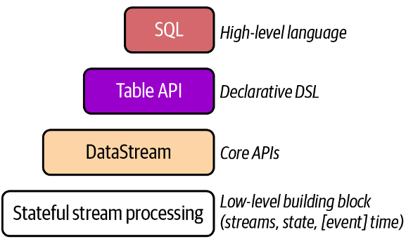

>Figure 3-3. The four levels of Flink APIs (Source: Apache Flink documentation)  

> [!TIP]
> Keep on the lookout for opportunities to use streaming SQL within
> your event-driven architectures. It can save you a ton of time and
> effort, and let you get on with other work.  

There are many different flavors and types, and so you'll have to do your own due diligence to find out what is and what isn't supported per streaming framework. Streaming SQL is covered in more detail in Chapter 14.  

## The Legacy Application  

Legacy applications typically aren’t written with event-driven processing in mind. They’re usually old but important systems that serve critical business functions, but that aren’t under active development anymore. Changes to these services are rare, and are performed only when absolutely necessary. Legacy applications are also often the gatekeepers to important business data, siloed away inside the database or file stores of the system.  

The legacy application is basically a rigid structure that you’re unlikely to be able to change. But you can still integrate it into your overarching event-driven architecture through the use of connectors, as shown in Figure 3-4.  

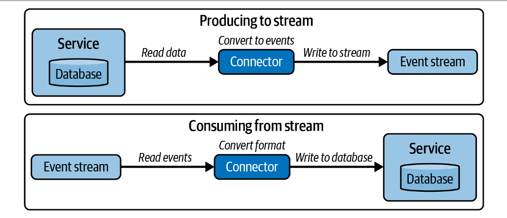

>Figure 3-4. Producing and consuming event streams with connectors  

Connectors can read events from a source system or database, convert the data to events, and write it into an event stream. Similarly, connectors can also read events from a stream, convert them into a suitable format, and write them to a legacy system’s API or database. They provide the means for integrating these existing applications into your event-driven architecture without having to redesign the whole system as a native event-driven architecture.  

Connectors enable you to get started with event streams without having to reinvent your entire architecture. They make it easy to get data into streams, so that you can start getting value from your event-driven microservices as soon as possible. Chapter 6 covers connectors in more detail.  

## Topologies and Event-Driven Microservices  

You're likely to find the term topology in many event-driven microservice books, blogs, and presentations. It may be used as a description for the logical steps that make up the processing logic of an individual microservice. It may also be used one step higher up, to refer to the graph-like relationship between individual microservices, event streams, and request-response APIs. Let's look at each definition in turn.  

## Microservice Topology  

A microservice topology is the event-driven business logic internal to a single micro-service. It defines the data-driven operations that the service performs on events, including transformation, storage, and the production of new events. You can represent the topology as an image, as shown in Figure 3-5.  

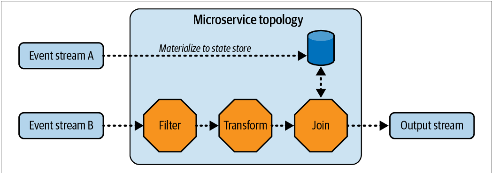

>Figure 3-5. A simple microservice topology  

This microservice topology image illustrates a service ingesting events from event stream A and materializing them into a data store (see "Materializing State from Entity Events" on page 36). The service also ingests events from stream B, then filters and transforms them before joining them on the materialized state. Finally, the service outputs the results to a new event stream.  

## Business Topology  

A business topology is like a microservice topology, but zoomed out one level further. It is the set of microservices, event streams, and APIs that fulfill complex business functions. It is an arbitrary grouping of services and may represent the services owned by a single team or department or those that fulfill a superset of complex business functionality. The business communication structures compose the business topology (see "Business Communication Structures" on page 9). Microservices implement the business bounded contexts, and event streams provide the data communication mechanism for sharing cross-context domain data.  

> [!TIP]
> A *microservice topology* details the inner workings of a single microservice. A *business topology*, on the other hand, details the relationships *between* services.  

Figure 3-6 shows a business topology with three independent microservices and event streams. Note that the business topology does not detail the inner workings of a microservice.  

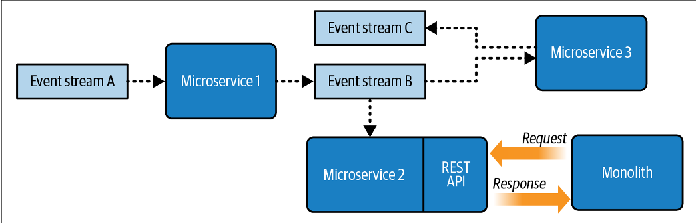

>Figure 3-6. A simple business topology  

Microservice 1 consumes and transforms data from event stream A and produces the results to event stream B. Microservice 2 and microservice 3 both consume from event stream B. Microservice 2 acts strictly as a consumer and provides a REST API in which data can be accessed synchronously. Meanwhile, microservice 3 performs its own transformations according to its bounded context requirements and outputs to event stream C. New microservices and event streams can be added to the business topology as needed, coupled asynchronously through event streams.  

## Event-Driven Microservice Responsibilities  

All microservices share a common set of responsibilities, independent of how you build them and the technologies you use. You'll need to account for these responsibilities when you build your own services:  

### Service boundaries and scope  

The microservice is responsible for enforcing a well-defined set of boundaries. What is this application responsible for? And what is it not? The latter becomes more important when you have multiple microservices working together to fulfill a more complicated workflow, where it can be a bit difficult to discern the responsibilities of each service. By mapping microservices as cleanly as possible to bounded contexts, we can avoid much of the guesswork and ambiguity that may otherwise crop up.  

### Scalability  

The microservice is responsible for ensuring its own scalability. Specifically, it must be written in such a way that allows it to scale horizontally (more instances) or vertically (a more powerful instance), depending on its requirements. EDM frameworks that provide scaling out of the box tend to have far greater appeal due to the seamless built-in scaling capabilities. The underlying processing power that runs the microservice, however, can either be provided independently on a per-microservice basis, or via a shared pool of compute resources. "Managing Microservices at Scale" on page 62 introduces some options for scaling microservices.  

### State management  

The microservice is solely responsible for the creates, reads, updates, and deletes made to its data store. Any operations that modify the state in the microservice remain entirely within its boundary of control. Any problems with the state store, such as running out of disk or failing to test application changes, also fall within the microservice's problem space. Chapter 8 goes into greater detail on how to build and manage state for event-driven microservices.  

### Keep track of stream progress  

Each microservice must keep track of its progress in reading the input event streams. For example, Apache Kafka tracks this progress using a consumer group, one per logical microservice. Consumer groups are also used by many other leading event brokers, though a consumer can still choose to manually manipulate its own offsets (say, to replay some records) or store them elsewhere, such as in their own data store.  

### Failure recovery  

Microservices are responsible for ensuring that they can get themselves back to a healthy state after a failure. The application must take into consideration its stored state in relation to its stream input progress. In the case of a crash, the consuming service will resume from its last known good offsets, which could mean duplicate processing and duplicate state store updates. Database snapshots, restoration from event streams, and replaying data are all commonly used state preservation and restoration techniques, which are explored further in Chapter 8.  

### The single writer per stream principle  

Each event stream has one and only one producing microservice. This microservice is the owner of each event produced to that stream. This allows for the authoritative source of truth to always be known for any given event, by permitting the tracing of data lineage through the system. Access control mechanisms, as discussed in Chapter 19, should be used to enforce ownership and write boundaries.  

### Event keys and partitioning  

The microservice is responsible for choosing the output record's primary key (see "The Structure of an Event" on page 29), and is also responsible for determining which partition to send that record to. Records of the same key typically go to the same partition, though you can choose other strategies (e.g., round-robin, random, or custom). Ultimately, it is your microservice that is responsible for selecting which partition to write the event to.  

### Event schemas and data contracts  

Use a schema to define the data contents of your event, so that the consumers have clear field names, types, and default values. For example, do you write product_id as a string? Or do you write it as an Integer? Chapter 4 covers this in far more detail, but for now, plan to use a well-defined Avro, Protobuf, or JSON schema to write your records. It will make your event streams much easier to use, provide clarity for your consumers, and enable a much healthier event-driven ecosystem.  

A microservice should also be reasonably sized. Does that sound ambiguous to you?
Well, read on.  

## How Small Should a Microservice Be?  

First up, the goal of a microservice architecture isn't to make as many as possible. You won't win any awards for having the highest service count, nor would you even find the experience rewarding. In fact, you'd probably end up writing a blog about how you made 1,000 microservices and everything was awful.  

The reality is that every service you build, micro or otherwise, incurs overhead. However, we also want to avoid the pains that come with a single monolith. Where's the balance?  

A microservice should be manageable by a single team, and the team should be able to have others within it work on the service as needed. How big is that team? The two-pizza team is a popular measurement, though it can be a bit of an unreliable guide, depending on how hungry your developers are.  

A single developer on this team should be able to fit the space of duties that the service has in their own head. A new developer coming to the microservice should be able to figure out the duties of that service, and how it accomplishes those duties, in just a day or two.  

Ultimately, the real concern is that the service serves a particular bounded context and satisfies a business need. The size, or how micro it really is, comes as a secondary concern. You may end up with microservices that push the upper boundary of what I've prescribed here, and that's okay—the important part is that you can identify the specific business concern it meets, the boundaries of the service, and be able to
maintain a good mental list of what the service *should* do and *should not* do.  

Here are a few quick tips:  

• Build only as many services as are necessary. More is not better.  

• One person should be able to understand the whole service.  

• Your team will need to be responsible for owning and maintaining the service and the output event streams.  

• Look to add functionality to an existing service first. It reduces your per-application overhead, as you'll see next in the next section.  

• For the microservices you do build, focus on building modular components. You may find that as your business develops that you need to break off a module to convert to its own microservice.  

In the next section we'll take a look at how to manage microservices, including how to manage them at scale.  

### Managing Microservices at Scale  

Managing microservices can become increasingly difficult as the quantity of services grows. Each microservice requires specific compute resources, data stores, configurations, environment variables, and a whole host of other microservice-specific properties. Each microservice must also be manageable and deployable by the team that owns it, which requires streamlining developer operations (DevOps) to reduce overhead and complexity.  

Containerization, container management, and infrastructure as code (IaC) have transformed how applications are deployed, monitored, and scaled. Docker, Kubernetes, and Terraform are popular examples of technology choices, and each plays a crucial role in modern DevOps practices.  

Containerization provides isolation of dependencies of the application, allowing you to create custom environments to suit your microservice's needs. Containers ensure consistency across development, testing, and production environments, reducing dependency conflicts and simplifying the complexity of managing different environments. The lightweight nature of containers, as compared to traditional virtual machines, allows for more efficient use of underlying resources, rapid startup times, and isolated environments for each application component.  

Chapter 19 takes a closer look at how container management services and infrastructure as code contribute to microservice management. For now, keep in mind that you can isolate your microservices via containerization, and by using virtual machines. Let's look into each in more detail.  

## Putting Microservices into Containers  

Containers revolutionized software deployment by allowing the packaging of an application along with its dependencies into an isolatable logical container. Containers leverage the host operating system (OS) via a shared kernel model. This provides basic separation between containers, while the container itself isolates environment variables, libraries, and other dependencies. Containers provide most of the benefits of a virtual machine (covered next) at a fraction of the cost, with fast startup times and low resource overhead.  

Containers' shared operating system approach does have some trade-offs. Containerized applications must be able to run on the host's OS. If an application requires a specialized OS, then an independent host will need to be set up. Security is also a major concern, since containers share access to the host machine's OS. A vulnerability in the kernel can put all the containers on that host at risk. With friendly workloads this is unlikely to be a problem, but popular shared tenancy models in cloud computing make it a very important consideration.  

## Putting Microservices into Virtual Machines  

Virtual machines (VMs) address some of the shortcomings of containers, though they aren't nearly as common for microservice deployments. Traditional VMs provide full isolation with a self-contained OS and virtualized hardware specified for each instance. Although this alternative provides higher security than containers, it has historically been much more expensive. Each VM has higher overhead costs compared to containers, with slower startup times and larger system footprints.  

> [!TIP]
> Google's gVisor, Amazon's Firecracker, and Kata Containers are examples of popular frameworks for running lightweight virtual machines.  

*MicroVMs* are much more similar to containers in their operations and handling. They have very low memory and CPU overhead and start much faster (less than a second) than classic VMs. They provide hardware-level isolation for multitenant services, resulting in a more secure and trustworthy ecosystem.  

Yet while options and frameworks for running microservices have improved in the five years since the first edition of this book, the reality is that VMs, micro or otherwise, are still relatively rare in comparison to containers. Container isolation has improved and security risks have decreased through iterative improvements to container management systems and the host technologies themselves. While virtual machines remain an option for running your microservice, you're much more likely to use containers unless you have very strict isolation requirements. Time will tell if microVMs come to replace containers, if containers adopt all the features of
microVMs, or if the two continue to coexist as a duality for hosting services.  

### Managing Containers and Virtual Machines  

Containers and VMs are managed through a variety of purpose-built software known as *container management systems* (CMS). These control container deployment, resource allocation, and integration with the underlying compute resources. Popular and commonly used CMSs include **Kubernetes**, **Docker Engine**, **Amazon ECS**, and **Nomad**.  

Microservices must be able to scale up and down depending on changing workloads, service-level agreements (SLAs), and performance requirements. Vertical scaling must be supported, in which compute resources such as CPU, memory, and disk are increased or decreased on each microservice instance. Horizontal scaling must also be supported, with new instances added or removed.  

Each microservice should be deployed as a single unit. For many microservices, a single executable is all that is needed to perform its business requirements, and it can be deployed within a single container. Other microservices may be more complex, requiring coordination between multiple containers and external data stores. This is where something like the Kubernetes' pod concept comes into play, allowing for multiple containers to be deployed and reverted as a single action. Kubernetes also allows for single-run operations; for example, database migrations can be run during the execution of the single deployable.  

VM management is supported by a number of implementations, but is currently more limited than container management. Kubernetes and Docker Engine support Google's gVisor and Kata Containers, while Amazon's platform supports AWS Firecracker. The lines between containers and VMs will continue to blur as development continues. Make sure that the CMS you select will handle the containers and VMs that you require of it.  

> [!TIP]
> Rich sets of resources are available for Kubernetes, Docker, Mesos, Amazon ECS, and Nomad. The information they provide goes far beyond what I can present here. I encourage you to look into these materials for more information.  

## Paying the Microservice Tax  

The *microservice tax* is the sum of costs, including financial, manpower, and opportunity, associated with implementing the tools, platforms, and components of a microservice architecture.  

The tax includes the costs of managing, deploying, and operating the event broker, CMS, deployment pipelines, monitoring solutions, and logging services. These expenses are unavoidable and are paid either centrally by the organization or independently by each team implementing microservices. The former results in a scalable, simplified, and unified framework for developing microservices, while the latter results in excessive overhead, duplicate solutions, fragmented tooling, and unsustainable growth.  

Other costs include reduced productivity while developers learn new skills to build, manage, and maintain microservices. Learning how to manage asynchrony, recover from failures, and service modularization will all take time, especially for junior developers who may have little experience in event-driven architectures. That said, there exists a wealth of blogs, videos, books, articles, how-to guides, interactive development environment plug-ins, and the emergence of effective AI copilots that make it easier to adopt event-driven architectures.  

Paying the microservice tax is not a trivial matter, and it is one of the largest impediments to getting started with event-driven microservices. Small organizations would do well to stick with an architecture that better suits their business needs, such as a modular monolith, and only expand into microservices once their business runs into scaling and growth issues.  

The good news is that the tax is not an all-or-nothing thing. You can invest in your event-driven microservices platform incrementally, adding new functions and features over time and as necessity demands.  

Fortunately, self-hosted, hosted, and fully managed services are available for you to choose from. The microservice tax is being steadily reduced with new integrations between CMSs, event brokers, and other commonly needed tools.  

Cloud services are worth an explicit mention for greatly reducing the cost of the microservices tax. Cloud services and fully managed offerings have significantly improved since the first version of this book was released in 2020, and their progressive uptake shows no sign of abating. For example, you can easily find fully managed CMSs, event brokers, monitoring solutions, data catalogs, and integration/deployment pipeline services without having to run any of them yourself. It is much easier to get started with using cloud services for your microservice architecture than building your own, as it lets you experiment and trial your services before committing significant resources.  

## Service Contracts  

Service contracts are an important component for establishing clear and concise microservice boundaries. They're also critical for formal documentation, API management, and establishing exactly which services you have access to, and which ones you don't.  

While there are many ways to implement service contracts, specifications like OpenAPI or implementations like Swagger tend to be the most popular choices.  

Service contracts establish:  

#### Service APIs  

The API calls that the service supports, including name, required and optional parameters, return types, and protocols supported.  

#### Code generation  

Create stubbed-out functions based on the specification. Then, edit them to contain the business logic necessary to fulfill the service contract.  

#### Documentation  

You can also generate documentation from the specification, which is extremely helpful in saving you the time and effort of manually updating it. By generating the code and documentation together, you can ensure that the docs will match the actual available function calls.  

#### Namespacing  

You can specify the namespace of the service, providing organizational information and removing ambiguity for similarly named services.  

#### Versioning  

The version of the service contract, along with a history of contract changes.  

#### Ownership  

Specify the team or person who owns the service.  

#### Service-level objectives (or agreements)  

The owner is responsible for ensuring that adequate service levels are kept. While a site reliability engineer (SRE) may be on the hook for keeping the service instances running, the owner is responsible for everything else.  

#### Breaking change management  

Service APIs can change over time. The service contract enables you to mark APIs as deprecated, indicating to service users how to migrate off the soon-to-be deleted APIs.  

Event-driven microservices are a bit different than the request-response microservices communicating via direct API calls. Many of the service contract notions may not apply at all, as communication occurs via event streams and not point-to-point. The next chapter covers the use of *data contracts* for event streams, which, while similar to service contracts, differ in a few key ways.  

That being said, microservices that provide a mixture of request-response-based APIs and event-stream data will require both service contracts and data contracts.  

#### Summary  

Event-driven microservices are applications like any other, relying on incoming events to drive their business logic. They can be written in many different languages, though the functionality you have available to you will vary accordingly. Basic producer/consumer microservices may be written in a wide range of languages, while purpose-built streaming frameworks may only support one or two languages. SQL queries and connectors also remain options, but their use requires further integration with application source code than what was covered in this chapter.  

Microservices have a host of responsibilities, including managing their own code, state, and runtime properties. The service creators have the freedom to choose the technologies best suited to solving the business problem, though they of course need to ensure that the service can be maintained, updated, and debugged by others. Microservices are typically deployed in containers or virtual machines, relying on container/VM management systems to help monitor and manage their life cycles.  

Finally, consider the microservice tax. It is the total sum of non-business work you need to do to make using microservices a reasonable choice. There isn't a clear recipe for what is and isn't in the microservice tax. Every organization has a different technology stack, and what could be good advice for one organization may be a poor choice for another. That being said, try to use what you already have before buying something new, and work incrementally. It's not an all-or-nothing thing. Work on getting your first microservice up and running, learn from the process, then iterate and improve from there.  

Event-driven microservices rely heavily on reliable and well-defined data. In the next chapter, we'll take a look at event schemas, and how they provide a framework for creating well-defined events.  

# Events and Event Streams  

# Schemas and Data Contracts  

> [!NOTE]
> An earlier version of this chapter previously appeared in *Building an Event-Driven Data Mesh* (O'Reilly, 2023).  

Schemas are essential for getting an event-driven architecture off the ground. A schema is an explicit declaration of the data structures, names, types, defaults, and limitations. They facilitate a common understanding of the data for both producers and consumers alike. Schemas eliminate ambiguity, support both discovery and self-service, and significantly reduce parsing and interpretation errors.  

Data contracts, which are covered in more detail in the second half of this chapter, rely on schemas as a fundamental component. They also incorporate further aspects, such as ownership, service-level agreements, encryption, data evolution rules, and more.  

> [!TIP]
> Use schemas! While technically optional, they're effectively essential for making event-driven architectures that actually work.  

This chapter is a prescriptive and opinionated look at schemas and data contracts in an event-driven architecture, and gives instructions on how to set yourself up for success. There are many different schema technologies and many different ways to communicate data between systems through events. However, some methods and technologies are better than others—they're more common, they're more flexible, and they also reflect the ways most businesses use and communicate events.  

Before we get too far into it, let's step back and take a look at how a producer creates, serializes, and transmits an event across a network into an event stream. We'll also take a look at the reverse of this process, where a consumer consumes, deserializes, and processes an event from an event stream.  

## A Brief Introduction to Serialization and Deserialization  

Serialization is the process of converting an event object in the application's memory space into a sequence of bytes. The sequence of bytes is then sent across the network and written into the event stream. The schema provides the specification for converting the data from the application object space into the byte-based representation. For example, a schema that specifies that the field named length must be an Integer will throw an exception when attempting to serialize with length set to a String value of "six feet".  

Figure 4-1 shows a producer converting an object into a sequence of bytes that is then written to an event stream. Note that the schema is also attached to the serialized event, written together into the event stream. The consumer relies on the schema to deserialize the event from a sequence of bytes back into an object or struct that the consumer understands. There are some tricks we can use to avoid sending a schema with every event, which we'll look at later in this chapter.  

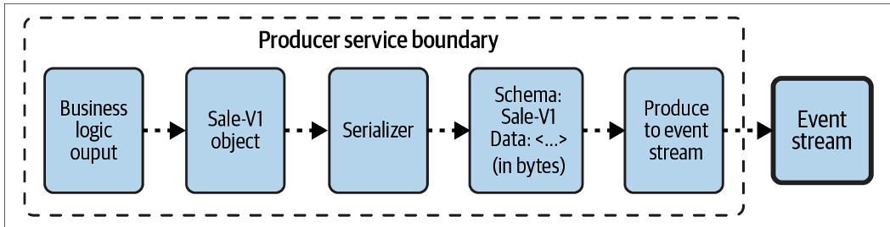

>Figure 4-1. Producer serializing the event object into bytes and writing it to the event stream  

On the other end of the event stream, a consumer reverses this process and deserializes the byte sequence into an object. It requires the schema to convert the sequence of bytes into an object that is legible by the consumer process. Figure 4-2 illustrates the process of consuming, deserializing, and converting the data into a representation that can be processed by the consumer's business logic code.  

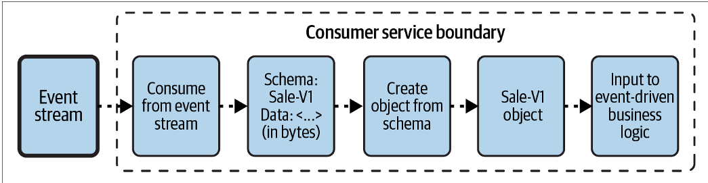

>Figure 4-2. A consumer reading from the event stream and deserializing the bytes back into an event representation  

### What Is a Schema?  

Schemas provide structure and definition. They’re synonymous with the definition of a database table: at a minimum, they specify names, types, restrictions, and default values. Again, to re-emphasize, schemas ensure that both the event data producer and all of its consumers have a shared common understanding of the data.  

A failure to use schemas leaves data interpretation up to your consumers. If you only have one consumer, then it may work (though it is not advisable). In reality, the most important data in your organization will have many consumers, all across different business units, each using their own preferred programming languages and databases. Figure 4-3 shows just two streams consumed by five services, resulting in ten unique interpretations of data.  

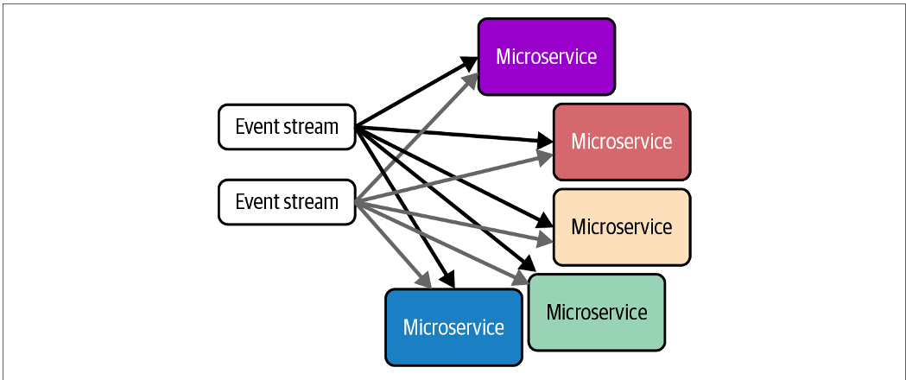

>Figure 4-3. Two event streams with five consumers will have ten unique interpretations of the data  

The reality is that the less structure your data has, the more likely your consumers are to misinterpret it. They will get divergent results, their data will not match those of their peers, and you will find yourself fighting a losing battle against easily preventable mistakes. It is essential that you use schemas.  

Here’s a simple Protobuf-powered example to illustrate some of the more compelling benefits. Example 4-1 showcases a schema for the Person entity.  

#### Example 4-1. Person schema with Protobuf  

message Person{// The person's unique ID.// The field number= 1, indicating its position in the wire format.// You cannot change the field number once it is established.int32 id= 1;// The person's full legal namestring name= 2;// Measured in centimeters, rounded to the nearest centimeterint32 height= 3;enum CountryCode{ABW= 0;AFG= 1;...ZWE= 248;}// ISO3166-1-alpha-3 standard. AAA=OTHERCountryCode country= 4;}  

The event schema details the id, name, and height of a person, along with their ISO 3166 three-letter Latin-script country code. The producer microservice adheres to this format when creating Person events, while the consumer expects that all the Person event stream data is formatted in this way. There is no need to interpret or guess at what the data is supposed to mean, though there are still places where errors can creep in. For example, a well-meaning developer may accidentally record the height as inches instead of centimeters.  

Figure 4-4 shows two clients: a Java producer that writes to the event stream and a C++ consumer that reads the events out of the stream and into its own memory space. The producer can use the Protobuf code generator for Java to automatically create classes and client code for the Person schema. The consumer can similarly generate its own structs and client code using the C++ code generator.  

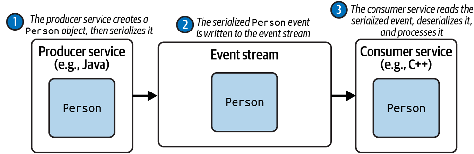

>Figure 4-4. The producer to event stream to consumer workflow of an event serialized with a schema  

> [!NOTE]
> Both Avro and Protobuf have many code generators that support
> a wide variety of languages. You can find support and code gen-
> erators for Rust, Go, Java, Kotlin, Python, C++, C#, Dart, and
> JavaScript, just to name a few.  

Example 4-2 shows a producer Java client with which we create a Person object named “Jeremiah Wasabullfrog” and the associated properties. Next, we serialize the object and write it to a file named ProtoPerson.data (we’re using a file as a placeholder for the event record to simplify the example).  

Example 4-2. Using Java to populate a Person object, generated from the Protobuf schema  

java
Person jeremiah = Person.newBuilder()
    .setId(8675309)
    .setName("Jeremiah Wasabullfrog")
    .setHeight(167)
    .setCountryCode("CAD")
    .build();
output = new FileOutputStream("ProtoPerson.data");
jeremiah.writeTo(output);  

The consumer reads the Person data from the file (i.e., the event), deserializes it using the schema, and finally converts it into an object or structure native to the consumer's language. Example 4-3 shows a C++ consumer using the ParseFromIstream function to convert the serialized bytes into a well-structured Person class object.  

#### Example 4-3. Using C++ to parse the serialized Protobuf Person object  

Person jeremiah;fstream input(argv[1],ios::in|ios::binary);jeremiah.ParseFromIstream(&input);// jeremiah is now populated with the id, name, and height received in the eventid= jeremiah.id();name= jeremiah.name();height= jeremiah.height();cc= jeremiah.countryCode();  

Schemas provide structure to data and enable easy serialization and deserialization.Other main benefits include:  

##### Schemas as code  

Your schemas can act as code just like any other in your application. Code reviews and commit histories make it so you can see who changed what, when, and why.  

##### Data protection  

The producer service will fail to serialize the data if it doesn’t adhere to the expected schema. Instead of publishing bad data, the producer will throw an exception. While you can still choose to publish the malformed data, it requires a deliberate decision to circumvent the schema safeguards.  

## Embedded documentation  

Schemas provide inline commenting capabilities for embedding documentation. It is easy to keep the documentation up-to-date when it’s inside the schema itself.  

## A foundation for discussion  

Schemas provide a basis for discussing (and arguing) over the content and form of the data. Explicit schemas, in conjunction with pull request reviews, enable productive discussions over what should and should not be in an event.  

## Code generation  

Code generation lets the application operate on the events as objects in its native language, handling the parsing, conversion, and object creation for you. It greatly simplifies business logic by letting you write code against well-defined classes in your programming language instead of against a map of generic object types.  

## Schema evolution  

Data can change over time. The best schema options provide a safe path for schema evolution, including rules, restrictions, and safeguards that prevent you from inadvertently violating your data contract with your consumers. Schema evolution is covered in more detail later in this chapter.  

## Test data event generators  

Event generators let you create data that matches your schemas, including specific parameter constraints such as foreign-key and primary-key relationships. You can use these events to test your event-driven service code and use it to produce sample events for consumers to try in their services. Kafka Connect Datagen is an example of such a generator, where you can specify constraints and ranges on the data being generated. Example 4-4 shows a snippet of a schema that contains a userId, where the range of valid data output will vary from User_1 to User_9.  

#### Example 4-4. Kafka Connect Datagen specification  

{
    "name": "userid",
    "type": {
        "type": "string",
        "arg.properties": {
            "regex": "User_[1-9]"
        }
    }
}  

Schemas bring significant benefits and are necessary for developing event-driven
microservices at scale. The next question is: what schema technology should you use?  

## What Are Your Schema Technology Options?  

While there are many schema technologies that you could use to build your event streams, a few stand above the rest. In terms of features, commonality, community development, ease of use, and supportive tooling, Google's Protobuf and Apache Avro are your two best choices. JSON Schema is somewhat popular for those who favor JSON, but please do not confuse it with the antipattern mess that is schemaless JSON (more on this in a bit).  

> [!TIP]
> Martin Kleppmann has written an excellent breakdown and analysis of JSON, XML, Protobuf, Thrift, and Avro in Chapter 4 of *Designing Data-Intensive Applications* (O'Reilly, 2017). Consider giving it a read if you would like to learn more about how these schema technologies work under the hood.  

While there are other schema technologies out there, the reality is that Avro and
Protobuf still stand among the top. They were at the top when the first edition of this
book was written, and they're still at the top five years later. They work, and they do their job well. JSON Schema has slow uptake, but it remains a valid third contender and behaves similarly to Avro and Protobuf. Let's take a look at each.  

### Google's Protocol Buffers, aka Protobuf  

Protobuf became open source in 2008 and has long been popular for its gRPC format. It has also proven to be a strong competitor to Avro for the top schema format. Here are a few notable points about Protobuf's data types and schema management:  

• Protobuf provides support for scalar (e.g., double, float, bool, string, etc.) and complex data types.  

• The schema is not stored as part of the event but is maintained in a separate file. Protobuf files are most commonly shared via a schema registry, as covered later in this chapter in “The Role of the Schema Registry” on page 90.  

• You can compose complex schemas by referring to schema declarations stored in other files.  

• There is no support for dynamic types. However, this is not a significant shortcoming, as strongly typed schemas remain your best option for defining your events.  

Example 4-5 shows the Person object again as defined using the Proto3 version of Protobuf.  

#### Example 4-5. Proto3 example of Person  

message Person {
    // The person's unique ID
    int32 id = 1;
    // The person's full legal name
    string name = 2;
    // Measured in centimeters, rounded to the nearest centimeter
    int32 height = 3;

    enum CountryCode {
        ABW = 0;
        AFG = 1;
        ...
        ZWE = 248;
    }
    // ISO3166-1-alpha-3 standard. AAA=OTHER
    CountryCode country = 4;
}  

Protobuf has multiple versions. In the first edition of this book, Protobuf really only had v2 and v3. In 2024, Protobuf released a “Protobuf Editions” version that brought inter-compatibility to v2 and v3, along with replacing the future versioning sequence. More on that in a moment.  

Protobuf v2 enabled:  

• Marking fields as either required or optional  

• Setting custom default values  

This standard allowed you to determine if a field was included in the message or if it was missing. Additionally, you could specify default values that could be populated by the consumer in the case that the data was indeed missing. Protobuf v2 was more similar to Apache Avro (see the next section) than Protobuf v3 is today.  

Protobuf v3 removed some of the functionality of v2 and replaced it with a different set of behavior:  

• Fields can no longer be marked as required. All fields are technically optional, either explicitly (uses optional tag) or implicitly (no tag).  

• Implicit default values can only be one of empty string, empty bytes, false, or 0. The problem is that it’s not possible to tell whether the default value was applied or if the record was serialized with data that matches the default.  

The long and the short of it is that the evolution of Protobuf from v2 to v3 had a lot of dialogue, discourse, arguments, and disagreements. The eventual design decisions led to v3 diverging from the functionality that v2 provided, resulting in an ongoingschism. Some developers prefer v2, while others prefer v3.  

Protobuf Editions is a rethink of the relationship between v2 and v3. Instead of putting syntax="proto2" or syntax="proto3" at the top of your file to indicate the Protobuf version, you can now specify it as edition="2023"—and presumably as edition="XXXX" as more editions become available in time.  

One of the major improvements of Protobuf Editions over the older v2/v3 releases is that it allows you to choose how your defaults, optionals, and other features will work. It gives you a lot of flexibility to enable some features but not others. If you’re starting out with Protobuf schemas, the Protobuf website documentation covers everything in great detail. Start there.  

## Apache Avro  

Apache Avro is another extremely common schema and serialization format, created under the Apache Software Foundation. Initially released in 2009, Avro has been commonly associated with Apache Kafka over the years, as well as a row-based, big-data storage format. Here are a few notable points about Avro's data types and schema management:  

• There is support for primitive (e.g., string, integer, boolean, etc.) and complex data types.  

• By default, the schema is stored alongside the event data during serialization. The schema can also be decoupled from the data and stored independently in a schema registry (discussed further in “The Role of the Schema Registry” on page 90).  

• By including the schema with the event, Avro offers dynamic deserialization. A consumer can deserialize the event into a GenericRecord object built and populated dynamically from the schema and data. This feature is typically used when a consumer client does not have a code generator.  

• You can compose complex schemas by referring to schema declarations stored in other files.  

• While schema evolution is possible, it is not explicitly defined as part of the standard.  

Example 4-6 shows an Avro schema representation of the Person object from Example 4-5.  

Example 4-6. Avro example of Person  

{
    "type": "record",
    "name": "Person",
    "namespace": "com.event.driven.microservices",
    "doc": "Example of a Person record",
    "fields": [
        {
            "name": "id",
            "type": "integer",
            "doc": "The person's unique ID"
        },
        {
            "name": "name",
            "type": "string",
            "doc": "The person's full legal name"
        },
        {
            "name": "height",
            "type": "integer",
        }
    ]
}  

"doc":"Measured in centimeters, rounded to the nearest centimeter"},{"name":"countryCode","type":"enum","symbols":["AAA","ABW",..."ZWE"],"doc":"ISO3166-1-alpha-3 standard. AAA=OTHER"}]}  

In Avro, all properties, such as type and doc, are contained entirely within the field definition. In contrast, comments in Protobuf are simply added with C/C++ style syntax. Semantically, they are quite similar.  

Avro is an all-around robust option for building your event-driven microservice architecture. It’s compatible with many programming languages and technologies, and has a proven track record alongside Protobuf.  

The next and final schema technology that we’ll look at in this chapter is JSON Schema.  

## JSON Schema  

The JSON Schema format allows you to annotate and validate JSON documents. Unlike Avro and Protobuf, you can use JSON documents without a schema. A schemaless JSON means that there is really no definition of what should and should not be in the schema nor of any typing or defaults.  

> [!WARNING]
> Don’t use schemaless JSON. It is not suitable for event streams as it leaves too much room for error, misinterpretation, missing fields, and missing data.  

Here are a few notable points about JSON Schema’s data types and schema management:  

• There is support for six primitive types (null, boolean, object, array, number, string) as well as some more complex typing.  

• You can compose complex schemas by using references to schemas stored in other files or locations.  

• Data validation is similar to that of Protobuf and Avro. Producers validate their data against their schema prior to writing it to the event stream.  

• There is support for adding validation keywords for data quality enforcement to numbers, strings, arrays, and objects.  

Example 4-7 shows a JSON Schema representation of the same Person object from Examples 4-5 and 4-6.  

#### Example 4-7. JSON Schema example of Person  

{
    "id": "https://example.com/person.schema.json",
"$schema":"https://json-schema.org/draft/2020-12/schema",
    "title": "Person",
    "type": "object",
    "properties": {
        "id": {
            "type": "number",
            "description": "The person's unique ID"
        },
        "name": {
            "type": "string",
            "description": "The person's full legal name"
        },
        "height": {
            "type": "number",
            "description": "Measured in centimeters, rounded to the nearest centimeter",
            "minimum": 1,
            "maximum": 300
        },
        "countryCode": {
            "type": "string",
            "enum": ["AAA", "ABW", ... "ZWE"],
            "description": "ISO3166-1-alpha-3 standard. AAA=OTHER"
        }
    }
}  

JSON Schema is the only technology discussed so far that contains both a language for specifying schemas and validation parameters that restrict the ranges of certain properties. As exemplified in the height property, the height of a person is restricted to between 1 and 300 centimeters, with the description including further information about rounding to the nearest centimeter. These constraints will prevent a system from accidentally inputting the height as millimeters (unless your person was 30 cm = 300 mm tall!), but would unfortunately fail to prevent it from writing it as inches (72 inches would still fit within the 1 to 300 unit range).  

### Schema Evolution: Changing Your Schemas Through Time  

Even if you create the perfect data model, there's a good chance that it may need to change anyway over time. New business opportunities, expansion of existing lines, and unforeseen data demands are all potential causes for changing your schemas.  

While new systems may need access to the latest data format, existing systems that have no need for the new data require a guarantee that their data contract won't change. *Schema evolution* allows us to change our schemas such that you can meet the use cases of new consumers without breaking compatibility for existing consumers.  

A few properties of schema evolution are common between Avro, Protobuf, and JSON Schemas. The first is compatibility modes, where events can be converted forward or backward depending on the changes made between schema versions. Compatibility modes are essential for change management, for guarding against (unintentional) breaking changes, and for alleviating consumers of the need to write custom code for each version of the schema (e.g., if schema.version==1 do this, if schema.version==2 do that, etc.).  

The main compatibility modes are as follows:  

#### Backward compatibility  

Consumers using the new schema can read data produced with the old schema. This compatibility mode is important for ensuring that consumers using the latest schema can still read and process older data encoded under earlier versions. For example, deleting a field is backward compatible. Say you have the record shown in Example 4-8.  

Example 4-8. Avro record, version 1  

{
    "type": "record",
    "name": "Example",
    "doc": "This is Version 1",
    "fields": [
        {
            "name": "id", "type": "integer"
        },
        {
            "name": "foobar", "type": "string"
        }
    ]
}  

You could remove the foobar field for Version 2, as shown in Example 4-9.  

Example 4-9. Avro record, version 2  

{
    "type": "record",
    "name": "Example",
    "doc": "This is Version 2",
    "fields": [
        {
            "name": "id", "type": "integer"
        }
    ]
}  

Note that the schema converter (as part of the Schema framework) can take
Version 1 data and convert it to Version 2 simply by dropping the foobar field.
Thus, Version 2 is backward compatible with events written using Version 1.  

### Forward compatibility  

Consumers using an old schema (Version 1) can still read new events written with a newer schema (Version 2). They will only be able to access data that matches their version. This compatibility mode is important for when an existing consumer coded against a current schema version rewinds its consumer offset to read historical data in the event stream.  

From the previous example, you'll note that you can't convert Version 2 to Version 1, so it is *not* forward compatible. Why? Version 1 lacks a *default value* for the field `foobar`, which is needed by the consumer to fill in the missing value during conversion.  

You would need to modify the Version 1 schema to add a default value *before* you published it (good thing you always create compatibility test cases as part of your pull request, right?). In Avro, specifying a default is relatively simple, as shown in foobar in Example 4-10.  

### Example 4-10. Avro record using a default value for field foobar  

{
    "type": "record",
    "name": "Example",
    "doc": "This is Version 1, but with a default value for foobar",
    "fields": [
        {
            "name": "id",
            "type": "integer"
        },
        {
            "name": "foobar",
            "type": "string",
            "default": "DEFAULT_VALUE_STRING"
        }
    ]
}  

The term *default value* can be a bit misleading. Unlike a relational database table, where the default value is populated at *write time*, these default values are used at *read time*. Furthermore, the default value is applied only if the record itself does not contain the field. To further our previous example: if you try to convert a record written with schema Version 2 to schema Version 1, the converter will notice that the field `foobar` does not exist in the original event. Thus, it will set `foobar="DEFAULT_VALUE_STRING"` upon creating the converted Version 1 record instead of throwing an exception.  

> [!NOTE]
> Avro, JSON Schema, and Protobuf v2 each enable custom default values. This can be a powerful option for ensuring that records remain compatible through multiple changes. Developers often use default values to flag the fact that data is missing due to a compatibility conversion (e.g., DEFAULT_VALUE_STRING) and not because the payload was actually received with foobar=null.  

Google's Protobuf v3 removed custom default values as a deliberate design decision, so you may find Protobuf v3 a bit more difficult to use for evolutionary purposes.  

As with all things schema-related, ensure that you check out the specifics of your
schema selection for more details. Each of these four standards has much more
content than can comfortably fit into this single chapter.  

## Full compatibility  

When an event can be converted both immediately forward and immediately backward.  

### Full-transitive compatibility  

When an event can be converted both forward and backward to any other version in the event stream. This is the strongest guarantee, and it means that every single schema evolution is fully compatible with previous schemas. A Version 3 schema would be able to be converted to Version 2 and Version 1, and vice versa.  

> [!TIP]
> Full-transitive compatibility is the best place to start. It provides the strongest guarantees for consumers and ensures that they need to update their code only when business use cases change and not because the schema was broken. While you can loosen the compatibility level later, it's extremely difficult to tighten it back up.  

While schema evolution is extremely helpful, there will inevitably come a time when your domain shifts significantly enough that it is insufficient. A breaking change will need to occur, and it must be navigated carefully.  

### What Is a Data Contract?  

Chapter 3 briefly discussed service contracts as a mechanism for formalizing the APIs, documentation, ownership, and life cycle (“Service Contracts” on page 66). Data contracts are similar in many ways, though a key difference is that while a service contract refers to a service, a data contract refers to the data guarantees of the data in the event stream itself.  

A data contract is the compact between a producer of data, and all services past, present, and future that consume and use that data. Data contracts, as a concept, have featured in multiple architectures and systems of thinking, including data mesh, data lakes, and data warehouses. Conceptually they're mostly the same, answering the key question of "what are the guarantees relating to this specific data?"  

> [!WARNING]
> Not all event streams require a data contract. Event streams that belong to clusters of tightly coupled microservices, such as in the case of a highly orchestrated workflow, may forgo establishing a data contract. In these cases, the producer and consumer are often owned by the same team, and no other service(s) consume or use the data.  

Data contracts are essential for establishing reliable access to your core event streams. At its core, a data contract is the definition of social, security, and management expectations of the data. Components of a data contract include:  

#### The schema(s)  

An event stream may have just a single schema. It may also have multiple schemas, either due to schema evolution or if you are colocating multiple types of events in a single stream (discussed further in Chapter 5).  

#### Service-level objectives (SLOs)  

While not all data contracts require SLOs, they remain very important for critical service functionality. Event-driven microservices rely on ever-updating streams of business facts. If those streams stop, then the business stops. Just as you're expected to provide an SLO for request-response services, the same remains true for event streams and the services that drive them.  

#### Ownership  

The team and/or person who owns the event stream. They are also responsible for handling change requests, providing support, and ensuring service-level objectives are met.  

#### Access restrictions  

It's important to keep track of which people and services have access to an event stream. You need to know who your consumers are so you can alert them to upcoming changes. Issuing per-service access credentials is a good starting point, and is covered in more detail in Chapter 19.  

#### Field-level encryption (FLE)  

FLE allows you to encrypt only specific fields of your event stream. For example, you may want to encrypt the name and address of a shipment, but leave the list of item information unencrypted. FLE is covered in more detail later in this chapter.  

## Schema evolution rules  

The data contract also specifies rules for evolving the schema, as covered in
"Schema Evolution: Changing Your Schemas Through Time" on page 82.  

## Negotiating a Breaking Schema Change  

Breaking changes most commonly occur due to shifting boundaries of a source domain model, often due to the expansion of the business model. Adding new product lines or services may necessitate rethinking and redefining data ownership, and leads to boundaries that don't map 1:1 with your existing event streams. As a simple example, a User data model may have previously modeled address with a simple string, as shown in Example 4-11.  

### Example 4-11. A User record in Avro  

{
    "type": "record",
    "name": "User",
    "namespace": "user.namespace",
    "fields": [
        {
            "name": "first_name", "type": "string"
        },
        {
            "name": "last_name", "type": "string"
        },
        {
            "name": "address", "type": "string"
        }
    ]
}  

But new locality features require the creation of an Address object containing home_address, work_address, and phone_number. Example 4-12 is an Avro schema of the new standardized User_v2 object. Note that both home_address and work_address are Address objects, and that the Address object allows for optional inclusion of phone_number.  

### Example 4-12. A User record in Avro, evolved to version 2  

{
    "type": "record",
    "name": "User_v2",
    "namespace": "user.namespace",
    "fields": [
        {
            "name": "first_name", "type": "string"
        },
        {
            "name": "last_name", "type": "string"
        },
        {
            "name": "home_address",
            "type": {
                "type": "record",
                "name": "Address",
                "namespace": "user.namespace.inner"
            }
        }
    ]
}  

json
"fields": [
    {"name": "phone_number", "type": ["null", "string"]},
    {"name": "address", "type": "string"},
    {"name": "city", "type": "string"},
    {"name": "country", "type": "string"}
]
},
{
    "name": "work_address",
    "type": "user.namespace.inner.Address"
}
]
}  

The old, singular string address field will no longer be available to downstream consumers. But do all of them know about this change? What happens to systems that still rely on the string address field?  

Coordinating a change that concerns multiple teams can be challenging. However, there is no need to reinvent the wheel, and you can draw on existing precedents for navigating this process.  

It is common policy for a well-maintained API, be it a library, framework, or REST API, to maintain a degree of backward compatibility with legacy clients. New clients can use the latest calls to power their business logic, while older clients can continue to use older API calls. Eventually, the API calls are deprecated and subsequently removed, giving maintainers of the application time to migrate to the newer APIs. We can adopt this same process for addressing breaking changes with event-stream schemas.  

### Step 1: Design the New Schema  

The team that owns the schema must come up with the new candidate schema (or schemas). Sometimes breaking changes are relatively easy to navigate, such as a single breaking type change. Other times they may be more involved, perhaps renegotiating several existing event schemas and changing multiple boundaries.  

In either case, the existing consumers are responsible for providing feedback and reviewing the proposed changes. They'll be involved in migrating their services to the new schema, after all.  

### Step 2: Consult Your Existing Consumers and Gain Approval  

Consumers are the most valuable source of feedback for your schema changes. Show them the proposed changes, ideally via a code review, and ensure that they have viewed, understand, and can accommodate the changes before moving forward.  

These discussions usually yield rich feedback. You may find that you need several iterations of edits before everyone is satisfied, though you may also just get it right the first time. Once the new schemas are approved you can move on to creating a release guide and a deprecation plan.  

### Step 3: Plan the Release, Migration, and Deprecation  

The release schedule should reflect the estimated time it will take to migrate all consumers, along with some extra padding for safety's sake. Your consumers may need to rebuild their state stores during the migration, or they may be able to simply swap over to the new event stream(s).  

Migrating historical stream data is a significant consideration for a breaking change. Maintaining a full history in the event stream will require either migrating the previous event data model to the new one, or re-creating the events from the source data. The former can work when the breaking change is simply a remodeling of existing fields, but tends to fall short when creating net-new data.  

In Example 4-12, address is changed to both a work_address and a home_address. There isn't sufficient information about whether the old address is for work or home. Even if you were to figure that out, the source system will not yet be able to populate the other field.  

You could backfill the User_v2 event stream by creating new records to match the new schema. However, these new records would only represent the User at the current point in time. Historical events in the original User stream would not be migrated without additional work.  

Finally, depreciation. You'll need to support both User and User_v2 event streams for a period of time (such as 8 to 12 weeks) so that consumers can migrate from the old one to the new one.  

### Step 4: Execute the Release  

Release the new event stream(s) alongside the existing ones, such that consumers have time to migrate over. Ideally, you'll also be using a central data portal (more information on that in Chapter 19) where your users discover and register as event-stream consumers.  

Mark the original User stream as *deprecated* to block new consumer registration, and instead redirect prospective consumers to use the latest version, User_v2. Both User and User_v2 will coexist for the duration of the migration timeline.  

> [!TIP]
> Make sure you have a hard date cutoff for migrating existing consumers to new streams. Send lots of warning messages and emails indicating the cutoff. If you do not, there's a good chance you'll never get your consumers to complete the migration, often due to lack of resources and competing priorities.  

It is very important to follow through on your migration plan. It is unreasonable to maintain two versions of your stream indefinitely, and it will eventually lead to problems such as inconsistent data, partial outages, and ever-accumulating technical debt.  

Managing schemas well requires keeping track of previous versions and ensuring compatibility rules are followed. Consumers additionally need the ability to discover which schemas belong to which event streams as part of self-service tooling requirements.  

A schema registry can provide a solution for these needs, among others, and it is an essential part of any event-driven architecture.  

## The Role of the Schema Registry  

A schema registry is a service that allows us to register schemas in association with their event streams. One of the main roles of the schema registry is to reduce the number of bytes sent over the network. Back in "A Brief Introduction to Serialization and Deserialization" on page 72, we saw that the basic serialization process appends a full copy of the schema to each event record, which results in a significant amount of duplicated data sent over the network. Figure 4-5 shows a producer writing events with a full copy of each schema, reducing throughput, increasing data replication costs, and increasing the load on consumers.  

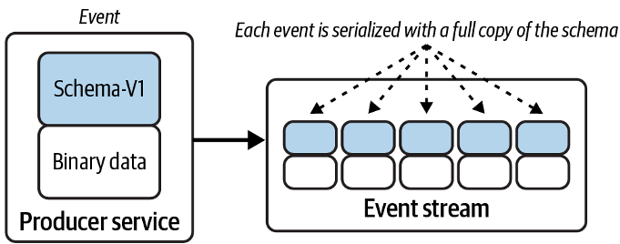

>Figure 4-5. Each serialized event is published to the event stream with the entire schema, resulting in excess network utilization and storage overhead  

A schema registry can absolve you of the need to write the schema with each event. Instead, you can store the schema external to the event and just use a unique ID in its place to track the associated schema. Thus, whenever a consumer reads an event, it can simply reference the schema registry to obtain the schema associated with that ID.  

Figure 4-6 shows the entire end-to-end process. Instead of serializing the schema along with the event, the producer service queries the schema registry (1), registers the schema (2), then replaces the schema with a short unique ID (3 and 4). This event is then produced to the event stream (5). The process is performed in reverse on the consumer side: the event is read from the stream (6), and the schema registry is queried using the unique ID (7 and 8). Once the schema is obtained (9), the record can then be deserialized (10 and 11) for processing by the consumer's business logic.  

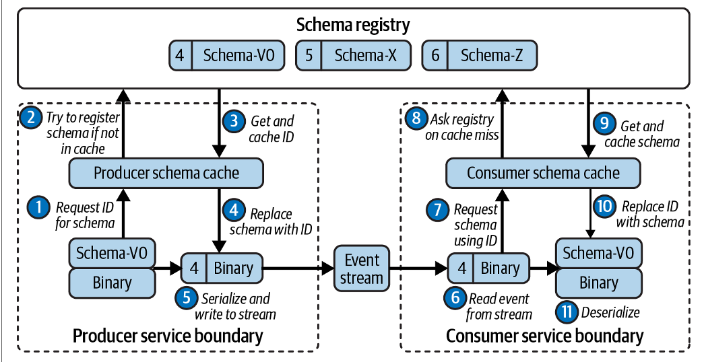

>Figure 4-6. Leveraging a schema registry in an event-driven producer/consumer
workflow  

Precisely how the schema is replaced by the unique ID depends on both the producer's serialization logic and any limitations in the format of events in the schema registry. For example, Confluent's Kafka Schema Registry replaces the schema with a 5-byte prefix.  

Using a schema registry requires serializers and deserializers to adhere to the proprietary format. And while Confluent's schema registry is fairly widely used with Kafka, it's not the only schema registry, and not all schema registries will use the same format.  

A schema registry provides other benefits in addition to network and disk I/O
savings. Here are a few other significant benefits:  

### Data discovery  

The schema registry provides a mapping of event streams to its registered schemas. Prospective consumers can examine the schemas to see if the stream contains the data they're interested in. Self-service tooling can provide search functionality on top of the schema registry API to search for specific fields, documentation, or metadata tags.  

### Schema evolution validation  

Registering a schema with the schema registry is a mandatory part of the write path of an event to a stream. This action provides a hook for validating the producer's current schema against that stored in the registry. Did the user evolve the schema in a way that is unauthorized by the schema registry (e.g., the new schema does not support backward compatibility)? Throw an exception. Is the schema completely invalid compared to what was registered under that ID before? Throw an exception. Is the event malformed? Throw an exception. The schema registry provides a safeguard against unintentional and unauthorized changes, protecting the event stream's data integrity.  

### Automatically updated documentation  

The schema registry provides a minimal form of automatically updated documentation for each event stream. Users can view all the registered schemas, including the names, types, and doc fields. Embedded schema docs are very useful for highlighting any idiosyncrasies or corner cases in the data. They are also far more likely to be up-to-date because they are embedded, as opposed to documentation maintained independently by an outside party.  

### Downloadable schemas to generate code  

A consumer can download schemas to generate class definitions and test events for their unit tests.  

> [!TIP]
> You can write a custom registration script to evaluate the schema during the registration process. A simple and common check is to verify that every value in a schema has a "doc" string of nonzero length to ensure that there is *some* documentation for each field. Another option is to scan for personally identifiable information (PII) patterns and request an additional verification step if something suspicious is found. Similarly, you can automatically generate class definitions and run validation tests prior to deployment.  

Schema registries provide many benefits for reducing both human and computer overhead. The savings on network and storage costs alone make them a valuable choice, with the remaining functionality providing the icing on the cake.  

Before we exit this chapter, there are still a few things left to cover. In the interval since the first edition of this book, *field-level encryption* has become a popular subject. And for good reason, since it's directly related to data security and ensuring compliance with legal data requirements. Let's turn our attention now to the security and compliance portion of data contracts.  

### Field-Level Encryption  

Field-level encryption (FLE) enables a producer to encrypt specific fields in its schema. Only consumers who have been granted access to that field can decode the data. PII, financial, health, and legal information commonly require special handling for compliance and security reasons. FLE can significantly simplify your event-streaming topologies.  

Consider a bank transfer. You may use field-level encryption on the fields that you don't want just anyone to use, while leaving others unencrypted. Table 4-1 shows the encryption of the email, user, and account fields of an event, while amount and datetime remain unencrypted.  

>Table 4-1. Using field-level encryption to partially encrypt an event  

| Field name|Original event|Partially encrypted event|
| ---|---|---|
| email|adam@bellemare.com|n2ZL@p987NhB4 . L0P|
| user|abellemare|9ajkpZp2kH|
| account|VD8675309|0Plw81Mx|
| amount|$777.77|$777.77|
| datetime|2022-02-22:22:22:22|2022-02-22:22:22:22|  

Consumers with decryption permissions can access the decrypted information to settle account balances, while an analytical system without decryption permissions can still track how much money is moving around during a period of time. One of the major benefits is that you do not need to create separate event streams for each consumer based on security needs, as was commonly the case before FLE became more widely adopted.  

You can also use *format-preserving encryption* to maintain the format of the event data. In this case, email, user, and account are format-preserving encrypted, having the same alphanumeric characters, spacing, and character count of the original fields. This allows for the schema to accurately represent the underlying data.  

Format-preserving encryption is particularly useful for applying encryption to data after the schema has already been negotiated—for example, in legacy event streams. You won't need to renegotiate the schemas as the encrypted types remain the same as the unencrypted types. In contrast, using non-format-preserving encryption often results in malformation, such as converting a long bank account ID into a 64-character string or encrypting a complex nested object into an array of hashed bytes.  

> [!TIP]
> Field-level encryption permits finer-grained access controls and independent per-field decryption capabilities. Consumers can request decryption keys for only the data they need, reducing the surface area risk for leaking sensitive data.  

Encryption of sensitive data, whether end-to-end or field-level, can also help with legal requirements, such as the right to be forgotten, or to have one's data deleted. This is covered more in Chapter 18.  

## Integration with Data Catalogs  

A data catalog is a repository that stores schemas, location, and other business metadata pertaining to a data source. Additionally, it can store information such as event-stream ownership, schema evolution restrictions, sample data, metadata tags, and control-related information, such as PII, financial, or other restricted information. Data engineers, data scientists, and data analysts have long made use of data catalogs for sorting and organizing their data sets.  

Historically, data catalogs have primarily documented data at rest, such as in a relational database or as a set of Apache Parquet files in cloud storage. While a schema registry offers operational support for schema management and evolution, a data catalog goes a step further by providing a one-stop shop for browsing, searching, discovering, and publishing new data sets. Support for event-stream data cataloging has substantially increased since the first edition of this book was printed. Modern-day data catalogs support data in multiple forms and formats, including data at rest in cloud storage, databases, and event streams.  

Popular catalogs for the major cloud providers include AWS Glue, Azure Data Catalog, and Google's Dataplex Universal Catalog. Open source offerings include Apache Atlas, OpenMetadata, and DataHub, to name just a few. Many data catalogs also offer additional functionality pertaining to data governance, dependency modeling, and access controls, but you'll need to evaluate those offerings on their own to decide if they're right for your organization.  

Data catalogs make it easy to find and discover data. While they’re not necessarily required for a successful event-driven microservice architecture, I suspect you’ll discover that their utility will lead you to adopting one. You’ll need to carefully consider the schema compatibility, vendor lock-in risk, and the age-old debate ofbuild-versus-buy.  

### Summary  

Schemas are essential for succeeding with an event-driven architecture. They provide structure and clarity for both the producers and consumers of the event stream. They also form the foundation of the data contracts, containing additional information such as ownership, SLOs, evolution rules, and additional documentation.  

Code generators bridge the gap between the schema itself and the business logic and provide a benefit to both the producer and the consumer. The former benefits from the strict type definitions and distinction between optional and mandatory fields, ensuring that no data is accidentally malformed or excluded. Subsequently, the latter benefits from the same well-defined type-system, absolving it of the need to interpret and standardize the data. Schemas provide the means to impose quality controls as close to the source as possible.  

Schema evolution provides the ability to evolve and change schemas over time, with explicit up-front rules as to which changes are allowed given compatibility requirements. While breaking changes can still occur, schemas provide the common framework for determining what is and is not allowed. And since they’re commonly integrated as part of the codebase, schema changes can follow the same review processes as standard business application code changes.  

While there are many options available for you to choose from, Apache Avro and Google’s Protobuf remain your best options, with JSON Schemas as a reasonable third choice. Your investment into one of these will vary depending on your pre-existing technology choices, but remains best discussed and decided centrally by your federated governance team.  

In the next chapter, we’ll take a look at leveraging what we’ve learned with schemas and apply it to the problem of event design. There are many different ways to model and design events. We’ll explore the best ways to do it and the pitfalls and gotchas that are best avoided.  

# Designing Events  

> [!NOTE]
> An earlier version of this chapter previously appeared in Building an Event-Driven Data Mesh (O’Reilly, 2023).  

There are many ways to design events for event-driven architectures. This chapter covers the best strategies for designing events for your event streams, including how to avoid the numerous pitfalls that you will encounter along the way. It also provides guidelines for when to use certain types and when to avoid using others, plus some illustrations as to why this is the case.  

## Introduction to Event Types  

There are two main types of events that underpin all event design: the state event, introduced in “Entity Events” on page 32, and the delta event.  

Figure 5-1 shows a simple square wave in steady state, periodically altering from one state to another based on a delta. Similar to this square wave, we model our events to either capture the state itself or the edge that transitions from one state to another.  

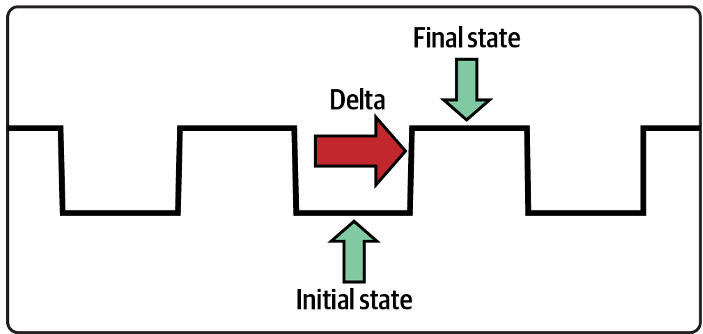

>Figure 5-1. State and delta during a change  

There are three stages to any occurrence in a system:  

1. The initial state  

2. The delta that alters the initial state to produce the final state  

3. The final state (which is also the initial state for the next change cycle)  

The majority of events we encounter can be categorized as either state or delta.
Looking at events in this way helps separate concerns and focus design efforts:  

#### State events  

State events fully describe the state of an entity at a given point in time. They are akin to a row in a database, chronicling the entire current state of affairs for the given data. State events are typically the most flexible and useful event type for sharing important business data between teams, people, and systems. State events are sometimes called level, noun, or fact type events.  

#### Delta events  

These describe the transition between states and typically only contain information about what has changed. Delta events are more commonly used in and between systems with very high degrees of coupling, as there is a close relationship between the definition of the event and how it is interpreted. Deltas are also sometimes called edge, verb, or action type events.  

You may also encounter *hybrid* events that have characteristics of each, though these tend to be less common because they can cause an undesirable strong coupling effect.  

### Hybrid events  

These events describe both a state and transition. They are usually a bit of a kludge, implemented when a deeper rework isn't possible due to deadlines such as trying to make the quarter's profit goal. But since people will still use them, they are covered in more detail later in this chapter.  

Let’s take a look at state events first.  

#### State Events and Event-Carried State Transfer  

A state event provides the current state of an entity at a specific moment in time. The record’s key details the unique identifier of the entity, while the value contains the entire set of data made available to all consumers. State events can commonly be thought of as how you’d store data in a database table—a full accounting of the data, for a given primary key, at the time it was last updated. Examples of state events include the names of the very entities that you model and use in your business domain. For example:  

• Item, Order, and User in a commerce domain  

• Truck, Package, and Driver in a package shipping domain  

• Payment, Debit, and Account in a banking domain  

State events provide several critical benefits, including:  

Event-carried state transfer  

State events are commonly used for event-carried state transfer (ECST). As the name suggests, the event carries important business state, transferring it to any number of subscribed consumers. ECST not only allows other systems to reason about state generated in another service, but also to react to changes in that state.  

Materialization  

State events let you materialize data quickly and easily. Simply consume the event stream, and materialize the data your service needs into its own state store.  

Strong decoupling  

The definition and composition of the state event remains entirely within the producer service’s bounded context. There is no direct coupling on the internal business logic of the system that produces the record.  

Infer changes from state  

Consumers can infer all field changes by comparing the current state event to the previous state event for a given key. The service can react accordingly whenever any fields change, as shown in Figure 5-2.  

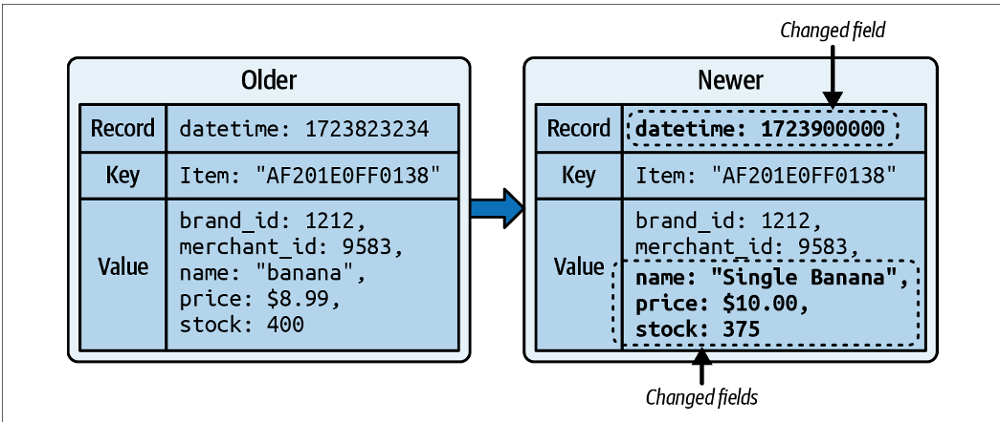

>Figure 5-2. Two state events allow you to infer what has changed by comparing the newer event to the older event  

In this example, you can see that the newer event has had its name, price, and stock updated. Your microservice can infer the changes that it cares about, and react accordingly. For example, updating signage, ordering new inventory, or prioritizing alternate options in the customer's search results.  

State events may contain just the “now” state or they may contain the “before/after” state (a pattern made popular with change-data capture; see “Liberating Data Using Change-Data Capture” on page 131). Both options have their own advantages and disadvantages, which we’ll examine in turn. For starters, let’s take a look at how each of these options affects compaction of event streams.  

There are two main design strategies for defining the structure and contents of state
events:  

Current state  

Contains the full public state at the moment the event was created.  

Before/after state  

Contains both the full public state *before* the event occurred and the full public state *after* the event occurred.  

Let's look into each of these in detail to get a better understanding of their trade-offs.  

#### Current State Events  

The event contains only the current state of the entity and requires comparison with a previous state event to determine what has changed. For example, an inventory event for a given item_id will contain only the latest value for the quantity in stock at that point in time. This design strategy has several main benefits:  

#### Lean  

The state events consume a minimal amount of space in the event stream.
Network traffic is also minimized.  

##### Simple  

The event broker stores any previous state events for that entity, such that if you need historical state, you simply rewind and replay your consumer offsets. You can set independent compaction policies for each event stream depending on your consumer's needs for historical data.  

##### Compactable  

The quantity of events in the stream is proportional to the quantity of unique keys in the domain. For example, if you have a compacted stream with 1,000 unique keys, then you can expect the long-term stream size to be just over 1,000 events.  

It also has a few nuances that are not quite drawbacks, but rather properties to consider:  

###### Agnostic to why the state changed  

The downstream consumer is not provided with the reason why the data has changed, only with the new public state. The reason for this is simple: it removes the ability of consumers to create a tight coupling on the internal state transitions of the source domain. Think about data in a relational database table—we typically do not communicate why that data has changed in the data itself, and the same holds true for state events. (Note: hybrid events, covered later in this chapter, bend this rule a bit.)  

###### Consumers must maintain state to detect transitions  

A consumer must maintain its own state to detect specific changes to certain fields, regardless of how simple or complex its business logic is. For example, a customer changing their address to another country may require you to send them new legal documents, which can differ depending on the country they left and the country they moved to. By making it the consumer's responsibility to materialize state for tracking transitions, the onus of computing the changes is entirely up to the consumer. They can infer any changes from one state to another, provided that they store the subset of state that their business logic cares about. This pattern enables very clean separation of responsibilities between producers and consumers and leads to exceptional flexibility for accommodating business logic changes.  

### Before/After State Events  

This strategy relies on providing the state before a transition occurs and the state after it has occurred. Change-data capture (CDC) systems, as covered in "Liberating Data Using Change-Data Capture" on page 131, regularly make use of the before/after strategy. The following showcases two before/after user events with a simple two-field schema:  

Key: 26
Value: {
before: { name: "Adam", country: "Madagascar" },
after: { name: "Adam", country: "Canada" }
}  

A follow-up before/after state event shows the deletion of Key: 26. Note that old data still remains in the before field:  

Key: 26
Value: {
    before: { name: "Adam", country: "Canada" },
    after: null
}  

There are some benefits to this design:  

Simple state transitions in a single event  

The before/after event showcases every field that has changed within a single transaction, in addition to all of the fields that have not changed. The reason for the change, however, is not included.  

Consumers can detect simple changes without maintaining state  

Some consumers can forgo maintaining state if they are only interested in detecting a simple state transition. For example, if we want to send documents to a user who moves from Madagascar to Canada, then our consumer can simply check to see if the before and after fields of the event match their criteria. However, this doesn't work if Adam moves from Madagascar to Ethiopia, and then soon thereafter moves to Canada, causing two events to occur. The consumer business logic would not be able to trigger on this sequence of events since it doesn't maintain any state. In practice, the theoretical stateless consumer is seldom realized, since the vast majority of services of any reasonable complexity need to maintain state.  

There are also a few drawbacks to this design:  

### Compaction is difficult  

Deleting an event using the before/after logic results in the after field being set to null—but the entire value itself is not null. By default, event brokers like Apache Kafka will not recognize this as a tombstone and thus will not delete it. While it may be technically possible to rewrite the compaction logic, it usually isn’t feasible, especially if you are relying heavily on SaaS solutions.  

In the end you’ll have to ensure that you write a secondary tombstone event after your initial before/after event. Then, you’ll rely on the event broker eventually compacting the data away. This double-event strategy is often used by change-data capture systems, such as Debezium (a change-data capture service that will be explored in more detail in “Liberating Data Using Change-Data Capture” on page 131).  

Figure 5-3 illustrates the two events that you would see written to the event stream. The first contains the before/after data (with the after being null), while the second event is a tombstone that enables compaction and deletes the old data.  

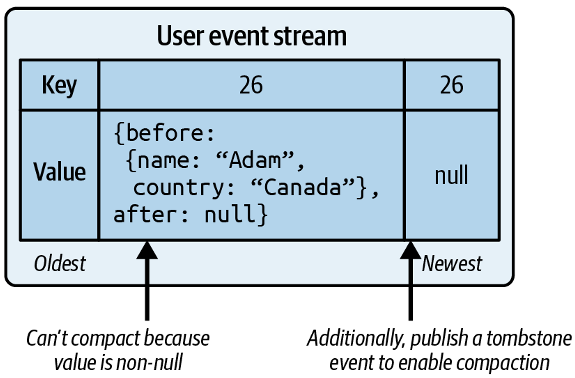

>Figure 5-3. Publishing a tombstone after the before/after deletion to enable event-stream compaction  

### Risk of leftover information  

Previous data may be accidentally maintained indefinitely in the before field unless you issue a series of deletions. Even in the case that the producer publishes tombstone events, there remains a variable delay between the publishing of the tombstone and the asynchronous compaction execution of the event broker.  

### Doubled data storage and network usage  

Before/after events double (on average) the amount of data going over the wire and stored on disk. Consumers, producers, and the event broker each bear part of this load. In some cases this may be trivial. Seldom-updated events or those with low volume are probably nothing to worry about, but extremely high-volume event streams can quickly add up the costs. This can be particularly expensive depending on the cross-regional data transfer fees associated with high-availability producer, consumer, and event broker deployments.  

Current state events tend to be a far better option than the before/after model for event streams. Consumers will still need to maintain state for the records they care about for their business processes, but disk space is relatively cheap, and they need only keep the data that they care about. This also simplifies operations for the event broker when compared to before/after, with lower cross-region traffic costs, less broker disk usage, and less broker network usage replication overhead. Further, the risk of leaking data from improper compaction deletion is eliminated.  

In the next section, we’ll take a look at delta events, where an event is modeled after the change and not the state itself.  

### Delta Events  

The delta event represents a change that has occurred within a specific domain, represented as the edge of a transition in Figure 5-1. Delta events contain only the information about the state change, not the past or current state. Delta events are usually phrased as verbs in the past tense, indicating that something has occurred. For example:  

• itemAddedToCart • itemRemovedFromCart • orderPaid • orderShipped • orderReturned • userMoved • userDeleted  

You may find that you’re more familiar with these types of events than you are with the state types used for event-carried state transfer. Delta events have historically been fairly common, particularly in the context of the lambda architecture (see “The Lambda Architecture” on page 42). Delta events are also commonly used inside a domain for event sourcing, a subject we’ll now take a look at in more detail.  

## Delta Events for Event Sourcing  

Event sourcing is an architectural pattern based on recording what happened within a domain as a sequence of immutable append-only events. These events are aggregated to build up the current state by applying them in the order that they occurred, using
domain-specific logic, one after another.  

This architecture is often promoted as an alternative to the traditional create, read, update, delete (CRUD) model commonly found in relational-database type frameworks. In the CRUD model, the fully mutable state of the entity is directly modified such that only the final state is retained. Though the databases underpinning CRUD can generate an audit log of the changes that occurred, this log is used primarily for auditing purposes and not for driving business logic.  

Some limitations to the CRUD model may make event sourcing an attractive alternative. For one, operations must be processed directly against the data store as they are invoked. Under heavy use, this can significantly slow down operations and result in timeouts and failures. Second, high-concurrency operations on the same entities can result in data conflicts and failed transactions, further increasing load on the system.  

But the CRUD model also has several distinct advantages. Though it depends largely on the database, most CRUD implementations offer strong read-after-write consistency. It's also fairly intuitive and simple to use, with lots of tools and frameworks supporting it. For many software developers, this is the first model of maintaining state that they encounter. Figure 5-4 shows a series of CRUD events (one create, two updates) applying changes to the refrigerator state. The state is completely mutable, and only the updated state is retained after a create or update command is applied.  

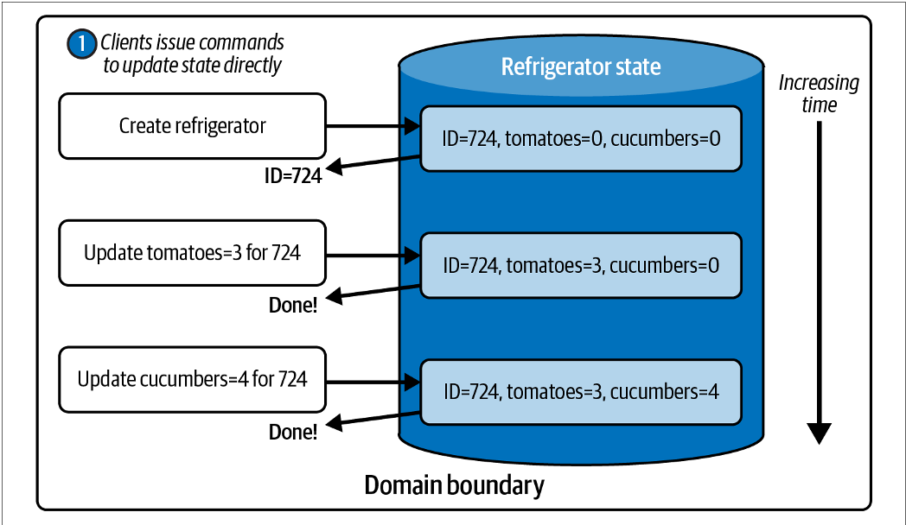

>Figure 5-4. Using CRUD commands to update the contents of the refrigerator, reflected in the database  

Under the event-sourcing architecture, these create, update, and delete operations are instead modeled as events that are written to a durable append-only log that retains them indefinitely. It is not uncommon to use a single local database table to act as the append-only log. The changes are then read back from the log and applied in the order they occurred.  

While it is also possible to use an event broker like Apache Kafka for event sourcing, you must ensure you are willing to accept several trade-offs. For one, the data will travel over a network both to and from the event broker, introducing network latency. Secondly, it is possible that the event broker becomes unavailable, say due to a network failure, which can cause unacceptable delays in processing.  

In either case, in event sourcing, the current state is generated by consuming events in the order they are written in the log and applying them one at a time to create the final state.  

Figure 5-5 shows the same refrigerator example, with the CRUD operations instead modeled as domain events. And although these sample events are CRUD-like, the domain owner has free reign over designing the deltas to suit their own business use cases. For instance, they could extend the set of events they're creating to also incorporate deltas such as:  

• turn lights on/turn lights off  

• turn_cooling_on/turn_cooling_off  

• open_door/close_door  

The domain aggregator (2) is separate from the process that writes the new domain events into the log (1), and allows the write and aggregation processes to be scaled independently. A domain can also contain multiple domain aggregators and may aggregate the same log to two different internal state stores depending on the domain needs.  

One of the main drawbacks of event sourcing is that it is an eventually consistent system, which may be a significant obstacle for some use cases. There will always be some delay between writing the event to the log and seeing the materialized result in the state. And because multiple concurrent clients can each write events about the same entity, it becomes difficult to attribute any specific modification in final state to the delta your client just appended. This can make it unsuitable in applications that require strong consistency.  

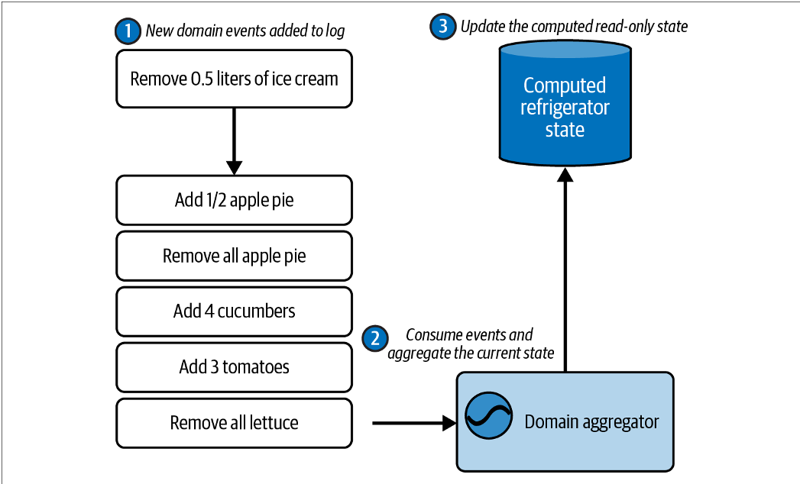

>Figure 5-5. Building up the contents of a refrigerator using event sourcing  

Event sourcing is a reasonable alternative to the CRUD model for building up internal state. The problem with event sourcing comes when it is *misused as a means for interdomain communication*, exposing the internal domain deltas to the outside world for others to couple on (and misinterpret). These domain-specific events and their relationship to the aggregate and to each other can change over time. Just as we do not allow services outside of our domain to couple directly on our data model, we also must not allow services to couple on our private domain events data model.  

This isn't to say you cannot expose any events outside of the domain boundary, but any event that you expose becomes part of the public data contract. You'll need to ensure that its semantic meaning doesn't drift over time and that the data doesn't evolve in a breaking way. A failure to maintain the boundaries of "events in here" and "events out there" can lead to very tangled coupling, excessive difficulty in refactoring, and subtle errors due to misinterpretation of events by outside consumers.  

## The Problems with Delta Events  

The next few sections illustrate the problems with using delta events for microservices. Keep in mind as you read through this section that delta events are not bad *per se*, but that they are often misused. This section will illustrate the limitations of delta events, while also highlighting where they are useful.  

### There is an infinite amount of delta event types  

First and foremost, there is an infinite number of delta events that can occur in any domain. This alone should stop most folks from trying to create event streams with the delta model, but unfortunately it does not. But surely, can it really be the case that there is an infinite number of delta events?  

In reality, the actual set of delta events necessary for your domain is undoubtedly finite. The real problem is that every consumer of a delta event needs to know precisely how to load it into their own version of state. For many events, this leaves it open to interpretation.  

Let’s take a look at an example. Figure 5-6 shows a simple set of ecommerce events for constructing the contents of a shopping cart.  


>Figure 5-6. Shopping cart delta events, used to construct the current state of the shopping cart  

ItemAdded and ItemRemoved are fairly simple: items can be added, or they can be removed. The consumer will need to interpret and apply each of these events, in the correct order, to build up its aggregate. Suppose, though, that a new feature in the domain allows users to update the quantity of items they have in their cart: where previously the domain owner may have issued a remove event first, then an add event with the new quantity, now they may instead simply issue an update.  

Figure 5-7 shows this new ItemQuantityUpdated event stream published to the world. Now if a consumer needs a model of the shopping cart, they must also account for these updated events in their aggregation code. As the scope of the domain changes, so do the meaning of the events and their relationship to the aggregate.  

One of the common reasons that people (incorrectly) choose to use delta events for cross-domain communication is that they don’t believe that other consumers should be required to maintain state to trigger on specific changes. The near-infinite range of possible deltas makes this untenable, but it’s a trap that many don’t recognize until they’re firmly in its grasp.  


>Figure 5-7. New updated event changes the way the shopping cart delta events are interpreted  

A simple expansion of the shopping cart domain to incorporate features such as coupons, shipping estimates, and subscriptions increases the amount of information that a consumer must account for, as shown in Figure 5-8.  

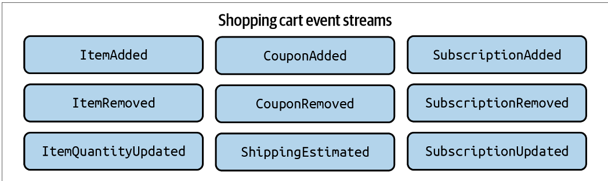

>Figure 5-8. The delta events defining the shopping cart sprawl as new business functionality is added  

Exposing this expanded shopping cart domain to consumers requires that the consumers can identify, use, and build a correct aggregate out of these events. But where do the consumers get the information they need to correctly interpret and aggregate this data? From the source producer system. Which leads us to the next major problem of using delta events.  

### The logic to interpret delta events must be replicated to each consumer  

How can a consumer know they're correctly interpreting the delta events? And how does the consumer stay up-to-date when new domain events are introduced? The key is to make it possible for a consumer to correctly operate without having to continually update their logic to account for new and varied delta events.  

In the state model, a consumer needs only to materialize the state events to know they're getting the complete public domain. They may not know why the transition occurred (I'll touch on this a bit more later in the chapter), but they can be assured that the entire public domain is there, and that as a consumer, they don't need to
worry about correctly aggregating the current state.  

Figure 5-9 shows two consumers, each of which has replicated the logic from the producer for building up the aggregate state. Consumers are responsible for identifying, understanding, and correctly applying the add, remove, and update domain events to generate the appropriate final state of the aggregate. The complexity of the domain is paramount; very simple domains may be able to account for this, but any domain of meaningful complexity will find this solution untenable.  

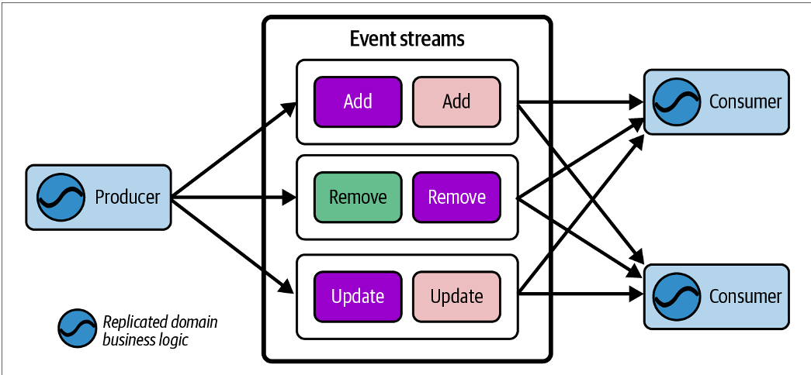

>Figure 5-9. The logic to interpret delta events to build state is copied into multiple locations  

Intermittent issues can cause further complexities—an event stream hosted on a lagging broker may experience delays in providing some events, resulting in the consumer receiving them out of order from events in other streams. Deltas applied in the wrong order often yield incorrect state transitions and may trigger incorrect business actions.  

Additionally, each consumer may implement its own aggregation logic slightly differently—often because a consumer fails to update the aggregation logic as the domain evolves. One consumer may wait up to 30 seconds for late-arriving events, while another consumer may not wait at all and simply discard any late arrivals, resulting in similar yet different aggregates.  

Any changes to how the producer aggregates its internal domain, including new events or changed delta semantics, must be propagated to the consumer logic—if you have worked on distributed services (or microservices) before, you may be shuddering at this idea. Using delta events to communicate between domains tightly couples the producer, the event definitions, and the consumers together, and trying to manage this is an exercise in futility.  

## Delta events map poorly to event streams  

In the problems discussed so far, we've operated under the assumption that any new delta events will be immediately identifiable and understandable to consumers, though they may not yet understand how to apply those events to the domain. The reality is far messier. Delta event consumers must be notified when new deltas are created so that they can update their code to integrate the event into their data model.  

Coordination can be quite difficult, particularly when there are many different consumers. Herein lies the main problem of this subsection: how do consumers know about the new domain events that they must consider in their model?  

One common suggestion that unfortunately misses the point is to simply "put it all in the same event stream so that the consumers have access to it and can choose if they need to use it." Although existing consumers will end up receiving these new event types, this proposal does nothing to solve the code changes and integrations for consumers to use that data.  

Additionally, it is far more likely to cause the consumer to throw an exception or skip processing the data. Worse yet, your consumer may experience silent processing errors in its business logic, leading to cryptically wrong results. This also violates the convention of using a single evolvable schema per event stream, which is a common practice for many of the frameworks and technologies that process event streams.  

The critical issue here is that new event definitions require working with those that aggregate the events into a model. If you put the new delta events into new individual streams, you make discovery easier and follow the one-schema-per-stream convention, but your consumers will still need to be manually notified that this new stream exists! In either case, a code update is required to make any sense of this data, while a failure to incorporate it runs the risk of an incorrect aggregate.  

Now contrast it with the state model, where the state domain can change as needed and the composition of the state event is encapsulated entirely within the producer service. Any modifications made to the state event occur in one place and one place only, and is reflected in the updated data model published to the event stream. Yes, you may need to handle a schema evolution of the state model event, but only in circumstances that cause a breaking change to the entity data model.  

### Inversion of ownership: Consumers push their business logic into the producer  

The fourth problem with deltas revolves around the ownership and location of business logic. For example, a consumer may need to know when a package has been shipped so that it can send out an email to the intended recipient notifying them that it's on its way. The business logic for determining that the package has shipped must necessarily live in the producer, as in Figure 5-10.  

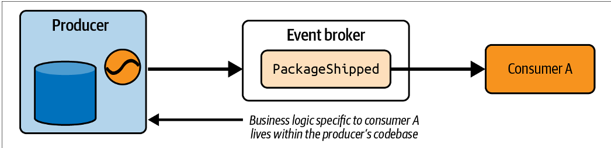

>Figure 5-10. Consumer business requirements are pushed into the business logic of the producer, which results in very tight coupling; in this case, consumer A wants to know only when a package is shipped, but not when the package has any other status  

Relying on the producer to compute consumer-specific business logic quickly becomes untenable with the growing scope of business use cases. Each new business requirement that relies on state transition will similarly need to place its business logic within the producer service (see Figure 5-11) to generate events whenever that “edge” happens. This is prohibitively difficult to scale and manage, let alone track ownership and dependencies.  

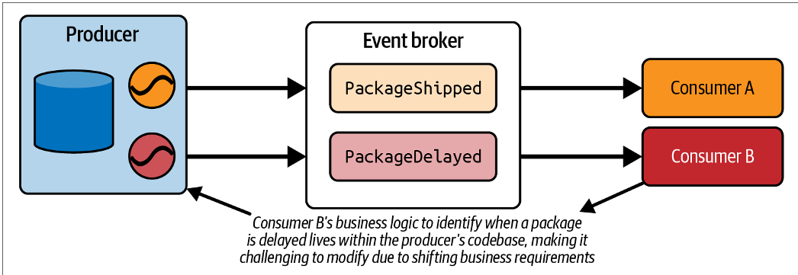

>Figure 5-11. There are many possible deltas for domains of even modest complexity, and the producer service is unfortunately required to handle them all in this model  

The entire purpose of delta events is to avoid maintaining state in the consumer service, but they require that the producer be fully able and willing to fulfill business logic solely for the consumer. For example, consider these reasonably plausible use cases:  

• I want to track returns where a user had previously called in to complain: a userReturnedItemAfterTelephoneComplaint event.  

• I want to know if the user has seen at least three ads for the item and then subsequently purchased it: a userSawAtLeastThreeAdsThenPurchasedIt event.  

These sample events may seem a bit over the top, but the reality is that these are the sorts of conditions that businesses do care about. In each case, the consumer should maintain its own state and build up its own computations of these occurrences but instead avoids it by pushing the responsibility of detecting the edge back to the producer. The result is a very tight coupling between the producer and the consumer, and leads to spreading the complexity across multiple code bases.  

A final factor is that a single system is seldom able to provide all of the information necessary for these highly specialized events. Consider the example of Figure 5-12. In this example, the consumer needs to act when state from the advertising service and the payments service (both within their own domains) meet a certain criterion: the user must have been shown an advertisement three times and then eventually have purchased that item.  

Even if we convinced the advertising team to produce userSawAdvertisementThreeTimes and userReturnedItemAfterTelephoneComplaint events, the consumer would still need to store it in its own state store and await the matching purchase from the payments service. Even the most complex and convoluted event definition cannot account for handling data that resides entirely in another domain. The consumer must still be able to maintain state, despite our best efforts to avoid it.  

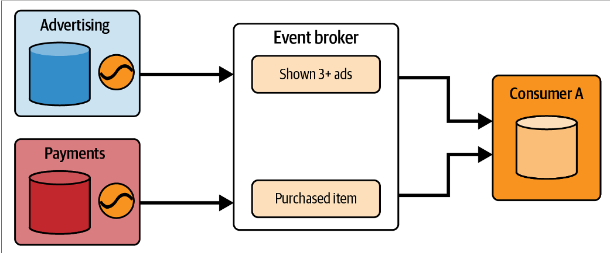

>Figure 5-12. Delta event triggering logic specific to consumer A is pushed upstream to both the advertising and payments service, resulting in very tight coupling across multiple services  

And what if our consumer wants to change its business logic from three ads to four? A whole new event definition needs to be negotiated and put in the producer’s boundary, which should give you an idea of how poorly this idea fares in practice. It is far more reasonable that the producer output a set of general-purpose state and let the consumer figure out what it wants to do with those data sets.  

### Inability to maintain historical data  

The fifth and final point against delta events is based on the difficulty of maintaining usable historical data. Old state events can simply be compacted, but delta events cannot. It becomes substantially more difficult to manage the ever-increasing log of events as a source of historical information.  

Each delta event is essential for aggregating the final state. And there may not only be a single event stream to deal with, but multiple delta streams relating to different deltas within the domain. Figure 5-13 shows an example of three simple shopping cart delta events that have grown very large over the past 10 years—so large that a new consumer might take, say, three weeks of nonstop processing to make it through the volume of data, just to catch up to the current state.  

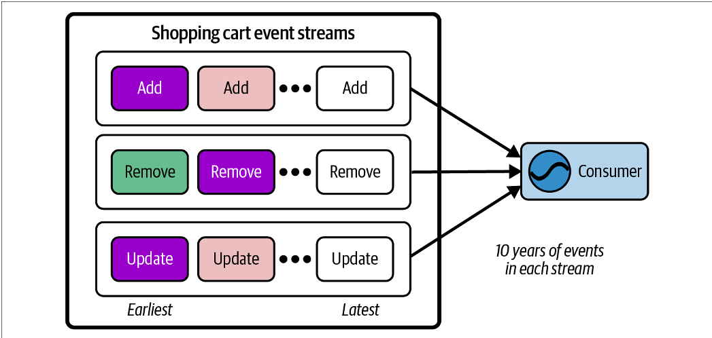

>Figure 5-13. There are simply too many delta events in this stream for a new consumer to reasonably consume  

While purging old data is certainly one solution, another solution that I have seen attempted is to offload older events into a large side state store, which can be sideloaded into a new consumer. The idea here is that the consumer can load all of these events in parallel, booting up far more quickly. The problem is that the order in which these events are applied can matter, and just moving the events to a nonstreaming system only to stream them back into new consumers is a bit nonsensical. So the next solution is to build a snapshot of the state at that point in time based on all of the delta events. This is shown in Figure 5-14.  

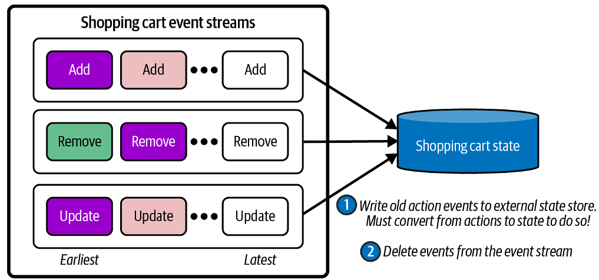

>Figure 5-14. Loading the old events into a bootstrapping side store requires aggregating into a state model  

There is a bit of irony here. In the attempt to avoid creating a publicly usable definition of state, we find ourselves doing exactly this out of necessity to store the data in a side store. New consumers can certainly boot up far more quickly using it, but now they have to both read from the snapshot state store and then switch over perfectly to the event stream.  

Figure 5-15 shows that we have now come full circle, back to the very lambda architectures that we had been trying to avoid, along with all its operational complexity and inherent problems.  

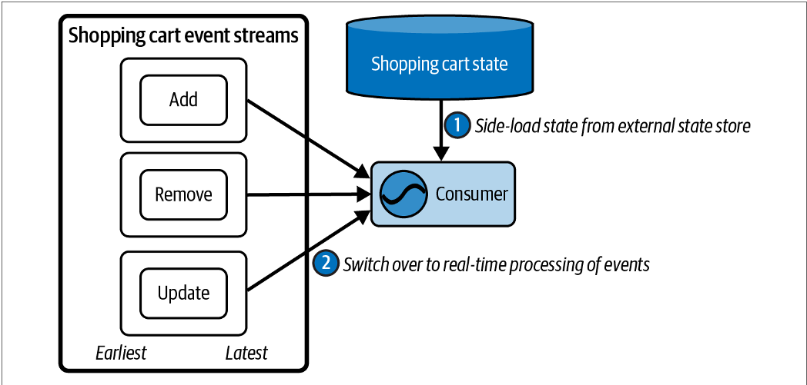

>Figure 5-15. This brings us back around to the lambda architecture involving both delta events, aggregated state, and the need to handle both batch and streaming  

Do not let this section on delta problems sour you on their usage. They do have their place in event-driven microservices, as do state events. It's just a matter of knowing when and where to use them, and being aware of the pitfalls and hazards you may encounter along the way.  

## Where Do I Use Delta and State Events?  

Delta events are best used within the internal boundary of a private domain, where the tight coupling of the event definitions and the logic required to interpret and apply them can be applied consistently. Delta events work fine within a single application for building up state via event sourcing, and can also be very successful between tightly coupled applications.  

The following are unfortunately common yet insufficient arguments for using delta
events for interdomain communication:  

• Maintaining duplicate state is wasteful, it's going to take up too much disk.  

• The consumers will know what the event means. How could they possibly misinterpret it?  

• C'mon, I really only care about this one transition, it's not a big deal if I couple on it. Just publish a custom event for me.  

—That person who doesn’t want to use state events  

Using the same delta events across domain boundaries is perilous, as illustrated by the five major problems covered in this section. Successfully building up state from delta events across domain boundaries is generally far more challenging than simply relying on state events for event-carried state transfer. While it is attractive in the sense of reducing state storage requirements, the reality is that disk is extremely cheap in modern event-driven architectures. In contrast, a software engineer's time is far more expensive, and will easily dwarf the costs of state storage in break-fix work if delta usage is not carefully controlled.  

Figure 5-16 provides an example for good practices when using state and delta events. In the first (1) bounded context, you can see that there are both delta and state event streams. The streams and services are tightly coupled, but are owned by a single team that can manage and isolate the complexity. The delta events are not available for use outside of the bounded context. Instead, one of the services composes state events for other services to use.  

The second (2) and third (3) bounded contexts each consume from the state stream produced by bounded context (1). Both are fully independent of each other, and consume and use the state events as their business logic sees fit. They may also consume from other streams, but these have been omitted for diagram brevity.  

Finally, the fourth (4) bounded context consumes from the third (3) bounded context's state stream. It also uses deltas internally to communicate between its two services. Perhaps these delta streams are using multiple event types per stream, and perhaps they're also using side state stores to provide snapshots of state. It doesn't really matter to the outside world, however, as these are concerns solely for the developers of the applications within bounded context four (4).  

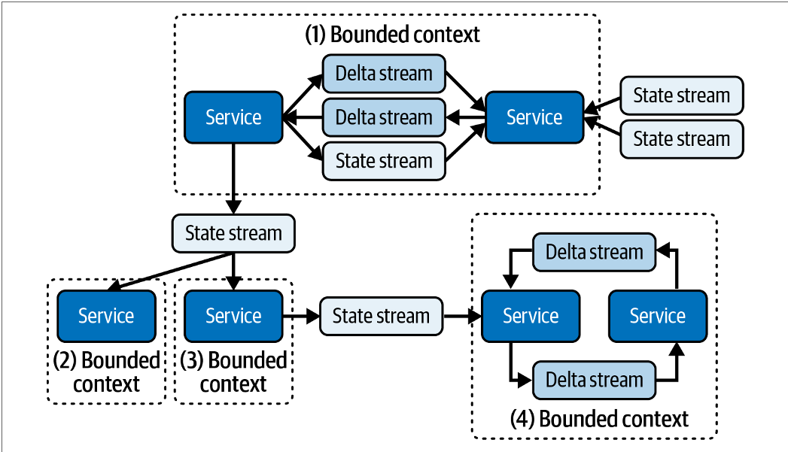

>Figure 5-16. State and delta event type usage across an organization  

Having covered both deltas and state, it's now time to complicate things just a bit more with hybrid events.  

#### Hybrid Events: State with a Bit of Delta  

Hybrid events are a mixture of state and delta. It's best to think of these as state events that may contain a bit of information about *why* or *how* something happened. Let's look at an example for clarity.  

> [!WARNING]
> Exposing “how” or “why” something has occurred with a hybrid event may lead to tight consumer coupling on the producer system’s business logic. Proceed with caution.  

Consider the following scenario. A company provides an online service that requires a user to sign up before using it. A user can sign up in several ways:  

• Via the main sign-up button on the home page  

• Via an email advertising link  

• Using a third-party account (a Google account, for example)  

• Via the account manually created for them by the administrator  

The consumer wants to know *how* the user signed up. For operational use cases, we want to know which onboarding workflow to serve them when they next log in. For analytical purposes, we may want to know which of our methods of sign-up are the most common so we can allocate our development resources.  

One way to model this sign-up is with a user state event, with a single enumeration indicating the sign-up mechanism (after all, you can only sign up once!). An example of the record would look like this:  

json
Key: "USERID-9283716596927463"
Value: {
    name: "Randolph L. Bandito",
    signup_time: "2022-02-22T22:22:22Z",
    birthday: "2000-01-01T00:00:00Z",
    // An enum of (MAIN, VIA_AD_EMAIL, THIRD_PARTY, or ADMIN)
    method_of_signup: "VIA_AD_EMAIL"
}  

To create the hybrid event, we incorporated what would otherwise be delta events into a single state event. Instead of signed_up_via_email, signed_up_via_homepage, signed_up_via_third_party, and signed_up_via_admin events, we flattened them down into a single enum and appended them to the user entity. The domain of values in the user state event needs to account for each of the possible enum settings: for example, we may also want to include information about which third-party sign-in provider was used or which email campaign got the user to sign up.  

And herein lies the main issue with hybrid events. The precise mechanism of *how* something came to be within a domain is by and large a private detail. Providing this information to downstream consumers exposes the internal business logic of the source system, resulting in tight coupling and brittle services.  

The main risk to the consumer of this information is that *how* a user signs up will change over time. This can be both a semantic change in meaning (what exactly is the "main" way to sign up now versus five years ago and five years in the future?), as well as the expansion or contraction of values in the enum. These semantics are usually only the concern of the source domain, but by exposing these delta-centric seams, they become a concern of the consumer.  

There is also the chance (or likelihood) that the producer must update the hybrid event to account for a new means of sign-up: via the company's newly released mobile application (add VIA_MOBILE_APP to the method_of_signup enum). Consumers of this event must be kept informed of impending changes to this event and must confirm that they can handle processing of this new method_of_signup before the event definition is updated. If not, the consumers run the risk of encountering fatal errors during processing, because their business logic won't account for the new type. This is just another aspect of the same issue we saw in "The logic to interpret delta events must be replicated to each consumer" on page 109.  

However, in this example, the risk to the consumer is low, but not zero, for the
following reasons:  

• How a consumer signed up is immutable. The real risk lies in the meaning of method_of_signup drifting over time. The owner of the event can prevent this by providing very clear documentation of the enumeration's meaning (e.g., in the event schema itself) and adhering closely to its own definitions.  

• The logic that populates method_of_signup is fairly simple overall, and so is much less likely to drift over time. Registering via an email link is a binary delta—you either registered via the email link or you didn't. In contrast, an enum based on the userReturnedItemAfterTelephoneComplaint delta event from earlier in the chapter has many more sequential dependencies and ways of misinterpreting it, and is far more likely to drift in meaning over time.  

A hybrid event is a trade-off. The risk you incur in using a hybrid event is proportional to the complexity of the delta you are trying to track and the likelihood that it will change over time (intentionally or not). I advise that you try to further decouple your producer and consumer systems to avoid communicating the details of *why* or *how* data has changed. If you choose to include a delta-type field in your event, be aware that it becomes part of your data contract, and carefully consider the coupling it introduces with the source system.  

## Measurement Events  

Measurement events are commonly found in many domains and consist of a complete record of an occurrence at a point in time. There are common examples of this in our everyday world: website analytics, perhaps most familiarly embodied by Google Analytics, is one. The user behavior tracking that occurs on every single website, social media experience, and mobile application is another. Every time you click a button, view an ad, or linger on a social media post, it is recorded as a measurement event.  

What does a measurement event look like? Here's an example of a user behavior event recording the event of a user seeing an advertisement on a web page:  

Key: "USERID-8271949472726174"
Value: {
    utc_timestamp: "2022-01-22T15:39:19Z",
    ad_id: 1739487875123,
    page_id: 364198769786,
    url: https://www.somewebsite.com/welcome.html
}  

A measurement is a snapshot of state at a specific point in time. However, measurements have a few characteristics that differentiate them from the state events we discussed earlier.  

### Measurement Events Enable Aggregations  

Measurements are often used to create aggregations around a particular key. For example, the userViewedAd measurement could be used to compute a multitude of data sets, answering questions like “What is the most popular page_id?”, “When do users see the most ads?”, and “How many ads does each user see, on average, in a session?”  

## Measurement Event Sources May Be Lossy  

It is not uncommon to lose measurements somewhere between their creation and ingestion into the event stream. For example, ad-blockers are very good at blocking web analytical events, such that your reports and dashboards are unlikely to be completely accurate. They are, however, often good enough for many analytical purposes.  

#### Measurement Events Can Power Time-Sensitive Applications  

Consider a factory that measures temperature, humidity, and other air-quality metrics on its assembly line. One *analytical* use case for these measurements may be to track and identify long-term trends of the factory environment. But an *operational* use case may be to react quickly in the case of divergent sensor values, altering the assembly line throughput or shutting it down altogether if the environmental conditions fail to meet specifications.  

In the case of network connectivity issues, it may be that the sensors are waiting to publish data that is now 30 to 60 seconds old, while new data piles up behind it. Depending on the *purpose* of the measurement stream and its pre-negotiated service-level objectives, it may choose to discard the old events and simply publish the latest. It really depends heavily on whether this data is being used for real-time purposes or whether it's being used to build a comprehensive historical picture that is tolerant of outages and delays, as is the case in web analytics.  

## Collecting and Using Measurements in Practice  

Early in my career, I worked at RIM, now BlackBerry, collecting measurement data from internal developer BlackBerry devices. Basically, whenever a "bad thing" happened on a device, we would generate a dump of measurements, package it up, and send it to our backend servers for further processing. "Bad things" included dropped calls, dropped text messages, BlackBerry Messenger failing to send messages, cellular modem chip resets, along with custom triggers generated by key business applications. The purpose was to collect all of these measurements for both automated generation of problem reports and to aid developers in debugging.  

There are a few key things about collecting measurements that I learned then and have carried with me ever since. For one, it was extremely important to have a well-defined schema for the payloads under your control, as it made automated post-processing so much easier (null pointers anyone?) and reduced time spent adding special logic to handle malformed data. Secondly, measurement completeness was more important than real-time performance. It wasn't uncommon for us to receive measurement events that were hours, days, or even weeks old—this could be due to test devices that may have been temporarily disconnected, such as an executive flying from North America to Asia, or even just one of our developers getting stuck in a tunnel on their commute to work. But the SLOs that we had issued to our dependent consumers reflected this, and we only started getting hounded for data if we missed our daily report.  

## Notification Events  

There's one last event type to discuss before we wrap up the chapter. A notification contains a minimal set of information that *something has happened* and a link or URI to the resource containing more information. Mobile phones are probably the most familiar source of notifications—you have a new message, someone liked your post, or you have enough hearts to resume your free-to-play game—tap here to go to it.  

An example of a simple behind-the-scenes notification you may receive on your cell phone could look something like the following. Your instant message application sends out a NEW_MESSAGE notification, including a status (for icon display), the name of the application, and a click-through URI to the application itself:  

Value: {
    status: "NEW_MESSAGE",
    source: "messaging_app",
    application_url: "/user/chat/192873163812392"
}  

Notification events are often misused as a means of trying to communicate state without sending state itself. Instead, a pointer to the state is sent in the notification, with the expectation that the recipient will log in to the source server and obtain the data. The following shows just such an example, where the notification includes that the status has changed, and there is an access URI to find the complete current state:  

Key: 12309131238218
Value: {
    status: "PARTIAL_RETURN",
    utc_timestamp: "2021-21-13T13:11:42Z",
    access_url: "serverURI:8080/orders/values/12309131238218"
}  

At first glance, this seems to be a neat and trim solution: it allows the consumer to simply query for the full public state upon receiving the event without copying or exposing that data elsewhere. One of the major issues is that the event doesn't actually provide a record of the state *at that point in time*—unless the data contained at `access_uri` is completely immutable (it usually isn't). Since this antipattern is usually built on top of a mutable state store, by the time you receive the `PARTIAL_RETURN` notification, the associated state at `access_uri` may have already been updated again to a new state.  

This race condition makes notifications an unreliable mechanism for communicating state. For example, a sale with status updates of SOLD -> PARTIAL_RETURN -> FULL_RETURN will emit three distinct events, one for each state. A consumer lagging behind on its processing may not be able to access the PARTIAL_RETURN state before it finalizes to FULL_RETURN and thus completely miss that full state transition. To make matters worse, a new consumer processing the backlog will not see any of the previous state—only whatever is stored in the access_uri at the current wall-clock time.  

A final blow to this design is that it adds far more complexity. Not only must the domain owner of the notification publish events, but it must also serve synchronous requests pertaining to that state. This includes managing access control, authorization, and performance scaling for both the event-stream producer and the synchronous query API.  

Instead, it is far better just to produce the necessary state of the event as an immutable record of that point in time. It takes very little effort and greatly simplifies data communication between domains.  

## Event Design for Data Privacy and the Right to Be Forgotten  

Private data, such as personally identifiable information (PII) and financial information, tend to have high security requirements. These requirements are often codified in law. For example, General Data Protection Regulation (GDPR) applies to any organization that processes data of people located within Europe. It requires the secure handling, storage, and deletion of customer data. Article 17 requires providing individuals the right to have their personal data deleted upon request, without a significant delay.  

However, event streams are immutable. You can't go in and alter the data once it's been written. While Chapter 18 covers some techniques for handling bad data that you can apply to eliminating PII from your streams, your best bet is to encrypt the sensitive data first.  

Field-level encryption (see "Field-Level Encryption" on page 93) is one encryption option, while another is to encrypt the entire event. In both cases, you'll probably use a key-management service (KMS) to hold on to the keys and provide a secure API for requesting access. It's common to use a unique key per user, per account, or per other important entity. Why? When it comes time to delete the data of the specific, say, user, you can instead just delete the key in the KMS to make the entire body of encrypted data inaccessible. This is known as crypto-shredding.  

It's important to note that crypto-shredding simply makes the data cryptographically unavailable. It is usually sufficient for meeting data privacy requirements, but you'll need to check with your own company's lawyers to ensure you stay on the right side of the law.  

Consumers of the encrypted events can contact the KMS and request access to the decryption keys. Provided they have the correct permissions, the KMS passes them back the decryption keys to allow them to decrypt the data themselves.  

> [!WARNING]
> Ensure that your consumers maintain the same level of encryption as the source stream when storing event data to its private data store. Microservice owners are responsible for securing their own data, which means it's best to avoid storing sensitive data unless it's absolutely necessary for your service.  

There are several complications that make event encryption and crypto-shredding an
important consideration:  

### Large amounts of data  

Large amounts of data may be stored in backups, tape drives, cold cloud storage, and other expensive and slow-to-access mediums. It can be very expensive and extremely time-consuming to read in historical data, selectively delete records, and then write it back to storage. Crypto-shredding enables you to avoid having to search through every single piece of old data in your organization.  

### Partially encrypted data is still useful  

Deleting just a user's PII is often sufficient for meeting the GDPR Article 17 requirements, while the remaining data may still be useful for your consumers. Field-level encryption lets you select which data you want to encrypt, instead of encrypting the whole event.  

### Data across multiple systems  

Deleting the decryption keys simultaneously halts data access across all consumer services. You don't need to worry about when the data is deleted, especially for systems that are slow to delete their data.  

### Further defense in depth  

Crypto-shredding provides an additional layer of security for preventing data security incidents. Leaking encrypted data is far less damaging than leaking unencrypted data, and helps reduce both the risk and the impact of a data security breach.  

Crypto-shredding doesn't protect you from consumers who negligently store decrypted data or the decryption keys. Ensure that consumers have clear and simple info security policies to follow, time-limit decryption key retention, and never write decrypted data to disk.  

Data encryption is an important component of designing events, particularly as it can be difficult to add it in later. It will also most likely result in a breaking change for your consumers, as they will need to implement decryption operations, KMS connectivity, and validate their data-retention policies against the data-privacy needs.  

### Summary  

We covered a lot of ground in this chapter, so let's take a moment to recap before moving on.  

Events can primarily be defined as state or delta. State events enable event-carried state transfer and are your best option for communicating data between domains. State events rely on event broker features, such as indefinite retention, durable state, and compaction to help us manage the volume of events. The state design allows us to leverage the event broker as the primary source of data, enables the use of the kappa
architecture, and deftly avoids the pitfalls associated with its predecessor, the lambda
architecture.  

Delta events are a common way of thinking about event-driven architectures, but they are insufficient for cross-domain communication. Deltas belong firmly in the camp of the event sourcing and tightly coupled inter-application communication. They can be invaluable for communication within a single bounded context. Misuse of delta events occurs when coupling by external parties is allowed. This results in the exposure of internal business logic, processes, and events that should remain private. Simply put, do not use delta events for cross-domain coupling.  

Measurement events record occurrences, such as those from human users, distributed systems, and Internet of Things (IoT) devices. Measurement events have their roots in the data analytics domain and consist of a snapshot of the localized state at a precise moment in time. These events are frequently used to compose detailed aggregates or to react to rapid measurement changes.  

Both hybrid and notification events should be used with caution, if at all. Hybrid events are primarily a state event but can expose information pertaining to why something happened, akin to a delta event. This forms a seam that introduces tight coupling, particularly when the why changes with time, and can lead to tight coupling and dependencies spread across multiple services.  

While this chapter has discussed how to design events, the next chapter shows how to generate events from existing data sources. The vast majority of event-driven microservice architectures emerge as an expansion to existing systems and services, and getting their business data into event streams is of the utmost importance. The state event type will feature heavily in the next chapter.  

# Integrating Event-Driven Architectures with Existing Systems  

Transitioning an organization to an event-driven architecture requires the integration of existing systems. Your organization may have one or more monolithic relational database applications. Point-to-point connections between various implementations are likely to exist. Perhaps there are already event-like mechanisms for transferring bulk data between systems, such as regular syncing of database dumps via an intermediary file store location. This chapter covers how you can start making important business data available through event streams instead.  

In any business domain, there are entities and events that are commonly required across multiple subdomains. For example, an ecommerce retailer will need to supply product information, prices, stock, and images to various bounded contexts. Perhaps payments are collected by one system but need to be validated in another, with analytics on purchase patterns performed in a third system. Making this data available in a central location as the new single source of truth allows each system to consume it as it becomes available. Migrating to event-driven microservices requires making the necessary business domain data available in the event broker, consumable as event streams. Doing so is a process known as *data liberation*, and involves *sourcing* the data from the existing systems and state stores that contain it.  

Data produced to an event stream can be accessed by any system, event-driven or otherwise. While event-driven applications can use streaming frameworks and native consumers to read the events, legacy applications may not be able to access them as easily due to a variety of factors, such as technology and performance limitations. In this case, you may need to *sink* the events from an event stream into an existing state store.  

A number of patterns and frameworks exist for sourcing and sinking event data. For each technique, this chapter covers why it’s necessary, how to do it, and the trade-offs associated with different approaches. Then, we’ll review how data liberation and sinking fit in to the organization as a whole, the impacts they have, and ways to structure your efforts for success.  

## What Is Data Liberation?  

Data liberation is the identification and publication of cross-domain data sets to their corresponding event streams and is part of a migration strategy for event-driven architectures. Cross-domain data sets include any data stored in one data store that is required by other systems. Point-to-point dependencies between existing services and data stores often highlight the cross-domain data that should be liberated, as shown in Figure 6-1, where three dependent services are querying the legacy system directly.  

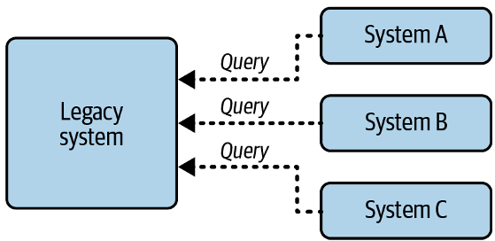

>Figure 6-1. Point-to-point dependencies, accessing data directly from the underlying service  

Data liberation enforces two primary features of event-driven architecture: the single source of truth and the elimination of direct coupling between systems. Systems no longer couple directly to the underlying data stores or application APIs, but instead couple solely on the event streams. The post-liberation workflow is shown in Figure 6-2.  

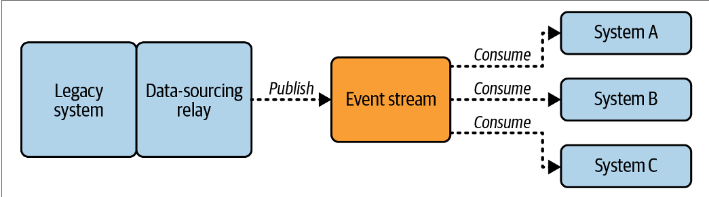

>Figure 6-2. Post-data-liberation workflow  

## The Dual Write Antipattern  

The dual write antipattern is when a service writes data to two data stores independently of each other. Figure 6-3 illustrates a service writing a block of data to both a state store and an event stream in an event broker. The service cannot use a simple transaction to commit the data as both services are fully independent of each other. Committing data to one service may succeed with the commit to the other subsequently failing.  

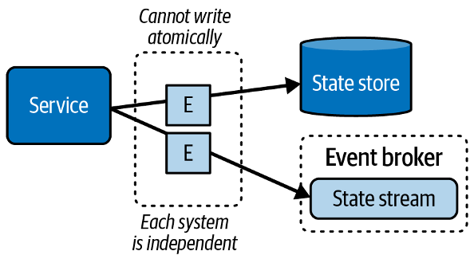

>Figure 6-3. A service cannot write to an independent data store and an independent event stream in a single atomic transaction  

A developer that discovers they cannot atomically write to both a data store and an event stream may just shrug their shoulders and do it anyway, without the transaction. Their service may simply retry on a failure to commit, but there are other reasons why a commit may fail: invalid schema, service permanently moved, or a major prolonged outage due to hardware or configuration issues. Eventually the producer service will have to give up, at which point the data in the two services has permanently diverged.  

Services that support two-phase commits (2PC) can indeed participate in a distributed transaction with multiple parties. But the reality is that many data stores do not support 2PC, nor do many event brokers. Apache Kafka has a project for 2PC, but it remains in progress at the time of publication of this book.  

The good news is that there are several strategies that you can use for liberating data
that do not involve 2PC, covered in the next section.  

## Data Liberation Patterns  

You can use three main data liberation patterns to extract data from the underlying data store. Since liberated data is meant to form the new single source of truth, it follows that it must contain the entire set of data from the data store. Additionally, this data must be kept up-to-date with new insertions, updates, and deletes:  

### Query-based  

You extract data by querying the underlying state store. This can be performed on any data store.  

### Log-based  

You extract data by following the append-only log for changes to the underlying data structures. This option is available only for select data stores that maintain a log of the modifications made to the data.  

### Outbox table-based  

In this pattern, you first push data to a table used as an output queue. Another thread or separate process queries the table, emits the data to the relevant event stream, and then deletes the associated entries. This method requires that the data store support both transactions and an output queue mechanism, usually a standalone table configured for use as a queue.  

While each pattern is unique, there is one commonality among the three. Each should produce its events in sorted timestamp order, using the source record's most recent updated_at time in its output event record header. This will generate an event stream timestamped according to the event's occurrence, not the time that the producer published the event. This is particularly important for data liberation, as it accurately represents when events actually happened in the workflow. Timestamp-based interleaving of events is discussed further in Chapter 9.  

## Data Liberation Frameworks  

One method of liberating data involves the usage of a dedicated, centralized framework to extract data into event streams. Examples of centralized frameworks for capturing event streams include Kafka Connect (exclusively for the Kafka platform), Debezium, and Apache NiFi. They'll connect to a whole suite of different data stores, applications, and SaaS endpoints with off-the-shelf connection options. And some connector frameworks will also let you write your own connectors for less common use cases.  

Each framework allows you to execute a query against the underlying data set with the results piped through to your output event streams. Each option is also scalable, such that you can add further instances to increase the capacity for executing change-data capture (CDC) jobs (covered in the next section). They support various levels of integration with the schema registry offered by Confluent (Apache Kafka), but
customization can certainly be performed to support other schema registries. See
"Schema Registry" on page 388 for more information.  

Let's take a look at our first mechanism for getting data into streams: change-data capture.  

## Liberating Data Using Change-Data Capture  

One of the chief methods for liberating data relies on the data store's own underlying immutable log (e.g., binary log for MySQL, write-ahead logs for PostgreSQL). This immutable append-only data structure preserves the data store's data integrity. An inserted record is first written into the durable log before being applied to the underlying data model. If the database were to fail mid-write, then the durable log is replayed to the disk, to ensure that no information is lost and the data model remains consistent.  

Change-data capture is a process that reads (or *tails*) these logs, converts the individual data store changes into events, and writes them to the event stream. These changes include the creation, deletion, and updating of individual records, as well as the creation, deletion, and altering of the individual data sets and their schemas. While many databases provide some form of read-only access to the durable logs, others, like **MongoDB**, provide **CDC** events directly instead of tailing the log.  

The data store's log seldom contains the entire history of data. To turn the entire data store data set into an event stream, you'll need to create a snapshot of the existing state from the data set itself. I'll cover that more in "Snapshoting the Initial Data Set State" on page 132.  

Not all data stores implement an immutable logging of changes, and of those that do, not all of them have off-the-shelf connectors available for extracting the data. This approach is mostly applicable to select relational databases, such as MySQL and PostgreSQL, though any data store with a set of comprehensive changelogs is a suitable candidate. Many other modern data stores expose event APIs that act as a proxy for a physical write-ahead log. For example, MongoDB provides a Change Streams interface, whereas Couchbase provides replication access via its internal replication protocol.  

Figure 6-4 shows a MySQL database publishing updates to its binary log. A Kafka Connect service, running a Debezium connector, consumes and parses that binary log and converts each database update to its own discrete event. Next, an event router emits each event to a specific event stream in Kafka, depending on the source table of that event. Downstream consumers are now able to access the database content by consuming the relevant event streams from Kafka.  

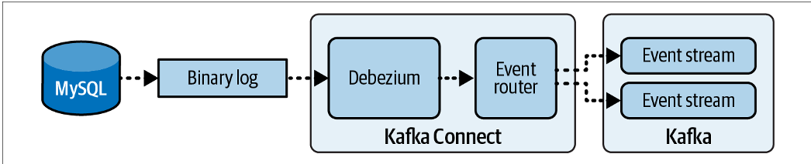

>Figure 6-4. The end-to-end workflow of a change-data capture solution using Debezium and Kafka Connect to source MySQL data into Kafka events  

CDC gives you every change made in the database. You will not miss any transitions, and your derived event stream will contain every update. CDC frameworks provide configuration files that let you specify which fields to include in your event, letting you filter out internal data from the outside world. You can also choose to include metadata like the serverId, transactionId, and other database or connector-specific content. CDC commonly uses before and after fields that detail the full state of the row or document before the change and after the change, as covered in “Before/After State Events” on page 102.  

You must checkpoint progress when capturing events from the changelogs, though depending on the tooling you use, this may already be built in. In the event that the change-data capture mechanism fails, the checkpoint is used to restore the last stored changelog index. This approach can only provide at-least-once production of records, which tends to be suitable for the entity-based nature of data liberation. The production of an additional record is inconsequential since updating entity data is idempotent.  

While several options are available for sourcing data from changelogs, Debezium remains the most popular and the de facto leader in the field. It supports many of the most popular data stores and can produce records to both Apache Kafka and ApachePulsar.  

Having covered the basics of CDC, let’s now turn our attention to how you can get the initial data set into the event stream.  

### Snapshotting the Initial Data Set State  

The data store log is unlikely to contain all changes since the beginning of time, as it’s primarily a mechanism to ensure data store consistency. The data store continually merges the log data down into the underlying data store model, only keeping a short window of data (e.g., several GB).  

Snapshotting is the process of loading all the current data into the event stream, directly from the data store (and not the log). It can be a very resource-intensive activity, as you must query, return, copy, convert to events, and write to event streams every entity of data from the source data set. Once you've completed your snapshot,
you can then move on to capturing live changes.  

The snapshot usually involves a large, performance-impacting query on the table and is commonly referred to as *bootstrapping*. You must ensure that there is overlap between the records in the bootstrapped query results and the records in the log, so that you do not miss any record when you switch over to live CDC.  

There are further complications beyond the size of the query. A data store typically serves live business use cases and cannot be interrupted or degraded without some sort of consequence. However, and without getting too into the weeds, snapshotting typically requires an unchanging set of data to ensure consistency, and to accomplish that, it usually locks the table that it is querying. This means that your important production table may be locked for several hours while the snapshot completes. I bet your database administrator will be thrilled. And even if it's brief, it may still be unacceptable. So what else can you do?  

One option is to snapshot from a read-only replica. You take the snapshot against the replica, leaving the production data store alone. Once completed, you can unlock the table, which will then be populated by the replicated updates from the production data store. At this point, you can swap over to change-date capture, or a periodic query as covered in the next section.  

Some CDC frameworks, like Debezium, provide a mechanism to snapshot specific data stores without locking the table. Normal operational reads and writes can continue uninterrupted with the resultant snapshot being eventually consistent with the current table's state. A Debezium blog post explains this innovation. It is based on a paper from Netflix that states:  

DBLog utilizes a watermark based approach that allows us to interleave transaction log events with rows that we directly select from tables to capture the full state. Our solution allows log events to continue progress without stalling while processing selects. Selects can be triggered at any time on all tables, a specific table, or for specific primary keys of a table. DBLog executes selects in chunks and tracks progress, allowing them to pause and resume. The watermark approach does not use locks and has minimum impact on the source.  

—Andreas Andreakis and Ioannis Papapanagiotou, Netflix  

Live table snapshots that don't degrade performance or block production use cases are a massive improvement from early CDC technologies. They let you focus on *using* the data to build event-driven applications, instead of just wrangling the data out of the data store.  

The CDC system merges the incremental snapshot query results with the log records.
The snapshot query data is written directly to the event stream, except in the case
where a *newer* record from the log has already been written for the given key. In this case, the older record is discarded, as it is no longer a valid representation of the
latest data. Once completed, the CDC process continues to tail the data store's log
indefinitely.  

Next, we'll go over a few of the main benefits and drawbacks of using the CDC with data store logs.  

## Benefits of Change-Data Capture Using Data Store Logs  

Benefits of using data store logs include the following:  

Delete tracking  

Data store logs contain deletions, so that you can see when a record has been deleted from the data store. These can be converted into tombstone events to enable downstream deletions and stream compaction.  

Minimal effect on data store performance  

For data stores predicated on logs, change-data capture can be performed without any impact to the data store's performance. For those that use change tables, such as in SQL Server, the impact is related to the volume of data.  

Low-latency updates  

Updates propagate as soon as the event is written to the data store log, resulting
in event streams with relatively low latency.  

Nonblocking snapshots  

CDC can create snapshots without interfering with the normal operations of the
source data store.  

## Drawbacks of Change-Data Capture Using Data Store Logs  

Downsides to using data store logs include the following:  

Exposure of internal data models  

The internal data model is completely exposed in the changelogs. Isolation of the underlying data model must be carefully and selectively managed.  

Denormalization outside of the data store  

Changelogs contain only the event data. Some CDC mechanisms can extract from materialized views, but for many others, denormalization must occur somewhere downstream. This typically leads to the creation of highly normalized event streams, requiring downstream microservices to handle foreign-key joins and denormalization, which is covered in more detail in Chapter 7.  

Brittle dependency between data set schema and output event schema  

Valid data model changes in the source data store, such as altering a data set or redefining a field type, may cause breaking changes to downstream consumers.  

## Liberating Data with a Polling Query  

With query-based data liberation you query the data store, get the results, convert them into events, and write them to the event stream. You can write your own code to do this for you, or you can rely on the likes of Kafka Connect or Debezium, as mentioned previously. Given the wealth of connectors available today, I recommend that you start with a purpose-built framework instead of trying to rebuild your own.  

> [!NOTE]
> Query-based data liberation doesn't use the underlying data store log. Both snapshots and incremental iterations are consumed entirely via the data store query API.  

There are two main stages to the periodic query pattern: the initial snapshot, and the incremental phase.  

The snapshot process is identical to that found in "Snapshotting the Initial Data Set State" on page 132, though there is no data store log to swap over to once completed. The iterative phase starts where the snapshot left off.  

Query-based polling requires identifying which records have changed since the last polling iteration. An updated_at or modified_at timestamp is commonly included in the columns of a database table, and makes for a great high-water mark for where your query last ended. The next iteration of the query  $ (n+1) $  uses the high-water mark from the previous iteration  $ (n) $ , to select all records between n and  $ n+1 $ .  

The Kafka Connect JDBC connector provides out-of-the box functionality for incremental snapshotting. These three supported modes include (as quoted from the documentation):  

### Incrementing  

Use a strictly incrementing column (as specified by incrementing.column.name) on each table to detect only new rows. Note that this will not detect modifications or deletions of existing rows.  

### Timestamp  

Use a timestamp (as specified by timestamp.column.name) column to detect new and modified rows. This assumes the column is updated with each write, and that values are monotonically incrementing, but not necessarily unique.  

## Timestamp+incrementing  

Use two columns, a timestamp column that detects new and modified rows and a strictly incrementing column that provides a globally unique ID for updates so each row can be assigned a unique stream offset.  

The returned rows are automatically converted into events, inferring the event schemas from the query results—at least for the off-the-shelf frameworks. If you're rolling your own periodic querying mechanism, it'll be up to you to generate a schema that suits your needs. In either case, if the upstream data store model changes, you run the risk that your event schema will also change.  

Query-based polling, particularly when rolling your own, relies heavily on locking tables to get a consistent state. It is overall a dated process for bootstrapping, and while it's still technically valid, it's far more common to use CDC over iterative queries. Since the first edition of this book, CDC has substantially improved, with query-based polling relegated mostly to data stores and APIs that provide no underlying data store log access.  

## Incremental Updating  

The first step of any incremental update is to ensure that the necessary timestamp or auto-incrementing ID is available in the records of your data set. There must be a field that the query can use to filter out records it has already processed from those it has yet to process. Data sets that lack these fields will need to have them added, and the data store will need to be configured to populate the necessary updated_at timestamp or the auto-incrementing ID field. If the fields cannot be added to the data set, then incremental updates will not be possible with a query-based pattern.  

The second step is to determine the frequency of polling and the latency of the updates. Higher-frequency updates provide lower latency for data updates downstream, though this comes at the expense of a larger total load on the data store. It's also important to consider whether the interval between requests is sufficient to finish loading all of the data. Beginning a new query while the old one is still loading can lead to race conditions, where older data overwrites newer data in the output event streams.  

Once the incremental update field has been selected and the frequency of updates determined, the final step is to perform a single bulk load before enabling incremental updates. This bulk load must query and produce all of the existing data in the data set prior to further incremental updates.  

## Benefits of Query-Based Updating  

Advantages of query-based updating include the following:  

Customizability  

Any data store can be queried, and the entire range of client options for querying is available.  

### Independent polling periods  

Specific queries can be executed more frequently to meet tighter SLAs (service-level agreements), while other more expensive queries can be executed less frequently to save resources.  

### Isolation of internal data models  

Relational databases can provide isolation from the internal data model by using views or materialized views of the underlying data. This technique can be used to hide domain model information that should not be exposed outside of the data store.  

> [!WARNING]
> Remember that the liberated data will be the single source of truth.
> Consider whether any concealed or omitted data should instead be
> liberated, or if the source data model needs to be refactored. This
> often occurs during data liberation from legacy systems, where
> business data and entity data have become intertwined over time.  

## Drawbacks of Query-Based Updating  

Downsides to query-based updating include the following:  

#### Required updated-at timestamp  

The underlying table or namespace of events to query must have a column containing their updated-at timestamp. This is essential for tracking the last update time of the data and for making incremental updates.  

#### Detects only soft deletes  

Deleting a record from the data store outright will not result in any events
showing up in the query. Thus, you must use a soft delete, where the records are
marked as deleted by a specific is_deleted column.  

#### Brittle dependency between data set schema and output event schema  

Data set schema changes may occur that are incompatible with downstream event format schema rules. Breakages are increasingly likely if the liberation mechanism is separate from the code base of the data store application, which is usually the case for query-based systems.  

#### May miss intermittent data values  

Data is synced only at polling intervals, and so a series of individual changes to the same record may only show up as a single event.  

#### Production resource consumption  

Queries use the underlying system resources to execute, which can cause unacceptable delays on a production system. This issue can be mitigated by the use of a read-only replica, but additional financial costs and system complexity willapply.  

#### Query performance varies due to data size  

The quantity of data queried and returned varies depending on changes made to the underlying data. In the worst-case scenario, the entire body of data is changed each time. This can result in race conditions when a query is not finished before the next one starts.  

#### Transactional data inconsistencies  

Consider a transaction that writes to two tables, with one table referencing the other by primary or foreign key. Periodically querying the source tables means that you may generate records for one stream that reference a value in the other stream, though it hasn’t yet been captured from its table. This can lead to intermittent errors when your consumers need to reconcile the data.  

## Liberating Data Using Transactional Outbox Tables  

A transactional outbox table is a dedicated database table that acts as a buffer for data to be written to the event stream. When you update your internal domain model, you select only the data that you want to expose to the outside world and write it to the outbox. Then, a separate asynchronous process, such as a dedicated CDC connector, consumes the data from the outbox and writes it to the event stream. Figure 6-5 shows the end-to-end workflow.  

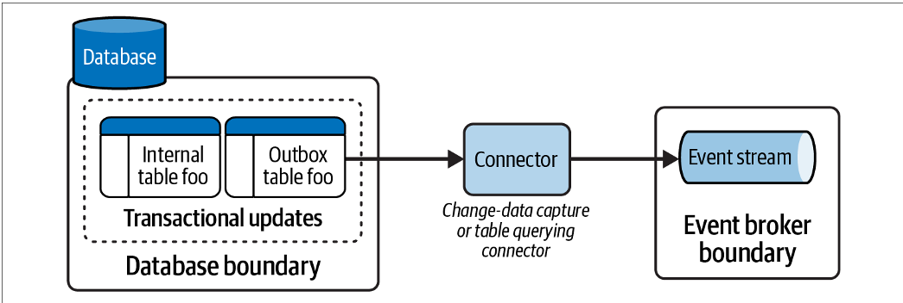

>Figure 6-5. The end-to-end workflow of an outbox table and connector solution  

The outbox table pattern leverages the transactional capabilities and durability of the data store to act as a write-ahead log. Updates to the internal table and the outbox are bundled into a single transaction, such that the updates occur only if the entire transaction succeeds. A failure to do so may eventually result in divergence with the event stream as the single source of truth, which can be difficult to detect and repair.  

Once the connector commits the records to the output event stream, you can delete the records from the outbox. In the case of any failure, be it the data store, the consumer/producer, or the event broker itself, outbox records will still be retained without risk of loss. This pattern provides at-least-once delivery.  

Example 6-1 illustrates (in Python) an atomic update of an EcomItem in a MySQL database. The internal model update is executed prior to the transactional outbox update, though both are wrapped within a single transaction for consistency.  

Example 6-1. Atomic update of the internal model and the transactional outbox  

```python
try:
    conn = mysql.connector.connect(host='localhost',
                                    database='python_db',
                                    user='abellemare',
                                    password='definitelynotpassword')

    conn.autocommit = False
    cursor = conn.cursor()

    # 1) Update the internal domain model
    internal_model_update = ""
        Update EcomItem
        set price = 1299.99
        where id = 4291""
    cursor.execute(internal_model_update)

    # 2) Select data from the internal domain model to write to the outbox
    internal_sub_model_query = ""
        Select name, price
        from EcomItem
        where id = 4291""
    cursor.execute(internal_sub_model_query)
    name_and_price = cursor.fetchone()

    if (name_and_price == None):
        raise Exception("Unexpected missing record. Can't get name_and_price")

    # 3) Insert the selected data into the outbox
    outbox_insert = ""INSERT INTO EcomItem_Outbox (id, name, price)
        VALUES (4291, %s, %s)"""

    # Pass the name and price in to replace the query wildcards
    cursor.execute(outbox_insert, name_and_price)

    # Commit the internal and outbox updates atomically
    conn.commit()

except mysql.connector.Error as error:
    # Revert changes due to exceptions
    conn.rollback()

```  

finally:
    # Close the database connection
    if conn.is_connected():
        cursor.close()
        conn.close()  

This example code first (1) updates the EcomItem price to 1299.99. Next (2), it selects the name and price from the table that was just updated. Finally, it composes the event and writes it into the EcomItem_Outbox format (3). Table 6-1 shows what this data looks like, which is really just the same as any other relational database table.  

>Table 6-1. EcomItem_Outbox table definition  

| id: INT NOT NULL|name: VAR CHAR(255)|price: DECIMAL(13,2) NOT NULL|Datetime: DEFAULT CURRENT_TIMESTAMP|ordering_id INT NOT NULL AUTO_INCREMENT|
| ---|---|---|---|---|
| 4291|"Fancy Laptop "|1299.99|2022-06-22 11:33:12|1|  

There are two things to note about this SQL table definition. One, it's using NOT NULL for each of the mandatory fields expected in our event. Inserting a new event into the outbox will fail unless all constraints are met. Two, the Datetime field uses the default CURRENT_TIMESTAMP if it is not provided by the application's code. You may use this timestamp as part of the schema for your event, or you may use it to populate the event's metadata to indicate when the event was created.  

> [!TIP]
> Ensure that the transactional outbox table schema and the event
> schema are compatible. The fields of one schema should map
> 1:1 with the other. Use predeployment scripts to validate that the
> outbox table schema and the event schema match to avoid easily
> preventable runtime errors.  

The transactional outbox table is a relatively invasive approach to change-data capture as you must modify either the data store or the application layer, requiring involvement by the data store and/or application owner.  

## Built-In Change-Data Tables  

Some databases, such as SQL Server, provide change-data tables instead of change-data capture logs. These tables are often used to audit the operations of the database and come as a built-in option. External services, such as the aforementioned Kafka Connect and Debezium, can connect to databases that use a CDC table instead of a CDC log and use the query-based pattern to extract events and produce them to event streams.  

The records in outbox tables require a strict ordering identifier to ensure that intermediate states are recorded and emitted in the same order they occurred. Alternatively, you may choose instead to simply upsert by primary key, overwriting previous entries and forgoing intermediate state. In this case, overwritten records will not be emitted into the event stream.  

## Performance Considerations  

The inclusion of outbox tables introduces additional load on the data store and its request-handling applications. For small data stores with minimal load, the overhead may go completely unnoticed. Alternatively, it may be quite expensive with very large data stores, particularly those with significant load and many tables under capture. The cost of this approach should be evaluated on a case-by-case basis and balanced against the costs of a reactive strategy such as parsing the change-data capture logs.  

## Isolating Internal Data Models  

An outbox table need not map 1:1 with the internal domain. In fact, one of the major benefits of the outbox is that the data store client can isolate the internal data model from downstream consumers. The internal data model may use several highly normalized tables that are optimized for relational operations but are largely unsuitable for consumption by downstream consumers. Even simple domains may comprise multiple tables, which if exposed as independent streams would require reconstruction for usage by downstream consumers. It can quickly become extremely expensive in terms of operational overhead, as multiple downstream teams will have to reconstruct the domain model and deal with handling relational data in event streams.  

> [!WARNING]
> Exposing the internal data model to downstream consumers is an antipattern. Downstream consumers should only access data formatted with public-facing data contracts, as described in Chapter 4.  

The data store client can instead denormalize data upon insertion time such that the outbox mirrors the intended public data contract, though this does come at the expense of additional performance and storage space. Another option is to maintain the 1:1 mapping of changes to output event streams and denormalize the streams with a downstream event processor dedicated to just this task. Chapter 7 covers these options in more detail, comparing and contrasting possible options.  

The extent to which the internal data models are isolated from external consumers
tends to become a point of contention in organizations moving toward event-driven
microservices. Some teams may be unable or unwilling to maintain data model isolation, most commonly citing a lack of resources. However, it's a cost that is paid
either upstream at the producer, or paid downstream for each and every consumer
of the data. Isolating the internal data model is essential for ensuring decoupling and
independence of services and to ensure that systems need only change due to new
business requirements. The next chapter covers data model isolation in more detail.  

## Ensuring Schema Compatibility  

Schema serialization (and therefore, validation) can also be built into the transactional outbox workflow. Schema validation can be performed either before or after the event is written to the outbox table. Success means the event can proceed in the workflow, whereas a failure may require manual intervention to determine the root cause and avoid data loss.  

Serializing prior to committing the transaction to the outbox table provides the strongest guarantee of data consistency. A serialization failure will cause the transaction to fail and roll back any changes made to the internal tables, ensuring that the outbox table and internal tables stay in sync. This process is shown in Figure 6-6. A successful validation will see the event serialized and ready for event-stream publishing. The main advantage of this approach is that data inconsistencies between the internal state and the output event stream are significantly reduced. The event-stream data is treated as a first-class citizen, and publishing correct data is considered just as important as maintaining consistent internal state.  

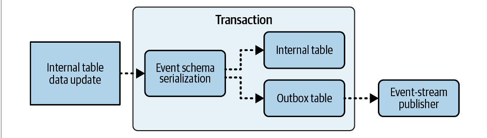

>Figure 6-6. Serializing change-data before writing to the outbox table  

Serializing before writing to the outbox also provides you with the option of using a single outbox for all transactions. The format is simple, as the content is predominantly serialized data with the target output event-stream mapping. This is shown in Figure 6-7.  

>Outbox table  

| id (auto-increment)|created_at|serialized_key|serialized_value|output_stream|
| ---|---|---|---|---|
| 8273|2020-07-07T07:43:10|A0 FB 24|0112 C5 BB D4|Accounts|
| 8274|2020-07-07T07:43:10|DE A8 EF|25 6B EA F9 76|Users|  

>Figure 6-7. A single output table with events already validated and serialized (note the output stream entry for routing purposes)  

One (often major) drawback of serializing before publishing is that performance may suffer due to the serialization overhead. This may be inconsequential for light loads but could have more significant implications for heavier loads. You will need to ensure that your service can still maintain its performance requirements.  

Alternatively, the downstream publisher can serialize the data after the event has been written to the outbox table, as is shown in Figure 6-8.  

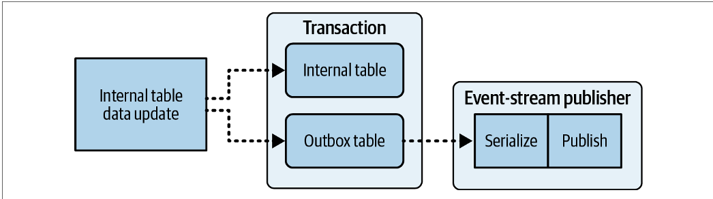

>Figure 6-8. Serializing change-data after writing to the outbox table, as part of the publishing process  

With this strategy you typically have independent outboxes, one for each domain model, mapped to the public schema of the corresponding output event stream. The publisher process reads the unserialized event from the outbox and attempts to serialize it with the associated schema prior to producing it to the output event stream. Figure 6-9 shows an example of multiple outboxes, one for a User entity and one for an Account entity.  

>User table outbox  

| id (autoincrement)|created_at|name|address|country|
| ---|---|---|---|---|
| 23|2020-05-20T16:30:00|Justin T.|123 Road Lane|Canada|
| 24|2020-05-20T16:30:01|Robert O.|60 3rd Street|USA|  

>Account table outbox  

| id (autoincrement)|created_at|account_id|user_id|type|
| ---|---|---|---|---|
| 45|2020-06-02T09:10:10|623|2729|Cash|
| 46|2020-06-03T11:53:01|638|4291|Credit|  

>Figure 6-9. Multiple outbox tables (note that the data is not serialized, which means that it may not be compatible with the schema of the output event stream)  

A failure to serialize indicates that the data of the event does not comply with its defined schema and so cannot be published. This is where the serialization-after-write option becomes more difficult to maintain, as an already completed transaction will have pushed incompatible data into the outbox table, and there is no guarantee that the transaction can be reversed.  

In reality, you will typically end up with a large number of unserializable events in your outbox. You will most likely need to manually intervene to try to salvage some of the data, but resolving the issue will be time-consuming and difficult and may even require downtime to prevent additional issues. This is compounded by the fact that *some* events may indeed be compatible and have already been published, leading to possible incorrect ordering of events in output streams.  

> [!TIP]
> Before-the-fact serialization provides a stronger guarantee against incompatible data than after-the-fact and prevents propagation of events that violate their data contract. The trade-off is that this implementation will also prevent the business process from completing should serialization fail, as the transaction must be rolled back.  

Validating and serializing before writing ensures that the data is being treated as a first-class citizen and offers a guarantee that events in the output event stream are eventually consistent with the data inside the source data store, while also preserving the isolation of the source's internal data model. This is the strongest guarantee that a change-data capture solution can offer.  

## Benefits of event production with outbox tables  

Transactional outbox advantages include the following:  

#### Multilanguage support  

This approach is supported by any client or framework that exposes transactional capabilities.  

#### Exactly-once outbox semantics  

Transactions ensure that both the internal model and the outbox data are created atomically. You will not miss any changes in your database provided you wrap the updates in a transaction.  

#### Early schema enforcement  

The outbox table provides a well-defined schema that maps to the event stream's schema. Serializing data into events during runtime provides additional validation, as incompatible data will result in exceptions.  

#### Internal data model isolation  

Data store application developers can select which fields to write to the outbox table, keeping internal fields isolated.  

#### Denormalization  

The service can denormalize the data before writing it to the outbox table.  

## Drawbacks of event production with outbox tables  

Producing events via outbox tables has several disadvantages as well:  

#### Database must support transactions  

Your database must support transactions. If it does not, you'll have to choose a different data access pattern.  

#### Application code changes  

The application code must be changed to enable this pattern, which requires development and testing resources from the application maintainers.  

#### Business process performance impact  

The performance impact to the business workflow may be nontrivial, particularly when validating schemas via serialization. Failed transactions can also prevent business operations from proceeding.  

#### Data store performance impact  

The performance impact to the data store may be nontrivial, especially when a significant quantity of records are being written, read, and deleted from the outbox.  

> [!NOTE]
> You must balance performance impacts against other costs. For instance, some organizations simply emit events by parsing change-data capture logs and leave it up to downstream teams to clean up the events after the fact. This incurs its own set of expenses in the form of computing costs for processing and standardizing the events, as well as human-labor costs in the form of resolving incompatible schemas and attending to the effects of strong coupling to internal data models. Costs saved at the producer side are often dwarfed by the expenses incurred at the consumer side.  

## Capturing Change-Data Using Triggers  

Trigger support predates many of the auditing, binlog, and write-ahead log patterns examined in the previous sections. Many older relational databases use triggers as a means of generating audit tables. As their name implies, triggers are set up to occur automatically on a particular condition. If it fails, the command that caused the trigger to execute also fails, ensuring update atomicity.  

You can capture row-level changes to an audit table by using an AFTER trigger. For example, after any INSERT, UPDATE, or DELETE command, the trigger will write a corresponding row to the change-data table. This ensures that changes made to a specific table are tracked accordingly.  

Consider the example shown in Figure 6-10. User data is upserted to a user table, with a trigger capturing the events as they occur. Note that the trigger is also capturing the time at which the insertion occurred as well as an auto-incrementing sequence ID for the event publisher process to use.  

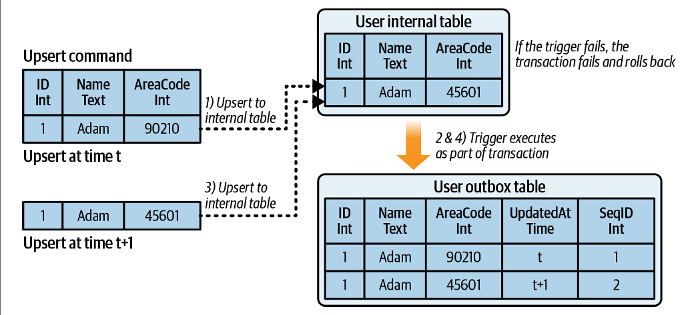

>Figure 6-10. Using a trigger to capture changes to a user table  

You generally cannot validate the change-data with the event schema during the execution of a trigger, though it is not impossible. One main issue is that it may simply not be supported, as triggers execute within the database itself, and many are limited to the forms of language they can support. While PostgreSQL supports C, Python, and Perl, which may be used to write user-defined functions to perform schema validation, many other databases do not provide multilanguage support. Finally, even if a trigger is supported, it may simply be too expensive. Each trigger fires independently and requires a nontrivial amount of overhead to store the necessary data, schemas, and validation logic, and for many system loads the cost is too high.  

Figure 6-11 shows a continuation of the previous example. After-the-fact validation and serialization is performed on the change-data, with successfully validated data produced to the output event stream. Unsuccessful data would need to be error-handled according to business requirements, but would likely require human intervention.  

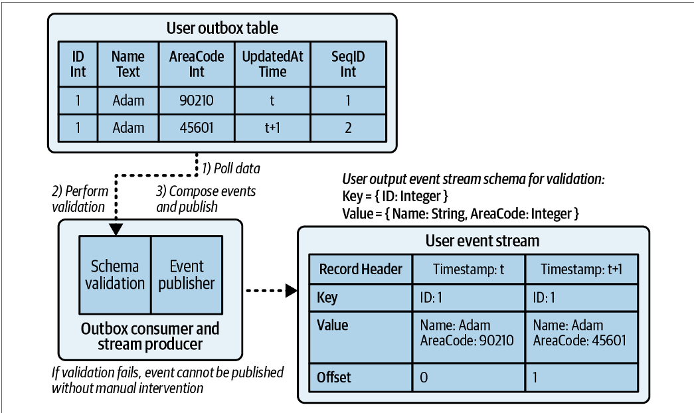

>Figure 6-11. After-the-fact validation and production to the output event stream  

The change-data capture table schema is the bridge between the internal table schema and the output event-stream schema. Compatibility among all three is essential for ensuring that data can be produced to the output event stream. Because output schema validation is typically not performed during trigger execution, it is best to keep the change-data table in sync with the format of the output event schema.  

> [!TIP]
> Compare the format of the output event schema with the change-data table during testing. This can expose incompatibilities before production deployment.  

Triggers can work great in many legacy systems. Legacy systems tend to use, by definition, old technology; triggers have existed for a very long time and may very well be able to provide the necessary change-data capture mechanism. The access and load patterns tend to be well defined and stable, such that the impact of adding triggering can be accurately estimated. Finally, although schema validation is unlikely to occur during the triggering process itself, it may be equally unlikely that the schemas themselves are going to change, simply due to the legacy nature of the system. After-the-fact validation is only an issue if schemas are expected to changefrequently.  

> [!WARNING]
> Avoid the use of triggers whenever possible. Instead, use more modern functionality for generating or accessing change-data, such as a designated CDC system. You should not underestimate the overhead performance and management complexity of a trigger-based solution, particularly when many dozens or hundreds of tables and data models are involved.  

## Benefits of using triggers  

Benefits of using triggers include the following:  

Supported by most databases  

Triggers exist for most relational databases.  

Low overhead for small data sets  

Maintenance and configuration is fairly easy for a small data sets with infrequent updates.  

Customizable logic  

Trigger code can be customized to expose only a subset of specific fields. This can provide some isolation into what data is exposed to downstream consumers.  

## Drawbacks of using triggers  

Some cons of using triggers are:  

#### Performance overhead  

Triggers execute inline with actions on the database tables and can consume nontrivial processing resources. Depending on the performance requirements and SLAs of your services, this approach may cause an unacceptable load.  

#### Change management complexity  

Changes to application code and to data set definitions may require corresponding trigger modifications. Necessary modifications to underlying triggers may be overlooked by the system maintainers, leading to data liberation results that are inconsistent with the internal data sets. Comprehensive testing should be performed to ensure the trigger workflows operate as per expectations.  

#### Poor scaling  

The quantity of triggers required scales linearly with the number of data sets to be captured. This excludes any additional triggers that may already exist in the business logic, such as those used for enforcing dependencies between tables.  

## After-the-fact schema enforcement  

Schema enforcement for the output event occurs only after the record has been published to the outbox table. This can lead to unpublished events in the outbox table.  

> [!TIP]
> Some databases allow for triggers to be executed with languages
> that can validate compatibility with output event schemas during
> the trigger's execution (e.g., Python for PostgreSQL). This can
> increase complexity and processing costs, but significantly reduces
> the risk of downstream schema incompatibilities.  

## Making Data Definition Changes to Data Sets Under Capture  

Integrating data definition changes can be difficult in a data liberation framework. Data migrations are a common operation for many relational database applications and need to be supported by capture. Data definition changes for a relational database can include adding, deleting, and renaming columns; changing the column type; and adding or removing defaults. While all of these operations are valid data set changes, they can create issues for the production of data to liberated event streams.  

> [!NOTE]
> Data definition is the formal description of the data set. For example, a table in a relational database is defined using a data definition language (DDL). The resultant table, columns, names, types, and indices are all part of its data definition.  

The most important component to successfully navigating data definition changes in your source data sets is to get deeply integrated with their change management process. If it's your responsibility to ensure that data entering an event stream remains compatible with its established schema, then you should do everything you can to
stay abreast of any incoming changes.  

Specific actions you can take include:  

#### Observe data store pull requests  

Register for notifications to change requests for any code that touches the data
stores under capture. You will see any proposed changes and can identify if they
will impact your code.  

#### Build integration tests  

Add integration tests to the codebase that pull down the event-stream schema and compare it to the schema of the data store under capture. This should notify the developer making the changes during development time, giving you both more time to find a common solution.  

#### Establish deployment validations  

Add the integration tests to the deployment pipeline to ensure that no code is deployed without successfully validating (or overriding) the schema validation step.  

The reality is that you're bridging a schema from one independent system (the data store) to another independent system (the event broker). This step will always be a bit precarious, particularly because team boundaries tend to align on this very same system gap.  

> [!TIP]
> A big benefit of the outbox table pattern is that the code that populates the outbox resides inside the same codebase as the main application. Any breaking changes to the code that populates the outbox will result in compilation and testing errors, letting you take action before breaking anything in production.  

## Compromises for Data Liberation  

The liberated event stream must eventually, and accurately, reflect the source data set. Event-driven architectures rely on the liberated event streams for event-carried state transfer (see "State Events and Event-Carried State Transfer" on page 99), such that they can materialize the event data back into a copy of the original table.  

However, legacy systems do not rebuild their data sets from these liberated event streams. They typically have their own backup-and-restore mechanisms, such as snapshots, checkpoints, and their own write-ahead logs. But regardless of their restoration mechanisms, there remains a risk that the restored state doesn't mirror a restoration created by materializing the event stream.  

This involves changing your application to first write to the event stream, and then read back the data that it just wrote to build its internal state, as is illustrated in Figure 6-12.  

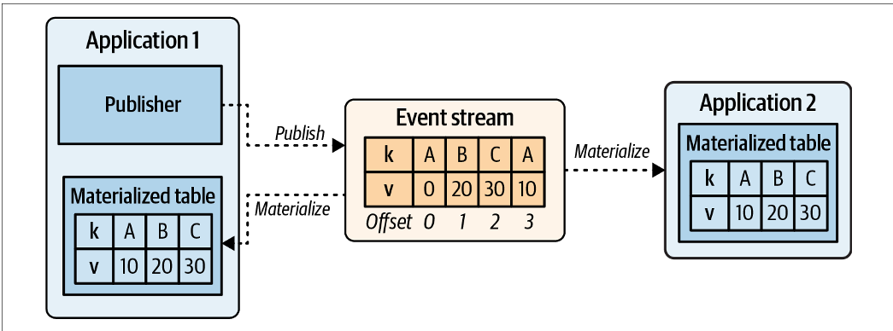

>Figure 6-12. Publish to stream before materializing  

The main advantages of this pattern include:  

Single source of truth  

The producer service gets a full copy of the same data as every other service subscribing to the event stream. Materializations are fully convergent with one another.  

Failure recovery from stream  

Any producer failures are remedied simply by reading back the event stream to get a consistent view of where it left off. If data is missing, the stream can be rewound and replayable.  

The main downsides include:  

Increased latency  

The data is written to the stream first and then read back. The network round trips will increase latency, and may not be suitable for services that require very low latency.  

Not suitable for all data store use cases  

Complex multistep transactions that require IDs and values from previous steps are largely unsuitable for this pattern. Writing to the event stream first means that your data store operations are largely limited to basic upserts.  

Requires refactoring  

Legacy systems require refactoring to use the read your own write pattern, and it may prove to be too expensive to commit to outside of very simple use cases.  

Now while it would be ideal if we could use a single event stream for building and
restoring state for both the producer and the consumer, in practice you'll often have
to look for other options. Legacy systems are often unable to undertake such a major
change, and the development cycles may simply not be available.  

There is an opportunity for compromise here. You can rely on data liberation patterns to extract the data out of the data store and create the necessary event streams. This is a form of unidirectional event-driven architecture, as the legacy system will *not* be reading back from the liberated event stream, as shown in Figure 6-12.  

Instead, the fundamental goal is to keep the internal data set synchronized with the external event stream through strictly controlled publishing of event data. The event stream will be eventually consistent with the internal data set of the legacy application, as shown in Figure 6-13.  

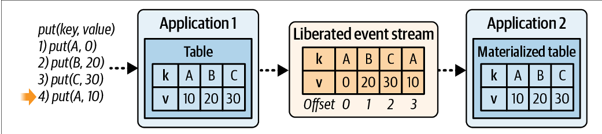

>Figure 6-13. Liberating and materializing state between two services  

### Sinking Event Data to Data Stores  

Sinking data from event streams consists of consuming event data and inserting it into a data store. This is facilitated either by the centralized framework or by a standalone microservice. Any type of event data, be it entity, keyed events, or unkeyed events, can be sunk to a data store.  

Event sinking is particularly useful for integrating non-event-driven applications with event streams. The sink process reads the event streams from the event broker and inserts the data into the specified data store. It keeps track of its own consumption offsets and writes event data as it arrives at the input, acting completely independently of the non-event-driven application.  

A typical use of event sinking is replacing direct point-to-point couplings between legacy systems. Once the data of the source system is liberated into event streams, it can be sunk to the destination system with few other changes. The sink process operates both externally and invisibly to the destination system.  

Teams that need to perform batch-based big-data analysis are also customers for data in event streams. They usually access the event streams by sinking data to a distributed filesystem, which enables large parallel batch-based processing. The Hadoop Distributed File System (HDFS) is just one such example of an early distributed file system, that led to the cloud native successors we see today: Amazon S3, Azure
Blob Storage, and Google Cloud Storage. Table formats, particularly those backed by
Apache Iceberg and Delta Lake are also a common destination for event-stream data.  

Using a common platform like Kafka Connect allows you to specify sinks with simple configurations and run them on the shared infrastructure. Standalone microservice sinks provide an alternative solution. Developers can create and run them on the microservice platform and manage them independently.  

## The Impacts of Sinking and Sourcing on a Business  

A centralized framework allows for lower-overhead processes for liberating data. This framework may be operated at scale by a single team, which in turn supports the data liberation needs of other teams across the organization. Teams looking to integrate then need only concern themselves with the connector configuration and design, not with any operational duties. This approach works best in larger organizations where data is stored in multiple data stores across multiple teams, as it allows for a quick start to data liberation without each team needing to construct its own solution.  

You can fall into two main traps when using a centralized framework. First, the data sourcing/sinking responsibilities are now shared between teams. The team operating the centralized framework is responsible for the stability, scaling, and health of both the framework and each connector instance. Meanwhile, the team operating the system under capture is independent and may make decisions that alter the performance and stability of the connector, such as adding and removing fields, or changing logic that affects the volume of data being transmitted through the connector. This introduces a direct dependency between these two teams. These changes can break the connectors, but may be detected only by the connector management team, leading to linearly scaling, cross-team dependencies. This can become a difficult-to-manage burden as the number of changes grows.  

The second issue is a bit more pervasive, especially in an organization where event-driven principles are only partially adopted. Systems can become too reliant upon frameworks and connectors to do their event-driven work for them. Once data has been liberated from the internal state stores and published to event streams, the organization may become complacent about moving onward into native event-driven microservices. Teams can become overly reliant upon the connector framework for sourcing and sinking data, and choose not to refactor their applications or develop new event-driven services. In this scenario they instead prefer to just requisition new sources and sinks as necessary, leaving their entire underlying application completely ignorant to events.  

> [!WARNING]
> CDC tools are *not* the final destination in moving to an event-driven architecture, but instead are primarily meant to help bootstrap the process. The real value of the event broker as the data communication layer is in providing a robust, reliable, and truthful source of event data decoupled from the implementation layers, and the broker is only as good as the quality and reliability of its data.  

Both of these issues can be mitigated through a proper understanding of the role of the change-data capture framework. Perhaps counterintuitively, it's important to minimize the usage of the CDC framework and have teams implement their own change-data capture (such as the outbox pattern) despite the additional up-front work this may require. Teams become solely responsible for publishing and their system's events, eliminating cross-team dependencies and brittle connector-based CDC. This minimizes the work that the CDC framework team needs to do and allows them to focus on supporting products that truly need it.  

Reducing the reliance on the CDC framework also propagates an "event-first" mindset. Instead of thinking of event streams as a way to shuffle data between monoliths, you view each system as a direct publisher and consumer of events, joining in on the event-driven ecosystem. By becoming an active participant in the EDM ecosystem, you begin to think about *when* and *how* the system needs to produce events, about the data *out there* instead of just the data *in here*. This is an important part of the cultural shift toward successful implementation of EDM.  

For products with limited resources and those under maintenance-only operation, a centralized source and sink connector system can be a significant boon. You can get data out of and into the systems as needed, without having to significantly refactor your codebases. For new products and those under active development, it's best if you can get them on board with producing the data natively. While connectors are great for getting started, it's best to start moving toward event-driven thinking, native production, and native consumption, if you want adopt EDM. In these circumstances, it's best to schedule time to refactor the codebase accordingly.  

Finally, carefully consider the trade-offs of each CDC strategy. This often becomes an area of discussion and contention within an organization, as teams try to figure out their new responsibilities and boundaries in regard to producing their events as the single source of truth. Moving to an event-driven architecture requires investment into the data communication layer, and the usefulness of this layer will only ever be as good as the quality of data within.  

### Summary  

Data liberation is an important step toward providing a mature and accessible data communication layer. Legacy systems frequently contain the bulk of the core business domain models, stored within some form of centralized implementation communication structure. This data needs to be liberated from these legacy systems to enable other areas of the organization to compose new, decoupled products and services.  

A number of frameworks, tools, and strategies are available to extract and transform data from their implementation data stores. Each has its own benefits, drawbacks, and trade-offs. Your use cases will influence which options you select, or you may find that you must create your own mechanisms and processes.  

The goal of data liberation is to provide a clean and consistent single source of truth for data important to the organization. Access to data is decoupled from the production and storage of it, eliminating the need for implementation communication structures to serve double duty. This simple act reduces the boundaries for accessing important domain data from the numerous implementations of legacy systems and directly promotes the development of new products and services.  

There is a full spectrum of data liberation strategies. On one end, you will find careful integration with the source system, where events are emitted to the event broker as they are written to the implementation data store. Some systems may even be able to produce to the event stream first before consuming it back for their own needs, further reinforcing the event stream as the single source of truth. The producer is cognizant of its role as a good data-producing citizen and puts protections in place to prevent unintentional breaking changes. Producers seek to work with the consumers to ensure a high-quality, well-defined data stream, minimize disruptive changes, and ensure changes to the system are compatible with the schemas of the events they are producing.  

On the other end of the spectrum, you'll find the highly reactive strategies. The owners of the source data in the implementation have little to no visibility into the production of data into the event broker. They rely completely on frameworks to either pull the data directly from their internal data sets or parse the change-data capture logs. Broken schemas that disrupt downstream consumers are common, as is exposure of internal data models from the source implementation. This model is unsustainable in the long run, as it neglects the responsibility of the data owner to ensure clean, consistent production of domain events.  

The culture of the organization dictates how successful data liberation initiatives will be in moving toward an event-driven architecture. Data owners must take seriously the need to produce clean and reliable event streams, and understand that data capture mechanisms are insufficient as a final destination for liberating event data.  

While liberating data to event streams is a key foundation to building event-driven microservices, it’s not without its own side effects. Relational data tends to result in relational streams, which can be challenging to handle in practice. In the next chapter, we’ll take a look at some patterns and strategies for handling relational data in event streams.  

# Denormalization and Eventification

> [!NOTE]
> Portions of this chapter previously appeared in *Building an Event-Driven Data Mesh* (O'Reilly, 2023).  

Events are often sourced from normalized data models, particularly if you're using change-data capture (see Chapter 6) to load in data from relational tables. Relational databases resolve relationships at query time, and are built on the premise that they have access to all necessary data at query time.  

In contrast, event-driven microservices rely on data provided by events, and tend to work best when the necessary data is all within the event itself. The reality is that the semantics of streaming joins are far more complex than those over a static data set. While there are streaming frameworks that can resolve streaming joins, they tend to be slower and more expensive than those for static data sets. Discussions of the streaming frameworks that support streaming joins are covered in more detail in Chapters 12, 13, and 14.  

Eventification is an implementation pattern for denormalizing and remodeling highly relational streams into forms that are more suitable for event-driven consumers. The end goal is to reduce the amount of repetitive, error-prone, and expensive denormalizations that each consumer must do, when sourcing data from relational systems. It is more challenging to deal with denormalization in a set of event streams than it is a set of tables, so you must carefully consider what should and what should not go into a denormalized event stream.  

Let's look at an example.  

Consider the following ecommerce, merchant, and inventory relational data model, as represented in a relational database. The Item shown in Table 7-1 has a foreign-key relationship (merchant_id) to the Merchant table in Table 7-2. Item also has a primary-key relationship (item_id) to the Inventory table in Table 7-3, which contains the quantity of items currently in stock.  

>Table 7-1. Item table definition  

| item_id|name|price|merchant_id|updated_at|
| ---|---|---|---|---|
| 4291|"Mirage Block Set "|1299.99|4|2021-03-22 13:05:00|  

>Table 7-2. Merchant table definition  

| merchant_id|name|premium_partner|updated_at|
| ---|---|---|---|
| 4|"Devin's Trading Cards "|true|2019-08-12 19:00:37|  

>Table 7-3. Inventory table definition  

| item_id|quantity_in_stock|updated_at|
| ---|---|---|
| 4291|3|2021-01-09 07:33:13|  

Though this model is simplified, you'll commonly find similar models in many online
ecommerce marketplace platforms—think of businesses like Amazon, eBay, Alibaba,
Etsy, and Shopify, to name a few.  

Merchant.premium_partner specifies if the merchant has signed on and paid for the premium business experience: better advertising deals, preferred advertisement placement, and preferred search result placement. Additional operational features include the ability to upload videos and additional pictures per Item, create item bundles, and offer AI-generated custom deals to find satisfactory price points for cost-savvy customers. Most of these services require the Item information to serve to the end customer—but they each also require the Merchant information for branding and display purposes as well as determining whether the merchant requires premium_partner treatment.  

Due to the relational nature of these streams, each consumer service will need to do the same foreign-key joins of Item to Merchant to get the data into a proper format for its business use cases. Figure 7-1 shows a small subset of consumers that each need to consume and join each event stream.  

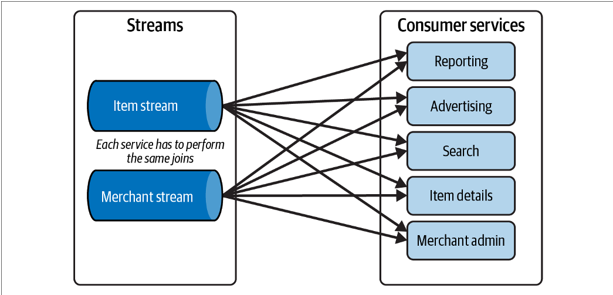

>Figure 7-1. Each consumer has to join the same data to determine premium partner status  

This arrangement has some significant downsides:  

#### Repeated processing  

Each consumer needs to execute these joins on its own. Each client will have duplicate code and use a similar amount of resources for the joins. For small data sets, it may be inconsequential, but for processing data at scale, including dealing with partitioned event streams, it can become quite expensive.  

#### Significant client code constraints  

Each consumer client must resolve the joins on its own. The majority of scalable streaming join solutions, such as Apache Kafka Streams, Apache Flink, and Apache Spark, are Java virtual machine (JVM)-based, but some also support Python and SQL. However, there is no first-class support for other popular programming languages such as Go, JavaScript, Ruby, Rust, etc. You may also choose to resolve joins by adding a dedicated relational database to your microservice, but it may be entirely unsuitable for your microservice's other needs.  

Item contains a foreign-key reference to the Merchant, which contains the necessary premium_partner status field. Denormalizing that information into an Enriched_Item will alleviate all downstream consumers from having to do that work themselves. We'll leave Inventory outside of the Enriched_Item for now, and return to it later in this chapter.  

You have several factors to consider when performing eventification:  

### Consumption patterns  

Ease of use is the chief goal of eventification. Your consumer’s requirements, if known, are an important consideration for determining what data to put into an event and what data to leave out. Denormalizing simple foreign-key relationships is often one of the top requirements, regardless of business logic.  

### Degree of denormalization  

How much you denormalize the data depends on the consumer use cases as well as the size of the data and the frequency of change. This is covered further in more detail in “What Should Go in the Event? And What Should Stay Out?” on page 164.  

### Keys for joining on related streams  

The event keys you select during eventification should enable easy joining on other event streams. For example, both Inventory and Item share a primary key and can be joined very easily.  

### Structuring the external data model  

Eventification provides you with the opportunity to convert and standardize data as well as conceal portions of the internal source data model. This ensures your consumers couple only on a public data contract, and not whatever internal data sources they can get their hands on.  

You can implement the eventification pattern for use in event-driven microservices in two main areas:  

1. Within the source database, such as when using a transactional outbox  

2. External to the source database, using a dedicated service to join the normalized streams  

Let’s take a look at each of these in turn.  

> [!WARNING]
> Some companies choose to denormalize their data in their data lake, a process that is both slow and expensive. Additionally, it forces the consumers to be responsible for denormalizing and standardizing the data, which often causes significant problems in data quality.  

## Eventification at the Transactional Outbox  

One option is to select internal model data and denormalize it prior to writing it to the transactional outbox (see “Liberating Data Using Transactional Outbox Tables” on page 138).  

Example 7-1 shows a code sample for remodeling relational data into a more suitable denormalized event format. It is based off the code example from Example 6-1, and shows denormalization of Item and Merchant within a singular transaction.  

Example 7-1. Eventification and denormalization prior to writing event data to the
outbox for event 4291  

python
try:
    # Stubbing out example code to save some space
    conn = ...
    cursor = conn.cursor()
    internal_model_update = ...

    # Commit the internal model updates
    cursor.execute(internal_model_update)

    # Select fields from the internal model and denormalize
    # by joining against the Merchant table
    internal_model_query = """
        select i.name, i.price, m.name as merchant_name, m.premium_partner
        from Item as i, Merchant as m,
        join on i.merchant_id = Merchant.id
        where i.id = 4291"""
    cursor.execute(internal_sub_model_query)
    result = cursor.fetchone()

    # Create the insert statement for the outbox table
    outbox_insert = """
        INSERT INTO
        Enriched_Item_Outbox (id, name, price, merchant_name, premium_partner)
        VALUES (4291, %s, %s, %s, %s)"""
    cursor.execute(outbox_insert, result)
    # Commit the internal and outbox updates atomically
    conn.commit()

except mysql.connector.Error as error:
    # Revert changes due to exceptions
    conn.rollback()

finally:
    # Close the database connection
    if conn.is_connected():
        cursor.close()
        conn.close()  

This code creates an entry for Enriched_Item_Outbox in response to the application creating or updating the data for Item.id=4291. The internal relational model remains encapsulated within the database, while the outbox provides a data model more suitable for event-driven consumers.  

But what about when the Merchant data changes? Consider a single merchant that decides to pay for premium partner status. Any previously created Enriched_Item events must also be updated to reflect the current premium status. A failure to do so means that the event stream is permanently inaccurate and no longer reflects reality, which will likely cause problems in how downstream consumers react to and process that merchant's data.  

Simply put, if you're going to denormalize data, you're going to need to update the event whenever *any* field changes. This remains true regardless of *how* you go about denormalizing data, be it from the inside with an outbox table or with a dedicated eventification service, as we shall see in the next section.  

A transactional outbox table works really well as a low-overhead way of decoupling the internal and external data models. If your source data resides inside a relational database, it's very easy to rely on the database engine to quickly and efficiently denormalize data into an event-friendly format instead of leaving it up to each consumer to handle. By making event streams easy to use, you improve the data product user experience for your consumers, helping them get on with the business of using the data instead of just struggling with it.  

However, it's not always possible to build an outbox table into a database, let alone denormalize your data within the transaction. Aside from databases that simply do not support transactions, legacy systems with no active development, as well as those with strict performance requirements, may not be suitable candidates. Whenever a transactional outbox isn't feasible, it's best to look at eventification in a dedicated service residing outside the source. Let's take a look at that now.  

## Eventification in a Dedicated Service  

Eventification outside the source database requires a purpose-built microservice or stream SQL application. For example, Figure 7-2 shows a high-level overview of a dedicated eventification service joining Item and Merchant data together to form a single enriched stream for downstream use.  

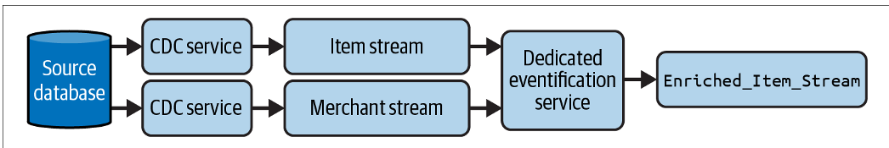

>Figure 7-2. Eventification within a dedicated service using CDC event streams  

Event-driven processing technologies like Kafka Streams, Flink, and Spark provide high-level frameworks that make it easy to join your data together. These will be discussed in more detail in Chapters 12 and 13, but for now let's just keep it simple and look at what a streaming SQL join may look like.  

Using the same Merchant and Item models as before, you could create a simple streaming SQL query that joins the two into a single state-based event. The code would look something like Example 7-2, ignoring the overhead of declaring the Item and Merchant tables.  

Example 7-2. A Flink SQL version of an eventification service for Item and Merchant  

SELECT *
FROM Item
INNER JOIN Merchant
ON Item.merchant_id = Merchant.id  

> [!TIP]
> You can also choose to use *windowing* to limit the size of the materialized data sets and improve performance.  

SQL eventification services make it easy to resolve table-table streaming joins and denormalization of entities. SQL is very common, easy to learn, and easy to read. And since a key aspect of eventification is simple denormalization, it becomes very easy to see if someone has loaded some business logic into the query. Remember, the main purpose of eventification is just to make it easier on consumers to use the data; we're *not* executing any complex business logic, filters, or other application-specific logic.  

> [!WARNING]
> You may also need to contend with out-of-order data, just like any other event-driven service. Flink uses a watermarking system as described in Chapter 9. Consult your documentation for other streaming SQL frameworks.  

Some significant advantages to using an external eventification microservice include:  

• Reduced demand on the database's resources  

• Independently scalable from the database itself  

• Simplification of the source domain's application logic  

However, there are also some challenges to handle:  

• Synchronizing changes to the database tables, the connectors, and the eventification microservice  

• Finding a robust stream joiner framework; there are only a few options, and they're primarily JVM- or SQL-based  

• Arguing over ownership of the eventification microservice (hint: the best team to own it is the team that owns the source data)  

Regardless of whether you choose to denormalize your events inside the source database, outside the database using a purpose-built microservice, or at the consumer itself, it's critical to consider the impact on your consumers. Focus on making the event data as easy to understand and use as possible, rely on well-defined schemas, and always work toward reducing the chances that consumers might misunderstand or misinterpret the data.  

## What Should Go in the Event? And What Should Stay Out?  

There is a fine balancing act for determining what data to include and what data to exclude in an event. Several factors influence this decision. Consumer needs, the update frequency, the data size, and the resultant total load are all considerations.  

Let's consider an extension of our ecommerce example. Item has a primary-key relationship with the Inventory data (Table 7-3), indicating how many of the item are in stock.  

Every time the inventory changes, say, due to a sale, a return, or a received shipment, the inventory domain can emit a new state event with the updated inventory. For products that change extremely frequently (think a Black Friday "door crasher" sale), you could end up with a veritable barrage of inventory events.  

> [!NOTE]
> The Inventory producer can choose to emit inventory updates periodically, perhaps every 5 or 30 seconds. This can reduce the frequency of updates, at the expense of increasing the latency between updates.  

Joining the Item with Inventory (Item.item_id = Inventory.item_id) will trigger a corresponding join on the materialized Item table on every Inventory update. This can be quite a lot of events, and consumers that don't care about the inventory quantity will have a lot of inconsequential updates to work through. This costs money and time for consumer and producer alike, demonstrating that the first factor we need to consider is frequency.  

Similarly, consider a new table entitled Reviews containing the top 100 reviews for a given Item. While this data may not change frequently, joining it with Item means that every single time you update either Reviews or Item, your processor will re-emit the entire payload containing the top 100 reviews. Just like with frequent updates, many consumers may not care at all about the contents but still need to contend with the very large data size coming through the stream. This is the second factor to watch out for: size.  

Finally, you may discover that you have both data with a very high rate of change from one stream and data with a very large payload size from another stream. Joining the two means that you'll now have a *lot* of data with a high rate of change. This can cause a compounding high load on your event broker, your eventification process, and your consumers. High-frequency data multiplied by large size equals a very expensive denormalization proposition.  

As a general rule, avoid joining in data that *changes frequently* or is *large*. You may be better off leaving those components out of the enriched event and letting your consumers choose to integrate it into their own service.  

Figure 7-3 provides a visualization of the final state of the Enriched_Items eventification service. The most commonly used data is joined into the enriched result. Reviews are omitted from enrichment due to the large size of the data, while Inventory is similarly omitted due to its high-frequency updates.  

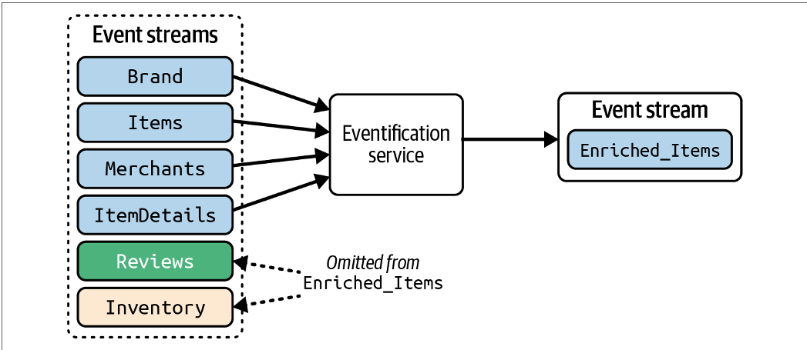

>Figure 7-3. Eventification of Item with commonly used data joined into the enriched result  

At the end of the day, there is no magic answer or definitive cutoff for what should
and shouldn't go in an event. The heuristics presented in this section should give you
a better understanding of what to look for and how to think about the impact of joining in data. There remains a few more things to discuss before closing out this
chapter, so let's move on into slowly changing dimensions.  

## Slowly Changing Dimensions  

Continuing with the ecommerce example, you may notice that there are many Items for a given Merchant. If we want to denormalize the Item.merchant_id data, we'll have to join against Merchant. Think about what you may know about your favorite merchants. Do they change their names often? Change their locations? Not really. We can surmise that Merchant data may not change for a very long time, though it certainly could be changed at any moment.  

This type of data is known as a *slowly changing dimension* (SCD), which is usually static but can change unpredictably. SCDs have long been the provenance of the data analytics space, but the terminology is useful for describing data models and how they relate to event streams.  

Relational databases typically handle this form of data by normalizing it into its own table. If the Merchant changes their name, you simply update the Merchant.name in the appropriate table.  

Event streams, unfortunately, are more akin to the document model. If you decide to emit the denormalized Merchant data into your event stream, you're going to need to consider what happens if that SCD changes. If that Merchant is selling millions of Items, and you denormalized that data together, then you're going to need to update all of those events.  

Although there are (at least) eight distinct SCD model subtypes, the two most relevant for event-stream consideration are Type 1 and Type 2. Let's take a closer look at both of these to see how they relate to data denormalization with event streams.  

### Type 1: Overwrite with the New Value  

With Type 1 modeling, only the most recent value is retained. Say we have a merchant *without* premium status, as per the account shown in Example 7-3. If this merchant decides to pay for premium status, we'd need to produce a new entity event to overwrite the previous one.  

Example 7-3. Type 1: the first state event of Devin's Trading Cards  

{
    "name": "Devin's Trading Cards",
    "premium_partners": false,
    "updated_at": "2011-08-10 13:22:09"
}  

Example 7-4 shows the results of the updated merchant entity event with premium_partner: true.  

Example 7-4. Type 1: updated premium status (and timestamp) for Devin's Trading Cards  

{
    "name": "Devin's Trading Cards",
    "premium_partner": true,
    "updated_at": "2019-08-12 19:00:27"
}  

The previous record is no longer required, and the event broker can compact away the old event at a later date. While you may choose to retain the data for a longer period of time, Type 1 dimensional modeling doesn't account for a history of changes—this is where Type 2 comes in.  

## Type 2: Append the New Value  

In Type 2 dimension modeling, the changed value is appended to the state and emitted as a new event. The consumer then has access to both the current and previous versions of the field, and can use it for determining what the entity looked like at a specific point in time. A microservice can react to the Merchant.premium_partner status set to true, while the same data can be used to power analytics that focus on premium status over time.  

Successfully implementing a Type 2 SCD requires the producer to keep track of what it has already written to the stream, so it can accurately produce an updated event. Example 7-5 illustrates the updated Merchant data event detailing the timelines of changes to the data.  

Example 7-5. Type 2: updated Merchant data is appended to the event, complete with version IDs for previous updates  

{
    "name": "Devin's Trading Cards",
    "premium_partner": false,
    "updated_at": "2011-08-10 13:22:09",
    "version": "0"
},
{
    "name": "Devin's Trading Cards",
    "premium_partner": true,
    "updated_at": "2019-08-12 19:00:27",
    "version": "1"
}  

}
]  

The default selection for a state event is usually Type 1. Your application publishes only the latest data, and leaves it up to the event stream to provide the history of previous values. Your consumer model needs to opt in to maintaining the previous values within its own domain data store.  

Type 2 models force the consumer to consider the impact of the dimension changes. The full history of previous values require careful consideration when joining together, because you will get different results depending on when you want to represent the resultant join. If the consumer wants only the latest value, it still needs to explicitly select it from the history. While Type 2 models are more verbose and require a bit more overhead for consumers to use, they reduce the chance of a consumer overlooking the history of changes.  

## Summary  

Converting your data into forms that your consumers can easily use is important to building a functional event-driven architecture. Many source data structures are not well suited for direct conversion into events, and lead to downstream problems if used directly.  

Relational data models are one of the most common sources of event data, particularly when bootstrapping via change-data capture. The streams reflect the internal models of the source database, leading to tight coupling, repetitive and expensive joins, and overly complex microservices.  

Denormalizing events via eventification for event-driven microservices is most commonly achieved using the transactional inbox pattern or with a standalone application. Eventification also forces a decoupling of the internal data model from the external data model, reducing tight coupling and allowing for services to evolve more independently. It is essential that you limit eventification to simplifying the data formats through joins and standardizations. Do not apply custom consumer business logic; that belongs downstream in the individual consumers.  

Event size and update frequency are two of the most important factors to consider when building enriched events. Be careful adding in information that is not commonly used, that is very large, or that will cause a very high rate of updates.  

# Stateful Event-Driven Microservices  

Event-driven microservices (stateful or not) typically follow the same three basic steps:  

1. React to the event; e.g., from an input stream, a remote request from a client, a sensor reading, or a row insertion to a database.  

2. Process that event.  

3. Produce any resultant output events.  

There's a lot of detail that's missing from this simple list, but it shows the heart of how the vast majority of event-driven microservices operate. This chapter digs deeper into the role that *state* plays, particularly as most microservices must maintain some degree of state to actually do anything useful.  

This three-step list is important in evaluating state for event-driven microservices, particularly as the services scale, fail, and recover. How do we ensure that the correct partitions are assigned to correct consumer instances? And how do we handle *multiple* streams, each with their own partitioning and partitioners? This chapter will provide you the answers.  

State stores play an important role in the vast majority of event-driven microservices, and go hand-in-hand with stream partition assignments. They are, quite frankly, essential for performing any business functionality beyond just toy-level complexity. Each microservice is responsible for maintaining its own state, including creating it, updating it, reading it, and destroying it.  

## Event-Stream Partitions and Consumer Assignments  

"The Basics of Event-Driven Microservices" on page 49 introduced the concept of consumer groups. Each microservice has a consumer group that it uses to track its offsets and stream consumption. In addition, the consumer microservice must also designate consumption of the input event stream to specific microservice instances. This is called *partition assignment*.  

Some event brokers, such as Apache Kafka, delegate partition assignment to the first online client for each consumer group. As consumer group leader, this instance is responsible for performing the partition assignment duties, ensuring that input event-stream partitions are correctly assigned whenever new instances join that consumer group.  

Other event brokers, such as Apache Pulsar, maintain a centralized ownership of partition assignment within the broker. Unlike Kafka, where a designated consumer performs rebalancing and partition assignments (as introduced in Figure 3-2), with Pulsar it is the broker that does this work instead. But similarly, they both use consumer group identities to maintain stream consumption progress.  

Work is typically momentarily suspended while partitions are reassigned to avoid assignment race conditions. This ensures that any revoked partitions are no longer being processed by another instance before assignment to the new instance, eliminating any potential duplicate output.  

The leader (or broker) will issue a *rebalance* when a new instance joins the consumer group, thereby rebalancing the partitions and redistributing the workload. Similarly, when a consumer leaves a consumer group and fails to rejoin within a certain period of time (e.g., one minute), the leader (or broker) will issue a rebalance to redistribute the orphaned partitions to another consumer instance.  

Partition assignments are very closely related to state. Any corresponding state built from previously assigned partitions may also require reassignment during a rebalance. There are a few ways to handle this in practice, either by relying on the internal state stores of stream-processing frameworks (see more in Chapters 12 and 13) or by using external state stores that are independent of repartitioning. This chapter will examine internal and external state stores more in the next section.  

For now, let's shift to looking at a specific stream-related problem. Let's say you're building a stateful microservice and you have the data you need in an event stream. However, it's *not* partitioned according to the key your service needs. Does that mean you have to re-create the entire stream from the source? Not necessarily. This is where *repartitioning* comes in.  

## Repartitioning Event Streams  

Event streams are partitioned according to the event key and the producer's event partitioner logic. Most commonly, the event partitioner is a deterministic hash function, meaning that the same key will always be assigned to the same partition for data locality's sake.  

Repartitioning is the act of producing a new event stream derived from the original stream, with one or more of the following properties:  

### Different partition count  

With either a higher partition to increase processing parallelization, or a specific
partition count to copartition with another stream (discussed more in the next
section).  

### Different event key  

Change the event key, often by rekeying on a data contained within the event's value.  

### Different event partitioner  

Change the logic that selects the partition to write the event to.  

Consider an example. Suppose there is a stream of user data coming in from a web-facing endpoint. The user's interactions are converted into unkeyed events, with the payload of the events containing both a user ID (id) and other arbitrary event data (x).  

Say that the consuming microservice requires that all data belonging to a particular user id is contained within the same partition, regardless of how the source event stream is partitioned. In this case, the service assigns the key to the id and writes it to a new event stream with a partition count of 3, as shown in Figure 8-1.  

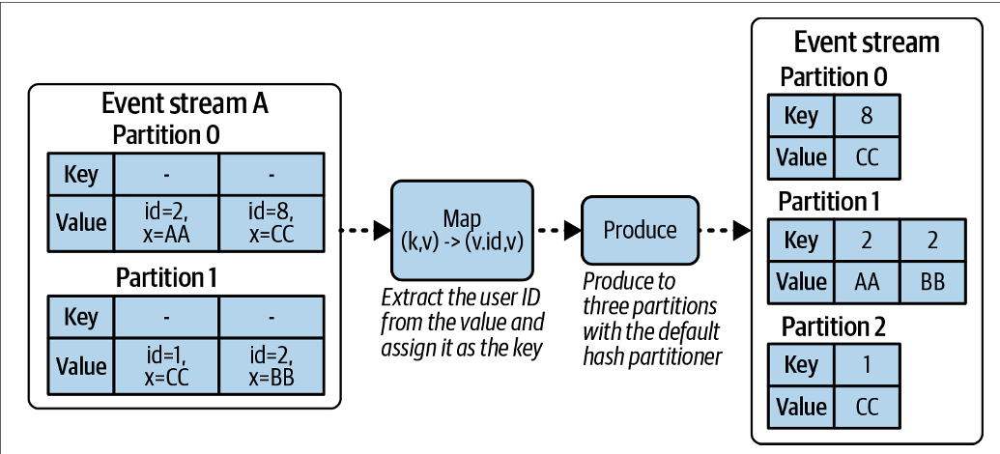

>Figure 8-1. Repartitioning an event stream  

Here are a few of things to observe from this example:  

• Events can be introduced out of order. You may notice that user id=2 has events both in both partition 0 and partition 1 in the original stream. The order that they end up in the output stream is not necessarily deterministic, and you may need to account for out-of-order events. This is covered more in “Out-of-Order and Late-Arriving Events” on page 210.  

• Repartitioning data is primarily a function for ensuring sufficient parallelization and for key locality, but not for increasing throughput. For example, an event stream with two partitions that is repartitioned into a new steam with 1,000 partitions will still be limited to the throughput of the two-partition input stream.  

> [!TIP]
> If the order of data in an event stream is extremely important, then it's best to generate it *in order* and in the same partition. The event stream in this example could simply be keyed by id from the start, and written in the actual order of occurrence.  

Repartitioning streams lets you change the key, the partition assignor, and the partition count. And this, in turn, lets you copartition your stream with another stream.  

## Copartitioning Event Streams  

Copartitioning is the repartitioning of an event stream into a new one with the same partition count and the same partition assignor as another stream. Copartitioning ensures data locality as several stateful operations, such as joins and multistream aggregations, require that all events of a given key go to the same processing instance.  

Consider an example based off of Figure 8-1. Say that you now need to join the
repartitioned user event stream with a user entity stream, keyed on that same user id.
The joining of these streams, is shown in Figure 8-2.  

Both streams have the same partition count and have had their events partitioned using the same partition assignor. Note that the key distribution of each partition matches the distribution of the other stream and that each join is performed by its own consumer instance. The next section covers how partitions are assigned to a microservice instance to leverage copartitioned streams, as was done in this join example.  

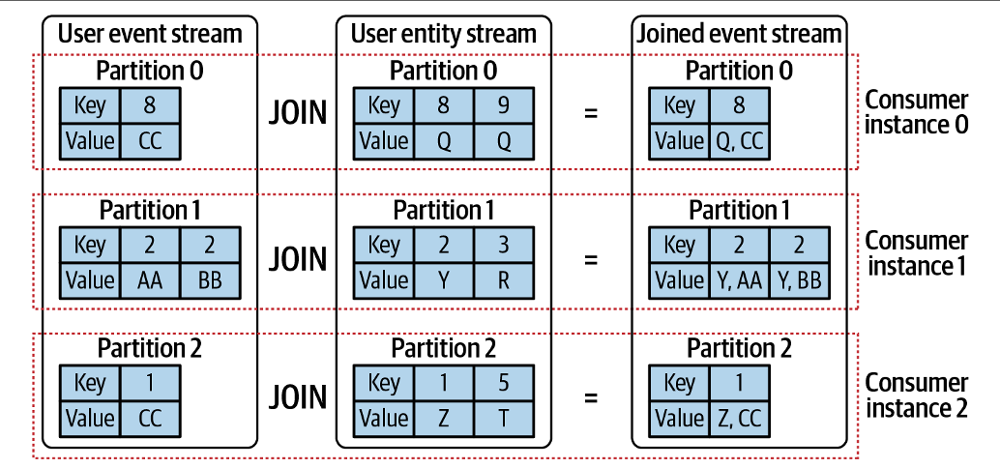

>Figure 8-2. Copartitioned user event and user entity streams  

### Assigning Partitions Within a Consumer Group  

Partition assignment is quite trivial when there are no relationships between the streams—a simple round-robin assignment is more than enough.  

Full-featured frameworks, like those in Chapters 12 and 13, provide under-the-hood, hands-off partition assignments. The frameworks can infer from the application code which streams need to be copartitioned (or repartitioned), and will ensure that the partition assignor acts accordingly.  

Basic consumer clients typically do *not* provide automatic copartitioning compatible assignments. You'll typically have to manage these manually at a more granular level, which can be challenging when you have multiple sets of copartitioned streams in more complicated microservices.  

As a brief example, consider a service that consumes from three streams, two of which are copartitioned (say, for a join operation).  

Figure 8-3 shows two consumer instances, each with its own set of assigned partitions. C0 has two sets of copartitioned partitions compared to one for C1, since assignment both began and ended on C0.  

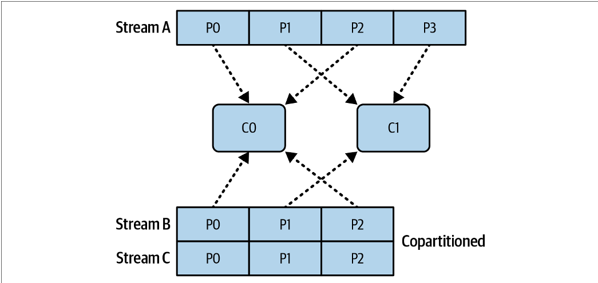

>Figure 8-3. A round-robin partition assignment for two consumer instances and three streams  

>Additional consumer instances added to the consumer group cause a rebalance.Figure 8-4 shows the effects of adding two more consumer instances.  

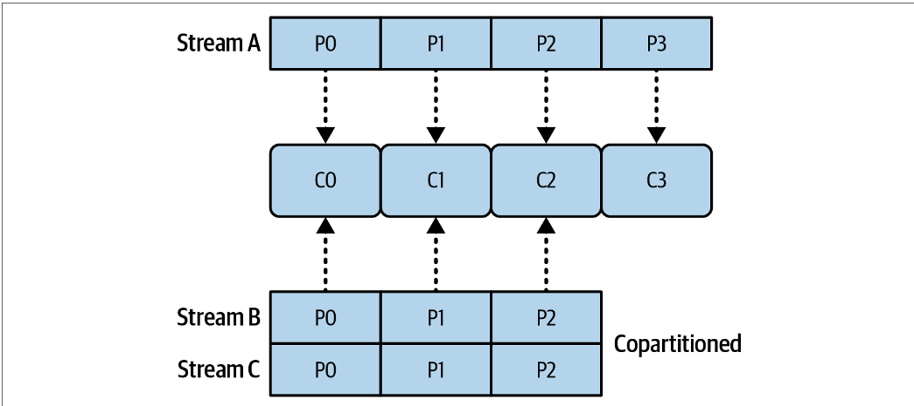

>Figure 8-4. Round-robin partition assignments for four consumer instances and three streams  

C2 is now assigned the copartitioned P2s, as well as stream A’s P2. C3, on the other hand, only has partition P3 from stream A because there are no additional partitions to assign. Adding any further instances will not result in any additional parallelization when consuming as an event stream.  

> [!WARNING]
> The exact mechanisms of consumer group membership, partition assignments, and rebalancing all rely heavily on your event broker and the processing framework choices. Check the documentation to ensure you have a proper understanding and test it to make sure it behaves as expected before moving to production.  

While assigning the right partitions to the right instances is a big part of state-
ful event-driven microservices, it's time to take a look at adding the state stores
themselves.  

## Selecting a State Store for Your Microservice  

Let's start with an example to anchor the exploration of state. Consider Figure 8-5, a service built to package up customer orders based on the inventory available.  

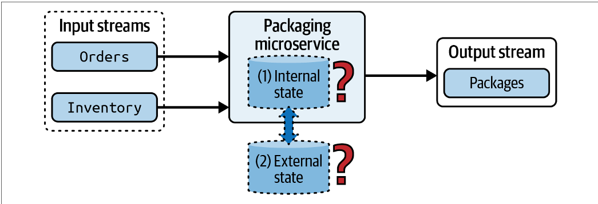

>Figure 8-5. A shipment packaging service loading state to either an internal or external state store  

This service will need to materialize both Orders and Inventory events, and figure out what can be shipped right away and what cannot. Secondly, the service is also responsible for ensuring that the products are put into the box, that the shipping label is affixed, and that the box is then made ready for dispatch to the customer.  

For the sake of simplicity and to focus on the role of state in microservices, we're going to pretend that at worst, an order is only delayed awaiting new inventory. Additionally, we'll assume that there are no flaws in the packing of the package, particularly due to the imperfect mapping of the digital world to the real physical world. More on that later though.  

Internal state stores are located in the same container or VM as the microservice, and are typically allocated in memory or on volatile disk. They remain online when the service is online. If the microservice is halted or restarted, then so is the state store.  

External state stores exist outside the processor's container or VM. They are largely independent of the microservice's life cycle, remaining online and available even if the microservice itself is restarted or shut down. They are also engineered for some durability objective, so that data is preserved even with a service interruption. Microservice failures would have no effect on the durability and preservation of the data stored within.  

The first step in building this or any stateful microservice is to figure out what kind of state store (or stores) your service needs. In this case, is the service best suited to an external state store, or an internal one? The next sections will help you answer that question for yourself.  

## Materializing State to an Internal State Store  

Each microservice instance materializes the events from its assigned partitions, keeping each partition's data logically separate within the store. These logically separate materialized partitions permit a microservice instance to simply drop the state for a revoked partition after a consumer group rebalance. This avoids resource leaks and multiple sources of truth by ensuring that materialized state exists only on the instance that owns the partition. New partition assignments can be rebuilt by consuming the input events from the event stream or from the changelog.  

High-performance key-value stores, such as RocksDB, are typically used to implement internal state stores. They are optimized to be highly efficient with local solid-state drives (SSDs), enabling performant operations on data sets that exceed main memory allocation. While key-value stores tend to be the most common implementation for internal state stores, any form of data store can be used. A relational or document data store implementation would not be unheard of, but again, it would need to be instantiated and contained within each individual microservice instance.  

Internal state stores are typically volatile, and restarting the microservice will cause you to lose your state. Upon reloading, the state store will need to reload its state from a secondary location. State store snapshots stored to an external location is one option for restoration, and we'll take a closer look at that later in this chapter when we get to external data stores. The other form of restoration relies on the stream itself—in this case, a changelog. Let's take a look at that now.  

## Using a Changelog Event Stream as State Recovery  

A changelog is a record of all changes made to the data of the state store. It is the stream in the table-stream duality, with the table of state transformed into a stream of individual events. As a permanent copy of the state maintained outside of the microservice instance, the changelog can be used to rebuild state, as shown in Figure 8-6, and serves as a checkpoint.  

> [!TIP]
> Changelogs optimize the task of rebuilding failed services because they store the results of previous processing, allowing a recovering processor to avoid reprocessing all input events.  

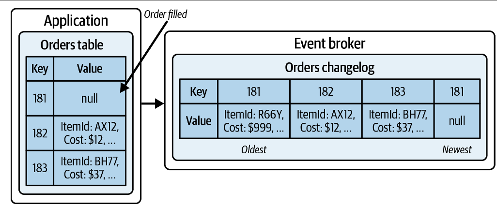

>Figure 8-6. A state store with changelogging enabled  

In this example, the orders table provides a materialized view of the orders that are ready to be packaged. Once the order is packaged, the record can be deleted from the table. A tombstone record is issued into the orders changelog, such that the earlierdata associated with the key 181 can be removed from the stream.  

Changelog streams are stored in the event broker just like any other stream, though its write and read permissions should remain strictly limited to the associated application. No other services should access the changelog’s data. Changelogs are commonly compacted, particularly since their primary purpose is to restore state, and not track a history of changes as is more common in entity streams.  

During restoration, the newly created application instance loads the data from the associated changelog partitions, as shown in Figure 8-7.  

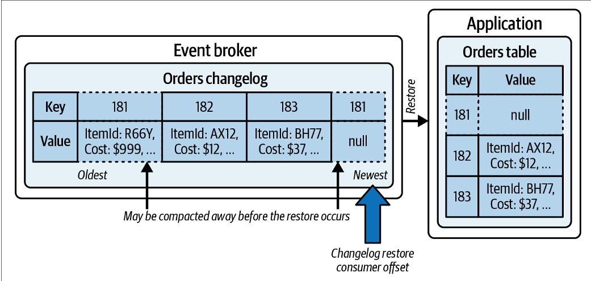

>Figure 8-7. Restoring the application's state store from a single changelog partition  

The application can restore its state as quickly as the events can be read and inserted into their state store. In this example, note that key 181 may or may not have been asynchronously compacted away. In the case that it has been compacted, it simply won't be loaded into the table. If it has not, it will be loaded and subsequently deleted. Note that no business logic is triggered during state restoration.  

Changelogs are either provided as a built-in feature, such as in the Kafka Streams client, or independently implemented by the application developer. Basic producer/consumer clients tend not to provide any changelog logging or stateful support.  

## Materializing Global State  

A global state store is a special form of the internal state store. Instead of materializing only the partitions assigned to it, a global state store materializes the data of all partitions for a given event stream to each microservice instance. Global state is also known as broadcast state, and in either case, each microservice instance generates a complete materialization of the entire input topic, as shown in Figure 8-8.  

In this example, we've decided to load the entire state of inventory into each micro-service instance. Each instance can then check available inventory before asking for an order to be packaged, so that it doesn't waste the time of the warehouse personnel. Global state stores are useful when each microservice instance requires a full data set, *and* when that data set is small, commonly used, and seldom-changing.  

Global state stores are typically not used to drive event-driven logic, but rather as the means for providing data lookups.  

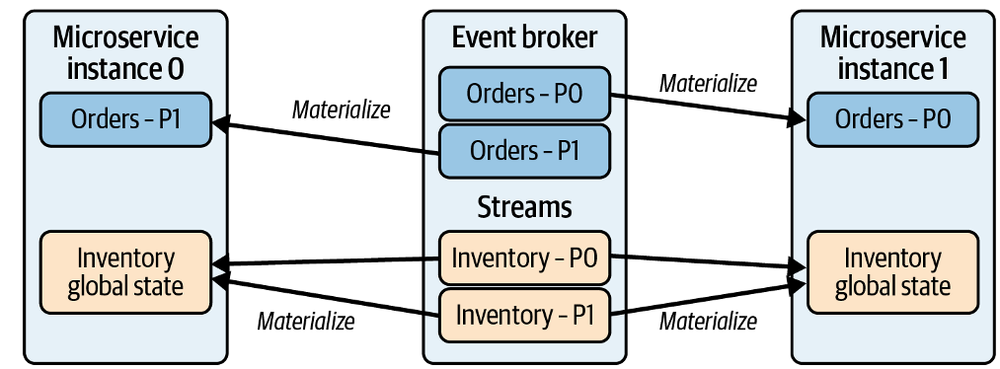

>Figure 8-8. Global materialized state and nonglobal materialized state  

### Advantages of Internal State Stores  

There are several major advantages to using internal state stores.  

### Scalability requirements are offloaded from the developer  

A major benefit of using internal state stores with changelog recovery is that scalability requirements are fully offloaded to the event broker and compute resource clusters. Each application can be scaled simply by increasing and decreasing the instance count, allowing the application development team to focus strictly on writing application logic. Meanwhile, the microservices capability teams provides the scaling mechanisms common to all event-driven microservices.  

### High-performance disk-based options  

Maintaining all state within main memory is not always possible in an event-driven microservice, especially if costs are to be kept low. Physically attached local disk can be quite performant for the majority of modern microservice use cases. Local disk implementations tend to favor high random-access patterns, generally supported by SSDs. For instance, the latency for a random-access read from an SSD using RocksDB is approximately 65 microseconds, which means a single thread will have a sequential access ceiling of approximately 15.4k requests/second. In-memory performance is significantly faster, serving millions of random-access requests per second as the norm. The local-disk and local-memory approach allows for extremely high throughput and significantly reduces the data-access bottleneck.  

## Flexibility to use network-attached disk  

Microservices may also use network-attached disk instead of local disk, which significantly increases the read/write latency. Since events typically must be processed one at a time to maintain temporal and offset order, the single processing thread will spend a lot of time awaiting read/write responses, resulting in significantly lower throughput per processor. This is generally fine for any stateful service that doesn’t need high-performance processing, but can be problematic if event volumes are high.  

Accessing “local” data stored on network-attached disk has a much higher latency than accessing physically local data stored in the system’s memory or attached disk. While RocksDB paired with a local SSD has an estimated throughput of 15.4k request/second, introducing a network latency of only 1 ms round-trip time to an identical access pattern reduces the throughput cap to just 939 requests/second. While you might be able to do some work to parallelize access and reduce this gap, remember that events must be processed in the offset sequence in which they are consumed and that parallelization is not possible in many cases.  

One major benefit of network-attached disk is that the state can be maintained in the volume and migrated to new processing hardware as needed. When the processing node is brought back up, the network disk can be reattached and processing can resume where it left off, instead of being rebuilt from the changelog stream. This greatly reduces downtime since the state is no longer completely ephemeral as with a local disk, and also increases the flexibility of microservices to migrate across compute resources, such as when you are using inexpensive on-demand nodes.  

## Disadvantages of Internal State Stores  

There are several disadvantages to using internal state stores.  

### Limited to using runtime-defined disk  

Internal state stores are limited to using only disk that is defined and attached to the node at the service’s runtime. Changing either the size or quantity of attached volumes typically requires halting the service, adjusting the volumes, then restarting the service. In addition, many compute resource management solutions allow only for volume size to be increased, as decreasing a volume’s size means that data would need to be deleted.  

### Wasted disk space  

Data patterns that are cyclical in nature, such as the traffic generated to a shopping website at 3 p.m. versus 3 a.m., can require cyclical storage volume. That is, these patterns may require a large maximum disk for peak traffic but only a small amount otherwise. Reserving full disk for the entire time can waste both space and money when compared to using external services that charge you only per byte of data stored.  

## Scaling and Recovery of Internal State  

Scaling processing up to multiple instances and recovering a failed instance are identical processes from a state recovery perspective. The new or recovered instance needs to materialize any state defined by its topology before it can begin processing new events. The quickest way to do so is to reload the changelog topic for each stateful store materialized in the application.  

### Using hot replicas  

While it is most common to materialize only a single partition per microservice instance, you can also materialize a standby "hot replica" on another instance. Apache Kafka has this functionality built into its Streams framework via a simple configuration setting. It provides highly available state stores and enables the microservice to tolerate instance failures with zero downtime.  

To simplify this example, let's assume that each order is only for one product and that both inventory and product streams are keyed on productId. In other words, they're copartitioned, and packaging up an order from P0 (partition 0) only requires data from Inventory - P0. Figure 8-9 shows what a standard three-instance deployment would look like, with each copartitioned data set located in a single instance.  

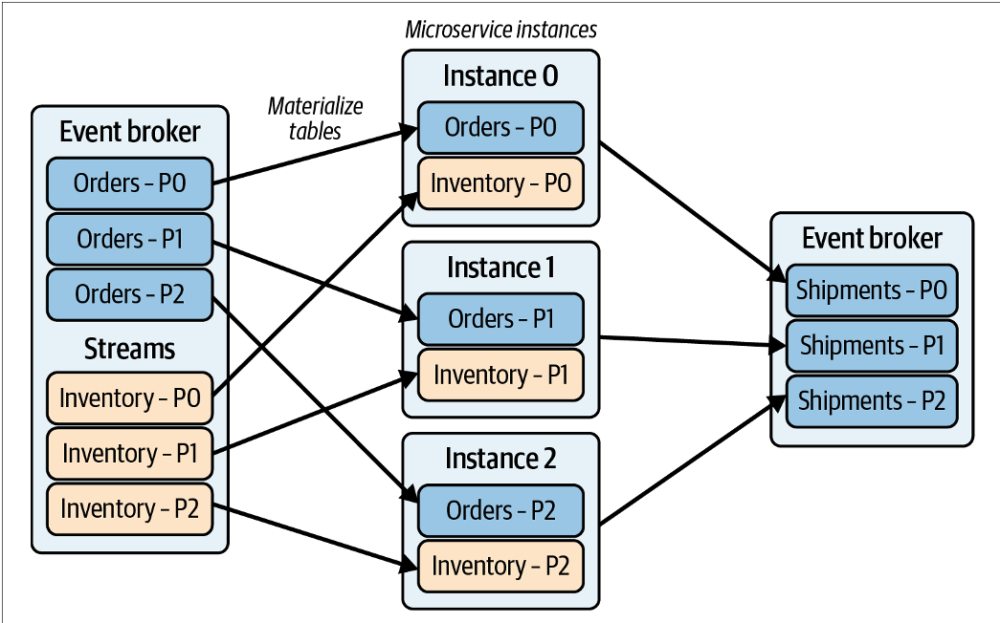

>Figure 8-9. Joining orders with inventory, with one partition per instance  

The processing load is split up between the three microservice instances, and we're able to compute the shipments accordingly. However, in the event that an instance fails, we'd have to stop processing the assigned partitions, shift them to a new consumer instance, reload the state from the changelog, and then resume processing.  

Figure 8-10 shows a three-instance microservice deployment with an internal state store replication factor of 2. Each of the orders and inventory partitions are materialized twice, once as the primary and once as a replica. Each instance must manage its replicas just as it would its primaries, except that the replicas do not drive any logic.  

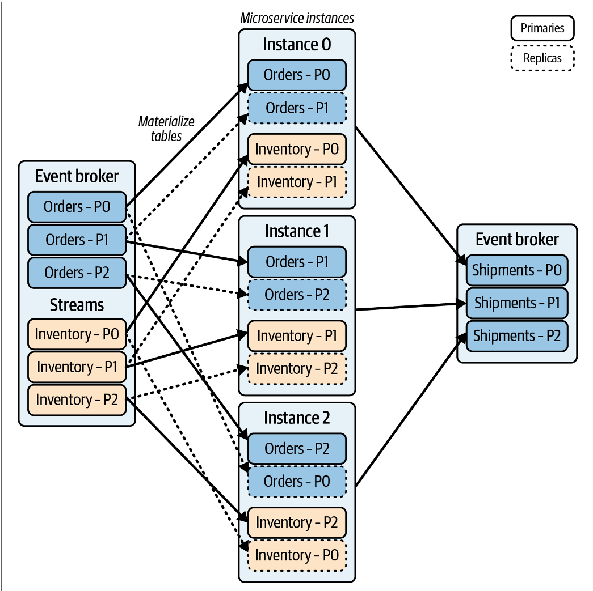

>Figure 8-10. Joining orders with inventory, with one hot replica of each partition colo-
cated in another microservice instance  

When an instance is terminated, the consumer group leader eventually rebalances the partition assignments. The partition assignor determines the location of the hot replica (it previously assigned all partitions and knows all partition-to-instance mappings) and reassigns the partitions accordingly.  

In Figure 8-11, instance 1 has terminated, and the remaining microservice instances rebalance their partition assignments. Instance 0 takes over the workload that instance 1 used to do, as it contains the hot P1 replicas.  

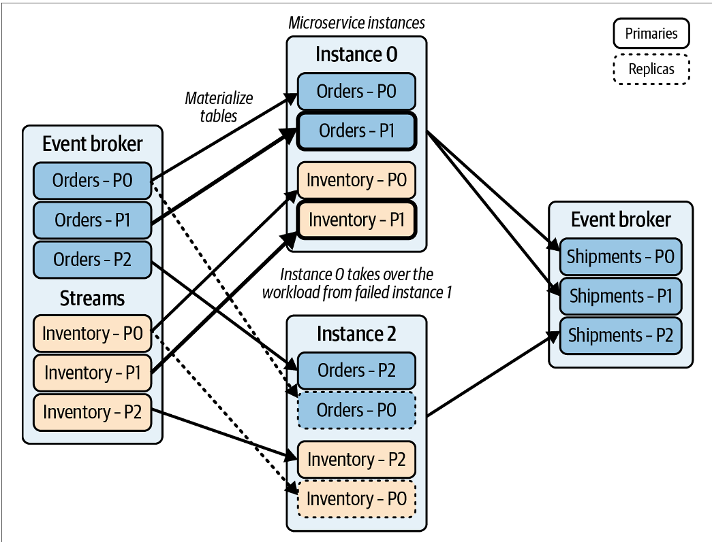

>Figure 8-11. Partition assignment rebalancing due to instance 1 termination  

Once processing has resumed, new hot replicas must be built from the changelog to maintain the minimum replica count. In this case, you may see instance 2 building a hot replica for P1, while instance 1 builds a hot replica for P2. However, if the original instance 1 comes back online, they'll redistribute their workloads back to the original configuration once it has rebuilt its internal state.  

> [!NOTE]
> This section only addresses hot failovers in general. For specifics, read your processing framework's documentation to get a better understanding of the hot partition failover and failback mechanisms. Copartitioning relies on keying strategies specific to the processing framework, including those covered in Chapters 12 and 13.  

Hot replicas trade off additional disk usage and replica maintenance processing in exchange for reducing downtime when an instance fails. Low-latency use cases will  

find hot replicas to be very useful, whereas workloads that can tolerate a higher
latency and periodic outages may find them unnecessary.  

## Restoring and scaling from changelogs  

When a newly created microservice instance joins the consumer group, any stateful partitions that it is assigned can be reloaded simply by consuming from its changelog. During this time the instance should not be processing new events, as doing so could produce nondeterministic and erroneous results.  

## Restoring and scaling from input event streams  

If no changelog is maintained, the microservice instance can rebuild its state stores from the input streams. It must consume all of its input events from the very beginning of its assigned event-stream partitions. Each event must be consumed and processed in strict incrementing order, its state updated, and any subsequent output events produced.  

> [!WARNING]
> Consider the impact of events produced during a full reprocessing.
> Downstream consumers may need to process these idempotently
> or eliminate them if they are duplicates. You may also choose to
> implement a mechanism that halts output events until a given
> progress condition is met.  

Restoring from the input event streams instead of a changelog can take much longer to rebuild state. It's best to employ this strategy only for simple topologies where duplicate output is not a concern, the entity event streams are well compacted, and input event stream retention is short.  

## Materializing State to an External State Store  

External state stores exist outside the microservice's containers or virtual machines. The external state store either uses its own dedicated hardware, runs inside its own container or VM, or more commonly nowadays, is provided by a fully managed cloud service.  

You can implement an external data store using your preferred technology, but you should select it based on the needs of the microservice's problem space. Some common examples of external store services include relational databases; document databases; graph databases; geospatial search systems; and distributed, highly available key-value stores.  

Keep in mind that while a specific microservice's external state store may use a
common data storage platform, the data set itself must remain logically isolated from
all other microservice implementations. A failure to do so can result in very tight coupling between services, making it very difficult to refactor your microservice's
internal data model.  

> [!WARNING]
> Do not share direct state access with other microservices! Instead,
> all microservices must materialize their own copy of state. This
> eliminates direct couplings and isolates microservices against unintentional changes, but at the expense of extra processing and data
> storage resources.  

Having already examined the advantages of internal state, let's now look at what
external state has to offer.  

## Advantages of External State  

There are several advantages to using external state storage.  

### Full data locality  

Unlike internal state stores, external state stores can provide access to all materialized data for each microservice instance. A single materialized data set eliminates the need for partition locality when you are performing lookups, relational queries on foreign keys, and geospatial queries among a large number of elements. However, each microservice instance remains responsible for materializing and processing its own assigned partitions.  

> [!TIP]
> Use state stores with strong read-after-write guarantees to eliminate inconsistent results when using multiple instances.  

### Maintains state during microservice outages  

The data stored in the external state store is independent of the life cycle of the microservice instances. Failures, rolling restarts, and temporary halts of the microservice don't require you to rebuild state when starting back up, reducing your downtime.  

### Technology options  

External data stores can leverage technology that the organization is already familiar with, reducing the time and effort it takes to deliver a microservice to production. Basic consumer/producer patterns are especially good candidates for using external data stores, as covered in Chapter 11. Functions as a service solutions are also excellent external data store candidates, as covered in Chapter 15.  

### Drawbacks of External State  

There are several drawbacks to using external state storage.  

### Management of multiple technologies  

External state stores are managed and scaled independently of the microservice business logic solution. One of the risks of an external data store is that the microservice owner is now on the hook for ensuring that it is maintained and scaled appropriately. Each team must implement proper resource allocation, scaling policies, and system monitoring to ensure that its data service is suitable and resilient for the microservice's load. Managed data services provided by the organization's capabilities team or by a third-party cloud platform vendor can help distribute some of this responsibility.  

> [!NOTE]
> Each team must fully manage the external state stores for its micro-services. Do not delegate responsibility of external state store management to its own team, as this introduces a technical cross-team dependency. Compose a list of acceptable external data services with guides on how to properly manage and scale them. This will alleviate each team from having to independently discover and implement its own management solutions.  

### Performance loss due to network latency  

Accessing data stored in an external state store has a much higher latency than accessing data stored locally in memory or on disk. In "Advantages of Internal State Stores" on page 179, you saw that using a network-attached disk introduces a slight network delay and can significantly reduce throughput and performance.  

While caching and parallelization may reduce the impact of the network latency, the trade-off is often added complexity and an increased cost for additional memory and CPU. Not all microservice patterns support caching and parallelization efforts either, with many requiring the processing thread to simply block and wait for a reply from the external data store.  

### Financial cost of external state store services  

Direct financial costs tend to be higher with external data stores than with similarly sized internal data stores. Hosted external state store solutions often charge by the number of transactions, the size of the data payload, and the retention period for the data. They may also require over-provisioning to handle bursty and inconsistent loads. On-demand pricing models with flexible performance characteristics may help reduce costs, but you must be sure they still meet your performance needs.  

## Full data locality  

Though also listed as a benefit, full data locality can present some challenges. The data available in the external state store originates from multiple processors and multiple partitions, each of which is processing at its own rate. It can be difficult to reason about (and debug) the contributions of any particular processing instance to the collective shared state.  

You'll need to be careful about race conditions and nondeterministic behavior, as each microservice instance operates on its own independent stream time. The stream time guarantees of a single microservice instance do not extend to all of them.  

For example, one instance may attempt to join an event on a foreign key that has not yet been populated by a separate instance. Reprocessing the same data at a later time may execute the join. Because the stream processing of each instance is completely separate from the others, any results obtained through this approach are likely to be nondeterministic and nonreproducible.  

## Scaling and Recovery with External State Stores  

Scaling and recovery of microservices using an external state store is pretty easy. You simply add a new instance with the necessary credentials to access the state store. In contrast, scaling and recovery of the underlying state store are dependent completely upon the selected technology. It may be simple with a cloud service; it may be difficult if you're doing it in-house.  

To reiterate an earlier point, having a list of acceptable external data services with guides on how to properly manage, scale, back up, and restore them is essential for providing developers a sustainable way forward. Unfortunately, the number of state store technologies is prohibitively large and effectively impossible to discuss in this book. Instead, I'll simply generalize the strategies of rebuilding state into three main techniques: via source streams, via changelogs, and via snapshots.  

### Recovery using the source streams  

Rewinding the consumer offsets to rebuild from the start of the stream is one option for rebuilding state. This method incurs the longest downtime of all options, but is easily reproducible and relies only on the persistent storage of the event broker to maintain the source data. Keep in mind that this option is effectively a full application reset and will also result in the reproduction of any output events (unless intentionally discarded by the microservice).  

### Recovery using changelogs  

External state stores typically do not rely on using broker-stored changelogs to record and restore state, though there is no rule preventing this. Just like when rebuilding from source streams, you must create a fresh copy of the state store. If rebuilding from changelogs, the microservice consumer instances must ensure they rebuild the entire state as stored in the changelog before resuming processing.  

> [!WARNING]
> Rebuilding external state stores from source event streams or changelogs can be prohibitively time-consuming due to network latency overhead. Make sure you can still meet the microservice SLAs in such a scenario.  

## Recovery using snapshots or checkpoints  

It is far more common for external state stores to provide their own backup and restoration process. Snapshots (or checkpoints) consist of the data store offloading an image of the state at a certain point in time to yet another external storage location (e.g., Amazon S3).  

The challenge with snapshots is ensuring that, upon restoration, your microservice’s consumer offsets line up with the restored state. Too late and you’ll miss events, suffering data loss. Too early and you’ll process duplicate results, which may or may not cause an issue, depending on your service and downstream dependencies.  

If your microservice is idempotent and duplicate data is not a problem, you can set your consumer offsets to a time period before the snapshot was taken. This will ensure that no data is missed, providing “at-least-once” event-processing guarantees.  

If the stored state is not idempotent and any duplicate events are not acceptable, then you should store your consumer’s partition offsets alongside the data within the data store. This is best done in an atomic transaction, as it will ensure that your state and consumer offsets are perfectly in sync. Then, when your service restores its state from the snapshot, it can set its consumer group offsets to the snapshot values. This will enable your service to have “effectively once” (sometimes called “exactly once”) event-processing guarantees. This is covered in more detail in “Maintaining consistent state via state store transactions” on page 197.  

## Rebuilding the External State Store  

New business requirements sometimes require a change to the state store models of a service. You may need to add new information to existing events, perform some extra join steps with another materialized table, or otherwise store newly derived business data. In the vast majority of cases, it is far better to rebuild the external state store than to try to migrate your data.  

> [!WARNING]
> Data migrations are very risky, and should be avoided whenever possible. The migrated data may be inconsistent with what is actually written in the original source of truth from the input stream, resulting in inconsistent output. It can be very difficult to track down these errors, and any time or money saved via a data migration is often accounted for tenfold in trying to fix the unintended consequences.  

Rebuilding the microservice's state stores is your best and safest option for accounting for changes in the data model.  

First, update your code to account for the changed data models. You'll want to make sure that everything works in testing before you switch over to production. Second, create a new instance of the external state store, and do not delete the original yet! You may need it to fall back on if things go poorly. Third, rewind the updated microservices' consumer offsets to the very beginning of the stream. Fourth, start it up and let it repopulate the data store.  

Note that just like internal state store rebuilding, you may need to implement a
"mute" to prevent your service from outputting events during the rebuild. Alternatively, you may choose not to, and simply output the new results as your business
logic executes on the historical data.  

Finally, once you have verified that everything is operational with the newly migrated service, you can delete the old state store and any changelogs or snapshots.  

> [!TIP]
> If your application is critically reliant upon a source of input data,
> you must ensure that it remains readily available for reprocessing.
> It serves as your snapshot for restoring state, and needs to be
> protected accordingly.  

As an example, consider a scenario where a company starts to offer international shipping. Previously, it may only have shipped nationally and not have bothered to collect the country information of its customers. Now, it collects the country information during signup, as its packaging service may need that information to best select a shipper for its goods. Figure 8-12 shows how the packaging microservice can account for the new country data.  

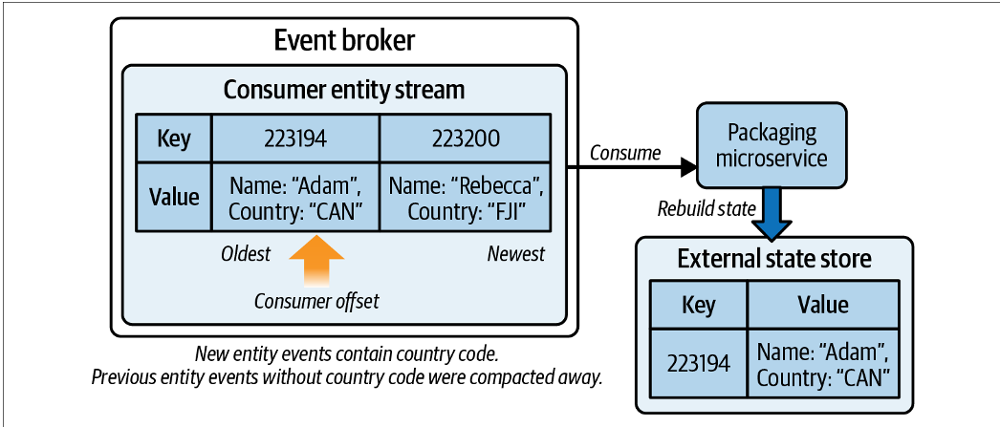

>Figure 8-12. The packaging microservice rebuilding its external state store, to make business decisions off the newly added Country field  

The microservice that populates the customer stream will have evolved its schema to include Country as a field type. But the packaging service will need to rebuild its state to include the customer’s country as part of its state store. Thus, you can rewind your service to the start of the customer stream and rebuild the external state store.  

## Transactions and Effectively Once Processing  

Effectively once processing is the guarantee that any updates made to the single source of truth are consistently applied, regardless of any failure to the producer, the consumer, or the event broker. In particular, it means that you can commit your consumer offsets and your output event-stream records in a single transaction. Transactional support is required to ensure effectively once processing.  

Transactional support is offered by Apache Kafka and Apache Pulsar. Much like a relational database can support multitable updates in a single transaction, an event broker implementation may also support the atomic writing of multiple events to multiple separate event streams.  

Effectively once processing is also sometimes described as exactly once processing, though this is not quite accurate. An event-driven microservice may process the same data multiple times, say, due to a consumer failure and subsequent recovery, but fail to commit its offsets and increment its stream progress. However, the service still executes the business logic for every event, including any side effects such as publishing data to external endpoints or communicating with a third-party service. It doesn’t mean that your processing and side effects will only occur once for every event.  

Idempotent writes are another commonly supported feature among event broker implementations such as Apache Kafka and Apache Pulsar. They allow for an event to be written once, and only once, to an event stream. They use a combination of unique process IDs and monotonically increasing sequences to fence out records produced more than once. In short, it'll let your service safely retry record production without accidentally adding duplicates to the output event stream.  

Not all event brokers may support transactions or idempotent production. In some cases it won't matter, but in other cases you may need to build your own workaround.  

## Example: Effectively Once Processing for an Inventory Accounting Service  

The inventory accounting service is responsible for issuing an event when the inventory of any given item is low. The microservice must piece together the current inventory available for each product based on a chain of additions and subtractions made over time. Selling items to customers, losing items to damage, and losing items to theft are all events that reduce inventory. Receiving shipments, accepting customer returns, and finding lost inventory in the warehouse would be events that increase inventory. These events are shown in the same event stream for simplicity in this example, as illustrated in Figure 8-13.  

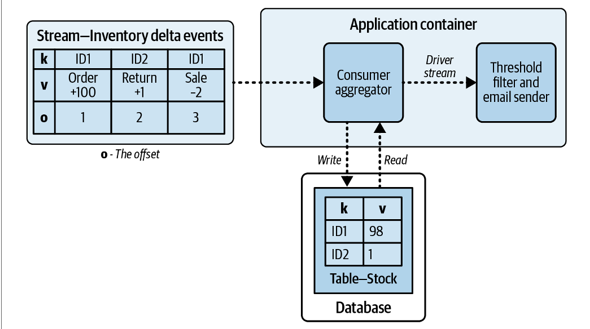

>Figure 8-13. A simple inventory accounting service  

This inventory accounting service is quite simple. It calculates the current running total based off of the events and stores it in its data store. The business logic filters on a threshold value to decide when to issue a purchase event that requests the ordering of more inventory. To get an accurate count, you must ensure that each input event
is applied effectively once to the aggregated state. At-least-once and at-most-once
processing will give incorrect results.  

This service benefits greatly from effectively once semantics as it is entirely event-driven. It doesn't need to issue any commands or requests to external systems, and can ensure that its state and offsets are atomically committed (provided your broker supports transactions; see next section).  

## Effectively Once Processing with Client-Broker Transactions  

Effectively once processing can be facilitated by any event broker that supports transactions. Transactions ensure that output events, changelog events, and consumer offset output events are committed atomically to the event broker, as shown in Figure 8-14.  

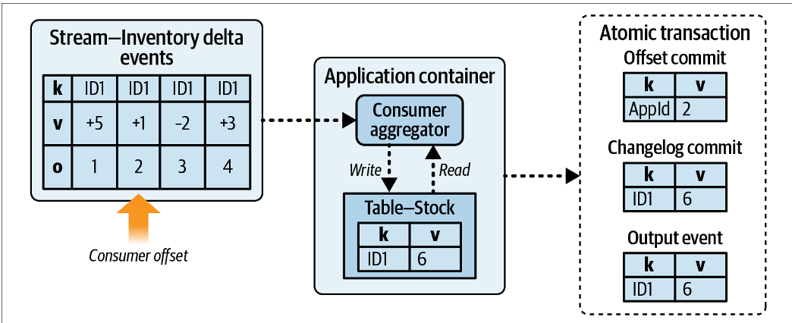

>Figure 8-14. Committing offsets, changelogs, and event production with client-broker transactions  

The atomic transaction between the producer client and the event broker will publish all events to their corresponding event streams. If the failure persists longer than the retry timeouts, as in Figure 8-15, the broker will abort the transaction and won't commit any events. In the case of transient errors, the producer can simply retry committing its transaction, as it is an idempotent operation.  

Event-stream consumers typically abstain from processing events that are in uncommitted transactions. It's a bit academic really, as there are vanishingly few scenarios where you want the guarantees of a transaction, but don't care if the transaction is actually committed! The consumer, however, must respect offset order, and so it'll wait for the pending transactions to commit or abort.  

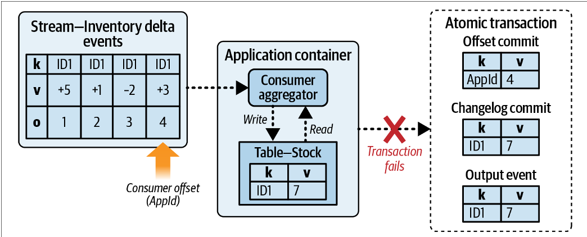

>Figure 8-15. Failed commit for a client-broker transaction  

In the case that the producer suffers a fatal exception during a transaction, its replacement instance can simply be rebuilt by restoring from the changelogs, as shown in Figure 8-16. The consumer group offsets of the input event streams are also reset according to the last known good position stored in the offset event stream.  

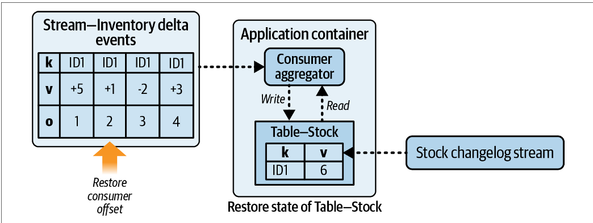

>Figure 8-16. Restoring the state from the broker using changelogs and previous offsets  

New transactions can begin once the producer recovers, and all previous incomplete transactions are failed and cleaned up by the event broker. The transactional mechanisms will vary to some extent depending on the broker implementation, so make sure to familiarize yourself with the one you are using.  

## Effectively Once Processing Without Client-Broker Transactions  

Effectively once processing of events is also possible for implementations that do not support client-broker transactions, though it requires more work and a careful consideration of duplicate events. First, if upstream services are not able to provide effectively once event production guarantees, it is possible that they may produce  

duplicate records. Any duplicate events created by upstream processes need to be
identified and filtered out.  

Second, state and offset management need to be updated in a *local transaction* to ensure that the event processing is applied only once to the system state. By following this strategy, clients can be assured that the internal state generated by their processor is consistent with the logical narrative of the input event streams. Let's take a look at these steps in more detail.  

> [!WARNING]
> It is better to use an event broker and client that support idempotent writes than it is to try to solve deduplication after the fact. The former method scales well to all consumer applications, whereas the latter is expensive and difficult to scale as each consumer must implement safeguards.  

### Generating duplicate events  

Duplicate events are generated when a producer successfully writes the events to an event stream, but either fails to receive a write acknowledgment and retries, or it crashes before updating its own consumer offsets. These scenarios are slightly different:  

Producer fails to receive acknowledgment from broker and retries  

In this scenario, the producer still has the copies of the events to produce in its memory. These events, if published again, may have the same timestamps (if they use event creation time) and same event data, but will be assigned new offsets. Idempotent production between a client and broker normally filter these out.  

Producer crashes immediately after writing, before updating its own consumer offsets  

In this case, the producer will have successfully written its events, but will *not* have updated its consumer offsets yet. This means that when the producer comes back up, it will repeat the work that it had previously done, creating logically identical copies of the events but with new timestamps. If processing is deterministic, then the events will have the same data. New offsets will also be assigned, making it difficult to tell that they are in fact duplicates.  

> [!NOTE]
> Idempotent production can mitigate failures due to crashes and retries between the client and the broker. It cannot mitigate duplicates introduced through faulty business logic.  

## Identifying duplicate events  

If idempotent production of events is *not* available and there are duplicates (with unique offsets and unique timestamps) in the event stream, it is up to you to mitigate their impact. First, determine if the duplicates actually cause any problems. In many cases duplicates have a minor, if not negligible, effect and can simply be ignored.  

For those scenarios where duplicate events do cause problems, you will need to figure out how to identify them. One way to do this is to have the producer generate a unique ID for each event, such that any duplicates will generate the same unique hash.  

This hash function is often based on the properties of the internal event data, including the key, values, and the event time of the source events (or the query time of the request-response query that triggered it). This approach tends to work well for events that have a large data domain, but poorly for events that are logically equivalent to one another. Here are a few scenarios where you could feasibly generate a unique ID:  

• A bank account transfer, detailing the source, destination, amount, date, and time  

• An ecommerce order, detailing each product, the purchaser, date, time, total amount, and payment provider  

• Inventory debited for shipment purposes, where each event has an associated orderId (uses an existing unique data ID)  

One factor these examples have in common is that each ID is composed of elements with a very high cardinality (that is, uniqueness). This significantly reduces the chances of duplicates between the IDs. The deduplication ID (dedupe ID) can either be generated with the event or be generated by the consumer upon consumption. Your best option is to generate the ID with the event, as all consumers can benefit from it and you can freely change the logic that generates it.  

> [!WARNING]
> Guarding against duplicate events produced without a key is extremely challenging, as there is no guarantee of partition locality. Produce events with a key, respect partition locality, and use idempotent writes whenever possible.  

## Guarding against duplicates  

Any effectively once consumer must either identify and discard duplicates, perform idempotent operations, or consume from event streams that have idempotent producers. Idempotent operations are not possible for all business cases, and without idempotent production you must find a way to guard your business logic against duplicate events. This can be an expensive endeavor, as it requires that each consumer maintain a state store of previously processed dedupe IDs. The store can grow very large depending on the volume of events and the offset or time range that the application must guard against.  

Perfect deduplication requires that each consumer indefinitely maintain a lookup of each dedupe ID already processed, but time and space requirements can become prohibitively expensive if an attempt is made to guard against too large a range. In practice, deduplication is generally performed only for a specific rolling time-window or offset-window as a best-effort attempt.  

> [!TIP]
> Keep deduplication stores small by using time-to-live (TTL), a maximum cache size, and periodic deletions. The specific settings needed will vary depending on the sensitivity of your application to duplicates and the impact of duplicates occurring.  

Deduplication should be attempted only within a single event-stream partition, as deduplication between partitions will be prohibitively expensive. Keyed events have an added benefit over unkeyed events, since they consistently map to the same partition.  

Figure 8-17 shows a deduplication store in action. In this figure you can see the workflow that an event goes through before being passed off to the actual business logic. In this example the TTL is arbitrarily set to 8,000 seconds, but in practice would need to be established based on business requirements.  

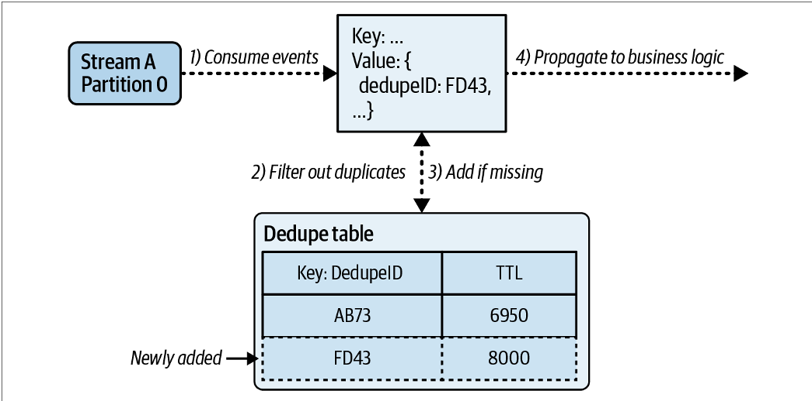

>Figure 8-17. Deduplication using persisted state  

> [!TIP]
> A maximum cache size is used in the deduplication store to limit the number of events maintained, particularly during reprocessing.  

Note that you are also responsible for maintaining durable backups of the deduplication table, the same as any other materialized table. In the case of a failure, the dedupe table must be rebuilt prior to resuming the processing of new events.  

### Maintaining consistent state via state store transactions  

A microservice can leverage the transactional capabilities of its own state store instead of the event broker to perform effectively once processing. However, this requires moving the consumer group's input offset management from the event broker into the data store. Then, a single transaction can atomically update both the microservice's computed state and the consumer group input offsets. Any changes made to the state coincide completely with those made to the consumer offsets, maintaining consistency.  

In the case of a service failure, such as a timeout when committing to the data store, the microservice can simply abandon the transaction and revert to the last known good state. All consumption is halted until the data service is back online, at which point consumption is restored from the last known good offset.  

By keeping the official record of offsets synchronized with the state in the data store, you have a consistent record of state that the service can recover from. This process is illustrated in Figures 8-18, 8-19, and 8-20.  

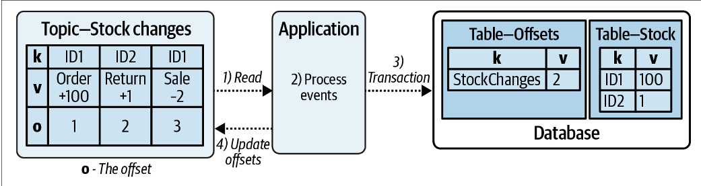

>Figure 8-18. Normal transactional processing of events  

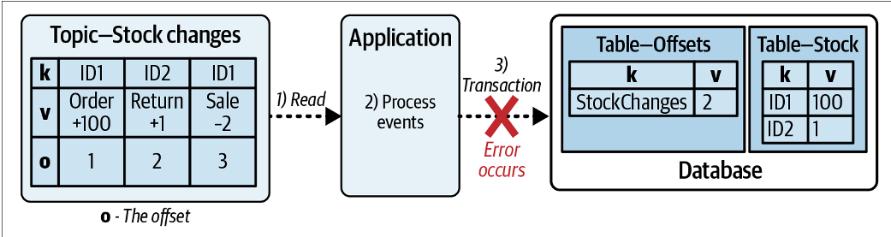

>Figure 8-19. Failure occurs in transactional processing  

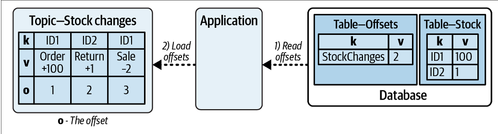

>Figure 8-20. Recovery of offsets during state restoration process  

Note that this approach gives your processor effectively once *processing*, but not effectively once event *production*. Any events produced by this service are subject to the limitations of at-least-once production. After all, in this scenario, there is no atomic transaction between the producer and the broker.  

#### Summary  

This chapter covered internal and external state stores, how they work, their advantages, their disadvantages, and when to use them. Internal state stores can support high-performance processing, while external state stores can provide a range of flexible options for supporting the business needs of your microservices. Latency, throughput, cost, scaling, and data access patterns are each significant factors for determining whether an internal or external data store is best for your microservice.  

Changelogs play an important role in the backup and restoration of microservice state stores, though they remain native only to a narrow selection of event-driven frameworks. Alternatively, you could choose to rely on transaction-supporting databases with regularly scheduled snapshots as your data store of choice.  

Event brokers that support transactions can enable extremely powerful effectively once processing, offloading the responsibility of duplication prevention from the consumer, while deduplication efforts can enable effectively once processing in systems without such support.  

Having covered state, it's time to take a look at what happens when events are late or arrive out of order. In the next chapter, we'll take a look at timestamps, determinism, and processing strategies for ensuring consistent computations.  

# Deterministic Stream Processing

Event-driven microservices typically have topologies that are more complex than those introduced in the previous chapter (see "Microservice Topology" on page 58). They consume events from multiple partitioned event streams, maintain state, reparation data, and emit new events to other streams. They are also subject to all the same failure modes and faults as any other application, which can result in out-of-order events, late events, and questions around how events will be processed in actuality.  

Here are the three main questions addressed in this chapter:  

• How does a microservice choose the order of events to process when consuming from multiple partitions?  

• How does a microservice handle out-of-order and late-arriving events?  

• How do we ensure that our microservices produce deterministic results when processing streams in near–real time versus when processing from the beginning of the streams?  

We can answer these questions by examining timestamps, event scheduling, watermarks, and stream times, and how they contribute to deterministic processing. Bugs, errors, and changes in business logic will also necessitate reprocessing, making deterministic results important. This chapter also explores how out-of-order and late-arriving events can occur, strategies for handling them, and mitigating their impact on our workflows.  

> [!NOTE]
> This chapter is fairly information-dense despite my best efforts to find a simple and concise way to explain the key concepts. There are a number of sections where I will refer you to further resources to explore on your own, as the details often go beyond the scope of this book.  

## Determinism with Event-Driven Workflows  

An event-driven microservice has two main processing states. It may be processing events at near–real time, which is typical of long-running microservices. Alternatively, it may be processing events from the past in an effort to catch up to the present time, which is common for underscaled and new services.  

If you were to rewind the consumer group offsets of the input event streams to the beginning of time and start the microservice again, would it generate the same output as the first time it was run? The overarching goal of deterministic processing is that a microservice should produce the same output whether it is processing in real time or catching up to the present time.  

Note that there are workflows that are explicitly nondeterministic, such as those based on the current wall-clock time and those that query external services. External services may provide different results depending on when they are queried, especially if their internal state is updated independently of that from the services issuing the query. In these cases there is no promise of determinism, so be sure to pay attention to any nondeterministic operations in your workflow.  

Fully deterministic processing is the ideal case, where every event arrives on time and there is no latency, no producer or consumer failures, and no intermittent network issues. Since we have no choice but to deal with these scenarios, the reality is that our services can only achieve a best effort at determinism. A number of components and processes work together to facilitate this attempt, and in most cases best-effort determinism will be sufficient for your requirements. You need a few things to achieve this: consistent timestamps, well-selected event keys, partition assignment, event scheduling, and strategies to handle late-arriving events.  

### Timestamps  

Events can happen anywhere and at any time and often need to be reconciled with events from other producers. Synchronized and consistent timestamps are a hard requirement for comparing events across distributed systems.  

An event stored in an event stream has both an offset and a timestamp. The offset is used by the consumer to determine which events it has already read, while the timestamp, which indicates when that event was created, is used to determine when an event occurred relative to other events and to ensure that events are processed in the correct order.  

The following timestamp-related concepts are illustrated in Figure 9-1, which shows their temporal positions in the event-driven workflow:  

### Event time  

The local timestamp assigned to the event by the producer at the time the event occurred.  

### Broker ingestion time  

The timestamp assigned to the event by the event broker. You can configure this to be either the event time or the ingestion time, with the former being much more common. In scenarios where the producer’s event time is unreliable, broker ingestion time can provide a sufficient substitute.  

#### Consumer ingestion time  

The time in which the event is ingested by the consumer. This can be set to the event time specified in the broker record, or it can be the wall-clock time.  

### Processing time  

The wall-clock time at which the event has been processed by the consumer.  

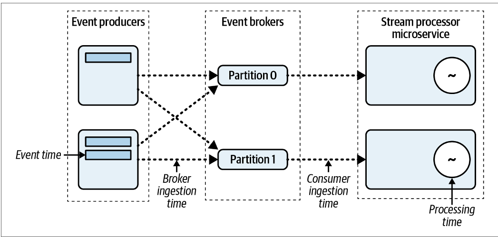

>Figure 9-1. The different kinds of timestamps in an event-driven architecture  

You can see that it’s possible to propagate the event time through the event broker to the consumer, enabling the consumer logic to make decisions based on when an event happened. This will help answer the three questions posed at the start of the chapter. Now that we’ve mapped out the types of timestamps, let’s take a look at how they’re generated.  

## Synchronizing Distributed Timestamps  

A fundamental limitation of physics is that two independent systems cannot be guaranteed to have precisely the same system-clock time. Various physical properties limit how precise system clocks can be, such as material tolerances in the underlying clock circuitry, variations in the operating temperature of the chip, and inconsistent
network communication delays during synchronization. However, it is possible to
establish local system clocks that are nearly in sync and end up being good enough
for most computing purposes.  

Consistent clock times are primarily accomplished by synchronizing with Network Time Protocol (NTP) servers. Cloud service providers such as Amazon and Google offer redundant satellite-connected and atomic clocks in their various regions for instant synchronization.  

Synchronization with NTP servers within a local area network can provide very accurate local system clocks, with a drift of only a few ms after 15 minutes. This can be reduced to 1 ms or less with more frequent synchronizations in best-case scenarios according to David Mills, NTP's inventor, though intermittent network issues may prevent this target from being reached in practice. Synchronization across the open internet can result in much larger skews, with accuracy being reduced to ranges of $+/-$ 100 ms, and is a factor to be considered if you're trying to resynchronize events from different areas of the globe.  

NTP synchronization is also prone to failure, as network outages, misconfiguration, and transient issues may prevent instances from synchronizing. The NTP servers themselves may also otherwise become unreliable or unresponsive. The clock within an instance may be affected by multitenancy issues, just as in VM-based systems sharing the underlying hardware.  

For the vast majority of business cases, frequent synchronization to NTP servers can provide sufficient consistency for system event time. Improvements to NTP servers and GPS usage have begun to push NTP synchronization accuracy consistently into the submillisecond range. The creation time and ingestion time values assigned as the timestamps can be highly consistent, though minor out-of-order issues will still occur. Handling of late events is covered later in this chapter.  

Timestamps provide a way to process events distributed across multiple event streams and partitions in a consistent temporal order. Many use cases require you to maintain order among events based on time, and need consistent, reproducible results regardless of when the event stream is processed. Using offsets as a means of comparison works only for events within a single event-stream partition, while events quite commonly need to be processed from multiple different event streams.  

For example, a bank must ensure that both deposit and withdrawal event streams are processed in the correct temporal order. It keeps a stateful running tally of withdrawals and deposits, applying an overdraft penalty when a client's account balance drops below $0. For this example, the bank has its deposits in one event stream and its withdrawals in another stream, as shown in Figure 9-2.  

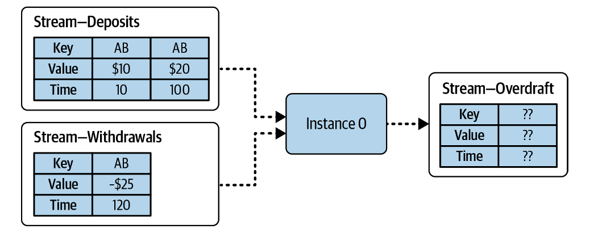

>Figure 9-2. In which order should events be processed?  

A naive approach to consuming and processing records, perhaps a round-robin processor, might process the $10 deposit first, the $25 withdrawal second (incurring a negative balance and overdraft penalties), and the $20 deposit third. This is incorrect, however, and does not represent the temporal order in which the events occurred. This example makes clear that you must consider the event's timestamp when consuming and processing events. The next section discusses this in greater detail.  

> [!WARNING]
> The consumer application requires copartitioned event streams (see "Copartitioning Event Streams" on page 34) so that the deposits and withdrawals for a given key go to the same stream. In the case that they do not have the same partition count or partition key, then they will need to be repartitioned and/or rekeyed (see "Repartitioning Event Streams" on page 33).  

## Event Scheduling and Deterministic Processing  

Deterministic processing requires that events be processed consistently, such that the results can be reproduced at a later date. Event scheduling is the process of selecting the next events to process when consuming from multiple input partitions. For an immutable log-based event stream, records are consumed in an offset-based order. However, as Figure 9-2 demonstrates, the processing order of events must be interleaved based on the *event time* provided in the record, regardless of which input partition it comes from, to ensure correct results.  

> [!TIP]
> The most common event-scheduling implementation selects and dispatches the event with the oldest timestamp from all assigned input partitions to the downstream processing topology.  

Event scheduling is a feature of many stream-processing frameworks, but is typically absent from basic consumer implementations. You will need to determine if it is required for your microservice implementation.  

> [!WARNING]
> Your microservice will need event scheduling if the order in which
> events are consumed and processed matters to the business logic.  

## Custom Event Schedulers  

Some streaming frameworks allow you to implement custom event schedulers. For example, Apache Samza lets you implement a MessageChooser class, where you select which event to process based on a number of factors, such as prioritization of certain event streams over others, the wall-clock time, event time, event metadata, and even content within the event itself. You should take care when implementing your own event scheduler, however, as many custom schedulers are nondeterministic in nature and won't be able to generate reproducible results if reprocessing is required.  

## Processing Based on Event Time, Processing Time, and Ingestion Time  

A time-based order of event processing requires you to select *which* point in time to use as the event's timestamp, as per Figure 9-1. The choice is between the locally assigned event time and broker ingestion time. Both timestamps occur only once each in a produce-consume workflow, whereas the wall-clock and consumer ingestion times vary depending on when the application is executed.  

In most scenarios, particularly when all consumers and all producers are healthy and there is no event backlog for any consumer group, all four points in time will be within a few seconds of each other. Contrarily, for a microservice processing historic events, event time and consumer ingestion time will differ significantly.  

For the most accurate depiction of events in the real world, it is best to use the locally assigned event time provided you can rely on its accuracy. If the producer has unreliable timestamps (and you can't fix it), your next best bet is to set the timestamps based on when the events are ingested into the event broker. It is only in rare cases where the event broker and the producer cannot communicate reliably that there may be a substantial delay between the true event time and the one assigned by the broker.  

## Timestamp Extraction by the Consumer  

The consumer must know the timestamp of the record before it can decide how to order it for processing. At consumer ingestion time, a timestamp extractor is used to extract the timestamp from the consumed event. This extractor can take information from any part of the event's payload, including the key, value, and metadata.  

Each consumed record has a designated event-time timestamp that is set by this extractor. Once this timestamp has been set, it is used by the consumer framework for the duration of its processing.  

### Request-Response Calls to External Systems  

Any non-event-driven requests made to external systems from within an event-driven topology may introduce nondeterministic results. By definition, external systems are managed externally to the microservice, meaning that at any point in time their internal state and their responses to the requesting microservice may differ. Whether this is significant depends entirely on the business requirements of your microservice and is up to you to assess.  

## Watermarks  

Watermarking is used to track the progress of event time through a processing topology and to declare that all data of a given event time (or earlier) has been processed. This is a common technique used by many of the leading stream-processing frameworks, such as Apache Spark, Apache Flink, Apache Samza, and Apache Beam. A whitepaper from Google describes watermarks in greater detail and provides a good starting point for anyone who would like to learn more about it.  

A watermark is a specialized *event* created and propagated internally along the event-driven topology. It is injected into the topology by the processing framework itself, and signals to the topology nodes that it passes through that all events of time $t$ and prior have been processed. Upon receiving a watermark, the node then updates its own internal event time and propagates the watermark downstream to the next nodes. This process is shown in Figure 9-3, with the watermark illustrated as a thin dotted line.  

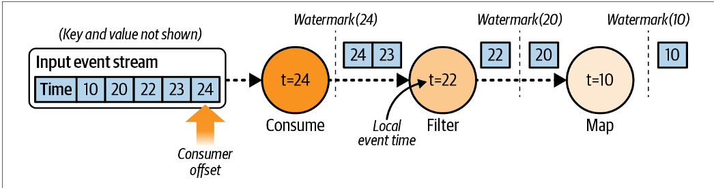

>Figure 9-3. Watermark propagation between nodes in a simple topology  

In this figure, the consumer node has the highest watermark time because it's consuming from the source event stream. The consumer node periodically generates new watermarks when a period of wall-clock or event time has elapsed, or when it has consumed a given number of events. It has just generated Watermark(24) and put it into the internal stream leading to the filter topology stage. Watermark(20) is sandwiched between the events with timestamps 22 and 20. Once the map stage processes the event with timestamp 20, it will then process the Watermark(20) event and update its own internal watermark from $t=10$ to $t=20$.  

> [!NOTE]
> This chapter only touches on watermarks to give you an understanding of how they're used for deterministic processing. If you would like to dig deeper into watermarks, consider Chapters 2 and 3 of the excellent book *Streaming Systems*, by Tyler Akidau, Slava Chernyak, and Reuven Lax (O'Reilly, 2018).  

## Watermarks in Parallel Processing  

Watermarks are particularly useful for coordinating event time between multiple independent consumer instances. Figure 9-4 shows a simple processing topology of two consumer instances. Each consumer instance consumes events from its own assigned partition, applies a `groupByKey` function, followed by an `aggregate` function. This requires a `shuffle`, where all events with the same key are sent to a single downstream aggregate instance. In this case, events from instance 0 and instance 1 are sent to each other based on the key to ensure all events of the same key are in the same partition.  

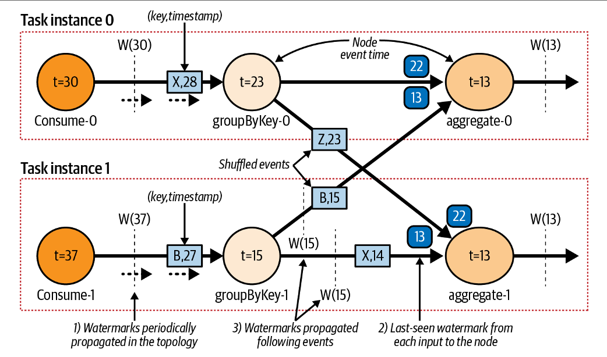

>Figure 9-4. Watermark propagation between nodes in a topology with multiple processors  

There is a fair bit to unpack in this diagram, so let's take a look at it from the start.  

Watermarks are generated at the source function, where the events are consumed from the event-stream partition. The watermarks define the event time at that consumer and are propagated downstream as the event time of the consumer node is incremented (step 1 in Figure 9-4).  

Downstream nodes update their event time as the watermarks arrive, and in turn generate their own new watermark to propagate downstream to its successors. Nodes with multiple inputs, such as aggregate, consume events and watermarks from multiple upstream inputs. The node's event time is the minimum of all of its input sources' event times, which the node keeps track of internally (step 2 in Figure 9-4).  

In the example, both aggregate nodes will have their event time updated from 13 to 15 once the watermark from the groupByKey-1 node arrives (step 3 in Figure 9-4). Note that the watermark does not affect the event scheduling of the node; it simply notifies the node that it should consider any events with a timestamp earlier than the watermark to be considered late. Handling late events is covered later in this chapter.  

Spark, Flink, and Beam, among other heavyweight processing frameworks, require a dedicated cluster of processing resources to perform stream processing at scale. This is particularly relevant because this cluster also provides the means for cross-task communications and centralized coordination of each processing task. Repartitioning events, such as with the groupByKey+ aggregate operation in this example, use cluster-internal communications and not event streams in the event broker.  

### Stream Time  

A second option for maintaining temporal progress in a stream, as favored by Apache Kafka Streams, is known simply as stream time. Stream time is the highest value ofevent timestamps last seen by the processing node. Here’s how it works:  

• The consumer application consumes and buffers events from its partitions.  

• The consumer applies an event-scheduling algorithm to select the next event toprocess.  

• The consumer application then updates its stream-time highest value if it’s largerthan the previous value.  

Any events consumed and processed with a lower stream time than the highest value are considered to be out of order. When out-of-order messages arrive, Kafka Streams delays advancing the stream time (the watermark) until the grace period for those out-of-order messages has passed. This ensures that computations, including those involving time-limited windows, can correctly incorporate the late-arriving data instead of just discarding it.  

Figure 9-5 shows an example of stream time. The consumer node maintains a single stream time based on the highest event-time value it has received. The stream time is currently set to 20 since that was the event time of the most recently processed event. The next event to be processed is the smallest value of the two input buffers—in this case, it’s the event with event time 30. The event is dispatched down to the processing topology, and the stream time will be updated to 30.  

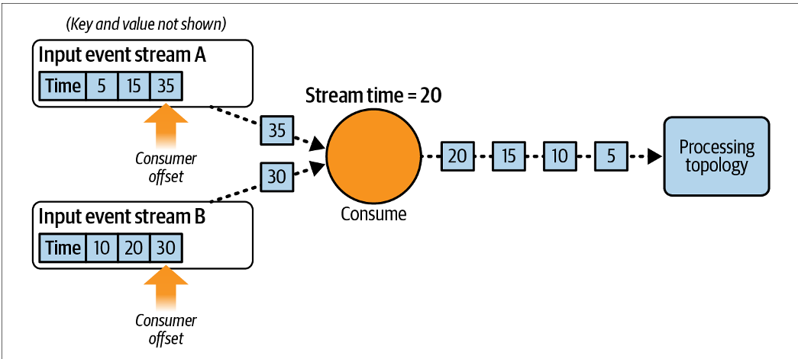

>Figure 9-5. Stream time when consuming from multiple input streams  

Stream time is maintained by processing each event completely through the topology before processing the next one. In cases where a topology contains a repartition stream, each topology is split into two, and each subtopology maintains its own distinct stream time. Events are processed in a depth-first manner, such that only one event is being processed in a subtopology at any given time. This is different than the watermark-based approach where events can be buffered at the inputs of each processing node, with each node’s event time independently updated.  

Consider again the same two-instance consumer example from Figure 9-4, but this time with the stream-time approach championed by Kafka Streams. Kafka Streams uses internal repartition topics (streams) to repartition and shuffle its data to other instances within its own single topology. In contrast, services like Spark, Flink, and Beam use their own dedicated shuffle mechanisms that don’t rely on an external event broker.  

Figure 9-6 shows a Kafka Streams application using a repartition stream to shuffle all events of the same key to the same partition. The application is performing a groupByKey followed by an aggregate, requiring all data of the same key go to the same instance.  

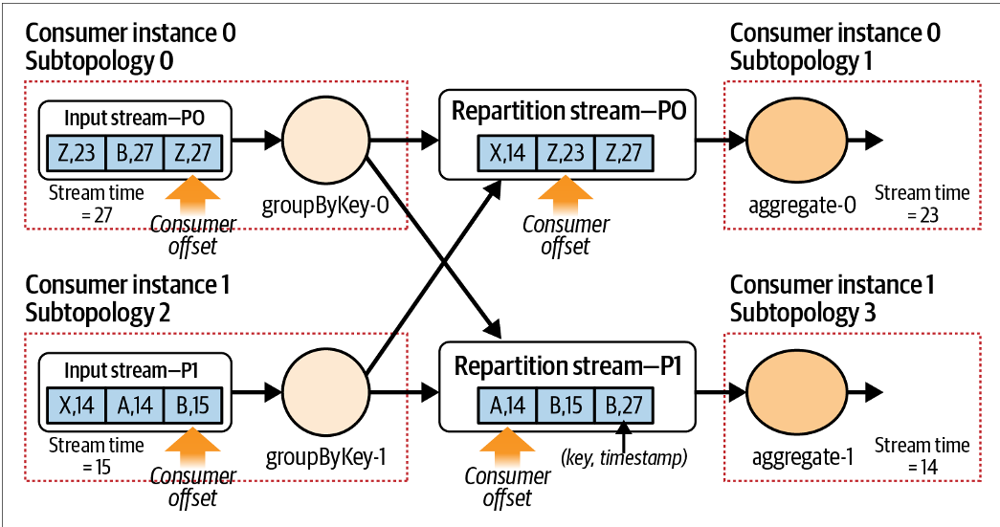

>Figure 9-6. Shuffling events via a repartition event stream  

Events keyed on A and B are repartitioned into “Repartition stream—P1,” while the events keyed on X and Z end up in “Repartition stream—P0.” Note that the event time has been maintained for each event, but that the data is no longer in strictly ascending timestamp order per key. Subtopology 1 and 3 each consume from their respective assigned partitions, and will need to accommodate the out-of-order data introduced by the reshuffling.  

The subtopologies simply indicate separate *time boundaries*, each with its own *stream time*. Because events may be received out of order due to the reshuffling, it's important to consider the impact that wildly divergent timestamps may have on your event-stream correctness. Since stream time is largely limited to Kafka Streams, you would do well to explore the documentation surrounding stream time and topologies.  

> [!TIP]
> Watermarking strategies can also use repartition event streams.
> Apache Samza offers a standalone mode that is similar to Kafka
> Streams, but uses watermarking instead of stream time.  

## Out-of-Order and Late-Arriving Events  

In an ideal world, all events are produced without issue and available to the consumer with zero latency. Unfortunately for all of us living in the real world, this is never the case, so we must plan to accommodate out-of-order events. An event is said to be out of order if its timestamp isn't equal to or greater than the events ahead of it in the event stream. In Figure 9-7, event F is out of order because its timestamp is lower than G's, just as event H is out of order as its timestamp is lower than I's.  

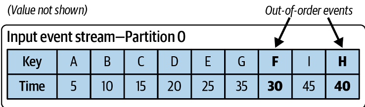

>Figure 9-7. Out-of-order events in an event-stream partition  

Bounded data sets, such as historical data processed in batch, are typically fairly resilient to out-of-order data. The entire batch can be thought of as one large window, and an event arriving out of order by many minutes or even hours is not really relevant provided that the processing for that batch has not yet started. In this way, a bounded data set processed in batch can produce results with high determinism. This comes at the expense of high latency, especially for the traditional sorts of nightly batch big-data processing jobs where the results are available only after the 24-hour period, plus batch processing time.  

For unbounded data sets, such as those in ever-updating event streams, the developer must consider the requirements of latency and determinism when designing the microservice. This extends beyond the technological requirements into the business requirements, so any event-driven microservice developer must ask, "Does my microservice handle out-of-order and late-arriving events according to business requirements?" Out-of-order events require the business to make specific decisions about how to handle them, and to determine whether latency or determinism takes priority.  

Consider the previous example of the bank account. A deposit followed by an immediate withdrawal must be processed in the correct order lest an overdraft charge be incorrectly applied, regardless of the ordering of events or how late they may be. To mitigate this, the application logic may need to maintain state to handle out-of-order data for a time period specified by the business, such as a one-hour grace window.  

> [!TIP]
> Events from a single partition should always be processed according to their offset order, regardless of their timestamp. This can lead to out-of-order events.  

An event can be considered *late* only when viewed from the perspective of the consuming microservice. One microservice may consider *any* out-of-order events as late, whereas another may be fairly tolerant and require many hours of wall-clock or event time to pass before considering an event to be late.  

## Late Events with Watermarks and Stream Time  

Consider two events, one with time t, the other with time  $ t' $ . Event  $ t' $  has an earlier timestamp than event t.  

### Watermarks  

The event $t'$ is considered late when it arrives after the watermark $W(t)$. It is up to the specific node how to handle this event.  

### Stream time  

The event $t'$ is considered late when it arrives *after* the stream time has been incremented past $t'$. It is up to each operator in the subtopology how to handle this event.  

> [!TIP]
> An event is late only when it has missed a deadline specific to the
> consumer.  

## Causes and Impacts of Out-of-Order Events  

Out-of-order events can occur in several ways.  

### Sourcing from out-of-order data  

The most obvious, of course, is when events are sourced from out-of-order data. This can occur when data is consumed from a stream that is already out of order or when events are being sourced from an external system with existing out-of-order timestamps.  

### Multiple producers to multiple partitions  

Multiple producers writing to multiple output partitions can introduce out-of-order events. Repartitioning an existing event stream is one way in which this can happen. Figure 9-8 shows the repartitioning of two partitions by two consumer instances. In this scenario the source events indicate which product the user has interacted with. For instance, Harry has interacted with products ID12 and ID77. Say that a data analyst needs to rekey these events on the user ID, such that they can perform session-based analysis of the user’s engagements. The resultant output streams may end up with some out-of-order events.  

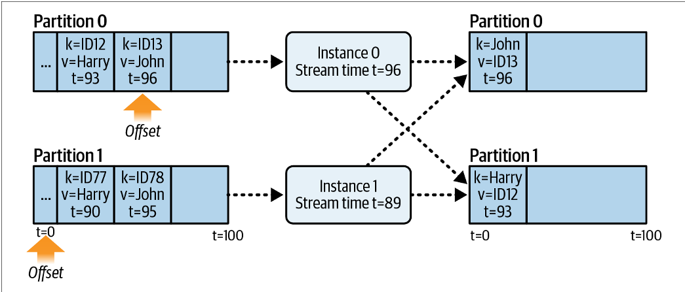

>Figure 9-8. Shuffling events via a repartition event stream  

Note that each instance maintains its own internal stream time and that there is no synchronization between the two instances. This can cause a time skew that produces out-of-order events, as shown in Figure 9-9.  

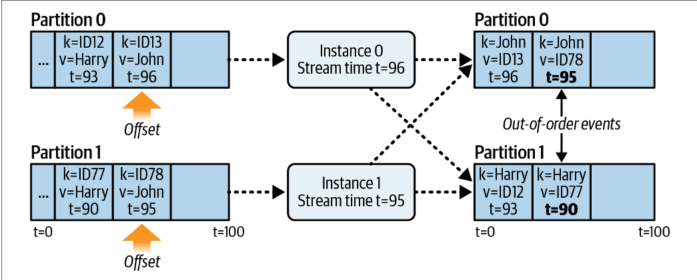

>Figure 9-9. Shuffling events via a repartition stream, resulting in out-of-order events  

Instance 0 was only slightly ahead of instance 1 in stream time, but because of their independent stream times, the events of time t= 90 and t= 95 are considered out of order in the repartitioned event stream. This issue is exacerbated by unbalanced partition sizes, unequal processing rates, and large backlogs of events. The impact here is that the previously in-order event data is now out of order, and thus as a consumer you cannot depend on having consistently incrementing time in each ofyour event streams.  

> [!TIP]
> A single-threaded producer will not create out-of-order events in normal operation unless it is sourcing its data from an out-of-order source.  

Since the stream time is incremented whenever an event with a higher timestamp is detected, it is possible to end up in a scenario where a large number of events are considered late due to reordering. This may have an effect on processing depending on how the consumers choose to handle out-of-order events.  

## Time-Sensitive Functions and Windowing  

Late events are predominantly the concern of time-based business logic, such as aggregating events in a particular time period or triggering an event after a certain period of time has passed. A late event is one that arrives after the business logic has already finished processing for that particular period of time. Windowing functions are an excellent example of time-based business logic.  

Windowing means grouping events together by time. This is particularly useful for events with the same key, where you want to see what happened with events of that key in that period of time. There are three main types of event windows, but again, besure to check your stream-processing framework for more information.  

> [!TIP]
> You can create windows using either event time or processing time, though event-time windowing typically has more business applications.  

## Tumbling windows  

A tumbling window is a window of a fixed size. Previous and subsequent windows do not overlap. Figure 9-10 shows three tumbling windows, each aligned on t, t+ 1, and so on. This sort of windowing can help answer questions such as, “When is the peak hour for product usage?”  

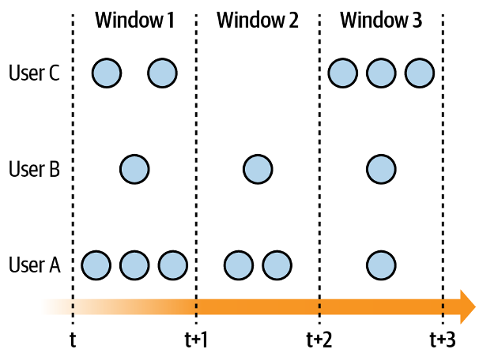

>Figure 9-10. Tumbling windows  

## Sliding windows  

A sliding window has a fixed window size and incremental step known as the window slide. It must reflect only the aggregation of events currently in the window. A sliding window can help answer questions such as, “How many users clicked on my product in the past hour?” Figure 9-11 shows an example of the sliding window, including the size of the window and the amount that it slides forward.  

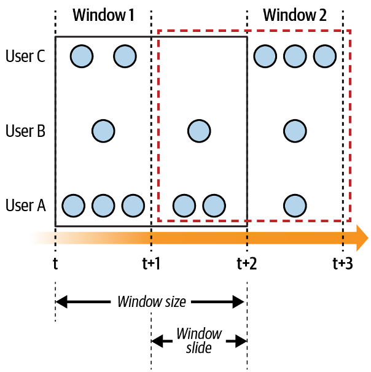

>Figure 9-11. Sliding windows  

## Session windows  

A session window is a dynamically sized window. It is terminated based on a timeout due to inactivity, with a new session started for any activity happening after the timeout. Figure 9-12 shows an example of session windows, with a session gap due to inactivity for user C. This sort of window can help answer questions such as, “What does a user look at in a given browsing session?”  

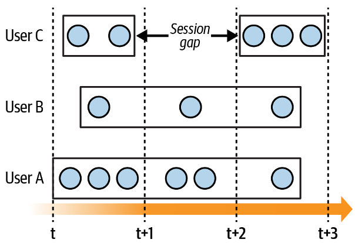

>Figure 9-12. Session windows  

Each of these window types must deal with out-of-order events. You must decide how long to wait for any out-of-order events before deeming them too late for consideration. One of the fundamental issues in stream processing is that you can never be sure that you have received all of the events. Waiting for out-of-order events can work, but eventually your service will need to give up, as it cannot wait indefinitely. Other factors to consider include how much state to store, the likelihood of late events, and the business impact of not using the late events.  

## Handling Late Events  

The strategy for handling out-of-order and late-arriving events should be determined at a *business level* prior to developing an engineering solution, as strategies will vary depending on the importance of the data. Critical events such as financial transactions and system failures may be required to be handled regardless of their position in the stream. Alternatively, measurement-style events, such as temperature or force metrics, may simply be discarded as no longer relevant.  

Business requirements also dictate how much latency is acceptable, as waiting for events to arrive may increase determinism but at the expense of higher latency. This can negatively affect the performance characteristics of time-sensitive applications or those with tight service-level agreements. Thankfully, microservices provide the flexibility necessary to tailor determinism, latency, and out-of-order event-handling characteristics on a per-service basis.  

When your stream processor windowing operation sees an event with an event time greater than the window cutoff, it starts a new window and closes off the old window, emitting it to the downstream output. Since the input event streams can be temporally out of order, what happens to the next event that should have gone into the initial window? You have a few options:  

## Discard the event  

Simply drop the event. The window is closed, and any time-based aggregations are already complete.  

## Keep window open and delay output  

Delay output of the window results until a fixed amount of time has passed. This provides the consumers with a higher degree of completeness at the expense of increased latency.  

## Grace period  

Output the windowed result as soon as the window is deemed complete. The windowed result is not closed, however, but kept around and available for the predetermined grace period. Any late-arriving events that belong to that window are merged in, and the updated output will be written to the event stream.  

## Route them to a separate stream  

Have the microservice log that the event was too late and then route it to a dedicated event stream. You'll also need some form of reconciliation or compensation to deal with this data, otherwise it'll just sit there unresolved. "The Compensation Workflow Pattern" on page 237 includes options for handling this scenario.  

There is no cut-and-dried technical rule for how your microservice should handle late events; just ensure that your business requirements are sufficiently met. If the protocol for handling late events is not specified in the microservice's business requirements, the business must work to resolve that.  

Here are a few questions to help you determine good guidelines for handling late
events:  

• How likely are late events to occur?  

• How long does your service need to guard against late events?  

• What are the business impacts of dropping late events?  

• What are the business benefits of waiting a long time to capture late events?  

• How much disk or memory does it take to maintain state?  

• Do the expenses incurred in waiting for late events outweigh the benefits?  

## Reprocessing Versus Processing in Near–Real Time  

Immutable event streams allow consumers to rewind their offsets and replay consumption from an arbitrary offset. This is known as *reprocessing*, and it's something that every event-driven microservice designer needs to consider. Reprocessing is typically performed only on event-driven microservices that use event time for processing events, and not those that rely on wall-clock time aggregations and windowing.  

New consumer services are effectively reprocessing some, all, or none of the historical data. Processing historical data is pretty straightforward for a new service: you simply point the consumer offsets to the start of the input streams and let it process at its own rate. The service materializes state, computes results, and writes resultant output events as necessary.  

Event scheduling is an important part of correctly reprocessing an event stream. It ensures that microservices process events in the same order that they did during near–real time. Handling out-of-order events is also an important part of this process, as repartitioning an event stream through the event broker (instead of using a heavy-weight framework like Spark, Flink, or Beam) can cause out-of-order events.  

Here are the steps to follow when you want to reprocess your event streams:  

1. Determine the starting point. As a best practice, all stateful consumers should reprocess events from the very beginning of each event stream that they are subscribed to. This applies to entity event streams in particular, as they contain important facts about the entities under question. Note that if your service only ever cares about, say, the last 30 days of data, then you may rightfully choose to only reprocess data that is younger than that.  

2. Determine which consumer offsets to reset. Any streams that contain events used in stateful processing should be reset to the very beginning, as it is difficult to ensure that you will end up with a correct state if you start in the wrong location (consider what would happen if you reprocessed someone's bank balance and accidentally omitted previous paychecks).  

3. Consider the volume of data. Some microservices may process huge quantities of events. Consider how long it may take to reprocess the events, and any bottlenecks that may exist. Quotas (see "Quotas" on page 387) may be needed to ensure that your microservice doesn't overwhelm the event broker with I/O.  

4. Consider the time to reprocess. It is possible that reprocessing may take many hours to do, so it's worth calculating how much downtime you may need. Ensure that your downstream consumers are also okay with possibly stale data while your service reprocesses. Scaling the number of consumer instances to maximum parallelism can significantly reduce this downtime and can be scaled down once reprocessing has completed.  

5. Consider the impact. Some microservices perform actions you may not want to occur when reprocessing. For example, a service that emails users when their packages have shipped should not re-email users when reprocessing events, as it would be a terrible user experience and completely nonsensical from a business perspective. Carefully consider the impact of reprocessing on the business logic of your system, as well as potential issues that may arise for downstream consumers.  

## Intermittent Failures and Late Events  

An event may be late during near-real-time processing (watermark or stream time is incremented) but may be available as expected within the event stream during event-stream reprocessing. This issue can be hard to detect, but it really illustrates the connected nature of event-driven microservices and how upstream problems can affect downstream consumers. Let's take a quick look at how this can occur.  

## Producer/Event Broker Connectivity Issues  

In this scenario, records are created in timestamp order but can’t be published until a later time (see Figure 9-13). During normal operation, producers send their events as they occur, and consumers consume them in near–real time. This scenario is tricky to identify when it’s happening and can go unnoticed even in retrospect.  

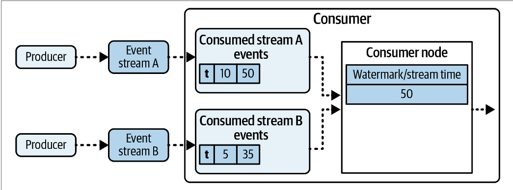

>Figure 9-13. Normal operation prior to producer/broker connection outage  

Say a producer has several records ready to send but is unable to connect to the event broker. The records are timestamped with the local time that the event occurred. The producer will retry a number of times and either eventually succeed or give up and fail (ideally a noisy failure so the faulty connection can be identified and rectified). Figure 9-14 shows this scenario. The consumer continues to read events from stream A and updates its watermark/stream time accordingly. But upon consuming from stream B, the consumer ends up with no new events, so it can only conclude that no new data is available. It remains unaware of the upstream producer outage.  

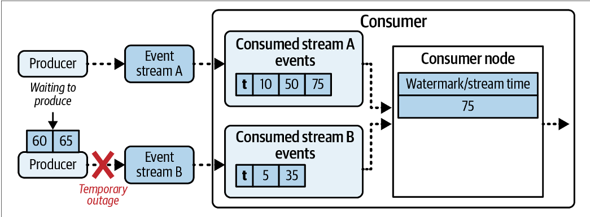

>Figure 9-14. Temporary producer/broker connection outage  

Eventually the producer will be able to write records to the event stream. These events are published in the correct event-time order that they actually occurred, but because of the wall-clock delay, near-real-time consumers will have marked them as late and treat them as such. This is shown in Figure 9-15.  

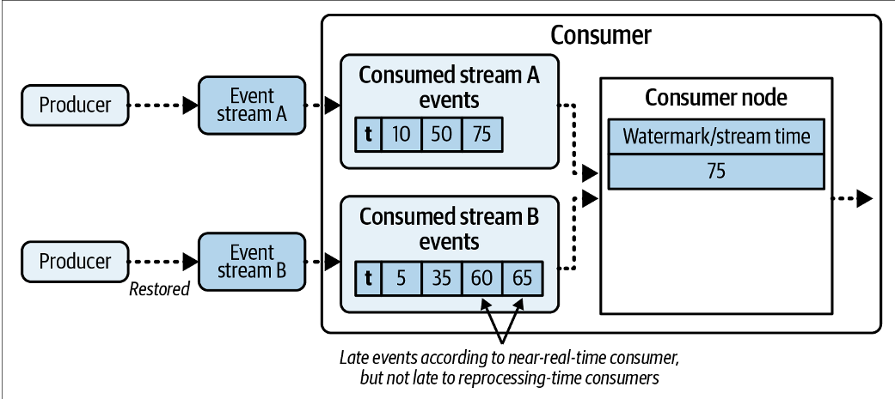

>Figure 9-15. The producer is able to reconnect and publish its temporarily delayed events, while the consumer has already incremented its event time  

One way to mitigate this is to wait a predetermined amount of time before processing events, though this approach does incur a latency cost and will only be useful when production delays are shorter than the wait time. Another option is to use robust late-event-handling logic in your code such that your business logic is not impacted by this scenario.  

## Summary and Further Reading  

This chapter looked at determinism and how best to approach it with unbounded streams. It also examined how to select the next events to process among multiple partitions to ensure best-effort determinism when processing in both near–real time and when reprocessing. The very nature of an unbounded stream of events combined with intermittent failures means that full determinism can never be completely achieved. Reasonable, best-effort solutions that work most of the time provide the best trade-off between latency and correctness.  

If you would like to read more about watermarks, check out Tyler Akidau’s excellent articles, “Streaming 101: The World Beyond Batch” and “Streaming 102: The World Beyond Batch”. Additional considerations and insights into distributed system time can be found in Mikito Takada’s online book Distributed Systems for Fun and Profit.  

In the next chapter, we’ll take a look at orchestration and choreography, and how both of those workflow types play essential roles in a microservice architecture.  

# Building Workflows with Microservices  

Microservices, by their very definition, operate on only a small portion of the overall business workflow of an organization. A *workflow* is a particular set of actions that compose a business process, including any logical branching and compensatory actions. Workflows commonly require multiple microservices, each with its own bounded context, performing its tasks and emitting new events to downstream consumers. Most of what we've looked at so far has been how single microservices operate under the hood. Now we're going to take a look at how multiple microservices can work together to fulfill larger business workflows, and some of the pitfalls and issues that arise from an event-driven microservice approach.  

Here are some of the main considerations for implementing a microservice-based
workflow:  

### Creating and modifying workflows  

• How are the services related within the workflow?  

• How can I modify existing workflows without:  

— Breaking work already in progress?  

— Requiring changes to multiple microservices?  

— Breaking monitoring and visibility?  

### Monitoring workflows  

• How can I tell when the workflow is completed for an event?  

• How can I tell if an event has failed to process or is stuck somewhere in the workflow?  

• How can I monitor the overall health of a workflow?  

### Implementing distributed transactions  

• Many workflows require that a number of actions happen together or not at all.
How do I implement distributed transactions?  

• How do I roll back distributed transactions?  

This chapter covers the two main workflow patterns, choreography and orchestration, and evaluates them against these considerations.  

## The Choreography Pattern  

The term choreographed architectures (also known as reactive architectures) commonly refers to highly decoupled microservices that independently react to their input events as they arrive. There is no blocking or waiting, and all consumers operate independently of any upstream producers or subsequent downstream consumers. Choreography in microservices is similar to a dance performance, where each dancer must know their own role and perform it independently, without being controlled or told what to do during the dance.  

Choreography is most commonly implemented via events. Services publish their business outcomes to their respective event streams, and independent consumers subscribe and react according to their own business needs. The producer in a choreographed system does not know the identity of its event consumers, nor what business logic or operations they intend to perform with that data. The upstream business logic is fully isolated from the downstream consumers, and services remain loosely coupled via the production and consumption of events. In practice, many business workflows are logically independent of one another and do not require strict coordination, which makes a choreographed approach an ideal option.  

For example, Figure 10-1 shows a choreographed workflow in which service A produces events that drive service B, which in turn produces events that drive service C. The workflow is defined by its bounded context, just as microservices are defined by their bounded contexts (see "Introduction to Domain-Driven Design and Bounded Contexts" on page 6).  

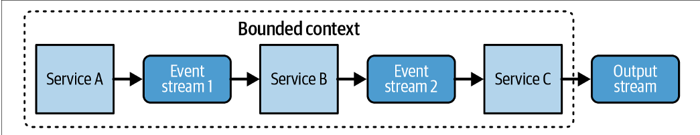

>Figure 10-1. A simple event-driven choreographed workflow within a single bounded context  

The output stream emitted by service C is available for any other consumers to read for their own purposes. Meanwhile, event streams 1 and 2 have been locked behind the dotted line of the bounded context, invisible and unavailable to any other consumers.  

However, choreography doesn't *necessarily* require a well-defined bounded context. In fact, many choreographed workflows are the result of organic growth and the iterative addition of new event streams and new microservices. At some point, after a few iterations of building new services and streams, you may notice that a choreographed architecture has emerged on its own.  

> [!TIP]
> Choreography provides very loose coupling between services, and is commonly used to connect microservices owned by different teams and in different parts of the organization.  

It can be challenging to find where a choreographed workflow starts and where it ends, particularly as it crosses team boundaries. Ownership of the workflow is distributed to the participating teams, and it can be difficult to debug the workflows that cross many different boundaries.  

> [!TIP]
> Despite its shortcomings, choreography remains the most common form of coupling in an event-driven architecture, as it is usually easy to extend and typically requires no modifications to any other services. But in some cases you may need to modify other services, particularly when the ordering of steps in the workflow must change.  

### Modifying a Choreographed Workflow  

While choreography allows for simple addition of new steps at the end of the work-flow, it may be problematic to insert steps into the middle or to change the order of the workflow. Looking back to Figure 10-1, say that the workflow needs to be rearranged such that the business actions in service C must be performed before those in service B. The new ordering is shown in Figure 10-2.  

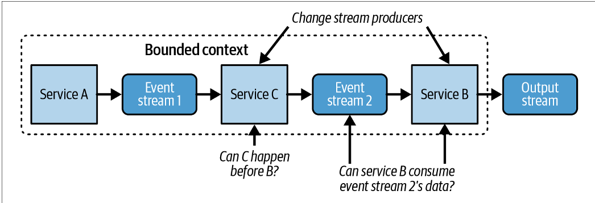

>Figure 10-2. Business changes to the simple event-driven choreographed workflow  

You must edit both services C and B to respectively consume from event streams 1 and 2. The format of the data within the streams may no longer suit the needs of the new workflow, requiring breaking schema changes that may affect any other consumers (not shown). A whole new event schema may need to be created for event stream 2, with the old data in the event stream ported over to the new format, deleted, or left in place. Finally, you must ensure that services A, B, and C have completed all of their event processing before you swap the topology around. A failure to do so can result in partially completed, incorrectly completed, or failed results.  

The relationships between the services may also be difficult to understand outside the context of the workflow, a challenge that is exacerbated as the quantity of services in the workflow increases. Choreographed workflows can be brittle, particularly when more complex business functions cross microservice boundaries.  

> [!TIP]
> Restrict access to intermediate event streams inside your workflow
> that you don't want other services to couple on. It will make it
> much easier to make changes to your workflow if you don't have to
> deal with unexpected data coupling.  

Expanding and adding on to a choreographed workflow remains relatively easy, while changing the ordering of a sequence of services or renegotiating the data being sent between them can be more challenging. Even when correctly implemented, small business logic changes may require you to modify or rewrite numerous services, especially those that change the order of the workflow itself.  

## Monitoring a Choreographed Workflow  

Monitoring a choreographed workflow can be challenging. First, you must have a strict definition of the workflow to determine what it is you're actually monitoring. A well-defined choreographed workflow may cross team boundaries and service boundaries, and will be subject to change accordingly. Smaller choreographed workflows that touch only a few services owned by one team are far easier to track
than those with more services across multiple teams.  

Secondly, you'll need to determine your metrics of success. Is it that a given customer order is paid for and fulfilled? Or that an automobile has completed assembly on the production line? Whatever your workflow's definition of success is, you'll need to ensure that you can measure it, from either the systems themselves or the event streams between the systems.  

Third, you're going to need to create a centralized state store to monitor the progress of your measurements. Your monitor can consume from each event stream and materialize the results into its own state store, such that you can then reason about the progress of your workflow. You will also be able to identify issues such as events stuck in processing or incomplete workflows, though remediation of these issues will fall to the service owners.  

Figure 10-3 shows an example of a monitoring apparatus added to the original choreography example. The solid line shows the monitoring service reading and materializing data from the event streams, while the dashed lines represent health checks (such as heartbeats) on the services themselves.  

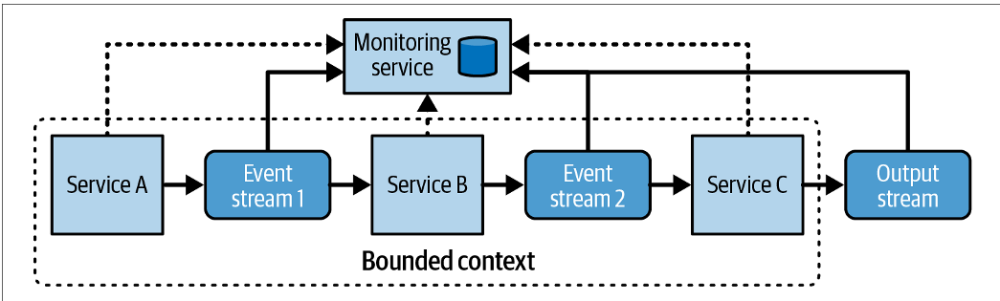

>Figure 10-3. Monitoring a choreographed workflow through event streams and services  

Consider now a much larger-scale example, such as an order-fulfillment process at a large multinational online retailer. A customer views items, selects some for purchase, makes a payment, and awaits a shipping notification. There may be dozens of services involved in supporting this customer workflow, spread across an entire company with multiple independent teams. Complete visibility into every step of this workflow may be quite challenging.  

However, you can still reap workflow monitoring benefits even for very large work-
flows by simply choosing a subset of steps to monitor. For example, if you have 100
stages in your workflow, consider monitoring just 5 or 6 of the most critical steps.
You'll gain high-level visibility into the health of your workflow, and you can rely on
other system monitoring and application logs to dig deeper for other problems.  

The reality is that choreographed workflow monitoring can be brittle, as independently owned services may change unpredictably. Any monitoring solution you create may be subject to persistent break-fix work, and so you'll need to decide for yourself what, if any, monitoring solution is necessary for a choreographed workflow. And like most things microservice, it remains far easier to maintain a monitoring solution for a small handful of services owned by a single team than more services across multiple teams.  

Now let's turn our attention over to orchestration and see another workflow option.  

## The Orchestration Pattern  

The orchestration pattern relies on the centralization of logic in a single microservice to issue commands and awaits responses from subordinate worker microservices. Orchestration can be thought of much like a musical orchestra, where a single conductor commands the musicians during the performance. In contrast to choreography, where the workflow is implicitly defined, the orchestrator microservice contains the entire workflow logic written in code.  

The orchestrator keeps track of which parts of the workflow have been completed, which are in process, and which have yet to be started. It keeps track of the commands sent to the subordinate services as well as the responses from those services. Orchestrators can use event streams to send commands and receive responses, but they may also use direct request-response by using protocols such as HTTP or RPC.  

> [!TIP]
> The orchestrator awaits responses from the instructed microservices and handles the results according to the workflow logic. In contrast, choreographed workflows have no centralized coordination.  

There's a distinct division of labor between the orchestrator and its subservient microservices. An orchestrator provides just the instructions to the microservice on what it is supposed to do—for example, book a flight, pay for an order, post an item for auction, etc. The orchestrator is not responsible for how it's supposed to do the work, nor for other factors such as retries and failure handling. In other words, the orchestrator is not *micromanaging* the microservices, but rather acting as a single coordinator for the workflow work.  

Consider a payment microservice in which a customer placed an order, entered their credit card number, and now must bill that credit card before the items can be shipped out. The payment microservice is responsible for the entirety of the ultimate success or ultimate failure of the payment. It may try to make the payments, say, three times, before giving up and reporting a failure. It does not make one attempt and notify the orchestrator that it failed and wait to be told to try again or not.  

The orchestrator has no say in how payments are processed, including how many attempts to make, as that is part of the bounded context of the payment microservice. The only thing the orchestrator needs to know is whether the payment has completely succeeded or if it has completely failed. From there, it may act accordingly based on the workflow logic.  

> [!TIP]
> Ensure the orchestrator’s bounded context is limited strictly to workflow logic and that it contains minimal business fulfillment logic. The orchestrator contains only the workflow logic, while the services under orchestration contain the bulk of the business logic.  

Let’s look at a simple example that illustrates the responsibilities of the orchestrator and its related microservices.  

## A Simple Event-Driven Orchestration Example  

Figure 10-4 shows an orchestration version of the architecture from Figure 10-1.  

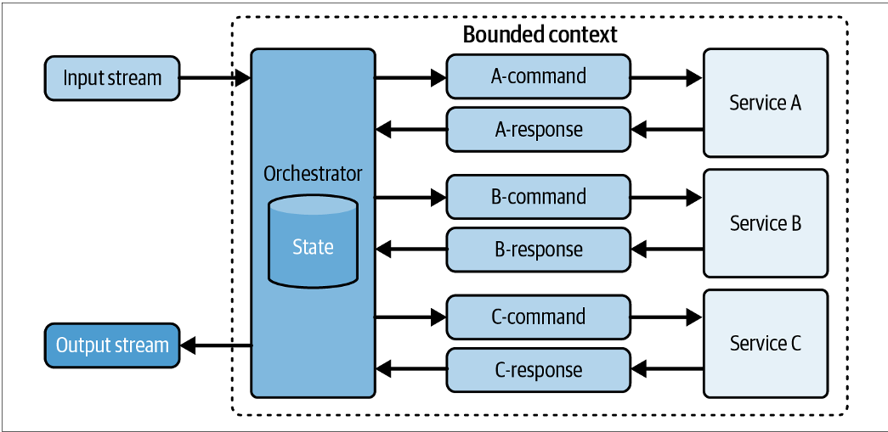

>Figure 10-4. An orchestrated workflow using event streams to communicate with its dependent services  

The orchestrator keeps a materialization of the events issued to services A, B, and C, and updates its internal state store based on the results returned from the worker microservice (see Table 10-1).  

>Table 10-1. Materialization of events issued from orchestration service  

| Input event ID|Service A|Service B|Service C|Status|
| ---|---|---|---|---|
| 100|<results  >|<results  >|<results  >|Done|
| 101|<results  >|<results  >|Dispatched|Processing|
| 102|Dispatched|null|null|Processing|  

Input event ID 100 has been successfully processed, while event IDs 101 and 102 are in earlier stages of the workflow. The orchestrator makes decisions based on these results and selects the next step according to the workflow logic. Once the workflow is complete (or ultimately failed), the orchestrator then composes the output results and publishes it to the output stream.  

In the following orchestration code, events are simply consumed from each input stream and processed according to the workflow business logic:  

while(true){Event[] events= consumer.consume(streams)for(Event event: events){if(event.source=="Input Stream"){processInput(event);updateProgress(event);producer.send("A-Command",...)} else if(event.source=="A-Response"){processAResponse(event);updateProgress(event);producer.send("B-Command",...)} else if(event.source=="B-Response"){processBResponse(event);updateProgress(event);producer.send("C-Command",...)} else if(event.source=="C-Response"){processCResponse(event);updateProgress(event);lproducer.send("Output",...)}}consumer.commitOffsets()}  

Orchestrated workflows are typically easier to change as all the workflow logic is in a single logical place, assuming that operations in each microservice are independent of one another. If, for example, service A must complete its work before service B, then you realistically can’t change that ordering—you need the results from one to feed into the next. Otherwise, it’s fairly easy to edit the code, test it, and deploy it in just one service. You will, however, need to be careful that you don’t corrupt in-progress workflow events by changing their processing workflow mid-completion.  

> [!TIP]
> Consider using queues as part of your orchestration framework. The subservient microservices can easily process each queue in parallel, relying on the queuing semantics to enable retries and scaling.  

### A Simple Request-Response Orchestration Example  

The orchestrator can also use request-response calls to the subordinate services, say via HTTP or RPC. This pattern is particularly common when your orchestrator must communicate with third-party systems that do not provide any type of event-driven API. Software as a service (SaaS) endpoints are a prime example.  

The topology shown in Figure 10-5 is nearly identical to the one in Figure 10-4,aside from substitution of direct calls. The orchestrator makes a request to service A,then awaits a response before moving on to repeat the process with service B. The request-response communication may be synchronous and blocking, but it may alsobe asynchronous, relying on futures and promises.  

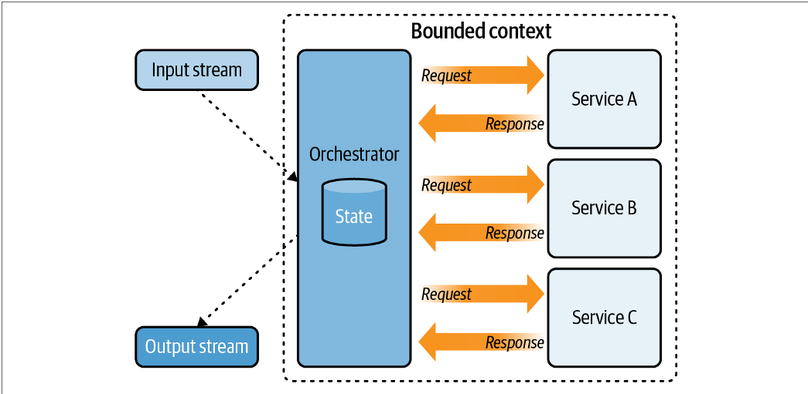

>Figure 10-5. An orchestrated workflow using request-response to communicate with its dependent services  

The major benefit of request-response orchestration is the ability to integrate with services that do not support event-driven integrations. Aside from SaaS endpoints, you’re likely to find that many of your own internal services, particularly legacy services, require integration via existing request-response APIs. An orchestrator could use request-response to integrate with legacy systems, then switch over to event-driven semantics for the event-driven systems.  

## Modifying an Orchestration Workflow  

The orchestrator can keep track of events in the workflow by materializing each of the incoming and outgoing event streams and response-request results. The workflow itself is defined solely within the orchestration service, allowing a single point of change for altering the workflow. In many cases, you can incorporate changes to a workflow without disrupting partially processed events.  

Orchestration results in a tight coupling between services. The relationship between the orchestrator and the dependent worker services must be explicitly defined.  

It is important to ensure that the orchestrator is responsible only for orchestrating the business workflow. A common antipattern is creating a single "God" service that issues granular commands to many weak minion services. This antipattern spreads workflow business logic between the orchestrator and the worker services, making for poor encapsulation, ill-defined bounded contexts, and difficulty in scaling ownership of the workflow microservices beyond a single team. The orchestrator should delegate full responsibility to the dependent worker services to minimize the amount of business logic it performs.  

## Monitoring an Orchestration Workflow  

Monitoring an orchestration workflow is fairly simple when compared to choreography, since the workflow state and logic remain in just one place. The orchestrator data store contains the complete state of work in progress, and so it's up to you how you want to expose that to the outside world. You can expose the data within for monitoring via an API integration, or you can publish the state changes for each entity in the workflow to its own monitoring output stream.  

## Comparing Request-Response and Event-Driven Orchestration  

Request-response and event-driven orchestration workflows are fairly similar when examined up close. But when you zoom out a bit, there are a number of factors to consider when choosing which option to use.  

Event-driven workflows:  

• Can use the same I/O monitoring tooling and lag scaling functionality as other event-driven microservices  

• Allow other services to consume the orchestrator event streams, including those outside the orchestration workflow itself  

• Are generally more durable, as both the orchestrator and the dependent services are isolated from each other's intermittent failures via the event broker  

• Have a built-in retry mechanism for failures, as both event streams and queues won't make forward progress until the events have been successfully processed and a response created  

Request-response workflows:

• Can provide very low-latency results as there are no event streams to produce to and consume from  

• Can integrate with third-party APIs that don't provide any event-driven integrations  

• Require dedicated request-response microservice functionality for scaling, abstracting the URI, forwarding and routing requests, and gracefully handling failovers  

Keep in mind that there's quite a lot of opportunity to mix and match these two options. For example, an orchestration workflow may be predominantly event-driven, but rely upon request-response calls to integrate with third-party external APIs (or an existing legacy system).  

The orchestration pattern provides a robust and resilient centralized workflow manager to ensure that critical work is completed successfully. But what about when you need to ensure that work is completed *atomically* across multiple systems? For that, you'll need to turn your attention toward distributed transactions.  

## Distributed Transactions and the Saga Pattern  

A *distributed* transaction, also known as a *saga*, is a transaction that spans two or more data stores that are fully independent of one another. Each microservice is responsible for processing its portion of the transaction to its own data store, as well as reversing that processing in the case that the transaction is aborted.  

> [!WARNING]
> Sagas can be challenging to implement successfully. It is best to avoid them unless absolutely necessary, as they can add significant risk and complexity to a workflow. They require addressing a host of concerns, including synchronization work between systems, rollbacks, managing transient instance failures, and network failures.  

The transaction fulfillment and reversal logic resides within the same microservice, both for maintainability purposes and to ensure that new transactions cannot be started if they can't also be rolled back. Additionally, it is important that the implementation is idempotent or that it supports state rollbacks, such that any intermittent failures of the participating microservices do not leave the system in an inconsistent state.  

You can implement sagas using either the choreography pattern or the orchestrator pattern. Both have benefits and drawbacks, as covered in the next sections.  

## Sagas via Choreography  

In a choreography, data flow tends to be unidirectional. Consumers read from event streams, process the data, and emit results to other streams for other services to use. By adopting the saga pattern for distributed transactions, the choreographed workflow expands its responsibilities and becomes tightly coupled to both upstream and downstream services.  

Sagas via choreography can be a complex affair, as each service now needs to be able to roll back changes in the event of a failure. Each service must also communicate to its upstream systems about the rollback, and provide sufficient data to enable it to also roll back its own internal committed state. Finally, an ultimately completed saga must also indicate that it is complete, most commonly via a feedback loop to the service that initiated it all.  

Let's take a look at an example. Continuing with the previous choreographed work-flow example (Figure 10-1), consider the series of microservices A, B, C in Figure 10-6.  

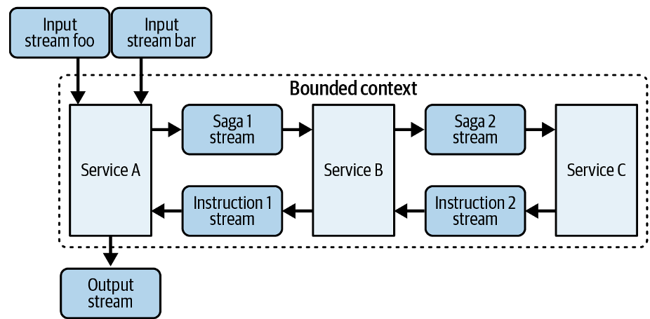

>Figure 10-6. Choreographed saga pattern using event streams for inter-service communication  

Notice that each service reads from a saga stream and writes to an instruction stream. The saga stream communicates the information necessary for the next service in the chain to perform its portion of the transaction. The instruction stream communicates whether the service should *commit* or *roll back* its portion of the transaction, based on the results of the service that commits or rolls back its portion of the transaction.  

The steps of a successful transactional workflow are shown in Figure 10-7. Service A instructs service B to do work (its portion of the transaction), which in turn does the same to service C. Service C then commits its local transaction successfully, and propagates the commit instruction to service B, which commits and sends the same to service A. Ultimately, the output transaction completes and the result is written to the output stream by service A.  

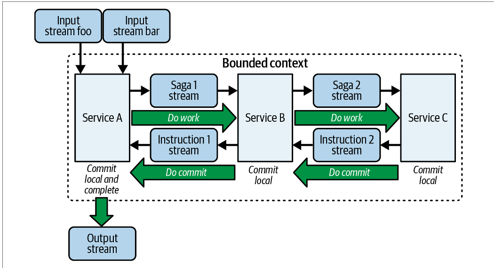

>Figure 10-7. Choreographed saga pattern showing the steps of a successful transaction  

A failure at any step in the A→B→C service chain aborts the transaction and begins the rollback. Figure 10-8 shows a local commit failure in service C, which requires service B and service A to then abort their share of the transaction. Ultimately, service A emits the failed results of the transaction to the output stream, continuing on its processing from its input streams.  

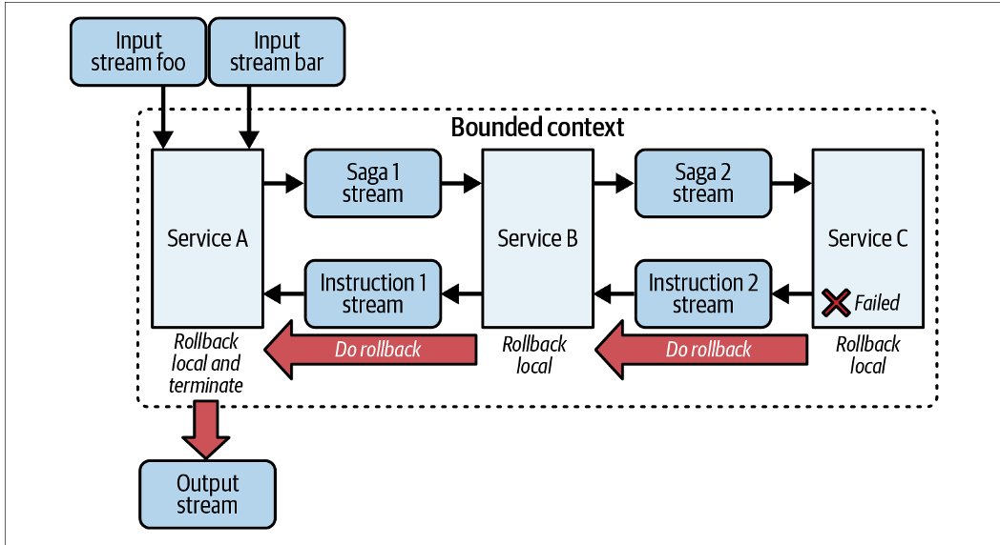

>Figure 10-8. Choreographed saga pattern showing a rollback caused by a failed local
commit  

Monitoring a choreographed saga is as challenging as any other choreographed
workflow, largely due to its completely decentralized nature. You'll need to build a
dedicated system to monitor the workflow, as shown back in Figure 10-3.  

Implementing modifications to a choreographed saga are similarly as challenging as those described in "Modifying a Choreographed Workflow" on page 223. Changing the order of operations can be difficult and generally requires you to halt new processing and complete all ongoing processing before swapping any ordering around. Adding new steps on to the end (say, a service D after service C) remains much easier.  

> [!TIP]
> You can also implement a *lift and shift* approach, where you swap out the entire bounded context for a new implementation using the same consumer group offsets for the input streams.  

Choreographed transactions are fairly brittle with strict dependencies between services. They tend to arise organically in groupings of two services, where a business operations change introduces transactional requirements between two distinct services. Instead of rewriting the services or introducing an orchestrator, developers often choose to implement the choreographed saga pattern instead. But as the service count grows, or as the need for more control and oversight increases, it becomes a good idea to look at the orchestrated saga pattern, as covered in the next section.  

## Sagas via Orchestration  

Orchestrated sagas build on the orchestrator model with the addition of logic to revert the transaction from any point in the workflow. The orchestrator can roll back the saga by reversing the workflow logic and running each worker microservice's complementary reversing action.  

A simple two-stage orchestrated transaction topology is shown in Figure 10-9. Note that this particular example is using both event-streaming and request-response to communicate with its dependent microservices.  

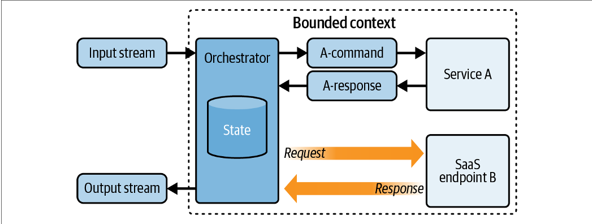

>Figure 10-9. Orchestrated saga pattern using event streams and request-response communication  

The centralized nature of the orchestrator allows for close monitoring of the progress and state of any given transaction. You can monitor the progress of the transaction by referring to the orchestrator's state store, and you can change the ordering of the workflow by editing the orchestrator's logic.  

You can also add integration for other signals such as timeouts and human interactions into the orchestrator. For example, you may choose to use timeouts to periodically check on the orchestrator's materialized state to identify microservices that may have timed out. Human inputs via a REST API (see Chapter 17) can be processed alongside other events, handling cancellation instructions as required. The transaction can be aborted at any point in the workflow due to a return value from one of the microservices, a timeout, or an interrupt sent from a human operator.  

Figure 10-10 shows a rollback initiated by a failure in the final service in the transactional chain. SaaS endpoint B has failed to commit its data, and has reported its failure to commit (1) back to the orchestrator service.  

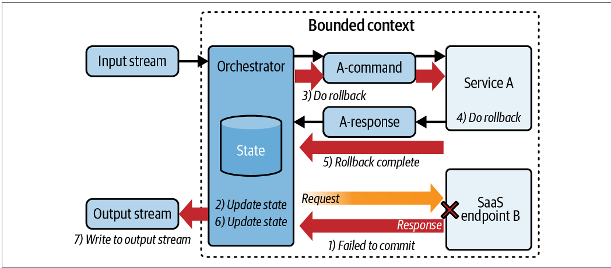

>Figure 10-10. An orchestrated transaction rolling back due to a failed SaaS endpoint result  

The orchestrator service updates its state store (2) and then issues a rollback command (3) to service A. Upon receiving that command, service A performs its own rollback (4) and provides a response (5) back to the orchestrator. The orchestrator marks the transaction as failed (6) and emits the necessary results to its output stream (7).  

Once the transaction has been rolled back, it is up to the orchestrator to decide what to do next to finalize the processing of that event. It may retry the entire process, it may discard the related input events, or it may choose to throw an exception and terminate itself.  

The worst-case scenario is that your transaction cannot complete nor can it be rolled back. Perhaps, as per the last example, service A proves unable to roll back its own commits and subsequently throws its own errors. In this case it's generally best to halt all processing and sort it out as an incident. While a transaction should always be able to cleanly complete or cleanly fail and roll back, software bugs do happen, as do long-lasting failures for the transactional data stores underpinning your microservices. Did I mention that distributed transactions can be challenging?  

> [!WARNING]
> Just as each microservice is fully responsible for its own state
> changes, it is also responsible for ensuring that its state is consistent
> after a rollback. The orchestrator's responsibility in this scenario is
> limited to issuing the rollback commands and awaiting confirmations
> from the dependent microservices.  

Orchestrated transactions offer better visibility into workflow dependencies, more flexibility for changes, and clearer monitoring options than choreographed transactions. The orchestrator instance adds overhead to the workflow and requires management, but provides to complex workflows the clarity and structure that chor-
eographed transactions cannot.  

## The Compensation Workflow Pattern  

The compensation workflow pattern is primarily about taking a forward compensating action to address the current undesirable state, *instead* of trying to undo all the steps that led to that state. It may be simpler, cleaner, and result in high satisfaction to simply perform a *compensating action* than to try to undo the past actions. Ticketing and inventory-based systems are two common systems that tend to use the compensation pattern when they accidentally oversell their wares.  

Consider a company that sells physical products via a website, and assume that it will only sell products that it has in its inventory at the time. The customer adds the items to their cart, places the order, issues a payment with their credit card, and receives a confirmation email.  

Later, at the warehouse, a shipping agent goes to find the ordered items to send to the customer. But upon getting to the shelves that should contain the items, the shipping agent finds that there is nothing there—despite the computer showing there should still be three left in stock. Why are the items missing? They could have been misplaced, or stolen. An incorrect quantity may have been entered when the items were received. Another possibility is that another order was placed by another customer at exactly the same time, resulting in a race condition.  

If your workflow follows a strict saga pattern, then you'd need to reverse all the actions taken so far. The money would be returned to the payment provider, the order would be canceled, the stock would be updated, and the customer alerted. While technically correct, this could lead to other challenges. Perhaps the rest of the customer's order could be fulfilled—do you then cancel that part too? Or do a partial refund and just ship some of the content?  

> [!TIP]
> Remember that you can build workflows that rely on human intervention to resolve problems. A kind message delivered to your customer in a timely manner can go a long way. But, you will still need to provide the means to override/correct the bad state through a compensatory override.  

The key to compensation workflows is to determine the desirable outcome given the current bad state, and create a pathway to get to it. In the case of a missing inventory item, think about what you want for the customer. The business could order new stock, notify the customer that there has been a delay, and offer a discount code for the next purchase as an apology. The customer could be given the option to cancel the order or wait for the new stock to arrive.  

Compensation workflows are not always suitable for every scenario, and it may indeed be a better option to figure out how to reverse out of the bad state. But the reality is that any system mapping the digital world to the physical world will run into situations where the two representations just don't match. It may not be possible to back out of every scenario, particularly if the discrepancies (like missing inventory) are only discovered weeks or months after the fact. Keep compensation workflows in mind as you look to design and build your own orchestrated and choreographed workflows.  

## Implementing Orchestration via a Durable Execution Engine  

One other option for implementing an orchestrator is to use a durable execution engine (DEE). A durable execution engine is a software platform designed to manage and execute long-running, stateful business processes and workflows in a distributed system with guaranteed reliability. They are also known as *workflows-as-code* or *fault-tolerant workflow engines*. Unlike traditional applications that can lose their progress when they crash, a durable execution engine ensures that your code eventually runs to completion, regardless of failures, restarts, timeouts, and other intermittent problems.  

Durable execution engines, platforms, and frameworks have become more common and widely used since the first edition of this book was published in 2020. Some examples include Cadence, Temporal, Restate, and Resonate, which offer free open source options, but may have some limitations in their licensing for larger workloads (check accordingly).  

Some of the most notable features of a durable execution engine include:  

Automatic retries and fault tolerance  

If a component of the workflow fails (e.g., a microservice goes down or a network error occurs), the engine automatically retries the failed step or resumes the workflow from its last known good state, without losing progress.  

Managing distributed transactions  

It orchestrates complex multistep processes across services, ensuring eventual consistency and providing the option for compensation logic if a step fails.  

Reduction in boilerplate error handling  

Developers can just write business logic as straightforward code, and rely on the engine to handle retries, failures, and state management.  

Resource savings

Your workflow avoids re-executing code that it's already run, including computations and calls to other services.  

Supports long durations

- Workflows can run for minutes, hours, days, or longer, waiting for human approval or external events, without losing state or progress.  

The following shows a code-first example sourced from Temporal's sample Java code. This durable execution engine implementation integrates directly into your code, relying on proprietary configurations and a processing cluster to handle the actual durable execution. For brevity's sake, only a portion of the code is presented:  

```java
import io temporal.workflow.Async;
import io temporal.workflow.Promise;
// Trimmed for brevity
// ...
{
    /** Simple activity implementation, that concatenates two strings. */
    static class GreetingActivitiesImpl implements GreetingActivities {
        @Override
        public String composeGreeting(String greeting, String name) {
            return greeting + " " + name + "!"; 
        }
    }
    // Trimmed for brevity
    // ...
    @Override
    public String getGreeting(String name) {
        /*
            * This is our workflow method.
            * We invoke the composeGreeting method two times using
            * {@link io.temporal.workflow.Async#function(Func)}.
            * The results of each async activity method invocation returns us a
            * {@link io.temporal.workflow.Promise} which is similar to a Java
            * {@link java.util.concurrent.Future}
            */
        Promise<String> hello =
           Async.function(activities::composeGreeting, "Hello", name);
        Promise<String> bye =
           Async.function(activities::composeGreeting, "Bye", name);
        // Application waits until receiving both of the async results
        return hello.get() + "\n" + bye.get();
    }
}

```  

Notable is the use of Async and Promise from the `io.temporal.workflow` library, which invokes the DEE framework (where all the durable execution magic happens). The `getGreeting` code is very simple, invoking two `Async` function calls to `composeGreeting`, one after another via the `activities` object of the `GreetingActivitiesImpl` class. These function calls, one after the other, are executed by the DEE, with the function `Async` calls, the `Promise`, and the return values all stored to the DEE's append-only durable log.  

Say that getGreeting was interrupted and failed after saying Hello but before saying Goodbye. Upon bringing back the microservice online, it would simply restore itself to the correct state, skip saying Hello again, and move right on to Goodbye.  

Embedding the DEE code within your microservice code tends to be appealing because you can pick and choose when and where to use it. The integration with the DEE is just plain old code like any other SDK. You can continue to use the tools and IDEs they're familiar with, while benefiting from the injection of durable execution code where it suits their needs.  

> [!TIP]
> Durable execution engines are most useful for durably executing business logic triggered from a nonrepeatable source, such as a direct request made by another service over HTTP or RPC. While your service can easily reprocess events from a stream, it can't reprocess requests from other services that it has already failed and returned. You'll usually find DEE most useful in powering microservices that must reliably respond to non-event-driven inputs.  

Durable execution requires a dedicated durable data store to maintain the state of the orchestrated application under execution. The state store preserves the function's execution progress so that, in the event of a failure, the function can restore its state and not have to start over from the beginning. While the exact implementation can of course vary from engine to engine, it turns out that an immutable, durable, append-only log is a common choice for most of these technologies. By following an event sourcing pattern, the durable execution engine can quickly update state and restore services with minimal overhead.  

### Event Sourcing via the Durable Append-Only Log  

Durable execution engines typically use their own deeply coupled proprietary implementations to provide the durability guarantees that make them so useful. The durable execution engine keeps track of everything important for orchestrating the operations of the service, including:  

Workflow progress

Equivalent to the line of code last executed, and if it was a success or a failure. It also contains the progress of the logic through branching, conditions, and loops.  

All relevant state

Any state that you deemed important enough to have appended to the append-only log.  

Parameters for function calls

The parameters passed to another function invocation or direct call APIs (HTTP, RPC, etc).  

Returns from functions calls

The values that are returned from the function invocation or direct call APIs.  

Durable promises

Tracking which functions and direct call APIs have already been invoked or called, such that they're not repeatedly invoked when restoring from state.  

Everything needed to orchestrate the service's progress and restore it to its last state is contained within the append-only log. The exact format varies across frameworks, as do the guarantees that they provide. Consult the framework documentation accordingly.  

> [!WARNING]
> While durable execution engines can help prevent duplicate work, duplicate function calls, and other wasteful reprocessing, they can't remove race conditions. It's possible that your service may make a request to another service and fail to record the request to the durable execution engine before it crashes. It's important that you keep your operations and requests idempotent.  

## Further Considerations of Durable Execution  

When evaluating whether a durable execution engine is right for your use case, you'll need to consider some trade-offs:  

Introduces a new dependency

First and foremost is the introduction of yet another dependency into your ecosystem, and the risks that that entails. Integrating with a DEE leads to a degree of vendor lock-in, and makes it more challenging to migrate later. What's the probability that the vendor will still be around in 5 or 10 years? Will I need to migrate all my orchestration services off and onto another DEE, or is there an open source option that I can run on my own?  

Learning curve

Adopting a durable execution engine can be initially conceptually challenging, especially for developers new to distributed systems concepts.  

Engine-specific abstractions

Durable execution engines aren't all the same. You'll need to learn engine-specific concepts like workflows, activities, workers, timers, task queues, signals, await, promises, and others.  

Versioning challenges

You'll need to evolve and change your workflows in line with your business requirements. Ensure that you have a good understanding of how to handle multiple versions of the same workflow. You may need to run multiple versions in parallel for a period of time, or modify your workflow code to handle both old data and new in the case of reprocessing.  

There are also some operational and performance trade-offs to consider as well,
including:  

State persistence overhead

Persisting the state of your workflow at each step introduces operational overhead, both in terms of computation and storage. Your service may suffer performance degradation, particularly for very high-throughput and low-latency operations.  

Extra resources required

You're going to need extra resources to run your DEE above and beyond those that power your microservices. You'll either need to buy, build, and deploy the DEE resources, or you'll need to spend money for a hosted or managed solution. Resource requirements scale with usage.  

For many use cases, a durable execution engine might be overkill and introduce unnecessary complexity. They're really best suited for complex, long-running, and stateful workflows, particularly those that don't have reliable and retriable triggers. Since your service can simply retry a failed workflow by re-consuming the input event streams, you may find durable execution engines to be unnecessary. But, once you start mixing in direct requests via HTTP or RPC to other services, you may find that the reliability and durability that it brings proves to be essential.  

> [!NOTE]
> You may find other types of durable execution useful for your
> orchestration, such as the durable function orchestrators (see "Dura-
> ble Function Orchestrators" on page 314).  

## Summary  

Choreography allows for loose coupling between business units and independent workflows. It is best suited for simpler workflows with fewer dependencies, where the microservice count is low and the order of business operations rarely change.  

Orchestration provides explicit control over a workflow, at the cost of creating an extra dedicated service. Orchestration provides better visibility and monitoring into workflows than choreography, and can handle more complicated distributed transactions. The workflow logic exists within the orchestrator, and can be modified more easily than in a choreographed workflow. Workflows that are subject to changes and contain many independent microservices are well suited to the orchestrator pattern.  

Not all workflows require distributed transactions to operate successfully. Compensation is often a more reasonable choice, building forward to a healthy state instead of trying to undo all the steps that led to the bad state.  

Finally, durable execution engines have emerged as powerful tools for building highly reliable and resilient distributed systems, especially when building orchestrators of moderate to high complexity. However, their benefits come with a learning curve and some operational overhead, making it crucial to evaluate whether its strengths align with the specific needs and complexity of your orchestrator.  

In the next chapter, I'll cover the basic consumer and producer microservice. While a fundamentally simple design, it provides the foundation for all other microservice frameworks and event-stream processing.  

# Event-Driven Microservices Frameworks

# Basic Producer and Consumer Microservices

Basic producer and consumer (BPC) microservices ingest events from one or more event streams, apply any necessary transformations or business logic, and emit any necessary events to output event streams. Synchronous request-response I/O may also be a part of this workflow, but that topic is covered in more detail in Chapter 17. This chapter focuses strictly on event-driven components.  

BPC microservices are characterized by the use of basic consumer and producer clients, which provide only basic functionality for consuming and producing events. They do not include any event scheduling, watermarks, built-in materialization mechanisms, changelogs, or horizontal scaling mechanisms beyond consumer group balancing that are common to the full-featured frameworks discussed in Chapters 12 and 13.  

While it is certainly possible for you to develop your own libraries to provide these features, doing this is beyond the scope of this chapter. Thus, you must carefully consider whether the BPC pattern will work for your business requirements.  

Producer and consumer clients are readily available in most commonly used languages, lowering the cognitive overhead in getting started with event-driven microservices. The entire workflow of the bounded context is contained within the code of the single microservice application, keeping the responsibilities of the microservice localized and easy to understand. The workflow can also easily be wrapped into one or more containers (depending on the complexity of the implementation), which can then be deployed and executed with the microservice's container management solution.  

## Where Do BPCs Work Well?  

BPC microservices can fulfill a wide range of business requirements despite lacking most of the full-featured stream-processing components. Simple patterns such as stateless transformations are easily implemented, as are stateful patterns where deterministic event scheduling is not required.  

External state stores are more commonly used than internal state stores in BPC implementations, as scaling local state between multiple instances and recovering from instance failures is difficult without a full-featured streaming framework. External state stores can provide multiple microservice instances with uniform access as well as data backup and recovery mechanisms.  

Let's look at a few use cases in which basic BPC implementations work particularly well.  

## Integration with Existing Systems Using the Sidecar Pattern  

The basic producer/consumer client is an optimal way to integrate event-driven services into legacy codebases. Legacy systems can easily leverage the basic producer to write their own events to the stream using at-least-once semantics. Additionally, they can also consume and process events, inserting them into their own databases or running their own reactive code.  

In some scenarios, it's not possible to safely modify the legacy codebase to produce and consume data from event streams. The *sidecar pattern* is particularly applicable to this scenario, as it enables some event-driven functionality without affecting the source codebase.  

Consider an ecommerce store frontend that displays all the inventory and product data it has available. Previously, the frontend service would source all of its data by synchronizing with a read-only subordinate data store using a scheduled batch job, as in Figure 11-1.  

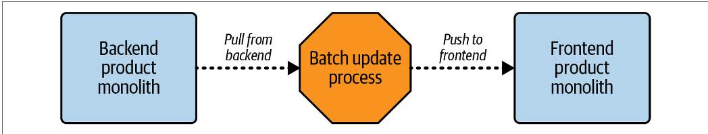

>Figure 11-1. Copying data from one monolith to another using a scheduled batch process  

In the event-driven architecture world there are two event streams, one with Product Info and one with Product Inventory levels. Each stream is a mirror of the table that contains the source data in the database. Consumers that need product inventory data can consume from one, while consumers that need product information can
consume from the other. In this case, the consumer needs data from both streams.  

A sidecar implementation has one service that sinks the data from both streams into the data store, using a BPC to consume and upsert the data into the associated data set, as in Figure 11-2. In return, the frontend system gains access to a near–real time data feed of product updates, without having to change any of the system code.  

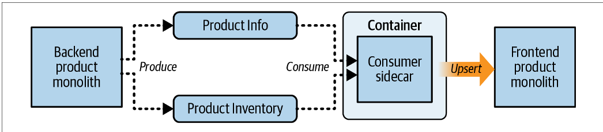

>Figure 11-2. Using the sidecar to upsert data into the frontend data store  

The sidecar resides inside its own container but is part of the single deployable of the frontend service. For example, you may choose to deploy it as a Kubernetes sidecar, or even within the same container as the microservice application itself.  

The sidecar pattern is pretty useful, as it allows you to add new functionality to a system without requiring significant changes to the legacy codebase. It is most commonly used to add event-driven processing capabilities to applications that would otherwise remain left out.  

The main drawback of the sidecar pattern is the increase in complexity and coordination. Testing the application becomes more complicated, as you must also include the stream-processing framework as part of your testing considerations. Handling the bounded context of the microservice and stream-processing component is also more difficult, as you must ensure you can deploy and roll back the components together.  

## Stateful Business Logic That Isn’t Reliant Upon Event Order  

Many business processes do not have any requirements regarding the order in which events arrive and are processed, but they do require that all necessary events eventually arrive. This is known as a gating pattern and is one in which a BPC can work well.  

For example, say that you work for a book publisher, and there are three things that
must be done before a book can be sent to the printer. The order that these tasks are
completed is not important, but it is important that each one is completed prior to
releasing the book to the printer:  

### Contents  

The contents of the book must have been written.  

### Cover art  

The cover art for the book must have been created.  

### Pricing  

The prices must be set according to regions and formats.  

Each of these event streams acts as a driver of logic. When a new event comes in on any of these streams, it is first materialized in its proper table and subsequently used to look up every other table to see if the other events are present. Figure 11-3 illustrates this example.  

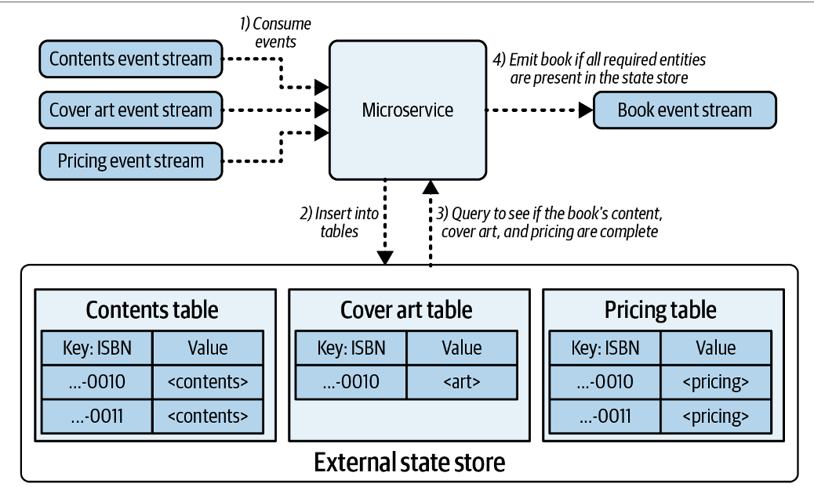

>Figure 11-3. Gating the readiness of a book  

In this example, the book ending with ISBN 0010 will already have been published to the output book event stream. Meanwhile, the book ending with ISBN 0011 is currently waiting for cover art to be available and has not been published to the output stream.  

> [!TIP]
> Explicit approval from a human being may also be required in the gating pattern. This is covered in more detail in “Example: Newspaper Publishing Workflow (Approval Pattern)” on page 351.  

## When the Data Store Does Much of the Work  

A BPC is also suitable when the underlying data store performs most of the business logic, such as a geospatial data store; document data store; and machine learning, AI, and neural network applications. An ecommerce company may ingest new products scraped from websites and classify them using a BPC microservice, utilizing a batch-trained machine learning categorizer service in the backend. All of the complex business logic is performed offline in batch, while the classification is performed in real time via lookups on a per-event basis.  

Alternatively, user behavior events collected from user devices, websites, and applications may be correlated with a geospatial data store to determine the nearest retailers from which to show advertisements.  

In both scenarios the complexity of processing the event is offloaded almost entirely to the underlying data store. The producer and consumer components simply provide a mechanism to consume events, process them, and emit the results downstream.  

## Independent Scaling of the Processing and Data Store  

The processing needs and the data storage needs of a microservice are not always linearly related. For instance, the volume of events that a microservice must process may vary with time. One common load pattern, which is incorporated into the following example, mirrors the sleep/wake cycle of a local population, with intensive activity during the day and very low activity during the night.  

Consider a scenario where user behavior events are aggregated into 24-hour sessions. The session data is used to determine the most recently popular products for a given user, and in turn are used to drive advertisements for more related products. Upon completing a 24-hour aggregation session, the service emits the results downstream in its own event and flushes the contents from its data store.  

An option for per-user aggregation maintained in an external key-value data store is shown in Table 11-1.  

>Table 11-1. Data storage with a composite primary key with a list of productIds as the value  

| Key|Value|
| ---|---|
| userId, timestamp|List(productId)|  

The processing needs of the service change with the sleep/wake cycles of the people using the product. At nighttime, when most users are asleep, the service requires very little processing power to perform aggregations compared to what's required during the day. In the interest of saving money on processing power, the service is scaled down at night.  

The partition assignor can reassign the input partitions to a single processor instance, as it can handle the reduced scale of user events. Note that despite the volume of events being low, the domain of potential users remains constant. Since anyone may be logged in at any time, the service requires full access to each and every user aggregation. In other words, scaling down the processing power has no impact on the state's upper size boundary that it must maintain.  

During the day, additional processing instances can be brought online to handle the increased event load. The query rate of the data store will also increase in this particular scenario, but caching, partitioning, and batching can help keep the load lighter than the linear increase in processing requirements.  

> [!TIP]
> Cloud service providers typically offer high-performance key-value storage that accommodates independent read/write scaling, while simultaneously keeping costs proportional to your read/write access patterns.  

### Summary  

The BPC pattern is simple yet powerful. It forms the foundation of many stateless and stateful event-driven microservice patterns. You can easily implement stateless streaming and simple stateful applications using the BPC pattern.  

The BPC pattern is also flexible. It pairs well with implementations where the data storage layer does most of the business work. You can use it as an interfacing layer between event streams and legacy systems, as well as leverage external stream-processing systems to augment its capabilities.  

A major shortcoming is that BPCs lack the more advanced capabilities required for handling relationships between streams. For example, if you want to join data from event streams together, you must load it all into a database and join it there. Additionally, BPCs also lack out-of-the-box mechanisms such as state materialization, event scheduling, and timestamp-based decision making. The next two chapters cover how heavyweight and lightweight frameworks provide all of these features, and more.  

# Heavyweight Framework Microservices

This chapter and the next cover the full-featured frameworks most commonly used in event-driven processing. Frequently referred to as *streaming frameworks*, they provide mechanisms and APIs for consuming, processing, and producing event streams. These frameworks can be roughly divided into heavyweight frameworks, which are covered in this chapter, and lightweight frameworks, which are covered in the next.  

Streaming frameworks provide full-featured support for primary-key joins, foreign-key joins, aggregations, and time-based operations. They're also capable of handling very large data sets, far beyond what a single instance could typically handle. Basic producer/consumer frameworks, as well as function-as-a-service (FaaaS) frameworks, typically lack these capabilities. It stands to reason, however, that consuming events from a stream is one thing, but adding in all the more complex operations that a business requires is yet another.  

These chapters aren't meant to compare the technologies, but rather to provide a generalized overview of how these frameworks work and to showcase their capabilities. For the purposes of evaluating heavyweight frameworks, this chapter covers aspects of Apache Spark, Apache Flink, and the Apache Beam model as examples of the sorts of technology and operations commonly provided.  

> [!WARNING]
> The first edition of this book also discussed Apache Storm and
> Apache Heron. They have been removed for the second edition, as
> their usage has greatly dwindled over time.  

One defining characteristic of a heavyweight streaming framework is that it requires an independent cluster of processing resources to perform its operations. This cluster typically constitutes a number of shareable worker nodes, along with resource managers that schedule and coordinate work.  

A second defining characteristic is that the heavyweight framework uses its own internal mechanisms for handling failures, recovery, resource allocation, task distribution, data storage, communication, and coordination between processing instances and tasks. This is in contrast to the lightweight framework, functions as a service, and the basic producer/consumer implementations that rely heavily on the container management system (CMS) and the event broker to fulfill these needs.  

A third characteristic is that the heavyweight framework provides its own automated mechanism for *shuffling* data between instances. This is a critical requirement for handling joins and aggregations at scale, ensuring that all data of a given key ends up in the correct processing instance.  

These three characteristics are the main reasons why these frameworks are dubbed
*heavyweight*. Having to manage and maintain additional clustered frameworks inde-
pendently of the event broker and the CMS is no small task.  

Heavyweight frameworks have one more notable property that separates them from lightweight frameworks: they're also capable of processing data in batch jobs, which speaks to their roots and historical origins. Let's take a look at the history of these frameworks first, then get into an example to highlight their capabilities.  

## A Brief History of Heavyweight Frameworks  

Heavyweight stream-processing frameworks are directly descended from their heavy-weight batch-processing predecessors. Apache Hadoop, one of the most widely known processing engines, was released in 2006, providing open source big-data technologies for anyone to use. Hadoop bundled a number of technologies together to offer massive parallel processing, failure recovery, data durability, and internode communication, allowing users to access commodity hardware cheaply and easily to solve problems requiring many thousands of nodes (or more).  

MapReduce was one of the first widely available means of processing extremely large batches of data (aka big data). It has since been overtaken by many more performant options, but for a time it was the dominant processing mechanism for large batches of data. The size of big data has also increased over time; although workloads of hundreds (or thousands) of gigabytes were common in the early days, workloads today have scaled to sizes in the terabyte and petabyte range. As these data sets have grown so has the demand for faster processing, more powerful options, simpler execution options, and solutions that can provide near-real-time stream-processing capabilities.  

This is where Flink, Spark, and Beam come in, to name just the open source and freely available Apache options. These solutions were developed to process big data scale workloads and provide actionable results much sooner than those provided by batch-based MapReduce jobs. Spark, for example, started as a high-performance replacement for MapReduce, but was largely limited to batch processing. Stream processing came later, as the technology evolved. Others, like Flink, were capable of processing streams from the start.  

These technologies are undoubtedly familiar to most big-data aficionados and are likely already being used to some extent in the data science and analytics branches of many organizations. In fact, this is how many organizations start dabbling in event-driven processing, as these teams convert their existing batch-based jobs into streaming-based pipelines.  

Instead of going deeper under the hood, let's instead take a look at an example first to illustrate the utility of heavyweight streaming frameworks.  

### Example: Session Windowing of Clicks and Views  

Imagine that you are running a simple online advertising company. You purchase ad space across the internet and resell it to your own customers. These customers want to see their return on investment, which in this case is measured by the click-through rate of users who are shown an advertisement.  

Additionally, user engagements can be billed only on a per-session basis, with a session defined as continuous user activity without a break longer than 30 minutes. After 30 minutes of inactivity, the session is closed, and any new user activity will create a new session.  

In this example there are two event streams: user product clicks, as shown in Example 12-1, and user advertisement views, as shown in Example 12-2. The goal is to aggregate these two streams into session windows and emit them once an event time (not wall-clock time) of 30 minutes has passed without a new user event (e.g., Click or AdView). Refer to Chapter 9 for a refresher on stream time and watermarks.  

Example 12-1. The Click schema in Protobuf

message Click {
    int32 userId = 1;
    string productId = 2;
    Timestamp createdEventTime = 3;
}  

Example 12-2. The AdView schema with Protobuf

message AdView {
    int32 userId = 1;
    string adId = 2;
    string productId = 3;
    Timestamp createdEventTime = 4;
}  

The event-driven microservice must perform the following operations:  

1. Group all events of the same userId key together, such that all events for a given user are local to a processing instance.  

2. Window the events together with a 30-minute session timeout. Events that occur after more than 30 minutes of inactivity will create a new session window.  

3. Within each session window, compute the AdView events that have a corresponding Click, mark these as an AdEngagement, and emit the computed list downstream.  

An AdView is generated only when an advertisement is successfully shown to the user.
A Click is generated only when that user clicks on the product. Note that a user may
click on a product even if they did not see an advertisement, such as when browsing
the website or looking at search results.  

The abbreviated Apache Flink source code in Example 12-3 shows the microservice's code using its MapReduce-style syntax.  

Example 12-3. Snippet of Flink code showing the stream-processing operations  

java
// Create streams of click and view events (super type is UserEvent)
DataStream<Either<MouseEvent, AdViewEvent>> eitherClicks = ...
DataStream<Either<MouseEvent, AdViewEvent>> eitherViews = ...

eitherClicks
  .union(eitherViews)
  .keyBy(t -> {
    if (t.isRight())
      return t.right().getProductId();
    else
      return t.left().getProductId();
  })
  .window(TimeoutSessionWindows.withGap(Duration.ofMinutes(30)))
  .process(new ProcessClickViewWindowFunction())
  .addSink(new KafkaTopicSink(...));  

The process function shown in Example 12-4 does a lot of the heavy lifting. It iterates through the windowed grouping of clicks and views and pairs them up according to adId. The list of engaged ads is then emitted downstream, where it can be written to a sink, such as another Kafka topic.  

Example 12-4. The innards of the ProcessClickViewWindowFunction that matches ad views with clicks  

```java
public class ProcessClickViewWindowFunction extendsProcessWindowFunction<Either<ClickEvent, AdViewEvent>,List<String>,Long,TimeWindow>{@Overridepublic void process(Long key,Context context,Iterable<Either<ClickEvent, AdViewEvent>> input,Collector<List<String>> out){// Create an empty list where we store the adIds for engagementsList<String> adEngagements= new ArrayList<>();// Map<ProductId, Tup le2<AdId, wasClicked>>Map<Long, Tuple2<String, Boolean>> map= new HashMap<>();// First, get all the Advertisements that have both a click and a view.// This examp le ignores event time, but assumes that the view must come// before the click.for(Either<ClickEvent, AdViewEvent> event: input){// Reminder that(key= productId)Tuple2<String, Boolean> adEngage=map.getOrDefault(key, new Tuple2<>("", false));if(event.isLeft())// If it is a click event then set wasClicked=true.// Keep the same value for f0.map.put(key, new Tuple2<>(adEngage.f0, true));else{// If it is a view event populate with the adIdAdViewEvent adv= event.right();String adId= adv.getAdId();Boolean wasClicked= adEngage.f1;// Set the AdId and the original value of wasClickedmap.put(key, new Tuple2<>(adId, wasClicked));}}

```  

for (Map.Entry<Long, Tuple2<String, Boolean>> clickViews: map.entrySet()) {
    if (clickViews.getValue().f0.length() > 0 && clickViews.getValue().f1) {
        adEngagements.add(clickViews.getValue().f0);
    }
}

// key=(String) -> the userId
// value=(List<String>) -> a List of adIds with both a view and a click
out.collect(adEngagements);
}  

The List<String> adEngagements collection stores the results of which AdViews are associated with Click, and can be considered an engagement. The output adheres to the format described in Table 12-1.  

>Table 12-1. The output key-value pair of the ProcessClickViewWindowFunction  

| Key|Value|
| ---|---|
| String userId|List  <String  > adEngagements|  

The code from Example 12-3 is mapped to the multistage workflow executed under the hood of the heavyweight framework. Figure 12-1 illustrates the stages and operations. Note that there are two instances for processing the events, resulting in data shuffling between some stages.  

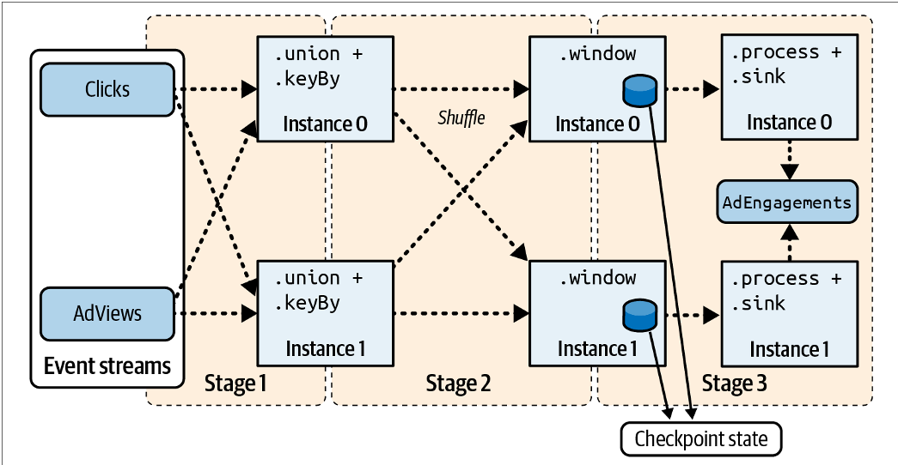

>Figure 12-1. Session processing topology from user Clicks and AdViews  

#### Stage 1  

The executors for each instance are assigned their tasks, which are in turn assigned the input event-stream partitions for processing. Both the click and view streams are unioned into a single logical stream, followed by windowing preparation using the keyBy operator.  

#### Stage 2  

The keyBy operator, in conjunction with the downstream window and process operators, requires shuffling the now-merged events to the correct downstream instances. All events for a given key are consumed into the same instance, providing the necessary data locality for the remaining operations.  

### Stage 3  

Processing the session windows results in a list of adIDs, with both a view and a click, per user. Each of these key-value pairs is then bundled into a record and written to the AdEngagements output event stream (with an uppercase name to avoid confusion).  

> [!TIP]
> Streaming frameworks provide many additional controls over windowing and time-based aggregations. This can include retaining sessions and windows that have closed for a period of time, so that late-arriving events can be applied and an update emitted to the output stream.  

Next, Figure 12-2 illustrates the effects of scaling down to just a single degree of parallelism. Assuming no dynamic scaling, you would need to halt the stream processor before restoring it from a checkpoint with the new parallelism setting. Upon startup, the service reads the stateful keyed data back from the last known good checkpoint and restores the operator state to the assigned partitions. Once state is restored, the service can resume normal stream processing.  

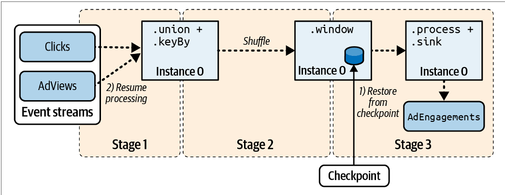

>Figure 12-2. Restoring the application with just a single processing instance Stage 1 operates as before, though in this case instance 0 is consuming and processing every partition. It will still group and shuffle data, though the source and destination remain the same instance. The last stage of the topology (stage 3) still windows, processes, and emits the adEngagements to the output stream.  

Heavyweight stream-processing frameworks provide a lot of powerful options. They treat streams and events as building block primitives, which in turn lets you construct powerful declarative applications to group, aggregate, join, process, and store your data. We've only scratched the surface on their capabilities, but now, it's time to look under the hood to see what's going on.  

## The Inner Workings of Heavyweight Frameworks  

The aforementioned Apache Spark and Apache Flink frameworks operate similarly at a coarse-grained level. This is *not* to say that they are identical, but rather that they operate using similar modes of development, deployment, scaling, storage, and failure handling.  

Proprietary solutions, like Google's Dataflow, which executes applications written using Apache Beam's API, probably also operate similarly. But this is only an assumption given that the source is closed and the backend is not described in detail.  

Therefore, the challenge in describing the under-the-hood operations of heavyweight
frameworks is that each has its own operational and design nuances. Full coverage of
each framework is far beyond the scope of this chapter, and you will have to consult
the documentation for your selected heavyweight framework.  

A heavyweight stream-processing *cluster* is a grouping of dedicated processing and storage resources. The resources in the cluster are organized according to two primary roles:  

• The *resource manager*, which prioritizes, assigns, and manages workers and tasks performed by the workers. It also has backup nodes to fail over to in case it crashes or becomes unavailable.  

• The *worker* (*or executor*) *node*, which executes the business logic contained in its assigned tasks. It is the worker node resources, such as CPU, memory, and disk, that process the streaming application's business logic.  

The tasks themselves are automatically generated based on the topology of the stream-processing application. They connect directly to the event broker and consume and produce to and from event streams. Figure 12-3 shows a rough breakdown of how this works.  

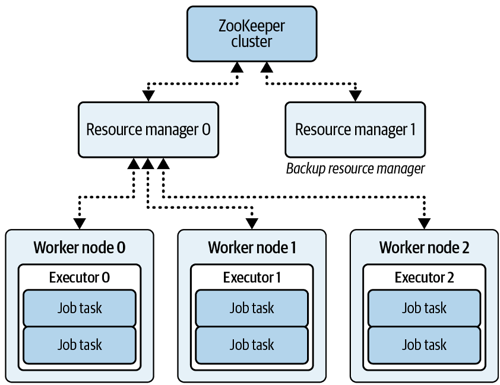

>Figure 12-3. A generic view of a heavyweight stream-processing framework using ZooKeeper for consensus management  

A job is a stream-processing application that uses the framework's software development kit (SDK). The terminology is often used interchangeably, though calling an application a job is a leftover from batch-based data processing. Either way, a job is an application, and a streaming job is a streaming application that runs indefinitely just like any other microservice described in this book.  

This figure also shows Apache ZooKeeper, which plays a supporting role for this streaming cluster. ZooKeeper provides highly reliable distributed coordination for determining which resource manager is in charge. Heavyweight frameworks are designed to be highly available and resilient to one or more failures, be it a worker node, resource manager, or ZooKeeper node. Upon failure of a resource manager, ZooKeeper helps decide which of the remaining resource managers is the new leader to ensure continuity of operations.  

> [!NOTE]
> ZooKeeper has historically been a major component in providing
> coordination of distributed heavyweight frameworks. Newer frame-
> works may or may not use ZooKeeper. In either case, distributed
> coordination is essential for reliably running distributed workloads.  

Upon submission to a cluster, a stream-processing application is broken down into tasks and assigned to the worker nodes. The task manager monitors the tasks and ensures that they are completed, restarting tasks and rebalancing tasks as necessary. Task managers are usually set up with high availability, such that if the task manager itself fails, a backup manager steps in and takes over. Otherwise, all your jobs would fail and it would be an expensive restart.  

Figure 12-4 shows the process of submitting a job to the cluster via resource manager 1, which in turn is translated into tasks for processing by the executors. These long-running tasks establish connections to the event broker and begin to consumeevents from the event stream.  

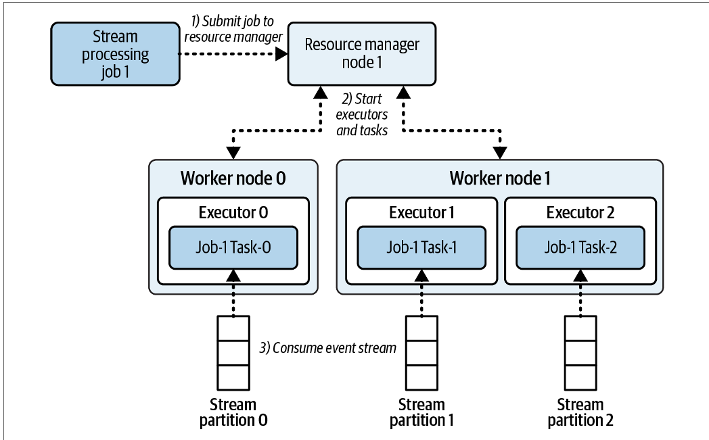

>Figure 12-4. Submitting a stream-processing job to read from an event stream  

Though this example shows a 1:1 mapping between tasks and stream partitions, you can configure the degree of parallelism for each application. One task can consume from all the partitions, or many tasks could consume from the same partition, say, in the case of a queue.  

## Benefits and Limitations  

The heavyweight frameworks discussed in this chapter have their roots and history in serving analytical use cases. They provide significant value around analyzing large volumes of events in near–real time to enable quicker decision making. Some fairly common patterns of usage include the following:  

• Extract data, transform it, and load it into a new data store (ETL)  

• Perform session- and window-based analysis  

• Detect abnormal patterns of behavior  

• Aggregate streams and maintain state  

• Perform any sort of stateless streaming operations  

These frameworks are powerful and fairly mature, with many organizations using them and contributing back to their source code. There are numerous books and blog posts, excellent documentation, and many sample applications available to you. There are, however, several fairly significant shortcomings that limit, but don't completely preclude, microservice applications based on these frameworks.  

First, these heavyweight frameworks were not originally designed with microservice-style deployment in mind. Deploying these applications requires a dedicated resource cluster beyond that of the event broker and CMS, adding to the complexity of managing large numbers of applications at scale. There are ways to mitigate this complexity, along with new technological developments for deployment, some of which are covered in detail later in this chapter.  

Second, these frameworks historically offer only Java and Python libraries, which limits your language options for creating microservices. One common workaround is to use the heavyweight framework to perform transformations as its own standalone application, while another application serves the business functionality from the transformed state store. You may also choose to implement this pattern with streaming SQL (discussed in Chapter 14).  

Third, materializing an entity stream into an indefinitely retained table is not supported out of the box by all stream-processing frameworks. This can preclude creating table-table joins, stream-table joins, and computing long-running aggregations, limiting the scope of addressable business problems.  

A wide range of streaming frameworks have emerged over the past few decades, though they are not all equal. A good acid test to a streaming framework's capabilities is its ability to serve joins, either as streams or as materialized tables. This is a challenging component to implement correctly, and proves to be a substantial barrier to its adoption and development.  

Further, many stream frameworks focus heavily on time-based aggregations, with examples, blog posts, and advertisements emphasizing time-series analysis and aggregations based on limited window sizes. Some careful digging reveals that the leading frameworks provide a global window, which allows for the materialization of event streams into tables with indefinite retention. From here, you can implement your own custom join features, though I find that these are still far less well documented and exhibited than they should be, considering their importance in handling event
streams at scale in an organization.  

> [!TIP]
> If you're investigating other streaming frameworks, check to see
> how (or if) they handle joins. If there is no support, it's a good
> indication that the streaming framework hasn't addressed some of
> the harder problems yet, and that you may want to look at other
> options.  

While the majority of streaming frameworks originated for analytical workloads, they remain fully capable of powering operational use cases as event-driven microservices. Your next choice then becomes: build, or buy?  

## Cluster Setup Options and Execution Modes  

You have a number of options when it comes to building and managing your heavy-weight stream-processing cluster, each with its own benefits and drawbacks.  

### Use a Hosted Service  

The first and simplest way to manage a cluster is to just pay someone to do it for you. Just as there are a number of compute service providers, there are also providers who will be happy to host and possibly manage most of your operational needs for you. This option usually has the highest sticker price when compared to just running your own free open source software. But the former is a total cost, while the latter forgoes the costs of hardware, development, maintenance, upgrading, debugging, monitoring, and scaling. There is also an opportunity cost to consider, as all the time and effort you spend building your own streaming cluster is time not spent doing work that is critical to your business.  

Confluent, founded by the cocreators of Apache Kafka, offers a fully managed and serverless Flink SQL alongside a Kafka offering. Amazon offers managed Flink and Spark services; Google, Databricks, and Microsoft offer their own bundling of Spark; and Google offers Dataflow, its own implementation of an Apache Beam runner. There are, of course, many other options, but you will have to research them for yourself.  

> [!WARNING]
> Note that not all managed services are created equally. Some are entirely serverless, while others require varying degrees of hands-on maintenance and monitoring. The general trend seems to be continually moving toward a full serverless-style approach, where the entire physical cluster is invisible to you as a subscriber. This may or may not be acceptable depending on your security, performance, and data isolation needs. Be sure that you understand what is and is not offered by these service providers, as they may not include the same features of an independently operated cluster.  

### Build and Run Your Own Cluster  

Heavyweight frameworks historically have their own dedicated clusters composed of commodity hardware. Figure 12-3 showed a basic overview of what that may look like from a high level.  

Running your own cluster is a challenge, but this isn't to say that you shouldn't do it. Rather, you simply need to be prepared. This book doesn't go into depth on this subject because it's highly related to the streaming technologies you choose, and their relationship with the other technologies you already have.  

> [!WARNING]
> "How hard could it be?" is a popular sentiment when setting up your own heavyweight streaming framework. It can be very easy to get a basic proof of concept working, but hardening it into a reliable production-ready service can be very challenging and expensive.  

Very large companies with deep pockets and adequate staffing may find it cost acceptable to build, deploy, run, manage, scale, monitor, debug, and update their own cluster(s). Smaller companies may find it more reasonable to choose ready-to-go managed services instead, and re-evaluate optimizing for costs once they've found a product-market fit.  

A cluster can also be created in conjunction with the CMS. One mode of operation involves simply deploying the cluster on CMS-provisioned resources. The second mode involves leveraging the CMS itself as the means of scaling and deploying individual microservices. This latter mode has become increasingly more popular alongside adoption of containerization. Using the CMS to deploy and manage applications simplifies your workflows and reduces overall system complexity.  

#### Mode one: Deploying and running the cluster using the CMS  

Deploying the heavyweight cluster using the CMS has many benefits. The resource managers, worker nodes, and ZooKeeper (if applicable) are brought up within their own container or virtual machines. These containers are managed and monitored like any other container, providing visibility into failures as well as the means to
automatically restart these instances.  

> [!TIP]
> You can enforce static assignment of resource managers and any other services that you require to be highly available, to prevent the CMS from shuffling them around as it scales the underlying compute resources. This prevents excessive alerts from the cluster monitor about missing resource managers.  

### Mode two: Specifying resources for a single application using the CMS  

Historically, the heavyweight cluster has been responsible for assigning and managing resources for each application instance. Modern CMSs can also perform these operations, but they can do it for any kind of microservice—regardless of the language and framework it is coded in.  

Spark and Flink enable you to directly leverage Kubernetes for scalable application deployment beyond their original dedicated cluster configuration, where each application has its own set of dedicated worker nodes. For example, Apache Flink enables applications to run independently within their own isolated session cluster using Kubernetes. Apache Spark offers a similar option, allowing Kubernetes to play the role of the resource manager and maintain isolated worker resources for each application. A basic overview of how this works is shown in Figure 12-5.  

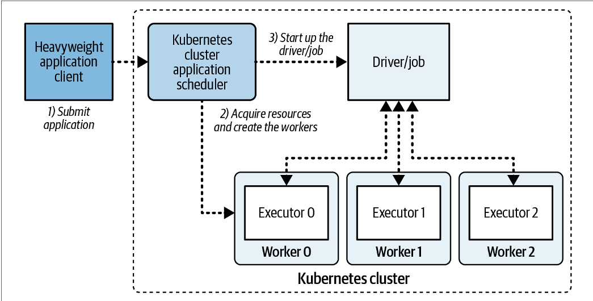

>Figure 12-5. Single job deployed on and managed by Kubernetes cluster  

> [!TIP]
> This deployment mode is nearly identical to how you would deploy non-heavyweight microservices and merges lightweight and BPC deployment strategies.  

This deployment pattern has several advantages:  

• It leverages the CMS resource acquisition model, including for scaling.  

• There is complete isolation between jobs.  

• You can use different frameworks and different versions.  

• You can treat heavyweight streaming applications just like microservices, using the same deployment processes.  

And of course, it also has several disadvantages:  

• Support is not available for all leading heavyweight streaming frameworks.  

• Integration is not available for all leading CMSs.  

• Features available in full cluster mode, such as automatic scaling, may not yet be supported.  

## Application Submission Modes  

Applications can be submitted to the heavyweight cluster for processing in one of two main ways: driver mode and cluster mode.  

### Driver Mode  

Driver mode is supported by Spark and Flink. The driver is simply a single, local, standalone application that helps coordinate and execute the application, though the application itself is still executed within the cluster resources. The driver coordinates with the cluster to ensure the progress of the application and can be used to report on errors, perform logging, and complete other operations. Notably, termination of the driver will result in termination of the application, which provides a simple mechanism for deploying and terminating heavyweight streaming applications. The application driver can be deployed as a microservice using the CMS, and the worker resources can be acquired from the heavyweight cluster. To terminate the driver, simply halt it as if it were any other microservice.  

### Cluster Mode  

In cluster mode, the entire application is submitted to the cluster for management and execution, whereupon a unique ID is returned to the calling function. This unique ID is necessary for identifying the application and issuing orders to it through the cluster's API. With this deployment mode, commands must be directly communicated to the cluster to deploy and halt applications, which may not be suitable for your microservice deployment pipeline.  

### Handling State and Using Checkpoints  

Stateful operations may be persisted using either internal or external state (see Chapter 8), though most heavyweight frameworks favor internal state for its high performance and scalability. Stateful records are kept in memory for fast access, but are also spilled to disk for data durability purposes and when state grows beyond available memory. Using internal state does carry some risks, such as state loss due to disk failure, node failures, and temporary state outages due to aggressive scaling by the CMS. However, the performance gains tend to far outweigh the potential risks, which can be mitigated with careful planning.  

Checkpoints, snapshots of the application's current internal state, are used to rebuild state after scaling or node failures. A checkpoint is persisted to durable storage external to the application worker nodes to guard against data loss.  

You can checkpoint with any data store that is compatible with the framework. Historically, your options for checkpointing were typically limited to the Hadoop Distributed File System (HDFS). But now there are many highly available external data stores offered by cloud services, like Amazon S3, Google Cloud Storage, and Microsoft Azure's Blob Storage, to name just a few.  

The stored checkpoint enables your service to restore itself in the case of a total application failure. Any failed instances can restore themselves from the latest checkpoint, and restore their consumer input offsets accordingly to resume processing where they left off.  

The checkpointing mechanism must consider two main states when consuming and processing partitioned event streams:  

##### Operator state  

The pairs of <partitionId, offset>. The checkpoint must ensure that the internal key state (see next item) matches up with the consumer offsets of each partition. Each partitionId is unique among all input topics.  

#### Key state  

The pairs of <key, state>. This is the state pertaining to a keyed entity, such as aggregations, reductions, windowing, joins, and other stateful operations.  

The checkpointing mechanism synchronously records both the operator and keyed state, such that it accurately represents the processing of all the events marked as consumed by the operator state. A failure to do so may result in events either not being processed at all or being processed multiple times. An example of this state as recorded into a checkpoint is shown in Figure 12-6.  

| Operator state|Operator state|
| ---|---|
| Key (ID)|Value (Offset)|
| Partition_A0|3122|
| Partition_A1|3344|
| Partition_B0|121|
| Partition_B1|423|  

| Keyed state|Keyed state|
| ---|---|
| Key|Value|
| User-Jacques|<user-info  >|
| User-Adam|<user-info  >|
| User-Gustav|<user-info  >|
| User-Felicity|<user-info  >|
| ...|...|  

>Checkpoint  

>Figure 12-6. A checkpoint with operator and key state  

> [!TIP]
> Restoring from a checkpointed state is functionally equivalent to using snapshots to restore external state stores, as covered in "Recovery using snapshots or checkpoints" on page 188.  

The state associated with the application task must be completely loaded from the checkpoint before you can process any new data. The heavyweight framework must also verify that the operator state and the associated keyed state match for each task, ensuring the correct assignment of partitions among tasks. Each of the major heavyweight frameworks discussed at the start of this chapter implements checkpoints in its own way, so check the documentation.  

## Scaling Applications and Handling Event-Stream Partitions  

The maximum parallelism of a heavyweight application is typically constrained by the input stream partition counts. It can read data into its framework only as quickly as it can iterate through the input streams, particularly as it processes the data in the order that it is written. Because heavyweight processing frameworks are particularly well suited for processing massive amounts of user-generated data, it is quite common to see cyclical patterns with significant computational requirements during the day and very few in the middle of the night. An example of a daily cyclical pattern is shown in Figure 12-7.  

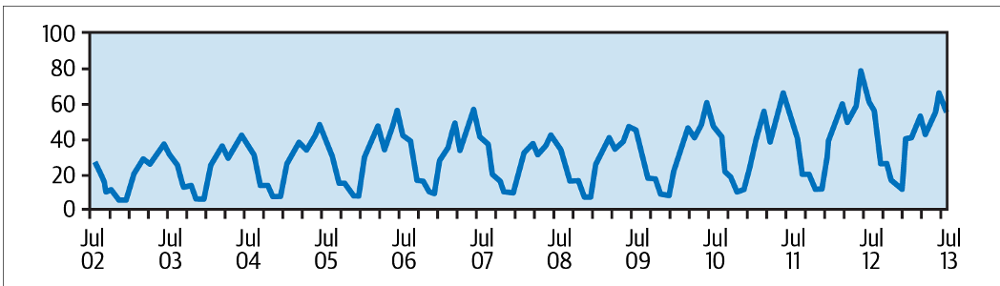

>Figure 12-7. Sample of daily cyclical data volume  

Applications that process such data benefit greatly from the ability to scale up with increasing demand and down with decreasing demand. Proper scaling can ensure that the application has sufficient capacity to process all events in a timely manner, without wasting resources by overprovisioning. Ideally, the latency between when an event is received and when it is fully processed should be minimized, though many applications are not that sensitive to temporarily increased latency.  

> [!WARNING]
> Scaling an application is separate from scaling a cluster. All scaling discussed here assumes that there are sufficient cluster resources to increase parallelism for the application. Refer to your framework's documentation for scaling of cluster resources.  

Stateless streaming applications are very easily scaled up or down. New processing resources for an application can simply join or leave the consumer group, upon which resources are rebalanced and streaming is resumed. Stateful applications can be more difficult to handle; not only does state need to be loaded into the workers assigned to the application, but the loaded state needs to match the input event-stream partition assignments.  

There are two main strategies for scaling stateful applications, and while the specifics vary depending on the technology, they share a common goal of minimizing application downtime.  

### Scaling an Application by Restarting It  

The first strategy is quite simple. You pause the application, checkpoint any state, and then stop it. Next, you restart the application with the new parallelism, reloading the stateful data from the checkpoints before resuming processing from where it was left off. Scaling by restart is supported by all heavyweight streaming frameworks, and speaks to the roots of these technologies in batch-based analytical processing.  

But why must the application be paused, checkpointed, and restarted to scale up or down? There are a two main problems that make dynamic scaling difficult, but not impossible (as covered in the next section):  

• State redistribution to the scaled instances is essential for correctness, but it takes time to store the data from one instance and reload it in another.  

• *Data shuffling* is another factor, as scaling down a node that is in the middle of shuffling data can cause data loss. Additionally, adding a node without changing the shuffler's destination at precisely the right moment can also cause data loss or duplication of data.  

Figure 12-8 shows a regular shuffle, where each downstream reduce operation sources its shuffled events from the upstream groupByKey operations. If one of the instances were abruptly terminated, the reduce nodes would no longer know where to source the shuffled events from, leading to a fatal exception. Thus, you need to pause the application, let the shuffles complete, and checkpoint the state to maintain an accurate accounting of the application's progress.  

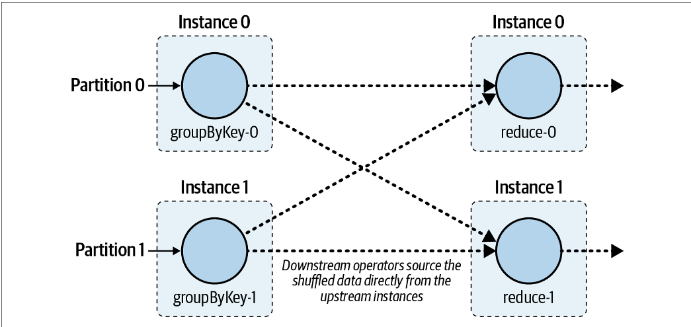

>Figure 12-8. Logical representation of a shuffle  

Scaling by restart is a safe and simple way to change your application's parallelism. You'll need to consider whether the downtime is acceptable, particularly as the downtime will relate to the size of your checkpointed state. Note that scaling by restart is also an excellent way to validate your disaster recovery setup, since it's effectively equivalent to recovering your application from the last known good state.  

The good news is that frameworks like Flink and Spark also offer the means to scale your application while it is running.  

### Scaling an Application While It Is Running  

This second strategy allows you to remove, add, or reassign application instances without stopping the application. It is available only in some heavyweight streaming frameworks, as it requires careful handling of both state and shuffled events. Just like in scale by restart, adding and removing instances requires redistributing assigned stream partitions and reloading state from the last checkpoint.  

The exact mechanism of scaling while running varies from framework to framework. For example, Spark's dynamic resource allocation allows for dynamic scaling while the application is running. However, it requires using coarse-grained mode for cluster deployment and using an external shuffle service (ESS) as an isolation layer.  

The ESS receives the shuffled events from the upstream tasks and stores them for consumption by the downstream tasks, as shown in Figure 12-9. The downstream consumers access the events by asking the ESS for the data that is assigned to them.  

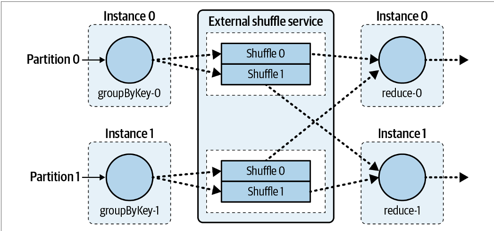

>Figure 12-9. Logical representation of a shuffle using an external shuffle service  

Task instances can be scaled down on demand since the downstream operations are no longer dependent on a specific upstream instance. The shuffled data remains within the ESS, and a scaled-down service, as shown in Figure 12-10, can resume processing. In this example, instance 0 is the only remaining processor and takes on both partitions, while the downstream operations seamlessly continue processing via the interface with the ESS.  

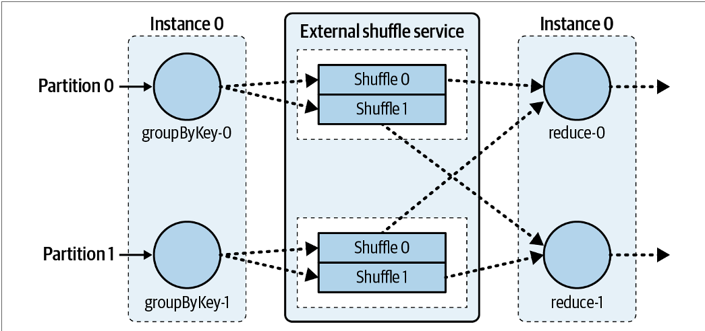

>Figure 12-10. Downscaled application using an external shuffle service(note instance 1is gone)  

Spark has also provided dynamic scaling functionality without the use of an ESS, via shuffle tracking and via shuffle block decommissioning. The former works by tracking the stages that generate shuffle files, and keeping executors that generate that data alive while downstream jobs that use them are still active. The latter relies on the block manager to migrate the shuffled blocks(the data) during a graceful shutdown of the instance, to provide continuity for the services.  

Apache Flink provides an adaptive scheduler that permits the dynamic scaling of Flink applications. It relies on Flink’s declarative resource management that abstracts resources from the job, and streamlines upscaling and downscaling of resources.  

Active autoscaling for live applications remain an area of active development for both Spark and Flink. This is an area that will continue to see more development,especially as data volumes and the demand for event-driven processing increase.Resource efficiency, low latency, and accurate and consistent results require reliable autoscaling mechanisms.  

## Autoscaling Applications  

Autoscaling is the process of automatically scaling applications in response to specific metrics. These metrics may include processing latency, consumer lag, memory usage, and CPU usage, to name a few. Some frameworks may have autoscaling options built in, such as Google's Dataflow engine and Spark Streaming's dynamic allocation functionality. Others may require you to collect your own performance and resource utilization metrics and wire them up to the scaling mechanism of your framework, such as the lag monitor tooling discussed in "Consumer Offset Lag Monitoring" on page 392.  

## Recovering from Failures  

Heavyweight clusters are designed to be highly tolerant to the inevitable failures of long-running jobs. Failures of the resource manager, worker nodes, and ZooKeeper nodes (if applicable) can all be mitigated to allow applications to continue virtually uninterrupted. These fault-tolerance features are built into the cluster framework, but can require you to configure additional steps when deploying your cluster.  

In the case of a worker node failure, the tasks that were being executed on that node are moved to another available worker. Any required internal state is reloaded from the most recent checkpoint along with the partition assignments. Resource-manager failures should be transparent to applications already being executed, but depending on your cluster's configuration you may be unable to deploy new jobs during a resource-manager outage. High-availability mode backed by ZooKeeper (or similar technology) can mitigate the loss of a resource manager.  

> [!TIP]
> Make sure you have proper monitoring and alerting for your
> resource manager and worker nodes. While a single cluster node
> failure won't necessarily halt processing, it can still degrade perfor-
> mance and prevent applications from recovering from successive
> failures.  

## Multitenancy Considerations  

Aside from the overhead of cluster management, you must account for multitenancy issues as the number of applications on a given cluster grows. Specifically, you should consider the priority of resource acquisition, the ratio of spare to committed resources, and the rate at which applications can claim resources (i.e., scaling). For instance, a new streaming application starting from the beginning of time on its input topics may request and acquire the majority of free cluster resources, restricting any currently running applications from acquiring their own. This can cause applications to miss their service-level objectives (SLOs) and create downstream business issues.  

Here are a couple of methods to mitigate these challenges:  

#### Run multiple smaller clusters  

Each team or business unit can have its own cluster, and these can be kept fully separate from one another. This approach works best when you can requisition clusters programmatically to keep operational overhead low, either through in-house development work or by using a third-party service provider. This approach may incur higher financial costs due to the overhead of running a cluster, both in terms of coordinating nodes (e.g., resource manager and ZooKeeper nodes) and monitoring/managing the clusters.  

#### Namespacing  

A single cluster can be divided into namespaces with specific resource allocation. Each team or business group can be assigned its own resources within their own namespace. Applications executed within that namespace can acquire only those resources, preventing them from starving applications outside of the namespace through aggressive acquisition. A downside to this option is that spare resources must be allocated to each namespace even when they're not needed, potentially leading to a larger fragmented pool of unused resources.  

## Languages and Syntax  

Heavyweight stream-processing frameworks are rooted in the JVM languages of their predecessors, with Java being the most common, followed by Scala. Python is also commonly represented, as it is a popular language among data scientists and machine learning specialists, who make up a large portion of these frameworks' traditional users. MapReduce-style APIs are commonly used, where operations are chained together as immutable operations on data sets. Heavyweight frameworks are fairly restrictive in the languages their APIs support.  

## Choosing a Framework  

Choosing a heavyweight stream-processing framework is much like selecting a CMS and event broker. You must determine how much operational overhead your organization is willing to authorize, and whether that support is sufficient for running a full production cluster at scale. This overhead includes regular operational duties such as monitoring, scaling, troubleshooting, debugging, and assigning costs, all of which are peripheral to implementing and deploying the actual applications.  

Software service providers may offer these platforms as a service, though the options tend to be more limited than selecting providers for your CMS and event broker. Evaluate the options available to you and choose accordingly.  

Lastly, the popularity of a framework will inform your decision. Apache Flink is one of the leading streaming frameworks, and has seen significant growth and adoption since the first version of this book was released. Spark's structured streaming is also quite popular for building streaming applications. Apache Beam is also popular, but primarily as a means of running on Google's Dataflow. It hasn't seen the same adoption and usage growth that Spark and Flink have.  

> [!WARNING]
> Keep in mind that a heavyweight streaming framework may not be a suitable choice for implementing your event-driven microservice. Verify that it is the correct solution for your problem space before committing to it.  

## Summary  

This chapter introduced heavyweight stream-processing frameworks, including a brief history of their development and the problems they were created to help solve. These systems are highly scalable and allow you to process streams according to a variety of analytical patterns, but they may not be sufficient for the requirements of some stateful event-driven microservice application patterns.  

Heavyweight frameworks operate using centralized resource clusters, which may require additional operational overhead, monitoring, and coordination to integrate successfully into a microservice framework. Recent innovations in cluster and application deployment models have provided better integration with container management solutions such as Kubernetes, allowing for more granular deployment of heavyweight stream processors similar to that of fully independent microservices.  

In the next chapter, we'll shift gears just a bit to look at the lightweight frameworks, and how they differ from the heavyweight options for building event-driven microservices.  

# Lightweight Framework Microservices

Lightweight frameworks differ from heavyweight frameworks in that they do not require a dedicated processing and resource management cluster. Instead, they rely solely on the event broker and the container management system (CMS) to scale, manage state, and recover from failures.  

Historically speaking, there have been only a few lightweight frameworks that caught on enough to mention here. Apache Kafka Streams and Apache Samza were the only two lightweight streaming frameworks identified in the first edition of this book. In the intervening years, it has become clear that Kafka Streams remains the only one in widespread common use, particularly as it remains a core component of the Apache Kafka project. Apache Samza’s usage has diminished, as has its release cycle frequency, and as a consequence, I wouldn’t recommend starting a new project with it over Kafka Streams.  

Like Samza, other lightweight frameworks have emerged and faded away over the years. The open source BSD-licensed Python Faust framework is another example. It isn’t that there is nobody who uses these frameworks nowadays, it’s simply that the critical social mass to keep them up-to-date with event broker evolutions and changes is no longer present. The reality is that building a full-featured, durable, reliable, and scalable framework is hard, and when there are other off-the-shelf options available,it may simply be too hard to rally enough developers and users to your cause.  

This chapter explores lightweight frameworks with a particular slant toward Apache Kafka Streams. It remains not only the biggest lightweight streaming framework in use today, but perhaps the only one that will still remain in the developer toolkit in yet another five years, thanks to its embedding into the core Apache Kafka project.  

First, let’s look at an example.  

## Example: Joining Products with Brand Data on a Foreign Key  

Consider an example where you’ve set up a connector to pull both the brand and product data from your ecommerce database, as shown in Figure 13-1.  

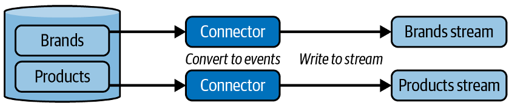

>Figure 13-1. Creating brand and product event streams from a database source via connectors  

The product information contains everything about the product—what it is, a plaintext description, the price, and a foreign-key reference to the brand (e.g., brandId). Meanwhile, the brand information contains things like the official brand name and a link to its logo for use in advertising.  

The lightweight Kafka Streams framework provides the means to join the brand and product data together on the brandId foreign key, producing an EnrichedProduct stream by denormalizing with the brand data. A slightly concatenated version of the code is shown in Example 13-1.  

Example 13-1. A Kafka Streams microservice joining and enriching Product with Brand data  

```java
public Topology buildTopology(Properties envProps){// Configuration code not shown for brevity // 1) Create the Kafka topic Serializer/Deserializers, aka SerdesBrandSerde brandSerde= new BrandSerde(...);ProductSerde productSerde= new ProductSerde(...);EnrichedProductSerde enrichedProductSerde= new EnrichedProductSerde(...);// 2) Create the stream builderKStreamBuilder builder= new KStreamBuilder();// 3) Declare two KTablesKTable<Long, Brand> brandTable=builder.table(Serdes.Long(), brandSerde,"brand-topic");KTable<Long, Product> productTable=builder.table(Serdes.Long(), productSerde,"product-topic");// 4) Declare the join, providing the joiner function productTable.join( brandTable, Product::getBrandId, new ProductToBrandJoiner())

```  

```java
// 5) Convert back to a stream and write to the output
.stream()
.to("enriched-product-topic",
    Produced.with(Serdes.Long(), enrichedProductSerde));
// 6) Build and return the declared streaming topology
return builder.build();
}

```  

The code example first shows the declaration of the serdes (1). These are the serial-
izer/deserializers that convert the byte array records from Kafka into Avro, Protobuf,
or JSON Schema objects. These are then mapped to plain old Java objects, at least
for this Kafka Streams example. Brand information is mapped to Brand objects, while
product information is mapped to Product objects.  

Next, the code declares the stream builder (2), which is used to declare the streaming
topology of the application. In step (3), two KTables are declared, one for hold-
ing Brand information materialized from the brand-topic, with the other being a
Product table containing the materialization of the product-topic. Both are declared
using the stream builder.  

In step (4), the productTable is joined with the brandTable in a table-to-table join. The .join function declares the join, including the ProductToBrandJoiner as shown in Example 13-2. It specifies how to join the two entities together by implementing the ValueJoiner class.  

Example 13-2. The ProductToBrandJoiner definition used by the joiner service to populate the EnrichedEcomItem  

```java
public class ProductToBrandJoiner implements
    ValueJoiner<Product, Brand, EnrichedProduct> {
    public EnrichedProduct apply(Product p, Brand b) {
        return EnrichedProduct
            .newBuilder()
            .setId(p.getId())
            .setName(p.getName())
            .setDescription(p.getDescription())
            .setPrice(p.getPrice())
            .setBrandName(b.getBrandName())
            .setBrandLogoURI(b.getBrandLogoURI())
            .build();
    }
}

```  

Step (5) converts the results of the join back into a stream, which is then written out to a Kafka topic named enriched-product-topic. The enrichedProductSerde converts the data from plain old Java objects to byte array entries for writing to Kafka. Finally, step (6) tells the Kafka Streams application to build the topology, which is returned to the calling class, which then sets up the topology and begins streaming data.  

If you'd like to see more about foreign-key joins for Kafka streams, or about joins in general, check out the official documentation.  

Lightweight frameworks offer stream-processing features comparable to heavyweight frameworks. They tend to be of interest to those who want the more advanced features of heavyweight frameworks, without having to invest in managing and running their own clusters. For example, access to declarative streaming topologies, table materializations, foreign- and primary-key joins, groupings, windowings, and aggregations are all features lacking from a basic producer/consumer.  

## Under the Hood of Lightweight Frameworks  

Lightweight frameworks are defined by their lightweight deployment model. You can deploy lightweight microservices like any other event-driven application by relying on native CMS functions, increasing and decreasing parallelism by simply adding or removing instances.  

Lightweight framework microservices do not rely on a secondary resource cluster residing somewhere else (like Apache Flink and Apache Spark) to provide them with durable state storage, failure recovery, and scalability. Instead, they rely primarily on the event broker, and to a lesser extent the CMS.  

## Event Shuffling and Repartitioning  

Event shuffling in lightweight framework microservices relies on the internal event streams hosted by the event broker. The producer shuffles events to their corresponding partitions using an internal event stream, whereupon they are consumed by the downstream processing instances of the same application.  

Data of the same key must be local to a given processing instance for any key-based operations, such as a join, or a groupByKey and reduce/aggregation. These shuffles involve sending the events through an internal event stream, with each event of a given key written into a single partition (see "Copartitioning Event Streams" on page 34).  

The internal event stream acts as an external shuffle service similar to that described in heavyweight frameworks (see "Scaling an Application While It Is Running" on page 272). Figure 13-2 illustrates the basic lightweight model, including an internal event stream used to shuffle data between instances.  

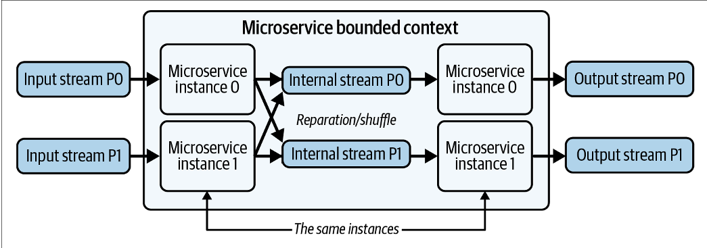

>Figure 13-2. Internal event streams for repartitioning and shuffling data  

The streams are hosted by the same event broker, including the internal streams.
The microservice instances both write to and read from the internal stream for
repartitioning and shuffling the events. Each repartition stage uses its own dedicated
internal stream.  

> [!WARNING]
> Internal streams are private and are not used by any other microservice. Do not couple microservices together on internal streams.  

Relying on internal event streams for event shuffling enables the lightweight application to scale dynamically since any in-flight events are durably retained to the event broker. The biggest trade-off is an increase in latency, which is unavoidable as there aren't any other event shuffle options. Kafka Streams, for example, is bound entirely to Apache Kafka.  

## Handling State and Using Changelogs  

In-memory and disk-based key-value stores are the most common form of state store for the lightweight framework, particularly since the entire domain-specific language (DSL) of lightweight frameworks is based on manipulating and storing keys and values. Lightweight frameworks, by default, use internal state stores backed by changelog streams stored in the event broker (see more in "Materializing State to an Internal State Store" on page 176).  

> [!TIP]
> Since every lightweight application is fully independent of the others, one application could request to run on instances with very high-performance local disk, while another could request to run on instances with extremely large, albeit perhaps much slower, hard-disk drives.  

You can extend your lightweight frameworks to plug in different storage modes, provided you implement the appropriate storage interface (for example, **Kafka Streams StateStore Interface**). Implementing your own state store allows you to use external state stores and alternative storage and querying models. Instead of using an internal key-value store, for example, you could choose to use Amazon's DynamoDB as the backing state store instead.  

## Scaling and Recovering from Failures  

Scaling a microservice and recovering from an instance failure are very similar processes and require very similar steps. Adding an application instance, due to intentional scaling of a long-running process or due to a failed instance recovering, requires partition assignment and corresponding state assignment. Similarly, removing an instance, deliberately or due to failure, requires reassigning the partitions and state to another live instance to continue processing uninterrupted.  

One of the main benefits of the lightweight framework model is that applications can scale dynamically. There is no need to restart an application just to change parallelism, though there may be a delay in processing due to consumer group rebalancing and rematerialization of state from the changelog. Figure 13-3 illustrates the process of scaling up an application. The assigned input partitions are rebalanced (including any internal streams) and the state is restored from the changelogs prior to continuation of work.  

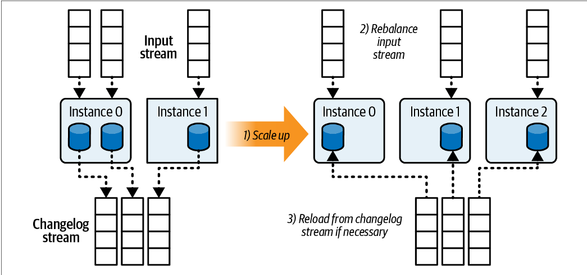

>Figure 13-3. Scaling up a lightweight microservice  

## State Assignment  

An instance with new internal state assignments must load the data from the changelog before processing any new events, similar to how checkpoints are loaded from durable storage in heavyweight solutions. The operator state (the mappings of <partitionId, offset>) for all event-stream partitions, both input and internal, is stored within the consumer group for the individual application. The keyed state (pairs of <key, state>) is stored within the changelog for each state store in the application.  

When reloading from a changelog, the application instance must prioritize consumption and loading of all internal stateful data prior to processing any new events. This is the state restoration phase, and any processing of events before state is fully restored risks creating nondeterministic results. Once state has been fully restored for each state store within the application topology, consumption of both input and internal streams may be safely resumed.  

### State Replication and Hot Replicas  

A hot replica, as introduced in "Using hot replicas" on page 181, is a copy of a state store materialized off of the changelog. It provides a standby fallback for when the primary instance serving that data fails, but can also be used to gracefully scale down stateful applications. When an instance is terminated and a consumer group is rebalanced, partitions can be assigned to leverage the hot replica's state and continue processing without interruption. Hot replicas allow you to maintain high availability during scaling and failures, but they do come at the cost of additional disk and processor usage.  

Similarly, you can use hot replicas to seamlessly scale up the instance count without processing pauses due to state rematerialization on the new node. One of the current issues facing lightweight frameworks is that scaling up an instance typically follows the current workflow:  

1. Start a new instance.  

2. Join the consumer group and rebalance partition ownership.  

3. Pause while state is materialized from the changelog (this can take some time).  

4. Resume processing.  

One option is to populate a replica of the state on the new instance, wait until it's caught up to the head of the changelog, and then rebalance to assign it ownership of the input partitions. This mode reduces outages due to materializing the changelog streams and requires extra bandwidth from only the event broker to do so. This functionality is currently under development for Kafka Streams.  

## Summary  

This chapter introduced lightweight stream-processing frameworks, including their major benefits and trade-offs. Lightweight frameworks do not require their own independent resource cluster, but instead rely on the event broker and the CMS to provide the necessary scaling, shuffling, and data durability functionality.  

Kafka Streams is a highly scalable processing framework that relies extensively on integration with the event broker to perform large-scale data processing. It remains the single most popular lightweight framework still in use today. In contrast, Apache Samza used to be an alternative option, but its popularity, usage, and project activity has dwindled since the first edition of this book was released.  

In the next chapter, we’ll take a look at going even further up the abstraction layer by writing microservices using streaming SQL.  

# Streaming SQL

Streaming SQL is a declarative mechanism for building microservice-like queries. It's a handy way to reduce the overhead on getting started with stream processing, and is accessible to those of you who are familiar with plain old SQL. You tell the SQL API what you want the outcome to look like, and it does all the work to implement it using the underlying engine.  

Streaming SQL is most commonly implemented as a layer on top of a full-featured streaming framework, as introduced in "The Streaming SQL Query" on page 55. As examples, both Apache Flink and Apache Spark provide their own streaming SQL layers on top of their lower-level APIs. Flink provides Flink SQL, and Apache Spark provides Spark SQL (in conjunction with its structured streaming product). While there are other projects available out there that offer SQL APIs on top of streaming frameworks, this chapter focuses solely on these two open source Apache projects.  

That being said, the principles of the streaming SQL remain largely the same regardless of the engine or framework you choose. The syntax and some of the lower-level details may differ, but the general idea remains the same: a SQL-syntax stream-processing API that lets you avoid the deeper abstraction layers of the streaming framework.  

It's important to point out that there is no definitive streaming SQL standard at the moment (ANSI or otherwise). It's a bit of a wild west, with different frameworks offering differing syntaxes and semantics from one another. When we talk of streaming SQL then, it's important to note that we're talking about dialects in general—the syntax of one framework won't necessarily match the syntax of the other. But they're also not going to be that wildly different, and there's plenty of supporting documentation to help clear things up if you get stuck.  

## The Basics of the Continuous Query  

SQL is most commonly associated with table-based operations, and for good reason. SQL databases have been around for decades, and you're likely to have written your first SQL queries against a table in a relational database. Streaming SQL is simply a repurposing for use with event streams, with streams-as-tables forming the basic data abstraction.  

Figure 14-1 shows an example of a streaming SQL query, where all events with a value less than or equal to 5 are filtered out. The remaining events are returned by the SQL query into the next stage, which can include either another SQL query, a table materialization, or even writing out to another event stream.  

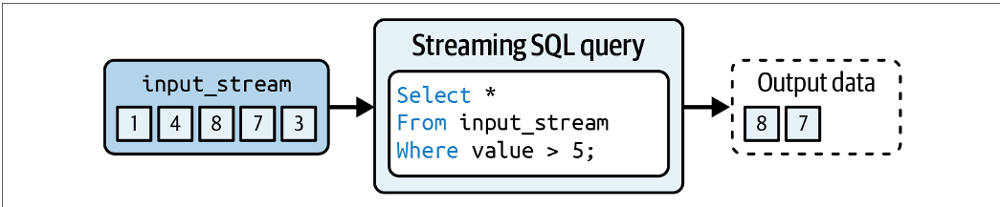

>Figure 14-1. A simple SQL query filtering out events with a value less than or equal to 5  

Streaming SQL queries run indefinitely on the stream of data, applying the query logic to each event as it's received. In contrast, a query on a conventional relational database operates on the data that was present at the time it was executed. While a streaming query runs indefinitely, a conventional query will terminate once it has iterated across its bounded data set.  

Streaming SQL is, however, quite similar to conventional queries in that they both operate on *tables*. While Figure 14-1 shows a valid SQL query, it omitted the necessary step of declaring a table on top of the stream.  

## Turning Streams into Tables for Streaming SQL Queries  

The first step in working with streaming SQL is to turn your stream into a table. You create the tables by *declaring* a definition of the table on top of the streaming data, which you can then write your queries against.  

You can expect to see three types of tables in a streaming SQL framework:  

### Upsert tables  

These require a primary key. Each event is an upsert or a delete such that a new record of the same key overwrites an old record of the same key. Upsert tables are identical to a materialized table as described in "Materializing State from Entity Events" on page 36.  

### Append-only tables  

These do not require a primary key. Append-only tables insert every record, maintaining a complete history of all previous data. All records are immutable and cannot be deleted, which makes an append-only table very much like the append-only log backing the event stream itself.  

### Retraction tables  

A slightly more advanced type that does not necessarily appear in all streaming frameworks. A retraction table supports inserts, updates, and deletions, but with the entire row acting as a key. For example, you insert a row into the table via a +I["Gary", 123] event, but remove it using a +D["Gary", 123] event. Retraction tables primarily reflect the results of upstream computations, such as when emitting events from a Flink dynamic table.  

> [!WARNING]
> Check your documentation to ensure your streaming SQL framework supports both append-only and upsert tables, at the least. Some frameworks are limited to only supporting append-only tables, which will significantly limit your processing options.  

Upsert and append-only table types are commonly supported by most streaming
frameworks. Most tables declared from event streams will either be upsert or append-
only, and will form the basis for your streaming SQL queries.  

Let's take a look at an enrichment example using Apache Flink SQL.  

### Example: Enriching Data Using Flink SQL  

First, declare a table over top of the event stream. For example, here is a Flink SQL declaration of a TABLE from a Kafka topic named Photographs:  

CREATE TABLE Photographs (
    id BIGINT PRIMARY KEY NOT ENFORCED,
    photographer_id BIGINT NOT NULL,
    camera_id BIGINT NOT NULL,
    photo_url STRING NOT NULL,
    height INT,
    width INT
) WITH (
    'connector' = 'upsert-kafka',
    'topic' = 'Photographs',
    'key.format' = 'raw',
    'value.format' = 'json',
    'properties.bootstrap.servers' = 'broker.url:9092',
    'properties.group.id' = 'Photographs_group_id'
);  

The streaming framework that underpins the SQL interface interprets this table declaration. It first creates a Photographs table by registering the table declaration metadata into a *metadata catalog*, allowing other streaming SQL engines to also query the data. The table uses the **upsert-kafka connector for Flink** to generate the materialized table, where new events are upserted into the table (any old values of the same key are overwritten).  

> [!TIP]
> The primary key in the Photographs table is set to NOT ENFORCED because it does not own the data. The enforcement of the key is the responsibility of the producer service that is writing to the Photographs topic.  

Metadata catalog compatibility may vary from streaming SQL engine to streaming SQL engine. Flink provides support for several catalog types, including both JDBC-based and Apache Hive, a common catalog implementation. Meanwhile, Apache Spark provides both in-memory (local) catalog and Hive support. If you're running streaming SQL jobs in production, you're likely to need either Hive or a Hive-compatible catalog for maintaining durable metadata, to allow your queries to see all available tables.  

> [!NOTE]
> Hive is a relatively older service provided as part of the Apache
> Hadoop project. While you may not end up using Hive in your
> microservice platform, you'll likely use a data catalog implementing
> the *Hive API*, which has proven to be a very useful standard interface
> for metadata catalogs.  

Back to the example. Create another table to represent the photographers who took the photographs:  

CREATE TABLE Photographers (
    kafka_key_id BIGINT PRIMARY KEY NOT ENFORCED,
    first_name STRING,
    last_name STRING,
    signup_date TIMESTAMP WITH TIME ZONE
) WITH (
    'connector' = 'upsert-kafka',
    'topic' = 'Photographers',
    'properties.bootstrap.servers' = 'broker.url:9092',
    'properties.group.id' = 'Photographers_group_id',
    'key.format' = 'raw',
    'key.fields' = 'kafka_key_id',
    -- Schema registry URL for deserializing the Avro value
    'value.avro-confluent.url' = 'http://schema.registry.url:8082',
'value.format' = 'avro-confluent',
    'value.fields-include' = 'EXCEPT_KEY',
);  

You may have noticed some differences from the Photographs table. This table uses the avro-confluent value format instead of a plain old JSON value, and specifies the URL for the Confluent Kafka schema registry (as covered in "The Role of the Schema Registry" on page 90). In short, the Flink table job automatically deserializes the Avro data from the Kafka topic using schema information from the schema registry, converting it into plain old Java objects for Flink to process.  

The next step creates an Enriched_Photos table to store photograph data joined with the photographer's information:  

CREATE TABLE Enriched_Photographs (
    id BIGINT PRIMARY KEY NOT ENFORCED,
    photographer_id BIGINT NOT NULL,
    camera_id BIGINT NOT NULL,
    photo_url STRING NOT NULL,
    height INT,
    width INT,
    first_name STRING,
    last_name STRING
) WITH (
    -- Omitting some of the table details for brevity.
    'connector' = 'upsert-kafka',
    'topic' = 'Enriched_Photographs',
);  

Finally, join the photographs with their respective photographers by using an INNER
JOIN on the photographer_id foreign key:  

INSERT INTO Enriched_Photographs
SELECT pics.id,
pics.photographer_id,
pics.camera_id,
pics.photo_url,
pics.height,
pics.width,
people.first_name,
people.last_name,
FROM Photographs as pics
INNER JOIN Photographers as people
WHERE pics.photographer_id = people.kafka_key_id;  

The joined results are combined into a single row per photograph, and emitted to the Enriched_Photos topic. Note that the photograph and photographer information is retained indefinitely within the Flink job, mirroring the key-space of the source topics. Any tombstones issued on either source topic will cause deletion of the corresponding photographs, which will also propagate through to the Enriched_Photos.  

While SQL tasks are relatively easy enough to write, this chapter hasn't yet covered anything on how the code itself is actually executed. Let's take a look at that now.  

## Executing Streaming SQL Code  

There several ways to execute your streaming SQL code.  

### Executing SQL Code from the Command-Line Interface  

The command-line interface (CLI) is one option for executing your code, as provided by both Flink SQL and Spark SQL. The most common use of the CLI is for testing and local development work, though you could plug it into the production clusters (security issues notwithstanding).  

Executing Flink's ./bin/sql-client.sh or Spark's ./bin/spark-sql brings up a
command-line prompt for you to write (or copy and paste) your SQL code. If you
wanted to find my information, you would write something like this:  

flink-2.0.0 ./bin/sql-client.sh
Flink SQL>
> SELECT *
> FROM Photographers
> WHERE first_name = "Adam"
> AND last_name = "Bellemare";  

Executing a streaming SQL query, the CLI requires that it remain running indefinitely. If you terminate the CLI, you terminate the job, though you could of course run it in a container like any other microservice. However, you may want to look at the next modes for better production options.  

## Executing SQL Code from Within the Application  

You can also embed the SQL query code right into the native application code. For example, if you were to declare and query the Photographs Flink table through a Java application, the main function would contain code that looks like the following:  

python
// Create the Flink table environment
TableEnvironment tableEnv = TableEnvironment.create(...);
// Specify the external Hive catalog and choose the database
tableEnv.useCatalog("hive_ext");
tableEnv.useDatabase("photo_db");

// Create the Photographs table using SQL DDL
// The table metadata is written into the Hive catalog
tableEnv.executeSql(
    "CREATE TABLE Photographs (id BIGINT ...) WITH (...)");
// Query the Photographs table using SQL DDL tableEnv.executeSql(
    "SELECT * from Photographs where first_name = "Alice");  

Indeed, you are limited to the languages supported by the framework (Java, Python, etc.). The benefit is that you can still get away with far less coding in it by programming most of the business logic with embedded SQL queries. A templated code generator can create all the overhead boilerplate and dependency inclusions, so that you can spend your efforts primarily on writing the SQL code.  

Embedding SQL in the application dovetails well with microservice deployment pipelines, including testing and operational needs like scaling and monitoring.  

## Executing SQL Code from a Notebook  

A notebook is an interactive browser-based device that allows you to combine executable code, rich text, equations, visualizations, and other components. Data analysts, data scientists, and data engineers have historically been the primary users of notebooks, particularly in the analytics domain. Many of the original notebook use cases centered around data exploration and transformations, though deployment of notebooks into production data pipelines soon followed.  

Examples of popular free open source notebook frameworks for writing streaming
code include Apache Zeppelin and Jupyter.  

Notebooks have proven to be extremely popular for exploring data, building data transformations, and executing code without having to build an actual application. There are several core benefits to notebooks:  

### Interactive development  

Users can write, execute, and modify code in small chunks (called cells) and see the results immediately. This is particularly useful for data exploration and visualization.  

### Visualizations and documentation  

Users can combine code with narrative text (using Markdown), equations (using LaTeX), and visualizations. This makes it easier to document the logic and process of data analysis or computational research.  

### Container-like isolation  

You can include code, environment details, and even hardcoded data to allow
your notebook to run in other deployments and environments.  

### Multilanguage support  

Notebook frameworks can support multiple languages, including Python, Java,
Scala, and R.  

### Shareable  

You can download and share notebooks just like any other file.  

> [!TIP]
> Notebooks are not just for SQL. You can write many types of event-driven microservices inside a notebook using non-SQL languages.  

Interpreters provide interoperability between the notebook and the underlying processing engine; for example, the Apache Zeppelin interpreter for Flink. Depending on your framework, you may need to install interpreters separately, or they may be integrated into the notebook engine itself.  

There are also some drawbacks to using notebooks:  

#### Version control complexity  

Notebooks can be difficult to integrate with version control systems like Git due to large file sizes and binary data. However, many provide plug-ins to improve the experience, such as Jupyter's nbdim or Jupyter.  

#### Performance limitations  

For large-scale data processing tasks, notebooks might not be the most efficient solution. They may struggle to provide the necessary scale for your event-driven microservice.  

#### Testing limitations  

Notebooks are not well suited for unit and integration testing. For business-critical applications, you should extract the logic into a dedicated microservice project complete with its own unit and integration testing frameworks.  

#### Promotion limitations  

It can be challenging to promote and roll back notebooks between environments,
as well as manage the associated permissions.  

> [!WARNING]
> Notebooks are best used for exploration and analysis. For production use cases, create a dedicated microservice and port over the notebook code.  

There are also some notebook-like options with stripped down functionality, which are generally limited to hosted solutions. The code is still embedded into a notebook-like UI, but you cannot download the notebook and are generally limited to just a single language. These notebook-like solutions are primarily to act as a graphic user interface for submitting code to a SQL gateway, as covered in the next section.  

## Executing SQL Code Via a Gateway  

A SQL gateway is a service that enables multiple clients to execute their SQL code concurrently and remotely. The client submits the job to the gateway, where it is then executed within its own session. Multiple independent sessions can run within the service, relying on the processing cluster for executing the streaming operations. Figure 14-2 shows two clients connecting to the gateway, one to submit a job and the other to get the status of an existing job.  

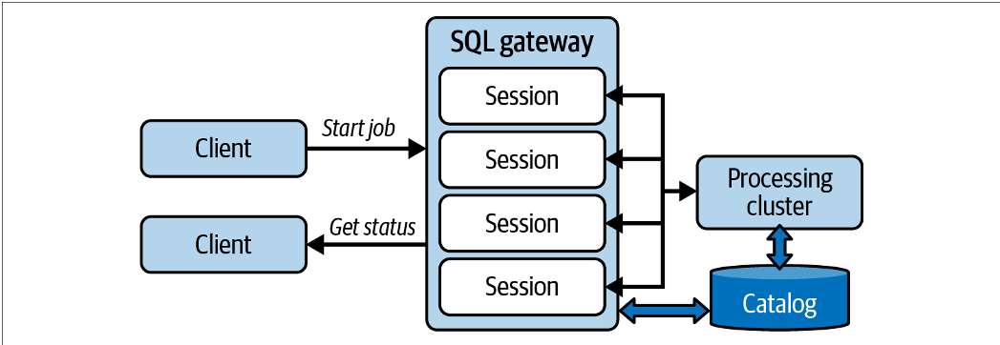

>Figure 14-2. A SQL gateway for submitting, running, and evaluating jobs  

Spark distributed SQL engine and Flink's SQL gateway are two examples of this option.  

The main benefit of using a gateway is that you can cut out the overhead of creating an application for building your service. In fact, you can even use the CLI to submit the jobs directly to the gateway. Ideal candidates for gateway submission include simple SQL queries that won't change over time, such as joiner services for denormalizing relational data.  

### SQL as a Sidecar  

SQL can also provide powerful sidecar capabilities (see "Integration with Existing Systems Using the Sidecar Pattern" on page 248) to do work that may otherwise be too difficult to do in your microservice. For instance, many basic producer/consumer frameworks lack the ability to do joins and other complex aggregations. SQL can easily fill that gap.  

Figure 14-3 shows an example of a hybrid application, where a dedicated SQL query materializes and joins the streams together. The Enriched_Photos topic created earlier in this project is joined with a Cameras topic to bring in information relating to the camera used to take the photograph. This combined event is then written to a new topic for dedicated usage by the downstream microservice.  

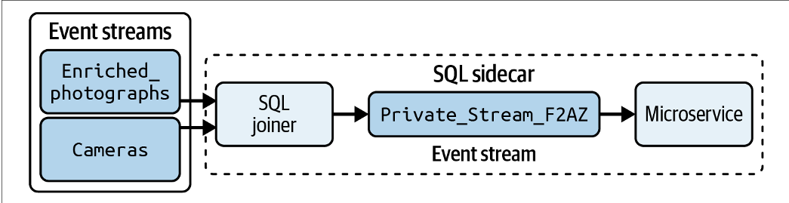

>Figure 14-3. A SQL sidecar for performing operations that may not be possible for the microservice's framework  

Notice that the output event stream is named Private_Stream_F2AZ—a private placeholder name. This is an example of a stream that is purpose-built explicitly for usage by that downstream microservice. The SQL joiner and the microservice are both within the single bounded context, and that stream, joiner, and service's internal boundary remains private to the outside world.  

A SQL sidecar can give you the best of both worlds, allowing you to use whatever libraries, languages, and frameworks that are compatible with basic event consumption and production, while harnessing powerful stream-processing frameworks. Joins, windowing, aggregations, and complex event-driven state machines are offloaded to the SQL engine, while the remaining business logic can reside inside the microservice.  

> [!WARNING]
> When terminating the microservice, ensure that the SQL job is also terminated so that no zombie processes remain. It is important to keep the SQL query and microservice components tightly coupled throughout their life cycle.  

## User-Defined Function Calls  

Streaming SQL frameworks also allow you to make user-defined function (UDF) calls inline with your SQL code. A UDF is a custom function that provides an operation that isn't easily accomplished in SQL syntax, written in the native language of the underlying SQL framework. UDFs are supported by both Flink and Spark. Consider an example of a simple Flink UDF that appends _modified to a string value:  

import org.apache.flink.table.functions.ScalarFunction;

public class AppendModifiedUDF extends ScalarFunction {
    public String eval(String input) {
        if (input == null) {
            return null;
        }
        // Append '_modified' to the input string
        return input + "_modified";
    }
}  

This Flink code illustrates a scalar UDF, where one record in results in one record out. There are three main types of UDFs, primarily divided by the relationship between records in and records out:  

• Input one record and return one record as the result.  

• Input multiple records and return one aggregated record as the result.  

• Input one record and return multiple records as the result.  

You can use UDFs to not only modify values, but build aggregations and calculate complex state machines based on record data. You can also use UDFs to make calls to external systems, allowing you to integrate with third-party services and things like GenAI models.  

### Summary  

Streaming SQL simplifies the building of microservice-like queries through a declarative mechanism familiar to those proficient in traditional SQL. By specifying the desired outcome, the SQL API undertakes the implementation using the underlying streaming engine, making stream processing more accessible and reducing the initial overhead. Both Apache Flink and Apache Spark offer streaming SQL capabilities on top of their lower-level APIs, serving as prominent examples of how streaming frameworks incorporate a SQL API to enable broader uptake.  

The fundamental concept of streaming SQL revolves around treating streams as tables, where a continuous query runs indefinitely, applying logic to each incoming event. The transition from streams to tables is a critical step in streaming SQL, enabling familiar SQL operations on dynamically updating data. This approach supports various table types, including upsert and append-only tables, which cater to different data processing needs and constraints within a streaming context.  

Streaming SQL code execution include command-line interfaces, embedded SQL
in applications, interactive notebooks, and submitting jobs to a SQL gateway. Each
method has its own set of advantages, catering to different stages of development,
from testing and local development to production deployments. Moreover, streaming SQL frameworks facilitate user-defined functions (UDFs), allowing custom logic beyond built-in SQL capabilities. This flexibility further bridges the gap between the straightforwardness of SQL and the complexity of stream processing, making it a powerful tool for building queries as part of an event-driven architecture.  

While streaming SQL is commonly provided as part of a serverless framework, it’s not the only serverless option in town. In the next chapter, we’ll take a look at functions as a service and how they fit into the event-driven microservice world.  

# Microservices Using Functions as a Service

Functions as a service (FaaS) are yet another way to build microservices. They're a serverless solution for building, managing, and deploying applications via function building blocks, and provide significant value as a means of implementing relatively simple to modestly complex event-driven solutions.  

A function is a piece of code that is executed when a specific triggering condition occurs. The function starts up, runs until completion, and then terminates. Scaling, state, and monitoring are typically provided by the FaaS framework, as is the requisitioning and releasing of compute resources. FaaS solutions can easily scale the number of function executions up and down depending on load, providing close tracking for highly variable loads.  

It may be helpful to think of a FaaS solution as a basic consumer/producer implementation, but one that regularly and predictably stops after a predetermined amount of time. In many ways a FaaS solution is like a microservice that crashes every few minutes, but that stores its data in an external data store and can simply pick back up where it left off when it restarts.  

## Why Would I Use Functions as a Service?  

FaaS solutions eliminate the overhead of creating and managing a microservice, *provided* you already have the FaaS framework set up and running. The biggest benefit of FaaS is the serverless aspect: you write the function code, specify when it should trigger, and deploy it. The FaaS framework takes care of the rest.  

Common use cases for FaaS may include:  

Simple reactions to events  

For example, loading data into a database or triggering an email to a customer.  

Executing sequential steps of a workflow  

For example, receive an image via an event, generate an AI assessment, and select a subset of results to validate with a human in the loop. Each step is its own function and provides the results to the next step in the chain.  

Processing large amounts of data in parallel  

For example, ingesting a large product listing file from an FTP and splitting it up into individual events to write to an event stream.  

Simple transformations and validations  

For example, masking fields to comply with PII requirements and validating data structure.  

Routing data based on contents  

For example, to multiple services, brokers, or data stores.  

FaaS architectures work great for solutions that can leverage the on-demand, flexible nature of processing resource provisioning. Simple topologies are a great candidate, as are those that are stateless, those that do not require deterministic processing of multiple event streams, and those that scale very wide, such as queue-based processing. Anything with a highly variable volume can benefit from FaaS solutions, as their horizontal scaling capabilities and on-demand characteristics allow for rapid provisioning and release of compute resources.  

FaaS solutions may comprise many different functions, with the sum of their operations constituting the solution to the business bounded context. They also perform very well when you are not concerned with concurrency and determinism. However, once determinism comes into play, you must take great care to ensure correctness and consistency in the event-stream processing. Much like the basic consumer solutions (see Chapter 11), FaaS solutions require an event scheduler to ensure consistent processing results, much like the full-featured lightweight and heavyweight frameworks.  

You have many ways to create function-based solutions, far more than this chapter can cover. But there are a few general principles that can help guide you through the process. So without further ado, it's time to look at how you'd go about building a microservice implemented with functions.  

### Building Microservices with Functions  

There are four main components you must consider when working with function-based solutions, regardless of your FaaS framework or event broker:  

• The function  

• Input event stream  

• Triggering logic  

• Error and scaling policies, with metadata  

The first component of a FaaS implementation is the function itself. It can be implemented in any code supported by the FaaS framework:  

public int myFunction(Event[] events, Context context) {
    println("hello world");
    return 0;
}  

The events parameter contains the array of individual events to be processed, with each event containing a key, value, timestamp, offset, and partition_id. The context parameter contains information about the function and its context, such as its name, the event-stream ID, and the function's remaining lifespan.  

Next, you need to wire up some triggering logic for the function, which will be covered in greater detail in "Starting Functions with Triggers" on page 302. For now, say that the function triggers whenever a new event arrives in one of its subscribed event streams. The triggering logic is often associated with a function by way of a *function-trigger map*, which is usually concealed behind the scenes of your FaaS framework. Here is an example:  

| Function|Event stream(s)|Trigger|Policies and metadata|
| ---|---|---|---|
| myFunction|myInputStream|onNewEvent|< ...   >|
| otherFunction|anotherStream|onNewEvent|< ...   >|
| yetAnotherFunction|fooStream,barStream|onNewEvent|< ...   >|  

You can create multiple mappings from event streams to functions, such that a function can consume events from many different streams (as in the case of yetAnotherFunction). You can see that myFunction is set to trigger when a new event is delivered to myInputStream. You'll also notice that there is a column named "Policies and metadata," which is a bit of a catch-all that includes configurations such as the following:  

• Consumer group  

• Consumer properties, such as batch size and batch window  

• Retry and error-handling policies  

• Scaling policies  

Once the triggers, metadata, and policies are established, the function is ready to process incoming events. When a new event arrives in its input event stream, the function will be started by the FaaS framework, get passed a batch of events, and begin processing. Upon completion, the function will terminate and wait for more events to come in. This is a typical implementation of the event-stream listener pattern, which is discussed more in “Starting Functions with Triggers” on page 302.  

> [!TIP]
> Each function-based microservice implementation must have its own independent consumer group, just as with other non-FaaS microservices.  

Keep in mind that this is just a logical representation of the components needed to successfully trigger and operate a function. A FaaS framework’s function coding requirements, function management, and triggering mechanisms vary by provider and implementation.  

There is also a moderately complex interplay between triggering mechanisms, event consumption, consumer offsets, nested functions, failures, and at-least-once event processing. These are the subject of the remainder of this chapter.  

#### Cold Starts and Warm Starts  

A cold start is the default state of the function upon starting for the first time, or after a sufficient period of inactivity. The framework must load the code, start the function, and establish connections with the event broker and any other external resources. The function is said to be in a warm state once these tasks are complete and it is ready to process events.  

A warm start is when the function is resumed from hibernation with connections already established. It can immediately begin processing the next events from the event stream, without having to re-establish connections to the event broker or other external resources.  

Most FaaS frameworks attempt to reuse terminated functions whenever possible. In many scenarios, a function processing a steady stream of events will hit the timeout expiry and be briefly terminated, just to be brought back a moment later by a triggering mechanism. The suspended instance is simply reused, and if the
connections to the event broker and any state stores haven't expired during the
interim, processing can resume immediately.  

### Termination and Shutdown  

A function is terminated once it has completed its work or it reaches the end of its allocated lifespan, generally in the range of 5–10 minutes. The function instance is suspended and enters a state of hibernation, where it may be immediately revived. The suspended function may also eventually be evicted from the hibernation cache due to resource or time constraints.  

You must decide how to handle any open connections and resource assignments made to a function prior to its termination. In the case of a consumer client, the function instance may be assigned specific event-stream partitions. Terminating the function instance without revoking partition assignments may result in processing delays, as partition ownership won't be reassigned until a timeout is reached. Events from those partitions won't be processed until a consumer group rebalance occurs or the function comes back online (warm start) and resumes processing.  

If your function is almost always online and processing events, closing connections and rebalancing the consumer group may not be necessary. The function will likely only be momentarily suspended at the end of its lifespan, go briefly into hibernation, and be restored to runtime immediately. Conversely, for a consumer function that runs only intermittently, it is best to close down all connections and relinquish partition assignments.  

When in doubt, cleaning up connections is generally a good idea; it lightens the load on external data stores and on the event broker and reduces the chances that suspended functions are laying claim to partition ownership.  

### Choosing a FaaS Provider  

Just like the event brokers and container management systems (CMSs), FaaS frameworks are available as both free-to-use open source solutions and paid third-party cloud providers. An organization that runs its own in-house CMS for its microservice operations can also benefit from using an in-house FaaS solution.  

Cloud service providers (CSPs) such as Amazon Web Services (AWS), Google Cloud Platform (GCP), and Microsoft Azure provide their own proprietary FaaS frameworks. For many developers, one of these cloud providers tends to be their first (and only) choice simply because they're already using that cloud provider's services. There tends to be deep integrations between the FaaS solution and the other cloud services offered by the CSP, and legal hurdles related to software execution and data storage have already been cleared. These benefits have proven to be major factors in the dominance of the CSPs in the FaaS space, in contrast to the slower growth and halting of projects in the open source environment.  

The first edition of this book (2020) mentioned OpenWhisk, OpenFaaS, and Kubeless as possible open source alternatives. While the two former options are still available, they haven't supplanted any of the CSP's major FaaS offerings as the de facto service of choice. Kubeless, however, is no longer actively maintained as a project and is now available only as an archive.  

Another significant change since the first edition of this book is that the CSP FaaS solutions are now more deeply integrated with open source event brokers like Apache Kafka. Previously, CSP FaaS solutions typically required that you use their proprietary event broker to trigger FaaS functions. For example, Google Functions required Google PubSub triggers, AWS required Kinesis triggers, and Azure Functions required Event Hubs.  

Extending the CSP FaaS platforms to support third-party event brokers is a significant improvement to the FaaS experience. You're no longer forced to deal with the mandatory maximum time-based retention of some CSP event brokers, which currently stand at:  

• AWS Kinesis retention is limited to 365 days.  

• Azure Event Hubs retention is limited to 7–90 days.  

• Google PubSub retention is limited to 31 days.  

The biggest benefit is that you no longer need to use a connector framework just to trigger functions from a third-party broker. The result is lower overhead, lower latency, fewer moving parts for you to manage, and reduced costs.  

Let's turn now to look at what kinds of triggers are available, and the life cycles of the
functions that they start up.  

### Starting Functions with Triggers  

Triggers tell a function to start up and begin processing. Supported triggers vary depending on your FaaS framework, but tend to all fall into broadly the same categories—for example, a trigger that observes new events in the event stream, a lagging consumer group, a timeout, or custom triggers based on notifications. Let's take a look at the most common signals used for kicking off functions in more detail.  

### Triggering Based on New Events: The Event-Stream Listener  

Functions can be triggered when an event is produced into an event stream. The *event-stream listener trigger* isolates event consumption behind a predefined consumer, reducing the amount of overhead code that a developer must write. Events are injected directly into the function as an array of events if consuming from a stream, or as a cluster of unordered events if consuming from a queue. The generalized structure of this approach is shown in Figure 15-1.  

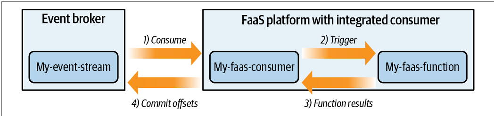

>Figure 15-1. Integrated event-stream listener with FaaS framework  

FaaS frameworks from Google, Microsoft, and Amazon provide this type of trigger for usage with their proprietary event brokers. However, they may, or may not, support triggering directly from other open source brokers, such as Kafka, Pulsar, Warpstream, or NATS.  

Connector frameworks, like that of Kafka Connect, can provide you with the means to trigger functions if the FaaS framework doesn't natively support it. Since Kafka Connect runs outside of the FaaS framework, you would end up with an event-stream listener as per Figure 15-2.  

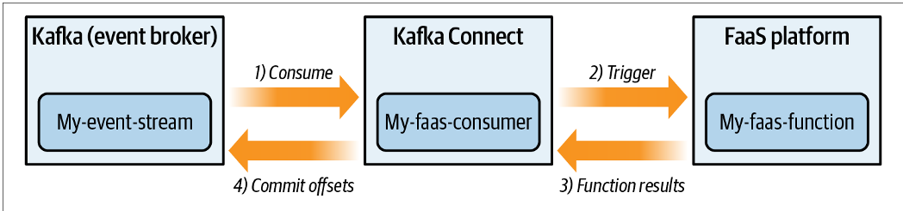

>Figure 15-2. External event-stream listener application with Kafka Connect  

Though not shown in the previous examples, functions can output their own events to event streams. You can not only output the useful business results of the function, but you can also emit logging and error data for the function to its own stream, to aid in tracking and monitoring.  

Synchronous triggers require the function to complete before they issue the next events. This is particularly important for maintaining the event-stream processing order, and is limited by the partition count of the input event stream. Conversely, asynchronous triggering can issue multiple events to multiple functions, each one
reporting back as it is completed. This will *not* maintain the processing order, how-
ever, and should be used only when processing order is not important to the business
logic.  

Batch size and batch window are two important properties to consider in stream-listener triggers. The batch size dictates the maximum number of events to dispatch for processing, while the batch window indicates the maximum amount of time to wait for additional events, instead of triggering the function immediately. Both of these parameters are used to ensure that the overhead of starting the function is spread among the batch of records to reduce costs.  

A function executed by a stream-listener trigger looks something like the following:  

```java
public int myEventFunction(Event[] events, Context context) {
    for(Event event: events)
        try {
            println (event.key + ", " + event.value);
        } catch (Exception e) {
            println ("error printing " + event.toString);
        }
    // Indicates to the Faas framework that batch processing was completed
    context.success();
    return 0;
}

```  

> [!TIP]
> Much like a containerized microservice, triggers for the event-stream listener pattern can be configured to start processing events from a stream's latest offsets, earliest offsets, or anywhere in between.  

## Triggering Based on Consumer Group Lag  

A consumer group's lag metric is another way to trigger functions. You can detect lag by periodically polling the offsets of an individual application's consumer groups and computing the delta between the current consumer offset and the head offset of the stream (see "Consumer Offset Lag Monitoring" on page 392 for more on lag monitoring). While similar to the stream listener trigger, lag monitoring can also be used for scaling non-FaaS microservices.  

Lag monitoring typically involves computing and reporting lag metrics to your monitoring framework of choice. The monitoring framework can then call the FaaS framework to tell it to start up the functions registered on the event stream. A high lag value can indicate that the autoscaler can start multiple function instances to more quickly process the load. Alternatively, a low lag value can indicate that the autoscaler can keep the function count steady, or even reduce it. You can tailor the relationship between lag quantity and function startup on a microservice-by-microservice basis,ensuring compliance with SLAs.  

Unlike the event-stream listener trigger, the consumer lag trigger only notifies the function framework that events are available in the stream. The triggered functionmust establish a connection to the event broker and consume the events directly,as they are not provided via the trigger itself. These functions have a much wider domain of responsibilities, including establishing a client connection with the event broker, consuming the events, and committing back any offset updates. This makes lag-triggered functions much more similar to basic producer/consumer clients(albeitwith a limited lifespan). The following example function illustrates this workflow:  

```java
public int myLagConsumerFunction(Context context){String consumerGroup= context.consumerGroup;String streamName= context.streamName;// Establish a connection to the brokerEventBrokerClient client= new EventBrokerClient(consumerGroup,...);// Poll for a batch of events to processEvent[] events= client.consumeBatch(streamName,...);for(Event event: events){// Process each event one at a timedoWork(event);}// Commit the offsets of the processed events back to the event brokerclient.commitOffsets();// Indicates to the FaaS framework that the function succeededcontext.success();// Return, letting the lag-triggering system know processing was a successreturn 0;}

```  

The consumer group and stream name are passed in as parameters in the context.The function creates the client, consumes and processes events, and then commits the offsets back to the event broker. The function indicates a success result back to the FaaS framework and then returns. While there is far more overhead involved within the function itself, you do not need to rely on native integrations between the FaaSframework and your chosen event broker.  

Another benefit is that if the function is frequently triggered by the lag monitor, there is a good chance that it will still be warm from the last iteration, minimizing the overhead of connecting to the event broker client. This, of course, depends on the timeouts used by the client and event broker configurations. For longer periods of inactivity, consumer group rebalancing and client cold starts will slightly reduce the amount of work that a function instance can process during its lifespan.  

## Triggering on a Schedule  

Functions can also be scheduled to start up periodically and at specific dates and times. The scheduled functions start up at the specified interval, poll the source event streams for new events, and process them as necessary. Just like any other function invocation, it will eventually age out and need to shut down. Schedule-based triggering isn't particularly common for asynchronous event-driven architectures, but nevertheless remains an option.  

The client code for a time-based trigger looks identical to that of the consumer group
lag trigger example.  

## Triggering Using Webhooks  

Functions can also be triggered by direct invocation, allowing custom integration
with monitoring frameworks, schedulers, and other third-party applications.  

#### Triggering on Resource Events  

You can also use changes to resources to trigger your functions—for example, creat-
ing, updating, or deleting a file in a filesystem, as well as making modifications to a
row in a data store. Since most of the events in the event-driven microservice domain
are propagated via event streams, this particular resource trigger isn't used that often.
It is, however, quite useful when you are integrating with external sources of data that
require an FTP or other file service to drop their files into.  

#### Scaling Your FaaS Solutions  

FaaS solutions provide exceptional capabilities for work parallelization, especially for queues and event streams where the order in which data is processed is not important. If the order of events is indeed important, the maximum level of parallelization is limited by the number of partitions in your event streams, just as it is for any other microservice implementation.  

Scaling policies are typically the domain of the FaaS framework, so check your framework documentation to see what options are offered. Typical options involve scaling based on consumer input lag, time of day, processing throughput, and performance characteristics.  

For functions that instantiate and manage their own event broker connections, beware the impact of rebalancing partition assignments when a consumer enters or leaves the consumer group. A consumer group can end up in a state of near-constant rebalancing if consumers frequently join and leave, preventing processing progress.  

In extreme circumstances, the consumer group may get stuck in a rebalancing dead-lock, where the functions spend their entire life cycle waiting for rebalancing. This problem can occur when you use many short-lived functions with small consumer
batch sizes, and is made worse by overly aggressive scaling policies. Instituting a
step-based scaling policy or using a hysteresis loop can provide sufficient scaling
responsiveness without excessive rebalancing.  

> [!WARNING]
> Be careful about thrashing triggers and scaling policy. Frequent rebalancing of partition assignments can be expensive for event brokers and result in low throughput.  

## Maintaining State  

Given the short lifespan of functions, most stateful FaaS-based solutions require an external stateful service. Part of the reason is that many FaaS providers want quick, highly scalable processing units independent of the data's location. Having functions that require local state from previous executions limits current execution to the nodes that have that state collocated. This greatly reduces the flexibility of FaaS providers, so they often enforce a "no local state" policy and require that everything stateful be stored external to the executors.  

Although previous local state *may* be available if a function restarts in a warm state, this is by no means guaranteed. Functions connect to external state stores exactly as any other client would—by creating a connection to the state store and using the corresponding API. Any state must be persisted and retrieved explicitly by the function.  

> [!TIP]
> Be sure to use strict access controls for your function's state stores,
> such that nothing outside of its bounded context is allowed access.  

Some FaaS frameworks have durable stateful function support, such as Microsoft Azure's Durable Functions. It abstracts away the explicit management of state and allows you to use local memory, which is automatically persisted to external state. The FaaS framework can suspend functions and bring them back to life without the developer needing to add code to explicitly store and retrieve state. Durable functions greatly simplify stateful workflows and provide the option to standardize state management across function implementations.  

FaaS frameworks will continue to grow and include new features. Simple management of state is a common need in function-based solutions, so keep a lookout for state handling improvements in the FaaS frameworks of your choice.  

## Functions Calling Other Functions  

Functions are often used to execute other functions and may also be used for both choreography and orchestration. Communication between functions can be facilitated asynchronously through events, via request-response calls, or by a combination of the two.  

### Asynchronous Event-Driven Communication Pattern  

One option is to connect functions via an event stream. One function writes its output to a stream, where other downstream functions trigger off of the new event production, spin up, and do their own work. A bounded context may be made up of many functions and many internal event streams, with varying triggering and scaling logic for each function definition. Each function processes its input streams at its own rate, consuming events, performing work, and producing output events and side effects accordingly. An example of this design is shown in Figure 15-3.  

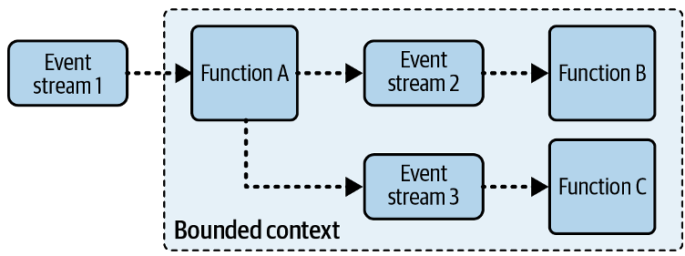

>Figure 15-3. Multifunction event-driven FaaS topology representing a single microservice  

In this example, function A triggers off of new events from event stream 1. In the course of its business work it decodes to write the output data to either event stream 2 or event stream 3. These are considered *internal event streams*, as they are within the bounded context of the FaaS-based microservice. Functions A, B, and C can share a consumer group, helping tie their identities together into a single logical microservice unit.  

There are several benefits of using an event-based communication pattern. Each function within the topology can manage its own consumer offsets, committing each offset once its work is done. No coordination between functions needs to occur outside the event-stream processing.  

While Figure 15-3 shows a choreography-based design pattern, orchestration remains a valid option at the expense of additional complexity. Any function failures will not result in data loss, as the event broker durably stores the events and the next function instances can simply reconsume and reprocess them.  

### Direct-Call Pattern  

In the direct-call pattern, a function directly calls other functions from its own code, just like a request-response microservice. Direct function invocations may be asynchronous, which is essentially a fire-and-forget approach, or synchronous, where the calling function awaits a return value.  

### Choreography and asynchronous function calling  

Asynchronous direct calls lead to a choreography-based FaaS solution. One function simply invokes the next one based on its business logic, leaving it up to that function and the FaaS framework to handle the next steps, including any failures or errors. An asynchronous direct-call function topology is a simple way to chain function calls together. Figure 15-4 illustrates an example.  

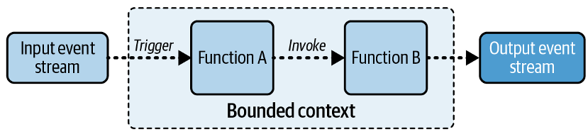

>Figure 15-4. Choreographed asynchronous function calls within a bounded context  

Function A invokes function B as it processes its batch of events, and once done, function A can simply update its consumer offsets and terminate. Meanwhile, function B continues its processing and produces any outputs to the output event stream.  

One major downside to asynchronous direct calls is in ensuring that the consumer offsets are updated only in the case of successful processing. In the example, function B has no feedback to function A, and so only errors in function A will prevent the workflow from incorrectly committing the consumer group offsets. However, losing events may not matter to some workflows, and in those cases this problem can be dismissed.  

Another potentially major issue is that events may be processed out of order due to
multiple invocations of function B. Consider the code for function A:  

```java
public int functionA(Event[] events, Context context) {
    for (Event event: events) {
        // Do function A's processing work
        doLocalWork(event);
        // Asynchronously invoke function B
        asyncfunctionB(event);
        // Does not wait for return value
    }
    context.success();
    return 0;
}

```  

Function B is called inline with the work from function A. Depending on your FaaS framework, this may result in multiple instances of function B, each running independently of the others. There will be a race condition where some later executions of function B will finish before earlier executions, leading to out-of-order event processing.  

Similarly, writing your code as follows will not solve ordering problems either. Processing will still happen out of order, as function A's processing work will be executed for all events in the batch prior to function B's execution:  

java
public int functionA(Event[] events, Context context) {
    for(Event event: events) {
        // Do function A's processing per event
        doLocalWork(event);
    }
    // Invoke function B asynchronously with full batch of events
    asyncFunctionB(events);

    context.success();
    return 0;
}  

In-order processing requires strict execution of function A before function B, for each event, before processing the next event. An event must be completely processed before the next one can be started; otherwise, nondeterministic behavior will likely result. This is particularly true if functions A and B are acting on the same external data store, as function B may rely on data written by function A.  

In many cases, asynchronous calls are not sufficient for the needs of the bounded
context. In these cases, consider whether orchestrated synchronous calls are more
suitable.  

## Orchestration and synchronous function calls  

Synchronous function calls allow your function to invoke other functions and await the results before proceeding with the remaining business logic. This option allows for the implementation of the orchestration pattern, as covered in Chapter 10.  

In the following example, new events arriving in an event stream trigger an orchestration function. The function starts up and begins processing the input batch of events, dispatching events sequentially for each function. Figure 15-5 shows an example of function-based orchestration within a single bounded context, with the orchestrator communicating first with function A and then with function B.  

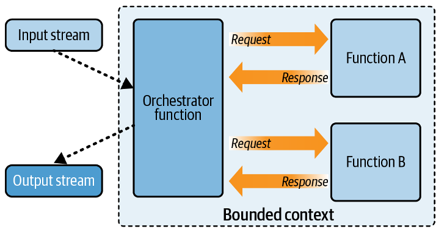

>Figure 15-5. Orchestrated synchronous function calls within a bounded context  

The orchestration code looks something like the following:  

```java
public int orchestrationFunction(Event[] events, Context context) {
    for(Event event: events) {
        // Synchronous function Calls
        Result resultFromA = invokeFunctionA(event);
        Result resultFromB = invokeFunctionB(event, resultFromA);
        Output output = composeOutputEvent(resultFromA, resultFromB);
        // Write to the output stream
        producer.produce("Output Stream", output);
    }
    // This will tell the Faas framework to update the consumer offsets
    context.success();
    return 0;
}

```  

The orchestration function invokes function A and awaits the results, before providing the results from function A to the call to function B. Each event is fully processed through the workflow before the next event is started, ensuring that offset order is respected. Once the consumer function has completed processing each event in the batch, it can issue a success message and update the offsets accordingly.  

But what if one of the functions fails?  

## Handling FaaS Function Failures  

One of the most important aspects of event-driven processing is that you can always reprocess the source event streams. If your function fails, the worst-case scenario is that you can reprocess it again, the same basic failure guarantee that's available to any event-driven microservice. Your function can simply retry processing the data from the last failed iteration.  

There is, of course, the consideration of side effects. If your function fails and must retry, the reality is that it will re-execute the logic that it had already executed before, up to the point of failure. For this reason we want our processing to be *idempotent*, such that successfully executing the function once on a given set of data is identical to repeatedly executing it.  

Here are some of the more common modes of failure, and what you can do about
them:  

### Intermittent failures  

Intermittent failures often take the form of connectivity issues. A function may be unable to connect to a given service, the event broker, a data store, or a third-party SaaS interface. It may also be that a function fails to receive a response in time from another function, perhaps due to its own intermittent error.  

Intermittent failures generally resolve themselves, at least from the perspective of the function. Of course, you will have to validate that the issue is indeed intermittent, and not chronic, and do what you can to restore service.  

### Resource failures  

Resource failures are a special subset of intermittent failure, and are typically caused by the function trying to claim more resources than it is allowed. Consider a function that downloads a large compressed file from cloud storage and proceeds to decompress it. It may simply run out of working memory and crash. Restoring the function from the last known consumer offset won't help much, since it will simply repeat the failure again.  

While your function can indeed scale up to some extent, it's best to plan for resource usage at design time to avoid unexpected resource failures. Hitting a hard resource limit can be painful, particularly if the FaaS solution was already working and the unexpected resource requirements cannot be satisfied by the FaaS provider. In some cases you may be able to break down the problem into multiple function calls, which FaaS excels at. In others, you may be forced to reimplement the function using a conventional microservice framework.  

### The event batch size is too big  

If a function is unable to process its assigned batch of events during its execution lifespan, the execution of the function is considered to have failed and the batch must be processed again. However, barring any changes to the function's allocated execution time or the batch size of input events, it is likely to simply fail again. Therefore, one of two things must occur:  

• Increase the maximum execution time of the function.  

• Decrease the maximum batch size of events processed by the function.  

> [!TIP]
> Functions that establish their own connections to the event broker and manage the consumption of events can also periodically commit offsets during execution, ensuring partial completion of the batch. This does not work when the function is passed the batch of consumed events, as it has no way to update the consumer offsets during processing.  

Additionally, some event-listener triggering systems, such as those provided by Amazon and Microsoft, give you the option to automatically halve the batch size on failure and re-execute the failed function. Subsequent errors result in the input batch being halved again and the function re-executed, until it reaches the point where it can complete its processing on time.  

### An orchestration function failure  

The failure of an orchestration function, such as the one shown in "Orchestration and synchronous function calls" on page 310, requires some additional considerations. The worker functions called by the orchestrator function may or may not succeed, but their return values sent to the orchestrator will simply disappear into the void. While the orchestrator may keep durable state in an external state store to keep track of its workflow, it requires you to manually create and program storage, checks, and restoration. It's of course possible to do so, but it requires a lot of extra work.  

The default option is to just reprocess the failed batch of events with a new
orchestration invocation. The downsides of this approach include:  

• You must reprocess everything from the start of the batch, including operations that succeeded.  

• Reprocessing includes the side effects and function calls to other services. It is possible that this may cause problems with exactly-once processing, such as external third-party services that may have limited support for deduplicating repeated calls.  

• Resource usage may be considerable, especially if you're calling endpoints that have expensive per-call operations or expensive per-event computations.  

Orchestrator functions may also require reversing operations, or performing a compensation workflow. However, you can imagine that it gets even more complicated if the orchestrator function fails yet again during a set of compensating actions. If you want stronger guarantees around orchestrated workflows, compensating workflows, recovering from failures, and data durability, you may need to look beyond pure FaaS solutions. This is where the domain of durable function orchestration may prove helpful to you.  

## Durable Function Orchestrators  

Durable function orchestration (DFO) is a category of serverless computing that provides strong guarantees around stateful processing, particularly in the case of intermittent failures. It's a subtype of the more generalized durable execution architecture, as introduced in "Implementing Orchestration via a Durable Execution Engine" on page 238.  

Durable function orchestration is a field that has been growing since the first edition of this book. Prime examples of DFO products include AWS Step Functions Redrive, Google Cloud Workflows (for Google-centric use cases), and Azure Durable Functions. It's worth noting that these orchestrators are all provided by three major cloud platforms and are deeply integrated into their cloud services, thus you may not find them useful if you're choosing a fully open source or cloud-agnostic infrastructure strategy.  

### Encoding the Orchestral in a Proprietary Document  

AWS Step Functions and Google Cloud Workflows use YAML/JSON/JSONata documents to describe their orchestrated workflow. The sequence of functions to call, conditional branching, looping, and other workflow logic is encoded in a document outside of the function code. Example 15-1 shows an AWS Step Function implementation using the Amazon States Language in the JSONata format:  

Example 15-1. An example of Amazon States Language using a choice state  

{
    "Comment": "An example of the Amazon States Language using a choice state.",
    "QueryLanguage": "JSONata",
    "StartAt": "FirstState",
    "States": {
        "FirstState": {
            "Type": "Task",
            "Assign": {
                "foo": ["% $states.input.foo_input %"]
            },
            "Resource": "arn:aws:lambda:region:123456789012:function:FUNCTION_NAME",
        }
    }
}  

```json
{
    "Next": "ChoiceState"
},
"ChoiceState": {
    "Type": "Choice",
    "Default": "DefaultState",
    "Choices": [
        {
            "Next": "FirstMatchState",
            "Condition": "[{ % $foo = 1 %} ]",
        },
        {
            "Next": "SecondMatchState",
            "Condition": "[{ % $foo = 2 %} ]"
        }
    ]
},
"FirstMatchState": {
    "Type": "Task",
    "Resource": "arn:aws:lambda:region:123456789012:function:OnFirstMatch",
    "Next": "NextState"
},
"SecondMatchState": {
    "Type": "Task",
    "Resource": "arn:aws:lambda:region:123456789012:function:OnSecondMatch",
    "Next": "NextState"
},
"DefaultState": {
    "Type": "Fail",
    "Error": "DefaultStateException",
    "Cause": "No Matches!"
},
"NextState": {
    "Type": "Task",
    "Resource": "arn:aws:lambda:region:123456789012:function:FUNCTION_NAME",
    "End": true
}
}

```  

This is a fairly simple example pulled directly from Amazon's State Language homepage. Figure 15-6 shows the graph structure generated from the source code.  

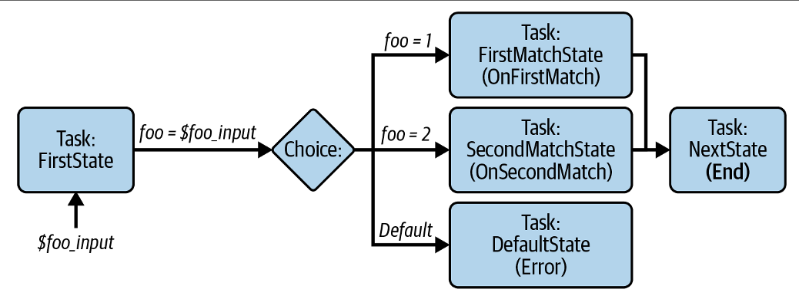

>Figure 15-6. The directed acyclic graph of the AWS workflow specification example  

The logic starts with FirstState, where a value is entered as foo_input. In ChoiceState, the value of foo_state is evaluated. If it's a 1 the state goes to FirstMatchState, if it's a 2 it goes to SecondMatchState, and if it's anything else it goes to DefaultState, which is an error state. Regardless of your choice, the workflow ends in the final task NextState.  

One thing that's notable about this workflow is that it's fairly verbose—there's relatively a lot of code for not a lot of work. It can also be challenging to decipher what is going on, particularly in comparison to the code-first frameworks.  

Figure 15-7 shows a more involved example, which checks stock prices, requests human approval, and then either issues a buy or a sell (in the case that the price is favorable).  

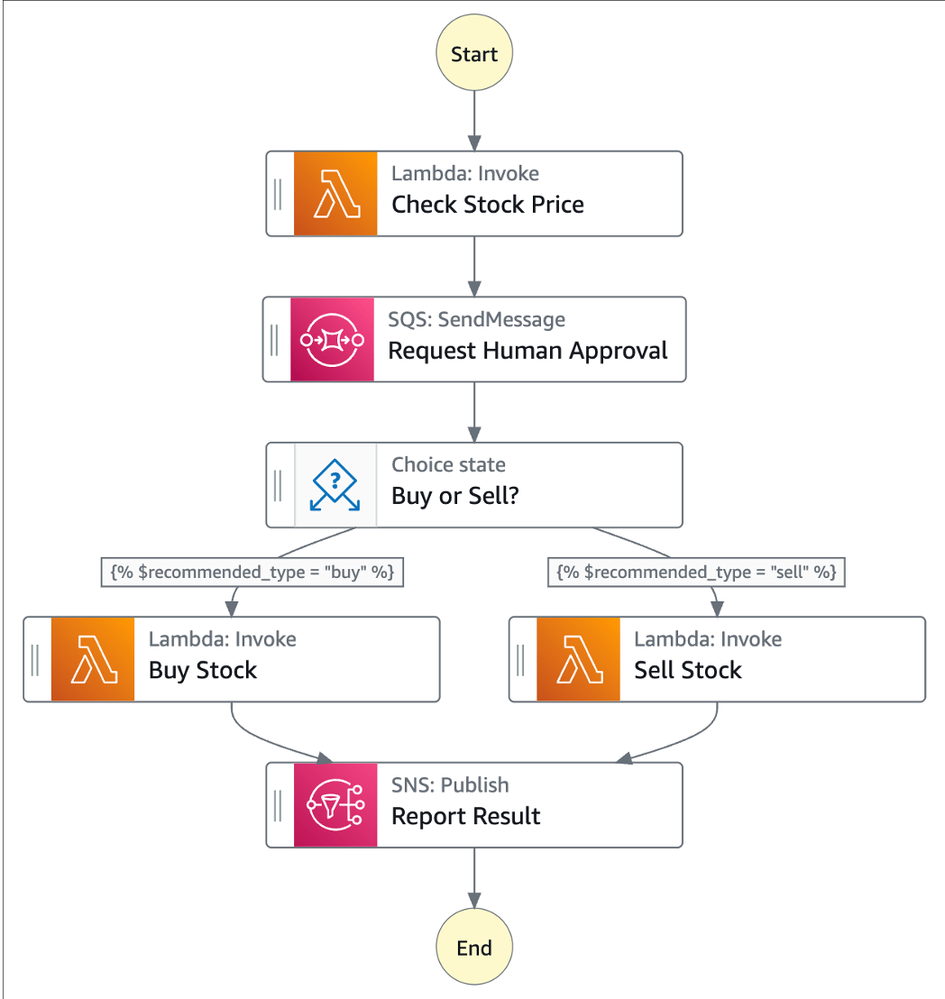

>Figure 15-7. Example of AWS Step Function workflow (Source: AWS)  

In this case, the AWS backend is responsible for executing the functions, maintaining state, and retrying logic when it fails. It’s also responsible for restoring the state in the case of a failure, using the redrive functionality to restore function state to what it was right before the crash. Figure 15-8 shows the logical stages of the step function through three invocations with two failures.  

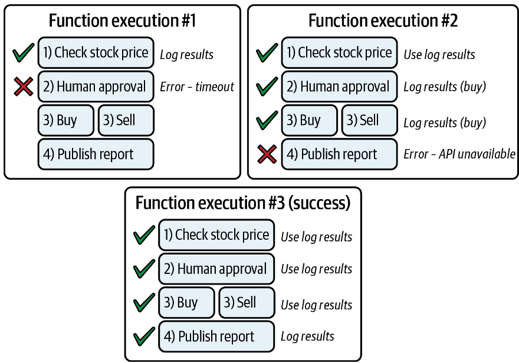

>Figure 15-8. Executing the AWS Step Function workflow, relying on durable function orchestration to restore state for failed invocations  

The step function restores its state from the underlying durable log. Restoring a failed orchestration to its last preserved state means that your function:  

• Won’t have to request human approval a second time  

• Won’t rebuy or resell the stock (though you should keep it idempotent for race conditions)  

• Won’t republish a resulting report  

Durable function orchestration via proprietary YAML/JSON/JSONata documents is just one implementation (albeit common). A code-based DFO is the other, as shown in the next section.  

### Encoding the Orchestrator Within the Source Code  

Recall that durable execution engines commonly enable you to write your durable execution code right inside your own source code (as introduced in “Implementing Orchestration via a Durable Execution Engine” on page 238). But some durable function orchestrators, like Azure’s Durable Functions, enable you to write not just the functions as code, but also the logic that weaves the workflow. No need for somewhat cumbersome YAML/JSON/JSONata documents.  

Example 15-2 shows a sample of Azure Durable Functions Python code pulled directly from Azure's examples:  

Example 15-2. A Python code example of Azure Durable Functions  

```python
import azure.functions as func
importazure.durable_functions as df

myApp = df.DFApp(http_auth_level=func.AuthLevel.ANONYMOUS)

# An HTTP-triggered function with a Durable Functions client binding
@myApp.route(route="orchestrators/hello_orchestration")
@myApp.durable_client(input(client_name="client")
async def http_start(req: func.httpRequest, client):
    function_name = req.route_params.get('functionName')
    instance_id = await client.start_new(function_name)
    response = client.create_check_status_response(req, instance_id)
    return response

# Orchestrator
@myApp.orchestration_trigger(context_name="context")
def hello_orchestration(context):
    result1 = yield context.call_activity("hello", "Seattle")
    result2 = yield context.call_activity("hello", "Tokyo")
    result3 = yield context.call_activity("hello", "London")

    return [result1, result2, result3]

# Activity
@myApp.activity_trigger(input_name="city")
def hello(city: str):
    return f"Hello {city}"

```  

#### http_start  

This is a function that is triggered by an HTTP request. It starts an instance of
the orchestration and returns a check status response once completed.  

#### hello_orchestrator  

This is the actual orchestrator function. It describes the steps that the function must take to complete its workflow. Once it starts up, it invokes three functions in a sequence and then returns the ordered results of all three functions in a list ([result1, result2, result3]). Each of the results is computed by calling the hello function with the associated city name (e.g., "Seattle") through the Azure Durable Functions framework via the context.call_activity.  

#### hello  

The activity function called from the orchestrator function that just returns a simple string greeting using the city name.  

The biggest difference between the document-first approach and the code-first approach is where you keep the definition of the orchestrated workflow. Encoding it inside the same code that defines the functions is appealing, as you can use the same familiar tools and IDE integrations that you do for writing the functions themselves. On the other hand, you may find the use of notations and framework-specific commands cumbersome, and instead prefer the more distinct separation between the functions and the code that a document-first approach provides.  

Durable function orchestration offers a powerful option for building durable function execution, but it does have limitations. The reality of the matter is that you rarely see an organization (particularly a large one) shift to another major cloud provider just for durable function orchestration. So your most likely scenario, for better or worse, is that you'll end up using the durable function orchestrator that comes packaged with your CSP (if it has one).  

#### Summary  

Functions as a service is an area of cloud computing that has been growing rapidly. Many FaaS frameworks offer a variety of function development, management, deployment, triggering, testing, and scalability tools that allow you to build function-based microservices. You can trigger functions using event streams, queues, consumer group lag status, wall-clock time, APIs, webhooks, and other forms of custom logic.  

Function-based solutions are particularly useful in handling stateless and simple stateful business problems that do not require event scheduling. The orchestration pattern enables calling multiple functions in strict sequential order, while also respecting the order of events from the event stream. Durable function orchestrators have proven to be useful for executing more complex workflows with multiple steps, and let you avoid having to rerun computations and function calls that your functions have already completed.  

In the next chapter we'll take a look at eventual consistency—in particular, what it is, how it works, and what to watch out for.  

# Consistency, Bad Data, and Supportive Tooling

# Eventual Consistency

> [!NOTE]
> An earlier version of this chapter previously appeared in Building an Event-Driven Data Mesh (O’Reilly, 2023).  

Eventual consistency is often a primary concern with distributed systems. For event-streams, eventual consistency concerns tend to lie mostly on the consumer side, as each consumer reads and processes events at their own rate.  

Fortunately for us, there are some who have been looking at, working on, and thinking about eventual consistency for quite a long time. Pat Helland is just such a person and has written an excellent piece that collates insights and opinions from numerous thought leaders on the subject:  

Since Doug [Terry] coined the phrase eventual consistency in the Bayou paper in 1995, I was interested in his perspective. When he defined eventual consistency, it meant that for each object in a collection of objects, all the replicas of each object will eventually have the same value. Then, he said: “Yeah, I should have called it eventual convergence.”  

—Pat Helland  

This quote is significant in that many often confuse consistency as something other than convergence. For event-driven systems, we’re very interested in ensuring that services are convergent, though they may never actually be consistent since they each consume and process events at their own rate.  

Helland goes on to discuss a definition by Peter Alvaro, from his 2015 PhD thesis “Data-Centric Programming for Distributed Systems”:  

A system is convergent or "eventually consistent" if, when all messages have been delivered, all replicas agree on the set of stored values.  

—Peter Alvaro  

Both Terry and Alvaro converged (ha!) on the same definition of eventual consistency, putting the focus on independent replicas eventually converging on the same set of stored values. We'll keep using the eventual consistency terminology, but keep in mind we're really talking about convergence of data.  

A consumer that is continually materializing an event stream can easily provide you information on what data it *does have* in its data store, but it can't tell you what it *doesn't have*. Because the data store is continually converging, it may tell you it doesn't have a piece of data when queried, but then immediately receive and process that data in the very next clock cycle. However, a consumer can at least tell you if it is *caught up* to a *given offset*, and we can use this knowledge when resolving questions about convergence with other systems.  

Many of the questions and concerns regarding eventual consistency in the event-driven world stem from a concern that bad things will happen because of it. It's often used as a threatening term, listed in the cons section of an architectural comparison article. But it doesn't have to be a con, because there are only a few big things to watch out for. Plus, architectures are always about trade-offs. Choosing to build everything as synchronous point-to-point services leads to its own major cons.  

There are two main reasons why two services may have not yet converged:  

A consumer service is lagging on event consumption.  

A service is lagging behind on its consumption, processing, and storage of the data in comparison to another service.  

The producer service is lagging on event production.  

A producer service may encounter a bug or an error that prevents it from writing new updates to the event stream. In this case, the internal state of the producer service is up-to-date (converged), but the external representation written to the event stream is not. Consumers of this stream may have converged with each other, but will still lack convergence with the producer since the data is simply missing from the stream.  

Note that these two options are not mutually exclusive. It is entirely possible that one or more consumers' services are lagging behind *and* the producer itself has failed to publish data to the stream.  

The thing is, eventual consistency isn't as threatening as you may have been led to believe. The vast majority of time your event-driven services will be up-to-date with the latest events, unless they're trying to catch up from the beginning (such as a new or reset application).  

One of the reasons people tend to be apprehensive about eventual consistency is that they're concerned that they may not know if their services are sufficiently converged to give accurate results. After all, it may be hard to predict when your services start to lag, and if they do, how to detect it and what to do about it.  

The crux of the matter is that eventual consistency is mostly only an issue when one independent context issues a *direct query* to another independent context. Distributed asynchronous event processing means that there are no guarantees that their internal data sets have converged, and so you can end up with wildly different answers depending on when these queries take place.  

Let's take a deeper look at how contexts, event time, and boundaries relate to convergence, and how to avoid getting into problematic situations.  

### Converging on Consistency, One Event at a Time  

Each event-driven processing instance effectively exists in its own time bubble, with its internal time based solely on the event timestamps that it has consumed and integrated into its state (see "Timestamps" on page 200). The vast majority of event streams provide data in a monotonically increasing offset and timestamp order, though certainly the events can also be out of order (more on this later in the chapter). Thus, while the consumer service is free to look at the wall-clock time, its own internal time is based completely on the timestamps of the events that it has consumed.  

Take Figure 16-1, which shows two independent consumers reading from a single event stream. Each service is fully independent in processing the events, applying business logic, and saving the data in state.  

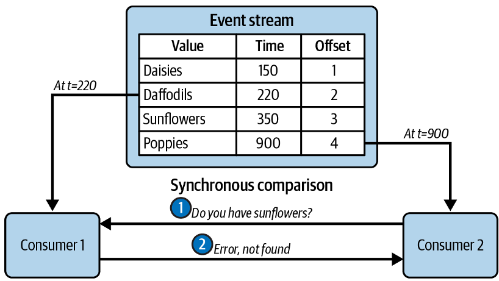

>Figure 16-1. The basic problem with eventual consistency  

The results that each service provides to the outside world, be it by request-response API, an output event stream, or other means, are very unlikely to be precisely synced with similarly materialized data in another service. This is where discrepancies and confusing results can creep in. Consumer 2 at time t=900 asks consumer 1 at t=220 for its copy of the sunflower data. Having never even heard of sunflowers, all consumer 1 can do is reply with Error, not found.  

> [!TIP]
> In addition to using offsets or incrementing event IDs, you may choose to use the event time, representing when the event occurred, to account for convergence. In cases where events are created via CDC, event time is typically defined as the time the data was created in the source database.  

In contrast, think of two synchronous services that communicate over request-response APIs and that own and store all of their data within their own services. When one of these services issues an API call to another, it's not thinking, "I wonder what time it is over there." The assumption is that these two services are in the same time bubble and have the same wall-clock time or are close enough that we don't care.  

This assumption is largely true, because a synchronous service doesn't typically rely on a stream of events to populate its state store. Rather, it handles or fails the requests immediately and returns the most up-to-date data that it has available, representing the current wall-clock time.  

Let's take a look at a simple shipping and delivery company. In this model, a driver is an employee who can drive a truck. We need a driver for each truck we want to send out for deliveries, otherwise that vehicle isn't going anywhere. How would the assignment of a driver to a truck be affected in synchronous and asynchronous systems?  

Figure 16-2 shows a set of synchronous services on the left residing in a single time bubble. All data is maintained in a fully consistent state, such that a point-in-time query will return a complete list of both trucks and drivers at that instant.  

Meanwhile, the services on the right are sourced from event streams. In this example, notice that there is a time lag of 7 hours for the truck lookup service, as it has fallen behind in materializing its incoming events. If the driver service asks the truck service to provide a new truck for assignment, it may not have any available, despite new trucks having been published to the event stream. The service must *catch up*; otherwise, it'll give nondeterministic results.  

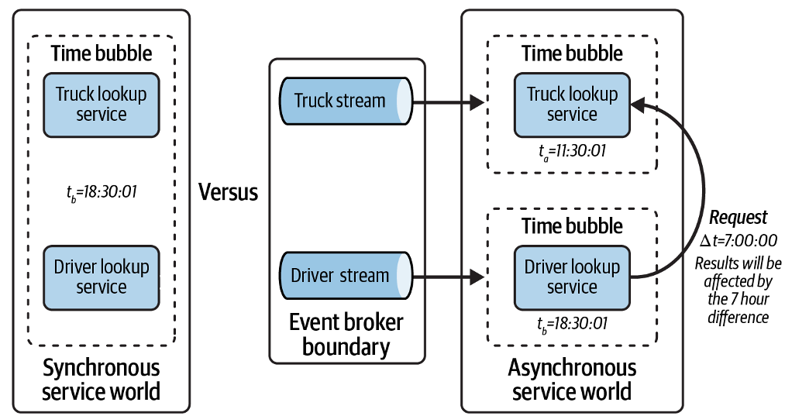

>Figure 16-2. The internal time of a service is determined by the union of its input offsets  

Structuring the driver and truck services to require synchronous communication while using asynchronous event-driven data sources is a pretty big antipattern. The correctness of these systems depends on the timing of asynchronous consumption across two different event streams with two different scenarios. A better option for this scenario would be to also populate the driver service *with* the truck data, to eliminate the synchronous lookup between the two. You'll be able to achieve a much more decoupled architecture, reduce complexity, and eliminate race conditions.  

It may also seem tempting to require the registration of all drivers and trucks in a single atomic event. In fact, this is a good technique to use when possible, as it enforces a consistency within the event itself. However, it's not necessarily always possible for all business use cases. There are many professional drivers who do not own their own truck and there are companies that lease trucks but do not provide drivers. Each must be registered independently.  

> [!TIP]
> System times are largely synchronized to within milliseconds, thanks in large part to frequent synchronizations with Network Time Protocol servers (see "Synchronizing Distributed Time-stamps" on page 201). If you require perfect time alignment between two events, you should refactor your domain to put the critical time-sensitive data into the same singular event. Otherwise, you'll have to plan to handle eventual consistency.  

While a lagging service is one source of convergence issues, a second source is an event stream that is not yet updated despite all consumers being fully caught up. This is especially problematic when the events in one stream are related to the data in the other stream, such as by a foreign or primary key.  

Let's do away with lag, latency, and processing time and just pretend for a moment that you have a service that can instantly consume and materialize any number of events, from any number of streams. In the case of Figure 16-3, we have a flower pot builder service that is consuming and joining data from two streams to determine what's the best soil to put in the pot for each flower type.  

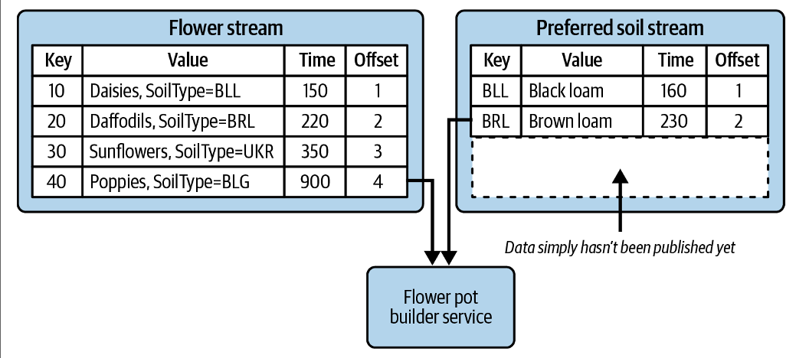

>Figure 16-3. The data in the source event streams hasn't yet converged  

Although the service is fully up-to-date with each event stream, there are no matching records in the preferred soil stream for sunflowers and poppies. The flower pot builder service will need to wait until it can obtain the matching preferred soil events for those flowers. There are many reasons why these two streams may be out of sync: they may be sourced from different domains, they may have different SLAs, the producer for preferred soil may be down, the network may be partitioned, or the event broker may be unavailable, to name just a few.  

While it's possible that the data may simply not exist at all, anywhere, in many cases we expect data to exist based on certain business rules and properties. For example, preferred soil has a foreign-key relationship with flowers, so we can expect any flower record with a populated soil type field to have a corresponding preferred soil record. The records for both sunflowers and poppies are missing, however. This data may yet show up, but as this example shows, even fully up-to-date consumers of the existing event streams may be inconsistent with upstream systems through no fault of their own.  

The eventual consistency issues we face basically boil down to consumers that have not yet converged and event streams that have not yet converged with their source. Next, let’s take a look at a few more detailed practical scenarios and some strategies for dealing with eventual consistency.  

## Strategies for Dealing with Eventual Consistency  

You have two main options when dealing with eventual consistency, either between services or within a single service.  

The first option is to simply wait for the state to become consistent, such as waiting for the event that completes the join, ends the session, or finalizes an aggregation. This option works equally well when querying an external service that gives you an inconsistent answer—you can simply wait and retry the query again at a later time. You may also choose to output an incomplete result that indicates a lack of consistency, but you will need to update it with the final results when you receive the appropriate data to act.  

The second option is to give up after a certain period of time. Giving up is final. If the missing event you were waiting for shows up a split-second after you give up, it’s still too late to do anything with it. If the server you were querying finally has the result you need, it doesn’t matter, as you won’t be notified or sent a follow-up request.  

## Use State Event Types  

Accidental divergence is always possible due to a misunderstanding of the events inside an event stream. Delta event types, for example, tend to be more challenging for the consumer to reconcile the data into a format that is consistent with other consumers. While it is still entirely possible to reach convergence via delta events, the added layer of complexity in reconciling delta events makes it just that much more likely that you’ll end up in inconsistent states (see Chapter 5 for more details).  

State events tend to be much simpler for consumers to read, process, and integrate into their state stores. Consumers are less likely to make mistakes in how they process and interpret the data, leading them to converge to the same results as other consumers.  

## Expose Eventual Consistency in the Server Response  

You’ve probably seen this strategy employed before. Ever book a flight, a hotel, or rent a car online, and see the little spinning icon saying “Please wait to confirm, do not hit refresh”? Exposing the eventually consistent nature of a system is common practice in the world of UIs, and we can adopt this strategy for use in server-to-server communication.  

You have a few options for this strategy:  

Halt serving requests when lag exceeds threshold  

The queried service monitors its own consumer lag of its input event-stream offsets, and only serves data if the lag is lower than the threshold. Instead of returning the data, your service returns a message indicating that it is not ready, such as an HTTP 503 (Service Unavailable). You may also choose to return a Retry-After response indicating when the service should be ready based on typical throughput processing. If the consumer lag is less than the threshold, the service will serve the queries and provide a response as normal.  

Provide stale data to requester  

Your service can provide a response to the requester regardless of how stale the data is. You can include a response in the payload indicating that the data is stale and make it clear that it’s up to the requesting client to choose how to proceed. In some cases a client doesn’t much care about stale data; in other cases it’s critical, and the client may choose to hold off further processing until it can have its request served with up-to-date data.  

Provide a callback API  

Clients can register to have their request handled when your service is no longer lagging and receive a callback with the requested data. This strategy is more complicated to implement because either the client will have to block and wait for the callback or it’ll need to implement context-switching logic to work on other tasks until the callback occurs. Additionally, your service will need to buffer and handle the callbacks, plus provide SLAs for its users.  

But what about event time? Can you use time since your last new event to detect if you’re lagging? For some cases you can, but in many others you cannot. Let’s consider an example.  

Say you have an event stream that contains user click events, such as a share or like on a social media site. For the most popular websites, you could expect to see hundreds or thousands (or more) of events per second. Based on historical trends, if more than 10 seconds go by without a new click event, you can surmise that something is wrong in the pipe. If the event broker insists your consumer is up-to-date, then the problem likely lies in one of the other services further upstream.  

Alternatively, consider a stream that provides event-carried state transfer for a slowly updating stream. For example, a user entity is updated only when a new user is registered, when a field in their identity is updated (e.g., email address), or when they are deleted. Although there could be many hours (or days) between events, the data in the stream remains valid and any service that has consumed the stream remains converged and up-to-date. It just simply hasn’t received any new events (because there are none!), and so cannot tell you any more information than the event time of
the last event.  

You may accidentally infer that your consumer is lagging by using the event time of the last-processed event alone. And while you can use event time to infer lag in cases of high-frequency updates, it remains unsuitable for many other use cases. You would do well to rely on offsets to detect and expose lag whenever possible.  

#### Use Event-Driven Communication Instead of Request-Response  

Avoid using direct calls to remote services entirely. Embrace the asynchronous nature of event-driven microservices and use events to communicate between services. Use a microservices approach if you end up in a situation where you need to relate data in two different services together (like the driver and truck example):  

• Create a new service.  

• Materialize both driver and truck event streams to the service.  

• Query the service directly for any queries pertaining to a driver and truck, such as a web UI for administration or an accounting portal.  

By putting the data in a singular service you can reason about time, lateness, and consistency. It is far easier than trying to reconcile it between services, though it does require you be willing and able to build purpose-built microservices.  

### Prevent Failures to Avoid Inconsistency  

You can choose from a variety of technologies, clouds, brokers, connectors, and other
types of tools to build event-driven microservices. So instead of trying to unsuccess-
fully iterate through the entire list, let's just assume that there will be failures. These
may include, but are not limited to:  

• Services crashing  

• Network connectivity issues  

• Broker connectivity issues  

• Cloud storage connectivity issues  

You can reduce your chances of failure through good DevOps practices, monitoring, resource scaling, and testing. It's also important to ensure your consumer services have sufficient resources to scale up and stay up-to-date with the latest events and that any outages or failures on your producer side are quickly identified and fixed.  

In short, anything you can do to keep your consumers and producers reading
and writing without lag will contribute toward reducing the effects of eventual
consistency.  

## Summary  

Eventual consistency has some very significant benefits. It allows you to temporally decouple your services, such that they can independently scale, fail, and recover without significant disruption. It reduces the complexity of multiservice coordination and enables you to build very loosely coupled choreographed architectures. Finally, many systems simply don't require full consistency, and can be implemented much more easily as eventually consistent event-driven microservices.  

But dealing with eventual consistency can be a bit trickier when you do require full consistency. By and large it's about becoming aware of how it can be introduced and figuring out if it needs to be mitigated at all. Event streams offer consumers the means to converge on the same final state, though each consumer must uphold its own end of the bargain by correctly processing and integrating the data into its own domain.  

In the event-driven space, a lagging consumer service may be inconsistent with another service or data set. Comparing data between a lagging service and a non-lagging service will likely show inconsistencies, as both are operating within their own frame of relative time. Avoiding direct request-response queries between asynchronous services allows you to avoid having to deal with data inconsistencies. In the event that you must deal with these inconsistencies, it's best to account for the services' time frames and incorporate them into the interservice communication.  

Eventual-consistency issues can also arise when data in one event stream references data in another stream that may not yet have been produced. A lagging producer is often the culprit, and the consumers must wait for the producer to eventually produce the missing data. It's important to design your applications to accommodate late-arriving data, while also taking into account any end-to-end latency metrics that may require earlier action with incomplete data.  

Next up, we're going to take a look at how to incorporate request-response patterns into event-driven microservices.  

# Integrating Event-Driven and Request-Response Microservices

As powerful as event-driven microservice patterns are, they cannot serve all the
business needs of an organization. Request-response communications are common
in event-driven microservices, and you'll often encounter them in scenarios such as:  

• Collecting metrics from external sources, such as an application on a user's cell phone or Internet of Things (IoT) devices  

• Integrating with other request-response services, particularly third-party ones outside the organization  

• Serving content in real time to web and mobile device users  

• Serving dynamic requests based on real-time information, such as location, time, and weather  

Event-driven patterns still play a large role in this domain, and integrating them with request-response solutions will help you leverage the best features of both.  

> [!NOTE]
> For the purposes of this chapter, the term *request-response services* refers to services that communicate with each other directly through calling each other's API. Two services communicating via HTTP is a prime example of request-response communication. Communication may be synchronous (the calling service waits) or asynchronous (the calling service does other work while awaiting a callback).  

This chapter covers three main subjects, including:  

• Turning requests into events  

• Integrating event-driven microservices with third-party APIs  

• Building micro frontends  

### Turning Requests into Events  

Many systems and services rely heavily on request-response architectures communicated via RPC or HTTP. Sometimes you'll find yourself in a position where you need to get the data sent in these requests packaged into events to write into their respective event streams.  

There are two common ways to accomplish this: one is to use a dedicated endpoint, and the second is to use a REST proxy. Let's examine each option in turn.  

One option for turning requests into events is to use a dedicated endpoint. The client sends a request to a backend server to report its findings, while the backend server then takes responsibility for writing it to the event stream. Dedicated endpoints provide your clients with very high throughput and load isolation, and are ideal for situations where you have a significant amount of data coming in (thousands of events per second, for example).  

Consider a media streaming service like Netflix, installed on a smart TV or cellular phone. The application generates events that contain information about things like which movies the viewer has started to watch, how far they've progressed, and whether they've stopped watching it. Example 17-1 shows a Protobuf version of a click event, commonly collected for analytical purposes.  

Example 17-1. Proto3 example of a MediaClick event  

message MediaClick {
    // Account Id
    string id = 1;

    // When the click happened
    Timestamp time = 2;

    // The media Id that the user clicked on
    int32 mediaId = 3;

    enum Media {
        Movie = 0;
        Show = 1;
        MovieTrailer = 2;
    }
}  

```java
ShowTrailer= 3;}// The type of mediaMedia mediaType= 4;}

```  

The client encodes the data into a Protobuf format, serializes it, and sends it to the backend server, as shown in Figure 17-1.  

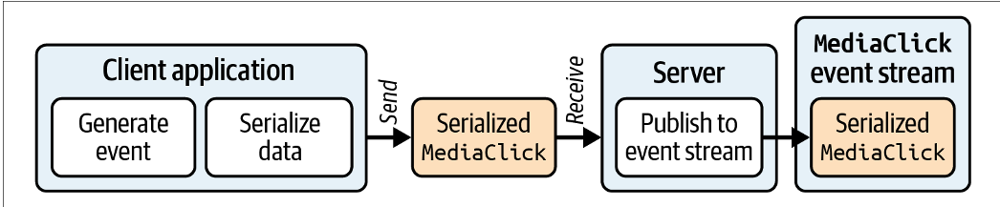

>Figure 17-1. Serializing the MediaClick data in the client  

The client does all the work of generating the event, populating the Protobuf schema, and serializing the data to send to the backend. In this case it’s a reasonable ask, as the client is already relatively heavyweight and can handle the extra processing requirements.  

But what about in the case where you want to send an event from an environment where restrictions are more significant, such as an embedding in a browser or a tiny microcontroller? It is often not possible to package up the necessary libraries to generate the Protobuf (or Avro, or JSON Schema) due to resource constraints. In this case, you can serialize the data in the backend server, as shown in Figure 17-2.  

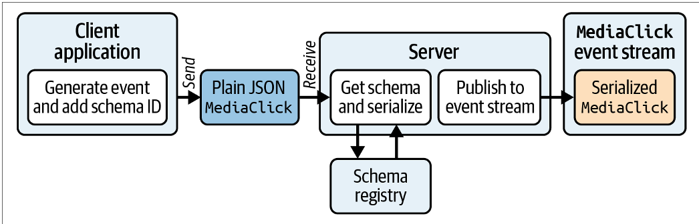

>Figure 17-2. Serializing the MediaClick data in the backend server  

The client still makes a request to the server with its payload of data, but it can use a simpler JSON library or even just write a blob of plain text. There is a risk, however, that the data you send doesn’t match with the schemas applied in the server. This can cause data loss and repetitive break-fix work.  

But there is another way. You can eliminate the risk of the data failing to serialize by adding the compatible schema ID as part of the event payload. During the code compilation and deployment pipeline process you obtain the schema ID from the registry and store it within your client's code. Then, when your code generates the event, you can just add the schema ID to the payload, as shown in Example 17-2.  

Example 17-2. Plain-text example of a MediaClick event with accompanying schemaId  

```text
id = 123419873144,
time = 1748890957,
mediaId = 14997977211,
mediaType = "Movie",
schemaId = 623

```  

The backend server parses and encodes this plain-text payload into the associated
Protobuf schema represented by schemaId = 623. This is a very brittle process, as
any deviations in the plain-text format may break the parser logic.  

> [!TIP]
> Plain-text events with an accompanying schemaId are very useful when sending metrics and measurements from endpoints where every single byte matters, such as web pages and services in low-connectivity regions. Server-side serialization is very useful for circumstances where it's unreasonably expensive, difficult, or simply not possible to serialize on the client side.  

Plain-text payloads are not ideal, but they prove to be a useful compromise when faced with very limited resources. An incorrect enum or value type in the plain-text payload can cause a failure in the downstream serialization, leading to a service failure. It's crucial that you *test* both the logic that creates these events and the logic that parses them *before* deploying to production. With proper tests, the vast majority of the risk disappears.  

The alternative to building your own dedicated client is to use a shared REST proxy,
as covered in the next section.  

## Turning Requests into Events Using a REST Proxy  

A REST proxy is a service that exposes an REST API for your clients to communicate with your event broker. It allows clients to communicate with the event broker through a set of predefined instructions. For example, you can list the available event streams, create a new event stream, publish events to a stream, and even consume from a stream.  

In terms of options, there are several REST proxies available for Apache Kafka, including the Confluent REST proxy and the Azure REST Proxy. Apache Pulsar has its own built-in proxy, while proprietary event brokers for third-party ISPs tend to
have their own options, for example, Google's PubSub REST API.  

REST proxies allow you to write events to a stream either singularly or as a batch.
For example, Example 17-3 shows a payload you could send to POST /topics/
(string:topic_name) for Confluent's REST proxy.  

Example 17-3. An example payload containing three independent events to send to
Confluent's REST proxy  

POST /topics/test HTTP/1.1
Host: kafkaproxy.host.com
Content-Type: application/vnd.kafka.binary.v2+json
Accept: application/vnd.kafka.v2+json, application/vnd.kafka+json, application/json
{
    "records": [
        {
            "key": "b1B6",
            "value": "Z33nAnn12481"
        },
        {
            "value": "c2233Gna1F=",
            "partition": 6
        },
        {
            "value": "newb718="
        }
    ]
}  

This batch contains three already serialized records. The value component is the only mandatory field for each record, though you can also provide both key and partition. Records sent without a key or partition will be distributed according to the default partitioner logic, such as a round-robin distribution.  

You can also send records to the API alongside the schema to encode them, as shown
in Example 17-4.  

Example 17-4. An example payload containing two independent events and a schema  

POST /topics/test HTTP/1.1
Host: kafkaproxy.host.com
Content-Type: application/vnd/vnd.kafka.avro.v2+json
Accept: application/vnd.kafka.v2+json, application/vnd.kafka+json, application/json
{
    "value_schema": "{\"name\":\"\":\"firstname\",\"type\":\"\":\"string\"}",
    "records": [
        {
            "value_schema": "{\"name\":\"\":\"firstname\",\"type\":\"\":\"string\"}",
            "records": [
                {
                    "value_schema": "{\"name\":\"\":\"firstname\",\"type\":\"\":\"string\"}",
                    "records": [
                        {
                            "value_schema": "{\"name\":\"\":\"firstname\",\"type\":\"\":\"string\"}",
                            "records": [
                                {
                                    "value_schema": "{\"name\":\"\":\"firstname\",\"type\":\"\":\"string\"}",
                                    "records": [
                                        {
                                            "value_schema": "{\"name\":\"\":\"firstname\",\"type\":\"\":\"string\"}",
                                            "records": [
                                        {
                                            "value_schema": "{\"name\":\"\":\"firstname\",\"type\":\"\":\"string\"}",
                                            "records": [
                                        {
                                            "value_schema": "{\"name\":\"\":\"firstname\",\"type\":\"\":\"string\"}",
                                            "records": [
                                        {
                                            "value_schema": "{\"name\":\"\":\"firstname\",\"type\":\"\":\"string\"}",
                                            "records": [
                                        {
                                            "value_schema": "{\"name\":\"\":\"firstname\",\"type\":\"\":\"string\"}",
                                            "records": [
                                        {
                                            "value_schema": "{\"name\":\"\":\"firstname\",\"type\":\"\":\"string\"}",
                                            "records": [
                                        {
                                            "value_schema": "{\"name\":\"\":\"firstname\",\"type\":\"\":\"string\"}",
                                            "records": [
                                        {
                                            "value_schema": "{\"name\":\"\":\"firstname\",\"type\":\"\":\"string\"}",
                                            "records": [
                                        {
                                            "value_schema": "{\"name\":\"\":\"firstname\",\"type\":\"\":\"string\"}",
                                            "records": [
                                        {
                                            "value_schema": "{\"name\":\"\":\"firstname\",\"type\":\"\":\"string\"}",
                                            "records": [
                                        {
                                            "value_schema": "{\"name\":\"\":\"firstname\",\"type\":\"\":\"string\"}",
                                            "records":.firstname\",\"type\":\"\":\"string\">",
                    "records": [  

{
    "value": "Bob"
},
{
    "value": "Milhouse",
    "partition": 1
}
]  

The value_schema contains the full schema of the data to be written to the event stream, though this example just uses a trivial schema for brevity. Regardless, the big benefit of this approach is that the Kafka proxy automatically validates the schema against the schema registry. If the schema is incompatible with the schema registry, the proxy throws an exception, returns an error, and refuses to write the data. In other words, it fences out bad data from getting into your stream—a very useful function for preventing bad data.  

Finally, you can also consume records via the REST proxy. This process is a bit more involved since you must create a durable consumer to store the offset progress. To keep things brief, it's a relatively simple (but verbose) set of steps, including:  

1. Creating the durable consumer  

2. Subscribing to the specific event streams  

3. Consuming events from the subscribed topics  

4. Committing the list of offsets that were successfully processed  

5. Deleting the consumer  

Each REST proxy has its own API, so check your docs accordingly.  

While a REST proxy is useful for getting data into and out of event streams, it's not typically a high-performance component. You may find that you need multiple REST proxies to handle even moderate loads, and you may benefit from re-evaluating your integrations to instead use native event-driven producers and consumers.  

## Integrating with Third-Party Request-Response APIs  

Event-driven microservices sometimes need to communicate with third-party APIs via request-response protocols such as HTTP or RPC. Your service can call the API as it would any other remote function call and either await the reply or continue processing other events.  

If your microservice must wait for a reply and it is processing from an event stream, then it will experience head-of-line blocking (covered in “Queues via Apache Kafka”on page 27). It will be unable to process further events until the remote call has returned or timed out. Consider consuming and processing the events as a queue if order is not important, to reduce the time spent blocking waiting for a reply.  

Once your microservice receives a response, it can parse the data and continue on with its business logic. A generalized example of this process is shown in Figure 17-3.  

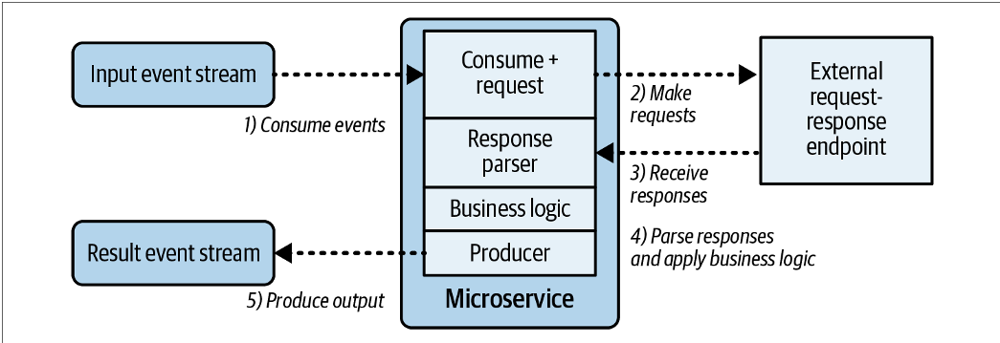

>Figure 17-3. Integrating request-response APIs into event-driven workflows  

Sample code for calling a request-response API is shown in Example 17-5. Note that the example is also using a Kafka transaction, ensuring both the output results and the consumer offsets progress are committed atomically.  

Example 17-5. An event-driven microservice making a blocking call to a request-response API via HTTP  

```java
// Set up producer with transactional.id and // call initTransactions() once at startupproducer.initTransactions();while(true){// Poll for recordsConsumerRecords<String, Event> records=consumer.poll(Duration.ofMillis(1000));if(records.isEmpty()) continue;try{producer.beginTransaction();for(ConsumerRecord<String, Event> record: records){Event event= record.value();Request request= generateRequest(event,...);Response response=RequestService.makeBlockingRequest(request, timeout, retries,...);

```  

```java
if(response.code== 200){<Class Type> parsedObj= parseResponseToObject(response);OutputEvent outEvent= applyBusinessLogic(parsedObj, event,...);// Write the results to the output event stream // using the transactional producerproducer.send(new ProducerRecord<>("output-stream-name", outEvent));} else{// Handle non-200 responses(log, skip, etc.)}}// Send offsets to transaction before committingMap<TopicPartition, OffsetAndMetadata> offsets= new HashMap<>();for(TopicPartition partition: records.partitions()){List<ConsumerRecord<String, Event>> pr= records.records(partition);long lastOffset= pr.get(pr.size()- 1).offset();offsets.put(partition, new OffsetAndMetadata(lastOffset+ 1));}producer.sendOffsetsToTransaction(offsets, consumer.groupMetadata());// Commit the transactionproducer.commitTransaction();} catch(Exception e){// Log and handle the error, then abort the transactionproducer.abortTransaction();}}

```  

There are several benefits to using this pattern. For one, it allows you to mix event processing with request-response APIs in your business logic. Second, your service can call whatever external APIs it needs, however it needs to. You can also process events in parallel by making many nonblocking requests to the endpoints.  

There are also several drawbacks to this approach. As discussed in Chapter 9, making requests to an external service introduces nondeterministic elements. Reprocessing a failed event may give different results than what you would have gotten during the first processing, even if it just failed a second before the retry. Make sure you understand the nondeterministic elements that your remote call may introduce to your application.  

The API and response format is also subject to change. Ensure that you are aware of any upcoming changes to the API, and monitor it for any updates or breaking changes that will affect your application. External APIs owned by reputable third parties tend to be very careful about changing their APIs. Internal APIs owned by small teams or inexperienced developers may be more prone to breakage.  

Finally, consider the frequency that your microservices make requests to an endpoint. Say that you discover a bug in your microservice and need to rewind the input stream for reprocessing. Since event-driven microservices typically consume and process events as fast as they can execute the code, it can lead to a massive surge in requests going to the endpoint. This can cause the remote service to fail or perhaps reactively block traffic coming from your IP addresses, resulting in many failed requests and tight retry loops by your microservice (and more nondeterministic behavior).  

You can reduce the rate of consumption by using quotas (see “Quotas” on page 387), but you would be best to rate-limit it at the microservice itself. APIs external to your organization may block you from making requests if you make too many at a time, so you’ll need to ensure your service behaves itself. Keep in mind that some services will be more than happy to accommodate a higher rate, but charge you higher rates for requests made above your agreed-upon limit.  

### Serving Data Using a Request-Response API  

An event-driven microservice can also provide a request-response endpoint to handle client requests. It consumes events, processes them, applies its business logic, and then stores its state internally or externally. The request-response API, which is usually contained within the application (more on this later in the chapter), handles the requests to access the underlying state.  

This approach is broken down into two major sections. The first is in serving state from internal state stores, and the second from external state stores.  

### Serving Requests with Internal State Stores  

Figure 17-4 shows a microservice serving client requests from data stored within its internal state store. The client’s request is delivered to a load balancer that routes the request onto one of the underlying microservice instances.  

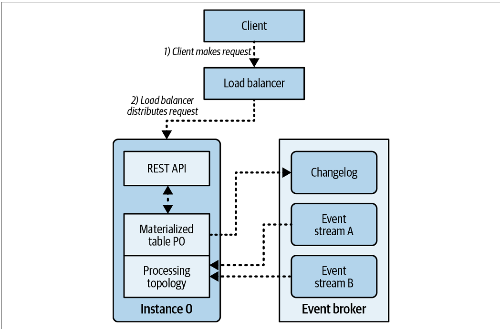

>Figure 17-4. Overview of an EDM with a REST API serving content to a client  

In this example there is only one microservice instance, and all of its application data is available within that instance. This microservice is powered by two input event streams (A and B), with the internal state changelog backed up to the event broker.  

You may also need multiple microservice instances to handle the volume of event-stream data, with the internal state split up between instances (see "Materializing State to an Internal State Store" on page 176). If you do end up with multiple instances, you'll then need to route the requests to the instance hosting the data. Kafka Streams provides functionality to simplify routing requests to the correct instance via its interactive streams. As this is a somewhat complicated procedure, I encourage you to validate whether your framework supports this functionality or if you'll have to figure out a solution on your own.  

Figure 17-5 shows a client making a request that is then forwarded to another instance.  

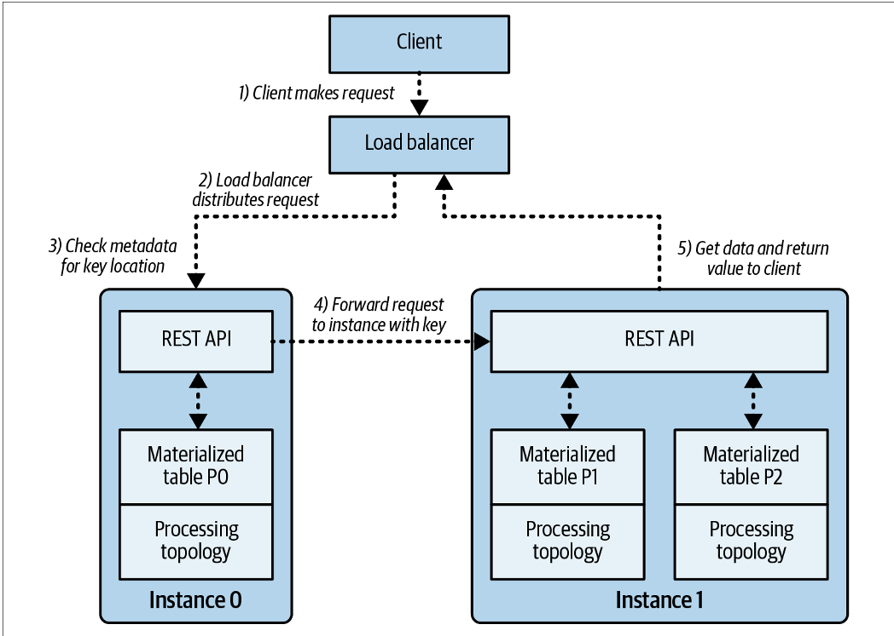

>Figure 17-5. Using partition assignments to determine the location of the materialized state for a given key  

Internal state is typically materialized in a key-value store with a unique primary key, and the client can forward the request to the instance storing that key's data. Kafka Streams provides interactive query support that handles requests, routing, and the forwarding of requests to the correct instance.  

There are two properties of event-driven processing that you can rely on to determine which instance contains a specific key-value pair:  

• A key can be mapped to only a single partition (see “Repartitioning Event Streams” on page 171).  

• A partition can be assigned to only a single consumer instance (see “The Basics of Event-Driven Microservices” on page 49).  

A microservice instance within a consumer group knows its partition assignments and those of its peers. By applying the partitioner logic to the key bundled in the request, the microservice can generate the key’s partition ID assignment. It can then cross-reference that partition ID with the partition assignments of the consumer group to determine which instance contains the data associated with the key, if it exists at all.  

Figure 17-6 illustrates using the properties of the partitioner assignment to route a REST GET request.  

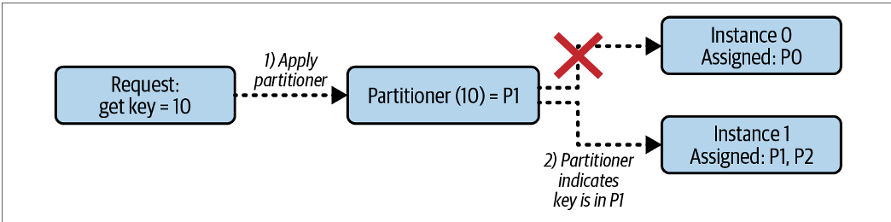

>Figure 17-6. Workflow illustrating the rerouting of a request to the correct instance  

The partitioner indicates that the key is in P1, which is assigned to instance 1. If a new instance is added and the partitions are rebalanced, subsequent routing may need to go to a different instance. Consumer group partition assignments are instrumental in determining the location of a key.  

One drawback of serving sharded internal state is that the larger the microservice instance count, the more spread out the state between individual instances. The odds of a request hitting the correct instance on the first try are reduced, meaning that average latency will increase due to a higher chance of redirect. Assuming an even distribution of keys and a round-robin load balancer, the chance of querying the correct instance on the first try can be expressed as:  

success rate= 1/(number of instances)  

In fact, for a very large amount of instances, almost all requests will result in a miss followed by a redirect, increasing the latency of the response and load on the application. Fortunately, a smart load balancer can perform the routing logic before sending the initial request to the microservices, as demonstrated in Figure 17-7.  

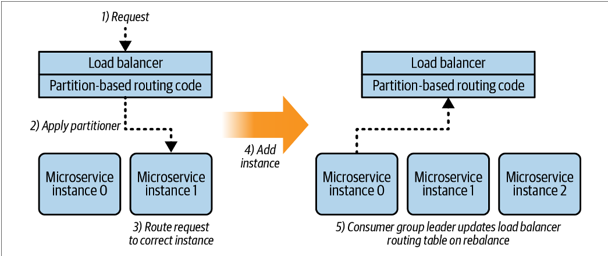

>Figure 17-7. Using the load balancer to correctly forward requests based on consumer group ownership and partitioner logic  

The smart load balancer applies the partitioner logic to obtain the partition ID, compares it against its internal table of consumer group assignments, and then forwards the request accordingly. Partition assignments will need to be inferred from the internal repartition streams or the changelog streams for a given state store. This approach *does* entangle the logic of your application with the load balancer, such that renaming state stores or changing the topology will cause the forwarding to fail. It's best if any smart load balancers are part of the single deployable and testing process of your microservice so that you can catch these errors prior to production deployment.  

> [!WARNING]
> Using a smart load balancer is just a best effort attempt to reduce latency. Due to race conditions and dynamic rebalancing of internal state stores, each microservice instance must still be able to redirect incorrectly forwarded requests.  

Serving sharded internal state stores can be very difficult if your microservice framework doesn't support it. In this case, you're likely to use an external state store, which we'll look at next.  

### Serving Requests with External State Stores  

Serving from an external state store has two advantages over the internal state store approach.  

For one, all state is typically directly available to each microservice instance. Requests do not need to be forwarded to the microservice instance hosting the data as per the internal storage model. If your microservice's state is massive enough to merit a sharded state model, you can either route the request to the correct shard or query
each shard in parallel, and return just the results from the correct shard.  

Secondly, consumer group rebalances don't require the microservice to rebuild internal state stores since the data is stored outside of the instances. External state enables easy instance scaling with zero-downtime options that can be difficult to provide using internal state stores. It also lets you scale your request serving capacity separately from your data store capacity.  

> [!WARNING]
> Ensure that state is accessed via the request-response API of the microservice and *not* directly from the state store. Failure to do so introduces inappropriate coupling and makes changes difficult and risky.  

#### Serving requests via an all-in-one event-driven microservice  

In an all-in-one microservice, each instance consumes and processes events from its input event streams and materializes the data to the external state store. It also provides the request-response API for serving data back to the requesting client. Figure 17-8 shows an example of an all-in-one microservice processing data, storing it, and serving REST API requests.  

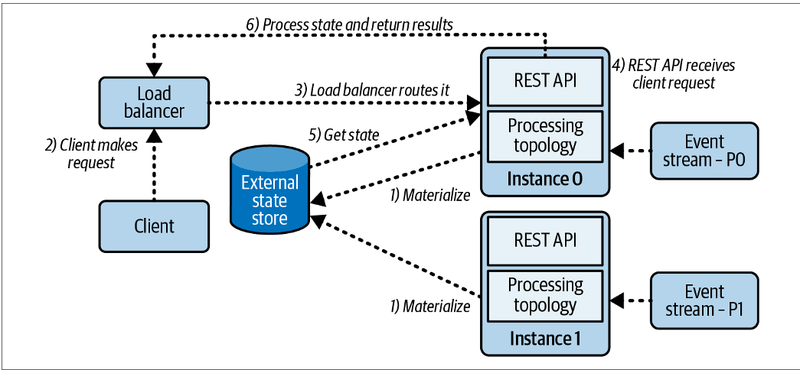

>Figure 17-8. An all-in-one microservice serving from external state store; note that either instance could serve the request  

With the all-in-one microservice, both event-stream processing and request-response serving capacity scale by instance count, just as when using internal state stores.  

Scaling up the instance count increases both request serving and event processing capacity. If you scale it beyond the partition counts of the event streams they may not be assigned partitions to process, but they can still process requests from the request-response API.  

One of the main advantages of this pattern is its simplicity. Scaling is quite easy as consumer group rebalances are very brief. The main drawback is that of resource usage, particularly in the case of asymmetrical loads. For example, a very high request rate to the REST API may require many instances, while processing the event stream may require just one instance.  

Alternatively, you can also split up your microservices into separate functions. One service processes events and stores the data, while a separate service hosts the request-response API.  

### The Composite Service: Serving requests via a separate microservice  

In the Composite Service pattern, the request-response API is completely separate from the event-driven microservice that materializes the state to the external state store. While they remain logically independent, they share a single bounded context and remain tightly coupled. This pattern is exemplified in Figure 17-9, where microservice A serves REST requests while microservice B processes the event streams.  

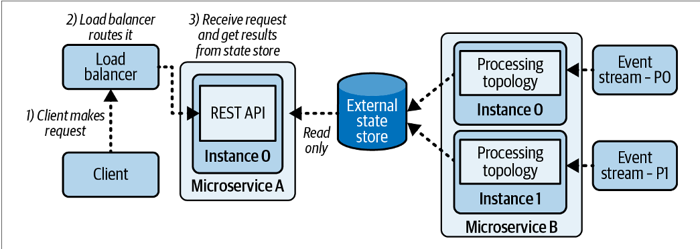

>Figure 17-9. A composite microservice composed of separate dedicated microservices—one for serving requests, the other for processing events  

> [!NOTE]
> While this pattern has two microservices operating on a single data store, there's still just a single bounded context. These two microservices are treated as a single *composite service*. They reside within the same code repository, and are tested, built, and deployed together.  

One of the main advantages of composite services is that you can choose different languages and scaling policies for each. For instance, you could use a lightweight stream framework to populate the materialized state, but use a language and libraries already commonly used in your organization to deliver a consistent web experience to your customers. Composite services can give you the best of both worlds, though it does come with the additional overhead of managing multiple components in your codebase.  

A second major advantage of this pattern is that it isolates any failures in the event processing logic from the request-response handling application. This eliminates the chance that any bugs or data-driven issues in the event processing code could bring down the request-response handling instance, thereby reducing downtime (note that the state will become stale).  

The main disadvantages of this pattern are complexity and risk. Coordinating changes between the two microservices is more challenging and risky than just one microservice. Altering the data structures, topologies, and request patterns may require changes in both services. Testing can also be more challenging, particularly end-to-end tests with event-stream inputs and API request outputs.  

This is a very useful pattern for serving data in real time, and many organizations use it successfully in production today. Careful management of deployments andcomprehensive integration testing is key for ensuring success.  

## Handling Requests Within an Event-Driven Workflow  

One way to handle requests is the way you would with any non–event-driven service: perform the requested operation immediately and return the response to the client. A second option is to convert the request into an event, inject it into its own event stream, and process it just as any other event in the system. This option allows you to handle requests as though they were events like any other, though it may not be suitable for all use cases.  

Your microservice may also perform a mix of these operations, turning only some requests into events while others are fulfilled immediately. Figure 17-10 illustrates these two options, which will be expanded upon shortly in “Example: NewspaperPublishing Workflow (Approval Pattern)” on page 351.  

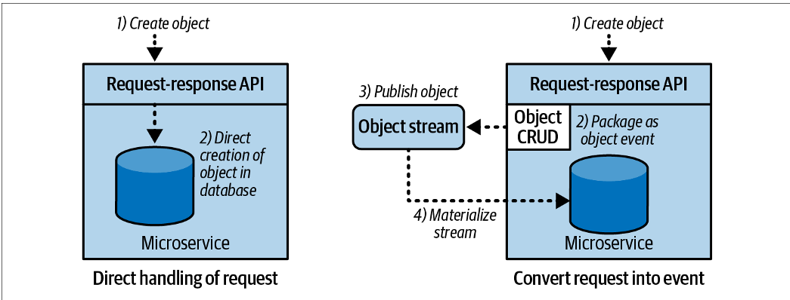

>Figure 17-10. Handling requests directly versus turning them into events first  

The left side shows a traditional object creation operation via the API with the results written directly to the database. The right side of the figure shows an event-first solution, where the request is packaged into an event first, and then published to a corresponding event stream. Next, the microservice materializes it from the stream into its internal data store, where it can process it as an addition along with any other required business logic.  

A major benefit of converting requests to events is that it provides a durable record both for auditing and for replaying. Your service can also cross-reference the request’s timestamp with the timestamps in its most recently consumed events, enabling your service to make decisions about when to serve the results back to the client. For example, the service can postpone fulfilling the request until it has processed all the events with an earlier timestamp.  

The biggest trade-off of writing the request to the event stream is the extra latency and added complexity. A response to the service making the call is delayed until the request has been published to the stream and subsequently processed. Meanwhile, async/await functions can allow the calling service to continue work on other things until the request is ready. Although this pattern isn’t suitable for all business use cases, it’s a handy tool to keep in your back pocket.  

## Processing Events for User Interfaces  

A UI is the means by which people interact with the microservice’s bounded context. Many applications commonly use a request-response framework to power their UI, responding synchronously to client requests to load web pages, images, and other data.  

Services that process requests as events and that require a UI typically rely on *asynchronous UI* frameworks. Asynchronous UI frameworks enable applications to remain responsive to user input while handling long-running tasks in the background. The UI continues to update as results come in, providing an experience that transparently exhibits the asynchronous event processing going on behind the scenes.  

You must ensure that the service behavior manages user expectations. In a synchronous system, a user that clicks a button may expect to receive a failure or success response quickly, perhaps in 500 ms or less. In an asynchronous service, it may take the processing service a few seconds to process and handle the response, especially if the event stream has a large number of records to process.  

You can use certain asynchronous UI techniques to help manage your users' expectations. For example, you can update the UI to indicate that their request has been sent, while simultaneously discouraging them from performing any more actions until it has completed. Airline booking and automobile rental websites often display a *making reservation, please wait* message with a spinning wheel symbol, blanking out the rest of the web page from user input. This informs users that the backend service is processing the event and that they can't do anything else until it completes.  

> [!TIP]
> Research and implement best practices for asynchronous UIs when handling user input as events. Proper UI design prepares the user to expect asynchronous results.  

Another factor to consider is that the service may need to continually process other events while awaiting further user input. You must decide when the service's event processing has progressed sufficiently for an update to be pushed to the UI.  

There are no hard-and-fast rules dictating when you must update the UI. The business rules of the bounded context can certainly guide you, predominantly around the impact of users making decisions based on the current state. Answering the following questions may help you decide how and when to update your UI:  

• What is the impact of the user making a decision based on stale state?  

• What is the performance/experience impact of pushing a UI update?  

> [!WARNING]
> Intermittent network failures can introduce duplicate requests and duplicate events. Ensure that your consumers can handle duplicates idempotently, as covered in “Generating duplicate events” on page 194.  

This next example demonstrates some of the benefits of converting requests directly
to events prior to processing.  

### Example: Newspaper Publishing Workflow (Approval Pattern)  

A newspaper publisher has an application that manages the layout of its publications. Each publication relies upon customizable templates to determine how and where articles and advertisements are placed.  

A graphical user interface (GUI) allows the newspaper designers to arrange and place articles using templated layouts. The latest and most important news is placed on the front pages, with less important articles placed further in. They can also position advertisements according to their own specific rules, usually dependent on size, content, budget, and placement agreements. Some advertisers, for instance, may not want their ads placed next to specific types of stories (e.g., a children's toy company may want to avoid having its ad placed alongside a story about a missing child).  

The newspaper designer is responsible for placing the articles and advertisements according to the layout template. The newspaper editor is responsible for ensuring that the newspaper is cohesive, that the articles are ordered by estimated importance to the reader, and that the advertisements are placed according to the contracts. The newspaper editor must approve the designer's work before sending the newspaper off to the printer, though they can also reject it and send it back for redesign. Figure 17-11 illustrates this workflow.  

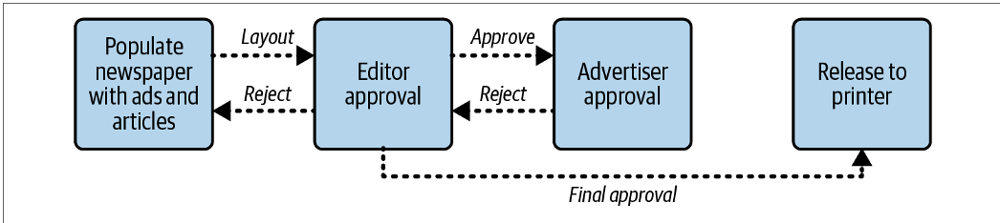

>Figure 17-11. Workflow for populating a newspaper, with gating based on approval by
editor and advertiser  

Both the editor and the advertiser can reject the proposed layout, though the advertiser will get the chance to do so only after the editor approves the candidate layout. Furthermore, the newspaper is interested in obtaining approval from only the most important advertisers, those whose ad spend is a significant source of revenue. The rest of the advertisers have no overriding say.  

The design and the approval of the newspaper are two separate bounded contexts, each concerned with its own business functionality. This can be mirrored by two microservices, as shown in Figure 17-12. For simplicity's sake, the figure omits accounts, account management, authentication, and login details.  

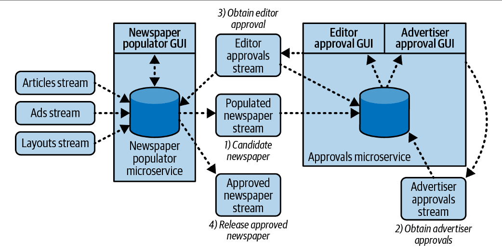

>Figure 17-12. Newspaper design and approval workflow as microservices  

There is a fair bit to unpack in this example, so let's start with the newspaper
populator microservice. This service consumes layout templates, advertisements, and
articles streams into a relational database. Here, an employee arranges the components into the layout, then compiles it into a PDF and saves it to an external store.
Next, they send it for approval as a candidate newspaper (1) by writing it to the event
stream. Example 17-6 shows the format for the candidate populated newspaper event.  

### Example 17-6. Populated newspaper event  

Key: String pn_key // Populated newspaper key
Value: {
    String pdf_uri // Location of the stored PDF
    int version // Version of the populated newspaper
    Pages[] page_metadata // Metadata about what is on each page
    - int page_number
    - Enum content // Ad, article
    - String id // ID of the ad or article
}  

> [!TIP]
> The PDF can be stored in an external file store if it's too large to store in the event. Access is provided via the universal resource identifier (URI). Note that you'll have to manage permissions yourself.  

You may have noticed that this microservice does *not* translate the human interactions of the employee into events—why is this? Despite *human interactions as events*being one of the main themes of this example, it is not necessary to convert all human
interaction into events.  

You can use whatever frameworks and data stores you want to build this microservice. You may choose to leverage a monolithic framework that supports request-response patterns out of the box, and only introduce an event-stream producer when writing to the output stream.  

> [!WARNING]
> There is a risk that the populated newspaper stream may get out of sync with the state within the newspaper populator microservice. See "Data Liberation Patterns" on page 130 for details on atomic production from a monolith, particularly using the outbox table pattern or change-data capture logs.  

The editor and advertiser approvals are handled by a separate microservice. The service consumes the populated newspaper event and loads it into local storage for display to the editor to view and approve. They can mark up the copy of the PDF as necessary, add comments, and provide tentative approval to move it on to the next step of advertiser approval. The editor may also reject it at any point in the workflow, before, during, or after obtaining advertiser review.  

Example 17-7 contains the structure of the editor approval event.  

Example 17-7. Editor approval event  

Key: String pn_key // Populated newspaper key
Value: {
    String marked_up_pdf_uri // Optional URI of the marked-up PDF
    int version // Version of the populated newspaper
    Enum status // awaiting_approval, approved, rejected
    String editor_id
    String editor_comments
    RejectedAdvertisements[] rejectedAds //Optional, if rejected
    - int page_number
    - String advertisement_id
    - String advertiser_id
    - String advertiser_comments
}  

Advertisers are provided with a UI for approving their advertisement size and placement. This service is responsible for determining *which* advertisements require approval and which do not, and for cutting up the PDF into appropriate pieces for the advertiser to view. It is important to not leak information about news stories or competitors' advertisements.  

Approval events are written to an advertiser's approval stream, similar to that of the
editor. They are shown in Example 17-8.  

### Example 17-8. Advertiser approval event  

Key: String pn_key // Populated newspaper key
Value: {
    String advertiser_pdf_uri // The PDF piece shown to the advertiser
    int version // Version of the populated newspaper
    int page_number
    boolean approved // Approved or not
    String advertisement_id
    String advertiser_id // ID of the approver
    String advertiser_comments
}  

You may have noticed that the advertiser approvals are keyed on pn_key and that there will be multiple advertiser events with this same key per newspaper. The advertiser approvals are *non-entity events*. You can have many advertiser approvals from the same or from different advertisers. It is the *aggregate* of these events that determines the complete approval by an advertiser for the newspaper.  

Each advertiser logs in to the GUI and approves their ads independently. It's not until all advertisers have replied (or perhaps, failed to reply in time) that the process can move on to the final approval. If you take a look at the editor approval event definition (see Example 17-7), you can see that the aggregation of rejected events is represented as an array of RejectedAdvertisements objects.  

One benefit of having populated newspaper, editor approval, and advertiser approval as events is that together they form the canonical narrative of candidate and final newspapers, rejections, comments, and approvals. You can audit this narrative at any point in time to see the history of submissions and approvals, and pinpoint where things may have gone wrong.  

### Example: Separating the Editor and Advertiser Approval Services  

Fast-forward in time. Changing business requirements now demand the separation of the editor approvals from the advertiser approvals into their own microservices. Each of these serves a related, though separate, business context.  

The advertiser components of the currently combined service are responsible for:  

• Determining which advertisers to ask for approval  

• Slicing up the PDF into viewable chunks  

• Managing advertiser-facing components, controls, and branding  

• Handling public-facing exposure to the wider internet, particularly around security practices and software patches  

The editor components of the combined service, on the other hand, do not need to address public-facing concerns such as image, branding, and security. It is primarily concerned with:  

• Approving overall layout, design, and flow  

• Assessing the summary of retailer responses (not each one individually)  

• Providing suggestions to the newspaper designer on how to accommodate adver-
tiser rejections  

A mock-up of the new microservice layout is shown in Figure 17-13.  

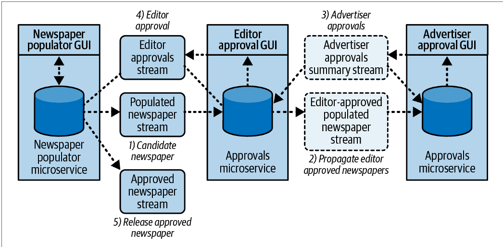

>Figure 17-13. Independent advertiser and editor approval services  

There are two new event streams to consider. The first is the editor-approved populated newspaper stream (2). The format of this stream is identical to that of the populated newspaper stream (1), but is only produced after the editor decides to release it for advertiser approval.  

A major advantage of this design is that *all* editor gating logic stays completely within the editor approval microservice. Updates to the populated newspaper stream are *not* automatically forwarded on but rely on the editor to release them for approval. Multiple versions of the same newspaper (pn_key) are contained entirely within the editor service. This arrangement lets the editor control which versions are sent on for approval, while gating any further revisions until they are satisfied with the initial advertiser feedback.  

The advertiser approvals summary stream (3) is the second new event stream. It contains the summaries of the results from the advertiser approval service, designed to provide both a historical record and the current approval status.  

The advertiser approval service contains the business logic that decides which advertisements require advertiser approval and which do not. These decisions are opaque to the editor and layout service, as it is outside of their bounded contexts.  

The format of the ad-approval summary event is shown in Example 17-9. It demonstrates the encapsulation of advertiser approval state into the advertiser approval service.  

#### Example 17-9. Advertiser approval summary event  

Key: String pn_key
Value: {
    int version // Version of the populated newspaper
    AdApprovalStatus[] ad_app_status
    - Enum status // Waiting, Approved, Rejected, Timedout
    - int page_number
    - String advertisement_id
    - String advertiser_id
    - String advertiser_comments
}  

The editor can make decisions on the newspaper's approval based on the statuses of the ad-approval summary event, without having to manage or handle any of the work of obtaining those results. The ultimate decision to approve or reject the candidate newspaper still lies entirely in the hands of the editor.  

## Micro Frontends for Request-Response Applications  

Micro frontends are a popular choice for integrating event-driven microservices into the interfaces that power user experiences. A *micro frontend* is a microservice that handles a specific business concern, but that also provides the API to power a consumer-facing interface.  

Figure 17-14 illustrates three main approaches to organizing customer-facing content. In both of the monolithic and microservice backend approaches, the frontend and backend services are owned and operated by separate teams powering a single frontend layer. In contrast, a micro frontend's approach aligns implementations on the business concerns, including the data store, the backend, and the frontend.  

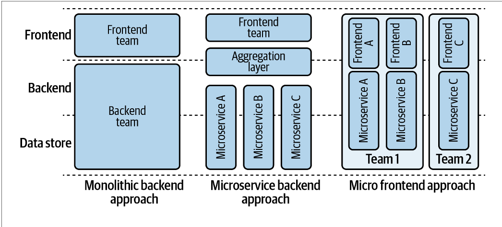

>Figure 17-14. Three main approaches to organizing products and teams for customer-facing content  

The monolithic backend approach is one that most software developers are familiar with (to one extent or another). In many cases, a dedicated backend team, usually composed of many other subteams in the case of very large monoliths, perform most of the work on the monolith. Head count increases as the monolith grows.  

The frontend team is completely separate from the backend, and they communicate via a request-response API to obtain the necessary data for rendering the customer's UI. A product implemented in this architecture has to coordinate efforts between teams and across technical implementations. It can be challenging to coordinate changes that cross the team and technology boundaries.  

The microservice backend approach is one where many teams migrating to microservices eventually end up, and for better or worse, it is where many of them stay. The major advantage of this approach is that the backend is now composed of independent, *product-focused* microservices, with each microservice (or set of product-supporting microservices) independently owned by a single team. Each microservice materializes data, performs its business logic, and exposes any necessary request-response APIs and event streams up to the aggregation layer.  

A major downside of the microservice backend approach is that it still depends heavily on an aggregation layer that pulls together all the backend interfaces. This is where the problems can pop up, as it provides fertile ground for introducing ad hoc business logic. For example, logic that should be in the backend may be easier to just put into the aggregation layer, particularly due to team and deployment boundaries and *not* because it's the better place to put it.  

The aggregation layer often suffers from the tragedy of the commons, whereby everyone relies on it but no one is responsible for it. While this can be resolved to some extent by a strict stewardship model, accumulations of minor, seemingly innocent changes can still let an inappropriate amount of business logic leak through.  

The third approach, micro frontends, split up the monolithic frontend into independent components each backed by a supporting backend microservice. Micro frontends are the extension of microservices to the frontend world, applying the same concepts of modularity, separation of business concerns, team autonomy, and language, deployment, and codebase independence.  

Instead of theorizing more about micro frontends, let's instead turn to an example to see how they can work in practice.  

## Example: Experience Search and Review Application  

An experience is something you'll never forget! claim the makers of the application, which connects vacationers with local guides, attractions, entertainment, and culinary delights. Users can search for local experiences, obtain details and contact information, and leave reviews.  

The first version of this application has a single service that materializes both the experience entities and customer reviews into a single endpoint. Users can input their city name to see a list of available experiences in their area. Once they select an option, the experience information along with any associated reviews are displayed, as in the simple mockup in Figure 17-15.  

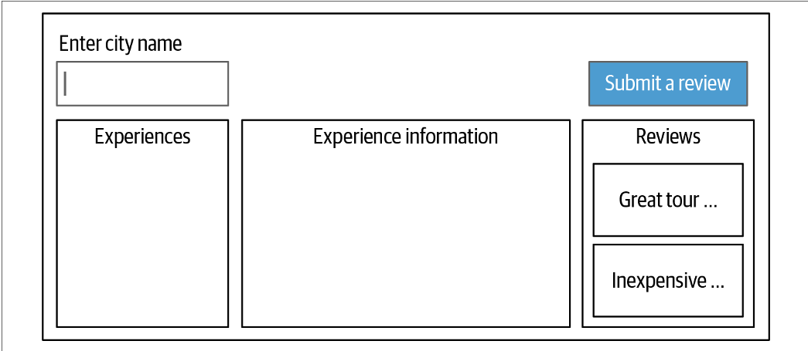

>Figure 17-15. Experiences search and review application, GUI mockup version 1 with monolithic frontend  

In the first version of the application, data is stored in a basic key-value state store that offers only limited searching capabilities. Searching based on the user's geolocation is not yet available, though it is something your users have been requesting. Additionally, it would be a good idea for version 2 to split off reviews into their own microservice, as they have sufficiently distinct business responsibilities to form their own bounded context. Finally, you should create the product micro frontend to stitch these two products together and act as the aggregation layer for each business service. Each of these three micro frontends may be owned and managed by their own team, or the same team, though the separation of concerns allows for scaling ownership just as in backend microservices. A new mockup of the GUI showing the separated frontend responsibilities is shown in Figure 17-16.  

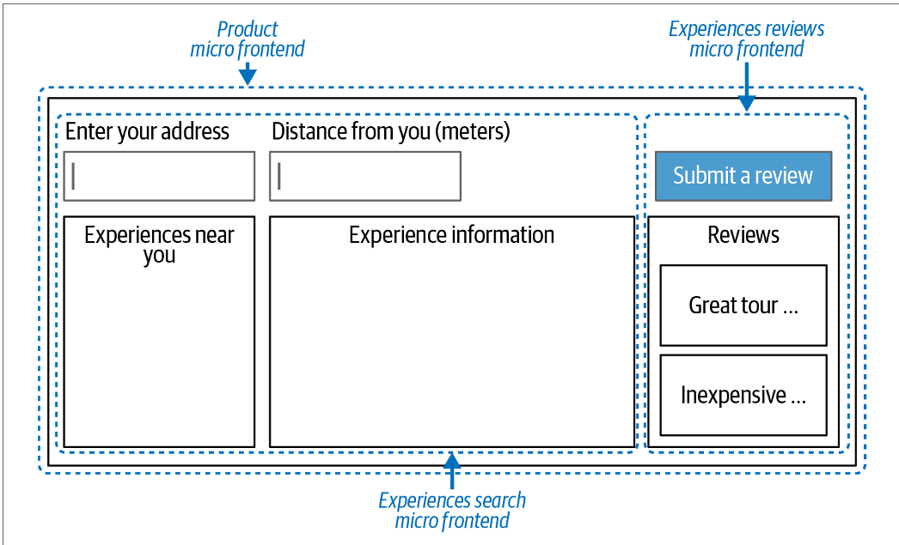

>Figure 17-16. Experiences search and review application, GUI mockup version 2 with micro frontends  

Now the product boundary encapsulates both the search and review micro frontends and contains all the logic necessary to stitch these two services together. It does not, however, contain any business logic pertaining to these services. This updated UI also illustrates how the micro frontend's responsibilities have changed, as it must now support geolocation search functionality. The user's address is transposed into latitude and longitude coordinates (lat-lon), which can be used to compute the distance to nearby experiences. Meanwhile, the review micro frontend's responsibilities remain the same, but it is freed of its coupling to the search service. Figure 17-17 shows how this migration into micro frontends could look.  

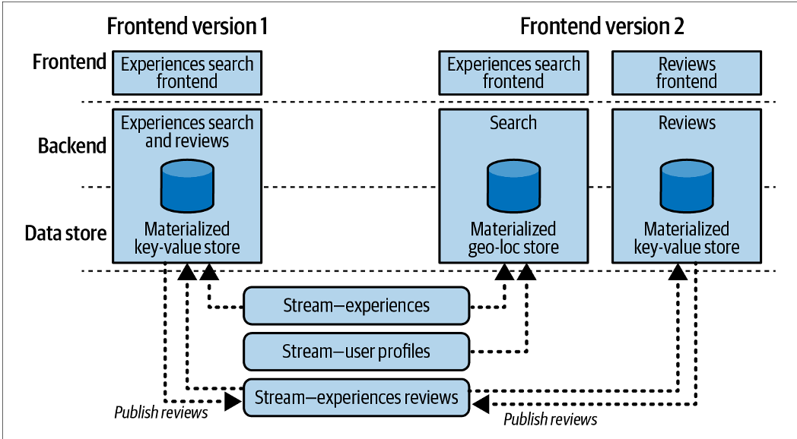

>Figure 17-17. The flexibility of micro frontends paired with backend event-driven microservices  

There are a few notable points about this figure. First, as discussed earlier in this chapter, the reviews are being published *first* as events to the review event stream, and *then* subsequently ingested back into the data store. This is true for both versions of the service, and it illustrates the importance of keeping core business data external to the implementation. In this way you can easily break out the review service into its own microservice, without performing unnecessary and error-prone operations with data synchronization.  

If the reviews were kept internal to version 1's data store, you would instead have to look into liberating them for version 2's use (Chapter 6) and then come up with a migration plan for its long-term storage in an event stream.  

> [!TIP]
> The ability to materialize and consume any stream of business events, however the service needs them, is what makes event-driven microservice backends pair so effectively with micro frontends.  

Second, the review service has been broken out into its own microservice, fully separating its bounded context and implementation from those of search. Third, the search service has replaced its state store with one capable of both plain-text and geolocation search functionality. This change supports the business requirements of the search service, which can now be addressed independently of the review service business requirements. This solution illustrates how composition-based backends give development teams the flexibility to use the best tools to support the microfrontend product.  

In this new version, the search microservice consumes events from the user profile entity stream to personalize search results. While version 1 of the backend service could certainly also consume and use this data, the increased granularity of the services in version 2 clarifies which business functions are using the user data. An observer can tell which streams are consumed and used for each part of the frontend just by looking at the input streams for the bounded contexts. Conversely, in version 1, without digging into the code, an observer would have no idea whether it’s thesearch or the review portion using the user events.  

Finally, note that the events for both the old and new versions are sourced from the exact same event streams. You can change the application backends without having to worry about maintaining a specific state store implementation or about migrating data. You simply replay it from the stream. This is in stark contrast to a monolithic backend, where the data is tightly coupled into the database and cannot be easily swapped out. The combination of an event-driven backend paired with a microfrontend is limited only by the granularity and detail of the available event data.  

### The Benefits of Micro Frontends  

There are several key benefits to adopting a micro frontend strategy:  

#### Composable  

Micro frontends enable a compositional pattern, meaning you can compose interfaces with services to suit your business requirements. By sourcing data from event streams, you can spin up new microservices quickly and easily, letting you experiment with different products to find the ones that fit best. If none of them work well, you can simply turn them off without leaving code remnants lying around.  

#### Pluggable  

You can add new frontends without interfering or disrupting the old frontends. The same micro frontend can power multiple products and experiences. You simply plug it into the interface that requires it.  

### Independent  

Just like their backing microservices, the micro frontends are independent of one another. You can use whatever frameworks, languages, state stores, and technologies you choose to build them. You can also test and release them at your own leisure, no longer tied to a singular deployment schedule. Additionally, ownership of these small independent services is easier to determine than trying to suss out who owns what in a single large service.  

### Leverages full-stack skill sets  

An oft-overlooked benefit of micro frontends is that they preserve and utilize the full-stack skill set that many developers have built up over the years. They still have the opportunity to work on frontend, backend, and data store layers, but the scope is narrower and encompasses just their business requirements.  

## The Drawbacks of Micro Frontends  

While micro frontends enable separation of business concerns, there are some drawbacks:  

#### Inconsistent UI elements and styling  

Unlike with a single monolithic service, multiple frontend services have a greater chance of UI element mismatch. Color schemas, fonts, sizing, and layouts are essential to a clean frontend experience, but can be challenging to unify. It’s important that you coordinate efforts to come up with a unified look and feel for your user’s experience. Creating a style guide and a common library of basic elements can help reduce friction. Cross-team coordination, testing, and verification are important steps for ensuring a consistent experience.  

### Cross-service updates  

Updating multiple services with mandatory fixes is also more challenging when compared to a monolithic approach. Micro frontends tend to be subject to more frequent changes than their backend counterparts, often due to the shared libraries that help shape the user experience.  

### Varying performance and load times  

Micro frontends may load at different rates, or worse, may not load anything at all during a failure. You must ensure that the composite frontend can handle these scenarios gracefully and still provide a consistent experience for the parts of it that are still working. For example, you may want to use spinning loading logos for elements that are still awaiting results. Stitching these micro frontends together is an exercise in proper UI design, but the deeper details and nuances of this process are beyond the scope of this book.  

## Summary  

This chapter covered the integration of event-driven microservices with request-response APIs. External systems predominantly communicate via request-response APIs, be they human or machine driven, and their requests and responses may have to be converted into events. Machine input can be schematized ahead of time, to emit events that can be collected server-side via the request-response API. Third-party APIs typically require parsing and wrapping the responses into their own event definition, and tend to be more brittle.  

Requests can also be converted into events, to be processed asynchronously by the consuming event-driven microservice. This requires an integrated design, where the user interface cues the user that their request is being handled asynchronously.  

Finally, micro frontends provide an architecture for full-stack development of products based on event-driven microservices, drawing together events and entities to compose the necessary data model. This pattern is extended to the frontend, where user experiences need not be one large monolithic application, but instead can comprise a number of purpose-built micro frontends. Each micro frontend serves its particular business logic and functionality, with an overall compositional layer to stitch the various applications together. This architectural style mirrors the autonomy and deployment patterns of the backend microservices, providing full product alignment and allowing flexible frontend options for experimentation, segmentation, and delivery of custom user experiences.  

In the next chapter, we'll take a look at how we can prevent bad data from getting into
your event streams, and what to do if it does.  

# Handling Bad Data in Event Streams

At a high level, bad data is data that doesn’t conform to what is expected; for example, an email address without the @ or a credit card expiry where the MM/YYYY format is swapped to YYYY/MM. Bad can also include malformed and corrupted data, such that it’s completely indecipherable and effectively garbage. This chapter covers how bad data can come to be, and how you can deal with it when it comes to event streams.  

Event streams are predicated on an immutable log, where data, once written, cannot be edited or deleted (outside of expiry or compaction—more on this later in the chapter). Despite all the benefits of the immutable log, the downside is that it makes it trickier to deal with bad data. You can’t simply reach in and edit it once it’s produced to the stream, like you could do with data in a mutable data store.  

There is no one successful way to handle bad data in event streams. Instead, you’ll need to rely on a set of strategies to prevent, mitigate, and fix bad data in streams. The most successful strategies for mitigating and fixing bad data in streams include, in order:  

#### Prevention  

Prevent bad data from entering the stream in the first place: use schemas, testing, and validation rules. Fail fast and gracefully when data is incorrect.  

### Event design  

Use event designs that let you issue corrections, overwriting previous bad data.  

Rewind, rebuild, and retry  

For when all else fails.  

To properly discuss these three options, we need to explore what kind of bad data we’re dealing with and where it comes from. So let’s take a quick side trip into themain types of bad data you can expect to see in an event stream.  

### The Main Types of Bad Data in Event Streams  

We’ll examine eight types of bad data, each with its own causes and impacts. As we go through the types, you may notice a recurring reason for how bad data can get into your event stream. We’ll revisit that reason at the end of the section.  

#### Type 1: Corrupted Data  

The data is simply indecipherable, as shown in Figure 18-1. The consumer is unable to make any sense of whatever the event may have been. Data corruption is relatively rare, but may be caused by faulty serializers that convert data objects into a plain array of bytes.  

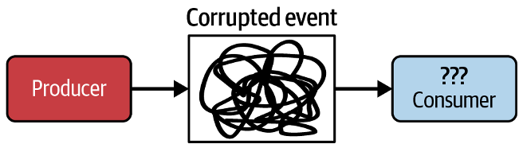

>Figure 18-1. Corrupted event data, likely due to faulty serializers  

#### Type 2: Event Has No Schema  

Someone has decided to send their events with no schema, as shown in Figure 18-2. How do you know what’s good data and what’s bad data, if there are no types, names, requirements, limitations, or structure? It becomes impossible to tell without a formal definition.  

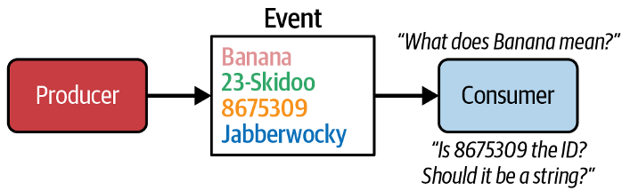

>Figure 18-2. An event sent without a schema, forcing interpretation down onto the consumer  

#### Type 3: Event Has an Invalid Schema  

Your event’s purported schema can’t be applied to the data. Consider Figure 18-3.  

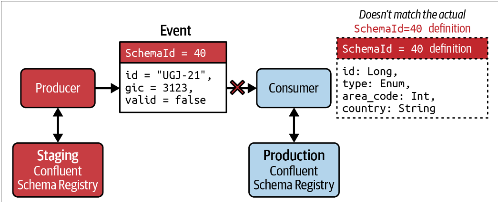

>Figure 18-3. An event sent with a SchemaId that doesn’t match the schema registry  

In this example, you’re using the Confluent Schema Registry, but your event’s SchemaId doesn’t correspond to a valid schema. It is possible you deleted the schema or that your serializer has inserted the wrong SchemaId (perhaps for a different schema registry, in a staging or testing environment).  

## Type 4: Incompatible Schema Evolution  

This type of bad data uses a schema as shown in Figure 18-4, but the consumer cannot convert the data into a suitable form.  

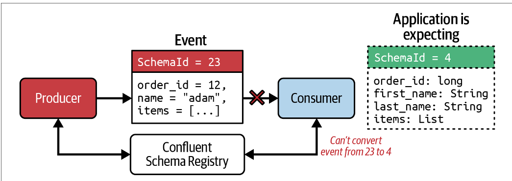

>Figure 18-4. The event the consumer receives cannot be converted to the consumer’s schema  

The event is technically deserializable, but can’t be converted to the schema that the consumer expects. This error often occurs because your source has undergone breaking schema evolution, but your consumers have not been updated to account for it.  

## Type 5: Logically Invalid Value in a Field  

Your event has a field with a value that should never be—for example, an array of integers for first_name or a null in a field declared as non-nullable as in Figure 18-5.  

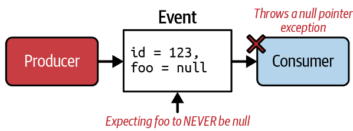

>Figure 18-5. The event contains data that violates the consumer's understanding of the data, resulting in an exception  

This error type arises when you are not using a well-defined schema, but simply
a set of implicit conventions. It can also arise if you are using incomplete, old, or
homemade libraries for serialization that ignore parts of your serialization protocol.  

## Type 6: Logically Valid Value but Semantically Incorrect  

These types of errors are a bit trickier to catch. For example, you may have a
serializable string for a `first_name` field, but the name is `Robert'`); DROP TABLE
Students; -. While this is a logically valid answer for a `first_name` field, it is highly
unlikely/improbable that this is the intended set of characters for a person's first
name. While sanitizing user input is always a best practice, it's not just user data that
can contribute to this scenario.  

Figure 18-6 shows an event with a negative cost. What is the consumer supposed to do with an order where the cost is negative? This could be a case of a bug that slipped through into production, a semantic change in the event schema definition, or a sign of something more serious. But since it doesn't meet the consumer's expectations, from their perspective it's just bad data.  

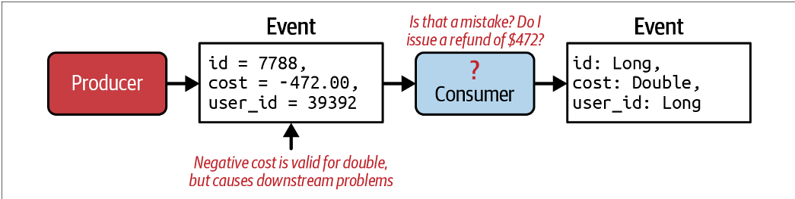

>Figure 18-6. Data that logically adheres to the schema types, but in unexpected ranges  

Some systems are more prone to creating data with these types of errors—for example, a service that parses and converts NGINX server logs or customer-submitted YAML/XML files of product inventory into individual events. Malformed data sources may also be responsible for these types of errors, such as concatenated phone numbers with varying spaces, dashes, and special symbols.  

## Type 7: Missing Events  

Missing events are relatively straightforward. No data was produced, but there should have been something.  

The nice thing about this type of bad data is that it's fairly easy to prevent via testing. However, it can have quite an impact if only some data is missing, such as when relying on event sourcing.  

### Type 8: Events That Should Not Have Been Produced  

These types of bad events are typically created due to bugs in your producer code.
The service may fail, come back online, and repeat its processing from its last known
good state. This can result in a set of duplicate output events, including:  

• An event that indicates a change or delta (add 1 to sum), such that an aggregation of the data leads to an incorrect value.  

• An analytics event, such as tracking which advertisements a user clicked on. This could lead to an overinflation of engagement computations.  

• An ecommerce order with its own unique order_id, as per Figure 18-7. It may cause a duplicate order to be shipped (and billed) to a customer.  

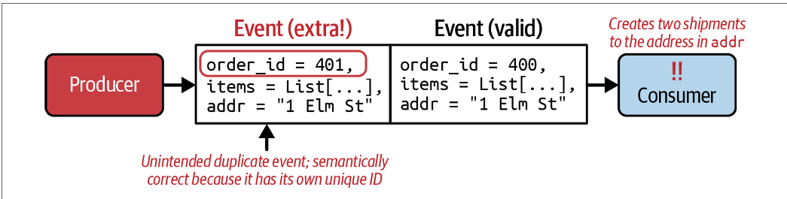

>Figure 18-7. An extra event incorrectly produced to the event stream  

It is possible to fence out one source of duplicates with idempotent production
(e.g., using the Kafka idempotent producer), meaning that intermittent failures and
producer retries won't accidentally create duplicate events. However, it cannot fence
out duplicates that are logically indistinguishable from other events.  

Now that we’ve covered the main types of bad data you’re likely to see, it’s time tolook at the three main strategies for handling it.  

### Preventing Bad Data with Schemas, Validation, and Tests  

Prevention is the number one approach to eliminating bad data. It’s far easier to prevent bad data from getting into your streams than it is to try to fix the data later.  

> [!TIP]
> It cannot be overstated how important prevention is for fixing bad data problems. It takes far less effort and cost to invest in prevention than any other strategy.  

First and foremost are schemas, as covered in Chapter 4. The Confluent Schema Registry (and others like it) supports Avro, Protobuf, and JSON Schema. Choose one of those schemas and use it. They make it easy to create, test, validate, and evolve your event data.  

## Preventing Bad Data Types 1–5 with Schemas and Schema Evolution  

Schemas significantly reduce your error incident rates by preventing your producers from writing bad data, making it far easier for your consumers to focus on using the data instead of making best-effort attempts to parse its meaning. Schemas form a big part of preventing bad data. At the risk of being repetitive, it’s far easier to just prevent bad data from getting into your streams than it is to try to fix it later.  

JSON is a lightweight data-interchange format. It is a common yet poor choice for events; it doesn’t enforce types, mandatory/optional fields, default values, or schema evolution. While JSON has its uses, you should use an explicitly defined schema such as Avro, Protobuf, or JSON Schema for your event definitions (see Chapter 4 for schema review).  

Implicit schemas, historical conventions, and tribal knowledge are unsuitable for providing data integrity. Use a schema, make it strict, and reduce your consumers’exposure to unintentional data issues. Once adopted, you can rely on your CI/CD pipelines to perform schema, data, and evolution validation before deploying. The result? No more bad data getting into your production streams.  

## Data Quality Rules: Handling Type 6: (Logically Valid But SemanticallyIncorrect)  

While many of the bad data problems can be avoided by using schemas, they are only a partial solution for this type. While they can enforce the correct type (e.g., no more storing Strings in Integer fields), they can’t guarantee the specific semantics of the data. So what are your options?  

• Producer unit tests  

• Throw exceptions if malformed (e.g., if phone number is longer than X digits)  

• Data contracts and data quality rules  

Here’s an example of a Confluent data quality rule for a US Social Security number (SSN):  

{"schema":"...","ruleSet":{"domainRules":[{"name":"checkSsnLen","kind":"CONDITION","type":"CEL","mode":"WRITE","expr":"size(message.ssn)== 9"}]}}  

This rule enforces an exact length of nine characters for the SSN. If it’s an integer, you could also enforce that it must be positive, and if a string, that it must contain only numeric characters.  

The data quality checks are applied when the producer serializes the data into a Kafka record. If the message.ssn field is not exactly nine characters in length, then the serializer will throw an exception and the record will not be written to the event stream. You could then terminate the producer service, skip the record, or send the record to a dead-letter queue (DLQ).  

Approach DLQ usage with caution. Simply shunting the data into a side stream means that you’ll still have to deal with it later, typically by repairing it and resending it. DLQs work best where each event is completely independent, with no relation to any other event in the stream, and ordering is not important. Otherwise, you run the risk of presenting an error-free, yet incomplete, stream of data, which can also lead to its own set of miscalculations and errors.  

DLQs remain a good choice for when all else fails, but they should truly remain a last-ditch effort. Try to ensure that you test, trial, and foolproof your producer logic to publish your record to Kafka correctly the first time.  

### Testing: Handling Types 7 (Missing Data) and 8 (Data That Should Not Have Been Produced)  

Third in the trio of prevention heroes is testing, especially for data that is either missing or should not have been produced. Write unit and integration tests that exercise your serializers and deserializers, including schema formats (validate against your production schema registry), data validation rules, and the business logic that powers your applications. Integrate producer testing with your CI/CD pipeline so that your applications go through a rigorous evaluation before they're deployed to production. Testing is covered in more detail in Chapter 20.  

## The Role of Event Design in Fixing Bad Data  

Event design heavily influences the impact of bad data and your options for dealing with it. Chapter 5 first introduced the state and delta event models.  

As a refresher, state events contain the entire statement of fact for a given entity (e.g., Order, Product, Customer, Shipment). Think of state events exactly as you would think about rows of a table in a relational database—each presents an entire accounting of information, along with a schema, well-defined types, and defaults.  

Delta events describe the change between one state and another. They contain information that requires the consumer to aggregate a sequence of events to generate the current state. Figure 18-8 shows an example of the two main event types.  

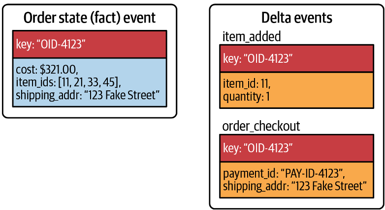

>Figure 18-8. State shows the entire state of the entity, whereas deltas just show the changes  

State events enable event-carried state transfer (ECST). They can materialize the state events into their own services and data stores, according to their own business needs. Figure 18-9 shows a basic materialization.  

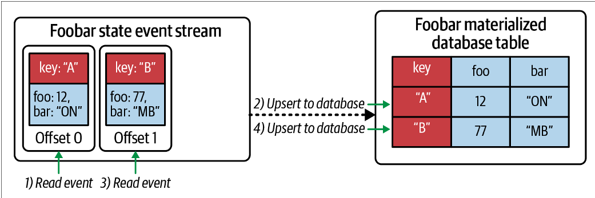

>Figure 18-9. Materializing an event stream made of state events into a table  

In Figure 18-10, a new state event with key A is published to the stream, and subsequently upserted into the materialized table in the consumer microservice.  

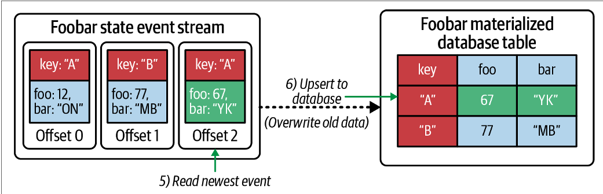

>Figure 18-10. Overwriting data of a specific key with the newest version of the state event  

State events benefit from compaction, first introduced in “Deleting Events and Event-Stream Compaction” on page 37. The compactor can delete the events that have newer values of the same key without affecting a service’s ability to materialize the current state. With delta events, this is simply not possible—you need every single delta to correctly build up the current state. Compaction is a critical function for allowing you to delete bad data, private data, and/or sensitive data that should not bein the event stream.  

### Fix It Once and Fix It Right with State Events  

The state model enables you to fix bad data by publishing a new event with the correct data. It will propagate to all downstream consumers, and the event broker's compaction mechanism will eventually clean up the older bad data records.  

Your consumers still must deal with any incorrect side effects from the earlier bad data. This is unavoidable. If they've already made business decisions based on the bad data, they're going to need to undo those decisions or issue a compensation (see Chapter 10). This is the same as if you had bad data in a non-event-driven system—any decisions made off the incorrect data, either by consuming an event stream or querying a table, must still be accounted for.  

Connectors (introduced in Chapter 6) are the most common way to bootstrap events from a database. Updates made to a registered database's table rows (create, update, delete) are emitted to a Kafka topic as discrete state events. With connectors, you just need to fix the data in your source database, as shown in Figure 18-11. The change-data connector takes the data from the database log, packages it into events, and publishes it to the compacted output topic.  

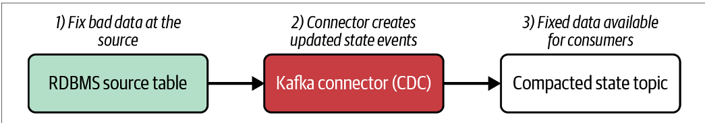

>Figure 18-11. Fix the bad data at the database source and propagate it to the compacted state topic  

Similarly, a Kafka Streams application, as shown in Figure 18-12, can rely on compacted state topics as its input. The developer writing the service knows that it'll always get the eventually correct state event for a given record. In turn, it will publish its own corrected events downstream as required.  

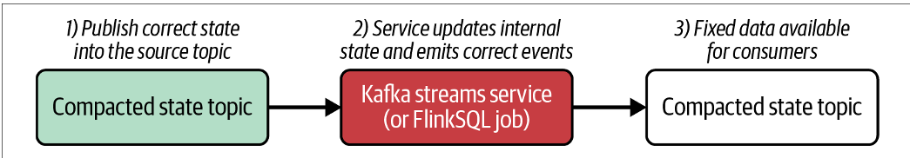

>Figure 18-12. Fix the bad data in the compacted source topic and propagate it to the downstream compacted state topic  

If the service itself receives bad data (say, a bad schema evolution, or even corrupted data), it can log the event as an error, divert it to a DLQ, and continue processing the other data.  

Finally, consider an FTP directory where external business partners drop their documents containing information about their business. For example, say they drop a daily batch-based export of their total product inventory, so that your business can display the current stock to the customer. Figure 18-13 shows a simple batch-based workflow that responds to new files being added to the FTP directory.  

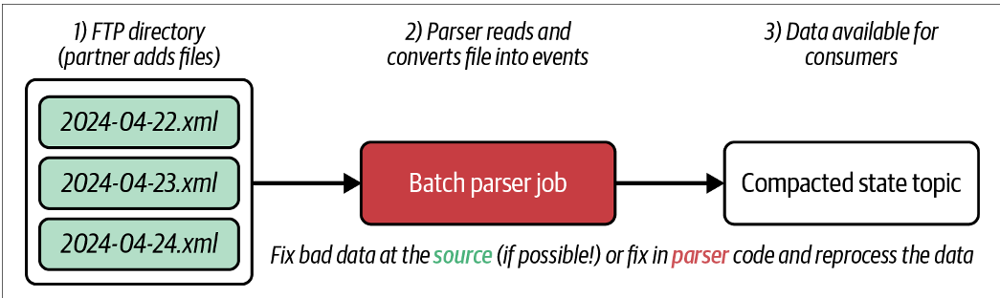

>Figure 18-13. Bad data dropped into an FTP directory by a careless business partner  

You probably aren't going to run a full-time streaming job just to wait for updates to this directory. It would be expensive and would spend the vast majority of its time idling away. Instead, you'd likely use a listener trigger to kick off a job to parse the data out of the .xml file and convert it into inventory state events keyed on the productId. AWS Lambda and other function-as-a-service solutions are well suited for this use case, as covered in Chapter 15.  

It's possible your business partner isn't able to commit to using a well-defined
schema. In this case, you're likely to encounter frequent break-fix work, sometimes
requiring them to re-create the data file, other times requiring you to update your
parsing logic. A lack of strong schema is quite frustrating to work with, and despite
your best efforts may result in a chronic source of bad data.  

> [!TIP]
> Try to get external partners to comply with a basic schema definition. You may need to provide them software SDKs or validation tools to make it easier for them, but it will help you in the long run to reduce your sources of bad data and subsequent break-fix work.  

State events are powerful. They're easy to fix. Your event broker can compact them. They map nicely to database tables. You can store only what you need, and you can infer the deltas from any point in time so long as you've stored them.  

But what about deltas, where the event doesn’t contain state, but rather describes some sort of action or transition? How can you fix bad data for these?  

### Build Forward: Undo Bad Deltas with New Deltas  

Your options for fixing and mitigating bad data with deltas is much more limited than with state events. The major obstacle to fixing deltas (and any other non–state event, like commands) is that you can’t compact them—no updates, no deletions. Every single delta is essential for ensuring correctness, as each new delta is in relation to the previous delta. A bad delta represents a change into a bad state. So what do you do when you get yourself into a bad state? You really have two strategies:  

• Build forward by undoing the bad deltas with new deltas. Note that this is actually quite challenging to do in practice and error-prone.  

• Rewind, rebuild, and retry by filtering the bad data out of the stream and restoring the consumers from either their snapshots or from the source event stream(s). Note that this option is very labor-intensive and also very error-prone, and is covered more in the next section.  

> [!WARNING]
> Delta events have no mechanism for purging data from the event stream under legal obligations, such as the right to be forgotten under GDPR. You must be very careful to ensure that the data you write to the delta stream contains no sensitive information under the legal obligations of your business.  

Build forward requires identifying all the bad events and coming up with a way to remediate the results. One option is to issue undo events that reverse the bad data, though you’ll need to work very closely with the consumers to ensure that they can correctly process and apply undo events. There is also a risk that you end up with bad data in the undo process itself, such as duplicate events. A second option for build forward is to create a compensation, as was covered in “The Compensation WorkflowPattern” on page 237.  

Deltas, by definition, create a tight coupling between the delta event models and the business logic of the consumers. There is only one way to compute the correct state, and an infinite number of ways to compute the incorrect state. And some incorrect states are terminal; a package, once sent, can’t be unsent, nor can a car crushed into a cube be un-cubed.  

Any new delta events, published to reverse previous bad deltas, must put your consumers back to the correct good state without overshooting into another bad state. It remains challenging to guarantee that the published corrections will fix your consumer’s derived state. You would need to audit each consumer’s code and investigate the current state of their deployed systems to ensure that your corrections would indeed correct their derived state. The difficulty of this task is why it’s largely only feasible to issue build-forward events when the delta events are used by just onetightly coupled consumer.  

You may find success in using a build-forward strategy if the producer and consumer are tightly coupled and under the control of the same team. The team controls entirely the production, transmission, and consumption of the events, and could proceed to more intensive intervention without adversely affecting any other teams.  

While rebuild, rewind, and retry can be useful for fixing deltas, it’s also a viablestrategy for all other event types too, as shown in the next section.  

#### The Last Resort: Rewind, Rebuild, and Retry  

This last strategy is one that you can apply to any topic with bad data, be it delta, state, hybrid, or other event type. It’s expensive and risky. It’s labor-intensive and costs a lot of people hours, and it’s easy to make a mistake if you’re not careful and deliberate. But sometimes, for circumstances beyond your control, you find yourself looking at this last resort.  

Consider two example scenarios and how you could go about fixing the bad data.  

#### Rewind, Rebuild, and Retry from an External Source  

In this scenario, there’s an external source from which you can rebuild your data. For example, an NGINX or gateway server where a connector parses each row into its own well-defined event.  

First, figure out what caused the bad data. Say someone deployed a new logging configuration that changed the format of the logs, but then failed to update the parser in lockstep (another point for good testing). The server logfile remains the replayable source of truth, but all of your parsed events from a given point in time onward are malformed and have resulted in incorrect data propagating downstream.  

If your parser/producer uses schemas and data quality checks, then you could have shunted the bad data to a DLQ. You would have protected your consumers from the bad data, but delayed their progress. Repairing the data in this case is simply a matter of updating your parser to accommodate the new log format and reprocessing the logfiles. The parser produces correct events, sufficient schema and data quality, and your consumers can pick up where they left off (though they still need to contend with the fact that the data is late).  

> [!TIP]
> Prevention is key. Well-defined schemas and data quality checks would have prevented bad data from being written to the event stream.  

At this point your stream is contaminated with bad data that you can't get rid of. You can't compact it away as it's not a keyed entity stream, but you also can't edit it. There's nothing left to do in this scenario but purge the event stream and rebuild it from the original logfiles. Be under no illusions, as this is not a normal state of affairs. It should be considered an incident-worthy event, complete with notes, a postmortem, and actionable follow-ups.  

The consumers that have ended up in a bad state will likely need to be reset, to either the beginning of time or to a snapshot of an earlier point in time. In other words, stop the application, reset (or restore) state, then come back up and consume from the new event stream with the correctly structured data.  

Starting from the beginning of the new purged stream is easiest. Your consumer simply rebuilds its state event by event. It will also emit any output events again, which may or may not be desirable. You may choose to mute the output events until the processor reaches a logical condition, such as a specific datetime. Remember, offset information will be of no use to you in this scenario, as there is no correlation between the offsets of the old stream with the bad data and the new stream with the fixed data.  

Restoring your consumer from a snapshot or savepoint requires planning ahead, which may not have happened, particularly if the data producers decided to skip using a schema. "Recovery using snapshots or checkpoints" on page 188 covered restoring state from snapshots and checkpoints. Your state snapshot will correspond to a known good datetime, which is essential for finding the best place to restore from the stream. You'll need to ensure you start your event-stream processing from an event timestamp that is earlier than the latest timestamp in the snapshot, otherwise you may miss processing some events. You'll also need to ensure that all processing is idempotent, otherwise you'll end up in another bad data scenario.  

### Rewind, Rebuild, and Retry with the Topic as the Source  

If the topic containing the bad data is the one and only source, you're going to have to fix it from there. If you used state-based event types, you can just publish the good data over top of the bad. But let's say you can't compact the data, because it doesn't represent state, but instead represents a sequence of measurements.  

Consider this scenario. You have a customer-facing application that emits measurements of user behavior to the event stream (think clickstream analytics). The data is written directly to an event stream through a gateway, making the event stream the single source of truth. But because you don't have unit and validation tests, nor
a schema, nor data quality rules, the data is written verbatim into the topic and has
ended up malformed. So now what?  

The only thing you can do here is reprocess the *bad data* topic into a new *good data* topic. You must write a stream processor to identify the bad data (streaming SQL works well here), repair it, and write the resulting *good data* into a new event stream.  

This solution assumes that all of the necessary data is available in the event. If not, there's little you can do about it, as the data cannot be obtained from anywhere else—it has been permanently lost. In a scenario where lossy data is acceptable it may not be of consequence, whereas in other scenarios it may be critical.  

Assuming you've fixed the data and pushed it to a new event stream, you must then port over the producer. You would be best to fix the root cause of the bad data in the first place, however, lest you just repeat this issue again. Next, you must migrate the consumers, another intensive operation, particularly if the repairs have changed the ordering of events and offsets. It may require a total reset of consumer state, and rebuilding from the beginning of time (or a snapshot, as per the previous section).  

### Summary  

Data is immutable once written to an event stream, and so dealing with bad data after the fact can be quite challenging. You can adopt several strategies to handle bad data.  

First, prevent bad data from entering your event streams. Well-defined schemas, schema validation, data quality checks, and testing each play important roles. Prevention is the most cost-effective, efficient, and important strategy for dealing with bad data, and it should be first and foremost in the mind of anyone producing data to event streams.  

Second is event design. Choosing state-type events allows you republish records of the same key with the updated data. Then your event broker asynchronously compacts the event stream, eliminating incorrect, redacted, and deleted data (such as for GDPR and CCPA compliance). State events allow you to fix the data once, at the source, and propagate it out to every subscribed consumer with little to no extra effort on your part.  

Third and finally is to rewind, rebuild, and retry. A labor-intensive intervention, this strategy requires you to manually intervene to mitigate the problems of bad data. You must pause consumers and producers, fix and rewrite the data to a new stream, then migrate all parties over to the new stream. It's expensive and complex, and is best avoided if possible.  

Prevention and good event design provide the bulk of the value for helping you over-
come bad data in your event streams. The most successful event-driven microservices organizations embrace these strategies and have integrated them into their normal
event-driven application development cycle. The least successful ones have no stand-
ards, no schemas, no testing, and no validation, and subsequently pay a heavy price.  

The next chapter covers some additional tooling that can help you not only prevent bad data, but also to manage, deploy, test, and monitor your microservices and event streams organization wide.  

# Supportive Tooling

Supportive tooling enables you to efficiently manage your event-driven microservices and your event streams. This chapter covers the tools that you’re most likely to use, and includes tools you may need to build yourself or that you can install from free open sources. Additionally, some of these tools may be included as part of a SaaS offering, if you choose to go the route of paying for fully managed (or hosted) services. This chapter does not recommend purchasing one product or service over another, but does include links to free open source software as real-world examples of the described tooling (where applicable).  

While many of the tools covered in this chapter provide command-line interfaces for administrator usage, you’ll also need to consider how to make self-service tools that automate common steps. These tools provide the DevOps capabilities that are essential for providing easy testing, deployments, rollbacks, scaling, and debugging. The tools covered in this chapter are by no means the only ones available, but they are tools that I and colleagues both past and present have found useful in our experience. Your organization will need to decide what to adopt for its own use cases.  

In this chapter, I have listed specific implementations that are available for helping you in your event-driven microservice journey. The reality is that the tooling you use is going to be heavily influenced by your existing organization’s practices, cloud service providers, frameworks, languages, and skill sets. There is no one right way to build your event-driven architecture, so I encourage you to carefully consider your options before committing to one.  

### Choosing Your Infrastructure: Build Versus Buy  

Choosing to build your platforms in-house versus relying on cloud services can be a complex decision. For one, it depends heavily on higher-level requirements such as legal requirements and data on-shoring rules. You may be restricted to self-hosted services, served off your own hardware racks in your own buildings, if dealing with extremely sensitive data. On the other hand, you may be free to use fully managed cloud services and absolve yourself of all the infrastructure work in other scenarios.  

Secondly, you're going to be heavily influenced by the precedents set by your existing technology decisions. If you're already running your applications on a given cloud provider, it's almost a guarantee that you're going to run your microservice architecture on that very same cloud provider (at least at the start). You can leverage the same deployment tools, logging, monitoring, and access control services that you're already using.  

If you were to ask me today how I would build an event-driven microservice architecture, I would choose fully managed cloud services where possible, and drop back to self-hosted only when necessary. This is, of course, my own opinion, but it's based on a single simple reality: a business' success is not dependent on getting good at building self-hosted platforms, but it is dependent on satisfying its customer's needs.  

Fully managed cloud services let you get started quicker and let you move faster. They provide you with the opportunity to focus on solving your real business problems instead of the technical problems under the hood. Total cost of ownership is presented to you in a monthly bill, which often seems higher than self-hosted costs. However, it doesn't hide any costs, like those related to debugging and engineering time.  

As you find success in your business and grow larger, you can renegotiate your cloud service costs. Or, you can choose to move some of your platform into a self-hosted model, if you decide that your scale is large enough to merit the engineering investment involved. Again, these are complex decisions that really depend on context, costs, and benefits, so ensure that you crunch your own numbers before you make a decision.  

### Infrastructure as Code for Clusters and Services  

Infrastructure as code (IaC) is the practice of using code to manage and provision IT infrastructure, instead of relying on manual processes. You define the infrastructure resources (like event brokers, a schema registry, a container management system [CMS], a microservice) in configuration files, which are then used to automate their creation, updates, scaling, and deletion.  

While the IaC configuration files specify what to create and configure, the IaC framework does the heavy lifting of deploying it. Several popular frameworks are available for implementing IaC, each with its own strengths and weaknesses. Some of the most commonly used include Terraform (proprietary license, formerly open source), Pulumi (a Terraform fork with MPL-2.0 license), Ansible, and Puppet. The major cloud providers AWS, GCP, and Azure also have their own proprietary options, though you may find that they provide compatibility with other open source alternatives.  

Several major key benefits of using IaC include:  

##### Automation  

IaC automates infrastructure provisioning and management, reducing manual effort and potential errors.  

##### Reproducibility  

IaC allows you to create identical environments for development, testing, and production, making it easier to replicate and troubleshoot issues.  

#### Version control  

Changes are applied through code rather than manually. You can use versioning tools like Git to manage and track changes, collaborate with colleagues, and toprovide rollback options.  

### Scalable  

IaC makes it easier to scale infrastructure up or down quickly and efficiently.  

#### Cloud service provider agnostic  

Many of the top IaC frameworks can work with multiple cloud service providers, enabling you to use the same code to deploy your applications and infrastructure in different cloud environments.  

#### Aligns with DevOps practices  

IaC is a key practice in DevOps. You will find it easier to hire for roles if youadhere to industry best practices like IaC.  

Cluster creation and management become more important as a company scales up its event-driven microservice usage. Generally speaking, a small to medium-sized company can often get away with using a single event broker cluster for all of its serving needs. However, larger companies often find themselves under pressure to provide multiple clusters for various technical and legal reasons. Infrastructure as code is your best option for moving your organization beyond manually configured singular deployments.  

## Identity and Access Management  

An Identity and Access Management (IAM) system is a cornerstone of any modern architecture. It manages and controls user access to resources, ensuring that only authorized individuals or machines can access specific data or systems.  

IAM systems typically come in two main flavors. The first is the freely available open source solution, such as Keycloak or Zitadel. These options require you to install, configure, and manage the IAM solution yourself, and integrate it with all of your dependencies.  

The second flavor is a proprietary integrated system. These are commonly found in cloud service providers like AWS, GCP, Azure, Cloudflare, and others. They are wholly proprietary and deeply integrated with their own services, but may also be able to integrate with your external services (check your documentation). Dedicated data streaming platforms like Confluent also offer their own IAM system for the purposes of building and managing your event streams and streaming applications.  

Several main features of an IAM system are critically important to building a healthy microservice architecture. These include:  

• Identity management for users (including services, applications, and people), groups, and roles  

• Role-based access controls and permission assignments  

• Authentication and authorization  

• Security and encryption  

• Meeting regulatory requirements  

Selecting an IAM service can be a big decision, but it will often be guided by the services and solutions you already have in place in your organization. There’s a good chance you’re already using some sort of IAM service(s), so consult with your technical leadership first. Finally, it’s not uncommon to have several IAM services at work at the same time, particularly if you have deployments that span cloud service providers, or work within a very large organization.  

## Microservice-to-Team Assignment System  

A microservice-to-team assignment system is a means to attribute ownership of a service to a given team. In a smaller organization, it may be relatively easy to keep track of who owns what, but when moving into a microservice architecture it can quickly become challenging. Service ownership ties back into IAM, as you can establish permissions as to who can perform code updates, deployments, and rollbacks, as well as who is responsible for when the service has errors.  

Explicit service ownership tracking also enables event-stream ownership. By following the single writer principle (see “Event-Driven Microservice Responsibilities” on page 59), you can attribute event-stream ownership back to the microservice that owns the write permissions.  

A microservice-to-team assignment system can start out as a simple spreadsheet, with service identities linking to the email or corporate chat identifier of the owner. In time, it will need to become more robust, integrating with the IAM service, the event broker(s), and the container management system(s).  

As with the IAM service, you'll need to talk to your technical leadership to discover what sort of service assignment systems you may already have in place. In either case, it's best to think about making this system a top priority, as it will become essential for navigating the service dependencies inherent in a microservice-based architecture.  

## Event-Stream Creation and Modification  

Teams need to be able to create new event streams and modify them accordingly. Microservices should have the right to automatically create their own internal event streams and have full control over important properties such as the partition count, retention policy, and replication factor.  

For instance, a stream that contains highly important, extremely sensitive data that cannot be lost under any circumstances may have an infinite retention policy and a high replication factor. Alternatively, a stream containing a high volume of individually unimportant updates may have a high partition count with a low replication factor and a short retention policy. Upon creating an event stream, it is customary to assign ownership of it to a particular microservice or even an external system. This is covered in the next section.  

### Event Stream and Microservice Metadata Tagging  

Metadata tags enable you to better organize information about your microservices and event streams in a single location. It also enables you to search services and streams for specific tags and keywords, helping you determine ownership, costs, business lines, and other business and technical metadata.  

One useful technique for assigning ownership is to tag streams with metadata. Then, only teams that own the production rights to a stream can add, modify, or remove metadata tags.  

Apache Atlas, Amundsen, and OpenMetadata are three Apache 2.0 licensed metadata storage and management solutions that you may find useful. There are, however, many others available as well, some requiring a paid license, and some free to use.  

Some examples of useful metadata include, but are not limited to, the following:  

##### Stream owner (service)  

The service that owns a stream. This metadata is regularly used when communicating change requests or auditing which streams belong to which services. It adds clarity to ownership and the business communications structure of any microservice or event stream in your organization.  

##### *Personally identifiable information (PII)*  

Information that requires stricter security handling because it can identify users either directly or indirectly. One of the basic use cases of this metadata is to restrict access to any event stream marked as PII unless the team owning the data explicitly gives approval.  

##### Financial information  

Anything pertaining to money, billing, or other important revenue-generating events. Similar but not identical to PII.  

##### Namespace  

A descriptor aligned with the nested bounded context structures of the business.
A stream with a namespace assigned could be hidden from services outside
of the namespace, but available for services within the namespace. This helps
reduce data discovery overload by concealing inaccessible event streams to a user
browsing through available event streams.  

##### Depreciation  

A way of indicating that a stream is outdated or has been superseded for some reason. Tagging an event stream as deprecated allows for grandfathered systems to continue using it while new microservices are blocked from requesting a subscription. This tag is generally used when breaking changes must be made to the data format of an existing event stream. The new events can be put into the new stream, while the old stream is maintained until dependent microservices can be migrated over. Finally, the deprecated event-stream owner can be notified when there are no more registered consumers of the deprecated stream, at which point it may be safely deleted.  

##### Custom tags  

Any other metadata that may be suitable to your business can and should be tracked with this tool. Consider which tags may be important to your organization and ensure they are available.  

##### Quotas  

A quota is a maximum cap on the event broker throughput for a given client (e.g., Apache Kafka quotas). For instance, an event broker may have a quota to allow only 10% of its CPU processing time to go toward serving a single producer or consumer group. This quota prevents self-inflicted denial of service attacks, perhaps due to an unexpectedly chatty producer or a highly parallelized consumer group beginning from the start of a very large event stream.  

In general, you want to ensure at the very least that your entire cluster won't be saturated by one service's I/O requests. You can simply limit how many resources a consumer or producer can use, resulting in it being throttled.  

> [!TIP]
> Establish a maximum global quota of 25% for your event broker.
> This will prevent any single service from taking more than that
> percentage of network I/O or CPU cycles, and is generally a good
> starting point for further adjustments.  

You can also set up quotas at a more granular level for specific microservices. You may want to allow surge-prone systems to take up to 75% of processing power and network I/O, while leaving other services under the global quota restriction.  

You may also want to remove any quota limits for producers handling external data sources. For instance, a producer publishing events based on third-party input streams or external synchronous requests may simply end up dropping data or crashing if its production rate is throttled below the incoming record rate.  

### Schema Registry  

Originally introduced and discussed in depth in "The Role of the Schema Registry" on page 90, the schema registry is an essential component of an event-driven micro-service architecture. It enables the use of explicit schemas, such as Avro, Protobuf, and JSON Schema, which provide precise definitions of data, including names, types, defaults, and documentation.  

The schema registry is a service that allows you to attach schemas to specific event streams, providing you with several key benefits, including the following:  

• A significant reduction in bandwidth, as it alleviates the need to package an event with a schema when writing to the stream  

• A single point of reference for obtaining the schemas for an event  

• Data discovery for what data is in what streams  

• Schema evolution enforcement, and protection against accidental schema
changes  

Your schema registry selection will vary with your event broker choice. For Apache Kafka, the **Confluent Schema Registry** is a free and commonly used option that supports Apache Avro, Protobuf, and JSON formats.  

### Managing Event-Stream Permissions  

Access control lists (ACLs) and role-based access controls (RBACs) are two common implementations of enforcing permissions. For the former, access is established on a per-entity basis—each consumer and producer requires its own unique set of permissions. Any changes to the permissions, such as new additions or modifications, must be individually applied to each entity.  

For the latter, the RBACs, you can establish *roles* that contain a set of permissions, then assign the role to one or more consumer or producer entities. Modifying the permissions assigned to the role will propagate to all assigned entities, making it easier to manage permissions for larger organizations.  

Apache Kafka, for example, comes only with ACLs out of the box. Apache Pulsar similarly supports only ACLs.  

RBACs, in contrast, are more commonly found in cloud-vendor services that host or provide fully managed event brokers. They require integration with identity management services, and provide several layers of abstraction for grouping, assigning, and managing permissions. These requirements typically go beyond the scope of many open source projects, and usually come in the form of vendor-specific implementations. For example, Confluent provides RBACs for its cloud and platform services, while StreamNative provides a similar RBAC offering for its Apache Pulsar
service.  

Access permissions to a given event stream should be granted only by the team that owns the producing microservice, a restriction you can enforce by using the microservice-to-team assignment system. Permissions usually fall into these common categories (depending, of course, on the event broker): READ, WRITE, CREATE, DELETE, MODIFY, and DESCRIBE.  

> [!WARNING]
> Establishing permissions requires the ability to identify individual producer and consumer services. Ensure that you enable and enforce identification for your event broker and services as soon as possible, preferably from day one. Adding identification after the fact is extremely painful, as it requires updating and reviewing every single service that connects to the event broker.  

Access controls, whether through ACLs or RBACs, are important not only from a business security standpoint, but to enable microservices to protect their bounded contexts. For instance, a microservice should be the only owner of CREATE, WRITE, and READ permissions for its internal and changelog event streams. At no point should a microservice couple on the internal event streams of another microservice.  

Additionally, according to the single writer principle, there should only ever be one service with WRITE permissions to an event stream. Event streams may be made publicly available such that any other system can consume their data, or they may have restricted access because they contain sensitive financial or PII data.  

A microservice is typically assigned a set of permissions following the format shown
in Table 19-1.  

>Table 19-1. Typical event-stream permissions for a given microservice  

| Component|Permissions for microservice|
| ---|---|
| Input event streams|READ|
| Output event streams|CREATE, WRITE (and maybe READ, if used internally)|
| Internal and changelog event streams|CREATE, WRITE, READ|  

One helpful feature is to enable individuals to grant and revoke permission access to the services and event streams owned by their team. Depending on business requirements and metadata tags, you could also centralize this process so that requests go through a security review whenever requesting access to sensitive information. Finally, the granting and revoking of permissions can be kept as its own stream of events, providing a durable and immutable record of data access for auditing purposes.  

### Discovering Orphaned Streams and Microservices  

In the normal course of business growth, you and your colleagues will create new microservices and streams and deprecate old ones. Cross-referencing the list of access permissions with the existing streams and microservices can help in detecting orphans. If a stream has no consumers, it may be eligible for deprecation and deletion. A microservice writing events to a stream that nobody is consuming from may itself also be eligible for deletion. In this way you can leverage the active consumer groups and permission lists to keep the event stream and business topology healthy and up-to-date.  

### Schema Creation and Modification Notifications  

One issue that can arise, particularly as you scale your service count, is that it can be problematic to notify other teams that a schema they depend on will be evolving. This is where schema creation and modification notifications come into play.  

The purpose of a notification system is simply to alert consumers when their input schemas are about to evolve. Access control lists and role-based access controls are a great way to determine which microservice consumes from which event stream and, by association, which schemas it depends on. The permissions graph provides information about the teams that own the potentially impacted services.  

> [!TIP]
> You can also use webhooks from your Git repository to provide an alert whenever a schema file is modified as part of a pull request.  

A notification system allows you to avoid failures due to breaking schema changes. It can also help bring attention to upcoming schema changes that may cause other types of issues, like the exposure of potentially sensitive information or unnecessary bloat in the event size. Finally, you can also hook up automatic checks to any proposed schema changes, such as automatically scanning for potential PII or sensitive information leaks.  

## Consumer Offset Management  

Under normal operation, an event-driven microservice will advance its consumer offset as it completes its event processing. But there are cases where you'll have to manually adjust the offset, including:  

### Application reset: Resetting the offset  

Changing the logic of the microservice may require that you reprocess events from a previous point in time. Usually, reprocessing requires starting at the beginning of the stream, but your selection point may vary depending on your service's needs.  

### Application reset: Advancing the offset  

Alternatively, perhaps your microservice doesn't need old data and should consume only the newest data. You can reset the application offset to be the latest offset, instead of the earliest.  

### Application recovery: Specifying the offset  

You may want to reset the offset to a specific point in time. This often comes into play with multicluster failover, where you want to ensure that you haven't missed any events but don't want to start at the beginning. One strategy includes resetting the offset to a time $N$ minutes prior to the crash, ensuring that your service doesn't miss any replicated events.  

Just like anything else related to microservice management, the offsets of a consumer group should be modifiable only by the team that owns the service or the administrator.  

### State Management and Application Reset  

Resetting the internal state of the application is common when changing a stateful application's implementation. Changes to the data structures in the internal or external state stores, as well as to the changelog, may require a full purging. Once reset, the new state can be built according to the updated microservice code.  

This state management and application reset tool needs to be able to:  

• Delete a microservice's internal streams and changelog streams.  

• Delete any state store materializations (if applicable).  

• Reset the consumer group offsets to the beginning for each input stream, or to a point of the user's choosing.  

Some of the stateful microservice patterns discussed in Chapter 8 use state stores external to the processing node. Depending on the capabilities supported by your company's microservice platform organization, it may be possible (and is certainly advisable) to reset these external state stores when requested by the microservice owner. For example, if a microservice is using an external state store, such as Amazon's DynamoDB or Google's Bigtable, it would be best to purge the associated state when resetting the application. This reduces operational overhead and ensures that any stale or erroneous data is automatically removed. Any external stateful services  

outside the domain of “officially supported capabilities” will likely need to be manually reset.  

It's important to note that while this tool should be self-serve, in no way should one team be able to delete the event streams and state owned by another team. Again, I recommend using the microservice-to-team assignment system discussed earlier to ensure that an application can be reset only by its owner or an admin.  

## Consumer Offset Lag Monitoring  

Consumer lag is one of the best indicators for scaling an event-driven microservice. You can monitor for lag by using a tool that periodically computes and reports the consumer group lag. Though the mechanism may vary between broker implementations, the definition of lag is the same: the difference in event count between the most recent event and the last processed event for a given microservice consumer group.  

> [!WARNING]
> Ensure that you also have monitoring in place to verify that the
> lag isn't caused by microservice errors. For example, if the micro-
> service is repeatedly throwing errors and not progressing at all,
> scaling it up isn't going to help.  

Basic measurements of lag, such as a threshold measurement, are fairly straightforward and easy to implement. For instance, if a consumer's offset lag is greater than $N$ events for $M$ minutes, trigger a doubling of consumer processors and rebalance the workload. If the lag is resolved and the number of processors currently running is higher than the minimum required, scale down the processor count.  

Some monitoring systems, such as Burrow for Apache Kafka, consider the history of offset lag when computing the lag state. This approach can be useful in cases where you have a large volume of events entering a stream, such that the amount of lag is only ever at 0 for a split second before the next event arrives. Since lag measurements tend to be periodic in nature, it is possible that the system will always appear to be lagging by a conventional measurement. Therefore, using deviation from historical norms can be a useful mechanism for determining if a system is falling behind or catching up.  

Remember that while microservices should be free to scale up and down as required, generally some form of *hysteresis*—a tolerance threshold—is used to prevent a system from scaling up and down endlessly. This hysteresis loop needs to be part of the logic that evaluates the signal and can often be accommodated by modern cloud platforms such as AWS CloudWatch and Google Cloud Operations.  

## Streamline the Microservice Creation Process  

Creating a code repository for a new business requirement is a typical task in a microservice environment. Automating this task into a streamlined process will ensure that everything fits together and integrates into the common tooling provided by the capabilities teams.  

Here is a typical microservice creation process:  

1. Create a repository.  

2. Create any necessary integrations with the continuous integration pipeline (covered in “Continuous Integration, Delivery, and Deployment Systems” on page 427).  

3. Configure any webhooks or other dependencies.  

4. Assign ownership to a team using the microservice-to-team assignment system.  

5. Register for access permissions from input streams.  

6. Create any output streams and apply ownership permissions.  

7. Provide the option for applying a template or code generator to create the skeleton of the microservice.  

Your colleagues will complete this process many times over, so streamlining it will save time and effort in the long run. Automating this workflow also enables you to integrate up-to-date templates and code generators, ensuring that new projects include the latest supported code and tools.  

> [!WARNING]
> If you choose not to streamline the microservice creation project, you'll find that most people will just copy and paste an existing microservice's code into a new repo and attempt to update all the configurations and settings. This is a very error-prone process, and can lead to permission errors, malconfigured services, and repetitive break-fix work.  

### Container Management Controls  

Container management is handled by the container management service, as introduced and covered in "Managing Containers and Virtual Machines" on page 64. In this day and age you're most likely to use either Kubernetes or a similar proprietary system from a cloud service provider.  

I recommend exposing certain CMS controls so teams can provide their own DevOps capabilities, such as:  

• Setting environment variables for their microservices  

• Indicating which cluster to run a microservice on (e.g., testing, integration, production)  

• Managing CPU, memory, and disk resources, depending on the needs of their microservices  

• Autoscaling service count based on CPU, memory, disk, or lag metrics  

• Enabling manual scaling of service  

The business will need to determine which container management options should be exposed to developers, versus which should be managed by a dedicated operations team. For example, Kubernetes offers role-based access controls (RBACs) that enable your administrator to create fine-grained permissions for using and managing specific resources. Additionally, you may find it useful to investigate the Kubernetes Dashboard UI, which is part of the official Kubernetes open source project.  

### Multicluster Deployments and Event-Stream Replication  

Multicluster management is a complex topic, but follows the same principles you'd apply to any other multisystem deployment. You may choose to deploy multiple event-broker clusters, CMS clusters, or microservice applications based on a host of factors, including:  

• Compliance with data locality laws  

• Automatic failover and disaster recovery  

• Reduced data transfer costs  

• Workload isolation  

The broad scope of this subject, along with the deployment specifics (e.g., on prem versus cloud versus hybrid) make this too challenging a subject to address within the scope of this book. You'll need to consult the documentation for best practices for your event broker, your CMS, and the backing state stores for your microservices.  

Within scope, however, are the problems associated with running multiple clusters. You may need to run them in different global regions, let's say through a cloud service provider. You're also going to require programmatic cluster management tools, as covered in "Infrastructure as Code for Clusters and Services" on page 382. Creating, monitoring, and maintaining multiple clusters is a challenge, and standardization and common creation and maintenance mechanisms are essential for avoiding repetitive break-fix work.  

You'll also need to consider event-stream replication between clusters. You may need to replicate data from one cluster to another for multiple reasons. One is that you may be using a hub-and-spoke model, where smaller regional clusters feed aggregated data back to a central cluster. Two, it could also be because you have a common set of fundamental business entities that you want to replicate over to other clusters, to reduce the data access costs associated with cross-regional data consumption. Third, you may want to create a cluster and replicate production data for testing purposes, trying your services out on a production replica before deploying them to the real thing.  

You need to answer several main questions when you're looking to select a tool for
multicluster data replication. These include:  

• Does it automatically replicate newly added event streams and deletions?  

• Does it replicate data exactly, with the same offsets, partitions, and timestamps, or approximately?  

• Does it replicate schemas, permissions, and consumer group offsets?  

• What is the latency? Is it acceptable to the business needs?  

• What are the performance characteristics? Can it scale according to business needs?  

One of the big challenges of replication, particularly for failover purposes, is to replicate the event streams exactly. In other words, you need the same events in the same partitions with the same offsets, and you also need to copy over the consumer group offsets. This is often a challenge, as many replication tools utilize the producer and consumer interface from the event broker itself, and don't do a deep replication of the underlying files. The result is that you end up with the data replicated, but offsets, ordering, and partitioning are not preserved.  

Apache Kafka provides the MirrorMaker 2 implementation, a marked improvement over the first version. Its official documentation contains information on how to go about setting up an MM2-based replication strategy. MirrorMaker 2 maintains a mapping between offsets in the source and destination clusters, which is used to translate offsets when consumers migrate to the destination cluster.  

Proprietary versions of data replication tend to provide simpler use and precise data replication, at the expense of being tied to a specific vendor. For example, you may choose to use **Confluent's Cluster Linking**, which provides a perfect byte-to-byte replica of everything in the cluster, including offsets, partitions, and consumer groups. As a second example, Amazon's **MSK Replicator** provides a proprietary experience similar to MirrorMaker 2, utilizing an offset mapping strategy between the source and target cluster. Both of these options are available only if you're a customer of the respective service provider.  

### Dependency Tracking and Topology Visualization  

Tracking the data dependencies between microservices can be extremely useful in helping run an event-driven microservice organization. The only requirement is that the organization must know which microservices are reading and writing to which event streams. To achieve this, it could employ a self-reporting system where consumers and producers report on their own consumption and production patterns. The problem with any sort of self-reporting solution, however, is that it is effectively voluntary, and there will always be a number of teams that forget, opt out, or simply are unwilling to report. Determining dependencies without full compliance is not particularly useful, as gaps in the communication structure and incomplete topologies limit insight. This is where the permissions structure, ACLs, and RBACs (discussed earlier in this chapter) come into play.  

Leveraging the permissions structure to determine dependencies guarantees two things. First, a microservice cannot operate without registering its permissions, as it would not be able to read from or write to any event streams. Second, if any changes are made to the permissions structure, the associated permissions used to determine dependencies and topology generation are also updated. No other changes are required to ensure proper dependency tracking.  

Here are some other uses of such a tool:  

##### Determine data lineage  

One problem that data scientists and data engineers regularly encounter is how to determine where data came from and which route it took. With a full graph of the permissions structure, they can identify each ancestor service and stream of any given event. This can help them trace bugs and defects back to the source and determine all services involved in a given data transformation. Remember that it is possible to go back in time in the permissions event stream and the microservice-to-team assignment event streams to generate a view of the topology at that point in time. This is often quite useful when you are auditing old data.  

#### Overlay team boundaries  

The teams owning the microservices and streams can be mapped onto the topology. When rendered with a visualization tool, the topology will clearly show which teams are directly responsible for which services.  

#### Discover data sources  

Visualizers are a useful tool for data discovery. A prospective consumer can see which streams are available and who their producers and consumers are. If more information is needed about the stream data, the prospective consumer can contact the producers.  

#### Measure interconnectedness and complexity  

Just as it is ideal for microservices to be highly cohesive and loosely coupled, so too it is for teams. With this tooling in place, a team can measure how many internal connections between microservices and how many cross-boundary connections it has. A general rule of thumb is that the fewer external connections, the better; but a simple count of connections is a very basic metric. However, even a consistent application of a basic metric can reveal the relative interdependence between teams.  

#### Map business requirements to microservices  

Aligning microservices along business requirements enables a mapping of implementation to business requirements. It is reasonable to explicitly state each microservice's business requirements alongside its code, perhaps in the repository `README` or in the microservice metadata store. In turn, this can be mapped to the owning teams.  

A business owner could look at this overlay and ask themselves, "Does this implementation structure align with the goals and priorities of this team?" This is one of the most important tools a business can have at its disposal to ensure that its technical teams are aligned with the business communication structure.  

Figure 19-1 shows a topology with 25 microservices, overlaid with the ownership of four teams. For purposes of clarity, each arrow represents the production of data to an event stream as well as consumption by the consuming process. Thus, microservice 3 is consuming a stream of data from microservice 4.  

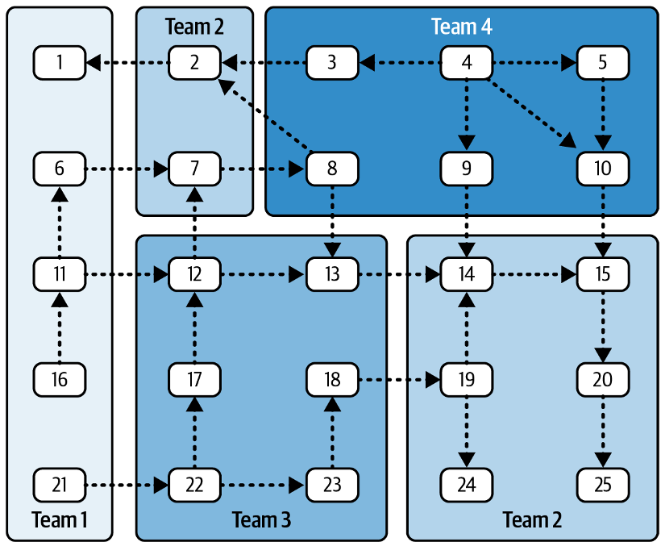

>Figure 19-1. Topology map of service connections  

The mapping shows that team 2 is responsible for two microservices that are not part of its main bounded context (bottom right). This may be of concern if the business goals of team 2 do not align with the functions being served by microservices 2 and 7. Additionally, both microservices 2 and 7 have a number of dependencies on teams 1,3, and 4, which increases the “surface area” that team 2 exposes to the outside world. A measure of interconnectedness is shown in Table 19-2.  

>Table 19-2. Topology graph measure of interconnectedness  

| |Incoming streams|Outgoing streams|Incoming team connections|Outgoing team connections|Services owned|
| ---|---|---|---|---|---|
| Team 1|1|3|1 (Team 2)|2 (Teams 2,3)|5|
| Team 2|8|2|3 (Teams 1,3,4)|2 (Teams 1,4)|8|
| Team 3|3|3|2 (Teams 1,4)|1 (Team 2)|6|
| Team 4|1|5|1 (Team 1)|2 (Teams 2,3)|8|  

Let’s see what happens if we reduce the number of inter-team connections and the number of incoming and outgoing streams at the team boundary. Microservices 2 and 7 are good candidates for reassignment simply due to their ownership island in the topology. To reduce cross-team dependencies, microservice 7 can be assigned to team 1(or to team 3), and microservice 2 can be assigned to team 4. It is also  

more apparent now that microservice 1 may also be assigned to team 4 to further reduce the cross-boundary communication. This result is shown in Figure 19-2 andTable 19-3.  

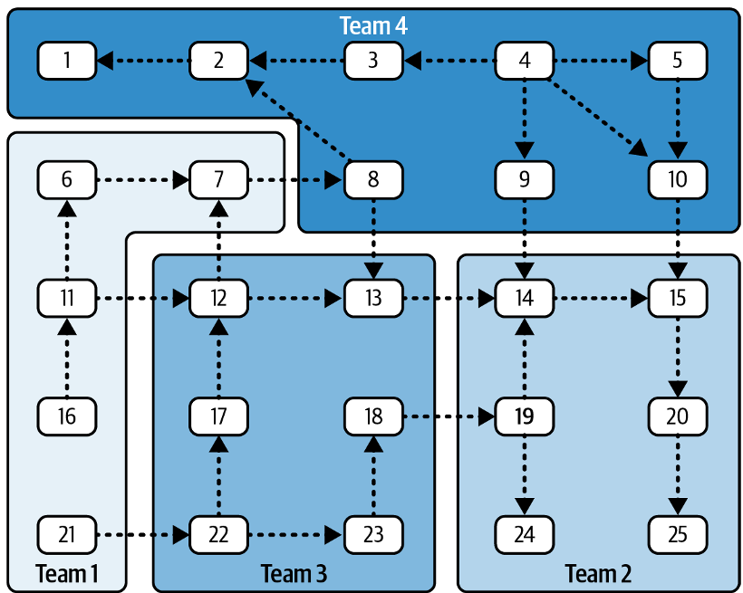

>Figure 19-2. Topology map of service connections after reassignment of microservices  

>Table 19-3. New measure of interconnectedness; differences are shown in brackets  

| |Incoming streams|Outgoing streams|Incoming team connections|Outgoing team connections|Services owned|
| ---|---|---|---|---|---|
| Team 1|1|3|1 (Team 3)|1 (Team 3) [-1]|5|
| Team 2|4 [-4]|0 [-2]|2 (Teams 3,4) [-1]|0 [-2]|6 [-2]|
| Team 3|3|3|2 (Teams 1,4)|2 (Teams 1,2) [+1]|6|
| Team 4|1|3 [-2]|1 (Team 1)|2 (Teams 3,4)|8 [+2]|  

Computing the cross-boundary dependencies has a positive result: you’ve reduced the cross-team incoming and outgoing stream counts, with a net decrease of threeconnections among teams.  

Although minimizing the number of cross-boundary connections can help reduce complexity, it’s not a guarantee. You must also take into account the team’s head count, its areas of expertise, the service implementation, and the historical reasons for why that island occurred in the first place.  

Consider a scenario where one team produces a whole host of event data, perhaps consumed from a number of external sources. It could be that the business responsibility of that team is limited simply to sourcing and organizing the data into events, with downstream consumers performing all the richer business logic. In this case, the sourcing team would have many stream connections and team connections, though logically it may make sense to leave things as they are. This is where it is useful to be able to view the business functions associated with the microservices owned by the team.  

In the preceding example, there are a number of questions worth asking. For one, do the business function implementations of microservice 2 align closer to the goals of team 2 or team 4? What about microservice 7: is it aligned closer with team 1's goals than team 2's? And in general, which services align best with which team?  

These answers tend to be qualitative and must be carefully evaluated against the goals of the team. It is natural that team goals change as business needs evolve, and it is important to ensure that the microservices assigned to those teams align with the overarching business goals. This tooling provides insight into these allocations and helps provide clarity to business owners.  

## Summary  

It's important that you consider the tools you're going to use to build and support
your microservice architecture. Managing event streams and microservices can be a
challenge, but the tools described in this chapter are important for helping you with
your task.  

As the quantity of services increases, the ability of any one person to know how everything works and how each service and stream fit into the big picture diminishes. Keeping explicit track of properties such as service and stream ownership, schemas, and metadata allows organizations to organize and track change across time. Reducing tribal knowledge and formally codifying otherwise simple stream and service properties should be priorities for your organization. After all, any ambiguity around the properties of a service or stream will be amplified for each additional instance created.  

Autonomy and control over your team's services are important aspects of managing microservices at scale. In accordance with DevOps principles, you should be able to manage and control your own services with a minimum of administrative overhead.  

In the next chapter, we'll look at the best testing practices for building and deploying
your microservices.  

# Testing Event-Driven Microservices

The small and purpose-built nature of microservices make them relatively easy to test, particularly in comparison to larger services. Event streams, queues, and request-response APIs provide the inputs. State is localized to the microservice’s own independent state store, and output events are written to its output streams. This chapter covers testing principles and strategies, including unit testing, integration testing, and performance testing.  

### General Testing Principles  

Event-driven microservices share testing best practices common to all applications. Functional testing, such as unit, integration, system, and regression testing, ensures that the microservice does what it is supposed to and that it doesn’t do what it should not do. Nonfunctional testing, such as performance, load, stress, and recovery testing, ensures that it behaves as expected under various environmental scenarios.  

Now, before going much further, it’s important to note that this chapter is meant to be a companion to more extensive works on the principles and how-tos of testing. After all, many books, blogs, and documents have been written on testing, and I certainly can’t cover testing to the extent that they do. This chapter primarily looks at testing methodologies specific to event-driven architectures. You’ll need to consult your own sources on language-specific testing frameworks and testing best practices to complement this chapter.  

### Unit-Testing Microservice Functions  

Unit tests exercise the smallest pieces of code in an application to ensure that they work as expected. Unit tests provide a foundation for which you can write larger andmore comprehensive tests for higher application functionality.  

Event-driven microservices are *driven* by data, and apply transformations, aggregations, mappings, and reduction functions. You can write unit tests to test each of these stages, to ensure that the data you put in and the data you get out meet expectations.  

### Unit Testing Stateless Functions  

Stateless functions do not require any persistent state from previous function calls, and so are quite easy to test independently. The following code shows an example of an EDM topology similar to one that you would find in a MapReduce-style (e.g., Kafka Streams) framework:  

myInputStream
.filter(myFilterFunction)
.map(myMapFunction)
.to(outputStream);  

myFilterFunction and myMapFunction are independent of each other, and neither keeps any state. You would need to write (at least) two unit tests—one to ensure that myFilterFunction provides the correct output for a given input, and one for myMapFunction to ensure it provides the correct mapping results.  

The following code shows the myFilterFunction. Note that there are several logical conditions applied to the MyEventValue object to determine if it should be filtered out:  

public boolean myFilterFunction(String eventKey, MyEventValue value) {
    if (value.type == 7 && value.modifier.equals("valid"))
        return true;
    else if (value.type > 3 && value.type < 6)
        return true;
    else
        return false;
}  

In this case you would want more than just one unit test. If you're being thorough, you'd want to test the three happy path cases to ensure the logic returns true when expected:  

• value.type == 7 && value.modifier.equals("valid")  

• value.type == 4  

• value.type == 5  

The reason you'd test 4 and 5 is because they represent the boundaries of the expected true results. You normally wouldn't test for every single valid value within the range. You'd also want to test to ensure that the boundary cases result in a false when expected:  

• value.type!= 7&& value.modifier.equals("valid")  

• value.type== 7&&!value.modifier.equals("valid")  

• value.type<= 3  

• value.type>= 6  

Finally, you would also want to test for null-pointer exceptions (NPEs), particularly ifthere are optional/nullable values in your event schema:  

• value== null  

• value.modifier== null  

You’ll want to make sure that your function does what it’s supposed to do, and doesn’t do what it shouldn’t do. Your unit tests should provide you security to know that code changes made to your functions don’t violate the expected outputs for given inputs.  

> [!TIP]
> It’s very important that you test around boundary conditions. You want to make sure that any changes made to your code fail the unit tests if they break the initial constraints.  

## Unit Testing Stateful Functions  

Stateful functions are generally more complicated to test than stateless ones, as computed state can vary with input events and time. Stateful unit testing requires durable state available for the duration of the test cycle, whether in the form of amocked data store or a temporary data store.  

Here is an example of a stateful aggregation function that might be found in a basicproducer/consumer implementation:  

public Long addValueToAggregation(String key, Long eventValue){// The data store is provided by the unit-test frameworkLong storedValue= datastore.getOrElse(key, 0L);// Sum the values and load them back into the state storeLong sum= storedValue+ eventValue;datastore.upsert(key, sum);return sum;}  

This function is used to sum all eventValues for each key. Mocking and injecting the data store is one way of providing a reliable implementation of the data store for the duration of the test. Another option is creating a locally available version of the data store, though this is more akin to integration testing, which is covered in more detail shortly.  

In either case, you must carefully consider what this data store needs to do and how it relates to the runtime implementation. Mocked state stores tend to work well when you want to avoid spinning up, purging, using, and shutting down a full data store implementation just for your unit tests.  

## Testing the Full Event-Driven Topology  

Topology testing (see "Microservice Topology" on page 58) is more complex than a single unit test and exercises the entire business logic topology. Both full-featured lightweight and heavyweight frameworks typically provide the means for local testing. If the framework does not provide it, you may yet find a solution in community-created third-party options. Topology testing frameworks do not require you to create an event broker to hold input events, which greatly reduces the burden for developers building and executing end-to-end tests:  

• Apache Spark has two separate third-party options for unit tests, StreamingSuiteBase and spark-fast-tests, in addition to providing a built-in ContinuousMemoryStream class for fine-grained control over stream input and output.  

• Apache Flink provides its own topology testing options, including MiniCluster
WithClientResource, which provides a local embedded mini cluster.  

• As for lightweight stream frameworks, Kafka Streams provides the means to test topologies using the `TopologyTestDriver`, which mocks out the functionality of the framework without requiring you to set up an entire event broker.  

Topology testing frameworks provide you with code-based control over event production, including the timestamp and partition of the record. You can generate events with specific values, events that are out of order, that contain invalid timestamps, or that include invalid data. You can set up the necessary conditions to exercise corner-case logic, to make sure that your service behaves correctly under abnormal inputs. You can ensure that operations such as time-based aggregations, event scheduling, and stateful functions perform as expected.  

For example, consider the following MapReduce-style topology definition:  

myInputStream
    .map(myMapFunction)
    .groupByKey()
    .reduce(myReduceFunction);  

In this topology, consumed events are represented by the variable myInputStream. The topology applies a myMapFunction, groups the results by key, and finally reduces the data (per key) using myReduceFunction. While your unit tests will look like those shown in "Unit Testing Stateless Functions" on page 402, you'll need to rely on topology testing to ensure that the results of map, groupByKey, and reduce provide the expected results.  

Example 20-1 shows a simplified example of what a test topology for a Kafka Streams application can look like. The buildMyTopology function returns a fleshed-out version of the example topology (1), including the connections to input topics, output topics, the serdes, and the state store for the reduce function:  

Example 20-1. Sample code for the Kafka Streams TopologyTestDriver  

```java
// The object that drives the topology, injects events, and consumes the output
private TopologyTestDriver testDriver;
private TestInputTopic<String, Long> input;
private TestOutputTopic<String, Long> output;
private Serde<String> stringSerde = new Serdes.StringSerde();
private Serde<Long> longSerde = new Serdes.LongSerde();

// This function would actually be in the main code body, not in the test code.
// I put it here so you could see what it would look like to set up the topology
// in a Kafka Streams application
public Topology buildMyTopology(String input, String output) {
    StreamsBuilder sb = new StreamsBuilder(...);

    // 1) Build the topology
    sb
        .stream(inputStream, Consumed.with(stringSerde, longSerde))
        .map(myMapFunction)
        .groupByKey()
        .reduce(myReduceFunction,
            Materialized.with(stringSerde, longSerde))
        .to(outputStream, Produced.with(stringSerde, longSerde));

    return sb.build();
}

@Before
public void setup() {
    Topology topology = buildMyTopology();

    // 2) Setup test driver
    Properties props = new Properties();
    testDriver = new TopologyTestDriver(topology, props);

    // 3) Setup the test topics to input and output data
    inputTopic = testDriver

```  

```java
        .createInputTopic("input",
            stringSerdeserializer(),
            longSerdeserializer());
outputTopic = testDriver
        .createOutputTopic("output",
            stringSerde deserializer(),
            longSerde deserializer());
    }

@After
public void tearDown() {
    testDriver.close();
}

@Test
public void shouldSumToThree() {
    // 4) Write data into the input topic
    inputTopic.pipeInput("a", 1L);
    inputTopic.pipeInput("a", 2L);

    // 5) Assert that the outputs are exactly what we expect them to be
    assertThat(outputTopic.readKeyValue(), equalTo(new KeyValue<>("a", 3L)));

    // 6) And make sure that there isn't anything else extra in the topic
    assertThat(outputTopic.isEmpty(), is(true));
}

```  

The TopologyTestDriver (2) executes the topology. It also lets you plug in input and output topics (3), where you can then produce data into the input topic (4). Then, you can validate that the topology has processed the data according to expectations (5), without any side effects or errant events (6).  

## Testing Schema Evolution and Compatibility  

To ensure that event schemas maintain compatibility (see "Schema Evolution: Changing Your Schemas Through Time" on page 82), validate the candidate schema against that stored in the schema registry. Then you can compare and contrast the schemas to validate that they adhere to your schema evolution rules before deploying the application to production. Let's look at an example.  

Example 20-2 shows an initial User schema that is to be registered to the Confluent Schema Registry:  

Example 20-2. The initial User schema  

```json
{
    "type": "record",
    "name": "User",
    "namespace": "com.example",
}

```  

"fields": [
    {"name": "id", "type": "string"},
    {"name": "name", "type": "string"},
    {"name": "age", "type": "int"}
]
}  

You register the schema against a *subject*, which represents the acceptable schemas inside a Kafka topic. Example 20-3 shows a shell script populating the `my_user_subject` with the initial User schema:  

Example 20-3. Register the initial User schema  

INITIAL_USER_SCHEMA=...; // As shown above

curl -s -X POST -H "Content-Type: application/vnd.schemaregistry.v1+json" \
--data "{\{"schema": $INITIAL_USER_SCHEMA}\"
"www.mySR.com/subjects/my_user_subject/versions"  

Now you can evolve the schema to the new candidate that you'd like to use. Example 20-4 shows the candidate schema with the removal of age:  

Example 20-4. The candidate User schema, dropping the age field  

{
    "type": "record",
    "name": "User",
    "namespace": "com.example",
    "fields": [
        {
            "name": "id", "type": "string"
        },
        {
            "name": "name", "type": "string"
        }
    ]
}  

To validate the schema is compatible with the schema evolution rules, you then must issue a query against the schema registry my_user_subject, passing in the new schema for the schema registry to compare. Example 20-5 shows a sample shell script following this process:  

Example 20-5. Validate that the updated User schema can be deployed  

ORIGINAL_USER_SCHEMA=...; # As shown above

curl -s -X POST -H "Content-Type: application/vnd.schemaregistry.v1+json" \
--data "{\"schema\": $ORIGINAL_USER_SCHEMA} \
"www.mySR.com/subjects/my_user_subject/versions"

CANDIDATE_USER_SCHEMA=...; # As shown above  

```bash
COMPATIBILITY_RESPONSE=$(
curl -s -X POST -H "Content-Type: application/vnd.schemaregistry.v1+json" \
--data "{\{"schema": $CANDIDATE_USER_SCHEMA}\"
"www.mySR.com/compatibility/subjects/my_user_subject/versions/latest"};

# Extract the 'is_compatible' boolean from the response
IS_COMPATIBLE=$($echo "$COMPATIBILITY_RESPONSE" | jq -r'.is_compatible')

if ["$IS_COMPATIBLE" = "true"]; then
    echo "✓ The new schema is compatible, you can deploy it!"
elif ["$IS_COMPATIBLE" = "false"]; then
    echo "✗ The new schema is not compatible, don't deploy it!"
else
    echo "Error: Could not determine compatibility!"
    echo "Unexpected response from Schema Registry."
    echo "Don't deploy the schema!"
    exit 1
fi

```  

The resultant boolean IS_COMPATIBLE indicates if the schema is evolvable for that specific subject. In this case, the default schema evolution is BACKWARD, which means you can delete fields and add optional fields. Thus, the result for this example is a true, which means the new schema is compatible and can be deployed to production.  

This is just one example of how to test the schema evolution with a shell script during deployments using the Confluent Schema Registry. Consult your documentation for other schema registries and schema types.  

### Integration Testing of Event-Driven Microservices  

Integration testing of microservices is primarily focused on emulating the event-stream inputs and direct request inputs (if applicable) to the microservice. Tests can vary from simple smoke tests to test suites that iterate across hundreds (or thousands) of input/output combinations. The goal of integration testing is to ensure that your microservice performs as expected against its input data and that it accordingly produces events and provides query responses as expected.  

> [!NOTE]
> Integration may include more than one microservice under test, particularly when they are tightly coupled within a single bounded context. Keep in mind that the more services you add to an integration test, the more complex it becomes, and the more likely you are to accidentally omit some test cases.  

Microservice integration testing comes in three main variations:  

### Local integration testing  

Where you test your service with a local replica of the production environment.  

### Remote integration testing  

Where you run your microservice on a separate staging, QA, or even the production environment.  

### Hybrid integration testing  

Where some parts of the microservice and its test environment are hosted and executed locally, while other components run remotely. For example, you may run your microservice in a container on your laptop, but connect to remote data stores and remote event brokers.  

Each of these solutions has several advantages and disadvantages, which we will explore shortly.  

You should keep in mind several overarching questions for the remainder of this
chapter:  

• What is the goal of your integration testing? Is it as simple as “does this run?” Is it a smoke test with production data? Or do you need to test and validate more complex workflows spanning multiple microservices?  

• Does your microservice need to support restarting from the beginning of input stream time, as in the case of full data loss or reprocessing due to a bug? Or do you need to test restoring it from a snapshot or checkpoint?  

• What data do you need to determine success or failure? Is manually crafted event data sufficient? Programmatically created? Does it need to be real production data? If so, how much?  

• Do you have any specific performance, load, throughput, or scaling requirements?  

• How can you lower the barrier to testing so that each microservice you and your colleagues build doesn't require a custom-fit test harness?  

The next sections will help you understand your available options so you can formulate your own answers to these questions.  

### Local Integration Testing  

Local integration testing allows for a significant range of functional and nonfunctional testing. This form of testing uses a local copy of the production environment for you to deploy and test your microservice.  

At a minimum, this means obtaining an event broker, a schema registry, microservice data stores, the microservice itself, and any required processing frameworks, such as when you are using a heavyweight framework or FaaS. You could also introduce containerization, logging, and even the container management system, but they are not strictly related to the business logic of the microservice and so are not absolutely necessary.  

The biggest benefit of spinning up your own locally controllable environment is that you get to control each system independently. You can programmatically create scenarios that replicate actual production situations, such as intermittent failures, out-of-order events, and loss of network access. You also get to test the integration of the framework with your business logic. Local integration testing also provides the means to test the basic functionality of horizontal scaling, particularly where copartitioning and state are concerned.  

Another significant benefit of local integration testing is that you can effectively test both event-driven and request-response logic at the same time, in the same workflows. You have full control over when events are injected into the input streams, and can issue requests at any point before, during, or after the events have been processed. It may be helpful to think of the request-response API as just another source of events for the purposes of testing your microservice.  

Let’s take a look at some of the options provided by each system component:  

##### The event broker  

• Create and delete event streams.  

• Apply selective event ordering for input streams to exercise time-based logic, out-of-order events, and upstream producer failures.  

• Modify partition counts.  

• Induce broker failures and recovery.  

• Induce event-stream availability failures and recovery.  

##### The schema registry  

• Publish evolutionary-compatible schemas for a given event stream and use them to produce input events.  

• Induce failures and recovery.  

##### The data stores  

• Make schema changes to existing tables (if applicable).  

• Make changes to stored procedures (if applicable).  

• Rebuild internal state (if applicable) when the application instance count is modified.  

• Induce failures and recovery.  

### The processing framework (if applicable)  

The application and the processing framework are typically intertwined, and you may need to provide a full-framework implementation for testing, as in the case of FaaS and heavyweight framework solutions. The framework provides functionality such as the following:  

• Shuffling via internal event streams (lightweight) or shuffle mechanism
(heavyweight) to ensure proper copartitioning and data locality  

• Checkpointing, failures, and recovery from checkpoints  

• Inducing a worker instance failure to mimic losing an application instance
(heavyweight frameworks)  

### The application  

Application-level control predominantly involves managing the number of
instances running at any given time. Integration testing should include scaling
the instance count (dynamically, if supported) to ensure that:  

• Rebalancing occurs as expected.  

• Internal state is restored from checkpoints or changelog streams, and data locality is preserved.  

• External state access is unaffected.  

• Request-response access to the stateful data is unaffected by changes in application instance count.  

The point of having full control over all of these systems is to ensure that your micro-service will still work as intended through various failure modes, adverse conditions, and with varying processing capacity.  

You have two main ways to perform local integration tests. The first involves embedding testing libraries that live strictly in your code. These are not available for all microservice solutions and tend to depend heavily on both language and framework support. The second option involves creating a local environment with each of the necessary components, most commonly with containers, for you to control programmatically from your testing scripts. Finally, we'll also take a look at testing using fully managed/SaaS options hosted outside your local environment by third parties.  

### Create a Testing Environment Within the Runtime of Your Test Code  

For some frameworks and some languages, it's possible to add testing frameworks into your project. This is by far the narrowest of the options, however, as it requires your test code to programmatically start up and control the full event broker and schema registry, alongside the microservice under test.  

For example, Example 20-6 shows the test code of a Kafka Streams application starting its own Kafka broker, schema registry, and microservice topology instances. The test code can then start and stop topology instances, publish events, await responses, incur broker outages, and induce other failure modes. Consider the following pseudocode (declarations and instantiations omitted for brevity):  

Example 20-6. Building a temporary test environment within the code itself  

java
// Declarations and parameters omitted for brevity
// Start the broker and the schema registry, both of which run on the JVM
broker.start(brokerUrl, brokerPort, ...);
schemaRegistry.start(schemaRegistryUrl, srPort, ...);

// The first instance of the microservice
topologyOne.start(brokerUrl, schemaRegistryUrl,
        inputStreamOne, inputStreamTwo ...);

// A second instance of the same microservice
topologyTwo.start(brokerUrl, schemaRegistryUrl,
        inputStream, inputStreamTwo, ...);

// Publish some test data to input stream 1
producer.publish(inputStreamOne, ...);
// Publish some test data to input stream 2
producer.publish(inputStreamTwo, ...);
// Wait a short amount of time. Not the best way to do it, but you get the idea
Thread.sleep(5000);

// Now mimic topologyOne failing
topologyOne.stop();

// Check the output of the output topic. Is it as expected?
event = consumer.consume(outputTopic, ...);

// Shut down the remaining components if no more testing is to be done
topologyTwo.stop();
schemaRegistry.stop();
broker.stop();

// Validate the consumer output
if (event.equals(...))
    // Pass the test if correct
    return true;
else
    // Fail the test
    return false;  

This testing option provides additional features over the topology testing methodology (Example 20-1), such as the ability to run multiple instances of the topology at the same time. You can also:  

• Exercise consumer group rebalancing and partition assignments.  

• Validate partition-based operations like join, groupBy, and aggregations.  

• Programmatically test scaling your instance counts up and down.  

• Inject faults and problems to validate exception handling.  

> [!WARNING]
> This specific testing option works only because the Kafka event broker and the Confluent Schema Registry are both Java applications, and can be configured to run alongside another Java application. You can't mix and match implementations from other languages, which limits its usefulness to only other Java (and Scala and Kotlin) applications.  

## Creating a Testing Environment with Containers  

A container-based testing environment is a more flexible choice than embedding it in the same runtime as the application under test. Containers are the easiest, most common, and the most flexible way to build your testing environment. You can plug any containerized service into your test workflow, though it does add additional overhead in creating, managing, and destroying the containers.  

Thankfully, open source options like Testcontainers simplify and standardize container management options for testing. You can programmatically compose, create, and manage your containers from within your test code itself, greatly simplifying the entire process. Example 20-7 shows how simple it is to programmatically create and start a Confluent Kafka broker, a PostgreSQL instance with pgvector, and a Hashicorp Vault for managing secrets. Note that Testcontainers supports a whole range of languages, including Java, Go, .NET, Python, Rust, Ruby, and more.  

Example 20-7. Creating and starting a Kafka broker, a Postgres database with pgvector, and a Hashicorp Vault module for secret management  

java
KafkaContainer kafka = new KafkaContainer(
    DockerImageName.parse("confluentinc/cp-kafka:8.0.0"))
kafka.start();

PostgreSQLContainer<?> pgvector =
    new PostgreSQLContainer<>("pgvector/pgvector:pg16");
pgvector.start();

public static VaultContainer<?> vaultContainer =
    new VaultContainer<>("hashicorp/vault:1.20.0")
    .withVaultToken(Vault_TOKEN)
    .withInitCommand(
        "secrets enable transit",  

```text
"write -f transit/keys/my-key",
"kv put secret/mysecret1 top_secret=mountains",
"kv put secret/mysecret2 secret_one=dogs secret_two=bananas"

```  

You may also choose to manage and create the containers completely *outside* your test code. Multicontainer deployments are relatively easy to build and manage for testing use cases, and both **Docker** and **Kubernetes** offer guides on how to get started.  

For event brokers, Apache Kafka and Apache Pulsar, and Confluent Platform all provide off-the-shelf Docker containers that you can use for your testing.  

> [!TIP]
> You can set your testing scripts to use specific software versions so that your test environment matches your production environment. You can also choose to run your tests against newer versions of your dependencies, to see if you'll have problems with updating in the future.  

You can also install and configure all of your dependencies in just one container and make it available across your organization. This option allows you to customize the container to more closely mirror your production deployment environment, in exchange for being more complicated and opaque. An open source contribution model allows colleagues to contribute fixes, updates, and new features for the benefit of all.  

A lightweight processing framework example is shown in Figure 20-1, with the schema registry, event broker, and necessary topics created internally to the container. The microservice instance runs external to the container and simply references the addresses of the broker and schema registry from its testing config file.  

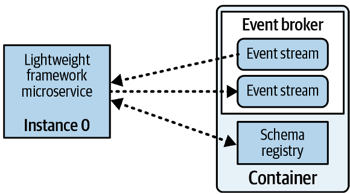

>Figure 20-1. Lightweight microservice using containerized testing dependencies for local integration testing  

Container-provided testing environments are probably the most common option for integration testing today. Open source frameworks like Testcontainers make it simple and easy to just focus on testing the code instead of struggling with the environment.  

## Integrating Hosted, Managed, and SaaS Services  

FaaS, SaaS, and remotely hosted and managed services can add further complications to your testing. While some hosted and managed services may have open source options that you can run instead (e.g., open source Kafka, open source Flink, and open source Spark), most remote FaaS and SaaS services don't. For example, Microsoft's Event Hubs, Google's PubSub, and Amazon's Kinesis are all proprietary and closed, with full implementations unavailable for you to run locally. In this situation, the best you can do is use whatever emulators, libraries, or components are available from these companies or open source initiatives.  

Google's PubSub, for example, has an emulator that provides local testing functionality, as does an open source version of Kinesis (and many other Amazon services) provided by LocalStack. Unfortunately, Microsoft Azure's Event Hubs does not currently have an emulator, nor is an implementation of it available in the open source world. Azure Event Hub clients do, however, allow you to use Apache Kafka in its place, though not all features are supported.  

Applications using FaaS and SaaS platforms can leverage local testing libraries provided by the hosting service. Google Cloud functions can be tested locally, as can Amazon's Lambda functions and Microsoft Azure's functions. The open source solutions OpenWhisk, OpenFaaS, and Kubeless, as discussed in Chapter 15, provide similar testing mechanisms, which you can find via a quick web search. These options allow you to configure a complete FaaS environment locally, such that you can test on a platform configured to be as similar to production as possible.  

Establishing an integration testing environment for heavyweight framework applications is similar to the process of establishing one for any other open source software you choose to host yourself. Each requires that the framework be installed and configured, with the application submitting the processing job directly to the framework. With heavyweight frameworks, a typical single-container installation will just need to run the resource manager and worker instances side-by-side along with the event broker and any other dependencies. With the heavyweight framework set up, you simply need to submit the processing job to the resource manager and await test output on the output event streams. An example is illustrated in Figure 20-2, where the entire set of dependencies has been containerized for easy distribution among developers.  

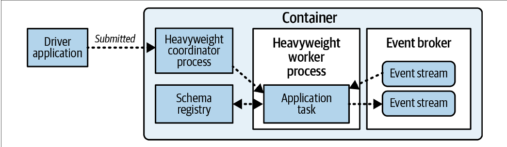

>Figure 20-2. Heavyweight microservice using containerized testing dependencies for local
integration testing  

> [!TIP]
> Keep your testing, development, staging, and production environments separate from one another. Use access controls to prevent your services from accidentally contaminating other services' event streams.  

The reality is that fully managed, FaaS, and SaaS options have become much more common since the first edition of this book. Many organizations do not host or manage any of their own services, and instead rely on dedicated environments from their service providers for development, testing, and staging. The services they use may simply not have any local emulators, requiring you to rely on the service directly.  

Let's take a look at testing microservices using remote cloud services.  

## Testing Using Fully Remote Cloud Services  

Connecting to fully remote cloud services assumes a few prerequisites. Your service under test must:  

• Have an account, service credentials, and permissions  

• Create and populate event streams with data suitable to its test  

• Create and populate any other data stores it needs  

• Clean up and delete its resources after the test completes (or fails)  

Accomplishing these prerequisites makes up the vast majority of the work. The two most challenging parts include properly cleaning up after your service once the tests are finished, while at the same time avoiding breaking someone else's test environment. Credentials and strict permissions go a long way toward making this possible.  

> [!WARNING]
> Invest in service accounts, credentials, and permissions for your multitenant test environments. It will make testing much easier, safer, and more reliable, eliminate break-fix work, and lets you test the permission configurations necessary to deploy to production.  

You have three main ways to do remote integration testing. You can use:  

• A temporary single-tenant environment and discard it once testing is complete  

• A durable multitenant testing environment, which persists between integration tests  

• The production environment itself  

Let's take a look at each of these options in more detail.  

## Programmatically Create a Temporary Single-Tenant Testing Environment  

"Infrastructure as Code for Clusters and Services" on page 382 examined the advantages of having programmatically generated event brokers and compute resource managers. You can leverage these very same tools to generate temporary environments for integration testing. For example, you may choose to create your own temporary Apache Kafka cluster on your own dedicated hardware to test your containerized microservice. Alternatively, you may use an API to request a SaaS endpoint (e.g., Confluent) to create your own Kafka environment for your microservice to connect to.  

The next issue in a newly brought-up environment is that it lacks both event streams and events, which your script will need to populate before it can start the tests. One benefit of using scripted integration testing is that it regularly exercises creating and deleting new brokers and compute environments. Any special data or configurations that your service relies on must be codified in the scripts themselves. In other words, carefully crafted event data that's critical to your testing is preserved entirely in your test code, not in a customized test environment.  

> [!TIP]
> Mirror the production event streams' partition counts in your test environment, to ensure that any copartitioning and repartitioning logic is adequately tested.  

Once you've generated the event streams, the next step is to populate them with events. You can do this using production data, specially curated testing data sets, or ad hoc, programmatically generated data.  

## Populating with events from production  

One option is to copy events from the production cluster over to the testing cluster. This is where the replication tooling described in "Multicluster Deployments and Event-Stream Replication" on page 394 comes into play, letting you use the exact same tooling for populating a testing environment. You can replicate specific event streams, events, offset ranges, time ranges, and anything else you may need from production into your testing environment.  

> [!WARNING]
> Consider the load on the production services before you replicate the data. You may need to throttle throughput to ensure that production isn't negatively affected, particularly when copying large amounts of data.  

Populating events from production has a few major advantages:  

• The testing environment data accurately reflects production data.  

• You can copy as many or as few events as required.  

• The fully isolated environment prevents other microservices under test from inadvertently affecting your testing.  

But it also has a few disadvantages:  

• Copying data may affect production performance unless you have adequately planned and established broker quotas.  

• It may require copying substantial amounts of data, especially in the case of long-lived entities from compacted event streams.  

• You must consider event streams containing sensitive information.  

• Your service will be unable to decrypt any encrypted production data, as it is not a production service itself and should not have access to production keys.  

• You must invest in streamlining the data copying process to reduce barriers to usage.  

Copying production data is common for load testing. Having an environment that's as close to production as possible will let you test that your microservice can achieve its service-level objectives, event processing throughput, request-response latency, scaling, and failure recovery.  

However, it's often more attractive to build a specific set of curated data so that you can ensure your microservice is fully exercised, including edge cases, race conditions, and uncommon occurrences.  

### Populating with events from a curated testing source  

Curated events are specially crafted to represent a range of events for an event stream. They're usually populated by the owner of the service, who creates a dedicated set of output events that represent the microservice's output.  

Each microservice maintains a set of representative events, often stored as a JSON, XML, or YAML file inside of the code repo. The developer of a service that reads those upstream events then pulls the curated set of events into its own test environment, parses the event data, then populates it to its own dedicated event broker (or mocked event broker).  

The advantages of populating data from a shared curated set of events include:  

• Anyone can use the data to test their service.  

• The events are created by the owners of the service, who should have the best understanding and knowledge of the data domain.  

• The data is automatically validated during parsing and population.  

The disadvantages include:  

• The complexity of parsing and populating the data to the event broker.  

• Shifting standards in the file format for the curated data.  

• The curated data may not be sufficient to exercise all the logic (e.g., joins, aggregations, repartitions) of the microservice.  

• The data may become stale and orphaned with time, particularly as people move on to other projects.  

• It can be challenging to manually update handcrafted events, and you may find yourself inadvertently introducing new errors.  

The complexity of generating the event sample files and populating them into other test environments should not be understated. It's not that it's technically challenging (a good JSON library can do most of the work for you), but rather it's getting the standard adopted between multiple teams. You may also find that in a larger organization there are multiple competing standards, which can add to the complexity of this approach.  

The unfortunate part about relying on curated sets of data is that they tend to be neglected in time. What starts with good intentions tends to follow the same pathway as documentation at many organizations—well-intentioned, but progressively more out-of-date as time goes on. Eventually, people often no longer trust it, and resort back to generating their own data. This isn't to say you can't find success with it, but you need to be aware that decay becomes a real possibility.  

### Populating with programmatically generated events  

This strategy relies on generating the data according to your microservices’ input event schemas. You can pull these down from the schema registry and create a range of events that cover just the latest schemas or a mixture of old and new.  

This option enables you to easily generate the test data as needed. Programmatic generation also acts as an early warning. If your script fails to generate events under the latest schema, it can be an indication that you may need to make some code changes to your service as well.  

The complexity of this approach comes from ensuring that the entirety of your microservice business logic can be tested with the generated data. For example, a microservice that performs joins requires at least two events, each in their own streams, related by the correct primary or foreign key. Aggregations may also span multiple event streams, and require a mixture of data for successful testing.  

The advantages of populating data using programmatically generated events include:  

• You can ensure specific data values and relationships for exercising all business logic.  

• Total isolation from any changes to the test data, since it’s only for your service.  

• It allows you to leverage third-party tools for programmatically creating testing data; for example, Confluent Avro tools.  

• It doesn’t require the production cluster to provide any data and can’t negatively affect production performance.  

• You can use fuzzing tools to create event data, testing boundary conditions, and other potential malformed and semi-formed fields.  

The disadvantages include:  

• Duplication of efforts. Other services may have nearly identical scripts to build their own events.  

• Data may get stale. You must update your own scripts to take schema evolution into account.  

• The created data is still not fully accurate when compared to the production distribution. For example, production data may have a serious disparity in data volume due to key distribution that doesn’t show up in mock data.  

> [!TIP]
> Some teams find success in a hybrid approach—a small but carefully curated set of entity events that are core to the business, and programmatic generation for the remaining sets of less commonly used data.  

The most important part of generating test schemas is that they accurately represent the schemas, ranges, and relationships found in production data. You may need to sample and analyze a subset of production data to ensure that your generated events accurately represent what is found in production.  

### Testing Using a Durable Multitenant Environment  

Another testing option involves creating a single testing environment with a shared pool of event streams all residing within the same event broker. These streams are populated by testing data that represents a subset of production data, or carefully crafted testing data written to their associated streams.  

The advantages include:  

• It's easy to get started, as you only need to maintain one testing environment.  

• It is isolated from production workloads.  

While this option provides a low-overhead testing environment, it does incur some
notable disadvantages:  

• It is subject to the tragedy of the commons. Fragmented and abandoned event streams can make it difficult to distinguish which streams are valid for testing input and which are simply the output of previous tests that were not cleaned up.  

• Services may inadvertently produce incompatible events to their output streams during their own testing, causing downstream failures.  

• Systems under test are not isolated. For example, services running simultaneous large-scale performance testing can affect each other's results.  

• Event stream data inevitably becomes stale and must be updated with newer events.  

• It may inaccurately represent the range of events found in production.  

> [!WARNING]
> This strategy is the worst of the options in terms of usability, as the event broker eventually becomes a dumping ground of confusing event streams and broken data.  

The biggest problem with this approach is individual carelessness. Developers testing their service often inadvertently pollute their own output streams during their own testing, even with the best of intentions. It can cause significant hardship to the downstream consumers and takes some effort to clean up and reproduce the data. It is also unfortunately a problem that grows significantly with service and team count.  

Careful curation of data streams, strict naming conventions, and restrictions to writing to event streams can help mitigate the disadvantages, but the reality is that it proves to be a challenging approach to scale.  

### Testing Using the Production Environment  

You can also test microservices in the production environment (note: be careful!). You can spin up your microservice, consume from the input event streams, apply business logic, and produce output events to a temporary test stream. This temporary test stream isolates the microservice under test from the production systems, while still using the production resources and data for its tests. Isolation is particularly important when a previous version of the same microservice is running alongside the new version under test. You want to be absolutely certain you aren't writing to the production output event streams.  

The advantages include:  

• You have complete access to all production events.  

• It leverages the production security model for both access controls and encryption.  

• It is excellent for smoke-testing, as the data is completely up-to-date.  

• You do not need to maintain a separate testing environment.  

The disadvantages include:  

• It uses production resources, which can affect SLOs. It is not suitable for load and performance testing.  

• You must carefully clean up any resources created during testing, such as event streams, consumer groups, access control permissions, and state stores.  

• It requires tooling support to keep microservices and event streams under test separate from *true* production microservices. You must be able to identify and isolate which services are the actual production services and which of those are not. Metadata tagging helps a lot here.  

Production testing works best for smaller teams and for clusters with low utilization. In practice, most organizations will veer toward one (or multiple) dedicated QA/testing environments, and rely on copying data from production instead of running directly in production.  

## Choosing Your Full-Remote Integration Testing Strategy  

The nice thing about the modularity of microservices is that you don't have to choose just one strategy for testing. You can use one option for one project, another for a different project, updating your testing methodology as your requirements change. However, supportive tooling for simplifying the creation and teardown of dedicated event brokers and of interbroker event-copying capabilities will largely determine your range of options.  

If you have little to no supportive tooling, you're most likely going to end up with a single, shared testing event broker with a hodge-podge of event streams generated by various teams and systems. You'll likely see a mixture of good event streams that you can use for testing, and event streams that you can't (or shouldn't) use with suffixes like -testing-01, -testing-02, -testing-02-final, and -testing-02-final-v2.  

Event data may or may not be reliable, up-to-date, or in a valid schema format. Tribal knowledge plays a large role in this world, and it can be challenging to ensure your testing sufficiently reflects your service's production environment. Costs also tend to be higher for a continuously available cluster that must also enable performance testing and host large amounts of data indefinitely.  

With proper investment in tooling, each microservice can bring up its own dedicated services, populate it with event streams, copy some production data into it, and run the test in a nearly identical production environment. The services can be torn down once testing is completed, eliminating testing artifacts that would otherwise stick around in a shared cluster. The overhead for getting to this stage is not trivial, but the investment unlocks multicloud benefits, redundancy, and disaster recovery options that are difficult to obtain otherwise (see Chapter 19 for more details).  

This isn't to say a single shared testing cluster is inherently bad. You can still find success through diligent housekeeping, keeping clean and reliable source streams, and deleting abandoned testing artifacts. Use access controls to protect event-stream data, so that only the service owners can populate it. Coordinate performance and load testing to ensure teams do not affect each other's results. And finally, as your teams grow, you can focus on incrementally adopting tooling for spinning up dedicated cluster and SaaS environments and for replicating data across brokers.  

## Summary  

Event-driven microservices predominantly source their input data from event streams. You can create and populate these streams in a variety of ways, including copying data from production, curating specific data sets, and automatically generating events based on the schema. Each method has its own advantages and disadvantages, but all of them rely on supportive tooling to create, populate, and manage these event streams.  

Establishing an environment in which to test your microservice should be a collaborative effort. Other developers and engineers in your organization will undoubtedly benefit from a common testing platform, so you should consider investing in tooling to streamline your testing processes. Programmatic creation of environments, including the population of event streams, can significantly reduce the overhead of setting up environments for microservices under test.  

A single shared testing environment is a common strategy to employ when investment in tooling is low. The trade-off is the increased difficulty in managing the event data, ensuring validity, and clarifying ownership. Disposable environments are a preferable alternative, as they provide isolation for services under test and reduce the risks and shortcomings caused by multiple tenancy issues. These options tend to require more investment in common supportive tooling, but save significant time and effort in the long run. As an added benefit, using programmatic environment management and event-copying tooling can better prepare your organization for disaster recovery.  

In the next chapter, we'll look at the best practices for deploying microservices.  

# Deploying Event-Driven Microservices

Deploying event-driven microservices can be challenging when compared to a single monolithic deployment. As the quantity of microservices within an organization increases, so does the importance of having standardized deployment processes in place. An organization managing only a few dozen services can get away with a few custom deployment processes, but any organization seriously invested in microservices, event-driven or otherwise, must invest in standardization and streamlining its deployment processes.  

### Principles of Microservice Deployment  

You should follow a few principles to optimize your microservice deployment
processes:  

Give teams deployment autonomy  

Teams should control their own testing and deployment process and have the autonomy to deploy their microservices at their discretion.  

Implement a standardized deployment process  

The deployment process should be consistent between services. A new microservice should be created with a deployment process already available to it, and is commonly accomplished with a *continuous integration* framework (covered a little later in this chapter).  

Provide necessary supportive tooling  

Teams may need to reset their application's consumer group offsets, purge state stores, check and update schema evolution, and delete internal event streams. Supportive tooling provides these functions to enable further automation of deployment and support team autonomy.  

### Consider event-stream reprocessing impacts  

Reconsuming input event streams can be time-consuming, leading to stale results for downstream consumers. Additionally, this microservice may subsequently generate a large volume of output events, causing another high load for downstream consumers. Very large event streams and those with many consumers may see surges in processing power requirements. You must also consider side effects, particularly those that can be disruptive to customers (e.g., resending multiple years' worth of promotional emails).  

### Adhere to service-level agreements (SLAs)  

Deployments may be disruptive to other services. For instance, rebuilding state stores can result in a significant downtime and result in a service gap. You must account for the worst-case scenario state rebuilding when determining your SLAs, so that you can be confident that your service can honor them.  

#### Minimize dependent service changes  

Deployments may require that other services change their APIs or data models, such as when interacting with a REST API or introducing a domain schema change. These changes should be minimized whenever possible, as they violate the other team's autonomy for deploying their services only when required by shifting business requirements.  

#### Negotiate breaking changes with downstream consumers  

Breaking schema changes may be inevitable in some circumstances, requiring the creation of new event streams and a renegotiation of the data contract with downstream consumers. Ensure that these discussions happen before any deployment and that a migration plan for consumers is in place.  

> [!WARNING]
> It's important to make your microservices independently deployable. If a microservice deployment regularly requires other microservices to synchronize their own deployments, it is an indicator that their bounded contexts may be ill-defined and should be reviewed. The exception is when you have a few tightly coupled services within the same bounded context that are built to be codependent, though these are typically all owned by the same team.  

### Architectural Components of Microservice Deployment  

Though multiple components are involved in a microservice deployment architecture, they can be roughly categorized into two main roles: the systems that build and deploy the code, and the compute resources that power the microservices.  

### Continuous Integration, Delivery, and Deployment Systems  

Continuous integration, delivery, and deployment systems allow for microservices to be built, tested, and deployed as code changes are committed to the repository. This is part of the microservice tax that you must pay to successfully manage and deploy microservices at scale. These systems allow microservice owners to decide when, where, and how to deploy their microservices.  

Continuous integration (CI) is the practice of automating the integration of code changes from multiple contributors into a single software project. The team managing the microservice integrates changes at its own discretion, with the aim of reducing the time between writing code and seeing it deployed to production.  

CI frameworks can automatically execute processes when code is merged into the main branch (or any other branch), including build operations, unit testing, and integration testing operations. Other processes in a CI pipeline may include validating code style, validating schema evolution, and applying a linter to the code. The final output of the CI pipeline is a ready-to-deploy container or virtual machine.  

Continuous delivery is the practice of keeping your codebase deployable. Microservices that adhere to continuous delivery principles use a CI pipeline to validate that the build is ready for deployment. The deployment itself is *not* automated, however, and requires some manual intervention on the service owner's part.  

Continuous deployment is the automated deployment of the build. In an end-to-end continuous deployment, a committed code change propagates through the CI pipeline, reaches a deliverable state, and is automatically deployed to production according to the deployment configuration. This contributes to a tight development loop with a short turnaround time, as committed changes quickly enter production.  

> [!WARNING]
> Continuous deployment is difficult to do in practice. Stateful services are particularly challenging, as deployments may require rebuilding state stores and reprocessing event streams. Always consider the impact of your deployment when choosing whether to use automatic or manual deployments.  

## Container Management Systems and Commodity Hardware  

The container management system (CMS) provides the means of managing, deploying, and controlling the resource use of containerized applications (see "Managing Containers and Virtual Machines" on page 64). The container built during the CI process is deposited into a repository, where it awaits deployment instructions from the CMS. Integration between your CI pipeline and the CMS is essential to a streamlined deployment process and is usually provided by your CMS.  

Many event-driven microservices do not require any specialized hardware and rely on plain old commodity hardware. It's inexpensive, is sufficiently reliable, and enables horizontal scaling of services. You can add and remove hardware to and from the resource pools as required, and recover from failures by spinning up new instances on the next available commodity server. You can also create special pools of resources for microservices that require specific hardware, such as dedicated graphics cards, super-fast storage, or very high parallelization processing capabilities.  

Having covered the principles of deployments, it's time to turn our attention toward the actual deployments themselves. The remainder of this chapter covers your basic deployment patterns, including the pros, cons, and when you might choose to use them.  

### The Basic Full-Stop Deployment Pattern  

The basic full-stop deployment pattern is the basis of all other patterns, and this section outlines the steps involved, as illustrated in Figure 21-1. You may certainly add other steps to your pipeline depending on your services requirements, though the steps listed in this section tend to be common for all microservices.  

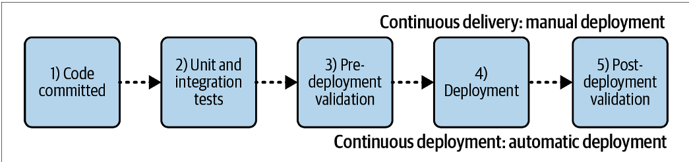

>Figure 21-1. A CI pipeline showcasing the difference between continuous delivery and continuous deployment  

#### 1. Commit code  

The most common trigger to kick off the CI pipeline is when you commit code into the associated branch. Exactly how you integrate the trigger with your CI pipeline will vary based on your technology specifics, but it's very common to use something like webhooks (or some other kind of hook) to kick off the pipeline.  

#### 2. Execute automated unit and integration tests  

This step validates that the committed code passes all the unit and integration tests. Integration tests may require their own transient environments populated with data to perform more complex tests, as covered in "Local Integration Testing" on page 409.  

> [!TIP]
> Independent integration testing environments enable you to run tests in isolation from one another. You can avoid common multitenancy issues such as resource contention, contaminated data sources, and versioning mismatches.  

#### 3. Run predeployment validation tests  

This step ensures that your microservice will deploy properly by detecting prob-
lems before release. Common validations include:  

a. Event stream validation: Verify the existence and configuration of input event streams and output event streams. Verify that any missing streams can be created automatically, and that your microservice has the proper read/write permissions.  

b. Schema validation: Verify that both the input and output schemas follow schema evolution rules. You can validate your schema changes against the schema registry to ensure that restrictions aren't violated.  

> [!TIP]
> Store the event schemas your code is written against in your microservice's repository. After validating schema evolution compatibility, you can then use a code generators to turn the schemas into structs/classes for your microservice code.  

### 4. Deployment  

You'll need to stop the currently deployed microservice before deploying the new one. This process consists of two major steps:  

a. Stop instances and perform any clean-up before deploying: Stop the microservice instances. Perform any necessary state store resets and/or consumer group resets, and delete any internal streams. If rebuilding state (in the case of deployment failure) is expensive, you may instead want to leave your state, consumer group, and internal topics alone, and instead deploy as a new parallel service. This will enable you to roll back quickly in the case of a failure, but is more complex to execute.  

b. *Deploy*: Perform the actual deployment. Deploy the containerized code and start the required count of microservice instances. Wait for them to boot up and signal that they are ready before moving on to the next step. In the case of a failure, abandon this step and deploy the previous working version of the code.  

### 5. Run post-deployment validation tests  

Validate that the microservice is operating normally, that consumer lag is returning to normal, that there are no logging errors, and that endpoints are working as expected.  

> [!WARNING]
> Consider the impacts to all dependent services, including SLAs,
> downtime, stream processing catch-up time, output event load,
> new event streams, and breaking schema changes. Communicate
> with dependent service owners to ensure that the impacts are
> acceptable.  

## The Rolling Update Pattern  

The rolling update pattern is useful in keeping a service running while updating the
individual microservice instances. Its prerequisites include:  

• No breaking changes to any state stores  

• No breaking changes to the internal microservice topology (particularly relevant for implementations using a lightweight framework)  

• No breaking changes to internal event schemas  

• No replaying event-stream inputs  

As long as you can meet the prerequisites, this deployment pattern works well when:  

• There are new fields in the input event streams to your microservice that you want to integrate into your code.  

• You have expanded your microservice to consume from new event streams.  

• You're deploying bug fixes for issues that do not require rewinding and reprocessing events.  

> [!WARNING]
> Inadvertently altering the internal microservice topology is one of the most common mistakes people make when trying to use this deployment pattern. Doing so is a breaking change and will require a full application reset instead of a rolling update.  

During a rolling update, only step 4 of the basic full-stop deployment pattern discussed previously is changed. Instead of stopping each instance at the same time, only one instance at a time is stopped, updated, and then started back up. As a consequence, there will be a mixture of new and old instances running during the deployment process, and both old and new logic will be operating simultaneously.  

The main benefit of this pattern is that services can be updated while near-real-time processing continues uninterrupted, eliminating downtime. The main drawback of this pattern is its prerequisites, which limits its usage to specific scenarios.  

## The Breaking Schema Change Pattern  

As an organization grows and changes, a breaking schema change is inevitable. They tend to reflect either a fundamental shift in the business domain, or a fix for a poorly defined initial schema. While "Negotiating a Breaking Schema Change" on page 87 covers the basics of negotiating and navigating the breaking schema change process, this section covers the nuts and bolts about how it'll get deployed.  

Your downstream consumers are your number one concern when deploying a micro-service with a changed schema. You have two main options for choosing how to emit the events for the modified schema, and each comes with its own set of trade-offs. Your microservice can either produce the new breaking schema events to the same stream as it always has, or it can produce them to a new stream.  

We will explore several variants of this pattern.  

### Variant 1: Write the Breaking Events to the Same Old Stream  

This variant is the simplest option for the producer, as they just update their schema to produce the new events, and redeploy the service. Only new events are made with the breaking schema change, while any events in the output stream remain under their original schema. Figure 21-2 shows this relatively simple outcome of a post-deployment breaking schema change.  

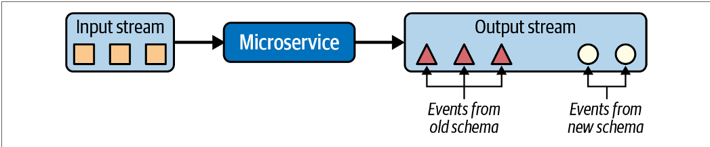

>Figure 21-2. Producing the breaking schema events to the same output stream  

It's important to note that there has been no reprocessing or reconstruction of events under the old schemas. The consumers remain responsible for handling both the old event schema and the new breaking event schema. They will also (hopefully) throw exceptions when encountering these new events if they have not updated their own services, preventing any erroneous progress. However, they may silently fail, discard the new events, or worst of all, incorrectly deserialize or decode them into bad data.  

#### Variant 2: Write the Breaking Events to a New Stream  

The second variant has the microservice produce the new breaking events to its own dedicated output event stream, as shown in Figure 21-3.  

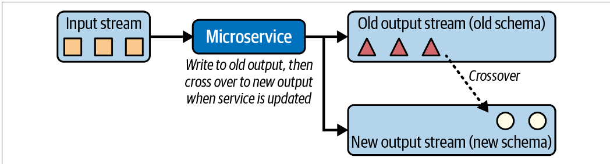

>Figure 21-3. Producing the breaking schema events just to the new output event stream  

This variant causes a breaking change to all existing consumers. Every downstream consumer must be notified of the impending change, and coordinate its own updates with that of the new output stream. It is a *big bang* change, and it can be risky if you don't test the producer and consumer changes beforehand.  

> [!WARNING]
> It is *essential* that the producer microservice owners extensively test and validate the new schema before deploying it. If it fails to create events with the new schema, or if the consumers cannot read and process the events, then you'll find yourself with multiple service outages.  

Breaking schema changes are often due to fundamental changes in business definitions, and old schema definitions may no longer map to the new schema definition. You'll find that you have to use this deployment variant when the business changes require the consumers to use the new schema within their data models. For example, deprecating the Account entity and re-creating it as two new BuyerAccount and SellerAccount entity types is an important business domain change. Whereas the older Account model allowed access to both buying and selling functions, the new regulatory compliance model requires separating account entities based on function.  

The biggest risk with this variant is that you may have consumers that don't notice that the old output stream is no longer active, resulting in stale data and increasingly inaccurate computations. It's crucial that you can track all consumers who have read access to the event stream under change, so that they can each be notified of the impending breakage and act accordingly.  

## Variant 3: Write Both the Old and New Events in Parallel  

Writing the old and new events to their own respective streams is one way to avoid depriving data from consumers who have yet to migrate, as shown in Figure 21-4. It’s important to note that this variant may not be possible in all use cases!  

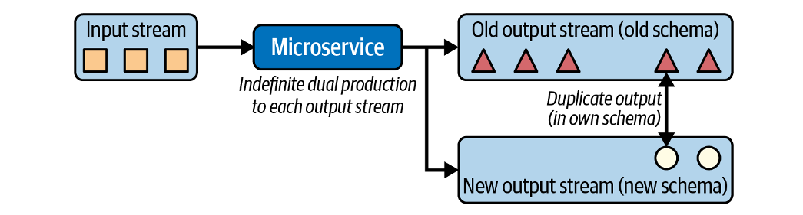

>Figure 21-4. Producing both old schema and new breaking schema events to their respective output streams  

Eventual migration via two event streams requires that the producer write events with both the old and new format to their respective streams. You mark the old stream as deprecated, and encourage (and maybe chronically nag) the consumers to migrate to the new stream. Once the consumers migrate, you can remove the old stream or offload it into long-term archival storage.  

This strategy makes a couple of assumptions:  

The producer can write events to both streams  

The producer must have the necessary data available to create events of both the old and new format. Some breaking changes result in a remodeling of the data that makes it impossible to map to both the old format and the new format.  

Eventual migration will not cause downstream inconsistencies  

The downstream services can continue consuming two different event definitions without consequence. Small breaking changes like a type expansion may not be of consequence, while more major changes likely will.  

The major benefit of this variant is that downstream consumers must manually swap over to the new event stream to gain access to the new breaking schema data. Swapping over is a very deliberate process and guards against silent failures and poor deserialization and decodings that are a possibility with variant 1.  

> [!WARNING]
> One of the main risks of migrating to a new stream is that the migration is never finished, and similar-yet-different data streams remain in use indefinitely. Additionally, new services created during the migration may inadvertently register themselves as consumers on the old stream instead of the new one. Use metadata tagging (see "Event Stream and Microservice Metadata Tagging" on page 386) to mark streams as deprecated and keep migration windows small.  

This pattern works best when the breaking change is relatively minor and where the producer can write the data in both the old and new formats without sacrificing integrity. For example, changing a field from an Integer to String is a breaking change, but it can be accommodated with both schemas. The String type is a superset of the Integer type, so it should be trivial for the microservice to continue outputting records for both old and new.  

> [!WARNING]
> Avoid prolonged dual production of old and new schemas. It is a *temporary* solution that may become permanent if you do not follow a tight schedule of event-stream deprecation, consumer migration, and eventual data deletion (or archiving).  

You can also use a second microservice to produce the new records under the new schema, while the old records remain coupled to the old version, as shown in Figure 21-5.  

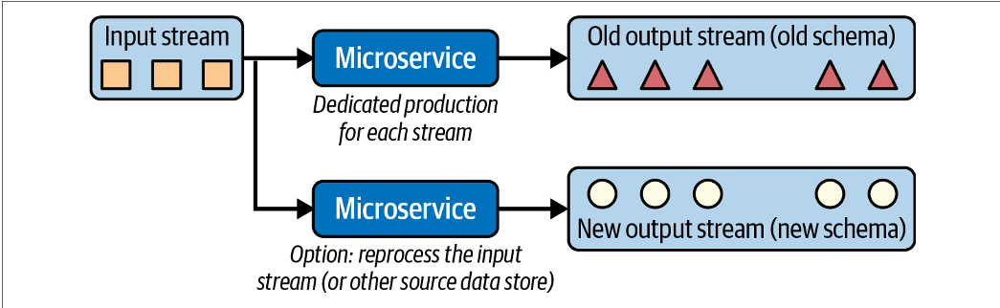

>Figure 21-5. Using two dedicated services to produce both old schema and new breaking schema events to their respective output streams  

> [!WARNING]
> The offsets in the new output stream most likely won't match the offsets of the old output stream. Late-arriving events and repartitioning can change output stream order while intermittent failures can lead to duplicate events.  

The benefit of this option is that you can just terminate the old microservice once everyone has migrated over. There's no need to patch the code to stop producing to the old version and then redeploy the service; you just turn the old service off. The main drawback is that you'll need to create a clone of the microservice and manage that clone separately from the original service. It does, however, lead to new questions. How do you manage the offsets? Does a migrating consumer just reprocess the events from the beginning of time? And if so, what about the historical data—is that migrated as well?  

The answers to these questions vary, but rest on the answer to a singular foundational question: are you going to populate the new breaking schema stream with historical data? Let's take a look at your options.  

### Reprocessing Historical Data for Breaking Schema Changes  

One key concern when dealing with breaking schema changes is whether to re-create the historical data within the new stream. In many cases, it's sufficient to follow your preferred variant as described in "The Breaking Schema Change Pattern" on page 431, and just write the new data into the new format. This is particularly true for event streams that are time-limited (e.g., 24 hours' worth of data) or where the historical data isn't important.  

> [!TIP]
> It is possible that the entity or event schema has changed so much
> that the old and new formats cannot be maintained concurrently.
> This is more common than it may seem, particularly when a busi-
> ness updates its business model, expands its product offerings, or
> takes on new customers.  

However, for streams of entities (see "Entity Events" on page 32) and other infinite-duration data, you will likely need to migrate the historical data to the new format. Your consumers, both present and future, are going to need a reliable source of truth. Converting the old broken-format data to the new schema once and in a single location greatly reduces consumer complexity. In turn, it also reduces the chance that they'll accidentally introduce bad data during conversion (see Chapter 18), a problem that's only made worse the more popular the data and the more consumers it has.  

You have two main ways to convert historical events to the new format:  

From the producer service's internal state store(s)  

The producer service needs to iterate through its internal database and produce the historical entities to the new event stream based on the new schema. This is a one-time process that must occur before consumers can read from the new stream, so that they can rebuild their internal state stores as part of the migration process. The producer service can write the events natively, or if it's relying on a connector (see Chapter 6), it can take a new snapshot of the state store.  

#### From upstream event stream(s)  

The other option sees the producer rewinding its offsets for its own input streams and reprocessing the incoming events. In turn, it produces the historical entities with the new schema to the new event stream. Note that the producer may rely on multiple sets of input streams and may also rely on the event broker to provide it its own entirely durable state (as per the lightweight framework in Chapter 13).  

Regardless of how your microservice stores state, you need to be very mindful about which event streams should be re-created under the new format and which you can leave as is. It's almost always necessary to port over entities to the new schema format, whereas time-based events, such as interactions that happened in the recent-to-distant past, are often unlikely candidates for re-creation in the new data format.  

Be ever mindful that rebuilding the events with the new schema is only part of the story. You're still going to need to help your consumers migrate to the rebuilt topics, manage depreciation, and eventual archival or deletion (see "Negotiating a Breaking Schema Change" on page 87 for more details).  

The biggest risk of this deployment plan is that consumers may fail in their migration to the new event stream, but be unable to gracefully fall back to the old source of data as they would using the eventual migration strategy. Integration testing (preferably using programmatically generated environments and source data) can reduce this risk by providing an environment in which to completely exercise the migration process. You can create and register the producer and the consumers together in the test environment to validate the migration prior to performing it in production.  

> [!NOTE]
> Synchronized migrations tend to be uncommon in practice. Core business entities usually have very stable domain models, but when major breaking changes occur, a synchronous migration may be unavoidable.  

### The Blue-Green Deployment Pattern  

The main goal of using the blue-green deployment pattern is to achieve zero
downtime while deploying new functionality. This pattern is predominantly used in
request-response microservice deployments, as it allows for request handling to con-
tinue while the service is updated. An example of this pattern is shown in Figure 21-6.  

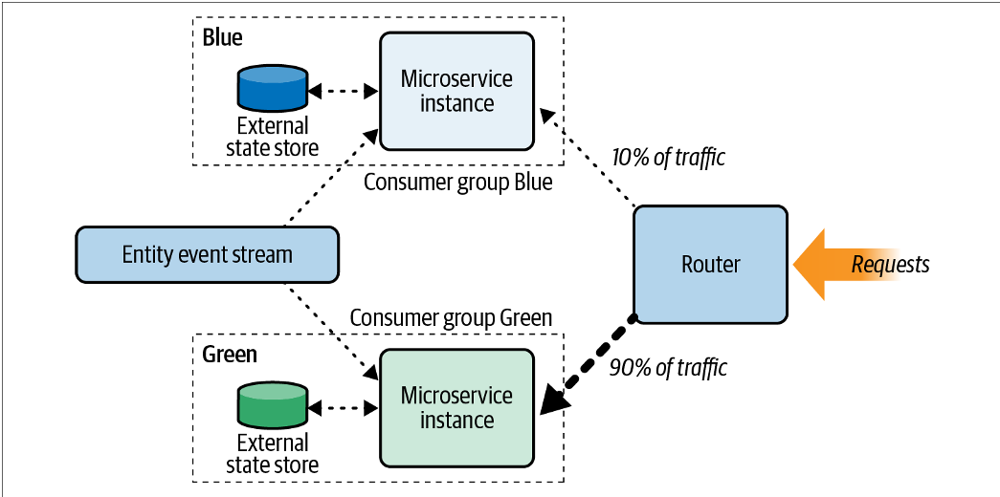

>Figure 21-6. Blue-green deployment pattern  

In this example, a full copy of the new microservice (entitled Blue at the top of the figure) is brought up in parallel with the old microservice (entitled Green at the bottom of the figure). The blue service has a fully isolated instance of its external data store, its own consumer group, and its own IP addresses for remote access. It consumes input events until monitoring indicates that it is sufficiently caught up to the green service, at which point traffic from the green instances can begin to be rerouted.  

The router handles traffic in front of the services, routing some requests to the blue service with the rest going to the green service. You start small, routing only a few requests at a time, to validate that the blue service is operating as expected. If you detect no failures or abnormalities, you can route more traffic over to blue while simultaneously decreasing traffic to green, keeping watch for any new errors (watch for scaling issues). Eventually, if all goes well, you'll have routed all traffic to the blue instances and the green instances will no longer be handling requests.  

At this point, depending on the sensitivity of your application and the need to provide a quick fallback, the green instances can be turned off or left to idle until sufficient time without incident has passed. In the case that an error occurs during the cooldown period, the router can quickly reroute the traffic back to the green instances to restore your service-level objectives.  

> [!NOTE]
> You must integrate monitoring and alerting—including resource
> usage metrics, consumer group lag, autoscaling triggers, and sys-
> tem alerts—as part of the blue-green deployment pattern.  

The blue-green deployment pattern works well for microservices that require minimal downtime, particularly those that power customer experiences or provide around-the-clock services. However, when powered by event streams, you'll need to be cautious about issues that may arise from asynchronous materializations and computations and multiple consumer group management.  

> [!WARNING]
> Be cautious about using the blue-green deployment to write to a common output stream. The two independent microservice instances may overwrite each other's work or create duplicate events. In this scenario, you may find it better to use either the rolling update pattern or the basic full-stop deployment pattern instead.  

### Summary  

Streamlining the deployment of microservices requires your organization to pay the microservice tax and invest in its deployment and monitoring systems. Due to the large quantity of microservices that may need to be managed, it is best to delegate deployment responsibilities to the teams that own the microservices. These teams will need supportive tooling to control and manage their deployments.  

Continuous integration pipelines are an essential part of the deployment process. They provide the framework for setting up and executing tests, validating builds, and ensuring that the containerized services are ready to deploy to production. The container management system provides the means for managing the deployment of the containers into the compute clusters, allocating resources, and providing scalability.  

You can deploy services in several ways, with the simplest being to stop the micro-service fully and redeploy the newest code. This can incur significant downtime, however, and may not be suitable depending on the SLAs. There are several other deployment patterns, each with its own benefits and drawbacks. The patterns discussed in this chapter are by no means a comprehensive list, but should give you a good starting point for determining the needs of your own services.  

The next and final chapter is the conclusion, where I'll wrap up and review the major
subjects covered in this book.  

# Conclusion

Event-driven microservice architectures provide a powerful and flexible approach to solving business problems. Event streams provide well-defined low-latency data to whichever services need it, as many times as they need it. Microservices enable you to create purpose-built services using the technologies best suited for the job, including databases, languages, and frameworks. Together, they enable resilient decoupled services that communicate durably and asynchronously, leaving you open to choosing the best options for solving your business use cases.  

Here is a quick recap of everything covered in this book, as well as some final words.  

## The Data Communication Structure  

The data communication structure is what allows you to get access to important business data from across your company, without having to build or rely on ad-hoc solutions.  

Event brokers, as part of an event-driven architecture, enable you and your services to access any of the data they need, provided it has been written to an event stream. They permit a strict organization of data, can propagate updates in near–real time, and can operate at truly enormous scale. The event broker is agnostic to the business logic of the producers and the consumers. It simply focuses on resiliently storing events and distributing them to the subscribed consumers.  

By writing events to an event stream, the producer services provide readily available, low-latency, and decoupled access to events for all interested consumers. Event streams absolve producers of needing to provide custom query endpoints for consumers, letting producers focus first and foremost on serving their primary business use cases. Consumers can access the data they need from the streams that serve it, using their own business logic, processing power, and data storage to solve their own business use cases.  

A mature data communication structure decouples the ownership and production of data from the access and consumption of it. Applications no longer need to perform double duty by serving internal business logic while also providing synchronization mechanisms and outside direct access for other services. A failed service instance no longer means that data is inaccessible, but simply that new data will be delayed until the producer is back online.  

## Business Domains and Bounded Contexts  

Businesses operate in a specific domain, which can be broken down into subdomains. Solutions to business problems are described by bounded contexts, which identify the boundaries—including the inputs, outputs, events, requirements, processes, and data models—relevant to the subdomain.  

Your microservice implementation should align with a bounded context. Smaller bounded contexts may be fulfilled by a single microservice, while larger and more complicated bounded contexts may use several microservices.  

You should align your microservices on business-defined bounded contexts, so that your services map neatly to the business problems they’re meant to solve. The result is a set of decoupled services that you can update independently of one another, ensuring that you can meet the needs of an ever-changing business landscape while at the same time preserving team autonomy.  

## Tooling, Infrastructure, and the Microservice Tax  

Event-driven microservices require an investment in the systems and tools that permit its operation at scale, known as the microservice tax. The event broker is at the heart of the system, as it provides the fundamental communication between services and absolves each service from managing its own data communication solution.  

Microservice architectures amplify the issues surrounding creating, managing, and deploying applications, and benefit from the standardization and streamlining of these processes. Each new service requires its own repository, deployment pipeline, monitoring, and logging system, as well as processing and storage resources. Creating a custom process for each microservice will be quite costly, while creating the means for each team to accomplish these steps on their own will pay off greatly.  

Essential services that make up the microservice tax include:  

• The event broker and event streams  

• Schema registry and metadata management  

• Access control management  

• Container management system, including resource management  

• Continuous integration, delivery, and deployment service  

• Monitoring and logging service  

Paying the microservice tax is not an all-or-nothing process. An organization commonly starts with an event broker service or a container management system, and works toward adding the other pieces as needed.  

### Event Design  

There are several major types of events. Understanding each of them, their primary roles, and their benefits, drawbacks, and when to use them is essential for building event-driven microservices. The types of events include:  

### State events  

These describe the state of an *entity* at a given point in time, and include all fields that relate to it. State events may contain just the current state, or they may also include the earlier versions of state (such as when using before/after). State events use a primary key that represents the entity, to enable event-stream copartitioning and compaction. They also support event-carried state transfer, a critical mechanism for event-driven microservices.  

### Delta events  

These describe the change from one state to another. Delta events most commonly include only the fields that have changed, leaving it up to the consumer to compose the state. Delta events are not compactable, which can make it challenging to store them as time goes on and the quantity grows. They also support event sourcing, a pattern most commonly used to communicate state changes within a bounded context, but not for communication between bounded contexts.  

### Hybrid events  

A combination of both state and delta, these events contain both state and the
deltas that led to the changes in state. Hybrid events can offer a compromise
between state and delta events, but at the expense of added production and
consumption complexity, storage usage, and network usage.  

The degree to which you *normalize* or *denormalize* data relating to events is also an important consideration. Relational databases are purpose-built for and highly efficient at handling complex joins for data at rest, benefiting from a normalized schema (e.g., third or fourth normal form). In event streams, joins are much more complex and expensive to handle, and so benefit from a more denormalized approach.  

Trade-offs exist, however. Denormalized events are larger and require more data storage, and network usage. It is also more complex for the producer to create them.  

However, the consumers benefit greatly as they can avoid complex and expensive
stream joins, and use a wider range frameworks.  

## Schematized Events  

Schemas play a critical role in communicating the meaning of events. Strongly typed events force both producers and consumers to contend with the realities of data, instead of shrugging it off and hoping someone else will figure it out later. Producers must ensure that they produce events according to the schema, while consumers must ensure that they code their microservices against the schema definition. Strongly defined schemas significantly reduce the chance of consumers misinterpreting events, prevent bad data, and provide a contract for future changes.  

Schema evolution provides a mechanism for changing schemas according to new business requirements. It enables the producer to generate events with new and updated fields, while also allowing consumers that don't care about the change to continue using older schemas. This significantly reduces the frequency and risk of nonessential changes. Meanwhile, the remaining consumers can independently upgrade their code to consume and process events using the latest schema format, enabling them to access the latest data fields.  

Field-level encryption and value constraints are two other beneficial features. The former allows you to encrypt specific fields (as per your schema), such that only those consumers with the proper authorization can decrypt and access the data. The latter enables you to specify valid ranges for a field, such as restricting an age field to a positive integer value, or a name field to only alphabetical characters.  

Schemas also allow for useful features such as code generation and data discovery. Code generators can create classes/structures relevant to producing and consuming applications. Developers code their services against these generated outputs, which helps to expose any problems in data definitions early in the development cycle. They can remain focused on building the business logic of their application, leaving the mapping of serialized data to class objects to the appropriate libraries.  

Finally, the schema registry provides a searchable means of figuring out which data is attributed to which event stream. It can enable easier data discovery across many different event streams, and help you determine which streams you need to build your own business logic.  

### Data Liberation and the Single Source of Truth  

Once your event streams are up and running, it's time to populate them with business-critical data. Liberating data from the services and data stores in your organization can be a lengthy process and it will take some time to get it all into the event broker. This is an essential step in decoupling systems from one another and
for moving toward an event-driven architecture. Data liberation decouples the pro-
duction and ownership of data from the accessing of it by downstream consumers.  

> [!TIP]
> Having your data readily available in event streams allows for services to be built by *composition*. A new service needs only to subscribe to the event streams of interest via the event broker, rather than directly connecting to each service that would otherwise provide the data.  

Start by liberating the data that is most commonly used and most critical to your organization's next major goals. There are various ways to extract information from the various services and data stores, and each method has benefits and drawbacks. It's important to weigh the impact on the existing service against the risks of stale data, lack of schemas, and the exposure of internal data models in the liberated event streams.  

## Microservices  

Microservices are small, purpose-built services dedicated toward solving specific business problems. The most sustainable way to build microservices is to align them along business-focused bounded contexts, where each microservice, or collection of microservices, contributes to fulfilling the needs of the context. Following this strategy allows you to isolate your microservices from changes made in other areas of the business, except for cases where those business changes necessitate changes in *your* business area as well.  

Though you can build microservices out of pretty much any technology or framework, some do work better than others. This book covered the most commonly selected options, including lightweight frameworks, heavyweight frameworks, basic producer/consumer, FaaS, and streaming SQL options. You'll also need to consider internal state storage versus external state storage, just as you will need to consider either running your services in a container (which is the most common) or in a virtual machine (less common).  

Not all microservices need be *micro*. It is reasonable for an organization to instead use several larger services, particularly if it has not paid the microservice tax, in part or in full. There is no award for building the most microservices, nor is there an award for having just a single massive service. You'll need to find the balance that's suitable for your own organization.  

It will, however, be much easier to build new, fine-grained services decoupled from
the existing large services if you follow just a few key principles:  

• Publish commonly used and important business entities and events into the event broker.  

• Use the event broker as the single source of truth for driving your microservices.  

• Make it easy to set up, use, and manage your own microservices.  

### Microservice Implementation Options  

Currently, lightweight frameworks tend to have the greatest out-of-the-box functionality. Streams can be materialized to tables and maintained indefinitely. Joins, including those on foreign keys, can be performed for numerous streams and tables. Hot replicas, durable storage, and changelogs provide resiliency and scalability.  

Heavyweight frameworks provide similar functionality to lightweight frameworks, but fall short in terms of processing independence because they require a separate dedicated cluster of resources. New cluster management options are becoming more popular, such as direct integration with Kubernetes, one of the leading container management systems. Heavyweight frameworks are often already in use in mid-sized and larger organizations, typically by the individuals performing big-data analysis.  

Basic producer/consumer (BPC) provides flexible options for many languages and runtimes, but is typically limited to just basic consumption and production patterns. Ensuring deterministic behavior is difficult, as they don't come with built-in event scheduling. Complex operations will require either a significant investment in your own custom libraries to provide that functionality, or you'll need to limit your usage to simpler use cases where nondeterministic processing isn't a concern.  

Functions as a service (FaaS) solutions are similar to that of a BPC, but are more streamlined in regard to management and scaling. FaaS use cases include simple stateless and stateful processing, as well as orchestration for more complex work-flows. FaaS orchestrator functions are not available from all FaaS providers, so check your documentation accordingly.  

### Testing  

Event-driven microservices lend themselves very well to integration and unit testing. You can easily compose events to cover a wide range of test cases, specifying order, timestamps, partitions, and contents across the input event streams. The event schemas provide the necessary structure for composing the input test streams, including any constraints or special edge cases that you may need to accommodate.  

Local testing can include both unit and integration testing, with the latter relying on the dynamic creation of an event broker, schema registry, and any other dependencies required by the service under test. For example, you can create an event broker within the same executable as the test itself, as is the case with numerous JVM-based
solutions. You can also run an event broker within its own container alongside the
application under test. With full control of the event broker, you can simulate load,
race conditions, outages, failures, or any other broker-application interactions.  

You can conduct production integration testing by dynamically creating a temporary event broker, populating it with copies of production event streams and events (barring information-security concerns), then running your service on it. This can provide a smoke test prior to production deployment to ensure that you haven't missed anything obvious, and to provide a means of verification. You can also execute performance tests in this environment, testing both the performance of a single instance and the ability of the application to scale horizontally. The environment can simply be discarded once testing is complete.  

### Deploying  

Deploying microservices at scale requires that microservice owners can quickly and easily deploy and roll back their services. This autonomy allows for teams to move and act independently and to eliminate bottlenecks that would otherwise exist in an infrastructural team responsible solely for deployments. Continuous integration, delivery, and deployment pipelines are essential in providing this functionality, as they allow a streamlined yet customizable deployment process that reduces manual steps and intervention, and can be scaled out to other microservices. Depending on your selection, the container management system may provide additional functionality to help with deployments and rollbacks, further simplifying the process.  

The deployment process must take into account service-level agreements (SLAs), rebuilding of state, and reconsumption of input event streams. SLAs are not simply matters of downtime, but also must take into account the impact of deployment on all downstream consumers, and the health of the event broker service. A microservice that must rebuild its entire state and propagate new output events may place a considerable load on the event broker, as well as cause downstream consumers to suddenly need to scale up to many more processing instances. It is not uncommon for a rebuilding service to process millions or billions of events in short order. Quotas can mitigate the impact, but depending on downstream service requirements, a rebuilding service may be in an inconsistent state for an unacceptable period of time.  

There are always trade-offs between SLAs, impact to downstream consumers, impact to the event broker, and impact to monitoring and alerting frameworks. For instance, a blue-green deployment requires two consumer groups, which must be considered for monitoring and alerting, including lag-based autoscaling. While you can certainly perform the work necessary to accommodate this deployment pattern, another option is to simply change the application's design. An alternative to blue-green  

deployments is to use a thin, always-on serving layer to serve synchronous requests,
while the backend event processor can be swapped out and reprocess in its own time.
While your service layer may serve stale data for a period of time, it doesn't require
any augmentations to tooling or more complex swapping operations and can possibly
still meet the SLAs of dependent services.  

## Final Words  

Event-driven microservices are powerful, flexible, resilient, and scalable. They enable you to create purpose-built services that align with your business goals, using whatever frameworks, languages, data stores, and tooling you choose.  

Success in event-driven microservices requires a rethink about what data really is and how services access and use it. Gone are the days when all the data of your organization can be shoved into a single database and accessed by a single monolithic service.  

Event streams provide the data communication structure sorely lacking in many an organization. Publishing important business data to event streams makes it widely available to any authorized service, system, team, or people that need it. A robust and well-defined data communication structure relieves services of performing double duty and allows them to focus instead on serving just their own business functionality, not the data and querying needs of other bounded contexts.  

Event-driven microservices compose their own data models from data sourced through event streams. This compositional nature provides unparalleled flexibility, allowing individual business units to focus on using whatever data is necessary to accomplish their business goals. Even organizations running just a handful of services can benefit greatly from the data communications provided by the event broker, which paves the way for building new services, fully decoupled from old business requirements and implementations.  

In closing, event-driven microservices provide you with many powerful options for solving your business problems. Regardless of how you build the services themselves, this much is clear: the data communication structure extends the power of an organization's data to any service or team that requires it, eliminates access boundaries, and reduces unnecessary complexity related to production and distribution. It provides a solid foundation for you to build the services your organization needs to find ultimate business success.  

# Index

### A  

388-390  

access restrictions, in data contracts, 86  

adaptive scheduler, 273  

Advanced Message Queuing Protocol(AMQP),25  

AFTER trigger, 146  

aggregation  

and measurement events, 120  

of state from keyed events, 35-36  

aggregation layer, challenges of, 358  

Akidau, Tyler  

Streaming Systems, 206  

The World Beyond Batch Streaming 101,220  

Alvaro, Peter, Data-Centric Programming for Distributed Systems, 323  

Amazon DynamoDB, 391  

Amazon ECS, 64  

Amazon Firecracker, 63  

Amazon MSK Replicator, 396  

Amazon S3, 153  

Amazon States Language, 314  

Amazon Web Services (AWS), 301  

Amazon Web Services (AWS) Glue, 94  

Amazon Web Services(AWS) Kinesis, 302, 415  

Amazon Web Services(AWS) Lambda, 415  

Amazon Web Services(AWS) Step Functions Redrive, 314  

AMQP(Advanced Message Queuing Protocol),25  

Amundsen, 386  

Ansible, 383  

Apache ActiveMQ, 25  

Apache Atlas, 94, 386  

Apache Avro, 45, 75, 77, 80-81, 85, 370  

Apache Beam, 253, 255, 275  

Apache Flink, 40, 53, 159, 253, 255, 264, 266,273, 275, 285, 287-290, 294, 404  

Apache Hadoop, 254  

Apache Heron, 253  

Apache Hive, 288  

Apache Iceberg, 153  

Apache Kafka, 24, 27-29, 38, 60, 129, 131, 170,191, 264, 302, 336, 387, 388, 392, 395, 414  

Apache Kafka Streams, 40, 53, 159, 181, 208,277, 282  

Apache NiFi, 130  

Apache Parquet, 94  

Apache Pulsar, 132, 170, 191, 336, 388, 414  

Apache Samza, 53, 204, 277  

Apache Spark, 40, 53, 159, 253, 255, 264, 266,272, 275, 285, 294, 404  

Apache Storm, 53, 253  

Apache Zeppelin, 291  

Apache Zookeeper, 261, 274  

API versioning and dependency management,19  

append-only log, 240-241  

append-only tables, 287  

application layer, testing, 411  

applications, executing SQL code from within,290-291  

async/await functions, 349  

asynchronous communication, 4  

asynchronous direct-function calling, 308  

asynchronous microservices, 18-20, 350  

asynchronous triggers, FaaS, 303  

asynchronous UI, 350  

at-least-once processing guarantees, 26  

automation, as a benefit of IaC, 383  

autonomy, microservices' role in providing
design, 7  

autoscaling applications, 274  

AWS (see Amazon Web Services)  

### B  

backend and frontend services, coordination of,
356-362  

backward compatibility, schema evolution
rules, 83  

bad data, 365-380  

delta events, 376-377  

fixing with state events, 374-376  

preventing with schemas, 370  

preventing with testing, 372  

preventing with validation, 371-372  

rewinding, rebuilding, and retrying,
377-379  

role of event design in fixing, 372-373  

types of in event streams, 366-370  

basic full-stop deployment pattern, 428-430  

basic producer and consumer (BPC) microser-
vices, 51-53, 247-252, 444  

batch size  

and batch window in event-stream listener
triggers, 304  

FaaS and, 312  

before/after state events, 102-104  

big data, 254  

binary logs, 131  

blue-green deployment pattern, 436-438, 445  

bootstrapping, 133  

bounded contexts, 6  

ACLs as enforcers of, 388-390  

aligning microservice implementation to, 7,
440  

business domains, 7-9, 440  

FaaS and designing solutions as microservices, 298  

function access permissions, 308
introduction, 6  

bounded versus unbounded data sets, out-of-order event processing, 210  

BPC (basic producer and consumer) microservices, 51-53, 247-252, 444  

breaking schema change pattern, 431-436  

broker ingestion time, 201  

Burrow, 392  

business domains  

and bounded contexts, 7-9, 440  

centralized frameworks for CDC, 153-154  

communication structures, 9-15  

FaaS advantages for, 306, 444  

business logic  

freeing UI element libraries from bounded-
context-specific, 362  

not reliant on event order, 249-250  

windowing, 213-216  

business requirements  

aligning bounded contexts with, 7-9  

BPC microservices' capabilities, 248-252  

flexibility as a benefit of EDM, 5  

mapping to microservices, 397  

out-of-order and late event handling, 216  

rebuilding state stores, 188  

### C  

Cadence, 238  

callback API, 330  

change data capture (CDC), 102, 131-150  

business considerations, 153-154  

change-data capture logs, 131-134  

data definition changes, 149-150  

data liberation benefits and drawbacks, 134  

outbox tables, 138-149  

strategy tradeoffs, 154  

change management, service contracts and, 66  

change-data tables, built-in, 140  

change logs, 177  

lightweight framework, 281-282  

recording state to, 177-178  

restoring and scaling internal state from,
183  

scaling and recovery with external state
stores, 187  

sourcing data for, 132  

channel, 24  

checkpoints, for changelog progress, 132  

Chernyak, Slava, Streaming Systems, 206  

choreography design pattern, 222-226  

asynchronous function calling, 308  

distributed systems, 231-232  

transactions, 232-234  

CI (continuous integration), 5, 427  

CLI (command-line interface), executing SQL
code from, 290  

click events, 330  

client libraries, function of, 46  

cloud service providers (CSPs), 301  

cluster mode, for heavyweight cluster, 268  

clusters  

application submission modes, 267-268  

in heavyweight framework, 253-276  

multicluster management, 394  

replication with cross-cluster event data,
395  

setup options and execution modes,
264-267  

supportive tooling, 394-396  

CMSs (see container management system)  

code generation  

and service contracts, 66  

support for event schema, 76  

cold start and warm start, FaaS, 300  

command-line interface (CLI), executing SQL
code from, 290  

comments, in Protobuf, 81  

committing code, deployment, 428  

commodity hardware in deployment, 427-428  

communication structures, 9-15, 439  

community support, function of, 47  

compaction  

configurations and guarantees of, 38-39  

and tombstones, 37  

compatibility types, schema evolution rules,
83-85  

compensation workflows, 237-238, 376  

complex data type, 78  

composite service, multiple microservices as,
347-348  

composition-based microservices, 443  

Confluent, 131, 264, 384, 388  

Confluent Kafka broker, 413  

Confluent REST proxy, 336  

Confluent Schema Registry, 91, 388  

Confluent's Cluster Linking, 396  

connectors, 57  

consistency, 323  

one event at a time, 325-329  

strategies for, 329-332  

consumer group, 50  

consumer group lag, 304-305  

consumer ingestion time, 201  

consumer microservices, 5  

consumer offset lag monitoring, 392  

consumers  

assigning partitions to consumer instance,
170-175  

and communication layers, 439  

in BPC microservices, 247-252  

negotiating breaking changes with, 426  

notifications of schema creation and modification, 390  

separation of responsibilities of, 16  

timestamp extraction by, 205  

container management systems (CMSs), 62  

deployment role of, 427-428  

in heavyweight framework, 264-267  

in lightweight framework, 254, 277  

as supportive tool, 393  

and virtual machines, 64  

container-based testing environment, 413-415  

containerization, 62  

continuous delivery, 427  

continuous deployment, 427  

continuous integration (CI), 5, 427  

continuous query, 286  

convergence of data (see consistency)  

Conway's Law, 11-12  

copartitioning event streams, 34, 172  

corrupted data, 366  

Couchbase, 131  

create, read, update, delete (CRUD) model, 105  

cross-cluster event data replication, 395  

cross-cutting versus sole ownership of application, 8  

crypto-shredding, 123  

CSPs (cloud service providers), 301  

curated testing source, 419  

current state events, 100-101  

custom event schedulers, 204  

custom querying of data, 136  

### D  

data access, EDM versus request-response
microservices, 19  

data catalogs, 94  

data communication structure, 10, 439  

data contracts, 61, 71, 85-87  

data definition language (DDL), 149  

data definitions, 44-45, 149  

changing, 149-150  

in schema, 44-45  

data dependency, 19, 134, 396-400  

data liberation, 128-149  

change-data capture logs, 131-134  

compromises for, 150-152  

data definition changes, 149-150  

dual write antipattern, 129  

frameworks, 130  

outbox tables, 138-149  

patterns of, 130  

query-based, 135-138  

and single source of truth, 442  

sinking event data to data stores, 152-154  

data lineage, determining, 396  

data locality, 31  

data models  

benefit of event-production with outbox
tables, 145  

exposure from change-data log data libera-
tion pattern, 134  

data privacy, event design for, 123-124  

data protection, and schemas, 76  

data quality rules, 371  

data source discovery, determining, 397  

data stores  

sinking event data to, 153-154  

testing, 410  

data, bad (see bad data)  

Data-Centric Programming for Distributed
Systems (Alvaro), 323  

database logs (see change data capture (CDC))  

Databricks, 264  

DataHub, 94  

DDL (data definition language), 149  

Debezium, 103, 130, 132  

declarative resource management, 273  

decoupling of producer and consumer services,
142  

dedicated service, eventification in a, 162-164  

dedicated versus shared databases, 12  

deduplication ID (dedup ID), 195  

deduplication of events, 194-197  

DEE (distributed execution engine), 240  

default value, 84  

delta events, 98, 104-117, 376-377, 441  

for event sourcing, 104-107  

problems with, 108-116  

where to use, 116-117  

Delta Lake, 153  

denormalization, 134, 157, 160, 441  

dependency, data, 19, 134, 396-400  

dependent scaling, request-response microservices, 19  

dependent service changes, minimizing, 426  

deployment considerations, 425-438  

architectural components, 426-428  

basic full-stop deployment pattern, 428-430  

blue-green deployment pattern, 436-438  

breaking schema change pattern, 431-436  

heavyweight framework cluster, 263, 265  

principles, 425-426  

rolling update pattern, 430-431  

summary, 445-446  

depreciation, metadata tag, 387  

Designing Data-Intensive Applications (Kleppmann), 77  

designing events, 97-125  

deterministic processing, 199-220  

connectivity issues, 219-220  

and event scheduling, 203-205  

FaaS caution, 306  

late-arriving events, 216  

out-of-order events, 210-216  

reprocessing historical data, 217-218  

stream time, 208-210  

timestamps, 200-203  

watermarks, 205-208  

DevOps capabilities, 383  

DFO (durable function orchestration), 314  

direct coupling, avoiding, 37, 99, 185  

direct-call communication pattern  

functions calling other functions, 309-311  

orchestration workflow, 227-230  

distributed execution engine (DEE), 240  

distributed systems  

choreographed workflows, 231-232  

monoliths, request-response microservices,
19  

orchestrated workflows, 235-237  

timestamps, 200, 202  

transactions, 231-238  

Distributed Systems for Fun and Profit
(Takada), 220  

Docker, 62, 414  

Docker Engine, 64  

documentation  

schemas and, 76  

service contracts and, 66  

domain, 6  

domain models, 6  

domain-driven design, 6  

Domain-Driven Design (Evans), 6  

driver mode, heavyweight cluster, 267  

dual write antipattern, 129  

duplicate events, processing, 194-197  

durability  

event brokers role in providing, 45  

as a property of event streams, 23  

durable execution engine, implementing  

orchestration via, 238-242  

durable function orchestration (DFO), 314  

durable multitenant environment, 421-422  

durable stateful function support, 307  

### E  

ECST (event-carried state transfer), 33, 99-104,
373  

EDM (see event-driven microservices architecture)  

effectively once processing, 190-198  

 emulator, 415  

encapsulation, 359  

entity events, 32, 33, 36-37, 98, 441  

and event-carried state transfer, 99-104  

fixing bad data with, 374-376  

handling eventual consistency using, 329  

where to use, 116-117  

ephemeral messaging, 24-25  

ESS (external shuffle service), 272  

Evans, Eric, Domain-Driven Design, 6  

event brokers, 21, 24  

connectivity issues for, 219-220  

ingestion time in deterministic processing,
204  

powering microservices with, 45  

and quotas, 387  

role of, 439  

selecting, 46-47  

testing, 410  

transactional support and effectively once
processing, 190-191  

event generators, testing, 77  

event keys  

partitioning and, 61  

in repartitioning, 171  

event partitioner, 171  

event sourcing  

via durable append-only log, 240-241  

event streams, 21  

(see also bad data)  

ACLs and permissions for, 388-390  

assigning partitions to a consumer instance,
170-175  

creating and modifying, 385  

deleting compaction, 37-39  

deterministic processing, 199-220  

fundamentals of, 21-48  

materializing state from, 176-188, 263  

metadata tagging, 386  

partitioning of, 170-175  

repartitioning of, 33-34, 171-172  

reprocessing historical data from, 217-218  

role in microservice processes, 22-29  

state stores, 175-198  

validating, 429  

event time, 201, 203, 204  

event-carried state transfer (ECST), 33, 99-104,
373  

event-driven communication pattern, 331  

event-driven microservices (EDM) architecture, 3-6, 443-444  

asynchronous, 18-20, 350  

benefits of, 5-6  

BPC microservices, 51-53, 247-252, 444  

communication structures, 9-15, 439  

containerization, 63  

data contracts, 71-95  

deployment, 425-438  

designing events, 97-125  

deterministic stream processing, 199-220  

versus direct-call, 227-230  

existing systems, integrating with, 127-156  

FaaS, 297-320  

fundamentals, 49-67  

heavyweight framework, 253-276  

implementation options, 444  

lightweight framework, 277  

loose coupling, 5  

managing at scale, 62-64  

powering with event broker, 45  

request-response, integrating with, 333-363  

responsibilities of, 4, 59-61  

schemas, 71-95  

size of, 61-62  

stateful streaming, 175-198  

stream-processing, 53-55  

supportive tooling, 381-400  

testing, 401-424  

workflows, building, 221-243  

event-stream listener, 303-304  

eventification, 157  

in a dedicated service, 162-164  

at transactional outbox, 160-162  

events  

as a canonical replayable record, 16  

converting requests into, 334-338  

data definitions, 44-45  

deleting, 37-39  

designing, 97-125, 372-373, 441-442  

as a durable canonical record, 15  

fundamentals of, 21-48  

independence from, 16  

keyed, 30  

scheduling, 203-205, 217-218  

schematized, 442  

shuffling, 206, 280-281  

as a single source of truth, 442  

sourcing using delta events, 104-107  

structure of, 29-33  

types of, 30-33, 97-99  

unkeyed, 30  

eventual consistency (see consistency)  

evolution rules  

in data contracts, 87  

schema, 82-85  

exactly once processing (see effectively once processing)  

executing cluster, 259  

existing systems, integration with, 127-156  

BPC microservices, 248-249  

data liberation, 128-149  

sinking event data to data stores, 153-154  

external services, nondeterministic, 200  

external shuffle service (ESS), 272  

external state store, 176  

application reset, 391  

materializing state from an event stream, 184-188  

serving real-time requests, 345-348  

external systems, request-response calls to, 205  

### F  

FaaS (see Function-as-a-Service)  

failure recovery, 60  

fault-tolerant workflow engine (see durable execution engine)  

Faust framework, 277  

field-level encryption (FLE), 86, 93-94  

financial information, metadata tag, 386  

fire-and-forget approach, 309  

FLE (field-level encryption), 86, 93-94  

format-preserving encryption, 93  

forward compatibility, schema evolution rules, 84  

frequency, 164  

frontend and backend services, coordination of, 356-362  

full compatibility, schema evolution rules, 85  

full remote integration testing, 416-423  

full-transitive compatibility, schema evolution rules, 85  

function, 297  

Function-as-a-Service (FaaS), 297-320  

building microservices out of functions, 299-300  

business solutions with, 306, 444  

choosing a provider, 301-302  

cold start and warm start, 300  

designing solutions as microservices, 297-298  

durable function orchestration (DFO), 314  

functions calling other functions, 308-311  

handling failures, 311-314  

maintaining state, 307  

scaling your solutions, 306-307  

termination and shutdown, 301  

triggering logic, starting functions with, 302-306  

function-trigger map, 299  

functional testing, 401, 409-416  

### G  

gateways, 293  

gating pattern, 249  

GCP (Google Cloud Platform), 301, 415  

General Data Protection Regulation (GDPR), 123  

global state store, 178  

global window, 263  

Google, 75  

Google Analytics, 119  

Google Cloud Platform (GCP), 301, 415  

Google Cloud Storage, 153  

Google Cloud Workflows, 314  

Google Dataflow, 260, 274, 275  

Google Functions, 302  

Google gVisor, 63  

Google Protobuf, 45, 74, 75, 77, 78-79, 85, 370  

Google PubSub, 302, 336  

Google's Bigtable, 391  

Google's Dataplex Universal Catalog, 94  

GPS and NTP synchronization, 202  

granularity, as a benefit of EDM, 5  

groupByKey operation, 206  

### H  

Hadoop Distributed File System (HDFS), 152  

Hashicorp Vault, 413  

header, in records, 29  

heavyweight framework, 253-276  

application submission modes, 267-268  

benefits and limitations, 262-264, 444  

choosing a framework, 275  

clusters, 253-276  

history, 254-255  

inner workings, 260-262  

languages and syntax, 275  

multitenancy considerations, 274-275  

recovering from failures, 274  

state and checkpoints, 268-269  

testing, 404  

testing applications, 415  

Heland, Pat, 323  

high availability, event broker's role in providing, 45  

high performance  

event broker's role in providing, 45  

in disk-based options, 179  

horizontal scaling, 64  

hosted services (see managed services)  

hot replicas, 181-184, 283  

hybrid events, 98, 117-119, 441  

hybrid integration testing, 409  

hybrid microservice architectures, 20  

hydration time, 40  

hysteresis, 392  

### I  

IaC (infrastructure as code), 382-383  

idempotent writes, 191, 194  

Identity and Access Management (IAM),
384-384  

immutability of event data, 22  

implementation communication structures, 10  

implicit default values, 79  

incremental timestamp data loading by query,
135  

incremental updating of data sets, 136  

indefinite storage, function of, 47  

indexing of events, 23  

infinite retention of events, 27  

infrastructure as code (IaC), 382-383  

infrastructure, choosing, 382  

ingestion time, 204  

integrations  

capturing DDL changes, 149  

CMS in heavyweight framework, 264-267  

continuous, 427  

with existing systems, 127-156, 248-249  

with request-response, 333-363  

testing environment, 408-423, 428, 444  

interactive streams, 342  

interconnectedness and complexity measurement, 397  

intermittent failures, 312  

and late events, 218  

internal data models, isolating, 138, 141-142  

internal event streams, 308  

internal repartition topics, 209  

internal state store  

application reset, 391  

materializing state from an event stream,
176-184  

serving real-time requests, 341-345  

interpreters, 292  

### J  

Java (JVM) microservice, 55, 263, 275  

JavaScript, 75  

JSON Schema, 77, 81-82, 85, 370  

Jupyter, 291, 292  

Jupyter, 292  

### K  

Kafka Connect, 77, 130, 135, 303  

Kafka consumer group, 28  

kappa architecture, 39-42  

Kata Containers, 63  

key, in records, 29  

key-management service (KMS), 123  

Keycloak, 384  

keyed events, 30, 35-36  

Kleppmann, Martin, Designing Data-Intensive Applications, 77  

KMS (key-management service), 123  

Kotlin, 75  

Kreps, Jay, 39  

Kubeless, 302  

Kubernetes, 62, 64, 266, 414  

### L  

lag monitoring/triggering, 304-305, 392  

lambda architecture, 42-44  

late-arriving events, 216  

Lax, Reuven, Streaming Systems, 206  

legacy application, 57  

legacy systems, integration with EDMs,
127-156, 248  

lift and shift approach, 234  

lightweight data-interchange format, 370  

lightweight framework, 277  

benefits and limitations, 444  

changelog usage, 281-282  

example, 278-280  

scaling applications, 282  

state handling, 281-282  

testing, 404  

load balancers, 341-345  

local integration testing, 409, 444  

local state, 50  

LocalStack, 415  

log-based data liberation, 130  

### M  

managed services (hosted services), 415-416  

cloud computing, 395  

function of, 46  

heavyweight framework cluster setup,
264-265  

MapReduce, 54, 254, 275  

materialized streams, 55  

materializing state from an event stream  

from entity events, 33, 36-37  

external state store, 184-188  

financial cost, 186  

full date locality, 185, 187  

heavyweight framework, 263  

internal state store, 176-184  

network-attached disk, 179  

measurement events, 119-121  

MemoryStream class, 404  

Mesos, 64  

message, 24  

Message Queuing Telemetry Transport
(MQTT), 25  

message-passing architectures, 3  

metadata catalog, 288  

metadata tagging of event streams, 386-387  

micro-frontends in request-response applications, 356-362  

microservice tax, 65, 440-441  

microservice-to-team assignment system,
385-385  

microservices (see event-driven microservices
(EDM) architecture)  

Microsoft Azure, 301, 415  

Microsoft Azure Blob Storage, 153  

Microsoft Azure Data Catalog, 94  

Microsoft Azure Durable Functions, 314, 318  

Microsoft Azure Event Hub, 302, 415  

Microsoft Azure REST proxy, 336  

MicroVMs, 63  

migration, 189  

(see also data liberation)  

eventual migration via two event streams,
433-435  

versus rebuilding state stores, 188  

synchronized migration to new event
stream, 432  

migration strategy, 128  

Mills, David, 202  

MirrorMaker 2, 395  

missing events, 369  

MongoDB, 131  

monolith communication, 357  

MQTT (Message Queuing Telemetry Transport), 25  

multicluster management, 394  

multilanguage support, outbox tables, 145  

multitenancy considerations, 274-275  

MySQL, 37  

### N  

namespace metadata tag, 386  

namespacing  

heavyweight framework clusters, 275  

service contracts and, 66  

NATS.io Core, 24  

network latency, performance loss due to, 186  

Network Time Protocol (NTP)  

servers, 327  

synchronization, 202  

Nomad, 64  

nonentity events, 352  

nonfunctional testing, 401  

normalization, 441  

notebooks, executing SQL code from, 291-293  

notification events, 121-122  

notifications, schema creation and modification, 390  

NTP (see Network Time Protocol)  

### 0  

offsets, 39, 50  

choreographed asynchronous function calls, 309-310  

manual adjustment of, 390  

offset lag monitoring, 392  

reprocessing event streams, 218  

OpenAPI, 66  

OpenFaaS, 302  

OpenMetadata, 94, 386  

OpenWhisk, 302  

orchestration design pattern, 226-230  

direct-call workflow in request-response, 227-230  

encoding within source code, 314-320  

failure of, 313  

synchronous function calling, 310-311  

transactions, 235-237  

ordered, as a property of event streams, 23  

orphaned streams and microservices, 390  

out-of-order events, 210-216  

outbox table-based data liberation, 130  

overlay team boundaries, determining, 397  

ownership  

in data contracts, 86  

inversion of, 111-113  

and service contracts, 66  

### P  

partition assignment  

to consumer instance, 170-175  

deterministic processing, 206  

request-response microservices integration, 344  

round-robin, 173-175  

scaling of FaaS solutions, 306-307  

partition assignor, 172  

partition count, 171  

partitioning event keys, 61  

partitioning of event streams, 22, 170-175  

copartitioning, 34, 172  

repartitioning, 33-34  

performance considerations, 141  

permissions for event streams, 388-390  

personally identifiable information (PII), 123, 386  

pgvector, 413  

point-to-point couplings, request-response microservices, 18  

post-deployment validation tests, 430  

PostgreSQL, 131, 147, 413  

predeployment validation tests, 429  

primitive data type, 81  

priority-based record ordering, 26  

processing frameworks, function of, 46  

processing logic (see topologies)  

processing of events, 411  

(see also event streams)  

deterministic, 199-220  

duplicate events, 194-197, 350  

effectively once processing, 190-198  

versus reprocessing, 217-218, 426  

testing framework, 411  

for user interface, 349-356  

processing time, 204  

producer microservices, 5  

producers  

BPC microservices, 247-252  

breaking schema changes, 431  

connectivity issues for, 219-220  

duplicate event generation, 194  

limitation of responsibilities of, 16  

out-of-order event impact for multiple, 212  

product-focused microservices, 357  

production environment, for testing, 418, 422, 444  

publish-subscribe mechanism, 26  

Pulumi, 383  

Puppet, 383  

Python, 55, 75, 275  

### Q  

query-based data liberation, 130, 135-138  

benefits of, 136-137  

custom querying of data, 136  

drawbacks of, 137-138  

timestamp data loading by query, 135  

updating of data sets, 136  

queue brokers, queues versus, 26-27  

queues, 25-26  

Apache Kafka versus, 27-29  

queue brokers versus, 26-27  

queues for Kafka (KIP-932), 27  

quotas, 341, 387  

### R  

RabbitMQ, 25, 27  

RBACs (role-based access controls), 388  

reactive architectures (see choreography design pattern)  

read time. 84  

rebalancing, 50  

rebuilding versus migrating state stores, 188  

record properties (see header)  

recovery (see scaling and scalability)  

relational databases, sourcing of data options for, 37  

remote integration testing, 409, 416-423  

repartitioning event streams, 33-34, 171-172  

replayability of events, 23  

replication  

cross-cluster event data, 395  

hot replicas, 181-184, 283  

reprocessing, 217-218, 426  

reproducibility, as a benefit of IaC, 383  

request-response microservices, 331, 333-363  

calls to external systems in event scheduling, 205  

direct-call orchestration workflow, 227-230  

versus event-driven structures, 18-20  

event-driven workflow to handle requests, 348-356  

integrations with, 338-341  

micro frontends, 356-362  

stateful data processing and serving, 341-348  

testing, 19  

requests, converting into events, 334-338  

Resonate, 238  

resource manager, heavyweight stream-processing cluster, 260, 274  

resources  

failures of, 312  

production challenges in query-based updating, 137  

specifying for CMS heavyweight framework job, 266-267  

triggering logic, starting functions with, 306  

using, 336-338  

 restarting applications for scaling, 271-272  

Restate, 238  

retraction tables, 287  

Retry-After response, 330  

role-based access controls (RBACs), 388  

rolling update pattern, 430-431  

runtime of test code, temporary environment within, 411-413  

Rust, 75  

### S  

SaaS services, 415-416  

sagas (distributed transactions), 232-237  

Scala, 275  

scalar data type, 78  

scaling and scalability  

as a benefit of EDM, 5  

as a benefit of IaC, 383  

dependent scaling, 19  

event broker’s role in, 45  

FaaS, 306-307  

heavyweight framework cluster, 266  

independent scaling of processing and data layer, 251-252  

with internal state stores, 179, 181-184  

lightweight framework, 282  

managing microservices at scale, 60  

materializing state to internal state store, 179  

offset lag monitoring, 392  

recovery with external state stores, 187-188  

request-response API and EDM, 19, 347  

as trigger disadvantage, 149  

SCD (slowly changing dimension), 166-168  

scheduling  

events, 203-205, 217-218  

functions for triggering logic, 306  

schema registry, 90-93, 388, 410  

schemas, 71, 73-77  

breaking schema change pattern, 87-90,431-436  

brittle dependency consideration, 134  

code generator support for, 76  

creation and modification notifications, 390  

in data contracts, 86  

and data definitions, 44-45  

defining for data contracts, 61  

deserializing, 72  

evolution rules, 76, 82-85  

outbox table compatibility, 142-146  

preventing bad data with, 370  

serializing, 72  

technology options for, 77-82  

validating, 142-146, 429  

schematized events, 442  

scope-creep, 12  

separate microservices and request-response  

API, 347-348  

serializing schemas, 72  

server response, exposing eventual consistency
in, 329-331  

service APIs, service contracts and, 66  

service boundaries/scope, 59  

service contracts, 66-67  

service failure handling, request-response
microservices, 19  

service-level agreements (SLAs), 64, 66, 426  

service-level objectives (SLOs), in data contracts, 86  

service-oriented architectures (SOAs), 3  

services, aligning with business needs, 16  

session windows, 215, 255-260  

share group, 28  

shared versus dedicated databases, 12  

shuffle block decommissioning, 273  

shuffle tracking, 273  

shuffling, event, 206, 280-281  

shutdown, in FaaS, 301  

sidecar pattern, 248-249, 293-294  

single source of truth, liberated data as, 442  

single writer principle, 60  

sinking event data to data stores, 152-154  

SLAs (service-level agreements), 64, 66, 426  

sliding windows, 214  

SLOs (service-level objectives), in data contracts, 86  

slowly changing dimension (SCD), 166-168  

smart load balancer, 345  

smoke tests, 408  

snapshots, in scaling and recovery with external
state stores, 188  

SOAs (service-oriented architectures), 3  

Solace, 27  

sole versus cross-cutting ownership of application, 8  

source code, encoding orchestrator within,
314-320  

source streams, in scaling and recovery with
external state stores, 187  

spark-fast-tests, 404  

SQL and related languages, 55  

state  

aggregating from keyed events, 35-36  

changelogs, 177-178, 183, 187, 281-282  

consistency of, 197-198  

handling in heavyweight framework,
268-269  

maintaining, 50, 60, 307  

management and application reset, 391  

materializing from entity events, 36-37  

replication, 283  

scaling applications and recovering from
failures, 282  

state events (see entity events)  

state stores  

effectively once processing to maintain
state, 190-198  

external, 176, 184-188, 345-348, 391  

global, 178  

internal, 176-184, 341-345, 391  

rebuilding versus migrating, 188  

stateful event-driven microservices, 169-198  

stateful streaming, 175-198  

business logic not reliant on event order, use
of BPC for, 249-250  

effectively once processing of transactions,
190-198  

FaaS, 307  

heavyweight framework, 268-274  

materializing from event stream, 176-188,
263  

request-response microservices, 341-348  

state stores from an event stream, 175  

testing, 403-404  

stateless streaming, testing functions, 402-403  

storage support, indefinite, as a property of
event streams, 23  

stream owner (service), metadata tag, 386  

stream progress, 60  

stream time, 208-210, 211  

stream-processing event-driven microservice,
53-55  

stream-table duality, 37  

streaming frameworks, 253-276, 277  

streaming SQL, 285-296  

continuous query, 286  

example, 287-290  

executing code, 290-294  

query, 55  

turning streams into tables, 286-287  

user-defined function (UDF) calls, 294-295  

Streaming Systems (O'Reilly), 206  

StreamingSuiteBase, 404  

streamlined microservice creation process,
393-393  

StreamNative, 389  

subdomain, 6  

supportive tooling, 381-400  

choosing infrastructure, 382  

cluster creation and management, 394-396  

consumer offset lag monitoring, 392  

container management controls, 393  

dependency tracking and topology visualization, 396-400  

event streams, creating and modifying, 385  

function of, 46  

Identity and Access Management (IAM),
384-384  

infrastructure as code (IaC), 382-383  

metadata tagging event streams, 386-387  

and microservice deployment, 425  

microservice-to-team assignment system,
385-385  

offset management, 390  

permissions and ACLs for event streams,
388-390  

quotas, 387  

- schema creation and modification notifications, 390  

schema registry, 388  

state management and application reset, 391  

streamlined microservice creation process,
393-393  

Swagger, 66  

synchronized migration to new event stream,
432  

synchronizing distributed timestamps, 201-203  

synchronous communication, 4  

synchronous function calling, 310-311  

synchronous triggers, FaaS, 303  

### T  

tables, types of, 286-287  

Takada, Mikito, Distributed Systems for Fun
and Profit, 220  

task manager, heavyweight stream-processing
cluster, 262  

tax, microservice, 440-441  

technological flexibility, as a benefit of EDM, 5  

Temporal, 238  

temporary integration testing environment,
411-413, 417-421  

termination and shutdown of functions,
301-301  

Terraform, 62, 383  

Terry, Doug, 323  

testability, as a benefit of EDM, 5  

Testcontainers, 413  

testing, 401-424  

deployment pattern, 428  

event generators, 77  

local integration, 409-416  

preventing bad data with, 372  

remote integration, 409, 416-423  

request-response microservice drawbacks,
19  

summary, 444-445  

topology (as a whole), 404-406  

unit-testing of topology functions, 401-404  

using durable multitenant environment,
421-422  

third-party request-response APIs, integrating
with, 338-341  

tiered storage, function of, 47  

tight coupling, avoiding, 9, 12, 113  

time boundaries, 210  

time-based aggregations, heavyweight framework, 263  

time-sensitive applications, 120  

time-sensitive functions and windowing, late-arriving events, 213-216  

time-to-live (TTL), 27  

timestamp extractor, 205  

timestamps  

deterministic stream processing, 200-203  

in distributed systems, 200, 202  

incremental data loading by query, 135  

Tinder, 25  

tombstone, 37  

topic, 24  

topologies, 58  

business, 58-59  

microservice, 58  

testing of, 401-406  

visualization tool, 396-400  

transactional support for event processing
distributed systems, 231-238  

effectively once processing, 190-191, 197  

triggering logic  

capturing change-data using triggers,
146-149  

consumer group lag, 304-305  

event-stream listener pattern, 303-304  

on resource events, 306  

on schedule, 306  

with webhooks, 306  

TTL (time-to-live), 27  

tumbling windows, 214  

two-pizza team measurement, 61  

2PC (two-phase commits), 129  

### u  

unit-testing of topology functions, 401-404, 428  

unkeyed event, 30  

updated-at timestamp, 136  

upsert tables, 286  

user interface (UI)  

inconsistent elements or styling in micro
frontend, 362  

processing events for, 349-356  

user-defined function (UDF) calls, 294-295  

### V  

validation of data  

outbox tables, 142-146  

preventing bad data with, 371-372  

testing, 429  

validation parameters, 82  

value, in records, 29  

version control, as a benefit of IaC, 383  

versioning, service contracts and, 66  

vertical scaling, 64  

virtual machines (VMs), 63-64  

### W  

warm start and cold start, FaaS, 300  

wasted disk space, materializing state to inter-
nal state store, 180  

watermarks, 205-208, 211  

webhooks, 306  

work queue, 25  

worker nodes, heavyweight stream-processing
cluster, 260-262, 274  

workflows, 221-243  

choreography pattern, 222-226, 232-234  

compensation, 237-238  

distributed transactions, 231-238  

orchestration pattern, 226-230, 235-237,
310-311  

request-response, 227-230, 348-356  

workflows-as-code (see durable execution
engine)  

The World Beyond Batch Streaming 101 (Akidau), 220  

write time, 84  

write-ahead logs, 131, 138  

### Z  

Zitadel, 384  

### About the Author  

Adam Bellemare is a principal technologist of the Technology Strategy Group at Confluent. Previously, he has worked as a staff engineer on data streaming platforms at Shopify and Flipp from 2014 to 2021. He started his work in event-driven systems at Blackberry in 2010, using custom-built streaming data pipelines for analyzing and reporting on cell-phone failures.  

His expertise includes DevOps (Kafka, Spark, Mesos, Kubernetes, Solr, Elasticsearch, HBase, and Zookeeper clusters, programmatic building, scaling, monitoring); technical leadership (helping businesses organize their data communication layer, integrate existing systems, develop new systems, and focus on delivering products); software development (building event-driven microservices in Java and Scala using Kafka Streams, Flink, and Spark); and data engineering (reshaping the way that behavioral data is collected from user devices and shared within the organization).  

### Colophon  

The animal on the cover of *Building Event-Driven Microservices* is a yellow-cheeked tit (*Machlolophus spilonotus*). This bird can be found in the broadleaf and mixed-hill forests, as well as in the human-made parks and gardens, of southeast Asia.  

The striking bright yellow face and nape of the yellow-cheeked tit in contrast with its black crest, throat, and breast make it easily identifiable. The male, depicted on the cover, has a gray body and black wings peppered with white spots and bars; the female has an olive-colored body and pale yellow wing-bars.  

Yellow-cheeked tits dine on small invertebrates, spiders, and some fruits and berries, foraging in the low- and mid-levels of the forest. Like other birds in the chickadee, tit, and titmice family, the yellow-cheeked tit travels via short, undulating flights with rapidly fluttering wings.  

While the yellow-cheeked tit's conservation status is listed as of Least Concern, many of the animals on O'Reilly covers are endangered; all of them are important to the world.  

The cover illustration is by Karen Montgomery, based on a black and white engraving from *Pictorial Museum of Animated Nature*. The series design is by Edie Freedman, Ellie Volckhausen, and Karen Montgomery. The cover fonts are Gilroy Semibold and Guardian Sans. The text font is Adobe Minion Pro; the heading font is Adobe Myriad Condensed; and the code font is Dalton Maag's Ubuntu Mono.  


O'REILLY\(^{®}\)  

Learn from experts.
Become one yourself.  

60,000+ titles | Live events with experts | Role-based courses
Interactive learning | Certification preparation  

Try the O'Reilly learning platform free for 10 days.  


