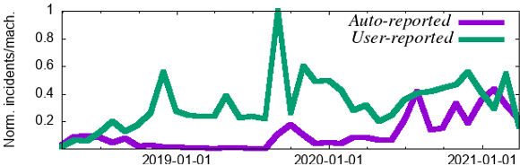

# Cores that don't count  

Peter H. Hochschild
Paul Turner
Jeffrey C. Mogul
Google
Sunnyvale, CA, US  

Rama Govindaraju
Parthasarathy
Ranganathan
Google
Sunnyvale, CA, US  

David E. Culler
Amin Vahdat
Google
Sunnyvale, CA, US  

## Abstract  

We are accustomed to thinking of computers as fail-stop, especially the cores that execute instructions, and most system software implicitly relies on that assumption. During most of the VLSI era, processors that passed manufacturing tests and were operated within specifications have insulated us from this fiction. As fabrication pushes towards smaller feature sizes and more elaborate computational structures, and as increasingly specialized instruction-silicon pairings are introduced to improve performance, we have observed ephemeral computational errors that were not detected during manufacturing tests. These defects cannot always be mitigated by techniques such as microcode updates, and may be correlated to specific components within the processor, allowing small code changes to effect large shifts in reliability. Worse, these failures are often "silent" – the only symptom is an erroneous computation.  

We refer to a core that develops such behavior as “mercurial.” Mercurial cores are extremely rare, but in a large fleet of servers we can observe the disruption they cause, often enough to see them as a distinct problem – one that will require collaboration between hardware designers, processor vendors, and systems software architects.  

This paper is a call-to-action for a new focus in systems research; we speculate about several software-based approaches to mercurial cores, ranging from better detection and isolating mechanisms, to methods for tolerating the silent data corruption they cause.  

## ACM Reference Format:  

Peter H. Hochschild, Paul Turner, Jeffrey C. Mogul, Rama Govindaraju, Parthasarathy Ranganathan, David E. Culler, and Amin Vahdat. 2021. Cores that don't count. In Workshop on Hot Topics in Operating Systems (HotOS '21), May 31–June 2, 2021, Ann Arbor,  

MI, USA. ACM, New York, NY, USA, 8 pages. https://doi.org/10.1145/3458336.3465297  

## 1 Introduction  

Imagine you are running a massive-scale data-analysis pipeline in production, and one day it starts to give you wrong answers – somewhere in the pipeline, a class of computations are yielding corrupt results. Investigation fingers a surprising cause: an innocuous change to a low-level library. The change itself was correct, but it caused servers to make heavier use of otherwise rarely-used instructions. Moreover, only a small subset of the server machines are repeatedly responsible for the errors.  

This happened to us at Google. Deeper investigation revealed that these instructions malfunctioned due to manufacturing defects, in a way that could only be detected by checking the results of these instructions against the expected results; these are "silent" corrupt execution errors, or CEEs. Wider investigation found multiple different kinds of CEEs; that the detected incidence is much higher than software engineers expect; that they are not just incremental increases in the background rate of hardware errors; that these can manifest long after initial installation; and that they typically afflict specific cores on multi-core CPUs, rather than the entire chip. We refer to these cores as "mercurial."  

Because CEEs may be correlated with specific execution units within a core, they expose us to large risks appearing suddenly and unpredictably for several reasons, including seemingly-minor software changes. Hyperscalers have a responsibility to customers to protect them against such risks. For business reasons, we are unable to reveal exact CEE rates, but we observe on the order of a few mercurial cores per several thousand machines – similar to the rate reported by Facebook [8]. The problem is serious enough for us to have applied many engineer-decades to it.  

While we have long known that storage devices and networks can corrupt data at rest or in transit, we are accustomed to thinking of processors as fail-stop. VLSI has always depended on sophisticated manufacturing testing to detect defective chips. When defects escaped, or manifested with aging, they were assumed to become fail-stop or at least fail-noisy: triggering machine-checks or giving wrong answers for many kinds of instructions. When truly silent failures occurred, they  

>Permission to make digital or hard copies of part or all of this work for personal or classroom use is granted without fee provided that copies are not made or distributed for profit or commercial advantage and that copies bear this notice and the full citation on the first page. Copyrights for third-party components of this work must be honored. For all other uses, contact the owner/author(s).  

>HotOS '21, May 31–June 2, 2021, Ann Arbor, MI, USA  

>© 2021 Copyright held by the owner/author(s).  

>ACM ISBN 978-1-4503-8438-4/21/05.  

>https://doi.org/10.1145/3458336.3465297  

were typically obscured by the undiagnosed software bugs
that we always assume lurk within a code base at scale.  

Why are we just learning now about mercurial cores? There are many plausible reasons: larger server fleets; increased attention to overall reliability; improvements in software development that reduce the rate of software bugs. But we believe there is a more fundamental cause: ever-smaller feature sizes that push closer to the limits of CMOS scaling, coupled with ever-increasing complexity in architectural design. Together, these create new challenges for the verification methods that chip makers use to detect diverse manufacturing defects – especially those defects that manifest in corner cases, or only after post-deployment aging.  

While the assumption of fail-stop CPUs has always been a fiction, we can no longer ignore the CEE problem. The problem will continually get harder, as we continue to push the limits on silicon, and innovate with architectural solutions to the clock-speed wall created by the end of Moore's Law. The trade-off between performance and hardware reliability is becoming more difficult, and prudence demands that we not rely on chip vendors to always get it right. Moreover, there is already a vast installed base of vulnerable chips, and we need to find scalable ways to keep using these systems without suffering from frequent errors, rather than replacing them (at enormous expense) or waiting several years for new, more resilient hardware. We are also entering an era in which unreliable hardware increasingly fails silently rather than fail-stop, which changes some of our fundamental assumptions.  

This is a new opportunity for operating systems researchers; in this paper we describe the context for, scale of, and risks due to this challenge, and suggest avenues to address two major challenges: how to rapidly detect and quarantine mercurial cores, and how to create more resilience to tolerate CEEs. ("Make the hardware better" is a good topic for a different paper.)  

## 1.1 CEEs vs. Silent Data Corruption  

Operators of large installations have long known about "Silent
Data Corruption" (SDC), where data in main memory, on disk,
or in other storage is corrupted during writing, reading, or at
rest, without immediately being detected.  

In §8 we will discuss some of the SDC literature in more detail, but until recently, SDCs have primarily been ascribed to random causes such as alpha particles and cosmic rays, and intentional practices such as overclocking. We view SDCs as *symptoms*, with high-rate CEEs as a new *cause* of SDCs, creating new challenges for system software.  

## 2 Impacts of mercurial cores  

We have observed various kinds of symptoms caused by mercurial cores. We classify them below, in increasing order of risk they present:  

• Wrong answers that are detected nearly immediately, through self-checking, exceptions, or segmentation faults, which might allow automated retries.  

• Machine checks, which are more disruptive.  

• Wrong answers that are detected, but only after it is too late to retry the computation.  

• Wrong answers that are never detected.  

Often, defective cores appear to exhibit both wrong results and exceptions. Wrong answers that are not immediately detected have potential real-world consequences: these can propagate through other (correct) computations to amplify their effects – for example, bad metadata can cause the loss of an entire file system, and a corrupted encryption key can render large amounts of data permanently inaccessible. Errors in computation due to mercurial cores can therefore compound to significantly increase the blast radius of the failures they can cause.  

Our understanding of CEE impacts is primarily empirical. We have observations of the form "this code has miscomputed (or crashed) on that core." We can control what code runs on what cores, and we partially control operating conditions (frequency, voltage, temperature, or "f, V, T").$^1$ From this, we can identify some mercurial cores. But because we have limited knowledge of the detailed underlying hardware, and no access to the hardware-supported test structures available to chip makers, we cannot infer much about root causes. Even worse, we cannot always detect bad computations immediately.  

We have a modest corpus of code serving as test cases, selected based on intuition we developed from experience with production incidents, core-dump evidence, and failure-mode guesses. This corpus includes real-code snippets, interesting libraries (e.g., compression, hash, math, cryptography, copying, locking, fork, system calls), and specially-written tests, some of which came from CPU vendors. However, we lack a systematic method of developing these tests.  

We have observed defects scattered across many functions, though there are some general patterns, along with many examples that (so far) seem to be outliers. Failures mostly appear non-deterministically at variable rate. Faulty cores typically fail repeatedly and intermittently, and often get worse with time; we have some evidence that aging is a factor. In a multi-core processor, typically just one core fails, often consistently. CEEs appear to be an industry-wide problem, not specific to any vendor, but the rate is not uniform across CPU products.  

Corruption rates vary by many orders of magnitude (given
a particular workload or test) across defective cores, and
for any given core can be highly dependent on workload
and on f, V, T. In just a few cases, we can reproduce the errors deterministically; usually the implementation-level and
environmental details have to line up. Data patterns can affect
corruption rates, but it's often hard for us to tell.  

>$^{1}$Modern CPUs tightly couple f and V; these are not normally independently adjustable by users, while T is somewhat controllable.  

Some specific examples where we have seen CEE:  

• Violations of lock semantics leading to application data corruption and crashes.  

• Data corruptions exhibited by various load, store, vector, and coherence operations.  

• A deterministic AES mis-computation, which was “self-inverting”: encrypting and decrypting on the same core yielded the identity function, but decryption elsewhere yielded gibberish.  

• Corruption affecting garbage collection, in a storage system, causing live data to be lost.  

• Database index corruption leading to some queries, depending on which replica (core) serves them, being non-deterministically corrupted.  

• Repeated bit-flips in strings, at a particular bit position
(which stuck out as unlikely to be coding bugs).  

• Corruption of kernel state resulting in process and kernel crashes and application malfunctions.  

CEEs are harder to root-cause than software bugs, which we usually assume we can debug by reproducing on a different machine.  

### 3 Are mercurial cores a novel problem?  

There has always been unreliability in the bottom layer of our storage and networking stacks. We have solved storage-failure problems via redundancy, using techniques such as erasure coding, ECC, or end-to-end checksums; generally these do not require large increases in hardware costs or latencies. For media prone to wear-out, we can isolate bad sectors/pages and remap accesses to preserve the utility of the medium, and "scrub" storage to detect corruption-at-rest [21].  

Similarly, to cope with corrupted bits on network links, we use coding schemes (such as CRCs) to detect errors, and retransmissions to keep trying in the hope that the same error won't strike twice.  

Why are computational errors a harder problem? First, because with storage and networking, the "right result" is obvious and simple to check: it's the identity function. That enables the use of coding-based techniques to tolerate moderate rates of correctable low-level errors in exchange for better scale, speed, and cost.  

Detecting CEEs, conversely, naively seems to imply a factor of two of extra work. Automatic correction seems to possibly require triple work (e.g. via triple modular redundancy). (§6 and §7 cover detection and mitigation, respectively.) And most computational failures cannot be addressed by coding; some can be handled using a different approach [2].  

Storage and networking can better tolerate low-level errors because they typically operate on relatively large chunks of data, such as disk blocks or network packets. This allows corruption-checking costs to be amortized, which seems harder to do at a per-instruction scale.  

## 4 The right metrics  

Improvements in system reliability are often driven by metrics, but we have struggled to define useful metrics for CEE. Here are some potential metrics and challenges:  

• The fraction of cores (or machines) that exhibit CEEs. Challenge: depends on test coverage (especially in the face of “zero-day” CEEs– those that cause corruption before we know to test for them), how many cycles devoted to testing, and the ongoing arrival of new kinds of CPU parts in the population.  

• Age until onset. Challenge: if many CEEs stay latent until chip have been in use for several years, this metric depends on how long you can wait, and requires continual screening over a machine's lifetime.  

• Rate and nature of application-visible corruptions – how often does a CEE corrupt the results of a “real” workload? And are corruptions “sticky,” in the sense that one CEE propagates through subsequent computations to create multiple application errors? Challenge: more a property of programs than of CEEs.  

Assuming metrics can be defined, quantifying their values in practice is also difficult and expensive, because it requires running tests on many machines, potentially for a long time, before one can get high-confidence results – we don't even know yet how many or how long, and the order in which the tests are run and swept through the (f, V, T) space can impact time-to-failure.  

To limit the resources used, we should represent the complexity of real-application software in a concise set of tests. Given our poor understanding of what software constructs trigger CEEs, today this is hit-or-miss. Because seemingly-small changes to software appear to cause significant changes in the CEE rates for real workloads, today we don't know how to create a small set of tests that will reliably measure these rates.  

Can we develop a model for reasoning about acceptable rates of CEEs for different classes of software, and a model for trading off the inaccuracies in our measurements of these rates against the costs of measurement? We have always tolerated a few errors, but mercurial cores make these questions more pressing. Many applications might not require zero-failure hardware, but then, what is the right target rate? Could we set this so that the probability of CEE is dominated by the inherent rate of software bugs or undetected memory errors?  

How can we assess the risks to a large fleet, with various CPU
types, from several vendors, and of various ages?  

## 5 What causes mercurial cores?  

We understand some reasons why testing of CPU cores appears to have become more porous, and we can speculate about others:  

• Steady increases in CPU scale and complexity.  

• Silicon feature sizes are now measured in nanometers, leaving smaller margins for error [16], and perhaps more risk of post-burnin (latent) failures.  

• Novel techniques, such as stacked layers, add complexity and manufacturing risks.  

• CPUs are gradually becoming sets of discrete accelerators around a shared register file. This makes some CEEs highly specific in the behavior they disrupt, while the majority of the core remains correct, so there is a larger surface of behaviors to verify.  

Temperature, frequency, and voltage all play roles, but their impact varies: e.g., some mercurial core CEE rates are strongly frequency-sensitive, some aren't. Dynamic Frequency and Voltage Scaling (DFVS) causes frequency and voltage to be closely related in complex ways, one of several reasons why lower frequency sometimes (surprisingly) increases the failure rate.  

We have found more than one case where the same mercurial core manifests CEEs both with certain data-copy operations and with certain vector operations. We discovered that both kinds of operations share the same hardware logic, but often the mapping of instructions to possibly-defective hardware is non-obvious.  

In some ways, mercurial cores can be analogous to Spectre and Meltdown [14], in that implementation details are leaking past the architectural specification. But those problems are not manufacturing defects; they are present in every chip rather than silently arising at random, and perhaps they can be avoided in future designs now that we know how to think carefully about speculative execution [24]. It might (or might not) be possible to design hardware that is similarly resistant to CEE – that is an open research question. In either case, the short-term solutions might require us to avoid certain hardware features that make software run faster.  

We hope that vendors will find cost-effective ways to provide high-confidence verification, restoring us to a world where the mercurial-core rate is vanishingly small, but we probably cannot count on that, especially for defects that appear late-in-life. As long as there is a non-negligable risk of CEEs, we will need at least an early-warning system, built on the detection mechanisms we discuss in the next section.  

## 6 Detecting and isolating mercurial cores  

Given our belief that mercurial cores will be a fact of life for the foreseeable future, the first line of defense is necessarily a robust infrastructure for detecting mercurial cores as quickly as possible; in effect, testing becomes part of the *full lifecycle of a CPU*, not just an issue for vendors or burn-in testing. If we can detect mercurial cores, we can then (§6.1) isolate them, to prevent further damage and to support deeper analysis.  

Hardware-based detection can work; e.g., some systems use pairs of cores in "lockstep" to detect if one fails, on the assumption that both failing at once is unlikely [26]. But in this paper we assume existing hardware and focus on software-based detection.  

Mercurial-core detection is challenging because it inherently involves a tradeoff between false negatives or delayed positives (leading to failures and data corruption), false positives (leading to wasted cores that are inappropriately isolated), and the non-trivial costs of the detection processes themselves.  

We categorize detection processes on several axes: (1) automated vs. human; (2) pre-deployment vs. post-deployment; (3) offline vs. online; and (4) infrastructure-level vs. application-level.  

**Automated vs. human screening:** Ideally, mercurial-core detection would be fully automated, for scale, cost, and accuracy. We, like many enterprises, regularly run various automated screening mechanisms on our fleet.  

However, the complexity-related causes of mercurial cores suggests that there will occasionally be novel manifestations of CEE, which will have to be root-caused by humans.² The humans running our production services identify a lot of suspect cores, in the course of incident triage, debugging, and so forth. In our recent experience, roughly half of these human-identified suspects are actually proven, on deeper investigation, to be mercurial cores – we must extract "confessions" via further testing (often after first developing a new automatable test). The other half is a mix of false accusations and limited reproducibility.  

We currently exploit several different kinds of automatable
"signals" indicating the possible presence of CEEs, especially
when we can detect core-specific patterns for these signals.
These include crashes of user processes and kernels and analysis
of our existing logs of machine checks. Code sanitizers in
modern tool chains (e.g., Address Sanitizer [22]), capable of
detecting memory corruption (e.g. buffer-overflow, use-after-
free), also provide useful signals. Recidivism – repeated signals
from the same core – increases our confidence that a core
is mercurial. One might conceivably improve reproducibility  

>$^{2}$Dixit et al. [8] describe in detail how they root-caused a specific case of CEE.  

and triage based on inferences from known implementation
details.  

**Pre-deployment vs. post-deployment screening:** CPU manufacturers can do quite a lot of automated testing before they ship chips to customers, but clearly this can be improved. Chip makers do not have easy access to diverse large-scale workloads they can directly observe to learn about shortcomings in their testing. Without such a feedback loop, their testing is at best "self consistent," catching a high fraction of what was modeled. We will need to broaden the set of tests that depend on operating environment and/or workload, and either find a way to "upstream" these tests to the manufacturers, or to add them to the acceptance testing and burn-in processes that are already common among customers of chip vendors.  

Not all mercurial-core screening can be done before CPUs are put into service – first, because some cores only become defective after considerable time has passed, and second, because new tests might be developed, in response to newly-discovered defect modes, after deployment. Our regular fleet-wide testing has expanded to new classes of CEEs as we and our CPU vendors discover them, still a few times per year.  

**Offline vs. online screening:** Post-deployment testing can either be done when the CPU or core is "offline" (not schedulable for real tasks) or online, using spare cycles as a low-priority task. Online screening, when it can be done in a way that does not impact concurrent workloads, is free (except for power costs), but cannot always provide complete coverage of all cores or all symptoms.  

Offline screening can be more intrusive and can be scheduled to ensure coverage of all cores, and could involve exposing CPUs to operating conditions (f, V, T) outside normal ranges. However, draining a workload from the core (or CPU) to be tested can be expensive, especially if machine-specific storage must be migrated when the corresponding tasks are migrated.  

Infrastructure-level vs. application-level screening: Tests to detect CEE can either be carried out by the infrastructure (operating system and daemon processes) or, in some cases, online by the applications themselves. Infrastructure-level screening can be more pervasive, can detect bugs in privileged execution, and places less burden on application authors. However, application-level screening can be more focused, more easily fine-tuned, and can enable application-level mitigations (see §7).  

Many of our applications already checked for SDCs; this checking can also detect CEEs, at minimal extra cost. For example, the Colossus file system [13] protects the write path with end-to-end checksums. The Spanner distributed database [7] uses checksums in multiple ways. Other systems execute the same update logic, in parallel, at several replicas to avoid network dependencies and for fail-stop resilience, and we can exploit these dual computations to detect CEEs.  

We also use self-screening mechanisms in some cryptographic
applications.  

One of our particularly useful tools is a simple RPC service that allows an application to report a suspect core or CPU. Reports that are evenly spread across cores probably are not CEEs; reports from multiple applications that appear to be concentrated on a few cores might well be CEEs, and become grounds for quarantining those cores, followed by more careful checking.  

Fig. 1 shows both user-reported and automatically-reported
rates for CEE incidents per machine in our fleet (normalized
to an arbitrary baseline). The rate seen by our automatic
detector is gradually increasing, but we do not know if this
reflects a change in the underlying rate.  

>Figure 1: Reported CEE rates (normalized)  

### 6.1 Isolation techniques  

It is relatively simple for existing scheduling mechanisms to remove a machine from the resource pool; isolating a specific core could be more challenging, because it undermines a scheduler assumption that all machines of a specific type have identical resources. Shalev et al. [23] described a mechanism for removing a faulty core from a running operating system.  

More speculatively, one might identify a set of tasks that can run safely on a given mercurial core (if these tasks avoid a defective execution unit), avoiding the cost of stranding those cores. It is not clear, though, if we can reliably identify safe tasks with respect to a specific defective core.  

## 7 Mitigating CEEs  

Although today we primarily cope with mercurial cores by detecting and isolating them as rapidly as possible, that does not always avoid application impact, and detection is unlikely to be perfect. Can we design software that can tolerate CEEs, without excessive overheads?  

We suspect automatic mitigations are likely to follow from
several starting points:  

• Placing some burden on application-specific mechanisms, applying the “End-to-End Argument” [20], which states correctness is often best checked at the endpoints rather than in lower-level infrastructure.  

• System support for efficient checkpointing, to recover from a failed computation by restarting on a different core.  

• Cost-effective, application-specific detection methods, to decide whether to continue past a checkpoint or to retry – e.g., computing an invariant over a database record to check for its corruption (likewise, for filesystem metadata) before committing a transaction. Blum and Kananan [2] discussed some classes of algorithms for which efficient checkers exist.  

For example, one could run a computation on two cores, and
if they disagree, restart on a different pair of cores from a
checkpoint.  

One well-known approach is triple modular redundancy [15], where the same computation is done three times, and (under the assumption that at most one fails) majority-voting yields a reliable result. Perhaps a compiler could automatically replicate computations to three cores, and use techniques from the deterministic-replay literature [4] to choose the largest possible computation granules (i.e., to cope with non-deterministic inputs and to avoid externalizing unreliable outputs). However, this relies on the voting mechanism itself being reliable.  

All the methods we can imagine appear to have significant resource costs, for duplicated computation and/or storage. Since our software systems already replicate some computations for reasons unrelated to CEEs, triple replication for mitigating CEEs in critical code does not always triple the existing costs. However, certain computations are critical enough that we are willing to pay the overheads of double or even triple computation.  

To allow a broader group of application developers to leverage our shared expertise in addressing CEEs, we have developed a few libraries with self-checking implementations of critical functions, such as encryption and compression, where one CEE could have a large blast radius.  

### 7.1 Hardware mitigations  

CEEs cannot be fully mitigated in software; systems researchers
must work with hardware designers and vendors towards more
robust hardware, including:  

• **Design-for-test**, to make it easier to detect cores with subtle manufacturing defects, and exposing these test features to end users (for “scrubbing” in-service machines);  

• **Continuous verification**, where functional units always check their own results;  

• Conservative design of critical functional units, trading some extra area and power for reliability. For example, the IBM z990 apparently had duplicated pipelines and custom changes to cache controllers to make them more resilient; these changes increased the instruction cycle time [9].  

Such hardware features, while they add costs, might still be
much more efficient than replicating computations in soft-
ware.  

We believe systems researchers can also help CPU designers to re-think the machine-check architecture of modern processors, which today does not handle CEEs well, and to improve CPU telemetry (and its documentation!) to make it far easier to detect and root-cause mercurial cores.  

## 8 Related work  

Dixit et al. [8] recently published their experiences with CEEs at Facebook; their observations are consistent with ours. Their paper focused on the challenge of root-causing an application failure to a CEE.  

The high-performance computing community has done a lot of work on silent data corruption caused by random events such as alpha particles and cosmic rays, especially those affecting storage (DRAM, registers, disks, SSDs). Fang et al. [10] discussed a systems approach to SDCs. Other papers describe SDC-resilience for sorting algorithms [11] and matrix factorization [27], and radiation-induced SDCs in GPUs [25]. We did not find prior work related to mercurial cores in HPC.  

Bartlett et al. [1] presented principles behind their fault-tolerant operating systems, most of which would also apply to CEE-tolerant software. Byzantine fault tolerance [3] has been proposed as a means for providing resilience against arbitrary non-fail-stop errors [6]; BFT might be applicable to CEEs in some cases.  

Rinard et al. [19] described “failure-oblivious” techniques for systems to keep computing across memory errors; it is not clear if these would work for CEEs.  

Gunawi et al. [12] discussed the prevalence of hardware
"performance faults" (not correctness errors); they noted "We
find processors are quite reliable and do not self-inflict fail-
slow mode," which seems to be contradicted by our more-
recent experience with CEEs.  

Nightingale et al. [17] analyzed hardware failures from consumer PCs, and briefly speculated about designing an "operating system designed with faulty hardware as a first-order concern." They did not discuss CEEs; perhaps their data was insufficient to detect these (or perhaps the CPUs from a decade ago did not yet exhibit CEEs).  

Much prior work (e.g., [5, 18]) addresses transient errors in high-noise environments (e.g., automobiles). These differ from CEEs in that they do not differentially affect a small, semi-stable subset of cores; even so, some approaches might work in both domains.  

## 9 Next steps and research directions  

Do you have to be a hyperscaler to do research in this area?
We hope not, although that in itself is an interesting challenge.
Perhaps hyperscalers who isolate mercurial-core servers from
their fleets could make these available to researchers, thereby
removing the need to buy lots of servers to study just a few cases. Access could be via IaaS (as VMs or bare-metal cloud),
with mechanisms to avoid accidentally assigning mercurial
cores to unsuspecting cloud customers (or triggering VM
breakouts).  

We might be able to develop cycle-level CPU simulators that allow injection of known CEE behavior, or even finer-grained simulators that inject circuit-level faults likely to lead to CEE. Similarly, we could develop fault injectors for testing software resilience on real hardware.  

One way in which the systems research community can contribute is to develop methods to detect novel defect modes, and to efficiently record sufficient forensic evidence across large fleets.  

Perhaps compilers could detect blocks of code whose correct execution is especially critical (via programmer annotations or impact analysis), and then automatically replicate just these computations. More generally, can we extend the class of SDC-resilient algorithms beyond sorting and matrix factorization [11, 27]? That prior work evaluated algorithms using fault injection, a technique that does not require access to a large fleet.  

Much computation is now done not just on traditional CPUs, but on accelerator silicon such as GPUs, ML accelerators, P4 switches, NICs, etc. Often these accelerators push the limits of scale, complexity, and power, so one might expect to see CEEs in these devices as well. There might be novel challenges in detecting and mitigating CEEs in non-CPU settings.  

## References  

[1] Joel Bartlett, Wendy Bartlett, Richard Carr, Dave Garcia, Jim Gray, Robert Horst, Robert Jardine, Dan Lenoski, and Dix McGuire. Fault Tolerance in Tandem Computer Systems. In D. P. Siewiorek and R. Swartz, editors, *The theory and practice of reliable system design*. Digital Press, 1982.  

[2] Manuel Blum and Sampath Kannan. Designing Programs That Check Their Work. J. ACM, 42(1):269–291, January 1995.  

[3] Miguel Castro and Barbara Liskov. Practical Byzantine Fault Tolerance.
In Proc. OSDI, 1999.  

[4] Yunji Chen, Shijin Zhang, Qi Guo, Ling Li, Ruiyang Wu, and Tianshi Chen. Deterministic Replay: A Survey. ACM Comput. Surv., 48(2), September 2015.  

[5] P. Cheynet, B. Nicolescu, R. Velazco, M. Rebaudengo, M. Sonza Reorda, and M. Violante. Experimentally evaluating an automatic approach for generating safety-critical software with respect to transient errors. IEEE Transactions on Nuclear Science, 47(6):2231–2236, 2000.  

[6] Allen Clement, Manos Kaprisos, Sangmin Lee, Yang Wang, Lorenzo Alvisi, Mike Dahlin, and Taylor Riche. Upright Cluster Services. In Proc. SOSP, page 277–290, 2009.  

[7] James C. Corbett, Jeffrey Dean, Michael Epstein, Andrew Fikes, Christopher Frost, J. J. Furman, Sanjay Ghemawat, Andrey Gubarev, Christopher Heiser, Peter Hochschild, Wilson Hsieh, Sebastian Kanthak, Eugene Kogan, Hongyi Li, Alexander Lloyd, Sergey Melnik, David Mwaura, David Nagle, Sean Quinlan, Rajesh Rao, Lindsay Rolig, Yasushi Saito, Michal Szymaniak, Christopher Taylor, Ruth Wang, and Dale Woodford. Spanner: Google's Globally Distributed Database.  

ACM Trans. Comput. Syst., 31(3), August 2013.  

[8] Harish Dattatraya Dixit, Sneha Pendharkar, Matt Beardon, Chris Mason, Tejasvi Chakravarthy, Bharath Muthiah, and Sriram Sankar. Silent Data Corruptions at Scale. https://arxiv.org/abs/2102.11245,2021.  

[9] M. L. Fair, C. R. Conklin, S. B. Swaney, P. J. Meaney, W. J. Clarke, L. C. Alves, I. N. Modi, F. Freier, W. Fischer, and N. E. Weber. Reliability, availability, and serviceability (RAS) of the IBM eServer z990. IBM Journal of Research and Development, 48(3.4):519–534, 2004.  

[10] Bo Fang, Panruo Wu, Qiang Guan, Nathan DeBardeleben, Laura Monroe, Sean Blanchard, Zhizong Chen, Karthik Pattabiraman, and Matei Ripeanu. SDC is in the Eye of the Beholder: A Survey and Preliminary Study. In IEEE/IFIP International Conference on Dependable Systems and Networks Workshop (DSN-W), pages 72–76, 2016.  

[11] Qiang Guan, Nathan DeBardeleben, Sean Blanchard, and Song Fu. Empirical Studies of the Soft Error Susceptibility Of Sorting Algorithms to Statistical Fault Injection. In Proc. 5th Workshop on Fault Tolerance for HPC at Extreme Scale (FXTS), page 35–40, 2015.  

[12] Haryadi S. Gunawi, Riza O. Suminto, Russell Sears, Casey Gollagher, Swaminathan Sundararaman, Xing Lin, Tim Emami, Weiguang Sheng, Nematollah Bidokhti, Caitie McCaffrey, Deepthi Srinivasan, Biswarajan Panda, Andrew Baptist, Gary Grider, Parks M. Fields, Kevin Harms, Robert B. Ross, Andree Jacobson, Robert Ricci, Kirk Webb, Peter Alvaro, H. Birali Runesha, Mingzhe Hao, and Huaicheng Li. Fail-Slow at Scale: Evidence of Hardware Performance Faults in Large Production Systems. ACM Trans. Storage, 14(3), October 2018.  

[13] Dean Hildebrand and Denis Serenyi. Colossus under the hood: a peek into Google's scalable storage system. https://cloud.google.com/blog/products/storage-data-transfer/a-peek-behind-colossus-googles-file-system,2021.  

[14] M. D. Hill, J. Masters, P. Ranganathan, P. Turner, and J. L. Hennessy.
On the Spectre and Meltdown Processor Security Vulnerabilities. IEEE
Micro, 39(2):9–19, 2019.  

[15] R. E. Lyons and W. Vanderkulk. The Use of Triple-Modular Redundancy to Improve Computer Reliability. IBM Journal of Research and Development, 6(2):200–209, 1962.  

[16] Riccardo Mariani. Soft Errors on Digital Components. In A. Benso and P. Prinetto, editors, *Fault Injection Techniques and Tools for Embedded Systems Reliability Evaluation*, volume 23 of *Frontiers in Electronic Testing*. Springer, 2003.  

[17] Edmund B. Nightingale, John R. Douceur, and Vince Orgovan. Cycles, Cells and Platters: An Empirical Analysis of Hardware Failures on a Million Consumer PCs. In Proceedings of the Sixth Conference on Computer Systems, EuroSys '11, page 343–356, 2011.  

[18] S. Pandey and B. Vermeulen. Transient errors resiliency analysis technique for automotive safety critical applications. In 2014 Design, Automation Test in Europe Conference Exhibition (DATE), pages 1–4, 2014.  

[19] Martin Rinard, Cristian Cadar, Daniel Dumitran, Daniel M. Roy, Tudor Leu, and William S. Beebee. Enhancing server availability and security through failure-oblivious computing. In Proc. OSDI, 2004.  

[20] J. H. Saltzer, D. P. Reed, and D. D. Clark. End-to-End Arguments in System Design. ACM Trans. Comput. Syst., 2(4):277–288, November 1984.  

[21] T.J.E. Schwarz, Qin Xin, E.L. Miller, D.D.E. Long, A. Hospodor, and S. Ng. Disk Scrubbing in Large Archival Storage Systems. In Proc. MASCOTS, 2004.  

[22] Konstantin Serebryany, Derek Bruening, Alexander Potapenko, and Dmitry Vyukov. AddressSanitizer: A Fast Address Sanity Checker. In Proc. USENIX Annual Technical Conference, 2012.  

[23] Noam Shalev, Eran Harpaz, Hagar Porat, Idit Keidar, and Yaron Weinsberg. CSR: Core Surprise Removal in Commodity Operating Systems. In Proc. ASPLOS, page 773–787, 2016.  

[24] Jan Philipp Thoma, Jakob Feldtkeller, Markus Krausz, Tim Güneysu, and Daniel J. Bernstein. BasicBlocker: Redesigning ISAs to Eliminate Speculative-Execution Attacks. CoRR, abs/2007.15919, 2020.  

[25] Devesh Tiwari, Saurabh Gupta, James Rogers, Don Maxwell, Paolo Rech, Sudharslan Vazhkudai, Daniel Oliveira, Dave Londo, Nathan DeBardeleben, Philippe Navaux, Luigi Carro, and Arthur Bland. Understanding GPU errors on large-scale HPC systems and the implications for system design and operation. In Proc. HPCA, pages 331–342, 2015.  

[26] Jim Turley. ARM Cortex-A76AE Reliably Stays in Lock Step. Electronic Engineering Journal, October 2018. https://www.eejournal.com/article/arm-cortex-a76ae-reliably-stays-in-lock-step/.  

[27] Panruo Wu, Nathan DeBardeleben, Qiang Guan, Sean Blanchard, Jieyang Chen, Dingwen Tao, Xin Liang, Kaiping Ouyang, and Zizhong Chen. Silent Data Corruption Resilient Two-Sided Matrix Factorizations. SIGPLAN Not., 52(8):415–427, January 2017.
