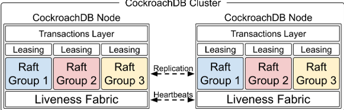
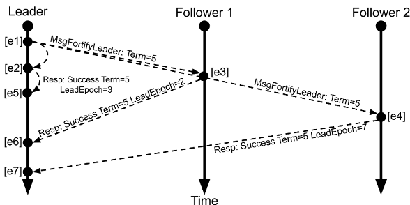
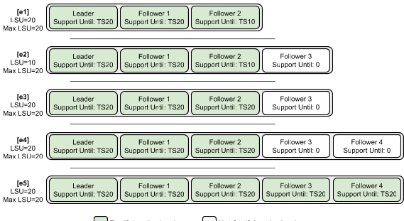
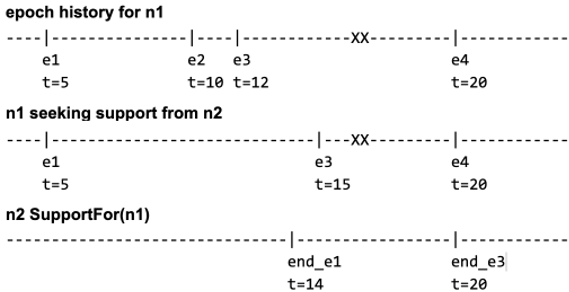
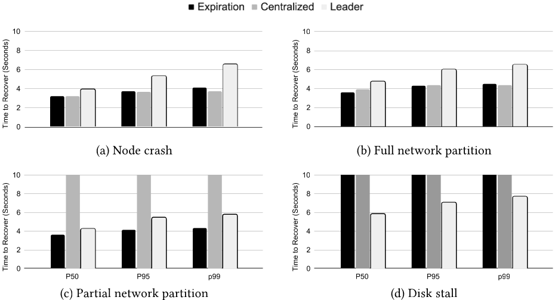
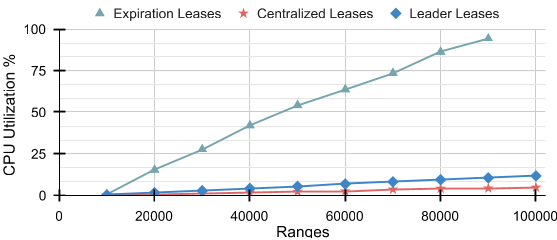
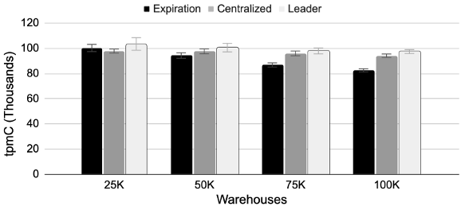
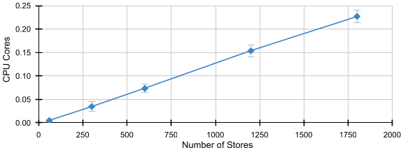

# Scalable Leader Leases For Multi Consensus Groups in CockroachDB  

Ibrahim Kettaneh
Cockroach Labs
Toronto, Ontario, Canada
Tsvetomira Radeva
Cockroach Labs
New York, NY, USA
Arul Ajman
Cockroach Labs
New York, NY, USA
Sumeer Bhola
Cockroach Labs
New York, NY, USA
Nathan VanBenschoten
Turbopuffer
New York, NY, USA
Rebecca Taft
Cockroach Labs
New York, NY, USA  

# Abstract  

Scalable and resilient distributed databases often use consensus protocols for replication, and rely on a temporary leaseholder to serve read-only requests without requiring quorum communication. At large scale (e.g., millions of consensus groups), maintaining these leases becomes expensive, as frequent lease renewals consume significant system resources, and longer lease durations increase the time to recover from failures. To address these challenges, we present Leader Leases, a scalable and fault-tolerant leasing protocol integrated into the Raft consensus algorithm used by CockroachDB. At the heart of Leader Leases lies a new failure detector for the directed edge between nodes, the Liveness Fabric, that detects both node failures and network faults (symmetric and asymmetric). The Liveness Fabric provides timely liveness signals independent of the number of consensus groups, which are used to provide strong Raft leadership guarantees. This design eliminates per-consensus-group lease renewal traffic and Raft heartbeats, avoids centralized points of failure, and enables rapid fault detection and recovery. Our experiments show that Leader Leases significantly reduce CPU usage at large scale compared to traditional expiration-based leases, while maintaining equivalent fault tolerance guarantees.  

# CCS Concepts  

• Information systems → Relational parallel and distributed DBMSs; Distributed database transactions; Database transaction processing; • Computer systems organization → Availability.  

# Keywords  

Leader, Lease, Leaseholder, Consensus, Replication, Scalable, Distributed Database  

# ACM Reference Format:  

Ibrahim Kettaneh, Tsvetomira Radeva, Arul Ajmani, Sumeer Bhola, Nathan VanBenschoten, and Rebecca Taft. 2026. Scalable Leader Leases For Multi Consensus Groups in CockroachDB. In *Companion of the International Conference on Management of Data (SIGMOD Companion '26)*, May 31-June 05, 2026, Bengaluru, India. ACM, New York, NY, USA, 13 pages. https://doi.org/10.1145/3788853.3803081  

# 1 Introduction  

Fault-tolerant distributed databases rely on consensus to replicate data consistently across multiple replicas. Consensus protocols such as Raft [27] and Paxos [19] elect a leader replica to serialize writes, ensuring each update is durably replicated before being acknowledged to the client. While the leader can also coordinate reads via a consensus round, most databases introduce an optimization: a leaseholder replica that can serve strongly consistent reads locally without additional coordination. The leaseholder manages read traffic and delegates writes to the leader. To prevent stale or unavailable reads, its authority is bounded by a lease duration that must be periodically renewed.  

At first glance, it may seem that the consensus leader itself could serve as the leaseholder. In practice, this unification is difficult because most consensus protocols do not guarantee stable leadership. Leadership can shift rapidly due to transient failures, so the leader learns that it has been replaced only after the fact. For this reason, most production systems maintain a separate lease protocol layered on top of consensus to track liveness and lease ownership.  

While prior work has focused on lease protocols within a single consensus group, modern distributed databases operate at scales where there are millions of independent consensus groups. In such settings, granting and renewing leases for each group becomes a dominant source of background overhead. The challenge is especially acute in read-heavy workloads where the workload itself does not require Raft-group activity: in some of the largest production CockroachDB clusters, over 60% of Raft groups experience long periods of read-only activity, meaning Raft-group work for lease maintenance is otherwise wasteful. Existing mitigation techniques all represent compromises between correctness, availability, and scalability: Extending lease durations (as in Spanner's 10 s leases [10]) increases failover latency; piggybacking renewals on writes is ineffective for idle groups; and centralizing lease management introduces a single point of failure.  

An ideal lease protocol for modern multi-consensus systems
must satisfy three key properties:  

• **Correctness:** The leaseholder must always reflect the most recent committed state, and leases for the same data must never overlap in time.  

• **Fault tolerance:** The system must detect and react to failures rapidly—whether node, disk, or network faults — minimizing data unavailability.  

• **Scalability:** The protocol must scale to millions of consensus groups without centralized coordination or per-group heartbeating.  

We present Leader Leases, a new lease protocol deployed in CockroachDB that satisfies these properties by unifying the roles of Raft leader and leaseholder via a scalable, cluster-wide failure detection service. Leader Leases enable each Raft group to safely and efficiently rely on its leader for both reads and writes without sacrificing fault tolerance or consistency.  

Our contributions are as follows:  

• A scalable, cluster-wide failure detection service (Liveness Fabric): We design the Liveness Fabric, a decentralized, heartbeat-based failure detector that tracks the health of nodes, and the directed communication edge between nodes. This is done at the cluster level, decoupled from Raft and leases. This global liveness layer provides low-latency failure signals that can be leveraged by all Raft groups simultaneously. By replacing per-group heartbeats with a single shared mechanism, the Liveness Fabric reduces background traffic and CPU utilization by orders of magnitude and scales with cluster size rather than the number of consensus groups.  

• A more stable and efficient Raft leadership model: By incorporating liveness information from the Liveness Fabric, Raft leaders gain stronger leadership guarantees. Offloading liveness heartbeating to the Liveness Fabric also removes one of the main scalability bottlenecks of traditional Raft implementations, freeing leaders to focus solely on replication and client coordination.  

• A unified and fault-resilient lease abstraction (Leader Leases): The strengthened leader guarantees allow us to safely merge the leaseholder and leader roles. This unification eliminates redundant coordination between two distinct replicas, avoiding network hops and simplifying failure handling. Leader Leases thus eliminate lease-leader divergence scenarios, and improve recovery times under faults while maintaining strict correctness guarantees.  

• Comprehensive empirical validation: We evaluate Leader Leases against two existing lease protocols and show that Leader Leases consume up to 85% less CPU for lease management at scale, sustain stable throughput as the number of consensus groups grows, and recover within seconds from failures, including partial network partitions and disk stalls, that cause prolonged unavailability under other lease types.  

The remainder of this paper is organized as follows. Section 2 revisits the relationship between leadership and leases and motivates the need for a unified approach. Section 3 details the main components of Leader Leases: the lease layer (Section 3.2), the extended Raft algorithm (Section 3.3), and the Liveness Fabric (Section 3.4). Section 4 formalizes the correctness and safety properties, while Section 5 evaluates performance and fault tolerance. We discuss related work in Section 6, outline lessons learned in Section 7, and present conclusions in Section 8.  

# 2 Background and Motivation  

This section reviews the foundations of our work. We first summarize how consensus protocols and leases support strong consistency in distributed databases (Section 2.1) and how these ideas extend to  

multi-group consensus architectures (Section 2.2). We then describe
their realization in CockroachDB's leasing model (Section 2.3) and
conclude by motivating the need for a more scalable and fault-
tolerant multi-group leasing approach (Section 2.4).  

# 2.1 Consensus and Leases in Distributed Databases  

Modern distributed databases replicate data across multiple nodes to tolerate failures while maintaining strong consistency. This replication is typically coordinated by a consensus protocol such as Paxos [19], Raft [28], or Viewstamped Replication [26]. Consensus ensures nodes agree on a total order of committed operations, providing fault-tolerant linearizability for reads and writes. However, consensus comes at a cost. In their basic form, these protocols mandate each operation involves coordination between a majority quorum. This cost is tolerated for writes, as majority quorums are also central to isolation and durability guarantees of a database [5, 10]. However, the cost is excessive for reads, which do not mutate data and commonly make up a dominant fraction of a database's workload. To mitigate this cost, systems may introduce optimizations to coalesce quorum coordination across concurrent reads [27]. Reads may also bypass durable storage writes on each node, behaving more like an in-memory handshake between nodes in the quorum [27]. Such optimizations reduce consensus overhead of reads, but do not fully eliminate it. Notably, reads still incur the network communication latency between a quorum. This latency is exacerbated by the fact that transactions typically perform many sequential reads, causing latency to compound.  

To address this, systems often employ leases [12], temporarily delegating authority to a single consensus node. Leases restrict when writes can be performed and who can perform them, typically requiring that all writes be proposed by the leaseholder. In exchange, the leaseholder is granted the ability to serve consistent reads locally, without communicating with other nodes.  

Leases provide fault tolerance by being time-bounded: upon expiration, privileges automatically lapse, allowing other nodes to request a new lease and resume progress if the leaseholder fails or is partitioned. To maintain stability, a leaseholder periodically renews its lease through a quorum round of communication. These renewals have a critical safety property: a renewal must succeed only if the leaseholder still satisfies leadership conditions, including the ability to reach a quorum and propose consensus writes. This prevents a node that has become unhealthy or lost quorum connectivity from indefinitely retaining a lease and blocking forward progress. In many implementations, lease renewal itself is recorded as a consensus write [6, 10, 22], ensuring alignment between a leaseholder's ability to write and its ability to renew its lease.  

# 2.2 Multi-Group Consensus Architectures  

Consensus replication provides strong correctness and fault-tolerance guarantees in distributed databases. However, it can also introduce scalability and performance bottlenecks, as it typically requires all replication traffic to flow through a single leader node [8].  

To scale with dataset size and operational load, distributed databases partition data into ranges or shards, each governed by its own consensus group. This decomposition provides parallelism, fault isolation, load balancing, and geographic flexibility [29]. Each group  

stores a disjoint subset of data, stores a copy of this data on a subset
of nodes in a cluster, elects its own leader with its own lease, and
replicates independently without coordination with other groups.  

However, the same independence that yields scalability also introduces new cross-group coordination challenges. A database transaction spanning data stored in multiple groups can no longer rely on the per-group linearizability property of consensus to define a global transaction order. Instead, transactions must use techniques like multi-version concurrency control (MVCC) [3] to establish consistent views for reads, and must coordinate their commit using a distributed atomic commit protocol such as two-phase commit (2PC) [4, 23] to ensure atomic visibility of writes across groups.  

# 2.3 Leases in Previous Versions of CockroachDB  

CockroachDB uses range-partitioning on keys to divide data into contiguous ordered chunks, called Ranges [29]. Ranges are the unit of replication; each Range manages its own replicated state machine, with multiple replicas (by default, 3) that use the Raft consensus algorithm [28] for consistent replication. A designated replica, called the leaseholder, is responsible for coordinating all reads and writes that overlap with the keyspace owned by its Range.  

A leaseholder can only serve writes at timestamps within its lease interval and reads at timestamps below its lease expiration. Moreover, any two leases in CockroachDB must be disjoint from one another [12]. Together, these two properties prevent CockroachDB from serving a write that would invalidate a previously served read, which is integral to providing transaction isolation.  

Leases in CockroachDB can be acquired either cooperatively or non-cooperatively, both of which preserve the lease disjointness invariant. For cooperative acquisitions, where the outgoing leaseholder revokes the remainder of its lease and replicates a command to transfer the lease to a different replica (the incoming leaseholder), the outgoing leaseholder ensures that the new lease starts after the revoked lease ends. A non-cooperative acquisition is only allowed if the previous lease has expired, and the replica proposing the lease must ensure it begins after the previous lease's expiration time.  

Prior to Leader Leases, CockroachDB had two different leasing protocols: expiration leases and centralized leases. Both types are initially acquired by replicating a Raft command to designate a replica as the leaseholder, but they differ in their lease extension mechanism. Expiration leases are renewed by periodically replicating a new command to extend the expiration time. Centralized leases have no explicit expiration time; instead, they have a layer of indirection introduced through an epoch associated with the node on which the leaseholder exists. This per-node epoch has an associated expiration time, from which the centralized lease's expiration time can be inferred. The epoch-to-expiration mapping is centralized in a special system Range, called the liveness Range; the epoch's expiration is periodically extended by per-node heartbeating, coordinated by the leaseholder of the liveness Range, and performed periodically by all nodes in the cluster. This scheme coalesces per-Range lease extensions to per-node liveness extensions.  

Expiration leases and centralized leases also differ in their failure detection mechanism. As expiration leases must be renewed by exercising the entire Raft pipeline, lease extension is closely aligned with Raft availability. Centralized leases, on the other hand, only detect point-to-point communication between nodes in the  

cluster and the liveness Range's leaseholder using their centralized
heartbeating mechanism. While this can detect and handle node
failures, it is susceptible to Range unavailability caused by partial
network partitions [1, 2] between the leaseholder of a Range and
a quorum of followers; the leaseholder will continue to extend its
lease as long as its node is able to heartbeat the liveness Range, even
if it cannot coordinate any writes because of a network partition
between it and a quorum of followers.  

2.3.1 A word about clocks CockroachDB can be run on off-the-shelf servers in public and private clouds, as it uses hybrid logical clocks to provide single-key linearizability even when clocks are loosely synchronized. The mechanisms for this, including the concept of uncertainty intervals, are built in the transaction layer which sits atop the leasing layer [29]. As such, the topic of clock synchronization is not within the purview of this paper.  

# 2.4 Motivation for Cheaper Multi-Group Leasing  

While per-group leases enable efficient reads, they impose scalability and availability costs when deployed in large multi-group consensus architectures. In clusters containing hundreds of thousands of consensus groups, lease renewal becomes a dominant source of background load and a recurring source of operational fragility [29]. Naive attempts to address scalability and availability typically trade one concern for the other.  

Decentralizing lease management at the level of each consensus group preserves fault tolerance but amplifies renewal traffic. Each group's lease must be renewed every few seconds, creating a significant amount of background load. Reducing the frequency of renewal by extending lease durations mitigates this load, but at the cost of slower recovery following failures.  

Centralizing lease management reduces renewal traffic, but introduces new single points of coordination and failure. A centralized lease manager can coordinate renewals for many groups at the same time. However, it becomes an external dependency of every consensus group and must remain highly available, or else the availability of all consensus groups will be lost. Even when replicated for availability, the reachability of the lease manager from groups also becomes an availability concern, harming system partition tolerance. Finally, regardless of lease management availability, individual consensus groups must still regularly check whether their leaseholder still satisfies the conditions for leadership.  

Intermediate approaches can balance between full decentralization and strict centralization, but they remain fraught with correctness, performance, and fault-tolerance hazards [7].  

In this paper we present a mechanism architected from the
ground up with explicit attention to scalability, quorum availability,
and fault isolation.  

# 3 Architecture  

This section outlines the architecture of Leader Leases. It introduces the layered design and core abstractions (Section 3.1), explains how Leader Leases extend Raft's leadership model (Section 3.2), summarizes the key Raft protocol modifications that ensure safety and stability (Section 3.3), and describes the Liveness Fabric that provides scalable failure detection across nodes (Section 3.4).  

>Figure 1: CockroachDB Architecture  

# 3.1 Overview  

Figure 1 presents the layered design that we use to implement Leader Leases. Despite the fact that the figure only shows two nodes, CockroachDB clusters can scale to hundreds of nodes.  

At the bottom of the figure is the Liveness Fabric, a cluster-wide mesh in which every node periodically sends heartbeats to all other nodes with which it shares consensus group membership. The main responsibility of this layer is to detect failures of nodes and communication links. The Liveness Fabric exposes the notion of Support. Node A can send a heartbeat to a node B requesting that B "support" A until timestamp X. If B acknowledges, it promises to keep supporting A at least until B's clock time exceeds timestamp X. This happens bidirectionally between every two nodes in the cluster, except for those that share no common consensus groups.  

Support is exposed as *epochs*: each epoch represents an interval of uninterrupted support from one node to another. If a node cannot request or provide support for some time due to some failure, the current epoch ends; subsequent renewals begin using a new epoch. We describe this layer in section 3.4.  

Our design is not limited to a single Liveness Fabric instance per node. Instead, we run one instance per attached storage engine (store); a node may, therefore, have multiple instances of the Liveness Fabric. We justify this choice in section 7. For simplicity, unless otherwise mentioned, we assume a single store per node throughout this paper.  

This layer exposes a simple local API that the layers above can
use to answer questions like:  

- SupportFrom(ID): “Until what (timestamp, epoch) has node ID promised to support us?”  

• SupportFor(ID): “Until what <timestamp, epoch> has our node promised to support node ID?”  

Raft is a leader-based consensus protocol in which the leader is responsible for coordinating replication. In CockroachDB, a single node may contain tens of thousands of Raft groups, each responsible for a Range of the key space. Raft's time is partitioned into terms, and each term can have at most one leader. However, due to crashes, packet loss, or network partitions, an old leader may not immediately learn that a higher-term leader has been elected. To build Leader Leases, we require a stronger leadership stability property: the current leader must know that it cannot be replaced before timestamp $X$. We call this timestamp the LeadSupportUntil (LSU). We leverage the concept of support from the Liveness Fabric and modify Raft's leader election protocol to ensure stronger leadership stability. With the strengthened Raft leadership guarantees, the leader can obtain a Leader Lease valid until timestamp $X$.  

# 3.2 Leader Leases  

The concept of a Leader Lease is a very thin wrapper on top of strong leadership that is provided by Raft using the Leader Fortification protocol (described next in section 3.3.1), which ensures that all fortified leadership terms correspond to disjoint time intervals. Leader Leases can only be held by the Raft leader and are tied to the leadership term. The lease is valid for as long as the Raft leader's term is fortified. This allows the leaseholder to establish a lower bound expiration timestamp until which it is guaranteed to remain the leader, which can be used as the expiration time for the Leader Lease. As the Leader Lease's expiration time is derived using Liveness Fabric epochs that are extended using per-node heartbeats, there is no per-Range cost of Leader Lease extension.  

3.2.1 Non-cooperative Lease Acquisitions As Leader Leases are tied to a Raft leader's term, only Raft leaders are allowed to propose the acquisition of a Leader Lease. As such, a replica must first win an election before being able to acquire a Leader Lease. The fortification protocol ensures that all fortified leadership terms correspond to disjoint time intervals; this guarantees that the previous Leader Lease must have expired for a new leader to be elected, thus maintaining the lease disjointness invariant for non-cooperative lease acquisitions.  

3.2.2 Cooperative Lease Transfers A replica holding a Leader Lease may decide to transfer its lease to a different replica of the Range. Doing so requires the outgoing leaseholder to forfeit the remainder of its lease by unilaterally choosing a new end time for the lease, $T_{forfeited}$. As Leader Leases are tied to Raft leadership, and the outgoing leaseholder continues to remain the Raft leader even after the lease has been transferred, an expiration lease is transferred to the incoming leaseholder. This lease has a start time $T_{incoming}$ such that $T_{incoming} > T_{forfeited}$. This ensures the lease disjointness invariant is upheld during cooperative lease transfers.  

During cooperative transfers, once the expiration lease has been transferred to a new leaseholder, there exists a split between the Raft leader and the leaseholder. The new leaseholder is only able to convert its expiration lease to a Leader Lease once leadership is transferred to the new Leaseholder. To ensure expiration leases are promptly converted to Leader Leases, the leader proactively transfers leadership to the leaseholder in cases where there is a split between the leader and the leaseholder. The expiration lease is converted to a Leader Lease by replicating a new Raft command once leadership has been transferred.  

# 3.3 Raft Modifications  

Supporting Leader Leases required significant modifications to the
Raft consensus protocol. These modifications include the introduction of new Raft messages, and the addition of new durable
fields. These changes also enabled an optimization that reduces
Raft messages by offloading heartbeats to the Liveness Fabric.  

3.3.1 *Leader Fortification* In standard Raft, followers can campaign for an election if they have not heard from the leader for some time. Consequently, a leader cannot be certain of its state without actively contacting a majority of replicas, as network partitions or message loss could lead to leader replacement without its immediate knowledge. This inherent uncertainty can complicate the design  

of Leader Leases in the layers above. To address this, we introduce
*Leader Fortification*, a Raft modification that strengthens leadership
guarantees. With leader fortification, a leader can proactively fortify
its leadership by obtaining explicit promises from followers that
they will neither campaign nor vote in another election until their
clocks exceed a specific timestamp.  

We introduce two additional Raft RPC messages to enable leader fortification. MsgFortifyLeader is initiated by the leader and is sent to followers to request a temporary promise not to initiate or participate in elections. The message includes the leader's current term to allow followers to safely ignore reordered messages. Followers respond with MsgFortifyLeaderResp, which includes their current term, an acknowledgment flag indicating that the fortification request is accepted, and LeadEpoch, which is the leader's Liveness Fabric epoch that the follower's node supports. A follower accepts the fortification request if the message term is the same as its current term and if it supports the leader in the Liveness Fabric.  

A leader considers itself fortified if it receives successful fortification responses from a majority quorum, including itself. The leader records the LeadEpoch for each follower that fortifies it. Once fortified, the leader can query the Liveness Fabric to compute the timestamp until it can safely remain the leader (LeadSupportUntil).  

3.3.2 *LeadSupportUntil* LeadSupportUntil (LSU) is the leader's maximum supported Liveness Fabric expiration across all majority quorums, where the value for each quorum is the minimum across replicas. LSU effectively measures the timestamp until which the current Raft leader is confident that its leadership is fully supported by a majority of its followers.  

Upon fortification, the leader iterates over Raft followers that acknowledged its fortification request. The leader queries its own Liveness Fabric (detailed in Section 3.4) to check the timestamp until which each of the follower's nodes provides support for the current leader's node. The leader uses the timestamps to calculate the LSU. Equivalently,  

$$ \mathrm{L S U}=\operatorname*{m a x}_{Q\in Q}\left(\operatorname*{m i n}_{r\in Q}\tau_{r}\right) $$  

where $\tau_r$ is the support expiration time of replica $r$ and $Q$ is the set of all quorums. The LSU is crucial for the layers built atop Raft. Specifically, it serves as the Leader Lease end time because the leader is guaranteed that it will not be replaced by another leader before LSU. This guarantee is provided by the Raft leader election rule: a successful election of a new leader requires a majority vote. Given that the LSU confirms the existence of a quorum of replicas that fortify the current leader until that timestamp and will not vote for another leader, no new leader can get elected before the LSU. The LSU is continuously re-calculated on every Raft tick (default 500ms), and it will advance as long as a majority of replicas maintain their Liveness Fabric's support for the current leader's node.  

Figure 2 illustrates an example of the fortification protocol. The leader sends a MsgFortifyLeader message to itself and the two other followers (e1), including its current Raft term so that followers can ignore out-of-order requests. The requests arrive at the leader and followers 1 and 2 at events e2, e3, and e4, respectively. Upon receiving the requests, each replica verifies that its Raft term matches the term in the message, that it is not fortifying another leader, and  

>Figure 2: Leader Fortification Example  

that it supports the leader's node in the Liveness Fabric layer. If all checks pass, the replica responds with MsgFortifyLeaderResp, which includes the Liveness Fabric's epoch corresponding to its support for the leader's node. At $e6$, the leader receives successful responses from a majority of replicas (itself and one other follower), and the leader is officially fortified. The leader can determine its LSU by querying the Liveness Fabric to obtain the current support expiration times for replicas that fortify it. At $e7$, the leader receives the final successful response from the last remaining replica.  

The leader can detect when a follower no longer fortifies it: if the follower's support timestamp has expired, or if the follower's current epoch is greater than the epoch the leader originally recorded when it received the fortification response from that follower. In these cases, the leader excludes the follower from the LSU computation and will attempt to re-fortify it. The re-fortification process is similar to the fortification process: the leader sends MsgFortifyLeader messages to followers that are not currently fortifying it, and upon receiving successful MsgFortifyLeaderResp messages, it includes those followers into subsequent LSU calculations.  

3.3.3 *Leader De-fortification* Analogously to how followers fortify a leader, there are cases where followers need to stop fortifying a leader. This happens implicitly when a follower receives any message with a Raft term higher than its own term, signaling that a new leader has been elected by a majority and that it is safe to stop fortifying the old leader. Alternatively, de-fortification occurs explicitly when a leader steps down by sending periodic MsgDefortify requests to all followers, continuing until all followers successfully acknowledge the message, or until the leader observes a new committed entry at a higher Raft term. De-fortification is critical for Raft's liveness, as it prevents cases where followers are not voting in elections because their nodes support the previous leader's node.  

3.3.4 *Leadership Transfer* A fortified leader at term $T_i$ may initiate leadership transfer to a follower by means of a message that instructs it to campaign for the next term, $T_{i+1}$. The follower may need to acquire votes from replicas that are fortifying the leader at term $T_i$ to win the election for term $T_{i+1}$. To ensure followers vote for the leader despite their fortification promise to the leader for term $T_i$, when campaigning, the follower must attach metadata to its request for votes which lets replicas know that its campaign for $T_{i+1}$ is at the direction of the leader for term $T_i$, and as such, followers are free to grant their votes regardless of their fortification promises to the leader at $T_i$.  

>Figure 3: Consecutive Configuration Changes  

Conceptually, when the leader for term $T_i$ initiates a transfer of leadership, it implicitly triggers de-fortification. As such, it must ensure it is safe to de-fortify when doing so. Practically speaking, leadership transfer is only initiated as part of co-operative lease transfers after the Leader Lease has been transferred away. As such, no active lease exists that requires the leader to be fortified for correctness, making this implicit de-fortification safe.  

3.3.5 Configuration Changes Raft's configuration change protocol remains mostly the same. It avoids split-brain scenarios by ensuring that any two subsequent configurations do not have disjoint majorities. This constraint applies to both simple configuration changes, which allow the addition or removal of exactly one replica at a time, and joint configuration changes, which go through an intermediary configuration.  

The introduction of leader fortification requires one more constraint to consecutive configuration changes to retain single-key linearizability. To show this, let MaxLSU denote the maximum LSU ever calculated by the leader. Figure 3 (e1) shows a Raft configuration where the leader is fortified until timestamp 20 from itself and from follower 1, and until timestamp 10 from follower 2. At this point, LSU=MaxLSU=20. After adding a new follower but before receiving its fortification response (e2), the current LSU drops to 10 (since any quorum must now contain three replicas instead of two), and the MaxLSU remains at 20. At this point, safety is still satisfied as there is no quorum that can elect a new leader before timestamp 20 (the MaxLSU). However, if the leader immediately proposes the addition of a second follower, the newly added follower together with followers 2 and 3 can form a quorum and elect a new leader at timestamp 10. The new leader may then serve a write that invalidates a read served by the first leader at a higher timestamp. To prevent this hazard, we enforce a condition: the leader must satisfy LSU=MaxLSU before proposing any configuration change (e3). This requirement forces the leader to (re)fortify a quorum of the current configuration before proposing a new change. The leader then adds follower 4 at e4, and eventually, the all followers will fortify the leader configuration (e5)  

3.3.6 New Durable Raft Fields In Raft, followers are not required to persist their knowledge of the current leader. After a restart, a follower can safely initiate a new election round or learn about the current leader through Raft communication. However, this behavior becomes unsafe with leader fortification, as followers that  

previously promised not to initiate an election before a specific
timestamp could inadvertently violate that promise. If such a fol-
lower restarts and prematurely campaigns and wins the election,
it may serve write requests that conflict with read operations pre-
viously served under the old leader's lease, violating serializable
isolation semantics. To address this, we persist two additional fields:
Lead and LeadEpoch. These fields enable a restarted follower to de-
termine whether it was fortifying a previous leader and under which
LeadEpoch. With this information, the follower can refrain from
campaigning as long as its Liveness Fabric continues to support the
leader's node for the given LeadEpoch.  

3.3.7 Stopping Raft Heartbeats Raft's heartbeats serve as its primary failure-detection mechanism. The leader periodically sends heartbeat messages to its followers, which enable the following properties: (a) the leader learns it has been replaced if it observes a higher term in the heartbeat responses, (b) the leader knows if it is not connected to a quorum of followers if it is not receiving enough responses, and causes it to step down, and (c) followers campaign when they have not heard from the leader for some threshold.  

In large-scale distributed databases where we could have millions of different Raft groups, this causes significant CPU and network overhead. To mitigate the resulting Raft chatter, CockroachDB historically implemented (a) heartbeat coalescence, which batches heartbeats destined for the same remote node into a single message, and (b) quiescence, which freezes the activity of Raft groups including heartbeats when the group is idle, and un-quiesces it upon receiving traffic. These optimizations added extra code complexity and made reasoning about correctness more difficult.  

Having leader fortification allows stopping Raft heartbeats and relying on Liveness Fabric messages which scale with the number of nodes rather than Raft groups. If a leader is fortified, it knows that it could not have been replaced by another leader before LSU, and that it is still connected to a quorum of replicas in the Liveness Fabric; otherwise, it would not remain fortified. Similarly, a follower that is fortifying a leader knows that it is connected to the leader's node in the Liveness Fabric, otherwise it would stop fortifying the leader. If the leader is not fortified, it will periodically send MsgFortifyLeader to followers that have not fortified the leader yet. These messages also act like traditional Raft heartbeats. Once a follower fortifies the leader, the leader stops sending MsgFortifyLeader to that follower and defers to the Liveness Fabric for failure detection.  

# 3.4 Liveness Fabric  

As discussed in the previous sections, SupportFrom and Support-For are the foundation for the correctness of fortified leadership and the lease. In this section, we discuss how this is provided in a scalable and fault-tolerant manner, using the Liveness Fabric.  

The Liveness Fabric distributes the notion of liveness such that every directed pair of nodes n1⇒n2 maintains a notion of liveness, where n1 is an initiator of communication that is seeking support from n2, and would like confirmation that n2 sees n1 as live. The liveness is based on an epoch of n1 and a future time until that epoch is supported by n2. A node n1 can have different epochs supported by nodes n2 and n3, where these epochs are drawn from the same monotonic counter at n1. This is generalizable to multiple  

>Figure 4: Liveness Epoch History  

stores per node, as is done in the CockroachDB implementation,
but we elide that in this paper for brevity.  

The time when the "support" for an epoch of n1 by n2 began, and when support ended (was withdrawn) by n2 is clearly defined. Once support is withdrawn for an epoch by n2, it is permanently withdrawn. A failure of n1⇒n2 liveness only bumps up the epoch counter, without causing n1 to fail. Additionally, it does not affect the active epoch on n1⇒n3. That is, n1 can continue seeking support from n3 using an older epoch (lagging the current epoch counter). The intuition behind this is that a supported epoch provides an indication of uninterrupted support for n1 by n2. Interruptions are made explicit to provide guarantees to higher layers.  

This scheme relies only on monotonic clocks at each node, and
not on clock synchronization. Messages between nodes carry the
clock value which is used to update the receivers' clocks and provide
a causality guarantee and rough clock synchronization. Rough clock
synchronization is important to minimize time intervals where no
one is a leaseholder, while causality is important to establish the
Support Disjointness Property (Section 4.1).  

3.4.1 History A node n1 has a linear history that exists across restarts. Restarts and failure to maintain support from another node cause the epoch to be incremented. The increment event corresponds to the start time of the new epoch and the exclusive end time of the previous epoch. Say for epoch e (for node n1), the start time is epoch_start(e), in terms of n1's clock. If we look at the history of n1, epoch e exists for the time interval [epoch_start(e), epoch_start(e + 1)).  

Consider an example history in Fig. 4 where time advances from left to right. These are all in terms of n1's clock, and the vertical bars in n1's epoch history show the start of an epoch.  

Some details to note:  

• The first row shows the epoch start times at n1. The XX corresponds to n1 failing.  

• The second row shows when n1 started seeking support for an epoch from n2. Note that the epoch increments that caused e2 and e3 epochs to start in the first row were unrelated to losing support from n2, so n1 continued seeking and using the support for epoch e1, which implies it has uninterrupted support.  

• The third row shows the SupportFor(n1) values at n2.  

• The end_e1 at t=14 shows n2 ending support for epoch e1.
When n1 learns of this, it starts seeking support using epoch  

e3 at t=15. Node n1 never used epoch e2 to seek support from n2.  

• After recovery from the crash, node n1 waits until the SupportFrom(n2) for epoch e3 ends, at t=20, before seeking support for the new epoch e4 at t=20. This is to ensure that the support for epochs is disjoint with respect to time.  

• For brevity, the history does not show the SupportFrom(n2) values at n1. For safety, the end_e values observed by n1 are less than or equal to the end_e values known to n2.  

3.4.2 Data-structures and Messages Each node $n$ maintains the following local state:  

• \(\tilde{max\_epoch}\): The latest epoch in the node's epoch history, initialized to 1.  

• support_from =  $ [n' \in Nodes : epoch = 1, exp = 0] $ . For each node  $ n' $ , a pair of epoch and expiration that denote the support epoch and expiration most-recently received by n from  $ n' $ . If n currently does not receive support from  $ n' $ , the expiration is 0. More typically, when n receives support from  $ n' $ , the expiration is non-zero (and usually a few seconds in the future). This state is non-persistent.  

• support_for = [n' ∈ Nodes : epoch = 0, exp = 0]. For each node n', a pair of epoch and expiration that denote the support epoch and expiration most-recently provided by n for n'. If n does not provide support for n', the expiration is 0. This state is persistent, to prevent n from regressing its support for n' upon restart.  

• max_requested: The maximum expiration that node n has ever requested for any epoch from any node. This is a persisted field, and it is used to ensure n does not request support for a new epoch while support for a previous epoch is still valid. It helps ensure the Support Disjointness property, defined in Section 4.  

• max_withdrewn: The maximum timestamp at which n has withdrawn support for any node. This is a persisted field, and it is used to ensure n does not provide support for an epoch for which it has previously withdrawn support.  

There are two types of messages that nodes exchange: heartbeats and heartbeat responses. A heartbeat is used by a node $n$ to request support from another node $n'$, and a heartbeat response is used by $n'$ to provide support for $n$. Both messages include the epoch and expiration corresponding to requesting/providing support. Moreover, the messages include a timestamp from the sender's HLC clock that is used to update the receiver's HLC clock. This timestamp is important for establishing the Support Disjointness property, defined in Section 4.  

Each node n can perform the following actions:  

Send a heartbeat and receive a response. Node n periodically (every second) sends heartbeats to all nodes. From each node  $ n' $ , node n requests support using the epoch recorded in support_from, corresponding to  $ n' $ , and an expiration of a few seconds into the future. This ensures that the support is valid until the next time node n requests an extension. When n receives a response from  $ n' $ , it updates its support_from state, taking care not to regress the epoch and expiration. Delayed responses of old heartbeats (with lower epoch and/or expiration) are ignored. See Algorithm 1.  

| Algorithm 1  Send Heartbeat to $n'$ and Receive Response|Algorithm 1  Send Heartbeat to $n'$ and Receive Response|
| ---|---|
| 1:|Send { epoch: support_from[n'], exp: now + 3s }|
| 2:|Receive { epoch: e, exp: t }|
| 3:|if  max_epoch   < e  then|
| 4:|max_epoch = e|
| 5:|end if|
| 6:|if  support_from[n'].epoch = e  then|
| 7:|support_from[n'].exp.Forward(t)|
| 8:|else if  support_from[n'].epoch   < e  then|
| 9:|support_from[n'].epoch = e|
| 10:|support_from[n'].exp = t|
| 11:|end if|  

**Receive a heartbeat and send a response.** When node $n$ receives a heartbeat from $n'$, it updates its *support*_for state for node $n'$ based on the heartbeat message. It can either continue supporting $n'$ for the same epoch with an extended expiration, or provide support for a new (higher) epoch. If support for the requested epoch has already been withdrawn, node $n$ responds with the current *support*_for state, which includes an incremented epoch and 0 expiration. See Algorithm 2  

| Algorithm 2  Receive Heartbeat from $n'$ and Send Response|Algorithm 2  Receive Heartbeat from $n'$ and Send Response|
| ---|---|
| 1:|Receive { epoch: e, exp: t }|
| 2:|if  if support_for[n'].epoch = e  then|
| 3:|support_for[n'].exp.Forward(t)|
| 4:|else if  support_for[n'].epoch   < e  then|
| 5:|support_for[n'].epoch = e|
| 6:|support_for[n'].exp = t|
| 7:|end if|
| 8:|Send { epoch: support_for[n'].epoch, exp: support_for[n'].exp }|  

Withdraw support for a node \(n'\). When node \(n'\)’s local clock exceeds the expiration of the support node n provides for node \(n'\), node n updates its support_for state for node \(n'\) to indicate that support is no longer provided. Node n does not proactively inform node \(n'\) of this change; node \(n'\) will learn of the support withdrawal the next time it requests support. See Algorithm 3.  

Depending on the clock skew of nodes $\tilde{n}$ and $n'$, it is possible that when $n'$ withdraws support, $n$'s clock is slow and still sees valid support from $n'$. This does not violate correctness because the key property is that the support durations of different epochs do not overlap (see the *Support Disjointness* property in Section 4.1). In this example, the support for the epoch corresponding to the withdrawal ends at a timestamp on which both $n$ and $n'$ agree, although in real time the two nodes reach that timestamp at different times.  

| Algorithm 3  Withdraw Support for $n'$|Algorithm 3  Withdraw Support for $n'$|
| ---|---|
| 1:|if  now   > support_for[n'].exp  then|
| 2:|support_for[n'].epoch ++|
| 3:|support_for[n'].exp = 0|
| 4:|end if|  

**Reload local state upon restart.** Node $n$ increments $max\_epoch$ to ensure support received for previous epochs is invalidated. It ensures its clock exceeds both $max\_requested$ and $max\_withdrawn$.  

State corresponding to previously received support (support_from) is not persisted, so $n$ starts requesting support anew with epoch max_epoch. Support provided for other nodes (support_for) is persisted and loaded from disk; it is important for node $n$ to keep its promised support to other nodes even across restarts.  

# 4 Guarantees  

The main correctness guarantee of the lease layer is the lease-disjointness property: no two distinct leases overlap across all replicas' views of leases. Overlapping leases with different leaseholders can lead to violations of the consistency properties of the database, such as stale reads; for example, a leaseholder serves a read that does not reflect writes applied by another leaseholder.  

The rest of this section states the guarantees of each component that together establish lease disjointness. We begin by describing the durability and disjointness properties of the Liveness Fabric (Section 4.1), followed by the strengthened Raft leadership guarantees (Section 4.2). We then show how these invariants extend to the lease layer (Section 4.3), ensuring that at any timestamp, at most one replica can hold a valid lease. The following sections outline the main invariants that help reason about correctness.  

# 4.1 Liveness Fabric  

The two main properties of the Liveness Fabric ensure that (1) support (and lack thereof) for a given epoch is durable and (2) support intervals are disjoint.  

The Support Durability property states that if node A receives support from node B with an expiration time of $t$, then either (a) node $A$'s and node $B$'s views of the supported epoch match (i.e., support is upheld) or (b) node $B$'s clock has exceeded time $t$ (i.e., support is withdrawn). At the core of this property is the guarantee that incrementing an epoch is a one-way door: once support has been withdrawn by the support provider, it can never be re-established for the same epoch.  

The Support Disjointness property states that if node A receives support from node B for epoch e with expiration time t, then node A does not request or receive support from B for a different epoch  $ e' > e $  while A's clock is at time  $ t' < t $ . This property guarantees that no two periods of support overlap. It is upheld by simply enforcing that a requester waits for the previous support to expire before requesting support for a new epoch. The Support Disjointness property is useful in establishing lease disjointness; it is enforced it in the lowest layer (the Liveness Fabric), but it can also be enforced in any of the higher layers, including the lease layer.  

These properties are formally verified using TLA+ [18, 20]. The verification code is available on GitHub [9].  

# 4.2 Raft  

The modified Raft protocol uses the *Support Durability* property to strengthen the leader exclusivity property of the original Raft protocol, and to ensure that a fortified leader is guaranteed not to be replaced as leader by another replica.  

Recall the definition of LSU from Section 3.3:  

Definition 4.1. LeadSupportUntil (LSU) is the leader's maximum supported Liveness Fabric expiration across all quorums, where the value for each quorum is the minimum across replicas.  

# LEMMA 4.2. There exists a non-zero LSU for each fortified term.  

Based on the fortification protocol, an elected leader sends fortification messages upon election, and then periodically for any unfortified followers. Each fortification ack by a follower contains a non-zero support expiry timestamp. Fortification succeeds if the leader receivesacks from a majority quorum of followers.  

LEMMA 4.3. Without re-fortification, a fortified leader's LSU for a given term advances if and only if a quorum of followers has not withdrawn support from the leader.  

From the *Support Durability* property of the Liveness Fabric, once support for an epoch is withdrawn, it is permanent. Establishing LSU support for a later epoch involves re-fortification. The definition of LSU requires that support is provided by a majority quorum, which must include at least one replica among the ones that withdrew support.  

LEMMA 4.4. A fortified leader's term ends if and only if the leader loses Liveness Fabric support from a majority of followers.  

The modified Raft protocol ensures that a replica does not call or vote in an election if it provides support for a leader.  

LEMMA 4.5. If a replica is elected to be a leader, its clock reading must exceed the maximum LSU of any previous fortified leader.  

By Lemmas 4.2, 4.3 and 4.4, if a replica is elected leader and is able to fortify that leadership, such a maximum LSU exists and is permanent. Since all Raft vote responses carry a clock timestamp greater than or equal to the timestamp used to evaluate Liveness Fabric support, if the election succeeds, then the maximum of the vote response timestamps places an exclusive upper bound on the maximum LSU of the previous term. The candidate's HLC [17, 29] clock is updated with this timestamp before it is elected leader.  

# 4.3 Leases  

The strengthened leader property from Lemma 4.5, together with the Support Disjointness property, allows the Raft leader to act as the leaseholder in a way that satisfies the lease disjointness property.  

Definition 4.6. A lease for a Range is an interval $[t_1, t_2)$, such that a unique replica (the holder of the lease) is granted exclusive access to serve reads and propose writes with timestamps in $[t_1, t_2)$.  

THEOREM 4.7. If a replica considers itself the holder of a Leader Lease $l_1 = [t_1, t_2)$, then no other replica considers itself the holder of a lease $l_2 = [t_3, t_4)$ such that $l_1$ and $l_2$ overlap.  

The start time of any Leader Lease is drawn from the HLC clock of a fortified leader. By Lemma 4.5, and assuming that leases $l_1$ and $l_2$ are held by different leaders, the start time, $t_3$, of lease $l_2$ is strictly greater than the maximum LSU of a previous lease $l_1$ with expiration $t_2$. The disjointness of two leases held by the same replica follows from the Support Disjointness property of the Liveness Fabric.  

# 5 Evaluation  

This section evaluates the different lease types along multiple dimensions. First, we quantify failover duration by injecting faults and measuring the Range recovery time (Section 5.1). Second, we  

measure the CPU overhead for maintaining each lease type (Section 5.2). Third, we assess performance by running TPC-C at varying scale factors (Section 5.3). Finally, we evaluate the scalability of the Liveness Fabric by measuring its CPU overhead as we increase the number of nodes in the system (Section 5.4). Unless otherwise stated, all values are averaged over 20 independent runs, and the error bars indicate the standard deviation. We use a pre-release version of CockroachDB v25.4.0. For all lease types, the lease duration is set to 3 s, and the lease renewal interval to 1 s.  

**Lease Configuration** To ensure a fair comparison, we use lease duration of 3s across all lease types. While Expiration and Centralized leases typically default to 6s in production, we tuned the Leader Lease's default duration to 3s in production. This tuning ensures that Leader Lease does not have a higher failover latency than the other lease types while still maintaining its advantageous performance characteristics.  

Summary Overall, Leader Leases demonstrate the best robustness to fault conditions and a happy middle ground with consistently high throughput and low-to-moderate failover latency. Centralized leases achieve near-optimal performance under load but are more susceptible to liveness-related stalls under partial partitions. Expiration leases, while simple, show the steepest throughput degradation as lease maintenance becomes CPU-bound at scale.  

# 5.1 Failover Time  

We use a six-node CockroachDB cluster deployed on Google Cloud Platform (GCP), each of type n2-standard-8. Placement is constrained such that system Ranges, which include all the Ranges created by default, are located on nodes 1-3, while user Ranges are on nodes 4-6. The client is connected to the cluster via node 1. We inject four fault types: A node crash is induced by terminating the CockroachDB process on a randomly chosen node. A full network partition completely isolates one user-Range node from the cluster. A partial network partition disconnects a user-Range node from the two other user-Range nodes, while preserving its connection to the other system-Range nodes (1-3). Finally, a disk stall is introduced by pausing storage I/O on a node. Before injecting any failure, we make sure that the leader and leaseholder are aligned.  

We repeat each experiment 300 times and report P50, P95, and
P99 of recovery time for each lease type in each failure scenario.  

For expiration and centralized leases, failover is handled as follows: followers detect missing heartbeats and promptly initiate a Raft election (typically completing within 2-4 s). Moreover, the previous lease must also expire before a new lease can be proposed.  

In contrast, when using Leader Leases and the Raft fortification protocol, followers must wait for fortification support to expire before they can campaign or vote in a Raft election. A new leader may only be elected once a quorum of replicas stop fortifying the previous leader, as a quorum of votes is required for a new leader to be elected. This can only happen once the previous leader lease has expired. In our implementation, replicas randomly wait for up to 2 seconds after fortification support has expired before campaigning; this is to prevent hung elections. Thus, failover for leader leases entails lease failover followed by leadership failover, serially. Contrast this to expiration and centralized leases, where leadership failover and lease failover happen concurrently. As such, failover for Leader Leases is roughly 1 to 2 seconds slower than the other two types.  

>Figure 5: Failover times for lease types under different failures  

This is typically not an issue, given the scalability benefits of Leader
Leases and the rarity of such failure events. However, for workloads
that require lower latency failover, operators may increase the Raft
tick frequency in service of this goal.  

Figure 5.(a) and Figure 5.(b) report the failover durations under a node crash and a full network partition, respectively. Expiration and centralized leases recover in 3.0-3.9s in the median and 3.7-4.5s in the 99th percentile. Leader Leases recover in 4.0-4.7s in the median and 6.5s in the 99th percentile, reflecting the additional delay of waiting for lease expiration before campaigning for leadership.  

Figure 5.(c) reports the failover duration under a partial network partition. Expiration leases recover within 3.65 seconds in the median and 4.3 seconds in the P99, while Leader Leases recover within 4.3 seconds in the median and 5.8 seconds in the P99. In contrast, centralized leases do not recover. The partially isolated leaseholder continues to renew its lease by heartbeating the liveness Range, yet it cannot maintain Raft leadership because it cannot heartbeat a quorum of replicas due to the network partition. This unavailability persists as long as the partial network partition exists.  

Figure 5.(d) shows failover times under disk stalls. With expiration leases, a leader whose disk has stalled can send Raft heartbeats and thus it will retain its leadership. However, lease renewal requires a durable write, and with a stalled disk, the leaseholder cannot extend its lease and the Range becomes unavailable. In practice, if a node detects a prolonged disk stall lasting more than 20s, it kills itself, a new leader will be elected, and the Range recovers. Centralized leases exhibit the same unavailability characteristics because they rely on the liveness Range to coordinate centralized heartbeats, which itself uses an expiration lease. A disk stall on the liveness Range's leaseholder prevents epoch extensions cluster-wide, which causes all leases to expire. This then means that all Ranges become unavailable until the disk stall dissipates, or the liveness Range's leaseholder detects the stall and kills itself, causing the liveness range's lease to fail over and become available. Leader  

>Figure 6: CPU v. Number of Ranges  

Leases avoid this by doing two things. Firstly, before sending Live-ness Fabric heartbeats, the node performs a synchronous disk write; if the disk is stalled, no Liveness Fabric heartbeats are sent, which causes leases to expire. Secondly, the fortification protocol does not use Raft heartbeats as a failure detector; instead, a single failure detector, the Liveness Fabric, is used for both leadership failover and leaseholder failover. Thus, a stalled disk on a leader lease's node results in it losing both Raft leadership and leaseholdership, allowing leadership, and leaseholdership, to failover to another replica.  

# 5.2 Leader Leases CPU Overhead  

To isolate the overhead of lease maintenance, we measure steady-state CPU utilization as the number of Ranges increases from 10,000 to 100,000 on a 3-node CockroachDB cluster of type n2-standard-8. The workload remains otherwise idle, ensuring that observed CPU consumption reflects background lease-related activity rather than foreground transaction processing. Fig. 6 reports the average per-node CPU usage for each lease type.  

With expiration leases, CPU utilization rises steeply with the number of Ranges, increasing from 15% at 10K Ranges to over 90% at 80K Ranges. This stems from the design of expiration leases, which relies on per-Range timers and lease extensions. Each Range independently maintains its lease via periodic heartbeats and Raft ticks,  

>Figure 7: TPCC workload with different lease types  

even without user traffic. As the number of Ranges grows, these
background tasks dominate the system's CPU budget. Profiling
confirms that the majority of cycles are consumed by Range-level
timers and Raft activity related to maintaining lease validity. Con-
sequently, expiration leases exhibit poor scalability. Crucially, while
increasing the lease duration reduces the cost of lease extensions by
lowering the extension frequency, it comes at the cost of increasing
the failover time by a similar magnitude.  

By contrast, centralized leases consume the least CPU across all configurations. CPU utilization remains around 5% or less, even at the highest Range counts. Centralized leases maintain leases at the node level through a centralized liveness Range, eliminating the need for individual per-Range lease extensions. Moreover, a quiescence mechanism suppresses Raft ticks for idle Ranges, allowing leaders and followers to remain dormant until new write traffic arrives. As a result, the system avoids nearly all background activity for inactive Ranges, making centralized leases highly efficient.  

Leader Leases fall between these two extremes. CPU utilization begins near zero and remains below 15% across the tested Range counts. Similar to centralized leases, Leader Leases employ quiescence to suspend Raft ticks for idle follower replicas, but leader replicas continue to tick to maintain leadership. Leader ticking introduces a modest amount of work, resulting in slightly higher CPU consumption than centralized leases but still much lower than expiration leases. We plan to implement leader quiescence for Leader Leases as future work and expect the resulting CPU utilization to closely match that of centralized leases under no load.  

# 5.3 TPC-C Benchmark  

To explore the scalability of the different lease types with traffic, we run TPC-C with `wait=false` and vary the number of warehouses. As the number of warehouses increases, the number of Ranges in the cluster increases. Figure 7 reports throughput as a function of the number of warehouses. For this experiment, we use a fixed five-node CockroachDB cluster, each of type n2-standard-16.  

Under expiration leases, throughput starts at 100K tpmC at 25K warehouses. However, as Range counts grow with warehouses, throughput declines, dropping by almost 20% at 100K warehouses. Profiling shows this degradation stems from elevated CPU utilization in the leaseholder, as demonstrated in Section 5.2.  

In contrast, centralized leases exhibit stable throughput. Because lease validity is tied to a lightweight centralized liveness record rather than individual per-Range expirations, the overhead of lease maintenance scales sub-linearly with the number of Ranges.  

>Figure 8: CPU cores used by the Liveness Fabric  

Throughput remains within 5% of its peak value even at 100K warehouses, with CPU utilization increasing only modestly.  

Similarly, Leader Leases maintain high throughput under increasing warehouses. Performance remains close to centralized leases. The small overhead at higher warehouse counts is primarily due to the increased number of ticking replicas as the number of Raft groups grows, rather than from lease renewal overhead. Overall, Leader Leases remain largely insensitive to the number of Ranges.  

# 5.4 Liveness Fabric CPU Overhead  

The Liveness Fabric is a foundational layer in the CockroachDB architecture, and it is essential that it can scale out. To evaluate its scalability, we conduct an experiment where we gradually add nodes to the cluster and measure the number of CPU cores used by the Liveness Fabric. In this experiment, each node runs 12 attached disks (stores), resulting in 12 Liveness Fabric instances per node.  

We vary the number of nodes from 5 to 150, corresponding to 60-1800 total stores. As shown in Figure 8, the number of cores used by the Liveness Fabric increases linearly with the number of stores in the system. At 600 stores, the Liveness Fabric consumed approximately 0.073 cores; at 1200 stores, it used 0.15 cores. Even at 1800 stores, only about 0.225 cores were consumed, corresponding to roughly 2.8% CPU utilization on an 8 vCPU instance (n2-standard-8). These results show that the Liveness Fabric layer can scale horizontally, even in large CockroachDB deployments.  

# 6 Related work  

Multi consensus groups, where each consensus group uses a protocol like Paxos [19] or Raft [28], are commonplace in large scale distributed databases (Spanner [10], CockroachDB [29], Oceanbase [30], TiDB [15], Yugabyte [31]). The size of the shard is typically a small fraction of the size of a node (10s of terabytes), to allow for fine-grained load rebalancing. Many of the consensus protocols used in such a setting have the concept of a consensus group leader, though there are also leaderless protocols like EPaxos [24]. In this paper we use leader based protocols as the starting point. For leader-based protocols, there is a large body of work on leadership stability [14, 21, 25] that is complementary to our work, which focuses on efficient leases coupled with leadership.  

Leasing [12] is a well understood and common primitive to address strong consistency requirements in a cheap manner, used in systems like Chubby [5] and ZooKeeper [16]. In the context of a database, a single leaseholder serving reads and writes serializes operations and ensures reads see the latest state without communication. We are not aware of work that explicitly addresses the problems of leasing and leadership with tens of thousands of shards.  

We consider related work that talks about both leadership and leasing. Spanner [10] has “Paxos Leader Leases”, where the leader requests timed lease votes from other replicas. This is akin to expiration leases discussed in this paper, with the additional optimization that the lease vote is extended implicitly on a successful write. These votes last for 10 seconds, which is longer than the 3 seconds used by CockroachDB in this paper. The authors of the Spanner paper acknowledge that 10s is not ideal, but that shorter lease times would increase the lease renewal work. We have noticed that in practical deployments of CockroachDB, there are enough Ranges that have no write traffic that doing repeated writes to extend the lease can become expensive. Chardonnay [11] is similar in terms of writing a lease entry to the Paxos log with a time interval for the lease. Yugabyte[32] has “leader-leases” that are also very similar to expiration leases that are renewed periodically via Raft replication.  

Raft [27] discusses a leasing mechanism for a Raft group, for cheap consistent reads, where the leader assumes that it has the lease for the duration of the election timeout. The correctness depends on a bound on clock drift. More importantly, this requires per Raft group heartbeating, which is expensive.  

TiDB [15] briefly mentions leases that are layered on top of
Raft leadership such that the followers agree to not issue election
requests for the lease interval. This is very similar to the approach
described in the Raft dissertation.  

To reduce the overhead of large consensus group counts, systems like OceanBase PALF [13] aggregate multiple consensus groups to amortize replication costs. PALF uses a single replication group per server by default, which scales communication with server count rather than group count but restricts replica placement flexibility and increases blast radius during outages. Grouping schemes that preserve full placement flexibility are more expensive: for an $N$-node cluster with $k$ replicas per group, there are $\binom{N}{k}$ unique placements, giving a heartbeating cost of $N * \binom{N}{k}$, or $O(N^{k+1})$. In contrast, Leader Leases have cost $O(N^2)$ for the Liveness Fabric messages (and no Raft heartbeats). In our experience, large resilient CockroachDB clusters are usually multi-region with $k=5$, so this is a significant cost advantage. For perspective on the $O(N^2)$ cost as the cluster size increases, we observe that hardware trends favor larger disks. With a 20TiB disk, and 512MiB per shard, one has 40,000 shards per store and N stores. Doing $N^*40K^*5$ ($k=5$) heartbeats is more expensive than $N^2$ up to a 200K store cluster.  

# 7 Lessons Learned  

We learned several lessons while designing and implementing
Leader Leases; we explain them in this section.  

# 7.1 Tightly coupling leader and leaseholder  

Originally, CockroachDB treated Raft leader and leaseholder as separate concepts. As long as the leaseholder is the only entity that proposes write requests to the Raft leader, it can safely serve read requests without performing a replication round. In practice, this separation created subtle but significant failure modes. Under centralized leases, transient network failures, such as partial network partitions, could allow the leaseholder to continue renewing its lease while being unable to propose requests to the Raft leader. This resulted in prolonged unavailability that persisted for the duration  

of the partition. By unifying the leader and leaseholder concepts,
we simplified the system and reduced the risk of such outages.  

# 7.2 Disk stalls block the Liveness Fabric  

We have seen a class of disk failures: writes to disk neither succeed nor fail, but instead stall indefinitely. Such failures are dangerous because they could decouple perceived liveness from actual availability. For example, a replica may continue sending heartbeats and appear healthy, even though it is unable to commit any writes. As a result, a Range can become effectively unavailable, while the system's failure detection layer remains oblivious to the failure. To mitigate this, we require Liveness Fabric heartbeat requests and responses to successfully write to disk before being sent. This ensures that disk stalls on leaders cause support to be withdrawn in the Liveness Fabric layer, triggering a leadership change. In practice, to prevent unnecessary leadership changes during transient disk stalls, we configure the lease duration to 3 seconds and attempt to send heartbeats every 1 second (so at least two failed heartbeats are needed to cause a leadership change). This approach ties failure detection with disk health, providing an accurate reflection of the system's availability, and prevents leaders from keeping their leadership while being unable to propose Raft commands.  

# 7.3 Heartbeats between stores, not nodes  

In CockroachDB, we scale the storage capacity of a node by attaching multiple disks, each represented as a separate store. Extending the lessons from disk stalls above, we designed our failure detection layer to send heartbeat messages between stores rather than nodes. Although this increases the total number of periodic heartbeats sent in the system, it provides an important fault isolation benefit: a disk failure affects only the Ranges located on that disk, rather than all Ranges hosted on the node with a failed disk. This design limits the failure radius to the impacted store, improving availability during disk failures. To reduce the extra communication overhead, we perform a best-effort batching of liveness heartbeats destined to stores on the same node into a single message.  

# 8 Conclusion  

This work introduced Leader Leases, a CockroachDB protocol unifying the Raft leader and leaseholder roles via a scalable liveness layer. The Liveness Fabric decouples node-level failure detection from Raft, enabling Raft leaders to act as leaseholders. This eliminates redundant heartbeating, removes inefficiencies caused by separate leader and leaseholder, and simplifies CockroachDB's architecture.  

Our evaluation demonstrates Leader Leases deliver the correctness and fault tolerance of traditional lease protocols, and the scalability and efficiency demanded by modern multi-consensus systems. In large-scale CockroachDB clusters, the protocol substantially reduces background CPU utilization and network overhead, while detecting failures faster and minimizing unavailability during lease transitions. More broadly, Leader Leases illustrate that scalable fault detection and stable leadership can coexist in practical, production-grade consensus systems with millions of consensus groups.  

# References  

[1] Mohammed Alfatafa, Basil Alkhatib, Ahmed Alquraan, and Samer Al-Kiswany.
2020. Toward a generic fault tolerance technique for partial network partitioning.
In 14th USENIX Symposium on Operating Systems Design and Implementation
(OSDI 20). 351-368.  

[2] Ahmed Alquoraan, Hatem Takruri, Mohammed Alfatafta, and Samer Al-Kiswany.
2018. An Analysis of Network-Partitioning Failures in Cloud Systems. In 13th
USENIX Symposium on Operating Systems Design and Implementation (OSDI 18).
51–68.  

[3] Philip A Bernstein and Nathan Goodman. 1983. Multiversion concurrency control—theory and algorithms. ACM Transactions on Database Systems (TODS) 8, 4 (1983), 465–483.  

[4] Philip A Bernstein, Vassos Hadzilacos, Nathan Goodman, et al. 1987. Concurrency control and recovery in database systems. Vol. 370. Addison-Wesley Reading.  

[5] Mike Burrows. 2006. The Chubby Lock Service for Loosely-Coupled Distributed Systems. In USENIX Symposium on Operating System Design and Implementation (OSDI). 335–350.  

[6] Arjun Chandra, Prince Mahajan, Hariharan Ramasamy, and Prateek Sahoo. 2020. FaTLease: Fast and Traffic-Efficient Lease-Based Replication Protocols. In Proceedings of the 2020 IEEE 40th International Conference on Distributed Computing Systems (ICDCS). IEEE, 810–820.  

[7] Fay Chang, Jeffrey Dean, Sanjay Ghemawat, Wilson C. Hsieh, Deborah A. Wallach, Mike Burrows, Tushar Chandra, Andrew Fikes, and Robert E. Gruber. 2006. Bigtable: A Distributed Storage System for Structured Data. In 7th USENIX Symposium on Operating Systems Design and Implementation (OSDI '06). USENIX Association, Seattle, WA.  

[8] Aleksey Charapko, Ailidani Ailijiang, and Murat Demirbas. 2021. Pigpaxos: Devouring the communication bottlenecks in distributed consensus. In Proceedings of the 2021 International Conference on Management of Data. 235–247.  

[9] Cockroach Labs. n.d.. TLA+ Verification of Store Liveness. https://github.com/cockroachdb/cockroach/tree/master/docs/ta-plus/StoreLiveness.  

[10] James C Corbett, Jeffrey Dean, Michael Epstein, Andrew Fikes, Christopher Frost, Jeffrey John Furman, Sanjay Ghemawat, Andrey Gubarev, Christopher Heiser, Peter Hochschild, et al. 2013. Spanner: Google's globally distributed database. ACM Transactions on Computer Systems (TOCS) 31, 3 (2013), 1-22.  

[11] Tamer Eldeeb, Xincheng Xie, Philip A. Bernstein, Asaf Cidon, and Junfeng Yang.
2023. Chardonnay: Fast and General Datacenter Transactions for On-Disk
Databases. In USENIX Symposium on Operating System Design and Implementation
(OSDI) 2023. 1315–1333.  

[12] Cary G. Gray and David R. Cheriton. 1989. Leases: An Efficient Fault-Tolerant Mechanism for Distributed File Cache Consistency. In Proceedings of the ACM Symposium on Operating Systems Principles (SOSP). 202–210.  

[13] Fusheng Han, Hao Liu, Bin Chen, Debin Jia, Jianfeng Zhou, Xuwang Teng, Chuanhui Yang, Huafeng Xi, Wei Tian, Shuning Tao, Sen Wang, Quanqing Xu, and Zhenkun Yang. 2024. PALF: Replicated Write-Ahead Logging for Distributed Databases. PVLDB 17, 12 (2024), 3745–3758. https://doi.org/10.14778/3685800.3685803  

[14] Heidi Howard and Richard Mortier. 2020. Paxos vs Raft: Have We Reached Consensus on Distributed Consensus?. In Proceedings of the Workshop on Principles and Practice of Consistency for Distributed Data (PoPC). 1–6.  

[15] Dongxu Huang, Qi Liu, Qiu Cui, Zhuhe Fang, Xiaoyu Ma, Fei Xu, Li Shen, Liu Tang, Yuxing Zhou, Menglong Huang, et al. 2020. TiDB: a Raft-based HTAP database. Proceedings of the VLDB Endowment 13, 12, 3072–3084.  

[16] Patrick Hunt, Mahadev Konar, Flavio P Junqueira, and Benjamin Reed. 2010. ZooKeeper: Wait-free Coordination for Internet-Scale Systems. In *USENIX Annual Technical Conference*. 135–150.  

[17] Sandeep S Kulkarni, Murat Demirbas, Deepak Madappa, Bharadwaj Avva, and Marcelo Leone. 2014. Logical physical clocks. In *International Conference on Principles of Distributed Systems*. Springer, 17–32.  

[18] Leslie Lamport. 1994. The temporal logic of actions. ACM Transactions on Programming Languages and Systems (TOPLAS) 16, 3 (1994), 872–923.  

[19] Leslie Lamport. 1998. The Part-Time Parliament. ACM Transactions on Computer Systems 16, 2 (1998), 133–169. Reprint of original Paxos work.  

[20] Leslie Lamport. n.d.. TLA+. https://lamport.azurewebsites.net/ta/ta.html  

[21] Zhiying Liang, Vahab Jabrilov, Abutalib Aghayev, and Aleksey Charapko. 2025
HoliPaxos: Towards More Predictable Performance in State Machine Replication
Proceedings of the VLDB Endowment 18, 8 (2025), 2505–2518.  

[22] Gustavo Maia and Fernando Pedone. 2011. PaxosLease: Diskless Paxos for lease negotiation. In Proceedings of the 31st IEEE International Conference on Distributed Computing Systems Workshops (ICDCSW). IEEE, 1–6.  

[23] C Mohan, Bruce Lindsay, and Ron Obermarck. 1986. Transaction management in the R* distributed database management system. ACM Transactions on Database Systems (TODS) 11, 4 (1986), 378–396.  

[24] Italian Moraru, David G. Andersen, and Michael Kaminsky. 2013. There Is More Consensus in Egalitarian Parliaments. In Proceedings of the Twenty-Fourth ACM Symposium on Operating Systems Principles (SOSP '13). ACM, Farmington, PA, USA, 358–372. https://doi.org/10.1145/2517349.2517350  

[25] Harald Ng, Seif Haridi, and Päris Carbone. 2023. Omni-Paxos: Breaking the Barriers of Partial Connectivity. In Proceedings of the Eighteenth European Conference on Computer Systems (EuroSys 2023). ACM, 314–330. https://doi.org/10.1145/3552326.3587441  

[26] Brian M Oki and Barbara H Liskov. 1988. Viewstamped replication: A new primary copy method to support highly-available distributed systems. In Proceedings of the seventh annual ACM Symposium on Principles of distributed computing. 8–17.  

[27] Diego Ongaro. 2014. *Consensus: Bridging Theory and Practice*. Ph. D. Dissertation. Stanford University, Stanford, CA. https://ramcloud.stanford.edu/~ongaro/thesis.pdf  

[28] Diego Ongaro and John Ousterhout. 2014. In search of an understandable consensus algorithm. In 2014 USENIX annual technical conference (USENIX ATC 14), 305–319.  

[29] Rebecca Taft, Irfan Sharif, Andrei Matei, Nathan VanBenschoten, Jordan Lewis, Tobias Grieger, Kai Niemi, Andy Woods, Anne Birzin, Raphael Poss, Paul Barde, Amruta Ranade, Ben Darnell, Bram Gruneir, Justin Jaffray, Lucy Zhang, and Peter Mattis. 2020. CockroachDB: The Resilient Geo-Distributed SQL Database. In Proceedings of the 2020 ACM SIGMOD International Conference on Management of Data (Portland, OR, USA) (SIGMOD '20). Association for Computing Machinery, New York, NY, USA, 1493–1509. https://doi.org/10.1145/3318464.3386134  

[30] Zhenkun Yang, Chuanhui Yang, Fusheng Han, Mingqiang Zhuang, Bing Yang, Zhifeng Yang, Xiaojun Cheng, Yuzhong Zhao, Wenhui Shi, Huafeng Xi, et al. 2022. OceanBase: a 707 million tpmC distributed relational database system. Proceedings of the VLDB Endowment 15, 12 (2022), 3385–3397.  

[31] YugabyteDB. n.d.. Distributed PostgreSQL for Modern Apps. https://www.yugabyte.com/  

[32] YugabyteDB. n.d.. Raft Enhancements in DocDB. https://github.com/YugaByte/yugabyte-db/blob/master/architecture/design/docdb-raft-enhancements.md#leader-leases
