# 数据密集型应用系统设计  

可靠、可扩展、可维护系统背后的核心思想  


“过去十年来，这是理解分布式系统最好的一本书，而第二版让它变得更加出色。它弥合了分布式系统理论与工程实践之间的巨大鸿沟。真希望它能更早问世，那样我就能少犯许多错误。”  

Jay Kreps，Apache Kafka 创建者、Confluent 联合创始人  

“本书应当成为软件工程师的必读书目。《数据密集型应用系统设计》是一部难得的著作，它将理论与实践融会贯通，帮助开发者在设计和实现数据基础设施与系统时做出明智决策。”  

Kevin Scott，Microsoft 首席技术官  

## 数据密集型应用系统设计  

数据是当今许多系统设计挑战的核心。可扩展性、一致性、可靠性、效率和可维护性等棘手问题都亟待解决。此外，系统种类繁多，令人眼花缭乱，包括关系数据库、NoSQL 数据存储、数据仓库和数据湖；还有云服务、本地部署服务和嵌入式数据库。哪些选择适合你的应用？又该如何理解这些层出不穷的术语？  

在第二版中，作者 Martin Kleppmann 和 Chris Riccomini 以广受赞誉的第一版为基础，融入了新技术和新兴趋势。本书将引导你穿越构建现代数据系统时由各种决策和权衡组成的迷宫，学习如何根据需求选择合适的工具，并理解分布式系统的基本原理。  

- 深入了解你已经在使用的系统内部，并学会更有效地运用它们  

- 识别不同工具的优势与不足，从而做出明智决策  

- 了解主流云服务如何围绕可扩展性、容错和一致性进行设计  

- 理解现代数据库赖以构建的核心原理  

Martin Kleppmann 是剑桥大学分布式系统副教授。他曾创办初创企业，并在 LinkedIn 担任软件工程师，从事大规模数据系统工作。  

Chris Riccomini 是软件工程师、初创企业投资人兼作家。他共同创建了 Apache Samza 和 SlateDB，合著 *The Missing README*，并经营 Materialized View Capital。  

数据  

US \$69.99 CAN \$87.99  

ISBN: 978-1-098-11906-5  

# 各界赞誉《数据密集型应用系统设计》  

《数据密集型应用系统设计》已成为分布式系统领域的圣经——我认识的几乎每一位严肃的从业者都拥有一本。  

——Will Wilson，Antithesis 首席执行官  

要解决分布式数据系统中的现实问题，掌握权衡至关重要。《数据密集型应用系统设计》以无可比拟的方式探讨了这些权衡，对不同系统历来如何做出选择给出了不偏不倚的审视。  

——Veena Basavaraj，Benchling 应用平台工程负责人  

分布式系统工程师的必备指南——内容全面、见解深刻，无论初学者还是专家都能受益。  

——Zhengliang “Zane” Zhu，Netflix 分布式系统工程师  

本书是通往分布式系统世界的大门。要快速掌握每位系统工程师都应了解的概念，它堪称同类最佳著作。  

——Alex Petrov，Database Internals 作者，Apache Cassandra 提交者及 PMC 成员  

过去十年来，这是理解分布式系统最好的一本书，而第二版让它变得更加出色。它弥合了分布式系统理论与工程实践之间的巨大鸿沟。真希望我刚开始从事分布式系统工作时它就已经问世，那样我当时就能读到它，少犯许多错误。  

——Jay Kreps，Apache Kafka 创建者、Confluent 联合创始人  

本书应当成为软件工程师的必读书目。《数据密集型应用系统设计》是一部难得的著作，它将理论与实践融会贯通，帮助开发者在设计和实现数据基础设施与系统时做出明智决策。  

——Kevin Scott，Microsoft 首席技术官  

# 数据密集型应用系统设计  

可靠、可扩展、可维护系统背后的核心思想  

Martin Kleppmann 和 Chris Riccomini  

## 数据密集型应用系统设计  

作者：Martin Kleppmann 和 Chris Riccomini  

版权所有 © 2026 Martin Kleppmann 和 Chris Riccomini。保留所有权利。  

O'Reilly Media, Inc. 出版，地址：141 Stony Circle, Suite 195, Santa Rosa, CA 95401。  

O'Reilly 图书可购买用于教育、商业或促销用途。大多数图书也提供在线版本（https://oreilly.com）。如需更多信息，请联系我们的企业/机构销售部门：800-998-9938 或 corporate@oreilly.com。  

责任编辑：Aaron Black
索引编制：Potomac Indexing, LLC  

开发编辑：Melissa Potter 封面设计：Susan Brown  

制作编辑：Katherine Tozer 封面插画：Monica Kamsvaag  

文字编辑：Rachel Wheeler
内文设计：David Futato  

**校对：** Sharon Wilkey
**内文插画：** Kate Dullea  

2017 年 3 月：第一版  

2026 年 2 月：第二版  

### 第二版修订历史  

2026-02-18：首次发布  

有关版本的详细信息，请参阅 https://oreilly.com/catalog/errata.csp?isbn=9781098119065。  

O'Reilly 标志是 O'Reilly Media, Inc. 的注册商标。*Designing Data-Intensive Applications*、封面图像及相关商业外观均为 O'Reilly Media, Inc. 的商标。  

本书所表达的观点属于作者本人，并不代表出版商的观点。尽管出版商和作者已尽善意努力，确保本书所含信息和说明准确无误，但出版商和作者对任何错误或遗漏概不负责，包括但不限于因使用或依赖本书而造成的损失。使用本书所含信息和说明的风险由你自行承担。如果本书包含或介绍的任何代码示例或其他技术受到开源许可证或他人知识产权的约束，你有责任确保自己的使用符合此类许可证和/或权利的要求。  

献给所有运用技术和数据解决世界重大问题的人。  

计算机技术是一种流行文化。[...]流行文化轻视历史。流行文化只关乎身份认同，以及参与其中的感受；它与协作、过去或未来毫无关系——它只活在当下。我认为，大多数以编写代码谋生的人也是如此。他们根本不知道[自己的文化从何而来]。  

——Alan Kay，摘自 Dr. Dobb’s Journal 的访谈（2012）  

## 目录

- **[前言](#前言)**

1. **[数据系统架构中的权衡](#数据系统架构中的权衡)**
   - [事务处理系统与分析系统](#事务处理系统与分析系统)
   - [事务处理与分析的特征](#事务处理与分析的特征)
   - [数据仓库](#数据仓库)
   - [记录系统与派生数据](#记录系统与派生数据)
   - [云与自行托管](#云与自行托管)
   - [云服务的优缺点](#云服务的优缺点)
   - [云原生系统架构](#云原生系统架构)
   - [云时代的运维](#云时代的运维)
   - [分布式系统与单节点系统](#分布式系统与单节点系统)
   - [分布式系统的问题](#分布式系统的问题)
   - [微服务与无服务器](#微服务与无服务器)
   - [云计算与超级计算](#云计算与超级计算)
   - [数据系统、法律与社会](#数据系统法律与社会)
   - [小结](#chapter-1-summary)

2. **[定义非功能需求](#定义非功能需求)**
   - [案例研究：社交网络主页时间线](#案例研究社交网络主页时间线)
   - [表示用户、帖子和关注关系](#表示用户帖子和关注关系)
   - [物化并更新时间线](#物化并更新时间线)
   - [描述性能](#描述性能)
   - [延迟与响应时间](#延迟与响应时间)
   - [平均值、中位数和百分位数](#平均值中位数和百分位数)
   - [响应时间指标的使用](#响应时间指标的使用)
   - [可靠性与容错](#可靠性与容错)
   - [容错](#容错)
   - [硬件故障与软件故障](#硬件故障与软件故障)
   - [人与可靠性](#人与可靠性)
   - [可扩展性](#可扩展性)
   - [理解负载](#理解负载)
   - [共享内存、共享磁盘与无共享架构](#共享内存共享磁盘与无共享架构)
   - [可扩展性原则](#可扩展性原则)
   - [可维护性](#可维护性)
   - [可运维性：让运维工作更轻松](#可运维性让运维工作更轻松)
   - [简单性：管理复杂性](#简单性管理复杂性)
   - [可演化性：让变更更容易](#可演化性让变更更容易)
   - [小结](#chapter-2-summary)

3. **[数据模型与查询语言](#数据模型与查询语言)**
   - [关系模型与文档模型](#关系模型与文档模型)
   - [对象关系不匹配](#对象关系不匹配)
   - [规范化、反规范化与连接](#规范化反规范化与连接)
   - [多对一和多对多关系](#多对一和多对多关系)
   - [星型与雪花：分析模式](#星型与雪花分析模式)
   - [何时使用哪种模型](#何时使用哪种模型)
   - [类图数据模型](#类图数据模型)
   - [属性图](#属性图)
   - [Cypher 查询语言](#cypher-查询语言)
   - [SQL 中的图查询](#sql-中的图查询)
   - [三元组存储与 SPARQL](#三元组存储与-sparql)
   - [Datalog：递归关系查询](#datalog递归关系查询)
   - [GraphQL](#graphql)
   - [事件溯源与命令查询职责分离（CQRS）](#事件溯源与命令查询职责分离cqrs)
   - [数据帧、矩阵和数组](#数据帧矩阵和数组)
   - [小结](#chapter-3-summary)

4. **[存储与检索](#存储与检索)**
   - [OLTP 的存储与索引](#oltp-的存储与索引)
   - [日志结构存储](#日志结构存储)
   - [B 树](#b-树)
   - [B 树与 LSM 树的比较](#b-树与-lsm-树的比较)
   - [多列索引和二级索引](#多列索引和二级索引)
   - [在索引中存储值](#在索引中存储值)
   - [将一切保存在内存中](#将一切保存在内存中)
   - [分析型数据存储](#分析型数据存储)
   - [云数据仓库](#云数据仓库)
   - [列式存储](#列式存储)
   - [查询执行：编译与向量化](#查询执行编译与向量化)
   - [物化视图与数据立方体](#物化视图与数据立方体)
   - [多维索引与全文索引](#多维索引与全文索引)
   - [全文搜索](#全文搜索)
   - [向量嵌入](#向量嵌入)
   - [小结](#chapter-4-summary)

5. **[编码与演化](#编码与演化)**
   - [编码数据的格式](#编码数据的格式)
   - [语言特定格式](#语言特定格式)
   - [JSON、XML 与二进制变体](#jsonxml-与二进制变体)
   - [Protocol Buffers](#protocol-buffers)
   - [Avro](#avro)
   - [模式的优点](#模式的优点)
   - [数据流模式](#数据流模式)
   - [经由数据库的数据流](#经由数据库的数据流)
   - [经由服务的数据流：REST 与 RPC](#经由服务的数据流rest-与-rpc)
   - [持久化执行与工作流](#持久化执行与工作流)
   - [事件驱动架构](#事件驱动架构)
   - [小结](#chapter-5-summary)

6. **[复制](#复制)**
   - [单主复制](#单主复制)
   - [同步复制与异步复制](#同步复制与异步复制)
   - [设置新从节点](#设置新从节点)
   - [处理节点宕机](#处理节点宕机)
   - [复制日志的实现](#复制日志的实现)
   - [复制延迟带来的问题](#复制延迟带来的问题)
   - [复制延迟的解决方案](#复制延迟的解决方案)
   - [多主复制](#多主复制)
   - [跨地域分布式运行](#跨地域分布式运行)
   - [同步引擎与本地优先软件](#同步引擎与本地优先软件)
   - [处理写入冲突](#处理写入冲突)
   - [无主复制](#无主复制)
   - [节点宕机时写入数据库](#节点宕机时写入数据库)
   - [单主复制与无主复制的性能对比](#单主复制与无主复制的性能对比)
   - [多区域运行](#多区域运行)
   - [检测并发写入](#检测并发写入)
   - [小结](#chapter-6-summary)

7. **[分片](#分片)**
   - [分片的优缺点](#分片的优缺点)
   - [面向多租户的分片](#面向多租户的分片)
   - [键值数据的分片](#键值数据的分片)
   - [按键范围分片](#按键范围分片)
   - [按键的哈希值分片](#按键的哈希值分片)
   - [倾斜的工作负载与热点缓解](#倾斜的工作负载与热点缓解)
   - [运维：自动重新平衡与手动重新平衡](#运维自动重新平衡与手动重新平衡)
   - [请求路由](#请求路由)
   - [分片与二级索引](#分片与二级索引)
   - [局部二级索引](#局部二级索引)
   - [全局二级索引](#全局二级索引)
   - [小结](#chapter-7-summary)

8. **[事务](#事务)**
   - [事务究竟是什么？](#事务究竟是什么)
   - [ACID 的含义](#acid-的含义)
   - [单对象操作与多对象操作](#单对象操作与多对象操作)
   - [弱隔离级别](#弱隔离级别)
   - [读已提交](#读已提交)
   - [快照隔离与可重复读](#快照隔离与可重复读)
   - [防止更新丢失](#防止更新丢失)
   - [写偏差与幻读](#写偏差与幻读)
   - [可串行化](#可串行化)
   - [实际串行执行](#实际串行执行)
   - [两阶段锁定](#两阶段锁定)
   - [可串行化快照隔离](#可串行化快照隔离)
   - [分布式事务](#分布式事务)
   - [两阶段提交](#两阶段提交)
   - [跨不同系统的分布式事务](#跨不同系统的分布式事务)
   - [数据库内部的分布式事务](#chapter-8-internal-distributed-transactions)
   - [再谈恰好一次的消息处理](#再谈恰好一次的消息处理)
   - [小结](#chapter-8-summary)

9. **[分布式系统的麻烦](#分布式系统的麻烦)**
   - [故障与部分失效](#故障与部分失效)
   - [不可靠的网络](#不可靠的网络)
   - [TCP 的局限性](#tcp-的局限性)
   - [实践中的网络故障](#实践中的网络故障)
   - [故障检测](#故障检测)
   - [超时与无界延迟](#超时与无界延迟)
   - [同步网络与异步网络](#同步网络与异步网络)
   - [不可靠的时钟](#不可靠的时钟)
   - [单调时钟与日历时钟](#单调时钟与日历时钟)
   - [时钟同步与准确度](#时钟同步与准确度)
   - [依赖同步时钟](#依赖同步时钟)
   - [进程暂停](#进程暂停)
   - [知识、真相与谎言](#知识真相与谎言)
   - [多数派说了算](#多数派说了算)
   - [分布式锁与租约](#分布式锁与租约)
   - [拜占庭故障](#拜占庭故障)
   - [系统模型与现实](#系统模型与现实)
   - [形式化方法与随机化测试](#形式化方法与随机化测试)
   - [小结](#chapter-9-summary)

10. **[一致性与共识](#一致性与共识)**
    - [线性一致性](#线性一致性)
    - [什么使系统具有线性一致性？](#什么使系统具有线性一致性)
    - [依赖线性一致性](#依赖线性一致性)
    - [实现线性一致的系统](#实现线性一致的系统)
    - [线性一致性的代价](#线性一致性的代价)
    - [ID 生成器与逻辑时钟](#id-生成器与逻辑时钟)
    - [逻辑时钟](#逻辑时钟)
    - [线性一致的 ID 生成器](#线性一致的-id-生成器)
    - [共识](#共识)
    - [共识的多种面貌](#共识的多种面貌)
    - [实践中的共识](#实践中的共识)
    - [协调服务](#协调服务)
    - [小结](#chapter-10-summary)

11. **[批处理](#批处理)**
    - [使用 Unix 工具进行批处理](#使用-unix-工具进行批处理)
    - [简单日志分析](#简单的日志分析)
    - [命令链与自定义程序](#命令链与自定义程序)
    - [排序与内存聚合](#排序与内存内聚合)
    - [分布式系统中的批处理](#分布式系统中的批处理)
    - [分布式文件系统](#分布式文件系统)
    - [对象存储](#对象存储)
    - [分布式作业编排](#分布式作业编排)
    - [批处理模型](#批处理模型)
    - [MapReduce](#mapreduce)
    - [数据流引擎](#数据流引擎)
    - [数据混洗](#数据混洗)
    - [联结与分组](#联结与分组)
    - [查询语言](#查询语言)
    - [DataFrame](#dataframe)
    - [批处理用例](#批处理用例)
    - [抽取—转换—加载](#抽取转换加载)
    - [分析](#分析)
    - [机器学习](#机器学习)
    - [提供派生数据](#提供派生数据)
    - [小结](#chapter-11-summary)

12. **[流处理](#流处理)**
    - [传输事件流](#传输事件流)
    - [消息系统](#消息系统)
    - [基于日志的消息代理](#基于日志的消息代理)
    - [数据库与流](#数据库与流)
    - [保持系统同步](#保持系统同步)
    - [变更数据捕获](#变更数据捕获)
    - [状态、流与不可变性](#状态流与不可变性)
    - [处理流](#处理流)
    - [流处理的用途](#流处理的用途)
    - [关于时间的推理](#时间推理)
    - [流联结](#流连接)
    - [容错](#chapter-12-fault-tolerance)
    - [小结](#chapter-12-summary)

13. **[流处理系统的哲学](#流处理系统的哲学)**
    - [数据集成](#数据集成)
    - [通过派生数据组合专用工具](#通过派生数据组合专用工具)
    - [批处理与流处理](#批处理与流处理)
    - [数据库拆分](#数据库拆分)
    - [组合数据存储技术](#组合数据存储技术)
    - [围绕数据流设计应用](#围绕数据流设计应用)
    - [观察派生状态](#观察派生状态)
    - [追求正确性](#追求正确性)
    - [数据库的端到端论证](#数据库的端到端论证)
    - [强制实施约束](#强制实施约束)
    - [及时性与完整性](#及时性与完整性)
    - [信任，但要验证](#信任但要验证)
    - [小结](#chapter-13-summary)

14. **[做正确的事](#做正确的事)**
    - [预测分析](#预测分析)
    - [偏见与歧视](#偏见与歧视)
    - [责任与问责](#责任与问责)
    - [反馈循环](#反馈循环)
    - [隐私与追踪](#隐私与追踪)
    - [监视](#监控)
    - [同意与选择自由](#同意与选择自由)
    - [隐私与数据使用](#隐私与数据使用)
    - [数据作为资产与权力](#数据作为资产与权力)
    - [铭记工业革命](#回顾工业革命)
    - [立法与自律](#立法与自律)
    - [小结](#chapter-14-summary)

- **[术语表](#术语表)**
- **[索引](#book-index)**


# 前言

可供选择的数据库有数百种。你的应用程序应该使用哪一种？简短的回答是：“视情况而定。”完整的回答则是……这本书。  

不同的数据存储和处理技术会做出不同的权衡，没有任何一种方法能在所有场景下都做到最好。对某个应用程序堪称完美的系统，换到另一个应用程序上可能就极不合适。本书是整个数据系统领域的指南：它不只考察某一种产品，而是比较众多系统的优势与不足。  

尽管数据处理和存储技术种类繁多、变化迅速，其背后的基本原理却经久不变。理解了这些原理，你就能看出每种工具适合什么场景、如何充分利用它，以及如何避开它的陷阱。本书聚焦的正是这些原理。  

本书不是某一种特定工具的使用教程，但也不是一本充斥着枯燥理论的教科书。相反，我们将考察许多成功的数据系统实例：这些技术构成了众多流行应用程序的基础，并且每天都必须在生产环境中满足可扩展性、性能和可靠性要求。我们将深入这些系统的内部，逐一剖析其关键算法，并讨论它们所做的权衡。在这一过程中，我们会努力找到思考数据系统的有效方式——不仅要理解它们如何工作，还要理解它们为何以这种方式工作。  

读完本书，你将能更好地判断哪些技术适合哪些用途，并理解如何组合各种工具，为稳健的应用程序架构奠定基础。你会对系统底层正在做什么形成敏锐的直觉，从而能够推断其行为、做出良好的设计决策，并排查可能出现的任何问题。  

本书的指导理念是汇集广泛的视角：既有理论，也有实践；既有新近成果，也有久经考验的思想。计算机行业往往会被新颖亮眼的事物吸引，同时轻视被视为陈旧或学术化的思想。这是错误的；计算领域的许多强大基础思想都源自研究，其中有些刚出现不久，有些则可追溯到数十年前。另一方面，学术界有时也不清楚实践中哪些问题最为重要。本书兼取二者之长：既有学术上的严谨与对细节的关注，也有产业界对实用性的重视。  

## 谁应该阅读本书？  

如果以下任何一项符合你的情况，本书都会对你有所帮助：  

- 你是软件工程师、软件架构师或技术经理，需要对所参与系统的架构做出决策——例如，你需要选择解决特定问题的工具，并找出应用这些工具的最佳方式。这尤其适用于后端系统。  

- 你是数据工程师，希望了解自己所接触系统的更广泛背景；或者你是云工程师，希望洞悉自己所用系统的底层基础。你会发现，尽管现代分布式系统隐藏了大量复杂性，但理解其底层原理对于性能优化和调试仍然极为有用。  

- 你想学习如何让数据系统具有可扩展性（例如，能够支持拥有数百万用户的应用程序）、高可用性（尽可能缩短停机时间）、运维稳健性，并且从长远来看更易维护（即使系统不断增长，需求和技术也不断变化）。  

- 你正在准备“系统设计”求职面试，面试中会要求你勾勒某个应用程序的架构，因此你需要学习良好数据架构的原则。  

- 你很好奇各大网站和在线服务的幕后机制，以及各种数据库和数据处理系统内部究竟如何运作——尤其是当你喜欢越过流行术语深入探究，准确而严谨地理解各种技术及其权衡时。  

本书假定你已经具备一些构建 Web 应用程序的经验，并且熟悉关系数据库和 SQL。如果能从宏观上了解 TCP 和 HTTP 等常见网络协议，也会有所帮助。无论你选择哪种编程语言或框架，都不影响阅读本书。  

## 第二版有哪些新内容？  

第二版与 2017 年出版的 *Designing Data-Intensive Applications* 第一版有着相同的目标和范围。不过，我们对全书进行了全面修订，以反映过去十年间的技术变化，并让讲解更加清晰。  

第一版出版以来，对本书影响最大的技术变化，是人们对 AI（人工智能）的兴趣激增，以及云原生数据系统架构的兴起。尽管本书本身并不专门讨论 AI，但我们新增了对支持 AI 和机器学习的数据系统的介绍，其中包括向量索引（用于语义搜索）、数据帧（用于训练数据集），以及为准备海量训练数据而使用的批处理系统。云原生理念也贯穿全书，例如在对象存储而非本地磁盘之上构建数据系统。  

我们还新增了对同步引擎与本地优先软件、工作流引擎与持久执行、形式化方法与随机化测试、GraphQL，以及其他各种值得了解的技术的讨论。我们也补充了一些法律背景，探讨欧盟《通用数据保护条例》（GDPR）及相关法律的影响。此外，我们还删去了一些内容——例如，由于 MapReduce 如今已基本过时，我们相应地重写了批处理一章；令人遗憾的是，我们还决定舍弃托尔金风格的地图。  

我们重新组织了部分讨论，章节编号也有所变化。有些章节只需略作修改，另一些章节（例如讨论一致性与共识的第 10 章）则几乎完全重写，以使其更加清晰。总体而言，第二版比第一版多了约 60 页。  

## 参考资料与延伸阅读  

本书讨论的大部分内容，都已以某种形式在别处出现过——可能是在会议演讲、研究论文、博客文章、代码、缺陷跟踪器、邮件列表或工程实践经验中。本书汇总了众多来源中最重要的思想，并在正文各处给出了指向原始文献的线索。如果你想更深入地探索某个领域，每章末尾的参考资料都是极好的资源，其中大部分都可以在线免费获取。  

在电子书版本中，我们加入了指向在线资源全文的链接。由于 Web 的特性，链接经常会失效，因此我们也尽可能提供了存档链接。如果你遇到失效链接，或者阅读的是本书的纸质版，可以使用搜索引擎查找参考资料。对于学术论文，可在 Google Scholar 中搜索标题，以找到开放获取（免费）的 PDF 文件。图书也许需要付费，但研究论文不应该需要你付费才能阅读。  

此外，你也可以在 https://github.com/ept/ddia2-references 找到所有参考资料，我们会在那里维护最新链接。  

## 本书使用的排版约定  

本书使用以下排版约定：  

斜体  

表示新术语、URL、电子邮件地址、文件名和文件扩展名。  

等宽字体  

用于程序清单，也用于在段落中指代程序元素，例如变量名或函数名、数据库、数据类型、环境变量、语句和关键字。  

等宽粗体  

表示应由用户逐字输入的命令或其他文本。  

等宽斜体  

表示应替换为用户提供的值或由上下文确定的值的文本。  

> [!NOTE]
> 此元素表示一般性说明。

> [!WARNING]
> 此元素表示警告或提醒。

### O'Reilly 在线学习  


40 多年来，O'Reilly Media 一直提供技术与商业培训、知识和洞见，帮助企业取得成功。  

我们由专家和创新者组成的独特网络，通过图书、文章和在线学习平台分享知识与专长。O'Reilly 在线学习平台让你可以按需访问直播培训课程、深入的学习路径、交互式编程环境，以及来自 O'Reilly 和其他 200 多家出版商的海量文本与视频内容。欲了解更多信息，请访问 https://oreilly.com。  

## 如何联系我们  

有关本书的意见和问题，请联系出版商：  

O'Reilly Media, Inc.
141 Stony Circle, Suite 195
Santa Rosa, CA 95401
800-889-8969（美国或加拿大境内）
707-827-7019（国际或本地电话）
707-829-0104（传真）
support@oreilly.com
https://oreilly.com/about/contact.html  

我们为本书设有一个网页，其中列出了勘误、示例和其他补充信息。你可以通过 https://oreil.ly/DesigningDataIntensiveApps2 访问该页面。  

有关我们的图书和课程的新闻与信息，请访问 https://oreilly.com。  

在 LinkedIn 上关注我们：https://linkedin.com/company/oreilly。  

在 YouTube 上观看我们的视频：\(\underline{\text{https://youtube.com/oreillymedia.}}\)  

## 致谢  

本书收集并系统整理了许多人的知识与思想。书中包含约一千处对文章、博客帖子、演讲、文档等资料的引用，我们非常感谢这些资料的作者分享他们的知识。  

在第二版中，Chris Riccomini 加入 Martin Kleppmann，成为本书的合著者。我们要感谢所有提供反馈和意见、帮助本书不断改进的人，尤其是 David Booth、Mark Callaghan、Chuck Carman、Aniruddh Chaturvedi、William Dealtry、Arbel Deutsch Peled、Phil Eaton、Joy Gao、Johannes Hauser、Matthew Hertz、Erin R. Hoffman、Matt Housley、Karan Johar、Ling Mao、Pedram Navid、Mohit Palriwal、Alex Petrov、Alex Power、Joe Reis、Jack Vanlightly、Will Wilson、Jacky Zhao 和 Zhengliang Zhu。当然，本书若仍有任何错误或令人不快的观点，责任全在我们。  

在撰写第一版期间，许多人抽出时间与 Martin Kleppmann 讨论想法，或耐心地向他解释各种问题，让他获益良多。他要感谢 Joe Adler、Ross Anderson、Peter Bailis、Marton Balassi、Alastair Beresford、Mark Callaghan、Mat Clayton、Patrick Collison、Sean Cribbs、Shirshanka Das、Niklas Ekström、Stephan Ewen、Alan Fekete、Gyula Fóra、Camille Fournier、Andres Freund、John Garbutt、Seth Gilbert、Tom Haggett、Pat Helland、Joe Hellerstein、Jakob Homan、Heidi Howard、John Hugg、Julian Hyde、Conrad Irwin、Evan Jones、Flavio Junqueira、Jessica Kerr、Kyle Kingsbury、Jay Kreps、Carl Lerche、Nicolas Liochon、Steve Loughran、Lee Mallabone、Nathan Marz、Caitie McCaffrey、Josie McLellan、Christopher Meiklejohn、Ian Meyers、Neha Narkhede、Neha Narula、Cathy O'Neil、Onora O'Neill、Ludovic Orban、Zoran Perkov、Julia Powles、Chris Riccomini、Henry Robinson、David Rosenthal、Jennifer Rullmann、Matthew Sackman、Martin Scholl、Amit Sela、Gwen Shapira、Greg Spurrier、Sam Stokes、Ben Stopford、Tom Stuart、Diana Vasile、Rahul Vohra、Pete Warden 和 Brett Wooldridge。  

还有一些人为第一版草稿提供了宝贵的反馈，尤其是 Raul Agepati、Tyler Akidau、Mattias Andersson、Sasha Baranov、Veena Basavaraj、David Beyer、Jim Brikman、Paul Carey、Raul Castro Fernandez、Joseph Chow、Derek Elkins、Sam Elliott、Alexander Gallego、Mark Grover、Stu Halloway、Heidi Howard、Nicola Kleppmann、Stefan Kruppa、Bjorn Madsen、Sander Mak、Stefan Podkowinski、Phil Potter、Hamid Ramazani、Sam Stokes 和 Ben Summers。  

Martin Kleppmann 还感谢他在本书写作期间获得的资助。在撰写第一版时，LinkedIn 为他提供了带薪时间用于本书写作，之后他又获得了 The Boeing Company 的资助。撰写第二版期间，他得到了 Volkswagen Foundation 的 Freigeist Fellowship、包括 Ably、Mintter、Prisma 和 SoftwareMill 在内的众筹支持者，以及 ScyllaDB 的赞助。  

我们要感谢 O'Reilly 的团队帮助本书成为现实，也要感谢我们的同事和家人包容我们为写作投入的大量时间。希望你会觉得这一切都是值得的。  

# 数据系统架构中的权衡  

世上没有解决方案，只有权衡。[...] 但你会努力争取能得到的最佳权衡，这就是你所能期望的一切。  

——托马斯·索维尔，弗雷德·巴恩斯访谈（2005 年）  

数据是当今许多应用开发的核心。随着 Web 和移动应用、软件即服务（SaaS）以及云服务的发展，将许多不同用户的数据存储在共享的服务器端数据基础设施中，已经成为常态。来自用户活动、商业事务、设备和传感器的数据都需要存储起来，并可供分析。用户与应用交互时，既会读取已存储的数据，也会生成更多数据。  

少量数据可以在单台机器上存储和处理，通常相当容易应付。然而，随着数据量或查询速率增长，数据需要分布到多台机器上，这会带来许多挑战。随着应用需求变得更加复杂，把所有内容都存放在一个系统中便不再足够，可能需要组合多个具备不同能力的存储或处理系统。  

如果数据管理是开发应用时的主要挑战之一，我们就称它为*数据密集型应用* [1]。在*计算密集型*系统中，挑战在于将规模极大的计算并行化；而在数据密集型应用中，我们通常更关心如何存储和处理海量数据、管理数据变更、在出现故障和并发访问时确保一致性，以及保证服务的高可用性。  

这类应用通常由一些标准构件搭建而成，它们提供普遍需要的功能。例如，许多应用需要完成以下任务：  

- 存储数据，以便自己或其他应用日后能够再次找到它（数据库）  

- 记住计算成本高昂的操作结果，以加快读取（缓存）  

- 允许用户按关键字搜索数据，或以各种方式筛选数据（搜索索引）  

- 在事件和数据变更发生后立即处理它们（流处理）  

- 定期处理大量累积数据（批处理）  

构建应用时，我们通常会选取若干软件系统或服务，例如数据库或 API，再用应用代码把它们粘合起来。如果你要做的恰好就是这些数据系统设计用来完成的事情，那么这个过程可以相当容易。  

然而，随着应用的目标越来越宏大，挑战也随之而来。数据库系统种类繁多、特性各异，分别适合不同的用途——该如何选择？缓存有多种方案，搜索索引也有多种构建方式，等等——又该如何分析它们之间的权衡？你需要判断哪些工具和方法最适合当前任务；而当你要完成单一工具无法独力完成的工作时，组合这些工具也可能很困难。  

本书旨在帮助你决定使用哪些技术以及如何组合它们。正如你将看到的，没有哪一种方法从根本上优于其他方法；凡事都有利弊。通过本书，你将学会提出正确的问题来评估和比较数据系统，从而判断哪种方法最能满足特定应用的需求。  

我们的旅程将从了解当今组织使用数据的一些典型方式开始。这里的许多思想都源自企业软件（即大型组织，如大公司和政府的软件需求与工程实践），因为从历史上看，只有大型组织才拥有需要复杂技术方案来处理的庞大数据量。如果数据量足够小，放在电子表格中即可！不过近年来，小公司和初创企业管理海量数据并构建数据密集型应用，也已十分常见。  

数据系统的关键挑战之一在于，不同的人需要用数据完成截然不同的事情。如果你在一家公司工作，你和团队会有一组优先事项，而另一个团队的目标可能完全不同，尽管双方使用的可能是同一个数据集！此外，这些目标可能并未得到明确表述，因而导致人们对正确的方法产生误解和分歧。  

为帮助你理解面前的选择，本章将比较若干相互对照的概念，并探讨它们之间的权衡。我们将讨论以下主题：  

- 事务处理系统与分析系统之间的区别（第 3 页“事务处理系统与分析系统”）  

- 云服务与自行托管系统的利弊（第 12 页“云服务与自行托管”）  

- 何时应从单节点系统转向分布式系统（第 19 页“分布式系统与单节点系统”）  

- 如何平衡企业需求与用户权利（第 24 页“数据系统、法律与社会”）  

本章还会定义阅读本书其余部分所需的术语。  

> [!NOTE]
> **术语：前端与后端**
>
> 本书讨论的许多内容都与*后端开发*有关。解释一下这个术语：对于 Web 应用，客户端代码（在 Web 浏览器中运行）称为*前端*，而处理用户请求的服务器端代码称为*后端*。移动应用与前端类似，都提供用户界面，并且经常通过互联网与服务器端后端通信。前端有时会在用户的设备上管理本地数据 [2]，但最棘手的数据基础设施挑战通常在后端：前端只需处理一个用户的数据，而后端则代表*所有*用户管理数据。  
>
> 后端服务通常可以通过 HTTP（有时是 WebSocket）访问；它一般由应用代码组成，这些代码读写一个或多个数据库中的数据，有时还会与缓存或消息队列等其他数据系统交互（这些系统可以统称为*数据基础设施*）。应用代码通常是*无状态的*（也就是说，它处理完一个 HTTP 请求后，就会忘记与该请求有关的一切）；任何需要在不同请求之间持久保存的信息，都必须存储在客户端或服务器端数据基础设施中。  

## 事务处理系统与分析系统  

如果你在企业中从事数据系统相关工作，很可能会遇到几类不同的用数据人员。第一类是*后端工程师*，他们构建处理数据读取和更新请求的服务；这些服务通常直接面向外部用户，或通过其他服务间接面向外部用户（见第 21 页“微服务与无服务器”）。有些服务则供组织内的其他部门使用。  

除管理后端服务的团队外，通常还有两类人员需要访问组织的数据：*业务分析师*生成有关组织活动的报告，帮助管理层做出更好的决策（即*商业智能*，BI）；*数据科学家*则在数据中寻找新的洞见，或借助数据分析与机器学习（ML）/人工智能（AI）创建面向用户的产品功能（例如，电子商务网站上“购买 X 的人也购买了 Y”的推荐、风险评分或垃圾信息过滤等预测分析，以及搜索结果排序）。  

业务分析师和数据科学家往往使用不同的工具，工作方式也不同，但他们有一些共同的实践。首先，两者都开展*分析*，也就是查看用户和后端服务生成的数据。其次，他们通常不会修改这些数据（修正错误或许例外），但可能会创建派生数据集，即以某种方式处理原始数据后得到的数据集。  

这促成了两类系统的分化——我们将在全书中使用这一区分：  

- 事务处理系统由创建数据的后端服务和数据基础设施组成——例如，通过为外部用户提供服务来创建数据。在这里，应用代码根据用户执行的操作，读取并修改数据库中的数据。  

- 分析系统服务于业务分析师和数据科学家的需求。它们包含事务处理系统数据的只读副本，并针对分析所需的数据处理类型进行了优化。  

正如下一节将说明的，事务处理系统与分析系统通常彼此分离，而且理由充分。随着这些系统逐渐成熟，又出现了两个新的专业角色：数据工程师和分析工程师。数据工程师懂得如何集成事务处理系统和分析系统，并对组织中更广泛的数据基础设施负责 [3]。分析工程师对数据进行建模和转换，使其对组织中的业务分析师和数据科学家更加有用 [4]。  

许多工程师专攻事务处理或分析中的一个领域。不过，本书对事务处理数据系统和分析数据系统都会涉及，因为两者在组织内部的数据生命周期中都发挥着重要作用。我们将深入探讨用于向内部和外部用户提供服务的数据基础设施，使你能够更好地与分处这条界线另一侧的同事协作。  

## 事务处理与分析的特征  

在商业数据处理的早期，向数据库执行一次写入通常对应着一笔商业事务的发生：完成一笔销售、向供应商下单、支付员工薪资，等等。随着数据库扩展到不涉及金钱易手的领域，*事务*这一术语仍然沿用了下来，用来指构成一个逻辑单元的一组读写操作。  

> [!NOTE]
> 第 8 章会详细探讨事务的确切含义。本章则宽泛地使用这一术语，指代低延迟的读写操作。

尽管数据库后来开始用于多种数据——社交媒体帖子、游戏中的行动、通讯录里的联系人，以及更多更多内容——其基本访问模式仍与处理商业事务相似。事务处理系统通常通过键查找少量记录（称为点查询），并根据用户输入插入、更新或删除记录。由于这些应用具有交互性，这种访问模式被称为在线事务处理（online transaction processing，OLTP）。  

不过，数据库也越来越多地用于分析，而分析的访问模式与 OLTP 大不相同。分析查询通常会扫描大量记录并计算汇总统计量（例如计数、总和或平均值），而不是将单条记录返回给用户。例如，某连锁超市的业务分析师可能想通过分析查询回答以下问题：  

- 一月份各门店的总营收分别是多少？  

- 最近一次促销期间，我们比平时多卖了多少根香蕉？  

- 哪个品牌的婴儿食品最常与 X 品牌的纸尿裤一起购买？  

这类查询生成的报告对商业智能十分重要，可以帮助管理层决定下一步怎么做。为了将这种数据库使用模式与事务处理区分开来，人们称之为*在线分析处理*（online analytical processing，OLAP）[5]。OLTP 与分析之间的界线并非总是泾渭分明，但表 1-1 列出了一些典型特征。  

> 表 1-1。事务处理系统与分析系统的特征比较。

|属性|事务处理系统（OLTP）|分析系统（OLAP）|
| ---|---|---|
|主要读取模式|点查询（按键获取单条记录）|对大量记录进行聚合|
|主要写入模式|创建、更新和删除单条记录|批量导入（ETL）或事件流|
|人类用户示例|Web/移动应用的最终用户|为决策提供支持的内部分析师|
|机器使用示例|检查某项操作是否获得授权|检测欺诈/滥用模式|
|查询类型|固定，由应用预先定义|任意，由分析师进行临时探索|
|查询量|大量小查询|少量查询，每个都很复杂|
|数据表示的内容|数据的最新状态（当前时间点）|一段时间内发生的事件历史|
|数据集大小|GB 到 TB|TB 到 PB|  

> [!NOTE]
> OLAP 中“在线”一词的含义并不明确；它或许表示查询并非只用于预定义报告，分析师还会与 OLAP 系统交互，执行探索性查询。

在事务处理系统中，通常不允许用户自行构造 SQL 查询并在数据库上运行，因为这可能使他们读取或修改无权访问的数据。他们也可能写出执行成本高昂的查询，进而影响其他用户使用数据库时的性能。出于这些原因，OLTP 系统大多运行固化在应用代码中的一组固定查询，只会偶尔使用一次性的自定义查询进行维护或故障排查。另一方面，分析数据库通常允许用户自由手写任意 SQL 查询，或使用 Tableau、Looker、Microsoft Power BI 等数据可视化或仪表盘工具自动生成查询。  

还有一类系统面向分析工作负载（即聚合大量记录的查询），但嵌入在面向用户的产品中。为这类用途设计的系统称为产品分析系统或实时分析系统，包括 Pinot、Druid 和 ClickHouse [6]。这类系统实时摄取数据，并针对低延迟的查询响应进行优化。相比之下，传统 OLAP 系统通常分批摄取数据，并针对高吞吐量的查询处理进行优化。  

## 数据仓库  

起初，事务处理和分析查询使用的是同一批数据库。事实证明，SQL 在这方面相当灵活，两类查询都能很好地支持。然而，在 20 世纪 80 年代末至 90 年代初，企业开始出现一种趋势：不再将 OLTP 系统用于分析，而改在单独的数据库系统上运行分析。这一独立的数据库被称为数据仓库。  

一家大型企业可能拥有几十个甚至几百个 OLTP 系统：为面向客户的网站提供支持、控制实体店的销售点（结账）系统、跟踪仓库库存、规划车辆路线、管理供应商、管理员工，以及执行许多其他任务。每个系统都很复杂，需要一个团队来维护，因此最终基本上都是彼此独立运行。  

通常并不希望业务分析师和数据科学家直接查询这些 OLTP 系统，原因有以下几点：  

- 所需数据可能分散在多个事务处理系统中，因而难以通过单个查询组合这些数据集（这个问题称为*数据孤岛*）。  

- 适合 OLTP 的模式和数据布局不太适合分析（见第 77 页“星型与雪花型：分析模式”）。  

- 分析查询的成本可能相当高，在 OLTP 数据库上运行它们会影响其他用户的性能。  

- 出于安全或合规原因，OLTP 系统可能位于不允许用户直接访问的独立网络中。  

相比之下，数据仓库是一个独立数据库，分析师可以尽情查询，而不会影响 OLTP 操作 [7]。正如第 4 章将介绍的，为了针对分析中的常见查询类型进行优化，数据仓库存储数据的方式往往与 OLTP 数据库很不相同。  

数据仓库包含公司各种 OLTP 系统中数据的只读副本。首先从 OLTP 数据库中提取数据（可以定期转储，也可以采用连续的更新流），然后将其转换为便于分析的模式、进行清理，最后加载到数据仓库。这个把数据导入数据仓库的过程称为*提取—转换—加载*（extract-transform-load，ETL），如图 1-1 所示。有时，*转换*与*加载*步骤的顺序会对调（即先加载，再在数据仓库中进行转换），从而形成 *ELT*。  

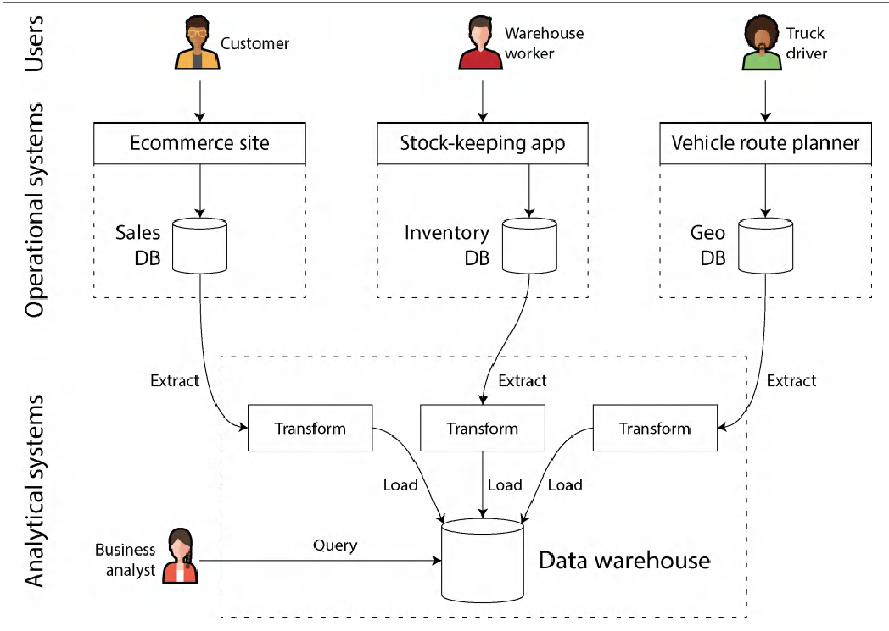

> 图 1-1。将数据通过 ETL 导入数据仓库的简化示意图。  

有时，ETL 过程的数据源是外部 SaaS 产品，例如客户关系管理（CRM）、电子邮件营销或信用卡处理系统。在这种情况下，你无法直接访问原始数据库，因为只能通过软件供应商的 API 访问它。把这些外部系统中的数据导入自己的数据仓库，可以开展 SaaS API 无法支持的分析。针对 SaaS API 的 ETL 通常由 Fivetran、Singer 或 Airbyte 等专业数据连接器服务实现。  

有些数据库系统提供*混合事务/分析处理*（hybrid transactional/analytical processing，HTAP），目标是在单个系统内同时支持 OLTP 和分析，而无须通过 ETL 将数据从一个系统导入另一个系统 [8, 9]。不过，许多 HTAP 系统在内部实际上由一个 OLTP 系统与一个独立的分析系统结合而成，只是隐藏在统一接口之后——因此，要理解这些系统的工作原理，两者之间的区别依然重要。  

此外，尽管 HTAP 已经出现，由于目标和要求不同，将事务处理系统与分析系统分离仍然十分常见。具体来说，让每个事务处理系统拥有自己的数据库被视为良好实践（见第 21 页“微服务与无服务器”），这可能会产生数百个独立的事务处理数据库；另一方面，企业通常只有一个数据仓库，以便业务分析师能在单个查询中组合来自多个事务处理系统的数据。  

因此，HTAP 并不能取代数据仓库。它适用于同一应用既要执行扫描大量行的分析查询，又要以低延迟读取和更新单条记录的场景。例如，欺诈检测就可能涉及这类工作负载 [10]。  

事务处理系统与分析系统的分离，是一个更广泛趋势的一部分。随着工作负载的要求越来越高，系统也变得更加专业化，并针对特定工作负载进行优化。通用系统可以从容处理较小的数据量，但规模越大，系统往往就越专业化 [11]。  

## 从数据仓库到数据湖  

数据仓库通常采用通过 SQL 查询的关系数据模型（见第 3 章），或许还会使用专门的商业智能软件。这种模型很适合业务分析师需要执行的查询，但不太适合数据科学家执行以下任务：  

- 将数据转换成适合训练机器学习模型的形式。这通常需要把数据库表中的行和列转换成由数值组成的向量或矩阵，称为特征。以尽可能提高训练后模型性能的方式完成这种转换，这一过程称为特征工程；它通常需要自定义代码，很难用 SQL 表达。  

- 对文本数据（例如产品评论）使用自然语言处理（NLP）技术，尝试从中提取结构化信息（例如作者的情感倾向，或作者提到的主题）。类似地，数据科学家可能需要运用计算机视觉技术从照片中提取结构化信息。  

尽管人们一直在尝试向 SQL 数据模型添加机器学习算子 [12]，并在关系模型基础上构建高效的机器学习系统 [13]，但许多数据科学家不喜欢在数据仓库之类的关系数据库中工作。相反，许多人更喜欢使用 Pandas 和 scikit-learn 等 Python 数据分析库、R 等统计分析语言，以及 Spark 等分布式分析框架 [14]。我们会在第 105 页“数据帧、矩阵和数组”中进一步讨论这些内容。  

因此，组织需要以适合数据科学家使用的形式提供数据。解决方案就是数据湖：一个集中式数据存储库，保存任何可能有助于分析的数据副本，这些数据通过 ETL 过程从事务处理系统获取。数据湖与数据仓库的区别在于，数据湖只包含文件，并不强制采用任何特定的文件格式、数据模型或模式 [15]。数据湖中的文件可能是数据库记录的集合，以 Avro 或 Parquet 等文件格式编码（见第 5 章）；同样也可以包含文本、图像、视频、传感器读数、稀疏矩阵、特征向量、基因组序列或任何其他类型的数据 [16]。除了更灵活以外，数据湖通常也比关系型数据存储更便宜，因为它可以使用对象存储等低成本的通用文件存储（见第 14 页“云原生系统架构”）。  

ETL 过程已经泛化为*数据管道*，有时数据湖会成为从事务处理系统通往数据仓库途中的中间站。数据湖保存的是事务处理系统生成的“原始”形式的数据，尚未转换成关系数据仓库的模式。这种方法的优点在于，每个数据使用方都可以把原始数据转换成最符合自身需求的形式。它有时被称为*寿司原则*：“原始数据更好”[17]。  

## 超越数据湖  

随着分析实践日趋成熟，组织越来越重视分析系统和数据管道的管理与运维，例如 DataOps Manifesto [18] 就体现了这一点。推动这一趋势的部分原因，是治理、隐私以及遵守《通用数据保护条例》（GDPR）和《加利福尼亚州消费者隐私法案》（CCPA）等法规方面的问题；我们将在第 24 页“数据系统、法律与社会”以及第 14 章中讨论这些问题。  

另一个重要因素是，供分析使用的数据不再只以文件和关系表的形式提供，也越来越多地以事件流的形式提供（见第 12 章）。采用基于文件的数据分析时，可以定期（例如每天）重新运行分析来响应数据变化；而流处理可以让分析系统快得多地响应事件，达到秒级。根据应用及其时间敏感性，流处理方法可能很有价值，例如可以用来识别并阻止潜在的欺诈或滥用活动。  

在某些情况下，分析系统的输出会提供给事务处理系统（这个过程有时称为*反向 ETL* [19]）。例如，在分析系统的数据上训练出的机器学习模型可以部署到生产环境，为最终用户生成推荐，如“购买 $X$ 的人也购买了 $Y$”。机器学习模型可以借助 TFX、Kubeflow 或 MLflow 等专用工具部署到事务处理系统中。  

## 记录系统与派生数据  

除了区分事务处理系统与分析系统，本书还会区分*记录系统*和*派生数据系统*。这些术语有助于理清数据在系统中的流动：  

### 记录系统  

记录系统也称为事实来源，保存数据的权威版本或标准版本。当新数据进入时——例如作为用户输入——首先会写入这里。每项事实都只表示一次（这种表示通常是规范化的；见第 72 页“规范化、反规范化与连接”）。如果另一个系统与记录系统之间存在任何差异，那么记录系统中的值（根据定义）就是正确的值。  

### 派生数据系统  

派生系统中的数据，是从另一个系统取得现有数据，再以某种方式转换或处理后得到的结果。如果派生数据丢失，可以根据原始数据源重新创建。缓存就是一个经典例子：如果缓存中有数据，就可以从缓存提供；但如果缓存中没有所需数据，还可以退回到底层数据库。反规范化值、索引、物化视图、经过转换的数据表示，以及在某个数据集上训练出的模型，也都属于这一类。  

从技术上说，派生数据是冗余的，因为它复制了已有的信息。然而，这些数据通常是获得良好读取查询性能的关键。你可以从单一数据源派生出多个数据集，从而以不同视角审视数据。  

分析系统通常是派生数据系统，因为它们消费的是在别处创建的数据。事务处理服务则可能同时包含记录系统和派生数据系统。记录系统是数据最先写入的主数据库，而派生数据系统是加快常见读取操作的索引和缓存，尤其用于加快记录系统无法高效响应的查询。  

大多数数据库、存储引擎和查询语言本身并不天然属于记录系统或派生系统。数据库只是一种工具；如何使用它取决于你。记录系统与派生数据系统的区别不在于工具，而在于你在应用中使用工具的方式。明确哪些数据是由哪些其他数据派生而来，能让原本令人困惑的系统架构变得清晰。  

当一个系统中的数据派生自另一个系统中的数据时，如果记录系统中的原始数据发生变化，就需要通过某个过程更新派生数据。遗憾的是，许多数据库的设计都基于这样一种假设：应用始终只需使用那一个数据库；因此，它们并不便于集成多个系统来传播此类更新。第 11 章将讨论作为一种数据集成方法的数据管道，它使我们能够组合多个数据系统，完成单个系统独力无法完成的事情。  

至此，我们对分析与事务处理的比较告一段落。下一节将探讨另一项你可能已经多次见人争论的权衡。  
  

## 云与自行托管  

对于组织需要做的任何事情，首先要问的问题之一是应该在内部完成，还是外包出去。也就是说，应该自己构建，还是购买？  

归根结底，这是一个关乎业务优先级的问题。常见的经验法则是：属于组织核心能力或竞争优势的事情应在内部完成，而非核心、例行或常见的事情则应交给供应商 [20]。举一个极端的例子，大多数公司并不制造自己的 CPU，因为从半导体制造商那里购买更便宜。  

对于软件，需要做出的两个重要决定是谁来构建软件，以及谁来部署软件。图 1-2 展示了各种可能性构成的连续谱。一端是由你编写并在内部运行的定制软件；另一端是广泛使用的云服务或 SaaS 产品，它们由外部供应商实现和运营，而你只能通过 Web 界面或 API 访问。  

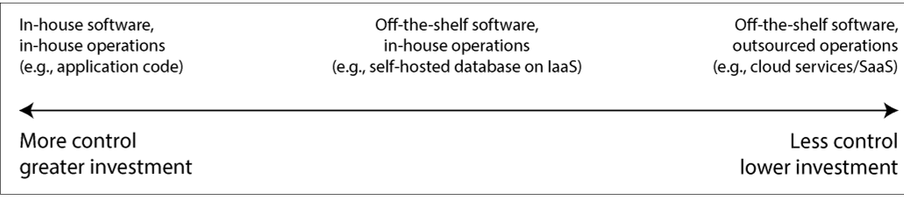

> 图 1-2。软件及其运维外包决策的连续谱。  

处于中间地带的是由你自行托管或部署的现成软件（开源或商业软件），例如下载 MySQL 并将其安装到由你控制的服务器上。这台服务器可以运行在你自己的硬件上（通常称为本地部署，即使服务器实际上位于租用的数据中心机架中，而不是真的在你自己的场所内），也可以运行在云中的虚拟机（VM）上（基础设施即服务，即 IaaS）。这个连续谱上还有更多位置，例如采用开源软件并运行其修改版本。  

另一个相关问题是如何部署服务，无论是在云中还是本地，例如是否使用 Kubernetes 之类的编排框架。不过，部署工具的选择超出了本书的讨论范围，因为还有其他因素对数据系统架构的影响更大。  

## 云服务的优缺点  

使用云服务而不是自己运行同类软件，本质上是把该软件的运维外包给云提供商。支持和反对这种做法都有充分的理由。云提供商声称，与搭建自己的基础设施相比，使用其服务可以节省时间和金钱，并加快工作进度。  

然而，使用云服务是否真的比自行托管更便宜、更容易，很大程度上取决于你的技能和系统上的工作负载。如果你已经拥有搭建并运营所需系统的经验，而且负载相当可预测（即所需机器数量不会剧烈波动），那么购买自己的机器并自行运行软件通常更便宜 [21, 22]。  

另一方面，如果你需要一个自己尚不知道如何部署和运营的系统，那么采用云服务通常比学习如何管理该系统更容易、更快捷。专门招聘和培训员工来维护并运营系统可能非常昂贵。使用云时仍然需要运维团队（参见第 17 页的“云时代的运维”），但将基础系统管理外包出去，可以让团队专注于更高层次的问题。  

将系统的运维外包给一家专门从事此项工作的公司，可能会带来更好的服务，因为提供商通过为众多客户提供服务积累了运维专业知识。另一方面，如果由你自己运行服务，就可以针对特定工作负载进行配置和调优。云服务通常不太可能愿意代表你做这种定制。  

当系统负载随时间变化很大时，云服务尤其有价值。如果你按峰值负载配置机器，但这些计算资源大部分时间都处于闲置状态，系统的成本效益就会降低。在这种情况下，云服务的优势在于，它们可以让你更容易地根据需求变化扩展或缩减计算资源。  

例如，分析系统的负载往往变化极大。要快速运行大型分析查询，需要并行使用大量计算资源；但查询完成后，这些资源就会闲置，直到用户发起下一个查询。预定义查询（例如每日报告查询）可以进入队列并通过调度来平滑负载；但对于交互式查询，你希望它们完成得越快，工作负载的波动就越大。如果数据集大到需要大量计算资源才能快速查询，使用云可以节省成本，因为你可以将不用的资源归还给提供商，而不是任其闲置。对于较小的数据集，这种差异就不那么显著。  

云服务最大的缺点是你无法控制它：  

- 如果它缺少你需要的功能，你所能做的只有礼貌地询问供应商是否会添加该功能；通常无法自行实现。  

- 如果服务宕机，你所能做的只有等待它恢复。  

- 如果你使用服务的方式触发了缺陷或引发了性能问题，诊断起来会很困难。对于自行运行的软件，你可以从操作系统获取性能指标和调试信息，以帮助理解其行为，也可以查看服务器日志。对于供应商托管的服务，你通常无法访问这些内部信息。  

- 如果服务关闭、价格变得高得无法接受，或者供应商以你不喜欢的方式更改了产品，你只能任其摆布；通常无法选择继续运行旧版本的软件，因此将被迫迁移到其他服务 [23]。如果替代服务提供兼容的 API，这种风险会有所缓解；但许多云服务没有标准 API，这提高了切换成本，使供应商锁定成为问题。  

- 如果云提供商位于另一个国家，而该国与你所在的国家之间发生政治冲突，你就有可能因制裁而无法使用该服务。  

- 必须信任云提供商能够保障数据安全，这可能使遵守隐私和安全法规的过程更加复杂。  

尽管存在所有这些风险，组织在云服务之上构建新应用，或采用仅在系统某些方面使用云服务的混合方式，已经越来越普遍。然而，云服务不会取代所有内部数据系统。许多旧系统早于云而出现；对于任何具有特殊要求、现有云服务无法满足的服务，内部系统仍不可或缺。例如，高频交易等对延迟极其敏感的应用需要完全控制硬件。  

## 云原生系统架构  

除了采用不同的经济模式（订阅服务，而不是购买硬件及相应的软件许可证），云的兴起还深刻影响了数据系统在技术层面的实现方式。术语*云原生*用于描述一种旨在利用云服务优势的架构。  

原则上，几乎任何可以自行托管的软件都可以作为云服务提供；事实上，许多流行的数据系统现在都有此类托管服务。不过，事实证明，从头开始按云原生方式设计的系统具有若干优势：在相同硬件上性能更好、从故障中恢复更快、能够快速扩缩计算资源以匹配负载，以及支持更大的数据集 [24, 25, 26]。表 1-2 列出了这两类系统的一些示例。  

> 表 1-2。自行托管与云原生数据库系统示例。

|类别|自行托管系统|云原生系统|
| ---|---|---|
|事务处理/OLTP|MySQL, PostgreSQL, MongoDB|AWS Aurora [24], Azure SQL DB Hyperscale [25], Google Cloud Spanner|
|分析/OLAP|Teradata, ClickHouse, Spark|Snowflake [26], Google BigQuery, Azure Synapse Analytics|  

## 云服务的分层  

许多自行托管的数据系统对系统的要求很简单：它们运行在 Linux 或 Windows 等常规操作系统上，将数据以文件形式存储在文件系统中，并通过 TCP/IP 等标准网络协议通信。少数系统依赖 GPU（用于机器学习）或远程直接内存访问（RDMA）网络接口等专用硬件，但总体而言，自行托管的软件往往使用通用计算资源：CPU、RAM、文件系统和 IP 网络。  

在云中，这类软件可以在 IaaS 环境里运行，使用一台或多台分配了一定 CPU、内存、磁盘和网络带宽的 VM（或称*实例*）。与物理机相比，云实例可以更快地置备，并且有更多规格可供选择，但除此之外，它们与传统计算机相似：你可以在上面运行任何想要的软件，但需要负责自行管理。  

相比之下，云原生服务的核心理念不仅是使用由操作系统管理的计算资源，还要在较低层的云服务之上构建较高层的服务。例如：  

- Amazon S3、Azure Blob Storage 和 Cloudflare R2 等对象存储服务用于存储大文件。与典型文件系统相比，它们提供的 API 更受限（基本的文件读写），但优势在于隐藏了底层物理机；服务会自动将数据分布到许多机器上，因此你不必担心任何一台机器耗尽磁盘空间。即使某些机器或其磁盘完全失效，也不会丢失数据。  

- 许多其他服务又构建在对象存储和其他云服务之上。例如，Snowflake 是一种依赖 S3 存储数据的云分析数据库（数据仓库）[26]，而另外一些服务又构建在 Snowflake 之上。  

与计算领域的抽象一贯如此，对于应该使用什么，并不存在唯一正确的答案。一般而言，较高层的抽象往往更面向特定用例。如果你的需求符合某个较高层系统的设计场景，使用现有的较高层系统很可能会满足需求，而且比基于较低层系统自行构建省心得多。反之，如果没有较高层系统能满足需求，唯一的选择就是使用较低层组件自行构建。  

## 存储与计算分离  

在传统计算中，磁盘存储被视为持久的（我们假设某样东西一旦写入磁盘，就不会丢失）。为了容忍单个硬盘失效，通常使用 RAID（独立磁盘冗余阵列）在连接到同一台机器的多个磁盘上保存数据副本。RAID 既可以用硬件实现，也可以由操作系统以软件实现，并且对访问文件系统的应用透明。  

在云中，计算实例（VM）也可能连接本地磁盘，但云原生系统通常更倾向于把这些磁盘当作临时缓存，而不是长期存储。这是因为，如果关联的实例发生故障，或者为了适应负载变化而将该实例替换为另一台物理机上更大或更小的实例，本地磁盘就无法访问。  

作为本地磁盘的替代方案，云服务还提供可从一个实例分离并连接到另一个实例的虚拟磁盘存储（例如 Amazon EBS、Azure 托管磁盘和 Google Cloud 中的持久磁盘）。这种虚拟磁盘不是物理磁盘，而是由另一组机器提供的云服务，用来模拟磁盘的行为（即块设备，其中每个块通常为 4 KiB）。这项技术使传统的基于磁盘的软件可以在云中运行，但块设备模拟会引入开销；对于从头开始为云设计的系统，这些开销可以避免 [24]。使用虚拟磁盘还会使应用对网络小故障非常敏感，因为虚拟块设备上的每次 I/O 操作都是一次网络调用 [27]。  

为了解决这个问题，云原生服务通常避免使用虚拟磁盘，转而构建在针对特定工作负载优化的专用存储服务之上。S3 等对象存储服务是为长期存储相当大的文件而设计的，文件大小从数百 KiB 到数 GiB 不等。数据库中存储的单行或单个值通常远小于此；因此，云数据库通常在单独的服务中管理较小的值，并将较大的数据块（包含许多单独的值）存入对象存储 [25, 28]。我们将在第 4 章看到实现这种做法的方式。  

在传统系统架构中，同一台计算机同时负责存储（磁盘）和计算（CPU 与 RAM），但在云原生系统中，这两项职责已在一定程度上分离，或者说实现了*解耦* [9, 26, 29, 30]。例如，S3 只存储文件；如果你想分析这些数据，就必须在 S3 之外的某处运行分析代码。这意味着要通过网络传输数据，我们将在第 19 页的“分布式系统与单节点系统”中进一步讨论。  

此外，云原生系统通常是*多租户*的，这意味着它们不会为每位客户分别准备一台机器，而是由同一项服务在相同的共享硬件上处理多位客户的数据和计算 [31]。多租户可以提高硬件利用率，使扩展和云提供商的管理更容易，但也需要精心设计，以确保某位客户的活动不会影响其他客户的系统性能或安全性 [32]。  

## 云时代的运维  

传统上，管理组织服务器端数据基础设施的人员称为*数据库管理员*（DBA）或*系统管理员*（sysadmin）。近来，许多组织尝试将软件开发和运维角色整合到同一团队中，由团队共同负责后端服务和数据基础设施；*DevOps* 理念推动了这一趋势。*站点可靠性工程师*（SRE）是 Google 对这一理念的实践 [33]。  

运维的作用是确保向用户可靠地交付服务（包括配置基础设施和部署应用），并确保生产环境稳定（包括监控和诊断任何可能影响可靠性的问题）。对于自行托管的系统，传统运维包含大量针对单台机器的工作，例如容量规划（如监控可用磁盘空间，并在空间耗尽前添加更多磁盘）、配置新机器、将服务从一台机器迁移到另一台，以及安装操作系统补丁。  

许多云服务提供的 API 隐藏了实现该服务的单台机器。例如，云存储以按量计费取代固定大小的磁盘：你无需提前规划容量需求即可存储数据，之后按占用空间付费。此外，即使个别机器发生故障，许多云服务仍能保持高可用性（参见第 43 页的“可靠性与容错”）。  

关注重点从单台机器转向服务的同时，运维的角色也发生了变化。提供可靠服务这一高层目标保持不变，但流程和工具已经演进。  

DevOps/SRE 理念更强调以下方面：  

- 建立自动化，优先采用可重复的流程，而不是一次性的手工作业  

- 使用临时 VM 和服务，而不是长期运行的服务器  

- 支持频繁更新应用  

- 从事故中学习  

- 即使人员不断更替，也要保留组织对系统的知识 [34]  

随着云服务兴起，角色出现了分化。基础设施公司的运维团队专注于向大量客户提供可靠服务的各种细节，而服务客户则尽可能少地在基础设施上投入时间和精力 [35]。  

云服务客户仍然需要运维，但关注的是不同方面，例如为给定任务选择最合适的服务、集成不同服务，以及从一项服务迁移到另一项服务。尽管按量计费消除了传统意义上的容量规划需求，但了解正在为何种目的使用哪些资源仍然很重要，以免把钱浪费在不需要的云资源上。容量规划变成了财务规划，性能优化变成了成本优化 [36]。此外，云服务确实存在资源限制或配额（例如可并发运行的最大进程数），你需要提前了解并做好规划，以免达到上限 [37]。  

采用云服务可能比配置并运行自己的基础设施更容易、更快捷，不过你仍然必须学习如何使用云服务，或许还得设法绕过其限制。随着越来越多的供应商针对不同用例提供愈加广泛的云服务，服务之间的集成成为一项尤其突出的挑战 [38, 39]。ETL（参见第 7 页的“数据仓库”）只是其中一部分；事务处理云服务也需要彼此集成。目前，我们缺乏促进这类集成的标准，因此它往往需要大量人工投入。  

其他无法完全外包给云服务的运维方面包括：维护应用及其所用库的安全性，管理自有服务之间的交互，监控服务负载，以及追查性能下降或中断等问题的原因。云正在改变运维的角色，但运维的必要性丝毫未减。  

## 分布式系统与单节点系统  

涉及多台机器通过网络通信的系统称为分布式系统。参与分布式系统的每个进程称为一个节点。你可能会出于多种原因使用这类系统：  

天然分布  

如果一个应用涉及两个或更多相互交互的用户，而且每个人都使用自己的设备，那么该系统不可避免地是分布式的：设备之间必须通过网络通信。  

云服务之间的请求  

如果数据存储在一项服务中，却在另一项服务中处理，就必须通过网络将数据从一项服务传输到另一项服务。因此，云原生系统和微服务（参见第 21 页的“微服务与无服务器”）都是分布式的。  

容错/高可用性  

如果应用需要在一台机器（或多台机器、网络乃至整个数据中心）发生故障时继续工作，可以使用多台机器提供冗余。一台失效时，另一台可以接管。参见第 43 页的“可靠性与容错”和第 6 章。  

可扩展性  

如果数据量或计算需求增长到单台机器无法承受，就有可能将负载分散到多台机器上。参见第 49 页的“可扩展性”。  

延迟  

如果用户遍布全球，你可能希望在世界各地部署服务器，让每位用户都能由地理位置相近的服务器提供服务。这样，用户就不必等待网络数据包跨越半个地球来响应请求。参见第 37 页的“描述性能”。  

弹性  

如果应用有时繁忙、有时闲置，云部署可以根据需求扩展或缩减，让你只为正在使用的资源付费。这在单台机器上更难实现，因为即使机器大部分时间几乎未被使用，也必须按可处理最大负载来配置。  

专用硬件  

系统的不同部分可以利用不同类型的硬件来匹配其工作负载。例如，对象存储可以使用磁盘多而 CPU 少的机器，数据分析系统可以使用 CPU 和内存很多但没有磁盘的机器，而机器学习系统可以使用配备 GPU 的机器（训练深度神经网络和执行其他机器学习任务时，GPU 的效率远高于 CPU）。  

### 法律合规  

一些国家制定了数据驻留法律，要求与其管辖范围内人员有关的数据必须在该国境内存储和处理 [40]。这些规则的适用范围各不相同，例如有时仅适用于医疗或金融数据，有时则更为宽泛。因此，如果一项服务的用户分布在多个具有此类规定的司法管辖区，就必须将他们的数据分布到多个地点的服务器上。  

### 可持续性  

如果作业的运行地点和时间可以灵活选择，你或许能在可再生电力充足的时间和地点运行作业，并避免在电网压力过大时运行。这样既能减少碳排放，也能在廉价电力可用时充分利用它 [41, 42]。  

这些原因既适用于你自己编写的服务（应用代码），也适用于由现成软件（例如数据库）组成的服务。  

### 分布式系统的问题  

分布式系统也有缺点。每个穿越网络的请求和 API 调用都需要应对失败的可能性。网络可能中断，服务可能过载或崩溃，因此任何请求都可能超时而收不到响应。在这种情况下，我们不知道服务是否收到了请求，而简单重试可能并不安全。我们将在第 9 章详细讨论这些问题。  

尽管数据中心网络速度很快，调用另一项服务仍然远慢于调用同一进程中的函数 [43]。处理大量数据时，与其将数据从存储处传输到另一台机器进行处理，把计算带到已有数据的机器上可能更快 [44]。节点越多并不总是越快；在某些情况下，一台计算机上的简单单线程程序可能明显优于拥有 100 多个 CPU 核心的集群 [45]。  

排查分布式系统故障通常很困难——如果系统响应缓慢，如何确定问题出在哪里？用于诊断分布式系统问题的技术被归入可观测性范畴 [46, 47]，它涉及收集系统执行过程的数据，并支持以既能分析高层指标、又能分析单个事件的方式查询这些数据。OpenTelemetry、Zipkin 和 Jaeger 等追踪工具让你能够跟踪哪个客户端为了哪项操作调用了哪个服务器，以及每次调用耗时多久 [48]。  

正如将在第 6 章和第 8 章看到的，数据库提供了多种确保数据一致性的机制。然而，当每项服务都有自己的数据库时，维护这些不同服务之间的数据一致性就成了应用自身的问题。我们将在第 8 章探讨的分布式事务，是确保一致性的一种可行技术；但它们很少用于微服务场景，因为这与让服务彼此独立的目标背道而驰，而且许多数据库并不支持分布式事务 [49]。  

由于上述所有原因，在单台机器上执行任务通常比搭建分布式系统简单得多，也便宜得多 [22, 45, 50]。CPU、内存和磁盘的容量越来越大、速度越来越快、可靠性也越来越高。结合 DuckDB、SQLite 和 KùzuDB 等单节点数据库，许多工作负载现在都可以在单个节点上运行。我们将在第 4 章进一步探讨这个主题。  

## 微服务与无服务器  

将系统分布到多台机器上最常见的方式，是把它们划分为客户端和服务器，并让客户端向服务器发出请求。这类通信最常使用 HTTP，我们将在第 180 页的“通过服务传输数据流：REST 与 RPC”中讨论。同一个进程既可以是服务器（处理传入请求），也可以是客户端（向其他服务发出请求）。  

这种构建应用的方式传统上称为面向服务的架构（SOA）；近年来，这一理念进一步发展为微服务架构 [51, 52]。在微服务架构中，一项服务具有一个明确界定的用途（例如 S3 的用途就是文件存储）；每项服务都公开一个 API，客户端可以通过网络调用它；每项服务还由一个团队负责维护。这样，复杂应用就可以分解为多项相互交互的服务，每项服务由不同团队管理。云原生系统大量使用这种服务分解方式，但本地系统同样可以采用面向服务的方法。  

将复杂软件拆分为多项服务有若干优势：每项服务可以独立更新，减少团队之间的协调工作；可以为每项服务分配所需的硬件资源；通过 API 隐藏实现细节，意味着服务所有者可以自由更改实现而不影响客户端。在数据存储方面，常见做法是每项服务都拥有自己的数据库，服务之间不共享数据库。共享数据库实际上会使整个数据库结构都成为服务 API 的一部分，于是该结构将难以更改。共享数据库还可能使一项服务的查询对其他服务的性能产生负面影响。  

另一方面，拥有大量服务本身也会增加复杂性。开发期间测试一项服务可能很麻烦，因为你还需要运行它所依赖的所有其他服务。此外，每项服务都需要用于部署新版本、根据负载调整分配的硬件资源、收集日志、监控服务健康状况，并在出现问题时向值班工程师发出警报的基础设施。Kubernetes 等编排框架为这类基础设施提供了基础，因此已成为一种流行的服务部署方式。  

此外，微服务 API 的演进可能并不容易。调用 API 的客户端期望它包含某些字段。随着业务需求变化，开发者可能希望在 API 中添加或删除字段，但这样做可能导致客户端失效。更糟的是，此类失效往往到开发周期后期才被发现，也就是更新后的服务 API 部署到预发布或生产环境时。OpenAPI 和 gRPC 等 API 描述标准有助于管理客户端与服务器 API 之间的关系；我们将在第 5 章进一步讨论。  

微服务主要是用技术方案解决人员问题：让不同团队能够独立推进，而不必彼此协调。这对大型公司很有价值，但在团队较少的小型公司中，使用微服务很可能只会带来不必要的开销，最好以尽可能简单的方式实现应用 [51]。  

无服务器，或函数即服务（FaaS），是另一种部署服务的方法，其中基础设施管理被外包给云供应商 [32]。使用 VM 时，你必须明确选择何时启动或关闭实例；相比之下，在无服务器模式中，云提供商会根据服务收到的请求，按需自动分配和释放硬件资源 [53]。正如云存储以按量计费模式取代容量规划（预先决定购买多少磁盘）一样，无服务器方法正在把按量计费引入代码执行：你只需为应用代码实际运行的时间付费，而不必预先配置资源。  

为了提供这些好处，许多无服务器基础设施提供商会限制函数执行时间和运行时环境，而且函数首次调用时，服务可能会因启动缓慢而受到影响。“无服务器”一词也可能产生误导：每次无服务器函数执行仍然运行在一台服务器上，只是后续执行可能会在另一台服务器上运行。此外，BigQuery 和各种 Kafka 产品等基础设施服务也采用了“无服务器”这一说法，用来表明其服务可自动扩缩，并按使用量而非机器实例计费。  

## 云计算与超级计算  

云计算并非构建大规模计算系统的唯一方式；另一种选择是*高性能计算*（HPC），也称为*超级计算*。尽管二者有所重叠，但 HPC 的优先事项和采用的技术往往不同于云计算和企业数据中心系统。以下是其中一些主要差异：  

- 超级计算机通常用于计算密集型科学计算任务，例如天气预报、气候建模、分子动力学（模拟原子和分子的运动）、复杂优化问题，以及求解偏微分方程。另一方面，云计算往往用于在线服务、业务数据系统，以及需要以高可用性响应用户请求的类似系统。  

- 超级计算机通常运行大型批处理作业，并不时将计算状态保存到磁盘检查点。如果某个节点失效，常见解决方案是直接停止整个集群的工作负载，修复故障节点，然后从上一个检查点重新开始计算 [54, 55]。对于云服务，通常不希望停止整个集群，因为服务需要持续为用户提供服务，并将中断降至最低。  

- 超级计算机节点通常通过共享内存和 RDMA 通信，它们支持高带宽和低延迟，但假定系统用户之间高度互信 [56]。在云计算中，网络和机器通常由互不信任的组织共享，因此需要资源隔离（例如虚拟机）、加密和身份认证等更强的安全机制。  

- 云数据中心网络通常基于 IP 和以太网，并采用 Clos 拓扑来提供较高的二分带宽——这是衡量网络整体性能的常用指标 [54, 57]。超级计算机往往使用专用网络拓扑，例如多维网格和环面 [58]，对于通信模式已知的 HPC 工作负载，这些拓扑能带来更好的性能。  

- 云计算允许节点分布在多个地理区域，而超级计算机通常假定其所有节点彼此邻近。  

大规模分析系统有时与超级计算具有一些共同特征，因此，如果你从事这一领域的工作，了解这些技术可能很有价值。不过，本书主要关注需要持续可用的服务，如第 43 页的“可靠性与容错”所述。  

## 数据系统、法律与社会

正如你在本章中所见，数据系统的架构不仅受到技术目标和要求的影响，也受到其所支持组织中人的需求的影响。数据系统工程师越来越意识到，仅仅满足自身企业的需求是不够的；我们还对整个社会负有责任。

一个尤其值得关注的问题，是存储有关个人及其行为的数据的系统。自 2018 年以来，GDPR 赋予许多欧洲国家的居民对其个人数据更大的控制权和更多法律权利，世界各地的其他许多国家和州也通过了类似的隐私法规（例如 CCPA）。欧盟《人工智能法案》等 AI 相关法规进一步限制了个人数据的使用方式。

此外，即使在不直接受监管的领域，人们也越来越认识到计算机系统对个人和社会的影响。社交媒体改变了个人获取新闻的方式，进而影响其政治观点，并因此可能影响选举结果。自动化系统越来越多地做出会对个人产生深远后果的决定，例如谁应当获得贷款或保险保障、谁应当受邀参加求职面试，或者谁应当被列为犯罪嫌疑人 [59]。

参与此类系统工作的每个人，都有责任考虑其决策的伦理影响，并确保系统遵守相关法律。并非每个人都需要成为法律和伦理专家，但对法律和伦理原则具备基本认识，与掌握一些分布式系统基础知识同样重要。

法律方面的考量正在影响数据系统设计最根本的基础 [60]。例如，GDPR 赋予个人要求删除其数据的权利（有时称为*被遗忘权*）。然而，正如本书后文将要看到的，许多数据系统在设计中依赖仅追加日志等不可变结构。对于一个理应不可变的文件，我们如何确保删除其中间的某些数据？对于已经纳入派生数据集的数据（参见第 10 页的“记录系统与派生数据”），例如 ML 模型的训练数据，我们又该如何处理其删除？回答这些问题带来了新的工程挑战。

目前，对于哪些具体技术或系统架构应被视为符合 GDPR，我们尚无明确的指导准则。法规刻意不强制指定特定技术，因为随着技术进步，这些技术可能很快发生变化。相反，法律文本规定了需要解释的高层原则。因此，如何遵守隐私法规并没有简单答案，但我们将从这一视角审视本书涉及的一些技术。

一般而言，我们存储数据，是因为认为它的价值高于存储成本。不过，值得记住的是，存储成本并不只包括你为 S3 或其他服务支付的账单。成本效益计算还应考虑：数据一旦泄露或落入攻击者手中，可能带来的法律责任和声誉损害风险；以及数据的存储和处理若被认定不符合法律规定，可能产生的诉讼成本与罚款风险 [50]。

政府或警方也可能强制企业交出数据。如果数据可能暴露被定为犯罪的行为（例如，在若干中东和非洲国家的同性恋行为，或在美国若干州寻求堕胎），存储这些数据就会给用户带来切实的安全风险。例如，位置数据很容易暴露前往堕胎诊所的行程，甚至用户随时间积累的 IP 地址日志也可能暴露这一行程（IP 地址能表明大致位置）。

在把所有风险都考虑进去之后，我们或许有理由认定，某些数据根本不值得存储，因而应将其删除。这种*数据最小化*原则（有时也用德语 *Datensparsamkeit* 表示）与“大数据”哲学背道而驰；后者主张以备将来可能有用为由，预先存储大量数据 [61]。但数据最小化符合 GDPR 的规定：只能出于明确指定的目的收集个人数据；之后不得将其用于任何其他目的；并且数据的保留时间不得超过实现其收集目的所必需的期限 [62]。

企业也已经开始重视隐私和安全问题。信用卡公司要求支付处理企业遵守严格的支付卡行业（PCI）标准。处理商经常接受独立审计机构的评估，以验证其持续合规。软件供应商也受到越来越严格的审查。如今，许多采购方要求其供应商遵守服务组织控制（SOC）2 类标准。与 PCI 合规一样，供应商也要接受第三方审计，以验证其是否遵守标准。

总的来说，在企业需求与其所收集、处理数据涉及的个人需求之间取得平衡至关重要。这个主题还有很多内容可谈；第 14 章将更深入地讨论伦理与法律合规，包括偏见和歧视问题。

<a id="chapter-1-summary"></a>

## 小结

本章的主题是理解权衡取舍——也就是说，要认识到许多问题并不存在唯一正确的答案，而是有多种各具利弊的可能方案。我们探讨了影响数据系统架构的一些最重要选择，并介绍了本书后续各章将使用的术语。

我们首先区分了事务处理（OLTP）系统和分析（OLAP）系统，并探讨了二者的差异：它们不仅管理访问模式不同的不同类型数据，还面向不同的受众。在此过程中，我们接触了数据仓库和数据湖的概念，它们通过 ETL 接收来自事务处理系统的数据馈送。第 4 章将说明，由于需要支持的查询类型不同，事务处理系统和分析系统通常采用迥然不同的内部数据布局。

接下来，我们把相对较新兴的云服务与此前一直主导数据系统架构的传统自行托管软件范式进行了比较。哪种方法更具成本效益，很大程度上取决于你的具体情况，但不可否认，云原生方法正在给数据系统的架构方式带来巨大变化——例如，将存储与计算分离。

云系统本质上是分布式的，我们简要考察了分布式系统与使用单机相比的一些权衡。在某些情况下，你无法避免采用分布式架构；但如果可以将系统维持在单机上，最好不要急于将其分布式化。第 9 章将更详细地讨论分布式系统面临的挑战。

最后，我们看到，数据系统的架构不仅取决于部署该系统的企业需求，也取决于旨在保护数据处理所涉及个人权利的隐私法规——而许多工程师往往会忽略这一方面。如何把法律要求转化为技术实现，尚未形成规范化的方法，但在阅读本书其余内容时，务必始终牢记这个问题。

## 参考文献

[1] Richard T. Kouzes, Gordon A. Anderson, Stephen T. Elbert, Ian Gorton, and Deborah K. Gracio. "The Changing Paradigm of Data-Intensive Computing." IEEE Computer, volume 42, issue 1, pages 26–34, January 2009. doi:10.1109/MC.2009.26

[2] Martin Kleppmann, Adam Wiggins, Peter van Hardenberg, and Mark McGranaghan. "Local-First Software: You Own Your Data, in Spite of the Cloud." At 2019 ACM SIGPLAN International Symposium on New Ideas, New Paradigms, and Reflections on Programming and Software (Onward!), October 2019. doi:10.1145/3359591.3359737

[3] Joe Reis and Matt Housley. *Fundamentals of Data Engineering*. O'Reilly Media, 2022. ISBN: 9781098108304

[4] Rui Pedro Machado and Helder Russa. *Analytics Engineering with SQL and dbt*. O'Reilly Media, 2023. ISBN: 9781098142384

[5] Edgar F. Codd, S. B. Codd, and C. T. Salley. "Providing OLAP to User-Analysts: An IT Mandate." E. F. Codd Associates, 1993. Archived at perma.cc/RKX8-2GEE

[6] Chinmay Soman and Neha Pawar. "Comparing Three Real-Time OLAP Databases: Apache Pinot, Apache Druid, and ClickHouse." startree.ai, April 2023. Archived at perma.cc/8BZP-VWPA

[7] Surajit Chaudhuri and Umeshwar Dayal. "An Overview of Data Warehousing and OLAP Technology." ACM SIGMOD Record, volume 26, issue 1, pages 65–74, March 1997. doi:10.1145/248603.248616

[8] Fatma Özcan, Yuanyuan Tian, and Pinar Törzün. "Hybrid Transactional/Analytical Processing: A Survey." At ACM International Conference on Management of Data (SIGMOD), May 2017. doi:10.1145/3035918.3054784

[9] Adam Prout, Szu-Po Wang, Joseph Victor, Zhou Sun, Yongzhu Li, Jack Chen, Evan Bergeron, Eric Hanson, Robert Walzer, Rodrigo Gomes, and Nikita Shamgunov. "Cloud-Native Transactions and Analytics in SingleStore." At International Conference on Management of Data (SIGMOD), June 2022. doi:10.1145/3514221.3526055

[10] Chao Zhang, Guoliang Li, Jintao Zhang, Xinning Zhang, and Jianhua Feng. "HTAP Databases: A Survey." IEEE Transactions on Knowledge and Data Engineering, volume 36, issue 11, pages 6410–6429, April 2024. doi:10.1109/TKDE.2024.3389693

[11] Michael Stonebraker and Ugur Cetintemel. "One Size Fits All: An Idea Whose Time Has Come and Gone." At 21st International Conference on Data Engineering (ICDE), April 2005. doi:10.1109/ICDE.2005.1

[12] Jeffrey Cohen, Brian Dolan, Mark Dunlap, Joseph M. Hellerstein, and Caleb Welton. "MAD Skills: New Analysis Practices for Big Data." Proceedings of the VLDB Endowment, volume 2, issue 2, pages 1481–1492, August 2009. doi:10.14778/1687553.1687576

[13] Dan Olteanu. "The Relational Data Borg Is Learning." Proceedings of the VLDB Endowment, volume 13, issue 12, pages 3502–3515, August 2020. doi:10.14778/3415478.3415572

[14] Matt Bornstein, Martin Casado, and Jennifer Li. “Emerging Architectures for Modern Data Infrastructure: 2020.” future.a16z.com, October 2020. Archived at perma.cc/LF8W-KDCC

[15] Rihan Hai, Christos Koutras, Christoph Quix, and Matthias Jarke. "Data Lakes: A Survey of Functions and Systems." IEEE Transactions on Knowledge and Data Engineering (TKDE), volume 35, issue 12, pages 12571–12590, December 2023. doi:10.1109/TKDE.2023.3270101

[16] Martin Fowler. “Data Lake.” martinfowler.com, February 2015. Archived at
perma.cc/4WKN-CZUK

[17] Bobby Johnson and Joseph Adler. "The Sushi Principle: Raw Data Is Better." At *Strata+Hadoop World*, February 2015.

[18] DataKitchen, Inc. “The DataOps Manifesto.” dataopsmanifesto.org, 2017. Archived at perma.cc/3F5N-FUQ4

[19] Tejas Manohar. "What Is Reverse ETL: A Definition & Why It's Taking Off." hightouch.io, November 2021. Archived at perma.cc/A7TN-GLYJ

[20] Camille Fournier. "Why Is It So Hard to Decide to Buy?" *skamille.medium.com*, July 2021. Archived at *perma.cc/6VSG-HQ5X*

[21] David Heinemeier Hansson. “Why We’re Leaving the Cloud.” world.hey.com, October 2022. Archived at perma.cc/82E6-UJ65

[22] Nima Badizadegan. “Use One Big Server.” *specbranch.com*, August 2022. Archived at *perma.cc/M8NB-95UK*

[23] Steve Yegge. "Dear Google Cloud: Your Deprecation Policy Is Killing You." steve-yegge.medium.com, August 2020. Archived at perma.cc/KQP9-SPGU

[24] Alexandre Verbitski, Anurag Gupta, Debanjan Saha, Murali Brahmdesam, Kamal Gupta, Raman Mittal, Sailesh Krishnamurthy, Sandor Maurice, Tengiz Kharatishvili, and Xiaofeng Bao. "Amazon Aurora: Design Considerations for High Throughput Cloud-Native Relational Databases." At ACM International Conference on Management of Data (SIGMOD), May 2017. doi:10.1145/3035918.3056101

[25] Panagiotis Antonopoulos, Alex Budovski, Cristian Diaconu, Alejandro Hernandez Saenz, Jack Hu, Hanuma Kodavalla, Donald Kossmann, Sandeep Lingam, Umar Farooq Minhas, Naveen Prakash, Vijendra Purohit, Hugh Qu, Chaitanya Sreenivas Ravella, Krystyna Reisteter, Sheetal Shrotri, Dixon Tang, and Vikram Wakade. "Socrates: The New SQL Server in the Cloud." At ACM International Conference on Management of Data (SIGMOD), June 2019. doi:10.1145/3299869.3314047

[26] Midhul Vuppalapati, Justin Miron, Rachit Agarwal, Dan Truong, Ashish Motivala, and Thierry Cruanes. "Building an Elastic Query Engine on Disaggregated Storage." At 17th USENIX Symposium on Networked Systems Design and Implementation (NSDI), February 2020.

[27] Nick Van Wiggeren. “The Real Failure Rate of EBS.” *planetscale.com*, March 2025. Archived at *perma.cc/43CR-SAHA5*

[28] Colin Breck. “Predicting the Future of Distributed Systems.” blog.colinbreck.com, August 2024. Archived at perma.cc/K5FC-4XX2

[29] Gwen Shapira. “Compute-Storage Separation Explained.” *thenile.dev*, January 2023. Archived at perma.cc/QCV3-XJNZ

[30] Ravi Murthy and Gurmeet Goindi. "AlloyDB for PostgreSQL Under the Hood: Intelligent, Database-Aware Storage." cloud.google.com, May 2022. Archived at archive.org

[31] Jack Vanlightly. “The Architecture of Serverless Data Systems.” jack-vanlightly.com, November 2023. Archived at perma.cc/UDV4-TNJ5

[32] Eric Jonas, Johann Schleier-Smith, Vikram Sreekanti, Chia-Che Tsai, Anurag Khandelwal, Qifan Pu, Vaishaal Shankar, Joao Carreira, Karl Krauth, Neeraja Yadawdkar, Joseph E. Gonzalez, Raluca Ada Popa, Ion Stoica, and David A. Patterson. "Cloud Programming Simplified: A Berkeley View on Serverless Computing." arXiv:1902.03383, February 2019.

[33] Betsy Beyer, Jennifer Petoff, Chris Jones, and Niall Richard Murphy. *Site Reliability Engineering: How Google Runs Production Systems*. O'Reilly Media, 2016. ISBN: 9781491929124

[34] Thomas Limoncelli. "The Time I Stole \$10,000 from Bell Labs." ACM Queue, volume 18, issue 5, November 2020. doi:10.1145/3434571.3434773

[35] Charity Majors. “The Future of Ops Jobs.” acloudguru.com, August 2020. Archived at perma.cc/GRU2-CZG3

[36] Boris Cherkasky. "(Over)Pay as You Go for Your Datastore." *medium.com*, September 2021. Archived at *perma.cc/Q8TV-2AM2*

[37] Shlomi Kushchi. “Serverless Doesn’t Mean DevOpsLess or NoOps.” thenewstack.io, February 2023. Archived at perma.cc/3NJR-AYYU

[38] Erik Bernhardsson. "Storm in the Stratosphere: How the Cloud Will Be Reshuffled." erikbern.com, November 2021. Archived at perma.cc/SYB2-99P3

[39] Benn Stancil. “The Data OS.” *benn.substack.com*, September 2021. Archived at *perma.cc/WQ43-FHS6*

[40] Maria Korolov. "Data Residency Laws Pushing Companies Toward Residency as a Service." csoonline.com, January 2022. Archived at perma.cc/CHE4-XZZ2

[41] Severin Borenstein. "Can Data Centers Flex Their Power Demand?" *energyathaas.wordpress.com*, April 2025. Archived at *perma.cc/MUD3-A6FF*

[42] Bilge Acun, Benjamin Lee, Fiodar Kazhamiaka, Aditya Sundarraj, Kiwan Maeng, Manoj Chakkaravarthy, David Brooks, and Carole-Jean Wu. "Carbon Dependencies in Datacenter Design and Management." ACM SIGENERGY Energy Informatics Review, volume 3, issue 3, pages 21–26, October 2023. doi:10.1145/3630614.3630619

[43] Kousik Nath. “These Are the Numbers Every Computer Engineer Should Know.” freecodecamp.org, September 2019. Archived at perma.cc/RW73-36RL

[44] Joseph M. Hellerstein, Jose Faleiro, Joseph E. Gonzalez, Johann Schleier-Smith, Vikram Sreekanti, Alexey Tumanov, and Chenggang Wu. "Serverless Computing: One Step Forward, Two Steps Back." arXiv:1812.03651, December 2018.

[45] Frank McSherry, Michael Isard, and Derek G. Murray. "Scalability! But at What COST?" At 15th USENIX Workshop on Hot Topics in Operating Systems (HotOS), May 2015.

[46] Cindy Sridharan. *Distributed Systems Observability: A Guide to Building Robust Systems*. Report, O'Reilly Media, 2018. Archived at perma.cc/M6JL-XKCM

[47] Charity Majors. “Observability—A 3-Year Retrospective.” *thenewstack.io*, August 2019. Archived at *perma.cc/CG62-TJWL*

[48] Benjamin H. Sigelman, Luiz André Barroso, Mike Burrows, Pat Stephenson, Manoj Plakal, Donald Beaver, Saul Jaspan, and Chandan Shanbhag. "Dapper, a Large-Scale Distributed Systems Tracing Infrastructure." Google Technical Report dapper-2010-1, April 2010. Archived at perma.cc/K7KU-2TMH

[49] Rodrigo Laigner, Yongluan Zhou, Marcos Antonio Vaz Salles, Yijian Liu, and Marcos Kalinowski. "Data Management in Microservices: State of the Practice, Challenges, and Research Directions." Proceedings of the VLDB Endowment, volume 14, issue 13, pages 3348–3361, September 2021. doi:10.14778/3484224.3484232

[50] Jordan Tigani. "Big Data Is Dead." *motherduck.com*, February 2023. Archived at *perma.cc/HT4Q-K77U*

[51] Sam Newman. *Building Microservices*, 2nd edition. O'Reilly Media, 2021. ISBN: 9781492034025

[52] Chris Richardson. "Microservices: Decomposing Applications for Deployability and Scalability." infoq.com, May 2014. Archived at perma.cc/CKN4-YEQ2

[53] Mohammad Shahrad, Rodrigo Fonseca, Ínigo Goiri, Gohar Chaudhry, Paul Batum, Jason Cooke, Eduardo Laureano, Colby Tresness, Mark Russinovich, and Riccardo Bianchini. "Serverless in the Wild: Characterizing and Optimizing the Serverless Workload at a Large Cloud Provider." At USENIX Annual Technical Conference (ATC), July 2020.

[54] Luiz André Barroso, Urs Hölzle, and Parthasarathy Ranganathan. *The Datacenter as a Computer: Designing Warehouse-Scale Machines*, 3rd edition. Springer Nature, 2019. ISBN: 9783031017612

[55] David Fiala, Frank Mueller, Christian Engelmann, Rolf Riesen, Kurt Ferreira, and Ron Brightwell. "Detection and Correction of Silent Data Corruption for Large-Scale High-Performance Computing." At International Conference for High Performance Computing, Networking, Storage and Analysis (SC), November 2012. doi:10.1109/SC.2012.49

[56] Anna Kornfeld Simpson, Adriana Szekeres, Jacob Nelson, and Irene Zhang. "Securing RDMA for High-Performance Datacenter Storage Systems." At 12th USENIX Workshop on Hot Topics in Cloud Computing (HotCloud), July 2020.

[57] Arjun Singh, Joon Ong, Amit Agarwal, Glen Anderson, Ashby Armistead, Roy Bannon, Seb Boving, Gaurav Desai, Bob Felderman, Paulie Germano, Anand Kanagala, Jeff Provost, Jason Simmons, Eiichi Tanda, Jim Wanderer, Urs Hölzle, Stephen Stuart, and Amin Vahdat. "Jupiter Rising: A Decade of Clos Topologies and Centralized Control in Google's Datacenter Network." At Annual Conference of the ACM Special Interest Group on Data Communication (SIGCOMM), August 2015. doi:10.1145/2785956.2787508

[58] Glenn K. Lockwood. “Hadoop’s Uncomfortable Fit in HPC.” glennklockwood.blogspot.co.uk, May 2014. Archived at perma.cc/S8XX-Y67B

[59] Cathy O'Neil. *Weapons of Math Destruction: How Big Data Increases Inequality and Threatens Democracy*. Crown Publishing, 2016. ISBN: 9780553418811

[60] Supreeth Shastri, Vinay Banakar, Melissa Wasserman, Arun Kumar, and Vijay Chidambaram. "Understanding and Benchmarking the Impact of GDPR on Database Systems." Proceedings of the VLDB Endowment, volume 13, issue 7, pages 1064–1077, March 2020. doi:10.14778/3384345.3384354

[61] Martin Fowler. “Datensparsamkeit.” martinfowler.com, December 2013. Archived at perma.cc/R9QX-CME6

[62] "Regulation (EU) 2016/679 of the European Parliament and of the Council of 27 April 2016 (General Data Protection Regulation)." *Official Journal of the European Union* L 119/1, May 2016.

# 定义非功能需求  

互联网做得如此出色，以至于大多数人认为它像太平洋一样是一种自然资源，而非人造之物。上一次有如此规模的技术还能这般少出差错，是什么时候？  

——Alan Kay，接受《Dr. Dobb's Journal》采访时（2012）  

如果你正在构建一个应用，那么你会以一系列需求为导向。排在需求清单最前面的，很可能是应用必须提供的功能：需要哪些界面和按钮，以及每项操作应当做什么才能实现软件的目的。这些就是你的*功能需求*。  

此外，你大概还有*非功能需求*：例如，应用应该快速、可靠、安全、符合法律规定并且易于维护。这些需求可能没有明确写下来，因为它们看起来似乎是不言而喻的，但它们与应用的功能同样重要；一个慢得令人难以忍受或不可靠的应用，几乎等同于不存在。  

许多非功能需求（例如安全性）不在本书的讨论范围内。但我们会探讨其中几项，本章也将帮助你清晰表述自己系统的这些需求。具体来说，我们将考察以下内容：  

- 如何定义和衡量系统的性能  

- 服务可靠意味着什么——也就是说，即使出了问题，仍能继续正确运行  

- 随着系统负载增长，通过高效增加计算能力的方式，使系统具备可扩展性  

- 让系统长期更易于维护  

本章介绍的术语在后续章节中也会派上用场，届时我们将深入探讨数据密集型系统的实现细节。不过，抽象定义可能相当枯燥；为了让这些概念更具体，本章将从一个社交网络服务的案例研究开始，它会提供性能和可扩展性的实际示例。  

## 案例研究：社交网络主页时间线  

假设我们的任务是实现一个类似 X（前身为 Twitter）的社交网络，用户可以发布消息并关注其他用户。与这类服务的实际运作方式相比，这会是极大的简化 [1, 2, 3]，但有助于说明大规模系统中出现的一些问题。  

假设用户每天总共发布 5 亿条帖子，即平均每秒 5,800 条。有时，这一速率会飙升至每秒 150,000 条 [4]。再假设每位用户平均关注 200 人，也有 200 名关注者（不过实际差异非常大：大多数人只有寥寥几名关注者，而少数名人，例如 Barack Obama，则拥有超过 1 亿名关注者）。  

## 表示用户、帖子和关注关系  

如图 2-1 所示，我们把所有数据都保存在关系数据库中。其中有一张用户表、一张帖子表和一张关注关系表。  

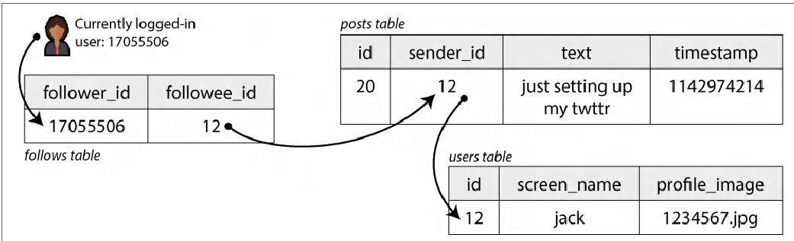

> 图 2-1。一个简单的社交网络关系模式，其中用户可以相互关注。  

假设社交网络必须支持的主要读取操作是主页时间线，它展示用户所关注的人最近发布的帖子（为简单起见，我们忽略广告、来自未关注用户的推荐帖子以及其他扩展功能）。可以用下面的 SQL 查询获取某位特定用户的主页时间线：  

```sql
SELECT posts.*, users.* FROM posts
JOIN follows ON posts.sender_id = follows.followee_id
JOIN users ON posts.sender_id = users.id
WHERE follows.follower_id = current_user
ORDER BY posts.timestamp DESC
LIMIT 1000  
```

执行该查询时，数据库会使用 follows 表找出 current_user 关注的所有人，查找这些用户最近发布的帖子，然后按 timestamp 排序，从而得到所关注用户发布的最新 1,000 条帖子。  

帖子理应具有时效性，因此假设某人发帖后，我们希望其关注者能在五秒内看到。方法之一是，只要用户在线，其客户端就每隔五秒重复执行前面的查询（这称为*轮询*）。如果假设有 1,000 万用户同时在线并已登录，那就意味着每秒要运行 200 万次查询。即使降低轮询频率，这个数字仍然很大。  

这个查询的开销也相当高：如果用户关注了 200 人，查询就需要获取这 200 人各自的近期帖子列表，再合并这些列表。每秒 200 万次时间线查询乘以 200 个所关注的账户，等于每秒 4 亿次查找——这是一个巨大的数字。而且这只是平均情况。有些用户关注了数万个账户；对他们而言，这个查询的执行成本非常高，也很难做到快速。  

## 物化并更新时间线  

怎样才能做得更好？首先，与轮询相比，最好由服务器主动把新帖子推送给当前在线的所有关注者。其次，我们应该预先计算查询结果，以便从缓存中响应用户对主页时间线的请求。  

设想一下，我们为每个用户存储一个包含其主页时间线（即其所关注的人最近发布的帖子）的数据结构。每当用户发帖时，我们就找出其所有关注者，并把这条帖子插入每位关注者的主页时间线——就像把信件投递到邮箱一样。这样，当用户登录时，我们只需把预先计算好的主页时间线交给他们。此外，要接收时间线上任何新帖子的通知，用户的客户端只需订阅添加到其主页时间线的帖子流。  

这种方法的缺点是，现在每当用户发帖时，我们都需要完成更多工作，因为主页时间线是需要更新的派生数据。图 2-2 展示了这个过程。当一个初始请求导致多个下游请求被执行时，我们用扇出（fan-out）一词来描述请求数量增加的倍数。  

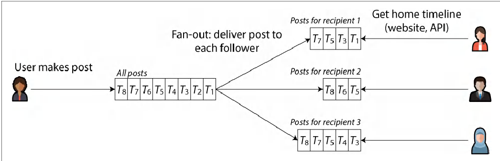

> 图 2-2。扇出：把新帖子投递给发帖用户的每一位关注者。  

在每秒 5,800 条帖子的速率下，如果每条帖子平均送达 200 名关注者（即扇出系数为 200），那么每秒需要对主页时间线执行略多于 100 万次写入。这个数字很大，但与另一种方式所需的每秒 4 亿次按发送者查找帖子相比，仍然节省了很多。  

如果某个特殊事件导致发帖速率飙升，我们不必立即完成时间线投递——可以将其放入队列，并接受帖子出现在关注者时间线上的时间暂时变长。即使出现这种负载峰值，时间线仍能快速加载，因为我们只需从缓存中提供它们。  

这种预先计算并更新查询结果的过程称为*物化*，时间线缓存则是*物化视图*的一个例子（后续章节还会进一步讨论这个概念）。物化视图加快了读取，但代价是我们必须在写入时做更多工作。对大多数用户而言，写入成本不高，但社交网络还必须考虑一些极端情况：  

- 如果用户关注的账户非常多，而且这些账户经常发帖，那么该用户的物化时间线就会有很高的写入速率。不过，该用户不太可能阅读时间线中的所有帖子，因此可以直接丢弃一部分时间线写入，只向用户展示其所关注账户发布的帖子样本 [5]。  

- 当一个拥有海量关注者的名人账户发帖时，我们必须完成大量工作，才能把帖子插入其数百万关注者各自的主页时间线。在这种情况下，丢弃部分写入是不可接受的。一种解决方法是将名人帖子与其他人的帖子分开处理：把名人帖子单独存储，并在读取物化时间线时与之合并，就能省去把名人帖子添加到数百万条时间线中的工作。即便采用这类优化，社交网络处理名人账户仍可能需要大量基础设施 [6]。  

## 描述性能  

大多数关于软件性能的讨论都会考虑两类主要指标：  

### 响应时间  

从用户发出请求到收到所请求答案之间经过的时间。计量单位为秒（或毫秒、微秒）。  

### 吞吐量  

系统每秒正在处理的请求数，或每秒处理的数据量。在给定的硬件资源配置下，系统可处理的吞吐量存在上限。计量单位是“每秒处理的事物数”。  

在社交网络案例研究中，“每秒帖子数”和“每秒时间线写入数”是吞吐量指标，而“加载主页时间线所需的时间”和“帖子送达关注者所需的时间”则是响应时间指标。  

吞吐量与响应时间往往相互关联。图 2-3 勾勒了在线服务中这种关系的一个例子。请求吞吐量较低时，服务的响应时间较短；但随着负载增加，响应时间也会增长。这是由*排队*造成的：当请求到达一个负载很高的系统时，CPU 很可能正在处理先前的请求，因此新到达的请求必须等到先前请求处理完毕。随着吞吐量逼近硬件能够处理的上限，排队延迟会急剧增加。  

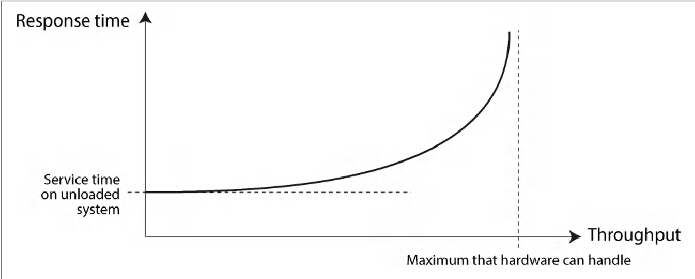

> 图 2-3。当服务的吞吐量逼近其容量时，响应时间会因排队而急剧增加。  

> [!NOTE]
> **过载系统无法恢复时**
>
> 当系统接近过载、吞吐量被推近极限时，有时会陷入一种恶性循环：系统效率降低，因而变得更加过载。例如，如果有很长的请求队列等待处理，响应时间可能增加到导致客户端超时并重新发送请求。这会进一步提高请求速率，使问题恶化——形成重试风暴。即便负载再次降低，这样的系统仍可能一直处于过载状态，直到重启或以其他方式重置。这种现象称为亚稳态故障，可能导致生产系统严重中断 [7, 8, 9]。  
>
> 为了避免重试压垮服务，可以在客户端增加并随机化连续重试之间的时间（指数退避 [10, 11]），并暂时停止向最近返回错误或发生超时的服务发送请求（使用断路器 [12, 13] 或令牌桶算法 [14]）。服务器也可以检测自己何时正接近过载，并开始主动拒绝请求（负载削减 [15]），或返回响应要求客户端减速（背压 [1, 16]）。队列和负载均衡算法的选择也会产生影响 [17]。  

就性能指标而言，响应时间通常是用户最关心的，而吞吐量决定所需的计算资源（例如需要多少台服务器），进而决定处理特定工作负载的成本。如果吞吐量可能增长到超出当前硬件的能力，就需要扩充容量；如果通过增加计算资源可以显著提高系统的最大吞吐量，就称该系统具有*可扩展性*。  

本节将主要关注响应时间；在第 49 页的“可扩展性”中，我们会回头讨论吞吐量和可扩展性。  

## 延迟与响应时间  

“延迟”和“响应时间”有时会混用，但本书将以特定方式使用这两个术语及几个相关术语（如图 2-4 所示）：  

- 响应时间是客户端所观察到的时间；它包含系统中任何位置产生的所有延迟。  

- *服务时间*是服务主动处理客户端请求所持续的时间。  

- 流程中的多个位置都可能出现*排队延迟*——例如，收到请求后，它可能要等到 CPU 可用才能得到处理；或者在通过网络发送响应数据包之前，可能必须先将其放入缓冲区，因为同一台机器上的其他任务正通过出站网络接口发送大量数据。  

- 延迟是对请求未被主动处理的时间——也就是它处于潜伏状态的时间——的统称。具体而言，网络延迟是指请求和响应在网络中传输所花费的时间。  

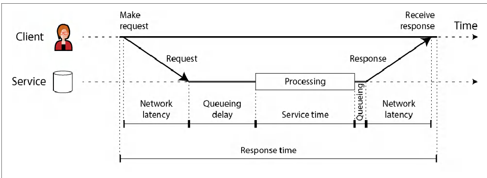

> 图 2-4。响应时间、服务时间、网络延迟和排队延迟。  

在图 2-4 中，时间从左向右流动；每个通信节点都表示为一条水平线，而请求或响应消息则表示为从一个节点指向另一个节点的粗斜箭头。在本书后面的内容中，你会经常遇到这种风格的图。  

即使一遍又一遍地发出同一个请求，每次请求的响应时间仍可能有很大差异。许多因素都会带来随机延迟，例如：切换上下文去运行后台进程、网络数据包丢失及 TCP 重传、垃圾回收暂停、缺页故障迫使系统从磁盘读取，或服务器机架的机械振动 [18]。我们将在第 352 页的“超时与无界延迟”中更详细地讨论这个话题。  

排队延迟往往构成响应时间波动的很大一部分。由于服务器只能并行处理少量任务（例如受 CPU 核心数限制），只需少数几个慢请求就足以阻塞后续请求的处理——这种效应称为队头阻塞。即使后续请求的服务时间很短，由于要等待先前请求完成，客户端观察到的总体响应时间仍然很长。排队延迟不属于服务时间，因此在客户端测量响应时间非常重要。  

## 平均值、中位数和百分位数  

由于每个请求的响应时间各不相同，我们不能把它看作单个数值，而应将其视为一种可测量的数值*分布*。在图 2-5 中，每个灰色条柱代表向服务发出的一次请求，其高度表示该请求花费了多长时间。大多数请求都相当快，但偶尔会有一些*离群值*耗时长得多。网络延迟的变化也称为*抖动*。  

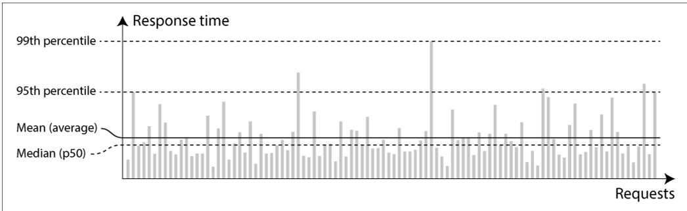

> 图 2-5。平均值和百分位数示意图：向某服务发出的 100 个请求样本的响应时间。  

通常会报告服务的*平均*响应时间（严格来说是*算术平均值*，计算方法是将所有响应时间相加，再除以请求数）。平均响应时间有助于估算吞吐量上限 [19]。然而，如果你想知道“典型”响应时间，平均值并不是很好的指标，因为它无法告诉你实际有多少用户经历了这种延迟。  

通常使用*百分位数*会更好。如果把响应时间列表从快到慢排序，*中位数*就是位于正中间的值——例如，如果响应时间中位数是 200 ms，就意味着一半的请求在 200 毫秒（ms）内返回，另一半请求则耗时更长。因此，如果想知道用户通常需要等待多久，中位数是个很好的指标。中位数也称为*第 50 百分位数*，有时缩写为 *p50*。  

要了解离群值有多糟，可以查看更高的百分位数：常见的有第 95、第 99 和第 99.9 百分位数（缩写为 p95、p99 和 p999）。例如，如果第 95 百分位响应时间为 1.5 秒，就意味着每 100 个请求中有 95 个耗时少于 1.5 秒，另有 5 个耗时达到或超过 1.5 秒。图 2-5 展示了这一点。  

较高的响应时间百分位数也称为尾部延迟，它们非常重要，因为会直接影响用户对服务的体验。例如，Amazon 使用第 99.9 百分位数来描述内部服务的响应时间要求，尽管这只影响每 1,000 个请求中的 1 个。这是因为，遭遇最慢请求的客户往往也是账户中数据最多的客户，因为他们购买过许多商品——换言之，他们是最有价值的客户 [20]。确保网站对这些客户依然快速，从而让他们满意，这一点很重要。  

Amazon 认为优化第 99.99 百分位数（每 10,000 个请求中最慢的 1 个）的成本过高，而且收益不足。降低极高百分位数处的响应时间很困难，因为它们很容易受到无法控制的随机事件影响，而且收益会逐渐递减。  

> [!NOTE]
> **响应时间对用户的影响**
>
> 对用户而言，快速的服务优于缓慢的服务，这似乎显而易见 [21]。然而，要获得可靠数据来量化延迟对用户行为的影响，却出人意料地困难。  
>
> 一些经常被引用的统计数据并不可靠。例如，Google 在 2006 年报告称，搜索结果的响应时间从 400 ms 变慢至 900 ms，与流量和收入下降 20% 有关联 [22]。然而，Google 2009 年的另一项研究报告称，延迟增加 400 ms 只会导致每天的搜索量减少 0.6% [23]；同年，Bing 发现加载时间增加两秒会使广告收入下降 4.3% [24]。这些公司似乎没有公开提供更新的数据。  
>
> Akamai 最近的一项研究声称，响应时间增加 100 ms 会使电子商务网站的转化率最多降低 7% [25]；然而仔细研究就会发现，同一项研究也表明，页面加载时间非常短同样与较低的转化率相关！这个看似矛盾的结果，是因为加载最快的页面往往没有有用内容（例如 404 错误页面）。但由于该研究没有尝试把页面内容的影响与加载时间的影响区分开来，其结果很可能没有意义。  
>
> Yahoo 次年开展的一项研究在控制搜索结果质量的情况下，对比了加载较快和较慢的搜索结果的点击率 [26]。研究报告称，当快速响应与慢速响应之间相差 1.25 秒或更多时，快速搜索结果获得的点击数会高出 20%–30%。  

## 响应时间指标的使用  

对于为了处理单个最终用户请求而被多次调用的后端服务，高百分位数尤其重要。即便并行发起调用，请求仍需等待其中最慢的并行调用完成。只要有一次调用很慢，就会拖慢整个最终用户请求，如图 2-6 所示。即使只有很小比例的后端调用较慢，如果一个最终用户请求需要多次后端调用，遇到慢调用的概率也会增加，因此这类最终用户请求中最终变慢的比例更高（这种效应称为尾部延迟放大 [27]）。  

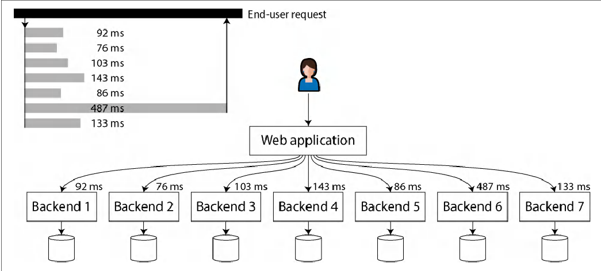

> 图 2-6。当处理一个请求需要多次后端调用时，只要有一次调用很慢，就会拖慢整个最终用户请求。  

百分位数常用于*服务级别目标*（SLO）和*服务级别协议*（SLA），以此定义服务的预期性能和可用性 [28]。例如，SLO 可以设定这样的目标：服务的响应时间中位数低于 200 ms，第 99 百分位数低于 1 秒，并且至少 99.9% 的有效请求得到非错误响应。SLA 是一份合同，规定了未达到 SLO 时会发生什么（例如，客户可能有权获得退款）。至少，基本思路是这样；在实践中，为 SLO 和 SLA 定义良好的可用性指标并非易事 [29, 30]。  

> [!NOTE]
> **计算百分位数**
>
> 如果想在服务的监控仪表盘中加入响应时间百分位数，就需要持续高效地计算它们。例如，你可能希望为最近 10 分钟内各请求的响应时间维护一个滚动窗口。每分钟对窗口中的值计算中位数和各个百分位数，并将这些指标绘制成图。  
>
> 最简单的实现方式是保留时间窗口内所有请求的响应时间列表，并每分钟对该列表排序。如果这种做法效率太低，也有一些算法能以极低的 CPU 和内存开销算出相当准确的百分位数近似值。开源的百分位数估算库包括 HdrHistogram [31]、t-digest [32, 33]、OpenHistogram [34] 和 DDSketch [35]。  
>
> 请注意，对百分位数取平均值（例如，为了降低时间分辨率或合并多台机器的数据）在数学上毫无意义。聚合响应时间数据的正确方法是将直方图相加 [36]。  

## 可靠性与容错  

每个人都能直观理解某样东西可靠或不可靠意味着什么。对于软件，典型的期望包括：  

- 应用程序能够执行用户期望的功能。  

- 应用程序能够容忍用户犯错或以出乎意料的方式使用软件。  

- 在预期的负载和数据量下，其性能足以满足所需的用例。  

- 系统能够防止任何未经授权的访问和滥用。  

如果这些要求合在一起意味着“正确运行”，那么我们可以把可靠性大致理解为“即使出了问题，也能继续正确运行”。为了更准确地描述“出了问题”，我们将区分故障（fault）与失效（failure）[37, 38, 39]：  

### 故障  

当系统的某个特定部分不再正确运行时，就发生了故障——例如，单块硬盘出现故障、单台机器崩溃，或系统所依赖的外部服务中断。  

### 失效  

当系统整体不再向用户提供所需的服务时，就发生了失效——换言之，系统没有达到 SLO。  

故障与失效之间的区别可能令人困惑，因为二者本质上是同一件事，只是所处层级不同。例如，如果一块硬盘停止工作，我们会说这块硬盘失效了；如果系统仅由这一块硬盘组成，那么系统也已停止提供所需的服务，因此同样失效了。然而，如果系统由多块硬盘组成，那么从更大系统的视角来看，单块硬盘失效只是一个故障；只要另一块硬盘上存有数据副本，整个系统就可能容忍这一故障。  

## 容错  

如果某些故障发生后，系统仍能继续向用户提供所需的服务，我们就称该系统具有*容错*能力。如果系统无法容忍某个部分发生故障，我们就称该部分为*单点失效*（single point of failure，SPOF），因为该部分的故障会升级为整个系统的失效。  

例如，在社交网络案例研究中，可能发生的一种故障是：在扇出过程中，参与更新物化时间线的某台机器崩溃或变得不可用。要让这一过程具备容错能力，就需要确保另一台机器能够接管任务，既不遗漏任何本应投递的帖子，也不重复投递任何帖子。（这一思想称为恰好一次语义，我们将在第 12 章详细探讨。）  

容错能力总是仅限于特定数量、特定类型的故障。例如，一个系统可能最多能够容忍两块硬盘同时失效，或三个节点中最多一个节点崩溃。容忍任意数量的故障并无意义；如果所有节点都崩溃了，就无能为力。如果整个地球（以及上面的所有服务器）都被黑洞吞噬，要容忍这种故障就得把网站托管到太空——祝你好运，能让这项预算获得批准。  

有悖直觉的是，在这类容错系统中，通过有意触发故障来*提高*故障率可能是合理的做法——例如，在毫无预警的情况下随机终止单个进程。这称为*故障注入*。许多严重缺陷实际上源于糟糕的错误处理 [40]；通过有意引发故障，可以确保容错机制不断得到演练和测试，从而增强信心：当故障自然发生时，系统能够正确处理。*混沌工程*是一门通过有意注入故障等实验来增强人们对容错机制信心的学科 [41]。  

尽管我们通常倾向于容忍故障而不是预防故障，但在某些情况下，预防胜于补救（例如，因为根本无从补救）。安全问题就是如此；如果攻击者已经攻破系统并访问了敏感数据，这件事便无法撤销。不过，本书主要讨论可以补救的故障类型，后续各节将对此加以说明。  

## 硬件故障与软件故障  

想到系统失效的原因时，硬件故障很快就会浮现在脑海中：  

- 每年约有 2%–5% 的磁性硬盘失效 [42, 43]；因此，在拥有 10,000 块磁盘的存储集群中，平均每天预计会有一块磁盘失效。近期数据表明磁盘正变得更加可靠，但失效率仍不容忽视 [44]。  

- 每年约有 0.5%–1% 的固态硬盘（SSD）失效 [45]。少量位错误会被自动纠正 [46]，但即使是相当新的硬盘（即磨损很少），平均每块硬盘每年也会发生约一次不可纠正的错误。这一错误率高于磁性硬盘的错误率 [47, 48]。  

- 其他硬件组件（如电源、RAID 控制器和内存模块）也会失效，尽管频率低于硬盘 [49, 50]。  

- 大约每 1,000 台机器中就有一台的某个 CPU 核心会偶尔计算出错误结果，原因很可能是制造缺陷 [51, 52, 53]。在某些情况下，错误计算会导致崩溃；而在另一些情况下，程序只会返回错误结果。  

- RAM 中的数据可能损坏，原因既可能是宇宙射线等随机事件，也可能是永久性物理缺陷。即使使用纠错码（ECC）内存，一年内也有超过 1% 的机器会遇到不可纠正的错误；这通常会导致机器崩溃，并且需要更换受影响的内存模块 [54]。此外，某些病态的内存访问模式很可能导致位翻转 [55]。  

- 整个数据中心可能变得不可用（例如，由于停电或网络配置错误），甚至可能遭到永久摧毁（例如，由于火灾、洪水或地震 [56]）。太阳喷射出大量带电粒子时，太阳风暴会在长距离导线中感应出强电流，从而可能破坏电网和海底网络电缆 [57]。尽管这种大规模失效十分罕见，但如果一项服务无法容忍整个数据中心失效，其影响可能是灾难性的 [58]。  

这些事件足够罕见，因此在小型系统上工作时，只要能够轻松更换发生故障的硬件，通常就无需为其担忧。然而，在大规模系统中，硬件故障发生得足够频繁，因而成为系统正常运行的一部分。  

### 通过冗余容忍硬件故障  

面对不可靠的硬件，我们通常首先为各个硬件组件增加冗余，以降低系统的失效率。磁盘可以配置为 RAID（将数据分布在同一台机器的多块磁盘上，使一块磁盘失效时不会丢失数据）；服务器可以配备双电源和可热插拔的 CPU；数据中心可以用电池和柴油发电机提供备用电源。这样的冗余往往能让机器连续运行数年而不中断。  

当组件故障彼此独立时，冗余最为有效——也就是说，一个故障的发生不会改变另一个故障发生的可能性。然而，经验表明，组件失效之间存在显著的相关性 [43, 59, 60]。整个服务器机架或整个数据中心不可用的情况，发生频率仍高于我们的期望。  

硬件冗余提高了单台机器的正常运行时间；然而，正如第 19 页“分布式系统与单节点系统”所述，使用分布式系统具有一些优势，例如能够容忍整个数据中心完全中断。因此，云系统往往不太关注单台机器的可靠性，而是致力于在软件层面容忍故障节点，从而使服务具备高可用性。云服务提供商使用可用区来标识哪些资源在物理上位于同一地点；相比地理位置相隔较远的资源，同一地点的资源更可能同时失效。  

本书讨论的容错技术旨在容忍整台机器、整个机架或整个可用区失效。其通常做法是：当一个数据中心的机器失效或无法访问时，允许另一个数据中心的机器接管。我们将在第 6 章、第 10 章以及本书其他多处讨论这类容错技术。  

能够容忍整台机器失效的系统在运维方面也有优势。如果需要重启机器（例如，为操作系统应用安全补丁），单服务器系统必须安排计划内停机；而多节点容错系统可以逐个重启节点来应用补丁，不会影响向用户提供的服务。这称为*滚动升级*，我们将在第 5 章进一步讨论。  

### 软件故障  

尽管硬件失效可能存在较弱的相关性，但大体上仍彼此独立——例如，如果一块磁盘失效，同一台机器上的其他磁盘至少在一段时间内很可能仍然正常。相比之下，软件故障往往具有很强的相关性，因为许多节点通常运行相同的软件，因此也带有相同的缺陷 [61, 62]。这类故障更难预料，而且与互不相关的硬件故障相比，往往会造成多得多的系统失效 [49]。例如：  

- 某个软件缺陷会在特定情况下导致所有节点同时失效。例如，2012 年 6 月 30 日，由于 Linux 内核中的一个缺陷，闰秒导致许多 Java 应用程序同时挂起，进而使多项互联网服务中断 [63]。此外，由于一个固件缺陷，某些型号的所有 SSD 会在恰好运行 32,768 小时（不到四年）后突然失效，其中的数据无法恢复 [64]。  

- 某个失控进程耗尽共享的有限资源，例如 CPU 时间、内存、磁盘空间、网络带宽或线程 [65]。例如，一个进程在处理大型请求时消耗过多内存，可能被操作系统终止；客户端库中的缺陷也可能导致请求量远超预期 [66]。  

- 系统所依赖的某项服务变慢、停止响应，或开始返回损坏的响应。  

- 不同系统之间的交互产生涌现行为，而单独测试每个系统时不会出现这种行为 [67]。  

- 级联失效：一个组件中的问题导致另一个组件过载并变慢，继而又使另一个组件失效 [68, 69]。  

导致这类软件故障的缺陷通常会潜伏很长时间，直到某一组不寻常的条件将其触发。在这种情况下，人们才会发现软件对其环境作了某种假设——尽管这一假设通常成立，但出于某种原因，它最终会不再成立 [70, 71]。  

软件中的系统性故障没有捷径可解。许多小措施都能有所帮助：仔细思考系统中的假设和交互；全面测试；确保进程隔离；允许进程崩溃并重启；避免重试风暴等反馈循环（参见第 38 页“过载系统无法恢复时”）；测量、监控和分析系统在生产环境中的行为。  

## 人与可靠性  

软件系统由人设计和构建，维持系统运行的运维人员也是人。与机器不同，人并非只是遵循规则；创造性地适应情况并完成工作，是人的优势之一。然而，这一特性也会带来不可预测性；即使怀着最好的意图，人有时也会犯下可能导致失效的错误。例如，一项针对大型互联网服务的研究发现，运维人员进行的配置变更是服务中断的首要原因，而硬件故障（服务器或网络）仅在 10%–25% 的案例中起到一定作用 [72]。  

人们很容易把这类问题贴上“人为错误”的标签，并希望通过更严格的流程和规则遵从来加强对人类行为的控制，从而解决这些问题。然而，因错误而责怪人只会适得其反。我们所谓的“人为错误”并非事故的真正原因，而是社会技术系统存在问题的症状；在这个系统中，人们正尽己所能做好工作 [73]。复杂系统往往具有涌现行为，组件之间出乎意料的交互也可能导致失效 [74]。  

多种技术措施有助于尽量减轻人为错误的影响，其中包括全面测试（既包括手写测试，也包括使用大量随机输入的基于属性的测试）[40]、用于快速撤销配置变更的回滚机制、新代码的逐步发布、细致而清晰的监控、用于诊断生产问题的可观测性工具（参见第 20 页“分布式系统的问题”），以及精心设计的界面——鼓励用户做“正确的事”，阻止用户做“错误的事”。  

然而，这些措施都需要投入时间和金钱；在日常商业活动的现实中，组织往往会优先考虑创收活动，而不是增强系统抵御错误能力的措施。在更多功能和更多测试之间作选择时，许多组织选择功能也可以理解。于是，当一个本可避免的错误不可避免地发生时，责怪犯错的人并不合理；问题在于组织的优先级。  

越来越多的组织开始采用*无责事后复盘*文化：事故发生后，鼓励相关人员毫无保留地分享事件的完整细节，不必担心受到惩罚，因为这样组织中的其他人就能学会如何在未来防止类似问题 [75]。这一过程可能会发现：需要改变业务优先级、投资此前遭到忽视的领域、改变相关人员的激励机制，或让管理层关注另一个系统性问题。  

一般而言，在调查事故时，应当对过于简单的答案保持警惕。“Bob 部署那项变更时本该更仔细”无助于解决问题，但“我们必须用 Haskell 重写后端”也同样无益。管理层应当把握机会，从每天与社会技术系统打交道的人员的视角，了解该系统如何运作的细节，并根据这些反馈采取措施加以改进 [73]。  

> [!NOTE]
> **可靠性有多重要？**
>
> 并非只有核电站和空中交通管制才需要可靠性；人们也期望更普通的应用能够可靠运行。业务应用中的缺陷会造成生产力损失（如果数字报告有误，还会带来法律风险），而电子商务网站中断则可能因收入损失和声誉受损而付出巨大代价。  
>
> 对许多应用而言，几分钟甚至几小时的临时中断尚可容忍 [76]，但永久性的数据丢失或损坏将是灾难性的。设想一位家长把孩子的所有照片和视频都存放在你的照片应用中 [77]。如果数据库突然损坏，他们会有什么感受？他们知道如何从备份恢复自己的照片和视频收藏吗？  
>
> 要再举一个不可靠软件如何伤害人的例子，不妨看看英国邮局 Horizon 丑闻。1999 年至 2019 年间，数百名英国邮局分支机构的管理人员因会计软件显示其账目存在亏空，而被判犯有盗窃罪或欺诈罪。最终，人们发现许多亏空源于软件缺陷，因此许多判决被推翻 [78]。这起事件很可能是英国历史上规模最大的司法不公；导致它发生的原因之一，是英格兰法律作出如下假设：除非存在相反证据，否则计算机能够正确运行（因此，计算机生成的证据是可靠的）[79]。软件工程师可能会嘲笑软件竟能毫无缺陷的想法，但对于那些因不可靠计算机系统导致的错误判决而蒙冤入狱、宣告破产、甚至自杀的人来说，这丝毫无法带来安慰。  
>
> 在某些情况下，我们可能会选择牺牲可靠性来降低开发成本（例如，为未经验证的市场开发产品原型时）——但我们应当非常清楚自己何时在走捷径，并牢记可能产生的后果。  

## 可扩展性  

即使一个系统今天运行可靠，也不意味着它将来一定仍能可靠运行。性能退化的一个常见原因是负载增加。系统的并发用户数可能从 10,000 增长到 100,000，也可能从 100 万增长到 1,000 万；它处理的数据量也可能远大于从前。  

可扩展性这个术语用来描述系统应对负载增长的能力。讨论可扩展性时，有人会发表类似这样的评论：“你又不是 Google 或 Amazon。别操心规模问题了，用关系型数据库就行。”这条格言是否适用于你，取决于你正在构建的应用程序类型。  

如果你正在构建一款目前只有少量用户的新产品（也许是在一家初创公司），首要的工程目标通常是让系统尽可能简单、灵活，以便随着对客户需求了解的深入，轻松修改和调整产品功能 [80]。在这样的环境中，为将来可能需要的假想规模操心只会适得其反。往好处说，对可扩展性的投入是白费力气和过早优化；往坏处说，它会把你锁定在缺乏灵活性的设计中，使应用程序更难演进。  

可扩展性并不是一个单维度的标签——说“X 是可扩展的”或“Y 无法扩展”毫无意义。讨论可扩展性，其实是思考以下问题：  

- 如果系统以某种特定方式增长，我们有哪些办法应对这种增长？  

- 如何增加计算资源来处理额外的负载？  

- 根据当前的增长预测，我们何时会触及现有架构的极限？  

如果你成功地让应用广受欢迎，因而需要处理不断增长的负载，就会了解到性能瓶颈在哪里，以及需要在哪些维度上扩展。到了那时，才该开始考虑可扩展性技术。  

## 理解负载  

首先，你需要清楚地了解系统当前的负载。只有这样，才能讨论增长问题（“如果负载翻倍，会发生什么？”）。负载往往用吞吐量来衡量——例如，服务每秒收到的请求数、每天新到达的数据量（以 GB 为单位），或每小时完成的购物车结算数。有时，你关心的是某个变量的峰值，例如社交网络案例研究中的同时在线用户数。  

负载的其他统计特征往往也会影响访问模式，进而影响可扩展性需求。例如，你可能需要了解数据库中的读写比、缓存命中率，或每个用户的数据项数量（在我们的案例研究中，就是关注者数量）。也许平均情况对你最重要，也许瓶颈由少数极端情况主导。这完全取决于具体应用的细节。  

了解系统负载后，就可以研究负载增加时会发生什么。可以从两个角度来看：  

- 以某种方式增加负载，同时保持系统资源（CPU、内存、网络带宽等）不变，系统性能会受到怎样的影响？  

- 以某种方式增加负载时，如果想保持性能不变，需要增加多少资源？  

通常，目标是在满足 SLA 要求（参见第 41 页“响应时间指标的使用”）的同时，尽量降低系统的运行成本。所需的计算资源越多，成本就越高。某些类型的硬件可能比其他硬件更具成本效益；随着新型硬件问世，这些因素也可能随时间变化。  

如果将资源增加一倍，便能在保持性能不变的同时处理两倍负载，我们就称系统具有线性可扩展性，这通常被视为好事。偶尔，由于规模经济或峰值负载分布得更合理，用不到两倍的资源就能处理两倍负载 [81, 82]。但更常见的情况是，成本的增长速度快于线性。效率低下可能有许多原因；例如，数据量很大时，处理单个写请求所需的工作可能多于数据量较小时，即使请求本身的大小相同。  

## 共享内存、共享磁盘与无共享架构  

增加服务硬件资源的最简单方法，是将服务迁移到性能更强的机器上。单个 CPU 核心的速度已不再显著提升，但你可以买到（或租用云实例）配备更多 CPU 核心、更多 RAM 和更多磁盘空间的机器。这种方法称为*垂直扩展*或*向上扩展*。  

在单台机器上，可以通过使用多个进程或线程来获得并行性。同一进程的所有线程都可以访问同一块 RAM，因此这种方法也称为*共享内存架构*。共享内存方法的问题在于，其成本增长速度快于线性增长；一台硬件资源是低配置机器两倍的高端机器，价格通常远不止后者的两倍。而且，由于存在瓶颈，这台机器实际上也不太可能处理两倍的负载。  

另一种方法是*共享磁盘架构*，它使用多台拥有独立 CPU 和 RAM 的机器，但将数据存储在这些机器共享的磁盘阵列上；机器通过高速网络连接到该存储，即*网络附加存储*（NAS）或*存储区域网络*（SAN）。这种架构历来用于本地部署的数据仓库工作负载，但资源争用和加锁开销限制了共享磁盘方法的可扩展性 [83]。  

相比之下，*无共享架构* [84]（也称为*水平扩展*或*横向扩展*）由一个包含多个节点的分布式系统构成，每个节点都有自己的 CPU、RAM 和磁盘。节点之间的任何协调都在软件层面通过常规网络完成。  

这种方法近年来日益流行，其优点在于：它有可能实现线性扩展；可以使用任何性价比最高的硬件（尤其是在云端）；能随着负载的增减更轻松地调整硬件资源；还可以通过将系统分布在多个数据中心和区域来获得更强的容错能力。其缺点是需要显式分片（参见第 7 章），并且要承担分布式系统的全部复杂性（将在第 9 章讨论）。  

一些云原生数据库系统将存储服务与事务执行服务分离（参见第 16 页的“存储与计算分离”），让多个计算节点共享同一个存储服务。这种模型与共享磁盘架构有些相似，但避免了旧式系统的可扩展性问题。存储服务并不提供文件系统（NAS）或块设备（SAN）抽象，而是提供专为数据库特定需求设计的 API [85]。  

## 可扩展性原则  

大规模运行的系统，其架构通常高度依赖具体应用。不存在一种通用的、放之四海而皆准的可扩展架构（非正式地称为*神奇扩展秘方*）。例如，一个设计为每秒处理 100,000 个请求、每个请求大小为 1 kB 的系统，与一个设计为每分钟处理 3 个请求、每个请求大小为 2 GB 的系统看起来会非常不同——尽管两者的数据吞吐量相同（100 MB/秒）。  

此外，适合某一负载水平的架构，不太可能应付该负载的 10 倍。因此，如果你正在开发一项快速增长的服务，那么负载每增加一个数量级，你很可能都需要重新思考架构。由于应用的需求很可能不断演变，通常不值得提前规划超过一个数量级的未来扩展需求。  

可扩展性的一项良好通用原则，是将系统拆分为更小的组件，使它们基本上能够彼此独立运行。这是微服务（参见第 21 页的“微服务与无服务器”）、分片（第 7 章）、流处理（第 12 章）和无共享架构背后的基本原则。挑战在于，如何确定哪些事物应该放在一起，哪些应该分开。其他书籍中可以找到微服务的设计指南 [86]，而我们将在第 7 章讨论无共享系统的分片。  

另一项良好原则是，不要把事情弄得比必要的更复杂。如果单机数据库足以完成任务，它很可能比复杂的分布式配置更可取。自动扩缩容系统（根据需求自动增加或移除资源）很酷，但如果负载相当可预测，手动扩缩容的系统在运维中可能会少一些意外（参见第 264 页的“运维：自动再平衡与手动再平衡”）。包含 5 个服务的系统比包含 50 个服务的系统更简单。良好的架构通常务实地混合使用多种方法。  

## 可维护性  

软件不会磨损，也不会遭受材料疲劳，因此它不会像机械物体那样损坏。但是，应用的需求经常演变，软件的运行环境（例如其依赖项和底层平台）会发生变化，而且软件中也可能存在需要修复的错误。  

人们普遍认识到，软件的大部分成本不在初始开发，而在持续维护——修复错误、保持系统正常运行、调查故障、适配新平台、针对新用例进行修改、偿还技术债务以及添加新功能 [87, 88]。  

维护可能很复杂，对遗留系统尤其如此。一个长期成功运行的系统很可能使用如今已没有多少工程师了解的过时技术（例如大型机和 COBOL 代码）；而随着人员离开组织，关于系统当初为何以及如何以某种方式设计的组织内部知识也可能已经丢失。还可能不得不修复他人的错误。由于计算机系统往往与其所支持的人类组织紧密交织，维护这类系统既是技术问题，也是人的问题 [89]。  

如果我们今天创建的每个系统都足够有价值，能够长期存续，那么它终有一天会成为遗留系统。为了尽量减轻后续维护人员的痛苦，我们应该在设计时就考虑维护。尽管我们无法总是预见哪些决策会在未来造成维护难题，但本书会关注几项具有广泛适用性的原则：  

### 可运维性  

让组织能够轻松地保持系统平稳运行。  

### 简单性  

通过采用人们熟知且一致的模式和结构来实现系统，并避免不必要的复杂性，让新工程师能够轻松理解系统。  

### 可演化性  

让工程师将来能够轻松地更改系统，随着需求变化对其进行调整和扩展，以适应未曾预料的用例。  

## 可运维性：让运维工作更轻松  

我们先前在第 17 页的“云时代的运维”中讨论了运维的作用，并且看到，对于可靠的运维而言，人的流程至少与软件工具同样重要。事实上，有人指出，“良好的运维往往能够绕过糟糕（或不完整）软件的局限，但即便软件很好，如果运维很糟糕，也无法可靠运行” [62]。  

在由数千台机器组成的大规模系统中，手动维护的成本高得不合理，因此自动化必不可少。然而，自动化可能是一把双刃剑。总会有需要运维团队人工干预的边缘情况（例如罕见的故障场景）；而由于无法自动处理的情况往往最为复杂，自动化程度越高，就越需要一支技能*更强*、能够解决这些问题的运维团队 [90]。  

此外，出错的自动化系统往往比依赖操作员手动执行某些操作的系统更难排查。因此，对可运维性而言，自动化并非总是越多越好。不过，一定程度的自动化很重要——最佳平衡点取决于你的具体应用和组织。  

良好的可运维性意味着让日常任务变得容易，使运维团队能够专注于高价值活动。数据系统可以通过以下方式提供帮助 [91]：  

- 允许监控工具检查系统的关键指标，并支持可观测性工具（参见第 20 页的“分布式系统的问题”），以洞察系统的运行时行为。各种商业和开源工具都可以在这方面提供帮助 [92]。  

- 避免依赖单台机器（允许将机器下线维护，同时整个系统继续不间断运行）。  

- 提供完善的文档和易于理解的运维模型（“如果我做 X，就会发生 Y”）。  

- 提供良好的默认行为，同时也让管理员能够在需要时覆盖默认设置。  

- 在适当时实现自我修复，同时也让管理员能够在需要时手动控制系统状态。  

- 表现出可预测的行为，最大限度地减少意外。  

## 简单性：管理复杂性  

小型软件项目可以拥有简洁得令人愉悦且富有表现力的代码，但随着项目规模扩大，它们往往会变得非常复杂且难以理解。这种复杂性拖慢了所有需要在系统上工作的人，进一步增加了维护成本。陷入复杂性泥潭的软件项目有时被形容为*大泥球* [93]。  

当复杂性使维护变得困难时，预算和进度往往都会超支。在复杂软件中，进行更改时引入错误的风险也更大。当开发者更难理解系统并推理其行为时，隐藏的假设、非预期的后果和意外的交互就更容易被忽略 [71]。反过来，降低复杂性可以极大改善软件的可维护性，因此简单性应当成为我们所构建系统的一个关键目标。  

简单的系统更容易理解，因此我们应该尽量以最简单的方式解决给定问题。遗憾的是，说起来容易做起来难。某样事物是否简单往往是主观判断，因为不存在客观的简单性标准 [94]。例如，一个系统可能把复杂的实现隐藏在简单的接口之后，而另一个系统可能实现简单，却向用户暴露更多内部细节——哪一个更简单？  

有一种分析复杂性的方法将其分为两类：本质复杂性和偶然复杂性 [95]。其观点是，本质复杂性是应用问题领域所固有的，而偶然复杂性仅仅源于工具的局限。遗憾的是，这种区分也有缺陷，因为随着工具演进，本质与偶然之间的边界也会移动 [96]。  

我们用来管理复杂性的最佳工具之一是抽象。良好的抽象可以把大量实现细节隐藏在整洁、易懂的接口之后。良好的抽象还可以用于广泛的应用场景。这样的复用不仅比多次重新实现类似事物更高效，还能带来更高质量的软件，因为抽象组件的质量改进会惠及所有使用它的应用。  

例如，高级编程语言是一种抽象，隐藏了机器码、CPU 寄存器和系统调用。SQL 是一种抽象，隐藏了复杂的磁盘与内存数据结构、来自其他客户端的并发请求，以及崩溃后的不一致。当然，使用高级语言编程时，我们仍然在使用机器码；只是不直接使用它，因为编程语言抽象使我们不必考虑机器码。  

旨在降低应用代码复杂性的抽象，可以使用设计模式 [97] 和领域驱动设计（DDD）[98] 等方法来创建。本书并不讨论这类特定于应用的抽象，而是讨论可供你在其上构建应用的通用抽象，例如数据库事务、索引和事件日志。如果你想使用 DDD 等技术，可以在本书所述的基础之上实现它们。  

## 可演化性：让变更更容易  

系统的需求永远保持不变是极不可能的。它们更可能始终处于变化之中：你会了解到新的事实，先前未曾预料的用例会出现，业务优先级会改变，用户会要求新功能，新平台会取代旧平台，法律或监管要求会改变，系统增长会迫使架构发生变化，等等。  

就组织流程而言，敏捷工作模式提供了一个适应变化的框架。敏捷社区还发展出了在频繁变化的环境中构建软件时很有帮助的技术工具和流程，例如测试驱动开发（TDD）和重构。在本书中，我们会探寻如何在由多个特性不同的应用或服务组成的系统层面提高敏捷性。  

修改数据系统并使其适应不断变化的需求有多容易，与系统的简单性及其抽象密切相关。松耦合的简单系统通常比紧耦合的复杂系统更容易修改。由于这个概念十分重要，我们将用另一个词来指代数据系统层面的敏捷性：*可演化性* [99]。  

使大型系统难以变更的一个主要因素是不可逆性 [100]。例如，假设你正在从一个数据库迁移到另一个数据库。如果新系统出现问题时无法切换回旧系统，那么风险要比可以轻松回退时高得多。因此，执行不可逆操作时需要非常谨慎。尽量减少不可逆性可以提高灵活性。  

<a id="chapter-2-summary"></a>

## 小结  

本章考察了非功能需求的几个例子：性能、可靠性、可扩展性和可维护性。通过这些主题，我们也接触到了一些将在本书余下部分持续使用的原则和术语。  

我们首先通过一个在社交网络中实现主页时间线的案例研究，展示了规模扩大时会出现的一些挑战。随后，我们讨论了如何衡量性能（例如使用响应时间百分位数）以及系统负载（例如使用吞吐量指标），以及这些指标如何用于 SLA。可扩展性是一个密切相关的概念：它关注如何确保负载增长时性能保持不变。我们了解了可扩展性的一些通用原则，例如将任务拆分成能够独立运行的更小部分；在接下来的章节中，我们将更深入地探讨可扩展性技术的细节。  

为了实现可靠性，可以使用容错技术，使系统即使在某个组件（例如磁盘、机器或其他服务）发生故障时也能继续提供服务。我们看到了可能发生的硬件故障示例，并将它们与软件故障区分开来；软件故障可能更难处理，因为它们往往高度相关。实现可靠性的另一个方面，是增强系统抵御人为失误的能力；我们还看到了如何把无责事后复盘作为一种从事故中学习的技术。  

最后，我们考察了可维护性的几个方面，包括支持运维团队的工作、管理复杂性，以及使应用的功能能够随时间轻松演化。如何实现这些目标并没有简单的答案，但一种有帮助的方法是，使用那些提供实用抽象且广为理解的构建模块来构建应用。本书余下部分将介绍一系列已在实践中证明有价值的构建模块。  

## 参考文献  

[1] Mike Cvet. "How We Learned to Stop Worrying and Love Fan-in at Twitter." 发表于
QCon San Francisco，2016 年 12 月。  

[2] Raffi Krikorian. “Timelines at Scale.” 发表于 QCon San Francisco，2012 年 11 月。
存档于 perma.cc/V9G5-KLYK  

[3] Twitter. “Twitter’s Recommendation Algorithm.” blog.x.com，2023 年 3 月。存档于 perma.cc/L5GT-229T  

[4] Raffi Krikorian. “New Tweets per Second Record, and How!” blog.x.com，2013 年 8 月。存档于 perma.cc/6JZN-XJYN  

[5] Jaz Volpert. "When Imperfect Systems Are Good, Actually: Bluesky's Lossy Timelines." *jazco.dev*，2025 年 2 月。存档于 *perma.cc/2PVE-L2MX*  

[6] Samuel Axon. “3% of Twitter’s Servers Dedicated to Justin Bieber.” mashable.com，2010 年 9 月。存档于 perma.cc/F35N-CGVX  

[7] Nathan Bronson, Abutalib Aghayev, Aleksey Charapko, and Timothy Zhu. "Meta-stable Failures in Distributed Systems." 发表于 Workshop on Hot Topics in Operating Systems (HotOS)，2021 年 5 月。doi:10.1145/3458336.3465286  

[8] Marc Brooker. “Metastability and Distributed Systems.” brooker.co.za，2021 年 5 月。存档于 perma.cc/7FGJ-7XRK  

[9] Lexiang Huang, Matthew Magnusson, Abishek Bangalore Muralikrishna, Salman Estyak, Rebecca Isaacs, Abutalib Aghayev, Timothy Zhu, and Aleksey Charapko. "Metastable Failures in the Wild." 发表于 16th USENIX Symposium on Operating Systems Design and Implementation (OSDI)，2022 年 7 月。  

[10] Marc Brooker. “Exponential Backoff and Jitter.” aws.amazon.com，2015 年 3 月。存档于 perma.cc/R6MS-AZKH  

[11] Marc Brooker. “What Is Backoff For?” brooker.co.za，2022 年 8 月。存档于 perma.cc/PW9N-55Q5  

[12] Michael T. Nygard. *Release It!*，第 2 版。Pragmatic Bookshelf，2018 年。ISBN: 9781680502398  

[13] Frank Chen. “Slowing Down to Speed Up—Circuit Breakers for Slack’s CI/CD.” slackengineering，2022 年 8 月。存档于 perma.cc/5FGS-ZPH3  

[14] Marc Brooker. “Fixing Retries with Token Buckets and Circuit Breakers.” brooker.co.za，2022 年 2 月。存档于 perma.cc/MD6N-GW26  

[15] David Yanacek. “Using Load Shedding to Avoid Overload.” Amazon Builders’ Library，aws.amazon.com。存档于 perma.cc/9SAW-68MP  

[16] Matthew Sackman. “Pushing Back.” wellquite.org，2016 年 5 月。存档于 perma.cc/3KCZ-RUFY  

[17] Dmitry Kopytkov and Patrick Lee. “Meet Bandaid, the Dropbox Service Proxy.” *dropbox.tech*，2018 年 3 月。存档于 *perma.cc/KUU6-YG4S*  

[18] Haryadi S. Gunawi, Riza O. Suminto, Russell Sears, Casey Golliher, Swaminathan Sundararaman, Xing Lin, Tim Emami, Weiguang Sheng, Nematollah Bidokhti, Caitie McCaffrey, Gary Grider, Parks M. Fields, Kevin Harms, Robert B. Ross, Andree Jacobson, Robert Ricci, Kirk Webb, Peter Alvaro, H. Birali Runesha, Mingzhe Hao, and Huaicheng Li. "Fail-Slow at Scale: Evidence of Hardware Performance Faults in Large Production Systems." 发表于 16th USENIX Conference on File and Storage Technologies，2018 年 2 月。  

[19] Marc Brooker. “Is the Mean Really Useless?” brooker.co.za，2017 年 12 月。存档于 perma.cc/U5AE-CVEM  

[20] Giuseppe DeCandia, Deniz Hastorun, Madan Jampani, Gunavardhan Kakulapati, Avinash Lakshman, Alex Pilchin, Swaminathan Sivasubramanian, Peter Vosshall, and Werner Vogels. "Dynamo: Amazon's Highly Available Key-Value Store." 发表于 21st ACM Symposium on Operating Systems Principles (SOSP)，2007 年 10 月。doi:10.1145/1294261.1294281  

[21] Kathryn Whitenton. “The Need for Speed, 23 Years Later.” *nngroup.com*，2020 年 5 月。存档于 *perma.cc/C4ER-LZYA*  

[22] Greg Linden. “Marissa Mayer at Web 2.0.” *glinden.blogspot.com*，2005 年 11 月。存档于 *perma.cc/V7EA-3VXB*  

[23] Jake Brutlag. “Speed Matters for Google Web Search.” services.google.com，2009 年 6 月。存档于 perma.cc/BK7R-X7M2  

[24] Eric Schurman and Jake Brutlag. “Performance Related Changes and Their User Impact.” 在 Velocity 2009 上的演讲。  

[25] Akamai Technologies, Inc. “The State of Online Retail Performance.” akamai.com，2017 年 4 月。存档于 perma.cc/UEK2-HYCS  

[26] Xiao Bai, Ioannis Arapakis, B. Barla Cambazoglu, and Ana Freire. "Understanding and Leveraging the Impact of Response Latency on User Behaviour in Web Search." ACM Transactions on Information Systems，第 36 卷，第 2 期，文章 21，2018 年 4 月。doi:10.1145/3106372  

[27] Jeffrey Dean and Luiz André Barroso. "The Tail at Scale." *Communications of the ACM*，第 56 卷，第 2 期，第 74–80 页，2013 年 2 月。*doi:10.1145/2408776.2408794*  

[28] Alex Hidalgo. *Implementing Service Level Objectives: A Practical Guide to SLIs, SLOs, and Error Budgets*. O'Reilly Media，2020 年。ISBN: 9781492076813  

[29] Jeffrey C. Mogul and John Wilkes. "Nines Are Not Enough: Meaningful Metrics for Clouds." 发表于第 17 届操作系统热点研讨会（HotOS），2019 年 5 月。doi:10.1145/3317550.3321432  

[30] Tamás Hauer, Philipp Hoffmann, John Lunney, Dan Ardelean, and Amer Diwan. "Meaningful Availability." 发表于第 17 届 USENIX 网络系统设计与实现研讨会（NSDI），2020 年 2 月。  

[31] Gil Tene. “HdrHistogram: A High Dynamic Range Histogram.” *hdrhistogram.github.io/HdrHistogram*  

[32] Ted Dunning. “The t-digest: Efficient Estimates of Distributions.” *Software Impacts*，第 7 卷，文章 100049，2021 年 2 月。*doi:10.1016/j.simpa.2020.100049*  

[33] David Kohn. "How Percentile Approximation Works (and Why It's More Useful than Averages)." *timescale.com*，2021 年 9 月。存档于 *perma.cc/3PDP-NR8B*  

[34] Heinrich Hartmann and Theo Schlossnagle. “Circllhist—A Log-Linear Histogram Data Structure for IT Infrastructure Monitoring.” arXiv:2001.06561，2020 年 1 月。  

[35] Charles Masson, Jee E. Rim, and Homin K. Lee. "DDSketch: A Fast and Fully-Mergeable Quantile Sketch with Relative-Error Guarantees." Proceedings of the VLDB Endowment，第 12 卷，第 12 期，第 2195–2205 页，2019 年 8 月。doi:10.14778/3352063.3352135  

[36] Baron Schwartz. "Why Percentiles Don't Work the Way You Think." solar-winds.com，2016 年 11 月。存档于 perma.cc/469T-6UGB  

[37] Walter L. Heimerdinger and Charles B. Weinstock. "A Conceptual Framework for System Fault Tolerance." 技术报告 CMU/SEI-92-TR-033，卡内基梅隆大学软件工程研究所，1992 年 10 月。存档于 perma.cc/GD2V-DMJW  

[38] Felix C. Gärtner. "Fundamentals of Fault-Tolerant Distributed Computing in Asynchronous Environments." ACM Computing Surveys，第 31 卷，第 1 期，第 1–26 页，1999 年 3 月。doi:10.1145/311531.311532  

[39] Algirdas Avižienis, Jean-Claude Laprie, Brian Randell, and Carl Landwehr. "Basic Concepts and Taxonomy of Dependable and Secure Computing." IEEE Transactions on Dependable and Secure Computing，第 1 卷，第 1 期，第 11–33 页，2004 年 1 月。doi:10.1109/TDSC.2004.2  

[40] Ding Yuan, Yu Luo, Xin Zhuang, Guilherme Renna Rodrigues, Xu Zhao, Yongle Zhang, Pranay U. Jain, and Michael Stumm. "Simple Testing Can Prevent Most Critical Failures: An Analysis of Production Failures in Distributed Data-Intensive Systems." 发表于第 11 届 USENIX 操作系统设计与实现研讨会（OSDI），2014 年 10 月。  

[41] Casey Rosenthal and Nora Jones. *Chaos Engineering*. O'Reilly Media，2020 年。ISBN: 9781492043867  

[42] Eduardo Pinheiro, Wolf-Dietrich Weber, and Luiz Andre Barroso. "Failure Trends in a Large Disk Drive Population." 发表于第 5 届 USENIX 文件与存储技术会议（FAST），2007 年 2 月。  

[43] Bianca Schroeder and Garth A. Gibson. "Disk Failures in the Real World: What Does an Mttf of 1,000,000 Hours Mean to You?" 发表于第 5 届 USENIX 文件与存储技术会议（FAST），2007 年 2 月。  

[44] Andy Klein. "Backblaze Drive Stats for Q2 2021." backblaze.com，2021 年 8 月。存档于 perma.cc/2943-UD5E  

[45] Iyswarya Narayanan, Di Wang, Myeongjae Jeon, Bikash Sharma, Laura Caulfield, Anand Sivasubramaniam, Ben Cutler, Jie Liu, Badridine Khessib, and Kushagra Vaid. "SSD Failures in Datacenters: What? When? And Why?" 发表于第 9 届 ACM 系统与存储国际会议（SYSTOR），2016 年 6 月。doi:10.1145/2928275.2928278  

[46] Alibaba Cloud Storage Team. "Storage System Design Analysis: Factors Affecting NVMe SSD Performance (1)." alibabacloud.com，2019 年 1 月。存档于 archive.org  

[47] Bianca Schroeder, Raghav Lagisetty, and Arif Merchant. "Flash Reliability in Production: The Expected and the Unexpected." 发表于第 14 届 USENIX 文件与存储技术会议（FAST），2016 年 2 月。  

[48] Jacob Alter, Ji Xue, Alma Dimnaku, and Evgenia Smirni. "SSD Failures in the Field: Symptoms, Causes, and Prediction Models." 发表于国际高性能计算、网络、存储与分析会议（SC），2019 年 11 月。doi:10.1145/3295500.3356172  

[49] Daniel Ford, François Labelle, Florentina I. Popovici, Murray Stokely, Van-Anh Truong, Luiz Barroso, Carrie Grimes, and Sean Quinlan. "Availability in Globally Distributed Storage Systems." 发表于第 9 届 USENIX 操作系统设计与实现研讨会（OSDI），2010 年 10 月。  

[50] Kashi Venkatesh Vishwanath and Nachiappan Nagappan. "Characterizing Cloud Computing Hardware Reliability." 发表于第 1 届 ACM 云计算研讨会（SoCC），2010 年 6 月。doi:10.1145/1807128.1807161  

[51] Peter H. Hochschild, Paul Turner, Jeffrey C. Mogul, Rama Govindaraju, Parthasarathy Ranganathan, David E. Culler, and Amin Vahdat. "Cores That Don't Count." 发表于操作系统热点研讨会（HotOS），2021 年 6 月。doi:10.1145/3458336.3465297  

[52] Harish Dattatraya Dixit, Sneha Pendharkar, Matt Beadon, Chris Mason, Tejasvi Chakravarthy, Bharath Muthiah, and Sriram Sankar. Silent Data Corruptions at Scale. arXiv:2102.11245，2021 年 2 月。  

[53] Diogo Behrens, Marco Serafini, Sergei Arnautov, Flavio P. Junqueira, and Christof Fetzer. "Scalable Error Isolation for Distributed Systems." 发表于第 12 届 USENIX 网络系统设计与实现研讨会（NSDI），2015 年 5 月。  

[54] Bianca Schroeder, Eduardo Pinheiro, and Wolf-Dietrich Weber. "DRAM Errors in the Wild: A Large-Scale Field Study." 发表于第 11 届测量与建模国际联合会议（SIGMETRICS），2009 年 6 月。doi:10.1145/1555349.1555372  

[55] Yoongu Kim, Ross Daly, Jeremie Kim, Chris Fallin, Ji Hye Lee, Donghyuk Lee, Chris Wilkerson, Konrad Lai, and Onur Mutlu. "Flipping Bits in Memory Without Accessing Them: An Experimental Study of DRAM Disturbance Errors." 发表于第 41 届年度计算机体系结构国际研讨会（ISCA），2014 年 6 月。doi:10.5555/2665671.2665726  

[56] Tim Bray. “Worst Case.” tbray.org，2021 年 10 月。存档于 perma.cc/4QQM-RTHN  

[57] Sangeetha Abdu Jyothi. "Solar Superstorms: Planning for an Internet Apocalypse." 发表于 ACM SIGCOMM 会议，2021 年 8 月。doi:10.1145/3452296.3472916  

[58] Adrian Cockcroft. “Failure Modes and Continuous Resilience.” adrianco.medium.com，2019 年 11 月。存档于 perma.cc/7SYS-BVJP  

[59] Shujie Han, Patrick P. C. Lee, Fan Xu, Yi Liu, Cheng He, and Jiongzhou Liu. "An In-Depth Study of Correlated Failures in Production SSD-Based Data Centers." 发表于第 19 届 USENIX 文件与存储技术会议（FAST），2021 年 2 月。  

[60] Edmund B. Nightingale, John R. Douceur, and Vince Orgovan. "Cycles, Cells and Platters: An Empirical Analysis of Hardware Failures on a Million Consumer PCs." 发表于第 6 届欧洲计算机系统会议（EuroSys），2011 年 4 月。doi:10.1145/1966445.1966477  

[61] Haryadi S. Gunawi, Mingzhe Hao, Tanakorn Leesatapornwongsa, Tiratat Patana-anake, Thanh Do, Jeffry Adityatama, Kurnia J. Eliazar, Agung Laksono, Jeffrey F. Lukman, Vincentius Martin, and Anang D. Satria. "What Bugs Live in the Cloud? A Study of 3000+ Issues in Cloud Systems." 发表于第 5 届 ACM 云计算研讨会（SoCC），2014 年 11 月。doi:10.1145/2670979.2670986  

[62] Jay Kreps. “Getting Real About Distributed System Reliability.” blog.empathybox.com，2012 年 3 月。存档于 perma.cc/9B5Q-AEBW  

[63] Nelson Minar. “Leap Second Crashes Half the Internet.” somebits.com，2012 年 7 月。存档于 perma.cc/2WB8-D6EU  

[64] Hewlett Packard Enterprise. "Support Alerts—Customer Bulletin a00092491en_us." support.hpe.com，2019 年 11 月。存档于 perma.cc/S5F6-7ZAC  

[65] Lorin Hochstein. “Awesome Limits.” github.com，2020 年 11 月。存档于 perma.cc/3R5M-E5Q4  

[66] Caitie McCaffrey. "Clients Are Jerks: AKA How Halo 4 DoSed the Services at Launch & How We Survived." *caitiem.com*，2015 年 6 月。存档于 *perma.cc/MXX4-W373*  

[67] Lilia Tang, Chaitanya Bhandari, Yongle Zhang, Anna Karanika, Shuyang Ji, Indranil Gupta, and Tianyin Xu. "Fail Through the Cracks: Cross-System Interaction Failures in Modern Cloud Systems." 发表于第 18 届欧洲计算机系统会议（EuroSys），2023 年 5 月。doi:10.1145/3552326.3587448  

[68] Mike Ulrich. Addressing Cascading Failures. 载于 Betsy Beyer, Jennifer Petoff, Chris Jones, and Niall Richard Murphy（编）。*Site Reliability Engineering: How Google Runs Production Systems*. O'Reilly Media，2016 年。ISBN: 9781491929124  

[69] Harri Faßbender. “Cascading Failures in Large-Scale Distributed Systems.” blog.mi.hdm-stuttgart.de，2022 年 3 月。存档于 perma.cc/K7VY-YJRX  

[70] Richard I. Cook. "How Complex Systems Fail." Cognitive Technologies Laboratory，2000 年 4 月。存档于 perma.cc/RDS6-2YVA  

[71] David D. Woods. “STELLA: Report from the SNAFUcatchers Workshop on Coping with Complexity.” *snafucatchers.github.io*，2017 年 3 月。存档于 *archive.org*  

[72] David Oppenheimer, Archana Ganapathi, and David A. Patterson. "Why Do Internet Services Fail, and What Can Be Done About It?" 发表于第 4 届 USENIX 互联网技术与系统研讨会（USITS），2003 年 3 月。  

[73] Sidney Dekker. *The Field Guide to Understanding "Human Error"*，第 3 版。CRC Press，2017 年。ISBN: 9781472439055  

[74] Sidney Dekker. *Drift into Failure: From Hunting Broken Components to Understanding Complex Systems*. CRC Press，2011 年。ISBN: 9781315257396  

[75] John Allspaw. “Blameless PostMortems and a Just Culture.” etsy.com，2012 年 5 月。存档于 perma.cc/YMJ7-NTAP  

[76] Itzy Sabo. “Uptime Guarantees—A Pragmatic Perspective.” world.hey.com，2023 年 3 月。存档于 perma.cc/F7TU-78JB  

[77] Michael Jurewitz. "The Human Impact of Bugs." *jury.me*，2013 年 3 月。存档于 *perma.cc/5KQ4-VDYL*  

[78] Mark Halper. "How Software Bugs Led to 'One of the Greatest Miscarriages of Justice' in British History." *Communications of the ACM*，第 68 卷，第 3 期，第 12–14 页，2025 年 1 月。doi:10.1145/3703779  

[79] Nicholas Bohm, James Christie, Peter Bernard Ladkin, Bev Littlewood, Paul Marshall, Stephen Mason, Martin Newby, Steven J. Murdoch, Harold Thimbleby, and Martyn Thomas. "The Legal Rule That Computers Are Presumed to be Operating Correctly—Unforeseen and Unjust Consequences." 简报，*benthamsgaze.org*，2022 年 6 月。存档于 *perma.cc/WQ6X-TMW4*  

[80] Dan McKinley. “Choose Boring Technology.” *mcfunley.com*，2015 年 3 月。存档于 *perma.cc/7QW7-J4YP*  

[81] Andy Warfield. “Building and Operating a Pretty Big Storage System Called S3.” *allthingsdistributed.com*，2023 年 7 月。存档于 *perma.cc/7LPK-TP7V*  

[82] Marc Brooker. “Surprising Scalability of Multitenancy.” brooker.co.za，2023 年 3 月。存档于 perma.cc/ZZD9-VV8T  

[83] Ben Stopford. “Shared Nothing vs. Shared Disk Architectures: An Independent View.” *benstopford.com*，2009 年 11 月。存档于 *perma.cc/7BXH-EDUR*  

[84] Michael Stonebraker. "The Case for Shared Nothing." IEEE Database Engineering Bulletin，第 9 卷，第 1 期，第 4–9 页，1986 年 3 月。perma.cc/P9YL-C4PS  

[85] Panagiotis Antonopoulos, Alex Budovski, Cristian Diaconu, Alejandro Hernandez Saenz, Jack Hu, Hanuma Kodavalla, Donald Kossmann, Sandeep Lingam, Umar Farooq Minhas, Naveen Prakash, Vijendra Purohit, Hugh Qu, Chaitanya Sreenivas Ravella, Krystyna Reisteter, Sheetal Shrotri, Dixon Tang, and Vikram Wakade. "Socrates: The New SQL Server in the Cloud." 发表于 ACM 数据管理国际会议（SIGMOD），2019 年 6 月。doi:10.1145/3299869.3314047  

[86] Sam Newman. *Building Microservices*，第 2 版。O'Reilly Media，2021 年。ISBN: 9781492034025  

[87] Nathan Ensmenger. "When Good Software Goes Bad: The Surprising Durability of an Ephemeral Technology." 发表于 The Maintainers Conference，2016 年 4 月。存档于 perma.cc/ZXT4-HGZB  

[88] Robert L. Glass. *Facts and Fallacies of Software Engineering*. Addison-Wesley Professional，2002 年。ISBN: 9780321117427  

[89] Marianne Bellotti. Kill It with Fire. No Starch Press，2021 年。ISBN: 9781718501188  

[90] Lisanne Bainbridge. “Ironies of Automation.” *Automatica*，第 19 卷，第 6 期，第 775–779 页，1983 年 11 月。doi:10.1016/0005-1098(83)90046-8  

[91] James Hamilton. "On Designing and Deploying Internet-Scale Services." 发表于第 21 届大型系统安装管理会议（LISA），2007 年 11 月。  

[92] Dotan Horovits. "Open Source for Better Observability." horovits.medium.com，2021 年 10 月。存档于 perma.cc/R2HD-U2ZT  

[93] Brian Foote and Joseph Yoder. "Big Ball of Mud." 发表于第 4 届程序设计模式语言会议（PLoP），1997 年 9 月。存档于 perma.cc/4GUP-2PBV  

[94] Marc Brooker. “What Is a Simple System?” brooker.co.za，2022 年 5 月。存档于 perma.cc/U72T-BFVE  

[95] Frederick P. Brooks. “No Silver Bullet—Essence and Accident in Software Engineering.” 载于 *The Mythical Man-Month*，周年纪念版，Addison-Wesley，1995 年。ISBN: 9780201835953  

[96] Dan Luu. “Against Essential and Accidental Complexity.” danluu.com，2020 年 12 月。存档于 perma.cc/H5ES-69KC  

[97] Erich Gamma, Richard Helm, Ralph Johnson, and John Vlissides. *Design Patterns: Elements of Reusable Object-Oriented Software*. Addison-Wesley Professional，1994 年。ISBN: 9780201633610  

[98] Eric Evans. *Domain-Driven Design: Tackling Complexity in the Heart of Software*. Addison-Wesley Professional，2003 年。ISBN: 9780321125217  

[99] Hongyu Pei Breivold, Ivica Crnkovic, and Peter J. Eriksson. "Analyzing Software Evolvability." 发表于第 32 届年度 IEEE 国际计算机软件与应用会议（COMPSAC），2008 年 7 月。doi:10.1109/COMPSAC.2008.50  

[100] Enrico Zaninotto. “From X Programming to the X Organisation.” 发表于 XP Conference，2002 年 5 月。存档于 perma.cc/R9AR-QCKZ  

# 数据模型与查询语言  

我的语言的界限意味着我的世界的界限。  

—路德维希·维特根斯坦，Tractatus Logico-Philosophicus (1922)  

数据模型或许是软件开发中最重要的部分，因为它们不仅深刻影响着软件的编写方式，也深刻影响着我们思考所要解决问题的方式。  

大多数应用都是通过在一个数据模型之上逐层叠加另一个数据模型来构建的。对于每一层，关键问题在于如何用下一层的模型来表示它。下面是一个从最高层到最低层的应用层次示例：  

1. 作为应用开发者，你观察现实世界（其中包括人、组织、商品、行为、资金流、传感器等），并用对象或数据结构以及操纵这些数据结构的 API 对其建模；这些对象、数据结构和 API 通常是应用特有的。  

2. 当你想存储这些数据结构时，会用某种通用数据模型来表达它们，例如 JSON 或 XML 文档、关系数据库中的表，或者图中的顶点和边。这些数据模型正是本章的主题。  

3. 构建数据库软件的工程师决定了如何将文档、关系或图数据表示为内存、磁盘或网络中的字节。这种表示方式可能支持以各种方式查询、搜索、操纵和处理数据。我们将在第 4 章讨论这些存储引擎的设计。  

4. 在更低的层次上，硬件工程师已经找到了用电流、光脉冲、磁场等来表示字节的方法。  

在复杂的应用中，可能还会有更多中间层次，例如构建在 API 之上的 API，但基本思想仍然相同：每一层都通过提供一个简洁的数据模型，隐藏其下各层的复杂性。这些抽象使不同群体的人——例如数据库供应商的工程师和使用其数据库的应用开发者——能够有效协作。  

实践中广泛使用着多种数据模型，而且它们往往服务于不同目的。某些类型的数据和查询在一种模型中很容易表达，在另一种模型中却很别扭。本章将通过比较关系模型、文档模型、基于图的数据模型、事件溯源和 DataFrame，探讨其中的权衡。我们还会简要介绍可用于操作这些模型的查询语言。这种比较将帮助你判断何时该使用哪种模型。  

> [!NOTE]
> **术语：声明式查询语言**
>
> 本章讨论的许多查询语言（例如 SQL、Cypher、SPARQL 和 Datalog）都是声明式的。这意味着，你只需指定所需数据的模式——结果必须满足哪些条件，以及希望如何转换数据（例如排序、分组和聚合）——而不必说明如何实现这个目标。数据库系统的查询优化器可以决定使用哪些索引和连接算法，以及按什么顺序执行查询的各个部分。  
>
> 相比之下，使用大多数编程语言（例如 Python 和 Java）时，你必须编写一个*算法*，告诉计算机按什么顺序执行哪些操作。声明式查询语言很有吸引力，因为它通常比显式算法更简洁，也更容易编写。更重要的是，它隐藏了查询引擎的实现细节，使数据库系统可以在不要求修改查询的情况下改进性能 [1, 2]。  
>
> 例如，数据库或许能够在多个 CPU 核心和多台机器上并行执行声明式查询，而你无须操心如何实现这种并行性 [3]。如果采用手写算法，要自行实现这样的并行执行会耗费大量精力。  

## 关系模型与文档模型  

如今最广为人知的数据模型可能是 SQL 的数据模型，它以埃德加·科德于 1970 年提出的关系模型为基础 [4]。在这个模型中，数据被组织成关系（在 SQL 中称为表），每个关系都是元组（在 SQL 中称为行）的无序集合。  

关系模型最初是一项理论提案，当时许多人怀疑它能否得到高效实现。然而，到 20 世纪 80 年代中期，关系数据库管理系统（RDBMS）和 SQL 已成为大多数需要存储和查询具有某种规则结构的数据的人所首选的工具。几十年后的今天，许多数据管理用例——例如商业分析（参见第 77 页的“星型与雪花：分析模式”）——仍由关系数据占据主导地位。  

多年来，数据存储和查询领域出现过许多相互竞争的方法。20 世纪 70 年代和 80 年代初，网状模型和层次模型是主要的替代方案，但关系模型最终胜过了它们。对象数据库（不要与如今流行的云服务——用于大型文件的对象存储——混淆）在 20 世纪 80 年代末和 90 年代初兴起后又很快消退。XML 数据库出现于 21 世纪初，但只在小众领域得到采用。关系模型的每一个竞争者都曾轰动一时，但没有一个长久延续 [5]。相反，SQL 不断发展，纳入了其他类型的数据，例如增加了对 XML、JSON 和图数据的支持 [6]。  

到了 2010 年代，NoSQL 成为试图颠覆关系数据库主导地位的最新流行语。NoSQL 并非指某一种技术，而是围绕新数据模型、模式灵活性、可扩展性以及转向开源许可模式的一组松散理念。一些数据库把自己标榜为 NewSQL，以表明它们的目标是兼具 NoSQL 系统的可扩展性与传统关系数据库的数据模型和事务保证。NoSQL 和 NewSQL 的理念对数据系统的设计产生了深远影响，但随着这些原则被广泛采用，这些术语也逐渐淡出。  

NoSQL 运动的一项持久影响是文档模型的流行，这种模型通常以 JSON 表示数据。它最初由 MongoDB 和 Couchbase 等专用文档数据库推广，不过现在大多数关系数据库也已增加了 JSON 支持。关系表常被认为具有僵硬且不灵活的模式，相比之下，JSON 文档被认为更加灵活。  

围绕文档数据与关系数据优缺点的争论由来已久。下面来看看这场争论中的几个要点。  

## 对象关系不匹配  

如今，许多应用开发都使用面向对象编程语言，这也引出了对 SQL 数据模型的一项常见批评：如果数据存储在关系表中，就需要一个笨拙的转换层，在应用代码中的对象与由表、行和列构成的数据库模型之间进行转换。模型之间的这种脱节有时称为*阻抗不匹配*。  

> [!NOTE]
> *阻抗不匹配*一词借自电子学。每个电路的输入端和输出端都有一定的阻抗（对交流电的电阻）。将一个电路的输出端连接到另一个电路的输入端时，如果两个电路的输出阻抗与输入阻抗相匹配，连接处的功率传输就会达到最大。阻抗不匹配可能导致信号反射及其他问题。

## 对象关系映射  

ActiveRecord 和 Hibernate 等对象关系映射（ORM）框架减少了这个转换层所需的样板代码，但也常受到批评 [7]。常见的问题包括：  

- ORM 很复杂，而且无法完全隐藏两种模型之间的差异，因此开发者最终仍然不得不同时考虑数据的关系表示和对象表示。  

- ORM 通常只用于 OLTP 应用开发（参见第 5 页的“事务处理与分析的特征”）；为了分析目的而提供数据的数据工程师需要处理底层的关系表示，因此即使使用 ORM，关系模式的设计仍然很重要。  

- 许多 ORM 只能用于关系型 OLTP 数据库。对于拥有搜索引擎、图数据库和 NoSQL 系统等多样化数据系统的组织，ORM 的支持可能并不充分。  

- 一些 ORM 会自动生成关系模式，但这些模式对于直接访问关系数据的用户来说可能很别扭，而且在底层数据库上的效率也可能不高。定制 ORM 生成模式和查询的方式可能很复杂，从而抵消最初使用 ORM 的好处。  

- ORM 很容易让人无意中写出低效查询。$N+1$ 查询问题就是一例 [8]。例如，假设你想在页面上显示用户评论列表，于是执行一次查询，返回 $N$ 条评论，每条评论都包含其作者的 ID。为了显示每条评论作者的姓名，你需要在 users 表中查找该 ID。若手写 SQL，你很可能会在查询中执行这个连接，并让每条评论连同作者姓名一起返回。然而，使用 ORM 时，你可能会为 $N$ 条评论中的每一条分别查询一次 users 表以查找其作者，最终总共执行 $N+1$ 次数据库查询，这比在数据库中执行连接更慢。为避免这个问题，你可能需要告诉 ORM 在获取评论的同时获取作者信息。  

尽管如此，ORM 也有其优点：  

- 对于很适合关系模型的数据，持久化的关系表示与内存中的对象表示之间不可避免地需要某种转换，而 ORM 能减少这种转换所需的样板代码。复杂查询可能仍需在 ORM 之外处理，但 ORM 可以帮助处理简单且重复的情形。  

- 一些 ORM 有助于缓存数据库查询结果，从而减轻数据库负载。  

- ORM 还可以帮助管理模式迁移及其他管理活动。  

### 一对多关系的文档数据模型  

并非所有数据都适合用关系表示。我们来看一个例子，以探究关系模型的一项局限。图 3-1 展示了如何用关系模式表达一份简历（LinkedIn 个人资料）。可以用唯一标识符 user_id 标识整份个人资料。first_name 和 last_name 等字段对每个用户都恰好出现一次，因此可以将它们建模为 users 表中的列。  

大多数人的职业生涯中都做过不止一份工作（职位），而且不同人的教育经历数量各不相同，联系信息的条目数也可以是任意的。表示这种一对多关系的一种方式，是将职位、教育经历和联系信息分别放入不同的表中，每个表都以外键引用 users 表，如图 3-1 所示。  

另一种方式是将相同的信息表示为 JSON 文档，如示例 3-1 所示。这种方式或许更自然，也更贴近应用代码中的对象结构。  

https://www.linkedin.com/in/barackobama/  


**贝拉克·奥巴马**  

美国华盛顿哥伦比亚特区  

美利坚合众国前总统  

**工作经历**  

总统 • 美利坚合众国
2009 – 2017  

美国参议员（伊利诺伊州民主党）• 美国参议院  

**教育经历**  

法学博士，法律 • 哈佛大学
1988 – 1991  

文学学士 • 哥伦比亚大学
1981 – 1983  

**联系信息**  

网站：barackobama.com
X：@barackobama  

users 表  

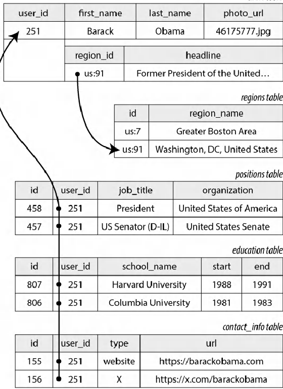

> 图 3-1。使用关系模式表示 LinkedIn 个人资料。  

示例 3-1。将 LinkedIn 个人资料表示为 JSON 文档  

```json
{
    "user_id": 251,
    "first_name": "Barack",
    "last_name": "Obama",
    "headline": "Former President of the United States of America",
    "region_id": "us:91",
    "photo_url": "/p/7/000/253/05b/308dd6e.jpg",
    "positions": [
        {"job_title": "President", "organization": "United States of America"},
        {"job_title": "US Senator (D-IL)", "organization": "United States Senate"}
    ],
    "education": [
        {"school_name": "Harvard University", "start": 1988, "end": 1991},
        {"school_name": "Columbia University", "start": 1981, "end": 1983}
    ],
    "contact_info": {
        "website": "https://barackobama.com",
        "x": "https://x.com/barackobama"
    }
}  
```

一些开发者认为，JSON 模型减少了应用代码与存储层之间的阻抗不匹配。没有模式也经常被视为一项优点；我们将在第 80 页的“文档模型中的模式灵活性”中讨论这一点。不过，正如我们将在第 5 章看到的，JSON 作为数据编码格式也存在问题。  

与图 3-1 的多表模式相比，JSON 表示具有更好的局部性（参见第 82 页的“读写的数据局部性”）。在关系示例中，如果想获取一份个人资料，就需要执行多次查询（按 user_id 查询每张表），或者在 users 表及其从属表之间执行繁杂的多路连接 [9, 10]。在 JSON 表示中，所有相关信息都位于一处，使查询更快也更简单。  

从用户个人资料到其职位、教育经历和联系信息的一对多关系，意味着数据中存在树状结构，而 JSON 表示明确地呈现了这种树状结构（见图 3-2）。  

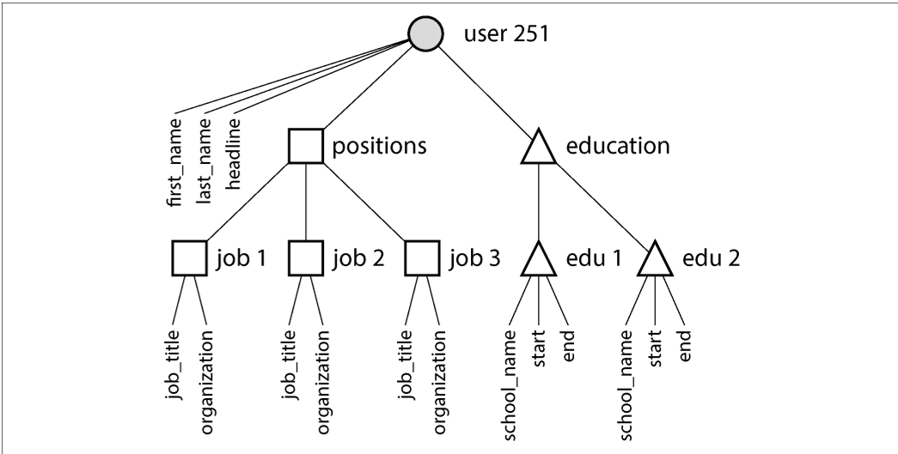

> 图 3-2。构成树状结构的一对多关系。  

> [!NOTE]
> 一对多关系有时也称为一对少，因为一份简历通常只包含少量职位 [11, 12]。如果相关条目的数量确实很大——比如某位名人的社交媒体帖文下可能有数千条评论——那么把它们全都嵌入同一个文档可能过于笨重，此时图 3-1 所示的关系方法更合适。

## 规范化、反规范化与连接  

在上一节的示例 3-1 中，region_id 以 ID 而非纯文本字符串 Washington, DC, United States 的形式给出。为什么？  

如果用户界面提供自由文本字段供用户输入地区，那么将地区存为纯文本字符串是合理的。不过，采用标准化的地理区域列表，并让用户从下拉列表或自动补全组件中选择，也有不少优点，包括：  

- 所有个人资料的样式和拼写保持一致  

- 避免多个地方同名时产生歧义（如果字符串只有 Washington, DC，它指的是哥伦比亚特区还是华盛顿州？）  

- 易于更新——名称只存储在一个地方，因此一旦需要更改（例如因政治事件导致城市更名），就很容易全面更新  

- 支持本地化——网站翻译成其他语言时，可以对标准化列表进行本地化，从而用查看者的语言显示地区  

- 更强的搜索功能（例如，搜索美国东海岸的人时可以匹配这份个人资料，因为地区列表能够编码华盛顿位于东海岸这一事实——仅从字符串 Washington, DC 中看不出这一点）  

存储 ID 还是文本字符串，是一个*规范化*问题。使用 ID 时，数据的规范化程度更高：对人有意义的信息（例如文本 *Washington, DC*）只存储在一个地方，所有引用它的内容都使用 ID（该 ID 只在数据库内部有意义）。直接存储文本时，则会在每一条使用它的记录中复制这份对人有意义的信息；这种表示是*反规范化*的。  

使用 ID 的优点是，由于它对人没有意义，所以永远不需要改变：即使 ID 所标识的信息发生变化，ID 也可以保持不变。任何对人有意义的信息将来都有可能需要改变——如果该信息存在重复，就必须更新所有冗余副本。这会需要更多代码、更多写操作和更多磁盘空间，还会带来不一致的风险（因为某些信息副本得到了更新，而另一些没有）。  

规范化表示的缺点是，每当要显示一条包含 ID 的记录时，都必须额外查找一次，将 ID 解析为人类可读的信息。在关系数据模型中，这是通过连接完成的。例如：  

```sql
SELECT users.*, regions.region_name
FROM users
JOIN regions ON users.region_id = regions.id
WHERE users.id = 251;  
```

文档数据库既可以存储规范化数据，也可以存储反规范化数据，但它们通常与反规范化联系在一起——一方面是因为 JSON 数据模型便于存储额外的反规范化字段，另一方面是因为许多文档数据库对连接的支持较弱，使规范化很不方便。有些文档数据库完全不支持连接，因此必须在应用代码中执行连接——也就是说，先获取一个包含 ID 的文档，再执行第二次查询，将这个 ID 解析到另一个文档。在 MongoDB 中，也可以使用聚合管道中的 `$lookup` 运算符执行连接：  

```javascript
db.users.aggregate([
    { $match: { _id: 251 } },
    { $lookup: {
        from: "regions",
        localField: "region_id",
        foreignField: "_id",
        as: "region"
    } }
])  
```

## 规范化的权衡  

在简历示例中，region_id 字段引用了一组标准化地区，而 organization（此人工作过的公司或政府机构）和 school_name（其就读学校）只是字符串。这种表示是反规范化的：许多人可能曾在同一家公司工作，但没有 ID 将他们联系起来。  

值得考虑的是，组织和学校名称是否也应该成为实体，而个人资料则引用其 ID。引用地区 ID 的理由同样适用于这里。例如，假设除了学校或公司的名称之外，我们还想展示其徽标：  

- 在反规范化表示中，我们会在每个人的个人资料中都包含徽标的图片 URL。这样能让 JSON 文档自包含，但如果有一天需要更换徽标，就会带来麻烦，因为现在必须找出旧 URL 出现的所有位置并逐一更新 [11]。  

- 在规范化表示中，我们会创建一个表示组织或学校的实体，将其名称、徽标 URL 以及可能的其他属性（简介、新闻订阅源等）作为该实体的一部分，只存储一次。之后，每份提及该组织的简历只需引用其 ID，更新徽标也会很容易。  

一般而言，规范化数据通常写入更快（因为只有一个副本），但查询更慢（因为需要连接）；反规范化数据通常读取更快（连接更少），但写入成本更高（需要更新更多副本，占用更多磁盘空间）。把反规范化看作派生数据的一种形式（参见第 10 页的“记录系统与派生数据”）可能会有所帮助，因为你需要建立一个流程来更新数据的冗余副本。  

除了执行所有这些更新的成本，还需要考虑某个进程在更新进行到一半时崩溃，数据库能否保持一致。提供原子事务的数据库（参见第 280 页的“原子性”）更容易保持一致，但并非所有数据库都提供跨多个文档的原子性。也可以通过流处理来保证一致性，我们将在第 12 章讨论这一点。  

规范化往往更适合 OLTP 系统，因为这类系统的读取和更新都需要很快；分析系统通常更适合反规范化数据，因为它们批量执行更新，而且只读查询的性能是主要考量。在中小规模系统中，规范化数据模型往往是最佳选择，因为无须操心让数据的多个副本彼此保持一致，而且执行连接的成本可以接受。然而，在超大规模系统中，连接的成本可能成为问题。  

## 社交网络案例研究中的反规范化  

在第 34 页的“案例研究：社交网络主页时间线”中，我们比较了规范化表示（图 2-1）与反规范化表示（预计算、物化的时间线）。在这个例子中，帖子与关注关系之间的连接成本过高，而物化时间线就是该连接结果的缓存。将新帖子扇出写入关注者时间线的过程，是我们用来保持反规范化表示一致的方式。  

然而，X（前身为 Twitter）在实现物化时间线时，并不存储每篇帖子的实际文本。每个条目只存储帖子 ID、发帖用户的 ID，以及少量用于识别转帖和回复的额外信息 [13]。换言之，它是（近似）以下查询的预计算结果：  

```sql
SELECT posts.id, posts.sender_id FROM posts
JOIN follows ON posts.sender_id = follows.followee_id
WHERE follows.follower_id = current_user
ORDER BY posts.timestamp DESC
LIMIT 1000  
```

这意味着，每当读取时间线时，服务仍需执行两次连接：通过帖子 ID 查找帖子的实际内容（以及点赞数、回复数等统计信息），并通过发送者 ID 查找其个人资料（以获取用户名、头像和其他详细信息）。这种通过 ID 查找人类可读信息的过程称为对 ID 进行*水合*（hydrating），本质上是在应用程序代码中执行连接 [13]。  

预计算时间线只存储 ID，是因为这些 ID 所指向的数据变化很快。热门帖子的点赞数和回复数可能每秒变化多次，有些用户也会经常更改用户名或头像。由于查看时间线时应显示最新的点赞数和头像，将这些信息反规范化到物化时间线中并无意义。此外，这种反规范化还会显著增加存储成本。  

这个例子表明，读取数据时必须执行连接，并不像有时所声称的那样，会妨碍构建高性能、可扩展的服务。对帖子 ID 和用户 ID 进行水合其实很容易扩展，因为该操作非常适合并行化，而且其成本不取决于你关注了多少账号，也不取决于你有多少关注者。  

如果需要决定是否在应用程序中反规范化某些内容，社交网络案例研究表明，这个选择并非一目了然；可扩展性最佳的方法可能是将一部分内容反规范化，而让另一部分保持规范化。你必须仔细考虑信息变化的频率以及读写成本（这些成本可能由离群值主导，例如典型社交网络中关注大量用户或拥有大量关注者的用户）。规范化和反规范化本身并无好坏之分——它们只是在读写性能与实现工作量之间作出不同的权衡。  

## 多对一和多对多关系  

图 3-1 中的任职经历表和教育经历表是一对多或一对少关系的例子（一份简历包含多段任职经历，但每段任职经历只属于一份简历），而 region_id 字段则是多对一关系的例子（许多人居住在同一地区，但我们假设每个人在任一时刻只居住在一个地区）。  

如果我们为组织和学校引入实体，并在简历中通过 ID 引用它们，那么还会出现多对多关系（一个人可能曾为多个组织工作，而一个组织也有多名过去或现在的员工）。在关系模型中，这种关系通常表示为关联表，也称连接表，如图 3-3 所示：每段任职经历都将一个用户 ID 与一个组织 ID 关联起来。  

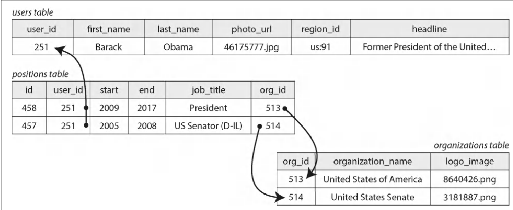

> 图 3-3。关系模型中的多对多关系。  

多对一和多对多关系很难放进一个自包含的 JSON 文档中；它们更适合采用规范化表示。在文档模型中，一种可行的表示如示例 3-2 所示，并在图 3-4 中进行了说明。每个虚线矩形内的数据可以组合成一个文档，但指向组织和学校的链接最好表示为对其他文档的引用。  

示例 3-2。通过 ID 引用组织的简历  

```jsonc
{
    "user_id": 251,
    "first_name": "Barack",
    "last_name": "Obama",
    "positions": [
        {
            "start": 2009,
            "end": 2017,
            "job_title": "President",
            "org_id": 513
        },
        {
            "start": 2005,
            "end": 2008,
            "job_title": "US Senator (D-IL)",
            "org_id": 514
        }
    ],
    // ...
}  
```

多对多关系通常需要从“两个方向”查询——例如，查找某个特定人员工作过的所有组织，以及查找曾在某个特定组织工作过的所有人员。支持此类查询的一种方式是在关系两端都存储 ID 引用：简历包含该人员工作过的每个组织的 ID，而组织文档则包含所有提及该组织的简历 ID。这种表示是反规范化的，因为关系存储在两个位置，而这两个位置可能会彼此不一致。  

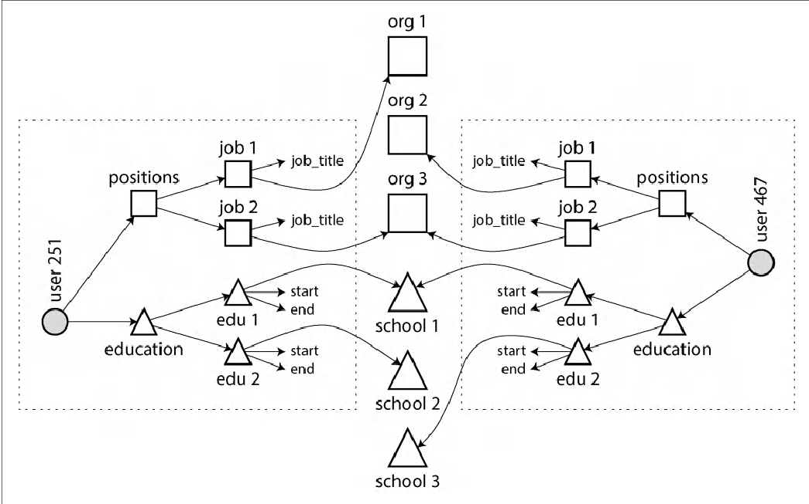

> 图 3-4。文档模型中的多对多关系——每个虚线框内的数据都可以组合成一个文档。  

规范化表示只在一个位置存储关系，并依靠*二级索引*（将在第 4 章讨论）来高效地从两个方向查询关系。在图 3-3 所示的关系模式中，我们会让数据库分别在 positions 表的 user_id 列和 org_id 列上创建索引。  

在示例 3-2 的文档模型中，数据库需要为 positions 数组内对象的 org_id 字段建立索引。许多文档数据库以及支持 JSON 的关系数据库，都能为文档内部的值创建这种索引。  

## 星型与雪花：分析模式  

数据仓库（参见第 7 页的“数据仓库”）通常采用关系模型；对于数据仓库中的表结构，有几种广泛使用的约定，包括星型模式、雪花模式、维度建模 [14] 和大宽表（one big table，OBT）。这些结构针对业务分析师的需求进行了优化。ETL 过程将数据从业务系统转换为选定的模式。  

图 3-5 展示了一个可能出现在食品杂货零售商数据仓库中的星型模式示例。模式的中心是所谓的事实表（本例中称为 fact_sales）。事实表中的每一行都表示在特定时刻发生的一个事件（这里，每一行表示一位顾客购买某种商品）。如果我们分析的是网站流量而非零售销售，那么每一行可能表示一次用户浏览页面或点击。  

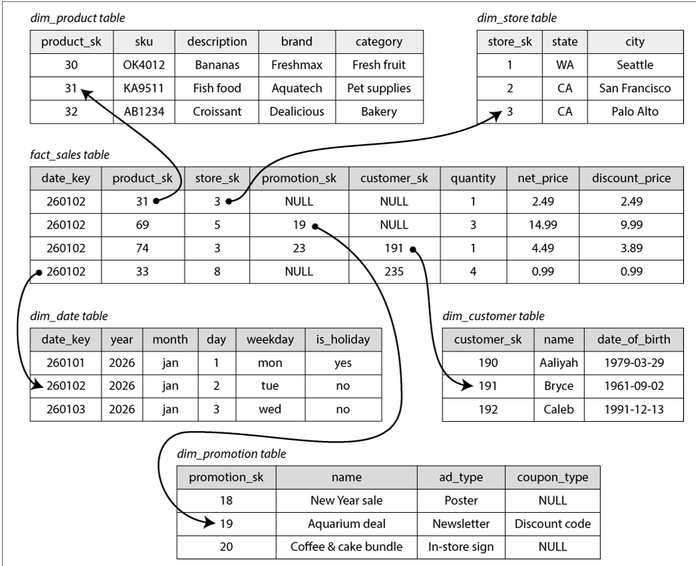

> 图 3-5。用于数据仓库的星型模式。  

通常会将事实捕获为单个事件，因为这样能为后续分析提供最大的灵活性。然而，这也意味着事实表可能变得极其庞大。大型企业的数据仓库中可能有数 PB 的交易历史，其中大部分以事实表表示。  

事实表中的一些列是属性，例如商品的售价以及从供应商处购入该商品的成本（据此可以计算利润率）。事实表中的其他列是指向其他表的外键引用，这些表称为*维度表*。事实表中的每一行都表示一个事件，而维度则表示该事件的*主体*、*内容*、*地点*、*时间*、*方式*和*原因*。  

例如，在图 3-5 中，一个维度是售出的商品。`dim_product` 表中的每一行表示一种在售商品，包括其库存单位（SKU）、描述、品牌名称、类别、脂肪含量和包装规格。fact_sales 表中的每一行都通过外键指出该笔特定交易中售出的商品。查询通常涉及与多个维度表进行多次连接。  

即使日期和时间也常常使用维度表表示，因为这样可以编码日期的附加信息（例如公共假日），从而使查询能够区分节假日与非节假日的销售情况。  

星型模式之所以得名，是因为将表之间的关系可视化时，事实表位于中央，周围环绕着各个维度表（如图 3-5 所示）；与这些表的连接就像星星的光芒。  

这种模板的一种变体是*雪花模式*，其中维度会进一步拆分为子维度。例如，可以为品牌和商品类别分别创建表，而 `dim_product` 表中的每一行可以通过外键引用品牌和类别，而不是在 `dim_product` 表中将它们存储为字符串。雪花模式比星型模式更加规范化，但人们往往更喜欢星型模式，因为分析师使用起来更简单 [14]。  

在典型的数据仓库中，表往往很宽：事实表经常有一百多列，有时甚至有数百列。维度表也可能很宽，因为它们包含所有可能与分析相关的元数据——例如，dim_store 表可能包含每家门店提供哪些服务、是否设有店内烘焙坊、营业面积、首次开业日期、最近一次翻修时间，以及距最近高速公路有多远等详细信息。  

星型模式或雪花模式主要由多对一关系组成（例如，某种特定商品在某家特定门店会产生多次销售），表示方式是事实表持有指向维度表的外键，或者维度表持有指向子维度表的外键。原则上也可以存在其他关系类型，但为了简化查询，通常会将它们反规范化。例如，如果顾客一次购买了多种不同商品，这种多商品交易并不会被显式表示；相反，事实表会为购买的每种商品分别创建一行，而这些事实恰好具有相同的顾客 ID、门店 ID 和时间戳。  

有些数据仓库模式将反规范化做得更彻底，完全省略维度表，转而把维度信息折叠进事实表的反规范化列中（本质上是预计算事实表与维度表之间的连接）。这种方法称为大宽表（OBT）；虽然需要更多存储空间，但有时能加快查询速度 [15]。  

在分析场景中，这种反规范化没有什么问题，因为数据通常代表不会再发生变化的历史数据日志（偶尔纠正错误的情况除外）。OLTP 系统中反规范化所带来的数据一致性和写入开销问题，在分析场景中并没有那么突出。  

## 何时使用哪种模型  

支持文档数据模型的主要理由是模式灵活性、局部性带来的更佳性能，以及对于某些应用程序而言，它更接近应用程序所使用的对象模型。关系模型则以更好地支持连接、多对一关系和多对多关系作为回应。下面更详细地考察这些论点。  

如果应用程序中的数据具有类似文档的结构（即由一对多关系组成的树，通常会一次加载整棵树），那么使用文档模型很可能是个好主意。关系模型中的*拆分*（shredding）技术——将类似文档的结构拆分到多个表中（如图 3-1 中的 *positions*、*education* 和 *contact_info*）——可能导致模式繁琐，并使应用程序代码不必要地复杂。  

文档模型存在一些局限。例如，你不能直接引用文档中的嵌套项；相反，你需要使用类似“用户 251 的任职经历列表中的第二项”这样的说法。如果需要引用嵌套项，关系模型的方法更合适，因为你可以通过 ID 直接引用任何项。  

有些应用程序允许用户选择项目的顺序——例如，设想一个待办事项列表或问题跟踪器，用户可以拖放任务来重新排序。文档模型非常适合这类应用程序，因为只需将项目（或其 ID）存储在 JSON 数组中即可确定顺序。在关系数据库中，并没有表示这种可重新排序列表的标准方法，因此会使用各种技巧，例如按整数列排序（在中间插入时需要重新编号）、维护由 ID 组成的链表，或使用分数索引 [16, 17, 18]。  

## 文档模型中的模式灵活性  

大多数文档数据库以及关系数据库的 JSON 支持，都不会对文档中的数据强制实施任何模式。关系数据库的 XML 支持通常带有可选的模式验证。没有模式意味着可以向文档添加任意键和值，而客户端在读取时无法保证文档可能包含哪些字段。  

文档数据库有时被称为*无模式*（schemaless），但这种说法具有误导性，因为读取数据的代码通常会假定某种结构——也就是说，隐式模式确实存在，只是数据库不强制实施它 [19]。更准确的术语是*读时模式*（数据结构是隐式的，只有读取数据时才对其进行解释），与之相对的是*写时模式*（关系数据库的传统做法：模式是显式的，数据库会在写入数据时确保所有数据都符合模式）[20]。  

读时模式类似于编程语言中的动态（运行时）类型检查，而写时模式类似于静态（编译时）类型检查。正如静态与动态类型检查的拥护者会激烈争论各自的相对优点一样 [21]，是否在数据库中强制实施模式也是一个颇具争议的话题，总体而言并没有明确的胜者。  

当应用程序想要更改数据格式时，这两种方法的差异尤其明显。例如，假设目前将每个用户的全名存储在一个字段中，现在想改为分别存储名和姓 [22]。在文档数据库中，只需开始使用新字段写入新文档，并在应用程序中加入处理旧文档读取情况的代码。例如：  

```javascript
if (user && user.name && !user.first_name) {
    // 2023 年 12 月 8 日之前写入的文档没有 first_name
    user.first_name = user.name.split(" ")[0];
}
```

这种方法的缺点是，应用程序中从数据库读取数据的每个部分，现在都需要处理可能早在很久以前写入的旧格式文档。另一方面，在采用写时模式的数据库中，通常会执行大致如下的迁移：  

```sql
ALTER TABLE users ADD COLUMN first_name text DEFAULT NULL;
UPDATE users SET first_name = split_part(name, ' ', 1); -- PostgreSQL
UPDATE users SET first_name = substring_index(name, ' ', 1); -- MySQL  
```

在大多数关系数据库中，即使对于大表，添加带默认值的列也快速且没有问题。然而，在大表上运行 UPDATE 语句很可能很慢，因为每一行都需要重写；其他模式操作（例如更改列的数据类型）通常也需要复制整张表。  

有多种工具可以在后台无停机地执行这类模式变更 [23, 24, 25, 26]，但在大型数据库上执行此类迁移，运维方面仍然很有挑战。可以通过添加默认值为 NULL 的 `first_name` 列（该操作很快），并像使用文档数据库时那样在读取时填充该列，来避免复杂的迁移。  

如果集合中的各个项目结构并不完全相同（即数据是异构的），读时模式方法会更有优势。例如：  

- 对象类型很多，为每种对象类型分别建立一张表并不现实。  

- 数据结构由你无法控制的外部系统决定，而这些系统随时可能发生变化。  

在这类情况下，模式可能弊大于利，而无模式文档可以成为自然得多的数据模型。但如果预期所有记录都具有相同结构，模式就是记录和强制实施该结构的有效机制。我们将在第 5 章更详细地讨论模式和模式演化。  

## 读写的数据局部性  

文档通常存储为一个连续的字符串，编码格式为 JSON、XML 或相应的二进制变体（例如 MongoDB 的 BSON）。如果应用程序经常需要访问整个文档（例如，要将其渲染到网页上），这种存储局部性就具有性能优势。如果像图 3-1 那样将数据拆分到多个表中，则需要执行多次索引查找才能检索全部数据，这可能需要更多磁盘寻道，并花费更多时间。  

只有当你同时需要文档的大部分内容时，局部性优势才适用。数据库通常需要加载整个文档；如果只需访问大型文档的一小部分，这样做可能很浪费。此外，更新文档时，通常需要重写整个文档。出于这些原因，通常建议让文档保持相对较小，并避免频繁的小幅更新。  

不过，为获得局部性而将相关数据存储在一起，并非文档模型所独有。例如，Google 的 Spanner 数据库允许在模式中声明某个表的行应交错（嵌套）存储在父表中，从而在关系数据模型中提供相同的局部性特征 [27]。Oracle 使用一种称为*多表索引聚簇表*（multi-table index cluster tables）的功能实现相同效果 [28]。由 Google Bigtable 推广并用于 HBase、Accumulo 等系统的*宽列*数据模型，则具有用途相似、用于管理局部性的*列族* [29]。  

## 文档查询语言  

关系数据库与文档数据库的另一个区别，是查询时使用的语言或 API。大多数关系数据库使用 SQL 查询，但文档数据库的情况更加多样。有些只允许通过主键进行键值访问，另一些还提供二级索引，用于查询文档内部的值，还有一些则提供功能丰富的查询语言。  

XML 数据库通常使用 XQuery 和 XPath 查询；它们旨在支持复杂查询，包括跨多个文档的连接，并将结果格式化为 XML [30]。JSON Pointer [31] 和 JSONPath [32] 为 JSON 提供了与 XPath 等价的功能。MongoDB 的聚合管道是面向 JSON 文档集合的查询语言示例；在第 72 页的“规范化、反规范化与连接”中，我们已经见过它用于连接的 `$lookup` 操作符。  

再来看一个例子，以体会这种语言——这次是聚合，而分析尤其需要聚合。假设你是一名海洋生物学家，每次在海洋中看到动物，都会向数据库添加一条观察记录。现在，你想生成一份报告，说明每个月目击了多少条鲨鱼。在 PostgreSQL 中，可以这样表达该查询：  

```sql
SELECT date_trunc('month', observation_timestamp) AS observation_month,
sum(num_animals) AS total_animals
FROM observations
WHERE family = 'Sharks'
GROUP BY observation_month;  
```

① date_trunc('month', observation_timestamp) 函数确定时间戳所属的日历月份，并返回另一个表示该月月初的时间戳。换言之，该函数将时间戳向下舍入到最近的月份。  

该查询首先筛选观察记录，只保留鲨科物种，然后按观察发生的日历月份对记录分组，最后将该月所有观察记录中见到的动物数量相加。使用 MongoDB 的聚合管道，可以将同一个查询表示如下：  

```javascript
db.observations.aggregate([
    { $match: { family: "Sharks" } },
    { $group: {
        _id: {
            year: { $year: "$observationTimestamp" },
            month: { $month: "$observationTimestamp" }
        },
        totalAnimals: { $sum: "$numAnimals" }
    } }
]);  
```

聚合管道语言的表达能力与 SQL 的一个子集相似，但它使用基于 JSON 的语法，而不是 SQL 那种英语句子式语法。这种差异或许只是品味问题。  

## 文档数据库与关系数据库的趋同  

文档数据库和关系数据库最初是截然不同的数据管理方法，但随着时间推移，它们变得越来越相似 [33]。关系数据库增加了对 JSON 类型和查询操作符的支持，也增加了为文档内部属性建立索引的能力。一些文档数据库（例如 MongoDB、Couchbase 和 RethinkDB）则增加了对连接、二级索引和声明式查询语言的支持。  

这些模型的趋同对应用程序开发者而言是个好消息，因为当关系模型和文档模型能够在同一个数据库中结合使用时，两者的效果最佳。许多文档数据库需要以关系模型的方式引用其他文档，而许多关系数据库中也有一些部分适合采用灵活的模式。关系模型与文档模型的混合是一种强大的组合。  

> [!NOTE]
> Codd 最初对关系模型的描述 [4] 允许在关系模式内使用类似 JSON 的结构。他将其称为*非简单域*（nonsimple domains）。其思想是，一行中的值不一定非得是数字或字符串这样的原始数据类型；它也可以是嵌套的关系（表），因此可以将任意深度的嵌套树结构作为一个值。这种构造与 30 多年后加入 SQL 的 JSON 和 XML 支持相当。

## 类图数据模型  

我们先前看到，关系的类型是区分各种数据模型的一项重要特征。如果你的应用主要是一对多关系（树状结构的数据），而记录之间几乎没有其他关系，那么文档模型就很合适。  

但如果数据中多对多关系非常常见呢？关系模型可以处理简单的多对多关系，但随着数据内部的连接变得更加复杂，开始将这些数据建模为图会更加自然。  

图由两类对象组成：顶点（也称为节点或实体）和边（也称为关系或弧）。许多种类的数据都可以建模为图。典型示例如下：  

社交图  

顶点是人，边表示哪些人彼此认识。  

Web 图  

顶点是网页，边表示指向其他页面的 HTML 链接。  

公路或铁路网  

顶点是交叉点，边表示连接它们的公路或铁路线。  

一些著名的算法可以在这些图上运行——例如，地图导航应用会在公路网中搜索两点之间的最短路径，而 PageRank 可用于在 Web 图中确定网页的受欢迎程度，进而确定它在搜索结果中的排名 [34]。  

图可以用多种方式表示。在邻接表模型中，每个顶点存储与它相隔一条边的相邻顶点的 ID。或者，也可以使用邻接矩阵：这是一种二维数组，每一行和每一列都对应一个顶点；当行顶点与列顶点之间没有边时，值为 0，有边时则为 1。邻接表适合图遍历，而矩阵适合机器学习（参见第 105 页的“数据帧、矩阵和数组”）。  

在刚才给出的示例中，图中的所有顶点都表示同一类事物（分别是人、网页或道路交叉点）。不过，图并不局限于这种*同质*数据。图的另一个同样强大的用途，是提供一种一致的方式，把类型截然不同的对象存储在同一个数据库中。例如：  

- Facebook 维护着一张包含多种顶点和边的图。顶点表示人、地点、事件、签到和用户发表的评论；边表示哪些人互为好友、哪次签到发生在哪个地点、谁评论了哪篇帖子、谁参加了哪个事件，等等 [35]。  

- 搜索引擎使用知识图谱记录搜索查询中经常出现的实体（例如组织、人物和地点）的相关事实 [36]。这些信息通过抓取并分析网站上的文本获得；Wikidata 等一些网站也会以结构化形式发布图数据。  

图提供了多种不同但相互关联的数据组织和查询方式。本节将讨论*属性图*模型（由 Neo4j、Memgraph、KuzuDB [37] 等系统 [38] 实现）和*三元组存储*模型（由 Datomic、AllegroGraph、Blazegraph 等系统实现）。这两种模型的表达能力颇为相似，一些图数据库（如 Amazon Neptune）同时支持二者。  

我们还将考察四种图查询语言（Cypher、SPARQL、Datalog 和 GraphQL），以及 SQL 对图查询的支持。还有其他图查询语言，例如 Gremlin [39]，但这些语言足以让我们获得一个有代表性的概览。  

为了说明这些语言和模型，本节以图 3-6 作为贯穿始终的示例。它可能取自某个社交网络或族谱数据库；图中展示了两个人：来自爱达荷州的 Lucy 和来自法国圣洛的 Alain。他们已经结婚，现居伦敦。每个人和每个地点都表示为一个顶点，它们之间的关系则表示为边。这个示例将帮助我们展示一些在图数据库中很容易、但在其他数据模型中却很难实现的查询。  

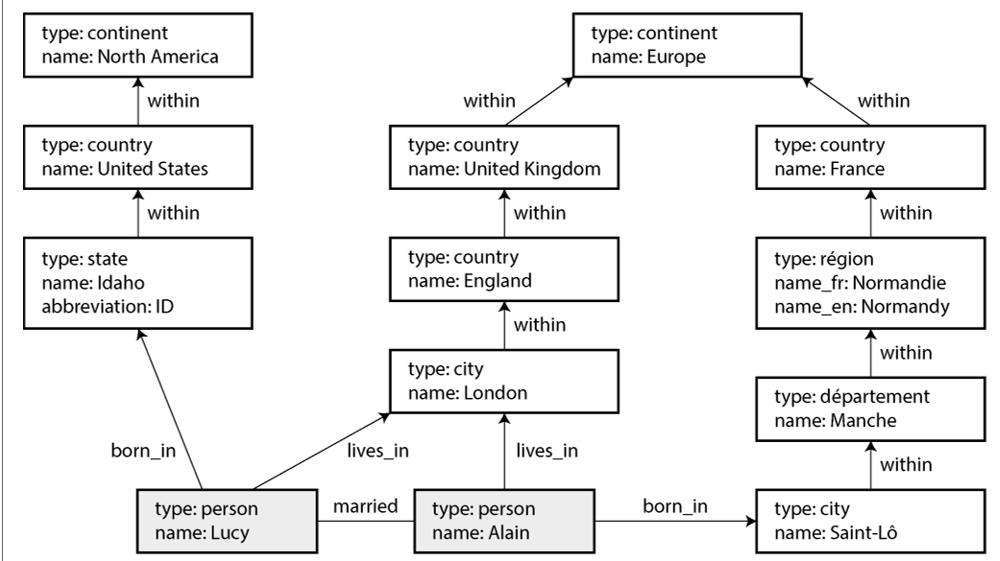

> 图 3-6。图结构数据（方框表示顶点，箭头表示边）。  

### 属性图  

在属性图（也称为带标签属性图）模型中，每个顶点由以下各项组成：  

- 唯一标识符  

- 用于描述该顶点所表示对象类型的标签（字符串）  

- 一组出边  

- 一组入边  

- 一组属性（键值对）  

每条边由以下各项组成：  

- 唯一标识符  

- 边开始处的顶点（尾顶点）  

- 边结束处的顶点（头顶点）  

- 用于描述两个顶点之间关系种类的标签  

- 一组属性（键值对）  

你可以把图存储看作由两个关系表组成：一个存储顶点，另一个存储边，如示例 3-3 所示（该模式使用 PostgreSQL 的 jsonb 数据类型存储每个顶点或每条边的属性）。每条边都存储其头顶点和尾顶点；如果想得到某个顶点的一组入边或出边，可以分别按 head_vertex 或 tail_vertex 查询边表。  

示例 3-3。用关系模式表示属性图  

```sql
CREATE TABLE vertices (
    vertex_id integer PRIMARY KEY,
    label text,
    properties jsonb
);

CREATE TABLE edges (
    edge_id integer PRIMARY KEY,
    tail_vertex integer REFERENCES vertices (vertex_id),
    head_vertex integer REFERENCES vertices (vertex_id),
    label text,
    properties jsonb
);

CREATE INDEX edges_tails ON edges (tail_vertex);
CREATE INDEX edges_heads ON edges (head_vertex);  
```

该模型的一些重要方面如下：  

- 任意顶点都可以通过一条边与任意其他顶点连接。没有任何模式限制哪些种类的事物能够或不能相互关联。  

- 给定任意顶点，都可以高效地找到它的入边和出边，从而沿正向和反向*遍历*图（即沿着一连串顶点构成的路径前进）。（这就是为什么**示例 3-3** 同时在 `tail_vertex` 和 `head_vertex` 列上建立索引。）  

- 通过为不同种类的顶点和关系使用不同标签，可以在同一张图中存储多种信息，同时仍然保持清晰的数据模型。  

边表类似于我们在第 75 页“多对一和多对多关系”中看到的多对多关联表（即连接表），但经过了泛化，允许在同一张表中存储多种类型的关系。标签和属性上也可以建立索引，从而高效地找到具有特定属性的顶点或边。  

> [!NOTE]
> 图模型的一个局限是，一条边只能把两个顶点关联起来，而关系连接表可以通过在一行中设置多个外键引用来表示三元甚至更高元的关系。要在图中表示这种关系，可以为连接表的每一行创建一个对应的额外顶点，并创建指向或源自该顶点的边，也可以使用超图。

这些特性赋予了图极大的数据建模灵活性，如图 3-6 所示。图中展示了一些很难用传统关系模式表达的事物，例如不同国家采用不同的行政区划结构（法国有省和大区，而美国有县和州）、一国之内还有一国之类的历史特例（暂且忽略主权国家与民族国家之间的复杂关系），以及数据粒度的差异（Lucy 当前的居住地具体到了城市，而出生地只具体到了州一级）。  

可以设想进一步扩展这张图，加入 Lucy 和 Alain 或其他人的许多其他事实。例如，可以用图来表示他们的食物过敏情况（为每种过敏原引入一个顶点，并在人与过敏原之间建立一条表示过敏的边），再把这些过敏原与一组顶点连接起来，用以表明哪些食物含有哪些物质。这样，就可以编写查询，找出每个人可以安全食用哪些食物。图很适合演进：随着应用功能的增加，可以轻松扩展图，以适应应用数据结构的变化。  

## Cypher 查询语言  

Cypher 是一种属性图查询语言，最初为 Neo4j 图数据库创建，后来以 openCypher [40] 的形式发展为开放标准。除 Neo4j 外，Memgraph、KùzuDB [37]、Amazon Neptune、Apache AGE（数据存储在 PostgreSQL 中）等系统也支持 Cypher。该语言以电影 The Matrix 中的一个角色命名，与密码学中的密码无关 [41]。  

示例 3-4 展示了将图 3-6 左半部分插入图数据库的 Cypher 查询。图的其余部分也可以用类似方式添加。每个顶点都被赋予一个符号名称，例如 usa 或 idaho。该名称并不存储在数据库中，只在查询内部用于创建顶点之间的边，其使用的是箭头记法：(idaho)-[:WITHIN]->(usa) 创建一条标签为 WITHIN 的边，其中 idaho 是尾节点，usa 是头节点。  

示例 3-4。图 3-6 中数据的一个子集，以 Cypher 查询表示  

```cypher
CREATE
  (namerica:Location {name: 'North America', type: 'continent'}),
  (usa:Location {name: 'United States', type: 'country'}),
  (idaho:Location {name: 'Idaho', type: 'state'}),
  (lucy:Person {name: 'Lucy'}),
  (idaho)-[:WITHIN]->(usa)-[:WITHIN]->(namerica),
  (lucy)-[:BORN_IN]->(idaho)
```

把图 3-6 中的所有顶点和边都添加到数据库后，就可以开始提出一些有趣的问题。例如，假设我们想找出所有从美国移居欧洲的人的姓名。可以找出所有满足以下条件的顶点：它们有一条 BORN_IN 边指向美国境内的某个地点，并有一条 LIVING_IN 边指向欧洲境内的某个地点；然后返回每个此类顶点的 name 属性。  

示例 3-5 展示了如何用 Cypher 表达该查询。MATCH 子句使用同样的箭头记法在图中寻找模式：(person) -[:BORN_IN]-> () 匹配由一条标签为 BORN_IN 的边关联起来的任意两个顶点。该边的尾顶点绑定到变量 person，头顶点则不命名。  

示例 3-5。查找从美国移居欧洲的人所用的 Cypher 查询  

```cypher
MATCH
  (person)-[:BORN_IN]->()-[:WITHIN*0..]->(:Location {name: 'United States'}),
  (person)-[:LIVES_IN]->()-[:WITHIN*0..]->(:Location {name: 'Europe'})
RETURN person.name
```

该查询可以解读如下：  

找到满足以下两个条件的任意顶点（称其为 person）：  

1. person 有一条出向的 BORN_IN 边指向某个顶点。从该顶点出发，可以沿着一连串出向的 WITHIN 边前进，最终到达一个类型为 Location、name 属性等于 United States 的顶点。  

2. 同一个 person 顶点还有一条出向的 LIVES_IN 边。沿着该边，再沿着一连串出向的 WITHIN 边前进，最终到达一个类型为 Location、name 属性等于 Europe 的顶点。  

对于每个这样的 person 顶点，返回其 name 属性。  

执行该查询有几种可能的方式。这里给出的描述暗示，可以先扫描数据库中的所有人，检查每个人的出生地和居住地，只返回满足条件的人。  

但也可以等价地从两个 Location 顶点开始反向查找。如果 name 属性上有索引，就能高效找到表示美国和欧洲的两个顶点。然后，可以沿着所有入向的 WITHIN 边，分别找出美国和欧洲境内的所有地点（州、大区、城市等）。最后，可以在某个地点顶点处沿入向的 BORN_IN 或 LIVES_IN 边查找人。  

## SQL 中的图查询  

示例 3-3 表明，图数据可以用关系数据库表示。但如果把图数据放入关系结构中，也能使用 SQL 查询它吗？  

答案是能，但会有些困难。在图查询中，每遍历一条边，实际上都相当于与边表进行一次连接。在关系数据库中，通常可以预先知道查询需要哪些连接。另一方面，在图查询中，找到目标顶点之前可能需要遍历数量不定的边——也就是说，连接的数量并非预先固定。  

在我们的示例中，这种情况出现在 Cypher 查询的 () -[:WITHIN*0..]-> () 模式中。一个人的 LIVES_IN 边可能指向任意种类的地点，例如街道、城市、区、大区或州。城市可能位于某个大区之内，大区位于某个州之内，州位于某个国家之内，依此类推。LIVES_IN 边可能直接指向要找的地点顶点，也可能与它在地点层级结构中相隔数层。  

在 Cypher 中，:WITHIN*0.. 非常简洁地表达了这一事实：它的意思是“沿着 WITHIN 边前进零次或多次”。这就像正则表达式中的 * 运算符。  

查询中的这种变长遍历路径，可以使用*递归公用表表达式*（WITH RECURSIVE 语法）来表达。示例 3-6 展示了如何利用这种技术在 SQL 中表达同一个查询——找出从美国移居欧洲的人的姓名（以 `--` 开头的行是注释）。可以看出，与 Cypher 相比，其语法非常笨拙。  

示例 3-6。与示例 3-5 相同的查询，使用递归公用表表达式以 SQL 编写  

```sql
WITH RECURSIVE
-- in_usa 是美国境内所有地点的顶点 ID 集合
in_usa(vertex_id) AS (
    SELECT vertex_id FROM vertices
    WHERE label = 'Location' AND properties->>'name' = 'United States' -- ①
    UNION
    SELECT edges.tail_vertex FROM edges -- ②
    JOIN in_usa ON edges.head_vertex = in_usa.vertex_id
    WHERE edges.label = 'within'
),
-- in_europe 是欧洲境内所有地点的顶点 ID 集合
in_europe(vertex_id) AS (
    SELECT vertex_id FROM vertices
    WHERE label = 'location' AND properties->>'name' = 'Europe' -- ③
    UNION
    SELECT edges.tail_vertex FROM edges
    JOIN in_europe ON edges.head_vertex = in_europe.vertex_id
    WHERE edges.label = 'within'
),
-- born_in_usa 是所有出生于美国的人的顶点 ID 集合
born_in_usa(vertex_id) AS (
    SELECT edges.tail_vertex FROM edges -- ④
    JOIN in_usa ON edges.head_vertex = in_usa.vertex_id
    WHERE edges.label = 'born_in'
),
-- lives_in_europe 是所有居住在欧洲的人的顶点 ID 集合
lives_in_europe(vertex_id) AS (
    SELECT edges.tail_vertex FROM edges -- ⑤
    JOIN in_europe ON edges.head_vertex = in_europe.vertex_id
    WHERE edges.label = 'lives_in'
)
SELECT vertices.properties->'name'
FROM vertices
-- 通过连接找出既出生于美国、又居住在欧洲的人
JOIN born_in_usa ON vertices.vertex_id = born_in_usa.vertex_id -- ⑥
JOIN lives_in_europe ON vertices.vertex_id = lives_in_europe.vertex_id;  
```

① 首先找到 name 属性值为 United States 的顶点，将其作为 usa 顶点集合的第一个元素。  

② 从 in_usa 集合中的顶点出发，沿所有入向的 within 边前进，并将到达的顶点加入同一集合，直到所有入向的 within 边都被访问。  

③ 从 name 属性值为 Europe 的顶点开始执行同样的操作，逐步构建 in_europe 顶点集合。  

④ 对于 in_usa 集合中的每个顶点，沿入向的 born_in 边查找出生于美国境内某地的人。  

⑤ 类似地，对于 in_europe 集合中的每个顶点，沿入向的 lives_in 边查找居住在欧洲的人。  

⑥ 最后，通过连接出生于美国的人员集合与居住在欧洲的人员集合，取二者的交集。  

一段 4 行的 Cypher 查询需要用 31 行 SQL 来表达，这表明选择正确的数据模型和查询语言能带来多大的差异。而这仅仅是个开始；还需要考虑更多细节，例如如何处理环，以及如何在广度优先遍历和深度优先遍历之间做出选择 [42]。Oracle 为递归查询提供了另一种 SQL 扩展，称为层次查询 [43]。其他图查询语言还包括 TigerGraph 的 GSQL [44] 和 Property Graph Query Language（PGQL）[45]。  

以 Cypher 为基础的图查询语言（GQL）ISO 标准于 2024 年发布 [46, 47, 48]。虽然它尚未得到广泛采用，但希望它能在未来几年推动图数据库实现更高程度的统一。  

## 三元组存储与 SPARQL  

*三元组存储模型*与属性图模型基本等价，只是用不同的词语描述相同的思想。尽管如此，它仍值得讨论，因为三元组存储的各种工具和语言能为你构建应用程序的工具箱增添有价值的选择。  

在三元组存储中，所有信息都以非常简单的三部分陈述形式存储：（主语、谓语、宾语）。例如，在三元组（Jim, likes, bananas）中，Jim 是主语，likes 是谓语（动词），bananas 是宾语。  

> [!NOTE]
> 严格来说，提供类三元组数据模型的数据库通常还需要为每个元组存储额外的元数据。例如，AWS Neptune 通过给每个三元组添加图 ID 来使用四元组（4 元组）[49]；Datomic 使用 5 元组，在每个三元组中增加事务 ID 和一个表示删除的布尔值 [50]。由于这些数据库保留了这里所讲的主语—谓语—宾语基本结构，本书仍将它们称为三元组存储。

三元组的主语相当于图中的顶点。宾语则是以下两种之一：  

- 原始数据类型的值，例如字符串或数字。在这种情况下，三元组的谓语和宾语分别相当于主语顶点上某个属性的键和值。以图 3-6 为例，(lucy, birthYear, 1989) 就像一个带有属性 {"birthYear": 1989} 的顶点 lucy。  

- 图中的另一个顶点。在这种情况下，谓语是图中的边，主语是尾顶点，宾语是头顶点。例如，在 $ (lucy, marriedTo, alain) $ 中，主语 lucy 和宾语 alain 都是顶点，而谓语 marriedTo 是连接它们的边的标签。  

示例 3-7 展示了与示例 3-4 相同的数据，不过它以三元组形式写成，并采用一种名为 Turtle 的格式；Turtle 是 Notation3（N3）的一个子集 [51]。  

示例 3-7。图 3-6 中一部分数据，以 Turtle 三元组表示  

```turtle
@prefix : <urn:example:>.
_:lucy a :Person.
_:lucy :name "Lucy".
_:lucy :bornIn _:idaho.
_:idaho a :Location.
_:idaho :name "Idaho".
_:idaho :type "state".
_:idaho :within _:usa.
_:usa a :Location.
_:usa :name "United States".
_:usa :type "country".
_:usa :within _:namerica.
_:namerica a :Location.
_:namerica :name "North America".
_:namerica :type "continent".  
```

在这个例子中，图的顶点写作 `_:someName`。这个名称在该文件之外没有任何意义；它之所以存在，只是因为否则我们无法知道哪些三元组指向同一个顶点。当谓语表示一条边时，宾语就是一个顶点，如 `_:idaho :within _:usa`。当谓语是一个属性时，宾语就是字符串字面量，如 `_:usa :name "United States"`。  

为了让表示更紧凑，可以使用分号来陈述关于同一主语的多项信息，如示例 3-8 所示。这使 Turtle 格式相当易读。  

示例 3-8。更简洁地书写示例 3-7 中的数据  

```turtle
@prefix : <urn:example:>.
_:lucy    a :Person;    :name "Lucy";    :bornIn _:idaho.
_:idaho   a :Location; :name "Idaho";    :type "state";    :within _:usa.
_:usa     a :Location; :name "United States"; :type "country"; :within _:namerica.
_:namerica a :Location; :name "North America"; :type "continent".  
```

> [!NOTE]
> **语义网**
>
> 三元组存储的部分研究与开发工作受到语义网的推动。语义网是 21 世纪初的一项尝试，旨在通过不仅把数据发布为人类可读的网页，还将其发布为标准化、机器可读的格式，促进整个互联网范围内的数据交换。尽管最初设想的语义网并未成功 [52, 53]，但该项目留下的成果仍延续至今，例如 JSON-LD 等关联数据标准 [54]、生物医学中使用的本体 [55]、Facebook 的 Open Graph 协议 [56]（用于链接展开 [57]）、Wikidata 等知识图谱，以及 Schema.org 维护的结构化数据标准词汇表。  
>
> 三元组存储是另一项在原始用例之外得到应用的语义网技术；即使你对语义网毫无兴趣，三元组也可以成为应用程序良好的内部数据模型。  

## RDF 数据模型  

我们在示例 3-8 中使用的 Turtle 语言，实际上是对*资源描述框架*（Resource Description Framework，RDF）数据进行编码的一种方式 [58]；RDF 是一种为语义网设计的数据模型。RDF 数据也可以用其他方式编码，包括更为冗长的 XML，如示例 3-9 所示。Apache Jena 等工具可以在不同 RDF 编码之间自动转换。  

示例 3-9。使用 RDF/XML 语法表示示例 3-8 中的数据  

```xml
<rdf:RDF xmlns="urn:example:"
        xmlns:rdf="http://www.w3.org/1999/02/22-rdf-syntax-ns#">
<Location rdf:nodeID="idaho">
<name>Idaho</name>
<type>state</type>
<within>
<Location rdf:nodeID="usa">
<name>United States</name>
<type>country</type>
<within>
<Location rdf:nodeID="namerica">
<name>North America</name>
<type>continent</type>
</Location>
</within>
</Location>
</within>
</Location>
<Person rdf:nodeID="lucy">
<name>Lucy</name>
<bornIn rdf:nodeID="idaho"/>
</Person>
</rdf:RDF>  
```

RDF 有一些特殊之处，因为它是为整个互联网范围内的数据交换而设计的。三元组的主语、谓语和宾语通常都是 URI。例如，谓语可能是 <http://my-company.com/namespace#within> 或 <http://my-company.com/namespace#lives_in> 这样的 URI，而不只是 WITHIN 或 LIVES_IN。这种设计背后的考虑是：你应该能够把自己的数据与他人的数据合并；如果对方赋予 within 或 lives_in 不同的含义，也不会发生冲突，因为对方的谓语实际上是 <http://other.org/foo#within> 和 <http://other.org/foo#lives_in>。  

URL <http://my-company.com/namespace> 不一定需要解析到任何内容——从 RDF 的角度来看，它只是一个命名空间。为了避免与 http:// URL 产生潜在混淆，本节中的示例使用了 urn:example:within 这样不可解析的 URI。好在只需在文件顶部指定一次该前缀，之后就可以不用再管它。  

### SPARQL 查询语言  

SPARQL 是一种用于采用 RDF 数据模型的三元组存储的查询语言 [59]。（这个名称是“SPARQL Protocol and RDF Query Language”的递归缩写，读作“sparkle”。）它早于 Cypher 出现；由于 Cypher 的模式匹配借鉴自 SPARQL，两者看起来十分相似。  

和之前一样，查找从美国迁往欧洲的人这一查询，在 SPARQL 中也像在 Cypher 中一样简洁（见示例 3-10）。  

示例 3-10。使用 SPARQL 表示与示例 3-5 相同的查询  

```sparql
PREFIX : <urn:example:>  

SELECT ?personName WHERE {
?person :name ?personName.
?person :bornIn / :within* / :name "United States".
?person :livesIn / :within* / :name "Europe".
}  
```

两者的结构非常相似。下面两个表达式等价（SPARQL 中的变量以问号开头）：  

```text
(person) -[:BORN_IN]-> () -[:WITHIN*0..]-> (location) # Cypher
?person :bornIn / :within* ?location. # SPARQL  
```

由于 RDF 不区分属性和边，而是统一使用谓语来表示两者，因此可以用同一种语法匹配属性。在下面的表达式中，变量 usa 会绑定到任意一个 name 属性值为字符串 United States 的顶点：  

```text
(usa {name:'United States'}) # Cypher
?usa :name "United States". # SPARQL  
```

Amazon Neptune、AllegroGraph、Blazegraph、OpenLink Virtuoso、Apache Jena 以及其他各种三元组存储都支持 SPARQL [38]。  

### Datalog：递归关系查询  

Datalog 是一种比 SPARQL 或 Cypher 古老得多的语言，源于 20 世纪 80 年代的学术研究 [60, 61, 62]。它在软件工程师中知名度较低，主流数据库也没有广泛支持它；但它理应得到更多关注，因为这门语言表达能力很强，尤其擅长处理复杂查询。包括 Datomic、LogicBlox、CozoDB 和 LinkedIn 的 LIquid [63] 在内，一些小众数据库使用 Datalog 作为查询语言。它基于关系数据模型，而非图；不过我们在这里讨论它，是因为针对图的递归查询正是 Datalog 的一项突出优势。  

Datalog 数据库的内容称为事实，每条事实对应关系表中的一行。例如，假设有一个包含各个地点的 location 表，它有三列：ID、名称和类型。那么，美国是一个国家这一事实可以写成 location(2, "United States", "country")，其中 2 是美国的 ID。一般而言，语句 table(val1, val2, ...) 表示 table 中有一行，其第一列包含 val1，第二列包含 val2，依此类推。  

示例 3-11 展示了如何用 Datalog 写出图 3-6 左侧的数据。图中的边（within、born_in 和 lives_in）表示为两列的连接表。例如，Lucy 的 ID 是 100，Idaho 的 ID 是 3，因此“Lucy 出生于 Idaho”这一关系表示为 born_in(100, 3)。  

示例 3-11。以 Datalog 事实表示的图 3-6 中的数据子集  

```prolog
location(1, "North America", "continent").
location(2, "United States", "country").
location(3, "Idaho", "state").

within(2, 1). /* 美国位于北美洲 */
within(3, 2). /* Idaho 位于美国 */

person(100, "Lucy").
born_in(100, 3). /* Lucy 出生于 Idaho */  
```

定义好数据后，我们就可以像示例 3-12 所示那样，写出与之前相同的查询。它看起来与 Cypher 或 SPARQL 中的等价查询有些不同，但不要因此望而却步。Datalog 是 Prolog 的一个子集；如果你学过计算机科学，可能见过 Prolog 这门编程语言。  

示例 3-12。用 Datalog 表示的、与示例 3-5 相同的查询  

```prolog
within_recursive(LocID, PlaceName) :- location(LocID, PlaceName, _). /* 规则 1 */
within_recursive(LocID, PlaceName) :- within(LocID, ViaID), /* 规则 2 */
within_recursive(ViaID, PlaceName).

migrated(PName, BornIn, LivingIn) :- person(PersonID, PName), /* 规则 3 */
born_in(PersonID, BornID),
within_recursive(BornID, BornIn),
lives_in(PersonID, LivingID),
within_recursive(LivingID, LivingIn).

us_to_europe(Person) :- migrated(Person, "United States", "Europe"). /* 规则 4 */
/* us_to_europe 包含行 "Lucy"。 */  
```

Cypher 和 SPARQL 一上来就使用 SELECT，而 Datalog 则每次前进一小步。我们定义规则，从底层事实中派生出新的虚拟表。这些派生表类似于 SQL 的（虚拟）视图：它们并不存储在数据库中，但你可以像查询存有事实的表一样查询它们。  

在示例 3-12 中，我们定义了三个派生表：within_recursive、migrated 和 us_to_europe。虚拟表的名称和列由每条规则中 :- 符号之前的部分定义。例如，migrated(PName, BornIn, LivingIn) 是一个三列虚拟表，三列分别是某人的姓名、其出生地的名称，以及其现居地的名称。  

虚拟表的内容由规则中 :- 符号之后的部分定义，我们会在表中尝试寻找与某种模式匹配的行。例如，person(PersonID, PName) 与行 person(100, "Lucy") 匹配，此时变量 PersonID 绑定到值 100，变量 PName 绑定到值 "Lucy"。如果系统能为 :- 运算符右侧的所有模式找到匹配项，这条规则就会应用。规则应用时，就好像把 :- 左侧的内容加入了数据库（其中的变量会替换为它们匹配到的值）。  

因此，规则的一种可能应用方式如下（如图 3-7 所示）：  

1. 数据库中存在 location(1, "North America", "continent")，所以应用规则 1。它生成 within_recursive(1, "North America")。  

2. 数据库中存在 within(2, 1)，并且上一步生成了 within_recursive(1, "North America")，所以应用规则 2。它生成 within_recursive(2, "North America")。  

3. 数据库中存在 within(3, 2)，并且上一步生成了 within_recursive(2, "North America")，所以应用规则 2。它生成 within_recursive(3, "North America")。  

通过反复应用规则 1 和规则 2，within_recursive 虚拟表可以告诉我们，数据库中包含的所有位于北美洲（或任何其他地点）的地点。  

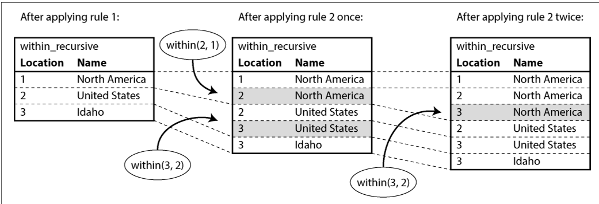

> 图 3-7。使用示例 3-12 中的 Datalog 规则，确定 Idaho 位于北美洲。  

现在，规则 3 可以找出出生于某个地点 BornIn、现居于某个地点 LivingIn 的人。规则 4 以 BornIn = 'United States' 和 LivingIn = 'Europe' 调用规则 3，并且只返回符合搜索条件的人员姓名。通过查询虚拟表 us_to_europe 的内容，Datalog 系统最终得到与前面的 Cypher 和 SPARQL 查询相同的答案。  

与本章讨论的其他查询语言相比，Datalog 方法需要不同的思维方式。它允许逐条规则构建复杂查询，一条规则可以引用其他规则，这类似于把代码拆分成彼此调用的函数。函数可以递归，Datalog 规则同样可以调用自身，例如示例 3-12 中的规则 2；这使 Datalog 查询能够遍历图。  

## GraphQL  

GraphQL 是一种查询语言；按照设计，它比本章迄今介绍的其他查询语言限制多得多。它面向 OLTP 查询，目的是让运行在用户设备上的客户端软件（例如移动应用或 JavaScript Web 应用前端）能够请求具有特定结构的 JSON 文档，其中包含渲染用户界面所需的字段。  

GraphQL 接口允许开发者快速更改客户端代码中的查询，而无须更改服务器端 API。不过，这种灵活性也有代价。采用 GraphQL 的组织往往需要使用工具，将查询转换为对内部服务的请求，而这些内部服务通常使用 REST 或 gRPC（见第 5 章）。此外，授权、速率限制和性能挑战也是需要考虑的问题 [64]。  

这门语言也受到了有意的限制，因为 GraphQL 查询来自不受信任的来源。它不允许执行成本可能很高的操作，否则用户可能会通过运行大量高成本查询，（也许无意中）使服务器陷入拒绝服务状态。具体来说，GraphQL 不允许递归查询（不同于 Cypher、SPARQL、SQL 或 Datalog），也不允许任意搜索条件（例如前面的“查找出生在美国、现在居住在欧洲的人”），除非服务所有者明确选择提供此类搜索功能。  

尽管如此，GraphQL 仍然很有用。示例 3-13 展示了如何使用 GraphQL 实现类似 Discord 或 Slack 的群聊应用。该查询请求用户有权访问的所有频道，包括频道名称和每个频道最近的 50 条消息。对于每条消息，查询会请求时间戳、消息内容，以及发送者的姓名和头像 URL。如果一条消息是对另一条消息的回复，查询还会请求被回复消息的发送者姓名和消息内容（为了提供一些上下文，这些内容可以用较小字号渲染在回复上方）。  

示例 3-13。群聊应用的 GraphQL 查询  

```graphql
query ChatApp {
    channels {
        name
        recentMessages(latest: 50) {
            timestamp
            content
            sender {
                fullName
                imageUrl
            }
            replyTo {
                content
                sender {
                    fullName
                }
            }
        }
    }
}  
```

示例 3-14 展示了示例 3-13 中查询的一种可能响应。响应是一个与查询结构相呼应的 JSON 文档：它恰好包含请求的那些属性，不多也不少。这种方法的优点是，服务器无须知道客户端需要哪些属性来渲染用户界面；客户端只需请求自己所需的内容。例如，这个查询没有请求 replyTo 消息发送者的头像 URL；但如果用户界面改为包含该头像，客户端只需在查询中添加所需的 imageUrl 属性，服务器端无须做任何改动。  

示例 3-14。示例 3-13 中查询的一种可能响应  

```jsonc
{
    "data": {
        "channels": [
            {
                "name": "#general",
                "recentMessages": [
                    {
                        "timestamp": 1693143014,
                        "content": "嗨！大家最近怎么样？",
                        "sender": {
                            "fullName": "Aaliyah", "imageUrl": "https://.../"
                        },
                        "replyTo": null
                    },
                    {
                        "timestamp": 1693143024,
                        "content": "很好！你呢？",
                        "sender": {
                            "fullName": "Caleb", "imageUrl": "https://.../"
                        },
                        "replyTo": {
                            "content": "嗨！大家最近怎么样？",
                            "sender": {
                                "fullName": "Aaliyah"
                            }
                        }
                    },
                    // ...
                    ]
                }
            ]
        }
    }  
```

在这个例子中，消息发送者的姓名和头像 URL 直接嵌入消息对象。如果同一用户发送多条消息，这些信息会在每条消息中重复。原则上可以减少这种重复，但 GraphQL 的设计选择是接受更大的响应体，以便根据请求的数据更简单地渲染用户界面。  

replyTo 字段与此类似：在示例 3-14 中，第二条消息是对第一条消息的回复，因此内容（“嗨……”）和发送者姓名（Aaliyah）在 replyTo 下重复出现。也可以改为返回被回复消息的 ID；但如果该 ID 不在返回的最近 50 条消息中，客户端就必须向服务器发出额外请求。重复内容可以让数据处理简单得多。  

服务器的数据库可以用更规范化的形式存储数据，并执行处理查询所需的连接。例如，服务器可以将一条消息与发送者的用户 ID、该消息所回复消息的 ID 一同存储；收到示例 3-13 那样的查询时，服务器再解析这些 ID，找到它们所指向的记录。不过，客户端只能请求 GraphQL 模式中明确声明的连接。  

尽管 GraphQL 查询的响应看起来与文档数据库的响应相似，而且它的名称中也有“graph”，但 GraphQL 可以在任何类型的数据库之上实现——关系数据库、文档数据库或图数据库均可。  

## 事件溯源与命令查询职责分离（CQRS）  

在目前讨论的所有数据模型中，数据的查询形式与写入形式相同——无论是 JSON 文档、表中的行，还是图中的顶点和边。然而，在复杂应用中，有时很难找到一种数据表示，能够满足数据查询和呈现的所有方式。在这种情况下，以一种形式写入数据，再从中派生出针对不同读取类型优化的表示，可能更有益。  

我们之前在第 10 页的“记录系统与派生数据”中见过这一思想，ETL（见第 7 页的“数据仓库”）就是这类派生过程的一个例子。现在，我们进一步拓展这个思想。既然无论如何都要从一种数据表示派生出另一种，就可以分别选择针对写入和读取优化的不同表示。如果只想针对写入进行优化，完全不考虑查询效率，你会如何为数据建模？  

写入数据最简单、最快且表达能力最强的方式，或许就是事件日志：每当需要写入一些数据时，就把它编码为一个自包含的字符串（可能是 JSON），其中包括时间戳，然后将其追加到事件序列中。该日志中的事件不可变；你永远不会更改或删除它们，只会不断向日志追加更多事件（这些事件可能取代先前事件的效力）。事件可以包含任意属性。  

图 3-8 展示了一个可能取自会议管理系统的例子。会议可能是一个复杂的业务领域：不仅个人参会者可以注册并刷卡付款，公司也可以批量订购席位、通过发票付款，之后再把席位分配给具体人员。还可能为演讲者、赞助商、志愿者等预留一定数量的席位。预订也可能取消，会议组织者还可能把会议移到不同的房间，从而改变活动容量。在这么多因素共同作用下，仅仅计算可用席位数量就成了一项颇具挑战的查询。  

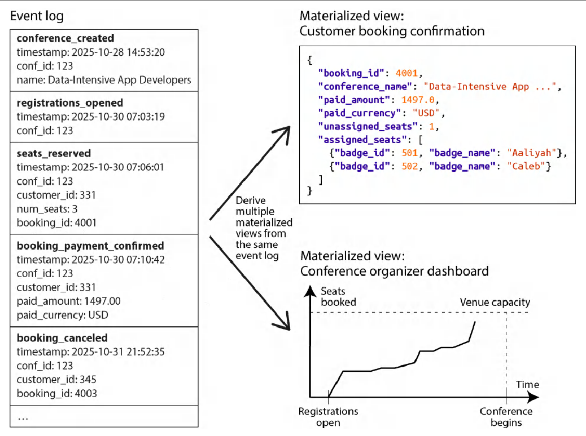

> 图 3-8。使用不可变事件日志作为事实来源，并从中派生物化视图。  

在图 3-8 中，会议状态的每次变化（例如组织者开放注册，或参会者注册和取消注册）都会先存储为事件。每当有事件追加到日志时，若干个*物化视图*（也称为*投影*或*读模型*）也会更新，以反映该事件的影响。在会议示例中，可以有一个物化视图汇集每项预订状态的全部相关信息，另一个为会议组织者的仪表板计算图表，第三个则为制作参会者胸卡的打印机生成文件。  

以事件作为事实来源、把每次状态变化都表示为事件的思想称为*事件溯源* [65, 66]。维护独立的读取优化表示，并从写入优化表示派生出这些表示的原则，称为*命令查询职责分离（CQRS）* [67]。这些术语起源于 DDD 社区，不过类似思想早已存在很长时间，例如状态机复制（见第 433 页的“使用共享日志”）。  

当用户请求到来时，它称为*命令*，首先需要经过验证。命令执行完毕并被确定为有效后（例如，请求预订的席位确实有足够余量），它就成为事实，相应事件也会加入日志。因此，事件日志应当只包含有效事件，而构建物化视图的事件日志消费者不允许拒绝事件。  

以事件溯源风格为数据建模时，建议用过去时命名事件（例如，“席位已被预订”），因为事件记录的是某件事已经发生这一事实。即使用户后来决定更改或取消预订，他们曾经持有预订这一事实仍然为真；更改或取消则是之后另行添加的事件。  

事件溯源与第 77 页“星型与雪花：分析模式”中讨论的星型模式事实表有一点相似：二者都是过去发生的事件的集合。不过，事实表中的所有行都有相同的一组列，而事件溯源可能包含许多事件类型，每种类型具有不同的属性。此外，事实表是无序集合，而在事件溯源中，事件顺序很重要：如果先完成预订、之后又取消预订，以错误顺序处理这些事件就没有意义。  

事件溯源和 CQRS 有以下几项优点：  

- 对于系统开发人员而言，事件能更好地传达某件事为何发生这一意图。例如，事件“预订已取消”比“bookings 表第 4001 行的 active 列被设为 false，与该预订关联的三行数据从 seat_assignments 表中删除，并向 payments 表插入一行表示退款的数据”更容易理解。物化视图处理取消事件时，这些行级修改可能仍然会发生；但由事件驱动之后，更新的原因就清楚得多。  

- 事件溯源的一项关键原则是，物化视图以可重现的方式从事件日志派生而来。你应该始终能够删除物化视图，再用相同代码、按照相同顺序处理相同事件，从而重新计算这些视图。如果视图维护代码中有缺陷，只需删除视图，再用新代码重新计算即可。缺陷也更容易发现，因为你可以随意多次重新运行视图维护代码并检查其行为。  

- 你可以拥有多个针对应用所需特定查询优化的物化视图。根据需要，这些视图可以与事件存储在同一个数据库中，也可以存储在不同的数据库中。它们可以使用任何数据模型，也可以通过反规范化实现快速读取。甚至可以只把视图保存在内存中而不持久化，只要能够接受服务每次重启时都从事件日志重新计算视图即可。  

- 如果决定以新方式呈现现有信息，可以轻松地从现有事件日志构建新的物化视图。还可以通过添加新的事件类型，或为现有事件类型添加新属性（所有较早的事件都保持不变），让系统逐步演进以支持新功能。也可以在现有事件之后串接新的行为（例如，当某位会议参会者取消时，可以把其席位提供给候补名单中的下一位）。  

- 如果错误地写入了某个事件，可以再写入一个删除事件来撤销它。下游视图会自动纳入此次删除，从而修正数据。另一方面，在直接更新和删除数据的数据库中，已提交的事务往往很难撤销。因此，事件溯源可以减少系统中不可逆操作的数量，使系统更容易变更（见第 55 页的“可演化性：让变更更容易”）。  

- 事件日志还可以充当系统中已发生事项的审计日志；对于要求具备这种可审计性的受监管行业而言，这很有价值。  

- 由于采用顺序访问模式，事件日志通常能够处理比数据库更高的写入吞吐量。如果事件出现短时突增，日志可以将其吸收，而维护物化视图的下游系统可以按自己的节奏追赶，不至于不堪重负。  

不过，事件溯源和 CQRS 也有缺点：  

- 涉及外部信息时必须谨慎。例如，假设某个事件包含以一种货币计价的价格，而某个视图需要将其换算成另一种货币。由于汇率可能波动，如果在处理事件时从外部来源获取汇率，就会产生问题，因为改天重新计算物化视图时可能得到不同的结果。为了让事件处理逻辑具有确定性，要么必须把汇率包含在事件本身中，要么必须能根据事件所示的时间戳查询历史汇率，并确保对于同一时间戳，该查询始终返回相同结果。  

- 如果事件包含用户的个人数据，事件不可变这一要求就会造成问题，因为用户可能会行使自己的权利（例如 GDPR 规定的权利），要求删除其数据。如果事件日志按用户划分，可以直接删除该用户的整份日志；但如果事件日志包含与多个用户相关的事件，这种做法就不可行。你可以尝试把个人数据存储在实际事件之外，或使用之后可以选择删除的密钥对其加密（一种称为*密码学擦除*的技术 [68]），但这样也会加大必要时重新计算派生状态的难度。  

- 如果存在外部可见的副作用，重新处理事件时需要格外小心——例如，你大概不希望每次重建物化视图时都重新发送确认邮件。  

事件溯源可以在任何数据库之上实现，但有些系统是专门为支持这种模式而设计的，例如 EventStoreDB、MartenDB（基于 PostgreSQL）和 Axon Framework。也可以使用 Apache Kafka 等消息代理存储事件日志，并由流处理器保持物化视图为最新状态；我们将在第 12 章回到这些主题。  

唯一重要的要求是，事件存储系统必须保证所有物化视图都严格按照事件在日志中出现的顺序处理事件。正如第 10 章将会看到的，在分布式系统中，这一点并不总是容易实现。  

## 数据帧、矩阵和数组  

本章到目前为止介绍的数据模型通常兼用于事务处理和分析（参见第 3 页的“事务处理系统与分析系统”）。此外，还有少数数据模型常见于分析或科学领域，却很少出现在 OLTP 系统中，其中包括数据帧以及矩阵等数值多维数组。  

R 语言、Python 的 Pandas 库、Apache Spark、ArcticDB、Dask 等系统都支持数据帧数据模型。数据帧是数据科学家为训练机器学习模型准备数据时常用的工具，也广泛用于数据探索、统计数据分析、数据可视化及类似用途。  

乍看之下，数据帧类似于关系数据库中的表或电子表格。数据帧支持类似关系模型的运算符，可对其内容执行批量操作；例如，对所有行应用某个函数、根据条件筛选行、按某些列对行进行分组并聚合其他列，以及根据键将一个数据帧中的行与另一个数据帧中的行连接起来（关系数据库所称的连接，在数据帧中通常称为合并）。  

数据帧通常不是通过 SQL 这样的声明式查询语言来操作，而是通过一系列命令来修改其结构和内容。这与数据科学家的典型工作流程相符：他们逐步“整理”数据，使其成为能够帮助自己找到问题答案的形式。这些操作通常在数据科学家自己的数据集副本上进行，而且往往是在其本地计算机上，不过最终结果可能会与其他用户共享。  

数据帧 API 还提供了种类繁多的操作，远远超出关系数据库所能提供的范围，而且这种数据模型的使用方式往往与典型的关系数据建模大相径庭 [69]。例如，数据帧的一种常见用途，是把数据从类似关系模型的表示形式转换为矩阵或多维数组表示形式，而许多机器学习算法都要求以这种形式接收输入。  

图 3-9 展示了这种转换的一个简单示例。左侧是一张关系表，记录了用户对不同电影的评分（评分范围为 1 到 5）；右侧的数据则已转换为矩阵，其中每一列代表一部电影，每一行代表一位用户（类似于电子表格中的数据透视表）。这个矩阵是稀疏的，也就是说，许多“用户—电影”组合没有数据，但这并无妨。该矩阵可能有成千上万列，因此不太适合放在关系数据库中；数据帧以及提供稀疏数组的库（例如 Python 的 NumPy）却能轻松处理此类数据。  

| movie_ratings|movie_ratings|movie_ratings|movie_ratings|
| ---|---|---|---|
| user_id|movie_id|rating|date|
| 100|12|4|2017-12-14|
| 100|14|5|2021-10-28|
| 101|10|1|2024-04-18|
| 101|11|3|2004-05-25|
| 101|13|2|2020-07-13|
| 102|15|4|2010-05-11|
| 103|13|3|2007-02-07|
| 104|13|3|2000-02-25|
| 104|14|5|2009-11-15|
| 105|11|4|2005-10-24|
| 106|14|5|2024-03-10|  

| ||电影|电影|电影|电影|电影|电影|
| ---|---|---|---|---|---|---|---|
| ||10|11|12|13|14|15|
| 用户|100|||4||5||
| 用户|101|1|3||2|||
| 用户|102||||||4|
| 用户|103||||3|||
| 用户|104||||3|5||
| 用户|105||4|||||
| 用户|106|||||5||  

> 图 3-9。将电影评分关系数据库转换为矩阵。  

矩阵只能包含数值，因此需要运用各种技术将非数值数据转换成矩阵中的数值。例如：  

- 日期（图 3-9 的示例矩阵中省略了日期）可以缩放为适当范围内的浮点数。  

- 对于只能取少量固定值之一的列（例如电影数据库中的电影类型），通常采用独热编码。我们为每个可能的值（“喜剧”“剧情”“恐怖”等）分别创建一列；对于代表一部电影的每一行，在该电影类型对应的列中填入 1，在其他所有列中填入 0。这种表示方式也很容易推广到同时属于多个类型的电影。  

数据转换成数值矩阵后，就可以进行线性代数运算，而线性代数正是许多机器学习算法的基础。例如，图 3-9 中的数据可以成为电影推荐系统的一部分，用于推荐用户可能喜欢的电影。数据帧非常灵活，既可以让数据逐步从关系形式演变为矩阵表示，又能让数据科学家掌控表示方式，选择最适合实现数据分析或模型训练目标的形式。  

有些数据库（例如 TileDB [70]）专门存储大型数值多维数组；它们称为数组数据库，最常用于地理空间测量（规则间隔网格上的栅格数据）、医学影像或天文望远镜观测结果等科学数据集 [71]。数据帧也用于金融业，用来表示资产价格和交易随时间变化等时间序列数据 [72]。由于数据帧深受数据科学家欢迎，Spark 和 Flink 等批处理框架也加入了对它的支持；我们将在第 11 章回到这个话题。  

<a id="chapter-3-summary"></a>

## 小结  

数据模型是一个庞大的主题，本章快速浏览了种类繁多的数据模型。篇幅所限，我们无法深入探讨每种模型的所有细节，但希望这番概览足以激发你的兴趣，进一步了解最符合应用需求的模型。  

尽管已有半个多世纪的历史，*关系模型*对许多应用来说仍然是一种重要的数据模型——尤其是在数据仓库和商业分析领域，关系型星型或雪花模式以及 SQL 查询随处可见。不过，在其他领域，关系数据的几种替代方案也已流行起来：  

- *文档模型*面向这样的用例：数据以自包含的 JSON 文档形式存在，不同文档之间的关系很少。  

- 图数据模型则走向另一个方向，面向任何事物都可能与其他一切事物相关的用例；查询可能需要跨越多跳才能找到感兴趣的数据（这种需求可以通过 Cypher、SPARQL 或 Datalog 中的递归查询来满足）。  

- 数据帧将关系数据推广到大量列，在数据库与多维数组之间架起桥梁；后者是许多机器学习、统计数据分析和科学计算的基础。  

在一定程度上，一种模型往往可以用另一种模型来模拟——例如，图数据可以在关系数据库中表示——但结果可能很别扭，正如我们在 SQL 对递归查询的支持中所见。  

因此，人们为每种数据模型开发了各种专用数据库，提供针对特定模型优化的查询语言和存储引擎。不过，数据库也呈现出通过支持其他数据模型而向相邻领域扩展的趋势——例如，关系数据库以 JSON 列的形式加入了对文档数据的支持，文档数据库加入了类似关系模型的连接，而 SQL 对图数据的支持也在逐步改善。  

我们讨论的另一种模型是*事件溯源*。它把数据表示为不可变事件的仅追加日志，在复杂业务领域的活动建模中可能颇具优势。仅追加日志很适合写入数据（我们将在第 4 章看到这一点）；为了支持高效查询，事件日志通过命令查询职责分离（CQRS）转换成针对读取优化的物化视图。  

非关系数据模型有一个共同点：它们通常不强制规定所存储数据的模式，这可以使应用更容易适应不断变化的需求。不过，你的应用很可能仍然假定数据具有某种结构；区别只在于模式是显式的（写入时强制执行），还是隐式的（读取时假定存在）。  

尽管我们已经涉及了许多内容，仍有一些数据模型尚未提及。下面仅举几个简短的例子：  

- 研究基因组数据的人员经常需要执行序列相似性搜索，即取一条很长的字符串（代表一个 DNA 分子），在大型字符串数据库中与相似但不完全相同的字符串进行匹配。这里介绍的数据库都无法处理这种用法，因此研究人员编写了 GenBank [73] 等专用的基因组数据库软件。  

- 许多金融系统采用使用复式记账法的*账本*作为其数据模型。这类数据可以在关系数据库中表示，但也有专门针对这种数据模型的数据库（例如 TigerBeetle）。加密货币和区块链通常以分布式账本为基础，其数据模型还内置了价值转移功能。  

- 全文搜索可以说是一种经常与数据库配合使用的数据模型。信息检索是一个庞大的专业领域，本书不会深入讨论，但会在第 146 页的“全文搜索”中简要介绍搜索索引和向量搜索。  

本章暂且到此为止。下一章将讨论在*实现*本章所述数据模型时需要权衡的一些因素。  

## 参考文献  

[1] Jamie Brandon. “Unexplanations: Query Optimization Works Because SQL Is Declarative.” scattered-thoughts.net，2024 年 2 月。存档于 perma.cc/P6W2-WMFZ  

[2] Neel Krishnaswami. "What Declarative Languages Are." semantic-domain.blogspot.com，2013 年 7 月。存档于 perma.cc/R4LP-T2RV  

[3] Joseph M. Hellerstein. "The Declarative Imperative: Experiences and Conjectures in Distributed Logic." 技术报告 UCB/EECS-2010-90，加州大学伯克利分校电子工程与计算机科学系，2010 年 6 月。存档于 perma.cc/K56R-VVQM  

[4] Edgar F. Codd. "A Relational Model of Data for Large Shared Data Banks." *Communications of the ACM*，第 13 卷第 6 期，第 377–387 页，1970 年 6 月。doi:10.1145/362384.362685  

[5] Michael Stonebraker and Joseph M. Hellerstein. "What Goes Around Comes Around." 收录于 *Readings in Database Systems*，第 4 版，MIT Press，2005 年，第 2–41 页。ISBN: 9780262693141  

[6] Markus Winand. “Modern SQL: Beyond Relational.” modern-sql.com，2015 年。存档于 perma.cc/D63V-WAPN  

[7] Martin Fowler. “Orm Hate.” martinfowler.com，2012 年 5 月。存档于 perma.cc/VCM8-PKNG  

[8] Vlad Mihalcea. “N+1 Query Problem with JPA and Hibernate.” vladmihalcea.com，2023 年 1 月。存档于 perma.cc/79EV-TZKB  

[9] Jens Schauder. “This Is the Beginning of the End of the N+1 Problem: Introducing Single Query Loading.” spring.io，2023 年 8 月。存档于 perma.cc/6V96-R333  

[10] Jamie Brandon. “SQL Needed Structure.” scattered-thoughts.net，2025 年 9 月。存档于 perma.cc/9EVK-HLVR  

[11] William Zola. “6 Rules of Thumb for MongoDB Schema Design.” mongodb.com，2014 年 6 月。存档于 perma.cc/T2BZ-PPJB  

[12] Sidney Andrews and Christopher McClister. “Data Modeling in Azure Cosmos DB.” learn.microsoft.com，2023 年 2 月。存档于 archive.org  

[13] Raffi Krikorian. “Timelines at Scale.” 2012 年 11 月发表于 QCon San Francisco。存档于 perma.cc/V9G5-KLYK  

[14] Ralph Kimball and Margy Ross. *The Data Warehouse Toolkit: The Definitive Guide to Dimensional Modeling*，第 3 版。John Wiley & Sons，2013 年。ISBN: 9781118530801  

[15] Michael Kaminsky. “Data Warehouse Modeling: Star Schema vs. OBT.” five-tran.com，2022 年 8 月。存档于 perma.cc/2PZK-BFFP  

[16] Joe Nelson. “User-defined Order in SQL.” *begriffs.com*，2018 年 3 月。存档于 *perma.cc/GS3W-F7AD*  

[17] Evan Wallace. “Realtime Editing of Ordered Sequences.” *figma.com*，2017 年 3 月。存档于 *perma.cc/K6ER-CQZW*  

[18] David Greenspan. “Implementing Fractional Indexing.” *observablehq.com*，2020 年 10 月。存档于 *perma.cc/5N4R-MREN*  

[19] Martin Fowler. “Schemaless Data Structures.” martinfowler.com，2013 年 1 月。  

[20] Amr Awadallah. “Schema-on-Read vs. Schema-on-Write.” 2009 年 5 月发表于 Berkeley EECS RAD Lab Retreat。存档于 perma.cc/DTB2-JCFR  

[21] Martin Odersky. “The Trouble with Types.” 2013 年 9 月发表于 *Strange Loop*。存档于 *perma.cc/85QE-PVEP*  

[22] Conrad Irwin. “MongoDB—Confessions of a PostgreSQL Lover.” 2013 年 10 月发表于 HTML5DevConf。存档于 perma.cc/C2J6-3AL5  

[23] “Percona Toolkit Documentation: pt-online-schema-change.” docs.percona.com，2023 年。存档于 perma.cc/9K8R-E5UH  

[24] Shlomi Noach. “gh-ost: GitHub’s Online Schema Migration Tool for MySQL.” *github.blog*，2016 年 8 月。存档于 *perma.cc/7XAG-XB72*  

[25] Shayon Mukherjee. "pg-osc: Zero Downtime Schema Changes in PostgreSQL." shayon.dev，2022 年 2 月。存档于 perma.cc/35WN-7WMY  

[26] Carlos Pérez-Aradros Herce. “Introducing pgroll: Zero-Downtime, Reversible, Schema Migrations for Postgres.” xata.io，2023 年 10 月。存档于 archive.org  

[27] James C. Corbett, Jeffrey Dean, Michael Epstein, Andrew Fikes, Christopher Frost, JJ Furman, Sanjay Ghemawat, Andrey Gubarev, Christopher Heiser, Peter Hochschild, Wilson Hsieh, Sebastian Kanthak, Eugene Kogan, Hongyi Li, Alexander Lloyd, Sergey Melnik, David Mwaura, David Nagle, Sean Quinlan, Rajesh Rao, Lindsay Rolig, Dale Woodford, Yasushi Saito, Christopher Taylor, Michal Szymaniak, and Ruth Wang. "Spanner: Google's Globally-Distributed Database." 2012 年 10 月发表于第 10 届 USENIX 操作系统设计与实现研讨会（OSDI）。  

[28] Donald K. Burleson. “Reduce I/O with Oracle Cluster Tables.” *dba-oracle.com*。存档于 *perma.cc/7LBJ-9X2C*  

[29] Fay Chang, Jeffrey Dean, Sanjay Ghemawat, Wilson C. Hsieh, Deborah A. Wallach, Mike Burrows, Tushar Chandra, Andrew Fikes, and Robert E. Gruber. "Bigtable: A Distributed Storage System for Structured Data." 2006 年 11 月发表于第 7 届 USENIX 操作系统设计与实现研讨会（OSDI）。  

[30] Priscilla Walmsley. XQuery，第 2 版。O'Reilly Media，2015 年。ISBN: 9781491915080  

[31] Paul C. Bryan, Kris Zyp, and Mark Nottingham. "JavaScript Object Notation (JSON) Pointer." RFC 6901，IETF，2013 年 4 月。  

[32] Stefan Gössner, Glyn Normington, and Carsten Bormann. "JSONPath: Query Expressions for JSON." RFC 9535，IETF，2024 年 2 月。  

[33] Michael Stonebraker and Andrew Pavlo. "What Goes Around Comes Around...
And Around...." ACM SIGMOD Record，第 53 卷第 2 期，第 21–37 页，2024 年 7 月。
doi:10.1145/3685980.3685984  

[34] Lawrence Page, Sergey Brin, Rjeev Motwani, and Terry Winograd. "The
PageRank Citation Ranking: Bringing Order to the Web." 技术报告 1999-66，
Stanford University InfoLab，1999 年 11 月。存档于 perma.cc/UML9-UZHW  

[35] Nathan Bronson, Zach Amsden, George Cabrera, Prasad Chakka, Peter Dimov, Hui Ding, Jack Ferris, Anthony Giardullo, Sachin Kulkarni, Harry Li, Mark Marchukov, Dmitri Petrov, Lovro Puzar, Yee Jiun Song, and Venkat Venkataramani. "TAO: Facebook's Distributed Data Store for the Social Graph." 2013 年 6 月发表于 USENIX 年度技术会议（ATC）。  

[36] Natasha Noy, Yuqing Gao, Anshu Jain, Anant Narayanan, Alan Patterson, and Jamie Taylor. "Industry-Scale Knowledge Graphs: Lessons and Challenges." Communications of the ACM，第 62 卷第 8 期，第 36–43 页，2019 年 8 月。doi:10.1145/3331166  

[37] Xiyang Feng, Guodong Jin, Ziyi Chen, Chang Liu, and Semih Salihoglu. “KÜZU Graph Database Management System.” 2023 年 1 月发表于第 13 届创新数据系统研究年会（CIDR 2023）。存档于 perma.cc/PS6J-ZBZU  

[38] Maciej Besta, Emanuel Peter, Robert Gerstenberger, Marc Fischer, Michał Podstawski, Claude Barthels, Gustavo Alonso, Torsten Hoefler. "Demystifying Graph Databases: Analysis and Taxonomy of Data Organization, System Designs, and Graph Queries." arXiv:1910.09017，2019 年 10 月。  

[39] “Apache TinkerPop. TinkerPop 3.6.3 Documentation.” *tinkerpop.apache.org*，2023 年 5 月。存档于 *perma.cc/KM7W-7PAT*  

[40] Nadime Francis, Alastair Green, Paolo Guagliardo, Leonid Libkin, Tobias Lindaaker, Victor Marsault, Stefan Plantikow, Mats Rydberg, Petra Selmer, and Andrés Taylor. "Cypher: An Evolving Query Language for Property Graphs." 2018 年 5 月发表于数据管理国际会议（SIGMOD）。doi:10.1145/3183713.3190657  

[41] Emil Eifrem. Twitter 通信，2014 年 1 月。存档于 perma.cc/WM4S-BW64  

[42] Francesco Tisiot. “Explore the New SEARCH and CYCLE Features in PostgreSQL® 14.” aiven.io，2021 年 12 月。存档于 perma.cc/J6BT-83UZ  

[43] Gaurav Goel. “Understanding Hierarchies in Oracle.” *towardsdatascience.com*，2020 年 5 月。存档于 *perma.cc/5ZLR-Q7EW*  

[44] Alin Deutsch, Yu Xu, and Mingxi Wu. "Seamless Syntactic and Semantic Integration of Query Primitives over Relational and Graph Data in GSQL." tigergraph.com，2018 年 11 月。存档于 perma.cc/JG7J-Y35X  

[45] Oskar van Rest, Sungpack Hong, Jinha Kim, Xuming Meng, and Hassan Chafi. "PGQL: A Property Graph Query Language." 2016 年 6 月发表于第 4 届图数据管理经验与系统国际研讨会（GRADE5）。doi:10.1145/2960414.2960421  

[46] Philip Rathle and Brad Bebee. “GQL: The ISO Standard for Graphs Has Arrived.” aws.amazon.com，2024 年 4 月。存档于 perma.cc/5TEU-N2Y8  

[47] Alin Deutsch, Nadime Francis, Alastair Green, Keith Hare, Bei Li, Leonid Libkin, Tobias Lindaaker, Victor Marsault, Wim Martens, Jan Michels, Filip Muralak, Stefan Plantikow, Petra Selmer, Oskar van Rest, Hannes Voigt, Domagoj Vrgoč, Mingxi Wu, and Fred Zemke. "Graph Pattern Matching in GQL and SQL/PGQ." 2022 年 6 月发表于数据管理国际会议（SIGMOD）。doi:10.1145/3514221.3526057  

[48] Alastair Green. “SQL...And Now GQL.” opencypher.org，2019 年 9 月。存档于 perma.cc/AFB2-3SY7  

[49] Amazon Web Services. “Neptune Graph Data Model.” Amazon Neptune User Guide，docs.aws.amazon.com。存档于 perma.cc/CX3T-EZU9  

[50] Cognitect. “Datomic Data Model.” Datomic Cloud Documentation，docs.datomic.com。存档于 perma.cc/LGM9-LEUT  

[51] David Beckett and Tim Berners-Lee. "Turtle—Terse RDF Triple Language." W3C 团队提交稿，2011 年 3 月。  

[52] Sinclair Target. “Whatever Happened to the Semantic Web?” twobithistory.org，2018 年 5 月。存档于 perma.cc/M8GL-9KHS  

[53] Gavin Mendel-Gleason. “The Semantic Web Is Dead—Long Live the Semantic Web!” terminusdb.com，2022 年 8 月。存档于 perma.cc/G2MZ-DSS3  

[54] Manu Sporny. "JSON-LD and Why I Hate the Semantic Web." *manu.sporny.org*，2014 年 1 月。存档于 *perma.cc/7PT4-PJKF*  

[55] University of Michigan Library. “Biomedical Ontologies and Controlled Vocabularies.” guides.lib.umich.edu/ontology。存档于 perma.cc/Q5GA-F2N8  

[56] Facebook. “The Open Graph Protocol.” ogp.me。存档于 perma.cc/C49A-GUSY  

[57] Matt Haughey. "Everything You Ever Wanted to Know About Unfurling but Were Afraid to Ask /or/ How to Make Your Site Previews Look Amazing in Slack." *medium.com*，2015 年 11 月。存档于 *perma.cc/C7S8-4PZN*  

[58] W3C RDF Working Group. “Resource Description Framework (RDF).” w3.org，2004 年 2 月。  

[59] Steve Harris, Andy Seaborne, and Eric Prud'hommeaux. "SPARQL 1.1 Query Language." W3C 推荐标准，2013 年 3 月。  

[60] Todd J. Green, Shan Shan Huang, Boon Thau Loo, and Wenchao Zhou. "Datalog and Recursive Query Processing." Foundations and Trends in Databases，第 5 卷第 2 期，第 105–195 页，2013 年 11 月。doi:10.1561/1900000017  

[61] Stefano Ceri, Georg Gottlob, and Letizia Tanca. "What You Always Wanted to Know About Datalog (And Never Dared to Ask)." IEEE Transactions on Knowledge and Data Engineering，第 1 卷第 1 期，第 146–166 页，1989 年 3 月。doi:10.1109/69.43410  

[62] Serge Abiteboul, Richard Hull, and Victor Vianu. *Foundations of Databases*. Addison-Wesley，1995 年。ISBN: 9780201537710。可在线访问 webdam.inria.fr/Alice。  

[63] Scott Meyer, Andrew Carter, and Andrew Rodriguez. "Liquid: The Soul of a New Graph Database, Part 2." engineering.linkedin.com，2020 年 9 月。存档于 perma.cc/K9M4-PD6Q  

[64] Matt Bessey. "Why, After 6 Years, I'm over GraphQL." *bessey.dev*，2024 年 5 月。存档于 *perma.cc/2PAU-JYRA*  

[65] Dominic Betts, Julián Domínguez, Grigori Melnik, Fernando Simonazzi, and Mani Subramanian. *Exploring CQRS and Event Sourcing*. Microsoft Patterns & Practices，2012 年。ISBN: 9781621140164。存档于 perma.cc/7A39-3NM8  

[66] Greg Young. “CQRS and Event Sourcing.” 2014 年 8 月发表于 Code on the Beach。  

[67] Greg Young. “CQRS Documents.” *cqrs.wordpress.com*，2010 年 11 月。存档于 *perma.cc/X5R6-R47F*  

[68] Brent Robinson. "Crypto Shredding: How It Can Solve Modern Data Retention Challenges." *medium.com*，2019 年 1 月。存档于 *perma.cc/4LFK-S6XE*  

[69] Devin Petersohn, Stephen Macke, Doris Xin, William Ma, Doris Lee, Xiangxi Mo, Joseph E. Gonzalez, Joseph M. Hellerstein, Anthony D. Joseph, and Aditya Parameswaran. "Towards Scalable Dataframe Systems." Proceedings of the VLDB Endowment，第 13 卷第 11 期，第 2033–2046 页，2020 年 7 月。doi:10.14778/3407790.3407807  

[70] Stavros Papadopoulos, Kushal Datta, Samuel Madden, and Timothy Mattson. "The TileDB Array Data Storage Manager." Proceedings of the VLDB Endowment，第 10 卷第 4 期，第 349–360 页，2016 年 11 月。doi:10.14778/3025111.3025117  

[71] Florin Rusu. "Multidimensional Array Data Management." *Foundations and Trends in Databases*，第 12 卷第 2–3 期，第 69–220 页，2023 年 2 月。doi:10.1561/1900000069  

[72] Ed Targett. “Bloomberg, Man Group Team Up to Develop Open Source ‘ArcticDB’ Database.” *thestack.technology*，2023 年 3 月。存档于 *perma.cc/M5YD-QQYV*  

[73] Dennis A. Benson, Ilene Karsch-Mizrachi, David J. Lipman, James Ostell, and David L. Wheeler. GenBank. Nucleic Acids Research，第 36 卷第 suppl_1 期，第 D25–D30 页，2008 年 1 月。doi:10.1093/nar/gkm929  

# 存储与检索  

生活中的一大苦恼是，每个人给事物起的名字多少都有点不准确。因此，世间万物都比采用不同命名时更难理解一些。计算机的首要功能并不是算术意义上的计算。……它们首先是归档系统。  

——理查德·费曼，*Idiosyncratic Thinking* 研讨会（1985）  

从最根本的层面来说，数据库需要做两件事：当你给它一些数据时，它应当把数据存储起来；而当你日后再次索取这些数据时，它应当把数据交还给你。  

第 3 章讨论了数据模型和查询语言，也就是你向数据库提供数据时采用的格式，以及日后再次索取数据时使用的接口。本章将从数据库的视角讨论同样的问题：数据库如何存储你提供的数据，以及当你索取数据时，它如何再次找到这些数据。  

作为应用开发者，你为什么应当关心数据库在内部如何处理存储与检索？你大概不会从头实现自己的存储引擎，但在众多可用的存储引擎中，你*确实*需要选择适合自己应用的那一种。为了配置存储引擎，使它能在你的工作负载下表现良好，你需要对存储引擎幕后的工作原理有个大致了解。  

特别是，针对事务处理工作负载（OLTP）优化的存储引擎与针对分析优化的存储引擎之间存在很大差异（我们在第 3 页的“事务处理系统与分析系统”中介绍了这一区别）。本章首先考察两类用于 OLTP 的存储引擎：写出不可变数据文件的日志结构存储引擎，以及像 B 树这样就地更新数据的存储引擎。这些结构既用于键值存储，也用于二级索引。  

在第 134 页的“分析型数据存储”中，我们将讨论一类针对分析优化的存储引擎；在第 145 页的“多维索引与全文索引”中，我们将考察用于文本检索等更高级查询的索引。  

## OLTP 的存储与索引  

来看世界上最简单的数据库，它由两个 bash 函数实现：  

```bash
#!/bin/bash

db_set () {
    echo "$1,$2" >> database
}

db_get () {
    grep "^$1," database | sed -e "s/^\$1/,// " | tail -n 1
}  
```

这两个函数实现了一个键值存储。你可以调用 `db_set key value`，将 `key` 和 `value` 存入数据库。键和值可以是（几乎）任何你想要的内容——例如，值可以是一份 JSON 文档。随后，你可以调用 `db_get key`，它会查找与这个特定键关联的最新值并将其返回。  

它确实能工作：  

```console
$ db_set 12 '{"name":"London","attractions":["Big Ben","London Eye"]}'
$ db_set 42 '{"name":"San Francisco","attractions":["Golden Gate Bridge"]}'
$ db_get 42
{"name":"San Francisco","attractions":["Golden Gate Bridge"]}  
```

存储格式非常简单：一个文本文件，每行包含一个以逗号分隔的键值对（忽略转义问题的话，大致类似 CSV 文件）。每次调用 db_set 都会在文件末尾追加内容。如果多次更新一个键，旧版本的值不会被覆盖——你需要查看某个键在文件中最后一次出现的位置，才能找到最新值（因此 db_get 中使用了 tail -n 1）：  

```console
$ db_set 42 '{"name":"San Francisco","attractions":["Exploratorium"]}'
$ db_get 42
{"name":"San Francisco","attractions":["Exploratorium"]}

$ cat database
12,{"name":"London","attractions":["Big Ben","London Eye"]}
42,{"name":"San Francisco","attractions":["Golden Gate Bridge"]}
42,{"name":"San Francisco","attractions":["Exploratorium"]}
```

对于如此简单的实现，db_set 函数的性能相当不错，因为向文件追加内容通常非常高效。与 db_set 的做法类似，许多数据库在内部使用日志，即一种仅追加的数据文件。真正的数据库还需要处理更多问题（例如处理并发写入、回收磁盘空间以免日志无限增长，以及在崩溃恢复时处理只写了一部分的记录），但基本原理是一样的。日志极其有用，本书还会多次遇到它。  

> [!NOTE]
> 日志（log）一词通常用来指应用日志，即应用输出的、描述正在发生什么的文本。在本书中，日志取其更一般的含义：磁盘上仅追加的记录序列。它不必便于人类阅读；它可能采用二进制格式，而且仅供数据库系统内部使用。

另一方面，如果数据库中有大量记录，db_get 函数的性能就会非常糟糕。每次想查找一个键，db_get 都必须从头到尾扫描整个数据库文件，寻找该键出现的位置。用算法术语来说，查找的成本是 $O(n)$：如果数据库中的记录数 $n$ 翻倍，一次查找所需的时间也会翻倍。这可不妙。  

为了高效找到数据库中特定键对应的值，我们需要另一种数据结构：*索引*。本章将考察一系列索引结构，并了解它们之间的比较。其总体思路是以特定方式组织数据（例如按键排序），从而更快地定位所需数据。如果想以多种方式搜索同一批数据，可能需要在数据的不同部分建立多个索引。  

索引是从主数据派生出的*附加*结构。许多数据库允许添加和删除索引，而这不会影响数据库的内容，只会影响查询性能。维护附加结构会带来开销，对写入尤其如此。就写入而言，很难有操作能胜过简单地向文件追加内容，因为这是最简单的写操作。任何类型的索引通常都会拖慢写入，因为每次写入数据时还需要更新索引。  

这是存储系统中的一项重要权衡：选择得当的索引能加快读查询，但每个索引都会占用额外磁盘空间并拖慢写入，有时影响还相当显著 [1]。因此，数据库通常不会默认索引所有内容，而是要求你——编写应用或管理数据库的人——根据自己对应用典型查询模式的了解，手动选择索引。这样，你便能选择给应用带来最大收益的索引，同时避免引入超过必要程度的写入开销。  

## 日志结构存储  

首先，假设你想继续把数据存储在 db_set 写入的仅追加文件中，只是希望加快读取。一种方法是在内存中维护一个哈希映射，将每个键映射到该键最新值所在位置的字节偏移量，如图 4-1 所示。  

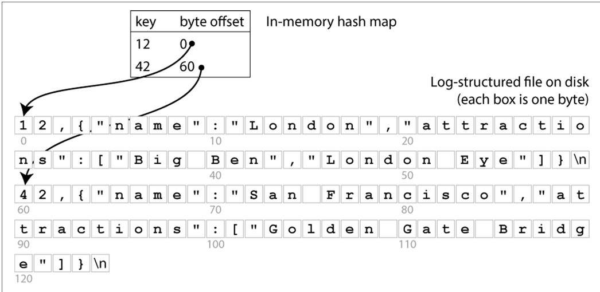

> 图 4-1。在类似 CSV 的格式中存储键值对日志，并使用内存哈希映射作为索引。  

每当向文件追加一个新的键值对时，也要更新哈希映射，使其指向刚写入数据的偏移量。想要查找某个值时，就使用哈希映射找到它在日志文件中的偏移量，定位到该处并读取这个值。如果数据文件的这一部分已在文件系统缓存中，读取甚至完全不需要任何磁盘 I/O。  

这种方法快得多，但仍然存在几个问题：  

- 被覆盖的旧日志条目占用的磁盘空间永远不会释放；如果持续写入数据库，磁盘空间可能会耗尽。  

- 哈希映射没有持久化，因此重启数据库时必须重建它——例如，扫描整个日志文件，找出每个键的最新字节偏移量。如果数据很多，这会导致重启缓慢。  

- 哈希表必须能装入内存。原则上可以在磁盘上维护哈希表，但遗憾的是，很难让磁盘上的哈希映射获得良好性能。它需要大量随机访问 I/O，填满后的扩容成本高昂，而且哈希冲突还需要繁琐的处理逻辑 [2]。  

- 范围查询效率不高。例如，你无法轻松扫描从 10000 到 19999 的所有键——必须在哈希映射中逐个查找每个键。  

## SSTable 文件格式  

实践中，哈希表并不常用作数据库索引。更常见的做法是将数据保存在一种按键排序的结构中 [3]。有序字符串表（Sorted Strings Table，简称 SSTable）就是这种结构的一个例子，如图 4-2 所示。这种文件格式同样存储键值对，但它保证键值对按键排序，并且每个键在文件中只出现一次。  

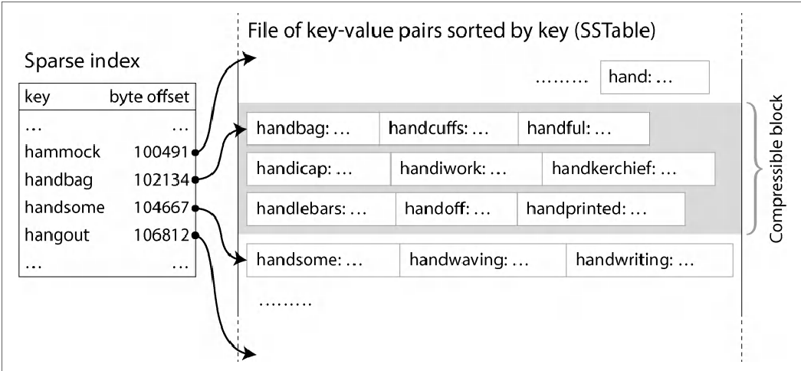

> 图 4-2。带稀疏索引的 SSTable，使查询可以直接跳转到正确的数据块。  

现在，你不需要把所有键都保存在内存中。可以将 SSTable 内的键值对分成若干几千字节大小的数据块，然后在索引中存储每个块的第一个键。这种只存储部分键的索引称为稀疏索引。该索引存储在 SSTable 的一个独立部分中——例如使用不可变 B 树、字典树或其他能让查询快速查找特定键的数据结构 [4]。  

例如在图 4-2 中，一个数据块的第一个键是 handbag，下一个数据块的第一个键是 handsome。现在假设你要查找键 handiwork，而它没有出现在稀疏索引中。由于数据已经排序，你知道 handiwork 必定出现在 handbag 和 handsome 之间。这意味着你可以定位到 handbag 对应的偏移量，从那里开始扫描文件，直到找到 handiwork（如果该键不在文件中，则最终找不到）。几千字节的数据块可以非常快速地扫描完。  

每个记录块也可以压缩（图 4-2 中的阴影区域表示压缩）。除了节省磁盘空间，压缩还能减少 I/O 带宽用量，代价是多耗费一点 CPU 时间。  

## 构建与合并 SSTable  

SSTable 文件格式比仅追加日志更利于读取，但会让写入变得更困难。我们不能直接在文件末尾追加内容，否则文件将不再有序（除非键碰巧按升序写入）。如果每次在中间某处插入一个键都必须重写整个 SSTable，写入成本就会高得多。  

我们可以用一种*日志结构*方法解决这个问题，它是仅追加日志与有序文件的混合体：  

1. 收到写入时，将它加入内存中的有序映射数据结构，例如红黑树、跳表 [5] 或字典树 [6]。使用这些数据结构，可以按任意顺序插入键、高效查找键，并按排序顺序读回键。这种内存数据结构称为 *MemTable*。  

2. 当 MemTable 增长到超过某个阈值（通常是几兆字节）时，将其按排序顺序写入磁盘，形成 SSTable 文件。我们把这个新的 SSTable 文件称为数据库的最新段，它作为独立文件与较旧的段存储在一起。每个段都有各自的内容索引。在将新段写入磁盘期间，数据库可以继续写入一个新的 MemTable 实例；SSTable 写入完成后，旧 MemTable 占用的内存便会释放。  

3. 要读取某个键的值，首先尝试在 MemTable 和磁盘上最新的段中查找该键。如果没有找到，就继续在下一个更旧的段中查找，直到找到该键或到达最旧的段。如果该键未出现在任何段中，它就不存在于数据库中。  

4. 不时在后台运行合并与压实过程，将段文件合并，并丢弃已被覆盖或删除的值。  

合并段的工作方式与*归并排序*算法 [5] 类似。图 4-3 展示了这个过程：并排读取各个输入文件，查看每个文件的第一个键，将最小的键（按排序次序）复制到输出文件，然后重复。如果同一个键出现在多个输入文件中，只保留较新的值。这样会生成一个新的合并段文件，它同样按键排序，每个键只有一个值；而且由于我们可以每次从 SSTable 中迭代一个键，所以只需使用极少的内存。  

为确保数据库崩溃时 MemTable 中的数据不会丢失，存储引擎会在磁盘上维护一份独立日志，每次写入都会立即追加到其中。这份日志没有按键排序，但这并不重要，因为它的唯一用途是在崩溃后恢复 MemTable。每当 MemTable 写入 SSTable 后，日志中对应的部分就可以丢弃。  

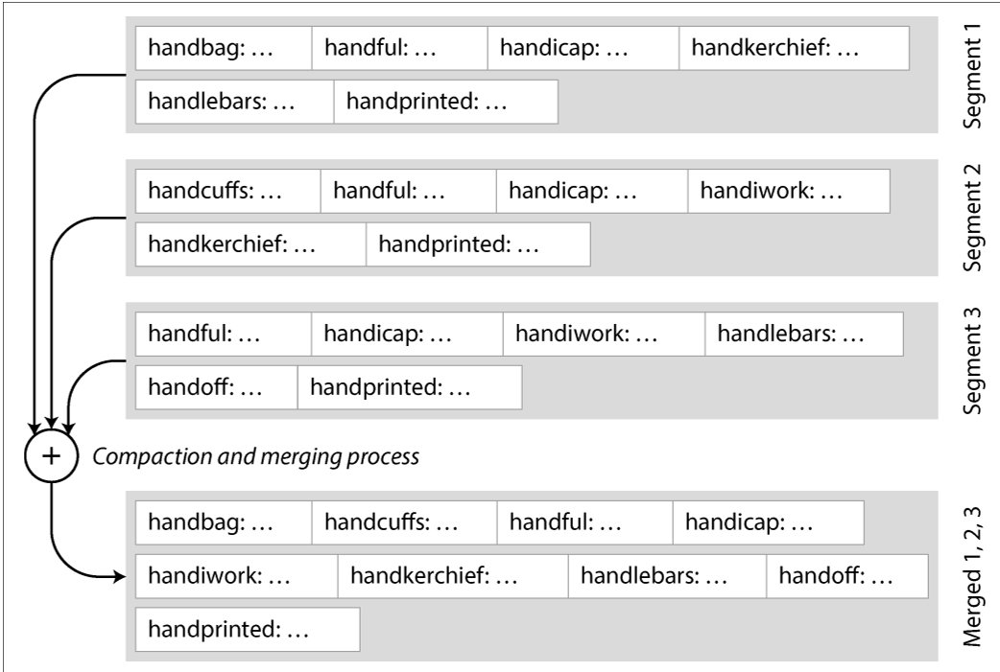

> 图 4-3。合并多个 SSTable 段，每个键只保留最新值。  

如果想删除一个键及其关联值，必须向数据文件追加一种称为墓碑的特殊删除记录。合并日志段时，墓碑会指示合并过程丢弃被删除键以前的所有值。一旦墓碑被合并进最旧的段，就可以将它丢弃。  

这里描述的算法基本上就是 RocksDB [7]、Cassandra、ScyllaDB 和 HBase [8] 所采用的算法；它们都受到 Google Bigtable 论文 [9] 的启发（该论文引入了 SSTable 和 memtable 这两个术语）。这一算法最初于 1996 年以日志结构合并树（Log-Structured Merge-tree，简称 LSM 树）[10] 之名发表，建立在更早的日志结构文件系统研究 [11] 之上。因此，基于合并和压实有序文件这一原理的存储引擎通常称为 LSM 存储引擎。  

在 LSM 存储引擎中，段文件只需一次顺序写成（可以是写出 MemTable，也可以是合并一些现有段），此后便不可变。段的合并与压实可以在后台线程中完成。合并进行期间，我们仍然可以使用合并的输入段继续提供读取服务（和之前一样，读取会先在 MemTable 和较新的段文件中查找）。合并过程完成后，我们将读取请求切换到新的合并段，不再使用输入段，随后便可以删除输入段文件。  

段文件不一定非要存储在本地磁盘上；它们也很适合写入对象存储。例如，SlateDB 和 Delta Lake [12] 就采用这种方法。  

不可变段文件也简化了崩溃恢复。如果在写出 MemTable 或合并段时发生崩溃，数据库只需删除未完成的 SSTable，然后重新开始。用于持久化 MemTable 写入的日志可能包含不完整记录，例如写到一半时发生崩溃，或磁盘空间已满；通常可以通过在日志中加入校验和来检测这些问题，并丢弃损坏或不完整的日志条目。第 8 章将进一步讨论持久性和崩溃恢复。  

## 布隆过滤器  

使用 LSM 存储时，读取很久以前最后更新的键，或者尝试读取一个不存在的键，可能会很慢，因为存储引擎需要检查多个段文件。为了加快这类读取，LSM 存储引擎通常会在每个段中加入一个布隆过滤器 [13]，从而快速但近似地判断某个特定键是否出现在某个特定 SSTable 中。  

图 4-4 展示了一个包含两个键和 16 个比特位的布隆过滤器示例（实际情况中，它会包含更多键和更多比特位）。对于 SSTable 中的每个键，我们计算一个哈希函数，得到一组数字，再将这些数字解释为比特数组的索引 [14]。我们把这些索引对应的比特位置为 1，其余保持为 0。例如，键 handbag 的哈希结果是数字 (2, 9, 4)，因此将第 2、第 9 和第 4 个比特位置为 1。随后，该位图与键的稀疏索引一起存储为 SSTable 的一部分。这会占用少量额外空间，但与 SSTable 的其余部分相比，布隆过滤器通常很小。  

当我们想知道某个键是否出现在 SSTable 中时，会像之前一样计算该键的哈希值，并检查相应索引处的比特位。例如在图 4-4 中，我们查询键 handheld，它的哈希结果是 (6, 11, 2)。其中一个比特位是 1（即第 2 位），另外两个是 0。利用所有 CPU 都支持的按位运算，可以极快地完成这些检查。  

SSTable 中存在的键：  

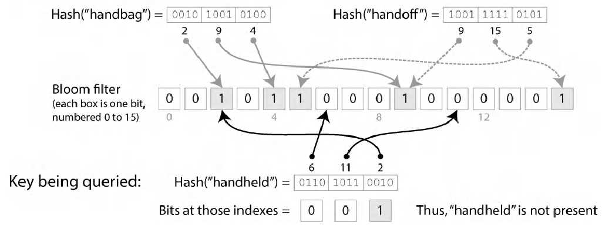

> 图 4-4。布隆过滤器可以快速、概率性地检查某个特定键是否存在于某个特定 SSTable 中。  

只要至少有一个比特位为 0，我们就知道该键肯定没有出现在 SSTable 中。如果查询涉及的比特位全都是 1，该键就很可能在 SSTable 中，但也可能只是碰巧所有这些比特位都被其他键置为了 1。这种键看似存在、实际却不存在的情况称为假阳性。  

假阳性的概率取决于键的数量、每个键设置的比特位数，以及布隆过滤器的总比特位数。你可以使用在线计算工具，算出适合自己应用的参数 [15]。根据经验，要获得 1% 的假阳性概率，需要为 SSTable 中的每个键分配 10 比特的布隆过滤器空间；此后，每个键每多分配 5 比特，假阳性概率就会降低到原来的十分之一。  

在 LSM 存储引擎的语境中，假阳性并不会造成问题：  

- 如果布隆过滤器表明某个键不存在，我们可以放心跳过这个 SSTable，因为可以确定它不包含该键。  

- 如果布隆过滤器表明该键存在，我们就必须查阅稀疏索引并解码键值对数据块，以检查该键是否真的在其中。如果这是一次假阳性，我们只是做了一点无用功，并不会造成其他伤害——只需继续搜索下一个更旧的段。  

## 压实策略  

一个重要细节是，LSM 存储引擎如何决定何时执行压实，以及一次压实应包含哪些 SSTable。许多基于 LSM 的存储系统允许你配置要使用的压实策略。常见的选择如下 [16, 17]：  

### 大小分级压实  

较新、较小的 SSTable 会依次合并到较旧、较大的 SSTable 中。例如，四个 256 MB 的 SSTable 可能压实成一个 898 MB 的 SSTable（结果不是 1,024 MB，是因为其中存在删除、覆盖、生存时间到期等情况）。包含较旧数据的 SSTable 可能变得非常大，合并它们需要大量临时磁盘空间。这种策略的优点是能够处理极高的写入吞吐量，因为大多数数据只会在规模较大的顺序合并中重写几次。  

### 分层压实  

分层压实并不写入大型 SSTable，而是让 SSTable 大小保持固定，并将它们分成逐级增大的“层”（称为 L0、L1，依此类推）。L0 包含最近写入的数据。L0 以上的所有层都包含按键范围分区的 SSTable。例如，L1 可能有两个 SSTable：第一个包含键 a–m，第二个包含 n–z。每一层都有自己的大小限制，且每一层都大于前一层（例如，L2 会大于 L1）。当某一层的 SSTable 合计超过最大大小限制时，会将第 $i$ 层的一个或多个 SSTable 合并到第 $i + 1$ 层，并从第 $i$ 层删除。与大小分级策略相比，这种方法可以让压实以更渐进的方式进行，并使用更少的磁盘空间。分层压实的读取效率高于大小分级压实，因为存储引擎只需读取较少的 SSTable，就能检查它们是否包含相应的键。  

根据经验，如果工作负载以写入为主而读取很少，大小分级压实的表现更好；如果工作负载以读取为主，分层压实的表现更好。如果你频繁写入少量键，而很少写入大量键，那么分层压实也可能更有优势 [18]。好在大多数 LSM 树实现都针对不同工作负载提供了多种压实策略。  

尽管其中有许多微妙之处，LSM 树的基本思路——维护一系列在后台合并的 SSTable——既简单又有效。我们将在第 129 页的“比较 B 树与 LSM 树”中更详细地讨论它们的性能特征。  

> [!NOTE]
> **嵌入式存储引擎**
>
> 许多数据库以服务的形式运行，通过网络接受查询；但也有一些嵌入式数据库并不提供网络 API。它们是与应用程序代码在同一进程中运行的库，通常读写本地磁盘上的文件，你可以通过普通的函数调用与之交互。嵌入式存储引擎的例子包括 RocksDB、SQLite、LMDB、DuckDB 和 KütüDB [19]。  
>
> 嵌入式数据库非常常见于移动应用，用来存储本地用户的数据。在后端，如果数据量足够小、能够放在单台机器上，并且并发事务不多，它们也可能是合适的选择。例如，在多租户系统中，如果每个租户的数据量都足够小，且彼此完全隔离（即不需要运行合并多个租户数据的查询），那么可以考虑为每个租户分别使用一个嵌入式数据库实例 [20]。  
>
> 本章讨论的存储与检索方法既适用于嵌入式数据库，也适用于客户端/服务器数据库。第 6 章和第 7 章将讨论把数据库扩展到多台机器上的技术。  

### B 树  

日志结构方法很流行，但它并不是键值存储的唯一形式。按键读写数据库记录时，使用最广泛的数据结构是 $B$ 树。  

B 树于 1970 年问世 [21]，不到 10 年后就被称为“无处不在” [22]，很好地经受住了时间的考验。它至今仍是几乎所有关系数据库的标准索引实现，许多非关系数据库也使用 B 树。  

与 SSTable 类似，B 树按键对键值对进行排序，从而支持高效的键值查找和范围查询。但相似之处仅止于此；B 树采用了截然不同的设计理念。  

前面介绍的日志结构索引把数据库划分成大小可变的段，通常每段为数 MB 或更大；每个段只写入一次，此后便不可变。相比之下，B 树把数据库划分成大小固定的块或页，并且可以原地覆写页。传统上页大小为 4 KiB，但 PostgreSQL 现在使用 8 KiB，MySQL 默认使用 16 KiB。  

每个页都可以用页号标识，这使一个页能够引用另一个页——类似于指针，只不过它位于磁盘而非内存中。如果所有页都存储在同一个文件里，用页号乘以页大小，就能得到该页在文件中的字节偏移量。利用这些页引用，我们可以构造出一棵由页组成的树，如图 4-5 所示。  

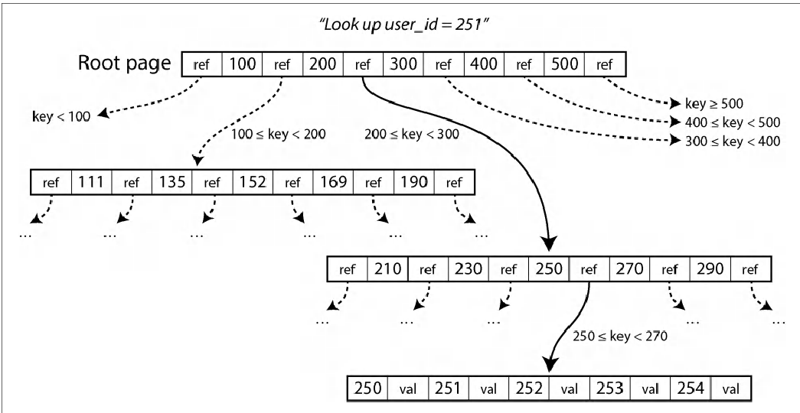

> 图 4-5。使用 B 树索引查找键 251。从根页开始，先沿引用找到键范围为 200–300 的页，再找到键范围为 250–270 的页。  

B 树中有一个页被指定为根；每当要在索引中查找一个键时，都从这里开始。该页包含若干键以及对子页的引用。每个子页负责一个连续的键范围，而引用之间的键指明了这些范围的边界。（这种结构有时称为 B+ 树，但这里无须将它与其他 B 树变体区分开来。）  

在图 4-5 的例子中，我们要查找键 251，因此知道需要沿着边界 200 和 300 之间的页引用继续查找。这样会到达一个外观相似的页，它进一步把 200–300 的范围划分为若干子范围。最终，我们会到达一个包含各个键的页（叶子页），其中要么直接内嵌每个键对应的值，要么包含对值所在页的引用。  

B 树的一个页中对子页的引用数量称为分支因子。例如，图 4-5 中的分支因子为 6。实际的分支因子取决于存储页引用和范围边界所需的空间，但通常为数百。  

如果要更新 B 树中已有键的值，就查找包含该键的叶子页，并在磁盘上用包含新值的版本覆写该页。如果要添加新键，则需要找到范围涵盖该新键的页，并把它添加到该页中。如果页中没有足够的空闲空间容纳新键，该页就会被拆分成两个半满的页，同时更新父页，以反映键范围的新划分，如图 4-6 所示。  

之前：  

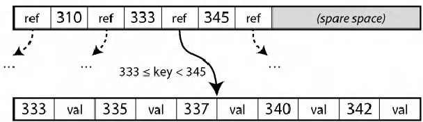

添加键 334 之后：  

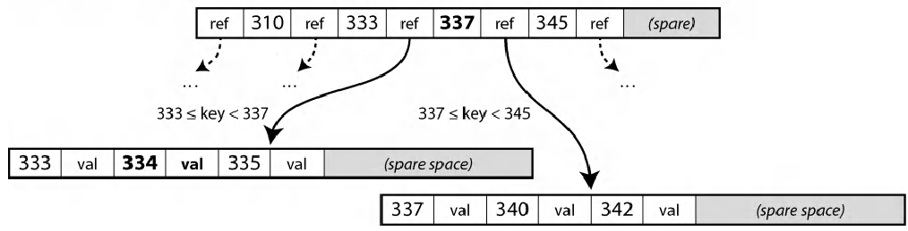

> 图 4-6。在边界键 337 处拆分页，从而扩展 B 树。父页经过更新，引用两个子页。  

在这个例子中，我们要插入键 334，但范围 333–345 对应的页已经满了。因此，我们把它拆分成范围为 333–337 的页（其中包含新键 334）和范围为 337–345 的页。还必须更新父页，使其引用这两个子页，并以 337 作为二者之间的边界值。如果父页没有足够空间容纳新引用，它也可能需要拆分；拆分可能一直延续到树根。根被拆分时，我们会在它上方创建一个新根。删除键（可能需要合并节点）则更为复杂 [5]。  

该算法确保树始终保持平衡：含有 n 个键的 B 树深度总是 O(log n)。大多数数据库都能装入一棵深度为三层或四层的 B 树，因此只需沿少量页引用即可找到目标页。（一棵由 4 KiB 页组成、分支因子为 500 的四层树最多可以存储 250 TB。）  

### 使 B 树可靠  

B 树最基本的底层写操作，是用新数据覆写磁盘上的某个页。这里假定覆写不会改变页的位置；页被覆写后，所有指向它的引用仍然有效。这与 LSM 树等日志结构索引形成鲜明对比：后者只向文件追加内容（最终会删除过时文件），但从不原地修改文件。  

像拆分页那样一次覆写多个页是一项危险的操作。如果数据库只写完了部分页就崩溃，最终会得到一棵损坏的树（例如，可能出现不属于任何父节点的孤儿页）。如果硬件无法原子地写入整个页，也可能产生只写入一部分的页（称为页撕裂 [23]）。  

为了使数据库能从崩溃中恢复，B 树实现通常会在磁盘上加入一种额外的数据结构：预写日志（write-ahead log，WAL）。它是一个仅追加文件；对 B 树的每项修改都必须先写入该文件，之后才能应用到树本身的页上。数据库崩溃后重新启动时，会使用这份日志把 B 树恢复到一致状态 [2, 24]。在文件系统中，对应的机制称为日志记录（journaling）。  

为了提升性能，B 树实现通常不会立即把每个修改过的页写入磁盘，而是先将 B 树页在内存中缓冲一段时间。预写日志也由此确保在崩溃时数据不会丢失。只要数据已经写入 WAL，并使用 fsync 系统调用刷新到磁盘，数据就具有持久性，因为数据库能在崩溃后将其恢复 [25]。  

### 使用 B 树变体  

B 树问世已久，多年来发展出了许多变体。仅举几例：  

- 有些数据库（如 LMDB）不覆写页、也不维护用于崩溃恢复的 WAL，而是采用写时复制方案 [26]。修改后的页会写入另一个位置，并创建树中各父页的新版本，使其指向新位置。这种方法对并发控制也很有用，正如第 293 页的“快照隔离与可重复读”中将会看到的那样。  

- 不存储完整的键，而是将其缩写，可以节省页内空间。特别是在树的内部页中，键只需提供足够的信息，用作键范围之间的边界。一个页中容纳更多键，就能让树具有更高的分支因子，从而减少层数。  

- 为了加快按排序顺序扫描键范围的速度，一些 B 树实现会尽量安排树的布局，使叶子页在磁盘上按顺序排列，从而减少磁盘寻道次数。不过，随着树不断增长，维持这种顺序并不容易。  

- 树中还可以加入额外的指针。例如，每个叶子页都可以包含对左右相邻兄弟页的引用，从而能够按顺序扫描键，而不必跳回父页。  

## B 树与 LSM 树的比较  

一般而言，LSM 树更适合写入密集型应用，而 B 树的读取速度更快 [27, 28]。不过，基准测试往往对工作负载的细节十分敏感。要做出有效比较，必须使用自己的特定工作负载来测试系统。此外，LSM 树和 B 树并不是非此即彼的严格选择；存储引擎有时会融合两种方法的特性——例如，使用多棵 B 树，再以 LSM 风格将其合并。本节将简要讨论衡量存储引擎性能时值得考虑的几个方面。  

### 读取性能  

在 B 树中，查找一个键需要在每一层读取一个页。由于层数通常很少，从 B 树读取数据一般很快，而且性能可以预测。在 LSM 存储引擎中，读取往往必须检查处于不同压实阶段的多个 SSTable，但布隆过滤器有助于减少所需的磁盘 I/O 操作次数。两种方法都可能表现良好，哪一种更快取决于存储引擎和工作负载的具体情况。  

B 树上的范围查询简单而快速，因为可以利用树的有序结构。在 LSM 存储中，范围查询也可以利用 SSTable 的排序，但需要并行扫描所有段并合并结果。布隆过滤器对范围查询没有帮助（因为这需要计算范围内每个可能键的哈希值，并不可行），因此在 LSM 方法中，范围查询的开销高于点查询 [29]。  

如果 MemTable 已满，高写入吞吐量可能会使日志结构存储引擎出现延迟尖峰。如果数据无法足够快地写出到磁盘，就会发生这种情况，其原因可能是压实过程跟不上写入流量。包括 RocksDB 在内的许多存储引擎会在这种情况下施加*背压*：暂停所有读写，直到 MemTable 被写出到磁盘 [30, 31]。  

就读取吞吐量而言，现代 SSD（尤其是通过速度远高于 SATA 总线的 PCIe 总线连接的 NVMe [Non-Volatile Memory Express] SSD）可以并行执行许多独立的读取请求。LSM 树和 B 树都能提供很高的读取吞吐量，但存储引擎必须经过精心设计，才能利用这种并行性 [32]。  

### 顺序写入与随机写入  

对于 B 树，如果应用程序写入的键散布在整个键空间中，产生的磁盘操作也会随机散布，因为存储引擎需要覆写的页可能位于磁盘上的任何位置。另一方面，日志结构存储引擎每次会写入整个段文件（无论是写出 MemTable，还是压实已有段），而段文件比 B 树中的页大得多。  

许多小型、分散的写入模式（如 B 树中的模式）称为随机写入，数量较少的大型写入模式（如 LSM 树中的模式）称为顺序写入。磁盘的顺序写入吞吐量通常高于随机写入吞吐量，这意味着在相同硬件上，日志结构存储引擎通常能处理比 B 树更高的写入吞吐量。这种差异在旋转磁盘硬盘上尤为显著；在当今大多数数据库使用的 SSD 上，差异较小，但仍然明显。  

> [!NOTE]
> **SSD 上的顺序写入与随机写入**
>
> 在旋转磁盘硬盘（HDD）上，顺序写入比随机写入快得多。这是因为随机写入必须以机械方式把磁头移动到新位置，并等待盘片的正确部分转到磁头下方，这需要几毫秒——在计算机的时间尺度上堪称永恒。不过，包括 NVMe SSD（即通过 PCI Express 总线连接的闪存设备）在内的 SSD，如今已在许多使用场景中取代 HDD，而且不受这类机械限制。  
>
> 尽管如此，SSD 的顺序写入吞吐量仍然高于随机写入。原因在于，闪存每次可以读取或写入一个页（通常为 4 KiB），但每次只能擦除一个块（通常为 512 KiB）。一个块中的某些页可能包含有效数据，另一些页则可能包含不再需要的数据。擦除块之前，控制器必须把含有有效数据的页移动到其他块；这个过程称为垃圾回收（garbage collection，GC）[33]。  
>
> 顺序写入工作负载每次写入较大的数据块，因此整个 512 KiB 块很可能都属于同一个文件。以后再次删除该文件时，整个块都可以直接擦除，无须执行任何 GC。另一方面，在随机写入工作负载下，一个块更可能混合包含有效数据和无效数据的页，因此垃圾回收器必须先完成更多工作，才能擦除该块 [34, 35, 36]。GC 消耗的写入带宽也就无法供应用程序使用。GC 带来的额外写入还会加剧闪存磨损；因此，随机写入使驱动器损耗的速度快于顺序写入。  

### 写放大  

无论使用哪种存储引擎，应用程序的一次写入请求都会转化为底层磁盘上的多次 I/O 操作。对于 LSM 树，一个值首先写入日志以确保持久性；随后在 MemTable 写入磁盘时再次写入；之后，每当该键值对参与压实时，又会再次写入。（如果值明显大于键，可以将值与键分开存储，并且只压实包含键和对值的引用的 SSTable，从而降低这项开销 [37]。）  

B 树索引必须把每份数据至少写入两次：一次写入预写日志，一次写入树页本身。此外，即使一个页中只有几个字节发生变化，有时也必须写出整个页，以确保 B 树能在崩溃或断电后正确恢复 [38, 39]。  

如果用某个工作负载写入磁盘的总字节数，除以不建立索引、仅写入仅追加日志时所需写入的字节数，得到的就是写放大。（有时写放大以 I/O 操作次数而非字节数来定义。）在写入密集型应用中，瓶颈可能是数据库写入磁盘的速率。在这种情况下，写放大越高，在可用磁盘带宽内每秒能处理的写入就越少。  

写放大是 LSM 树和 B 树都面临的问题。哪一种更好，取决于多种因素，例如键和值的长度，以及覆写已有键和插入新键各自的频率。对于典型工作负载，LSM 树的写放大往往更低，因为它无须写入整个页，而且可以压缩 SSTable 的数据块 [40]。这也是 LSM 存储引擎非常适合写入密集型工作负载的另一个原因。  

除了影响吞吐量，写放大也关系到 SSD 的磨损。写放大较低的存储引擎会使 SSD 磨损得更慢。  

衡量存储引擎的写入吞吐量时，实验必须运行足够长的时间，才能清楚地显现写放大的影响。向一棵空的 LSM 树写入时，压实尚未开始，因此全部磁盘带宽都可以用于新写入。随着数据库增长，新写入需要与压实共享磁盘带宽。  

## 磁盘空间使用情况  

B 树会随时间推移产生碎片；例如，如果删除了大量键，数据库文件中可能会有许多 B 树不再使用的页。之后向 B 树添加数据时可以利用这些空闲页，但由于它们位于文件中间，很难归还给操作系统，因此仍会占用文件系统空间。所以，数据库需要一个后台进程来移动页并更合理地安排其位置，例如 PostgreSQL 中的 vacuum 进程 [25]。  

碎片对于 LSM 树来说不是什么大问题，因为压实过程无论如何都会定期重写数据文件，而且 SSTable 中不存在带有未使用空间的页。此外，SSTable 中的键值对数据块可以得到更好的压缩，因此磁盘上的文件通常比 B 树文件更小。已被覆写的键和值会继续占用空间，直到压实将其移除；但采用分层压实时，这项开销相当低 [40, 41]。大小分级压实（参见第 124 页的“压实策略”）会使用更多磁盘空间，尤其是在压实期间临时占用更多空间。  

当你需要删除某些数据，并确信它确实已被删除时（也许是为了遵守数据保护法规），磁盘上存在某些数据的多个副本也可能成为问题。例如，在大多数 LSM 存储引擎中，已删除的记录可能仍然存在于较高层级，直到代表删除操作的墓碑标记传播经过所有压实层级；这可能耗时很久。专门设计的存储引擎可以更快地传播删除操作 [42]。  

另一方面，如果要获取数据库在某个时间点的快照（例如用于备份，或创建数据库副本以供测试），SSTable 段文件的不可变特性十分有用。你可以写出 MemTable，并记录当时存在哪些段文件。只要不删除属于该快照的文件，就无须实际复制它们。对于页会被覆写的 B 树，要高效地获取这种快照则更加困难。  

## 多列索引和二级索引  

到目前为止，我们只讨论了键值索引，它们类似于关系模型中的*主键索引*。主键唯一标识关系表中的一行、文档数据库中的一个文档，或图数据库中的一个顶点。数据库中的其他记录可以通过主键（或 ID）引用该行/文档/顶点，而索引用于解析这类引用。  

使用*二级索引*也非常普遍。在关系数据库中，可以使用 `CREATE INDEX` 命令在同一个表上创建多个二级索引，从而按主键以外的列进行搜索。例如，在图 3-1 所示的关系模式中，很可能需要在 `user_id` 列上建立二级索引，以便在每个表中找出属于同一用户的所有行。  

二级索引很容易用键值索引构造。主要区别在于，二级索引中的被索引值未必唯一；也就是说，同一个索引条目下可能有许多行（文档、顶点）。这个问题有两种解决方法：要么让索引中的每个值成为匹配行标识符的列表（类似全文索引中的倒排列表），要么在每个条目后附加行标识符，使条目唯一。采用 B 树等原地更新机制的存储引擎和日志结构存储都可以用来实现索引。  

## 在索引中存储值  

索引中的键是查询的搜索依据。除键之外，索引中还可以存储其他数据，具体取决于索引类型：  

- 如果实际数据（行、文档、顶点）直接存储在索引结构中，这种索引就称为聚簇索引。例如，在 MySQL 的 InnoDB 存储引擎中，表的主键始终是聚簇索引；而在 SQL Server 中，每个表可以指定一个聚簇索引 [43]。  

- 或者，值也可以是对实际数据的引用：要么是相应行的主键（InnoDB 的二级索引采用这种方式），要么是对磁盘位置的直接引用。在后一种情况下，存储行的位置称为堆文件，其中的数据不按任何特定顺序存放（它可以是仅追加的，也可以跟踪已删除的行，以便稍后用新数据覆写它们）。例如，Postgres 采用堆文件方法 [44]。  

- 两者之间的折中方案是覆盖索引（covering index），也称为包含列的索引（index with included columns）。除了把完整行存储在堆或主键聚簇索引中之外，它还会在索引内存储表的某些列 [45]。这样一来，有些查询只使用索引就能得到答案，无须解析主键或查询堆文件（此时称该索引覆盖了查询）。这可以加快某些查询，但数据重复意味着索引会占用更多磁盘空间，并且拖慢写入。  

到目前为止讨论的索引都只把一个键映射到一个值。如果需要同时查询表的多个列（或文档中的多个字段），请参阅第 145 页的“多维索引和全文索引”。  

在不改变键的情况下更新值时，只要新值不大于旧值，堆文件方法就可以原地覆写记录。如果新值更大，情况就会复杂一些，因为很可能需要把它移动到堆中另一个具有足够空间的位置。在这种情况下，必须更新所有索引，使其指向记录在堆中的新位置；或者必须在堆中的旧位置留下一个转发指针 [2]。  

## 将一切保存在内存中  

本章到目前为止讨论的所有数据结构，都是针对磁盘局限性的解决方案。与主内存相比，磁盘处理起来很麻烦。无论是磁盘还是 SSD，如果想获得良好的读写性能，都必须精心安排数据布局。我们之所以容忍这些麻烦，是因为磁盘有两大显著优势：它具有持久性（断电时内容不会丢失），而且每 GB 成本低于 RAM。  

随着 RAM 越来越便宜，每 GB 成本方面的优势正逐渐减弱。许多数据集本来就没有那么大，因此把它们完全保存在内存中是相当可行的，必要时还可以分布到多台机器上。这促成了*内存数据库*的发展。  

有些内存键值存储（如 Memcached）仅用于缓存，机器重启时丢失数据是可以接受的。但其他内存数据库以持久性为目标，这可以通过特殊硬件（例如电池供电的 RAM）实现；更常见的做法则是把变更日志写入磁盘、定期把快照写入磁盘，或把内存中的状态复制到其他机器。  

这样，数据库重启时就能从磁盘或通过网络从副本重新加载状态（使用特殊硬件的情况除外）。尽管会写入磁盘，这些系统仍被视为内存数据库，因为磁盘仅作为确保持久性的仅追加日志使用，而读取完全由内存提供服务。写入磁盘在运维方面也有优势：磁盘上的文件很容易备份、检查，并可由外部工具分析。  

VoltDB、SingleStore 和 Oracle TimesTen 等产品是采用关系模型的内存数据库，其供应商声称，消除管理磁盘数据结构带来的全部开销，可以显著提升性能 [46, 47]。RAMCloud 是一种具有持久性的开源内存键值存储（内存中和磁盘上的数据都采用日志结构方法）[48]。Redis 和 Couchbase 通过异步写入磁盘提供较弱的持久性。  

有悖直觉的是，内存数据库的性能优势并不是因为它们不需要从磁盘读取。如果内存足够大，即便是基于磁盘的存储引擎也可能从不需要读取磁盘，因为操作系统本来就会把最近使用的磁盘块缓存在内存中。它们速度更快的真正原因，是避免了把内存数据结构编码成可写入磁盘的形式所带来的开销 [49]。  

除性能之外，内存数据库还有一个有趣的用途：提供难以用基于磁盘的索引实现的数据模型。例如，Redis 为优先队列、集合等多种数据结构提供了类似数据库的接口。由于它把所有数据都保存在内存中，实现起来相对简单。  

## 分析型数据存储  

数据仓库的数据模型通常是关系型的，因为 SQL 通常很适合分析查询。有许多图形化数据分析工具可以生成 SQL 查询、可视化结果，并允许分析师探索数据（通过*下钻*和*切片与切块*等操作）。  

从表面上看，数据仓库与关系型 OLTP 数据库很相似，因为二者都有 SQL 查询接口。然而，系统内部可能大不相同，因为它们针对截然不同的查询模式进行了优化。如今，许多数据库供应商专注于支持事务处理或分析工作负载中的一种，而不是同时支持二者。  

Microsoft SQL Server、SAP HANA 和 SingleStore 等一些数据库在同一产品中同时支持事务处理和数据仓库。然而，这些混合事务分析处理（HTAP）数据库（在第 7 页的“数据仓库”中介绍）正日益演变为两个独立的存储与查询引擎，只是恰好可以通过共同的 SQL 接口访问 [50, 51, 52, 53]。  

## 云数据仓库  

Teradata、Vertica 和 SAP HANA 等老牌数据仓库供应商既提供商业许可的本地部署，也提供基于云的解决方案。但随着越来越多的客户迁移到云端，Google Cloud 的 BigQuery、Amazon Redshift 和 Snowflake 等新兴的纯云数据仓库也得到广泛采用。与传统数据仓库不同，云数据仓库可以利用对象存储和无服务器计算平台等可伸缩的云基础设施。  

云数据仓库往往能更好地与其他云服务集成。例如，许多云数据仓库支持自动摄取日志，并可轻松与 Google Cloud 的 Dataflow 或 AWS Kinesis 等数据处理框架集成。这些数据仓库也更具弹性，因为它们将查询计算与存储层解耦 [54]。数据持久化在对象存储中，而非本地磁盘上，因此可以独立调整存储容量和用于查询的计算资源，正如我们在第 14 页的“云原生系统架构”中所见。  

Apache Hive、Trino 和 Apache Spark 等开源数据仓库也随云计算一同演进。随着分析型数据存储迁移到对象存储上的数据湖，开源数据仓库也开始拆分 [55]。以下组件过去集成在 Hive 这样的单一系统中，如今通常作为独立组件实现：  

### 查询引擎  

Trino、Apache DataFusion 和 Presto 等查询引擎解析 SQL 查询，将其优化为执行计划，并在数据上执行这些计划。执行通常需要并行的分布式数据处理任务。一些查询引擎内置任务执行能力，另一些则选择使用 Spark 或 Flink 等第三方执行框架。  

#### 存储格式  

存储格式决定表中的行如何编码为文件中的字节，而该文件通常存储在对象存储或分布式文件系统中 [12]。这样，不仅查询引擎可以访问这些数据，使用该数据湖的其他应用程序也可以访问。此类存储格式的例子包括 Parquet、ORC、Lance 和 Nimble；下一节将进一步讨论它们。  

#### 表格式  

以 Parquet 和类似存储格式写入的文件一经写入通常不可变。为了支持行的插入和删除，可以使用 Apache Iceberg 或 Databricks 的 Delta 格式等表格式。表格式规定一种文件格式，用来定义哪些文件构成一张表以及该表的模式。此类格式还提供时间旅行（能够查询表在过去某个时刻的状态）、GC，甚至事务等高级功能。  

### 数据目录  

正如表格式定义哪些文件组成一张表一样，数据目录定义数据库中包含哪些表。目录用于创建、重命名和删除表。与存储格式和表格式不同，Snowflake 的 Polaris 和 Databricks 的 Unity Catalog 等数据目录通常作为独立服务运行，可通过 REST 接口查询。Apache Iceberg 也提供目录，它既可以在客户端内部运行，也可以作为独立进程运行。查询引擎在读写表时使用目录信息。传统上，目录与查询引擎是集成在一起的，但将二者解耦后，数据发现和数据治理系统（见第 24 页的“数据系统、法律与社会”）也能访问目录的元数据。  

## 列式存储  

正如第 77 页的“星型与雪花型：分析模式”中所述，按照惯例，数据仓库通常采用关系模式，其中一张大型事实表包含指向维度表的外键引用。如果事实表中有数万亿行和 PB 级数据，高效存储和查询它们就会成为挑战。维度表通常小得多，也更易管理（数百万行），因此本节将重点讨论事实数据的存储。  

尽管事实表通常有一百多列，但典型的数据仓库查询一次只访问其中四五列（分析很少需要 SELECT * 查询）[52]。以示例 4-1 中的查询为例：它访问大量行（2024 日历年内每一次有人购买水果或糖果的记录），但只需要访问 fact_sales 表的三列：date_key、product_sk 和 quantity。该查询会忽略其他所有列。  

示例 4-1。分析人们在一周中的不同日子更倾向于购买新鲜水果还是糖果  

```sql
SELECT
  dim_date.weekday, dim_product.category,
SUM(fact_sales.quantity) AS quantity_sold
FROM fact_sales
  JOIN dim_date    ON fact_sales.date_key   = dim_date.date_key
  JOIN dim_product ON fact_sales.product_sk = dim_product.product_sk
WHERE
  dim_date.year = 2024 AND
  dim_product.category IN ('Fresh fruit', 'Candy')
GROUP BY
  dim_date.weekday, dim_product.category;  
```

怎样才能高效执行这个查询？  

在大多数 OLTP 数据库中，存储采用*面向行*的布局：表中一行的所有值彼此相邻存储。文档数据库与之类似：一个完整文档通常存储为一段连续的字节序列。图 4-1 的 CSV 示例展示了这一点。  

为了处理示例 4-1 这样的查询，可以在 fact_sales.date_key 和/或 fact_sales.product_sk 上建立索引，以告诉存储引擎在哪里可以找到某个日期或某种产品的全部销售记录。但是，面向行的存储引擎仍然需要将所有这些行（每行由 100 多个属性组成）从磁盘加载到内存中，解析它们，并过滤掉不满足所需条件的行。这可能需要很长时间。  

*面向列*（或称*列式*）存储背后的理念很简单：不是将一行中的所有值存储在一起，而是将每一*列*的所有值存储在一起 [56]。如果每列分开存储，查询只需读取并解析该查询所用的列，从而可以省去大量工作。图 4-7 使用图 3-5 中事实表的扩展版本展示了这一原理。  

> [!NOTE]
> 列式存储在关系数据模型中最容易理解，但同样适用于非关系型数据。例如，Parquet 是一种支持文档数据模型的列式存储格式 [57]，它基于 Google 的 Dremel [58]，采用一种称为分解（shredding）或条带化（striping）的技术 [59]。

fact_sales 表  

| date_key|product_sk|store_sk|promotion_sk|customer_sk|quantity|net_price|discount_price|
| ---|---|---|---|---|---|---|---|
| 260102|69|4|NULL|NULL|1|13.99|13.99|
| 260102|69|5|19|NULL|3|14.99|9.99|
| 260102|69|5|NULL|191|1|14.99|14.99|
| 260102|74|3|23|202|5|0.99|0.89|
| 260103|30|2|NULL|NULL|1|2.49|2.49|
| 260103|30|3|NULL|NULL|3|14.99|9.99|
| 260103|30|3|21|123|1|49.99|39.99|
| 260103|30|8|NULL|233|1|0.99|0.99|  

列式存储布局  

```text
date_key: 260102, 260102, 260102, 260102, 260103, 260103, 260103, 260103
product_sk: 69, 69, 69, 74, 30, 30, 30, 30
store_sk: 4, 5, 5, 3, 2, 3, 3, 8
promotion_sk: NULL, 19, NULL, 23, NULL, NULL, 21, NULL
customer_sk: NULL, NULL, 191, 202, NULL, NULL, 123, 233
quantity: 1, 3, 1, 5, 1, 3, 1, 1
net_price: 13.99, 14.99, 14.99, 0.99, 2.49, 14.99, 49.99, 0.99
discount_price: 13.99, 9.99, 14.99, 0.89, 2.49, 9.99, 39.99, 0.99

```  

> 图 4-7。按列而非按行存储关系数据。  

列式存储布局依赖于每一列都以相同顺序存储各行。因此，如果需要重新组装完整的一行，可以从各列分别取出第 23 个条目，并将它们组合成表的第 23 行。  

实践中，列式存储引擎并不会一次性存储完整的一列（其中可能包含数万亿行）。相反，它们将表拆分成包含数千或数百万行的块，并在每个块内分别存储各列的值 [60]。由于许多查询仅限于特定日期范围，常见做法是让每个块包含某个时间戳范围内的行。这样，查询只需在与所需日期范围重叠的块中加载自己需要的列。  

如今，几乎所有分析型数据库都使用列式存储 [60]，从 Snowflake 等大规模云数据仓库 [61]，到 DuckDB 等单节点嵌入式数据库 [62]，再到 Pinot [63] 和 Druid [64] 等产品分析系统。它还用于 Parquet、ORC [65, 66]、Lance [67] 和 Nimble [68] 等存储格式，以及 Apache Arrow [65, 69] 和 Pandas/NumPy [70] 等内存分析格式。一些时序数据库，如 InfluxDB IOx [71] 和 TimescaleDB [72]，也以列式存储为基础。  

## 列压缩  

除了只从磁盘加载查询所需的列之外，我们还可以通过压缩数据进一步降低对磁盘吞吐量和网络带宽的需求。所幸，列式存储通常非常适合压缩。  

看看图 4-7 中各列的值序列。其中有相当多的重复，这是有利于压缩的好迹象。根据列中的数据，可以采用不同的压缩技术 [73]。有一种对数据仓库特别有效的技术是位图编码，如图 4-8 所示。  

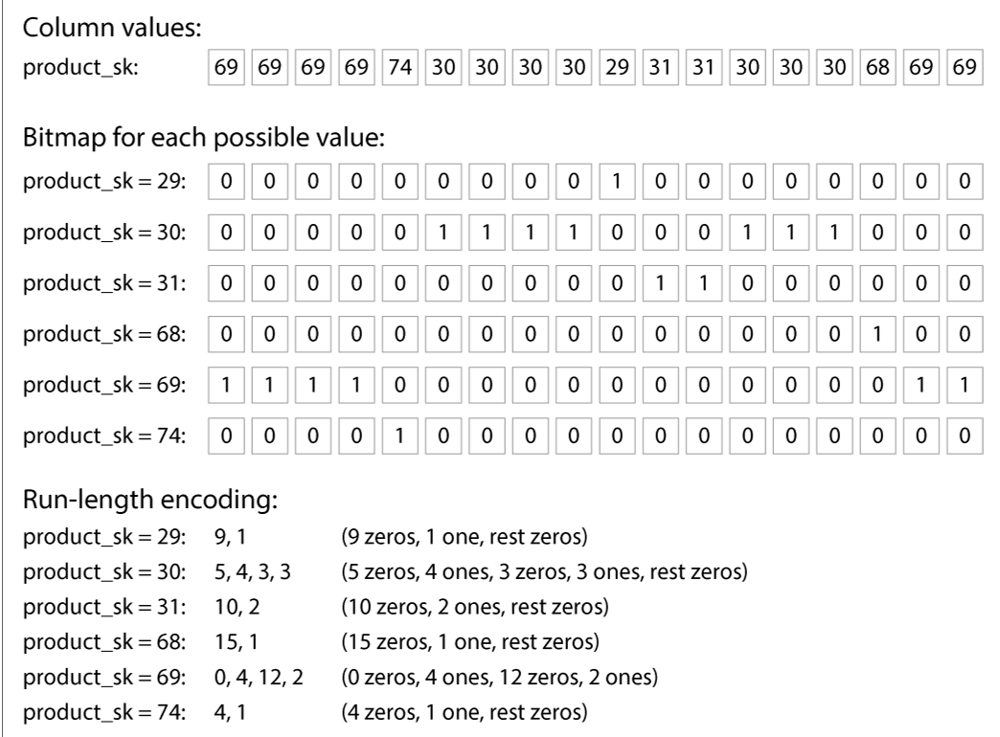

> 图 4-8。对单列进行压缩并建立位图索引的存储方式。  

一列中的不同值数量通常远少于行数（例如，零售商可能有数十亿笔销售事务，但只有 100,000 种不同的产品）。现在，我们可以将一列中的 n 个不同值转换成 n 个独立的位图：每个不同值对应一个位图，每一行对应一个比特。如果该行具有这个值，相应比特就是 1，否则就是 0。  

一种选择是以每行一个比特的方式存储位图。然而，这些位图通常包含大量的 0（我们称其为稀疏位图）。在这种情况下，还可以对位图进行游程编码，即统计连续 0 或 1 的数量并存储这些计数，如图 4-8 底部所示。*Roaring 位图*等技术会在两种位图表示之间切换，选择更紧凑的一种 [74]。这可以使一列的编码极其高效。  

这类位图索引非常适合数据仓库中常见的查询。例如：  

WHERE product_sk IN (31, 68, 69)  

加载 product_sk = 31、product_sk = 68 和 product_sk = 69 对应的三个位图，并计算三个位图的按位 OR；这一操作可以非常高效地完成。  

WHERE product_sk = 30 AND store_sk = 3  

加载 product_sk = 30 和 store_sk = 3 对应的位图，并计算按位 AND。这之所以可行，是因为各列以相同顺序包含各行，所以一列位图中的第 k 个比特与另一列位图中的第 k 个比特对应同一行。  

位图也可用于回答图查询，例如找出社交网络中所有被用户 X 关注、同时又关注用户 Y 的用户 [75]。  

> [!NOTE]
> 不要将列式数据库与*宽列*（也称为*列族*）数据模型混淆。在宽列模型中，一行可以有数千列，并且不要求所有行都具有相同的列 [9]。尽管名称相似，宽列数据库却是面向行的，因为它们将一行中的所有值存储在一起。Google Bigtable、Apache Accumulo 和 HBase 都是使用宽列模型的系统。

## 列式存储中的排序顺序  

在列存储中，各行的存储顺序未必重要。最简单的做法是按照插入顺序存储，因为这样插入新行只需追加到每一列。不过，我们也可以像之前处理 SSTable 那样规定一种顺序，并将其用作索引机制。  

请注意，独立对每一列排序没有意义，因为那样我们就无法知道各列中的哪些项目属于同一行。我们之所以能够重建一行，只是因为知道一列中的第 $k$ 个项目与另一列中的第 $k$ 个项目属于同一行。  

相反，尽管数据按列存储，却必须以整行为单位排序。数据库管理员可以根据对常见查询的了解，选择表应按哪些列排序。例如，如果查询经常针对日期范围（如上个月），那么把 date_key 作为第一个排序键可能是合理的。这样，查询就只需扫描上个月的行，比扫描所有行快得多。  

第二列可以决定第一列值相同行的排序顺序。例如，如果 date_key 是图 4-7 中的第一个排序键，那么将 product_sk 作为第二个排序键可能是合理的，这样同一天同一产品的所有销售记录就会在存储中聚集在一起。这将有助于需要在某个日期范围内按产品对销售记录进行分组或筛选的查询。  

排序的另一个优点是有助于列压缩。如果主排序列没有太多不同值，那么排序后会出现很长的连续序列，其中同一个值重复多次。像图 4-8 中用于位图的简单游程编码，就能把这一列压缩到几 KB——即使表中有数十亿行。  

这种压缩效果在第一个排序键上最强。第二和第三个排序键会更加杂乱，因此不会有那么长的重复值游程。排序优先级更靠后的列看起来基本上是随机排列的，所以压缩效果可能不那么好。尽管如此，对前几列排序总体上仍然有益。  

## 写入列式存储  

我们在第 5 页的“事务处理与分析的特征”中看到，数据仓库中的读取往往是对大量行进行聚合。列式存储、压缩和排序都有助于加速这些读取查询。  

数据仓库中的写入往往是批量导入数据，通常通过 ETL 过程完成。使用列式存储时，如果在已排序表的中间某处写入单独一行，效率会非常低，因为必须重写从插入位置开始的所有压缩列。然而，一次批量写入多行能够摊销重写这些列的成本，从而提高效率。  

通常采用日志结构方法来分批执行写入。所有写入首先进入一个面向行、已排序的内存存储。积累足够多的写入后，再将它们与磁盘上按列编码的文件合并，并批量写入新文件。由于旧文件保持不可变，新文件又一次性写入，因此对象存储非常适合存储这些文件。  

查询需要同时检查磁盘上的列数据和内存中的近期写入，并将二者合并。查询执行引擎向用户隐藏了这种差异。从分析师的角度来看，通过插入、更新或删除修改的数据会立即反映在后续查询中。Snowflake、Vertica、Apache Pinot、Apache Druid 以及许多其他数据库都采用这种做法 [61, 63, 64, 76]。  

## 查询执行：编译与向量化  

复杂的分析型 SQL 查询会被分解为一个由多个阶段组成的*查询计划*，这些阶段称为*算子*，并且可能分布到多台机器上并行执行。查询规划器可以通过选择使用哪些算子、以什么顺序执行它们，以及在哪里运行每个算子来进行大量优化。  

在每个算子内部，查询引擎可能需要对列中的值执行各种操作，例如找出值属于某个特定集合的所有行（也许作为连接的一部分），或检查值是否大于 15。查询引擎很可能还需要查看同一行中的多个列——例如，找出产品为“香蕉”且门店为某家特定目标门店的所有销售事务。  

对于必须扫描数百万行的数据仓库查询，我们不仅需要关注它们必须从磁盘读取的数据量，还要关注执行复杂算子所需的 CPU 时间。最简单的算子类似于编程语言的解释器。在逐行迭代时，它检查表示查询的数据结构，以确定需要对哪些列执行哪些比较或计算。遗憾的是，这对许多分析用途而言太慢了。于是出现了两种高效执行查询的替代方法 [77]：  

### 查询编译  

查询引擎接收 SQL 查询并生成执行它的代码。代码逐行迭代，查看相关列中的值，执行所需的任何比较或计算；如果满足所需条件，就将必要的值复制到输出缓冲区。随后，查询引擎将生成的代码编译成机器码（通常使用 LLVM 等现有编译器），并在已加载到内存中的列编码数据上运行。此代码生成方法类似于 Java 虚拟机（JVM）和类似运行时所采用的即时（JIT）编译方法。  

### 向量化处理  

查询通过解释而非编译来执行，但它通过批量处理一列中的许多值来提升速度，而不是逐行迭代。数据库内置一组固定的预定义算子；我们可以向它们传入参数，并获得一批结果 [50, 73]。  

例如，可以把 product_sk 列和某种产品（例如“香蕉”）的 ID 传给相等算子，得到一个位图（输入列中的每个值对应一个比特；如果与该 ID 匹配，比特就是 1）。然后，可以把 store_sk 列和目标门店的 ID 传给同一个相等算子，得到另一个位图。最后，可以如图 4-9 所示，把这两个位图传给按位 AND 算子；结果将是一个位图，其中某家特定门店内每一笔香蕉销售记录对应的位置都是 1。  

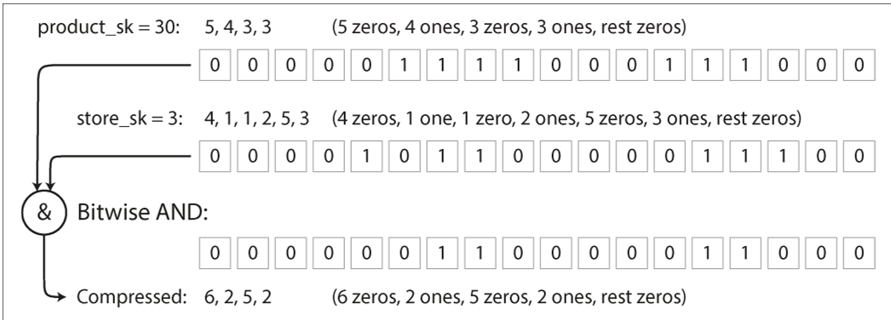

> 图 4-9。两个位图之间的按位 AND 很适合向量化。  

这两种方法在实现上截然不同，但实践中都有应用 [77]。二者都能利用现代 CPU 的特性，实现非常出色的性能：  

- 优先采用顺序内存访问而非随机访问，以减少缓存未命中 [78]  

- 在紧凑的内层循环中完成大部分工作（即指令数量少且无函数调用），使 CPU 指令处理流水线保持忙碌，并避免分支预测错误  

- 利用多线程和单指令多数据（SIMD）指令等并行机制 [79, 80]  

- 直接操作压缩数据，而不将其解码为单独的内存表示，从而节省内存分配和复制成本  

## 物化视图与数据立方体  

我们先前在第 35 页的“物化与更新时间线”中遇到过*物化视图*：在关系数据模型中，它们是类似表的对象，其内容是查询的结果。物化视图是查询结果的实际副本，会写入磁盘，而虚拟视图只是编写查询的一种快捷方式。当你读取虚拟视图时，SQL 引擎会即时将其展开为视图的底层查询，然后处理展开后的查询。  

当底层数据发生变化时，物化视图也需要相应更新。有些数据库可以自动完成这项工作，也有 Materialize 这类专门维护物化视图的系统 [81]。我们将在第 516 页的“维护物化视图”中回到这一主题。执行此类更新意味着写入时要做更多工作，但对于需要反复执行相同查询的工作负载，物化视图可以提升读取性能。  

物化聚合是物化视图的一种，在数据仓库中可能很有用。如前所述，数据仓库查询经常涉及聚合函数，例如 SQL 中的 COUNT、SUM、AVG、MIN 或 MAX。如果许多查询都使用相同的聚合，每次都处理原始数据可能很浪费。何不缓存查询最常用的一些计数或求和结果呢？数据立方体（也称为 OLAP 立方体）通过创建一个按不同维度分组的聚合网格来实现这一点 [82]。图 4-10 展示了一个示例。  

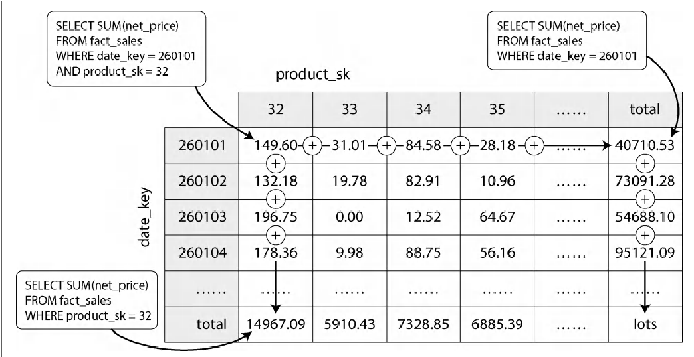

> 图 4-10。数据立方体的两个维度，通过求和聚合数据。  

暂且假设每条事实记录只有指向两个维度表的外键；在图 4-10 中，这两个外键是 date_key 和 product_sk。现在可以画出一张二维表，一条轴表示日期，另一条轴表示产品。每个单元格都包含具有该日期—产品组合的所有事实记录中某个属性（例如 net_price）的聚合值（例如 SUM）。然后，可以沿每一行或每一列应用相同的聚合，得到减少了一个维度的汇总结果（不考虑日期的各产品销售额，或不考虑产品的各日期销售额）。  

一般来说，事实记录通常有两个以上的维度。在图 3-5 中有五个维度：日期、产品、门店、促销和客户。五维超立方体的样子要难想象得多，但原理不变：每个单元格都包含特定日期—产品—门店—促销—客户组合的销售额。随后可以沿各个维度反复汇总这些值。  

物化数据立方体的优点是，某些查询会变得非常快，因为它们实际上已经预先计算好了。例如，如果想知道昨天每家门店的总销售额，只需查看相应维度上的合计值，无须扫描数百万行。  

缺点是，数据立方体不具备查询原始数据那样的灵活性。例如，无法计算售价超过 \$100 的商品贡献了多大比例的销售额，因为价格并不是其中一个维度。因此，大多数数据仓库会尽量保留尽可能多的原始数据，仅将数据立方体等聚合用作某些查询的性能增强手段。  

## 多维索引与全文索引  

本章前半部分介绍的 B 树和 LSM 树支持对单个属性执行范围查询；例如，如果键是用户名，就可以把它们用作索引，高效查找所有以 $L$ 开头的名字。但有时，仅按单个属性搜索并不够。  

最常见的多列索引称为*连接索引*，它只是将一列接在另一列后面，把多个字段组合成一个键（索引定义会指定字段的连接顺序）。这就像老式的纸质电话簿，它提供从（*姓氏*，*名字*）到电话号码的索引。由于这种排序顺序，该索引可用于查找具有特定姓氏的所有人，或具有特定*姓氏—名字*组合的所有人。然而，如果想查找具有特定名字的所有人，这个索引就毫无用处。  

另一方面，*多维索引*允许同时查询多列。这对地理空间数据尤其重要。例如，餐厅搜索网站的数据库可能包含每家餐厅的纬度和经度。当用户在地图上查看餐厅时，网站需要搜索用户当前所查看矩形地图区域内的所有餐厅。这需要如下所示的二维范围查询：  

```sql
SELECT * FROM restaurants WHERE latitude > 51.4946 AND latitude < 51.5079 AND longitude > -0.1162 AND longitude < -0.1004;  
```

纬度列和经度列上的连接索引无法高效回答这种查询。该索引可以给出某个纬度范围内的所有餐厅（但可能位于任意经度），或者某个经度范围内的所有餐厅（但可能位于南北两极之间的任意位置），却无法同时满足两个条件。  

一种选择是通过空间填充曲线将二维位置转换成单个数字，然后使用普通的 B 树索引 [83]。更常见的做法是使用 R 树或 Bkd 树 [84] 等专用空间索引；它们会划分空间，使相邻的数据点倾向于归入同一棵子树。例如，PostGIS 使用 PostgreSQL 的广义搜索树索引机制，将地理空间索引实现为 R 树 [85]。也可以使用由规则排列的三角形、正方形或六边形组成的网格 [86]。  

不过，多维索引并非只适用于地理位置。例如，在电子商务网站上，可以对（红、绿、蓝）三个维度使用三维索引，搜索处于某个颜色范围内的产品；或者在气象观测数据库中，可以对（日期、温度）建立二维索引，高效搜索某一年中温度在 25°C 到 30°C 之间的所有观测记录。使用一维索引时，要么必须扫描该年的所有记录（不考虑温度），再按温度筛选；要么反过来处理。二维索引则可以同时按时间戳和温度缩小结果范围 [87]。  

## 全文搜索  

全文搜索允许按可能出现在文本任意位置的关键字搜索一组文本文档（网页、产品描述等）[88]。信息检索是一个庞大而专业的主题，往往涉及特定于语言的处理；例如，数种亚洲语言书写时词语之间没有空格或标点，因此，将文本切分成词需要借助能够判断哪些字符序列构成词的模型。全文搜索还经常涉及匹配相似但不完全相同的词（考虑拼写错误或词的不同语法形式）以及同义词。这些问题超出了本书的范围。  

不过，从根本上说，可以把全文搜索看作另一种多维查询。在这种情况下，文本中可能出现的每个词（词项）都是一个维度。包含词项 x 的文档在 x 维上的值为 1，不包含 x 的文档在该维上的值为 0。搜索提到“red apples”的文档，意味着查询在 red 维上查找 1，同时在 apples 维上也查找 1。因此，维度数量可能非常庞大。  

许多搜索引擎用来回答此类查询的数据结构称为*倒排索引*。这是一种键值结构，其中键是词项，值是包含该词项的所有文档 ID 的列表（即*倒排列表*）。如果文档 ID 是连续的数字，倒排列表也可以表示为稀疏位图，如图 4-8 所示；对于词项 $x$ 的位图，如果 ID 为 $n$ 的文档包含词项 $x$，则位图中的第 $n$ 位为 1 [89]。  

现在，查找同时包含词项 x 和 y 的所有文档，类似于向量化的数据仓库查询搜索符合两个条件的行（图 4-9）：加载词项 x 和 y 的两个位图，并计算它们的按位 AND。即使位图采用游程编码，这项操作也能非常高效地完成。  

例如，Elasticsearch 和 Solr 使用的全文索引引擎 Lucene 就是这样工作的 [90]。它将词项到倒排列表的映射存储在类似 SSTable 文件格式的有序文件中，并使用本章前面介绍的同一种日志结构方法在后台合并这些文件 [91]。PostgreSQL 的 GIN 索引类型也使用倒排列表来支持全文搜索以及 JSON 文档内部的索引 [92, 93]。  

除了把文本拆分成词，另一种方法是找出所有长度为 n 的子字符串，称为 n-gram。例如，字符串 hello 的三元组（n = 3）是 hel、ell 和 llo。如果为所有三元组构建倒排索引，就可以在文档中搜索任意长度至少为三个字符的子字符串。三元组索引甚至允许在搜索查询中使用正则表达式；缺点是它们相当庞大 [94]。  

为了处理文档或查询中的拼写错误，Lucene 能够搜索与目标词相差一定编辑距离的词（编辑距离为 1，意味着添加、删除或替换了一个字母）[95]。它通过将词项集合存储为键中字符上的有限状态自动机来实现这一点，该自动机类似于字典树 [96]；随后再将其转换为 Levenshtein 自动机，从而支持高效搜索处于给定编辑距离内的词 [97]。  

## 向量嵌入  

语义搜索不止处理同义词和拼写错误，还试图理解文档概念和用户意图。它正成为 AI 应用的重要组成部分，例如检索增强生成会将搜索结果纳入大语言模型（LLM）的输出。举例来说，如果帮助页面中有一个标题为“取消订阅”的页面，那么当用户搜索“如何关闭我的账户”或“终止合同”时，仍应能找到该页面；尽管这些表达使用了完全不同的词，但含义相近。  

为了理解文档的语义，也就是它的含义，语义搜索索引使用嵌入模型将文本文档转换成由浮点值组成的向量，称为向量嵌入。这通常使用 LLM 完成。该向量表示多维空间中的一个点，每个浮点值表示文档在某一维坐标轴上的位置。当输入文档在语义上相似时，嵌入模型会生成在这个多维空间中彼此邻近的向量嵌入。  

> [!NOTE]
> 我们在第 142 页的“查询执行：编译与向量化”中见过向量化处理这一术语。语义搜索中的向量含义不同。在向量化处理中，向量是指可以用专门优化的代码处理的一批比特；在嵌入模型中，向量则是一个浮点数数组，表示多维空间中的一个位置。

例如，一篇关于农业的维基百科页面，其三维向量嵌入可能是 [0.38, 0.83, 0.41]。一篇关于蔬菜的维基百科页面会离它很近，其嵌入可能是 [0.36, 0.64, 0.67]。一篇关于星型模式的页面，其嵌入可能是 [0.85, 0.10, -0.52]，相对较远。目测即可看出，前两个向量比第三个更接近。  

嵌入模型使用大得多的向量（通常包含 1,000 多个数），但原理相同。我们并不试图理解各个数字的含义；它们只是模型用来指向抽象多维空间中某个位置的一种方式。搜索引擎使用余弦相似度或欧几里得距离等距离函数来衡量向量间的距离：余弦相似度通过测量两个向量夹角的余弦来判断它们有多接近，而欧几里得距离测量空间中两点间的直线距离。  

许多早期嵌入模型，如 Word2Vec [98]、BERT [99] 和 GPT [100]，处理的都是文本数据。这类模型通常实现为神经网络。此后，研究人员也为视频、音频和图像创建了嵌入模型。最近，模型架构已经走向多模态：单个模型可以为文本和图像等多种模态生成向量嵌入。  

当用户输入查询时，语义搜索引擎会使用嵌入模型生成向量嵌入。用户查询和相关上下文（例如用户的位置）会输入嵌入模型。嵌入模型生成查询的向量嵌入后，搜索引擎必须使用向量索引找出具有相似向量嵌入的文档。  

向量索引存储一组文档的向量嵌入。查询索引时，将查询的向量嵌入传入，索引便返回向量与查询向量最接近的文档。由于前面介绍的 R 树不适合处理具有许多维度的向量，因此会使用如下专用向量索引：  

### 扁平索引  

向量以原样存储在索引中。查询必须读取每个向量，并测量它与查询向量的距离。扁平索引很准确，但测量查询与每个向量之间的距离很慢。  

### 倒排文件（IVF）索引  

向量空间中的向量按质心聚类成若干分区，从而减少必须比较的向量数量。IVF 索引比扁平索引更快，但只能给出近似结果；查询与某篇文档即使彼此接近，也可能落入不同分区。对 IVF 索引执行查询时，首先要定义探针数量，也就是要检查的分区数。使用更多探针的查询会更准确，但也更慢，因为必须比较更多向量。  

## 分层可导航小世界（HNSW）索引  

HNSW 索引维护向量空间的多个层次，如图 4-11 所示。每一层都表示为一张图，其中节点表示向量，边表示与附近向量的邻近关系。查询首先在节点数量很少的最顶层定位最近的向量。然后，查询移至下一层的同一节点，并沿着该层连接得更密集的边移动，寻找更接近查询向量的向量。这一过程持续进行，直至到达最后一层。与 IVF 索引一样，HNSW 索引也是近似索引。  

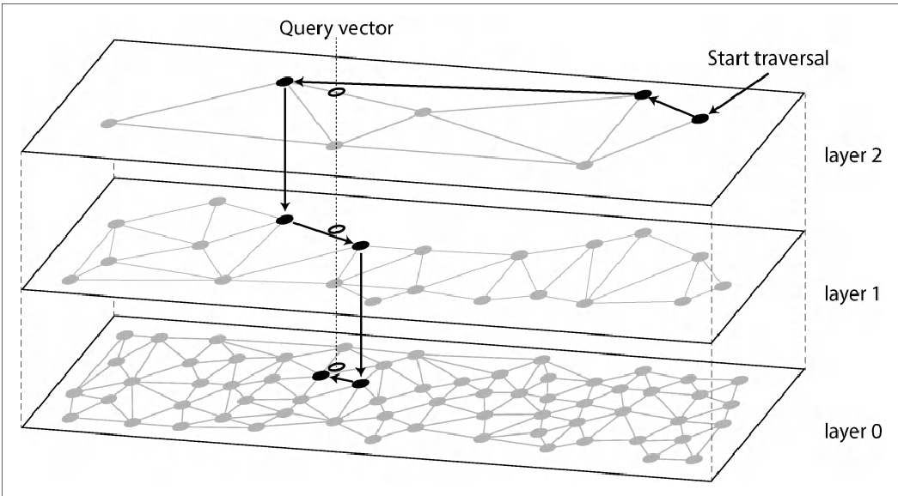

> 图 4-11。在 HNSW 索引中搜索与给定查询向量最接近的数据库条目。  

许多流行的向量数据库都实现了 IVF 和 HNSW 索引。Facebook 的 Faiss 库为两者分别提供了数种变体 [101]，PostgreSQL 的 pgvector 也同时支持二者 [102]。IVF 和 HNSW 算法的完整细节超出了本书范围，但介绍它们的论文是极佳的参考资料 [103, 104]。  

<a id="chapter-4-summary"></a>

## 小结  

本章尝试深入探究数据库如何执行存储与检索。将数据存入数据库时会发生什么？以后再次查询这些数据时，数据库又会做什么？  

第 3 页的“事务处理系统与分析系统”介绍了事务处理（OLTP）与分析（OLAP）之间的区别。本章看到，为 OLTP 优化的存储引擎与为分析优化的存储引擎截然不同：  

- OLTP 系统针对大量请求进行了优化，每个请求只读写少量记录，并且需要快速响应。记录通常通过主键或二级索引访问，这些索引通常是从键到记录的有序映射，同时也支持范围查询。  

- 数据仓库和类似的分析系统针对扫描大量记录的复杂读取查询进行了优化。它们通常使用带压缩的列式存储布局，最大限度地减少这类查询需要从磁盘读取的数据量；并通过查询的 JIT 编译或向量化，最大限度地减少处理数据所耗费的 CPU 时间。  

在 OLTP 方面，我们看到了两大主要流派的存储引擎：  

- 日志结构方法允许向文件追加内容和删除过时文件，但绝不更新已经写入的文件。一般而言，日志结构存储引擎往往能提供较高的写入吞吐量。SSTable、LSM 树、RocksDB、Cassandra、HBase、ScyllaDB、Lucene 等都属于这一类。  

- 原地更新方法将磁盘视为一组可以覆盖写入的固定大小页面。B 树是这种理念最常见的例子，所有主流关系型 OLTP 数据库以及许多非关系型数据库都使用它。根据经验，B 树往往更适合读取，与日志结构存储相比，可以提供更高的读取吞吐量和更低的响应时间。  

随后，我们考察了可以同时搜索多个条件的索引：例如 R 树这样的多维索引，可以同时按纬度和经度搜索地图上的点；全文搜索索引则可以搜索同一文本中出现的多个关键字。最后，我们看到，向量数据库用于对文本文档和其他媒体执行语义搜索；它们使用维度数量更多的向量，并通过比较向量相似度找出相似文档。  

作为应用开发者，掌握存储引擎内部原理的这些知识，会让你更有能力判断哪种工具最适合自己的特定应用。如果需要调整数据库的调优参数，这种理解也能让你设想调高或调低某个值可能产生什么影响。  

尽管本章无法让你成为调优任何特定存储引擎的专家，但希望它已经让你掌握了足够的词汇和概念，从而能够理解自己所选数据库的文档。  

## 参考文献  

[1] Nikolay Samokhvalov. "How Partial, Covering, and Multicolumn Indexes May Slow Down UPDATE in PostgreSQL." *postgres.ai*, October 2021. Archived at *perma.cc/PBK3-F4G9*  

[2] Goetz Graefe. "Modern B-Tree Techniques." *Foundations and Trends in Databases*, volume 3, issue 4, pages 203–402, August 2011. doi:10.1561/1900000028  

[3] Evan Jones. "Why Databases Use Ordered Indexes but Programming Uses Hash Tables." evanjones.ca, December 2019. Archived at perma.cc/NJX8-3ZZD  

[4] Branimir Lambov. “CEP-25: Trie-Indexed SSTable Format.” cwiki.apache.org, November 2022. Archived at perma.cc/HD7W-PW8U (linked Google Doc archived at perma.cc/UL6C-AAAe)  

[5] Thomas H. Cormen, Charles E. Leiserson, Ronald L. Rivest, and Clifford Stein.
*Introduction to Algorithms*, 3rd edition. MIT Press, 2009. ISBN: 9780262533058  

[6] Branimir Lambov. "Trie Memtables in Cassandra." Proceedings of the VLDB Endowment, volume 15, issue 12, pages 3359–3371, August 2022. doi:10.14778/3554821.3554828  

[7] Dhruba Borthakur. “The History of RocksDB.” *rocksdb.blogspot.com*, November 2013. Archived at *perma.cc/Z7C5-JPSP*  

[8] Matteo Bertozzi. “Apache HBase I/O—HFile.” blog.cloudera.com, June 2012. Archived at perma.cc/U9XH-L2KL  

[9] Fay Chang, Jeffrey Dean, Sanjay Ghemawat, Wilson C. Hsieh, Deborah A. Wallach, Mike Burrows, Tushar Chandra, Andrew Fikes, and Robert E. Gruber. "Bigtable: A Distributed Storage System for Structured Data." At 7th USENIX Symposium on Operating System Design and Implementation (OSDI), November 2006.  

[10] Patrick O'Neil, Edward Cheng, Dieter Gawlick, and Elizabeth O'Neil. "The Log-Structured Merge-Tree (LSM-Tree)." *Acta Informatica*, volume 33, issue 4, pages 351–385, June 1996. doi:10.1007/s002360050048  

[11] Mendel Rosenblum and John K. Ousterhout. "The Design and Implementation of a Log-Structured File System." ACM Transactions on Computer Systems, volume 10, issue 1, pages 26–52, February 1992. doi:10.1145/146941.146943  

[12] Michael Armbrust, Tathagata Das, Liwen Sun, Burak Yavuz, Shixiong Zhu, Mukul Murthy, Joseph Torres, Herman van Hovell, Adrian Ionescu, Alicja Luszczak, Michał Świtakowski, Michał Szafrański, Xiao Li, Takuya Ueshin, Mostafa Mokhtar, Peter Boncz, Ali Ghodsi, Sameer Paranjpye, Pieter Senster, Reynold Xin, and Matei Zaharia. "Delta Lake: High-Performance ACID Table Storage over Cloud Object Stores." Proceedings of the VLDB Endowment, volume 13, issue 12, pages 3411–3424, August 2020. doi:10.14778/3415478.3415560  

[13] Burton H. Bloom. "Space/Time Trade-offs in Hash Coding with Allowable Errors." *Communications of the ACM*, volume 13, issue 7, pages 422–426, July 1970. doi:10.1145/362686.362692  

[14] Adam Kirsch and Michael Mitzenmacher. "Less Hashing, Same Performance: Building a Better Bloom Filter." Random Structures & Algorithms, volume 33, issue 2, pages 187–218, September 2008. doi:10.1002/rsa.20208  

[15] Thomas Hurst. “Bloom Filter Calculator.” *hur.st*, September 2023. Archived at *perma.cc/L3AV-6VC2*  

[16] Chen Luo and Michael J. Carey. “LSM-Based Storage Techniques: a Survey.” The VLDB Journal, volume 29, pages 393–418, July 2019. doi:10.1007/s00778-019-00555-y  

[17] Subhadeep Sarkar and Manos Athanassoulis. "Dissecting, Designing, and Optimizing LSM-Based Data Stores." Tutorial at ACM International Conference on Management of Data (SIGMOD), June 2022. Slides archived at perma.cc/93B3-E827  

[18] Mark Callaghan. “Name That Compaction Algorithm.” *smalldatum.blogspot.com*, August 2018. Archived at *perma.cc/CN4M-82DY*  

[19] Prashanth Rao. "Embedded Databases (1): The Harmony of DuckDB, KütüDB and LanceDB." *thedataquarry.com*, August 2023. Archived at *perma.cc/PA28-2R35*  

[20] Hacker News discussion. "Bluesky Migrates to Single-Tenant SQLite." news.ycombinator.com, October 2023. Archived at perma.cc/69LM-5P6X  

[21] Rudolf Bayer and Edward M. McCreight. "Organization and Maintenance of Large Ordered Indices." Boeing Scientific Research Laboratories, Mathematical and Information Sciences Laboratory, report no. 20, July 1970. doi:10.1145/1734663.1734671  

[22] Douglas Comer. "The Ubiquitous B-Tree." ACM Computing Surveys, volume 11, issue 2, pages 121–137, June 1979. doi:10.1145/356770.356776  

[23] Alex Miller. “Torn Write Detection and Protection.” transactional.blog, April 2025. Archived at perma.cc/G7EB-33EW  

[24] C. Mohan and Frank Levine. "ARIES/IM: An Efficient and High Concurrency Index Management Method Using Write-Ahead Logging." At ACM International Conference on Management of Data (SIGMOD), June 1992. doi:10.1145/130283.130338  

[25] Hironobu Suzuki. “The Internals of PostgreSQL.” *interdb.jp*，2017 年。归档于 *archive.org*  

[26] Howard Chu. “LDAP at Lightning Speed.” 发表于 Build Stuff ’14，2014 年 11 月。归档于 perma.cc/GB6Z-P8YH  

[27] Manos Athanassoulis, Michael S. Kester, Lukas M. Maas, Radu Stoica, Stratos Idriss, Anastasia Ailamaki, and Mark Callaghan. "Designing Access Methods: The RUM Conjecture." 发表于第 19 届 International Conference on Extending Database Technology（EDBT），2016 年 3 月。doi:10.5441/002/edbt.2016.42  

[28] Ben Stopford. “Log Structured Merge Trees.” *benstopford.com*，2015 年 2 月。归档于 *perma.cc/E5BV-KUJ6*  

[29] Mark Callaghan. "The Advantages of an LSM vs. a B-Tree." *smalldatum.blogspot.co.uk*，2016 年 1 月。归档于 *perma.cc/3TYZ-EFUD*  

[30] Oana Balmau, Florin Dinu, Willy Zwaenepoel, Karan Gupta, Ravishankar Chandhiramoorthi, and Diego Didona. "SILK: Preventing Latency Spikes in Log-Structured Merge Key-Value Stores." 发表于 USENIX Annual Technical Conference，2019 年 7 月。  

[31] Igor Canadi, Siying Dong, Mark Callaghan, et al. "RocksDB Tuning Guide." *github.com*，2023 年。归档于 *perma.cc/UNY4-MK6C*  

[32] Gabriel Haas and Viktor Leis. "What Modern NVMe Storage Can Do, and How to Exploit It: High-Performance I/O for High-Performance Storage Engines." Proceedings of the VLDB Endowment，第 16 卷，第 9 期，第 2090–2102 页。2023 年 5 月。doi:10.14778/3598581.3598584  

[33] Emmanuel Goossaert. “Coding for SSDs.” *codecapsule.com*，2014 年 2 月。  

[34] Jack Vanlightly. “Is Sequential IO Dead in the Era of the NVMe Drive?” jack-vanlightly.com，2023 年 5 月。归档于 perma.cc/7TMZ-TAPU  

[35] Alibaba Cloud Storage Team. "Storage System Design Analysis: Factors Affecting NVMe SSD Performance (2)." alibabacloud.com，2019 年 1 月。归档于 archive.org  

[36] Xiao-Yu Hu and Robert Haas. "The Fundamental Limit of Flash Random Write Performance: Understanding, Analysis and Performance Modelling." *domino-web.draco.res.ibm.com*，2010 年 3 月。归档于 *perma.cc/8JUL-4ZDS*  

[37] Lanyue Lu, Thanumalayan Sankaranarayana Pillai, Andrea C. Arpaci-Dusseau, and Remzi H. Arpaci-Dusseau. "WiscKey: Separating Keys from Values in SSD-Conscious Storage." 发表于第 4 届 USENIX Conference on File and Storage Technologies（FAST），2016 年 2 月。  

[38] Peter Zaitsev. “Innodb Double Write.” percona.com，2006 年 8 月。归档于 perma.cc/NT4S-DK7T  

[39] Tomas Vondra. “On the Impact of Full-Page Writes.” *2ndquadrant.com*，2016 年 11 月。归档于 *perma.cc/7N6B-CVL3*  

[40] Mark Callaghan. “Read, Write & Space Amplification—B-Tree vs. LSM.” small-datum.blogspot.com，2015 年 11 月。归档于 perma.cc/S487-WK5P  

[41] Mark Callaghan. “Choosing Between Efficiency and Performance with RocksDB.” 发表于 Code Mesh，2016 年 11 月  

[42] Subhadeep Sarkar, Tarikul Islam Papon, Dimitris Staratzis, Zichen Zhu, and Manos Athanassoulis. "Enabling Timely and Persistent Deletion in LSM-Engines." ACM Transactions on Database Systems，第 48 卷，第 3 期，第 8 号文章，2023 年 8 月。doi:10.1145/3599724  

[43] Lukas Fittl. “Postgres vs. SQL Server: B-Tree Index Differences & the Benefit of Deduplication.” pganalyze.com，2025 年 4 月。归档于 perma.cc/XY6T-LTPX  

[44] Drew Silcock. “How Postgres Stores Data on Disk—This One’s a Page Turner.” drew.silcock.dev，2024 年 8 月。归档于 perma.cc/8K7K-7VJ2  

[45] Joe Webb. “Using Covering Indexes to Improve Query Performance.” *simple-talk.com*，2008 年 9 月。归档于 *perma.cc/6MEZ-R5VR*  

[46] Michael Stonebraker, Samuel Madden, Daniel J. Abadi, Stavros Harizopoulos, Nabil Hachem, and Pat Helland. "The End of an Architectural Era (It's Time for a Complete Rewrite)." 发表于第 33 届 International Conference on Very Large Data Bases（VLDB），2007 年 9 月。  

[47] “VoltDB Technical Overview White Paper.” VoltDB，2017 年。归档于 perma.cc/B9SF-SK5G  

[48] Stephen M. Rumble, Ankita Kejriwal, and John K. Ousterhout. "Log-Structured Memory for DRAM-Based Storage." 发表于第 12 届 USENIX Conference on File and Storage Technologies（FAST），2014 年 2 月。  

[49] Stavros Harizopoulos, Daniel J. Abadi, Samuel Madden, and Michael Stonebraker. "OLTP Through the Looking Glass, and What We Found There." 发表于 ACM International Conference on Management of Data（SIGMOD），2008 年 6 月。doi:10.1145/1376616.1376713  

[50] Per-Åke Larson, Cipri Clinciu, Campbell Fraser, Eric N. Hanson, Mostafa Mokhtar, Michal Nowakiewicz, Vassilis Papadimos, Susan L. Price, Srikumar Rangarajan, Remus Rusanu, and Mayukh Saubhasik. "Enhancements to SQL Server Column Stores." 发表于 ACM International Conference on Management of Data（SIGMOD），2013 年 6 月。doi:10.1145/2463676.2463708  

[51] Franz Färber, Norman May, Wolfgang Lehner, Philipp Große, Ingo Müller, Hannes Rauhe, and Jonathan Dees. "The SAP HANA Database—An Architecture Overview." *IEEE Data Engineering Bulletin*，第 35 卷，第 1 期，第 28–33 页，2012 年 3 月。归档于 *perma.cc/H2WC-YQZY*  

[52] Michael Stonebraker. “The Traditional RDBMS Wisdom Is (Almost Certainly) All Wrong.” 在 EPFL 所作的演讲，2013 年 5 月。  

[53] Adam Prout, Szu-Po Wang, Joseph Victor, Zhou Sun, Yongzhu Li, Jack Chen, Evan Bergeron, Eric Hanson, Robert Walzer, Rodrigo Gomes, and Nikita Shamgunov. "Cloud-Native Transactions and Analytics in SingleStore." 发表于 ACM International Conference on Management of Data（SIGMOD），2022 年 6 月。doi:10.1145/3514221.3526055  

[54] Tino Tereshko and Jordan Tigani. "BigQuery Under the Hood." cloud.google.com，
2016 年 1 月。归档于 perma.cc/WP2Y-FUCF  

[55] Wes McKinney. "The Road to Composable Data Systems: Thoughts on the Last 15 Years and the Future." *wesmckinney.com*，2023 年 9 月。归档于 *perma.cc/6L2M-GTJX*  

[56] Michael Stonebraker, Daniel J. Abadi, Adam Batkin, Xuedong Chen, Mitch Cherniack, Miguel Ferreira, Edmond Lau, Amerson Lin, Sam Madden, Elizabeth O'Neil, Pat O'Neil, Alex Rasin, Nga Tran, and Stan Zdonik. "C-Store: A Column-Oriented DBMS." 发表于第 31 届 International Conference on Very Large Data Bases（VLDB），2005 年 9 月。  

[57] Julien Le Dem. “Dremel Made Simple with Parquet.” blog.x.com，2013 年 9 月。归档于 archive.org  

[58] Sergey Melnik, Andrey Gubarev, Jing Jing Long, Geoffrey Romer, Shiva Shivakumar, Matt Tolton, and Theo Vassilakis. "Dremel: Interactive Analysis of Web-Scale Datasets." 发表于第 36 届 International Conference on Very Large Data Bases（VLDB），2010 年 9 月。doi:10.14778/1920841.1920886  

[59] Joe Kearney. “Understanding Record Shredding: Storing Nested Data in Columns.” joekearney.co.uk，2016 年 12 月。归档于 perma.cc/ZD5N-AX5D  

[60] Jamie Brandon. “A Shallow Survey of OLAP and HTAP Query Engines.” scattered-thoughts.net，2023 年 9 月。归档于 perma.cc/L3KH-J4JF  

[61] Benoit Dageville, Thierry Cruanes, Marcin Zukowski, Vadim Antonov, Artin Avanes, Jon Bock, Jonathan Claybaugh, Daniel Engovatov, Martin Hentschel, Jiansheng Huang, Allison W. Lee, Ashish Motivala, Abdul Q. Munir, Steven Pelley, Peter Povinec, Greg Rahn, Spyridon Triantafyllis, and Philipp Unterbrunner. "The Snowflake Elastic Data Warehouse." 发表于 ACM International Conference on Management of Data（SIGMOD），2016 年 6 月。doi:10.1145/2882903.2903741  

[62] Mark Raasveldt and Hannes Mühleisen. "Data Management for Data Science Towards Embedded Analytics." 发表于第 10 届 Conference on Innovative Data Systems Research（CIDR），2020 年 1 月。归档于 perma.cc/65G2-NYDT  

[63] Jean-François Im, Kishore Gopalakrishna, Subbu Subramaniam, Mayank Shrivastava, Adwait Tumbde, Xiaotian Jiang, Jennifer Dai, Seunghyun Lee, Neha Pawar, Jialiang Li, and Ravi Aringunram. "Pinot: Realtime OLAP for 530 Million Users." 发表于 ACM International Conference on Management of Data（SIGMOD），2018 年 5 月。doi:10.1145/3183713.3190661  

[64] Fangjin Yang, Eric Tschetter, Xavier Léauté, Nelson Ray, Gian Merlino, and Deep Ganguli. "Druid: A Real-Time Analytical Data Store." 发表于 ACM International Conference on Management of Data（SIGMOD），2014 年 6 月。doi:10.1145/2588555.2595631  

[65] Chunwei Liu, Anna Pavlenko, Matteo Interlandi, and Brandon Haynes.
"Deep Dive into Common Open Formats for Analytical DBMSs." Proceedings
of the VLDB Endowment，第 16 卷，第 11 期，第 3044–3056 页，2023 年 7 月。
doi:10.14778/3611479.3611507  

[66] Xinyu Zeng, Yulong Hui, Jiahong Shen, Andrew Pavlo, Wes McKinney, and Huanchen Zhang. "An Empirical Evaluation of Columnar Storage Formats." Proceedings of the VLDB Endowment，第 17 卷，第 2 期，第 148–161 页。doi:10.14778/3626292.3626298  

[67] Weston Pace. “Lance v2: A Columnar Container Format for Modern Data.” blog.lancedb.com，2024 年 4 月。归档于 perma.cc/ZK3Q-S9VJ  

[68] Yoav Helfman. “Nimble, A New Columnar File Format.” 发表于 *VeloXCon*，2024 年 4 月。  

[69] Wes McKinney. "Apache Arrow: High-Performance Columnar Data Framework." 发表于 CMU Database Group—Vaccination Database Tech Talks，2021 年 12 月。  

[70] Wes McKinney. *Python for Data Analysis*，第 3 版。O'Reilly Media，2022 年。ISBN: 9781098104023  

[71] Paul Dix. "The Design of InfluxDB IOx: An In-Memory Columnar Database Written in Rust with Apache Arrow." 发表于 CMU Database Group—Vaccination Database Tech Talks，2021 年 5 月。  

[72] Carlota Soto and Mike Freedman. "Building Columnar Compression for Large PostgreSQL Databases." *timescale.com*，2024 年 3 月。归档于 *perma.cc/7KTF-V3EH*  

[73] Daniel J. Abadi, Peter Boncz, Stavros Harizopoulos, Stratos Idreos, and Samuel Madden. "The Design and Implementation of Modern Column-Oriented Database Systems." Foundations and Trends in Databases，第 5 卷，第 3 期，第 197–280 页，2013 年 12 月。doi:10.1561/1900000024  

[74] Daniel Lemire, Gregory Ssi-Yan-Kai, and Owen Kaser. "Consistently Faster and Smaller Compressed Bitmaps with Roaring." Software: Practice and Experience，第 46 卷，第 11 期，第 1547–1569 页，2016 年 11 月。doi:10.1002/spe.2402  

[75] Jaz Volpert. “An Entire Social Network in 1.6GB (GraphD Part 2).” jazco.dev，2024 年 4 月。归档于 perma.cc/L27Z-QVMG  

[76] Andrew Lamb, Matt Fuller, Ramakrishna Varadarajan, Nga Tran, Ben Vandiver, Lyric Doshi, and Chuck Bear. "The Vertica Analytic Database: C-Store 7 Years Later." Proceedings of the VLDB Endowment，第 5 卷，第 12 期，第 1790–1801 页，2012 年 8 月。doi:10.14778/2367502.2367518  

[77] Timo Kersten, Viktor Leis, Alfons Kemper, Thomas Neumann, Andrew Pavlo, and Peter Boncz. "Everything You Always Wanted to Know About Compiled and Vectorized Queries But Were Afraid to Ask." Proceedings of the VLDB Endowment，第 11 卷，第 13 期，第 2209–2222 页，2018 年 9 月。doi:10.14778/3275366.3284966  

[78] Forrest Smith. “Memory Bandwidth Napkin Math.” forrestthewoods.com，2020 年 2 月。归档于 perma.cc/Y8U4-PS7N  

[79] Peter Boncz, Marcin Zukowski, and Niels Nes. "MonetDB/X100: Hyper-Pipelining Query Execution." 发表于第 2 届 Biennial Conference on Innovative Data Systems Research（CIDR），2005 年 1 月。归档于 perma.cc/R4KF-QKHF  

[80] Jingren Zhou and Kenneth A. Ross. "Implementing Database Operations Using SIMD Instructions." 发表于 ACM International Conference on Management of Data（SIGMOD），2002 年 6 月。doi:10.1145/564691.564709  

[81] Kevin Bartley. "OLTP Queries: Transfer Expensive Workloads to Materialize." *materialize.com*，2024 年 8 月。归档于 *perma.cc/4TYM-TYD8*  

[82] Jim Gray, Surajit Chaudhuri, Adam Bosworth, Andrew Layman, Don Reichart, Murali Venkatrao, Frank Pellow, and Hamid Pirahesh. "Data Cube: A Relational Aggregation Operator Generalizing Group-By, Cross-Tab, and Sub-Totals." *Data Mining and Knowledge Discovery*，第 1 卷，第 1 期，第 29–53 页，2007 年 3 月。doi:10.1023/A:1009726021843  

[83] Frank Ramsak, Volker Markl, Robert Fenk, Martin Zirkel, Klaus Elhardt, and Rudolf Bayer. "Integrating the UB-Tree into a Database System Kernel." 发表于第 26 届 International Conference on Very Large Data Bases（VLDB），2000 年 9 月。  

[84] Octavian Procopiu, Pankaj K. Agarwal, Lars Arge, and Jeffrey Scott Vitter. "Bkd-Tree: A Dynamic Scalable kd-Tree." 发表于第 8 届 International Symposium on Spatial and Temporal Databases（SSTD），2003 年 7 月。doi:10.1007/978-3-540-45072-6_4  

[85] Joseph M. Hellerstein, Jeffrey F. Naughton, and Avi Pfeffer. "Generalized Search Trees for Database Systems." 发表于第 21 届 International Conference on Very Large Data Bases（VLDB），1995 年 9 月。  

[86] Isaac Brodsky. “H3: Uber’s Hexagonal Hierarchical Spatial Index.” eng.uber.com，2018 年 6 月。归档于 archive.org  

[87] Robert Escriva, Bernard Wong, and Emin Gün Sirer. "HyperDex: A Distributed, Searchable Key-Value Store." 发表于 ACM SIGCOMM Conference，2012 年 8 月。doi:10.1145/2377677.2377681  

[88] Christopher D. Manning, Prabhakar Raghavan, and Hinrich Schütze. *Introduction to Information Retrieval*. Cambridge University Press，2008 年。ISBN: 9780521865715。可在线获取于 nlp.stanford.edu/IR-book。  

[89] Jianguo Wang, Chunbin Lin, Yannis Papakonstantinou, and Steven Swanson.
"An Experimental Study of Bitmap Compression vs. Inverted List Compression."
发表于 ACM International Conference on Management of Data（SIGMOD），2017 年 5 月。
doi:10.1145/3035918.3064007  

[90] Adrien Grand. “What Is in a Lucene Index?” 发表于 *Lucene/Solr Revolution*，2013 年 11 月。归档于 *perma.cc/Z7QN-GBYY*  

[91] Michael McCandless. “Visualizing Lucene’s Segment Merges.” blog.mikemccandless.com，2011 年 2 月。归档于 perma.cc/3ZV8-72W6  

[92] Lukas Fittl. “Understanding Postgres GIN Indexes: The Good and the Bad.” *pganalyze.com*，2021 年 12 月。归档于 *perma.cc/V3MW-26H6*  

[93] Jimmy Angelakos. “The State of (Full) Text Search in PostgreSQL 12.” 发表于 FOSDEM，2020 年 2 月。归档于 perma.cc/J6US-3WZS  

[94] Alexander Korotkov. “Index Support for Regular Expression Search.” 发表于 PGConf.EU Prague，2012 年 10 月。归档于 perma.cc/5RFZ-ZKdq  

[95] Michael McCandless. “Lucene’s FuzzyQuery Is 100 Times Faster in 4.0.” blog.mikemccandless.com，2011 年 3 月。归档于 perma.cc/E2WC-GHTW  

[96] Steffen Heinz, Justin Zobel, and Hugh E. Williams. "Burst Tries: A Fast, Efficient Data Structure for String Keys." ACM Transactions on Information Systems，第 20 卷，第 2 期，第 192–223 页，2002 年 4 月。doi:10.1145/506309.506312  

[97] Klaus U. Schulz and Stoyan Mihov. "Fast String Correction with Levenshtein Automata." International Journal on Document Analysis and Recognition，第 5 卷，第 1 期，第 67–85 页，2002 年 11 月。doi:10.1007/s10032-002-0082-8  

[98] Tomas Mikolov, Kai Chen, Greg Corrado, and Jeffrey Dean. “Efficient Estimation of Word Representations in Vector Space.” arXiv:1301.3781，2013 年 9 月  

[99] Jacob Devlin, Ming-Wei Chang, Kenton Lee, and Kristina Toutanova. "BERT: Pre-Training of Deep Bidirectional Transformers for Language Understanding." 发表于 Conference of the North American Chapter of the Association for Computational Linguistics: Human Language Technologies，2019 年 6 月。doi:10.18653/v1/N19-1423  

[100] Alec Radford, Karthik Narasimhan, Tim Salimans, and Ilya Sutskever. "Improving Language Understanding by Generative Pre-Training." openai.com，2018 年 6 月。归档于 perma.cc/5N3C-DJ4C  

[101] Matthijs Douze, Maria Lomeli, and Lucas Hosseini. "Faiss Indexes." github.com，2024 年 8 月。归档于 perma.cc/2EWG-FPBS  

[102] Varik Matevosyan. “Understanding pgvector’s HNSW Index Storage in Postgres.” lantern.dev，2024 年 8 月。归档于 perma.cc/B2YB-JB59  

[103] Dmitry Baranchuk, Artem Babenko, and Yury Malkov. "Revisiting the Inverted Indices for Billion-Scale Approximate Nearest Neighbors." 发表于 European Conference on Computer Vision（ECCV），2018 年 9 月。doi:10.1007/978-3-030-01258-8_13  

[104] Yury A. Malkov and Dmitry A. Yashunin. "Efficient and Robust Approximate Nearest Neighbor Search Using Hierarchical Navigable Small World Graphs." IEEE Transactions on Pattern Analysis and Machine Intelligence，第 42 卷，第 4 期，第 824–836 页，2020 年 4 月。doi:10.1109/TPAMI.2018.2889473  

# 编码与演化  

万物皆变，没有什么静止不动。  

——以弗所的赫拉克利特，柏拉图引自《Cratylus》（公元前 360 年）  

应用程序不可避免地会随时间推移而变化。随着新产品推出、对用户需求的理解不断深入，或商业环境发生变化，功能会被添加或修改。在第 2 章中，我们介绍了可演化性的概念：应当以构建易于适应变化的系统为目标（参见第 55 页的“可演化性：让变化更容易”）。  

大多数情况下，应用程序功能的变化也要求其存储的数据随之变化。也许需要采集新的字段或记录类型，或者需要以新的方式呈现现有数据。  

第 3 章讨论的数据模型以不同方式应对此类变化。关系数据库通常假定数据库中的所有数据都符合一个模式。尽管该模式可以更改（通过模式迁移，即 ALTER 语句），但在任何一个时间点都只有一个模式生效。相比之下，读时模式（“无模式”）数据库并不强制执行模式，因此数据库中可以混合存放在不同时间写入的较旧和较新数据格式（参见第 80 页的“文档模型中的模式灵活性”）。  

数据格式或模式发生变化时，应用程序代码通常也需要作出相应更改（例如，给记录添加一个新字段后，应用程序代码开始读写该字段）。然而，在大型应用程序中，出于种种原因，代码更改往往无法瞬间完成。例如：  

- 对于服务端应用程序，你可能希望执行滚动升级（也称为分阶段发布），即每次将新版本部署到少数几个节点，监控其运行是否顺畅，再逐步完成所有节点的升级。这样无需中断服务即可部署新版本，从而有利于更频繁地发布，并实现更好的可演化性。  

- 对于客户端应用程序，你只能听凭用户决定，而用户可能过一段时间才会安装更新。  

这意味着新旧版本的代码以及新旧数据格式可能同时共存于系统中。为了让系统继续顺畅运行，你需要维持两个方向的兼容性：  

向后兼容性  

确保较新的代码能够读取较旧代码写入的数据  

向前兼容性  

确保较旧的代码能够读取较新代码写入的数据  

在 API 的语境中，如果希望较旧的客户端能够成功调用较新的服务，请求需要具备向后兼容性，响应则需要具备向前兼容性。要让较新的客户端调用较旧的服务，请求需要具备向前兼容性，响应则需要具备向后兼容性。  

向后兼容性通常不难实现。作为较新代码的作者，你知道较旧代码写入的数据格式，因此可以显式处理它（如有必要，只需保留读取旧数据的旧代码即可）。向前兼容性可能更棘手，因为它要求较旧的代码忽略较新版本代码所做的增补。  

图 5-1 展示了向前兼容性的另一个挑战。假设你给记录模式添加了一个字段，较新的代码创建了一条包含该新字段的记录，并将其存入数据库。随后，较旧版本的代码（尚不了解这个新字段）读取、更新并写回该记录。在这种情况下，通常期望旧代码原样保留新字段，即便它无法解释该字段。然而，如果记录被解码为一个不会显式保留未知字段的模型对象，就可能丢失数据，如图所示。  

本章将考察几种编码数据的格式，包括 JSON、XML、Protocol Buffers 和 Avro。我们将特别关注它们如何处理模式变更，以及如何支持新旧数据和代码需要共存的系统。随后，我们将讨论这些格式如何用于数据存储和通信：包括数据库、Web 服务、REST API、远程过程调用（RPC）、工作流引擎，以及 Actor 和消息队列等事件驱动系统。  

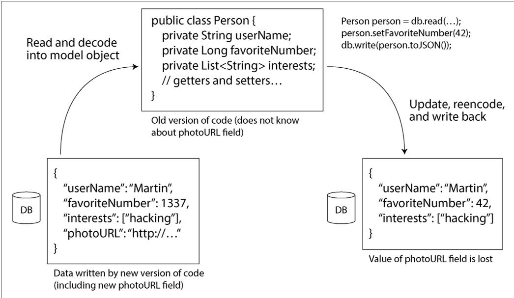

> 图 5-1。当较旧版本的应用程序更新先前由较新版本应用程序写入的数据时，稍有不慎就可能丢失数据。  

## 编码数据的格式  

程序通常以（至少）两种表示形式处理数据：  

- 在内存中，数据保存在对象、结构体、列表、数组、哈希表、树等数据结构中。这些数据结构针对 CPU 的高效访问和操作进行了优化（通常使用指针）。  

- 当你要把数据写入文件或通过网络发送时，必须将其编码为某种自包含的字节序列（例如 JSON 文档）。由于指针对其他任何进程都没有意义，这种字节序列表示通常与内存中惯用的数据结构大不相同。  

因此，我们需要在这两种表示之间进行某种转换。从内存表示转换为字节序列称为*编码*（也称为*序列化*或*编组*），反向转换称为*解码*（也称为*解析*、*反序列化*或*解组*）。  

> [!NOTE]
> **术语冲突**
>
> 遗憾的是，*序列化*一词也用于事务的语境（参见第 8 章），而且含义完全不同。为了避免一词多义，本书将坚持使用*编码*，尽管序列化可能更为常用。
>
> 有时并不需要编码/解码——例如，数据库直接处理从磁盘加载的压缩数据，如第 142 页的“查询执行：编译与向量化”所述。还有一些零拷贝数据格式，设计为无需显式转换步骤即可同时用于运行时以及磁盘/网络，例如 Cap'n Proto 和 FlatBuffers。
>
> 然而，大多数系统都需要在内存对象与扁平字节序列之间进行转换。这个问题如此普遍，因此可供选择的库和编码格式多不胜数。下面简要概览一下。

## 语言特定格式  

许多编程语言都内置了将内存对象编码为字节序列的支持。例如，Java 有 java.io.Serializable，Python 有 pickle，Ruby 有 Marshal。也有许多第三方库，例如 Java 的 Kryo。  

这些编码库很方便，因为只需极少的额外代码，就能保存和恢复内存对象。然而，它们也存在许多严重问题：  

- 编码往往与某种特定编程语言绑定，因而很难用另一种语言读取数据。如果以这种编码存储或传输数据，你可能会长期受制于当前的编程语言，也无法将自己的系统与其他组织的系统集成（后者可能使用不同的语言）。  

- 为了将数据恢复为相同的对象类型，解码过程需要能够实例化任意类。这经常成为安全问题的根源 [1]；如果攻击者能让你的应用程序解码任意字节序列，他们就能实例化任意类，进而往往可以做出远程执行任意代码之类的恶意行为 [2, 3]。  

- 在这些库中，数据版本控制往往只是事后才考虑的问题。由于它们旨在快速、轻松地编码数据，往往忽视了向前兼容和向后兼容这些麻烦的问题 [4]。  

- 效率（编码或解码所需的 CPU 时间，以及编码后结构的大小）通常也只是事后才考虑的问题。例如，Java 内置序列化因性能糟糕、编码臃肿而声名狼藉 [5]。  

由于这些原因，除非常短暂的用途外，使用编程语言内置的编码通常不是个好主意。  

## JSON、XML 与二进制变体  

说到可由多种编程语言读写的标准化编码，JSON 和 XML 是显而易见的选择：二者广为人知且受到广泛支持。CSV 是另一种流行的语言无关格式，但它只支持不含嵌套的表格数据。  

JSON、XML 和 CSV 都是文本格式，因而具有一定的可读性，不过它们的语法一直是争论不休的话题。除了表面的语法问题，它们还存在其他各种问题：  

- XML 经常因过于冗长且不必要地复杂而受到批评 [6]。  

- 数字编码存在许多歧义。在 XML 和 CSV 中，无法区分数字与恰好完全由数字字符组成的字符串（除非借助外部模式）。JSON 能区分字符串和数字，却不能区分整数和浮点数，也没有规定精度。  

处理大数时，这会成为一个问题——例如，大于 2^53 的整数无法用 IEEE 754 双精度浮点数精确表示，因此在 JavaScript 等使用浮点数的语言中解析时，这类数字会变得不准确 [7]。X 上就会出现大于 2^53 的数字，因为它使用 64 位数字来标识每个帖子。API 返回的 JSON 会包含两次帖子 ID，一次作为 JSON 数字，另一次作为十进制字符串，以规避 JavaScript 应用程序错误解析数字的问题 [8]。  

- JSON 和 XML 对 Unicode 字符串（即人类可读的文本）有良好支持，却不支持二进制字符串（没有字符编码的字节序列）。二进制字符串是一项很实用的功能，因此人们用 Base64 将二进制数据编码为文本，以此绕过该限制。随后再通过模式表明，应将该值解释为 Base64 编码的数据。这种方法可行，但有些取巧，而且会使数据大小增加约三分之一。  

- XML Schema 和 JSON Schema 功能强大，因而学习和实现起来相当复杂。由于数据（如数字和二进制字符串）的正确解释依赖模式中的信息，不使用 XML/JSON Schema 的应用程序可能需要改为硬编码相应的编码/解码逻辑。  

- CSV 没有任何模式，因此每行和每列的含义只能由应用程序定义。如果应用程序变更添加了新行或新列，就必须手动处理这一变化。CSV 也是一种定义颇为含糊的格式（如果某个值包含逗号或换行符，会发生什么？）。尽管其转义规则已有正式规范 [9]，但并非所有解析器都能正确实现。  

尽管存在这些缺陷，JSON、XML 和 CSV 对许多用途而言已经足够好。它们很可能会继续流行，尤其是作为数据交换格式（即用于从一个组织向另一个组织发送数据）。在这些场景中，只要人们对格式达成一致，它是否美观或高效往往并不重要。让不同组织就任何事情达成一致的难度，远远压过了其他大多数考量。  

## JSON 模式  

每当数据需要在系统之间交换或写入存储时，JSON 模式已经成为一种广泛采用的数据建模方式。你可以在 Web 服务（参见第 181 页的“Web 服务”）中找到作为 OpenAPI Web 服务规范一部分的 JSON 模式，也可以在 Confluent Schema Registry 和 Red Hat Apicurio Registry 等模式注册表以及数据库中找到它（例如 PostgreSQL 的 pg_jsonschema 验证器扩展和 MongoDB 的 `$jsonSchema` 验证器语法）。  

JSON Schema 规范提供了许多功能。模式包括 string、number、integer、object、array、boolean 和 null 等标准原始类型。此外，JSON Schema 还提供独立的验证规范，使开发者能够为字段附加约束。例如，端口字段的最小值可以是 1，最大值可以是 65,535。  

JSON 模式可以采用开放内容模型或封闭内容模型。开放内容模型允许模式中未定义的任何字段以任何数据类型存在，而封闭内容模型只允许显式定义的字段。将 additionalProperties 设为 true 即可启用 JSON Schema 的开放内容模型，而这也是默认设置。因此，JSON 模式通常定义的是什么不被允许（即任何已定义字段上的无效值），而不是什么被允许。  

开放内容模型功能强大，但也可能很复杂。例如，假设你想定义一个从整数（如 ID）到字符串的映射。JSON 没有允许使用整数键的映射或字典类型；JSON 对象总是使用字符串作为键。为了满足这一需求，可以用 JSON Schema 约束该类型，通过 patternProperties 和 additionalProperties 限定键只能包含数字、值只能是字符串，如例 5-1 所示。  

例 5-1。键为整数、值为字符串的 JSON 模式  

```json
{
    "$schema": "http://json-schema.org/draft-07/schema#",
    "type": "object",
    "patternProperties": {
        "^[0-9]+$": {
            "type": "string"
        }
    },
    "additionalProperties": false
}  
```

除了开放和封闭内容模型及验证器，JSON Schema 还支持条件式 if/else 模式逻辑、命名类型、远程模式引用等诸多功能。这一切造就了一种非常强大的模式语言，但这些功能也会使定义变得难以驾驭。解析远程模式、推理条件规则，或以向前兼容或向后兼容的方式演化模式，都可能充满挑战 [10, 11]。类似的顾虑也适用于 XML Schema [12]。  

### 二进制编码  

JSON 不如 XML 冗长，但与二进制格式相比，两者仍会占用大量空间。这一观察催生了大量 JSON 的二进制编码（例如 MessagePack、CBOR、BSON、BJSON、UBJSON、BISON、Hessian 和 Smile）以及 XML 的二进制编码（例如 WBXML 和 Fast Infoset）。这些格式已在各种细分领域得到采用，因为它们更紧凑，有时解析也更快，但没有一种像 JSON 和 XML 的文本版本那样得到广泛采用 [13]。  

其中一些格式扩展了数据类型集合（例如区分整数和浮点数，或增加对二进制字符串的支持），但除此之外仍保持 JSON/XML 数据模型不变。特别是，由于它们没有规定模式，因此必须在编码后的数据中包含所有对象字段名。也就是说，在对例 5-2 的 JSON 文档进行二进制编码时，必须在某处包含字符串 userName、favoriteNumber 和 interests。  

例 5-2。本章将使用几种二进制格式编码的一条记录  

```json
{
    "userName": "Martin",
    "favoriteNumber": 1337,
    "interests": ["daydreaming", "hacking"]
}  
```

来看一个 MessagePack 的例子，它是 JSON 的一种二进制编码。图 5-2 展示了用 MessagePack 编码例 5-2 中的 JSON 文档所得到的字节序列。  

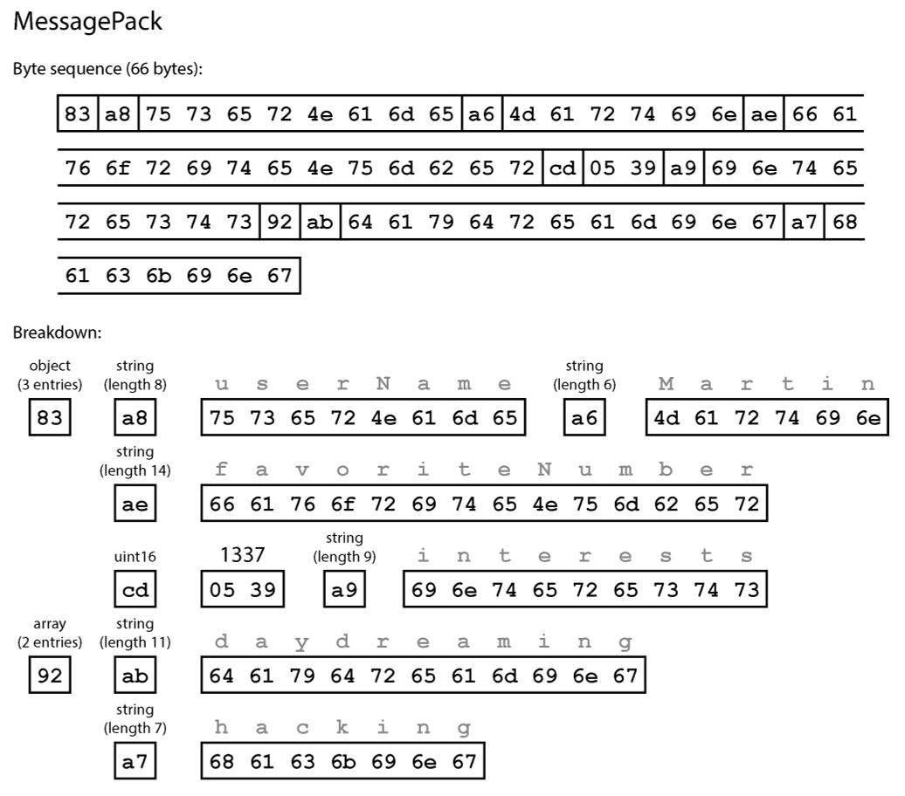

> 图 5-2。使用 MessagePack 编码的记录（例 5-2）。  

开头几个字节如下：  

1. 第一个字节 0x83 表示后面是一个对象（最高四位 = 0x80），包含三个字段（最低四位 = 0x03）。（如果你想知道对象包含超过 15 个字段、字段数无法放入四位时会怎样：此时会使用不同的类型指示符，并用两个或四个字节对字段数编码。）  

2. 第二个字节 0xa8 表示后面是一个长度为八字节（最低四位 = 0x08）的字符串（最高四位 = 0xa0）。  

3. 接下来的八个字节是以 ASCII 表示的字段名 userName。由于前面已经标明长度，因此无需任何标记来说明字符串在哪里结束（也无需任何转义）。  

4. 接下来的七个字节用前缀 0xa6 编码由六个字母组成的字符串值 Martin，依此类推。  

这种二进制编码长 66 字节，只比文本 JSON 编码所占的 81 字节（移除空白后）略少。JSON 的所有二进制编码在这方面都大同小异。如此微小的空间缩减（也许还有解析速度提升）是否值得以失去人类可读性为代价，并不明确。  

在接下来的几节中，我们将看到如何做得好得多，用一半的字节数编码同一条记录。  

## Protocol Buffers  

Protocol Buffers（protobuf）是 Google 开发的二进制编码库。它与最初由 Facebook 开发的 Apache Thrift 类似 [14]；本节关于 Protocol Buffers 的大部分论述也适用于 Thrift。  

Protocol Buffers 要求任何被编码的数据都必须有模式。要编码例 5-2 中的数据，可以用 Protocol Buffers 接口定义语言（IDL）这样描述模式：  

```protobuf
syntax = "proto3";

message Person {
    string user_name = 1;
    int64 favorite_number = 2;
    repeated string interests = 3;
}  
```

Protocol Buffers 自带一个代码生成工具，它接受如上所示的模式定义，并生成以各种编程语言实现该模式的类。应用程序代码可以调用这些生成的代码，对符合模式的记录进行编码或解码。与 JSON Schema 相比，这种模式语言非常简单；它定义每种记录的字段及其类型，但不支持对字段可能取值施加其他限制。  

使用 Protocol Buffers 编码器对例 5-2 编码需要 33 字节，如图 5-3 所示 [15]。与图 5-2 一样，每个字段都有类型注解（用于指明它是字符串、整数等），并在需要时指明长度（例如字符串的长度）。数据中出现的字符串（Martin、daydreaming、hacking）仍像之前一样使用 ASCII（准确地说，是 UTF-8）编码。  

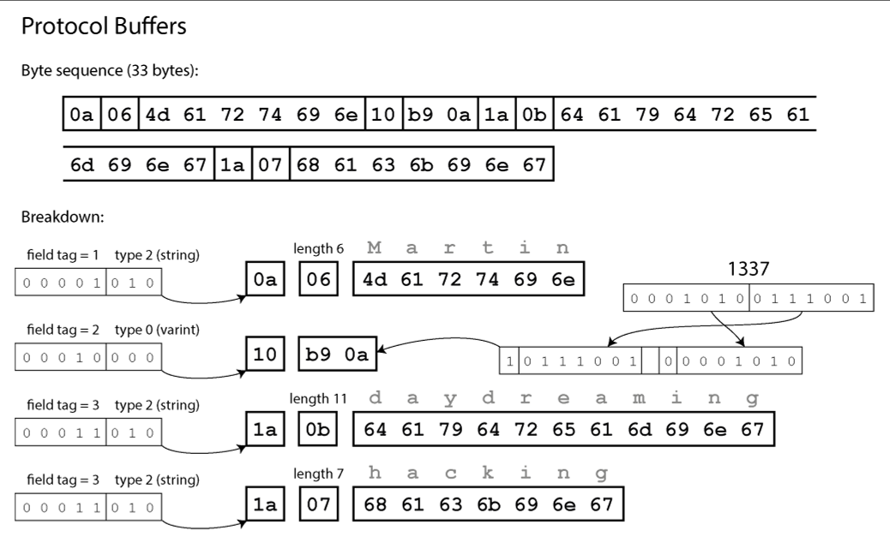

> 图 5-3。使用 Protocol Buffers 编码的记录。  

与图 5-2 不同，本例没有字段名（userName、favoriteNumber、interests）。编码后的数据包含的则是字段标签，也就是数字（1、2 和 3）。这些数字正是模式定义中出现的数字。字段标签就像字段的别名——无需完整写出字段名，就能以一种紧凑的方式表明所指的字段。  

如你所见，Protocol Buffers 将字段类型和标签编号打包进单个字节，从而进一步节省空间。它使用变长整数：数字 1337 被编码为两个字节，每个字节的最高位用来表明后面是否还有字节（最低七位存储在第一个字节中，以便读取字节时更容易还原整数）。这意味着从 −64 到 63 的数字编码为一个字节，从 −8,192 到 8,191 的数字编码为两个字节，依此类推。更大的数字使用更多字节。  

Protocol Buffers 没有显式的列表或数组数据类型。interests 字段上的 repeated 修饰符表示该字段包含一个值列表，而非单个值。在二进制编码中，列表元素仅表示为同一字段标签在同一条记录中的多次重复出现。  

## 字段标签与模式演化  

前面说过，模式不可避免地需要随时间推移而改变。我们称之为*模式演化*。Protocol Buffers 如何在保持向后兼容和向前兼容的同时处理模式变更？  

从示例可以看出，一条编码后的记录不过是其各个编码字段的拼接。每个字段都由其标签编号（示例模式中的数字 1、2、3）标识，并带有数据类型注解（例如字符串或整数）。如果未设置某个字段的值，编码后的记录中就会直接省略该字段。由此可见，字段标签对编码后数据的含义至关重要。你可以更改模式中的字段名，因为编码后的数据从不引用字段名，但不能更改字段的标签，否则所有现有的编码数据都会失效。  

你可以向模式添加新字段，但必须为每个字段赋予新的标签编号。如果旧代码（不了解你新增的标签编号）尝试读取新代码写入的数据，其中包含一个标签编号无法识别的新字段，它可以直接忽略该字段。数据类型注解让解析器能够确定需要跳过多少字节，同时保留未知字段，从而避免图 5-1 所示的问题。这就维持了向前兼容性：旧代码可以读取新代码写入的记录。  

那么向后兼容性呢？只要每个字段都有唯一的标签编号，新代码就始终可以读取旧数据，因为标签编号的含义仍然相同。如果新模式中添加了一个字段，而你读取的旧数据尚未包含该字段，它就会被填入默认值（例如，字段类型为字符串时填入空字符串，为数字时填入 0）。  

删除字段与添加字段类似，只是向后兼容和向前兼容方面的考量恰好相反。绝不能再次使用同一个标签编号，因为某处可能仍有包含旧标签编号的数据，而新代码必须忽略该字段。可以在模式定义中保留过去使用过的标签编号，以确保它们不会被遗忘。  

那么，更改字段的数据类型呢？某些类型允许这样做——详情请查阅文档——但存在值被截断的风险。例如，假设你把一个 32 位整数改为 64 位整数。新代码可以轻松读取旧代码写入的数据，因为解析器可以用 0 填充缺失的位。然而，如果旧代码读取新代码写入的数据，旧代码仍使用 32 位变量保存该值。如果解码后的 64 位值无法容纳在 32 位中，就会被截断。  

## Avro  

Apache Avro 是另一种二进制编码格式，与 Protocol Buffers 相比，它有一些有趣的不同之处。它始于 2009 年，是 Hadoop 的一个子项目，起因是 Protocol Buffers 不太适合 Hadoop 的使用场景 [16]。  

Avro 也使用模式来指定被编码数据的结构。它有两种模式语言：一种（Avro IDL）供人类编辑，另一种（基于 JSON）更便于机器读取。与 Protocol Buffers 一样，这些模式语言只指定字段及其类型，不支持 JSON 模式中那样复杂的验证规则。  

用 Avro IDL 编写时，我们的示例模式可能如下所示：  

```avro
record Person { string userName; union { null, long } favoriteNumber = null; array<string> interests; }  
```

该模式等价的 JSON 表示如下：  

```json
{"type":"record","name":"Person","fields":[{"name":"userName","type":"string"},{"name":"favoriteNumber","type":["null","long"],"default": null},{"name":"interests","type":{"type":"array","items":"string"}}]}  
```

请注意，该模式没有字段标签编号。如果用这个模式编码我们的记录（示例 5-2），Avro 二进制编码只有 32 字节长——是我们见过的所有编码中最紧凑的。编码字节序列的构成如图 5-4 所示。  

如果仔细查看这个字节序列，你会发现其中没有任何内容能标识字段或其数据类型。编码只是由一个接一个拼接起来的值组成。字符串仅仅是长度前缀后跟 UTF-8 字节，但编码数据中没有任何信息表明它是字符串。它完全也可能是整数或其他任何类型。整数使用变长编码。  

解析二进制数据时，要按照字段在模式中出现的顺序逐一处理，并使用模式来确定每个字段的数据类型。这意味着，只有读取数据的代码使用与写入数据的代码完全相同的模式，才能正确解码二进制数据。读取端与写入端的模式只要有任何不一致，数据就会被错误解码。  

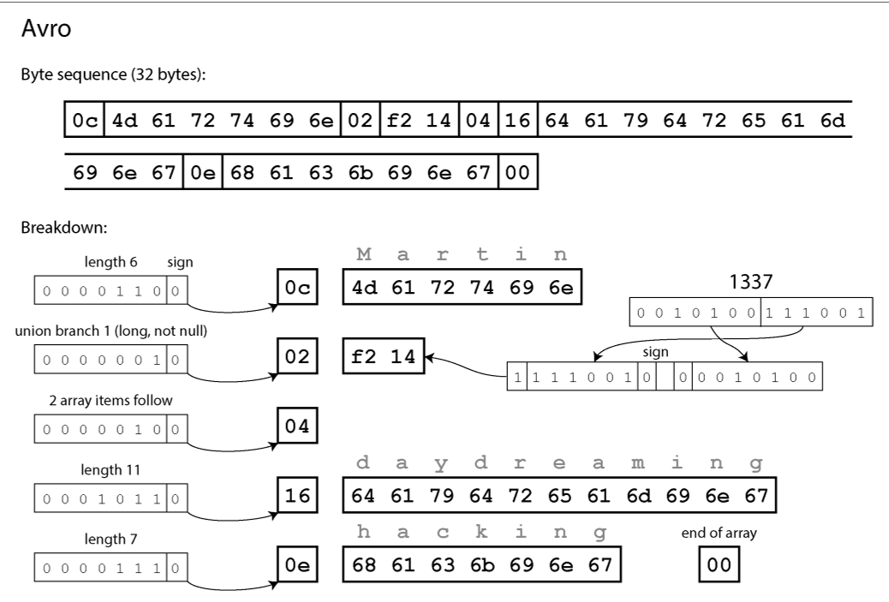

> 图 5-4。使用 Avro 编码的记录。  

那么，Avro 如何支持模式演化呢？  

### 写入端模式与读取端模式  

当应用程序想要编码某些数据（写入文件或数据库、通过网络发送等）时，它会使用自己所知的模式版本——例如，编译到应用程序中的模式。这称为*写入端模式*。  

为了解码某些数据（从文件或数据库读取、从网络接收等），应用程序会使用两个模式：写入端模式，它与编码时使用的模式完全相同；以及读取端模式，它可能有所不同。如图 5-5 所示。读取端模式定义了应用程序代码所期望的每条记录中的字段及其类型。  

如果读取端模式与写入端模式相同，解码很容易。如果二者不同，Avro 会通过比较两者来消解差异，并将数据从写入端模式转换为读取端模式。  

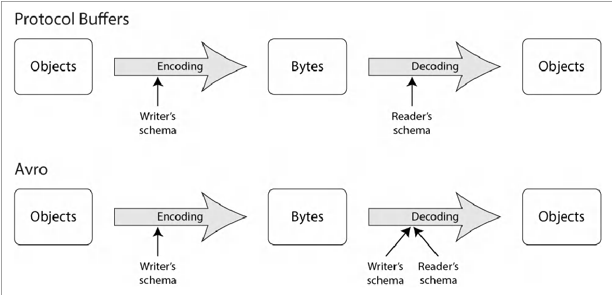

> 图 5-5。在 Protocol Buffers 中，编码和解码可以使用不同版本的模式。在 Avro 中，解码使用两个模式：写入端模式必须与编码时使用的模式完全相同，但读取端模式可以是较旧或较新的版本。  

Avro 规范 [17, 18] 精确定义了这种消解方式。如图 5-6 所示，即使写入端模式和读取端模式中的字段顺序不同，也没有问题，因为模式消解会按字段名匹配字段。如果读取数据的代码遇到写入端模式中存在、但读取端模式中不存在的字段，就会忽略它。如果读取数据的代码期望某个字段，但写入端模式不包含该名称的字段，则会用读取端模式中声明的默认值填充它。  

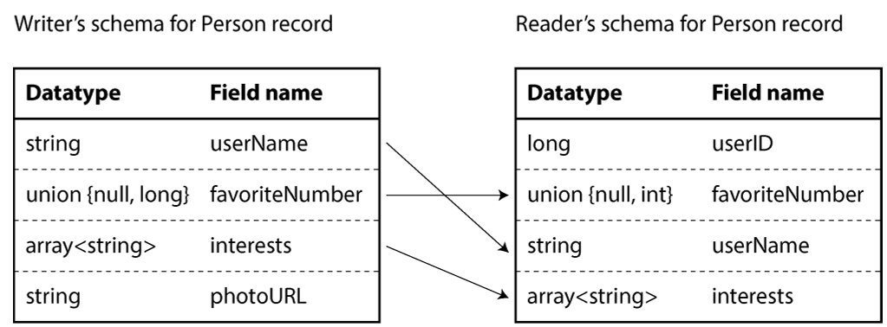

> 图 5-6。Avro 读取端消解写入端模式与读取端模式之间的差异。  

## 模式演化规则  

对于 Avro，向前兼容意味着写入端可以使用比读取端更新的模式版本。反之，向后兼容意味着写入端可以使用比读取端更旧的模式版本。  

为了保持兼容性，只能添加或删除具有默认值的字段（例如我们的 Avro 模式中的字段 favoriteNumber）。例如，假设你添加了一个有默认值的字段，因此这个新字段存在于新模式中，却不存在于旧模式中。当使用新模式的读取端读取由旧模式写入的记录时，会用默认值填充缺失的字段。  

如果添加一个没有默认值的字段，新的读取端将无法读取旧写入端写入的数据，从而破坏向后兼容性。如果删除一个没有默认值的字段，旧的读取端将无法读取新写入端写入的数据，从而破坏向前兼容性。  

在某些编程语言中，null 是任何变量都可接受的默认值，但 Avro 并非如此：如果想允许某个字段为 null，就必须使用联合类型。例如，union{ null, long, string} field; 表示 field 可以是数字、字符串或 null。只有当 null 是联合类型的第一个分支时，才能将 null 用作默认值。这比默认允许所有值为空稍显冗长，但通过明确指出哪些值可以为 null、哪些不可以，有助于防止错误 [19]。  

只要 Avro 能够转换类型，就可以更改字段的数据类型。更改字段名称也是可行的，不过稍微有些棘手。读取端模式可以包含字段名的别名，从而能将旧写入端模式中的字段名与别名进行匹配。这意味着更改字段名向后兼容，但不向前兼容。同样，向联合类型添加一个分支向后兼容，但不向前兼容。  

## 但写入端模式是什么？  

我们之前略过了一个重要问题：读取端如何知道某段特定数据编码时所使用的模式？我们不能在每条记录中都包含完整模式，因为模式很可能比编码后的数据大得多，这会抵消二进制编码节省的全部空间。  

答案取决于 Avro 的使用场景。下面举几个例子：  

## 包含大量记录的大文件  

Avro 的一种常见用途，是存储包含数百万条记录的大文件，其中所有记录都使用同一个模式编码。（我们将在第 11 章讨论这种情况。）在这种情况下，文件写入端只需在文件开头包含一次模式即可。Avro 为此规定了一种文件格式（对象容器文件）。  

### 包含单独写入记录的数据库  

在数据库中，不同记录可能在不同时间点使用不同模式写入——不能假设所有记录都具有相同模式。在这种情况下，最简单的解决方案是在每条编码记录的开头包含一个版本号，并在数据库中保存模式版本列表。读取端可以获取记录、提取版本号，然后从数据库获取与该版本号对应的写入端模式。之后，它便可使用该模式解码记录的其余部分。例如，Apache Kafka 的 Confluent 模式注册表 [20] 和 LinkedIn 的 Espresso [21] 就采用这种方式。  

### 通过网络连接发送记录  

当两个进程通过双向网络连接通信时，它们可以在建立连接时协商模式版本，然后在连接的整个生命周期内使用该模式。Avro RPC 协议（参见第 180 页的“经由服务的数据流：REST 与 RPC”）就是这样工作的。  

无论如何，拥有模式版本数据库都很有用，因为它既能充当文档，又让你有机会检查模式兼容性 [22]。可以使用简单的递增整数或模式的哈希值作为版本号。  

## 动态生成的模式  

与 Protocol Buffers 相比，Avro 方法的一个优点是模式中不包含任何字段标签编号。但为什么这很重要？在模式中保留几个数字有什么问题？  

区别在于，Avro 对*动态生成的*模式更友好。例如，假设你有一个关系数据库，想把其中的内容转储到文件，并希望使用二进制格式，以避免前面提到的文本格式（JSON、CSV、XML）所存在的问题。如果使用 Avro，就可以相当容易地根据关系模式生成 Avro 模式（采用我们之前看到的 JSON 表示），再用该模式编码数据库内容，并将其全部转储到 Avro 对象容器文件中 [23]。可以为每个数据库表生成一个记录模式，表中的每一列都成为该记录中的一个字段。数据库中的列名映射为 Avro 中的字段名。  

现在，如果数据库模式发生变化（例如，某个表增加了一列并删除了一列），只需根据更新后的数据库模式生成新的 Avro 模式，并使用新的 Avro 模式导出数据。数据导出过程无需特别关注模式变化——每次运行时直接进行模式转换即可。读取新数据文件的任何人都会看到记录中的字段发生了变化，但由于字段是通过名称标识的，更新后的写入端模式仍然可以与旧的读取端模式匹配。  

相比之下，如果为此使用 Protocol Buffers，字段标签很可能必须手动分配。每当数据库模式发生变化时，管理员都必须手动更新数据库列名到字段标签的映射。（这也许可以自动化，但模式生成器必须非常小心，不能分配之前使用过的字段标签。）这种动态生成的模式并不是 Protocol Buffers 的设计目标，而它正是 Avro 的设计目标之一。  

## 模式的优点  

正如我们所见，Protocol Buffers 和 Avro 都使用模式来描述二进制编码格式。它们的模式语言比 XML 模式或 JSON 模式简单得多，后两者支持更细致的验证规则（例如，“该字段的字符串值必须匹配这个正则表达式”或“该字段的整数值必须介于 0 和 100 之间”）。由于 Protocol Buffers 和 Avro 更易于实现和使用，它们获得了相当广泛的编程语言支持。  

这些编码所依据的思想绝非新鲜事物。例如，它们与 ASN.1 有许多共同之处；ASN.1 是一种最早于 1984 年标准化的模式定义语言 [24, 25]。它被用于定义各种网络协议，其二进制编码（DER）至今仍用于编码 SSL 证书（X.509）等内容 [26]。与 Protocol Buffers 类似，ASN.1 使用字段标签编号来支持模式演化 [27]。然而，它也非常复杂且文档糟糕，因此 ASN.1 可能并不适合新的应用程序。  

许多数据系统还为其数据实现了某种专有的二进制编码。例如，大多数关系数据库都提供网络协议，你可以通过该协议向数据库发送查询并获取响应。这些协议通常特定于某个数据库，数据库供应商会提供驱动程序（例如使用 ODBC 或 JDBC API），将数据库网络协议的响应解码为内存中的数据结构。  

因此可以看出，尽管 JSON、XML 和 CSV 等文本数据格式广为流行，基于模式的二进制编码也是一种可行的选择。它们有许多不错的特性：  

- 它们可以比各种“二进制 JSON”变体紧凑得多，因为编码数据中可以省略字段名。  

- 模式是一种很有价值的文档形式；而且由于解码必须使用模式，你可以确信它是最新的（手动维护的文档则很容易与实际情况产生偏差）。  

- 维护模式数据库，可以在部署任何内容之前检查模式变更的向前兼容性和向后兼容性。  

- 对于静态类型编程语言的用户来说，根据模式生成代码的能力很有用，因为它可以在编译时进行类型检查。  

总而言之，模式演化既能提供无模式/读时模式 JSON 数据库所具备的同等灵活性（参见第 80 页的“文档模型中的模式灵活性”），又能为数据提供更强的保证和更好的工具支持。尽管如此，为了简化运维，仍建议将并存的模式格式数量保持在最低限度。  

## 数据流模式  

本章开头提到，每当你想将某些数据发送给另一个不与其共享内存的进程时——例如，通过网络发送数据或将其写入文件——都需要把数据编码为字节序列。随后，我们讨论了实现这一目标的各种编码。  

我们讨论了向前兼容性和向后兼容性，它们对于可演化性非常重要（让变更变得容易：允许独立升级系统的各个部分，而不必一次性更改所有部分）。兼容性是一种关系，存在于编码数据的进程与解码数据的另一个进程之间。  

这是一个相当抽象的概念，因为数据能以多种方式从一个进程流向另一个进程。谁编码数据，谁又解码数据？在本章余下部分，我们将探讨数据通过数据库、服务调用、工作流引擎和异步消息在进程之间流动的一些最常见方式。  

## 经由数据库的数据流  

在数据库中，执行写入的进程编码数据，执行读取的进程解码数据。访问数据库的可能只有一个进程，此时读取端只是同一进程的较新版本；在这种场景下，可以把在数据库中存储某些内容视为向未来的自己发送消息。显然，这里必须具备向后兼容性，否则未来的你将无法解码之前写入的内容。  

不过，一般来说，多个进程同时访问一个数据库很常见。这些进程可能是不同的应用程序或服务，也可能只是同一服务的多个实例（为了可扩展性或容错而并行运行）。无论是哪种情况，在这样的环境中，访问数据库的某些进程很可能运行着较新的代码，而另一些进程仍运行较旧的代码——例如，当前正在通过滚动升级部署新版本，因此某些实例已经更新，而另一些尚未更新。  

这意味着，数据库中的某个值可能由*较新*版本的代码写入，随后却由仍在运行的*较旧*版本代码读取。因此，数据库通常也需要向前兼容性。  

## 不同时间写入的不同值  

数据库通常允许随时更新任何值。在同一个数据库中，有些值可能写于五毫秒前，另一些则写于五年前。  

部署应用程序的新版本时（至少对服务端应用程序而言），你可能在几分钟内就用新版本完全替换旧版本。数据库内容却并非如此；五年前的数据仍会以原始编码留在那里，除非你后来明确重写过它。这一观察有时被概括为*数据比代码更长寿*。  

尽管将数据重写（迁移）到新模式当然可行，但对大型数据集来说代价高昂。因此，大多数数据库会推迟这项操作，以异步、尽力而为的方式执行。例如，LSM 树存储引擎（参见第 118 页的“日志结构存储”）会在压实期间使用最新格式重写数据。大多数关系数据库也允许进行简单的模式变更，例如添加一个默认值为 null 的新列，而无需重写现有数据。读取旧行时，数据库会为磁盘编码数据中缺失的列填充 null。因此，模式演化使整个数据库看起来仿佛是用单一模式编码的，尽管底层存储中可能包含以各种历史模式版本编码的记录。  

更复杂的模式变更——例如，将单值属性改为多值属性，或将某些数据移至单独的表中——仍然需要重写数据，而且通常要在应用程序层面完成 [28]。在这种迁移过程中同时维持向前兼容性和向后兼容性，仍是一个研究问题 [29]。  

### 归档存储  

你可能会不时为数据库创建快照——比如用于备份，或加载到数据仓库中（参见第 7 页的“数据仓库”）。在这种情况下，数据转储通常会使用最新模式编码，即使源数据库中的原始编码混合了来自不同时期的多个模式版本。既然无论如何都要复制数据，不妨以一致的方式编码数据副本。  

由于数据转储是一次性写入、此后不可变，因此 Avro 对象容器文件之类的格式很合适。这也是用 Parquet 等对分析友好的列式格式编码数据的好机会（参见第 139 页的“列压缩”）。  

第 11 章将更深入地讨论如何使用归档存储中的数据。  

## 经由服务的数据流：REST 与 RPC  

当多个进程需要通过网络通信时，可以用几种方式组织这种通信。最常见的安排是设定两个角色：客户端和服务器。*服务器*通过网络公开 API，*客户端*则可以连接服务器，向该 API 发出请求。服务器公开的 API 称为*服务*。  

Web 就是这样工作的：客户端（Web 浏览器）向 Web 服务器发出请求，通过 GET 请求下载 HTML、CSS、JavaScript、图像等内容，通过 POST 请求向服务器提交数据。这个 API 由一组标准化协议和数据格式组成（HTTP、URL、SSL/TLS、HTML 等）。由于 Web 浏览器、Web 服务器和网站作者大体上都遵循这些标准，你可以使用任何 Web 浏览器访问任何网站（至少理论上如此！）。  

Web 浏览器并不是唯一的客户端类型。例如，在移动设备和桌面计算机上运行的原生应用经常与服务器通信，在 Web 浏览器中运行的客户端 JavaScript 应用程序也可以发出 HTTP 请求。在这种情况下，服务器的响应通常不是用于向人类展示的 HTML，而是采用便于客户端应用程序代码进一步处理的编码形式的数据（最常见的是 JSON）。尽管可以使用 HTTP 作为传输协议，但其上实现的 API 是应用程序特定的，客户端与服务器需要就该 API 的细节达成一致。  

在某些方面，服务与数据库类似：它们通常允许客户端提交和查询数据。不过，数据库允许使用第 3 章讨论过的查询语言进行任意查询，而服务公开的则是应用程序特定的 API，只允许使用由服务的业务逻辑（应用程序代码）预先确定的输入和输出 [30]。这种限制提供了一定程度的封装：服务可以对客户端能做什么、不能做什么施加细粒度限制。  

面向服务/微服务架构的一个关键设计目标，是通过使服务能够独立部署和演化，让应用程序更易于变更和维护。一项常见原则是，每个服务应由一个团队负责，而且该团队应当能够频繁发布服务的新版本，而无须与其他团队协调。因此，我们应当预期新旧版本的服务器和客户端会同时运行，所以服务器与客户端使用的数据编码必须跨服务 API 版本保持兼容。只要 API 保持兼容，各团队就可以按自己希望的任何方式修改系统；这一特性使开发者更容易在内部迁移数据、服务，甚至整个系统。  

## Web 服务  

使用 HTTP 作为与服务通信的底层协议时，这种服务称为 *Web 服务*。Web 服务常用于构建面向服务或微服务架构（前文第 21 页的“微服务与无服务器”中讨论过）。这个术语或许略有名不副实，因为 Web 服务不仅用于 Web，还用于多种场景。例如：  

- 在用户设备上运行的客户端应用程序（例如，移动设备上的原生应用，或浏览器中的 JavaScript Web 应用）通过 HTTP 向服务发出请求。这些请求通常会经过公共互联网。  

- 在面向服务/微服务架构中，一个服务向同一组织拥有的另一个服务发出请求，二者通常位于同一个私有网络内。  

- 一个服务向另一个组织拥有的服务发出请求，通常经由互联网。这用于组织的后端系统之间交换数据。这一类别包括在线服务提供的公共 API，例如信用卡处理系统，或用于共享访问用户数据的 OAuth。  

最流行的服务设计理念是 REST，它建立在 HTTP 的原则之上 [31, 32]。REST 强调简单的数据格式，使用 URL 标识资源，并使用 HTTP 功能进行缓存控制、身份验证和内容类型协商。按照 REST 原则设计的 API 称为 RESTful API。  

需要调用 Web 服务 API 的代码，必须知道要查询哪个 HTTP 端点、发送什么数据格式，以及期望获得什么格式的响应。即使服务采用 RESTful 设计原则，客户端也需要通过某种方式了解这些细节。服务开发者经常使用 IDL 定义并记录服务的 API 端点和数据模型，并随时间推移对其进行演化。其他开发者随后可以使用服务定义来确定如何查询该服务。最流行的两种服务 IDL 是 OpenAPI（也称为 Swagger [33]）和 Protocol Buffers：前者用于收发 JSON 的 Web 服务，后者用于 gRPC 服务。  

开发者通常使用 JSON 或 YAML 编写 OpenAPI 服务定义（参见示例 5-3）。服务定义允许开发者定义服务端点、文档、版本、数据模型等许多内容。Protocol Buffers 服务定义使用我们在第 169 页“Protocol Buffers”中见过的 IDL。  

示例 5-3。YAML 格式的 OpenAPI 服务定义  

```yaml
openapi: 3.0.0
info:
  title: Ping, Pong
  version: 1.0.0
servers:
  - url: http://localhost:8080
paths:
  /ping:
    get:
      summary: 给定一个 ping，返回一条 pong 消息
      responses:
        '200':
          description: 一个 pong
          content:
            application/json:
              schema:
                type: object
                properties:
                  message:
                    type: string
                    example: Pong!  
```

即使采用了某种设计理念和 IDL，开发者仍然必须编写实现其服务 API 调用的代码。通常会采用 Spring Boot、FastAPI 或 gRPC 等*服务框架*来简化这项工作。服务框架让开发者可以专注于编写每个 API 端点的业务逻辑，而由框架代码处理路由、指标、缓存、身份验证等。示例 5-4 展示了示例 5-3 所定义服务的一种 Python 实现。  

示例 5-4。实现示例 5-3 中定义的 FastAPI 服务  

```python
from fastapi import FastAPI
from pydantic import BaseModel

app = FastAPI(title="Ping, Pong", version="1.0.0")

class PongResponse(BaseModel):
    message: str = "Pong!"

@app.get("/ping", response_model=PongResponse, summary="给定一个 ping，返回一条 pong 消息")
async def ping():
    return PongResponse()  
```

许多框架将服务定义与服务器代码耦合在一起。在某些情况下，例如流行的 Python FastAPI 框架，服务器用代码编写，IDL 则自动生成。在另一些情况下，例如 gRPC，会先编写服务定义，再生成服务器代码的脚手架。这两种方法都允许开发者根据服务定义生成多种语言的客户端库和 SDK。除了生成代码，Swagger 等 IDL 工具还可以生成文档、验证模式变更的兼容性，并提供图形用户界面（GUI），供开发者查询和测试服务。  

## 远程过程调用的问题  

Web 服务只是在一系列通过网络发出 API 请求的技术中最新的一种化身；其中许多技术曾备受追捧，却存在严重问题。Enterprise JavaBeans（EJB）和 Java 的 Remote Method Invocation（RMI）仅限于 Java。Distributed Component Object Model（DCOM）仅限于 Microsoft 平台。Common Object Request Broker Architecture（CORBA）过于复杂，并且既不提供向后兼容性，也不提供向前兼容性 [34]。SOAP 和 WS-* Web 服务框架旨在实现跨供应商的互操作性，但也深受复杂性和兼容性问题的困扰 [35, 36, 37]。  

所有这些技术都基于*远程过程调用*（RPC）的思想，该思想早在 20 世纪 70 年代就已提出 [38]。RPC 模型试图让对远程网络服务的请求看起来就像在同一进程中调用函数或方法一样（这种抽象称为*位置透明性*）。尽管这乍看起来很方便，但这种方法存在根本性缺陷 [39, 40]。网络请求与本地函数调用有很大不同，原因多种多样：  

- 本地函数调用是可预测的，它会成功或失败，取决于你能够控制的参数。网络请求则不可预测，其原因完全超出你的控制。例如，请求或响应可能因网络问题而丢失，远程机器也可能很慢或不可用。网络问题很常见，因此应用程序必须预先考虑这些问题（例如，通过重试失败的请求）。  

- 本地函数调用要么返回结果，要么抛出异常，要么永不返回（因为它陷入无限循环或进程崩溃）。网络请求还有另一种可能的结果：它可能因超时而在没有结果的情况下返回。在这种情况下，你根本不知道发生了什么；如果没有收到远程服务的响应，你就无从得知请求是否已经送达。（我们将在第 9 章更详细地讨论这个问题。）  

- 如果重试失败的网络请求，之前的请求实际上可能已经送达，只是响应丢失了。在这种情况下，除非在协议中构建去重（幂等性）机制，否则重试会导致操作被执行多次 [41]。本地函数调用没有这个问题。（我们将在第 12 章更详细地讨论幂等性。）  

- 每次调用本地函数时，其执行时间通常大致相同。网络请求比函数调用慢得多，而且延迟的变化也极大：情况良好时，它可能在不到一毫秒内完成；但当网络拥塞或远程服务过载时，完成完全相同的事情可能需要数秒。  

- 调用本地函数时，可以高效地向它传递本地内存中对象的引用（指针）。发出网络请求时，所有这些参数都需要编码为可通过网络发送的字节序列。如果参数是数字或短字符串等不可变的原始值，这没有问题；但面对较大量的数据和可变对象时，很快就会出现问题。  

- 客户端和服务可能使用不同的编程语言实现，因此 RPC 框架必须将数据类型从一种语言转换为另一种语言。结果可能很难看，因为并非所有语言都具有相同的类型——例如，回想一下 JavaScript 处理大于 $2^{53}$ 的数字时存在的问题（参见第 165 页的“JSON、XML 和二进制变体”）。在使用单一语言编写的单一进程中，这个问题并不存在。  

所有这些因素都意味着，试图让远程服务看起来过于像编程语言中的本地对象毫无意义，因为二者从根本上就是不同的事物。REST 的部分吸引力就在于，它将通过网络进行的状态传输视为不同于函数调用的过程。  

### 负载均衡器、服务发现和服务网格  

所有服务都通过网络进行通信。因此，客户端必须知道它所连接服务的地址——这个问题称为*服务发现*。最简单的方法是配置客户端，使其连接到服务运行所在的 IP 地址和端口。这种配置可以工作，但如果服务器离线、迁移到新机器或过载，就必须手动重新配置客户端。  

为了提供更高的可用性和可扩展性，通常会在多台机器上运行一个服务的多个实例，其中任何一个实例都可以处理传入请求。将请求分摊到这些实例的过程称为负载均衡 [42]。有许多负载均衡和服务发现解决方案可供选择：  

#### 硬件负载均衡器  

这类专用设备安装在数据中心内。它们允许客户端连接到单一主机和端口，并将传入连接路由到运行该服务的某台服务器。此类负载均衡器在连接下游服务器时会检测网络故障，并将流量转移到其他服务器。  

#### 软件负载均衡器（例如 NGINX 和 HAProxy）  

它们的行为与硬件负载均衡器大致相同，但不需要专用设备，而是可以安装在标准机器上的应用程序。  

#### 域名系统（DNS）  

当你打开网页时，互联网就是以这种方式解析域名的。它允许将多个 IP 地址与单个域名关联，从而支持负载均衡。随后可以将客户端配置为通过域名而非 IP 地址连接服务，并由客户端的网络层在建立连接时选择要使用的 IP 地址。这种方法的一个缺点是，DNS 的设计目标是在较长时间内传播变更并缓存 DNS 条目。如果服务器频繁启动、停止或迁移，客户端可能看到已经没有服务器在其上运行的过期 IP 地址。  

#### 服务发现系统  

这类系统使用 etcd 或 Apache ZooKeeper 等集中式注册中心而非 DNS，来跟踪哪些服务端点可用（我们将在第 437 页的“协调服务”中再次讨论这些系统）。新的服务实例启动时，会向服务发现系统注册自己，声明它正在监听的主机和端口，以及分片所有权信息（参见第 7 章）、数据中心位置等相关元数据。之后，服务会定期向发现系统发送心跳信号，表明该服务仍然可用。  

当客户端希望连接某个服务时，它首先查询发现系统以获取可用端点列表，然后直接连接到端点。与 DNS 相比，服务发现支持动态程度高得多、服务实例频繁变化的环境。发现系统还向客户端提供更多有关其所连接服务的元数据，使客户端能够做出更明智的负载均衡决策。  

#### 服务网格  

这种复杂的负载均衡形式将软件负载均衡器与服务发现结合起来。传统软件负载均衡器运行在单独的机器上，而服务网格负载均衡器通常部署为进程内客户端库，或者在客户端和服务器两端都部署为一个进程或“边车”容器。客户端应用程序连接到其本地服务负载均衡器，后者再连接到服务器的负载均衡器。连接随后从那里被路由到本地服务器进程。  

这种拓扑虽然复杂，却有其优势。由于客户端和服务器完全通过本地连接进行路由，连接加密可以完全在负载均衡器层处理。这样客户端和服务器就不必应对 SSL 证书和 TLS 的复杂性。网格系统还提供复杂的可观测性功能。它们可以实时跟踪哪些服务正在相互调用、检测故障、跟踪流量负载等。  

哪种解决方案合适，取决于组织的需求。在非常动态的服务环境中运行、使用 Kubernetes 等编排器的组织，通常会选择运行 Istio 或 Linkerd 等服务网格。数据库或消息系统等专用基础设施可能需要自己专门构建的负载均衡器。对于较简单的部署，软件负载均衡器是最佳选择。  

### RPC 的数据编码与演化  

为实现可演化性，RPC 客户端和服务器能够独立变更和部署非常重要。与经由数据库的数据流相比（如第 178 页的“经由数据库的数据流”所述），对于经由服务的数据流，我们可以作出一个简化假设：先更新所有服务器，再更新所有客户端是合理的。因此，只需让请求具备向后兼容性，让响应具备向前兼容性。  

RPC 方案的向后和向前兼容性继承自它所使用的编码：  

- gRPC（Protocol Buffers）和 Avro RPC 可以按照各自编码格式的兼容性规则进行演化。  

- RESTful API 最常使用 JSON 作为响应格式，并使用 JSON 或 URI 编码/表单编码的请求参数。添加可选请求参数以及向响应对象添加新字段，通常被视为保持兼容性的变更。  

由于 RPC 经常用于跨组织边界的通信，服务兼容性变得更加棘手：服务提供方往往无法控制其客户端，也无法强制客户端升级。因此，兼容性需要维持很长时间，甚至可能无限期维持。如果必须进行破坏兼容性的变更，服务提供方往往最终不得不并行维护服务 API 的多个版本。  

对于 API 版本控制应如何工作（即客户端如何表明它希望使用哪个 API 版本 [43]），目前并无共识。对于 RESTful API，常见方法是在 URL 或 HTTP Accept 标头中使用版本号。对于使用 API 密钥标识特定客户端的服务，另一种选择是在服务器上存储客户端请求的 API 版本，并允许通过单独的管理界面更新这一版本选择 [44]。  

## 持久化执行与工作流  

按照定义，基于服务的架构包含多个服务，每个服务都负责应用程序的不同部分。设想一个支付处理应用程序，它从信用卡扣款，并将资金存入银行账户。这个系统很可能由不同的服务分别负责欺诈检测、信用卡集成、银行集成等。  

在我们的例子中，处理单笔付款需要进行许多次服务调用。如图 5-7 所示，支付处理器服务可能调用欺诈检测服务来检查欺诈，调用信用卡服务从信用卡扣款，再调用银行服务存入扣取的资金。我们将这一系列步骤称为工作流，其中每个步骤都是一个任务。工作流通常被定义为任务图。工作流定义可以使用通用编程语言、领域特定语言（DSL）或 Business Process Execution Language（BPEL）[45] 等标记语言编写。  

> [!NOTE]
> **任务、活动与函数**
>
> 不同的工作流引擎对任务使用不同的名称。例如，Temporal 使用*活动*一词。其他系统则将任务称为*持久化函数*。尽管名称不同，但概念相同。

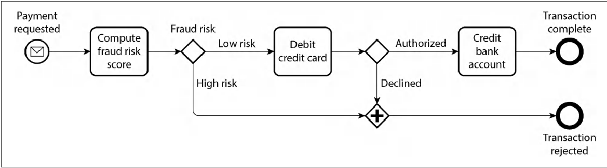

> 图 5-7。使用 Business Process Model and Notation（BPMN）表达的工作流，一种图形化表示法。  

工作流由*工作流引擎*运行或执行。工作流引擎决定每个任务何时运行、在哪台机器上运行，任务失败时该怎么办（例如，运行任务期间机器崩溃），允许多少任务并行执行，等等。  

工作流引擎通常由编排器和执行器组成：*编排器*负责调度待执行的任务，*执行器*负责执行任务。工作流被触发时，执行便开始。如果用户定义了按时间执行的计划，例如每小时执行一次，编排器就会自行触发工作流。Web 服务乃至人工等外部来源也可以触发工作流执行。触发后，执行器会被调用以运行任务。  

工作流引擎种类繁多，可满足各种不同的用例。有些工作流引擎（例如 Airflow、Dagster 和 Prefect）与数据系统集成，并编排 ETL 任务。另一些（例如 Camunda 和 Orkes）为工作流提供图形化表示法（例如图 5-7 使用的 BPMN），使非工程人员也能更轻松地定义和执行工作流。还有一些（例如 Temporal 和 Restate）提供持久化执行。  

持久化执行框架已经成为构建需要事务性的服务架构的一种流行方式。在我们的支付示例中，我们希望每笔付款都恰好处理一次。工作流执行期间发生故障，可能导致信用卡已被扣款，却没有相应资金存入银行账户。在基于服务的架构中，我们不能简单地将这两个任务封装在一个数据库事务中。此外，我们还可能需要与控制能力有限的第三方支付网关交互。  

持久化执行框架为工作流提供恰好一次语义。某项任务失败时，框架会重新执行该任务，但会跳过该任务在失败前已经成功完成的所有 RPC 调用或状态变更。它会假装发起调用，实际却返回上一次调用的结果。这之所以可行，是因为持久化执行框架会将所有 RPC 和状态变更记录到预写日志等持久存储中 [46, 47]。示例 5-5 展示了一个使用 Temporal、支持持久化执行的工作流定义。  

示例 5-5。图 5-7 支付工作流的 Temporal 工作流定义片段  

```python
@workflow.defn
class PaymentWorkflow:
    @workflow.run
    async def run(self, payment: PaymentRequest) -> PaymentResult:
        is_fraud = await workflow.execute_activity(
            check_fraud,
            payment,
            start_to_close_timeout=timedelta(seconds=15),
        )
        if is_fraud:
            return PaymentResultFraudulent
        credit_card_response = await workflow.execute_activity(
            debit_credit_card,
            payment,
            start_to_close_timeout=timedelta(seconds=15),
        )
        # ...  
```

Temporal 等框架并非没有挑战。外部服务（例如本例中的第三方支付网关）仍然必须提供幂等 API。开发者必须记得为这些 API 使用唯一 ID，以防止重复执行 [48]。而且，由于持久执行框架按顺序记录每次 RPC 调用，它们期望后续执行以相同顺序发起相同的 RPC 调用。这使得代码变更十分脆弱；仅仅重新排列函数调用，就可能引入未定义行为 [49]。与其修改现有工作流的代码，不如单独部署一个新版本的代码，这样重新执行已有工作流调用时可以继续使用旧版本，只有新的调用才使用新代码 [50]。  

同样，由于持久执行框架期望以确定性方式重放所有代码（相同输入产生相同输出），调用随机数生成器或系统时钟等非确定性代码会带来问题 [49]。框架通常会为这类库函数提供自己的确定性实现，但你必须记得使用它们。有些框架还提供静态分析工具，例如 Temporal 的 Workflow Check，用于判断是否引入了非确定性行为。  

> [!NOTE]
> 让代码具有确定性是一个强大的想法，但要稳健地做到这一点并不容易。我们将在第 9 章再次讨论这个主题。

## 事件驱动架构  

在最后一节中，我们将简要探讨*事件驱动架构*，这是编码数据从一个进程流向另一个进程的另一种方式。在此语境中，请求称为*事件*或*消息*。与 RPC 不同，发送方通常不会等待接收方处理事件。此外，事件通常不是通过直接网络连接发送给接收方，而是经由称为*消息代理*（也称为*事件代理*、*消息队列*或*面向消息的中间件*）的中介来传递，由它临时存储消息 [51]。  

与直接 RPC 相比，使用消息代理有几个优点：  

- 如果接收方不可用或过载，它可以充当缓冲区，从而提高系统可靠性。  

- 它可以自动将消息重新投递给已经崩溃的进程，防止消息丢失。  

- 它不再需要服务发现，因为发送方无需直接连接到接收方的 IP 地址。  

- 它允许将同一条消息发送给多个接收方。  

- 它在逻辑上将发送方与接收方解耦（发送方只负责发布消息，而不关心由谁消费这些消息）。  

通过消息代理进行的通信是*异步的*：发送方不会等待消息送达，而只是将消息发出，随后便不再管它。不过，也可以让发送方在单独的通道上等待响应，从而实现类似同步 RPC 的模型。  

## 消息代理  

过去，消息代理领域主要由 TIBCO、IBM WebSphere 和 webMethods 等公司的商业企业软件主导，后来 RabbitMQ、ActiveMQ、HornetQ、NATS、Redpanda 和 Apache Kafka 等开源实现开始流行。近来，Amazon Kinesis、Azure Service Bus 和 Google Cloud Pub/Sub 等云服务也得到了广泛采用。我们将在第 12 章中对它们进行更详细的比较。  

具体的交付语义因实现和配置而异，但一般来说，最常用的是以下两种消息分发模式：  

- 一个进程将消息添加到一个具名*队列*中，随后该队列的某个*消费者*接收这条消息。如果有多个消费者，其中一个会收到这条消息。  

- 一个进程将消息发布到一个具名主题，代理将这条消息交付给该主题的所有订阅者。如果有多个订阅者，它们都会收到这条消息。  

消息代理通常不强制采用任何特定的数据模型。消息只是一串带有一些元数据的字节，因此你可以使用任何编码格式。一种常见做法是使用 Protocol Buffers、Avro 或 JSON，并在部署消息代理的同时部署一个模式注册表，用来存储所有有效的模式版本并检查它们的兼容性 [20, 22]。AsyncAPI 是 OpenAPI 在消息传递领域的对应方案，也可用于指定消息的模式。  

不同消息代理的消息持久性有所差异。许多代理会将消息写入磁盘，这样即使消息代理崩溃或需要重启，消息也不会丢失。与数据库不同，许多消息代理会在消息被消费后自动将其删除。不过，有些代理可以配置为无限期存储消息；如果你想使用事件溯源（参见第 101 页的“事件溯源与命令查询职责分离（CQRS）”），就需要这样做。  

如果消费者将消息重新发布到另一个主题，你可能需要注意保留未知字段，以防出现前文在数据库语境下描述的问题（图 5-1）。  

## 分布式 Actor 框架  

Actor 模型是一种用于单个进程内并发的编程模型。它不直接处理线程（以及随之而来的竞态条件、锁和死锁问题），而是将逻辑封装在 Actor 中。每个 Actor 通常代表一个客户端或实体。它可以拥有一些局部状态（不与任何其他 Actor 共享），并通过收发异步消息与其他 Actor 通信。消息交付并无保证；在某些错误场景中，消息会丢失。由于每个 Actor 一次只处理一条消息，因此无须担心线程问题，而且框架可以独立调度每个 Actor。  

在 Akka、Orleans [52] 和 Erlang/OTP 等分布式 Actor 框架中，这种编程模型被用来将应用扩展到多个节点。无论发送者和接收者位于同一节点还是不同节点，使用的都是同一种消息传递机制。如果它们位于不同节点，消息会被透明地编码为字节序列，通过网络发送，并在另一端解码。  

位置透明性在 Actor 模型中的效果优于 RPC，因为 Actor 模型已经假定消息可能丢失，即便在单个进程内部也是如此。尽管网络通信的延迟很可能高于同一进程内的通信，但使用 Actor 模型时，本地通信与远程通信之间在根本上的不匹配较少。  

分布式 Actor 框架实质上将消息代理和 Actor 编程模型集成到一个框架中。不过，如果你想对基于 Actor 的应用执行滚动升级，仍然必须考虑向前兼容性和向后兼容性，因为消息可能从运行新版本的节点发送到运行旧版本的节点，反之亦然。使用本章讨论的某种编码即可实现这一点。  

<a id="chapter-5-summary"></a>

## 小结  

本章考察了将数据结构转换成网络或磁盘上的字节的几种方式。我们看到，这些编码的具体细节不仅影响效率，更重要的是，它们还会影响应用的架构以及应用演化时可采用的方案。  

尤其是，许多服务需要支持滚动升级，即服务的新版本每次只逐步部署到少数几个节点，而不是同时部署到所有节点。滚动升级使服务的新版本可以在不停机的情况下发布（从而鼓励频繁的小版本发布，而不是罕见的大版本发布），并降低部署风险（使有问题的版本能够在影响大量用户之前被发现并回滚）。这些特性对*可演化性*极为有利，也就是让应用更易于变更。  

在滚动升级期间，或者由于其他各种原因，我们必须假设不同节点运行着应用代码的不同版本。因此，系统中流动的所有数据都应以同时提供向后兼容性（新代码能够读取旧数据）和向前兼容性（旧代码能够读取新数据）的方式编码，这一点非常重要。  

我们讨论了几种数据编码格式及其兼容性特性：  

- 语言特定格式仅限于单一编程语言，而且往往无法提供向前兼容性和向后兼容性。  

- JSON、XML 和 CSV 等文本格式应用广泛，其兼容性取决于你如何使用它们。它们有可选的模式语言，这些语言有时很有帮助，有时也会成为阻碍。这些格式对数据类型的定义有些含糊，因此在处理数字和二进制字符串等内容时必须格外小心。  

- Protocol Buffers 和 Avro 等由模式驱动的二进制编码格式，能够以明确定义的向前兼容和向后兼容语义实现紧凑、高效的编码。模式可用于编写文档，也可用于在静态类型语言中生成代码。不过，这些格式的缺点是：数据必须先解码，人类才能阅读。  

我们还讨论了几种数据流模式，以说明数据编码在不同场景中的重要性：  

### 数据库  

写入数据库的进程对数据进行编码，从数据库读取数据的进程则对其进行解码  

### RPC 和 REST API  

客户端对请求进行编码，服务端解码请求并编码响应，最后客户端再解码响应  

### 事件驱动架构（使用消息代理或 Actor）  

节点通过相互发送消息来通信；消息由发送者编码，由接收者解码  

我们可以得出结论：只要稍加留意，向后/向前兼容性和滚动升级完全可以实现。愿你的应用快速演化，愿你的部署频繁进行。  

## 参考文献  

[1] “CWE-502: Deserialization of Untrusted Data.” Common Weakness Enumeration, cwe.mitre.org, 2006 年 7 月。归档于 perma.cc/26EU-UK9Y  

[2] Steve Breen. "What Do WebLogic, WebSphere, JBoss, Jenkins, OpenNMS, and Your Application Have in Common? This Vulnerability." foxglovesecurity.com, 2015 年 11 月。归档于 perma.cc/9U97-UVVD  

[3] Patrick McKenzie. "What the Rails Security Issue Means for Your Startup." kalzumeus.com, 2013 年 1 月。归档于 perma.cc/2MBJ-7PZ6  

[4] Brian Goetz. “Towards Better Serialization.” openjdk.org, 2019 年 6 月。归档于 perma.cc/UK6U-GQDE  

[5] Eishay Smith. "jvm-serializers Wiki." github.com, 2023 年 10 月。归档于 perma.cc/PJP7-WCNG  

[6] “XML Is a Poor Copy of S-Expressions.” wiki.c2.com, 2013 年 5 月。归档于 perma.cc/7FAN-YBK  

[7] Julia Evans. “Examples of Floating Point Problems.” *jvns.ca*, 2023 年 1 月。归档于 *perma.cc/M57L-QKKW*  

[8] Matt Harris. "Snowflake: An Update and Some Very Important Information."
发至 *Twitter Development Talk* 邮件列表的电子邮件，2010 年 10 月。归档于 *perma.cc/8UBV-MZ3D*  

[9] Yakov Shafranovich. "RFC 4180: Common Format and MIME Type for Comma-Separated Values (CSV) Files." IETF, 2005 年 10 月。  

[10] Andy Coates. “Evolving JSON Schemas—Part I.” *creekservice.org*, 2024 年 1 月。归档于 *perma.cc/MZW3-UA54*  

[11] Andy Coates. “Evolving JSON Schemas—Part II.” *creekservice.org*, 2024 年 1 月。归档于 *perma.cc/GT5H-WKZ5*  

[12] Pierre Genevès, Nabil Layaya, and Vincent Quint. "Ensuring Query Compatibility with Evolving XML Schemas." INRIA 技术报告 6711，2008 年 11 月。归档于 arxiv.org  

[13] Tim Bray. “Bits on the Wire.” tbray.org, 2019 年 11 月。归档于 perma.cc/3BT3-BQU3  

[14] Mark Slee, Aditya Agarwal, and Marc Kwiatkowski. "Thrift: Scalable Cross-Language Services Implementation." Facebook 技术报告，2007 年 4 月。归档于 perma.cc/22BS-TUFB  

[15] Martin Kleppmann. "Schema Evolution in Avro, Protocol Buffers and Thrift."
martin.kleppmann.com, 2012 年 12 月。归档于 perma.cc/E4R2-9RJT  

[16] Doug Cutting et al. “[PROPOSAL] New Subproject: Avro.” hadoop-general 邮件列表中的邮件讨论串，lists.apache.org，2009 年 4 月。归档于 perma.cc/4A79-BMEB  

[17] Apache Software Foundation. "Apache Avro 1.12.0 Specification." avro.apache.org, 2024 年 8 月。归档于 perma.cc/C36P-5EBQ  

[18] Apache Software Foundation. "Avro Schemas as LL(1) CFG Definitions." avro.apache.org, 2024 年 8 月。归档于 perma.cc/JB44-EM9Q  

[19] Tony Hoare. "Null References: The Billion Dollar Mistake." QCon London 演讲，2009 年 3 月。  

[20] Confluent, Inc. “Schema Registry Overview.” docs.confluent.io, 2024。归档于 perma.cc/92C3-A9JA  

[21] Aditya Auradkar and Tom Quiggle. "Introducing Espresso—LinkedIn's Hot New Distributed Document Store." engineering.linkedin.com, 2015 年 1 月。归档于 perma.cc/FX4P-VW9T  

[22] Jay Kreps. “Putting Apache Kafka to Use: A Practical Guide to Building a Stream Data Platform (Part 2).” *confluent.io*, 2015 年 2 月。归档于 *perma.cc/8UA4-ZS5S*  

[23] Gwen Shapira. “The Problem of Managing Schemas.” oreilly.com, 2014 年 11 月。归档于 perma.cc/BY8Q-RYV3  

[24] John Larmouth. ASN.1 Complete. Morgan Kaufmann, 1999. ISBN: 9780122334351. 归档于 perma.cc/GB7Y-XSXQ  

[25] Burton S. Kaliski Jr. “A Layman’s Guide to a Subset of ASN.1, BER, and DER.” 技术说明，RSA Data Security, Inc.，1993 年 11 月。归档于 perma.cc/2LMN-W9U8  

[26] Jacob Hoffman-Andrews. “A Warm Welcome to ASN.1 and DER.” letsencrypt.org, 2020 年 4 月。归档于 perma.cc/CYT2-GPQ8  

[27] Lev Walkin. "Question: Extensibility and Dropping Fields." *lionet.info*, 2010 年 9 月。归档于 *perma.cc/VX8E-NLH3*  

[28] Jacqueline Xu. “Online Migrations at Scale.” stripe.com, 2017 年 2 月。归档于 perma.cc/X59W-DK7Y  

[29] Geoffrey Litt, Peter van Hardenberg, and Orion Henry. "Project Cambria: Translate Your Data with Lenses." 技术报告，2020 年 10 月。归档于 perma.cc/WA4V-VKDB  

[30] Pat Helland. “Data on the Outside Versus Data on the Inside.” 第二届两年一度的创新数据系统研究会议（CIDR），2005 年 1 月。归档于 perma.cc/GH56-WYZS  

[31] Roy Thomas Fielding. "Architectural Styles and the Design of Network-Based
Software Architectures." 加州大学欧文分校博士论文，2000 年。归档于
perma.cc/LWY9-7BPE  

[32] Roy Thomas Fielding. “REST APIs Must Be Hypertext-Driven.” roy.gbiv.com, 2008 年 10 月。归档于 perma.cc/M2ZW-8ATG  

[33] “OpenAPI Specification Version 3.1.0.” swagger.io, 2021 年 2 月。归档于 perma.cc/3S6S-K5M4  

[34] Michi Henning. "The Rise and Fall of CORBA." *Communications of the ACM*, 第 51 卷，第 8 期，第 52–57 页，2008 年 8 月。*doi:10.1145/1378704.1378718*  

[35] Pete Lacey. “The S Stands for Simple.” harmful.cat-v.org, 2006 年 11 月。归档于 perma.cc/4PMK-Z9X7  

[36] Stefan Tilkov. “Interview: Pete Lacey Criticizes Web Services.” infoq.com, 2006 年 12 月。归档于 perma.cc/JWF4-XY3P  

[37] Tim Bray. “The Loyal WS-Opposition.” tbray.org, 2004 年 9 月。归档于 perma.cc/J5Q8-69Q2  

[38] Andrew D. Birrell and Bruce Jay Nelson. "Implementing Remote Procedure Calls." ACM Transactions on Computer Systems (TOCS), 第 2 卷，第 1 期，第 39–59 页，1984 年 2 月。doi:10.1145/2080.357392  

[39] Jim Waldo, Geoff Wyant, Ann Wollrath, and Sam Kendall. "A Note on Distributed Computing." Sun Microsystems Laboratories, Inc.，技术报告 TR-94-29，1994 年 11 月。归档于 perma.cc/8LRZ-BSZR  

[40] Steve Vinoski. “Convenience over Correctness.” IEEE Internet Computing, 第 12 卷，第 4 期，第 89–92 页，2008 年 7 月。doi:10.1109/MIC.2008.75  

[41] Brandur Leach. “Designing Robust and Predictable APIs with Idempotency.” stripe.com, 2017 年 2 月。归档于 perma.cc/JD22-XZQT  

[42] Sam Rose. “Load Balancing.” *samwho.dev*, 2023 年 4 月。归档于 *perma.cc/Q7BA-9AE2*  

[43] Troy Hunt. “Your API Versioning Is Wrong, Which Is Why I Decided to Do It 3 Different Wrong Ways.” troyhunt.com, 2014 年 2 月。归档于 perma.cc/9DSW-DGR5  

[44] Brandur Leach. “APIs As Infrastructure: Future-Proofing Stripe with Versioning.” stripe.com, 2017 年 8 月。归档于 perma.cc/L63K-USFW  

[45] OASIS Web Services Business Process Execution Language (WSBPEL) Technical Committee. "Web Services Business Process Execution Language Version 2.0." docs.oasis-open.org, 2007 年 4 月。  

[46] “Temporal. Temporal Service.” docs.temporal.io, 2024。归档于 perma.cc/32P3-CJ9V  

[47] Stephan Ewen. “Why We Built Restate.” restate.dev, 2023 年 8 月。归档于 perma.cc/BJJ2-X75K  

[48] Keith Tenzer and Joshua Smith. “Understanding Idempotency in Distributed Systems.” temporal.io, 2024 年 2 月。归档于 perma.cc/TY4U-EH3W  

[49] “Temporal. Temporal Workflow.” docs.temporal.io, 2024。归档于 perma.cc/B5C5-Y396  

[50] Jack Kleeman. “Solving Durable Execution’s Immutability Problem.” restate.dev, 2024 年 2 月。归档于 perma.cc/G55L-EYH5  

[51] Srinath Perera. “Exploring Event-Driven Architecture: A Beginner’s Guide for Cloud Native Developers.” wso2.com, 2023 年 8 月。归档于 archive.org  

[52] Philip A. Bernstein, Sergey Bykov, Alan Geller, Gabriel Kliot, and Jorgen Thelin. “Orleans: Distributed Virtual Actors for Programmability and Scalability.” Microsoft Research 技术报告 MSR-TR-2014-41，2014 年 3 月。归档于 perma.cc/PD3U-WDMF  

# 复制

一件可能出错的事与一件绝不可能出错的事之间，最大的区别在于：当一件绝不可能出错的事真的出了错，通常会发现它根本无法触及或修复。  

——Douglas Adams，Mostly Harmless（1992）  

复制意味着在通过网络连接的多台机器上保存同一份数据的副本。正如第 19 页“分布式系统与单节点系统”中所讨论的，你可能希望复制数据的原因有以下几个：  

- 让数据在地理位置上接近用户（从而降低访问延迟）  

- 即使系统的某些部分发生故障，也能让系统继续工作（从而提高可用性和持久性）  

- 横向扩展能够处理读取查询的机器数量（从而提高读取吞吐量）  

本章将假设你的数据集足够小，每台机器都能保存整个数据集的一份副本。第 7 章将放宽这一假设，讨论对大到单台机器无法容纳的数据集进行分片（分区）。在后续章节中，我们将讨论复制数据系统中可能发生的各种故障，以及应对这些故障的方法。  

如果你要复制的数据不会随时间变化，复制就很容易；只需将数据复制到每个节点一次，就大功告成了。复制的所有难点都在于处理已复制数据的变更，而这正是本章的主题。我们将讨论在节点之间复制变更的三类算法：单主复制、多主复制和无主复制。几乎所有分布式数据库都采用这三种方法中的一种。每种方法都有优缺点，我们将逐一详细考察。  

复制涉及许多需要权衡的事项，例如应该采用同步复制还是异步复制，以及如何处理发生故障的副本。这些通常都是数据库的配置选项；虽然具体细节因数据库而异，但许多实现背后的基本原理是相似的。本章将讨论这些选择所带来的后果。  

数据库复制是一个古老的话题。自 20 世纪 70 年代人们开始研究它以来 [1]，其基本原理没有太大变化，因为网络的根本约束始终如一。尽管如此，最终一致性等概念仍然容易引起困惑。在第 209 页的“复制延迟带来的问题”中，我们将更准确地阐述最终一致性，并讨论写后读一致性和单调读等保证。  

> [!NOTE]
> **备份与复制**
>
> 你可能会想，既然已经有了复制，是否还需要备份。答案是肯定的，因为它们的用途不同：副本会迅速将一个节点上的写入反映到其他节点上，而备份保存的是数据过去的快照，让你能够回到之前的时间点。如果你不小心删除了一些数据，复制并不能提供帮助，因为删除操作也会传播到各个副本；若想恢复已删除的数据，你需要备份。  
>
> 事实上，复制和备份通常是互补的。正如我们将在第 201 页的“设置新从节点”中看到的，备份有时是建立复制过程的一部分。反过来，归档复制日志也可以是备份过程的一部分。  
>
> 一些数据库会在内部维护过去状态的不可变快照，作为一种内部备份。不过，这意味着要将旧版本数据与当前状态保存在同一种存储介质上。如果数据量很大，更经济的做法可能是将旧数据的备份保存在针对低频访问数据优化的对象存储中，而只将数据库的当前状态保存在主存储中。  

## 单主复制  

存有数据库副本的每个节点都称为副本（replica）。当存在多个副本时，一个问题不可避免地随之而来：如何确保所有数据最终都出现在所有副本上？  

对数据库的每次写入都需要由每个副本处理；否则，各副本将不再包含相同的数据。最常见的解决方案称为基于主节点的复制（leader-based replication）、主备复制（primary-backup replication）或主动/被动复制（active/passive replication）。其工作方式如下（见图 6-1）：  

1. 指定其中一个副本为主节点（leader，也称为 primary 或 source [2]）。当客户端想要写入数据库时，必须将请求发送给主节点，主节点首先把新数据写入其本地存储。  

2. 其他副本称为从节点（followers，也称为只读副本、secondaries 或热备）。每当主节点向本地存储写入新数据时，也会把数据变更作为复制日志或变更流的一部分发送给所有从节点。每个从节点接收来自主节点的日志，并按照所有写入在主节点上的处理顺序应用它们，从而相应地更新自己的数据库本地副本。  

3. 当客户端想要从数据库读取时，可以查询主节点或任意从节点。不过，只有主节点接受写入（从客户端的角度看，从节点是只读的）。  

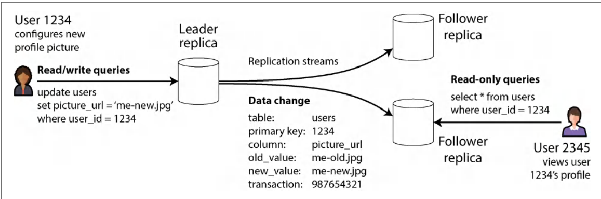

> 图 6-1。单主复制将所有写入都导向指定的主节点，主节点再将变更流发送给各个从节点副本。  

如果数据库进行了分片（见第 7 章），那么每个分片都有一个主节点。不同分片的主节点可以位于不同节点上，但每个分片仍然必须有一个主节点。在第 215 页的“多主复制”中，我们将讨论另一种模型：同一个分片在同一时间可以有多个主节点。  

单主复制应用非常广泛。许多关系数据库都内置了这一功能，例如 PostgreSQL、MySQL、Oracle Data Guard [3] 和 SQL Server 的 Always On 可用性组 [4]。一些文档数据库（如 MongoDB 和 DynamoDB [5]）、Kafka 等消息代理、DRBD 等复制块设备以及一些网络文件系统也使用了它。许多共识算法——例如用于 CockroachDB [6]、TiDB [7]、etcd 和 RabbitMQ 仲裁队列等系统复制的 Raft——同样以单个主节点为基础，并在旧主节点发生故障时自动选举新主节点（我们将在第 10 章更详细地讨论共识）。  

> [!NOTE]
> 在较早的文档中，你可能会看到术语 *master-slave replication*。它与基于主节点的复制含义相同，但这个术语被广泛认为具有冒犯性，因此应避免使用 [8]。

### 同步复制与异步复制  

复制系统的一个重要细节是，复制究竟以*同步*方式还是*异步*方式进行。（在关系数据库中，这通常是一个可配置选项；其他系统则往往在实现中固定为其中一种方式。）  

想想图 6-1 中会发生什么：某网站的用户更新了自己的个人资料图片。在某个时刻，客户端向主节点发送更新请求；不久后，主节点收到该请求。随后，主节点将数据变更转发给从节点，并通知客户端更新成功。图 6-2 展示了这些操作在时间上的一种可能安排。  

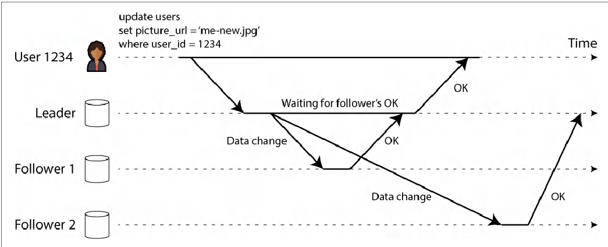

> 图 6-2。使用一个同步从节点和一个异步从节点的基于主节点的复制。  

在这个例子中，对从节点 1 的复制是*同步*的：主节点要等到从节点 1 确认收到写入之后，才向用户报告成功，并让该写入对其他客户端可见。对从节点 2 的复制则是*异步*的（或称*非阻塞*的）：主节点发送消息，但不等待从节点响应。  

图中显示，从节点 2 在处理消息之前有一段明显的延迟。通常复制速度相当快；大多数数据库系统都能在一秒内将变更应用到从节点。然而，完成复制所需的时间并没有保证。在某些情况下，从节点可能落后主节点几分钟甚至更久——例如，从节点正在从故障中恢复、系统运行在接近最大容量的状态，或者节点之间存在网络问题。  

同步复制的优点是，可以保证从节点拥有一份与主节点一致的最新数据副本。如果主节点突然发生故障，我们可以确信数据在从节点上仍然可用。缺点是，如果同步从节点没有响应（可能因为它崩溃、网络故障或任何其他原因），写入就无法处理。主节点必须阻塞所有写入，等待同步副本重新可用。  

因此，让所有从节点都采用同步复制并不现实；任何一个节点宕机都会导致整个系统停摆。在实践中，如果数据库提供同步复制，通常意味着一个从节点是同步的，其余从节点是异步的。如果同步从节点变得不可用或速度过慢，就将某个异步从节点改为同步。这可以保证至少两个节点上拥有最新的数据副本：主节点和一个同步从节点。这种配置有时也称为*半同步*。  

在一些系统中，*多数*副本（例如包括主节点在内的五个副本中的三个）会同步更新，剩余少数副本则异步更新。这是*法定人数*（quorum）的一个例子，我们将在第 231 页的“使用法定人数进行读写”中进一步讨论。多数派法定人数常用于最终一致的系统，或使用共识协议自动选举主节点的系统。我们将在第 10 章再次讨论这些系统。  

有时，基于主节点的复制会配置为完全异步。在这种情况下，如果主节点发生故障且无法恢复，所有尚未复制到从节点的写入都会丢失。这意味着，即使写入已经向客户端确认，也不能保证它是持久的。不过，完全异步配置的优点是，即使所有从节点都已经落后，主节点仍可继续处理写入。  

削弱持久性听起来可能是一笔不划算的交易，但异步复制仍然得到广泛应用，尤其是在从节点很多或分布于不同地理位置的情况下 [9]。我们将在第 209 页的“复制延迟带来的问题”中再次讨论这个问题。  

### 设置新从节点  

你不时需要设置新的从节点——或许是为了增加副本数量，或替换发生故障的节点。如何确保新从节点拥有主节点数据的准确副本？  

简单地将数据文件从一个节点复制到另一个节点通常并不够。客户端不断向数据库写入，数据始终处于变化之中，因此常规的文件复制会在不同时间点读取数据库的不同部分，其结果可能毫无意义。  

你可以通过锁定数据库（使其无法接受写入）来确保磁盘上的文件一致，但这与我们的高可用目标背道而驰。幸运的是，设置从节点通常可以在不停机的情况下完成。从概念上看，过程如下：  

1. 在某个时间点获取主节点数据库的一致性快照——如果可能，不要锁定整个数据库。大多数数据库都具备这一功能，因为备份同样需要它。在某些情况下，需要使用第三方工具，例如用于 MySQL 的 Percona XtraBackup。  

2. 将快照复制到新的从节点。  

3. 从节点连接到主节点，请求获取自快照创建以来发生的所有数据变更。这要求快照与主节点复制日志中的精确位置相关联。这个位置有多种名称——例如，PostgreSQL 称之为日志序列号（log sequence number）；MySQL 则有两种机制：二进制日志坐标（binlog coordinates）和全局事务标识符（GTIDs）。  

4. 当从节点处理完快照之后积压的数据变更时，我们称它已经*追赶上*（caught up）。此后，它可以继续实时处理来自主节点的数据变更。  

设置从节点的实际步骤因数据库而异。在一些系统中，这一过程完全自动化；而在另一些系统中，它可能是一套颇为晦涩的多步骤工作流，需要管理员手动执行。  

你还可以将复制日志与整个数据库的周期性快照一同归档到对象存储。这是实现数据库备份和灾难恢复的一种好方法；设置新从节点时，可以从对象存储下载这些文件来完成步骤 1 和 2。例如，WAL-G 为 PostgreSQL、MySQL 和 SQL Server 提供了这种功能，而 Litestream 为 SQLite 提供了等效功能。  

> [!NOTE]
> **以对象存储为后端的数据库**
>
> 对象存储的用途不止是归档数据。许多数据库开始使用 Amazon S3、Google Cloud Storage 和 Azure Blob Storage 等对象存储，为实时查询提供数据。将数据库数据存储在对象存储中有许多好处：  
>
> - 与其他云存储方案相比，对象存储价格低廉。这使云数据库可以把查询频率较低的数据保存在更便宜但延迟更高的存储中，同时从内存、SSD 和 NVMe 提供工作集。  
>
> - 对象存储提供跨可用区、双区域或多区域复制，并具有极高的持久性保证。这也使数据库能够避开跨可用区网络费用。  
>
> - 数据库可以使用对象存储的条件写入功能——本质上是一种比较并设置（CAS）操作——来实现事务和主节点选举 [10, 11]。  
>
> - 将多个数据库的数据存储在同一个对象存储中，可以简化数据集成（见第 135 页的“云数据仓库”），尤其是在使用 Parquet 和 Iceberg 等开放格式时。  
>
> 这些优点把事务、主节点选举和复制的责任转移给对象存储，从而大幅简化了数据库架构。  
>
> 不过，采用对象存储进行复制的系统必须应对其中的权衡。尤其值得注意的是，对象存储的读写延迟远高于本地磁盘或 Amazon EBS 等虚拟块设备。许多云服务商还会按 API 调用收费，这迫使系统将读写批量处理以降低成本，而这种批处理又会进一步增加延迟。对象通常还是不可变的，因此在大型对象中进行随机写入会消耗极多资源。最后，许多对象存储不提供标准文件系统接口，使缺乏对象存储集成的系统无法利用对象存储。用户空间文件系统（FUSE）之类的接口允许运维人员将对象存储桶挂载为文件系统，应用程序无需知道数据存储在对象存储中即可使用它。不过，许多面向对象存储的 FUSE 接口缺少非顺序写入或符号链接等 POSIX 特性，而系统可能依赖这些特性。  
>
> 不同系统以各种方式应对这些权衡。有些系统引入分层存储架构，将访问频率较低的数据放在对象存储上，而将新数据或频繁访问的数据保存在 SSD、NVMe 等速度更快的存储设备中，甚至放在内存中。另一些系统以对象存储作为主要存储层，但使用单独的低延迟存储系统（如 Amazon EBS 或 Neon 的 Safekeepers [12]）存储其 WAL。最近，一些系统更进一步，采用了零磁盘架构（ZDA）。基于 ZDA 的系统将所有数据持久化到对象存储，磁盘和内存则严格只用于缓存。这样，节点可以没有任何持久状态，从而大幅简化运维。WarpStream、Confluent Freight、Buf 的 Bufstream 和 Redpanda Serverless 都是采用零磁盘架构构建的 Kafka 兼容系统。几乎所有现代云数据仓库也都采用这种架构，Turbopuffer（向量搜索引擎）和 SlateDB（云原生 LSM 存储引擎）亦是如此。  

### 处理节点宕机  

系统中的任何节点都可能宕机，既可能是故障导致的意外宕机，也可能是计划内维护所致（例如重启机器以安装内核安全补丁）。能够在不停机的情况下重启单个节点，对运维和维护大有裨益。因此，我们的目标是在个别节点故障时仍保持整个系统运行，并尽可能减小节点宕机的影响。  

如何通过基于主节点的复制实现高可用？  

#### 从节点故障：追赶恢复  

每个从节点都会在本地磁盘上保存从主节点接收到的数据变更日志。如果从节点崩溃后重新启动，或者主节点与从节点之间的网络暂时中断，从节点可以相当容易地恢复：它能从日志中得知故障发生前最后处理的事务。因此，从节点可以连接到主节点，请求获取其断开连接期间发生的所有数据变更。应用这些变更后，它便追赶上了主节点，并可以像以前一样继续接收数据变更流。  

虽然从概念上讲，从节点恢复很简单，但在性能方面可能颇具挑战。如果数据库的写入吞吐量很高，或者从节点离线了很长时间，可能会有大量写入需要追赶。在追赶期间，正在恢复的从节点和主节点都会承受很高的负载（主节点需要把积压的写入发送给从节点）。  

在所有从节点都确认已经处理写入日志后，主节点可以将其删除；但如果某个从节点长时间不可用，主节点就面临一个选择：保留日志，直到该从节点恢复并追赶上来（冒着主节点磁盘空间耗尽的风险）；或者删除不可用从节点尚未确认的日志（这样从节点将无法通过日志恢复，重新上线时必须从备份还原）。  

#### 主节点故障：故障转移  

处理主节点故障更为棘手。需要将一个从节点提升为新主节点，重新配置客户端以将写入发送给新主节点，并让其他从节点开始消费来自新主节点的数据变更。这个过程称为*故障转移*（failover）。  

故障转移既可以手动进行（管理员收到主节点故障通知，并采取必要步骤建立新主节点），也可以自动进行。自动故障转移过程通常包括以下步骤：  

1. 确定主节点已经发生故障。可能出问题的情况很多：崩溃、断电、网络问题等等。没有万无一失的方法能够判断究竟发生了什么，因此大多数系统只是使用超时机制；节点之间频繁地来回发送消息，如果某个节点在一段时间内——比如 30 秒——没有响应，就认为它已经宕机。（如果是为了计划内维护而有意关闭主节点，则不适用这种方式，因为主节点可以在关闭前触发安全交接。）  

2. 选择新主节点。可以通过选举过程完成（由其余副本中的多数派选出主节点），也可以由事先设立的控制器节点任命新主节点 [13]。最适合成为主节点的候选者通常是拥有旧主节点最新数据变更的副本（以尽量减少数据丢失）。让所有节点就新主节点达成一致是一个共识问题，将在第 10 章中详细讨论。  

3. 重新配置系统以使用新主节点。客户端现在需要把写入请求发送给新主节点（我们将在第 265 页的“请求路由”中讨论这一点）。如果旧主节点重新上线，它可能仍认为自己是主节点，没有意识到其他副本已经迫使它退位。系统需要确保旧主节点变为从节点，并认可新主节点。  

故障转移中有很多环节可能出错：  

- 如果使用异步复制，新主节点在旧主节点故障前可能尚未收到它的全部写入。选出新主节点后，如果原主节点重新加入集群，这些写入应当如何处理？与此同时，新主节点可能已经收到了相互冲突的写入。最常见的解决办法是直接丢弃旧主节点中尚未复制的写入，这意味着那些你以为已经提交的写入最终并不持久。  

- 如果数据库之外的其他存储系统需要与数据库内容保持协调，丢弃写入尤其危险。例如，在 GitHub 的一次事故中 [14]，一个数据已过时的 MySQL 从节点被提升为主节点。该数据库使用自增计数器为新行分配主键，但由于新主节点的计数器落后于旧主节点，它重复使用了旧主节点此前已经分配的一些主键。这些主键也用于 Redis 存储，因此主键的重复使用造成了 MySQL 与 Redis 之间的不一致，导致一些私密数据被泄露给了错误的用户。  

- 在某些故障场景下（见第 9 章），两个节点可能都认为自己是主节点。这种情形称为脑裂（split brain），非常危险；如果两个主节点都接受写入，又没有解决冲突的过程（见第 215 页的“多主复制”），数据很可能丢失或损坏。作为安全措施，一些系统具有在检测到两个主节点时关闭其中一个节点的机制。然而，如果该机制设计不慎，可能导致两个节点都被关闭 [15]。此外，还有一种风险：等到检测出脑裂并关闭旧节点时，可能为时已晚，数据已经损坏。  

- 在宣布主节点宕机前，决定合适的超时时间可能很棘手。超时时间越长，主节点故障后的恢复时间也越长。然而，如果超时时间太短，就可能发生不必要的故障转移。例如，暂时的负载尖峰可能使节点响应时间超过超时阈值，网络抖动也可能导致数据包延迟。如果系统已经在高负载或网络问题下苦苦支撑，不必要的故障转移很可能使情况恶化，而不是改善。  

通过限制或关闭旧主节点来防止脑裂称为隔离（fencing）；我们将在第 373 页的“分布式锁与租约”中更详细地讨论它。然而，这些问题没有简单的解决方案。因此，即使软件支持自动故障转移，一些运维团队仍倾向于手动执行故障转移。  

故障转移最重要的是选择一个数据最新的从节点作为新主节点。如果使用同步或半同步复制，这应当是旧主节点在确认写入前所等待的那个从节点。如果使用异步复制，则可以选择日志序列号最高的从节点。这样能尽量减少故障转移期间丢失的数据量；丢失不到一秒的写入或许可以容忍，但选择一个落后数天的从节点则可能带来灾难性后果。  

这些问题——节点故障、不可靠的网络，以及围绕副本一致性、持久性、可用性和延迟的权衡——实际上都是分布式系统中的根本问题。我们将在第 9 章和第 10 章中进行更深入的讨论。  

### 复制日志的实现  

基于主节点的复制在底层如何工作？实践中使用了多种复制方法。下面逐一简要介绍。  

#### 基于语句的复制  

最简单的情况下，主节点会记录它执行的每个写入请求（语句），并将该语句日志发送给从节点。对于关系数据库而言，这意味着每条 INSERT、UPDATE 或 DELETE 语句都会转发给从节点，每个从节点解析并执行该 SQL 语句，就像它是从客户端收到的一样。  

尽管这种复制方法听起来很合理，但它可能以多种方式失效：  

- 任何调用非确定性函数的语句，例如用 NOW 获取当前日期和时间，或用 RAND 获取随机数，都可能在每个副本上生成不同的值。  

- 如果语句使用自增列，或者依赖数据库中的现有数据（例如 UPDATE ... WHERE <某个条件>），就必须在每个副本上以完全相同的顺序执行，否则可能产生不同的效果。当多个事务并发执行时，这会形成限制。  

- 带有副作用的语句（例如触发器、存储过程、用户定义函数）可能导致每个副本上出现不同的副作用，除非这些副作用是完全确定性的。  

这些问题是可以规避的——例如，在记录语句时，主节点可以将所有非确定性函数调用替换为固定的返回值，从而让所有从节点得到相同的值。按照固定顺序执行确定性语句的思想，与我们之前在第 101 页“事件溯源与 CQRS”中讨论的事件溯源模型类似。这种方法也称为状态机复制，我们将在第 433 页“使用共享日志”中讨论其背后的理论。  

MySQL 5.1 版本之前使用的是基于语句的复制。如今有时仍会使用这种方法，因为它非常紧凑，但现在只要语句中存在任何非确定性，MySQL 默认就会切换到基于行的复制（稍后讨论）。VoltDB 使用基于语句的复制，并通过要求事务具有确定性来保证其安全性 [16]。然而，实践中可能很难保证确定性，因此许多数据库更倾向于采用其他复制方法。  

#### 预写日志传送  

在第 4 章中，我们看到，为了使 B 树存储引擎具有健壮性，需要使用预写日志；每项修改都会先写入 WAL，以便在崩溃后将树恢复到一致状态。由于 WAL 包含将索引和堆恢复到一致状态所需的全部信息，因此我们可以使用完全相同的日志在另一个节点上构建副本；主节点除了将日志写入磁盘，还会通过网络将其发送给从节点。从节点处理该日志时，会构建出与主节点上完全相同的文件副本。  

PostgreSQL 和 Oracle 等数据库采用了这种复制方法 [17, 18]。其主要缺点是日志以非常底层的方式描述数据——WAL 包含哪些磁盘块中的哪些字节发生了变化等细节。这使得复制与存储引擎紧密耦合。如果数据库从一个版本升级到另一个版本时更改了存储格式，通常就无法在主节点和从节点上运行不同版本的数据库软件。  

这看似只是一个次要的实现细节，却可能对运维产生重大影响。如果复制协议允许从节点使用比主节点更新的软件版本，你就可以先升级从节点，然后执行故障转移，让其中一个已升级的节点成为新的主节点，从而实现数据库软件的零停机升级。如果复制协议不允许这种版本不匹配——WAL 传送通常就是如此——那么此类升级就需要停机。  

#### 逻辑（基于行的）日志复制  

另一种方案是为复制和存储引擎使用不同的日志格式，从而使复制日志与存储引擎内部实现解耦。这种复制日志称为逻辑日志，以区别于存储引擎的（物理）数据表示。  

关系型数据库的逻辑日志通常是一系列记录，以行为粒度描述对数据库表的写入：  

- 对于插入的行，日志包含所有列的新值。  

- 对于删除的行，日志包含足以唯一标识被删除行的信息。通常是主键；但如果表没有主键，就需要记录所有列的旧值。  

- 对于更新的行，日志包含足以唯一标识被更新行的信息，以及所有列的新值（或者至少是值发生变化的所有列）。  

一个修改多行的事务会生成多条这样的日志记录，随后还有一条表示事务已提交的记录。配置为使用基于行的复制时，MySQL 除了 WAL，还会维护一份单独的逻辑复制日志，称为 binlog。PostgreSQL 则通过将物理 WAL 解码为行插入、更新和删除事件来实现逻辑复制 [19]。  

由于逻辑日志与存储引擎内部实现解耦，因此更容易保持向后兼容，让主节点和从节点能够运行不同版本的数据库软件。这样又能以最短的停机时间升级到新版本 [20]。  

逻辑日志格式也更便于外部应用程序解析。如果你想把数据库内容发送到外部系统，例如用于离线分析的数据仓库，或者用于构建自定义索引和缓存的专用系统，这一点就很有用 [21]。这种技术称为变更数据捕获，我们将在第 12 章再次讨论它。  

## 复制延迟带来的问题  

能够容忍节点故障只是需要复制的原因之一。如第 19 页“分布式系统与单节点系统”所述，其他原因还包括可伸缩性（处理超出单台机器能力范围的请求）和延迟（将副本部署在地理位置上更靠近用户的地方）。  

基于主节点的复制要求所有写入都经过单个节点，但只读查询可以发送到任意副本。对于绝大多数是读取、只有很少一部分是写入的工作负载（在线服务通常如此），有一种很有吸引力的选择：创建多个从节点，并将读取请求分散到这些从节点上。这既能减轻主节点的负载，也能让附近的副本为读取请求提供服务。  

在这种*读取扩展*架构中，只需增加更多从节点，就可以提高处理只读请求的能力。然而，现实中这种方法只有配合异步复制才行得通。如果尝试同步复制到所有从节点，只要有一个节点故障或网络中断，整个系统就无法写入。而且节点越多，其中某个节点宕机的可能性就越大，因此全同步配置会非常不可靠。  

遗憾的是，如果*异步*从节点已经落后，应用程序从中读取时可能会看到过时的信息。这会导致数据库出现表面上的不一致；如果同时在主节点和从节点上运行同一个查询，可能得到不同的结果，因为并非所有写入都已反映到从节点上。这种不一致只是暂时状态——如果停止向数据库写入并等待一段时间，从节点最终会赶上来，与主节点保持一致。因此，这种效果称为*最终一致性* [22]。  

> [!NOTE]
> “最终一致性”一词由 Douglas Terry 等人提出 [23]，后经 Werner Vogels 推广 [24]，并成为许多 NoSQL 项目的战斗口号。然而，并非只有 NoSQL 数据库具有最终一致性；采用异步复制的关系型数据库中的从节点也具有相同特征。

“最终”这个词刻意保持了模糊性；一般而言，副本可能落后多久并没有上限。正常运行时，从写入发生在主节点到它反映在从节点上的延迟——即复制延迟——可能只有几分之一秒，在实践中难以察觉。然而，如果系统的运行负载接近容量极限，或者网络出现问题，延迟很容易增加到数秒甚至数分钟。  

当延迟如此之大时，它引入的不一致就不再只是理论问题，而会成为应用程序面临的实际问题。本节将重点介绍复制延迟可能导致的三个问题示例，并概述一些解决方法。  

### 读到自己的写入  

许多应用程序允许用户提交一些数据，然后查看自己提交的内容。这可能是客户数据库中的一条记录、讨论串中的一条评论，或者其他类似内容。提交新数据时，必须将其发送到主节点；但用户查看数据时，可以从从节点读取。如果数据经常被查看、却只是偶尔写入，这种方式尤其合适。  

异步复制会带来一个问题，如图 6-3 所示：如果用户写入后很快查看数据，新数据可能还没有到达副本。在用户看来，就像自己提交的数据丢失了一样，他们自然会感到不满。  

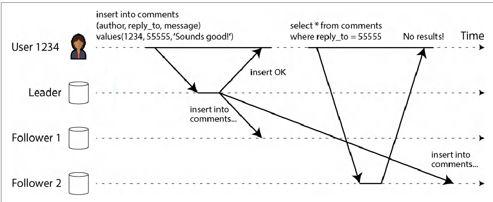

> 图 6-3。用户执行写入后从陈旧副本读取时，可能会出现不一致。  

在这种情况下，我们需要*写后读一致性*，也称为*读己之写一致性* [23]。它保证用户重新加载页面时，总能看到自己提交的所有更新。它并不对其他用户作出承诺；其他用户的更新可能要到稍后才可见。不过，它能让用户确信自己的输入已被正确保存。  

如何在采用基于主节点复制的系统中实现写后读一致性？有多种可行的技术，下面列举几种：  

- 读取用户可能修改过的内容时，从主节点或同步更新的从节点读取；否则，从异步更新的从节点读取。这要求你能够在不查询内容本身的情况下，判断某项内容是否可能已被修改。例如，社交网络上的用户个人资料通常只能由资料所有者编辑，其他任何人都不能编辑。因此，可以采用一条简单规则：始终从主节点读取用户自己的个人资料，而从从节点读取其他用户的个人资料。  

- 如果应用程序中的大多数内容都可能由用户编辑，上述方法就不会奏效，因为大多数内容都必须从主节点读取（抵消了读取扩展的好处）。在这种情况下，可以使用其他标准来决定是否从主节点读取。例如，可以记录上次更新的时间，并在更新后一分钟内让所有读取都从主节点进行 [25]。还可以监控从节点上的复制延迟，并阻止查询任何比主节点落后超过一分钟的从节点。  

- 客户端可以记住自己最近一次写入的时间戳，系统则确保为该用户的任何读取提供服务的副本，至少已经反映了截至该时间戳的更新。如果某个副本不够新，可以由另一个副本处理读取，也可以让查询等待该副本赶上进度 [26]。时间戳可以是逻辑时间戳（表示写入顺序的某种值，例如日志序列号），也可以是实际的系统时钟（在这种情况下，时钟同步至关重要；参见第 358 页“不可靠的时钟”）。  

- 如果副本分布在多个区域（为了在地理位置上靠近用户，或为了可用性或持久性），情况会更加复杂。任何需要由主节点处理的请求都必须路由到主节点所在的区域。  

当同一用户通过多个设备访问服务时，例如同时使用桌面端网页浏览器和移动应用程序，还会出现另一重复杂性。在这种情况下，你可能希望提供跨设备的写后读一致性：如果用户在一个设备上输入了一些信息，随后在另一个设备上查看，他们应该能看到刚才输入的信息。  

这里还需要考虑一些额外问题：  

- 要求记住用户上次更新时间戳的方法会变得更困难，因为在一个设备上运行的代码不知道另一个设备上发生了哪些更新。这些元数据需要集中保存。  

- 如果副本分布在多个区域，就无法保证来自不同设备的连接会被路由到同一个区域。（例如，如果用户的台式电脑使用家庭宽带连接，而移动设备使用蜂窝数据网络，那么这些设备的网络路由可能完全不同。）如果你的方案要求从主节点读取，可能需要先将来自同一用户所有设备的请求路由到同一个区域。  

> [!NOTE]
> **区域和可用区**
>
> 我们用“区域”一词指代位于同一地理位置的一个或多个数据中心。云服务提供商会在同一地理区域内设置多个数据中心。每个数据中心称为一个可用区，或简称为区。因此，一个云区域由多个区组成。每个区都是一个独立的数据中心，位于独立的物理设施内，拥有自己的供电、冷却等系统。  
>
> 同一区域内的各个区通过速度非常高的网络连接。其延迟足够低，因此大多数分布式系统即使将节点分散在同一区域的多个区，也可以像在单个区内一样运行。多可用区配置使分布式系统能够承受某个区离线的可用区级故障，但无法防范一个区域内所有区都不可用的区域级故障。要承受区域级故障，分布式系统必须跨多个区域部署，这可能导致延迟更高、吞吐量更低，并增加云网络费用。我们将在第 218 页“多主复制拓扑”中进一步讨论这些权衡。目前只需知道，我们所说的区域，是指位于同一地理位置的一组区或数据中心。  

### 单调读  

从异步从节点读取时可能发生的第二种异常是：用户可能会看到时间倒退。  

如果用户多次从不同副本读取，就可能发生这种情况。例如，图 6-4 展示了用户 2345 两次发出相同的查询：第一次查询延迟很小的从节点，第二次查询延迟更大的从节点。（如果用户刷新网页，而每个请求都被路由到随机服务器，这种情况很可能发生。）第一次查询返回用户 1234 最近添加的一条评论，但第二次查询没有返回任何内容，因为落后的从节点尚未收到该写入。实际上，第二次查询观察到的系统状态比第一次查询更早。如果第一次查询什么也没返回，情况倒不至于太糟，因为用户 2345 很可能不知道用户 1234 最近添加了评论。然而，如果用户 2345 先看到用户 1234 的评论出现，随后又看到它消失，就会非常困惑。  

单调读 [22] 保证这种异常不会发生。它比强一致性提供的保证弱，但比最终一致性提供的保证强。读取数据时，你可能看到旧值；单调读只意味着，如果同一个用户连续执行多次读取，他们不会看到时间倒退（即在先前读到较新的数据后，不会再读到更旧的数据）。  

实现单调读的一种方法，是确保每个用户始终从同一个副本读取（不同用户可以从不同副本读取）。  

例如，可以根据用户 ID 的哈希值选择副本，而不是随机选择。不过，如果该副本发生故障，就需要将用户的查询重新路由到另一个副本。  

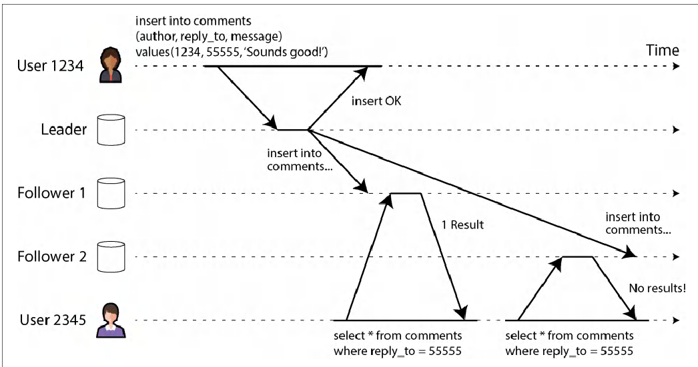

> 图 6-4。用户先从最新副本读取，随后又从陈旧副本读取时，看起来就像时间倒退了。  

### 一致前缀读  

复制延迟异常的第三个例子涉及因果关系遭到破坏。设想 Poons 先生和 Cake 女士之间有下面这段简短对话：  

**Poons 先生：** Cake 女士，您能看到多远的未来？  

**Cake 女士：** 通常大约 10 秒，Poons 先生。  

这两句话之间存在因果依赖关系：Cake 女士听到了 Poons 先生的问题，并作出了回答。  

现在，设想第三个人通过从节点听这段对话。Cake 女士说的话经过延迟很小的从节点，而 Poons 先生说的话则有更长的复制延迟（见图 6-5）。这位观察者会听到下面的内容：  

**Cake 女士：** 通常大约 10 秒，Poons 先生。  

**Poons 先生：** Cake 女士，您能看到多远的未来？  

在观察者听来，Cake 女士似乎在 Poons 先生还没提出问题之前就回答了它。这种通灵能力固然令人赞叹，却也非常令人困惑 [27]。  

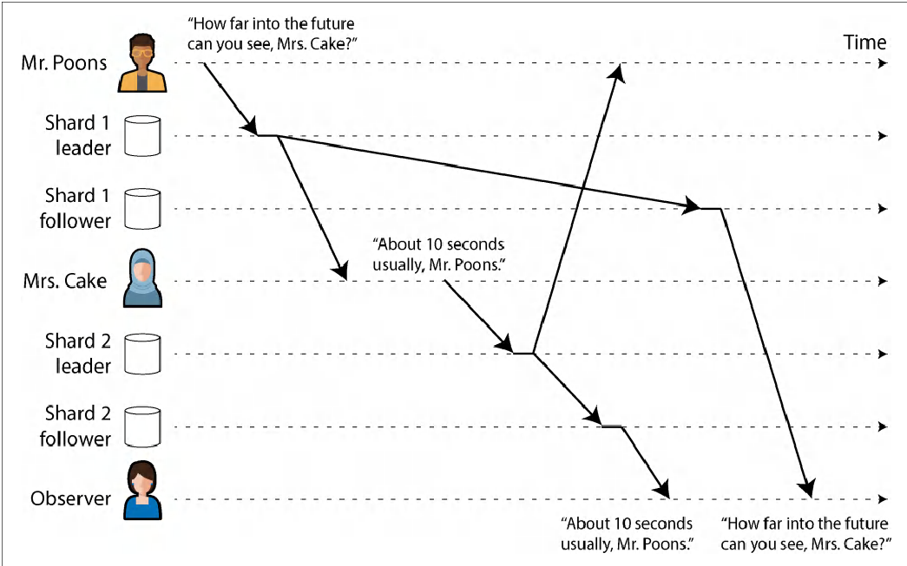

> 图 6-5。如果某些分片的复制速度比其他分片慢，观察者可能先看到回答，后看到问题。  

防止这种异常需要另一种保证：一致前缀读 [22]。这种保证意味着，如果一系列写入按某种顺序发生，那么任何读取这些写入的人都会看到它们以相同的顺序出现。  

这在分片（分区）数据库中尤其成问题，我们将在第 7 章讨论这类数据库。如果数据库始终以相同顺序应用写入，那么读取总能看到一致的前缀，因此这种异常不会发生。然而，在许多分布式数据库中，不同分片独立运行，因此不存在全局写入顺序。用户从数据库读取时，可能看到数据库的一些部分处于较旧状态，另一些部分则处于较新状态。  

一种解决方案是确保具有因果关系的写入都写入同一个分片——但在某些应用程序中，无法高效做到这一点。有些算法会显式跟踪因果依赖关系，我们将在第 238 页“先发生关系与并发”中再次讨论这个主题。  

## 复制延迟的解决方案  

使用最终一致的系统时，值得思考一下：如果复制延迟增加到几分钟甚至几小时，应用程序会有何表现。如果答案是“没问题”，那当然很好。然而，如果结果会给用户带来糟糕的体验，就必须将系统设计为提供更强的保证，例如写后读一致性。复制实际上是异步的，却假装它是同步的，迟早会埋下问题。  

如前所述，应用程序可以提供比底层数据库更强的保证——例如，让某些类型的读取在主节点或同步更新的从节点上执行。然而，在应用程序代码中处理这些问题既复杂又容易出错。  

对应用程序开发者而言，最简单的编程模型是选择一种能为副本提供强一致性保证（例如线性一致性，参见第 10 章）并支持 ACID 事务（参见第 8 章）的数据库。这样你基本上可以忽略复制带来的挑战，把数据库视为只有一个节点。2010 年代初，NoSQL 运动宣扬一种观点：这些特性会限制可伸缩性，大规模系统必须接受最终一致性。  

然而，此后许多数据库开始提供强一致性和事务支持，同时也具备分布式数据库在容错、高可用性和可伸缩性方面的优势。如第 67 页“关系模型与文档模型”所述，为了与 NoSQL 相区别，这一趋势被称为 NewSQL（尽管它与 SQL 本身的关系并不大，更多是关于可伸缩事务管理的新方法）。  

尽管现在已经有了可伸缩的强一致分布式数据库，一些应用程序仍有充分理由选择提供较弱一致性保证的其他复制形式。尤其是，与事务系统相比，它们在网络中断时可以提供更强的韧性，而且开销更低。我们将在本章余下内容中探讨这些方法。  

## 多主复制  

到目前为止，本章只讨论了使用单个主节点的复制架构。虽然这是一种常见方法，但也存在一些有趣的替代方案。  

单主复制有一个主要缺点：所有写入都必须经过唯一的主节点。如果由于任何原因无法连接到主节点——例如，你与主节点之间的网络中断——就无法向数据库写入。  

单主复制模型的一种自然扩展，是允许多个节点接受写入。复制仍以相同方式进行：每个处理写入的节点都必须将该数据变更转发给所有其他节点。我们将这种配置称为*多主*配置（也称为*主动/主动*复制或*双向*复制）。在这种配置中，每个主节点同时也充当其他主节点的从节点。  

与单主复制一样，多主复制也可以选择同步或异步方式。假设有两个主节点 A 和 B，而你正尝试向 A 写入。如果写入从 A 同步复制到 B，并且两个节点之间的网络中断，那么在连接恢复之前，你将无法向 A 写入。因此，同步多主复制提供的模型与单主复制非常相似，例如，可以将 B 设为主节点，而 A 只是将所有写入请求转发给 B 执行。  

因此，我们不再深入讨论同步多主复制，只将其视为等同于单主复制。本节其余部分将重点讨论异步多主复制；在这种模式下，即使某个主节点与其他主节点的连接中断，任何主节点仍然可以处理写入。  

### 跨地域分布式运行  

在单个区域内采用多主配置通常没有多大意义，因为它带来的好处很少能抵消额外的复杂性。不过，在某些情况下，这种配置是合理的。  

假设你的数据库在多个区域中都有副本（也许是为了容忍整个区域发生故障，也许是为了更接近用户）。这种部署称为跨地域分布式、地理分布式或地理复制配置。采用单主复制时，主节点必须位于其中一个区域，所有写入都必须经过该区域。  

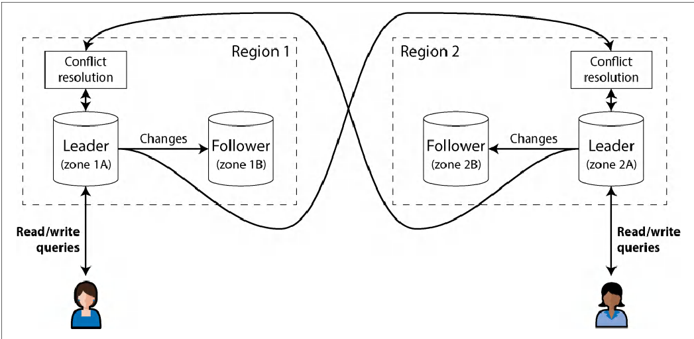

> 图 6-6。跨多个区域的多主复制。  

在多主配置中，每个区域都可以有一个主节点。图 6-6 展示了这种架构可能的样子。在每个区域内部，使用常规的主从复制（从节点可能与主节点位于不同的可用区）；在区域之间，每个区域的主节点会将其变更复制到其他区域的主节点。下面比较单主配置和多主配置在多区域部署中的表现：  

#### 性能  

在单主配置中，每次写入都必须通过互联网发送到主节点所在的区域。这会显著增加写入延迟，甚至可能使部署多个区域失去原本的意义。在多主配置中，每次写入都可以在本地区域处理，然后异步复制到其他区域。因此，区域间的网络延迟对用户是隐藏的，这意味着感知性能可能会更好。  

#### 对区域故障的容忍能力  

在单主配置中，如果主节点所在区域不可用，可以通过故障转移将另一个区域的从节点提升为主节点。在多主配置中，每个区域都可以独立于其他区域继续运行；离线区域恢复上线后，复制会追赶进度。  

#### 对网络问题的容忍能力  

即使使用专用连接，区域之间的流量也可能不如同一区域内不同可用区之间或单个可用区内的流量可靠。单主配置对区域间链路的问题非常敏感，因为当一个区域中的客户端想向另一个区域中的主节点写入时，必须通过该链路发送请求并等待响应，之后操作才能完成。  

采用异步复制的多主配置对网络问题的容忍能力更强；在网络暂时中断期间，每个区域的主节点都可以继续独立处理写入。  

#### 一致性  

单主系统可以提供强一致性保证，例如可串行化事务，我们将在第 8 章讨论这一点。多主系统最大的缺点是，其所能实现的一致性要弱得多。例如，你无法保证银行账户余额不会变成负数，也无法保证用户名唯一；不同的主节点总有可能分别处理单独看来没有问题的写入（从账户中支付一部分资金、注册某个特定用户名），但这些写入与另一个主节点上的写入合在一起时却违反了约束。  

这就是分布式系统的一项根本限制 [28]。因此，如果需要强制执行此类约束，最好采用单主系统。不过，正如我们将在第 222 页“处理写入冲突”中看到的，多主系统仍然可以实现一些有用的一致性属性，适用于大量不需要此类约束的应用。  

多主复制不如单主复制常见，但许多数据库仍然支持它，包括 MySQL、Oracle、SQL Server 和 YugabyteDB。在某些情况下，它是外部附加功能，例如 Redis Enterprise、EDB Postgres Distributed 和 pglogical [29]。  

由于多主复制在许多数据库中都是后来增补的功能，因此经常存在微妙的配置陷阱，以及它与其他数据库功能之间出人意料的相互作用。例如，自增键、触发器和完整性约束都可能带来问题。因此，多主复制常被视为危险地带，应尽可能避免 [30]。  

### 多主复制拓扑  

复制拓扑描述了写入从一个节点传播到另一个节点时所沿用的通信路径。如果像图 6-6 那样有两个主节点，那么只有一种合理的拓扑：主节点 1 必须将其所有写入发送给主节点 2，反之亦然。如果主节点多于两个，则可以采用多种拓扑。图 6-7 展示了几个例子。  

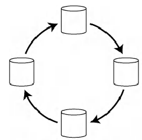

> (a) 环形拓扑。  

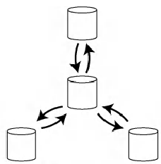

> (b) 星形拓扑。  

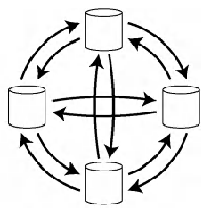

> (c) 全连接拓扑。  

> 图 6-7。多主复制的三种拓扑示例。  

最通用的拓扑是图 6-7(c) 所示的全连接拓扑，其中每个主节点都将自己的写入发送给其他所有主节点。不过，也会使用限制更多的拓扑。例如，在图 6-7(a) 所示的环形拓扑中，每个节点从一个节点接收写入，再将这些写入（加上自己的所有写入）转发给另一个节点。图 6-7(b) 所示的星形拓扑也很常见；在这种拓扑中，一个指定的根节点将写入转发给所有其他节点。星形拓扑还可以推广为树形拓扑。  

> [!NOTE]
> 星形网络拓扑与*星型模式*（参见第 77 页“星型与雪花型：分析系统的模式”）无关，后者描述的是数据模型的结构。

在环形和星形拓扑中，一次写入可能需要经过多个节点才能到达所有副本。因此，节点需要转发从其他节点收到的数据变更。为防止出现无限复制循环，会为每个节点分配一个唯一标识符；在复制日志中，每次写入都会标记其经过的所有节点的标识符 [31]。当一个节点收到带有自身标识符的数据变更时，会忽略该变更，因为该节点知道自己已经处理过它。  

#### 不同拓扑存在的问题  

环形和星形拓扑的一个问题是，只要一个节点发生故障，就可能中断其他节点之间复制消息的流动，使它们在该节点修复之前无法通信。可以重新配置拓扑以绕过故障节点，但在大多数部署中，这种重新配置必须手动完成。连接更密集的拓扑（例如全连接拓扑）具有更好的容错能力，因为消息可以沿不同路径传输，从而避免单点故障。  

不过，全连接拓扑也可能存在问题。尤其是，有些网络链路可能比其他链路更快（例如因为网络拥塞），导致某些复制消息可能“超过”其他消息，如图 6-8 所示。  

在图 6-8 中，客户端 A 在主节点 1 上向表中插入一行，客户端 B 在主节点 3 上更新该行。然而，主节点 2 收到这些写入的顺序可能不同。它可能先收到更新（从它的角度看，这是对数据库中不存在的一行进行更新），之后才收到相应的插入（该插入本应先于更新发生）。  

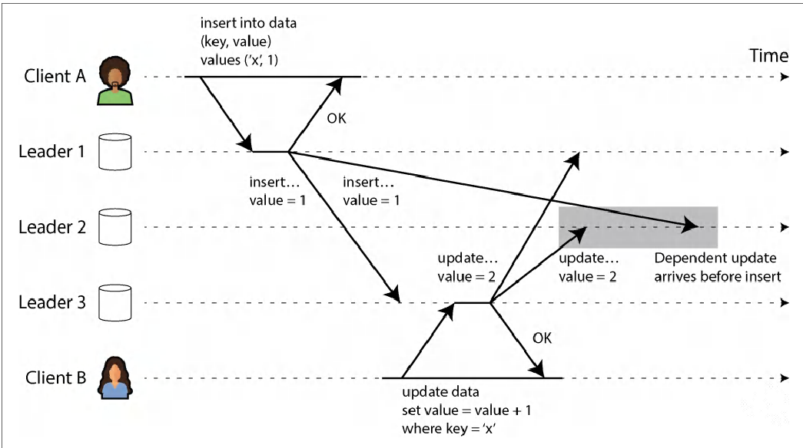

> 图 6-8。使用多主复制时，写入可能以错误的顺序到达某些副本。  

这是一个因果关系问题，与我们在第 213 页“一致前缀读”中看到的问题类似。更新依赖于之前的插入，因此需要确保所有节点都先处理插入，再处理更新。仅仅为每次写入附加时间戳并不足够，因为不能相信各个时钟能够充分同步，从而在主节点 2 上正确排列这些事件（参见第 9 章）。  

为了正确排列这些事件，可以使用一种称为版本向量的技术，我们将在第 237 页“检测并发写入”中讨论它。不过，许多多主复制系统并未采用良好的更新排序技术，因此容易受到图 6-8 所示问题的影响。如果你正在使用多主复制，就值得留意这些问题，仔细阅读文档，并全面测试数据库，以确保它确实提供了你认为它应有的保证。  

## 同步引擎与本地优先软件  

如果应用需要在断开互联网连接时继续工作，多主复制也很适合。例如，考虑手机、笔记本电脑和其他设备上的日历应用。无论设备当前是否连接互联网，你都需要随时能够查看会议（发出读取请求）和录入新会议（发出写入请求）。如果离线时做了任何更改，那么设备下次上线时，这些更改需要与服务器及其他设备同步。  

在这种情况下，每台设备都有一个充当主节点的本地数据库副本（它接受写入请求），而所有设备上的日历副本之间则运行着异步多主复制过程（同步）。复制延迟可能长达数小时甚至数天，具体取决于你何时能够接入互联网。  

从架构角度看，这种配置与区域之间的多主复制非常相似，只是被推到了极端。每台设备都是一个“区域”，而它们之间的网络连接极不可靠。  

### 实时协作、离线优先和本地优先应用  

许多现代 Web 应用都提供*实时协作*功能，例如用于文本文档和电子表格的 Google Docs 和 Sheets、用于图形设计的 Figma，以及用于项目管理的 Linear。这些应用之所以响应迅速，是因为用户输入会立即反映在用户界面中，无须等待到服务器的网络往返；同时，一个用户所做的编辑也会以低延迟呈现给协作者 [32, 33, 34]。  

这同样形成了多主架构：每个打开共享文件的 Web 浏览器标签页都是一个副本，你对文件所做的任何更新都会异步复制到其他已打开同一文件的用户设备上。即使应用不允许你在离线时继续编辑文件，只要多个用户可以在不等待服务器响应的情况下进行编辑，它就已经属于多主架构。  

离线编辑和实时协作需要类似的复制基础设施。应用需要捕获用户对文件所做的所有更改，并立即将其发送给协作者（如果在线），或者将其存储在本地以便稍后发送（如果离线）。此外，应用还需要接收协作者的更改，将其合并到用户的本地文件副本中，并更新 UI 以反映最新版本。如果多个用户并发更改了文件，可能需要冲突解决逻辑来合并这些更改。  

支持这一过程的软件库称为*同步引擎*。尽管这一理念早已存在，但这个术语最近才受到关注 [35, 36, 37]。允许用户在离线时继续编辑文件的应用（可以使用同步引擎实现）称为*离线优先*应用 [38]。*本地优先软件*是指不仅离线优先，而且即使软件开发者关闭其全部在线服务后仍被设计为可以继续工作的协作应用 [39]。这可以通过使用采用开放标准同步协议的同步引擎来实现，并且该协议有多个服务提供商可供选择 [40]。例如，Git 是一个本地优先协作系统（尽管它不支持实时协作），因为你可以通过 GitHub、GitLab 或任何其他代码仓库托管服务进行同步。  

### 同步引擎的优缺点  

如今构建 Web 应用的主流方式是在客户端只保留很少的持久状态，并在每当需要显示新数据或更新某些数据时向服务器发出请求。相比之下，使用同步引擎时，客户端会保留持久状态，而与服务器的通信则移入后台进程。同步引擎方案有许多优点：  

- 数据存储在本地，意味着 UI 的响应速度可以远快于必须等待服务调用来获取数据的情况。有些应用力求在图形系统的*下一帧*响应用户输入；在刷新率为 60 Hz 的显示器上，这意味着要在 16 ms 内完成渲染。  

- 允许用户在离线时继续工作很有价值，尤其是在连接时断时续的移动设备上。采用同步引擎后，应用不需要单独的离线模式：离线就相当于网络延迟极大。  

- 与在应用代码中显式执行服务调用相比，同步引擎简化了前端应用的编程模型。每次服务调用都需要错误处理，如第 183 页“远程过程调用的问题”所述；例如，如果更新服务器数据的请求失败，用户界面需要以某种方式反映该错误。同步引擎允许应用对本地数据执行读写；这些操作几乎永远不会失败，从而形成一种更具声明性的编程风格 [41]。  

- 要实时显示其他用户的编辑，需要接收这些编辑的通知，并据此高效更新 UI。同步引擎与*响应式编程*模型相结合，是实现这一功能的好方法 [42]。  

当用户可能需要的所有数据都预先下载并持久存储在客户端时，同步引擎的效果最佳。这意味着数据可在需要时离线访问，但也意味着，如果用户有权访问的数据量非常大，同步引擎就不适用。例如，下载用户创建的所有文件可能没问题（单个用户通常不会生成那么多数据），但下载电子商务网站的整个商品目录可能就不合理。  

同步引擎最早由 20 世纪 80 年代的 Lotus Notes 开创 [43]（当时并未使用这个术语），而针对日历等特定应用的同步也已存在很长时间。如今，我们拥有众多通用同步引擎。其中一些使用专有后端服务（例如 Google Firestore、Realm 或 Ditto），另一些则拥有开源后端，因此适合用来创建本地优先软件（例如 PouchDB/CouchDB、Automerge 和 Yjs）。  

多人视频游戏也有类似需求：立即响应用户的本地操作，并将其与通过网络异步收到的其他玩家操作进行协调。在游戏开发术语中，与同步引擎对应的概念称为网络代码（netcode）。网络代码所使用的技术高度针对游戏需求 [44]，不能直接移植到其他类型的软件中，因此本书不再进一步讨论。  

## 处理写入冲突  

多主复制最大的难题——无论是在跨地域分布式的服务器端数据库中，还是在最终用户设备上的本地优先同步引擎中——都是不同主节点上的并发写入可能导致需要解决的冲突。  

例如，考虑两个用户同时编辑一个 wiki 页面，如图 6-9 所示。用户 1 将页面标题从 A 改为 B，用户 2 则独立地将标题从 A 改为 C。每位用户的更改都成功应用于各自的本地主节点。然而，当这些更改异步复制时，系统检测到了冲突。单主数据库中不会出现这个问题。  

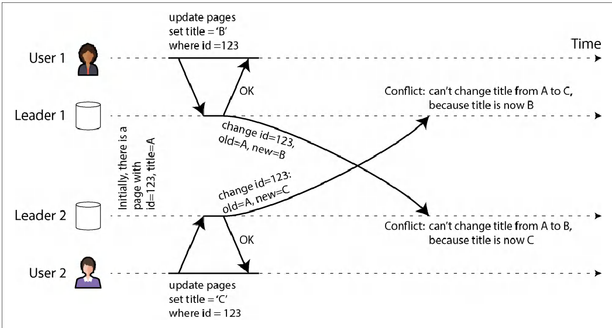

> 图 6-9。两个主节点并发更新同一条记录所导致的写入冲突。  

> [!NOTE]
> 我们说图 6-9 中的两个写入是并发的，因为最初执行每个写入时，双方都不“知道”另一个写入。两个写入是否真的在同一时刻发生并不重要；事实上，如果写入是在离线期间进行的，它们发生的时间可能相隔很久。重要的是，执行某个写入时，另一个写入是否已经生效。

在第 237 页“检测并发写入”中，我们将讨论数据库如何判断两个写入是否并发。现在，我们先假定能够检测到冲突，并希望找出解决冲突的最佳方法。  

### 避免冲突  

处理冲突的一种策略是从一开始就防止它发生。例如，如果应用能够确保某条特定记录的所有写入都经过同一个主节点，那么即使整个数据库采用多主复制，也不会发生冲突。对于在离线状态下更新的同步引擎客户端，这种方法不可行，但在地理复制的服务器系统中有时可以做到 [30]。  

例如，在一个用户只能编辑自己数据的应用中，可以确保来自特定用户的请求始终路由到同一个区域，并使用该区域的主节点进行读写。不同用户可以有不同的“主区域”（或许根据与用户的地理距离来选择），但从任意单个用户的角度看，这种配置本质上是单主配置。  

不过，有时你可能希望更改某条记录的指定主节点——也许是因为某个区域不可用，需要将流量重新路由到另一个区域；也许是因为用户搬到了别处，现在离另一个区域更近。此时存在一种风险：用户可能会在指定主节点的变更过程中执行写入，从而引发冲突，之后必须采用下述某种方法来解决。因此，如果允许更换主节点，避免冲突的策略就会失效。  

再举一个避免冲突的例子：假设你要插入新记录，并根据一个自增计数器为其生成唯一 ID。如果有两个主节点，可以将它们配置为一个主节点只生成奇数，另一个只生成偶数。这样就能确保两个主节点不会并发地为不同记录分配同一个 ID。我们将在第 417 页“ID 生成器与逻辑时钟”中讨论其他 ID 分配方案。  

### 最后写入胜出（丢弃并发写入）  

如果无法避免冲突，解决冲突最简单的方法就是为每次写入附加时间戳，并始终采用时间戳最新（最大）的值。例如，在图 6-9 中，假设用户 1 写入的时间戳大于用户 2 写入的时间戳。在这种情况下，两个主节点都会判定页面的新标题应为 B，并丢弃将其设为 C 的写入。如果两次写入碰巧具有相同的时间戳，则可以通过比较值来选出胜者（例如，对于字符串，选择字母表顺序靠前的那个）。  

这种方法称为*最后写入胜出*（last write wins，LWW），因为时间戳最大的写入可以被视为“最后”一次写入。不过，这个术语具有误导性，因为当两次写入并发时（如图 6-9 所示），无法定义哪一次更新，所以并发写入的时间戳顺序本质上是随机的。  

因此，LWW 的真正含义是：当不同主节点并发写入同一条记录时，会随机选择其中一次写入作为胜者，并悄无声息地丢弃其他写入，即使那些写入已经由各自的主节点成功处理。这样可以达到最终让所有副本处于一致状态的目标，但代价是数据丢失。  

如果可以避免冲突——例如，只插入具有唯一键的记录且从不更新——那么 LWW 就没有问题。但如果要更新现有记录，或者不同的主节点可能插入具有相同键的记录，那么你必须判断丢失更新对应用来说是否成问题。如果不能接受丢失更新，就需要采用接下来介绍的某种冲突解决方法。  

LWW 的另一个问题是，如果使用实时时钟（例如 Unix 时间戳）作为写入的时间戳，系统会对时钟同步非常敏感。如果一个节点的时钟比其他节点快，而你试图覆盖该节点写入的值，那么即使你的写入显然发生得更晚，也可能因为时间戳较小而被忽略。这个问题可以通过使用*逻辑时钟*来解决，我们将在第 417 页的“ID 生成器与逻辑时钟”中讨论它。  

### 手动解决冲突  

如果不希望随机丢弃某些写入，下一个选择就是手动解决冲突。你可能熟悉 Git 和其他版本控制系统中的手动冲突解决：如果两个分支上的提交编辑了同一文件中的相同行，而你尝试合并这两个分支，就会遇到合并冲突，必须先解决冲突才能完成合并。  

在数据库中，让冲突阻塞整个复制过程直至人工解决并不现实。相反，数据库通常会存储某条记录被并发写入的所有值——例如图 6-9 中的 B 和 C。这些值有时称为兄弟值（siblings）。下次查询该记录时，数据库会返回所有这些值，而不只是最新的一个。然后，你可以用任何想要的方式解决这些值：可以在应用代码中自动处理（例如，将 B 和 C 拼接成 B/C），也可以询问用户。之后，再向数据库写回一个新值以解决冲突。  

一些系统（例如 CouchDB）采用这种冲突解决方法。
不过，它也存在以下问题：  

- 数据库的 API 会发生变化——例如，以前维基页面的标题只是一个字符串，现在却变成了一个字符串集合；该集合通常只包含一个元素，但在发生冲突时可能包含多个元素。这会使应用代码中的数据难以处理。  

- 要求用户手动合并兄弟值会带来大量工作：应用开发者需要构建解决冲突的用户界面，而用户可能不明白自己被要求做什么以及为什么要这样做。在许多情况下，自动合并比打扰用户更好。  

- 如果处理不慎，自动合并兄弟值可能导致意外行为。例如，Amazon 的购物车曾允许并发更新，随后通过保留任一兄弟值中出现的所有购物车商品来合并（即对购物车取集合并集）。这意味着，如果顾客在一个兄弟值中从购物车移除了某件商品，但另一个兄弟值仍包含这件旧商品，那么已移除的商品会意外地重新出现在顾客的购物车中 [45]。在图 6-10 中，设备 1 从购物车中移除了 Book，同时设备 2 移除了 DVD，但合并兄弟值后，这两件商品都重新出现了。  

- 如果多个节点观察到冲突并并发解决它，冲突解决过程本身可能引入新的冲突。这些解决结果甚至可能互不一致——例如，如果没有谨慎地对它们采用一致的排序，一个节点可能把 B 和 C 合并为 B/C，而另一个节点则合并为 C/B。当 B/C 与 C/B 之间的冲突再被合并时，可能得到 B/C/C/B 或类似的意外结果。  

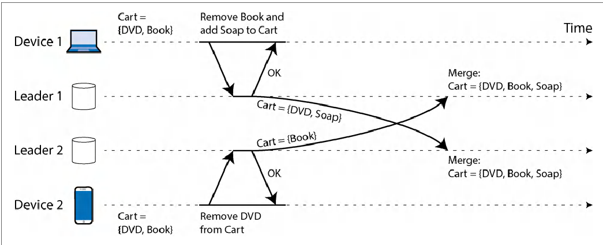

> 图 6-10。Amazon 购物车异常的一个示例：如果通过对集合取并集来合并冲突，已删除的商品可能重新出现。  

### 自动解决冲突  

对许多应用而言，处理冲突的最佳方式是使用一种算法，自动将并发写入合并为一致状态。自动解决冲突可以确保所有副本收敛到同一状态——也就是说，处理了同一组写入的所有副本都具有相同状态，而无论写入抵达的顺序如何。将最终一致性与收敛保证结合起来，称为强最终一致性 [46]。  

LWW 是冲突解决算法的一个简单例子。针对不同的数据类型，人们开发了更复杂的合并算法，目标是尽可能保留所有更新的预期效果，从而避免数据丢失：  

- 如果数据是文本（例如维基页面的标题或正文），我们可以检测一个版本到下一个版本之间插入或删除了哪些字符。合并结果随后会保留任一兄弟值中所做的所有插入和删除。如果用户在同一位置并发插入文本，则可以按确定性顺序排列它们，从而让所有节点得到相同的合并结果。  

- 如果数据是由若干项目组成的集合（可以像待办事项列表一样有序，也可以像购物车一样无序），我们可以像合并文本一样，通过跟踪插入和删除来合并它。为了避免图 6-10 中的购物车问题，算法会记录 Book 和 DVD 已被删除这一事实，因此合并结果为 Cart={Soap}。  

- 如果数据是一个表示计数器的整数，可以递增或递减（例如社交媒体帖子上的点赞数），合并算法可以判断每个兄弟值上发生了多少次递增和递减，并将它们正确相加，使结果既不会重复计数，也不会遗漏更新。  

- 如果数据是键值映射，我们可以通过对相应键下的值应用其他某种冲突解决算法，来合并对同一键的更新。对不同键的更新可以相互独立地处理。  

冲突解决的能力是有限的。例如，如果你想强制一个列表最多包含五个项目，而多个用户并发地向列表添加项目，导致总数超过五个，那么唯一的选择就是丢弃其中一些项目。尽管如此，自动解决冲突仍足以构建许多实用的应用。而且，如果一开始的需求就是构建协作式的离线优先或本地优先应用，那么冲突解决不可避免，自动解决通常是最佳方法。  

### 无冲突复制数据类型与操作转换  

自动解决冲突通常使用两类算法实现：无冲突复制数据类型（conflict-free replicated datatypes，CRDT）[46] 和操作转换（operational transformation，OT）[47]。二者具有不同的设计理念和性能特征，但都能够对上述所有数据类型执行自动合并。  

图 6-11 展示了 OT 和 CRDT 如何合并对一段文本的并发更新。假设有两个副本，二者都以文本 ice 开始。一个副本在开头添加字母 n，得到 nice；与此同时，另一个副本在末尾添加感叹号，得到 ice!。  

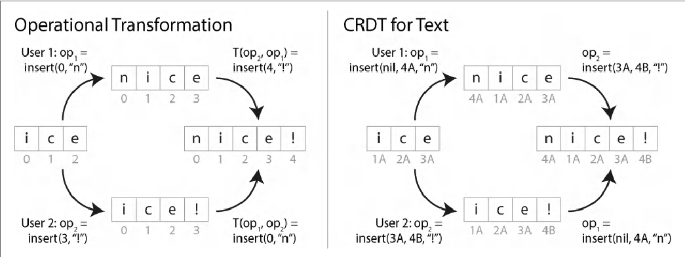

> 图 6-11。OT 和 CRDT 分别如何合并对字符串的两次并发插入。  

这两类算法以不同方式得到合并结果 nice!：  

#### OT  

我们记录字符插入或删除位置的索引：n 插入索引 0，! 插入索引 3。接下来，副本交换各自的操作。将 n 插入索引 0 的操作可以原样应用，但如果把将 ! 插入索引 3 的操作应用于状态 nice，就会得到错误的 nic!e。因此，我们需要转换每个操作的索引，把已经应用的并发操作考虑在内。在这个例子中，为了计入在更靠前的索引插入 n 的操作，! 的插入位置被转换为索引 4。  

#### CRDT  

大多数 CRDT 会为每个字符赋予唯一且不可变的 ID，并使用这些 ID 而不是索引来确定插入/删除的位置。例如，在图 6-11 中，我们为 i 分配 ID 1A，为 c 分配 ID 2A，依此类推。插入感叹号时，我们生成一个操作，其中包含新字符的 ID（4B），以及希望在其后插入新字符的现有字符的 ID（3A）。若要在字符串开头插入，则将前一个字符的 ID 设为 nil。同一位置的并发插入按照字符 ID 排序。这确保副本无需执行任何转换即可收敛。  

许多算法都基于这些思想的变体。列表和数组可以用类似方式支持，只需使用列表元素而不是字符；键值映射等其他数据类型也可以相当容易地加入。OT 和 CRDT 在性能和功能方面各有取舍，但可以在一种算法中结合二者的优势 [48]。  

OT 最常用于文本的实时协作编辑，例如 Google Docs [32]；而 CRDT 则用于 Redis Enterprise、Riak 和 Azure Cosmos DB 等分布式数据库 [49]。JSON 数据的同步引擎既可以用 CRDT（例如 Automerge 或 Yjs）实现，也可以用 OT（例如 ShareDB）实现。  

#### 冲突的类型  

有些冲突很明确。在图 6-9 的例子中，两次写入并发修改了同一条记录中的同一个字段，将其设为两个不同的值。这无疑是冲突。  

另一些冲突可能更难察觉。例如，考虑一个会议室预订系统：它跟踪哪个会议室在什么时间被哪一群人预订。这个系统预订会议时并不更新某个特定字段，而是为每次预订向数据库中插入一条新记录。应用需要确保每个会议室在任一时刻只能由一群人预订（即同一会议室的预订不得出现时间重叠）。在这种情况下，如果同一时间为同一会议室创建了两个预订，就可能发生冲突。
即使应用在允许用户预订之前检查了可用性，如果两个预订的时间足够接近，以至于二者在插入新记录之前都看到会议室尚未被预订，冲突仍然可能发生。  

这个问题没有现成的简短答案，但在后续章节中，我们将沿着一条路径逐步深入理解它。第 8 章将介绍更多冲突示例，第 13 章将讨论在复制系统中检测和解决冲突的可扩展方法。  

## 无主复制  

本章到目前为止讨论的复制方法——单主复制和多主复制——都基于这样一种思想：客户端向一个节点（主节点）发送写入请求，数据库系统负责将该写入复制到其他副本。主节点决定写入的处理顺序，从节点以相同顺序应用主节点的写入。  

一些数据存储系统采用了不同的方法：放弃主节点的概念，允许任何副本直接接受来自客户端的写入。一些最早的复制数据系统采用无主复制 [1, 50]，但在关系数据库占据主导地位的时代，这一思想基本被遗忘了。Amazon 在 2007 年将其用于内部 Dynamo 系统后，它再次成为一种流行的数据库架构 [45]。Riak、Cassandra 和 ScyllaDB 都是受 Dynamo 启发、采用无主复制模型的开源数据存储，因此这类数据库也称为 *Dynamo 风格*。  

> [!NOTE]
> 最初的 Dynamo 系统架构曾在一篇论文中描述 [45]，但从未在 Amazon 之外发布。Amazon 较新的云数据库 DynamoDB 名称与之相似，但架构完全不同：它使用基于 Multi-Paxos 共识算法的单主复制 [5, 51]。

在一些无主复制实现中，客户端直接将写入发送给多个副本；在另一些实现中，由协调节点代表客户端完成此操作。不过，与有主节点的数据库不同，该协调节点并不强制规定特定的写入顺序。正如我们将看到的，这种设计差异会对数据库的使用方式产生深远影响。  

### 节点宕机时写入数据库  

假设有一个包含三个副本的数据库，其中一个副本当前不可用——也许它正在重启以安装系统更新。在单主配置中，如果想继续处理写入，可能需要执行故障转移（参见第 204 页的“处理节点宕机”）。  

而在无主配置中，并不存在故障转移，因为所有副本地位相同，也没有主节点。图 6-12 展示了会发生什么。  

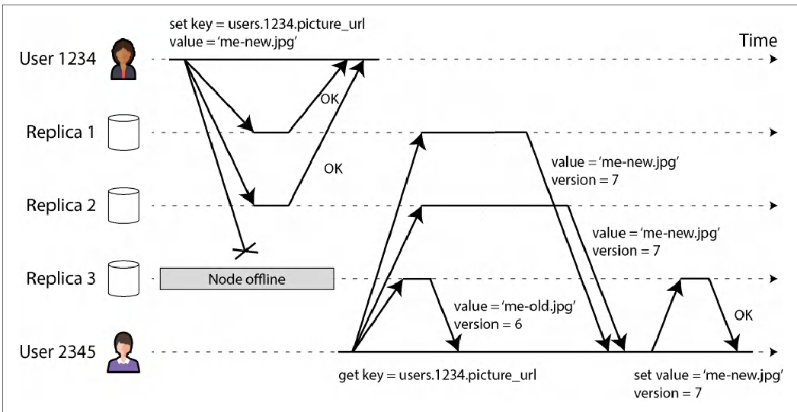

> 图 6-12。向多数副本写入、从多数副本读取，并将最新值转发给写入时不可用的副本。  

客户端（用户 1234）并行地将写入发送给所有三个副本，两个可用副本接受了写入，但不可用副本错过了它。假设三个副本中有两个确认写入就足够了。用户 1234 收到两个 OK 响应后，我们便认为写入成功。客户端直接忽略了其中一个副本错过写入这一事实。  

现在假设不可用的节点重新上线，客户端开始从它读取。该节点缺少停机期间发生的所有写入。因此，如果从该节点读取，响应中可能会得到陈旧（过时）的值。  

为了解决这个问题，客户端从数据库读取时，不会只向一个副本发送请求：读取请求也会并行发送给多个节点。客户端可能从不同节点得到不同的响应；例如，从一个节点得到最新值，从另一个节点得到陈旧值。  

为了让客户端判断哪些响应是最新的、哪些已经过时，每个写入的值都需要带有版本号或时间戳，这与第 224 页“最后写入胜出（丢弃并发写入）”中的情况类似。当客户端收到一次读取所返回的多个值时，它会采用时间戳最大的那个（即使只有一个副本返回该值，而其他几个副本都返回了较旧的值）。更多细节参见第 237 页的“检测并发写入”。  

### 补上错过的写入  

复制系统应确保最终将所有数据都复制到每个副本。不可用的节点重新上线后，如何补上它错过的写入？Dynamo 风格的数据存储使用了以下几种机制：  

#### 读修复  

当客户端并行地从多个节点读取时，它可以检测出任何陈旧响应。例如，在图 6-12 中，用户 2345 从副本 3 得到版本 6 的值，而从副本 1 和 2 得到版本 7 的值。客户端发现副本 3 的值已经过时，便将较新的值写回该副本。这种方法很适合经常被读取的值。  

#### 提示移交  

如果一个副本不可用，另一个副本可以代表它以提示的形式存储写入。当本应接收这些写入的副本恢复后，存储提示的副本会将它们发送给已恢复的副本，然后删除这些提示。即使某些值从未被读取、因而无法通过读修复处理，这种移交过程也有助于让副本恢复到最新状态。  

#### 反熵  

此外，一个后台进程会定期查找副本之间的数据差异，然后将任一缺失的数据从一个副本复制到另一个副本。与基于主节点的复制中的复制日志不同，这一反熵过程不会按照任何特定顺序复制写入，而且数据复制可能存在很长的延迟。  

### 使用法定人数进行读写  

在图 6-12 中，尽管写入只在三个副本中的两个上得到处理，我们仍认为写入成功。如果三个副本中只有一个接受了写入，会怎样？我们可以把这种做法推进到什么程度？  

如果我们知道，每次成功写入都保证存在于三个副本中的至少两个上，这意味着最多只有一个副本可能是陈旧的。因此，只要从至少两个副本读取，就能确定其中至少一个是最新的。即使第三个副本宕机或响应缓慢，读取仍然可以继续返回最新值。  

更一般地说，如果有 n 个副本，每次写入必须得到 w 个节点确认才算成功，而每次读取必须查询至少 r 个节点。（在我们的例子中，n= 3、w= 2、r= 2。）只要 w+ r> n，我们就可以预期读取到最新值，因为所读取的 r 个节点中至少有一个必定是最新的。遵循这些 r 和 w 取值的读写称为法定人数读写 [50]。可以把 r 和 w 看作让读取或写入有效所需的最少票数。  

在 Dynamo 风格的数据库中，参数 n、w 和 r 通常都可以配置。常见选择是让 n 为奇数（通常为 3 或 5），并设置 w= r= (n+ 1)/ 2（向上取整）。不过，也可以根据需要调整这些数值。例如，写入少而读取多的工作负载可能适合设置 w= n、r= 1。这样会让读取更快，但缺点是只要一个节点发生故障，所有数据库写入都会失败。  

> [!NOTE]
> 集群中的节点数可能多于 n，但任何给定的值都只存储在 n 个节点上。这样就可以对数据集进行分片，从而支持大到无法装入单个节点的数据集。我们将在第 7 章继续讨论分片。

法定人数条件 w+ r> n 使系统能够按如下方式容忍节点不可用：  

- 如果 w< n，即使有一个节点不可用，我们仍能处理写入。  

- 如果 r< n，即使有一个节点不可用，我们仍能处理读取。  

- 当 n= 3、w= 2、r= 2 时，可以容忍一个节点不可用，如图 6-12 所示。  

- 当 n= 5、w= 3、r= 3 时，可以容忍两个节点不可用。图 6-13 展示了这种情况。  

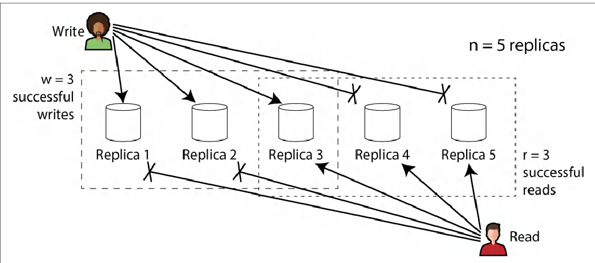

> 图 6-13。如果 $w + r > n$，那么读取的 $r$ 个副本中至少有一个必定见过最近一次成功写入。

通常，读写请求总是并行发送给全部 $n$ 个副本。参数 $w$ 和 $r$ 决定我们要等待多少个节点——也就是说，在我们认为读或写操作成功之前，$n$ 个节点中需要有多少个报告成功。

如果可用节点数少于所需的 $w$ 或 $r$，写或读操作就会返回错误。节点不可用可能有很多原因：节点停机（例如崩溃或断电）、执行操作时发生错误（例如磁盘已满而无法写入）、客户端与节点之间发生网络中断，或其他种种原因。我们只关心节点是否返回成功响应，无须区分不同类型的故障。

### 理解法定人数一致性的局限性

如果有 $n$ 个副本，并且选择的 $w$ 和 $r$ 满足 $w + r > n$，通常可以预期每次读取都会返回某个键最近写入的值。这是因为写入所涉及的节点集合与读取所涉及的节点集合必然有重叠。也就是说，在你读取的节点中，至少有一个节点保存着最新值（如图 6-13 所示）。

$r$ 和 $w$ 通常都选择节点数的多数（超过 $n/2$），因为这样既能保证 $w + r > n$，又能容忍最多 $n/2$（向下取整）个节点发生故障。但法定人数不一定非得是多数——关键只在于读操作与写操作所使用的节点集合至少有一个节点重叠。还可以采用其他法定人数分配方式，从而为分布式算法的设计提供一定灵活性 [52]。

也可以把 $w$ 和 $r$ 设为更小的数，使得 $w + r \leq n$（即不满足法定人数条件）。在这种情况下，读写请求仍会发送给 $n$ 个节点，但操作成功所需的成功响应数更少。

当 $w$ 和 $r$ 较小时，读到陈旧值的可能性会更高，因为读取所涉及的节点更可能不包含保存最新值的节点。好处是，这种配置可以降低延迟，对同步（阻塞式）复制尤其有益。这种设置还具有更高的可用性：如果发生网络中断，导致许多副本无法访问，你仍有更大机会继续处理读写。只有当可访问副本数分别低于 $w$ 或 $r$ 时，数据库才会变得无法写入或无法读取。

然而，即使 $w + r > n$，在某些边界情况下，一致性属性仍可能令人困惑。以下是一些情形：

- 如果保存新值的节点发生故障，而其数据又从保存旧值的副本恢复，那么存储新值的副本数可能降至 $w$ 以下，从而破坏法定人数条件。

- 在进行再平衡、将部分数据从一个节点移到另一个节点时（见第 7 章），各节点对于哪些节点应该保存某个特定值的 $n$ 个副本，可能有不一致的看法。这可能导致读法定人数与写法定人数不再重叠。

- 如果读操作与写操作并发，读操作可能看到、也可能看不到并发写入的值。尤其是，一次读取可能看到新值，而后续读取却看到旧值，我们将在第 411 页的“实现线性一致性系统”中看到这一点。

- 如果一次写入在部分副本上成功、在其他副本上失败（例如因为某些节点的磁盘已满），并且总体上成功写入的副本数少于 $w$，那么已成功副本上的写入并不会回滚。这意味着，即使一次写入被报告为失败，后续读取也可能返回、也可能不返回该次写入的值 [53]。

- 如果数据库使用实时时钟的时间戳来判断哪次写入更新（例如 Cassandra 和 ScyllaDB），那么当另一个时钟更快的节点写入同一个键时，某些写入可能会被悄然丢弃——这个问题此前已在第 224 页的“最后写入胜出（丢弃并发写入）”中见过。我们将在第 362 页的“依赖同步时钟”中更详细地讨论它。

- 如果两次写入并发发生，其中一次可能在某个副本上先处理，而另一次可能在另一个副本上先处理。这会造成冲突，类似于我们在多主复制中看到的情况（见第 222 页的“处理写入冲突”）。我们将在第 237 页的“检测并发写入”中继续讨论这个主题。

因此，虽然法定人数看似能保证读取返回最近写入的值，但实践中并没有这么简单。Dynamo 风格的数据库通常针对能够容忍最终一致性的用例进行优化。参数 $w$ 和 $r$ 允许你调整读到陈旧值的概率 [54]，但明智的做法是不要把它们当作绝对保证。

### 监控陈旧程度

从运维角度看，监控数据库是否返回最新结果非常重要。即使应用程序可以容忍陈旧读取，你也需要了解复制的健康状况。如果复制明显落后，系统应发出警报，以便你调查原因（例如网络问题或节点过载）。

对于基于主节点的复制，数据库通常会暴露复制延迟指标，你可以把这些指标送入监控系统。这是可行的，因为写入会以相同顺序应用到主节点和从节点，而且每个节点在复制日志中都有一个位置（即它在本地已应用的写入数）。用主节点的当前位置减去从节点的当前位置，就可以衡量复制延迟量。

然而，在采用无主复制的系统中，写入并没有固定的应用顺序，因此监控更加困难。副本为提示移交而存储的提示数量可以作为衡量系统健康状况的一个指标，但很难对它作出有实际意义的解读 [55]。最终一致性本来就是一种刻意模糊的保证，但为了可运维性，量化“最终”仍然十分重要。

## 单主复制与无主复制的性能对比

基于单个主节点的复制系统可以提供一些强一致性保证，而这些保证在无主系统中很难甚至不可能实现。然而，正如第 209 页的“复制延迟带来的问题”所述，在基于主节点的复制系统中，如果从异步更新的从节点读取，也可能返回陈旧值。

从主节点读取可以确保响应是最新的，但也会带来性能问题：

- 读取吞吐量受限于主节点处理请求的能力（相比之下，读取扩展会把读取分散到异步更新的副本上，但这些副本可能返回陈旧值）。

- 如果主节点发生故障，必须等待故障被检测出来并完成故障转移，才能继续处理请求。即使故障转移过程非常快，用户也会因为响应时间暂时增加而察觉；如果故障转移耗时很长，系统在此期间将不可用。

- 系统对主节点的性能问题非常敏感。如果主节点响应缓慢（例如由于过载或资源争用），增长的响应时间也会立即影响用户。

无主架构的一大优势是，它对这类问题更具韧性。由于不需要故障转移，而且请求本来就会并行发送给多个副本，因此一个副本变慢或不可用对响应时间的影响很小；客户端只需使用其他响应更快的副本所返回的结果。使用最快响应的做法称为*请求对冲*（request hedging），它可以显著降低尾部延迟 [56]。

无主系统的韧性从根本上源于它不区分正常情况和故障情况。这在处理灰色故障时尤其有用：节点并未完全停机，却处于性能退化状态，处理请求异常缓慢 [57]；节点单纯过载时也是如此（例如，如果某节点离线了一段时间，通过提示移交进行恢复可能带来大量额外负载）。基于主节点的系统必须判断情况是否糟糕到需要故障转移（而故障转移本身又可能造成进一步中断），而在无主系统中，这个问题根本不会出现。

尽管如此，无主系统也可能存在性能问题：

- 虽然系统不需要执行故障转移，但某个副本仍需检测另一个副本何时不可用，以便为该不可用副本错过的写入保存提示。当不可用副本恢复后，移交过程需要把这些提示发送给它。这会在系统已经承受压力时，给副本增加额外负载 [55]。

- 副本越多，法定人数规模越大，请求完成前需要等待的响应也越多。即使只等待最快的 $r$ 或 $w$ 个副本响应，而且请求是并行发出的，更大的 $r$ 或 $w$ 仍会提高遇到慢副本的概率，从而增加总体响应时间（见第 41 页的“响应时间指标的使用”）。实践中，法定人数规模很少超过七个节点中的四个或九个节点中的五个。

- 大规模网络中断若使客户端与大量副本断开连接，就可能无法形成法定人数。一些无主数据库提供配置选项，允许任何可访问的副本接受写入，即使它并不是该键通常使用的副本之一（Riak 和 Dynamo 称之为*宽松法定人数*（sloppy quorum）[45]；Cassandra 和 ScyllaDB 称之为*一致性级别 ANY*（consistency level ANY））。无法保证后续读取能看到写入的值，但根据应用程序的不同，这仍可能比写入失败更好。

多主复制对网络中断的韧性甚至可能强于无主复制，因为读写只需与一个主节点通信，而该主节点可以和客户端部署在同一地点。然而，由于一个主节点上的写入会异步传播到其他主节点，读取结果可能任意陈旧。法定人数读写提供了一种折中方案：既有良好的容错能力，又有很高的概率读到最新数据。

## 多区域运行

此前我们讨论过将跨区域复制作为多主复制的一种用例（见第 215 页的“多主复制”）。无主复制也适合多区域运行，因为它的设计能够容忍相互冲突的并发写入、网络中断和延迟尖峰。

在 Cassandra 和 ScyllaDB 中，想要执行多区域写入的客户端首先选择本地区域中的一个节点，称为*协调节点*（coordinator node），并把写入发送给该节点。协调节点把写入转发给本区域内的所有副本，以及其他每个区域中的一个副本；后者再将其转发给各自区域内的其他副本。这种优化避免了多次发起跨区域请求。

你可以从多种一致性级别中进行选择，它们决定请求成功需要多少个响应。例如，可以要求所有区域中的副本共同形成一个法定人数，要求每个区域分别形成法定人数，或者只要求客户端本地区域形成法定人数。本地法定人数无须等待发往其他区域的慢请求，但也更可能返回陈旧结果。

Riak 让客户端与数据库节点之间的所有通信都局限在一个区域内，因此 $n$ 表示一个区域内的副本数。数据库集群之间的跨区域复制在后台异步进行，其方式类似于多主复制。

## 检测并发写入

与多主复制一样，无主数据库允许对同一个键进行并发写入，从而产生需要解决的冲突。这些冲突可能在写入发生时被检测到，但并非总是如此：也可能稍后在读修复、提示移交或反熵过程中才被检测到。

问题在于，由于网络延迟变化和部分故障，事件抵达不同节点的顺序可能不同。例如，图 6-14 展示了两个客户端 A 和 B 同时写入三节点数据存储中的键 $X$：

- 节点 1 收到来自 A 的写入，但由于短暂中断，始终没有收到来自 B 的写入。

- 节点 2 先收到来自 A 的写入，然后收到来自 B 的写入。

- 节点 3 先收到来自 B 的写入，然后收到来自 A 的写入。

如果每个节点每当收到客户端的写入请求时，都只是覆盖该键的值，那么这些节点将永久处于不一致状态，正如图 6-14 中最后一次 get 请求所示：节点 2 认为 $X$ 的最终值是 $B$，而其他节点认为其值是 $A$。

为了达到最终一致，所有副本应收敛到同一个值。为此，可以使用此前在第 222 页“处理写入冲突”中讨论过的任何冲突解决机制，例如 LWW（Cassandra 和 ScyllaDB 使用）、人工解决或 CRDT（Riak 使用）。

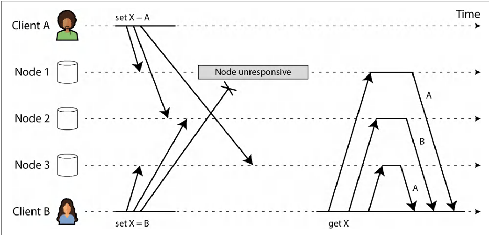

> 图 6-14。Dynamo 风格数据存储中的并发写入：不存在明确定义的顺序。

LWW 很容易实现。每次写入都会标记一个时间戳，时间戳较高的值总是覆盖时间戳较低的值。然而，时间戳无法告诉你两个值是否真的存在冲突（即它们是并发写入的），还是不存在冲突（即它们是先后写入的）。如果想显式解决冲突，系统就需要更加谨慎地检测并发写入。

### 先发生关系与并发

如何判断两个操作是否并发？为了建立直觉，我们来看一些例子：

- 在图 6-8 中，两次写入并不并发：A 的插入先发生于 B 的递增，因为 B 所递增的值正是 A 插入的值。换句话说，B 的操作建立在 A 的操作之上，因此 B 的操作必然发生得更晚。我们也说 B 因果依赖于 A。

- 另一方面，图 6-14 中的两次写入是并发的：每个客户端开始操作时，都不知道另一个客户端也正在对同一个键执行操作。因此，这两个操作之间不存在因果依赖。

如果 B 知道 A、依赖 A，或者以某种方式建立在 A 之上，那么操作 A 先发生于操作 B。一个操作是否先发生于另一个操作，是定义并发含义的关键。事实上，可以简单地说：如果两个操作中没有任何一个先发生于另一个，那么它们就是并发的 [58]。

因此，每当有两个操作 A 和 B 时，都有三种可能：A 先发生于 B，B 先发生于 A，或者 A 和 B 并发。我们需要一种算法来判断两个操作是否并发。如果一个操作先发生于另一个操作，那么后一个操作应覆盖前一个操作；但如果两个操作并发，就存在需要解决的冲突。

> [!NOTE]
> **并发、时间与相对论**
>
> 如果两个操作在“同一时间”发生，似乎就应该称它们并发——但事实上，它们是否真的在时间上重叠并不重要。由于分布式系统中的时钟问题，判断两件事是否恰好同时发生其实相当困难——我们将在第 9 章中更详细地讨论这个问题。
>
> 在定义并发时，精确时间无关紧要。只要两个操作都不知道对方，我们就称它们并发，不论它们发生的物理时间为何。人们有时会把这一原则与物理学中的狭义相对论联系起来 [58]；狭义相对论提出，信息的传播速度不能超过光速。因此，如果相隔一段距离发生的两个事件之间的时间间隔，短于光走过这段距离所需的时间，那么它们不可能相互影响。
>
> 在计算机系统中，即使光速原则上足以让一个操作影响另一个操作，两个操作也仍可能并发。例如，如果当时网络缓慢或中断，两个操作即使相隔一段时间发生，也仍然可能并发，因为网络问题使其中一个操作无法获知另一个操作。

### 捕获先发生关系

下面来看一种算法，用于判断两个操作是并发的，还是其中一个先发生于另一个。为简单起见，先从只有一个副本的数据库开始。弄清楚如何在单个副本上做到这一点后，我们就可以把这种方法推广到拥有多个副本的无主数据库。该算法的工作方式如下：

- 服务器为每个键维护一个版本号，每次写入该键时递增版本号，并将新版本号与写入的值一同存储。

- 当客户端读取一个键时，服务器会返回所有同级值——即所有尚未被覆盖的值——以及最新版本号。客户端在写入之前必须先读取该键。

- 当客户端写入一个键时，必须包含上一次读取所得的版本号，并且必须合并上一次读取时收到的所有值（例如，使用接受用户输入的 CRDT）。写入请求的响应也会返回所有同级值，这使我们可以将多次写入串联起来（就像第 222 页“处理写入冲突”中讨论的购物车示例一样）。

- 当服务器收到带有特定版本号的写入时，它可以覆盖版本号等于或低于该版本号的所有值（因为它知道这些值已经合并到新值中），但必须保留版本号更高的所有值（因为这些值与传入的写入并发）。

请注意，服务器可以通过查看版本号来判断两个操作是否并发。服务器不需要解释值本身，因此该值可以是任意数据结构。

当一次写入包含此前读取所得的版本号时，这就告诉了我们该写入基于哪个先前状态。如果执行写入时不包含版本号，那么它与所有其他写入都并发，因此不会覆盖任何内容——它只会作为后续读取返回的值之一。图 6-15 展示了这一算法的运行过程。

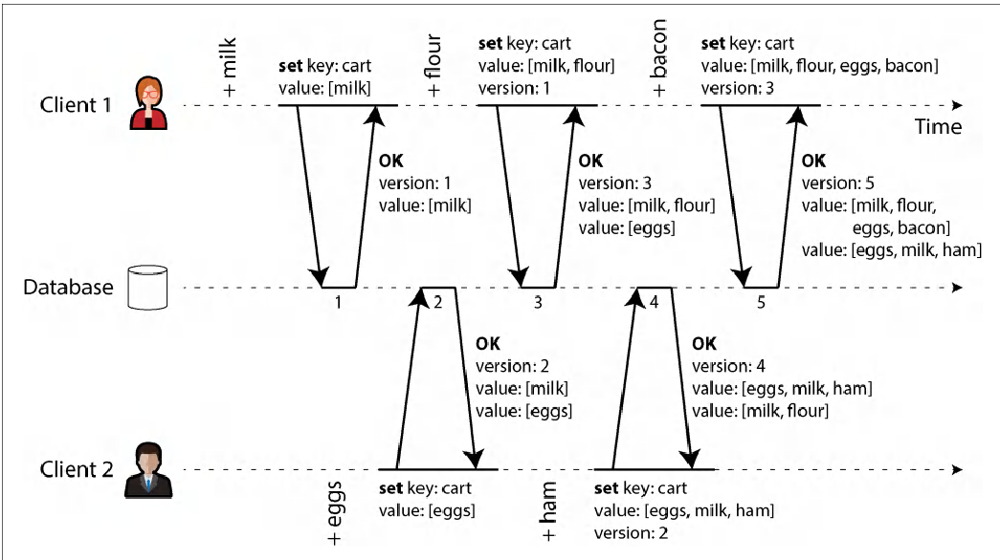

> 图 6-15。捕获两个客户端并发编辑购物车时的因果依赖。

在这个例子中，两个客户端正在并发地向同一个购物车添加商品。（如果你觉得这个例子太无聊，可以换成两个空中交通管制员同时向各自监控的空域扇区添加飞机。）购物车最初为空。两个客户端总共对数据库进行了五次写入：

1. 客户端 1 将牛奶加入购物车。这是对该键的第一次写入，因此服务器成功存储该值，并为其分配版本 1。服务器还将该值连同版本号一起回传给客户端。  

2. 客户端 2 将鸡蛋加入购物车，但并不知道客户端 1 同时加入了牛奶（客户端 2 以为购物车中只有自己加入的鸡蛋）。服务器为这次写入分配版本 2，并将鸡蛋和牛奶存储为两个独立的值（兄弟值）。然后，它将这两个值连同版本号 2 一起返回给客户端。  

3. 客户端 1 不知道客户端 2 的写入，想把面粉加入购物车，并认为加入后购物车的内容将是 [牛奶, 面粉]。它将这个值连同服务器之前给它的版本号（1）一起发送给服务器。服务器可以根据版本号判断，[牛奶, 面粉] 这次写入取代了先前的值 [牛奶]，但它与 [鸡蛋] 并发。因此，服务器为 [牛奶, 面粉] 分配版本 3，覆盖版本 1 的值 [牛奶]，但保留版本 2 的值 [鸡蛋]，并将剩余的两个值都返回给客户端。  

4. 与此同时，客户端 2 想把火腿加入购物车，但不知道客户端 1 刚刚加入了面粉。客户端 2 在服务器上一次响应中收到了 [牛奶] 和 [鸡蛋] 这两个值，因此客户端现在合并这两个值，再加入火腿，形成新值 [鸡蛋, 牛奶, 火腿]。它将这个值连同先前的版本号（2）一起发送给服务器。服务器发现版本 2 会覆盖 [鸡蛋]，但与 [牛奶, 面粉] 并发，因此剩余的两个值是版本 3 的 [牛奶, 面粉] 和版本 4 的 [鸡蛋, 牛奶, 火腿]。  

5. 最后，客户端 1 想加入培根。它之前从服务器收到版本 3 的 [牛奶, 面粉] 和 [鸡蛋]，因此将二者合并，加入培根，再把最终值 [牛奶, 面粉, 鸡蛋, 培根] 连同版本号 3 一起发送给服务器。这会覆盖 [牛奶, 面粉]（注意，[鸡蛋] 已在上一步中被覆盖），但与 [鸡蛋, 牛奶, 火腿] 并发，因此服务器保留这两个并发值。  

图 6-15 中各操作之间的数据流以图形方式展示在图 6-16 中。箭头表示哪些操作先于哪些其他操作发生，也就是说，后面的操作知道或依赖于前面的操作。在这个例子中，客户端始终无法与服务器上的数据完全同步，因为总有另一个操作正在并发进行。不过，值的旧版本最终确实会被覆盖，而且没有任何写入丢失。  

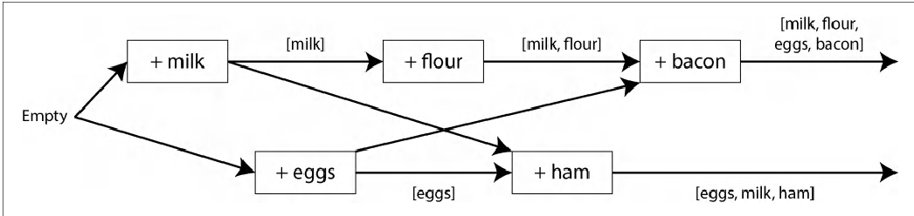

> 图 6-16。图 6-15 中因果依赖关系的示意图。  

#### 版本向量  

图 6-15 的示例只使用了一个副本。当存在多个副本但没有主节点时，算法需要如何改变？  

图 6-15 使用单个版本号来捕捉操作之间的依赖关系，但当多个副本并发接受写入时，这并不足够。相反，我们需要为每个副本的每个键分别使用一个版本号。每个副本在处理写入时递增自己的版本号，同时还会记录它从其他各个副本看到的版本号。这些信息表明哪些值应被覆盖，哪些值应作为兄弟值保留。  

来自所有副本的版本号集合称为版本向量 [59]。这个概念有几种变体正在使用，但其中最有意思的可能是点版本向量（dotted version vector）[60, 61]，Riak 2.0 使用的正是它 [62, 63]。这里不深入讨论其细节，但它的工作方式与我们在购物车示例中看到的非常相似。  

与图 6-15 中的版本号一样，从数据库副本读取值时，版本向量会由数据库副本发送给客户端；之后写入该值时，客户端需要将它发回数据库。（Riak 将版本向量编码为一个字符串，并称之为因果上下文（causal context）。）版本向量使数据库能够区分覆盖写入与并发写入。  

版本向量还确保了从一个副本读取、随后写回另一个副本是安全的。这样做可能产生兄弟值，但只要正确合并兄弟值，就不会丢失数据。  

> [!NOTE]
> **版本向量与向量时钟**
>
> 版本向量有时也称为向量时钟，尽管二者并不完全相同。区别很微妙 [61, 64, 65]。详情请参阅参考文献；简而言之，在比较副本状态时，版本向量才是应当使用的数据结构。

<a id="chapter-6-summary"></a>

## 小结  

本章探讨了复制问题。复制可以服务于多种目的：  

高可用性  

即使一台机器（或多台机器、一个可用区，甚至整个区域）停机，也能让系统继续运行  

持久性  

即使整台机器（甚至整个区域）永久发生故障，也能确保数据不会丢失  

离线运行  

让应用程序即使在网络中断时也能继续工作  

延迟  

将数据放在地理位置靠近用户的地方，使用户能更快地与其交互  

可扩展性  

通过在副本上执行读取，处理超出单台机器能力的更大读取量  

尽管复制的概念很简单——在多台机器上保存同一份数据的副本——但事实证明，复制是一个极其棘手的问题。它要求我们仔细思考并发、所有可能出错的情况，以及如何应对这些故障造成的后果。至少，我们需要处理节点不可用和网络中断（这还没有考虑那些更隐蔽的故障，例如软件缺陷或硬件错误导致的无声数据损坏）。  

我们讨论了三种主要的复制方式：  

单主复制  

客户端将所有写入发送到单个节点（主节点），该节点再将数据变更事件流发送到其他副本（从节点）。读取可以在任何副本上执行，但从从节点读取的数据可能是陈旧的。  

多主复制  

客户端将每次写入发送到多个主节点之一，其中任何一个都可以接受写入。主节点相互发送数据变更事件流，也将其发送给所有从节点。  

无主复制  

客户端将每次写入发送到多个节点，并并行地从多个节点读取，以检测并纠正数据陈旧的节点。  

每种方式都有优点和缺点。单主复制很受欢迎，因为它相当容易理解，并能提供强一致性。面对故障节点、网络中断和延迟峰值时，多主复制和无主复制可能更为健壮，但代价是需要解决冲突，并且只能提供较弱的一致性保证。  

复制可以是同步的，也可以是异步的；发生故障时，这会对系统行为产生深远影响。尽管系统平稳运行时异步复制可能很快，但弄清楚复制延迟增大和服务器故障时会发生什么至关重要。如果主节点发生故障，而你将一个异步更新的从节点提升为新的主节点，最近提交的数据可能会丢失。  

我们考察了复制延迟可能引发的一些奇怪现象，并讨论了几种一致性模型，它们有助于决定应用程序在复制延迟下应有的行为：  

写后读一致性  

用户应该始终能看到自己提交的数据。  

单调读  

用户看到某一时刻的数据之后，不应在稍后又看到更早时刻的数据。  

一致前缀读  

用户看到的数据状态在因果关系上应该合理——例如，按照正确的顺序看到一个问题及其回复。  

最后，我们讨论了多主复制和无主复制如何确保所有副本最终收敛到一致状态：使用版本向量或类似算法检测哪些写入是并发的，并使用 CRDT 等冲突解决算法合并并发写入的值。也可以使用 LWW 和人工冲突解决。  

本章一直假设每个副本都存储整个数据库的完整副本，这对于大型数据集并不现实。下一章将探讨*分片*，它使每台机器只需存储一部分数据。  

## 参考文献  

[1] B. G. Lindsay, P. G. Selinger, C. Galtieri, J. N. Gray, R. A. Lorie, T. G. Price, F. Putzolu, I. L. Traiger, and B. W. Wade. “分布式数据库札记。” IBM Research，研究报告 RJ2571(33471)，1979 年 7 月。存档于 perma.cc/EPZ3-MHDD  

[2] Kenny Gryp. “MySQL 术语更新。” *dev.mysql.com*，2020 年 7 月。存档于 *perma.cc/S62G-6RJ2*  

[3] Oracle Corporation. “Oracle (Active) Data Guard 19c：实时数据保护与可用性。”白皮书，oracle.com，2019 年 3 月。存档于 perma.cc/P5ST-RPKE  

[4] Microsoft. “什么是 Always On 可用性组？” learn.microsoft.com，2024 年 9 月。存档于 perma.cc/ABH6-3MXF  

[5] Mostafa Elhemali, Niall Gallagher, Nicholas Gordon, Joseph Idziorek, Richard Krog, Colin Lazier, Erben Mo, Akhilesh Mritunjai, Somu Perianayagam, Tim Rath, Swami Sivasubramanian, James Christopher Sorenson III, Sroaj Sosothikul, Doug Terry, and Akshat Vig. “Amazon DynamoDB：可扩展、性能可预测的全托管 NoSQL 数据库服务。”发表于 USENIX 年度技术会议（ATC），2022 年 7 月。  

[6] Rebecca Taft, Irfan Sharif, Andrei Matei, Nathan VanBenschoten, Jordan Lewis, Tobias Grieger, Kai Niemi, Andy Woods, Anne Birzin, Raphael Poss, Paul Bardea, Amruta Ranade, Ben Darnell, Bram Gruneir, Justin Jaffray, Lucy Zhang, and Peter Mattis. “CockroachDB：弹性的地理分布式 SQL 数据库。”发表于 ACM SIGMOD 数据管理国际会议（SIGMOD），2020 年 6 月。doi:10.1145/3318464.3386134  

[7] Dongxu Huang, Qi Liu, Qiu Cui, Zhuhe Fang, Xiaoyu Ma, Fei Xu, Li Shen, Liu Tang, Yuxing Zhou, Menglong Huang, Wan Wei, Cong Liu, Jian Zhang, Jianjun Li, Xuelian Wu, Lingyu Song, Ruoxi Sun, Shuaipeng Yu, Lei Zhao, Nicholas Cameron, Liquan Pei, and Xin Tang. “TiDB：基于 Raft 的 HTAP 数据库。”《VLDB Endowment 论文集》，第 13 卷第 12 期，第 3072–3084 页，2020 年 8 月。doi:10.14778/3415478.3415535  

[8] Mallory Knodel and Niels ten Oever. “互联网草案与 RFC 中的术语、权力和包容性语言。”IETF 互联网草案，2023 年 8 月。存档于 perma.cc/5ZY9-725E  

[9] Buck Hodges. “事后分析：VSTS 2018 年 9 月 4 日故障。” devblogs.microsoft.com，2018 年 9 月。存档于 perma.cc/ZF5R-DYZS  

[10] Gunnar Morling. “使用 S3 条件写入进行主节点选举。” www.morling.dev，2024 年 8 月。存档于 perma.cc/7V2N-J78Y  

[11] Vignesh Chandramohan, Rohan Desai, and Chris Riccomini. “SlateDB 清单设计。” github.com，2024 年 5 月。存档于 perma.cc/8EUY-P32Z  

[12] Stas Kelvich. “为什么 Neon 使用 Paxos 而不是 Raft，两者有何区别？” *neon.tech*，2022 年 8 月。存档于 *perma.cc/SEZ4-2GXU*  

[13] Dimitri Fontaine. “pg_auto_failover 项目简介。” tapoueh.org，2021 年 11 月。存档于 perma.cc/3WH5-6BAF  

[14] Jesse Newland. “GitHub 本周可用性情况。” *github.blog*，2012 年 9 月。存档于 *perma.cc/3YRF-FTFJ*  

[15] Mark Imbriaco. “上周六的停机事件。” *github.blog*，2012 年 12 月。存档于 *perma.cc/M7X5-E8SQ*  

[16] John Hugg. “全力采用确定性：提升分布式系统的性能与可测试性。”发表于 Strange Loop，2015 年 9 月。  

[17] Hironobu Suzuki. “PostgreSQL 内部原理。” *interdb.jp*，2017 年。存档于 *archive.org*  

[18] Amit Kapila. “PostgreSQL 的 WAL 内部原理。”发表于 PostgreSQL 大会（PGCon），2012 年 5 月。存档于 perma.cc/6225-3SUX  

[19] Amit Kapila. “逻辑复制的演进。” *amitkapila16.blogspot.com*，2023 年 9 月。存档于 *perma.cc/F9VX-JLER*  

[20] Aru Petchimuthu. “升级 Amazon RDS for PostgreSQL 或 Amazon Aurora PostgreSQL 数据库，第 2 部分：使用 pglogical 扩展。” aws.amazon.com，2021 年 8 月。存档于 perma.cc/RXT8-FS2T  

[21] Yogeshwer Sharma, Philippe Ajoux, Petchean Ang, David Callies, Abhishek Choudhary, Laurent Demailly, Thomas Fersch, Liat Atsmon Guz, Andrzej Kotulski, Sachin Kulkarni, Sanjeev Kumar, Harry Li, Jun Li, Evgeniy Makeev, Kowshik Prakasam, Robbert van Renesse, Sabyasachi Roy, Pratyush Seth, Yee Jiun Song, Benjamin Wester, Kaushik Veeraraghavan, and Peter Xie. “Wormhole：为地理复制互联网服务提供可靠的发布—订阅支持。”发表于第 12 届 USENIX 网络系统设计与实现研讨会（NSDI），2015 年 5 月。  

[22] Douglas B. Terry. “用棒球解释复制数据的一致性。” Microsoft Research，技术报告 MSR-TR-2011-137，2011 年 10 月。存档于 perma.cc/F4KZ-AR38  

[23] Douglas B. Terry, Alan J. Demers, Karin Petersen, Mike J. Spreitzer, Marvin M. Theher, and Brent B. Welch. “弱一致性复制数据的会话保证。”发表于第 3 届并行与分布式信息系统国际会议（PDIS），1994 年 9 月。doi:10.1109/PDIS.1994.331722  

[24] Werner Vogels. “最终一致性。” ACM Queue，第 6 卷第 6 期，第 14–19 页，2008 年 10 月。doi:10.1145/1466443.1466448  

[25] Simon Willison. 对“My thoughts about Fly.io (so far) and other newish technology I'm getting into”的回复。news.ycombinator.com，2022 年 5 月。  

[26] Nithin Tharakan. “扩展 Bitbucket 的数据库。” *atlassian.com*，2020 年 10 月。存档于 *perma.cc/JAB7-9FGX*  

[27] Terry Pratchett. *Reaper Man: A Discworld Novel*. Victor Gollancz，1991 年。ISBN: 9780575049796  

[28] Peter Bailis、Alan Fekete、Michael J. Franklin、Ali Ghodsi、Joseph M. Hellerstein 和 Ion Stoica。《数据库系统中的协调规避》。*VLDB Endowment 论文集*，第 8 卷，第 3 期，第 185–196 页，2014 年 11 月。doi:10.14778/2735508.2735509  

[29] Yaser Raja 和 Peter Celentano。《使用 pglogical 实现 PostgreSQL 双向复制》。aws.amazon.com，2022 年 1 月。归档于 perma.cc/BUQ2-5QWN  

[30] Robert Hodges。《如果你*必须*部署多主复制，请先阅读本文》。scale-out-blog.blogspot.com，2012 年 4 月。归档于 perma.cc/C2JN-F6Y8  

[31] Lars Hofhansl。《HBASE-7709：主/主复制中可能出现无限循环》。issues.apache.org，2013 年 1 月。归档于 perma.cc/24G2-8NLC  

[32] John Day-Richter。《新版 Google 文档有何不同：让协作更快捷》。drive.googleblog.com，2010 年 9 月。归档于 perma.cc/5TL8-TSJ2  

[33] Evan Wallace。《Figma 的多路复用器技术如何工作》。figma.com，2019 年 10 月。归档于 perma.cc/L49H-LY4D  

[34] Tuomas Artman。《扩展 Linear 同步引擎》。*linear.app*，2023 年 6 月。  

[35] Amr Saafan。《为什么同步引擎可能是 Web 应用的未来》。*nilebits.com*，2024 年 9 月。归档于 *perma.cc/5N73-5M3V*  

[36] Isaac Hagoel。《同步引擎是 Web 应用的未来吗？》*dev.to*，2024 年 7 月。归档于 *perma.cc/R9HF-BKKL*  

[37] Sujay Jayakar。《同步全景图》。stack.convex.dev，2024 年 10 月。归档于 perma.cc/82R3-H42A  

[38] Alex Feyerke。《设计离线优先的 Web 应用》。*alistapart.com*，2013 年 12 月。归档于 *perma.cc/WH7R-S2DS*  

[39] Martin Kleppmann、Adam Wiggins、Peter van Hardenberg 和 Mark McGranaghan。《本地优先软件：即使有云，你仍拥有自己的数据》。发表于 ACM SIGPLAN 编程新思想、新范式与反思国际研讨会（Onward!），2019 年 10 月。doi:10.1145/3359591.3359737  

[40] Martin Kleppmann。《本地优先的过去、现在与未来》。发表于 *Local-First Conference*，2024 年 5 月。  

[41] Conrad Hofmeyr。《API 调用之于同步引擎，犹如 jQuery 之于 React》。*power-sync.com*，2024 年 11 月。归档于 *perma.cc/2FP9-7WJJ*  

[42] Peter van Hardenberg 和 Martin Kleppmann。《PushPin：迈向生产级点对点协作》。发表于第 7 届分布式数据一致性原理与实践研讨会（PaPoC），2020 年 4 月。doi:10.1145/3380787.3393683  

[43] Leonard Kawell, Jr.、Steven Beckhardt、Timothy Halvorsen、Raymond Ozzie 和 Irene Greif。《群组通信系统中的复制式文档管理》。发表于 ACM 计算机支持的协同工作会议（CSCW），1988 年 9 月。doi:10.1145/62266.1024798  

[44] Ricky Pusch。《格斗游戏如何使用基于延迟和回滚的网络代码》。words.infil.net 和 arstechnica.com，2019 年 10 月。归档于 perma.cc/DE7W-RDJ8  

[45] Giuseppe DeCandia、Deniz Hastorun、Madan Jampani、Gunavardhan Kakulapati、Avinash Lakshman、Alex Pilchin、Swaminathan Sivasubramanian、Peter Vosshall 和 Werner Vogels。《Dynamo：亚马逊的高可用键值存储》。发表于第 21 届 ACM 操作系统原理研讨会（SOSP），2007 年 10 月。doi:10.1145/1323293.1294281  

[46] Marc Shapiro、Nuno Preguiça、Carlos Baquero 和 Marek Zawirski。《无冲突复制数据类型》。发表于第 13 届分布式系统稳定性、安全与保障国际研讨会（SSS），2011 年 10 月。doi:10.1007/978-3-642-24550-3_29  

[47] Chengzheng Sun 和 Clarence Ellis。《实时群组编辑器中的操作转换：问题、算法与成就》。发表于 ACM 计算机支持的协同工作会议（CSCW），1998 年 11 月。doi:10.1145/289444.289469  

[48] Joseph Gentle 和 Martin Kleppmann。《使用 Egalwalker 进行协同文本编辑：更好、更快、更小》。发表于第 20 届欧洲计算机系统会议（EuroSys），2025 年 3 月。doi:10.1145/3689031.3696076  

[49] Dharma Shukla。《Azure Cosmos DB：拓展全球分布式数据库的前沿》。*azure.microsoft.com*，2018 年 9 月。归档于 *perma.cc/UT3B-HH6R*  

[50] David K. Gifford。《复制数据的加权投票》。发表于第 7 届 ACM 操作系统原理研讨会（SOSP），1979 年 12 月。doi:10.1145/800215.806583  

[51] Marc Brooker。《Dynamo、DynamoDB 与 Aurora DSQL》。brooker.co.za，2025 年 8 月。归档于 perma.cc/XG3C-ALDQ  

[52] Heidi Howard、Dahlia Malkhi 和 Alexander Spiegelman。《灵活 Paxos：重新审视法定人数交集》。发表于第 20 届分布式系统原理国际会议（OPODIS），2016 年 12 月。doi:10.4230/LIPIcs.OPODIS.2016.25  

[53] Joseph Blomstedt。《为 Riak 带来一致性》。发表于 RICON West，2012 年 10 月。归档于 archive.org  

[54] Peter Bailis、Shivaram Venkataraman、Michael J. Franklin、Joseph M. Hellerstein 和 Ion Stoica。《使用 PBS 量化最终一致性》。*The VLDB Journal*，第 23 卷，第 2 期，第 279–302 页，2014 年 4 月。doi:10.1007/s00778-013-0330-1  

[55] Colin Breck。《用于服务器复制与同步的无共享架构》。blog.colinbreck.com，2019 年 12 月。归档于 perma.cc/48P3-J6CJ  

[56] Jeffrey Dean 和 Luiz André Barroso。《规模化系统中的长尾延迟》。*Communications of the ACM*，第 56 卷，第 2 期，第 74–80 页，2013 年 2 月。*doi:10.1145/2408776.2408794*  

[57] Peng Huang、Chuanxiong Guo、Lidong Zhou、Jacob R. Lorch、Yingnong Dang、Murali Chintalapati 和 Randolph Yao。《灰色故障：云规模系统的阿喀琉斯之踵》。发表于第 16 届操作系统热点研讨会（HotOS），2017 年 5 月。doi:10.1145/3102980.3103005  

[58] Leslie Lamport。《分布式系统中的时间、时钟和事件排序》。*Communications of the ACM*，第 21 卷，第 7 期，第 558–565 页，1978 年 7 月。doi:10.1145/359545.359563  

[59] D. Stott Parker Jr.、Gerald J. Popek、Gerard Rudisin、Allen Stoughton、Bruce J. Walker、Evelyn Walton、Johanna M. Chow、David Edwards、Stephen Kiser 和 Charles Kline。《分布式系统中相互不一致的检测》。*IEEE Transactions on Software Engineering*，第 SE-9 卷，第 3 期，第 240–247 页，1983 年 5 月。doi:10.1109/TSE.1983.236733  

[60] Nuno Preguiça、Carlos Baquero、Paulo Sérgio Almeida、Victor Fonte 和 Ricardo Gonçalves。《点式版本向量：用于乐观复制的逻辑时钟》。arXiv:1011.5808，2010 年 11 月。  

[61] Giridhar Manepalli。《时钟与因果关系——分布式系统中的事件排序》。*exhypothesi.com*，2022 年 11 月。归档于 *perma.cc/8REU-KVLQ*  

[62] Sean Cribbs。《Riak 时间简史》。发表于 RICON，2014 年 10 月。
归档于 perma.cc/7U9P-6JFX  

[63] Russell Brown。《重访向量时钟，第 2 部分：点式版本向量》。*riak.com*，2015 年 11 月。归档于 *perma.cc/96QP-W98R*  

[64] Carlos Baquero。《版本向量不是向量时钟》。haslab.wordpress.com，2011 年 7 月。归档于 perma.cc/7PNU-4AMG  

[65] Reinhard Schwarz 和 Friedemann Mattern。《检测分布式计算中的因果关系：寻找圣杯》。*Distributed Computing*，第 7 卷，第 3 期，第 149–174 页，1994 年 3 月。doi:10.1007/BF02277859  

# 分片

显然，我们必须摆脱顺序式思维，不能限制计算机。我们必须陈述定义，并为优先级和数据描述提供支持。我们必须陈述关系，而不是过程。  

——Grace Murray Hopper，《未来的管理与计算机》（1962）  

分布式数据库通常以两种方式将数据分布到各个节点：  

- 它在多个节点上存储同一份数据的副本。这就是复制，我们已在第 6 章讨论过。  

- 如果数据量太大，或者写入吞吐量太高，以至于单个节点无法处理，它就会把数据拆分成较小的分片或分区，并将不同的分片存储在不同的节点上。我们将在本章讨论分片。  

通常，分片的定义方式会确保每一项数据（每条记录、每一行或每个文档）恰好属于一个分片。实现这一点有多种方式，我们将在本章深入讨论。实际上，每个分片本身就是一个小型数据库，不过有些数据库系统支持同时涉及多个分片的操作。  

分片通常与复制结合使用，因此每个分片的副本会存储在多个节点上。这意味着，尽管每条记录恰好属于一个分片，但为了容错，它仍可能存储在多个不同的节点上。  

一个节点可以存储多个分片。例如，如果采用单主复制模型，分片与复制的组合可以如图 7-1 所示。每个分片的主节点被分配到一个节点，而它的从节点则被分配到其他节点。每个节点都可能是某些分片的主节点，同时也是其他分片的从节点，但每个分片仍然只有一个主节点。  

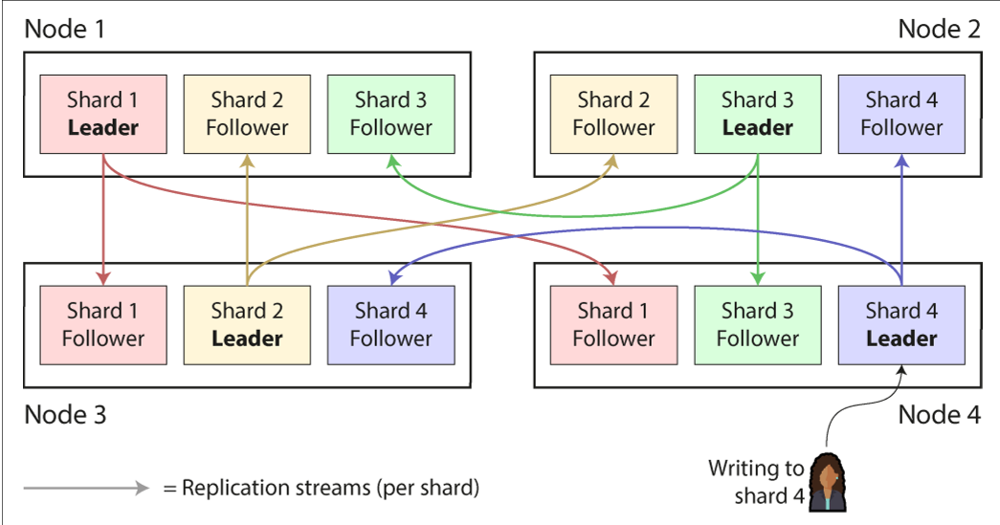

> 图 7-1。结合复制与分片：每个节点充当某些分片的主节点，并充当其他分片的从节点。  

> [!NOTE]
> **分片与分区**
>
> 本章所称的*分片*，会因所使用的软件不同而有许多名称。在 Kafka 中称为 *partition*，在 CockroachDB 中称为 *range*，在 HBase 和 TiDB 中称为 *region*，在 Couchbase 中称为 *vBucket*，在 Riak 中称为 *vnode*，在 Cassandra 中称为 *token-range*，而在 Bigtable、YugabyteDB 和 ScyllaDB 中称为 *tablet*，这里只列举了其中一部分。  
>
> 一些数据库将分区和分片视为两个不同的概念。例如，在 PostgreSQL 中，分区是将一张大表拆分成存储在同一台机器上的多个文件（这样做有若干优点，比如能够非常快速地删除整个分区），而分片则将数据集拆分到多台机器上 [1, 2]。在许多其他系统中，分区只是分片的另一个说法。  
>
> 虽然“分区”一词颇为直观，但“分片”这个术语或许令人意外。有一种说法认为，该术语源自在线角色扮演游戏《Ultima Online》：游戏中一块魔法水晶破碎成许多碎片，每块碎片都映射出游戏世界的一个副本 [3]。于是，shard 一词开始表示一组并行游戏服务器中的一个，后来又被沿用到数据库领域。另一种说法是，它最初是 System for Highly Available Replicated Data 的首字母缩写——据称这是一个 20 世纪 80 年代的数据库，但其详情已湮没在历史中。  
>
> 顺便一提，分区与*网络分区*（网络分裂，netsplit）毫无关系；后者是节点间网络中的一种故障。我们将在第 9 章讨论此类故障。  

第 6 章关于数据库复制的所有内容同样适用于分片的复制。由于分片方案的选择与复制方案的选择大体相互独立，为了简化讨论，本章将忽略复制。  

## 分片的优缺点  

对数据库进行分片的首要原因是可扩展性。如果数据量或写入吞吐量已经大到单个节点无法处理，分片就是一种解决方案，因为它可以将数据和写入负载分散到多个节点上。（如果问题在于读取吞吐量，则未必需要分片——可以使用第 6 章讨论的读取扩展。）  

事实上，分片是实现水平扩展（横向扩展架构）的主要工具之一，正如第 51 页“共享内存、共享磁盘与无共享架构”所述：系统不是通过换用更大的机器来提高容量，而是通过增加更多（较小的）机器来扩展。如果能划分工作负载，使每个分片承担大致相等的份额，就可以将这些分片分配给不同的机器，并行处理其中的数据和查询。  

复制在小规模和大规模场景下都很有用，因为它能实现容错和离线运行；相比之下，分片是一种重量级解决方案，主要适用于大规模场景。如果数据量和写入吞吐量还在单台机器的处理能力范围内（如今单台机器的能力已经很强！），通常最好避免分片，坚持使用单分片数据库。  

之所以提出这一建议，是因为分片会增加复杂性。通常，你必须选择一个分区键，以决定哪些记录放入哪个分片；具有相同分区键的所有记录都会放入同一个分片 [4]。这一选择很重要，因为如果知道记录位于哪个分片，访问它就很快；但如果不知道，就必须低效地搜索所有分片。分片方案也很难更改。  

分片通常很适合键值数据，因为可以轻松按键分片；但对关系型数据而言则更困难，因为你可能希望通过二级索引进行搜索，或连接可能分布在不同分片上的记录。我们将在第 268 页“分片与二级索引”中进一步讨论这一点。  

分片的另一个问题是，一次写入可能需要更新多个分片中的相关记录。单节点上的事务相当常见，但要确保多个分片之间的一致性，则需要分布式事务。正如第 8 章将要看到的，一些数据库支持分布式事务，但其速度通常远慢于单节点事务，并且可能成为整个系统的瓶颈。  

有些系统甚至在单台机器上也使用分片，通常是每个 CPU 核心运行一个单线程进程，以利用 CPU 的并行能力，或利用非统一内存访问（NUMA）架构——在这种架构中，某些内存组距离某个 CPU 比距离其他 CPU 更近 [5]。例如，Redis、VoltDB 和 FoundationDB 都采用每核一个进程的方式，并依靠分片将负载分散到同一台机器的各个 CPU 核心上 [6]。  

## 面向多租户的分片  

软件即服务（SaaS）产品和云服务通常是*多租户*的，其中每个租户都是一个客户。同一个租户中可能有多个用户登录，但每个租户都拥有独立自足的数据集，与其他租户的数据集相互分离。例如，在电子邮件营销服务中，每家注册使用该服务的企业通常都是一个独立租户，因为一家企业的新闻邮件订阅、投递数据等与其他企业的数据相互分离。  

有时会用分片来实现多租户系统。可以为每个租户分配一个独立分片，也可以将多个小租户组合到一个较大的分片中。这些分片可以是物理上独立的数据库（第 125 页“嵌入式存储引擎”中曾提及），也可以是一个更大的逻辑数据库中可独立管理的部分 [7]。将分片用于多租户有若干优点：  

### 资源隔离  

如果某个租户执行计算开销很大的操作，而其他租户运行在不同分片上，那么其他租户的性能受到影响的可能性就会降低。  

### 权限隔离  

如果访问控制逻辑中存在错误，而不同租户的数据集在物理上彼此分开存储，那么意外让某个租户访问另一个租户数据的可能性就会降低。  

### 基于单元的架构  

分片不仅可以应用于数据存储层，也可以应用于运行应用程序代码的服务。在*基于单元的架构*中，面向特定一组租户的服务和存储被组合成一个独立自足的*单元*，不同单元的设置使它们基本可以彼此独立运行。这种方法提供了*故障隔离*：一个单元中的故障会被限制在该单元内，其他单元中的租户不会受到影响 [8]。  

### 按租户备份与恢复  

分别备份每个租户的分片，可以在不影响其他租户的情况下从备份中恢复某个租户的状态；如果该租户意外删除或覆盖了重要数据，这会很有用 [9]。  

### 法规合规  

GDPR 和 CCPA 等数据隐私法规赋予个人访问并请求删除企业所存储的其个人信息的权利。如果每个人的数据都存储在独立的分片中，这就可以转化为对其分片执行简单的数据导出和删除操作 [10]。  

### 数据驻留  

如果为了遵守数据驻留法律，某个特定租户的数据需要存储在特定司法管辖区，具备区域感知能力的数据库可以让你将该租户的分片分配到特定区域。  

### 渐进式模式发布  

模式迁移（之前在第 80 页“文档模型中的模式灵活性”中讨论过）可以逐步发布，每次只面向一个租户。这样可以降低风险，因为你可以在问题影响所有租户之前发现它们，但要以事务方式完成这一过程可能很困难 [11]。  

使用分片实现多租户的主要挑战如下：  

- 这种做法假设每个租户都足够小，能够容纳在单个节点上。如果事实并非如此，并且有某个租户的数据量大到一台机器无法容纳，就还需要在该租户内部进一步分片，这又回到了为实现可扩展性而分片的主题 [12]。  

- 如果有许多小租户，为每个租户创建独立分片可能会带来过大的开销。你可以将多个小租户组合到一个更大的分片中，但随之而来的问题是：随着租户增长，如何将其从一个分片迁移到另一个分片。  

- 如果将来需要支持跨多个租户关联数据的功能，那么在必须跨多个分片连接数据的情况下，这些功能会更难实现。  

## 键值数据的分片  

假设你有大量数据，并且想要对其分片。该如何决定哪些记录存储在哪些节点上？  

分片的目标是将数据和查询负载均匀地分散到各节点上。如果每个节点承担公平的份额，那么理论上，10 个节点应当能够处理单个节点 10 倍的数据量，以及 10 倍的读写吞吐量（忽略复制）。如果添加或移除节点，你还希望能够重新平衡负载，使其在新的节点数量下均匀分布。  

如果分片不均衡，导致某些分片拥有比其他分片更多的数据或查询，我们称之为倾斜。倾斜会大幅削弱分片的效果。在极端情况下，所有负载都可能落在一个分片上，于是 10 个节点中有 9 个处于空闲状态，而瓶颈就是唯一繁忙的节点。负载高得不成比例的分片称为热分片或热点。如果某个键的负载特别高（例如社交网络中的名人），我们称之为热键。  

要将数据集拆分成分片，需要一种算法：它以记录的分区键作为输入，并告诉我们该记录位于哪个分片。在键值存储中，分区键通常就是键或键的第一部分。在关系模型中，分区键可能是表中的某一列（不一定是主键）。该算法必须适合重新平衡，以便缓解热点。  

### 按键范围分片  

一种分片方式是为每个分片分配一段连续的分区键范围（从最小值到最大值），就像纸质百科全书的分册一样，如图 7-2 所示。在这个例子中，每个条目的分区键是其标题。如果想查找某个特定标题的条目，只需找出键范围包含该标题的分册，就能轻松确定哪个分片包含该条目，进而从书架上取下正确的那一册。  

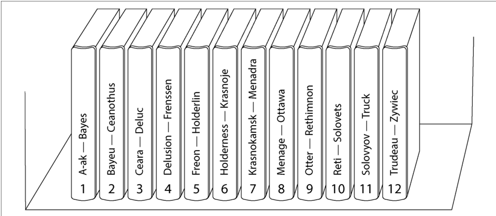

> 图 7-2。一套纸质百科全书按键范围进行分片。  

键范围不一定等距，因为数据可能并非均匀分布。例如，在图 7-2 中，第 1 卷包含以 A 和 B 开头的词条，而第 12 卷包含以 T、U、V、W、X、Y 和 Z 开头的词条。如果简单地按字母表每两个字母划分一卷，就会导致某些分册比其他分册大得多。为了均匀分布数据，分片边界需要适应数据。  

分片边界可以由管理员手动选择，也可以由数据库自动选择。例如，Vitesse（MySQL 的一个分片层）使用手动键范围分片；Bigtable 及其开源对应产品 HBase、MongoDB 的范围分片选项，以及 CockroachDB、RethinkDB 和 FoundationDB 则使用自动方式 [6]。YugabyteDB 同时提供手动和自动的 tablet 拆分。  

在每个分片内部，键按顺序存储（例如存储在 B 树或 SSTable 中，如第 4 章所述）。这样做的优点是范围扫描很容易，还可以把键当作拼接索引，在一次查询中获取多条相关记录（参见第 145 页“多维索引与全文索引”）。例如，考虑一个存储传感器网络数据的应用程序，其中键是测量时间戳。范围扫描在这种情况下非常有用，因为它可以让你轻松获取例如某个月的所有读数。  

按键范围分片的一个缺点是，如果大量写入集中在彼此邻近的键上，就很容易产生热分片。例如，如果键是时间戳，那么分片就对应不同的时间范围——比如每个月一个分片。如果在传感器产生测量结果时就将数据写入数据库，所有写入最终都会进入同一个分片（本月对应的分片），于是该分片会因写入而过载，其他分片却处于空闲状态 [13]。  

为了在传感器数据库中避免这个问题，需要用时间戳以外的内容作为键的第一个元素。例如，可以在每个时间戳前加上传感器 ID，使键先按传感器 ID 排序，再按时间戳排序。假设同时有许多传感器处于活动状态，写入负载最终会更均匀地分散到各分片上。缺点是，当你想获取某个时间范围内多个传感器的值时，现在需要为每个传感器分别执行一次范围查询。  

#### 重新平衡按键范围分片的数据  

首次设置数据库时，还没有可拆分为分片的键范围。HBase 和 MongoDB 等一些数据库允许在空数据库上配置一组初始分片，这称为*预拆分*。这要求你已经大致了解键的分布将会是什么样子，以便选择适当的键范围边界 [14]。  

之后，随着数据量和写入吞吐量增长，采用键范围分片的系统会把一个现有分片拆分成两个或更多较小的分片，每个小分片都保存原分片键范围中的一段连续子范围。随后，这些较小的分片可以分布到多个节点上。如果删除了大量数据，可能还需要将多个已经变小的相邻分片合并成一个更大的分片。这个过程与 B 树顶层发生的情况相似（参见第 125 页“B 树”）。  

对于自动管理分片边界的数据库，通常会在分片达到配置的大小（例如 HBase 的默认值为 10 GB）时触发分片拆分；在某些系统中，写入吞吐量持续高于某个阈值也会触发拆分。因此，即使热分片存储的数据并不多，也可能被拆分，从而使其写入负载分布得更均匀。  

好处是，分片数量会适应数据量。如果数据量很小，少量分片就足够，因此开销也很小；如果数据量巨大，每个分片的大小都会被限制在一个可配置的最大值以内 [15]。  

遗憾的是，拆分分片是一项开销很大的操作，因为它需要将其中的所有数据重写到新文件中，类似于日志结构存储引擎中的压缩。需要拆分的分片往往也正承受着高负载，而拆分的成本可能会加剧这种负载，使其面临过载风险。  

### 按键的哈希值分片  

如果希望将分区键彼此邻近（但不同）的记录归入同一个分片，按键范围分片会很有用——时间戳就可能属于这种情况。如果不在意分区键是否彼此邻近（例如它们是多租户应用中的租户 ID），一种常见方法是先对分区键进行哈希，再将其映射到分片。  

良好的哈希函数能把倾斜的数据变成均匀分布的数据。假设有一个以字符串为输入的 32 位哈希函数。每当向它提供一个新字符串时，它都会返回一个看似随机的、介于 0 和 2³² − 1 之间的数。即使输入字符串非常相似，它们的哈希值也会均匀分布在这个数值范围内（但相同的输入始终产生相同的输出）。  

用于分片的哈希函数不需要具备密码学强度：例如，MongoDB 使用 MD5，而 Cassandra 和 ScyllaDB 使用 Murmur3。许多编程语言都内置了简单的哈希函数（用于哈希表），但它们可能不适合分片：例如，在 Java 的 `Object.hashCode()` 和 Ruby 的 `Object#hash` 中，同一个键在不同进程中可能得到不同的哈希值，因此不适合用于分片 [16]。  

#### 哈希值对节点数取模  

对键进行哈希之后，如何选择用哪个分片来存储它？你的第一反应可能是用哈希值对系统中的节点数取模（许多编程语言使用 `%` 运算符）。例如，`hash(key) % 10` 会返回一个 0 到 9 的数（如果把哈希值写成十进制数，`hash % 10` 就是其最后一位）。如果有 10 个节点，编号从 0 到 9，这似乎是将每个键分配给一个节点的简单方法。  

模 N 方法的问题在于，如果节点数 N 发生变化，大多数键都必须从一个节点移到另一个节点。图 7-3 展示了有三个节点并添加第四个节点时会发生什么。在重新平衡之前，节点 0 存储哈希值为 0、3、6、9 等的键。添加第四个节点后，哈希值为 3 的键移到了节点 3，哈希值为 6 的键移到了节点 2，哈希值为 9 的键移到了节点 1，以此类推。  

重新平衡前（3 个节点）：  

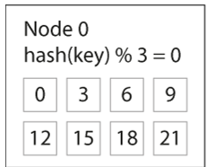

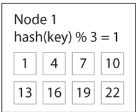

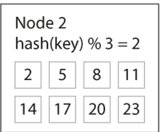

重新平衡后（4 个节点）：  

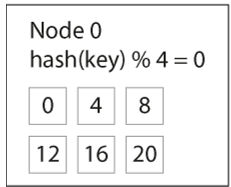

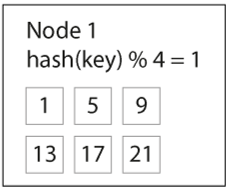

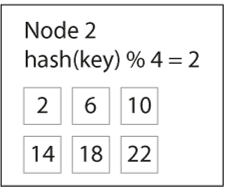

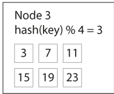

> 图 7-3。通过对键进行哈希并对节点数取模，将键分配给节点。改变节点数量会导致许多键从一个节点移到另一个节点。  

模 N 函数很容易计算，但它会导致重新平衡的效率非常低，因为会有大量记录在节点间进行不必要的移动。我们需要一种尽可能少移动数据的方法。  

#### 固定数量的分片  

一种简单但应用广泛的解决方案是，创建远多于节点数量的分片，并为每个节点分配多个分片。例如，一个运行在 10 节点集群上的数据库可以从一开始就拆分成 1,000 个分片，从而为每个节点分配 100 个分片。随后，键会存储在编号为 `hash(key) % 1,000` 的分片中，而系统会另外记录每个分片存储在哪个节点上。  

现在，如果向集群中添加一个节点，系统可以把现有节点上的一些分片重新分配给新节点，直到它们再次得到较为均匀的分布。图 7-4 展示了这一过程。如果从集群中移除一个节点，则会以相反的方式进行同样的操作。  

在这种模型中，节点之间只移动完整的分片，这比分割分片的成本更低。分片数量不会改变，键到分片的分配关系也不会改变。唯一变化的是分片到节点的分配关系。这种重新分配并非即时完成——通过网络传输大量数据需要一些时间——因此，在传输过程中发生的任何读写仍使用旧的分片分配关系。  

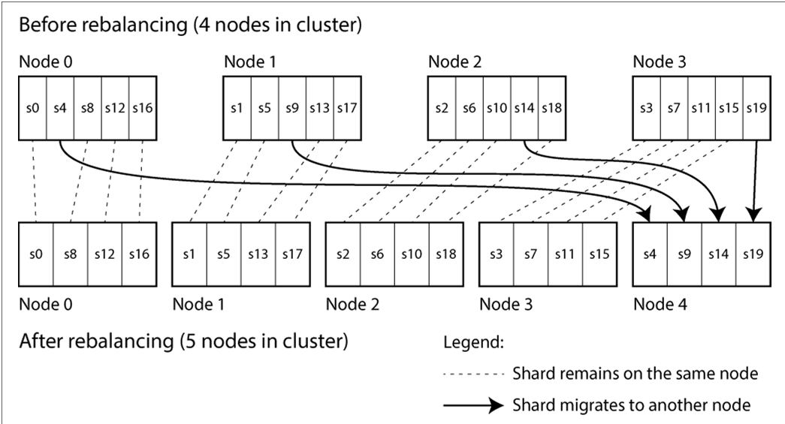

> 图 7-4。向每个节点包含多个分片的数据库集群中添加新节点。  

通常会选择一个可被许多因数整除的分片数，以便将数据集均匀地拆分到不同数量的节点上——例如，无须要求节点数是 2 的幂[4]。你甚至可以将集群中硬件配置不一致的情况考虑在内：为性能更强的节点分配更多分片，就能让这些节点承担更大比例的负载。  

Citus（PostgreSQL 的一个分片层）、Riak、Elasticsearch 和 Couchbase 等系统都采用了这种分片方法。只要在首次创建数据库时能较准确地估计所需的分片数量，它就能很好地工作。之后可以轻松添加或移除节点，但存在一个限制：节点数不能超过分片数。  

如果发现最初配置的分片数不合适——例如，系统规模已经增长到所需节点数超过分片数——就必须执行成本高昂的重新分片操作。它需要拆分每个分片并将其写入新文件，在此过程中会占用大量额外磁盘空间。有些系统不允许在数据库仍有并发写入时重新分片，因此很难在不停机的情况下更改分片数量。  

如果数据集的总大小变化很大（例如，开始时很小，但随着时间推移可能增长很多），就很难选择正确的分片数量。由于每个分片包含全部数据的一个固定比例，因此各分片的大小会随集群中数据总量成比例增长。如果分片非常大，重新平衡以及从节点故障中恢复的成本都会很高。但如果分片太小，又会产生过多开销。当分片大小“恰到好处”、既不过大也不过小时，性能最佳；然而，如果分片数量固定而数据集大小不断变化，这一点可能很难做到。  

#### 按哈希范围分片  

如果无法预先预测所需的分片数量，最好采用一种能让分片数量轻松适应工作负载的方案。前述按键范围分片的方案具备这一特性，但当大量写入集中在相邻键上时，存在产生热点的风险。一种解决办法是将按键范围分片与哈希函数相结合，使每个分片包含一段哈希值范围，而不是一段键范围。  

图 7-5 展示了一个使用 16 位哈希函数的例子，该函数返回从 0 到 $65,535 = 2^{16} - 1$ 的数（实际中，哈希通常为 32 位或更多）。即使输入键非常相似（例如连续的时间戳），它们的哈希也会均匀分布在这一范围内。然后，我们可以为每个分片分配一段哈希值范围——例如，将 0 到 16,383 的值分配给分片 0，将 16,384 到 32,767 的值分配给分片 1，依此类推。  

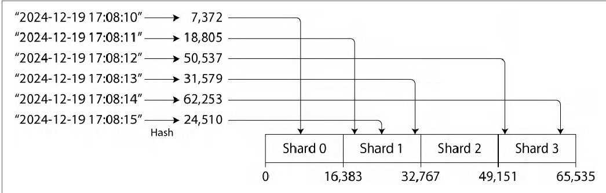

> 图 7-5。为每个分片分配一段连续的哈希值范围。  

与按键范围分片一样，在按哈希范围分片中，当一个分片变得过大或负载过高时，可以将其拆分。这仍然是一项成本高昂的操作，但可以按需进行，因此分片数量会适应数据量，而不是预先固定。  

与按键范围分片相比，它的缺点是针对分区键的范围查询效率不高，因为该范围内的键如今分散在所有分片中。不过，如果键由两列或更多列组成，且分区键只是其中的第一列，那么仍然可以对第二列及后续列执行高效的范围查询。只要范围查询中的所有记录具有相同的分区键，它们就会位于同一个分片中。  

> [!NOTE]
> **数据仓库中的分区与范围查询**
>
> BigQuery、Snowflake 和 Delta Lake 等数据仓库支持类似的索引方法，不过术语有所不同。例如，在 BigQuery 中，分区键决定记录位于哪个分区，而“聚簇列”决定记录在分区内的排序方式。Snowflake 会自动将记录分配到“微分区”，但允许用户为表定义聚簇键。Delta Lake 既支持手动和自动分配分区，也支持聚簇键。对数据进行聚簇不仅能提高范围扫描性能，还能改善压缩和过滤性能。  

YugabyteDB 和 DynamoDB[17] 使用按哈希范围分片，MongoDB 也将其作为一种可选方案。Cassandra 和 ScyllaDB 使用了这种方法的一种变体，如图 7-6 所示。  

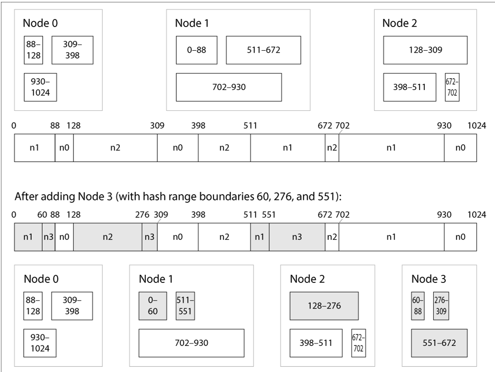

> 图 7-6。Cassandra 和 ScyllaDB 将可能的哈希值范围（此处为 0–1024）按随机边界拆分为多个连续范围，并为每个节点分配若干范围。  

哈希值空间被拆分为数量与节点数成比例的若干范围（图中每个节点有 3 个范围，但实际默认值是 Cassandra 每个节点 16 个、ScyllaDB 每个节点 256 个），这些范围之间的边界是随机的。这意味着有些范围比其他范围更大，但由于每个节点拥有多个范围，这些不均衡往往会相互抵消[15]。  

添加或移除节点时，范围边界会随之调整，分片也会相应地拆分或合并。在图 7-6 中，添加节点 3 时，节点 1 将其两个范围中的一部分转移给节点 3，节点 2 将其一个范围中的一部分转移给节点 3。这样既能让新节点获得大致公平的数据集份额，又不会在节点之间传输超出必要量的数据。  

### 一致性哈希  

*一致性哈希*算法是一种哈希函数，它以满足以下两个性质的方式将键映射到指定数量的分片：  

- 映射到每个分片的键数量大致相等。  

- 当分片数量发生变化时，从一个分片移动到另一个分片的键应尽可能少。  

请注意，这里的*一致性*与副本一致性（见第 6 章）或 ACID 一致性（见第 8 章）无关；它描述的是一个键在可能的情况下留在同一分片中的倾向。  

Cassandra 和 ScyllaDB 使用的分片算法与一致性哈希的最初定义[18]相似，但人们也提出了其他几种一致性哈希算法[19]，例如*最高随机权重*（也称为*相约哈希*）[20]和*跳跃一致性哈希*（jump consistent hashing）[21]。采用这些方法时，为新增节点创建新分片的方式不是把少量现有分片拆分成子范围，而是把此前散布在所有其他节点上的各个键分配给新节点。哪种方式更好取决于具体应用。  

## 倾斜的工作负载与热点缓解  

一致性哈希可以确保键均匀分布在各节点上，但这并不意味着实际负载也是均匀分布的。如果工作负载高度倾斜——也就是说，某些分区键下的数据量远多于其他键，或者针对某些键的请求速率远高于其他键——仍然可能出现一些服务器过载，而另一些服务器几乎闲置的情况。  

例如，在社交媒体网站上，一位拥有数百万粉丝的名人用户发布一条帖子，可能会引发活动风暴[22]。这一事件可能导致对同一个键进行大量读写（其中分区键可能是该名人用户的 ID，也可能是人们正在评论的动态 ID）。  

在这种情况下，需要更灵活的分片策略[23, 24]。如果系统根据键范围（或哈希范围）定义分片，就可以让单个热点键独占一个分片，甚至可以为它分配一台专用机器[25]。  

也可以在应用层对倾斜进行补偿。例如，如果已知某个键非常热，一种简单的技术是在键的开头或末尾添加一个随机数。仅添加两位随机数字，就可以把对该键的写入均匀拆分到 100 个键上，使这些键能够分布到不同的分片中。  

然而，将写入拆分到多个键之后，任何读取都必须执行额外工作，因为它们需要从全部 100 个键读取数据并将其合并。热点键每个分片上的读取量并未减少；只有写入负载被拆分。这项技术还需要额外的记录管理：只为少量热点键附加随机数是合理的；对于写入吞吐量较低的绝大多数键，这会带来不必要的开销。因此，还需要某种方法来跟踪哪些键已被拆分，并需要一个将普通键转换为受特殊管理的热点键的流程。  

负载随时间变化又进一步加剧了这个问题：例如，某条突然走红的社交媒体帖子可能在几天内承受很高的负载，但之后很可能再次平静下来。此外，有些键可能是写热点，另一些则可能是读热点，因此需要采用不同的处理策略。  

有些系统（尤其是为大规模场景设计的云服务）采用了自动化方法来处理热点分片。例如，Amazon 将其称为*热度管理*（heat management）[26]或*自适应容量*（adaptive capacity）[17]。这些系统的工作细节超出了本书的讨论范围。  

### 运维：自动重新平衡与手动重新平衡  

关于重新平衡，我们略过了一个重要问题：分片拆分和重新平衡是自动进行，还是手动进行？  

有些系统无须任何人工干预，就会自动决定何时拆分分片以及何时将其从一个节点移动到另一个节点；另一些系统则要求管理员显式配置分片。也有折中方案——例如，Couchbase 和 Riak 会自动生成建议的分片分配方案，但需要管理员确认后才能生效。  

全自动重新平衡可能很方便，因为日常维护所需的运维工作更少，而且这类系统甚至可以自动扩缩容，以适应工作负载的变化。DynamoDB 等云数据库宣称，能够在几分钟内自动增加或移除分片，以适应负载的大幅上升或下降[17, 27]。  

不过，自动分片管理也可能难以预测。重新平衡是一项成本高昂的操作，因为它需要重新路由请求，并在节点之间移动大量数据。如果处理不慎，这一过程可能使网络或节点过载，并损害其他请求的性能。系统必须在重新平衡期间继续处理写入；如果系统已接近其最大写入吞吐量，分片拆分过程甚至可能跟不上新写入的到达速率[27]。  

这种自动化与自动故障检测结合时可能很危险。例如，假设某个节点过载，因而暂时无法快速响应请求。其他节点认定这个过载节点已经宕机，于是自动重新平衡集群，将负载从该节点移走。这会给其他节点和网络增加额外负载，使情况进一步恶化，并可能引发级联故障：其他节点也变得过载，进而同样被错误地怀疑已经宕机。  

因此，让人工参与重新平衡可能是有益的。它比全自动流程更慢，但有助于防止意外的运维状况。如果预计某个已知事件会带来流量激增，例如“网络星期一”假日促销，或世界杯等热门体育赛事的门票销售，手动重新平衡也适合用来提前调整集群。  

### 请求路由  

我们已经讨论了如何将数据集分片到多个节点，以及在添加或移除节点时如何重新平衡这些分片。现在来看另一个问题：如果要读取或写入某个特定的键，如何知道应该连接到哪个节点——也就是哪个 IP 地址和端口号？  

我们把这个问题称为*请求路由*，它与前面第 184 页“负载均衡器、服务发现和服务网格”中讨论的*服务发现*非常相似。两者最大的区别在于：对于运行应用程序代码的服务，每个实例通常都是无状态的，负载均衡器可以把请求发送给任意实例；而对于分片数据库，针对某个键的请求只能由包含该键的分片之副本所在的节点处理。  

这意味着请求路由必须了解键到分片以及分片到节点的分配关系。从宏观上看，有几种解决这个问题的方法（如图 7-7 所示）：  

1. 允许客户端联系任意节点（例如，通过轮询负载均衡器）。如果该节点碰巧拥有请求所对应的分片，它就可以直接处理请求；否则，它会将请求转发给适当的节点，接收响应，再把响应传回客户端。  

2. 先把客户端的所有请求发送到一个路由层，由它确定每个请求应由哪个节点处理，再据此进行转发。这个路由层本身不处理任何请求；它只充当能感知分片的负载均衡器。  

3. 要求客户端了解分片方式以及分片到节点的分配关系。在这种情况下，客户端可以直接连接到适当的节点，无须任何中间层。  

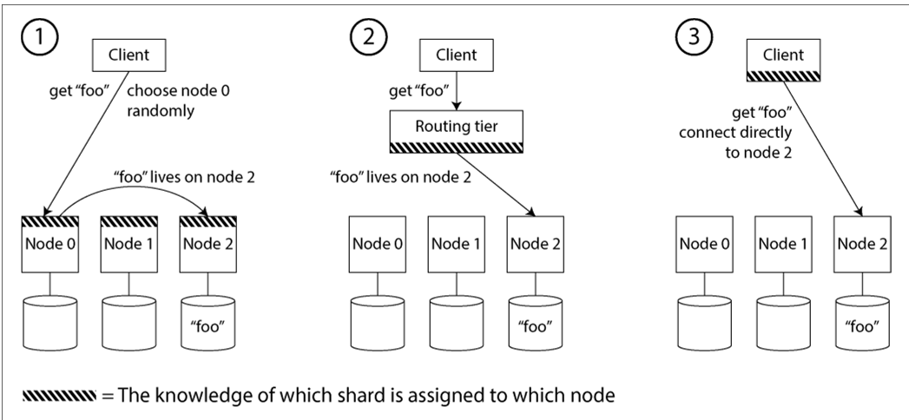

> 图 7-7。将请求路由到正确节点的三种方式。  

每种情况都有一些关键问题：  

- 由谁决定哪个分片应位于哪个节点上？最简单的办法是由单个协调器做出决定，但如果运行协调器的节点宕机，如何使其具备容错能力？如果协调器角色可以故障转移到另一个节点，又该如何防止出现脑裂情况（见第 204 页“处理节点宕机”），即两个不同的协调器做出相互矛盾的分片分配？  

- 执行路由的组件（可能是某个节点、路由层或客户端）如何得知分片到节点的分配发生了变化？  

- 当一个分片正从一个节点移动到另一个节点时，会有一个切换期：新节点已经接管，但发往旧节点的请求可能仍在传输途中。该如何处理这些请求？  

许多分布式数据系统依赖 ZooKeeper 或 etcd 等独立的协调服务来跟踪分片分配，如图 7-8 所示。它们使用共识算法（见第 10 章）提供容错能力并防止脑裂。每个节点都在 ZooKeeper 中注册自己，而 ZooKeeper 维护分片到节点的权威映射。路由层或感知分片的客户端等其他参与方可以订阅 ZooKeeper 中的这些信息。每当分片的所有权发生变化，或者添加或移除节点时，ZooKeeper 都会通知路由层，使其路由信息保持最新。  

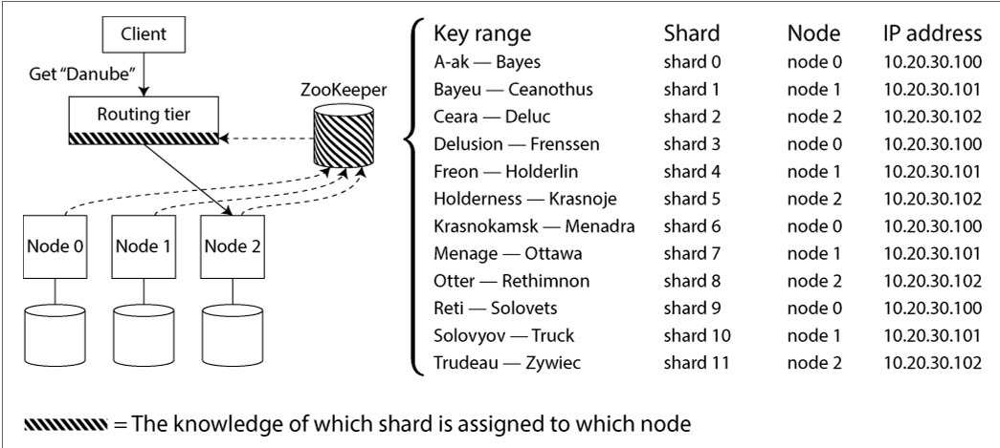

> 图 7-8。使用 ZooKeeper 跟踪分片到节点的分配关系。  

例如，HBase 和 SolrCloud 使用 ZooKeeper 管理分片分配，Kubernetes 使用 etcd 跟踪各服务实例的运行位置。MongoDB 采用类似的架构，但依赖自身的*配置服务器*实现，并使用 *mongos* 守护进程作为路由层。Kafka、YugabyteDB、TiDB 和 ScyllaDB[28] 使用内置的 Raft 共识协议实现来执行这一协调功能。  

Riak 采用了不同的方法：它使用节点间的流言协议传播集群状态的任何变化。与共识协议相比，这种方法提供的一致性要弱得多；它可能出现脑裂，即集群的不同部分对同一分片有不同的节点分配。无主数据库能够容忍这种情况，因为它们通常本来就只提供较弱的一致性保证（见第 233 页“[理解法定人数一致性的局限性](#理解法定人数一致性的局限性)”）。  

使用路由层或将请求发送到随机节点时，客户端仍需找到要连接的 IP 地址。这些地址不像分片到节点的分配关系那样频繁变化，因此通常使用 DNS 就足够了。  

以上关于请求路由的讨论侧重于寻找单个键所在的分片，这与分片 OLTP 数据库最为相关。分析型数据库也经常使用分片，但它们通常采用截然不同的查询执行方式：查询一般不会只在单个分片中执行，而是需要并行聚合和连接多个分片中的数据。第 11 章将讨论此类并行查询执行技术。  

## 分片与二级索引  

我们目前讨论的分片方案都依赖于客户端知道其要访问的任何记录的分区键。这在键值数据模型中最容易实现：分区键是主键的第一部分（或整个主键），因此可以使用分区键确定分片，进而把读写路由到负责该键的节点。  

如果涉及二级索引，情况就会变得更加复杂（见第 132 页“多列索引与二级索引”）。二级索引通常不能唯一标识一条记录，而是用来搜索某个特定值的所有出现位置：查找用户 123 的所有动态，查找所有包含 hogwash 一词的文章，查找所有红色汽车，等等。  

键值存储通常没有二级索引，但二级索引是关系型数据库的标准功能，在文档数据库中也很常见。此类索引也是 Solr 和 Elasticsearch 等全文搜索引擎存在的根本理由。二级索引的问题在于，它们无法自然地映射到分片。对具有二级索引的数据库进行分片主要有两种方法：局部索引和全局索引。  

### 局部二级索引  

在第一种索引方法中，每个分片都独立维护自己的二级索引，且只覆盖该分片中的记录。它不关心其他分片中存储了什么数据。每当写入数据库——添加、删除或更新一条记录——只需处理包含所写记录的那个分片。因此，这类二级索引称为*局部索引*。在信息检索领域，它也称为*按文档分区的索引*（document-partitioned index）[29]。  

例如，假设你在运营一个二手车销售网站。每条车源信息都有唯一 ID，并用该 ID 作为分片的分区键，如图 7-9 所示（ID 0 到 499 位于分片 0，ID 500 到 999 位于分片 1，依此类推）。如果希望用户能够搜索汽车，并按颜色和品牌筛选，就需要为颜色和品牌建立二级索引（在文档数据库中，它们是字段；在关系型数据库中，它们是列）。如果已经声明了索引，数据库就能自动执行索引。例如，每当数据库中新增一辆红色汽车时，数据库分片会自动把它的 ID 添加到索引条目 `color:red` 的 ID 列表中。如第 4 章所述，这个 ID 列表也称为倒排列表。  

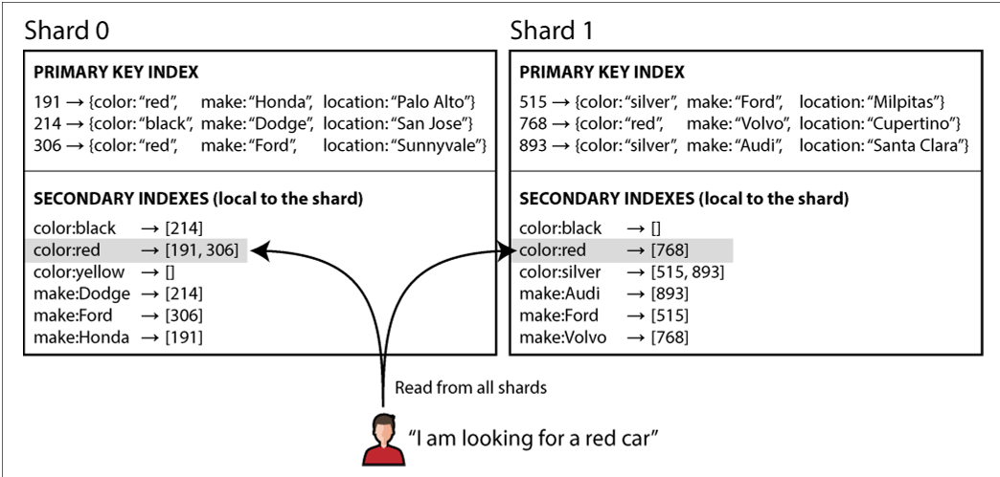

> 图 7-9。使用局部二级索引时，每个分片只索引自身包含的记录。  

> [!WARNING]
> 如果你的数据库只支持键值模型，你可能会想在应用程序代码中创建从值到 ID 的映射，以此自行实现二级索引。如果选择这条路，就必须格外小心，确保索引与底层数据保持一致。竞态条件和间歇性写入失败（即有些更改已保存而另一些未保存）很容易导致数据不同步——参见第 287 页的“多对象事务的必要性”。

从局部二级索引读取时，如果你已经知道所查记录的分区键，只需在相应分片上执行搜索即可。此外，如果你只需要部分结果而不需要全部结果，可以将请求发送到任意分片。不过，如果你需要全部结果，却事先不知道它们的分区键，就必须将查询发送到所有分片，并合并返回的结果，因为匹配记录可能散布在各个分片中。例如，在图 7-9 中，红色汽车同时出现在分片 0 和分片 1 中。  

这种查询分片数据库的方式，可能使二级索引上的读取查询代价相当高。即使并行查询各个分片，也容易产生尾延迟放大（参见第 41 页的“响应时间指标的使用”）。它还会限制应用程序的可扩展性：增加分片能让你存储更多数据，但如果每个分片无论如何都必须处理每个查询，就无法提高查询吞吐量。  

尽管如此，局部二级索引仍被广泛使用[30]——例如 MongoDB、Riak、Cassandra[31]、Elasticsearch[32]、SolrCloud 和 VoltDB[33] 都使用局部二级索引。  

### 全局二级索引  

除了让每个分片各自拥有局部二级索引之外，我们还可以构建一个覆盖所有分片数据的全局索引。不过，不能简单地把这个索引存储在单个节点上，因为它很可能成为瓶颈，从而违背分片的初衷。全局索引本身也必须分片，但其分片方式可以不同于主键索引。  

图 7-10 展示了这种方式可能的样子。所有分片中的红色汽车 ID 都出现在索引的 color:red 条目下，但该索引经过了分片：以字母 a 到 r 开头的颜色位于分片 0，以 s 到 z 开头的颜色位于分片 1。汽车制造商索引也采用类似的分区方式（分片边界位于 f 和 h 之间）。  

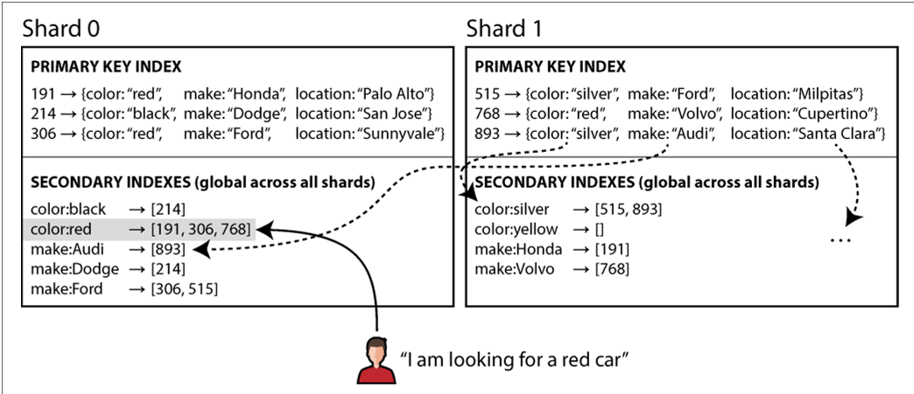

> 图 7-10。全局二级索引反映所有分片中的数据，其自身也按被索引值进行分片。  

这种索引也称为词项分区索引[29]。回顾第 146 页的“全文搜索”：在全文搜索中，词项是文本中可供搜索的关键词。这里我们将其含义推广为二级索引中任何可供搜索的值。  

全局索引使用词项作为分区键，因此在查找某个特定词项或值时，可以确定需要查询哪个分片。同样，一个分片可以包含一段连续的词项范围（如图 7-10 所示），也可以根据词项的哈希值将词项分配给分片。  

全局索引的优点是，只有一个条件（例如 color = red）的查询只需从单个分片读取即可取得倒排列表。不过，如果你想取得的是记录，而不仅仅是 ID，仍然必须从负责这些 ID 的所有分片读取。  

如果有多个搜索条件或词项（例如搜索具有特定颜色和特定制造商的汽车，或搜索同一文本中出现的多个单词），这些词项很可能被分配到不同分片。为了计算两个条件的逻辑 AND，系统需要找出同时出现在两个倒排列表中的所有 ID。如果倒排列表很短，这不成问题；但如果列表很长，通过网络传输它们来计算交集可能会很慢[29]。  

全局二级索引的另一个难题是，写入比局部索引更复杂，因为写入一条记录可能影响索引的多个分片（文档中的每个词项可能位于不同分片）。这使二级索引更难与底层数据保持同步。一种选择是使用分布式事务，以原子方式更新存储主记录及其二级索引的分片（参见第 8 章）。  

CockroachDB、TiDB 和 YugabyteDB 使用全局二级索引；DynamoDB 同时支持局部和全局二级索引。对于 DynamoDB，写入会异步反映到全局索引中，因此从全局索引读取的数据可能是陈旧的（这类似于第 209 页“复制延迟带来的问题”中讨论的情形）。尽管如此，如果读取吞吐量高于写入吞吐量，而且倒排列表不太长，全局索引仍然很有用。  

<a id="chapter-7-summary"></a>

## 小结  

本章探讨了将大型数据集分片为较小子集的不同方式。当数据量大到无法再由单台机器存储和处理时，分片就必不可少。  

分片的目标是将数据和查询负载均匀分散到多台机器上，避免热点（负载高得不成比例的节点）。这要求选择适合数据的分片方案，并在集群中添加或移除节点时重新平衡分片。  

我们讨论了两种主要的分片方法：  

**键范围分片**  

键经过排序，一个分片拥有从某个最小值到某个最大值之间的所有键。排序的优点是可以高效执行范围查询，但如果应用程序经常访问排序顺序中彼此接近的键，就可能形成热点。  

在这种方法中，当一个分片变得过大时，通常会将其范围拆分成两个子范围，以此重新平衡分片。  

**哈希分片**  

对每个键应用哈希函数，一个分片拥有一段哈希值范围（也可以使用其他一致性哈希算法将哈希值映射到分片）。这种方法破坏了键的顺序，使范围查询效率低下，但可能让负载分布得更均匀。  

按哈希分片时，常见做法是预先创建固定数量的分片，为每个节点分配多个分片，并在添加或移除节点时将整个分片从一个节点移到另一个节点。也可以像键范围分片一样拆分分片。  

常见做法是使用键的第一部分作为分区键（即用于确定分片），并在该分片内按键的其余部分对记录排序。这样，对于分区键相同的记录，仍然可以高效执行范围查询。  

我们还讨论了将查询路由到适当分片的技术，并了解了协调服务通常如何用于跟踪分片到节点的分配关系。  

最后，我们考察了分片与二级索引之间的相互作用。二级索引也需要分片。有两种方法：  

**局部二级索引**  

二级索引与主键和值存储在同一个分片中。写入时只需更新一个分片，但通过二级索引进行查找时需要读取所有分片。  

**全局二级索引**  

二级索引根据被索引值单独分片。二级索引中的一个条目可能引用来自所有主键分片的记录。写入记录时，可能需要更新多个二级索引分片；不过，读取倒排列表可由单个分片完成（取得实际记录仍需读取多个分片）。  

按照设计，每个分片大多独立运行——这正是分片数据库能够扩展到多台机器的原因。然而，需要写入多个分片的操作可能产生问题——例如，如果对一个分片的写入成功，而对另一个分片的写入失败，会发生什么？我们将在后续章节中讨论这个问题。  

## 参考文献  

[1] Claire Giordano. “理解 Postgres 和 Citus 中的分区与分片。” citusdata.com，2023 年 8 月。存档于 perma.cc/8BTK-8959  

[2] Brandur Leach. “Postgres 分区，2022 版。” brandur.org，2022 年 10 月。存档于 perma.cc/Z5LE-6AKX  

[3] Raph Koster. “数据库‘分片’源自 UO？” raphkoster.com，2009 年 1 月。存档于 perma.cc/4N9U-5KYF  

[4] Garrett Fidalgo. “放牧大象：Notion 对 Postgres 进行分片的经验教训。” notion.com，2021 年 10 月。存档于 perma.cc/5J5V-W2VX  

[5] Ulrich Drepper. “每位程序员都应该了解的内存知识。” akka-dia.org，2007 年 11 月。存档于 perma.cc/NU6Q-DRXZ  

[6] Jingyu Zhou, Meng Xu, Alexander Shraer, Bala Namasivayam, Alex Miller, Evan Tschannen, Steve Atherton, Andrew J. Beamon, Rusty Sears, John Leach, Dave Rosenthal, Xin Dong, Will Wilson, Ben Collins, David Scherer, Alec Grieser, Young Liu, Alvin Moore, Bhaskar Muppana, Xiaoge Su, and Vishesh Yadav. “FoundationDB：一种分布式、解耦的事务型键值存储。” 载于 ACM International Conference on Management of Data (SIGMOD)，2021 年 6 月。doi:10.1145/3448016.3457559  

[7] Marco Slot. “Citus 12：面向 PostgreSQL、基于模式的分片。” citusdata.com，2023 年 7 月。存档于 perma.cc/R874-EC9W  

[8] Robisson Oliveira. “使用基于单元的架构缩小影响范围。” AWS Well-Architected 白皮书，Amazon Web Services，2023 年 9 月。存档于 perma.cc/4KWW-47NR  

[9] Gwen Shapira. “数据库没有做、但应该做的事情。” *thenile.dev*，2023 年 2 月。存档于 *perma.cc/C3J4-JSFW*  

[10] Malte Schwarzkopf, Eddie Kohler, M. Frans Kaashoek, and Robert Morris. “立场：通过构造实现 GDPR 合规。” 载于 Towards Polystores That Manage Multiple Databases, Privacy, Security and/or Policy Issues for Heterogenous Data (Poly)，2019 年 8 月。doi:10.1007/978-3-030-33752-0_3  

[11] Gwen Shapira. “pg_karnak 简介：跨租户数据库的事务型模式迁移。” *thenile.dev*，2024 年 11 月。存档于 *perma.cc/R5RD-8HR9*  

[12] Arka Ganguli, Guido Iaquinti, Maggie Zhou, and Rafael Chacón. “使用 Vitesse 扩展 Slack 的数据存储。” slackengineering，2020 年 12 月。存档于 perma.cc/UW8F-ALJK  

[13] Ikai Lan. “App Engine Datastore 提示：单调递增值并不好。” ikaisays.com，2011 年 1 月。存档于 perma.cc/BPX8-RPJB  

[14] Enis Soztutar. “Apache HBase 区域的拆分与合并。” cloudera.com，2013 年 2 月。存档于 perma.cc/S9HS-2X2C  

[15] Eric Evans. “重新思考 Cassandra 中的拓扑。” 载于 *Cassandra Summit*，2013 年 6 月。存档于 *perma.cc/2DKM-F438*  

[16] Martin Kleppmann. “Java 的 hashCode 对分布式系统并不安全。” martin.kleppmann.com，2012 年 6 月。存档于 perma.cc/LK5U-VZSN  

[17] Mostafa Elhemali, Niall Gallagher, Nicholas Gordon, Joseph Idziorek, Richard Krog, Colin Lazier, Erben Mo, Akhilesh Mritunjai, Somu Perianayagam, Tim Rath, Swami Sivasubramanian, James Christopher Sorenson III, Sroaj Sosothikul, Doug Terry, and Akshat Vig. “Amazon DynamoDB：可扩展、性能可预测且完全托管的 NoSQL 数据库服务。” 载于 USENIX Annual Technical Conference (ATC)，2022 年 7 月。  

[18] David Karger, Eric Lehman, Tom Leighton, Rina Panigrahy, Matthew Levine, and Daniel Lewin. “一致性哈希与随机树：缓解万维网热点的分布式缓存协议。” 载于 29th Annual ACM Symposium on Theory of Computing (STOC)，1997 年 5 月。doi:10.1145/258533.258660  

[19] Damian Gryski. “一致性哈希：算法权衡。” dgryski.medium.com，2018 年 4 月。存档于 perma.cc/B2WF-TYQ8  

[20] David G. Thaler and Chinya V. Ravishankar. “使用基于名称的映射提高命中率。” IEEE/ACM Transactions on Networking，第 6 卷第 1 期，第 1–14 页，1998 年 2 月。doi:10.1109/90.663936  

[21] John Lamping and Eric Veatch. “一种快速、低内存的一致性哈希算法。” arXiv:1406.2294，2014 年 6 月。  

[22] Samuel Axon. “Twitter 3% 的服务器专用于 Justin Bieber。” mashable.com，2010 年 9 月。存档于 perma.cc/F35N-CGVX  

[23] Gerald Guo and Thawan Kooburat. “使用 Shard Manager 扩展服务。” *engineering.fb.com*，2020 年 8 月。存档于 *perma.cc/EFS3-XQYT*  

[24] Sangmin Lee, Zhenhua Guo, Omer Sunercan, Jun Ying, Thawan Kooburat, Suryadeep Biswal, Jun Chen, Kun Huang, Yatpang Cheung, Yiding Zhou, Kaushik Veeraraghavan, Biren Damani, Pol Mauri Ruiz, Vikas Mehta, and Chunqiang Tang. “Shard Manager：面向地理分布式应用的通用分片管理框架。” 载于 28th ACM SIGOPS Symposium on Operating Systems Principles (SOSP)，2021 年 10 月。doi:10.1145/3477132.3483546  

[25] Scott Lystig Fritchie. “可调整大小的哈希表之批判：Riak Core 与随机切片。” infoq.com，2018 年 8 月。存档于 perma.cc/RPX7-7BLN  

[26] Andy Warfield. “构建并运营一个名为 S3 的超大型存储系统。” *allthingsdistributed.com*，2023 年 7 月。存档于 *perma.cc/6S7P-GLM4*  

[27] Rich Houlihan. “DynamoDB 自适应容量：为混乱工作负载提供平稳性能（DAT327）。” 载于 AWS re:Invent，2017 年 11 月。  

[28] Kostja Osipov. “ScyllaDB 在 Raft 上的安全拓扑与模式变更。” scylladb.com，2024 年 6 月。存档于 perma.cc/4S82-M277  

[29] Christopher D. Manning, Prabhakar Raghavan, and Hinrich Schütze. *信息检索导论*。Cambridge University Press，2008。ISBN: 9780521865715。可在线获取：nlp.stanford.edu/IR-book。  

[30] Michael Busch, Krishna Gade, Brian Larson, Patrick Lok, Samuel Luckenbill, and Jimmy Lin. “Earlybird：Twitter 的实时搜索。” 载于 28th IEEE International Conference on Data Engineering (ICDE)，2012 年 4 月。doi:10.1109/ICDE.2012.149  

[31] Nadav Har'El. “Cassandra 3 中的索引。” github.com，2017 年 4 月。存档于 perma.cc/3ENV-8T9P  

[32] Zachary Tong. “自定义文档路由。” elastic.co，2013 年 6 月。存档于 perma.cc/97VM-MREN  

[33] Andrew Pavlo. “H-Store 文档：常见问题。” hstore.cs.brown.edu，2013 年 10 月。存档于 perma.cc/X3ZA-DW6Z  

# 事务

一些作者声称，通用的两阶段提交代价太高，难以支持，因为它会带来性能或可用性问题。我们认为，与其因为缺少事务而总是通过编码绕开问题，不如让应用程序员在瓶颈出现时处理因过度使用事务而导致的性能问题。  

——James Corbett 等，“Spanner：Google 的全球分布式数据库”（2012）  

在数据系统的严酷现实中，许多事情都可能出错：  

- 数据库软件或硬件可能随时发生故障（包括写入操作进行到一半时）。  

- 应用程序可能随时崩溃（包括一系列操作执行到一半时）。  

- 网络中断可能意外切断应用程序与数据库之间的连接，或数据库节点之间的连接。  

- 多个客户端可能同时写入数据库，彼此覆盖对方的更改。  

- 客户端可能读到不合常理的数据，因为数据只完成了部分更新。  

- 客户端之间的竞态条件可能导致意想不到的错误。  

为了具备可靠性，系统必须应对所有这些类型的故障，并确保它们不会引发灾难性失败。然而，实现容错机制需要大量工作。你必须仔细考虑所有可能出错的情况，并进行严格测试，以确保所实现的解决方案确实有效。  

数十年来，事务一直是简化这些问题的首选机制。事务让应用程序可以将若干次读写组合成一个逻辑单元。从概念上讲，事务中的所有读写作为一个操作执行；要么整个事务成功并提交，要么失败并中止或回滚。如果事务失败，应用程序可以安全地重试。有了事务，应用程序的错误处理会简单得多，因为它无需担心部分失败（即无论出于何种原因，有些操作成功而有些操作失败）。  

如果你习惯于使用事务，它们可能显得理所当然，但我们不应把事务视为理所当然。事务并非自然法则；它们是为特定目的而创造的——也就是简化访问数据库的应用程序编程模型。使用事务后，应用程序可以忽略某些潜在的错误情形和并发问题，因为数据库会代为处理它们（我们称之为安全性保证）。  

并非每个应用程序都需要事务，有时弱化事务保证或完全放弃事务反而有优势（例如，为了获得更好的性能或更高的可用性）。有些安全属性无需事务也能实现。另一方面，事务可以免去许多麻烦；例如，邮局 Horizon 丑闻（参见第 48 页的“可靠性有多重要？”）背后的技术原因，很可能是底层会计系统缺少 ACID 事务[1]。  

如何判断自己是否需要事务？要回答这个问题，我们首先需要准确理解事务能够提供哪些安全性保证，以及与之相关的成本。事务乍看之下很简单，但其中涉及许多微妙而重要的细节。  

并发控制与单节点数据库和分布式数据库都相关。本章将深入探讨这一主题，讨论可能出现的各种竞态条件，以及数据库如何实现读已提交、快照隔离和可串行化等隔离级别。我们还将考察两阶段提交协议，以及在分布式事务中实现原子性所面临的挑战。  

## 事务究竟是什么？  

如今，几乎所有关系数据库以及一些非关系数据库都支持事务。它们中的大多数沿用了 IBM System R 在 1975 年首创的风格；System R 是第一个 SQL 数据库[2, 3, 4]。尽管一些实现细节发生了变化，但总体思想在 50 年间几乎始终如一：MySQL、PostgreSQL、Oracle、SQL Server 等数据库的事务支持与 System R 惊人地相似。  

在 2000 年代后期，非关系（NoSQL）数据库开始流行起来。它们试图改进关系数据库的现状，提供多种新的数据模型供选择（见第 3 章），并默认包含复制和分片功能（已在第 6 章和第 7 章讨论）。事务成了这场运动的主要牺牲品：这一代数据库中有许多彻底放弃了事务，或者重新定义了“事务”一词，用它来描述一组远弱于此前通常理解的保证。  

围绕 NoSQL 分布式数据库的炒作催生了一种流行观点：事务从根本上无法扩展，任何大规模系统要想保持良好的性能和高可用性，就必须放弃事务。近来，这种观点已被证明是错误的。CockroachDB [5]、TiDB [6]、Spanner [7]、FoundationDB [8] 和 YugabyteDB 等所谓的“NewSQL”数据库已经证明，事务系统可以扩展到庞大的数据量和很高的吞吐量。这些系统将分片与共识协议相结合，在大规模环境下提供强 ACID 保证；我们将在第 10 章探讨这些协议。  

不过，这也不意味着每个系统都必须支持事务；与其他任何技术设计选择一样，事务既有优势，也有局限。为了理解这些权衡，本章将详细探讨事务在正常运行以及各种极端（但现实）的情况下能够提供的保证。  

## ACID 的含义  

事务提供的安全保证常用广为人知的缩写 ACID 来描述，它分别代表原子性（atomicity）、一致性（consistency）、隔离性（isolation）和持久性（durability）。Theo Härdter 和 Andreas Reuter 于 1983 年提出了这个术语[9]，目的是为数据库中的容错机制建立精确的术语体系。  

然而在实践中，不同数据库对 ACID 的实现并不等同。例如，我们将会看到，*隔离性*的含义存在许多歧义[10]。高层思想本身没有问题，但魔鬼藏在细节里。如今，当一个系统声称自己“符合 ACID”时，你实际上能期待哪些保证并不明确。遗憾的是，“ACID”已经基本沦为营销术语。  

> [!NOTE]
> 不满足 ACID 标准的系统有时被称为 BASE，它代表基本可用（basically available）、软状态（soft state）和最终一致性（eventual consistency）[11]。这个定义甚至比 ACID 的定义更加含糊。看来，BASE 唯一合理的定义就是“非 ACID”（也就是说，它几乎可以表示你想要的任何含义）。

下面深入研究原子性、一致性、隔离性和持久性的定义，以进一步完善我们对事务的理解。  

### 原子性  

一般来说，*原子（atomic）*指无法再分割成更小部分的事物。这个词在计算机科学的不同分支中含义相近，却又略有差异。例如，在多线程编程中，如果一个线程执行原子操作，就意味着其他线程不可能看到该操作完成一半的结果。系统只能处于操作之前或操作之后的状态，不会处于两者之间的某种状态。  

相比之下，在 ACID 的语境中，原子性与并发*无关*。它并不描述多个进程试图同时访问相同数据时会发生什么，因为那属于字母 *I* 所代表的*隔离性*（见第 281 页的“隔离性”）。  

确切地说，ACID 原子性描述的是：如果客户端想要进行多次写入，但在处理了一部分写入之后发生故障，会出现什么情况——例如，进程崩溃、网络连接中断、磁盘已满或违反完整性约束。如果这些写入被组合在一个原子事务中，而事务因故障无法完成（提交），那么事务就会中止，数据库必须丢弃或撤销该事务到目前为止所做的所有写入。  

如果没有原子性，在进行多项更改的中途发生错误时，就很难知道哪些更改已经生效、哪些尚未生效。应用程序可以重试，但这样可能导致某些更改被执行两次，产生重复或错误的数据。原子性简化了这个问题：如果事务已中止，应用程序就可以确信它没有改变任何内容，因此可以安全地重试。  

能够在发生错误时中止事务，并丢弃该事务的所有写入，是 ACID 原子性的决定性特征。也许用*可中止性（abortability）*比用*原子性（atomicity）*更恰当，但由于通常使用的术语是*原子性*，本书也沿用这一说法。  

### 一致性  

一致性这个词被严重地过度使用：  

- 在第 6 章中，我们讨论了副本一致性，以及异步复制系统中出现的最终一致性问题（见第 209 页的“复制延迟带来的问题”）。  

- 数据库的*一致性快照*（例如用于备份的快照）是整个数据库在某一时刻所处状态的快照。更准确地说，一致性快照符合先发生关系（见第 238 页的“先发生关系与并发”）：如果快照包含某个特定时刻写入的值，那么该快照也会反映在这个值写入之前发生的所有写入。  

- 一致性哈希是一些系统用于再平衡的一种分片方法（见第 263 页的“一致性哈希”）。  

- 在 CAP 定理（第 10 章讨论）中，一致性一词用来表示线性一致性（见第 402 页的“线性一致性”）。  

- 在 ACID 的语境中，一致性是指数据库处于“良好状态”这一与具体应用相关的概念。  

同一个词竟然至少有五种含义，实在令人遗憾。  

ACID 一致性的思想是：对于数据，存在某些必须始终为真的断言（不变量）——例如，在会计系统中，所有账户的贷方和借方总额必须始终平衡。如果事务开始时的数据库按照这些不变量是有效的，并且事务期间的所有写入都保持了这种有效性，那么就可以确信这些不变量始终得到满足。（事务执行期间可以暂时违反某个不变量，但在事务提交时应当再次满足它。）  

如果希望数据库强制实施不变量，就需要将它们作为模式的一部分声明为约束。例如，外键约束、唯一性约束和检查约束（限制单行中可以出现的值）经常用于建模特定类型的不变量。更复杂的一致性要求有时可以用触发器或物化视图来建模[12]。  

然而，复杂的不变量可能很难甚至不可能使用数据库通常提供的约束来建模。在这种情况下，应用程序有责任正确定义事务，使其保持一致性。如果你写入了违反不变量的错误数据，却没有声明这些不变量，数据库就无法阻止你。因此，ACID 中的 C 往往取决于应用程序如何使用数据库，而不只是数据库本身的属性。  

### 隔离性  

大多数数据库都会被多个客户端同时访问。如果它们读写数据库的不同部分，这并不是问题；但如果它们访问相同的数据库记录，就可能遇到并发问题（竞态条件）。  

图 8-1 是这类问题的一个简单示例。假设两个客户端同时递增存储在数据库中的一个计数器。每个客户端都需要读取当前值，加 1，再将新值写回（假设数据库没有内置递增操作）。在图 8-1 中，因为发生了两次递增，计数器本应从 42 增加到 44，但由于竞态条件，它实际上只变成了 43。  

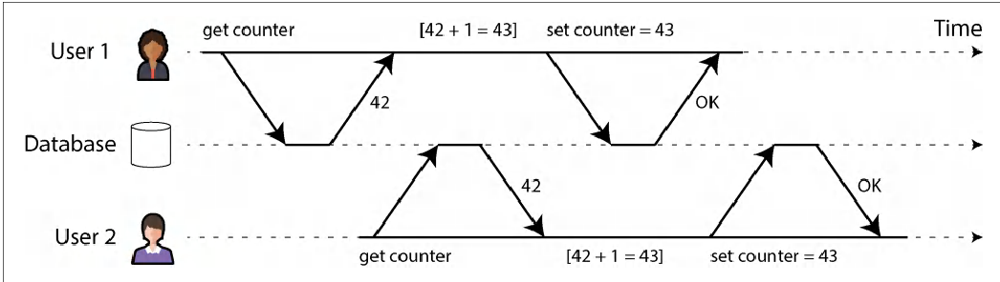

> 图 8-1。两个客户端并发递增计数器时发生的竞态条件。  

ACID 意义上的隔离性是指，并发执行的事务彼此隔离，不能互相妨碍。经典数据库教科书将隔离性形式化为可串行化，即每个事务都可以假装自己是整个数据库中唯一正在运行的事务。数据库确保事务提交后，即使它们实际上可能并发运行，最终结果也与它们串行运行（一个接一个）时相同[13]。  

不过，可串行化会带来性能成本。在实践中，许多数据库采用弱于可串行化的隔离形式——也就是说，它们允许并发事务以有限的方式互相干扰。一些流行的数据库（如 Oracle）甚至没有实现可串行化（Oracle 有一个名为“serializable”的隔离级别，但它实际实现的是*快照隔离*，其保证弱于可串行化[10, 14]）。这意味着某些类型的竞态条件仍然可能发生。我们将在第 288 页的“弱隔离级别”中探讨快照隔离和其他隔离形式。  

### 持久性  

数据库系统的目的是提供一个安全存储数据而不必担心丢失的地方。持久性承诺：事务成功提交后，它写入的任何数据都不会被遗忘，即使发生硬件故障或数据库崩溃也是如此。  

在单节点数据库中，持久性通常意味着数据已写入硬盘或 SSD 等非易失性存储设备。普通文件写入通常先缓存在内存中，稍后才发送到磁盘，这意味着突然断电时数据可能丢失；因此，许多数据库使用 `fsync` 系统调用来确保数据确实已经写入磁盘。数据库通常还有预写日志或类似功能（见第 127 页的“使 B 树可靠”），从而在写入进行到一半时发生崩溃的情况下恢复。许多数据库（如 MySQL、MongoDB 和 PostgreSQL）使用校验和存储数据，这使它们能够检测损坏或不完整的日志条目，从而有助于在崩溃后将数据库恢复到一致性快照。  

在复制数据库中，持久性可能意味着数据已成功复制到一定数量的节点。为了提供持久性保证，数据库必须等待这些写入或复制完成，才能报告事务已成功提交。然而，正如第 43 页的“可靠性与容错”所讨论的，完美的持久性并不存在；如果所有硬盘和所有备份同时被毁，数据库显然无能为力。  

> [!NOTE]
> **复制与持久性**
>
> 从历史上看，持久性曾意味着写入归档磁带。后来，它被理解为写入磁盘或 SSD。近来，它又被扩展为复制。这些实现中哪一种更好？  
>
> 事实是，没有什么是完美的：  
>
> - 如果写入磁盘后机器坏了，即使数据没有丢失，在修好机器或将磁盘转移到另一台机器之前，数据仍无法访问。复制系统则可以保持可用。  
>
> - 相关性故障——比如停电，或某个错误导致每个节点在处理某种特定输入时都崩溃——可能一次性击垮所有副本（见第 43 页的“可靠性与容错”），导致仅存在于内存中的数据全部丢失。因此，对于复制数据库而言，写入磁盘仍然很重要。  
>
> - 在异步复制系统中，当主节点不可用时，最近的写入可能丢失（见第 204 页的“处理节点停机”）。  
>
> - 突然断电时，已有研究表明，SSD 尤其可能违反其理应提供的保证；甚至不能保证 fsync 正常工作 [15]。磁盘固件和其他任何软件一样也可能有错误 [16, 17]——例如，导致硬盘在恰好运行 32,768 小时后发生故障 [18]。而且 fsync 很难正确使用；就连 PostgreSQL 也错误使用了它 20 多年 [19, 20, 21]。  
>
> - 存储引擎与文件系统实现之间微妙的相互作用可能导致难以追踪的错误，并可能使磁盘上的文件在崩溃后损坏[22, 23]。一个副本上的文件系统错误有时也会传播到其他副本[24]。  
>
> - 磁盘上的数据可能逐渐损坏而未被检测到[25, 26]。如果数据已损坏一段时间，副本和近期备份也可能已经损坏。在这种情况下，你需要尝试从历史备份中恢复数据。  
>
> - 一项针对 SSD 的研究发现，在运行的前四年中，30% 到 80% 的硬盘会出现至少一个坏块，而且只有一部分坏块能由固件修复[27]。磁性硬盘的坏扇区发生率较低，但整盘故障率高于 SSD。  
>
> - 磨损严重（经历过许多次写入/擦除周期）的 SSD 断电后，可能在数周至数月内开始丢失数据，具体取决于温度[28]。对于磨损程度较低的硬盘，这个问题没那么严重[29]。  
>
> 在实践中，没有任何一种技术能够提供绝对保证。只有各种降低风险的技术——包括写入磁盘、复制到远程机器以及备份——而且这些技术可以并且应当结合使用。一如既往，对任何理论上的“保证”保持适度怀疑是明智的。  

## 单对象操作与多对象操作  

回顾一下，在 ACID 中，原子性和隔离性描述了当客户端在同一个事务内进行多次写入时，数据库应当如何处理：  

### 原子性  

如果在一系列写入进行到一半时发生错误，事务应当中止，并且截至该时刻完成的写入应当被丢弃。换句话说，数据库通过提供全有或全无的保证，使你不必担心部分失败。  

### 隔离性  

并发运行的事务不应互相干扰。例如，如果一个事务进行了多次写入，那么另一个事务应当要么看到所有这些写入，要么一个也看不到，而不能只看到其中一部分。  

这些定义假设你想一次修改多个对象（行、文档、记录）。如果需要让多份数据保持同步，通常就需要这种多对象事务。图 8-2 展示了电子邮件应用程序中的一个例子。为了显示某个用户的未读邮件数量，可以执行类似下面的查询：  

```sql
SELECT COUNT(*) FROM emails WHERE recipient_id = 2 AND unread_flag = true;
```

不过，如果邮件很多，你可能会发现这个查询太慢，于是决定将未读邮件数量存储在单独的字段中（这是一种反规范化，我们将在第 72 页的“规范化、反规范化与连接”中讨论）。这样，每当收到新邮件时，还必须递增未读计数器；每当一封邮件被标记为已读时，也必须递减未读计数器。  

在图 8-2 中，用户 2 遇到了异常：邮箱列表显示有一封未读邮件，但计数器显示未读邮件数为零，因为计数器递增操作尚未发生。（如果电子邮件应用程序中的错误计数器显得无关紧要，可以将未读计数器换成客户账户余额，将电子邮件换成支付事务来思考。）隔离性本可以避免这个问题：它会确保用户 2 要么同时看到插入的电子邮件和更新后的计数器，要么两者都看不到，而不会看到不一致的中间状态。  

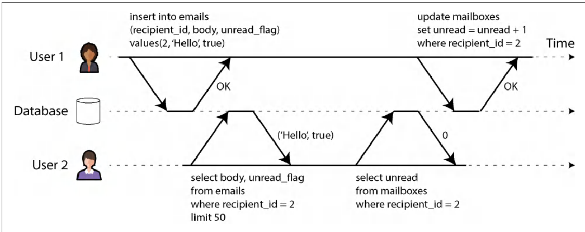

> 图 8-2。违反隔离性：一个事务读取另一个事务尚未提交的写入（“脏读”）。  

图 8-3 说明了原子性的必要性：如果事务执行过程中某处发生错误，邮箱内容和未读计数器可能变得不同步。在原子事务中，如果计数器更新失败，事务就会中止，并回滚电子邮件插入操作。  

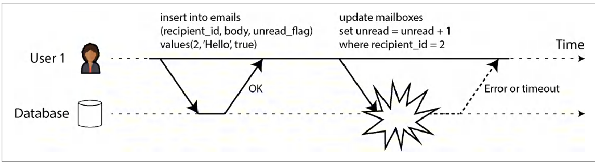

> 图 8-3。原子性确保发生错误时，该事务此前的所有写入都会被撤销，从而避免不一致状态。  

多对象事务需要某种方法来确定哪些读写操作属于同一个事务。在关系数据库中，通常根据客户端与数据库服务器之间的 TCP 连接来判断。在任何特定连接上，`BEGIN TRANSACTION` 与 `COMMIT` 语句之间的所有操作都被视为同一事务的一部分。如果 TCP 连接中断，事务就必须中止。  

另一方面，许多非关系数据库没有这种将操作组合起来的方法。即使存在多对象 API（例如，键值存储可能有一个在单次操作中更新多个键的 multi-put 操作），也不一定意味着它具有事务语义：命令可能对某些键成功、对另一些键失败，使数据库处于部分更新的状态。  

### 单对象写入  

原子性和隔离性也适用于只更改单个对象的情况。例如，假设你正在向数据库写入一个 20 kB 的 JSON 文档：  

- 如果发送完前 10 kB 后网络连接中断，数据库会存储这段无法解析的 10 kB JSON 片段吗？  

- 如果数据库正在覆盖磁盘上的旧值时断电，最终会得到由新旧值拼接而成的内容吗？  

- 如果另一个客户端在写入过程中读取该文档，它会看到部分更新的值吗？  

上述任何一种结果都会令人极其困惑，因此存储引擎几乎无一例外地力求在单个节点上的单个对象（例如一个键值对）层面提供原子性和隔离性。原子性可以使用用于崩溃恢复的日志来实现（见第 127 页的“使 B 树可靠”），隔离性可以通过为每个对象加锁来实现（任何时刻只允许一个线程访问某个对象）。  

一些数据库还提供更复杂的原子操作，例如递增操作，它不再需要图 8-1 所示的读-修改-写周期。另一种同样常见的是*条件写入*操作，它只允许在值未被他人并发更改的情况下执行写入（见第 302 页的“条件写入（比较并设置）”），类似于共享内存并发中的比较并设置或比较并交换（CAS）操作。  

> [!NOTE]
> 严格来说，*原子递增*一词中的*原子*采用的是多线程编程中的含义。在 ACID 的语境中，它应当称为*隔离的*或*可串行化的*递增，但通常并不这样称呼。

这些单对象操作很有用，因为当多个客户端试图并发写入同一对象时，它们可以防止更新丢失（见第 299 页的“防止更新丢失”）。然而，它们并不是通常意义上的事务。例如，Aerospike 的“强一致性”模式以及 Cassandra 和 ScyllaDB 的“轻量级事务”功能提供单个对象上的线性一致性读取（见第 402 页的“线性一致性”）和条件写入，但不提供跨多个对象的保证。  

### 多对象事务的必要性  

我们真的需要多对象事务吗？是否有可能只用键值数据模型和单对象操作来实现任何应用程序？  

在某些使用场景中，单对象的插入、更新和删除就足够了。然而，在许多其他情况下，对多个对象的写入需要协调：  

- 在关系数据模型中，一张表中的一行通常通过外键引用另一张表中的一行。类似地，在类图数据模型中，一个顶点通过边与其他顶点相连。多对象事务可以确保这些引用始终有效；插入多条互相引用的记录时，外键必须正确且为最新状态，否则数据就会变得毫无意义。  

- 在文档数据模型中，需要一起更新的字段通常位于同一个文档内，而该文档被视为单个对象；更新单个文档时不需要多对象事务。不过，缺少连接功能的文档数据库也鼓励采用反规范化（参见第 80 页的“何时使用哪种模型”）。当反规范化的信息需要更新时，如图 8-2 的示例所示，你需要一次更新多个文档。在这种情况下，事务对于防止反规范化数据失去同步非常有用。  

- 在具有二级索引的数据库中（除了纯键值存储以外，几乎所有数据库都属于此类），每次修改值时也需要更新索引。从事务的角度看，这些索引是不同的数据库对象——例如，如果没有事务隔离，一条记录可能出现在一个索引中，却没有出现在另一个索引中，因为第二个索引的更新尚未发生（参见第 268 页的“分片与二级索引”）。  

没有事务仍然可以实现此类应用程序。然而，没有原子性时，错误处理会复杂得多，而缺少隔离可能导致并发问题。我们将在第 288 页的“弱隔离级别”中讨论这些问题，并在第 13 章探讨其他方法。  

## 处理错误与中止  

事务的一项关键特性是：如果发生错误，可以将其中止并安全地重试。ACID 数据库基于这样一种理念：如果数据库有违背其原子性、隔离性或持久性保证的危险，它宁愿彻底放弃该事务，也不允许事务停留在半完成状态。  

不过，并非所有系统都遵循这种理念。特别是，采用无主复制的数据存储（参见第 229 页的“无主复制”）更多地遵循“尽力而为”的原则，可以概括为：“数据库会尽其所能；如果遇到错误，它不会撤销已经完成的操作”——因此，从错误中恢复是应用程序的责任。  

错误不可避免，但许多软件开发者更愿意只考虑正常路径，而不愿深究错误处理的复杂细节。例如，Rails ActiveRecord 和 Django 等流行的对象关系映射（ORM）框架不会重试被中止的事务——错误通常会以异常的形式沿调用栈向上传播，导致用户的所有输入都被丢弃，用户只会收到一条错误消息。这很遗憾，因为回滚事务的要义正是实现安全重试。  

尽管重试被中止的事务是一种简单有效的错误处理机制，但它并不完美：  

- 如果事务实际上已经成功，但服务器尝试向客户端确认提交成功时网络中断了（因此从客户端的角度看发生了超时），那么除非另有应用层去重机制，否则重试事务会使其执行两次。  

- 如果错误是由过载或并发事务之间的激烈争用造成的，重试事务只会使问题恶化，而不是改善。为了避免这种反馈循环，你可以限制重试次数、采用指数退避，并以不同于其他错误的方式处理与过载有关的错误（参见第 38 页的“过载系统何时无法恢复”）。  

- 只有在发生瞬时错误（例如死锁、违反隔离、暂时性网络中断或故障转移）后，重试才有意义。对于永久性错误（例如违反约束），重试毫无意义。  

- 如果事务还会在数据库之外产生副作用，那么即使事务被中止，这些副作用也可能已经发生。例如，如果你正在发送电子邮件，就不会希望每次重试事务时都再次发送邮件。如果想确保多个系统一起提交或一起中止，两阶段提交会有所帮助（我们将在第 324 页的“两阶段提交”中讨论这一点）。  

- 如果客户端进程在重试期间崩溃，它试图写入数据库的所有数据都会丢失。  

## 弱隔离级别  

如果两个事务不访问相同的数据，或者两者都只读，那么它们可以安全地并行运行，因为彼此都不依赖对方。只有当一个事务读取了另一个事务正在并发修改的数据，或者两个事务试图修改相同的数据时，才会出现并发问题（竞态条件）。  

并发错误很难通过测试发现，因为这类错误只有在时序不巧时才会触发。这种时序问题可能很少发生，而且通常难以重现。并发也很难推理，尤其是在大型应用程序中，你未必知道还有哪些代码正在访问数据库。即使每次只有一个用户，应用程序开发也已经足够困难；多个用户并发操作会让问题更加棘手，因为任何一份数据都可能随时意外改变。  

因此，长期以来，数据库一直试图通过提供*事务隔离*，向应用程序开发者隐藏并发问题。理论上，隔离能让你假装并发根本不存在，从而使工作变得轻松；*可串行化*隔离意味着数据库保证事务产生的效果与它们*串行*运行时相同（即一次运行一个，没有任何并发）。  

遗憾的是，在实践中隔离并没有这么简单。可串行化隔离有性能代价，而许多数据库不愿付出这一代价 [10]。因此，系统通常采用较弱的隔离级别，它们能防止*某些*并发问题，但无法防止全部。这些隔离级别要难理解得多，并且可能导致隐蔽的错误，但实践中仍然在使用 [30]。  

弱事务隔离与竞态条件导致的并发错误并不只是理论问题。它们已经造成巨额资金损失，包括使一家比特币交易所破产 [31, 32, 33, 34]、引发金融审计人员调查 [35]，以及导致客户数据损坏 [36]。每当此类问题曝光后，经常有人评论：“如果要处理金融数据，就用 ACID 数据库！”——但这没有抓住重点。即使许多流行的关系数据库系统（通常被认为符合 ACID）也采用弱隔离，因此它们未必能阻止这些错误发生。  

> [!NOTE]
> 顺带一提，银行系统有很大一部分依赖通过安全 FTP 交换的文本文件 [37]。在这种情境下，保留审计记录以及采取一些人工层面的欺诈防范措施，实际上比 ACID 属性更重要。

这些例子还凸显了一个重要问题：即使并发问题在正常运行中很少发生，你也必须考虑攻击者可能故意向你的 API 突然发送大量高度并发的请求，企图利用并发错误 [32]。因此，要构建可靠且安全的应用程序，就必须确保系统性地防止这类错误。  

在本节中，我们将考察实践中使用的几种弱（不可串行化）隔离级别，并详细讨论每种级别下哪些竞态条件可能发生、哪些不可能发生，以便你判断哪种级别适合自己的应用程序。完成这些内容后，我们将详细讨论可串行化（参见第 308 页的“可串行化”）。我们将通过示例对隔离级别进行非形式化讨论。如果你想了解严格的定义及其属性分析，可以参阅学术文献 [38, 39, 40, 41]。  

### 读已提交  

最基本的事务隔离级别是*读已提交*，它提供两项保证：  

- 从数据库读取时，你只会看到已经提交的数据（不会发生脏读）。  

- 向数据库写入时，你只会覆盖已经提交的数据（不会发生脏写）。  

下面更详细地讨论这两项保证。  

#### 防止脏读  

假设一个事务已向数据库写入一些数据，但该事务尚未提交或中止。另一个事务能看到这些未提交的数据吗？如果能，这就称为*脏读* [3]。  

在读已提交隔离级别下运行的事务必须防止脏读。这意味着，只有当事务提交时，它的所有写入才会对其他事务可见（届时其所有写入会同时变得可见）。图 8-4 展示了这一点：用户 1 已将 x 设为 3，但在用户 1 尚未提交时，用户 2 的 get x 仍返回旧值 2。  

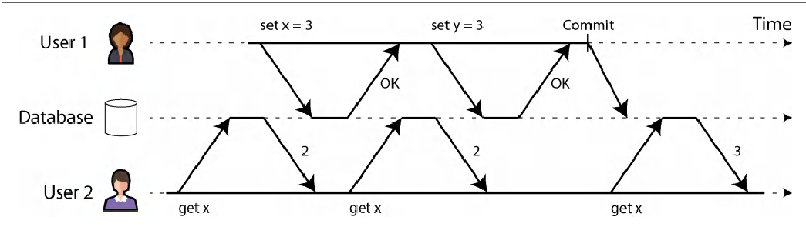

> 图 8-4。防止脏读：只有在用户 1 的事务提交后，用户 2 才会看到 x 的新值。  

防止脏读很有用，原因有以下几点：  

- 如果一个事务需要更新多行，脏读意味着另一个事务可能看到其中一部分更新，却看不到其他更新。例如，在图 8-2 中，用户看到了新的未读邮件，却没有看到更新后的计数器。这是对该邮件的脏读。看到数据库处于部分更新状态会令用户困惑，也可能导致其他事务做出错误决策。  

- 如果事务中止，它所做的所有写入都需要回滚（如图 8-3 所示）。如果数据库允许脏读，事务就可能看到随后被回滚的数据——也就是实际上从未提交到数据库的数据。任何读取了未提交数据的事务也都需要中止，从而导致所谓的*级联中止*问题。  

#### 防止脏写  

如果两个事务并发尝试更新数据库中的同一行，会发生什么？我们不知道写入将以什么顺序发生，但通常假设后一次写入会覆盖前一次写入。  

然而，如果前一次写入属于一个尚未提交的事务，因而后一次写入覆盖了未提交的值，会发生什么？这称为*脏写* [38]。在读已提交隔离级别下运行的事务必须防止脏写，通常做法是延迟第二次写入，直到第一次写入所属的事务提交或中止。  

通过防止脏写，这种隔离级别避免了某些类型的并发问题：  

- 如果事务更新多行，脏写可能导致糟糕的结果。例如，图 8-5 展示了一个二手车销售网站，两个人 Aaliyah 和 Bryce 同时试图购买同一辆车。买车需要两次数据库写入：网站上的商品信息需要更新以反映买家，销售发票也需要发送给买家。在图 8-5 的情形中，车辆卖给了 Bryce（因为他在商品信息表中完成了最终生效的更新），但发票却发给了 Aaliyah（因为她在发票表中完成了最终生效的更新）。读已提交隔离可以防止这类事故。  

- 不过，读已提交隔离*不能*防止图 8-1 中两个计数器递增操作之间的竞态条件。在这种情况下，第二次写入发生在第一个事务提交之后，因此它不是脏写。结果依然错误，但原因不同；在第 299 页的“防止更新丢失”中，我们将讨论如何确保这类计数器递增操作的安全。  

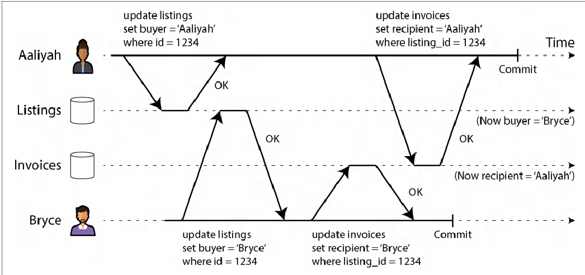

> 图 8-5。发生脏写时，来自不同事务的冲突写入可能混杂在一起。  

#### 实现读已提交  

读已提交是一种非常流行的隔离级别。它是 Oracle Database、PostgreSQL、SQL Server 以及许多其他数据库的默认设置 [10]。  

最常见的是，数据库使用行级锁来防止脏写。当事务想要修改某一行（或文档或其他某种对象）时，它必须先获取该行上的锁。然后必须一直持有该锁，直到事务提交或中止。对于任何给定的行，同一时间只能有一个事务持有锁；如果另一个事务想写入同一行，就必须等待第一个事务提交或中止，之后才能获取锁并继续执行。在读已提交模式（或更强的隔离级别）下，数据库会自动完成这种加锁。  

如何防止脏读呢？一种选择是使用同一把锁，并要求任何想读取某一行的事务短暂获取该锁，然后在读取后立即释放。这样可以确保当某行含有脏的、未提交的值时无法执行读取（因为在此期间，进行写入的事务会持有该锁）。  

然而，要求读取锁的方法在实践中效果不佳，因为一个长时间运行的写事务可能迫使许多其他事务一直等到它完成，即使其他事务只读、根本不向数据库写入任何内容也是如此。这会损害只读事务的响应时间，也不利于可运维性：由于等待锁，应用程序某一部分的性能下降可能对完全不同的部分产生连锁影响。  

尽管如此，一些数据库仍使用锁来防止脏读，例如 IBM Db2，以及采用 `read_committed_snapshot=off` 设置的 Microsoft SQL Server [30]。  

一种更常用的防止脏读的方法如图 8-4 所示。对于每一个被写入的行，数据库都会同时记住旧的已提交值，以及当前持有写锁的事务所设置的新值。在该事务进行期间，其他任何读取这一行的事务都只会得到旧值。只有当新值提交后，事务才会转而读取新值（更多细节参见第 295 页的“多版本并发控制”）。  

一些数据库支持一种更弱的隔离级别，称为*读未提交*。它能防止脏写，但不能防止脏读。换言之，它会立即返回最新写入的值，即使执行写入的事务尚未提交。由于数据库不需要存储该行的两个版本，这可以提供更好的性能。它还可以降低（但不能杜绝）更新丢失的概率，我们将在第 299 页的“防止更新丢失”中讨论这一点。  

### 快照隔离与可重复读  

如果只是粗略审视读已提交隔离，你很容易认为它已经做到了事务所需的一切：它允许中止（这是原子性所必需的），能防止读取事务未完成的结果，也能防止并发写入彼此混杂。确实，这些都是很有用的特性，而且比不支持事务的系统所能提供的保证强得多。  

然而，使用这种隔离级别时，仍有很多方式会引发并发错误。例如，图 8-6 展示了读已提交隔离下可能发生的一个问题。  

假设 Aaliyah 在一家银行有 1,000 美元存款，分别存放在两个账户中，每个账户 500 美元。一个事务从她的一个账户向另一个账户转账 100 美元。如果她恰好倒霉，在该事务处理的同一时刻查看账户余额列表，她可能先看到一个账户尚未收到转入款项时的余额（仍为 500 美元），再看到另一个账户完成转出后的余额（新余额为 400 美元）。在 Aaliyah 看来，她的账户里现在总共只有 900 美元——仿佛有 100 美元凭空消失了。  

这种异常称为*读偏差*，它是*不可重复读*的一个例子：如果 Aaliyah 在事务结束时再次读取账户 1 的余额，她会看到一个与上次查询不同的值（600 美元）。在读已提交隔离下，读偏差被认为是可以接受的：Aaliyah 看到的账户余额在她读取它们时确实都已提交。  

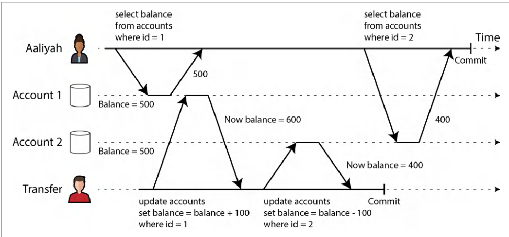

> 图 8-6。读偏差：Aaliyah 观察到数据库处于不一致状态。  

> [!NOTE]
> 遗憾的是，*偏斜*（skew）一词有多重含义。此前我们用它表示*存在热点的不均衡工作负载*（参见第 263 页的“偏斜的工作负载与缓解热点”），而这里它表示一种*时序异常*。

在 Aaliyah 的情形中，这不是一个持久的问题，因为几秒后重新加载网上银行网站时，她很可能会看到一致的账户余额。不过，例如在以下情形中，这种暂时的不一致是无法容忍的：  

#### 备份  

进行备份需要复制整个数据库，对于大型数据库，这可能需要数小时。在备份进程运行期间，数据库仍会不断发生写入。因此，备份中的某些部分可能包含较旧版本的数据，而其他部分则包含较新版本。如果需要从这样的备份恢复，不一致（例如钱款消失）就会成为永久问题。  

#### 分析查询与完整性检查  

有时你可能需要运行扫描数据库大部分内容的查询。这类查询在分析中很常见（参见第 3 页的“操作型系统与分析型系统”），也可能是定期完整性检查的一部分，用于确认一切正常（监控数据损坏）。如果这些查询观察到的是数据库在不同时间点的各个部分，就很可能返回毫无意义的结果。  

快照隔离 [38] 是解决这个问题最常见的方法。其思想是，每个事务都从数据库的一致快照中读取——也就是说，它会看到该事务开始时数据库中已经提交的全部数据。即使这些数据随后被另一个事务修改，每个事务也只会看到那个特定时间点的旧数据。  

对于备份和分析等长时间运行的只读查询，快照隔离非常有帮助。如果查询所操作的数据在查询执行的同时不断变化，就很难推断查询结果的含义。当事务能够看到冻结在某个特定时间点的数据库一致快照时，理解起来就容易得多。  

快照隔离是一项流行的功能：PostgreSQL、采用 InnoDB 存储引擎的 MySQL、Oracle、SQL Server 等都支持它的不同变体，不过具体行为因系统而异 [30, 42, 43]。Oracle、TiDB 和 Aurora DSQL 等一些数据库甚至将快照隔离选作其最高隔离级别。BigQuery 等云数据仓库也经常采用快照隔离，因为它能为分析查询提供数据库在某个时间点的视图。  

#### 多版本并发控制  

与读已提交隔离一样，快照隔离的实现通常使用写锁来防止脏写（参见第 292 页的“实现读已提交”），这意味着进行写入的事务可能会阻塞另一个写入同一行的事务。不过，读取不需要任何锁。从性能角度看，快照隔离的一项关键原则是：读者永远不会阻塞写者，写者也永远不会阻塞读者。这使数据库能够在正常处理写入的同时，对一致快照执行长时间运行的读取查询，二者之间不会发生任何锁争用。  

为了实现快照隔离，数据库使用了我们在图 8-4 中看到的防止脏读机制的推广形式。数据库不再只保存每一行的两个版本（已提交版本，以及已被覆盖但尚未提交的版本），而是可能必须保存一行的多个已提交版本，因为不同的进行中事务可能需要看到数据库在不同时间点的状态。由于这种技术并排维护一行的多个版本，因此称为*多版本并发控制*（MVCC）。  

图 8-7 展示了 PostgreSQL 如何实现基于 MVCC 的快照隔离 [42, 44, 45]（其他实现与之类似）。事务启动时，会被赋予一个唯一且始终递增的事务 ID（txid）。每当事务向数据库写入任何内容时，写入的数据都会标上写入者的事务 ID。（严格来说，PostgreSQL 中的事务 ID 是 32 位整数，因此大约经过 40 亿个事务后就会溢出。清理进程会执行清理工作，以确保溢出不会影响数据。）  

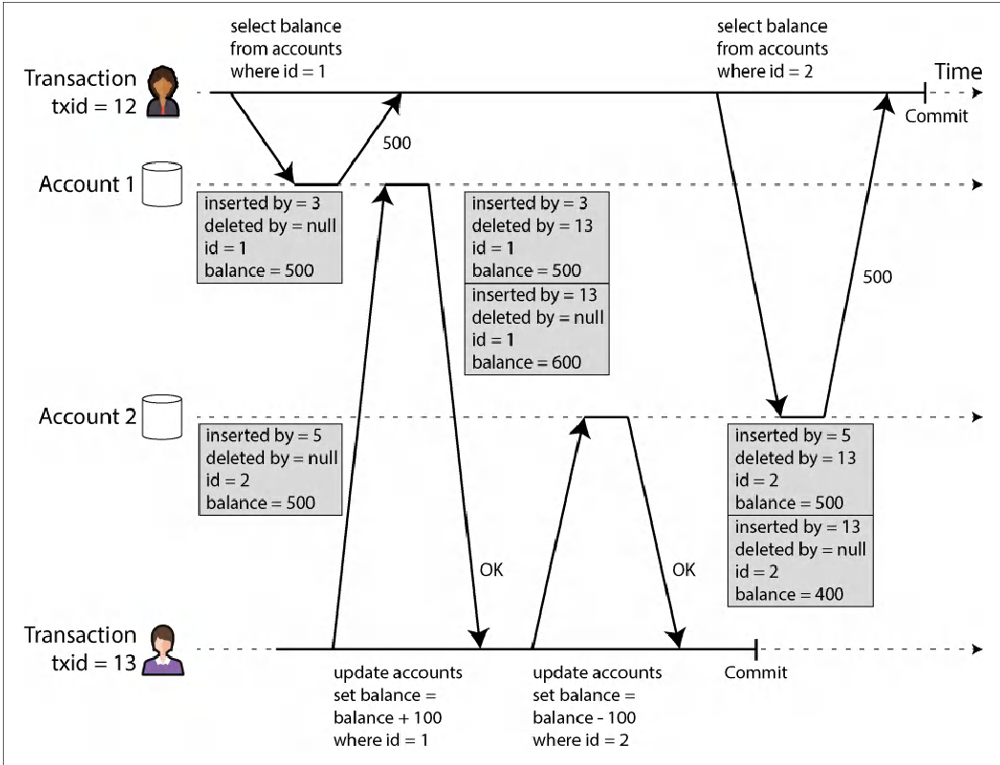

> 图 8-7。使用多版本并发控制实现快照隔离。  

表中的每一行都有一个 inserted_by 字段，其中包含将该行插入表中的事务 ID。每一行还有一个初始为空的 deleted_by 字段。如果事务删除一行，该行不会从数据库中移除，而是将 deleted_by 字段设为请求删除的事务 ID，从而标记为待删除。之后，当确定任何事务都无法再访问已删除或已覆盖的数据时，数据库中的垃圾回收（GC）进程会移除所有标记为待删除的行并释放其空间。  

更新在内部会转换为一次删除和一次插入 [46]。例如，在图 8-7 中，事务 13 从账户 2 扣除 \$100，使余额从 \$500 变为 \$400。此时，accounts 表中包含账户 2 的两行：一行余额为 \$500，被事务 13 标记为已删除；另一行余额为 \$400，由事务 13 插入。  

一行的所有版本都存储在同一个数据库堆中（参见第 133 页的“在索引中存储值”），无论写入它们的事务是否已经提交。同一行的各个版本构成一个链表，可以从最新版本指向最旧版本，也可以反向连接，使查询能够在内部遍历一行的所有版本 [47, 48]。  

#### 用于观察一致快照的可见性规则  

当事务从数据库读取数据时，数据库会用事务 ID 来决定它能看到哪些行版本、哪些行版本不可见。通过仔细定义可见性规则，数据库可以向应用呈现其内容的一致快照。其工作方式大致如下 [45]：  

1. 每个事务开始时，数据库会列出当时所有仍在进行中（尚未提交或中止）的其他事务。这些事务进行的任何写入都会被忽略，即使它们随后提交也不例外。这能确保应用看到的是一个一致快照，不受其他事务提交的影响。  

2. 事务 ID 更大的事务（即在当前事务启动后才启动、因而未列入进行中事务清单的事务）所做的任何写入都会被忽略，无论这些事务是否已经提交。  

3. 已中止事务所做的任何写入都会被忽略，无论中止发生在何时。这样做的好处是，事务中止时无需立即从存储中移除它写入的行，因为可见性规则会将它们过滤掉。GC 进程可以稍后再将它们移除。  

4. 其他所有写入对应用的查询均可见。  

这些规则既适用于行的插入，也适用于行的删除。在图 8-7 中，当事务 12 读取账户 2 时，它看到的余额是 \$500，因为对 \$500 余额的删除由事务 13 执行（根据规则 2，事务 12 看不到事务 13 所做的删除），而插入的 \$400 余额尚不可见（同样依据该规则）。  

换句话说，只有同时满足以下两个条件，一行才可见：  

- 读取者的事务启动时，插入该行的事务已经提交。  

- 该行未被标记为删除；或者即使已被标记为删除，请求删除的事务在读取者的事务启动时尚未提交。  

长时间运行的事务可能会长期持续使用同一个快照，不断读取那些从其他事务的角度来看早已被覆盖或删除的值。数据库从不原地更新值，而是在每次值发生变化时插入一个新版本，因此只需付出很小的开销，就能提供一致快照。  

#### 索引与快照隔离  

在多版本数据库中，索引如何工作？最常见的做法是让每个索引项指向与该索引项匹配的某个行版本（最旧版本或最新版本）。每个行版本可以包含指向相邻的较旧或较新版本的引用。使用索引的查询随后必须遍历这些行，找到一个既可见、值又与查询目标匹配的版本。当 GC 移除任何事务都不再可见的旧行版本时，相应的索引项也可以一并移除。  

许多实现细节都会影响多版本并发控制的性能 [47, 48]。例如，如果同一行的不同版本能够放在同一页面上，PostgreSQL 会采用优化来避免更新索引 [42]。另一些数据库为了节省空间，会避免存储被修改行的完整副本，只存储版本之间的差异。  

CouchDB、Datomic 和 LMDB 采用了另一种方法。尽管它们也使用 B 树（参见第 125 页的“B 树”），但使用的是一种*不可变*（写时复制）变体：更新时不覆盖树的页面，而是为每个被修改的页面创建一个新副本。从被修改页面的父页面一直到树根，所有父页面都会被复制并更新，使其指向子页面的新版本。不受写入影响的页面无需复制，可以与新树共享 [49]。  

使用不可变 B 树时，每个写事务（或一批事务）都会创建一个新的 B 树根，而某个特定的根就是数据库在其创建时刻的一致快照。无需根据事务 ID 过滤行，因为后续写入无法修改现有 B 树，只能创建新的树根。这种方法同样需要后台进程执行压缩和 GC。  

#### 快照隔离、可重复读与命名混乱  

MVCC 是数据库常用的一种实现技术，并且经常用于实现快照隔离。然而，不同数据库有时会用不同术语指代同一事物——例如，快照隔离在 PostgreSQL 中称为“可重复读”，在 Oracle 中称为“可串行化” [30]。此外，不同系统有时会用同一个术语表达不同含义——例如，在 PostgreSQL 中，“可重复读”意味着快照隔离；在 MySQL 中，它意味着一种一致性弱于快照隔离的 MVCC 实现 [43]；而 IBM Db2 则用“可重复读”指代可串行化 [10]。  

出现这种命名混乱，是因为 SQL 标准中没有快照隔离这一概念：该标准基于 System R 在 1975 年对隔离级别的定义 [3]，而当时快照隔离尚未发明。标准定义的是可重复读隔离，它表面上看起来与快照隔离相似。PostgreSQL 将其快照隔离级别称为可重复读，是因为它满足标准的要求，从而可以宣称符合标准。  

遗憾的是，SQL 标准对隔离级别的定义存在缺陷——它含糊、不精确，而且不像标准应有的那样独立于实现 [38]。尽管多个数据库都实现了可重复读隔离，但即使这些保证名义上已经标准化，它们实际提供的保证仍有很大差异 [30]。研究文献对这一隔离级别给出了形式化定义 [39, 40]，但大多数实现都不满足该形式化定义。因此，实际上没人真正知道可重复读隔离究竟意味着什么。  

## 防止更新丢失  

我们对读已提交和快照隔离级别的讨论，主要关注的是：存在并发写入时，只读事务能够看到什么。我们基本忽略了两个事务并发写入的问题——只讨论了脏写（参见第 291 页的“防止脏写”），它是可能发生的一种特定写-写冲突。  

并发写事务之间还可能发生其他几种值得关注的冲突。其中最著名的是*更新丢失*问题，图 8-1 以两个计数器并发递增为例对此进行了说明。  

如果应用从数据库读取一个值、修改它，再把修改后的值写回（即前文提到的读-修改-写周期），就可能发生更新丢失。如果两个事务并发执行这一过程，其中一次修改可能会丢失，因为第二次写入没有包含第一次修改。（我们有时会说后一次写入*覆盖*了前一次写入。）这种模式会出现在多种场景中，例如：  

- 递增计数器或更新账户余额（需要读取当前值、计算新值，再写回更新后的值）  

- 对复杂值进行局部修改——例如，向 JSON 文档内的列表添加一个元素（需要解析文档、进行修改，再写回修改后的文档）  

- 两个用户同时编辑一个 wiki 页面，每个用户都通过把整个页面内容发送到服务器来保存自己的更改，从而覆盖数据库中当时已有的内容  

由于这个问题十分常见，人们已经开发出了多种解决方案 [50]。下面来看其中最常用的几种。  

### 原子写操作  

许多数据库提供原子更新操作，从而无需在应用代码中实现读-修改-写周期。如果代码能够用这些操作来表达，它们通常是最佳解决方案。例如，以下指令在大多数关系型数据库中都能安全地并发执行：  

```sql
UPDATE counters SET value = value + 1 WHERE key = 'foo';
```

类似地，MongoDB 等文档数据库提供对 JSON 文档的一部分进行局部修改的原子操作，Redis 则提供修改优先队列等数据结构的原子操作。并非所有写入都能轻易地用原子操作表达——例如，更新 wiki 页面涉及任意文本编辑，可以使用第 227 页“无冲突复制数据类型与操作转换”中讨论的算法来处理——但在能够使用这些操作的情况下，它们通常是最佳选择。  

原子操作通常通过在读取对象时对其加排他锁来实现，使其他事务在更新应用完成之前都无法读取该对象。另一种选择是直接强制所有原子操作在单个线程上执行。  

遗憾的是，ORM 框架很容易让人无意间写出执行不安全读-修改-写周期的代码，而不是使用数据库提供的原子操作 [51, 52, 53]。这可能成为一类难以通过测试发现的隐蔽 bug。  

### 显式加锁  

如果数据库内置的原子操作无法提供所需功能，防止更新丢失的另一种选择是由应用显式锁定将要更新的对象。随后应用可以执行读-修改-写周期；如果其他事务试图并发更新或锁定同一对象，就必须等待第一个读-修改-写周期完成。  

例如，考虑一个多人游戏，其中多名玩家可以并发移动同一个棋子。在这种情况下，原子操作可能并不足够，因为应用还需要确保玩家的移动遵守游戏规则，而这涉及一些无法合理实现为数据库查询的逻辑。作为替代，可以使用锁来防止两名玩家并发移动同一枚棋子，如示例 8-1 所示。  

示例 8-1。显式锁定行以防止更新丢失  

```sql
BEGIN TRANSACTION;  

SELECT * FROM figures
WHERE name = 'robot' AND game_id = 222
FOR UPDATE;

-- 检查移动是否合法，然后更新前一个 SELECT
-- 返回的棋子的位置。
UPDATE figures SET position = 'c4' WHERE id = 1234;  

COMMIT;  
```

① FOR UPDATE 子句指示数据库锁定此查询返回的所有行。  

这种方法确实有效，但要正确使用它，就需要仔细思考应用逻辑。很容易在代码中的某处忘记添加必要的锁，从而引入竞态条件。  

此外，锁定多个对象存在死锁风险，即两个或更多事务相互等待对方释放锁。许多数据库会自动检测死锁，并中止其中一个相关事务，使系统能够继续推进。可以在应用层重试被中止的事务来处理这种情况。  

### 自动检测更新丢失  

原子操作和锁通过强制读-修改-写周期按顺序发生来防止更新丢失。另一种方法是允许它们并行执行；如果事务管理器检测到更新丢失，就中止相关事务，并强制其重试读-修改-写周期。  

这种方法的一个优点是，数据库可以结合快照隔离高效地执行这项检查。事实上，PostgreSQL 的可重复读、Oracle 的可串行化以及 SQL Server 的快照隔离级别，都会自动检测更新丢失并中止造成问题的事务。然而，MySQL/InnoDB 的可重复读隔离级别不会检测更新丢失 [30, 43]。一些作者 [38, 40] 认为，数据库必须防止更新丢失，才有资格称为提供快照隔离，因此按照这一定义，MySQL 并未提供快照隔离。  

更新丢失检测的一大优势是，它不要求应用代码使用任何特殊的数据库功能。你可能会忘记使用锁或原子操作，从而引入 bug；但更新丢失检测会自动发生，因此更不容易出错。不过，你仍然必须在应用层重试被中止的事务。  

### 条件写入（比较并设置）  

在不提供事务的数据库中，有时会提供条件写入操作：仅当某个值自上次读取后未发生变化时才允许更新，从而防止更新丢失（前文在第 286 页的“单对象写入”中提到过）。如果当前值与你之前读取的值不匹配，更新就不会生效，必须重试读-修改-写周期。它相当于数据库版本的原子 CAS 指令，而许多 CPU 都支持这种指令。  

例如，为了防止两个用户并发更新同一个 wiki 页面，可以尝试如下操作，期望只有当页面内容自用户开始编辑后未发生变化时，更新才会执行：  

```sql
-- 此操作是否安全取决于数据库实现
UPDATE wiki_pages SET content = 'new content'
WHERE id = 1234 AND content = 'old content';  
```

如果内容已经改变，不再与 old content 匹配，此更新将不会产生任何效果，因此需要检查更新是否生效，并在必要时重试。除了比较完整内容之外，也可以使用版本号列，每次更新时将其递增，并且仅当当前版本号未改变时才应用更新。这种方法有时称为*乐观锁* [54]。  

请注意，如果另一个事务并发修改了 content，按照 MVCC 可见性规则，新内容可能不可见（参见第 297 页的“用于观察一致快照的可见性规则”）。许多 MVCC 实现会在这种场景下对可见性规则作出例外：其他事务写入的值对 UPDATE 和 DELETE 查询的 WHERE 子句求值可见，即使这些写入在快照中的其他地方并不可见。  

### 冲突解决与复制  

在复制数据库中（参见第 6 章），防止更新丢失又多了一个维度。因为这些数据库在多个节点上保存数据副本，并且数据可能在不同节点上被并发修改，所以还需要采取额外措施。  

锁和条件写入操作假定数据只有一个最新副本。然而，采用多主复制或无主复制的数据库通常允许多次写入并发发生，再对其进行异步复制，因此无法保证存在单一的最新数据副本。所以，基于锁或条件写入的技术不适用于这种情形。（我们将在第 402 页的“线性一致性”中更详细地重新讨论这个问题。）  

相反，正如第 222 页“处理冲突写入”中所讨论的，这类复制数据库的一种常见做法是允许并发写入产生同一个值的多个冲突版本（也称为兄弟版本），然后使用应用代码或特殊数据结构在事后解决并合并这些版本。  

如果更新满足交换律（即可以在不同副本上以不同顺序应用它们，仍然得到相同结果），合并冲突值就能防止更新丢失。例如，递增计数器和向集合添加元素都是满足交换律的操作。这正是 CRDT 背后的思想，我们在第 227 页的“无冲突复制数据类型与操作转换”中已经见过。然而，条件写入等某些操作无法满足交换律。  

此外，许多复制数据库默认采用的 LWW 冲突解决方法容易造成更新丢失，详见第 224 页的“最后写入胜出（丢弃并发写入）”。  

## 写偏差与幻读  

前几节讨论了*脏写*和*更新丢失*，这是不同事务并发尝试写入同一对象时可能发生的两种竞态条件。为了避免数据损坏，必须防止这些竞态条件——可以由数据库自动防止，也可以通过使用锁或原子写操作等手动保护措施来防止。  

然而，并发写入之间可能发生的竞态条件并不止这些。本节将介绍一些更微妙的冲突示例。  

首先，假设你正在编写一个应用，供医生管理自己在医院的值班班次。医院通常会尽量确保任何时刻都有多名医生值班，但无论如何都必须至少有一名。医生可以放弃自己的班次（例如因生病），前提是该班次中至少还有一名同事继续值班 [55, 56]。  

现在，假设 Aaliyah 和 Bryce 是某个特定班次的两名值班医生。两人都感到身体不适，因此都决定请假。不巧的是，他们几乎同时点击了退出值班的按钮。接下来发生的情况如图 8-8 所示。  

在每个事务中，应用首先检查当前是否有两名或更多医生值班；如果是，就认为让一名医生退出值班是安全的。由于数据库使用快照隔离，两次检查都返回 2，因此两个事务都进入下一阶段。Aaliyah 更新自己的记录，将自己移出值班名单；Bryce 也同样更新自己的记录。两个事务都提交后，便没有任何医生值班了。这违反了至少有一名医生值班的要求。  

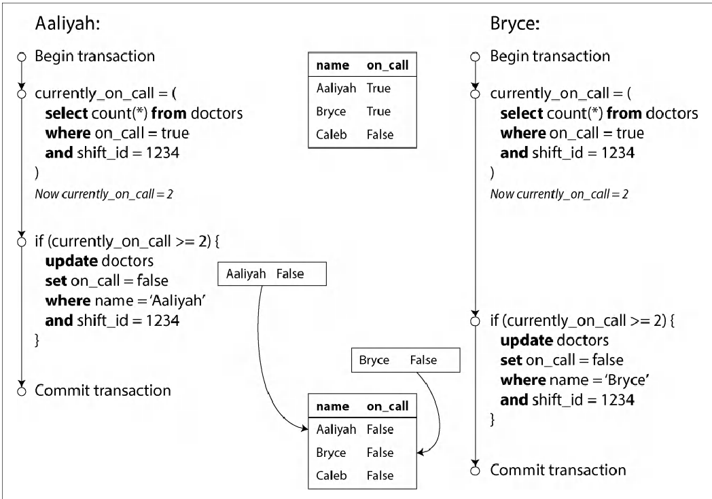

> 图 8-8。导致应用程序错误的写偏差。  

### 写偏差的特征  

这种异常称为写偏差 [38]。它既不是脏写，也不是更新丢失，因为两个事务更新的是两个对象（分别是 Aaliyah 和 Bryce 的值班记录）。这里发生了冲突并不那么明显，但它无疑是一种竞态条件：如果两个事务相继运行，第二位医生就无法取消值班。之所以可能出现这种异常行为，完全是因为两个事务并发运行。  

你可以把写偏差看作更新丢失问题的泛化形式。如果两个事务读取相同的对象，然后更新其中一些对象（不同事务可能更新不同的对象），就可能发生写偏差。在不同事务更新同一对象这一特殊情况下，会产生脏写或更新丢失异常（取决于时序）。  

我们已经看到，有多种方法可以防止更新丢失。对于写偏差，可用的选择则更为有限：  

- 单对象原子操作无济于事，因为这里涉及多个对象。  

- 某些快照隔离实现提供的更新丢失自动检测也无济于事——PostgreSQL 的可重复读、MySQL/InnoDB 的可重复读、Oracle 的可串行化以及 SQL Server 的快照隔离级别都不会自动检测写偏差 [30]。要自动防止写偏差，需要真正的可串行化隔离（参见第 308 页的“可串行化”）。  

- 某些数据库允许配置由数据库强制执行的约束（例如唯一性约束、外键约束或对特定值的限制）。然而，要规定至少有一名医生必须值班，就需要一个涉及多个对象的约束。大多数数据库并不内置支持此类约束，不过你或许可以使用触发器或物化视图来实现，详见第 280 页的“一致性” [12]。  

- 如果无法使用可串行化隔离级别，在这个例子中次优的选择可能是显式锁定事务所依赖的行。在医生的例子中，可以编写如下代码：  

```sql
BEGIN TRANSACTION;  

SELECT * FROM doctors
WHERE on_call = true
AND shift_id = 1234 FOR UPDATE;

UPDATE doctors
SET on_call = false
WHERE name = 'Aaliyah'
AND shift_id = 1234;

COMMIT;  
```

① 与之前一样，FOR UPDATE 告诉数据库锁定此查询返回的所有行。  

### 写偏差的更多示例  

写偏差乍看之下似乎是个晦涩的问题，但一旦意识到它的存在，你可能会注意到其他可能发生写偏差的情形。下面是更多示例：  

### 会议室预订系统  

假设你要确保同一会议室在同一时间不能有两个预订 [57]。有人想要预订时，首先检查是否存在冲突的预订（即同一房间且时间范围重叠的预订）；如果没有找到，就创建会议（见示例 8-2）。  

示例 8-2。一个试图避免重复预订的会议室预订系统（在快照隔离下并不安全）  

```sql
BEGIN TRANSACTION;  

-- 检查是否有与中午 12 点至下午 1 点这一时段重叠的现有预订
SELECT COUNT(*) FROM bookings
WHERE room_id = 123 AND
    end_time > '2025-01-01 12:00' AND start_time < '2025-01-01 13:00';

-- 如果上一个查询返回零：
INSERT INTO bookings
(room_id, start_time, end_time, user_id)
VALUES (123, '2025-01-01 12:00', '2025-01-01 13:00', 666);  

COMMIT;  
```

遗憾的是，快照隔离无法阻止另一位用户并发插入一个冲突的会议。要保证不会出现日程冲突，仍然需要可串行化隔离。  

### *多人游戏*  

在示例 8-1 中，我们使用锁来防止更新丢失（确保两名玩家无法同时移动同一个棋子）。然而，锁并不能阻止玩家把两个不同的棋子移动到棋盘上的同一位置，也不能阻止他们做出其他可能违反游戏规则的行动。根据所执行规则的类型，你或许可以使用唯一性约束，否则就容易受到写偏差的影响。  

### 抢注用户名  

在一个要求每位用户的用户名都唯一的网站上，两位用户可能同时尝试使用同一个用户名创建账户。你可以使用事务检查某个名字是否已被占用，如果没有，就用该名字创建账户。然而，与前面的示例一样，这在快照隔离下并不安全。幸运的是，唯一性约束在这里是一种简单的解决方案（第二个尝试注册该用户名的事务会因违反约束而中止）。  

### 防止双重支付  

允许用户花费金钱或积分的服务需要检查用户花掉的金额或积分没有超过其拥有的数量。可以这样实现：在用户账户中插入一个暂定的支出项目，列出账户中的所有项目，并检查总和是否为正。然而，发生写偏差时，可能会并发插入两个支出项目，两者合计导致余额变为负数，但两个事务都没有察觉到对方。  

### 幻读导致写偏差  

前面的所有示例都遵循相似的模式：  

1. SELECT 查询通过搜索符合某个搜索条件的行来检查是否满足要求（例如，至少有两名医生值班、该会议室在该时段没有现有预订、棋盘上的这个位置尚未放置其他棋子、用户名尚未被占用、账户中仍有余额）。  

2. 应用程序代码根据第一个查询的结果决定如何继续（可能继续执行操作，也可能向用户报告错误并中止）。  

3. 如果应用程序决定继续，就对数据库执行写入（INSERT、UPDATE 或 DELETE）并提交事务。  

这次写入改变了第 2 步决策的前提条件。换言之，如果提交写入后再次执行第 1 步的 SELECT 查询，就会得到不同的结果，因为该写入改变了符合搜索条件的行集合（现在少了一名值班医生、会议室在该时段已被预订、棋盘上的位置已被移动过来的棋子占据、用户名已被占用、账户中的余额减少了）。  

这些步骤也可能以不同的顺序发生。例如，可以先执行写入，然后执行 SELECT 查询，最后根据查询结果决定中止还是提交。  

在值班医生的示例中，第 3 步修改的行是第 1 步返回的行之一，因此可以通过在第 1 步锁定这些行（SELECT FOR UPDATE），使事务安全并避免写偏差。然而，另外四个示例有所不同：它们检查是否不存在符合搜索条件的行，而写入操作会添加一行符合相同条件的数据。如果第 1 步中的查询没有返回任何行，SELECT FOR UPDATE 就无从附加锁 [58]。  

一个事务中的写入改变了另一个事务中搜索查询结果的这种效应，称为幻读 [4]。快照隔离可以避免只读查询中的幻读，但在我们讨论的这些读写事务中，幻读可能导致尤其棘手的写偏差。ORM 生成的 SQL 也容易出现写偏差 [52, 53]。  

### 物化冲突  

如果幻读问题的根源在于没有可以附加锁的对象，那么是否可以在数据库中人为引入一个锁对象？  

例如，在会议室预订的情形中，可以设想创建一张包含时间段和会议室的表。表中的每一行对应特定时间段（比如 15 分钟）内的特定会议室。预先为会议室和时间段的所有可能组合创建行（例如未来六个月内的所有组合）。  

现在，想要创建预订的事务可以锁定（SELECT FOR UPDATE）表中与所需会议室和时段对应的行。获取锁之后，事务可以像之前一样检查重叠的预订并插入新预订。请注意，这张附加表并不用于存储预订信息——它纯粹是一个锁的集合，用来防止对同一会议室和同一时间范围并发进行预订。  

这种方法称为*物化冲突*，因为它把幻读转化成数据库中一组确实存在的具体行上的锁冲突 [14]。遗憾的是，确定如何物化冲突既困难又容易出错，而且让并发控制机制渗入应用程序数据模型也很不雅。因此，如果没有其他可行的方案，物化冲突应当被视为最后的手段。在大多数情况下，可串行化隔离级别更为可取。  

## 可串行化  

本章已经介绍了几个容易出现竞态条件的事务示例。有些竞态条件可以由读已提交和快照隔离级别防止，但另一些则不能。我们还遇到了写偏差和幻读的一些尤其棘手的示例。情况令人遗憾：  

- 隔离级别难以理解，而且不同数据库的实现并不一致（例如，“可重复读”的含义差异很大）。  

- 仅仅查看应用程序代码，很难判断它在特定隔离级别下运行是否安全——尤其是在大型应用程序中，你可能并不了解所有可能并发发生的事情。  

- 没有好用的工具帮助我们检测竞态条件。原则上，静态分析可能有所帮助 [35]，但研究技术尚未进入实际应用。测试并发问题很困难，因为它们通常是不确定的——只有在时序不凑巧时，问题才会发生。  

这并不是一个新问题。自 20 世纪 70 年代引入弱隔离级别以来，情况一直如此 [3]。研究人员始终给出一个简单的答案：使用*可串行化*隔离！  

可串行化隔离是最强的隔离级别。它保证即使事务可以并行执行，最终结果也与它们逐个、*串行*执行且不存在任何并发时相同。因此，数据库保证：如果事务各自单独运行时行为正确，那么并发运行时也会继续保持正确——换言之，数据库可以防止所有可能的竞态条件。  

但是，如果可串行化隔离比混乱的弱隔离级别好这么多，为什么并非人人都在使用它？要回答这个问题，我们需要考察实现可串行化的各种方案及其性能。目前提供可串行化的大多数数据库都使用以下三种技术之一，本章余下部分将对此进行探讨：  

- 按串行顺序逐一执行事务（见下一节）  

- 两阶段锁定（见第 313 页的“两阶段锁定”），几十年来它一直是唯一可行的选择  

- 可串行化快照隔离等乐观并发控制技术（见第 317 页的“可串行化快照隔离”）  

### 实际串行执行  

避免并发问题最简单的方法是完全消除并发：在单个线程上，按照串行顺序一次只执行一个事务。这样，我们便完全绕开了检测和防止事务间冲突的问题；由此产生的隔离按照定义就是可串行化的。  

虽然这个想法似乎显而易见，但直到 21 世纪头十年，数据库设计者才认定使用单线程循环执行事务是可行的 [59]。此前 30 年间，多线程并发一直被视为获得良好性能的必要条件；那么，是什么变化使单线程执行成为可能？  

两项发展促使人们重新思考这一问题：  

- RAM 已经足够便宜，因此对许多用例来说，如今把整个活跃数据集保存在内存中是可行的（见第 133 页的“将所有内容保存在内存中”）。当事务需要访问的所有数据都在内存中时，事务的执行速度会比等待从磁盘加载数据快得多。  

- 数据库设计者意识到，OLTP 事务通常很短，只进行少量读写（见第 3 页的“操作型系统与分析型系统”）。相比之下，长时间运行的分析查询通常是只读的，因此可以在串行执行循环之外，基于一致的快照（使用快照隔离）运行。  

例如，VoltDB/H-Store、Redis 和 Datomic 都实现了串行执行事务的方法 [60, 61, 62]。专为单线程执行设计的系统有时可以比支持并发的系统性能更好，因为它可以避免锁定的协调开销。然而，其吞吐量受限于单个 CPU 核心的处理能力。为了充分利用这个单线程，事务需要采用不同于传统形式的结构。  

#### 将事务封装在存储过程中  

在数据库发展的早期，人们曾设想数据库事务可以涵盖用户活动的整个流程。例如，预订机票是一个多阶段过程（搜索航线、票价和可用座位；确定行程；预订该行程中每个航班的座位；输入乘客详细信息；付款）。数据库设计者认为，如果整个过程是一个事务，从而能够以原子方式提交，那会很理想。  

遗憾的是，人类做决定和作出响应的速度非常慢。如果数据库事务需要等待用户输入，数据库就需要支持数量可能极其庞大的并发事务，而且其中大多数处于空闲状态。大多数数据库无法高效做到这一点，因此几乎所有 OLTP 应用程序都会避免在事务中以交互方式等待用户，从而保持事务简短。在 Web 上，这意味着事务会在同一个 HTTP 请求内提交——事务不会跨越多个请求。新的 HTTP 请求会启动新的事务。  

即使人类已经不在关键路径上，事务仍然继续以交互式客户端/服务器方式逐条语句执行。应用程序发出查询并读取结果，可能会根据第一个查询的结果再发出另一个查询，如此继续。查询和结果在应用程序代码（运行于一台机器）与数据库服务器（运行于另一台机器）之间来回传送。  

在这种交互式事务中，大量时间花在应用程序和数据库之间的网络通信上。如果禁止数据库并发，一次只处理一个事务，吞吐量会低得可怕，因为数据库大部分时间都在等待应用程序为当前事务发出下一条查询。在这种数据库中，必须并发处理多个事务，才能获得合理的性能。  

因此，采用单线程串行事务处理的系统不允许交互式多语句事务。应用程序必须把自己限制在只包含单条语句的事务中，或者以存储过程的形式预先将整个事务代码提交给数据库 [63]。  

交互式事务与存储过程之间的区别如图 8-9 所示。只要事务所需的全部数据都在内存中，存储过程就可以非常迅速地执行，无须等待任何网络或磁盘 I/O。  

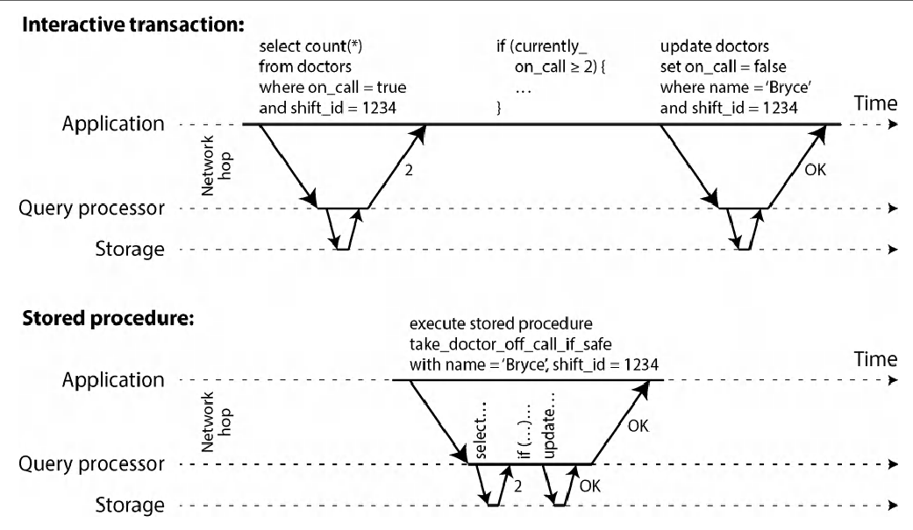

> 图 8-9。交互式事务与存储过程之间的区别（使用图 8-8 中的示例事务）。  

#### 存储过程的优缺点  

存储过程存在于关系数据库中已有一段时间，并且自 1999 年以来一直是 SQL 标准（SQL/PSM）的一部分。由于各种原因，它们的名声不算太好：  

- 传统上，每家数据库厂商都有自己的存储过程语言（Oracle 有 PL/SQL，SQL Server 有 T-SQL，PostgreSQL 有 PL/pgSQL，等等）。这些语言没有跟上通用编程语言的发展，因此从今天的视角来看相当丑陋且陈旧，而且也缺乏大多数现代编程语言所拥有的库生态系统。  

- 在数据库中运行的代码很难管理。与应用服务器相比，它更难调试，纳入版本控制和部署更麻烦，测试起来更棘手，也难以与用于监控的指标收集系统集成。  

- 数据库通常比应用服务器对性能敏感得多，因为一个数据库实例往往由许多应用服务器共享。数据库中编写不当的存储过程（例如占用大量内存或 CPU 时间，甚至导致崩溃）所造成的麻烦，可能远大于应用服务器中同样糟糕的代码。  

- 在允许租户编写自己的存储过程的多租户系统中，与数据库内核在同一进程中执行不受信任的代码会带来安全风险 [64]。  

不过，这些问题是可以克服的。现代存储过程实现已经放弃 PL/SQL，转而使用现有的通用编程语言。VoltDB 使用 Java 或 Groovy，Datomic 使用 Java 或 Clojure，Redis 使用 Lua，而 MongoDB 使用 JavaScript。  

当应用逻辑不容易嵌入其他位置时，存储过程也很有用。例如，使用 GraphQL 的应用可能通过 GraphQL 代理直接暴露其数据库。如果代理不支持复杂的验证逻辑，你可以使用存储过程将这类逻辑直接嵌入数据库。如果数据库不支持存储过程，就必须在代理与数据库之间部署一个验证服务来执行验证。  

结合存储过程与内存数据，在单个线程上执行所有事务便变得可行。当存储过程无须等待 I/O，并且避开其他并发控制机制的开销时，它们在单线程上也能实现相当不错的吞吐量。  

VoltDB 还使用存储过程进行复制。它不是将事务的写入从一个节点复制到另一个节点，而是在每个副本上执行相同的存储过程。因此，VoltDB 要求存储过程具有确定性（在不同节点上运行时，它们必须产生相同的结果）。例如，如果事务需要使用当前日期和时间，就必须通过特殊的确定性 API 来获取（有关确定性操作的更多细节，请参阅第 187 页的“持久执行与工作流”）。这种方法称为状态机复制，我们将在第 10 章再次讨论它。  

#### 分片  

串行执行所有事务大大简化了并发控制，但也将数据库的事务吞吐量限制在单台机器的单个 CPU 核心的速度之内。只读事务可以使用快照隔离在其他地方执行，但对于写入吞吐量很高的应用，单线程事务处理器可能成为严重的瓶颈。  

为了扩展到多个 CPU 核心和多个节点，可以对数据进行分片（参阅第 7 章），VoltDB 支持这种做法。如果能找到一种数据集分片方式，使每个事务只需在单个分片内读写数据，那么每个分片都可以拥有自己的事务处理线程，独立于其他分片运行。在这种情况下，可以为每个 CPU 核心分配一个分片，使事务吞吐量随 CPU 核心数量线性扩展 [61]。  

但是，对于任何需要访问多个分片的事务，数据库都必须在该事务涉及的所有分片之间进行协调。存储过程需要在所有分片上步调一致地执行，以确保整个系统的可串行化。  

由于跨分片事务存在额外的协调开销，它们比单分片事务慢得多。VoltDB 报告的跨分片写入吞吐量约为每秒 1,000 次，比其单分片吞吐量低若干数量级，而且无法通过增加机器来提高 [63]。较新的研究探索了使多分片事务更具可扩展性的方法 [65]。  

事务能否限定在单个分片内，很大程度上取决于应用所用数据的结构。简单的键值数据通常很容易分片，但具有多个二级索引的数据很可能需要大量跨分片协调（参阅第 268 页的“分片与二级索引”）。  

#### 串行执行小结  

在一定约束条件下，事务的串行执行已经成为实现可串行化隔离的一种可行方式：  

- 每个事务都必须短小且快速，因为只需一个缓慢事务就会阻塞所有事务处理。  

- 当活跃数据集能够全部装入内存时，这种方式最为合适。很少访问的数据或许可以移到磁盘，但如果需要在单线程事务中访问它们，系统就会变得非常缓慢。  

- 写入吞吐量必须足够低，能够由单个 CPU 核心处理；否则，事务需要进行分片，且不能要求跨分片协调。  

- 跨分片事务是可行的，但其吞吐量很难扩展。  

### 两阶段锁定  

大约 30 年间，数据库中只有一种算法被广泛用于实现可串行化：两阶段锁定（2PL）；为了与 2PL 的其他变体相区别，它有时也称为强严格两阶段锁定（SS2PL）。  

> [!NOTE]
> **2PL 不是 2PC**
>
> 2PL 和 2PC 是截然不同的东西。2PL 提供可串行化隔离，而 2PC 在分布式数据库中提供原子提交（参阅第 324 页的“两阶段提交”）。为避免混淆，最好将它们视为完全独立的概念，并忽略名称上这种令人遗憾的相似性。

我们之前看到，锁常用于防止脏写（参阅第 291 页的“防止脏写”）。如果两个事务并发尝试写入同一对象，锁会确保第二个写入者必须等到第一个事务结束（中止或提交）后才能继续。  

2PL 与此类似，但其锁定要求严格得多。只要没有人写入某个对象，就允许多个事务并发读取它。但只要有人想要写入（修改或删除）对象，就必须获得独占访问权：  

- 如果事务 A 已读取某个对象，而事务 B 想要写入该对象，那么 B 必须等到 A 提交或中止后才能继续。（这确保 B 无法在 A 不知情的情况下意外更改对象。）  

- 如果事务 A 已写入某个对象，而事务 B 想要读取该对象，那么 B 必须等到 A 提交或中止后才能继续。（2PL 不允许像图 8-4 那样读取对象的旧版本。）  

在 2PL 中，写入者不仅阻塞其他写入者，也会阻塞读取者，反之亦然。前文提到的快照隔离箴言——读取者永不阻塞写入者，写入者也永不阻塞读取者（参阅第 295 页的“多版本并发控制”）——概括了快照隔离与 2PL 之间的这一关键区别。另一方面，由于 2PL 提供可串行化，它能够防止前面讨论的所有竞态条件，包括更新丢失和写偏差。  

#### 2PL 的实现  

MySQL/InnoDB 和 SQL Server 的可串行化隔离级别，以及 Db2 的可重复读隔离级别，都使用 2PL [30]。  

读取者与写入者之间的阻塞，是通过为数据库中的每个对象设置锁来实现的。锁可以处于*共享模式*或*独占模式*（也称为*多读者单写者*锁）。其用法如下：  

- 如果事务想要读取某个对象，就必须先以共享模式获取锁。允许多个事务同时以共享模式持有该锁；但如果另一个事务已经持有该对象的独占锁，这些事务就必须等待。  

- 如果事务想要写入某个对象，就必须先以独占模式获取锁。此时不允许任何其他事务持有该锁（无论是共享模式还是独占模式），因此只要对象上已经存在任何锁，该事务就必须等待。  

- 如果事务先读取、随后写入某个对象，它可以将共享锁升级为独占锁。升级的工作方式与直接获取独占锁相同。  

- 事务获取锁之后，必须持续持有它，直到事务结束（提交或中止）。名称中的“两阶段”正源于此：第一阶段（增长阶段，即事务执行期间）是获取锁的阶段；第二阶段（收缩阶段，即事务结束时）是释放所有锁的阶段。这两个阶段不得重叠；事务一旦释放了某个锁，就不能再获取新锁。  

由于使用了如此多的锁，很容易出现事务 A 卡住并等待事务 B 释放锁，而事务 B 也在等待事务 A 释放锁的情况。这种状况称为*死锁*。数据库会自动检测事务之间的死锁，并中止其中一个事务，让其他事务能够继续推进。应用需要重试被中止的事务。  

#### 2PL 的性能  

2PL 的最大缺点，也是自 20 世纪 70 年代以来它没有成为大多数系统默认方案的原因，就是性能。在 2PL 下，事务吞吐量和查询响应时间都明显逊于弱隔离。  

这部分是因为获取和释放所有这些锁所带来的开销，但更重要的原因是并发度降低。按照设计，如果两个并发事务尝试进行任何可能以某种方式导致竞态条件的操作，其中一个就必须等待另一个完成。  

例如，如果某个事务需要读取整张表（例如备份、分析查询或完整性检查，如第 293 页的“快照隔离与可重复读”所述），该事务就必须在整张表上获取共享锁。因此，读取事务首先必须等待所有正在向该表写入的事务完成；然后，在读取整张表的过程中（对于大表，这可能需要很长时间），所有其他想要写入该表的事务都会被阻塞，直到这个大型只读事务提交。实际上，数据库会在相当长的时间内无法接受写入。  

因此，如果工作负载中存在争用，运行 2PL 的数据库延迟可能很不稳定，并且在高百分位上可能非常缓慢（参阅第 37 页的“描述性能”）。仅仅一个缓慢事务，或者一个访问大量数据并获取许多锁的事务，就可能让系统其余部分停滞不前。事务超时和慢查询监控用于检测并限制行为不当的查询。  

虽然基于锁的读已提交隔离级别也可能发生死锁，但在 2PL 可串行化隔离下，死锁发生得频繁得多（具体取决于事务的访问模式）。这可能造成额外的性能问题：  

当事务因死锁而中止并被重试时，它需要从头再做一遍所有工作。如果死锁频繁发生，这可能意味着大量徒劳的工作。  

#### 谓词锁  

在前面对锁的描述中，我们略过了一个微妙但重要的细节。在第 307 页的“幻读导致写偏差”中，我们讨论了幻读问题——即一个事务改变另一个事务搜索查询的结果。采用可串行化隔离的数据库必须防止幻读。  

在会议室预订的例子中，这意味着，如果一个事务已经搜索了某个时间窗口内某个房间的现有预订（参见示例 8-2），就不允许另一个事务并发插入或更新同一房间、同一时间范围内的另一项预订。（可以并发插入其他房间的预订，或者同一房间在不同时间、不会影响拟议预订的预订。）  

该如何实现呢？从概念上讲，我们需要一个*谓词锁* [4]。它的工作方式与前面描述的共享锁/独占锁类似，但它不属于某个特定对象（例如表中的某一行），而是属于所有符合某个搜索条件的对象，例如：  

```sql
SELECT * FROM bookings
WHERE room_id = 123 AND
    end_time > '2026-01-01 12:00' AND
    start_time < '2026-01-01 13:00';  
```

谓词锁按如下方式限制访问：  

- 如果事务 A 想要读取符合某个条件的对象，就像上面的 SELECT 查询那样，它必须针对查询条件获取共享模式的谓词锁。如果另一个事务 B 当前对符合这些条件的任何对象持有独占锁，那么 A 必须等到 B 释放锁后才可以执行查询。  

- 如果事务 A 想要插入、更新或删除任何对象，它必须先检查旧值或新值是否符合任何现有的谓词锁。如果事务 B 持有一个匹配的谓词锁，那么 A 必须等到 B 提交或中止后才能继续。  

这里的关键思想是：谓词锁甚至适用于数据库中尚不存在、但将来可能添加的对象（幻读）。如果 2PL 包含谓词锁，数据库就能防止所有形式的写偏差和其他竞态条件，从而使其隔离达到可串行化。  

#### 索引范围锁  

遗憾的是，谓词锁的性能不佳：如果活跃事务持有大量锁，检查是否存在匹配锁会非常耗时。因此，大多数采用 2PL 的数据库会实现*索引范围锁*（也称为*临键锁*），它是谓词锁的一种简化近似 [56, 66]。  

通过让谓词匹配更大的一组对象来简化它是安全的。例如，如果有一个谓词锁用于锁定中午 12 点到下午 1 点之间 123 号房间的预订，可以用锁定 123 号房间任意时段的预订来近似，也可以用锁定中午 12 点到下午 1 点之间所有房间（而不只是 123 号房间）的预订来近似。这是安全的，因为任何符合原始谓词的写入肯定也符合这些近似条件。  

在房间预订数据库中，你很可能会在 room_id 列上建立索引，和/或在 start_time 与 end_time 上建立索引（否则，前面的查询在大型数据库上会非常缓慢）：  

- 假设索引建立在 room_id 上，数据库使用该索引查找 123 号房间的现有预订。此时，数据库只需为这个索引项附加一个共享锁，表明某个事务已经搜索过 123 号房间的预订。  

- 或者，如果数据库使用基于时间的索引来查找现有预订，它可以为该索引中的一段值范围附加共享锁，表明某个事务已经搜索过与指定日期中午 12 点到下午 1 点这一时段重叠的预订。  

无论采用哪种方式，搜索条件的近似都会附着在某个索引上。现在，如果另一个事务想要插入、更新或删除同一房间和/或时间段重叠的预订，它就必须更新索引的同一部分。在此过程中，它会遇到共享锁，并被迫等待锁释放。  

这能够有效防止幻读和写偏差。索引范围锁不如谓词锁精确（它们锁定的对象范围可能比维持可串行化所严格需要的更大），但由于开销低得多，因此是一种很好的折中方案。  

如果没有适合附加范围锁的索引，数据库可以退而在整张表上使用共享锁。这不利于性能，因为它会阻止所有其他事务写入该表，但这是一种安全的后备方案。  

### 可串行化快照隔离  

本章描绘了一幅数据库并发控制的黯淡图景。一方面，实现可串行化的方法要么性能不佳（2PL），要么扩展性不佳（串行执行）。另一方面，弱隔离级别虽然性能良好，却容易遭遇各种竞态条件（更新丢失、写偏差、幻读等）。可串行化隔离与良好性能是否从根本上彼此冲突？  

看起来并非如此：一种名为*可串行化快照隔离*（SSI）的算法能够提供完整的可串行化，而相比快照隔离只带来很小的性能损失。SSI 相对较新，最早于 2008 年得到阐述 [55, 67]。  

如今，SSI 及类似算法用于单节点数据库（PostgreSQL 的可串行化隔离级别 [56]、SQL Server 的内存 OLTP/Hekaton [68] 以及 HyPer [69]）、分布式数据库（CockroachDB [5] 和 FoundationDB [8]），以及 BadgerDB 等嵌入式存储引擎。  

#### 悲观并发控制与乐观并发控制  

2PL 是一种悲观并发控制机制：它基于这样一个原则——如果任何事情有可能出错（由另一个事务持有的锁表明），最好先等待，直到情况重新安全，再执行任何操作。它类似于多线程编程中用于保护数据结构的互斥。  

从某种意义上说，串行执行是极端的悲观方式；它本质上相当于每个事务在执行期间都对整个数据库（或数据库的某个分片）持有独占锁。我们通过让每个事务执行得非常快来弥补这种悲观性，使其只需在短时间内持有“锁”。  

相比之下，可串行化快照隔离是一种乐观并发控制技术。在此语境中，*乐观*意味着：当可能发生危险的事情时，事务不会阻塞，而是仍然继续，希望最终一切顺利。当事务想要提交时，数据库会检查是否发生了不良情况（即隔离是否遭到破坏）；如果发生了，事务就会中止并且必须重试。只有以可串行化方式执行的事务才允许提交。  

乐观并发控制是一个古老的思想 [70]，其优缺点长期以来一直存在争论 [71]。如果争用很激烈（许多事务试图访问相同对象），它的表现会很糟糕，因为这会导致很大比例的事务需要中止。如果系统已经接近其最大吞吐量，重试事务所带来的额外事务负载可能使性能进一步恶化。  

然而，如果有足够的闲置容量，并且事务之间的争用不太严重，乐观并发控制技术往往比悲观并发控制技术表现得更好。可以使用可交换的原子操作来减少争用：  

例如，如果多个事务想要并发递增一个计数器，那么以什么顺序执行这些递增操作并不重要（只要不在同一个事务中读取该计数器），因此所有并发递增操作都可以执行而不会发生冲突。  

顾名思义，SSI 以快照隔离为基础——也就是说，事务中的所有读取都来自数据库的一致快照（参见第 293 页的“快照隔离与可重复读”）。在快照隔离之上，SSI 增加了一种算法，用于检测读写之间的可串行化冲突，并确定要中止哪些事务。  

#### 基于过时前提的决策  

此前讨论快照隔离中的写偏差时（参见第 303 页的“写偏差与幻读”），我们观察到一种反复出现的模式：事务从数据库读取数据，检查查询结果，然后根据所看到的结果决定采取某项操作（写入数据库）。然而，在快照隔离下，等到事务提交时，最初的查询结果可能已经过时，因为数据可能在此期间被修改。  

换句话说，事务是基于某个前提（即事务开始时为真的事实，例如“当前有两名医生值班”）采取操作的。之后，当事务想要提交时，原始数据可能已经发生变化——这个前提可能不再成立。  

当应用程序发出查询（例如“当前有多少名医生值班？”）时，数据库并不知道应用程序逻辑会如何使用该查询的结果。为安全起见，数据库必须假定，查询结果（前提）的任何变化都可能导致该事务中的写入失效。换言之，事务中的查询与写入之间可能存在因果依赖。为了提供可串行化隔离，数据库必须检测事务可能基于过时前提采取操作的情况，并在这种情况下中止该事务。  

数据库如何知道查询结果是否可能已经改变？考虑以下两种情况：  

- 检测对过时 MVCC 对象版本的读取（读取之前发生了尚未提交的写入）  

- 检测影响先前读取的写入（写入发生在读取之后）  

#### 检测过时的 MVCC 读取  

回想一下，快照隔离通常通过 MVCC 实现（参见第 295 页的“多版本并发控制”）。当事务从 MVCC 数据库的一致快照中读取时，它会忽略在该快照生成时尚未提交的其他事务所做的写入。  

在图 8-10 中，事务 43 看到 Aaliyah 的 `on_call = true`，因为事务 42（它修改了 Aaliyah 的值班状态）尚未提交。然而，等到事务 43 想要提交时，事务 42 已经提交。这意味着从一致快照中读取时被忽略的写入现已生效，事务 43 的前提也不再成立。如果写入者插入了此前不存在的数据，情况会更加复杂（参见第 307 页的“幻读导致写偏差”）。接下来我们将讨论 SSI 如何检测导致幻读的写入。  

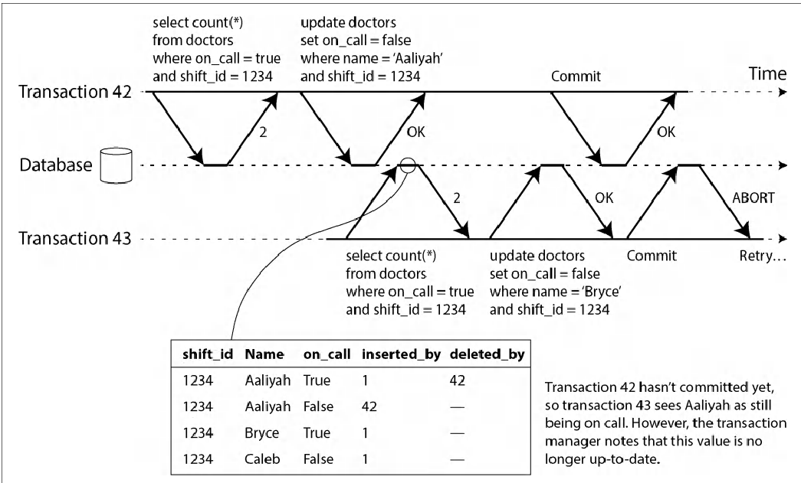

> 图 8-10。检测事务何时从 MVCC 快照中读取了过时值。  

为了防止这种异常，数据库需要跟踪事务何时因 MVCC 可见性规则而忽略了另一个事务的写入。当事务想要提交时，数据库会检查被忽略的写入中是否有任何一个现已提交。如果有，就必须中止该事务。  

为什么要等到提交时？为什么不在检测到过时读取后立即中止事务 43？如果事务 43 是只读事务，就不需要中止它，因为不存在写偏差的风险。事务 43 进行读取时，数据库还不知道该事务之后是否会执行写入。此外，事务 42 可能随后中止，也可能在事务 43 提交时仍未提交，因此这次读取最终可能根本没有过时。通过避免不必要的中止，SSI 保留了快照隔离对从一致快照进行长时间读取的支持。  

#### 检测影响先前读取的写入  

要考虑的第二种情况是，另一个事务在数据被读取后对其进行了修改。图 8-11 展示了这种情况。  

讨论 2PL 时，我们介绍过索引范围锁（参见第 317 页的“索引范围锁”），它允许数据库锁定与搜索查询匹配的所有行，例如 `WHERE shift_id = 1234`。这里可以使用类似的技术，只不过 SSI 锁不会阻塞其他事务。  

在图 8-11 中，事务 42 和 43 都搜索轮班 1234 期间的值班医生。如果 `shift_id` 上有索引，数据库就可以使用索引项 1234 来记录事务 42 和 43 读取过这些数据这一事实。（如果没有索引，可以在表级别跟踪此信息。）这些信息只需保留一段时间；当一个事务已经结束（提交或中止），并且所有与它并发的事务也已结束后，数据库就可以忘记它读取过的数据。  

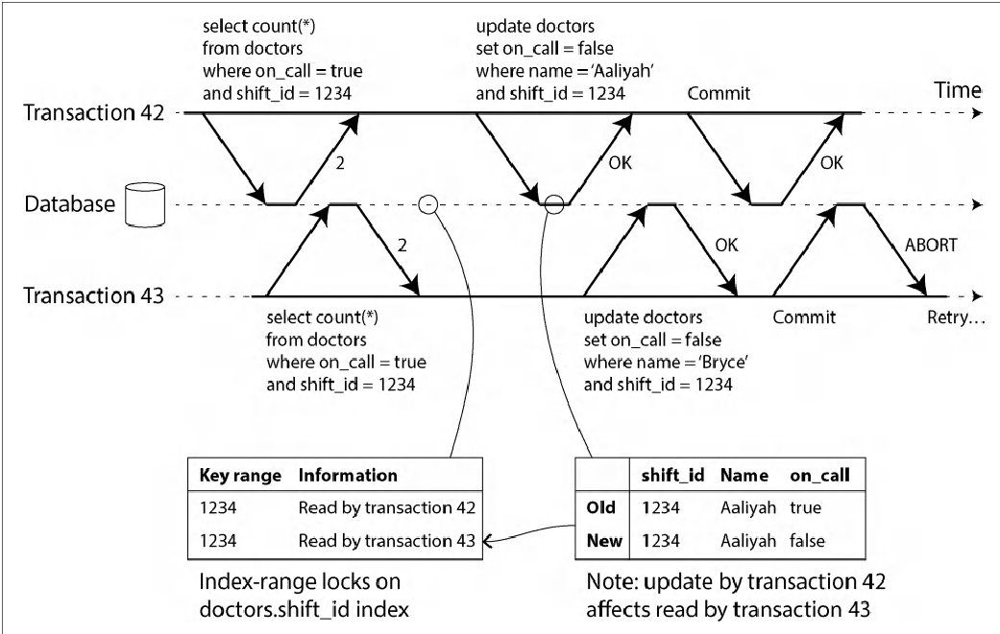

> 图 8-11。在可串行化快照隔离中，检测一个事务何时修改了另一个事务读取过的数据。  

当事务写入数据库时，它必须在索引中查找最近读取过受影响数据的其他事务。这个过程类似于获取受影响键范围上的写锁，但它不会阻塞并等待读取者提交，而是像一根绊线：它只是通知那些事务，它们读取的数据可能已经不再是最新的。  

在图 8-11 中，事务 43 通知事务 42，后者先前的读取已经过时；反过来亦然。事务 42 率先提交，并且提交成功；尽管事务 43 的写入影响了事务 42，但事务 43 尚未提交，因此该写入还没有生效。然而，当事务 43 想要提交时，来自事务 42 的冲突写入已经提交，所以事务 43 必须中止。  

#### 可串行化快照隔离的性能  

一如既往，许多工程细节都会影响算法在实践中的表现。例如，一项权衡在于跟踪事务读写的粒度。如果数据库非常详细地跟踪每个事务的活动，就能精确判断需要中止哪些事务，但记录管理的开销可能会变得很大。粒度较粗的跟踪速度更快，却可能导致中止的事务多于严格意义上的必要数量。  

在某些情况下，事务读取被另一个事务覆盖的信息并没有问题。根据同时发生的其他事情，有时可以证明执行结果仍然是可串行化的。PostgreSQL 利用这一理论来减少不必要的中止次数 [14, 56]。  

与 2PL 相比，可串行化快照隔离的一大优势是，一个事务不需要因等待另一个事务持有的锁而阻塞。与快照隔离一样，写入者不会阻塞读取者，反之亦然。这一设计原则使查询延迟的可预测性强得多，波动也小得多。尤其是，只读查询可以在一致快照上运行而无需获取任何锁，这对于读取密集型工作负载非常有吸引力。  

与串行执行相比，可串行化快照隔离不受单个 CPU 核心吞吐量的限制——例如，FoundationDB 将可串行化冲突检测分布到多台机器上，使其能够扩展到非常高的吞吐量。即使数据被分片到多台机器上，事务仍然可以读写多个分片中的数据，同时保证可串行化隔离。  

与不可串行化的快照隔离相比，检查是否违反可串行化会带来一些性能开销。这些开销到底有多大仍有争议：有人认为可串行化检查得不偿失 [72]，另一些人则认为如今可串行化的性能已经足够好，再也没有必要使用较弱的快照隔离 [69]。  

中止率会显著影响 SSI 的整体性能。例如，长时间读写数据的事务很可能遇到冲突并中止，因此 SSI 要求读写事务相当短（长时间运行的只读事务则没有问题）。不过，与 2PL 或串行执行相比，SSI 对慢事务不那么敏感。  

## 分布式事务  

在单节点事务中，由一台机器负责执行事务逻辑，例如用于事务隔离的并发控制算法。如果数据库使用单主复制，事务只在主节点上执行，从节点只需应用由主节点上的事务所提交的写入日志。  

然而，如果一个事务涉及多个节点，会怎么样？例如，某个事务可能需要访问分片数据库的多个分片，或访问全局二级索引（其索引项可能与主数据位于不同节点；参见第 268 页的“分片与二级索引”）。这称为*分布式事务*。  

分布式事务的并发控制算法与单节点并发控制算法大体相似。我们此前讨论过分片数据库上的串行执行；2PL 可以在分布式环境中工作，而 SSI 也有分布式可串行化检查器 [8]。这里不再深入讨论这些内容。  

不过，在分布式事务中实现原子性是一项全新的挑战，这也是本章余下内容的重点。  

对于单节点事务，原子性通常由存储引擎实现。当客户端请求数据库节点提交事务时，数据库会使事务的写入持久化（通常写入预写日志；参见第 127 页的“使 B 树可靠”），然后在磁盘日志中追加一条提交记录。如果数据库在此过程中崩溃，节点重启时会从日志中恢复事务。如果崩溃前提交记录已成功写入磁盘，则认为事务已提交；否则，该事务的所有写入都会回滚。  

因此，在单个节点上，事务提交关键取决于数据持久写入磁盘的顺序：先写数据，再写提交记录 [22]。决定事务提交还是中止的关键时刻，是磁盘完成提交记录写入之时——在此之前，仍有可能中止（因为可能发生崩溃）；但在此之后，事务就已提交（即使数据库崩溃）。因此，是一个设备（连接到某个特定节点的某个特定磁盘驱动器的控制器）使提交具有原子性。  

在分布式事务中，判断事务是否已经提交并没有这么直接。例如，当事务想要提交时，仅仅向所有节点发送提交请求，并让每个节点各自独立提交事务是不够的。很容易出现提交在某些节点上成功、在另一些节点上失败的情况（如图 8-12 所示），原因多种多样：  

- 某些节点可能检测到约束违规或冲突，因而必须中止，而另一些节点却能够成功提交。  

- 某些提交请求可能在网络中丢失，最终因超时而中止，而其他提交请求则成功到达。  

- 某些节点可能在提交记录完整写入前崩溃，并在恢复时回滚事务，而另一些节点则成功提交。  

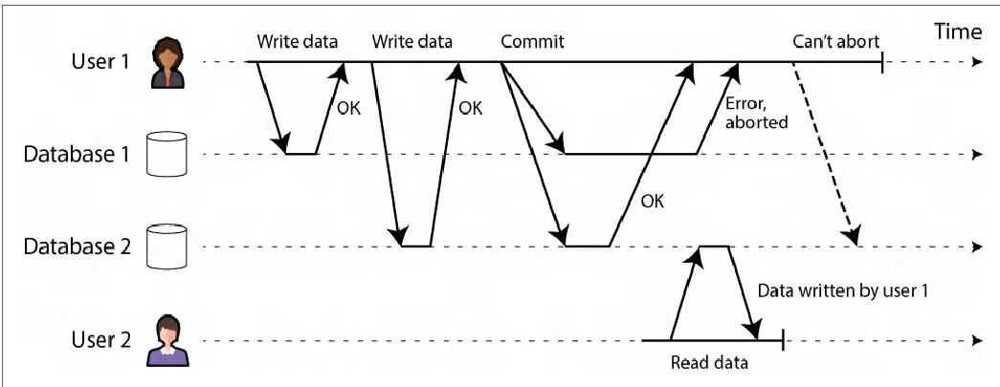

> 图 8-12。当一个事务涉及多个数据库节点时，它可能在某些节点上提交，而在另一些节点上失败。  

如果某些节点提交了事务，而其他节点中止了事务，各节点之间就会变得不一致。而且，一旦事务在某个节点上提交，即使后来发现它在另一个节点上已被中止，也无法再撤回。这是因为数据一经提交，在读已提交或更强的隔离级别下，就会对其他事务可见。例如，在图 8-12 中，当用户 1 注意到它在数据库 1 上的提交失败时，用户 2 已经在数据库 2 上读取了同一事务的数据。如果之后中止用户 1 的事务，那么用户 2 的事务也必须撤销，因为它所依据的数据被追溯性地宣告为从未存在。  

更好的方法是确保参与事务的节点要么全部提交，要么全部中止，并防止二者混杂。实现这一点称为*原子提交*问题。  

### 两阶段提交  

两阶段提交是一种在多个节点间实现原子事务提交的算法。它是分布式数据库中的经典算法 [13, 73, 74]。2PC 在一些数据库内部使用，也以 XA 事务 [75] 的形式提供给应用程序（例如 Java Transaction API 支持 XA 事务），或通过面向 SOAP Web 服务的 WS-AtomicTransaction 提供 [76, 77]。  

图 8-13 展示了 2PC 的基本流程。与单节点事务只需一次提交请求不同，2PC 将提交/中止过程分为两个阶段（名称也由此而来）。  

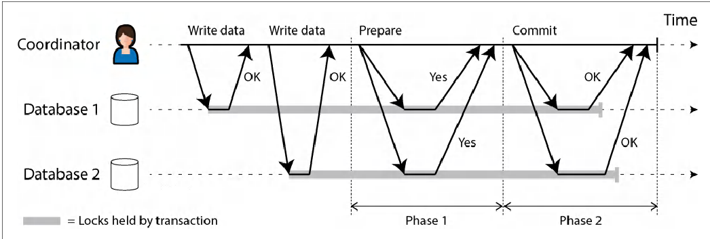

> 图 8-13。一次成功的 2PC 执行。  

2PC 使用了一个通常不会出现在单节点事务中的新组件：协调者（也称为事务管理器）。协调者通常以库的形式实现在请求事务的同一应用程序进程中（例如嵌入 Java EE 容器），但它也可以是独立的进程或服务。此类协调者的例子包括 Narayana、JOTM、BTM 和 MSDTC。  

使用 2PC 时，分布式事务像往常一样，从应用程序在多个数据库节点上读写数据开始。我们将这些数据库节点称为事务的*参与者*。当应用程序准备提交时，协调者向每个节点发送*准备*请求，询问它们是否能够提交，由此开始阶段 1。随后，协调者跟踪参与者的响应：  

- 如果所有参与者都回答“是”，表明它们已准备好提交，协调者就在阶段 2 发出*提交*请求，随后完成提交。  

- 如果任何参与者回答“否”，协调者就在阶段 2 向所有节点发送*中止*请求。  

这个过程有点像西方文化中的传统婚礼仪式：主礼人分别询问双方是否愿意与对方结婚，通常会从两人那里都得到“我愿意”的回答。收到双方的确认后，主礼人宣布二人结为夫妻——事务提交，并将这个喜讯告知所有来宾。如果任何一方没有答应，仪式就会中止 [78]。  

#### 承诺体系  

仅凭这段简短描述，可能还看不出为什么 2PC 能保证原子性，而跨多个节点的一阶段提交却不能。准备请求和提交请求在两阶段方案中显然同样可能丢失。2PC 究竟有何不同？  

为了理解它为何有效，我们必须更细致地分解这个过程：  

1. 当应用程序想要开始分布式事务时，它会向协调者请求事务 ID。该事务 ID 在全局唯一。  

2. 应用程序在每个参与者上开始一个单节点事务，并将全局唯一事务 ID 附加到该单节点事务。所有读写都在其中一个单节点事务中完成。如果此阶段发生任何问题（例如节点崩溃或请求超时），协调者或任何参与者都可以中止事务。  

3. 当应用程序准备提交时，协调者向所有参与者发送带有全局事务 ID 的准备请求。如果其中任何请求失败或超时，协调者就向所有参与者发送针对该事务 ID 的中止请求。  

4. 当参与者收到准备请求时，它要确保自己在任何情况下都一定能够提交事务。这包括将所有事务数据写入磁盘（崩溃、断电或磁盘空间耗尽都不能成为之后拒绝提交的合理借口），以及检查是否存在任何冲突或约束违规。节点向协调者回答“是”，就承诺在收到请求时无差错地提交事务。换言之，参与者放弃了中止事务的权利，但此时并未真正提交事务。  

5. 当协调者收到所有准备请求的响应后，它会对提交还是中止事务作出最终决定（只有所有参与者都投赞成票时才提交）。协调者必须将该决定写入磁盘上的事务日志，以便随后发生崩溃时知道自己作出了什么决定。这称为*提交点*。  

6. 协调者的决定写入磁盘后，就会向所有参与者发送提交或中止请求。如果请求失败或超时，协调者必须永远重试，直到成功为止。此时已经没有回头路；如果决定是提交，那么无论需要重试多少次，都必须执行这一决定。如果某个参与者在此期间崩溃，事务会在它恢复时提交——既然参与者投了赞成票，恢复后就不能拒绝提交。  

因此，协议中包含两个至关重要的“不可回头点”：参与者投赞成票时，就承诺之后一定能够提交（尽管协调者仍可选择中止）；而协调者一旦作出决定，该决定就不可撤销。这些承诺保证了 2PC 的原子性。（单节点原子提交将这两个事件合并为一个：向事务日志写入提交记录。）  

回到婚礼的比喻，在说出“我愿意”之前，你和伴侣仍可以说“绝对不行！”（或类似的话）来中止事务。然而，说出“我愿意”之后，你就不能收回这句话。如果你在说完“我愿意”后晕倒，没有听到主礼人宣布你们结为夫妻，也不会改变事务已经提交的事实。之后恢复意识时，你可以向主礼人查询全局事务 ID 的状态，从而确认自己是否已经结婚；也可以等待主礼人下一次重试提交请求（因为在你昏迷期间，重试始终在继续）。  

##### 协调者故障  

我们已经讨论了参与者或网络在 2PC 期间发生故障时会怎样：如果任何准备请求失败或超时，协调者就中止事务；如果任何提交或中止请求失败，协调者就无限期重试。然而，如果协调者崩溃会发生什么，就不那么清楚了。  

如果协调者在发送准备请求之前发生故障，参与者可以安全地中止事务。但参与者一旦收到准备请求并投了赞成票，就再也不能单方面中止——它必须等待协调者告知事务究竟是提交还是中止。如果此时协调者崩溃或网络发生故障，参与者除了等待之外无事可做。处于这种状态的参与者事务称为*存疑*或*不确定*。  

图 8-14 展示了这种情况。在这个具体示例中，协调者实际上决定提交，并且数据库 2 收到了提交请求。然而，协调者在向数据库 1 发送提交请求之前崩溃了，因此数据库 1 不知道应该提交还是中止。即使超时在这里也无济于事：如果数据库 1 在超时后单方面中止，它最终会与已经提交的数据库 2 不一致。同样，单方面提交也不安全，因为另一个参与者可能已经中止。  

如果没有协调者的消息，参与者无法知道应该提交还是中止。原则上，参与者可以相互通信，了解每个参与者如何投票并达成一致，但这并不是 2PC 协议的一部分。  

2PC 完成的唯一办法是等待协调者恢复。这就是协调者在向参与者发送提交或中止请求之前，必须将其提交或中止决定写入磁盘事务日志的原因：协调者恢复后，会读取事务日志来确定所有存疑事务的状态。协调者日志中没有提交记录的事务都会中止。因此，2PC 的提交点归根结底是协调者上的一次常规单节点原子提交。  

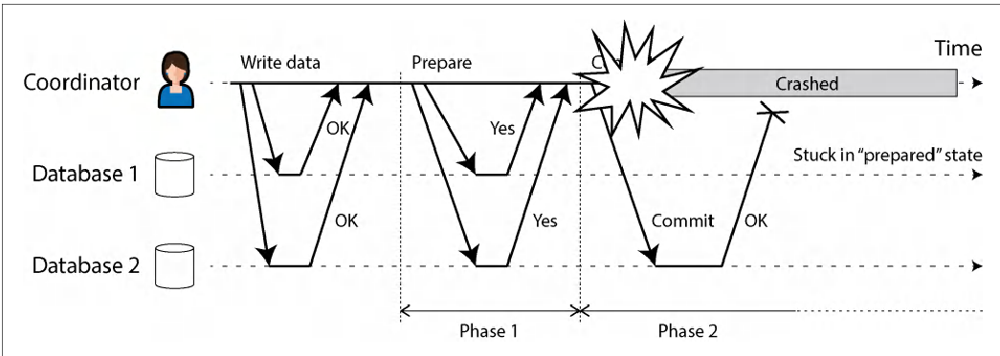

> 图 8-14。参与者投赞成票后，协调者崩溃。数据库 1 不知道应该提交还是中止。  

此外，如果协调者的磁盘发生故障并丢失日志，系统就无法自动恢复。唯一的选择是由管理员手动提交或中止存疑事务。如果仅丢失事务日志最近的一部分，恢复后的协调者可能会认为已经提交的事务尚未提交，并尝试中止它们，从而违反原子性。  

#### 三阶段提交  

2PC 被称为*阻塞式*原子提交协议，因为 2PC 可能会因等待协调者恢复而陷入停滞。可以让原子提交协议变为*非阻塞式*，使其不会因某个节点发生故障而陷入停滞。然而，要让它在实践中有效并没有那么简单。  

作为 2PC 的替代方案，人们提出了一种称为*三阶段提交*（3PC）的算法 [13, 79]。然而，3PC 假设网络延迟有界、节点响应时间也有界；在大多数网络延迟和进程暂停都无界的实际系统中（参见第 9 章），3PC 无法保证原子性。  

实践中更好的解决方案是用容错共识协议取代单节点协调者。我们将在第 10 章中了解如何做到这一点。  

### 跨不同系统的分布式事务  

分布式事务和 2PC 的声誉褒贬不一。一方面，人们认为它们提供了一项重要的安全性保证，而这种保证很难通过其他方式实现；另一方面，它们也因引发运维问题、扼杀性能以及承诺超出实际能力而受到批评 [80, 81, 82, 83]。
许多云服务因为分布式事务所带来的运维问题而选择不实现分布式事务 [84]。  

分布式事务的某些实现会造成严重的性能损失。2PC 固有的性能成本很大一部分来自崩溃恢复所需的额外 `fsync` 操作以及额外的网络往返。  

不过，我们不应全盘否定分布式事务，而应更仔细地审视它们，因为其中有一些重要经验值得汲取。首先，我们应该明确所谓“分布式事务”究竟指什么。人们经常把两种截然不同的分布式事务混为一谈：  

#### 数据库内部的分布式事务  

一些分布式数据库（即在标准配置中使用复制和分片的数据库）支持该数据库各节点之间的内部事务。例如，YugabyteDB、TiDB、FoundationDB、Spanner、VoltDB、Cassandra，以及 MySQL Cluster 的 NDB 存储引擎都提供这种内部事务支持。在这种情况下，参与事务的所有节点都运行相同的数据库软件。  

#### 异构分布式事务  

在异构事务中，参与者是两种或更多种技术——例如，来自不同供应商的两个数据库，甚至是消息代理等非数据库系统。跨越这些系统的分布式事务必须确保原子提交，尽管这些系统的底层实现可能完全不同。  

数据库内部事务无须与任何其他系统兼容，因此可以使用任意协议，并采用该特定技术专属的优化。正因如此，数据库内部的分布式事务往往能够很好地运行。相比之下，跨越异构技术的事务要困难得多。这里我们将重点讨论后者，下一节再讨论数据库内部的分布式事务。  

#### 恰好一次的消息处理  

异构分布式事务能够以强大的方式集成不同系统。例如，当且仅当处理消息的数据库事务成功提交时，才可以确认来自消息队列的一条消息已处理。其实现方式是，在一个事务中以原子方式提交消息确认和数据库写入。有了分布式事务支持，即使消息代理和数据库是运行在不同机器上的两种互不相关的技术，也能做到这一点。  

如果消息投递或数据库事务中任意一方失败，两者都会中止，以便消息代理稍后安全地重新投递消息。因此，通过以原子方式提交消息及其处理所产生的副作用，我们可以确保消息在*效果上*恰好处理一次，即使在成功前需要重试数次。中止会丢弃未完成事务产生的所有副作用。这称为*恰好一次语义*。  

不过，只有当事务所影响的所有系统都能使用同一种原子提交协议时，这样的分布式事务才可行。例如，假设处理消息的一个副作用是发送电子邮件，而邮件服务器不支持 2PC。如果消息处理失败并重试，邮件就可能被发送两次或更多次。但如果处理消息产生的所有副作用都能在事务中止时回滚，那么就可以安全地重试处理步骤，就像什么都没发生过一样。  

本章稍后还会回到恰好一次语义这个主题。现在先来看看支持这种异构分布式事务的原子提交协议。  

#### XA 事务  

X/Open XA（eXtended Architecture，即扩展架构的简称）是一项用于跨异构技术实现 2PC 的标准 [75]。它于 1991 年推出，已得到广泛实现。许多传统关系数据库（包括 PostgreSQL、MySQL、Db2、SQL Server 和 Oracle）以及消息代理（包括 ActiveMQ、HornetQ、MSMQ 和 IBM MQ）都支持 XA。  

XA 不是网络协议——它只是一个与事务协调者交互的 C API。其他语言也有该 API 的绑定；例如，在 Java EE 应用领域，XA 事务使用 Java Transaction API（JTA）实现，而许多使用 Java Database Connectivity（JDBC）的数据库驱动程序和使用 Java Message Service（JMS）API 的消息代理驱动程序又支持 JTA。  

XA 假定应用程序使用网络驱动程序或客户端库与参与事务的数据库或消息服务通信。如果驱动程序支持 XA，就意味着它会调用 XA API，确定某个操作是否应属于一个分布式事务；如果是，它就把必要的信息发送给数据库服务器。驱动程序还会暴露回调，协调者可通过这些回调要求参与者准备、提交或中止。  

事务协调者实现 XA API。该标准没有规定协调者应如何实现，但在实践中，协调者通常只是一个加载到发起事务的应用程序进程中的库（而不是一项独立服务）。它跟踪事务中的参与者，在要求参与者进行准备后（通过回调驱动程序）收集它们的响应，并使用本地磁盘上的日志，跟踪每个事务的提交/中止决定。  

如果应用程序进程崩溃，或者运行应用程序的机器宕机，协调者也会随之消失。此时，任何已准备但尚未提交事务的参与者都会陷入存疑状态。由于协调者的日志位于应用服务器的本地磁盘上，因此必须重启该服务器，并由协调者库读取日志，以恢复每个事务的提交/中止结果。只有到那时，协调者才能通过数据库驱动程序的 XA 回调，要求参与者酌情提交或中止。数据库服务器无法直接联系协调者，因为所有通信都必须经由其客户端库。  

##### 存疑期间持有锁  

为什么我们如此在意事务陷入存疑状态？系统的其余部分难道不能照常工作，忽略这个最终会得到清理的存疑事务吗？  

问题出在*锁*上。正如第 290 页的“读已提交”所述，数据库事务通常会对其修改的所有行获取行级排他锁，以防止脏写。如果希望实现可串行化隔离，使用 2PL 的数据库还必须对事务*读取*的所有行获取共享锁。  

在事务提交或中止之前，数据库不能释放这些锁（在图 8-13 中以阴影区域表示）。因此，使用 2PC 时，事务必须在整个存疑期间一直持有锁。如果协调者崩溃，并花了 20 分钟才重新启动，这些锁就会被持有 20 分钟。如果协调者的日志因某种原因完全丢失，这些锁将被永久持有——或者至少要一直持有到管理员手动解决问题为止。  

在锁被持有期间，其他事务无法修改这些行。根据隔离级别，其他事务甚至可能无法读取这些行。因此，其他事务不能简单地继续自己的工作——如果它们要访问相同的数据，就会被阻塞。这可能导致应用程序的大部分功能不可用，直至存疑事务得到解决。  

##### 从协调者故障中恢复  

理论上，如果协调者崩溃后重新启动，它应该可以从日志中干净地恢复状态，并解决所有存疑事务。然而在实践中，确实会出现孤立的存疑事务 [85, 86]——也就是协调者出于某种原因无法判定结果的事务（例如，由于软件缺陷导致事务日志丢失或损坏）。这些事务无法自动解决，因此会永远留在数据库中，持有锁并阻塞其他事务。  

即使重启数据库服务器也无法解决这个问题，因为正确的 2PC 实现必须让存疑事务的锁跨重启保留下来（否则就可能违反原子性保证）。这是个棘手的局面。  

唯一的出路是由管理员手动决定提交还是回滚这些事务。管理员必须检查每个存疑事务的参与者，确定是否已有某个参与者提交或中止，然后把相同的结果应用到其他参与者。解决问题可能需要大量人工操作，而且很可能要在严重的生产环境宕机期间，承受巨大的压力和时间压力来完成（否则协调者又怎会陷入如此糟糕的状态？）。  

许多 XA 实现都提供一个名为*启发式决策*的紧急逃生机制：允许参与者在没有得到协调者明确决定的情况下，单方面决定中止或提交某个存疑事务 [75]。需要明确的是，这里的*启发式*只是*很可能破坏原子性*的委婉说法，因为启发式决策违背了 2PC 的承诺体系。因此，启发式决策只用于摆脱灾难性局面，而不应常规使用。  

##### XA 事务的问题  

单节点协调者是整个系统的单点故障，而让它成为应用服务器的一部分也有问题，因为协调者在本地磁盘上的日志会成为持久化系统状态的关键组成部分——与数据库本身同等重要。  

原则上，XA 事务的协调者可以像我们对其他重要数据库的期望那样，实现高可用和复制。遗憾的是，这仍然无法解决 XA 的一个根本问题：它没有提供任何让事务协调者与参与者直接通信的方式。它们只能通过调用事务的应用程序代码，以及该代码用来调用参与者的数据库驱动程序进行通信。  

因此，即使协调者经过复制，应用程序代码仍会成为单点故障。要解决这个问题，就必须彻底重新设计应用程序代码的运行方式，使其可以复制或重启，这或许会类似于持久执行（参见第 187 页的“持久执行与工作流”）。然而，实践中似乎没有工具采用这种方法。  

另一个问题是，XA 需要兼容各种各样的数据系统，因此必然只能取最低公分母。例如，它无法检测不同系统之间的死锁（因为这需要一个标准化协议，让系统交换各事务正在等待哪些锁的信息），也无法与 SSI 配合使用（参见第 317 页的“可串行化快照隔离”）。  

这是因为，要做到这一点，就需要一种识别不同系统间冲突的协议。  

这些问题在跨异构技术执行事务时多少是固有的。然而，让多个异构数据系统彼此保持一致仍然是一个真实且重要的问题，所以我们需要寻找不同的解决方案。正如下一节和第 12 章将会介绍的那样，这是可以做到的。  

<a id="chapter-8-internal-distributed-transactions"></a>

## 数据库内部的分布式事务  

如前所述，跨越多种异构存储技术的分布式事务，与系统内部的分布式事务之间存在巨大差异；后者的所有参与节点都属于运行相同软件的同一个数据库。例如，这种内部的分布式事务是 CockroachDB [5]、TiDB [6]、Spanner [7]、FoundationDB [8] 和 YugabyteDB 等“NewSQL”数据库的一个标志性特征。Kafka 等一些消息代理也支持内部的分布式事务 [87]。  

这些系统中有许多使用 2PC 来确保写入多个分片的事务具有原子性，但它们不会遭遇 XA 事务所面临的同类问题。由于它们的分布式事务无须与任何其他技术交互，因此避开了最低公分母陷阱——这些系统的设计者可以自由使用更可靠、更快速的优秀协议。  

XA 最严重的问题可以通过以下方式解决：  

- 复制协调者，并在主协调者节点崩溃时自动故障转移到另一个协调者节点  

- 允许协调者与数据分片直接通信，无须应用程序代码居中转接  

- 复制参与事务的分片，降低因某个分片发生故障而不得不中止事务的风险  

- 将原子提交协议与分布式并发控制协议相结合，使其支持死锁检测以及跨分片的一致性读取  

共识算法通常用于复制协调者和数据库分片。第 10 章将介绍如何使用共识算法实现分布式事务的原子提交。这些算法通过自动从一个节点故障转移到另一个节点来容忍故障，无须任何人工干预，同时继续保证强一致性属性。  

分布式事务提供的隔离级别因系统而异，但跨分片实现快照隔离 [6] 和可串行化快照隔离 [5, 8] 都是可行的。  

## 再谈恰好一次的消息处理  

我们在第 329 页的“恰好一次的消息处理”中看到，分布式事务的一个重要用例是确保某项操作恰好生效一次，即使处理期间发生崩溃、需要重试处理也是如此。如果可以在消息代理和数据库之间以原子方式提交事务，就能做到：当且仅当消息处理成功，且处理所产生的数据库写入已经提交时，才向代理确认该消息。  

不过，实现恰好一次语义实际上并不需要分布式事务。另一种方法如下，它只需要数据库内部的事务：  

1. 假设每条消息都有一个唯一 ID，并且数据库中有一张表，记录已经处理过的消息 ID。当你开始处理代理发来的消息时，在数据库上启动一个新事务并检查消息 ID。如果数据库中已经存在相同的消息 ID，就知道该消息已被处理，因此可以向代理确认该消息并将其丢弃。  

2. 如果数据库中尚不存在该消息 ID，就将它加入表中。然后处理消息，这可能会在同一事务内对数据库进行其他写入。消息处理完毕后，在数据库上提交该事务。  

3. 数据库事务成功提交后，就可以向代理确认该消息。  

4. 成功向代理确认消息后，就知道它不会再次尝试处理同一条消息，因此可以从数据库中删除该消息 ID（在一个单独的事务中）。  

如果消息处理器在提交数据库事务之前崩溃，事务就会中止，消息代理将重试处理。如果它在提交之后、向代理确认消息之前崩溃，也会重试处理，但重试时会在数据库中发现该消息 ID，并将消息丢弃。如果它在确认消息之后、从数据库中删除消息 ID 之前崩溃，数据库中会遗留一个旧消息 ID；除了占用少量存储空间外，这并无危害。如果在数据库事务中止之前发生重试（当消息处理器与数据库之间的通信中断时，这种情况可能发生），消息 ID 表上的唯一性约束应能阻止两个并发事务插入相同的消息 ID。  

因此，实现恰好一次处理只需要数据库内部的事务——对于这一用例，无须保证数据库和消息代理之间的原子性。在数据库中记录消息 ID 可以使消息处理具有幂等性，从而能够安全地重试消息处理，而不会重复产生副作用。Kafka Streams 等流处理框架也使用类似的方法来实现恰好一次语义，我们将在第 12 章看到这一点。  

尽管如此，数据库内部的分布式事务对于这类模式的可扩展性仍然很有用；例如，它们可以让消息 ID 存储在一个分片上，而消息处理所更新的主要数据存储在其他分片上，并确保跨这些分片提交事务的原子性。  

<a id="chapter-8-summary"></a>

## 小结  

事务是一个抽象层，它让应用程序可以假装某些并发问题以及某些类型的软硬件故障并不存在。大量错误都被简化为一次事务中止，应用程序只需重试即可。  

本章介绍了许多事务有助于防止的问题。并非所有应用程序都会受到所有这些问题的影响；访问模式非常简单的应用程序，比如只读写单条记录，或许不用事务也能应付。然而，对于更复杂的访问模式，事务可以大幅减少需要考虑的潜在错误情形。  

没有事务时，各种错误情形（进程崩溃、网络中断、停电、磁盘已满、意外并发等）意味着数据可能以各种方式变得不一致。例如，反规范化的数据很容易与源数据失去同步。没有事务，就很难推断复杂且相互影响的访问会对数据库造成什么结果。  

我们尤其深入地探讨了并发控制，讨论了几种广泛使用的隔离级别，特别是*读已提交*、*快照隔离*（有时称为*可重复读*）和*可串行化*。我们通过讨论各种竞态条件示例来刻画这些隔离级别，并在表 8-1 中进行了总结。  

> 表 8-1。各种隔离级别下可能发生的异常汇总。

| 隔离级别|脏读|读偏差|幻读|更新丢失|写偏差|
| ---|---|---|---|---|---|
| 读未提交|✗ 可能发生|✗ 可能发生|✗ 可能发生|✗ 可能发生|✗ 可能发生|
| 读已提交|✓ 已防止|✗ 可能发生|✗ 可能发生|✗ 可能发生|✗ 可能发生|
| 快照隔离|✓ 已防止|✓ 已防止|✓ 已防止|? 视情况而定|✗ 可能发生|
| 可串行化|✓ 已防止|✓ 已防止|✓ 已防止|✓ 已防止|✓ 已防止|  

下面简要回顾一下：  

脏读  

一个客户端在另一个客户端的写入提交之前就读取了这些写入。读已提交隔离级别以及更强的隔离级别可以防止脏读。  

脏写  

一个客户端覆盖了另一个客户端已经写入但尚未提交的数据。几乎所有事务实现都会防止脏写（因此表中没有列出它）。  

读偏差  

客户端看到的是数据库在不同时间点的不同部分。某些读偏差也称为*不可重复读*。这个问题通常通过快照隔离来防止；快照隔离允许事务从与某个特定时间点对应的一致性快照中读取数据。快照隔离通常使用多版本并发控制来实现。  

幻读  

事务读取符合某个搜索条件的对象。另一个客户端进行了一次写入，影响了该搜索的结果。快照隔离可以防止直接的幻读，但写偏差情境中的幻读需要特殊处理，例如使用索引范围锁。  

更新丢失  

两个客户端并发执行读-修改-写周期。其中一个客户端覆盖了另一个客户端的写入，却没有合并其更改，因而造成数据丢失。有些快照隔离实现会自动防止这种异常，而另一些实现则需要手动加锁（SELECT FOR UPDATE）。  

写偏差  

事务读取某些内容，根据所看到的值作出决定，并将该决定写入数据库。然而，等到实际写入时，作出该决定的前提已不再成立。只有可串行化隔离才能防止这种异常。  

弱隔离级别可以防止其中一些异常，但会把其他异常留给应用开发者手动处理（例如使用显式锁）。只有可串行化隔离能够防止所有这些问题。我们讨论了三种实现可串行化事务的方法：  

**严格按照串行顺序执行事务**  

如果能让每个事务都执行得非常快（通常通过使用存储过程），并且事务吞吐量足够低，可以在单个 CPU 核心上处理，或者可以进行分片，那么这是一种简单而有效的选择。  

**两阶段锁定**  

几十年来，2PL 一直是实现可串行化的标准方法，但由于其性能不佳，许多应用都避免使用它。  

**可串行化快照隔离**  

SSI 是一种相对较新的算法，避开了前述方法的大部分缺点。它采用乐观方法，允许事务在不阻塞的情况下继续执行。当事务想要提交时，系统会对其进行检查；如果其执行不可串行化，该事务就会被中止。  

最后，我们探讨了当事务分布在多个节点上时，如何使用 2PC 实现原子性。如果这些节点运行的都是同一种数据库软件，分布式事务可以很好地工作。然而，跨越不同存储技术时（使用 XA 事务），2PC 会带来问题：它对协调者和驱动事务的应用代码中的故障极为敏感，并且与并发控制机制的配合也很差。所幸，幂等性可以在不要求不同存储技术之间进行原子提交的情况下确保恰好一次语义；后续章节会对此作进一步讨论。  

本章中的示例使用了关系数据模型。然而，正如第 287 页“多对象事务的必要性”一节所讨论的，无论使用哪种数据模型，事务都是一项很有价值的数据库功能。  

## 参考文献  

[1] Steven J. Murdoch。《Horizon 出了什么问题：邮局审判带来的教训》。*benthamsgaze.org*，2021 年 7 月。存档于 *perma.cc/CNM4-553F*  

[2] Donald D. Chamberlin, Morton M. Astrahan, Michael W. Blasgen, James N. Gray, W. Frank King, Bruce G. Lindsay, Raymond Lorie, James W. Mehl, Thomas G. Price, Franco Putzolu, Patricia Griffiths Selinger, Mario Schkolnick, Donald R. Slutz, Irving L. Traiger, Bradford W. Wade, and Robert A. Yost。《System R 的历史与评估》。Communications of the ACM，第 24 卷，第 10 期，第 632–646 页，1981 年 10 月。doi:10.1145/358769.358784  

[3] Jim N. Gray, Raymond A. Lorie, Gianfranco R. Putzolu, and Irving L. Traiger。《共享数据库中的锁粒度与一致性程度》。收录于 *Modeling in Data Base Management Systems: Proceedings of the IFIP Working Conference on Modelling in Data Base Management Systems*，G. M. Nijssen 编，第 364–394 页，Elsevier/North Holland Publishing，1976 年。另收录于 *Readings in Database Systems* 第 4 版，Joseph M. Hellerstein 与 Michael Stonebraker 编，MIT Press，2005 年。ISBN: 9780262693141  

[4] Kapali P. Eswaran, Jim N. Gray, Raymond A. Lorie, and Irving L. Traiger。《数据库系统中的一致性概念与谓词锁》。*Communications of the ACM*，第 19 卷，第 11 期，第 624–633 页，1976 年 11 月。doi:10.1145/360363.360369  

[5] Rebecca Taft, Irfan Sharif, Andrei Matei, Nathan VanBenschoten, Jordan Lewis, Tobias Grieger, Kai Niemi, Andy Woods, Anne Birzin, Raphael Poss, Paul Bardea, Amruta Ranade, Ben Darnell, Bram Gruneir, Justin Jaffray, Lucy Zhang, and Peter Mattis。《CockroachDB：具有韧性的地理分布式 SQL 数据库》。发表于 ACM SIGMOD 数据管理国际会议（SIGMOD），2020 年 6 月。doi:10.1145/3318464.3386134  

[6] Dongxu Huang, Qi Liu, Qiu Cui, Zhuhe Fang, Xiaoyu Ma, Fei Xu, Li Shen, Liu Tang, Yuxing Zhou, Menglong Huang, Wan Wei, Cong Liu, Jian Zhang, Jianjun Li, Xuelian Wu, Lingyu Song, Ruoxi Sun, Shuaipeng Yu, Lei Zhao, Nicholas Cameron, Liquan Pei, and Xin Tang。《TiDB：基于 Raft 的 HTAP 数据库》。Proceedings of the VLDB Endowment，第 13 卷，第 12 期，第 3072–3084 页，2020 年 8 月。doi:10.14778/3415478.3415535  

[7] James C. Corbett, Jeffrey Dean, Michael Epstein, Andrew Fikes, Christopher Frost, JJ Furman, Sanjay Ghemawat, Andrey Gubarev, Christopher Heiser, Peter Hochschild, Wilson Hsieh, Sebastian Kanthak, Eugene Kogan, Hongyi Li, Alexander Lloyd, Sergey Melnik, David Mwaura, David Nagle, Sean Quinlan, Rajesh Rao, Lindsay Rolig, Dale Woodford, Yasushi Saito, Christopher Taylor, Michal Szymaniak, and Ruth Wang。《Spanner：Google 的全球分布式数据库》。发表于第 10 届 USENIX 操作系统设计与实现研讨会（OSDI），2012 年 10 月。  

[8] Jingyu Zhou, Meng Xu, Alexander Shraer, Bala Namasivayam, Alex Miller, Evan Tschannen, Steve Atherton, Andrew J. Beamon, Rusty Sears, John Leach, Dave Rosenthal, Xin Dong, Will Wilson, Ben Collins, David Scherer, Alec Grieser, Young Liu, Alvin Moore, Bhaskar Muppana, Xiaoge Su, and Vishesh Yadav。《FoundationDB：分布式解耦事务型键值存储》。发表于 ACM 数据管理国际会议（SIGMOD），2021 年 6 月。doi:10.1145/3448016.3457559  

[9] Theo Härder and Andreas Reuter。《面向事务的数据库恢复原理》。ACM Computing Surveys，第 15 卷，第 4 期，第 287–317 页，1983 年 12 月。doi:10.1145/289.291  

[10] Peter Bailis, Alan Fekete, Ali Ghodsi, Joseph M. Hellerstein, and Ion Stoica。《HAT，而非 CAP：迈向高可用事务》。发表于第 14 届 USENIX 操作系统热点研讨会（HotOS），2013 年 5 月。  

[11] Armando Fox, Steven D. Gribble, Yatin Chawathe, Eric A. Brewer, and Paul Gauthier。《基于集群的可扩展网络服务》。发表于第 16 届 ACM 操作系统原理研讨会（SOSP），1997 年 10 月。doi:10.1145/268998.266662  

[12] Tony Andrews。《在 Oracle 中强制实施复杂约束》。tonyandrews.blogspot.co.uk，2004 年 10 月。存档于 archive.org  

[13] Philip A. Bernstein, Vassos Hadzilacos, and Nathan Goodman。*数据库系统中的并发控制与恢复*。Addison-Wesley，1987 年。ISBN: 9780201107159。可在 microsoft.com 在线获取。  

[14] Alan Fekete, Dimitrios Liarokapis, Elizabeth O'Neil, Patrick O'Neil, and Dennis Shasha。《使快照隔离可串行化》。ACM Transactions on Database Systems，第 30 卷，第 2 期，第 492–528 页，2005 年 6 月。doi:10.1145/1071610.1071615  

[15] Mai Zheng, Joseph Tucek, Feng Qin, and Mark Lillibridge。《理解 SSD 在电源故障下的稳健性》。发表于第 11 届 USENIX 文件与存储技术会议（FAST），2013 年 2 月。  

[16] Laurie Denness。《SSD：礼物与诅咒》。*laur.ie*，2015 年 6 月。存档于 *perma.cc/6GLP-BX3T*  

[17] Adam Surak。《当固态硬盘并没有那么“固态”时》。blog.algolia.com，2015 年 6 月。存档于 perma.cc/CBR9-QZEE  

[18] Hewlett Packard Enterprise。《公告：（修订版）HPE SAS 固态硬盘——某些 HPE SAS 固态硬盘型号需要进行关键固件升级，以防止硬盘在运行 32,768 小时后发生故障》。support.hpe.com，2019 年 11 月。存档于 perma.cc/CZR4-AQBS  

[19] Craig Ringer et al.。《PostgreSQL 对 fsync() 错误的处理并不安全，至少在 XFS 上存在数据丢失风险》。postgresql.org 的 pgsql-hackers 邮件列表讨论串，2018 年 3 月。存档于 perma.cc/5RKU-57FL  

[20] Anthony Rebello, Yuvraj Patel, Ramnathan Alagappan, Andrea C. Arpaci-Dusseau, and Remzi H. Arpaci-Dusseau。《应用能否从 fsync 失败中恢复？》。发表于 USENIX 年度技术会议（ATC），2020 年 7 月。  

[21] Thanumalayan Sankaranarayana Pillai, Vijay Chidambaram, Ramnatthan Alagappan, Samer Al-Kiswany, Andrea C. Arpaci-Dusseau, and Remzi H. Arpaci-Dusseau。《崩溃一致性：重新思考文件系统的基本抽象》。ACM Queue，第 13 卷，第 7 期，第 20–28 页，2015 年 7 月。doi:10.1145/2800695.2801719  

[22] Thanumalayan Sankaranarayana Pillai, Vijay Chidambaram, Ramnatthan Alagappan, Samer Al-Kiswany, Andrea C. Arpaci-Dusseau, and Remzi H. Arpaci-Dusseau。《并非所有文件系统都生而平等：构建崩溃一致应用的复杂性》。发表于第 11 届 USENIX 操作系统设计与实现研讨会（OSDI），2014 年 10 月。  

[23] Chris Siebenmann。《Unix 的文件持久性问题》。utcc.utoronto.ca，2016 年 4 月。存档于 perma.cc/VSS8-5MC4  

[24] Aishwarya Ganesan, Ramnatthan Alagappan, Andrea C. Arpaci-Dusseau, and Remzi H. Arpaci-Dusseau。《冗余并不意味着容错：分布式存储对单一错误和损坏的反应分析》。发表于第 15 届 USENIX 文件与存储技术会议（FAST），2017 年 2 月。  

[25] Lakshmi N. Bairavasundaram, Garth R. Goodson, Bianca Schroeder, Andrea C. Arpaci-Dusseau, and Remzi H. Arpaci-Dusseau。《存储栈中的数据损坏分析》。发表于第 6 届 USENIX 文件与存储技术会议（FAST），2008 年 2 月。  

[26] Richard van der Hoff。《我们如何在 matrix.org 主服务器上发现 Postgres 损坏并从中恢复》。matrix.org，2025 年 7 月。存档于 perma.cc/CDF5-NRBK  

[27] Bianca Schroeder, Raghav Lagisetty, and Arif Merchant。《生产环境中的闪存可靠性：意料之中与意料之外》。发表于第 14 届 USENIX 文件与存储技术会议（FAST），2016 年 2 月。  

[28] Don Allison。《SSD 存储——不了解技术不是借口》。blog.kore-logic.com，2015 年 3 月。存档于 perma.cc/9QN4-9SNJ  

[29] Gordon Mah Ung。《误解已澄清：SSD 拔掉电源后并不会丢失数据》。*pcworld.com*，2015 年 5 月。存档于 *perma.cc/S46H-JUDU*  

[30] Martin Kleppmann。《Hermitage：测试 ACID 中的“I”》。martin.kleppmann.com，2014 年 11 月。存档于 perma.cc/KP2Y-AQGK  

[31] Vlad Mihalcea。《导致 Flexcoin 破产的竞态条件》。vladmihalcea.com，2025 年 2 月。存档于 perma.cc/RRK5-TFAU  

[32] Todd Warszowski and Peter Bailis。《ACIDRain：针对数据库支持的 Web 应用的并发相关攻击》。发表于 ACM 数据管理国际会议（SIGMOD），2017 年 5 月。doi:10.1145/3035918.3064037  

[33] Tristan D'Agosta。《BTC 从 Poloniex 被盗》。*bitcointalk.org*，2014 年 3 月。存档于 *perma.cc/YHA6-4C5D*  

[34] bitcointhief2。《我如何从一家交易所偷走约 100 BTC，以及我本可以如何偷得更多！》。reddit.com，2014 年 2 月。存档于 archive.org  

[35] Sudhir Jorwekar, Alan Fekete, Krithi Ramamritham, and S. Sudarshan。《自动检测快照隔离异常》。发表于第 33 届超大型数据库国际会议（VLDB），2007 年 9 月。  

[36] Michael Melanson。《事务：隔离的局限》。michaelmelanson.net，2014 年 11 月。存档于 perma.cc/RG5R-KMYZ  

[37] Edward Kim。《ACH 的工作原理：开发者视角——第 1 部分》。*engineering.gusto.com*，2014 年 4 月。存档于 *perma.cc/7B2H-PU94*  

[38] Hal Berenson, Philip A. Bernstein, Jim N. Gray, Jim Melton, Elizabeth O'Neil, and Patrick O'Neil。《对 ANSI SQL 隔离级别的批判》。发表于 ACM 数据管理国际会议（SIGMOD），1995 年 5 月。doi:10.1145/568271.223785  

[39] Atul Adya。《弱一致性：分布式事务的广义理论与乐观实现》。博士学位论文，麻省理工学院，1999 年 3 月。归档于 perma.cc/E97M-HW5Q  

[40] Peter Bailis、Aaron Davidson、Alan Fekete、Ali Ghodsi、Joseph M. Hellerstein 和 Ion Stoica。《高可用事务：优点与局限》。VLDB Endowment 论文集，第 7 卷，第 3 期，第 181–192 页，2013 年 11 月。doi:10.14778/2732232.2732237。  

[41] Natacha Crooks、Youer Pu、Lorenzo Alvisi 和 Allen Clement。《眼见为实：以客户端为中心的数据库隔离规范》。发表于 ACM 分布式计算原理研讨会（PODC），2017 年 7 月。doi:10.1145/3087801.3087802  

[42] Bruce Momjian。《揭开 MVCC 的面纱》。momjian.us，2014 年 7 月。归档于 perma.cc/KQ47-9GYB  

[43] Peter Alvaro 和 Kyle Kingsbury。《MySQL 8.0.34》。*jepsen.io*，2023 年 12 月。归档于 *perma.cc/HGE2-Z878*  

[44] Egor Rogov。《PostgreSQL 14 内部原理》。Postgres Professional，2023 年 4 月。归档于 perma.cc/FRK2-D7WB  

[45] Hironobu Suzuki。《PostgreSQL 内部原理》。*interdb.jp*，2017 年。  

[46] Rohan Reddy Alleti。《Postgres 中 MVCC 的内部原理：更新与插入的隐性成本》。*medium.com*，2025 年 3 月。归档于 *perma.cc/3ACX-DFXT*  

[47] Andy Pavlo 和 Bohan Zhang。《PostgreSQL 中我们最讨厌的部分》。cs.cmu.edu，2023 年 4 月。归档于 perma.cc/XSP6-3JBN  

[48] Yingjun Wu、Joy Arulraj、Jiexi Lin、Ran Xian 和 Andrew Pavlo。《内存中多版本并发控制的实证评估》。VLDB Endowment 论文集，第 10 卷，第 7 期，第 781–792 页，2017 年 3 月。doi:10.14778/3067421.3067427  

[49] Nikita Prokopov。《Datomic 内部原理非官方指南》。tonsky.me，2014 年 5 月。归档于 perma.cc/ULM2-T2FW  

[50] Daniil Svetlov。《驯服 Postgres 隔离异常的实用指南》。dansvetlov.me，2025 年 3 月。归档于 perma.cc/L7LE-TDLS  

[51] Nate Wiger。《关于原子性的一通怒斥》。*nativaware.com*，2010 年 2 月。归档于 *perma.cc/5ZYB-PE44*  

[52] James Coglan。《读与写，第 3 部分：Web 应用》。blog.jcoglan.com，2020 年 10 月。归档于 perma.cc/A7EK-PJVS  

[53] Peter Bailis、Alan Fekete、Michael J. Franklin、Ali Ghodsi、Joseph M. Hellerstein 和 Ion Stoica。《野蛮并发控制：现代应用完整性的实证研究》。发表于 ACM 数据管理国际会议（SIGMOD），2015 年 6 月。doi:10.1145/2723372.2737784  

[54] Jaana Dogan。《我希望更多开发者了解的数据库知识》。rakyll.medium.com，2020 年 4 月。归档于 perma.cc/6EFK-P2TD  

[55] Michael J. Cahill、Uwe Röhm 和 Alan Fekete。《快照数据库的可串行化隔离》。发表于 ACM 数据管理国际会议（SIGMOD），2008 年 6 月。doi:10.1145/1376616.1376690  

[56] Dan R. K. Ports 和 Kevin Grittner。《PostgreSQL 中的可串行化快照隔离》。VLDB Endowment 论文集，第 5 卷，第 12 期，第 1850–1861 页，2012 年 8 月。doi:10.14778/2367502.2367523  

[57] Douglas B. Terry、Marvin M. Theimer、Karin Petersen、Alan J. Demers、Mike J. Spreitzer 和 Carl H. Hauser。《在弱连接的复制存储系统 Bayou 中管理更新冲突》。发表于第 15 届 ACM 操作系统原理研讨会（SOSP），1995 年 12 月。doi:10.1145/224056.224070  

[58] Hans-Jürgen Schönig。《PostgreSQL 中跨多行的约束》。cybertec-postgresql.com，2021 年 6 月。归档于 perma.cc/2TGH-XUPZ  

[59] Michael Stonebraker、Samuel Madden、Daniel J. Abadi、Stavros Harizopoulos、Nabil Hachem 和 Pat Helland。《一个架构时代的终结（是时候彻底重写了）》。发表于第 33 届超大型数据库国际会议（VLDB），2007 年 9 月。  

[60] John Hugg。《H-Store/VoltDB 架构与 CEP 系统及较新流式架构的比较》。发表于 Data @Scale Boston，2014 年 11 月。  

[61] Robert Kallman、Hideaki Kimura、Jonathan Natkins、Andrew Pavlo、Alexander Rasin、Stanley Zdonik、Evan P. C. Jones、Samuel Madden、Michael Stonebraker、Yang Zhang、John Hugg 和 Daniel J. Abadi。《H-Store：高性能分布式内存事务处理系统》。VLDB Endowment 论文集，第 1 卷，第 2 期，第 1496–1499 页，2008 年 8 月。doi:10.14778/1454159.1454211  

[62] Rich Hickey。《Datomic 的架构》。infoq.com，2012 年 11 月。归档于 perma.cc/5YWU-8XJK  

[63] John Hugg。《破除关于 VoltDB 内存数据库的迷思》。dzone.com，2014 年 5 月。归档于 perma.cc/2Z9N-HPKF  

[64] Xinjing Zhou、Viktor Leis、Xiangyao Yu 和 Michael Stonebraker。《16 年后再透视 OLTP：通信成为新的瓶颈》。发表于第 15 届创新数据系统研究年度会议（CIDR），2025 年 1 月。归档于 perma.cc/Q33D-K9YE  

[65] Xinjing Zhou、Xiangyao Yu、Goetz Graefe 和 Michael Stonebraker。《Lotus：单线程分区数据库上的可扩展多分区事务》。VLDB Endowment 论文集（PVLDB），第 15 卷，第 11 期，第 2939–2952 页，2022 年 7 月。doi:10.14778/3551793.3551843  

[66] Joseph M. Hellerstein、Michael Stonebraker 和 James Hamilton。《数据库系统架构》。*数据库基础与趋势*，第 1 卷，第 2 期，第 141–259 页，2007 年 11 月。doi:10.1561/1900000002  

[67] Michael J. Cahill。《快照数据库的可串行化隔离》。博士学位论文，悉尼大学，2009 年 7 月。归档于 perma.cc/727J-NTMP  

[68] Cristian Diaconu、Craig Freedman、Erik Ismert、Per-Åke Larson、Pravin Mittal、Ryan Stonecipher、Nitin Verma 和 Mike Zwilling。《Hekaton：SQL Server 的内存优化 OLTP 引擎》。发表于 ACM SIGMOD 数据管理国际会议（SIGMOD），2013 年 6 月。doi:10.1145/2463676.2463710  

[69] Thomas Neumann、Tobias Mühlbauer 和 Alfons Kemper。《面向内存数据库系统的快速可串行化多版本并发控制》。发表于 ACM SIGMOD 数据管理国际会议（SIGMOD），2015 年 5 月。doi:10.1145/2723372.2749436  

[70] D. Z. Badal。《并发控制的正确性及其在分布式数据库中的影响》。发表于第 3 届 IEEE 计算机软件与应用国际会议（COMPSAC），1979 年 11 月。doi:10.1109/CMPSAC.1979.762563  

[71] Rakesh Agrawal、Michael J. Carey 和 Miron Livny。《并发控制性能建模：替代方案及其影响》。ACM 数据库系统汇刊（TODS），第 12 卷，第 4 期，第 609–654 页，1987 年 12 月。doi:10.1145/32204.32220  

[72] Marc Brooker。《快照隔离与可串行化》。brooker.co.za，2024 年 12 月。归档于 perma.cc/5TRC-CR5G  

[73] B. G. Lindsay、P. G. Selinger、C. Galtieri、J. N. Gray、R. A. Lorie、T. G. Price、F. Putzolu、I. L. Traiger 和 B. W. Wade。《分布式数据库札记》。IBM Research，研究报告 RJ2571(33471)，1979 年 7 月。归档于 perma.cc/EPZ3-MHDD  

[74] C. Mohan、Bruce G. Lindsay 和 Ron Obergmark。《R* 分布式数据库管理系统中的事务管理》。ACM 数据库系统汇刊，第 11 卷，第 4 期，第 378–396 页，1986 年 12 月。doi:10.1145/7239.7266  

[75] X/Open Company Ltd.。《分布式事务处理：XA 规范》。技术标准 XO/CAE/91/300，1991 年 12 月。ISBN: 9781872630243，归档于 perma.cc/Z96H-29JB  

[76] Ivan Silva Neto 和 Francisco Reverbel。《实现 WS-Coordination 和 WS-AtomicTransaction 的经验教训》。发表于第 7 届 IEEE/ACIS 计算机与信息科学国际会议（ICIS），2008 年 5 月。doi:10.1109/ICIS.2008.75  

[77] James E. Johnson、David E. Langworthy、Leslie Lamport 和 Friedrich H. Vogt。《Web 服务协议的形式化规范》。发表于第 1 届 Web 服务与形式化方法国际研讨会（WS-FM），2004 年 2 月。doi:10.1016/j.ENTS.2004.02.022  

[78] Jim Gray。《事务概念：优点与局限》。发表于第 7 届超大型数据库国际会议（VLDB），1981 年 9 月。  

[79] Dale Skeen。《非阻塞提交协议》。发表于 ACM 数据管理国际会议（SIGMOD），1981 年 4 月。doi:10.1145/582318.582339  

[80] Gregor Hohpe。《你的咖啡店不使用两阶段提交》。IEEE Software，第 22 卷，第 2 期，第 64–66 页，2005 年 3 月。doi:10.1109/MS.2005.52  

[81] Pat Helland。《分布式事务之外的生活：一个离经叛道者的观点》。发表于第 3 届两年一度的创新数据系统研究会议（CIDR），2007 年 1 月。归档于 perma.cc/FC4F-AHGH  

[82] Jonathan Oliver。《我对 MSDTC 和两阶段提交的不满》。blog.jonathanoliver.com，2011 年 4 月。归档于 perma.cc/K8HF-Z4EN  

[83] Oren Eini（Ahende Rahien）。《分布式事务的谬误》。ayende.com，2014 年 7 月。归档于 perma.cc/VB87-2JEF  

[84] Clemens Vasters。《Windows Azure 中的事务（使用 Service Bus）——一场电子邮件讨论》。learn.microsoft.com，2012 年 7 月。归档于 perma.cc/4EZ9-5SKW  

[85] Ajmer Dhariwal。《孤立的 MSDTC 事务（-2 spids）》。*eraofdata.com*，2008 年 12 月。归档于 *perma.cc/YG6F-U34C*  

[86] Paul Randal。《DBCC PAGE 力挽狂澜的真实案例》。sqlskills.com，2013 年 6 月。归档于 perma.cc/2MJN-A5QH  

[87] Guozhang Wang、Lei Chen、Ayusman Dikshit、Jason Gustafson、Boyang Chen、Matthias J. Sax、John Roesler、Sophie Blee-Goldman、Bruno Cadonna、Apurva Mehta、Varun Madan 和 Jun Rao。《一致性与完整性：重新思考 Apache Kafka 中的分布式流处理》。发表于 ACM 数据管理国际会议（SIGMOD），2021 年 6 月。doi:10.1145/3448016.3457556  

# 分布式系统的麻烦

意外这东西可真有趣。没发生的时候，你永远不会遇到；等遇到时，它已经发生了。

—A.A. Milne，*The House at Pooh Corner*（1928）

正如第 43 页“可靠性与容错”中所讨论的，使系统可靠意味着确保即使出了问题（即发生故障），系统整体仍能继续工作。然而，要预见所有可能的故障并妥善处理，并非易事。作为开发者，人们很容易把主要精力放在一切顺利的路径上（毕竟大多数时候一切都运行良好！），而忽视故障，因为故障会带来大量边界情况。

如果希望系统在出现故障时依然可靠，就必须彻底转变思维方式，专注于哪些地方可能出错，即便其发生概率很低。哪怕概率只有百万分之一也无关紧要；在足够大的系统中，百万分之一概率的事件每天都会发生。经验丰富的系统运维人员会告诉你，任何*可能*出错的事情，终究*都会*出错。

使用分布式系统也与在单台计算机上编写软件有着根本区别——主要区别在于，事情会以许多新奇而刺激的方式出错 [1, 2]。本章将让你初步了解实践中出现的问题，并理解哪些东西可以依赖，哪些不可以。

为了理解我们面临的挑战，我们会把悲观情绪调到最高，探索分布式系统中可能出错的多种情况，包括网络问题以及时钟和时序问题。所有这些问题造成的后果会令人迷惑，因此我们还将探讨如何看待分布式系统的状态，以及如何推理已经发生的事情。在第 10 章中，我们将通过一些示例了解，面对这些情况时该如何实现容错。

## 故障与部分失效

在单台计算机上编写程序时，程序通常会以相当可预测的方式运行：要么正常工作，要么不能工作。有缺陷的软件可能会让人觉得计算机偶尔“状态不好”（这个问题通常重启一下就能解决），但这主要只是软件编写不良造成的结果。

从根本上说，单台计算机上的软件没有理由时好时坏。当硬件正常工作时，同一操作总会产生相同的结果（即它是确定性的）。如果出现硬件问题（例如内存损坏或连接器松动），后果通常是整个系统失效（例如内核恐慌、“蓝屏死机”或无法启动）。运行着良好软件的单台计算机通常要么功能完全正常，要么彻底损坏，而不会处于两者之间。

这是计算机设计中的刻意选择。如果发生内部故障，我们宁愿让计算机彻底崩溃，也不愿它返回错误结果，因为错误结果既难处理又容易令人困惑。因此，计算机隐藏了其实现所依赖的模糊物理现实，呈现出一个以数学般的完美方式运行的理想化系统模型。CPU 指令总会做同样的事情；如果把一些数据写入内存或磁盘，这些数据就会保持完好，不会随机损坏。正如第 44 页“硬件与软件故障”中所讨论的，事实并非如此——现实中，数据确实会在无声无息中损坏，CPU 有时也会悄无声息地返回错误结果——但这种情况足够罕见，因此我们可以暂且忽略它。

当你编写的软件运行在多台通过网络连接的计算机上时，情况就有了根本性的不同。在分布式系统中，故障发生得频繁得多，因此我们无法再忽视它们——我们别无选择，只能直面物理世界混乱的现实。而在物理世界中，可能出错的事情种类多得惊人，下面这则轶事就说明了这一点 [3]：

以我有限的经验，我处理过单个数据中心（DC）内长期存在的网络分区、PDU［配电单元］故障、交换机故障、整个机架意外断电重启、整个数据中心的骨干网故障、整个数据中心停电，以及一位低血糖司机开着福特皮卡撞上数据中心的 HVAC［供暖、通风与空调］系统。而我甚至都不是运维人员。

—Coda Hale

在分布式系统中，即便系统的其他部分运行良好，也很可能有某些部分以不可预测的方式发生故障。这称为*部分失效*。困难之处在于，部分失效是*不确定的*：如果尝试执行任何涉及多个节点和网络的操作，它有时可能成功，有时又会不可预测地失败。正如我们将看到的，你甚至可能根本*不知道*某件事是否成功！

这种不确定性以及出现部分失效的可能性，使分布式系统难以使用 [4]。另一方面，如果分布式系统能够容忍部分失效，就会带来强大的可能性——例如，这意味着我们可以执行滚动升级，逐个重启节点来安装软件更新，同时整个系统不间断地继续工作。因此，容错让我们能够使分布式系统比单节点系统更加可靠；我们可以用不可靠的组件构建可靠的系统。

但在实现容错之前，我们需要进一步了解自己究竟要容忍哪些故障。必须考虑广泛的潜在故障——甚至包括那些发生概率很低的故障——并在测试环境中人为制造这些情况，看看会发生什么。在分布式系统中，怀疑、悲观和偏执会带来回报。

## 不可靠的网络

过去，人们通过确保各个组件具有冗余来提高大型机等早期计算机的可靠性——例如，采用 RAID 来承受单块磁盘故障。正如第 51 页“共享内存、共享磁盘与无共享架构”中所讨论的，本书重点介绍的分布式系统大多是*无共享系统*：一组由网络连接的机器。无共享系统不是在单台机器内部设置冗余组件，而是通过在不同机器之间进行复制来实现冗余。网络是这些机器相互通信的唯一途径。我们假定每台机器都有自己的内存和磁盘，一台机器无法访问另一台机器的内存或磁盘（除非通过网络向某个服务发出请求）。即使存储是共享的，例如对象存储，机器也要通过网络与共享存储服务通信。

互联网和数据中心的大多数内部网络（通常是以太网）都是异步分组网络。在这种网络中，一个节点可以向另一个节点发送消息（一个数据包），但网络不保证它何时到达，甚至不保证它一定会到达。如果发送一个请求并期待响应，许多事情都可能出错（其中一些如图 9-1 所示）：

- 请求可能已经丢失（也许有人拔掉了网线）。

- 请求可能正在队列中等待，稍后才会送达（也许网络或接收方过载）。

- 远程节点可能已经失效（也许它崩溃了，或被关闭了电源）。

- 远程节点可能暂时停止响应（也许它正在经历一次长时间的 GC 暂停；参见第 366 页“进程暂停”），但稍后会恢复响应。

- 远程节点可能已经处理了请求，但响应在网络中丢失了（也许某台网络交换机配置有误）。

- 远程节点可能已经处理了请求，但响应被延迟，稍后才会送达（也许网络或你自己的机器过载）。

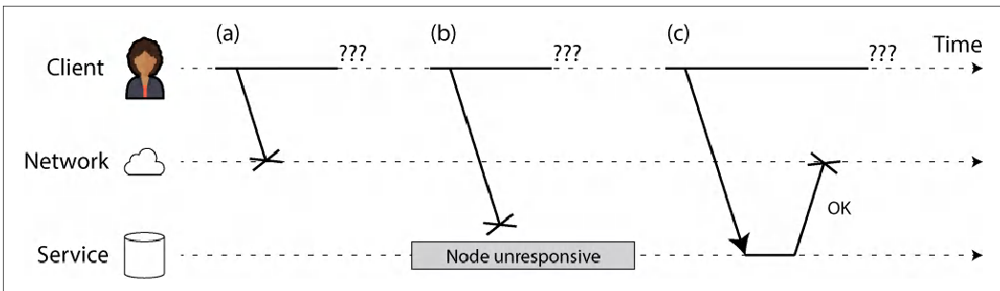

> 图 9-1。如果发送请求后没有收到响应，就无法区分是 (a) 请求丢失、(b) 远程节点宕机，还是 (c) 响应丢失。

发送方甚至无法判断数据包是否已经送达。唯一的办法是让接收方发送响应消息，而响应消息同样可能丢失或延迟。在异步网络中，这些问题无法区分；你掌握的唯一信息只是尚未收到响应。如果向另一个节点发送请求却没有收到响应，就*不可能*判断原因。

处理这一问题的常用方法是设置超时：等待一段时间后就放弃，并假定响应不会到达。然而，即使发生超时，你仍不知道远程节点是否收到了请求（而且如果请求仍在某处排队，那么即便你已经不再抱有希望，它仍可能被送达接收方）。

### TCP 的局限性

网络数据包有最大尺寸（通常为几千字节），但许多应用程序需要发送的消息（请求、响应）太大，无法装进一个数据包。此类应用程序最常使用 TCP，即传输控制协议，建立一条连接，将大数据流拆分成一个个数据包，并在接收端重新组装起来。

> [!NOTE]
> 我们对 TCP 的大部分论述也适用于较新的替代方案 QUIC，以及 WebRTC 使用的流控制传输协议（SCTP）、BitTorrent 的 uTP 协议和其他传输协议。有关它与 UDP 的比较，请参见第 354 页“TCP 与 UDP”。

人们常说 TCP 提供“可靠”交付，意思是它能检测并重传丢失的数据包，检测乱序的数据包并将其恢复为正确顺序，还能使用简单的校验和检测数据包损坏。它还会确定数据的发送速度，既让数据尽快传输，又不使网络或接收节点过载；这称为拥塞控制、流量控制或背压 [5]。

当你通过向套接字写入数据来“发送”数据时，数据不会立即发出，而是先放入由操作系统管理的缓冲区。当拥塞控制算法判定有能力发送一个数据包时，它会从该缓冲区取出下一个数据包大小的数据，并将其交给网络接口。数据包会经过多台交换机和路由器，最终由接收节点的操作系统把其中的数据放入接收缓冲区，并向发送方发回确认数据包。直到这时，接收端操作系统才会通知应用程序已有更多数据到达 [6]。

那么，如果 TCP 提供“可靠性”，是否意味着我们不必再担心网络不可靠？遗憾的是，并非如此。如果在某个超时时间内没有收到确认，TCP 就会判定数据包必定已经丢失，但它无法判断丢失的是发出的数据包还是确认。虽然它可以重发数据包，却无法保证新数据包一定能够送达（例如，如果网线被拔掉，TCP 可不会替你把它插回去）。最终，经过可配置的超时时间后，它会放弃并向应用程序报告错误。TCP 的去重和重传能力仅适用于单条连接，因此，如果应用程序重新连接并重传，数据就可能重复。

如果 TCP 连接因错误而关闭——也许是远程节点崩溃或网络中断所致——遗憾的是，你无法知道远程节点实际处理了多少数据 [6]。即使收到确认，表明数据包已经送达，也只能说明远程节点的操作系统内核收到了它；应用程序可能在处理这些数据之前就已经崩溃。如果想确认请求成功，就需要应用程序自身给出肯定响应 [7]。

尽管如此，TCP 仍然非常有用，因为它提供了一种便捷的方法，可以发送和接收无法装进单个数据包的消息。TCP 连接建立后，还可以用它发送多个请求和响应。通常的做法是先发送一个标头，指出后续消息的字节长度，然后发送实际消息。HTTP 和许多 RPC 协议（参见第 180 页“通过服务的数据流：REST 与 RPC”）都是这样工作的。

### 实践中的网络故障

我们构建计算机网络已有数十年之久——人们或许会期望，如今我们早该弄清楚如何让网络变得可靠。遗憾的是，我们仍未成功。一些系统性研究和大量轶事证据表明，即使在由一家公司运营的数据中心这类受控环境中，网络问题也出奇地常见 [8]：

- 一项针对中型数据中心的研究发现，每月约有 12 次网络故障，其中一半会断开单台机器的连接，另一半会断开整个机架的连接 [9]。

- 另一项研究测量了机架顶交换机、汇聚交换机和负载均衡器等组件的故障率 [10]。研究发现，增加冗余网络设备对故障的减少程度并没有预想中那么高，因为它无法防范人为错误（例如交换机配置错误），而人为错误正是服务中断的主要原因之一。

- 广域光纤链路中断曾被归咎于牛 [11]、海狸 [12] 和鲨鱼 [13]（不过，随着海底电缆防护的改善，鲨鱼咬断电缆的情况已经减少 [14]）。人类也常常是罪魁祸首，原因包括意外的错误配置 [15]、拾荒盗取 [16] 或蓄意破坏 [17]。

- 在不同云区域之间，高百分位处曾观测到长达数分钟的往返时间 [18, Table 3]。即使在单个数据中心内部，当交换机软件升级期间出现问题并触发网络拓扑重新配置时，数据包延迟也可能超过一分钟 [19]。因此，我们必须假定消息可能被任意延迟。

- 有时通信会部分中断，具体取决于通信对象——例如，A 与 B 可以通信，B 与 C 可以通信，但 A 与 C 无法通信 [20, 21]。其他令人意外的故障还包括：某个网络接口有时会丢弃所有传入数据包，却能成功发送传出数据包 [22]。网络链路在一个方向上可用，并不保证它在相反方向上也可用。

- 即使只是短暂的网络中断，其后续影响也可能比原始问题持续得久得多 [8, 20, 23]。

即使网络故障在你的环境中很少见，故障*可能*发生这一事实也意味着软件必须能够处理它们。任何通过网络进行的通信都可能失败——这是无法回避的。

> [!NOTE]
> **网络分区**
>
> 当网络的一部分因网络故障而与其余部分断开时，有时会使用网络分区（network partition）或网络分裂（netsplit）这两个术语。不过，这与其他类型的网络中断并没有根本区别。网络分区与存储系统的分片无关，后者有时也称为分区（参见第 7 章）。
>
> 如果没有定义并测试网络故障的错误处理方式，就可能发生任意糟糕的事情——例如，即使网络恢复，集群也可能陷入死锁，永久无法处理请求 [24]；甚至可能删除你的全部数据 [25]。如果软件遭遇未曾预料的情况，就可能做出任意意外的事情。
>
> 处理网络故障并不一定意味着容忍故障。如果你的网络通常相当可靠，那么在网络出现问题时，仅仅向用户显示错误消息也可能是一种合理的方法。不过，你确实需要了解软件对网络问题会作何反应，并确保系统能够从中恢复。可以考虑主动触发网络问题，并测试系统的响应（参见第 385 页“故障注入”）。

### 故障检测

许多系统需要自动检测故障节点。例如：

- 负载均衡器需要停止向已经宕机的节点发送请求（即将其从轮转列表中移除）。

- 在采用单主复制的分布式数据库中，如果主节点失效，就需要将一个从节点提升为新的主节点（参见第 204 页“处理节点宕机”）。

遗憾的是，网络的不确定性使我们很难判断一个节点是否正在工作。在某些特定情况下，你可能会得到明确反馈，直接告诉你某处无法正常工作：

- 如果能够访问本应运行该节点的机器，但目标端口上没有进程监听（例如因为进程已经崩溃），操作系统会通过发回 RST 或 FIN 数据包，贴心地关闭或拒绝 TCP 连接。

- 如果节点进程崩溃（或被管理员终止），但节点的操作系统仍在运行，脚本可以将崩溃情况通知其他节点，使另一个节点无需等待超时到期就能迅速接管。例如，HBase 就采用这种方式 [26]。

- 如果你能够访问数据中心内网络交换机的管理接口，就可以查询它们，从硬件层面检测链路故障（例如远程机器断电）。如果通过互联网连接、身处无法访问交换机本身的共享数据中心，或者因网络问题无法访问管理接口，这种方法就不可行。

- 如果路由器确信你尝试连接的 IP 地址无法访问，它可能会回复一个 ICMP“目标不可达”数据包。不过，路由器同样没有神奇的故障检测能力；它也受制于网络中其他参与者面临的那些限制。

迅速获知远程节点已经宕机很有用，但不能指望总能获得这种反馈。如果出了问题，你可能会在协议栈的某一层收到错误响应，但一般来说，必须假定根本不会收到任何响应。你可以重试几次，等待超时结束，如果在超时时间内仍未收到回复，最终就宣告节点已宕机。由于节点实际上可能仍然存活，因此需要在假阳性和假阴性之间取得平衡：超时时间过短，会把存活节点错误地怀疑为已经宕机；超时时间过长，则会因等待已宕机节点而造成不必要的延迟。

### 超时与无界延迟

如果超时是检测故障唯一可靠的方法，那么超时时间应该设为多长？遗憾的是，这个问题没有简单答案。

较长的超时时间意味着需要等待很久才能宣告节点已宕机（在此期间，用户可能不得不等待或看到错误消息）。较短的超时时间可以更快检测到故障，但也更容易错误地宣告节点已宕机，而实际上它可能只是暂时变慢（例如节点负载激增或网络拥堵所致）。

过早宣告节点已宕机会带来问题。如果节点其实仍然存活，并且正在执行某项操作（例如发送电子邮件），此时另一个节点接管，最终这项操作可能会执行两次。我们将在第 371 页“知识、真相与谎言”以及第 10 章和第 12 章中更详细地讨论这个问题。

当一个节点被宣告宕机时，需要把它的职责转移给其他节点，这会给这些节点和网络带来额外负载。如果系统本就因高负载而举步维艰，过早宣告节点宕机可能使问题进一步恶化。特别是，节点实际上可能并未宕机，只是由于过载而响应缓慢；将其负载转移给其他节点可能引发级联故障（极端情况下，所有节点都宣告彼此宕机，一切都会停止工作——参见第 38 页“过载系统无法恢复时”）。

设想一个虚构的系统，其网络保证数据包的最大延迟。每个数据包要么在时间 $d$ 内送达，要么丢失，并且送达时间绝不会超过 $d$。进一步假设，你能够保证未失效的节点总会在时间 $r$ 内处理请求。在这种情况下，你可以保证每个成功的请求都会在时间 $2d + r$ 内收到响应——如果在这段时间内没有收到响应，就可以确定网络或远程节点出了问题。如果这些条件成立，那么采用 $2d + r$ 作为超时时间是合理的。

遗憾的是，我们使用的大多数系统都不具备这两项保证。异步网络存在*无界延迟*（它们会尽快尝试交付数据包，但数据包到达所需的时间没有上限），而且大多数服务器实现也无法保证在某个最长时间内处理完请求（参见第 369 页“提供响应时间保证”）。对于故障检测来说，系统大多数时候速度很快还不够：如果超时时间设得很短，只需往返时间出现一次短暂的激增，就会使系统失去平衡。

### 网络拥塞与排队

驾车出行时，道路交通的行程时间通常主要因交通拥堵而波动。与此类似，计算机网络中数据包延迟的变化通常主要由排队造成 [27]：

- 如果多个节点同时尝试向同一目的地发送数据包，网络交换机就必须把它们排入队列，再逐个送入通往目的地的网络链路（如图 9-2 所示）。在繁忙的网络链路上，数据包可能需要等待一段时间才能获得传输机会（这称为*网络拥塞*）。如果传入的数据多到塞满交换机队列，数据包就会被丢弃，因此需要重传——即使网络本身运行完全正常。

- 当数据包到达目标机器时，如果所有 CPU 核心或应用程序线程当前都很忙，来自网络的传入请求就会由操作系统排队，直到应用程序准备好处理它。根据机器负载的不同，这可能需要任意长的时间 [28]。

- 在虚拟化环境中，当另一台虚拟机（VM）使用某个 CPU 核心时，正在运行的操作系统往往会暂停数十毫秒。在此期间，VM 无法从网络中读取任何数据，因此传入数据会由虚拟机监控器排队（缓冲）[29]，进一步加剧网络延迟的波动。

- 如前所述，为了避免网络过载，TCP 会限制发送数据的速率。这意味着数据甚至在进入网络之前，就要在发送方经历额外的排队。

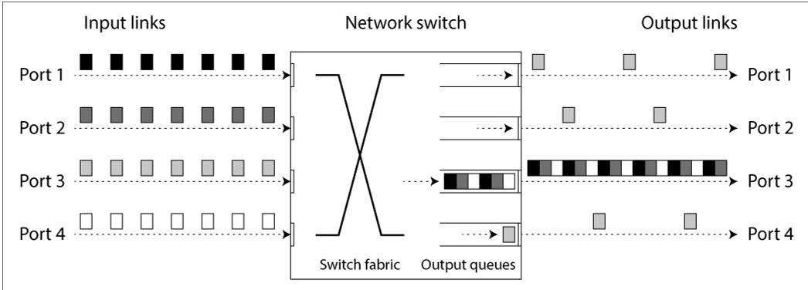

> 图 9-2。如果多台机器向同一目的地发送网络流量，其交换机队列可能会被塞满。这里，端口 1、2 和 4 都在尝试向端口 3 发送数据包。

此外，当 TCP 检测到丢包并自动重传时，应用程序不会直接看到数据包丢失，但会看到由此导致的延迟（等待超时到期，然后等待重传的数据包得到确认）。  

> [!NOTE]
> **TCP 与 UDP**
>
> 一些对延迟敏感的应用程序（如视频会议和 IP 语音（VoIP））使用 UDP 而非 TCP。这一选择是在可靠性与延迟变化之间进行权衡：由于 UDP 不执行流量控制，也不重传丢失的数据包，因此它避免了导致网络延迟变化的部分原因（不过仍然会受到交换机队列和调度延迟的影响）。  
>
> 当延迟到达的数据毫无价值时，UDP 是一个不错的选择。例如，在 VoIP 通话中，丢失的数据包很可能来不及在其数据应通过扬声器播放之前完成重传。在这种情况下，重传数据包没有意义——应用程序必须改用静音填补丢失数据包对应的时隙（造成短暂的声音中断），然后继续处理后续流。重试发生在人这一层。（“能请你再说一遍吗？刚才声音断了一下。”）  

### 网络延迟的变化  

所有这些因素都会导致网络延迟发生变化。当系统接近其最大容量时，排队延迟的变化范围尤其大。拥有大量闲置容量的系统可以轻松清空队列，而在利用率很高的系统中，长队列会迅速形成。  

在公有云和多租户数据中心中，资源由许多客户共享。网络链路和交换机，乃至每台机器的网络接口和 CPU（在虚拟机上运行时），都是共享的。处理大量数据可能会占用网络链路的全部容量（使其饱和）。由于你既无法控制共享资源的其他客户如何使用资源，也不了解其使用情况，如果与你相邻的某个客户（吵闹的邻居）正在大量使用资源，网络延迟就可能出现很大变化 [30, 31]。  

在这样的环境中，只能通过实验来选择超时时间：在较长时间内、跨许多机器测量网络往返时间的分布，以确定预期的延迟变化范围。然后，结合应用程序的特性，在故障检测延迟与过早超时的风险之间确定适当的权衡。  

更好的做法是，系统不采用配置好的固定超时时间，而是持续测量响应时间及其变化（抖动），并根据观测到的响应时间分布自动调整超时时间。Phi Accrual 故障检测器 [32]（例如 Akka 和 Cassandra [33] 就使用了它）是实现这一做法的一种方式。TCP 的重传超时机制也以类似方式工作 [5]。  

### 同步网络与异步网络  

如果我们能够相信网络会在固定的最大延迟内交付数据包，而且不会丢包，那么分布式系统就会简单得多。为什么不能在硬件层面解决这个问题，让网络变得可靠，从而使软件无需为此操心呢？  

要回答这个问题，不妨将数据中心网络与传统固定电话网络（非蜂窝、非 VoIP）作一番比较。后者极为可靠，音频帧延迟和通话中断都非常罕见。电话通话需要持续保持较低的端到端延迟，并具备足够的带宽来传输语音采样。如果计算机网络也能拥有类似的可靠性和可预测性，岂不是很好？  

通过电话网络拨打电话时，网络会建立一条电路：在两位通话者之间的整条路径上，为此次通话分配固定且有保证的带宽。这条电路会一直保持到通话结束 [34]。例如，ISDN 网络以每秒 4,000 帧的固定速率运行。建立通话后，每一帧都会为其分配 16 位空间（每个方向各自如此）。因此，在整个通话期间，双方都保证能够每 250 微秒准确发送 16 位音频数据 [35]。  

这种网络是*同步的*：即使数据经过多个路由器，也不会遇到排队问题，因为该通话所需的 16 位空间已经在网络的下一跳中预留。由于没有排队，网络的最大端到端延迟是固定的。我们称之为*有界延迟*。  

### 难道不能直接让网络延迟变得可预测吗？  

请注意，电话网络中的电路与 TCP 连接截然不同。电路拥有固定的预留带宽，只要电路仍然建立着，其他任何人就不能使用这部分带宽；而 TCP 连接的数据包则伺机使用一切可用的网络带宽。你可以向 TCP 提供大小不定的数据块（例如电子邮件或网页），它会尽力在最短时间内完成传输。当 TCP 连接空闲时，它不会占用任何带宽（偶尔发送的保活数据包除外）。  

如果数据中心网络和互联网采用电路交换，那么在建立电路时就可以保证最大往返时间。然而，它们并非如此。以太网和 IP 都是分组交换协议，会受到排队影响，因此网络延迟没有上界。这些协议没有电路这一概念。  

为什么数据中心网络和互联网采用分组交换？答案是，它们针对突发流量进行了优化。电路适合音频或视频通话，因为通话期间需要以相当稳定的每秒位数进行传输。另一方面，请求网页、发送电子邮件或传输文件并没有特定的带宽要求——我们只希望它尽快完成。  

如果想通过电路传输文件，就必须猜测要分配多少带宽。如果猜得太低，传输会慢得没有必要，并使网络容量闲置。如果猜得太高，就无法建立电路（因为当网络无法保证带宽分配时，便不能允许创建电路）。相比之下，TCP 会根据可用的网络容量动态调整数据传输速率。  

> [!NOTE]
> **延迟与资源利用率**
>
> 更一般地说，可以把延迟变化视为动态资源划分的结果。  
>
> 假设两台电话交换机之间有一根能够承载至多 10,000 路并发通话的电线（或光纤）。经由这根线路交换的每条电路都会占用一个通话时隙。因此，可以把这根线路看作最多可由 10,000 个并发用户共享的资源。该资源以静态方式划分：即使目前整条线路上只有你这一通电话，其余 9,999 个时隙都未使用，你的电路所分配的带宽仍与线路被完全利用时一样固定。  
>
> 相比之下，互联网会动态共享网络带宽。发送方彼此推挤争抢，以便让自己的数据包尽快通过线路；网络交换机则随时决定接下来发送哪个数据包（即如何分配带宽）。这种方式的缺点是会产生排队，但  
>
> 优点是可以最大限度地提高线路利用率。线路的成本是固定的，因此利用得越充分，经由它发送的每个字节就越便宜。  
>
> CPU 也存在类似的情况。如果在多个线程之间动态共享每个 CPU 核心，当另一个线程正在运行时，某个线程有时就必须在操作系统的运行队列中等待，因此线程可能会暂停长短不一的时间 [36]。然而，与为每个线程静态分配一定数量的 CPU 周期相比，这种方式能更充分地利用硬件（参见第 369 页的“提供响应时间保证”）。更高的硬件利用率也是云平台在同一台物理机上运行来自不同客户的多个虚拟机的原因。  
>
> 在某些环境中，如果资源是静态划分的（例如使用专用硬件和独占带宽分配），就可以实现延迟保证。然而，这种保证以降低利用率为代价——换言之，成本更高。另一方面，采用动态资源划分的多租户方式具有更高的利用率，因而成本更低，但缺点是延迟会发生变化。  

网络中的延迟变化并非自然法则，而只是成本与收益权衡的结果。  

### 结合电路交换与分组交换  

人们曾尝试构建同时支持电路交换和分组交换的混合网络。*异步传输模式*（ATM）在 20 世纪 80 年代曾是以太网的竞争对手，但除了电话网络的核心交换机之外，并未得到广泛采用。InfiniBand 与之有一些相似之处 [37]：它在链路层实现端到端流量控制，减少了网络中排队的需要，不过仍可能因链路拥塞而发生延迟 [38]。  

谨慎使用数据包优先级与调度、准入控制（对发送方限速）等服务质量（QoS）机制，可以在分组网络上模拟电路交换，或者提供统计意义上的有界延迟 [27, 34]。低延迟、低丢包和可扩展吞吐量（L4S）等新型网络算法试图在客户端和路由器层面缓解部分排队与拥塞控制问题。Linux 的流量控制器（TC）也允许应用程序出于 QoS 目的重新设定数据包优先级。  

然而，目前多租户数据中心、公有云以及通过互联网通信的场景并未启用这类 QoS 机制。当前部署的技术无法让我们对网络延迟或可靠性作出任何保证；我们必须假定网络拥塞、排队和无界延迟都会发生。因此，超时时间没有“正确”的取值——必须通过实验来确定。  

互联网服务提供商之间的对等互联协议，以及通过边界网关协议（BGP）建立路由的方式，比典型的 IP 数据包路由更接近电路交换。在这一层面，可以购买专用带宽。尽管如此，互联网路由是在网络层面运作的，而不是在主机之间的单条连接层面，并且其时间尺度要长得多。  

## 不可靠的时钟  

时钟和时间非常重要。应用程序以各种方式依赖时钟，以回答如下问题：  

1. 这个请求已经超时了吗？  

2. 这项服务响应时间的第 99 百分位数是多少？  

3. 在过去五分钟里，这项服务平均每秒处理多少次查询？  

4. 用户在我们的网站上停留了多长时间？  

5. 这篇文章是什么时候发布的？  

6. 应该在哪个日期和时间发送提醒邮件？  

7. 这个缓存条目什么时候过期？  

8. 日志文件中这条错误消息的时间戳是什么？  

问题 1～4 测量的是持续时间（例如从发出请求到收到响应之间的时间间隔），而问题 5～8 描述的是时间点（在特定日期、特定时刻发生的事件）。  

在分布式系统中，时间是个棘手的问题，因为通信并非瞬时完成；消息从一台机器通过网络传到另一台机器需要时间。消息的接收时间总是晚于发送时间，但由于网络延迟会发生变化，我们不知道究竟晚了多久。当涉及多台机器时，这一事实有时会让事件发生顺序难以确定。  

此外，网络中的每台机器都有自己的时钟，这是一种硬件设备——通常是石英晶体振荡器。这些设备并非完全准确，因此每台机器都有自己的时间概念，相比其他机器可能稍快或稍慢。时钟可以在一定程度上同步；最常用的机制是网络时间协议（NTP），它允许计算机根据一组服务器报告的时间来调整时钟 [39]。这些服务器又从更准确的时间源（如 GPS 接收器）获取时间。  

### 单调时钟与日历时钟  

现代计算机至少有两种时钟：日历时钟和单调时钟。虽然两者都测量时间，但务必加以区分，因为它们的用途不同。  

#### 日历时钟  

日历时钟的作用符合人们对时钟的直觉预期：它根据日历返回当前日期和时间（也称墙上时钟时间）。例如，Linux 上的 `clock_gettime(CLOCK_REALTIME)` 和 Java 中的 `System.currentTimeMillis` 返回自纪元以来的秒数（或毫秒数）；这里的纪元依据公历定义为 1970 年 1 月 1 日 UTC 午夜，并且不计算闰秒。有些系统使用其他日期作为参考点。（虽然 Linux 的时钟被称为实时（real-time）时钟，但它与实时操作系统无关，参见第 369 页的“提供响应时间保证”。）  

日历时钟通常与 NTP 同步，这意味着来自一台机器的时间戳（理想情况下）与另一台机器上的同一时间戳含义相同。然而，日历时钟也有各种奇怪之处，下一节将会说明。尤其是，如果本地时钟比 NTP 服务器快得太多，它可能会被强制重置，看起来就像跳回了先前的时间点。这种跳变，以及闰秒导致的类似跳变，使日历时钟不适合测量经过的时间 [40]。  

日历时钟也可能因夏令时（DST）的开始和结束而发生跳变，不过只要始终使用没有夏令时的 UTC 时区，就可以避免这种情况。过去，这些时钟的分辨率相当粗糙（例如，在较旧的 Windows 系统上以 10 毫秒为步长向前移动 [41]）。在较新的系统上，这已不再是太大的问题。  

#### 单调时钟  

单调时钟适合测量持续时间（时间间隔），例如超时时间或服务的响应时间；以 Linux 上的 `clock_gettime(CLOCK_MONOTONIC)` 或 `clock_gettime(CLOCK_BOOTTIME)` [42] 以及 Java 中的 `System.nanoTime` 为例，它们都使用单调时钟测量时间。这个名称源于此类时钟保证始终向前走（日历时钟则可能在时间上向后跳）。  

你可以在某个时间点读取单调时钟的值，做一些事情，然后在之后的某个时间点再次读取时钟。两个值的*差*会告诉你两次读取之间经过了多长时间——它更像秒表，而不是墙上的时钟。然而，时钟的*绝对*值没有意义；它可能是计算机启动以来的纳秒数，也可能是某种类似的任意数值。尤其是，比较两台计算机上的单调时钟值毫无意义，因为它们的含义并不相同。  

在拥有多个 CPU 插槽的服务器上，每个 CPU 可能有单独的计时器，而且不一定与其他 CPU 同步 [43]。操作系统会补偿任何偏差，并尽力向应用程序线程呈现单调的时钟视图，即使这些线程会被调度到多个 CPU 上运行。不过，最好还是对这种单调性保证持保留态度 [44]。  

如果 NTP 检测到计算机的本地石英时钟比 NTP 服务器走得更快或更慢，它可能会调整单调时钟向前推进的频率（这称为时钟*渐进校正*）。默认情况下，NTP 允许时钟速率加快或减慢最多 0.05%，但不能使单调时钟向前或向后跳变。单调时钟的分辨率通常相当高：在大多数系统上，它们可以测量微秒或更短的时间间隔。  

在分布式系统中，使用单调时钟测量经过的时间（例如超时时间）通常没有问题，因为它不假设不同节点的时钟之间存在任何同步，也不受测量中轻微误差的影响。  

### 时钟同步与准确度  

单调时钟不需要同步，但日历时钟需要根据 NTP 服务器或其他外部时间源来设置，才能发挥作用。遗憾的是，让时钟显示正确时间的方法远没有你期望的那样可靠或准确——硬件时钟和 NTP 都是难以捉摸的东西。仅举几例：  

- 普通计算机中的石英时钟并不十分准确：它会漂移（走得比应有速度更快或更慢）。时钟漂移会随机器温度而变化。Google 假设其服务器的时钟漂移最多为 200 ppm（百万分率）[45]，这相当于每 30 秒与服务器重新同步一次的时钟产生 6 毫秒漂移，或者每天重新同步一次的时钟产生 17 秒漂移。即使一切运行正常，这种漂移也会限制所能达到的最佳准确度。  

- 如果计算机时钟与 NTP 服务器的差异过大，它可能拒绝同步或被强制重置 [39]。任何在重置前后观察时间的应用程序都可能看到时间倒退或突然向前跳跃。  

- 如果某个节点因意外的防火墙设置而无法连接 NTP 服务器，这种错误配置可能在一段时间内无人察觉；在此期间，漂移可能不断累积，导致该节点与其他节点的时钟出现巨大差异。轶事证据表明，这种情况在实践中确实会发生。  

- NTP 同步的准确度至多只能与网络延迟允许的程度一样好，因此，当网络拥塞且数据包延迟不断变化时，其准确度会受到限制。一项实验表明，通过互联网进行同步时，能够达到的最小误差为 35 毫秒 [46]，不过网络延迟偶尔出现的尖峰可能会导致约一秒的误差。根据配置不同，较大的网络延迟可能导致 NTP 客户端彻底放弃同步。  

- 有些 NTP 服务器提供的时间有误或配置不当，报告的时间可能偏差数小时 [47, 48]。NTP 客户端会通过查询多个服务器并忽略离群值来减轻这类错误。尽管如此，把系统的正确性押在互联网上陌生人告诉你的时间上，还是有些令人不安。  

- 闰秒会造成一分钟只有 59 秒或长达 61 秒，从而打乱未针对闰秒设计的系统中的计时假设 [49]。闰秒曾导致许多大型系统崩溃 [40, 50]，这说明有关时钟的错误假设是多么容易悄然混入系统。处理闰秒的最佳方式或许是让 NTP 服务器“撒谎”，在一天内逐渐完成闰秒调整（这称为闰秒平滑）[51, 52]，不过实际的 NTP 服务器行为各不相同 [53]。从 2035 年起将不再使用闰秒，因此这个问题所幸会消失。  

- 在虚拟机中，硬件时钟也是虚拟化的，这给需要精确计时的应用程序带来了额外挑战 [54]。当一个 CPU 核心由多个虚拟机共享时，另一个虚拟机运行期间，每个虚拟机都会暂停数十毫秒。从应用程序的角度看，当虚拟机恢复运行时，这种暂停表现为时钟突然向前跳跃 [29]。虚拟机内部运行的 NTP 客户端不知道何时发生了暂停，因此可能错误地报告时钟准确度 [55]。  

- 如果在你无法完全控制的设备（例如移动设备或嵌入式设备）上运行软件，那么其硬件时钟可能根本不可信。有些用户会故意将设备的硬件时钟设置为错误的日期和时间，例如为了在游戏中作弊 [56]。因此，时钟可能被设定为与准确时间相差极大的值。  

如果你对此足够重视，愿意投入大量资源，就有可能实现非常高的时钟准确度。例如，欧盟针对金融机构的 MiFID II 法规要求所有高频交易基金将其时钟与 UTC 的误差同步到 100 微秒以内，以帮助调试“闪电崩盘”等市场异常，并帮助检测市场操纵 [57]。  

使用特殊硬件（GPS 接收器和/或原子钟）、精确时间协议（PTP），并进行谨慎的部署和监控，就能达到这样的准确度 [58, 59]。单纯依赖 GPS 可能有风险，因为 GPS 信号很容易受到干扰。在某些地点（例如军事设施附近），这种情况经常发生 [60]。一些云提供商已经开始为虚拟机提供高精度时钟同步 [61]，但时钟同步仍然需要格外谨慎。如果 NTP 守护进程配置错误，或者防火墙阻止了 NTP 流量，漂移造成的时钟误差很快就会变得很大。  

### 依赖同步时钟  

时钟的问题在于，它们看似简单易用，却有数量惊人的陷阱。一天可能并非恰好有 86,400 秒，日历时钟可能在时间上向后走，而一个节点的时钟所显示的时间可能与另一个节点相差甚远。  

本章前面讨论了网络丢包和任意延迟数据包的问题。尽管网络在大多数时候表现良好，软件设计仍必须假定网络偶尔会出现故障，并且软件必须妥善处理这类故障。时钟也是如此：尽管它们大多数时候工作得相当好，健壮的软件仍需做好应对错误时钟的准备。  

部分问题在于，错误的时钟很容易不被察觉。如果一台机器的 CPU 有缺陷或网络配置错误，它很可能完全无法工作，因此问题很快就会被发现并修复。另一方面，如果其石英时钟有缺陷或 NTP 客户端配置错误，大多数功能看起来仍会正常工作，尽管它的时钟会逐渐偏离真实时间，且偏差越来越大。如果某个软件依赖准确同步的时钟，结果更可能是悄无声息且难以察觉的数据丢失，而不是剧烈的崩溃 [62, 63]。  

因此，如果你使用的软件要求时钟同步，就必须仔细监控集群中所有机器之间的时钟偏移。任何时钟与其他节点偏离过大的节点都应被宣告死亡并移除。这样的监控可以确保你在故障时钟造成太大损害之前发现它们。  

#### 用时间戳为事件排序  

让我们考虑一种依赖时钟很诱人、却也很危险的具体情形：为多个节点上的事件排序[64]。例如，如果两个客户端向一个分布式数据库写入数据，谁先到达？哪次写入更新？  

图 9-3 展示了在采用多主复制的数据库中危险地使用日历时钟的情况（该示例与图 6-8 类似）。客户端 A 在节点 1 上写入 x = 1；该写入被复制到节点 3；客户端 B 在节点 3 上递增 x（此时 x = 2）；最后，这两次写入都被复制到节点 2。如图所示，当一次写入被复制到其他节点时，会根据该写入发源节点上的日历时钟为其加上时间戳。这个例子中的时钟同步得非常好；节点 1 与节点 3 之间的偏差小于 3 ms，这可能已经优于实际中可以期待的水平。  

由于递增操作建立在较早的 x = 1 写入之上，我们或许会期望 x = 2 的写入拥有两者中更大的时间戳。遗憾的是，图 9-3 中的实际情况并非如此。x = 1 的写入时间戳为 42.004 秒，而 x = 2 的写入时间戳为 42.003 秒。换言之，客户端 B 的写入在因果关系上晚于客户端 A 的写入，但 B 的写入却拥有更早的时间戳。  

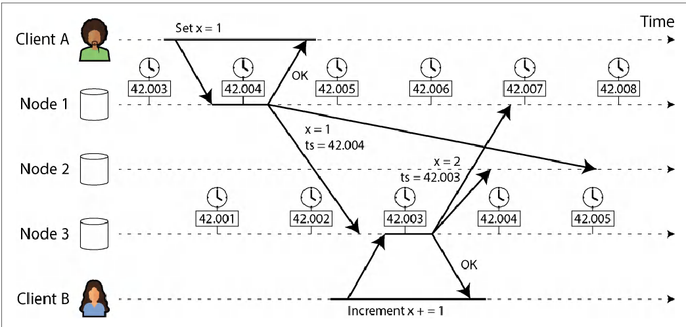

> 图 9-3。依赖时间戳为事件排序时，如果日历时钟没有完美同步，就可能出现问题。  

正如第 222 页“处理写入冲突”中所讨论的，解决不同节点上并发写入值之间冲突的一种方法是最后写入胜出（last write wins，LWW），即针对给定键保留时间戳最大的写入，并丢弃所有时间戳更早的写入。在图 9-3 中，当节点 2 收到这两个事件时，它会错误地认定 x = 1 是更新的值，并丢弃 x = 2 的写入，于是递增操作就丢失了。  

可以通过确保新值覆盖旧值时，新值的时间戳始终高于被覆盖值的时间戳来避免这个问题，即使该时间戳超前于写入方的本地时钟也无妨。然而，这样做需要额外读取一次，以找出当前最大的时间戳。包括 Cassandra 和 ScyllaDB 在内的一些系统，其设计目标是避免这次额外的往返，直接把客户端时钟的时间戳与 LWW 策略结合使用[62]。这种做法存在一些严重问题：  

- 数据库写入可能会莫名其妙地消失。时钟落后的节点无法覆盖先前由时钟较快的节点写入的值，直到节点间的时钟偏差所对应的时间过去为止[63, 65]。这种情况可能导致任意数量的数据被静默丢弃，而应用程序不会收到任何错误报告。  

- LWW 无法区分快速连续发生的写入（在图 9-3 中，客户端 B 的递增操作确定发生在客户端 A 的写入*之后*）和真正并发的写入（两个写入方都不知道对方的存在）。为了防止违反因果关系，还需要版本向量等额外的因果关系跟踪机制（参见第 237 页“检测并发写入”）。  

- 两个节点可能各自独立生成具有相同时间戳的写入，尤其是在时钟分辨率仅为毫秒时。解决这种冲突需要一个额外的决胜值（可以只是一个很大的随机数），但这种方法也可能导致违反因果关系[62]。  

因此，尽管通过保留“最新”的值并丢弃其他值来解决冲突很有吸引力，但必须意识到，“最新”的定义取决于本地日历时钟，而这个时钟很可能不准确。即使时钟通过 NTP 紧密同步，你也可能在时间戳 100 ms 时发送一个数据包（按照发送方的时钟），而它在时间戳 99 ms 时到达（按照接收方的时钟）——于是看起来数据包在发送之前就已到达，这是不可能的。  

能否让 NTP 的同步精度高到足以杜绝这种错误排序？可能不能，因为除了石英晶体漂移等其他误差来源外，NTP 的同步精度本身还受网络往返时间限制。要保证排序正确，时钟误差必须显著小于网络延迟，这是不可能做到的。  

所谓的*逻辑时钟*[66]以递增计数器而非振荡的石英晶体为基础，是为事件排序时更安全的替代方案（参见第 237 页“检测并发写入”）。逻辑时钟不测量一天中的时刻或已经过的秒数，只表示事件的相对顺序（一个事件发生在另一个事件之前还是之后）。相比之下，测量实际经过时间的日历时钟和单调时钟被称为*物理时钟*。我们将在第 417 页“ID 生成器与逻辑时钟”中更详细地讨论逻辑时钟。  

#### 带置信区间的时钟读数  

你也许能以微秒、甚至纳秒分辨率读取机器的日历时钟。但即使能获得如此细粒度的测量值，也不意味着该值真的精确到了这种程度。事实上，它很可能并没有这么精确。如前所述，即使每分钟与本地网络中的 NTP 服务器同步一次，不精确的石英时钟也很容易产生数毫秒的漂移。如果使用公共互联网上的 NTP 服务器，最佳精度可能也只有几十毫秒，而且网络拥塞时误差很容易飙升到 100 ms 以上。  

因此，把时钟读数看作一个时间点并不合理。它更像是置信区间内的一段时间范围——例如，系统可能有 95% 的把握认为当前时间处于该分钟后的 10.3 秒到 10.5 秒之间，但无法得知得更精确[67]。如果我们只知道时间为 +/- 100 ms，那么时间戳中的微秒数字基本毫无意义。  

不确定性边界可以根据时间源计算。如果计算机直接连接了 GPS 接收器或原子钟，那么预期误差范围由设备决定；对于 GPS，还取决于卫星信号的质量。如果从服务器获取时间，不确定性则由自上次与服务器同步以来的预期石英晶体漂移、NTP 服务器的不确定性，以及到该服务器的网络往返时间共同决定（这是初步近似，并假定你信任该服务器）。  

遗憾的是，大多数系统不会暴露这种不确定性；例如，当你调用
`clock_gettime` 时，返回值不会告诉你时间戳的预期误差，
因此你不知道它的置信区间究竟是五毫秒还是五年。  

也有例外。Google Spanner 的 *TrueTime* API [45] 和 Amazon ClockBound 会明确报告本地时钟的置信区间。当你向它询问当前时间时，会得到两个值：*[earliest, latest]*，分别是*最早可能*与*最晚可能*的时间戳。根据不确定性计算，时钟知道真实的当前时间处于该区间内。区间宽度取决于多个因素，其中包括本地石英时钟上次与更精确时钟源同步后经过了多长时间。  

#### 用同步时钟实现全局快照  

在第 293 页“快照隔离与可重复读”中，我们讨论了*多版本并发控制*（MVCC）。对于既要支持小型、快速的读写事务，又要支持大型、长时间运行的只读事务（例如备份或分析）的数据库来说，这是一项非常有用的功能。它让只读事务无需加锁，也不会干扰读写事务，就能看到数据库的一个*快照*，即某一特定时刻的一致状态。  

通常，MVCC 需要单调递增的事务 ID。如果某次写入发生在快照之后（即该写入的事务 ID 大于快照的事务 ID），该写入对快照事务不可见。在单节点数据库上，一个简单的计数器就足以生成事务 ID。  

然而，当数据库分布在许多机器上，甚至跨越多个数据中心时，就很难生成全局单调递增的事务 ID（覆盖所有分片），因为这需要协调。事务 ID 必须反映因果关系：如果事务 B 读取或覆盖了先前由事务 A 写入的值，那么 B 的事务 ID 必须高于 A——否则快照就会不一致。当存在大量短小而快速的事务时，在分布式系统中创建事务 ID 会成为无法承受的瓶颈。（我们将在第 417 页“ID 生成器与逻辑时钟”中讨论这类 ID 生成器。）  

我们能否把同步日历时钟的时间戳用作事务 ID？如果能让同步足够精确，它们就具备正确的性质，因为较晚的事务会拥有更大的时间戳。问题在于时钟精度存在不确定性。  

Spanner 以这种方式实现了跨数据中心的快照隔离[68, 69]。它使用 TrueTime API 报告的时钟置信区间，并基于以下观察：如果有两个置信区间，每个区间都由最早和最晚可能的时间戳组成（$A = [A_{earliest}, A_{latest}]$ 和 $B = [B_{earliest}, B_{latest}]$），并且这两个区间不重叠（即 $A_{earliest} < A_{latest} < B_{earliest} < B_{latest}$），那么 B 确定发生在 A 之后——对此毫无疑问。只有区间重叠时，我们才无法确定 A 和 B 的发生顺序。  

为确保事务时间戳反映因果关系，Spanner 会在提交读写事务之前，刻意等待一段等于置信区间长度的时间。这样可以确保任何可能读取该数据的事务都发生在足够晚的时刻，使它们的置信区间不会重叠。为了尽量缩短等待时间，Spanner 需要尽可能减小时钟的不确定性；为此，Google 在每个数据中心部署 GPS 接收器或原子钟，使时钟可以同步到约 7 ms 以内[45]。  

原子钟和 GPS 接收器并非 Spanner 的严格必需条件。关键是要有置信区间——精确的时钟源只是有助于缩小这个区间。其他系统也开始采用类似的方法——例如，YugabyteDB 在 AWS 上运行时可以利用 ClockBound [70]，现在还有若干其他系统也不同程度地依赖时钟同步[71, 72]。  

### 进程暂停  

让我们再看一个在分布式系统中危险地使用时钟的例子。假设有一个数据库，每个分片只有一个主节点。只有主节点可以接受写入。一个节点如何知道自己仍是主节点（尚未被其他节点宣告死亡），并且可以安全地接受写入？  

一种选择是让主节点从其他节点获得租约，这类似于一个带超时的锁[73]。任何时刻只能有一个节点持有租约。因此，当一个节点获得租约时，它便知道自己将在租约到期前的一段时间内担任主节点。为了继续担任主节点，该节点必须在租约到期前定期续租。如果节点发生故障，它就会停止续租，于是租约到期后，另一个节点可以接管。  

可以想象，请求处理循环大致如下：  

```java
while (true) {
    request = getIncomingRequest();

    // 确保租约始终至少还剩 10 秒
    if (lease.expiryTimeMillis - System.currentTimeMillis() < 10000) {
        lease = lease.renew();
    }

    if (lease.isValid()) {
        process(request);
    }
}
```  

这段代码有什么问题？首先，它依赖同步时钟：租约的到期时间由另一台机器设定（例如，到期时间可能按当前时间加 30 秒计算），然后再与本地系统时钟比较。如果两个时钟相差超过几秒，代码就会开始出现奇怪的行为。  

其次，即使我们修改协议，使其只使用本地单调时钟，仍然存在另一个问题：代码假定从检查时间（System.currentTimeMillis()）到处理请求（process(request)）之间经过的时间很短。通常这段代码运行得非常快，因此 10 秒的缓冲时间足以确保租约不会在处理请求的过程中到期。  

然而，如果程序执行过程中意外暂停了呢？例如，假设线程在调用 lease.isValid 的那一行附近停顿了 15 秒，之后才终于继续运行。在这种情况下，处理请求时租约很可能已经过期，而且另一个节点已经接任主节点。然而，没有任何信息会告诉这个线程它暂停了这么久，因此直到循环的下一次迭代，代码才会注意到租约已经过期——而在此之前，它可能已经因为处理请求而做出了不安全的操作。  

假设线程可能暂停这么久是否合理？遗憾的是，合理。造成这种情况的原因有很多：  

- 线程在访问锁或队列等共享资源时发生争用，会导致线程花费大量时间等待。这类问题在 CPU 核心更多的机器上往往更严重，而且争用问题可能很难诊断[74]。  

- 许多编程语言运行时（例如 JVM）都有垃圾收集器，偶尔需要停止所有正在运行的线程。过去，这种“停止世界”（stop-the-world）式的垃圾收集暂停有时会持续数分钟[75]！现代 GC 算法已经减轻了这个问题，但 GC 暂停仍可能很明显（参见第 370 页“限制垃圾收集的影响”）。  

- 在虚拟化环境中，虚拟机可以被挂起（暂停所有进程的执行，并把内存内容保存到磁盘），随后再恢复（还原内存内容并继续执行）。这种暂停可能发生在进程执行的任何时刻，持续时间也可以任意长。该功能有时用于在不重启的情况下把虚拟机从一台宿主机热迁移到另一台；在这种情况下，暂停时长取决于进程写入内存的速率[76]。  

- 在笔记本电脑和手机等终端用户设备上，执行也可能被任意挂起和恢复（例如用户合上笔记本电脑盖时）。  

- 当操作系统把上下文切换到另一个线程，或者虚拟机监控程序切换到另一个虚拟机（在虚拟机中运行时），当前运行的线程可能在代码中的任意位置暂停。对于虚拟机，CPU 花在其他虚拟机上的时间称为*被窃取时间*（steal time）。如果机器负载很高——也就是说，有很长的线程队列正在等待运行——暂停的线程可能要过一段时间才能再次获得运行机会。  

- 如果应用程序执行同步磁盘访问，线程可能会暂停，等待缓慢的磁盘 I/O 操作完成[77]。在许多语言中，即使代码没有明确提及文件访问，磁盘访问也可能出人意料地发生——例如，Java 类加载器会在首次使用类文件时惰性加载它们，而这可能发生在程序执行的任何时刻。I/O 暂停和 GC 暂停甚至可能共同作用，使延迟叠加[78]。如果磁盘实际上是网络文件系统或网络块设备（例如 Amazon EBS），I/O 延迟还会进一步受到网络延迟波动的影响[31]。  

- 如果操作系统配置为允许交换到磁盘（分页），一次简单的内存访问就可能导致缺页错误，需要从磁盘把一个页面加载到内存。在这个缓慢的 I/O 操作期间，线程会暂停。如果内存压力很大，这又可能要求把另一个页面换出到磁盘。在极端情况下，操作系统可能把大部分时间都花在内存与磁盘之间换入换出页面，而几乎无法完成实际工作（这称为抖动，thrashing）。为避免这个问题，服务器通常会禁用分页（如果你宁愿终止进程来释放内存，也不愿冒发生抖动的风险）。  

- 可以通过向 Unix 进程发送 SIGSTOP 信号来暂停它——例如在 shell 中按 Ctrl-Z。该信号会立即阻止进程获得更多 CPU 周期，直到用 SIGCONT 恢复它；届时，它会从之前停止的位置继续运行。即使你的环境通常不使用 SIGSTOP，运维工程师也可能意外发送该信号。  

所有这些情况都可能在任意时刻*抢占*正在运行的线程，并在稍后恢复它，而线程甚至毫无察觉。这个问题类似于让单台机器上的多线程代码具备线程安全性；你不能对时序作任何假设，因为任意的上下文切换和并行执行都可能发生。  

在单台机器上编写多线程代码时，我们拥有相当好用的工具来保证线程安全：互斥锁、信号量、原子计数器、无锁数据结构、阻塞队列，等等。遗憾的是，这些工具无法直接移植到分布式系统中，因为分布式系统没有共享内存——只有通过不可靠网络发送的消息。  

分布式系统中的节点必须假定，它的执行可能在任意时刻暂停相当长的时间，甚至可能暂停在函数执行过程中。暂停期间，外部世界仍在继续运转，甚至可能因为该节点没有响应而宣告它死亡。最终，暂停的节点可能继续运行，直到稍后某个时刻查看时钟，它才会意识到自己曾经沉睡。  

#### 提供响应时间保证  

正如刚才所讨论的，在许多编程语言和操作系统中，线程和进程可能暂停一段没有上限的时间。不过，只要付出足够努力，这些暂停原因是可以消除的。  

有些软件运行在这样的环境中：未能在规定时间内响应可能造成严重损害。例如，控制飞机、火箭、机器人、汽车及其他实体运动的计算机，必须快速且可预测地响应传感器输入。在这类所谓的硬实时系统中，软件必须在规定的截止时间之前响应；错过截止时间可能导致整个系统失效。  

> [!NOTE]
> 在嵌入式系统中，*实时*意味着系统经过精心设计和测试，能够在所有情况下满足规定的时序保证。这与 Web 领域中更模糊的*实时*一词形成对照：后者用于描述服务器向客户端推送数据和没有严格响应时间约束的流处理（参见第 12 章）。

例如，如果汽车的车载传感器检测到你正在经历碰撞，你绝不会希望安全气囊因为释放系统中一次不合时宜的 GC 暂停而延迟弹出。  

在系统中提供实时保证，需要软件栈的所有层级共同支持。需要使用实时操作系统（RTOS），使进程能在指定的时间间隔内获得有保证的 CPU 时间配额；库函数必须记录其最坏情况执行时间；动态内存分配可能会受到限制，甚至完全禁止（实时垃圾收集器确实存在，但应用程序仍须确保不会给垃圾收集器太多工作）；还必须开展大量测试和测量，以确保各项保证得到满足。  

这一切都需要大量额外工作，并会严重限制可使用的编程语言、库和工具范围（因为大多数语言和工具不提供实时保证）。因此，开发实时系统非常昂贵，最常用于安全关键型嵌入式设备。此外，“实时”并不等同于“高性能”——事实上，实时系统的吞吐量可能更低，因为它们必须把及时响应置于一切之上（参见第 356 页“延迟与资源利用率”）。  

对于大多数服务器端数据处理系统而言，实时保证既不经济，也不合适。因此，这些系统必须承受在非实时环境中运行所带来的暂停和时钟不稳定。  

#### 限制垃圾收集的影响  

垃圾收集曾经是造成进程暂停的最大原因之一[79]，所幸 GC 算法已经有了长足进步。经过适当调优的收集器如今通常只会让进程暂停几毫秒。Java 运行时提供并发标记清除（CMS）、垃圾优先（G1）、Z 垃圾收集器（ZGC）、Epsilon 和 Shenandoah 等收集器。每种收集器都针对不同的内存特征进行了优化，例如高频对象创建、大型堆，等等。相比之下，Go 提供了一种更简单、会尝试自我优化的并发标记清除垃圾收集器。  

如果需要完全避免 GC 暂停，一种选择是使用没有垃圾收集器的语言。例如，Swift 使用自动引用计数来确定何时可以释放内存，而 Rust 和 Mojo 则通过类型系统跟踪对象生命周期，使编译器能够确定内存需要分配多久。  

也可以在使用垃圾收集语言的同时减轻暂停的影响。例如，可以把对象存入池中并重复使用，而不是将其丢弃；也可以在堆外分配数据。一种更极端的方法是把 GC 暂停视为节点短暂的计划停机，在一个节点收集垃圾时，让其他节点处理客户端请求。如果运行时能警告应用程序某个节点即将需要 GC 暂停，应用程序就可以停止向该节点发送新请求，等待它处理完未完成的请求，然后在没有请求进行时执行 GC。这种技巧向客户端隐藏了 GC 暂停，并降低了响应时间的高百分位数[80, 81]。  

这一思路的一个变体是：只对短命对象使用垃圾收集器（它们收集起来很快），并在进程积累到足以要求对长命对象执行完整 GC 之前，定期重启进程[79, 82]。每次可以重启一个节点，并在计划重启前把流量从该节点转移出去，就像滚动升级一样（参见第 5 章）。  

这些措施无法完全防止 GC 暂停，但可以有效降低其对应用程序的影响。  

## 知识、真相与谎言  

到目前为止，本章探讨了分布式系统与运行在单台计算机上的程序有何不同。分布式系统没有共享内存，只能通过延迟多变的不可靠网络传递消息，而且系统还可能遭遇部分失效、不可靠的时钟和处理暂停。  

如果你不熟悉分布式系统，这些问题造成的后果会令人极度迷惘。网络中的一个节点无法确切*知道*其他节点的任何情况——它只能根据收到（或没有收到）的消息进行猜测。一个节点只有与另一个节点交换消息，才能了解它的状态（存储了哪些数据、是否正常运行，等等）。如果远程节点没有响应，就无法得知其状态，因为网络问题与节点自身的问题无法可靠地区分。  

对这些系统的讨论近乎哲学：在我们的系统中，哪些事情是我们知道为真或为假的？如果感知和测量机制并不可靠，我们对这些知识又能有多大把握[83]？软件系统是否应该遵循我们期望物理世界遵循的规律，例如因果律？  

幸运的是，我们不必一路追问到生命的意义。在分布式系统中，我们可以明确说明自己对系统行为所作的假设（即*系统模型*），并以满足这些假设的方式设计实际系统。可以证明算法在特定系统模型中能够正确运行。这意味着，即使底层系统模型只提供很少的保证，仍然能够实现可靠的行为。  

不过，虽然可以让软件在不可靠的系统模型中表现良好，但做到这一点并不容易。在本章余下部分，我们将进一步探讨分布式系统中的知识与真相概念，以帮助思考我们可以作出哪些假设，以及可能希望提供哪些保证。在第 10 章中，我们将继续考察一些分布式算法的例子，它们能在特定假设下提供特定保证。  

### 多数派说了算

设想一个存在非对称故障的网络：某个节点能够接收所有发给它的消息，但从该节点发出的任何消息都会被丢弃或延迟 [22]。尽管该节点运行完全正常，也能接收其他节点的请求，但其他节点却听不到它的响应。超时后，其他节点因为一直没有收到它的消息，便宣布它已经死亡。事态像噩梦一般发展——这个半失联的节点被拖向墓地，一边挣扎一边大喊“我还没死！”——但由于没人能听到它的喊声，送葬队伍仍以坚忍的决心继续前行。

在一个稍微没那么噩梦般的场景中，这个半失联的节点可能会注意到，它发出的消息没有得到其他节点的确认，从而意识到网络一定出了故障。尽管如此，其他节点仍错误地宣布它已经死亡，而它对此无能为力。

再设想第三种场景：某个节点暂停执行一分钟。在此期间，它不处理任何请求，也不发送任何响应。其他节点等待、重试，逐渐失去耐心，最终宣布该节点死亡，并把它抬上灵车。最后，暂停结束，该节点的线程若无其事地继续运行。其他节点惊讶地看到，这个本应死去的节点突然从棺材里抬起头来，身体完全健康，还兴高采烈地与旁观者交谈起来。起初，这个暂停过的节点甚至没有意识到整整一分钟已经过去，也不知道自己曾被宣布死亡——从它的视角来看，自从上次与其他节点交谈以来，几乎没过多久。

这些故事的寓意是，一个节点未必能够相信自己对局势的判断。分布式系统不能完全依赖单个节点，因为节点随时可能发生故障，从而可能使系统陷入停滞且无法恢复。因此，许多分布式算法依赖法定人数（即节点之间的投票；参见第 231 页的“使用法定人数进行读写”）：为了减少对任何单个特定节点的依赖，决策必须至少获得若干节点的投票。

这也包括宣布节点死亡的决策。如果达到法定人数的节点宣布另一个节点死亡，那么即使该节点自己仍强烈感觉活着，也必须将其视为死亡。该节点必须服从法定人数的决定并退位。

最常见的法定人数是超过半数节点的绝对多数（尽管也存在其他类型的法定人数）。多数派法定人数使系统在少数节点发生故障时仍能继续工作（3 个节点可以容忍 1 个故障节点；5 个节点可以容忍 2 个故障节点）。它也是安全的，因为系统中只能存在一个多数派——不可能同时存在两个做出冲突决策的多数派。第 10 章讨论共识算法时，我们将更详细地讨论法定人数的用法。

### 分布式锁与租约

分布式应用中的锁和租约很容易被误用，也是常见的 bug 来源 [84]。下面来看一个它们可能出错的具体案例。

在第 366 页的“进程暂停”中，我们看到租约是一种会超时的锁；如果旧持有者停止响应（可能因为崩溃、暂停过久或与网络断开），便可以把它分配给新的持有者。当系统要求某种事物只能存在一个时，可以使用租约。例如：

- 只允许一个节点作为某个数据库分片的主节点，以避免脑裂（参见第 204 页的“处理节点宕机”）。

- 只允许一个事务或客户端更新某个特定资源或对象，以防止并发写入破坏它。

- 只应由一个节点处理某个大型处理作业的指定输入文件，以免多个节点重复执行相同工作而浪费资源。

值得仔细思考的是：如果多个节点同时认为自己持有租约（可能是因为进程暂停），会发生什么。在第三个例子中，后果只是浪费一些计算资源，并不严重。但在前两个例子中，后果可能是数据丢失或损坏，这就严重得多。

例如，图 9-4 展示了错误实现锁而导致的数据损坏 bug。（这个 bug 并非理论上的；HBase 曾经就有这个问题 [85, 86]。）假设你想确保某个存储服务中的文件同一时间只能由一个客户端访问，因为如果多个客户端尝试写入该文件，文件就会损坏。你尝试这样实现：要求客户端在访问文件之前，先从锁服务获得租约。这类锁服务通常用共识算法实现，第 10 章将进一步讨论。

这个问题正是第 366 页“进程暂停”中讨论过的例子。如果持有租约的客户端暂停太久，其租约就会过期。随后，另一个客户端可以获得同一文件的租约，并开始写入该文件。当暂停的客户端恢复时，它（错误地）认为自己仍持有有效租约，于是继续写入文件。此时就出现了脑裂：两个客户端的写入相互冲突，导致文件损坏。

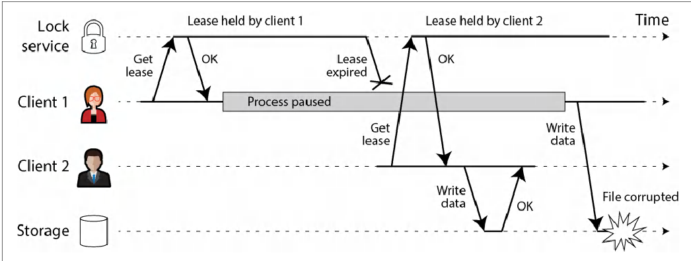

> 图 9-4。分布式锁的一种错误实现：客户端 1 认为自己仍持有有效租约，尽管租约已经过期，因而损坏了存储中的文件。

图 9-5 展示了另一个后果相似的问题。这个例子中没有进程暂停，只有客户端 1 崩溃。就在客户端 1 崩溃前，它向存储服务发送了写入请求，但该请求在网络中被长时间延迟。（回想第 350 页的“实践中的网络故障”，数据包有时可能延迟一分钟甚至更久。）当写入请求抵达存储服务时，客户端 1 的租约早已超时，客户端 2 因而得以获取租约并发出自己的写入。结果造成了与图 9-4 类似的数据损坏。

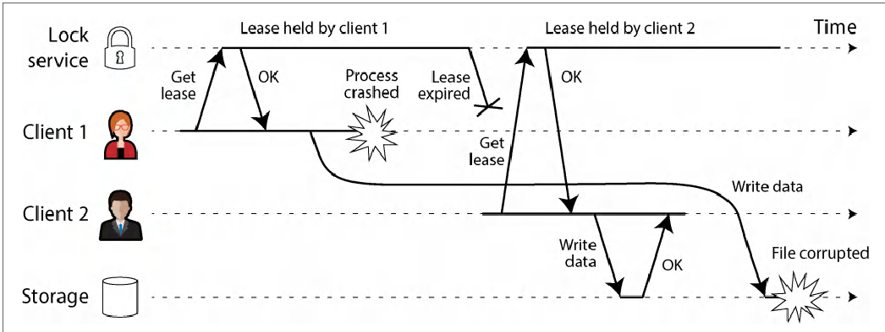

> 图 9-5。原租约持有者发出的消息可能被长时间延迟，并在另一个节点接管租约之后才抵达。

#### 隔离僵尸节点和延迟请求

“僵尸节点”一词有时用于描述这样的原租约持有者：它尚未发现自己已经失去租约，仍然像当前租约持有者一样行动。由于我们无法彻底排除僵尸节点，只能转而确保它们不会以脑裂的形式造成任何损害。这称为隔离僵尸节点。

有些系统试图通过关闭僵尸节点来隔离它们——例如，断开其网络连接 [9]、通过云提供商的管理界面关闭虚拟机，甚至物理关闭机器电源 [87]。这种方法有时称为*朝另一个节点的脑袋开枪*（shoot the other node in the head，STONITH），不过我们不倾向于使用这种暴力术语。无论如何，它都不是特别有效：这种方法无法防范图 9-5 所示的长时间网络延迟；所有节点可能会互相关闭 [19]；而且等到僵尸节点被发现并关闭时，或许已经太迟，数据可能早已损坏。

图 9-6 展示了一种更稳健的隔离方案，它既能防范僵尸节点，也能防范延迟请求。

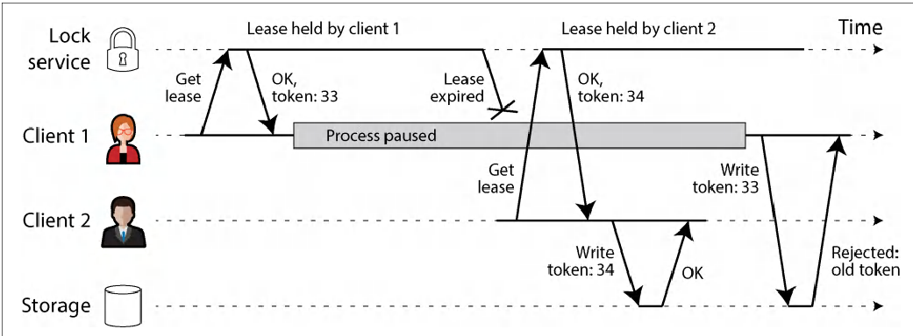

> 图 9-6。只允许按照隔离令牌递增的顺序写入，从而确保对存储的访问安全。

假设锁服务每次授予锁或租约时，还会返回一个*隔离令牌*；它是一个每次授予锁时都会递增的数字（例如，由锁服务递增）。随后我们可以要求，客户端每次向存储服务发送写入请求时，都必须附带其当前的隔离令牌。

> [!NOTE]
> 隔离令牌还有几种别称。在 Google 的锁服务 Chubby 中，它们称为*序列器*（sequencer）[88]；在 Kafka 中，它们称为*纪元编号*（epoch number）。在第 10 章将要讨论的共识算法中，*选票编号*（ballot number，Paxos）或*任期编号*（term number，Raft）发挥着类似作用。

在图 9-6 中，客户端 1 以令牌 33 获得租约，但随后进入长时间暂停，租约也随之过期。客户端 2 以令牌 34（该数字始终递增）获得租约，并向存储服务发送写入请求，其中附带该令牌。之后，客户端 1 恢复运行，向存储服务发送写入，并附带自己的令牌值 33。然而，存储服务记得自己已经处理过令牌编号更高（34）的写入，所以拒绝令牌为 33 的请求。刚刚获得租约的客户端必须立即向存储服务执行一次写入；一旦写入完成，所有僵尸节点都会被隔离。这些操作类似于我们在第 318 页“悲观并发控制与乐观并发控制”中看到的乐观并发控制（OCC）技术，不过隔离是永久性的，而并发控制失败后可以重试。

如果使用 ZooKeeper 作为锁服务，可以用事务 ID `zxid` 或节点版本 `cversion` 作为隔离令牌 [85]。对于 etcd，修订号与租约 ID 结合起来可发挥类似作用 [89]。Hazelcast 中的 `FencedLock` API 会显式生成隔离令牌 [90]。

这种机制要求存储服务能够以某种方式检查写入是否基于过期令牌。另一种选择是，只要服务支持这样一种写入就足够了：仅当对象自当前客户端上次读取后未被其他客户端写入时，写入才成功，类似于原子 CAS 操作。例如，对象存储服务支持此类检查；Amazon S3 称之为条件写入（conditional writes），Azure Blob Storage 称之为条件标头（conditional headers），Google Cloud Storage 则称之为请求前置条件（request preconditions）。

#### 使用多个副本进行隔离

如果客户端只需写入一个支持条件写入的存储服务，那么锁服务多少有些多余 [91, 92]，因为租约分配原本可以直接基于该存储服务来实现 [93]。然而，一旦有了隔离令牌，就可以将它用于多个服务或副本，并确保旧租约持有者在所有这些服务或副本上都被隔离。

例如，设想存储服务是一个采用 LWW 冲突解决机制的无主复制键值存储（参见第 229 页的“无主复制”）。在这样的系统中，客户端直接向每个副本发送写入，而各个副本根据客户端分配的时间戳，独立决定是否接受写入。

如图 9-7 所示，可以把写入者的隔离令牌放在时间戳的最高有效位或数字中。这样便可以确信，新租约持有者生成的任何时间戳都会大于旧租约持有者的任何时间戳，即使旧租约持有者的写入发生得更晚。

在图 9-7 中，客户端 2 的隔离令牌为 34，因此它所有以 34... 开头的时间戳，都大于客户端 1 生成的任何以 33... 开头的时间戳。客户端 2 向达到法定人数的副本写入，但无法连接副本 3。这意味着，当僵尸客户端 1 之后尝试写入时，其写入可能在副本 3 上成功，尽管副本 1 和副本 2 会忽略该写入。这不成问题，因为后续的法定人数读取会优先采用客户端 2 写入的、时间戳更大的值，而读修复或反熵过程最终会覆盖客户端 1 写入的值。

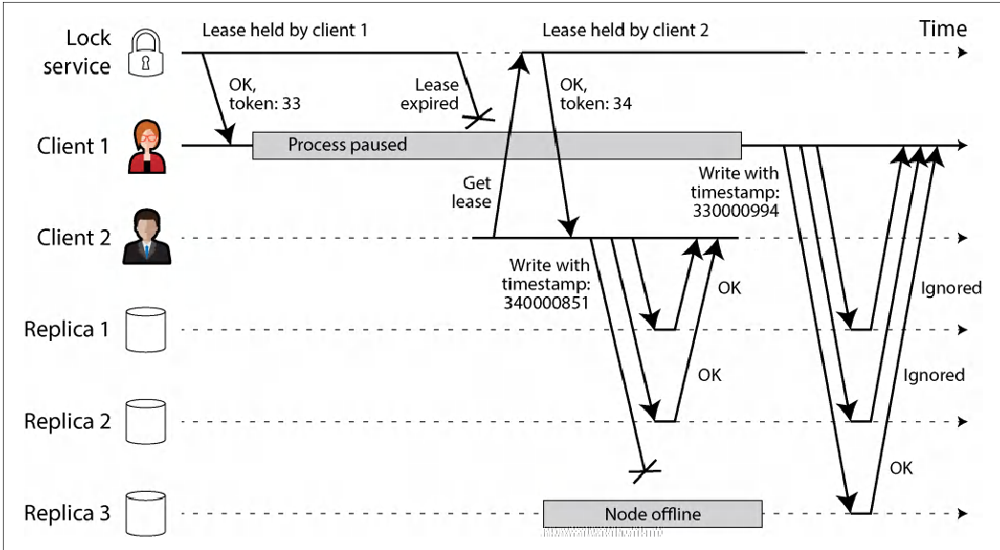

> 图 9-7。使用隔离令牌保护对无主复制数据库的写入。

从这些例子可以看出，假设任何时刻只有一个节点持有租约并不安全。所幸，只要稍加谨慎，就可以使用隔离令牌来防止僵尸节点和延迟请求造成任何损害。

### 拜占庭故障

隔离令牌可以检测并阻止*无意中*发生错误行为的节点（例如，因为它尚未发现自己的租约已过期）。但是，如果该节点蓄意破坏系统的保证，就可以轻易通过发送带有伪造隔离令牌的消息来做到。

本书假设节点不可靠但诚实。它们可能很慢或永不响应（因为发生故障），状态也可能已经过时（因为 GC 暂停或网络延迟）；但我们假设，只要节点*确实*响应，它说的就是“真话”。在其认知范围内，它会遵守协议规则。

如果节点可能“撒谎”（发送任意的错误或损坏响应），分布式系统问题就会困难得多——例如，一个节点可能在同一次选举中投出多个互相矛盾的票。这种行为称为*拜占庭故障*，而在这种互不信任的环境中达成共识的问题称为*拜占庭将军问题* [94]。

> [!NOTE]
> **拜占庭将军问题**
>
> 拜占庭将军问题是两将军问题 [95] 的推广；后者设想两位军队将领需要就作战计划达成一致。由于他们驻扎在不同地点，只能通过信使通信，而信使有时会延误或失踪（就像网络中的数据包）。第 10 章将讨论这一共识问题。
>
> 在该问题的拜占庭版本中，$n$ 位将军需要达成一致，但他们之中混入的叛徒阻碍了这一努力。大多数将军忠诚，因而发送真实消息；叛徒则可能发送虚假或不实的消息，试图欺骗并迷惑其他人。谁是叛徒事先并不为人所知。
>
> 拜占庭曾是一座古希腊城市，后来成为君士坦丁堡，位于如今土耳其的伊斯坦布尔。没有历史证据表明，拜占庭的将军比其他地方的将军更热衷于阴谋诡计。相反，这个名称源于 *Byzantine* 一词所具有的*过度复杂*、*官僚主义*、*诡诈*之意；早在计算机出现之前，该词就已用于政治领域 [96]。Lamport 想选择一个不会冒犯任何读者的国籍，而有人建议他，把这个问题称为*阿尔巴尼亚将军问题*并不是个好主意 [97]。

#### 拜占庭容错的用途

如果某些节点发生故障且不遵守协议，或者恶意攻击者干扰网络，系统仍能继续正确运行，那么该系统就是*拜占庭容错*的。这种问题在某些特定场景中很重要。例如：

- 在航空航天环境中，计算机内存或 CPU 寄存器中的数据可能因辐射而损坏，导致它以任意、不可预测的方式响应其他节点。由于系统故障的代价会非常高昂（例如飞机坠毁并导致机上所有人死亡，或火箭与国际空间站相撞），飞行控制系统必须能够容忍拜占庭故障 [98, 99]。

- 在有多个参与方的系统中，一些参与者可能会试图欺骗或诈骗他人。在这种情况下，一个节点不能简单地信任另一个节点的消息，因为这些消息可能带有恶意。比特币等加密货币及其他基于区块链的系统，其底层共识机制可以视为一种让互不信任的各方在不依赖中央权威的情况下，就某笔交易是否发生达成一致的方式 [100]。

不过，在本书讨论的这类系统中，通常可以放心地假设不存在拜占庭故障。在数据中心里，所有节点都由你的组织控制（因此有望得到信任），而且辐射水平足够低，内存损坏不是主要问题（尽管人们正在考虑建设轨道数据中心 [101]）。多租户系统中的租户互不信任，但它们通过防火墙、虚拟化和访问控制策略彼此隔离，而不是使用拜占庭容错。使系统具备拜占庭容错能力的协议成本很高 [102]，容错嵌入式系统则依赖硬件层面的支持 [98]。在大多数服务端数据系统中，部署拜占庭容错方案的成本使其并不实用。

Web 应用确实需要预期由最终用户控制的客户端（例如 Web 浏览器）会做出任意甚至恶意的行为。因此，输入验证、净化和输出转义极其重要，例如可以防止 SQL 注入和跨站脚本攻击。不过，我们通常不会在这里使用拜占庭容错协议，而只是让服务器作为权威，决定客户端可以做什么、不可以做什么。在不存在这种中央权威的点对点网络中，拜占庭容错更为重要 [103, 104]。

软件中的 bug 可以被视为拜占庭故障，但如果所有节点部署的都是同一款软件，那么拜占庭容错算法也救不了你。大多数拜占庭容错算法要求超过三分之二的节点正确运行（例如，如果有 4 个节点，最多只能有 1 个发生故障）。若想用这种方法防范 bug，就必须为同一款软件准备 4 个独立实现，并寄希望于某个特定 bug 只出现在其中一个实现中。

同样，如果协议能够保护我们免受漏洞、安全失陷和恶意攻击的影响，当然很有吸引力。遗憾的是，这同样不现实。在大多数系统中，如果攻击者能攻陷一个节点，他们很可能也能攻陷所有节点，因为这些节点大概运行着相同的软件。因此，传统机制（身份验证、访问控制、加密、防火墙等）仍然是抵御攻击者的主要手段。

#### 弱形式的撒谎

尽管我们假设节点总体上是诚实的，但在软件中加入防范弱形式“撒谎”的机制仍然值得考虑——例如，防范由硬件问题、软件 bug 和错误配置导致的无效消息。这类保护机制并非完备的拜占庭容错，因为它们抵挡不住意志坚定的对手；但它们仍是提升可靠性的简单而务实的步骤。例如：

- 网络数据包有时确实会因硬件问题，或操作系统、驱动程序、路由器等组件中的 bug 而损坏。通常，TCP 和 UDP 内置的校验和会捕获损坏的数据包，但有时它们也会逃过检测 [105, 106, 107]。简单的措施通常足以防范此类损坏，例如在应用层协议中加入校验和。TLS 加密连接也能防止数据损坏。

- 可公开访问的应用必须仔细净化所有用户输入——例如，转义某些字符以防止 SQL 注入攻击，检查数值是否处于合理范围内，并限制字符串大小，以防通过大量内存分配造成拒绝服务。位于防火墙之后的内部服务或许可以放宽输入检查，但在协议解析器中执行基本检查仍是个好主意 [105]。

- NTP 客户端可以配置多个服务器地址。同步时，客户端会连接所有服务器，估算它们的误差，并检查多数服务器是否就某个时间范围达成一致。只要大多数服务器正常，报告错误时间的配置有误的 NTP 服务器就会被识别为离群值，并被排除在同步之外 [39]。使用多个服务器使 NTP 比只使用单个服务器更加稳健。

### 系统模型与现实

人们已经设计出许多算法来解决分布式系统问题——例如，第 10 章将探讨共识问题的解决方案。为了真正有用，这些算法需要能够容忍本章讨论的分布式系统中的各种故障。

算法的编写方式不能过度依赖其运行所用的具体硬件和软件配置。反过来，这要求我们以某种方式将系统中预期会发生的故障类型形式化。为此，我们定义一个*系统模型*，即描述算法所做假设的抽象。

对于时间方面的假设，常用的系统模型有三种：

#### 同步模型

同步模型假设网络延迟有界、进程暂停有界、时钟误差有界。这并不意味着时钟完全同步或网络延迟为零；它只是意味着，你知道网络延迟、暂停和时钟漂移永远不会超过某个固定上限 [108]。同步模型并不能真实反映大多数实际系统，因为（正如本章所讨论的）无界的延迟和暂停确实会发生。

#### 部分同步模型

部分同步意味着系统在*大多数时候*表现得像同步系统，但有时会超出网络延迟、进程暂停和时钟漂移的界限 [108]。这是许多系统的现实模型。大多数时候，网络和进程都表现良好——否则我们将永远无法完成任何事情——但我们必须正视这样一个事实：任何关于时间的假设都有可能偶尔被打破。发生这种情况时，网络延迟、暂停和时钟误差都可能变得任意大。

#### 异步模型

在这种模型中，算法不能对时序作任何假设——事实上，它甚至没有时钟（因此无法使用超时）。有些算法可以针对异步模型进行设计，但这种模型的限制非常严格。

除了时序问题，我们还必须考虑节点故障。下面是一些常见的节点系统模型：

#### 崩溃停止故障

在崩溃停止（或故障停止）模型中，算法可以假设节点只有一种故障方式——即崩溃 [109]。节点可能随时突然停止响应，此后便永远消失——再也不会恢复。

#### 崩溃恢复故障

在崩溃恢复模型中，我们假设节点可能随时崩溃，并可能在一段未知时间后重新开始响应。我们假设节点具有可跨崩溃保留的稳定存储（即非易失性磁盘存储），而内存中的状态则会丢失。

#### 性能下降与部分功能失效

除了崩溃和重启，节点也可能变慢。它们或许仍能响应健康检查请求，却慢得无法完成任何实际工作。例如，千兆网络接口可能因驱动程序缺陷而突然降至 1 Kb/s 的吞吐量 [110]；承受内存压力的进程可能将大部分时间耗在垃圾回收上 [111]；磨损的 SSD 可能表现出不稳定的性能；硬件还可能受到高温、连接器松动、机械振动、电源问题、固件缺陷等因素的影响 [112]。这种情况称为跛行节点、灰色故障或慢速故障 [113]，处理起来甚至可能比彻底失效的节点更加困难。另一个相关问题是，进程停止执行它本应完成的某些工作，而其他方面仍在继续运行——例如，因为某个后台线程已经崩溃或陷入死锁 [114]。

#### 拜占庭（任意）故障

节点可能做出任何行为，包括像上一节所述那样试图欺骗其他节点。

对于现实系统建模而言，具有崩溃恢复故障的部分同步模型通常最为实用。它允许网络延迟无上限、进程暂停以及节点运行缓慢。但分布式算法如何应对这种模型呢？

#### 定义算法的正确性

为了定义算法正确意味着什么，我们可以描述它应具备的性质。例如，排序算法的输出具有这样一种性质：对于输出列表中任意两个不同的元素，位置更靠左的元素小于位置更靠右的元素。这只是用形式化方式定义了列表已排序的含义——即有序列表的不变量。

同样，我们可以写下对分布式算法所期望的性质，以定义它的正确性。例如，如果我们要为锁生成隔离令牌（参见第 374 页的“隔离僵尸节点和延迟请求”），可以要求算法具备以下性质：

##### 唯一性

任意两个隔离令牌请求都不会返回相同的值。

##### 单调序列

如果请求 x 返回令牌 tx，请求 y 返回令牌 ty，并且 x 在 y 开始之前已经完成，那么 tx < ty。

##### 可用性

请求隔离令牌且未崩溃的节点最终会收到响应。

如果一个算法在某种系统模型中，对于该模型假定可能发生的所有情况都始终满足其性质，那么它在该系统模型中就是正确的。然而，如果所有节点都崩溃，或所有网络延迟突然都变为无穷长，那么任何算法都无法完成任何工作。在允许彻底故障的系统模型中，我们怎样才能仍然给出有用的保证？

#### 区分安全性与活性

为了澄清这种情况，有必要区分两类性质：安全性和活性。在刚才的例子中，唯一性和单调序列是安全性质，而可用性是活性性质。

这两类性质有何区别？一个明显的线索是，活性性质的定义中常常包含“最终”一词。（没错，你猜对了——最终一致性是一种活性性质 [115]。）

安全性常被非正式地定义为“坏事不会发生”，活性则被定义为“好事最终会发生”。不过，最好不要过度解读这些非正式定义，因为“好”与“坏”属于价值判断，并不十分适用于算法。安全性与活性的实际定义要精确得多 [116]：

- 如果一项安全性质遭到违反，我们可以指出它被破坏的具体时刻（例如，如果唯一性遭到违反，我们可以找出返回了重复隔离令牌的那一次具体操作）。安全性质一旦遭到违反，就无法挽回——损害已经造成。

- 活性性质则恰恰相反。它在某个时刻可能尚未得到满足（例如，某个节点可能已经发送请求，但尚未收到响应），但我们始终可以期待它在未来得到满足（也就是收到响应）。

区分安全性质与活性性质的一个好处是，它有助于我们处理棘手的系统模型。对于分布式算法，通常要求安全性质在系统模型的一切可能情况下都*始终*成立 [108]。即使所有节点都崩溃，或整个网络都发生故障，算法仍必须确保不返回错误结果（即安全性质仍然得到满足）。

然而，对于活性性质，我们可以附加限制条件——例如，可以规定只有在多数节点尚未崩溃，并且网络最终能从中断中恢复时，请求才必须收到响应。部分同步模型的定义要求系统最终回到同步状态——也就是说，任何一段网络中断都只会持续有限时间，之后便会修复。

#### 将系统模型映射到现实世界

安全性质、活性性质和系统模型对于推理分布式算法的正确性非常有用。然而，在实践中实现算法时，现实世界纷繁复杂的事实又会反过来困扰你，这时就会清楚地看到，系统模型只是对现实的简化抽象。

例如，崩溃恢复模型中的算法通常假设稳定存储中的数据能够经受住崩溃。但如果磁盘数据因硬件错误或配置错误而损坏或被清除，会发生什么 [117]？如果服务器存在固件缺陷，重启时即使硬盘已正确连接，也无法识别它们，又会发生什么 [118]？

法定人数算法（参见第 231 页的“使用法定人数进行读写”）依赖节点记住它声称已经存储的数据。如果节点可能患上“健忘症”，忘记先前存储的数据，就会破坏法定人数条件，进而破坏算法的正确性。也许我们需要一种新的系统模型，在其中假设稳定存储通常能够经受住崩溃，但偶尔也可能丢失。不过，这样的模型会变得更难推理。

算法的理论描述可以直接声明某些事情被假定为绝不会发生——而在非拜占庭系统中，我们的确必须对哪些故障可能发生、哪些不可能发生作出假设。然而，真实的实现可能仍须包含代码，以处理那些被假定为不可能发生的情况，即使处理方式最终只是 `printf("Sucks to be you")` 和 `exit(666)`——也就是让人工运维人员来收拾残局 [119]。（这正是计算机科学与软件工程之间的一个区别。）

这并不是说理论化、抽象化的系统模型毫无价值——恰恰相反。它们极其有助于把现实系统的复杂性提炼成一组可管理、可推理的故障，使我们能够理解问题，并尝试系统地解决它。

### 形式化方法与随机化测试

我们如何知道算法满足所要求的性质？由于并发、部分失效和网络延迟的存在，系统可能处于数量极其庞大的潜在状态。我们需要保证这些性质在每一种可能状态下都成立，并确保自己没有遗漏任何边界情况。

一种方法是对算法进行形式化验证：用数学方式描述算法，并运用证明技术表明，它在系统模型允许的所有情况下都满足所要求的性质。证明一个算法正确，并不意味着它在真实系统中的实现一定始终行为正确。但这是非常好的第一步，因为理论分析能够揭示算法中的问题：这些问题在真实系统中可能长期潜伏，只有当异常情况打破你的假设（例如对时序的假设）时，才会突然造成麻烦。

谨慎的做法是将理论分析与实证测试相结合，以验证实现是否符合预期。基于性质的测试、模糊测试和确定性模拟测试等技术使用随机化方法，在各种各样的情况下测试系统。Amazon Web Services、FoundationDB 和 TigerBeetle 等组织已在其许多产品上成功结合使用这些技术 [120, 121, 122, 123]。

#### 模型检查与规约语言

模型检查器是帮助验证算法或系统是否按预期运行的工具。算法规约使用 TLA+、Gallina 或 FizzBee 等专门设计的语言编写。这些语言使人们更容易专注于算法的行为，而不必操心代码实现细节。随后，模型检查器会系统地尝试所有可能发生的情况，使用这些模型来验证不变量在算法的所有状态中都成立。

模型检查实际上无法证明算法的不变量在每一个可能状态下都成立，因为大多数现实算法都有无限的状态空间。真正验证所有状态需要形式化证明；这虽可做到，但通常比运行模型检查器更加困难。因此，模型检查器会鼓励你将算法模型缩减为一种能够得到完整验证的近似形式，或者为执行设定上限（例如，设定可发送消息数的最大值）。这样一来，只有在更长时间执行中才会出现的缺陷便无法被发现。

尽管如此，模型检查器仍在易用性与发现隐蔽缺陷的能力之间取得了很好的平衡。CockroachDB、TiDB、Kafka 和许多其他分布式系统都使用模型规约来发现并修复缺陷 [124, 125, 126]。例如，研究人员使用 TLA+ 证明了视图戳复制（viewstamped replication，VR）存在数据丢失的可能性，其根源是算法的文字描述存在歧义 [127]。

按照设计，模型检查器并不运行你的实际代码，而是运行一个仅规定协议核心思想的简化模型。这使系统化探索状态空间变得更容易处理，但也带来了规约与实现彼此脱节的风险 [128]。我们可以检查模型与真实实现的行为是否等价，但这需要在真实实现中加入检测机制 [129]。

#### 故障注入

许多缺陷会在机器和网络发生故障时触发。故障注入是一种有效（有时也令人胆战心惊）的技术，用于验证系统实现在出错时是否按预期工作。其思路很简单：向运行中系统的环境注入故障，然后观察系统如何表现。故障可以是网络故障、机器崩溃、磁盘损坏、进程暂停——任何你能想到的计算机故障。

故障注入测试通常在与系统实际运行的生产环境高度相似的环境中进行。有些测试甚至会直接向生产环境注入故障。Netflix 通过 Chaos Monkey 工具推广了这种方法 [130]。生产环境中的故障注入通常称为*混沌工程*，我们已在第 43 页的“可靠性与容错”中讨论过它。

要运行故障注入测试，首先要部署待测系统，同时部署故障注入协调器和脚本。协调器负责决定执行哪些故障以及何时执行。位于本地或远程的脚本负责向单个节点或进程注入故障。注入脚本使用多种工具来触发故障：可以使用 Linux 的 `kill` 命令暂停或终止 Linux 进程，可以使用 `umount` 卸载磁盘，还可以通过防火墙设置中断网络连接。你可以在注入故障期间及之后检查系统行为，以确保一切按预期工作。

触发故障所需的工具五花八门，使得故障注入测试编写起来十分繁琐。为了简化流程，通常会采用 Jepsen 之类的故障注入框架来运行测试。这类框架集成了多种操作系统，并提供许多预构建的故障注入器 [131]。Jepsen 在许多广泛使用的系统中发现关键缺陷的成效尤为显著 [132, 133]。

#### 确定性模拟测试

另一种形式化技术是确定性模拟测试（deterministic simulation testing，DST），它已经成为模型检查和故障注入的一种常用补充。它使用与模型检查器类似的状态空间探索过程，但测试的是实际代码，而不是模型。

在 DST 中，模拟器会自动运行大量随机化的系统执行过程。模拟期间的网络通信、I/O 和时钟计时全都由模拟对象取代，使模拟器能够控制事件发生的确切顺序，包括各种时序和故障场景。这样一来，模拟器就能探索比手写测试或故障注入多得多的情况。如果测试失败，由于模拟器知道触发失败的确切操作顺序，便可以重新运行该测试——这与无法如此细致地控制系统的故障注入形成对比。

DST 要求模拟器能够控制所有非确定性来源，例如网络延迟或多线程代码中的线程调度。为了让代码具有确定性，通常采用以下三种策略之一：

##### 应用层

有些系统从一开始便以易于确定性执行代码为目标来构建。例如，FoundationDB 是 DST 领域的先驱之一，它使用名为 Flow 的异步通信库构建。Flow 为开发者提供了一个将确定性网络模拟注入系统的切入点 [134]。同样，TigerBeetle 是一个将 DST 作为一等能力支持的 OLTP 数据库。系统状态被建模为状态机，所有变更都在单个事件循环中发生。结合时钟等确定性模拟原语，这样的架构便能以确定性方式运行 [135]。

##### 运行时层

具有异步运行时的语言及其常用库提供了引入确定性的切入点。单线程运行时用于强制所有异步代码按顺序运行。例如，FrostDB 会修补 Go 的运行时，使 goroutine 顺序执行 [136]。Rust 的 MadSim 库也采用类似方式。它为 Tokio 的异步运行时 API、Amazon 的 S3 库、Kafka 的 Rust 库以及许多其他组件提供确定性实现；应用程序可以换用确定性库和运行时，从而在不修改自身代码的情况下获得确定性的测试执行过程。

##### 机器层

除了在运行时修补代码，也可以让整台机器具有确定性。这是一项精细的工作，需要让机器对所有通常具有非确定性的调用都给出确定性响应。Antithesis 等工具通过构建定制的虚拟机监控程序来做到这一点，用确定性操作替代通常具有非确定性的操作。从时钟到网络和存储，一切都必须考虑在内。不过，一旦完成，开发者便可以在虚拟机监控程序中的一组容器内运行整个分布式系统，从而得到一个完全确定性的分布式系统。

DST 除了可重放性之外还有多项优势。例如，Antithesis 会尝试探索应用程序代码中的许多路径；当发现较少见的行为时，它会将一次测试执行分支成多个子执行。而且，由于确定性测试往往使用模拟时钟和网络调用，这类测试的运行速度可以快于真实时钟时间。例如，TigerBeetle 的时间抽象允许模拟在不实际等待完整超时时长的情况下，模拟网络延迟和超时。这类技术让模拟器能够更快地探索更多代码路径。

> [!NOTE]
> **确定性的力量**
>
> 非确定性是本章所讨论的所有分布式系统挑战的核心：并发、网络延迟、进程暂停、时钟跳变和崩溃都以不可预测的方式发生，并且系统每次运行时都各不相同。反过来说，如果能让系统具有确定性，就可以极大地简化问题。
>
> 事实上，让事物具有确定性是一个简单却强大的理念，在分布式系统设计中反复出现。除了确定性模拟测试之外，前几章还介绍了多种运用确定性的方式：
>
> - 事件溯源（参见第 101 页的“事件溯源与 CQRS”）的一项关键优势是，可以确定性地重放事件日志，以重建派生的物化视图。
>
> - 工作流引擎（参见第 187 页的“持久执行与工作流”）依赖工作流定义的确定性来提供持久执行语义。
>
> - 状态机复制（将在第 433 页的“使用共享日志”中讨论）通过在每个副本上独立执行同一序列的确定性事务来复制数据。我们已经见过这一思想的两种变体：基于语句的复制（参见第 206 页的“复制日志的实现”），以及使用存储过程串行执行事务（参见第 311 页的“存储过程的优缺点”）。

然而，要使代码完全具有确定性，需要格外谨慎。即使已经消除了所有并发，并用确定性模拟替代了 I/O、网络通信、时钟和随机数生成器，仍可能残留非确定性因素。例如，在某些编程语言中，遍历哈希表元素的顺序可能是不确定的。是否会触及资源限制（内存分配失败、栈溢出）也具有非确定性。

<a id="chapter-9-summary"></a>

## 小结  

本章讨论了分布式系统中可能出现的各种问题。例如：  

- 每当你尝试通过网络发送一个数据包时，它都可能丢失或遭遇任意时长的延迟。同样，回复也可能丢失或延迟，因此，如果没有收到回复，你根本无法知道消息是否已经送达。  

- 一个节点的时钟可能与其他节点严重不同步（尽管你已尽力配置 NTP），它可能突然向前或向后跳变；依赖这样的时钟十分危险，因为你很可能无法准确估计时钟的置信区间。  

- 一个进程可能在执行过程中的任何时刻暂停相当长的时间，被其他节点宣告死亡，然后又恢复运行，却没有意识到自己曾暂停过。  

这类部分失效可能发生，正是分布式系统的决定性特征。只要软件试图执行任何涉及其他节点的操作，就有可能偶尔失败、随机变慢，或者完全不响应（并最终超时）。在分布式系统中，我们会设法让软件具备容忍部分失效的能力，使整个系统即使在某些组成部分发生故障时仍能继续运行。  

要容忍故障，第一步是检测故障，但就连这一点也很困难。大多数系统没有能够准确检测节点是否发生故障的机制，因此，大多数分布式算法依靠超时来判断远程节点是否仍然可用。然而，超时无法区分网络故障和节点故障，而网络延迟的变化有时会导致某个节点被错误地怀疑已经崩溃。处理那些仍在响应、但速度慢得无法完成任何有用工作的跛行节点，则更加困难。  

检测到故障之后，要让系统容忍它也并非易事；机器之间不存在全局变量、共享内存、共同知识，也不存在任何其他形式的共享状态 [83]。节点甚至无法就当前时间达成一致，更不用说更深层的问题了。信息从一个节点流向另一个节点的唯一方式，是通过不可靠的网络发送。重大决策无法由单个节点安全地作出，因此，我们需要采用能让其他节点参与协作的协议，并争取让达到法定人数的节点达成一致。  

如果你习惯于在单台计算机那种理想化的数学完美环境中编写软件——在那里，同一操作总能以确定性的方式返回相同结果——那么，转向分布式系统混乱的物理现实可能会令人颇为震惊。反过来，如果一个问题能在单台计算机上解决，分布式系统工程师通常会认为它微不足道 [4]；事实上，如今单台计算机已经能完成许多工作。如果可以避免打开潘多拉魔盒，只需将所有东西都放在一台机器上——例如使用嵌入式存储引擎（参见第 125 页的“嵌入式存储引擎”）——通常值得这样做。  

然而，正如第 19 页“分布式系统与单节点系统”中所讨论的，可扩展性并不是采用分布式系统的唯一理由。容错和低延迟（通过将数据放置在地理上靠近用户的位置）同样是重要目标，而单个节点无法实现这些目标。分布式系统的力量在于，原则上它们可以在服务层面永不中断地持续运行，因为所有故障和维护都可以在节点层面处理。（实践中，如果将错误的配置变更发布到所有节点，仍会让分布式系统彻底瘫痪。）  

本章还稍作发散，探究网络、时钟和进程的不可靠性是否是不可避免的自然法则。我们看到，事实并非如此：可以实现严格的实时响应保证和网络中的有界延迟，但这样做成本极高，也会降低硬件资源的利用率。大多数非安全关键型系统都会选择廉价而不可靠，而不是昂贵但可靠。  

本章通篇都在讨论问题，为我们呈现了一幅黯淡的图景。使用经过广泛测试、达到生产级别并能妥善处理这些问题的分布式系统，会让我们获益良多。下一章将转向解决方案，讨论这类系统用于应对这些问题的一些算法。  

## 参考文献  

[1] Mark Cavage. “无法回避：你正在构建一个分布式系统。” ACM Queue，第 11 卷，第 4 期，第 80–89 页，2013 年 4 月。doi:10.1145/2466486.2482856  

[2] Jay Kreps. “认真看待分布式系统的可靠性。” blog.empathybox.com，2012 年 3 月。归档于 perma.cc/9B5Q-AEBW  

[3] Coda Hale. “不能牺牲分区容错性。” codahale.com，2010 年 10 月。归档于 perma.cc/6GJU-X4G5  

[4] Jeff Hodges. “给年轻人的分布式系统笔记。” *somethingsimilar.com*，2013 年 1 月。归档于 *perma.cc/B636-62CE*  

[5] Van Jacobson. “拥塞避免与控制。” 载于 ACM 通信架构与协议研讨会（SIGCOMM），1988 年 8 月。doi:10.1145/52324.52356  

[6] Bert Hubert. “终极 SO_LINGER 页面，或者：为什么我的 TCP 不可靠。” blog.netherlabs.nl，2009 年 1 月。归档于 perma.cc/6HDX-L2RR  

[7] Jerome H. Saltzer、David P. Reed 和 David D. Clark。“系统设计中的端到端论证。” ACM Transactions on Computer Systems，第 2 卷，第 4 期，第 277–288 页，1984 年 11 月。doi:10.1145/357401.357402  

[8] Peter Bailis 和 Kyle Kingsbury。“网络是可靠的。” ACM Queue，第 12 卷，第 7 期，第 48–55 页，2014 年 7 月。doi:10.1145/2639988.2639988  

[9] Joshua B. Leners、Trinabh Gupta、Marcos K. Aguilera 和 Michael Walfish。“借助网络驯服分布式系统中的不确定性。” 载于第 10 届欧洲计算机系统会议（EuroSys），2015 年 4 月。doi:10.1145/2741948.2741976  

[10] Phillipa Gill、Navendu Jain 和 Nachiappan Nagappan。“理解数据中心的网络故障：测量、分析与影响。” 载于 ACM SIGCOMM 会议，2011 年 8 月。doi:10.1145/2018436.2018477  

[11] Urs Hölzle。“但最近有位农民开始在附近放牧一群奶牛。每当它们踩到光纤链路时，都会将其压弯到足以造成瞬时中断的程度。” x.com，2020 年 5 月。归档于 perma.cc/WX8X-ZZA5  

[12] CBC News。“海狸咬断电缆后，不列颠哥伦比亚省北部数百人失去互联网服务。” *cbc.ca*，2021 年 4 月。归档于 *perma.cc/UW8C-H2MY*  

[13] Will Oremus。“谷歌证实：全球互联网正遭到鲨鱼攻击。” *slate.com*，2014 年 8 月。归档于 *perma.cc/P6F3-C6YG*  

[14] Jess Auerbach Jahajeeah。“深入线缆：修复我们互联网的船只。” *continent.substack.com*，2023 年 11 月。归档于 *perma.cc/DP7B-EQ7S*  

[15] Santosh Janardhan。“关于 10 月 4 日故障的更多细节。” engineering.fb.com，2021 年 10 月。归档于 perma.cc/WW89-VSXH  

[16] Tom Parfitt。“格鲁吉亚女子切断整个亚美尼亚的网络连接。” theguardian.com，2011 年 4 月。归档于 perma.cc/KMC3-N3NZ  

[17] Antonio Voce、Tural Ahmedzade 和 Ashley Kirk。“‘影子舰队’与水下破坏：欧洲的海底互联网电缆是否正遭受攻击？” theguardian.com，2025 年 3 月。归档于 perma.cc/HA7S-ZDBV  

[18] Shengyun Liu、Paolo Viotti、Christian Cachin、Vivien Quéma 和 Marko Vukolić。“XFT：超越崩溃的实用容错。” 载于第 12 届 USENIX 操作系统设计与实现研讨会（OSDI），2016 年 11 月。  

[19] Mark Imbriaco。“上周六的停机事件。” *github.blog*，2012 年 12 月。归档于 *perma.cc/M7X5-E8SQ*  

[20] Tom Lianza 和 Chris Snook。“现实世界中的拜占庭故障。” blog.cloudflare.com，2020 年 11 月。归档于 perma.cc/83EZ-ALCY  

[21] Mohammed Alfatafa、Basil Alkhatib、Ahmed Alquraan 和 Samer Al-Kiswany。“迈向一种适用于局部网络分区的通用容错技术。” 载于第 14 届 USENIX 操作系统设计与实现研讨会（OSDI），2020 年 11 月。  

[22] Marc A. Donges。“回复：bnx2 网卡间歇性离线。” 发往 Linux netdev 邮件列表的消息，spinics.net，2012 年 9 月。归档于 perma.cc/TXP6-H8R3  

[23] Troy Toman。“深入 CODE RED：网络篇。” *signalvnoise.com*，2020 年 9 月。归档于 *perma.cc/BET6-FY25*  

[24] Kyle Kingsbury。“Jepsen：Elasticsearch。” aphyr.com，2014 年 6 月。归档于 perma.cc/JK47-S89J  

[25] Salvatore Sanfilippo。“关于 Redis Sentinel 属性和故障场景的一些论点。” *antirez.com*，2014 年 10 月。归档于 *perma.cc/8XEU-CLM8*  

[26] Nicolas Liochon。“CAP：如果你只有超时，那么一切看起来都像分区。” blog.thislongrun.com，2015 年 5 月。归档于 perma.cc/FS57-V2PZ  

[27] Matthew P. Grosvenor、Malte Schwarzkopf、Ionel Gog、Robert N. M. Watson、Andrew W. Moore、Steven Hand 和 Jon Crowcroft。“如果你能插队，队列就无关紧要！” 载于第 12 届 USENIX 网络系统设计与实现研讨会（NSDI），2015 年 5 月。  

[28] Theo Julienne。“调试 Kubernetes 上的网络停顿。” *github.blog，2019 年 11 月*。归档于 *perma.cc/K9M8-XVGL*  

[29] Guohui Wang 和 T. S. Eugene Ng。“虚拟化对 Amazon EC2 数据中心网络性能的影响。” 载于第 29 届 IEEE 国际计算机通信会议（INFOCOM），2010 年 3 月。doi:10.1109/INFCOM.2010.5461931  

[30] Brandon Philips。“etcd：分布式锁与服务发现。” 载于 *Strange Loop*，2014 年 9 月。  

[31] Steve Newman。“系统地审视 EC2 I/O。” blog.scalyr.com，2012 年 10 月。归档于 perma.cc/FL4R-H2VE  

[32] Naohiro Hayashibara、Xavier Défago、Rami Yared 和 Takuya Katayama。“$\phi$ 累积故障检测器。” 日本北陆先端科学技术大学院大学信息科学研究科，技术报告 IS-RR-2004-010，2004 年 5 月。归档于 perma.cc/NSM2-TRYA  

[33] Jeffrey Wang。“Phi 累积故障检测器。” ternarysearch.blogspot.co.uk，2013 年 8 月。归档于 perma.cc/L452-AMLV  

[34] Srinivasan Keshav。《计算机网络的工程方法：ATM 网络、互联网与电话网络》。Addison-Wesley Professional，1997 年。ISBN: 9780201634426  

[35] Othmar Kyas。《*ATM 网络*》。International Thomson Publishing，1995 年。ISBN: 9781850321286  

[36] Jialin Li、Naveen Kr. Sharma、Dan R. K. Ports 和 Steven D. Gribble。“长尾故事：尾延迟在硬件、操作系统和应用层面的来源。” 载于 ACM 云计算研讨会（SOCC），2014 年 11 月。doi:10.1145/2670979.2670988  

[37] Mellanox Technologies。“InfiniBand 常见问题解答，修订版 1.3。” *network.nvidia.com*，2014 年 12 月。归档于 *perma.cc/LQJ4-QZVK*  

[38] Jose Renato Santos、Yoshio Turner 和 G. (John) Janakiraman。“InfiniBand 的端到端拥塞控制。” 载于第 22 届 IEEE 计算机与通信学会联合年会（INFOCOM），2003 年 4 月。亦由 HP Laboratories Palo Alto 以技术报告 HPL-2002-359 发表。doi:10.1109/INFOCOM.2003.1208949  

[39] Ulrich Windl、David Dalton、Marc Martinec 和 Dale R. Worley。“NTP 常见问题解答与操作指南。” ntp.org，2006 年 11 月。归档于 archive.org  

[40] John Graham-Cumming。“闰秒如何以及为何影响 Cloudflare DNS。” blog.cloudflare.com，2017 年 1 月。归档于 archive.org  

[41] David Holmes。“深入 Hotspot VM：时钟、定时器与调度事件——第一部分——Windows。” blogs.oracle.com，2006 年 10 月。归档于 archive.org  

[42] Joran Dirk Greef。“三个时钟胜过一个。” tigerbeetle.com，2021 年 8 月。归档于 perma.cc/5RXG-EU6B  

[43] Oliver Yang。“使用 TSC 的陷阱。” oliveryang.net，2015 年 9 月。归档于 perma.cc/Z2QY-5FRA  

[44] Steve Loughran。“多核、多插槽服务器上的时间。” steveloughran.blogspot.co.uk，2015 年 9 月。归档于 perma.cc/7M4S-D4U6  

[45] James C. Corbett、Jeffrey Dean、Michael Epstein、Andrew Fikes、Christopher Frost、JJ Furman、Sanjay Ghemawat、Andrey Gubarev、Christopher Heiser、Peter Hochschild、Wilson Hsieh、Sebastian Kanthak、Eugene Kogan、Hongyi Li、Alexander Lloyd、Sergey Melnik、David Mwaura、David Nagle、Sean Quinlan、Rajesh Rao、Lindsay Rolig、Dale Woodford、Yasushi Saito、Christopher Taylor、Michal Szymaniak 和 Ruth Wang。“Spanner：Google 的全球分布式数据库。” 载于第 10 届 USENIX 操作系统设计与实现研讨会（OSDI），2012 年 10 月。  

[46] M. Caporaloni 和 R. Ambrosini。“个人计算机时钟通过互联网能以多高精度跟踪 UTC 时间尺度？” *European Journal of Physics*，第 23 卷，第 4 期，第 L17–L21 页，2012 年 6 月。doi:10.1088/0143-0807/23/4/103  

[47] Nelson Minar。“NTP 网络调查。” alumni.media.mit.edu，1999 年 12 月。归档于 perma.cc/EV76-7ZV3  

[48] Viliam Holub。“同步 Cassandra 集群中的时钟，第 1 部分——问题。” blog.rapid7.com，2014 年 3 月。归档于 perma.cc/N3RV-5LNL  

[49] Poul-Henning Kamp。“一秒之战（你会在什么时间死去？）” ACM Queue，第 9 卷，第 4 期，第 44–48 页，2011 年 4 月。doi:10.1145/1966989.1967009  

[50] Nelson Minar。“闰秒导致半个互联网崩溃。” somebits.com，2012 年 7 月。归档于 perma.cc/2WB8-D6EU  

[51] Christopher Pascoe。“时间、技术与闰秒。” googleblog.blogspot.co.uk，2011 年 9 月。归档于 perma.cc/U2JL-7E74  

[52] Mingxue Zhao 和 Jeff Barr。“三思而后闰——即将到来的闰秒与 AWS。” aws.amazon.com，2015 年 5 月。归档于 perma.cc/KPE9-XMFM  

[53] Darryl Veitch 和 Kanthaiah Vijayalayan。“网络计时与 2015 年闰秒。” 载于第 17 届被动与主动测量国际会议（PAM），2016 年 4 月。doi:10.1007/978-3-319-30505-9_29  

[54] VMware, Inc.“VMware 虚拟机中的计时。” vmware.com，2008 年 10 月。归档于 perma.cc/HM5R-T5NF  

[55] Victor Yodaiken。“金融及其他领域的时钟同步。” yodaiken.com，2017 年 11 月。归档于 perma.cc/9XZD-8ZZN  

[56] Mustafa Emre Acer、Emily Stark、Adrienne Porter Felt、Sascha Fahl、Radhika Bhargava、Bhanu Dev、Matt Braithwaite、Ryan Sleevi 和 Parisa Tabriz。“野生警告出没之处：Chrome HTTPS 证书错误的根本原因。” 载于 ACM SIGSAC 计算机与通信安全会议（CCS），2017 年 10 月。doi:10.1145/3133956.3134007  

[57] European Securities and Markets Authority。“MiFID II / MiFIR：监管技术标准与实施标准——附件 I。” esma.europa.eu，报告 ESMA/2015/1464，2015 年 9 月。归档于 perma.cc/ZLX9-FGQ3  

[58] Luke Bigum。“以最低成本解决 MiFID II 时钟同步问题（第 1 部分）。” *catach.blogspot.com*，2015 年 11 月。归档于 *perma.cc/4J5W-FNM4*  

[59] Oleg Obleukhov 和 Ahmad Byagowi。“Meta 如何部署精确时间协议。” engineering.fb.com，2022 年 11 月。归档于 perma.cc/29G6-UJNW  

[60] John Wiseman。“GPSJAM：每日 GPS 干扰地图。”gpsjam.org  

[61] Josh Levinson、Julien Ridoux 和 Chris Munns。《时间至关重要：Amazon EC2 实例上精确到微秒的时钟》。aws.amazon.com，2023 年 11 月。存档于 perma.cc/56M6-5VMZ  

[62] Kyle Kingsbury。“Jepsen：Cassandra。”*aphyr.com*，2013 年 9 月。存档于 *perma.cc/4MBR-J96V*  

[63] John Daily。“时钟并不可靠，或者说，欢迎来到分布式系统的奇妙世界。”*riak.com*，2013 年 11 月。存档于 *perma.cc/4XB5-UCXY*  

[64] Marc Brooker。“是时候了！”brooker.co.za，2023 年 11 月。存档于 perma.cc/N6YK-DRPA  

[65] Kyle Kingsbury。“时间戳的麻烦。”*aphyr.com*，2013 年 10 月。存档于 *perma.cc/W3AM-5VAV*  

[66] Leslie Lamport。《分布式系统中的时间、时钟和事件排序》。*Communications of the ACM*，第 21 卷第 7 期，第 558–565 页，1978 年 7 月。doi:10.1145/359545.359563  

[67] Justin Sheehy。《不存在所谓的“现在”：分布式系统中的同时性问题》。ACM Queue，第 13 卷第 3 期，第 36–41 页，2015 年 3 月。doi:10.1145/2733108  

[68] Murat Demirbas。“Spanner：Google 的全球分布式数据库。”muratbuffalo.blogspot.co.uk，2013 年 7 月。存档于 perma.cc/6VWR-C9WB  

[69] Dahlia Malkhi 和 Jean-Philippe Martin。《Spanner 的并发控制》。ACM SIGACT News，第 44 卷第 3 期，第 73–77 页，2013 年 9 月。doi:10.1145/2527748.2527767  

[70] Franck Pachot。“在 AWS 上实现精确的时钟同步。”yugabyte.com，2024 年 12 月。存档于 perma.cc/UYM6-RNBBS  

[71] Spencer Kimball。《没有原子钟的生活：CockroachDB 与 Spanner 的分歧所在》。cockroachlabs.com，2022 年 1 月。存档于 perma.cc/AWZ7-RXFT  

[72] Murat Demirbas。《分布式数据库中的时间运用（第 4 部分）：生产数据库中的同步时钟》。muratbuffalo.blogspot.com，2025 年 1 月。存档于 perma.cc/9WNX-Q9U3  

[73] Cary G. Gray 和 David R. Cheriton。《租约：一种用于分布式文件缓存一致性的高效容错机制》。发表于第 12 届 ACM 操作系统原理研讨会（SOSP），1989 年 12 月。doi:10.1145/74850.74870  

[74] Daniel Sturman、Scott Delap、Max Ross 等。《Roblox 恢复服务》。*corp.roblox.com*，2022 年 1 月。存档于 *perma.cc/8ALT-WAS4*  

[75] Todd Lipcon。“使用 MemStore 本地分配缓冲区避免完整 GC。”slideshare.net，2011 年 2 月。存档于 perma.cc/CH62-2EWJ  

[76] Christopher Clark、Keir Fraser、Steven Hand、Jacob Gorm Hansen、Eric Jul、Christian Limpach、Ian Pratt 和 Andrew Warfield。《虚拟机的热迁移》。发表于第 2 届 USENIX 网络系统设计与实现研讨会（NSDI），2005 年 5 月。  

[77] Mike Shaver。“fsyncers 与意外难题。”shaver.off.net，2008 年 5 月。存档于 archive.org  

[78] Zhenyun Zhuang 和 Cuong Tran。《消除后台 IO 流量引起的大幅 JVM GC 暂停》。engineering.linkedin.com，2016 年 2 月。存档于 perma.cc/ML2M-X9XT  

[79] Martin Thompson。“Java 垃圾回收精要。”mechanical-sympathy.blogspot.co.uk，2013 年 7 月。存档于 perma.cc/DJT3-NQLQ  

[80] David Terei 和 Amit Levy。《Blade：数据中心垃圾回收器》。arXiv:1504.02578，2015 年 4 月。  

[81] Martin Maas、Tim Harris、Krste Asanović 和 John Kubiaticz。《垃圾日：协调分布式系统中的垃圾回收》。发表于第 15 届 USENIX 操作系统热点研讨会（HotOS），2015 年 5 月。  

[82] Martin Fowler。“LMAX 架构。”martinfowler.com，2011 年 7 月。存档于 perma.cc/5AV4-N6RJ  

[83] Joseph Y. Halpern 和 Yoram Moses。《分布式环境中的知识与共同知识》。Journal of the ACM (JACM)，第 37 卷第 3 期，第 549–587 页，1990 年 7 月。doi:10.1145/79147.79161  

[84] Chuzhe Tang、Zhaoguo Wang、Xiaodong Zhang、Qianmian Yu、Binyu Zang、Haibing Guan 和 Haibo Chen。《Web 应用中的临时事务：好、坏与丑》。发表于 ACM 数据管理国际会议（SIGMOD），2022 年 6 月。doi:10.1145/3514221.3526120  

[85] Flavio P. Junqueira 和 Benjamin Reed。*ZooKeeper：分布式进程协调*。O'Reilly Media，2013 年。ISBN: 9781449361303  

[86] Enis Söztutar。“HBase 与 HDFS：理解 HBase 中的文件系统使用方式。”发表于 HBaseCon，2013 年 6 月。存档于 perma.cc/4DXR-9P88  

[87] SUSE LLC。《SUSE Linux Enterprise High Availability 15 SP6 管理指南，第 12 节：隔离与 STONITH》。*documentation.suse.com*，2025 年 3 月。存档于 *perma.cc/8LAR-EL9D*  

[88] Mike Burrows。《用于松耦合分布式系统的 Chubby 锁服务》。发表于第 7 届 USENIX 操作系统设计与实现研讨会（OSDI），2006 年 11 月。  

[89] Kyle Kingsbury。“etcd 3.4.3。”jepsen.io，2020 年 1 月。存档于 perma.cc/2P3Y-MPWU  

[90] Ensar Basri Kahveci。“分布式锁已死；分布式锁万岁！”hazelcast.com，2019 年 4 月。存档于 perma.cc/7FS5-LDXE  

[91] Martin Kleppmann。《如何实现分布式锁》。martin.kleppmann.com，2016 年 2 月。存档于 perma.cc/Y24W-YQ5L  

[92] Salvatore Sanfilippo。“Redlock 安全吗？”antirez.com，2016 年 2 月。存档于 perma.cc/B6GA-9Q6A  

[93] Gunnar Morling。“使用 S3 条件写入进行主节点选举。”morling.dev，2024 年 8 月。存档于 perma.cc/7V2N-J78Y  

[94] Leslie Lamport、Robert Shostak 和 Marshall Pease。《拜占庭将军问题》。ACM Transactions on Programming Languages and Systems (TOPLAS)，第 4 卷第 3 期，第 382–401 页，1982 年 7 月。doi:10.1145/357172.357176  

[95] Jim N. Gray。《数据库操作系统笔记》。收录于 *Operating Systems: An Advanced Course*，Lecture Notes in Computer Science，第 60 卷，R. Bayer、R. M. Graham 和 G. Seegmüller 编辑，第 393–481 页，Springer-Verlag，1978 年。ISBN: 9783540087557。存档于 *perma.cc/7S9M-2LZU*  

[96] Brian Palmer。《拜占庭帝国有多复杂？》*slate.com*，2011 年 10 月。存档于 *perma.cc/AN7X-FL3N*  

[97] Leslie Lamport。“我的著作。”*lport.azurewebsites.net*，2014 年 12 月。存档于 *perma.cc/5NNM-SQGR*  

[98] John Rushby。《安全关键型嵌入式系统的总线架构》。发表于第 1 届嵌入式软件国际研讨会（EMSOFT），2001 年 10 月。doi:10.1007/3-540-45449-7_22  

[99] Jake Edge。“ELC：SpaceX 的经验教训。”*lwn.net*，2013 年 3 月。存档于 *perma.cc/AYX8-QP5X*  

[100] Shehar Bano、Alberto Sonnino、Mustafa Al-Bassam、Sarah Azouvi、Patrick McCorry、Sarah Meiklejohn 和 George Danezis。《SoK：区块链时代的共识》。发表于第 1 届 ACM 金融技术进展会议（AFT），2019 年 10 月。doi:10.1145/3318041.3355458  

[101] Ezra Feilden、Adi Oltean 和 Philip Johnston。《为何应在太空训练 AI》。白皮书，starcloud.com，2024 年 9 月。存档于 perma.cc/7Y3S-8UB6  

[102] James Mickens。“最悲伤的时刻。”USENIX ;login，2013 年 5 月。存档于 perma.cc/T7BZ-XCFR  

[103] Martin Kleppmann 和 Heidi Howard。《拜占庭最终一致性与点对点数据库的根本局限》。arXiv:2012.00472，2020 年 12 月。  

[104] Martin Kleppmann。《让 CRDT 具备拜占庭容错能力》。发表于第 9 届分布式数据一致性原理与实践研讨会（PaPoC），2022 年 4 月。doi:10.1145/3517209.3524042  

[105] Evan Gilman。“Apache ZooKeeper 毒包的发现。”*pagerduty.com*，2015 年 5 月。存档于 *perma.cc/RV6L-Y5CQ*。  

[106] Jonathan Stone 和 Craig Partridge。《当 CRC 与 TCP 校验和不一致时》。发表于 ACM 计算机通信应用、技术、架构与协议会议（SIGCOMM），2000 年 8 月。doi:10.1145/347059.347561  

[107] Evan Jones。《TCP 和以太网校验和如何双双失效》。evanjones.ca，2015 年 10 月。存档于 perma.cc/9T5V-B8X5  

[108] Cynthia Dwork、Nancy Lynch 和 Larry Stockmeyer。《部分同步环境中的共识》。Journal of the ACM，第 35 卷第 2 期，第 288–323 页，1988 年 4 月。doi:10.1145/42282.42283  

[109] Richard D. Schlichting 和 Fred B. Schneider。《故障停止型处理器：设计容错计算系统的一种方法》。ACM Transactions on Computer Systems (TOCS)，第 1 卷第 3 期，第 222–238 页，1983 年 8 月。doi:10.1145/357369.357371  

[110] Thanh Do、Mingzhe Hao、Tanakorn Leesatapornwongsa、Tiratat Patana-anake 和 Haryadi S. Gunawi。《Limlock：理解迟缓故障对横向扩展云系统的影响》。发表于第 4 届 ACM 云计算研讨会（SoCC），2013 年 10 月。doi:10.1145/2523616.2523627  

[111] Josh Snyder 和 Joseph Lynch。《对不健康的 JVM 进行垃圾回收：一种主动方法》。netflixtechblog.medium.com，2019 年 11 月。存档于 perma.cc/8BTA-N3YB  

[112] Haryadi S. Gunawi、Riza O. Suminto、Russell Sears、Casey Golliher、Swaminathan Sundararaman、Xing Lin、Tim Emami、Weiguang Sheng、Nematollah Bidokhti、Caitie McCaffrey、Gary Grider、Parks M. Fields、Kevin Harms、Robert B. Ross、Andree Jacobson、Robert Ricci、Kirk Webb、Peter Alvaro、H. Birali Runesha、Mingzhe Hao 和 Huaicheng Li。《大规模系统中的缓慢失效：大型生产系统中硬件性能故障的证据》。发表于第 16 届 USENIX 文件与存储技术会议，2018 年 2 月。  

[113] Peng Huang、Chuanxiong Guo、Lidong Zhou、Jacob R. Lorch、Yingnong Dang、Murali Chintalapati 和 Randolph Yao。《灰色故障：云规模系统的阿喀琉斯之踵》。发表于第 16 届操作系统热点研讨会（HotOS），2017 年 5 月。doi:10.1145/3102980.3103005  

[114] Chang Lou、Peng Huang 和 Scott Smith。《理解、检测并定位大型系统软件中的部分失效》。发表于第 17 届 USENIX 网络系统设计与实现研讨会（NSDI），2020 年 2 月。  

[115] Peter Bailis 和 Ali Ghodsi。《当今的最终一致性：局限、扩展与未来》。ACM Queue，第 11 卷第 3 期，第 55–63 页，2013 年 3 月。doi:10.1145/2460276.2462076  

[116] Bowen Alpern 和 Fred B. Schneider。《定义活性》。*Information Processing Letters*，第 21 卷第 4 期，第 181–185 页，1985 年 10 月。doi:10.1016/0020-0190(85)90056-0  

[117] Flavio P. Junqueira。“老兄，我的元数据去哪儿了？”*fpj.me*，2015 年 5 月。存档于 *perma.cc/D2EU-Y9S5*  

[118] Scott Sanders。“1 月 28 日事故报告。”*github.com*，2016 年 2 月。存档于 *perma.cc/5GZR-88TV*  

[119] Jay Kreps。“关于 Kafka 与 Jepsen 的几点说明。”blog.empathybox.com，2013 年 9 月。存档于 perma.cc/XJ5C-F583  

[120] Marc Brooker 和 Ankush Desai。《AWS 的系统正确性实践》。ACM Queue，第 22 卷第 6 期，第 79–96 页，2024 年 11 月/12 月。doi:10.1145/3712057  

[121] Andrey Satarin。《测试分布式系统：分布式系统测试资源精选列表》。*asatarin.github.io*。存档于 *perma.cc/U5V8-XP24*  

[122] Phil Eaton 和 Joran Dirk Greef。“我们把分布式数据库放进了浏览器——还把它做成了游戏！”tigerbeetle.com，2023 年 6 月。存档于 perma.cc/L7M7-X4HD  

[123] Apple, Inc. 和 FoundationDB 项目作者。“FoundationDB——仿真与测试。”apple.github.io。存档于 perma.cc/4C4L-AUH3  

[124] Jack Vanlightly。“验证 Kafka 事务——日记第 2 篇——编写初始 TLA+ 规范。”jack-vanlightly.com，2024 年 12 月。存档于 perma.cc/NSQ8-MQ5N  

[125] Siddon Tang。“从混沌到有序——测试分布式 NewSQL 数据库 TiDB 的工具与技术。”*pingcap.com*，2018 年 4 月。存档于 *perma.cc/5EJB-R29F*  

[126] Nathan VanBenschoten。《并行提交：用于全球分布式事务的原子提交协议》。cockroachlabs.com，2019 年 11 月。存档于 perma.cc/5FZ7-QK6J  

[127] Jack Vanlightly。“论文：重访 VR——状态传输（第 3 部分）。”jack-vanlightly.com，2022 年 12 月。存档于 perma.cc/KNK3-K6WS  

[128] Hillel Wayne。《如果规范与代码不匹配怎么办？》buttondown.com，2024 年 3 月。存档于 perma.cc/8HEZ-KHER  

[129] Lingzhi Ouyang、Xudong Sun、Ruize Tang、Yu Huang、Madhav Jivrajani、Xiaoxing Ma、Tianyin Xu。《用于分布式系统模型检查与验证的多粒度规范》。发表于第 20 届欧洲计算机系统会议（EuroSys），2025 年 3 月。doi:10.1145/3689031.3696069  

[130] Yury Izrailevsky 和 Ariel Tseitlin。《Netflix Simian Army》。netflixtechblog.com，2011 年 7 月。存档于 perma.cc/M3NY-FJW6  

[131] Kyle Kingsbury。“Jepsen：论网络分区的风险。”aphyr.com，2013 年 5 月。存档于 perma.cc/W98G-6HQP  

[132] Kyle Kingsbury。分析。jepsen.io，2024 年。存档于 perma.cc/8LDN-D2T8  

[133] Rupak Majumdar 和 Filip Niksic。《为什么随机测试对发现分区容错缺陷有效？》Proceedings of the ACM on Programming Languages (PACML)，第 2 卷，POPL 期，第 46 号文章，2017 年 12 月。doi:10.1145/3158134  

[134] FoundationDB 项目作者。“仿真与测试。”apple.github.io。存档于 perma.cc/NQ3L-PM4C  

[135] Alex Kladov。“用于活性测试的仿真测试。”tigerbeetle.com，2023 年 7 月。存档于 perma.cc/RKD4-HGCR  

[136] Alfonso Subiotto Marqués。“Go 中（基本）确定性的仿真测试。”polarsignals.com，2024 年 5 月。存档于 perma.cc/ULD6-TSA4  

# 一致性与共识  

一句古老的格言警告道：“千万不要带着两台航海钟出海；要么带一台，要么带三台。”  

——Frederick P. Brooks Jr.，《人月神话：软件工程随笔》（The Mythical Man-Month: Essays on Software Engineering，1995）  

正如第 9 章所讨论的，分布式系统中可能出现许多问题。如果我们希望服务在这些问题发生时仍能继续正确运行，就需要找到容错的方法。  

复制是我们拥有的最佳容错工具之一。然而，正如第 6 章所见，在多个副本上保存多份数据会增加不一致的风险。读取可能由尚未更新的副本处理，从而返回陈旧的结果。如果多个副本都能接受写入，我们还必须处理不同副本上并发写入的值之间可能出现的冲突。从高层次看，处理此类问题有两种相互竞争的理念：  

## 最终一致性  

在这种理念下，系统经过复制这一事实会暴露给应用程序，而你作为应用程序开发者，需要处理可能出现的不一致和冲突。这种方法常用于采用多主复制（参见第 215 页的“多主复制”）和无主复制（参见第 229 页的“无主复制”）的系统。  

## 强一致性  

这种理念认为，应用程序不应操心复制的内部细节，系统应表现得仿佛只有一个节点。这种方法的优点是，对应用程序开发者而言更简单。缺点是，更强的一致性会带来性能成本，而且某些最终一致性系统能够容忍的故障，会导致强一致性系统中断服务。  

一如既往，哪种方法更好取决于你的应用程序。如果应用允许用户在离线时修改数据，那么最终一致性不可避免，正如第 220 页的“同步引擎与本地优先软件”中所讨论的那样。然而，应用程序可能很难处理最终一致性。如果副本位于通信快速、可靠的数据中心，那么强一致性通常是合适的，因为其成本可以接受。  

本章将更深入地探讨强一致性方法，重点关注三个方面：  

- 一个挑战是，“强一致性”这个说法相当模糊，因此我们将更精确地定义希望实现的目标：线性一致性。  

- 我们将研究生成 ID 和时间戳的问题。这听起来可能与一致性无关，但二者其实密切相关。  

- 我们将探讨分布式系统如何在保持容错能力的同时实现线性一致性——答案是共识算法。  

在此过程中，我们将看到分布式系统所能实现的目标存在根本性限制。  

本章讨论的主题素来以难以正确实现而著称。构建一个在没有故障时表现良好的系统非常容易，但如果遇到设计者未曾考虑过的某种不幸的故障组合或消息顺序，它就可能彻底崩溃。为帮助我们透彻思考这些边界情况，人们发展了大量理论；这些理论使我们能够构建出可稳健容错的系统。  

本章只能浅尝辄止。我们将停留在非形式化的直觉层面，避开算法细节、形式化模型和证明。若要认真从事共识系统及类似基础设施的工作，并希望系统有机会做到稳健，就需要更深入地钻研相关理论。与往常一样，本章的文献引用提供了一些入门线索。  

## 线性一致性  

如果你希望复制数据库尽可能易用，就应让它表现得像一个一致的单节点数据库。这样，用户就不必担心复制延迟、冲突及其他不一致问题；既能获得容错的优势，又不必承担思考多个副本的复杂性。  

这就是线性一致性 [1] 背后的思想（也称为原子一致性 [2]、强一致性、即时一致性或外部一致性 [3]）。线性一致性的确切定义颇为微妙，我们将在本节余下部分加以探讨。不过，其基本思想是让系统看起来仿佛只有一份数据副本，而且对它的所有操作都是原子的。有了这项保证，尽管现实中可能存在多个副本，应用程序却无须操心它们。  

在线性一致的系统中，只要某个客户端成功完成一次写入，所有从数据库读取的客户端都必须能够看到刚刚写入的值。维持只有一份数据副本的假象，意味着必须保证读到的值是最新的，而不是来自陈旧缓存或副本。换言之，线性一致性是一种*新近性保证*。为了阐明这一概念，我们来看一个不满足线性一致性的系统示例。  

图 10-1 展示了一个不满足线性一致性的体育网站 [4]。Aaliyah 和 Bryce 坐在同一个房间里，两人都在查看手机，想知道自己喜爱的球队那场比赛的结果。最终比分刚刚公布，Aaliyah 就刷新了页面，看到了胜者已经揭晓，于是兴奋地把结果告诉 Bryce。令人难以置信的是，Bryce 随即也在自己的手机上点击重新加载，但他的请求被发送到一个存在延迟的数据库副本，因此手机显示比赛仍在进行。  

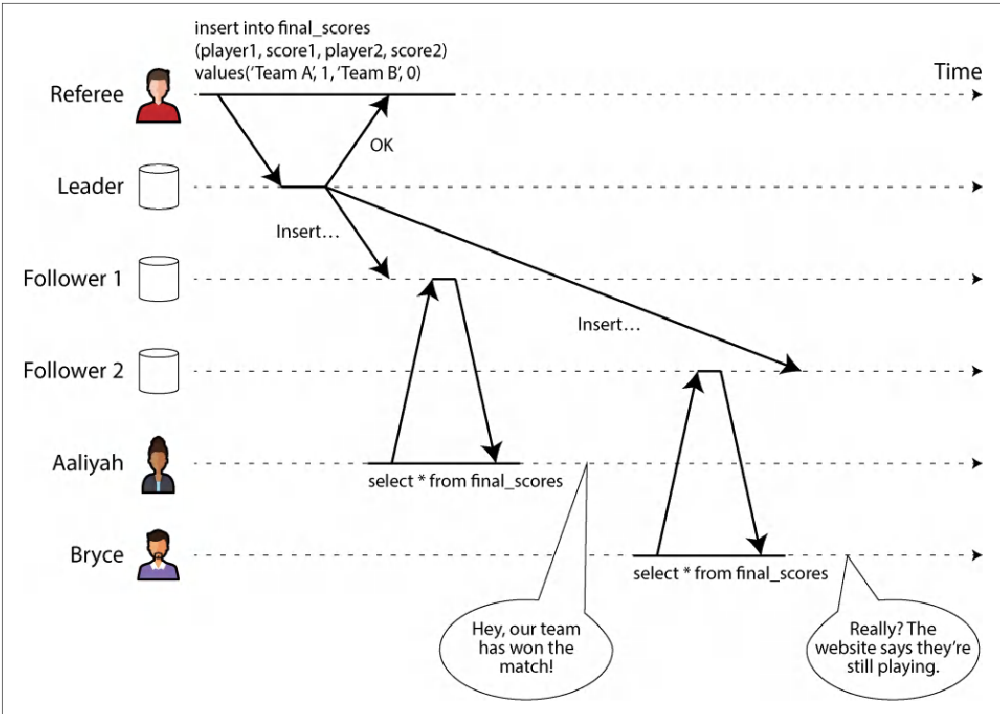

> 图 10-1。该系统不满足线性一致性，令体育迷感到困惑。  

如果 Aaliyah 和 Bryce 同时点击重新加载，那么两人得到不同的查询结果也不会那么令人意外，因为他们并不知道服务器究竟在什么时刻处理了各自的请求。然而，Bryce 知道自己是在听到 Aaliyah 喊出最终比分后才按下重新加载按钮（发起查询）的，因此他期望自己的查询结果至少与 Aaliyah 的一样新。他的查询返回陈旧结果这一事实违反了线性一致性。  

### 什么使系统具有线性一致性？  

为了更好地理解线性一致性，我们再来看一些例子。图 10-2 展示了三个客户端在一个线性一致的数据库中并发读写同一个对象 x。在分布式系统理论中，x 称为寄存器——在实践中，它可以是键值存储中的一个键、关系数据库中的一行，或文档数据库中的一个文档。  

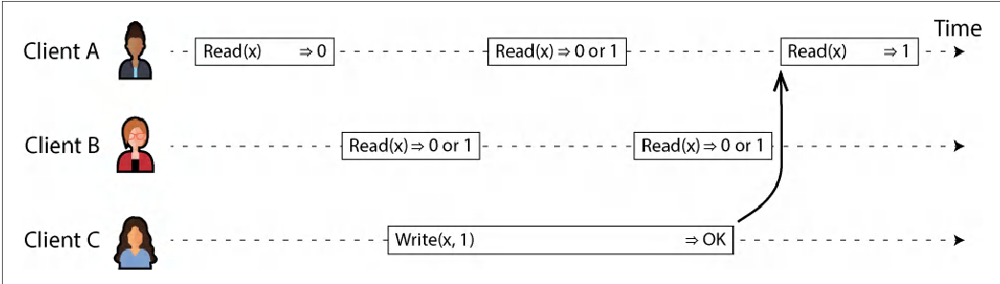

> 图 10-2。如果读取请求与写入请求并发，它可能返回旧值，也可能返回新值。  

为简化起见，图 10-2 只从客户端视角展示请求，而没有展示数据库内部情况。每个条形都代表客户端发出的一个请求。条形起点是请求发送的时刻，终点是客户端收到响应的时刻。由于网络延迟不定，客户端并不确切知道数据库何时处理了它的请求。它只知道，处理必定发生在客户端发送请求与收到响应之间的某个时刻。  

在这个例子中，寄存器有两类操作：  

- Read(x) ⇒ v 表示客户端请求读取寄存器 x 的值，数据库返回值 v。  

- Write(x, v) ⇒ r 表示客户端请求将寄存器 x 的值设置为 v，数据库返回响应 r（可以是 OK 或 Error）。  

在图 10-2 中，x 的初始值为 0，客户端 C 发出写入请求，要将它设置为 1。在此期间，客户端 A 和 B 不断轮询数据库，以读取最新值。A 和 B 的读取请求可能得到哪些响应？  

我们逐一分析：  

- 客户端 A 的第一次读取操作在写入开始前就已完成，因此必须返回旧值 0。  

- 客户端 A 的最后一次读取在写入完成后才开始，因此如果数据库满足线性一致性，就必须返回新值 1，因为该读取必定在写入之后处理。  

- 任何在时间上与写入操作重叠的读取操作都可能返回 0 或 1，因为我们不知道处理读取操作时写入是否已经生效。这些操作与写入并发。  

然而，这还不足以完整描述线性一致性。如果与写入并发的读取既可以返回旧值，也可以返回新值，那么在写入进行期间，读取者看到的值就可能在新旧之间来回翻转数次。这并不是我们期望一个模拟“单份数据副本”的系统具有的行为。  

为了使系统满足线性一致性，我们需要增加另一项约束，如图 10-3 所示。  

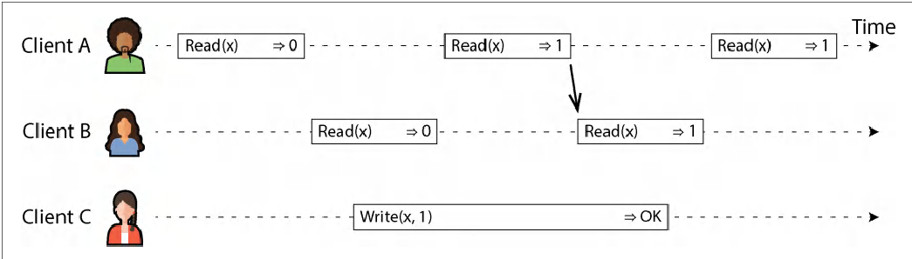

> 图 10-3。任何一次读取返回新值后，此后的所有读取（无论来自同一客户端还是其他客户端）也都必须返回新值。  

在线性一致的系统中，我们设想一定存在某个时刻（介于写入操作开始和结束之间），x 的值在该时刻从 0 原子地变为 1。因此，如果某个客户端的读取返回新值 1，那么此后的所有读取也必须返回新值，即使写入操作尚未完成。  

图 10-3 中用箭头说明了这种时序依赖关系。客户端 A 最先读到新值 1。A 的读取刚返回，B 就开始了一次新的读取。由于 B 的读取严格发生在 A 的读取之后，它也必须返回 1，即使 C 的写入仍在进行。（这与图 10-1 中 Aaliyah 和 Bryce 的情形相同：Aaliyah 读到新值后，Bryce 也期望读到新值。）  

我们可以进一步细化这张时序图，把每个操作可视化为在某一时刻原子地生效 [5]，如图 10-4 所示的更复杂示例。在这个示例中，除读写之外，我们增加了第三类操作：  

$CAS(x, v_{\text{old}}, v_{\text{new}}) \Rightarrow r$ 表示客户端请求执行原子 CAS 操作（参见第 302 页的“条件写入（比较并设置）”）。如果寄存器 $x$ 的当前值等于 $v_{\text{old}}$，就应将其原子地设置为 $v_{\text{new}}$。如果 $x$ 的值不同于 $v_{\text{old}}$，那么该操作应保持寄存器不变并返回错误。$r$ 是数据库的响应（OK 或 Error）。  

图 10-4 中的每个操作都用一条竖线标出（位于各操作的条形内部），表示我们认为该操作执行的时刻。这些标记按顺序连接起来，其结果必须构成寄存器的一组有效读写序列（每次读取都必须返回最近一次写入所设置的值）。  

线性一致性要求，连接操作标记的线始终沿时间向前移动（从左到右），绝不能向后。这项要求确保了我们之前讨论的新近性保证：一旦新值被写入或读出，此后的所有读取都会看到该写入值，直到它再次被覆盖。  

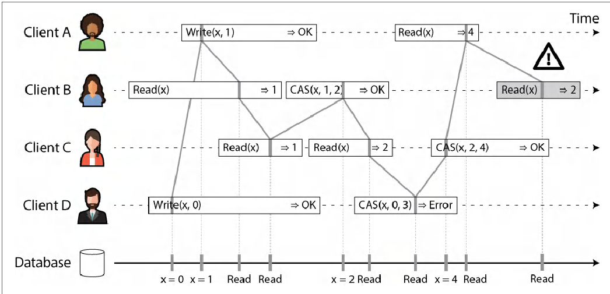

> 图 10-4。将读写操作看似生效的时刻可视化——B 的最后一次读取不满足线性一致性。  

图 10-4 中有几个有趣的细节值得指出：  

- 首先，客户端 B 发送了读取 x 的请求，随后客户端 D 发送了将 x 设置为 0 的请求，然后客户端 A 发送了将 x 设置为 1 的请求。尽管如此，B 的读取返回值却是 1（即 A 写入的值）。这是允许的：它意味着数据库先处理 D 的写入，再处理 A 的写入，最后处理 B 的读取。尽管这不是请求的发送顺序，却仍是可接受的顺序，因为三个请求彼此并发。也许 B 的读取请求在网络中稍有延迟，直到两次写入之后才抵达数据库。  

- 客户端 B 的读取返回 1 时，客户端 A 尚未收到数据库确认值 1 写入成功的响应。这也是允许的，因为它只意味着数据库发给客户端 A 的 OK 响应在网络中稍有延迟。  

- 这个模型不假定任何事务隔离；另一个客户端可能随时更改值。例如，C 先读到 1，随后读到 2，因为两次读取之间 B 更改了该值。原子 CAS 操作可用于检查该值是否已被另一个客户端并发更改：B 和 C 的 CAS 请求成功，而 D 的 CAS 请求失败（数据库处理它时，$x$ 的值已不再是 0）。  

- 客户端 B 的最后一次读取（位于阴影条形中）不满足线性一致性。该操作与 C 的 CAS 写入并发，后者将 $x$ 从 2 更新为 4。如果没有其他请求，B 的读取返回 2 是允许的。然而，在 B 的读取开始之前，客户端 A 已经读到了新值（4），因此不允许 B 读到比 A 更旧的值。这仍然与图 10-1 中 Aaliyah 和 Bryce 的情形相同。  

以上就是线性一致性背后的直觉；形式化定义 [1] 对它有更精确的描述。通过记录所有请求和响应的时序，并检查能否将它们排列成有效的顺序次序，可以检验系统行为是否满足线性一致性 [6, 7]，尽管这样做的计算成本很高。  

正如事务除了可串行化之外还有各种更弱的隔离级别（参见第 288 页的“弱隔离级别”），复制系统除了线性一致性之外也有各种更弱的一致性模型 [8]。我们在第 209 页的“复制延迟带来的问题”中看到的写后读一致性、单调读和一致前缀读保证，就是其中的例子。线性一致性包括所有这些保证以及更多保证；它是常用的一致性模型中最强的一种。  

> [!NOTE]
> **线性一致性与可串行化**
>
> 线性一致性很容易与可串行化混淆（参见第 308 页的“可串行化”），因为这两个词似乎都含有“可以按顺序排列”的意思。然而，它们是截然不同的保证，区分二者非常重要：  
>
> *可串行化*
>
> 可串行化是事务的一种隔离级别，其中每个事务都可以读写多个对象（行、文档、记录）。它保证事务的行为与按某种串行顺序执行时相同——也就是说，先执行完一个事务的全部操作，再执行另一个事务的全部操作，依此类推，各事务的操作不相互交错。该串行顺序可以不同于事务实际运行的顺序 [9]。  
>
> *线性一致性*
>
> 线性一致性是对寄存器（单个对象）读写的保证。它不会将操作组合成事务，因此无法防止涉及多个对象的写偏差等问题（参见第 303 页的“写偏差与幻读”）。然而，线性一致性是一种新近性保证：它要求，如果一个操作在另一个操作开始前已经结束，那么后一个操作必须观察到至少与前一个操作一样新的状态。可串行化没有这项要求——例如，可串行化允许陈旧读取 [10]。  
>
> 顺序一致性又是另一个概念 [8]，但我们在此不作讨论。  
>
> 数据库可以同时提供可串行化和线性一致性；这种组合称为严格可串行化或强单副本可串行化（strong one-copy serializability，strong-1SR）[11, 12]。单节点数据库通常满足线性一致性。对于使用 SSI 等乐观方法的分布式数据库（参见第 317 页的“可串行化快照隔离”），情况则更复杂。例如，CockroachDB 提供可串行化以及某些读取新近性保证，但不提供严格可串行化 [13]，因为这需要事务之间进行成本高昂的协调 [14]。另一方面，Spanner 和 FoundationDB 提供严格可串行化 [15, 16]。  
>
> 也可以将较弱的隔离级别与线性一致性结合，或将较弱的一致性模型与可串行化结合；事实上，一致性模型和隔离级别在很大程度上可以彼此独立地选择 [17, 18]。  

### 依赖线性一致性  

线性一致性在什么情况下有用？查看体育比赛的最终比分也许是个无关紧要的例子；在这种情况下，结果过时几秒钟不太可能造成任何实际伤害。然而，在某些领域，线性一致性是确保系统正确运行的一项重要要求。  

#### 锁与主节点选举  

采用单主复制的系统需要确保确实只有一个主节点，而不是多个（脑裂）。选举主节点的一种方法是使用租约。每个启动的节点都会尝试获取租约，成功者成为主节点 [19]。无论这种机制如何实现，都必须满足线性一致性。不能让两个节点同时获取租约。  

Apache ZooKeeper [20] 和 etcd 等协调服务常用于实现分布式租约和主节点选举。它们使用共识算法  

以容错方式实现线性一致的操作（本章稍后将讨论此类算法）。正确实现租约和主节点选举涉及许多微妙细节（例如第 373 页“分布式锁与租约”中的隔离问题），Apache Curator 等库通过在 ZooKeeper 之上提供更高层的方案来提供帮助。不过，线性一致的存储服务是这些协调任务的基本基础。  

> [!NOTE]
> 严格来说，ZooKeeper 提供线性一致的写入，但读取可能是陈旧的，因为无法保证读取请求由当前主节点提供服务 [20]。etcd 从版本 3 开始默认提供线性一致的读取。

在一些分布式数据库中，分布式锁还被用于粒度细得多的层面，例如 Oracle Real Application Clusters（RAC）[21]。RAC 为每个磁盘页使用一把锁，多个节点共享对同一个磁盘存储系统的访问。由于这些线性一致的锁位于事务执行的关键路径上，RAC 部署通常会配备专用的集群互连网络，用于数据库节点之间的通信。

#### 约束与唯一性保证

唯一性约束在数据库中很常见——例如，用户名或电子邮件地址必须唯一标识一个用户，而在文件存储服务中，不能有两个路径和文件名都相同的文件。如果你希望在数据写入时强制执行此约束（也就是说，如果两个人试图并发创建同名用户或文件，其中一人会收到错误），就需要线性一致性。

这种情况与锁类似；当用户注册你的服务时，可以将其视为获取了自己所选用户名上的锁。这个操作也非常类似于原子 CAS：在用户名尚未被占用的前提下，将该用户名设置为认领它的用户 ID。

如果你想确保银行账户余额永远不会变成负数、售出的商品不会超过仓库库存，或者两个人不会并发预订航班或剧院中的同一个座位，也会出现类似的问题。这些约束都需要一个所有节点都认同的、唯一且最新的值（账户余额、库存水平、座位占用状态）。

在实际应用中，有时可以宽松地处理这类约束——例如，如果航班超售，可以把乘客改签到其他航班，并为给他们带来的不便提供补偿。在这种情况下，可能不需要线性一致性（我们将在第 571 页的“及时性与完整性”中讨论这类宽松解释的约束）。

不过，关系数据库中常见的严格唯一性约束需要线性一致性。其他类型的约束，例如外键约束或属性约束，则可以在没有线性一致性的情况下实现 [22]。

#### 跨通道的时序依赖

图 10-1 中有一个值得注意的重要细节：如果 Aaliyah 没有喊出比分，Bryce 就不会知道他的查询结果已经陈旧。他只会在几秒后再次刷新页面，最终看到终场比分。之所以能发现违反线性一致性的情况，只是因为系统中还有一条额外的通信通道（Aaliyah 的声音传到 Bryce 的耳朵）。

计算机系统中也可能出现类似情形。例如，假设你的网站允许用户上传视频，同时由一个后台进程将视频转码为较低画质，以便在网速较慢的连接上流式播放。该系统的架构和数据流如图 10-5 所示。视频转码器需要收到明确指令才会执行转码任务，而该指令由 Web 服务器通过消息队列发送给转码器（参见第 12 章）。Web 服务器不会把整个视频放入队列，因为大多数消息代理都是为小消息设计的，而一个视频可能有数兆字节之大。相反，视频首先写入文件存储服务；写入完成后，再将发给转码器的指令放入队列。

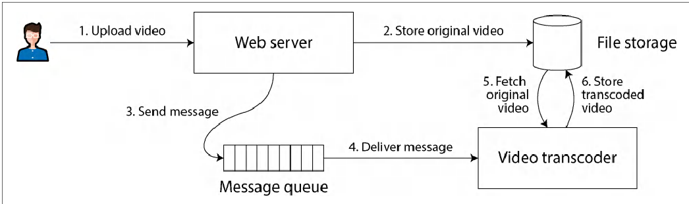

> 图 10-5。Web 服务器和视频转码器同时通过文件存储与消息队列进行通信，这可能引发竞态条件。

如果文件存储服务具有线性一致性，这个系统应该可以正常工作。如果它不具有线性一致性，就存在竞态条件的风险：消息队列（图 10-5 中的步骤 3 和 4）可能比存储服务内部的复制更快。在这种情况下，当转码器获取原始视频时（步骤 5），它可能看到文件的旧版本，甚至什么也看不到。如果它处理了视频的旧版本，文件存储中的原始视频和转码后视频就会永久不一致。

这个问题源于 Web 服务器与转码器之间存在两条通信通道：文件存储和消息队列。没有线性一致性提供的新近性保证，这两条通道之间就可能出现竞态条件。这与图 10-1 中的情形类似，那里同样有两条通信通道之间的竞态条件：数据库复制，以及 Aaliyah 的嘴与 Bryce 的耳朵之间现实世界中的音频通道。

如果你有一个能接收推送通知的移动应用，并且应用收到通知时会从服务器获取某些数据，也会发生类似的竞态条件。如果数据获取请求可能被发送到一个存在延迟的副本，就可能出现这样的情况：推送通知很快送达，但随后的获取请求却看不到该通知所涉及的数据。

线性一致性并不是避免这种竞态条件的唯一方法，但它最容易理解。如果你能控制额外的通信通道（消息队列属于这种情况，但 Aaliyah 和 Bryce 的例子不属于），则可以使用与第 210 页“读到自己的写入”中讨论的方法类似的替代方案，代价是增加额外的复杂性。

### 实现线性一致的系统

现在我们已经看过几个线性一致性很有用的例子，接下来思考一下如何实现一个提供线性一致语义的系统。

由于线性一致性本质上意味着“表现得仿佛数据只有一个副本，而且对它的所有操作都是原子的”，最简单的答案似乎是确实只使用一个数据副本。然而，这种方法无法容忍故障：如果保存该唯一副本的节点发生故障，数据就会丢失，或者至少在该节点重新启动之前都无法访问。

让我们重新审视第 6 章介绍的复制方法，看看它们能否实现线性一致性：

#### 单主复制（可能具有线性一致性）

在采用单主复制的系统中，主节点持有用于写入的数据主副本，从节点则在其他节点上维护数据的备份副本。只要所有读取和写入都在主节点上执行，它们就很可能具有线性一致性。不过，这里假设你能确切知道谁是主节点。正如第 373 页“分布式锁与租约”中所讨论的，一个节点完全可能自认为是主节点，而实际上并不是——如果这个产生错觉的主节点继续处理请求，就很可能违反线性一致性 [23]。采用异步复制时，故障转移甚至可能导致已提交的写入丢失，从而同时违反持久性和线性一致性。

对单主数据库进行分片，并为每个分片设置单独的主节点，不会影响线性一致性，因为线性一致性只是一种单对象保证。跨分片事务则是另一回事（参见第 323 页“分布式事务”）。

#### 共识算法（很可能具有线性一致性）

一些共识算法本质上是带有自动主节点选举和故障转移的单主复制。它们经过精心设计以防止脑裂，因此能够安全地实现线性一致的存储。例如，ZooKeeper 使用 Zab 共识算法 [24]，etcd 使用 Raft [25]。不过，一个系统使用了共识，并不保证它的所有操作都具有线性一致性。如果它允许在某个节点上执行读取，却不检查该节点是否仍是主节点，那么在刚刚选出新主节点时，读取结果可能是陈旧的。

#### 多主复制（不具有线性一致性）

采用多主复制的系统通常不具有线性一致性，因为它们在多个节点上并发处理写入，并以异步方式将写入复制到其他节点。因此，它们可能产生需要解决的冲突写入（参见第 222 页“处理写入冲突”）。

#### 无主复制（很可能不具有线性一致性）

对于采用无主复制的系统（Dynamo 风格；参见第 229 页“无主复制”），有人有时声称，通过要求法定人数读取和写入（$w + r > n$），可以获得“强一致性”。这并不完全正确，具体取决于所采用的算法以及如何定义强一致性。

基于日历时钟的 LWW 冲突解决方法（例如 Cassandra 和 ScyllaDB 中的方法）几乎肯定不具有线性一致性，因为受时钟偏差影响，无法保证时钟时间戳与事件的实际顺序一致（参见第 362 页“依赖同步时钟”）。即使使用法定人数，也仍可能出现非线性一致的行为，下一节将对此加以说明。

直觉上看，在 Dynamo 风格的模型中，法定人数读取和写入似乎应该具有线性一致性。然而，当网络延迟不定时，就可能出现竞态条件，如图 10-6 所示。

在图 10-6 中，x 的初始值为 0，一个写入客户端通过将写入发送给全部三个副本（n = 3，w = 3），把 x 更新为 1。与此同时，客户端 A 从两个节点组成的法定人数中读取（r = 2），在一个节点上看到新值 1，在另一个节点上看到旧值 0。同样与写入并发的是，客户端 B 从另一个由两个节点组成的法定人数中读取，从两个节点得到的都是旧值 0。

虽然满足法定人数条件（$w + r > n$），但这次执行仍不具有线性一致性。B 的请求在 A 的请求完成之后才开始，但 B 返回旧值，而 A 返回新值。（这又是图 10-1 中 Aaliyah 和 Bryce 的情形。）

可以让 Dynamo 风格的法定人数具有线性一致性，但代价是性能下降。读取者必须先同步执行读修复（参见第 231 页“补上错过的写入”），然后才能向应用返回结果 [26]。此外，在写入之前，写入者必须读取法定人数节点的最新状态，取得任何先前写入的最新时间戳，并确保新写入具有更大的时间戳 [27, 28]。不过，Riak 因为性能损失而不执行同步读修复。Cassandra 在法定人数读取时确实会等待读修复完成 [29]，但由于它使用日历时钟生成时间戳，因而失去了线性一致性。

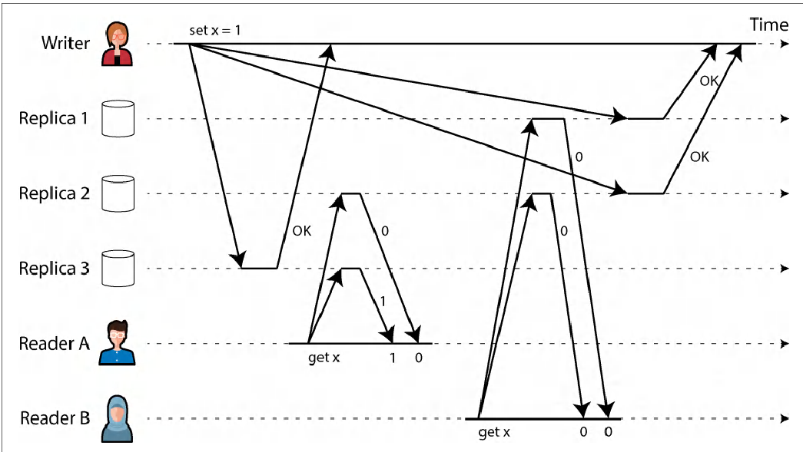

> 图 10-6。尽管使用了法定人数，执行仍不具有线性一致性。

此外，只有线性一致的读取和写入操作才能用这种方式实现；线性一致的 CAS 操作无法这样实现，因为它需要共识算法 [30]。总之，最稳妥的做法是假定采用 Dynamo 风格复制的无主系统不提供线性一致性，即使它使用法定人数读取和写入也是如此。

### 线性一致性的代价

由于有些复制方法可以提供线性一致性，而另一些不能，因此值得更深入地探讨线性一致性的利弊。

我们已经在第 6 章讨论过不同复制方法的一些使用场景；例如，我们看到，多主复制通常很适合多区域复制（参见第 216 页“跨地域分布式运行”）。图 10-7 展示了这样一种部署的示例。

考虑一下两个区域之间的网络中断时会发生什么。假设每个区域内部的网络都正常工作，客户端可以访问各自的本地区域，但两个区域无法彼此连接。这称为网络分区。

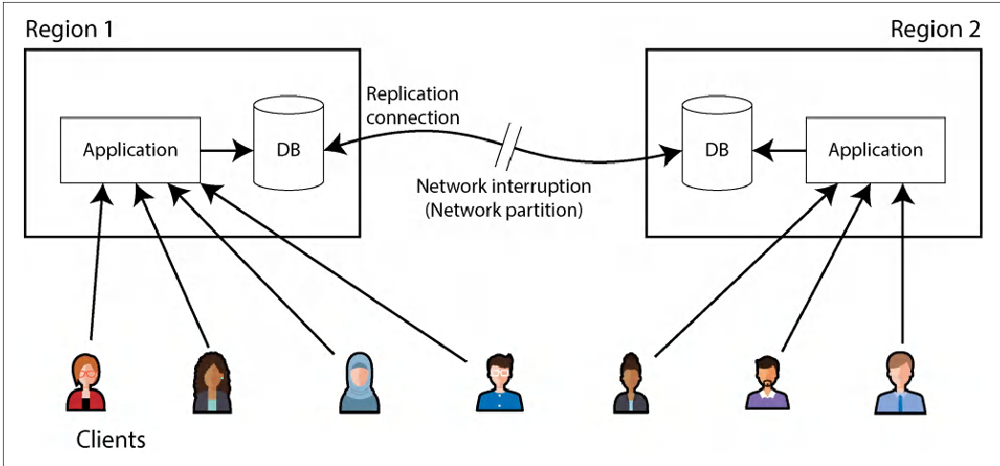

> 图 10-7。网络中断迫使系统在线性一致性与可用性之间做出选择。

使用多主数据库时，每个区域都可以继续正常运行。由于一个区域的写入会异步复制到另一个区域，这些写入只需进入队列，并在网络连接恢复后进行交换。

另一方面，如果使用单主复制，主节点必须位于其中一个区域。任何写入以及任何线性一致的读取都必须发送到主节点。因此，对于连接到从节点所在区域的客户端，这些读写请求必须通过网络同步发送到主节点所在区域。

在单主配置中，如果区域之间的网络中断，连接到从节点所在区域的客户端就无法联系主节点，因此既不能向数据库写入，也不能执行任何线性一致的读取。它们仍然可以读取从节点上的数据，但读到的可能是陈旧数据（不具有线性一致性）。如果应用要求线性一致的读写，网络中断会导致无法联系主节点的区域中应用不可用。

如果客户端能直接连接到主节点所在区域，就不会有问题，因为应用可以在那里继续正常工作。但只能访问从节点所在区域的客户端将遭遇服务中断，直到网络链路修复为止。

#### CAP 定理

这个问题并不只是单主复制和多主复制导致的结果。任何线性一致的数据库都会面临这个问题，无论它如何实现。这个问题也并非多区域部署所独有；任何不可靠的网络都可能发生，即使只在一个区域内也是如此。其权衡如下：

- 如果你的应用要求线性一致性，而某些副本由于网络问题与其他副本断开连接，那么这些副本将暂时无法处理请求：它们必须等到网络问题修复，或者返回错误（无论哪种情况，它们都变得不可用）。这种选择有时称为 CP（在网络分区下保持一致）。

- 如果你的应用不要求线性一致性，就可以将其设计成让每个副本独立处理请求，即使该副本与其他副本断开连接也可以（例如多主复制）。在这种情况下，应用面对网络问题时仍可保持可用，但其行为不具有线性一致性。这种选择称为 AP（在网络分区下保持可用）。

因此，不要求线性一致性的应用可以更好地容忍网络问题。这一见解通常称为 *CAP 定理* [31, 32, 33, 34]，由 Eric Brewer 于 2000 年命名，不过早在 20 世纪 70 年代，分布式数据库的设计者就已经知道这种权衡 [35, 36, 37]。

CAP 最初是作为一条没有精确定义的经验法则提出的，目的是引发对数据库权衡取舍的讨论。当时，许多分布式数据库专注于在共享存储的机器集群上提供线性一致语义 [21]，而 CAP 鼓励数据库工程师探索更广阔的分布式无共享系统设计空间，这类系统更适合用于实现大规模 Web 服务 [38]。CAP 推动了这种文化转变，功不可没——它帮助触发了 NoSQL 运动，即 21 世纪头十年中期涌现的一大批新数据库技术。

正式定义的 CAP 定理 [32] 适用范围非常狭窄。它只考虑一种一致性模型（即线性一致性）和一种故障（网络分区；根据 Google 的数据，这种故障在事故原因中所占比例不到 8% [39]）。它没有讨论网络延迟、失效节点或其他权衡。因此，尽管 CAP 在历史上影响深远，它对系统设计几乎没有实际价值 [4, 45]。

人们曾尝试对 CAP 进行推广。例如，*PACELC 原则* 指出，即使网络运行完全正常，系统设计者也可能选择削弱一致性来降低延迟 [40, 46, 47]。因此，在发生网络分区（P）时，需要在可用性（A）和一致性（C）之间选择；否则（E），即没有分区时，则可以在低延迟（L）和一致性（C）之间选择。不过，这个定义继承了 CAP 的若干问题，例如对一致性和可用性所作的定义有违直觉。

分布式系统中还有许多更有意思的不可能性结果 [41]，如今 CAP 已被更精确的结果所取代 [42, 43]，所以今天它主要只有历史意义。

> [!NOTE]
> **无甚助益的 CAP 定理**
>
> CAP 有时被表述为一致性、可用性和分区容错性三选二。遗憾的是，这种说法具有误导性 [34]。网络分区是一种故障，并不是你能够选择的东西；不管你愿不愿意，它都会发生。要保证绝不发生网络分区，唯一的方法就是根本不使用网络——也就是说，只有一个副本——但这样也就没有高可用性了。
>
> 在网络正常工作时，系统可以同时提供一致性（线性一致性）和可用性。发生网络故障时，则必须在两者之间做出选择。因此，CAP 更好的表述应该是：*发生分区时，要么保持一致，要么保持可用* [44]。网络越可靠，就越少需要做出这种选择，但在某个时刻，这种选择仍不可避免。
>
> CP/AP 分类方案还有其他几个缺陷 [4]。一致性被形式化为线性一致性（该定理没有讨论更弱的一致性模型），而可用性的形式化定义 [32] 与该术语的通常含义并不相符 [45]。许多高可用（容错）系统实际上并不满足 CAP 对可用性所作的特殊定义。此外，一些系统设计者有充分理由选择既不提供线性一致性，也不提供 CAP 定理所假定的那种可用性，因此这些系统既不是 CP，也不是 AP [46, 47]。
>
> 总而言之，围绕 CAP 存在大量误解和混乱，而且它无助于我们更好地理解系统，所以最好不要在它上面纠缠太久。

#### 线性一致性与网络延迟

尽管线性一致性是一项有用的保证，但实践中具有线性一致性的系统少得出人意料。例如，即使现代多核 CPU 中的 RAM 也不具有线性一致性 [48]。如果运行在一个 CPU 核心上的线程写入某个内存地址，而另一个 CPU 核心上的线程稍后读取同一地址，也不能保证它会读到第一个线程写入的值（除非使用内存屏障或栅栏 [49]）。

出现这种行为的原因是，每个 CPU 核心都有自己的内存缓存和存储缓冲区。默认情况下，读取由缓存提供服务，而所有更改都会异步写回主内存。由于访问缓存中的数据比访问主内存快得多 [50]，这一特性对于现代 CPU 获得良好性能至关重要。不过，这也意味着数据现在有多个副本（一个位于主内存，其他副本可能位于多个不同的缓存中），而且这些副本是异步更新的，因此失去了线性一致性。

为什么要做出这种权衡？用 CAP 定理来解释多核内存一致性模型毫无意义。在一台计算机内部，我们通常假定

通信是可靠的，也不指望某个 CPU 核心在与计算机其余部分断开连接后还能继续正常运行。放弃线性一致性的原因是性能，而不是容错 [46]。

许多选择不提供线性一致性保证的分布式数据库也是如此：它们这样做主要是为了提升性能，而不是为了容错 [40]。线性一致的系统往往延迟更高——而且始终如此，并非只在网络故障期间如此。

难道不能找到一种效率更高的线性一致存储实现吗？答案似乎是否定的。Attiya 和 Welch [51] 证明，如果想要线性一致性，读写请求的响应时间至少与网络延迟的不确定性成正比。在延迟高度不定的网络中，比如大多数计算机网络（参见第 352 页“超时与无界延迟”），线性一致读写的响应时间不可避免地会很高。不存在更快的线性一致性算法，但更弱的一致性模型可以快得多，因此这种权衡对延迟敏感型系统非常重要。在第 13 章中，我们将讨论一些既避免线性一致性又不牺牲正确性的方法。

## ID 生成器与逻辑时钟

在许多应用中，数据库记录创建时需要为其分配某种唯一 ID，以便得到一个可用于引用这些记录的主键。在单节点数据库中，通常使用自增整数，其优点是只需 64 位即可存储（如果你确信记录数永远不会超过 40 亿条，甚至可以只用 32 位，不过这样做有风险）。

自增 ID 的另一个优势是，ID 的顺序可以表明记录的创建顺序。例如，图 10-8 展示了一个聊天应用，它在聊天消息发布时为其分配自增 ID。随后，你可以按 ID 递增的顺序显示消息，由此形成的聊天对话也符合逻辑：Aaliyah 发布了一个问题，它被分配了 ID 1；Bryce 对该问题的回答被分配了一个更大的 ID，即 3。  

这个单节点 ID 生成器是线性一致性系统的另一个例子。每个获取 ID 的请求都是一个原子递增计数器并返回旧计数器值的操作（即 fetch-and-add 操作）；线性一致性确保，如果 Aaliyah 的消息发布完成后 Bryce 才开始发布，那么 Bryce 消息的 ID 必须大于 Aaliyah 消息的 ID。图 10-8 中 Aaliyah 和 Caleb 的消息是并发的，因此只要它们的 ID 唯一，线性一致性并不规定二者的 ID 必须如何排序。  

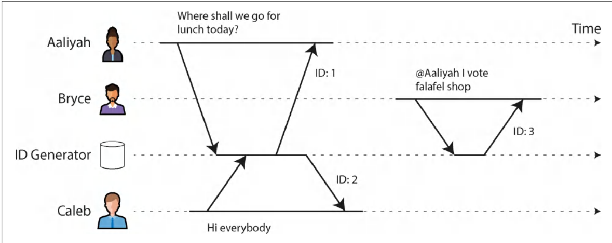

> 图 10-8。在聊天应用中为消息分配自增整数 ID 的 ID 生成器。  

内存中的单节点 ID 生成器很容易实现。你可以使用 CPU 提供的原子递增指令，让多个线程安全地递增同一个计数器。要让计数器持久化则需要多花一点功夫，这样节点崩溃并重启时才不会重置计数器值、进而产生重复 ID。但真正的问题如下：  

- 单节点 ID 生成器不具备容错能力，因为该节点构成单点故障。  

- 如果你想在另一个区域创建记录，它的速度会很慢，因为仅仅为了获取一个 ID，你可能就得往返地球另一端一次。  

- 如果写入吞吐量很高，这个单节点可能会成为瓶颈。  

你可以考虑 ID 生成器的多种替代方案：  

### 分片式 ID 分配  

可以让多个节点分配 ID，例如，一个节点只生成偶数，另一个节点只生成奇数。一般而言，可以在 ID 中预留一些比特来存放分片编号。这样的 ID 仍然紧凑，但会失去顺序属性。例如，如果两条聊天消息的 ID 分别为 16 和 17，你并不知道消息 16 是否真的先发送，因为这两个 ID 是由不同节点分配的，而其中一个节点的进度可能领先于另一个。  

### 预分配 ID 块  

单节点 ID 生成器可以发放 ID 块，而不是逐个发放 ID。例如，节点 A 可以申领 1 到 1,000 的 ID 块，节点 B 可以申领 1,001 到 2,000 的 ID 块。随后，每个节点都可以从自己的块中独立发放 ID，并在可用序列号即将耗尽时向 ID 生成器申请一个新块。然而，这种方案同样无法确保正确的顺序。如果 ID 由不同节点分配，就可能出现某条消息获得 1,001 到 2,000 范围内的 ID，而后来的消息却获得 1 到 1,000 范围内的 ID。  

### 随机 UUID  

你可以使用通用唯一标识符（universally unique identifier，UUID），也称为全局唯一标识符（globally unique identifier，GUID）。它们的一大优势是，任何节点都可以在本地生成 UUID，无需通信；但它们需要更多空间（128 位）。UUID 有多个版本；最简单的是版本 4，它本质上是一个很长的随机数，长到两个节点选中同一个数的概率微乎其微。遗憾的是，这种 ID 的顺序也是随机的，因此比较两个 ID 并不能告诉你哪一个更新。  

### 确保日历时钟时间戳唯一  

如果通过 NTP 使各节点的日历时钟保持大致准确，就可以把该时钟产生的时间戳放在 ID 的最高有效位，再用额外信息填充其余比特，以确保即使时间戳不唯一，ID 仍然唯一，例如使用分片编号和每个分片内递增的序列号，或者一个很长的随机值。版本 7 UUID [52]、X 的 Snowflake [53]、ULID [54]、Hazelcast 的 Flake ID 生成器、MongoDB ObjectID 以及许多类似方案 [52] 都采用了这种方法。你可以在应用程序代码或数据库内部实现这些 ID 生成器 [55]。  

所有这些方案都能生成唯一 ID（至少概率足够高，使碰撞极其罕见），但它们对 ID 顺序的保证远弱于单节点自增方案。  

正如第 362 页“用时间戳为事件排序”中讨论的那样，日历时钟时间戳至多只能提供近似顺序。如果较早的写入从稍快的时钟取得时间戳，而较晚写入的时间戳来自稍慢的时钟，那么时间戳顺序可能与事件实际发生的顺序不一致。如果使用非单调时钟导致时钟跳变，即使单个节点生成的时间戳也可能顺序错误。因此，基于日历时钟时间的 ID 生成器不太可能具备线性一致性。  

依靠高精度时钟同步（使用原子钟或 GPS 接收器），可以减少这种顺序不一致。不过，如果无需依赖特殊硬件也能生成既唯一又顺序正确的 ID，那会更好。接下来，我们将介绍一种恰好能做到这一点的时钟。  

### 逻辑时钟  

在第 358 页“不可靠的时钟”中，我们讨论了日历时钟和单调时钟。两者都是*物理时钟*：测量时间流逝（秒、毫秒、微秒等）的硬件设备。  

在分布式系统中，另一种称为*逻辑时钟*的时钟也很常用。与物理时钟不同，逻辑时钟是一种对已经发生的事件计数的算法。因此，逻辑时钟的时间戳无法告诉你现在几点，但你*可以*比较两个逻辑时钟时间戳，判断哪一个较早、哪一个较晚。  

逻辑时钟的一般要求如下：  

- 它的时间戳紧凑（大小为几个字节）且唯一。  

- 任意两个时间戳都可以比较并确定哪一个较早（即它们是全序的）。  

- 时间戳的顺序与*因果关系一致*。也就是说，如果操作 A 先于操作 B 发生，那么 A 的时间戳小于 B 的时间戳。（我们此前在第 238 页“先发生关系与并发”中讨论过因果关系。）  

单节点 ID 生成器符合这些要求，但我们刚才讨论的分布式 ID 生成器不符合因果顺序要求。  

### Lamport 时间戳  

幸运的是，有一种生成逻辑时间戳的简单方法既与因果关系一致，又可以用作分布式 ID 生成器。它称为 Lamport 时钟，由 Leslie Lamport 于 1978 年提出 [56]，相关论文如今已成为分布式系统领域引用次数最多的论文之一。  

虽然 Lamport 时钟提供全序，但它们*不*提供线性一致性，也就是说，它们无法确保某个值是最新的。它们只是一种为事件分配 ID 的方法，能够保证如果事件 A 先于事件 B 发生，那么 A 的 ID 小于 B 的 ID。  

图 10-9 展示了 Lamport 时钟在图 10-8 的聊天示例中如何工作。每个节点都有一个唯一标识符，在图 10-9 中是 Aaliyah、Bryce 或 Caleb 这个名字，但在实践中也可以是随机 UUID 或类似标识。每个节点还会记录自己处理过的操作数量。因此，Lamport 时间戳就是一个简单的二元组（计数器，节点 ID）。两个节点有时可能具有相同的计数器值，但在时间戳中加入节点 ID 后，每个时间戳就具备了唯一性。  

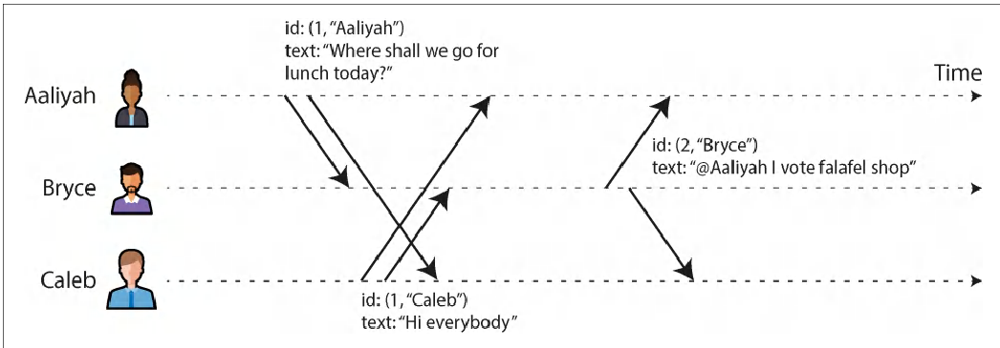

> 图 10-9。Lamport 时间戳提供与因果关系一致的全序。  

每当节点生成时间戳时，它都会递增计数器值并使用新值。每当节点看到来自另一个节点的时间戳时，如果该时间戳中的计数器值大于本地计数器值，它就会把本地计数器增大到与该时间戳中的值相同。  

在图 10-9 中，Aaliyah 发布自己的消息时还没有看到 Caleb 的消息，反之亦然。假设两位用户的计数器初始值都是 0，那么两者都会递增自己的本地计数器，并将新的计数器值 1 附加到消息上。当 Bryce 收到这些消息时，他会把自己的本地计数器值增大到 1。最后，Bryce 回复 Aaliyah 的消息，递增自己的本地计数器，并把新值 2 附加到消息上。  

比较两个 Lamport 时间戳时，我们首先比较它们的计数器值，例如，(2, “Bryce”) 大于 (1, “Aaliyah”)，也大于 (1, “Caleb”)。如果两个时间戳的计数器值相同，再使用通常的字符串字典序比较它们的节点 ID。因此，本例中的时间戳顺序是 (1, “Aaliyah”) < (1, “Caleb”) < (2, “Bryce”)。  

### 混合逻辑时钟  

Lamport 时间戳很适合捕捉事件发生的顺序，但也存在一些局限：  

- 由于它们与物理时间没有直接关系，你无法用它们查找诸如某个特定日期发布的所有消息；必须另外存储物理时间。  

- 如果两个节点从不通信，一个节点的计数器递增永远不会反映到另一个节点的计数器中。因此，不同节点在大致同一时间生成的事件，其计数器值可能相差悬殊。  

*混合逻辑时钟*结合了物理日历时钟的优势和 Lamport 时钟的顺序保证 [57]。它像物理时钟一样对秒或微秒计数；又像 Lamport 时钟一样，当一个节点看到另一个节点的时间戳大于自己的本地时钟值时，它会把本地值向前推进，使之与另一个节点的时间戳相同。因此，如果某个节点的时钟走得快，其他节点与它通信时也会相应地把自己的时钟向前推进。  

每当生成混合逻辑时钟的时间戳时，它也会递增，这确保即使底层物理时钟向后跳变（例如由于 NTP 调整），该时钟仍会单调向前推进。因此，混合逻辑时钟可能略微领先于底层物理时钟。算法的细节会确保这种偏差尽可能小。  

因此，你几乎可以像对待传统日历时钟的时间戳一样对待混合逻辑时钟的时间戳，而且它还具有顺序与先发生关系一致的额外属性。它不依赖任何特殊硬件，只要求时钟大致同步。例如，CockroachDB 就使用了混合逻辑时钟。  

### Lamport/混合逻辑时钟与向量时钟的比较  

在第 295 页“多版本并发控制”中，我们讨论了快照隔离通常如何实现：本质上，就是为每个事务分配一个事务 ID，允许每个事务看到 ID 较低的事务所做的写入，同时隐藏 ID 较高的事务所做的写入。Lamport 时钟和混合逻辑时钟很适合生成这些事务 ID，因为它们能够确保快照与因果关系一致 [58]。  

当多个时间戳并发生成时，这些算法会对它们任意排序。这意味着，当你查看两个时间戳时，通常无法判断它们是并发生成的，还是一个先于另一个发生。（在图 10-9 中，你其实能看出 Aaliyah 和 Caleb 的消息一定是并发的，因为它们的计数器值相同；但是，当计数器值不同时，你无法判断它们是否并发。）  

如果想判断记录何时是并发创建的，就需要另一种算法，例如*向量时钟*。向量时钟为每个节点维护一个计数器，并随每次写入存储所有计数器值。如果写入 A 在某个节点上的计数器值高于 B，而写入 B 在另一个节点上的计数器值高于 A，那么 A 和 B 一定是并发的（参见第 237 页“检测并发写入”）。缺点是，向量时钟的时间戳比我们讨论过的其他时间戳占用更多空间——系统中的每个节点可能都需要一个整数。  

### 线性一致的 ID 生成器  

尽管 Lamport 时钟和混合逻辑时钟提供了实用的顺序保证，但这种顺序仍然弱于我们此前讨论的线性一致的单节点 ID 生成器。回想一下，线性一致性要求：如果请求 A 在请求 B 开始之前已经完成，那么 B 必须获得更大的 ID，即使 A 和 B 从未相互通信。另一方面，Lamport 时钟只能确保节点生成的时间戳大于该节点见过的任何其他时间戳；对于它未见过的时间戳，则无法作出这样的保证。  

图 10-10 展示了不具备线性一致性的 ID 生成器可能如何引发问题。假设在某个社交媒体网站上，用户 A 想私下与朋友分享一张令人尴尬的照片。用户 A 的账户起初是公开的，但他们使用笔记本电脑把账户设置改为私密，然后用手机上传照片。由于用户 A 依次执行了这些更新，他们完全有理由期待照片上传受新的受限账户权限约束。然而，如图所示，实际情况未必如此。  

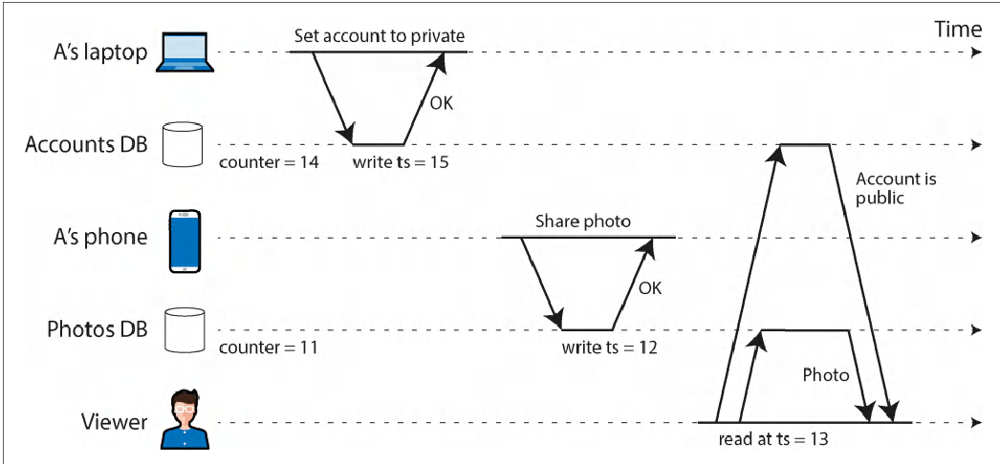

> 图 10-10。用户 A 先将账户设为私密，然后分享一张照片。如果使用不具备线性一致性的 ID 生成器，未经授权的查看者可能会看到该照片。  

账户权限和照片存储在两个独立的数据库中（或者同一数据库的不同分片中），假设它们使用 Lamport 时钟或混合逻辑时钟为每次写入分配时间戳。由于照片数据库没有从账户数据库读取数据，照片数据库中的本地计数器可能稍微落后，因此照片上传获得的时间戳可能小于账户设置更新的时间戳。  

现在，假设一位查看者（并非 A 的朋友）正在浏览 A 的个人资料，而这次读取使用了快照隔离的 MVCC 实现。查看者读取操作的时间戳可能大于照片上传的时间戳，却小于账户设置更新的时间戳。因此，系统会判定在读取时该账户仍然是公开的，进而向查看者展示他们本不该看到的尴尬照片。  

可以设想几种解决这个问题的方法。也许照片数据库应该在执行写入之前读取用户的账户状态，但这种检查很容易被忘记。如果 A 的操作是在同一台设备上完成的，也许设备上的应用可以跟踪该用户写入的最新时间戳；但如果像本例一样，用户同时使用笔记本电脑和手机，事情就没那么简单了。在这种情况下，最简单的解决方案是使用线性一致的 ID 生成器，它能确保照片上传获得的 ID 大于账户权限变更的 ID。  

### 实现线性一致的 ID 生成器  

确保 ID 分配具备线性一致性的最简单方法，就是实际使用单个节点来完成这项工作。该节点只需做三件事：收到请求时原子递增计数器并返回其值；持久化计数器值（这样节点崩溃并重启后就不会生成重复 ID）；以及通过复制实现容错（使用单主复制）。这种方法在实践中已有应用，例如，受 Google Percolator [59] 启发，TiDB/TiKV 将其称为时间戳预言机（timestamp oracle）。  

作为一种优化，可以避免为每个请求都执行磁盘写入和复制。ID 生成器可以改为写入一条描述一批 ID 的记录；该记录持久化并完成复制后，节点便可开始按顺序向客户端发放这些 ID。在这一批 ID 用完之前，它可以持久化并复制下一批的记录。这样一来，如果节点崩溃并重启，或者故障转移到从节点，一些 ID 会被跳过，但不会发放任何重复或乱序的 ID。  

你无法轻易对 ID 生成器进行分片，因为如果多个分片独立发放 ID，就无法再保证其顺序具备线性一致性。你也无法轻易把 ID 生成器分布到多个区域；因此，在地理分布式数据库中，所有 ID 请求都必须发送到单个区域内的某个节点。好的一面是，ID 生成器的工作非常简单，因此单个节点就能处理很高的请求吞吐量。  

如果不想使用单节点 ID 生成器，可以采用 Google Spanner 的做法，正如第 365 页“用同步时钟实现全局快照”中讨论的那样。它依赖一种物理时钟，该时钟返回的并非单个时间戳，而是一个表示时钟读数不确定性的时间戳范围。随后，Spanner 会等待这段不确定性区间的持续时间过去，再返回结果。  

假设不确定性区间是正确的（即真实的当前物理时间始终位于该区间内），这个过程同样可以保证：如果一个请求在另一个请求开始之前完成，后一个请求就会获得更大的时间戳。这种方法无需任何通信即可确保 ID 分配具备线性一致性；即使请求来自不同区域，也能正确排序，无需等待跨区域请求。缺点是，你需要硬件和软件支持，使时钟保持紧密同步并计算所需的不确定性区间。  

### 使用逻辑时钟强制实施约束  

在第 409 页“约束与唯一性保证”中，我们看到，线性一致的 CAS 操作可用于在分布式系统中实现锁、唯一性约束和类似构造。这就引出了一个问题：逻辑时钟或线性一致的 ID 生成器是否也足以实现这些功能？  

答案是：还不够。当多个节点都试图获取同一把锁或注册同一个用户名时，可以使用逻辑时钟为这些请求分配时间戳，并选择时间戳最小的请求作为胜者。如果时钟具备线性一致性，你就知道未来的任何请求总会生成更大的时间戳，因此可以确信，未来的请求不会获得比胜者更小的时间戳。  

遗憾的是，问题仍有一部分没有解决：一个节点如何知道自己的时间戳是不是最小的？为了确定这一点，它需要收到其他每一个可能生成过时间戳的节点的消息 [56]。如果其中某个节点此时已经发生故障，或因网络问题而无法访问，系统就会陷入停顿，因为我们无法确定该节点的时间戳是否更小。这并不是我们需要的容错系统。  

要以容错方式实现锁、租约和类似构造，我们需要比逻辑时钟或 ID 生成器更强的机制。我们需要共识。  

## 共识  

在本章中，我们已经看到几个例子：有些事情在只有单个节点时很容易，但如果还要求容错，就会困难得多：  

- 如果只有单个主节点，而且所有读写都在该主节点上进行，数据库就可以具备线性一致性。但如果这个主节点发生故障，如何在避免脑裂的同时进行故障转移？如何确保一个自认为是主节点的节点，没有在暂时停顿期间实际上已被投票罢免？  

- 单节点上具备线性一致性的 ID 生成器只是一个配有原子 fetch-and-add 指令的计数器——如果它崩溃了怎么办？  

- 例如，当多个进程竞相获取锁或租约时，原子 CAS 操作可用于决定谁能获得它，或者用于确保具有给定名称的文件或用户是唯一的。在单个节点上，CAS 可能只需一条 CPU 指令，但要如何使其具备容错能力？  

> [!NOTE]
> **共识的不可能性**
>
> 你可能听说过 *FLP 结果* [74]——它以作者 Fischer、Lynch 和 Paterson 的名字命名——该结果证明，只要节点存在崩溃的可能，就没有任何算法始终能够达成共识。在分布式系统中，我们必须假定节点可能崩溃，因此可靠的共识是不可能的。然而，我们却正在讨论达成共识的算法。这究竟是怎么回事？
>
> 首先，FLP 并不是说我们永远无法达成共识；它只是说，我们无法保证共识算法*总是*能够终止。此外，FLP 结果是在异步系统模型中假设算法具有确定性的前提下证明的（参见第 380 页的“系统模型与现实”），这意味着算法不能使用任何时钟或超时机制。如果它可以利用超时来怀疑另一个节点可能已经崩溃（即使这种怀疑有时是错误的），那么共识问题就变得可解 [75]。甚至只要允许算法使用随机数也足够了 [76]。
>
> 因此，尽管 FLP 关于共识不可能性的结果在理论上极其重要，但分布式系统在实践中通常能够达成共识。  

### 共识的多种面貌  

共识可以用多种方式来表述。例如：  

- 单值共识与原子 CAS 操作非常相似。它可用于实现锁、租约和唯一性约束。  

- 构建*仅追加日志*也需要共识，这通常被形式化为*全序广播*。有了日志，就可以实现状态机复制、基于主节点的复制、事件溯源及其他有用的模式。  

- 原子 fetch-and-add（或原子递增）操作也被证明等价于共识。  

- 多数据库或多分片事务的*原子提交*要求所有参与者就提交还是中止事务达成一致。  

事实上，这些问题全都彼此等价。如果你拥有一个能解决其中某个问题的算法，就可以把它转换为其他任一问题的解决方案。这是一个相当深刻、或许也令人惊讶的洞见。这也解释了为什么我们可以把这些表面看来迥然不同的事物统称为“共识”。下面逐一仔细考察，看看为何如此。  

#### 单值共识  

让多个节点就单个值达成一致的能力非常有用。例如：  

- 当采用单主复制的数据库首次启动，或现有主节点发生故障时，多个节点可能会同时尝试成为主节点。类似地，多个节点也可能竞相获取锁或租约。共识可以让它们决定谁胜出。  

- 如果多人同时尝试预订飞机上的最后一个座位或剧院里的同一个座位，或尝试用同一用户名注册账户，而又无法确定谁先到，那么共识算法可以决定谁应当成功。  

更一般地说，一个或多个节点可以提出值，而共识算法从这些值中决定一个。在这里给出的例子中，每个节点都可以提出自己的 ID，算法则决定哪个节点 ID 应成为新的主节点、租约持有者或飞机／剧院座位的购买者。在这种形式化定义下，共识算法必须满足以下性质 [28]：  

##### 一致同意  

任意两个节点都不会作出不同的决定。  

##### 完整性  

节点决定了一个值之后，就不能改变主意而决定另一个值。  

##### 有效性  

如果节点决定值 v，那么 v 必须曾由某个节点提出。  

##### 终止性  

每个未崩溃的节点最终都会决定一个值。  

如果要决定多个值，可以针对每个值分别运行一个共识算法实例。例如，可以为剧院中每个可预订的座位分别运行一次共识，从而为每个座位得到一个决定（一位购买者）。  

一致同意和完整性这两项性质定义了共识的核心思想：每个人都决定相同的结果，而且一旦作出决定，就不能再改变主意。有效性排除了平凡的解决方案——例如，可以设计一种无论提出什么都始终决定 null 的算法；这种算法满足一致同意和完整性，却不满足有效性。  

如果不关心容错，满足前三项性质很容易。只需硬编码一个节点作为“独裁者”，让该节点作出所有决定即可。然而，如果这个唯一的节点发生故障，系统就再也无法作出任何决定——就像没有故障转移的单主复制一样。所有困难都源于容错需求。  

终止性形式化了容错这一思想。它实质上是说，共识算法不能永远只是停在那里什么也不做——换言之，它必须取得进展。即使某些节点发生故障，其他节点仍必须作出决定。（终止性是一种活性性质，而其他三项是安全性性质——参见第 382 页的“区分安全性与活性”。）  

如果崩溃的节点可能恢复，你或许可以等它回来。然而，共识算法必须确保，即使崩溃的节点突然消失且永远不再回来，它也能作出决定。（不妨设想并非软件崩溃，而是地震引发山体滑坡，摧毁了节点所在的数据中心。你必须假定节点被埋在 30 英尺深的泥土下，再也不可能重新上线。）  

当然，如果所有节点都崩溃，没有任何节点运行，那么任何算法都不可能决定任何事情。算法能够容忍的故障数量是有限的。事实上，可以证明，任何共识算法要保证终止，都要求至少大多数节点正常运行 [75]。这些多数节点可以安全地构成法定人数（参见第 231 页的“使用法定人数进行读写”）。  

因此，终止性要以不可达节点少于半数为前提。不过，大多数共识算法都能确保，即使大多数节点发生故障或出现严重的网络问题，安全性性质——一致同意、完整性和有效性——也始终得到满足 [77]。因此，大规模故障可能使系统无法处理请求，却不能通过迫使共识系统作出不一致的决定而破坏它。  

#### 比较并设置作为共识  

CAS 操作会检查对象的当前值是否等于预期值。如果相等，它就以原子方式将对象更新为新值；否则，它保持对象不变并返回错误。  

如果拥有一种容错且线性一致的 CAS 操作，解决共识问题就很容易。先把对象初始化为 null 值，然后让每个想要提出值的节点执行一次 CAS，其中预期值为 null，新值为它想提出的值（假设该值非 null）。最终决定的值就是对象被设置成的值。  

同样，如果已有共识解决方案，就可以实现 CAS。每当一个或多个节点想以相同的预期值执行 CAS 时，就使用共识协议提出 CAS 调用中的新值，然后将对象设置为共识所决定的值。任何所提议的值未被选中的 CAS 调用都会返回错误。预期值不同的 CAS 调用则分别运行共识协议。  

这说明 CAS 与共识是等价的 [30, 75]。同样，两者在单个节点上都很直接，但要实现容错却很有挑战性。作为分布式环境中的 CAS 示例，我们在第 202 页的“以对象存储为后端的数据库”中见过对象存储的条件写入操作：只有当同名对象自当前客户端上次读取以来未被其他客户端创建或修改时，才允许执行写入。  

#### 共享日志作为共识  

我们已经见过多种日志，例如复制日志、事务日志和预写日志。日志存储一系列日志条目，任何读取它的人看到的条目及其顺序都相同。有时，日志只允许单个写入者追加新条目；而共享日志则允许多个节点请求追加条目。单主复制就是一个例子：任何客户端都可以请求主节点执行写入，主节点将其追加到复制日志中，然后所有从节点按照与主节点相同的顺序应用写入。  

更形式化地说，共享日志支持两种操作：请求向日志添加一个值，以及读取日志中的条目。它必须满足以下性质：  

##### 最终追加  

如果某个节点请求向日志添加一个值，并且该节点没有崩溃，那么该节点最终必须在某个日志条目中读到这个值。  

##### 可靠交付  

任何日志条目都不会丢失——如果一个节点读到了某个日志条目，那么最终每个未崩溃的节点也都必须读到该日志条目。  

##### 仅追加  

节点读到某个日志条目之后，该条目便不可变；新日志条目只能添加在它之后，不能添加在它之前。如果节点重新读取日志，它会以与最初读取时相同的顺序看到相同的日志条目（即使该节点曾崩溃并重启）。  

##### 一致同意  

如果两个节点都读到了日志条目 e，那么在 e 之前，它们必定以相同顺序读到了完全相同的日志条目序列。  

##### 有效性  

将该值添加到日志。  

> [!NOTE]
> 共享日志可以用全序广播协议实现，该协议也称为原子广播或全序组播协议 [28, 78, 79]。要向日志添加一个值，我们使用该协议“广播”它；当协议“交付”该值时，它就成为可读取的日志条目的一部分。

如果已有共享日志的实现，解决共识问题就很容易。每个想提出值的节点都请求将其添加到日志，而在第一个日志条目中读回的值就是最终决定的值。由于所有节点都按相同顺序读取日志条目，因此它们必然会就哪个值最先被交付达成一致 [30]。  

反过来，如果已有共识解决方案，就可以实现共享日志。细节稍微复杂一些，但基本思路如下 [75]：  

1. 为每个未来的日志条目准备一个槽位，并为每个这样的槽位分别运行一个共识算法实例，以决定该条目中应放入什么值。  

2. 当节点想向日志添加一个值时，它会针对一个尚未作出决定的槽位提出该值。  

3. 当共识算法对某个槽位作出决定，而且之前的所有槽位也都已经决定时，便将决定的值作为新日志条目追加；任何已作出决定的连续后续槽位，其决定值也会被追加到日志中。  

4. 如果某个提议值未被选入一个槽位，想添加它的节点就会针对更后面的槽位重新提出该值。  

这说明共识等价于全序广播和共享日志。没有故障转移的单主复制不满足活性要求，因为主节点崩溃后，它就会停止交付消息。和往常一样，挑战在于安全、自动地执行故障转移。  

#### Fetch-and-add 作为共识  

我们在第 423 页的“线性一致的 ID 生成器”中看到的线性一致 ID 生成器已经非常接近解决共识问题，但还差一点。可以使用 fetch-and-add 操作实现这样的 ID 生成器；该操作以原子方式递增计数器，并返回计数器的旧值。  

如果已有 CAS 操作，实现 fetch-and-add 就很容易。先读取计数器值，然后执行 CAS，其中预期值为刚读到的值，新值为该值加 1。如果 CAS 失败，就重试整个过程，直到 CAS 成功。在存在争用时，这种方式不如原生 fetch-and-add 操作高效，但功能上与其等价。既然可以用共识实现 CAS，也就可以用共识实现 fetch-and-add。  

反过来，如果拥有一种容错的 fetch-and-add 操作，能否解决共识问题？假设把计数器初始化为 0，每个想提出值的节点都调用 fetch-and-add 操作来递增计数器。由于 fetch-and-add 操作是原子的，会有一个节点读到初始值 0，其他所有节点则读到一个至少已经递增过一次的值。  

现在，假设读到 0 的节点获胜，并决定采用它的值。这对读到 0 的节点有效，但其他节点却遇到了问题：它们知道自己不是获胜者，却不知道其他节点中究竟谁获胜。获胜者可以向其他节点发送消息，告知自己已经获胜，但如果获胜者还没来得及发送消息就崩溃了呢？在这种情况下，其他节点会一直悬而未决，无法决定任何值，因此共识无法终止。其他节点也不能转而选择另一个节点，因为读到 0 的节点仍可能恢复，并理所当然地决定采用它所提出的值。  

如果我们能确定提出值的节点不超过两个，情况会是一个例外。此时，两个节点可以先相互发送自己想提出的值，然后各自执行 fetch-and-add 操作。读到 0 的节点决定采用自己的值，读到 1 的节点决定采用另一个节点的值。这就解决了两个节点的共识问题，因此我们说 fetch-and-add 的共识数为 2 [30]。相比之下，CAS 和共享日志能够为任意数量的提议节点解决共识问题，所以它们的共识数是 $\infty$（无穷大）。  

#### 原子提交作为共识  

在第 323 页的“分布式事务”中，我们见过*原子提交*问题，即确保参与分布式事务的数据库或分片要么全都提交事务，要么全都中止事务。我们还见过*两阶段提交*算法，它依赖一个作为单点故障的协调者。  

共识与原子提交之间是什么关系？乍看之下，它们似乎非常相似——两者都要求节点达成某种形式的一致。然而，两者有一个重要区别：对于共识，只要决定的是某个曾被提出的值就可以；而对于原子提交，只要有*任何*参与者投票中止，算法就*必须*中止。更准确地说，原子提交要求满足以下性质 [80]：  

##### 一致同意  

不可能出现一个节点提交而另一个节点中止的情况。  

##### 完整性  

节点一旦提交，就不能改变主意转为中止，反之亦然。  

##### 有效性  

如果一个节点提交，那么此前所有节点都必须投票提交。如果任何节点投票中止，所有节点都必须中止。  

##### 非平凡性  

如果所有节点都投票提交，并且没有发生通信超时，那么所有节点都必须提交。  

##### 终止性  

每个未崩溃的节点最终都要么提交，要么中止。  

有效性性质确保事务只有在所有节点都同意时才能提交，而非平凡性性质确保算法不能干脆总是中止（但如果节点之间的任何通信超时，它允许中止）。其他三个性质基本上与共识的性质相同。  

如果你有共识问题的解决方案，就可以通过多种方式解决原子提交问题 [80, 81]。其中一种方式如下：当你想提交事务时，每个节点都将自己对提交或中止的投票发送给其他所有节点。收到来自自身及其他每个节点的提交票的节点，通过共识算法提议“提交”；收到中止票或经历超时的节点，则通过共识算法提议“中止”。当节点得知共识算法的决定后，就相应地提交或中止。  

在这个算法中，只有当所有节点都投票提交时，才会有人提议“提交”。如果任何节点投票中止，共识算法中的所有提议都会是“中止”。如果所有节点都投票提交，但某些通信发生超时，就可能有些节点提议“中止”，而另一些节点提议“提交”；在这种情况下，节点究竟提交还是中止并不重要，只要它们都采取相同的行动即可。  

如果你有一个容错的原子提交协议，也可以用它解决共识问题。每个想要提议某个值的节点都在达到法定人数的节点上启动一个事务，并在每个节点上执行单节点 CAS：如果寄存器的值尚未被另一个事务设置，就将其设为提议值。如果 CAS 成功，该节点投票提交，否则投票中止。如果原子提交协议提交了某个事务，该事务的值就成为共识决定的值；如果原子提交中止，提议节点就用一个新事务重试。  

这表明原子提交与共识也彼此等价。  

## 实践中的共识  

我们已经看到，单值共识、CAS、共享日志和原子提交全都等价：你可以把其中任何一个问题的解决方案转换为其他任一问题的解决方案。这是一项很有价值的理论洞见，但它没有回答这个问题：在共识的众多表述方式中，哪一种在实践中最有用？  

答案是，大多数共识系统都提供共享日志（这是一种等价于全序广播的抽象）。Raft、Viewstamped Replication 和 Zab 直接提供共享日志。Paxos 提供单值共识，但实践中，大多数使用 Paxos 的系统实际上使用的是名为 Multi-Paxos 的扩展，它也提供共享日志。  

### 使用共享日志  

共享日志很适合数据库复制。如果每个日志条目都代表一次数据库写入，并且每个副本都使用确定性逻辑，以相同顺序处理相同的写入，那么所有副本最终都会处于一致的状态。这个思想称为*状态机复制* [82]，也是我们在第 101 页“事件溯源与命令查询职责分离（CQRS）”中看到的事件溯源背后的原理。共享日志对流处理也很有用，我们将在第 12 章看到这一点。  

类似地，共享日志可以用于实现可串行化事务。正如第 309 页“实际串行执行”中所讨论的，如果每个日志条目都代表一个将作为存储过程执行的确定性事务，并且每个节点都以相同顺序执行这些事务，那么这些事务将是可串行化的 [83, 84]。  

> [!NOTE]
> 采用强一致性模型的分片数据库通常为每个分片维护独立的日志，这提高了可扩展性，但限制了它们能够跨分片提供的一致性保证（例如，一致性快照、外键引用）。跨分片的可串行化事务是可行的，但需要额外的协调 [85]。

共享日志还很强大，因为它很容易适配为其他形式的共识：  

- 我们先前已经看到如何用它实现单值共识和 CAS：只需决定采用日志中最先出现的值。  

- 如果你需要许多个单值共识实例——比如剧院里的每个座位对应一个实例，而有多个人正在尝试订座——就在日志条目中包含座位号，并决定采用包含给定座位号的第一个日志条目。  

- 如果你想要原子的读取并累加（fetch-and-add），就把要加到计数器上的数放进一个日志条目，并让当前计数器值等于截至目前所有日志条目中数值的总和。对日志条目进行简单计数，就可以生成隔离令牌（参见第 374 页“隔离僵尸节点和延迟请求”）；例如，在 ZooKeeper 中，这个序列号称为 zxid [20]。  

### 从单主复制到共识  

我们先前看到，如果有一个做决定的“独裁者”节点，单值共识就很容易；同样，如果只允许单个主节点追加日志条目，共享日志也很容易实现。问题在于，当该节点发生故障时，如何提供容错能力。  

传统上，采用单主复制的数据库并不解决这个问题：它们把主节点故障转移留给人类管理员手动执行。遗憾的是，这意味着会有相当长的停机时间，因为人类的反应速度终究有限，而且这不满足共识的终止性性质。对于共识，我们要求算法能够自动选择新的主节点。（并非所有共识算法都有主节点，但常用的算法都有 [86, 87]。）  

这并不简单。我们先前讨论过脑裂问题，并确定所有节点都需要就谁是主节点达成一致——否则，两个节点可能都认为自己是主节点，并做出相互矛盾的决定。因此，看起来我们需要通过共识选举主节点，又需要主节点来解决共识。怎样才能摆脱这个困境？  

事实上，共识算法并不要求任何时刻都只能有一个主节点。相反，它们提供一种较弱的保证：定义一个纪元编号（在 Paxos 中称为选票编号，在 Viewstamped Replication 中称为视图编号，在 Raft 中称为任期编号），并保证在每个纪元内主节点是唯一的。  

当一个节点因为在某个超时时间内没有收到当前主节点的消息，而认为它已经宕机时，该节点可以发起投票来选举新的主节点。这次选举会获得一个新的纪元编号，它大于此前的任何纪元编号。如果两个纪元中的两个主节点发生冲突（或许是因为先前的主节点其实并未宕机），那么纪元编号更高的主节点胜出。  

在允许主节点向共享日志追加下一个条目之前，它必须先检查是否存在另一个具有更高纪元编号、可能追加不同条目的主节点。它可以通过收集法定数量节点的投票来做到这一点——通常是节点的多数，但并非总是如此 [88]。只有当一个节点不知道存在纪元更高的其他主节点时，它才会投赞成票。  

因此，我们有两轮投票：第一轮用于选择主节点，第二轮用于对主节点提议追加到日志中的下一个条目进行投票。这两轮投票的法定人数必须重叠：如果针对某个提议的投票成功，那么至少有一个投票支持它的节点也必定参加了最近一次成功的主节点选举 [88]。如果提议投票获得通过，并且没有暴露任何编号更高的纪元，当前主节点就可以断定没有纪元编号更高的主节点当选，因此可以安全地将提议的条目追加到日志中 [28, 89]。  

这两轮投票表面上看起来与 2PC（参见第 324 页“两阶段提交”）相似，但它们是截然不同的协议。在共识算法中，任何节点都可以发起选举，并且只需要法定数量的节点响应；在 2PC 中，只有协调者可以请求投票，而且必须获得每个参与者的赞成票才能提交。  

#### 共识的微妙之处  

这种基本结构是 Raft、Multi-Paxos、Viewstamped Replication 和 Zab 所共有的：由法定数量节点投票选举主节点，然后主节点想追加到日志中的每个条目都需要另一次法定人数投票 [70, 71]。每个新日志条目都会同步复制到法定数量的节点，之后才向请求该写入的客户端确认。这确保当前主节点发生故障时，日志条目不会丢失。  

然而，魔鬼藏在细节中，而这些算法也正是在细节上采取了不同的方法。例如，当旧主节点发生故障并选出新主节点时，算法需要确保新主节点认可旧主节点在故障前已经追加的所有日志条目。Raft 的做法是：只有当某个节点的日志至少与多数从节点的日志一样新时，才允许该节点成为新主节点 [71]。相比之下，Paxos 允许任何节点成为新主节点，但要求它在开始追加自己的新条目之前，先与其他节点同步，使其日志达到最新状态。  

> [!NOTE]
> **主节点选举中的一致性与可用性**
>
> 如果你希望共识算法严格保证第 429 页“共享日志作为共识”中列出的性质，那么至关重要的是：新主节点必须先拥有所有已确认的最新日志条目，才能处理任何写入或线性一致性读取。如果一个持有陈旧数据的节点成为新主节点，它可能会向旧主节点已经写过的日志条目写入新值，从而违反共享日志的只追加性质。  
>
> 在某些情况下，你可能会选择削弱共识性质，以便更快地从主节点故障中恢复，或者让恢复至少成为可能。例如，Kafka 提供启用*非干净主节点选举*（unclean leader election）的选项，允许任何副本成为主节点，即使它并非最新。此外，在采用异步复制的数据库中，当主节点发生故障时，你无法保证任何从节点都处于最新状态。  
>
> 如果取消新主节点必须处于最新状态的要求，或许可以提高性能和可用性，但这样做如履薄冰，因为共识理论将不再适用。只要不发生故障，一切都会正常运行，但第 9 章讨论的问题很容易导致数据丢失或损坏。  

另一个微妙之处在于，算法如何处理旧主节点在故障前已经提议、但追加到日志的投票尚未完成的日志条目。你可以在本章的参考文献中找到关于这些细节的讨论 [25, 71, 89]。  

对于使用共识算法进行复制的数据库，仅仅把写入转换为日志条目并将其复制到法定数量的节点还不够。如果想保证线性一致性读取，读取也必须像写入一样经过法定人数投票，以确认那个自认为是主节点的节点确实仍处于最新状态。例如，etcd 中的线性一致性读取就是这样工作的。  

大多数共识算法的标准形式都假设节点集合固定——也就是说，节点可以宕机后重新上线，但集群创建时就固定了允许投票的节点集合。在实践中，系统配置往往需要添加新节点或移除旧节点。共识算法已经扩展了重新配置功能，使这种操作成为可能。在向系统添加新区域或从一个位置迁移到另一个位置时，这尤其有用（先添加新节点，再移除旧节点）。  

### 共识的优缺点  

尽管共识算法复杂而微妙，但它们是分布式系统的一项重大突破。共识本质上是“正确实现的单主复制”：主节点发生故障时自动进行故障转移，并确保即使面对第 9 章讨论的所有问题，也不会丢失任何已提交的数据，也不可能发生脑裂。  

任何提供自动故障转移却不使用经过验证的共识算法的系统，都很可能是不安全的 [90]。使用经过验证的共识算法并不能保证整个系统都正确——仍有许多其他地方可能潜藏 bug——但这是一个良好的开端。  

然而，共识并非无处不在，因为获得这些好处需要付出代价。共识系统始终需要严格多数才能运行——要容忍一次故障需要三个节点，要容忍两次故障则需要五个节点。执行的每项操作都需要与法定数量的节点通信，因此不能通过添加更多节点来提高吞吐量（事实上，每添加一个节点都会让算法变慢）。如果网络分区将一些节点与其余节点隔离，只有占多数的网络分区能够继续推进，其他节点都会被阻塞。  

共识系统通常依赖超时来检测故障节点。在网络延迟高度多变的环境中，尤其是在跨多个地理区域分布的系统中，调整这些超时时间可能很困难。如果设置得太长，从故障中恢复会耗费很长时间；如果设置得太短，则会发生大量不必要的主节点选举，导致性能极差，因为系统最终花在选择主节点上的时间可能比完成有用工作的时间还多。  

有时，共识算法对网络问题尤其敏感。例如，已经发现 Raft 存在一些令人不快的边缘情况 [91, 92]。如果整个网络除某条特定网络链路持续不可靠之外都运行正常，Raft 可能陷入主节点身份不断在两个节点之间来回切换的局面，或者当前主节点不断被迫辞职，使系统实际上始终无法取得进展。原始 Raft 算法后来增加了预投票阶段来解决这个问题 [67]。Paxos 同样依赖主节点，也可能导致类似的性能问题。平等主义 Paxos（Egalitarian Paxos，EPaxos）及其衍生算法使用无主协议，对性能不佳的节点或网络连接更具韧性 [86]。  

## 协调服务  

共识算法对任何希望提供线性一致性操作的分布式数据库都有用，许多现代分布式数据库也使用它们进行复制。不过，有一类系统尤其频繁地使用共识：ZooKeeper、etcd 和 Consul 等*协调服务*。尽管这些系统表面上看起来与其他键值存储无异，但与大多数数据库不同，它们并不是为高写入量或通用数据存储而设计的。  

相反，它们旨在协调另一个分布式系统中的各个节点。例如，Kubernetes 依赖 etcd，而高可用模式下的 Spark 和 Flink 则依赖在后台运行的 ZooKeeper。协调服务旨在保存可以完全放入内存的少量数据（不过为了持久性，它们仍会写入磁盘），这些数据通过容错共识算法复制到多个节点。  

协调服务以 Google 的 Chubby 锁服务为原型 [19, 60]。它们将共识算法与其他几项功能结合起来，而这些功能事实证明对构建分布式系统特别有用：  

### 锁与租约  

我们先前已经看到，共识系统如何实现原子的、容错的 CAS 操作。协调服务依靠这种方法来实现锁和租约。如果多个节点并发尝试获取同一个租约，只有一个节点能够成功。  

### 隔离支持  

正如第 373 页“分布式锁与租约”中所讨论的，当资源受租约保护时，你需要*隔离*机制，以防客户端在进程暂停或网络严重延迟时相互干扰。共识系统可以通过为每个日志条目赋予单调递增的 ID 来生成隔离令牌（ZooKeeper 中的 zxid 和 cversion，etcd 中的 revision number）。  

### 故障检测  

客户端在协调服务上维持一个长时间存续的会话，并定期交换心跳，以检查另一节点是否仍然存活。即使连接暂时中断或服务器发生故障，客户端持有的任何租约仍然有效。但是，如果超过租约的超时时间仍没有心跳，协调服务就会认为客户端已经宕机并释放租约（ZooKeeper 将其称为*临时节点*）。  

### 变更通知  

客户端可以请求协调服务在特定键发生变化时向其发送通知。例如，这让客户端能够得知另一个客户端何时加入集群（依据它写入协调服务的值），或者另一个客户端是否发生故障（因为它的会话超时且临时节点消失）。这些通知使客户端不必频繁轮询服务来了解变更。  

故障检测和变更通知并不需要共识，但它们与确实需要共识的原子操作及隔离支持一起使用时，对分布式协调很有用。  

> [!NOTE]
> **使用协调服务管理配置**
>
> 应用程序和基础设施通常都有超时时间、线程池大小等配置参数。协调服务有时用来存储这类以键值对表示的配置数据。进程在启动时加载最新设置，并订阅任何变更的通知。当配置发生变化时，进程可以立即开始使用新设置，或者自行重启以加载最新变更。  
>
> 配置管理并不需要协调服务的共识能力，但如果你本来就已经运行了协调服务，那么使用它并依赖其通知功能会很方便。另一种做法是让进程定期从文件或 URL 轮询配置更新，这样就不需要专门的服务。  

### 向节点分配工作  

如果一个进程或服务有多个实例，并且需要选择其中一个作为主节点或主要实例，那么协调服务会很有用。如果主节点发生故障，其他节点之一应该接管。这对单主数据库是必要的，对作业调度器和类似的有状态系统也同样适用。  

另一个用例是：当你拥有分片资源（数据库、消息流、文件存储、分布式 actor 系统等），并且需要决定将哪个分片分配给哪个节点时。随着新节点加入集群，需要把一部分分片从现有节点移到新节点，以重新平衡负载。当节点被移除或发生故障时，其他节点需要接管故障节点的工作。  

这类任务可以通过审慎使用协调服务中的原子操作、临时节点和通知来实现。如果做得正确，这种方法可以让应用程序在无人干预的情况下自动从故障中恢复。即使已经出现 Apache Curator 之类的库，在 ZooKeeper 客户端 API 之上提供更高层工具，这件事仍然不容易——但它依然远胜于尝试从头实现必要的共识算法，因为后者极易产生 bug。  

专用协调服务还有一个优点：无论依赖它进行协调的分布式系统中有多少节点，它都可以在固定数量的节点（通常是三个或五个）上运行。例如，在拥有数千个分片的存储系统中，让共识算法在数千个节点上运行会极其低效；把共识“外包”给运行协调服务的少量节点要好得多。  

通常，协调服务管理的数据变化相当缓慢。这些数据表示诸如“运行在 IP 地址 10.1.1.23 上的节点是分片 7 的主节点”之类的信息，而这种分配通常以数分钟或数小时为时间尺度发生变化。协调服务并不用于存储每秒可能变化数千次的数据。对于这类数据，最好使用传统数据库；或者，也可以使用 Apache BookKeeper [93, 94] 等工具复制服务中快速变化的内部状态。  

### 服务发现  

ZooKeeper、etcd 和 Consul 也常用于*服务发现*——也就是找出为了访问某项特定服务而需要连接的 IP 地址（参见第 184 页“负载均衡器、服务发现和服务网格”）。在云环境中，虚拟机不断出现和消失是常态，因此你通常无法预先知道服务的 IP 地址。相反，可以配置服务，使其在启动时将网络端点注册到服务注册表中，之后其他服务就能在那里找到它们。  

使用协调服务来进行服务发现可能很方便，因为它的故障检测和变更通知功能让客户端能够轻松跟踪服务实例的加入和离开。而且，如果你已经在使用协调服务来管理租约、锁或主节点选举，那么也用它来进行服务发现是合乎情理的，因为它已经知道哪个节点应当接收针对你的服务的请求。  

然而，使用共识来进行服务发现往往有些大材小用。这种用例通常并不要求线性一致性，而服务发现的高可用和快速响应更为重要，因为一旦没有它，一切都会陷入停顿。因此，通常最好缓存服务发现信息。无法连接到服务的客户端可以绕过缓存，使用最新值重试，并在必要时更新缓存。也可以使用生存时间（TTL）配置定期刷新缓存。例如，基于 DNS 的服务发现使用多层缓存来实现良好的性能和可用性。  

为了支持这种用例，ZooKeeper 支持*观察者*。这些副本接收日志，并维护 ZooKeeper 中所存数据的一份副本，但不参与共识算法的投票过程。由于观察者的读取结果可能陈旧，因此并不具备线性一致性；但即使网络中断，它们仍然可用，而且通过缓存提高了系统所能支持的读取吞吐量。  

<a id="chapter-10-summary"></a>

## 小结  

本章探讨了容错系统中的强一致性：它是什么，以及如何实现它。我们深入研究了线性一致性——一种广受欢迎的强一致性形式化定义，它确保复制的数据看起来仿佛只有一份副本，所有操作都以原子方式作用于这份副本。我们看到，如果你需要读取到最新数据，或者需要解决竞态条件（例如多个节点同时尝试做同一件事，比如创建同名文件），线性一致性会很有用。  

线性一致性很有吸引力，因为它易于理解——它让数据库表现得像单线程程序中的一个变量——但缺点是速度慢，尤其是在网络延迟较大的环境中。许多复制算法并不保证线性一致性，尽管从表面上看，它们似乎提供了强一致性。  

接下来，我们将线性一致性的概念应用于 ID 生成器。单节点自增计数器具备线性一致性，但不具备容错能力。许多分布式 ID 生成方案并不保证 ID 的顺序与事件实际发生的顺序一致。Lamport 时钟和混合逻辑时钟等逻辑时钟所提供的顺序与因果关系一致，但不能确保线性一致性。  

这将我们引向了共识算法，它使实现容错且具备线性一致性的复制成为可能。线性一致性意味着，系统的行为必须如同数据只有一份副本，并且所有操作都按照明确定义的顺序，逐一作用于这份副本。共识通过让一组节点就唯一的操作序列达成一致来实现这一点，即使消息延迟或某些节点发生故障也不例外。这个操作序列让分布式系统表现得仿佛只有一个节点在按顺序处理操作，尽管实际上是一组节点在协同工作。  

共识的经典表述涉及决定一个值，使所有节点都同意所做的决定，而且不能反悔。事实上，很多问题都可以归约为共识，并且彼此等价（也就是说，如果你有其中一个问题的解决方案，就可以将它转换成所有其他问题的解决方案）。这些等价问题包括：  

### 具备线性一致性的 CAS 操作  

寄存器需要根据当前值是否等于操作中给定的参数，以原子方式*决定*是否设置其值。  

### 锁和租约  

当多个客户端同时尝试获取锁或租约时，锁会决定哪一个客户端成功获得它。  

### 唯一性约束  

当多个事务同时尝试创建键相同且相互冲突的记录时，约束必须*决定*允许哪一个事务，并让哪些事务因违反约束而失败。  

### 共享日志  

当多个节点同时希望向日志追加条目时，日志会决定追加这些条目的顺序。共享日志使用全序广播协议实现。  

### 原子事务提交  

参与分布式事务的所有数据库节点必须以相同的方式决定提交还是中止事务。  

### 具备线性一致性的 fetch-and-add 操作  

这种操作可用于实现 ID 生成器。多个节点可以同时调用该操作，而它会决定这些节点递增计数器的顺序。实际上，这种情况只能解决两个节点之间的共识，而其他情况适用于任意数量的节点。  

如果只有一个节点，或者你愿意把决策能力交给单个节点，那么所有这些问题都很容易解决。单主数据库正是如此：所有决策权都集中在主节点，因此这类数据库能够提供具备线性一致性的操作、唯一性约束、复制日志等功能。  

然而，如果这个唯一的主节点发生故障，或者网络中断导致主节点无法访问，那么在人工执行手动故障转移之前，这种系统将无法取得任何进展。Raft 和 Paxos 等广泛使用的共识算法，本质上是单主复制，并内置了自动主节点选举机制，以便在当前主节点发生故障时自动进行故障转移。  

共识算法经过精心设计，以确保故障转移期间不会丢失任何已提交的写入，并确保系统不会陷入多个节点同时接受写入的脑裂状态。这要求每次写入以及每次具备线性一致性的读取，都由节点法定人数（通常是多数节点）确认。这样做的成本可能很高，尤其是跨地理区域时，但如果你想要共识所提供的强一致性和容错能力，这一代价就无法避免。  

ZooKeeper 和 etcd 等协调服务也构建在共识算法之上。它们提供锁、租约、故障检测和变更通知等功能，可用于管理分布式应用程序的状态。如果你发现自己想做的事情可以归约为共识，而且希望它具备容错能力，建议使用协调服务。它不能保证你一定会做对，但很可能有所帮助。  

共识算法复杂而微妙，但自 20 世纪 80 年代以来发展起来的丰富理论为其提供了支撑。借助这些理论，我们可以构建出能够容忍第 9 章讨论的所有故障，同时仍能确保数据不被破坏的系统。这是一项了不起的成就，本章末尾的参考文献收录了其中一些杰出的工作。  

尽管如此，共识并不总是合适的工具。在一些系统中，并不需要它所提供的强一致性属性，而采用一致性较弱、可用性和性能更高的方案反而更好。在这些情况下，通常会使用我们在第 6 章讨论过的无主复制或多主复制。本章讨论的逻辑时钟在这种情境下很有帮助。  

## 参考文献  

[1] Maurice P. Herlihy 和 Jeannette M. Wing。《线性一致性：并发对象的一种正确性条件》。ACM Transactions on Programming Languages and Systems (TOPLAS)，第 12 卷，第 3 期，第 463–492 页，1990 年 7 月。doi:10.1145/78969.78972  

[2] Leslie Lamport。《论进程间通信》。*Distributed Computing*，第 1 卷，第 2 期，第 77–101 页，1986 年 6 月。*doi:10.1007/BF01786228*  

[3] David K. Gifford。《分散式计算机系统中的信息存储》。Xerox Palo Alto Research Centers，CSL-81-8，1981 年 6 月。归档于 perma.cc/2XXP-3JPB  

[4] Martin Kleppmann。《请不要再把数据库称为 CP 或 AP》。martin.kleppmann.com，2015 年 5 月。归档于 perma.cc/MJ5G-75GL  

[5] Kyle Kingsbury。《Jepsen：MongoDB 陈旧读取》。*aphyr.com*，2015 年 4 月。归档于 *perma.cc/DXB4-J4JC*  

[6] Kyle Kingsbury。《Knossos 中的计算技术》。*aphyr.com*，2014 年 5 月。归档于 *perma.cc/2X5M-EHTU*  

[7] Kyle Kingsbury 和 Peter Alvaro。《Elle：从实验观察中推断隔离异常》。Proceedings of the VLDB Endowment，第 14 卷，第 3 期，第 268–280 页，2020 年 11 月。doi:10.14778/3430915.3430918  

[8] Paolo Viotti 和 Marko Vukolić。《非事务型分布式存储系统中的一致性》。ACM Computing Surveys (CSUR)，第 49 卷，第 1 期，第 19 号文章，2016 年 6 月。doi:10.1145/2926965  

[9] Peter Bailis。《线性一致性与可串行化之比较》。bailis.org，2014 年 9 月。归档于 perma.cc/386B-KAC3  

[10] Daniel Abadi。《可串行化隔离下的正确性异常》。dbmsmusings.blogspot.com，2019 年 6 月。归档于 perma.cc/JGS7-BZFY  

[11] Peter Bailis、Aaron Davidson、Alan Fekete、Ali Ghodsi、Joseph M. Hellerstein 和 Ion Stoica。《高可用事务：优点与局限》。Proceedings of the VLDB Endowment，第 7 卷，第 3 期，第 181–192 页，2013 年 11 月。doi:10.14778/2732232.2732237，扩展版本以 arXiv:1302.0309 发布  

[12] Philip A. Bernstein、Vassos Hadzilacos 和 Nathan Goodman。*数据库系统中的并发控制与恢复*。Addison-Wesley，1987 年。ISBN: 9780201107159。可在 microsoft.com 在线获取。  

[13] Andrei Matei。《CockroachDB 的一致性模型》。cockroachlabs.com，2021 年 2 月。归档于 perma.cc/MR38-883B  

[14] Murat Demirbas。《严格可串行化，但代价是什么，目的又是什么？》。muratbuffalo.blogspot.com，2022 年 8 月。归档于 perma.cc/T8AY-N3U9  

[15] Doug Judd。《深入 Spanner：理解严格可串行化与外部一致性》。cloud.google.com，2023 年 4 月。归档于 perma.cc/KJ9F-BJ5T  

[16] FoundationDB 项目作者。《开发者指南》。apple.github.io。归档于 perma.cc/F53L-TM9P  

[17] Ben Darnell。《如何讨论分布式数据库中的一致性与隔离》。cockroachlabs.com，2022 年 2 月。归档于 perma.cc/53SV-JBGK  

[18] Daniel Abadi。《隔离级别与一致性级别之间差异的解释》。*dbmsmusing.blogspot.com*，2019 年 8 月。归档于 *perma.cc/QSF2-CD4P*  

[19] Mike Burrows。《面向松耦合分布式系统的 Chubby 锁服务》。第 7 届 USENIX 操作系统设计与实现研讨会（OSDI），2006 年 11 月。  

[20] Flavio P. Junqueira 和 Benjamin Reed。*ZooKeeper：分布式进程协调*。O'Reilly Media，2013 年。ISBN: 9781449361303  

[21] Murali Vallath。*Oracle 10g RAC 网格、服务与集群*。Elsevier Digital Press，2006 年。ISBN: 9781555583217  

[22] Peter Bailis、Alan Fekete、Michael J. Franklin、Ali Ghodsi、Joseph M. Hellerstein 和 Ion Stoica。《数据库系统中的协调规避》。Proceedings of the VLDB Endowment，第 8 卷，第 3 期，第 185–196 页，2014 年 11 月。doi:10.14778/2735508.2735509，扩展版本以 arXiv:1402.2237 发布  

[23] Kyle Kingsbury。《Jepsen：etcd 与 Consul》。aphyr.com，2014 年 6 月。归档于 perma.cc/XL7U-378K  

[24] Flavio P. Junqueira、Benjamin C. Reed 和 Marco Serafini。《Zab：面向主备系统的高性能广播》。第 41 届 IEEE 可靠系统与网络国际会议（DSN），2011 年 6 月。doi:10.1109/DSN.2011.5958223  

[25] Diego Ongaro 和 John K. Ousterhout。《寻找一种易于理解的共识算法》。USENIX 年度技术会议（ATC），2014 年 6 月。  

[26] Hagit Attiya、Amotz Bar-Noy 和 Danny Dolev。《在消息传递系统中稳健地共享内存》。Journal of the ACM，第 42 卷，第 1 期，第 124–142 页，1995 年 1 月。doi:10.1145/200836.200869  

[27] Nancy Lynch 和 Alex Shvartsman。《使用动态法定人数确认广播稳健地模拟共享内存》。第 27 届容错计算年度国际研讨会（FTCS），1997 年 6 月。doi:10.1109/FTCS.1997.614100  

[28] Christian Cachin、Rachid Guerraoui 和 Luís Rodrigues。*可靠且安全的分布式编程导论*，第 2 版。Springer，2011 年。ISBN: 9783642152597，doi:10.1007/978-3-642-15260-3  

[29] Niklas Ekström、Mikhail Panchenko 和 Jonathan Ellis。《读修复可能存在问题？》。*cassandra-dev* 邮件列表中的邮件讨论串，2012 年 10 月。归档于 *perma.cc/49GF-QMWA*  

[30] Maurice P. Herlihy。《无等待同步》。ACM Transactions on Programming Languages and Systems (TOPLAS)，第 13 卷，第 1 期，第 124–149 页，1991 年 1 月。doi:10.1145/114005.102808  

[31] Armando Fox 和 Eric A. Brewer。《收获率、产出率与可扩展容错系统》。第 7 届操作系统热点研讨会（HotOS），1999 年 3 月。doi:10.1109/HOTOS.1999.798396  

[32] Seth Gilbert 和 Nancy Lynch。《Brewer 猜想与一致、可用、分区容错 Web 服务的可行性》。ACM SIGACT News，第 33 卷，第 2 期，第 51–59 页，2002 年 6 月。doi:10.1145/564585.564601  

[33] Seth Gilbert 和 Nancy Lynch。《CAP 定理的不同视角》。IEEE Computer Magazine，第 45 卷，第 2 期，第 30–36 页，2012 年 2 月。doi:10.1109/MC.2011.389  

[34] Eric A. Brewer。《十二年后的 CAP：“规则”发生了怎样的变化》。IEEE Computer Magazine，第 45 卷，第 2 期，第 23–29 页，2012 年 2 月。doi:10.1109/MC.2012.37  

[35] Susan B. Davidson、Hector Garcia-Molina 和 Dale Skeen。《分区网络中的一致性》。ACM Computing Surveys，第 17 卷，第 3 期，第 341–370 页，1985 年 9 月。doi:10.1145/5505.5508  

[36] Paul R. Johnson 和 Robert H. Thomas。《RFC 677：重复数据库的维护》。Network Working Group，1975 年 1 月。  

[37] Michael J. Fischer 和 Alan Michael。《牺牲可串行化以在不可靠网络中实现数据高可用》。第 1 届 ACM 数据库系统原理研讨会（PODS），1982 年 3 月。doi:10.1145/588111.588124  

[38] Eric A. Brewer。《NoSQL：过去、现在与未来》。QCon San Francisco，2012 年 11 月。  

[39] Eric Brewer。《Spanner、TrueTime 与 CAP 定理》。research.google.com，2017 年 2 月。归档于 perma.cc/59UW-RH7N  

[40] Daniel J. Abadi。《现代分布式数据库系统设计中的一致性权衡》。IEEE Computer Magazine，第 45 卷，第 2 期，第 37–42 页，2012 年 2 月。doi:10.1109/MC.2012.33  

[41] Nancy A. Lynch。《分布式计算的一百个不可能性证明》。第 8 届 ACM 分布式计算原理研讨会（PODC），1989 年 8 月。doi:10.1145/72981.72982  

[42] Prince Mahajan、Lorenzo Alvisi 和 Mike Dahlin。《一致性、可用性与收敛性》。University of Texas at Austin，Department of Computer Science，技术报告 UTCS TR-11-22，2011 年 5 月。归档于 perma.cc/SAV8-9JAJ  

[43] Hagit Attiya、Faith Ellen 和 Adam Morrison。《高可用最终一致数据存储的局限》。ACM 分布式计算原理研讨会（PODC），2015 年 7 月。doi:10.1145/2767386.2767419  

[44] Adrian Cockcroft。《迁移到微服务》。QCon London，2014 年 3 月。  

[45] Martin Kleppmann。《对 CAP 定理的批判》。arXiv:1509.05393，2015 年 9 月。  

[46] Daniel Abadi。《CAP 的问题，以及 Yahoo 鲜为人知的 NoSQL 系统》。dbmsmusing.blogspot.com，2010 年 4 月。归档于 perma.cc/4NTZ-CLM9  

[47] Daniel Abadi。“Hazelcast 与虚构的 PA/EC 系统。”dbmsmusings.blogspot.com，2017 年 10 月。存档于 perma.cc/J5XM-U5C2  

[48] Peter Sewell、Susmit Sarkar、Scott Owens、Francesco Zappa Nardelli 和 Magnus O. Myreen。“x86-TSO：一个严谨且实用的 x86 多处理器程序员模型。”*Communications of the ACM*，第 53 卷，第 7 期，第 89–97 页，2010 年 7 月。doi:10.1145/1785414.1785443  

[49] Martin Thompson。“内存屏障／栅栏。”mechanical-sympathy.blogspot.co.uk，2011 年 7 月。存档于 perma.cc/7NXM-GC5U  

[50] Ulrich Drepper。“每位程序员都应该了解的内存知识。”akka-dia.org，2007 年 11 月。存档于 perma.cc/NU6Q-DRXZ  

[51] Hagit Attiya 和 Jennifer L. Welch。“顺序一致性与线性一致性的比较。”ACM Transactions on Computer Systems (TOCS)，第 12 卷，第 2 期，第 91–122 页，1994 年 5 月。doi:10.1145/176575.176576  

[52] Kyzer R. Davis、Brad G. Peabody 和 Paul J. Leach。“通用唯一标识符（UUID）。”RFC 9562，IETF，2024 年 5 月。  

[53] Ryan King。“Snowflake 发布公告。”blog.x.com，2010 年 6 月。存档于 archive.org  

[54] Alizain Feerasta。“通用唯一且按字典序可排序的标识符。”*github.com*，2016 年。存档于 *perma.cc/NV2Y-ZP8U*  

[55] Rob Conery。“一种更好的 PostgreSQL ID 生成器。”*bigmachine.io*，2014 年 5 月。存档于 *perma.cc/K7QV-3KFC*  

[56] Leslie Lamport。“分布式系统中的时间、时钟和事件排序。”*Communications of the ACM*，第 21 卷，第 7 期，第 558–565 页，1978 年 7 月。doi:10.1145/359545.359563  

[57] Sandeep S. Kulkarni、Murat Demirbas、Deepak Madeppa、Bharadwaj Avva 和 Marcelo Leone。“逻辑物理时钟。”第 18 届分布式系统原理国际会议（OPODIS），2014 年 12 月。doi:10.1007/978-3-319-14472-6_2  

[58] Manuel Bravo、Nuno Diegues、Jingna Zeng、Paolo Romano 和 Luís Rodrigues。“在云中使用时钟实施一致性。”IEEE Data Engineering Bulletin，第 38 卷，第 1 期，第 18–31 页，2015 年 3 月。存档于 perma.cc/68ZU-45SH  

[59] Daniel Peng 和 Frank Dabek。“使用分布式事务和通知进行大规模增量处理。”第 9 届 USENIX 操作系统设计与实现会议（OSDI），2010 年 10 月。  

[60] Tushar Deepak Chandra、Robert Griesemer 和 Joshua Redstone。“Paxos 的实际应用——工程视角。”第 26 届 ACM 分布式计算原理研讨会（PODC），2007 年 6 月。doi:10.1145/1281100.1281103  

[61] Will Portnoy。“实现 Paxos 的经验教训。”blog.willportnoy.com，2012 年 6 月。存档于 perma.cc/QHD9-FDD2  

[62] Brian M. Oki 和 Barbara H. Liskov。“视图戳复制：一种支持高可用分布式系统的新型主副本方法。”第 7 届 ACM 分布式计算原理研讨会（PODC），1988 年 8 月。doi:10.1145/62546.62549  

[63] Barbara H. Liskov 和 James Cowling。“重新审视视图戳复制。”麻省理工学院，技术报告 MIT-CSAIL-TR-2012-021，2012 年 7 月。存档于 perma.cc/56SJ-WENQ  

[64] Leslie Lamport。“兼职议会。”ACM Transactions on Computer Systems，第 16 卷，第 2 期，第 133–169 页，1998 年 5 月。doi:10.1145/279227.279229  

[65] Leslie Lamport。“Paxos 简明讲解。”ACM SIGACT News，第 32 卷，第 4 期，第 51–58 页，2001 年 12 月。存档于 perma.cc/82HP-MNKE  

[66] Robbert van Renesse 和 Deniz Altinbuken。“中等复杂的 Paxos。”
ACM Computing Surveys (CSUR)，第 47 卷，第 3 期，第 42 号文章，2015 年 2 月。
doi:10.1145/2673577  

[67] Diego Ongaro。“共识：连接理论与实践。”博士学位论文，斯坦福大学，2014 年 8 月。存档于 perma.cc/5VTZ-2ADH  

[68] Heidi Howard、Malte Schwarzkopf、Anil Madhavapeddy 和 Jon Crowcroft。“重新审视 Raft：我们达成共识了吗？”ACM SIGOPS Operating Systems Review，第 49 卷，第 1 期，第 12–21 页，2015 年 1 月。doi:10.1145/2723872.2723876  

[69] André Medeiros。“ZooKeeper 的原子广播协议：理论与实践。”阿尔托大学理学院，2012 年 3 月。存档于 perma.cc/FVL4-JMVA  

[70] Robbert van Renesse、Nicolas Schiper 和 Fred B. Schneider。“差异万岁：Paxos、视图戳复制与 Zab 的比较。”IEEE Transactions on Dependable and Secure Computing，第 12 卷，第 4 期，第 472–484 页，2014 年 9 月。doi:10.1109/TDSC.2014.2355848  

[71] Heidi Howard 和 Richard Mortier。“Paxos 与 Raft：我们是否已就分布式共识达成共识？”第 7 届一致性分布式数据原理与实践研讨会（PaPoC），2020 年 4 月。doi:10.1145/3380787.3393681  

[72] Miguel Castro 和 Barbara H. Liskov。“实用拜占庭容错与主动恢复。”ACM Transactions on Computer Systems，第 20 卷，第 4 期，第 396–461 页，2002 年 11 月。doi:10.1145/571637.571640  

[73] Shehar Bano、Alberto Sonnino、Mustafa Al-Bassam、Sarah Azouvi、Patrick McCorry、Sarah Meiklejohn 和 George Danezis。“SoK：区块链时代的共识。”第 1 届 ACM 金融技术进展会议（AFT），2019 年 10 月。doi:10.1145/3318041.3355458  

[74] Michael J. Fischer、Nancy Lynch 和 Michael S. Paterson。“存在一个故障进程时分布式共识的不可能性。”Journal of the ACM，第 32 卷，第 2 期，第 374–382 页，1985 年 4 月。doi:10.1145/3149.214121  

[75] Tushar Deepak Chandra 和 Sam Toueg。“用于可靠分布式系统的不可靠故障检测器。”Journal of the ACM，第 43 卷，第 2 期，第 225–267 页，1996 年 3 月。doi:10.1145/226643.226647  

[76] Michael Ben-Or。“自由选择的另一个优势：完全异步的共识协议。”第 2 届 ACM 分布式计算原理研讨会（PODC），1983 年 8 月。doi:10.1145/800221.806707  

[77] Cynthia Dwork、Nancy Lynch 和 Larry Stockmeyer。“部分同步条件下的共识。”Journal of the ACM，第 35 卷，第 2 期，第 288–323 页，1988 年 4 月。doi:10.1145/42282.42283  

[78] Xavier Défago、André Schiper 和 Péter Urbán。“全序广播与多播算法：分类与综述。”ACM Computing Surveys，第 36 卷，第 4 期，第 372–421 页，2004 年 12 月。doi:10.1145/1041680.1041682  

[79] Hagit Attiya 和 Jennifer Welch。*分布式计算：基础、仿真与高级主题*，第 2 版。John Wiley & Sons，2004 年。ISBN: 9780471453246，doi:10.1002/0471478210  

[80] Rachid Guerraoui。“重新审视非阻塞原子提交与共识之间的关系。”第 9 届分布式算法国际研讨会（WDAG），1995 年 9 月。doi:10.1007/BFb0022140  

[81] Jim N. Gray 和 Leslie Lamport。“事务提交共识。”ACM Transactions on Database Systems (TODS)，第 31 卷，第 1 期，第 133–160 页，2006 年 3 月。doi:10.1145/1132863.1132867  

[82] Fred B. Schneider。“使用状态机方法实现容错服务：教程。”ACM Computing Surveys，第 22 卷，第 4 期，第 299–319 页，1990 年 12 月。doi:10.1145/98163.98167  

[83] Alexander Thomson、Thaddeus Diamond、Shu-Chun Weng、Kun Ren、Philip Shao 和 Daniel J. Abadi。“Calvin：面向分片数据库系统的快速分布式事务。”ACM 数据管理国际会议（SIGMOD），2012 年 5 月。doi:10.1145/2213836.2213838  

[84] Mahesh Balakrishnan、Dahlia Malkhi、Ted Wobber、Ming Wu、Vijayan Prabhakaran、Michael Wei、John D. Davis、Sriram Rao、Tao Zou 和 Aviad Zuck。“Tango：共享日志之上的分布式数据结构。”第 24 届 ACM 操作系统原理研讨会（SOSP），2013 年 11 月。doi:10.1145/2517349.2522732  

[85] Mahesh Balakrishnan、Dahlia Malkhi、Vijayan Prabhakaran、Ted Wobber、Michael Wei 和 John D. Davis。“CORFU：面向闪存集群的共享日志设计。”第 9 届 USENIX 网络系统设计与实现研讨会（NSDI），2012 年 4 月。  

[86] Iulian Moraru、David G. Andersen 和 Michael Kaminsky。“平权议会中存在更多共识。”第 24 届 ACM 操作系统原理研讨会（SOSP），2013 年 11 月。doi:10.1145/2517349.2517350  

[87] Vasilis Gavrielatos、Antonios Katsarakis 和 Vijay Nagarajan。“Odyssey：现代硬件对强一致复制协议的影响。”第 16 届欧洲计算机系统会议（EuroSys），2021 年 4 月。doi:10.1145/3447786.3456240  

[88] Heidi Howard、Dahlia Malkhi 和 Alexander Spiegelman。“灵活 Paxos：重新审视法定人数交集。”第 20 届分布式系统原理国际会议（OPODIS），2016 年 12 月。doi:10.4230/LIPIcs.OPODIS.2016.25  

[89] Martin Kleppmann。“分布式系统。”课程讲义。剑桥大学，2024 年 10 月。存档于 perma.cc/SS3Q-FNS5  

[90] Kyle Kingsbury。“Jepsen：Elasticsearch 1.5.0。”*aphyr.com*，2015 年 4 月。存档于 *perma.cc/37MZ-JT7H*  

[91] Heidi Howard 和 Jon Crowcroft。“Coracle：在互联网边缘评估共识。”ACM 数据通信特别兴趣组年度会议（SIGCOMM），2015 年 8 月。doi:10.1145/2829988.2790010  

[92] Tom Lianza 和 Chris Snook。“现实世界中的一次拜占庭故障。”blog.cloudflare.com，2020 年 11 月。存档于 perma.cc/83EZ-ALCY  

[93] Ivan Kelly。“BookKeeper 教程。”github.com，2014 年 10 月。存档于
perma.cc/37Y6-VZWU  

[94] Jack Vanlightly。“Apache BookKeeper 深入解析，第 1 部分——外部共识与动态成员关系。”*medium.com*，2021 年 11 月。存档于 *perma.cc/3MDB-8GFB*  

# 批处理

如果一个系统受到某个人过于强烈的影响，它就不可能成功。初始设计完成并且相当稳健之后，真正的考验才刚刚开始：持有许多不同观点的人将各自展开实验。  

——Donald Knuth，《TeX 的错误》（1989）  

到目前为止，本书的大部分内容都在讨论请求和查询，以及与之相应的响应或结果。许多现代数据系统都以这种数据处理方式为前提：你请求某个东西，或者发出一条指令，系统则力求尽快给你答案。  

Web 浏览器请求页面、服务调用远程 API，以及数据库、缓存、搜索索引和许多其他系统，都以这种方式工作。我们称之为在线系统。响应时间通常是衡量其性能的首要指标，而它们往往还需要具备容错能力，以确保高可用性。  

然而，有时你需要运行规模更大的计算，或处理超出单次交互式请求能力范围的更多数据。也许你需要训练 AI 模型，将大量数据从一种形式转换为另一种形式，或者在非常大的数据集上进行分析计算。我们把这些任务称为批处理作业，而处理它们的系统有时称为离线系统。  

批处理作业接收输入数据（只读），并生成输出数据（每次运行作业时都从头生成）。它通常不会像读写事务那样修改数据。因此，输出是从输入派生而来的（如第 10 页“记录系统与派生数据”所述）。如果你不满意输出结果，可以将其删除、调整作业逻辑，然后重新运行作业。  

通过将输入视为不可变数据并避免副作用（例如写入外部数据库），批处理作业既能获得良好的性能，也能带来其他好处：  

- 如果代码中引入了缺陷，导致输出错误或损坏，你只需回滚到代码的先前版本并重新运行作业，输出就会恢复正确。更简单的做法是，将旧输出保留在另一个目录中，需要时再切换回去。大多数对象存储和开放表格式（参见第 135 页“云数据仓库”）都支持这一特性，它被称为时间旅行。大多数支持读写事务的数据库不具备这种性质：如果你部署了有缺陷的代码，向数据库写入了错误数据，回滚代码并不能修复这些数据。这种能够从代码缺陷中恢复的理念被称为人因容错 [1]。  

- 得益于这种易于回滚的特性，功能开发可以比在错误可能造成不可逆损害的环境中推进得更快。这种尽量减少不可逆性的原则对敏捷软件开发很有益处 [2]。  

- 同一组文件可以作为各种类型作业的输入，其中包括计算指标并评估某项作业的输出是否符合预期特征的监控作业（例如，将它与上一次运行的输出进行比较并衡量差异）。  

- 批处理框架可以高效利用计算资源。虽然也可以通过 OLTP 数据库和应用服务器等在线数据系统来批量处理数据，但就所需资源而言，这样做的成本可能高得多。  

批处理已在广泛的用例中证明了自身价值，我们将在第 476 页“批处理用例”中再次讨论这些用例。然而，它也带来了一些挑战。在大多数框架中，只有整个作业完成之后，其他作业才能处理其输出。批处理也可能效率不高；输入数据发生任何变化——哪怕只有一个字节——都要求批处理作业重新处理整个输入数据集。  

批处理作业可能需要很长时间才能运行完毕：几分钟、几小时，甚至几天。作业可能按周期调度运行（例如每天一次）。衡量性能的首要指标通常是吞吐量：作业在单位时间内可以处理多少数据。有些批处理系统通过直接中止并重启整个作业来应对故障，另一些系统则具备容错能力，即使部分节点崩溃，作业仍能成功完成。  

在线处理系统与批处理系统之间的界限并不总是很清晰；一个长时间运行的数据库查询看起来就很像批处理过程。不过，批处理也有一些独特特征，使其成为构建可靠、可扩展且可维护应用程序的实用构件。例如，它经常在数据集成中发挥作用——组合多个数据系统，以完成单个系统无法独立完成的任务。第 7 页“数据仓库”中讨论的 ETL 就是一个例子。  

> [!NOTE]
> 批处理的另一种选择是流处理：作业处理完输入后并不会结束运行，而是继续监视输入，并在输入发生变化后不久处理这些变化。我们将在第 12 章讨论流处理。

现代批处理深受 MapReduce 的影响。MapReduce 是 Google 于 2004 年发表的一种批处理算法 [3]，后来在 Hadoop、CouchDB 和 MongoDB 等多种开源数据系统中得到实现。MapReduce 是一种相当底层的编程模型，其复杂程度不及数据仓库等系统中的并行查询执行引擎 [4, 5]。刚出现时，MapReduce 提升了商用硬件所能达到的处理规模，但如今它在很大程度上已经过时，Google 也不再使用它 [6, 7]。  

如今，批处理更多地使用 Spark、Flink 等框架或数据仓库查询引擎来完成。与 MapReduce 一样，它们高度依赖分片（参见第 7 章）和并行执行，但拥有复杂得多的缓存与执行策略。随着这些系统日趋成熟，运维方面的问题已基本解决，因此关注重点转向了易用性。数据流 API、查询语言和 DataFrame API 等新型处理模型如今已得到广泛支持。作业与工作流编排也已成熟。以 Hadoop 为中心的 Oozie 和 Azkaban 等工作流调度器，已被 Airflow、Dagster 和 Prefect 等更通用的解决方案取代；后者支持种类繁多的批处理框架和云数据仓库。  

云计算已经无处不在。批处理存储层正在从 HDFS（Hadoop Distributed File System）、GlusterFS 和 CephFS 等分布式文件系统（DFS）转向 S3 等对象存储系统。BigQuery 和 Snowflake 等可扩展云数据仓库正在模糊数据仓库与批处理之间的界限。  

为了直观理解批处理的内涵，本章首先会介绍一个在单机上使用标准 Unix 工具的示例。接下来，我们将研究如何把数据处理扩展到分布式系统中的多台机器。我们会看到，分布式批处理框架与操作系统非常相似，都有调度器和文件系统。随后，我们将探索用于编写批处理作业的各种处理模型。最后，我们将讨论常见的批处理用例。  

## 使用 Unix 工具进行批处理

假设你有一台 Web 服务器，每处理一个请求，都会向日志文件追加一行。例如，使用 NGINX 默认的访问日志格式时，日志中的一行可能如下所示：

```text
216.58.210.78 - - [27/Jun/2025:17:55:11 +0000] "GET /css/typography.css HTTP/1.1"
200 3377 "https://martin.kleppmann.com/" "Mozilla/5.0 (Macintosh; Intel Mac OS X
10_15_7) AppleWebKit/537.36 (KHTML, like Gecko) Chrome/137.0.0.0 Safari/537.36"
```

（这实际上是一行；为了便于阅读，这里将它拆成了多行。）这一行包含大量信息。要解读它，你需要查看日志格式的定义，如下所示：

```text
$remote_addr - $remote_user [$time_local] "$request"
$status $body_bytes_sent "$http_referer" "$http_user_agent"
```

因此，这一行日志表明：2025 年 6 月 27 日 17:55:11（UTC），服务器收到了来自客户端 IP 地址 216.58.210.78、请求文件 `/css/typography.css` 的请求。用户未经身份认证，因此 `$remote_user` 被设为连字符（`-`）。响应状态为 200（即请求成功），响应大小为 3,377 字节。Web 浏览器是 Chrome 137；它之所以加载该文件，是因为 URL 为 https://martin.kleppmann.com/ 的页面引用了这个文件。

尽管日志解析看起来可能有些刻意，但它是许多现代科技公司运营中的关键环节，用途涵盖从广告流水线到支付处理的方方面面。事实上，它正是 MapReduce 得以迅速普及以及“大数据”运动兴起的重要推动力。

### 简单的日志分析

有各种工具可以读取这些日志文件，并生成美观的网站流量报告，但作为练习，我们使用基本的 Unix 工具自己构建一个。例如，假设你想找出网站上最受欢迎的五个页面。可以在 Unix shell 中执行以下命令：

```text
cat /var/log/nginx/access.log | ①
awk '{print $7}' | ②
sort | ③
uniq -c | ④
sort -r -n | ⑤
head -n 5 | ⑥
```

① 读取日志文件。（严格来说，这里不需要 cat，因为可以直接将输入文件作为参数传给 awk。不过，写成这样更容易看出线性流水线的结构。）

② 按空白字符将每一行拆分成字段，并且只输出每行的第七个字段，而这个字段恰好就是请求的 URL。在我们的示例行中，这个 URL 是 /css/typography.css。

③ 按字母顺序对请求 URL 列表进行排序。排序是为了确保：如果某个 URL 被请求了 n 次，排序后的文件就会连续出现 n 个相同的 URL。

④ uniq 命令通过检查相邻两行是否相同，过滤掉输入中的重复行。-c 选项让它同时输出计数器：对于每个不同的 URL，它会报告该 URL 在输入中出现了多少次。

⑤ 第二个 sort 按每行开头的数字（-n）排序，这个数字就是该 URL 被请求的次数。然后它以逆序（-r）返回结果——最大的数字排在最前面。

⑥ 最后，head 只输出输入的前五行（-n 5），丢弃其余内容。这一系列命令的输出大致如下：

```text
4189 /favicon.ico
3631 /2016/02/08/how-to-do-distributed-locking.html
2124 /2020/11/18/distributed-systems-and-elliptic-curves.html
1369 /
915 /css/typography.css
```

如果你不熟悉 Unix 工具，前面的命令行可能看起来有些晦涩，但它的能力极其强大。它能在几秒内处理数 GB 的日志文件，而且你可以轻松修改分析方式来满足自己的需求。例如，如果想从报告中排除 CSS 文件，可以把 awk 参数改为 `$7!~/\.css$/{print $7}`；如果想统计最常见的客户端 IP 地址而不是最热门的页面，可以把 awk 参数改为 `{print $1}`，依此类推。

本书没有足够的篇幅详细探讨 Unix 工具，但它们非常值得学习。许多数据分析都可以通过组合使用 awk、sed、grep、sort、uniq 和 xargs 在几分钟内完成，而且其性能好得惊人[8]。

## 命令链与自定义程序

除了 Unix 命令链，你也可以编写一个简单程序来完成同样的工作。例如，用 Python 可以写成这样：

```python
from collections import defaultdict

counts = defaultdict(int)  # ①

with open('/var/log/nginx/access.log', 'r') as file:
    for line in file:
        url = line.split()[6]  # ②
        counts[url] += 1  # ③

top5 = sorted(((count, url) for url, count in counts.items()), reverse=True)[:5]  # ④

for count, url in top5:
    print(f"{count} {url}")  # ⑤
```

① 将 counts 初始化为一个哈希表，其中为每个见过的 URL 保存一个出现次数计数器。每个计数器的初始值为 0。

② 从日志的每一行中取得所请求的 URL，也就是以空白字符分隔的第七个字段（数组索引为 6，因为 Python 数组的索引从零开始）。

③ 递增日志当前行中 URL 的计数器。

④ 按计数器的值（降序）对哈希表内容排序，并取前五项。

⑤ 输出这五项。

这个程序不如 Unix 命令链简洁，但可读性相当不错，而你更喜欢哪一种，在一定程度上只是品味问题。不过，除了表面的语法差异，两者的执行流程也存在重大区别；如果在大文件上运行这项分析，这种区别就会显现出来。

### 排序与内存内聚合

Python 脚本在内存中维护一个 URL 哈希表，把每个 URL 映射到它的出现次数。Unix 流水线示例没有这样的哈希表，而是依赖对 URL 列表进行排序，其中同一个 URL 的多次出现只是重复记录而已。

哪种方法更好？这取决于 URL 的数量。对于大多数中小型网站，你大概可以用（比如说）1 GB 内存容纳所有不同的 URL 以及每个 URL 的计数器。在这个例子中，作业的工作集（作业需要随机访问的内存量）只取决于不同 URL 的数量。如果一个 URL 有一百万条日志记录，哈希表所需的空间仍然只是一个 URL 加上计数器的大小。如果这个工作集足够小，内存内哈希表就能很好地工作——即使是在笔记本电脑上也是如此。

另一方面，如果作业的工作集大于可用内存，排序方法的优势在于能够高效利用磁盘。这与第 118 页“日志结构存储”中讨论的原理相同：可以在内存中对数据块排序，将其作为分段文件写入磁盘，然后把多个有序分段归并成一个更大的有序文件。归并排序采用顺序访问模式，在磁盘上表现良好（参见第 130 页“SSD 上的顺序写入与随机写入”）。

GNU Coreutils（Linux）中的 sort 工具会通过溢写到磁盘来自动处理超出内存容量的数据集，还会自动在多个 CPU 核心上并行执行排序[9]。这意味着我们之前看到的简单 Unix 命令链可以轻松扩展到大型数据集，而不会耗尽内存。瓶颈很可能是从磁盘读取输入文件的速率。

Unix 工具的一个局限是它们只能在单台机器上运行。对于大到无法装入内存或本地磁盘的数据集，这就成了问题——而这正是分布式批处理框架的用武之地。

### 分布式系统中的批处理

运行上述 Unix 工具示例的机器包含多个相互协作、共同处理日志数据的组件：

- 通过操作系统的文件系统接口访问的存储设备

- 决定进程何时运行以及如何为其分配 CPU 资源的调度器

- 一系列 Unix 程序，其标准输入和标准输出（stdin 和 stdout）通过管道连接在一起

分布式数据处理框架中也存在同样的组件。事实上，你可以把这些框架看作分布式操作系统；它们拥有文件系统、作业调度器，以及通过文件系统或其他通信通道彼此发送数据的程序。

## 分布式文件系统

操作系统提供的文件系统由若干层组成：

- 在最底层，块设备驱动程序直接与磁盘通信，使上层能够读写原始块。

- 块层之上是页缓存，它将最近访问过的块保存在内存中，以便更快地访问。

- 文件系统层封装了块 API，把大文件拆分成块，并跟踪 inode、目录和文件等文件元数据。例如，Linux 上两种常见的实现是 ext4 和 XFS。

- 最后，操作系统通过一个称为虚拟文件系统（VFS）的公共 API 向应用程序公开不同的文件系统。无论底层采用何种文件系统，VFS 都让应用程序能够以标准方式进行读写。

分布式文件系统的工作方式大致相同。文件被拆分成块，这些块分布在许多机器上。DFS 块通常比本地块大得多。HDFS 的默认块大小为 128 MB，而 JuiceFS 和许多对象存储使用 4 MB 的块——远大于 ext4 的 4,096 字节。块越大，需要跟踪的元数据就越少，这对 PB 级数据集影响很大。大块还降低了相对于读取块而言的寻道开销。

大多数物理存储设备无法写入不完整的块，因此即使数据没有占满整个块，操作系统也要求写入一个完整的块。分布式文件系统的块更大，而且通常构建在操作系统文件系统之上，因此没有这一要求。例如，一个采用 128 MB 块存储的 900 MB 文件会有七个占用 128 MB 的块，以及一个占用 4 MB 的块。

读取 DFS 块时，需要向集群中存储该块的机器发出网络请求。每台机器都运行一个守护进程，通过 API 允许远程进程以其本地文件系统中的文件形式读写块。HDFS 把这些守护进程称为 DataNode，而 GlusterFS 称之为 glusterfsd 进程。本书将它们称为数据节点。

分布式文件系统还实现了与页缓存对应的分布式机制。由于 DFS 块以文件形式存储在数据节点上，读写操作会经过每个数据节点的操作系统，其中就包括内存内页缓存。这会把经常读取的数据块保留在数据节点的内存中。一些分布式文件系统还实现了更多缓存层级，例如 JuiceFS 中的客户端缓存和本地磁盘缓存。

ext4 和 XFS 等文件系统会跟踪存储元数据，包括空闲空间、文件块位置、目录结构、权限设置等。分布式文件系统同样需要某种方式来跟踪分散在多台机器上的文件位置、权限设置等信息。Hadoop 有一个名为 NameNode 的服务，用来维护集群元数据。DeepSeek 的 3FS 有一个元数据服务，会将其数据持久化到 FoundationDB 等键值存储中。

文件系统之上是 VFS。在批处理中，与它非常接近的对应物是分布式文件系统的协议。分布式文件系统必须公开某种协议或接口，以便批处理系统读写文件。该协议充当可插拔接口；只要实现了这个协议，就可以使用任何 DFS。例如，Amazon S3 的 API 已被 MinIO、Cloudflare R2、Tigris、Backblaze B2 等众多存储系统广泛采用。支持 S3 的批处理系统可以使用其中任何一种存储系统。

一些 DFS 实现了符合 POSIX 的文件系统，在操作系统的 VFS 看来，它们与其他文件系统无异。用户空间文件系统（FUSE）或网络文件系统（NFS）协议常用于集成 VFS。NFS 也许是最广为人知的分布式文件系统协议。该协议最初是为了让多个客户端能够读写单台服务器上的数据而开发的。最近，Amazon Elastic File System（EFS）和 Archil 等文件系统提供了兼容 NFS、可扩展性高得多的分布式文件系统实现。NFS 客户端仍然连接到单个端点，但在底层，这些系统会与分布式元数据服务和数据节点通信，以读写数据。

> [!NOTE]
> **分布式文件系统与网络存储**
>
> 分布式文件系统基于*无共享*原则（参见第 51 页“共享内存、共享磁盘与无共享架构”），这与网络附加存储（NAS）和存储区域网络（SAN）架构的共享磁盘方法形成对比。共享磁盘存储由集中式存储设备实现，通常使用定制硬件和光纤通道等专用网络基础设施。另一方面，无共享方法不需要任何专用硬件，只需要由常规数据中心网络连接的计算机。

许多分布式文件系统构建在商用硬件之上；这种硬件成本较低，但故障率高于企业级硬件。为了容忍机器和磁盘故障，文件块会复制到多台机器上。这样也能让调度器更均匀地分配工作负载，因为它可以在任何包含任务输入数据副本的节点上执行任务。

复制可以只是像第 6 章所述那样，在多台机器上保留相同数据的多个副本；也可以采用 Reed–Solomon 码等*纠删码*方案，它能以低于完整复制的存储开销恢复丢失的数据[10, 11, 12]。这些技术与 RAID 类似，后者在连接到同一台机器的多块磁盘之间提供冗余；区别在于，分布式文件系统通过常规数据中心网络进行文件访问和复制，无需专用硬件。

### 对象存储

Amazon S3、Google Cloud Storage、Azure Blob Storage 和 OpenStack Swift 等对象存储服务已经成为批处理作业中分布式文件系统的常见替代方案。事实上，两者之间的界限有些模糊。正如上一节和第 202 页“由对象存储支持的数据库”中所述，FUSE 驱动程序允许用户把 S3 等对象存储当作文件系统使用。JuiceFS 和 Ceph 等一些 DFS 实现同时提供对象存储 API 和文件系统 API。不过，它们的 API、性能和一致性保证差异很大。采用此类系统时必须谨慎，确保其行为符合预期，即便它们看起来实现了所需的 API。

对象存储中的每个对象都有一个 URL，例如 s3://my-photo-bucket/2025/04/01/birthday.png。URL 的主机部分（my-photo-bucket）表示存储对象的存储桶，之后的部分是对象的键（在本例中为 /2025/04/01/birthday.png）。存储桶的名称全局唯一，每个对象的键在其存储桶内也必须唯一。

对象通过 get 调用读取，通过 put 调用写入。与文件系统上的文件不同，对象写入后便不可变。要更新对象，必须通过 put 调用完整地重写它，这与键值存储类似。Azure Blob Storage 和 S3 Express One Zone 支持追加，但其他大多数存储不支持。对象存储也没有包含 fopen 和 fseek 等函数的文件句柄 API。

对象看起来可能像是组织在目录中，这有些令人困惑，因为对象存储并没有目录这一概念。路径结构只是一种约定，斜杠也是对象键的一部分。借助这种约定，可以通过请求列出具有特定前缀的对象，执行类似目录列表的操作。不过，按前缀列出对象与文件系统的目录列表有两点不同：

- 前缀列表操作的行为类似 Unix 系统上的递归 ls -R 调用。它返回所有以该前缀开头的对象，也包括子路径中的对象。

- 空目录不可能存在。如果删除 s3://my-photo-bucket/2025/04/01 下的所有对象，那么在 s3://my-photo-bucket/2025/04 上调用 list 时，01 就不会再出现。常见做法是创建一个零字节对象来表示空目录（例如，创建一个空的 s3://my-photo-bucket/2025/04/01 文件，以便在删除所有子对象后仍然保留它）。

DFS 实现通常支持硬链接、符号链接、文件锁和原子重命名等常见文件系统操作。对象存储则缺少这些特性。它们通常不支持链接和锁，而重命名并非原子操作；实现方式是先把对象复制到新键，再删除旧对象。如果想重命名一个目录，就必须逐一重命名其中的每个对象，因为目录名是键的一部分。

第 4 章讨论的键值存储针对小值（通常为 KB 级）以及频繁、低延迟的读写进行了优化。相比之下，分布式文件系统和对象存储通常针对大型对象（MB 到 GB 级）以及频率较低、数据量较大的读取进行了优化。不过，最近对象存储已经开始支持频繁且较小的读写。例如，S3 Express One Zone 现在可以提供 1 毫秒延迟，其定价模型也更接近键值存储。

分布式文件系统与对象存储的另一个区别是，HDFS 等 DFS 允许计算任务在存有特定文件副本的机器上运行。这样，任务无需通过网络传输该文件即可读取它；如果任务的可执行代码小于它需要读取的文件，就能节省带宽。另一方面，对象存储通常将存储与计算分离。这样做可能消耗更多带宽，但现代数据中心网络速度很快，因此通常可以接受。由于两者解耦，这种架构还允许 CPU 和内存等机器资源独立于存储进行扩缩容。

## 分布式作业编排  

操作系统的类比也适用于作业编排。当你执行一个 Unix 批处理作业时，需要有某种机制实际运行 awk、sort、uniq 和 head 进程。数据需要从一个进程的输出传输到另一个进程的输入，必须为每个进程分配内存，公平地调度各进程的指令并在 CPU 上执行，必须强制实施内存和 I/O 边界，等等。在单台机器上，这类工作由操作系统内核负责。在分布式环境中，这是作业编排器的职责。  

批处理框架向编排器的调度器发送运行作业的请求。启动作业的请求包含如下元数据：  

- 要执行的任务数量  

- 每个任务所需的内存、CPU 和磁盘容量  

- 作业标识符  

- 访问凭据  

- 输入和输出数据等作业参数  

- GPU 或磁盘类型等必要的硬件信息  

- 作业可执行代码的位置  

Kubernetes 和 Hadoop YARN（Yet Another Resource Negotiator，另一种资源协调器）[13] 等编排器将这些信息与集群元数据相结合，使用以下组件执行作业：  

### 任务执行器  

集群中的每个节点上都运行着一个执行器守护进程，例如 YARN 的 `NodeManager` 或 Kubernetes 的 `kubelet`。执行器负责运行作业任务、发送心跳以表明自身仍然存活，以及跟踪节点上的任务状态与资源分配情况。当任务启动请求发送给执行器时，它会获取作业的可执行代码，并运行命令以启动任务。随后，执行器会监控该进程，直至其完成或失败，并相应地更新任务状态元数据。  

许多执行器还与操作系统协同工作，同时提供安全隔离和性能隔离。例如，YARN 和 Kubernetes 使用 Linux cgroups。这可以防止任务在未经许可的情况下访问数据，也可以防止任务因过度使用资源而对节点上其他任务的性能产生负面影响。  

## 资源管理器  

编排器的资源管理器存储每个节点的元数据，包括可用硬件（CPU、GPU、内存、磁盘等）、任务状态、网络位置、节点状态以及其他相关信息。因此，资源管理器提供了集群当前状态的全局视图。资源管理器的集中式特性可能造成可扩展性和可用性瓶颈。YARN 使用 ZooKeeper，而 Kubernetes 使用 etcd 来存储集群状态（参见第 437 页的“协调服务”）。  

## 调度器  

编排器通常有一个集中式调度器子系统，用于接收启动、停止作业或检查作业状态的请求。例如，调度器可能收到一个请求，要求在配有特定类型 GPU 的节点上，使用某个特定 Docker 镜像启动一个包含 10 个任务的作业。调度器利用请求中的信息和资源管理器的状态，确定在哪些节点上运行哪些任务。随后，任务执行器会获知分配给它们的工作并开始执行。  

尽管每种编排器使用的术语不同，但几乎所有编排系统中都能找到这些组件。  

> [!NOTE]
> 有时，调度决策需要使用应用专用调度器，以便考虑特定需求，例如当某种查询达到指定阈值时自动扩缩容只读副本。集中式调度器与应用专用调度器协同工作，共同确定执行任务的最佳方式。YARN 将其子调度器称为 ApplicationMaster，而 Kubernetes 将其称为 operator。

### 资源分配  

调度器在作业编排中扮演着格外具有挑战性的角色。它们必须设法在需求相互竞争的作业之间，以最优方式分配集群有限的资源。从根本上说，这些决策必须在公平性与效率之间取得平衡。  

设想一个包含五个节点的小型集群，共有 160 个可用 CPU 核。集群的调度器收到两个作业请求，每个作业都需要 100 个核来完成工作。怎样调度这个工作负载才最好？  

- 调度器可以决定为每个作业运行 80 个任务，并随着先前任务完成，再启动每个作业余下的 20 个任务。  

- 调度器可以先运行某个作业的全部任务，等到有 100 个核可用时再开始运行第二个作业的任务（这种策略称为成组调度，gang scheduling）。  

- 如果第二个作业请求比第一个晚到很久，调度器掌握的信息就不完整。它必须决定是将全部 100 个核分配给第一个作业，还是预留一部分，以备将来某个可能到来、也可能永远不会到来的作业使用。  

这是一个非常简单的例子，但我们已经能看到许多棘手的权衡。例如，在成组调度的场景中，如果调度器预留 CPU 核，直到 100 个核同时可用，节点就会处于空闲状态。集群的资源利用率会下降；如果其他作业也试图预留 CPU 核，还可能发生死锁。  

另一方面，如果调度器只是等待 100 个核变为可用，其他作业可能会在此期间抢占这些核。集群可能在很长一段时间内都无法凑出 100 个可用核，从而导致*饥饿*。或者，调度器可以决定*抢占*第一个作业的一些任务，将其终止，为第二个作业腾出空间。然而，任务抢占也会降低集群效率，因为被终止的任务之后还需要重新启动。  

现在，设想一个调度器必须为数百乃至数百万个这样的作业请求做出分配决策。寻找最优解似乎难以实现。事实上，这个问题是 NP 难问题，这意味着，除了规模最小的示例之外，计算最优解都会慢得令人无法接受 [14, 15]。  

因此在实践中，调度器使用启发式方法做出并非最优但还算合理的决策。常用的算法有多种，包括先进先出（FIFO）、主导资源公平性（DRF）、优先级队列、基于容量或配额的调度，以及各种装箱算法。这些算法的细节超出了本书的讨论范围，但它们是一个引人入胜的研究领域。  

### 工作流调度  

第 454 页“简单日志分析”中的 Unix 工具示例包含由 Unix 管道连接起来的一连串命令。分布式批处理也会出现同样的模式：一个作业的输出常常需要成为一个或多个其他作业的输入，而每个作业也可能有多个由其他作业产生的输入。这称为作业的工作流或有向无环图（DAG）。  

> [!NOTE]
> 在第 187 页的“持久化执行与工作流”中，我们介绍了为一系列步骤提供持久化执行的工作流引擎，这些步骤通常会执行 RPC。在批处理的语境中，“工作流”的含义有所不同：它是一系列批处理过程，每个过程接收输入数据并生成输出数据，但通常不会向外部服务发起 RPC。持久化执行引擎每个请求处理的数据量通常少于批处理引擎，不过两者之间的界线有些模糊。

#### 由多个作业组成的工作流可能出于以下几个原因而必不可少：  

- 如果一个作业的输出需要成为由不同团队维护的多个其他作业的输入，那么第一个作业最好将输出写入所有其他作业都能读取的位置。之后，每当这些数据更新时，就可以调度这些消费作业运行；也可以按照其他计划运行。  

- 你可能希望将数据从一种处理工具传递给另一种。例如，一个 Spark 作业可以将数据输出到 HDFS，然后由 Python 脚本触发 Trino SQL 查询（参见第 135 页的“云数据仓库”），进一步处理 HDFS 上的文件并输出到 S3。  

- 有些数据流水线内部需要多个处理阶段。例如，如果某个阶段需要按一个键对数据分片，而下一阶段需要按另一个键分片，那么第一个阶段可以按照第二个阶段所需的方式输出分片数据。  

在 Unix 工具示例中，连接一个命令的输出与另一个命令输入的管道只使用很小的内存缓冲区，不会将数据写入文件。如果该缓冲区已满，生产进程就必须等待消费进程从缓冲区中读取一些数据，才能继续输出——这是一种背压形式。Spark、Flink 和其他批处理执行引擎也支持类似的模型，即一个任务的输出会直接传递给另一个任务（如果任务运行在不同的机器上，则通过网络传递）。  

不过，更常见的做法是让工作流中的一个作业将其输出写入分布式文件系统或对象存储，再由下一个作业从那里读取。这使作业彼此解耦，因而可以在不同时间运行。如果一个作业有多个输入，工作流调度器通常会等到生成其所有输入的作业都成功完成后，才运行消费这些输入的作业。  

YARN 的 ResourceManager 或 Spark 内置调度器等编排框架中的调度器并不管理整个工作流；它们以单个作业为单位进行调度。为了处理作业执行之间的这些依赖关系，人们开发了多种工作流调度器，包括 Airflow、Dagster 和 Prefect。工作流调度器提供了一些管理功能，在维护大量批处理作业时非常有用。包含 50 到 100 个作业的工作流在许多数据流水线中很常见；在大型组织中，许多团队可能会运行跨多个系统、相互读取对方输出的作业或工作流。工具支持对于管理如此复杂的数据流至关重要。  

### 故障处理  

批处理作业往往会长时间运行。包含大量并行任务的长时间运行作业，很可能在执行途中遇到至少一次任务失败。正如第 44 页的“硬件与软件故障”和第 347 页的“不可靠的网络”中所讨论的，这可能由多种原因造成，包括硬件故障（尤其是在商用硬件上）或网络中断。  

任务无法完成运行的另一个原因是，调度器可能会有意抢占（终止）它。如果你有多个优先级，例如运行成本较低的低优先级任务和成本较高的高优先级任务，抢占就特别有用。只要有闲置计算能力，低优先级任务就可以运行，但如果有更高优先级的任务到来，它们随时都有被抢占的风险。这种更便宜的低优先级虚拟机，在 Amazon EC2 上称为 spot instance，在 Azure 上称为 spot virtual machine，在 Google Cloud 上称为 preemptible instance [16]。  

批处理通常用于时间不敏感的作业，因此非常适合使用低优先级任务和 spot instance 来降低作业运行成本。本质上，这些作业可以使用原本会闲置的剩余计算资源，从而提高集群利用率。不过，这也意味着这些任务更有可能被调度器终止，因为抢占发生得比硬件故障更频繁 [17]。  

由于批处理作业每次运行都会从头重新生成输出，因此与在线系统相比，任务失败更容易处理。系统可以删除失败执行产生的部分输出，并调度该任务在另一台机器上重新运行。不过，仅因一个任务失败就重新运行整个作业会造成浪费。因此，MapReduce 及其后继系统让并行任务的执行彼此独立，从而能以单个任务为粒度重试工作 [3]。  

当一个任务的输出作为工作流的一部分成为另一个任务的输入时，容错会更加棘手。MapReduce 的解决办法是始终将这种中间数据写回分布式文件系统，并等待写入任务成功完成，之后才允许其他任务读取数据。即使在抢占很常见的环境中，这种方法也能奏效，但它会对 DFS 产生大量写入，效率可能不高。  

Spark 将中间数据保存在内存中（如果放不下，就将其“溢写”到本地磁盘），只把最终结果写入 DFS。它还会跟踪中间数据的计算方式，以便在数据丢失时重新计算 [18]。Flink 采用另一种方法：定期为任务状态生成检查点快照 [19]。我们将在第 468 页的“数据流引擎”中回到这个话题。  

## 批处理模型  

我们已经了解了如何在分布式环境中调度批处理作业。现在来看看批处理框架如何处理数据。最常见的两种模型是 MapReduce 和数据流引擎。尽管在实践中数据流引擎已在很大程度上取代 MapReduce，但了解 MapReduce 的工作原理仍然很有帮助，因为它影响了许多现代批处理框架。  

MapReduce 和数据流引擎已经发展到支持多种编程模型，包括底层编程 API、关系查询语言和 DataFrame API。丰富的选择使应用工程师、分析工程师、业务分析师乃至非技术员工都能针对各种用例处理公司数据，我们将在第 476 页的“批处理用例”中讨论这些用例。  

### MapReduce  

MapReduce 中的数据处理模式与第 454 页“简单日志分析”中的 Web 服务器日志分析示例非常相似：  

1. 读取一组输入文件，并将其拆分为记录。在 Web 服务器日志示例中，每条记录是日志中的一行（即以 `\n` 作为记录分隔符）。在 Hadoop 的 MapReduce 中，输入文件存储在 HDFS 等分布式文件系统或 S3 等对象存储中。可以使用多种文件格式，例如 Apache Parquet（一种列式格式，参见第 136 页的“列式存储”）或 Apache Avro（一种行式格式，参见第 172 页的“Avro”）。  

2. 调用 mapper 函数，从每条输入记录中提取键和值。在 Unix 工具示例中，mapper 函数是 `awk '{print $7}'`，它提取 URL（`$7`）作为键，并将值留空。  

3. 按键对所有键值对排序。在日志示例中，这是由第一个 `sort` 命令完成的。  

4. 调用 reducer 函数，迭代排序后的键值对。如果同一个键出现多次，排序会使它们在列表中彼此相邻，因此无需在内存中保存大量状态，就能轻松合并这些值。在 Unix 工具示例中，reducer 由 `uniq -c` 命令实现，该命令统计具有相同键的相邻记录数。  

这四个步骤可以由一个 MapReduce 作业完成。步骤 2（map）和步骤 4（reduce）需要由你编写自定义数据处理代码。步骤 1（将文件拆分为记录）由输入格式解析器处理。步骤 3，即排序步骤，隐含在 MapReduce 中——你不必编写它，因为 mapper 的输出在交给 reducer 之前总会经过排序。这一排序步骤是一种基础的批处理算法，我们将在第 469 页的“数据混洗”中再次讨论它。  

要创建 MapReduce 作业，你需要实现 mapper 和 reducer 两个回调函数，其行为如下：  

### Mapper  

每条输入记录都会调用一次 mapper，它的任务是从记录中提取键和值。对于每个输入，它可以生成任意数量的键值对（也可以一个都不生成）。它不会把任何状态从一条输入记录保留到下一条，因此每条记录都会独立处理。可以有许多 mapper，在输入的不同部分上并行运行。  

### Reducer  

MapReduce 框架接收 mapper 生成的键值对，收集属于同一个键的所有值，并以该值集合的迭代器作为参数调用 reducer。reducer 可以生成输出记录（例如同一个 URL 出现的次数）。不同键的 reducer 也可以并行运行。  

在 Web 服务器日志示例中，步骤 5 有第二个 `sort` 命令，它按照请求次数对 URL 排名。在 MapReduce 中，如果需要第二个排序阶段，可以通过编写第二个 MapReduce 作业来实现，并将第一个作业的输出作为第二个作业的输入。从这个角度看，mapper 的作用是将数据转换成适合排序的形式，为排序准备数据；reducer 的作用则是处理已经排序的数据。  

> [!NOTE]
> **MapReduce 与函数式编程**
>
> 尽管 MapReduce 用于批处理，但其编程模型源自函数式编程。Lisp 将 map 和 reduce（或 fold）作为针对列表的高阶函数引入，后来它们也进入了 Python、Rust 和 Java 等主流语言。  
>
> 许多常见的数据处理操作，包括 SQL 提供的操作，都可以在 MapReduce 之上实现。避免可变状态这一函数式编程原则有助于实现并行执行。由于 mapper 和 reducer 的每次调用都只依赖 MapReduce 框架显式传递给这些函数的数据，框架可以自由地在不同节点上并行运行相互独立的调用。如果任务失败，框架也可以在另一个节点上，用相同的输入再次调用 mapper 和 reducer。  
>
> 使用原始 MapReduce API 实现复杂的处理作业其实相当费力——例如，作业使用的任何连接算法都必须从头实现 [20]。与更现代的批处理器相比，MapReduce 也相当慢。原因之一是，其基于文件的 I/O 阻碍了作业流水线化（即在上游作业完成之前，让下游作业开始处理输出数据）。  

### 数据流引擎  

为了解决 MapReduce 的一些问题，人们开发了多种用于分布式批计算的新执行引擎，其中最著名的是 Spark [18, 21] 和 Flink [19]。它们的设计有所不同，但有一个共同点：它们将整个工作流作为一个作业处理，而不是将其拆分成相互独立的子作业。  

由于这些系统显式地对数据流经多个处理阶段的过程进行建模，因此被称为*数据流引擎*。与 MapReduce 一样，它们支持底层 API，反复调用用户定义的函数，每次处理一条记录；但它们也提供 *join* 和 *group by* 等更高层级的算子。它们通过对输入分片来并行化工作，并通过网络复制一个任务的输出，使其成为另一个任务的输入。与 MapReduce 不同，算子不必严格交替扮演 map 和 reduce 的角色，而是能以更灵活的方式组合。  

这些数据流 API 通常使用关系式构件来表达计算：根据某个字段的值连接数据集；按键对元组分组；按条件过滤；以及通过计数、求和或其他函数聚合元组。在内部，这些操作使用下一节将讨论的混洗算法实现。  

这种处理引擎的风格源自 Dryad [22] 和
Nephele [23] 等研究系统；与 MapReduce 模型相比，它有以下几个优点：  

- 排序等昂贵工作只需在必要的位置执行，而不必默认在每个 map 和 reduce 阶段之间都执行。  

- 当连续多个算子不会改变数据集的分片方式时（例如 map 或 filter），可以把它们合并到一个任务中，从而减少数据复制开销。  

- 由于工作流中的所有连接和数据依赖关系都已显式声明，调度器可以全局掌握哪里需要哪些数据，从而进行局部性优化。例如，它可以尝试将消费某些数据的任务放在生成这些数据的任务所在的同一台机器上，这样数据就可以通过共享内存缓冲区交换，而不必通过网络复制。  

- 算子之间的中间状态通常只需保存在内存中或写入本地磁盘，这比写入分布式文件系统或对象存储所需的 I/O 更少（写入后者时，必须把数据复制到多台机器，并写入每个副本所在机器的磁盘）。MapReduce 已经对 mapper 的输出采用了这种优化，而数据流引擎将这一思路推广到了所有中间状态。  

- 算子可以在其输入就绪后立即开始执行；无需等待前一个阶段全部完成，下一阶段才开始。  

- 现有进程可以复用于运行新的算子，与 MapReduce（为每个任务启动一个新的 JVM）相比，减少了启动开销。  

你可以使用数据流引擎实现与 MapReduce 工作流相同的计算，而且由于这里所述的优化，它们的执行速度通常要快得多。  

### 数据混洗  

正如我们所见，本章开头的 Unix 工具示例和 MapReduce 都以排序为基础。批处理器需要能够对 PB 级数据集进行排序，而这些数据集太大，无法装入单台机器。因此，它们需要一种输入和输出均被分片的分布式排序算法。这种算法称为混洗（shuffle）。  

> [!NOTE]
> **混洗并非随机**
>
> “混洗”这个术语可能会令人困惑。洗一副牌时，最终得到的是随机顺序。相比之下，我们所说的混洗会产生有序的结果，其中没有任何随机性。

混洗是批处理器的一种基础算法，用于联结和聚合。MapReduce、Spark、Flink、Daft、Dataflow 和 BigQuery[24] 都实现了可扩展的高性能混洗算法，以处理大型数据集。我们将以 Hadoop MapReduce[25] 中的混洗为例进行说明，但本节的概念也适用于其他系统。  

图 11-1 展示了一个 MapReduce 作业中的数据流。我们假设作业的输入已被分片，并将这些分片标记为 m 1、m 2 和 m 3。例如，每个分片可以是 HDFS 上的单独文件，也可以是对象存储中的单独对象；属于同一数据集的所有分片会被归入同一个 HDFS 目录，或者在对象存储桶中具有相同的键前缀。  

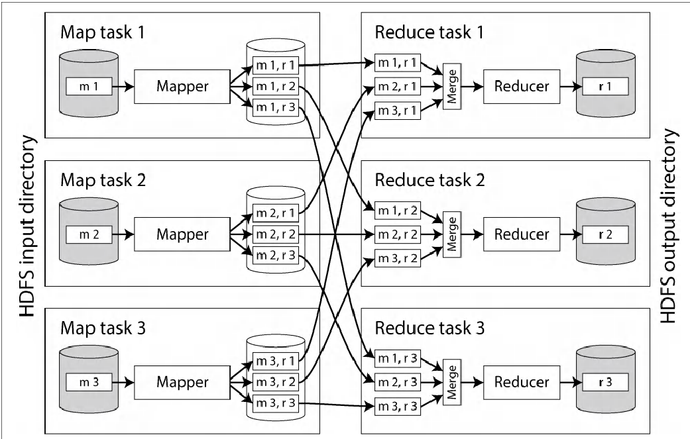

> 图 11-1。一个包含三个 mapper 和三个 reducer 的 MapReduce 作业。  

框架为每个输入分片启动一个独立的 map 任务。任务读取分配给它的文件，并逐条将记录传给 mapper 回调函数。计算的 reduce 端同样会被分片。map 任务的数量由输入分片数决定，而 reduce 任务的数量则由作业编写者配置（可以不同于 map 任务数）。  

mapper 的输出由键值对组成，框架需要确保：如果两个 mapper 输出了相同的键，这些键值对最终会由同一个 reducer 任务处理。为此，每个 mapper 都会在本地磁盘上为每个 reducer 分别创建一个输出文件（例如，图 11-1 中的文件 m 1, r 2 是 mapper 1 创建的文件，其中包含要发送给 reducer 2 的数据）。mapper 输出一个键值对时，通常会根据键的哈希值决定将其写入哪个 reducer 文件（类似于第 258 页“按键的哈希值分片”中所述的过程）。  

mapper 写入这些文件的同时，还会对每个文件内的键值对进行排序。这可以采用第 118 页“日志结构存储”中介绍的技术：先将一批批键值对收集到内存中的有序数据结构里，再写出为有序的段文件，并逐步将较小的段文件合并成较大的段文件。  

每个 mapper 完成后，reducer 会连接到它，并把相应的有序键值对文件复制到自己的本地磁盘。reduce 任务收齐所有 mapper 输出中属于自己的部分后，会以归并排序的方式合并这些文件，同时保持排序顺序。此时，具有相同键的键值对会连续排列，即使它们来自不同的 mapper。随后，每个键调用一次 reducer 函数，每次传入一个能够返回该键所有值的迭代器。  

reducer 函数输出的所有记录都会依次写入文件，每个 reduce 任务对应一个文件。这些文件（图 11-1 中的 r 1、r 2 和 r 3）成为作业输出数据集的各个分片，并被写回分布式文件系统或对象存储。  

虽然 MapReduce 在 map 和 reduce 步骤之间执行混洗，但现代数据流引擎和云数据仓库更加复杂。BigQuery 等系统优化了混洗算法，使数据尽可能保留在内存中，并将数据写入外部排序服务[24]。这类服务可以加速混洗，并通过复制混洗后的数据来提供容错能力。  

## 联结与分组  

下面看看有序数据如何简化分布式联结和聚合。尽管这些概念适用于大多数批处理系统，我们仍以 MapReduce 为例进行说明。  

图 11-2 展示了批处理作业中一个典型的联结示例。左侧是事件日志，描述已登录用户在网站上的行为（称为活动事件或点击流数据）；右侧是用户数据库。你可以把这个例子看作星型模式的一部分（参见第 77 页“星型与雪花型：分析模式”）：事件日志是事实表，用户数据库是其中一个维度。  

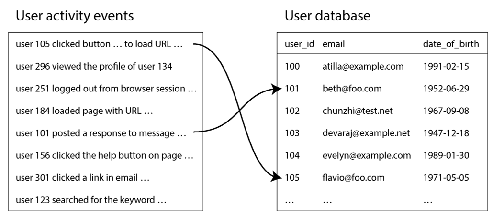

> 图 11-2。用户活动事件日志与用户资料数据库之间的联结。  

如果要分析活动事件，并将用户数据库中的信息考虑在内（例如，利用用户资料中的出生日期字段，判断某些页面在年轻用户还是年长用户中更受欢迎），就需要计算这两个表之间的联结。假设两个表都大到必须分片，该如何计算这个联结呢？  

你可以利用 MapReduce 的一个特性：无论相同键的键值对原本位于哪个分片，混洗都会把它们汇集到同一个 reducer。这里可以用用户 ID 作为键。因此，可以编写一个 mapper 遍历用户活动事件，并以用户 ID 为键发出页面浏览 URL，如图 11-3 所示。另一个 mapper 则逐行遍历用户数据库，提取用户 ID 作为键，并将用户的出生日期作为值。  

混洗随后会确保 reducer 函数能够同时访问某个用户的出生日期和该用户的所有页面浏览事件。MapReduce 作业甚至可以安排记录的排序方式，使 reducer 总是先看到来自用户数据库的记录，随后按时间戳顺序看到活动事件。这种技术称为二次排序[25]。  

现在，reducer 可以轻松执行实际的联结逻辑。第一个值应当是出生日期，reducer 将其保存在局部变量中。然后，它遍历具有相同用户 ID 的活动事件，输出每个被浏览的 URL 以及浏览者的出生日期。由于 reducer 会一次性处理某个特定用户 ID 的所有记录，所以任一时刻只需在内存中保留一条用户记录，也完全不需要通过网络发出请求。该算法称为排序归并联结，因为 mapper 的输出按键排序，随后 reducer 将联结两侧的有序记录列表归并在一起。  

工作流中的下一个 MapReduce 作业便可以计算每个 URL 的浏览者年龄分布。为此，作业首先以 URL 为键对数据进行混洗。排序后，reducer 遍历单个 URL 的所有页面浏览记录（其中带有浏览者的出生日期），为各年龄组的浏览次数分别维护一个计数器，并在处理每次页面浏览时递增相应的计数器。这样就可以实现 `group by` 操作和聚合。  

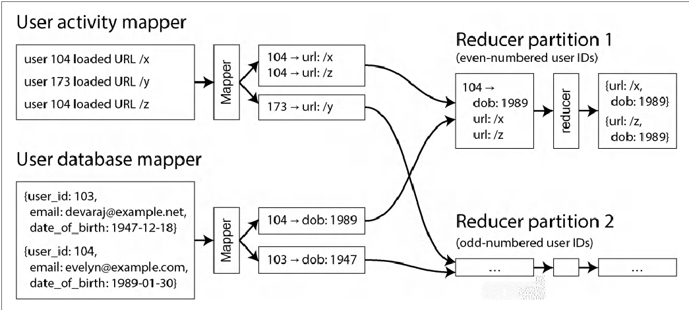

> 图 11-3。基于用户 ID 的排序归并联结；如果输入数据集被分片到多个文件中，每个数据集都可以由多个 mapper 并行处理。  

### 查询语言  

多年来，分布式批处理的执行引擎日趋成熟。如今，基础设施已经足够稳健，可以在超过 10,000 台机器的集群上存储和处理数 PB 的数据。由于在这种规模下实际运行批处理的问题已被认为基本解决，关注点遂转向改进编程模型。  

MapReduce、数据流引擎和云数据仓库都已采用 SQL 作为批处理的通用语言。这是很自然的选择，因为传统数据仓库使用 SQL，数据分析和 ETL 工具早已支持它，而且所有开发人员和分析师都了解它。  

与手写 MapReduce 作业相比，这些查询语言接口不仅需要的代码更少，还支持交互式使用：你可以编写分析查询，并从终端或 GUI 运行它们。对于业务分析师、产品经理、销售和财务团队等人员而言，这种交互式查询是在批处理环境中探索数据的一种高效而自然的方式。SQL 支持也使分布式批处理系统适合进行探索性查询。  

高级查询语言不仅能提高系统使用者的生产力，还能在机器层面提高作业执行效率。正如第 135 页“云数据仓库”中所见，查询引擎负责将 SQL 查询转换为要在集群中执行的批处理作业。从查询到语法树、再到物理算子的转换步骤，使引擎能够优化查询。Hive、Trino、Spark 和 Flink 等查询引擎都配有基于成本的查询优化器，可以分析联结输入的属性，并自动决定哪种算法最适合当前任务。优化器甚至可能改变联结顺序，从而最大限度地减少中间状态量[19, 26, 27, 28]。  

虽然 SQL 是最流行的通用批处理查询语言，但其他语言仍用于小众需求。例如，Apache Pig 是一种基于关系算子的语言，允许逐步指定数据流水线，而不是将其写成一个大型 SQL 查询。DataFrame（下一节讨论）具有类似特征，而 Morel 是一种受 Pig 影响的较新语言。还有一些用户采用了 jq、JMESPath 或 JSONPath 等 JSON 查询语言。  

在第 84 页“类图数据模型”中，我们讨论了使用图来建模数据，以及使用图查询语言遍历图中的边和顶点。许多图处理框架也支持通过查询语言进行批量计算，例如 Apache TinkerPop 的 Gremlin。我们将在第 476 页“批处理用例”中更详细地探讨图处理场景。  

> [!NOTE]
> **批处理与云数据仓库趋同**
>
> 从历史上看，数据仓库运行在专用硬件设备上，支持针对关系数据、基于 SQL 的分析查询。MapReduce 等批处理框架则力图提供更强的可扩展性和灵活性：它们支持用通用编程语言编写处理逻辑，并允许读写任意数据格式。  
>
> 随着时间推移，两者变得越来越相似。现代批处理框架如今支持使用 SQL 编写批处理作业，并通过 Parquet 等列式存储格式和经过优化的查询执行引擎，在关系查询上获得良好性能（参见第 142 页“查询执行：编译与向量化”）。与此同时，数据仓库通过迁移到云端提高了可扩展性（参见第 135 页“云数据仓库”），并实现了许多与分布式批处理框架相同的调度、容错和混洗技术。许多数据仓库也使用分布式文件系统。  
>
> 正如批处理系统采用 SQL 作为处理模型一样，云数据仓库也采用了其他处理模型。例如，BigQuery 提供 DataFrames 库，Snowflake 的 Snowpark 库则与 Pandas 集成。Airflow、Prefect 和 Dagster 等批处理工作流编排器也与云数据仓库集成。  
>
> 不过，并非所有批处理作业都容易用 SQL 表达，其中包括 PageRank 等迭代式图算法、复杂的机器学习任务以及许多其他工作流。AI 数据处理涉及图像、视频和音频等非关系型多模态数据，同样可能难以用 SQL 表达。  
>
> 云数据仓库处理某些工作负载时也力有不逮。使用列式存储格式时，逐行计算的效率较低；在这种情况下，最好使用数据仓库的其他 API 或批处理系统。云数据仓库往往也比其他批处理系统更加昂贵。改用 Spark 或 Flink 等批处理系统运行大型作业，可能更具成本效益。  
>
> 归根结底，选择在批处理系统还是数据仓库中处理数据，通常取决于成本、便利性、实现难易程度和可用性等因素。大多数大型企业拥有多种数据处理系统，因而能灵活地做出这一选择。规模较小的公司通常只用一个系统也能满足需求。  

## DataFrame  

数据科学家和统计学家通常习惯使用 R 和 Pandas 中的 DataFrame 数据模型（参见第 105 页“DataFrame、矩阵与数组”）。DataFrame 类似于关系数据库中的表：它是行的集合，同一列中的所有值都具有相同类型。用户无需编写一个大型 SQL 查询，而是调用与关系算子相对应的函数来执行过滤、联结、排序、聚合及其他操作。  

最初，DataFrame 操作通常在本地内存中进行。因此，DataFrame 仅限于处理单台机器能够容纳的数据集。数据科学家希望使用自己熟悉的 DataFrame API 与批处理环境中的大型数据集进行交互，因为 SQL 和 MapReduce 并不十分适合他们的需求。Spark、Flink 和 Daft 等分布式数据处理框架采用了 DataFrame API 来满足这一需求。不过，它们的实现行为有所不同：本地 DataFrame 通常有索引且有序，而分布式 DataFrame 通常既无索引也无序[29]。迁移到批处理框架时，这可能带来出乎意料的性能表现。  

DataFrame API 看起来与数据流 API 相似，但具体实现各不相同。Pandas 在调用 DataFrame 方法时会立即执行操作，而 Spark 会先把所有 DataFrame API 调用转换成查询计划，在其分布式数据流引擎上执行工作流之前进行查询优化。  

Daft 等框架甚至同时支持客户端和服务器端计算。规模较小的内存操作在客户端执行，较大的数据集则在服务器上处理。Apache Arrow 等列式存储格式提供了可由客户端和服务器端执行引擎共享的统一数据模型。  

## 批处理用例  

了解批处理如何工作之后，下面看看它在一系列应用中的具体运用。批处理作业非常适合批量处理大型数据集，但不适用于低延迟用例。因此，只要数据量很大、而数据新鲜度并不重要，通常都能见到批处理作业。这听起来似乎限制很大，但事实证明，相当多的数据处理任务都符合这种模型。例如：  

- 会计与库存核对通常以批处理作业的形式执行，企业借此验证交易是否与银行账户和库存相符[30]。  

- 在制造业中，需求预测通常作为周期性批处理作业运行[31]。  

- 电子商务、媒体和社交媒体公司使用批处理作业训练推荐模型[32, 33]。  

- 许多金融系统都以批处理为基础；例如，美国银行网络几乎完全依靠批处理作业运行[34]。  

在接下来的几节中，我们将讨论几乎每个行业都能见到的一些批处理用例。  

### 抽取—转换—加载  

第 7 页“数据仓库”介绍了 ETL 和 ELT：数据处理流水线从生产数据库中抽取数据、进行转换，并将结果加载到下游系统（本节使用“ETL”同时代表 ETL 和 ELT 工作负载）。批处理作业经常用于这类工作负载，尤其是在下游系统为数据仓库时。  

批处理作业的并行特性使其非常适合数据转换，因为其中很大一部分属于“易并行”工作负载。过滤数据、投影字段以及许多其他常见的数据仓库转换都可以并行完成。  

批处理环境还配有稳健的工作流调度器，可以轻松调度、编排和调试 ETL 数据流水线作业。发生故障时，调度器通常会重试作业，以缓解可能出现的瞬时问题。反复失败的作业会被标记为失败，这有助于开发人员轻松看出数据流水线中的哪个作业停止了工作。Airflow 等调度器甚至内置了适用于 MySQL、PostgreSQL、Snowflake、Spark、Flink 及其他数十种流行系统的源、汇和查询算子。调度器与数据处理系统之间的紧密集成简化了数据集成。  

我们也已经看到，批处理作业出现问题时很容易排查和修复。调试数据流水线时，这一特性弥足珍贵。可以轻松检查失败的文件以确定问题所在，并在修复 ETL 批处理作业后重新运行。例如，如果输入文件不包含转换批处理作业打算使用的字段，数据工程师可以很容易发现该字段缺失，并更新转换逻辑或生成该输入的作业。  

过去，数据流水线由单一的数据工程团队管理，因为要求其他负责产品功能的团队编写并管理复杂的批处理数据流水线，被认为是不合理的。近来，批处理模型和元数据管理的改进，使组织内各处的工程师都能更轻松地参与构建和管理自己的数据流水线。数据网格[35, 36]、数据契约[37]和数据编织[38]实践提供了标准和工具，帮助各团队安全地发布数据，供组织中的任何人使用。  

数据流水线和分析查询不仅开始共享处理模型，还开始共享执行引擎。如今，许多批量 ETL 作业与读取其输出的分析查询运行在相同的系统上。数据流水线转换和分析查询都以 SparkSQL、Trino 或 DuckDB 查询的形式运行，已是司空见惯。这种架构进一步模糊了应用工程、数据工程、分析工程和业务分析之间的界限。  

### 分析  

在第 3 页“操作型系统与分析型系统”中，我们看到分析查询（OLAP）通常会扫描大量记录，并执行分组和聚合。此类工作负载可以与其他批处理工作负载一起在批处理系统中运行。分析师编写 SQL 查询，在查询引擎上执行；查询引擎从分布式文件系统或对象存储中读取数据，并向其写入数据。表与文件的映射、名称和类型等表元数据由 Apache Iceberg 等表格式和 Unity 等目录管理（参见第 135 页“云数据仓库”）。这种架构称为数据湖仓[39]。  

与 ETL 一样，SQL 查询接口的改进意味着现在许多组织都使用 Spark 等批处理框架进行分析。此类查询模式分为两种：  

#### 预聚合查询  

数据被汇总到 OLAP 多维数据集或数据集市中，以加快查询速度（参见第 143 页“物化视图与数据立方体”）。预聚合数据可以在数据仓库中查询，也可以推送到 Apache Druid 或 Apache Pinot 等专用实时 OLAP 系统。预聚合通常按计划的时间间隔执行。第 464 页“调度工作流”中讨论的工作流调度器用于管理这些工作负载。  

#### 即席查询  

用户运行这类查询来回答特定的业务问题、调查用户行为、诊断运维问题，以及完成更多任务。响应时间对这一用例非常重要。分析师会迭代运行查询，根据得到的响应不断加深对所调查数据的了解。具有快速查询执行能力的批处理框架有助于缩短分析师的等待时间。  

SQL 支持使批处理框架能够与电子表格以及 Tableau、Power BI、Looker 和 Apache Superset 等数据可视化工具集成。例如，Tableau 提供 SparkSQL 和 Presto 连接器，而 Apache Superset 支持 Trino、Hive、Spark SQL、Presto 及许多其他最终通过执行批处理作业来查询数据的系统。  

### 机器学习  

机器学习（ML）频繁使用批处理。数据科学家、机器学习工程师和 AI 工程师使用批处理框架研究数据模式、转换数据并训练机器学习模型。常见用途包括：  

#### 特征工程  

对原始数据进行过滤和转换，得到可用于训练模型的数据。预测模型通常需要数值数据，因此工程师必须将其他形式的数据（如文本或离散值）转换成所需格式。  

#### 模型训练  

训练数据是批处理过程的输入，训练所得模型的权重则是输出。  

#### 批量推理  

如果数据集很大且不要求实时结果，就可以使用训练好的模型批量进行预测。这也包括在测试数据集上评估模型的预测结果。  

批处理框架提供了专门针对这些用例的工具。例如，Apache Spark 的 MLlib 和 Apache Flink 的 FlinkML 配有种类繁多的特征工程工具、统计函数和分类器。  

推荐引擎和排序系统等机器学习应用也大量使用图处理（见第 84 页的“类图数据模型”）。许多图算法都表示为每次遍历一条边，将一个顶点与相邻顶点联结以传播某些信息，并不断重复，直到满足某个条件——例如，直到没有更多边可供遍历，或者某项指标收敛。

批量同步并行（bulk synchronous parallel，BSP）计算模型 [40] 已成为图批处理的常用模型；Apache Giraph [20]、Spark 的 GraphX API 和 Flink 的 Gelly API [41] 等都实现了该模型。它也称为 Pregel 模型，因为 Google 的 Pregel 论文推广了这种图处理方法 [42]。

批处理也是大语言模型数据准备和训练不可或缺的一部分。网站内容等原始文本输入数据通常存放在分布式文件系统或对象存储中。必须对这些数据进行预处理，使其适合用于训练。非常适合由批处理框架完成的预处理步骤包括：

- 从 HTML 中提取纯文本，并修复格式有误的文本。

- 检测并删除低质量、不相关和重复的文档。

- 对文本进行分词（将其拆分为词元），并将其转换为嵌入，即每个词元的数值表示。

Kubeflow、Flyte 和 Ray 等批处理框架正是为这类工作负载专门构建的。例如，OpenAI 在 ChatGPT 的训练过程中使用了 Ray [43]。这些框架内置了对 PyTorch、TensorFlow、XGBoost 及许多其他 LLM 和 AI 库的集成。它们还内置支持特征工程、模型训练、批量推理和微调（针对特定用例调整基础模型）。

最后，数据科学家经常在 Jupyter 或 Hex 等交互式笔记本中试验数据。笔记本由单元格组成，而单元格是 Markdown、Python 或 SQL 的小段内容。单元格按顺序执行，以生成电子表格、图表或数据。许多笔记本通过 DataFrame API 使用批处理，或者使用 SQL 查询这类系统。

## 提供派生数据

批处理作业经常用于构建预计算或派生数据集，例如产品推荐、面向用户的报告以及机器学习模型的特征。这些数据集通常由生产数据库、键值存储或搜索引擎提供服务。无论使用何种系统，都需要将预计算数据从批处理器的分布式文件系统或对象存储传回正在为实时流量提供服务的数据库。

你可能会想在批处理作业中直接使用自己偏爱的数据库客户端库，逐条记录写入数据库服务器。这种做法可以运行（前提是防火墙规则允许批处理环境直接访问生产数据库），但基于以下几个原因，它并不是个好主意：

- 为每一条记录发起一次网络请求，比批处理任务的正常吞吐量慢几个数量级。即使客户端库支持批量操作，性能也很可能很差。

- 批处理框架往往并行运行许多任务。如果所有任务都以批处理过程预期的速率并发写入同一个输出数据库，该数据库很容易不堪重负，其查询性能也很可能受到影响。进而可能在系统的其他部分引发运维问题 [44]。

- 通常，批处理作业会为作业输出提供清晰的全有或全无保证。如果作业成功，其结果就等同于每个任务恰好执行一次所产生的输出，即使有些任务曾经失败并在过程中重试；如果整个作业失败，则不会产生任何输出。然而，在作业内部向外部系统写入会产生外部可见的副作用，无法以这种方式隐藏。因此，你必须担心部分完成的作业结果会被其他系统看到。如果某个任务失败并重新启动，它可能会重复产生失败执行中的输出。

更好的解决方案是让批处理作业把预计算数据集推送到 Kafka 主题等流中，我们将在第 12 章进一步讨论这一点。Elasticsearch 等搜索引擎、Apache Pinot 和 Apache Druid 等实时 OLAP 系统、Venice [45] 等派生数据存储，以及 ClickHouse 等云数据仓库，都内置了从 Kafka 摄取数据的能力。通过流处理系统推送数据可以解决上述几个问题：

- 流处理系统针对顺序写入进行了优化，因此更适合批处理作业的批量写入工作负载。

- 流处理系统可以充当批处理作业与生产数据库之间的缓冲区。下游系统可以限制其读取速率，以确保仍能从容地为生产流量提供服务。

- 单个批处理作业的输出可以由多个下游系统消费。

- 流处理系统可以充当批处理环境与生产网络之间的安全边界。它们可以部署在所谓的*隔离区*（demilitarized zone，DMZ）网络中，该网络位于批处理网络与生产网络之间。

流处理系统本身无法解决的一个问题是全有或全无保证。为实现这一保证，批处理作业必须在完成时向下游系统发送通知，告知作业已经完成，现在可以提供数据。流的消费者必须能够让收到的数据对查询保持不可见，就像一个采用读已提交隔离级别、尚未提交的事务一样（见第 290 页的“读已提交”），直到收到作业完成的通知。

另一种模式在数据库初始化时更为常见：在批处理作业内部构建一个全新的数据库，然后直接从分布式文件系统、对象存储或本地文件系统将这些文件批量加载到数据库中。许多数据系统都提供批量导入工具，例如 TiDB 的 Lightning 和 Apache Pinot 的 Hadoop 导入作业。RocksDB 也提供 API，用于从批处理作业批量导入排序字符串表（Sorted String Table，SST）文件。

以批处理方式构建数据库并批量导入数据速度非常快，也更便于系统在数据集版本之间进行原子切换。另一方面，如果批处理作业每次都构建全新的数据库，就很难对数据集进行增量更新。当既需要初始化又需要增量加载时，通常会采用混合方法。例如，Venice 支持混合存储，既允许批量的行级更新，也允许完整替换数据集。

<a id="chapter-11-summary"></a>

## 小结

本章探讨了批处理系统的设计与实现。我们从经典的 Unix 工具链（awk、sort、uniq 等）入手，借此说明排序和计数等基本的批处理原语。

接着，我们扩展到了分布式批处理系统。批处理框架处理不可变、有界的输入数据集以产生输出数据，因此可以在没有副作用的情况下重新运行和调试。该处理过程涉及三个主要组件：决定作业在何时何地运行的编排层、持久化数据的存储层，以及实际处理数据的计算层。

我们了解了分布式文件系统和对象存储如何通过基于块的复制、缓存和元数据服务来管理大文件，以及现代批处理框架如何通过可插拔 API 与这些系统交互。我们还讨论了作业编排器如何在大型集群中调度任务、分配资源和处理故障，并将其与工作流编排器进行了比较；后者负责管理一组在依赖关系图中运行的作业的生命周期。

我们概览了各种批处理模型，首先是 MapReduce 及其典型的 map 和 reduce 函数。随后，我们转向 Spark 和 Flink 等数据流引擎，它们提供了更易用的数据流 API 和更好的性能。为了理解批处理作业如何扩展，我们介绍了混洗算法；这项基础操作实现了分组、联结和聚合。

我们看到，随着批处理系统逐渐成熟，关注重点转向了易用性。系统增加了对 SQL 等高级查询语言和 DataFrame API 的支持，使批处理作业更易使用，也更易优化。批处理框架接收用这些语言编写的作业，并自动确定如何在机器集群上高效地执行它们。

本章最后概览了常见的批处理用例，包括：

- ETL 管道，通过定时工作流在系统之间抽取、转换和加载数据

- 分析，其中批处理作业同时支持预聚合查询和即席查询

- 机器学习，其中批处理作业用于准备和处理大型训练数据集

- 利用批处理输出填充面向生产的系统，通常通过流或批量加载工具完成，以便向用户提供派生数据

下一章将转向流处理，其输入是*无界的*——也就是说，作业的输入是永不结束的数据流。这意味着作业永远不会完成，因为随时都可能有更多工作到来。我们会看到，流处理与批处理在某些方面很相似，但无界流这一假设也会对我们构建系统的方式产生重大影响。

## 参考文献

[1] Nathan Marz. "How to Beat the CAP Theorem." *nathanmarz.com*，2011 年 10 月。存档于 *perma.cc/4BS9-R9A4*

[2] Molly Bartlett Dishman and Martin Fowler. "Agile Architecture." 发表于 O'Reilly Software Architecture Conference，2015 年 3 月。

[3] Jeffrey Dean and Sanjay Ghemawat. "MapReduce: Simplified Data Processing on Large Clusters." 发表于第 6 届 USENIX Symposium on Operating System Design and Implementation（OSDI），2004 年 12 月。

[4] Shivnath Babu and Herodotos Herodotou. "Massively Parallel Databases and MapReduce Systems." Foundations and Trends in Databases，第 5 卷第 1 期，第 1–104 页，2013 年 11 月。doi:10.1561/1900000036

[5] David J. DeWitt and Michael Stonebraker. "MapReduce: A Major Step Backwards." 最初于 2008 年 1 月发表于 databasecolumn.vertica.com。存档于 perma.cc/U8PA-K48V

[6] Henry Robinson. "The Elephant Was a Trojan Horse: On the Death of Map-Reduce at Google." *the-paper-trail.org*，2014 年 6 月。存档于 *perma.cc/9FEM-X787*

[7] Urs Hölzle. "R.I.P. MapReduce. After having served us well since 2003, today we removed the remaining internal codebase for good." x.com，2019 年 9 月。存档于 perma.cc/B34T-LLY7

[8] Adam Drake. “Command-Line Tools Can Be 235x Faster than Your Hadoop Cluster.” aadrake.com，2014 年 1 月。存档于 perma.cc/87SP-ZMCY

[9] "sort: Sort Text Files." GNU Coreutils 9.7 文档，Free Software Foundation, Inc.，2025 年。存档于 perma.cc/68KN-E8TL

[10] Michael Ovsiannikov, Silvius Rus, Damian Reeves, Paul Sutter, Sriram Rao, and Jim Kelly. "The Quantcast File System." Proceedings of the VLDB Endowment，第 6 卷第 11 期，第 1092–1101 页，2013 年 8 月。doi:10.14778/2536222.2536234

[11] Andrew Wang, Zhe Zhang, Kai Zheng, Uma Maheswara G., and Vinayakumar B. "Introduction to HDFS Erasure Coding in Apache Hadoop." blog.cloudera.com，2015 年 9 月。存档于 archive.org

[12] Andy Warfield. “Building and Operating a Pretty Big Storage System Called S3.” *allthingsdistributed.com*，2023 年 7 月。存档于 *perma.cc/7LPK-TP7V*

[13] Vinod Kumar Vavilapalli, Arun C. Murthy, Chris Douglas, Sharad Agarwal, Mahadev Konar, Robert Evans, Thomas Graves, Jason Lowe, Hitesh Shah, Siddharth Seth, Bikas Saha, Carlo Curino, Owen O'Malley, Sanjay Radia, Benjamin Reed, and Eric Baldeschwieler. "Apache Hadoop YARN: Yet Another Resource Negotiator." 发表于第 4 届 Annual Symposium on Cloud Computing（SoCC），2013 年 10 月。doi:10.1145/2523616.2523633

[14] Richard M. Karp. "Reducibility Among Combinatorial Problems." *Complexity of Computer Computations. The IBM Research Symposia Series*. Springer，1972 年。doi:10.1007/978-1-4684-2001-2_9

[15] J. D. Ullman. "NP-Complete Scheduling Problems." Journal of Computer and System Sciences，第 10 卷第 3 期，第 384–393 页，1975 年 6 月。doi:10.1016/S0022-0000(75)80008-0

[16] Gilad David Maayan. "The Complete Guide to Spot Instances on AWS, Azure and GCP." datacenterdynamics.com，2021 年 3 月。存档于 archive.org

[17] Abhishek Verma, Luis Pedrosa, Madhukar Korupolu, David Oppenheimer, Eric Tune, and John Wilkes. "Large-Scale Cluster Management at Google with Borg." 发表于第 10 届 European Conference on Computer Systems（EuroSys），2015 年 4 月。doi:10.1145/2741948.2741964

[18] Matei Zaharia, Mosharaf Chowdhury, Tathagata Das, Ankur Dave, Justin Ma, Murphy McCauley, Michael J. Franklin, Scott Shenker, and Ion Stoica. "Resilient Distributed Datasets: A Fault-Tolerant Abstraction for In-Memory Cluster Computing." 发表于第 9 届 USENIX Symposium on Networked Systems Design and Implementation（NSDI），2012 年 4 月。

[19] Paris Carbone, Stephan Ewen, Seif Haridi, Asterios Katsifodimos, Volker Markl, and Kostas Tzoumas. "Apache Flink: Stream and Batch Processing in a Single Engine." Bulletin of the IEEE Computer Society Technical Committee on Data Engineering，第 38 卷第 4 期，第 28–38 页，2015 年 12 月。存档于 perma.cc/G3N3-BKX5

[20] Mark Grover, Ted Malaska, Jonathan Seidman, and Gwen Shapira. *Hadoop Application Architectures*. O'Reilly Media，2015 年。ISBN: 9781491900048

[21] Jules S. Damji, Brooke Wenig, Tathagata Das, and Denny Lee. *Learning Spark*，第 2 版。O'Reilly Media，2020 年。ISBN: 9781492050049

[22] Michael Isard, Mihai Budiu, Yuan Yu, Andrew Birrell, and Dennis Fetterly. "Dryad: Distributed Data-Parallel Programs from Sequential Building Blocks." 发表于第 2 届 European Conference on Computer Systems（EuroSys），2007 年 3 月。doi:10.1145/1272996.1273005

[23] Daniel Warneke and Odej Kao. "Nephele: Efficient Parallel Data Processing in the Cloud." 发表于第 2 届 Workshop on Many-Task Computing on Grids and Supercomputers（MTAGS），2009 年 11 月。doi:10.1145/1646468.1646476

[24] Hossein Ahmadi. "In-Memory Query Execution in Google BigQuery." cloud.google.com，2016 年 8 月。存档于 perma.cc/DGG2-FL9W

[25] Tom White. *Hadoop: The Definitive Guide*，第 4 版。O'Reilly Media，2015 年。ISBN: 9781491901632

[26] Fabian Hueske. "Peeking into Apache Flink's Engine Room." flink.apache.org，2015 年 3 月。存档于 perma.cc/44BW-ALJX

[27] Mostafa Mokhtar. "Hive 0.14 Cost Based Optimizer (CBO) Technical Overview." hortonworks.com，2015 年 3 月。存档于 archive.org

[28] Michael Armbrust, Reynold S. Xin, Cheng Lian, Yin Huai, Davies Liu, Joseph K. Bradley, Xiangrui Meng, Tomer Kaftan, Michael J. Franklin, Ali Ghodsi, and Matei Zaharia. "Spark SQL: Relational Data Processing in Spark." 发表于 ACM International Conference on Management of Data（SIGMOD），2015 年 6 月。doi:10.1145/2723372.2742797

[29] Kaya Kupferschmidt. "Spark vs. Pandas, Part 2—Spark." towardsdatascience.com，2020 年 10 月。存档于 perma.cc/5BRK-G4N5

[30] Ammar Chalifah. "Tracking Payments at Scale." bolt.eu.com，2025 年 6 月。存档于 perma.cc/Q4KX-8K3J

[31] Nafi Ahmet Turgut, Hamza Akyildiz, Hasan Burak Yel, Mehmet Ikbal Ozmen, Mutlu Polatcan, Pinar Baki, and Esra Kayabali. "Demand Forecasting at Getir Built with Amazon Forecast." aws.amazon.com，2023 年 5 月。存档于 perma.cc/H3H6-GNL7

[32] Jason (Siyu) Zhu. "Enhancing Homepage Feed Relevance by Harnessing the Power of Large Corpus Sparse ID Embeddings." linkedin.com，2023 年 8 月。存档于 archive.org

[33] Avery Ching, Sital Kedia, and Shuojie Wang. "Apache Spark @Scale: A 60 TB+ Production Use Case." engineering.fb.com，2016 年 8 月。存档于 perma.cc/F7R5-YFAV

[34] Edward Kim. "How ACH Works: A Developer Perspective—Part 1." *engineering.gusto.com*，2014 年 4 月。存档于 *perma.cc/F67P-VBLK*

[35] Zhamak Dehghani. "How to Move Beyond a Monolithic Data Lake to a Distributed Data Mesh." martinfowler.com，2019 年 5 月。存档于 perma.cc/LN2L-L4VC

[36] Chris Riccomini. “What the Heck Is a Data Mesh?!” *cnr.sh*，2021 年 6 月。存档于 *perma.cc/NEJ2-BAX3*

[37] Chad Sanderson, Mark Freeman, and B. E. Schmidt. *Data Contracts*. O'Reilly Media，2025 年。ISBN: 9781098157623

[38] Daniel Abadi. “Data Fabric vs. Data Mesh: What’s the Difference?” starburst.io，2021 年 11 月。存档于 perma.cc/RSK3-HXDK

[39] Michael Armbrust, Ali Ghodsi, Reynold Xin, and Matei Zaharia. "Lakehouse: A New Generation of Open Platforms That Unify Data Warehousing and Advanced Analytics." 发表于第 11 届 Annual Conference on Innovative Data Systems Research（CIDR），2021 年 1 月。存档于 perma.cc/7C6D-T9NR

[40] Leslie G. Valiant. "A Bridging Model for Parallel Computation." *Communications of the ACM*，第 33 卷第 8 期，第 103–111 页，1990 年 8 月。doi:10.1145/79173.79181

[41] Stephan Ewen, Kostas Tzoumas, Moritz Kaufmann, and Volker Markl. "Spinning Fast Iterative Data Flows." Proceedings of the VLDB Endowment，第 5 卷第 11 期，第 1268–1279 页，2012 年 7 月。doi:10.14778/2350229.2350245

[42] Grzegorz Malewicz, Matthew H. Austern, Aart J. C. Bik, James C. Dehnert, Ilan Horn, Naty Leiser, and Grzegorz Czajkowski. “Pregel: A System for Large-Scale Graph Processing.” 发表于 ACM International Conference on Management of Data（SIGMOD），2010 年 6 月。doi:10.1145/1807167.1807184

[43] Richard MacManus. “OpenAI Chats About Scaling LLMs at Anyscale’s Ray Summit.” thenewstack.io，2023 年 9 月。存档于 perma.cc/YJD6-KUXU

[44] Jay Kreps. "Why Local State Is a Fundamental Primitive in Stream Processing." oreilly.com，2014 年 7 月。存档于 perma.cc/P8HU-R5LA

[45] Félix GV. “Open Sourcing Venice—LinkedIn’s Derived Data Platform.” linkedin.com，2022 年 9 月。存档于 archive.org

# 流处理

一个能够运行的复杂系统，无一例外都是从一个能够运行的简单系统演化而来的。反过来也似乎成立：从零开始设计的复杂系统永远无法运行，也无法通过修补使其运行。

——John Gall，《Systemantics》（1975）

在第 11 章中，我们讨论了批处理——以一组文件作为输入，并生成一组新的输出文件的技术。输出是派生数据的一种形式；也就是说，如果有需要，可以通过再次运行批处理来重新创建该数据集。我们已经看到，这个简单却强大的思想如何用于创建搜索索引、推荐系统、分析系统等。

然而，贯穿第 11 章始终存在一个重要假设：输入是有界的——其大小已知且有限——因此批处理知道自己何时已读完输入。例如，作为 MapReduce 核心的排序操作必须先读完全部输入，才能开始生成输出，因为最后一条输入记录可能恰好拥有最小的键，因而必须成为第一条输出记录，所以无法提前开始输出。

实际上，许多数据都是无界的，因为它们会随时间逐渐到达。你的用户昨天和今天产生了数据，明天还会继续产生更多数据。除非你的企业倒闭，否则这个过程永远不会结束，因此从任何有意义的角度看，数据集都永远不会“完整”[1]。所以，批处理器必须人为地把数据划分成固定时长的数据块——例如每天结束时处理当天的数据，或者每小时结束时处理这一小时的数据。

每日批处理的问题在于，输入的变化要到一天后才会反映在输出中，这对许多缺乏耐心的用户来说太慢了。为了缩短延迟，我们可以更频繁地运行处理——比如每秒结束时处理这一秒的数据——甚至完全放弃固定时间片，改为持续处理，在每个事件发生时立即处理它。这就是流处理背后的思想。

一般来说，流是指随时间逐步变得可用的数据。这个概念出现在许多地方：Unix 的 stdin 和 stdout、编程语言（惰性列表）[2]、文件系统 API（例如 Java 的 FileInputStream）、TCP 连接、通过互联网传输的音频和视频，等等。

本章将把事件流视为一种数据管理机制：它是上一章所介绍的批量数据在无界、增量处理方面的对应物。我们将首先讨论如何表示、存储事件流以及通过网络传输事件流，随后探究流与数据库之间的关系。最后，在第 513 页的“流处理”中，我们将探索持续处理这些流的方法和工具，以及如何用它们构建应用程序。

## 传输事件流

在批处理领域，作业的输入和输出都是文件（可能位于分布式文件系统上）。与之对应的流处理是什么样的？

当输入是文件（字节序列）时，第一个处理步骤通常是将其解析成一系列记录。在流处理语境中，记录更常被称为事件，但二者本质上是同一回事：一个小型、自包含、不可变的对象，其中包含某个时刻所发生事情的详细信息。事件通常包含一个时间戳，表明按照日历时钟它何时发生（参见第 359 页的“单调时钟与日历时钟”）。

例如，发生的事情可能是用户执行的某项操作，如浏览页面或购买商品。事件也可能来自机器，如温度传感器的周期性测量值或 CPU 利用率指标。在第 454 页的“使用 Unix 工具进行批处理”示例中，Web 服务器日志的每一行都是一个事件。

如第 5 章所述，事件可以编码为文本字符串、JSON，或某种二进制形式。这种编码使你能够存储事件——例如，将其追加到文件、插入关系表，或写入文档数据库。编码也使你能够通过网络把事件发送到另一个节点进行处理。

在批处理中，一个文件只写入一次，之后可能由多个作业读取。类似地，在流处理术语中，一个事件由生产者（也称为发布者或发送者）生成一次，之后可能由多个消费者（订阅者或接收者）处理 [3]。在文件系统中，文件名标识一组相关记录；在流式系统中，相关事件通常被归入同一个主题或流。

原则上，文件或数据库足以连接生产者与消费者。生产者把生成的每个事件写入数据存储，而每个消费者定期轮询数据存储，检查自上次运行以来出现的事件。这本质上就是每日结束时处理当天数据的批处理。

然而，在转向低延迟的持续处理时，如果数据存储不是为这种使用方式设计的，轮询就会变得代价高昂。轮询越频繁，返回新事件的请求比例就越低，开销也就越大。更好的做法是在新事件出现时通知消费者。

传统上，数据库对这种通知机制的支持并不好。关系数据库通常有能够响应变更（例如向表中插入一行）的*触发器*，但触发器能做的事情非常有限，而且在数据库设计中多少有些像事后补上的功能 [4]。因此，人们开发了专门用于传递事件通知的工具。

### 消息系统

通知消费者有新事件的一种常见方法是使用*消息系统*：生产者发送一条包含事件的消息，随后消息被推送给消费者。我们之前在第 189 页的“事件驱动架构”中简要谈到过这些系统，现在将更详细地介绍它们。

在生产者与消费者之间建立 Unix 管道或 TCP 连接之类的直接通信通道，是实现消息系统的一种简单方式。不过，大多数消息系统都扩展了这个基本模型。具体来说，Unix 管道和 TCP 恰好连接一个发送者与一个接收者，而消息系统允许多个生产者节点向同一主题发送消息，也允许多个消费者节点接收同一主题中的消息。

在这种*发布/订阅*模型中，不同系统采用的方法差异很大，不存在适用于所有用途的唯一正确答案。为了区分这些系统，下面两个问题尤其值得关注：

如果生产者发送消息的速度超过消费者的处理速度，会发生什么？

概括而言，系统有三种选择：丢弃消息、将消息缓存在队列中，或者施加背压（也称为流量控制，即阻塞生产者，使其无法发送更多消息）。例如，Unix 管道和 TCP 使用背压；它们有一个固定大小的小缓冲区，如果缓冲区已满，发送者就会被阻塞，直到接收者从缓冲区取走数据（参见第 353 页的“网络拥塞与排队”）。

如果消息被缓存在队列中，就必须了解队列不断增长时会发生什么。如果队列大到内存装不下，系统会崩溃，还是会把消息写入磁盘？如果是后者，磁盘访问会如何影响消息系统的性能 [5]？磁盘写满时又会发生什么 [6]？

如果节点崩溃或暂时离线，会不会丢失消息？

与数据库一样，要实现持久性，可能需要结合写入磁盘和/或复制（参见第 283 页的边栏“复制与持久性”），而这需要付出代价。如果你可以容忍偶尔丢失消息，那么在相同硬件上很可能获得更高的吞吐量和更低的延迟。

能否接受消息丢失，很大程度上取决于应用程序。例如，对于周期性传输的传感器读数和指标，偶尔缺少一个数据点也许并不重要，因为很快就会发送更新后的值。不过要注意，如果大量消息被丢弃，指标不正确这一事实可能不会立即显现 [7]。如果你在统计事件数量，可靠传递就更为重要，因为每丢失一条消息都会导致计数器不准确。

我们在第 11 章探讨的批处理系统有一个很好的性质：它们提供了很强的可靠性保证。失败的任务会自动重试，失败任务的部分输出会自动丢弃。这意味着最终输出与没有发生任何故障时相同，从而简化了编程模型。本章稍后将研究如何在流处理环境中提供类似的保证。

### 从生产者直接向消费者传递消息

许多消息系统不使用中间节点，而是在生产者与消费者之间直接进行网络通信：

- UDP 组播广泛用于金融行业的股票行情等数据流，在这些场景中，低延迟非常重要 [8]。尽管 UDP 本身并不可靠，但应用层协议可以恢复丢失的数据包（生产者必须记住自己发送过的数据包，以便按需重传）。

- ZeroMQ 和 nanomsg 等无代理消息库采用类似的方法，通过 TCP 或 IP 组播实现发布/订阅消息传递。

- 一些指标收集代理（如 StatsD [9]）使用不可靠的 UDP 消息传递，从网络中的所有机器收集并监控指标。（在 StatsD 协议中，只有收到全部消息，计数器指标才是正确的；使用 UDP 意味着指标充其量只是近似值 [10]。另请参见第 354 页的“TCP 与 UDP”）。

- 如果消费者在网络上暴露了服务，生产者就可以直接发起 HTTP 或 RPC 请求（参见第 180 页的“通过服务传递数据流：REST 与 RPC”），将消息推送给消费者。这正是 webhook [11] 背后的思想：把一个服务的回调 URL 注册到另一个服务上，每当事件发生时，后者就向该 URL 发出请求。

尽管这些直接消息系统在其目标场景中运行良好，但它们通常要求应用程序代码意识到消息可能丢失。它们能容忍的故障相当有限。即便协议能够检测并重传网络中丢失的数据包，通常仍会假设生产者和消费者始终在线。

如果消费者离线，就可能错过其无法访问期间发送的消息。有些协议允许生产者重试失败的消息投递，但如果生产者崩溃，丢失了原本应该重试的消息缓冲区，这种方法就可能失效。

### 消息代理

一种广泛使用的替代方案是通过*消息代理*（也称为*消息队列*）发送消息。消息代理本质上是一种针对处理消息流进行优化的数据库 [12]。它作为服务器运行，生产者和消费者以客户端身份连接到它。生产者向代理写入消息，代理再把消息传递给消费者。

通过将数据集中到代理中，这些系统可以更轻松地容忍客户端来来去去（连接、断开和崩溃），而持久性问题则转移给了代理。有些消息代理只把消息保存在内存中，另一些则会（取决于配置）将消息写入磁盘，以免代理崩溃时消息丢失。面对处理缓慢的消费者，它们通常允许队列无限增长（而不是丢弃消息或施加背压），不过这种选择也可能取决于配置。

排队带来的一个结果是，消费者通常是*异步的*。生产者发送消息时，一般只等待代理确认消息已被缓存，而不会等待消费者处理完消息。向消费者的投递会发生在未来某个不确定的时刻——通常在几分之一秒内，但如果队列积压，有时也会晚得多。

### 消息代理与数据库的比较

有些消息代理甚至可以使用 XA 或 JTA 参与两阶段提交协议（参见第 328 页的“跨异构系统的分布式事务”）。这一功能使它们在性质上与数据库十分相似，不过消息代理与数据库之间仍存在一些重要的实践差异：

- 数据库通常会一直保留数据，直到数据被显式删除；而有些消息代理在消息成功投递给消费者后会自动将其删除。因此，这类消息代理不适合长期存储数据。

- 由于消息会被迅速删除，大多数消息代理都假设其工作集相当小——也就是说，队列很短。如果消费者很慢，导致代理需要缓存大量消息（内存放不下时可能会将消息溢写到磁盘），那么每条消息的处理时间都会变长，整体吞吐量也可能下降 [5]。

- 数据库通常支持二级索引，并支持通过查询语言以多种方式搜索数据；而消息代理通常支持订阅与某种模式匹配的主题子集。二者本质上都是让客户端选择自己想了解的那部分数据，但数据库一般提供强大得多的查询功能。

- 查询数据库时，结果通常基于数据在某个时间点的快照。如果另一个客户端随后向数据库写入了某些内容，使查询结果发生变化，第一个客户端并不会知道先前的结果已经过时（除非它重新执行查询或轮询变更）。相比之下，消息代理不支持任意查询，也不允许消息在发送后更新，但它会在数据发生变化时（即出现新消息时）通知客户端。

这就是传统的消息代理观念，JMS [13] 和 AMQP [14] 等标准对其进行了规范，RabbitMQ、ActiveMQ、HornetQ、Qpid、TIBCO Enterprise Message Service、IBM MQ、Azure Service Bus 和 Google Cloud Pub/Sub [15] 等软件则实现了它。尽管可以把数据库用作队列，但要将其调优到良好性能并不容易 [16]。

#### 多个消费者

当多个消费者读取同一主题中的消息时，主要使用两种消息传递模式，如图 12-1 所示：

##### 负载均衡

每条消息只投递给其中一个消费者，因此消费者可以分担处理该主题中消息的工作。代理可以任意地把消息分配给消费者。当消息的处理开销很大，因而希望通过增加消费者来并行处理时，这种模式很有用。（在 AMQP 中，可以让多个客户端消费同一个队列来实现负载均衡；在 JMS 中，这称为*共享订阅*。）

##### 扇出

每条消息都会投递给所有消费者。扇出使多个彼此独立的消费者都能“收听”同一次消息广播，而互不影响——相当于在流处理场景中让多个批处理作业读取同一个输入文件。（JMS 中的主题订阅和 AMQP 中的交换器绑定提供了此功能。）

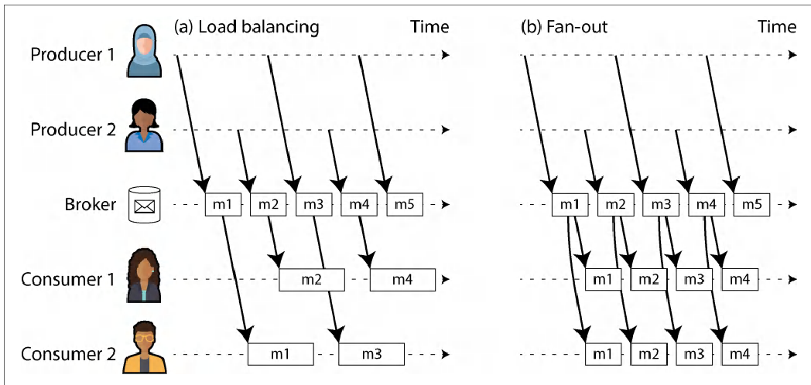

> 图 12-1。(a) 负载均衡让多个消费者分担消费一个主题的工作；(b) 使用扇出时，每条消息都会投递给多个消费者。

这两种模式可以结合使用——例如使用 Kafka 的消费者组功能。当一个消费者组订阅某个主题时，主题中的每条消息会发送给该组中的一个消费者（在组内各消费者之间均衡负载）。如果两个不同的消费者组订阅同一主题，每条消息都会发送给每组中的一个消费者（在消费者组之间提供扇出）。

#### 确认与重新投递

消费者随时都可能崩溃。因此，代理可能已经把消息投递给消费者，但消费者从未处理它，或者只处理了一部分就崩溃了。为了确保消息不丢失，消息代理使用*确认*机制：客户端处理完一条消息后，必须显式告知代理，代理才能将其从队列中移除。

如果客户端连接关闭或超时，而代理尚未收到确认，它就会认为消息没有得到处理，于是将消息再次投递给另一个消费者。（请注意，消息实际上可能已经处理完毕，只是确认在网络中丢失了。除非操作具有幂等性，或者不要求恰好一次语义，否则处理这种情况需要原子提交协议，参见第 329 页的“恰好一次消息处理”。）

与负载均衡结合时，这种重新投递行为会对消息顺序产生一个有趣的影响。在图 12-2 中，消费者通常按照生产者发送消息的顺序来处理消息。然而，消费者 2 在处理消息 m3 时崩溃了，与此同时消费者 1 正在处理消息 m4。随后，未确认的消息 m3 被重新投递给消费者 1，结果消费者 1 按 m4、m3、m5 的顺序处理消息。因此，m3 和 m4 的投递顺序与生产者 1 发送它们的顺序不同。

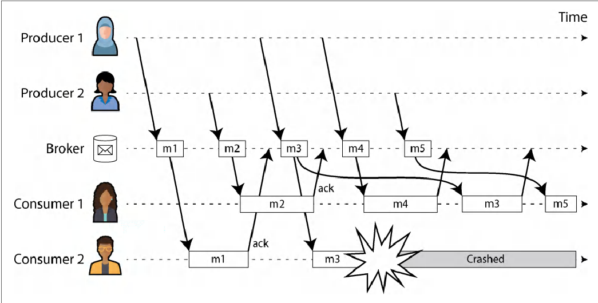

> 图 12-2。消费者 2 在处理 m3 时崩溃，因此 m3 稍后被重新投递给消费者 1。

即便消息代理在其他方面尽力保持消息顺序（JMS 和 AMQP 标准都对此有要求），负载均衡与重新投递的结合仍不可避免地导致消息重新排序。为避免这个问题，可以为每个消费者使用单独的队列（即不使用负载均衡功能）。如果消息之间完全相互独立，消息重新排序不是问题；但如果消息之间存在因果依赖关系，它就可能很重要，本章稍后将会看到这一点。

重新投递还可能造成资源浪费、资源饥饿，或流的永久阻塞。一种常见情形是生产者错误地序列化了一条消息——例如，遗漏了 JSON 编码对象中的必需键。如果缺少键的消息导致消费者崩溃并重启，消费者就不会确认该消息，于是代理会重新发送它，继而导致另一个消费者失败。这个循环会无限重复。如果代理保证严格顺序，系统将无法继续取得进展。允许消息重新排序的代理还可以继续推进，但会把资源浪费在永远无法得到确认的消息上。

死信队列（dead letter queue，DLQ）用于处理这个问题。消息不会留在当前队列中无限重试，而是被移到另一个队列中，以解除对消费者的阻塞 [17, 18]。通常会对 DLQ 设置监控——队列中出现任何消息都表示发生了错误。一旦检测到新消息，运维人员可以决定永久丢弃它、手动修改并重新生成该消息，或者修复消费者代码，使其能够正确处理该消息。DLQ 在大多数队列系统中都很常见，而 Apache Pulsar 等基于日志的消息系统以及 Kafka Streams 等流处理系统现在也支持它们 [19]。

### 基于日志的消息代理

通过网络发送数据包或向网络服务发出请求，通常是不会留下永久痕迹的瞬时操作。尽管可以永久记录这种操作（使用数据包捕获和日志记录），但我们通常不会这样看待它。AMQP/JMS 风格的消息代理继承了这种瞬时消息传递的思维方式。即使它们可能把消息写入磁盘，也会在消息投递给消费者后迅速将其删除。

数据库和文件系统采取相反的方法：写入数据库或文件的所有内容，通常都应当被永久记录，至少要保留到有人显式选择再次删除它为止。

这种思维方式的差异会对派生数据的创建方式产生很大影响。如第 11 章所述，批处理的一个关键特性是，你可以反复运行它、试验各种处理步骤，而不必担心损坏输入（因为输入是只读的）。AMQP/JMS 风格的消息传递并非如此：如果确认会导致消息从代理中删除，那么接收消息就是破坏性操作，因此你无法再次运行同一个消费者，并期望获得相同的结果。

如果向消息系统中添加一个新的消费者，它通常只会开始接收注册之后发送的消息；此前的消息已经消失，无法恢复。相比之下，对于文件和数据库，你可以随时添加新客户端，而它可以读取任意久远以前写入的数据（只要应用程序没有显式覆盖或删除这些数据）。

为什么不能构建一种混合系统，把数据库的持久存储方式与消息系统的低延迟通知能力结合起来呢？这正是*基于日志的消息代理*背后的思想，近年来这种系统已变得非常流行。

### 使用日志存储消息

日志就是磁盘上只能追加的一系列记录。此前，我们曾在第 4 章从日志结构存储引擎和预写日志的角度、第 6 章从复制的角度讨论过日志，并在第 10 章把日志作为一种共识形式讨论过。

同样的结构也可以用来实现消息代理。生产者通过把消息追加到日志末尾来发送消息，消费者则通过顺序读取日志来接收消息。如果消费者读到日志末尾，它就等待新消息已追加的通知。Unix 工具 tail 的 -f 选项用于监视文件中新追加的数据，其工作方式本质上就是如此。

为了扩展到比单块磁盘所能提供的更高吞吐量，可以对日志进行分片（含义与第 7 章相同）。随后，不同分片可以托管在不同机器上，每个分片都成为一份可独立于其他分片读写的日志；主题则可以定义为一组承载同类消息的分片。图 12-3 展示了这种方法。

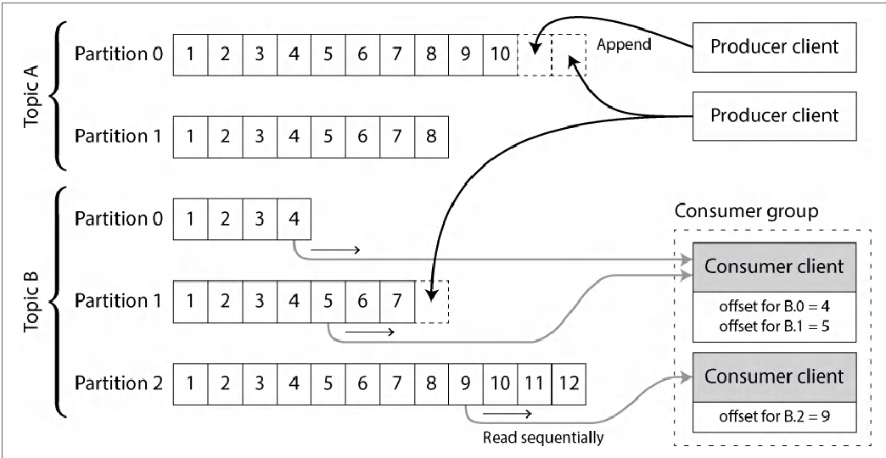

> 图 12-3。生产者通过把消息追加到主题分区文件来发送消息，消费者则顺序读取这些文件。

在每个分片（Kafka 称之为*分区*）内部，代理为每条消息分配一个单调递增的序列号，即*偏移量*（图 12-3 方框内的数字就是消息偏移量）。这种序列号是合理的，因为分区（分片）只能追加，所以分区内的消息是全序的。不同分区之间则不提供顺序保证。

Apache Kafka [20] 和 Amazon Kinesis Streams 都是以这种方式工作的基于日志的消息代理。Google Cloud Pub/Sub 的架构与之相似，但它暴露的是 JMS 风格的 API，而不是日志抽象 [15]。尽管这些消息代理会把所有消息都写入磁盘，它们仍能通过跨多台机器分片，实现每秒数百万条消息的吞吐量，并通过复制消息实现容错 [21, 22]。

## 日志与传统消息传递的比较

基于日志的方法自然支持扇出消息传递，因为多个消费者可以彼此独立地读取日志，而互不影响；读取消息不会将其从日志中删除。为了在一组消费者之间实现负载均衡，代理可以把整个分片分配给消费者组中的节点，而不是把单条消息分配给消费者客户端。

随后，每个客户端会消费分配给它的分片中的*全部*消息。通常，消费者被分配一个日志分片后，会以简单直接的单线程方式顺序读取分片中的消息。这种粗粒度负载均衡方法存在一些缺点：

- 分担某个主题消费工作的节点数，最多只能等于该主题中的日志分片数，因为同一分片内的消息会被投递给同一个节点。（可以设计一种负载均衡方案，让两个消费者都读取完整的消息集合，其中一个只处理偏移量为偶数的消息，另一个处理偏移量为奇数的消息，从而共同分担一个分片的处理工作。另一种选择是使用线程池分散消息处理，但这会使消费者偏移量管理复杂化。一般而言，最好以单线程处理一个分片，并通过增加分片数来提高并行度。）

- 如果某条消息处理缓慢，它会阻塞该分片中后续消息的处理（这是队头阻塞的一种形式；参见第 37 页的“描述性能”）。

因此，如果消息处理开销可能很大，你希望逐条消息并行处理，而且消息顺序不那么重要，那么 JMS/AMQP 风格的消息代理更合适。另一方面，在消息吞吐量很高、每条消息都能快速处理且消息顺序很重要的场景中，基于日志的方法非常有效 [23, 24]。不过，这两种架构之间的界限正在变得模糊，因为 Kafka 等基于日志的消息系统现在也支持 JMS/AMQP 风格的消费者组，允许多个消费者接收同一分区中的消息 [25, 26]。

由于分片日志通常只在单个分片内保持消息顺序，所有需要一致排序的消息都必须路由到同一个分片。例如，应用程序可能要求与某个特定用户相关的事件以固定顺序出现。为事件选择分片时，可以依据该事件的用户 ID（换言之，把用户 ID 作为分区键），从而实现这一点。

### 消费者偏移量

顺序消费分片使判断哪些消息已经处理变得很容易。偏移量小于消费者当前偏移量的所有消息都已处理，偏移量更大的所有消息则尚未见到。因此，代理无须跟踪每一条消息的确认，只需定期记录消费者偏移量。这种方法减少了簿记开销，并为批处理和流水线化创造了机会，有助于提高基于日志系统的吞吐量。不过，如果消费者发生故障，它会从最后记录的偏移量恢复，而不是从它最近见到的最后一个偏移量恢复。这可能导致消费者重复看到一些消息。

事实上，偏移量与单主数据库复制中常见的日志序列号非常相似，我们在第 201 页的“设置新的从节点”中讨论过后者。在数据库复制中，日志序列号使从节点能够在与主节点断开连接后重新连接，并在不跳过任何写入的情况下恢复复制。这里使用的原理完全相同：消息代理的行为类似主数据库，消费者则类似从节点。

如果某个消费者节点发生故障，消费者组中的另一个节点会接管故障消费者的分片，并从最后记录的偏移量开始消费消息。如果该消费者已经处理了后续消息，但尚未记录相应偏移量，那么重启后这些消息会被再次处理。我们将在本章后面讨论处理这个问题的方法。

## 磁盘空间使用

如果始终只向日志追加内容，磁盘空间终有耗尽的一天。为了回收磁盘空间，日志会被划分成多个段，并不时删除旧段或将其移至归档存储。（我们将在第 505 页的“日志压缩”中讨论一种更复杂的磁盘空间释放方法。）

这意味着，如果某个缓慢的消费者跟不上消息产生速率，落后到其消费者偏移量指向一个已经删除的段，它就会错过部分消息。实际上，日志实现了一个大小有界的缓冲区，缓冲区写满时会丢弃旧消息；这也称为循环缓冲区或环形缓冲区。不过，由于该缓冲区位于磁盘上，它可以相当大。

让我们做一个粗略估算。在撰写本文时，典型的大容量硬盘容量为 20 TB，顺序写入吞吐量为 250 MB/s。如果以尽可能快的速度写入消息，大约需要 22 小时硬盘才会写满，随后就必须开始删除最旧的消息。这意味着，即使你有多台机器和许多硬盘（增加硬盘数量会同时增加可用空间和总写入带宽），基于磁盘的日志也总能缓冲至少 22 小时的消息。实践中，部署很少会用满磁盘的写入带宽，因此日志通常可以保留数天甚至数周的消息缓冲区。  

如今，许多基于日志的消息代理也像数据库一样，将消息存储在对象存储中，以扩大存储容量，正如第 202 页“以对象存储为后端的数据库”中所述。Apache Kafka 和 Redpanda 等消息代理把较旧的消息放在对象存储中，作为其分层存储的一部分提供服务。WarpStream、Confluent Freight 和 Bufstream 等其他系统则将所有数据都存储在对象存储中。除了成本效益之外，这种架构还简化了数据集成：对象存储中的消息以 Iceberg 表的形式存储，因此批处理和数据仓库作业可以直接在数据上执行，无须先将其复制到另一个系统。  

### 当消费者跟不上生产者时  

在第 489 页“消息系统”的开头，我们讨论了消费者跟不上生产者发送消息的速率时可以采取的三种选择：丢弃消息、缓冲或施加背压。按照这种分类，基于日志的方法属于使用一个很大但大小固定的缓冲区（受可用磁盘空间限制）进行缓冲。  

如果消费者落后得太多，以至于它需要的消息比磁盘上保留的消息还要旧，它将无法读取这些消息——因此，代理实际上会丢弃超出缓冲区容量的旧消息。你可以监控消费者落后于日志头部的距离，并在它明显落后时发出警报。由于缓冲区很大，人工运维人员有足够的时间修复缓慢的消费者，并让它在开始遗漏消息之前赶上进度。  

即使某个消费者确实落后得太多并开始遗漏消息，也只会影响该消费者，不会干扰其他消费者的服务。这一点在运维上是一项很大的优势。你可以为了开发、测试或调试而试验性地消费生产环境日志，而不必太担心干扰生产服务。当消费者关闭或崩溃时，它便不再消耗资源——唯一留下来的只是它的消费者偏移量。  

这种行为与传统消息代理形成鲜明对比：在传统消息代理中，你必须谨慎删除消费者已经关闭的所有队列，以免它们无谓地积累消息，并从活跃消费者那里抢占内存。  

### 重放旧消息  

前面提到，对于 AMQP 和 JMS 风格的消息代理，处理并确认消息是一种破坏性操作，因为它会导致消息从代理中被删除。另一方面，在基于日志的消息代理中，消费消息更像是读取文件：它是一种不会改变日志的只读操作。  

除了消费者产生的任何输出之外，处理消息唯一的副作用就是消费者偏移量向前移动。但偏移量由消费者控制，因此必要时很容易操纵——例如，你可以从昨天的偏移量启动一个消费者副本，并将输出写到其他位置，从而重新处理过去一天的消息。你可以用不同的处理代码任意重复这个过程。  

这一特性使基于日志的消息传递更像上一章讨论的批处理过程：派生数据通过可重复的转换过程与输入数据明确分离。它让试验更加容易，也更便于从错误和缺陷中恢复，因此是组织内部集成数据流的好工具 [27]。  

## 数据库与流  

我们已经对消息代理和数据库做过一些比较。尽管传统上它们被视为两类不同的工具，但我们看到，基于日志的消息代理已经成功地借鉴了数据库的思想，并将其应用于消息传递。我们也可以反过来，将消息传递和流的思想应用于数据库。  

一种方法是将事件流用作存储数据的记录系统（参见第 10 页“记录系统与派生数据”）。这正是事件溯源中发生的事情，我们在第 101 页“事件溯源与 CQRS”中讨论过它。与其采用通过更新和删除来改变的数据模型存储数据，不如把每次状态变化建模为不可变事件，并将其写入仅追加日志。所有针对读取优化的物化视图都由这些事件派生而来。基于日志的消息代理（配置为永不删除旧事件）非常适合事件溯源，因为它们使用仅追加存储，并且能够以低延迟通知消费者新事件。  

不过，你不必走到采用事件溯源这么远；即便使用可变数据模型，事件流对数据库也很有用。事实上，对数据库的每次写入都是一个可以捕获、存储和处理的事件。数据库与流之间的联系不仅仅是日志在磁盘上的物理存储方式，而是更为深刻且相当根本的。  

例如，复制日志（参见第 206 页“复制日志的实现”）是由主节点在处理事务时产生的数据库写入事件流。从节点将这股写入流应用到自己的数据库副本，最终得到同一数据的准确副本。复制日志中的事件描述了已经发生的数据变更。  

我们还在第 433 页“使用共享日志”中遇到过状态机复制原理，它指出：如果每个事件都代表一次数据库写入，并且每个副本都以相同的顺序处理相同的事件，那么所有副本最终都会处于相同的状态。（这里假设处理事件是确定性操作。）这不过是事件流的又一个实例！  

本节将首先考察异构数据系统中出现的一个问题，然后探索如何把事件流的思想引入数据库来解决它。  

### 保持系统同步  

正如全书所见，没有任何单一系统能够满足所有数据存储、查询和处理需求。实践中，大多数非平凡应用都需要组合多种技术才能满足需求——例如，使用 OLTP 数据库响应用户请求，使用缓存加速常见请求，使用全文索引处理搜索查询，并使用数据仓库进行分析。每个系统都拥有自己的数据副本，以针对各自用途优化的表示形式存储。  

由于相同或相关的数据会出现在多个位置，因此它们需要彼此保持同步。如果数据库中的某个条目被更新，缓存、搜索索引和数据仓库也需要更新。对于数据仓库，这种同步通常由 ETL 过程完成（参见第 7 页“数据仓库”），常见做法是取得数据库的完整副本，对其进行转换，然后批量加载到数据仓库——换句话说，就是批处理过程。类似地，我们在第 476 页“批处理的用例”中看到，搜索索引、推荐系统及其他派生数据系统可以通过批处理过程创建。  

如果周期性的完整数据库转储太慢，有时会采用另一种方案，即*双重写入*：当数据发生变化时，应用代码显式写入每个系统——例如，先写入数据库，再更新搜索索引，然后使缓存条目失效（甚至并发执行这些写入）。  

然而，双重写入存在严重问题，其中之一是图 12-4 所示的竞态条件。在这个例子中，两个客户端想要并发更新条目 $X$。客户端 1 想把值设为 $A$，客户端 2 想把值设为 $B$。两个客户端都先把新值写入数据库，再写入搜索索引。由于时机不巧，这些请求交错执行。数据库先看到客户端 1 将值设为 $A$ 的写入，随后看到客户端 2 将值设为 $B$ 的写入，因此数据库中的最终值是 $B$。搜索索引则先看到客户端 2 的写入，再看到客户端 1 的写入，因此搜索索引中的最终值是 $A$。即使没有发生任何错误，这两个系统现在也永久地彼此不一致。  

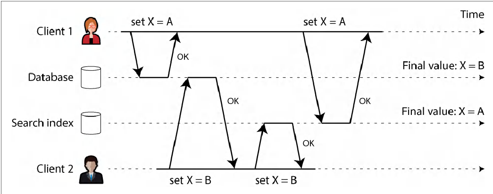

> 图 12-4。在数据库中，X 先被设为 A，随后被设为 B；而写入以相反的顺序到达搜索索引。  

除非有额外的并发检测机制，例如第 237 页“检测并发写入”中讨论的版本向量，否则你甚至不会察觉发生了并发写入。一个值只会悄无声息地覆盖另一个值。  

双重写入的另一个问题是，其中一次写入可能失败，而另一次成功。这是容错问题而非并发问题，但同样会导致两个系统彼此不一致。确保它们要么都成功、要么都失败，属于原子提交问题，而解决这一问题代价高昂（参见第 324 页“两阶段提交”）。  

如果只有一个采用单主复制的数据库，那么主节点会决定写入顺序，因此状态机复制方法在数据库副本之间有效。然而，图 12-4 中并不存在唯一的主节点。数据库可能有一个主节点，搜索索引也可能有一个主节点，但两者都不追随对方，因此可能发生冲突（参见第 215 页“多主复制”）。  

如果真的只有一个主节点——例如数据库——并且我们可以让搜索索引成为数据库的从节点，情况就会好得多。但这在实践中可行吗？  

### 变更数据捕获  

大多数数据库复制日志的问题在于，长期以来它们一直被视为数据库的内部实现细节，而非公共 API。客户端应当通过数据库的数据模型和查询语言进行查询，而不是解析复制日志并试图从中提取数据。  

几十年来，许多数据库根本没有提供有文档记录的方式来获取写入其中的变更日志。这使得获取数据库中的所有变更并将其复制到搜索索引、缓存或数据仓库等不同存储技术中变得困难。  

近年来，人们对*变更数据捕获*（change data capture，CDC）的兴趣日益增长。CDC 是观察写入数据库的所有数据变更，并将其提取为可以复制到其他系统的形式的过程 [28]。如果变更能够在写入后立即以流的形式提供，CDC 就尤其有吸引力。  

例如，你可以捕获数据库中的变更，并持续将相同的变更应用到搜索索引。如果变更日志以相同的顺序应用，就可以预期搜索索引中的数据与数据库中的数据相匹配。搜索索引以及任何其他派生数据系统都只是变更流的消费者。  

图 12-5 展示了 CDC 如何解决图 12-4 中的并发问题。尽管把 $X$ 分别设为 $A$ 和 $B$ 的两个请求并发到达数据库，但数据库会决定执行它们的顺序，并按该顺序将它们写入复制日志。搜索索引读取这些变更，并以相同的顺序应用。如果还需要把数据放入数据仓库等其他系统，只需将其添加为 CDC 事件流的另一个消费者。  

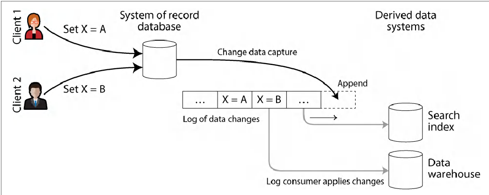

> 图 12-5。取得已提交到数据库的变更，并以相同顺序将其传播到下游系统。  

### 实现 CDC  

按照第 10 页“记录系统与派生数据”中的讨论，我们可以把日志消费者称为*派生数据系统*。搜索索引和数据仓库中存储的数据只是记录系统中数据的另一种视图。CDC 是一种机制，用于确保对记录系统所做的所有变更也反映在派生数据系统中，使派生系统拥有准确的数据副本。  

从本质上说，CDC 让一个数据库成为主节点（即从中捕获变更的数据库），并把其他数据库变成从节点。基于日志的消息代理非常适合把变更事件从源数据库传输到派生系统，因为它会保留消息的顺序（避免图 12-2 中的重排序问题）。  

逻辑复制日志可以用来实现 CDC（参见第 208 页“逻辑（基于行的）日志复制”），尽管它也带来了一些挑战，例如处理模式变更和正确建模更新。开源项目 Debezium 解决了这些挑战。该项目包含适用于 MySQL、PostgreSQL、Oracle、SQL Server、Db2、Cassandra 以及许多其他数据库的源连接器。这些连接器接入数据库复制日志，并以标准事件模式呈现变更。随后，消息可以经过转换并写入下游数据库。Kafka Connect 框架也为各种数据库提供 CDC 连接器。Maxwell 通过解析 binlog 为 MySQL 提供类似功能 [29]，GoldenGate 为 Oracle 提供类似功能，pgcapture 则为 PostgreSQL 提供同样的功能。  

与消息代理类似，CDC 通常也是异步的：记录系统数据库在提交变更之前，不会等待该变更被应用到消费者。这种设计的运维优势是，添加一个缓慢的消费者不会对记录系统造成太大影响；但缺点是，复制延迟的所有问题都同样适用（参见第 209 页“复制延迟的问题”）。  

### 初始快照  

如果拥有数据库自始至终的全部变更日志，就可以通过重放日志重建数据库的完整状态。然而，在许多情况下，永久保留所有变更需要太多磁盘空间，重放也会耗费太长时间，因此必须截断日志。  

例如，构建新的全文索引需要整个数据库的完整副本。仅应用近期变更日志是不够的，因为其中会缺少近期没有更新的条目。因此，如果没有完整的日志历史，就需要从一致性快照开始，正如第 201 页“设置新的从节点”中所述。  

数据库快照必须对应变更日志中的一个已知位置或偏移量，这样才能知道快照处理完毕后应从何处开始应用变更。有些 CDC 工具集成了这种快照功能，另一些则将其留作手动操作。Debezium 使用 Netflix 的 DBLog 水位标记算法来提供增量快照 [30, 31]。  

## 日志压缩  

如果只能保留有限的日志历史，那么每当想要添加新的派生数据系统时，都需要完成一次快照过程。不过，日志压缩提供了很好的替代方案。  

我们先前在第 118 页“日志结构存储”中讨论日志结构存储引擎时介绍过日志压缩（示例参见图 4-3）。其原理很简单：存储引擎定期查找键相同的日志记录，丢弃所有重复项，并且每个键只保留最近一次更新。这可以大幅缩小日志段，因此在压缩过程中也可以合并日志段，如图 12-6 所示。这个过程在后台运行。  

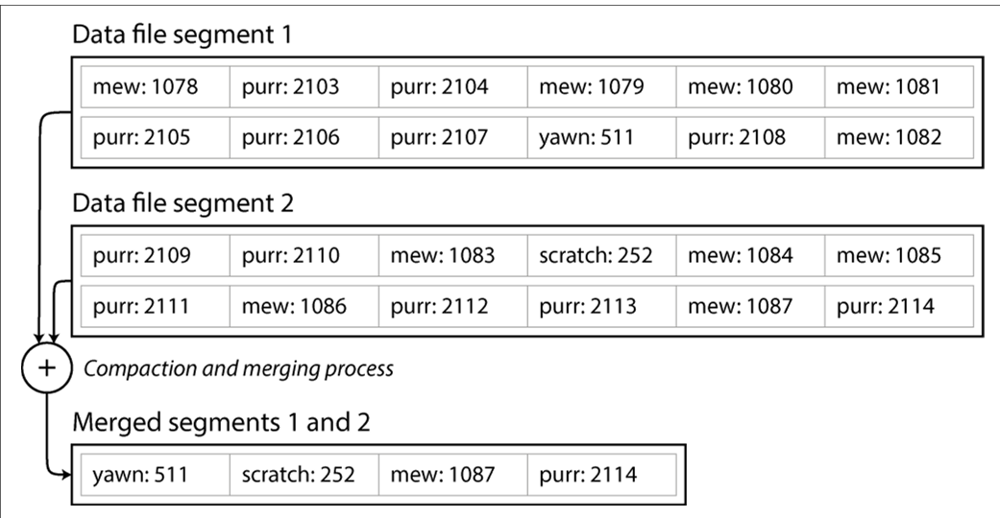

> 图 12-6。在这个键值对日志中，键是猫咪视频的 ID（mew、purr、scratch 或 yawn），值是它的播放次数；日志压缩只保留每个键的最新值。  

在日志结构存储引擎中，带有特殊空值的更新（墓碑）表示某个键已被删除，并使其在日志压缩期间被移除。但只要一个键没有被覆盖或删除，它就会永远留在日志中。这种压缩日志所需的磁盘空间只取决于数据库的当前内容，而不取决于数据库历史上发生过多少次写入。  

如果同一个键经常被覆盖，先前的值最终会被垃圾回收，只保留最新值。  

同样的思想也适用于基于日志的消息代理和 CDC。如果 CDC 系统的设置能保证每个变更都有主键，并且对某个键的每次更新都会替换该键的先前值，那么只需为特定键保留最近一次写入就足够了。  

现在，每当你想重建搜索索引之类的派生数据系统时，都可以启动一个新的消费者，从经过日志压缩的主题的偏移量 0 开始，依次扫描日志中的所有消息。日志保证包含数据库中每个键的最新值（也可能包含一些旧值）。换句话说，你可以用它取得数据库内容的完整副本，而无须再次对 CDC 源数据库拍摄快照。  

Apache Kafka 支持这种日志压缩功能。正如本章稍后将看到的，它让消息代理不仅可以用于瞬时消息传递，也可以用于持久化存储。  

### 对变更流的 API 支持  

如今，大多数流行数据库都把变更流作为一等接口公开，而不再依赖过去那种后加且通过逆向工程实现的 CDC。MySQL 和 PostgreSQL 等关系数据库通常通过供自身副本使用的同一份复制日志发送变更。大多数云厂商也为其产品提供 CDC 解决方案——例如，Datastream 为 Google Cloud 的关系数据库和数据仓库提供流式数据访问。  

如今，即便是 Cassandra 这类最终一致、基于法定人数的数据库也支持 CDC。正如第 411 页“实现线性一致系统”中所见，客户端必须将写入持久化到多数节点，写入才被视为可见。支持法定人数写入的 CDC 很有挑战性，因为不存在可供订阅的单一事实来源。数据是否可见取决于每个读取者的一致性偏好。Cassandra 绕过这一问题的方式是公开每个节点的原始日志段，而不是提供单一的变更流。希望消费这些数据的系统必须读取每个节点的原始日志段，并决定如何以最佳方式把它们合并成单一流（与法定人数读取者的做法很相似）[32]。  

Kafka Connect [33] 将适用于多种数据库系统的 CDC 工具与 Kafka 集成起来。变更事件流进入 Kafka 后，既可用来更新搜索索引等派生数据系统，也可输入流处理系统，本章稍后将对此进行讨论。  

## CDC 与事件溯源  

CDC 与事件溯源相比如何？与 CDC 类似，事件溯源也将应用状态的所有变更存储为变更事件日志。最大的区别在于，事件溯源是在不同的抽象层次上应用这一思想：  

- 在 CDC 中，应用以可变方式使用数据库，随意更新和删除记录。变更日志是在较低层次从数据库中提取的（例如通过解析复制日志），这能确保从数据库提取出的写入顺序与其实际写入顺序一致，从而避免图 12-4 中的竞态条件。  

- 在事件溯源中，应用逻辑显式构建在写入事件日志的不可变事件之上。在这种情况下，事件存储是仅追加的，不鼓励或禁止更新、删除事件。事件旨在反映应用层面发生的事情，而非低层次的状态变更。  

哪一种更好取决于具体情况。对于尚未采用事件溯源的应用而言，引入事件溯源是一项重大变更；它有许多优缺点，我们已在第 101 页“事件溯源与 CQRS”中讨论过。相比之下，只需很少的改动即可将 CDC 添加到现有数据库；写入数据库的应用甚至可能不知道 CDC 正在运行。  

> [!NOTE]
> **变更数据捕获与数据库模式**
>
> 尽管 CDC 看起来比事件溯源更容易采用，但它也有自己的一系列挑战。在微服务架构中，一个数据库通常只由一项服务访问。其他服务通过该服务的公共 API 与其交互，通常不会直接访问数据库。这使数据库成为服务的内部实现细节，开发者因而可以改变其模式而不影响公共 API。  
>
> 然而，CDC 系统在复制数据时通常使用上游数据库的模式，这会把这些模式变成公共 API，必须像管理服务的公共 API 一样管理它们。删除数据库表中的一列会破坏依赖该字段的下游消费者。这类挑战一直存在于数据流水线中，但过去通常只影响数据仓库 ETL。由于 CDC 经常实现为数据流，其他生产服务也可能成为消费者。破坏此类消费者可能导致面向客户的服务中断 [34]。数据契约常被用来防止这类破坏。  
>
> 将内部模式与外部模式解耦的一种常见方法是使用*发件箱模式*。发件箱是拥有自身模式的表，向 CDC 系统公开的是这些表，而不是数据库中的内部领域模型 [35, 36]。这样，开发者可以按需修改内部模式，同时保持发件箱表不变。这看起来可能像双重写入——它确实是。不过，发件箱通过把两次写入放在同一个系统（数据库）中，避免了第 501 页“保持系统同步”中讨论的挑战。这种设计允许两次写入出现在同一个事务中。  
>
> 不过，发件箱也带来了一些权衡。开发者仍然必须维护内部模式与发件箱模式之间的转换，这可能很有挑战性。发件箱还会增加数据库必须写入其底层存储的数据量，从而可能引发性能问题。  

与 CDC 一样，重放事件日志可以重建系统的当前状态。不过，日志压缩需要以不同的方式处理：  

- 一条记录更新的 CDC 事件通常包含该记录完整的新版本，因此某个主键的当前值完全由该主键最近的事件决定，日志压缩可以丢弃同一键先前的事件。  

- 另一方面，在事件溯源中，事件在更高层次上建模。事件通常表达用户操作的意图，而不是该操作引起状态更新的具体机制。在这种情况下，后续事件通常不会覆盖先前事件，因此需要完整的事件历史才能重建最终状态。日志压缩无法以同样的方式进行。  

使用事件溯源的应用通常有一种机制，用于存储从事件日志派生出的当前状态快照，因而不需要反复重新处理完整日志。不过，这只是一种加速读取和崩溃恢复的性能优化；其设计意图是让系统能够永久存储所有原始事件，并在需要时重新处理完整的事件日志。我们将在第 512 页“不可变性的局限”中讨论这一假设。  

### 状态、流与不可变性  

我们在第 11 章看到，批处理受益于输入文件的不可变性，因此可以在现有输入文件上运行试验性处理作业，而不必担心损坏它们。正是这一不可变性原则让事件溯源和 CDC 如此强大。  

我们通常认为数据库存储的是应用的当前状态。这种表示针对读取进行了优化，通常也是响应查询最方便的形式。状态的本质是会发生变化，因此数据库除了支持插入数据，也支持更新和删除数据。这与不可变性如何相容？  

只要存在变化的状态，该状态就是随时间推移改变它的事件所产生的结果。例如，当前可用座位列表是已处理预订的结果，当前账户余额是账户贷记和借记的结果，而 Web 服务器的响应时间图则是对已经发生的所有 Web 请求各自响应时间的聚合。  

无论状态如何变化，总有一系列事件导致这些变化。即使事情被执行后又被撤销，这些事件曾经发生过的事实依然成立。关键思想是，可变状态与不可变事件的仅追加日志并不矛盾；它们是一枚硬币的两面。包含所有变更的日志，即变更日志，表示状态随时间的演化。  

如果你偏爱数学，可以说应用状态是对事件流随时间积分的结果，而变更流是状态对时间求导的结果，如图 12-7 所示 [37, 38]。这个类比有其局限（例如，状态的二阶导数似乎没有意义），但它是思考数据的一个有用起点。  

$$ \begin{array}{r l r}{\left|s t a t e(n o w)=\displaystyle\int\limits_{t=0}^{n o w}s t r e a m(t)\mathrm{d}t\quad s t r e a m(t)=\frac{\mathrm{d}s t a t e(t)}{\mathrm{d}t}\right.}&{{}}&{{}}\end{array} $$  

> 图 12-7。当前应用状态与事件流之间的关系。  

如果持久存储变更日志，其效果无非是让状态可以重现。如果把事件日志视为记录系统，把任何可变状态都视为从中派生的数据，那么推理数据在系统中的流动就会变得更容易。正如 Jim Gray 和 Andreas Reuter 在 1992 年所说 [39]：  

根本没有必要保留数据库；日志包含了全部信息。存储数据库（即日志末端的当前状态）的唯一理由，是提高检索操作的性能。  

日志压缩是弥合日志与数据库状态之间差异的一种方式。压缩只保留每条记录的最新版本，并丢弃被覆盖的版本。  

#### 不可变事件的优势  

数据库中的不可变性是一个古老的思想。例如，几个世纪以来，会计人员一直在财务记账中使用不可变性。当一笔交易发生时，它会被记录在仅追加的分类账中；这实质上就是一份事件日志，描述了易手的资金、商品或服务。损益表、资产负债表等账目则通过汇总分类账中的交易派生而来 [40]。  

如果出现错误，会计人员不会擦除或更改分类账中的错误交易，而是添加另一笔交易来补偿这个错误——例如，退还错误收取的款项。错误交易会永远留在分类账中，因为它对审计可能很重要。如果根据错误分类账得出的错误数字已经发布，那么下一个会计期间的数字会包含一项更正。这一过程在会计工作中完全正常 [41]。  

尽管这种可审计性对金融系统尤其重要，但对于许多不受如此严格监管的其他系统也很有益。如果意外部署了会向数据库写入错误数据的缺陷代码，而该代码又能以破坏性方式覆盖数据，那么恢复就会困难得多。借助不可变事件的仅追加日志，诊断发生了什么并从问题中恢复会容易得多。同样，客服人员也可以使用审计日志诊断客户请求和投诉。  

不可变事件还能捕获比当前状态更多的信息。例如，在购物网站上，顾客可能将某件商品加入购物车，随后又将其移除。虽然从订单履约的角度看，第二个事件抵消了第一个事件，但对于分析而言，知道顾客曾考虑某件特定商品、后来却放弃了它，可能很有价值。也许他们将来会选择购买，也许他们找到了替代品。这些信息会记录在事件日志中，但在顾客从购物车移除商品时就删除该条目的数据库中，这些信息会丢失。  

### 从同一事件日志派生多个视图  

通过将可变状态与不可变事件日志分离，可以从同一份事件日志派生出多种面向读取的表示。这与一个流拥有多个消费者的方式相同（图 12-5）——例如，分析数据库 Druid 采用这种方法直接从 Kafka 摄取数据，而 Kafka Connect sink 连接器可以把数据从 Kafka 导出到各种数据库和索引 [33]。  

从事件日志到数据库设置显式的转换步骤，可以让应用程序更容易随时间演进。如果你想引入一项以新方式呈现现有数据的新功能，可以利用事件日志为该功能构建一个单独的读优化视图，并让它与现有系统并行运行，而无须修改现有系统。让新旧系统并行运行，通常比在现有系统中执行复杂的模式迁移更容易。一旦读取方都已切换到新系统，而旧系统不再需要，就可以直接将其关闭并回收其资源 [42, 43]。

我们在第 101 页的“事件溯源与 CQRS”中已经遇到过这种思路：先以一种针对写入优化的形式写入数据，然后根据需要将其转换成不同的读优化表示。这个过程并不一定需要事件溯源；同样也可以从 CDC 事件流构建多个物化视图 [44]。

传统的数据库与模式设计方法建立在一个谬误之上：数据必须以与查询时相同的形式写入。如果能够将数据从写优化的事件日志转换成读优化的应用状态，那么关于规范化和反规范化的争论（参见第 72 页的“规范化、反规范化与连接”）在很大程度上就无关紧要了。在读优化视图中对数据进行反规范化完全合理，因为转换过程提供了一种机制，使其能够与事件日志保持一致。

在第 34 页的“案例研究：社交网络主页时间线”中，我们讨论了社交网络的主页时间线，即某个特定用户所关注的人最近所发帖子的缓存（类似于邮箱）。这也是读优化状态的一个例子：主页时间线高度反规范化，因为你的帖子会被复制到所有关注者的时间线中。不过，扇出服务会让这些重复状态与新帖子和新的关注关系保持同步，从而使这种数据重复仍然可控。

## 并发控制

CQRS 最大的缺点是事件日志的消费者通常是异步的，因此用户可能先向日志写入数据，随后从派生视图读取，却发现自己的写入尚未反映在该视图中。我们在第 210 页的“读己之写”中讨论过这个问题及可能的解决方案。

一种解决方案是在向日志追加事件的同时，同步更新读取视图。这要求跨事件日志和派生视图执行分布式事务，或者通过某种方式等待事件反映到视图中。这两种方法通常都不切实际，因此视图一般采用异步更新。

另一方面，从事件日志派生当前状态也简化了并发控制的某些方面。之所以常常需要多对象事务（参见第 284 页的“单对象操作与多对象操作”），很大程度上是因为单个用户操作需要修改多个位置的数据。使用事件溯源时，可以将事件设计成对某个用户操作的自包含描述。于是，该用户操作只需在一个位置执行一次写入——也就是把事件追加到日志中——而这很容易实现原子性。

如果事件日志和应用状态采用相同的分片方式（例如，处理分片 3 中某个客户的事件时，只需更新应用状态的分片 3），那么一个简单的单线程日志消费者在写入时不需要任何并发控制。按照构造，它一次只处理一个事件（参见第 309 页的“真正的串行执行”）。日志通过定义分片内事件的串行顺序，消除了并发的不确定性 [27]。如果一个事件涉及多个状态分片，就需要多做一些工作，我们将在第 13 章讨论。

许多并未采用事件溯源模型的系统仍然依赖不可变性来实现并发控制。各种数据库在内部使用不可变数据结构或多版本数据来支持时间点快照（参见第 298 页的“索引与快照隔离”）。Git、Mercurial 和 Fossil 等版本控制系统也依靠不可变数据来保存文件的版本历史。

## 不可变性的局限

永久保留所有变更的不可变历史在多大程度上可行？答案取决于数据集的变动量。有些工作负载主要是添加数据，很少更新或删除；它们很容易实现不可变。另一些工作负载则在相对较小的数据集上频繁更新和删除；在这些情况下，不可变历史可能增长到难以承受的规模，碎片化可能成为问题，而压缩和垃圾回收的性能对运维稳健性至关重要 [45, 46]。

除了性能原因之外，尽管采用了不可变设计，你也可能因管理或法律原因需要删除数据。例如，GDPR 等隐私法规要求应用户请求删除其个人信息和错误信息；又或者，需要遏制敏感信息的意外泄露。

在这些情况下，仅仅向日志追加另一个事件，表明先前的数据应视为已删除，并不足够——你实际上希望改写历史，假装这些数据从未写入过。例如，Datomic 将此功能称为切除（excision）[47]，Fossil 版本控制系统中也有一个类似的概念，称为排斥（shunning）[48]。

真正删除数据出人意料地困难 [49]，因为副本可能存在于许多地方。存储引擎、文件系统和 SSD 经常写入新位置，而不是原地覆盖数据 [41]；备份通常还会被刻意设计成不可变，以防止意外删除或损坏。

一种允许删除不可变数据的方法是*加密粉碎*（crypto-shredding）[50]。将未来可能需要删除的数据加密存储；想要丢弃它时，就遗忘加密密钥。加密数据仍然存在，但谁也无法使用它。

从某种意义上说，这只不过转移了问题：实际数据仍然不可变，但密钥存储是可变的。此外，你必须预先决定哪些数据使用同一个密钥加密，哪些数据使用不同的密钥——这是一个重要决定，因为日后对于使用某个特定密钥加密的数据，你要么全部进行加密粉碎，要么完全不处理，而无法只处理其中一部分。为每一个数据项分别存储密钥会变得过于繁琐，因为密钥存储最终会和主数据存储一样庞大。更复杂的方案，如可穿刺加密（puncturable encryption）[51]，能够有选择地撤销密钥的解密能力，但尚未得到广泛应用。

总的来说，删除更多是“让数据更难被检索”，而不是真正“让数据无法被检索”。不过，有时你仍然必须尝试这样做，正如第 596 页的“立法与自我监管”中将会看到的那样。

## 处理流

本章到目前为止讨论了流从何而来（用户活动事件、传感器以及数据库写入），以及流如何传输（通过直接消息传递、消息代理和事件日志）。

接下来要讨论的是拿到流之后可以做什么——也就是对它进行处理。概括而言，有三种选择：

1. 可以取出事件中的数据，将其写入数据库、缓存、搜索索引或类似的存储系统，随后其他客户端可以从中查询。如图 12-5 所示，这是让数据库与系统其他部分发生的变更保持同步的一种好方法——尤其是在流消费者是唯一向该数据库写入的客户端时。写入存储系统，相当于第 476 页“批处理用例”所讨论内容在流处理中的对应形式。

2. 可以通过某种方式将事件推送给用户——例如发送电子邮件告警或推送通知，或者把事件流式传送到实时仪表板进行可视化。在这种情况下，人是流的最终消费者。

3. 可以处理一个或多个输入流，产生一个或多个输出流。流可能经过由多个此类处理阶段组成的流水线，最终到达输出端（选项 1 或 2）。

本章余下部分将讨论选项 3：处理流以产生其他派生流。像这样处理流的一段代码称为算子（operator）或作业（job）。它与第 11 章讨论的 Unix 进程和 MapReduce 作业密切相关，数据流模式也很相似：流处理器以只读方式消费输入流，并以仅追加方式将输出写到另一个位置。

流处理器中的分片和并行化模式，也与第 11 章所见的 MapReduce 和数据流引擎非常相似，因此这里不再重复这些主题。转换和过滤记录等基本映射操作也以相同方式工作。

与批处理作业相比，一个关键区别是流永远不会结束。这个区别会带来许多影响。正如本章开头所讨论的，对无界数据集排序没有意义，因此不能使用排序归并连接（参见第 471 页的“连接与分组”）。容错机制也必须改变。对于仅运行了几分钟的批处理作业，任务失败后可以简单地从头重启；但对于已经运行数年的流式作业，崩溃后从头重启可能并不可行。

### 流处理的用途

流处理长期以来一直用于监控：组织希望在某些事情发生时收到告警。例如：

- 欺诈检测系统需要判断信用卡的使用模式是否发生了意外变化，并在信用卡很可能被盗时将其冻结。

- 交易系统需要检查金融市场中的价格变化，并依照指定规则执行交易。

- 制造系统需要监控工厂中机器的状态，并在发生故障时迅速找出问题。

- 军事和情报系统需要跟踪潜在进攻者的活动，并在出现任何攻击迹象时发出警报。

这类应用需要相当复杂的模式匹配和关联分析。不过，流处理也逐渐出现了其他用途。本节将简要比较其中一些应用的异同。

### 复杂事件处理

复杂事件处理（complex event processing，CEP）是一种在 20 世纪 90 年代发展起来的事件流分析方法，尤其适合需要搜索特定事件模式的应用 [52]。正如正则表达式可以在字符串中搜索特定的字符模式一样，CEP 允许你指定规则，在流中搜索特定的事件模式。

CEP 系统通常使用类似 SQL 的高级声明式查询语言或 GUI，来描述应当检测的事件模式。这些查询会被提交给处理引擎；引擎消费输入流，并在内部维护一个状态机来执行所需的匹配。发现匹配时，引擎会发出一个*复杂事件*（complex event，这也是其名称的由来），其中包含检测到的事件模式的详细信息 [53]。

与普通数据库相比，这些系统中查询与数据的关系发生了反转。通常，数据库持久存储数据，而将查询视为暂时的。查询到来时，数据库搜索与之匹配的数据，查询结束后便将其忘记。CEP 引擎则颠倒了这两者的角色。查询会被长期存储；每当一个事件到达时，引擎都会检查至此所见的事件是否形成了与任一常驻查询匹配的模式 [54]。

CEP 的实现包括 Esper、Apama 和 TIBCO StreamBase。Flink 和 Spark Streaming 等分布式流处理器也支持使用 SQL 对流进行声明式查询。

### 流分析

流处理也用于对流进行*分析*。CEP 与流分析之间的界限比较模糊，但一般而言，流分析较少关注检测特定事件序列，而更多地面向大量事件的聚合和统计指标。应用示例包括：

- 测量某类事件的发生速率（每个时间间隔内发生多少次）

- 计算某个值在一段时间内的滚动平均值

- 将当前统计数据与之前的时间间隔进行比较（例如检测趋势，或者在指标与上周同一时段相比异常偏高或偏低时发出告警）

这类统计数据通常针对固定时间间隔计算——例如，你可能想知道过去五分钟内某个服务的平均每秒查询数，以及该时段内响应时间的第 99 百分位数。对几分钟的数据取平均，可以平滑掉相邻秒之间无关紧要的波动，同时仍能及时呈现流量模式的任何变化。执行聚合的时间间隔称为窗口；我们将在第 518 页的“时间推理”中更详细地探讨窗口。

流分析系统有时会使用概率算法，例如使用布隆过滤器（我们在第 122 页的“布隆过滤器”中见过）判断集合成员关系，使用 HyperLogLog [55] 估算基数，以及使用各种百分位数估计算法（参见第 42 页的“计算百分位数”）。概率算法产生近似结果，但其优点是流处理器所需的内存显著少于精确算法。使用近似算法有时会让人误以为流处理系统总是有损且不精确，但这是错误的。流处理本身并不天然具有近似性，使用概率算法仅仅是一种优化 [56]。

许多开源分布式流处理框架都以分析为设计目标，例如 Apache Storm、Spark Streaming、Flink、Samza、Apache Beam 和 Kafka Streams [57]。托管服务则包括 Google Cloud Dataflow 和 Azure Stream Analytics。

### 维护物化视图

我们已经看到，数据库的变更流可以用来使缓存、搜索索引和数据仓库等派生数据系统与源数据库保持同步。这些都是维护物化视图的例子：为数据集派生出另一种视图，以便高效查询，并在底层数据发生变化时更新该视图 [37]。

类似地，在事件溯源中，应用状态通过应用事件日志来维护；这里的应用状态也是一种物化视图。与流分析场景不同，通常仅考虑某个时间窗口内的事件是不够的。构建物化视图可能需要任意时间跨度内的*全部*事件，只有可以通过日志压缩丢弃的过时事件除外。实际上，你需要一个一直延伸到时间起点的窗口。

原则上，任何流处理器都可以用来维护物化视图，不过，永久保留事件的需求与某些面向分析的框架所作的假设相悖，这些框架主要处理持续时间有限的窗口。Kafka Streams 和 Confluent 的 ksqlDB 基于 Kafka 对日志压缩的支持，可以满足这种用法 [58]。

> [!NOTE]
> **增量视图维护**
>
> 数据库似乎非常适合维护物化视图；毕竟，它们就是为保存数据集的完整副本而设计的。许多数据库也支持物化视图。我们在第 143 页的“物化视图与数据立方体”中看到，数据仓库典型的分析查询可以物化成 OLAP 立方体。
>
> 遗憾的是，数据库往往通过定期批处理作业或按需请求（例如 PostgreSQL 的 `REFRESH MATERIALIZED VIEW`）来刷新物化视图表，而不是在源数据每次更新时刷新。这种方法有两个显著缺点，使其不适合通过流处理维护视图：
>
> *效率低下*
>
> 每次更新视图时都会重新处理所有数据，尽管大部分数据很可能没有变化。
>
> *数据新鲜度*
>
> 在物化视图查询再次运行之前，也就是下一次计划更新之前，源数据的变化都不会反映在物化视图中。
>
> 当数据很容易分区且计算天然适合增量执行时，可以编写数据库触发器来高效更新物化视图。例如，如果一个物化视图维护每日总销售收入，那么每次发生新销售时，都可以更新相应日期的行。定制解决方案在少数情况下可行，但许多 SQL 查询无法轻松或高效地转换成增量计算。
>
> 增量视图维护（incremental view maintenance，IVM）是对上述问题更通用的解决方案。IVM 技术将以 SQL 或其他语言编写的查询转换成能够执行增量计算的算子。IVM 算法不会处理整个数据集，而只重新计算和更新发生变化的数据 [38, 59, 60]。这样，视图计算会高效得多；这意味着可以更频繁地运行更新，从而大幅提高数据新鲜度。
>
> Materialize [61]、RisingWave、ClickHouse 和 Feldera 等数据库都使用 IVM 技术来提供高效的增量物化视图。这些数据库摄取事件流，实时呈现物化视图。近期事件缓存在内存中，并定期用于更新磁盘上的物化视图。读取操作会将近期事件与已物化的数据合并，提供统一的实时视图。由于读取通常以 SQL 表达，而物化视图往往以 OLAP 风格的格式存储，这些系统也支持第 11 章所讨论的数据仓库式大规模查询。

### 流上搜索

除了可以搜索由多个事件组成的模式的 CEP 之外，有时还需要根据复杂条件（例如全文搜索查询）搜索单个事件。例如，媒体监测服务会订阅媒体机构的新闻文章和广播信息源，并搜索任何提及相关公司、产品或主题的新闻。其做法是预先构造搜索查询，然后持续将新闻条目流与该查询进行匹配。一些网站也有类似功能——例如，房地产网站的用户可以要求在市场上出现符合其搜索条件的新房源时收到通知。Elasticsearch 的 percolator 功能 [62] 是实现此类流搜索的一种选择。

传统搜索引擎先为文档建立索引，然后在索引上运行查询。相比之下，搜索流把处理方式颠倒了过来。与 CEP 一样，查询会被存储，而文档则逐一与查询进行比对。在最简单的情况下，可以用每个查询测试每篇文档；不过，如果查询数量很多，这种做法可能很慢。为了优化这一过程，可以既为查询建立索引，也为文档建立索引，从而缩小可能匹配的查询集合 [63]。

### 事件驱动架构与 RPC

在第 189 页的“事件驱动架构”中，我们讨论了作为 RPC 替代方案的消息传递系统。例如，参与者模型就使用这种机制进行服务间通信。

尽管这些系统同样基于消息和事件，但出于以下几个原因，我们通常不把它们视为流处理器：

- 参与者框架主要是一种管理通信模块之间的并发和分布式执行的机制，而流处理主要是一种数据管理技术。

- 参与者之间的通信往往是临时且一对一的，而事件日志则是持久且支持多个订阅者的。

- 参与者可以用任意方式通信（包括循环的请求/响应模式），而流处理器通常组织成无环流水线，其中每个流都是某个特定作业的输出，并由一组明确定义的输入流派生而来。

尽管如此，类 RPC 系统与流处理之间确实存在一些交集。例如，Apache Storm 有一项称为分布式 RPC 的功能，可以把用户查询分派给一组同时处理事件流的节点；这些查询随后会与输入流中的事件交错处理，结果则可以汇总并返回给用户。

也可以使用参与者框架处理流。不过，许多此类框架无法保证在发生崩溃时交付消息，因此除非实现额外的重试逻辑，否则处理过程并不具备容错能力。

### 时间推理

流处理器经常需要处理时间，尤其是在运行分析任务时，因为这类任务频繁使用诸如“过去五分钟的平均值”这样的时间窗口。“过去五分钟”的含义看似明确清楚，遗憾的是，这个概念其实出人意料地棘手。

在批处理过程中，处理任务会快速处理大量历史事件。如果需要按时间进行某种划分，批处理过程就必须查看每个事件中嵌入的时间戳。查看运行该过程的机器上的系统时钟毫无意义，因为过程的运行时间与事件实际发生的时间没有关系。

一个批处理过程可能在几分钟内读取一整年的历史事件；大多数情况下，真正关注的时间线是这一年的历史，而不是处理所花的几分钟。此外，使用事件中的时间戳可以使处理具有确定性：对相同输入再次运行同一过程，会得到相同结果。

另一方面，许多流处理框架使用处理机器上的本地系统时钟（处理时间）来确定窗口 [64]。这种方法的优点是简单，而且当事件创建与事件处理之间的延迟短到可以忽略时也很合理。然而，一旦处理延迟显著（即处理发生的时间明显晚于事件发生时间），这种方法就会失效。

### 事件时间与处理时间

处理可能因许多原因而延迟，包括排队、网络故障、性能问题导致消息代理或处理器出现争用、流消费者重启，或者在故障恢复期间或修复代码缺陷后重新处理过去的事件。

消息延迟也可能导致消息顺序不可预测。例如，假设一个用户先发出一个 Web 请求（由 Web 服务器 A 处理），然后发出第二个请求（由服务器 B 处理）。A 和 B 都会发出描述其所处理请求的事件，但 B 的事件比 A 的事件更早到达消息代理。这样一来，流处理器将先看到 B 的事件，再看到 A 的事件，尽管它们发生的顺序恰好相反。

如果类比有助于理解，可以想想《星球大战》系列电影。第四部于 1977 年上映，第五部于 1980 年上映，第六部于 1983 年上映；随后第一、二、三部依次于 1999、2002 和 2005 年上映，第七、八、九部则依次于 2015、2017 和 2019 年上映 [65]。如果按上映顺序观看电影，那么你处理它们的顺序就与其叙事顺序不一致。（影片编号好比事件时间戳，而观看日期则是处理时间。）人类能够应对这种不连续性，但流处理算法必须经过专门设计，才能适应这类时间与顺序问题。

混淆事件时间和处理时间会导致错误的数据。例如，假设有一个流处理器用于测量请求速率（统计每秒请求数）。如果重新部署流处理器，它可能会停机一分钟，并在恢复运行后处理积压的事件。如果基于处理时间测量速率，那么在处理积压事件时，看起来会出现请求量突然异常飙升的情况，而实际的请求速率一直很稳定（图 12-8）。

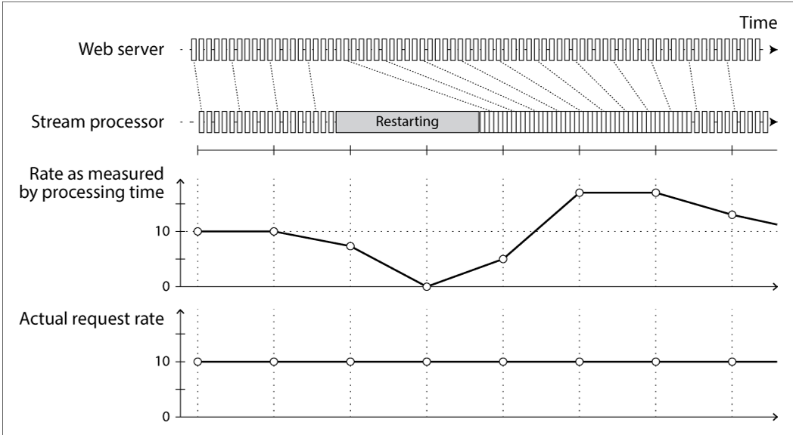

> 图 12-8。按处理时间划分窗口，会因处理速率的变化而引入伪象。

#### 处理迟到事件

用事件时间定义窗口时，一个棘手的问题是，你永远无法确定是否已经收到了某个窗口的全部事件，还是仍有一些事件尚未到达。

例如，假设你将事件划分到 1 分钟的窗口中，以统计每分钟的请求数。你已经统计了一些时间戳落在该小时第 37 分钟内的事件，时间继续向前推进；现在，大多数传入事件都落在该小时的第 38 和第 39 分钟。应该在什么时候宣布第 37 分钟的窗口已经结束，并输出其计数值？

可以设置超时：当一段时间没有看到某个窗口的新事件时，就宣布该窗口已就绪。然而，有些事件可能缓存在其他某台机器上，因网络中断而延迟。你需要能够处理那些在窗口已经宣布完成后才到达的迟到事件。总体而言，有两种选择 [1]：

- 忽略迟到事件，因为在正常情况下，它们可能只占事件的一小部分。可以将丢弃的事件数作为指标进行跟踪，并在开始丢弃大量数据时发出告警。

- 发布更正，即发布一个包含迟到事件的窗口更新值。可能还需要撤回先前的输出。

在某些情况下，可以使用一条特殊消息来表明“从现在起，不会再有时间戳早于 $t$ 的消息”，消费者可以据此触发窗口 [66]。不过，如果不同机器上的多个生产者都在生成事件，并且各自拥有自己的最小时间戳阈值，消费者就需要分别跟踪每个生产者。在这种情况下，添加和移除生产者会更棘手。

### 到底使用谁的时钟？

如果事件可能在系统中的多个位置被缓冲，为事件分配时间戳会更加困难。例如，考虑一个向服务器上报使用情况指标事件的移动应用。设备离线时，用户仍可能使用该应用；在这种情况下，应用会将事件缓存在设备本地，等到下次可以连接互联网时（可能是几小时甚至几天以后）再发送给服务器。对于该流的任何消费者而言，这些事件看起来都会像延迟极其严重的迟到事件。

在这种情况下，事件的时间戳实际上应当是根据移动设备的本地时钟记录的用户交互发生时间。然而，用户控制的设备上的时钟往往不可信，因为它可能被意外或故意设置为错误的时间（参见第 360 页的“时钟同步与准确性”）。事件被服务器接收的时间（根据服务器的时钟）更有可能是准确的，因为服务器在你的控制之下，但在描述用户交互方面意义较小。  

为了校正不准确的设备时钟，一种方法是记录三个时间戳 [67]：  

- 根据设备时钟，事件发生的时间  

- 根据设备时钟，事件发送到服务器的时间  

- 根据服务器时钟，服务器接收到事件的时间  

用第三个时间戳减去第二个时间戳，就可以估算设备时钟与服务器时钟之间的偏移量（假设相对于所需的时间戳精度，网络延迟可以忽略不计）。然后可以将该偏移量应用于事件时间戳，从而估算事件发生的真实时间（假设从事件发生到发送给服务器期间，设备时钟的偏移量没有变化）。  

这个问题并非流处理中独有；批处理在对时间进行推理时也面临完全相同的问题。只不过在流处理的语境中，这个问题更加显眼，因为我们会更清楚地意识到时间在流逝。  

### 窗口的类型  

确定应当如何得到事件的时间戳之后，下一步是决定如何定义时间段上的窗口。随后便可以使用窗口进行聚合——例如，对事件计数或计算窗口内数值的平均值。常用的窗口有以下几种 [64, 68]：  

#### 滚动窗口  

滚动窗口（tumbling window）的长度固定，每个事件恰好属于一个窗口。例如，如果使用一分钟的滚动窗口，那么时间戳从 10:03:00 到 10:03:59 的所有事件会被归入一个窗口，从 10:04:00 到 10:04:59 的事件会被归入下一个窗口，依此类推。要实现一分钟的滚动窗口，可以将每个事件的时间戳向下取整到最近的整分钟，以此确定它所属的窗口。  

#### 跳跃窗口  

跳跃窗口（hopping window）的长度也是固定的，但相邻窗口之间存在重叠，以实现平滑效果。例如，窗口长度为五分钟、跳跃步长为一分钟时，一个窗口会包含从 10:03:00 到 10:07:59 的事件，下一个窗口则覆盖从 10:04:00 到 10:08:59 的事件，依此类推。可以先计算一分钟的滚动窗口，再对若干个相邻窗口进行聚合，从而实现这种窗口。  

#### 滑动窗口  

滑动窗口（sliding window）包含彼此发生时间间隔不超过某个特定时长的所有事件。例如，一个五分钟的滑动窗口会覆盖发生在 10:03:39 和 10:08:12 的事件，因为它们之间相隔不到五分钟（请注意，五分钟的滚动窗口和跳跃窗口不会把这两个事件放在同一个窗口中，因为它们采用固定的边界）。滑动窗口可以通过维护一个按时间排序的事件缓冲区，并在旧事件超过窗口期限时将其移除来实现。  

#### 会话窗口  

与其他类型的窗口不同，会话窗口（session window）没有固定的持续时间。它把同一用户在时间上相近的所有事件归为一组，并在用户一段时间没有活动时（例如，30 分钟内没有发生任何事件）结束窗口。会话划分是网站分析中的常见需求。  

窗口操作通常需要维护临时状态。在某些情况下，无论窗口多大或发生多少事件，状态的大小都是固定的——例如，计数操作无论窗口大小或事件数量如何，都只有一个计数器。另一方面，滑动窗口或下一节将讨论的流连接需要缓冲事件，直到窗口结束。因此，窗口很大或流的吞吐量很高时，流处理器可能需要保存大量临时状态。此时必须确保运行流处理任务的机器有足够的容量来维护这些状态，无论它们存放在内存还是磁盘中。  

### 流连接  

在第 471 页的“连接与分组”中，我们讨论了批处理作业如何按键连接数据集，以及这种连接为何是数据管道的重要组成部分。由于流处理把数据管道泛化为对无界数据集的增量处理，因此流同样需要进行连接。  

然而，流中随时可能出现新事件，这使得流连接比批处理作业中的连接更具挑战性。为了更好地理解这种情况，我们来区分三种连接：流—流连接、流—表连接和表—表连接。以下各节将分别用例子说明。  

#### 流—流连接（窗口连接）  

假设你的网站有搜索功能，并且想检测近期搜索 URL 的趋势。每当有人输入搜索查询时，你都会记录一个包含查询及返回结果的事件。每当有人点击某个搜索结果时，你又会记录另一个点击事件。为了计算搜索结果中每个 URL 的点击率，需要把搜索操作事件和点击操作事件汇集到一起，它们通过相同的会话 ID 关联。广告系统也需要类似的分析 [69]。  

如果用户放弃搜索，点击可能永远不会发生；即使发生，搜索与点击之间的时间间隔也可能变化很大。很多时候可能只有几秒，但也可能长达数天或数周（例如，用户执行搜索后忘记了那个浏览器标签页，过了一段时间才回到该标签页并点击某个结果）。由于网络延迟不定，点击事件甚至可能先于搜索事件到达。你可以为连接选择合适的窗口——例如，可以选择只连接相隔不超过一小时的点击和搜索。  

请注意，把搜索详情嵌入点击事件并不等同于连接事件。这样做只能告诉你用户点击搜索结果的情形，却无法获知用户没有点击任何结果的搜索。要衡量搜索质量，需要准确的点击率，因此搜索事件和点击事件缺一不可。  

为了实现这种连接，流处理器需要维护状态——例如，按会话 ID 索引过去一小时内发生的所有事件。每当搜索事件或点击事件发生时，就把它加入相应的索引；同时，流处理器还要检查另一个索引，看相同会话 ID 的另一个事件是否已经到达。如果存在匹配事件，就发出一个事件，说明哪个搜索结果被点击。如果搜索事件到期时仍未看到匹配的点击事件，就发出一个事件，说明哪些搜索结果没有被点击。  

#### 流—表连接（流扩充）  

在第 471 页的“连接与分组”（图 11-2）中，我们看到过一个批处理作业连接两个数据集的例子：一组用户活动事件和一个用户档案数据库。很自然地，我们可以把用户活动事件视为流，并在流处理器中持续执行同样的连接。输入是包含用户 ID 的活动事件流，输出则是添加了该用户档案信息的活动事件流。这个过程有时称为使用数据库中的信息扩充活动事件。  

要执行这种连接，流处理器需要逐个取得活动事件，在数据库中查找事件的用户 ID，并把档案信息添加到活动事件中。数据库查找可以通过查询远程数据库实现；然而，正如第 471 页的“连接与分组”所讨论的，这种远程查询很可能速度缓慢，并且有使数据库过载的风险 [58]。  

另一种方法是把数据库的一个副本加载到流处理器中，这样就可以在本地查询，无需网络往返。这种技术称为哈希连接（hash join），因为如果数据库的本地副本足够小，它可以是内存中的哈希表；否则也可以是本地磁盘上的索引。  

它与批处理作业的区别在于，批处理作业使用数据库在某个时间点的快照作为输入，而流处理器会长期运行，数据库的内容也很可能随时间变化，因此流处理器中的数据库本地副本需要保持最新。这个问题可以通过 CDC 解决。流处理器不仅可以订阅活动事件流，还可以订阅用户档案数据库的变更日志。当档案被创建或修改时，流处理器就更新其本地副本。这样，我们便得到了两个流之间的连接：活动事件和档案更新。  

流—表连接与流—流连接非常相似。最大的区别在于，对表的变更日志流，连接使用的窗口一直追溯到“时间的起点”（概念上无限大的窗口），较新版本的记录会覆盖较旧版本。对于流输入，连接则可能根本不维护窗口。  

#### 表—表连接（物化视图维护）  

回想一下第 34 页“案例研究：社交网络首页时间线”中讨论的社交网络时间线示例。我们曾说过，当用户想查看自己的首页时间线时，遍历该用户关注的所有人、找出他们最近的帖子并将其合并，成本过于高昂。  

我们转而需要一个时间线缓存，它就像每个用户各自的“收件箱”，帖子发出时就写入其中，从而只需一次查找即可读取时间线。物化并维护这个缓存需要进行如下事件处理：  

- 当用户 u 发布新帖子时，将该帖子添加到每个关注 u 的用户的时间线中。  

- 当用户删除帖子或删除整个账户时，从所有用户的时间线中移除相应帖子。  

- 当用户 $u_1$ 开始关注用户 $u_2$ 时，把 $u_2$ 最近的帖子添加到 $u_1$ 的时间线中。  

- 当用户 $u_1$ 取消关注用户 $u_2$ 时，从 $u_1$ 的时间线中移除 $u_2$ 的帖子。  

为了在流处理器中实现这种缓存维护，需要有帖子（发布和删除）事件流与关注关系（关注和取消关注）事件流。流处理器需要维护一个数据库，其中包含每个用户的关注者集合，以便在新帖子到达时知道需要更新哪些时间线。  

从另一个角度看，这个流处理过程是在为一个连接两张表（帖子和关注关系）的查询维护物化视图——大致如下：  

```sql
SELECT follows.follower_id AS timeline_id,
array_agg(posts.* ORDER BY posts.timestamp DESC)
FROM posts
JOIN follows ON follows.follower_id = posts.sender_id
GROUP BY follows.follower_id  
```

流的连接与该查询中表的连接直接对应。时间线实际上是查询结果的缓存，每当底层表发生变化时都会更新。  

> [!NOTE]
> 如果像图 12-7 那样把流视为表的导数，并把连接视为两张表的乘积 $u \cdot v$，就会出现一个有趣的现象：物化连接的变更流遵循乘积法则 $(u \cdot v)' = u'v + uv'$。帖子的任何变更都会与当前的关注者连接，而关注关系的任何变更都会与当前的帖子连接 [37]。

### 连接的时间依赖性  

这里描述的三种连接（流—流、流—表和表—表）有许多共同点。它们都要求流处理器维护由连接的一侧输入派生出的状态（搜索和点击事件、用户档案或关注者列表），并在处理另一侧输入的记录时查询该状态。  

维护状态的事件顺序很重要——例如，先关注再取消关注一个用户，与先取消关注再关注，结果是不同的。在 Kafka 这样的分片事件日志中，单个分片（分区）内的事件顺序会得到保留，但不同流或分片之间通常没有顺序保证。  

这就引出了一个问题：如果不同流上的事件大致同时发生，应当按什么顺序处理它们？例如，在流—表连接的例子中，如果用户更新了自己的档案，哪些活动事件应与旧档案连接（在档案更新之前处理），哪些应与新档案连接（在档案更新之后处理）？换句话说，如果状态会随时间变化，而你要与某个状态进行连接，那么应使用哪个时间点的状态？  

这种时间依赖性可能出现在很多地方。例如，如果你销售商品，就需要对发票采用正确的税率，而税率取决于国家或州、产品类型和销售日期（因为税率会不时变化）。将销售记录与税率表连接时，你很可能希望连接销售发生时的税率；如果是在重新处理历史数据，该税率可能不同于当前税率。  

如果不同流之间的事件顺序不确定，连接就会变得不确定 [70]，这意味着即使对相同的输入重新运行同一作业，也不一定得到相同的结果。再次运行作业时，各输入流上的事件可能以不同方式交错。  

在数据仓库中，这个问题称为*缓慢变化维度*（slowly changing dimension，SCD），通常通过为被连接记录的特定版本使用唯一标识符来解决——例如，每次税率变化时都赋予它一个新标识符，而发票中则包含销售时所用税率的标识符 [71, 72]。这种改动使连接具有确定性，但后果是无法进行日志压缩，因为必须保留表中记录的所有版本。另一种办法是将数据反规范化，直接在每个销售事件中包含适用的税率。  

<a id="chapter-12-fault-tolerance"></a>

## 容错  

在本章最后一节，我们来考虑流处理器如何容忍故障。第 11 章已经讲过，批处理框架可以相当容易地容忍故障：如果某个任务失败，只需在另一台机器上重新启动它，并丢弃失败任务的输出即可。之所以能够进行这种透明的重试，是因为输入文件不可变，每个任务把输出写入单独的文件，而且只有任务成功完成后，输出才会变得可见。  

具体来说，批处理的容错方法可以确保，即使某些任务确实失败，批处理作业的输出也与没有发生任何故障时相同。  

看起来就像每条输入记录都恰好处理了一次——没有记录被跳过，也没有记录被处理两次。尽管重启任务意味着记录可能实际被处理多次，但输出中可见的效果就像只处理过一次。这个原则称为*恰好一次语义*（exactly-once semantics），不过*有效一次*（effectively-once）或许是更贴切的说法 [73]。  

流处理也面临同样的容错问题，但处理起来没有那么直接。等到任务完成后才让输出可见并不可行，因为流是无限的，所以永远不可能处理完毕。  

### 微批处理与检查点  

一种解决方案是把流分成小块，并把每个块当作一个微型批处理过程。这种方法称为*微批处理*（microbatching），Spark Streaming 使用的正是这种方法 [74]。批次大小通常约为一秒，这是性能折中的结果：批次越小，调度和协调开销越大；批次越大，流处理器的结果变得可见之前的延迟就越长。  

微批处理还隐式提供了一个与批次大小相等的滚动窗口（按处理时间而非事件时间戳划分窗口）；任何需要更大窗口的作业，都需要显式地把状态从一个微批次传递到下一个微批次。  

Apache Flink 使用了一种变体方法：定期生成滚动的状态检查点，并将其写入持久化存储 [75, 76]。如果流算子崩溃，它可以从最近的检查点重新启动，并丢弃从上一个检查点到崩溃之间生成的任何输出。检查点由消息流中的屏障触发，类似于微批次之间的边界，但不会强制采用特定的窗口大小。  

在流处理框架的范围内，微批处理和检查点方法可以提供与批处理相同的恰好一次语义。然而，一旦输出离开流处理器（例如写入数据库、向外部消息代理发布消息或触发电子邮件发送），框架就不再能够丢弃失败微批次的输出。在这种情况下，重启失败的任务会导致外部副作用发生两次，仅靠微批处理或检查点不足以避免这个问题。  

### 再论原子提交  

为了在发生故障时呈现恰好一次处理的效果，需要确保处理事件产生的所有输出和副作用当且仅当处理成功时才持久化。这包括发送给下游算子或外部消息系统的任何消息（包括电子邮件或推送通知）、数据库写入、算子状态变更，以及对输入消息的确认（包括在基于日志的消息代理中向前移动消费者偏移量）。  

这些操作必须全部以原子方式发生：要么全部发生，要么全都不发生。如果这种方法听起来很熟悉，那是因为我们在第 329 页的“恰好一次消息处理”中讨论分布式事务和两阶段提交时已经谈到过它。  

第 8 章讨论了分布式事务传统实现（如 XA）存在的问题。不过，在限制更严格的环境中，可以高效地实现这种原子提交机制。Google Cloud Dataflow [66, 75]、VoltDB [77] 和 Apache Kafka [78, 79] 都使用了这种方法。与 XA 不同，这些实现并不试图跨异构技术提供事务，而是通过在流处理框架内部同时管理状态变更和消息传递，把事务限制在内部。将多条输入消息放在单个事务中处理，可以摊销事务协议的开销。  

### 幂等性  

我们的目标是丢弃任何失败任务的部分输出，以便安全地重试任务。分布式事务是实现这一目标的一种方式；另一种方式则是依靠幂等性，正如第 187 页的“持久化执行与工作流”中所见 [80]。  

幂等操作可以执行多次，而效果与只执行一次相同。例如，删除键值存储中的某个键是幂等的（再次删除该值不会产生进一步影响），而递增计数器则不是幂等的（再次执行递增意味着该值会增加两次）。  

即使一个操作并非天然幂等，通常也可以借助少量额外元数据使其幂等。例如，从 Kafka 消费消息时，每条消息都有一个持久且单调递增的偏移量。向外部数据库写入值时，可以把触发最近一次写入的消息偏移量与该值一起写入。这样就能判断某次更新是否已经应用，从而避免再次执行相同的更新。Storm 的 Trident 中的状态处理也基于类似的思想。  

依赖幂等性意味着需要满足若干假设：重启失败任务时必须以相同的顺序重放相同的消息（基于日志的消息代理可以做到这一点），处理过程必须是确定性的，而且不能有其他节点并发更新同一个值 [81, 82]。从一个处理节点故障转移到另一个节点时，可能需要使用隔离机制（参见第 373 页的“分布式锁与租约”），以防止某个被认为已经死亡、实际却仍然存活的节点造成干扰。尽管存在这些限制条件，幂等操作仍然可以成为一种仅以很小开销实现恰好一次语义的有效方式。  

### 故障后重建状态  

任何需要状态的流处理过程——例如窗口聚合（如计数器、平均值和直方图），以及连接所用的任何表和索引——都必须确保这些状态能在故障后恢复。  

一种选择是把状态保存在远程数据存储中并进行复制，不过必须为每条消息查询远程数据库可能会很慢。另一种方法是将状态保存在流处理器本地，并定期复制。这样，当流处理器从故障中恢复时，新任务就可以读取复制的状态，并在不丢失数据的情况下恢复处理。  

例如，Flink 会定期捕获算子状态的快照，并将其写入分布式文件系统等持久化存储 [75, 76]；Kafka Streams 则通过把状态变更发送到一个采用日志压缩的专用 Kafka 主题来复制状态，这与 CDC 类似 [83]。VoltDB 通过在多个节点上冗余处理每条输入消息来复制状态（参见第 309 页的“真正的串行执行”）。  

在某些情况下，甚至可能没有必要复制状态，因为可以从输入流重建状态。例如，如果状态由相当短的窗口上的聚合组成，那么只需重放与该窗口对应的输入事件，速度可能就足够快。如果状态是由 CDC 维护的数据库本地副本，也可以从经过日志压缩的变更流中重建数据库。  

这一切都取决于底层基础设施的性能特征。在某些系统中，网络延迟可能低于磁盘访问延迟，网络带宽也可能与磁盘带宽相当。没有任何解决方案在所有情况下都普遍理想，而且随着存储和网络技术的发展，本地状态与远程状态各自的优势也可能发生变化。  

<a id="chapter-12-summary"></a>

## 小结  

本章讨论了事件流、它们的用途以及处理它们的方法。在某些方面，流处理与第 11 章讨论的批处理非常相似，只不过流处理是在无界（永不终止）的流上持续进行，而不是在固定大小的输入上进行 [84]。从这个角度看，消息代理和事件日志相当于流式世界中的文件系统。  

我们花了一些篇幅比较两类消息代理：  

### AMQP/JMS 风格的消息代理  

代理把单条消息分配给消费者，消费者在成功处理消息后逐条确认。消息得到确认后便从代理中删除。这种方式适合用作 RPC 的异步形式（另见第 189 页的“事件驱动架构”）——例如用于任务队列，其中消息处理的确切顺序并不重要，而且消息处理后不需要回头再次读取旧消息。  

### 基于日志的消息代理  

代理把一个分片中的所有消息分配给同一个消费者节点，并始终以相同的顺序交付消息。通过分片实现并行处理，消费者则通过为已处理的最后一条消息的偏移量设置检查点来跟踪进度。代理会把消息保留在磁盘上，因此必要时可以跳回去重新读取旧消息。  

基于日志的方法与数据库中的复制日志（参见第 6 章）和日志结构存储引擎（参见第 4 章）有相似之处。正如第 10 章所见，它也是共识的一种形式。我们看到，这种方法尤其适合消费输入流并生成派生状态或派生输出流的流处理系统。  

关于流的来源，我们讨论了几种可能性：用户活动事件、提供周期性读数的传感器以及数据馈送（例如金融市场数据）都天然适合表示为流。我们还看到，把对数据库的写入视为流也很有用。我们可以通过 CDC 隐式捕获变更日志——数据库所有变更的历史，也可以通过事件溯源显式捕获。日志压缩使流能够保留数据库内容的完整副本。  

把数据库表示为流，为系统集成开启了强大的可能性。通过消费变更日志并将变更应用到派生系统，可以让搜索索引、缓存和分析系统等派生数据系统持续保持最新。甚至还可以从头开始消费变更日志，一直处理到当前时刻，从而在现有数据之上构建全新的视图。  

将状态维护为流并重放消息的机制，也是各种流处理框架中实现流连接和容错技术的基础。我们讨论了流处理的几种用途，包括搜索事件模式（复杂事件处理）、计算窗口聚合（流分析），以及让派生数据系统保持最新（物化视图）。  

随后，我们讨论了在流处理器中对时间进行推理的困难，包括处理时间与事件时间戳之间的区别，以及如何处理那些在你以为窗口已经完整之后才到达的迟到事件。  

我们区分了流处理过程中可能出现的三类连接：  

### 流—流连接  

两个输入流都由活动事件组成，连接算子会搜索在某个时间窗口内发生的相关事件。例如，连接算子可以匹配同一用户在相隔 30 分钟以内执行的两个操作。如果想在一个流中寻找相关事件，那么两个连接输入实际上可以是同一个流（即自连接）。  

### 流—表连接  

一个输入流由活动事件组成，另一个则是数据库变更日志。变更日志用于让数据库的本地副本保持最新。对于每个活动事件，连接算子都会查询数据库，并输出一个经过信息扩充的活动事件。  

### 表—表连接  

两个输入流都是数据库变更日志。在这种情况下，任一侧的每项变更都会与另一侧的最新状态进行连接。其结果是一个变更流，表示两张表连接所得物化视图的变化。  

最后，我们讨论了在流处理器中实现容错和恰好一次语义的技术。与批处理一样，我们需要丢弃任何失败任务的部分输出。然而，由于流处理进程会长期运行并持续产生输出，我们不能简单地丢弃所有输出。取而代之，可以使用粒度更细的恢复机制，其基础可以是微批处理、检查点、事务或幂等写入。  

## 参考文献  

[1] Tyler Akidau, Robert Bradshaw, Craig Chambers, Slava Chernyak, Rafael J. Fernández-Moctezuma, Reuven Lax, Sam McVeety, Daniel Mills, Frances Perry, Eric Schmidt, and Sam Whittle. “Dataflow 模型：在大规模、无界、乱序数据处理中平衡正确性、延迟与成本的实用方法。”《VLDB Endowment 论文集》，第 8 卷第 12 期，第 1792–1803 页，2015 年 8 月。doi:10.14778/2824032.2824076  

[2] Harold Abelson, Gerald Jay Sussman, and Julie Sussman. *Structure and Interpretation of Computer Programs*，第 2 版。MIT Press，1996。ISBN: 9780262510875。存档于 archive.org  

[3] Patrick Th. Eugster, Pascal A. Felber, Rachid Guerraoui, and Anne-Marie Kermarrec. “发布/订阅的多种面貌。”《ACM Computing Surveys》，第 35 卷第 2 期，第 114–131 页，2003 年 6 月。doi:10.1145/857076.857078  

[4] Don Carney, Ugur Cetintemel, Mitch Cherniack, Christian Convey, Sangdon Lee, Greg Seidman, Michael Stonebraker, Nesime Tatbul, and Stan Zdonik. “监控流——一类新的数据管理应用。”第 28 届超大型数据库国际会议（VLDB），2002 年 8 月。doi:10.1016/B978-155860869-6/50027-5  

[5] Matthew Sackman. “施加背压。”wellquite.org，2016 年 5 月。存档于 perma.cc/3KCZ-RUFY  

[6] Thomas Figg (tef). “如何（不要）编写流水线。”cohost.org，2023 年 6 月。存档于 perma.cc/A3V8-NYCM  

[7] Vicent Martí. “Brubeck：兼容 statsd 的指标聚合器。”github.blog，2015 年 6 月。存档于 perma.cc/TP3Q-DJYM  

[8] Seth Lowenberger. “MoldUDP64 协议规范 V 1.00。”nasdaq-trader.com，2009 年 7 月。存档于 perma.cc/7CRQ-QBD7  

[9] Ian Malpass. “度量任何事物，度量一切。”codeascraft.com，2011 年 2 月。存档于 archive.org  

[10] Dieter Plaetinck. “Graphite、Grafana 和 statsd 的 25 个陷阱。”grafana.com，2016 年 3 月。存档于 perma.cc/3NP3-67U7  

[11] Jeff Lindsay. “用 Webhook 革新 Web。”*progrium.com*，2007 年 5 月。存档于 *perma.cc/BF9U-XNX4*  

[12] Jim N. Gray. “队列就是数据库。”微软研究院技术报告 MSR-TR-95-56，1995 年 12 月。存档于 arxiv.org  

[13] Mark Hapner, Rich Burridge, Rahul Sharma, Joseph Fialli, Kate Stout, and Nigel Deakin. “JSR-343 Java 消息服务（JMS）2.0 规范。”*jms-spec.java.net*，2013 年 3 月。存档于 *perma.cc/E4YG-46TA*  

[14] Sanjay Aiyagari, Matthew Arrott, Mark Atwell, Jason Brome, Alan Conway, Robert Godfrey, Robert Greig, Pieter Hintjens, John O'Hara, Matthias Radestock, Alexis Richardson, Martin Ritchie, Shahrokh Sadjadi, Rafael Schlooming, Steven Shaw, Martin Sustrik, Carl Triellof, Kim van der Riet, and Steve Vinoski. “AMQP：高级消息队列协议规范。”版本 0-9-1，2008 年 11 月。存档于 perma.cc/6YJJ-GM9X  

[15] “Pub/Sub 架构概览。”cloud.google.com，2025。存档于 perma.cc/VWF5-ABP4  

[16] Aris Tzoumas. “将 PostgreSQL 队列扩展至每秒 10 万个事件的经验。”rudderstack.com，2025 年 7 月。存档于 perma.cc/QD8C-VA4Y  

[17] Robin Moffatt. “Kafka Connect 深入剖析——错误处理与死信队列。”*confluent.io*，2019 年 3 月。存档于 *perma.cc/KQ5A-AB28*  

[18] Dunith Danushka. “消息重新处理：如何实现死信队列。”redpanda.com。存档于 perma.cc/R7UB-WEWF  

[19] Damien Gasparina, Loic Greffier, and Sebastien Viale. “KIP-1034：Kafka Streams 中的死信队列。”*cwiki.apache.org*，2024 年 4 月。存档于 *perma.cc/3VXV-QXAN*  

[20] Jay Kreps, Neha Narkhede, and Jun Rao. “Kafka：用于日志处理的分布式消息系统。”第 6 届网络与数据库交汇国际研讨会（NetDB），2011 年 6 月。存档于 perma.cc/CSW7-TCQ5  

[21] Jay Kreps. “Apache Kafka 基准测试：每秒 200 万次写入（在三台廉价机器上）。”*engineering.linkedin.com*，2014 年 4 月。存档于 archive.org  

[22] Kartik Paramasivam. “我们如何在 LinkedIn 改进和推进 Kafka。”engineering.linkedin.com，2015 年 9 月。存档于 perma.cc/3S3V-JCYJ  

[23] Philippe Dobbelaere and Kyumars Sheykh Esmaili. “Kafka 与 RabbitMQ：两种业界参考发布/订阅实现的比较研究。”第 11 届 ACM 分布式与基于事件的系统国际会议（DEBS），2017 年 6 月。doi:10.1145/3093742.3093908  

[24] Kate Holterhoff. “消息队列为何经久不衰：一段历史。”redmonk.com，2024 年 12 月。存档于 perma.cc/6DX8-XK4W  

[25] Andrew Schofield. “KIP-932：Kafka 队列。”cwiki.apache.org，2023 年 5 月。存档于 perma.cc/LBE4-BEMK  

[26] Jack Vanlightly. “在日志之上实现队列的优势。”jack-vanlightly.com，2023 年 10 月。存档于 perma.cc/WJ7V-287K  

[27] Jay Kreps. “日志：每位软件工程师都应了解的实时数据统一抽象。”engineering.linkedin.com，2013 年 12 月。存档于 perma.cc/2JHR-FR64  

[28] Andy Hattemer. “变更数据捕获正当其时。为什么？”*materialize.com*，2021 年 9 月。存档于 *perma.cc/AL37-P53C*  

[29] Prem Santosh Udaya Shankar. “将 MySQL 表实时流式传输到 Kafka。”engineeringblog.yelp.com，2016 年 8 月。存档于 perma.cc/5ZR3-2GVV  

[30] Andreas Andreakis, Ioannis Papapanagiotou. “DBLog：基于水位线的变更数据捕获框架。”存档于 arXiv:2010.12597，2020 年 10 月。  

[31] Jiri Pechanec. “Percolator。”*debezium.io*，2021 年 10 月。存档于 *perma.cc/EQ8E-W6KQ*  

[32] Debezium 维护者。“用于 Cassandra 的 Debezium 连接器。”*debezium.io*。存档于 *perma.cc/WR6K-EKMD*  

[33] Neha Narkhede. “发布 Kafka Connect：构建大规模低延迟数据流水线。”*confluent.io*，2016 年 2 月。存档于 *perma.cc/8WXJ-L6GF*  

[34] Chris Riccomini. “Kafka 变更数据捕获破坏了数据库封装。”*cnr.sh*，2018 年 11 月。存档于 *perma.cc/P572-9MKF*  

[35] Gunnar Morling. “‘变更数据捕获破坏了封装’。果真如此吗？”*decodable.co*，2023 年 11 月。存档于 *perma.cc/YX2P-WNWWR*  

[36] Gunnar Morling. “重新审视发件箱模式。”*decodable.co*，2024 年 10 月。存档于 *perma.cc/M5ZL-RPS9*  

[37] Ashish Gupta and Inderpal Singh Mumick. “物化视图的维护：问题、技术与应用。”《IEEE Data Engineering Bulletin》，第 18 卷第 2 期，第 3–18 页，1995 年 6 月。存档于 archive.org  

[38] Mihai Budiu, Tej Chajed, Frank McSherry, Leonid Ryzhyk, and Val Tannen. “DBSP：流上的增量计算及其在数据库中的应用。”《SIGMOD Record》，第 53 卷第 1 期，第 87–95 页，2024 年 3 月。doi:10.1145/3665252.3665271  

[39] Jim Gray and Andreas Reuter. *Transaction Processing: Concepts and Techniques*. Morgan Kaufmann，1992。ISBN: 9781558601901  

[40] Martin Kleppmann. “面向计算机科学家的会计学。”martin.kleppmann.com，2011 年 3 月。存档于 perma.cc/9EGX-P38N  

[41] Pat Helland. “不可变性改变一切。”第 7 届创新数据系统研究双年会（CIDR），2015 年 1 月。存档于 perma.cc/33WX-3669  

[42] Martin Kleppmann. *Making Sense of Stream Processing*. 报告，O'Reilly Media，2016 年 5 月。存档于 perma.cc/RAY4-JDVX  

[43] Kartik Paramasivam. “流处理难题——第 1 部分：终结 Lambda。”engineering.linkedin.com，2016 年 6 月。存档于 archive.org  

[44] Stéphane Derosiaux. “CQRS：是什么？为什么？怎么做？”*sderosiaux.medium.com*，2019 年 9 月。存档于 *perma.cc/FZ3U-HVJ4*  

[45] Baron Schwartz. “不可变性、MVCC 与垃圾回收。”*xaprb.com*，2013 年 12 月。存档于 *archive.org*  

[46] Daniel Eloff, Slava Akhmechet, Jay Kreps, et al. “回复：用 Apache Samza 将数据库由内而外翻转。”Hacker News 讨论，news.ycombinator.com，2015 年 3 月。存档于 perma.cc/ML9E-JC83  

[47] Cognitect, Inc. “Datomic 文档：切除。”docs.datomic.com。存档于 perma.cc/J5QQ-SH32  

[48] “Fossil 文档：从 Fossil 中删除内容。”fossil-scm.org，2025。存档于 perma.cc/DS23-GTNG  

[49] Jay Kreps. “分布式系统的讽刺之处在于，丢失数据真的很容易，删除数据却出奇地困难。”x.com，2015 年 3 月。存档于 perma.cc/7RRZ-V7B7  

[50] Brent Robinson. “密码学销毁：它如何解决现代数据保留难题。”*medium.com*，2019 年 1 月。存档于 *perma.cc/4LFK-S6XE*  

[51] Matthew D. Green and Ian Miers. “利用可穿孔加密实现前向安全的异步消息传递。”IEEE 安全与隐私研讨会，2015 年 5 月。doi:10.1109/SP.2015.26  

[52] David C. Luckham. “ESP 与 CEP 有何区别？”complexevents.com，2019 年 6 月。存档于 perma.cc/E7PZ-FDEF  

[53] Arvind Arasu, Shivnath Babu, and Jennifer Widom. “CQL 连续查询语言：语义基础与查询执行。”《The VLDB Journal》，第 15 卷第 2 期，第 121–142 页，2006 年 6 月。doi:10.1007/s00778-004-0147-z  

[54] Julian Hyde. “传输中的数据：流式 SQL 技术如何帮助解决 Web 2.0 数据困境。”《ACM Queue》，第 7 卷第 11 期，2009 年 12 月。doi:10.1145/1661785.1667562  

[55] Philippe Flajolet, Éric Fusy, Olivier Gandouet, and Frédéric Meunier. “HyperLogLog：一种近乎最优的基数估计算法分析。”算法分析会议（AofA），2007 年 6 月。doi:10.46298/dmtcs.3545  

[56] Jay Kreps. “质疑 Lambda 架构。”oreilly.com，2014 年 7 月。存档于 perma.cc/2WY5-HC8Y  

[57] Ian Reppel. “Apache 流处理技术概览。”*ianreppel.org*，2016 年 3 月。存档于 *perma.cc/BB3E-QJLW*  

[58] Jay Kreps. “为什么本地状态是流处理中的基础原语。”oreilly.com，2014 年 7 月。存档于 perma.cc/P8HU-R5LA  

[59] RisingWave Labs. “深入剖析 RisingWave 流处理引擎——第 2 部分：计算模型。”*risingwave.com*，2023 年 11 月。存档于 *perma.cc/LM74-XDEL*  

[60] Frank McSherry, Derek G. Murray, Rebecca Isaacs, and Michael Isard. “差分数据流。”第 6 届创新数据系统研究双年会（CIDR），2013 年 1 月。存档于 perma.cc/T83W-ZBR2  

[61] Andy Hattemer. “数据库中的增量计算。”*materialize.com*，2020 年 3 月。存档于 *perma.cc/AL94-YVRN*  

[62] Shay Banon. “Percolator。”elastic.co，2011 年 2 月。存档于 perma.cc/LS5R-4FQX  

[63] Alan Woodward and Martin Kleppmann. “使用 Luwak 和 Samza 进行实时全文搜索。”martin.kleppmann.com，2015 年 4 月。存档于 perma.cc/2U92-Q7R4  

[64] Tyler Akidau. “批处理之外的世界：Streaming 102。”oreilly.com，2016 年 1 月。存档于 perma.cc/4XF9-8M2K  

[65] Stephan Ewen. “使用 Apache Flink 进行流分析。”*Kafka Summit*，2016 年 4 月。存档于 *perma.cc/QBQ4-F9MR*  

[66] Tyler Akidau, Alex Balikov, Kaya Bekiroğlu, Slava Chernyak, Josh Haberman, Reuven Lax, Sam McVeety, Daniel Mills, Paul Nordstrom, and Sam Whittle. “MillWheel：互联网规模的容错流处理。”《VLDB Endowment 论文集》，第 6 卷第 11 期，第 1033–1044 页，2013 年 8 月。doi:10.14778/2536222.2536229  

[67] Alex Dean. “改善 Snowplow 对时间的理解。”snowplow.io，2015 年 9 月。存档于 perma.cc/6CT9-Z3Q2  

[68] “Azure 流分析：窗口函数。”Microsoft Azure 参考文档，learn.microsoft.com，2025 年 7 月。存档于 archive.org  

[69] Rajagopal Ananthanarayanan, Venkatesh Basker, Sumit Das, Ashish Gupta, Haifeng Jiang, Tianhao Qiu, Alexey Reznichenko, Deomid Ryabkov, Manpreet Singh, and Shivakumar Venkataraman. “Photon：连续数据流的容错可扩展连接。”ACM 数据管理国际会议（SIGMOD），2013 年 6 月。doi:10.1145/2463676.2465272  

[70] Ben Kirwin. “实现不可能之事：Kafka 中的恰好一次消息传递模式。”ben.kirw.in，2014 年 11 月。存档于 perma.cc/A5QL-QRX7  

[71] Pat Helland. “外部数据与内部数据。”第 2 届创新数据系统研究双年会（CIDR），2005 年 1 月。存档于 perma.cc/K9AH-LQPS  

[72] Ralph Kimball and Margy Ross. *The Data Warehouse Toolkit: The Definitive Guide to Dimensional Modeling*，第 3 版。John Wiley & Sons，2013。ISBN: 9781118530801  

[73] Viktor Klang. “我创造了‘effectively-once’（有效一次）这个说法，用来指代至少一次 + 幂等操作的消息处理。”x.com，2016 年 10 月。存档于 perma.cc/7DT9-TDG2  

[74] Matei Zaharia, Tathagata Das, Haoyuan Li, Scott Shenker, and Ion Stoica. “离散化流：大型集群上高效且容错的流处理模型。”第 4 届 USENIX 云计算热点会议（HotCloud），2012 年 6 月。  

[75] Kostas Tzoumas, Stephan Ewen, and Robert Metzger. “使用 Apache Flink 实现高吞吐量、低延迟和恰好一次的流处理。”*ververica.com*，2015 年 8 月。存档于 *archive.org*  

[76] Paris Carbone, Gyula Fóra, Stephan Ewen, Seif Haridi, and Kostas Tzoumas. “分布式数据流的轻量级异步快照。”arXiv:1506.08603，2015 年 6 月。  

[77] Ryan Betts and John Hugg. *Fast Data: Smart and at Scale*. 报告，O'Reilly Media，2015 年 10 月。存档于 perma.cc/VQ6S-XQQY  

[78] Neha Narkhede and Guozhang Wang. “恰好一次语义是可行的：Kafka 是这样实现的。”*confluent.io*，2019 年 6 月。存档于 *perma.cc/Q2AU-Q2ED*  

[79] Jason Gustafson, Flavio Junqueira, Apurva Mehta, Sriram Subramanian, and Guozhang Wang. “KIP-98——恰好一次投递与事务性消息传递。”cwiki.apache.org，2016 年 11 月。存档于 perma.cc/95PT-RCTG  

[80] Pat Helland. “幂等性不是一种疾病。”《Communications of the ACM》，第 55 卷第 5 期，第 56–65 页，2012 年 5 月。*doi:10.1145/2160718.2160734*  

[81] Jay Kreps. “回复：尝试在恢复/回退时实现确定性行为。”发送至 samza-dev 邮件列表的电子邮件，2014 年 9 月。存档于 perma.cc/7DPD-GJNL  

[82] E. N. (Mootaz) Elnozahy, Lorenzo Alvisi, Yi-Min Wang, and David B. Johnson. “消息传递系统中回滚恢复协议综述。”《ACM Computing Surveys》，第 34 卷第 3 期，第 375–408 页，2002 年 9 月。doi:10.1145/568522.568525  

[83] Adam Warski. “Kafka Streams——它在流处理版图中处于什么位置？”*softwaremill.com*，2016 年 6 月。存档于 *perma.cc/WQ5Q-H2J2*  

[84] Stephan Ewen, Fabian Hueske, and Xiaowei Jiang. “批处理是流处理的特例，以及阿里巴巴对 Blink 的贡献。”*flink.apache.org*，2019 年 2 月。存档于 *perma.cc/A529-SKA9*  

# 流处理系统的哲学  

如果一件事物被规定以另一事物为其目的，那么它的终极目的便不可能在于保存自身的存在。因此，船长不会把保全托付给他的船只当作终极目的，因为船只被规定另有目的，即航行。  

（常被引用为：如果船长的最高目标是保全他的船，他就会永远把船停在港口。）  

——圣托马斯·阿奎那，《神学大全》（1265–1274）  

在第 2 章中，我们讨论了创建具有*可靠性*、*可伸缩性*和*可维护性*的应用程序与系统这一目标。这些主题贯穿了全书各章——例如，我们讨论了许多有助于提高可靠性的容错算法、用于提高可伸缩性的分片，以及提高可维护性的演化与抽象机制。  

在本章中，我们将汇集所有这些思想，并特别以第 12 章的流处理/事件驱动架构思想为基础，形成一套能够实现上述目标的应用程序开发哲学。与之前的章节相比，本章的立场更为鲜明：它将深入探讨一种特定的哲学，而不是比较多种方法。  

## 数据集成  

本书反复出现的一个主题是：对于任何给定的问题，通常都有若干种解决方案，每种方案都有各自的优点、缺点和权衡。例如，在第 4 章讨论存储引擎时，我们考察了日志结构存储、B 树和列式存储。在第 6 章讨论复制时，我们研究了单主节点、多主节点和无主节点方案。  

如果你有一个诸如“我想存储一些数据，以后再把它查出来”的问题，并不存在唯一正确的解决方案，而是有许多分别适用于不同情形的方法。一种软件实现通常必须选择某一种特定方法。仅仅让一条代码路径足够健壮且性能良好就已经很难；如果试图用大量功能满足过多用例，相比专用工具，这些功能很可能会实现得很糟糕。  

因此，最合适的软件工具也取决于具体情形。每一款软件——哪怕是所谓的“通用”数据库——都是针对某种特定使用模式设计的。  

面对如此众多的备选方案，第一个挑战是弄清软件产品与其适用情形之间的对应关系。可以理解，供应商不愿告诉你其软件不适合哪些工作负载；但希望前面的章节已经让你掌握了应当提出哪些问题，从而能够读出言外之意，更好地理解各种权衡。  

然而，即使你完全理解工具与其适用情形之间的对应关系，仍然存在另一个挑战。在复杂应用程序中，数据往往会以多种方式使用，而单一软件不太可能适合其中的*所有*方式。因此，你不可避免地需要拼装多个软件组件，才能提供应用程序所需的功能。  

## 通过派生数据组合专用工具  

举例来说，为了处理任意关键词查询，通常需要将 OLTP 数据库与全文搜索索引集成。尽管某些数据库（如 PostgreSQL）内置了全文索引功能，对简单应用程序来说可能已经足够 [1]，但更复杂的搜索功能需要专门的信息检索工具。反过来，搜索索引通常并不适合作为持久的记录系统。因此，许多应用程序需要结合两种工具来满足全部需求。  

我们在第 501 页的“保持系统同步”中谈到过数据系统集成问题。数据表示的数量越多，集成问题就越困难。除了数据库和搜索索引之外，你可能还需要在分析系统（数据仓库，或批处理与流处理系统）中保存数据副本；维护从原始数据派生的缓存或对象的反规范化版本；让数据经过机器学习、分类、排序或推荐系统；或者根据数据变更发送通知。  

## 对数据流进行推理  

为了满足多种访问模式，需要在多个存储系统中维护同一数据的副本时，你必须非常清楚输入和输出。数据首先写到哪里？哪些表示由哪些来源派生？怎样才能以正确的格式，把数据送到所有正确的位置？  

例如，你可以安排数据首先写入记录系统数据库，随后捕获该数据库发生的变更（参见第 503 页的“变更数据捕获”），并以相同顺序将其应用到搜索索引。如果 CDC 是更新索引的唯一方式，你就可以确信索引完全派生自记录系统，因而与它保持一致（软件缺陷除外）。向数据库写入是向该系统提供新输入的唯一方式。  

如果允许应用程序同时直接写入搜索索引和数据库，就会引入图 12-4 所示的问题：两个客户端并发发送相互冲突的写入，而两个存储系统以不同顺序处理它们。在这种情况下，无论数据库还是搜索索引，都没有“负责”确定写入顺序，因此它们可能做出相互矛盾的决定，并永久彼此不一致。  

如果能够让所有用户输入都流经一个为所有写入决定顺序的单一系统，那么以相同顺序处理这些写入、从而派生数据的其他表示就会容易得多。这是我们在第 433 页“实践中的共识”中看到的状态机复制方法的一种应用。使用 CDC 还是事件溯源日志并不如确定全序这一原则重要。  

基于事件日志更新派生数据系统，通常可以做到确定性和幂等性（参见第 528 页的“幂等性”），从而能够相当容易地从故障中恢复。  

### 派生数据与分布式事务  

保持数据系统彼此一致的经典方法涉及分布式事务，如第 324 页的“两阶段提交”所述。与分布式事务相比，使用派生数据系统的方法表现如何？  

从抽象层面看，它们通过不同手段实现了相似的目标。分布式事务使用原子提交协议确保以原子方式应用变更，而基于日志的系统则通过确定性重试和幂等性来保证正确性。  

最大的区别是，事务系统通常保证写入一个值之后可以立即读到最新值（参见第 210 页的“读己之写”）。另一方面，派生数据系统往往异步更新，所以默认不保证读取结果是最新的。  

在愿意承担其性能和运维成本的环境中，分布式事务已得到成功应用。然而，XA 的容错性和性能特征很差（参见第 328 页的“跨异构系统的分布式事务”），这严重限制了它的实用性。或许可以设计出更好的分布式事务协议，但要让这种协议得到广泛采用并与现有工具集成会很有挑战，而且不太可能很快实现。  

在缺少优秀分布式事务协议广泛支持的情况下，基于日志的派生数据是集成不同数据系统最有前景的方法。不过，读己之写之类的保证确实很有用；告诉所有人“最终一致性不可避免——忍着点，学会应对吧”并无助益（至少在没有妥善指导人们*如何*应对时是如此）。  

本章稍后将讨论一些在异步派生系统之上实现更强保证的方法，并尝试在分布式事务与基于异步日志的系统之间找到中间地带。  

### 全序的局限  

对于规模足够小的系统，构建全序事件日志完全可行（采用单主节点复制的数据库十分流行，就证明了这一点，因为它们构建的正是这样的日志）。然而，随着系统扩展以应对更大、更复杂的工作负载，局限性开始显现：  

- 在大多数情况下，构建全序日志要求所有事件都经过一个决定顺序的*单一主节点*。如果事件吞吐量超过单台机器的处理能力，就需要把日志分片到多台机器上。这样一来，两个分片中事件的先后顺序就不明确了。  

- 如果服务器分布在多个*地理上分散*的区域——例如，为了容忍整个数据中心离线——通常会在每个数据中心设置一个独立的主节点，因为网络延迟会使跨数据中心的同步协调效率低下。这意味着源自两个不同数据中心的事件顺序没有定义。  

- 当应用程序以*微服务*形式部署时，一种常见的设计选择是把每项服务及其持久状态作为独立单元部署，各服务之间不共享持久状态。当两个事件源自不同服务时，它们之间没有定义好的顺序。  

- 有些应用程序维护客户端状态，在收到用户输入后立即更新（不等待服务器确认），甚至可以继续离线工作。对于这类应用程序，客户端和服务器极有可能以不同顺序看到事件。  

从形式上讲，确定事件全序称为全序广播；正如我们在第 427 页“共识的多种面貌”中看到的，它等价于共识。大多数共识算法都是针对单个节点的吞吐量足以处理整个事件流的情形设计的，而这些算法没有提供让多个节点分担事件排序工作负载的机制。  

## 对事件排序以捕获因果关系  

如果事件之间不存在因果联系，缺少全序并不是什么大问题，因为并发事件可以任意排序。另一些情况也很容易处理——例如，可以把某一特定对象 ID 的所有更新都路由到同一个日志分片，从而为同一对象的多次更新建立全序。然而，因果依赖有时会以更微妙的方式产生。  

例如，设想一个社交网络服务，其中两名曾经是情侣的用户刚刚分手。一名用户将另一名用户从好友中删除，随后向剩余好友发送消息，抱怨前任。这名用户的意图是前任不应看到这条粗鲁的消息，因为该消息是在前任的好友身份被撤销之后发送的。  

然而，在一个将好友关系状态和消息分别存储在不同位置的系统中，解除好友事件与发送消息事件之间的顺序依赖可能会丢失。如果没有捕获这种因果依赖，发送新消息通知的服务可能先于解除好友事件处理发送消息事件，从而错误地向前任发送通知。  

在这个例子中，通知实际上是消息与好友列表之间的联结，因此与我们之前讨论的联结时序问题有关（参见第 525 页的“联结的时间依赖性”）。遗憾的是，这个问题似乎没有简单的答案 [2, 3]。可以从以下方向入手：  

- 逻辑时间戳无需协调即可提供全序（参见第 417 页的“ID 生成器与逻辑时钟”），因此当全序广播不可行时，它们或许有所帮助。不过，接收方仍然需要处理乱序交付的事件，并且还需要传递额外的元数据。  

- 如果可以记录一个事件，用以表示用户做出决定前所看到的系统状态，并为该事件赋予唯一标识符，那么后续任何事件都可以引用这个事件标识符，以记录因果依赖 [4]。  

- 冲突解决算法（参见第 226 页的“自动解决冲突”）有助于处理以意外顺序交付的事件。它们对维护状态很有用，但如果操作具有外部副作用（例如向用户发送通知），就无能为力。  

未来也许会出现一些应用程序开发模式，能够高效捕获因果依赖并正确维护派生状态，而不必强迫所有事件都经过全序广播这一瓶颈。  

## 批处理与流处理  

数据集成的目标是确保数据以正确形式到达所有正确的位置。为此，需要消费输入，进行转换、联结、过滤、聚合、模型训练和评估，最终写入适当的输出。批处理器和流处理器正是实现这一目标的工具。批处理与流处理过程的输出是派生数据集，例如搜索索引、物化视图、向用户展示的推荐、聚合指标等。  

正如我们在第 11 章和第 12 章中所见，批处理和流处理有许多共同原则。主要的根本区别在于，流处理器处理的是无界数据集，而批处理输入的大小已知且有限。  

### 维护派生状态  

批处理具有相当强的函数式风格（即使代码并非用函数式编程语言编写）。它鼓励使用确定性的纯函数，其输出只依赖输入，除了显式输出外不产生任何副作用；输入被视为不可变，输出则只允许追加。流处理与之类似，但它扩展了算子，使其能够拥有受管理且容错的状态。  

输入和输出定义明确的确定性函数这一原则，不仅有利于容错，也简化了对组织内数据流的推理 [5]。无论派生数据是搜索索引、统计模型还是缓存，从数据管道的角度思考都很有帮助：从一种事物派生出另一种事物，通过函数式应用程序代码传递一个系统中的状态变更，并把影响应用到派生系统。  

原则上，派生数据系统可以同步维护，就像关系数据库在写入被索引表的同一事务中同步更新二级索引一样。然而，异步性才是基于事件日志的系统保持健壮的关键。它使系统一部分发生的故障可以被局部隔离；相比之下，任何一个参与者失败都会导致分布式事务中止，因此分布式事务往往会将故障扩散到系统的其余部分，从而放大故障。  

我们在第 268 页的“分片与二级索引”中看到，二级索引往往跨越分片边界。带有二级索引的分片系统，要么需要将写入发送到多个分片（如果索引按词项分区），要么需要将读取发送到所有分片（如果索引按文档分区）。如果异步维护索引，这种跨分片通信也最可靠、最具可伸缩性 [6]。  

### 为应用程序演化而重新处理数据  

在维护派生数据时，批处理和流处理都很有用。流处理可以让输入变更以很低的延迟反映到派生视图中，而批处理则可以重新处理大量积累的历史数据，从而在现有数据集上派生出新视图。  

尤其是，重新处理现有数据为系统维护提供了一种良好机制，使系统能够演化，以支持新功能和变化的需求。如果没有重新处理，模式演化就仅限于简单变更，例如给记录添加新的可选字段，或者添加新的记录类型。另一方面，借助重新处理，可以把数据集重构成完全不同的模型，以便更好地满足新需求。  

> [!NOTE]
> **铁路上的模式迁移**
>
> 大规模“模式迁移”也会发生在非计算机系统中。例如，在 19 世纪英国铁路建设初期，轨距（两条铁轨之间的距离）存在多种相互竞争的标准。为一种轨距制造的列车无法在另一种轨距的轨道上运行，这限制了铁路网络中可能实现的互联 [7]。  
>
> 1846 年终于确定单一标准轨距后，其他轨距的轨道必须改造——但怎样才能不让铁路线停运数月乃至数年呢？解决方案是先增设第三条铁轨，把轨道改成双轨距或混合轨距。这种改造可以逐步进行，完成后，两种轨距的列车都能使用三条铁轨中的两条在这条线路上运行。最终，当所有列车都改为标准轨距后，就可以拆除构成非标准轨距的那条铁轨。  
>
> 通过这种方式“重新处理”现有轨道，并允许新旧版本并存，就能在数年间逐步改变轨距。尽管如此，这项工程代价高昂，这也正是非标准轨距至今仍然存在的原因。例如，旧金山湾区的 BART 系统采用了不同于美国大多数铁路的轨距。  

派生视图支持渐进式演化。如果你想重构一个数据集，无需通过突然切换来执行迁移。相反，可以让旧模式和新模式并存，作为同一底层数据上两个独立派生的视图。然后，你可以先让少量用户转向新视图，以测试其性能并发现缺陷，同时让大多数用户继续路由到旧视图。之后逐步增加访问新视图的用户比例，最终删除旧视图 [8, 9]。  

这种渐进式迁移的妙处在于，如果出现问题，过程中的每个阶段都很容易回退；你始终有一个可工作的系统可以退回。降低不可逆损害的风险，可以让你更有信心继续推进，从而更快地改进系统 [10]。  

## 统一批处理与流处理  

早期统一批处理与流处理的一项提案是 lambda 架构 [11]，它存在许多问题 [12]，如今已不再使用。较新的系统允许在同一系统中实现批计算（重新处理历史数据）和流计算（在事件到达时处理事件）[13]——这种方法有时称为 kappa 架构 [12]。  

在一个系统中统一批处理与流处理需要具备以下功能：  

- 能够让历史事件在处理近期事件流的同一个处理引擎中重放。例如，基于日志的消息代理能够重放消息，而一些流处理器可以从分布式文件系统或对象存储中读取输入。  

- 流处理器的恰好一次语义——也就是说，即使事实上发生了故障，也要确保输出与没有发生故障时相同。与批处理一样，这要求丢弃所有失败任务的部分输出。  

- 按事件时间而非处理时间开窗的工具，因为重新处理历史事件时，处理时间没有意义。例如，Apache Beam 提供了表达此类计算的 API，随后可以使用 Apache Flink 或 Google Cloud Dataflow 来运行这些计算。  

## 数据库拆分  

在抽象层面，数据库、批处理器/流处理器和操作系统都执行相同的功能：它们存储一些数据，并允许你处理和查询这些数据 [14, 15]。数据库将数据存储为某种数据模型中的记录（表中的行、文档、图中的顶点等），而操作系统的文件系统则把数据存储在文件中——但从本质上说，两者都是“信息管理”系统 [16]。正如我们在第 11 章所见，批处理器就像 Unix 的分布式版本。  

事实上，两者在实践中存在许多差异。例如，许多文件系统不太擅长处理包含 1,000 万个小文件的目录，而数据库包含 1,000 万条小记录则完全正常，不值一提。尽管如此，操作系统与数据库之间的异同仍值得探究。  

Unix 和关系数据库以截然不同的哲学处理信息管理问题。Unix 认为自己的使命是为程序员提供一种逻辑化但层次相当低的硬件抽象；关系数据库则希望为应用程序员提供高层抽象，以隐藏磁盘上数据结构、并发、崩溃恢复等方面的复杂性。Unix 发展出了管道和仅由字节序列构成的文件，而数据库则发展出了 SQL 和事务。  

哪种方法更好？这取决于你想要什么。Unix 的“简单”在于它只是对硬件资源相当轻薄的一层封装；关系数据库的“简单”则在于，一条简短的声明式查询就能利用大量强大的基础设施（查询优化、索引、联结方法、并发控制、复制等），而查询作者无需理解实现细节。  

这两种哲学之间的张力已经延续了几十年（Unix 和关系模型都出现于 20 世纪 70 年代初），至今仍未消解。例如，NoSQL 运动可以解释为：希望把 Unix 风格的低层抽象方法应用到分布式 OLTP 数据存储领域。  

本节试图调和这两种方法，希望能结合二者之长。  

### 组合数据存储技术  

本书讨论了数据库提供的各种功能及其工作原理，其中包括：  

- 二级索引，允许根据某个字段的值高效搜索记录  

- 物化视图，一种预先计算的查询结果缓存  

- 复制日志，用于使其他节点上的数据副本保持最新  

- 全文搜索索引，允许在文本中进行关键词搜索，并内置于某些关系数据库中 [1]  

在第 11 章和第 12 章中也出现了类似的主题：我们讨论了构建全文搜索索引、维护物化视图，以及使用 CDC 把数据库中的变更复制到派生数据系统。  

数据库内置的功能与人们使用批处理器和流处理器构建的派生数据系统之间，似乎存在一些相似之处。  

### 创建索引  

想想在关系数据库中运行 CREATE INDEX 创建新索引时会发生什么。数据库必须扫描表的一致性快照，提取所有需要索引的字段值，对它们排序，然后写出索引。随后，它必须处理自取得一致性快照以来积压的写入（假设创建索引时表没有被锁定，因此写入可以继续）。完成后，只要有事务写入该表，数据库就必须继续使索引保持最新。  

这个过程与建立一个新的从节点副本极其相似（参见第 201 页的“设置新的从节点”），也与在流处理系统中初始化 CDC 非常相似（参见第 504 页的“初始快照”）。

每当运行 `CREATE INDEX` 时，数据库实质上都会重新处理现有数据集，并从中派生出索引，作为现有数据之上的新视图。现有数据可能是某一状态的快照，而不是曾经发生过的所有变更的日志，但二者密切相关。

### 万物的元数据库

从这个角度看，整个组织中的数据流开始像是一个巨型数据库 [5]。每当批处理、流处理或 ETL 过程将数据从一个位置和一种形式传输到另一个位置和另一种形式时，它所扮演的角色就像是负责使索引或物化视图保持最新的数据库子系统。

如此看来，批处理器和流处理器就像是触发器、存储过程和物化视图维护算法的复杂实现。它们所维护的派生数据系统则像不同类型的索引。例如，关系数据库可能支持 B 树索引、哈希索引、空间索引以及其他类型的索引。在新兴的派生数据系统架构中，这些能力不再作为单个集成数据库产品的功能来实现，而是由运行在不同机器上、由不同团队管理的各种软件提供。

这些发展未来会把我们带向何方？如果我们以“没有任何一种数据模型或存储格式适合所有访问模式”为前提，那么仍然可以通过两条路径，将不同的存储和处理工具组合成一个内聚的系统：

### 联邦数据库（统一读取）

可以为各种底层存储引擎和处理方法提供统一的查询接口，这种方法称为联邦数据库（federated database）或多存储系统（polystore）[17, 18]。例如，PostgreSQL 的外部数据包装器（foreign data wrapper）功能符合这种模式，Trino、Hoptimator 和 Xorq 等联邦查询引擎也是如此。需要专用数据模型或查询接口的应用仍可直接访问底层存储引擎，而希望合并来自不同位置的数据的用户，则可以通过联邦接口轻松实现。

联邦查询接口沿袭了关系数据库的传统：以高级查询语言和优雅语义提供单一的集成系统，但其实现十分复杂。

### 拆分式数据库（统一写入）

联邦解决了跨多个系统的只读查询问题，却无法很好地回答如何同步这些系统之间的写入。我们说过，在单个数据库内，创建一致的索引是一项内置功能。当我们组合多个存储系统时，同样需要确保所有数据变更最终都到达所有正确的位置，即使发生故障也不例外。让存储系统更容易可靠地组合起来（例如通过 CDC 和事件日志），就像是将数据库的索引维护功能进行*拆分*，使其能够跨不同技术同步写入 [5, 19]。

拆分式方法沿袭了 Unix 的传统：小工具各自把一件事做好 [20]，通过统一的低级 API（管道）通信，并可使用高级语言（shell）加以组合 [14]。

## 让拆分切实可行

联邦与拆分是一枚硬币的两面：用多种组件组合出可靠、可伸缩且可维护的系统。联邦式只读查询需要把一种数据模型映射到另一种数据模型，这需要一些思考，但归根结底是相当易于处理的问题。让多个存储系统的写入保持同步才是更困难的工程问题，因此这里将重点讨论它。

同步写入的传统方法需要在异构存储系统之间使用分布式事务 [17]，而正如前文所讨论的，这种事务问题重重。在单个存储或流处理系统内部使用事务是可行的；但是，当数据跨越不同技术的边界时，采用带幂等写入的异步事件日志是一种稳健得多、也可行得多的方法。

例如，一些流处理器在内部使用分布式事务来实现恰好一次语义，这可以取得很好的效果。然而，当一项事务需要涉及由不同团队开发的系统时（例如，数据从流处理器写入分布式键值存储或搜索索引），缺乏标准化事务协议会让集成困难得多。带有幂等消费者的有序事件日志是一种简单得多的抽象，因此更容易在异构系统之间实现 [5]。

基于日志的集成具有一项重大优势：各组件之间的*松耦合*。它体现在两个方面：

- 在系统层面，异步事件流使整个系统更能抵御个别组件停机或性能下降的影响。如果某个消费者运行缓慢或发生故障，事件日志可以缓冲消息，使生产者及其他消费者不受影响地继续运行。故障消费者修复后可以追赶进度，因而不会遗漏任何数据，故障也被限制在局部。相比之下，分布式事务的同步交互往往会把局部故障升级为大规模故障。

- 在人员层面，拆分数据系统使不同团队能够彼此独立地开发、改进和维护软件组件与服务。专业化让每个团队都能专注于把一件事做好，并与其他团队的系统建立定义良好的接口。事件日志提供了一种接口：它足以表达相当强的一致性属性（因为事件具有持久性和顺序），同时又足够通用，几乎适用于任何类型的数据。

## 拆分式系统与集成式系统

即使拆分确实成为未来的发展方向，它也不会取代当前形态的数据库。我们仍将一如既往地需要数据库，用来维护流处理器中的状态，并为批处理器和流处理器的输出提供查询服务。专用查询引擎对于特定工作负载也依然重要——例如，数据仓库中的查询引擎针对探索性分析查询进行了优化，非常擅长处理这类工作负载。

运行多个基础设施组件所带来的复杂性可能会成为问题。每个软件都有学习曲线、各自的配置问题和运维怪癖，因此值得尽量减少所部署的活动部件。与由多个工具通过应用代码组合而成的系统相比，单个集成软件产品还可能在其目标工作负载上实现更好、更可预测的性能 [21]。为并不需要的规模而构建系统是在浪费精力，还可能把你锁定在缺乏灵活性的设计中。实际上，这是一种过早优化。

拆分的目标不是在特定工作负载的性能上与单个数据库竞争；它的目标是让你能够组合多个数据库，从而在比单个软件所能覆盖的广泛得多的工作负载上获得良好性能。它追求的是广度，而非深度。

因此，如果一项技术能够满足你的全部需求，最好的选择很可能就是直接使用该产品，而不是试图用更底层的组件自行重新实现。只有当没有任何单个软件能够满足你的全部要求时，拆分与组合的优势才会显现出来。

用于组合数据系统的工具正在不断改进。Debezium 可以从许多数据库中提取变更流，Kafka 协议正在成为事件流事实上的标准，而增量视图维护引擎（参见第 516 页的“增量视图维护”）则使复杂查询结果缓存的预计算与更新成为可能。

## 围绕数据流设计应用

当底层数据发生变化时更新派生数据，这个总体思路并不新鲜。例如，电子表格拥有强大的数据流编程能力 [22]：你可以在一个单元格中放置公式（例如，对另一列中的单元格求和），每当公式的任何输入发生变化时，公式结果都会自动重新计算。这正是我们希望在数据系统层面实现的效果。当数据库中的一条记录发生变化时，我们希望该记录的所有索引都自动更新，依赖该记录的所有缓存视图或聚合也自动刷新。我们不应该操心刷新过程如何发生的技术细节，只需相信它能够正确运行。

因此，大多数数据系统仍需借鉴 VisiCalc 在 1979 年就已具备的功能 [23]。数据系统与电子表格的区别在于，如今的数据系统必须具备容错性、可伸缩性，并能够持久地存储数据。它们还必须能够整合由不同团队在不同时期编写的不同技术，并利用现有的库和服务。期望所有软件都用某一种特定语言、框架或工具开发是不现实的。

本节将进一步阐述这些思路，并探讨围绕拆分式数据库和数据流构建应用的一些方式。

### 作为派生函数的应用代码

当一个数据集派生自另一个数据集时，它会经过某种转换函数。例如：

- 二级索引是一种派生数据集，其转换函数十分直接——对于基表中的每一行或每个文档，它提取被索引的列或字段中的值，并按这些值排序（这里假设使用的是按键排序的 SSTable 或 B 树索引）。

- 全文搜索索引的创建过程，是先应用语言检测、分词、词干提取或词形还原、拼写纠正和同义词识别等各种自然语言处理函数，再构建用于高效查找的数据结构（例如倒排索引）。

- 在机器学习系统中，我们可以认为模型是通过对训练数据应用各种特征提取和统计分析函数而派生的。当模型应用于新的输入数据时，它的输出由该输入及模型学习到的参数派生而来（因此也间接派生自训练数据）。

- 缓存通常以即将在 UI 中显示的形式包含数据聚合。因此，填充缓存需要知道 UI 引用了哪些字段；UI 的变更可能要求更新缓存填充方式的定义并重建缓存。

二级索引的派生函数需求极为普遍，因此许多数据库都将它作为核心功能内置，只需运行 `CREATE INDEX` 即可调用。对于全文索引，常见语言的基本语言学功能可能已内置于数据库中，但更复杂的功能往往需要针对领域进行调优。在机器学习中，特征工程出了名地具有应用特异性，往往必须融入有关用户如何与应用交互以及应用如何部署的详细知识 [24]。

如果创建派生数据集的函数不是像创建二级索引那样标准化的通用函数，就需要用自定义代码处理应用特有的部分。许多数据库在处理这类自定义代码时都力不从心。尽管关系数据库通常支持触发器、存储过程和用户定义函数，可以用来在数据库内执行应用代码，但这些功能在数据库设计中多少有些像事后才补上的。

## 应用代码与状态分离

理论上，数据库可以像操作系统一样成为任意应用代码的部署环境。然而实践证明，它们并不适合这一用途。它们无法很好地满足现代应用开发的要求，例如依赖项与包管理、版本控制、滚动升级、可演化性、监控、指标、网络服务调用以及与外部系统集成。

另一方面，Kubernetes、Docker、Mesos 和 YARN 等部署及集群管理工具，正是为运行应用代码而专门设计的。通过专注于把一件事做好，它们能够比仅仅把执行用户定义函数作为众多功能之一的数据库做得好得多。

如今，大多数 Web 应用都部署为无状态服务：任何用户请求都可以路由到任意应用服务器，而服务器发送响应后就会忘记与该请求有关的一切。这种部署方式可以随意添加或移除服务器，十分方便——但状态必须存放在某个地方（通常是数据库）。发展趋势是将无状态应用逻辑与状态管理（数据库）分离：既不把应用逻辑放进数据库，也不把持久状态放进应用 [25]。函数式编程社区的人喜欢开玩笑说：“我们信奉 Church 与 state 的分离” [26]。

> [!NOTE]
> 解释笑话通常会毁掉它，不过为了不让任何人觉得自己被排除在外，这里还是解释一下。Church 指数学家 Alonzo Church，他创立了 lambda 演算——一种早期的计算形式，也是大多数函数式编程语言的基础。lambda 演算没有可变状态（即不存在可被覆盖的变量），所以可以说，可变状态与 Church 的工作彼此分离。

在这种典型的 Web 应用模型中，数据库充当一种可通过网络同步访问的可变共享变量。应用可以读取和更新这个变量，而数据库负责使其持久化，并提供一定程度的并发控制和容错能力。

然而，在大多数编程语言中，你无法订阅可变变量的变更，只能定期读取它。与电子表格不同，如果变量的值发生变化，读取者不会收到通知。（你可以在自己的代码中实现这类通知——这被称为*观察者模式*——但大多数语言并未将这种模式作为内置功能。）

数据库继承了这种对可变数据的被动处理方式。如果想知道数据库内容是否已发生变化，通常唯一的选择就是轮询（即定期重复查询）。订阅变更作为一种功能才刚刚开始出现。

## 数据流：状态变更与应用代码的协作

从数据流的角度思考应用，意味着需要重新界定应用代码与状态管理之间的关系。我们不再把数据库视为由应用操纵的被动变量，而是更加关注状态、状态变更以及处理这些变更的代码三者之间的相互作用与协作。应用代码响应一个位置的状态变更，并触发另一个位置的状态变更。

我们已经在 CDC、Actor 模型、触发器和增量视图维护中见过这一思路。拆分数据库意味着将这一思路应用于主数据库之外的派生数据集创建：缓存、全文搜索索引、机器学习系统或分析系统。我们可以为此使用流处理和消息传递系统。

维护派生数据需要以下属性，而基于日志的消息代理可以提供这些属性：

- 维护派生数据时，状态变更的顺序通常很重要（如果多个视图都派生自同一个事件日志，它们就需要以相同顺序处理事件，才能彼此保持一致）。

- 容错能力至关重要——即使只丢失一条消息，也会导致派生数据集与其数据源永久失去同步。消息投递和派生状态更新都必须可靠。

稳定的消息顺序和容错的消息处理是相当严格的要求，但其成本远低于分布式事务，运维上也稳健得多。现代流处理器可以大规模提供这些顺序与可靠性保证，并允许应用代码作为流算子运行。

这种应用代码可以执行数据库内置派生函数通常不提供的任意处理。就像通过管道串联的 Unix 工具一样，流算子可以组合起来，围绕数据流构建大型系统。每个算子都以状态变更流作为输入，并产生其他状态变更流作为输出。

### 流处理器与服务

当前占主导地位的应用开发风格，是把功能拆分成一组通过 REST API 等同步网络请求进行通信的服务。与单体应用相比，这种面向服务架构的主要优势是通过松耦合实现组织层面的可伸缩性。不同团队可以负责不同服务，从而减少团队之间的协调工作（前提是这些服务能够独立部署和更新）。

把流算子组合成数据流系统，与微服务方法有许多相似之处 [27, 28]。然而，二者底层的通信机制截然不同：前者使用单向异步消息流，而不是同步的请求/响应交互。

除了第 189 页“事件驱动架构”中列出的优势（例如更好的容错能力）之外，数据流系统还能实现优于传统 REST API 或 RPC 的性能。例如，假设客户购买的商品以一种货币标价，却用另一种货币付款。要执行货币换算，你需要知道当前汇率。这个操作可以用两种方式实现 [27, 29]：

- 在微服务方法中，处理购买的代码很可能会查询汇率服务或数据库，以获得某种货币的当前汇率。

- 在数据流方法中，处理购买的代码会提前订阅汇率更新流，并在汇率每次变化时将当前汇率记录到本地数据库中。实际处理购买时，处理代码可以直接查询这个本地数据库。

第二种方法把对另一项服务的同步网络请求替换为对本地数据库的查询（该数据库可能就在同一台机器上，甚至在同一个进程中）。在微服务方法中，你也可以通过在处理购买的服务内缓存汇率来避免同步网络请求。然而，为使该缓存保持最新，你需要定期轮询汇率更新，或者订阅变更流——这正是数据流方法所做的事情。

数据流方法不仅更快，而且在另一项服务发生故障时也更加稳健。最快、最可靠的网络请求，就是根本不发出网络请求！现在我们不再使用 RPC，而是在购买事件和汇率更新事件之间进行流联结。

这种联结依赖于时间：如果稍后重新处理购买事件，汇率已经发生变化。如果想重建原始输出，就需要取得最初购买时的历史汇率。无论是查询服务还是订阅汇率更新流，都需要处理这种时间依赖性（参见第 525 页的“联结的时间依赖性”）。

订阅变更流，而不是在需要时查询当前状态，使我们更接近类似电子表格的计算模型。当某项数据发生变化时，依赖它的所有派生数据都可以迅速更新。仍有许多开放问题有待解决——例如依赖时间的联结——但围绕数据流理念构建应用，是一个值得探索且前景可期的方向。

## 观察派生状态

从抽象层面看，上一节讨论的数据流系统为你提供了一个创建派生数据集（例如搜索索引、物化视图和预测模型）并使其保持最新的过程。我们把这个过程称为*写入路径*。每当一条信息写入系统时，它可能会经过多个批处理和流处理阶段，最终每个派生数据集都会得到更新，以纳入所写入的数据。图 13-1 展示了更新搜索索引的示例。

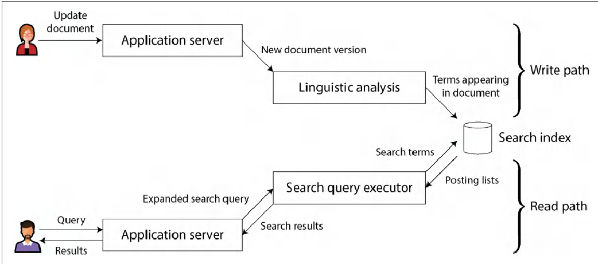

> 图 13-1。在搜索索引中，写入（文档更新）与读取（查询）相遇。

但最初为什么要创建派生数据集呢？很可能是因为你希望稍后再次查询它。这就是读取路径：在处理用户请求时，你从派生数据集中读取数据，可能进一步处理结果，然后构造返回给用户的响应。

写入路径与读取路径合在一起，涵盖了数据从收集到消费（很可能由另一个人消费）的整个旅程。写入路径是这段旅程中预先计算的部分；无论是否有人要求查看数据，只要数据一到达，就会立即急切地执行。读取路径则是只有当有人请求时才会发生的那部分旅程。如果你熟悉函数式编程语言，可能会注意到写入路径类似于及早求值，而读取路径类似于惰性求值。

如图 13-1 所示，派生数据集是写入路径与读取路径相遇的地方。它体现了写入时所需工作量与读取时所需工作量之间的权衡。

## 物化视图与缓存

全文搜索索引就是一个很好的例子：写入路径更新索引，读取路径在索引中搜索关键词。读取和写入都需要完成一些工作。写入需要为文档中出现的所有词项更新索引条目。读取则需要搜索查询中的每个词，并应用布尔逻辑来查找包含查询中所有词（`AND` 运算符），或包含每个词任一同义词（`OR` 运算符）的文档。

如果没有索引，搜索查询就必须扫描所有文档（类似于 `grep`）；文档数量很大时，这会变得非常昂贵。

没有索引意味着写入路径上的工作较少（无需更新索引），但读取路径上的工作多得多。

另一方面，可以设想预先计算所有可能查询的搜索结果。这样一来，读取路径上的工作会更少：无需布尔逻辑，只需找到查询对应的结果并返回即可。然而，写入路径会昂贵得多。可能提出的搜索查询集合是无限的（或者至少会随语料库中的词项数量呈指数增长），因此不可能预先计算所有可能的搜索结果。

另一种选择是，只为一组固定的最常见查询预先计算搜索结果，以便无需访问索引即可快速提供结果。不常见的查询仍可通过索引处理。这通常称为常见查询缓存，不过也可以称为物化视图，因为当新文档出现且应被纳入某个常见查询的结果时，它也需要随之更新。

从这个例子可以看出，索引并不是写入路径与读取路径之间唯一可能的边界。可以缓存常见搜索结果；文档数量较少时，也可以在没有索引的情况下进行类似 `grep` 的扫描。从这个角度看，缓存、索引和物化视图的作用很简单：它们移动了读取路径与写入路径之间的边界。它们让我们通过预先计算结果，在写入路径上完成更多工作，从而节省读取路径上的工作。

在写入路径与读取路径之间移动工作边界，实际上正是第 34 页“案例研究：社交网络主页时间线”中社交网络示例的主题。在那个例子中，我们还看到，与普通用户相比，名人的写入路径与读取路径边界可能采用不同的划分方式。经过 500 页，我们终于绕了一圈回到了起点！

### 有状态且支持离线的客户端

写入路径和读取路径之间存在边界，这个想法很有意思，因为我们可以讨论如何移动该边界，并探究这种移动在实践中意味着什么。让我们换一个语境来考察它。

过去，Web 浏览器是无状态客户端，只有连接互联网时才能做有用的事情（离线时几乎唯一能做的，就是在先前联网加载的页面中上下滚动）。然而，如今的单页 JavaScript Web 应用拥有许多有状态能力，包括客户端 UI 交互和 Web 浏览器中的持久化本地存储。移动应用同样可以在设备上存储大量状态，而且大多数用户交互都不需要往返服务器。

在第 220 页“同步引擎与本地优先软件”中，我们看到持久化本地状态如何支持一类应用：用户无需互联网连接即可离线工作，并在网络连接可用时在后台与远程服务器同步 [30]。由于移动设备的蜂窝网络连接有时缓慢且不可靠，如果 UI 不必等待同步网络请求，而且应用在离线状态下大体可用，用户就能获得很大便利。

当我们不再假设无状态客户端与中央数据库通信，而是转向在最终用户设备上维护状态时，一个充满新机遇的世界便展现在眼前。具体来说，可以把设备上的状态视为服务器状态的缓存。屏幕上的像素是客户端应用中模型对象的物化视图；模型对象则是远程数据中心内状态的本地副本 [31]。

## 将状态变更推送给客户端

如果你在 Web 浏览器中加载一个典型的网页，随后服务器上的数据发生了变化，那么在重新加载页面之前，浏览器并不会得知这一变化。浏览器只读取某一时刻的数据，并假定它是静态的；浏览器不会订阅来自服务器的更新。因此，浏览器中的状态是一份陈旧的缓存，除非显式轮询变更，否则不会得到更新。（基于 HTTP 的 RSS 等 Feed 订阅协议实际上只是一种基本的轮询形式。）

较新的协议已经超越了 HTTP 的基本请求/响应模式。服务器发送事件（EventSource API）和 WebSocket 提供了通信通道，Web 浏览器可以借此与服务器保持一条开放的 TCP 连接；只要连接仍然存在，服务器就可以主动向浏览器推送消息。这样，服务器便有机会主动通知最终用户客户端其本地所存状态的任何变更，从而降低客户端状态的陈旧程度。

从写入路径和读取路径的模型来看，将状态变更一路主动推送到客户端设备，意味着把写入路径一直延伸到最终用户。当客户端首次初始化时，仍然需要通过读取路径取得初始状态，但此后它可以依赖服务器发送的状态变更流。因此，我们讨论过的流处理和消息传递思想并不局限于在数据中心内运行；可以更进一步，把它们一直延伸到最终用户设备 [32]。

设备有时会离线，在此期间无法收到服务器发出的任何状态变更通知。但我们已经解决了这个问题；在第 498 页的“消费者偏移量”中，我们讨论了基于日志的消息代理的消费者如何在发生故障或断开连接后重新连接，并确保不会漏掉断线期间到达的任何消息。同样的技术也适用于单个用户，此时每台设备都是一小股事件流的小型订阅者。

### 端到端事件流

React 和 Elm [33] 等用于开发有状态客户端和 UI 的工具，已经能够响应底层状态的变化来更新渲染出的 UI。把这种编程模型扩展为也允许服务器将状态变更事件推送到客户端事件流水线中，是非常自然的做法。

这样，状态变更就可以流经一条端到端写入路径：从一台设备上触发变更的交互开始，经过事件日志、各种派生数据系统和流处理器，最终一路到达另一台设备上的用户界面。这些状态变更可以以相当低的延迟传播——例如，端到端不到一秒。

即时通信和网络游戏等一些应用已经采用了这种“实时”架构（这里指交互延迟低，而不是对响应时间作出保证）。为什么我们不以这种方式构建所有应用呢？

挑战在于，无状态客户端和请求/响应交互的假设已经深深植根于我们的数据库、程序库、框架和协议中。许多数据存储支持一次请求返回单个响应的读写操作，但支持一次请求随时间推移返回一系列响应（即能够订阅变更）的数据存储要少得多。

要把写入路径一直延伸到最终用户，我们需要从根本上重新思考许多此类系统的构建方式，从请求/响应交互转向发布/订阅数据流 [31]。这需要投入精力，但好处是能让 UI 响应更快，并提供更好的离线支持。

#### 读取也是事件

我们讨论过，当流处理器把派生数据写入存储（数据库、缓存或索引），而该存储又被查询时，存储就充当了写入路径与读取路径之间的边界。它允许对数据进行随机访问读取查询，否则就必须扫描整个事件日志。

在许多情况下，数据存储与流系统彼此分离。不过，请回想一下，流处理器也需要维护状态，才能执行聚合和联结。该状态通常隐藏在流处理器内部，但有些框架允许外部客户端查询它 [34]，从而把流处理器本身变成一种简单的数据库。

让我们把这个想法再推进一步。在目前讨论的模型中，对存储的写入要经过事件日志，而读取则是直接发往保存被查询数据的节点的临时网络请求。这是一种合理的设计，但并非唯一可行的设计。也可以把读取请求表示为事件流，让读取事件和写入事件都经过流处理器。处理器通过把读取结果发送到输出流来响应读取事件 [35]。

当写入和读取都表示为事件并路由到同一个流算子时，我们实际上是在读取查询流与数据库之间执行流—表联结。每个读取事件都需要发送到保存相关数据的数据库分片，正如批处理器和流处理器在执行联结时会按照相同的键对输入进行协同分区。

服务请求与执行联结之间的这种对应关系相当根本 [36]。一次性读取请求经过联结算子，随后算子立即忘记该请求；订阅请求则是一个持久联结，会与联结另一侧过去和未来的事件相联结。

记录读取事件日志，对于跟踪整个系统中的因果依赖关系和数据溯源也可能有益。该日志能让你重建用户在作出某项决定之前看到的内容。例如，在网上商店中，向顾客显示的预计送达日期和库存状态很可能会影响他们是否选择购买某件商品 [4]。要分析这种联系，就需要记录用户查询配送与库存状态所得的结果。

因此，把读取请求写入持久存储可以更好地跟踪因果关系，但也会带来额外的存储和 I/O 成本。如何优化这类系统以降低开销，仍是一个尚未解决的研究问题 [2]；不过，如果你已经在处理请求时出于运维目的顺带记录读取请求，那么改为让该日志成为请求来源，并不算很大的变化。

#### 多分片数据处理

对于只涉及单个分片的查询，通过流发送查询并收集响应流也许有些小题大做。然而，这一想法开启了分布式执行复杂查询的可能性：对于需要合并多个分片数据的查询，可以利用流处理器已经提供的消息路由、分片和联结基础设施。

Storm 的分布式 RPC 功能支持这种使用模式。例如，它曾被用于计算社交网络中看过某个 URL 的人数——也就是所有发布过该 URL 的人的关注者集合之并集 [37]。由于用户集合经过分片，这项计算需要合并许多分片的结果。

欺诈防范中也会出现这种模式。为了评估某笔购买事件存在欺诈的风险，可以检查用户 IP 地址、电子邮件地址、账单地址、配送地址等信息的信誉评分。这些信誉数据库本身也都经过分片，因此，要为某笔购买事件收集评分，就需要与采用不同分片方式的数据集执行一系列联结 [38]。

数据仓库查询引擎的内部查询执行图具有类似特征。如果需要执行这种多分片联结，使用原生提供该功能的数据库，很可能比用流处理器自行实现更简单。不过，把查询视为流，为实现那些规模大到触及传统现成解决方案极限的应用提供了一种选择。

### 追求正确性

对于只读取数据的无状态服务，出了问题并不是什么大事；修复缺陷并重启服务，一切就会恢复正常。数据库等有状态系统却没有这么简单。它们被设计为（差不多）永久记住事物，因此一旦出了问题，其影响也可能永久持续——这意味着需要更谨慎地思考 [39]。

我们希望构建可靠且正确的应用（也就是说，即使面对各种故障，程序的语义仍有明确定义并能为人理解）。大约四十年来，原子性、隔离性和持久性这些事务属性一直是构建正确应用的首选工具。然而，这些基础并不像表面上那样牢固：例如，弱隔离级别造成的混乱就是明证（见第 288 页的“弱隔离级别”）。

在某些领域，事务已被彻底放弃，取而代之的是性能和可伸缩性更好、但语义更混乱的模型。人们经常谈论一致性，却很少给出清晰定义。有些人断言，为了获得更好的可用性，我们应该“拥抱弱一致性”，但对这在实践中意味着什么并没有清楚认识。

对于如此重要的主题，我们的理解和工程方法却出奇地不可靠。例如，要判断某个应用在特定事务隔离级别或复制配置下运行是否安全，是非常困难的 [40, 41]。简单的解决方案往往在并发度较低且没有故障时看似正确，却会在要求更高的环境中暴露出许多隐蔽的缺陷。

例如，Kyle Kingsbury 的 Jepsen 实验 [42] 揭示了某些产品宣称的安全保证与其面对网络问题和崩溃时的实际行为之间存在鲜明差距。即使数据库等基础设施产品没有问题，应用代码仍需正确使用它们提供的功能；如果配置难以理解（弱隔离级别、法定人数配置等便是如此），这也很容易出错。

如果你的应用能够容忍偶尔以不可预测的方式损坏或丢失数据，日子会轻松许多，或许只要祈祷好运便能侥幸过关。如果你需要更强的正确性保证，可串行化和原子提交是成熟的方法，但它们也有代价。它们通常只能在单个数据中心内工作（因而排除了地理分布式架构），并且会限制系统能够达到的规模和容错特性。

传统的事务方法不会消失，但它并不是让应用正确且能从容应对故障的终极答案。本节将探讨在数据流架构的背景下思考正确性的其他方式。

### 数据库的端到端论证

应用使用了提供较强安全属性（例如可串行化事务）的数据系统，并不意味着该应用就一定不会丢失或损坏数据。例如，如果应用中的缺陷导致它写入错误数据或从数据库删除数据，可串行化事务也救不了你。这支持了采用不可变、仅追加数据的观点，因为禁止有缺陷的代码破坏正确数据之后，从这类错误中恢复会更加容易。

不可变性虽然有用，却并非包治百病。下面来看一个更微妙的数据损坏示例。

### 操作的恰好执行一次

在第 328 页的“跨不同系统的分布式事务”中，我们在消息处理的语境下介绍了恰好一次（或效果恰好一次）语义。其思路是：如果处理消息时出了问题，你可以放弃（丢弃消息并承受数据丢失），也可以重试。如果重试，就存在这样一种风险：第一次处理其实已经成功，只是没有收到确认，于是消息最终被处理了两次。

处理两次是一种数据损坏：我们不希望针对同一项服务向顾客收费两次（多收费用），也不希望把计数器递增两次（夸大指标）。在此语境下，*恰好一次*是指这样安排计算：即使操作因故障而重试，最终效果仍与没有发生故障时相同。我们讨论过实现这一目标的几种方法。

最有效的方法之一是让操作具有幂等性——也就是说，无论执行一次还是多次，它的效果都相同。不过，要让一个本质上不具幂等性的操作变得幂等，需要投入精力并谨慎处理。你可能需要维护额外的元数据（例如更新过某个值的操作 ID 集合），还要确保从一个节点故障切换到另一个节点时进行隔离防护（见第 373 页的“分布式锁和租约”）。

## 重复抑制

除了流处理之外，许多地方也存在抑制重复的相同需求模式。例如，TCP 利用数据包的序列号在接收端恢复正确顺序，并判断网络中是否有数据包丢失或重复。所有丢失的数据包都会重传，所有重复的数据包都会由 TCP 协议栈移除，然后才把数据交给应用。

不过，这种重复抑制只在单条 TCP 连接的上下文中有效。假设这条 TCP 连接是客户端与数据库之间的连接，而且当前正在执行示例 13-1 中的事务。在许多数据库中，事务与客户端连接绑定（如果客户端发送多条查询，数据库知道它们属于同一个事务，因为它们通过同一条 TCP 连接发送）。如果客户端发送 `COMMIT` 后、收到数据库服务器的响应前遭遇网络中断和连接超时，它就不知道事务究竟已经提交还是中止（图 9-1 展示过这种情况）。

示例 13-1。从一个账户向另一个账户转账的非幂等操作

```sql
BEGIN TRANSACTION;

UPDATE accounts SET balance = balance + 11.00 WHERE account_id = 1234;
UPDATE accounts SET balance = balance - 11.00 WHERE account_id = 4321;
COMMIT;
```

客户端可以重新连接数据库并重试事务，但这时已经超出了 TCP 重复抑制的作用范围。由于示例 13-1 中的事务不具幂等性，最终可能转账 \$22，而不是预期的 \$11。因此，尽管这样的代码是演示事务原子性的标准示例，它却并不正确，真正的银行也不会这样运作 [3]。

2PC 协议（见第 324 页的“两阶段提交”）打破了 TCP 连接与事务之间的一一对应关系，因为它必须允许事务协调者在发生网络故障后重新连接数据库，并告知数据库应提交还是中止一个未决事务。这足以确保事务只执行一次吗？遗憾的是，并不足够。

即使能够抑制数据库客户端与服务器之间的重复事务，我们仍需考虑最终用户设备与应用服务器之间的网络。例如，如果最终用户客户端是 Web 浏览器，它很可能使用 HTTP POST 请求向服务器提交指令。用户的蜂窝数据连接也许很弱，他们成功发出了 POST 请求，却在收到服务器响应之前失去了信号。

在这种情况下，用户很可能会看到错误消息，并可能手动重试。Web 浏览器会警告：“确定要再次提交此表单吗？”——用户会选择确定，因为他们希望操作得以执行。（Post/Redirect/Get 模式 [43] 可以避免正常操作中的这条警告消息，但如果 POST 请求超时，它也无济于事。）从 Web 服务器的角度看，重试是一个独立请求；从数据库的角度看，它是一个独立事务。常规的去重机制帮不上忙。

### 唯一标识请求

要让一个跨越多跳网络通信的请求具有幂等性，仅依赖数据库提供的事务机制是不够的。你需要考虑请求的端到端流转过程。

例如，可以为每个请求生成一个唯一标识符（如 UUID），并在客户端应用中将其作为隐藏表单字段；也可以对所有相关表单字段计算哈希值，从而派生出请求 ID [3]。如果 Web 浏览器提交同一个 POST 请求两次，这两个请求将具有相同的请求 ID。随后可以让该请求 ID 一路传递到数据库，并检查给定 ID 的请求始终只执行一次，如示例 13-2 所示。

示例 13-2。使用唯一 ID 抑制重复请求

```sql
ALTER TABLE requests ADD UNIQUE (request_id);

BEGIN TRANSACTION;

INSERT INTO requests
(request_id, from_account, to_account, amount)
VALUES('0286FDB8-D7E1-423F-B40B-792B3608036C', 4321, 1234, 11.00);

UPDATE accounts SET balance = balance + 11.00 WHERE account_id = 1234;
UPDATE accounts SET balance = balance - 11.00 WHERE account_id = 4321;

COMMIT;
```

这段代码依赖 `request_id` 列上的唯一性约束。如果事务试图插入一个已经存在的 ID，`INSERT` 就会失败，事务也会中止，从而防止其生效两次。即使在较弱的隔离级别下，关系数据库通常也能正确维护唯一性约束（相比之下，应用层面的“先检查后插入”在不可串行化隔离下可能失败，如第 303 页的“写偏差与幻读”所述）。

除了抑制重复请求，示例 13-2 中的 requests 表还充当了一种事件日志，可用于事件溯源或 CDC。账户余额的更新不必与事件插入发生在同一个事务中，因为这些更新是冗余的，可以由下游消费者根据请求事件派生出来——只要该事件恰好处理一次即可，而这同样可以利用请求 ID 来保证。

### 端到端论证

抑制重复事务的场景只是一个更一般原则的例子，这项原则称为*端到端论证*，由 Saltzer、Reed 和 Clark 于 1984 年提出 [44]：

只有借助位于通信系统端点的应用所掌握的知识并得到它的帮助，相关功能才能完整、正确地实现。因此，不可能把该功能作为通信系统自身的一项功能来提供。（有时，通信系统提供的不完整版本可以作为一种性能增强手段。）

在我们的示例中，*相关功能*就是重复抑制。我们看到，TCP 在 TCP 连接层面抑制重复数据包，一些流处理器在消息处理层面提供所谓的恰好一次语义，但这不足以防止用户在第一次请求超时后提交重复请求。单凭 TCP、数据库事务和流处理器，无法彻底排除这些重复。解决该问题需要端到端的方案：让事务标识符从最终用户客户端一路传递到数据库。

端到端论证也适用于检查数据完整性。以太网、TCP 和 TLS 内置的校验和可以检测网络中数据包的损坏，但无法检测网络连接发送端和接收端的软件缺陷导致的损坏，也无法检测数据存储磁盘上的损坏。如果想捕获所有可能的数据损坏来源，还需要端到端校验和。

类似的论证也适用于加密 [44]。家庭 WiFi 网络的密码可以防止他人窥探你的 WiFi 流量，却无法防范互联网其他位置的攻击者；客户端与服务器之间的 TLS/SSL 可以防范网络攻击者，却无法应对服务器遭入侵。只有端到端加密和身份认证才能防范所有这些威胁。

尽管底层功能（TCP 重复抑制、以太网校验和、WiFi 加密）自身无法提供所需的端到端功能，它们仍然很有用，因为它们降低了高层出现问题的概率。例如，如果没有 TCP 把数据包恢复为正确顺序，HTTP 请求就会经常遭到破坏。我们只需记住，底层可靠性功能本身不足以保证端到端正确性。

## 在数据系统中运用端到端思维

这让我们回到最初的论点：应用使用了提供较强安全属性（例如可串行化事务）的数据系统，并不意味着该应用就一定不会丢失或损坏数据。应用本身也需要采取重复抑制等端到端措施。

这很遗憾，因为容错机制很难正确实现。TCP 中的底层可靠性机制相当有效，因此剩下的高层故障很少发生。如果能把高层容错机制封装成一种抽象，让应用代码不必操心，那当然再好不过——但我们似乎还没有找到合适的抽象。

长期以来，事务一直被视为一种有用的抽象。正如第 8 章所讨论的，事务把各种可能出现的问题（并发写入、违反约束、崩溃、网络中断、磁盘故障）归结为两种可能的结果：提交或中止。这极大地简化了编程模型，但仍然不够。

事务成本高昂，涉及异构存储技术时尤其如此（见第 328 页的“跨不同系统的分布式事务”）。当我们因分布式事务成本过高而拒绝使用它时，最终就不得不在应用代码中重新实现容错机制。正如本书大量示例所表明的，对并发和部分失效进行推理既困难又反直觉，因此大多数应用层机制都不能正确工作，结果便是数据丢失或损坏。

出于这些原因，值得探索这样的容错抽象：既能轻松提供应用特定的端到端正确性属性，又能在大规模分布式环境中保持良好的性能和运维特性。

### 强制实施约束

让我们结合拆分数据库的相关思想来思考正确性。我们看到，借助从客户端一路传递到记录写入的数据库的请求 ID，可以实现端到端重复抑制。那么其他类型的约束呢？

具体来说，让我们关注唯一性约束，例如示例 13-2 所依赖的约束。在第 409 页的“约束与唯一性保证”中，我们还看到过一些需要强制保证唯一性的应用功能示例：用户名或电子邮件地址必须唯一标识一个用户；文件存储服务中不能有多个同名文件；两个人不能预订同一架航班或同一家剧院中的同一个座位。

其他类型的约束也非常相似——例如，确保账户余额永不为负，销售的商品数量不超过仓库库存，或者会议室不存在时间重叠的预订。强制保证唯一性的技术通常也可以用于这类约束。

## 唯一性约束需要共识

在第 10 章中，我们看到，在分布式环境中实施唯一性约束需要共识。如果多个并发请求具有相同的值，系统就需要以某种方式决定接受相互冲突的操作中的哪一个，并将其他操作作为违反约束的情况拒绝。

达成这种共识最常见的方法是让单个节点成为主节点，由它负责做出所有决定。只要你不介意让所有请求都经过单个节点（即使客户端远在世界另一端），并且该节点不发生故障，这种方法就能很好地工作。Raft 等共识算法解决了当前主节点发生故障（或者由于网络问题而被认为发生了故障）时如何安全选举新主节点以及如何防止脑裂的问题。

可以根据需要保持唯一的值进行分片，从而扩展唯一性检查。例如，如果需要像示例 13-2 那样确保请求 ID 的唯一性，就可以确保具有相同请求 ID 的所有请求都被路由到同一个分片。如果需要保证用户名唯一，则可以按照用户名的哈希值进行分片。

然而，异步多主节点复制并不可行，因为不同的主节点可能并发接受相互冲突的写入，使这些值不再唯一。如果希望立即拒绝任何违反约束的写入，同步协调就不可避免 [45]。

### 基于日志的消息传递中的唯一性

共享日志可确保所有消费者以相同的顺序看到消息（即全序广播保证；正如我们在第 427 页的“共识的多种面貌”中所确定的那样，它等价于共识）。在采用基于日志的消息传递的数据库拆分方案中，我们可以使用非常相似的方法来实施唯一性约束。

流处理器在单个线程上依次消费日志分片中的所有消息。因此，如果按照需要保持唯一的值对日志进行分片，流处理器就能明确且确定性地判断多个冲突操作中哪一个最先出现在日志中。例如，当多个用户试图注册同一个用户名时 [46]：

1. 每个用户名申请都被编码为一条消息，并追加到由用户名哈希值决定的分片中。

2. 流处理器依次读取日志中的请求，并使用本地数据库记录哪些用户名已被占用。对于每个申请可用用户名的请求，它会将该名称记录为已占用，并向输出流发出成功消息。对于每个申请已被占用用户名的请求，它会向输出流发出拒绝消息。

3. 申请用户名的客户端监视输出流，等待与其请求相对应的成功或拒绝消息。

这一算法与我们在第 10 章中看到的使用共享日志达成共识的构造相同。通过增加分片数量，它可以轻松扩展到很高的请求吞吐量，因为每个分片都可以独立处理。

这种方法不仅适用于唯一性约束，也适用于许多其他类型的约束。其基本原则是，将任何可能发生冲突的写入路由到同一个分片并按顺序处理。冲突的定义可能取决于具体应用，但流处理器可以使用任意逻辑来验证请求。

### 多分片请求处理

当涉及多个分片时，如何在满足约束的同时确保操作以原子方式执行，会变得更加有趣。在示例 13-2 中，可能有三个分片：一个包含请求 ID，一个包含收款方账户，另一个包含付款方账户。由于这三者彼此独立，没有理由把它们放在同一个分片中。

按照传统数据库方法，执行这个事务需要在所有三个分片之间进行原子提交，这实质上迫使它相对于这些分片上所有其他事务形成全序。由于现在存在跨分片协调，各个分片不再能独立处理，因此吞吐量很可能会受到影响。

然而，使用分片日志和流处理器，无需跨分片事务也能获得同等的正确性。图 13-2 展示了一笔支付事务的示例：它需要检查来源账户是否有足够的资金；如果有，则以原子方式将一笔金额转入目标账户，同时扣除手续费。

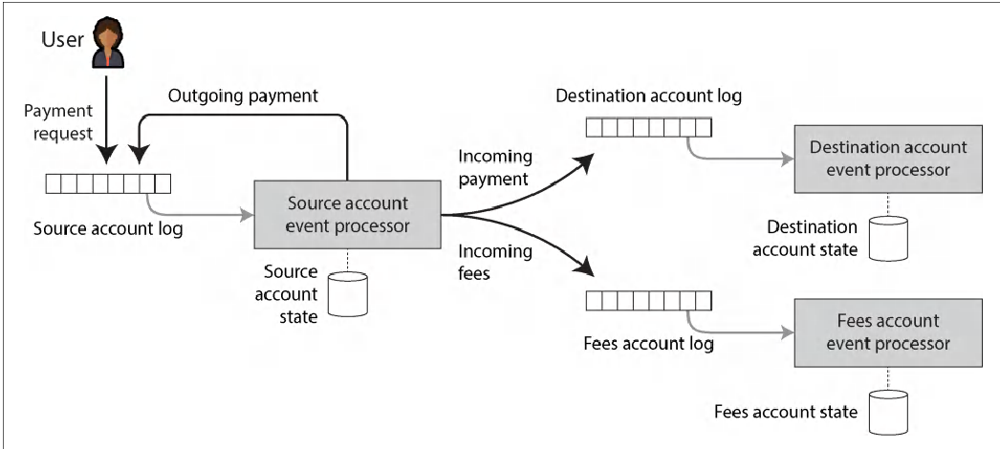

> 图 13-2。使用事件日志和流处理器，检查来源账户是否有足够资金，并以原子方式将资金转入目标账户和手续费账户。

该过程的工作方式如下 [47]：

1. 用户的客户端为从来源账户向目标账户转账的请求分配一个唯一请求 ID，并将请求追加到根据来源账户 ID 确定的日志分片中。

2. 流处理器读取请求日志，并维护一个数据库，其中包含来源账户的状态以及已经处理过的请求 ID。该数据库的内容完全派生自日志。当流处理器遇到一个从未见过的请求 ID 时，它会在本地数据库中检查来源账户是否有足够资金完成转账。

如果有，它就更新本地数据库，在来源账户上预留支付金额，并向其他几个日志发出事件：向来源账户的日志分片（也就是它自己的输入日志）发出一条付款事件，向目标账户的日志分片发出一条收款事件，并向手续费账户的日志分片发出一条收款事件。原始请求 ID 会包含在这些发出的事件中。

3. 最终，付款事件会被送回来源账户处理器（在此期间，该处理器可能已收到无关事件）。流处理器根据请求 ID 识别出这是它先前预留的一笔支付，于是执行支付，并再次更新来源账户的本地状态。它根据请求 ID 忽略重复事件。

4. 目标账户和手续费账户的日志分片由相互独立的流处理任务消费。当它们收到收款事件时，会更新本地状态以反映这笔支付，并根据请求 ID 对事件去重。

图 13-2 将三个账户画在三个不同的分片中，但它们同样可以位于同一个分片中——这并不重要。唯一的要求是，任何给定账户的事件都必须严格按照日志顺序、以至少一次语义进行处理，并且流处理器必须是确定性的。

例如，考虑来源账户处理器在处理支付请求时崩溃会发生什么。崩溃发生前，输出消息可能已经发出，也可能尚未发出。从崩溃中恢复后，处理器会再次处理同一请求（因为采用至少一次语义），并对是否允许支付做出相同的决定（因为它是确定性的）。因此，它会向付款、收款和手续费账户分片发出具有相同请求 ID 的同样输出消息。如果这些消息是重复的，下游消费者会根据请求 ID 忽略它们。

这个系统中的原子性并非来自事务，而是来自这样一个事实：将初始请求事件写入来源账户日志是一个原子操作。一旦这个事件进入日志，所有下游事件最终也都会被写入——可能要等流处理器从崩溃中恢复之后，也可能出现重复，但它们最终都会出现。

采用恰好一次语义后，这个示例更容易实现，因为该语义能确保流处理器的本地状态与它已处理的消息集合一致。因此，如果流处理器崩溃并重新处理某些消息，它的本地状态也会重置为处理这些消息之前的状态。

如果图 13-2 中的用户想知道转账是否获批，可以订阅来源账户的日志分片，等待付款事件。为了在余额不足时明确通知用户，流处理器可以向该日志分片发出一条“支付被拒”事件。

通过把多分片事务拆分成若干采用不同分片方式的阶段，并使用端到端请求 ID，即使存在故障，我们也能在不使用原子提交协议的情况下获得相同的正确性属性（每个请求在付款方和收款方账户上都恰好应用一次）。

## 及时性与完整性

许多事务系统有一个很方便的属性：一个事务一旦提交，其写入便立即对其他事务可见。该属性被形式化为*严格可串行化*（参见第 407 页的“线性一致性与可串行化”）。

把一个操作拆分到流处理器的多个阶段时，情况并非如此。日志消费者在设计上就是异步的，因此生产者不会等到其消息被消费者处理完毕。不过，客户端可以等待消息出现在输出流中，就像图 13-2 中的用户等待付款事件或支付被拒事件一样；出现哪种事件取决于来源账户中是否有足够资金。

在这个示例中，来源账户余额检查的正确性并不取决于发出请求的用户是否等待结果。等待的目的只是同步告知用户支付是否成功；这种通知与处理请求所产生的效果是解耦的。

更一般地说，*一致性*一词混合了两个值得分开考虑的要求：

### 及时性

及时性意味着确保用户观察到的是系统的最新状态。我们先前看到，如果用户从陈旧的数据副本中读取，可能会观察到不一致的状态（参见第 209 页的“复制延迟问题”）。不过，这种不一致是暂时的，只需等待后重试，最终就会消除。

CAP 定理所说的“一致性”是指线性一致性，而线性一致性是实现及时性的一种强方式。写后读一致性等较弱的及时性属性也可能很有用。

### 完整性

完整性意味着不存在损坏——没有数据丢失，也没有相互矛盾或虚假的数据。特别是，如果派生数据集被维护为底层数据的视图，那么派生过程必须正确。例如，数据库索引必须正确反映数据库的内容——缺少记录的索引用处不大。

如果完整性遭到破坏，不一致就是永久性的；在大多数情况下，等待后重试并不能修复数据库损坏，而是需要明确地检查和修复。在 ACID 事务的语境中，“一致性”通常被理解为某种特定于应用的完整性概念。原子性和持久性是维护完整性的重要工具。

用一句口号概括：最终一致性允许违反及时性，而违反完整性则会造成永久不一致。

在大多数应用中，完整性远比及时性重要。违反及时性可能令人烦恼和困惑，但违反完整性可能带来灾难性后果。

例如，你在过去 24 小时内完成的一笔交易尚未出现在信用卡账单上，并不令人意外。这些系统存在一定延迟是正常的。我们知道银行以异步方式对账和结算交易，因此及时性在这里并不十分重要 [3]。然而，如果账单余额不等于各笔交易之和加上上一期账单余额（求和出错），或者一笔交易向你收了款却没有支付给商户（钱凭空消失），那就非常糟糕。这些问题都违反了系统的完整性。

### 数据流系统的正确性

ACID 事务通常同时提供及时性保证（例如线性一致性）和完整性保证（例如原子提交）。因此，如果从 ACID 事务的角度看待应用正确性，及时性与完整性之间的区别就不太重要。

另一方面，本章讨论的基于事件的数据流系统有一个有趣的属性：它们将及时性与完整性解耦。异步处理事件流时，并不能保证及时性，除非你明确构建了在返回前等待消息到达的消费者。例如，用户可以请求一笔支付，然后在流处理器执行该请求之前读取其账户状态；用户将看不到刚刚请求的这笔支付。

然而，完整性实际上是流系统的核心。正如我们所看到的，恰好一次或效果恰好一次语义是维护完整性的一种机制。如果事件丢失或生效两次，数据系统的完整性就可能遭到破坏。因此，容错的消息传递和重复抑制（例如幂等操作）对于在故障面前维护数据系统的完整性十分重要。

正如上一节所述，可靠的流处理系统无需分布式事务和原子提交协议就能保持完整性，这意味着它们有可能以好得多的性能和运维稳健性实现相当的正确性。我们通过结合以下机制实现了这种完整性：

- 将写操作的内容表示为一条消息，从而可以轻松地以原子方式写入——这种方法非常适合事件溯源

- 通过确定性的派生函数从这一条消息派生出所有其他状态更新，类似于存储过程

- 让客户端生成的请求 ID 贯穿所有这些处理层级，从而实现端到端重复抑制和幂等性

- 使消息不可变，并允许不时重新处理派生数据，从而更容易从缺陷中恢复

### 宽松解释的约束

如前所述，实施唯一性约束需要共识，通常通过让特定分片中的所有事件都经过单个节点来实现。如果我们想要传统形式的唯一性约束，这一限制就不可避免，流处理也无法绕过它。

然而，许多实际应用在业务上要求允许违反那些可能被视为硬性约束的条件：

- 如果客户订购的商品超过仓库库存，你可以补充订货、为延迟道歉并给客户优惠。这与你不得不应对如下情况没有区别：比如一辆叉车压坏了仓库中的一些商品，导致实际库存少于预期 [3]。因此，为了应对此类事件，道歉工作流无论如何都需要成为业务流程的一部分，而对库存商品数量施加硬性约束可能没有必要。

- 同样，许多航空公司会超售机票，因为它们预计一些乘客会误机；许多酒店也会超售客房，因为它们预计一些客人会取消预订。在这些情况下，出于业务原因，“每个座位限一人”的约束被有意违反，并通过补偿流程（退款、升舱、在附近酒店免费提供房间）来处理需求超过供给的情况。即使没有超售，也需要道歉和补偿流程来应对因恶劣天气或员工罢工而取消航班等事件——从这类问题中恢复本来就是业务的正常组成部分 [3]。

- 如果有人提取的金额超过账户余额，银行可以收取透支费，并要求其偿还欠款。通过限制每日提款总额，可以将银行承担的风险控制在一定范围内。

- 在跨组织集成数据的系统中，不一致不可避免，因此必须有纠正机制来处理这些不一致。正如第 476 页的“批处理用例”中所述，银行之间的支付结算就是一个例子。

因此，在许多业务场景中，暂时违反约束并在事后通过道歉予以修正是可以接受的。这种用于纠正错误的变更称为*补偿事务* [48, 49]。道歉的成本（金钱或声誉方面）各不相同，但往往相当低；你无法撤回已经发出的电子邮件，但可以再发一封邮件进行更正。如果不小心对信用卡扣款两次，可以退还其中一笔，你付出的成本只是处理费，或许再加上一项客户投诉。一旦 ATM 吐出了现金，就无法直接收回，不过原则上，如果账户已经透支而客户又不愿归还，仍可派催收人员追回这笔钱。

道歉的成本是否可以接受，是一个业务决策。如果可以接受，那么在写入数据之前检查所有约束的传统模型就过于严格了。以乐观方式先执行写入，再事后检查约束，很可能是合理的。你仍然可以确保在采取难以挽回的高成本行动之前完成验证，但这并不意味着连数据写入之前都必须进行验证。

这些应用确实需要完整性。你不会希望预订记录丢失，也不会希望由于贷记与借记不匹配而导致资金消失。但它们不要求及时实施约束。如果卖出的商品超过仓库库存，可以在事后补救。这样做类似于我们在第 222 页的“处理写入冲突”中讨论的冲突解决方法。

### 避免协调的数据系统

现在，我们已经得出了两个有趣的观察：

- 数据流系统无需原子提交、线性一致性或同步跨分片协调，就能维持派生数据的完整性保证。

- 尽管严格的唯一性约束需要及时性和协调，但许多应用可以接受可能被暂时违反、随后再修正的宽松约束，只要整个过程中完整性始终得以保持。

综合这两个观察可知，数据流系统可以在不需要协调的情况下为许多应用提供数据管理服务，同时仍能给出强完整性保证。这类避免协调的数据系统很有吸引力；与需要执行同步协调的系统相比，它们可以获得更好的性能和容错能力 [45]。

例如，这样的系统可以采用多主节点配置，分布在多个数据中心运行，并在各区域之间进行异步复制。任何一个数据中心都可以独立于其他数据中心继续运行，因为不需要同步的跨区域协调。这样的系统只有较弱的及时性保证——如果不引入协调，就无法实现线性一致性——但仍然可以提供强完整性保证。

在这种情况下，可串行化事务对于维护派生状态仍然有用，但可以将它们限制在较小的范围内运行，使其良好工作 [6]。不需要 XA 事务等异构分布式事务。仍然可以在需要的地方引入同步协调（例如，在执行无法恢复的操作之前实施严格约束），但如果只有应用的一小部分需要协调，就没必要让所有部分都承担协调成本 [32]。

从另一个角度看，协调和约束可以减少你因不一致而需要道歉的次数，但也可能降低系统的性能和可用性，从而可能增加你因服务中断而需要道歉的次数。你无法把道歉次数降为零，但可以努力找到最适合自身需求的权衡点——既不会有太多不一致，也不会有太多可用性问题的最佳位置。

## 信任，但要验证

我们关于正确性、完整性和容错的所有讨论，都基于这样一种假设：某些事情可能出错，而另一些不会。我们把这类假设称为*系统模型*（参见第 380 页的“系统模型与现实”）。例如，我们应当假设进程可能崩溃、机器可能突然断电，而网络可能任意延迟或丢弃消息。我们也可能假设，调用 `fsync` 后写入磁盘的数据不会丢失，内存中的数据不会损坏，CPU 的乘法指令总能返回正确结果。

这些假设相当合理，因为它们在绝大多数时候都成立；如果必须时刻担心计算机出错，我们将很难完成任何工作。传统上，系统模型以二元方式对待故障：我们假设某些事情可能发生，另一些事情绝不会发生。现实中，这更多是概率问题：有些事情更有可能发生，另一些则可能性较低。问题在于，违反这些假设的情况是否频繁到足以让我们在实践中遇到。

我们已经看到，数据可能在内存中损坏（参见第 44 页的“硬件与软件故障”）、在磁盘上损坏（参见第 283 页的“复制与持久性”），也可能在网络上传输时损坏（参见第 379 页的“弱形式的说谎”）。也许我们应该更加重视这个问题？当运行规模足够大时，即便概率极低的事情也会发生。

### 面对软件缺陷时维护完整性

除了这些硬件问题，软件缺陷的风险也始终存在，而底层网络、内存或文件系统的校验和无法捕获这类问题。即使广泛使用的数据库软件也存在缺陷——例如，过去版本的 MySQL 曾无法正确维护唯一性约束 [50]，PostgreSQL 的可串行化隔离级别过去也曾出现写偏差异常 [51]；而 MySQL 和 PostgreSQL 都是稳健且广受好评的数据库，经过许多人多年的实战检验。成熟度较低的软件，情况很可能糟糕得多。

尽管在谨慎设计、测试和审查方面投入了大量精力，缺陷仍会悄然混入。虽然它们很少见，而且最终会被发现并修复，但在一段时间内，这些缺陷仍可能损坏数据。

对于应用代码，我们必须假设其中存在更多缺陷，因为大多数应用获得的审查和测试远远比不上数据库代码。许多应用甚至没有正确使用数据库为维护完整性而提供的功能，例如外键约束或唯一性约束 [25]。

ACID 意义上的一致性基于这样一种思想：数据库从一致状态开始，一个事务将它从一个一致状态转换到另一个一致状态。因此，我们预期数据库始终处于一致状态。然而，只有假设事务本身没有缺陷，这一概念才有意义。如果应用以某种方式错误地使用数据库——例如，不安全地使用较弱的隔离级别——数据库的完整性便无法得到保证。

### 不要盲目信任它们的承诺

硬件和软件都不总能达到我们的理想标准，因此数据迟早发生损坏似乎不可避免。所以，我们至少应该有办法发现数据是否已经损坏，以便修复它，并尝试追查错误的来源。检查数据完整性的过程称为审计。

正如第 509 页的“不可变事件的优势”中所讨论的，审计并非只适用于金融应用。然而，审计能力在金融领域极为重要，正是因为每个人都知道错误难免发生，并且我们都承认必须能够发现和修复问题。

成熟的系统同样往往会考虑小概率故障发生的可能性，并管理这种风险。例如，HDFS 和 Amazon S3 等大规模存储系统并不完全信任磁盘。这些系统运行后台进程，持续回读文件、将其与其他副本比较，并把文件从一块磁盘迁移到另一块磁盘，以降低静默损坏的风险 [52, 53]。

如果想确认数据仍然存在，就必须读取并检查它。绝大多数时候数据仍会在那里，但如果不在，你会希望尽早发现，而不是等到为时已晚。根据同样的道理，时不时尝试从备份恢复也很重要——否则，你可能直到为时已晚、数据已经丢失时，才发现备份是坏的。不要盲目信任一切都在正常工作。

HDFS 和 S3 这类系统仍然必须假设磁盘在大多数时候都能正常工作——这是一个合理的假设，但并不等同于假设它们*始终*正常工作。不过，目前采用这种“信任，但要验证”的方式、持续审计自身的系统并不多。许多系统假定正确性保证是绝对的，没有为罕见的数据损坏预留应对措施。未来，我们或许会看到更多*自验证*或*自审计*系统：它们持续检查自身的完整性，而不是依赖盲目信任 [54]。

## 为可审计性而设计

如果一个事务修改了数据库中的多个对象，事后可能很难判断其背后的原因。即便捕获了事务日志，各个表中的插入、更新和删除也未必能清楚说明为什么要执行这些修改。决定这些修改的应用逻辑调用是转瞬即逝的，无法复现。

相比之下，基于事件的系统可以提供更好的可审计性。在事件溯源方法中，用户对系统的输入表示为单个不可变事件，由此产生的任何状态更新都从该事件派生而来。这一派生过程可以做到确定且可重复，因此，让同一份事件日志通过同一版本的派生代码，就会产生相同的状态更新。

明确表达数据流会使数据的来源清晰得多，从而让完整性检查更切实可行。对于事件日志，我们可以使用哈希来检查事件存储是否已损坏。对于任何派生状态，我们可以重新运行从事件日志派生该状态的批处理器和流处理器，检查能否得到相同结果，甚至可以并行运行一套冗余的派生过程。

确定且定义明确的数据流也让调试和跟踪系统执行过程变得更容易，从而能够判断系统为什么做了某件事 [4, 55]。如果发生了意外情况，能够复现导致该意外事件的确切环境会很有价值——这是一种时间旅行调试能力。

### 再谈端到端论证

如果我们无法完全相信系统的每个组件都不会发生损坏——无法相信每一件硬件都没有故障、每一段软件都没有缺陷——那么至少必须定期检查数据的完整性。如果不检查，我们就无法发现损坏，直到为时已晚且已经造成某些下游损害；到那时，追查问题会困难得多，成本也高得多。

检查数据系统的完整性，最好采用端到端的方式。完整性检查所涵盖的系统越多，损坏在流程某个阶段未被察觉的机会就越少。如果能够端到端检查整条派生数据流水线是否正确，那么路径上的所有磁盘、网络、服务和算法也就隐含地纳入了检查范围。

持续进行端到端完整性检查，会增强你对系统正确性的信心，进而让你能够更快地推进工作 [56]。与自动化测试一样，审计提高了迅速发现缺陷的概率，因而降低了系统变更或采用新存储技术造成损害的风险。如果不害怕做出改变，就能更好地演进应用，以适应不断变化的需求。

## 可审计数据系统的工具

目前，将可审计性作为首要关注点的数据系统并不多。有些应用实现了自己的审计机制——例如，把所有变更记录到单独的审计表中——但要保证审计日志和数据库状态的完整性仍然很困难。可以用硬件安全模块定期为事务日志签名，使其防篡改，但这并不能保证一开始写入日志的就是正确的事务。

Bitcoin 和 Ethereum 等区块链是带有密码学一致性检查的共享型仅追加日志；它们存储的事务就是事件，而智能合约基本上就是流处理器。它们使用的共识协议确保所有节点就同一事件序列达成一致。它们与第 10 章所述共识协议的区别在于，区块链具有拜占庭容错能力——也就是说，即使某些参与节点的数据已损坏，它们仍能工作，因为各个副本会持续相互检查完整性。

对大多数应用而言，区块链的开销太高，难以实用。不过，它的一些密码学工具也可以用于更轻量的场景。例如，*Merkle 树* [57] 是由哈希组成的树，可以用来高效证明某条记录出现在某个数据集中（以及证明其他一些事项）。*证书透明度*使用经密码学验证的仅追加日志和 Merkle 树来检查 TLS/SSL 证书的有效性 [58, 59]；它通过让每份日志只有一个主节点，避免了对共识协议的需求。

未来，类似证书透明度和分布式账本所用的完整性检查与审计算法，或许会在一般的数据系统中得到更广泛的应用。要让它们具备与无密码学审计的系统相当的可伸缩性，并把性能损失尽可能降到最低，还需要开展一些工作；但无论如何，它们都很值得关注。

<a id="chapter-13-summary"></a>

## 小结

本章讨论了基于流处理思想设计数据系统的新方法。我们首先观察到，没有任何单一工具能够高效满足所有可能的用例，因此应用必须组合多个软件组件来实现目标。我们讨论了如何利用批处理和事件流，让数据变更在系统之间流动，从而解决这一*数据集成*问题。

在这种方法中，某些系统被指定为记录系统，其他数据则通过转换从中派生。这样，我们就能维护索引、物化视图、机器学习模型、统计摘要等内容。让这些派生和转换以异步、松耦合的方式进行，有助于防止一个区域的问题扩散到无关区域，从而提高整个系统的稳健性和容错能力。

把数据流表达为从一个数据集到另一个数据集的转换，也有助于应用演进。如果想改变某个处理步骤——例如调整索引或缓存的结构——只需在整个输入数据集上重新运行新的转换代码，重新派生输出即可。同样，如果出了问题，也可以修复代码并重新处理数据来恢复。

这些过程与数据库内部已经在做的事情十分相似，因此我们把数据流应用这一思想重新表述为：将数据库的组件*拆分*出来，通过组合这些松耦合的组件来构建应用。

可以通过观察底层数据的变更来更新派生状态。下游消费者也可以观察该状态。我们甚至可以让这条数据流一直延伸到显示数据的最终用户设备，从而构建能够随数据变更动态更新、并可继续离线工作的用户界面。

接下来，我们讨论了如何确保所有这些处理在发生故障时仍保持正确。我们看到，通过使用端到端请求标识符使操作具有幂等性，并以异步方式检查约束，就能借助异步事件处理，以可伸缩的方式实现强完整性保证。客户端既可以等到检查通过，也可以不等待就继续，但这样做要承担因违反约束而不得不道歉的风险。这种方式比使用分布式事务的传统方法更具可伸缩性和稳健性，也符合许多业务流程在实践中的运作方式。

通过围绕数据流组织应用并异步检查约束，我们可以避免大多数协调，构建出既能维护完整性、又有良好性能的系统，即使在地理分布式场景和发生故障时也是如此。最后，我们简要讨论了使用审计来验证数据完整性并检测损坏，同时指出区块链所用的技术也与基于事件的系统存在相似之处。

## 参考文献

[1] Rachid Belaid. “Postgres 全文搜索已经足够好！” rachbelaid.com，2015 年 7 月。存档于 perma.cc/ZVP9-YDCB

[2] Philippe Ajoux, Nathan Bronson, Sanjeev Kumar, Wyatt Lloyd, and Kaushik Veeraraghavan. “大规模采用更强一致性所面临的挑战。” 第 15 届 USENIX 操作系统热点研讨会（HotOS），2015 年 5 月。

[3] Pat Helland and Dave Campbell. “在流沙上建造。” 第 4 届两年一度的创新数据系统研究会议（CIDR），2009 年 1 月。存档于 arxiv.org

[4] Jessica Kerr. “分布式系统中的来源与因果关系。” jessitron.com，2016 年 9 月。存档于 perma.cc/DTD2-F8ZM

[5] Jay Kreps. “日志：每位软件工程师都应了解的实时数据统一抽象。” engineering.linkedin.com，2013 年 12 月。存档于 perma.cc/2JHR-FR64

[6] Pat Helland. “分布式事务之外的生活：一个离经叛道者的观点。” 第 3 届两年一度的创新数据系统研究会议（CIDR），2007 年 1 月。存档于 perma.cc/2GZG-UZ65

[7] Lionel A. Smith. “宽轨的故事。” Journal of the Monmouthshire Railway Society，1985 年夏。存档于 perma.cc/DDK9-JA6X

[8] Jacqueline Xu. “大规模在线迁移。” stripe.com，2017 年 2 月。存档于 perma.cc/ZQY2-EAU2

[9] Flavio Santos and Robert Stephenson. “给行驶中的公交车换轮子——Spotify 的事件交付迁移。” engineering.atspotify.com，2021 年 10 月。存档于 perma.cc/5C4V-G8EV

[10] Molly Bartlett Dishman and Martin Fowler. “敏捷架构。” O'Reilly 软件架构大会，2015 年 3 月。

[11] Nathan Marz and James Warren. *大数据：可扩展实时数据系统的原则与最佳实践*。Manning，2015。ISBN: 9781617290343

[12] Jay Kreps. “质疑 Lambda 架构。” oreilly.com，2014 年 7 月。存档于 perma.cc/PGH6-XUCH

[13] Raul Castro Fernandez, Peter Pietzuch, Jay Kreps, Neha Narkhede, Jun Rao, Joel Koshy, Dong Lin, Chris Riccomini, and Guozhang Wang. “Liquid：统一近线与离线大数据集成。” 第 7 届两年一度的创新数据系统研究会议（CIDR），2015 年 1 月。存档于 perma.cc/QMA9-8PKL

[14] Dennis M. Ritchie and Ken Thompson. “UNIX 分时系统。” *Communications of the ACM*，第 17 卷第 7 期，第 365–375 页，1974 年 7 月。doi:10.1145/361011.361061

[15] Wes McKinney. “通往可组合数据系统之路：对过去 15 年与未来的思考。” *wesmckinney.com*，2023 年 9 月。存档于 *perma.cc/J9SJ-886N*

[16] Eric A. Brewer and Joseph M. Hellerstein. “CS262a：计算机系统高级专题。” 课程讲义，加利福尼亚大学伯克利分校，cs.berkeley.edu，2011 年 8 月。存档于 perma.cc/TE79-LGWU

[17] Michael Stonebraker. “支持多存储系统的理由。” *wp.sigm.org*，2015 年 7 月。存档于 *perma.cc/G7J2-KR45*

[18] Jennie Duggan, Aaron J. Elmore, Michael Stonebraker, Magda Balazinska, Bill Howe, Jeremy Kepner, Sam Madden, David Maier, Tim Mattson, and Stan Zdonik. “BigDAWG 多存储系统。” ACM SIGMOD Record，第 44 卷第 2 期，第 11–16 页，2015 年 6 月。doi:10.1145/2814710.2814713

[19] David B. Lomet, Alan Fekete, Gerhard Weikum, and Mike Zwilling. “在云中拆分事务服务。” 第 4 届两年一度的创新数据系统研究会议（CIDR），2009 年 1 月。存档于 arxiv.org

[20] Martin Kleppmann and Jay Kreps. “Kafka、Samza 与 Unix 分布式数据哲学。” IEEE Data Engineering Bulletin，第 38 卷第 4 期，第 4–14 页，2015 年 12 月。存档于 perma.cc/BJM5-TJ4Z

[21] John Hugg. “赢在当下与未来：Volt Active Data 的优势所在。” voltactivedata.com，2016 年 3 月。存档于 perma.cc/44MP-3MWM

[22] Felienne Hermans. “电子表格就是代码。” Code Mesh，2015 年 11 月。

[23] Dan Bricklin and Bob Frankston. “VisiCalc：来自其创造者的信息。” danbricklin.com。存档于 archive.org

[24] D. Sculley, Gary Holt, Daniel Golovin, Eugene Davydov, Todd Phillips, Dietmar Ebner, Vinay Chaudhary, and Michael Young. “机器学习：技术债务的高息信用卡。” NIPS 机器学习软件工程研讨会（SE4ML），2014 年 12 月。存档于 perma.cc/M3MD-U7WL

[25] Peter Bailis, Alan Fekete, Michael J. Franklin, Ali Ghodsi, Joseph M. Hellerstein, and Ion Stoica. “野生并发控制：现代应用完整性的实证研究。” ACM 国际数据管理会议（SIGMOD），2015 年 6 月。doi:10.1145/2723372.2737784

[26] Guy Steele. “回复：需要宏（原主题：回复：Icon）。” 发给 ll1-discuss 邮件列表的电子邮件，people.csail.mit.edu，2001 年 12 月。存档于 perma.cc/K9X8-CJ65

[27] Ben Stopford. “流处理世界中的微服务。” QCon London，2016 年 3 月。

[28] Adam Bellemare. *构建事件驱动的微服务*，第 2 版。O'Reilly Media，2025。ISBN: 9798341622180

[29] Christian Posta. “微服务为什么应由事件驱动：自主权与控制权。” blog.christianposta.com，2016 年 5 月。存档于 perma.cc/E6N9-3X92

[30] Alex Feyerke. “设计离线优先的 Web 应用。” *alistapart.com*，2013 年 12 月。存档于 *perma.cc/WH7R-S2DS*

[31] Martin Kleppmann. “使用 Apache Samza 将数据库由内而外翻转。” *Strange Loop*，2014 年 9 月。存档于 *perma.cc/U6E8-A9MT*

[32] Sebastian Burckhardt, Daan Leijen, Jonathan Protzenko, and Manuel Fähndrich. “全局序列协议：复制共享状态的稳健抽象。” 第 29 届欧洲面向对象编程会议（ECOOP），2015 年 7 月。doi:10.4230/LIPIcs.ECOOP.2015.568

[33] Evan Czaplicki and Stephen Chong. “用于 GUI 的异步函数式响应式编程。” 第 34 届 ACM SIGPLAN 编程语言设计与实现会议（PLDI），2013 年 6 月。doi:10.1145/2491956.2462161

[34] Eno Thereska, Damian Guy, Michael Noll, and Neha Narkhede. “在 Apache Kafka 中统一流处理与交互式查询。” *confluent.io*，2016 年 10 月。存档于 *perma.cc/W8JG-EAZF*

[35] Frank McSherry. “作为数据库的数据流。” github.com，2016 年 7 月。存档于 perma.cc/384D-DUFH

[36] Peter Alvaro. “我明白你的意思了。” Strange Loop，2015 年 9 月。

[37] Nathan Marz. “Trident：实时计算的高级抽象。” blog.x.com，2012 年 8 月。存档于 archive.org

[38] Edi Bice. “使用 Apache Samza、Kafka 及相关工具实现低延迟 Web 规模欺诈防范。” *Merchant Risk Council MRC Vegas Conference*，2016 年 3 月。存档于 *perma.cc/T3H5-QN3R*

[39] Charity Majors. “意外成为 DBA。” charity.wtf，2016 年 10 月。存档于 perma.cc/6ANP-ARB6

[40] Arthur J. Bernstein, Philip M. Lewis, and Shi Yong Lu. “不同隔离级别下正确性的语义条件。” 第 16 届国际数据工程会议（ICDE），2000 年 2 月。doi:10.1109/ICDE.2000.839387

[41] Sudhir Jorwekar, Alan Fekete, Krithi Ramamritham, and S. Sudarshan. “自动检测快照隔离异常。” 第 33 届超大型数据库国际会议（VLDB），2007 年 9 月。

[42] Kyle Kingsbury. “分布式系统安全性研究。” jepsen.io。

[43] Michael Jouravlev. “POST 后重定向。” *theserverside.com*，2004 年 8 月。存档于 *archive.org*

[44] Jerome H. Saltzer, David P. Reed, and David D. Clark. “系统设计中的端到端论证。” ACM Transactions on Computer Systems，第 2 卷第 4 期，第 277–288 页，1984 年 11 月。doi:10.1145/357401.357402

[45] Peter Bailis, Alan Fekete, Michael J. Franklin, Ali Ghodsi, Joseph M. Hellerstein, and Ion Stoica. “数据库系统中的协调规避。” Proceedings of the VLDB Endowment，第 8 卷第 3 期，第 185–196 页，2014 年 11 月。doi:10.14778/2735508.2735509，扩展版本以 arXiv:1402.2237 发表

[46] Alex Yarmula. “Manhattan 中的强一致性。” blog.x.com，2016 年 3 月。存档于 archive.org

[47] Martin Kleppmann, Alastair R. Beresford, and Boerge Svingen. “在线事件处理：在分布式事务失败之处实现一致性。” Communications of the ACM，第 62 卷第 5 期，第 43–49 页，2019 年 5 月。doi:10.1145/3312527

[48] Jim Gray. “事务概念：优点与局限。” 第 7 届超大型数据库国际会议（VLDB），1981 年 9 月。存档于 perma.cc/8VPT-N5H6

[49] Hector Garcia-Molina and Kenneth Salem. “Saga。” ACM 国际数据管理会议（SIGMOD），1987 年 5 月。doi:10.1145/38713.38742

[50] Annamalai Gurusami and Daniel Price. “缺陷 #73170：修复缺陷 #68021 导致唯一二级索引中出现重复项。” *bugs.mysql.com*，2014 年 7 月。存档于 *perma.cc/P6BV-W7JJ*

[51] Gary Fredericks. “Postgres 可串行化缺陷。” github.com，2015 年 9 月。存档于 perma.cc/N8UP-2822

[52] Xiao Chen. “HDFS DataNode 扫描器与磁盘检查器详解。” blog.cloudera.com，2016 年 12 月。存档于 perma.cc/6S36-X98L

[53] Daniel Persson. “Ceph 擦洗是如何工作的？” youtube.com，2022 年 3 月。

[54] Jay Kreps. “正视分布式系统可靠性。” blog.empathybox.com，2012 年 3 月。存档于 perma.cc/9B5Q-AEBW

[55] Martin Fowler. “LMAX 架构。” martinfowler.com，2011 年 7 月。存档于 perma.cc/5AV4-N6RJ

[56] Sam Stokes. “满怀信心地快速行动。” five-eights.com，2016 年 7 月。存档于 perma.cc/J8C6-DHXB

[57] Ralph C. Merkle. “基于传统加密函数的数字签名。” CRYPTO '87，1987 年 8 月。doi:10.1007/3-540-48184-2_32

[58] Ben Laurie. “证书透明度。” ACM Queue，第 12 卷第 8 期，第 10–19 页，2014 年 8 月。doi:10.1145/2668152.2668154

[59] Mark D. Ryan. “增强型证书透明度与端到端加密邮件。” 网络与分布式系统安全研讨会（NDSS），2014 年 2 月。doi:10.14722/ndss.2014.23379

# 做正确的事

让 AI 系统汲取世间的美丽、丑陋与残酷，却期待它只反映美丽，这是一种幻想。

——Vinay Uday Prabhu 和 Abeba Birhane，《Large Datasets: A Pyrrhic Win for Computer Vision?》（2020）

在本书的最后一章，让我们退后一步，从更宏观的角度来看问题。全书至今，我们考察了多种多样的数据系统架构，评估了它们的优缺点，并探索了构建可靠、可伸缩且可维护的应用程序的技术。然而，我们一直遗漏了讨论中一个根本性的部分，现在应该把它补上。

每个系统都是为某种目的而构建的；我们的每个行动都会产生预期和非预期的后果。目的也许只是赚钱这么简单，但后果可能影响深远。作为构建这些系统的工程师，我们有责任仔细考虑这些后果，并确保我们的决策不会造成伤害。

我们常把数据当作一种抽象事物来谈论，但请记住，许多数据集描述的是人：他们的行为、兴趣和身份。我们必须以人道和尊重的态度对待这类数据。用户也是人，而人的尊严至高无上[1]。

软件开发越来越多地涉及重要的伦理选择。有一些准则可以帮助软件工程师应对这些问题，例如 ACM《伦理与职业行为准则》[2]，但在实践中，人们很少讨论、应用和执行这些准则。因此，工程师和产品经理有时会轻率地对待隐私及其产品可能造成的负面后果[3, 4]。

技术本身并无好坏之分——重要的是它如何被使用，以及它如何影响人。对搜索引擎这样的软件系统而言是如此，对枪支这样的武器而言也大致如此。伦理责任必须由我们承担；软件工程师不能只关注技术而忽视其后果。

不过，与计算领域的大部分概念不同，伦理学的核心概念在精确含义上并非固定或确定的；它们需要解释，而解释可能带有主观性[5]。何谓“好”或“坏”并没有明确的定义，计算专业人士也缺乏对这一主题的严肃讨论[6]。伦理推理很困难，但它太重要了，不能置之不理。这意味着什么？伦理并不是照着清单逐项确认合规；它是一个参与式、迭代式的反思过程，需要与相关人员对话，并对结果负责[7]。

## 预测分析

预测分析是人们对大数据和 AI 兴奋不已的主要原因之一，也是一个充满伦理困境的领域。利用数据分析预测天气或疾病传播是一回事[8]；预测罪犯是否可能再次犯罪、贷款申请人是否可能违约，或保险客户是否可能提出高额索赔，则是另一回事[9]。后者会直接影响个人的生活。

支付网络自然希望阻止欺诈交易，银行希望避免不良贷款，航空公司希望避免劫机，公司也希望避免雇用能力不足或不可信赖的人。从它们的角度看，错失商机的成本很低，而不良贷款或问题员工的成本要高得多，因此组织希望谨慎行事是可以预料的。如果心存疑虑，拒绝对它们更有利。

然而，随着算法决策日益普及，被算法（无论准确还是错误地）标记为高风险的人，可能会遭遇大量这样的“拒绝”。系统性地被排除在就业、航空旅行、保险保障、房屋租赁、金融服务以及社会其他关键领域之外，会如此严重地限制个人自由，以至于这种处境被称为“算法监狱”[10]。在尊重人权的国家，刑事司法系统遵循无罪推定；而自动化系统却可以在没有任何有罪证据、几乎没有申诉机会的情况下，系统性且武断地将一个人排除在社会参与之外。

### 偏见与歧视

算法做出的决策未必比人类做出的更好，也未必更差。每个人都可能带有偏见，即便他们主动努力抵制偏见；歧视性做法也可能在文化中制度化。人们希望，以数据而非人的主观、直觉判断为决策依据，能够更加公平，并给那些在传统制度中经常被忽视或处于不利地位的人更多机会[11]。

在开发预测分析和 AI 系统时，我们并不只是用软件规定何时同意或拒绝的规则，从而自动执行人的决策；我们还让系统从数据中推断规则本身。然而，这些系统学到的模式是不透明的：即使数据表明存在相关性，我们也可能不知道原因。如果算法的输入带有系统性偏见，系统极有可能学习这种偏见，并在输出中将其放大[12]。

许多国家的反歧视法律禁止因族裔、年龄、性别、性取向、残障或信仰等受保护特征而区别对待他人。可以分析个人数据中的其他特征，但如果这些特征与受保护特征相关，会发生什么？例如，在存在种族隔离的社区中，一个人的邮政编码甚至 IP 地址都是种族的有力预测指标。这样说来，相信算法能以带偏见的数据作为输入，却从中产生公平、不偏不倚的输出，似乎十分荒谬[13, 14]。然而，数据驱动决策的支持者往往隐含着这种信念——这种态度被讽刺为“机器学习就像给偏见洗钱”[15]。

预测分析系统只是从过去进行外推；如果过去存在歧视，它们就会将这种歧视编入规则并加以放大[16]。如果我们希望未来比过去更好，就需要道德想象力，而这只有人类能够提供[17]。数据和模型应当是我们的工具，而不是我们的主人。

### 责任与问责

自动化决策引出了责任与问责问题[17]。如果人犯了错误，可以追究其责任，受决策影响的人也可以申诉。算法同样会犯错，但如果出了问题，该由谁负责[18]？自动驾驶汽车造成事故时，谁应承担责任？如果自动信用评分算法系统性地歧视某个特定种族或宗教的人，是否有任何救济途径？如果你的机器学习系统做出的决策受到司法审查，你能否向法官解释算法是如何做出决策的？人们不应通过归咎于算法来逃避责任。

信用评级机构是收集数据并据此对人做出决策的经典例子。糟糕的信用评分会让生活举步维艰，但信用评分通常至少基于个人实际借款历史的相关事实，而且记录中的错误可以更正（尽管评级机构通常不会让更正变得容易）。然而，基于机器学习的评分算法通常使用范围广得多的输入，而且透明度低得多，因此更难理解某项具体决策是如何产生的，也更难判断某人是否受到了不公平或歧视性的对待[19]。

信用评分概括的是“你过去表现如何？”，而预测分析通常依据的是“谁与你相似，与你相似的人过去表现如何？”根据他人的行为进行类比，意味着对人进行刻板分类——例如，根据居住地（它是种族和社会经济阶层的高度相关代理变量）来分类。那些被分错类别的人怎么办？此外，如果决策因错误数据而出错，寻求救济几乎是不可能的[17]。

许多数据在本质上都是统计性的，这意味着，即使总体概率分布是正确的，个别案例也很可能是错误的。例如，如果你所在国家的平均预期寿命是 80 岁，并不意味着你会在 80 岁生日那天突然去世。仅凭平均值和概率分布，无法对某个特定的人能活到多大年纪做出多少判断。同样，预测系统的输出是概率性的，在个别案例中很可能出错。

盲目信奉数据在决策中的至高地位，不仅是一种妄想，而且极其危险。随着数据驱动决策日益普及，我们需要弄清楚如何避免强化现有偏见，如何让算法可问责且透明，以及如何在算法不可避免地犯错时修正它们。

我们还需要弄清楚如何实现数据的正面潜力，并防止数据被用于伤害他人。例如，分析可以揭示人们生活中的财务和社会特征。一方面，这种能力可以用来精准提供援助和支持，帮助最需要的人。另一方面，它有时也被掠夺性企业利用：它们试图识别弱势人群，并向其推销高成本贷款或毫无价值的大学文凭等高风险产品[17, 20]。

### 反馈循环

即使预测应用对人的影响没有那么直接和深远，例如推荐系统，我们仍必须面对一些棘手问题。当服务越来越擅长预测用户想看的内容时，最终可能只向人们展示他们已经认同的观点，从而形成回音室，滋生刻板印象、虚假信息和两极分化。我们已经看到社交媒体回音室可能对竞选活动造成的影响。

当预测分析影响人们的生活时，自我强化的反馈循环会带来格外恶劣的问题。例如，考虑雇主使用信用评分评估求职者的情况。你可能是一名优秀员工，信用评分也很好，却因无法控制的不幸突然陷入财务困境。随着你开始拖欠账单，信用评分会下降，找到工作的可能性也会降低。失业将你推向贫困，贫困又进一步拉低你的评分，使找工作变得更加困难[17]。这是由恶毒假设引发的恶性循环，却隐藏在数学严谨性和数据的伪装之下。

反馈循环的另一个例子是：经济学家发现，德国的加油站引入算法定价后，由于算法学会了合谋，竞争减弱，消费者支付的价格上涨[21]。

我们无法总是预见这种反馈循环何时发生。不过，通过思考整个系统（不仅是计算机化的部分，还包括与其交互的人），许多后果是可以预见的——这种方法称为*系统思维*[22]。我们可以尝试理解数据分析系统如何响应不同的行为、结构或特征。系统会强化并放大人与人之间已有的差异（例如让富者更富、贫者更贫），还是会努力对抗不公？即使怀有最好的意图，我们也必须警惕非预期后果的可能性。

## 隐私与追踪

除了预测分析的问题——即利用数据自动对人做出决策——数据收集本身也存在伦理问题。收集数据的组织与数据被收集的人之间是什么关系？

如果系统只存储用户明确输入的数据，因为用户希望系统以某种方式存储和处理这些数据，那么系统是在为用户提供服务；用户就是客户。但如果用户的活动只是作为他们进行其他事情时的副作用而被追踪和记录，这种关系就不那么明确了。服务不再只是按照用户的指示行事；它有了自身的利益，而这些利益可能与用户的利益冲突。

追踪行为数据对于许多在线服务中面向用户的功能而言，已经变得越来越重要。追踪哪些搜索结果被点击，有助于改进搜索结果的排名；提供推荐（“喜欢 X 的人也喜欢 Y”）有助于用户发现有趣且有用的事物；A/B 测试和用户流程分析有助于指出如何改进 UI。这些功能需要在一定程度上追踪用户行为，而用户也从中受益。

然而，追踪通常不会止步于此，这取决于公司的商业模式。如果服务依靠广告资助，广告主才是真正的客户，用户的利益则退居其次。为了建立每个人的详细营销画像，追踪数据会变得更加细致，分析范围会更加广泛，数据也会被长期保留。

此时，公司与数据被收集的用户之间的关系开始显得大为不同。用户得到免费服务，并被诱导尽可能多地参与其中。追踪用户主要服务的不是用户本人，而是资助该服务的广告主的需求。这种关系可以用一个含义更阴暗的词来恰当地描述：监控。

### 监控

做一个思想实验：试着把 *data*（数据）一词替换为 *surveillance*（监控），看看常见说法听起来是否仍然那么美好[23]。比如：“在我们这家监控驱动型组织中，我们收集实时监控流，并将其存入监控仓库。我们的监控科学家利用高级分析和监控处理来获得新的洞见。”

对于本书《设计监控密集型应用》而言，这个思想实验显得异常激烈，但需要用强烈的措辞来强调这一点。在试图让软件“吞噬世界”[24]的过程中，我们构建了有史以来最庞大的大规模监控基础设施。我们正迅速走向这样一个世界：每一处有人居住的空间都至少有一个联网麦克风，它们存在于智能手机、智能电视、语音控制的助手设备、婴儿监视器，甚至使用云端语音识别的儿童玩具中。许多这类设备的安全记录糟糕透顶[25]。

与过去相比，新变化在于数字化使收集大量个人数据变得容易。对我们的位置与行动、社会关系与通信、购买与支付以及健康数据的监控，已经几乎无法避免。一个监控组织最终可能比某个人自己更了解他——例如，在当事人意识到之前就识别出疾病或经济问题。

即使是过去最极权、最压迫的政权，也只能梦想在每个房间里安装麦克风，并强迫每个人随时携带能够追踪其位置和行动的设备。然而，数字技术带给我们的好处如此巨大，以至于如今我们自愿接受了这种全面监控状态。区别只在于，数据是由企业为了向我们提供服务而收集的，而不是由谋求控制的政府机构收集的[26]。

并非所有数据收集都必然构成监控，但从监控的角度审视它，有助于我们理解自己与数据收集者之间的关系。为什么我们似乎乐于接受企业的监控？也许你觉得自己没什么可隐瞒——换言之，你完全符合现有权力结构的要求，不属于边缘化少数群体，也不必害怕遭受迫害[27]。并非每个人都如此幸运。又或许是因为其目的看起来无害——它并非公开的强迫和强制遵从，只不过是提供更好的推荐和更个性化的营销。然而，结合上一节关于预测分析的讨论，这种区别就不那么清晰了。

我们已经看到，汽车在未经驾驶者同意的情况下追踪其驾驶行为数据，并以此影响他们的保险费[28]；也看到医疗保险保障取决于人们是否佩戴健身追踪设备。当监控被用来做出支配保险保障或就业等生活重要方面的决策时，它就不再显得那么无害。数据分析还能揭示出令人惊讶的侵入性信息——例如，智能手表或健身追踪器中的运动传感器，可以相当准确地推断出你正在输入什么（如密码）[29]。传感器精度和分析算法只会越来越好。

### 同意与选择自由

我们可能会声称，用户是自愿选择使用追踪其活动的服务的：他们同意服务条款和隐私政策，也同意收集数据。我们甚至可能声称，用户以其提供的数据换取了有价值的服务，而且要提供这项服务，追踪是必要的。毫无疑问，社交网络、搜索引擎和其他各种免费在线服务对用户很有价值——但这种论点存在问题。

首先，我们应该追问为什么追踪是必要的。某些形式的追踪会直接用于改进面向用户的功能——例如，追踪搜索结果的点击率有助于改善搜索引擎的结果排名和相关性，追踪客户倾向于一起购买哪些商品，则有助于网店推荐相关商品。然而，为了推荐内容而追踪用户交互，或为了广告目的建立用户画像时，很难说这是否真正符合用户的利益。它之所以必要，是否仅仅因为广告为服务买单？

其次，大多数用户几乎不了解自己向我们的数据库提供了哪些数据，也不了解这些数据如何被保留和处理——而且大多数隐私政策与其说是在说明，不如说是在遮掩。用户不了解其数据会发生什么，就无法做出有意义的同意。一个用户的数据往往也会透露其他人的信息，而这些人并不是该服务的用户，也没有同意任何条款。我们在前几章讨论的派生数据集——其中可能将整个用户群的数据与行为追踪数据和外部数据源结合起来——恰恰是用户无法真正理解的那类数据。

此外，数据通过单向过程从用户那里提取，并非建立在真正互惠关系或公平价值交换的基础上。双方没有对话，用户也无法协商提供多少数据以及作为回报获得何种服务。服务与用户之间的关系是不对称且单方面的；条款由服务方而非用户制定[30, 31]。

在欧盟，《通用数据保护条例》（GDPR）要求，同意必须是“自由做出、具体、知情且明确的”，用户必须能够“拒绝或撤回同意而不受损害”——否则就不被视为“自由做出”。任何征求同意的请求都必须采用“易于理解且易于获取的形式，并使用清晰直白的语言”；“沉默、预先勾选的方框或不作为[均不]构成同意”[32]。

根据 GDPR，同意并不是合法处理个人数据的唯一依据。还有其他几项依据，包括遵守其他法律或保护某人的生命。此外，合法利益依据允许将数据用于某些用途（例如防止欺诈）[33]（欺诈者想必不会同意这一点）。尽管如此，同意仍是互联网服务处理个人数据最常用的依据。

你可能会说，不同意监控的用户完全可以选择不使用某项服务。但这种选择同样不自由。如果某项服务非常普及，以至于“被大多数人视为基本社会参与所必需”[30]，那么期望人们选择不使用它就不合理——使用它实际上已成为强制性的。例如，在大多数西方社会群体中，随身携带智能手机、使用社交网络进行社交，以及使用 Google 查找信息，都已成为常态。尤其当服务具有网络效应时，选择*不*使用它会使人付出社会代价。

因为用户追踪政策而拒绝使用一项服务，说起来容易，做起来难。这些平台经过专门设计，就是为了吸引用户参与。许多平台使用游戏机制和赌博中常见的策略，让用户不断回来[34]。即使用户能够越过这一关，也只有少数享有特权的人能够选择不参与：他们有时间和知识去理解隐私政策，并且有能力承受不参与服务可能导致的社会参与或职业机会损失。对于处境不那么优越的人而言，并不存在真正的选择自由；监控变得无可逃避。

### 隐私与数据使用

有时人们声称“隐私已死”，理由是有些用户愿意在社交媒体上发布生活中的各种事情，有时平淡琐碎，有时极为私密。然而，这种说法是错误的，它建立在对“隐私”一词的误解之上。

拥有隐私并不意味着把一切都保密；它意味着可以自由选择向谁披露什么、公开什么，以及保密什么。

隐私权是一种决定权：它使每个人能够在每种情境下，自行决定希望处于保密与透明之间的什么位置[30]。这是个人自由和自主权的重要方面。

例如，患有罕见疾病的人可能非常乐意向研究人员提供自己的私密医疗数据，只要这可能有助于开发针对其疾病的治疗方法。然而，这个人必须有权选择谁可以访问这些数据，以及数据可用于什么目的。例如，如果有关其病情的信息可能妨碍他获得医疗保险或就业机会，他在共享数据时很可能会谨慎得多。

通过监控基础设施从人们那里提取数据时，隐私权未必被削弱，而是转移给了数据收集者。获取数据的公司实际上是在说：“相信我们会妥善处理你的数据。”这意味着，决定披露什么、保密什么的权利，从个人转移到了公司。

公司反过来选择对这种监控的大部分结果保密，因为披露它会让人感到毛骨悚然，并损害其商业模式（这种模式依赖于比其他公司更了解人们）。用户的私密信息只会间接披露——例如，以工具的形式，让广告可以定向投放给特定人群（比如患有某种疾病的人）。

即使无法从某则广告所定向的人群中重新识别出具体用户，他们也已经失去了对某些私密信息披露方式的自主权。根据个人偏好决定向谁披露什么的，不再是用户；行使隐私决定权的是公司，而其目标是实现利润最大化。

许多公司希望避免给人留下毛骨悚然的印象，于是避而不谈其数据收集究竟有多具侵入性，转而专注于管理用户的感受。甚至连这些感受往往也管理得很差——例如，某件事在事实上可能没错，但如果它会唤起痛苦的回忆，用户可能并不希望被提醒[35]。面对任何类型的数据，我们都应预料它可能在某种意义上是错误的、令人不快的或不合适的，并且需要构建机制来处理这些失败。某件事是否“令人不快”或“不合适”，当然要由人来判断；除非我们明确编程要求算法尊重人的需求，否则算法对这类观念毫无知觉。作为这些系统的工程师，我们必须保持谦逊，接受这种失败的可能性，并预先为之做好规划。

允许在线服务用户控制自己数据的哪些方面可被其他用户看到的隐私设置，是把一部分控制权交还给用户的起点。然而，无论如何设置，服务本身仍然可以不受限制地访问数据，并可按隐私政策允许的任何方式使用它。即使服务承诺不向第三方出售数据，它通常仍赋予自己在内部处理和分析数据的不受限制的权利，而这种处理往往远远超出用户能明显看到的范围。

这种将隐私权从个人大规模转移给公司的现象，在历史上前所未有[30]。监控一直存在，但过去成本高昂且依赖人工，无法伸缩，也没有自动化。信任关系也一直存在——例如患者与医生之间、被告与律师之间——但在这些关系中，数据的使用受到伦理、法律和监管约束的严格管辖。互联网服务使得在没有有意义同意的情况下积聚海量敏感信息变得容易得多，也使得在用户不了解其私密数据如何被处理的情况下大规模使用这些信息变得容易得多。

### 数据作为资产与权力

由于行为数据是用户与服务交互时产生的副产品，它有时被称为“数据废气”——暗示这些数据是毫无价值的废料。从这个角度看，行为分析和预测分析可以被视为一种回收利用：从原本会被丢弃的数据中提取价值。

更准确的看法应当恰恰相反。从经济角度看，如果定向广告为服务提供资金，那么产生行为数据的用户活动可以被视为一种劳动[36]。甚至可以进一步认为，用户与之交互的应用程序，只不过是诱使用户向监控基础设施输入越来越多个人信息的手段[30]。经常在在线服务中得到展现的、令人愉悦的人类创造力和社会关系，被数据提取机器冷酷无情地利用了。

个人数据是一种有价值的资产，秘密运营的数据经纪商就是明证：它们购买、聚合、分析并转售人们的个人数据，主要用于营销目的[20]。初创公司的估值取决于用户数量，或者说“眼球”数量——也就是其监控能力。

由于数据很有价值，许多人都想得到它。当然，公司想要数据——这正是它们最初收集数据的原因。但政府也想要数据，并可能通过秘密交易、胁迫、法律强制，或干脆直接窃取来获得它[37]。公司破产时，其收集的个人数据是会被出售的资产之一。而且由于数据很难保护，泄露事件发生得频繁得令人不安。

这些观察使批评者认为，数据不仅是一种资产，更是“有毒资产”[37]，或者至少是“危险物质”[38]。数据也许不是新的黄金或新的石油，而是新的铀[39]。即使我们认为自己有能力防止数据被滥用，每当收集数据时，也需要权衡其收益与落入坏人之手的风险。计算机系统可能遭到犯罪分子或敌对外国情报机构入侵，数据可能被内部人员泄露，公司可能落入不认同我们价值观的无良管理层手中，国家也可能被一个毫不犹豫地迫使我们交出数据的政权接管。

正如这一观察所表明的，收集数据时，我们不仅需要考虑今天的政治环境，还要考虑未来所有可能出现的政府。无法保证未来每一届当选政府都会尊重人权和公民自由；正如 Bruce Schneier 所说：“安装有朝一日可能助长警察国家的技术，是一种糟糕的公民卫生习惯”[40]。

古语有云：“知识就是力量。”而且，“审视他人同时避免自己受到审视，是最重要的权力形式之一”[41]。这正是极权政府想要监控的原因：监控赋予它们控制民众的权力。尽管今天的科技公司并未公开寻求政治权力，但它们所积累的数据和知识——其中大部分是在公众监督之外秘密获取的——仍然赋予了它们支配我们生活的巨大权力[42]。

### 回顾工业革命

数据是信息时代的决定性特征。互联网、数据存储与处理，以及软件驱动的自动化，正在对全球经济和人类社会产生重大影响。信息技术已经改变了我们的日常生活和社会组织，而且未来几十年很可能还会继续带来剧烈变化，这不禁让人联想到工业革命[17, 26]。

工业革命源于重大的技术和农业进步，它带来了持续的经济增长，从长远来看也显著提高了生活水平——然而，它也伴随着严重的问题。空气污染（来自烟尘和化学过程）和水污染（来自工业废物和人类排泄物）极其严重。工厂主生活奢华，而城市工人往往住在拥挤且卫生条件恶劣的住房中，长时间在严酷的条件下工作。童工十分普遍，其中包括矿井里危险且报酬微薄的工作。

人们花了很长时间才建立起环境保护法规、工作场所安全规程、禁止童工的法律以及食品卫生检查等保障措施。当工厂不再获准把废物倾倒进河流、销售受污染的食品或剥削工人时，经营成本无疑增加了。但整个社会从这些法规中获益巨大，而且我们当中很少有人愿意回到它们出现之前的时代 [17]。

正如工业革命有其需要治理的阴暗面一样，我们向信息时代的转型也带来了必须直面和解决的重大问题 [43, 44]。数据的收集和使用便是其中之一。用 Bruce Schneier 的话说 [26]：

数据是信息时代的污染问题，而保护隐私则是环境挑战。几乎所有计算机都会产生信息。这些信息会一直留存，日渐腐坏。我们如何处理它——如何遏制它、如何处置它——对信息经济的健康至关重要。今天，我们回望工业时代最初几十年，会疑惑祖先在匆忙建设工业世界时怎能对污染视而不见；同样，我们的子孙也会回望信息时代最初几十年中的我们，并根据我们如何应对数据收集和滥用的挑战来评判我们。

我们应该努力让他们为我们感到骄傲。

### 立法与自律

数据保护法或许能够帮助维护个人权利。例如，GDPR 规定，个人数据必须“为特定、明确且合法的目的而收集，不得以与这些目的不相容的方式进一步处理”，并且应当“适当、相关，并限于处理目的所必需的范围”[32]。

然而，这项数据最小化原则与大数据的理念直接冲突；后者主张最大限度地收集数据，将收集的数据与其他数据集结合，并通过实验和探索来获得新的洞见。探索意味着将数据用于事先未曾预见的目的，而 GDPR 指出，这恰恰与收集数据时必须具备的“特定且明确”的目的相反。尽管这项法规对在线广告行业产生了一些影响 [45]，但执法力度一直很弱 [46]，而且似乎并未促使更广泛的科技行业在文化和实践上发生太大改变。

大量收集个人数据的公司普遍反对监管，认为它会造成负担并阻碍创新。这种反对在一定程度上是有道理的。例如，共享医疗数据显然会带来隐私风险，但也蕴含着潜在机会：如果数据分析能够帮助我们实现更好的诊断或找到更好的治疗方法，可以避免多少人死亡 [47]？过度监管可能会阻碍这样的突破。要在潜在机会与风险之间取得平衡并不容易 [41]。

从根本上说，科技行业需要改变对待个人数据的文化。我们不应再把用户视为有待优化的指标，而要记住他们是理应获得尊重、尊严和自主权的人。我们应当自律地规范数据收集和处理实践，以建立并维持依赖我们软件的人们对我们的信任 [48]。我们还应主动向最终用户说明其数据的使用方式，而不是让他们蒙在鼓里。

我们应当让每个人都能维护自己的隐私（即对自己数据的控制权），而不是通过监控窃取这种控制权。个人控制自身数据的权利，就像国家公园的自然环境：如果我们不明确地保护和照料它，它就会遭到破坏。这将成为公地悲剧，而我们所有人都会因此境况更糟。无处不在的监控并非不可避免。我们仍然能够阻止它。

第一步，我们不应永久保留数据，而应在不再需要时立即清除，并且从一开始就尽量少收集 [48, 49]。你没有的数据，就不可能被泄露、窃取，也不可能被政府强制要求交出。总的来说，文化和态度都需要改变。身为科技从业者，如果我们不考虑自己工作的社会影响，就没有尽到职责 [50]。

<a id="chapter-14-summary"></a>

## 小结

至此，本书已到尾声。我们探讨了大量内容：

- 第 1 章对比了分析型系统与操作型系统、云服务与自行托管，权衡了分布式系统与单节点系统，并讨论了如何平衡企业需求与用户需求。

- 第 2 章介绍了如何定义多种非功能性需求，例如性能、可靠性、可伸缩性和可维护性。

- 第 3 章探讨了一系列数据模型，包括关系模型、文档模型和图模型，以及事件溯源和 DataFrame。我们还考察了多种查询语言的示例，包括 SQL、Cypher、SPARQL、Datalog 和 GraphQL。

- 第 4 章讨论了用于 OLTP 的存储引擎（LSM 树和 B 树）和用于分析的存储引擎（列式存储），以及用于信息检索的索引（全文搜索和向量搜索）。

- 第 5 章研究了将数据对象编码为字节的不同方式，以及如何随着需求变化支持演化。我们还比较了数据在进程之间流动的几种方式：通过数据库、服务调用、工作流引擎和事件驱动架构。

- 第 6 章研究了单主节点、多主节点和无主节点复制之间的权衡。我们还考察了写后读一致性等一致性模型，以及允许客户端离线工作的同步引擎。

- 第 7 章探讨了分片，包括再均衡、请求路由和二级索引的策略。

- 第 8 章介绍了事务，讨论了持久性、如何实现各种隔离级别（读已提交、快照隔离和可串行化），以及如何在分布式事务中保证原子性。

- 第 9 章纵览了分布式系统中出现的基本问题（网络故障和延迟、时钟误差、进程暂停、崩溃），并看到这些问题如何使正确实现锁这样看似简单的机制都变得困难。

- 第 10 章深入探讨了各种形式的共识，以及共识所支持的一致性模型（线性一致性）。

- 第 11 章深入研究了批处理，从简单的 Unix 工具链逐步讲到使用分布式文件系统或对象存储的大规模分布式批处理器。

- 第 12 章将批处理推广到流处理，并讨论了底层的消息代理、CDC、容错，以及流式连接等处理模式。

- 第 13 章探讨了一种流式系统理念，它让不同的数据系统能够集成，让系统能够演化，也让应用程序更容易扩展。

最后，在本章中，我们退后一步，审视了构建数据密集型应用的一些伦理问题。我们看到，尽管数据可以用来行善，但也可能造成重大伤害：做出严重影响人们生活、却难以申诉的决定，导致歧视和剥削，使监控常态化，以及暴露私密信息。我们还面临数据泄露的风险，并且可能发现出于善意的数据用途会带来意外后果。

鉴于软件和数据对世界有着巨大影响，我们工程师必须牢记，自己肩负着责任，要努力建设我们希望生活于其中的世界：一个尊重每个人、以人道相待的世界。让我们为这个目标共同努力。

## 参考文献

[1] David Schmudde. “如果数据是个坏主意呢？” schmud.de，2024 年 8 月。存档于 perma.cc/ZXU5-XMCT

[2] Association for Computing Machinery. “ACM 伦理与职业行为准则。” acm.org，2018 年。存档于 perma.cc/SEA8-CMB8

[3] Igor Perisic. “做出艰难抉择：机器学习中的伦理探索。” linkedin.com，2016 年 11 月。存档于 perma.cc/DGF8-KNT7

[4] John Naughton. “算法编写者需要行为准则。” *theguardian.com*，2015 年 12 月。存档于 *perma.cc/TBG2-3NG6*

[5] Deborah G. Johnson 和 Mario Verdicchio. “伦理 AI 与 AI 无关。” *Communications of the ACM*，第 66 卷，第 2 期，第 32–34 页，2023 年 1 月。doi:10.1145/3576932

[6] Ben Green. “‘善’还不够好。” NeurIPS AI for Social Good 联合研讨会，2019 年 12 月。存档于 perma.cc/H4LN-7VY3

[7] Marc Steen. “将伦理作为参与式的迭代过程。” *Communications of the ACM*，第 66 卷，第 5 期，第 27–29 页，2023 年 4 月。*doi:10.1145/3550069*

[8] Logan Kugler. “大数据出错时会发生什么？” *Communications of the ACM*，第 59 卷，第 6 期，第 15–16 页，2016 年 6 月。*doi:10.1145/2911975*

[9] Miri Zilka. “算法与刑事司法系统：部署和研究中的前景与挑战。” 剑桥大学安全研讨会系列，2023 年 3 月。存档于 archive.org

[10] Bill Davidow. “欢迎来到算法监狱。” *theatlantic.com*，2014 年 2 月。存档于 *archive.org*

[11] Don Peck. “他们在工作中监视你。” theatlantic.com，2013 年 12 月。存档于 perma.cc/YR9T-6M38

[12] Leigh Alexander. “算法的种族歧视会比人类少吗？” theguardian.com，2016 年 8 月。存档于 perma.cc/XP93-DSVX

[13] Jesse Emspak. “机器如何学会偏见。” *scientificamerican.com*，2016 年 12 月。perma.cc/R3L5-55E6

[14] Rohit Chopra、Kristen Clarke、Charlotte A. Burrows 和 Lina M. Khan. “关于打击自动化系统中歧视与偏见的联合执法声明。” *ftc.gov*，2023 年 4 月。存档于 *perma.cc/YY4Y-RCCA*

[15] Maciej Cegłowski. “科技的道德经济。” idlewords.com，2016 年 6 月。存档于 perma.cc/L8XV-BKTD

[16] Greg Nichols. “医疗保健领域的人工智能存在种族歧视。” *zdnet.com*，2020 年 11 月。存档于 *perma.cc/3MKW-YKRS*

[17] Cathy O'Neil. *Weapons of Math Destruction: How Big Data Increases Inequality and Threatens Democracy*. Crown Publishing，2016 年。ISBN: 9780553418811

[18] Julia Angwin. “让算法承担责任。” nytimes.com，2016 年 8 月。存档于 archive.org

[19] Bryce Goodman 和 Seth Flaxman. “欧盟有关算法决策与‘解释权’的法规。” ICML 机器学习中的人类可解释性研讨会，2016 年 6 月。存档于 arxiv.org

[20] United States Senate Committee on Commerce, Science, and Transportation, Office of Oversight and Investigations, Majority Staff. “数据经纪行业评述：出于营销目的收集、使用和出售消费者数据。” 工作人员报告，commerce.senate.gov，2013 年 12 月。存档于 perma.cc/32NV-YWLQ

[21] Stephanie Assad、Robert Clark、Daniel Ershov 和 Lei Xu. “算法定价与竞争：来自德国零售汽油市场的经验证据。” *Journal of Political Economy*，第 132 卷，第 3 期，第 723–771 页，2024 年 3 月。doi:10.1086/726906

[22] Donella H. Meadows 和 Diana Wright. *Thinking in Systems: A Primer*. Chelsea Green Publishing，2008 年。ISBN: 9781603580557

[23] Daniel J. Bernstein. “听一场‘大数据’/‘数据科学’演讲。在脑中把‘数据’换成‘监控’：‘……一切都始于监控……’” x.com，2015 年 5 月。存档于 perma.cc/EY3D-WBBJ

[24] Marc Andreessen. “为什么软件正在吞噬世界。” a16z.com，2011 年 8 月。存档于 perma.cc/3DCC-W3G6

[25] J. M. Porup. “物联网安全糟糕得可笑，而且越来越糟。” *arstechnica.com*，2016 年 1 月。存档于 *archive.org*

[26] Bruce Schneier. *Data and Goliath: The Hidden Battles to Collect Your Data and Control Your World*. W. W. Norton，2015 年。ISBN: 9780393352177

[27] The Grugq. “没什么可隐藏的。” grugq.tumblr.com，2016 年 4 月。存档于
perma.cc/BL95-8W5M

[28] Federal Trade Commission. “FTC 对通用汽车采取行动，因其未经同意共享驾驶者的精确位置和驾驶行为数据。” ftc.gov，2025 年 1 月。存档于 perma.cc/3XGV-3HRD

[29] Tony Beltramelli. “深度间谍：利用智能手表和深度学习进行窥探。” 硕士论文，哥本哈根信息技术大学，2015 年 12 月。存档于 arxiv.org

[30] Shoshana Zuboff. “大他者：监控资本主义与信息文明的前景。” *Journal of Information Technology*，第 30 卷，第 1 期，第 75–89 页，2015 年 4 月。doi:10.1057/jit.2015.5

[31] Michiel Rhoen. “超越同意：通过消费者保护法改善数据保护。” *Internet Policy Review*，第 5 卷，第 1 期，2016 年 3 月。doi:10.14763/2016.1.404

[32] “2016 年 4 月 27 日欧洲议会和欧盟理事会第 (EU) 2016/679 号条例。” *Official Journal of the European Union*，L 119/1，2016 年 5 月。

[33] UK Information Commissioner's Office. “什么是‘合法利益’依据？” ico.org.uk。存档于 perma.cc/W8XR-F7ML

[34] Tristan Harris. “少数几家科技公司如何每天控制数十亿人的思想。” TED2017，2017 年 4 月。存档于 archive.org

[35] Carina C. Zona. “富有洞见的算法所带来的后果。” GOTO Berlin，2016 年 11 月。

[36] Imanol Arrieta Ibarra、Leonard Goff、Diego Jiménez Hernández、Jaron Lanier 和 E. Glen Weyl. “我们是否应把数据视为劳动？超越‘免费’。” *American Economic Association Papers Proceedings*，第 108 卷，第 38–42 页，2018 年 5 月。doi:10.1257/pandp.20181003

[37] Bruce Schneier. “数据是有毒资产，何不把它扔掉？” schneier.com，2016 年 3 月。存档于 perma.cc/4GZH-WR3D

[38] Cory Scott. “数据不是有毒物质——那意味着它毫无益处——而是危险物质，我们必须在需要与想要之间取得平衡。” x.com，2016 年 3 月。存档于 perma.cc/CLV7-JF2E

[39] Mark Pesce. “数据是新型铀——威力惊人，也危险至极。” *theregister.com*，2024 年 11 月。存档于 *perma.cc/NV8B-GYGV*

[40] Bruce Schneier. “使命蔓延：当一切都成了恐怖主义。” schneier.com，2013 年 7 月。存档于 perma.cc/QB2C-5RCE

[41] Lena Ulbricht 和 Maximilian von Grafenstein. “大数据：权力的大转移？” *Internet Policy Review*，第 5 卷，第 1 期，2016 年 3 月。doi:10.14763/2016.1.406

[42] Ellen P. Goodman 和 Julia Powles. “Facebook 和 Google：我们所知最强大也最神秘的帝国。” theguardian.com，2016 年 9 月。存档于 perma.cc/8UJA-43G6

[43] Judy Estrin 和 Sam Gill. “世界正窒息于数字污染。” *washingtonmonthly.com*，2019 年 1 月。存档于 *perma.cc/3VHF-C6UC*

[44] A. Michael Froomkin. “将大规模监控作为隐私污染加以监管：借鉴环境影响报告。” *University of Illinois Law Review*，2015 年卷，第 5 期，2015 年 8 月。存档于 *perma.cc/24ZL-VK2T*

[45] Pengyuan Wang、Li Jiang 和 Jian Yang. “遵守 GDPR 对展示广告的早期影响：以一家广告发布商为例。” Journal of Marketing Research，第 61 卷，第 1 期，2023 年 4 月。doi:10.1177/00222437231171848

[46] Johnny Ryan. “不要被 Meta 因数据泄露受到的罚款蒙蔽。” *The Economist*，2023 年 5 月。存档于 *perma.cc/VCR6-55HR*

[47] Jessica Leber. “你的数据足迹正以你无法想象的方式影响你的生活。” fastcompany.com，2016 年 3 月。存档于 archive.org

[48] Maciej Cegłowski. “被数据缠身。” idlewords.com，2015 年 10 月。存档于 archive.org

[49] Sam Thielman. “你并非你所阅读的内容：图书馆员清除用户数据以保护隐私。” theguardian.com，2016 年 1 月。存档于 archive.org

[50] Jez Humble. “人们进入科技行业是为了‘改变世界’，这话已经成了陈词滥调。那么，你就必须真正考虑自己的工作会对世界产生什么影响。认为可以或应该把社会和政治讨论排除在科技领域之外，是愚蠢的。这意味着你没有尽到职责。” x.com，2021 年 4 月。存档于 perma.cc/3NYS-MHLC

# 术语表

> [!NOTE]
> 本术语表中的定义简短易懂，旨在传达术语的核心概念，而非涵盖其全部细微含义。更多细节请参阅正文中的相关引用。

## 异步

不等待某件事完成（例如，通过网络向另一个节点发送数据），也不对它需要多长时间作任何假设。参见第 200 页的“同步复制与异步复制”、第 355 页的“同步网络与异步网络”以及第 380 页的“系统模型与现实”。

## 原子性

1. 在并发语境下，描述一种看起来在单一时间点生效的操作，因此另一个并发进程永远不会遇到该操作处于“完成一半”的状态。另见隔离性。

2. 在事务语境下，描述将一组写入归为一体，即使发生故障，也必须要么全部提交，要么全部回滚。参见第 280 页的“原子性”和第 324 页的“两阶段提交”。

## 背压

当数据接收方无法跟上发送速度时，迫使发送方减慢速度。也称为*流量控制*。参见第 38 页的“过载系统何以无法恢复”。

## 批处理

一种计算，以固定的（通常规模很大的）数据集作为输入，并生成其他数据作为输出，而不修改输入。参见第 11 章。

## 有界

具有已知的上限或大小。例如，该术语用于网络延迟（参见第 352 页的“超时与无界延迟”）和数据集（参见第 12 章引言）的语境中。

## 拜占庭故障

一种以节点任意采取错误行为为特征的故障（例如，向其他节点发送相互矛盾或恶意的消息）。参见第 377 页的“拜占庭故障”。

## 缓存

一种组件，它会记住最近使用过的数据，以加快将来对相同数据的读取。缓存通常并不完整；缓存中缺失的任何数据都必须从底层速度较慢、但拥有完整数据副本的存储系统中获取。

## CAP 定理

一个被广泛误解、在实践中并无用处的理论结果。参见第 414 页的“CAP 定理”。

## 因果关系

当系统中的一件事“先于”另一件事发生时，事件之间由此产生的依赖关系——例如，后一个事件是对前一个事件的响应、建立在前一个事件之上，或应结合前一个事件来理解。参见第 238 页的“先发生关系与并发”。

## 共识

分布式计算中的一个基本问题，涉及让多个节点就某件事达成一致（例如，哪个节点应当成为数据库集群的主节点）。这个问题远比乍看之下困难。参见第 425 页的“共识”。

## 数据仓库

一种数据库，其中来自多个 OLTP 系统的数据经过合并和准备，以用于分析。参见第 7 页的“数据仓库”。

## 声明式

描述某个事物应具有的属性，而非实现它的确切步骤。在数据库查询的语境下，查询优化器接收声明式查询，并决定执行该查询的最佳方式。参见第 66 页的“术语：声明式查询语言”。

## 反规范化

为了加快读取，在*规范化*数据集中引入一定程度的冗余或重复，通常采用*缓存*或*索引*的形式。反规范化的值是一种预计算的查询结果，类似于物化视图。参见第 72 页的“规范化、反规范化与联结”。

## 派生数据

通过可重复的过程从其他数据创建的数据集；如有必要，可以再次运行该过程。通常，需要派生数据来加快对数据的某种特定读取访问。索引、缓存和物化视图都是派生数据的例子。参见第 10 页的“记录系统与派生数据”。

## 确定性

描述一个函数：给定相同的输入，它总会产生相同的输出。这意味着它不能依赖随机数、当前时间、网络通信或其他不可预测的事物。参见第 387 页的“确定性的力量”。

## 分布式

运行在通过网络连接的多个节点上。其特征是局部故障：系统的一部分可能发生故障，而其他部分仍在工作，并且软件通常无法得知究竟是哪里出了问题。参见第 346 页的“故障与局部故障”。

## 持久性

以一种你认为即使发生各种故障也不会丢失数据的方式存储数据。参见第 282 页的“持久性”。

## ETL

抽取—转换—加载（extract-transform-load）。从源数据库中抽取数据，将其转换为更适合分析查询的形式，再将其加载到数据仓库或批处理系统中的过程。参见第 7 页的“数据仓库”。

## 故障转移

在采用单主节点的系统中，故障转移是将主节点角色从一个节点转移到另一个节点的过程。参见第 204 页的“处理节点宕机”。

## 容错

在出现问题时（例如，机器崩溃或网络链路失效）能够自动恢复。参见第 43 页的“可靠性与容错”。

## 流量控制

参见背压。

## 从节点

一种不直接接受客户端写入，只处理从主节点接收到的数据变更的副本。也称为次要副本、只读副本或热备。参见第 198 页的“单主节点复制”。

## 全文搜索

使用任意关键字搜索文本，通常还具有匹配拼写相近的词或同义词等附加功能。全文索引是一种支持此类查询的二级索引。参见第 146 页的“全文搜索”。

## 图

一种由顶点（可以引用的事物，也称为节点或实体）和边（从一个顶点到另一个顶点的连接，也称为关系或弧）组成的数据结构。参见第 84 页的“类图数据模型”。

## 哈希

一种将输入转换成看似随机的数字的函数。相同的输入总会返回相同的数字作为输出。两个不同的输入很可能得到两个不同的数字，但也可能产生相同的输出（这称为哈希冲突）。参见第 258 页的“按键的哈希值分片”。

## 幂等

描述一种可以安全重试的操作；如果执行多次，其效果与只执行一次相同。参见第 528 页的“幂等性”。

## 索引

一种数据结构，使你能够高效搜索某个特定字段中具有某个特定值的所有记录。参见第 116 页的“OLTP 的存储与索引”。

## 隔离性

在事务语境下，描述并发执行的事务能够相互干扰的程度。*可串行化*隔离提供最强的保证，但也会使用较弱的隔离级别。参见第 281 页的“隔离性”。

## 联结

将具有共同之处的记录汇集起来。最常见的用法是，一条记录含有对另一条记录的引用（外键、文档引用或图中的边），而查询需要获取该引用所指向的记录。参见第 72 页的“规范化、反规范化与联结”和第 471 页的“联结与分组”。

## 主节点  

当数据或服务被复制到多个节点时，主节点是被指定为允许执行变更的副本。主节点可以通过协议选举产生，也可以由管理员手动选定。也称为*主副本*或*源节点*。参见第 198 页的“单主节点复制”。  

## 线性一致  

表现得仿佛系统中只有一份数据副本，并且该副本通过原子操作更新。参见第 402 页的“线性一致性”。  

## 局部性  

一种性能优化：如果几部分数据经常需要同时使用，就将它们放在同一位置。参见第 82 页的“读写的数据局部性”。  

## 锁  

一种确保只有一个线程、节点或事务可以访问某个对象的机制；其他任何想访问同一对象的主体都必须等待，直到锁被释放。参见第 313 页的“两阶段锁定”和第 373 页的“分布式锁与租约”。  

## 日志  

用于存储数据的仅追加文件。预写日志用于使存储引擎能够从崩溃中恢复（参见第 127 页的“使 B 树可靠”）；日志结构存储引擎以日志作为其主要存储格式（参见第 118 页的“日志结构存储”）；复制日志用于将写入从主节点复制到从节点（参见第 198 页的“单主节点复制”）；事件日志则可以表示数据流（参见第 495 页的“基于日志的消息代理”）。  

## 物化  

预先执行计算并写出其结果，而不是等到收到请求时才按需计算。参见第 101 页的“事件溯源与 CQRS”。  

## 节点  

运行在一台计算机上的软件实例，它通过网络与其他节点通信以完成任务。  

## 规范化  

采用不含冗余或重复的结构。在规范化数据库中，当某项数据发生变化时，只需在一处修改，而不必修改分散在多处的多个副本。参见第 72 页的“规范化、反规范化与联结”。  

## OLAP  

联机分析处理。一种访问模式，其特征是对大量记录执行聚合（例如计数、求和、求平均值）。参见第 3 页的“事务处理系统与分析系统”。  

## OLTP  

联机事务处理。一种访问模式，其特征是通过快速查询读取或写入少量记录，通常按键建立索引。参见第 3 页的“事务处理系统与分析系统”。  

## 百分位数  

一种度量数值分布的方法，做法是统计有多少数值高于或低于某个阈值。例如，某段时间内的第 95 百分位响应时间是时间 $t$，该时间段内 95% 的请求都在少于 $t$ 的时间内完成，而 5% 的请求耗时更长。参见第 37 页的“描述性能”。  

## 主键  

唯一标识一条记录的值（通常是数字或字符串）。在许多应用中，主键由系统在创建记录时生成（例如按顺序或随机生成），通常不是由用户设置的。另见*二级索引*。  

## 法定人数  

一项操作被视为成功之前，需要对其投票的最少节点数。参见第 231 页的“使用法定人数进行读写”。  

## 再平衡  

为了均匀分摊负载，将数据或服务从一个节点移到另一个节点。参见第 255 页的“键值数据的分片”。  

## 复制  

在多个节点（即多个副本）上保存相同数据，以便某个节点不可达时数据仍然可以访问。参见第 6 章。  

## 模式  

对数据结构的描述，包括数据的字段和数据类型。可以在数据生命周期的不同阶段检查数据是否符合模式（参见第 80 页的“文档模型中的模式灵活性”），模式也可以随时间演变（参见第 5 章）。  

## 二级索引  

与主数据存储一同维护的附加数据结构，使你能够高效搜索符合某类条件的记录。参见第 132 页的“多列索引与二级索引”和第 268 页的“分片与二级索引”。  

## 可串行化  

一种*隔离性*保证：如果多个事务并发执行，其行为与这些事务按照某种串行顺序逐个执行相同。参见第 308 页的“可串行化”。  

## 分片  

将大到单台机器无法容纳的数据集或计算拆分成较小的部分，并将它们分布到多台机器上。也称为*分区*。参见第 7 章。  

## 无共享  

一种架构，其中各个独立节点——每个节点都有自己的 CPU、内存和磁盘——通过常规网络连接；这与共享内存或共享磁盘架构相对。参见第 51 页的“共享内存、共享磁盘与无共享架构”。  

## 倾斜  

1. 各分片间的负载不均衡，导致某些分片承载大量请求或数据，而其他分片少得多。也称为热点。参见第 263 页的“倾斜的工作负载与热点缓解”。  

2. 一种时序异常，会使事件看起来以出乎意料的非顺序方式发生。参见第 293 页“快照隔离与可重复读”中关于读偏差的讨论、第 303 页“写偏差与幻读”中关于写偏差的讨论，以及第 362 页“用于事件排序的时间戳”中关于时钟偏差的讨论。  

## 脑裂  

两个节点同时认为自己是主节点的情形，这可能导致系统保证遭到破坏。参见第 204 页的“处理节点故障”和第 372 页的“多数派说了算”。  

## 存储过程  

一种对事务逻辑进行编码的方式，使事务可以完全在数据库服务器上执行，执行期间无须与客户端来回通信。参见第 309 页的“真正的串行执行”。  

## 流处理  

一种持续运行的计算，它以永无止境的事件流作为输入，并由此产生输出。参见第 12 章。  

## 同步  

异步的反义词。  

## 记录系统  

保存主要且权威的数据版本的系统，也称为*事实来源*。变更首先写入此处，其他数据集可以从记录系统派生。参见第 10 页的“记录系统与派生数据”。  

## 超时  

检测故障最简单的方法之一，即观察在一定时间内是否未收到响应。然而，我们无法知道超时究竟是远程节点出了问题，还是网络出现了问题。参见第 352 页的“超时与无界延迟”。  

## 全序  

一种比较两个事物（例如时间戳）的方式，让你总能判断哪个较大、哪个较小。若在一种顺序中，某些事物不可比较（无法判断哪个较大或较小），则称为偏序。  

## 事务  

将多次读写组合成一个逻辑单元，以简化错误处理及并发问题的处理。参见第 8 章。  

## 两阶段提交（2PC）  

一种确保多个数据库节点要么全都*原子提交*，要么全都中止事务的算法。参见第 324 页的“两阶段提交”。  

## 两阶段锁定（2PL）  

一种实现*可串行化隔离*的算法：事务对其读取或写入的所有数据获取锁，并持有这些锁直到事务结束。参见第 313 页的“两阶段锁定”。  

## 无界  

没有任何已知的上限或大小。与有界相对。  

<a id="book-index"></a>

# 索引

## 符号

3FS（分布式文件系统），459

### A

中止（事务），277, 280

级联中止，291

在两阶段提交中，325

乐观并发控制的性能，322

重试已中止的事务，287

抽象，16, 55, 66, 335

偶然复杂性，55

问责性，587

会计（财务数据），108, 509

Accumulo（数据库），82, 140

ACID 属性（事务），279

原子性，280, 284

一致性，280, 576

持久性，128, 282

隔离性，281, 284

确认（消息传递），493

主动/主动复制（见多主复制）

主动/被动复制（见基于主节点的复制）

ActiveMQ（消息传递），190, 330, 492

ActiveRecord（对象关系映射器），68,
288

活动（工作流）（见工作流引擎）

Actor 模型，191, 518

（另见事件驱动架构）

即席查询，478

自适应容量，264

邻接表/矩阵，85

准入控制，357

高级消息队列协议（AMQP），
492

（另见消息系统）

与基于日志的消息传递的比较，497,
500

消息顺序，494

航空航天系统，378

Aerospike（数据库），286

AGE（图数据库），88

聚合

数据立方体和物化视图，144

在批处理过程中，456

在流处理过程中，515

聚合管道（MongoDB），73, 82

敏捷开发，55

尽量减少不可逆性，452, 546

更有信心地快速推进，578

达成一致，427, 432

（另见共识）

AI（人工智能），147

（另见机器学习）

《人工智能法案》（欧盟），24

Airbyte（数据连接器），8

Airflow（工作流调度器），188, 453, 465

云数据仓库集成，474

用于 ETL，476

Akamai 响应时间研究，41

Akka（Actor 框架），191

算法

算法正确性，382

B 树，125-128

用于分布式系统，380

归并排序，120, 471

调度，464

SSTable 和 LSM 树，119-124

全连接复制拓扑，218

AllegroGraph（数据库），85, 96

ALTER TABLE 语句（SQL），81

Amazon

Dynamo（见 Dynamo（数据库））
响应时间研究，41

Amazon EBS（虚拟块设备），16, 203

Amazon Kinesis（消息传递），135

Amazon Neptune（图数据库），85

Cypher 查询语言，88

SPARQL 查询语言，96

Amazon S3（对象存储），15, 202, 453, 459, 460

检查数据完整性，576

条件写入，376

对象大小，16

S3 Express One Zone，460, 461

在 MapReduce 中使用，466

Amazon Web Services（AWS）

Amazon EBS，16, 203

Amazon Kinesis，135

Amazon Neptune，85, 88, 96

Amazon S3（见 Amazon S3（对象存储））

Aurora，15

ClockBound，365, 366

正确性测试，384

DynamoDB（见 DynamoDB（数据库））

Kinesis（见 Kinesis（消息传递））

放大

偏见放大，587

故障放大，544

尾延迟放大，41, 269

写放大，130

AMQP（见高级消息队列协议（AMQP））

分析型系统，4

作为派生数据系统，11  

来自操作型系统的 ETL，7  

治理，10  

与操作型系统的比较，3-12  

分析，4-12  

与事务处理的比较，5  

数据规范化，74  

数据仓库（见数据仓库）  

预测（见预测分析）  

与批处理的关系，477-478  

模式，77-79  

查询的快照隔离，294  

流分析，515  

分析工程师/分析工程，4  

反熵，231  

Antithesis（确定性模拟测试），
387  

Apache Accumulo（见 Accumulo）  

Apache ActiveMQ（见 ActiveMQ）  

Apache Arrow（见 Arrow（数据格式））  

Apache Avro（见 Avro）  

Apache Beam（见 Beam）  

Apache BookKeeper（见 BookKeeper）  

Apache Cassandra（见 Cassandra）  

Apache Curator（见 Curator）  

Apache DataFusion（见 DataFusion（查询引擎））  

Apache Druid（见 Druid（数据库））  

Apache Flink（见 Flink（处理框架））  

Apache Giraph，478  

Apache HBase（见 HBase）  

Apache Hive（见 Hive（数据仓库））  

Apache Iceberg（见 Iceberg（表格式））  

Apache Jena（见 Jena）  

Apache Kafka（见 Kafka）  

Apache Kinesis（消息传递），497  

Apache Lucene（见 Lucene）  

Apache Oozie（见 Oozie（工作流调度器））  

Apache ORC（见 ORC（数据格式））  

Apache Parquet（见 Parquet（数据格式））  

Apache Pig（查询语言），474  

Apache Pinot（见 Pinot（数据库））  

Apache Pulsar（见 Pulsar）  

Apache Qpid（见 Qpid）  

Apache Samza（见 Samza）  

Apache Solr（见 Solr）  

Apache Spark（见 Spark（处理框架））  

Apache Storm（见 Storm）  

Apache Superset（见 Superset（数据可视化软件））  

Apache Thrift（见 Thrift）  

Apache Tinkerpop Gremlin，474  

Apache ZooKeeper（见 ZooKeeper）  

Apama（流分析），515  

API（见应用程序编程接口
（API））  

仅追加文件（见日志）  

仅追加日志，427  

应用程序编程接口（API），65  

用于变更流，506  

用于分布式事务，330  

用于服务，180-186  

（另见服务）  

可演化性，186  

RESTful，181  

应用状态（见状态）  

近似搜索（见相似度搜索）  

数据库数据的归档存储，179  

弧（见边）  

ArcticDB（数据库），105  

算术平均值，40  

数组  

数组数据库，107  

多维，105  

Arrow（数据格式），138, 475  

人工智能（AI），147  

（另见机器学习）  

ASCII 文本，169  

ASN.1（模式语言），177  

关联表，75, 87  

异步通信，190  

异步网络，347, 603  

与同步网络的比较，355  

系统模型，381  

异步复制，200, 603  

故障切换时的数据丢失，205  

从异步从节点读取，209  

采用多个主节点，215  

异步传输模式（ATM），357  

原子广播，430  

原子钟，365, 366  

（另见时钟）  

原子性（并发），603  

原子递增，286  

比较并设置（CAS），302, 406  

（另见比较并设置（CAS））  

反规范化数据，74  

读取并加/递增，417, 425, 431  

写操作，300  

原子性（事务），280, 284, 603  

原子提交，427  

避免，568, 575  

阻塞与非阻塞，328  

在流处理中，329, 334, 527  

维护派生数据，502  

分布式事务，323-335  

用于多对象事务，285  

用于单对象写入，286  

与共识的关系，432  

可审计性，575-578  

面向可审计性的设计，577  

自审计系统，577  

通过不可变性实现，509  

可审计数据系统的工具，578  

Aurora（云数据库），15  

Aurora DSQL（数据库），295  

自动伸缩，265  

Automerge（同步引擎），222  

可用性，43  

（另见容错）  

在 CAP 定理中，415  

在主节点选举中，436  

在服务级别协议（SLA）中，42  

可用区，45, 212  

Avro（数据格式），10, 172-177  

动态生成的模式，176  

对象容器文件，175, 180  

读取方确定写入方的模式，175  

模式演化，173  

在批处理中的使用，466  

awk（Unix 工具），454, 455, 461  

AWS（Amazon Web Services）（见 Amazon Web Services（AWS））  

Axon Framework，105  

Azkaban（工作流调度器），453  

Azure Blob Storage（对象存储），15, 202, 376  

Azure Cosmos DB，228  

Azure 托管磁盘，16  

Azure SQL DB（数据库），15  

Azure Storage，460  

Azure Synapse Analytics（数据库），15  

Azure Virtual Machines，465  

### B  

B 树（索引），115, 125-128  

B+ 树，128  

分支因子，126  

与 LSM 树的比较，129-132  

崩溃恢复，127  

通过拆分页来增长，126  

不可变变体，128, 298  

与分片拆分的相似性，257  

变体，128  

B2（对象存储），459  

Backblaze B2（见 B2（对象存储））  

后端，3  

退避，指数退避，38, 288  

背压，38, 129, 489, 603  

在批处理中，464  

在 TCP 中，349  

备份  

用于复制的数据库快照，202  

在多租户系统中，254  

备份的完整性，576  

用于备份的快照隔离，294  

使用对象存储，202  

与复制的对比，198  

向后兼容性，162  

BadgerDB（数据库），318  

bash shell（Unix），116  

基本可用、软状态和最终  

一致性（BASE），与 ACID 的对比，279  

批处理，451-482, 603  

与函数式编程，468  

批处理的优势，451  

与流处理相结合，546  

与流处理的比较，513  

数据流引擎，468-469  

容错，465, 490  

用于数据集成，544-546  

图与迭代处理，478  

高级 API 和语言，473-474  

在云数据仓库中，474  

在分布式系统中，457  

连接与分组，471-473  

局限性，452  

基于日志的消息传递与批处理，500  

维护派生状态，544  

衡量性能，452  

批处理模型，466  

资源分配，463-464  

资源管理器，462  

调度器，462  

提供派生数据，479-481  

数据混洗，469-471  

任务执行，462  

用例，476-481  

使用 Unix 工具（示例），454-457  

批处理框架，与  

操作系统的比较，457  

Beam（数据流库），515, 546  

BERT（语言模型），148  

BGP（边界网关协议），357  

BI（商业智能），4  

偏见，587  

双向复制（见多主复制）  

大泥球，54  

大数据，与数据最小化对比，25, 596  

BigQuery（数据库），15, 135, 453  

DataFrames，474  

分片与聚簇，262  

数据混洗，470  

快照隔离支持，295  

Bigtable（数据库）  

分片方案，257  

存储布局，121  

宽列数据模型，82, 140  

二进制数据编码，167-178  

Avro，172-177  

MessagePack，168-169  

Protocol Buffers，169-171  

二进制字符串，JSON 和 XML 不支持，165  

binlog（MySQL），202, 208  

比特币（加密货币），578  

拜占庭容错，378  

交易所中的并发错误，289  

位图索引，139  

BitTorrent uTP 协议，348  

BKD 树（索引），145  

无指责事后复盘，48  

Blazegraph（数据库），85, 96  

Blob 存储（见对象存储）  

块（文件系统），458  

块设备（磁盘），16  

区块链，108, 378, 426, 578  

阻塞式原子提交，328  

布隆过滤器（算法），122, 129, 515  

BookKeeper（复制日志），439  

边界网关协议（BGP），357  

有界数据集，481, 603  

（另见批处理）  

有界延迟，603  

网络中的，355  

进程暂停，369  

BPEL（业务流程执行语言），187  

BPMN（业务流程模型与标记法），187, 188  

广播（见共享日志）  

无代理消息传递，490  

BSP（整体同步并行），478  

BTM（事务协调器），325  

Bufstream（消息传递），499  

自建或购买，12  

整体同步并行（BSP），478  

突发式网络流量模式，356  

业务分析师，4, 9  

业务数据处理，5  

商业智能（BI），4  

业务流程执行语言（BPEL），187  

业务流程模型与标记法（BPMN），188  

示例，187  

字节序列，将数据编码为，163  

拜占庭故障，377-380, 381, 603  

拜占庭容错系统，378  

拜占庭将军问题，377  

与共识算法，426, 578  

### C  

缓存，134, 603  

与物化视图，143  

作为派生数据，11, 547-551  

CPU 中的，143, 416  

失效与维护，501, 516  

线性一致性，403  

云中的本地磁盘，16  

日历同步，220, 222  

《加利福尼亚州消费者隐私法案》（CCPA），24  

Camunda（工作流引擎），188  

（数据的）标准版本，11  

CAP 定理，414-415, 604  

容量规划，17  

Cap'n Proto（数据格式），164  

碳排放，20  

CAS（见比较并设置（CAS））  

级联中止，291  

级联故障，47, 265, 352  

Cassandra（数据库）  

变更数据捕获，504, 506  

压实策略，124  

一致性级别 ANY，236  

哈希范围分片，258, 262  

最后写入胜出冲突解决，237  

无主节点复制，229  

轻量级事务，286  

缺乏线性一致性，412  

日志结构存储，121  

多区域支持，236  

二级索引，270  

时钟的使用，234  

虚拟节点（分片），252  

cat（Unix 工具），454

目录，136

因果上下文，242

（另见因果依赖）

因果依赖，238-242

捕获，242, 542, 543, 560

在事务中，319

向朋友发送消息（示例），543

因果关系，604

因果顺序，420

与因果关系保持一致，420-425

先发生关系，238

在可串行化事务中，319-322

对事件排序以捕获因果关系，543

违反因果关系，213, 220, 364

使用同步时钟，365

CCPA（《加利福尼亚州消费者隐私法案》），24

CDC（见变更数据捕获（CDC））

基于单元的架构，254

CEP（复杂事件处理），514

CephFS（分布式文件系统），453, 460

证书透明度，578

cgroups，462

命令链，456

变更数据捕获（CDC），208, 503

对变更流的 API 支持，506

与事件溯源的比较，507

实现，504

初始快照，504

日志压缩，505

变更流，199

变更日志，509

变更数据捕获，503

在流连接中，524

日志压缩，505

混沌工程，44, 385

检查点

在高性能计算中，23

在流处理器中，527

断路器（限制重试），38

电路交换网络，355

环形缓冲区，498

环形复制拓扑，218

Citus（数据库），260

抢注用户名（示例），306

ClickHouse（数据库），6, 15, 517

点击流数据分析，471

客户端

调用服务，180

支持离线使用，220, 557

向其推送状态变更，558

请求路由，266

ClockBound（时间同步），365, 366

时钟，358-371

原子钟，365, 366

置信区间，364-366

用于全局快照，365

混合逻辑时钟，422

逻辑时钟（见逻辑时钟）

时钟偏差，362-365, 412

渐进调整，360

同步与准确性，360-362

使用 GPS 同步，358, 361, 365,
366

日历时钟与单调时钟，359

为事件添加时间戳，521

云原生，14-18

云服务，12-23

可用区，45, 212

数据仓库，135

对服务发现的需求，440

优缺点，13-14

配额，18

区域（见区域（地理分布））

无服务器，22

共享资源，354

与超级计算的比较，23

Cloudflare

R2（见 R2（对象存储））

聚簇索引，133

聚簇（记录排序），262

CMS（并发标记清除），370

CockroachDB（数据库）

基于共识的复制，199

一致性模型，408

键范围分片，252, 257

可串行化事务，318

分片二级索引，271

事务，279, 333

模型检验的使用，385

代码生成

用于查询执行，142

与 Protocol Buffers 配合使用，169

协同编辑，220

列族（Bigtable），82, 140

列式存储，136-143

列压缩，139

Parquet，137, 180

其中的排序顺序，140-141

向量化处理，142  

与宽列模型对比，140  

写入，141  

逗号分隔值（CSV），116、165  

命令查询职责分离（CQRS），101–105、510  

命令（事件溯源），102  

提交点，326  

提交（事务），277  

原子提交，323–335  

（另见原子性；事务）  

读已提交隔离，290  

三阶段提交（3PC），328  

两阶段提交（2PC），324–328  

公共对象请求代理体系结构（CORBA），183  

可交换操作，303  

压实  

变更日志的压实，505  

（另见日志，压实）  

日志结构存储的压实，120  

相关问题，129  

大小分层与分级方法，124、131  

比较并设置（CAS），302、406  

实现锁，438  

实现唯一性约束，409  

在对象存储上，203  

与共识的关系，413、425、429  

与隔离令牌的关系，376  

与事务的关系，286  

兼容性，178  

调用服务，186  

向前兼容与向后兼容，162  

编码格式的属性，192  

使用数据库，178–180  

补偿事务，510、574  

编译，142  

复杂事件处理（CEP），514  

复杂性  

在理论模型中提炼，384  

本质复杂性与偶然复杂性，55  

使用抽象隐藏，66  

管理，54  

组合数据系统（见数据库拆分）  

压缩，在 SSTable 中，119  

计算密集型应用，1  

计算机游戏，222  

拼接索引，145  

并发  

Actor 编程模型，191、518  

（另见事件驱动架构）  

弱事务隔离引发的缺陷，289  

冲突解决，222–229  

定义，223  

检测并发写入，237–242  

双重写入的相关问题，502  

先发生关系，238  

在复制系统中，209–242、402–417  

更新丢失，299  

多版本并发控制（MVCC），295、365  

乐观并发控制，318  

操作的顺序，405  

通过事件日志减少并发，511  

时间与相对性，239  

事务隔离，281  

写入偏差（事务隔离），303–308  

并发标记清除（CMS），370  

条件写入，302  

在事务中，286  

在对象存储上，203  

会议管理系统（示例），101  

置信区间，364  

无冲突复制数据类型（CRDT），227  

用于无主节点复制，240  

防止更新丢失，303  

冲突  

规避，223  

因果依赖，238  

冲突检测  

在分布式事务中，332  

在基于日志的系统中，567  

在可串行化快照隔离（SSI）中，321  

在两阶段提交中，326  

冲突解决，222–229  

自动解决，226  

通过中止事务，318  

通过道歉，574  

在无主节点系统中，237  

最后写入胜出（LWW），224、363  

使用原子操作，302  

使用 CRDT 和 OT，228  

确定什么构成冲突，228、568  

在无主节点复制中，237  

更新丢失，299–303  

物化，308  

兄弟值，225、240、241  

写入偏差（事务隔离），303–308  

Confluent  

Freight（消息传递），203, 499  

模式注册表，166, 176  

拥塞（网络）  

避免，349  

限制时钟的准确性，364  

排队延迟，35  

共识，425-443, 604  

算法，426, 433  

共识数，431  

协调服务，437-440  

成本，437  

不可能性，426  

防止脑裂，434  

重新配置，436  

与原子提交的关系，432  

与比较并设置（CAS）的关系，413, 429  

与获取并加（fetch-and-add）的关系，431  

与复制的关系，433  

与共享日志的关系，429  

与唯一性约束的关系，567  

安全性与活性属性，428  

单值共识，427  

同意（GDPR），592  

一致性，280, 571  

跨不同数据库，205, 502, 511, 541  

因果一致性，213, 220, 543  

一致前缀读取，213-214  

一致快照，202, 293-299, 365,
504, 548  

（另见快照）  

崩溃恢复，128  

定义，561  

强制执行约束（见约束）  

最终一致性，209  

（另见最终一致性）  

在 ACID 事务中，280, 576  

在 CAP 定理中，415  

在主节点选举中，436  

在微服务中，21  

线性一致性，215, 402-417  

含义，280  

单调读，212  

多主复制的一致性，217  

二级索引的一致性，287, 298, 541, 548  

写后读，210-211  

强一致性（见线性一致性）  

及时性与完整性，571  

使用法定人数，233, 412  

一致性哈希，263  

一致前缀读取，213  

约束（数据库），281, 305  

避免协调，574  

确保幂等性，564  

在基于日志的系统中，566-570  

跨多个分片，568  

在两阶段提交中，324, 326  

与共识的关系，567  

需要线性一致性，409  

Consul（协调服务），437, 440  

消费者（消息流），190, 488  

背压，489  

消费者组，493  

日志中的消费者偏移量，498  

故障，498  

扇出，35, 493, 497  

负载均衡，492, 497  

跟不上生产者，489, 498,
550  

内容模型（JSON Schema），166  

争用  

事务之间，288  

阻塞线程，367  

乐观并发控制的性能，318  

在两阶段锁定下，315  

上下文切换，39, 368  

收敛（冲突解决），226-228  

协调  

避免，574  

跨数据中心，542  

跨区域，216  

跨分片排序，313, 365, 434, 568  

将请求路由到分片，267  

服务，408, 437-440  

协调者（在 2PC 中），325  

故障，327  

在 XA 事务中，330-333  

恢复，331  

写时复制（B 树），128, 298  

CORBA（公共对象请求代理
体系结构），183  

日冕物质抛射（见太阳风暴）  

正确性  

可审计性，575-578  

拜占庭容错，378  

处理部分失效，346  

在基于日志的系统中，566-570  

系统模型中算法的正确性，382  

派生数据的正确性，577  

不可变数据的正确性，510  
  

个人数据的正确性，587, 593  

时间的正确性，220, 360-366  

事务的正确性，281, 561, 576  

及时性与完整性，571-575  

数据损坏  

检测，565, 576-578  

由病态内存访问导致，45  

由辐射导致，378  

由脑裂导致，205, 373  

由弱事务隔离导致，289  

完整性即不存在数据损坏，571  

网络数据包，379  

磁盘上，283  

使用预写日志防止，128  

从中恢复，452  

余弦相似度（语义搜索），148  

Couchbase（数据库）  

文档数据模型，67  

持久性，134  

哈希分片，260  

连接支持，83  

再平衡，264  

vBuckets（分片），252  

CouchDB（数据库），453  

用作同步引擎，222  

B 树存储，298  

冲突解决，225  

耦合（松耦合与紧耦合），56  

覆盖索引，133  

CozoDB（数据库），96  

CPU  

缓存一致性与内存屏障，416  

缓存与流水线，143  

计算出错误结果，45  

SIMD 指令，143  

CQRS（命令查询职责分离），101-105, 510  

崩溃停止故障与崩溃恢复故障，381  

CRDT（见无冲突复制数据类型）  

CREATE INDEX 语句（SQL），132, 548  

信用评级机构，587  

密码学擦除，104, 512  

加密货币，108  

密码学，565  

CSV（逗号分隔值），116, 165  

Curator（ZooKeeper 配方），408, 439  

Cypher（查询语言），85, 88, 95  

### D  

Daft（处理框架）  

DataFrame，475  

数据混洗，470  

DAG（见有向无环图（DAG））  

Dagster（工作流调度器），188, 453, 465,
474  

仪表盘（商业智能），6  

Dask（处理框架），105  

数据目录，136  

数据连接器，8  

数据契约，477, 507  

数据损坏（见数据损坏）  

数据立方体，144  

数据工程师/数据工程，4  

数据编织，477  

数据格式（见编码）  

数据基础设施，3  

数据集成，539-546  

批处理与流处理，544-546  

维护派生状态，544  

重新处理数据，545  

统一，546  

通过拆分数据库，546-561  

通过派生数据组合工具，540-544
派生数据与分布式事务的对比，541  

全序的局限，542  

对事件排序以捕捉因果关系，543
关于数据流的推理，541  

必要性，11  

使用批处理，452, 476  

数据湖，9, 477  

数据局部性（见局部性）  

数据网格，477  

数据最小化，25, 596  

数据模型，65-108  

DataFrame 与数组，105  

类图模型，84-101  

Datalog 语言，96-98  

属性图，86  

RDF 与三元组存储，92-96  

关系模型与文档模型的对比，
67-84  

支持多种模型，101  

数据管道，10, 11, 476  

数据保护法规（见《通用数据保护条例》
（GDPR））  

数据驻留法律，20, 255  

数据科学/数据科学家，4, 9  

数据孤岛，7  

数据系统  

正确性、约束与完整性，
561-578  

数据集成，539-546  

使用目标，2  
  

保持异构数据系统同步，501  

可维护性，52-56  

可能出现的故障，277  

可靠性，43-49  

硬件故障，44  

人为错误，47  

重要性，48  

软件故障，46  

可伸缩性，49-52  

数据库的拆分，546-561  

不可靠的时钟，358-371  

数据仓库，7, 604  

基于云的解决方案，135  

ETL（抽取-转换-加载），7, 501  

用于批处理，453  

保持数据系统同步，501  

模式设计，77  

分片与集群，262  

缓慢变化维度（SCD），526  

数据密集型应用，1  

数据库管理员（DBA），17  

数据库内部的分布式事务，329,
333  

数据库  

归档存储，179  

与消息代理的比较，492  

通过数据库的数据流，178  

数据库的端到端论证，565-566, 577  

与事件流的关系，500-513  

（另见变更日志）  

API 对变更流的支持，506,
553  

变更数据捕获，503-506  

事件溯源，507  

保持系统同步，501-502  

不可变事件的理念，
508-513  

拆分，546-561  

组合数据存储技术，
547-551  

围绕数据流设计应用，
551-555  

观察派生状态，555-561  

Databricks，136  

数据中心  

故障，45  

地理分布式（见区域（地理分布））  

多租户与共享资源，354  

网络架构，23  

网络故障，350  

数据流，178-191, 551-555  

数据流系统的正确性，572  

数据流引擎，468  

与流处理的比较，513  

DataFrames，475  

批处理框架中的支持，
453  

事件驱动，189-191  

相关推理，541  

通过数据库，178  

通过服务，180-186  

工作流引擎（见工作流引擎）  

DataFrames，105  

实现，475  

在批处理中，475  

在笔记本中，479  

批处理框架中的支持，
453  

DataFusion（查询引擎），135  

Datalog（查询语言），85, 96-98  

Datastream（变更数据捕获），506  

数据类型  

XML 和 JSON 中的二进制字符串，165  

无冲突数据类型，227  

Avro 编码中的数据类型，172  

Protocol Buffers 中的数据类型，171  

XML 和 JSON 中的数字，165  

Datensparsamkeit，25  

Datomic（数据库）  

B 树存储，298  

数据模型，85, 92  

Datalog 查询语言，96  

切除（删除数据），512  

事务语言，312  

事务的串行执行，309  

夏令时（DST），359  

Db2（数据库），504  

DBA（数据库管理员），17  

DCOM（分布式组件对象
模型），183  

DDD（领域驱动设计），55, 102  

DDS Sketch（百分位数估算），42  

死信队列（DLQ），495  

死锁，301  

分布式事务中的检测，332  

两阶段锁（2PL）中的死锁，315  

Debezium（变更数据捕获），504  

Cassandra，506  

用于数据集成，551  

声明式语言，66, 604  

与同步引擎，221  

Datalog，96  
  

在文档数据库中，83  

递归 SQL 查询，90  

SPARQL，95  

解码，163  

DeepSeek（见 3FS）  

延迟  

有界网络延迟，355  

有界进程暂停，369  

无界网络延迟，353  

无界进程暂停，367  

删除数据，512  

在 LSM 存储中，132  

法律依据，24  

Delta Lake（表格式），122, 136, 262  

隔离区（DMZ），480  

反规范化（数据表示），72-77,
604  

在派生数据系统中，11  

在事件溯源/CQRS 中，103  

在社交网络案例研究中，74  

物化视图，143  

更新派生数据，284, 287, 540  

与规范化的对比，511  

派生数据，11, 487, 604  

批处理，451  

事件溯源和 CQRS，101  

来自变更数据捕获，504  

通过日志维护派生状态，
501-506, 508-512  

通过订阅流进行观察，559  

批处理和流处理的输出，544  

通过应用程序代码，551  

与分布式事务的对比，541  

反序列化（见解码）  

设计模式，55  

确定性操作，312, 346, 604  

与幂等性，528, 541  

计算派生数据，544, 573, 577  

在事件溯源中，104  

在状态机复制中，433, 501  

在基于语句的复制中，207  

在测试中，386  

连接，526  

使代码具有确定性，388  

概述，387  

确定性模拟测试（DST），386  

DevOps，17  

DFS（见分布式文件系统（DFS））  

维度表，78  

维度建模（见星型模式）  

有向无环图（DAG），464  

（另见工作流引擎）  

脏读（事务隔离），290  

脏写（事务隔离），291  

存储与计算的解耦，17  

Discord（群聊），99  

歧视，587  

磁盘空间使用量，131  

磁盘（见硬盘）  

分布式 Actor 框架，191  

分布式组件对象模型
（DCOM），183  

分布式文件系统（DFS），458-460  

与对象存储的比较，461  

Flink 对其的使用，529  

分布式账本，108  

分布式复制块设备（DRBD），
199  

分布式系统，345-389, 604  

拜占庭故障，377-380  

检测网络故障，351  

故障与部分失效，346  

共识的形式化，427  

不可能性结果，415, 426  

故障转移的问题，205  

多区域（见区域（地理分布））  

网络问题，347-357  

相关问题，20  

依赖法定人数，372  

采用的理由，19, 197  

依赖同步时钟，362-366  

系统模型，380-387  

时钟和时间的使用，358  

分布式事务（见事务）  

Ditto（数据库），222  

Django（Web 框架），288  

DLQ（死信队列），495  

DMZ（隔离区），480  

DNS（域名系统），185, 268, 440  

Docker（容器管理器），552  

文档数据模型，67-84  

与关系模型的比较，80-84  

对多对象事务的需求，287  

分片的二级索引，268  

与关系模型的对比  

模型的融合，83  

数据局部性，82  

文档分区索引（见本地二级索引）  

域名系统（DNS），185, 268, 440  

领域驱动设计（DDD），55, 102  

点式版本向量，242  

复式记账法，108  

DRBD（分布式复制块设备），
199  

漂移（时钟），360  

下钻，135  

Druid（数据库），6, 138, 510  

处理写入，141  

预聚合，477  

提供派生数据，481  

Dryad（数据流引擎），469  

DST（夏令时），359  

DST（确定性模拟测试），386  

双重写入的问题，501  

DuckDB（数据库），21, 125  

列式存储，138  

用于 ETL，477  

重复项，抑制，563, 564  

（另见幂等性）  

持久性（事务），128, 282, 604  

持久化执行，188  

对确定性的依赖，387  

Restate（见 Restate（工作流引擎））  

Temporal（见 Temporal（工作流引擎））  

持久化函数（见工作流引擎）  

时长（时间），358, 359  

动态类型语言，与
读时模式的类比，81  

Dynamo（数据库），229  

Dynamo 风格数据库（见无主节点复制）  

DynamoDB（数据库）  

自动伸缩，265  

哈希范围分片，262  

基于主节点的复制，199  

分片二级索引，271  

### E  

EC2（弹性计算云），竞价实例，
465  

ECC（纠错码），45, 459  

EDB Postgres Distributed（数据库），217  

边（图中），84, 86  

编辑距离（全文搜索），147  

EE（Java 企业版），183, 325, 330  

效果一次语义，526, 562, 572
（另见恰好一次语义）  

EFS（弹性文件系统），459  

EJB（Enterprise JavaBeans），183  

弹性计算云（EC2）
竞价实例，465  

弹性文件系统（EFS），459  

弹性，19, 135  

Elasticsearch（搜索服务器）  

本地二级索引，270  

percolator（流式搜索），517  

提供派生数据，480  

分片再平衡，260  

使用 Lucene，147  

Elm（编程语言），559  

ELT（抽取—加载—转换），7, 476  

易并行（算法）  

ETL（见抽取—转换—加载（ETL））  

MapReduce，468  

（另见 MapReduce）  

嵌入式存储引擎，125  

嵌入（向量），147  

编码（数据格式），161-178  

Avro，172-177  

JSON 和 XML 的二进制变体，167  

兼容性，162  

调用服务，186  

使用数据库，178-180  

定义，163  

JSON、XML 和 CSV，165  

特定于语言的格式，164  

模式的优点，177  

Protocol Buffers，169-171  

数据的表示，163  

端到端论点，565-566  

检查完整性，577  

发布/订阅流，559  

扩充（流），524  

Enterprise JavaBeans（EJB），183  

企业软件，2  

实体（见顶点）  

临时存储，16  

纪元（共识算法），434  

纪元（Unix 时间戳），359  

Epsilon（垃圾收集器），370  

纠删码（纠错），459  

Erlang/OTP（Actor 框架），191  

错误处理  

针对网络故障，351  

在事务中，287  

纠错码（ECC），45, 459  

Esper（CEP 引擎），515  

本质复杂性，55  

etcd（协调服务），437-440  

生成隔离令牌，376, 438  

线性一致操作，412, 436  

锁与主节点选举，408  

用于服务发现，185, 440  
  

用于分片分配，267  

使用 Raft 算法，199  

以太坊（区块链），578  

以太网（网络），23, 347, 356, 565  

伦理，585-597  

伦理与专业实践准则，585  

立法与自律，596  

预测分析，586-589  

放大偏见，587  

反馈循环，588  

隐私与追踪，589-597  

同意与选择自由，591  

数据作为资产与权力，594  

隐私的含义，592  

监控，590  

尊重、尊严与自主权，596  

意外后果，585, 589  

ETL（见提取-转换-加载（ETL））  

欧几里得距离（语义搜索），148  

欧盟  

《人工智能法案》（见《人工智能法案》）  

GDPR（见《通用数据保护条例》（GDPR））  

事件溯源，101-105  

与变更数据捕获，507  

与变更数据捕获的比较，507  

不可变性与可审计性，508, 577  

大型可靠数据系统，572  

对确定性的依赖，387  

事件流（见流）  

事件驱动架构，189-191  

事件，488  

确定事件的全序，543  

从事件日志派生视图，510  

事件时间与处理时间，519, 527,
546  

不可变事件的优点，509, 577  

通过排序捕获因果关系，543  

以事件形式读取，559  

迟到事件，520  

流处理中的事件时间戳，521  

EventSource（浏览器 API），558  

EventStoreDB（数据库），105  

最终一致性，198, 209, 382  

（另见冲突）  

与永久不一致，572  

强最终一致性，226  

证据，用作证据的数据，48  

可演化性，55, 161  

调用服务，186  

事件溯源，103  

图结构数据，88  

数据库的可演化性，178-180, 510, 545  

重新处理数据，545, 546  

Avro 中的模式演化，173  

Protocol Buffers 中的模式演化，171  

读时模式，80, 161, 178  

恰好一次语义，44, 329, 334, 526, 562  

与批处理器对等，546  

保持完整性，572  

使用持久化执行，188  

切除（Datomic），512  

独占模式（锁），314  

指数退避，38, 288  

ext4（文件系统），458  

扩展架构事务（见 XA
事务）  

提取-加载-转换（ELT），7, 476  

提取-转换-加载（ETL），7, 501, 604  

与批处理的关系，476  

使用批处理，452  

### F  

FaaS（函数即服务），22  

Facebook  

Faiss（向量索引），149  

React（用户界面库），559  

社交图，85  

事实  

事实表（星型模式），77  

Datalog 中的事实，96  

事件溯源中的事实，102  

缓慢失效故障，381  

故障停止模型，381  

故障转移，204, 604  

（另见基于主节点的复制）  

无主复制中不需要故障转移，230  

潜在问题，205  

失效  

分布式事务对失效的放大，
544  

失效检测，351  

自动再平衡导致级联
失效，265  

超时与无界延迟，353,
355  

使用协调服务，438  

故障与失效的区别，43  

部分失效，346, 388  

Faiss（向量索引），149  

假阳性（布隆过滤器），123  

扇出（消息系统），35, 493  

故障注入，44, 351, 385  
  

故障隔离，254  

容错，43-49, 605  

共识中的形式化，428  

人因容错，452  

批处理中的容错，465  

分布式系统中的容错，19  

基于日志的系统中的容错，566, 571-573  

流处理中的容错，526-529  

原子提交，527  

幂等性，528  

维护派生状态，544  

微批处理与检查点，527  

故障后重建状态，529  

分布式事务的容错，331-335  

基于主节点的复制和无主节点复制的容错，235  

事务原子性，280, 323-330  

故障  

拜占庭故障，377-380  

与失效的区别，43  

由事务处理，277  

超级计算机和云计算中的处理方式，23  

硬件故障，44  

分布式系统中的故障，346  

故意引入（见故障注入）  

网络故障，350-352  

非对称故障，372  

检测，351  

多主复制中的容错，217  

软件故障，46  

容忍（见容错）  

特征工程（机器学习），9  

联邦数据库，548  

Feldera（数据库），517  

fence（CPU 指令），416  

隔离（防止脑裂），374-377  

生成隔离令牌，434, 438  

隔离令牌的属性，382  

流处理器写入数据库，528, 562  

fetch-and-add，427, 431  

光纤通道（网络），459  

字段标签（Protocol Buffers），170-171  

Figma（图形软件），220  

用户空间文件系统（FUSE），203, 459, 460  

金融数据  

会计账本，108  

不可变性，509  

时间序列数据，107  

Fivetran（数据连接器），8  

FizzBee（规约语言），384  

扁平索引（向量索引），148  

FlatBuffers（数据格式），164  

Flink（处理框架），453, 465, 468  

成本效益，475  

DataFrames，107, 475  

容错，466, 527, 529  

FlinkML，478  

用于数据仓库，135  

使用 ZooKeeper 实现高可用，438  

批处理与流处理的集成，546  

查询优化器，473  

数据混洗，470  

流处理，515  

流式 SQL 支持，515  

流量控制，349, 489, 605  

FLP 结果（关于共识），426  

Flyte（工作流调度器），479  

从节点，199, 605  

（另见基于主节点的复制）  

失效，204  

建立新的从节点，201  

形式化方法，384-387  

编码格式，163-178  

向前兼容性，162  

Fossil（版本控制系统），512  

FoundationDB（数据库），384  

一致性模型，408  

确定性模拟测试，386  

键范围分片，257  

每核一个进程模型，254  

可串行化事务，318, 322  

事务，279, 333  

分数索引，80  

B 树碎片化，131  

帧（计算机图形学），221  

前端（Web 开发），3  

FrostDB（数据库），386  

fsync（系统调用），128, 282  

全文搜索，108, 146, 605  

Lucene 存储引擎，147  

分片索引，268  

函数即服务（FaaS），22  

函数式编程，468  

功能需求，33  

FUSE（见用户空间文件系统（FUSE））  

模糊测试，384  

模糊搜索（见相似性搜索）  

### G  

Gallina（规约语言），384  
  

游戏开发，222  

垃圾回收（GC），130  

与不可变性，512  

进程暂停，39，368-371  

（另见进程暂停）  

加油站算法定价，589  

GC（见垃圾回收（GC））  

GDPR（见《通用数据保护条例》
（GDPR））  

Gelly API（Flink），478  

GenBank（基因组数据库），108  

《通用数据保护条例》（GDPR），
24，512，592  

同意，592  

数据最小化，596  

合法利益，592  

访问权，255  

删除权，24，255  

基因组分析，108  

地理分布（见区域（地理分布））  

地理空间索引，145  

Git（版本控制系统），512  

本地优先软件，221  

合并冲突，225  

GitHub，事后复盘，205  

全球定位系统（GPS），用于时钟
同步，361，365，366  

全局二级索引，270，272  

全局事务标识符（GTIDs），202  

全局唯一标识符（见 UUIDs）  

GlusterFS（分布式文件系统），453，458，460  

GNU Coreutils（Linux），457  

Go（编程语言），370  

GoldenGate（变更数据捕获），504
（另见 Oracle）  

Google  

BigQuery（见 BigQuery（数据库））  

Bigtable（见 Bigtable（数据库））  

Chubby（锁服务），438  

Cloud Storage（对象存储），202，376，
460  

Compute Engine，465  

Dataflow（流处理器），515，528，546
（另见 Beam）  

数据仓库集成，135  

数据混洗，470  

Datastream（变更数据捕获），506  

Docs（协同编辑器），220，227  

Dremel（查询引擎），137  

Firestore（数据库），222  

MapReduce（批处理），453
（另见 MapReduce）  

Percolator（事务系统），424  

持久磁盘（云服务），16  

Pub/Sub（消息传递），190，492，497  

响应时间研究，41  

Sheets（协同电子表格），220，227  

Spanner（见 Spanner（数据库））  

TrueTime（时钟 API），365  

流言协议，267  

治理，10  

政府对数据的使用，594  

GPS（见全球定位系统（GPS））  

GPT（语言模型），148  

GPU（图形处理器），15，19  

GQL（图查询语言），92  

渐进式发布（见滚动升级）  

图查询语言（GQL），92  

图形处理器（GPU），15，20  

GraphQL（查询语言），85，98，312  

图，605  

作为数据模型，84-101  

属性图，86  

RDF 与三元组存储，92-96  

DAGs（见有向无环图）  

处理与分析，478  

查询语言  

Cypher，88  

Datalog，96-98  

GraphQL，98  

Gremlin，85  

递归 SQL 查询，90  

SPARQL，95-96  

遍历，87  

GraphX API（Spark），478  

灰色故障，235，381  

Gremlin（图查询语言），85  

grep（Unix 工具），455  

gRPC（服务调用），22，181，186  

GTIDs（全局事务标识符），202  

GUIDs（见 UUIDs）  

### H  

Hadoop（数据基础设施）
与分布式数据库的比较，453
MapReduce（见 MapReduce）
NodeManager，462
YARN（见 YARN（作业调度器））  

Hadoop 分布式文件系统（HDFS），453，  

（另见分布式文件系统）  

检查数据完整性，576  

DataNode，458  

NameNode，459  

在 MapReduce 中的使用，466  

工作流示例，464  
  

HANA（见 SAP HANA（数据库））  

先发生关系，238  

HAProxy，185  

硬盘  

检测损坏，565, 576  

故障，44, 283  

顺序写入与随机写入，130  

顺序写入吞吐量，499  

硬件故障，44  

哈希函数，在布隆过滤器中，122, 605  

哈希连接，在流处理中，524  

哈希分片，258-263, 272  

一致性哈希，263  

哈希值模 N 的问题，258  

范围查询，261  

合适的哈希函数，258  

使用固定数量的分片，259  

哈希表，118  

Hazelcast（内存数据网格）  

FencedLock，376  

Flake ID Generator，419  

HBase（数据库）  

因缺少隔离机制而产生的错误，373  

键范围分片，257  

日志结构存储，121  

区域（分片），252  

请求路由，267  

大小分级压实，124  

宽列数据模型，82, 140  

HDFS（见 Hadoop 分布式文件系统
（HDFS））  

HdrHistogram（百分位数估算），42  

head（Unix 工具），455, 461  

头顶点（属性图），87  

队头阻塞，39  

堆文件（数据库），133, 296  

热度管理，264  

对冲请求，235  

异构分布式事务，329,
332  

启发式决策（在 2PC 中），332  

Hex（笔记本），479  

六边形，用于地理空间索引，145  

Hibernate（对象关系映射器），68  

层次模型，67  

分层可导航小世界（向量
索引），148  

层次查询（见递归查询、SQL
公用表表达式）  

高可用性（见容错）  

高频交易，361  

高性能计算（HPC），23  

最高随机权重哈希算法，263  

提示移交（无主节点复制），231  

直方图，42  

Hive（数据仓库），135, 473  

HNSW（分层可导航小世界）
（向量索引），148  

同构数据，85  

跳跃窗口（流处理），522
（另见窗口）  

Hop 优化器（查询引擎），548  

Horizon 丑闻，48, 278  

水平扩展（见横向扩展）  

HornetQ（消息传递），190, 330, 492  

热键，255  

热分片（见热点）  

热点，255  

由名人引起，263  

对于时间序列数据，257  

缓解，263  

热备（见从节点）（见基于主节点的
复制）  

HPC（高性能计算），23  

HTAP（见混合事务/分析处理）  

HTTP，在 API 中的使用（见服务）  

人为错误，47, 350  

混合逻辑时钟，422  

混合事务/分析处理
（HTAP），8, 135  

水合 ID（连接），74  

HYPPer（数据库），318  

超图，88  

HyperLogLog（算法），515  

### I  

I/O 操作，等待，368  

IaaS（基础设施即服务），12, 15  

IBM  

Db2（数据库）  

分布式事务支持，330  

可串行化隔离，299, 314  

MQ（消息传递），330, 492  

System R（数据库），278  

WebSphere（消息传递），190  

Iceberg（表格式），136, 477  

对象存储上的数据库，203  

基于日志的消息代理存储，499  

幂等性，183, 528, 605  

通过为请求赋予唯一 ID，564  

用于恰好一次语义，335  

幂等操作，562  

在工作流引擎中，189  
  

IDL（接口定义语言），169、172、181

不可变性

优点，509、577

与删除权，24、132

用于删除的加密粉碎，104、512

从事件日志派生状态，508-513

用于崩溃恢复，122

在 B 树中，128、298

在事件溯源中，101、507

局限性，512

阻抗失配，68

未决（事务状态），327

持有锁，331

孤立事务，331

内存聚合，456

内存数据库，133

持久性，283

串行事务执行，309

事故

会计软件缺陷导致错误定罪，48

无责事故复盘，48

闰秒导致的崩溃，361

并发缺陷导致的数据损坏和经济损失，289

硬盘上的数据损坏，283

最终写入胜出导致的数据丢失，363

主键复用导致敏感数据泄露，205

事务可串行化方面的错误，576

吞吐量仅为 1 Kbps 的千兆网络接口，381

闰秒崩溃，46

网络故障，350

网络接口仅丢弃入站数据包，350

网络分区和整个数据中心故障，346

向前任伴侣发送消息，543

鲨鱼咬断海底电缆，350

SSD 在运行 32,768 小时后发生故障，46

线程争用导致服务宕机，367

服务器机架振动，39

违反唯一性约束，576

增量视图维护（IVM），516、551

索引，117、605

与快照隔离，298

作为派生数据，11、547-551

B 树，125-128

聚簇索引，133

B 树与 LSM 树的比较，129-132

覆盖索引（含附加列），133

创建索引，548

全文搜索，146

地理空间索引，145

索引范围锁，317

多列索引（串联索引），145

二级索引，132

（另见二级索引）

分片与二级索引，268-271、272

稀疏索引，119

SSTable 与 LSM 树，119-124

数据变化时更新索引，501、516

工业革命，595

InfiniBand（网络），357

InfluxDB IOx（存储引擎），138

信息检索（见全文搜索）

基础设施即服务（IaaS），12、15

InnoDB（存储引擎）

基于主键的聚簇索引，133

不防止更新丢失，301

防止写偏差，305、314

可串行化隔离，314

支持快照隔离，295

实例（云计算），15

集成不同的数据系统（见数据集成）

完整性，571

无需协调的数据系统，574

数据流系统的正确性，572

在共识的形式化定义中，428、432

完整性检查，576

（另见可审计性）

端到端，565、577

使用快照隔离，294

尽管存在软件缺陷仍保持完整性，576

接口定义语言（IDL），169、172、181

不变量，281

（另见约束）

倒排文件（IVF）索引（向量索引），148

倒排索引，146

不可逆性，将其降至最低，56、104、452

ISDN（综合业务数字网），355

隔离（操作系统中）（见 cgroups）

隔离（事务中），279、281、284、605

与正确性，561

用于单对象写入，286

可串行化，308-322

实际串行执行，309-313

可串行化快照隔离（SSI），317-322

两阶段锁定（2PL），313–317  

违反，284  

弱隔离级别，288–308  

防止更新丢失，299–303  

读已提交，290–293  

快照隔离，293–299  

IVF（向量索引），148  

IVM（增量视图维护），516, 551  

### J  

Jaeger（追踪工具），20  

Java 数据库连接（JDBC）  

分布式事务支持，330
网络驱动程序，177  

Java 企业版（EE），183, 325, 330  

Java 消息服务（JMS），492  

（另见消息系统）  

与基于日志的消息传递对比，497,
500  

分布式事务支持，330  

消息顺序，494  

Java 事务 API（JTA），324, 330  

Java 虚拟机（JVM）  

垃圾回收，368, 370  

JIT 编译，142  

批处理器中的进程复用，469  

JDBC（见 Java 数据库连接（JDBC））  

Jena（RDF 框架），94, 96  

Jepsen（容错测试），386, 561  

JIT（即时编译），142  

抖动（网络延迟），40, 355  

JMESPath（查询语言），474  

JMS（见 Java 消息服务（JMS））  

连接表，75, 87  

连接，605  

表示为关系运算符，473  

处理 GraphQL 查询，101  

在应用程序代码中，73, 74  

在 DataFrame 中，105  

在关系数据库和文档数据库中，72  

排序合并连接，471  

流连接，523–526  

流—流连接，523  

流—表连接，524  

表—表连接，524  

时间依赖性，525  

文档数据库中的支持，83  

JOTM（事务协调器），325  

日志记录（文件系统），128  

JSON  

聚合管道（查询语言），82  

Avro 模式表示，172  

二进制变体，167  

数据局部性，82  

文档数据模型，67  

用于应用程序数据时的问题，165  

GraphQL 响应，100  

在关系数据库中，80  

表示简历（示例），69  

模式，166  

JSON Pointer，82  

JSON-LD，94  

JSONPath（查询语言），82, 474  

JTA（Java 事务 API），324  

JuiceFS（分布式文件系统），458, 460  

跳跃一致性哈希，263  

Jupyter（笔记本），479  

即时（JIT）编译，142  

JVM（见 Java 虚拟机（JVM））  

### K  

Kafka  

消费者组，493  

用于数据集成，551  

用于事件溯源，105  

Kafka Connect（数据库集成），504, 506, 510  

Kafka Streams（流处理器），515  

恰好一次语义，335  

容错，529  

ksqlDB（流数据库），516  

基于主节点的复制，199  

日志压缩，506, 516  

消息偏移量，496, 528  

分区（分片），252  

请求路由，267  

模式注册表，176  

提供派生数据，480  

分层存储，499  

事务，333, 528  

非正常主节点选举，436  

模型检查的使用，385  

kappa 架构，546  

键值存储，116  

与对象存储对比，461  

内存型，134  

LSM 存储，118–132  

分片，255–264  

按键的哈希值，258, 272  

按键范围，256, 272  

偏斜与热点，263  

Kinesis（消息传递），190  

知识图谱，85  

Kryo（Java），164  

ksqlDB（流数据库），516  

Kubernetes（集群管理器），12, 22, 462, 552  

Kubeflow，479  

kubelet，462  

Operator，463  

使用 etcd，267, 438  

KùzuDB（数据库），21, 85  

作为嵌入式存储引擎，125  

Cypher 查询语言，88  

### L  

L4S（低延迟、低丢包和可扩展吞吐量），357  

带标签属性图（见属性图）  

lambda 架构，546  

lambda 演算，553  

Lamport 时间戳，420  

Lance（数据格式），136, 138  

（另见列式存储）  

大语言模型（LLM），147, 479  

最后写入胜出（LWW），224, 237, 412  

相关问题，363  

容易导致更新丢失，303  

延迟，38  

（另见响应时间）  

跨区域，19  

两阶段锁定下的不稳定性，315  

网络延迟与资源利用率，356  

通过请求对冲降低，235  

与响应时间的对比，38  

尾延迟，40, 41, 269  

法律（见法律事项）  

分层（云服务的），15  

基于主节点的复制，198–208  

（另见复制）  

故障切换，204  

处理节点停机，204  

复制日志的实现  

变更数据捕获，503–506  

（另见变更日志）  

基于语句，206  

预写式日志（WAL）传送，207  

操作的线性一致性，411  

锁定与主节点选举，408  

日志序列号，202, 498  

读扩展架构，209, 235  

与共识的关系，425, 434, 437  

设置新的从节点，201  

同步与异步，200–201  

无主节点复制，229–242  

（另见复制）  

追赶错过的写入，231  

检测并发写入，237–242  

版本向量，242  

多区域，236  

法定人数，231–237  

一致性限制，233–235, 412  

叶子页（B 树），126  

闰秒，46, 359, 361  

租约，366  

使用协调服务实现，438  

对隔离令牌的需求，373  

与共识的关系，427  

账本（会计），108, 509  

遗留系统的维护，53  

法律事项，24–25  

数据删除，24  

数据驻留，20, 255  

隐私法规，24, 596  

合法利益（GDPR），592  

分层压缩，124, 131  

Levenshtein 自动机，147  

跛行（部分故障），381  

Linear（项目管理软件），220  

线性代数，106  

线性可扩展性，50  

线性一致性，215, 402–417, 605  

与共识，425  

成本，413–417  

CAP 定理，414  

多核 CPU 上的内存，416  

定义，404–407  

ID 生成，423  

在协调服务中，438  

派生数据系统的线性一致性，574  

不同复制方法的线性一致性，411–413  

共识系统中的读取，436  

依赖于，408-411  

约束与唯一性，409  

跨通道时序依赖，410  

加锁与主节点选举，408  

与可串行化的对比，407  

关联数据，94  

LinkedIn  

Espresso（数据库），176  

LIquid（数据库），96  

个人资料（示例），69  

Linux，闰秒缺陷，46  

Litestream（备份工具），202  

在线迁移，368  

活性属性，382  

LLM（大语言模型），147, 479  

LLVM（编译器），142  

LMDB（存储引擎），125, 128, 298  

负载  

应对，52  

描述，50  

负载均衡，38, 184  

在硬件中，184  

在软件中，185  

使用消息代理，492  

负载削减，38  

本地二级索引，268, 272  

本地优先软件，221  

局部性（数据访问），71, 82, 605  

在批处理中，469  

在有状态客户端中，220, 558  

在流处理中，524, 529, 555, 568  

位置透明性，183, 191  

供应商锁定，14  

锁，605  

死锁，301, 315  

分布式锁，373-377, 408  

隔离令牌，374  

使用协调服务实现，438  

与共识的关系，427  

用于事务隔离  

在快照隔离中，295  

在两阶段锁（2PL）中，313-317  

使操作具有原子性，300  

性能，315  

防止脏写，292  

使用索引范围锁防止幻读，317, 321  

读锁（共享模式），292, 314  

共享模式与排他模式，314  

在分布式事务中  

死锁检测，332  

未决事务持有锁，331  

使用锁将冲突实体化，307  

通过显式加锁防止更新丢失，300  

日志序列号，202, 498  

日志结构存储，115-125  

（另见 LSM 树（索引））  

逻辑时钟，364, 417-425, 543  

用于最后写入胜出，224  

用于写后读一致性，211  

混合逻辑时钟，422  

不足以强制实施约束，425  

Lamport 时间戳，420  

逻辑复制，208, 504  

LogicBlox（数据库），96  

日志（数据结构），117, 429, 606  

（另见共享日志）  

不可变性的优势，509  

与删除权，24  

压缩，120, 124, 505, 509  

用于流算子状态，529  

实现唯一性约束，567  

基于日志的消息传递，495-500  

与传统消息传递的比较，497, 500  

消费者偏移量，498  

磁盘空间使用量，498  

重放旧消息，500, 545  

慢消费者，499  

使用日志存储消息，496  

日志结构存储，117-124  

与共识的关系，429  

复制，199, 206-208  

变更数据捕获，503-506  

（另见变更日志）  

与快照协调，202  

逻辑（基于行的）复制，208  

基于语句的复制，206  

预写日志（WAL）传送，207  

可扩展性限制，542  

Looker（商业智能软件），6, 478  

松耦合，550  

更新丢失（见更新）  

Lotus Notes（同步引擎），222  

低延迟、低丢包和可扩展吞吐量（L4S），357  

LSM 树（索引），119-124, 129-132  

Lucene（存储引擎），147  

LWW（见最后写入胜出）  

### M  

机器学习  

批量推理，478  

使用 DataFrame 准备数据，105  

删除训练数据，24  

部署数据产品，10  

伦理考量，586  

（另见伦理）  

特征工程，9, 478  

在分析系统中，4  

迭代处理，478  

LLM（见大语言模型（LLM））  

从训练数据派生的模型，552  

与批处理的关系，478-479  

使用数据湖，9  

使用 GPU，15, 19  

使用矩阵，106  

madsim（确定性模拟测试），386  

神奇的扩展秘方，52  

可维护性，52-56, 539  

可演化性（见可演化性）  

可运维性，53  

简单性与复杂性管理，54  

多对多关系，75, 84  

多对一关系，75, 79  

MapReduce（批处理），453, 466-468  

用户活动事件分析（示例），471  

与流处理的比较，513  

缺点与局限性，468  

容错，466  

高级工具，473  

映射器和归约器函数，467  

数据混洗，470  

排序合并连接，471  

工作流（见工作流引擎）  

Marshal（Ruby），164  

编组（见编码）  

MartenDB（数据库），105  

主从复制（已弃用的术语），200  

物化，606  

聚合值，144  

冲突，307  

物化视图，143  

作为派生数据，11, 547-551  

在事件溯源中，102  

增量视图维护，516  

（另见增量视图维护（IVM））  

使用流处理维护，516, 525  

社交网络时间线示例，36  

Materialize（数据库），143, 517  

矩阵，105  

均值，40  

中位数，40  

会议室预订（示例），305, 316  

Memgraph（数据库），85, 88  

内存  

内存屏障（CPU 指令），416  

损坏，45  

内存数据库，133  

持久性，283  

串行事务执行，309  

数据的内存表示，163  

memtable（在 LSM 树中），120  

索引对内存的使用，118  

memtable（在 LSM 树中），120  

Mercurial（版本控制系统），512  

merge（DataFrame 运算符），105  

合并已排序文件，120, 471  

Merkle 树，578  

Mesos（集群管理器），552  

消息代理（见消息系统）  

消息队列（见消息系统）  

面向消息的中间件（见消息系统）  

消息传递（见事件驱动架构）  

MessagePack（编码格式），168  

消息系统，189, 488-500  

（另见流）  

背压、缓冲或丢弃消息，489  

无代理消息传递，490  

事件日志，495-500  

作为数据模型，101  

与传统消息传递的比较，497, 500  

消费者偏移量，498  

重放旧消息，500, 545, 546  

慢消费者，499  

恰好一次语义，329, 334, 526  

消息代理，491-495  

确认与重新投递，493  

与事件日志的比较，497, 500  

同一主题的多个消费者，492  

与 RPC 的比较，189  

消息丢失，490  

可靠性，490  

基于日志的消息传递中的唯一性，567  

亚稳态故障，38  

计量计费  

无服务器计算, 22  

存储, 17  

响应时间指标, 41  

微批处理, 527  

微服务, 21  

（另见服务）  

跨服务的因果依赖, 542  

松耦合, 550  

与批处理器和流处理器的关系, 451,
554  

Microsoft  

Azure Blob Storage（见 Azure Blob Storage）  

Azure 托管磁盘, 16  

Azure Service Bus（消息传递）, 190, 492  

Azure SQL DB（数据库）, 15  

Azure Storage, 460  

Azure Stream Analytics, 515  

Azure Synapse Analytics（数据库）, 15  

DCOM（分布式组件对象模型）, 183  

Microsoft Power BI（见 Power BI（商业智能软件））  

MSDTC（事务协调器）, 325  

SQL Server（见 SQL Server）  

迁移（重写）数据, 81, 179, 510, 545  

MinIO（对象存储）, 459  

移动应用, 3, 125  

模型检查, 384  

取模运算符（%）, 258  

Mojo（编程语言）, 370  

MongoDB（数据库）, 453  

聚合管道, 82  

原子操作, 300  

BSON, 82  

文档数据模型, 67  

哈希-范围分片, 258, 262  

在云中, 15  

连接（`$lookup` 运算符）, 73, 83  

JSON Schema 验证, 166  

基于主节点的复制, 199  

ObjectIDs, 419  

基于范围的分片, 257  

请求路由, 267  

二级索引, 270  

分片拆分, 257  

存储过程, 312  

监控, 17, 47, 54  

单调时钟, 359  

单调读, 212  

Morel（查询语言）, 474  

MSMQ（消息传递）, 330  

多主节点复制, 215-229  

（另见复制）  

协同编辑, 220  

冲突检测, 228  

冲突解决, 222  

用于多区域复制, 216, 413  

缺乏线性一致性, 412  

支持离线的客户端, 220  

复制拓扑, 218-220  

多对象事务, 287  

Multi-Paxos（共识算法）, 229, 433  

多读单写锁, 314  

多表索引聚簇表（Oracle）, 82  

多列索引, 145  

多维数组, 105  

多维索引, 145  

多人游戏（示例）, 306  

多租户, 17, 354  

通过分片实现, 254  

使用嵌入式数据库, 125  

多版本并发控制（MVCC）, 295, 336  

检测过期的 MVCC 读取, 319  

索引与快照隔离, 298  

使用同步时钟, 365  

互斥, 318  

（另见锁）  

MVCC（见多版本并发控制（MVCC））  

MySQL（数据库）  

将 WAL 归档到对象存储, 202  

binlog 坐标, 202  

变更数据捕获, 504, 506  

环形复制拓扑, 218  

一致性快照, 202  

分布式事务支持, 330  

全局事务标识符（GTID）, 202  

在云中, 15  

InnoDB 存储引擎（见 InnoDB）  

基于主节点的复制, 199  

多主节点复制, 217  

基于行的复制, 208  

分片（见 Vitesse（数据库））  

快照隔离支持, 298
（另见 InnoDB）  

基于语句的复制, 207  

### N  

N+1 查询问题, 68  

nanomsg（消息传递库）, 490  

Narayana（事务协调器），325  

NAS（网络附加存储），51, 459  

NATS（消息传递），190  

自然语言处理（NLP），9  

Neo4j（数据库）  

Cypher 查询语言，88  

图数据模型，85  

Neon（数据库），203  

Nephele（数据流引擎），469  

网络代码（游戏开发），222  

网络附加存储（NAS），51, 459  

网络文件系统（NFS），459, 460  

网络延迟，39  

网络模型（数据表示），67  

网络分区，252  

网络时间协议（NTP），358  

准确性，360, 364  

对单调时钟的调整，360  

多个服务器地址，380  

网络  

拥塞与排队，353  

数据中心网络拓扑，23  

故障（见“故障”）  

线性一致性与网络延迟，416  

网络分区，351  

在 CAP 定理中，413  

超时与无界延迟，352  

NewSQL，67, 215, 279, 333  

临键锁，317  

NFS（网络文件系统），459, 460  

NGINX，185  

Nimble（数据格式），136, 138  

（另见“列式存储”）  

NLP（自然语言处理），9  

节点（图中）（见“顶点”）  

节点（进程），19, 606  

为其分配工作，439  

处理基于主节点的复制中的节点宕机，204  

故障的系统模型，381  

写入数据库，229-235  

吵闹的邻居，354  

非易失性内存主机控制器接口规范（NVMe）（见“固态硬盘（SSD）”）  

非阻塞原子提交，328  

非确定性操作，207  

（另见“确定性操作”）  

在分布式系统中，387  

在工作流引擎中，189  

局部故障，346  

非确定性的来源，388  

非功能性需求，33, 56  

不可重复读，293
（另见“读偏差”）  

非简单域，84  

非一致性内存访问（NUMA），254  

规范化（数据表示），72-77, 606  

外键引用，287  

在社交网络案例研究中，74  

在记录系统中，11  

与反规范化的对比，511  

NoSQL，67, 215, 279, 547  

Notation3（N3），93  

NP 难，464  

NTP（见“网络时间协议（NTP）”）  

NUMA（非一致性内存访问），254  

数字，在 XML 和 JSON 编码中，165  

NumPy（Python 库），106, 138  

NVMe（非易失性内存主机控制器接口规范）（见“固态硬盘（SSD）”）  

### O  

对象数据库，67  

对象存储，15, 460-461  

Amazon S3（见“Amazon S3（对象存储）”）  

Azure Blob Storage（见“Azure Blob Storage”）  

与分布式文件系统的比较，461  

与键值存储的比较，461  

以其作为后端的数据库，202  

用于备份，198  

用于云数据仓库，135, 141  

用于数据库复制，202  

Google Cloud Storage（见“Google，Cloud Storage”）  

对象大小，16  

存储 LSM 段文件，122  

对隔离机制的支持，376  

在数据湖中的使用，10  

对象关系映射（ORM）框架，68  

错误处理与中止的事务，288  

不安全的读-修改-写周期代码，300  

对象关系不匹配，68  

可观测性，20, 47, 54  

观察者模式，553  

OBT（单一大表），77, 79  

离线系统，451  

（另见“批处理”）  

离线优先应用，221, 558  

偏移量  

分片日志中的消费者偏移量，498  

分片日志中的消息，496  

OLAP（联机分析处理），5, 144,
606  

OLTP（见联机事务处理
（OLTP））  

本地部署，12, 135  

单一大表（OBT），77, 79  

独热编码，106  

一对少关系，71  

一对多关系，69, 71  

联机分析处理（OLAP），5, 144,
606  

在线系统，23, 451  

（另见服务）  

联机事务处理（OLTP），5, 606  

与分析查询的对比，477  

数据规范化，74  

为其优化的存储引擎，115-134  

工作负载特征，309  

本体，94  

Oozie（工作流调度器），453  

Open Graph 协议（Facebook），94  

OpenAPI（服务定义格式），22, 166,
181  

openCypher（见 Cypher（查询语言））  

OpenHistogram（百分位数估算），42  

OpenLink Virtuoso（见 Virtuoso（数据库））  

OpenStack，460  

OpenTelemetry（追踪工具），20  

可运维性，53  

操作系统与数据库的对比，546  

操作型系统，4, 11  

（另见联机事务处理
（OLTP））  

与分析型系统的对比，3-12  

通过 ETL 导入分析型系统，7  

操作转换（OT），227  

运维团队，17  

算子（查询执行），142, 513  

乐观并发控制，318  

乐观锁，302  

Oracle（数据库）  

分布式事务支持，330  

GoldenGate（变更数据捕获），504  

层次查询，92  

缺乏可串行化性，282  

基于主节点的复制，199  

多主复制，217  

多表索引簇表，82  

无法防止写入偏差，305  

PL/SQL 语言，311  

防止更新丢失，301  

读已提交隔离，292  

Real Application Clusters（RAC），409  

快照隔离支持，295, 298  

TimesTen（内存数据库），134  

基于 WAL 的复制，207  

ORC（数据格式），136, 138  

（另见列式存储）  

编排（服务部署），12, 22  

批处理作业执行，461-463  

工作流引擎，453  

排序  

事件日志，105  

全序的局限，542  

逻辑时间戳，420  

自增 ID 的排序，417  

共享日志，433-437  

Orkes（工作流引擎），188  

Orleans（Actor 框架），191  

ORM（见对象关系映射（ORM）框架）  

孤儿页面（B 树），128  

OT（操作转换），227  

发件箱模式，507  

离群值（响应时间），40  

外包，12  

过载，38, 288  

### P  

PACELC 原则，415  

包管理器，552  

分组交换，356  

数据包  

损坏，379  

通过 UDP 发送，490  

PageRank（算法），84, 475  

分页（见虚拟内存）  

Pandas（Python 库），9, 105, 138, 475  

Parquet（数据格式），10, 136, 138, 180, 474  

（另见列式存储）  

对象存储上的数据库，203  

文档数据模型，137  

在批处理中的使用，466  

解析（见解码）  

局部故障，346, 381, 388  

部分同步（系统模型），380  

分区键，253, 256, 498  

分区（见分片）  

Paxos（共识算法），426, 433  

选票编号，434  

Multi-Paxos，433  

支付卡行业（PCI）合规，25  

百分位数，40, 606  
  

高效计算，42  

在服务级别协议（SLA）中，42  

在服务级别目标（SLO）中，42  

Percolator（Google），424  

Percona XtraBackup（MySQL 工具），202  

性能  

性能下降视为故障，381  

描述，37  

分布式事务的性能，328  

内存数据库的性能，134  

线性一致性的性能，416  

多主复制的性能，217  

权限隔离，254  

永久不一致，572  

悲观并发控制，318  

pgcapture（变更数据捕获），504  

pglogical（PostgreSQL 扩展），217  

PGQL（属性图查询语言），92  

pgvector（向量索引），149  

幻读（事务隔离），307  

物化冲突，307  

在可串行化中防止，316  

物理时钟（见时钟）  

pickle（Python），164  

Pinot（数据库），6, 138  

处理写入，141  

预聚合，477  

提供派生数据，480, 481  

流水线执行，在数据仓库查询中，143  

数据透视表，106  

时间点，358  

点查询，5, 129  

Polaris（数据目录），136  

轮询，35, 489, 558  

多存储系统，548  

可移植操作系统接口（POSIX），203, 459  

兼容的文件系统，460  

英国邮局 Horizon 丑闻，48, 278  

Post/Redirect/Get 模式，564  

PostgreSQL（数据库）  

将 WAL 归档到对象存储，202  

变更数据捕获，504, 506  

分布式事务支持，330  

外部数据包装器，548  

全文搜索支持，540  

在云端，15  

JSON Schema 验证，166  

基于主节点的复制，199  

日志序列号，202  

逻辑解码，208  

物化视图维护，516  

MVCC 实现，295, 298  

分区与分片的对比，252  

pgvector（向量索引），149  

PL/pgSQL 语言，311  

PostGIS 地理空间索引，145  

防止丢失更新，301  

防止写偏差，305, 318  

读已提交隔离，292  

表示图，87  

可串行化快照隔离（SSI），318  

分片（见 Citus（数据库））  

快照隔离支持，295, 298  

基于 WAL 的复制，207  

倒排列表，146, 268  

无责事故复盘，48  

PouchDB（数据库），222  

Power BI（商业智能软件），6, 478  

预聚合，477, 479  

预拆分，257  

精确时间协议（PTP），361  

谓词锁，316  

预测分析，4, 586-589  

放大偏见，587  

伦理问题（见伦理）  

反馈循环，588  

抢占，463  

在分布式调度器中，465  

线程抢占，369  

Prefect（工作流调度器），188, 453, 465, 474  

Pregel 模型，479  

Presto（查询引擎），135  

防止双重支付（示例），306  

主节点（见基于主节点的复制）  

主键，132, 606  

自增，417  

与分区键的对比，261  

主节点—备份复制（见基于主节点的复制）  

隐私，589-597  

同意和选择自由，591  

作为资产和权力的数据，594  

删除数据，512  

伦理考量（见伦理）  

立法和自我监管，596  

含义，592  

监管，24  

监控，590  

跟踪行为数据，589  
  

概率算法  

布隆过滤器，122  

在流分析中，515  

百分位数估算，42  

进程暂停，366-371  

处理时间（事件的），519  

生产者（消息流），488  

产品分析，6, 138  

存储过程所用的编程语言，311  

投影（事件溯源），102  

Prolog（语言），97  

（另见 Datalog）  

属性图查询语言（PGQL），92  

属性图，86  

Cypher 查询语言，88  

属性图查询语言（PGQL），92  

基于属性的测试，47, 384  

Protocol Buffers（数据格式），169-171  

数据的来源，577  

PTP（精确时间协议），361  

发布/订阅模型，489  

发布者（消息流），488  

Pulsar（流处理平台），495  

PyTorch（机器学习库），479  

### Q  

QoS（服务质量），357  

Qpid（消息传递），492  

服务质量（QoS），357  

查询引擎  

编译和向量化，142  

在云数据仓库中，135  

算子，142  

优化声明式查询，66  

查询语言，65-108  

Cypher，88  

Datalog，96  

GraphQL，98  

MongoDB 聚合管道，73, 82  

递归 SQL 查询，90  

SPARQL，95  

SQL，72  

查询优化器，142, 473  

排队，37  

网络延迟的可变性，353  

队首阻塞，39  

延迟和响应时间，38  

队列（消息传递），190  

QUIC（协议），348  

法定人数，231-237, 606  

用于无主节点复制，231  

在共识算法中，435  

一致性的局限，233-235, 412  

在分布式系统中做出决策，372  

监控陈旧程度，234  

多区域复制，236  

依赖持久性，383  

配额，18  

### R  

R（语言），9, 105, 475  

R 树（索引），145  

R2（对象存储），15, 459  

RabbitMQ（消息传递），190, 199, 492  

竞态条件，281  

（另见并发）  

通过线性一致性避免，410  

由双写引起，502  

导致金钱损失，289  

脏写，291  

在计数器递增中，291  

更新丢失，299-303  

通过可串行化隔离防止，308  

弱事务隔离，288  

写入偏差，303-308  

Raft（共识算法），426, 433, 567  

基于主节点的复制，199  

对网络问题的敏感性，437  

任期编号，434  

在 etcd 中的使用，412  

RAID（独立磁盘冗余阵列），16  

RAID（独立磁盘冗余阵列），45, 459  

铁路  

变更轨距，545  

将网络建模为图，84  

RAM（见内存）  

RAMCloud（内存存储），134  

随机写入（访问模式），130  

范围（CockroachDB），252  

范围查询  

在 B 树中，125, 129  

在 LSM 树中，129  

在哈希表中效率不高，119  

使用哈希分片，261  

排名算法，478  

Ray（工作流调度器），479  

RDF（资源描述框架），94, 95  

RDMA（远程直接内存访问），15, 23  

React（用户界面库），559  

响应式编程，222  

读取模型（事件溯源），102  
  

读取路径（派生数据），556  

读修复（无主节点复制），231, 412  

读副本（见从节点）（见基于主节点的复制）  

读偏差（事务隔离），293, 336  

读未提交隔离级别，293  

写后读一致性，210, 571  

读已提交隔离级别，290-293  

实现，292  

多版本并发控制（MVCC），295  

无脏读，290  

无脏写，291  

读-修改-写周期，299  

读扩展架构，209, 235, 253  

读己之写一致性（见写后读一致性）  

读者模式（Avro），173  

作为事件的读取，559  

实时  

分析（见产品分析）  

协同编辑，220  

发布/订阅数据流，559  

响应时间保证，369  

日历时钟，359  

实时操作系统（RTOS），370  

Realm（数据库），222  

分片再平衡，257, 606  

（另见分片）  

自动或手动再平衡，264  

固定分片数，259  

每个节点固定分片数，262  

哈希值模 N 的问题，258  

新近性保证（线性一致性），403  

接收方（见消费者）  

推荐引擎，4  

使用 DataFrames 构建，106  

迭代处理，478  

重新配置（共识），436  

递归查询  

在 Cypher 中，89  

在 Datalog 中，96  

在 SPARQL 中，95  

GraphQL 中缺乏递归查询，99  

关系型递归查询，96-98  

SQL 公用表表达式，90  

Red Hat，166  

红黑树，120  

重新投递（消息传递），494  

Redis（数据库）  

原子操作，300  

CRDT 支持，228  

持久性，134  

Lua 脚本，312  

多主复制，217  

每核一个进程模型，254  

单线程执行，309  

重做日志（见预写日志）  

Redpanda（消息传递），190, 203, 499  

Redshift（数据库），135  

冗余  

硬件组件，45  

派生数据的冗余，11  

（另见派生数据）  

独立磁盘冗余阵列（RAID），  

16  

独立磁盘冗余阵列  

（RAID），45, 459  

Reed–Solomon 码（纠错），459  

重构，55  

（另见可演化性）  

区域（地理分布），211  

（另见数据中心）  

跨区域共识，437  

定义，212  

延迟，19  

线性一致的 ID 生成，424  

跨区域复制，216-220, 413, 542  

无主节点复制，236  

多主复制，216  

区域（分片），252  

寄存器（数据结构），404  

监管（见法律事务）  

关系数据模型，9, 67-84  

与文档模型的比较，80-84  

SQL 中的图查询，90  

采用关系数据模型的内存数据库，134  

多对一和多对多关系，75  

对多对象事务的需求，287  

对象关系不匹配，68  

表示可重新排序的列表，80  

与文档模型的比较  

模型的趋同，83  

数据局部性，82  

关系数据库  

最终一致性，209  

历史，67  

基于主节点的复制，199  

逻辑日志，208  

与 Unix 的理念比较，547, 549  

模式变更，81, 161, 179  

分片二级索引，268  

基于语句的复制，206  

B 树索引的使用，125  

关系（见边）  

可靠性，43-49，539  

从不可靠的组件构建可靠的系统，347  

硬件故障，44  

人为错误，47  

重要性，48  

消息系统的可靠性，490  

软件故障，46  

远程直接内存访问（RDMA），15，23  

远程方法调用（Java RMI），183  

远程过程调用（RPC），183-186  

（另见服务）  

数据编码与演化，186  

存在的问题，183  

使用 Avro，176  

与消息代理的对比，189  

会合哈希，263  

可再生能源，20  

可重复读（事务隔离），298  

复制，197-244，606  

与持久性的关系，283  

与冲突解决的关系，302  

一致性属性，209-215  

一致前缀读，213  

单调读，212  

读己之写，210  

在分布式文件系统中，459  

无主节点复制，229-242  

检测并发写入，237-242  

法定人数一致性的局限，233-235，412  

监控陈旧程度，234  

多主节点复制，215-229  

跨多个区域，216，413  

冲突解决，222-229  

复制拓扑，218-220  

采用复制的原因，19，197  

复制延迟，209-215  

复制日志（见日志）  

与分片的关系，251  

单主节点复制，198-208  

故障转移，204  

复制日志的实现，206-208  

与共识的关系，434，437  

配置新的从节点，201  

同步与异步的对比，200-201  

状态机复制，207，312，433，501  

事件溯源，102  

对确定性的依赖，387  

使用共识，437  

使用纠删码，459  

使用对象存储，202  

与备份的对比，198  

用于异构数据系统，502  

表述性状态转移（REST），181（另见服务）  

数据表示（见数据模型）  

重新处理数据，500，545，546  

（另见可演化性）  

请求对冲，235  

请求标识符，564，568  

请求路由，265-268  

数据驻留法律，20，255  

有韧性的系统，43  

（另见容错）  

资源描述框架（RDF），94，95  

资源隔离，23，254  

资源限制，18  

响应时间  

作为性能指标，37，451  

相关保证，369  

对用户的影响，41  

在复制系统中，235  

与延迟的对比，38  

平均值和百分位数，40  

相关指标，41  

用户体验，40  

责任与问责，587  

REST（表述性状态转移），181  

（另见服务）  

Restate（工作流引擎），188  

RethinkDB（数据库）  

联结支持，83  

键范围分片，257  

检索增强生成，147  

重试风暴，38，47  

反向 ETL，10  

Riak（数据库）  

CRDT 支持，228，237  

点版本向量，242  

流言协议，267  

哈希分片，260  

无主节点复制，229  

缺乏线性一致性，412  

多区域支持，237  

再平衡，264  

二级索引，270  

  

宽松法定人数，236  

虚拟节点（分片），252  

环形缓冲区，498  

RisingWave（数据库），517  

道路网络，84  

Roaring 位图，139  

火箭，378  

RocksDB（存储引擎），121  

作为嵌入式存储引擎，125  

分层压实，124  

提供派生数据，481  

回滚（事务），277  

滚动升级，46, 161, 255, 347  

路由（见请求路由）  

基于行的复制，208  

面向行的存储，137  

RPC（见远程过程调用）  

RTOS（实时操作系统），370  

规则（Datalog），97  

游程编码，139  

Rust（编程语言），370  

### S  

S3（见 Amazon S3（对象存储））  

SaaS（见软件即服务（SaaS））  

安全性与活性属性，382, 429  

安全保证，278  

Saga（见补偿事务）  

Samza（流处理器），515  

SAN（存储区域网络），51  

SAP HANA（数据库），135  

可伸缩性，49-52, 539  

自动伸缩，265  

通过分片实现，253  

描述负载，50  

描述性能，37  

在分布式系统中，19  

线性伸缩，50  

相关原则，52  

复制与可伸缩性，209  

纵向扩展与横向扩展的比较，51  

横向扩展，51, 253  

（另见无共享架构）  

纵向扩展，51  

SCD（缓慢变化维度），526  

调度  

算法，464  

批处理作业，462-465  

成组调度，463  

读时模式，80, 178  

写时模式，80  

无模式数据库（见读时模式）  

模式，606  

Avro，172-177  

读取方确定写入方的模式，175  

模式演化，173  

动态生成，176  

模式的演化，545  

影响应用程序代码，161  

兼容性检查，176  

在数据库中，178-180  

在服务调用中，186  

文档模型中的灵活性，80  

用于分析，77-79  

用于 JSON 和 XML，165, 166  

使用 ORM 生成和迁移，68  

模式的优点，177  

迁移，81  

Protocol Buffers，169-171  

铁路上的模式迁移，545  

传统设计方法中的谬误，511  

科学计算，23  

scikit-learn（Python 库），9  

SCTP（流控制传输协议），348  

ScyllaDB（数据库）  

集群元数据，267  

一致性级别 ANY，236  

哈希范围分片，258, 262  

最后写入胜出冲突解决，237  

无主节点复制，229  

轻量级事务，286  

缺乏线性一致性，412  

日志结构存储，121  

多区域支持，236  

时钟的使用，234, 363  

虚拟节点（分片），252  

搜索引擎（见全文搜索）  

在流上搜索，517  

次级节点（见从节点）（见基于主节点的复制）  

二级索引，132, 607  

用于多对多关系，77  

双写的问题，502  

分片，268-271, 272  

全局，270  

索引维护，545  

本地，268  

更新、事务隔离与二级索引，287  

二次排序（MapReduce），472  

sed（Unix 工具），455  

自行托管，12, 135  
  

自连接，531  

自验证系统，577  

语义搜索，147  

语义网，94  

半同步复制，201  

发送者（见生产者）  

顺序写入（访问模式），130  

可串行化性，282、289、308–322、607  

与线性一致性的对比，407  

悲观并发控制与乐观并发控制的对比，318  

串行执行，309–313  

分片，312  

使用存储过程，310、433  

可串行化快照隔离（SSI），317–322  

检测陈旧的 MVCC 读取，319  

检测影响先前读取的写入，321  

分布式执行，322、333  

SSI 的性能，322  

防止写偏差，319–322  

严格可串行化，408、571  

两阶段锁定（2PL），313–317  

索引范围锁，317  

性能，315  

`Serializable`（Java），164  

可串行化快照隔离（SSI），317–322  

序列化，164  

（另见编码）  

无服务器，22  

服务发现，184、265、440  

注册，185  

使用 DNS，185、268、440  

服务框架，182  

服务级别协议（SLA），42、50  

服务级别目标（SLO），42  

服务网格，185  

服务组织控制（SOC），25  

服务时间，38  

面向服务的架构（SOA），21（另见服务）  

服务，180–186  

跨服务的因果依赖，542  

松耦合，550  

微服务，21  

与批处理器/流处理器的关系，451、554  

远程过程调用（RPC），183–186  

与数据库的相似性，180  

Web 服务，181  

会话窗口（流处理），522（另见窗口）  

分片，251–272、607  

与共识，434  

与复制，251  

跨分片的分布式事务，323  

热点分片，255  

在批处理中，453  

键范围拆分，257  

多分片操作，560  

强制实施约束，568  

二级索引维护，545  

键值数据的分片，255–264  

按键范围，256  

偏斜与热点，263  

术语的由来，252  

分片键，253、256  

分片再平衡，257–265  

自动或手动再平衡，264  

对 N 取模哈希的问题，258  

使用固定数量的分片，259  

每个节点使用 N 个分片，262  

请求路由，265–268  

二级索引，268–271  

全局索引，270  

本地索引，268  

事务的串行执行与分片，312  

分片数据的排序，469  

共享日志，433–437、567  

算法，433  

用于事件溯源，105  

用于消息传递，495–500  

与共识的关系，429  

使用，433  

共享模式（锁），314  

共享订阅（消息队列），493  

共享磁盘架构，51、459  

共享内存架构，51  

无共享架构，51、607  

分布式文件系统，459  

（另见分布式文件系统）  

网络的使用，347  

鲨鱼  

咬断海底电缆，350  

计数（示例），83  

Shenandoah（垃圾收集器），370  

拆分  

删除（见加密擦除）  

在列式编码中，137  

在关系模型中，80  

混洗（批处理），469–471  

排斥（Fossil），512  

兄弟值（并发值），225、241、303  

（另见冲突）  
  

信息孤岛，7  

SIMD（单指令多数据）指令，143  

相似性搜索  

编辑距离，147  

基因组数据，108  

简单性，54  

Singer（数据连接器），8  

单指令多数据（SIMD）指令，143  

单主节点复制（见基于主节点的复制）  

单线程执行，300、309、497、511  

SingleStore（数据库），134、135  

站点可靠性工程师（SRE），17  

按大小分层压实，124、131  

偏斜，607  

时钟偏差，362–365、412  

事务隔离中的偏斜  

读偏斜，293、336  

写偏斜，303–308、319–322  

（另见写偏斜）  

含义，294  

工作负载不均衡，255  

补偿措施，263  

名人造成的偏斜，263  

时间序列数据中的偏斜，257  

跳表，120  

Slack（群聊），99  

SLAs（服务级别协议），42、50  

SlateDB（数据库），122、203  

切片和切块，135  

滑动窗口（流处理），522
（另见窗口）  

宽松法定人数，236  

SLOs（服务级别目标），42  

缓慢变化维度（数据仓库），
526  

平滑处理（闰秒调整），361  

快照（数据库）  

用作备份，198  

计算派生数据，548  

在变更数据捕获中，504  

可串行化快照隔离（SSI），317–322  

建立新的副本，202  

快照隔离与可重复读，282、
293–299  

使用 MVCC 实现，295  

索引与 MVCC，298  

可见性规则，297  

用于全局快照的同步时钟，
365  

Snowflake（数据库），15、135、136、453  

列式存储，138  

处理写入，141  

分片与集群，262  

Snowpark，474  

Snowflake（ID 生成器），419  

雪花模式，79  

SOA（面向服务的架构），21
（另见服务）  

SOAP（Web 服务），183  

SOC（服务组织控制），25  

社交图谱，85  

社会，对社会的责任，24、597  

社会技术系统，47  

软件即服务（SaaS），1、12  

从中进行 ETL，8  

多租户，254  

软件缺陷，46、576  

太阳风暴，45  

固态硬盘（SSDs）  

与对象存储的比较，203  

检测损坏，565、576  

故障率，44  

其中的故障，283  

固件缺陷，46  

读取吞吐量，129  

顺序写入与随机写入，130  

Solr（搜索服务器）  

本地二级索引，270  

请求路由，267  

使用 Lucene，147  

sort（Unix 工具），455、457、461  

排序归并连接（MapReduce），471  

有序字符串表（见 SSTables）  

事实来源（见记录系统）  

Spanner（数据库）  

一致性模型，408  

数据局部性，82  

在云中，15  

使用时钟实现快照隔离，366  

事务，279、333  

TrueTime API，365  

Spark（处理框架），9、15、453、465、468  

成本效益，475  

DataFrames，105、475  

容错，466  

用于数据仓库，135  

使用 ZooKeeper 实现高可用性，438  

MLlib，478  

查询优化器，473  

数据混洗，470  

Spark Streaming，515、527  
  

流式 SQL 支持，515  

用于 ETL，477  

SPARQL（查询语言），85, 95  

稀疏位图（列式编码），139  

稀疏索引（SSTable），119  

稀疏矩阵，106  

专用硬件，在分布式系统中，19  

脑裂，205, 266, 607  

强制执行约束，567  

在共识算法中，425, 434  

防止脑裂，412  

使用隔离令牌避免脑裂，374-377  

竞价实例，465  

电子表格，2, 105  

数据流编程，551  

数据透视表，106  

SQL（结构化查询语言），55, 67, 135  

用于分析，7, 136  

其中的图查询，90  

隔离级别标准及其问题，299  

连接，72  

简历（示例），69  

社交网络主页时间线（示例），
34  

SQL 注入漏洞，379  

基于语句的复制，206  

存储过程，311  

视图，97  

SQL Server（数据库）  

将 WAL 归档到对象存储，202  

变更数据捕获，504  

数据仓库支持，135  

分布式事务支持，330  

基于主节点的复制，199  

多主节点复制，217  

防止更新丢失，301  

防止写偏差，305, 314  

读已提交隔离，292  

可串行化隔离，314, 318  

快照隔离支持，295  

T-SQL 语言，311  

SQLite（数据库），21, 125, 202  

SRE（站点可靠性工程师），17  

SS2PL（强严格两阶段锁定），313  

SSD（参见固态硬盘）  

SSI（可串行化快照隔离），317-322  

SSTable（存储格式），119-124  

构建和维护，120  

用其构建 LSM 树，121  

分阶段发布（参见滚动升级）  

陈旧性（旧数据），210  

跨通道时序依赖，410  

在无主数据库中，230  

在多版本并发控制中，319  

监测陈旧性，234  

客户端状态的陈旧性，558  

与线性一致性的对比，403  

与及时性的对比，571  

备用节点（参见基于主节点的复制）  

星形复制拓扑，218  

星型模式，77-79  

《星球大战》类比（事件时间与处理时间），519  

饥饿（调度），463  

状态  

从不可变事件日志派生，508  

状态变更与应用程序代码之间的相互作用，553  

维护派生状态，544  

流处理器在  

流—流连接中维护状态，523  

观察派生状态，555-561  

流处理器故障后重建状态，
529  

应用程序代码与状态的分离，552  

状态机复制，207, 312, 433, 501  

事件溯源，102  

对确定性的依赖，387  

无状态系统，3  

基于语句的复制，206, 387  

静态类型语言，与写入时模式的类比，  
81  

统计和数值算法，105  

StatsD（指标聚合器），491  

被窃取时间，368  

股票市场数据流，490  

全局暂停（参见垃圾回收）  

存储区域网络（SAN），51, 459  

存储引擎，115-151  

列式，136-143  

列压缩，139-140  

定义，137  

Parquet，136, 137, 180  

其中的排序顺序，140-141  

与宽列模型的对比，140  

写入，141  

内存存储，133, 283  

行式，116-134  

B 树，125-128  

B 树与 LSM 树的比较，
129-132  

定义，137  

存储过程，310-312, 607  
  

与共享日志，433  

优缺点，311  

与流处理器的相似性，552  

Storm（流处理器），515  

分布式 RPC，518, 560  

Trident 状态处理，528  

迟到事件，520  

流控制传输协议（SCTP），348  

流处理，487-531, 607  

在作业中访问外部服务，527, 528, 562  

与批处理结合，546  

与批处理的比较，513  

复杂事件处理（CEP），514  

容错，526-529  

原子提交，527  

幂等性，528  

微批处理与检查点，527  

故障后重建状态，529  

用于数据集成，544-546  

用于事件溯源，105  

维护派生状态，544  

维护物化视图，516  

消息系统（见消息系统）  

关于时间的推理，518-522  

事件时间与处理时间，519, 527, 546  

确定窗口何时就绪，520  

窗口类型，521  

与数据库的关系（见流）  

与服务的关系，554  

与批处理的关系，453  

在流上搜索，517  

单线程执行，497, 511  

流分析，515  

流连接，523-526  

流—流连接，523  

流—表连接，524  

表—表连接，524  

其时间依赖性，525  

流  

端到端：将事件推送给客户端，559  

消息系统（见消息系统）  

处理（见流处理）  

与数据库的关系，500-513  

（另见变更日志）  

API 对变更流的支持，506  

变更数据捕获，503-506  

状态对时间的导数，509  

事件溯源，507  

保持系统同步，501-502  

不可变事件的理念，508-513  

主题，488  

传输，488-500  

严格可串行化，408, 571  

条带化（列式编码中），137  

强一致性（见线性一致性）  

强最终一致性，226  

强单副本可串行化，408  

强严格两阶段锁（SS2PL），313  

结构化查询语言（见 SQL（结构化查询语言））  

主语、谓语和宾语（三元组存储中），92  

订阅者（消息流），190, 488  

（另见消费者）  

超级计算机，23  

Superset（数据可视化软件），478  

监控，590  

（另见隐私）  

寿司原则，10  

可持续性，20  

Swagger（服务定义格式），181, 182  

换出到磁盘（见虚拟内存）  

Swift（编程语言），370  

同步引擎，220-222  

示例，222  

用于本地优先软件，221  

同步网络，355, 607  

与异步网络的比较，355  

系统模型，380  

同步复制，200, 215, 607  

系统管理员（sysadmin），17  

系统模型，371, 380-387  

其中的假设，575  

算法的正确性，382  

映射到现实世界，383  

安全性与活性，382  

记录系统，11, 607  

变更数据捕获，504, 541  

事件日志，102  

将事件日志作为记录系统，509  

系统思维，589  

### T  

t-digest（算法），42  

Tableau（数据可视化软件），6, 478  

表—表连接，524  

tail（Unix 工具），496  

尾延迟（见延迟）  

尾顶点（属性图），87  

任务（工作流）（见工作流引擎）  

TCP（传输控制协议），348  

与电路交换的比较，356  

与 UDP 的比较，354  

连接故障，351  

流量控制，353, 489  

数据包校验和，379, 565, 575  

可靠性和重复抑制，563  

重传超时，355  

用于事务会话，285  

Temporal（工作流引擎），188  

TensorFlow（机器学习库），479  

Teradata（数据库），15, 135  

按词条分区的索引（见全局二级索引）  

终止（共识），428, 432  

测试，47  

抖动（内存不足），368  

线程（并发）  

Actor 模型，191, 518  

（另见事件驱动架构）  

原子操作，280  

后台线程，121  

执行暂停，357, 367-369  

内存屏障，416  

抢占，369  

单线程（见单线程执行）  

三阶段提交（3PC），328  

三元关系，88  

Thrift（数据格式），169  

吞吐量，37, 50, 452  

TIBCO，190  

Enterprise Message Service，492  

StreamBase（流分析），515  

TiDB（数据库）  

基于共识的复制，199  

区域（分片），252  

请求路由，267  

提供派生数据，481  

分片二级索引，271  

快照隔离支持，295  

时间戳预言机，424  

事务，279, 333  

模型检验的使用，385  

分层存储，203, 499  

TigerBeetle（数据库），108, 384, 386  

TigerGraph（数据库），92  

Tigris（对象存储），459  

TileDB（数据库），107  

时间  

并发与时间，239  

跨通道的时序依赖，410  

分布式系统中的时间，358-371  

（另见时钟）  

时钟同步与准确性，360  

依赖同步时钟，362-366  

进程暂停，366-371  

流处理器中的时间推理，518-522  

事件时间与处理时间，519, 527, 546  

判断窗口何时就绪，520  

事件的时间戳，521  

窗口类型，521  

分布式系统的系统模型，380  

流连接中的时间依赖性，525  

时间旅行，452  

日历时钟，359, 422  

时间序列数据  

作为 DataFrame，107  

列式存储，138  

及时性，571  

避免协调的数据系统，574  

数据流系统的正确性，572  

超时，348, 607  

动态配置，355  

用于故障转移，206  

时长，352  

TimescaleDB（数据库），138  

时间戳，420  

为流处理中的事件分配时间戳，521  

用于写后读一致性，211  

用于事务排序，366  

不足以强制实施约束，425  

按时间戳进行键范围分片，257  

Lamport 时间戳，420  

逻辑时间戳，543  

事件排序，362  

时间戳预言机，424  

TLA+（规约语言），384  

令牌桶算法，38  

墓碑，121, 132, 505  

主题（消息传递），190, 488  

页面撕裂（B 树），128  

全序，427, 607  

广播（见共享日志）  

全序的局限，542  

基于逻辑时间戳的全序，420  

追踪，20  

跟踪行为数据，589  

（另见隐私）  

数据系统架构中的权衡，1-25  

事务协调器（见协调器）  

事务管理器（见协调器）  

事务处理，5-6  

与分析的比较，5  

与数据仓库的比较，134  

事务，277-337, 607  

ACID 属性，279  

原子性，280  

一致性，280  

持久性，282  

隔离性，281  

与派生数据完整性，571  

与复制，215  

补偿事务（见补偿事务）  

概念，278  

分布式事务，323-335  

避免使用，541, 549, 566-575  

故障放大，544  

用于分片系统，253  

悬而未决/不确定状态，327, 331  

两阶段提交，324-328  

用途，328-330  

XA 事务，330-333  

OLTP 与分析查询的对比，477  

目的，278  

可串行化，308-322  

实际串行执行，309-313  

悲观并发控制与乐观并发控制的对比，318  

可串行化快照隔离（SSI），
317-322  

两阶段锁定（2PL），313-317  

单对象与多对象，284-288  

处理错误与中止，287  

多对象事务的必要性，287  

单对象写入，286  

快照隔离（见快照）  

严格可串行化，408  

弱隔离级别，288-308  

防止更新丢失，299-303  

读已提交，290-294  

传输控制协议（TCP）（见 TCP  

（传输控制协议））  

传输事件流，488-500  

遍历（图），87  

字典树（数据结构），119, 120, 147  

触发器（数据库），489  

Trino（数据仓库），135  

联邦数据库，548  

查询优化器，473  

用于 ETL，477  

工作流示例，464  

三元组存储，92-96  

滚动窗口（流处理），522,
527  

（另见窗口）  

Turbopuffer（向量搜索），203  

Turtle（RDF 数据格式），93  

Twitter（见 X（社交网络））  

两阶段提交（2PC），324-328, 608  

与两阶段锁定的混淆，313  

协调器故障，327  

协调器恢复，331  

工作原理，326  

性能代价，329  

XA 事务的问题，332  

事务持有锁，331  

两阶段锁定（2PL），313-317, 608  

与两阶段提交的混淆，313  

增长阶段与收缩阶段，315  

索引范围锁，317  

性能，315  

类型检查，动态与静态的对比，81  

### U  

UDP（用户数据报协议）  

与 TCP 的比较，354  

多播，490  

Ultima Online（游戏），252  

无界数据集，608  

（另见流）  

无界延迟，608  

网络中，353  

进程暂停，367  

数据库拆分，546-561  

组合数据存储技术，
547-551  

围绕数据流设计应用程序，
551-555  

观察派生状态，555-561  

物化视图与缓存，556  

多分片数据处理，560  

向客户端推送状态变更，558  

不确定（事务状态）（见悬而未决）  

联合类型（Avro 中），175  

uniq（Unix 工具），455, 461  

唯一性约束  

需要共识，567  

需要线性一致性，409  

基于日志的消息传递中的唯一性，567  

Unity（数据目录），136  

通用唯一标识符（UUID），419  

Unix 哲学  

与关系数据库的比较，547, 549  

与流处理的比较，513  

Unix 管道，454, 464  

解组（见解码）  

UPDATE 语句（SQL），81  

更新  

防止更新丢失，299-303  

原子写操作，300  

自动检测更新丢失，301  

比较并设置（CAS），302  

冲突解决与复制，302  

使用显式锁定，300  

防止写偏差，303-308  

用户数据报协议（UDP）（见 UDP（用户数据报协议））  

利用率  

批处理调度，463  

通过抢占提高利用率，465  

与延迟之间的权衡，356  

uTP 协议（BitTorrent），348  

UUID（通用唯一标识符），419  

### V  

有效性（共识），428, 432  

vBucket（分片），252  

向量时钟，242  

（另见版本向量）  

与 Lamport/混合逻辑时钟，422  

与版本向量，242  

向量嵌入，147  

向量化处理，142, 147  

供应商锁定，14  

Venice（数据库），480  

验证，575-578  

避免盲目信任，576  

为可审计性而设计，577  

端到端完整性检查，577  

可审计数据系统的工具，578  

版本控制系统  

合并冲突，225  

依赖不可变数据，512  

版本向量，220, 242  

点式版本向量，242  

与向量时钟的对比，242  

Vertica（数据库），135, 141  

垂直扩展（见向上扩展）  

顶点（图中），84, 86  

电子游戏，222  

视频转码（示例），410  

视图（SQL 查询），97  

（另见物化）  

Viewstamped Replication（共识算法），426, 433, 434  

虚拟块设备，16  

虚拟文件系统（VFS），458, 459  

虚拟机，15  

上下文切换，368  

网络性能，353  

吵闹的邻居，354  

其中的虚拟化时钟，361  

虚拟内存，39, 368  

Virtuoso（数据库），96  

VisiCalc（电子表格），551  

Vitess（数据库），257  

vnode（分片），252  

词汇表（关联数据），94  

IP 语音（VoIP），354  

VoltDB（数据库）  

跨分片可串行化，312  

确定性存储过程，312  

内存存储，134  

每核一个进程模型，254  

二级索引，270  

事务的串行执行，309  

基于语句的复制，207, 529  

流处理中的事务，528  

### W  

WAL（预写日志），128, 188, 207  

WAL-G（备份工具），202  

墙上时钟时间，359  

WarpStream（消息传递），203, 499  

Web 图，84  

Web 服务，181-183  

（另见服务）  

webhook，491  

webMethods（消息传递），190  

WebSocket（协议），558  

宽列数据模型，82, 140  

窗口（流处理），515, 518-522  

用于变更日志的无限窗口，516, 524  

判断所有事件何时均已到达，520  

窗口内的流连接，523  

窗口类型，521  

WITH RECURSIVE 语法（SQL），90  

Word2Vec（语言模型），148  

工作流引擎，187  

Airflow（见 Airflow（工作流调度器））  

批处理，464  

Camunda（见 Camunda（工作流引擎））  

Dagster（见 Dagster（工作流调度器））  

持久执行，188  

ETL（见提取-转换-加载（ETL））  

执行器，187  

编排器，187, 453  

Orkes（见 Orkes（工作流引擎））  

Prefect（见 Prefect（工作流调度器））  

对确定性的依赖，387  

Restate（见 Restate（工作流引擎））  

Temporal（见 Temporal（工作流引擎））  

工作集，457  

写放大，130  

写入路径（派生数据），555  

写偏差（事务隔离），303-308  

特征描述，303-307, 319  

示例，303, 305  

将冲突物化，307  

实践中的发生情况，576  

幻读，307  

防止  

在快照隔离中，319-322  

在两阶段锁中，316-317  

可选方案，304  

预写日志（WAL），128, 188, 207  

写入者模式（Avro），173  

写入（数据库）  

原子写操作，300  

检测影响先前读取的写入，321  

通过读已提交防止脏写，291  

WS-* 框架，183  

WS-AtomicTransaction（2PC），324  

### X  

X（社交网络）  

构建主页时间线（示例），34,  

511, 524, 557  

连接的成本，74  

Snowflake（ID 生成器），419  

XA 事务，324, 330-333  

启发式决策，332  

相关问题，332  

xargs（Unix 工具），455  

XFS（文件系统），458  

XGBoost（机器学习库），479  

XML  

二进制变体，167  

数据局部性，82  

编码 RDF 数据，94  

用于应用程序数据时的问题，165  

在关系数据库中，80  

XML 数据库，67, 82  

Xorq（查询引擎），548  

XPath，82  

XQuery，82  

### Y  

Yahoo 响应时间研究，41  

YARN（作业调度器），462, 463, 465, 552  

Yjs（同步引擎），222  

YugabyteDB（数据库）  

哈希-范围分片，262  

键范围分片，257  

多主节点复制，217  

请求路由，267  

分片二级索引，271  

tablet（分片），252  

事务，279, 333  

时钟同步的使用，366  

### Z  

Zab（共识算法），412, 426, 433  

零拷贝，164  

零磁盘架构（ZDA），203  

ZeroMQ（消息传递库），490  

ZGC（Z 垃圾收集器），370  

Zipkin（追踪工具），20  

僵尸节点（脑裂），374  

区域（云计算）（见可用区）  

ZooKeeper（协调服务），437-440  

生成隔离令牌，376, 434, 438  

线性一致操作，412  

锁与主节点选举，408  

观察者，440  

用于服务发现，185, 440  

用于分片分配，267  

使用 Zab 算法，426  

### 关于作者  

Martin Kleppmann 是英国剑桥大学副教授，讲授分布式系统和密码学协议。2017 年出版的第一版 *Designing Data-Intensive Applications* 奠定了他在数据系统领域的权威地位；他还通过对分布式系统的研究推动了本地优先软件运动的兴起。此前，他曾在 LinkedIn 和 Rapportive 等互联网公司担任软件工程师和创业者，负责大规模数据基础设施。  

**Chris Riccomini** 是一名软件工程师、初创企业投资人和作家，在 PayPal、LinkedIn 和 WePay 拥有 15 年以上的工作经验。他经营 Materialized View Capital，投资基础设施初创企业。他还是 Apache Samza 和 SlateDB 的共同创建者，以及 *The Missing README: A Guide for the New Software Engineer* 的合著者。  

### 书籍制作说明  

*Designing Data-Intensive Applications* 封面上的动物是印度野猪（*Sus scrofa cristatus*），这是分布于印度、缅甸、尼泊尔、斯里兰卡和泰国的一个亚种。与欧洲野猪相比，它们背部的鬃毛更高，没有绒毛底层，头骨也更大、更直。印度野猪的毛发呈灰色或黑色，脊柱沿线长有坚硬的鬃毛。雄性的犬齿突出，被称为 *tushes*，体型也比雌性更大。该物种肩高平均为 33–35 英寸，体重为 200–300 磅。  

印度野猪的捕食者包括熊、老虎和各种大型猫科动物。野猪昼伏夜出，属于杂食动物；它们的食物种类繁多，包括根茎、昆虫、腐肉、坚果、浆果和小动物。它们会在垃圾和农田里翻找食物，令农民苦恼不已，而且每天需要摄入 4,000–4,500 卡路里的热量。它们发达的嗅觉有助于在地下觅食，但视力很差。  

在印度教传说中，野猪是毗湿奴神的化身。在古希腊的葬礼纪念碑上，它象征英勇的失败者。这种凶猛动物的形象也装饰在斯堪的纳维亚、日耳曼和盎格鲁-撒克逊战士的盔甲与武器上。在中国生肖中，它象征坚定与冲动。  

O'Reilly 封面上的许多动物都濒临灭绝；它们对这个世界都至关重要。  

封面插图由 Monica Kamsvaag 绘制，取材于 *Shaw's Zoology* 中的一幅古老线刻版画。系列设计由 Edie Freedman、Ellie Volckhausen 和 Karen Montgomery 完成。封面字体为 Gilroy Semibold 和 Guardian Sans。正文字体为 Adobe Minion Pro；标题字体为 Adobe Myriad Condensed；代码字体为 Dalton Maag 的 Ubuntu Mono。  


O'REILLY\(^{®}\)  

向专家学习。
让自己也成为专家。  

60,000+ 种内容 | 专家直播活动 | 基于角色的课程
交互式学习 | 认证备考 | 可验证的技能  

[免费试用 O'Reilly 学习平台 10 天](https://www.oreilly.com/start-trial/?utm_medium=content+synd&utm_source=general+ad&utm_campaign=trial&utm_content=book+ad)。

[](https://www.oreilly.com/start-trial/?utm_medium=content+synd&utm_source=general+ad&utm_campaign=trial&utm_content=book+ad)
