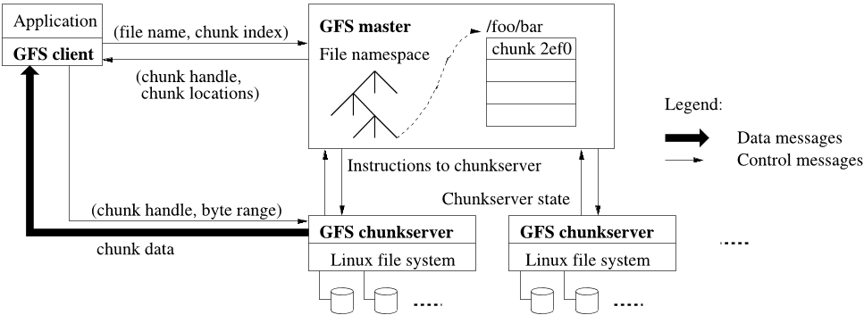
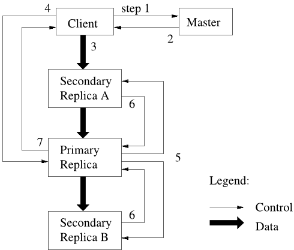
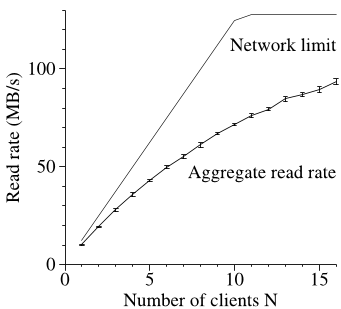
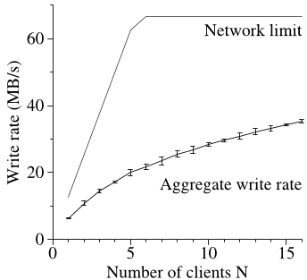
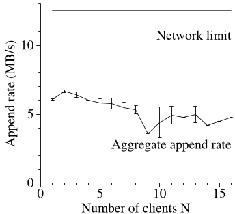

# Google 文件系统  

Sanjay Ghemawat、Howard Gobioff 和 Shun-Tak Leung  

Google*  

## 摘要  

我们设计并实现了 Google 文件系统（Google File System，GFS）。这是一个面向大型分布式数据密集型应用、可扩展的分布式文件系统。它在廉价的通用硬件上运行时仍能提供容错能力，并能为大量客户端提供很高的聚合性能。  

尽管 GFS 与以往的分布式文件系统有许多共同目标，但我们的设计受到了对当前及未来应用工作负载和技术环境的观察所驱动，而这些观察明显背离了早期文件系统的一些假设。这促使我们重新审视传统选择，并探索截然不同的设计点。  

该文件系统成功满足了我们的存储需求。它在 Google 内部得到广泛部署，既作为生成和处理服务所用数据的存储平台，也用于需要大型数据集的研发工作。迄今最大的集群由一千多台机器上的数千块磁盘提供数百 TB 的存储空间，并由数百个客户端并发访问。  

本文介绍为支持分布式应用而设计的文件系统接口扩展，讨论设计的诸多方面，并报告微基准测试和真实环境使用中的测量结果。  

## 类别与主题描述符  

D.4.3—分布式文件系统  

## 通用术语  

设计、可靠性、性能、测量  

## 关键词  

容错、可扩展性、数据存储、集群存储  

*可通过以下地址联系作者：
{sanjay,hgobioff,shuntak}@google.com。  

允许免费制作本作品全部或部分内容的数字或纸质副本用于个人或课堂用途，前提是这些副本不为营利或商业利益而制作或传播，并且副本的首页载有本声明和完整引文。若要以其他方式复制、再版、发布到服务器或重新分发至邮件列表，须事先获得明确许可和/或支付费用。  

SOSP'03，2003 年 10 月 19–22 日，美国纽约州 Bolton Landing。  

版权所有 2003 ACM 1-58113-757-5/03/0010 ...$5.00。  

## 1. 引言  

我们设计并实现了 Google 文件系统（GFS），以满足 Google 数据处理需求的快速增长。GFS 与以往的分布式文件系统具有许多共同目标，例如性能、可扩展性、可靠性和可用性。然而，其设计受到了对当前及未来应用工作负载和技术环境的若干关键观察所驱动，而这些观察明显背离了早期文件系统的一些设计假设。我们重新审视了传统选择，并探索了设计空间中截然不同的设计点。  

首先，组件故障是常态而非例外。文件系统由数百乃至数千台采用廉价通用部件构建的存储机器组成，并由数量相近的客户端机器访问。组件的数量与质量几乎注定：在任何时刻都有一部分组件无法正常工作，其中一些也无法从当前故障中恢复。我们见过由应用程序缺陷、操作系统缺陷、人为错误以及磁盘、内存、连接器、网络和电源故障引发的问题。因此，持续监控、错误检测、容错和自动恢复必须成为系统不可分割的组成部分。  

其次，按照传统标准，文件非常巨大。数 GB 的文件很常见。每个文件通常包含许多应用对象，例如网页文档。我们经常处理由数十亿个对象组成、快速增长且达到数 TB 的数据集；即使文件系统能够支持，管理数十亿个约为 KB 大小的文件也十分笨拙。因此，必须重新考虑 I/O 操作大小、块大小等设计假设和参数。  

第三，大多数文件通过追加新数据而非覆盖现有数据来变更。文件内的随机写入实际上几乎不存在。文件写好以后只会被读取，而且通常仅按顺序读取。多种数据都具有这些特征：有些可能构成供数据分析程序扫描的大型资料库；有些可能是运行中的应用程序持续生成的数据流；有些可能是归档数据；还有些可能是一台机器产生、由另一台机器同时或稍后处理的中间结果。对于巨大文件上的这种访问模式，追加成为性能优化和原子性保证的重点，而在客户端缓存数据块则不再具有吸引力。  

第四，协同设计应用程序与文件系统 API 可以提高灵活性，从而使整个系统受益。  

例如，我们放宽了 GFS 的一致性模型，在不给应用程序带来沉重负担的前提下大幅简化文件系统。我们还引入了原子追加操作，使多个客户端无需彼此进行额外同步即可并发追加到同一文件。本文稍后将更详细地讨论这些内容。  

目前有多个 GFS 集群用于不同目的。其中最大的集群拥有 1000 多个存储节点和 300 TB 以上的磁盘存储，并持续承受着位于不同机器上的数百个客户端的大量访问。  

## 2. 设计概览  

### 2.1 假设  

在为自身需求设计文件系统时，我们遵循了一些既带来挑战、也创造机会的假设。前文已经提到若干关键观察，下面更详细地列出这些假设。  

• 系统由许多经常发生故障的廉价通用组件构建而成。它必须持续自我监控，并把检测、容忍和迅速从组件故障中恢复作为日常工作。  

• 系统存储数量适中的大文件。我们预计会有几百万个文件，每个文件通常为 100 MB 或更大。数 GB 的文件是常态，必须得到高效管理。系统必须支持小文件，但无需针对它们进行优化。  

• 工作负载主要包括两类读取：大型流式读取和小型随机读取。在大型流式读取中，单次操作通常读取数百 KB，更常见的是 1 MB 或更多。同一客户端的连续操作往往读取文件的一段连续区域。一次小型随机读取通常在任意偏移处读取几 KB。注重性能的应用程序通常会批量处理小型读取并对其排序，以便在文件中稳定向前读取，而不是来回跳转。  

• 工作负载还包含许多把数据追加到文件的大型顺序写入。典型操作大小与读取类似。文件写好以后很少再次修改。系统支持在文件任意位置进行小型写入，但不要求这种操作高效。  

• 系统必须为多个客户端并发追加同一文件高效实现定义明确的语义。我们的文件经常用作生产者—消费者队列或多路合并。数百个生产者分别运行在不同机器上，并发追加同一文件。以极低的同步开销保证原子性至关重要。文件可以稍后读取，也可以由消费者同时从头到尾读取。  

• 高持续带宽比低延迟更重要。我们的大多数目标应用程序重视以高速率批量处理数据，很少对单次读写的响应时间有严格要求。  

### 2.2 接口  

GFS 提供人们熟悉的文件系统接口，但并不实现 POSIX 等标准 API。文件以目录形式分层组织，通过路径名标识。系统支持创建、删除、打开、关闭、读取和写入文件等常规操作。  

此外，GFS 还提供*快照*和*记录追加*操作。快照能够以很低的成本创建文件或目录树的副本。记录追加允许多个客户端并发向同一文件追加数据，同时保证每个客户端单次追加的原子性。它适合实现多路合并结果和生产者—消费者队列，许多客户端可以同时向其中追加，而无需额外加锁。我们发现，这类文件对于构建大型分布式应用极其宝贵。第 3.4 节和第 3.3 节将分别进一步讨论快照和记录追加。  

### 2.3 架构  

如图 1 所示，一个 GFS 集群由一台主节点和多台数据块服务器组成，并由多个客户端访问。它们通常都是运行用户级服务器进程的通用 Linux 机器。只要机器资源允许，并且能够接受运行可能不稳定的应用代码所导致的可靠性下降，就可以很容易地在同一台机器上同时运行数据块服务器和客户端。  

文件被划分成固定大小的数据块。每个数据块由主节点在创建数据块时分配的、不可变且全局唯一的 64 位数据块句柄标识。数据块服务器把数据块作为 Linux 文件存储在本地磁盘上，并按照数据块句柄和字节范围读取或写入数据块数据。为保证可靠性，每个数据块都复制到多台数据块服务器。默认情况下保存三个副本，不过用户可以为文件命名空间中的不同区域指定不同的复制级别。  

主节点维护文件系统的全部元数据，包括命名空间、访问控制信息、文件到数据块的映射以及数据块的当前位置。它还控制整个系统范围内的活动，例如数据块租约管理、孤立数据块的垃圾回收以及数据块在数据块服务器之间的迁移。主节点通过定期与每台数据块服务器交换*心跳（HeartBeat）*消息来下达指令并收集其状态。  

链接到每个应用程序中的 GFS 客户端代码实现文件系统 API，并代表应用程序与主节点和数据块服务器通信，以读取或写入数据。客户端与主节点交互以执行元数据操作，但所有携带数据的通信都直接发往数据块服务器。我们不提供 POSIX API，因此无需接入 Linux 的 vnode 层。  

客户端和数据块服务器都不缓存文件数据。客户端缓存的收益很小，因为大多数应用程序要么以流式方式遍历巨大文件，要么工作集大到无法缓存。不设置这种缓存消除了缓存一致性问题，从而简化了客户端和整个系统。（不过，客户端会缓存元数据。）数据块服务器无需缓存文件数据，因为数据块以本地文件形式存储，Linux 的缓冲区缓存已经会把频繁访问的数据保留在内存中。  

### 2.4 单一主节点  

单一主节点大幅简化了设计，并使主节点能够利用全局信息做出复杂的数据块放置和复制决策。然而，我们必须尽量减少它参与读写，以免其成为瓶颈。客户端从不通过主节点读写文件数据；相反，客户端向主节点询问应该联系哪些数据块服务器。客户端会在有限时间内缓存这些信息，并在后续多次操作中直接与数据块服务器交互。  

>图 1：GFS 架构  

下面结合图 1 说明一次简单读取中的交互。首先，客户端利用固定的数据块大小，把应用程序指定的文件名和字节偏移转换成文件内的数据块索引。然后，它向主节点发送包含文件名和数据块索引的请求。主节点返回相应的数据块句柄和各副本的位置。客户端以文件名和数据块索引为键缓存这些信息。  

接着，客户端向其中一个副本发送请求，通常是距离最近的副本。请求指定数据块句柄以及该数据块内的字节范围。此后读取同一数据块不再需要客户端与主节点交互，直到缓存信息过期或文件被重新打开。实际上，客户端通常会在同一请求中询问多个数据块，主节点也可以附带紧随所请求数据块之后的数据块信息。这些额外信息几乎不增加成本，却能避免今后多次客户端—主节点交互。  

### 2.5 数据块大小  

数据块大小是关键设计参数之一。我们选择了 64 MB，这比典型文件系统的块大得多。每个数据块副本作为普通 Linux 文件存储在数据块服务器上，并且仅在需要时扩展。延迟分配空间避免了内部碎片造成的空间浪费，而这可能是反对如此大数据块的最主要理由。  

较大的数据块有若干重要优势。第一，它减少了客户端与主节点交互的需求，因为对同一数据块的读写只需最初向主节点请求一次数据块位置信息。这种减少对我们的工作负载尤其重要，因为应用程序大多按顺序读写大型文件。即使对于小型随机读取，客户端也可以轻松缓存一个数 TB 工作集中所有数据块的位置信息。第二，由于数据块很大，客户端更可能在给定数据块上执行多次操作，因而可以长期保持与数据块服务器的持久 TCP 连接，减少网络开销。第三，它减少了主节点上存储的元数据量，使我们能够把元数据保存在内存中，进而带来第 2.6.1 节将讨论的其他优势。  

另一方面，即使采用延迟空间分配，较大的数据块也有缺点。一个小文件只包含少量数据块，甚至可能只有一个。如果许多客户端访问同一文件，存储这些数据块的数据块服务器可能成为热点。实践中，热点并非主要问题，因为我们的应用程序大多按顺序读取包含多个数据块的大文件。  

不过，GFS 最初用于批处理队列系统时确实出现过热点：一个可执行文件以单数据块文件的形式写入 GFS，随后同时在数百台机器上启动。存储该可执行文件的少数几台数据块服务器因数百个并发请求而过载。我们通过以更高复制因子存储此类可执行文件，并让批处理队列系统错开应用程序启动时间，解决了这个问题。一种潜在的长期解决方案是允许客户端在这种情况下从其他客户端读取数据。  

### 2.6 元数据  

主节点存储三大类元数据：文件和数据块命名空间、文件到数据块的映射，以及每个数据块各副本的位置。所有元数据都保存在主节点的内存中。前两类数据（命名空间和文件到数据块的映射）还通过把变更记入操作日志来持久保存；操作日志存储在主节点的本地磁盘上，并复制到远程机器。使用日志使我们能够简单、可靠地更新主节点状态，并且在主节点崩溃时不会产生不一致风险。主节点不持久保存数据块位置信息，而是在启动时以及有数据块服务器加入集群时向各数据块服务器询问其拥有的数据块。  

#### 2.6.1 内存数据结构  

由于元数据存储在内存中，主节点操作速度很快。此外，主节点可以在后台轻松、高效地定期扫描其全部状态。这种定期扫描用于实现数据块垃圾回收、数据块服务器故障时的重新复制，以及为平衡各数据块服务器的负载和磁盘空间使用而进行的数据块迁移。第 4.3 节和第 4.4 节将进一步讨论这些活动。  

这种纯内存方法可能引起的一项担忧是，数据块数量乃至整个系统的容量会受主节点内存大小限制。实践中这并不是严重限制。主节点为每个 64 MB 数据块维护的元数据不到 64 字节。大多数数据块都是满的，因为多数文件包含许多数据块，只有最后一个可能未填满。同样，文件命名空间数据通常每个文件不到 64 字节，因为它使用前缀压缩来紧凑存储文件名。  

如果需要支持更大的文件系统，与把元数据存入内存所获得的简单性、可靠性、性能和灵活性相比，给主节点增加额外内存的成本很低。  

#### 2.6.2 数据块位置  

主节点不持久记录哪些数据块服务器拥有给定数据块的副本，而只在启动时向数据块服务器查询这些信息。此后，主节点控制所有数据块放置，并用定期的*心跳*消息监控数据块服务器状态，因此可以保持信息最新。  

最初我们曾尝试在主节点上持久保存数据块位置信息，但后来认定，在启动时以及此后定期向数据块服务器请求这些数据要简单得多。这样就消除了在数据块服务器加入和离开集群、更名、故障、重启等情况下保持主节点与数据块服务器同步的问题。在拥有数百台服务器的集群中，这些事件发生得实在太频繁。  

理解这一设计决策的另一种方式是认识到：一台数据块服务器对自己的磁盘上有哪些或没有哪些数据块拥有最终决定权。试图在主节点上维护此信息的一致视图没有意义，因为数据块服务器上的错误可能导致数据块自发消失（例如磁盘损坏后被禁用），操作员也可能重命名数据块服务器。  

#### 2.6.3 操作日志  

操作日志记录关键元数据变更的历史，是 GFS 的核心。它不仅是元数据唯一的持久记录，还充当定义并发操作顺序的逻辑时间线。文件和数据块及其版本（见第 4.5 节），都由其创建时的逻辑时间进行唯一且永久的标识。  

操作日志至关重要，因此必须可靠存储，并且只有在元数据变更持久化后才能让客户端看到这些变更。否则，即使数据块本身幸存下来，我们实际上也会丢失整个文件系统或客户端近期执行的操作。因此，我们把操作日志复制到多台远程机器，只有在相应日志记录同时刷入本地和远程磁盘后，才响应客户端操作。主节点会先把若干条日志记录组成批次再刷盘，从而减少刷盘和复制对系统总体吞吐量的影响。  

主节点通过重放操作日志来恢复文件系统状态。为了缩短启动时间，必须控制日志大小。每当日志增长超过一定大小，主节点便为其状态创建检查点，以便恢复时从本地磁盘载入最新检查点，只重放此后的有限数量日志记录。  

| |写入|记录追加|
| ---|---|---|
| 串行成功|已定义|已定义，但其间可能夹杂不一致区域|
| 并发成功|一致但未定义|已定义，但其间可能夹杂不一致区域|
| 失败|不一致|不一致|  

>表 1：变更后的文件区域状态  

检查点采用紧凑的类 B 树形式，可以直接映射到内存并用于命名空间查找，无需额外解析。这进一步加快了恢复并提高了可用性。  

由于创建检查点可能需要一些时间，主节点的内部状态经过专门组织，使新检查点的创建不会延迟传入的变更。主节点切换到新的日志文件，并在单独的线程中创建新检查点。新检查点包含切换前的全部变更。对于一个拥有几百万个文件的集群，检查点可以在约一分钟内创建完成；完成后会同时写入本地和远程磁盘。  

恢复只需要最新的完整检查点和此后的日志文件。更早的检查点和日志文件可以随意删除，不过我们会保留几份以防灾难。创建检查点期间发生故障不会影响正确性，因为恢复代码会检测并跳过不完整的检查点。  

### 2.7 一致性模型  

GFS 采用宽松的一致性模型，它能很好地支持我们的高度分布式应用，同时实现起来仍较为简单、高效。下面讨论 GFS 提供的保证及其对应用程序的含义。我们还会概述 GFS 如何维持这些保证，具体细节留待本文其他部分说明。  

#### 2.7.1 GFS 提供的保证  

文件命名空间变更（例如文件创建）是原子的。它们完全由主节点处理：命名空间锁保证原子性和正确性（第 4.1 节）；主节点的操作日志则定义这些操作的全局全序（第 2.6.3 节）。  

数据变更后文件区域的状态取决于变更类型、变更成功与否以及是否存在并发变更。表 1 汇总了结果。如果所有客户端无论从哪个副本读取都始终看到相同数据，则文件区域是*一致的*。如果一个区域在文件数据变更后保持一致，且客户端能完整看到该变更写入的内容，则该区域是*已定义的*。当一次变更成功且不受并发写入者干扰时，受影响区域处于已定义状态（因此也处于一致状态）：所有客户端都将始终看到该变更所写入的内容。并发且成功的变更会使区域处于未定义但一致的状态：所有客户端看到相同数据，但这些数据可能并不反映任何一次变更写入的内容；它通常由多个变更的片段混合而成。失败的变更会使区域不一致（因而也是未定义的）：不同客户端可能在不同时间看到不同数据。下面会说明我们的应用程序如何区分已定义区域和未定义区域。应用程序无需进一步区分不同种类的未定义区域。  

数据变更可以是写入或记录追加。写入会在应用程序指定的文件偏移处写入数据。记录追加即使存在并发变更，也会由 GFS 选择偏移并以原子方式把数据（“记录”）至少追加一次（第 3.3 节）。（相比之下，“常规”追加只是在客户端认为是当前文件末尾的偏移处执行写入。）该偏移会返回给客户端，并标志包含这条记录的已定义区域的起点。此外，GFS 可能在其间插入填充或重复记录；它们占据的区域被视为不一致，而且相对于用户数据量通常微不足道。  

经过一系列成功的变更后，最后一次变更所涉及的文件区域保证处于已定义状态，并包含该次变更写入的数据。GFS 通过以下方式实现这一点：(a) 在一个数据块的所有副本上按同一顺序应用变更（第 3.1 节）；(b) 使用数据块版本号检测因数据块服务器停机期间遗漏变更而过期的副本（第 4.5 节）。过期副本绝不会参与变更，也不会提供给向主节点查询数据块位置的客户端。它们会在最早的机会被垃圾回收。  

由于客户端缓存数据块位置，在这些信息刷新之前，它们可能从过期副本读取数据。这一时间窗口受缓存项超时和下次打开文件的限制；重新打开文件会从缓存中清除该文件的所有数据块信息。此外，因为我们的大多数文件仅追加，过期副本通常会返回过早出现的数据块末尾，而不是陈旧数据。读取者重试并联系主节点时，会立即获得当前的数据块位置。  

当然，即使一次变更成功很久以后，组件故障仍可能破坏或摧毁数据。GFS 通过主节点与所有数据块服务器之间的定期握手识别故障的数据块服务器，并通过校验和检测数据损坏（第 5.2 节）。问题一旦出现，系统会尽快从有效副本恢复数据（第 4.3 节）。只有在 GFS 来得及响应之前（通常只有几分钟）所有副本都丢失，数据块才会不可逆地丢失。即使在这种情况下，数据块也只是不可用而非损坏：应用程序会收到明确的错误，而不是错误数据。  

#### 2.7.2 对应用程序的影响  

GFS 应用程序可以借助其他用途本就需要的几项简单技术来适应宽松的一致性模型：依赖追加而非覆盖、创建检查点，以及写入可自我验证、自我标识的记录。  

实际上，我们几乎所有应用程序都是通过追加而不是覆盖来变更文件。一种典型用法是，写入者从头到尾生成一个文件。写完全部数据后，它以原子方式把文件重命名为永久名称，或者定期为已成功写入的进度创建检查点。检查点还可以包含应用程序级校验和。读取者只验证并处理最后一个检查点之前的文件区域，因为已知这部分处于已定义状态。无论存在何种一致性和并发问题，这种方法都一直很有效。追加远比随机写入高效，也更能抵御应用程序故障。检查点使写入者能够从中途重新开始，并防止读取者处理从应用程序视角来看尚不完整、但已成功写入的文件数据。  

另一种典型用法是，许多写入者为了合并结果或把文件用作生产者—消费者队列，并发地向同一文件追加。记录追加的“至少追加一次”语义会保留每个写入者的输出。读取者按以下方式处理偶尔出现的填充和重复项：写入者准备的每条记录都包含校验和等额外信息，以便验证其有效性。读取者可以使用校验和识别并丢弃多余填充和记录片段。如果无法容忍偶尔出现的重复项（例如它们会触发非幂等操作），则可以利用记录中的唯一标识符过滤掉重复项；通常无论如何都需要这些标识符来命名相应的应用实体，例如网页文档。这些记录 I/O 功能（重复项移除除外）位于各应用程序共享的库代码中，也适用于 Google 内部其他文件接口实现。如此一来，记录读取者总能收到相同的记录序列，外加极少量重复项。  

## 3. 系统交互  

我们在设计系统时力求最大限度减少主节点对所有操作的参与。在上述背景下，下面说明客户端、主节点和数据块服务器如何交互，以实现数据变更、原子记录追加和快照。  

### 3.1 租约与变更顺序  

变更是修改数据块内容或元数据的操作，例如写入或追加。每项变更都会在数据块的所有副本上执行。我们使用租约来维持各副本之间一致的变更顺序。主节点把数据块租约授予其中一个副本，我们称之为*主副本*。主副本为该数据块的全部变更选择串行顺序。所有副本应用变更时都遵循这一顺序。因此，全局变更顺序首先由主节点选择的租约授予顺序定义，而在一次租约期间则由主副本分配的序列号定义。  

租约机制旨在最大限度减少主节点上的管理开销。租约的初始超时时间为 60 秒。不过，只要数据块仍在发生变更，主副本就可以请求延长租约，而且通常可以无限期获得延期。这些延期请求和授予会搭载在主节点与所有数据块服务器定期交换的*心跳*消息上。有时主节点可能会尝试在租约到期前将其撤销（例如主节点想要禁止对正在重命名的文件进行变更时）。即使主节点与主副本失去通信，也可以在旧租约到期后安全地把新租约授予另一个副本。  

图 2 通过以下编号步骤跟踪一次写入的控制流，展示了这一过程。  

1. 客户端向主节点询问哪个数据块服务器持有该数据块的当前租约，并获取其他副本的位置。如果尚无副本持有租约，主节点会把租约授予其选定的一个副本（图中未显示）。  

2. 主节点返回主副本的身份和其他（次级）副本的位置。客户端缓存这些数据，以供后续变更使用。只有在主副本无法访问，或主副本回复称自己不再持有租约时，客户端才需要再次联系主节点。  

>图 2：写入的控制流和数据流  

3. 客户端把数据推送到所有副本，推送顺序任意。每台数据块服务器会把数据存入内部 LRU 缓冲区缓存，直至数据被使用或因过久未使用而淘汰。通过把数据流与控制流解耦，我们可以不考虑哪台数据块服务器是主副本，而根据网络拓扑调度成本高昂的数据流，从而提高性能。第 3.2 节将进一步讨论这一点。  

4. 所有副本确认收到数据后，客户端向主副本发送写入请求。该请求标识此前推送到所有副本的数据。主副本为其收到的全部变更（可能来自多个客户端）分配连续序列号，从而提供所需的串行化。它按序列号顺序把变更应用到自己的本地状态。  

5. 主副本把写入请求转发给所有次级副本。每个次级副本按照主副本分配的同一序列号顺序应用变更。  

6. 所有次级副本回复主副本，表明操作已经完成。  

7. 主副本回复客户端。任何副本遇到的错误都会报告给客户端。发生错误时，写入可能已经在主副本和任意一部分次级副本上成功。（如果写入在主副本上失败，就不会被分配序列号和转发。）客户端请求被视为失败，变更区域则处于不一致状态。我们的客户端代码通过重试失败的变更来处理此类错误。它会尝试执行几次步骤 (3) 至 (7)，如果仍不成功，再退回到从写入起点开始重试。  

如果应用程序的一次写入很大或跨越数据块边界，GFS 客户端代码会把它分解为多项写入操作。它们都遵循上述控制流，但可能与其他客户端的并发操作交错，并被后者覆盖。因此，共享文件区域最终可能包含来自不同客户端的片段；不过，由于各项操作都在所有副本上按相同顺序成功完成，各副本仍会完全相同。如第 2.7 节所述，这使文件区域处于一致但未定义的状态。  

### 3.2 数据流  

我们把数据流与控制流解耦，以便高效利用网络。控制流从客户端流向主副本，再流向所有次级副本；数据则以流水线方式，沿着一条精心选择的数据块服务器链线性推送。我们的目标是充分利用每台机器的网络带宽，避开网络瓶颈和高延迟链路，并尽量缩短推送全部数据的延迟。  

为了充分利用每台机器的网络带宽，数据沿数据块服务器链线性推送，而不是采用其他拓扑结构（例如树形）分发。因此，每台机器都能利用完整的出站带宽尽快传输数据，而不必在多个接收者之间分摊带宽。  

为了尽量避开网络瓶颈和高延迟链路（例如交换机间链路往往二者兼具），每台机器都把数据转发给网络拓扑中尚未收到数据且距离自己“最近”的机器。假设客户端要向数据块服务器 S1 至 S4 推送数据，它会先把数据发送给距离最近的数据块服务器，比如 S1。S1 再从 S2 至 S4 中选出距离自己最近的数据块服务器，比如 S2，并把数据转发给它。类似地，S2 会把数据转发给 S3 和 S4 中距离自己较近的一个，依此类推。我们的网络拓扑足够简单，可以根据 IP 地址准确估算“距离”。  

最后，我们通过在 TCP 连接上以流水线方式传输数据来尽量缩短延迟。数据块服务器只要收到一部分数据，就会立即开始转发。流水线对我们尤其有用，因为我们采用带全双工链路的交换式网络。立即发送数据不会降低接收速率。在没有网络拥塞时，把 $B$ 字节传输到 $R$ 个副本的理想耗时为 $B/T + RL$，其中 $T$ 是网络吞吐量，$L$ 是在两台机器之间传输字节的延迟。我们的网络链路通常为 100 Mbps（$T$），而 $L$ 远低于 1 ms。因此，理想情况下可以在大约 80 ms 内分发 1 MB 数据。  

### 3.3 原子记录追加  

GFS 提供一种名为记录追加的原子追加操作。在传统写入中，客户端指定数据的写入偏移。对同一区域的并发写入无法串行化：该区域最终可能包含多个客户端的数据片段。而在记录追加中，客户端只指定数据。GFS 在自己选择的偏移处，以原子方式（即作为一个连续字节序列）把数据至少追加到文件一次，并把该偏移返回给客户端。这类似于在 Unix 中向以 `O_APPEND` 模式打开的文件写入，但不会发生多个写入者并发执行时的竞态条件。  

记录追加在我们的分布式应用中得到大量使用；在这些应用中，位于不同机器上的许多客户端并发追加同一文件。如果使用传统写入，客户端就需要额外采用复杂且昂贵的同步机制，例如分布式锁管理器。在我们的工作负载中，此类文件经常充当多生产者/单消费者队列，或包含许多不同客户端的合并结果。  

记录追加是一种变更，它遵循第 3.1 节的控制流，只在主副本上增加少量逻辑。客户端先把数据推送到文件最后一个数据块的所有副本，然后向主副本发送请求。主副本检查把记录追加到当前数据块是否会使数据块超过最大大小（64 MB）。如果会，主副本就把数据块填充到最大大小，通知次级副本执行同样操作，然后回复客户端，指示它在下一个数据块上重试。（记录追加被限制为最大数据块大小的四分之一，以便把最坏情况下的碎片维持在可接受水平。）如果记录没有超过最大大小（通常如此），主副本会把数据追加到自己的副本，通知次级副本在完全相同的偏移处写入数据，最后向客户端回复成功。  

如果记录追加在任一副本上失败，客户端就会重试操作。因此，同一数据块的各副本可能包含不同数据，其中可能含有同一记录的全部或部分重复项。GFS 不保证所有副本逐字节完全相同，只保证数据作为原子单元至少写入一次。这一性质很容易从一个简单观察推出：操作要报告成功，数据就必须已经写入某个数据块所有副本上的同一偏移。此外，此后所有副本都至少延伸到记录末尾，因此任何后续记录都会被分配更高偏移或另一个数据块，即使另一个副本后来成为主副本也不例外。按照我们的一致性保证，成功的记录追加操作写入其数据的区域是已定义的（因而一致），而中间区域则不一致（因而未定义）。正如第 2.7.2 节讨论的，我们的应用程序可以处理不一致区域。  

### 3.4 快照  

快照操作几乎可以瞬间创建文件或目录树（“源”）的副本，同时最大限度减少对正在进行的变更的干扰。用户用它快速创建巨大数据集的分支副本（而且经常递归地创建这些副本的副本），或者在试验改动之前为当前状态创建检查点，以便之后轻松提交或回滚改动。  

与 AFS [5] 类似，我们使用标准的写时复制技术实现快照。当主节点收到快照请求时，它首先撤销即将创建快照的文件中所有数据块上的未到期租约。这确保后续对这些数据块的任何写入都必须与主节点交互，才能找到租约持有者。这样，主节点就有机会先为数据块创建一个新副本。  

租约撤销或到期后，主节点把该操作记入磁盘日志。随后，它通过复制源文件或目录树的元数据，把这条日志记录应用到内存状态。新创建的快照文件指向与源文件相同的数据块。  

快照操作之后，客户端首次要写入数据块 C 时，会向主节点发送请求以查找当前租约持有者。主节点注意到数据块 C 的引用计数大于一，便暂缓响应客户端请求，转而选择新的数据块句柄 C'。随后，它要求每台拥有 C 当前副本的数据块服务器创建一个名为 C' 的新数据块。通过在与原数据块相同的数据块服务器上创建新数据块，我们确保数据可以在本地而不是通过网络复制（磁盘速度约为 100 Mb 以太网链路的三倍）。从此以后，请求处理与其他数据块毫无区别：主节点把新数据块 C' 的租约授予其中一个副本并回复客户端；客户端可以正常写入该数据块，并不知道它刚从现有数据块创建而来。  

## 4. 主节点操作  

主节点执行所有命名空间操作。此外，它还管理整个系统中的数据块副本：做出放置决策，创建新的数据块及相应副本，并协调各种系统级活动，以保持数据块的完整复制、平衡所有数据块服务器的负载并回收未使用的存储空间。下面逐一讨论这些主题。  

### 4.1 命名空间管理与锁定  

许多主节点操作可能耗时很长。例如，快照操作必须撤销快照所覆盖全部数据块上的数据块服务器租约。我们不希望这些操作运行时延迟主节点的其他操作。因此，我们允许多项操作同时处于活动状态，并在命名空间的不同区域上使用锁来保证正确的串行化。  

与许多传统文件系统不同，GFS 没有为每个目录设置列出其中所有文件的数据结构，也不支持同一文件或目录的别名（即 Unix 所谓的硬链接或符号链接）。从逻辑上说，GFS 把命名空间表示为一张从完整路径名到元数据的查找表。借助前缀压缩，可以在内存中高效地表示此表。命名空间树中的每个节点（绝对文件名或绝对目录名）都有一个关联的读写锁。  

每项主节点操作在运行前都会取得一组锁。通常，如果操作涉及 `/d1/d2/.../dn/leaf`，它会在目录名 `/d1`、`/d1/d2`、……、`/d1/d2/.../dn` 上取得读锁，并在完整路径名 `/d1/d2/.../dn/leaf` 上取得读锁或写锁。请注意，`leaf` 是文件还是目录取决于具体操作。  

下面说明这种锁定机制如何防止在把 `/home/user` 快照到 `/save/user` 时创建文件 `/home/user/foo`。快照操作在 `/home` 和 `/save` 上取得读锁，并在 `/home/user` 和 `/save/user` 上取得写锁。文件创建操作在 `/home` 和 `/home/user` 上取得读锁，并在 `/home/user/foo` 上取得写锁。两个操作都会试图取得 `/home/user` 上相互冲突的锁，因而会被正确串行化。文件创建不需要父目录上的写锁，因为没有需要保护以免被修改的“目录”数据结构或类似 inode 的数据结构。名称上的读锁足以保护父目录不被删除。  

这种锁定方案的一项优点是，允许同一目录中的变更并发进行。例如，可以在同一目录中并发创建多个文件：每项操作都在目录名上取得读锁，在文件名上取得写锁。目录名上的读锁足以防止目录被删除、重命名或创建快照。文件名上的写锁则将以同一名称重复创建文件的尝试串行化。  

由于命名空间中可能有许多节点，读写锁对象按需延迟分配，不再使用后便予以删除。另外，锁按一致的全序获取，以避免死锁：首先按命名空间树中的层级排序，同一层级内再按字典序排序。  

### 4.2 副本放置  

GFS 集群在多个层面都高度分布。它通常有数百台数据块服务器，分散在许多机架上。这些数据块服务器又可能由来自相同或不同机架的数百个客户端访问。不同机架上的两台机器通信时，可能要经过一个或多个网络交换机。此外，进出一个机架的带宽可能小于机架内所有机器的聚合带宽。多层次分布为如何分发数据以实现可扩展性、可靠性和可用性带来了独特挑战。  

数据块副本的放置策略有两个目的：最大限度提高数据可靠性和可用性，以及最大限度利用网络带宽。对于这两个目的，仅仅把副本分散到不同机器还不够；那只能防范磁盘或机器故障，并充分利用每台机器的网络带宽。我们还必须把数据块副本分散到不同机架。这样，即使整个机架损坏或离线（例如网络交换机或供电线路等共享资源发生故障），一个数据块仍会有部分副本幸存并保持可用。这也意味着一个数据块的流量（尤其是读取流量）可以利用多个机架的聚合带宽。另一方面，写入流量必须流经多个机架，这是我们愿意接受的权衡。  

### 4.3 创建、重新复制与再平衡  

创建数据块副本有三个原因：创建数据块、重新复制和再平衡。  

主节点创建数据块时，会选择最初为空的副本的放置位置。它会考虑若干因素。(1) 我们希望把新副本放在磁盘空间利用率低于平均值的数据块服务器上，随着时间推移，这会使各数据块服务器的磁盘利用率趋于均衡。(2) 我们希望限制每台数据块服务器上“近期”创建操作的数量。创建本身虽然成本很低，却能可靠预示即将到来的大量写入流量，因为数据块按写入需求创建；而在我们“一次追加、多次读取”的工作负载中，数据块写满后通常实际上会变成只读。(3) 如前所述，我们希望把一个数据块的副本分散到不同机架。  

一旦可用副本数低于用户指定的目标，主节点便会重新复制数据块。发生这种情况可能有多种原因：数据块服务器不可用；它报告自己的副本可能已损坏；它的一块磁盘因错误而被禁用；或者复制目标提高。需要重新复制的各数据块会根据若干因素确定优先级。其中一个因素是距离复制目标还有多大差距。例如，丢失两个副本的数据块优先级高于只丢失一个副本的数据块。此外，与属于近期已删除文件的数据块相比，我们优先重新复制仍有效文件的数据块（见第 4.4 节）。最后，为了最大限度减少故障对运行中应用程序的影响，任何阻碍客户端继续执行的数据块都会得到更高优先级。  

主节点选出优先级最高的数据块，通过指示某台数据块服务器直接从现有的有效副本复制数据块数据来“克隆”它。新副本的放置目标与创建时类似：均衡磁盘空间利用率，限制任一数据块服务器上的活动克隆操作数，并把副本分散到不同机架。为防止克隆流量压倒客户端流量，主节点会分别限制整个集群以及每台数据块服务器上的活动克隆操作数。此外，每台数据块服务器还会限制每项克隆操作所占用的带宽，具体方式是对其向源数据块服务器发出的读取请求限速。  

最后，主节点会定期对副本进行再平衡：检查当前的副本分布并迁移副本，以获得更好的磁盘空间和负载平衡。主节点还会通过这一过程逐步填充新的数据块服务器，避免新数据块及其伴随的大量写入流量瞬间将其淹没。新副本的放置标准与上述标准类似。此外，主节点还必须选择删除哪个现有副本。一般来说，它倾向于删除位于可用空间低于平均值的数据块服务器上的副本，以均衡磁盘空间使用。  

### 4.4 垃圾回收  

文件删除后，GFS 不会立即回收可用的物理存储，而只会在文件和数据块层面的常规垃圾回收中延迟执行。我们发现，这种方法使系统简单、可靠得多。  

#### 4.4.1 机制  

应用程序删除文件时，主节点会像对待其他变更一样立即记录此次删除。但它并不立即回收资源，而只是把文件重命名为包含删除时间戳的隐藏名称。主节点定期扫描文件系统命名空间时，会删除存在超过三天的此类隐藏文件（时间间隔可配置）。在此之前，仍可通过新的特殊名称读取文件，也可以通过把名称改回正常形式来撤销删除。从命名空间移除隐藏文件时，其内存元数据也会被清除，这实际上切断了该文件与其所有数据块之间的链接。  

在对数据块命名空间进行类似的定期扫描时，主节点会识别孤立数据块（即无法从任何文件到达的数据块），并清除这些数据块的元数据。每台数据块服务器都会在定期与主节点交换的*心跳*消息中报告它拥有的一部分数据块，主节点则返回其元数据中不复存在的所有数据块的身份。数据块服务器可以随意删除这些数据块的副本。  

#### 4.4.2 讨论  

虽然在编程语言语境下，分布式垃圾回收是需要复杂解决方案的难题，但在我们的情形中却非常简单。我们可以轻松识别对数据块的全部引用：它们都位于完全由主节点维护的文件到数据块映射中。我们也可以轻松识别所有数据块副本：它们是每台数据块服务器指定目录下的 Linux 文件。主节点不知道的任何此类副本都是“垃圾”。  

与即时删除相比，通过垃圾回收来收回存储空间有若干优势。第一，在组件故障很常见的大规模分布式系统中，它既简单又可靠。数据块创建可能在一些数据块服务器上成功，在另一些服务器上失败，从而留下主节点并不知道存在的副本。副本删除消息可能丢失，而无论主节点自身还是数据块服务器发生故障，主节点都必须记住在故障后重发消息。垃圾回收提供一种统一、可靠的方法，清除主节点不知道有用的任何副本。第二，它把存储回收合并到主节点的常规后台活动中，例如定期扫描命名空间以及与数据块服务器握手。因此，操作成批执行，成本得以摊销。而且，只有在主节点相对空闲时才会执行，主节点因而能更及时地响应需要立即关注的客户端请求。第三，延迟回收存储为意外且不可逆的删除提供了一道安全网。  

根据我们的经验，主要缺点是存储紧张时，这种延迟有时会妨碍用户精细调节空间用量。反复创建和删除临时文件的应用程序可能无法立即重用存储空间。如果已删除文件被明确地再次删除，我们会加速回收存储，从而解决这些问题。我们还允许用户对命名空间的不同部分采用不同的复制和回收策略。例如，用户可以指定某个目录树下文件的所有数据块都不复制，而任何已删除文件都立即且不可撤销地从文件系统状态中移除。  

### 4.5 过期副本检测  

如果数据块服务器发生故障，并在停机期间遗漏了对数据块的变更，数据块副本就可能过期。主节点为每个数据块维护一个数据块版本号，以区分最新副本和过期副本。  

每当主节点为数据块授予新租约时，它都会增加数据块版本号，并通知最新的副本。主节点和这些副本全都会在持久状态中记录新的版本号。这发生在通知任何客户端之前，因此也发生在客户端开始写入数据块之前。如果另一个副本此时不可用，其数据块版本号就不会增加。该数据块服务器重启并报告其数据块集合及相应版本号时，主节点会检测出它拥有过期副本。如果主节点看到的版本号大于自身记录中的版本号，它会认定自己在授予租约时发生了故障，因此把较高的版本视为最新版本。  

主节点会在常规垃圾回收中移除过期副本。在此之前，当它响应客户端对数据块信息的请求时，实际上会认为过期副本根本不存在。作为另一项保障，主节点在通知客户端哪个数据块服务器持有数据块租约时，或在克隆操作中指示一台数据块服务器从另一台数据块服务器读取数据块时，都会包含数据块版本号。客户端或数据块服务器执行操作时会验证版本号，从而确保自己始终访问最新数据。  

## 5. 容错与诊断  

设计系统时面临的最大挑战之一，是应对频繁发生的组件故障。组件的质量和数量共同使这些问题成为常态而非例外：我们既不能完全信任机器，也不能完全信任磁盘。组件故障可能导致系统不可用，更糟的是导致数据损坏。下面讨论我们如何应对这些挑战，以及系统中为诊断必然会发生的问题而构建的工具。  

### 5.1 高可用性  

一个 GFS 集群有数百台服务器，在任何给定时刻都必然有一部分不可用。我们采用两项简单而有效的策略，使整个系统保持高可用：快速恢复和复制。  

#### 5.1.1 快速恢复  

无论以何种方式终止，主节点和数据块服务器都被设计为能在数秒内恢复状态并启动。事实上，我们并不区分正常终止和异常终止；关闭服务器时，通常只是直接杀死进程。客户端和其他服务器上未完成的请求会超时，随后它们会重新连接到重启后的服务器并重试，期间只会经历短暂波动。第 6.2.2 节报告了实际观察到的启动时间。  

#### 5.1.2 数据块复制  

如前所述，每个数据块都会复制到不同机架上的多台数据块服务器。用户可以为文件命名空间的不同部分指定不同的复制级别，默认值为三。当数据块服务器离线，或通过校验和验证检测到损坏副本时（见第 5.2 节），主节点会按需克隆现有副本，使每个数据块保持完整的复制级别。虽然复制一直很好地满足了我们的需求，但为应对不断增长的只读存储需求，我们正在探索奇偶校验或纠删码等其他形式的跨服务器冗余。我们的流量以追加和读取为主，而非小型随机写入；因此我们预计，在松耦合程度很高的系统中实现这些更复杂的冗余方案虽有挑战，但仍可驾驭。  

#### 5.1.3 主节点复制  

为保证可靠性，主节点状态会被复制。其操作日志和检查点会复制到多台机器。只有当一项状态变更的日志记录刷入本地磁盘和所有主节点副本的磁盘后，该变更才视为已提交。为简单起见，一个主节点进程始终负责所有变更，以及垃圾回收等在系统内部改变状态的后台活动。它发生故障时，几乎可以立即重启。如果它所在的机器或磁盘发生故障，GFS 外部的监控基础设施会利用复制的操作日志在其他地方启动新的主节点进程。客户端只使用主节点的规范名称（例如 `gfs-test`），它是一个 DNS 别名；如果主节点迁移到另一台机器，可以更改该别名。  

此外，即使主要主节点停机，“影子”主节点仍可提供文件系统的只读访问。它们是影子而非镜像，因为可能略微落后于主要主节点，通常只落后零点几秒。对于未发生主动变更的文件，或不介意得到略微陈旧结果的应用程序，它们能提高读取可用性。事实上，因为文件内容从数据块服务器读取，应用程序不会观察到陈旧的文件内容。在短时间窗口内可能陈旧的是文件元数据，例如目录内容或访问控制信息。  

为了掌握最新情况，影子主节点会读取持续增长的操作日志的一个副本，并像主要主节点一样，把完全相同的变更序列应用到自己的数据结构。与主要主节点一样，它会在启动时（以及此后不频繁地）查询数据块服务器以定位数据块副本，并与其频繁交换握手消息以监控状态。只有因主要主节点做出创建或删除副本的决策而引起的副本位置更新，才依赖主要主节点。  

### 5.2 数据完整性  

每台数据块服务器都用校验和检测存储数据的损坏。一个 GFS 集群通常在数百台机器上拥有数千块磁盘，因此经常发生磁盘故障，导致读取和写入路径上的数据损坏或丢失。（其中一个原因见第 7 节。）我们可以利用其他数据块副本从损坏中恢复，但通过比较各数据块服务器上的副本来检测损坏并不现实。此外，副本存在差异也可能是合法的：GFS 的变更语义，尤其是前文讨论的原子记录追加，并不保证副本完全相同。因此，每台数据块服务器必须通过维护校验和，独立验证自身副本的完整性。  

一个数据块被分成若干 64 KB 的块，每块都有相应的 32 位校验和。与其他元数据一样，校验和保存在内存中，并通过日志持久保存，与用户数据分开存放。  

执行读取时，无论请求者是客户端还是另一台数据块服务器，数据块服务器都会先验证与读取范围重叠的各个 64 KB 分块的校验和，然后才返回数据。因此，数据块服务器不会把损坏传播到其他机器。如果某块数据与记录的校验和不匹配，数据块服务器会向请求者返回错误，并向主节点报告不匹配。作为响应，请求者会从其他副本读取，主节点则从另一个副本克隆该数据块。有效的新副本就位后，主节点会指示报告不匹配的数据块服务器删除自己的副本。  

由于若干原因，校验和对读取性能影响很小。我们的大多数读取至少跨越几个块，因此为了验证而额外读取并计算校验和的数据量相对很少。GFS 客户端代码还会尝试把读取与校验和块边界对齐，进一步降低这项开销。此外，数据块服务器上的校验和查找与比较无需任何 I/O，校验和计算通常还可以与 I/O 重叠执行。  

由于在我们的工作负载中，追加到数据块末尾的写入（相对于覆盖现有数据的写入）占主导地位，系统针对这种写入高度优化了校验和计算。我们只需增量更新最后一个未满校验和块的校验和，并为追加操作填满的所有全新校验和块计算新校验和。即使最后一个未满校验和块已经损坏而此时未能检测出来，新校验和值也不会与存储的数据匹配，下次读取该块时仍会像往常一样检测到损坏。  

相比之下，如果一次写入覆盖数据块中的现有范围，我们必须读取并验证被覆盖范围的第一个和最后一个块，然后执行写入，最后计算并记录新的校验和。如果不在部分覆盖第一个和最后一个块之前验证它们，新的校验和可能会掩盖未覆盖区域中已经存在的损坏。  

空闲期间，数据块服务器可以扫描并验证不活跃数据块的内容。这样，我们就能检测很少读取的数据块中的损坏。发现损坏后，主节点可以创建一个新的未损坏副本并删除损坏副本。这可以防止一个不活跃但已损坏的数据块副本欺骗主节点，使其误以为该数据块拥有足够多的有效副本。  

### 5.3 诊断工具  

全面、详细的诊断日志对问题隔离、调试和性能分析提供了不可估量的帮助，而成本极低。如果没有日志，就很难理解机器之间短暂且不可复现的交互。GFS 服务器生成诊断日志，记录许多重要事件（例如数据块服务器上线和下线）以及所有 RPC 请求和回复。可以随意删除这些诊断日志，而不会影响系统的正确性。不过，只要空间允许，我们会尽量保留这些日志。  

RPC 日志包含线上发送的确切请求与响应，读取或写入的文件数据除外。通过匹配请求与回复，并汇集不同机器上的 RPC 记录，我们可以重建完整的交互历史来诊断问题。这些日志也可用作负载测试和性能分析的跟踪数据。  

日志记录对性能的影响很小（而收益远远超过这项影响），因为这些日志以顺序、异步方式写入。最近发生的事件还会保留在内存中，可供持续在线监控。  

## 6. 测量  

本节给出若干微基准测试，用以说明 GFS 架构与实现中固有的瓶颈；此外还给出 Google 内部实际使用的集群的一些数据。  

### 6.1 微基准测试  

我们在一个由一台主节点、两个主节点副本、16 台数据块服务器和 16 个客户端组成的 GFS 集群上测量性能。请注意，这套配置是为了便于测试而搭建的。典型集群有数百台数据块服务器和数百个客户端。  

所有机器均配备两颗 1.4 GHz PIII 处理器、2 GB 内存、两块 80 GB 5400 rpm 磁盘，以及连接到 HP 2524 交换机的 100 Mbps 全双工以太网。19 台 GFS 服务器机器全部连接到一台交换机，16 台客户端机器全部连接到另一台。两台交换机之间由 1 Gbps 链路相连。  

#### 6.1.1 读取  

N 个客户端同时从文件系统读取。每个客户端从总计 320 GB 的文件集中随机选择一个 4 MB 区域读取。该过程重复 256 次，因此每个客户端最终读取 1 GB 数据。所有数据块服务器合计只有 32 GB 内存，因此我们预计 Linux 缓冲区缓存的命中率最高为 10%。测量结果应该接近冷缓存结果。  

图 3(a) 显示了 $N$ 个客户端的聚合读取速率及其理论上限。当两台交换机之间的 1 Gbps 链路达到饱和时，上限达到聚合 125 MB/s；如果客户端的 100 Mbps 网络接口先达到饱和，则每个客户端的上限为 12.5 MB/s，具体取两者中适用的一项。只有一个客户端读取时，观测到的读取速率为 10 MB/s，即单客户端上限的 80%。使用 16 个读取者时，聚合读取速率达到 94 MB/s，约为 125 MB/s 链路上限的 75%，即每个客户端 6 MB/s。效率从 80% 降至 75%，是因为读取者越多，多个读取者同时从同一台数据块服务器读取的概率也越高。  

#### 6.1.2 写入  

$N$ 个客户端同时写入 $N$ 个不同文件。每个客户端通过一系列 1 MB 的写入，向新文件写入 1 GB 数据。图 3(b) 显示了聚合写入速率及其理论上限。由于每个字节都需要写入 16 台数据块服务器中的 3 台，而每台服务器的输入连接为 12.5 MB/s，因此上限稳定在 67 MB/s。  

单个客户端的写入速率为 6.3 MB/s，约为上限的一半。主要原因在于我们的网络栈，它与我们用于向数据块副本推送数据的流水线方案配合得不够好。数据从一个副本传播到另一个副本时的延迟降低了总体写入速率。  

使用 16 个客户端时，聚合写入速率达到 35 MB/s（即每个客户端 2.2 MB/s），约为理论上限的一半。与读取类似，客户端越多，多个客户端并发写入同一台数据块服务器的概率越高。此外，16 个写入者发生冲突的概率比 16 个读取者更高，因为每次写入涉及三个不同副本。  

写入速度比我们希望的要慢。实践中，这并不是主要问题；虽然它增加了单个客户端感受到的延迟，却不会显著影响系统向大量客户端提供的聚合写入带宽。  

#### 6.1.3 记录追加  

图 3(c) 显示了记录追加的性能。$N$ 个客户端同时追加到单个文件。性能受存储文件最后一个数据块的数据块服务器的网络带宽限制，与客户端数量无关。使用一个客户端时，速率从 6.0 MB/s 起步；使用 16 个客户端时降至 4.8 MB/s，主要原因是不同客户端经历的网络拥塞和网络传输速率差异。  

我们的应用程序往往会同时生成多个此类文件。换言之，$N$ 个客户端同时追加 $M$ 个共享文件，而 $N$ 和 $M$ 都达到几十或几百。因此，实验中的数据块服务器网络拥塞在实践中并不是严重问题，因为一个文件的数据块服务器忙碌时，客户端仍可继续写入另一个文件。  

### 6.2 真实环境集群  

下面考察 Google 内部正在使用的两个集群，它们可以代表其他几个类似集群。集群 A 通常供一百多名工程师开展研发工作。一项典型任务由用户手动启动，最多运行数小时。它会读取几 MB 到几 TB 的数据，转换或分析这些数据，再把结果写回集群。集群 B 主要用于生产数据处理，其任务持续时间长得多。  

| 集群|A|B|
| ---|---|---|
| 数据块服务器|342|227|
| 可用磁盘空间|72 TB|180 TB|
| 已用磁盘空间|55 TB|155 TB|
| 文件数|735 k|737 k|
| 已删除文件数|22 k|232 k|
| 数据块数|992 k|1550 k|
| 数据块服务器上的元数据|13 GB|21 GB|
| 主节点上的元数据|48 MB|60 MB|  

>表 2：两个 GFS 集群的特征  

这些任务持续生成和处理数 TB 的数据集，极少需要人工干预。在两种情况下，单个“任务”都由多台机器上的许多进程组成，同时读写许多文件。  

#### 6.2.1 存储  

如表中前五项所示，两个集群都有数百台数据块服务器，支持许多 TB 的磁盘空间，并且使用率很高但尚未完全填满。“已用空间”包括所有数据块副本。几乎所有文件都有三个副本。因此，两个集群分别存储 18 TB 和 52 TB 的文件数据。  

两个集群的文件数量相近，不过 B 的已删除文件比例更高；所谓已删除文件，是指已被删除或被新版本替换，但其存储空间尚未回收的文件。B 的数据块也更多，因为其中的文件往往更大。  

#### 6.2.2 元数据  

所有数据块服务器合计存储数十 GB 的元数据，其中大部分是用户数据每 64 KB 块的校验和。数据块服务器上保留的其他元数据只有第 4.5 节讨论的数据块版本号。  

主节点保存的元数据要小得多，只有几十 MB，平均每个文件约 100 字节。这与我们的假设一致：实践中，主节点的内存大小不会限制系统容量。每个文件的大部分元数据是以前缀压缩形式存储的文件名。其他元数据包括文件所有权和权限、文件到数据块的映射，以及每个数据块的当前版本。另外，我们还为每个数据块存储当前副本位置，以及用于实现写时复制的引用计数。  

每台服务器，无论数据块服务器还是主节点，都只有 50 至 100 MB 元数据。因此恢复很快：只需几秒即可从磁盘读取这些元数据，随后服务器就能响应查询。不过，在主节点从所有数据块服务器获取完数据块位置信息之前，它的能力会受到一定限制，这段时间通常为 30 至 60 秒。  

#### 6.2.3 读写速率  

表 3 显示了不同时间段的读写速率。测量时，两个集群都已运行约一周。（为了升级到新版 GFS，这些集群不久前刚刚重启。）  

自重启以来，平均写入速率低于 30 MB/s。进行这些测量时，B 正处在一轮写入活动高峰，产生数据的速率约为 100 MB/s；因为写入会传播到三个副本，这形成了 300 MB/s 的网络负载。  

>(a) 读取  

>(b) 写入  

>(c) 记录追加  

>**图 3：聚合吞吐量。** 上方曲线表示由网络拓扑决定的理论上限，下方曲线表示测得的吞吐量。曲线带有表示 95% 置信区间的误差线；在某些情况下，由于测量结果方差很低，误差线难以辨认。  

| 集群|A|B|
| ---|---|---|
| 读取速率（最近一分钟）|583 MB/s|380 MB/s|
| 读取速率（最近一小时）|562 MB/s|384 MB/s|
| 读取速率（自重启以来）|589 MB/s|49 MB/s|
| 写入速率（最近一分钟）|1 MB/s|101 MB/s|
| 写入速率（最近一小时）|2 MB/s|117 MB/s|
| 写入速率（自重启以来）|25 MB/s|13 MB/s|
| 主节点操作（最近一分钟）|325 次/秒|533 次/秒|
| 主节点操作（最近一小时）|381 次/秒|518 次/秒|
| 主节点操作（自重启以来）|202 次/秒|347 次/秒|  

>表 3：两个 GFS 集群的性能指标  

读取速率远高于写入速率。正如我们的假设，总体工作负载包含的读取多于写入。两个集群都处于大量读取活动之中。特别是，A 在此前一周一直维持 580 MB/s 的读取速率。其网络配置可以支持 750 MB/s，说明资源利用很高效。集群 B 可支持 1300 MB/s 的峰值读取速率，但其应用程序只使用了 380 MB/s。  

#### 6.2.4 主节点负载  

表 3 还显示，发送到主节点的操作速率约为每秒 200 至 500 次。主节点可以轻松跟上这一速率，因此不会成为这些工作负载的瓶颈。  

在较早版本的 GFS 中，主节点偶尔会成为某些工作负载的瓶颈。它的大部分时间都花在顺序扫描大型目录（包含数十万个文件），以查找特定文件。此后，我们更改了主节点的数据结构，使其能够在命名空间中高效进行二分查找。现在，它可以轻松支持每秒数千次文件访问。如有必要，还可以在命名空间数据结构前增加名称查找缓存，进一步提高速度。  

#### 6.2.5 恢复时间  

数据块服务器发生故障后，一些数据块的副本数会不足，必须通过克隆恢复其复制级别。恢复所有这类数据块所需的时间取决于资源量。在一项实验中，我们关闭了集群 B 中的一台数据块服务器。这台数据块服务器拥有约 15,000 个数据块，共含 600 GB 数据。为了限制对运行中应用程序的影响，并给调度决策留出余地，默认参数把这个集群的并发克隆操作数限制为 91（数据块服务器数量的 40%），每项克隆操作最多可以消耗 6.25 MB/s（50 Mbps）。所有数据块在 23.2 分钟内恢复，有效复制速率为 440 MB/s。  

在另一项实验中，我们关闭了两台数据块服务器，每台各有约 16,000 个数据块和 660 GB 数据。这次双重故障使 266 个数据块只剩一个副本。这 266 个数据块以更高优先级克隆，在 2 分钟内全部恢复到至少 2 倍复制级别，使集群进入可以容忍另一台数据块服务器发生故障而不丢失数据的状态。  

### 6.3 工作负载细分  

本节详细分析两个 GFS 集群的工作负载；它们与第 6.2 节中的集群相当，但并不完全相同。集群 X 用于研发，集群 Y 用于生产数据处理。  

#### 6.3.1 方法与注意事项  

这些结果只包括由客户端发起的请求，因此反映了应用程序对整个文件系统产生的工作负载。它们不包括为执行客户端请求而发生的服务器间请求，也不包括内部后台活动，例如转发的写入或再平衡。  

I/O 操作统计基于从 GFS 服务器记录的实际 RPC 请求中启发式重建的信息。例如，GFS 客户端代码可能会把一次读取拆成多个 RPC 以提高并行度，我们再由这些 RPC 推断原始读取。由于我们的访问模式高度模式化，预计任何误差都只会淹没在噪声中。由应用程序显式记录日志或许能提供略微更准确的数据，但为此重新编译并重启数千个正在运行的客户端在操作上不可行，从同样多的机器收集结果也十分繁琐。  

不应把我们的工作负载过度泛化。Google 完全控制 GFS 及其应用程序，因此应用程序往往会针对 GFS 调优，反过来 GFS 也是为这些应用程序设计的。通用应用程序和文件系统之间也可能存在这种相互影响，但在我们的情形中，这种影响很可能更加明显。  

| 操作|读取|读取|写入|写入|记录追加|记录追加|
| ---|---|---|---|---|---|---|
| 集群|X|Y|X|Y|X|Y|
| 0K|0.4|2.6|0|0|0|0|
| 1B..1K|0.1|4.1|6.6|4.9|0.2|9.2|
| 1K..8K|65.2|38.5|0.4|1.0|18.9|15.2|
| 8K..64K|29.9|45.1|17.8|43.0|78.0|2.8|
| 64K..128K|0.1|0.7|2.3|1.9|<0.1|4.3|
| 128K..256K|0.2|0.3|31.6|0.4|<0.1|10.6|
| 256K..512K|0.1|0.1|4.2|7.7|<0.1|31.2|
| 512K..1M|3.9|6.9|35.5|28.7|2.2|25.5|
| 1M..∞|0.1|1.8|1.5|12.3|0.7|2.2|  

>表 4：按大小细分的操作（%）。对于读取，大小是实际读取并传输的数据量，而不是请求的数据量。  

#### 6.3.2 数据块服务器工作负载  

表 4 显示了操作按大小的分布。读取大小呈双峰分布。小型读取（低于 64 KB）来自查找密集型客户端，它们在巨大文件中查找少量数据。大型读取（超过 512 KB）来自从头到尾遍历整个文件的长时间顺序读取。  

在集群 Y 中，相当数量的读取完全不返回数据。我们的应用程序，尤其是生产系统中的应用程序，经常把文件用作生产者—消费者队列。生产者并发追加文件，而消费者读取文件末尾。消费者偶尔会赶上并超过生产者，此时就没有数据返回。集群 X 中这种情况较少，因为它通常用于短期数据分析任务，而非长期运行的分布式应用。  

写入大小也呈双峰分布。大型写入（超过 256 KB）通常源于写入者内部的大量缓冲。缓冲数据较少、更加频繁地创建检查点或同步，或者本身生成数据较少的写入者，形成了小型写入（低于 64 KB）。  

对于记录追加，集群 Y 中大型记录追加的比例远高于集群 X，因为使用集群 Y 的生产系统针对 GFS 进行了更积极的调优。  

表 5 显示了不同大小操作传输的数据总量。对于所有类型的操作，大型操作（超过 256 KB）通常都占据传输字节数的大部分。由于随机查找工作负载，小型读取（低于 64 KB）也会传输占比较小但不可忽视的读取数据。  

#### 6.3.3 *追加与写入*  

记录追加得到了大量使用，在生产系统中尤其如此。对于集群 X，按传输字节数计算，写入与记录追加之比为 108:1；按操作次数计算则为 8:1。对于生产系统使用的集群 Y，这两个比值分别为 3.7:1 和 2.5:1。此外，这些比值表明，在两个集群中，写入往往都大于记录追加。不过，对于集群 X，在测量期间记录追加的总体使用量相当低，因此结果很可能受到一两个选择了特定缓冲区大小的应用程序影响而有所偏斜。  

正如预期，我们的数据变更工作负载以追加而非覆盖为主。我们测量了主副本上被覆盖的数据量，这近似反映客户端有意覆盖先前写入的数据、而不是追加新数据的情形。  

| 操作|读取|读取|写入|写入|记录追加|记录追加|
| ---|---|---|---|---|---|---|
| 集群|X|Y|X|Y|X|Y|
| 1B..1K|<0.1|<0.1|<0.1|<0.1|<0.1|<0.1|
| 1K..8K|13.8|3.9|<0.1|<0.1|<0.1|0.1|
| 8K..64K|11.4|9.3|2.4|5.9|2.3|0.3|
| 64K..128K|0.3|0.7|0.3|0.3|22.7|1.2|
| 128K..256K|0.8|0.6|16.5|0.2|<0.1|5.8|
| 256K..512K|1.4|0.3|3.4|7.7|<0.1|38.4|
| 512K..1M|65.9|55.1|74.1|58.0|.1|46.8|
| 1M..∞|6.4|30.1|3.3|28.0|53.9|7.4|  

>表 5：按操作大小细分的传输字节数（%）。对于读取，大小是实际读取并传输的数据量，而不是请求的数据量。如果读取尝试越过文件末尾，两者可能不同；按照设计，这在我们的工作负载中并不少见。  

| 集群|X|Y|
| ---|---|---|
| Open|26.1|16.3|
| Delete|0.7|1.5|
| FindLocation|64.3|65.8|
| FindLeaseHolder|7.8|13.4|
| FindMatchingFiles|0.6|2.2|
| 其他所有请求合计|0.5|0.8|  

>表 6：按类型细分的主节点请求（%）  

对于集群 X，覆盖在变更字节中占比低于 0.0001%，在变更操作中占比低于 0.0003%。对于集群 Y，这两个比值均为 0.05%。这些比例虽然极小，仍高于我们的预期。事实证明，大多数覆盖来自因错误或超时而发生的客户端重试。它们并不是工作负载本身的一部分，而是重试机制产生的结果。  

#### 6.3.4 主节点工作负载  

表 6 按类型细分了发送到主节点的请求。大多数请求查询用于读取的数据块位置（`FindLocation`），以及用于数据变更的租约持有者信息（`FindLeaseHolder`）。  

集群 X 和 Y 的 `Delete` 请求数量差异很大，因为集群 Y 存储的是定期重新生成并由新版本替换的生产数据集。部分差异还隐藏在 `Open` 请求的差异中，因为从头开始以写入方式打开文件（Unix `open` 术语中的模式 `"w"`）可能会隐式删除文件的旧版本。  

`FindMatchingFiles` 是支持 `ls` 和类似文件系统操作的模式匹配请求。与其他主节点请求不同，它可能会处理命名空间的很大一部分，因而成本可能很高。集群 Y 中这种请求要频繁得多，因为自动化数据处理任务往往需要检查文件系统的某些部分，以了解应用程序的全局状态。相比之下，集群 X 的应用程序更直接地受用户控制，通常事先知道所有所需文件的名称。  

## 7. 实践经验  

在构建和部署 GFS 的过程中，我们遇到了各种各样的问题，其中既有运维问题，也有技术问题。  

最初，GFS 被设想为生产系统的后端文件系统。随着时间推移，其用途逐渐扩展到研发任务。起初，它对权限和配额等功能支持很少，如今则已包含这些功能的初步形式。生产系统纪律严明且控制严格，用户却有时并非如此。我们需要更多基础设施来防止用户相互干扰。  

我们遇到的一些最大问题与磁盘和 Linux 有关。许多磁盘向 Linux 驱动程序声称支持一系列 IDE 协议版本，实际上却只有在较新的版本下才能可靠响应。由于各协议版本非常相似，这些驱动器大部分时候能够工作，但偶尔会因版本不匹配而导致驱动器与内核对驱动器状态的认识不一致。内核中的问题会由此悄无声息地损坏数据。这个问题促使我们使用校验和检测数据损坏，同时我们也修改了内核以处理这些协议不匹配。  

早期使用 Linux 2.2 内核时，我们曾因 `fsync()` 的成本遇到一些问题。它的成本与文件大小成正比，而不是与修改部分的大小成正比。这对大型操作日志是个问题，在实现检查点之前尤其严重。我们曾通过使用同步写入暂时绕过这个问题，最终迁移到了 Linux 2.4。  

Linux 的另一个问题是单一的读写锁：地址空间中的任何线程从磁盘调页（读锁）或在 `mmap()` 调用中修改地址空间（写锁）时，都必须持有这个锁。系统负载很轻时，我们观察到了短暂的超时，并竭力寻找资源瓶颈或偶发硬件故障。最终我们发现，磁盘线程调入此前已映射的数据时，这个单一锁阻止了主要网络线程把新数据映射到内存。由于我们的主要限制来自网络接口，而不是内存复制带宽，因此用 `pread()` 取代了 `mmap()`，以额外执行一次复制为代价绕过了这个问题。  

尽管偶尔会出现问题，Linux 代码的开放性一次又一次帮助我们探索和理解系统行为。适当的时候，我们会改进内核，并与开源社区共享这些改动。  

## 8. 相关工作  

与 AFS [5] 等其他大型分布式文件系统一样，GFS 提供与位置无关的命名空间，数据可以透明迁移以实现负载平衡或容错。与 AFS 不同，GFS 以更类似 xFS [1] 和 Swift [3] 的方式把一个文件的数据分散到多台存储服务器，以提供聚合性能和更强的容错能力。  

由于磁盘相对便宜，而且复制比复杂的 RAID [9] 方法简单，GFS 目前只使用复制来实现冗余，因此消耗的原始存储空间比 xFS 或 Swift 更多。  

与 AFS、xFS、Frangipani [12] 和 Intermezzo [6] 等系统不同，GFS 不在文件系统接口之下提供任何缓存。我们的目标工作负载在应用程序的单次运行中很少重用数据，因为它们要么以流式方式遍历大型数据集，要么在其中随机查找且每次只读取少量数据。  

Frangipani、xFS、Minnesota 的 GFS [11] 和 GPFS [10] 等一些分布式文件系统取消了集中式服务器，转而依靠分布式算法实现一致性与管理。我们选择集中式方法，以简化设计、提高可靠性并获得灵活性。特别是，集中式主节点能更容易地实现复杂的数据块放置和复制策略，因为主节点已经拥有大多数相关信息，并控制这些信息如何改变。我们通过保持主节点状态小巧并将其完整复制到其他机器来实现容错。目前，影子主节点机制提供可扩展性和（读取的）高可用性。主节点状态的更新通过追加到预写日志来持久保存。因此，我们可以采用类似 Harp [7] 的主副本方案，以提供比当前方案一致性保证更强的高可用性。  

在向大量客户端提供聚合性能方面，我们解决的问题与 Lustre [8] 类似。不过，我们专注于应用程序需求，而不是构建兼容 POSIX 的文件系统，从而大幅简化了问题。此外，GFS 假设存在大量不可靠组件，因此容错是设计的核心。  

GFS 与 NASD 架构 [4] 最为相似。NASD 架构以网络附加磁盘驱动器为基础，而 GFS 与 NASD 原型一样，使用通用机器作为数据块服务器。与 NASD 的工作不同，我们的数据块服务器采用延迟分配的固定大小数据块，而非可变长度对象。此外，GFS 还实现了生产环境所需的再平衡、复制和恢复等功能。  

与 Minnesota 的 GFS 和 NASD 不同，我们不试图改变存储设备模型，而是专注于利用现有通用组件，解决复杂分布式系统的日常数据处理需求。  

原子记录追加所支持的生产者—消费者队列，解决的问题与 River [2] 中的分布式队列类似。River 使用分布在多台机器上的内存队列和精细的数据流控制；GFS 则使用可以由许多生产者并发追加的持久文件。River 模型支持 m 对 n 分布式队列，但不具备持久存储带来的容错能力；GFS 则只能高效支持 m 对 1 队列。多个消费者可以读取同一文件，但必须相互协调，以划分传入的负载。  

## 9. 结论  

Google 文件系统展示了在通用硬件上支持大规模数据处理工作负载所必需的特性。尽管一些设计决策针对我们的独特环境，但其中许多也适用于规模相近且同样注重成本的数据处理任务。  

我们首先根据当前及未来的应用工作负载和技术环境，重新审视传统文件系统的假设。观察结果把我们带到了设计空间中截然不同的位置。我们把组件故障视为常态而非例外，针对主要通过（可能并发的）追加写入、随后（通常按顺序）读取的巨大文件进行优化，并且既扩展、又放宽标准文件系统接口，以改善整个系统。  

系统通过持续监控、复制关键数据以及快速自动恢复来提供容错能力。数据块复制使我们能够容忍数据块服务器故障。这类故障的频繁发生促使我们设计了一种新颖的在线修复机制，定期而透明地修复损害，并尽快弥补丢失的副本。此外，我们使用校验和检测磁盘或 IDE 子系统层面的数据损坏；考虑到系统中的磁盘数量，这种损坏发生得十分频繁。  

我们的设计为执行各种任务的大量并发读取者和写入者提供了很高的聚合吞吐量。实现方式是把经过主节点的文件系统控制，与直接在数据块服务器和客户端之间进行的数据传输分离。大数据块和数据块租约尽量减少了主节点对常规操作的参与；租约会在数据变更期间把权限委托给主副本。因此，我们可以采用简单、集中式且不会成为瓶颈的主节点。我们相信，改进网络栈将突破目前单个客户端写入吞吐量所面临的限制。  

GFS 已成功满足我们的存储需求，并在 Google 内部得到广泛使用，既作为研发的存储平台，也用于生产数据处理。它是一项重要工具，使我们能够继续创新，并处理整个 Web 规模的问题。  

## 致谢  

感谢以下人员对系统或本文所做的贡献。Brian Bershad（我们的论文指导人）和匿名审稿人提供了宝贵的意见和建议。Anurag Acharya、Jeff Dean 和 David desJardins 为早期设计做出了贡献。Fay Chang 负责比较不同数据块服务器上的副本。Guy Edjlali 负责存储配额。Markus Gutschke 负责测试框架和安全增强。David Kramer 负责性能增强。Fay Chang、Urs Hölzle、Max Ibel、Sharon Perl、Rob Pike 和 Debby Wallach 对本文早期草稿提出了意见。Google 的许多同事勇敢地把数据托付给一个新的文件系统，并给予我们有用的反馈。Yoshka 协助了早期测试。  

## 参考文献  

[1] Thomas Anderson, Michael Dahlin, Jeanna Neefe, David Patterson, Drew Roselli, and Randolph Wang. Serverless network file systems. In Proceedings of the 15th ACM Symposium on Operating System Principles, pages 109–126, Copper Mountain Resort, Colorado, December 1995.  

[2] Remzi H. Arpaci-Dusseau, Eric Anderson, Noah Treuhaft, David E. Culler, Joseph M. Hellerstein, David Patterson, and Kathy Yelick. Cluster I/O with River: Making the fast case common. In Proceedings of the Sixth Workshop on Input/Output in Parallel and Distributed Systems (IOPADS '99), pages 10–22, Atlanta, Georgia, May 1999.  

[3] Luis-Felipe Cabrera and Darrell D. E. Long. Swift: Using distributed disk striping to provide high I/O data rates. Computer Systems, 4(4):405–436, 1991.  

[4] Garth A. Gibson, David F. Nagle, Khalil Amiri, Jeff Butler, Fay W. Chang, Howard Gobioff, Charles Hardin, Erik Riedel, David Rochberg, and Jim Zelenka. A cost-effective, high-bandwidth storage  

architecture. In Proceedings of the 8th Architectural
Support for Programming Languages and Operating
Systems, pages 92–103, San Jose, California, October
1998.  

[5] John Howard, Michael Kazar, Sherri Menees, David
Nichols, Mahadev Satyanarayanan, Robert
Sidebotham, and Michael West. Scale and
performance in a distributed file system. ACM
Transactions on Computer Systems, 6(1):51–81,
February 1988.  

[6] InterMezzo. http://www.inter-mezzo.org, 2003.  

[7] Barbara Liskov, Sanjay Ghemawat, Robert Gruber, Paul Johnson, Liuba Shrira, and Michael Williams. Replication in the Harp file system. In *13th Symposium on Operating System Principles*, pages 226–238, Pacific Grove, CA, October 1991.  

[8] Lustre. http://www.lustre.org, 2003.  

[9] David A. Patterson, Garth A. Gibson, and Randy H. Katz. A case for redundant arrays of inexpensive disks (RAID). In Proceedings of the 1988 ACM SIGMOD International Conference on Management of Data, pages 109–116, Chicago, Illinois, September 1988.  

[10] Frank Schmuck and Roger Haskin. GPFS: A shared-disk file system for large computing clusters. In Proceedings of the First USENIX Conference on File and Storage Technologies, pages 231–244, Monterey, California, January 2002.  

[11] Steven R. Soltis, Thomas M. Ruwart, and Matthew T. O'Keefe. The Global File System. In Proceedings of the Fifth NASA Goddard Space Flight Center Conference on Mass Storage Systems and Technologies, College Park, Maryland, September 1996.  

[12] Chandramohan A. Thekkath, Timothy Mann, and Edward K. Lee. Frangipani: A scalable distributed file system. In Proceedings of the 16th ACM Symposium on Operating System Principles, pages 224–237, Saint-Malo, France, October 1997.
