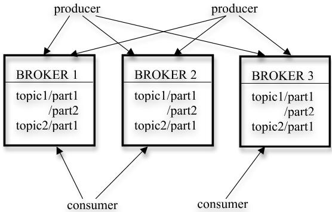
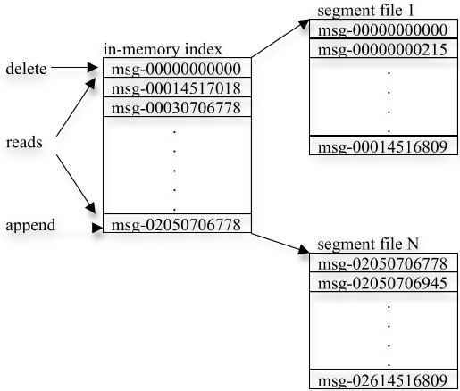
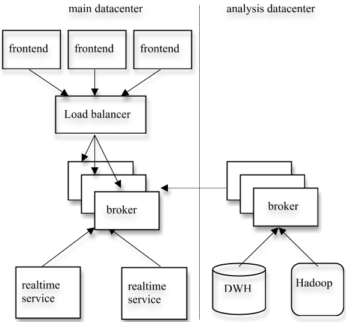
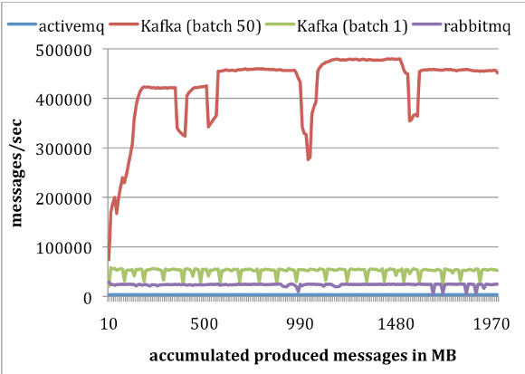
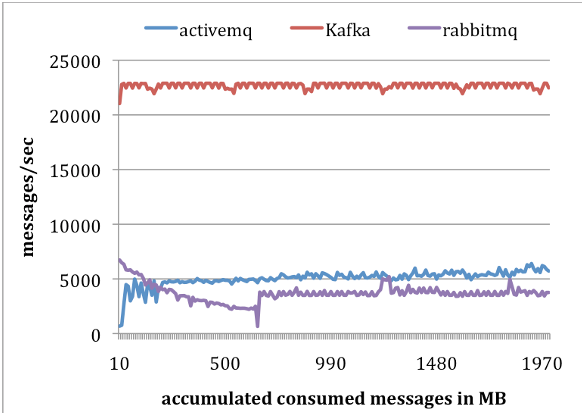

# Kafka：一种用于日志处理的分布式消息系统  

**Jay Kreps · Neha Narkhede · Jun Rao**<br>
LinkedIn Corp.<br>
[jkreps@linkedin.com](mailto:jkreps@linkedin.com) · [nnarkhede@linkedin.com](mailto:nnarkhede@linkedin.com) · [jrao@linkedin.com](mailto:jrao@linkedin.com)

> 允许免费制作本作品全部或部分内容的数字或纸质副本用于个人或课堂用途，前提是副本不以营利或商业利益为目的制作或传播，并且副本须在首页保留本声明及完整引文。若要以其他方式复制、再版、发布到服务器或重新分发到邮件列表，须事先获得明确许可和/或付费。
>
> NetDB'11，2011 年 6 月 12 日，希腊雅典
>
> 版权所有 2011 ACM 978-1-4503-0652-2/11/06...\$10.00。

## 摘要  

日志处理已经成为消费互联网公司数据管道中的关键环节。本文介绍 Kafka——我们为低延迟收集和传送海量日志数据而开发的一种分布式消息系统。该系统融合了现有日志聚合器与消息系统的思想，既适用于离线消息消费，也适用于在线消息消费。为了使系统高效且可扩展，我们在 Kafka 中采用了若干非常规但实用的设计选择。实验结果表明，与两种流行的消息系统相比，Kafka 具有更优的性能。Kafka 已在我们的生产环境中运行了一段时间，每天处理数百 GB 的新增数据。  

## 通用术语  

管理、性能、设计、实验。  

## 关键词  

消息传递、分布式、日志处理、吞吐量、在线。  

## 1. 引言  

任何达到一定规模的互联网公司都会产生大量“日志”数据。这些数据通常包括：（1）与登录、页面浏览、点击、“赞”、分享、评论和搜索查询相对应的用户活动事件；（2）服务调用栈、调用延迟和错误等运行指标，以及每台机器上的 CPU、内存、网络或磁盘利用率等系统指标。长期以来，日志数据一直是分析体系的一部分，用于跟踪用户参与度、系统利用率及其他指标。然而，互联网应用的近期趋势使活动数据成为生产数据管道的一部分，并直接用于网站功能。这些用途包括：（1）搜索相关性；（2）可由条目热度或活动流中的共现关系驱动的推荐；（3）广告定向与报表；（4）防范垃圾信息、未经授权的数据抓取等滥用行为的安全应用；以及（5）聚合用户状态更新或操作，供其“好友”或“联系人”阅读的信息流功能。  

日志数据在生产环境中的实时使用给数据系统带来了新的挑战，因为其数据量比“真正的”业务数据高出若干数量级。例如，搜索、推荐和广告通常需要计算细粒度的点击率，因此不仅每次用户点击会生成日志记录，每个页面上数十个未被点击的条目也会生成记录。中国移动每天收集 5–8 TB 的通话记录 [11]，Facebook 则收集近 6 TB 的各类用户活动事件 [12]。  

许多早期处理此类数据的系统，依赖从生产服务器上实际抓取日志文件以供分析。近年来，人们构建了若干专门的分布式日志聚合器，包括 Facebook 的 Scribe [6]、Yahoo 的 Data Highway [4] 和 Cloudera 的 Flume [3]。这些系统主要用于收集日志数据，并将其装载到数据仓库或 Hadoop [8] 中供离线消费。在 LinkedIn（一个社交网站），我们发现除了传统的离线分析之外，还需要支持上文提到的大多数实时应用，而且延迟不能超过几秒。  

我们构建了一种名为 Kafka [18] 的新型日志处理消息系统，它兼具传统日志聚合器和消息系统的优点。一方面，Kafka 是分布式、可扩展的，并能提供高吞吐量；另一方面，Kafka 提供了类似消息系统的 API，使应用能够实时消费日志事件。Kafka 已经开源，并在 LinkedIn 的生产环境中成功运行了 6 个多月。由于我们能够用同一套软件支持各种日志数据的在线和离线消费，它极大地简化了基础设施。本文其余部分组织如下：第 2 节回顾传统消息系统和日志聚合器；第 3 节介绍 Kafka 的架构及关键设计原则；第 4 节介绍 Kafka 在 LinkedIn 的部署；第 5 节给出 Kafka 的性能结果；第 6 节讨论未来工作并作总结。  

## 2. 相关工作  

传统企业消息系统 [1][7][15][17] 已经存在很长时间，常常作为处理异步数据流的事件总线发挥关键作用。然而，它们往往并不适合日志处理，原因有几个。首先，企业系统提供的功能与日志处理的需求并不匹配。这些系统通常着重提供丰富的传送保证。例如，IBM WebSphere MQ [7] 支持事务，允许应用以原子方式向多个队列插入消息。JMS [14] 规范允许每条消息在消费后单独确认，甚至可以不按顺序确认。对于日志数据收集而言，这类传送保证通常有些过度。例如，偶尔丢失少量页面浏览事件显然并非灾难。此类不必要的功能往往会增加系统 API 和底层实现的复杂度。其次，许多系统并未把吞吐量作为首要设计约束。例如，JMS 没有 API 让生产者显式地将多条消息批量合并到一个请求中。这意味着每条消息都需要一次完整的 TCP/IP 往返，无法满足我们业务领域的吞吐量要求。第三，这些系统对分布式场景的支持较弱，缺乏将消息分区并存储到多台机器上的简便方式。最后，许多消息系统假定消息会近乎立即被消费，因此未消费消息的队列始终很小。若允许消息不断累积，其性能会显著下降；而数据仓库应用等离线消费者正是如此——它们会周期性地执行大批量装载，而不是持续消费。  

过去几年中，人们构建了多种专用日志聚合器。Facebook 使用名为 Scribe 的系统。每台前端机器都可以通过套接字将日志数据发送给一组 Scribe 机器；每台 Scribe 机器聚合日志条目，并周期性地将其转储到 HDFS [9] 或 NFS 设备。Yahoo 的 Data Highway 项目具有类似的数据流：一组机器聚合来自客户端的事件并生成“分钟”文件，随后将这些文件加入 HDFS。Flume 是 Cloudera 开发的一种相对较新的日志聚合器，支持可扩展的“管道”和“接收端”，使日志数据流转非常灵活，并提供了集成度更高的分布式支持。不过，这些系统大多是为离线消费日志数据而构建的，而且常常不必要地向消费者暴露实现细节（例如“分钟文件”）。此外，它们大多采用“推送”模型，由代理节点将数据转发给消费者。在 LinkedIn，我们发现“拉取”模型更适合自己的应用，因为每个消费者都能以自身可持续承受的最大速率获取消息，避免被超出处理能力的推送流量淹没。拉取模型也便于消费者回退；我们将在第 3.2 节末尾讨论这一优点。  

较近时期，Yahoo! Research 开发了一种名为 HedWig [13] 的新型分布式发布/订阅系统。HedWig 具有很强的可扩展性和可用性，并提供强持久性保证。不过，它主要用于存储数据存储系统的提交日志。  

## 3. Kafka 的架构与设计原则  

由于现有系统存在上述局限，我们开发了一种基于消息的新型日志聚合器 Kafka。下面先介绍 Kafka 中的基本概念。某种特定类型的消息流由一个主题（topic）定义。生产者可以向主题发布消息；发布的消息随后存储在一组称为代理节点（broker）的服务器上。消费者可以从代理节点订阅一个或多个主题，并通过从代理节点拉取数据来消费所订阅的消息。  

消息传递在概念上很简单，我们也力求让 Kafka API 同样简单。下面不展示精确的 API，而是用示例代码说明其用法。生产者的示例代码如下。消息被定义为仅包含一个字节载荷，用户可以选择自己偏好的序列化方法对消息编码。为提高效率，生产者可在一次发布请求中发送一组消息。  

**生产者示例代码：**

```java
producer = new Producer(...);
message = new Message("测试消息字符串".getBytes());
set = new MessageSet(message);
producer.send("topic1", set);
```

要订阅某个主题，消费者首先为该主题创建一个或多个消息流。发布到该主题的消息会均匀分配到这些子流中。Kafka 如何分配消息的细节将在第 3.2 节介绍。每个消息流都为持续产生的消息流提供迭代器接口。消费者随后遍历流中的每条消息，并处理消息载荷。与传统迭代器不同，消息流迭代器永不终止。如果当前没有更多消息可消费，迭代器会阻塞，直到有新消息发布到该主题。我们既支持点对点传送模型——多个消费者共同消费某个主题中全部消息的一份副本，也支持发布/订阅模型——多个消费者各自获取该主题的一份副本。  

**消费者示例代码：**

```java
streams[] = Consumer.createMessageStreams("topic1", 1)
for (message : streams[0]) {
    bytes = message.payload;
    // 处理这些字节
}
```

Kafka 的整体架构如图 1 所示。由于 Kafka 天生是分布式的，一个 Kafka 集群通常由多个代理节点组成。为平衡负载，一个主题会被划分为多个分区，每个代理节点存储其中一个或多个分区。多个生产者和消费者可以同时发布和获取消息。第 3.1 节介绍代理节点上单个分区的布局，以及为高效访问分区而采用的若干设计选择；第 3.2 节说明在分布式环境中生产者和消费者如何与多个代理节点交互；第 3.3 节讨论 Kafka 的传送保证。  



> 图 1。Kafka 架构。

### 3.1 单个分区上的效率  

为了提高系统效率，我们在 Kafka 中作出了若干设计选择。  

**简单存储：** Kafka 的存储布局非常简单。主题的每个分区都对应一个逻辑日志。在物理上，日志由一组大小近似相同（例如 1 GB）的段文件实现。每当生产者向某个分区发布消息时，代理节点只需将消息追加到最后一个段文件。为获得更好的性能，只有在发布了可配置数量的消息或经过一定时间后，我们才会将段文件刷写到磁盘。消息只有刷写后才会对消费者可见。  

与典型的消息系统不同，Kafka 中存储的消息没有显式消息 ID。每条消息以其在日志中的逻辑偏移量寻址。这样便避免了维护辅助随机访问索引结构的开销；这类结构需要大量寻道操作，用于将消息 ID 映射到消息的实际位置。请注意，我们的消息 ID 单调递增但并不连续。要计算下一条消息的 ID，必须将当前消息的长度加到其 ID 上。下文将交替使用“消息 ID”和“偏移量”这两个术语。  

消费者总是按顺序消费特定分区中的消息。如果消费者确认了某个消息偏移量，就意味着该消费者已经收到该分区中此偏移量之前的所有消息。在底层，消费者向代理节点发出异步拉取请求，从而预先准备一缓冲区的数据供应用消费。每个拉取请求都包含开始消费的消息偏移量，以及可接受的获取字节数。每个代理节点在内存中保存一个有序偏移量列表，其中包括每个段文件第一条消息的偏移量。代理节点通过搜索该列表定位请求消息所在的段文件，再将数据发回消费者。消费者收到消息后，计算下一条待消费消息的偏移量，并将其用于下一次拉取请求。Kafka 日志与内存索引的布局如图 2 所示，每个方框中标出了相应消息的偏移量。  



> 图 2。Kafka 日志。

**高效传输：** 我们对数据进出 Kafka 的传输过程进行了细致设计。前文已经说明，生产者可以在一次发送请求中提交一组消息。虽然面向最终消费者的 API 每次迭代一条消息，但在底层，消费者的每个拉取请求同样会获取多条消息，直至达到某个大小上限，通常为数百 KB。  

我们作出的另一个非常规选择，是避免在 Kafka 层显式缓存消息，而是依赖底层文件系统的页缓存。其主要优点是避免双重缓冲——消息只缓存在页缓存中；另一个好处是，即使代理节点进程重启，热缓存仍可保留。由于 Kafka 完全不在进程中缓存消息，其内存垃圾回收开销很小，因此能够用基于虚拟机的语言实现高效系统。最后，生产者和消费者都按顺序访问段文件，而且消费者通常只比生产者落后少量数据，因此常规操作系统缓存启发式策略十分有效，尤其是直写缓存和预读。我们发现，无论生产还是消费，其性能都能随数据规模保持一致的线性关系，即使数据达到数 TB 亦是如此。  

此外，我们还优化了消费者的网络访问。Kafka 是一个多订阅者系统，同一条消息可能被不同的消费者应用消费多次。将本地文件中的字节发送到远程套接字，典型做法包括以下步骤：（1）将数据从存储介质读入操作系统页缓存；（2）将数据从页缓存复制到应用缓冲区；（3）将应用缓冲区复制到另一个内核缓冲区；（4）将内核缓冲区发送到套接字。这一过程包含 4 次数据复制和 2 次系统调用。在 Linux 及其他 Unix 操作系统上，sendfile API [5] 可以直接把字节从文件通道传输到套接字通道，通常能省去步骤（2）和（3）带来的 2 次复制与 1 次系统调用。Kafka 利用 sendfile API，将日志段文件中的字节从代理节点高效地传送给消费者。  

**无状态代理节点：** 与大多数其他消息系统不同，在 Kafka 中，每个消费者已经消费到什么位置的信息不由代理节点维护，而由消费者自己维护。这种设计大幅降低了代理节点的复杂度和开销。不过，由于代理节点不知道所有订阅者是否都已消费某条消息，删除消息会变得棘手。Kafka 通过为保留策略采用简单的、基于时间的服务等级协议（SLA）来解决这个问题：消息在代理节点中保留超过一定期限（通常为 7 天）后会被自动删除。实践证明，这一方案运作良好。包括离线消费者在内的大多数消费者都会以每日、每小时或实时方式完成消费。Kafka 的性能不会随数据量增大而下降，因此这种较长的保留期是可行的。  

该设计还有一个重要的附带优势：消费者可以有意*回退*到旧偏移量并重新消费数据。这违反了队列的一般约定，却被证明是许多消费者不可或缺的功能。例如，如果消费者的应用逻辑出现错误，修复后应用可以重放某些消息。这对于向数据仓库或 Hadoop 系统执行 ETL 数据装载尤其重要。再例如，已消费的数据可能只是周期性地刷写到持久存储中（如全文索引器）。如果消费者崩溃，尚未刷写的数据就会丢失。在这种情况下，消费者可以为未刷写消息中的最小偏移量建立检查点，并在重启后从该偏移量重新消费。需要指出的是，拉取模型比推送模型更容易支持消费者回退。  

### 3.2 分布式协调  

下面介绍生产者和消费者在分布式环境中的行为。每个生产者都可以将消息发布到随机选取的分区，也可以根据分区键与分区函数，将消息发布到语义上确定的分区。这里重点讨论消费者如何与代理节点交互。  

Kafka 引入了*消费者组*的概念。每个消费者组由一个或多个消费者构成，它们共同消费一组订阅主题；也就是说，每条消息只传送给组内一个消费者。不同的消费者组各自独立消费所订阅的完整消息集，组与组之间无须协调。同一组内的消费者可以位于不同进程或不同机器上。我们的目标是将代理节点中存储的消息均匀分配给各消费者，同时不过多增加协调开销。  

第一项设计决定，是把主题内的一个分区作为最小并行单元。这意味着在任意时刻，一个分区中的全部消息在每个消费者组内只由一个消费者消费。如果允许多个消费者同时消费同一分区，它们就必须协调各自消费哪些消息，从而产生锁定和状态维护开销。相比之下，在我们的设计中，消费进程只需在消费者重新平衡负载时进行协调，而这类事件并不频繁。为了真正实现负载均衡，我们要求主题中的分区数远多于每个组内的消费者数。通过对主题进行超额分区，很容易做到这一点。  

第二项设计决定，是不设置中央“主”节点，而让消费者以去中心化方式彼此协调。增加主节点会使系统更加复杂，因为还必须考虑主节点故障。为了实现协调，我们采用高可用的一致性服务 ZooKeeper [10]。ZooKeeper 提供了非常简单、类似文件系统的 API：可以创建路径、设置路径值、读取路径值、删除路径，以及列出某路径的子路径。它还提供若干更有意思的功能：（a）可以在路径上注册监视器，并在路径的子节点或路径值发生变化时获得通知；（b）路径可创建为临时路径（与持久路径相对），即创建该路径的客户端离开后，ZooKeeper 服务器会自动删除该路径；（c）ZooKeeper 将数据复制到多台服务器，使数据具有很高的可靠性和可用性。  

Kafka 使用 ZooKeeper 完成以下任务：（1）检测代理节点和消费者的加入与移除；（2）在发生上述事件时触发每个消费者的重新平衡过程；（3）维护消费关系，并跟踪每个分区的已消费偏移量。具体来说，每个代理节点或消费者启动时，都会把自身信息存入 ZooKeeper 的代理节点注册表或消费者注册表。代理节点注册表包含代理节点的主机名、端口，以及该代理节点存储的主题与分区集合。消费者注册表则包括消费者所属的消费者组，以及其订阅的主题集合。ZooKeeper 中每个消费者组都关联一个所有权注册表和一个偏移量注册表。所有权注册表为每个已订阅分区保存一条路径，路径值是当前正在消费该分区的消费者 ID（我们称该消费者“拥有”此分区）。偏移量注册表为每个已订阅分区保存其中最后一条已消费消息的偏移量。  

在 ZooKeeper 中，代理节点注册表、消费者注册表和所有权注册表中的路径均为临时路径，偏移量注册表中的路径则是持久路径。如果某个代理节点发生故障，其上的所有分区会自动从代理节点注册表移除。消费者发生故障时，它在消费者注册表中的条目及其在所有权注册表中拥有的所有分区都会丢失。每个消费者都会同时在代理节点注册表和消费者注册表上注册 ZooKeeper 监视器，因此只要代理节点集合或消费者组发生变化，就会收到通知。  

消费者初次启动时，或通过监视器获知代理节点/消费者发生变化时，会启动重新平衡过程，以确定自己应当消费的新分区子集。  

**算法 1：组 G 中消费者 C_i 的重新平衡过程**

```text
对于 C_i 订阅的每个主题 T {
    从所有权注册表中移除 C_i 拥有的分区
    从 ZooKeeper 读取代理节点注册表和消费者注册表
    计算 P_T = 主题 T 在所有代理节点上的可用分区
    计算 C_T = 组 G 中订阅主题 T 的所有消费者
    对 P_T 和 C_T 排序
    令 j 为 C_i 在 C_T 中的索引位置，并令 N = |P_T| / |C_T|
    将 P_T 中从 j*N 到 (j+1)*N - 1 的分区分配给消费者 C_i
    对于每个已分配分区 p {
        在所有权注册表中将 p 的所有者设为 C_i
        令 O_p = 偏移量注册表中存储的分区 p 的偏移量
        启动一个线程，从偏移量 O_p 开始拉取分区 p 中的数据
    }
}
```

消费者从 ZooKeeper 读取代理节点注册表和消费者注册表后，首先计算每个已订阅主题 T 的可用分区集合（$P_T$），以及订阅 T 的消费者集合（$C_T$）。随后，它将 $P_T$ 按范围划分为 $|C_T|$ 个块，并以确定性的方式选取一个块作为自己拥有的分区。对于选中的每个分区，消费者都在所有权注册表中将自己写为该分区的新所有者。最后，消费者为每个自己拥有的分区启动一个线程，从偏移量注册表中保存的偏移量开始拉取数据。随着消息不断从分区中被拉取，消费者会周期性地在偏移量注册表中更新最新的已消费偏移量。  

当一个组内有多个消费者时，代理节点或消费者发生变化后，每个消费者都会收到通知。不过，不同消费者收到通知的时间可能略有差异。因此，一个消费者可能会尝试取得仍由另一个消费者拥有的分区。发生这种情况时，前一个消费者只需释放当前拥有的全部分区，稍作等待，然后重试重新平衡过程。实践中，重新平衡过程通常只需重试几次便能稳定下来。  

新建消费者组时，偏移量注册表中没有可用偏移量。在这种情况下，消费者将根据配置，从每个已订阅分区上可用的最小或最大偏移量开始消费；这些偏移量通过代理节点提供的 API 获取。  

### 3.3 传送保证  

总体而言，Kafka 只保证至少一次传送。恰好一次传送通常需要两阶段提交，而我们的应用并不需要它。大多数情况下，每条消息都会向每个消费者组恰好传送一次。不过，如果某个消费者进程未正常关闭便崩溃，接管故障消费者所拥有分区的消费者进程，可能会收到一些重复消息，即位于最后一次成功提交到 ZooKeeper 的偏移量之后的消息。如果应用在意重复消息，就必须自行加入去重逻辑，可以使用我们返回给消费者的偏移量，也可以使用消息中的某个唯一键。这通常比采用两阶段提交更具成本效益。  

Kafka 保证来自单个分区的消息按顺序传送给消费者，但不保证来自不同分区的消息之间的顺序。  

为避免日志损坏，Kafka 在日志中为每条消息保存 CRC。如果代理节点发生任何 I/O 错误，Kafka 会运行恢复过程，移除 CRC 不一致的消息。在消息级保存 CRC，也使我们能够在消息生产或消费后检查网络错误。  

如果某个代理节点宕机，其上存储但尚未消费的消息都会变得不可用。如果代理节点上的存储系统永久损坏，任何尚未消费的消息都将永远丢失。未来我们计划为 Kafka 加入内置复制功能，在多个代理节点上冗余存储每条消息。  

## 4. Kafka 在 LinkedIn 的使用  

本节介绍我们在 LinkedIn 如何使用 Kafka。图 3 展示了部署的简化版本。每个运行面向用户服务的数据中心内，都共置一个 Kafka 集群。前端服务生成各种日志数据，并将其分批发布到本地 Kafka 代理节点。我们依靠硬件负载均衡器，将发布请求均匀分发到这组 Kafka 代理节点。Kafka 的在线消费者作为服务运行在同一个数据中心内。  



> 图 3。Kafka 部署。

我们还在另一个数据中心部署了一套 Kafka 集群用于离线分析，该数据中心在地理位置上靠近 Hadoop 集群和其他数据仓库基础设施。这个 Kafka 实例运行一组嵌入式消费者，从在线数据中心的 Kafka 实例拉取数据。随后，我们运行数据装载作业，将数据从这个 Kafka 副本集群拉取到 Hadoop 和数据仓库中，并在其上执行各种报表作业和分析过程。我们还使用该 Kafka 集群进行原型开发，并可针对原始事件流运行简单脚本，执行即席查询。在没有大量调优的情况下，完整管道的端到端延迟平均约为 10 秒，足以满足我们的要求。  

目前，Kafka 每天累积数百 GB 数据和近十亿条消息；随着旧系统陆续完成改造并开始利用 Kafka，我们预计这一规模将显著增长。未来还会加入更多消息类型。当运维人员因软硬件维护而启动或停止代理节点时，重新平衡过程能够自动重定向消费流量。  

我们的跟踪体系还包含一套审计系统，用于验证整个管道中没有数据丢失。为此，每条消息都会携带生成时的时间戳和服务器名称。我们对每个生产者进行埋点，使其周期性地产生监控事件，记录该生产者在固定时间窗口内为每个主题发布的消息数量。生产者将监控事件发布到 Kafka 的一个独立主题中。消费者随后可以统计自己从给定主题收到的消息数，并将统计结果与监控事件核对，以验证数据的正确性。  

向 Hadoop 集群装载数据，是通过实现一种特殊的 Kafka 输入格式完成的，该格式允许 MapReduce 作业直接从 Kafka 读取数据。MapReduce 作业装载原始数据，然后对其分组、压缩，以便未来高效处理。无状态代理节点和客户端侧的消息偏移量存储在这里再次发挥作用：MapReduce 的任务管理机制允许任务失败并重启，因此可以自然地处理数据装载，而不会在任务重启时造成消息重复或丢失。只有作业成功完成后，数据和偏移量才会存入 HDFS。  

我们选择 Avro [2] 作为序列化协议，因为它效率高且支持模式演化。对于每条消息，我们在载荷中存储其 Avro 模式 ID 和序列化后的字节。该模式使我们能够强制执行约定，确保数据生产者与消费者相互兼容。我们使用轻量级模式注册表服务，将模式 ID 映射到实际模式。消费者收到消息后，会查询模式注册表以取得相应模式，并据此把字节解码为对象（由于值不可变，每种模式只需查询一次）。  

## 5. 实验结果  

我们开展了一项实验研究，将 Kafka 的性能与 Apache ActiveMQ v5.4 [1] 和 RabbitMQ v2.4 [16] 进行比较。前者是流行的 JMS 开源实现，后者是一种以性能著称的消息系统。我们使用 ActiveMQ 默认的持久消息存储 KahaDB。虽然未在本文中展示，但我们也测试了另一种 AMQ 消息存储，发现其性能与 KahaDB 非常接近。只要条件允许，我们都尽量在所有系统中采用可比的设置。  

实验在 2 台 Linux 机器上运行，每台机器配备 8 个 2 GHz 核心、16 GB 内存和 6 块组成 RAID 10 的磁盘。两台机器通过 1 Gb 网络链路连接。其中一台用作代理节点，另一台用作生产者或消费者。  

**生产者测试：** 我们将所有系统中的代理节点都配置为异步地把消息刷写到持久存储。对于每个系统，我们运行一个生产者，共发布 1,000 万条消息，每条 200 字节。Kafka 生产者分别采用大小为 1 和 50 的消息批次。ActiveMQ 和 RabbitMQ 似乎没有简便的消息批处理方式，因此我们假定其批次大小为 1。结果如图 4 所示。横轴表示随时间发送到代理节点的数据量（MB），纵轴表示生产者吞吐量（消息/秒）。平均而言，在批次大小分别为 1 和 50 时，Kafka 的发布速率分别达到每秒 50,000 条和 400,000 条消息。这些数值比 ActiveMQ 高出若干数量级，且至少是 RabbitMQ 的 2 倍。  



> 图 4。生产者性能。

Kafka 性能高得多有几个原因。首先，当前 Kafka 生产者不会等待代理节点确认，而是以代理节点能够处理的最快速度发送消息。这显著提高了发布者的吞吐量。当批次大小为 50 时，单个 Kafka 生产者几乎使生产者与代理节点之间的 1 Gb 链路达到饱和。对于日志聚合场景，这是一项合理的优化，因为数据必须异步发送，以免给实时流量服务引入延迟。需要指出的是，如果不向生产者确认，就无法保证每条发布的消息都确实被代理节点收到。对于许多类型的日志数据，只要丢失消息的数量相对较少，以持久性换取吞吐量是可取的。不过，对于更关键的数据，我们计划在未来解决持久性问题。  

其次，Kafka 的存储格式效率更高。平均而言，Kafka 中每条消息的开销是 9 字节，而 ActiveMQ 中为 144 字节。这意味着存储同样的 1,000 万条消息时，ActiveMQ 比 Kafka 多占用 70% 的空间。ActiveMQ 的一项开销来自 JMS 所要求的繁重消息头，另一项则来自维护各种索引结构的成本。我们观察到，ActiveMQ 中最繁忙的线程之一，大部分时间都在访问一棵 B 树以维护消息元数据和状态。最后，批处理通过摊薄 RPC 开销，大幅提升了吞吐量。在 Kafka 中，批次大小为 50 条消息时，吞吐量提高了近一个数量级。  

**消费者测试：** 在第二项实验中，我们测试了消费者的性能。同样，对所有系统都使用一个消费者，共获取 1,000 万条消息。我们将所有系统配置为每次拉取请求预取大致相同的数据量——最多 1,000 条消息或约 200 KB。对于 ActiveMQ 和 RabbitMQ，我们将消费者确认模式设为自动。由于所有消息都能装入内存，各系统均从底层文件系统页缓存或某些内存缓冲区提供数据。结果如图 5 所示。  

平均而言，Kafka 每秒消费 22,000 条消息，超过 ActiveMQ 和 RabbitMQ 的 4 倍。原因可能有几个。首先，由于 Kafka 的存储格式效率更高，从代理节点传输给消费者的字节数较少。其次，ActiveMQ 和 RabbitMQ 的代理节点都必须维护每条消息的传送状态。在这项测试中，我们观察到一个 ActiveMQ 线程一直忙于将 KahaDB 页面写入磁盘；相比之下，Kafka 代理节点上没有磁盘写活动。最后，通过使用 sendfile API，Kafka 降低了传输开销。  



> 图 5。消费者性能。

本节最后需要说明，这项实验的目的并非证明其他消息系统不如 Kafka。毕竟，ActiveMQ 和 RabbitMQ 都比 Kafka 提供更多功能。这里的重点，是说明专用系统能够实现怎样的潜在性能增益。  

## 6. 结论与未来工作  

本文介绍了一个名为 Kafka 的新型系统，用于处理海量日志数据流。与消息系统一样，Kafka 采用基于拉取的消费模型，使应用能够按自身速率消费数据，并在需要时回退消费位置。由于专注于日志处理应用，Kafka 实现了远高于传统消息系统的吞吐量。它还提供集成式分布支持，并能够横向扩展。我们已经在 LinkedIn 成功地将 Kafka 用于离线和在线应用。  

未来我们希望沿若干方向继续推进。首先，我们计划加入跨多个代理节点的内置消息复制功能，即使机器发生不可恢复的故障，也能提供持久性和数据可用性保证。我们希望同时支持异步和同步复制模型，使生产者延迟与保证强度之间可以有所权衡。应用可以根据自身对持久性、可用性和吞吐量的要求，选择适当的冗余级别。其次，我们希望在 Kafka 中加入一定的流处理能力。实时应用从 Kafka 获取消息后，往往会执行相似操作，例如基于窗口的计数，以及将每条消息与辅助存储中的记录或另一条流中的消息连接。在最底层，可以在发布时按连接键对消息进行语义分区来支持这一点，使带有某个特定键的所有消息都进入同一个分区，进而抵达同一个消费者进程。这为在消费者机器集群上处理分布式数据流奠定了基础。在此之上，我们认为，提供不同窗口函数或连接技术等实用流处理工具的库，将有益于此类应用。  

## 7. 参考文献  

[1] http://activemq.apache.org/  

[2] http://avro.apache.org/  

[3] Cloudera's Flume, https://github.com/cloudera/flume  

[4] http://developer.yahoo.com/blogs/hadoop/posts/2010/06/enabling_hadoop_batch_process_1/  

[5] Efficient data transfer through zero copy: https://www.ibm.com/developerworks/linux/library/j-zerocopy/

[6] Facebook’s Scribe, http://www.facebook.com/note.php?note_id=32008268919

[7] IBM WebSphere MQ: http://www-01.ibm.com/software/integration/wmq/  

[8] http://hadoop.apache.org/  

[9] http://hadoop.apache.org/hdfs/  

[10] http://hadoop.apache.org/zookeeper/  

[11] http://www.slideshare.net/cloudera/hw09-hadoop-based-data-mining-platform-for-the-telecom-industry  

[12] http://www.slideshare.net/prasadc/hive-percona-2009  

[13] https://issues.apache.org/jira/browse/ZOOKEEPER-775  

[14] JAVA Message Service: http://download.oracle.com/javaee/1.3/jms/tutorial/1_3_1-fcs/doc/jms_tutorialTOC.html.

[15] Oracle Enterprise Messaging Service: http://www.oracle.com/technetwork/middleware/ias/index-093455.html

[16] http://www.rabbitmq.com/  

[17] TIBCO Enterprise Message Service: http://www.tibco.com/products/soa/messaging/

[18] Kafka, http://sna-projects.com/kafka/
