# PUBLISH/SUBSCRIBE SYSTEMS

# WILEY SERIES IN COMMUNICATIONS NETWORKING & DISTRIBUTED SYSTEMS

丛书编辑：David Hutchison，Lancaster University，Lancaster，英国

Serge Fdida，*Université Pierre et Marie Curie，Paris，法国*

Joe Sventek，University of Glasgow，Glasgow，英国

“Wiley Series in Communications Networking & Distributed Systems”是一套专家级、技术细节详尽的丛书，涵盖前沿研究、全新进展以及网络、middleware 和通信与分布式系统软件技术方面的教程式论述。本丛书将为电信与计算领域的研究人员、研究生和开发工程师提供关于最新技术水平的及时且可靠的信息。

## 本丛书其他书目：

Wright: Voice over Packet Networks 0-471-49516-6 (February 2001)

Jepsen: Java for Telecommunications 0-471-49826-2 (July 2001)

Sutton: Secure Communications 0-471-49904-8 (December 2001)

Stajano: Security for Ubiquitous Computing 0-470-84493-0 (February 2002)

Martin-Flatin: Web-Based Management of IP Networks and Systems 0-471-48702-3 (September 2002)

Berman, Fox, Hey: Grid Computing. Making the Global Infrastructure a Reality 0-470-85319-0

(March 2003)

Turner, Magill, Marples: *Service Provision. Technologies for Next Generation Communications*

0-470-85066-3 (April 2004)

Welzl: Network Congestion Control: Managing Internet Traffic 0-470-02528-X (July 2005)

Raz, Juhola, Serrat-Fernandez, Galis: Fast and Efficient Context-Aware Services 0-470-01668-X

(April 2006)

Heckmann: *The Competitive Internet Service Provider* 0-470-01293-5 (April 2006)

Dressler: Self-Organization in Sensor and Actor Networks 0-470-02820-3 (November 2007)

Berndt: Towards 4G Technologies: Services with Initiative 0-470-01031-2 (March 2008)

Jacquenet, Bourdon, Boucadair: *Service Automation and Dynamic Provisioning Techniques in*

IP/MPLS Environments 0-470-01829-1 (March 2008)

Gurtov: Host Identity Protocol (HIP): Towards the Secure Mobile Internet 0-470-99790-7 (June 2008)

Boucadair: Inter-Asterisk Exchange (IAX): Deployment Scenarios in SIP-enabled Networks

0-470-77072-4 (January 2009)

Fitzek: Mobile Peer to Peer (P2P): A Tutorial Guide 0-470-69992-2 (June 2009)

Shelby: 6LoWPAN: The Wireless Embedded Internet 0-470-74799-4 (November 2009)

Stavdas: Core and Metro Networks 0-470-51274-1 (February 2010)

Gómez Herrero, van der Ven, Network Mergers and Migrations: Junos® Design and Implementation
0-470-74237-2 (March 2010)

Jacobsson, Niemegeers, Heemstra de Groot, *Personal Networks: Wireless Networking for Personal Devices* 0-470-68173-X (June 2010)

Minei, Lucek: *MPLS-Enabled Applications: Emerging Developments and New Technologies, Third Edition*, 0-470-66545-9 (December 2011)

Barreiros: QOS-Enabled Networks, 0-470-68697-9 (December 2011)

# PUBLISH/SUBSCRIBE SYSTEMS DESIGN AND PRINCIPLES

Sasu Tarkoma

University of Helsinki，芬兰

本版本首次出版于 2012 年

© 2012 John Wiley & Sons Ltd

注册办公地址

John Wiley & Sons Ltd, The Atrium, Southern Gate, Chichester, West Sussex, PO19 8SQ, United Kingdom

有关我们全球编辑办公室的详细信息、客户服务以及如何申请许可以重用本书中受版权保护的材料，请访问我们的网站 www.wiley.com。

作者有权根据 1988 年《Copyright, Designs and Patents Act》被确认为本作品的作者。

版权所有。未经出版者事先许可，除 1988 年英国《Copyright, Designs and Patents Act》所允许的情形外，不得以任何形式或任何手段（电子、机械、影印、录制或其他方式）复制、存储于检索系统或传播本出版物的任何部分。

Wiley 还以多种电子格式出版其图书。印刷版中出现的某些内容可能无法在电子图书中获得。

公司用于区分其产品的名称通常被声明为商标。本书中使用的所有品牌名称和产品名称均为其各自所有者的商号、服务标记、商标或注册商标。出版者与本书中提及的任何产品或供应商均无关联。本出版物旨在就其所涵盖的主题提供准确且权威的信息。其出售基于这样的理解：出版者并未从事提供专业服务。如果需要专业建议或其他专家协助，应寻求合格专业人士的服务。

Library of Congress Cataloging-in-Publication Data

Tarkoma, Sasu.

Publish/subscribe systems : design and principles / Sasu Tarkoma.
p. cm.

Includes bibliographical references and index.

ISBN 978-1-119-95154-4 (pbk.)

1. Push technology (Computer networks) I. Title.

TK5105.887.T37 2012

006.7'876-dc23

2012010711

本书的目录记录可从 British Library 获得。

Paper ISBN: 9781119951544

由 Laserwords Private Limited（印度 Chennai）以 10/12pt Times 排版。

## 目录

- [关于作者](#关于作者)
- [贡献者说明](#贡献者说明)
- [前言](#前言)
- [1 引言](#1-引言)
      - [1.1 概述](#11-概述)
      - [1.2 pub/sub 系统的组成](#12-pubsub-系统的组成)
         - [1.2.1 基本系统](#121-基本系统)
         - [1.2.2 分布式与 overlay 网络](#122-分布式与-overlay-网络)
         - [1.2.3 约定](#123-约定)
         - [1.2.4 事件循环](#124-事件循环)
         - [1.2.5 基本性质](#125-基本性质)
         - [1.3 pub/sub 服务模型](#13-pubsub-服务模型)
      - [1.4 分布式 pub/sub](#14-分布式-pubsub)
      - [1.5 接口与操作](#15-接口与操作)
         - [1.6 用于定向投递的 pub/sub 语义](#16-用于定向投递的-pubsub-语义)
   - [1.7 通信技术](#17-通信技术)
      - [1.8 环境](#18-环境)
      - [1.9 历史](#19-历史)
         - [1.9.1 研究系统](#191-研究系统)
      - [1.9.2 标准](#192-标准)
         - [1.9.3 互联网技术](#193-互联网技术)
         - [1.9.4 分类法](#194-分类法)
      - [1.10 应用领域](#110-应用领域)
         - [1.11 本书结构](#111-本书结构)
   - [参考文献](#参考文献)
- [2 网络与消息传递](#2-网络与消息传递)
   - [2.1 网络](#21-网络)
      - [2.1.1 概述](#211-概述)
      - [2.1.2 Socket、middleware 和应用程序](#212-socketmiddleware-和应用程序)
      - [2.1.3 命名与寻址](#213-命名与寻址)
      - [2.1.4 组织](#214-组织)
      - [2.1.5 firewall 和 NAT](#215-firewall-和-nat)
   - [2.2 multicast](#22-multicast)
         - [2.2.1 IP（网络层）IP multicast](#221-ip网络层ip-multicast)
         - [2.2.2 应用层 multicast](#222-应用层-multicast)
         - [2.3 反向路径转发与 routing](#23-反向路径转发与-routing)
   - [2.4 因果关系与时钟](#24-因果关系与时钟)
      - [2.4.1 因果排序与 Lamport 时钟](#241-因果排序与-lamport-时钟)
      - [2.4.2 向量时钟](#242-向量时钟)
      - [2.4.3 全序](#243-全序)
      - [2.4.4 讨论](#244-讨论)
      - [2.5 消息传递与 RPC/RMI](#25-消息传递与-rpcrmi)
         - [2.5.1 存储转发](#251-存储转发)
         - [2.5.2 并发消息处理](#252-并发消息处理)
      - [2.5.3 语义与 QoS](#253-语义与-qos)
   - [2.6 Web Services](#26-web-services)
      - [2.6.1 概述](#261-概述)
      - [2.6.2 异步处理](#262-异步处理)
      - [2.6.3 连接器模型](#263-连接器模型)
      - [2.6.4 Web Service 平台](#264-web-service-平台)
      - [2.6.5 企业服务总线（ESB）](#265-企业服务总线esb)
      - [2.6.6 服务组合](#266-服务组合)
   - [2.7 会话初始协议（SIP）](#27-会话初始协议sip)
      - [2.7.1 SIP 框架](#271-sip-框架)
      - [2.7.2 方法类型](#272-方法类型)
      - [2.7.3 建立会话](#273-建立会话)
      - [2.7.4 扩展](#274-扩展)
   - [2.8 小结](#28-小结)
   - [References](#references)
- [3 overlay 网络与分布式 hash 表](#3-overlay-网络与分布式-hash-表)
      - [3.1 概述](#31-概述)
      - [3.2 用途](#32-用途)
   - [3.3 一致性 hash](#33-一致性-hash)
      - [3.4 几何结构](#34-几何结构)
   - [3.5 DHT](#35-dht)
      - [3.5.1 DHT API](#351-dht-api)
      - [3.5.2 Chord](#352-chord)
         - [3.5.2.1 Internet 间接基础设施](#3521-internet-间接基础设施)
      - [3.5.3 Pastry](#353-pastry)
         - [3.5.3.1 加入和离开网络](#3531-加入和离开网络)
         - [3.5.3.2 routing](#3532-routing)
      - [3.5.3.3 特性](#3533-特性)
      - [3.5.3.4 应用](#3534-应用)
      - [3.5.4 讨论](#354-讨论)
   - [3.6 gossip 系统](#36-gossip-系统)
      - [3.6.1 概述](#361-概述)
      - [3.6.2 视图洗牌](#362-视图洗牌)
      - [3.6.3 用于 pub/sub 的 gossip](#363-用于-pubsub-的-gossip)
   - [3.7 小结](#37-小结)
   - [References](#references)
- [4 原则与模式](#4-原则与模式)
   - [4.1 引言](#41-引言)
   - [4.2 通用 Pub/Sub 模型](#42-通用-pubsub-模型)
         - [4.2.1 原则与特征](#421-原则与特征)
         - [4.2.2 消息服务](#422-消息服务)
         - [4.2.3 通用模式](#423-通用模式)
      - [4.2.4 事件通知模式](#424-事件通知模式)
   - [4.3 架构模式](#43-架构模式)
   - [4.4 设计模式](#44-设计模式)
      - [4.4.1 结构模式](#441-结构模式)
      - [4.4.2 行为模式](#442-行为模式)
      - [4.4.3 并发模式](#443-并发模式)
      - [4.5 Pub/Sub 的设计模式](#45-pubsub-的设计模式)
         - [4.5.1 Broker](#451-broker)
      - [4.5.2 Observer](#452-observer)
   - [4.5.3 模型-视图-控制器（MVC）](#453-模型-视图-控制器mvc)
   - [4.5.4 Rendezvous Point](#454-rendezvous-point)
   - [4.5.5 带 Rendezvous 的 Handoff](#455-带-rendezvous-的-handoff)
      - [4.5.6 客户端发起的连接](#456-客户端发起的连接)
      - [4.5.7 其他模式](#457-其他模式)
   - [4.6 Event Notifier 模式](#46-event-notifier-模式)
      - [4.6.1 概述](#461-概述)
      - [4.6.2 结构](#462-结构)
      - [4.6.3 分布式 Event Notifier](#463-分布式-event-notifier)
      - [4.6.4 设计考虑](#464-设计考虑)
         - [4.6.4.1 事件模型](#4641-事件模型)
      - [4.6.4.2 类型检查](#4642-类型检查)
      - [4.6.4.3 通告事件集](#4643-通告事件集)
      - [4.6.4.4 性能和容错](#4644-性能和容错)
      - [4.6.4.5 总结](#4645-总结)
   - [4.7 企业集成模式](#47-企业集成模式)
   - [4.8 总结](#48-总结)
   - [References](#references)
- [5 标准与产品](#5-标准与产品)
      - [5.1 CORBA Event Service](#51-corba-event-service)
      - [5.2 CORBA Notification Service 和 Channel 管理](#52-corba-notification-service-和-channel-管理)
   - [5.3 OMG Data Distribution Service (DDS)](#53-omg-data-distribution-service-dds)
      - [5.3.1 概述](#531-概述)
      - [5.3.2 QoS 策略](#532-qos-策略)
      - [5.3.3 实时通信](#533-实时通信)
      - [5.3.4 应用](#534-应用)
      - [5.4 SIP 事件框架](#54-sip-事件框架)
   - [5.5 Java 委托事件模型](#55-java-委托事件模型)
   - [5.6 Java 分布式事件模型](#56-java-分布式事件模型)
   - [5.7 Java Message Service (JMS)](#57-java-message-service-jms)
   - [5.7.1 两种通信模型](#571-两种通信模型)
         - [5.7.2 消息类型和选择](#572-消息类型和选择)
      - [5.7.3 JMS 流程](#573-jms-流程)
      - [5.7.3.1 JMS Pub/Sub 模型](#5731-jms-pubsub-模型)
      - [5.7.4 消息投递](#574-消息投递)
      - [5.7.5 事务](#575-事务)
      - [5.7.6 高级问题](#576-高级问题)
      - [5.7.7 Java EE 中的 JMS 和实现](#577-java-ee-中的-jms-和实现)
   - [5.8 TibCo Rendezvous](#58-tibco-rendezvous)
   - [5.9 COM+ 和 .NET](#59-com-和-net)
   - [5.10 WebSphere MQ](#510-websphere-mq)
      - [5.10.1 概述](#5101-概述)
      - [5.10.2 WebSphere MQ 中的 Pub/Sub](#5102-websphere-mq-中的-pubsub)
   - [5.11 Advanced Message Queuing Protocol (AMQP)](#511-advanced-message-queuing-protocol-amqp)
      - [5.12 MQ Telemetry Transport (MQTT)](#512-mq-telemetry-transport-mqtt)
   - [5.13 总结](#513-总结)
   - [References](#references)
- [6 Web 技术](#6-web-技术)
- [6 Web 技术](#6-web-技术)
   - [6.1 REST](#61-rest)
   - [6.2 AJAX](#62-ajax)
   - [6.3 RSS 和 Atom](#63-rss-和-atom)
   - [6.4 SOAP](#64-soap)
   - [6.5 XMPP](#65-xmpp)
      - [6.6 受限应用协议（CoAP）](#66-受限应用协议coap)
   - [6.7 W3C DOM Events](#67-w3c-dom-events)
   - [6.8 WS-Eventing 和 WS-Notification](#68-ws-eventing-和-ws-notification)
   - [6.9 小结](#69-小结)
   - [References](#references)
- [7 分布式 Publish/Subscribe](#7-分布式-publishsubscribe)
      - [7.1 概述](#71-概述)
      - [7.2 内容过滤](#72-内容过滤)
   - [7.3 routing 功能](#73-routing-功能)
   - [7.4 基于 topic 的 routing](#74-基于-topic-的-routing)
      - [7.4.1 机制](#741-机制)
   - [7.4.2 channelization 问题](#742-channelization-问题)
         - [7.4.3 具有多 topic 的分布式 overlay](#743-具有多-topic-的分布式-overlay)
      - [7.4.4 基于 topic 的 pub/sub 中的动态聚类](#744-基于-topic-的-pubsub-中的动态聚类)
      - [7.4.5 小结](#745-小结)
   - [7.5 基于 filter 的 routing](#75-基于-filter-的-routing)
   - [算法 7.1 基于 filtering 的 routing](#算法-71-基于-filtering-的-routing)
      - [begin](#begin)
   - [7.6 content-based routing](#76-content-based-routing)
      - [7.6.1 寻址模型](#761-寻址模型)
      - [7.6.2 传播 routing 信息](#762-传播-routing-信息)
      - [7.6.3 routing 行为：subscription](#763-routing-行为subscription)
      - [算法 7.2 subscription 处理的消息处理程序](#算法-72-subscription-处理的消息处理程序)
         - [begin](#begin)
   - [7.6.4 routing 行为：广告](#764-routing-行为广告)
      - [算法 7.3 广告扩展](#算法-73-广告扩展)
   - [7.6.5 routing 表](#765-routing-表)
   - [7.6.6 转发](#766-转发)
   - [7.6.7 性能问题](#767-性能问题)
      - [7.6.8 带有广告的通用 broker](#768-带有广告的通用-broker)
   - [7.7 基于汇聚点的 routing](#77-基于汇聚点的-routing)
         - [算法 7.4 covering 扩展](#算法-74-covering-扩展)
            - [begin](#begin)
            - [switch Op do](#switch-op-do)
   - [7.8 routing 不变量](#78-routing-不变量)
      - [7.8.1 配置](#781-配置)
      - [7.8.2 pub/sub 配置](#782-pubsub-配置)
            - [性质 7.1 活性：](#性质-71-活性)
            - [性质 7.2 安全性：](#性质-72-安全性)
      - [7.8.3 假阳性和假阴性](#783-假阳性和假阴性)
         - [7.8.4 弱有效 routing 配置](#784-弱有效-routing-配置)
   - [7.8.5 移动安全性](#785-移动安全性)
   - [7.8.6 稳定性和最终正确性](#786-稳定性和最终正确性)
      - [7.8.7 软状态](#787-软状态)
   - [7.9 小结](#79-小结)
   - [References](#references)
- [8 将内容与 Constraint 进行 Matching](#8-将内容与-constraint-进行-matching)
      - [8.1 概述](#81-概述)
      - [8.2 Matching 技术](#82-matching-技术)
      - [8.3 Filter 预备知识](#83-filter-预备知识)
   - [8.4 Counting Algorithm](#84-counting-algorithm)
      - [8.4.1 概述](#841-概述)
      - [8.4.2 算法](#842-算法)
         - [8.4.2.1 添加和移除 Filter](#8421-添加和移除-filter)
         - [8.4.2.2 Matching 通知](#8422-matching-通知)
         - [8.4.2.3 Covering 和被 Covered 的 Filter](#8423-covering-和被-covered-的-filter)
      - [8.4.2.4 讨论](#8424-讨论)
   - [8.5 使用 Poset 进行 Matching](#85-使用-poset-进行-matching)
      - [8.5.1 Poset 预备知识](#851-poset-预备知识)
      - [8.5.2 SIENA Poset](#852-siena-poset)
      - [算法 8.3 Poset filter 插入](#算法-83-poset-filter-插入)
      - [算法 8.4 Poset filter 删除](#算法-84-poset-filter-删除)
      - [算法 8.5 查找直接前驱](#算法-85-查找直接前驱)
      - [算法 8.6 查找直接后继](#算法-86-查找直接后继)
      - [8.5.3 从 Poset 派生的 Forest](#853-从-poset-派生的-forest)
   - [8.5.4 Matching 事件](#854-matching-事件)
      - [算法 8.7 使用 poset matching 事件](#算法-87-使用-poset-matching-事件)
   - [8.6 Tree Matcher](#86-tree-matcher)
   - [8.7 XFilter 和 YFilter](#87-xfilter-和-yfilter)
   - [8.8 Bloom Filter](#88-bloom-filter)
      - [8.8.1 定义](#881-定义)
      - [8.8.2 摘要 Subscription](#882-摘要-subscription)
      - [8.8.3 组播转发](#883-组播转发)
      - [8.8.4 基于内容的转发](#884-基于内容的转发)
   - [8.8.5 多级 Bloom Filter](#885-多级-bloom-filter)
   - [8.9 总结](#89-总结)
      - [References](#references)
- [9 研究解决方案](#9-研究解决方案)
- [9 研究解决方案](#9-研究解决方案)
      - [9.1 Gryphon](#91-gryphon)
      - [9.2 Cambridge 事件架构（CEA）](#92-cambridge-事件架构cea)
   - [9.3 可扩展互联网事件通知架构（SIENA）](#93-可扩展互联网事件通知架构siena)
      - [9.3.1 事件命名空间](#931-事件命名空间)
      - [9.3.2 路由](#932-路由)
      - [9.3.3 转发](#933-转发)
      - [9.3.4 移动性支持](#934-移动性支持)
      - [9.3.5 CBCB 路由方案](#935-cbcb-路由方案)
         - [9.3.5.1 接收方广告](#9351-接收方广告)
      - [9.3.5.2 SR/UR 协议](#9352-srur-协议)
   - [9.4 Elvin](#94-elvin)
      - [9.4.1 聚类](#941-聚类)
      - [9.4.2 联邦](#942-联邦)
      - [9.4.3 Quench](#943-quench)
   - [9.4.4 移动支持](#944-移动支持)
      - [9.4.5 非破坏性通知接收](#945-非破坏性通知接收)
   - [9.5 JEDI](#95-jedi)
   - [9.6 PADRES](#96-padres)
   - [9.6.1 模块化设计](#961-模块化设计)
      - [9.6.2 负载均衡](#962-负载均衡)
      - [9.6.3 复合事件](#963-复合事件)
   - [9.7 REDS](#97-reds)
   - [9.8 GREEN](#98-green)
   - [9.9 Rebeca](#99-rebeca)
         - [9.10 XSIENA 和 StreamMine](#910-xsiena-和-streammine)
   - [9.11 Fuego 事件服务](#911-fuego-事件服务)
      - [9.11.1 Fuego Middleware](#9111-fuego-middleware)
      - [9.11.2 事件服务](#9112-事件服务)
      - [9.11.3 过滤](#9113-过滤)
      - [9.11.4 客户端 API](#9114-客户端-api)
      - [9.11.5 事件路由器](#9115-事件路由器)
   - [9.11.6 基于内容路由的数据结构](#9116-基于内容路由的数据结构)
         - [9.11.6.1 移动性支持](#91161-移动性支持)
   - [9.12 STEAM](#912-steam)
   - [9.13 ECho 和 JECho](#913-echo-和-jecho)
   - [9.14 基于 DHT 的系统](#914-基于-dht-的系统)
      - [9.14.1 Scribe](#9141-scribe)
      - [9.14.2 Bayeux 和 Tapestry](#9142-bayeux-和-tapestry)
      - [9.14.3 Hermes](#9143-hermes)
   - [9.14.4 其他系统](#9144-其他系统)
      - [9.14.4.1 DADI、Meghdoot 和 MEDYM](#91441-dadimeghdoot-和-medym)
      - [9.14.4.2 SUB-2-SUB](#91442-sub-2-sub)
      - [9.14.4.3 TERA](#91443-tera)
   - [9.15 总结](#915-总结)
      - [References](#references)
- [10 DHT 中的 IR 风格文档分发](#10-dht-中的-ir-风格文档分发)
   - [10.1 引言](#101-引言)
   - [10.2 数据模型和问题陈述](#102-数据模型和问题陈述)
      - [10.2.1 数据模型](#1021-数据模型)
      - [10.2.2 问题陈述和挑战](#1022-问题陈述和挑战)
   - [10.3 STAIRS：DHT 中基于阈值的文档过滤](#103-stairsdht-中基于阈值的文档过滤)
      - [10.3.1 基于 DHT 的 P2P 网络概述](#1031-基于-dht-的-p2p-网络概述)
      - [10.3.2 解决方案框架](#1032-解决方案框架)
      - [10.3.3 文档转发算法](#1033-文档转发算法)
   - [10.4 最新进展和讨论](#104-最新进展和讨论)
      - [10.4.1 最新进展](#1041-最新进展)
      - [10.4.2 讨论](#1042-讨论)
   - [10.5 总结](#105-总结)
      - [References](#references)
         - [11](#11)
- [11 高级主题](#11-高级主题)
   - [11.1 Security](#111-security)
      - [11.1.1 概述](#1111-概述)
      - [11.1.2 Security 威胁](#1112-security-威胁)
   - [11.1.3 Pub/Sub 网络中的 Security 问题](#1113-pubsub-网络中的-security-问题)
   - [11.1.4 EventGuard](#1114-eventguard)
      - [11.1.5 QUIP](#1115-quip)
      - [11.1.6 Hermes](#1116-hermes)
      - [11.1.7 属性加密](#1117-属性加密)
      - [11.1.8 隐私](#1118-隐私)
   - [11.2 Composite Subscription](#112-composite-subscription)
   - [11.3 Filter Merging](#113-filter-merging)
      - [11.4 Load Balancing](#114-load-balancing)
   - [11.5 基于内容的 Channelization](#115-基于内容的-channelization)
   - [11.6 Reconfiguration](#116-reconfiguration)
      - [11.6.1 Middleware 组件 Reconfiguration](#1161-middleware-组件-reconfiguration)
      - [11.6.2 具有故障和移动 Broker 的拓扑 Reconfiguration](#1162-具有故障和移动-broker-的拓扑-reconfiguration)
      - [11.6.3 具有聚类的自组织 Pub/Sub](#1163-具有聚类的自组织-pubsub)
   - [11.7 Mobility 支持](#117-mobility-支持)
   - [11.7.1 通用 Pub/Sub Mobility](#1171-通用-pubsub-mobility)
      - [算法 11.1 通用 move-out sub 和 move-in-sub](#算法-111-通用-move-out-sub-和-move-in-sub)
         - [begin](#begin)
      - [11.7.2 基于图的 Mobility 及优化](#1172-基于图的-mobility-及优化)
   - [11.8 Congestion Control](#118-congestion-control)
      - [11.8.1 使用偏序集的速率控制](#1181-使用偏序集的速率控制)
      - [11.8.2 显式信令](#1182-显式信令)
      - [11.8.3 重路由以避免 Congestion](#1183-重路由以避免-congestion)
   - [11.9 Pub/Sub 系统评估](#119-pubsub-系统评估)
   - [11.10 总结](#1110-总结)
   - [References](#references)
- [12 应用](#12-应用)
      - [12.1 Cloud Computing](#121-cloud-computing)
      - [12.1.1 面向云的 Pub/Sub](#1211-面向云的-pubsub)
      - [12.1.2 Windows Azure AppFabric Service Bus](#1212-windows-azure-appfabric-service-bus)
      - [12.1.3 Amazon Simple Queue Service (SQS)](#1213-amazon-simple-queue-service-sqs)
      - [12.1.4 PubNub](#1214-pubnub)
      - [12.2 SOA 和 XML Brokering](#122-soa-和-xml-brokering)
   - [12.3 Facebook 服务](#123-facebook-服务)
      - [12.3.1 Facebook Messages](#1231-facebook-messages)
      - [12.3.2 Facebook Chat 和 Messenger](#1232-facebook-chat-和-messenger)
      - [12.4 PubSubHubbub](#124-pubsubhubbub)
      - [12.5 Complex Event Processing (CEP)](#125-complex-event-processing-cep)
   - [12.6 在线广告](#126-在线广告)
   - [12.7 在线多人游戏](#127-在线多人游戏)
      - [12.8 Apple Push Notification Service (APNS)](#128-apple-push-notification-service-apns)
      - [12.9 Internet of Things](#129-internet-of-things)
      - [12.10 小结](#1210-小结)
   - [References](#references)
- [13 全新设计的数据中心 Pub/Sub 网络](#13-全新设计的数据中心-pubsub-网络)
   - [13.1 数据中心通信模型](#131-数据中心通信模型)
      - [13.1.1 数据命名](#1311-数据命名)
         - [13.1.1.1 CCN](#13111-ccn)
         - [13.1.1.2 PSIRP/PURSUIT](#13112-psirppursuit)
      - [13.1.2 内容安全](#1312-内容安全)
   - [13.2 CCN](#132-ccn)
      - [13.2.1 CCN 节点操作](#1321-ccn-节点操作)
      - [13.2.2 CCN 传输模型](#1322-ccn-传输模型)
      - [13.2.3 Interest 路由](#1323-interest-路由)
      - [13.3 PSIRP/PURSUIT](#133-psirppursuit)
      - [13.4 Internet 域间结构](#134-internet-域间结构)
      - [13.4.1 策略路由问题](#1341-策略路由问题)
   - [13.4.2 PURSUIT 全局会合](#1342-pursuit-全局会合)
      - [13.4.2.1 会合核心](#13421-会合核心)
      - [13.4.2.2 Scope 实现](#13422-scope-实现)
      - [13.4.2.3 通信阶段](#13423-通信阶段)
      - [13.5 小结](#135-小结)
   - [References](#references)
- [14 总结与结论](#14-总结与结论)
      - [结论](#结论)
         - [索引](#索引)

# 关于作者

Sasu Tarkoma 在 University of Helsinki 计算机科学系获得计算机科学硕士和博士学位。他是 University of Helsinki 计算机科学系的全职教授，并担任网络与服务方向的负责人。他曾在 University of Helsinki、Helsinki University of Technology 以及 Helsinki Institute for Information Technology (HIIT) 主持和参与国内及国际研究项目。他曾在 IT 行业担任顾问和首席系统架构师，并在 Nokia Research Center 担任首席研究员和实验室专家。他拥有 100 多篇出版物，在分布式系统和移动计算领域拥有多项专利，并撰写了多部关于分布式系统的著作。

# 贡献者说明

Weixiong Rao 博士为第 7 章基于 topic 的 pub/sub 部分做出了贡献，并撰写了第 10 章。Rao 博士是 University of Helsinki 的博士后研究员。

Kari Visala 先生撰写了第 13 章。他是 Aalto University 的博士生，也是 Helsinki Institute for Information Technology 的研究员。

Nelli Tarkoma 女士绘制了本书中使用的大部分图表。她是一位专业的平面艺术家和插画家。

本工作得到了 Academy of Finland 的资助，资助编号为 255932、139144、135230。

# 前言

本书对 publish/subscribe 技术提供了统一的阐述，包括基于该技术的新系统的设计、实现和评估。Publish/subscribe 是一种 frequently used 的范式，用于跨越时间和空间连接信息供应者和消费者。该范式被广泛应用于现代分布式服务中，并在当前和未来的企业、云和移动解决方案中扮演着重要角色。本书涵盖了基本的设计模式和解决方案，并讨论了它们在实际应用场景中的应用。本书考察了当前的标准和行业最佳实践，以及该领域近期的研究提案。本书广泛涵盖了必要的内容匹配、filtering 和聚合算法及数据结构，以及实现跨互联网分布式 publish/subscribe 所需的机制。

# 1 引言


Publish/subscribe（pub/sub）技术涵盖了大量的解决方案，旨在解决一个关键问题，即从 publisher 到 subscriber 的及时信息分发和事件投递 [1, 2]。在本章中，我们将概述 pub/sub 系统，考察其历史，并阐述本书的内容和结构。

### 1.1 概述

pub/sub 范式在描述和监控我们周围的世界方面非常有用。任何人在清醒时段都会遇到源源不断的事件。这些事件中的大多数都无关紧要，不应让它们消耗决策者在感知、警觉、处理以及决定行动方面的资源。有些事件值得注意，还有一些事件则很重要，甚至至关重要，需要调动手头的所有工具和资源。能够以最小的付出感知丰富的事件流，并立即检测出关键事件以进行进一步处理，这对于任何成功的个人或组织都至关重要。高效的事件感知任务十分艰巨。

不过，有几个缓解因素。通常我们可能对有趣事件的可能来源有所了解，尽管我们实际上并不关心是谁发送了事件通知。此外，我们可能事先对有趣事件的类型有所了解，并可以利用这些知识来预先选择来源，同时识别哪些是关键事件。因此，我们对某些类型和来源的事件流感兴趣。可以说，我们只想订阅那些针对我们的目的而富集的事件流子集。

就数字通信而言，这可以这样理解：我们需要一种有用的通信范式，即 pub/sub（也称为事件通知）服务，它使通信组件能够动态地检测和隔离特定事件。同时，pub/sub 服务必须允许引入新类型的事件。参与的组件通常彼此不知情，也就是说，从接收者的角度来看，事件可能是无来源的。

>Publish/Subscribe Systems: Design and Principles, First Edition. Sasu Tarkoma.

>© 2012 John Wiley & Sons, Ltd. Published 2012 by John Wiley & Sons, Ltd.

pub/sub 信息分发和事件投递问题可以表述如下：如何以高效且及时的方式将信息从其 publisher 投递给感兴趣且活跃的 subscriber？信息以异步事件的形式投递，这些事件首先被检测，然后由 publisher 以通知消息的形式投递给活跃的 subscriber。

这个问题至关重要，因为许多应用都需要及时的数据分发。举几个例子，股票市场数据更新、在线广告、图形用户界面（GUI）中的异步事件、购买和交付跟踪、数字新闻投递、在线游戏、Web feed（RSS），以及许多嵌入式和工业系统中的信令。事实上，pub/sub 是许多不同类型应用的通用使能技术，它在将分布式组件连接在一起、构成松耦合系统的基础方面尤其有用。

这个问题也颇具挑战性，因为信息投递和处理环境可能多种多样，单一的技术解决方案无法应对所有这些环境及特定场景的需求。因此，已经开发了许多不同的 pub/sub 系统。面向研究的系统已经展示了在特定操作环境中应用于 pub/sub 技术的算法、结构和优化。行业标准则定义了用于创建可互操作的基于 pub/sub 的产品和使用该技术的解决方案的约定、接口和应用编程接口（API）。因此，学术研究和行业标准化针对的是信息分发问题的两个不同但部分重叠的方面。

pub/sub 和基于事件的系统与数据库系统非常不同，因为它们支持数据从 publisher 向现在和未来的 subscriber 分发。这与传统的数据库模型形成对比，在数据库模型中，查询是针对数据库中已有的现有数据执行的。数据库查询和 subscription 的概念相似，但查询针对的是过去，而 subscription 在其发出时针对的是未来。存储在数据库中的数据元组与已发布的事件（或通知）也相似，但不同之处在于，事件是从 publisher 转发给 subscriber 的，除了出于排队目的外，pub/sub 系统并不存储事件。

pub/sub 是一个广阔的技术领域，由针对不同环境的许多解决方案组成。构建 pub/sub 解决方案并实现它们的经验表明，没有任何单一解决方案能够满足不同应用环境及其需求。这一点从众多与 pub/sub 相关的标准、实现、协议和算法中可见一斑。然而，这些解决方案共享着一个目标：通过支持异步一对多通信的基础设施来连接多样化的通信实体。

pub/sub 有可能成为 Web 和移动应用的关键使能技术。在 Web 上，pub/sub 支持各种 Web 组件（如网页和网站）之间的异步通信。图 1.1 展示了一个关于互联网内容分发的愿景，它启发了 Google 的 Pubsubhubbub 系统¹。在这个愿景中，任何人都可以成为内容 publisher 和聚合者。开放的接口和协议允许集成各种内容来源。一些 publisher 和站点变得庞大，而另一些则保持小而精。

>$ ^{1} $  http://code.google.com/p/pubsubhubbub/.

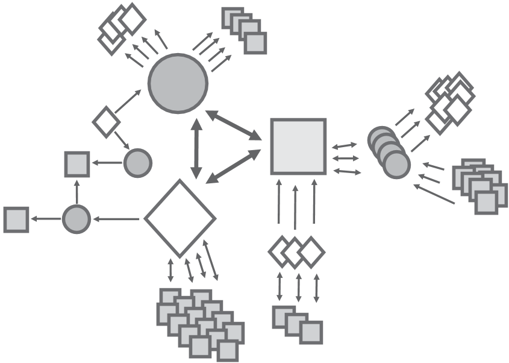

>图 1.1 自组织内容分发系统的愿景。

流行的警报服务，如 Google Alerts² 和 Microsoft Live Alerts³，允许最终用户输入关键词并接收相关的动态 Web 内容。它们是面向 Web 的集中式 pub/sub 解决方案的例子。它们的实现细节不可得，但据信警报服务仍然基于通过搜索引擎进行的批处理。搜索引擎需要爬取并索引实时内容。除了少数被频繁爬取的精选站点外，爬取周期通常在一周或几十天的量级。因此，它们提供的是一种有限形式的 pub/sub。下一步将是更具去中心化、可扩展且实时的服务，并支持表达力强的内容匹配。不幸的是，表达力强的匹配语义与可扩展性相互矛盾，使得这种全局 pub/sub 服务的设计、实现和部署充满挑战。

架构和协议设计应支持自组织和对内容来源的优先附着，以及从内容 publisher 通过中介到内容 subscriber 的高效且及时的内容分发。其机制、技术和算法是本书的核心关注点。我们将探讨信息分发问题的不同方面，并介绍一组经常使用的 pub/sub 解决方案以及如何在实践中应用它们的指南。

>$ ^{2} $  http://www.google.com/alerts.

>\(^{3}\) http://alert.live.com.

### 1.2 pub/sub 系统的组成

在深入探讨该主题之前，我们首先定义 pub/sub 系统的核心术语和组件以及整体结构。

#### 1.2.1 基本系统

pub/sub 系统中的主要实体是内容的 publisher 和 subscriber。publisher 检测到一个事件，然后以通知的形式发布该事件。通知封装了与所观察到的事件相关的信息。通知也可以称为事件消息。

pub/sub 或事件系统中的实体有许多术语；例如，subscriber、consumer 和 event sink 是同义词。同样，publisher、producer、supplier 和 event source 也是同义词。如上所述，通知或事件消息表示所观察到的事件已经发生。

事件表示任何已经发生的离散状态转换，并从一个实体发信号给若干其他实体。例如，成功登录服务、检测或监控硬件的触发，以及战术系统中检测到导弹，都是事件。

事件可以按其属性进行分类，例如它们与哪种物理属性相关。例如，空间事件和时间事件记录物理活动。此外，事件也可以是这些的组合，例如同时包含时间和空间信息的事件。事件可以按其类型和复杂性分类为分类法。更复杂的事件，称为复合事件或组合事件，可以由更具体的简单事件构建而成。复合事件在许多应用中很重要。例如，复合事件可能在以下情况下触发：

• 在医院中，当连接到患者的传感器读数超过给定阈值，并且在给定时间间隔内施用了新药时；

• 在位置跟踪服务中，一组用户同时处于同一房间或同一位置附近时；或者

• 在办公楼中，运动检测器触发，并且距离上一次安保巡逻已经过了特定时间间隔时。

通知发布之后，pub/sub 系统有责任将消息投递给感兴趣的接收者——subscriber。subscriber 是已经对一组满足其设定的特定要求的事件表达了预先兴趣的实体。实际的投递取决于所使用的 pub/sub 解决方案；例如，它可以基于以下方式：

• 消息在网络上广播，同一网络上的设备将看到该消息。在设备上运行的 pub/sub 系统可以处理该消息，并在 subscriber 在该设备上活跃时将其投递给 subscriber。

• 消息通过网络支持的 multicast 投递，其中使用特定的网络原语将消息从一个 publisher 投递给多个 subscriber。

• 消息由 publisher 直接发送给那些已经告知 publisher 它们有兴趣接收通知的 subscriber。然后 publisher 在网络提供的通信原语之上利用一对一的消息投递协议，通常是 TCP/IP 协议栈。

• 消息首先被发送到 broker 服务器，然后由 broker 投递给活跃的 subscriber。在这种情况下，subscriber 已经向 broker 表达了它们接收通知的兴趣。

• 消息通过一个 broker 网络投递。通过部署一个 pub/sub broker 网络，可以提高 pub/sub 系统的可扩展性。

前两种情况基于底层网络提供的通信原语，即 broadcast 和 multicast。通常这些原语不适用于互联网应用，因为它们仅在互联网的特定区域内得到支持，因此无法用于在全局环境中投递消息。第三种情况非常典型，并在 subscriber 数量已知较小时被广泛使用。当 subscriber 数量增加时，这种策略无法扩展。第四种和第五种情况引入了 broker（也称为 pub/sub 路由器）的概念，它中介事件并为 publisher 和 subscriber 提供 routing 和匹配引擎。这是分布式环境中常用的解决方案。部署 pub/sub 系统的一种众所周知的技术是将它们创建为 overlay 网络，运行在当前的互联网 routing 系统之上 [3]。

#### 1.2.2 分布式与 overlay 网络

pub/sub 系统本质上可以是集中式的或分布式的。通知处理和投递责任可以由不同的实体提供：

• publisher；

• 集中式 broker；

• 一组以 routing 配置组织的 broker，通常实现为 overlay 网络。

事件和通知处理可以很容易地在 publisher 中和集中式 broker 中实现；然而，如上所述，当系统中存在许多实体和事件时，这些方法无法很好地扩展。通过将 pub/sub 系统实现为网络层之上的一组 broker 构成的 overlay 结构，可以提高可扩展性。

应用层 overlay 网络实现于网络层之上，并提供诸如资源查找、overlay multicast 和分布式存储等服务。overlay 网络通常提供有用的特性，如易于部署新的分布式功能、对网络故障的弹性以及容错性 [3]。overlay routing 算法基于底层的分组 routing 原语。pub/sub overlay 系统实现为一个应用层 broker 或路由器网络，它们使用下层原语（通常是 TCP/IP）进行通信。

图 1.2 展示了一个 pub/sub overlay 网络。分布式 pub/sub 网络的两个重要部分是 broker 拓扑以及 broker 如何建立和维护 routing 状态。所谓传播 routing 状态，我们指的是 subscriber 的兴趣如何被发送给该信息的 publisher。本质上，broker 存储的 routing 状态必须使其能够将事件消息转发给其他 broker 或先前已订阅该通知的 subscriber。

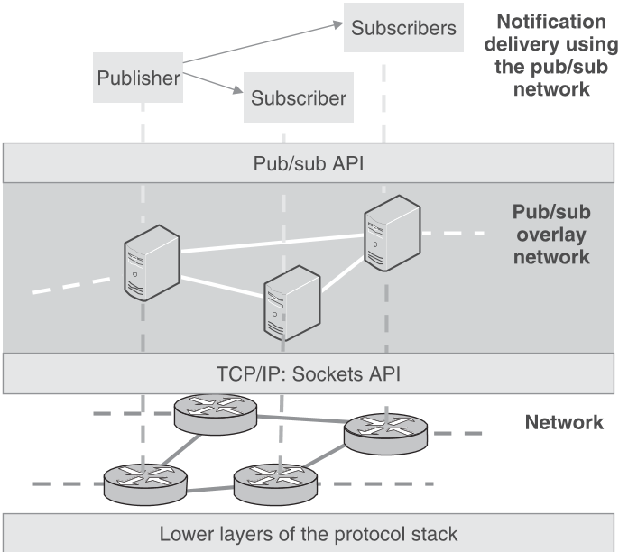

>图 1.2 pub/sub overlay 网络示例。

在本书中，我们将研究上述实现通知的方式，以及实现高性能、表达力、可用性、故障弹性和安全性的解决方案。

#### 1.2.3 约定

pub/sub 系统用于促进消息的投递；然而，事件的含义是特定于应用和领域的。为了构建一个包含许多实体的 pub/sub 系统，需要考虑以下约定：

• 关于通知消息格式和语法的约定。例如，许多系统使用基于类型化元组的格式或 XML。该约定可能包含额外的细节，例如与时间戳和内容安全相关的细节。

• 关于用于在两个实体之间传输事件的消息协议的约定。这可以包括许多参数，例如安全性、可靠性等。

• 关于通知 filtering 语义的约定。这指定了消息的哪些元素可用于做出通知决策。例如，通知基于 publisher、观察时间和事件类型进行转发。

• 关于已发布事件可见性的约定。可能有必要限制事件在操作环境中的投递和处理。

• 关于事件的应用和领域特定解释的约定。该约定超出了 pub/sub 系统的范围。

因此，要为包含许多实体的环境设计和实现一个 pub/sub 系统，需要许多隐式或显式的约定。

#### 1.2.4 事件循环

*事件循环*是创建基于事件的应用的关键结构。事件循环是实现响应各种事件的应用的常用方法。例如，Microsoft Windows 程序就是基于事件的。应用的主线程包含事件循环，它等待新事件进行处理。事件循环可以使用阻塞函数调用来接收消息，也可以使用非阻塞的窥视消息函数。通常，当接收到消息时，它会被处理并交付给回调以进行进一步处理。

事件循环是需要及时响应事件（例如 GUI 事件）的应用的关键部分。事件循环自然地与分布式 pub/sub 系统结合，并且是实现 pub/sub 引擎的关键结构。一个简单的 pub/sub 引擎可以实现为一个响应传入的 subscription 和发布请求的事件循环。

#### 1.2.5 基本性质

pub/sub 技术自 1980 年代末诞生以来，已经发展成为一种有前景的技术，用于跨越空间、时间和同步连接软件组件 [4]。这三个性质概括了该技术的显著特征。我们将在本节中详细考察图 1.3 中展示的这三个性质。

空间解耦由子图 A 说明，其中事件通知服务将 publisher 和 subscriber 解耦。事件消息被传输到事件服务，然后被传输到 subscriber。因此，实体之间不共享内存空间。子图 B 展示了时间解耦的例子。其设置与空间解耦情况相同，只是在服务侧有消息缓冲。时间解耦通过将消息存储在事件通知服务的消息缓冲区中以实现最终投递给 subscriber 来实现。同步解耦由子图 C 说明，它强调了时间方面。事件投递的发布和通知阶段是解耦的，它们不需要同步。消息首先被投递到事件通知服务，然后再投递到 subscriber。

图 1.4 总结了众所周知的通信技术的解耦性质。如前所述，通信技术并非正交的，而是相互组合以实现更复杂的系统。消息传递、远程过程调用（RPC）和远程方法调用（RMI）以及异步 RPC/RMI 不提供空间和时间的解耦。它们可以提供同步的解耦。元组空间通过共享空间提供空间/时间的解耦；然而，元组空间的读取者会被阻塞，因此元组空间不提供同步的解耦 [5]。另一方面，消息队列提供所有三种性质的解耦，它是更复杂的 pub/sub 系统的构建块。

pub/sub 基于消息队列和面向消息的 middleware。消息队列是一种通信方法，它借助发送方侧的消息队列在发送者和接收者之间使用消息传递。被发送的消息首先存储在本地消息队列中。在投递完成后，消息可以从队列中移除。如果消息无法投递或消息被错误接收，则可以重新发送消息。

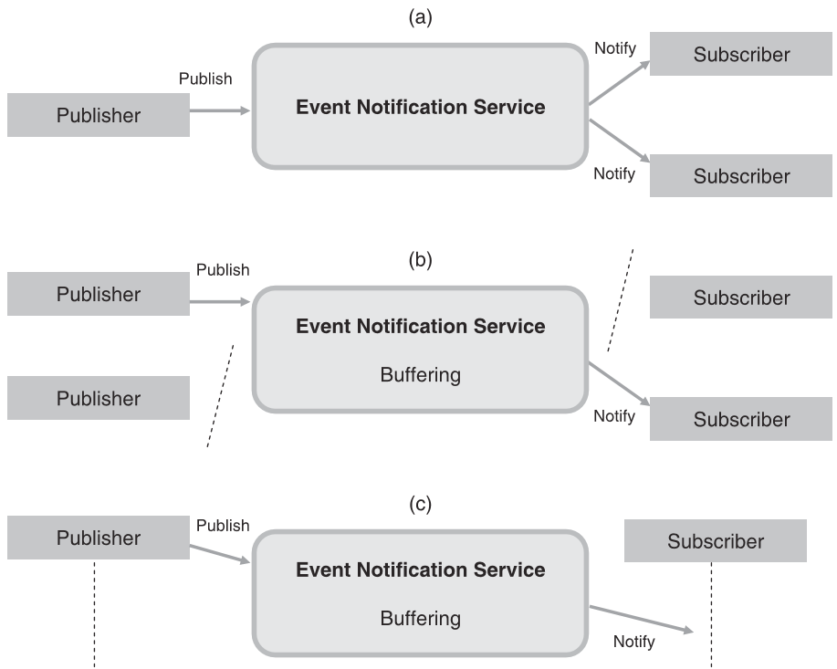

>图 1.3 pub/sub 中的解耦性质。(a) 空间解耦；(b) 时间解耦；(c) 同步解耦。

| 抽象|空间/时间解耦|同步解耦|
| ---|---|---|
| 消息传递|否|不定|
| RPC/RMI|否|调用者被阻塞|
| 异步 RPC/RMI|否|是|
| 元组空间|是|读取者被阻塞|
| 消息队列|是|不定|
| pub/sub|是|是|

>图 1.4 解耦性质总结。

队列是在数据通信中实现可靠性的基本解决方案。队列还支持在此期间消息无法发送的断连。因此，消息队列是实现解耦通信的基本要素。

消息队列系统与 pub/sub 之间的一个区别是，它们通常提供一对一的通信，并要求明确定义接收者。另一方面，pub/sub 支持一对多和多对多的通信，并且 subscriber 可以通过被投递的事件消息以及 subscriber 预先设置的 subscription 来隐式定义。

| pub/sub 系统的关键性质是：空间、时间和同步的解耦，多对多通信，以及信息 filtering。|
| ---|

#### 1.3 pub/sub 服务模型

图 1.5 展示了一个通用的 pub/sub 服务设计。在该图中，pub/sub 服务是一个逻辑上集中式的服务，它提供必要的功能和接口，以支持从 publisher 到 subscriber 的通知投递。pub/sub 服务由以下关键组件组成：

• 一个通知引擎，它构建并维护 subscription 的索引结构，并使用索引表将通知转发给 subscriber。该引擎为 subscriber 和 publisher 提供必要的接口，允许它们订阅、取消订阅和发布内容。

• 一个 subscription 管理器，它从引擎接受 subscription 并维护它们。两个必需的操作是插入和移除 subscription。

• 一个 subscription 存储，它存储 subscription 和与 subscription 相关的数据。

- 一个事件存储，它是用于存储已发布事件的设施，以便稍后可以检索它们。

• 一个通知 consumer，它是通知过程中的中介组件。consumer 从引擎接收通知，然后将其转发给合适的 subscriber。consumer 可以在最终投递之前缓冲、压缩和处理通知。

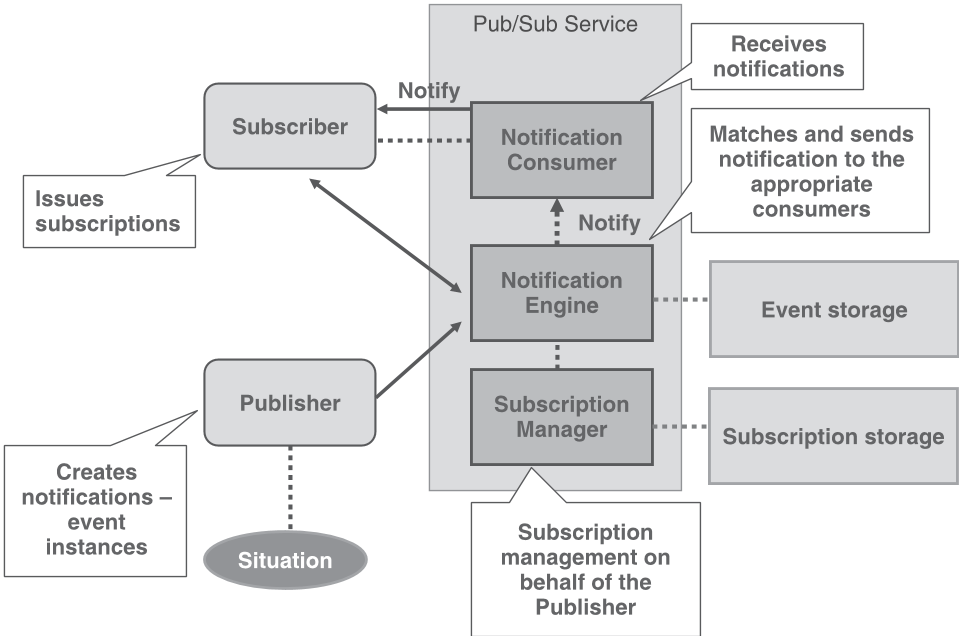

>图 1.5 pub/sub 系统的组件。

publisher 观察一种情况，当观察到感兴趣的事件时，使用其发布接口创建一个通知并发送到通知引擎。然后，在 subscription 管理器的帮助下，将该通知与引擎维护的 subscription 索引进行匹配。引擎将通知交给那些对该通知表达了兴趣的 subscriber 的通知 consumer。换句话说，该通知与 subscriber 的 subscription 匹配。然后，每个 consumer 准备通知以投递给关联的 subscriber。

这个 pub/sub 服务模型将 subscription 的管理、通知引擎的匹配过程以及向 subscriber 的最终投递分离开来。这种分离允许例如在不更改引擎的情况下更改通知 consumer。

图 1.5 的设计在逻辑上是集中式的，它隐藏了组件的分布。为了在分布式环境中实现可扩展性和可靠性，有必要分布和复制这些组件。

### 1.4 分布式 pub/sub

如本章所述，publisher 直接通知 subscriber 是不可扩展的。因此，开发用于分布通知过程的技术至关重要。为此，已经开发了许多 pub/sub 网络设计。

事件 broker 或路由器是 pub/sub 网络的一个组件，它跨多跳转发通知消息。图 1.2 展示了一个示例 pub/sub 网络，它显示了分层设计。pub/sub 网络向 subscriber 和 publisher 提供通知 API，并利用网络 API（通常是 Sockets API）来分发通知消息，并将其从源路由器带到目标路由器和子网络。网络层路由器负责将消息端到端地跨越互联网传输。这种 overlay 设计在可部署性和灵活性方面具有良好的特性；然而，由此产生的高层 routing 在网络层拓扑方面可能并不高效。

事件路由器通常有本地客户端和相邻路由器。针对本地客户端和相邻路由器的算法和协议是不同的。两种情况都需要一个 routing 表来存储有关消息目的地的信息。pub/sub routing 表是一种索引结构，包含活跃的 subscription，通常支持添加、移除和匹配操作。

pub/sub 网络的设计和配置已经成为一个活跃的研究和开发领域。我们将重点关注实现 pub/sub 网络的各种策略。

分布式环境中最简单的通知形式称为 flooding。在 flooding 中，每个 pub/sub broker 只是将消息发送给除发送该消息的邻居之外的所有邻居。因此，消息被引入到每个 broker；然而，该技术的代价是其不精确性。理想情况下，我们希望阻止将消息转发给我们知道没有该消息 subscriber 的 broker。此外，过多且不受控制的消息传递可能导致拥塞，进而可能导致通知消息被丢弃。

为了避免不必要的消息投递，我们在 pub/sub 网络中引入 filtering 的概念。filtering 涉及一个兴趣注册服务，它从 subscriber 接受 filter 信息。因此，subscriber 可以更详细地指定它们想要什么样的数据。然后，pub/sub 网络以最小化通知消息投递开销的方式分发这些 filtering 信息。优化 pub/sub 网络的过程并不简单，因为 filtering 信息也会给网络带来开销。例如，filtering 信息可能需要更新，并且在建立和维护 pub/sub broker 的 routing 表时存在传播延迟。在本书后面，我们将考虑优化这些网络的各种技术。

| 准确性是 pub/sub 网络的关键要求。事件投递的准确性可以用假阳性和假阴性的数量来表示。假阳性是发送给 subscriber 但与 subscriber 的活跃兴趣不匹配的消息。同样，假阴性是没有发送给 subscriber 但本应发送的消息，因为它与 subscriber 的活跃兴趣匹配。|
| ---|

已经开发了各种 filtering 语言和 filter 匹配算法。filtering 涉及组织成 filtering 数据结构的 filter 的规范。filter 基于 filtering 语言选择通知的子集。因此，filter 是对通知消息的约束，它可以应用于通知类型、结构、头和内容的上下文中。

filtering 允许 subscriber 预先指定其兴趣，从而减少它们将接收到的不感兴趣的事件消息的数量。描述所需内容的 filter 或一组 filter 包含在 subscription 消息中，broker 使用该消息来配置 routing 表。已经开发、规范和提出了许多 filtering 语言。例如，Java Message Service (JMS) 使用的 filtering 语言基于结构化查询语言（SQL）[6]。

| filtering 是实现基于事件的系统和准确内容投递的核心功能。在将通知投递给客户端或相邻路由器之前执行 filtering，以确保通知与客户端或邻居的活跃 subscription 匹配。因此，filtering 对于维护准确的事件通知投递至关重要。filtering 通过避免将通知转发给没有其活跃 subscription 的 broker，提高了 pub/sub 网络的效率。filter 及其属性对于许多不同的操作很有用，例如匹配、优化 routing、负载均衡和访问控制。举几个例子，firewall 是一个 filtering 路由器，审计网关是一个记录与给定 filter 集匹配的流量的路由器。|
| ---|

### 1.5 接口与操作

表 1.1 展示了许多事件系统使用的 pub/sub 操作 [7]。这些操作由系统的客户端（记为 $X$）请求。有许多方法来定义 subscriber 的兴趣。在我们的通用 API 中，我们用 $F$ 表示一般兴趣。

>表 1.1 基础设施接口操作

| 操作|描述|语义|
| ---|---|---|
| Sub( X, F )|X 订阅由 F 定义的内容|Sub/Adv|
| Pub( X, n )|X 发布通知 n|Sub/Adv|
| Notify( X, n )|X 被通知关于通知 n|Sub/Adv|
| Unsub( X, F )|X 取消订阅由 F 定义的内容|Sub/Adv|
| Adv( X, C )|X 广告内容 C|Adv|
| Unadv( X, C )|X 取消广告内容 C|Adv|
| Fetch( X, P )|X 获取满足给定约束 P 的消息|Sub/Adv|

在表达力强的基于内容的 routing 中，$F$ 通常用一个布尔函数定义，该函数选择内容空间的一个子空间，通知在其中定义。通知是该空间中的点。还有表达力较弱的订阅内容的语义，例如基于类型的 subscription。我们稍后将回到这些概念。

如表所示，关键操作涉及发布、订阅、取消订阅和获取内容。应该注意的是，subscribe 和 unsubscribe 操作是幂等的，这意味着即使重复执行相同的操作也不会改变系统的状态。然而，publish 操作不是幂等的，重复将导致许多发布被投递。

在大规模 pub/sub 系统中，API 通常支持租约，租约确定每个 subscription 和广告的有效时间段。租约对于从 pub/sub 网络中移除过时状态很有用，并且对于确保网络的最终稳定性起着重要作用。如果 API 支持租约，则不需要取消订阅和取消广告；然而，它们在租约到期之前终止租约时可能仍然有用。

pub/sub 系统有两种不同的操作语义：

• subscription 驱动：subscription 由 pub/sub 网络传播，routing 表基于 subscription 消息中指定的 filter。

• 广告驱动：publisher 首先用广告消息广告内容，广告消息由 pub/sub 网络传播。然后，pub/sub 网络将 subscription 与匹配的广告连接起来，以在整个网络上进行活跃的内容投递。

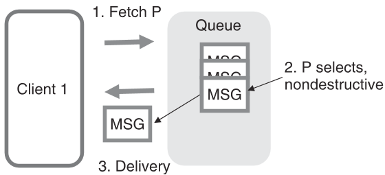

>图 1.6 表达力强的 fetch 操作示例。

该表展示了这两种 filtering 语义的 API 操作。广告语义引入了广告和取消广告内容的操作。此外，API 操作通常扩展了安全性和服务质量属性，以及更具表达力的通知检索策略。与事件检索相关的关键扩展（由图 1.6 说明的 fetch 操作）包括：

• 用于检索特定数量消息的 fetch 操作。

• 非破坏性 fetch，它将检索到的消息留在服务器的队列中。当同一软件的多个实例正在检索消息时，这很有用。

• 带查询操作的 fetch 操作，允许从队列中获取特定的事件消息。该操作经常受到 pub/sub 标准的支持，例如 JMS。

• 获取消息队列中最新的事件消息。这在启动应用或从应用故障中恢复时很有用。

在下一节中，我们将研究用于定向信息投递的不同 filtering 语义。

#### 1.6 用于定向投递的 pub/sub 语义

如上所述，需要就如何从 publisher 向 subscriber 投递通知消息达成一致。对于给定的 subscriber 集合，有许多可能的语义来选择需要投递的通知。在本节中，我们将简要考察用于定向通知投递的关键语义。

根据 filtering 语言的表达力，通知消息的字段、头或整个内容可能是可过滤的。在*基于内容的 routing* 中，事件消息的整个内容是可过滤的。

图 1.7 展示了四种关键的消息 routing 语义类型。这些类型如下：基于内容的、基于头的、基于 topic 的和基于类型的。如上所述，基于内容的 routing 允许对整个事件消息评估 filter。基于头的更有限，只允许评估消息头中包含的元素。基于 topic 的只允许评估消息中的特定 topic 字段。基于 topic 的系统类似于基于通道的系统，topic 名称可以被视为与通道名称相同。通常，基于 topic 的系统要求事件消息的 topic 与请求的 topic 名称完全匹配，因此它的表达力不强。最后，基于类型的系统允许根据事件消息在类型层次结构中的指定类型来选择事件消息。我们可以以与建筑物相关的类型层次结构为例：层次结构的根是建筑物名称，第二层由楼层组成，第三层由办公室组成。通过订阅一个楼层，subscriber 将接收与命名建筑物中该特定楼层相关的所有事件。

不同的 routing 语义由其选择性来表征。基于类型的系统基于预定义的消息类型集做出转发决策。在基于 topic 和基于通道的 pub/sub 中，subscriber 由队列名称或通道名称定义。通知被发送到一个命名的队列或通道，subscriber 从中提取消息。一个重要的限制是，队列或通道名称必须事先约定。基于主题的系统基于通知中的单个头字段做出 routing 决策。基于头的系统使用通知的特殊头部部分来转发消息。基于内容的系统最具表达力，使用消息的整个内容来做出转发决策。基于内容的 pub/sub 很灵活，因为它不需要事先分配 topic 或通道名称。

| 名称|值|
| ---|---|
| Resource_name|CS Department's home page|
| Address|www.cs.helsinki.fi|
| Resource_type|Web page|
| Content element 1|Data|

>基于内容的 routing

| 名称|值|
| ---|---|
| Resource_name|CS Department's home page|
| Address|www.cs.helsinki.fi|
| PAYLOAD|PAYLOAD|

>基于头的 routing

| 名称|值|
| ---|---|
| Topic|CS Department Channel|
| PAYLOAD||

>基于 topic 的 routing

| 名称|值|
| ---|---|
| Type|UH\Faculty of Science\CS Department|
| PAYLOAD|PAYLOAD|

>基于类型的 routing

>图 1.7 消息定向系统示例。

| 各种 pub/sub 投递语义可以用基于内容的通信方案来实现，使其极具表达力。基于头的 routing 更有限，但相对于基于内容的 routing 它具有性能优势，因为在做出转发决策时只评估消息的头。|
| ---|

表达力和可扩展性是事件系统的重要特征 [8]。表达力涉及 pub/sub 服务捕获 subscriber 兴趣的程度。可扩展性涉及联邦、状态以及可以支持的 subscriber、publisher 和 broker 的数量，以及系统可以支持多少通知流量。

pub/sub 网络的其他要求包括简单性、可管理性、可实现性以及对快速部署的支持。此外，系统需要是可扩展和可互操作的。其他非功能性要求包括：及时投递通知（有界投递时间）、对*服务质量*（*QoS*）的支持、高可用性和容错性。

事件顺序是一个重要的非功能性要求，许多应用需要支持因果顺序或全序。因果关系确定两个事件 $A$ 和 $B$ 的关系。为了能够在分布式系统中确定因果关系，需要一种逻辑时钟机制。两种众所周知的解决方案是 Lamport 时钟和向量时钟。我们将在第 2 章中更详细地考察这些时钟。

## 1.7 通信技术

事件系统被广泛使用，因为异步消息传递为 RPC 提供了灵活的替代方案 [4, 9]。RPC 通常是同步和一对一的，而 pub/sub 是异步和多对多的。同步 RPC 调用的限制包括：

• 客户端和服务器生命周期的紧耦合。服务器必须可用以处理请求。如果请求失败，客户端会收到异常。

• 同步通信。客户端必须等待直到服务器完成处理并返回结果。客户端必须在调用期间保持连接。

- 点对点通信。调用通常针对特定服务器上的单个对象。

另一方面，RPC 是分布式 pub/sub 系统的构建块。许多 pub/sub 实现使用 RPC 操作来实现表 1.1 中展示的 API 操作。

两个进程之间的事件投递可以根据要求和操作环境以多种方式实现。两个关键的不同环境是本地和远程通信上下文。在本地事件投递中，可以使用诸如共享资源以及本地过程调用或消息传递等技术。远程事件投递通常用消息队列或 RPC 实现。

RPC 提供可靠性和至多一次语义，而消息队列系统具有不同的消息投递选项。关键的可靠性语义是：

• 恰好一次：最高的可靠性保证，其中消息恰好一次被发送到远程节点。即使服务器崩溃或网络故障，消息也会被投递。在典型的分布式环境中无法达到这种可靠性级别。

• 至少一次：此可靠性级别保证消息被发送到远程节点，但允许重复。重复可能由于网络故障和服务器崩溃而发生。该语义适用于幂等操作。

• 至多一次：此可靠性级别保证消息至多一次被发送到节点。它不保证消息被投递。消息可能由于网络问题或服务器崩溃而消失。

通常，商业使用的消息队列系统支持至少一次或至多一次。该语义通过发送方和接收方侧的消息缓冲、序列号以及用于检测丢失消息和其他问题的计时器来实现。

图 1.8 展示了实现 pub/sub 系统时的选项。消息队列和 RPC 之间的关键区别是，消息传递是异步的，而传统 RPC 是同步的，尽管也有异步 RPC 特性。替代技术是元组空间和分布式共享内存。我们将在第 2 章后面将 Java RMI 作为 RPC 系统的一个例子来考察。

分布式共享内存可以基于内存抽象以多种方式实现。基于页面的抽象将共享内存组织成固定大小的页面。基于对象的抽象将共享内存组织为用于存储可共享对象的抽象空间。另一方面，元组空间基于元组抽象。在分布式共享内存实现中，需要一致性协议来维护内存一致性。内存更新和失效技术包括写时更新、读时更新、写时失效、读时失效。通常，这些系统遵循弱一致性模型，其中同步必须是原子的并且具有一致的顺序。

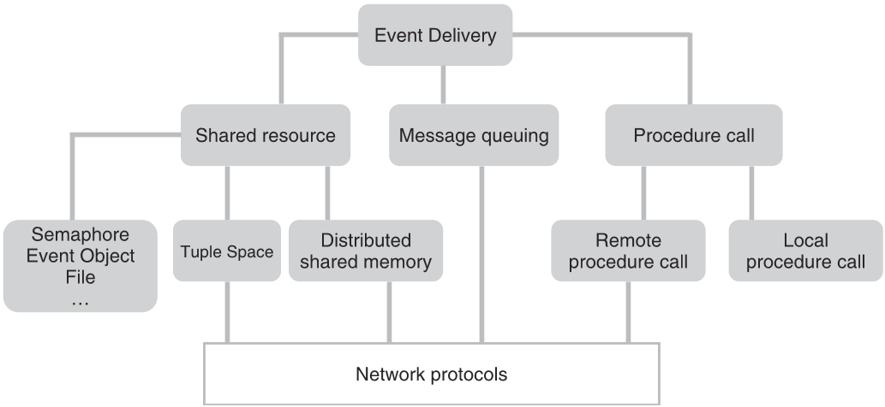

>图 1.8 用于事件投递的通信技术。

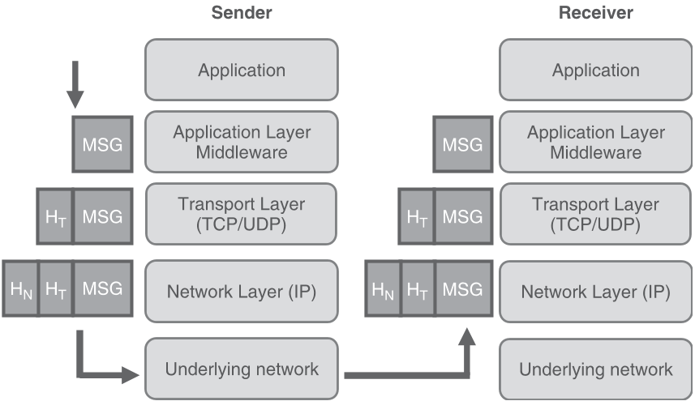

>图 1.9 带 middleware 的协议栈。

图 1.9 展示了通信环境的分层性质。每一层为更高层提供功能，并抽象底层细节。将协议组织成栈结构提供了关注点分离；然而，它使得跨层优化系统行为变得困难。如图所示，每一层都向正在处理的数据包和消息添加自己的头和细节。

以类似的方式，当接收数据包时，每一层处理自己的信息并将数据交给更高层。pub/sub 系统可以在栈的多个层次上实现，从链路层到应用层。大多数 pub/sub 系统实现于 TCP/IP 之上，并作为 middleware 服务或库提供。pub/sub 系统本身可以被视为一个分层系统，其中分布式 routing 和转发的更高层功能基于下层消息队列原语。

### 1.8 环境

pub/sub 范式可以应用于许多不同的上下文和环境。早期的例子包括 GUI、工业系统中的控制平面信令，以及基于 topic 的文档分发。该范式是当今图形和网络应用的基础。大多数程序员在单个服务器或设备的上下文中应用该范式；然而，分布式 pub/sub 对于许多需要从一个或多个来源向许多 subscriber 及时高效分发数据的应用至关重要。

pub/sub 的操作环境可以从不同的视角来考察，例如基于底层通信环境和应用类型。下面我们总结 pub/sub 技术的关键环境：

• 本地：事件循环、GUI、设备内信息投递。

• 无线和自组织：节点可以移动的无线网络中的事件投递。publisher 和 subscriber 通常运行在受限的有限设备上，例如移动电话。

- 传感器：传感器网络中从多个源传感器到 sink 的事件投递，然后 sink 将事件投递以进行进一步处理。

• 嵌入式和工业：嵌入式或工业环境中的事件投递，例如在汽车、飞机或工厂内。

• 区域：组织或区域内的事件投递。

- 互联网范围：跨组织边界的广域网中的事件投递。

在本书中，我们将特别关注最后三类的分布式 pub/sub 系统；然而，我们也会考虑移动和无线领域。

与桌面系统相比，小型和无线设备的能力有限：它们的内存、性能、电池寿命和连接性都受到限制和约束。在设计集成移动设备的事件框架时，需要考虑移动计算的需求。

从小型设备的角度来看，消息队列是一种常用的通信方法，因为它支持断连操作。当客户端断连时，消息被插入队列，当客户端重新连接时，消息被发送。流行的基于消息队列的 middleware 和通知系统之间的区别在于，基于消息队列的方法是一种定向通信形式，其中 producer 明确定义接收者。接收者可以由队列名称或通道名称定义，消息被插入到一个命名的队列中，接收者从中提取消息。基于通知的系统通过添加一个实体（事件服务或事件分发器）来扩展此模型，该实体在信息 producer 和信息 subscriber 之间中介通知。这种由通知模型支持的非定向通信基于消息传递，并保留了消息队列的好处。在非定向通信中，publisher 不一定知道哪些方接收通知。

pub/sub 范式和技术可以被视为一种统一技术，它通过事件投递将不同的环境和领域结合起来。事实上，pub/sub 已被提议作为互联网体系结构的新基础；然而，在全局互联网规模上应用该范式仍有许多未解决的挑战。我们将在第 13 章中考虑这些解决方案。

### 1.9 历史

如上所述，pub/sub 可以应用于许多不同的环境来解决信息分发问题。早期的应用包括 Usenet 帖子的 filtering 和投递，以及作为许多 GUI 的黏合剂。更近期的应用包括 RSS 和 XMPP 等互联网技术，以及 JMS、CORBA Notification Service [10] 和 OMG DDS 等许多标准。

在本节中，我们将从三个视角考察 pub/sub 系统的历史，即研究亮点、标准化和互联网技术。最后一类说明了 pub/sub 对基于互联网的应用的重要性和适用性。图 1.10 给出了这三个类别的 pub/sub 技术演进时间线。下面，我们简要考察关键的发展。我们将在本书后面回到其中的许多内容。

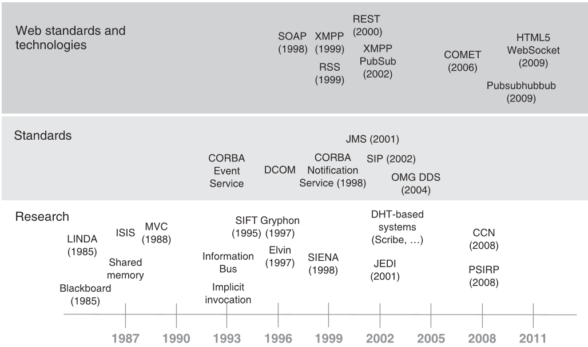

>图 1.10 pub/sub 解决方案的时间线。

#### 1.9.1 研究系统

pub/sub 的历史根植于处理异步事件的需求。事件循环的概念非常古老；然而，今天用于实现分布式 pub/sub 的模式要新得多。最早的系统基于共享内存抽象。内存代表了发送者和接收者的会合空间。处理器通过向共享内存投递消息进行通信。

共享内存与经常用于创建人工智能系统的黑板模式非常相似。黑板模式于 1985 年被提出，用于借助共享内存抽象解决复杂问题 [11, 12]。LINDA 元组空间模型也来自这一时期 [5]。LINDA 是一种基于元组抽象的协调和同步技术。LINDA 通过称为元组空间的共享内存区域支持通信。进程生成元组并将其存储在共享空间中。然后，其他进程可以监控元组空间并读取元组。

进程间通信的另一个早期例子是 1986 年实现的 UNIX 信号通知系统。UNIX 进程使用信号相互通知。进程有唯一的数字进程标识符，一组进程有一个数字组标识符。信号可以定向到特定进程或一组进程。

常用的 *Model-View-Control*（MVC）设计模式于 1988 年在 SmallTalk 社区中开发。MVC 促进了模型、视图和控制组件之间的通信 [13]。MVC 模式将关注点分离为应用状态（模型）、用户界面（视图）和控制方面。MVC 要求一个组件能够订阅另一个组件的状态。MVC 中使用的这个子模式发展成了被广泛使用的 observer 模式。我们将在第 4 章中更详细地考察这些及其他模式。

1987 年在开创性的 ISIS 系统中提出了一个早期的 pub/sub 服务 [14]。这个 ISIS 子系统负责将新闻条目从 publisher 分发给 subscriber。ISIS 新闻服务允许进程订阅系统范围的新闻公告。subscriber 指定一个主题，然后接收该主题下的帖子。ISIS 架构还具有用于在客户端系统上处理传入消息的 filter。新闻子系统的 subscribe 操作通过每个帖子一个 RPC 实现，实际的帖子投递通过一个异步 multicast 操作（带因果或全序）实现。

ISIS 系统对 pub/sub 的关键贡献是：

• 可靠的原子 multicast 通信原语。

• multicast 消息的因果和全序。

• 基于 RPC 和 multicast 原语开发 pub/sub 系统。

pub/sub 系统的另一个早期例子是 1993 年提出的 Information Bus [15]。该模型由服务对象和数据对象组成。服务对象可以有本地数据对象，并通过数据中心的信息总线发送和接收它们。每个数据对象都用一个主题字符串标记。主题是分层结构的。Information Bus 支持 pub/sub 和请求/响应 API。通过 pub/sub 模型，系统解耦了组件，subscriber 不需要知道 publisher 的身份。Information Bus 模型将这种通信称为基于主题的寻址。该系统内置支持动态发现参与者。这通过两个发布实现，首先是向监听特定主题的潜在参与者发出查询，然后是指示存在的响应发布。该系统可以用适配器扩展，适配器将信息从数据对象转换为应用特定的格式。

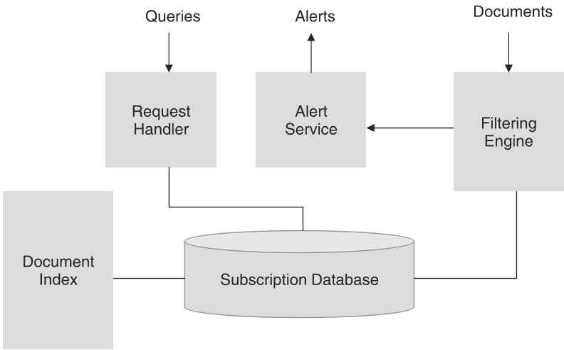

>图 1.11 SIFT 系统概述。

ISIS 系统和 Information Bus 没有考虑消息的内容。在用这些系统实现的新闻应用中，新闻条目基于作为配置参数的主题进行投递。SIFT 信息分发系统是警报服务的一个早期例子 [16]，它考虑了被分发文档的内容。该系统提出了用于将文档与 subscription 匹配的倒排索引。图 1.11 展示了该系统及其关键组件。

倒排索引的关键思想是允许对文档进行快速全文搜索。需要在插入文档期间提取单词。因此，该技术将大部分处理成本放在插入阶段。索引结构将文档内容（通常是单词）映射到一组文档中的位置。因此，给定一个查询，使用倒排索引很容易确定匹配的文档。例如，考虑三个单词的集合 {"pub", "sub", "event"}，其中 "pub" 映射到文档 {1,2}，"sub" 映射到文档 {1,3,4}，event 映射到 {2,6,7}。现在，对 "pub" 和 "event" 的查询将得到 {1,2} ∩ {2,6,7} = {2}。因此将返回编号为二的文档。

该系统接受文档查询并将其存储到 subscription 数据库中。同样，文档被解析，倒排索引存储在文档索引中。然后，filtering 引擎负责使用文档索引将文档与查询匹配。

SIFT 系统没有更详细地考虑分布式环境。IBM 的 Gryphon 项目开发了一个由 broker 网络组成的分布式 pub/sub 系统 [17, 18]。Gryphon 系统是在 IBM T.J.Watson Research Center 的 Distributed Messaging Systems 组开发的。Gryphon 是一个基于 Java 的 pub/sub 消息 broker，旨在通过大型公共网络实时分发数据。Gryphon 使用在研究中心开发的基于内容的 routing 算法。Gryphon 的客户端使用 JMS API 的实现来发送和接收消息。Gryphon 项目于 1997 年启动，以开发下一代 Web 应用，首次部署于 1999 年。Gryphon 被设计为可扩展的，它被用于向 50000 个同时连接的客户端投递关于澳大利亚网球公开赛的信息。Gryphon 还通过互联网部署用于其他实时体育比分分发，例如美国网球公开赛、Ryder Cup，以及悉尼奥运会的监控和统计报告。

Gryphon 支持基于 topic 和基于内容的 publish-subscribe，依赖 TCP/IP 和 HTTP 等采用的标准，并支持从服务器故障中恢复和安全性。在 Gryphon 中，事件流的流动使用信息流图（IFG）来描述，它指定事件的选择性投递、事件的转换，以及作为从事件历史计算的状态的函数的派生事件的创建。

Elvin 是具有表达力语义的基于内容 routing 系统的另一个早期例子 [19]。Elvin 在通知投递中使用客户端-服务器架构。客户端与 Elvin 服务器建立会话，并订阅和发布通知。

Scalable Internet Event Notification Service (SIENA) 是在 University of Colorado 开发的互联网规模事件通知服务。SIENA 在表达力和可扩展性之间取得平衡，并在广域网中探索基于内容的 routing。基本的 pub/sub 机制通过广告进行扩展，广告用于优化 subscription 的 routing [8]。该架构支持多种网络拓扑，包括分层、无环对等和通用对等拓扑。服务器只知道它们的邻居，这有助于最小化 routing 表管理开销。服务器使用服务器-服务器协议与其对等体通信，并使用客户端-服务器协议与订阅通知的客户端通信。也可以创建混合网络拓扑。

SIENA 引入了 filter 之间的覆盖关系以防止不必要的信令。SIENA 系统将覆盖的概念用于三种不同的比较：

• 将通知与 filter 匹配；

• 两个 subscription filter 之间的覆盖关系；

• 以及广告 filter 和 subscription filter 之间的重叠。

覆盖关系已被用于许多后来的事件系统，如 Scribe [20]、Rebecca [21] 和 Hermes [22, 23]。Scribe 和 Hermes 是基于分布式 hash 表（DHT）的 pub/sub 系统的例子。Scribe 是基于 topic 的系统，Hermes 支持基于 topic 和基于内容的通信。Scribe 和 Hermes 在 overlay 网络拓扑中为每个 topic 或事件类型选择一个会合点，然后构建并维护以该会合点为根的 multicast 树。我们稍后将回到 DHT 结构和基于 DHT 的 pub/sub 系统。

DHT 是一类去中心化的分布式算法。它们提供 hashtable API，并在节点可以加入和离开网络的广域环境中实现 hashtable 功能。DHT 维护（键，值）对，并允许客户端检索与给定键对应的值。

组合广播和基于内容的（CBCB）routing 方案通过组合使用覆盖关系的高层 routing 和底层广播投递来扩展 SIENA routing 协议 [24]。该协议使用路由器交换的高层信息来修剪广播分发路径。

Java Event-based Distributed Infrastructure (JEDI) [25] 是在 Politecnico di Milano 开发的分布式事件系统。在 JEDI 中，分布式架构由一组以树结构连接的分发服务器（DS）组成。每个 DS 位于树的一个节点上，除根节点外的所有节点都连接到一个父 DS。每个节点有零个或多个后代。

Gryphon、Elvin、SIENA 和 JEDI 为下一代基于内容、作为互联网上的 overlay 网络开发的 pub/sub 系统铺平了道路。更近期的发展还考虑了将 pub/sub 原语引入协议栈设计。

SIENA 开创了基于内容的网络的概念，其中内容需求定义子网络以及信息发送的位置。数据中心网络的概念类似，并由 TRIAD [26] 和 DONA [27] 等项目开创。这些新形式的网络的动机是观察到当前互联网体系结构是围绕一个可追溯到 1970 年代的基于主机的模型设计的。其目标是使网络能够适应网络使用模式，并通过定向信息投递和缓存来提高性能。

例如，$\tilde{\text{Publish-Subscribe Internet Routing Paradigm (PSIRP) system [28]}}$ 和 $\tilde{\text{Content Centric Networking (CCN) architecture [29]}}$ 基于接收者驱动的设计。其动机是互联网主机感兴趣的是接收合适的内容，而不是谁在提供内容。

### 1.9.2 标准

标准时间线包括 CORBA Event Service、Microsoft 的 DCOM、CORBA Notification Service、JMS、SIP 和 DDS 等系统。在本节中，我们简要考察这些发展。

CORBA Event Service 规范定义了一种通信模型，允许对象接受注册并向多个接收者对象发送事件。Event Service 补充了标准的 CORBA 客户端-服务器通信模型，是 CORBAServices 的一部分，为基于对象的系统提供系统级服务。CORBA Notification Service [10] 扩展了较旧的 Event Service [30] 规范的功能和接口。Event Service 规范定义了事件通道对象，它提供兴趣注册和事件通知的接口。Notification Service 最重要的补充之一是事件 filtering。

Distributed Component Object Model (DCOM) 是 Microsoft 对 CORBA 技术的替代方案。DCOM 促进分布式软件组件之间的通信。DCOM 扩展了 COM 模型，并提供与 COM+ 应用基础设施的通信。如今，DCOM 已被 Microsoft .NET Framework 取代。

标准 COM 和 OLE 支持异步通信和使用回调传递事件，然而，这些方法有其问题。标准 COM 的 publisher 和 subscriber 是紧耦合的。subscriber 知道连接到 publisher 的机制（容器公开的接口）。这种方法在单个桌面之外效果不佳。COM+ Event Service 的变化是在通信中间添加了事件服务。事件服务跟踪哪些 subscriber 想要接收调用，并中介这些调用。

JMS 为面向消息的 middleware 的实现定义了一个通用且标准的 API。JMS API 是 Java Enterprise Edition (Java EE) 的组成部分。JMS 是一个接口，该规范不提供消息引擎的任何具体实现。JMS 不定义消息引擎或消息传输这一事实产生了许多可能的实现和配置 JMS 的方式。

Session Initiation Protocol (SIP) [31] 是一种基于文本的应用层协议，可用于在两个或多个端点之间建立、维护和终止呼叫。SIP 被设计为独立于底层传输层。SIP 是为呼叫控制任务而设计的，因此驱动应用是电话和多方通信。SIP 已由 IETF 标准化，并在电信行业被广泛采用。SIP 于 2000 年 11 月被接受为 3GPP 信令协议。

Data Distribution Service for Real-Time Systems (DDS) OMG 规范为分布式实时系统定义了数据中心 pub/sub 通信的 API [32]。DDS 是一种 middleware 服务，提供所有感兴趣的应用都可访问的全局数据空间。

#### 1.9.3 互联网技术

我们简要考虑互联网技术时间线上的发展，重点关注用于构建 pub/sub 系统的 Web 技术。松耦合消息分发系统的最早例子之一是 1980 年创建的 Usenet。因此，Usenet 早于许多其他消息分发系统。后来的发展包括 W3C 的 SOAP 协议、*Really Simple Syndication (RSS)* 规范、*Extensible Messaging and Presence Protocol (XMPP)*、*Representational State Transfer (REST)* 模型、W3C 的 HTML5，以及 Pubsubhubbub 协议。还有许多其他系统已被提出和部署。

RSS 是一系列用于使用 XML 定义基于 Web 的信息 feed 的规范。RSS 是一个简单的 pub/sub 系统，它基于轮询标识 feed 的 URL，然后确定信息是否已更改。RSS 建立在现有的 Web 标准之上，即 HTTP 和 XML，它已经无处不在。RSS 用于分发更新，例如与博客条目、新闻、视频和音频资源相关的更新。

SOAP 是 Web 应用的关键消息传递协议，专为基于 XML 的 RPC 和消息传递而设计。SOAP 是由 W3C 规范和标准化的单向消息交换原语，非常灵活。SOAP 可以通过构建在单向消息交换原语之上来支持各种交互，并可以与各种消息传输协议一起使用，如 HTTP 和 SMTP。

XMPP [33]（基于 Jabber 协议的 RFC 3920）是为即时消息传递而设计的，并支持扩展。如今，XMPP 可以支持不同的基于消息的通信风格。XMPP 扩展包括 publish/subscribe 机制、状态和状态更新、警报、功能协商、服务发现，以及使其适合作为异步 middleware 解决方案的其他功能。XMPP 在互联网上越来越流行，Google、Twitter⁴ 和 Facebook⁵ 等公司使用 XMPP 作为通用 API。

REST 由 Roy Fielding 于 2000 年在其博士论文中引入和定义。在该模型中，客户端向服务器发送请求，服务器处理请求并返回响应。关键思想是请求和响应传达资源状态的表示。资源是可以被寻址的实体。该模型很好地映射到 HTTP 协议，并影响了 Web 应用接口的设计。例如，流行的实时 feed 服务 Twitter 有一个 REST API。

Comet 是 Web 上推送系统的 AJAX（Asynchronous Javascript and XML）实现。Comet 使用回调函数来处理来自服务器的响应。Comet 发出 HTTP 请求以保持与服务器的连接打开。建立一个长连接，然后用于发送和接收事件数据。

HTML5 是用于定义 Web 内容的核心新语言。该规范仍在 W3C 开发中，完成后将成为最初于 1990 年创建的 HTML 标准的第五次修订。支持 pub/sub 的关键新特性将是 WebSocket 接口，它允许服务器向 Web 浏览器发送异步内容。WebSocket 的协议部分由 IETF 标准化。Server-sent events 是一个相关的规范，也是 HTML5 的一部分，用于以 DOM 事件的形式提供从服务器到浏览器客户端的推送通知。

PubSubHubbub 是用于互联网上分布式 pub/sub 通信的开放协议。该协议扩展了用于数据 feed 的 Atom（和 RSS）协议。其主要目的是提供近乎即时的变更更新通知，这将改善客户端以任意间隔定期轮询 feed 服务器的典型情况。

RSS、XMPP、Comet、HTML5 和 Pubsubhubbub 都为 Web 应用引入了 pub/sub 服务特性。这些特性是基本的，因为通常只支持基于 topic 或通道的语义。下一代基于 Web 的 pub/sub 服务有望引入更复杂的特性来支持 Web 应用开发。HTML5 将在支持这些服务的开发和部署中发挥关键作用。

#### 1.9.4 分类法

在本节中，我们提出一个 pub/sub 系统的分类法，稍后将在本书中重新讨论。我们从简要调查分类法开始，然后关注本书中使用的分类法。

通常，应用是基于模块化的计算单元开发的，如类、模块和程序。组合基本单元的典型方式通过显式或隐式调用来实现 [34, 35]。在显式调用中，组件名称静态绑定到实现，例如一个函数通过本地函数调用或 RPC 调用另一个模块中的另一个函数。这与隐式调用形成对比，在隐式调用中，组件发布一个事件，然后触发所请求功能的调用。隐式调用可以抽象将执行所请求功能的组件的名称和位置。

>4 www.twitter.com.

>\(^{5}\) www.facebook.com.

Notkin 等人是第一个详细考虑隐式调用模型的人。他们提出了将隐式调用引入传统编程语言时的设计考量 [35]：

- 事件声明，涉及用于定义事件的词汇表以及词汇表的属性。

• 事件参数和属性，涉及与事件相关的信息。

• 事件绑定，确定事件如何绑定到处理它们的组件。

• 事件公告，确定调用模型：显式或隐式。

• 投递策略定义事件投递的规则。

• 并发涉及线程数量及其优先级。

隐式调用的设计考量从编程语言的角度包含了相关问题；然而，它们不足以用于分布式系统的开发。分布式环境已在分布式 pub/sub 和事件处理社区中进行了研究。该领域的早期分类法见 [36]，后来的分类法见 [1] 和 [37]。

我们现在用一个分类法总结 publish/subscribe 的历史和演进，该分类法展示了迄今为止所考虑的思想和系统之间的差异。图 1.12 展示了该分类法，它有三个核心主题，即研究、标准和 Web。在研究类别中，我们有两个子类别，系统和模式。系统子类别包含具体的研究提案，模式子类别包含抽象的架构和设计模式。模式用于设计和实现 pub/sub 系统。模式也大量用于标准化解决方案的设计，例如 CORBA Event Service 和 Notification Service 基于事件通道模式。

研究系统类别有两个子类别：集中式/基于集群的解决方案，和广域系统。前者包括 LINDA、ISIS 和 SIFT 系统，

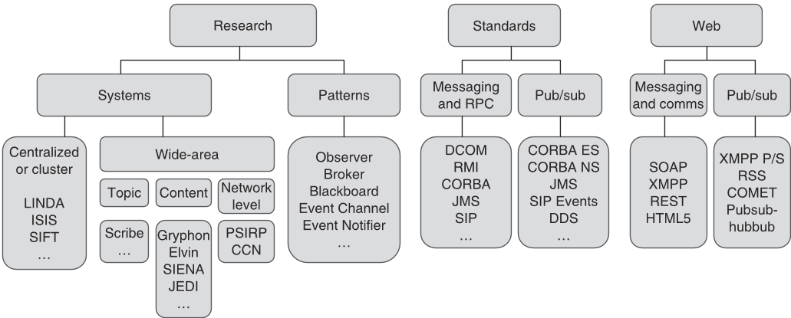

>图 1.12 pub/sub 解决方案的分类法。

后者包括各种广域系统。广域系统根据操作语义而不同。我们确定了三个子类别，即基于 topic 的、基于内容的和网络层系统。Scribe 是基于 topic 的 DHT 的例子，SIENA 是经典的基于内容的系统，PSIRP 和 CCN 是近期网络层系统的例子。

标准类别有两个子类别，即消息传递和 RPC，以及 pub/sub。前者包含 DCOM、RMI 和 JMS 等系统和 API。后者包含 pub/sub 标准，如 CORBA Event Service 和 Notification Service、JMS 和 SIP 事件。

Web 类别也有两个子类别：消息传递和通信，以及 pub/sub。第一个子类别中的基本技术包括 SOAP、XMPP、REST 和 HTML5。第二个子类别包含 XMPP pub/sub、RSS 和其他与 pub/sub 相关的提案。

所呈现的分类法是粗粒度的，可以用各种功能性和非功能性细节来扩展，如服务质量支持、可靠性、容错性、复合事件检测支持、状态聚合支持、移动性支持等。我们将在本书后面回到这些特性中的许多。

### 1.10 应用领域

在本节中，我们简要考察一些 pub/sub 应用领域。我们将在本书末尾的第 12 章回到这些应用并更详细地考察它们。对这些应用的分析将考虑本书中涵盖的模式、协议和解决方案如何应用于当前应用。

如前所述，pub/sub 解决方案可以广泛应用于本地和分布式环境。典型的 pub/sub 应用包括以下内容：

• GUI，其中 pub/sub 通常用作将各种组件连接在一起的黏合剂。一个经典的例子是在 GUI 中大量使用的 MVC 设计模式及其组件 observer 模式。这些模式将在后面更详细地介绍。它们允许应用组件响应各种事件，例如用户按下触摸屏。

• 信息推送，其中内容被推送给用户。这是许多依赖实时或近实时数据的应用的基本要求。

• 警报和状态服务（Google Alerts 等）、应用商店、RSS 代理服务等使用的信息 filtering 和定向投递。例子包括 XMPP Pub/sub、Pubsubhubbub、Facebook Messenger 和 Chat，以及 Twitter。

• 信令平面，其中 pub/sub 确保异步事件实时或近实时地从发布组件投递到订阅组件。示例应用包括工业和战术系统。DDS 是这些系统的关键标准。

• 面向服务的架构（SOA）和业务应用依赖于企业服务总线（ESB）中的 pub/sub。ESB 通常用 XML 消息 broker 实现。

• 用于数据分析的复杂事件处理（CEP）。CEP 广泛用于各种业务应用，例如算法交易和故障检测。

• 云计算，其中 pub/sub 和消息队列用于将不同的云组件连接在一起。

• 物联网，其中 pub/sub 将传感器和执行器连接在一起，并与互联网资源连接。

• 在线多人游戏，其中 pub/sub 用于在玩家和服务器之间同步游戏状态。

显然，pub/sub 被用于不同的环境和应用。因此，需要许多不同风格的 pub/sub 来解决特定环境的信息分发问题。

#### 1.11 本书结构

本书考察 pub/sub 技术及其应用。我们的重点是基于模块化构建块和常用解决方案的此类系统设计。为了考察构建块并评估它们对各种场景的适用性，我们首先研究 pub/sub 系统的历史以及不同解决方案是如何开发和部署的。

pub/sub 功能通常以库或 middleware 服务的形式提供，应用可以利用它们。pub/sub 也可以在协议栈的较低层以及应用本身中实现。分布式环境的许多解决方案基于 overlay 网络，即在 TCP/IP 协议栈之上运行的网络。因此，我们详细讨论 middleware 和 overlay 系统，但也考虑在协议栈中引入 pub/sub 特性的新提案。

纵观全书，考察包括对 pub/sub 的三种不同视角，即为解决特定工业案例而设计的基于标准的解决方案、为互联网开发的基于 Web 的解决方案，以及考虑该技术潜在未来应用的面向研究的解决方案。这三种视角是重叠的，在许多情况下，学术界开发的解决方案最终被特定标准采用。

第 2 章考察支持分布式 pub/sub 系统的基本技术。我们考虑 TCP/IP、命名和寻址、firewall 和 NAT 设备，以及 multicast、因果关系和消息传递等高级技术。TCP/IP 以及存储转发消息传递解决方案是 pub/sub 解决方案的基础。我们考虑两个基于标准的可互操作消息传递框架，即 Web 服务和 SIP。本章为后续章节提供必要的网络和消息传递技术背景。

第 3 章通过说明如何在网络之上创建网络（即所谓的 overlay 解决方案）来深化对网络解决方案的处理。overlay 网络是一种健壮且可扩展的解决方案，不需要更改路由器或基本协议栈。因此，overlay 网络是支持各种分布式 pub/sub 系统的良好候选。我们考虑分布式 hash 表（DHT），它是一种特定的 overlay 解决方案，在信息分发和内容投递中有许多有前景的应用。基于 DHT 的解决方案将在后续章节中更详细地考察。

第 4 章考虑 pub/sub 系统的关键设计原理和模式。我们概述环境、原理和模式，然后更详细地考察 pub/sub 特定的模式。本章涵盖的关键模式是 observer 和事件通知器模式。事实上，事件通知器模式是后续章节涵盖的分布式 pub/sub 系统的基础。

第 5 章介绍关键的 pub/sub 标准和规范以及消息传递产品。我们研究 CORBA Event Service 和 Notification Service、OMG DDS、SIP Event Framework、JMS 等标准，以及 COM+ 和 .NET、Websphere MQ 和 AMQP 等产品技术。这些标准例示了前一章中介绍的许多模式。

第 6 章考察用于在 Web 上构建 pub/sub 系统的最新 Web 技术。这些技术包括 REST、AJAX、RSS 和 Atom、SOAP 以及 XMPP。基于 Web 的协议对于创建实时和交互式网页和应用是必要的，因此是现代 Web 应用开发的组成部分。

第 7 章一般性地考虑分布式 pub/sub 环境，并提出许多满足各种信息分发要求的解决方案。本章考察各种 routing 功能，包括基于 topic、内容和 gossip 的机制，以及 filtering、filter 覆盖和带合并的 filter 聚合等优化技术。本章与后续章节一起提供了一个解决方案工具箱，开发者可以应用它来设计高效的分布式 pub/sub 解决方案。

第 8 章研究内容匹配技术和高效的 filtering 解决方案。内容匹配是 pub/sub 系统的基本要求，因此它应该高效且可扩展，并支持不同的 filtering 约束。我们研究众所周知的技术，包括基于计数的算法以及偏序集和森林算法。

第 9 章考察 pub/sub 的众所周知的研究原型和解决方案。这些解决方案包含前面章节中介绍的许多模式和解决方案，如事件通知器模式、filter 匹配以及 filter 覆盖和合并。我们考虑 SIENA、Gryphon、JEDI、Elvin 等经典例子，以及更近期的基于 DHT 的解决方案。本章提供了利用前面章节中介绍的解决方案的系统的具体例子。

第 10 章介绍了一个在 DHT overlay 网络之上实现的基于关键词的 pub/sub 系统的具体例子。本章考虑问题的复杂性，并提出基于 DHT 网络上会合点的高效解决方案。本章说明了如何利用已经讨论过的基于 DHT 的解决方案进行基于关键词的内容分发。

第 11 章考虑 pub/sub 系统的高级特性。我们从 pub/sub 的许多安全解决方案开始。然后我们考察复合 subscription、filter 合并、负载均衡、通道化、重配置、移动性支持、拥塞控制以及 pub/sub 系统评估等主题。许多主题涉及 pub/sub routing 拓扑、其组织和配置。

第 12 章考虑 pub/sub 系统和技术的应用。我们考虑 pub/sub 作为云计算平台使能器、企业应用的通用 XML broker、使用 pub/sub 技术的内容广告、SOA、CEP 以及包括 Pubsubhubbub、Facebook 和用于移动设备的 Apple 推送服务在内的几个基于 Web 的应用的角色。讨论了这些应用使用的模式和解决方案。

第 13 章考虑在提议的新协议架构中采用 pub/sub 范式的新研究提案，这些架构用接收者驱动的协议套件取代 TCP/IP。讨论了这些系统的动机、特性和可能性。

第 14 章介绍本书的总结和结论。我们讨论 pub/sub 技术作为在广阔的分布式系统中跨越空间、时间和同步连接组件的通用使能器的角色。

## 参考文献

1. Baldoni R, Querzoni L, Tarkoma S and Virgillito A (2009) Distributed event routing in publish/subscribe communication systems. *MiNEMA State-of-the-Art Book*. Springer.

2. Hinze A and Buchmann AP (eds) (2010) *Principles and Applications of Distributed Event-Based Systems*. IGI Global.

3. Tarkoma S (2010) *Overlay Networks – Toward Information Networking*. CRC Press.

4. Eugster PT, Felber PA, Guerraoui R and Kermarrec AM (2003) The many faces of publish/subscribe. *ACM Comput Surv* **35**(2), 114–31.

5. Carriero N and Gelernter D (1989) Linda in context. *Commun ACM* **32**(4), 444–58.

6. Sun (2002) Java Message Service Specification 1.1.

7. Pietzuch P, Eyers D, Kounev S and Shand B 2007 Towards a common api for publish/subscribe Proceedings of the 2007 inaugural international conference on Distributed event-based systems, pp. 152–157 DEBS '07. ACM, New York, NY, USA.

8. Carzaniga A, Rosenblum DS and Wolf AL (2001) Design and evaluation of a wide-area event notification service. ACM Transactions on Computer Systems 19(3), 332–83.

9. Colouris G, Dollimore J and Kindberg T (1994) *Distributed Systems: Concepts and Design*, 2nd edn. Addison-Wesley, Boston, Massachusetts.

10. Object Computing, Inc. (2001) CORBA Notification Service Specification v.1.0. OCI.

11. Fleisch BD (1987) Distributed shared memory in a loosely coupled distributed system. SIGCOMM Comput Commun Rev 17, 317–27.

12. Hayes-Roth B (1985) A blackboard architecture for control. *Artificial Intelligence* **26**(3), 251–321.

13. Krasner GE and Pope ST (1988) A cookbook for using the model-view controller user interface paradigm in smalltalk-80. *J. Object Oriented Program.* **1**, 26–49.

14. Birman KP and Joseph TA (1987) Reliable communication in the presence of failures. ACM Transactions on Computer Systems 5, 47–76.

15. Oki BM, Pfügl M, Siegel A and Skeen D (1993) The information bus – an architecture for extensible distributed systems. Proceedings of the Fourteenth ACM Symposium on Operating System Principles, 5–8 December 1993, Asheville, North Carolina, pp. 58–68.

16. Yan TW and Garcia-Molina H (1999) The SIFT information dissemination system. ACM Transactions on Computer Systems Database Systems 24, 529–65.

17. IBM (2002) *Gryphon: Publish/subscribe over public networks*. (White paper) http://researchweb.watson.ibm.com/distributedmessaging/gryphon.html.

18. Strom RE, Banavar G, Chandra TD, et al. (1998) Gryphon: An information flow based approach to message
brokering. Computing Research Repository (CoRR). Available at: http://arxiv.org/corr/home.

19. Sutton P, Arkins R and Segall B (2001) Supporting disconnectedness-transparent information delivery for mobile and invisible computing *CCGRID '01: Proceedings of the 1st International Symposium on Cluster Computing and the Grid*, p. 277. IEEE Computer Society, Washington, DC, USA. 19

20. Castro M, Druschel P, Kermarrec AM and Rowstron A (2002) Scribe: A large-scale and decentralized application-level multicast infrastructure. IEEE Journal on Selected Areas in Communication (JSAC), 20(8): 1489–99.

21. Mühl G, Ulbrich A, Herrmann K and Weis T (2004) Disseminating information to mobile clients using publish-subscribe. *IEEE Internet Computing* **8**, 46–53.

22. Pietzuch PR (2004) *Hermes: A Scalable Event-Based Middleware*. PhD thesis. Computer Laboratory, Queens' College, University of Cambridge.

23. Pietzuch PR and Bacon J (2002) Hermes: A distributed event-based middleware architecture *ICDCS Workshops*, pp. 611–18.

24. Carzaniga A, Rutherford MJ and Wolf AL (2004) A routing scheme for content-based networking. Proceedings of IEEE INFOCOM 2004. IEEE, Hong Kong, China, vol. 2, pp. 918–28.

25. Cugola G, Di Nitto E and Fuggetta A (1998) Exploiting an event-based infrastructure to develop complex distributed systems Proceedings of the 20th International Conference on Software Engineering, pp. 261–70. IEEE Computer Society.

26. Gritter M and Cheriton DR (2001) An architecture for content routing support in the Internet. Proceedings of the 3rd Conference on USENIX Symposium on Internet Technologies and Systems – Volume 3, p. 4, USITS'01. USENIX Association, Berkeley, CA.

27. Koponen T, Chawla M, Chun BG (2007) A data oriented (and beyond) network architecture. SIGCOMM Comput. Commun. Rev. 37(4), 181–92.

28. Tarkoma S, Ain M and Visala K (2009) The Publish/Subscribe Internet Routing Paradigm (PSIRP): designing the future Internet architecture. *Future Internet Assembly*, pp. 102–111.

29. Jacobson V, Smetters DK, Thornton JD, Plass MF, Briggs NH and Braynard RL (2009) Networking named content. Proceedings of the 5th International Conference on Emerging Networking Experiments and Technologies, pp. 1–12. CoNEXT '09. ACM, New York, NY, USA.

30. Object Computing, Inc. (2001) CORBA Event Service Specification v.1.1. OCI.

31. Rosenberg J, Schulzrinne H, Camarillo G, et al. (2002) *RFC 3261: SIP: Session Initiation Protocol*. IETF. http://www.ietf.org/rfc/rfc3261.txt.

32. Object Computing, Inc. (2007) *Data Distribution Services*, V1.2. OCI.

33. Saint-André P (2004) RFC 3920: Extensible Messaging and Presence Protocol (XMPP): Core. Internet Engineering Task Force.

34. Garlan D, Jha S, Notkin D and Dingel J (1998) Reasoning about implicit invocation. SIGSOFT Softw. Eng. Notes 23, 209–21.

35. Notkin D, Garlan D, Griswold WG and Sullivan KJ (1993) Adding implicit invocation to languages: Three approaches. Proceedings of the First JSSST International Symposium on Object Technologies for Advanced Software, pp. 489–510. Springer-Verlag, London.

36. Meier R and Cahill V (2002) Taxonomy of distributed event-based programming systems Proceedings of the 22nd International Conference on Distributed Computing Systems, pp. 585–8. ICDCSW '02. IEEE Computer Society, Washington, DC.

37. Blanco R and Alencar P (2010) Event models in distributed event based systems. *Principles and Applications of Distributed Event-Based Systems*, pp. 19–42.
# 2 网络与消息传递

任何分布式系统的关键要素是网络与消息传递。这些核心领域的解决方案构成了本章所综述的结构模块。在典型的分层协议栈中，应用消息利用 TCP/IP 协议套件进行发送和接收。每一层都会添加一个头部，该头部使用自己的格式封装上层数据。

我们首先考察协议栈的"腰部"，即 IP 和 TCP/UDP 协议。接下来我们将关注更高层的消息传递协议，这些协议通常用于实现分布式 pub/sub 解决方案。这里研究的主要协议包括 REST、Web services 和 SOAP，以及 SIP。

## 2.1 网络

Internet 建立在 TCP/IP 协议之上。从结构上看，Internet 可以被视为由图 2.1 所示的五个独立层次组成，通常被抽象为应用层、传输层、网络层、链路层和物理层。我们在其他地方也会遇到分层架构，例如七层 OSI 参考模型。应用开发者使用 Sockets API 来编写 TCP/IP 应用程序。Sockets API 由传输层提供，它提供两个关键的基本数据传输原语，即可靠数据流和不可靠数据报。前者通过 TCP 实现，后者通过 UDP 实现。

当前的 Internet 在设计上紧密遵循 RFC 1122 [1] 中给出和概述的原则。设计 Internet 时使用的主要架构准则是健壮性原则（Robustness Principle）和端到端原则（End-to-End Principle）[2]。下面我们将详细阐述 Internet 的结构和组件。

### 2.1.1 概述

Internet 背后的一般原则是健壮性原则。它制定了一条所有为 Internet 编写的软件都必须遵循的规则：在发送时要保守，在接受时要宽容。例如，

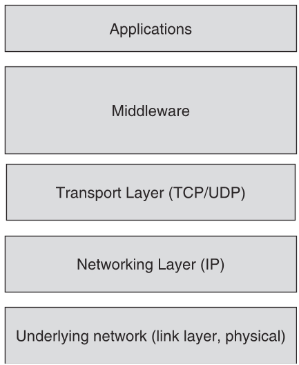

>图 2.1 分层协议栈。

Internet 开发者编写的软件必须严格遵守现有的 RFC，但同时要准备好接受不一定符合这些 RFC 的客户端输入。此类非标准输入必须像标准输入一样被软件接受和解析。RFC 1122 要求这种适应性必须存在于 Internet 主机软件的每一个层级中。

关于状态维护和整体智能的定位问题，由端到端原则来回答，该原则将这些功能放置在网络的边缘。核心 Internet 被假定为无状态的 [3]。然而，Internet 发展中出现的限制性属性，如 firewall、*网络地址转换（NAT）* 和 Web 内容缓存，使得实际的端到端原则难以甚至不可能实施。

Internet 各层被独立构建是有充分理由的，目的是隔离可能的故障。网络互联由 TCP/IP 模型中的网络层实现，在 IP 协议内将上层数据在端到端主机之间进行传递。通过在协议套件中使用 DNS 名称解析，主机名与拓扑地址被严格分离。DNS（域名系统）将（层次化的）主机名转换为拓扑 IP 地址 [4]。因此，命名和寻址被有效地分离，即使域名解析中出现可能的故障，底层的 routing 操作仍然是独立且完好的。对于用户层面，一个重要特性是能够在 DNS 中定义组织边界，而不受网络拓扑的限制。

有几种算法负责流量处理。routing 算法负责建立和维护 routing 表。第二个构建模块是转发算法，它在给定目的地址时计算数据包的下一跳。因此，数据包 routing 机制涉及 routing 算法和转发算法。实际上我们这里有两大类协议：域内协议和域间协议。作为本地工具，域内协议属于自治系统（AS），如城域网（MAN）或其他区域网络。全局工具是用于将不同 AS 连接在一起的域间协议。因此，域间协议促进了全局网络拓扑的形成。此类协议的标准案例包括用于域内操作的*开放最短路径优先（OSPF）*，以及用于域间操作的*边界网关协议（BGP）*。

实际上，Internet 提供了几种常用的不同通信模型。单播模型处理数据包从源到明确定义的目的地的、经过一组链路的传输。Internet 上的大部分流量属于单播变体。multicast 实现数据包选择性地经过多条链路的传输，通常从一个源到多个目的地。广播模型描述数据包通过多条链路发送到网络上所有设备的情况。广播通常限制在指定的广播域内。最后，在任播中，数据包被发送到最近的或其他最佳目的地，从一组候选中选择适当的链路链。

当前占主导地位的 $\tilde{\mathrm{IP}}$ 版本 4 协议仅在全局范围内实现了单播模型。未来，下一个 IP 版本 6 将包含其他通信模型。然而，IPv6 何时才能真正被普遍使用尚不清楚；部署进展比预期要慢。

自治是 Internet 的基本概念。在层次化 routing 的应用中，本地 AS 通过对等和传输链路相互连接。AS 在其 routing 软件方面也是自治的。每个 AS 可以自由运行自己的本地 routing 算法，域间连通性通过 BGP 实现。

当前的域间实践基于三个层级：第 1 层、第 2 层和第 3 层。第 1 层是一个 IP 网络，使用无结算对等互联连接到整个 Internet。第 1 层网络数量很少，它们通常寻求保护自己的第 1 层地位。第 2 层网络是与某些网络对等互联，但依赖第 1 层获取某些连通性并为此支付结算费用的网络。第 3 层网络是仅从其他网络购买传输服务的网络。

应用程序与详细的 routing 和转发是分离的。这由网络层在提供全局寻址和端到端可达性时完成。在较低层级，IP 协议本身能够支持一组链路层和物理层协议，因此它是协议栈的"腰部"。在较高级别，支持不同操作环境的特性可以与 IP 共存。因此，网络层力求最小化服务接口的数量，同时最大化系统互操作性。

### 2.1.2 Socket、middleware 和应用程序

TCP/IP 应用程序使用 Berkeley Sockets API 来发送和接收数据。如上所述，该 API 通过 TCP 提供可靠数据流，通过 UDP 提供不可靠数据报服务。传输层使用端口号将打开的连接与活动进程关联起来。例如，Web 页面检索通过 HTTP 请求执行，该请求打开一个端口以接收来自 Web 服务器的响应。响应根据端口号找到 Web 浏览器和正确的窗口。类似地，Web 服务器在标准化的 Web 端口 80 上运行一个服务器 socket 并监听传入请求。因此，传输层和 Sockets API 提供了在分布式进程之间接收和发送数据的基本机制。

在 Internet 的分层世界中，我们需要一个在网络栈之上但在应用层之下运行的软件层。这就是 middleware，它在网络层和应用层之间提供服务。middleware 涵盖了大量可行的 Internet 技术，大多数 overlay 技术都属于其中。这些 middleware 模块利用网络和底层协议栈的 API 和特性。此外，应用开发者可以利用 middleware API 来开发自己的软件。middleware 层很重要，因为它能够向应用程序隐藏和抽象底层的许多特殊功能，从而促进分布式软件的编写和运行。

### 2.1.3 命名与寻址

网络架构具有多种组件，其中一些是必不可少的。在这些组件中，命名过程和相关的命名空间对于功能性网络至关重要。在当前 Internet 中，负责处理名称和管理层次化域名命名空间的组件是 DNS。DNS 的协议是最早的 Internet 组成部分之一，由 IETF 在 1980 年代初期制定。DNS 在实际 Internet 中具有核心作用，因为它提供了大部分背景灵活性。DNS 构成了基本系统，为网络层层次化 routing 和更高层的命名服务创建了关键的可扩展性。没有 DNS，我们就无法拥有 Web 或电子邮件服务。

DNS 的管理分布在网络中。DNS 是一个 overlay，它使用静态分发树和层次化组织的命名空间。DNS 系统被实现为使用客户端-服务器模型的分布式数据库系统。在 DNS 中，域名命名空间的共享、复制和分区由名称服务器执行。这些服务器还回答客户端请求。可扩展性和弹性的重要特性通过广泛使用缓存和复制来实现。这有一个缺点，因为由于系统特性，全局更新 DNS 记录可能需要一些时间。DNS 的第二个缺点是缺乏内置安全性。这使得系统在一定程度上容易受到攻击。

任何主机都可以使用主机名（域名）或四字节 IP 地址（IPv4 下）。域名通过 DNS 系统的帮助映射到 IP 地址。因此，DNS 为网络提供了一个间接层，允许将遵循组织边界的高层层次化名称灵活地映射到网络层地址。在更高层级，我们有*统一资源定位符（URL）*方案来引用 Internet 资源。URL 包括协议名称、位置名称或地址，以及资源路径和名称。URL 是定位符，因为它们包含资源的位置。URL 是*统一资源标识符（URI）*的一种类型，URI 可以是定位符、名称或两者兼有。URI 和 URL 构成了 Web 的基础。

IP 地址是直接可路由的；然而，特定类别的地址仅在私有域内有效。因此存在公共 IP 地址和私有 IP 地址。随着 Internet 快速变得更大更复杂，进一步的需求已经出现，导致了寻址系统的新提案。具体来说，有人建议系统需要在协议架构中增加更多的间接层。一个值得注意的提案是定位符-标识符分离。这种分离将允许例如将加密标识符 [5–7] 映射到 IP 地址。这将增加灵活性，同时减少 IP 作为端点标识系统的核心作用。

### 2.1.4 组织

当我们关注 routing 过程时，必须注意有两种网络：静态网络和动态网络。静态网络为 routing 提供了一个简单的平台，因为每个路由器为所有可能的目的地确定方向。相反，动态网络中的情况更具挑战性，因为 routing 表将不断变化，运行时计算更适合用于 routing 指令。数据结构和缓冲区的位置至关重要，还有状态更新频率的问题。通常这通过向所有路由器广播 routing 状态来完成。例如，链路状态 routing 协议广播链路状态更新以计算最短路径距离。由于链路状态更新可能导致过度泛洪，网络被划分为独立的 routing 域，然后利用这种层次结构来限制更新传播。在 OSPF 中，我们发现了区域的广泛使用，这里作为网络规模化工具。在域间环境中，层次结构也自然出现。这里的 AS 源于管理边界。

一个节点需要转发表，这由 routing 过程计算。需要某种成本/收益分析，因为 routing 过程必须估计入链路的成本。节点将使用这些链路与邻居通信。通常我们可以将 routing 算法定义为一种机制，用于指定与邻居交换信息的内容，以及指定用于计算转发表的精确过程。routing 算法应该能够维护转发配置，使节点能够通过转发相互可达。这里，转发的数据包路径的最优性或至少接近最优性通常是可取的 [8]。

层次结构是 Internet 的基本准则之一。如 Kleinrock 和 Kamoun 在 1975 年发表的开创性工作 [9] 所示，需要层次化聚类来产生可扩展的 routing 表。在层次化 routing 中，核心思想是将相邻节点组合成集群，集群组合成超级集群，自底向上地在整个系统中继续这个过程。聚类过程实际上产生了一种结构，其中 routing 表摆脱了不必要的拓扑信息，因此网络可以很好地扩展，特别是在层次化 routing 中，表的大小约为 $\sqrt{n}$ 量级。由于这些优势，域间（BGP、CIDR）和域内 routing（OSPF）中的许多协议都使用层次化协议。

### 2.1.5 firewall 和 NAT

Internet 技术环境的近期变化部分源于 firewall 和 NAT 设备等设备的部署。这些基本上是用于控制子网之间通信的技术。保护系统的需求导致了 firewall 的日益广泛使用，即选择性阻止传入连接的组件。firewall 可以用硬件或软件实现。目标是提高设备安全性并防止未授权的连接。Internet 的另一个广泛添加是 NAT。NAT 设备能够在不同地址空间之间进行转换。NAT 将地址从私有网络转换为公共网络，反之亦然。这些设备可以被视为向更安全 Internet 迈进的更广泛运动的一部分，因为它们允许使用私有 IP 地址空间。这在一定程度上有助于应对 IP 地址空间耗尽的日益严重的问题。对某些网络管理问题也有好处。

NAT 是一个总称，包括许多不同的设备以及在多样化环境中利用这些设备的大量网络拓扑。通常，所有 NAT 设备都支持本地 IP 寻址域。这些私有域只能通过 NAT 到达，而不能直接到达。NAT 设备中由客户端发起的连接创建软状态。然后可以将对请求的响应传送到私有域主机。

## 2.2 multicast

虽然单播显然是 Internet 通信模型集合中最受青睐的机制，但其他模型也越来越受欢迎。最佳模型取决于通信实体的实际需求。一种非常常见的通信事件类型是建立简单的、基于组的连接时的情况。最佳过程是 multicast。

multicast 有效地解耦了发送者和接收者，因此与单播有根本不同。网络传输的优化更容易，因为数据包可以在最后可能的时刻为多个接收者复制。

实现 multicast 功能有两个可能的层级。我们可以将其插入网络层或应用层。在网络层，我们可以使用 multicast 作为单播的补充，发挥其基本网络原语的作用。在应用层，multicast 通常利用单播资源。这里我们将首先看 IP 层 multicast，然后了解一些 overlay multicast 技术。

#### 2.2.1 IP（网络层）IP multicast

IP multicast 是一种在 IP 层工作的简单、可扩展且高效的一对多机制。在典型的 multicast 中，数据包从一个发送者路由到多个接收者。multicast 参与者组成一个组，可以通过使用 IGMP（RFC 1112、2236、3376）协议向组的 multicast 地址发送数据包来加入和离开。Internet 组管理协议（IGMP）是管理 IP multicast 组成员资格的协议。IGMP 被 IP 主机和相邻的 multicast 路由器用来建立和维护 multicast 组。根据 RFC 3171，地址 224.0.0.0 到 239.255.255.255 被指定为 multicast 地址。IGMP 基于 UDP，这是 multicast 寻址的通用底层协议。值得注意的是，IP multicast 与 IP 本身一样，并不十分可靠。消息可能丢失或以错误的顺序传递。

IP multicast 的主要组件包括：

• IP multicast 组地址。

• 由路由器维护的 multicast 分发树。

• 接收者驱动的树创建。

multicast 通常创建一个 multicast 树，该树可以是源特定的，但通常由参与的实体共享。创建最优 multicast 树的问题类似于 Steiner 树问题，我们知道 Steiner 树的创建是 NP 完全问题 [10]。因此，在构建 multicast 树时通常采用启发式和贪心算法，以近似最优解。

IP multicast 借助特定于组的分发树（或森林）来实现，该树在适当的时候（即节点加入或离开时）进行维护和更新。有多种 multicast 协议在使用中，但也许最广为人知的是*协议无关 multicast（PIM）*。PIM 创建配置为从发送者通过 multicast 组向接收者传递数据包的分发树。接收者是组的成员。有许多可用于 multicast 活动的算法规范；其中 PIM 包括稀疏模式（SM）（RFC 2362）、密集模式（DM）（RFC 3973）、双向 PIM（RFC 5015）和源特定模式（SSM）（RFC 3569）。让我们更仔细地看看这些。

如果需要域间 multicast 且组的 subscriber 数量较少，PIM-SM 是一种合适的算法。想要加入 PIM-SM multicast 组的客户端发送一个 IGMP Join 消息。PIM-SM 协议为每个发送者构建一个到接收者 multicast 组的单向树。为此，它使用汇聚点（RP）。该协议支持两种类型的树：以 RP 为中心的共享 multicast 树和具有最短路径的源特定树。源特定树用于高速率数据源。

第二种类型的算法 PIM-DM 专门用于具有大量 subscriber 的组。subscription 密度很高，因此路由器的任务是处理和转发在 multicast 组中发布的大量数据包。PIM-DM 算法将数据包泛洪到网络中。之后，它修剪 multicast 转发树。这种修剪通过抑制向没有 multicast 组 subscriber 的路由器发送未来消息来减轻路由器的负载。

第三种类型，双向 PIM，是 PIM-SM 协议的变体。该算法构建双向共享树。为此，它使用汇聚点来连接 multicast 源和活跃的 subscriber。

第四种类型，PIM-SSM 算法旨在创建源特定的传递树。传递树是一个 $(S, G)$ 通道，其中 $S$ 是 IP 单播源地址，multicast 组地址 $G$ 是 IP 目的地址。PIM-SM 协议用于构建用于 IP 数据包转发的域间树。树以源 $S$ 为根。

IP multicast 分组不允许表达性的成员架构。它们只是用来划分 IP 数据报地址空间。一个数据报最多属于一个组。在部署 IP multicast 时也存在各种挑战，例如在域间操作和 RP 发现方面。

无论使用哪种特定算法，作为尽力而为的不可靠服务，IP multicast 在需要可靠传输时处于劣势。[11] 中提出和评估了将 subscriber 映射到 multicast 组的不同算法。

multicast 可以被事件系统用来向事件路由器或服务器传递通知，但通常事件系统不使用网络层 IP multicast。然而，虽然 multicast（和广播）在大型公共网络中可能不实用，但在封闭网络中是有效的。在较大的环境中，TCP/IP 和 HTTP 等标准由于普遍采用而获益，可能是大多数通信的更好替代方案 [12]。

#### 2.2.2 应用层 multicast

由于 IPv6 部署的延迟，较旧的 IPv4 仍然是标准的网络层协议。不幸的是，IPv4 默认不提供任何原生 multicast 机制。因此，实现 multicast 的常见方式是将其作为 overlay 实现在应用层的 TCP/IP 协议栈之上。与更深层的 IP 层 multicast 相比，这有几个优势，后者要求路由器为每个组和每个源维护状态。此外，在 IP multicast 中，每个唯一的 multicast 组地址都必须有 routing 表条目。multicast 地址难以聚合，而且必须为 IP multicast 设计额外的拥塞和可靠性控制解决方案。

在所有这些问题中，overlay multicast 要么避免了困难，要么改善了它们。因此，存在强烈的动机来开发和部署可行的 overlay multicast 解决方案，本书后面将讨论许多 overlay multicast 系统的示例。

与原生 IP 层 multicast 系统相比，应用层 multicast 系统利用现有的节点单播通信工具来实现一对多通信通道，其中数据包的复制位于端主机。multicast overlay 协议在 IP multicast 的意义上不是最优的，因为数据包可能多次经过同一链路。节点使用 UDP 或 TCP 建立通信并通过这些链路转发消息。multicast 树的构建算法是分布式的，并且被构建为允许一组不同的度量。

创建应用层 multicast 协议的早期尝试的一个例子是 Narada 协议 [13]。它清楚地展示了位于应用层的 multicast 的优势和可行性。overlay multicast 基于主机，不需要 IP multicast 协议中具有 multicast 功能的路由器（具有更大的复杂性）。它在 Internet 上实现起来要容易得多。虽然两种方法都是基于树的，但在 IP multicast 中，主机仅作为叶节点参与树。由于上述原因，IP multicast 的部署不如应用层 multicast，尽管它在需要最优路径和较少开销的情况下可以作为一种高效的解决方案 [14]。

#### 2.3 反向路径转发与 routing

反向路径转发是一种常用的技术，用于在存储转发网络上实现无环通信 [15]。该技术被 multicast 算法用来防止转发环路。当 multicast 数据包被路由器处理时，它将通过检查数据包的反向路径来确定通过输入接口可达的网络。如果找到与数据包源 IP 匹配的条目，则数据包被转发到参与 multicast 组的所有其他接口。数据包的转发基于数据包的反向路径而不是正向路径。

反向路径 routing 依赖于拥有关于数据包通过网络所经过路径的信息，然后在反方向上使用相同的路径。通常，该技术可以通过在处理数据包的路由器上存储反向路径信息来实现，或者通过在数据包中添加路由信息来实现。后者从安全角度来看是有问题的，因此该技术通常通过在路由器中存储反向路径状态来实现。许多分布式 pub/sub overlay 系统都基于反向路径 routing 技术。

## 2.4 因果关系与时钟

在本节中，我们介绍将时间概念引入分布式系统的基本机制。到目前为止描述的基本网络技术不支持系统中消息的排序；然而，对于许多应用程序来说，消息排序是一个必需的特性。许多应用程序需要支持因果序或全序。因果关系确定两个事件 $A$ 和 $B$ 之间的关系。为了能够在分布式系统中确定因果关系，需要逻辑时钟机制。两个著名的解决方案是 Lamport 时钟和向量时钟。一些应用程序需要更严格的事件全序。

### 2.4.1 因果排序与 Lamport 时钟

Lamport 的开创性"发生在前"关系基于事件对的潜在因果关系对事件进行排序。这种排序可以用 Lamport 逻辑时钟来数值化定义，它是一个单调递增的软件计数器，对于事件 $A$ 记为 $C(A)$。给定两个事件 $A$ 和 $B$，以下关系成立：如果 $X$ 发生在 $Y$ 之前，则 $C(X) < C(Y)$ [16]。

为了维护时钟，进程需要遵循以下简单规则以在分布式系统中维护"发生在前"关系：

• 进程在处理事件之前递增其时钟。

• 发送消息时，进程将其计数器值包含在消息中。

• 接收消息时，进程将其计数器设置为大于其自身值和接收到的计数器值中的最大值。

"发生在前"关系捕获因果关系并为事件创建偏序。该关系给出原因 A 必须发生在结果 B 之前，但 A 和 B 仍然可能是不可比较的。因此该关系仅在一个方向上适用，这被称为*时钟一致性*条件。*强时钟一致性*适用于两个方向，可以用下一小节中考察的向量时钟技术来实现。

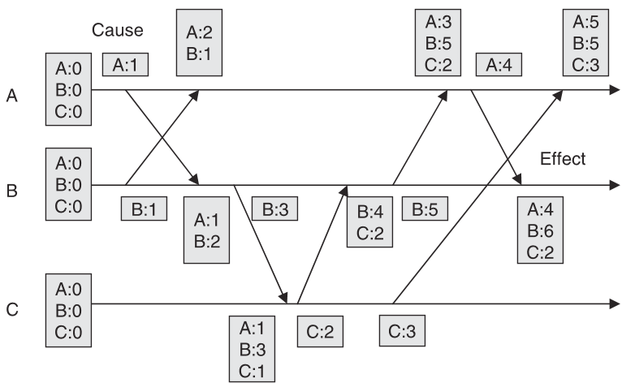

>图 2.2 使用 Lamport 时钟的示例消息跟踪。

因果关系对于许多分布式应用程序非常重要，例如在实现协作式 Web 应用程序或确定故障的根本原因时。图 2.2 用原因及其结果来说明因果关系。

### 2.4.2 向量时钟

如上所述，Lamport 时钟和"发生在前"关系仅在一个方向上适用，并且给定该关系对两个事件成立，它无法区分事件之间存在关系和它们不可比较这两种情况。向量时钟是一种更复杂的技术，可以区分这两种情况。

该系统基于向量时钟的概念，它是具有 $N$ 个进程的系统中 $N$ 个逻辑时钟的数组。每个进程维护全局时钟数组的本地副本，并遵循一组规则来更新此数组。单个时钟不能提供强时钟一致性；然而，时钟向量可以做到这一点。规则如下：

• 时钟初始设置为零。

- 当进程接收到内部事件时，它递增向量中的逻辑时钟。

- 当进程发送消息时，它递增向量中的逻辑时钟，然后将完整向量随消息发送。

• 当进程接收到消息时，它递增向量中的逻辑时钟和向量时钟。时钟通过考虑向量中的每个元素并取本地向量时钟值和接收到的向量时钟值之间的最大值来更新。

### 2.4.3 全序

全序方案可以用不同的方式实现。我们简要考察两种著名的技术，用于实现 multicast 组的全序。

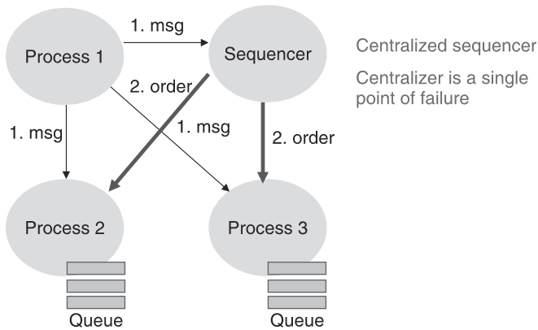

>图 2.3 使用定序器的全序。

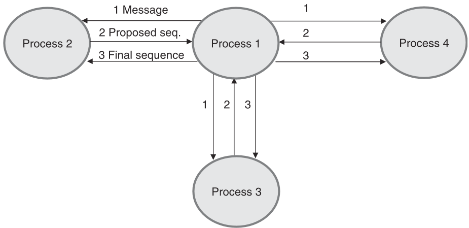

>图 2.4 ISIS 系统中的全序。

在图 2.3 所示的第一种技术中，进程向包括定序器在内的组 multicast 一条带有唯一标识符的消息。定序器接收消息并为其分配一个唯一的连续序列号。然后定序器向组 multicast 排序消息。

第二种技术在 ISIS 系统中提出，它需要三轮通信。图 2.4 展示了该系统。首先，发送者将带有其标识符的消息发送给所有接收者。然后接收者建议一个序列号，称为优先级，并回复发送者。发送者收集建议的序列号并决定最终序列号，然后发送消息的最终序列号。接收者然后以商定的序列号传递消息。

### 2.4.4 讨论

以下列表总结了分布式系统的不同排序要求：

**FIFO 序。** 客户端无法区分事件发生的顺序和传递顺序。

**因果序，偏序。** 因果相关的消息是那些表现出 Lamport "发生在前"关系的消息。一个事件的发布发生在另一个事件的发布之前。

**全序。** 使用计数器或时间戳对消息进行唯一排序。每条消息在传递时都关联一个全局唯一的时间戳。全序保持因果序。

**时间戳序。** 排序基于时间戳。粒度基于物理时钟的同步。

不可靠和尽力而为的通知比消息的因果序或全序给事件系统带来更少的性能损失和消息传递成本。物理时钟需要同步算法，如*网络时间协议（NTP）*和 Cristian 算法，以避免时钟漂移并最小化同步误差 [17]，然而，即使误差小于十毫秒，也存在因果关系被破坏的可能性。全球定位系统（GPS）设备可用于同步物理时钟，然而，广域网延迟会导致同步问题。上述因果序和全序的解决方案引入了开销，但可以保证所需的排序级别。

### 2.5 消息传递与 RPC/RMI

middleware 系统的核心组件是 IPC（进程间通信）。IPC 是一种满足通信组件面向对象的关键需求的技术。当今许多分布式应用程序都是面向对象的，这意味着用于创建服务或应用程序的软件模块是驻留在不同计算机上但通过网络连接的分布式对象。分布式对象使用底层网络和协议栈进行通信。IPC 是一组实现一个或多个进程之间数据交换的技术。其技术可以是本地的或分布式的。IPC 技术可以分为四类：

• 消息传递，

• 同步，

• 共享内存，

• RPC。

消息传递系统遵循消息传递模型，其中数据项的副本通过网络发送到通信端点。该端点在不同系统中有不同的名称和定义，但所有消息传递系统的基本原理是相同的。具有远程方法调用的分布式对象系统包括 CORBA、RMI、DCOM、SOAP、REST 和 .NET Remoting。在所有这些系统中，交互通常具有相同的特性，如可靠性、安全性和其他事务相关特性。

消息传递是软件组件或应用程序之间的一种通信方法。消息传递系统是一种对等设施：消息传递客户端可以向任何其他客户端发送消息并从中接收消息。每个客户端连接到一个消息代理，该代理提供创建、发送、接收和读取消息的设施。

消息传递实现了松耦合的分布式通信。组件向目的地发送消息，接收者可以从目的地检索消息。然而，发送者和接收者不必同时可用即可进行通信。事实上，发送者不需要知道关于接收者的任何信息；接收者也不需要知道关于发送者的任何信息。发送者和接收者只需要知道使用什么消息格式和什么目的地。在这方面，消息传递不同于紧耦合技术，如 RMI，后者要求应用程序知道远程应用程序的方法。

任何分布式对象系统的一个重要特性是对象的序列化，这是创建可在存储系统中存储或可在网络上传输的对象表示的过程。类似地，反序列化是从给定的字节序列中提取数据结构的过程。序列化

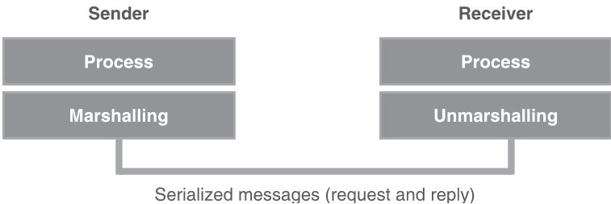

>图 2.5 消息 marshalling 示例。

和反序列化也被称为 marshalling 和 deflating，以及 unmarshalling 和 inflating。图 2.5 展示了请求-响应交互中消息的 marshalling 和 unmarshalling。

SOAP 和 Web services 的发展使 XML 序列化非常流行。例如，AJAX Web 应用程序在客户端和服务器之间的结构化数据交换中广泛使用 XML。XML 序列化的轻量级基于文本的替代方案是 JavaScript Object Notation（JSON）。它利用 JavaScript 语法，这种语法广泛且众所周知。因此，许多编程语言支持 JSON。

有时，如果格式是基于文本且人类可读的，这是有利的。这样的工具是 XML 标记，它对于对象的持久化和可互操作表示很实用。然而，基于文本的 XML 序列化存在局限性：增加的处理需求和通常的大小开销。在高性能环境中，更紧凑的解决方案是可取的，最好是基于字节流的。这导致了许多位高效且可流式处理的 XML 处理系统的开发。

在图 2.6 中，我们展示了一个分布式面向对象系统的示例，即 Java RMI API。Java RMI 是 Java 的应用编程接口。使用 RMI，可以执行远程过程调用的对象等价物。RMI 由以下八个步骤组成：

1. 客户端获取句柄。

2. 调用 Stub（代表远程对象）。

3. marshalling 参数。

4. 数据传输。

5. Skeleton 进行 unmarshalling。

6. Skeleton 调用方法。

7. Skeleton 对结果进行 marshalling。

8. Stub 对结果进行 unmarshalling 并将其传递给客户端（类型检查）。

RMI API 存在两种常见实现。原始实现依赖于 Java 虚拟机（JVM）中的类表示机制。因此，它仅支持从一个 JVM 到另一个 JVM 的调用。纯 Java 实现的底层协议是 *Java 远程方法协议（JRMP）*。后来为那些代码必须在非 Java 环境中运行的上下文开发了 CORBA 版本（基于 IIOP 的 RMI）。

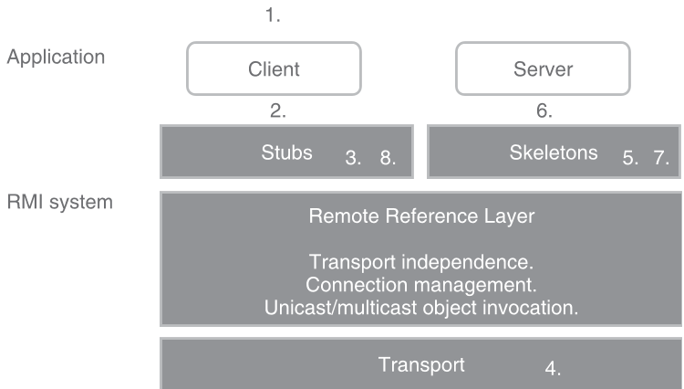

>图 2.6 RMI 概述。

#### 2.5.1 存储转发

如上所述，消息传递是构建松耦合分布式系统的基本要素。通常，分布式面向消息的系统基于*存储转发*模式构建，其中中间消息 broker 或中继将传入消息存储在消息队列中，等待最终传递到目的地。由于消息存储在队列中，它可以重新传输直到成功传递到下一跳目的地。

图 2.7 展示了这种可以应对不可靠消息传递环境的模式。可以在这种基本模式之上实现各种消息传递语义。消息传递语义在上一章第 1 章中已简要考察。

#### 2.5.2 并发消息处理

图 2.8 展示了一个非阻塞系统，其中有两个活动的 Socket，数据通过两个活动的工作线程流过系统。实现了并发消息处理，因为每个线程在一个方向上读取、处理和写入内容。这样，可以实现高效的消息处理和 routing 系统，接收消息然后立即将其写入传出 Socket。

为了开发高效的消息传递系统，需要最小化建立连接的开销。因此，建立用于传输多条消息的长生命周期 TCP 连接是常见做法。另一种方法是使用基于 UDP 的协议，该协议不建立显式连接或建立非常轻量级的连接。UDP 用于在电信环境中传输 SIP 消息。

图 2.8 的系统仅展示了消息的两个源和目的地，但可以扩展以支持任意数量的源和目的地。这个更复杂的消息 routing 核心需要协调，使得一次只有一个线程读写一个 Socket。典型的实现解决方案是让一个线程将传入消息读入缓冲区，然后分配一个工作线程来处理和发送消息，该工作线程首先从缓冲区读取消息。事实上，消息缓冲区和消息复制在基于软件的消息传递系统中起着至关重要的作用。

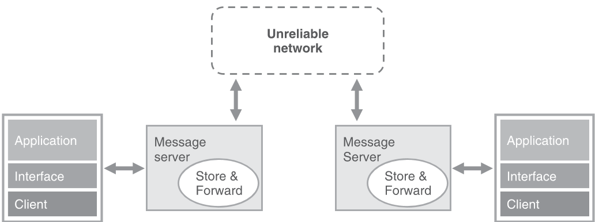

>图 2.7 基于存储转发的消息传递示例。

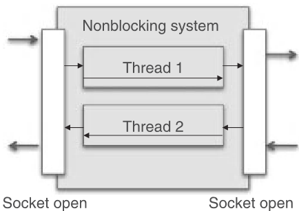

>图 2.8 非阻塞通信示例。

消息处理系统的两个挑战是：

• 队头阻塞（HOLB），

• 拥塞。

第一个挑战涉及由于目的接口和 Socket 处的并行数据传输和消息处理而阻塞传入消息。在这种情况下，传入消息被阻塞一段时间，直到它可以被发送到目的地。一种解决方案是使用较小的消息大小。

拥塞发生在消息到达速度太快以至于消息 broker 无法处理时。这导致队列大小增加，最终由于内存不足而丢弃消息。可以通过调整发送速率使消息 broker 负载较轻来避免拥塞。或者，可以通过向系统添加更多 broker 来避免拥塞。

拥塞发生在多个层级。在传输层，TCP 通过慢启动和拥塞避免算法来处理拥塞控制。TCP 发送者总是使用两个可能的窗口大小中的较小值，即拥塞窗口和接收者窗口大小。后者负责流量控制，使接收者不会被淹没。路由器可以通过使用显式拥塞通知信号（ECN 位）标记数据包来帮助发送者降低发送速率。

在应用层，TCP 的流量控制提供保护，使 broker 不会收到太多会溢出其消息缓冲区的消息。使用 UDP 时，需要额外的措施，这些措施需要构建到基于 UDP 的消息传递协议中。

### 2.5.3 语义与 QoS

消息传递系统可能支持各种传递语义和 QoS 属性。重要的属性包括可靠性、优先级、排序和时效性。对于关键任务操作，通常要求不丢失消息或以不正确的顺序传递。此外，在许多情况下必须防止重复消息的到达。如上所述，某些应用程序可能要求消息以因果序或全序传递以防止同步问题。使用消息传递同步应用程序需要因果序。

有四种常用的消息传递语义：

**尽力而为。** 不保证通知会被传递。不重要的新闻项和其他非关键的应用层通知。

**至多一次。** 通知最多传递一次。系统跟踪已传递的通知。

**至少一次。** 事件服务必须保证通知至少传递一次。这适用于所有幂等的通知。如果未确认则重新传递通知。

**恰好一次。** 事件服务必须保证通知恰好传递一次。所有系统通知和关键任务用途。如果未确认则重新传递通知并过滤重复通知。

对于 TCP/IP，无序和不可靠的通信类似于 UDP，有序、可靠的通信类似于 TCP。CORBA 调用和异步方法调用（AMI），以及 Java RMI 具有至多一次的传递语义。CORBA 时间无关调用（TII）是持久性的，支持恰好一次语义和 FIFO 排序。JMS 支持两种传递语义：瞬态消息具有至多一次传递，持久消息支持恰好一次传递 [18]。JMS 还支持 FIFO 和基于优先级的排序。

## 2.6 Web Services

Web services 范式涵盖了 Web 上机器可读和可访问的内容。在当前模型中，选择合适的服务组件并在应用层进行组合使用。架构的核心部分是服务提供者、客户端或服务消费者，以及服务注册表。在系统中，复杂服务由基本部分创建，而服务组合的目标就是促进这一点。本质上，该系统支持软件复用。Web 的许多组合服务，如个性化门户、电子商务服务包和移动服务，都是典型的应用案例。

### 2.6.1 概述

W3C Web services 的定义非常宽泛，允许大量不同的实现。然而，该术语最常指的是使用 XML 消息进行通信的客户端和服务器，通常使用 SOAP 标准。还值得注意的是，该系统通常包含托管操作的机器可读描述。W3C Web services 模型利用 *Web Services 描述语言*（WSDL）进行此描述，WSDL 是全面的，拥有大量工具，能够自动为客户端和服务器端生成代码。新服务不断涌现，如最近变得普遍的 RESTful Web services。REST 提供基于轻量级、解耦和无状态消息的工具。通常这种架构范式使用 HTTP 实现。

W3C Web services 架构由以下四个层组成（如图 2.9 所示）：

• 传输层处理网络节点之间的字节和消息交换。HTTP 协议用于消息传递，因为它是通用的且对 firewall 友好。也使用其他协议，如 FTP、SMTP 和 JMS。

• XML 消息层负责确保发送者和接收者理解消息结构和格式。事实上的解决方案 SOAP 在 W3C Web 服务架构中处理 XML 消息传递。在 SOAP 中，给出了消息的头部和主体的定义。它在多个点绑定到传输协议，如 HTTP。也有其他替代方案，如 XML-RPC 和纯 XML（在 HTTP POST 中）。

• 描述层提供有关服务接口的信息，具体说明哪些方法可用。它还将指示支持的输入和输出数据类型。使用的典型基于标准的解决方案是 WSDL。

• 发现层提供跨网络的接口用于检测 Web services。最突出的使用技术是通用描述、发现和集成（UDDI）。

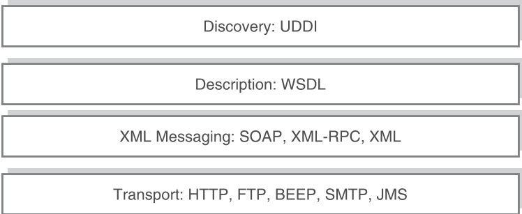

>图 2.9 Web services 栈。

从历史上看，Web services 诞生于 RPC，但趋势强烈转向更加解耦的通信。这种发展在当前 SOAP 规范的灵活性和新兴的基于 REST 的服务中都很明显。此外，SOAP 概念通常使用现有的 Web services 实现，因此通信更多基于消息而非操作方面。对多功能解决方案有明确和核心的需求，这一原则在 WSDL 2.0 版本的设计中得到了尊重。它支持绑定到所有 HTTP 请求方法。

### 2.6.2 异步处理

图 2.10 展示了两种常用的通信模型，即同步和异步请求模型。在同步模型中，调用者向与业务组件关联的端点发送 Web service 请求，然后稍后接收响应。请求通常由负责消息格式化和检查的 Web service 客户端（stub）执行。

调用者等待响应。因此，同步请求调用使调用者阻塞。该模型在软件中易于使用，因为它遵循非分布式软件中使用的传统语义。另一方面，它要求应用程序在继续之前等待响应，因此很笨拙，因为必须为并发活动创建另一个线程。此外，等待响应的线程和其他线程需要同步。

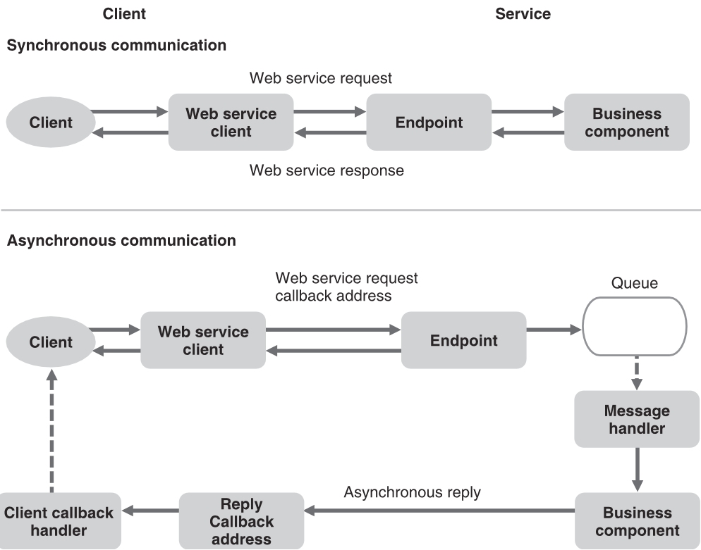

>图 2.10 异步请求处理。

异步请求模型通过使用消息队列使请求处理异步化来解决这些问题。调用者发送请求，然后可以立即执行其他活动。消息有一个关联的回复处理器，负责接受来自 Web service 的异步消息。

消息由 Web service 系统中的每个消息处理元素处理，最终由负责的业务组件处理。然后为客户端生成消息并发送到回复端点。回复处理器将接收消息并使用特定于应用程序的逻辑进行处理。

异步模型基于回调处理器，这些处理器负责处理特定信号。该模型是*控制反转*的一个例子，它与传统的过程式编程模型形成对比，通过让通用核心系统调用特定于问题和任务的代码。

### 2.6.3 连接器模型

J2EE Connector 架构旨在将 J2EE 产品和应用程序与各种企业信息系统（EIS）集成。Connector 架构使供应商能够为其企业信息系统提供标准的资源适配器。此资源适配器可用于任何符合 J2EE 的应用服务器。应用服务器和资源适配器向开发者隐藏了许多底层细节，例如安全性、事务和连接管理。

Connector 架构由不同实体之间的多个标准化契约和接口组成。关键实体是后端 EIS、不同的应用组件、应用服务器和资源适配器（如图 2.11 所示）：

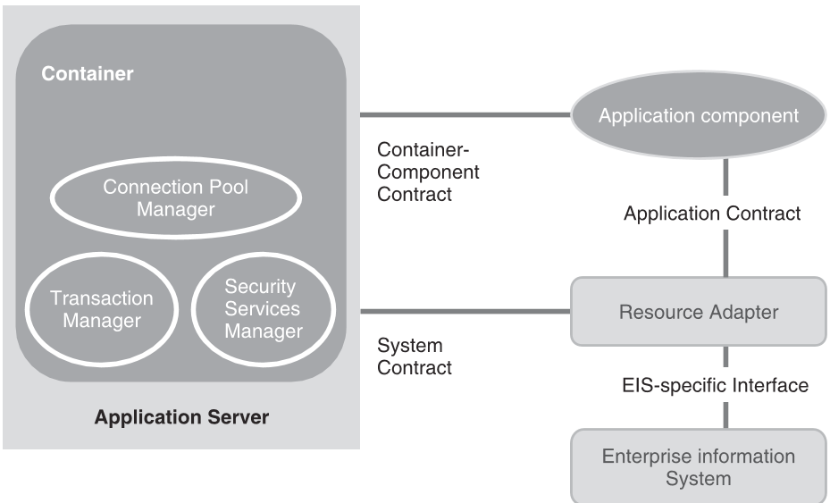

>图 2.11 J2EE 容器、资源管理器和契约。

• EIS 是与应用组件集成的后端系统。

• 应用组件是 Java 或 J2EE 应用组件（例如 Enterprise JavaBeans）。

• 应用服务器提供运行环境（容器），应用组件和资源适配器在其中执行。它还提供系统服务，如连接、事务和安全管理。

• 资源适配器实现特定于 EIS 的系统级服务，并将应用组件与 EIS 连接。它是一个使用标准化系统契约的可插拔组件。

J2EE Connector 架构定义了两类契约：系统级和应用级。系统级契约是为 J2EE 应用服务器和资源适配器定义的。应用级契约是为应用组件和资源适配器定义的。符合 J2EE 的应用服务器提供三种服务：事务管理、安全性和连接池。J2EE Connector 架构 1.0 版中的相关契约包括：

• 连接管理契约，使应用服务器能够池化连接并允许应用组件与系统连接。

• 事务管理契约，赋予事务管理器管理跨多个资源管理器的事务的能力。

• 安全契约，实现对企业系统的安全访问。

J2EE Connector 架构 1.5 版定义了额外的系统契约。增加的契约包括：

• 生命周期管理，使应用服务器能够管理资源适配器的生命周期。此契约为应用服务器提供了一种机制来设置资源适配器实例，并在资源适配器实例应停止时通知它。

• 工作管理，使资源适配器能够通过将工作实例发送到应用服务器执行来执行工作。这允许资源适配器将线程创建和管理委托给应用服务器，应用服务器可以高效地池化资源并对运行时环境有更多控制。

• 事务流入管理，使资源适配器能够将导入的事务传播到应用服务器，并执行必要的事务相关信号。这确保导入事务的*原子性、一致性、隔离性和持久性（ACID）*属性得到保留。

• 消息流入管理，使资源适配器能够将消息传递到驻留在应用服务器中的端点，而不受特定消息传递风格、消息传递语义和消息传递基础设施的限制。因此，各种消息提供者（JMS、Java API for XML Messaging（JAXM））可以通过资源适配器插入任何兼容 J2EE 的应用服务器。

### 2.6.4 Web Service 平台

一个功能完备的 Web services 平台需要大量组件，如图 2.12 所示。通常平台必须具备：

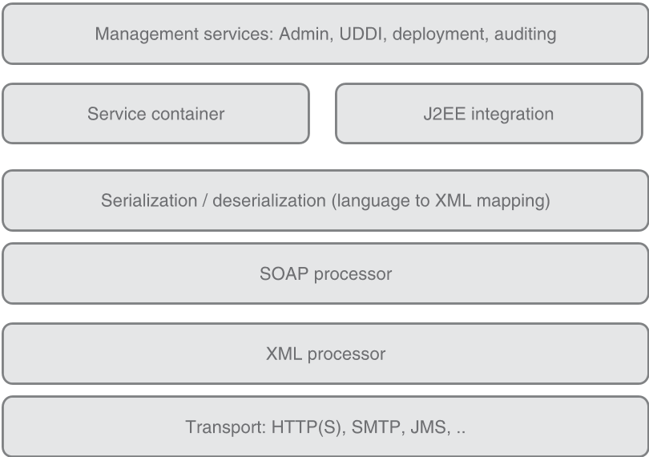

>图 2.12 XML 处理系统。

• 一组传输协议，以支持分布式系统中的节点消息交换。

- XML 处理栈是强制性的，以提供发送和接收 XML 消息的能力。

XML 处理器与 XML 消息 routing 子系统以及确保安全要求完整性的安全管道交织在一起。安全管道包括以下组件：

• 完整性检查；

• 消息验证；

• 内容检查以防止注入攻击；

• 发送者和消息部分的身份验证；

• 授权。

W3C 的 XML 加密和签名规范是基本 Web services 和 XML 安全的基础。此外，OASIS 已经标准化了 XML 访问控制标记语言（XACML），它提供了一种可用的策略语言，允许管理员更好地定义应用资源的访问控制要求。XACML 模型由策略执行点（PEP）、策略决策点（PDP）、策略信息点（PIP）和安全断言标记语言（SAML）断言组成。

除了与每消息处理相关的部分（如 XML 和安全）之外，还需要一组其他组件。图 2.12 分出了管理控制台，它承担支持安全策略设计和部署的责任。一个核心组件是身份管理，由存储在 LDAP 或类似结构中的托管凭据提供。身份管理利用多种协议，如 Kerberos 和公钥基础设施（PKI）。

如果需要更高级的身份管理组件，将支持*单点登录（SSO）*协议。这使得跨管理边界访问服务成为可能。在当今的系统中，报告和审计也很重要。如果涉及业务交易，它们尤为关键。此外，活动监控、告警和安全日志组件是现代设计的核心部分。

### 2.6.5 企业服务总线（ESB）

需要一个逻辑上集中的组件来允许使用消息传递进行应用程序集成。这样的组件是*企业服务总线*（ESB），它为应用程序提供抽象层。ESB 是基于标准和基于消息的互连，将应用程序和服务划分为其组成部分，它还促进这些部分之间解耦的灵活通信。Web services 通常使用 ESB 实现技术。请注意，ESB 并不实现 SOA，而是 SOA 的构建组件。

ESB 有各种典型特性，包括以下内容：

• 支持同步和异步传输协议中的调用。

• 各种 routing 相关特性，如 routing 可寻址性、静态/确定性 routing、基于内容的 routing、基于规则的 routing 和基于策略的 routing。

• 用于协议转换和服务映射的中介组件。

• 具有消息处理和转换功能的面向消息的 middleware。

• 复杂事件处理（CEP），用于事件检测、模式匹配和关联。

• 编排，用于实现复杂的业务流程。

• 协调，用于将暴露给用户的服务组合为单一的聚合服务。

### 2.6.6 服务组合

文献中有许多关于服务组合基本协议的论述，但在实践中，动态服务组合的问题仍然具有挑战性。由于 Web services 及其组合的普遍松耦合，这可能被视为合乎逻辑的。主要要求是组件服务可以无缝调用，为了实现这一点，组件元数据和接口语义都应在异构环境中开发和发布。WSDL 和 UDDI 是服务组合的基本机制。

OASIS 的 WS-BPEL（Web Services 业务流程执行语言）是一种业务流程语言，以 XML 序列化，专注于抽象流程和流程间消息传递。这样的工具是需要的，例如，用于做出关于消息发送、执行状态转换以及应对故障或超时的决策。BPEL 基本上是一种协调语言，因为它专注于系统中的一个对等方。另一种看待系统的对比方式是编排。它关注全局系统并考虑所有实体。为了生成可操作的协调，BPEL 支持特殊的编程结构，如条件语句、while 序列、流程控制和变量作用域。BPEL 是严重依赖 Web services 的工具之一，特别是 WSDL 和 XML。

## 2.7 会话初始协议（SIP）

新的和新兴的 Internet 服务不断需要新的架构和协议，以适应当前和未来的需求并进行调整和优化。一个非常重要的例子是 SIP [19]。SIP 是为呼叫控制任务而构建的，驱动应用在于电话和多方通信。例如，它已被用于控制包含音频和视频的多方多媒体会话。

SIP 由 IETF 标准化，是基于文本的，工作在应用层。它于 2000 年 11 月被接受为 3GPP 信令协议。它本质上是一个用于在两个或多个端点之间建立、维护和终止呼叫的工具。SIP 也独立于底层传输层，因此适用于许多不同的传输协议，例如 TCP、UDP 或 SCTP。自 2000 年 11 月起，它已成为被接受的 3GPP 信令协议。

SIP 在电信行业得到了广泛使用，是基于 IP 的多媒体服务的 IMS 架构的核心部分。具体来说，它被用作实现传统电信系统中熟悉的功能的载体，如*7 号信令系统*（SS7）中的高级呼叫处理特性。SS7 是一种集中式协议，具有简单的端点但复杂的呼叫处理网络。SIP 不同，因为它将复杂性定位在端点中，同时保持网络相对简单。

SIP 用户由特定的应用层地址标识，即 SIP URI。这种 URI 由用户名和域名组成。这些 URI 还可能包含编码在其中的其他参数。由于 SIP URI 映射到客户端的网络地址，命名系统为实现各种类型的移动性提供了有用的间接层：用户、终端和会话 [20]。

### 2.7.1 SIP 框架

SIP 协议框架有几个特定实体，分为两类：

• 用户代理（UA）是 SIP 端点。它们由用户管理，会话在 UA 之间建立。

- SIP 服务器有多种类型：注册服务器、代理服务器、用户代理服务器、重定向服务器。

更仔细地查看这些不同的服务器类型可以揭示 SIP 功能以及它们与其他一些协议的不同之处。图 2.13 展示了关键的服务器类型。

一个核心概念是注册服务器。它管理其域中的 SIP URI，处理引用这些地址的请求。SIP 注册服务器处理来自客户端的注册请求的接受。注册服务器的职责是将客户端的地址与 SIP URI 关联。注册服务器还负责接受所管理的 SIP URI 集的更新位置。这一特性允许设备从一个网络位置移动到另一个网络位置。注册服务器可以将位置数据存储在本地数据库中，或者使用称为位置服务器的特殊服务器来存储映射。请注意，位置服务器的接口不属于 SIP 框架。注册服务器可以与代理或重定向服务器的功能组合。

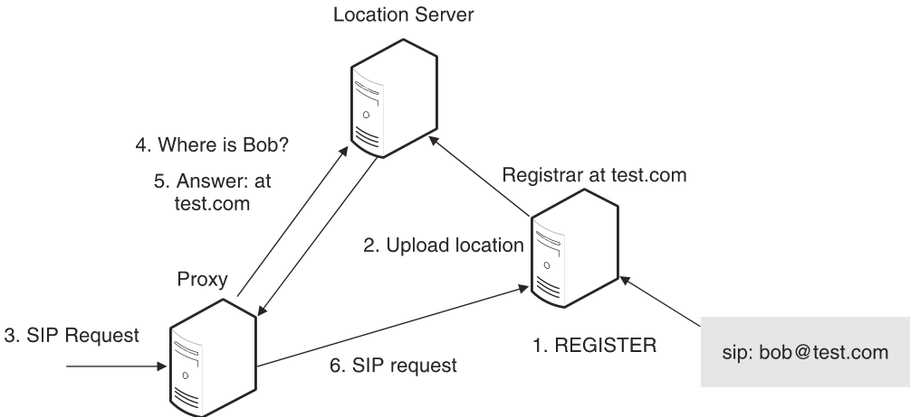

>图 2.13 SIP 实体。

SIP 代理与 HTTP 代理服务器非常相似，它负责消息 routing：接收和处理传入的 SIP 请求或将其转发到其他服务器。此外，SIP 代理被指定处理消息的身份验证和授权。因此，SIP routing 系统使用 SIP 代理实现，它们承担将消息中继到目的地的责任。实际上 SIP routing 系统非常灵活。消息 routing 通常基于发送者身份、时间、主题、会话类型等参数。有一种称为*分叉*的特殊技术，用于将 SIP 消息复制到多个目的地。这使得例如拥有两部手机的用户可以在任何一部上接听电话。

SIP 重定向服务器用于确定目的地：请求应被转发到哪里。在典型情况下，代理咨询重定向服务器以获取下一跳目的地。这是重定向服务器的主动功能——它不转发消息。

### 2.7.2 方法类型

SIP 规范中请求消息有六种方法类型。其他 RFC 中还定义了扩展核心 SIP 标准的附加方法。

关键方法如下：

• ACK，确认事务中已收到最终响应。

• BYE，由用户代理客户端发送，向服务器指示它希望终止呼叫。

• CANCEL，用于取消挂起的请求。

• INVITE，指示用户或服务被邀请加入会话。此消息的主体通常包含使用*会话描述协议（SDP）*的会话描述。

• OPTIONS，用于查询服务器的能力。

• REGISTER，由客户端用于向 SIP 服务器注册地址。

### 2.7.3 建立会话

会话建立过程以 INVITE 消息开始。此消息由主叫用户发送给被叫用户，INVITE 消息邀请被叫用户参与会话。该消息包含有关会话的信息，例如会话类型及其属性。通常，*会话描述协议（SDP）*用于描述会话。

INVITE 消息不一定立即导致接受，相反，在被叫用户最终接受会话之前，主叫者可能会收到临时响应。在此过程中，主叫者通常会被告知用户已被提醒，例如，电话正在响铃（在电话中）。如果被叫用户接听电话，主叫客户端收到系统生成的 OK 响应。然后来自主叫客户端的 ACK 响应消息建立会话，开始实际的数据发送和接收。会话的解除在其中一个用户挂断时开始，生成发送给另一个客户端的 BYE 消息。然后由另一个客户端发送确认来确认，结束呼叫。

### 2.7.4 扩展

原始 SIP 协议（RFC 2543）已经收到了许多扩展和增强，包括一些新的消息传递方法。扩展包括几种用于事件通知、即时消息和呼叫控制的方法，下面列出了基于 Windows Messenger 应用程序的示例：

• SUBSCRIBE 方法使用户能够 subscribe 到选定的事件。当匹配的事件发生时，用户将得到通知。

• NOTIFY 方法通知用户已 subscribe 事件的发生。例如，Windows Messenger 利用 SUBSCRIBE 方法在有关联系人和组的请求中，以及允许或阻止来自服务器的列表。NOTIFY 还提供了一种获取组中联系人在线状态的方式。

• MESSAGE 用于 SIP 中的即时消息。如果用户想向另一个用户发送即时消息，主叫者使用 MESSAGE 方法发送请求。MESSAGE 请求还在 SIP 数据包主体中携带实际文本。

• INFO 方法在会话期间传输信息，例如用户活动数据。例如，在 Windows Messenger 中，INFO 方法被调用来指示用户正在键盘上打字。

• SERVICE 方法将 SOAP 消息作为有效载荷携带。Windows Messenger 使用 SERVICE 方法向服务器添加新联系人和组。也可以使用 SERVICE 方法在 SIP 域中搜索联系人。

• NEGOTIATE 方法用于协商多种类型参数的选择，例如安全机制和算法。

• REFER 方法使发送者能够建议第三方联系方式；接收者被指示使用 REFER 请求中提供的详细信息进行联系。

我们将在第 5 章中考察事件扩展，以及许多其他最先进的消息传递和 pub/sub 协议和系统。

## 2.8 小结

在本章中，我们考察了分层网络架构、TCP/IP、分布式系统中的时间概念以及最先进的消息传递解决方案。这些机制是分布式 pub/sub 系统的构建模块，我们将在本书后面进行考察。接下来，我们将研究 overlay 网络，它们是广域 pub/sub 系统的基本基底。

## References

1. Deering S and Hinden R (1998) RFC 2460: Internet Protocol, Version 6 (IPv6) Specification.

2. Clark DD (1988) The design philosophy of the DARPA internet protocols. SIGCOMM, pp. 106–114 ACM, Stanford, CA.

3. Saltzer JH, Reed DP and Clark DD (1984) End-to-end arguments in system design. ACM TOCS 2(4), 277–88.

4. Mockapetris P and Dunlap KJ (1988) Development of the domain name system. SIGCOMM Comput. Commun. Rev. 18(4), 123–33.

5. Aura T (2005) Cryptographically generated addresses (CGA). RFC 3972, IETF.

6. Komu M, Tarkoma S, Kangasharju J and Gurtov A (2005) Applying a cryptographic namespace to applications. Proceedings of the First ACM Workshop on Dynamic Interconnection of Networks, DIN, pp. 23–7.

7. Nikander P, Ylitalo J and Wall J (2003) Integrating security, mobility, and multi-homing in a HIP way. Proceedings of Network and Distributed Systems Security Symposium (NDSS03), The Internet Society, San Diego, CA.

8. Levchenko K, Voelker GM, Paturi R and Savage S (2008) Xl: an efficient network routing algorithm SIGCOMM '08: Proceedings of the ACM SIGCOMM 2008 Conference on Data Communication, pp. 15–26. ACM, New York, NY.

9. Kleinrock L and Kamoun F (1975) Hierarchical routing for large networks. *Computer Networks* **1**, 155–74.

10. Winter P (1987) Steiner problem in networks: a survey. *Netw.* **17**(2), 129–67.

11. Opyrchal L, Astley M, Auerbach J, Banavar G, Strom R and Sturman D (2000) Exploiting IP multi-
cast in content-based publish-subscribe systems. Middleware '00: IFIP/ACM International Conference on
Distributed Systems Platforms, pp. 185–207. Springer-Verlag New York, Inc., Secaucus, NJ.

12. IBM (2002) Gryphon: Publish/subscribe over public networks (White paper). http://researchweb.watson.ibm.com/distributedmessaging/gryphon.html.

13. Fox G and Pallickara S 2002 The Narada Event Brokering System: Overview and extensions PDPTA
'02: Proceedings of the International Conference on Parallel and Distributed Processing Techniques and
Applications, pp. 353–359. CSREA Press.

14. Jin X, Tu W and Chan SHG (2009) Challenges and advances in using IP multicast for overlay data delivery. IEEE Communications, 47(6): 157–63.

15. Dalal YK and Metcalfe RM (1978) Reverse path forwarding of broadcast packets. Commun. ACM 21: 1040–8.

16. Lamport L (1978) Time, clocks, and the ordering of events. *Communications of the ACM* **21**(7), 558–65

17. Colouris G, Dollimore J and Kindberg T (1994) *Distributed Systems: Concepts and Design*, 2nd edn. Addison-Wesley, Boston, Massachusetts.

18. Sun 2002 Java Message Service Specification 1.1.

19. Rosenberg J, Schulzrinne H, Camarillo G, et al. (2002) RFC 3261: SIP: Session Initiation Protocol IETF. http://www.ietf.org/rfc/rfc3261.txt.

20. Schulzrinne H and Wedlund E (2000) Application-layer mobility using SIP. SIGMOBILE Mob. Comput. Commun. Rev. 4(3), 47–57.

# 3 overlay 网络与分布式 hash 表

本章通过说明如何在网络之上创建网络（即所谓的 overlay 解决方案）来深化对网络解决方案的处理。overlay 网络是在现有底层网络之上设计和部署的网络 [1]。许多近期的网络算法和设计都是作为 overlay 网络开发的，因为它们不需要对路由器和网络设备进行更改。因此，overlay 网络在创建扩展 Internet 和 TCP/IP 当前功能的新分布式系统和服务方面提供了灵活性。

overlay 网络是支持各种分布式 pub/sub 系统的良好候选。overlay 解决方案有两大类别，即非结构化和结构化。非结构化 overlay 可以在任何节点上处理内容，搜索功能通常依赖于泛洪消息。另一方面，结构化 overlay 对内容放置做出假设，因此可以支持更高效的查找。

在本章中，我们特别考虑结构化*分布式 hash 表（DHT）*，它在信息传播和内容传递方面有许多有前途的应用 [2]。基于 DHT 的解决方案将在后续章节中更详细地考察。

### 3.1 概述

overlay 网络是构建在现有网络之上的网络。overlay 依赖底层网络提供基本网络功能。大多数 overlay 网络构建在 TCP/IP 协议栈之上的应用层。overlay 技术可用于扩展网络层的功能，例如提供新的 routing 和转发功能。overlay 网络中的节点通过使用逻辑连接相连，这些连接可能由多个网络层跳数组成。

对等（P2P）网络是 overlay 网络的一个类别。P2P 网络由相互合作以提供服务的节点组成。纯 P2P 网络由既是客户又是服务器的对等节点组成。P2P 模型不同于客户端-服务器模型，在后者中客户端访问服务器提供的服务。

>Pub/Sub Systems: Design and Principles, First Edition. Sasu Tarkoma.

>© 2012 John Wiley & Sons, Ltd. Published 2012 by John Wiley & Sons, Ltd.

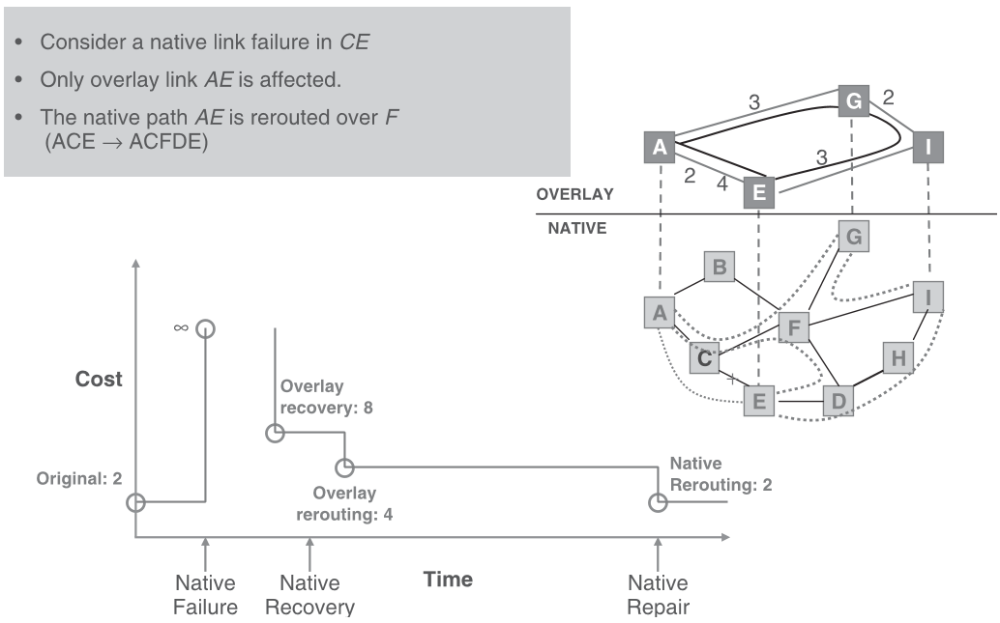

>图 3.1 弹性 overlay routing 示例。

因此，overlay 网络由 Internet 上的一组分布式节点组成。遵循 Internet 的端到端模型，这些节点位于 Internet 的边缘。overlay 节点预期以以下方式支持网络：

1. 为 overlay 网络提供基础设施并支持分布式应用程序的执行。

2. 参与 overlay 网络并执行消息和数据包的 routing 和转发。

3. 以第三方可达的方式部署在 Internet 上。

图 3.1 展示了 overlay 网络如何支持弹性 routing 并绕过网络层可达性问题 [3]。在图中，overlay 网络部署在底层网络（即 Internet）之上。overlay 链路可以跨越多个网络层跳数。时间线展示了网络层路由器故障（链路 C-E 上的原生故障），它中断了 overlay 网络中的通信（链路 A-E）。overlay 系统能够从原生故障中快速恢复并恢复通信（通过 F 重新 routing），代价是时间线图中 y 轴所示的一些开销。底层网络最终能够纠正原生故障问题，然后 overlay 可以返回到更优的配置（原生修复）。这个例子展示了 overlay routing 在提高容错性方面的好处。

通常，overlay 网络基于分布式算法来创建可扩展的 routing 表。一种常见技术是使用 DHT 构建 overlay，DHT 是可扩展的查找结构。DHT 将 hash 表分区到网络上的多个节点，

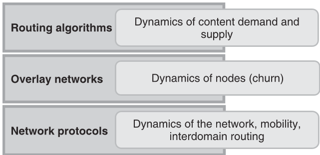

>图 3.2 多层上的动态属性。

并提供用于添加和检索元素的 hash 表 API。现代 DHT 算法可以提供对数级的查找成本（以找到内容所需的跳数计）和对数级的 routing 表大小。最近的算法还可以考虑网络邻近性并处理 churn。churn 表示节点快速加入和离开网络的情况。DHT 算法通常被期望能够容忍 churn。

DHT 通常支持使用无语义标签进行查找。使用无语义标签，任何数据块都可以通过使用 hash 函数转换为标签。SHA-1 hash 算法是一种常用的 hash 函数。标签也可以具有安全属性。一种常用的技术是向平面标签添加公钥签名。这称为自认证。自认证标签由公钥签名的数据 hash 和公钥组成。接收自认证标签的节点可以验证某些数据确实 hash 到该标签，并且公钥正确验证了签名。

通用的 DHT API 很简单，具有三个操作：put、get 和 delete。put 操作将数据放入具有给定键的结构中。get 根据键检索数据。delete 删除与给定键关联的数据。

图 3.2 展示了分布式 pub/sub 系统的三个层。最底层由网络层协议组成，通常是 TCP/IP 协议套件。这一层需要应对网络的动态性、移动性问题和域间 routing。overlay 网络层构建在此层之上，引入新的寻址方案并为更高层提供灵活性。我们前面的例子展示了 overlay 网络的潜在好处；然而，overlay 网络必须解决节点动态性（churn）和安全方面的问题。在 overlay 网络之上，可以开发各种 pub/sub routing 算法和系统。一个例子是在 Pastry DHT 之上实现的 Scribe pub/sub 系统。解决方案需要考虑内容需求和供应的动态性。因此，需要在每一层研究动态操作相关的问题。

### 3.2 用途

overlay 网络可用于不同的操作环境。两种典型环境是集群和 Internet（广域）。集群通常可以被认为是可靠、安全和有管理的。此外，它们不容易出现网络分区或不可预测的操作条件。另一方面，广域环境缺乏这些品质。它们是不可靠、不可预测、不安全的，容易出现网络分区，并且没有集中管理。DHT 在跳数与 routing 表大小、网络直径和应对变化的能力之间取得平衡。

广域 overlay 的典型要求包括：

• 去中心化操作，其中节点合作形成系统而无需中央协调。

• 可扩展到数百万节点。

• 容错性和对 churn 的支持。

overlay 网络的典型应用包括：

• 内容搜索和文件传输。

• 具有高效查找的分布式目录。

• Internet 上的内容 routing。

• Publish/subscribe。

• 分布式存储系统。

• 多人游戏的基底。

overlay 网络的两个重要类别是 [1]：

• 非结构化网络，不假设将内容分发到节点和在节点之间建立链接的特定方式。示例系统包括经典的 P2P 系统如 Gnutella 和 Freenet，以及本章后面讨论的 gossip 算法。

• 结构化网络，对节点之间的链接和内容如何放置在节点上做出更多假设。示例系统是将要介绍的 DHT 算法。

## 3.3 一致性 hash

开创性的一致性 hash 技术于 1997 年提出，作为将请求分发到动态 Web 服务器集合的解决方案 [4]。该技术以一致的方式将传入请求映射到服务器，允许在运行时添加和删除服务器。该方案比例如线性 hash 更灵活，线性 hash 允许增量可扩展性，但只允许按特定顺序添加服务器。一致性 hash 是接下来讨论的 DHT 算法的基础。

一致性 hash 允许添加和删除服务器，每次更改大约有 $K/n$ 个元素被重新定位，其中 $K$ 是键的数量，$n$ 是服务器的数量。其思想是将桶和项映射到单位区间，然后将数据项放置到最接近的可能桶中。为了应对网络分区，该方案假设系统的每个客户端对全局状态有有限的视图。每个视图包含服务器的一个子集。为了确保信息可用性，桶需要在服务器之间复制。

一个桶被复制 $\hat{\kappa} \log(C)$ 次，其中 $C$ 是不同桶的数量，$\kappa$ 是一个常数。当添加新桶时，只有最接近其某个点的那些项才会被移动。

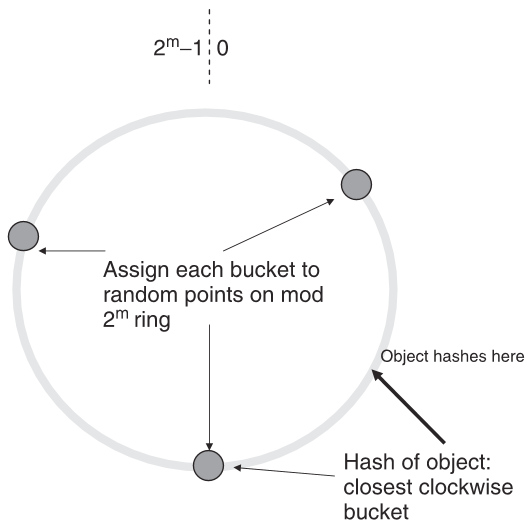

>图 3.3 一致性 hash 示例。

一致性 hash 中的三个重要属性如下：

• 平滑性，涉及服务器之间的负载分布。添加或删除服务器时重新定位的预期项数应最小化。

• 分散性，即所有视图中负责一个项的服务器数量。此服务器数量应保持较小。

• 负载，定义所有视图中分配给特定桶的项数。

图 3.3 展示了一致性 hash 的环形地址空间。每个桶在地址空间中有一个随机位置。每个桶负责存储 hash 到该桶之前的地址空间的对象。当添加或删除桶时，该方案将传输限制在桶之间。

### 3.4 几何结构

并行互连网络的研究产生了一系列基于静态图的拓扑。这些网络的主要应用领域是高效硬件系统的开发。最近，互连几何结构已被应用于创建 overlay 网络和 DHT。静态图结构不能直接使用，而是被扩展以支持动态和随机几何结构 [5]。

图 3.4 总结了常用的几何结构。常用的 overlay 拓扑包括：树、环面（$k$ 元 $n$ 维立方体）、蝶形（$k$ 元 $n$ 维蝶形）、环和 XOR 几何结构。这些结构构成了不同 DHT 算法的基础。某些几何结构之间的差异可能非常小且微妙。例如，Pastry 和 Tapestry 的 DHT 算法模拟的静态 DHT 拓扑是 Plaxton 树；然而，动态算法类似于超立方体。

| |树|超立方体|环|蝶形|XOR|
| ---|---|---|---|---|---|
| 邻居选择|是|否|是|否|是|
| 路由选择|否|是|是|否|部分|
| 顺序邻居|否|否|是|否|否|
| 保证独立路径|否|否|否|否|否|
| 示例系统|Plaxton mesh|CAN, Tapestry, Pasty|Chord|Viceroy|Kademlia|

>图 3.4 典型 DHT 几何结构总结。

几何结构的两个重要特性是网络度和网络直径。高网络度意味着加入、离开和故障可能影响更多节点。几何结构可以根据网络度分为两种类型：常度几何结构和非常度几何结构。在前者中，无论网络大小如何，平均度是常数。后者类型涉及平均节点度通常随网络大小对数增长。

## 3.5 DHT

DHT 基于一致性 hash，旨在支持去中心化广域系统中的信息查找。早期的经典 DHT 是 Plaxton 算法和基于集群的一致性 hash 技术。此后，前四个 DHT，即 CAN、Chord、Pastry 和 Tapestry，于 2001 年引入。

基于 DHT 的系统通常保证任何数据对象平均可以使用 $O(\log N)$ 个 overlay 跳数定位，其中 $N$ 是 overlay 网络中的节点数。两个对等节点之间的底层网络路径可能与 overlay 网络使用的路径显著不同。

在 Chord DHT 中，参与节点具有唯一标识符并形成一维环。每个节点维护指向其后继和前驱节点的指针（由其标识符确定）。作为优化，它们维护指向网络中其他节点的额外指针（称为 finger）。消息被贪心地转发到 finger 表中标识符值小于或等于目的节点标识符的最接近节点。

Pastry 和 Tapestry 是按照 Plaxton 算法设计的，因此它们是基于树的解决方案。与 Chord 类似，消息被路由到更接近目的地的节点（多一位数字）。Pastry 使用前缀 routing，而 Tapestry 基于后缀 routing。

CAN 与上述其他 DHT 不同，它基于 $d$ 维笛卡尔坐标空间，每个节点有一个关联的区域。每个节点知道其在逻辑拓扑中的邻居。发送到坐标的消息被传递到负责包含该坐标区域的节点。每个节点将消息转发到最接近目的地的邻居。

### 3.5.1 DHT API

DHT 的典型 API 非常简单。API 的目的是向开发者抽象分布细节。因此 DHT API 看起来像传统的数据结构 API。

DHT 可以被视为具有一个称为*基于键的 routing 服务（KBR）*的公共元素 [6]。此服务提供基于大标识符空间定义的标识符的高效 routing。KBR 抽象可以分层以创建更复杂的基于键的操作。KBR 抽象包括查找、任播、multicast 以及对象定位和 routing [6]。KBR API 由结构化 DHT 提供，它意味着每个 overlay 节点维护一个 routing 表并可以将消息转发到其目的地。

DHT KBR 预期提供以下操作：

• join(q)：当前节点联系节点 q 以加入 overlay 网络。

• leave()：当前节点离开 overlay 网络。

• lookup(key)：当前节点搜索负责给定键的节点。

### 3.5.2 Chord

Chord 是一种分布式和去中心化的查找服务 [7]。每个 Chord 节点有一个唯一的 $m$ 位节点标识符（ID），通过对节点的 IP 地址和虚拟节点索引进行 hash（例如使用 SHA-1）获得。ID 占据一个环形标识符空间。键也通过将其 hash 为 $m$ 位键 ID 映射到此 ID 空间。遵循一致性 hash 模型，负责给定 ID 的节点是具有大于或等于对象 ID 的最小 ID 的节点。为了在节点加入操作期间保持 ID 映射的一致性，一些 ID 被分配给新节点。当节点离开 Chord 系统时，分配给离开节点的所有键都被转移到新的负责节点。

如果有所有其他节点的全局知识，一致性 hash 在常数时间查找中是高效的。Chord 提供了基于 routing 的一致性 hash 的可扩展版本。Chord 在 $O(\log(n))$ 条消息中 routing，需要关于 $O(\log(n))$ 个节点的信息。routing 表（称为 finger 表）最多维护 $m$ 个元素。图 3.5 展示了 Chord 环和 finger 表。节点 $n$ 的表中第 $i$ 个条目标识了在标识符环上至少以 $2^{(i-1)}$ 超过 $n$ 的第一个节点 $s$。finger 表条目包括 Chord ID 和节点的 IP 地址 [7]。Chord 算法查询 finger 表以将消息转发到更接近其目的地的位置。如上所述，消息以贪心方式转发到 finger 表中标识符值小于或等于目的节点标识符的最接近节点。overlay 更新过程负责在节点加入和离开网络时保持 finger 表最新。

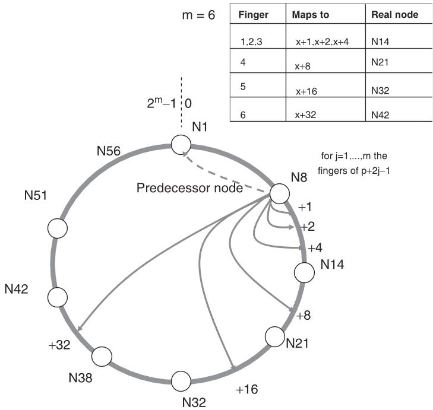

>图 3.5 Chord routing 示例。

#### 3.5.2.1 Internet 间接基础设施

Internet 间接基础设施（i3）[8] 是基于 Chord [9] 的 overlay 网络，旨在提供比当前 IP 寻址更灵活的通信模型 [8]。在 i3 中，每个数据包被发送到一个标识符。数据包使用标识符路由到分布式系统中的单个服务器。该服务器，即 i3 节点，维护由与标识符关联的接收者安装的触发器。当找到匹配的触发器时，数据包被转发到关联的接收者。i3 标识符可以绑定到主机、对象或会话，不像 IP 地址总是绑定到特定主机。

i3 系统可以支持多种交互，包括单播、multicast、任播和服务组合。overlay 提供了一个间接层，可用于支持移动和多宿主主机。

在 i3 单播中，主机 R 在 i3 基础设施中插入触发器 (id, R) 以接收所有具有标识符 id 的数据包。图 3.6 展示了 i3 multicast 原语。应用程序可以使用触发器的层次结构构建 multicast 树。数据包在触发器处复制以实现 multicast。

图 3.7 展示了 i3 任播原语。应用程序可以为每个触发器标识符指定前缀。然后根据最长匹配前缀规则将数据包与标识符匹配。

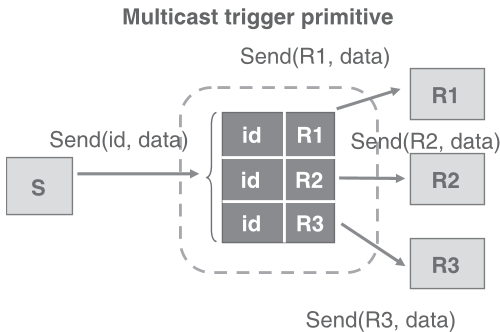

>图 3.6 i3 multicast 示例。

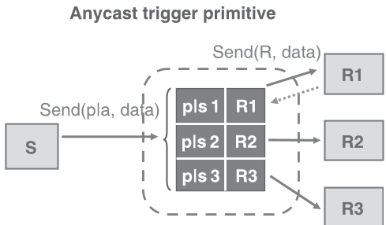

>图 3.7 i3 任播示例。

### 3.5.3 Pastry

Pastry 是可扩展 DHT 结构的经典示例 [10]。Pastry 类似于其他著名的 DHT 系统，如 Chord、CAN 和 Tapestry。Pastry 从大标识符空间中为节点和对象分配随机标识符。节点标识符（NodeID）和数据键是 128 位字符串。本质上，它们是基数 $2^b$ 的数字序列，其中 $b$ 是配置参数。

Pastry 基于一致性 hash 和 Plaxton 算法。该系统的核心目标是提供对象定位和 routing 方案。Pastry 是基于前缀的 routing 系统，它在 routing 中考虑网络邻近性。消息 routing 过程很简单：消息总是被发送到数值上更接近的节点。到达给定目的地的预期平均跳数为 $\log(N)$ 跳。

遵循 Plaxton 算法，Pastry 将消息路由到 NodeID 在数值上最接近给定键的节点。目的节点被称为键的根。

关键的 Pastry API 函数包括：

• NodeID = pastryInit(Credentials)。此函数允许当前节点加入 Pastry 网络。该函数返回当前节点的 NodeID。

• route(msg,key)。此函数将消息路由到 NodeID 在数值上最接近给定键的节点。

• send(msg,IP-addr)。此函数将消息发送到具有给定 IP 地址的节点。

应用程序使用 Pastry API 使用系统：

• *deliver(msg,key)*。当接收到发往当前节点的消息时，系统调用此上行调用。在这种情况下，当前节点的 NodeID 在数值上最接近消息中指定的目的地址。

• forward(msg,key,nId)。在消息发送到具有标识符 nId 的节点之前，系统调用此函数。应用程序可以使用此函数来检查消息、修改内容并阻止系统发送消息。

- newLeafs(leafSet)。当邻居节点集发生变化时，系统调用此函数。

#### 3.5.3.1 加入和离开网络

节点通过 hash 节点当前的 IP 地址来确定新的节点标识符（NodeID）来加入 Pastry DHT。然后节点通过拓扑上最近的 Pastry 节点 A0 向此 NodeID 发送消息。新节点从初始节点 A0 复制邻居集。然后在向 NodeID 的每一跳中，新节点从现有节点接收一行 routing 表。处理请求的节点还会在地址在数值上小于给定前缀的现有地址时将新节点包含在其 routing 表中。发送最后一行 routing 表的节点还将叶集发送给新节点。然后需要检查一些条目的一致性。最后，新节点将其 routing 表发送给每个邻居。

加入包括以下步骤：

• 创建 NodeID 并从拓扑上最近的节点获取邻居集。

• 将消息路由到 NodeID。

• 每个处理加入消息的 Pastry 节点将向新节点发送一行 routing 表。Pastry 节点将在必要时更新其远程 routing 表。

• 接收最后一行和候选叶集。

• 检查表条目的一致性。将 routing 表发送给每个邻居。

Pastry 节点可能在没有事先通知的情况下故障或离开系统。Pastry DHT 可以管理这种情况。故障节点需要在其他节点的 routing 表中被替换。这可以通过用故障节点 routing 表中最大对应索引的节点替换故障节点来完成。因此，可以通过查询 routing 表找到替换。

#### 3.5.3.2 routing

Pastry 节点维护三个关键数据结构：routing 表、邻居集和叶集。第一个存储到其他节点的远程链接。节点的 routing 表有 $l = \lceil \log_{2^b} N \rceil$ 行和 $2^b$ 列。routing 表第 $r$ 行中的条目引用的节点的 NodeID 与当前节点的 NodeID 共享前 $r$ 位数字。

第 $r$ 行第 $c$ 列中节点的 NodeID 的第 $(r + 1)$ 位数字等于 $c$。第 $r$ 行中对应于本地节点 NodeID 第 $(r + 1)$ 位数字值的列为空。

第二个结构包含基于节点之间标量邻近距离的附近节点。

第三个结构包含数值上接近的节点（$l/2$ 个较小和 $l/2$ 个较大的键），可用于在数值寻址空间中找到附近节点。因此，基本的远程 routing 表由叶集支持，叶集可以被视为在类似超立方体的 routing 表之外引入了类似环的结构。

节点将传入消息发送到其 NodeID 与目标地址共享的前缀至少比键与当前节点标识符共享的前缀长一位数字的节点。如果找不到这样的节点，则消息被发送到其 NodeID 共享前缀且具有比当前节点数值上更接近的标识符的节点。预期 routing 跳数小于 $\log_{2^b} N$。

Pastry overlay 通过测量节点之间的网络层距离来考虑网络邻近性。鉴于给定 routing 表条目有许多可能的选择，选择网络延迟较低的节点。这产生了一个考虑底层网络拓扑的 overlay 拓扑。因此 Pastry 具有低延迟惩罚。

图 3.8 展示了一个 Pastry routing 表，节点地址为 65alx，b=4，l=4（基数 16）。在 routing 表中，元素 'x' 表示任意后缀。

图 3.9 展示了基于前缀的 routing [11]。节点 65a1fc 将消息路由到目的地 d46a1c。消息被路由到标识符环中负责目的地地址空间的最近节点。

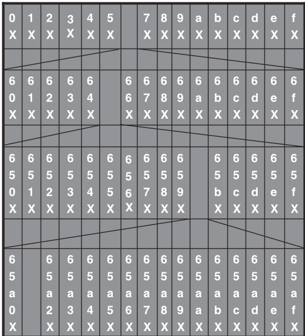

>NodeID 为 65a1x 的 Pastry 节点的基数 16 routing 表，b = 4。任意后缀用 x 表示。

>图 3.8 Pastry routing 表。

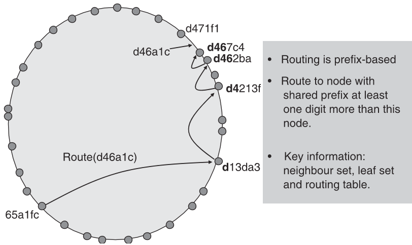

>图 3.9 Pastry 前缀 routing。

节点 N 处目的地 K 的 Pastry routing 算法。

• 如果 K 在叶集中，则直接将数据包路由到该节点。

• 如果 K 不在叶集中，则确定公共前缀 (N, K)。

• 在 routing 表中搜索具有前缀 $(E, K) > \text{prefix}(N, K)$ 的条目 $E$，并将消息转发到 $E$。

- 如果这不可能，则在 routing 表中搜索具有最长前缀 $(E, K)$ 的节点 $E$，基于 routing 表、叶集和邻居集的合并集。转发到 $E$。

### 3.5.3.3 特性

平均而言，Pastry 需要 $\log(N)$ 跳才能到达给定目的地。在并发节点故障的情况下，除非 $l/2$ 个或更多具有相邻 NodeID 的节点同时故障，否则保证最终传递。

Pastry routing 表有 $(2^b - 1) * \lceil \log_{2^b} N \rceil + l$ 个条目。在节点故障或新节点到达后，routing 表可以用 $O(\log_{2^b} N)$ 条消息更新。

### 3.5.3.4 应用

图 3.10 给出了 Pastry DHT 应用的几个示例。Scribe 是在 Pastry 之上实现的基于 topic 的 pub/sub 系统。另一个例子是 PAST 网络文件存储服务，它利用 Pastry 来存储和缓存数据 [12]。接下来，我们考虑 SplitStream multicast 系统，它是 Pastry 的一个应用。我们将在后续章节中考察在 DHT 之上创建的 pub/sub 系统，特别是在第 9 章。

SplitStream 旨在当参与对等网络的节点是动态的时候支持高效的 multicast。具体的解决方案是将内容条带化到一组

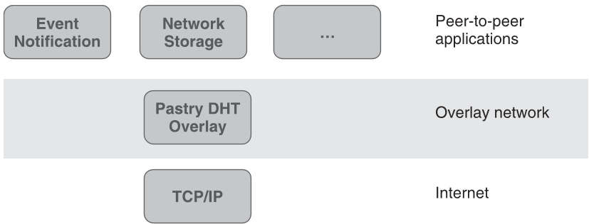

>图 3.10 Pastry 应用。

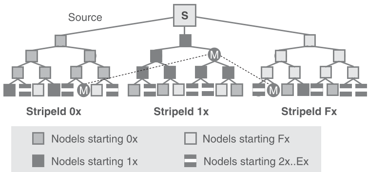

>图 3.11 SplitStream 概述。

内部节点不相交的 multicast 树森林中。这些树然后负责在参与的对等节点之间分配转发负载 [13]。

如果每个节点最多是一棵树的内部节点，而在其他树中是叶节点，则一组树被称为内部节点不相交的。

SplitStream 将内容分割为 $k$ 个条带。系统使用单独的 multicast 树来分发给定的条带。对等节点然后可以加入特定于条带的 multicast 树以接收内容。每个对等节点有一个上限，限制它们可以转发给其他对等节点的条带数量。给定原始内容的带宽需求为 $B$，每个条带的带宽需求为 $B/k$。对等节点可以以 $B/k$ 的增量控制其入站带宽。

图 3.11 展示了 SplitStream 的森林构建。源根据内容生成条带，然后使用其对应的 multicast 树 multicast 每个条带。条带标识符 o 以不同的数字开头。内部节点的节点标识符与条带标识符共享前缀。因此它们必须是内部节点不相交的 multicast 森林中的叶节点。

主要挑战是构建和维护这个 multicast 树森林，使得一棵树中的内部节点在所有其余树中是叶节点，并且满足节点指定的带宽约束。SplitStream 利用 Pastry 和 Scribe overlay routing 的属性来构建内部节点不相交的树。当树的标识符在最高有效位都不同时，Scribe 树具有不相交的内部节点集。
Pastry 的 $b$ 值需要选择以产生合适的 $k$ 值。

在 SplitStream 中，每个节点维护的预期状态量为 $O(log|N|)$，如果树是良好平衡的，构建森林的预期消息数为 $O(|N|log|N|)$，最坏情况下为 $O(|N|^2)$。

Overcast 是一个类似于 SplitStream 的系统，使用适应网络条件的协议构建数据分发树来提供可扩展和可靠的单源 multicast [14]。Overcast 使用带宽估计测量将专用服务器组织为以源为根的 multicast 树，以优化整个树的带宽使用。Overcast 和 SplitStream 之间的主要区别是 Overcast 使用专用服务器而 SplitStream 利用客户端。此外，SplitStream 假设对等节点之间可用的网络带宽受限于它们到其*互联网服务提供商*（ISP）的连接，而不是网络骨干。

### 3.5.4 讨论

图 3.12 总结了三种关键 DHT 算法。所示表格总结了算法的主要属性，即系统的几何结构、routing 和匹配原则、系统参数、routing 性能、routing 状态，以及系统如何处理 churn（加入/离开）。我们可以观察到，三个被比较的系统是相似的，但在地址空间如何在节点之间划分以及如何以 routing 表形式维护方面存在一些根本差异。因此，底层几何结构极大地影响系统属性和动态性。

DHT 属性，即到达目的地所需的平均跳数和 routing 表大小，是相关的。图 3.13 考察了 routing 表大小和网络直径之间的渐近权衡曲线 [15]。该图没有考虑对 churn 的容忍度以及 overlay 拓扑与底层网络拓扑的映射程度。这两个也是表征 overlay 网络的重要参数。

| |CAN|Chord|Pastry|
| ---|---|---|---|
| 几何结构|多维空间（d 维环面）|环形空间|Plaxton 风格 mesh|
| routing|将（键，值）对映射到坐标空间|匹配键和节点标识符|匹配键和节点标识符中的前缀|
| 关键参数|对等节点数 N，维度数 d|对等节点数 N|对等节点数 N，对等节点标识符基数 B|
| routing 性能|O(dN 1/d )|O(log N)|O(log B  N)|
| routing 状态|2d|log N|2Blog B  N|
| Churn（加入和离开）|2d|(log N) 2|log B  N|

>图 3.12 著名 DHT 算法总结。

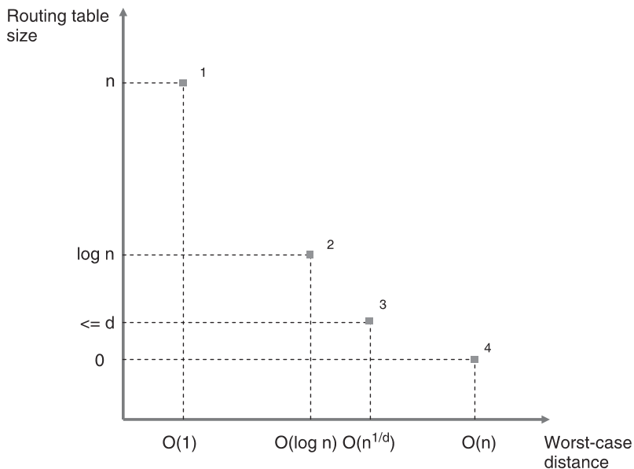

>图 3.13 routing 表大小和网络直径的权衡。

许多著名的 DHT 算法，如 Chord、Pastry、Tapestry，落在图的中间部分，具有对数直径和 routing 表大小的典型特征。CAN 算法可以在较大的 routing 表大小下提供恒定的 routing 性能。权衡分析表明，$\Omega(\log n)$ 的 routing 表大小是一个阈值点，分隔两个状态效率区域。这个阈值点位于渐近曲线的中间。如果 routing 表大小渐近地更小或相等，无拥塞操作的需求阻止 overlay 实现更小的渐近直径。当 routing 表大小更大时，无拥塞操作的需求对网络的限制变得更小。

## 3.6 gossip 系统

gossip 是一种在分布式环境中以概率方式将消息传递到一组目的节点的技术 [16, 17]。通信节点通过基于概率分布（例如均匀分布）选择下一跳目的地来交换信息。

### 3.6.1 概述

gossip 系统中的节点使用分布选择对等节点的子集，然后将输入消息发送给它们。接收到 gossip 消息的节点重复此过程。最终，经过足够多轮通信后，所有目标节点都收到了消息。因此 gossip 泛洪消息，泛洪过程由用于选择下一跳目的地的概率分布参数化。

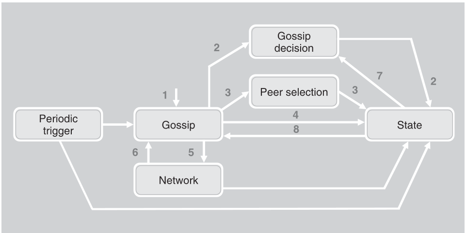

>图 3.14 基于 gossip 的传播示例。

图 3.14 展示了 gossip 的工作原理 [18]：

1. 节点接收到传入消息或周期性触发器到期，消息的 gossip 过程开始。

2. 需要做出 gossip 决策。节点以某个给定的概率 gossip 消息。

3. 鉴于做出了肯定的 gossip 决策，节点需要选择网络中消息要发送到的节点子集。对等节点选择过程查询节点的当前状态以确定接收者。

4. 然后联系接收者并将消息发送给接收者。

5. 更新系统状态。

gossip 系统的三个关键指标是：

• 通信的延迟；

• 到达网络中所有适当节点的概率。

可达性概率和延迟可以通过调整消息转发的复制因子（扇出）来调节。复制因子确定每轮 gossip 要联系的节点子集的大小。要联系的目的节点的随机选择由节点可用的本地信息确定。如果使用本地信息来选择节点，则 gossip 协议被称为知情的。

系统的可靠性源于以下观察：网络中节点的对等集彼此独立。此外，冗余和随机化绕过了网络中可能的故障，避免了昂贵的网络重新配置。

基于 gossip 的非结构化 overlay 可以用作各种网络和服务管理应用的构建模块，特别是当需要动态操作和最终一致性支持时 [19]。gossip 已被用于 AstroLabe 系统中的监控和配置 [20]，以及在 Amazon 的 Dynamo [21] 中实现最终一致性，Dynamo 是该公司服务的核心系统。gossip 非常适合大规模网络中的监控，其中每个节点监控其他节点的一小部分随机子集，从而分散监控成本。gossip 也适合管理大规模 P2P 网络中的 routing 表。

基于 gossip 的协议可以分为三大类别：

• 传播协议。此类别使用 gossip 通过概率泛洪在网络中传播数据。一种称为谣言传播的技术随机选择一个节点来传播谣言。该技术在某个预定时间内使用 gossip。时间参数需要选择得足够高，以确保数据在网络中传递到所有预期接收者。谣言传播是可靠 multicast 协议的基本构建模块。

• 反熵协议用于通过成对交互来复制数据。这些协议基于一种机会主义策略，比较节点之间的副本然后调和观察到的差异。信息被 gossip 直到被更新的信息取代。这种方法对于需要最终一致性的应用程序很有用。

• 数据聚合协议通过在节点处采样信息来计算聚合值，目的是计算系统范围的聚合值。聚合函数需要能够通过固定大小的成对信息交换来计算。通常需要 logarithmic 数量的通信轮次来计算聚合值。该技术的著名应用包括网络中的计数、排序和求和 [22]。

### 3.6.2 视图洗牌

视图洗牌是构建基于 gossip 系统的常用技术。如上所述，节点需要了解可用于 gossip 的其他节点的子集。这称为视图，所有节点的视图应该是独立的。视图洗牌过程的目的是定期更新节点的视图并保持视图独立。为此，节点通过成对交互随机交换其视图。简单的基本洗牌算法假设没有故障，并且节点的邻居信息（视图）是可用的 [23, 24]。每个节点有一组不断变化的邻居，在某些时候，通常是周期性地，每个节点联系一个随机邻居来交换一些邻居。节点维护一个邻居表，其中包含网络中其他节点子集的网络地址。

洗牌操作交换两个节点 $X$ 和 $Y$ 的视图，并反转节点之间的关系。这由以下六个步骤说明（从节点 $X$ 的角度）：

1. 从本地节点 $(X)$ 的邻居表中随机选择 $l$ 个邻居的子集。在表中随机选择一个对等节点 Y。参数 $l$ 是洗牌长度。

2. 用 X 的地址替换 Y 的地址（从表中删除 Y）。

3. 将长度为 $l$ 的更新子集发送给 Y。

4. 从 Y 接收不超过 $l$ 个 Y 的邻居的子集。Y 随机选择其自己邻居的这个子集并更新其表。结果是 Y 不再是 X 的邻居。

5. 删除指向 X 的条目和已在 X 的邻居表中的条目。

6. 更新 $X$ 的邻居表以包含剩余条目。首先填充空槽，然后替换最初发送给 $Y$ 的条目。

假设环境无故障，洗牌算法产生的连通性是有保证的。使用洗牌算法创建的 overlay 网络不能由于洗牌操作而被分成两个不相交的网络 [19]。

### 3.6.3 用于 pub/sub 的 gossip

gossip 是构建可扩展 pub/sub 系统的合适 overlay 传播基底。[25–31] 中提出了许多用于 pub/sub 系统的 gossip 算法。许多提出的系统将 gossip 与层次结构相结合，以实现更好的保证和与底层网络拓扑的映射。我们简要考虑两个 gossip pub/sub 系统的示例，稍后将在第 7 章和第 9 章中重新审视此技术。

Eugster 和 Guerraoui 提出了概率 multicast（pmcast）系统，这是用于 pub/sub 的知情 gossip 的一个例子 [32]。该系统通过避免对内容不感兴趣的 subscriber 来优化 gossip 过程。这要求节点组织在基于节点物理邻近性构建的组的层次结构中。事件消息使用层次结构通过深度优先的 gossip 来传递，从层次结构的根开始。层次结构遵循网络拓扑以减少跨越的网络边界数量。每个节点维护一个视图，其中包含其组中邻居的 subscription。选定的委托节点负责聚合组内的 subscription。

Costa 和 Picco 在 [30] 中提出了一个结合确定性和概率操作的混合系统。subscription 仅在 subscriber 附近传播。如果 subscription 信息不可用，事件以概率方式通过 overlay 网络发送。

SpiderCast 系统基于一个 overlay 网络，其中节点管理随机化链接和语义链接 [27]。语义链接表示节点之间的共同兴趣。事件传递通过利用语义链接（如果存在）来实现，然后作为后备措施使用随机链接进行 gossip。

Baldoni 等人提出了 Tera 系统，这是一个两层的基于 topic 的传播系统 [26]。该系统旨在均匀分布关于节点兴趣的信息。事件传递由两阶段过程组成。在第一阶段，在连接节点的底层 overlay 上使用随机游走，目标是找到 subscribe 到该 topic 的节点。第二阶段在找到这样的 subscriber 时开始，它基于连接该 topic 所有 subscriber 的上层 overlay。然后在此第二阶段传播事件。

Voulgaris 等人提出了多层 SUB-2-SUB 架构 [31]。该系统有三层：

• 底层使用 gossip 协议交换 subscription 信息。

- 中间层维护 subscriber 之间的语义关系，并根据其兴趣对它们进行聚类。

• 上层是连接所有节点的逻辑环结构。

SUB-2-SUB 系统依赖于范围 subscription 的重叠区间，并使用其结构来聚类 subscription 和创建中间层。publisher 需要在中间层找到至少一个 subscriber 才能开始事件传递过程。一旦 subscriber 被定位，subscriber 通过使用快捷链接协作传递事件。快捷链接通过 gossip 构建，也通过使用找到所有潜在 subscriber 所需的环拓扑来构建。

## 3.7 小结

在本章中，我们考察了经常用作 pub/sub 系统基础的 overlay 解决方案。我们重点关注了结构化 DHT，也考察了非结构化 gossip 系统。本书后面讨论的大多数解决方案都基于 overlay 网络。我们将考察直接构建在网络层之上的 pub/sub 系统，以及构建在 DHT 解决方案之上的系统。pub/sub 系统经常构建在 DHT 之上，因为它们抽象了网络层细节并为更高层提供可靠性、churn 支持和容错性。

## References

1. Tarkoma S (2010) *Overlay Networks – Toward Information Networking*. CRC Press.

2. Lua EK, Crowcroft J, Pias M, Sharma R and Lim S (2005) A survey and comparison of peer-to-peer overlay network schemes. IEEE Communications Surveys and Tutorials 7: 72–93.

3. Andersen D, Balakrishnan H, Kaashoek F and Morris R (2001) Resilient overlay networks. SOSP '01: Proceedings of the Eighteenth ACM Symposium on Operating Systems Principles, pp. 131–45. ACM, New York, NY.

4. Karger D, Lehman E, Leighton T, Panigrahy R, Levine M and Lewin D (1997) Consistent hashing and random trees: distributed caching protocols for relieving hot spots on the World Wide Web. *STOC '97: Proceedings of the Twenty-Ninth Annual ACM Symposium on Theory of Computing*, pp. 654–63. ACM, New York, NY.

5. Manku GS (2003) Routing networks for distributed hash tables. *PODC '03: Proceedings of the Twenty-Second Annual Symposium on Principles of Distributed Computing*, pp. 133–42. ACM, New York, NY.

6. Dabek F, Zhao B, Druschel P, Kubiaticz J and Stoica I 2003 Towards a Common API for Structured Peer-to-Peer Overlays Proceedings of the 2nd International Workshop on Peer-to-Peer Systems (IPTPS03), Berkeley, CA.

7. Stoica I, Morris R, Karger D, Kaashoek MF and Balakrishnan H (2001) *Chord: A Scalable Peer-to-Peer Lookup Service for Internet Applications*. ACM SIGCOMM.

8. Stoica I, Adkins D, Zhuang S, Shenker S and Surana S (2002) Internet indirection infrastructure. Proceedings of the 2002 Conference on Applications, Technologies, Architectures, and Protocols for Computer Communications, pp. 73–86. ACM Press.

9. Stoica I, Morris R, Karger D, Kaashoek F and Balakrishnan H (2001) Chord: a scalable peer-to-peer lookup service for internet applications. Computer Communication Review 31(4), 149–60.

10. Rowstron A and Druschel P (2001) Pastry: Scalable, decentralized object location and routing for large-scale peer-to-peer systems. *IFIP/ACM International Conference on Distributed Systems Platforms (Middleware)*, pp. 329–50.

11. Castro M, Druschel P, Kermarrec AM and Rowstron A (2002) One ring to rule them all: service discovery and binding in structured peer-to-peer overlay networks. *EW10: Proceedings of the 10th Workshop on ACM SIGOPS European Workshop*, pp. 140–5. ACM, New York, NY.

12. Rowstron A and Druschel P (2001) Storage management and caching in PAST, a large-scale, persistent peer-to-peer storage utility. *18th ACM Symposium on Operating Systems Principles (SOSP'01)*, pp. 188–201.

13. Castro M, Druschel P, Kermarrec AM, Nandi A, Rowstron A and Singh A (2003) SplitStream: High-bandwidth multicast in a cooperative environment. *19th ACM Symposium on Operating Systems Principles (SOSP'03)*, pp. 298–313.

14. Jannotti J, Gifford DK, Johnson KL, Kaashoek MF and O'Toole, Jr. JW (2000) Overcast: reliable multi-casting with on overlay network. OSDI'00: Proceedings of the 4th Conference on Symposium on Operating System Design & Implementation, pp. 14–14. USENIX Association, Berkeley, CA.

15. Xu J, Kumar A and Yu X (2003) On the fundamental tradeoffs between routing table size and network diameter in peer-to-peer networks. IEEE Journal on Selected Areas in Communications 22: 151–63.

16. Boyd S, Ghosh A, Prabhakar B and Shah D (2006 Randomized gossip algorithms. IEEE/ACM Trans. Netw. 14(SI), 2508–30.

17. Ganesh AJ, Kermarrec AM and Massoulié L (2003) Peer-to-peer membership management for gossip-based protocols. IEEE Trans. Comput. 52(2), 139–49.

18. Lin S, Taiani F and Blair GS (2008) Facilitating Gossip programming with the GossipKit framework. DAIS, pp. 238–52.

19. Voulgaris S, Gavidia D and van Steen M (2005) CYCLON: Inexpensive membership management for unstructured P2P overlays. *J. Network Syst Manage* **13**(2): 197–217.

20. Van Renesse R, Birman KP and Vogels W (2003) Astrolabe: A robust and scalable technology for distributed system monitoring, management, and data mining. ACM Trans. Comput. Syst. 21(2): 164–206.

21. DeCandia G, Hastorun D, Jampani M, et al. (2007) Dynamo: Amazon's highly available key-value store. SIGOPS Oper. Syst. Rev. 41(6): 205–20.

22. Jelasity M, Montresor A and Babaoglu O (2005) Gossip-based aggregation in large dynamic networks. ACM Trans. Comput. Syst. 23(3): 219–52.

23. Bakhshi R, Gavidia D, Fokkink W and Steen M (2009) An analytical model of information dissemination for a gossip-based protocol. *ICDCN '09: Proceedings of the 10th International Conference on Distributed Computing and Networking*, pp. 230–42. Springer-Verlag, Berlin, Heidelberg.

24. Stavrou A, Rubenstein D and Sahu S (2004) A lightweight, robust P2P system to handle flash crowds. *IEEE Journal on Selected Areas in Communications* **22**(1): 6–17.

25. Baehni S, Eugster PT and Guerraoui R (2004) Data-aware multicast. Proceedings of the 2004 International Conference on Dependable Systems and Networks (DSN 2004), pp. 233–42.

26. Baldoni R, Beraldi R, Quema V, Querzoni L and Tucci-Piergiovanni S (2007) TERA: topic-based event routing for peer-to-peer architectures. *DEBS '07: Proceedings of the 2007 Inaugural International Conference on Distributed Event-Based Systems*, pp. 2–13. ACM, New York, NY.

27. Chockler G, Melamed R, Tock Y and Vitenberg R (2007) SpiderCast: a scalable interest-aware overlay for topic-based pub/sub communication. DEBS '07: Proceedings of the 2007 Inaugural International Conference on Distributed Event-Based Systems, pp. 14–25. ACM, New York, NY.

28. Costa P, Migliavacca M, Picco G and Cugola G (2003) Introducing reliability in content-based publish-subscribe through epidemic algorithms. Proceedings of the 2nd International Workshop on Distributed Event-Based Systems (DEBS'03).

29. Eugster PT, Guerraoui R, Handurukande SB, Kouznetsov P and Kermarrec AM (2001) Lightweight probabilistic broadcast. DSN '01: Proceedings of the 2001 International Conference on Dependable Systems and Networks (formerly: FTCS), pp. 443–52. IEEE Computer Society, Washington, DC.

30. Picco GP and Costa G (2005) Semi-probabilistic publish/subscribe. Proceedings of 25th IEEE International Conference on Distributed Computing Systems (ICDCS 2005), pp. 575–85.

31. Voulgaris S, Rivire E, Kermarrec AM and Steen MV (2006) Sub-2-Sub: Self-organizing content-based publish subscribe for dynamic large scale collaborative networks. IPTPS06: the Fifth International Workshop on Peer-to-Peer Systems.

32. Eugster PT and Guerraoui R (2002) Probabilistic multicast. Proceedings of the 2002 International Conference on Dependable Systems and Networks, pp. 313–24. DSN '02. IEEE Computer Society, Washington, DC, USA.
# 4 原则与模式


分布式 pub/sub 系统基于一组在特定环境和场景中被验证有效的设计原则和模式。架构和设计模式为明确定义的问题提供解决方案，并涵盖问题的各个维度 [1]。

在本章中，我们研究高效且可扩展的 pub/sub 系统的关键原则和模式。我们首先考察指导 pub/sub 系统开发的通用模型和高层原则。然后，我们研究关键的架构和设计模式，包括核心的 event notifier 模式。

## 4.1 引言

首先，我们应定义关键术语，以便理解后续阐述中使用的概念：

• 主题原则（thematic principle）是一个核心设计准则，它预设了系统的某种状态或属性。从原则出发，我们可以制定规则和准则来支持设计。原则不可再分，因此它们是设计工作中最小或原子化的部分。所有规则和准则都可以追溯到某个原则，但反之则不然，原则之间也不可相互归约。因此，它们是设计的公理。

• 系统的架构从原则出发，以架构模式为指导进行构建。架构通常由一组组件以及一组管理组件间关系的规则和约束组成。

• 模式通常是软件工程中具有成功实现历史的设计特征。模式不局限于任何单一的设计上下文，但它们必须为明确定义的问题提供解决方案。此外，它们跨越问题的各个维度。

模式可以根据其抽象层次进行分类：

• 架构模式负责创建架构设计；例如 CORBA 架构中的 broker 模式。

• 设计模式在中等层次上工作，处理与语言无关的面向对象设计策略。

• 惯用法在编程语言层次上工作，支持生成可接受的解决方案。

我们可以这样阐明这些概念之间的关系：原则指导架构开发，架构模式作为补充支持架构规范的制定。设计模式支持在协议和系统设计阶段实现原则。

模式可以使用设计问题的各种特征来定义，例如下层动机、具体问题、系统结构、后果、实现和最终用户。如果我们考虑特定领域中所有适用的模式，就可以形成一个模式集合。这种超集称为模式语言。

## 4.2 通用 Pub/Sub 模型

在 pub/sub 事件通知的通用模型中，subscriber 使用 topic、channel 名称或 filter 来定义其兴趣，这些约束被应用于已发布的事件消息，以便为特定 subscriber 选择消息子集。这个通用模型建立在本节将考察的若干原则之上。

#### 4.2.1 原则与特征

事件服务是一个逻辑上集中的组件，提供兴趣表达和通知的接口。生产者或供应者负责监控特定类型的现象并通知事件服务 [2]。因此，这个*逻辑上集中的服务*接口是 pub/sub 系统的关键设计原则。该接口可以在单个组件内实现，例如事件源，也可以作为管理多个 publisher 和 subscriber 事件的通用组件。我们将在本章后面考察这些选项，即直接通知和基础设施通知。

通常，期望事件服务解耦通信组件并为通信实体提供匿名性。因此，通信端点的解耦是我们的第二个关键原则。

根据事件系统的表达能力，事件的特定字段、头部或整个内容可以是可过滤的。对事件的兴趣通过调用事件服务提供的*兴趣注册*接口来实现。这是我们的第三个关键原则。

事件服务的两个重要特征是表达能力和可扩展性 [3]。表达能力涉及通知服务对 subscriber 兴趣的捕获程度，可扩展性涉及联邦、资源以及诸如能支持多少用户和需要多少服务器等问题。我们的第四个原则——过滤机制——决定了事件系统的表达能力，它与分发机制共同决定了系统的可扩展性。

在分布式环境中，过滤必须在路由器和 broker 之间以高效的方式实现。一个常用的原则是*上游过滤和下游复制*。该原则指出，过滤应尽可能靠近内容源执行，以最小化不必要的事件投递。此外，事件和消息应尽可能靠近 subscriber 进行复制，从而最小化将内容投递给 subscriber 所需的消息数量。

为了应对不同的应用需求以及运行环境，pub/sub 系统的组织需要是模块化和可扩展的。这个*模块化原则*要求 pub/sub 系统允许在编译时或运行时配置不同的组件，如路由算法、事件格式、序列化引擎等。在理想情况下，这些组件可以在运行时替换，从而使系统能够适应各种需求和运行条件。

除了表达能力、可扩展性和模块化之外，事件框架还需要具有其他理想特性：

• 简单性，以便可实现和可管理；

• 支持在现有基础设施上快速部署；

• 对 publisher 表现公平性，使可用带宽在 publisher 之间公平分配；

• 可互操作性，以便与其他系统协同工作。应用定义的事件类型和不同事件系统之间的互操作性通常是期望的。

其他非功能性需求包括：通知的及时投递（有界投递时间）、服务质量（QoS）支持、安全性、高可用性和容错性。事件顺序是一个重要的非功能性需求，许多应用需要支持因果序或全序。

我们简要总结关键原则：

• P1：pub/sub 由逻辑上集中的服务提供，该服务提供必要的 API 方法并隐藏内部服务组件的分布和配置。

• P2：事件服务解耦通信实体并隐藏其身份。因此该服务支持匿名性。

• P3：对事件的兴趣通过调用事件服务提供的兴趣注册接口来实现。

• P4：兴趣注册服务允许指定数据 filter。此 API 隐藏了过滤的内部组织。

• P5：分布式过滤遵循上游过滤和下游复制模型，旨在通过靠近 publisher 过滤事件来最小化不必要的事件转发。

• P6：pub/sub 系统的组织需要是模块化和可扩展的，以应对各种需求和环境。因此 pub/sub 服务可以实现为基本核心加上基于组件的扩展系统。

#### 4.2.2 消息服务

支持异步和同步通信的消息服务是任何旨在传播信息的系统的基本构建块。消息传递的一般性讨论见第 2 章。消息服务需要提供可靠、高效和可互操作的单向和双向通信，并处理可能的断连。例如，传输层连接可能因传输错误、超时和网络层寻址变化而丢失。

消息服务的基本设计模式是 Acceptor-Connector [1]，它将协作对等体的连接管理与对等体提供的处理和服务解耦。该模式支持使用各种协议，这些协议共享相同的连接建立和初始化机制。还需要其他设计模式来处理 QoS 问题和移动性支持。

#### 4.2.3 通用模式

事件通知有两种通用模式：

• 直接通知，以及

• 基于基础设施的分布式通知。

通常，直接通知要求 subscriber 具有定位对象的机制，而基础设施模型将此定位机制作为内部服务提供。解析机制通常是查找服务，如 Jini [4] 解决方案。然而，某些架构包含两者的特性，例如 CORBA event channel [5]，它连接消费者和供应者，但每个 channel 对象需要被单独发现。一个单独的规范定义了如何连接 channel 以形成通信拓扑 [6]。总是需要定位和识别某些属性，无论是事件服务访问节点、源对象、源 channel 还是事件类型。基于内容的系统根据事件内容进行路由，因此不需要显式的 channel 或 topic。

在基于基础设施的通知中，称为事件服务的实体负责接受注册和投递通知。通用的分布式应用层事件服务由多个运行事件服务服务器软件的服务器组成。虚线表示网络层连接。事件服务是一个 overlay 网络，运行在网络层和传输层之上。每个服务器支持多个客户端。通常，该模型是双重的；客户端使用客户端-服务器协议连接到事件服务器，发布事件并接收通知。服务器使用服务器-服务器协议来同步和分发信息。

### 4.2.4 事件通知模式

三种众所周知的事件通知模式是：

• observer 或 publish-register-notify 模式 [7]；

• event-channel 模式；以及

• notifier 模式 [8]。

publish-register-notify 模式和 observer pattern 是直接通知的示例，其中事件源发布其接口。该接口使用*接口定义语言*（IDL）定义，不一定是 CORBA 中使用的 IDL。

此接口包含它能够通知的事件。客户端同步调用对象，并可以通过指定参数或通配符来注册事件。对象接受注册并通知与注册模板匹配的客户端。当事件触发条件和访问限制满足时执行通知。该范式支持直接的源到客户端事件通知。publish-register-notify 用于 *Cambridge Event Architecture (CEA)* [7, 9]，observer pattern 用于例如 Java 事件模型。

observer pattern 是一个非常基本的模式，通常与 broker 安排、mediator 模式和 proxy 使用相结合。它可以用来构建复杂的分布式和基于基础设施的 pub/sub 系统。

observer 设计模式的挑战在于它没有解决如何定位感兴趣的对象（事件 publisher），以及在广域系统中希望获得通知的远程引用数量可能变得非常大。该模式不能扩展到每个对象有大量 subscriber 的情况；然而，它允许使用 mediator 来提高系统的灵活性。我们将在本章后面考察的 notifier 模式可以使用 observer pattern 和 mediator 或 proxy 来实现 [10]。

基于基础设施的方法通常通过在基础设施内传播 subscription 消息来解决定位 subscriber 的问题。基础设施还处理非功能性需求，如 QoS 和断连操作，并隐藏实体之间的身份从而支持透明的组通信。

event-channel 和 notifier 模式中一个共同且重要的特征是解耦 subscriber 和 publisher 的能力。这通过引入事件中介组件——broker 来实现。两种模式还支持一些非功能性需求，如 QoS 和断连操作。在大多数方面，event-channel 与 notifier 模式相似；功能上的差异源于 notifier 模式能够抽象事件 broker 的位置和分布。在 event channel 解决方案中，客户端必须首先获取 channel 的引用。

在 event notifier 系统中，事件服务（事件分发器）负责在 publisher（事件/信息的生产者）和 subscriber 之间中介 subscription 和事件通知。这种通知类型的通信模型是无方向的，利用消息传递同时保留消息队列的所有优势。通常，在无方向通信模型中，publisher 不必知道接收方的身份。该原则也适用于面向消息的 middleware，如 JMS（支持 publish/subscribe 类型的通信）。

解耦 publisher 和 subscriber（生产者和消费者）的能力是一个基本特征。此外，在这些系统中通常使用额外的工具，如过滤和模式检测。这些工具大大减少了传输的信息量，也提高了事件通知的准确性。

## 4.3 架构模式

软件工程在遇到架构问题时通常依赖成熟的解决方案。这些就是架构模式。这样的模式必须描述问题的元素和周围的约束。此外，模式将展示元素如何一起使用以达到问题的解决方案。因此，架构模式是解决（子）系统问题的结构示意图。但我们必须记住，模式本身不是架构；尽管如此，架构模式通常比单纯的设计模式更复杂和大规模。

在下面的列表中，我们简要概述最重要的架构模式。前三个涉及通信组件之间的交互模型：

• 客户端-服务器。在分布式计算中，我们通常遇到客户端利用资源而服务器提供服务的二分法。客户端-服务器模式是架构模式中使用最普遍的。

• 对等（Peer-to-peer）。在这种非常流行的模式中，网络中的每个节点（对等体）同时具有客户端和服务器角色。在大多数情况下，对等体具有对称的功能，但角色也可以不均匀分布，如具有所谓超级对等体的对等系统。超级对等体为其他对等体提供补充服务。

• *多层*。多层架构基本上是一个客户端-服务器系统。多层系统中的应用将由多个不同的软件代理执行。一个例子是利用 middleware 在用户和数据库之间服务数据请求。三层系统也许是多层架构中最广泛的类别。

组件和任务的组织很重要，有几个相关的模式：

• *多层（Multilayer）。* 软件架构可以使用多个层来在应用之间分配职责。分层对于通信架构非常典型。本书中考察的许多分布式 pub/sub 解决方案构建在基本 TCP/IP 协议套件和 middleware overlay 网络层之上。

• 管道（Pipeline，或 pipes and filters）。当处理元素（进程、线程、协程等）被链接在一起，使得一个元素的输出是下一个元素的输入时，我们称之为管道结构。在这种设置中，流通常由记录、字节或位组成，一个正常特征通常在连续节点之间提供一定量的缓冲。

• Broker，是一个处理通信（通常是请求和响应）并维护客户端和服务器分离（解耦）的组件。

然后我们有关于环境中数据流的模式：

• 黑板系统。在这种模式中，我们使用一个公共知识库，称为黑板。一组专家知识源迭代地更新这个黑板。过程总是从问题规范开始，以问题的解决方案结束。每个知识源提供问题的部分解决方案，当黑板状态与知识源的内部约束匹配时，这个部分解决方案更新黑板。这种机制在问题定义不明确、大型且复杂时特别有用。

• *模型-视图-控制器（MVC）* 是一个例外，因为它既作为架构模式又作为设计模式，取决于具体用法。MVC 促进用户界面的快速和轻松更改，而不受所使用的业务模型影响。应用数据和用于操作它的规则（业务规则）都包含在模型中，用户界面的元素生成视图。MVC 控制器确保用户的控制信号根据模型中存储的信息和视图中给出的信息得到正确处理。

• 控制反转（IoC）是一个原则级概念，定义了某些软件架构中的行为，其中正常的系统控制流（如传统软件库中所见的）将被反转。通常，编程的控制流通过一系列指令或过程调用来表达。通常这通过在进程生命周期内指定决策和过程的顺序来实现。在 IoC 框架中，用户改为将响应设置为与特定事件或数据请求相关联。调用顺序由外部组件控制，这些组件还管理为执行所需过程而执行的附加操作。

## 4.4 设计模式

这里我们介绍一些有用且流行的模式，分为三类：

1. 结构模式，

2. 行为模式，

3. 并发模式。

第一类包括系统模式，如 adapter、decorator、facade 和 proxy。它们通常提供修改和扩展基本系统结构的机制。行为模式用于增强系统的组件行为。责任链、mediator、observer 和策略等模式属于此类。并发模式通常用于管理系统中的并发性，例如 singleton 和 guarded。下面，我们简要考察这些模式，然后更详细地考虑 pub/sub 特定的模式。

### 4.4.1 结构模式

Adapter 将一个类接口转换为客户端期望的另一个接口，使原本接口不兼容的类之间能够协作。通常通过实现一个在接口之间转换请求的 adapter 类来完成。可以使用类 adapter 或对象 adapter 实现。

Decorator 模式动态地将额外职责附加到对象上，为需要扩展功能的场景提供了使用子类的灵活替代方案。

Facade 为子系统的一组接口定义一个公共接口，提供一个更高层次的接口以简化子系统的使用。Facade 组件因此提供了一个简单的高层接口来使用子系统。这通常减少了子系统之间的通信和依赖。Facade 接收来自客户端的请求并将它们转换为一组请求，重新发送到子系统内的适当对象。Facade 大大简化了子系统功能的可用性，同时不完全对程序员隐藏底层功能。

Proxy 模式意味着在系统中为另一个对象创建一个代理，用于访问控制和附加服务。

### 4.4.2 行为模式

责任链模式通常将允许的请求处理组件集合从一个扩展到多个对象，从而实现发送者和接收者之间的解耦。通常，接收对象被链接成一条链，请求沿链传递直到找到处理对象。

Mediator 是一个承载一组组件如何交互规则的对象。Mediator 使对象免于需要显式识别或引用彼此，从而实现松耦合或完全解耦。例如，事件从对象传递到 mediator，mediator 处理事件并向另一组组件创建通知。当系统变化时，只需修改 mediator。

策略模式基本上是一族算法，该模式使每个算法能够被封装和互换，使它们独立于使用它的客户端。

### 4.4.3 并发模式

Singleton 模式确保类实例化的唯一性，同时指定此实例的访问点。

Guarded suspension 是并发编程的设计模式。它用于管理需要两个特征的操作：

• 获取锁，以及

• 满足前置条件

在操作执行之前。

### 4.5 Pub/Sub 的设计模式

接下来，我们聚焦于在分布式 pub/sub 系统设计中特别有用的模式。我们从用于解耦组件的 broker 模式开始，然后介绍作为直接通知典型示例的基本 observer pattern。之后我们介绍广泛基于 observer pattern 的 MVC 模式。最后，我们考虑三个有趣的模式，即 rendezvous、用于移动性支持的 handoff 以及用于支持推送通信的客户端发起连接。我们将在后面考察遵循这些模式的示例系统。核心 event notifier 模式将在下一节中研究。它在分布式 pub/sub 系统设计中具有基础性作用。

#### 4.5.1 Broker

Broker 是一个用于有效解耦客户端和服务器（例如信息 subscriber 和 publisher）的系统组件。有 broker 的系统运作方式如下：

• 服务器使用特殊接口向 broker 注册自己。它们使用 broker 提供的其他接口向客户端提供服务。

• 客户端使用 broker 接口发送对服务器功能的请求。

Broker（事件服务）负责的职责包括找到适当服务器的位置并转发请求。Broker 还向客户端传输结果和异常。

Broker 模式使应用能够通过向特定对象发送消息来轻松访问分布式服务。因此，应用可以避免关注进程间通信这种底层流量。此外，broker 架构具有灵活性的明显优势，因为可以动态更改对象，同样可以添加、删除和重定位对象。

Broker 模式的主要优势之一是降低了开发分布式应用的复杂性。Broker 模式本质上将对开发者隐藏分布问题，使其透明。这是因为 broker 基于一个模型，其中分布式服务被严格隐藏并限制在对象内。例如，CORBA 架构使用 broker 模式（图 4.1）。

### 4.5.2 Observer

此模式定义了一个一对多的依赖关系（组件层面），其中所有依赖对象在被观察对象发生状态变化时都会收到通知。

在具有许多通信组件的系统中，一个常见的问题是需要建立这些组件状态之间的一致性。如果我们在组件之间设置额外的链接用于状态变化通知，这可以得到保证。然而，由此产生的系统将在组件之间具有紧耦合，这会降低系统的可维护性和可重用性。

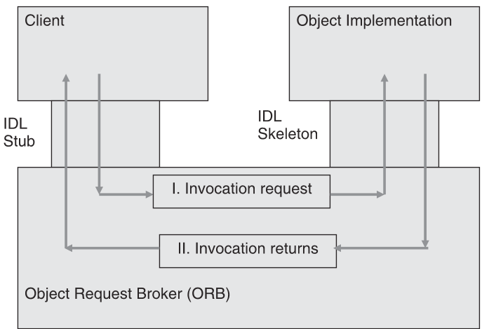

>图 4.1 CORBA broker 概览。

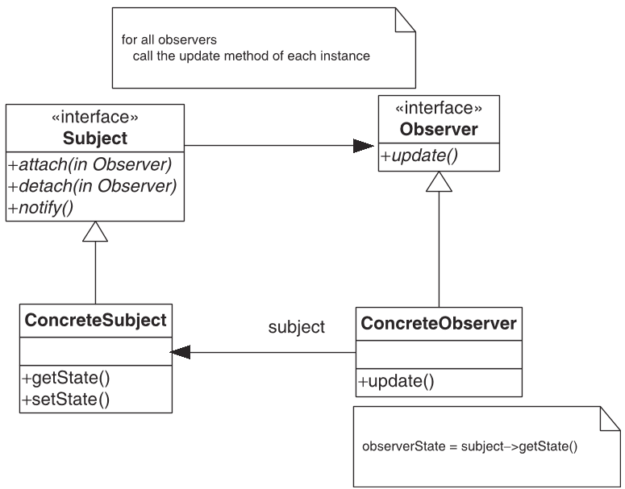

>图 4.2 observer pattern。

因此，结果显然是不可取的，完全不同于支持组件解耦的 observer pattern。

在图 4.2 中，我们给出了 observer pattern 的概览。该模式旨在解耦组件，为此它使用两种不同类型的对象，即 Observer 和 Subject。Subject 通过建立一个接口在系统中运作，其中无限数量的 observer 可以订阅（和取消订阅）该 subject。此接口还用于通知 subscriber（当前订阅的组件）关于 subject 中发生的任何状态变化。因此，该逻辑使 subject 成为系统的活跃部分，将自身推广和偏好为观察的目标。

愿意参与的 observer 必须实现 Observer 接口以接收关于状态变化的通知。该接口提供了一个方法，供 subject 用来更新可用的状态信息。当变化发生时，该接口用于向所有已注册的 Observer 组件发送消息，这些组件将从 Subject 组件请求当前状态。

在这种机制中，既有优势也有劣势。主要优势是：

• Subject 和 observer 是可重用的。

- Subject 和 observer 彼此抽象。

• 用于交互的接口是抽象的。

- Subject 不需要识别 observer 的具体类。

• 系统支持组通信。

• Observer 对 subject 来说是事先未知的。

也有一些缺陷，列举如下：

• Subject 中的单个状态变化可能启动一系列意外的更新，因为 observer 对其他 observer 及其依赖关系没有先验知识。

• 系统不一定要求将 Subject 状态变化的信息随通知一起发送给 observer。只有变化已经发生的事实总是被传递。然后，在某些情况下，observer 必须向 subject 发送请求以获取变化的信息。

• 因为 observer pattern 允许 subscriber 直接向生产者注册，系统本质上将系统组件耦合在一起。

• 该模式没有描述如何定位生产者。

当一个对象有大量 subscriber 时，observer pattern 难以扩展。然而，可以使用 mediator 来提高模式的灵活性。observer pattern 的常见用途包括 Java 和 Jini 事件模型 [4]。有一个最相似的模式称为 publish-register-notify，用于 Cambridge Event Architecture [7, 9]。

## 4.5.3 模型-视图-控制器（MVC）

MVC 是一种常用于交互重要的应用中的模式，因为它便于用户界面的更改。为此，该模式将应用分为三个部分：

• 处理用户输入的控制器；

• 提供核心功能的模型；

• 向用户显示信息的视图。

MVC 模式确保视图创建用户界面以及模型与控制器的一致性。图 4.3 展示了该模式的概览。

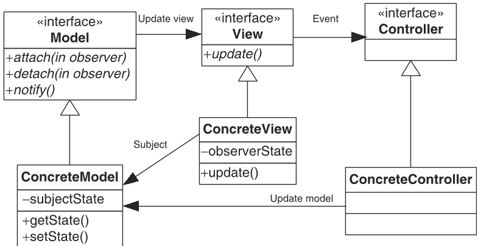

>图 4.3 模型-视图-控制器模式。

Web 应用经常使用架构模式，MVC 也属于这组模式。此时视图是 HTML 内容，创建 HTML 内容的代码扮演控制器的角色。所有内容生成的数据源，如数据库、XML 资源和业务规则，都是 MVC 模型的表示。使用该模式是因为它提供了模型和视图的基本解耦。这降低了复杂性并提高了灵活性。

每当用户界面（UI）需要灵活或 UI 经常变化时，MVC 模式对于可执行应用很方便。例如，在以下情况下：

• 系统实现了多个接口；或

• 实现的功能强制 UI 进行相应更改。

在与核心功能紧耦合的应用接口中，UI 的所有更改通常都很困难。此外，仅仅是 UI 更改的过程就可能导致编程错误。另外，修改后的 UI 可能对其他系统组件产生一些影响。

应用的所有关键功能，如数据结构，都嵌入在 Model 组件中。用于调用应用特定服务和访问组件数据的接口也嵌入在 Model 中。

需要一组 View 组件来检索 Model 数据以向用户显示。每个 View 都有自己的 Controller 组件，用于处理用户输入并向 Model 发出适当的服务请求。在某些应用中，Controller 从 View 接收直接操作显示的功能。

MVC 中指定的机制之一是变化传播，其中向 Model 注册的 View 和 Controller 将收到关于结构变化的通知。Model 的变化然后触发对已注册 View 和 Controller 的通知。

也可以在不修改 Model 的情况下实现辅助的 View 和 Controller。因为这些 View 和 Controller 可以作为可插拔组件实现，所以可以动态添加和删除。此外，因为使用了变化传播机制，Model 始终与可变的 View 和 Controller 保持同步。这增强了 MVC 模式的可移植性。

使用 MVC 时也有一些缺点，如下：

• 应用将更加复杂，因为有一组额外的组件在使用中及其相互交互。

• Model 可能生成大量多余的变化通知。通常，视图只对 Model 所有可能变化的一个子集感兴趣。不过，可以使用过滤技术来最小化冗余。

- Model 涉及 View 和 Controller 的紧耦合，可能导致在 Model 变化后需要更改 View 和 Controller。

• 因为显示数据可能需要多次调用 Model，从 View 访问数据可能效率低下并导致性能不足。

- 为了实现应用的可移植性，可能需要更改 View 和 Controller。

## 4.5.4 Rendezvous Point

我们描述一种常用的模式，用于构建分布式 pub/sub 系统并优化其行为。Rendezvous point 是分布式系统中负责特定事件类型或内容空间子空间的指定节点，事件在其中发布。Rendezvous 已被应用于许多提议的 overlay 和 pub/sub 系统 [11–13] 以降低通信成本。

有许多方法来确定给定事件的 rendezvous point。通常，该点通过对事件类型或内容进行哈希得到扁平标签来获得。具有数值上最接近标识符的节点然后成为该内容的 rendezvous point。通过 rendezvous point 连接内容的 publisher 和 subscriber 是直接的。该点可能参与也可能不参与内容的实际转发。在某些情况下，该点仅用于协调路由状态的传播。

如果大部分流量通过 rendezvous point，它可能成为瓶颈。该点也可能成为攻击目标，因此需要复制该点以确保系统可用性。如果 rendezvous point 根据均匀分布选择而内容流行度不均匀，则网络中不同点之间可能存在负载不匹配。

Scribe 是基于 rendezvous point 的应用层组播系统的一个例子。这些点是 Scribe 中组播树的根。内容基于 overlay 路由表从根向 subscriber 沿反向路径流动。Hermes 是基于内容的 pub/sub 系统的一个例子，以类似 Scribe 的方式使用 rendezvous point [14, 15]。

接下来我们介绍一个基于 rendezvous 的有用模式，用于管理移动客户端。我们将在本书后面回到这些模式。

## 4.5.5 带 Rendezvous 的 Handoff

Handoff 与不同 broker 之间的状态转移相关。在移动计算上下文中已经指定了许多类型的 handoff（或切换），它们很重要，因为它们使无线和移动通信系统中本质上无缝的连接成为可能。

这里我们概述一个支持状态转移的抽象协议。移动 2G 和 3G 标准使用类似的模式来促进接入点和接入网络之间的漫游；此外，handoff 也在更高级的移动性协议中定义。这些例子包括 Mobile IP、SIP 和其他系统。

状态转移或 handoff 模式具有以下主要对象：

• 客户端，

• 两个接入点（AP），

• 一个 rendezvous（间接）点。

在这种模式中，客户端从一个接入服务器漫游（重定位）到另一个。因此产生了将状态从旧接入服务器转移到新服务器的需求。状态转移需要接入服务器之间的信令。

我们可以在没有任何间接点的情况下实现状态转移。不幸的是，这不能完全保证客户端的可达性。为避免这个问题，可以使用间接点。它跟踪移动节点的当前位置。间接点有固定的和非固定的，也可能有多个间接点。

在 handoff 模式中，客户端必须在状态转移开始之前与旧接入点建立连接，并将自身附加到新的 AP。新 AP 为客户端执行位置更新，使所有需要与移动节点通信的节点能够查找新 AP 地址。此外，如果新 AP 想要转移与移动节点建立的连接相关的状态，它能够联系旧 AP。之后，与旧 AP 的连接不再需要，可以断开。

可能有正在进行的会话，为了维护这些会话，状态转移模式定义了从移动客户端到通信节点更新消息。消息包含客户端的活动和有效地址信息。

可以使用不同的机制来实现状态转移模式。在典型场景中，状态转移模式可以由检测到新 AP 的移动客户端启动。在另一种情况下，当移动客户端移动到分配给新 AP 的位置时，状态转移模式由网络生成。

实现 handoff 模式有几个主要好处：

• 当不同区域分配给不同的接入服务器时，它将促进不同区域之间的移动性。

• 它使客户端能够从一个接入服务器负载均衡到另一个。

• 状态将从一个接入服务器转移到另一个。

• Rendezvous point 始终被更新。

Handoff 协议被多个系统采用，例如 Mobile IP（网络层）和 SIP（应用层）。将在第 11 章中介绍的许多 pub/sub 移动性解决方案也基于此模式。

### 4.5.6 客户端发起的连接

客户端发起的连接是一个非常简单的模式，但对于支持推送通信的工程系统非常重要。在许多情况下，服务器的客户端位于私有寻址域后面，例如 NAT 设备后面。因此，除非客户端先联系服务器，否则服务器无法联系客户端。克服此限制的一种方法是让客户端建立到服务器的长连接，并让服务器使用这些连接向客户端推送数据。这就是该模式的核心，其中建立并维护这样的长连接。服务器需要有资源来维护连接。状态需求和管理是该模式的一个缺陷。

客户端发起的连接模式广泛应用于许多基于 Web 的 pub/sub 和推送系统中，如 AJAX Web 应用、Facebook Messenger、推送电子邮件等。它也应用于智能手机的移动上下文中。

### 4.5.7 其他模式

本章未涵盖许多 pub/sub 特定的模式和解决方案。我们将在本书后面的第 7 章和第 11 章中考察具体解决方案。这里我们简要提及将在后面考察的模式和解决方案。其中一些对分布式 pub/sub 解决方案是基础性的，如反向路径路由、路由和转发分离、重配置支持和作用域。

• 反向路径路由是一种常用的模式，用于实现组播树的形成。Pub/sub 解决方案通过记录 subscription 消息的源 broker 然后沿反方向发送匹配的通知来实现该模式。因此，subscription 消息构建内容投递树或图。此系统也适用于通告消息。该模式的缺陷是 broker 处的状态需求，以及如果底层拓扑频繁变化则此解决方案效果不佳。有解决方案，如 DHT overlay，可用于减轻网络拓扑变化的影响。知名系统包括 SIENA 和 Hermes。

• 路由和转发分离是一种常用的模式，将 pub/sub 网络维护与事件和消息的实际转发分离。这种关注点分离允许实现高效的路由和转发算法。

• Middleware 的重配置是使 pub/sub 系统适应各种应用需求并在不同环境（如有线互联网或无线领域）中工作所必需的。重配置要求有一个组件监控网络和运行上下文，然后动态调整和配置系统。知名系统包括 REDS 和 GREEN。

• 拓扑的重配置是优化 pub/sub 网络中内容投递所必需的。通常这意味着用更高效的链路替换低效链路。有许多方法来进行此配置，例如利用 pub/sub API 操作，或更新 broker 路由表的自定义消息。知名系统包括 REDS、GREEN 和 Rebecca。

• *subscriber 请求 publisher 提供*模式支持 publisher 和 subscriber 之间的 QoS 协商。该模式从 publisher 提供某个 QoS 合约开始，然后与 subscriber 请求的 QoS 规范进行匹配。事件服务负责执行匹配。此模式被 DDS 系统使用。

• Lease 是一种常用的技术，用于支持系统中的最终一致性。当 subscription lease 过期时，它将从路由表和分布式系统中移除。因此不需要显式的取消订阅。我们在第 7 章中讨论系统稳定性和软状态上下文中的 lease。

• 作用域（Scoping）是一种有用的模式和策略，用于在 pub/sub 网络中引入结构。作用域支持在系统中创建可见性域。因此作用域使组织边界和结构的创建和维护成为可能。作用域可以基于例如部门、组、单位和公司来完成。Pub/sub 系统然后强制只有属于发布作用域的 broker 和客户端才能看到和处理它。此模式在 Rebecca pub/sub 系统中使用。

• 在 Elvin 系统中引入的 Quench 是一种模式，允许 publisher 查询 pub/sub 系统特定事件是否有 subscriber。因此，如果没有对其计划发布的事件的兴趣，publisher 可以放弃发布。Publisher 还可以在特定内容的 subscriber 变得可用时订阅通知。

## 4.6 Event Notifier 模式


以下示例说明了在网络化系统中 event notifier 的需求和用法。典型的网络由分布式组件组成：计算机、路由器和软件。虽然系统是分布式的，但我们必须集中监控和管理各个组件。在大型复杂系统中，这些被管理的组件经常引起不频繁的问题——它们具有随机时间分布但无法预测。显然我们想知道何时发生故障或失效，但同样明显的是持续轮询所有组件是低效的。因此，系统应在发生任何关键事件时通知我，但仅在那时。

我们可以有一个固定的通知系统，从组件到中央监控器有一条事件线路，但这非常僵硬——它不容易修改，本质上不可扩展。此外，这种系统非常容易出错。因此我们想要一个可扩展的系统，能够适应系统组件集——或者实际上对其不感知。

### 4.6.1 概述

Observer pattern 是构建 pub/sub 系统的良好起点。Observer 组件中的变化可以在不引用系统其余部分的情况下发生。总是降低各种组件自由度的集中化不像 mediator 系统那样绑定 observer 系统。然而，目标组件的计算负担增加了，因为它们必须维护 observer 列表并用它来通知事件——实际上是多次发送相同的事件消息。

然而，一个令人困扰的问题仍然存在：感兴趣的各方必须拥有关于被管理对象的信息，以便选择组件并注册自己。在大型且不断增长的网络中，目标组件的数量和标识通常不是非常明确定义的。因此，这个系统仍然需要太多的先验知识。我们应该有一个没有任何对象间知识的机制，无论是先验的还是其他的。

一个高效的系统将结合 mediator 和 observer 方法的优势并避免它们的缺点。这就是 event notifier 系统 [16]。该方法基于 mediator，它作为中央事件服务器接收来自 publisher 的事件信息，publisher 仅向事件服务器发送通知而不维护 observer 列表。Observer 列表位于 mediator（事件服务器）节点中，此节点负责通知感兴趣的各方（subscriber）。因此，兴趣注册保持自由和动态，但不会给目标节点带来负担，节省大量计算和网络使用。

此系统消除了所有对象间知识的必要性，无论是 publisher 对 subscriber 的还是反之。Subscriber 只知道事件，但它们不需要知道这些事件的 publisher 的任何信息。这使 subscriber 能够获取某种类型的所有事件（例如硬件系统中的故障），从而在事件源和信息用户之间建立有用的抽象层次。

因此，event notifier 系统的核心特征如下：

• 节点可以产生事件而无需知道谁是 subscriber。

• 节点可以订阅事件（或事件类型）而无需知道此类事件的可能 publisher。

- 事件集可以动态扩展以包含新事件或事件类型。

• 一个事件类型可以存在多个可能的 publisher。

• 事件流可以根据任意标准进行过滤。

- Subscriber 能够根据需要将感兴趣事件的分类定义得尽可能宽或尽可能窄。

- Subscriber 可以列出对其关键的事件并订阅所有事件。

- 通知系统完全是动态的，publisher 和 subscriber 的集合是独立的。

因此 subscriber 和 publisher 彼此独立，此外，它们本身对彼此没有任何知识。所有交互使用一组允许的事件类型、事件的语义以及与事件类型相关的特定事件数据来工作。Event notifier 系统不要求 subscriber 事先知道指定事件类型的可能 publisher；对于给定类型的事件可以有多个 publisher（当然也可以有多个 subscriber）。Subscriber 和 publisher 本质上是瞬态概念，因为新的 subscriber 和 publisher 可以自由出现/消失。这对系统的其他组件没有影响。因此支持分布式和移动环境中的服务重定位。

### 4.6.2 结构

Event notifier 系统具有以下类型的对象 [16]：

• 事件（Event）：特定的数据产生事件，以及此事件的描述

• Publisher：发出或产生事件的对象。

• Subscriber 接口：用于注册需要了解事件的对象的接口。

• Subscriber：使用 Subscriber 接口在事件服务注册自己的对象。

• 事件服务（Event Service）：在 subscriber 和 publisher 之间中介事件的对象。

• Filter：处理事件拒绝/接受的代码。

参与对象通常以这种方式相互交互：

• Subscriber 首先调用事件服务上的 subscription（注册）。Subscriber 指定相关的事件类型和事件信息的 filter。它还给出通知接收者的引用（主要是自身）。

- 当 publisher 有事件时，它通知事件服务并发布一个事件对象。

• 事件服务使用 subscription 数据找到感兴趣的 subscriber 集合。它还将应用提供的 filter 以获取每个 subscriber 的接受/拒绝信息。

• 如果特定 filter 对事件/subscriber 对返回 TRUE，事件服务将信息传递给 subscriber。

事件服务处理所有操作：发布和订阅，维护关于 subscriber 对特定事件类型兴趣所需的全部信息。因此，publisher 和 subscriber 彼此不感知。Subscription 接口在系统中定义，使得任何人都可以使用该接口发布事件或订阅事件。不需要辅助通信逻辑。要访问事件服务，必须知道一个众所周知的访问点，以便 subscriber 和 publisher 可以使用相同的事件服务。例如，可以通过向名称服务注册事件服务器来提供公共访问点。

过滤是事件处理的重要部分，允许 subscriber 微调感兴趣的事件类型。实际上，订阅事件的规范分两个阶段进行：

1. 事件类型规范，即 subscriber 选择一个已知的事件类别。

2. 设置 filter 以进一步缩小事件选择范围。这需要为一组事件属性给出值或范围。这些值用于限制某些事件（例如禁止来自一组源的事件）。

图 4.4 展示了 event notifier 模式的 UML 图。该图允许 subscriber 注册由 EventService 类评估的 filter。

虽然 event notifier 系统中的 subscription 通常基于事件类型而非源，但 subscriber 可能也只对由一部分 publisher（例如高质量新闻源）产生的事件感兴趣，这可以通过定义标识可接受源或其质量的属性来考虑。然后事件服务器将丢弃来自不感兴趣源的事件。

事件类型作为继承层次对象处理，这促进了一个进一步的特征：对特定事件类型感兴趣的 subscriber 会在任何事件层次子类型发生时收到通知。使用子类型可以根据需要将订阅兴趣定位得尽可能宽或尽可能窄。时间维度也是可行的，因为订阅过程完全是动态的，任何配置文件都可以在任何时候更改。

新事件类型可以动态添加到系统中而没有任何干扰。如果 subscriber 已经注册了新事件的超类型，他将接收新的子类型事件而无需任何进一步的订阅操作，也无需重建/调整使用的应用（即使是部分的）。不需要更改事件服务器代码。

当然也有弱点。单个事件服务器可能是故障点或形成整个 event notifier 系统的瓶颈。这些集中化问题可以通过在系统中分布事件服务器功能来缓解。通常 event notifier 使用推送语义。在此模型中，publisher 将事件推送到事件服务，类似地事件服务将事件推送到 subscriber。

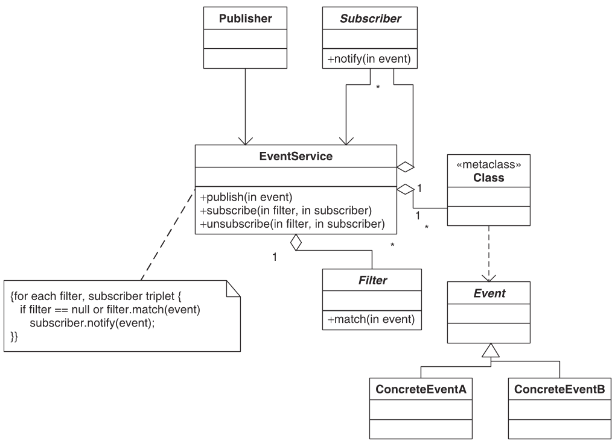

>图 4.4 notifier 模式。

仍然可以使用部分推送模型，其中 subscriber 从事件服务拉取信息。事件服务也可以从被动的 publisher 拉取信息。

关于通信安全性，我们必须记住 event notifier 保持组件彼此分离和解耦。使用的接口对事件类型是通用的，因此本质上容易更改。在僵硬的分布式系统中，更改通常需要遍历整个系统的重写/重新编译；event notifier 最小化了更改，因此支持可扩展性。代价是一定程度的安全性损失（附加到每节点类型检查），但灵活性收益通常可以补偿这一点，并且有方法在事件检查时创建更多静态安全性。

### 4.6.3 分布式 Event Notifier

在大型分布式系统中，event notifier 通过使用远程事件服务的本地 proxy 获得额外好处。本地服务器可以作为 proxy 维护本地 subscription 列表。Proxy 将本地 subscription 中介到远程事件服务。然而，本地 proxy 不必维护 subscriber 列表；这可以像所有其他操作一样委托给远程事件服务。另一方面，可以将所有本地信息存储在本地事件服务器 proxy 中，只在远程事件服务中存储 proxy 的标识；proxy 然后表现为 subscriber。

事件 proxy 本质上是 publisher 和分布式网络复杂性之间的绝缘体。这个角色带来许多好处 [16]。事件 proxy 处理由主事件服务器不可访问导致的拥塞；在网络故障情况下，它可以存储事件流以供稍后投递。Proxy 还作为发布顺序的保持者，确保事件按正确顺序投递给 subscriber。本地 proxy 还提供额外的信息隐藏层次，因为 publisher 或 subscriber 不需要知道主事件服务器的位置。此外，subscriber 可以位于主服务器无法访问的子网内。Proxy 还可以作为附加安全和数据存储的节点，对 subscriber 或 publisher 完全透明。当 proxy 为多个本地客户订阅事件时，网络流量被有效减少。

此外，在实践中，事件通常只在本地环境中重要，而某些事件可能具有普遍兴趣。这些功能——本地发布和全局发布——可以为形成明确二分法的事件进行分离。在本地情况下，proxy 将作为独立的事件服务器运行，不引用主服务器。可以在事件类型层次中定义严格本地性属性。当订阅标记为本地的事件时，proxy 服务器单独处理其发布，不联系远程事件服务。

图 4.5 展示了 event notifier 模式的分布式版本。DistributedEventService 通过 EventProxy 类实现，这些类在分布式 proxy 之间中介事件。Proxy 通过允许 proxy 订阅事件并将通知转发给其他 proxy 来扩展 subscription 和通知接口。

### 4.6.4 设计考虑

构建 event notifier 系统时有几个重要的设计问题需要注意。以下列表包含重要问题：

• 事件模型，

• 类型检查，

• 通告事件集，

• 性能和容错。

我们在这里简要讨论这些主题，关注实现技术。

#### 4.6.4.1 事件模型

网络化系统中的事件以事件对象的形式出现。这里有两个主要问题：

• 事件消息是通用的，但它们应该传达某种形式的标准信息。

• 所有事件消息应该是 Event 类的层次子类，无论真实世界事件的原始性质有多大差异。

公共事件超类因此可以强制某些有用的属性到整个事件集。例如，原始事件的时间戳就是这样一个特征，没有它系统将非常低效。这样的事件层次也支持基于类型的订阅：subscriber 可以指定事件树中的非叶节点以被告知该类型或其下所有事件。

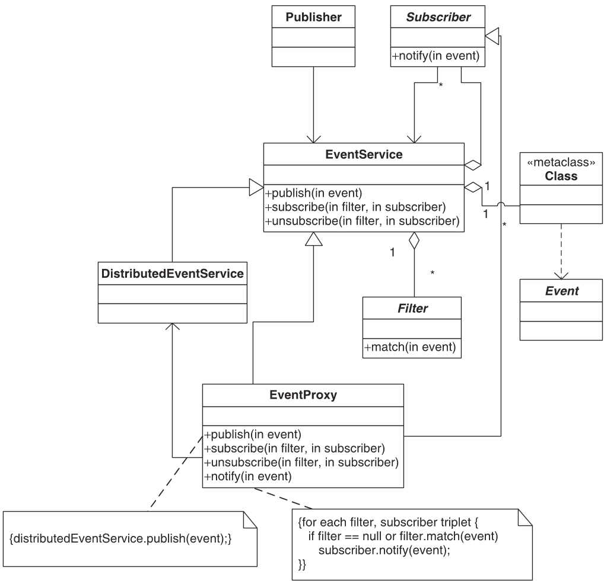

>图 4.5 分布式 notifier 模式。

当使用面向对象语言（如通常用于编码系统对象和应用）时，可以利用内置继承的优势。继承机制允许 subscriber 使用完整的树格式来表达其信息需求，这是一个非常强大的工具。Subscriber 用于注册的事件类型树节点生成 subscriber 兴趣的子树。作为 filter 一部分的属性也可以打包在事件对象内。一定程度的错误检查（名称检查）也可以与继承机制相关联。

层次模型不一定是唯一的，因为事件是多方面的，有许多可能的方式将它们组织成层次。基本上应该选择一个最适合真实世界机制中遇到的特定事件世界的模型。例如，在技术事件系统中，subscriber 可能对故障事件（硬件或软件）和/或性能事件或两者都感兴趣。不同的属性然后很重要，形成不同的层次。

我们必须注意，事件的特征通常可以在事件类型层次或属性（过滤）层次建模。这些层次在订阅能力上有所不同：可以基于类型/子类型订阅，但 filter 仅在事件类型被某个 subscriber 接受后才使用。不过，两种机制，即类型和 filter，是重叠的，可以在 subscriber 级别使用其中任何一种获得相同的事件流。

如前所述，有时使用源标识过滤事件是有用的（例如出于质量/可靠性原因）。在一个简单的例子中，触发的火警是一个事件，但知道哪个火警被触发很重要。行动通常取决于源的标识。此外，知道源通常会立即揭示一组与源相关的事件属性，否则这些属性必须编码到 filter 中。作为事件属性给出的事件源句柄也允许 subscriber 直接从事件源获取更多信息。当然，这意味着 publisher 和 subscriber 之间的解耦不是完全的。

### 4.6.4.2 类型检查

当我们在 event notifier 中使用通用事件特征时，必须在效率和安全性之间做权衡。这特别涉及事件类型信息的实现。例如，subscriber 接收到某种类型的事件。首先它需要验证类型以防止错误（特别是如果它订阅了多种事件类型）。然后它需要将类型向下转换（可能是 subscriber 实际想要的事件类型的超类型）到目标事件类型。

### 4.6.4.3 通告事件集

通常了解系统中有哪些可用事件类型是有用的甚至是必要的。这可以通过查询事件服务器来完成。例如，在订阅阶段，subscriber 通常没有关于可能事件的最新信息，甚至可能没有完整的视图来了解如何优化其对事件系统传达的所有关键信息的感知。为了完全优化其兴趣配置文件，subscriber 然后必须知道可用的事件类型。Event notifier 可以通过修改发布机制来处理这个问题，该机制允许 publisher 使用特定接口告诉事件服务器它们希望为 subscriber 通告哪些事件。此外，事件服务器将为 subscriber 提供一个接口来查询已通告事件的集合。然后可以使用此知识来订阅合适的事件。

### 4.6.4.4 性能和容错

依赖单个事件服务器的大型 event notifier 系统可能失败或成为服务瓶颈。我们应该以某种方式能够增加系统的容错性。一种方式是多重性。使用上述 proxy 用于本地流量或真正的多事件服务器系统当然是有帮助的。在多服务器的情况下，根据事件类型而非位置将工作分配给服务器是合理的：一个服务器中介新闻，一个用于金融服务，一个用于系统故障等。这有一个优势，即故障不会跨系统事件类型边界传播，因为服务器只知道和处理自己的类型集。

我们也可以使用弱化版本的 notifier 网络，其中 subscription 信息（列表）分布在 subscriber 之间。确实，上面我们因为低效而放弃了这种方法，但实际上如果我们考虑 publisher 对事件类型的通告，它是一个可行的解决方案。当集中式事件服务知道 publisher 和已通告事件类型集之间的关联时，服务器可以接受 subscription，将 subscriber 信息传递给所有已通告所需事件的 publisher。事件服务器维护此关联信息。Publisher 将使用其事件的 subscriber 列表并直接通知它们。

这种不通过单个节点引导事件流的分布式 notifier 服务，减少了故障对系统的影响。系统中没有明显的瓶颈，因为发布速率（从多个 publisher 到多个 subscriber）远大于集中式订阅速率（从多个 subscriber 到唯一服务器）。此外，发布列表不像 subscription 列表那样频繁变化，因此我们可以轻松使用多个备份事件服务器使系统更具容错性。

我们将在第 7 章中研究分布式事件通知的不同技术。

### 4.6.4.5 总结

简而言之，event notifier 系统可以总结如下：

• Publisher 和 subscriber 的知识集中在事件服务中。

• Subscriber 独立处理事件。

• 消息灵活性基于不同的事件类型及其属性。

• Subscriber 在事件服务器上动态注册其兴趣。

• Subscriber 可以指定 filter 进行细粒度消息选择。

• Publisher 和 subscriber 由事件服务器解耦。事件服务器可以为通信组件提供匿名性。

- 可以有多个 publisher 和多个 subscriber，因此基本设置是多对多的。

• 事件服务可以由多个事件服务器组成。

## 4.7 企业集成模式

企业集成模式记录了集成各种企业系统的常用解决方案 [17]。这些模式主要涉及异步消息传递，由于其松耦合特性，已被证明是企业集成的优秀基础。企业集成模式用于面向消息的 middleware 解决方案和 Web 服务。这些模式的目的是帮助各种企业系统的设计和实现，以及解决众所周知的陷阱和挑战。异步操作不同于传统的同步创建应用的方式，它引入了需要解决的新考虑。

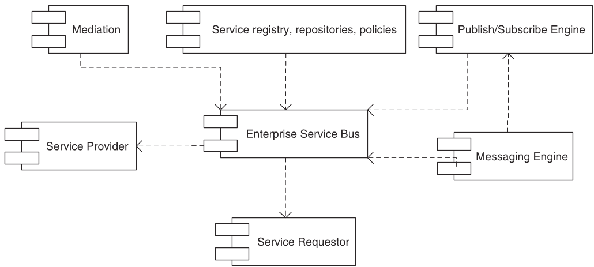

>图 4.6 ESB 模式。

关键的基于消息的架构包括：

• Web 服务规范。关键规范包括 SOAP、用于在分布式环境中路由和转发消息的 WS-Addressing，以及其他 WS-* 规范。

• 面向服务的架构，允许创建由单个组件和服务组成的松耦合系统。

• 图 4.6 所示的 ESB（企业服务总线）提供基本的消息传递、路由、转换。ESB 是 SOA 的核心组件之一。

知名的 Enterprise Integration Patterns 一书将模式组织为以下类别：

• 集成风格涉及应用可以集成的不同方式。在此上下文中，这些指的是更历史性的集成技术示例。

• Channel 模式涉及消息系统，因此它们是松耦合企业集成和消息系统的基本组件。

• *消息构建模式*涉及消息系统中消息的意图、语法和内容。关键模式是 Message 模式。

• 路由模式考察路由和转发机制。路由是将消息带近其最终目的地的过程。关键模式是 Message Router 模式。

• 转换模式修改消息的信息内容。集成需要转换，因为在许多情况下，消息格式和内容需要从一个系统适应到另一个系统。在此类别中，Message Translator 是关键模式。

• *端点模式*定义消息系统客户端的行为。它们涉及指定消息接收者的不同方式。

• 系统管理模式涉及管理基于消息的系统所需的接口和功能。不同的路由和转换子系统需要配置和管理。

## 4.8 总结

在本章中，我们研究了设计 pub/sub 系统的关键原则和模式。原则包括用于解耦组件的逻辑上集中的服务、用于接受 subscriber 兴趣的兴趣注册服务、用于选择性信息传播的过滤机制以及模块化的事件服务核心。重要特征包括相互对比的表达能力和可扩展性。额外的重要特征是简单性和可互操作性。

事件通知有两种通用模式，即直接通知和基于基础设施的分布式通知。我们研究了这两种类别下的关键模式。Observer pattern 在对象之间建立一对多依赖关系，其中依赖对象在被观察对象状态变化时自动收到通知/更新。例如，MVC 模式使用 observer pattern 在 Model 发生变化时通知 View 和 Controller。Event notifier 模式将 observer 和 mediator 模式组合成逻辑上集中的服务，完全解耦 subscriber 和 publisher，适用于分布式环境。

本章介绍的原则和模式是后续章节中考察的系统的基础。我们在第 7 章中介绍分布式 pub/sub 解决方案时详细阐述具体的优化模式和策略。

## References

1. Schmidt D, Stal M, Rohnert H and Buschmann F (2000) *Pattern-Oriented Software Architecture*. Vol. 2: *Patterns for Concurrent and Networked Objects*. John Wiley & Sons, Inc. New York.

2. Eugster PT, Felber PA, Guerraoui R and Kermarrec AM (2003) The many faces of publish/subscribe. *ACM Comput. Surv.* **35**(2), 114–31.

3. Carzaniga A, Rosenblum DS and Wolf AL (1999) Interfaces and algorithms for a wide-area event notification service. Technical Report CU-CS-888-99, Department of Computer Science, University of Colorado. Revised May 2000.

4. Roberts S and Byous J (2001) *Distributed Events in Jini Technology*. Sun Microsystems. Available at: http://java.sun.com/developer/technicalArticles/jini/JiniEvents/.

5. Object Computing, Inc. (2001) CORBA Event Service Specification v.1.1. OCI.

6. Object Computing, Inc. (2001) *Management of Event Domains Specification*. http://www.OMG.org/cgibin/doc?formal/2001-06-03.

7. Bacon J et al. (2000) Generic support for distributed applications. IEEE Computer 33(3), 68–76.

8. Gupta S, Hartkopf J and Ramaswamy S (1998) Event notifier, a pattern for event notification. *Java Report* **3**(7), 19–36.

9. Hayton R, Bacon J, Bates J and Moody K (1996) Using events to build large scale distributed applications. Proceedings of the 7th ACM SIGOPS European Workshop on Systems Support for Worldwide Applications, pp. 9–16.

10. Yu H, Estrin D and Govindan R (1999) A hierarchical proxy architecture for internet-scale event services. Proceedings of 8th International Workshop on Enabling Technologies: Infrastructure for Collaborative Enterprises (WETICE '99), pp. 78–83, Palo Alto, CA.

11. Rowstron AIT and Druschel P (2001) Pastry: scalable, decentralized object location, and routing for large-scale peer-to-peer systems. Middleware 2001: Proceedings of the IFIP/ACMInternational Conference on Distributed Systems Platforms Heidelberg, pp. 329–50. Springer-Verlag, London.

12. Stoica I, Morris R, Karger D, Kaashoek F and Balakrishnan H (2001) Chord: A scalable peer-to-peer lookup service for internet applications. Computer Communication Review 31(4), 149–60.

13. Zhao BY, Kubiatowicz JD and Joseph AD (2002) Tapestry: a fault-tolerant wide-area application infrastructure. SIGCOMM Comput. Commun. Rev. 32(1), 81.

14. Pietzuch PR (2004) *Hermes: A Scalable Event-Based Middleware*. PhD thesis Computer Laboratory, Queens' College, University of Cambridge.

15. Pietzuch PR and Bacon J (2002) Hermes: A distributed event-based middleware architecture. *ICDCS Workshops*, pp. 611–18.

16. Riehle D (1996) The event notification pattern - integrating implicit invocation with objectorientation. *TAPOS* **2**(1), 43–52.

17. Hohpe G and Woolf B (2003) *Enterprise Integration Patterns: Designing, Building, and Deploying Messaging Solutions*. Addison-Wesley Longman Publishing Co., Inc., Boston, MA.

# 5 标准与产品

在本章中，我们研究知名的面向消息的 middleware 和 pub/sub 标准及产品。我们从 CORBA Event Service 和 Notification Service、*Data Distribution Service (DDS)* 以及 SIP 事件框架开始，然后通过 Java 相关技术，如 *Java Message Service (JMS)*，到面向消息的 middleware 产品。最后，我们总结所考察解决方案的关键相似点和不同点。

### 5.1 CORBA Event Service

CORBA Event Service 规范定义了一个通信模型，允许对象接受注册并向多个接收者对象发送事件 [1]。Event Service 补充了标准 CORBA 客户端-服务器通信模型，是 CORBAServices 的一部分，为基于对象的系统提供系统级服务。在客户端-服务器模型中，客户端对服务器上的指定对象进行同步 IDL 操作。事件通信是单向的（使用 CORBA 单向操作）。Event Service 通过提供支持一种通信模型来扩展基本调用模型，在该模型中客户端应用可以向其他应用中的任意对象发送消息。Event Service 解决了 CORBA 中同步和异步调用的局限性。

该规范定义了 CORBA 中事件的概念：事件由事件供应者创建并传输到所有相关的事件消费者。供应者集合与消费者集合解耦，供应者不知道消费者的数量或身份。消费者不知道哪个供应者生成了事件。Event Service 定义了一个新元素——event channel，它在供应者和消费者之间异步传输事件。供应者和消费者使用 channel 支持的接口连接到 event channel。事件是对消费者、供应者和 event channel 进行的一系列操作调用的成功完成。

Event channel 执行以下功能：

• 它允许消费者注册对事件的兴趣并存储注册信息。

• 它接受供应者生成的事件。

• 它将事件从供应者转发到已注册的消费者。

Event Service 被定义为在 ORB 架构之上运行：供应者、消费者和 event channel 可以作为 ORB 应用实现，事件使用标准 IDL 调用定义。

CORBA Event Service 支持 Event Channel 的不同实现，这允许广泛的方法来实现服务质量和投递问题。此外，事件消费者和供应者接口支持断连。CORBA Event Service 通过解耦接口并提供 consumer 和 supplier 之间异步通信的 mediator 来解决标准 CORBA 同步方法调用的一些问题。Supplier 不必等待事件投递到 consumer。此外，event channel 使用 proxy 对象对 supplier 隐藏消费者的数量和身份（透明组通信）。Supplier 向其 proxy consumer 发送事件，consumer 从其 proxy supplier 接收事件。然而，该规范没有解决几个重要问题，如服务质量支持。应用可能在可靠性、排序、优先级和及时性方面对事件通知有要求。此外，该规范没有提供事件过滤系统。事件过滤需要通过在 event channel 内添加选择性事件投递机制使用专有系统来实现。Event channel 可以组合，因为它们使用相同的 consumer/supplier 接口。一个 event channel 可以将事件推送到另一个 event channel。类型化 event channel 可用于基于事件类型过滤事件。

此外，该规范没有解决复合事件，但建议可以通过创建通知树并在树的每个节点检查事件谓词来处理复杂事件。树的缺点是投递事件所需的跳数增加。这促使使用集中式过滤服务。使用专有事件服务实现限制了应用的互操作性。使用一个专有事件服务实现的应用可能无法与基于不同事件服务实现的另一个应用互操作。

### 5.2 CORBA Notification Service 和 Channel 管理

CORBA Notification Service [2] 扩展了较旧的 Event Service [1] 规范的功能和接口。Event Service 规范定义了提供兴趣注册和事件通知接口的 event channel 对象。Notification Service 最重要的补充之一是事件过滤。Filter 允许消费者接收匹配某些约束表达式的特定事件。过滤减少了发送给消费者的事件数量并提高了事件处理系统的可扩展性。

图 5.1 展示了 CORBA Notification Service 的组件，它们源自上一节讨论的 Event Service。Event channel 已扩展以支持多个 admin 对象。Notification Service 允许在 proxy 上定义 filter。此外，每个 admin 对象被视为其创建的 proxy 集合的管理者。Admin 对象可以与 QoS 属性和 filter 对象关联。Admin 对象的 QoS 属性和 filter 对象被传输到它创建的每个 proxy，但是 QoS 属性可以在每个 proxy 的基础上更改。

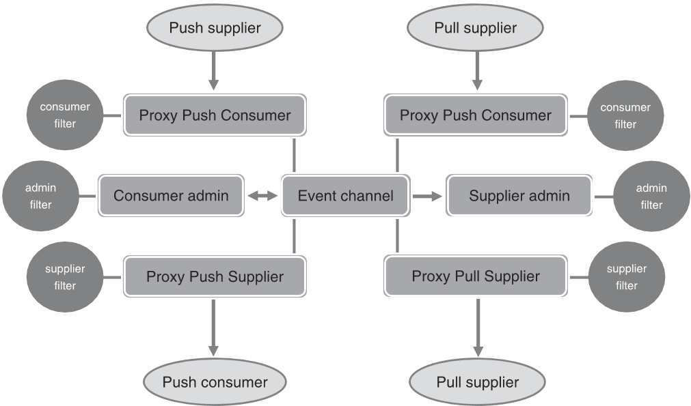

>图 5.1 CORBA Notification Service 模型。

事件由事件供应者创建并传输到所有相关的事件消费者。供应者集合与消费者集合解耦，供应者不知道消费者的数量或身份。消费者不知道哪个供应者生成了事件。Event Service 和 Notification Service 基于 event channel 模式。Event channel 负责在供应者和消费者之间异步传输事件。供应者和消费者使用 channel 支持的接口连接到 event channel。事件是对消费者、供应者和 event channel 进行的一系列操作调用的成功完成。

在内部，Event Service 和 Notification Service 都大量使用 proxy 模式。对于每个外部供应者，它们创建一个内部 proxy consumer，对于每个外部消费者，它们创建一个内部 proxy supplier。在 Notification Service 中，proxy 可以有自己的 QoS 和过滤规则，源自用于创建 proxy 的公共管理对象。

Filter 是支持添加、修改和删除约束的 CORBA 对象。图 5.2 给出了一个 filter 的示例。约束用于匹配事件消息值并引用事件通知消息中的变量。约束可以是事件类型或用约束语言编写。变量名可以引用当前通知的所有部分。当前通知用美元符号 `$` 表示。

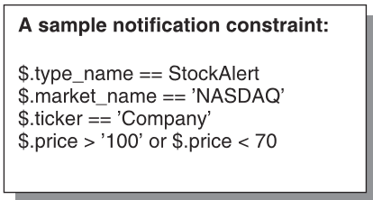

>图 5.2 filter 示例。

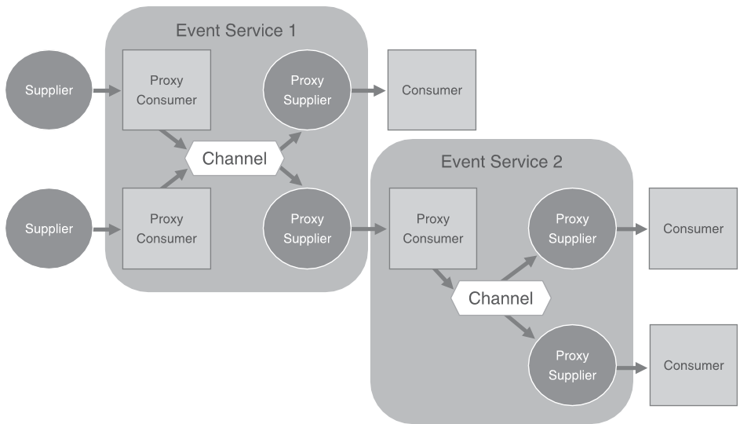

>图 5.3 channel 联邦示例。

Event Channel 作为 CORBA 对象的集中性质限制了其可扩展性。所有已注册的消费者和供应者都由 channel 管理，这可能限制活动实体的数量以及 event channel 在给定时间范围内能够处理的最大通知数量。因此，创建、管理和指定 event channel 的联邦变得重要（图 5.3）。每个 event channel 有一个主队列和多个消费者队列。每个队列有一些最大容量，可以使用规范支持的 QoS 策略来强制执行。缓解集中式 event channel 瓶颈的一种方法是将这些队列分布为 CORBA 对象；然而，这种解决方案仍然是集中式的。由于 NS 通过连接 supplier 和 consumer proxy 支持 channel 联邦，系统支持可扩展性。

Channel 联邦可用于：

• 通过在多个 event channel 上分布消费者来提高性能。由于 event channel 是 CORBA 对象，如果消费者（或生产者）数量变大，它可能成为瓶颈。Event channel 也可以通过仅向每个 event channel 分配本地 subscriber 来增强本地投递。在这种情况下，只有一次网络调用和多次本地调用。

• 通过为相同信息设置多个 event channel 来提高可靠性。如果一个 event channel 失败，它不一定阻止消费者接收通知。

• 通过将消费者和生产者分组为逻辑单元（event channel）来提高灵活性。

CORBA Event Service 和 Notification Service 没有指定事件发现服务或联邦 event channel 的机制。此外，连接 event channel 的过程很复杂。OMG 电信领域任务组在 CORBA Management of Event Domains Specification [3] 中解决了这些问题，该规范指定了管理事件域的架构和接口。事件域是为管理和改进可扩展性而组合在一起的一组或多组 event channel。

该规范定义了两个通用域接口，用于管理通用类型化和非类型化 channel。此外，OMG Telecom Log Service 规范为 channel 和日志定义了专用域。

该规范涉及：

• 客户端到域的连接管理；

• 拓扑管理；

• 在事件域中共享 subscription 和通告信息，即使 event channel 之间的连接在运行时更改；

• channel 拓扑内的事件转发；以及

• event channel 之间的连接。

该规范支持创建任意复杂度的 channel 拓扑，允许互连 channel 图中存在环和菱形。然而，如果事件可以通过多条路径到达图中的某个点，则需要检测和删除重复事件。此外，如果没有指定超时，环中的事件将无限传播。因此，该规范定义了用于检测网络拓扑中环或菱形的机制。图拓扑强制执行在 channel 连接时完成，域管理拒绝非法连接。

## 5.3 OMG Data Distribution Service (DDS)

Data Distribution Service for Real-Time Systems (DDS) OMG 规范为分布式实时系统定义了以数据为中心的 pub/sub 通信的 API [4]。DDS 是一个 middleware 服务，提供所有感兴趣应用可访问的全局数据空间。该规范使用 UML 描述服务。最新版本是 1.2，于 2007 年 1 月发布。

DDS v1.2 API 标准包括两个关键 API：

• 较低层的 DCPS（Datacentric Publish-Subscribe）层，指定高效 pub/sub 的 API 和机制。

• 可选的较高层 DLRL（Data Local Reconstruction Layer）层，旨在将 DDS 与应用集成。

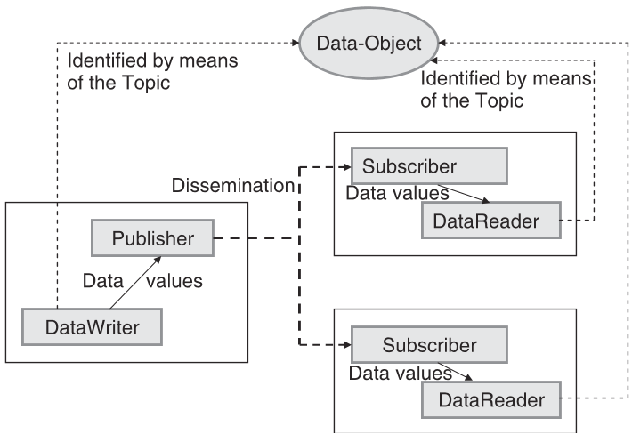

>图 5.4 DDS 概览。

### 5.3.1 概述

图 5.4 展示了 DDS 模型的关键元素，即 publisher、subscriber 和数据对象。DDS 使用 Topic 对象和键的组合来唯一标识数据对象的实例。在此模型中，subscription 与发布解耦。DDS 创建一个命名空间，允许参与者定位和共享对象。如果一组实例在同一 topic 下，这些不同实例必须是可区分的。

关键 DDS 实体是：

- DomainParticipantFactory。这是一个 singleton 工厂，是 DDS 的主要入口点。

• DomainParticipant 是特定 DDS 域中通信的入口点。它充当创建 DDS Publisher、Subscriber、Topic、MultiTopic 和 ContentFilteredTopic 的工厂。

- TopicDescription 是 Topic、ContentFilteredTopic 和 MultiTopic 的抽象基类。

- Topic 是 TopicDescription 的特化，是要发布和订阅的数据的最基本描述。

• ContentFilteredTopic 是像 Topic 一样的特化 TopicDescription，额外允许基于内容的 subscription。

• MultiTopic 是像 Topic 一样的特化 TopicDescription，额外允许 subscription 组合/过滤/重排来自多个 topic 的数据。

• Publisher 是负责实际发布传播的对象。

- DataWriter 允许应用设置在给定 Topic 下要发布的数据的值。

• Subscriber 是负责实际接收由其 subscription 产生的数据的对象。

• DataReader 允许应用声明它希望接收的数据（通过使用 Topic、ContentFilteredTopic 或 MultiTopic 进行 subscription）并访问 Subscriber 接收的数据。

DDS 使用键来区分这些实例。键由某些数据字段的值组成。这些字段需要指示给 middleware。具有相同键值的不同数据值表示同一实例的连续值。具有不同键值的不同数据值表示不同实例。如果没有提供键，与 Topic 关联的数据集被限制为单个实例。

可以为基于内容的 subscription 创建 ContentFilteredTopic。此外，MultiTopic 可用于订阅多个 topic 并组合/过滤接收的数据。Filter 语言语法是 SQL 语法的子集。

DDS 支持不同的一致性模型，例如弱一致性和最终一致性。DDS 可以配置为支持最终一致性模型，该模型保证所有匹配的 reader 缓存最终将与相应的 writer 缓存相同。所选的持久性、可靠性、生命周期和排序参数影响一致性模型的选择。

### 5.3.2 QoS 策略

QoS 使用遵循 subscriber 请求 publisher 提供的模式。在此模式中，subscriber 请求所需的 QoS 属性，这些属性与生产者提供的属性进行匹配。

DDS QoS 策略包括：

• Deadline 定义数据样本的最大到达间隔时间。

• Latency budget 指定写入的最大延迟。

• Transport priority 定义底层数据协议的优先级。

• Reliability 确定数据传输的可靠性级别，可以是可靠的或尽力而为的。

• Ownership 确定是否允许多个数据写入器操作同一数据实例，以及如果允许时的策略。

• Durability，可用于指定系统如何存储已发布的数据。数据可以是易失的、绑定到写入器的、在数据写入器之后可用的瞬态的，甚至在系统重启情况下也是持久的。

• Lifespan 确定数据的生命周期。默认有效期是无限的。

• History 确定 DDS 向 subscriber 投递多近的数据。例如，DDS 可以投递最新的数据样本，或过去的特定样本。

### 5.3.3 实时通信

实时通信是 QoS 支持的重要部分。与实时相关的 QoS 策略包括消息的 deadline、latency budget 和 transport priority。DEADLINE QoS 策略允许定义数据样本之间的最大到达间隔时间。使用此策略，DataWriter 表示应用承诺至少每个 deadline 周期写入一次。当 QoS 合约被违反时，DataReader 会收到通知。LATENCY_BUDGET_QoS 策略确定从数据写入到数据插入 subscriber 应用缓存的最大可接受延迟。

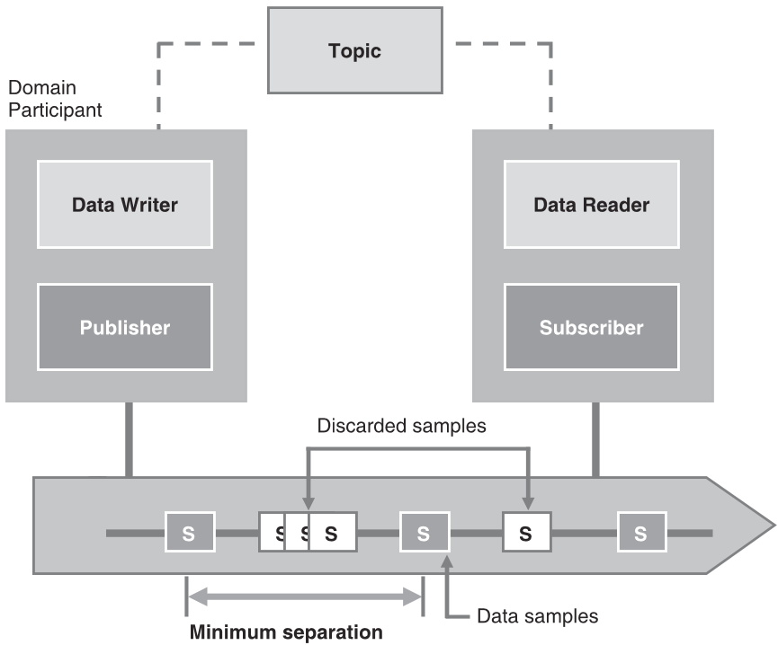

>图 5.5 使用 DDS 的实时通信。

图 5.5 展示了使用 DDS 的实时通信。Publisher 和 subscriber 通过 topic 使用 DataWriter 和 DataReader 对象进行通信。数据被发布并通过网络投递到 subscriber。QoS 规范确定实时通信的要求。已发布样本之间有最小延迟间隔。不满足间隔要求的样本被丢弃。因此，迟到的数据元素不会投递给 subscriber。

TRANSPORT_PRIORITY QoS 策略与此相关，可用于指示基础设施使用底层传输优先处理通信。

### 5.3.4 应用

DDS 应用通常按以下阶段编写：

1. 定义 topic 和域。

2. 确定 QoS 策略，如 transport priority、deadline 和 durability。

3. 识别 topic 的 reader 和 writer。

4. 为 reader 和 writer 定义 QoS 要求，如 history、latency budget、transport priority 和 deadline。

5. 使用选定的编程语言和 DDS 实现来实现系统。

DDS 适用于需要及时信号、数据和事件传播的以数据为中心的应用。信号表示连续变化的数据，例如来自传感器的数据。在这种情况下，publisher 可以将 reliability 属性设置为尽力而为，将 history QoS 属性设置为保留最后一个信号（KEEP_LAST）。数据投递，如交换一组对象的状态，可以通过使用可靠通信并要求系统存储最后的数据元素来实现。事件是值的流，publisher 通常使用可靠投递并要求系统保留所有消息的历史（KEEP_ALL）。因此 DDS QoS 参数可以针对特定用例进行调整以满足应用需求。

DDS 广泛应用于工业和国防应用，如高速股票交易、电信、制造、发电、医疗设备、移动资产跟踪和空中交通管理。例如，该标准被美国海军推荐用于开放架构，被 EuroControl 推荐用于空中交通管制中心运行互操作性。

### 5.4 SIP 事件框架

SIP 事件框架（RFC 3265）定义了一个可扩展的事件通知系统。SIP 事件框架允许 SIP 用户代理创建、修改和删除 subscription。事件框架可以通过使用模块化的*事件包*来扩展，事件包是为框架定义额外语法和语义的附加规范。SIP 事件框架的关键应用包括自动回拨服务。

SIP 扩展中的 SUBSCRIBE 和 NOTIFY 方法被 SIP 事件包使用。它们旨在使客户端能够订阅一组所需事件并在预期事件发生时接收通知消息（RFC 3680）。Subscription 可以通过使用 SUBSCRIBE 方法并使用头部参数指示所需操作来删除或修改。在取消订阅的情况下，将发送关于资源状态的最终 NOTIFY 消息。SIP 事件通过使用三个字段来标识：Request URI、Event Type 和可选的消息体。SUBSCRIBE 请求的 Request URI 必须包含足够的信息以将请求路由到目的地。

SIP 事件包主要应用于回拨服务、消息等待指示和在线好友列表。所有通知必须事先订阅，SIP 事件包不允许未经请求的消息。然而，呼叫控制流量和其他 SIP 信令不受事件包特性的影响。此外，SIP 协议未指定在系统中分发和存储 subscription 状态的确切方法。

图 5.6 展示了 SIP 事件包在语音邮件应用中的实现示例。语音邮件中的 notifier 服务器接受 subscription。在这种情况下，Bob 向服务器发送 SIP SUBSCRIBE 消息以获取语音邮件状态的更新。Bob 指定 Event 头部字段来指示这一点并将其值设置为 message-summary。服务器发送 200 OK 响应以告知 SUBSCRIBE 事务已正确接收并处理。然后信息内容通过 SIP NOTIFY 事务投递。这里通知告诉 Bob 他有三条新消息和七条旧消息。有紧急消息，新消息集中一条，旧消息中三条。当语音邮件服务器收到新消息时，它分别更新消息计数器，然后通过 SIP NOTIFY 事务通知 Bob，使 Bob 能够跟上其语音邮件状态。

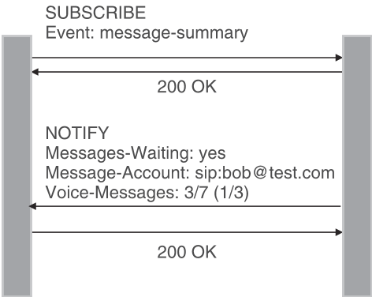

>图 5.6 使用 SIP 事件包的语音邮件更新。

## 5.5 Java 委托事件模型

Java 委托事件模型在 Java 1.1 Abstract Windowing Toolkit (AWT) 中引入，作为 Java 中的标准事件处理方法。该模型也用于 Java Beans 架构。本质上，该模型是集中式的，listener 可以向事件源注册以接收事件。事件源通常是 GUI 元素，触发某些类型的事件，这些事件被传播到 listener。事件投递是同步的，因此事件源实际上执行 listener 事件处理器中的代码。不对事件的投递顺序做任何保证。事件源和事件 listener 不是匿名的，然而，该模型提供了一个称为 adapter 的抽象，它作为这两个参与者之间的 mediator。Adapter 将源与 listener 解耦，并支持在事件处理中定义额外行为。Adapter 可以实现 filter、排队和 QoS 控制。

## 5.6 Java 分布式事件模型

Java 的*分布式事件模型*基于 Java RMI，它支持调用远程对象中的方法。此模型用于 Sun 的 Jini 架构 [5]。分布式事件模型的架构类似于委托模型的架构，但有一些差异。该模型基于 Remote Event Listener，它是一个注册接收其他对象中某些类型事件的事件消费者。

该规范提供了兴趣注册接口的示例，但没有指定这样的接口。

Remote Event 是从事件源（生成器）返回给远程 listener 的事件对象。远程事件包含关于已发生事件的信息、事件生成器的引用、listener 提供的 handback 对象，以及用于全局区分事件的唯一序列号。该模型通过 lease 的概念（Distributed Leasing Specification）支持时间事件注册。事件生成器通过调用 listener 的 notify 方法来通知 listener。

该规范支持分布式事件 Adapter，可用于实现各种 QoS 策略和过滤。Handback 对象是 Remote Event 中唯一可能增长到无界大小的属性。它是调用者提供给事件源的序列化对象；程序员可以将该字段设置为 null。由于 handback 对象同时携带状态和行为，它可以以多种方式使用，例如在比事件源更强大的主机上实现事件 filter。

## 5.7 Java Message Service (JMS)

JMS [6] 为面向消息的 middleware 的实现定义了通用和标准的 API。JMS API 是 Java Enterprise Edition (Java EE) 的组成部分。JMS 是一个接口，该规范不提供消息引擎的任何具体实现。JMS 不定义消息引擎或消息传输这一事实产生了许多可能的实现和配置 JMS 的方式。

JMS API 允许应用创建、发送、接收和读取消息。由 Sun 和几家合作伙伴公司设计，JMS API 定义了一组公共接口和相关语义，允许用 Java 编程语言编写的程序与其他消息实现通信。

JMS API 最小化了程序员必须学习的使用消息产品的概念集，但提供了足够的功能来支持复杂的消息应用。它还努力最大化 JMS 应用在同一消息域中跨 JMS 提供者的可移植性。

JMS API 使通信不仅松耦合而且

• 异步。JMS 提供者可以在消息到达时将其投递给客户端；客户端不必为了接收消息而请求消息。

• 可靠。JMS API 可以确保消息被投递一次且仅一次。对于可以承受丢失消息或接收重复消息的应用，可以使用较低的可靠性级别。

JMS 应用由以下部分组成。

• JMS 提供者是实现 JMS 接口并提供管理和控制功能的消息系统。

• JMS 客户端是用 Java 编程语言编写的产生和消费消息的程序或组件。

• 消息是在 JMS 客户端之间传递信息的对象。管理对象是管理员为客户端使用而预配置的 JMS 对象。

## 5.7.1 两种通信模型

在 JMS API 存在之前，大多数消息产品支持点对点或 pub/sub 消息方法。图 5.7 展示了两种通信模型。JMS 规范为每种方法提供单独的域并定义每个域的合规性。独立的 JMS 提供者可以实现一个或两个域。J2EE 提供者必须实现两个域。

事实上，大多数当前的 JMS API 实现提供对点对点和 pub/sub 域的支持，一些 JMS 客户端在单个应用中结合使用两个域。这样，JMS API 扩展了消息产品的功能和灵活性。在点对点模型中，只选择一个接收者来接收消息，在 publisher/subscriber 模型中，许多接收者可以接收相同的消息。JMS API 可以确保消息只被投递一次。在较低的可靠性级别，应用可能丢失消息或接收重复消息。

点对点（PTP）产品或应用围绕消息队列、发送者和接收者的概念构建。每条消息被寻址到特定队列，接收客户端从为其消息建立的队列中提取消息。队列保留发送给它们的所有消息，直到消息被消费或消息过期。

相反，在 pub/sub 产品或应用中，客户端将消息寻址到 topic。Publisher 和 subscriber 通常是匿名的，可以动态发布或订阅内容层次。系统负责将来自 topic 多个 publisher 的消息分发给其多个 subscriber。Topic 仅在将消息分发给当前 subscriber 所需的时间内保留消息。

Pub/sub 消息具有以下特征。

• 每条消息可以有多个消费者。

• Publisher 和 subscriber 具有时间依赖性。订阅 topic 的客户端只能消费在客户端创建 subscription 之后发布的消息，并且 subscriber 必须继续保持活动状态才能消费消息。

独立的 JMS 提供者（实现）必须支持点对点或 pub/sub 方法，或两者。通常，JMS 队列和 topic 由管理而非应用程序维护和创建。因此目的地被视为长期存在的。JMS API 还允许创建仅在连接持续时间内存在的临时目的地。

JMS API 允许客户端创建持久 subscription。持久 subscription 将点对点模型的缓冲能力引入 pub/sub 模型。持久 subscription 可以接受发送给当时不活动的客户端的消息。持久 subscription 一次只能有一个活动 subscriber。消息可以同步或异步投递给客户端。

同步消息使用 receive 方法投递，该方法阻塞直到消息到达或发生超时。为了接收异步消息，客户端创建一个消息 listener，类似于事件 listener。当消息到达时，JMS 提供者调用 listener 的 onMessage 方法来投递消息。

JMS 客户端使用 Java Naming and Directory Interface (JNDI) 来查找已配置的 JMS 对象。JMS 管理员使用特定于提供者的功能配置这些组件。JMS 中有两种类型的管理对象：ConnectionFactory，客户端用来连接提供者；以及 Destination，客户端用来指定消息的目的地。JMS 消息由包含一组头部字段的头部、属性（可选的头部字段，包括应用特定的、标准属性、提供者特定的属性）和可以是多种类型的主体组成。

#### 5.7.2 消息类型和选择

JMS 支持五种不同的消息类型：

• Map，

• Object，

• Stream，

• Text，

• Bytes。

MapMessage 是一组名称/值对，其中名称是字符串，值是基本 Java 类型。ObjectMessage 是包含可序列化 Java 对象的消息。StreamMessage 是顺序 Java 基本值的流。TextMessage 表示使用 java.lang.String 类的实例，可用于发送和接收 XML 消息。BytesMessage 是字节流。

消息选择通过使用 SQL 语法根据给定标准过滤消息头来支持。图 5.8 展示了常用的消息选择

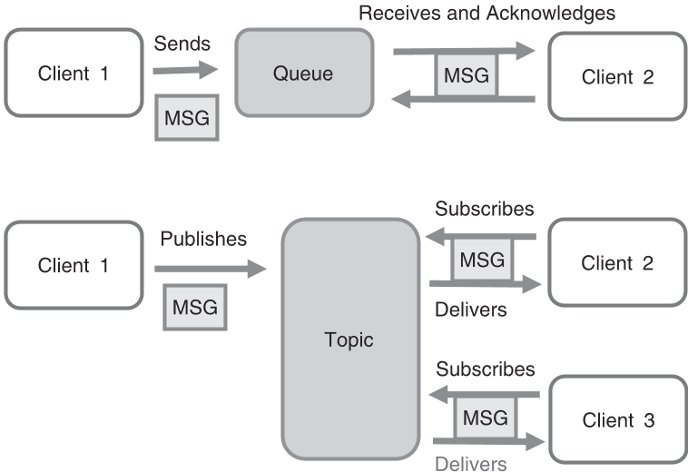

>图 5.7 基于队列和 topic 的通信概览。

| 操作数|数据类型|
| ---|---|
| =|所有|
| <, ≤, ≥,   >, ≠|算术|
| BETWEEN|算术|
| AND, OR, NOT|布尔|
| IN, LIKE|字符串|

>图 5.8 常用的 JMS SQL-92 消息选择操作数。

操作数。JMS 消息选择器允许客户端定义它们感兴趣的消息。头部和属性需要匹配客户端规范才能投递给该客户端。消息选择器不能引用嵌入在消息体中的值。

一个例子是 JMSType='stock' AND company='abc' AND stockvalue > 100。

JMS 允许客户端检查队列中的消息。这通过 QueueBrowser 对象实现，它允许浏览队列并检查消息头。发送到队列的消息存储在那里，直到队列的消息消费者消费它们。

### 5.7.3 JMS 流程

图 5.9 展示了 JMS 架构的关键对象。ConnectionFactory 用于创建 Connection 对象。Connection 对象然后用于创建 Session，

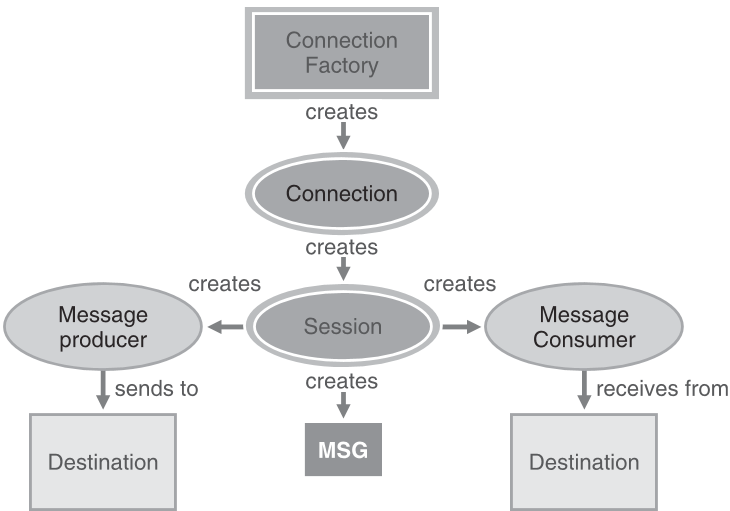

>图 5.9 关键 JMS 对象。

然后用于基于 Destination 发送和消费消息。Session 对象提供创建 MessageProducer 和 MessageConsumer 的方法，它们基于显式定义的 Destination 发送和接收消息。Destination 映射到在 MessageConsumer 消费之前存储消息的队列。

通常 JMS 客户端创建一个 Connection、一个或多个 Session 以及多个 MessageConsumer 和 MessageProducer。Connection 以停止模式创建。连接启动后（start() 方法），消息开始到达与该连接关联的消费者。

MessageProducer 可以在 Connection 停止时发送消息。Session 是用于消费和生产消息的单线程上下文。Session 充当创建 MessageProducer、MessageConsumer 和临时目的地的工厂。JMS 定义由 session 发送到目的地的消息必须按发送顺序接收。

JMS 消息按以下方式处理：

1. 客户端从 Connection Factory 获取 Connection。

2. 客户端使用 Connection 创建 Session 对象。

3. Session 用于创建 MessageProducer 和 MessageConsumer 对象，它们基于 Destination。

4. MessageProducer 用于生产投递到目的地的消息。

5. MessageConsumer 用于轮询或异步消费（使用 MessageListener）来自生产者的消息。

图 5.10 展示了创建队列、向队列发布消息、然后从队列消费已发布消息的 Java 代码示例。

### 5.7.3.1 JMS Pub/Sub 模型

JMS pub/sub 模型定义了 JMS 客户端如何向基于内容的层次中的众所周知节点发布消息和从中订阅消息。JMS 将这些节点称为 topic。

Topic 可以被看作一个迷你消息 broker，收集并分发给它的消息。通过依赖 topic 作为中介，消息 publisher 与 subscriber 保持独立，反之亦然。Topic 随着 publisher 和 subscriber 来来去去而自动适应。

Topic 对象封装了提供者特定的 topic 名称。它是客户端向 JMS 方法指定 topic 身份的方式。许多 pub/sub 提供者将 topic 组织成层次并提供各种选项来订阅层次的部分。JMS 对 Topic 对象代表什么没有限制。它可以是 topic 层次中的叶子，也可以是层次的更大部分（用于订阅一般类别的信息）。

Topic 的组织和订阅的粒度是 pub/sub 应用架构的重要部分。JMS 没有指定如何做到这一点的策略。如果应用利用了提供者特定的 topic 分组机制，它应该记录这一点。如果使用不同的提供者安装应用，管理员的工作是构建等效的 topic 架构并创建等效的 Topic 对象。

```java
import javax.jms.*;
import javax.naming.*;
import java.util.*;

public class HelloWorldMessage {
    public static void main(String[] args) {
        try {
            ConnectionFactory myConnFactory;
            Queue myQueue;

            myConnFactory = new com.sun.messaging.ConnectionFactory();
            Connection myConn = myConnFactory.createConnection();
            Session mySess = myConn.createSession(false, Session.AUTO_ACKNOWLEDGE);
            myQueue = new com.sun.messaging.Queue("test"); // Create a queue

            MessageProducer myMsgProducer = mySess.createProducer(myQueue);
            TextMessage myTextMsg = mySess.createTextMessage();
            myTextMsg.setText("Test message");
            System.out.println("Sending: " + myTextMsg.Text());
            myMsgProducer.send(myTextMsg); // send test message to queue

            MessageConsumer myMsgConsumer = mySess.createConsumer(myQueue);
            myConn.start();

            Message msg=myMsgConsumer.receive(); // Receive a message from the queue

            if (msg instanceof TextMessage) {
                TextMessage txtMsg = (TextMessage) msg;
                System.out.println("Received: " + txtMsg.Text());
            }
            mySess.close();
            myConn.close();
        } catch (Exception jmse) {
            System.out.println("Exception occurred: " + jmse.toString());
            jmse.printStackTrace();
        } }
```

>图 5.10 发布和消费事件的 JMS 代码示例。

### 5.7.4 消息投递

消息可以通过两种方式消费：

• 同步。Subscriber 或接收者通过调用 receive 方法显式从目的地获取消息。Receive 方法可以阻塞直到消息到达，或者如果消息在指定时间限制内未到达则超时。

• 异步。客户端可以向消费者注册消息 listener。消息 listener 类似于事件 listener。每当消息到达目的地时，JMS 提供者通过调用 listener 的 onMessage 方法来投递消息，该方法对消息内容进行操作。

JMS 消息在被确认之前不算成功消费。成功的消息消费要求客户端接收消息、客户端处理消息以及消息被确认。确认由 JMS 提供者或客户端发起。

与可靠消息投递相关的基本 JMS 机制是：

• 消息确认策略。

• 消息持久性：消息可以是持久的并存储到磁盘。

- 影响消息处理和投递顺序的消息优先级级别。

• 消息过期。消息特定的过期时间确定消息何时变得过时。

• 临时目的地仅在创建它们的连接持续时间内有效。

消息在事务模式下自动确认，但是，如果 session 不是事务性的，则有三个可能的确认选项：容忍重复消息的延迟确认、自动确认和客户端确认。在持久模式下，投递是一次且仅一次，在非持久模式下，语义是最多一次。

### 5.7.5 事务

JMS 支持事务，其中任何一系列操作被分组为称为事务的原子工作单元。如果任何操作失败，事务可以回滚到事务开始之前的状态。如果操作成功，事务成功并可以提交。JMS API Session 接口包含 commit 和 rollback 方法。调用 commit 方法导致所有已生产消息的投递和所有已消费消息的确认。Rollback 方法导致已生产消息的丢弃，以及未过期已消费消息的恢复和重新投递。

### 5.7.6 高级问题

JMS 规范不考虑高级负载均衡和故障转移问题。这些可以由 JMS 实现支持。图 5.11 展示了 JMS 在集群环境中的使用。集群中有三个服务器。两个服务器负责单个队列，一个服务器负责两个队列。队列 Q1 及其对应的目的地 D1 在两个服务器上复制。第三个服务器上有两个消费者队列，即 Q2 和临时队列 QT。Q1 的复制增加了系统的容错性。

### 5.7.7 Java EE 中的 JMS 和实现

Java Enterprise Edition (Java EE) 平台在以下情况下使用 JMS API：

• Enterprise JavaBeans (EJB) 组件、Web 组件和应用客户端使用 API 发送和接收 JMS 消息。

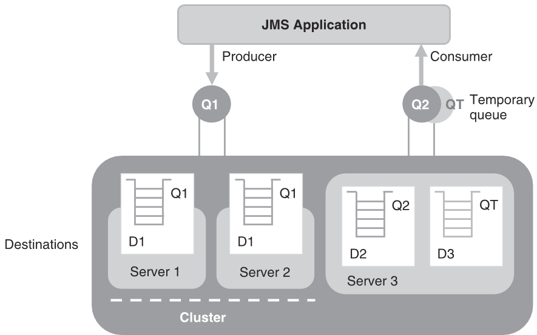

>图 5.11 JMS 集群示例。

• 消息驱动 bean 支持消息的异步处理。

• 消息发送和接收操作可用于分布式事务。事务产生原子操作并支持回滚功能。

消息驱动 bean 可以从队列或持久 subscription 消费消息。消息可以由任何 JMS 客户端和 Java EE 组件发送。消息驱动 bean 包含在消息到达时调用的 onMessage 方法。消息驱动 bean 类必须实现 javax.jms.MessageListener 接口和 onMessage 方法。

有几个 JMS 实现，例如：Fiorano MQ、Sun Java System MQ、WebSphere MQ、WebLogic Application Server 和 Apache ActiveMQ。最后，ActiveMQ 是提到的产品中唯一的开源 JMS 服务器。

## 5.8 TibCo Rendezvous

TibCo Rendezvous 是一个为应用开发者提供消息 API 的产品。基本系统是基于主题的，它使用组播来分发消息。消息传递包括以下阶段：

• 消息有一个由句点分隔的元素组成的单一主题。消息被发送到单个 Rendezvous Daemon 组件，该组件负责将消息发送给感兴趣的 listener 和分布式环境中的 Daemon。

• Listener 向 Daemon 告知其兴趣。Listener 可以使用通配符来选择感兴趣的主题。匹配兴趣的消息然后由 Daemon 投递给 listener。

该系统还提供不同的企业服务，如容错和可靠性，建立在基本消息传递系统之上。消息是类型化的名称-值或数字-值字段。

## 5.9 COM+ 和 .NET

标准 Windows COM 和 OLE 支持异步通信和使用回调传递事件，然而，这些方法有其问题。标准 COM publisher 和 subscriber 是紧耦合的。Subscriber 知道连接到 publisher 的机制（容器公开的接口）。这种方法在单个桌面之外效果不佳。现在，组件需要同时活动才能通过事件通信。此外，subscriber 需要知道 publisher 要求的确切机制。此接口可能因 publisher 而异，使得动态执行变得困难（ActiveX 和 COM 使用 IconnectionPoint 机制创建回调电路；OLE 服务器使用 IoleObject 接口上的 Advise 方法）。

COM+ 事件服务是一个操作系统服务，提供连接 publisher 和 subscriber 的通用基础设施。该服务是一个松耦合系统，因为它使用事件服务和用于存储可用事件和 subscription 信息的目录将事件生产者与事件 subscriber 解耦。在此架构中，事件是 COM+ 接口中称为事件方法的方法，它只包含输入参数。

产生事件需要以下步骤（图 5.12）：

1. 注册事件类。

2. Subscriber 注册事件。

3. Publisher 在运行时创建事件对象。

4. Publisher 通过调用事件对象中的方法来触发事件。

5. 事件对象从事件存储中读取 Subscription 列表。

6. 系统通过调用适当的方法将事件投递给 subscriber。

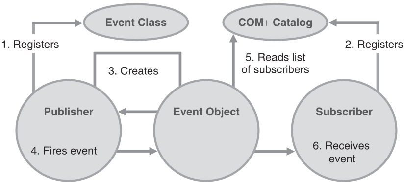

>图 5.12 COM+ Event Service 概览。

事件服务跟踪哪些 subscriber 想要接收调用，并中介调用。事件类是包含接口和方法的 COM+ 组件。Subscriber 需要实现接口以接收事件，publisher 调用方法来触发事件。事件类存储在 COM+ 目录中，由 publisher 或管理员更新。Subscriber 通过向 COM+ 事件服务注册 subscription 来注册其接收事件的愿望。

Subscription 是一个数据结构，包含接收者、事件类以及 subscriber 想要从中接收调用的该事件类中的接口或方法。Subscription 也由 subscriber 或管理员存储在 COM+ 目录中。持久 subscription 在操作系统重启后仍然存在，而瞬态 subscription 将在重启或重置时丢失。Publisher 使用标准对象创建函数来创建所需事件类的对象。此事件对象包含事件系统对所请求接口的实现。Publisher 然后调用它想要触发的事件方法。该接口的事件系统实现搜索 COM+ 目录并找到所有对该事件类和方法表达了兴趣的 subscriber。事件系统然后使用直接创建、moniker 或排队组件连接到每个 subscriber，并调用指定的方法。事件方法只返回成功或失败。任何 COM+ 客户端都可以成为 publisher，任何 COM+ 组件都可以成为 subscriber。

此事件系统有几个限制。Subscription 机制本身不是分布式的，也没有对企业级存储库的支持。投递时间和工作量随 subscriber 数量线性增加，这意味着系统不能扩展到向许多 subscriber 触发事件。然而，使用排队组件支持客户端断连。COM+ 支持记录一系列方法调用（事件发生）并能够按记录顺序回放它们的组件。这些组件可以使用消息进行分发。由于事件对象可以定义为可排队的，断连的客户端可以在重新连接时回放所需的事件对象。COM+ 事件可以扩展以支持过滤，过滤需要在 publisher 端或 subscriber 端实现。如果事件被 publisher 端的组件过滤，它永远不会投递到事件服务。如果事件在 subscriber 端被过滤，事件服务将决定是否将事件投递给特定 subscriber。

Publisher 端的过滤通过将 filter 对象附加到事件对象接口（对应于事件）来完成。Filter 可以查询 subscription 信息，例如更改一组 subscriber 的触发顺序。Subscriber 端的过滤使用每个 subscription 和方法调用的参数过滤来完成。参数过滤根据事件方法的参数评估 subscription FilterCriteria 属性。Filter 条件字符串识别关系运算符、嵌套括号以及逻辑关键字 AND、OR 和 NOT。

.NET 框架在多个层次支持事件。支持编程语言级事件和与 COM 事件的互操作性。Visual Basic .NET 代码和传统 COM 组件事件的互操作使用运行时可调用包装器（RCW）完成。在 VB.NET 中，listener 创建事件处理器，添加到源。事件和事件处理器之间的连接由称为委托的特殊对象实现。.NET 运行时的优势是，用不同语言（如 C# 和 VB）编写的组件的事件是可互操作的。

Microsoft 的消息基础设施称为 *Microsoft Message Queuing (MSMQ)*。MSMQ 自 1997 年以来可供开发者使用，它为 *Windows Communication Foundation (WCF)* 提供消息框架。MSMQ 是一个支持安全和可靠消息传输的面向消息的 middleware 平台。

## 5.10 WebSphere MQ

IBM 的 MQSeries，目前称为 WebSphere MQ，是最流行的面向消息的 middleware 产品之一，用于电子商务。该产品支持许多不同平台之间的异构任意到任意通信。MQ 与 JMS 兼容，并与 Java Beans (EJB)、SOAP、REST 和 .NET 集成。MQ 还支持 SOAP 用于 Web 服务创建。兼容 JMS 的嵌入式 JMS 提供者支持点对点和 publish-subscribe 消息 [7]。

### 5.10.1 概述

WebSphere MQ 提供的主要功能是跨多种平台的消息保证一次性投递。该产品强调消息流量的可靠性和健壮性，并确保如果 MQ 配置适当，消息永远不会丢失。WebSphere MQ 通过队列管理器提供可靠消息排队的设施。队列管理器维护消息排队基础设施的队列，以及驻留在这些队列上等待处理或路由的所有消息。队列管理器对故障具有容错性，维护通过消息排队基础设施流动的业务关键数据的完整性。基础设施中的队列管理器通过 channel 连接。消息根据基础设施中队列管理器的配置，自动跨这些 channel 流动，从消息的初始生产者（即 publisher）到该消息的最终消费者（subscriber）。

队列管理器管理存储消息的队列，应用与其本地队列管理器通信。远程队列由远程队列管理器拥有，插入远程队列的每条消息都通过网络传输。队列管理器可以支持本地队列，在这种情况下客户端能够支持异步通信。如果没有本地队列，客户端被绑定到同步通信。另一个配置选项是客户端是否支持桥接并能够与其他队列管理器交换消息。

为了支持高效和可扩展的消息排队实现，WebSphere MQ 允许 (i) 具有本地应用访问服务的单个队列管理器，(ii) 具有远程应用作为客户端访问服务的单个队列管理器，(iii) 中心辐射型 WebSphere MQ 架构，以及 (iv) MQ 集群。中心辐射型架构高效支持具有总部和分支机构的分布式场景。相反，更灵活的方法是将多个队列管理器加入一个称为队列管理器集群的动态逻辑网络中。这允许通过多个队列管理器托管同一服务的多个实例。

作为 JMS 提供者，WebSphere MQ 实现了 Java Message Service 标准 API。此外，它有自己的专有 API，称为 Message Queuing Interface。与 JMS 规范类似，WebSphere MQ 中有两种基本类型的消息风格，点对点（PTP）和 Publish/Subscribe。PTP 和 Pub/Sub 的概念与 JMS 中的类似。

### 5.10.2 WebSphere MQ 中的 Pub/Sub

产生关于特定主题信息的应用称为 publisher。消费此信息的应用称为 subscriber。信息和主题由 WebSphere MQ Publish/Subscribe (Pub/Sub) 管理。主题称为 topic。信息等同于 WebSphere MQ 消息。

订阅应用向 WebSphere MQ Pub/Sub 注册其从特定 topic 接收信息的意图。发布应用然后向 WebSphere MQ Pub/Sub 发送关于 topic 的信息。信息的管理和分发给已注册的 subscriber 是 WebSphere MQ Pub/Sub 的责任。Publisher 和 subscriber 应用的这种解耦允许更大的可扩展性和更动态的网络拓扑。

Topic 指的是 publisher 提供信息的主题。对有关此 topic 信息感兴趣的 subscriber 可以订阅 topic 对象或 topic 字符串来接收这些发布。

Topic 字符串是 WebSphere MQ Publish/Subscribe 中的核心概念，它提供了 publisher 和 subscriber 之间的逻辑关联。Publisher 可以发布到 topic 字符串，subscriber 可以使用 topic 字符串订阅发布。Topic 字符串最长可达 10,240 个字符，并且区分大小写。WebSphere MQ 中引入了一种称为可变长度字符串（MQCHARV）的新数据类型，以支持长字符串需求。

Topic 字符串的结构和语义由斜杠（/）控制。例如，可以有一个名为 deli 的高级 topic 代表熟食店，它可以分为与熟食店销售的不同产品类别相关的单独子 topic，以及下面进一步的子 topic 层来进一步限定产品。图 5.13 展示了 topic 字符串的示例。

Topic 字符串在 topic 结构中暗示了一种层次感。层次表示为 topic 树，如图 5.13 所示。Topic 树有一个对应于 topic 对象 SYSTEM.BASE.TOPIC 的根节点。

Topic 字符串支持通配符。Subscriber 可以使用两个通配符，井号（#）和加号（+），来订阅一系列 topic。两者都提供 topic 级替换方法。井号可以替换 topic 层次中的多个级别，而加号可以替换 topic 层次中的单个级别。

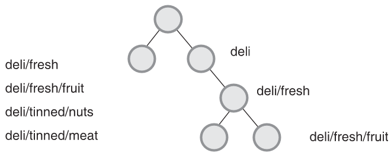

>图 5.13 MQ Topic。

Topic 字符串用于将 publisher 的信息与对该信息感兴趣的 subscriber 进行匹配。Topic 字符串不必预定义。当订阅和发布应用使用它们时，它们动态产生。考虑一个 publisher 应用发布到名为 deli/fresh/fruit 的 topic 字符串，此时没有定义管理 topic 对象。相应树上的节点，如图 5.13 所示，称为非管理 topic。可以为此子树上的任何节点定义管理 topic 对象（例如 /fresh/fruit），但仅在需要将该特定节点与不同于从父节点继承的设置的特定属性设置关联时。

## 5.11 Advanced Message Queuing Protocol (AMQP)

Advanced Message Queuing Protocol (AMQP)$^1$ 是一个用于消息传递和 pub/sub 的开放标准应用层协议。该协议源于金融应用领域；然而，该协议是通用的，可用于实现各种面向消息的应用。该协议目前在 OASIS 进行标准化。该协议的关键特征是消息导向、排队、路由可靠性和安全性。

AMQP 规范定义了消息提供者和客户端以及 broker 组件的行为，以实现互操作性。该规范定义了线路级协议，这与许多其他标准（如 JMS）形成对比，后者仅定义 API。因此，协议规范包含跨网络发送的数据包的描述。AMQP 消息由两部分组成，即属性信封和内容部分。消息内容是二进制 blob。消息使用协议命令和线路格式在客户端和 broker 之间传递。

AMQP 定义了一组基本消息模式，然后可用于构建复杂的交互。基本消息模式是：

• request-response，定义请求者和响应者之间的交互，以及

• pub/sub，定义从发送者到一个或多个接收者的消息投递过程，同时满足 subscriber 的标准。

这些模式可以轻松组合，例如使用 pub/sub 发送关于数据可用性的通知，然后允许感兴趣的接收者使用 request-response 交互请求数据。

核心 AMQP 模型定义了四个关键实体：

• Message broker 是客户端使用协议连接的服务器。可以有许多 broker，它们可以联邦化，但这超出了基本规范的范围。

• User 是可以连接到 broker 的实体。

>$^{1}$ http://www.amqp.org/。

• Connection 是与用户关联的物理连接。

• Channel 是与连接关联的逻辑连接。通过 channel 的通信是有状态的。

这四个实体构成了协议的基本模型。

与协议的通信通过 exchange 进行，exchange 是在 broker 实现的消息路由过程。标准 exchange 简单地将消息从发送者路由到接收者：消息被路由到队列，在那里代表接收者存储。有不同的消息路由技术可以由 exchange 实现：一对一、一对多等。Exchange 通过 binding 中指定的规则进行配置。Binding 确定 exchange 如何工作以及使用什么样的消息选择来接受消息进入队列。AMQP 协议允许使用自定义 exchange 实现任意 exchange 语义。

称为 routing key 的特定消息属性用于实现多种消息转发行为。如果消息中的 routing key 与 binding 中的 routing key 匹配，exchange 将最多向队列投递一份消息副本。有许多定义消息匹配过程的方式：

• Direct exchange 在 routing key 和 binding 的 key 相同时匹配。

• Fanout exchange 总是匹配。

• Topic exchange 根据 binding 关键字匹配消息的 routing key。关键字是由点分隔的字符串。字符串匹配还支持前缀和后缀。

• 基于 header 的 exchange 根据消息 header 中键的存在以及键值对进行匹配。

• 其他 exchange 类型也是可能的；然而，它们是供应商特定的，不受规范支持。

图 5.14 展示了 publisher 如何通过 exchange 将消息发送给消费者。Exchange 根据其规则将传入消息转发到队列。消费者然后使用协议从队列中检索消息。图的下半部分展示了一个 fanout exchange，将消息转发到两个队列。

标准化的 AMQP exchange 没有消息存储的固有语义。Exchange 将消息路由到队列，这些队列为接收者使用而存储它们。Exchange 根据一组 binding（规则）进行配置，这些规则从将所有消息传递到队列到在排队之前全面检查消息内容不等。此外，AMQP 允许任意 exchange 语义。这通过使用专门为应用设计的自定义 exchange 来实现：消息可以以所需的方式创建、排队、消费和路由。

知名的 AMQP 实现包括以下：

• OpenAMQ 是由 iMatix 用 C 编写的 AMQP 开源实现。

• RabbitMQ 是 2010 年被 VMware 收购的开源实现。

• Apache Qpid 是 Apache 基金会的项目。

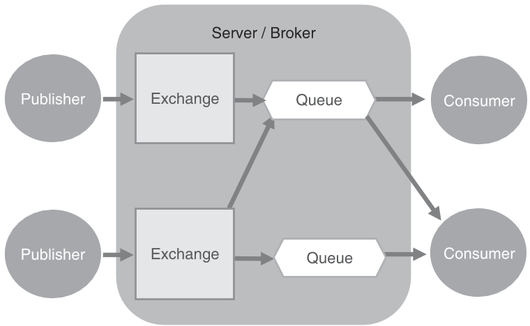

>图 5.14 AMQP 示例。

### 5.12 MQ Telemetry Transport (MQTT)

对轻量级基于 broker 的 pub/sub 消息协议有一定需求。MQ Telemetry Transport (MQTT) 就是这样一个协议，它也是开放的、简单的且相对容易实现的 [8]。它针对受限环境进行了优化，但不限于这些环境。MQTT 在以下情况下具有优势：

• 网络昂贵，带宽低或完全不可靠。

• 它由处理器资源或内存有限的嵌入式设备使用。

MQTT 协议的主要特征是：

• MQTT 使用 pub/sub 消息模式。这提供了一对多的消息分发和有效的应用级解耦。

• MQTT 是基于 topic 的 pub/sub 协议，支持层次 topic 和匹配中的通配符。

• MQTT 应用本质上与有效载荷内容无关的消息传输。

• MQTT 利用 TCP/IP 进行基本网络连接。

• MQTT 有三种不同的消息投递服务质量：

- At-most-once 允许使用 TCP/IP 网络的尽力而为投递消息。然而，这导致消息丢失或重复的可能性增加。该质量用于环境传感器数据，其中单个读数的丢失无关紧要，因为下一个很快就会发布。

- At-least-once 意味着消息投递有保证但可能有重复。

- Exactly-once 保证消息恰好到达一次。该质量可用于不容忍重复或丢失消息导致可能不正确计费的计费系统。

• MQTT 具有小的传输开销。这源于固定长度头部为 2 字节长。因此协议交换将自动最小化以减少网络流量。

• MQTT 具有 Last Will and Testament 机制，通知感兴趣的各方客户端的异常断连。

MQTT 协议的规范包括以下：

• MQTT v3.1 规范。这是主要的 MQTT 规范。MQTT v3.1 以非常轻量的方式实现 pub/sub 消息模型，这是许多远程位置连接的非常有用的特征，特别是那些需要小代码占用的连接。它在网络带宽稀缺的地方也具有优势。

• MQTT-S v1.1 用于无线传感器网络（WSN），针对嵌入在非 TCP/IP 网络中的设备。此协议支持 pub/sub 消息协议，旨在将原始 MQTT 扩展到 TCP/IP 基础设施之外。

此外，还有一些 MQTT 客户端 API 的实现。也存在许多 MQTT 服务器实现，从开源到商业产品。

## 5.13 总结

在本章中，我们研究了面向消息的 middleware 和 pub/sub 的知名基于标准的解决方案。图 5.15 展示了所考察标准和产品的总结。该表从系统结构、状态管理、过滤能力、QoS 属性和运行环境方面展示了差异和相似性。系统结构涉及消息和 pub/sub 功能的组织，例如 event channel 模式、observer pattern 或消息队列。状态管理描述 subscription 状态存储在哪里，例如在 event channel、消息队列或已订阅资源中。结构和采用的模式决定了状态管理如何实现。过滤能力决定了消息选择如何执行。消息过滤能力在系统之间有所不同。QoS 支持在所考察的解决方案之间也有所不同，一些提供 QoS 属性，如可靠性和及时性。最后，环境涉及运行上下文，如 CORBA 环境、SIP 和 Java。

图 5.16 考虑了常用解决方案的实时支持。实时支持是工业和战术系统的典型需求，其中异步事件能够在特定时间范围内投递给 subscriber 至关重要。Web 服务、Java、JMS 和 CORBA 通常不提供很好的实时支持。Java 可以扩展为软实时和硬实时支持；然而，没有指定这应如何反映在 JMS 中，JMS 最多只能应对软实时需求。对于 CORBA 技术，有实时 RT CORBA 扩展。另一方面，DDS 可以应对各种实时需求，甚至是硬实时需求的情况。DDS 适用于动态环境中向多个节点进行灵活的 QoS 感知数据传播。

| |结构|状态|过滤|QoS 属性|环境|
| ---|---|---|---|---|---|
| CORBA ES|Event Channel|Event Channel|否|否|CORBA|
| CORBA NS|Event Channel|Event Channel|是|是|CORBA|
| OMG DDS|对象空间|已订阅对象|基于 topic 的 SQL 查询|是|各种|
| SIP 事件框架|SIP 的 Pub/sub 方法|已订阅资源|扩展|扩展|SIP|
| Java 分布式事件模型|Observer pattern|已订阅资源|扩展（adapter）|扩展（Adapter）|Java RMI|
| JMS|点对点和基于 pub/sub topic 的消息|消息队列|是，SQL|是|Java|
| TibCo Rendezvous|消息排队系统|消息队列|基于主题的通配符|是|支持各种语言|
| COM+ 和 .NET|Observer pattern|事件存储|扩展|是|Microsoft|
| WebSphere MQ|消息排队系统|消息队列|是|是|支持各种语言和传输|
| AMQP|消息排队系统|消息 exchange|基于主题的通配符|有限|支持各种语言，标准线路协议|
| MQ Telemetry Transport|消息排队系统|Broker|基于 topic（层次），通配符|是，故障通知|传感器网络，嵌入式系统|

>图 5.15 标准和产品的总结。

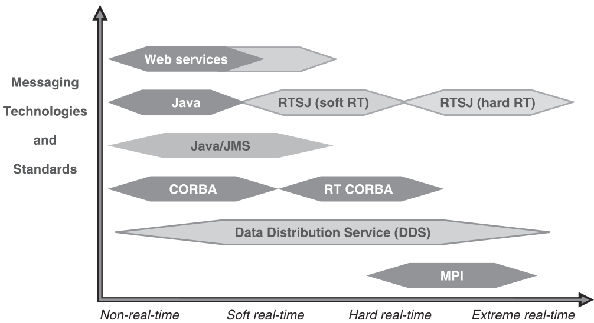

>图 5.16 消息传递和实时需求。

AMQP 可用作 DDS 和 JMS 实现的消息传输协议。该协议为有 broker 的通信架构提供基本设施。关键特征包括 broker 接口和基于 header 的路由。另一方面，DDS 提供更对等的架构，以及基于 topic/内容的路由。DDS 是为可扩展性和实时需求设计的。AMQP 和 DDS 都为 pub/sub 提供可互操作的线路协议。

## References

1. Object Computing, Inc. (2001) CORBA Event Service Specification v.1.1. OCI.

2. Object Computing, Inc. (2001) CORBA Notification Service Specification v.1.0. OCI.

3. Object Computing, Inc. (2001) *Management of Event Domains Specification*. OCI. http://www.omg.org/cgibin/doc?formal/2001-06-03.

4. Object Computing, Inc. (2007) *Data Distribution Services*, V1.2. OCI.

5. Roberts S and Byous J (2001) *Distributed Events in Jini Technology*. Sun Microsystems. Available at: http://java.sun.com/developer/technicalArticles/jini/JiniEvents/

6. Sun (2002) Java Message Service Specification 1.1.

7. Davies S et al. January 2009 Websphere mq v7.0 features and enhancements. IBM Redbooks.

8. Hunkeler U, Truong HL and Stanford-Clark A (2008) Mqtt-s – a publish/subscribe protocol for wireless sensor networks. COMSWARE, pp. 791–98.

# 6 Web 技术
# 6 Web 技术

在本章中，我们考察用于实现 pub/sub 解决方案的关键 Web 技术。关键的 Web 技术涉及基础使能技术，如 W3C DOM Events、REST、AJAX、SOAP，以及构建在其之上的 pub/sub 系统，如 RSS 和 Atom、XMPP，以及 WS-Eventing 和 WS-Notification 标准。

## 6.1 REST

Web 应用开发者通常面临如何定义和构建其 API 以提供 Web 服务器所提供服务的问题。REST（Representational state transfer，表述性状态转移）[1] 是一种流行的架构模型，用于构建 API 及其所提供的交互。该模型由 Roy Fielding 在其 2000 年的博士论文中引入和定义。REST 本质上是一种请求-响应协议，它基于少量定义明确的核心操作以及统一资源定位方案来构建 API 功能。

在 REST 中，客户端向服务器发起请求，服务器在处理请求后返回响应。请求和响应系统本质上是围绕资源表述的传递这一思想构建的。资源是任何连贯且有意义的可寻址概念，资源的表述可以是例如捕获资源当前状态或预期状态的文档。该过程从客户端发送请求开始，表明它已准备好转换到新状态。如果有一个或多个请求尚未完成，则认为客户端处于转换状态。应用状态的表述包含一组链接，当客户端决定发起新的状态转换时可以使用这些链接。

REST 最初设计用于 Web 和 HTTP 环境。在这种情况下，HTTP 方法类型是基本的 API 操作，URI 方案用于标识资源。图 6.1 展示了基于 REST 的应用如何使用 HTTP 方法和 URI。HTTP 协议用于交换数据。该模型不限于某一特定协议，其他协议也可以作为 RESTful 架构的基础。要求是协议为使用有意义的表述状态传递构建的应用提供丰富且统一的词汇。

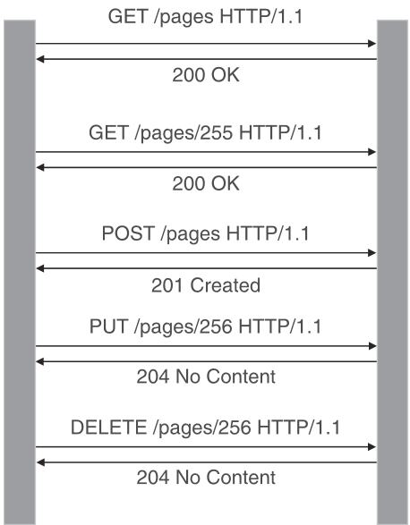

>图 6.1 REST 示例。

## 6.2 AJAX

异步 JavaScript 和 XML（AJAX）基于 Web 浏览器执行的 JavaScript 代码。AJAX 发出 HTTP 请求，因此本质上采用基于轮询的通信模型。Web 应用可以利用 AJAX 来创建交互式的、非页面导向的用户体验。AJAX 是异步的，因为它在编程层面解耦了请求和响应。AJAX 可以支持表单验证、在服务器上保存数据、从服务器获取自动补全建议等功能。在 AJAX 应用中，JavaScript 代码从浏览器向服务器发送请求。传入的响应消息（例如 XML 或 JSON，一种流行的基于 JavaScript 的数据结构）由回调方法处理，该方法动态更新浏览器窗口。这对用户便利性很重要，因为 JS 代码不需要等待服务器响应，而是将响应推迟到回调方法被调用时再处理。因此浏览器可以处理用户输入，也可能执行页面中的其他脚本。

需要注意的是，AJAX 并非完全异步，因为它使用请求-响应范式。因此，服务器不允许在没有先前请求的情况下发送 HTTP 响应。这是一个限制，在 AJAX 的一个变体 Comet 中得到了放宽，Comet 可以克服这一限制 [2]。

Comet 系统基于类似 AJAX 的回调函数机制来管理来自服务器的响应。图 6.2 展示了该方案的关键交互。Comet 利用 HTTP 请求保持服务器连接打开，从而建立长连接来发送和接收事件数据。在连接超时之前，客户端的 Comet 会自动关闭连接并发出新请求。这种技术本质上使服务器可以在任何时间向客户端发送响应。Comet 机制在实现基于 Web 的即时消息和其他需要异步交互的应用时也很有效。

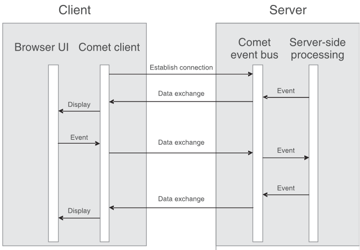

>图 6.2 Comet 系统示例。

例如，即时消息需要推送类型的机制来向用户传递消息。直到最近，在不依赖各种插件的情况下，这很难在浏览器中实现。如今，常见的方法是使用长连接技术（如 Comet）来实现推送机制。

在不久的将来，HTML5 和新的 WebSocket 通信选项可能成为创建基于 Web 的推送解决方案的方式。WebSocket 为 Web 页面和应用提供双向、全双工的通信通道，通过单个 TCP socket 实现。WebSocket API 专为 Web 环境设计并由 W3C 标准化，该协议已由 IETF 标准化为 RFC 6455。

WebSocket 可用于克服普通 TCP 连接中的端口号阻塞问题，在普通 TCP 连接中基本上只允许端口 80 用于外部连接。此外，WebSocket 允许在单个 TCP 端口上复用多个 WebSocket 服务，从而以一些额外的协议开销提供增强的功能。

## 6.3 RSS 和 Atom

Really Simple Syndication（RSS）是一组使用 XML 定义基于 Web 的信息源的规范族。RSS 本质上是一个简单的 pub/sub 系统，它基于轮询标识信息源的 URL，然后确定信息是否已更改。RSS 构建在现有的 Web 标准之上，即 HTTP 和 XML，并且已经无处不在。RSS 用于传播更新，例如与博客文章、新闻、视频和音频资源相关的更新。

基于 RSS 的信息源是非推送式的，它们需要 RSS 阅读器实现使用简单的拉取机制。阅读器定期或在用户决定手动重新加载时下载 RSS 信息源。

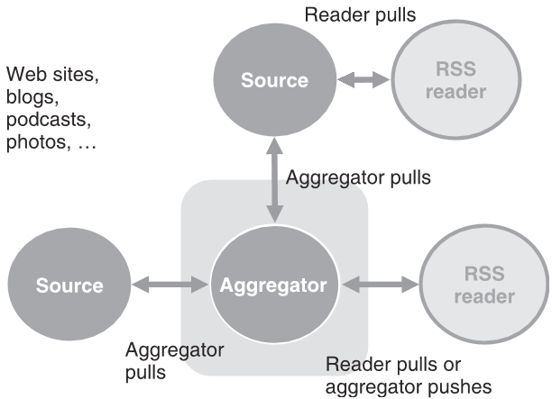

>图 6.3 RSS 概述。

RSS 文档定义了一个信息源，其中包含元素的文本描述以及相关元数据，如 URI 和作者信息。RSS 信息源补充了当前的网站，因为它们允许以标准化方式快速传播更新并进行聚合。RSS 得到了许多 Web 浏览器和专用信息源阅读器程序的支持。客户端程序随后定期检查 RSS 信息源 URL 以获取任何新信息。

图 6.3 展示了参与 Web 信息源传播的关键实体。信息源是发布 RSS 信息源（作为 XML 文件）的 Web 服务器。这些信息源涉及新闻页面、博客、播客、照片网站等。例如，对于新闻网站，RSS 信息源将包含新闻条目：标题、简短描述和指向实际文章的链接。RSS 阅读器是从 Web 服务器拉取 RSS 文档并向最终用户显示其内容的客户端。通常，阅读器定期测试 RSS 文档是否已更新。RSS 文档可以包含有关文档刷新周期的信息，以指导轮询过程。还有聚合器服务从各个网站拉取 RSS 文档并将其内容组合为自定义信息源。RSS 阅读器随后从该聚合器服务拉取内容。也可以借助长 HTTP 连接或自定义协议实现从聚合器到 RSS 阅读器的推送。这对于实现信息源的近实时更新是必要的。

RSS 2.0 规范引入了一个有趣的元素，即 Cloud 元素，它为 RSS 文档发布者提供了一种机制来通知云资源其内容已更新。基本上，这允许云资源订阅称为 ping 的内容更新。收到 ping 后，subscriber 必须从发送 ping 的站点拉取内容。这对于在 RSS 之上构建高效的 pub/sub 系统是必要的。类似的技术也在 Pubsubhubbub 规范中引入，我们将在本书后面部分进行研究。

Atom 是在 RFC 4287 和 5023 中定义的另一种联合协议。Atom 与 RSS 类似，使用 HTTP 和 XML 来实现 Web 信息源。Atom 规范强调国际化支持、模块化和安全特性。

Cobra（Content-Based RSS Aggregator）系统已被提出用于高效的分布式 RSS 信息源处理。该系统根据客户端 subscription 过滤和匹配已发布的 RSS 文档，并支持个性化文档选择 [3]。Cobra 基于处理文档的服务器集群，不利用对等 overlay 技术。因此，该解决方案适用于数据中心和集群环境。

Cobra 系统由三层网络组成：爬虫、过滤器和反射器。爬虫访问 Web 信息源（如网站和博客）并获取新文档。过滤器应用于最近爬取的文档，以找到 subscriber 感兴趣的文档。使用基于索引的不区分大小写的匹配算法来查找感兴趣的文档。匹配的文档随后被推送到反射器，反射器向用户呈现个性化的 RSS 信息源，用户可以使用标准 RSS 阅读器读取。反射器缓存最近 $k$ 个匹配元素，并要求用户定期轮询信息源以获取所有匹配文章。

该系统已在集群环境以及大规模 Planetlab 测试平台上进行了评估。实验结果表明，该系统能够在信息源数量和用户数量方面良好扩展。为了应对来自上游服务的高数据速率，该系统采用了一种简单的拥塞控制方案，当服务无法处理传入数据速率时施加背压。背压通过为每个上游服务设置 1 MB 缓冲区来实现。当缓冲区填满时，上游服务的发送尝试将被阻塞，直到下游服务能够赶上。

## 6.4 SOAP

我们在第 2 章的消息传递上下文中提到了 SOAP。SOAP 是 W3C 指定和标准化的单向消息交换原语。SOAP 非常灵活，可以支持基于 SOAP 原语构建的各种交互。SOAP 与许多消息传输协议一起使用，如 HTTP 和 SMTP。

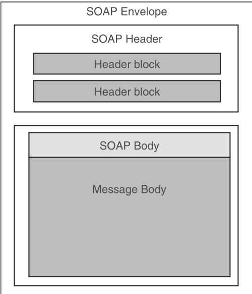

>图 6.4 SOAP 消息。

图 6.4 展示了 SOAP 消息的结构。SOAP 消息有两个部分：header 和 body。header 可能包含与 SOAP 交互相关的属性。header 的某些部分可以标记为消息处理中间节点。SOAP 完全可以加密和签名；这确保了该原语具有机密性、完整性和真实性的关键安全属性。

以下列表介绍了一些关键的 SOAP 术语：

• SOAP 消息路径由 SOAP 消息经过的节点组成。

• 初始 SOAP 发送者最初启动消息。

• SOAP 中间节点既是接收者也是发送者。它可以在 SOAP 消息中被寻址。SOAP 中间节点将处理以它为目标的 SOAP header 元素。然后将消息转发给最终的 SOAP 接收者。

• 最终 SOAP 接收者是 SOAP 消息的最终目的地。它处理消息和以其为目标的任何 header 块。

图 6.5 展示了带有中间节点的 SOAP routing 及关键术语。它展示了一个示例：一个有买家和卖家的市场。在图的中间部分，一个市场引擎连接了买家和卖家。每个 SOAP 发送者和接收者的组件是 SOAP 协议栈。这包括必要的 XML 处理元素。买家有一个 SOAP 应用，用于向市场的 SOAP 接收者主机发送购买请求。这作为

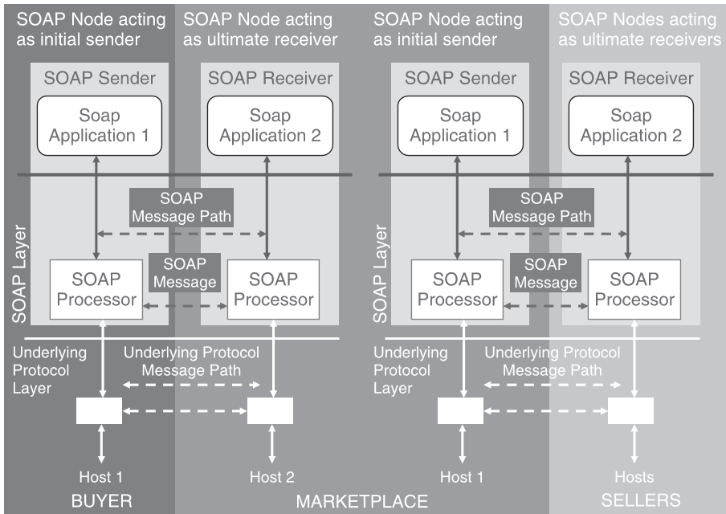

>图 6.5 SOAP routing 示例。

消息的最终 SOAP 接收者。在这里，相关消息通过向接收者发送新的 SOAP 消息转发给卖家。

灵活的 header 机制可以使用，使市场在买家和卖家之间中介消息，而不成为最终目的地。买家可以通过市场向买家的 SOAP 接收者发送直接消息。作为中间节点，市场还可以记录和验证请求。在安全方面，买家和卖家都可以保护他们的消息，因此没有中间节点可以读取受保护的内容。

## 6.5 XMPP

XMPP（Extensible Messaging and Presence Protocol，可扩展消息和存在协议）[4]（基于 Jabber 协议的 RFC 3920）是一种即时消息协议，可扩展以利用许多不同的基于消息的通信模型，如：

• publish/subscribe 机制，

• 存在和状态更新，

• 警报，

• 功能协商，

• 服务发现。

XMPP 实现有两种形式：对等和客户端-服务器交互模型。以下机制是典型的：

• 客户端通过打开 XMPP 流来打开与服务器的连接。

• 协商连接参数，例如认证和加密。这使客户端和服务器都能够在连接上发送 XML 节。

• 有三种主要的节类型，各有其语义：

- 类似电子邮件的 message 节，从一个实体推送到另一个实体。

- presence 节，是广播和 publish/subscribe 的基本机制。如果多个实体之前已订阅，则可以接收信息。

- Info/Query 节作为基本的请求-响应机制，类似于 HTTP。它允许实体发出请求并接收响应。

• 客户端可以将节发送到不在服务器数据库中的节点。然后服务器和外部域将使用服务器到服务器协议进行协商。

- 消息将被发送到相应的外部服务器以传递到最终目的地。

XMPP 正在迅速成为 Internet 上非常流行的通用 API 协议，被 Google、Twitter 和 Facebook 等公司使用。图 6.6 展示了一个具有多个服务器的简单分布式 XMPP 案例。XMPP 客户端使用客户端-服务器协议与 XMPP 服务器交互。服务器然后使用服务器到服务器协议转发内容。服务器可以与其他 XMPP 兼容系统互操作，如 Googletalk 服务器。

XMPP 基于 XML 的增量解析，因为 XMPP 服务器管理 XML 流和 XML 节。在该模型中，XML 流依赖于长 TCP

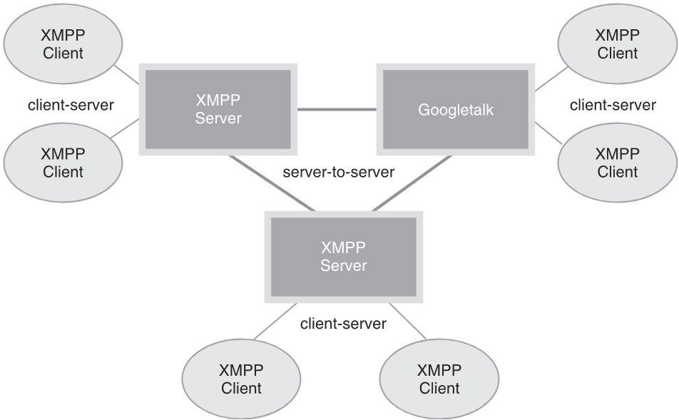

>图 6.6 XMPP 概述。

连接，XML 节作为第一级子元素在流上发送。此外，XMPP 遵循 RFC 3920，要求服务器实现支持传输层安全（TLS）用于通道加密、简单认证和安全层（SASL）用于认证，以及 DNS SRV 记录用于端口查找。XMPP 通过在 XML 节上加盖经过验证的源地址来防止伪造消息。此外，XMPP 即时消息和存在服务器支持联系人列表存储、即时消息会话管理、存在 subscription 管理和阻止列表管理（RFC 3921）等服务。

### 6.6 受限应用协议（CoAP）

受限应用协议（CoAP）是一种为受限物联网环境设计的 Web 协议 [5]。该协议为受限和嵌入式节点实现了 REST 架构，因此与 HTTP 协议非常相似。CoAP 通常在受限网络中的节点之间以及受限网络的节点与 Internet 中的节点之间使用。CoAP 与 HTTP 互操作，可以轻松转换为用于将受限网络数据与 Web 资源集成的格式。CoAP 的典型应用领域包括物联网和机器对机器（M2M）通信。

CoAP 的主要特性包括：

• 为受限环境和 M2M 通信设计。

• 异步消息传递。

• UDP 绑定，对单播和多播请求具有可选的可靠性。

• 低 header 开销和解析开销。

• URI 和 Content-type 支持。

• 简单的代理和缓存能力。

• 无状态 HTTP 映射，允许代理和网关提供对 CoAP 资源的 HTTP 访问以及对 HTTP 资源的 CoAP 访问。

• 与数据报传输层安全（DTLS）的安全绑定。

CoAP 提供了一种轻量级可靠性机制，包括以下特性：

• 对需要确认的消息（CoAP 术语中的"confirmable"）具有指数退避的停等重传可靠性。

• 消息的重复检测。

• 多播支持。

CoAP 可用于实现第 4 章介绍的观察者设计模式。该模式作为基本协议的扩展实现，使用客户端发送给服务器的 GET 请求。该请求标识已订阅的资源，并包含一个 Lifetime Option 来确定 subscription 的持续时间。该技术与本章已讨论的长轮询非常相似。服务器将监控请求中标识的资源，然后通知客户端有关资源的更改。

CoAP 协议在应用端点之间提供请求/响应交互模型，遵循 Web 约定，如 URI 和内容类型。该协议支持内置资源发现，并基于 UDP。总体而言，CoAP 满足受限环境的要求，并提供简单性、低开销和接受休眠节点等特性。CoAP 在 IP 网络上运行。然而，特别适合 CoAP 的运行环境的一个例子是 6LoWPAN（IPv6 over LoW power Wireless Personal Area Network）。

## 6.7 W3C DOM Events

W3C 的文档对象模型 Level 2 Events 是一个平台和语言无关的接口，定义了通用事件系统 [6]。事件系统构建在 DOM Model Level 2 Core 和 DOM Level 2 Views 之上。该系统支持事件处理程序的注册，描述事件通过树结构的流动，并为每个事件提供上下文信息。该规范提供了 DOM Level 0 浏览器中当前事件系统的公共子集。

例如，该模型通常被浏览器用于传播和捕获不同的文档事件，如组件激活、鼠标悬停和点击。支持的两种传播方法是捕获和冒泡。捕获意味着事件可以在被事件目标处理之前由事件目标的某个祖先处理。冒泡是事件在被事件目标处理之后可以由事件目标的某个祖先处理的过程。该规范不支持事件 filter 或分布式操作。文档对象模型 Events Level 3 目前正在由 W3C 标准化，它构建在 DOM level 2 模型之上 [7]。

## 6.8 WS-Eventing 和 WS-Notification

已经提出了两种关键机制来实现 Web 服务的 pub/sub，即 WS-Eventing 和 WS-Notification。前者于 2006 年作为成员提交提交给 W3C，后者于 2006 年由 OASIS 标准化。

Web Services Eventing（WS-Eventing）规范$^1$ 描述了一种允许 Web 服务订阅或接受事件通知 subscription 的协议。使用 XML Schema 和 WSDL 指定了兴趣注册机制。该规范支持 SOAP 1.1 和 SOAP 1.2 Envelope。

该规范的关键目标是指定创建和删除事件 subscription 的方法，定义 subscription 的过期，以及允许续订。图 6.7 展示了规范中定义的 subscription 消息格式。该格式支持不同的 filter 语言，特别是支持 XPath 1.0 和 2.0。

WS-Eventing 规范依赖其他规范来实现安全、可靠和/或事务性消息传递。该规范通过指定一个抽象 filter 元素来支持 filter，该元素通过 Dialect 属性支持不同的 filter 语言和机制。

WS-Notification 1.3 版于 2006 年由 OASIS 标准化。这些规范为 Web 服务提供了一种向一组其他 Web 服务传播信息的方式。WS-Notification 由以下规范组成 [8]：

• WS-Base Notification 规范定义了 Web 服务的 pub/sub 接口。

• WS-Topics 规范定义了一种组织感兴趣项（称为 topic）的机制。该规范定义了元数据的 XML 模型和几种用于 filter 的 topic 表达式方言。

• WS-Brokered Notification 规范定义了通知 broker 的 Web 服务接口。该规范支持基于 WS-Notification 创建分布式 pub/sub 拓扑。

• WS-Notification Policy 规范定义了一组可与其他规范一起使用的策略声明。

[Action] http://www.w3.org/2011/03/ws-evt/Subscribe

[Body]

xml
<wse:Subscribe ...>
    <wse:EndTo> endpoint-reference </wse:EndTo> ?
    <wse:Delivery ...> xs:any* </wse:Delivery>
    <wse:Format Name="xs:anyURI"? > xs:any* </wse:Format> ?
    <wse:Expires BestEffort="xs:boolean"? ...>
        (xs:dateTime | xs:duration)
    </wse:Expires> ?
    <wse:Filter Dialect="xs:anyURI"? ...> xs:any* </wse:Filter> ?
    xs:any*
</wse:Subscribe>

图 6.7 WS-Eventing subscription 消息格式。

>$ ^{1} $  W3C Proposed Recommendation 27 September 2011.

## 6.9 小结

在本章中，我们考察了支持 pub/sub 系统的关键 Web 标准和规范。Web 和 Internet 目前没有基本的 pub/sub 通信原语，但有前景的候选者包括 RSS 和 XMPP。我们稍后将考虑更高级的分布式 Web pub/sub 服务，如 Pubsubhubbub 系统。总之，REST 和 SOAP 等基本协议支持创建可互操作的解决方案。互操作性是创建全球通信系统的关键要求。

新兴的 HTML5 和 WebSocket 标准可能成为在 Web 应用中实现推送和异步通知的新行业解决方案。

## References

1. Fielding RT and Taylor RN (2002) Principled design of the modern web architecture. ACM Trans. Internet Technol. 2: 115–50.

2. Mahemoff M (2006) *Ajax Design Patterns*. O'Reilly Media, Inc.

3. Rose I, Murty R, Pietzuch P, Ledlie J, Roussopoulos M and Welsh M (2007) Cobra: content-based filtering and aggregation of blogs and rss feeds Proceedings of the 4th USENIX Conference on Networked Systems Design And Implementation, pp. 3–3 NSDI'07. USENIX Association, Berkeley, CA.

4. Saint-André P (2004) RFC 3920: Extensible Messaging and Presence Protocol (XMPP): Core Internet Engineering Task Force.

5. Shelby Z, Hartke K, Bormann C and Frank B (2011) *Constrained Application Protocol (CoAP)* IETF. Internet Draft (work in progress).

6. W3C (2000) Document Object Model (DOM) Level 2 Events Specification, version 1.0. W3C Recommendation.

7. W3C (2011) Document Object Model (DOM) Level 3 Events Specification. W3C Working Draft.

8. Niblett P and Graham S (2005) Events and service-oriented architecture: the oasis web services notification specifications. IBM Syst. J. 44(4), 869–86.

# 7 分布式 Publish/Subscribe

在本章中，我们考察分布式 pub/sub 系统，其中 subscriber 和 publisher 位于通信环境中的不同物理或逻辑位置。在这种设置下，pub/sub 系统需要找到一种考虑通信成本和需求的信息传递策略。事件模型、routing 算法、overlay 网络和网络协议的选择在确定整体分布式解决方案中起着关键作用。

### 7.1 概述

图 7.1 展示了分布式 pub/sub 系统的关键组件。从底层开始，关键组件如下：

• 用于发送和接收通知消息的网络协议。所采用的解决方案可以利用网络级原语（如广播和多播）来高效地传播消息。另一方面，多播和广播等原语并非全局可用，这导致了 TCP（传输层）和 HTTP（应用层）协议的普遍使用。然而，网络原语在特定环境中很有用，如自组织和网状网络。

• overlay 网络。如第 3 章所讨论的，overlay 网络在网络层之上提供有用的通信和数据处理原语。因此 overlay 网络是分布式 pub/sub 系统常用的构建块。overlay 网络对于以可扩展和健壮的方式在大量网络节点上分布功能很有用。overlay 网络有多种形式，典型示例包括结构化、非结构化和固定 overlay。

• routing 算法是分布式 pub/sub 系统的核心组件。routing 算法可以分为三组，即 flooding、gossip 和基于 filter 的子空间。

• 事件模型决定了 pub/sub 系统的表达能力。三个著名的示例是 topic、type、subject 和 content-based 系统。

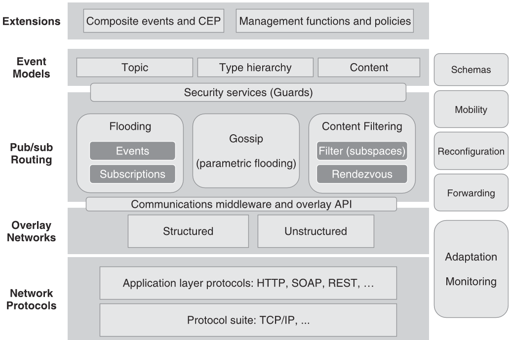

>图 7.1 分布式 pub/sub 系统的组件。

该图展示了几个重要组件和所需的附加服务。其中一些组件跨越图中的多个层。自适应和监控组件是应对网络故障和变化所必需的。pub/sub 网络需要适应底层 overlay 网络及其下层网络。事件和消息转发是 pub/sub 系统的关键功能，因此需要转发组件。为了分离关注点，routing 和转发表应该是独立的结构。重配置组件在 pub/sub routing 层运行，并与下层的自适应和监控组件互操作。重配置组件需要配置 pub/sub routing 拓扑，以及 routing 和转发表，以实现 pub/sub 到网络拓扑的良好映射。移动性组件负责管理移动 subscriber 和 publisher，并配置 pub/sub routing 拓扑以反映它们的当前位置。最后，schema 组件负责事件类型及其结构。除了这些组件外，完整的 pub/sub 解决方案还需要各种管理和安全功能、策略以及用户界面。安全解决方案需要考虑解决方案栈的每一层，以全面保护 subscriber、publisher、broker 和整个 pub/sub 网络。复合事件服务可以被视为基本 pub/sub 系统的应用；然而，复合事件检测的部分可以且应该分布在各个节点上。这需要与底层组件进行交互。

事件系统是一个逻辑上集中的组件，可以是单个服务器或多个联合服务器。在由多个服务器组成的分布式系统中，有两种连接信息源和监听器的方法：

• 事件服务支持事件的 subscription，并将注册消息路由到适当的服务器（例如，使用最小生成树）。这种方法的一个优化是使用广告（advertisement），即指示事件源打算提供某种类型事件的消息，以优化事件 routing。

• 使用其他绑定组件的方式，例如查找服务。

在此上下文中，事件监听器是指位于网络上与 publisher 物理不同节点的外部实体。然而，事件也是实现线程间和本地通信的强大方法，可能有多个本地事件监听器等待本地事件。

事件 routing 要求网络内支持存储转发类型的事件通信。这需要称为事件路由器或 broker 的中间组件。每个事件源至少连接到一个路由器。每个路由器需要知道域中其他路由器的适当子集。在这种方法中，最坏情况下，请求被引入每个路由器以获得所有消息监听器的完全覆盖。这是不可扩展的，routing 需要通过局部性或跳数来约束。限制事件传播的有效策略包括区域、JEDI 中使用的树拓扑，或 SIENA 架构中讨论的四种服务器配置。SIENA 在整个事件系统中广播广告；subscription 使用广告的反向路径进行 routing，通知使用 subscription 的反向路径进行 routing。IP 多播也是常用的网络级信息传播技术，在封闭网络中效果良好，然而在大型公共网络中，多播或广播可能不切实际。在这些环境中，普遍采用的标准如 TCP/IP 和 HTTP 可能是所有通信的更好选择。

在事件文献中已经提出了许多不同的路由器拓扑。著名的路由器拓扑包括：

• 集中式，

• 层次式，

• 无环、有环，以及

• 基于汇聚点（RP）的拓扑。

集中式路由器代表了分布式操作的简单情况，其中 subscriber 和发布者使用客户端-服务器协议发送和接收事件消息，并调用路由器提供的兴趣注册服务。

在层次式系统中，每个路由器有一个主路由器和多个从路由器。通知总是发送给主路由器。通知也发送给之前已表达对通知感兴趣的从路由器。基本的层次式设计在可扩展性方面有限制，因为一个主路由器是分发树的根，将接收系统中产生的所有通知。层次式拓扑在 JEDI 系统 [1, 2] 中使用，带有广告的无环拓扑在 Rebecca [3–5] 中使用。

对于无环和有环拓扑，路由器采用不同的服务器到服务器协议来交换兴趣传播信息和控制消息。无环拓扑比层次式拓扑允许更可扩展的配置，但缺乏有环拓扑的冗余性。另一方面，基于有环图的拓扑需要技术（如最小生成树的计算）来防止环路和不必要的消息传递。SIENA 项目研究和评估了具有不同兴趣传播机制的拓扑 [6, 7]。总体而言，无环和有环拓扑已被发现优于层次式拓扑 [1, 6, 8]。

汇聚点模型与无环和有环拓扑不同，因为特定类型事件的 routing 受到特殊路由器 RP 的约束。RP 作为广告和 subscription 的汇合点，避免了广告在整个系统中的 flooding。基于汇聚点的系统使用 RP 限制消息传播，从而试图解决 subscription 或广告 flooding 带来的可扩展性限制。通常，RP 负责预定义的事件类型。RP 可用于创建类型层次结构。在这种情况下，消息需要发送到适当的 RP 和任何超类型 RP，这可能增加消息传递成本并限制可扩展性 [9]。

### 7.2 内容过滤

pub/sub 系统可以根据其表达能力分为五类：基于 channel、topic 和 subject、基于 type、基于 header 和 content-based。基于 topic 和 channel 的系统根据通信参与者约定的 channel 名称做出内容传递决策。基于 type 的系统根据 subscriber 和 publisher 事先约定的类型层次结构做出内容传递决策。基于 subject 的系统根据单个字段做出传递决策。基于 header 的系统使用消息的特殊 header 部分来做出传递决策。我们可以将 SOAP 系统作为示例，SOAP 支持 XML 消息的基于 header 的 routing [10]。content-based 系统使用消息内容来做出决策 [11]。接下来，我们描述四种著名的消息 routing 系统类别。

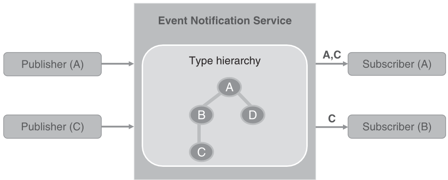

>图 7.2 基于 type 的 routing。

**基于 channel/topic。** 传递决策基于事件发布所在的 channel。channel 是具有名称的离散通信线路。命名的 channel 也称为 topic，它们代表了数字网络寻址机制的抽象。通常，在基于 channel 的消息传递中，需要将新 channel 添加到地址空间，因为生产者和消费者必须就 channel 达成一致。基于 channel 的消息传递允许使用 IP 多播组 [12]。channel 可以分配到多播地址。

**基于 type。** 类型层次结构由 publisher 和 subscriber 共享。publisher 在层次结构中的一个或多个类别下发布事件。服务然后将已发布的事件与 subscriber 进行匹配。subscriber 将接收所订阅层次结构下的所有事件。例如，类别 A 的 subscriber 将接收层次结构中 A 下所有类别的事件。类别 B 的 subscriber 同样将接收该层次结构部分下的事件，即在 C 类别中发布的事件。类型层次结构允许消息的高效 routing，并确保维护类型安全。另一方面，这种 routing 的表达能力不强，而且更改类型层次结构可能很困难。图 7.2 展示了支持类型层次结构的事件通知服务。

**基于 subject。** 传递决策基于事件的 subject。基于 subject 的 routing 比基于 channel 的 routing 更具表达能力。另一方面，单个字段可能不足以正确描述消息的内容。

**基于 header。** 传递决策基于消息 header 中的多个字段。在基于 header 的 routing 中，消息有两个不同的部分：header 和 body。只有 header 中的字段用于做出 routing 决策。基于 header 的 routing 比基于 subject 的更具表达能力，并且比 content-based routing 具有性能优势，因为只检查消息的 header。

**content-based。** 传递决策基于消息的内容，例如事件消息中的强类型字段。content-based routing 是四种类型中最具表达能力的。

pub/sub 系统通常允许 subscriber 以 filter 的形式指定传递约束。filter 模型受系统类型的限制，例如基于 header 的系统将 filter 限制为仅 header 字段，而 content-based 系统允许 filter 对整个消息内容进行语句评估。

图 7.3 展示了在由 aggregation 级别、关联和 filter 定义的三维空间中 pub/sub 的关键概念。aggregation 表示事件和 filter 的紧凑程度。例如：在许多情况下，可以将两个事件合并为一个事件而不丢失信息。类似地，两个 filter 可以在满足某些 merging 条件的情况下合并为一个 filter。关联的过滤事件涉及基于事件的模式和序列检测。通常，事件关联由复合或组合事件检测子系统提供。事件关联是 CEP 系统的基本构建块。

图 7.4 展示了一个示例事件 schema 和一个符合该 schema 的事件。schema 定义了事件的结构。通常 schema 定义事件类型，可用于强制实施互操作性所需的类型安全。schema 可以用多种方式定义，例如使用 XML schema、IDL 语言，或作为定义属性名称及其

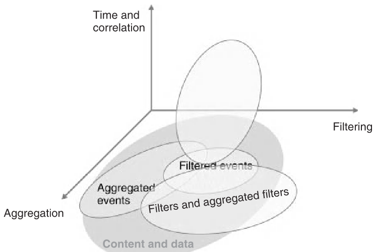

>图 7.3 filter 的三个关键维度。

| 名称|类型|允许的值|
| ---|---|---|
| Resource_name|String|ANY|
| Address|URL|ANY|
| Resource_type|String|Web page, image, stylesheet, audio file, video file, misc|

>事件 schema

| 名称|值|
| ---|---|
| Resource_name|CS Department's home page|
| Address|www.cs.helsinki.fi|
| Resource_type|Web page|

>事件

>图 7.4 示例事件 schema 及其实例。

类型的类型化元组的集合或序列。我们的示例展示了后者，其中事件由一组强类型元组组成。在这种情况下，schema 定义了属性的允许值。事件实例符合 schema。

## 7.3 routing 功能

pub/sub 路由器的主要功能是为本地客户端匹配通知，并将通知路由到之前已表达对通知感兴趣的相邻路由器。routing 功能是分布式系统的重要组成部分，也是 routing 算法的核心。routing 功能的理想特性包括小的 routing 表大小和转发开销 [8]、支持频繁更新以及高性能。

实现 routing 功能以及它如何在分布式环境中构建和维护 routing 表有许多方式。显然，需要相当数量的

>事件消息 flooding

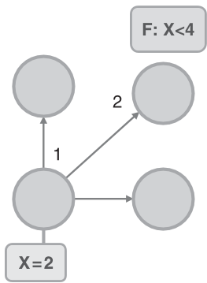

>图 7.5 基于事件 flooding 的 routing。

控制消息来连接网络中的 publisher 和 subscriber。一种简单直接的方法是将所有事件 flooding 到所有 subscriber，或将所有 subscription 逐一与事件进行匹配。前一种策略如图 7.5 所示，每个 subscriber 评估所有已发布事件以寻找潜在匹配。在后一种中，subscription 被 flooding，每个 publisher 评估是否应将发布传递给 subscriber。这些方法扩展性不好，需要更复杂的技术。

假设发布了许多事件，且事件多于 subscription，基本策略是在网络中选择性地 flooding subscription 消息，以到达所请求数据的所有可能 publisher。这种策略通常通过反向路径 routing 实现，使得已发布的通知沿着 subscription 消息的反向路径发送。这种类型的 routing 根据表达能力有不同的变体。

在简单 routing 中，网络中的每个路由器跟踪系统中的每个 subscription。图 7.6 展示了这种简单方法，它需要将 subscription flooding 到整个网络。这可以通过以下策略实现。

收到消息 subscribe $ (F,X) $ 后，其中 X 可以是相邻路由器或本地客户端，当前路由器 R 执行以下操作：

• 将 $(F, X)$ 对添加到 routing 表中。

• R 向除接收 subscription 的 X 之外的所有相邻路由器发送新消息 subscribe $ (F,R) $。

取消订阅可以以类似方式处理。这种方法适用于小型网络或 subscription 相对静态的网络。该方法适用于无环网络；然而，对于有环网络，需要额外的广播功能来防止环路。在大型网络中，信令成本可能过高。

基于身份的 routing 是对简单 routing 的小改进，其中 routing 表可能包含冗余条目。在基于身份的 routing 中，如果相同的 subscription 之前已转发给该

>subscription flooding

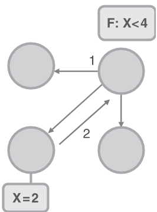

>图 7.6 基于 subscription flooding 的 routing。

路由器，则 subscription 不会转发给相邻路由器 [4]。这消除了 routing 表中的重复条目，从而减少了不必要的 subscription 转发，但使取消订阅的处理变得复杂。只有当没有本地客户端具有相同 filter 的未完成 subscription 时，取消订阅才会发送给相邻路由器。使用 subscription 处理的逆操作来传播取消订阅。

在基于 covering 的 routing 中，使用 covering 测试代替身份测试。这导致传播覆盖更具体 filter 的最通用 filter。另一方面，取消订阅管理变得更加复杂，因为之前被覆盖的 subscription 可能由于取消订阅而变为未覆盖。

基于 merging 的 routing 允许路由器合并现有的 routing 条目，以减少传播的 filter 数量（即 routing 表元素）。基于 merging 的 routing 可以以多种方式实现，并与基于 covering 的 routing 结合 [8]。当之前合并的 routing 条目的一部分被删除时，基于 merging 的 routing 具有更复杂的取消订阅处理。

通常，给定 pub/sub 路由器的邻居集合不是静态的，而是可以随时间变化，新邻居加入和现有邻居离开。这需要支持动态邻居集合。这涉及对于新邻居，扫描 routing 表以查找应发送给新邻居的条目。此外，从新邻居接受新的 subscription，然后首先更新到本地 routing 表，然后发送给其他邻居。必须注意确保不创建环路。通常，routing 更新借助最短生成树传播，以确保网络是无环的。当邻居离开或失败时，该邻居的 routing 表条目被删除。这种 routing 状态删除首先在本地完成，然后向其他邻居发送必要的更新，使它们不向当前路由器发送不必要的通知。动态 routing 表过程在 filter 模型和 routing 方案之间有所不同，但基本思想对于不同形式的 pub/sub routing 是相同的。

到目前为止，我们讨论了 subscription 驱动的分布式操作。也可以考虑以广告形式的显式 publisher 公告。在广告语义下，路由器首先传播广告。subscription 然后在广告的反向路径上连接。通知如前所述在 subscription 的反向路径上转发。广告可以与各种 routing 机制一起使用。广告通常有自己的 routing 表，并使用与 subscription 相同的算法进行管理。广告的删除导致路由器删除发送取消广告消息的邻居的所有重叠 subscription。类似地，传入的广告要求将重叠的 subscription 转发给发送广告消息的邻居。广告的使用显著提高了事件系统的可扩展性 [1, 6, 8]。

基于这两种语义并带有优化的首批广域 pub/sub 系统之一是 SIENA 系统，它使用 filter 之间的 covering 关系来防止不必要的通信。SIENA 系统为三种不同的比较开发了 covering 概念：将通知与 filter 匹配、两个 subscription filter 之间的 covering 关系，以及广告 filter 和 subscription filter 之间的重叠。covering 和重叠关系已在许多后续系统中使用，如 Rebeca [5] 和 Hermes [9, 13]。这些系统将在第 9 章中更详细地讨论。

## 7.4 基于 topic 的 routing

基于 topic 的 publish/subscribe 是一种通信范式，支持在一组数据生产者和消费者之间进行选择性消息传播。消息与 topic 关联，并选择性地路由到具有匹配 topic 兴趣的目的地。图 7.7 展示了具有集中式通知服务的基于 topic 的 pub/sub。

许多行业解决方案（如 TIBCO、IBM WebSphere MQ）支持基于 topic 的 pub/sub。在基于 topic 的 pub/sub 中，发布消息属于一组 topic 之一（同样可以是 group、subject 或 channel）。用户通过指定一个或多个 topic 来定义 subscription，并将接收与这些 topic 关联的所有发布。

broker 维护消息的 channel（或队列），并解耦 publisher 和 subscriber。通常，topic 名称与 channel 关联，用于创建 channel。每个 channel 由唯一名称（或其他别名）标识。唯一名称经常用作 publish() 和 subscribe() 函数的参数。

就 topic 的语义而言，topic 只是一个字符串，代表消息分类所依据的名称、subject 或 topic。作为简单的语义模型，所有 topic 都是扁平的，用户直接通过 topic 定义其感兴趣的内容。除此之外，topic 的层次关系对于编排 topic 很有用。通过层次化 topic，broker 根据包含关系组织 topic。基于

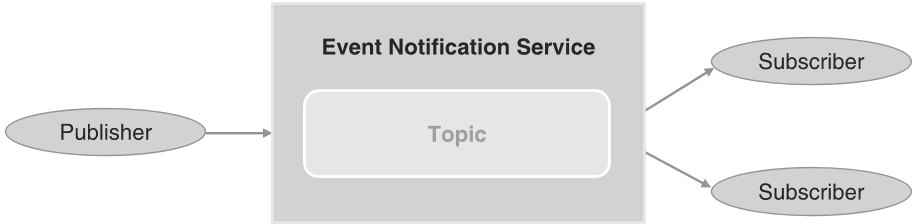

>图 7.7 基于 topic 的 routing。

层次化 topic，对层次结构中某个 topic 的 subscription 隐式订阅了该 topic 下的所有子 topic。topic 的层次结构为 subscriber 和 publisher 提供了许多灵活的方式，并被大多数行业供应商广泛采用。

基于 topic 的 pub/sub 的匹配问题可以在 topic 空间上解决，比其 content-based 对应物简单得多。

### 7.4.1 机制

基于 topic 的 publish/subscribe 系统以其向客户端提供的服务质量（QoS）来区分，如各种程度的可靠性、消息持久性、消息排序约束、消息传递保证和消息传递延迟约束等。由于基于 topic 的 pub/sub 的 QoS 可以遵循一般 pub/sub 系统的 QoS 设计。

在本节中，我们主要关注与基于 topic 的 pub/sub 相关的独特机制：如何在基于 topic 的 pub/sub 中维护 topic。首先，channelization 问题研究了在基于 topic 的 pub/sub 的 broker 内部维护 channel 的最小成本。其次，给定一个 overlay 网络，以最少的边连接分布式基于 topic 的 pub/sub，同时确保对于每个 topic $t$，在 $t$ 上发布的消息可以到达所有对 $t$ 感兴趣的节点。最后，基于实际的 RSS 新闻传播应用，在对等场景中，一种新颖的聚类算法持续调整 topic 集群以最小化 topic 的维护。

遵循经典综述 [14]，我们不严格区分基于 topic 的 pub/sub 和基于 channel 的 pub/sub。这是因为向 channel 发布消息类似于将消息与 topic 关联，而 topic 可以是 channel 的名称或标识。

## 7.4.2 channelization 问题

channelization 问题最初在 [15] 中在流量和固定数量 channel 的上下文中进行了研究。在大规模数据传播应用中，例如基于 topic 的 pub/sub 系统，大量发布被传递给大量 subscriber。然而，由于用户兴趣的差异，并非所有接收者都对所有发布感兴趣。channel 提供了向用户传递感兴趣发布的机会。然而，channel 的维护需要资源和管理开销。给定大量的 topic 或发布，不可能为每个 topic（或每个发布）维护一个 channel。

因此，给定有限数量的 channel 以及大量信息源（即 publisher）和消费者（即 subscriber），该问题定义了（i）信息 publisher 和 channel 之间的映射以及（ii）信息消费者和 channel 之间的映射。基于这些映射，期望用户接收所有需要的信息而不错误排除，同时最小化用户接收的不需要数据量。

已经证明，具有约束或无约束条件的 channelization 问题是 NP 困难的，并且已经提出了几种启发式方法，包括随机分配、基于流的合并和基于用户的合并 [15]。

#### 7.4.3 具有多 topic 的分布式 overlay

与 [15] 为基于 topic 的 pub/sub 维护 broker 的 channel 不同，[16, 17] 研究了设计可扩展 overlay 网络以支持去中心化基于 topic 的 pub/sub 通信的问题。他们提出了一个新问题，即*最小 topic 连接 overlay（Min-TCO）*，以捕获 overlay 可扩展性（就 fanout 参数而言）和通信方产生的消息转发开销之间的权衡。即给定一组节点及其 subscription，使用*最少可能数量的边*连接节点，使得对于每个 topic $t$，在 $t$ 上发布的消息可以仅通过对 $t$ 感兴趣的节点转发到达所有对 $t$ 感兴趣的节点。

已经证明 Min-TCO 的判定版本是 NP 完全的 [16]，并且存在一个多项式算法，可以在构建的 overlay 的边数方面以对数因子近似最优解。进一步证明，通过表明没有多项式算法可以在常数因子内近似 Min-TCO（除非 P = NP），该近似比几乎是紧的 [16]。

### 7.4.4 基于 topic 的 pub/sub 中的动态聚类

随着 RSS 新闻联合的普及，需要在 Internet 上进行可扩展和实时的文档分发。通过将每个 RSS URL 视为一个 topic，RSS 新闻的传播可以被视为基于 topic 的 pub/sub 的应用。每个 topic 中事件的传播产生两个主要成本：（1）topic 事件的实际传输成本，以及（2）其支持结构的维护成本。当 pub/sub 系统支持大量具有中等事件频率的 topic 时，这种维护开销变得尤为突出。

为了克服维护开销，已经提出了一种动态聚类方法，将此维护开销降低到最小 [18]。分布式聚类算法利用用户 subscription 之间的相关性，将 topic 动态分组为虚拟 topic（称为 topic 集群），从而统一其支持结构并降低成本。这种技术持续调整 topic 集群和用户 subscription 以适应系统状态，并且只产生非常小的开销。

### 7.4.5 小结

在本节中，我们介绍了基于 topic 的 pub/sub 的基本概念，并给出了采用基于 topic 的 pub/sub 模型的行业示例。最后，我们介绍了三个关于基于 topic 的 pub/sub 的最新研究系统。这些系统主要关注 topic 的维护，特别是在 topic 数量非常大时降低维护成本。

## 7.5 基于 filter 的 routing

图 7.8 展示了 filter 传播技术，其中 filter 在网络中选择性地 flooding，匹配的事件消息直接或沿着反向

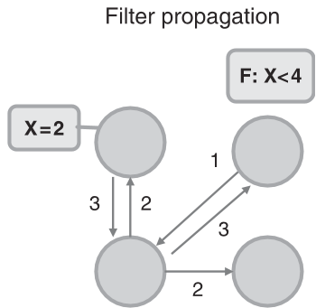

>图 7.8 基于 filter 传播的 routing。

路径传递给 subscriber。这与本章前面讨论的简单 subscription flooding 形成对比。基于 subject、基于 header 和 content-based routing 都是使用 filter 进行 routing 的示例。这种方法很适合 filter aggregation，可用于减少 routing 表大小和匹配成本。这种基于 filter 的策略被本书中介绍的许多解决方案频繁采用。实际上，更复杂的 content-based routing 模型就是建立在此基础上的。

算法 7.1 给出了一个简单 filtering 路由器的示例，它维护两个结构：routing 结构和匹配结构。routing 结构用于远程 subscription，匹配结构用于本地客户端。该算法不处理重复检测或 filter 包含。此外，它不处理动态邻居的情况，对于动态环境需要添加管理新邻居和删除现有邻居的代码。

动态邻居可以通过以下过程描述来处理：

• 对于新邻居，重要的是确保网络中不会创建环路。如果网络基于无环图拓扑，则这是有保证的。否则，需要额外的机制来确保不创建环路。

• 新邻居将接收必须从其订阅的那些 filter。新邻居将接收当前 routing 表（可能以聚合形式）。新邻居然后发送自己的 routing 表。如果 routing 拓扑是有环的，交换的 routing 表数据需要以不创建环路的方式处理。

• 在此之后，新邻居已连接到 pub/sub 网络（或两个独立网络已合并）。

• 当邻居离开时，从离开邻居接收的 filter 被简单地丢弃，并在必要时通过取消订阅从其他邻居中删除。

这种添加和删除邻居的通用过程推广到许多形式的基于 filter 的 routing，例如基于汇聚点和 content-based 变体。

## 算法 7.1 基于 filtering 的 routing

数据：Op 表示路由器的操作，m 表示操作的数据，x 表示发送操作的节点。

### begin

SUB 是本地 subscription 的集合。

EXT 是外部 subscription 的集合。

switch Op do

case \(\bar{P}\)ublish

matched $\leftarrow$ match(m, SUB)

trigger notify(m) for matched

\(fwd \leftarrow match(m, EXT)\)

forward data m to fwd \ {x}

end

case Subscribe

if x is a client then

SUB ← SUB ∪ {m} / * 更新匹配结构。 */

else

EXT ← EXT ∪ {m} /* 更新 routing 结构。 */

end

Send (Op, m) to neighbours \ {x}

end

case Unsubscribe

if x is a client then

SUB ← SUB \ {m} /* 更新匹配结构。 */

else

EXT ← EXT \ {m} /* 更新 routing 结构。 */

end

Send (Op, m) to neighbours \ {x}

end

end

end

## 7.6 content-based routing

在内容信息模型中，用户根据其兴趣订阅信息。content-based 路由器或 broker 的网络然后负责将匹配兴趣的消息传递给适当的 subscriber。content-based routing 通常在网络层之上实现。这种 content-based 模型与典型的网络模型形成对比，在典型网络模型中，数据被发送到接收者地址（单播）或一组地址（多播）。经典的 content-based pub/sub 系统是 1990 年代后期开发的 SIENA 系统。在本节中，我们关注此模型。

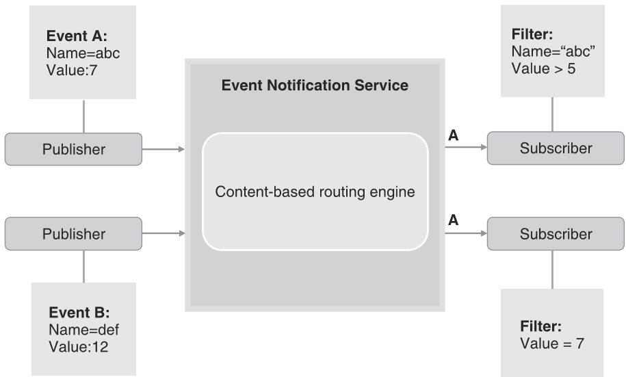

>图 7.9 content-based routing。

图 7.9 展示了一个简单的单 broker 示例的 content-based routing 方案。两个 subscriber 已连接到 content-based 路由器并安装了活动 filter。两个 publisher 也已连接，它们发布了两个事件，然后由 routing 服务与活动 filter 进行匹配。匹配的结果是，subscriber 被通知。事件 B 没有任何匹配的 filter，但事件 A 被转发给两个 subscriber。两个 filter 一起定义了此路由器的 content-based 子网络。

### 7.6.1 寻址模型

Carzaniga 和 Wolf 通过将定义 subscription 的谓词视为目的地址来定义 content-based 寻址模型 [19]。在此模型中，数据报通过其内容隐式地寻址到节点。可以开发各种谓词模型。通常，谓词模型基于一组捕获接收者兴趣的布尔函数。

在 content-based 网络中，每个节点（客户端或路由器）公告一个接收者谓词（r-predicate），定义节点有兴趣接收的数据报集合。节点也可以公告发送者谓词（s-predicate），定义节点打算发送的数据报。节点 n 的 content-based 地址是其 r-predicate $ p_{n} $ [7, 20]。

节点的 content-based 地址是隐式的，与标准的网络地址概念非常不同。content-based 地址与 IP 地址的关键区别包括节点 content-based 地址的变化速率、地址和网络对发送和接收主机的抽象，以及许多节点可以具有相同地址的事实。变化速率可能比传统地址快几个数量级，给网络可扩展性带来挑战。节点在 content-based 网络中没有唯一地址；然而，唯一地址通常在下层使用 [7, 20]。

content-based routing 需要使用转发表的算法。转发表负责将接收者谓词映射到接口，使得给定消息可以确定适当的目的接口。转发系统通常需要考虑网络拓扑并防止转发环路。传入的数据报仅转发到从源开始的广播路径上的节点。广播路径由广播函数定义；例如，它可以由以数据报源为根的生成树确定。

在网络中，子网是在单个子网地址下拓扑上彼此接近的一组节点。子网由单个地址标识的事实允许路由器维护紧凑的 routing 表，从而提高可扩展性。子网也可以由路由器通过超网聚合，其中多个 routing 表条目合并为单个条目。这两个原则也可以应用于 content-based 网络的上下文。设 filter $F_1$ 和 $F_2$ 分别表示路由器 $p$ 和 $q$ 的 filter。如果 $F_2 \supseteq F_1$，则 $p$ 是 $q$ 的 content-based 子网，$q$ 是 $p$ 的 content-based 超网。

### 7.6.2 传播 routing 信息

content-based 路由器通过在网络中选择性地 flooding subscription 和可选的广告来传播 routing 信息。content-based 模型很适合 subscription 和广告的 covering，这通过确定谓词（filter）的包含关系来实现。covering 关系和相关数据结构在第 8 章中讨论。

图 7.10 展示了在实现广告和 covering 优化的 content-based pub/sub 系统中，处理传入 subscription 消息时如何选择下一跳邻居。任何消息的目的地集合受邻居约束。邻居集合然后受从邻居接收的广告以及可能的汇聚相关信息的约束。在后者中，网络分配了特定的内容特定汇聚点来约束消息传播。在删除没有匹配广告的邻居后，subscription 被发送给尚未接收 covering subscription 的邻居。

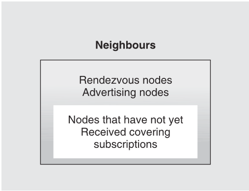

>图 7.10 routing 表结构。

### 7.6.3 routing 行为：subscription

我们通过考察 SIENA 系统的工作方式来考虑如何实现 content-based 路由器的 routing 和转发功能。SIENA 定义了一种称为 poset 的特定 routing 表结构，它基于 filter 的 covering 关系存储 filter。这个想法很简单——更通用的 filter 覆盖或包含更具体的 filter。这样，该结构可以为 routing 目的聚合 filter。我们在第 8 章中回到 poset 结构，其中给出了详细算法。现在，我们假设有一个 poset 结构用于存储 filter，并使用 poset 存储的信息，我们计算 forwards 集合，其中包含传入 subscription 或取消订阅消息的下一跳邻居。

在基于无环图路由器拓扑的分布式操作中，SIENA 服务器定义了如方程中所示的集合 $forwards(f)$

$$ \begin{array}{r}{\mathrm{f o r w a r d s}(f)=\mathrm{n e i g h b o u r s}-N S T(f)-\bigcup_{f^{\prime}\in P_{s}\wedge f^{\prime}\supseteq f}\mathrm{f o r w a r d s}(f^{\prime}).}\end{array} $$

(7.1)

neighbours 集合包含连接到当前 broker 的事件 broker（一个应用层跳距）。函子 NST（Not on any Spanning Tree，不在任何生成树上）意味着 $f$ 的传播必须遵循以 $f$ 的原始 subscriber 为根的计算生成树。对于无环拓扑，NST 包含发送 $f$ 的邻居。通过 NST 项，系统可以支持不同的拓扑，包括有环拓扑。

$P_s$ 表示 subscription poset。使用该方程，$f$ 永远不会转发给发送它的邻居。由于方程的最后一项，subscription 不会转发给已经发送了 covering subscription 的任何路由器。我们观察到只有 poset 结构的前两层可以具有非空的 forwards 集合。

因为 $X$ 从被 $f$ 覆盖的所有 subscription 中删除，中间 pub/sub 路由器不知道由于取消订阅应该转发哪些 subscription。这些信息本质上被此优化丢失了；然而，subscription 的源头拥有这些信息，并在同一消息中传播由于取消订阅而产生的任何 subscription，其他服务器以原子方式应用该消息。$\text{unsubscribe}(X, f)$ 从被 $f$ 覆盖的所有 subscription 的 subscriber 集合中删除 $X$。具有空 subscriber 集合的 filter 被删除。

算法 7.2 概述了 subscribe 和 unsubscribe 如何使用 poset

消息处理程序。

### 算法 7.2 subscription 处理的消息处理程序

数据：Op 表示路由器的操作，f 表示输入 filter，x 表示发送操作的节点。

#### begin

$P_s$ 是 subscription poset 的集合。

switch Op do

case Subscribe

将 $(f,x)$ 添加到 $P_s$。

使用 forwards(f) 转发 subscription 消息。

end

case Unsubscribe

从 $P_{s}$ 中删除 $(f,x)$。

设 $ F_{O} $ 表示旧的 forwards 集合，$ F_{N} $ 表示在 subscriber x 从 subscriber 集合中删除后为 f 新计算的 forwards 集合。

if subscribers set is empty then

$$ F_{N}=\emptyset. $$

end

取消订阅被转发到 $F_O \setminus F_N$。

如果存在来自其他邻居的覆盖 $f$ 的 subscription，该集合可能为空。

被 f 覆盖的 subscription 的 forwards 集合可能改变，这可能需要转发新的 subscription。

$P_s$ 中任何未覆盖的 subscription 随取消订阅消息一起转发。

未覆盖的 subscription 是由于 covering filter 的删除而其 forwards 集合获得额外元素的 subscription。

end

end

end

## 7.6.4 routing 行为：广告

基本的 subscription 语义可以通过使用广告来优化。在此模型中，广告被传播到每个节点，subscription 仅向之前已公告重叠 filter 的广告者传播。这个想法是使用额外的广告信息来防止 subscription flooding。该模型使用两个 poset 数据结构，每种消息类型一个。

在广告语义中，第二个 poset $P_a$ 用于广告 [21]。对于每个广告 $a \in T_A$，需要集合 $advertisers(a)$ 和 $forwards(a)$，其中 $T_A$ 是

poset 中所有广告的集合。不是将 subscription 转发到全局 neighbours 集合，而是使用受广告约束的集合，如方程所示

$$ n e i g h b o u r s_{s}=\bigcup_{a\in T_{A}:a\simeq s}a d v e r t i s e r s(a)\cap n e i g h b o u r s. $$

(7.2)

在这种情况下，方程 7.2 使用 $neighbours_s$ 集合代替 $neighbours$ 集合。因此，广告可能导致多个 subscription 被转发给广告的发送者。取消广告的过程类似于取消订阅。

### 算法 7.3 广告扩展

数据：Op 表示路由器的操作，m 表示操作的数据，x 表示发送操作的节点。

begin

EXT 是外部 subscription 的集合。

ADV 是来自邻居的广告集合。

switch Op do

case Advertise

ADV $\leftarrow$ ADV $\cup$ {m} /* 更新 adv 结构。

将来自 x 的 m 添加到 ADV。将 m 转发给 neighbours \ {x}

end

case Subscribe

EXT ← EXT ∪ {m} /* 更新远程 subsc. 结构。

*/

A ← getMatchingADV Destinations(m, x)

/* 接收的广告约束 routing */。

Send (Op, m) to (neighbours \ {x}) ∩ A

end

case Unsubscribe

转发取消订阅和未覆盖的 subscription。

end

case Unadvertise

转发取消广告和未覆盖的广告。

end

end

end

## 7.6.5 routing 表

content-based routing 表的理想特性是效率、小尺寸、支持频繁更新以及可扩展性和互操作性。routing 表数据结构应足够通用，以支持广泛的 filter 语言。

content-based 路由器的 routing 表通常表示为集合，插入和删除 filter 的机制未指定。例如，JEDI [2]

和 Hermes [9] 将 filter 保存在简单表中，Rebeca 使用集合和计数算法来查找 covering filter 和可合并 filter [4]。routing 需要两种基于计数的算法。一种用于确定被覆盖的 filter，一种用于确定 covering filter。我们在第 8 章中研究匹配算法和结构。

filter poset 数据结构在 SIENA 系统中用于按 covering 关系存储 filter 并管理与转发消息相关的信息。filter poset 可以被视为 SIENA 路由器的 routing 表。poset 按通用性存储 filter，也可以通过从最通用的 filter 开始仅遍历 poset 中匹配的 filter 来将通知与 filter 进行匹配。我们将覆盖其他 filter 的最通用 filter 集合称为所讨论数据结构的根集合。

filter poset 是一种通用数据结构，可以与各种 filter 语义一起使用。poset 也可用于各种兴趣传播机制，如 subscription 和广告语义。另一方面，这种通用性有性能缺点。SIENA 的一个发现是 filter poset 算法限制了路由器的性能，需要更高效的解决方案 [20]。第 9 章中讨论的两层 CBCB 设计被提出作为可扩展性挑战的解决方案。

## 7.6.6 转发

转发功能负责确定到达路由器的数据报的下一跳目的地集合 [19]。下一跳目的地集合可以包含相邻路由器和连接到路由器的客户端节点。路由器根据数据报内容及其*转发表*计算下一跳目的地。转发表是由 routing 功能编译和更新的内部数据结构。

从概念上讲，content-based 转发表和 routing 表是不同的结构。前者可以针对快速匹配进行优化，而后者针对高效的更新和删除操作进行优化。转发表然后由 routing 功能根据接收到的 routing 状态更新定期更新或重建。然而，在实现层面，routing 和转发表可以由相同的数据结构实现。图 7.11 展示了 content-based 转发表的示例。

更正式地说，转发表可以被视为从接口集合到 content-based 地址集合的映射。路由器的接口代表相邻节点。本地客户端节点可以被视为单个本地接口 $I_0$ [7, 20]。转发功能的任务是为传入的数据报或消息找到下一跳接口集合。

| 接口|节点 ID|地址|
| ---|---|---|
| $I_0$|local|$(p   < 400) \lor (al = \text{FINNAIR})$|
| $I_1$|R2|origin = HEL|
| $I_2$|R3|destination = SFO|
| $I_3$|R4|$(p   < 200.00) \lor (p   < 300.00)$|

>图 7.11 路由器维护的 content-based 转发表。

## 7.6.7 性能问题

转发功能的吞吐量决定了路由器的吞吐量。因此，优化转发功能的性能至关重要。这种优化涉及转发和 routing 功能，因为 routing 功能为转发功能提供数据。这种优化一直是活跃的研究和开发领域，许多高效算法已为各种数据模型所知。除了路由器吞吐量外，还需要考虑其他指标，如下：

• 整体性能；

• routing 表的大小；

• routing 协议的信令开销；

• 转发功能的准确性（假阳性和假阴性）；

• 时间波动（突发性）；

• 拓扑变化时的重配置时间。

与转发功能相关的早期研究是在集中式 pub/sub 系统中的事件匹配上下文中进行的 [7, 20]。我们在第 8 章中回顾匹配和转发算法的历史和当前最新技术。

### 7.6.8 带有广告的通用 broker

基于广告语义的 content-based broker 或路由器如图 7.12 所示。路由器负责连接广告者和 subscriber，并转发通知。路由器处理消息，消息可以是 subscription、广告、通知或控制消息，这些消息被发送到接口和从接口接收。接口 $I$ 代表路由器的特定邻居。图 7.12 的上部展示了一个具有四个路由器的简单配置。

图的中间部分更详细地展示了路由器功能。对于消息转发功能，每个输入接口映射到除自身外的所有输出接口。routing 核心负责维护 routing 状态并将消息映射到接口。routing 状态通常使用第 8 章中讨论的 poset 数据结构来维护。路由器还负责队列管理和流量优先级。

我们现在可以制定带有广告的 content-based 路由器行为的假设。

• 来自输入接口 I 的任何消息不会转发到输出接口 I。

• 如果接口具有匹配的输入 subscription，则通知必须转发到输出接口。

• 如果接口具有重叠的输入广告且 covering subscription 尚未转发，则 subscription 必须转发到输出接口。

- 如果 covering 广告尚未转发，则广告必须转发到输出接口。

• 如果接口已订阅该消息且没有 covering subscription 和本地 subscription，则取消订阅消息必须转发到输出接口。如果存在被取消订阅覆盖的活动 subscription，它们随取消订阅消息一起转发，并使用原子操作安装在其他路由器上。

• 如果之前已转发广告且没有 covering 广告或本地广告，则取消广告必须转发到输出接口。如果存在被取消订阅覆盖的活动广告，它们随取消广告消息一起转发，并使用原子操作安装在其他路由器上。

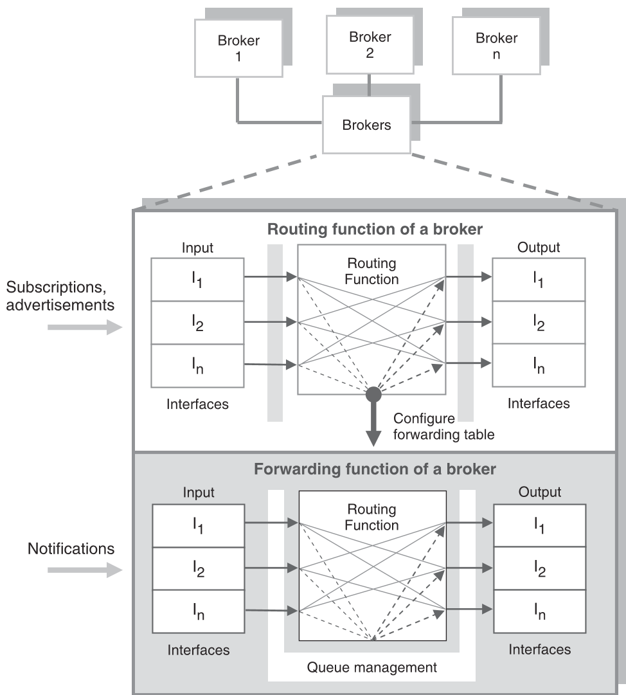

>图 7.12 content-based broker 的剖析。

## 7.7 基于汇聚点的 routing

汇聚点（RP）在许多 overlay routing 系统 [22–24] 中用于降低通信成本和实现非固定间接点。本质上，RP 约束广告和 subscription 的传播，它们是一种协调机制。RP 可以在寻址空间上均匀分布或使用某种特定方案放置。使用均匀分布放置 RP 的动机是，从匹配的角度来看，事件类型是不相交的。另一方面，事件流量分布很可能是非均匀的，这也应该被考虑。非均匀流量分布的问题是 RP 可能位于网络的另一侧。RP 然后可能成为性能和可扩展性瓶颈。

图 7.13 展示了基于汇聚点的 routing，其中 RP 用于协调信令。这种 routing 形式类似于基于 filter 的 routing，但现在 RP 限制了消息的传播。关键思想是 subscription（filter）和已发布的事件消息在 RP 处或在前往 RP 的途中相遇。这种 routing 形式可以比简单地选择性 flooding subscription 更高效。

在下文中，我们考虑 RP 通过仅向汇聚点传播消息来约束基本的基于 filter 的 routing 的情况。算法 7.4 给出了这种带有广告的 routing 的概要。如图 7.10 所示，邻居、汇聚点和广告都约束 subscription 传播。汇聚方案有许多变体，取决于 RP 的角色和 RP 的复制。我们在第 9 章中讨论几种替代方案。

#### 算法 7.4 covering 扩展

数据：Op 表示路由器的操作，m 表示操作的数据，x 表示发送操作的节点。

##### begin

EXT 是外部 subscription 的集合。

ADV 是来自邻居的广告集合。

##### switch Op do

case Subscribe
EXT ← EXT ∪ {m}    /* 更新远程 subsc. 结构。
*/
R ← getRendezvousDestinations(m, x)
A ← getMatchingADVDestinations(m, x)
C ← getCoveredDestinations(m, x)
/* 广告和汇聚点都约束 routing */
Send (Op, m) to (neighbours \ (C ∪ {x})) ∩ A ∩ R
end
case Unsubscribe
转发取消订阅。
end
d

>汇聚点 routing

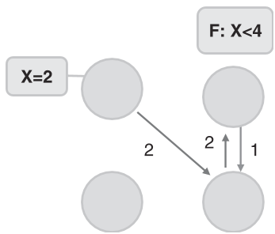

>图 7.13 基于汇聚点的 routing。

## 7.8 routing 不变量

不同的不变量系统属性对于表征网络和确保某些重要要求不被违反很有用。例如，我们感兴趣的是表明即使 routing 系统随时间变化，也不会丢失已发布的事件。

在本节中，我们首先考察一般 routing 算法的配置和不变量概念，然后考察 pub/sub 特定的不变量。

### 7.8.1 配置

定义有用的 routing 和系统不变量的第一步是配置的概念，它是分布式系统状态的特定快照。配置包含网络的节点及其当前链路。通常，配置表示为图，节点和链路建模为节点之间的边。

现在，我们可以定义 routing 配置和算法的健全性、完整性和拉伸概念 [25]。配置的健全性意味着所有被报告为可达的节点确实是可达的，对于 routing 算法，当更新活动结束后所有这些节点都是可达的。可达性函数 $f_u(w)$ 报告节点 $w$ 在 $u$ 处是否可达。函数 $\phi(u, w)$ 给出节点 $u$ 和 $w$ 之间的路径（如果存在）。

**定义 7.1** 如果对于所有节点 $u$ 和 $w$，$f_u(w) \neq \text{NONE}$ 意味着 $\phi(u, w)$ 是从 $u$ 到 $w$ 的路径，则配置是健全的。如果 routing 算法在网络安静后产生健全配置，则它是健全的。

**定义 7.2** 如果对于所有 $u$ 和 $w$，$\phi(u, w)$ 是有限的，则配置是无环的。如果 routing 算法在网络安静后产生无环配置，则它是无环的。

健全配置和无环配置之间的区别在于，在后者中，节点只需要知道转发到下一跳不会导致环路（但数据包可能在路径上的某处被丢弃），而在健全配置中，转发到下一跳必须实际到达目的地。

实现健全性的最简单方法是每个节点通过设置 $f_u(w) = NONE$ 对所有目的地 $w$ 假装所有人都不可达。显然这是一个不期望的配置，所以 $f_u(w)$ 应该仅在 $w$ 从 $u$ 不可达时为 NONE。这个属性称为完整性。

**定义 7.3** 如果对于所有不同的 $u$ 和 $w$，如果 $w$ 从 $u$ 可达则 $f_u(w) \neq \text{NONE}$，则配置是完整的。如果 routing 算法在网络安静后产生完整配置，则它是完整的。

健全性和完整性属性合在一起表示所有节点都可以通过转发到达；然而，它们没有说明路径的最优性。因此我们需要拉伸的概念，定义 routing 算法给出的路径与最佳可能路径相比的最优程度。拉伸是评估 routing 算法优劣的常用指标。

### 7.8.2 pub/sub 配置

上述健全性和完整性概念是通用的，仅涉及网络中节点的基本可达性。健全性和完整性是 pub/sub 网络的有用不变量；然而，需要额外的定义来确保事件被正确传递，并且在网络拓扑变化发生时不会丢失事件。

我们感兴趣的是确保 routing 配置有效，使 pub/sub 系统不允许非法操作。为了正式定义有效 routing 配置的概念，我们需要定义可能发生的操作。trace 是按因果顺序排列的操作序列，如 subscribe、notify 和 unsubscribe，确定系统的执行。现在，我们可以形式化定义有效 routing 配置的约束。定义约束的常用技术是线性时序逻辑（LTL）。LTL 公式用于定义规范，当系统仅展现规范允许的 trace 时，系统是正确的。关键约束用以下定义：$\square$ 表示"始终"，$\diamond$ 表示"最终"，$\circ$ 适用于 trace 中的下一个操作符。$N$ 表示所有通知的集合 [4]，$N(F)$ 表示 filter $F$ 选择的通知。

任何有效的 routing 配置必须满足使用 LTL 操作符定义的以下 trace 约束。性质 7.1 给出了具有 subscription 语义的 pub/sub 系统的活性约束。该属性定义了何时应传递通知，并确保它们最终被传递。

性质 7.2 给出了安全约束，确保不正确的事件不被处理和传递。注意，该属性没有指定通知的任何特定传递顺序，我们需要额外的约束来引入例如使用第 2 章讨论的 Lamport 的 happened-before 关系 [26] 的因果排序。

这些性质来自 [4] 中的定义，在表述上有微小变化，其中还包含广告语义的安全性和活性性质的定义，并给出了 content-based 和基于 merging 的 routing 正确性的证明。

##### 性质 7.1 活性：

$$ \Box[Sub(A,F)\Rightarrow[\diamond\Box(Pub(B,n)\wedge n\in N(F)\Rightarrow\diamond Notify(A,n))]\vee[{\diamond}Unsub(A,F)]], $$

指定具有 filter $F$ 的 subscription 和与 subscription 匹配的事件 $n$ 的发布将导致该事件后续发布的最终通知，除非 subscription 被取消订阅所失效。

##### 性质 7.2 安全性：

$$ \Box[Notify(A,n)\Rightarrow[\circ\Box\neg Notify(A,n)]\wedge[n\in Published]\wedge[\exists F\in Subs(A):n\in N(F)]], $$

指定通知仅传递一次，它之前已被发布，并且接收者具有匹配的 subscription。Published 是已发布事件的集合，Subs 集合给出每个客户端的 subscription。

### 7.8.3 假阳性和假阴性

为了理解模型和基于模型的实例，我们需要有用的指标来表征系统和事件流。两个最重要的指标是假阳性和假阴性的数量，更重要的是在特定系统中存在假阴性或假阳性的证明。假阳性是被传递但未被订阅的事件，类似地，假阴性是被订阅但在发布时未被传递的事件。显然，假阴性的存在表明任何事件系统中的严重错误。因此，我们感兴趣的是证明候选事件系统不会表现这种错误行为。其他有趣和有用的指标包括相关时间单位的端到端延迟、每个流的中间 broker 数量（端到端路径长度）和 routing 表的大小。

假阳性容易定义，但假阴性要求我们检查 subscription 活动的持续时间。例如，当前的表述容忍任何延迟，取消订阅的发出会忘记任何尚未传递的可能假阴性。

#### 7.8.4 弱有效 routing 配置

弱有效 routing 配置确保在静态拓扑中 subscription 更新过程已终止的 subscriber 的事件传递。因此，基于此配置的 routing 算法确保更新过程终止，满足定义 7.4 和 7.3（[4]）。

我们将所有已成功结束的更新过程称为在拓扑中完整的，并观察到完整性可用于表征 pub/sub 网络。因此，完整性可以在系统的多个层次上应用。在 pub/sub 中，我们也对可达性感兴趣，但不是特定节点的可达性，而是从 publisher 到 subscriber 的内容可达性。因此，需要重新表述先前的完整性概念以适用于 pub/sub 和内容传递。subscription 和广告的完整性由定义 7.4 给出。注意，定义 7.4 对拓扑施加了新的要求。

**定义 7.4** 广告 $A$ 在 pub/sub 系统 $PS$ 中是完整的，当且仅当不存在具有重叠 subscription 且未处理 $A$ 的路由器 $s \in S_B$。类似地，subscription $S$ 在 $PS$ 中是完整的，当且仅当不存在路由器 $s \in S_B$ 使得 $s$ 具有与 $S$ 重叠的广告且 $S$ 在 $s$ 上不活动。

## 7.8.5 移动安全性

在分布式 pub/sub 系统中，显然 subscription 可能需要任意数量的网络跳才能与 publisher 连接。在此配置期间发布的事件可能丢失。移动感知的弱有效 routing 配置容忍由于固定 subscriber 和 publisher 引起的重配置导致的这些假阴性。

移动客户端改变了这种场景，因为流端点是移动的，broker 使用切换过程转移端点。移动客户端期间发生的假阴性不被容忍。

移动安全的 pub/sub 系统可以定义如下 [27]：

**定义 7.5** 如果从时间 $T_0$ 的初始配置 $C_0$ 开始到时间 $T_e$ 的最终配置 $C_e$ 结束，切换（移动客户端）不会导致任何假阴性，则 pub/sub 系统是移动安全的。

subscription 完整性和移动安全性的概念对于工程化 pub/sub 移动性和拓扑重配置的高效解决方案很重要。我们在第 11 章中研究这些解决方案。

## 7.8.6 稳定性和最终正确性

在动态 pub/sub 系统中维护上述安全性和活性属性可能很困难，因此它们可能被放宽。自稳定 pub/sub 系统确保 routing 算法相对于规范的正确性和收敛性 [4]。安全属性可以通过要求最终安全性来修改以考虑自稳定。著名的稳定机制包括周期性心跳和 subscription 租约以检测故障。

这两种解决方案解决了分布式系统中的不同挑战：

• 周期性心跳解决网络中处理和传播 subscription 和广告消息的 broker 和路由器的故障。当检测到失败的 broker 时，从其接收的 subscription 和广告被清除。

• subscription 和广告租约解决 subscriber 和 publisher 的故障，例如 content-based 系统的端点。租约的到期导致从网络中删除 subscription 或广告。使用租约，pub/sub API 不一定需要特定的取消订阅和取消广告操作。

周期性心跳是应对故障的另一个必要机制，如 Hermes 系统 [9] 所展示的。通常 pub/sub 路由器和 broker 发送心跳消息以证明它们仍然可用且正常运行。如果 broker 在几轮中没有发送心跳消息，则可以怀疑其故障。最终，失败的 broker 从 routing 表中删除，它们发送的 subscription 也被删除。

租约是在故障可能发生时会用于稳定分布式系统的常用技术。在这种情况下，租约到期总是导致取消订阅。因此可以确保即使有故障，失败 subscriber 的 subscription 最终也会从分布式系统中删除。另一方面，这要求网络维护状态以便能够取消已过期的 subscription。因此，租约使本章讨论的 covering 和 merging 优化等变得复杂。租约还需要定期重新订阅以防止租约到期。在分布式系统中，这增加了解决方案的信令成本。关键参数是 subscription 的刷新时间（租约时间），需要仔细设置以最小化不必要的信令 [28]。

这些解决方案缓解了许多传统 content-based 系统的硬状态特性。硬状态系统假设由 subscription 和广告设置的状态最终会在取消订阅或取消广告时被删除。不幸的是，如果 subscriber、publisher 和 broker 失败，状态不会被删除。结果是，broker 的 routing 表最终会被过时条目污染，内容 routing 拓扑可能变得非常不优。

软状态 [29] pub/sub 系统通过心跳和租约等稳定机制实现最终正确性，与硬状态系统形成对比。这些系统可以自动从 subscriber、publisher 和 broker 故障中恢复。

### 7.8.7 软状态

在 XSIENA 系统的软状态解决方案中，publisher 和 subscriber 确定定期发布的 subscription 和广告消息的租约时间 [28]。这些消息需要在租约到期之前续订，否则它们将从网络中删除。系统自适应地计算租约时间，使得不需要先验网络信息，如网络的直径。软状态系统的底层模型是*定时异步分布式系统模型* [30]，已被证明适合建模松耦合系统。该模型允许开发对实时要求违规做出反应的自适应系统。

租约的一个主要挑战是估计跨网络的传输和处理延迟。对延迟有良好的估计很重要，以便以当前租约不会在刷新消息仍在网络中处理且尚未到达所有 broker 时过期的方式设置租约时间。这种估计由于不知道 pub/sub overlay 拓扑（对我们来说是黑盒）以及 broker 和节点之间通常没有时钟同步而变得困难。可变延迟可能导致刷新消息迟到并导致租约到期。

主要思想是自适应地估计消息的传播时间。消息的传播时间是它在网络中经历的传输和处理延迟的总和，直到被接收者接收。传输延迟定义为消息在网络中两个节点之间传输所花费的实际时间。处理时间是消息在给定节点从接收到发送所花费的时间。

租约时间计算涉及确定消息传播时间的后验不确定性。这种不确定性估计为在时间或刷新消息数量定义的特定窗口内每条消息的最小和最大传播时间之间的差异。估计的不确定性然后被添加到每条消息的租约时间中，以考虑变化的传播延迟。不确定性基于使用上界消息传播延迟技术 [28] 估计的消息单向传播延迟来确定。

消息传输延迟的上上界基于来自目的地的辅助消息反馈 [31]。这个想法很简单，就是基于往返通信和本地时钟计算时间差。这在本地时钟漂移有界的情况下给出了往返延迟的良好估计。这是一个简单的方案，将其应用于大规模 pub/sub 系统的上下文并非易事，其中目的地未知且网络直径未知。

## 7.9 小结

在本章中，我们考察了分布式 pub/sub 的基础，其中 subscriber 和 publisher 位于不同的物理或逻辑位置，并通过逻辑上集中的事件服务连接。我们涵盖了许多不同的 routing 策略和机制，以便能够连接 subscriber 和 publisher。事件模型、routing 算法、overlay 网络和网络协议的选择在确定整体分布式解决方案中起着关键作用。

routing 算法是分布式 pub/sub 系统的核心组件。routing 算法可以分为三组，即 flooding、gossip 和 filter。事件模型决定了 pub/sub 系统的表达能力。三个著名的示例是 topic、type 和 content-based 系统。我们专注于 topic 和 content-based 系统，并考察了它们的分布式操作。不同的不变量系统属性对于表征网络和确保某些重要要求不被违反很重要。我们考察了 pub/sub 系统的安全性和活性属性以及稳定性和软状态。

图 7.14 展示了本章中考虑的作为分布式 pub/sub 系统基础的关键解决方案。反向路径 routing 经常用于构建多播树。这个想法很简单：已发布的事件沿着匹配 subscription 的反向路径。这可以直接在网络层之上或在 overlay routing 基底（如 DHT 网络）之上实现。广告也是经常使用的优化，与 subscription 和反向路径 routing 一起工作。通过此扩展，subscription 沿着匹配广告的反向路径发送。通常，这种匹配基于 subscription 和广告之间的重叠。

subscription 和广告模型可以通过协调其传播的汇聚点来优化。汇聚点已被证明与基本 routing 相比具有优势，并且在移动性支持方面也提供了好处。我们将在本书后面第 11 章中研究移动性和拓扑重配置。

| 解决方案|示例|描述|
| ---|---|---|
| 反向路径 routing|Multicast, SIENA|一种将 subscription 转发到目的 broker 的 routing 方案（可以使用 flooding、广告、汇聚点和其他策略），并使用这些消息的反向路径来传递已发布的内容。一种常用的方案，最初在 IP 多播的上下文中提出。|
| 广告|SIENA|通过考虑来自相邻路由器的显式广告来优化 subscription 传播。广告表达了在未来发布内容的能力。subscription 仅发送给已广告所订阅内容的 publisher。|
| 汇聚点 routing|Rebeca, multicast|将消息路由到逻辑上集中的汇聚节点，该节点负责消息类型或内容。因此汇聚节点对事件空间进行分区。|
| 带有非结构化 overlay 的 gossip|REDS|与附近节点进行 gossip 以将消息传递到目的地。此方案适用于动态环境。|
| DHT 或结构化 overlay 网络|Hermes, Scribe|此 routing 方案在 DHT 结构之上实现，利用 DHT 的命名、寻址和消息 routing 功能。DHT 为上层 pub/sub routing 系统提供一定的容错和可扩展性特性。|
| 事件空间分区 / channelization|Meghdoot, Fuego|此技术将事件空间分区为不相交或重叠的子空间，并将每个子空间分配给网络的特定部分，例如 broker。该技术可用于实现负载均衡和流量的 channelization。|

>图 7.14 pub/sub 解决方案总结。

如上所述，DHT 和结构化网络经常用作 pub/sub 的基本 routing 基底。它们从 pub/sub middleware 中抽象了许多网络特定的问题和故障。例如，churn、IP 地址变化和失败的路由器可以由 overlay 处理。

gossip 也被考虑用于 pub/sub，它适用于动态环境。gossip 经常与基于基础设施的 overlay 结合，以实现可扩展的多层系统。

除了汇聚点外，事件空间分区和 channelization 可用于在 pub/sub 网络中分发 subscription 和事件以最小化成本。我们将在第 11 章中更详细地讨论这些。

图 7.15 展示了一个矩阵，考虑上述技术和优化如何协同工作。事实证明，在许多情况下，它们可以组合以满足给定的应用要求和运行环境的约束。某些技术可以以递归方式应用，例如 DHT 结构可以递归或层次化使用，例如以支持组织边界。gossip 与依赖固定基础设施解决方案（将状态放置在 pub/sub 网络中）的技术不太兼容，如常用的反向路径 routing 技术。

| |反向路径|广告|汇聚点|gossip|DHT|ESP|
| ---|---|---|---|---|---|---|
| 反向路径||是|是|不太有效|是|是|
| 广告|是||是|是|是|是|
| 汇聚点|是|是|是（递归）|不太有效|是|是|
| gossip|不太有效|是（取决于情况）|不太有效||是（Dynamo 等）|否|
| DHT|是|是|是|是（Dynamo 等）|是（递归、层次化）|是|
| ESP|是|是|是|否|是|递归|

>图 7.15 pub/sub 解决方案矩阵。

## References

1. Bricconi G, Tracanella E, Nitto ED and Fuggetta A (2000) Analyzing the behavior of event dispatching systems through simulation. *HiPC*, pp. 131–40.

2. Cugola G, Di Nitto E and Fuggetta A (1998) Exploiting an event-based infrastructure to develop complex distributed systems Proceedings of the 20th International Conference on Software Engineering, pp. 261–70. IEEE Computer Society.

3. Fiege L, Gärtner FC, Kasten O and Zeidler A (2003) Supporting mobility in content-based publish/subscribe middleware *Middleware*, pp. 103–22.

4. Mühl G (2002) *Large-Scale Content-Based Publish/Subscribe Systems*. PhD thesis. Darmstadt University of Technology.

5. Mühl G, Ulbrich A, Herrmann K and Weis T (2004) Disseminating information to mobile clients using publish-subscribe. *IEEE Internet Computing* **8**: 46–53.

6. Carzaniga A (1998) *Architectures for an Event Notification Service Scalable to Wide-area Networks*. PhD thesis. Politecnico di Milano Milano, Italy.

7. Carzaniga A, Rosenblum DS and Wolf AL (2001) Design and evaluation of a wide-area event notification service. ACM Transactions on Computer Systems 19(3): 332–83.

8. Mühl G, Fiege L, Gärtner FC and Buchmann AP (2002) Evaluating advanced routing algorithms for content-based publish/subscribe systems. In: The Tenth IEEE/ACM International Symposium on Modeling, Analysis and Simulation of Computer and Telecommunication Systems (MASCOTS 2002) ( Boukerche A, Das SK and Majumdar S eds), pp. 167–76. IEEE Press, Fort Worth, TX.

9. Pietzuch PR (2004) *Hermes: A Scalable Event-Based Middleware*. PhD thesis. Computer Laboratory, Queens' College, University of Cambridge.

10. W3C 2003 SOAP Version 1.2. W3C Recommendation.

11. Carzaniga A, Rosenblum DS and Wolf AL (2000) Content-based addressing and routing: A general model and its application. Technical Report CU-CS-902-00, Department of Computer Science, University of Colorado.

12. Opyrchal L, Astley M, Auerbach J, Banavar G, Strom R and Sturman D (2000) Exploiting IP multi-
cast in content-based publish-subscribe systems. *Middleware '00: IFIP/ACM International Conference on
Distributed Systems Platforms*, pp. 185–207. Springer-Verlag New York, Inc., Secaucus, NJ.

13. Pietzuch PR and Bacon J (2002) Hermes: A distributed event-based middleware architecture. *ICDCS Workshops*, pp. 611–18.

14. Eugster PT, Felber P, Guerraoui R and Kermarrec AM (2003) The many faces of publish/subscribe. ACM Comput. Surv. 35(2), 114–31.

15. Adler M, Ge Z, Kurose JF, Towsley DF and Zabele S (2001) Channelization problem in large scale data dissemination ICNP, pp. 100–9.

16. Chockler G, Melamed R, Tock Y and Vitenberg R (2007) Constructing scalable overlays for pub-sub with many topics PODC, pp. 109–18.

17. Chockler G, Melamed R, Tock Y and Vitenberg R (2007) Spidercast: a scalable interest-aware overlay for topic-based pub/sub communication *DEBS*, pp. 14–25.

18. Milo T, Zur T and Verbin E (2007) Boosting topic-based publish-subscribe systems with dynamic clustering *SIGMOD Conference*, pp. 749–60.

19. Carzaniga A and Wolf AL (2003) Forwarding in a content-based network. Proceedings of ACM SIGCOMM 2003, pp. 163–74, Karlsruhe, Germany.

20. Carzaniga A, Rutherford MJ and Wolf AL (2004) A routing scheme for content-based networking. Proceedings of IEEE INFOCOM 2004. IEEE, Hong Kong, China.

21. Carzaniga A, Rosenblum DS and Wolf AL (1999) Interfaces and algorithms for a wide-area event notification service. Technical Report CU-CS-888-99, Department of Computer Science, University of Colorado. Revised May 2000.

22. Rowstron AIT and Druschel P (2001) Pastry: Scalable, decentralized object location, and routing for large-scale peer-to-peer systems Middleware 2001: Proceedings of the IFIP/ACMInternational Conference on Distributed Systems Platforms Heidelberg, pp. 329–50. Springer-Verlag, London.

23. Stoica I, Morris R, Karger D, Kaashoek F and Balakrishnan H (2001) Chord: A scalable peer-to-peer lookup service for internet applications. Computer Communication Review 31(4): 149–60.

24. Zhao BY, Kubiatowicz JD and Joseph AD (2002) Tapestry: a fault-tolerant wide-area application infrastructure. SIGCOMM Comput. Commun. Rev. 32(1): 81.

25. Levchenko K, Voelker GM, Paturi R and Savage S (2008) XI: an efficient network routing algorithm. SIGCOMM '08: Proceedings of the ACM SIGCOMM 2008 Conference on Data Communication, pp. 15–26. ACM, New York, NY.

26. Lamport L (1978) Time, clocks, and the ordering of events. *Communications of the ACM* **21**(7): 558–65.

27. Tarkoma S and Kangasharju J (2007) On the cost and safety of handoffs in content-based routing systems. *Computer Networks* **51**(6): 1459–82.

28. Jerzak Z (2009) XSiena: The Content-Based Publish/Subscribe System. PhD thesis. TU Dresden Dresden, Germany.

29. Raman S and McCanne S (1999) A model, analysis, and protocol framework for soft state-based communication. SIGCOMM Comput. Commun. Rev. 29: 15–25.

30. Cristian F and Fetzer C (1999) The timed asynchronous distributed system model. IEEE Trans. Parallel Distrib. Syst. 10(6): 642–57.

31. Casimir A, Martins P, Rodrigues L and Veríssimo P (2001) Measuring distributed durations with stable errors Proceedings of the 22nd IEEE Real-Time Systems Symposium, pp. 310–19. RTSS '01, IEEE Computer Society, Washington, DC.
# 8 将内容与 Constraint 进行 Matching

本章研究内容 matching 技术和高效的 filtering 解决方案。内容 matching 是 pub/sub 系统的基本要求，因此它应当高效、可扩展，并支持不同的 filtering constraint。我们研究了包括基于 counting 的算法、poset 和 forest 算法在内的知名技术，以及若干基于 Bloom filter 的概率 matching 技术。

### 8.1 概述

Filtering 通过将事件与模板进行 matching 来减少从源发送到监听器的事件数量。那些与模板 matching 的事件被转发给监听器。Matching 通常在单个事件上完成，但也可以在复合事件上执行。Filtering 提高了系统的可扩展性。此外，事件 filtering 的位置也会影响框架的可扩展性。这里我们面临两个独立的问题：简单事件的 filtering 和复合事件的 filtering。我们聚焦于简单原子事件的 filtering。复合事件检测可以在基本 filtering 能力之上实现。

两种事件 filtering 都可以在多个位置完成：

• 在 subscriber 端，当事件被泛洪时。

• 在事件源端，使用 observer 模式。

• 在基础设施中（事件路由器或 broker），使用事件通知器模式。

简单地泛洪所有事件并在 subscriber 端执行 filtering 是不可行的，因为在高发布速率下会产生过多的流量和 filtering 开销。事件源端 filtering 减轻了基础设施的负担，但当 subscriber 数量增长时面临可扩展性挑战。因此，当可扩展性是期望的系统属性时，通常采用基于分布式基础设施的事件服务。

>Publish/Subscribe Systems: Design and Principles, First Edition. Sasu Tarkoma.

>© 2012 John Wiley & Sons, Ltd. Published 2012 by John Wiley & Sons, Ltd.

我们在第 7 章中考察了各种分布式 filtering 策略。在本章中，我们聚焦于将事件与活跃 filter 进行 matching 的基本问题。通常，活跃 filter 存储在路由或转发表中。在考虑系统的表达力和可扩展性时，matching 系统的内部组织非常重要。

事件 filtering 被用于大多数当前的事件系统中。CORBA Notification Service 使用扩展的 Trader Constraint Language (TCL) [1]。Java Messaging Service (JMS) 支持 SQL-92 的一个子集用于事件 filtering [2]。这两个规范都没有定义分布式事件传递的具体方式，尽管可以基于它们实现分布式 filtering。

JEDI [3]、Elvin [4]、Rebeca [5]、Gryphon [6] 和 SIENA [7] 等研究工作已经研究了分布式事件 filtering。事件 filtering 的广域可扩展性在 SIENA 架构中得到了研究，他们使用 covering 关系正式定义了 filter 之间的关系。Filter covering 被许多系统用于查找未被 covered 的 filter 集合，即最小 cover 集合，该集合由事件路由器传播。尽管 filter covering 被观察到具有良好的属性，但由于基于 filter 的路由和转发的开销，这种 filtering 方法在大规模环境中的可扩展性有限。这一观察促使了许多优化基于 filter 的路由系统的提案。我们将研究数据结构改进，即 forest 结构、XSIENA 系统中路由和转发的分离，以及快速转发结构（counting、tree 和混合算法）。我们将在第 9 章中考虑 CBCB 策略，该策略将基于 filter 的路由环境分为两部分，即广播层和内容层。

一般来说，filter matching 通过使用 counting algorithm 对属性进行计数来完成 $ [8–13] $，通过 counting 和聚类 $ [14] $，使用基于 tree 的数据结构 $ [15] $，或二元决策图 (BDD) $ [16] $。快速 matching 算法结合了客户端处理、缓存和 filter 聚类 $ [17] $。除了精确事件 matching 外，还提出了基于模糊逻辑的近似 matching $ [18] $。Elvin $ [4] $ filtering 语言基于 Lukasiewicz 的三态逻辑，具有 true、false 和 undecidable 三个值。

### 8.2 Matching 技术

图 8.1 总结了知名的内容 matching 技术。将传入消息与 filter 和连续查询进行 matching 的朴素基本方法是简单地遍历 filter 并逐个测试每个 filter 是否存在潜在的 match。Counting algorithm 采用了不同的方法，将 filter 和事件分别划分为属性和属性 filter。该技术将每个事件属性与相关的属性 filter 进行测试，对于每个 match，递增与 matching 属性 filter 关联的所有 filter 中的计数器。计数器等于属性 filter 数量的 filter 即为与事件 matching 的 filter。这样就不需要测试所有 filter。最早的 counting algorithm 之一由 Yan 和 Garcia-Molina 提出 [13]。用于查找给定输入 filter 的 covering filter 集合和可 merging filter 集合的属性计数器算法在 [11] 中提出。

SIFT 算法在原理上与 counting algorithm 类似，它创建查询项的倒排索引，可用于快速将查询项映射到 matching 的文档，以及将文档映射到查询 [19]。倒排索引与 counting algorithm 非常相似，因为事件属性（在许多情况下是关键词）被映射到查询项的索引，然后映射到实际的 subscription。

| 年份||结构|备注|
| ---|---|---|---|
| –|顺序扫描|朴素方法|线性时间和线性空间。不可扩展|
| –|Counting algorithm|每个事件属性与查询 constraint 进行测试，匹配的 constraint 被计数以找到 matching 的查询|结构性假设，如果查询 constraint 冗余则速度快|
| 1995|SIFT 算法|目录和倒排列表|文档中的每个项与特定项的倒排列表进行测试。关键思想是对查询建立索引|
| 1998, 2005|Poset 和 forest|DAG / forest|适用于 covering 优化，通用技术，在 matching 事件时存在可扩展性问题|
| 1999|Gryphon|Tree|次线性 matching，线性空间，需要预处理|
| 2000-2002|XFilter 和 YFilter|用于 matching XML 与 XPath 和 XQuery 的有限状态自动机 (XFilter) 和非确定性有限自动机 (YFilter)|基于查询编译自动机|
| 2003|SIENA 快速转发算法|具有属性特定 matcher 的目录|关于结构的假设|
| 2009|布尔表达式的倒排索引 (VLDB 2009)|高维多值属性空间上布尔表达式的倒排索引结构||
| 2010|BE-tree (SIGMOD 2010)|具有自适应属性的布尔表达式 tree 结构，适用于高维工作负载||

>图 8.1 内容 matching 技术。

Poset 算法在 SIENA 系统中被提出，作为基于内容的路由表结构。其思想是确定输入 filter 之间的 covering 关系，然后基于这些关系创建和维护 poset 结构。这允许路由表的紧凑表示，但在管理操作方面具有相对较高的成本。从 poset 派生的 forest 后来被提出作为一种更简单、更高效的结构。

许多 matching 机制没有考虑 filter 的分布和选择性。Poset 结构通过 covering 关系考虑选择性；然而，matching 率也可以用于优化 filtering 过程。基于选择性的高效 filtering 在 [20] 中进行了研究。基于选择性的 filtering 首先评估具有最高选择性的最通用 filter。高选择性可以基于不同信息进行估计：事件的分布、subscription 的分布，或两者兼有。

R-tree [21] 及其变体（如 R* 和 R+-tree）是用于确定多维数据（如地理数据）的包含、交集和重叠的高效结构。它们要求可以为 tree 中的节点计算最小边界矩形。这些结构可以用作基于计数器设计中的专用 matching 组件。

SIENA 快速转发算法是为了缓解 poset 算法的高转发成本而开发的。该结构基于 counting algorithm，使用特定的高效组件来实现对特定属性 filter 类型（如范围、字符串等）的支持。该算法假设 filter 和事件的结构是已知的，并且属性 filter 有高效的 matching 组件可用。该算法还使用选择性表来移除未 matching 的 predicate [8]。

Gryphon 项目中提出了一种通用的 tree matcher。其思想是将 filter 组织成一棵 tree，使得每一层对输入事件进行一次测试。因此，事件首先在根节点进行测试，然后在后续的 matching 节点上测试，沿深度方向向 tree 的叶节点推进。遇到的叶节点即被认为与事件 matching。该结构相当高效；然而，需要两阶段方法，首先构建 tree，然后使用它进行 matching。

W3C 正在制定和研究两种 XML 查询语言：XPath [22] 和 XQuery [23]，它们也可用于以 XML 表示的事件的路由。高效的 XPath filtering 是一个活跃的研究课题。大多数 XPath 查询评估实现的运行时间相对于输入查询的大小呈指数级 [24]。XPath 查询的 covering 和 merging 在计算上要求很高，这促使了更简单方案的出现。Tree 模式聚合是一个近期的研究领域，针对合取 tree 查询已经提出了 covering 算法和最小化算法 [25]。

XFilter 和 YFilter 是为将结构化 XML 文档与 XPath 和 XQuery filter 进行 matching 而开发的。关键思想是创建 filter 的有限状态自动机 (XFilter) 或非确定性有限自动机 (YFilter)，然后利用该自动机来 matching 传入的 XML 事件。这些结构在 matching 结构化文档方面很高效，但需要首先基于查询创建自动机。

较新的结构包括对高维多值属性空间上任意复杂布尔表达式$^1$的倒排索引扩展。先前的解决方案仅支持合取和/或析取表达式子集的索引。该方法可以返回 top-N matching 的布尔表达式，使其适用于确定与给定事件 matching 的 top subscription [26]。

BE-Tree 是另一种新的 tree 数据结构，用于在高维离散空间上 matching 布尔表达式。该结构会自我调整以适应工作负载 [27]。

### 8.3 Filter 预备知识

我们遵循通用的类型化 pub/sub 通知和 filtering 模型。形式上，filter 是一个无状态的布尔函数

$$ F:N\to\{t r u e,f a l s e\}, $$

其中 N 是所有通知的集合 [28]。

>\(^{1}\) Conjunctive Normal Form 和 Disjunctive Normal Form。

如果 $F(n) = true$，则称通知 $n \in N$ 与 $F$ matching。进一步，我们令 $N(F)$ 表示集合 $\{n \in N|F(n) = true\}$，即与 $F$ matching 的通知。如果且仅如果 $N(F_1) = N(F_2)$，则 filter $F_1$ 和 $F_2$ 相同，记为 $F_1 \equiv F_2$。

在常用的数据模型中，filter 是属性 constraint 的合取，称为属性 filter。如果通知的属性满足 filter 的每个属性 constraint，则该通知与 filter matching。如果 filter 包含被评估通知中不存在的属性，则 filter 不被满足。通常，不需要通知的所有属性都与 filter 的属性 filter matching 才能使 filter 与通知 matching。在这种情况下，认为 filter 隐式接受该属性。

Filter 可以看作内容空间的一个子空间，其中通知是点。因此，filter 选择属于其定义的子空间的点。Filter covering 可以通过考虑子空间的包含关系来可视化。如果一个子空间包含在一个更大的子空间中，则称其被该空间 covered。

接下来，我们考察四个说明 filtering 模型的 filter。前三个 filter 有两个属性 filter，第四个 filter 有一个属性 filter。

$$ \begin{aligned}F_{1}&=(price<200\land price>300),\\F_{2}&=(price<100\land price>400),\\F_{3}&=(price<350\land price>500),\\F_{4}&=(price\notin[200,300]).\end{aligned} $$

如果且仅如果所有被 $F_2$ matching 的通知也被 $F_1$ matching，即 $N(F_1) \supseteq N(F_2)$，则称 filter $F_1$ cover filter $F_2$，记为 $F_1 \supseteq F_2$。换言之，$F_1$ 比 $F_2$ 更通用。如果 $F_1 \not\supseteq F_2$ 且 $F_2 \not\supseteq F_1$，则称 filter $F_1$ 和 $F_2$ 无关或不可比较。Covering 关系 $\supseteq$ 是自反的、传递的和反对称的，因此在所有 filter 的集合上定义了一个偏序 [29]。具有偏序的集合称为偏序集或 poset。

如果且仅如果 $N(F_1) \cap N(F_2) \neq \emptyset$，则 filter $F_1$ 和 $F_2$ 重叠，记为 $F_1 \cap F_2$。两个 filter 可能重叠但无关。

接下来，我们考虑基于前述示例说明 filter 之间关系的例子。在我们的示例中，以下陈述为真：

$$ \begin{aligned}{}&{{}F_{1}\equiv F_{4},}\\ {}&{{}F_{1}\supseteq F_{2},F_{4}\supseteq F_{2},}\\ {}&{{}F_{2}\sqcap F_{3},F_{1}\sqcap F_{3},}\\ {}&{{}F_{2}\not\supseteq F_{3}\wedge F_{3}\not\supseteq F_{2}.}\\ \end{aligned} $$

## 8.4 Counting Algorithm

Counting algorithm（也称为倒排索引）是实现快速基于 filter 的路由和转发引擎的常用设计。其思想是简单地计算 filter 中 matched 的属性 filter 或组件的数量。当 filter 的所有组件都已 matched 且每个组件都满足所应用的 matching 操作时，称整个 filter 与输入事件 matching。

### 8.4.1 概述

Counting algorithm 基于 filter 是属性 filter 的合取这一事实。通常，使用 counting algorithm 的 matching 分为初步消除阶段（移除未 matching 的 filter 和接口）和 counting 阶段。如果 filter 的计数器等于 filter 中属性 filter 的数量，则该 filter 与输入通知 matching，相应的接口被添加到输出接口集合中。Counting algorithm 返回 matching filter 的标识符或一组输出接口。优化的 matcher 使用高效的数据结构来处理不同的 predicate，例如用于等值测试的哈希表查找和用于范围查询的区间树 [30]。

Counting algorithm 已被 Carzaniga 和 Wolf 扩展以支持各种属性 filter [8]，如图 8.2 所示。在该模型中，filter 是合取的析取，因此如果 filter 中的任何合取被满足，则可以将 filter 添加到结果集中。扩展算法使用转发表作为针对搜索优化的字典类型数据结构。我们注意到，通常 counting 结构没有针对结构的动态更新进行优化。

该数据结构由转发表中 filter 中存在的属性进行索引。对于传入事件中的每个属性，在索引中搜索与该属性 matching 的 constraint。对于找到的每个满足的 constraint，递增满足的 constraint 的计数。基于满足的 constraint，可以容易地确定应在结果集中的 matching filter 集合。

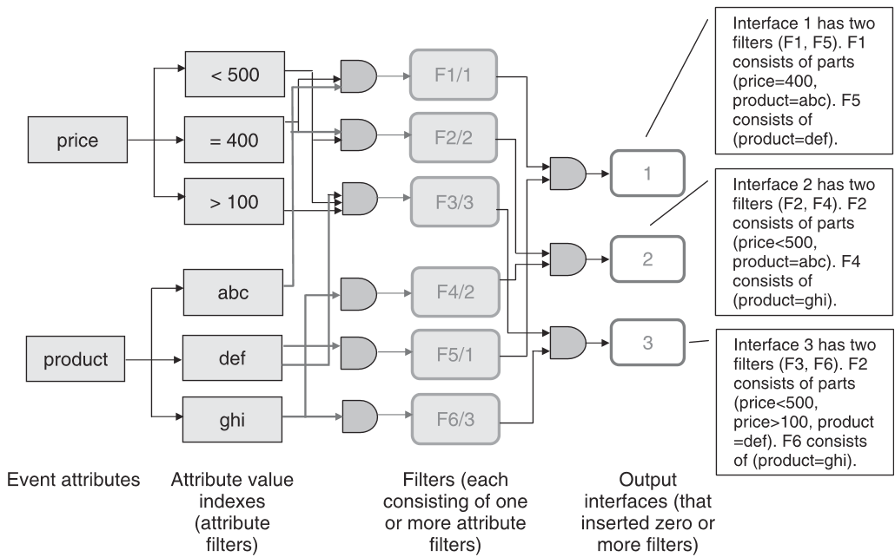

>图 8.2 SIENA 快速转发结构。

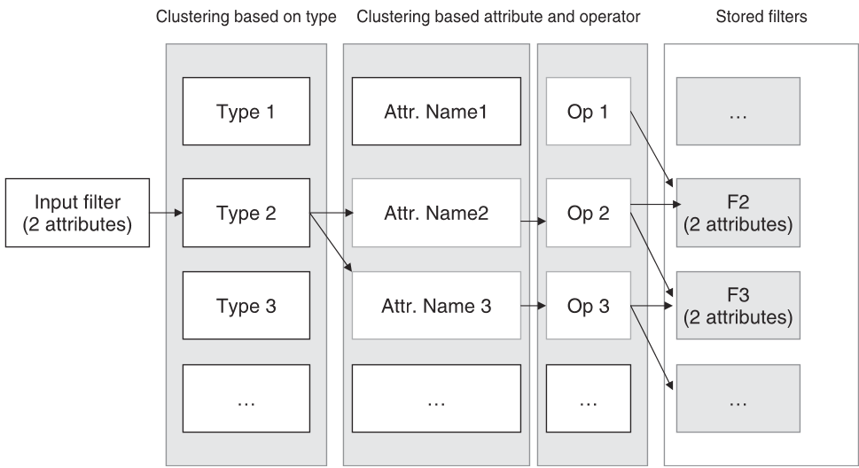

>图 8.3 Counting algorithm 的结构。

### 8.4.2 算法

图 8.3 展示了该设计，涉及将 filter 分解为其组成部分。在本节中，我们假设 filter 由称为属性 filter 的 constraint 组成，这些 constraint 针对通知的属性进行评估。每个属性 filter 指定一个属性和至少一个在该属性上评估的操作。此外，每个 filter 有一个类型，决定 filter 的结构属性。

该图展示了如何首先基于类型对属性 filter 进行聚类，然后进一步基于属性对属性 filter 进行聚类来分解 filter。基于类型的聚类也可以考虑属性 filter 的数量。显然，filter 不能与属性数量少于属性 filter 数量的事件 matching。每个属性 filter 映射到一个或多个 filter，每个 filter 有一个关联的计数，表示其包含的属性 filter 数量。

#### 8.4.2.1 添加和移除 Filter

Filter 插入对于 counting 设计来说是一个简单的操作。Filter 被分解为其组成部分，每个部分存储在单独的数据结构中。记账结构用于存储组件之间的关系，以便在需要时重建 filter。

Filter 删除也是一个简单的操作，涉及从存储它们的数据结构中移除 filter 的组件。

#### 8.4.2.2 Matching 通知

可以通过以下方式将通知与存储的 filter 进行 matching：首先根据通知类型找到可能与通知 matching 的属性 filter 集合。然后，通知的每个属性 filter 与存储的属性 filter 进行评估。如果属性 filter matching，则递增关联 filter 的 matched 属性计数。评估后，matched 属性计数等于属性 filter 数量的 filter 作为 matching filter 返回。算法 8.1 展示了该技术。

算法 8.1 使用 counting algorithm 进行事件 matching

数据：n 是一个通知。

begin

初始化所有计数器和结果集

```null
/* 基于类型的聚类 */
cluster ← getClusterByType(n.type)

/* 我们遍历 n 中的属性 */
for nf ∈ n do
    /* 我们遍历 AF 集合。也可以使用更高效的结构。基于属性 nf 和 cluster 获取候选 AF */
    AFSet ← getAFset(cluster, nf)

    for af ∈ AFSet do
        if af 与 nf matching then
            FSet ← getFSet(af)
            for f ∈ FSet do
                f.counter ← f.counter + 1
                if f.counter 等于属性 filter 的数量 then
                    将 f 添加到结果集
                end
            end
        end
    end
end
return 结果集

```

#### 8.4.2.3 Covering 和被 Covered 的 Filter

在 counting algorithm 中，查找被 covered 和 covering 的 filter 比 matching 通知更具挑战性。对于被 covered 和 covering 的 filter，需要确定输入 filter 的组件与 counting 结构之间的包含关系。

算法 8.2 在给定输入 filter $f$ 的情况下确定被 covered 的 filter。其思想是遍历存储的属性 filter 中属性 filter 数量大于或等于输入 filter 的那些。对于每个被 covered 的属性 filter，算法递增关联 filter 的计数。最后，算法返回属性计数等于属性 filter 数量的 filter。该算法假设可以为任意两个给定的属性 filter 计算 covering 关系。这对于基本 constraint（如范围、不等式和子串 matching）可以很容易地完成。

算法 8.2 在 counting 结构中查找被 covered 的 filter

```null
数据：f 是一个 filter。

begin

初始化所有计数器和结果集

/* 基于类型的聚类 */
cluster ← getClusterByType(f.type)

/* 我们遍历 f 中的属性 */
for af ∈ f do

/* 我们遍历 AF 集合。也可以使用更高效的结构。基于属性 af 和 cluster 获取候选 AF */
AFSet ← getAFSet(cluster, af)

/* 优化：仅与属性 filter 数量少于 f 的 filter 关联的属性 filter 可以从考虑中移除。 */
for af' ∈ AFSet do

if af covers af' then

FSet ← getFSet(af')

for f' ∈ FSet do

f'.counter ← f'.counter + 1

if f'.counter 等于属性 filter 的数量 then

将 f' 添加到结果集

end

end

end

end

end

return 结果集

```

查找给定输入 filter $f$ 的 covering filter 的算法与前面的算法 8.2 类似，不同之处在于关系的方向被反转（$af$ 被 $af'$ covered），并且只需要考虑属性 filter 数量等于或少于输入 filter 的存储 filter。显然，属性 filter 数量多于输入 filter 的 filter 不可能 cover 输入 filter。

### 8.4.2.4 讨论

Counting algorithm 可以用以下观察来总结：

• Filter 插入和删除通常是非常快的操作。

• 可扩展性受候选属性集大小的限制。在最坏情况下，除非对属性 filter 集使用专门的 matching 结构，否则性能可能与属性数量呈线性关系。

• 允许属性和操作的聚类。可以使用自定义数据结构，例如用于范围的 R-tree。

• 假设类型化结构，因此它不是任意 filtering 语言的通用技术。

• 可用于检测 covering 和被 covered 的 filter；然而，确定直接前驱和后继更为困难。

• Counting algorithm 有许多变体。

## 8.5 使用 Poset 进行 Matching

在本节中，我们考虑基于 poset 的 matcher，即 SIENA poset 和从 poset 派生的 forest。首先，我们介绍与 filtering 模型相关的一些细节，然后讨论算法。算法的主要思想是它们基于 filter 包含关系进行组织，从而在数据结构中捕获 filter 的选择性。

图 8.4 展示了这两种结构。Poset 是一个有向无环图 (DAG) 结构，为每个 filter 维护直接前驱和后继集合。接下来，我们更详细地定义这些集合。从 poset 派生的 forest 保留这些集合的一个子集，因此仅存储偏序的 forest 表示。

图 8.5 给出了基于 poset 和 forest 的基于内容的路由器的示例配置。Poset 可以很容易地与 forest 结合，使得本地客户端由 forest 管理，而 poset 存储远程 subscription 以及本地客户端的最通用 subscription。另一种配置涉及使用 forest 存储本地 subscription，并使用高效的 matcher 结构（如 counting

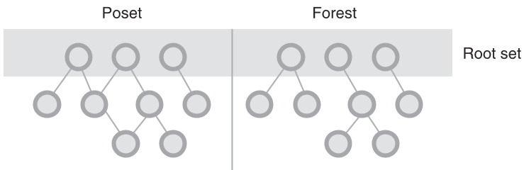

>图 8.4 Poset 和 forest 的示例。

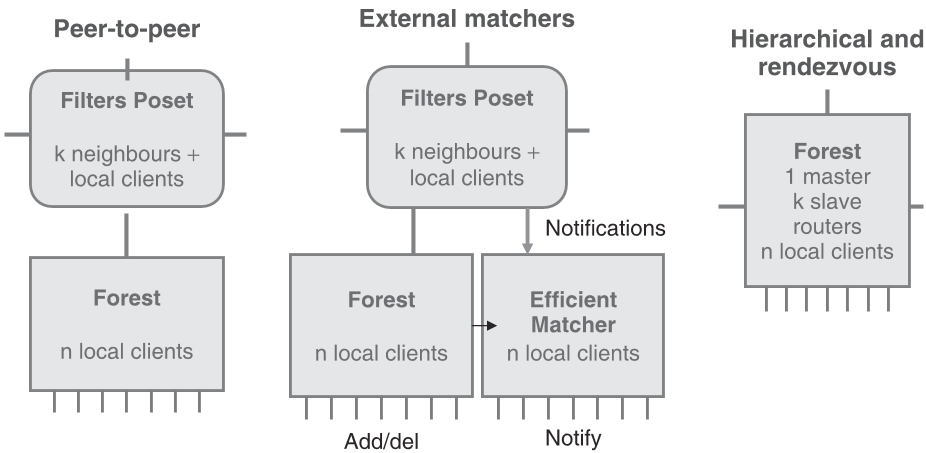

>图 8.5 用于路由表组织的 Poset 和 forest。

algorithm）来高速 matching 事件到本地客户端。还有一种变体也利用快速 matcher 为外部路由器实现快速转发平面。Forest 适用于在层次化和会合配置中独立使用。

Poset 和 forest 可以被视为用于较慢的路由状态配置过程的结构，而 counting algorithm 和其他高效 matcher 更适合快速转发路径。观察到基本 SIENA 的可扩展性有限（部分由于 poset），促使了第 9 章中研究的更高效的 CBCB 模型的开发。

一种优化是，虽然 poset 和 forest 通常在 filter 上操作，但它们也可以应用于属性 filter 级别。因此，属性 filter 可以基于 covering 关系进行组织，然后可以在此结构上运行 counting algorithm，创建更高效的设计。本章后面研究的 XSIENA 系统旨在通过基于 poset 和 forest 设计创建快速转发结构来提高转发性能。

### 8.5.1 Poset 预备知识

现在，我们扩展基本 filtering 模型，使得可以基于 filter 之间的关系将其组织到路由表中。为此，我们需要为给定 filter 定义更通用和更不通用的 filter。

令 $\mathcal{F}$ 表示 filter 的集合。现在，filter $G \in \mathcal{F}$ 的前驱定义为集合 $Pred(G) = \{F \in \mathcal{F} | F \neq G \land F \supseteq G\}$。$G$ 的后继类似地定义为：$Succ(G) = \{F \in \mathcal{F} | F \neq G \land G \supseteq F\}$。如果 $F \supseteq G$ 且不存在 $F' \in \mathcal{F}$ 使得 $F \supseteq F'$ 且 $F' \supseteq G$，我们称 $F$ 直接 cover $G$，记为 $F \succ G$。

Filter G 的直接前驱和直接后继定义为 $ ImPred(G) = \{F \in \mathcal{F} | F \neq G \land F \succ G\} $ 和 $ ImSucc(G) = \{F \in \mathcal{F} | F \neq G \land G \succ F\} $。

Filter 集合 $\mathcal{F}$ 的 cover 定义为集合 $\mathcal{G} \subseteq \mathcal{F}$，使得对于每个 $F \in \mathcal{F}$，存在 $G \in \mathcal{G}$ 满足 $G \supseteq F$。如果该 cover 不包含也是 $\mathcal{F}$ 的 cover 的真子集，则它是最小的。显然，$\supseteq$ 不能在最小 cover 的两个成员之间成立。我们将基础集 $\mathcal{F}$ 的这个最小集合称为根集。图 8.4 展示了 poset 和 forest 结构的根集。

对于简单的类型化属性 filter，可以高效地确定 cover。数据结构假设成对的 cover 检查可以以合理高效的方式进行，并且不考虑元素的并集。因此，从计算复杂度的角度来看，这些算法简单而高效。也可以设计基于近似 cover 的方案。

下面，我们简要介绍作为基于内容的路由表基础的知名 poset 和 forest 算法。

### 8.5.2 SIENA Poset

SIENA filter poset 数据结构用于 SIENA 分布式 pub/sub 系统中，以维护 filter 之间的 covering 关系。该结构是存储 filter 的路由表的一个示例。SIENA 系统没有区分本地和外部 subscription，因此所有 filter 都存储在同一结构中。后来的研究表明，将基于内容的路由器的内部组织划分为独立的部分，并为本地客户端和外部路由器设置独立的路由表更为高效。Filter poset 使用基于 DAG 的算法来查找和维护直接前驱和后继集合 [7]。

[31] 中提出了一种用于字符串和字符串子模式包含的偏序维护的两阶段算法。SIENA 算法与此类似，但它不维护节点集的排序链表，而是使用直接后继集合遍历结构。在一般情况下，除非采用额外的启发式方法（如字符串长度），否则节点集无法排序。

在 SIENA 的对等架构中，poset 为插入 poset 的每个 subscription 存储额外信息。subscribers( f ) 集合给出给定 subscription filter f 的 subscriber 集合，类似地，forwards( f ) 包含需要将 f 发送到的对等节点子集。Subscription subscribe( X, f )（其中 X 是 subscriber，f 是表示 subscription 的 filter）按如下方式进行 [7]：

1. 如果找到 filter $f'$ 使得 $f' \supseteq f$ 且 $X \in \text{subscribers}(f')$，则过程终止，因为 $X$ 的 $f$ 已经被一个 covering filter 订阅。

2. 如果找到 filter $ f' $ 使得 $ f' \equiv f $ 且 $ X \notin \text{subscribers}(f') $，则将 X 添加到 subscribers( $ f' $ )。服务器从所有被 f covered 的 subscription 中移除 X。此外，没有 subscriber 的 subscription 也被移除。

3. 否则，filter f 被放置在 poset 中两个可能为空的集合之间：f 的直接前驱和直接后继。Filter f 被插入，X 被添加到 subscribers(f)。服务器从所有被 f covered 的 subscription 中移除 X，没有 subscriber 的 subscription 也被移除。

接下来，我们考察从 poset 中插入和删除 filter 的算法。算法 8.3 展示了插入过程，接受 filter 和结构的根集作为输入。插入确定新 filter 的直接前驱 $ImPred$，然后将 filter 定位在直接前驱和后继之间。

Disconnect(p,s) 操作将 s 从 p 的直接后继中移除，将 p 从 s 的直接前驱中移除。Connect(p,c) 操作将 c 添加到 $p$ 的直接后继集合，将 $p$ 添加到 $c$ 的直接前驱。插入和删除算法还需要为没有前驱的节点更新根集。

### 算法 8.3 Poset filter 插入

数据：s 是一个 filter，R 是根集。

**结果：** 包含新元素 $s$ 的 Poset。

begin

ImPred ← findImPred(s, R)
if ImPred 为空 then
    s 是根节点。
    将 s 与直接后继连接。
    return
end
for p ∈ ImPred do
    ImSucc ← findImSucc(p, s)
    for c ∈ ImSucc do
        /* 连接适当的直接后继。 */
        Disconnect(p, c)
        Connect(s, c)
    end
    /* 连接适当的直接前驱。 */
    Connect(p, s)
end
1

算法 8.4 展示了 filter 删除算法，该算法将要删除的 filter 与其前驱断开连接，然后将其直接后继与前驱连接。如果不存在与 $s$ 有关系的 $p$ 的后继，则前驱 $p$ 与后继 $s$ 连接。

基于列表和基于 DAG 的 poset 算法都需要 $O(n)$ 次比较来进行插入，以及对已访问边和待连接边的额外记账。删除更为复杂，基于 DAG 的算法首先断开直接前驱和后继集合，然后连接处于直接关系中的必要元素。

### 算法 8.4 Poset filter 删除

数据：s 是一个 filter，R 是根集。

**结果：** 不包含元素 $s$ 的 Poset。

begin

ImPred ← findImPred(s)

if ImPred 为空 then

将 s 的适当直接后继移为根节点。

return

end

for p ∈ ImPred do
    /* 断开 s。
    Disconnect(p, s)
    /* 获取 s 的直接后继。
    ImSucc ← findImSucc(s)
    /* 连接前驱和后继。
    for i ∈ ImSucc do
        /* 遍历前驱的所有子节点。
        */
        if ¬indirectSuccessorTest(p, i) then
            Connect(p, i)
        end
    end
end
end

插入和删除操作利用两个重要的集合，即 $ImPred$ 和 $ImSucc$。算法 8.5 和 8.6 概述了如何确定这些集合。$ImPred(x)$ 集合通过从根集开始并向 $\supseteq$ 关系成立的节点下降来找到。需要一些记账来跟踪已访问的节点。算法通过简单地从 $ImPred(x)$ 的后继开始来找到 $Succ(x)$。

### 算法 8.5 查找直接前驱

数据：s 是一个 filter，R 是根集。

**结果：** $s$ 的直接前驱集合。

begin

visit_list ← R
/* 查找直接前驱并跟踪已访问的节点。
for p ∈ visit_list do
    direct ← true
    clist ← getChildren(p)
    for c ∈ clist do
        if c covers s then
            /* p 不是直接前驱。
            direct ← false
            if c ∉ visit_list then
                visit_list ← visit_list ∪ {c}
            end
        end
    end
/* 测试是否找到了直接前驱。
if direct then
    ImPred ← ImPred{Up}

end
end
return ImPred
end

### 算法 8.6 查找直接后继

数据：s 是一个 filter，ImPred 是 s 的直接前驱集合，R 是根集。

**结果：** $s$ 的直接后继集合。

begin
    ImSucc ← ∅
    ImSuccTemp ← ∅
    if p = ∅ then
        visit_list ← R
    else
        visit_list ← ImPred
    end
    /* 查找直接后继并跟踪已访问的节点。 */
    for c ∈ visit_list do
        if c 尚未被访问 then
            if s covers c then
                ImSuccTemp ← ImSuccTemp ∪ {c}
            else
                visit_list ← visit_list ∪ ImSucc(c)
            end
        end
    end
    /* 完成结果集。 */
    for c ∈ ImSuccTemp do
        if c 未被 ImSuccTemp 中的任何其他节点 covered then
            ImSucc ← ImSucc ∪ {c}
        end
    end
    return ImSucc
end

### 8.5.3 从 Poset 派生的 Forest

从 poset 派生的 forest 数据结构是与 SIENA filter poset 类似的结构；然而，它更简单、更高效，因为只存储 covering 关系的一个子集 [29]。结构中的每个节点最多有一个父节点。该结构的主要缺点是查找给定节点的直接前驱和后继变得更加困难。另一方面，该结构计算与 poset 相同的根集，因此非常适合层次化和基于会合的路由系统以及存储来自客户端的 filter。实际上，forest 可以被视为各种基于 filter 的 pub/sub 系统的构建块。该结构可以用集合 subscribers(f)、forwards(f)、advertisers(a) 和 forwards(a) 进行扩展。

对 $(\mathcal{F}, \succ')$ 是一个从 poset 派生的 forest，其中 $\mathcal{F}$ 是 filter 的有限集合，$\succ'$ 是 covering 关系的一个子集。方便的做法是将 tree 的根想象为一个不在 $\mathcal{F}$ 中的虚拟节点的子节点。

接下来，我们概述从 poset 派生的 forest 的算法 [29]。

令 $(\mathcal{F}, \succ')$ 为一个从 poset 派生的 forest。我们定义以下算法，输入为 $\mathcal{F}$ 和 filter $x$，输出为从 poset 派生的 forest：

**add**($\mathcal{F}$, $x$)：该算法在执行过程中维护一个*当前节点*。首先，将当前节点设置为 $\mathcal{F}$ 的虚拟根。

1. 如果 x 已经在 forest 中，则返回。

2. 否则，如果 x 与当前节点的所有子节点不可比较，则将 x 作为当前节点的新子节点添加。

3. 否则，如果 x covers 当前节点的某些子节点，则将被 x covered 的当前节点的所有子节点移动为 x 的子节点，并将 x 作为当前节点的新子节点。

4. 否则，选择当前节点的一个 cover $x$ 的子节点，将当前节点设置为该子节点，并从步骤 2 重复此过程。

del(F, x)：令 C 为 x 的子节点集合，r 为 x 的父节点。然后对 C 的每个元素从步骤 2 开始运行 add，并将 r 设置为当前节点。在此过程中，C 的一个元素在添加时携带以其为根的整个子树。

## 8.5.4 Matching 事件

Poset 和 forest 结构具有两个有趣的 matching 属性，这些属性源自 covering 关系的定义（属性 8.1 和 8.2）。

**属性 8.1** 如果节点 $n_1$ 与一个通知 matching，则 $n_1$ 的所有前驱也必须与该通知 matching。

**属性 8.2** 如果节点 $n_1$ 不与一个通知 matching，则 $n_1$ 的所有后代都不与该通知 matching。

算法 8.7 展示了基于 poset 的 matching 技术。Matching 从结构的根开始，以广度优先顺序向 matching 节点推进。每个节点包含一个 filter，是对输入事件的一次测试。该算法对 forest 也是相同的，只是不需要已访问列表。

### 算法 8.7 使用 poset matching 事件

数据：p 是一个事件，R 是根集。

结果：p 的 matching filter

begin

visit_list ← R
result ← ∅
/* 遍历结构。 */
for f ∈ visit_list do
    if f 尚未被访问 then
        if f 与 p matching then
            result ← result ∪ {f}
            visit_list ← visit_list ∪ {ImSucc(f)}
    end
end
end
return result

Forest 和 poset 也支持近似 matching。例如，我们可以使用通知以广度优先方式遍历 forest，并为 matching 定义时间限制。当时间到期时，算法简单地遍历剩余节点并将接口记录为已 matching。这是近似的，因为它可能导致假阳性。

该算法的有趣特征是 matching 机制不知道 filtering 语言的细节——它只假设节点之间存在 covering 关系。这使得该算法适用于 filtering 语言和操作符（predicate）是动态变化的环境。此外，添加新操作符不需要对 matching 算法进行复杂的更改，例如创建新的索引结构。

## 8.6 Tree Matcher

Tree matcher 结构与 counting algorithm 不同，因为它从转发表中的属性 constraint 开始，而不是从事件开始。我们简要考虑 Aguilera 等人 [15] 的算法。Campailla 等人 [16] 的类似算法基于二元决策图。

Tree matcher 算法由两个阶段组成：

• 预处理阶段，将 subscription 集合插入数据结构。预处理假设 subscription 不会频繁更改。更新可以增量地添加到预处理数据中。Matching tree 在此阶段创建。在 tree 中，每个节点是对某些属性的一次测试。从节点开始的每条边是测试的结果。因此，每个较低层是对较高层执行的测试的细化。Subscription 位于 tree 的叶节点。

• Matching 阶段，每个事件与 tree 结构进行遍历以找到 matching 的 subscription。过程从 tree 的根开始。在每个节点，执行该节点的测试并跟随 matching 的边，直到遇到叶节点。叶节点最终映射到 matching 的 subscription。

Tree 还可以有特殊的 *-边，表示通过该边可达的 subscription 不关心测试结果的观察。这些边允许非常灵活的结构。

算法 8.8 展示了 tree matcher，它接受 tree 的根节点 $v$ 和要 matching 的事件 $p$ 作为参数 [15]。然后算法遍历 tree，在每个节点测试是否不继续遍历该特定分支。如果当前节点与 $p$ matching，则算法深入到 tree 的该分支。最终，遍历将在叶节点结束，该叶节点将成为结果集的一部分。该算法以深度优先顺序遍历 tree；然而，也可以使用其他顺序，如广度优先。

Tree matcher 的时间复杂度相对于 subscription 数量是次线性的，其空间复杂度是线性的。该结构可以通过对 subscription 进行静态分析来进一步优化 [15]。

算法 8.8 用于 tree matching 的递归访问过程

数据：Tree 表示结构，v 是 tree 的根或节点，p 是要 matching 的事件。

结果：p 的 matching filter

begin

if v 是 Tree 的叶节点 then

输出 (v)

else

对 p 执行 v 的测试

if v 有一条边 e 与测试结果匹配 then

visit(Tree, (Tree 中 e 终点处 v 的子节点), p)

end

if v 有一条 *-边 e then

visit(Tree,(Tree 中 * 终点处 v 的子节点), p)

end

end

end

## 8.7 XFilter 和 YFilter

XFilter 项目率先使用基于事件的解析和有限状态机 (FSM) 进行 XML 文档 filtering [32]。XFilter 支持 XPath 表达式，通过将表达式的位置步骤映射到机器状态来转换为 FSM。

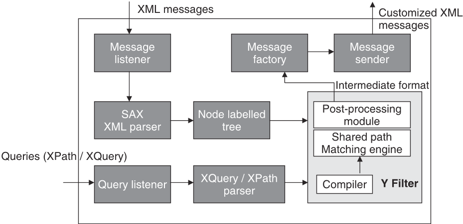

>图 8.6 YFilter 概述。

传入的 XML 消息然后由基于事件的解析器解析，驱动 FSM 的执行。如果解析进入接受状态，则查询与文档 matching。XFilter 为每个不同的路径表达式生成一个 FSM，因此不考虑查询之间的共性。

YFilter 项目建立在 XFilter 概念之上，该系统通过创建由非确定性有限自动机表示的单一机器来考虑查询的共性 [33, 34]。YFilter 的关键目标是将 XML 文档与大量查询进行 matching，并支持基于 subscriber 需求对 matched 的 XML 文档进行转换。

图 8.6 展示了 YFilter 系统的概述，该系统定义了一个用于结构化数据的通用查询处理器。系统通过消息监听器接口接收入传的 XML 消息和文档。传入的 XML 文档然后被解析，生成带标签的 tree 表示，然后由核心 YFilter 系统处理。XPath 和 XQuery filter 通过查询监听器接口接受。查询被解析后交给核心 matching 系统。查询被编译为非确定性有限状态机 (YFilter)。传入消息，即带标签的 tree，然后与包含所有活跃查询的组合状态机进行 matching。Matching 的文档然后进行后处理并为 subscriber 定制，最后发送给 subscriber [33, 34]。

YFilter 架构的主要组件是：

• 接受查询的查询监听器。

• 解析查询的 XQuery 解析器。

• 用于接收入传 XML 消息的消息监听器。

• 用于生成 XML 消息内部表示的 XML 解析器。

• YFilter，是系统的主要组件，由多个子组件组成，即编译器、路径 matching 引擎和后处理模块。编译器为查询构建执行计划。运行时系统将给定消息与查询进行 matching。系统还为 matched 的查询提取消息内容，并将内容组织为中间格式，以便高效转换为最终的定制输出消息。当不进行转换的 filtering 时，YFilter matching 仅对给定查询产生布尔结果。

- 消息工厂负责为每个 matched 的查询生成输出消息。

• 消息发送器负责向用户发送定制的 XML 消息。

Filtering 使用寻址 XML 文档部分的路径表达式执行。路径表达式是位置步骤的序列。位置步骤由轴、节点测试和零个或多个 predicate 组成。轴参数指定节点之间的层次关系。YFilter 聚焦于两个常见的轴：父子操作符 /，和祖先-后代操作符 //。节点测试是元素名称或通配符操作符。Predicate 与文本数据、属性或寻址元素的位置进行 matching。Predicate 也可以包含其他路径表达式。YFilter 通过 XQuery FLWOR (for-let-where-order by-return) 表达式的子集支持 filtering 和转换。

## 8.8 Bloom Filter

Bloom filter 是一种空间高效的概率数据结构，支持集合成员测试。该数据结构由 Burton H. Bloom 于 1970 年提出 [35]。该结构提供了一种紧凑的方式来表示一个集合，可能产生假阳性，但永远不会产生假阴性。Bloom filter 对于涉及列表和集合的许多不同类型的任务都很有用 [36]。它们已被广泛应用于 pub/sub 路由和转发。

在本节中，我们简要概述 Bloom filter 结构，然后考察 pub/sub 的几个应用。我们简要考虑摘要 subscription、组播转发、基于内容的转发和用于 XML 文档 matching 的多级 filter。

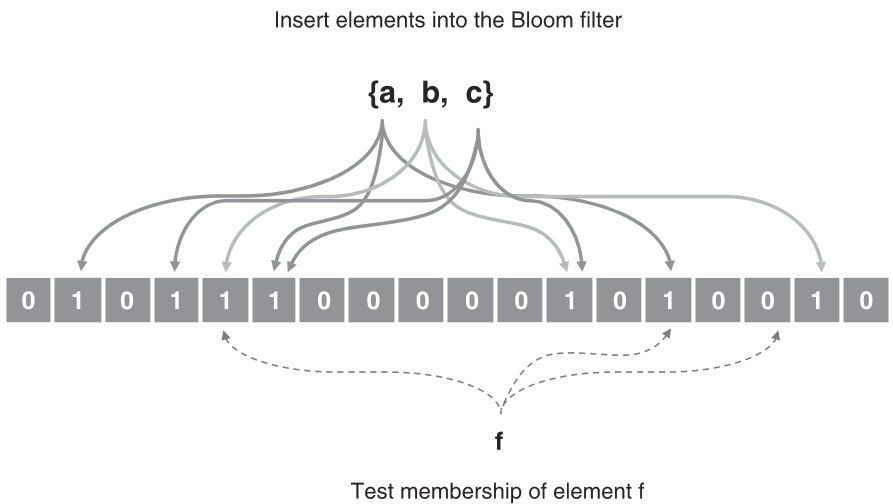

>图 8.7 Bloom filter 概述。

### 8.8.1 定义

Bloom filter 是一个 $m$ 位的序列，用于表示 $n$ 个元素的集合 $S = \{x_1, x_2, \ldots, x_n\}$。最初所有位都设置为零。关键思想是使用 $k$ 个哈希函数 $h_i(x)$（$1 \le i \le k$）将项 $x \in S$ 映射到 $1, \ldots m$ 范围内的均匀随机数。假设哈希函数是均匀的。图 8.7 展示了一个包含三个元素的 Bloom filter，每个元素用三个哈希函数进行哈希。

通过将位 $h_i(x)$ 设置为 1（$1 \leq i \leq k$）来将元素 $x \in S$ 添加到 filter 中。如果位 $h_i(y)$ 已设置，则报告元素 $y$ 是 $S$ 的成员；如果任何位 $h_i(y)$ 未设置，则保证不是成员。

算法 8.9 展示了插入操作，算法 8.10 展示了成员测试操作。Bloom filter 的局限性在于假阳性的可能性。假阳性是不属于集合 $S$ 但被 Bloom filter 报告为成员的元素。

算法 8.9 Bloom filter 插入操作

数据：x 是对象键。

结果：BInsert(x)

begin

for j : 1...k do

/* 遍历所有 k 个哈希函数 \(h_{j}\)
    i \(\leftarrow\) \(h_{j}(x)\)
    if \(B_{i} == 0\) then
        /* 将位置 i 的位设置
        \(B_{i} \leftarrow 1\)
    end
end
end

算法 8.10 Bloom filter 成员测试操作

**数据：** $x$ 是要测试成员资格的对象键。

**结果：** BFismember(x) 返回 true 或 false

begin

m ← 1
j ← 1
while m == 1 and j ≤ k do
    i ← h_j(x)
    if B_i == 0 then
        m ← 0
    end
    j ← j + 1
end
end
return m

基于 S 构建的 Bloom filter 需要 m 位空间，并在 $ O(1) $ 时间内回答成员查询。给定 $ x \in S $，Bloom filter 将始终报告 x 属于 S，但给定 $ y \notin S $，Bloom filter 可能报告 $ y \in S $，导致假阳性。

Bloom filter 的假阳性概率由公式 $(1 - e^{-kn/m})^k$ 给出。假阳性概率随着 Bloom filter 大小 $m$ 的增加而降低。随着更多元素的添加，概率随 $n$ 增加。可以通过对 $k$ 最小化该公式来最小化假阳性率。求导并令其等于零得到 $k$ 的最优值：

$$ k_{o p t}=\frac{m}{n}\ln2\approx\frac{9m}{13n}. $$

增加或减少哈希函数数量趋向 $k_{opt}$ 可以降低假阳性率，同时增加插入和查找的计算量。成本与哈希函数数量成正比。Filter 的大小可用于调整空间需求和假阳性率。更大的 filter 将导致更少的假阳性。插入 filter 的集合大小决定了假阳性率。

### 8.8.2 摘要 Subscription

Bloom filter 和额外的 predicate 索引已被用于摘要 subscription [37, 38]。Bloom filter 的问题在于它们不直接适用于摘要除等值以外的算术操作符。因此，开发了两个额外的结构来实现摘要 subscription，即*算术属性 Constraint 摘要* (AACS) 和*字符串属性 Constraint 摘要* (SACS)。该方法类似于第 11 章中研究的 filter merging 技术，但它对路由器不是透明的，因为它们必须了解这些结构。此外，操作符和属性需要事先知道。

### 8.8.3 组播转发

Bloom filter 也可用于实现高效的组播系统。LIPSIN 系统是一个近期的例子，它以 Bloom filter 的形式（称为 zFilter）表示组播 tree，并将其包含在数据包中 [39]。该系统通过基于存储在 Bloom filter 中的组播 tree 链路做出转发决策来实现源路由。该系统在第 13 章中有更多讨论。

### 8.8.4 基于内容的转发

XSIENA 系统使用基于 Bloom filter 的基于内容的转发引擎 [40]。该系统的实验结果表明它是高效的，并保留了基于内容路由概念的灵活性。该系统的关键思想是确定每个 filter 的紧凑概率表示，然后在 matching 事件时利用该表示。这要求可以导出这样的紧凑表示，并且路由器具有同步的路由表，以便在转发过程中正确使用紧凑表示。

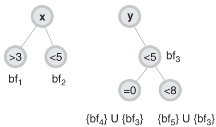

sbsposet 存储 filter 的 predicate 并抽象合取。
属性 filter 是偏序的。
每个属性 filter 有一个关联的 Bloom filter。
Bloom filter 保留 covering 关系。

>图 8.8 XSIENA 中提出的 sbsposet 结构。

该系统基于两个新的数据结构，即 sbspset 和 sbstree。Sbspset 将 filter 分解为其属性 filter 组件，并按属性名称分组存储在结构中。每个属性 filter 由从结构派生的 Bloom filter 表示。Sbspset 用于派生每个属性 filter 的紧凑表示，该表示保留 poset 的关系。Tree 是一个更简单的结构，基于 Bloom filter 表示以合取形式存储 filter。Tree 避免了由于将 filter 分解为属性 filter 而导致的精度损失，因为它在 matching 事件时考虑了属性 filter 的合取。还开发了基于 counting algorithm 的 sbstree 结构变体。Sbspset 可以被视为慢路径结构，而 sbstree 是在转发过程中查阅的快速路径结构。

Sbsposet 结构如图 8.8 所示。Sbsposet 存储 filter 的 predicate 和关联的 Bloom filter 表示。Bloom filter 遵循 poset 的 covering 关系。如果一个 filter covers 另一个 filter，则它们的 Bloom filter 也保留这种 covering 关系。这通过对前驱 Bloom filter 应用逻辑 OR 操作来实现。该结构负责在第一个 broker 处进行事件的基于内容的 matching，并确定新 filter 的 Bloom filter 表示。Sbtree 存储 Bloom filter 合取的析取，用于事件的快速转发。

基于内容的 subscription 按以下步骤处理：

1. Subscriber 发出一个 filter 并联系 broker 以构建一组总结 filter 内容的 Bloom filter。

2. Filter 连同 Bloom filter 表示使用第 7 章中介绍的基于身份的路由方案在 pub/sub 网络中传播。

3. 每个 broker 将 filter 和 Bloom filter 添加到 sbsposet 路由表，将 Bloom filter 添加到 sbstree 路由表。

事件转发涉及以下步骤：

1. Publisher 发布一个事件，该事件被传递到最近的 broker。

2. Broker 将事件与 sbsposet 结构进行 matching，并提取一个总结与事件 matching 的 subscriber 兴趣的 Bloom filter。与 sbsposet 的 matching 仅执行一次。

3. 然后使用 Bloom filter 与 sbstree 结构确定事件的输出接口。这在每个中间 broker 处完成。

取消订阅遵循基本的基于身份的路由模型。Sbsposet 和 sbs-forest 结构具有计数器，以处理多个相同的属性 filter 和属性 filter 的合取。当计数器达到零时，相关元素可以从结构中移除。

## 8.8.5 多级 Bloom Filter

Bloom filter 可以应用于实现结构化文档的高效 matching。已经提出了两种 Bloom filter 变体结构用于 matching XML 文档上的查询。Koloniari 等人定义了广度 Bloom Filter (BBF) 和深度 Bloom Filter (DBF) 以支持路径表达式。这些基于派生一个长位串来表示分布式网络中每个节点上可用的文档。类似地，可以派生一个位串来总结节点上活跃的本地和外部查询 [41, 42]。这些位串然后可以共享和比较，以找到每个节点的 matching XML 文档。

令 $T$ 为一个具有 $j$ 层的 XML tree，1 为根层。具有 $j$ 层的 XML tree $T$ 的广度 Bloom Filter 是一组 Bloom filter。Tree 的每一层 $i$ 有一个 Bloom filter。每层 filter 包含该层所有节点的元素。一个额外的 Bloom filter（记为 BBF0）包含出现在 tree 任何节点中的所有元素。Matching 过程区分从根开始的路径查询和部分路径查询。查询的所有元素必须存在于 BBF0 中。如果所有元素都存在，则过程继续评估路径的结构。

深度 Bloom filter 提供了总结 XML tree 的另一种方式。不同的 Bloom filter 存储不同长度的路径。具有 $j$ 层的 XML tree $T$ 的深度 Bloom Filter 是一组 Bloom filter。在此构造中，每条长度为 $i$ 的路径有自己的 Bloom filter。Matching 过程首先像之前一样查阅 BBF0，然后检查路径查询的子路径是否被包含。如果子路径未被包含，算法报告未命中。

使用这些结构的实验结果表明，它们的性能显著优于简单地使用单个 Bloom filter 来总结结构化文档。结果表明，DBF 在减少假阳性数量方面比 BBF 具有更好的属性 [41, 42]。

## 8.9 总结

在本章中，我们考察了许多用于将事件和内容与 subscription 进行 matching 的知名技术和算法。该 filtering 过程是 pub/sub 系统的重要组成部分，对于确保相关内容被传递给 subscriber 是必要的。

我们考察了 counting algorithm、poset 结构、tree 算法、XFilter 和 YFilter，以及基于 Bloom filter 的概率 matcher。设计和实现 filtering 系统有许多方式。系统因设计参数和假设而异，例如：

• 评估可以从事件内容或 constraint 开始。Counting algorithm 遍历事件结构，而 tree 算法和 poset 使用事件遍历结构。

• 结构可以是具有一定精度的概率性的。基于 Bloom filter 的 matcher 具有假阳性率。

• 结构可以用作路由表结构或转发结构，或两者兼有。路由表应支持动态操作和聚合，而转发结构应非常快。在许多近期的系统提案中，这两者的分离是明显的。

• Matching 结构可以非常特定，仅支持某种 filtering 语言和事件结构，或者可以是通用的，支持多种 filtering 语言。Counter 和 tree 算法特定于事件结构，而 poset 和 forest 是通用的，但假设可以确定 covering 关系。

- 系统可能支持结构化内容，例如 XML 文档。XFilter 和 YFilter 是此类结构的例子。

• 基本 matching 算法可以组合，例如 XSIENA 组合了 poset、tree 和 counting algorithm。这种组合可以带来性能提升。

• Matching 结构可能适合或不适合并行操作和硬件实现。例如，poset 由于需要许多图操作而不太适合，而基于 Bloom filter 的 matcher 通常允许并行化，并且可以用硬件高效实现。

图 8.9 展示了常用的提升 pub/sub matching 子系统性能的解决方案。Poset 和 forest、tree 以及 counting algorithm 的表是路由表结构的例子。Filter covering 和 merging 是分布式环境的有用优化。Poset 和 forest 是

| 解决方案|示例|描述|
| ---|---|---|
| 路由表|SIENA, Gryphon, Rebecca, X-SIENA|用于存储和处理 subscription（filter）的专用数据结构。经典示例是 SIENA poset 和基于 tree 的结构。|
| Filter covering|SIENA, Rebecca, Fuego|通过仅传播最通用的 filter 来优化路由表。|
| Filter merging|Rebecca, Fuego 中的动态 merging|通过将两个或多个 filter 聚合为单个 filter 来优化路由表。结果（merger）可以是不完美的或完美的。|
| 快速转发算法|SIENA, Gryphon, 其他|一种特定于 filter 语言和格式的算法，能够以高效的方式确定给定事件的 matching 输出接口。该算法对 filter 和事件结构做出假设。|
| 近似路由表|X-SIENA|一种允许近似路由表的方案，总结路由状态或事件消息中的近似摘要信息用于转发。这导致紧凑的表大小和快速 matching；然而，可能导致假阳性或假阴性，取决于方案。一个例子是基于 Bloom filter 的路由。|
| 分离路由和转发|SIENA, X-SIENA|该解决方案分离路由表结构和转发结构。|

>图 8.9 解决方案。

基于 covering 关系的结构，因此隐式支持这种优化。两者都可以很容易地用 filter merging 进行扩展。我们还考察了如何扩展 counting algorithm 以支持 covering 优化。许多系统分离 pub/sub 路由器的路由和转发部分。我们考察了使用 counting algorithm、tree 算法、XFilter 和 YFilter 以及基于 Bloom filter 的算法的快速转发。这些可以与更通用的路由结构结合。我们还讨论了使用 Bloom filter 的近似路由表。XSIENA 中使用的 sbsposet 是此类结构的一个例子。XSIENA 具有基于 poset 的路由表和基于 tree 的转发表，以及基于近似 Bloom filter 的转发。

### References

1. Object Computing, Inc. (2001) CORBA Notification Service Specification v.1.0. OCI.

2. Sun (2002) Java Message Service Specification 1.1.

3. Cugola G, Di Nitto E and Fuggetta A (1998) Exploiting an event-based infrastructure to develop complex distributed systems. Proceedings of the 20th International Conference on Software Engineering, pp. 261–70. IEEE Computer Society.

4. Sutton P, Arkins R and Segall B (2001) Supporting disconnectedness-transparent information delivery for mobile and invisible computing. *CCGRID '01: Proceedings of the 1st International Symposium on Cluster Computing and the Grid*, p. 277. IEEE Computer Society, Washington, DC.

5. Mühl G and Fiege L (2001) Supporting covering and merging in content-based publish/subscribe systems: Beyond name/value pairs. IEEE Distributed Systems Online (DSOnline).

6. IBM (2002) *Gryphon: Publish/subscribe over Public Networks*. (White paper) http://researchweb.watson.ibm.com/distributedmessaging/gryphon.html.

7. Carzaniga A, Rosenblum DS and Wolf AL (2001) Design and evaluation of a wide-area event notification service. *ACM Transactions on Computer Systems* **19**(3): 332–83.

8. Carzaniga A and Wolf AL (2003) Forwarding in a content-based network Proceedings of ACM SIGCOMM 2003, pp. 163–74, Karlsruhe, Germany.

9. Carzaniga A, Deng J and Wolf AL (2001) Fast forwarding for content-based networking. Technical Report CU-CS-922-01, Department of Computer Science, University of Colorado.

10. Mitidieri C and Kaiser J (2003) Attribute-based filtering: Improving the expressiveness while keeping the predictability in P/S systems. Proceedings of the 2nd International Workshop on Distributed Event-Based Systems (DEBS'03).

11. Mühl G (2002) *Large-Scale Content-Based Publish/Subscribe Systems*. PhD thesis. Darmstadt University of Technology.

12. Pereira J, Fabret F, Llirbat F and Shasha D (2000) Efficient matching for web-based publish/subscribe systems. In *Cooperative Information Systems, 7th International Conference, CoopIS 2000, Eilat, Israel, September 6–8, 2000, Proceedings* (ed. Etzion O and Scheuermann P), vol. 1901 of *Lecture Notes in Computer Science*, pp. 162–73. Springer.

13. Yan TW and García-Molina H (1994) Index structures for selective dissemination of information under the boolean model. ACM Trans. Database Syst. 19: 332–64.

14. Jacobsen HA, Ashayer G and Leung H (2002) Predicate matching and subscription matching in publish/subscribe systems. In Proceedings of the 1st International Workshop on Distributed Event-Based Systems (DEBS'02) (ed. Bacon J, Fiege L, Guerraoui R, Jacobsen A and Mühl G), pp. 539–46.

15. Aguilera MK, Strom RE, Sturman DC, Astley M and Chandra TD (1999) Matching events in a content-based subscription system. *PODC '99: Proceedings of the Eighteenth Annual ACM Symposium on Principles of Distributed Computing*, pp. 53–61. ACM Press, New York, NY.

16. Campailla A, Chaki S, Clarke E, Jha S and Veith H (2001) Efficient filtering in publish-subscribe systems using binary decision diagrams ICSE '01: Proceedings of the 23rd International Conference on Software Engineering, pp. 443–52. IEEE Computer Society, Washington, DC.

17. Fabret F, Jacobsen HA, Llirbat F, Pereira J, Ross K and Shasha D (2001) Filtering algorithms and implementation for very fast publish/subscribe. In Proceedings of the 20th Intl. Conference on Management of Data (SIGMOD 2001) (ed. Sellis T and Mehrotra S), pp. 115–126, Santa Barbara, CA.

18. Liu H and Jacobsen HA (2002) A-TOPSS – a publish/subscribe system supporting approximate matching.
Proceedings of the 28th VLDB Conference, Hong Kong, China, pp. 1281–4.

19. Yan TW and García-Molina H (1999) The SIFT information dissemination system. ACM Trans. Database Syst. 24, 529–65.

20. Hinze A and Bittner S (2002) Efficient distribution-based event filtering. In Proceedings of the 1st International Workshop on Distributed Event-Based Systems (DEBS'02) (ed. Bacon J, Fiege L, Guerraoui R, Jacobsen A and Mühl G), pp. 525–32.

21. Guttman A (1984) R-Trees: A dynamic index structure for spatial searching. In SIGMOD'84, Proceedings of Annual Meeting, Boston, Massachusetts, June 18–21, 1984 (ed. Yormark B), pp. 47–57. ACM Press.

22. W3C (1999) XML Path Language (XPath) 1.0. [W3C Recommendation] http://www.w3.org/TR/xpath.

23. W3C (2010) XQuery 1.0: An XML Query Language (Second Edition). [W3C Recommendation] http://www.w3.org/TR/xquery/.

24. Gottlob G, Koch C and Pichler R (2003) The complexity of XPath query evaluation. Proceedings of the Twenty-Second ACM SIGMOD-SIGACT-SIGART Symposium on Principles of Database Systems, pp. 179–190. ACM Press.

25. Chan CY, Fan W, Felber P, Garofalakis MN and Rastogi R (2002) Tree pattern aggregation for scalable XML data dissemination. VLDB, pp. 826–37.

26. Whang S, Brower C, Shanmugasundaram J, et al. (2009) Indexing boolean expressions. PVLDB 2(1): 37–48.

27. Sadoghi M and Jacobsen HA (2011) Be-tree: an index structure to efficiently match boolean expressions over high-dimensional discrete space. SIGMOD Conference, pp. 637–48.

28. Mühl G (2001) Generic constraints for content-based publish/subscribe systems. In *Proceedings of the 6th International Conference on Cooperative Information Systems (CoopIS'01)* (ed. Batini C, Giunchiglia F, Giorgini P and Mecella M), vol. 2172 of *LNCS*, pp. 211–25. Springer-Verlag, Trento, Italy.

29. Tarkoma S and Kangasharju J (2006) Optimizing content-based routers: posets and forests. *Distributed Computing* **19**(1): 62–77.

30. Cormen TH, Leiserson CE and Rivest TL (2001) *Introduction to Algorithms*. The MIT Press.

31. Collin C and Levinson R (1989) Partial order maintenance. SIGIR Forum 23(3–4): 59–88.

32. Altinel M and Franklin MJ (2000) Efficient filtering of XML documents for selective dissemination of information. Proceedings of the 26th International Conference on Very Large Data Bases, pp. 53–64. VLDB '00. Morgan Kaufmann Publishers Inc., San Francisco, CA.

33. Diao Y, Altinel M, Franklin MJ, Zhang H and Fischer P (2003) Path sharing and predicate evaluation for high-performance XML filtering. ACM Trans. Database Syst. **28**, 467–516.

34. Wu E, Diao Y and Rizvi S (2006) High-performance complex event processing over streams. Proceedings of the 2006 ACM SIGMOD International Conference on Management of Data, pp. 407–18. SIGMOD '06. ACM, New York, NY.

35. Bloom BH (1970) Space/time trade-offs in hash coding with allowable errors. Commun. ACM 13(7): 422–6.

36. Tarkoma S, Rothenberg C and Lagerspetz E (2011) Theory and practice of bloom filters for distributed systems. *Communications Surveys Tutorials*, IEEE, pp. 1–25, preprint.

37. Triantafillou P and Economides A (2002) Subscription summaries for scalability and efficiency in publish/subscribe systems. In *Proceedings of the 1st International Workshop on Distributed Event-Based Systems (DEBS'02)* (ed. Bacon J, Fiege L, Guerraoui R, Jacobsen A and Mühl G).

38. Triantafillou P and Economides A (2004) Subscription summarization: A new paradigm for efficient publish/subscribe systems. *ICDCS*, pp. 562–71.

39. Jokela P, Zahemszky A, Esteve C, Arianfar S and Nikander P (2009) LIPSIN: Line speed publish/subscribe inter-networking. SIGCOMM'09, pp. 195–206.

40. Jerzak Z and Fetzer C (2008) Bloom filter based routing for content-based publish/subscribe. Proceedings of the Second International Conference on Distributed Event-Based Systems, pp. 71–81. DEBS '08. ACM, New York, NY.

41. Koloniari G and Pitoura E (2003) Bloom-based filters for hierarchical data. *5th Workshop on Distributed Data Structures and Algorithms (WDAS 03)*, Thessaloniki, pp. 13–14.

42. Koloniari G and Pitoura E (2004) Filters for XML-based service discovery in pervasive computing. *Comput. J.* **47**(4): 461–74.

# 9 研究解决方案

在本章中，我们调查知名的 pub/sub 研究系统和原型。研究原型被实现为应用层 overlay 网络。许多早期的分布式 pub/sub 系统采用层次化和固定 overlay 设计，其中路由器之间的连接基于配置策略。许多较新的系统基于第 3 章中介绍的 DHT 结构。

早期系统的典型例子是 Gryphon、SIENA、JEDI 和 Elvin，它们提供基于内容的路由支持并利用非基于 DHT 的底层网络。这些系统引入了许多常用的分布式 pub/sub 系统优化和扩展，如 filter covering、filter merging、移动性支持、聚类、负载均衡和安全服务。我们还考察了利用结构化 overlay 作为更高层 pub/sub 路由底层的基于 DHT 的解决方案。基于 DHT 的解决方案能够支持客户端加入和离开网络的广域环境。
# 9 研究解决方案

在本章中，我们调研了知名的 pub/sub 研究系统和原型。这些研究原型被实现为应用层 overlay 网络。许多早期的分布式 pub/sub 系统采用层次化和固定的 overlay 设计，其中路由器之间的连接基于配置策略。许多较新的系统基于第 3 章中介绍的 DHT 结构。

早期系统的典型例子包括 Gryphon、SIENA、JEDI 和 Elvin，它们提供基于内容的路由支持并利用非 DHT 的底层网络。这些系统引入了许多分布式 pub/sub 系统中常用的优化和扩展，例如过滤器覆盖、过滤器合并、移动性支持、聚类、负载均衡和安全服务。我们还考察了利用结构化 overlay 作为高层 pub/sub 路由底层的基于 DHT 的解决方案。基于 DHT 的解决方案能够支持广域环境，其中客户端可以加入和离开网络。

研究系统的设计原则、模式和解决方案已在前面的章节中介绍，我们在讨论研究系统时会重新审视其中的许多内容。例如，第 7 章和第 8 章中讨论的许多解决方案都是在本章介绍的研究系统的背景下提出的。

我们通过总结这些系统的关键差异和相似之处来结束本章。

### 9.1 Gryphon

Gryphon 是一个基于 Java 的 pub/sub 消息 broker，由 IBM T.J. Watson 研究中心开发。该系统的目标是在大型公共网络上实时分发数据 [1, 2]。该项目始于 1997 年，旨在开发下一代 Web 应用，并已在多个实际用例中进行了测试。例如，它曾被用于向 50000 个同时连接的客户端分发澳大利亚网球公开赛的信息。此外，它还被用于在美国网球公开赛、Ryder Cup 中分发实时体育比分，以及在悉尼奥运会上进行统计监控。

Gryphon 同时支持基于 topic 和基于内容的 pub/sub，依赖 TCP/IP 和 HTTP，并支持从服务器故障中恢复以及安全性。在 Gryphon 中，事件流的流动通过*信息流图*（IFG）来描述，它指定了事件的选择性投递、事件的转换以及作为从事件历史计算的状态函数的派生事件的创建。Gryphon 实现了 JMS API，客户端可以使用该 API 来发送和接收消息。

Gryphon 通过请求-应答和征求-响应模型扩展了 publish/subscribe 的一对多模型。通过使用唯一的 topic，JMS 用户可以使用请求-应答风格的消息传递。在征求-响应模型中，客户端可以发布一个广告，一个或多个客户端可以私下对其进行响应。Gryphon 多 broker 配置的基本单元是 cell，它是一组完全互连的服务器。Cell 可以通过链路捆绑进一步连接以实现地理扩展。链路捆绑提供 cell 之间的冗余连接，包括负载均衡和容错。内部协议和系统确保避免环路，并且消息可以绕过故障节点进行路由。

Gryphon 中的事件处理基于 IFG 的概念。IFG 包含无状态的事件转换（组合来自各种来源的事件）和有状态的事件解释函数（可用于从已发布的事件中推导趋势、告警和摘要）。每个事件都是一个类型化的元组。有状态事件依赖于事件历史。状态用于表达事件流的含义以及两个事件流的等价性。

Gryphon 模型由信息空间组成，信息空间可以是事件历史或状态。事件历史随着新事件的发布而单调增长。事件源和汇被建模为事件历史。状态捕获关于事件流的某些相关信息，它们通常不是单调的。信息空间使用信息模式来定义。数据流是连接 IFG 中节点的有向弧，IFG 需要是无环的。

Gryphon 支持四种类型的数据流（IFG 中的弧）：

• select 弧连接具有相同模式的两个事件历史。每条弧是信息空间中事件类型属性上的一个谓词。所有满足约束的事件都被投递到目标信息空间。该弧使事件的一个子集从源历史流向目标历史。

• transform 弧连接可能具有不同模式的任意两个事件历史。每条弧都有一个在两个空间之间映射事件类型的规则。该规则可以包含转换特定事件属性的函数。

• collapse 弧使用规则将事件历史连接到状态。该规则将新事件和当前状态映射为新状态。

- expand 弧是 collapse 的逆操作，将状态链接到信息空间。

当弧源处的状态发生变化时，目标空间以使其包含的事件序列折叠为新状态的方式进行更新。这种转换是非确定性的。Gryphon 有两种基于 IFG 实现系统的技术：

- 一种流图重写优化，允许无状态 IFG 与组播技术一起使用。

- 一种将事件序列转换为最短等价事件序列的算法。

信息流图是抽象的，与网络的物理拓扑分离。将 IFG 映射到消息 broker 网络是非平凡的。Gryphon 通过重写来简化任意 IFG。所有 select 操作被移动到一起并靠近 publisher，所有 transform 操作也被分组到一起并靠近 subscriber。Transform 操作在网络边缘执行。

Gryphon 系统检测故障 broker 并将流量重新路由绕过故障节点。此外，该系统包含多种安全机制，如访问控制和四种认证方法。Gryphon 支持 JMS publish/subscribe API，并支持基于 topic 的 subscription。此外，客户端可以使用 JMS 支持的 SQL92 的 WHERE 子句来指定过滤器。

### 9.2 Cambridge 事件架构（CEA）

CEA 使用 publish-register-notify 范式 [3]，其中对象发布其接口，例如用 *IDL（接口定义语言）*指定（这与 CORBA 中的 IDL 不同）。该接口包含它能够通知的事件。客户端同步调用对象，并可以通过指定参数（属性）或通配符来注册事件。通配符匹配应用于通知的参数，但不能应用于事件类型。模板系统通过逐一匹配参数提供基本的过滤功能。对象接受注册并通知与注册模板匹配的客户端。当事件触发条件和访问限制得到满足时执行通知（图 9.1）。该范式支持从源到客户端的直接事件通知。

在 CEA 中，对象在被询问时以 IDL 发布它能够通知的事件。对象的接口中有一个 register 方法，该方法具有事件类型和通配符的参数。事件出现是特定类型的对象，类型集合定义了事件检测和通知的粒度级别。CEA 在注册时强制执行访问控制，认证基于参数值。CEA 支持定义中间服务，在架构中称为事件中介者。事件中介者充当原始事件源和事件客户端之间的中间人，并提供检测更复杂事件的设施。此外，如果事件源无法

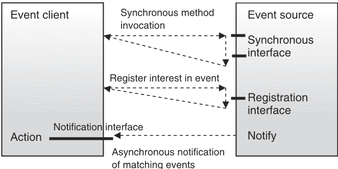

>图 9.1 CEA 系统概览。

承担支持模板匹配的开销，它可以将所有事件发送给中介者。然后中介者代表源进行模板匹配。

中介者能够提供与 CORBA 事件服务 equivalent 的功能。CORBA 事件服务向事件源注册对所有可通知事件的兴趣，并支持同步拉取接口和异步推送接口。

复合事件可以通过赋予中介者过滤来自不同源的不同类型的简单事件的能力来检测。事件组合通过事件模板的组合来支持。复合事件由监视器检测，监视器在事件被检测和触发之前一直处于忙碌状态。可以使用复合事件规范语言来设计检测复杂模板的监视器。该系统已通过实现一个监控建筑物内徽章的主动徽章系统进行了演示。

## 9.3 可扩展互联网事件通知架构（SIENA）

SIENA 是一个事件通知服务，引入了基于内容系统的许多特性。我们已在第 7 章中考察了 SIENA 模型的基础，并介绍了 subscription 和 advertisement 语义的概念及其优化。其特性包括广域网络中基于内容的路由，旨在平衡可扩展性与表达性内容投递语义 [4]。

SIENA 架构支持多种网络拓扑，如层次化拓扑、无环对等拓扑和一般对等拓扑。还支持混合网络拓扑。由于服务器只知道其邻居的身份，路由表管理的开销得以减少。服务器-服务器协议用于服务器与其对等体之间的通信。服务器与已订阅的通知客户端之间的通信通过客户端-服务器协议完成。图 9.2 展示了 SIENA 系统模型，该模型由 broker 的 overlay 网络以及客户端-服务器和服务器-服务器协议组成。

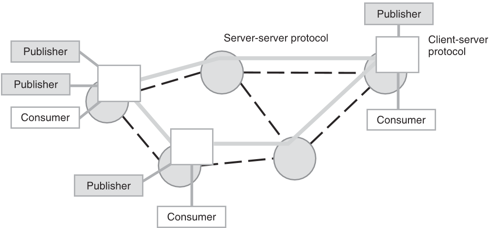

>图 9.2 分布式 SIENA 系统概览。

IP 组播是另一种类似的机制，但它与 SIENA 不同，因为组播组不是基于内容的。IP 组播组是通道，它们将 IP 组播地址空间划分为不相交的组。因此，与基于内容的路由相比，IP 组播的表达力不太强。另一方面，IP 组播是投递数据报的一种实现选择。这需要从基于内容的查询和发布到 IP 组播组的映射。

### 9.3.1 事件命名空间

SIENA 中的事件命名空间本质上是扁平的，这意味着事件名称之间没有结构关联。SIENA 中的事件是属性-值对，其中每个属性都有一个名称和一个值。支持的类型包括 null、string、long、integer、double 和 boolean。SIENA 过滤器由三个实体组成：

• 属性名称，

• 约束运算符，以及

• 约束。

不支持属性名称中的通配符，属性名称与已发布事件的名称之间必须精确匹配。支持过滤子句，一个过滤器可以有多个过滤子句，通过 AND 运算符连接。只有当每个过滤子句或组件都返回 true 时，过滤器才会通过该事件。SIENA 支持的运算符包括等于、小于、大于、大于等于、小于等于、字符串前缀、字符串后缀、始终匹配、不等于和子字符串。

SIENA 中的模式利用事件属性值以及事件的组合。SIENA 模式通常是一个过滤器序列，它将匹配一个（按时间排序的）通知序列。SIENA 忽略以错误顺序到达的事件，这可能由于网络延迟而发生。

### 9.3.2 路由

如上所述，SIENA 中的事件是属性-值对的集合，与过滤器进行匹配。事件系统服务器中维护的 subscription 信息、advertisement 信息和过滤器构成了将事件路由到其他服务器的基础。Subscriber 可以指定过滤器来定义和限定 subscription；类似地，advertisement 也包含过滤器。SIENA 系统知道并评估这些过滤器。一般策略是在下游复制事件，在上游过滤事件。因此，事件的复制被尽可能推迟，减少事件传输带宽。另一方面，上游过滤尽可能靠近源处理事件。这旨在减少网络上无关事件的传输量。

过滤器语法允许从更简单、更通用的过滤器构建复杂的过滤器，这些过滤器可以在上游进行评估。实际上，过滤器必须比上游使用的过滤器更不通用，才能适用。上游过滤的概念也在 SIENA 结构的其他地方使用。

事件模式被分解为基本过滤器，然后委托给服务器，使用一个过程来努力组装那些可以接受委托给其他服务器的子模式。覆盖关系用于检测过滤器是否被通知覆盖、通知是否被 subscription 或 advertisement 覆盖、或者 subscription 是否被 advertisement 覆盖。让我们举一个例子：如果 S1 在 S2 为 true 时始终为 true，则 subscription S2 被 subscription S1 覆盖。服务器将找到覆盖给定 subscription 集合的最通用 subscription 并传播它，从而最小化下游数据结构。然而，在靠近 subscriber 的地方需要付出计算成本，因为 subscription 涉及匹配和评估。尽管如此，SIENA 证明了覆盖关系的复杂度对于可扩展服务来说是合理的。

SIENA 中有两种独立的通知语义：

1. 基于 subscription 的语义，其中 subscription 可以在每个事件服务节点引入。当通知覆盖特定 subscription 时进行路由。

2. 基于 advertisement 的语义，其中路由服务器使用来自事件 publisher 的信息来路由传入的 subscription。只有与活跃 advertisement 相关的 subscription 才会被转发。

我们在第 8 章中讨论的偏序集（部分有序集）是 SIENA 用于实现路由表数据结构的主要概念。我们应该注意到，在更新频繁到达的环境中，路由表更新处理的可扩展性受到限制。偏序集是一个通用的路由表元素，它可以支持各种路由配置。SIENA 支持的关键路由配置包括：

• 具有单个 broker 的集中式配置。

• broker 的层次化配置。

• 对等配置，其中 broker 向相邻 broker 传播路由更新。

• 混合配置。

层次化配置很简单，因为 broker 总是将 subscription 更新向上传播到根节点，已发布的事件向上游和下游传播到匹配的 broker。这种配置在可扩展性方面受到限制，因为根节点可能成为瓶颈。对等配置更为复杂，可以避免瓶颈，特别是当 broker 配置为环形图拓扑时。另一方面，这使路由过程复杂化，并且需要计算 subscriber 特定的最短生成树以防止路由环路。

SIENA 要求系统的客户端能够计算过滤器之间的覆盖关系。当客户端订阅一个过滤器时，同一客户端的新过滤器覆盖的任何过滤器都将被移除。类似地，当客户端取消订阅时，被移除过滤器覆盖的任何过滤器都将被移除。客户端必须在取消订阅的同时建立任何仍应处于活跃状态的过滤器。

### 9.3.3 转发

转发表是过滤器集合（谓词）与连接到相邻节点的接口之间的映射。谓词被定义为过滤器的析取，每个过滤器是一组基本条件的合取。基本合取必须返回 true，因为这使过滤器（和谓词）能够形成到接口的映射。一个过滤器可以映射到多个输出接口。

转发算法将在事件属性集合中计算一次迭代，从那些内在过滤器约束与给定属性匹配的过滤器集合中搜索部分匹配。我们在第 8 章中更详细地考察了该算法。如果部分匹配的过滤器当前没有与接口的关联，算法将增加给定过滤器的已匹配约束计数。当计数器值等于过滤器约束的数量时，过滤器将达到匹配。转发算法将检查所有过滤器的匹配状态，在处理完通知的所有属性后或所有过滤器都被处理后停止。因此，处理的上限取决于接口的数量以及属性和过滤器的数量。转发算法的优化通过二叉树以及使用过滤器属性的查找索引来实现。然而，SIENA 过滤器匹配算法可以通过进一步的优化方法 [5] 进行扩展，例如使用基于索引的匹配结构和属性过滤器选择来修剪无法匹配的谓词。

### 9.3.4 移动性支持

SIENA 还添加了对移动性和无线客户端的支持。这涉及一种利用现有 pub/sub 原语 publish 和 subscribe 的通用切换类型协议 [6]。通用协议能够在各种 pub/sub 系统之上工作，而无需对系统 API 进行任何更改。然而，移动性支持的性能可能会下降，因为底层拓扑被 API 隐藏，使得所有移动性特定的优化难以实现。

SIENA 的通用移动性支持服务基于将在第 11 章中考察的 ping/pong 协议。它已通过驻留在接入路由器上的代理实现。以下步骤属于切换阶段：

- 客户端从接入点 A 移动到接入点 B，向新的本地代理发送移入请求。

• 旧代理被 ping，将收到响应（称为 pong）。pong 消息保证 subscription 从 B 到 A 的完全传播。

• 客户端下载缓冲的事件（下载请求）。

• 代理接收缓冲的事件。

• 消息在去除重复后投递给客户端。

### 9.3.5 CBCB 路由方案

组合广播和基于内容的（CBCB）路由方案，由 Carzaniga 等人 [7] 提出，是一种基于覆盖的路由方案。CBCB 是一种两层路由方案，将基于内容的路由协议与广播路由协议相结合。需要基于广播的协议来构建和维护转发状态，允许从节点向网络中所有其他节点发送消息。广播用于收集有关网络的信息。有几种众所周知的实现广播功能的方法，如最小生成树或反向路径转发。在广播协议获取基本路由和转发信息之后，该方案中的基于内容的层用于利用基于内容的数据来修剪广播树。

在下文中，我们考虑一个节点网络，其中每个节点都有一个基于内容的地址 $p_n$，其中 $n$ 是每个节点唯一的标识符。节点地址可以通过在最近的路由器处聚合地址来抽象化。路由器的基于内容的地址是其本地客户端的基于内容的地址的析取。换句话说，客户端的过滤器定义了路由器维护的子网。

CBCB 方案的基于内容的层使用推拉机制。节点通过使用接收方广告（RA）将路由数据推送给其邻居。RA 类似于 subscription，不应与前面讨论的可用内容的 advertisement 混淆。此外，节点可以通过 SR/UR 协议发送发送方请求（SR）然后接收更新回复（UR）来从网络中拉取路由信息。

#### 9.3.5.1 接收方广告

接收方广告是传播基于内容的路由数据的主要技术。当节点的基于内容的地址发生变化或周期性定时器到期时，节点发送 RA。RA 可以表示为对 $(n, p_n)$，其中 $n$ 是节点标识符，$p_n$ 是其基于内容的地址。RA 还可以包含附加信息。在从接口 $i$ 接收到 RA $(n, p_n)$ 后，路由器根据以下规则处理消息：

• 如果路由表中存在与接口 i 关联的地址 $ p_{i} $，路由器执行覆盖测试：

– 如果 $p_{n}$ 已被 $p_{i}$ 覆盖，路由器丢弃该 RA。这是 RA 入口过滤规则。

- 否则，路由器使用广播功能在以 $n$ 为根的广播树上找到下一跳目标集合。路由器通过将接口 $i$ 关联的地址设置为 $p_i := p_i \lor p_n$ 来更新其路由表。

### 9.3.5.2 SR/UR 协议

仅使用接收方广告可能导致基于内容的地址*膨胀*。例如，在路由器 $r$ 将地址 $p_i$ 与接口 $i$ 关联的情况下。当路由器从接口 $i$ 接收到 RA 时，它对其应用入口过滤规则，如果其地址已被 $p_i$ 覆盖则丢弃该 RA。现在，路由器收到已被覆盖的地址的原因可能是由于取消订阅。$^1$ 因为 RA 被丢弃，相邻路由器仍然将所有匹配 $p_i$ 的通知转发给 $r$，即使其中部分没有兴趣。为了避免这种地址膨胀和误报，路由器定期发送发送方请求来更新其路由表。

>1 该操作与 SIENA 不同，SIENA 传播取消订阅消息并在移除已取消订阅的过滤器的同时安装未覆盖的 subscription。

SR 包含其发起者的标识符、一个 *SR 编号*和一个超时字段。SR 编号用于区分来自同一发起者的多个 SR。

当路由器发出 SR 时，它被广播到所有路由器。接收路由器为其估计新的超时并在广播树上向下游转发。如果 $r$ 是叶路由器，它以更新回复进行响应。UR 由 SR 发起者标识符、UR 所回复的 SR 编号和一个地址组成。在叶节点的情况下，地址是其自身的基于内容的地址。非叶节点必须等待从其转发 SR 的所有接口收到 UR。当所有 UR 都已收到时，它发送一个包含地址（接收到的 UR 中谓词的析取）的 UR，并通过 SR 的反向路径发送。

SR/UR 协议基于广播，如果所有路由器频繁发出 SR，可能会在网络中产生大量控制流量。该系统具有对基本协议的几项改进。可以允许中间路由器使用 UR 来更新自己的路由表并缓存 UR，以便在下次发出类似 SR 时使用。此外，SR 的使用可以被限制以避免周期性广播。

## 9.4 Elvin

Elvin 是一个基于客户端-服务器的事件通知服务，也根据消息内容进行路由 [8]。在 Elvin 中，客户端可以与服务器建立会话，订阅和发布通知。Elvin 的通知是名称-值对，与 SIENA 类似，使用 32 位和 64 位整数、64 位双精度浮点数、UTF-8 编码的字符串和字节数组作为基本原语。Subscription 使用类 C 的逻辑表达式来实现。利用 Lukasiewicz 三态逻辑来评估表达式，具有一个额外的不确定值（因此有 true、false、indefinite）。Elvin 绑定到 C、C++、Java、Python、Smalltalk、Emacs Lisp 和 Tcl 等语言。

Elvin 也是基于内容的，允许基于整个消息（包括内容）做出路由决策。解耦的安全模型是 Elvin 的典型特征，它不使用传统的点对点模型（其中密钥对于 publisher 和 subscriber 之间的通信认证是必需的）。在 Elvin 中，生产者和消费者的密钥集可以重叠，允许多方授权。

Elvin 包含一个基于轻量组播的服务发现协议。客户端可以使用该协议来发现服务器，并在服务器部署到网络上时动态注册。组播还用于向客户端分发活跃路由器广告。

### 9.4.1 聚类

可扩展性可以通过使用本地聚类来增强。它还将平衡本地负载的分布。Elvin 利用聚类来实现一个基于单一 subscription 的分布式地址空间。Elvin 使用一个可靠的组播协议，允许聚类的路由器通过 IP 网络进行通信。网络上的负载被最小化，因为路由器可以为客户端强制进行适当的服务器更改。

此聚类系统中的路由器是在服务器上运行的守护进程。路由器将与所有节点共享部分客户端 subscription 信息。部分共享信息允许路由器检测通知在集群内是否有 subscriber。不会共享不必要的信息。在服务器到服务器的通信中，转发算法首先使用术语列表来决定需求。本地路由器分析消息并通过将消息与术语列表匹配来构建适当的目标路由器集合。然后它使用组播机制和具有唯一标识符的数据包通知集群中匹配的目标路由器。不幸的是，Elvin 转发系统也可能产生不必要的通知，加重集群资源的负担。

Elvin 集群的结构建立在一个拓扑上，其中一个处理管理和维护数据的单一主路由器拥有一组从路由器。这些从路由器监听集群内的管理级别流量。它们还维护有关节点、服务器 subscription 术语、状态、对客户端连接开放的 URL 和路由器统计信息的信息。

主服务器的任务是接收加入类型的数据包并控制集群。路由器和客户端之间的 RPC 风格通信使用肯定和否定确认，应用的语义是尽力而为、至多一次类型。然而，如果服务器丢弃通知，它必须警告客户端。如果主服务器故障，将调用选举协议来选择新的主服务器。

### 9.4.2 联邦

集群级别协议不是 Elvin 中唯一需要的协议。存在一个单独的协议用于从分布式服务器集群构建联邦系统。该协议使用集群的生成树构建，并支持拉取过滤器以约束集群间通知。

### 9.4.3 Quench

Elvin 中存在一个操作，允许信息发布者评估已表达的 subscription。此评估的目的是收集有关不再需要且可以终止（即 quench）的事件的信息。该操作由所有事件 publisher 支持。

如果想要检查需要哪种通知，此操作也很有用。作为订阅机制的语义扩展，quench 在 Elvin 客户端/服务器协议中实现，允许所有客户端在服务器中的 subscription 信息发生变化时请求通知。此外，客户端可以通过属性名称查询 subscription 中的信息。客户端以抽象语法树的形式接收数据。客户端库中也支持自动 quench。

## 9.4.4 移动支持

Elvin 利用基于代理的模型来支持移动用户。这是一个非常必要的机制，因为 Elvin 的设计原则使其本质上是非持久性的，但所有通知（包括未投递的通知）必须存储在某个地方。解决方案是在客户端-服务器架构中使用代理组件。服务器将代理视为普通客户端，但客户端将代理视为服务器，有效地使代理成为 Elvin 的服务中介者。

Elvin 最初不支持客户端 subscription 的分组，但由于代理处理具有多组 subscription 的多个客户端，因此添加了支持分组的会话概念。会话可以跨越应用程序和客户端集合，因为一个持有者可能拥有多个设备，所有设备都需要相同的信息。

未投递通知的问题在 Elvin 中使用 TTL 机制（生存时间）来解决。这定义了 subscription 的存储空间管理，并进一步提供了指定保留通知最大数量的工具。然而，代理机制存在弱点。不支持发现代理，也不支持漫游，这可能很尴尬，因为代理不是透明的，客户端必须有意识地连接和重新连接到特定代理才能获取通知。

请注意，Elvin 代理应该是有状态的，而普通的 Elvin 服务器是无状态的，这进一步增加了将 Elvin 代理系统用作漫游和客户端迁移工具的复杂性。

### 9.4.5 非破坏性通知接收

一种正在迅速变得普遍的情况是用户拥有多个订阅内容的设备。为此，Elvin 代理系统包含对非破坏性通知接收的支持，即消息在投递后不会在代理中自动移除。然后需要额外的管理工具来控制 subscription，因为一个会话可能有多个客户端，Elvin 必须确保向特定客户端的通知投递不会重复。此外，一个客户端可能有多个活跃会话，可能导致多次匹配和多次通知，应该防止这种情况。

## 9.5 JEDI

JEDI（Java 事件驱动分布式基础设施）是一个分布式事件系统架构，其主要特征是一组树形连接的调度服务器（DS）[9]。在 JEDI 树中，服务器位于恰好连接到一个父 DS 节点的节点上（根节点除外）。后代的数量为零或更多，subscription（和取消订阅）从 DS 节点向根方向向上移动。系统以相同的方式处理事件通知，即通知由 DS 节点向上转发给其单一父节点。图 9.3 展示了一个 JEDI 网络。

当 DS 收到一个事件时，它将确定其一个或多个后代是否注册了兴趣。此类事件沿树向下转发，这是可能的，因为 JEDI 中的 DS 始终知道其后代节点的兴趣。这意味着事件请求和通知向根方向向上传播。节点越靠近根，来自事件流量的通信和处理开销就越大，可能形成瓶颈，将树分裂为孤立的

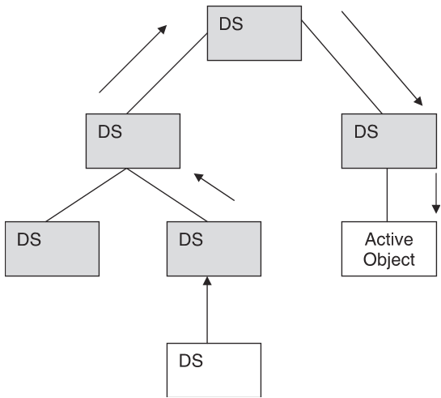

>图 9.3 JEDI 系统概览。

区域。这种潜在的分割必须由 JEDI 系统处理，要么修复它，要么创建一个新的树并指定新的根节点。

JEDI 事件系统可以总结如下：

• 事件是一组有序的字符串。事件参数跟在事件名称之后。

• 事件调度器可以订阅一个事件或者订阅一个事件模式。

• 事件模式使用参数匹配来过滤事件。

• 保持消息的因果排序。如果 $e1$ 是 $e2$ 的原因，它首先被投递给 subscriber。因果排序特性使得使用事件生成在一对组件之间进行同步成为可能。

为 JEDI 编写的扩展提供了客户端移动性和 ad-hoc 类型配置的支持 [10]。JEDI 强调可组合性和可重配置性，通过 moveOut 和 moveIn 操作支持移动性。移动性由 JEDI 调度器支持，它们

• 允许客户端断开连接；

• 允许客户端移动到新的调度服务器；

• 允许客户端在保留所有通知的同时进行连接。

系统定义了通知的临时存储。这些由调度服务器控制，调度服务器还防止消息重复并保证通知的因果排序。

当客户端连接到新的调度服务器时，这将直接联系旧的 DS 并下载客户端的累积通知。旧服务器通知其父节点（DS），告诉它将此客户端的后续通知路由到新的 DS。JEDI 调度树将通知从 publisher 路由到 subscriber。

客户端在调度服务器之间的迁移将导致 DS 系统中的负载变化。基本的 JEDI 系统不处理动态负载均衡；然而，已经考虑了负载感知的扩展。这可能意味着重新创建整个调度拓扑以处理负载变化。在 JEDI 中，通过向事件路由系统添加新的路由算法（生成树）来实现将 publish/subscribe 机制适应动态环境。在该算法中，每个 subscription 由一个委托领导者处理，它接受特定的 subscription 类型并充当这些 subscriber 的领导者。领导者负责组在树中的分布；DS 节点（调度器）存储所有组领导者的身份。

## 9.6 PADRES

开发和执行企业应用的主要问题之一是需要将严格与企业相关的部分与其他机制解耦。有些系统针对这类问题，旨在简化 IT 开发和维护。PADRES 就是这样一个系统，它支持在分布式基于内容的 middleware 中开发企业级应用² [11]。PADRES 包含可微调的 subscription 语言，支持组件之间的交互，允许事件管理功能以及网内过滤和处理，同时解决可扩展性问题。

PADRES 是一个具有 broker 和客户端组件的 overlay 网络：

• Broker 使用基于内容的路由算法路由消息（advertisement、subscription、publication）。

• Publisher 发布广告和发布消息。这些被转发给已注册接收此类消息兴趣的 subscriber。

PADRES 的关键特性包括系统管理和监控、基于规则的路由协议、基于规则的匹配算法、未来和历史事件关联、故障检测、恢复和动态负载均衡。

PADRES 系统支持的典型用户场景包括：

• 面向目标的资源发现和调度，

• 分布式转换、部署和执行，

• 分布式控制和监控，以及

• 去中心化的安全编排和协调。

## 9.6.1 模块化设计

PADRES broker 支持在通用 overlay 拓扑中进行消息路由。这是通过纳入标准基于内容的路由协议的扩展来实现的。这保持了简单的 publish 和 subscribe 客户端接口，同时不需要更改 broker 使用的内部消息匹配算法。这使得 PADRES 可以 easily 集成到现有的 publish/subscribe 系统中。在 PADRES broker 系统中，所有 broker 都是模块化的，建立在两个或更多队列之上。一个用于输入，一个或多个输出队列代表唯一的消息目的地。

>$ ^{2} $ http://www.msgr.utoronto.ca/projects/padres/index.php.

PADRES 在时间上是双向的，允许订阅未来或过去发布的数据。在这一点上，PADRES 与现有的基于内容的 pub/sub 系统不同。在未来发布的情况下，PADRES 利用正常的 pub/sub 消息传递范式，但历史数据库通过数据库绑定链接到 broker。发布按发布顺序存储在数据库中，并在收到适当请求时由 broker 释放（重新发布）。

### 9.6.2 负载均衡

PADRES 负载均衡解决方案由以下部分组成：

• 检测器，

• 调解器，

• 负载估计工具，

• 确定要卸载的 subscriber 的卸载算法。

该过程从检测器开始，检测器观察何时发生过载或负载不平衡。然后检测器启动一个触发器，告诉调解器在卸载 broker（执行卸载的较高负载 broker）和接受负载的 broker（接受来自卸载 broker 的负载）之间建立负载均衡会话。用于平衡的特定性能指标决定了在卸载 broker 上调用哪个卸载算法。该算法将产生要委托给接受负载的 broker 的 subscriber 集合。选择基于使用给定的负载估计算法估计每个 broker 的负载减少/增加。最后，调解器将协调 subscriber 的迁移，结束 broker 的负载均衡会话。

### 9.6.3 复合事件

使用分布式复合事件检测有许多好处：

• 检测中的冗余将被消除，因为检测结果被共享。

• 如果客户端发出的复合 subscription 的表达式重叠，检测将只执行一次。

• 分布式检测显著减少网络流量。这是由于复合 subscription 在网络中尽可能远地转发后再拆分。

• 复合事件在更靠近网络数据源的地方被检测。

• 匹配后只发送单个通知，而不是一组发布。这减少了必须在分布式系统中路由的发布数量。

PADRES broker 支持复合事件检测，它们在网络中分布检测以最小化检测成本。我们在第 11 章中更详细地讨论复合事件。

## 9.7 REDS

REDS（可重配置调度系统）是一个在 Politecnico di Milano³ 开发的模块化开源分布式 pub/sub 系统 [12]。REDS 的关键特性是可重配置性，它以两种不同的方式支持：

• 通过为消息格式、过滤器、路由策略选择适当的机制来配置 middleware。

• 动态重配置拓扑并解决 overlay 网络维护问题。

REDS 系统基于通用 broker 的概念，该 broker 被组织为一组实现明确定义接口的组件，如图 9.4 所示。开发者可以通过实现接口来参数化系统行为和特性。这些特性包括消息格式和过滤器。REDS 传输层由通过网络传输内容和控制消息所需的机制组成。传输系统隐藏了用于传输数据的具体线路协议。

Router 封装了路由和转发引擎。该组件负责在三个子组件的帮助下路由消息。SubscriptionTable 是一个包含 subscription 的路由表，用于将传入消息与 subscription 进行匹配。RoutingStrategy 实现特定的 pub/sub 路由和转发方案。默认方案基于 SIENA 模型。ReplyManager

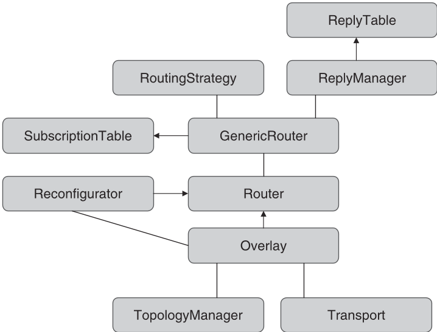

>图 9.4 REDS pub/sub 系统的组件。

>\(^{3}\) http://zeus.ws.dei.polimi.it/reds/.

监督对消息的回复。这是系统的一个创新特性，客户端可以对其收到的任何消息发送回复。

Reconfigurator 组件负责在检测到 overlay broker 网络重配置时更新 pub/sub 拓扑。Reconfigurator 和 TopologyManager 协同工作以建立新的 overlay 拓扑。消息路由发生在两个层面，首先是可重配置的 overlay 层，然后是在更高层面发生的 pub/sub 路由。我们在第 11 章中更详细地讨论拓扑重配置。

overlay 层负责在传输和网络层之上提供基本的通信设施。该层分为 Transport 和 TopologyManager 组件。前者负责使用 TCP 或 UDP 在 overlay 网络中两个相邻 broker 之间进行通信。后者负责维护 overlay 网络拓扑并处理拓扑的动态重配置。该系统有针对有线和无线环境的多种 TopologyManager 实现。

## 9.8 GREEN

GREEN 是一个具有可扩展过滤模型的 pub/sub 系统 [13]。过滤模型作为插件实现，可以轻松更改。GREEN 系统可以配置以满足应用开发者的需求。该系统支持基于类型、基于内容和基于邻近度的过滤。

作为基于 XML 过滤的示例，我们可以考虑以下过滤条件 [13]：

//RoadTraffic/[ %type%= $TrafficLight&&%colour%= $Red$] ? \\ DISTANCE# < $100$.

此示例过滤器表示，如果类型为 RoadTraffic 的事件由交通灯在 100 个单位距离内变为红色而产生，则应通知订阅组件。

GREEN 提供了两种基本配置，即移动自组织网络和广域网络配置。我们在第 11 章中考察重配置时讨论移动情况，这里简要概述广域配置。该配置由基于内容的 pub/sub 所需的组件组成：publisher、subscriber、SOAP 消息传递、内容路由核心和事件调度器。该系统在现有的通信基础设施之上工作，如基于内容的路由 overlay、Chord DHT、Scribe 或 IP 组播。默认的 broker overlay 插件类似于 Hermes，使用网络中的 rendezvous point。

## 9.9 Rebeca

Rebeca 是一个支持移动用户和上下文感知 subscription 的分布式事件系统 [14, 15]。该系统遵循 SIENA pub/sub 模型，建立在无环路由器配置和 advertisement 语义之上。Rebeca 项目研究了许多 pub/sub 路由和转发的扩展，例如匹配算法、过滤器合并、移动性和安全子系统。

Rebeca 架构由两个元素组成 [16]：

• 一个提供最小功能的可扩展 pub/sub broker 核心。

- 扩展最小核心的插件，可以在运行时插入 Rebecca broker。

broker 的最小功能包括基本的 pub/sub API 和一个由消息处理阶段组成的管道，组件（插件）可以插入其中。例如：在简单配置中，broker 将有一个输入阶段（在此期间消息被反序列化并接受处理）、一个检查消息并做出转发决策的匹配和转发模块，以及一个将消息序列化并发送到下一跳邻居的输出阶段。这种模块化结构支持配置 pub/sub 系统以满足各种应用需求和环境。

最小核心已通过各种插件进行了扩展。插件实现了例如移动性支持、拓扑重配置、可靠性、作用域等。作用域插件可用于将发布的可见性限制在由配置定义的某些区域内。当需要强制执行组织边界时，这很有用。

移动性子系统支持客户端的逻辑和物理移动性。移动性协议在移动性的源和目标之间使用一个称为 Junction 的中间节点来同步服务器。如果 broker 跟踪每个 subscription，Junction 是具有与从目标 broker 传播的重定位 subscription 匹配的 subscription 的第一个节点。如果使用覆盖关系或合并，此信息将丢失，Junction 需要使用基于内容的泛洪来定位源 broker。

#### 9.10 XSIENA 和 StreamMine

XSIENA（扩展可扩展互联网事件通知）系统是一个可扩展的通用事件通知服务 [17, 18]。该服务基于 SIENA 基于内容的 pub/sub 系统。XSIENA 基于无环 overlay 网络，并利用 Bloom 过滤器进行事件的高效转发。我们在这里给出系统的简要概述，并在第 8 章中回到 XSIENA 的路由和转发结构。

XSIENA 遵循 SIENA 模型，publisher 用在网络中传播的 advertisement 来广告内容。然后 subscription 消息沿 advertisement 的反向路径传播，publication 消息沿 subscription 的反向路径传播。该系统的关键思想是将 subscription 和已发布事件表示为一组 Bloom 过滤器，以优化其处理。这通过两个数据结构来实现，即用于确定 subscription 和 advertisement 中使用的过滤器之间覆盖关系的偏序集结构，以及用于匹配事件的树结构。过滤器和事件到 Bloom 过滤器的映射在网络边缘执行。关键思想是在核心网络中利用快速的基于 Bloom 过滤器的事件匹配。

偏序集结构用于为每个 subscription 和已发布事件导出一组 Bloom 过滤器。然后 Bloom 过滤器与 subscription 及其原始过滤器一起传播，中间 broker 可以使用此信息更新其路由表。然后 publisher 需要将新事件定位到现有的基于 Bloom 过滤器的路由表中，然后发送事件及其 Bloom 过滤器集合以投递给 subscriber。然后转发系统可以基于将事件相对于现有 subscription 进行定位的 Bloom 过滤器将消息与相邻 broker 和 subscriber 进行匹配。

StreamMine 是一个分布式事件处理系统，旨在进行大规模实时事件流处理 [19]，基于 XSIENA 组件。该系统的一个应用示例是电话系统中的呼叫欺诈检测，需要每秒处理数万甚至数十万个事件。这种数据速率需要并行处理和分布支持。

该系统基于基于内容的 pub/sub middleware。该系统允许应用特定的排序约束，并利用一种基于多核系统上事件推测执行的新颖解决方案。排序冲突被动态确定，使用软件事务内存来回滚以从排序冲突中恢复。该技术允许通常应顺序处理的事件进行并行处理。

StreamMine 系统建立在 XSIENA 数据结构之上，即 Bloom 过滤器偏序集和树。因此，事件处理决策是使用总结事件内容的高效 Bloom 过滤器表示来做出的。

## 9.11 Fuego 事件服务

Fuego 事件服务是在 Helsinki 信息技术研究所 HIIT 的 Fuego Core 项目中开发的。该事件服务通过提供支持客户端移动性的异步基于内容的 pub/sub 系统来应对移动计算环境中的挑战 [20]。

该系统的关键组件是事件路由器，它连接 publisher 和 subscriber 并在它们之间中介事件消息。通常，事件路由器由两部分组成：一组相邻路由器和一组本地客户端。两组都关联一个路由表，其中包含有关应将哪些事件消息转发到哪个相邻路由器或本地客户端的信息。

为了支持事件过滤和事件投递，事件路由器需要提供兴趣注册服务，并具有发布事件的接口。Subscriber 使用此兴趣注册服务定义其兴趣。

### 9.11.1 Fuego Middleware

事件服务和事件路由器是 Fuego middleware 服务集的一部分。图 9.5 展示了基于 Java 的 Fuego 服务架构 API 和用于移动计算的相应运行时系统。该架构实现了一组与通信和数据同步相关的通用服务元素。高级服务使用消息传递服务提供的可扩展消息传递和 RPC 设施。Jetty 和 Apache Axis 是基于 Java 的外部框架。Jetty 用于提供 servlet 支持，Axis 用于促进服务部署和与现有 Web 服务的互操作性。所提出的架构允许为无线用户部署现有的 Axis Web 服务。

该系统的主要数据表示格式是根据 XML Infoset 规范的 XML。由于 XML 解析是一项耗时的活动，而且 XML

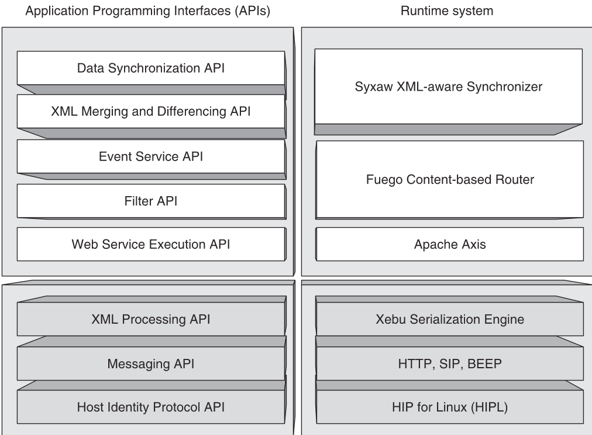

>图 9.5 Fuego API 和运行时系统。

文档的空间效率不高，因此使用更高效的 XML 编码来传输大部分 XML 内容。XML 的使用促使选择 SOAP [21] 作为架构中的主要通信协议，使用针对无线链路的优化进行传输 [22]。SOAP 用于相对较小的 XML 文档和片段的单向和请求-响应消息传递，HTTP 用于大量数据传输。

Linux 的 Host Identity Protocol 实现是架构的可选组件，用于安全的移动性和多宿主支持。HIP 架构目前正在由 IETF 标准化，它在网络层和传输层之间定义了一个新的加密命名空间。

### 9.11.2 事件服务

为移动计算提出的事件服务由两部分组成：

- 客户端 API 在功能上类似于 JMS [23]，提供基本的 publish/subscribe 功能和会话管理。

• 服务器端提供了一个可扩展的框架，用于基于内容的路由，具有优化和移动性支持。通用路由器实现允许可插拔的路由算法和路由表用户界面。

事件根据 XML Infoset 规范表示。所有远程 API 调用使用 SOAP 请求-响应协议，事件通知使用异步 SOAP 消息传递。事件路由器被实现为 Apache Axis Web 服务。客户端 API 实现默认使用无线 SOAP；然而，为 J2ME 终端系统创建了一个轻量级 API 版本，使用 HTTP 1.1 和专有的二进制消息格式。

### 9.11.3 过滤

过滤是实现基于内容的系统和精确内容投递的核心功能。过滤可以通过使用覆盖关系或过滤器合并来优化 [24]。事件服务通过基于内容的路由的通用数据结构支持两者。任何实现覆盖和合并方法的对象都会自动优化。该系统有一个默认的过滤语言，基于类型化元组和基于析取范式的属性过滤器。通常，事件和过滤器表示为类型化元组的列表。在这种情况下，属性过滤器是一个三元组 <name, type, constraint>。

### 9.11.4 客户端 API

客户端 API 通过三种机制支持表达性操作：

• 多会话，

• 表达性拉取功能，以及

• 快速 subscription。

第一种方法允许客户端在不同的接入服务器上创建多个会话，用于具有不同最大队列大小和投递选项的 subscription。客户端可以在不同的接入服务器上拥有多个会话，例如以支持不同的操作模式。第二种方法通过拉取匹配 subscription 标识符或任意过滤器的通知来实现。因此，客户端可以订阅不同的事件，这些事件存储在会话中——当在小型客户端上运行时，可以使用拉取操作仅检索必要的事件。

### 9.11.5 事件路由器

Fuego 路由器是一个用于开发和部署高效应用层基于内容网络的高级软件工具包。分布式路由器网络提供事件服务。

路由器工具包不指定任何特定的路由拓扑，而是允许开发者使用可用的通用 API 方法，利用高效的数据结构进行各种配置，并开发各种移动性协议。例如，Fuego 路由器工具包已被用于实现基于事件通道的配置。

服务器端系统由一组事件路由器组成。每个路由器有两个组件：本地路由表和远程路由表。本地路由表存储由本地客户端设置的过滤器，并为移动和无线客户端提供队列管理。断开的客户端可以在重新连接时使用推送或拉取语义检索排队的事件。远程路由表负责与其他路由器通信并在分布式系统中转发事件。为了支持可扩展性，本地和远程路由表及算法是独立的对象，可以在必要时进行更改。

这种模块化允许实现各种分布式事件路由语义和路由器拓扑。Subscription 语义和 advertisement 语义是两种不同兴趣传播机制的示例。前者在整个系统中传播 subscription 消息，事件沿 subscription 的反向路径路由。在后者中，advertisement 在整个系统中传播，subscription 沿 advertisement 的反向路径路由。支持的路由拓扑包括层次化、事件通道和对等拓扑。该系统还有用于路由表的独立用户界面模块。

以下特性在实现中是模块化和可扩展的：

• 外部路由算法。提供了一个数据结构工具包用于创建不同的路由算法，如层次化、对等和事件通道配置。

• 外部路由表管理界面。提供了一个基于 HTML 的界面，针对不同的配置进行了定制。

• 过滤语言。过滤语言可以更改，并提供了一个示例。

• 通知数据类型。默认数据类型是固定的，但可以扩展。自定义数据类型需要额外的 XML 序列化代码。未内置到过滤语言中的自定义数据类型在路由中被忽略。

• 消息传输协议。可以以类似于 HTTP 协议的方式（通过 Jetty servlet）添加新的消息传递协议。

## 9.11.6 基于内容路由的数据结构

偏序集结构基于 SIENA 系统中使用的过滤器偏序集（FP）。FP 是一个有向无环图结构，通过覆盖关系存储过滤器。它用于优化路由表并计算消息的目标接口或转发集合。在 Fuego 中提出了改进 FP 性能的新数据结构，即偏序集派生森林及其变体，在某些情况下它们比 FP 更简单、更高效，因为它们只存储关系的一个子集。

提出了一组基于内容路由系统的工程指南：

**层次化路由。** 森林数据结构应用于层次化路由和查找未覆盖集合。

**对等路由。** 对于对等路由，当有许多本地客户端时应使用森林结构。森林需要更复杂的*转发*集合管理。或者，应使用森林来查找客户端的未覆盖集合，然后使用 FP 仅管理外部路由信息。

**匹配。** 数据结构具有相似的匹配性能，与更优化的匹配器不在同一水平。匹配性能与过滤器的数量以及接口的数量成正比。应使用森林来查找被传播的未覆盖集合，并应使用额外的匹配器数据结构来快速将通知与本地客户端进行匹配。这是一个两阶段过程：首先通知由偏序集或森林匹配覆盖集合，然后由匹配数据结构进行匹配。

**过滤器合并。** 层次化路由系统很容易通过过滤器合并进行扩展。本地过滤器的合并对于层次化和对等路由都容易实现。另一方面，对等路由表的外部过滤器合并更困难。我们观察到从接口特定过滤器集合的合并中获得了显著的性能收益。

#### 9.11.6.1 移动性支持

事件 publisher 和 subscriber 的移动性是任何事件服务中的核心主题，Fuego 也不例外 [25, 26]。当我们考虑真正的移动性支持需要什么时，我们很快注意到主要需求是同步源和目标服务器，同时更新往往是任意的事件路由拓扑。当使用过滤器合并或覆盖关系时，这些操作在路由器流量量和交换的基础设施消息方面的成本通常很高。此外，覆盖关系或合并过滤器的使用和传播将导致 subscription 源服务器身份的丢失。

Fuego 通过在接入服务器上设置消息缓冲来支持移动性。路由器实现中还启用了自定义切换协议，通过更新路由拓扑来满足移动安全性。对于具有典型成本问题的大型网络，Fuego 包含一个单独的模拟器来评估切换成本。

一种已成功用于移动性支持的解决方案是设置 rendezvous point 来协调 subscription 传播和移动性管理。最简单的 rendezvous point 可以是事件通道，每个通道负责单一事件类型，并使用单条消息或 RPC 操作进行更新。这样的事件通道是内容空间子空间上的 rendezvous point。可以使用目录服务来查找通道。这种移动性支持易于管理、可扩展且具有容错性，因为使用了复制。

如果要在路由器拓扑具有无环或环形图的环境中维护移动性，解决方案更为复杂。rendezvous point 将以 subscription 和 advertisement 总是向它传播的方式运行。使用反向路径，使得 subscription 沿 advertisement 的反向路径发送，通知使用 subscription 的反向路径。现在，移动性的成本在最坏情况下受限于到 rendezvous point 的路径长度。为了将消息路由到 rendezvous point 而找到它并不是一项简单的任务。基于 DHT 的数据结构（其中事件类型被哈希到 overlay 节点标识符）可用于路由。

如果要创建移动性感知 pub/sub 系统，有三种有用的技术可以利用：基于 overlay 的路由、rendezvous point 和完整性检查。在基于 overlay 的路由中，pub/sub 路由与底层网络路由分离。因此，系统能够应对网络层面的可能错误、节点故障和基于内容的泛洪问题。rendezvous point 及其固有的更好的拓扑更新协调使移动节点的生活更轻松。更新将单向传播到单个 rendezvous point。完整性检查将只接受完全建立的 subscription 和 advertisement，在拓扑中完整，这使得能够执行覆盖过滤器的优化。

## 9.12 STEAM

可扩展定时事件和移动性（STEAM）事件系统是旨在帮助构建和维护 ad-hoc 无线网络的系统之一，在这种情况下是 WLAN 类型的网络，在交通管理应用等领域的使用日益增加 [27]。

STEAM 协议是一种无线应用层广播协议。它在事件生产者处使用基于主题的过滤，在订阅客户端处使用基于内容的过滤。STEAM 具有以下主要设计特性：

- 使用的事件模型是隐式的，允许实体在本地订阅感兴趣的事件类型，而无需集中式 broker。

• STEAM 通过使用三种不同的过滤器（基于主题、邻近度和内容）来解决移动性（网络拓扑的动态重配置）引起的问题。主题过滤器与事件匹配并映射到邻近度组。邻近度过滤器作用于邻近度组的地理属性。

• 系统通过使用组通信服务通知感兴趣的各方。兴趣组在地理上绑定。节点的标识利用信标。

在 STEAM 中，事件被定义为具有名称（确定事件的结构）和一组类型化参数。当事件类型被部署时，为该类型建立邻近度过滤器，指定事件发生的空间。当事件被发布时，publisher 将匹配主题和邻近度，然后 subscriber 匹配内容。我们很容易看到，publisher 的邻近度过滤器必须接收有关 subscriber 位置的信息。获取、维护和保护此信息的方法在架构中未详细说明。

在 STEAM 架构中，事件 publisher 将广告它们打算生产的事件类型。类型的发布活动与地理区域（邻近度）绑定，此类型的事件在此区域内发布。请注意，邻近度不一定对应于通信的物理区域；它们独立于物理区域，并且在路由层中支持多跳。

STEAM 利用 PGCS（基于邻近度的组通信服务），其中组被分配特定的地理区域。规则防止不在组区域内的节点加入组，并提供使用邻近度发现服务（PDS）的主动邻近度检测。如果预期客户端具有匹配的 subscription 配置文件并且位置适当，则相关事件将被投递。在允许加入之前，subscription 或公告必须与组匹配。

STEAM 允许客户端移动，尽管邻近度是静态的。实验测试的结果（例如交通灯的情况）表明，在 ad-hoc 环境中，分布式过滤是有利的，并且可以显著减少传输流量量。

## 9.13 ECho 和 JECho

ECho 是一种基于事件通道的高性能数据传输机制 [28]。ECho 使用基于通道的 subscription，类似于 CORBA 事件服务。ECho 的派生事件通道机制通过向特定事件通道的所有监听器添加应用提供的派生函数 F，并将由源生成并通过过滤器的所有事件传输到派生事件通道来实现过滤。该方案解决了不想要事件的投递问题。ECho 特别针对流数据和数据传输进行了优化。ECho 已被证明性能优于 Jini（分布式 Java 事件）、CORBA 事件通道和基于 XML 的消息传递。ECho 在 Georgia Tech 开发，源代码可用于学术研究目的。

JECho 是一个分布式事件系统，最近已扩展为使用机会事件通道支持移动性 [29]。核心问题是支持动态事件投递拓扑，该拓扑适应移动客户端和不同的移动性模式。这些需求主要通过两种机制来解决：主动定位更合适的 broker 并在 broker 之间使用移动性协议，以及使用基于监控域中 broker 的中央负载均衡组件的负载均衡系统。移动性协议原则上与大多数移动性协议（SIENA、Rebecca 等）类似。过滤模型基于有状态的用户定义对象，称为调制器，可以转换事件流。这允许比非基于状态的谓词匹配更细粒度的过滤。然而，可能的安全问题没有得到解决，并且在类似调制器之间进行优化可能很困难。此外，基于客户端的过滤没有得到解决，并且可能也难以高效实现。例如，移动生产者应该从 broker 下载所有相关调制器。此外，没有提供会话管理，因此所有用户特定的调制器都会被重定位。

该系统支持负载均衡和资源监控，这些是移动性感知事件系统的新特性。该论文展示了不同场景的模拟结果，例如重定位开销和移动性模式。使用 BRITE 在 100 节点网络中检查移动性模式，评估包括随机行走、推销员、弹出和固定等场景。此外，使用具有两个子网的真实系统测量端到端延迟和移动性/通信比率。

## 9.14 基于 DHT 的系统

广域 DHT 结构经常用作 pub/sub 系统的基本通信基础设施。我们在第 3 章中考察了知名的 DHT 解决方案。在本节中，我们考虑建立在 DHT 结构之上的 pub/sub 系统。pub/sub 系统依赖 DHT 进行高效和可扩展的消息路由以及弹性和容错。overlay 将网络动态和流失相关的关注点从 pub/sub 系统中抽象出来。

### 9.14.1 Scribe

Scribe 是一个基于 topic 的 publish-subscribe 系统，探索了对等环境中通知服务的可扩展性。Scribe 建立在 Pastry 之上，Pastry 是一个可扩展的自组织对等定位和路由系统。Scribe 提供应用层组播。Pastry 基于统一的 ID 密钥，用作主机地址。系统将消息路由到最接近的密钥 [30]。在 $N$ 节点网络中，Pastry 平均可以在少于 $log_{2b}N$ 跳内路由到任何节点，其中 $b$ 是配置参数。除非具有相邻节点 ID 的 $\frac{l}{2}$ 个节点同时故障，否则保证投递，$l$ 是典型值为 16 的配置参数。节点 ID 是基数为 $2b$ 的数字序列。节点的路由表包含 $log_{2b}N$ 行，每行有 $2b-1$ 个条目。第 $n$ 行中的条目引用节点 ID 与当前节点具有相同 n 位数字但第 $n+1$ 位数字不同的节点。

均匀分布确保节点 ID 空间是均匀的。算法基于度量（例如成本或延迟）从多个可能性中选择一个节点 ID。每个节点还维护具有数值上最接近的较大和较小节点 ID 的节点的 IP 地址。节点将消息转发给其 ID 与密钥匹配的节点，该密钥的前缀比与当前节点的前缀至少长一位。如果找不到这样的节点，消息将被转发给前缀在数值上比当前节点 ID 更接近的节点。此节点从较大/较小 ID 的集合中找到。

Scribe 在 Pastry 之上提供尽力而为的通知投递，不指定特定的事件投递顺序。此外，Scribe 不支持过滤、缓冲或移动性。事件的 publisher 是组播树的根。每个 topic 都有一个唯一的 topicID，节点 ID 在数值上最接近此 topicID 的 Scribe 节点充当该特定 topic 的 rendezvous point。rendezvous point 形成组播树的根。换句话说，给定 topic（subscriber 组）的责任在服务器集合上进行哈希。当 subscribe 消息被路由到 rendezvous point 时，每个中间节点将前一个节点添加到其子节点表中。此信息用于组播协议，该协议类似于反向路径转发。

如果 rendezvous point 的 IP 地址已知，事件可以直接发布。然而，subscription 需要在对等拓扑内进行路由。可以在 rendezvous point 强制执行访问控制。Pastry 可以通过重新发送 subscription 来绕过故障节点进行路由，从而修复组播树。

每个 Scribe 组播组由一个 Pastry 密钥表示，称为 groupId。给定 groupId 的组播树通过取每个组成员到 groupId 根的 Pastry 路由的并集来创建。然后可以使用此组播树通过使用从根到树 leaves 的反向路径路由来发送内容。图 9.6 展示了 Scribe 中的 subscription 和 publication 操作。

组成员管理是去中心化和高效的，因为它建立在现有的、邻近度感知的 Pastry overlay 之上。将新成员引入组播树很容易。新成员只需向 groupId 发送消息。因此 Scribe 可以支持每组大量成员。组也可以是动态的。

Pastry 的邻近度感知路由和 Scribe 的组播组管理可以结合以支持 anycast 通信。Anycast 在执行资源发现时很有用。使用 Anycast，overlay 中的任何节点都可以向 Scribe 组发送 anycast 消息。anycast 消息被路由到 groupId，并依靠本地路由收敛属性转发到最近的成员。

Scribe 组播路由状态是分布式的，以去中心化的方式维护。树中的每个节点只维护其在树中的直接前驱和后继。与其他 overlay 组播方案（如接下来讨论的 Bayeux [31]）相比，这可以被视为显著的可扩展性优势。因此，Scribe 不需要过多的信令流量来收集全局状态信息。

### 9.14.2 Bayeux 和 Tapestry

Bayeux 是一个去中心化的源特定、显式加入的应用层组播系统，基于 Tapestry 单播路由基础设施。Bayeux 支持负载均衡并考虑局部性。该系统基于 Tapestry 采用的前缀路由方案，类似于 CIDR IP 地址分配架构中的最长前缀路由。假设地址（Id）均匀分布，并使用 SHA-1 哈希算法生成。在路由过程中，第 $n$ 跳与目标 ID 具有至少长度为 $n$ 的后缀。接收者被组织在以源为根的组播树中 [32, 33]。

发送者将会话根节点上的组播会话广告为 Tapestry 文件，该文件由相应的哈希会话 ID 标识。客户端通过向由会话元组标识的地址发送消息来加入组播组。Bayeux 构建分发树以向会话成员投递数据。分布式组播树由来自根的响应消息（TREE 消息）设置，该消息激活到接收者的转发路径。为了提高容错性，该系统支持在称为树分区的过程中复制根节点。

与 Scribe 的主要区别在于组播树的构建方式。Bayeux 总是将 subscription 消息发送到树的根。根节点维护基于 topic 的组播组的成员列表。来自根的响应消息在转发消息的中间 overlay 节点中安装状态。因此，新节点成为转发树的一部分。

Scribe 可以被视为具有更可扩展的组播树构建方法。在 Bayeux 中，根节点必须保存与组播组所有成员相关的成员信息。此外，组成员管理引入了开销，因为每个控制消息必须发送到根，然后根将回复发回。为了防止根节点成为性能瓶颈，提出了

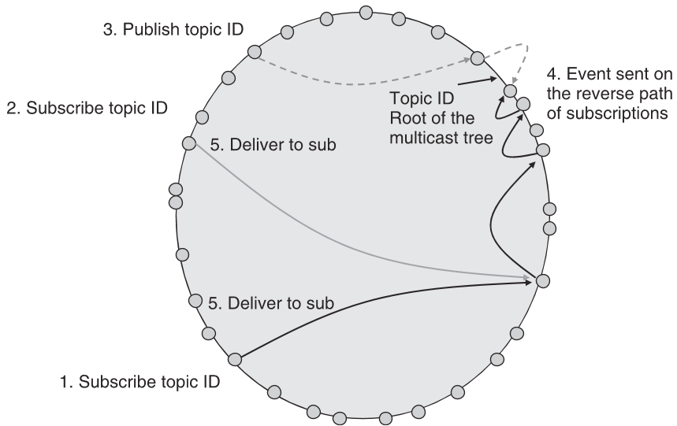

>图 9.6 Scribe 概览。

一种组播树的分区方案，在多个根节点之间分担负载。

### 9.14.3 Hermes

Hermes [34, 35] 是一个基于 DHT 的 overlay 事件投递系统。Hermes 利用底层 overlay 系统的特性进行消息路由、可扩展性和改进的容错性。该系统利用特殊的 rendezvous point 节点来管理网络上组播树的创建。这些节点协调 subscription 和 advertisement 消息的传播。每个 rendezvous point 负责至少一种事件类型。rendezvous point 和类型可以链接成分布式类型层次结构。负责的 rendezvous point 通过将事件类型哈希到 overlay 的扁平命名空间来定位 [34]。

在 Hermes 中，rendezvous point 通过向 rendezvous point 发送特殊消息来建立。消息的地址是类型标识符的哈希。该消息在 rendezvous point 建立事件类型。事件类型符合模式，模式可以被强制执行。因此，该系统支持类型安全的 subscription。

Hermes 支持两种路由算法：

• 在基于类型的路由中，所有消息都发送到 rendezvous point：subscription、advertisement 和通知。这种路由形式不支持过滤，而是基于事件的类型进行比较。Subscription 和 advertisement 是以 RP 为根的组播树分支的本地属性，它们不会被 RP 转发。这意味着通知必须始终发送到 RP。

• 基于类型/属性的路由类似于基于类型的路由，但支持使用覆盖关系进行过滤，并且不是将所有通知发送到 RP，而是沿 subscription 的反向路径发送通知。在这种情况下，只有 advertisement 被发送到 RP。Subscription 总是沿 advertisement 的反向路径发送。RP 将 subscription 消息转发到重叠的 advertisement。基于类型/属性的路由更适合事件流量不均匀分布的场景，因为通知不总是发送到 RP。

基于 rendezvous point 的系统使用以下场景运行（图 9.7）：

• Publisher

– publisher 发送事件类型的 advertisement（如果路由是基于类型/属性的，则添加过滤器）(1)。

– advertisement 被转发到 rendezvous point (2)。

• Subscriber

– 客户端订阅某种类型的事件（在基于类型/属性的路由中使用过滤器）(3)。

– subscription 消息被转发到 rendezvous point，未被中间 broker 覆盖（类型或过滤器）(4–6)。

事件发布

– publisher 发布一个事件 (7)。

– 事件消息通过以 rendezvous point 为根的组播树发送 $(8-11)$。

- 如果路由是基于类型的，符合 publisher 的 advertisement 的事件将沿 advertisement 到 RP 的正向路径发送。rendezvous point 负责将事件消息沿 subscription 的反向路径转发。

- 如果路由是基于类型/属性的，rendezvous point 将沿 advertisement 的反向路径发送 subscription。来自 publisher 的符合 advertisement 的事件沿 subscription 的反向路径发送。

Hermes 的一个显著特性是支持将 RP 连接到类型层次结构中。在 subscription 继承路由中，advertisement 只发送到维护事件类型的 RP。Subscription 由 RP 转发到所有具有后代类型的 RP。在 advertisement 继承路由中，RP 将 advertisement 递归转发到所有祖先事件类型的 RP。通知也被转发到所有祖先事件类型，因为它们沿与 advertisement 相同的正向路径发送。

如上所述，Hermes 的一个主要特性是 rendezvous point 和类型层次结构之间的连接。只有维护事件类型的 RP 才会收到 advertisement，然后将 subscription 转发到所有具有后代类型的 rendezvous point。这是 subscription 继承路由。在另一种模型中，advertisement 继承路由中 RP 将递归地将 advertisement 转发到所有绑定到祖先事件类型的 RP。类似地，通知被转发到所有祖先事件类型。这是由于它们使用与 advertisement 相同的正向路径。

Hermes 通过使用心跳消息检测服务器和 RP 故障。在故障情况下，底层 overlay 能够定位替代服务器来处理故障节点的责任——路由表被发送到 rendezvous point，overlay 提供具有关联路由的新服务器。此外，Hermes 支持 RP 复制，使用位于同一组播树中的副本之间的 advertisement 和 subscription 状态同步。这允许减少消息

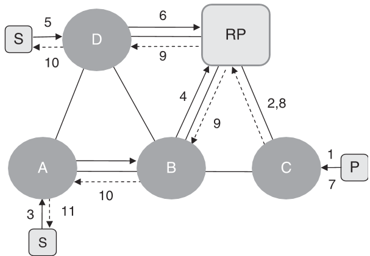

>图 9.7 Hermes 中的路由。

传播开销，但不直接涉及 rendezvous point 之间的负载均衡问题。

Hermes 广告模型基本上是典型的 advertisement 语义模型。但存在差异。例如，基于类型路由中的消息或基于类型/属性路由中的 advertisement 和 subscription 将发送到 rendezvous point，使路由拓扑本质上受 RP 约束。此外，从 subscriber 到 RP 的路径用于引入 subscription，并且（在基于类型/属性的路由中）subscription 将使用重叠 advertisement 的反向路径进行传播。还请注意，advertisement 只能在广告者和 rendezvous point 之间的路径上引入。

通用广告模型和 Hermes 实现之间的差异很重要，因为 Hermes 使 advertisement 成为属于以 RP 为根的组播树分支的本地属性，并允许使用虚拟广告建模。Hermes rendezvous point 将为其管理类型的所有事件拥有虚拟 advertisement。因此 subscription 向它传播。

## 9.14.4 其他系统

### 9.14.4.1 DADI、Meghdoot 和 MEDYM

DADI（信息的发现、分析和传播）是 Princeton 的一个研究项目，专注于互联网上的发现、分析和信息传播。该项目研究基于事件的模型，重点是广域 pub/sub。DADI 的工作包括许多子项目，涵盖不同的操作层，即系统层、算法层和应用层。系统层涵盖 pub/sub 和基于 subscription 的内容投递的架构设计。算法层涵盖基于内容的 pub/sub 的路由和匹配算法。应用层涉及互联网规模的持久搜索。

Meghdoot [36] 是完全基于结构化 overlay 基础设施（即 CAN [37]）的基于内容的 pub/sub 系统的早期示例之一，具有基于 rendezvous 的事件路由。Meghdoot 使用具有数值或字符串属性的结构化 subscription。Subscription 被映射到 CAN 点，其坐标是每个范围约束的边界。已发布事件被映射到跨越所有可能映射到该事件的 subscription 的 CAN 区域。还提出了一种独立于特定基础设施的基于内容的 pub/sub 通用架构 [38]。

Match Early with Dynamic Multicast（MEDYM）[39] 将事件空间划分为具有平衡负载的不重叠分区。每个服务器充当一个或多个分区的匹配器。提出了一种通道化技术，将事件空间划分为多个组播组。为每个组构建一个组播树，该树跨越具有该组中任何事件的 subscription 的服务器。组播可以通过 IP Multicast（如果可用）或通过应用层组播来执行。

### 9.14.4.2 SUB-2-SUB

SUB-2-SUB 系统是一个基于对等的的事件通知机制，根据 subscriber 的兴趣相似性对其进行聚类 [40]。SUB-2-SUB 是一个基于内容的系统，其中相似的过滤器被聚类为 topic。参与者没有被组织成结构化 overlay。每个 topic 形成一个独立的环结构，这导致 overlay 的度数随从过滤器创建的 topic 数量线性增长。匹配给定 topic 的事件首先被路由到正确的环，然后在环内高效传播。有关 subscription 的信息使用 CYCLONE gossip 协议在节点之间定期交换。

### 9.14.4.3 TERA

TERA 是一个基于对等架构的基于 topic 的 pub/sub 系统 [41]。TERA 中的节点被组织为两层，连接所有节点的全局 overlay 网络和连接所有对同一 topic 感兴趣的节点的 topic 层 overlay。TERA 利用随机游走和接入点查找表将事件投递到包含所有具有匹配过滤器的节点的 topic 层。事件首先被投递到给定 topic 的接入点节点，然后该节点在 topic 特定的 overlay 内发送事件。对等网络基于 gossiping 和第 3 章中讨论的视图交换技术进行管理。

## 9.15 总结

本章考察的 pub/sub 系统建立在网络层基本数据包路由能力之上，并用 overlay pub/sub 路由特性对其进行扩展。这些系统可以根据分层分类为基本 overlay 或基于 DHT 的 overlay。前者直接在网络层之上构建 pub/sub，而后者在 overlay 路由基础设施（通常是 DHT 算法）之上构建 pub/sub 系统。后一类依赖于底层 overlay 基础设施的可扩展查找操作、弹性和容错特性。图 9.8 总结了所考察的 pub/sub 系统。

SIENA、JEDI、Rebeca 是直接在网络层之上构建的 pub/sub 系统的示例。它们是由维护基于内容的路由表的 broker 组成的 overlay 网络。它们还支持各种优化以降低路由表维护成本，例如覆盖关系。据我们所知，覆盖关系最早在 SIENA 项目中引入，它们支持基于事件的通信优化。聚合基于内容的路由状态的优化（如覆盖关系和合并）对移动性支持是有问题的，因为它们丢失了与原始 subscriber 和广告者相关的信息。这可以通过使用在用于构建路由表的消息的反向路径上部分泛洪控制消息的技术来解决。我们在第 7 章和第 11 章中讨论了与基于内容的路由相关的各种问题。

overlay 路由拓扑应遵循路由器的网络级放置才能高效。许多 DHT 通过将数据哈希到路由器/broker 并使用前缀路由的变体来找到给定数据项的适当数据 broker 来工作。这个基本原语很适合 pub/sub，例如通过将事件类型哈希到 rendezvous point。Hermes 和 Scribe 是在 overlay 网络之上实现的 pub/sub 系统的示例，基于 rendezvous point 路由模型。Hermes 是基于内容的 pub/sub 系统，Scribe 是基于 topic 的系统。

SIENA 和类似系统的基本路由算法不能很好地应对拓扑变化。路由算法应能够适应网络环境，同时考虑信息的供给和需求。已经提出了几种 pub/sub 网络运行时配置的解决方案，例如 REDS 和 GREEN 系统。除了重配置之外，还提出了概率算法来提高 pub/sub 系统的鲁棒性。在第 3 章中，我们考察了用于 pub/sub 的 gossip 算法，它们是具有良好可扩展性特性的广播和组播算法族的基础。

| 系统|Subscription 模型|基础设施|路由|
| ---|---|---|---|
| Gryphon、Rebecca、SIENA、JEDI、Elvin、XSIENA|内容|Broker、overlay|过滤、过滤器聚合、各种扩展|
| Padres|内容|Broker、overlay|过滤、动态配置、负载均衡|
| REDS|Subscription、请求-应答、可插拔|可插拔模块：结构化或非结构化|可插拔模块：广域、移动自组织网络、拓扑重配置|
| GREEN|各种（可插拔组件）|可插拔模块：结构化或非结构化|可插拔模块：广域、移动自组织网络|
| Fuego|内容|各种、联邦集群|Rendezvous|
| STEAM|主题、邻近度|基于邻近度的组通信服务|基于邻近度|
| ECho 和 JECho|通道（ECho）和有状态调制器（JECho）|Broker、overlay|过滤、负载均衡和移动性（JECho）|
| Scribe|Topic|DHT（Pastry）|Rendezvous|
| Hermes|Topic 和内容|DHT|带过滤器聚合的 Rendezvous|
| Meghdoot|内容|DHT|Rendezvous|
| Sub-2-Sub、TERA|Topic|Gossip 和基础设施支持的 overlay 的组合|过滤、基于兴趣的聚类|

>图 9.8 研究系统总结。

### References

1. IBM (2002) *Gryphon: Publish/Subscribe over Public Networks*. (White paper) http://researchweb.watson.ibm.com/distributedmessaging/gryphon.html.

2. Strom RE, Banavar G, Chandra TD, et al. (1998) Gryphon: An information flow based approach to message brokering. Computing Research Repository (CoRR). Available at: http://arxiv.org/corr/home.

3. Bacon J et al. (2000) Generic support for distributed applications. IEEE Computer 33(3), 68–76.

4. Carzaniga A, Rosenblum DS and Wolf AL (2001) Design and evaluation of a wide-area event notification service. ACM Transactions on Computer Systems 19(3): 332–83.

5. Carzaniga A and Wolf AL (2003) Forwarding in a content-based network Proceedings of ACM SIGCOMM 2003, pp. 163–74, Karlsruhe, Germany.

6. Caporuscio M, Carzaniga A and Wolf AL (2003) Design and evaluation of a support service for mobile, wireless publish/subscribe applications. IEEE Transactions on Software Engineering 29(12): 1059–71.

7. Carzaniga A, Rutherford MJ and Wolf AL (2004) A routing scheme for content-based networking. Proceedings of IEEE INFOCOM 2004. IEEE, Hong Kong, China, vol. 2, pp. 918–28.

8. Sutton P, Arkins R and Segall B (2001) Supporting disconnectedness-transparent information delivery for mobile and invisible computing. *CCGRID '01: Proceedings of the 1st International Symposium on Cluster Computing and the Grid*, p. 277. IEEE Computer Society, Washington, DC.

9. Cugola G, Di Nitto E and Fuggetta A (2001) The JEDI event-based infrastructure and its application to the development of the OPSS WFMS. IEEE Transactions on Software Engineering 27(9): 827–50.

10. Cugola G, Di Nitto E and Picco GP (2000) Content-based dispatching in a mobile environment. Workshop su Sistemi Distribuiti: Algoritmi, Architecture e Linguaggi.

11. Jacobsen HA, Cheung AKY, Li G, Maniyaran B, Muthusamy V and Kazemzadeh RS (2010) The PADRES Publish/Subscribe System. *Principles and Applications of Distributed Event-Based Systems*, pp. 164–205.

12. Cugola G and Picco GP (2006) REDS: a reconfigurable dispatching system. Proceedings of the 6th International Workshop on Software Engineering and Middleware, pp. 9–16. SEM '06. ACM, New York, NY.

13. Sivaharan T, Blair G and Coulson G (2005) GREEN: A configurable and re-configurable publish-subscribe middleware for pervasive computing. Proceedings of DOA 2005, pp. 732–49.

14. Fiege L, Gärtner FC, Kasten O and Zeidler A (2003) Supporting mobility in content-based publish/subscribe middleware *Middleware*, pp. 103–22.

15. Zeidler A and Fiege L (2003) Mobility support with rebecca. Proceedings of the 23rd International Conference on Distributed Computing Systems, pp. 354, ICDCSW '03. IEEE Computer Society, Washington, DC, pp. 354–61.

16. ParzySJegla H, Graff D, Schrter A, Richling J and Mühl G (2010) Design and implementation of the rebecca publish/subscribe middleware. In *From Active Data Management to Event-Based Systems and More* (ed. Sachs K, Petrov I and Guerrero P) vol. 6462 of *Lecture Notes in Computer Science*. Springer Berlin/Heidelberg. pp. 124–40.

17. Jerzak Z (2009) XSiena: The Content-Based Publish/Subscribe System. PhD thesis TU Dresden. Dresden, Germany.

18. Jerzak Z and Fetzer C (2008) Bloom filter based routing for content-based publish/subscribe. Proceedings of the Second International Conference on Distributed Event-Based Systems, pp. 71–81, DEBS '08. ACM, New York, NY.

19. Fetzer C, Brito A, Fach R and Jerzak Z (2010) StreamMine. In *Principles and Applications of Distributed Event-Based Systems* (ed. Hinze A and Buchmann AP), IGI Global, pp. 394–410.

20. Tarkoma S, Kangasharju J, Lindholm T and Raatikainen K (2006) Fuego: Experiences with mobile data communication and synchronization. 17th Annual IEEE International Symposium on Personal, Indoor and Mobile Radio Communications (PIMRC), pp. 1–5.

21. W3C (2003) *SOAP Version 1.2*. W3C Recommendation.

22. Kangasharju J, Lindholm T and Tarkoma S (n.d.) Requirements and design for XML messaging in the mobile environment *Second International Workshop on Next Generation Networking Middleware*, pp. 29–36.

23. Sun (2002) Java Message Service Specification 1.1.

24. Tarkoma S (2008) Dynamic filter merging and mergeability detection for publish/subscribe. *Pervasive and Mobile Computing* **4**(5): 681–96.

25. Tarkoma S and Kangasharju J (2007) On the cost and safety of handoffs in content-based routing systems. *Comput. Netw.* **51**: 1459–82.

26. Tarkoma S, Kangasharju J and Raatikainen K (2003) Client mobility in rendezvous-notify. *Intl. Workshop on Distributed Event-Based Systems (DEBS'03)*, pp. 1–8.

27. Meier R and Cahill V (2003) Exploiting proximity in event-based middleware for collaborative mobile applications. *DAIS*, pp. 285–96.

28. Zhou D, Chen Y, Eisenhauer G and Schwan K (2001) Active brokers and their runtime deployment in the ECho/JECho distributed event systems. *Active Middleware Services*, pp. 67–72.

29. Chen Y, Schwan K and Zhou D (2003) Opportunistic channels: Mobility-aware event delivery. *Middleware*, pp. 182–201.

30. Castro M, Druschel P, Kermarrec AM and Rowstron A (2002) Scribe: A large-scale and decentralized application-level multicast infrastructure. IEEE Journal on Selected Areas in Communication (JSAC), 20(8): 1489–9.

31. Zhuang S, Zhao B, Joseph A, Katz R and Kubiatowicz J (2001) Bayeux: An architecture for scalable and fault-tolerant wide area data dissemination The 11th International Workshop on Network and Operating Systems Support for Digital Audio and Video (NOSSDAV'01), pp. 11–20.

32. Zhao BY, Kubiatowicz JD and Joseph AD (2002) Tapestry: a fault-tolerant wide-area application infrastructure. SIGCOMM Comput. Commun. Rev. 32(1): 81.

33. Zhuang SQ, Zhao BY, Joseph AD, Katz RH and Kubiatowicz J (2001) Bayeux: An architecture for scalable and fault-tolerant wide-area data dissemination. Proceedings of the Eleventh International Workshop on Network and Operating System Support for Digital Audio and Video (NOSSDAV 2001).

34. Pietzuch PR (2004) *Hermes: A Scalable Event-Based Middleware*. PhD thesis. Computer Laboratory, Queens' College, University of Cambridge.

35. Pietzuch PR and Bacon J (2002) Hermes: A distributed event-based middleware architecture. *ICDCS Workshops*, pp. 611–18.

36. Gupta A, Sahin O, Agrawal D and Abbadi AE (2004) Meghdoot: Content-based publish:subscribe over P2P networks. Proceedings of the ACM/IFIP/USENIX 5th International Middleware Conference (Middleware'04), pp. 254–73.

37. Ratnasamy S, Francis P, Handley M, Karp R and Schenker S (2001) A scalable content-addressable network. SIGCOMM '01: Proceedings of the 2001 Conference on Applications, Technologies, Architectures and Protocols for Computer Communications, pp. 161–72. ACM, New York, NY.

38. Baldoni R, Marchetti C, Virgillito A and Vitenberg R (2005) Content-based publish-subscribe over structured overlay networks. *International Conference on Distributed Computing Systems* (ICDCS 2005), pp. 437–46.

39. Cao F and Singh JP (2005) MEDYM: Match-early with dynamic multicast for content-based publish-subscribe networks. Proceedings of the ACM/IFIP/USENIX 6th International Middleware Conference (Middleware 2005), pp. 292–313.

40. Voulgaris S, Rivire E, Kermarrec AM and Steen MV (006)Sub-2-Sub: Self-organizing content-based publish subscribe for dynamic large scale collaborative networks. In IPTPS06: the Fifth International Workshop on Peer-to-Peer Systems.

41. Baldoni R, Beraldi R, Quema V, Querzoni L and Tucci-Piergiovanni S (2007) TERA: topic-based event routing for peer-to-peer architectures. *DEBS '07: Proceedings of the 2007 Inaugural International Conference on Distributed Event-Based Systems*, pp. 2–13. ACM, New York, NY.

# 10 DHT 中的 IR 风格文档分发

在本章中，我们介绍了一个在 DHT overlay 网络之上实现的基于 keyword 的 pub/sub 系统的具体示例。本章考虑了问题的复杂性，并提出了一种基于 DHT 网络上 rendezvous point 的高效解决方案。本章说明了已讨论的基于 DHT 的解决方案如何用于基于 keyword 的内容分发。

## 10.1 引言

与基于内容的 pub/sub 系统不同，还存在另一种内容过滤系统，它利用信息检索（IR）方法来过滤发布。在这类系统中，发布（等同的内容或文档）和 subscription 过滤器都由一组 keyword 建模。基于发布和过滤器中的 keyword，使用基于 IR 的方法（如基于布尔或向量空间模型（VSM）的过滤 [1]）来决定发布是否成功匹配过滤器。

基于 keyword 的 IR 过滤方法非常有前景，原因如下。首先，keyword 已成为用户查找感兴趣内容的事实标准。其次，使用 keyword 为用户提供了细粒度的内容过滤机制，避免了粗粒度的内容过滤（例如，RSS 订阅应用使用的基于 topic 的过滤无法提供细粒度过滤并导致误报问题 [2]）。最后，许多实际应用已采用基于 keyword 的方法，如 Google（和 Microsoft Live）Alerts、RSS 聚合器 [3]、基于 Web 搜索的广告展示等。

同时，点对点（P2P）技术在超大规模构建分布式应用方面的潜力已被广泛认可。现有的 P2P 系统如 Bittorrent 和 eMule 连接了数百万台机器，以提供互联网规模的内容共享服务。由于 DHT 提供的可扩展性、容错性和短路由路径等理想特性，大量研究工作致力于研究 DHT 中的 IR 风格搜索、过滤和分发 [2, 4, 5]。

>Publish/Subscribe Systems: Design and Principles, First Edition. Sasu Tarkoma.

>© 2012 John Wiley & Sons, Ltd. Published 2012 by John Wiley & Sons, Ltd.

在本章中，我们介绍 IR 风格内容分发的数据模型，回顾 DHT 中的一个示例系统，即 STAIRS [2, 6]，报告最新进展，最后讨论 IR 风格内容分发与传统的基于内容的 pub/sub。

## 10.2 数据模型和问题陈述

本节给出 IR 风格内容过滤和分发系统使用的数据模型，并陈述 DHT 上 IR 过滤的问题定义。

### 10.2.1 数据模型

首先在发布方面，存在各种类型的内容：文本文档、带注释的二进制内容、媒体等。每种这样的内容都可以显式或隐式地建模为术语和权重的对。例如，对于流行的 Web 文档和博客，我们可以很容易地用一组术语来表示它们中的每一个。在许多情况下，这些术语与权重分数相关联以表示这些术语的重要性。例如，在 IR 社区中，可以使用术语频率 * 逆文档频率（$tf*idf$）方案等评分函数来计算文档中术语的权重分数。较大的权重分数表示相关术语更重要。

其他内容类型（如二进制或媒体）通常包含相关的标签 keyword 和描述。这些标签可以被视为用于内容搜索目的的术语等价物。即使是没有标签的二进制内容（如图像或视频），也存在用维度和相关权重的对来表示内容的算法 [7]。

接下来，在 subscription 过滤器方面，它们类似地由一组术语表示。此外，每个术语可以与偏好权重相关联，这样用户可以个人调整术语的权重。

给定上述发布和 subscription 过滤器，有多种过滤标准来确定发布是否成功匹配过滤器。在以下各节中，我们分别介绍基于阈值的过滤标准。

**基于阈值的过滤：** 基于布尔的过滤确实有助于过滤掉无用的文档。但它太粗糙了，特别是当大量文档包含出现在 subscription 过滤器中的输入 keyword 时。例如，当输入 keyword 出现在大量文档中时，用户可能会收到太多文档，这可能会使用户不堪重负。因此，一种更高级的方法是衡量文档和过滤器之间的相关性分数。

我们现在假设每个文档由一个集合 $d$ 表示，包含 $|d|$ 个 $\langle t_i, s(t_i, d) \rangle$ 对，其中 $t_i$ 是一个术语，$s(t_i, d)$ 表示 $t_i$ 在文档中的分数或重要性。$s(t_i, d)$ 可以预先计算，例如使用 $tf*idf$ 方案。

每个 subscription 过滤器由一个预定义的阈值和一组 $|f|$ 个术语 $\{t_1, ..., t_{|f|}\}$ 表示。与 $d$ 类似，符号 $f$ 用于表示过滤器和与此过滤器关联的一组查询术语。预定义的阈值，记为 $T(f)$，可以用默认值 T（由系统设置）或个性化值（由每个用户设置）来指定。

然后，文档 d 成功匹配过滤器 f，条件是

$$ \mathrm{S}(f,d)=\sum_{i=1}^{|f|}s(t_{i},d)\geq\mathrm{T}(f). $$

(10.1)

在上述等式中，$S(f, d)$ 遵循 VSM 模型来计算 $f$ 和 $d$ 之间的相关性分数。如果 subscriber 没有指定阈值，系统假设过滤器使用默认阈值 T（对一般用户效果良好）。个性化阈值表示输入 keyword 和要接收的文档之间期望的相关性强度。$T(f)$ 的值越高表示期望更相关的文档，反之亦然。$S(f, d) = 0.0$ 意味着 $f$ 和 $d$ 中没有共同出现的术语。

### 10.2.2 问题陈述和挑战

给定上述数据模型，我们想在基于分布式哈希表（DHT）的 P2P 网络中设计一个文档过滤和分发方案，满足以下要求：

**用户要求。** 包括 (i) 没有或低的误遗漏（即 subscriber 应正确接收满足两种数据模型之一的预期文档）；以及 (ii) 及时的方式（即 subscriber 期望及时接收新文档）。

**效率要求。** 表示低的文档发布成本。发布成本通过将每个文档转发到所有满足条件的 subscriber 的总跳数来衡量。

在定义的问题下，设计一个同时满足上述两个要求的理想方案是具有挑战性的。如果我们放宽任何一个用户要求，我们会得到一个无用但高效的方案。例如，如果允许高误遗漏率，我们可以启发式地将文档 $d$ 转发到一些随机选择的节点。这种启发式方案消耗低的转发成本，但 subscriber 可能无法收到有用的文档。或者，如果不强调及时性要求，我们可以采用全文搜索方案 [5]，其中文档预先存储在 DHT 中。之后，搜索文档只涉及查询发起者和出现在过滤器 $f$ 中的查询术语的主节点之间的通信。然而，这种方案只能找到过时的文档，而不是尽可能新的文档。

现在，设计一个高效方案同时满足用户要求的挑战说明如下。首先，天真地将文档 $d$ 广播到 DHT 中的所有节点会导致最低的效率。接下来，对这种天真方案的改进是仅将文档 $d$ 转发到 $d$ 中每个不同术语的主节点 [4, 5, 8]。然而，这种方法仍然遭受高发布成本。例如，已经表明 DHT 中全文文档发布的带宽消耗是超级对等系统的六倍 [5]。高发布成本取决于两个因素：(i) 将文档 $d$ 转发到一个目标主节点的成本（称为*单位发布成本*），通常等于 $O(\log N)$ 跳，其中 $N$ 是 DHT 中的总节点数；(ii) 每个文档的大量不同术语（称为*发布量*）。例如，在我们的实验数据集中，每个文档有数千个术语。特别是，[4, 5, 8] 将文档 $d$（更准确地说，是原始文档 $d$ 的指针）存储到该文档中所有不同术语的主节点。因此，与上述两个因素的乘积相关的总发布成本非常高。

## 10.3 STAIRS：DHT 中基于阈值的文档过滤

### 10.3.1 基于 DHT 的 P2P 网络概述

最近提出了许多结构化 P2P 路由协议，包括 Chord [9]、Pastry [10]、Tapestry [11] 等。这些 P2P 系统提供可扩展分布式哈希表（DHT）的功能，通过将给定的对象键（例如字符串类型的术语）可靠地映射到网络中唯一的活跃节点。为简单起见，我们将负责对象键的节点称为该键的主节点。这些 DHT 系统具有高可扩展性、容错性和高效查询路由的理想特性。通常，每个节点被分配 $O(\log N)$ 条链路，平均路由跳数（简称跳数）保证为 $O(\log N)$。

### 10.3.2 解决方案框架

文档分发系统中有三个基本操作：过滤器注册、文档转发和文档通知。

过滤器注册：首先，为了注册过滤器 f，我们建议在每个术语 $ t_{i} \in f $ 的主节点上注册 f。因此，f 在 $ |f| $ 个主节点上注册。我们称之为"完全注册"。在图 10.1 中，对于包含三个术语 B、D 和 E 的过滤器 $ f_{2} $，我们分别在术语 B、D 和 E 的三个主节点上注册 $ f_{2} $。类似地，过滤器 $ f_{3} $ 在术语 C、E 和 F 的三个主节点上。

真实的基于 keyword 的数据集表明，终端用户倾向于使用平均每个查询 2-3 个术语的短查询。因此，所提出的完全注册可能导致 2-3 倍的存储冗余，不会导致显著高的存储冗余。相反，这种略高的冗余提供了大幅降低文档发布成本的机会，这将在第 10.3.3 节中给出。

文档转发：其次，为了发布文档 $d$，我们想将 $d$ 转发到一些选定术语的主节点。如果主节点注册了匹配 $d$ 的过滤器，我们认为转发是有效的。否则，这种转发只会浪费网络带宽。因此，我们期望转发是有效的而不浪费网络带宽。此外，为了使用低的网络带宽，我们期望有效转发的数量（例如选定术语的数量）是低的。同时，所有匹配 $d$ 的过滤器都注册在 $d$ 被转发到的主节点上，并且没有过滤器错误地遗漏预期文档。

一个天真的解决方案是简单地从文档 d 中选择所有 $ |d| $ 个术语，并将 d 转发到所有这 $ |d| $ 个文档术语的主节点。不幸的是，在真实的 Web 文档中，

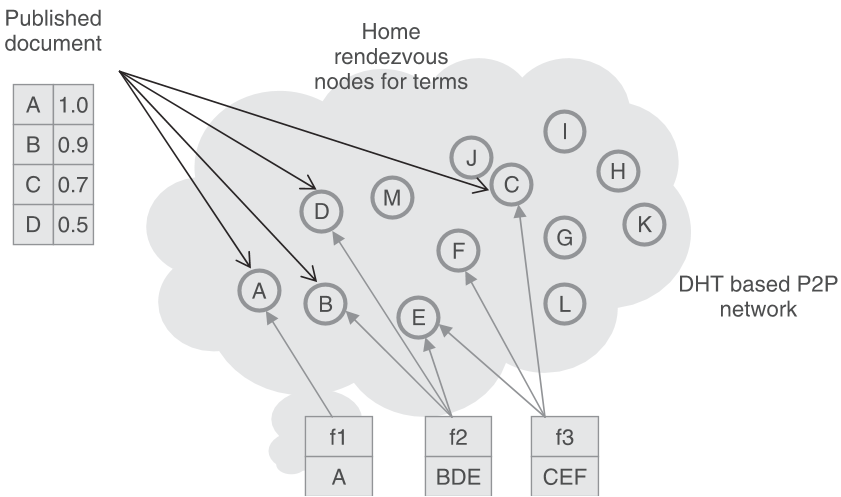

>图 10.1 基本 STAIRS 框架。

数量 $|d|$ 通常是几十甚至几千，表明文档发布成本非常高。

对天真方案的改进是找到在 $d$ 和已注册过滤器中共同出现的术语，并将 $d$ 转发到这些共同术语的主节点。例如，可以使用 bloom 过滤器来编码已注册过滤器中的所有查询术语。通过检查文档术语是否出现在 bloom 过滤器中，可以找到这些共同术语（尽管存在误报问题）。虽然这些共同术语的数量肯定小于 $|d|$，但改进方法仍然不是降低转发成本的最佳方式。例如，在基于阈值的模型中，每个用户定义个性化阈值，如果定义的阈值被充分利用，可能可以显著降低文档发布成本。我们将在第 10.3.3 节中介绍该算法。

文档通知：最后，在文档 d 到达选定术语的主节点后，我们可以将 d 与本地注册的过滤器进行匹配。对于匹配 d 的过滤器，我们可以将文档 d 通知相关用户。这里，通知阶段的一个重要问题是避免重复，如下所示。

由于"完全注册"，过滤器 f 在 $ |f| $ 个查询术语的主节点上注册。如果我们选择 $ |f| $ 个查询术语中的两个用于文档转发，文档 d 可以在这些主节点上重复找到匹配的过滤器 f。这导致重复通知。例如，在图 10.1 中，$ f_{2} $ 在三个查询术语 $ \{B, D, E\} $ 的主节点上注册。当 d 被转发到 $ \{B, D, E\} $ 的三个主节点时，这些主节点可能重复地将 d 通知指定 $ f_{2} $ 的 subscriber。

为了避免上述重复通知，我们引入重要术语 $ t_{f,d} $ 如下。给定文档 d 和过滤器 f，在同时出现在 f 和 d 中的那些术语中，我们将具有最高 $ s(t_{i}, d) $ 值的术语称为 f 和 d 的重要术语（STerm），记为 $ t_{f,d} $。这样的重要术语是有意义的，因为其术语分数 $ s(t_{f,d}, d) $ 对 $ S(f, d) $ 的贡献最大。在最高分数并列的情况下，我们可以通过某些规则来打破平局，例如选择在文档中最早出现的术语。有了 STerm $ t_{f,d} $ 的定义，我们给出以下通知规则。给定满足 $ S(f,d) \geq T $ 的合格过滤器 f，指定 f 的 subscriber 仅由 STerm $ t_{f,d} $ 的主节点通知文档 d。

为了说明此通知规则，我们使用图 10.1 作为示例，其中文档 d 包含术语 $ \{A, B, C, D\} $ 的对和相关术语分数。同样为简单起见，我们假设图 10.1 中的所有 3 个过滤器都指定了相同的阈值 1.0。考虑文档 d 被转发到 4 个术语 $ \{A, B, C, D\} $ 的主节点。当 d 到达 B 的主节点时，可以观察到，在本地注册的过滤器 $ f_{2} $ 的 3 个查询术语中，术语 B 对 $ S(f_{2}, d) $ 的贡献最大，因此它是重要术语 $ t_{f_{2},d} $。因此，通过 B 的主节点，指定 $ f_{2} $ 的 subscriber 被通知 d。同时，当 d 到达 D 的主节点时，根据通知规则，D 的主节点不会将 d 通知指定 $ f_{2} $ 的 subscriber，因为术语 D 不是重要术语 $ t_{f_{2},d} $。类似地，术语 A 和 C 分别是 $ t_{f_{1},d} $ 和 $ t_{f_{3},d} $ 的重要术语。因此，指定 $ f_{1} $ 和 $ f_{3} $ 的那些 subscriber 分别通过 A 和 C 的主节点被唯一地通知 d。

基于通知规则，不需要任何节点记住那些已通知文档的历史信息。相反，在 Sieve [12] 中，subscriber 的代理节点必须记住整个历史信息，然后过滤掉重复的发布。显然，用于维护整个历史信息的成本是非平凡的。

### 10.3.3 文档转发算法

STAIRS 中提出的文档转发算法主要利用以下观察。考虑一个具有 $ |f| $ 个查询术语的过滤器 f。由于完全注册，过滤器 f 在 $ |f| $ 个主节点上注册。如果 d 被转发到 $ |f| $ 个主节点中的任何一个（而不是将 d 转发到所有 $ |f| $ 个主节点），使用单次转发就足以找到过滤器 f。基于此，我们提出以下选择算法，从 d 中选择显著少量的术语。

默认选择算法：回想一下，只有当条件 $ S(f, d) \geq T $ 成立时，文档 d 才会被转发给指定 f 的 subscriber。这样的条件有助于文档转发。如果将 d 中的所有术语按 $ s(t_i, d) $ 的降序排序，阈值 T 可以在排序列表中定位，如以下示例所示。在图 10.2 (a) 中，所有术语分数按降序排序，从 M 到 E 的术语分数之和为 0.68，从 M 到 D 的和为 1.18。然后，阈值 T = 1.0 定位在 D 和 E 之间。由于从 M 到 E 的术语分数之和小于 T = 1.0，我们将从 M 到 E 的术语称为低于阈值术语（BTerms），d 中的其余术语（即从 D 到 A 的术语）称为阈值术语（TTerms）。

形式上，BTerms 和 TTerms 定义如下。给定文档 d 中排序的术语分数列表，其中 $ s(t_{1}, d) \geq \ldots \geq s(t_{|d|}, d) $，对于任何术语 $ t_{h} $（$ 1 \leq h \leq |d| $），如果 $ \sum_{i=h}^{|d|} s(t_{i}, d) < T $ 成立，则任何术语 $ t_{i} $（$ h \leq i \leq |d| $）是 BTerm，术语 $ t_{i} $（$ 1 \leq i < h $）是 TTerm。有了 BTerms 和 TTerms，我们可以就文档 d 和阈值 T 声称以下结果。(i) 文档 d 中 BTerms 的任何子集的术语分数之和小于 T。(ii) 给定满足 $ S(f, d) \geq T $ 的文档 d，满足 $ S(f, d) \geq T $ 的合格过滤器 f 包含 d 的至少一个 TTerm。

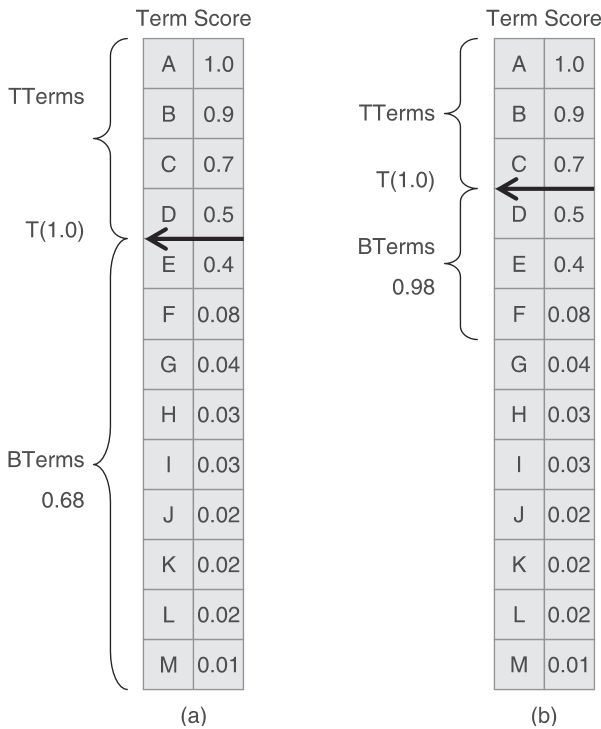

>图 10.2 默认转发：(a) 使用默认阈值 T = 1.0；(b) 针对 $ |f|_{s} = 3 $ 的短过滤器改进。

上述声明的正确性是显而易见的（证明可以很容易地通过反证法推导）。例如，在图 10.2(a) 中，对于从 $M$ 到 $E$ 的 BTerms 的完全组合，术语分数之和 0.68 小于阈值 1.0。然后，对于 BTerms 的部分组合（例如 $\{E, F, G\}$），它们的术语分数之和进一步小于 T = 1.0。接下来，给定满足 $S(f_2, d) \ge 1.0$ 的过滤器 $f_2 : \{B, D, E\}$（在图 10.1 中），两个 TTerms $\{B, D\}$ 出现在 $f_2$ 中。

回想一下，"完全注册"保证满足 $ S(f, d) \geq T $ 的合格过滤器 f 必须注册在 d 的 TTerm 的主节点上。因此，当文档 d 被发布时，我们只需要求 d 被转发到 d 中 TTerms 的主节点，而不会导致误遗漏。我们称这种方法为部分转发。

与选择所有 $ |d| $ 个术语的简单方法相比，上述部分转发降低了转发成本。例如，当图 10.2(a) 的文档 d 被发布时，d 只被转发到 4 个 TTerms $ \{A, B, C, D\} $ 的主节点。相反，完全转发将 d 转发到从 A 到 M 的 13 个术语的主节点。

**短过滤器的优化：** 真实的查询日志表明，主要输入查询平均每个查询仅由 2-3 个术语组成。这一独特特性有助于进一步选择更少数量的 TTerms。

回想一下，上述 TTerms 和 BTerms 的定义隐含地假设过滤器由任意数量的术语组成。现在假设 $|f|_s$ 是所有过滤器中的最大长度。给定 $|f|_s$，我们重新定义 TTerms 如下：在排序的术语分数 $s(t_i, d)$ 列表中，$|f|_s$ 个连续术语分数之和应小于 T。然后，在这 $|f|_s$ 个连续术语分数中，我们使用具有最高分数的术语 $t_h$ 来指示 $d$ 中的术语是 TTerm 还是 BTerm：$d$ 中任何具有比 $s(t_h, d)$ 更高术语分数的术语是 TTerm；否则，它是 BTerm。

例如，在图 10.2(b) 中，$|f|_s$ 等于 3。由于与 $F$、$E$ 和 $D$ 相关的 3 个术语分数之和仅为 0.98，我们确定任何 $s(t_i, d) \leq 0.5$ 的术语 $t_i$ 是 BTerm；其余术语为 TTerms。与图 10.2(a) 中从底线开始计算术语分数之和相比，现在我们只要求 $|f|_s$ 个连续术语分数之和小于 T。显然，$|f|_s$ 的值越小，我们将 BTerms 提升到排序列表中更高的位置，并选择更少数量的 TTerms。因此，将 $d$ 转发到更少数量的 TTerms 的主节点消耗更少的转发成本。

**个性化过滤器的改进：** 除了使用默认阈值 $T$ 外，用户可以定义其个性化阈值。使用单一默认阈值 $T$ 不足以满足个性化订阅。它可能选择太多术语（导致过多网络流量）或选择太少术语（导致误否定问题，即一些满足 $S(f, d) \geq T(f)$ 的过滤器 $f$ 可能无法接收到预期文档）。

给定个性化阈值，STAIRS 提出使用直方图和 bloom 过滤器的混合结构，命名为 HiBloom，来总结过滤器。直方图（通常使用等宽直方图）用于捕获过滤器阈值，bloom 过滤器用于编码查询术语。假设直方图包含 $b$ 个桶。通过将过滤器阈值的整个范围划分为 $b$ 个等间隔，第 $k$ 个桶（$1 \le k \le b$）与范围 $(lb_k, ub_k]$ 相关联，其中 $lb_k$ 和 $ub_k$ 是该桶的下界/上界。对于阈值在 $(lb_k, ub_k]$ 内的任何过滤器 $f$，$f$ 中的查询术语由 bloom 过滤器编码，记为 $bf_k$；此外，在该桶内的所有过滤器中，我们维护最小阈值，记为 $T_k$。因此，每个桶唯一地与一个 bloom 过滤器 $bf_k$ 和一个阈值 $T_k$ 相关联。

通过利用 HiBloom 数据结构，文档 $d$ 可以如下匹配每个桶。使用 bloom 过滤器 $bf_k$，我们可以首先找到 $bf_k$ 和 $d$ 之间的共同术语。在共同术语中，阈值 $T_k$ 进一步帮助像以前一样选择更少数量的术语。当考虑 $b$ 个桶时，所有这些不同的选定术语一起用于将 $d$ 转发到相关的主节点。由于细粒度的 bloom 过滤器和阈值，这种方法可以帮助降低转发成本并避免误否定问题。

## 10.4 最新进展和讨论

本节首先报告 STAIRS 的两项更新工作，然后将 IR 风格文档过滤与传统的基于内容的 pub/sub 进行比较。

### 10.4.1 最新进展

沿着 STAIRS 的技术框架，[13] 考虑了一种更高级的过滤模型。虽然基于阈值的方案有助于定义个性化订阅条件，但用户设置合理的阈值并不容易。相反，更好的方式是使用混合解决方案。首先，系统为每个过滤器隐式设置默认阈值，使得过滤器和待分发文档之间的相关性分数不小于默认阈值。这保证了分发文档的绝对质量。同时，它使用 top-$k$ 过滤模型来保证分发文档的相对质量。也就是说，除了 $|f|$ 个查询术语 $\{qt_1, \ldots, qt_{|f|}\}$ 外，用户还定义一个数字 $k$。查询术语和数字 $k$ 都用于声明过滤器 $f$。假设总共 $D$ 个已发布的 Web 文档在一个时间段内（如一天或一小时）发布。然后，top-$k$ 过滤模型确保每个定义过滤器 $f$ 的用户接收 top-$k$ 个最相关的文档。top-$k$ 文档意味着在 $D$ 个文档中，这些 top-$k$ 文档是具有最大相关性分数的文档。为了将 top-$k$ 文档分发给每个用户，主要挑战是与过滤器 $f$ 关联的动态变化的阈值以修剪不相关的文档。因此，使用 HiBloom 方案来总结这种动态阈值是不可行的。相反，[13] 提出在朝向默认选定术语的主节点的转发路径上修剪不相关文档。这种网内修剪机制不需要主节点和转发路径上的中间节点之间这种动态阈值的同步。

此外，[14] 通过假设每个过滤器由 $|f|$ 个查询术语组成（没有定义的阈值或 top-$k$ 数字）来考虑一般情况。因此，$d$ 成功匹配 $f$（类似地，$f$ 匹配 $d$）当且仅当存在一个术语 $t$ 同时出现在 $d$ 和 $f$ 中。换句话说，这是一种基于布尔的内容过滤方法。在找到匹配的文档后，可以采用任何过滤模型（top-$k$ 或基于阈值的方案）来过滤掉不相关的文档。由于该模型中既不使用术语分数也不使用阈值，[14] 提出了一种新的术语选择方法。首先，[14] 确定了最小化选定术语数量的问题是 NP 困难的。接下来，为了在 DHT 中实际工作，[14] 提出了一种成本模型方法来跨 DHT 的节点合并过滤器。然后，通过更少的转发，文档被转发到注册了合并过滤器的主节点。

除了上述基于 STAIRS 的工作外，还有一些其他基于 IR 的过滤工作，如 [15, 16]。例如，[15] 启发式地选择了具有最大术语分数的 top-k 个术语。然而，无法保证选定的术语必须是有效的，此外，一些匹配的过滤器可能被错误地遗漏。[16] 本质上采用了属性-值模型，与基于内容的 pub/sub 相同。然而，它允许一个属性（即摘要）支持 keyword 过滤。

### 10.4.2 讨论

最后，IR 风格过滤（简称 IF）模型与基于内容的 pub/sub 中的过滤模型之间的比较如下。

首先，在内容形式方面：大多数基于内容的 pub/sub 关注结构化信息，遵循预定义的模式；而 IF 针对非结构化的 Web 文章（或类似 RSS 订阅的摘要文章，或用 if*idf 分数预处理的文章）。

其次，由于不同形式的内容，基于内容的 pub/sub 系统中的过滤器通常由选择性谓词组成；而 IF 采用基于 keyword 的全文过滤语义。

接下来，在匹配方法方面，大多数基于内容的 pub/sub 系统探索过滤器关系（如覆盖、重叠等）来构建各种过滤器索引结构（例如偏序集）。IF 解决方案通常使用基于倒排列表的方法。例如，SIFT [17] 维护本地倒排列表，STAIRS 隐式构建分布式倒排列表。

最后，在提出的解决方案方面，基于内容的 pub/sub [18] 采用单注册和完全匹配策略，集中式 IF（例如 SIFT）采用完全注册和完全匹配策略。也就是说，过滤器 $f$ 被注册到与 $|f|$ 个查询术语关联的所有倒排列表，为了匹配文档，SIFT 检索与 $|d|$ 个文档术语关联的所有倒排列表。相反，STAIRS 基于完全注册和部分转发策略，主要目的是降低转发成本。

## 10.5 总结

本章回顾了 DHT 中基于 keyword 的内容过滤和分发，包括数据模型、解决方案框架和核心术语选择算法，以降低文档转发成本。此外，本章报告了两项更新的后续工作，并将 IR 风格过滤方法与传统基于内容的 pub/sub 进行了比较。由于与传统基于内容的 pub/sub 显著不同的数据模型，STAIRS 工作提出了一种新颖的部分转发策略来降低转发成本。

### References

1. Berry MW, Drmac Z and Jessup ER (1999) Matrices, vector spaces, and information retrieval. SIAM Rev. 41(2), 335–62.

2. Rao W, Chen L and Fu A (2011) STAIRS: Towards efficient full-text filtering and dissemination in dht environments. The VLDB Journal 20(6): 793–817. 10.1007/s00778-011-0224-z.

3. Rose I, Murty R, Pietzuch PR, Ledlie J, Roussopoulos M and Welsh M (2007) Cobra: Content-based filtering and aggregation of blogs and rss feeds. 4th Symposium on Networked Systems Design and Implementation (NSDI), 11–13 April 2007, Cambridge, MA.

4. Li J, Loo BT, Hellerstein JM, Kaashoek MF, Karger DR and Morris R (2003) On the feasibility of peer-to-peer web indexing and search. IPTPS, pp. 207–15.

5. Yang Y, Dunlap R, Rexroad M and Cooper BF (2006) Performance of full text search in structured and unstructured peer-to-peer systems. INFOCOM.

6. Rao W, Fu AWC, Chen L and Chen H (2009) Stairs: Towards efficient full-text filtering and dissemination in a dht environment. ICDE '09. IEEE 25th International Conference on Data Engineering, pp. 198–209.

7. Liu Z, Parthasarathy S, Ranganathan A and Yang H (2007) Scalable event matching for overlapping subscriptions in pub/sub systems. *DEBS*, pp. 250–61.

8. Nguyen LT, Yee WG and Frieder O (2008) Adaptive distributed indexing for structured peer-to-peer networks. CIKM, pp. 1241–50.

9. Stoica I, Morris R, Liben-Nowell D, et al. (2003) Chord: a scalable peer-to-peer lookup protocol for internet applications. IEEE/ACM Trans. Netw. 11(1), 17–32.

10. Rowstron AIT and Druschel P (2001) Pastry: Scalable, decentralized object location, and routing for large-scale peer-to-peer systems. *Middleware*, pp. 329–50.

11. Zhao BY, Kubiaticz J and Joseph AD (2002) Tapestry: a fault-tolerant wide-area application infrastructure. Computer Communication Review 32(1): 81.

12. Ganguly S, Bhatnagar S, Saxena A, Izmailov R and Banerjee S (2006) A fast content-based data distribution infrastructure. INFOCOM.

13. Rao W and Chen L (2011) A distributed full-text top-k document dissemination system in distributed hash tables. World Wide Web 14(5–6): 545–72.

14. Rao W, Vitenberg R and Tarkoma S (2011) Towards optimal keyword-based content dissemination in dht-based p2p networks. P2P, pp. 102–11.

15. Tang C and Dwarkadas S (2004) Hybrid global-local indexing for efficient peer-to-peer information retrieval. *NSDI*, pp. 211–24.

16. Tryfonopoulos C, Ideos S and Koubarakis M (2005) Publish/subscribe functionality in IR environments using structured overlay networks. SIGIR, pp. 322–9.

17. Yan TW and Garcia-Molina H (1999) The SIFT information dissemination system. ACM Trans. Database Syst. 24(4): 529–65.

18. Fabret F, Jacobsen HA, Llirbat F, Pereira J, Ross KA and Shasha D (2001) Filtering algorithms and implementation for very fast publish/subscribe SIGMOD Conference, pp. 115–26.

#### 11
# 11 高级主题

在本章中，我们讨论 pub/sub 系统的高级特性。我们首先从 security 方面的考虑开始，并研究若干 pub/sub 的 security 解决方案。然后我们讨论 composite subscription、filter merging、load balancing、channelization、reconfiguration、mobility 支持、congestion control 以及 pub/sub 系统评估等主题。许多主题与 pub/sub 路由拓扑及其组织和配置有关。我们观察到，动态内容分发环境需要主动监控和配置，以实现高效、可用和容错。

## 11.1 Security

本节讨论 pub/sub 系统的 security 挑战和解决方案。我们概述了知名解决方案，并讨论了 pub/sub 的关键 security 服务。pub/sub 通信模型以其一对多和多对多通信为特征，这种解耦的多播特性需要针对不需要的流量以及对网络和内容各种攻击的防护解决方案。

### 11.1.1 概述

security 风险问题源自多个方面，最重要的是 subscriber、publisher 和 broker 所运行的分布式环境。网络及其承载的内容都必须受到攻击防护，这一点至关重要。我们必须确保数据和内容的真实性，此外还需要足够的机密性、完整性、匿名性、可用性以及访问控制和 authorization 水平。这为 pub/sub 创建了一系列 security 服务的必要性。这些服务构建在现有解决方案之上，并依赖对称和非对称密码学。因此，pub/sub security 建立在现有 security 解决方案之上，并将其适配到多播环境中。

通常，需要有一种方法来建立对 pub/sub 系统实体的信任。一般来说，这种信任是通过可信第三方的帮助来建立的，该第三方

>Publish/Subscribe Systems: Design and Principles, First Edition. Sasu Tarkoma.

>© 2012 John Wiley & Sons, Ltd. Published 2012 by John Wiley & Sons, Ltd.

为实体分配密钥。每个实体拥有一个或多个公钥及对应的私钥。公钥为所有人所知，公钥可以以证书形式分发，由可信第三方使用其私钥签名。密码密钥分发机制是分布式 security 解决方案的关键组成部分。因此可以建立一条信任链，将可信第三方与密钥关联起来，并允许在系统中建立信任。公钥密码学通常用于验证实体身份，然后生成用于 encryption 的对称密钥。公钥密码学允许数字签名，这对于验证实体身份和确保内容完整性至关重要。

通用的 pub/sub security 已被许多研究项目和商业系统所关注，特别是需求、authentication、机密性和支付处理等方面的要求。具有 security 意识的 pub/sub 系统包括 Hermes、EventGuard 和 Rebecca。EventGuard 系统由一组 security guard 组成，用于保护 pub/sub 操作，以及一个弹性 pub/sub 网络。基本的 security 构建模块是令牌、密钥和签名。令牌在 pub/sub 网络内用于路由消息。在该解决方案中，令牌以加密格式包含有限的过滤器信息，使网络能够路由加密消息。该系统解决了来自 subscriber 和 publisher 的未经请求的虚假消息的缓解问题。

[1] 中给出了 pub/sub security 主题的概述。他们提出了若干确保信息分发网络可用性的技术。防止拒绝服务攻击至关重要，并提出了定制的发布控制来缓解大规模攻击。在该技术中，subscriber 可以指定允许哪些 publisher 向其发送信息。提出了一种挑战-响应机制，其中 subscriber 发出挑战函数，publisher 必须响应该挑战。该机制在分布式环境中的使用未作详细阐述。

Pub/sub broker 网络容易受到消息丢弃攻击。例如，Hermes 和 Scribe 等 overlay 可能受到虚假节点的影响。防止消息丢弃攻击的成本很高，只有少数系统解决了这一问题。EventGuard 使用 r-弹性 broker 网络。

[2] 中提出了安全事件类型和类型检查。安全事件类型定义包含发行者的公钥、版本信息、属性、委托证书和数字签名。安全事件类型和模式对于防止不需要的流量非常重要。[3] 中讨论了基于作用域的 security，其中使用 PKI 技术在 broker 网络中创建信任网络。[4] 中为不可信的 broker 网络提出了基于代理的 security 和计费解决方案。

### 11.1.2 Security 威胁

security 威胁领域，无论是已实现的还是迫在眉睫的，都非常广泛且不连贯。这是由恶意攻击中使用的广泛技术以及攻击方法的极端可变性造成的。不断增长的攻击方法和风险集合是网络现实的一部分，当底层网络发生变化时，风险也会增加。矛盾的是，加固网络以抵御 security 风险的过程本身就是风险增加的原因：任何改变都必然带来新的攻击方法。我们可以说，security 解决方案和新的恶意攻击之间的循环交替是永无止境的，而且是螺旋式上升的。

恶意攻击的实施者使用多种通常很巧妙的方法来入侵和攻击网络。从众多方案中，我们可以分离出以下最危险的攻击场景列表：

• 攻击者控制伪装成合法节点的恶意节点。

• 攻击者用数据淹没网络（污染）。这可以针对内容或路由表。

• 攻击者返回恶意错误的数据。

• 攻击者否认数据的存在或提供欺诈性路由信息。

• 攻击者在 k-冗余网络中寻求法定人数。

显然，用于对抗攻击的方法与对手使用的技术一样多样化。在 overlay 和 pub/sub 网络中，我们可以将一般防御方法分为以下几个领域：

• 保护基本路由。

• 保护基于内容的路由和路由表。

• 保护数据和内容。

• 保护 authentication 和访问控制。

这些解决方案的一个共同特征是需要有固定点，用于在系统中建立信任。通常需要逻辑上集中的身份管理来实现信任机制。如果没有某种形式的集中管理，分布式系统就无法防御恶意节点。最严重的危险在于攻击者可能获得法定人数——为了防止这种情况，我们必须有一种方法来控制节点标识符的创建，例如通过公钥密码学保护节点标识符。此外，我们需要一种机制来引导对公钥的信任。

## 11.1.3 Pub/Sub 网络中的 Security 问题

Pub/sub overlay 环境面临其特有的一组 security 问题。多对多通信模型对真实性、完整性、机密性以及可用性有特殊需求。例如，我们必须能够：

• 发布真实性：保证只有真实的发布被传递给 subscriber。

• Subscription authentication：保证只有服务的真实 subscriber 才能获得与其兴趣匹配的发布。

• 发布和 subscription 完整性：防止对 pub/sub 消息进行未授权的、可能是恶意的修改。

• 发布机密性：在 publisher 不信任 pub/sub 网络时执行基于内容的路由。

• Subscription 机密性：消除 subscriber 向网络公开其 subscription 的需要。

• 防护：保护 pub/sub 网络免受攻击，如垃圾邮件或洪泛攻击、选择性和随机消息丢弃攻击以及其他拒绝服务（DoS）攻击。

提供真正 pub/sub security 框架的系统并不多。基本解决方案建立在传输层 security 之上，如 TLS 协议，然后根据从可信第三方获得的凭证和证书对消息进行签名和加密。消息可以使用 W3C 的 XML Signature [5] 和 Encryption 标准 [6] 等规范进行选择性签名和加密。下面我们将通过 EventGuard、Quip 和 Hermes 来研究 pub/sub 特定的 security 解决方案。

## 11.1.4 EventGuard

EventGuard 旨在为发布提供 authentication，并为发布和 subscription 提供机密性和完整性 [7]。该系统还支持可用性和性能指标，同时提高可扩展性和易用性。EventGuard 系统是模块化的，运行在基于内容的 pub/sub 核心之上。图 11.1 展示了这种模块化设计，由两个主要组成部分构成：

• 一个可以无缝插入基于内容的 pub/sub 系统的 Security Guard 套件。

• 一种灵活且有利于可扩展路由并便于管理节点故障和可能的消息丢弃 DoS 攻击的 pub/sub 网络设计。

EventGuard 共有六个 guard，保护以下关键 pub/sub 操作：

• subscribe，

• advertise，

• publish，

• unsubscribe，

• unadvertise，

• 路由。

EventGuard 还支持一个生成令牌和密钥的元服务，用作发布的标识（如对发布 topic 的哈希函数）。密钥可

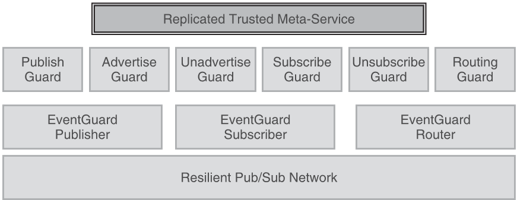

>图 11.1 EventGuard 系统概述。

用于加密消息内容。实际上，在发送任何消息之前，所有 pub/sub 操作都必须与提供的元服务进行通信。encryption、签名和令牌的创建 [7] 使用 El-Gamal 算法。

### 11.1.5 QUIP

在点对点 pub/sub overlay 网络中保护内容分发需要协议级支持。QUIP 就是这样一个协议 [8]，旨在为已有的 pub/sub 系统提供 encryption 和 authentication 机制。QUIP 具有以下 security 特性：

• 保护内容免受未授权用户的访问。

• 保护支付方式和 publisher 的 authentication。

• 保护消息完整性。

QUIP 确保 subscriber 能够验证从 publisher 接收到的消息。其次，它允许 publisher 严格管理谁接收其内容。QUIP 使用公钥叛徒追踪方案，具有两个主要优势：

• QUIP 可以使任何 subscriber 的密钥失效而不影响其他密钥。

• QUIP 为每个 subscriber 分配唯一的密钥。这可以用于检测和解决密钥泄露。

因此 QUIP 结合了一个高效的叛徒追踪方案和一个安全密钥管理协议，赋予 publisher 两个关键权力：

• 将其消息限制为授权 subscriber。

• 添加和移除 subscriber 而不影响其他 subscriber 的密钥。

QUIP 未评估的一个领域与 subscription 隐私问题有关。QUIP 假设存在单一可信权威。该权威（密钥服务器）完全负责密钥和支付处理。

QUIP 网络中的关键软件是 QUIP 客户端，每个参与者都必须使用。pub/sub 网络中任何愿意使用 QUIP 的人都必须预先下载客户端。客户端为参与者分配一个唯一的随机 ID，并公开密钥服务器的公钥。QUIP 参与者在初始化阶段从密钥服务器获得将其公钥与其标识符关联的证书。例如，如果 publisher 想要发布受保护的对象，它将联系密钥服务器并获得内容密钥作为回报。这用于加密内容。想要阅读此发布的 subscriber 也联系密钥服务器并获得内容密钥。系统允许在任何这些阶段要求支付。

### 11.1.6 Hermes

在 pub/sub 架构中，访问控制特性与为 pub/sub 系统中所有各方分配权限然后基于权限强制执行资源访问密切相关。Hermes [9] 是一个分布式基于事件的 middleware pub/sub 架构，具有基于角色的访问控制模型。我们之前在第 9 章中已经研究过 Hermes。

Hermes 中的核心概念是事件类型。Hermes 支持从面向对象语言模型派生的若干特性，例如类型层次结构和超类型 subscription。在 overlay 路由网络之上是一个可扩展的 pub/sub 路由算法。因此 Hermes 避免了全局广播，因为创建和使用了会合节点。Hermes 完全集成了路由算法中的容错机制。这些机制能够克服 middleware 的故障，从而产生一个健壮且可扩展的系统。

Hermes 的主要目标在于创建一个由 pub/sub middleware 提供 security 管理和控制的架构。访问控制对 publisher 和 subscriber 完全透明。事件所有者可以决定其发布的事件的访问策略。所有权通过 X.509 证书来断言。为用户分配角色，并为每个角色分配权限。

权限不是直接分配给用户的，而是通过其角色分配的。这种方法有两个主要好处：

• 与角色绑定的权限比直接分配给用户的权限更容易管理。

• 策略控制与受保护的特定软件严格解耦。

authentication 过程的需求影响 publisher 和 subscriber。实际上，所有发送到 broker 的请求都在其特定凭证下传递。Broker 检查凭证，然后可以接受、部分接受或拒绝请求。对于策略的表达，存在由 OASIS security 框架提供的特定策略语言。基于角色的访问控制（RBAC）是一种常用的可扩展 security 管理技术，它通过角色将主体和权限解耦。权限不是直接分配给主体（即系统用户），而是分配给角色，然后角色与主体关联。因此，该技术将用户管理及其与角色的关联从用户用于访问服务的实际权限中分离出来。这样，用户可以离开和加入组织中的不同角色，而服务策略不必修改，因为它们与角色绑定。

OASIS 策略为每个方法指定授权调用该方法的角色凭证及其约束。该系统支持细粒度的权限管理，例如为特定消息类型设置权限并在属性级别指定 security 要求。这些 security 要求在调用 pub/sub 操作（即 advertise、publish 和 subscribe）时得到维护。

Hermes 使用谓词作为访问控制和相关决策的基础。该系统利用作为黑箱操作的通用谓词。谓词做出的决策可以基于消息大小和其他消息属性。也存在 pub/sub 限制谓词。在后一种情况下，pub/sub 系统完全了解谓词，决策可以基于事件内容及其在事件类型层次结构中的位置。例如，一个 subscriber 试图订阅（对该 subscriber 而言）未授权的事件。Hermes 然后尝试检测是否存在该事件任何子类型的访问权限，有效地将原始访问（subscription）请求转换为不同的 subscription 范围。如果 broker 不被信任使用访问控制策略，则这种方法是不可能的。

关键的信任网络在 Hermes 中利用证书链构建。在这样的链中，事件所有者签署信任 broker 证书，broker 签署其相邻 broker 的证书，有效地促进信任链。如果存在 publisher 和 subscriber 可以向事件所有者出示的可信根证书，则信任链为本地 broker 提供验证以处理目标事件。

### 11.1.7 属性加密

按照与 Hermes overlay pub/sub 系统 [9, 10] 一起提出的安全 pub/sub 模型，覆盖和重叠算法可以扩展以支持加密属性。路由器必须能够处理加密的过滤器和通知，以确保分布式系统的隐私和 security。需要考虑两个 security 领域的集成：

• 加密通知和通知中的属性。

• 加密过滤器和属性过滤器。

安全 pub/sub 模型基于使用对称密钥定义的密钥类。路由器使用密码密钥分发机制共享密钥。在该模型中，每个 subscriber 和 producer 从其被授权使用的密钥类集合中为 subscription 或通知选择一个或多个密钥类。密钥类用于加密通知中的属性和 subscription 中的属性过滤器。加密属性只能在与属性过滤器具有相同密钥类时才能匹配。具有不重叠密钥类的通知和过滤器是不可比较的。如果对属性或属性过滤器使用多个密钥类，则必须使用这些密钥类进行析取式多次加密。这意味着属性或属性过滤器将有多个副本——每个密钥类一个 [9]。

Broker 的密钥组用于管理对 encryption 密钥的访问，以及向 broker 发放和重新发放 encryption 密钥。负责验证的组件是密钥组管理器。它将验证 broker 加入给定密钥组的授权。因此，密钥组管理器应受到事件类型所有者的信任，以确保访问控制被正确应用。例如，如果密钥组管理器是可信方的成员（可能是类型所有者的域），则可以实现这一点。

密钥组成员资格的授权使用能力结构进行管理，本质上与管理 pub/sub 请求的类型相同。客户端和 broker 的访问控制方法不同，但系统仍然支持一致的能力表示。

### 11.1.8 隐私

Subscriber 的隐私与结果集的准确性之间存在固有的权衡。前者可以用暴露的信息在多大程度上唯一地表征 subscriber 来描述，后者则用返回的数据项与 subscriber 真实兴趣的匹配程度来描述。隐私与基于内容的 pub/sub 形成对比，因为 broker 需要知道事件的内容和 subscriber 的兴趣才能执行转发决策。另一方面，分布式基于内容的 pub/sub 通过其解耦特性和过滤器聚合技术提供了一定程度的匿名性；然而，这些在维护隐私要求方面并不十分强大。因此需要额外的解决方案。

Subscriber 隐私通过保证当网络传递兴趣和匹配内容时，subscriber 无法从一组 subscriber 中被区分出来来增强。这种传递可以以特定区域内的广播形式进行，或使用单播或多播跨多个 broker 传递。物理广播可以实现为省略特定接收者标识符；然而，知道只有一个实体对数据感兴趣就足以定位 subscriber。Publisher 隐私和匿名性要求不能根据发布的事件和网络痕迹来识别 publisher。

在网络中维护匿名性的一般方法是通过一个隐藏发送者身份的网络来路由消息。Mist 系统处理了在通过网络路由消息的同时对中间系统隐藏发送者位置的问题 [11]。该系统由多个路由器（称为 Mist 路由器）组成，按层次结构排列。已提出匿名度度量来评估最大化系统匿名度的路由选择策略。Mist 是一种通用网络服务，不处理 pub/sub 功能如过滤和多播。上面讨论的 EventGuard 系统支持加密的 subscription 和事件消息。这些是隐私增强型分布式 pub/sub 的必要特性。

匿名化元组的一般方法是泛化属性，例如将数字泛化为范围。在这种情况下，范围越大，匿名化过程引入的信息损失就越多。这种方法可以用于 pub/sub 系统中的发布事件和 subscription。对于 subscription 的情况，subscription 越通用，产生的不需要的流量（误报）就越多。泛化导致的信息损失和误报都可以被测量。为 k-匿名性和 l-多样性提出的技术适用于为单个或多个用户匿名化发布事件或事件流 [12]。它们在 pub/sub 中的应用是该领域的一个新研究课题。位置隐私近年来已成为一个活跃的研究课题。系统模型通常包括一组客户端和一个向客户端提供兴趣点的集中式服务器。$k$-位置匿名技术使用伪装区域来表示客户端位置，该区域需要包含至少 $k-1$ 个其他客户端位置。

## 11.2 Composite Subscription

Composite subscription 为分布式 pub/sub 系统带来了新的挑战。复杂事件序列的检测最好用一种特殊的事件语言来处理，用于表达并发事件模式。CEA 系统的核心复合事件语言 [13] 就是这样一种语言。这种编译语言产生支持正则表达式类型模式的自动机。该系统将规范语言转换为有限状态机。为间隔时间模型给出了形式语义。除了提到当前实现使用带有列表实现的非确定性自动机外，未讨论将非确定性自动机转换为确定性自动机的问题。

这种方法的主要好处是检测任务的分布、基于自动机的检测引擎，以及使用间隔时间模型来检测事件的因果关系 [14]。Lamport 逻辑标量时钟在存在因果关系时给出因果排序（但不是严格的因果排序）。CEA 仅限于考虑基本情况，不检查替代路径或 overlay 网络的动态负载特性。

Hermes 复合事件服务 [9] 建立在 CEA 系统之上。它也包含复合事件检测自动机。Hermes 自动机是有限状态类型的，具有对时间关系和并发事件的额外支持。这用于分析事件流。扩展有限状态自动机在复合事件检测中的使用有许多好处，列举如下：

• 有限状态自动机的计算模型被广泛使用，理论上非常成熟。其实现简单。

• 这种自动机的表达能力有限，导致资源使用有限且可预测。这本质上增强了基于事件的 middleware 中检测器的安全分布。

• 正则表达式语言通常避免了冗余和不完整的风险，因为它们包含专门为模式检测设计的运算符。这在定义新的复合事件语言时很重要。

• 当利用分布式检测时，正则语言的复杂表达式很容易分解。

复合事件 subscription 使用核心复合事件语言来指定事件客户端感兴趣的复合事件集合。让我们更仔细地看看这种语言所需的特性。

显然，任何这种语言的核心特性是运算符。许多与正则语言中的相应运算符并无不同，如连接、交替和迭代，但还需要特殊运算符，例如与检测自动机相关的特性，特别是与从子自动机构建复合事件检测自动机相关的特性。复合事件服务应能在（基于事件的）middleware 中实现复合事件的分布式检测，通常通过将复合事件表达式分解为子表达式来完成。这些子表达式将由系统中独立的分布式检测器注册。将复合事件表达式分解为子表达式的使用很重要，原因有几个：

• 流行的子表达式可以在事件 subscriber 之间重用。这节省了网络带宽，也减轻了系统的计算负担。

- 通信量将减少。这是由于将子表达式检测器放置在原始事件 publisher 附近。

• 子表达式的复制是可能的，用于 load balancing 和提高可用性。

• 计算代价高的表达式可以被分解。这保护了检测器免受过载。

开发这样的语言时必须做出两个重要决策。它们是

1. 复合事件表达式分解的最优策略

2. 复合事件检测器在系统中的最优放置。

这些决策可能包含内部冲突。例如，最小化网络带宽可能迫使最大化子表达式检测器的重用。这与减少通知延迟的可能目标相冲突，后者需要在网络周围复制检测器，从而增加带宽消耗。为了解决这个问题，我们必须考虑应用程序和网络的静态和动态特性，并达到权衡解决方案。

另一种解决方案由 Padres 系统提供，它包含一种表达性 subscription 语言，其中 composite subscription 是原子 subscription 的布尔函数 [15]。在 Padres 中，可以对发布的内容指定约束。此外，发布可以在分布式环境中关联，事件模式的检测将由 broker 网络以分布式方式处理。

基于拓扑的 composite subscription 路由的主要特性如下：

• Subscription 路由需要无环 overlay。

• 它不考虑任何动态网络条件。

• Composite subscription 作为整体向潜在 publisher 路由。转发持续进行，直到 subscription 到达合适的 broker。满足 composite subscription 所需的数据源将位于不同方向（在 overlay 网络中）。

• Broker（连接点 broker）拆分 composite subscription，并将各个部分 subscription 分别路由到潜在 publisher。

• 匹配的发布被路由回连接点 broker，在那里执行复合事件检测。

## 11.3 Filter Merging

我们在第 7 章中研究了各种 pub/sub 路由策略，包括用于优化过滤器处理的过滤器覆盖和合并技术。覆盖和合并都旨在减少在网络中传播的过滤器数量。过滤器覆盖确定一个过滤器是否已经包含在已发送给邻居的活动过滤器中。如果是，则可以丢弃。这可以通过将过滤器想象为子空间来轻松可视化——如果一个子空间包含在另一个子空间中，则被包含子空间选择的所有点（事件）也被包含子空间选择。

Filter merging 将此扩展到没有覆盖关系但可以通过应用 filter merging 规则 [16] 融合在一起的过滤器。Filter merging 算法以两个或多个过滤器作为输入，如果可以合并则输出合并后的过滤器。当合并结果等同于输入过滤器时，称为完美合并。换句话说，过滤器的合并不产生任何误报或漏报。否则合并称为不完美合并，它可能产生误报。为了满足第 7 章讨论的安全性要求，不允许漏报。

合并为 pub/sub 引擎引入了一些复杂性；然而，它可以减少路由表大小和 pub/sub 路由器的处理成本。合并与覆盖一样，是一种通用优化技术，可以应用于 subscription 和广告。

Filter merging 可以应用于事件路由器中的不同位置。两个典型用例是：合并来自本地客户端的过滤器，以及合并外部路由表。前者更简单，因为它可以在本地完成，合并结果可以直接提供给远程路由表进行处理。后者更

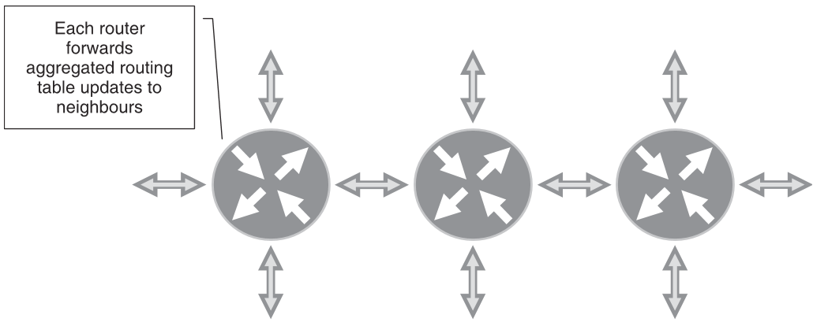

>图 11.2 多跳环境中的合并。

复杂，因为需要向邻居发送更新。合并要求跟踪发送给相邻节点的合并结果，当由于取消 subscription 而移除合并时，需要重新合并产生的活动过滤器并安装，而不产生漏报。

图 11.2 展示了具有多个 pub/sub 路由器的分布式环境中的 filter merging。每个路由器维护一个路由表，用于将事件转发给感兴趣的相邻路由器。路由器传播 subscription 和取消 subscription 消息。每个路由器还通过分析路由表并合并可合并的 subscription 来聚合 subscription。每个路由器向邻居转发聚合后的路由表更新。当路由器从邻居收到更新时，更新替换被更新覆盖的现有 subscription。当现有合并被修改时，例如当合并的一部分发生取消 subscription 时，准备一个新的更新来替换先前的更新，并在邻居处安装当前活动的 subscription。关键要求是邻居对活动 subscription 有准确的视图，以便发布的消息不会被丢弃。

具有约束的过滤器和查询的最优合并已被证明是 NP 完全的 [17]。因此，在实践中需要一种启发式方案来平衡处理成本和准确性。第一个基于 filter merging 的路由机制在 Rebeca 分布式事件系统 [18] 中提出。该机制使用特定于谓词的完美合并规则来合并合取过滤器。使用合并的路由主要使用路由表大小和转发开销作为分布式环境中的关键指标进行评估。合并机制在股票应用程序的简单谓词上下文中应用。

后来合并被应用于通用的基于内容的路由场景，并与偏序集和森林结构集成 [16]。这些结构的根集是合并的良好基础；然而，需要记录以支持具有多个相邻 broker 的分布式操作。基本思想是确定未覆盖的过滤器集合，然后应用基于扫描或计数的合并算法来找到合并过程的可合并候选者。成功合并后，合并结果被安装到适用的相邻路由器。当合并被移除时，仍然活动的组成

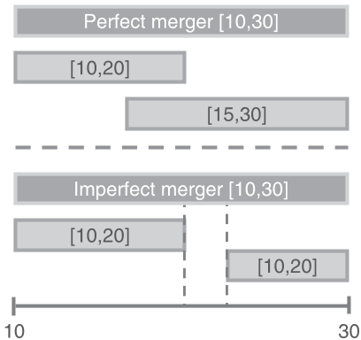

>图 11.3 完美合并和不完美合并的比较。

过滤器在合并从邻居移除的同时被激活。更新过程需要是原子的，以防止消息丢失。

图 11.3 展示了完美合并和不完美合并之间的区别。两个完全覆盖一个范围的范围过滤器可以合并为覆盖该范围的单个过滤器。这种合并不产生误报，因此称为完美合并。另一方面，不完美合并确实覆盖了其组成过滤器的范围，但可能大于组成过滤器的并集。因此不完美合并可能产生误报。评估这些合并效率的关键指标是合并成本、合并大小和合并准确性。

过滤器的结构等价性对于完美合并不完美合并都是必要的。通常，具有不同元组数量的过滤器是不可合并的。这取决于合并规则和过滤语言。过滤器的覆盖算法移除那些具有不同元组数量且被其他过滤器覆盖的过滤器，因此合并过程通过关注具有相同元组数量的过滤器来简化。完美合并的独特属性过滤器（如果存在）也在可合并性测试期间找到。完美合并不完美合并机制都使用相同的属性过滤器合并机制。

图 11.4 展示了 filter merging 对基于类型元组的过滤器的好处。该示例展示了一个简单的基于内容的路由核心，具有一个输入端口和一个输出端口。传入的过滤器被测试覆盖性和可合并性。输入元素集合由四个过滤器（F1、F2、F3 和 F4）组成。我们观察到该集合中没有覆盖关系，因此如果没有 filter merging 支持，它们需要由路由核心传播到输出接口后面的路由器。由于没有覆盖关系，路由核心不会丢弃任何过滤器。在 SIENA 模型中，被来自同一输入端口的过滤器覆盖的过滤器可以被丢弃，以最小化状态信息和路由器之间不必要的信令。

假设只有具有相同结构的过滤器才被合并，过滤器 F1 和 F2，以及后来的 F3 和 F4 可以被合并。F1 和 F2 可以通过组合两个范围来合并。该图展示了输出接口后面路由器的状态。

现在，如果过滤器 F3 被删除，路由核心确定未覆盖的过滤器集合及其可能的合并，并通过向

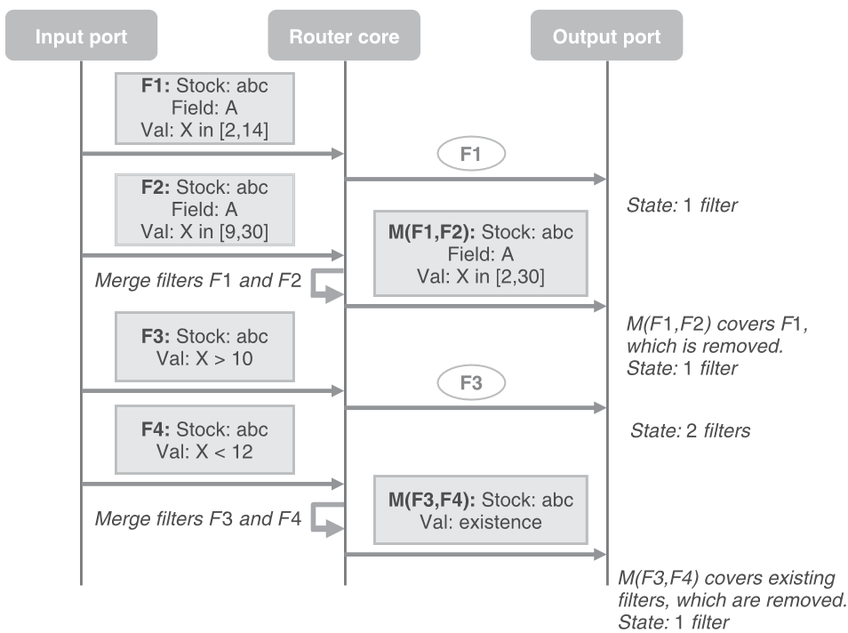

>图 11.4 合并示例。

输出端口发送包含有关状态变化所有信息的更新消息来重新安装必要的状态。更新消息触发路由表修改过程。

合并可以实现为基于内容路由器的可插拔模块，并与路由表数据结构集成。在一般情况下，这样的模块需要访问结构的第一层（层次结构）或前两层（SIENA 对等网络）。在对等情况下需要访问两层，因为目标集的确定方式，即 subscription 永远不会发送到 subscription 的源。如上所述，合并也可以在基于内容路由器内部的多个地方使用，例如用于客户端 subscription 或外部路由表。

### 11.4 Load Balancing

Load balancing 是 middleware 的一个重要特性。Pub/sub load balancer 负责以缓解热点并最大化系统并行处理能力的方式分配负载。在分布式 pub/sub 系统中实现 load balancing 有许多方式。将 subscriber 和 publisher 从一个路由器卸载到其他路由器是在分布式系统中实现 load balancing 的一种特定技术。此外，还可以将基于内容的路由表维护卸载到客户端和其他路由器 [19]。

Padres 系统构建在一个名为 Padres Efficient Event Routing（PEER）[20–22] 的发布/订阅系统之上。PEER 系统由两种不同类型的 broker 组成，即集群头和边缘 broker。前者与其他 broker 有许多连接，而边缘 broker 只有一个相邻连接。边缘 broker 服务 subscriber，集群头服务 publisher。连接到边缘 broker 的 publisher 将被重定向到集群头 broker。如果 subscriber 连接到集群头 broker，它会将 subscriber 转发到随机选择的未过载的边缘 broker。

PEER 的主要特性包括：

• 集群头的处理延迟很小，因为它们不保存 subscriber，只将发布转发到匹配的集群。

• Load balancing 仅应用于边缘 broker。边缘 broker 有开销，因为它们需要将发布与 subscriber 匹配。

• PEER 有两级 load balancing。第一级在集群内应用，第二级在集群之间应用。在本地 load balancing 中，边缘 broker 只与同一集群中的边缘 broker 交换信息。在全局 load balancing 中，来自不同集群的边缘 broker 相互平衡 subscriber。

PEER 利用负载检测框架来检测过载的 broker。为了能够检测过载的 broker，PEER 在 broker 之间交换负载信息。如果一个 broker 发现一个比其他 broker 负载更重的 broker，load balancing 系统就会被激活。负载级别消息在集群内和集群之间传播。全局负载级别消息包含关于情况的摘要信息，包括边缘 broker 的利用率和匹配延迟。

负载估计算法用于估计 subscription 的输入和输出负载需求。这允许系统在将 subscription 卸载到可以接受额外负载的 broker 时估计负载。该算法采样过滤器的发布速率。然后卸载算法确定要卸载到可以接受额外负载的 broker 的 subscription。

卸载算法由三个模块组成：

• 输入卸载算法，旨在降低卸载 broker 的输入利用率。

• 匹配卸载算法，旨在平衡 broker 之间的处理延迟。

• 输出卸载算法，旨在平衡两个 broker 使用的输出带宽。目标是卸载与已卸载 broker 上的 subscription 相似的 subscription。这最小化了到该 broker 的额外流量。

除了 subscription 卸载外，还可以通过主动 publisher 放置 [21] 来提高系统性能。Publisher 放置算法以最小化端到端传递延迟和系统负载的方式重新定位 publisher。有效的 publisher 放置策略将 publisher 放置在具有大量 subscriber 的集群附近。

Publisher 放置算法由三个步骤组成：

• 收集发布传递统计信息。

• 识别 publisher 的目标 broker。

• 将 publisher 迁移到该目标 broker 并在那里建立 publisher。

放置算法只激活旧 broker 和新 broker 之间的非活动广告路径。这最小化了 overlay 网络的 reconfiguration 成本。为了做出 publisher 迁移决策，系统需要知道网络某部分中 subscriber 的大致数量。为此使用分布式跟踪算法从网络收集 subscriber 信息。下游 broker 通知上游 broker 关于特定发布的 subscriber。实际的迁移阶段需要几个步骤。首先，发布暂时暂停，然后向目标 broker 发出迁移广告，最后 publisher 在目标 broker 建立，发布活动可以继续。

## 11.5 基于内容的 Channelization

[23] 中提出的事件空间分区（ESP）方法将事件空间划分为分布在服务器上的区域。每个区域负责事件空间的一个子空间。然后将 subscription 发送到重叠的区域。通知只发送到包含它的一个区域，因为它将具有该事件的所有 subscription。

遵循 ESP 模型，表述基于内容的 channelization 问题的一种方法是将多维事件空间 $ES$ 映射到 $n$ 个事件通道 [24]。每个通道由一个服务器或 broker 托管。事件空间中信道的工作负载由一个可能是时间相关的函数给出。问题是找到一组 $n$ 个子区域 $\lambda_j \subseteq ES$，$1 \le j \le n$，使得 $ES = \cup_{j=1}^n \lambda_j$。理想情况下子区域是不相交的，但它们也可能是重叠的。在这种情况下，应最小化重叠区域。为了最大化效率，在给定约束下如果可能，相似的 subscription 应放置在相同的物理主机上。设 $W(\lambda_j)$ 给出 $\lambda_j$ 的单元包含的工作负载。当所有 $W(\lambda_j)$ 相等时，将达到最大并行效率。

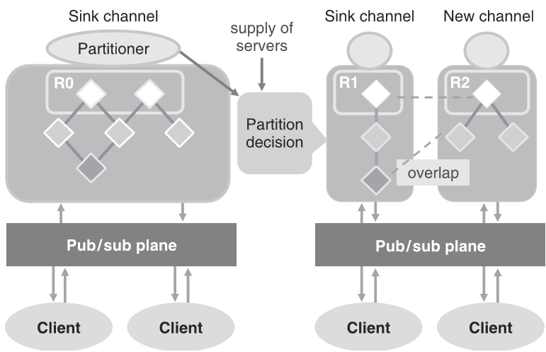

>图 11.5 基于内容的 channelization 概述。

需要不同形式的 load balancing 来确保可扩展性：

• 内容到事件通道的 load balancing。

• 在必要时拆分和合并通道。

• 将单个事件通道重定位到不同计算机。这通过在新服务器上建立通道副本、更新相关查找属性并确保没有漏报来实现。

使用这种动态事件通道方案，通知最多转发一次到事件通道进行发布和随后转发给接收者。Subscription 可能被多次转发。该系统的核心基于事件空间 $ES$ 的概念，当通道被拆分时会更新。事件通道由系统使用覆盖和合并自动扩展和收缩，以将相似的 subscription 聚集在一起。事件通道 load balancing 的两个关键操作是：拆分和合并操作。图 11.5 展示了 channelization 技术。

拆分操作包括以下阶段：

1. 当通道过载（达到阈值）时启动拆分过程。

2. 找到根集（最小覆盖）。

3. 将根集分成两部分，同时最小化重叠并考虑其他约束。

4. 建立新通道并将 subscription 状态传输到这个新服务器。

5. 独立合并旧通道和新通道的根集。合并是可选的，用于减少通道管理的内容描述的大小和复杂性。

6. 广告旧通道的更新内容空间和新内容空间。

合并操作包括以下阶段：

1. 当通道中的活动低于给定阈值时启动合并操作。

2. 取消广告与通道关联的内容空间。这意味着客户端或其他服务器存储的指向当前通道的任何指针都将被移除。该通道负责的流量回退到汇聚通道（和其他具有重叠事件空间的通道）。

## 11.6 Reconfiguration

Pub/sub 系统中的 reconfiguration 有两个关键部分。首先，有 pub/sub middleware 系统和协议栈的 reconfiguration，以满足应用程序和环境的要求。这种 reconfiguration 是必要的，因为不同应用程序的操作环境可能不同，甚至在单个应用程序执行期间也可能发生变化，例如从 Internet 到自组网络连接。其次，pub/sub broker 转发事件消息的网络拓扑可能发生变化，因此需要修改路由表。这是为了绕过故障 broker 和网络节点进行路由。内容路由图和 broker 维护的路由表的 reconfiguration 需要高效并维护系统的安全性和活性属性。Reconfiguration 需要以避免漏报和最小化误报数量的方式完成 [25]。

我们首先考虑 middleware 组件 reconfiguration 的解决方案，然后是路由拓扑的 reconfiguration。

### 11.6.1 Middleware 组件 Reconfiguration

GREEN [26] 和 REDS [27] 是具有 reconfiguration 能力的 pub/sub 系统。两个系统都基于组件架构，其中每个组件负责特定功能（匹配、事件路由或 overlay 管理）。这些系统是支持动态可插拔组件的组件框架的规范。这使这些系统能够应对各种部署环境，例如固定和移动环境，以及结构化和非结构化 overlay 网络。我们简要考虑这些系统如何通过模块化和可插拔组件支持移动自组网环境。

REDS 系统有一个可插拔的拓扑管理器组件，支持无线和自组网环境 [28]。无线自组网协议设计用于在自组网络之上构建基于内容的路由系统。该协议是为自组网络中的多播通信设计的 MAODV 协议的修改版，而 MAODV 是 AODV 协议的修改版。AODV 是这些网络中众所周知的基本反应式路由协议。

GREEN 系统有针对移动自组网的特定配置，解决以下需求：

• 车辆间事件传递。

• 端到端 QoS 监控。

• 内容、邻近和复合事件。

该配置实现为一组组件插件。关键组件是基于 XML 事件的发布和订阅组件，以及用于在 subscription 中考虑邻近性的邻近插件。Subscriber 可以使用提供的复合事件接口利用基于规则的复合事件。客户端也可以指定事件和事件通道的 QoS 监控要求。

事件 broker 插件需要应对移动自组网环境的挑战。其特性与传统固定网络环境不同，因为网络拓扑高度动态，通信容易断开。该插件实现了一个完全分布式的 broker overlay，其中移动节点执行部分 broker 功能。该插件支持 publisher 和 subscriber 端的事件过滤。在该模型中，publisher 定义事件类型和事件传递的范围。Subscription 在该模型中不传播，而是在 subscriber 端评估。

### 11.6.2 具有故障和移动 Broker 的拓扑 Reconfiguration

通用拓扑 reconfiguration 涉及一个监控操作条件的过程，当检测到变化时触发拓扑更新以找到更合适的配置。这种 reconfiguration 是需要的，例如当 broker 之间的链路可能故障时，或者当 broker 可以从一个位置移动到另一个位置时。

每个节点通常并发执行 reconfiguration 过程。该过程是本地的，但修改的资源是全局的（拓扑）。

在一般情况下，reconfiguration 过程分为几个阶段：

• 首先，节点收集关于当前网络拓扑的信息。

• 然后，节点确定是否需要 reconfiguration。

• 最后，节点重新配置拓扑。

需要并发控制以防止同时执行的 reconfiguration 过程同时更改拓扑。根据解决方案，这可能需要锁定正在经历 reconfiguration 的网络部分。

Reconfiguration 可以用于聚集 subscriber 并将 publisher 定位在 subscriber 附近。内容感知的 reconfiguration 过程向图中添加具有最高 subscriber 相似度的链路。具有最低相似度的链路被移除。图 11.6 提供了这种基于链路权重的 reconfiguration 的简单示例。如果未找到比当前具有更大相似度度量的链路，则过程终止。[29] 中为 SIENA 提出了具有并发控制的基于内容的 reconfiguration 协议。

Strawman 协议是 pub/sub 拓扑 reconfiguration 的早期提案之一。其思想是基于 pub/sub 原语（API）实现 reconfiguration [25]。这种方法使用 unsubscribe 操作实现 reconfiguration 所需的链路移除操作。当检测到故障链路时，broker 移除发送到该链路和从该链路接收的 subscription。换句话说，当 broker 检测到故障链路时，它假设链路后面的邻居已取消所有事件的 subscription。这有效地停止了通过断裂链路的信息传递。当添加新链路时，新 broker 发出 subscription，因此路由表最终更新到正确状态，信息再次流动。

图 11.7 展示了这个过程。在子图 A）中，系统正常路由和转发事件。在 B）中，一条链路断裂，reconfiguration 过程开始并识别新链路。现在，协议需要更新拓扑。子

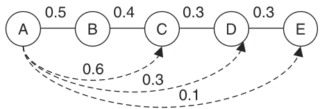

>(a)

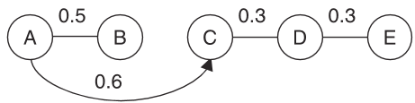

>(b)

>图 11.6 具有兴趣权重的 reconfiguration 示例。

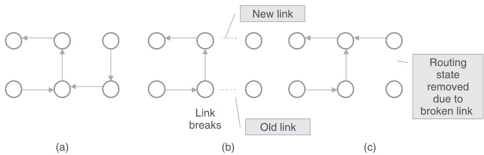

>图 11.7 Strawman 协议示例。

图 C）展示了 reconfiguration 后的拓扑，其中信息通过新链路流动，旧链路已被移除。

现在，如果路由状态通过检测到断裂链路的 broker 发出取消 subscription 立即更新，内容传递将停止并导致漏报。因此，strawman 方法扩展了延迟取消 subscription，不会立即停止内容传递。一旦添加新链路，通过该链路连接的 broker 交换路由表，从而修复拓扑。延迟策略已在仿真研究中显示可将 strawman 算法的开销减少多达 50%。

延迟取消 subscription 技术可以基于以下观察来改进：reconfiguration 限于新旧链路端点之间路径上的 broker。一种协议变体从旧链路开始，然后沿 reconfiguration 路径更新路由表。这种变体比之前的更高效，但要求路径在 reconfiguration 期间保持不变。另一种变体协议在新旧链路的 broker 之间交换信息。旧链路上的 broker 将 subscription 表发送给新链路上的 broker。新链路上的 broker 然后确定新链路上需要哪些活动 subscription。

拓扑 reconfiguration 过程与移动 subscriber 和 publisher 所需的 reconfiguration 没有太大区别。关键是需要更新的路径或子图，以便信息流向新链路。mobility 安全性的概念也可以应用于 reconfiguration 协议，以确保在 reconfiguration 过程中不发生漏报。

### 11.6.3 具有聚类的自组织 Pub/Sub

已经提出了若干 reconfiguration 解决方案，考虑 broker 的兴趣相似性，并尝试以最小化通知延迟和其他相关成本的方式聚集 broker。在给定 subscription 和通知分布的情况下找到最优拓扑的问题已被证明是 NP 困难的 [30]。因此，已提出启发式技术来使 broker overlay 结构适应 subscription 和通知分布、处理成本和网络拓扑。

最大关联树算法基于 broker 的兴趣配置文件聚集 broker。该分布式算法考虑兴趣并基于兴趣的交集构建关联度量。然后以具有高互关联性的 broker 放置在同一集群中的方式聚集 broker。因此，该算法试图通过减少通知传播的平均跳数来最小化通知传递延迟 [31]。

一个相关系统减少了接收许多相同通知的 broker 之间的距离。这通过维护已处理通知的缓存并在 broker 之间交换缓存摘要来计算兴趣重叠来实现。该技术考虑了通信和处理成本。结果算法被证明是 NP 困难的，然后开发了一种启发式算法来使路由配置适应当前的内容供需 [30]。

## 11.7 Mobility 支持

Subscriber 和 publisher 的 mobility 是 pub/sub 系统的一个重要需求。组件的位置可能因多种原因而改变，例如物理重定位、load balancing、容错和 security。图 11.8 展示了 pub/sub mobility 的多种形式。该图展示了分布式环境中的三个关键 mobility 场景，该环境由接入 broker 和事件域组成。域通过相同的 pub/sub 路由系统或连接具有不同技术和策略的系统的联合协议连接在一起。第一种

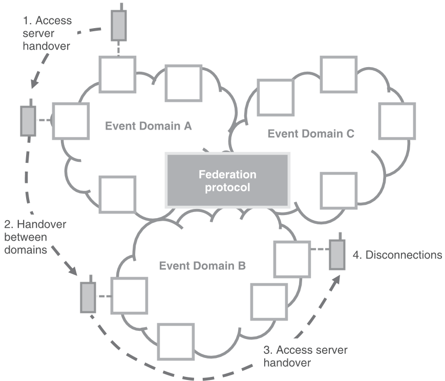

>图 11.8 Pub/sub 系统中 mobility 的不同形式。

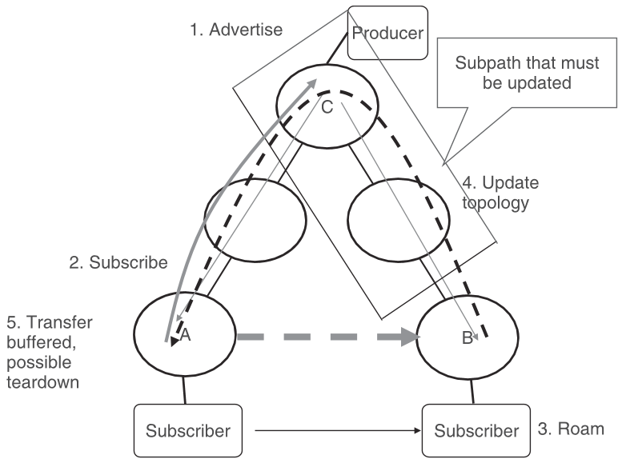

>图 11.9 Pub/sub mobility 概述。

和第三种情况涉及订阅和发布事件的设备的 mobility。设备在同一管理域内从一个接入 broker 漫游到另一个，这要求更新路由拓扑以考虑新位置。在第二种情况下，设备从一个域漫游到另一个域。在这种情况下，需要更新路由拓扑。这涉及联合协议，可能涉及 security、计费和其他问题。第四种情况涉及断开连接，其中设备连接到相同的接入 broker，但由于连接问题不能一直接收事件。接入 broker 必须为设备缓冲消息。这里不考虑 broker mobility，它可以通过本章讨论的 reconfiguration 协议来支持。

图 11.9 展示了 pub/sub 的通用 mobility 解决方案。Publisher 已广告内容（1），subscription 已与 publisher 连接（2）。然后客户端系统从 broker A 重定位到 broker B（3）。现在，需要更新部分拓扑以确保内容流向 broker B。拓扑更新后，如果 A 处没有其他 subscriber，可以移除旧 subscription（5）。

显然，pub/sub mobility 支持需要为 subscriber 缓冲消息，并且路由拓扑需要更新以反映 subscriber 和 publisher 位置的变化。这种拓扑更新应尽可能高效，且不应导致漏报。实际上，第 7 章中提出的 mobility 安全性属性形式化了这一要求。一个简单的解决方案是通过指定的归属 broker 路由所有消息；然而，这种路由方式效率不高 [32]。

Pub/sub mobility 协议在许多方面类似于更传统的网络 mobility 协议。图 11.10 比较了四种不同的 mobility 支持解决方案，即通用 pub/sub、会合 pub/sub、i3 和 SIP。关键特性是间接点的数量、支持 mobility 的机制、更新目标、数据包和消息缓冲、位置隐私和 authentication。例如，SIP 框架通过归属注册器支持会话的 mobility，而 pub/sub 配置路由拓扑。

| |通用 pub/sub|会合 pub/sub|i3|SIP|
| ---|---|---|---|---|
| 目标|Subscription 或广告|Subscription 或广告|任何对象|会话|
| 机制|通用 ping/pong 同步|会合节点|会合节点|归属注册器|
| 更新过程|一个或多个非固定点|一个或多个固定点|一个固定点|一个固定点|
| 缓冲|是|是|否（附加服务）|有状态代理时是|
| 位置隐私|是|是|是|否|
| Authentication|-|-|-|是|

>图 11.10 不同 mobility 支持系统的比较。

JEDI 系统是具有 mobility 支持的 pub/sub 系统的早期示例，客户端使用显式的移入和移出命令在 broker 之间重定位。JEDI broker 网络基于树拓扑，在树的根部有潜在的弱点。Elvin 是另一个支持断开操作的早期示例，使用集中式代理为客户端缓冲消息。Elvin 引入了诸如 quench 和非破坏性通知接收等模式。前者允许 publisher 询问网络是否存在给定发布的活动 subscriber。这可以用于防止不必要的发布从而节省带宽。后者允许 subscriber 选择性地检索消息并将一些消息留在服务器上供以后检索。该技术可以支持多设备以及在 broker 帮助下跨设备的数据共享。Fuego 系统引入了事件通道的切换协议 [33] 以及一系列维护 mobility 安全性的 subscriber 和 publisher 切换协议。接下来，我们将研究为 SIENA 提出的通用 pub/sub mobility 方法以及在 Rebeca、Fuego 和 Padres 项目中考虑的一些更优化的切换协议。

## 11.7.1 通用 Pub/Sub Mobility

SIENA 事件系统扩展了使用现有 pub/sub 原语的通用 mobility 支持 [34, 35]。通用协议的动机是它适用于各种 pub/sub 系统，且不需要对基本 API 进行更改。该协议经过形式验证以维护 mobility 安全性。另一方面，mobility 支持的性能下降，因为当底层拓扑被 API 隐藏时，难以实现 mobility 特定的优化。实际上，已经表明这种通用解决方案在消息交换方面成本很高，并且在所有拓扑中可能不是 mobility 安全的 [36]。

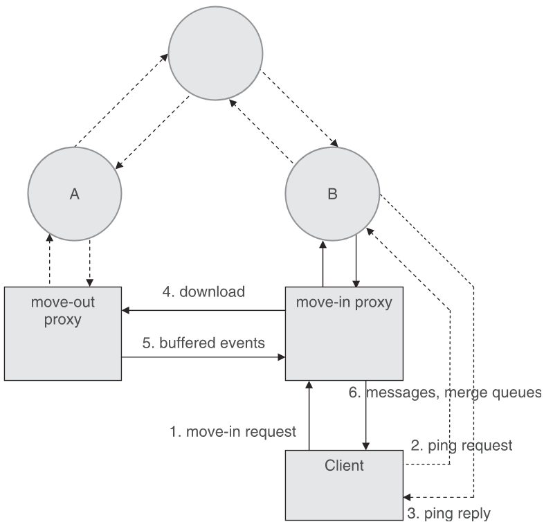

>图 11.11 Mobility 支持服务中的移入功能。

SIENA 通用 mobility 支持服务（ping/pong 协议）由驻留在接入路由器上的代理对象实现。图 11.11 展示了具有六个步骤的过程概述。在第一步中，客户端从 $A$ 到达接入点 $B$ 并向新的本地代理发送移入请求。在第二步中，发送 ping 请求，最终将从旧代理收到响应（3）。响应也可以称为 pong。Pong 消息确保 subscription 从 $B$ 完全传播到 $A$。在第三步中，客户端发送缓冲事件的下载请求，在第五步中，缓冲事件被发送到代理。在最后一步中，客户端接收消息并移除重复项。

我们可以观察到切换协议分四个不同阶段进行：首先，目标订阅重定位的事件，然后目标和源通过发送 ping 和 pong 事件进行同步以确保 subscription 已生效，源取消订阅，最后重定位任何缓冲的事件。此外，中间路由器 subscription 表的变化可能触发进一步成本。算法 11.1 给出了该协议的概述。

### 算法 11.1 通用 move-out sub 和 move-in-sub

数据：Op 表示路由器的操作。

#### begin

switch Op do

case move-out-sub

切换开始前：

广告 pong 消息。

订阅 ping 消息。

断开客户端连接。

切换开始后：

等待 ping。

发布 pong。

等待传输请求。

发送任何缓冲的消息。

如有必要，取消订阅并重置状态。

end

case move-in-sub

广告 ping 消息。

订阅 pong 消息。

激活客户端 subscription。

每个周期 T 发布 ping 直到收到 pong。

通过向源发送消息启动带外状态传输。

end

end

end

对于 subscription 语义，ping/pong 同步协议的基本挑战是信令消息不保证被网络上其他 broker 订阅，因此 subscription 消息将在网络上的每个 broker 引入。对于广告语义，协议以类似方式工作，但 ping 和 pong 消息需要被广告，这也需要洪泛网络。

如果客户端重定位速度快于 ping 消息的传播速度，它必须等待目标收到 ping subscription。这要求 pub/sub API 允许查询 broker 的 subscription 状态。SIENA mobility 解决方案不需要特定的 API 支持，因为 ping 消息被持续重发 [35]，但这种行为进一步加重了网络负担。

Subscription 语义的 publisher mobility 不需要额外的切换功能。广告语义的 publisher mobility 需要按照上述模型实现切换协议，且具有类似的成本结构。

### 11.7.2 基于图的 Mobility 及优化

当拓扑需要随着移动 subscriber 和 publisher 的引入而重新配置时，使用 subscription 和广告语义的基于内容的路由变得具有挑战性。在基于广告的 pub/sub 网络中，subscription 的成功激活可能需要广告首先在整个网络中传播，然后连接 subscription 在反向路径上传播。此外，覆盖和 filter merging [18, 37] 等优化会丢失与发送消息的原始接口相关的信息。

假设 pub/sub 拓扑是无环图，通用的基于图的 mobility 解决方案是仅激活旧位置和新位置之间的非活动（也称为不完整）路径。这样可以避免上述通用 ping/pong mobility 解决方案的高成本。不幸的是，在基于内容的路由系统中，该路径事先不知道，需要被发现。这种发现通过在新位置向旧位置发送更新消息来执行。由于图的无环性质，更新消息将在某处遇到旧 subscription。从该会合点到新位置的路径需要更新，以便 subscription 流向新位置。之后，如果该路径上没有其他 subscriber，可以移除从会合点到旧位置的路径。这种协议的一个主要挑战是当使用覆盖和合并优化时，发现非活动路径和会合点。这些优化聚合路由状态并丢失发送 subscription 的源接口标识符。此外，已知目标在拓扑中的位置，IP 地址不能直接用于选择更新消息的下一跳目标。因此解决方案是向覆盖接口洪泛更新消息。这种选择性洪泛成本很高。

已提出三种有用的技术来改进无环图拓扑的 mobility 支持 [36]：基于 overlay 的路由、会合点和完整性检查。Overlay 地址防止了基于内容的洪泛问题，因为目标 overlay 地址可以用于修剪不必要的目标。Overlay 允许系统应对网络级路由错误和节点故障。会合点通过允许更好的拓扑更新协调来简化 mobility。对于单个会合点，只有一个方向传播更新。完整性检查确保 subscription 和广告在拓扑中完全建立（完整）。这是执行覆盖优化所必需的，如果 subscription 已被覆盖，则在新位置完全避免切换。

基于会合的切换按如下进行 [36]：1. 客户端确保 mobility 前 subscription 到 RP 是完整的。2. 在目标服务器向 RP 发送带有 subscription 的更新消息。3. 更新到达 RP，向 $a$ 发送消息触发会话转移（4）。算法 11.2 概述了这个过程。

通常，利用会合点将提供比基于基本 subscription 或广告的语义更高的性能。在移动解决方案中，会合架构用于保证 subscription 和广告在分布式环境中的无阻碍和完整传播。为此目标，使用称为完整性检查的过程，本质上确保拓扑更新不会产生漏报。类似的过程也在覆盖优化中起作用，旨在检测何时应省略拓扑更新。绕过更新的原因是观察到 subscription 或广告在重定位后已在目标路由器注册。

算法 11.2 基于会合点的 move-out-sub 和 move-in-sub

数据：Op 表示路由器的操作。

begin

switch Op do

case move-out-sub

切换开始前：

确保到 RP 的完整性。

切换开始后：

等待更新。

发送任何缓冲的消息。

如有必要，取消订阅并重置状态。

end

case process-at-RP-or-intermediate

如果收到更新消息且 subscription 完整则

发送更新通知路径已完成。丢弃消息。

end

end

case move-in-sub

如果 subscription 活动则

如果等待完整性更新则
等待。

end

如果 subscription 到 RP 完整则

启动带外传输。

end

否则

end

d

end

end

Publisher mobility 与 subscriber mobility 不同，因为不传输状态。相反，必须首先测试新 $a$ 和旧 $b$ 路由器之间的路径，以确保 $b$ 发出的新广告已到达 $a$。然后必须再次测试路径以确保 $a$ 的任何 subscription 已到达 $b$。之后，publisher 可以确定任何发布的消息不会被 subscriber 遗漏。当拓扑完整时，publisher mobility 很容易。在这种情况下，也可以执行覆盖优化。然而，在不能假设完整性的典型情况下，必须在两个方向上测试路径。

## 11.8 Congestion Control

Congestion 是 pub/sub 系统的主要挑战，其中 subscriber 和 broker 可能被传入流量淹没。这种现象与网络 congestion 的情况非常相似；然而，不同之处在于 publisher 和 subscriber 之间没有端到端通信的概念。Pub/sub 网络抽象了通信组件的身份。因此我们有两个不同层次的解决方案：网络层和 pub/sub 网络层。

TCP 的 congestion control 解决方案，如慢启动、拥塞避免和*加性增乘性减*（AIMD）原则，是在网络层和 Internet 上实现 congestion control 的基线。实际上，broker 通常使用 TCP 进行通信，TCP 在两个 broker 之间提供 congestion control 和流量控制。对于跨多个 broker 的 pub/sub 网络中的 congestion control，需要单独的解决方案。除了缓解 congestion 外，pub/sub congestion control 解决方案还需要考虑由于丢失事件消息导致的重传。重传会加剧 congestion，这需要在解决方案中考虑。

图 11.12 展示了 pub/sub 系统的四种 congestion control 技术：

• 简单反压，其中上游发送者需要阻塞直到下游服务能够赶上。该技术已应用于 Cobra RSS 分发系统，该系统为每个上游服务实现了 1 MB 缓冲区 [38]。

• 速率限制 subscription 允许 subscriber 指定不能超过的通知速率限制。例如，subscriber 可以指定每秒只允许十条消息。速率限制可以轻松地与具有覆盖关系和 filter merging 的通用基于内容的过滤模型结合。这通过将速率限制视为 subscription 中的属性过滤器之一来实现。速率限制也可以包含在 publisher 发送的广告消息中。

• Congestion 通知实现了一种显式 congestion 信令机制，subscriber 和 pub/sub 网络可以通过该机制通知 publisher 应降低发送速率。

• 重路由是网络绕过拥堵 broker 或子网络进行路由的过程。重路由需要 pub/sub 网络 reconfiguration 的支持。

在所有情况下，速率测量和 congestion 检测都很重要。通知速率可以通过简单计算到达当前节点的事件数量来测量。Congestion 通过监控传入消息的队列大小在本地检测。当队列大小超过设定限制时，就发生了 congestion。Subscriber 和 broker 外部的 congestion 通过显式 congestion 信令技术检测。

### 11.8.1 使用偏序集的速率控制

速率控制策略旨在提高基于内容系统的可扩展性。速率控制规则定义每秒或时间单位应向

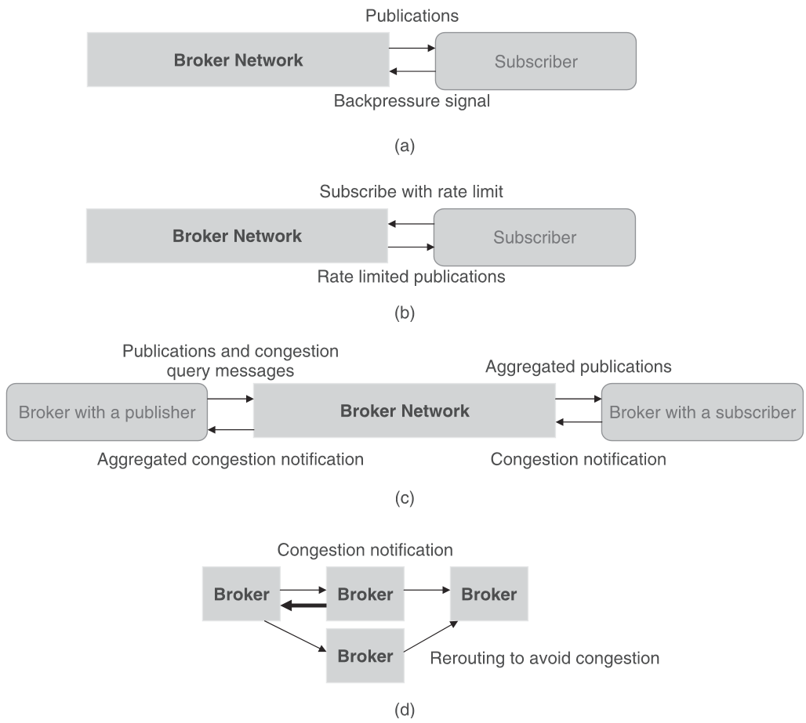

>图 11.12 Pub/sub 的四种 congestion control 技术。(a) 简单反压；(b) 速率限制 subscription；(c) Congestion 通知；(d) 重路由。

订阅接口转发多少通知。一些速率控制规则由系统设计者和策略设定，一些速率控制规则由应用程序设定。

速率控制规则使用属性过滤器表示，因此是过滤器的一部分 [39]。速率控制规则支持覆盖关系且可合并。覆盖关系是一个简单的不等式，其中较大的速率值覆盖较小的速率值。例如：(15 events/s) $\supseteq$ (7 events/s)。

因此，速率控制扩展可以与第 8 章的森林或基于偏序集的匹配器一起使用，但需要一些修改。对于数据结构中的每个过滤器，需要跟踪每个时间间隔的通知速率。如果超过速率限制值，则无需检查以该节点为根的过滤器，因为它们也超过了限制。这提供了一种方便的方法来防止 broker 之间不必要的消息传递。为了在插入期间正确平衡森林，选择具有最接近速率控制过滤器的覆盖子图。

Broker 和 subscription 复制使事件速率确定变得复杂，因为速率限制器是分布式的。假设有 $k$ 个具有复制 subscription 的 broker，总事件发布速率为每秒 $x$ 个事件。假设通知均匀分布到复制的主机，则每个 broker 的速率为 $\frac{x}{k}$。

监控速率的时间窗口很重要，该信息通常至少需要偏序集或森林的根集，在某些情况下需要每个 subscription。监控根集的速率要求在匹配期间更新根集的覆盖 subscription（增加其计数器）。当监控的时间段重新开始时，计数器被重置，旧值可以存储到历史记录中。当前速率值对 load balancer 可能不是很有趣，而是近期速率行为的知识很重要，可以用于外推未来行为，例如使用移动平均或其他统计方法。

### 11.8.2 显式信令

Peter Pietzuch 在 Hermes 系统中开发了一种 pub/sub 系统的 congestion control 机制 [9]。该解决方案基于这种系统的六个要求：支持突发流量、队列大小管理、使用 NACK 消息恢复丢失事件消息的恢复控制、防止恶意客户端损害系统的鲁棒性，以及以公平方式对 publisher 进行速率限制。

开发的 congestion control 系统有两个不同的子系统：

• Publisher 驱动的 congestion control 算法，控制发布速率。速率基于 congestion 度量进行调整。该度量是托管 subscriber 的 broker 处发布消息的速率。Publisher 向下游 subscriber 发送显式 congestion 状态请求，然后 subscriber 发回 congestion 状态更新。状态更新由中间 broker 聚合，以防止 publisher 被淹没。

• Subscriber 驱动的 congestion control 算法，管理托管 subscriber 的 broker 使用 NACK 消息请求丢失事件的速率。该算法在恢复期间调节 NACK 消息的速率，使其在给定可用系统资源的情况下是适当的。

### 11.8.3 重路由以避免 Congestion

内容重路由可以通过选择避免网络拥堵部分的内容传递路径来避免 congestion。本章讨论的 reconfiguration 协议以及 mobility 协议是实现内容重路由的基本机制。示例解决方案包括：

• 基线解决方案是构建多个完全或部分节点不相交的多播树。然后在检测到 congestion 时很容易从一个多播树切换到另一个。这些多播树的创建和维护需要自己的机制。

• 多播树可以用 DHT 系统和作为多播树根的会合点来构建。复制会合点，当主会合点变得拥堵时，将流量转移到副本。以副本会合点为根的多播树不应与主多播树有太多 overlay 以避免 congestion。

• 在网络边缘聚集 subscriber 和 publisher 以避免网络中的热点。

## 11.9 Pub/Sub 系统评估

Pub/sub 系统的评估对于确保其正常工作并达到必要的性能、可靠性、security 和其他非功能性要求非常重要。我们简要考虑这些系统的不同评估策略。评估策略从形式方法到软件工程和实证测量：

• 系统属性的形式验证，如安全性和活性。

• 估计各种性能和可扩展性指标的系统分析模型。

• 使用离散事件模拟器（如 ns3 和 Omnet++）对系统进行仿真。仿真可以在多个抽象层次上实现。通常，网络级数据包路由等细节需要被抽象，以便仿真大规模 overlay 网络。

• 在物理测试网络中的原型实现。网络可以是集群，也可以是 PlanetLab 等全球测试平台。

除了评估策略外，还需要定义评估参数和分析指标。Pub/sub 的一个挑战是有许多可能的应用程序和非常不同的执行环境，例如聊天应用程序可以在桌面 PC 和手机上运行。网络拓扑可以从小规模集群到具有数千个路由器的广域环境。例如：对于 JMS 服务器性能，已为基于集群的实验定义了以下重要参数 [40]：

• 表达性：过滤器数量、过滤器安装时间、过滤器类型、topic 数量、复杂过滤器及其结构。

• 服务器利用率：I/O 访问利用率、本地内存、CPU 利用率、冗余和弹性、备份容量。

• 消息吞吐量：消息大小、过滤器数量、客户端数量、消息模式（持久、持久化、事务）。

• 网络利用率：网络连接数（TCP 连接和 JMS 会话）、网络延迟和丢失特性、subscriber 容量、复制程度。

因此需要考虑环境以及分布式系统的工作负载。

系统的工作负载通常包括以下问题：

• 网络配置，如网络拓扑、初始 broker 拓扑、broker 之间的链路及其属性。

• Broker 配置，如最大队列长度、broker 策略等。

• Subscriber 的到达和离开。

• Publisher 的到达和离开。

• 事件发布规范和 publisher 的速率（分布）。

• Subscriber 的 subscription 规范和 subscription 持续时间（分布）。

• Mobility 相关参数（mobility 发生的频率、断开连接的持续时间、subscriber/publisher 漫游到哪里等）。

• 在 security 相关实验中，security 模型、对手模型等。

通常需要几种不同的评估策略来理解组件或系统在不同场景下的行为。例如：可以对新的 pub/sub 路由算法进行形式分析，以证明即使在 reconfiguration 存在的情况下（在某些假设下）也不会导致漏报。假设不应过于限制，以使算法适用于现实环境。这种分析尚未给出算法性能的图景，只给出其在某些假设下的正确性。因此需要实验来评估算法在具有现实参数的动态环境中的工作方式。这些实验通常通过仿真研究和基于原型实现的实验来进行。

实验是一组单次测量，通常更改一个参数而其他参数保持不变。每次测量重复多次以增加对结果均值的信心。然后可以使用重复的结果来计算测量的标准偏差和置信水平。重复次数需要设置为使结果均值的标准偏差稳定。

下一步是在中大规模网络中仿真算法，以证明它不仅正确而且高效。拓扑应代表算法的现实操作环境（如自组网络、Internet 等）。然后可以分析仿真结果，通常与基准算法进行比较，以评估系统的性能和可行参数空间。分析模型在分析系统时也非常有用；然而，对于具有许多组件的系统，可能难以获得封闭形式的解决方案。一个挑战是参数数量可能随复杂系统增长。可以利用统计技术来评估不同参数组合的影响，如因子设计实验技术。

然后可以将分析和仿真结果与使用原型系统和部署进行的实证测量进行比较。这种评估方法需要系统的软件（在某些情况下还需要硬件）实现。然后为实验配置实现，并在受控或非受控环境中进行实验。受控环境为实验进行了检测，可以测量和评估必要的系统属性和指标。非受控环境，如人们下载和运行软件，可以支持更大规模的实验，但会受到更多测量误差和未知因素的影响。

实验测量对于检测分析和仿真模型是必要的。因此，通常使用仿真和原型进行微基准测试，以了解可行的参数空间并为更大规模的研究微调参数。因此需要一种或多种评估策略来评估解决方案的特性。

## 11.10 总结

图 11.13 展示了本章讨论的解决方案的总结。我们讨论了 security、复合事件、reconfiguration、load balancing、congestion control 和 mobility 支持等重要主题。许多主题与 pub/sub 路由系统有关，旨在提高其效率、可靠性和可用性等重要属性。

Security 解决方案对于保护 pub/sub 系统的不同部分是必要的：subscriber、publisher 和 broker。关键组件是分布式密钥分发机制以及利用密钥的 guard。需要复杂的解决方案来保护路由表和转发过程。EventGuard 是一个全面的 security 套件，也提供基于内容的 security 解决方案。另一种知名技术是基于角色的 security，它通过角色在用户和权限之间提供间接层。

复合事件对于识别有趣的事件序列是必要的。需要一种支持表达性操作的复合事件语言，如事件之间的时间条件。基本的复合事件系统是集中式的，但这种解决方案在可扩展性方面有限。因此，研究了不同的分布策略，将复合事件查询分成更小的部分，然后在网络中分布。分布的目标是将复合查询部分放置在事件 publisher 附近以最小化开销。示例系统包括 CEA、Rapide 和 Padres。

Reconfiguration 用于使 middleware 系统适应新的操作条件。我们观察到 pub/sub 需要适应不同的环境，例如自组网络和 Internet。应用程序需求也各不相同，可能需要对 pub/sub middleware 进行更改。因此需要 middleware 级别的 reconfiguration

| 解决方案|示例|描述|
| ---|---|---|
| 复合事件|Rapide、CEA、Padres|使用复合事件语言进行事件关联。|
| Security|CEA、Hermes、EventGuard|Pub/sub 系统的 security 解决方案：访问控制、各种 guard、保护路由和转发。|
| Reconfiguration|REDS 和 GREEN|一种能够基于触发条件在运行时配置 pub/sub 系统拓扑的算法。目标是在给定成本度量方面找到成本更低的改进路由配置|
| Load balancing|Padres、Fuego|该技术旨在实现分布式 pub/sub 系统或其部分的均匀负载分布。这解决了单个 broker 或路由器因 subscription 或事件消息而过载的问题。|
| Congestion control|Hermes、Padres|防止 publisher 淹没网络和 subscriber 的 congestion control 解决方案。|
| 切换|SIENA、Rebeca、Fuego、Padres|切换协议用于将一个或多个 subscriber 或 publisher 从源 broker 传输到目标 broker。这要求更新路由拓扑。Subscriber 和 publisher 各自需要自己的协议变体。|

>图 11.13 解决方案总结。

以支持多种操作环境。这通过支持各种可插拔组件（如路由模块、合并和其他优化模块以及各种传输模块）的模块化核心架构来实现。

除了 middleware reconfiguration 外，当检测到变化时还需要配置 pub/sub 路由拓扑。例如，链路可能故障，需要激活替代它的新链路。另一个例子是 broker mobility，其中 broker 可以从物理网络的一部分移动到另一部分。因此需要一个激活新链路并拆除旧链路的协议。该协议需要以不丢失消息且能在并发环境中运行的方式设计和实现。

Subscriber 和 publisher mobility 可以通过多种方式支持。可以通过在指定路由器缓冲事件然后允许 subscriber 稍后检索来支持。这有效地支持了断开操作，但不允许 subscriber 在路由器之间漫游。已提出若干 pub/sub mobility 协议来支持漫游的 subscriber 和 publisher。我们研究了为 SIENA 提出的通用 ping/pong 协议，然后是基于无环图的协议和解决方案。Mobility 协议更新路由拓扑，在精神上类似于拓扑 reconfiguration 协议。

Congestion control 是 pub/sub 系统的重要组成部分，因为它防止 publisher 用内容淹没网络和 subscriber。我们研究了该问题的不同解决方案，包括反压和基于显式信令的方案。

## References

1. Wang C, Carzaniga A, Evans D and Wolf A (2002) Security issues and requirements for internetscale publish-subscribe systems. Proceedings of the 35th Annual Hawaii International Conference on System Sciences (HICSS'02), Volume 9, pp. 303–11. HICSS '02. IEEE Computer Society, Washington, DC.

2. Bacon J, Eyers D, Moody K and Pesonen L (2005) Securing publish/subscribe for multi-domain systems. Proceedings of the ACM/IFIP/USENIX 2005 International Conference on Middleware, pp. 1–20 Middleware '05. Springer-Verlag New York, Inc., New York, NY.

3. Fiege L, Zeidler A, Buchmann A, Kilian-Kehr R and Mühl G (2004) Security aspects in publish/subscribe systems. In *Third Intl. Workshop on Distributed Event-based Systems (DEBS04*. IEEE.

4. Khurana H (2005) Scalable security and accounting services for content-based publish/subscribe systems. Proceedings of the 2005 ACM Symposium on Applied Computing, pp. 801–7, SAC '05. ACM, New York, NY.

5. Hirsch F, Solo D, Reagle J, Eastlake D and Roessler T (2008) *XML Signature Syntax and Processing*, 2nd edn. W3C recommendation, W3C. http://www.w3.org/TR/2008/REC-xmldsig-core-20080610/.

6. Reagle J and Eastlake D (2009) XML encryption syntax and processing version 1.1. W3C working draft, W3C. http://www.w3.org/TR/2009/WD-xmllenc-core1-20090730/.

7. Srivatsa M and Liu L (2005) Securing publish-subscribe overlay services with EventGuard. CCS '05: Proceedings of the 12th ACM Conference on Computer and Communications Security, pp. 289–98. ACM, New York, NY.

8. Corman AB, Schachte P and Teague V (2007) QUIP: a protocol for securing content in peer-to-peer publish/subscribe overlay networks. ACSC '07: Proceedings of the Thirtieth Australasian Conference on Computer Science, pp. 35–40. Australian Computer Society, Inc., Darlinghurst, Australia.

9. Pietzuch PR (2004) Hermes: A Scalable Event-Based Middleware. PhD thesis. Computer Laboratory, Queens' College, University of Cambridge.

10. Huang Y and Garcia-Molina H (2001) Publish/subscribe in a mobile environment. Proceedings of the 2nd ACM International Workshop on Data Engineering for Wireless and Mobile Access, pp. 27–34. ACM Press.

11. Al-Muhtadi J, Campbell R, Kapadia A, Mickunas MD and Yi S (2002) Routing through the mist: Privacy preserving communication in ubiquitous computing environments. *ICDCS '02: Proceedings of the 22nd International Conference on Distributed Computing Systems (ICDCS'02)*, p. 74–. IEEE Computer Society, Washington, DC.

12. Gedik B and Liu L (2008) Protecting location privacy with personalized k-anonymity: Architecture and algorithms. IEEE Trans. Mob. Comput. 7(1): 1–18.

13. Pietzuch PR, Shand B and Bacon J (2003) A framework for event composition in distributed systems.
Proceedings of the 4th International Conference on Middleware, pp. 62–82.

14. Pietzuch PR, Shand B and Bacon J (2004) Composite event detection as a generic middleware extension. IEEE Network 18(1): 44–55.

15. Jacobsen HA, Cheung AKY, Li G, Maniyaran B, Muthusamy V and Kazemzadeh RS (2010) The PADRES publish/subscribe system. *Principles and Applications of Distributed Event-Based Systems*, pp. 164–205.

16. Tarkoma S (2008) Fast track article: Dynamic filter merging and mergeability detection for publish/subscribe. *Pervasive Mob. Comput.* **4**: 681–96.

17. Crespo A, Buyukkokten O and Garcia-Molina H (2003) Query merging: Improving query subscription processing in a multicast environment. IEEE Trans. Knowl. Data Eng. 15(1): 174–91.

18. Mühl G (2002) *Large-Scale Content-Based Publish/Subscribe Systems*. PhD thesis. Darmstadt University of Technology.

19. Salo J (2010) Offloading content routing cost from routers. Master's thesis, University of Helsinki.

20. Cheung AKY and Jacobsen HA (2006) Dynamic load balancing in distributed content-based publish/subscribe Middleware, pp. 141–61.

21. Cheung AKY and Jacobsen HA (2010) Load balancing content-based publish/subscribe systems. ACM Trans. Comput. Syst. 28(4): 9.

22. Cheung AKY and Jacobsen HA (2010) Publisher placement algorithms in content-based publish/subscribe. *ICDCS*, pp. 653–64.

23. Wang YM, Qiu L, Achlioptas D, Das G, Larson P and Wang HJ (2002) Subscription partitioning and routing in content-based publish/subscribe networks. 16th International Symposium on DIStributed Computing (DISC'02), October 2002, Toulouse, France.

24. Tarkoma S (2008) Dynamic content-based channels: meeting in the middle. Proceedings of the Second International Conference on Distributed Event-Based Systems, pp. 47–58. DEBS '08. ACM, New York, NY.

25. Picco GP, Cugola G and Murphy AL (2003) Efficient content-based event dispatching in the presence of topological reconfiguration. Proceedings of the 23rd International Conference on Distributed Computing Systems, pp. 234–44. ICDCS '03. IEEE Computer Society, Washington, DC, USA.

26. Sivaharan T, Blair G and Coulson G (2005) GREEN: A configurable and re-configurable publish-subscribe middleware for pervasive computing. Proceedings of DOA 2005, pp. 732–49.

27. Cugola G and Picco GP (2006) REDS: a reconfigurable dispatching system. Proceedings of the 6th International Workshop on Software Engineering and Middleware, pp. 9–16. SEM '06. ACM, New York, NY.

28. Mottola L, Cugola G and Picco GP (2008) A self-repairing tree topology enabling content-based routing in mobile ad hoc networks. IEEE Transactions on Mobile Computing 7: 946–60.

29. Baldoni R, Beraldi R, Querzoni L and Virgillito A 2007 Efficient publish/subscribe through a self-organizing broker overlay and its application to siena. *Comput. J.* **50**: 444–59.

30. Jaeger MA, Parzyjegla H, Mühl G and Herrmann K (2007) Self-organizing broker topologies for publish/subscribe systems. Proceedings of the 2007 ACM Symposium on Applied Computing, pp. 543–50.
SAC '07. ACM, New York, NY.

31. Baldoni R, Beraldi R, Querzoni L and Virgillito A (2004) A self-organizing crash-resilient topology management system for content-based publish/subscribe. 3rd International Workshop on Distributed Event-Based Systems (DEBS'04), Edinburgh, Scotland.

32. Burcea I, Jacobsen HA, de Lara E, Muthusamy V and Petrovic M (2004) Disconnected operation in publish/subscribe middleware. *Mobile Data Management*, pp. 39–50.

33. Tarkoma S, Kangasharju J and Raatikainen K (2003) Client mobility in rendezvous-notify. *Intl. Workshop on Distributed Event-Based Systems (DEBS'03)*.

34. Caporuscio M, Carzaniga A and Wolf A (2002) An experience in evaluating publish/subscribe services in a wireless network. WOSP '02: Proceedings of the 3rd International Workshop on Software and Performance, pp. 128–33. ACM Press, New York, NY.

35. Caporuscio M, Carzaniga A and Wolf AL (2003) Design and evaluation of a support service for mobile, wireless publish/subscribe applications. IEEE Transactions on Software Engineering 29(12): 1059–71.

36. Tarkoma S and Kangasharju J (2007) On the cost and safety of handoffs in content-based routing systems. *Computer Networks* **51**(6): 1459–82.

37. Tarkoma S and Kangasharju J (2005) Filter merging for efficient information dissemination. *CoopIs LNCS 3760*), pp. 274–91. Springer.

38. Rose I, Murty R, Pietzuch P, Ledlie J, Roussopoulos M and Welsh M (2007) Cobra: content-based filtering and aggregation of blogs and rss feeds. Proceedings of the 4th USENIX Conference on Networked Systems Design and Implementation, p. 3–. NSDI'07. USENIX Association, Berkeley, CA.

39. Mühl G, Ulbrich A, Herrmann K and Weis T (2004) Disseminating information to mobile clients using publish-subscribe. *IEEE Internet Computing* **8**: 46–53.

40. Henjes R (2010) *Performance Evaluation of Publish/Subscribe Middleware Architectures*. PhD thesis.
University of Würzburg.
# 12 应用


本章讨论 pub/sub 系统和技术的应用。我们考察了 pub/sub 作为 cloud computing 平台、SOA 和企业应用通用 XML-broker、Facebook Messages 和 Chat、Pubsubhubbub、Complex Event Processing、在线广告和游戏的使能技术的角色。在移动环境方面，我们考察了 Apple push notification service 和 Internet of Things 环境。并讨论了这些应用所使用的模式和解决方案。

### 12.1 Cloud Computing

Internet 服务已经无处不在，近期建设大规模数据中心的趋势是当前网络演进的一部分。这种演进不仅关乎支持数百万甚至数十亿用户的能力，还关乎如何在这些数据处理枢纽之间配置和维护数据连接和网络路由。

从一个角度来看，Internet 计算正在回归到分时系统的旧有公用计算范式。然而，这一次的最新发展有一个转折——对等网络提供了在 Internet 上卸载计算和存储的可能性。这描绘了一幅分布式应用和服务相互协作以实现最佳服务、同时最小化货币成本、能耗或碳足迹等指标的图景。为了使这种基于云的服务生态系统运作，需要便捷的访问协议、数据表示格式、定义良好的接口以及高效的数据分发和传播技术。事实上，一些解决方案已经部署，例如 Google 和 Amazon 在其服务平台中使用的方案。

尽管云服务已经出现，但格局仍然是碎片化的，可扩展解决方案——尤其是跨 Internet 和移动设备的解决方案——仍需要大量的研究和开发。考虑多个利益相关方的策略和安全要求是一个重大挑战。此外，鉴于数十亿手机用户将成为 Internet 的一部分，在设备和节点与数据中心之间划分服务逻辑变得重要。

>Publish/Subscribe Systems: Design and Principles, First Edition. Sasu Tarkoma.

>© 2012 John Wiley & Sons, Ltd. Published 2012 by John Wiley & Sons, Ltd.

Cloud computing 的服务可以分为三类：

1. Software-as-a-Service (SaaS)，其中供应商提供硬件基础设施、软件产品，并通过门户与用户交互。

2. Platform-as-a-Service (PaaS)，其中一组软件和开发工具由提供商托管在提供商的基础设施上，例如 Google 的 App-Engine。

3. Infrastructure-as-a-Service (IaaS)，涉及具有唯一 IP 地址的虚拟服务器实例和按需存储块，例如 Amazon 的 Web services 基础设施。

以上三类都需要虚拟机、服务和应用之间的信令和消息传递。Pub/sub 是在此环境中经常采用的通信解决方案，它被广泛用于连接云平台组件。下面，我们考察最先进的云 pub/sub 解决方案并给出其使用示例。

### 12.1.1 面向云的 Pub/Sub

基于 Publish/Subscribe 的云应用近来变得越来越重要。这是它们作为企业间通信工具的整合能力的合理结果。云托管的中介服务实现了 publisher 和 subscriber 之间的高效解耦：它们可以位于不同的网络中，不需要公开可寻址，或者实际上无法直接相互通信。由于云基础设施的固有特性，所有中介服务都能够根据 publisher 和 subscriber 的数量正确扩展。云还具有自动充当通信中介防火墙的能力。注意，publisher 和 subscriber 需要显式许可才能连接到中介服务，以及发送或接收消息。这样的工作流模式很有用，因为它们可以：

• 在分布式计算机的应用之间中继事件。

• 更新业务系统数据。

• 在数据存储节点之间移动数据。

### 12.1.2 Windows Azure AppFabric Service Bus

一个有趣的云应用是在 Microsoft 数据中心运行的 AppFabric Service Bus；它属于 Microsoft PaaS 云战略 Azure。该系统基于一组名为 Azure AppFabric 的 middleware 服务以及 Azure SDK 和 Visual Studio Toolset 形式的开发工具。Azure AppFabric Service Bus 负责将各种组件连接在一起，并通过 Azure 数据中心中的公共端点暴露 Web 服务。AppFabric broker 在云中将消息中继到防火墙或 NAT 设备后面运行的服务。所有端点都由 AppFabric 保护，它使用基于声明的安全模型（在本例中是 Access Control 服务）。其他功能包括用于云中监听和发送的联合身份验证以及云中端点的特定命名系统。图 12.1 展示了该系统的通用通信模型。此外，AppFabric 允许多种双向通信选项，并支持集成应用的服务注册表。

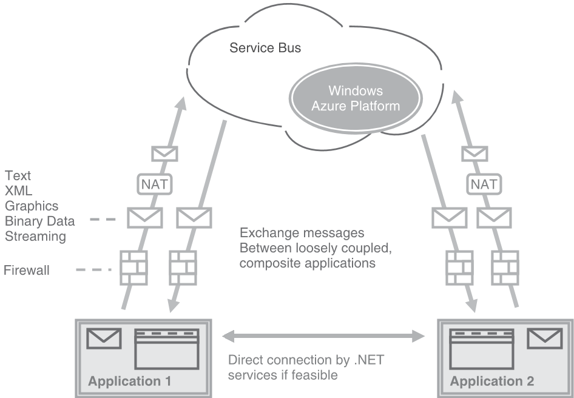

>图 12.1 Azure 消息传递概览。

应用与云服务的集成最初由 AppFabric 通过具有双重操作性的中继服务来支持：使用通过 REST API 访问的云端消息缓冲区，或利用带有特殊消息通道的 Windows Communications Framework (WCF) 模型与中继服务通信。后一种模型使与中继绑定的通信对应用本质上是透明的，因为 WCF 在通道层管理所有消息传递细节。缓冲不是问题，因为消息缓冲区是临时的，消息在过期或被消费后消失。

AppFabric 的新功能包括在服务总线级别提供持久消息传递，可以是可靠消息队列或持久 publish/subscribe 消息传递。这两者的区别在于消费服务总线中发布的消息的独立方数量。此外，AppFabric 使用的定价模型基于使用的连接数。

AppFabric 的主要功能包括：

• 服务总线产生的解耦是强大的，基于服务命名空间。单个服务命名空间为一组端点创建隔离，AppFabric 客户可以使用多个服务命名空间，允许两个应用（与单个账户关联）监听不同的命名空间地址。

- 通信选项包括 REST API、.NET API 和 WCF 绑定。这些使 AppFabric 易于从应用中使用。

AppFabric v2.0 Service Bus 支持基于队列和 topic 的 pub/sub 通信场景。Service Bus 允许多个 publisher 和 subscriber 通过逻辑上集中的系统进行通信，subscriber 可以使用过滤器进行自定义 subscription。pub/sub 功能可以由开发者使用多种编程模型来使用，例如 .NET API、用于 Service Bus Messaging 的新 WCF 绑定，以及用于 Queues 和 Topics 的 REST API。

队列是持久化的有序缓冲区，publisher 向其中发送消息。消息存储在队列尾部，subscriber 从头部接收消息。因此，队列可以有多个接收者竞争接收消息。队列有一个指向当前消息的游标。游标由 subscriber 共享，当 subscriber 接收到消息时移动。Service Bus Queues 系统提供了修改 Queue 默认行为的方法，例如修改消息的时间可见性和消息处理的延迟。队列支持 at-most-once 或 at-least-once 消息传递语义。队列不保证消息顺序，因此它们是尽力而为的 FIFO。

消息操作依赖于存储在消息中的各种系统属性，如消息标识符、会话标识符和任意名称-值对。每条消息可以包含一个必须可序列化的消息体。队列可以支持基于会话的消息传递，其中具有相同会话标识符的消息被分组在一起并传递给同一接收者。

Topics 类似于 Queues 并支持相同的功能，但此外它们支持多个头部，称为 subscription。每个 subscriber 接收消息的不同副本。每个 subscription 有自己的游标，当关联的 subscriber 接收到消息时移动。subscription 可以支持消息过滤，其中队列中的消息子集被传递给 subscriber。创建 topic 后，需要向其添加 subscription。每个 subscription 有唯一标识符，可以有关联的过滤器和操作。支持多种不同的过滤器格式，例如基于关联标识符的简单匹配和 SQL-92 风格的语法，可用于使用消息的名称-值对属性创建过滤器。一旦创建了 topic，就需要向其添加一个或多个 subscription，因为虽然发送者向 topic 发送消息，但 subscriber 从 subscription 而非 topic 接收消息。Topic.AddSubscription() 方法用于向 topic 添加 subscription。每个 subscription 由唯一名称标识。添加 subscription 时，可以使用 RuleDescription 指定 subscription 的过滤器和操作。

Queues 和 Topics 都使用 Service Bus 命名空间进行寻址。命名空间依赖于 URI，topics/queues 和 subscription 使用熟悉的层次表示法标识。例如，sb://example.service.com/News/Subscriptions/Tech 由命名空间 example、名为 News 的 topic 和名为 Tech 的 subscription 组成。

Service Bus 支持三种消息传递形式：直接消息传递、中继消息传递和代理消息传递。在直接消息传递中，publisher 和 subscriber 直接通信，而在中继消息传递中，它们通过中继进行通信。直接和中继消息传递都是 subscriber 驱动的，subscriber 决定消息消费速率。如果 subscriber 无法足够快地处理消息，publisher 必须降低发送速率。代理消息传递与这两种消息传递形式形成对比，因为它依赖于存储消息的高性能中介。

subscriber 然后可以从中介维护的消息队列中检索消息。使用代理消息传递，publisher 和 subscriber 可以独立于彼此扩展。

### 12.1.3 Amazon Simple Queue Service (SQS)

Amazon Simple Queue Service (Amazon SQS) 是 Amazon.com 于 2006 年作为其云平台一部分创建的分布式消息队列服务。SQS 支持消息队列操作，并为开发者提供 Web 服务接口。SQS 服务的主要目标是提供可扩展的托管消息队列，然后可用于连接各种服务组件。这由图 12.2 说明。这使开发者能够轻松地在不同应用组件之间移动数据并保持组件同步。SQS 可以与虚拟化解决方案 Amazon EC2 (Elastic Computer Cloud) 一起使用，以实现自动化工作流系统。SQS 与 JMS 和其他消息队列解决方案不同，因为它是由 Amazon 维护的托管服务，以按使用付费的商业模式销售该服务。

SQS 消息可以包含任何类型的数据，消息体限制为 64KB。如果需要发送更大的消息，开发者必须将较大的数据分成较小的段，通过多条消息传输。

SQS 服务为消息传递提供 at-least-once 语义。消息存储在多个服务器上以实现可靠性和可用性。系统不保证消息顺序，此功能需要由应用根据消息中包含的信息来实现。

SQS 可以以多种方式使用，例如：

• 将 SQS 与其他 Amazon 云服务结合使用以连接应用组件。

• 通过将任务描述消息放入 SQS 队列来协调分布式进程。

• 将 Web 应用通知存储在 SQS 队列中，并允许基于 Web 浏览器的应用检索消息。

作为一个例子，我们可以考虑一个使用 Amazon 服务进行数据处理的视频转换网站。该网站允许用户提交视频进行处理。视频存储在 Amazon S3 存储服务中。一旦视频被存储，一条消息被存储在 SQS 队列中，表示转换服务的传入消息。该消息包含与请求操作相关的详细信息，即转换操作。转换引擎在 EC2 实例中运行，从传入队列读取消息，然后开始转换过程。修改后的视频文件存储在 Amazon S3 中，指针通过 SQS 消息队列在完成消息中发送。网站然后可以从队列中读取完成消息，并通知用户视频已准备就绪。

### 12.1.4 PubNub

PubNub 是一个相对较新的云托管推送服务。¹ 它目前在 Amazon EC2 基础设施中运行，系统为各种编程语言提供一组 API

>$ ^{1} $  http://www.pubnub.com/.

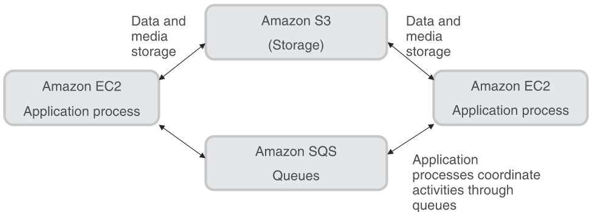

>图 12.2 Amazon 托管应用通过 SQS 通信。

用于推送或接收消息。PubNub 使用通过 HTTP 实现的长连接客户端发起连接向不同的 subscriber 推送数据。Subscriber 在特定通道上监听消息，然后在消息发布到通道时接收消息。消息被转发到通道上的所有 subscriber。

### 12.2 SOA 和 XML Brokering

Service Oriented Architecture (SOA) 是一种软件架构，其中应用按照业务流程设计并实现为可互操作的服务。SOA 由各种服务组成，可用于支持、管理和协调业务流程。目标是组件和服务的松耦合，支持多种不同形式的互操作性。SOA 将功能分离为可通过网络使用的服务。松耦合特性与可互操作的服务定义一起支持在业务应用的创建和执行中组合和重用服务。

SOA 严重依赖面向消息的 middleware 和 pub/sub。SOA 组件通过在消息 broker 或总线组件 Enterprise Service Bus (ESB) 的帮助下发送和接收消息进行通信。消息传递原语和 broker 将不同组件连接在一起，实现系统的松耦合特性。基本的面向消息的交互是更复杂交互的基础。

SOA 系统通常采用已被发现对此环境高效且运行良好的设计模式。我们在第 4 章讨论了模式，Enterprise Integration Patterns 专门为 SOA 和企业系统集成而设计。可以为 SOA 的开发和使用确定几个指导原则：

• 服务创建、监控、组合和供应。

• 重用、互操作性、组件化、模块化和可组合性。

• 基于标准的组件和消息传递。

• 组件的松耦合。

各种架构特性影响这些系统的设计和实现。
这些特性包括内部服务逻辑的抽象、封装的

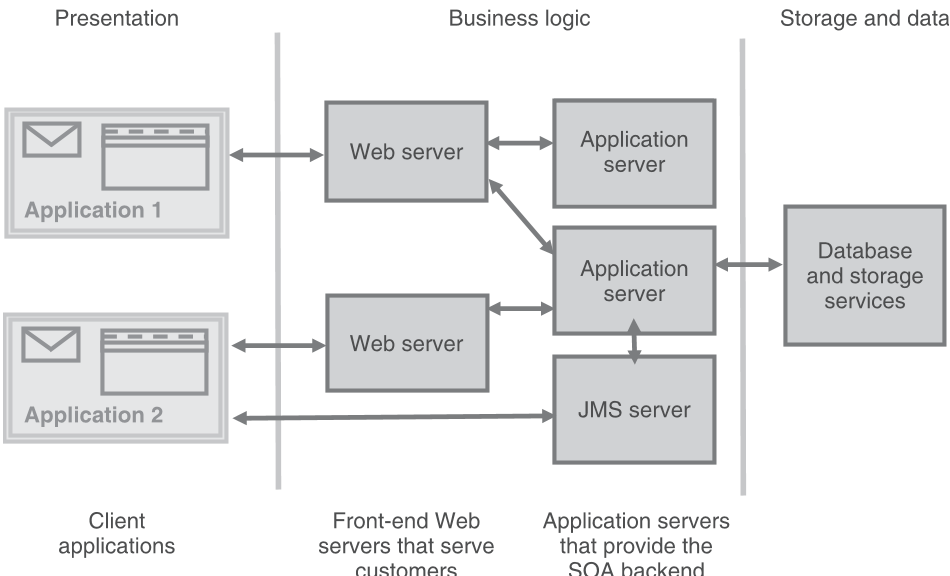

>图 12.3 SOA 环境示例。

服务逻辑的自治性、定义服务间协议的契约、可用于封装服务以符合 SOA 接口的封装，以及定位服务所需的服务发现。

图 12.3 展示了一个以 JMS 作为 ESB 连接应用服务器和应用组件的 SOA 架构。系统遵循三层模型，包括表示层、业务逻辑层以及存储和数据层。这种分层结构旨在提高灵活性并提供关注点分离。表示层负责执行应用的客户端部分并提供用户界面。业务逻辑层负责执行应用的服务器端部分并为用户界面提供资源。Web 服务器通常位于该层的前端部分，用于生成用户界面。该层的后端部分托管实现业务逻辑的应用服务器。存储和数据层负责内容的持久存储。业务逻辑层和存储层通常位于数据中心。

SOA 和 ESB 依赖标准化解决方案以在分布式环境中实现服务互操作性。常用的通信标准包括 XML 作为消息格式、SOAP 和 REST 作为消息传递协议、XPath 和 XQuery 用于查询处理，以及 JMS 用于 pub/sub。鉴于 Web 服务和 XML 在 SOA 中的重要角色，XML 消息 broker 是提供 ESB 功能的关键组件。XML broker 的主要功能包括：

• 过滤将消息与表示 subscriber 兴趣的查询进行匹配。

• 转换根据接收者特定要求重构匹配的消息。

• 路由涉及将消息传递给接收者。

第 8 章中考察的 XFilter 和 YFilter 是高效 XPath 和 XQuery 匹配器的示例 [1]。这些和类似的匹配器是高效 XML broker 的构建块。此外，SOAP 和 REST 通常用于以可互操作的方式实现消息传递。

## 12.3 Facebook 服务

Facebook 是一个高度流行的社交网络服务和网站，于 2004 年推出。该网站拥有超过 8 亿用户，他们在该网站维护社交档案并利用聊天和消息传递等服务。该服务的许多内部功能依赖异步消息传递，因此高效且可扩展的消息传递系统是 Facebook 架构的核心组件之一。消息传递系统的架构描述基于 Facebook 工程博客文章。²

### 12.3.1 Facebook Messages

Facebook Messages 集成了该网站的多种通信渠道，即电子邮件、Inbox、Instant Messages、Facebook messages 和 SMS。为了满足可扩展性和可用性要求，消息传递架构从头设计。消息传递系统需要处理超过 3.5 亿用户每月发送超过 150 亿条人对人消息。聊天服务拥有超过 3 亿用户，每月发送超过 1200 亿条消息。³ 消息传递服务的三个关键要求是：

• 支持拥有现有消息历史的数百万用户的可扩展性。

• 实时消息传递和操作。

• 高可用性。

监控系统使用时观察到两种通用数据模式：一小组时间数据是易变的，大量数据很少被访问。这些观察结果在选择各种任务的系统组件时被考虑在内。

服务的内部组织是层次化的（如图 12.4 所示）：

• 应用服务器负责处理查询和写入系统。这些服务器与其他服务交互以实现其目标。服务器具有四个关键层的分层组织：客户端调用的 set 和 get 操作的 API、分配职责的逻辑、业务应用逻辑和数据访问。应用业务逻辑负责所有用户数据和复杂产品操作的处理。这部分有一个写通缓存和与 Web 服务器的交互模块，以尊重用户隐私和系统策略。数据访问层是用户元数据的通用接口。该层存储用户的元数据，由时间序列日志组成。此日志用于备份、恢复、检索和重新生成用户数据。该层还存储序列化用户对象的快照。

• 单元是负责一部分用户的应用服务器集群。一个单元由应用服务器集群、控制

>$ ^{2} $  http://www.facebook.com/Engineering?sk= notes.

>$ ^{3} $  https://www.facebook.com/note.php?note_id=454991608919.

集群的若干 ZooKeeper 机器和元数据存储组成。Apache ZooKeeper$^4$ 是一个开源软件，实现了配置信息、命名、分布式同步和组服务的集中式服务。ZooKeeper 基于第 3 章讨论的一致性哈希技术。该技术使从集群中插入和移除服务器变得容易。元数据存储负责存储用户档案，通过数据访问层进行接口。

将系统结构化为单元带来了几个优势。单元支持增量可扩展性并有助于限制故障场景，系统变得更易于升级和部署，单元可以托管在不同的数据中心。

一个独立的消息存储负责消息的持久存储。Facebook Messaging 使用 Apache HBase 存储消息。HBase 具有良好的可扩展性，对观察到的工作负载表现良好，并支持复制和容错。消息附件存储在 Haystack 中，用户发现使用 Apache ZooKeeper 完成。

Messages 系统具有几个设计原则和模式：它是分层的和 API 驱动的，分布模型是具有单元的层次结构，单元提供增量可扩展性和故障遏制，应用逻辑分离到应用服务器，应用可以保持无状态。

### 12.3.2 Facebook Chat 和 Messenger

Facebook Chat 是一个与 Facebook 后端系统集成的聊天应用。⁵ 图 12.5 展示了 Chat 应用的通用架构。该应用在 Web 浏览器内运行并与服务器端系统连接。即时消息

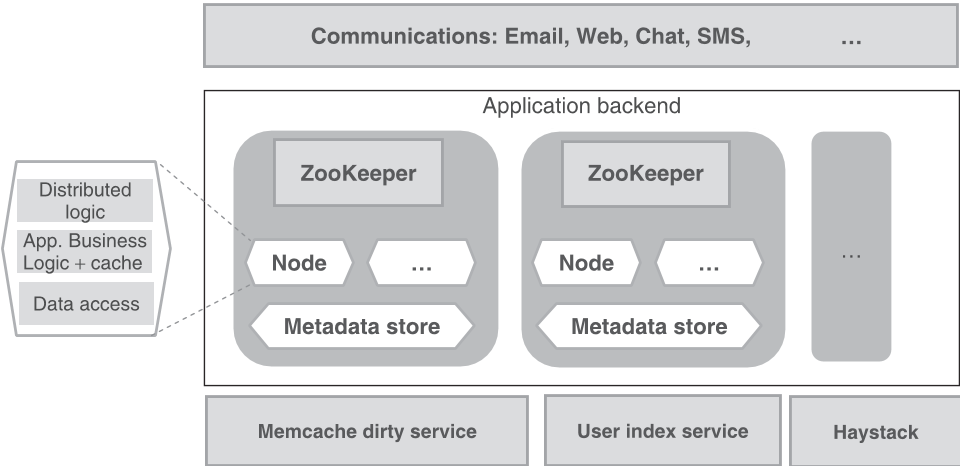

>图 12.4 Facebook Messages 架构。

>$ ^{4} $  http://zookeeper.apache.org/.

>5 http://www.facebook.com/note.php?note_id= 14218138919.

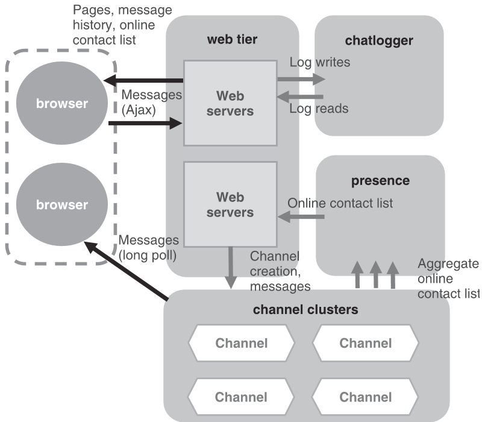

>图 12.5 Facebook Chat 架构。

被发送到其中一个 Web 服务器，然后对用户进行身份验证并处理消息。消息存储在分区的通道集群中，每个集群负责一部分用户。传入消息被发送到负责接收者的通道集群。假设接收者在线，消息将使用后端系统与接收者浏览器之间的持久连接发送。在客户端，使用常规 AJAX 发送消息，使用周期性 AJAX 轮询在线好友列表。使用 AJAX long-polling 接收消息。

Facebook Chat 的工程挑战之一是让每个在线用户了解其好友的状态。好友列表的大小、峰值用户数量以及用户加入和离开的频率是评估在线状态跟踪可扩展性的关键参数。显然，对于数百万用户，状态跟踪子系统需要设计得高效且可扩展。跟踪用户空闲状态也使事情复杂化，当监控用户需要在其空闲好友再次活跃时收到通知。因此做出了两个关键观察：

• 触发状态更新的操作将从一个用户多播到多个用户。

• 空闲状态之间的转换会产生服务器负载，即使用户没有主动使用服务（例如，用户空闲一分钟后发送消息）。

消息的及时传递是另一个挑战。解决方案基于第 4 章中介绍的客户端发起连接模式，其中与服务器组件建立持久连接。当有数据时连接返回
给客户端。

Facebook Chat 基于用 Erlang 编写的自定义 Web 服务器，维护连接并保存聊天消息日志。子系统被集群化和分区以提高可靠性。选择 Erlang 是因为它是一种面向并发的函数式编程语言，具有轻量级用户进程和良好的消息传递、分布和容错特性。通道服务器负责排队用户消息并通过 HTTP 将其发送到 Web 浏览器。通道服务器也用 Erlang 编写。

状态更新被发送到 Web 服务器，Web 服务器将其转发到用户的通道集群。每个集群维护其用户状态列表，并定期更新到状态服务器。状态更新很小，因此每个状态服务器可以存储所有用户的状态。客户端然后轮询 Web 服务器以获取在线联系人列表。Web 服务器从其中一个状态服务器获取此信息。

Facebook messenger 是一个可用于多种不同设备的社交应用，允许人们与朋友保持联系、关注他们的状态和聊天。该应用提供与 Facebook 集成的聊天和状态系统。该应用依赖服务器端 Facebook Messages 系统。⁶ 为了高效维护持久连接，Messenger 使用第 5 章中考察的 MQTT 协议。MQTT 用于与服务器建立连接并通过聊天系统路由消息。

### 12.4 PubSubHubbub

通常会出现对足够简单、适用于一般 Internet 使用的基于 topic 的 publish/subscribe 协议的需求。PubSubHubbub 就是这样一个协议。它是一个用于 Internet 上分布式通信的开放协议，

• 将 RSS 和 Atom feeds 转换为实时流。

• 具有单一 API，支持 Web 规模、低延迟消息传递。

• 具有三个参与实体：Publisher、Subscriber 和 Hub。

我们可以用生态系统来描述 PubSubHubbub：publisher、subscriber 和 hub 的生态系统。本质上 PubSubHubbub 将扩展 Atom 和 RSS 协议以用于数据 feed，几乎即时提供变更更新通知。这适用于客户端以任意间隔轮询 feed 服务器的典型情况。PubSubHubbub 将客户端从轮询整个 feed 中解放出来，因为 Atom/RSS 更新通知由 PubSubHubbub 推送。

典型 PubSubHubbub 系统的操作描述如下：

• Publisher 将其发布的内容暴露为包含 hub 引用的 feed。

• 最初，感兴趣的 subscriber 将像往常一样通过从提供此类 feed 的服务器请求来拉取适当 topic 的 Atom 或 RSS feed。

>6 https://www.facebook.com/notes/facebook-engineering/building-facebook-messenger/10150259350998920.

• subscriber 检查 feed（例如 Atom 文件）。如果引用或描述了 hub，subscriber 将向 hub 注册并使用 Topic URL 订阅 feed。因此它可以避免重复轮询 URL。

• subscriber 运行一个服务器，当任何注册的 topic 更新时，hub 可以直接联系该服务器。因此，如果订阅的 topic 已更新，subscriber 能够接收直接通知。

• Publisher 在发布或更新事件后通知引用的 hub（ping 它们）。

• hub 然后可以获取更新的 feed 并将内容多播到所有注册的 subscriber。

图 12.6 展示了 Pubsubhubbub 协议的关键交互。publisher 在 RSS/Atom feed 中包含 hub URL，并通过向 hub 发送 ping 消息在内容变化时保持 hub 更新。hub 然后可以从 publisher 检索内容，并将其发送给已注册该内容的 subscriber。

图 12.7 展示了轻量 ping 技术，其中 hub 将 ping 中继到 subscriber。subscriber 然后可以在收到 ping 后直接从 publisher 请求内容。这种方法将内容请求决定权交给 subscriber 而不是 hub。

PubSubHubbub 协议本质上是去中心化的，没有中央机构或公司。任何人都可以运行开放 hub、发布、更新和订阅内容。例如，hub 可以是免费使用的社区 hub 或专有的 publisher hub。简单实用的 PubSubHubbub 协议最重要的好处之一是通过 subscriber 为感兴趣的 topic 设置的 webhook 回调工作。因为 PubSubHubbub ping 包含完整的 Atom 或 RSS 主体，仅包含增量 feed 内容，publisher 负载和端到端延迟都降低了。整个 Internet 规模的

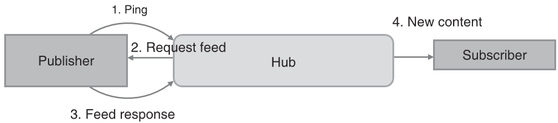

>图 12.6 Pubsubhubbub 系统概览。

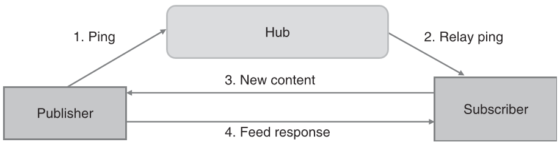

>图 12.7 带轻量 ping 的 Pubsubhubbub。

节省带宽的 publisher 和 subscriber 软件实现对于 pub、sub 和 hub 组件来说简单且一致。许多 publisher 已启用 PubSubHubbub，包括 Google、LiveJournal、MySpace 和 TwitterFeed。Google 提供多个支持 PubSubHubbub 的产品：Buzz、FeedBurner、Blogger、Reader 和 Google Alerts。

### 12.5 Complex Event Processing (CEP)

Complex Event Processing (CEP) 由 Stanford University 的 David Luckham 教授开创$^7$，自 1990 年代以来一直在研究 [2]。CEP 是一种处理复合事件检测和处理的通用技术。

CEP 系统提供了一种声明式方式来实时检测复杂事件。从数据流的角度来看，它们将一组输入流转换为一个或多个输出流。CEP 解决方案通常提供一种声明式语言来指定感兴趣的事件模式。许多 CEP 解决方案基于包含时间、因果和模式匹配功能的扩展 SQL。

Rapide 语言是 CEP 的一个关键示例。Rapide 的主要思想是使用异步事件及其因果关系来建模静态和动态架构。在此上下文中，架构由接口、连接和约束组成。当执行架构规范时，所有因果关系都被存储并根据约束进行检查。

Rapide 系统的关键要求是组件抽象、通信抽象、通信完整性、动态性、因果和时间、层次细化和相对性。Rapide 组件的相互依赖关系使用偏序集建模。定义了一种模式语言来检测复合事件。特定操作的事件是一个信息元组，具有唯一标识符、时间戳和依赖信息。系统支持占位符和对类型的普遍量化。模式用于接口中定义行为，在架构中定义连接。

CEP 有许多应用，包括：

• 业务流程监控，

• 网络监控，

• 安全事件关联和入侵检测，

• 风险管理，

• 欺诈检测，

• 算法交易，

• 监控呼叫中心和数据中心的 SLA。

Esper$^8$ 是一个开源的基于 Java 的 CEP 引擎，广泛应用于从股票市场到航空航天等各种应用。Esper 基于 *Esper Processing Language (EPS)*，这是一种基于 SQL 的连续查询语言，使用 insert into、select、from、where、group-by、having、order-by、limit 和 distinct 子句。图 12.8 展示了关键的

>7 http://pavg.stanford.edu/rapide.

>\(^{8}\) http://www.espertech.com.

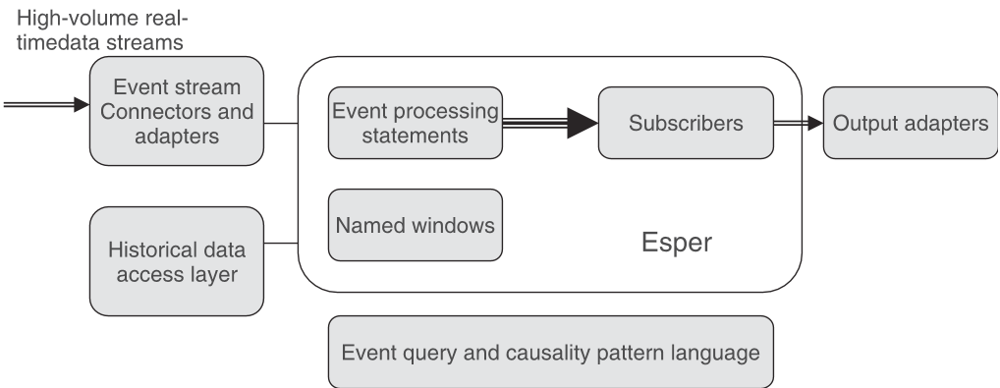

>图 12.8 Esper 系统概览。

Esper 系统组件。连接器和适配器管理传入的高容量
数据流。然后流由核心 Esper 系统处理，并与使用事件查询和因果模式
语言创建的事件处理语句进行匹配。还有一个历史数据访问层，存储与
窗口相关的事件。输出数据流和事件然后被转发给 subscriber。传出
数据可以由输出适配器处理。

作为一个简单的 EPS 查询，我们可以考虑以下语句，它使用 Esper 内部时间戳通过对 7 秒的市场事件求平均来计算每秒速率：

select rate(7) from MarketDataEvent output snapshot every 1 sec

数据流也可以很容易地使用与 SQL 中 join 非常类似的结构连接在一起。为了组合两个数据流，需要识别 join 键。然后可以将连接后的流作为单个流处理。例如，给定欺诈警告和账户取款两个流，它们可以在给定时间段内基于账号进行组合。这允许检测从涉嫌欺诈的银行账户中取款。

Esper 在设计时考虑了性能问题。关键考虑因素包括：

• 复杂的检测规则，如事件关联、滑动窗口（时间、长度、排序等）、连接事件流、各种事件流操作、使用交集和并集语义组合窗口、基于事件缺失的触发器等。

• 需要处理每秒数万甚至数十万事件的应用的高吞吐量。

• 需要实时响应事件的应用的低延迟。

作为 CEP 的一个例子，我们可以看看*算法交易*，它在过去十年中变得越来越流行 [3]。算法交易的动机是最小化订单执行中的交易成本以及能够尽可能快地对市场动态做出反应。算法还可以通过将买入或卖出操作分成更小的部分来隐藏它。

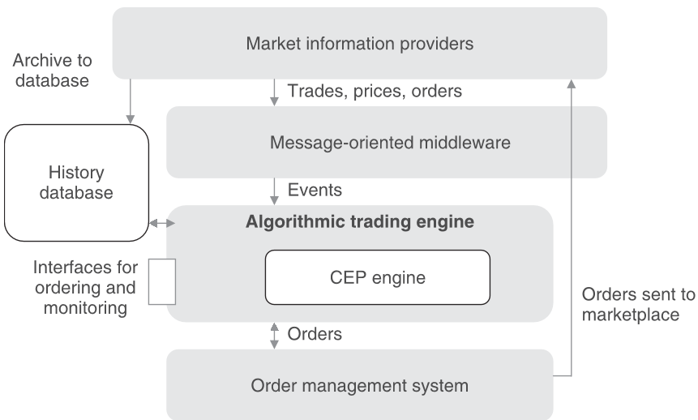

>图 12.9 算法交易。

图 12.9 展示了一个算法交易系统示例。面向消息的 middleware 将系统的不同组件连接在一起。通常使用 XML broker 来实现消息传递系统。市场信息提供商以事件形式向算法交易引擎发送有关交易、价格和订单的信息。这些也被归档到历史数据库中。CEP 引擎是系统的核心，负责通过监控事件然后触发操作来实现期望的行为，通常是对订单管理子系统的订单。

## 12.6 在线广告

在线广告是 pub/sub 系统的一个新兴应用领域。图 12.10 展示了该应用领域的关键组件。内容 broker，例如上面提到的 XML broker，负责在广告活动和用户档案之间进行匹配。广告商定义针对特定用户群的广告活动。类似地，用户具有关联的用户档案，定义用户组和其他相关信息，例如用户的位置。broker 然后可以基于广告活动信息和用户档案向用户定向广告。此应用还需要 pub/sub 之外的额外机制，例如用于存储内容的数据库以及保护消费者免于暴露隐私敏感信息的隐私增强技术。

第 8 章中讨论的匹配算法可用于在在线广告中将广告与用户匹配。布尔表达式可以表示广告商的定向要求，用户档案中的属性表示访问在线页面的用户。同样的模型也适用于其他类型的数字广告，例如移动环境中的上下文感知广告。

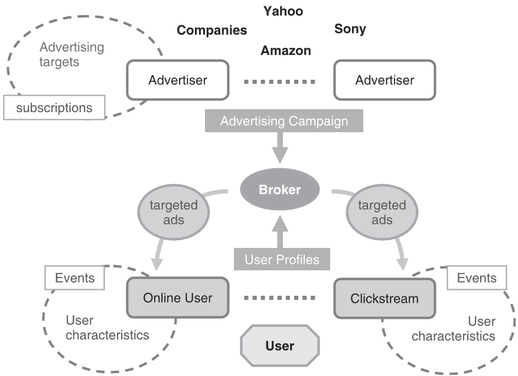

>图 12.10 使用 pub/sub 的内容广告。

这种广告系统的工作方式如下：

• 广告系统向 pub/sub 系统发送 subscription。subscription 表示它们的定向要求。例如，subscription 可能指定网站的特定部分（URL）、特定时间、特定年龄组、性别、访问模式等。

• 每次用户访问网页时，pub/sub 系统接收一个事件，指定相关页面和用户特征。pub/sub 系统然后将事件与 subscription 匹配并通知匹配的 subscriber。pub/sub 系统可能能够在时间上关联事件以匹配与访问模式相关的查询。

• 广告系统收到通知，特定 subscription 有匹配事件，广告商可以为用户生成特定广告。广告通常由特定广告服务器提供，然后需要通知该服务器应显示某个广告。广告决策应该快速完成，以便用户在页面加载结束时看到广告。

pub/sub 内容匹配系统需要支持表达性过滤、布尔表达式，以支持广告定向。可能还需要复合事件检测和事件聚合，以定向经常访问某些页面的用户。匹配过程需要快速，以便在网页显示的同时显示广告。

## 12.7 在线多人游戏

Pub/sub 是在线多人游戏的构建块。pub/sub 的异步和实时特性非常适合此应用领域的需求。在多人游戏中，用户共享游戏世界的单个实例。游戏的每个参与者对游戏世界有有限的视图，并通过这个有限视图与世界和其他用户交互。游戏服务器或一组服务器负责管理游戏世界状态，然后通知参与者其可见游戏世界部分的相关变化。

基于以上描述，我们可以观察到 pub/sub 是支持分布式游戏世界管理的非常好的候选方案。在 pub/sub 术语中，游戏参与者订阅接收与游戏世界特定部分相关的事件。当他们的视图中发生有趣的事情时，他们会收到通知并相应地更新自己的本地状态。

图 12.11 展示了如何使用 pub/sub 实现多人在线游戏。玩家已订阅虚拟游戏世界的矩形区域。发布通常是内容空间中的一个点。在这种情况下，如果发布的坐标包含在订阅的区域内，玩家的客户端游戏引擎将收到通知，然后在渲染游戏世界时考虑该事件。

mercury pub/sub 系统是 Internet 游戏 pub/sub 架构的一个著名示例 [4]。该系统支持查询语言和基于 DHT 技术的分布式匹配。

### 12.8 Apple Push Notification Service (APNS)

Apple Push Notification Service (APNS) 是一项使信息推送到移动设备的服务。APNS 由 Apple 开发，于 2009 年随 iOS 3.0 发布。推送通知系统是 iOS Xcode 开发环境的一部分。该服务基于第 4 章中介绍的客户端发起长连接模式。客户端系统与 Apple 运营的专用推送服务器建立长连接。服务和应用开发者然后可以向 Apple 注册并通过 APNS 系统向移动设备发送推送通知。

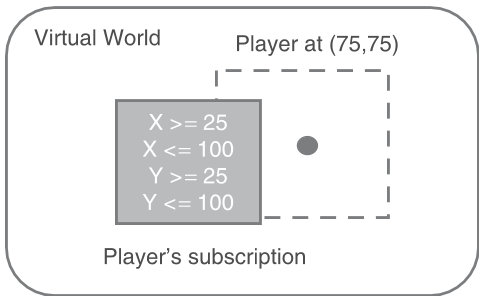

>图 12.11 带 subscription 的游戏世界示例。


>图 12.12 Apple APNS 服务。

APNS 使用涉及以下步骤：

1. 服务或应用开发者使用唯一的 SSL 证书连接到 APNS 系统。证书从 Apple 获取，使用开发者标识符和应用标识符。

2. 使用 APNS 向移动设备发送一条或多条消息。推送操作是应用和设备特定的，每个目标设备需要唯一的 deviceToken。

3. 服务或应用从 APNS 断开连接。

每条推送消息通过使用 APNS 系统为应用生成的唯一 deviceToken 寻址到特定设备。然后应用将此 token 提供给服务器。服务器端系统然后可以使用 token 和开发者推送证书向应用发送推送消息。Apple 提供了一个反馈服务，可以轮询获取无效设备 token 列表。

图 12.12 展示了推送场景，其中应用的服务器端组件使用 APNS 系统向移动设备发送消息。

APNS 系统有一些限制。有效载荷限制为 256 字节，因此它专为短警报消息和通知而设计。系统不提供有关消息传递的状态反馈。只有最后发送的消息将被排队等待传递，覆盖同一应用和目标的任何先前排队消息。消息仅通过蜂窝数据和 WLAN 传递。

### 12.9 Internet of Things

Internet of Things 是一个新兴环境，其中日常物品和设备相互发现并交换信息以实现各种高级服务。示例应用领域包括智能家居、工厂、结构监控和其他环境中的传感器信息传递和处理、物流、安全监控和医疗保健。图 12.13 展示了该环境的概览，包括两个由分布式传感器和执行器组成的无线传感器网络 (WSN)，以及通过 broker 与 WSN 交互的基于 Internet 的应用。在本书中，我们介绍了几种适合支持 Internet of Things 和 WSN 应用的消息传递协议，即第 5 章中的 DSS 和 MQTT 协议以及第 6 章中介绍的 CoAP。这些协议支持基本的基于消息的通信和基于 topic 的 pub/sub。

Pub/sub 是 Internet of Things 的良好候选技术，因为它支持实体的松耦合以及以数据和内容为中心的信息传播。

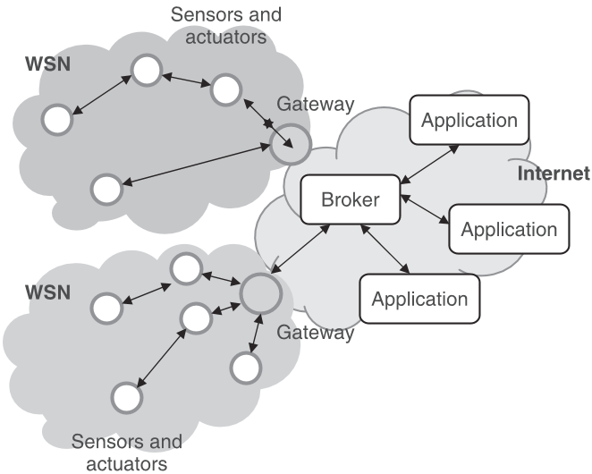

>图 12.13 WSN 环境概览。

我们讨论了几种适合此环境的研究系统，即第 9 章中考察的 REDS、GREEN 和 STEAM 系统。这些系统是为 *Mobile Ad Hoc Network (MANET)* 环境设计的，其中网络节点通过短程无线通信链路通信并且它们是移动的。

这意味着 pub/sub 系统需要应对无线通信环境并支持节点移动性。因此，许多传统解决方案，如反向路径路由，不能在此环境中应用。通用解决方案是设计模块化的 pub/sub 路由器，允许可插拔的路由和通信组件。这个模块化的 pub/sub 引擎然后可以适应各种环境，例如 Internet of Things 环境。

除了无线和移动特性外，还需要考虑传感器和执行器设备的有限资源。在这些小型设备上运行的 pub/sub 系统需要简单高效。传感器的受限特性通常导致多层设计，其中更强大的簇头或网关处理和路由传感器数据。网关还用于将不同的 WSN 部署连接到 Internet。两个基本协议 CoAP 和 MQTT 都是为小型和受限设备设计的，它们支持网关范式。

### 12.10 小结

本章讨论了 pub/sub 系统和技术的应用。Pub/sub 是一种常用的技术，用于在松耦合系统中连接组件。我们考察了 pub/sub 作为 cloud computing 平台、SOA 和企业应用通用 XML-broker、Facebook Messages 和 Chat、Pubsubhubbub、Complex Event Processing、在线广告和游戏以及移动环境的使能技术的角色。图 12.14 总结了本章考察的应用的关键观察结果。

| 应用|解决方案和模式|描述|
| ---|---|---|
| Cloud computing|消息队列、基于 topic 的通信、命名空间、复制和负载均衡、基于过滤器的队列消息检索、按使用付费|Pub/sub 用于在应用和系统组件之间中继事件。通常，为开发者提供基于 REST 和 SOAP 的接口，使用基于 token 的身份验证模型和按使用付费。示例包括 Azure Service Bus 和 Amazon SQS。|
| SOA|ESB、XML 路由和转换、SOAP|ESB 将应用服务器和应用组件连接在一起。典型协议包括 SOAP、REST 和 JMS。|
| Facebook Messages|层次化和基于集群的设计、无状态应用、使用 Erlang 改善并发性|Facebook 框架内的异步消息传递。高可用性、可扩展性和性能要求。通过 Facebook API 为开发者提供功能。|
| Facebook Chat 和 Messenger|多层和基于集群的设计、客户端发起连接、使用 Erlang 改善并发性、后端定期状态更新和聚合|Web 应用使用 AJAX long-polling，移动应用使用 MQTT。|
| CEP|通过系统中基于规则的有状态过滤器检测复合事件、CEP 语言|Rapide 语言和 Esper CEP 引擎。|
| Pubsubhubbub|通过 hub 去中心化、代理、客户端发起连接|通过 hub 提供的 API 支持 RSS 和 Atom feed 的及时传递和聚合。|
| 在线广告|事件路由和转发、基于内容的路由、实时通知|系统需要支持过滤引擎中的高维度。布尔表达式为广告引擎提供丰富的基础。|
| 在线游戏|事件路由和转发、基于内容的路由、实时通知|Pub/sub 用于更新分布式游戏世界状态并向游戏引擎实例发送异步更新。|
| Apple Push Notification|客户端发起连接、安全 token|系统通过长连接向运行 iOS 的智能手机推送小型通知消息。安全模型确保授权服务可以发送通知。|
| Internet of Things|轻量级 pub/sub 解决方案、基本消息传递和基于 topic 的路由、基于内容的路由、重配置|DSS 用于许多嵌入式和无线环境。基本协议包括 MQTT 和 CoAP。|

>图 12.14 示例应用总结。

Pub/sub 可用于各种应用领域和环境。设计和实现根据需求而不同，例如可扩展性、表达性、可用性等。然而，第 4 章讨论的基本模式是相同的。逻辑上集中的服务通常用于处理和传递事件，并接受 subscription。在本章中，我们考察了服务的不同设计，例如 Facebook 设计考虑了可扩展性和可用性要求，Pubsubhubbub 设计旨在为 Internet 提供去中心化解决方案，同时最小化通知开销和延迟。另一方面，移动解决方案基于轻量级设计，强调重配置和对操作环境的适应。

## References

1. Wu E, Diao Y and Rizvi S (2006) High-performance complex event processing over streams. Proceedings of the 2006 ACM SIGMOD International Conference on Management of Data, pp. 407–18. SIGMOD '06. ACM, New York, NY.

2. Luckham DC (2002) *The Power of Events: An Introduction to Complex Event Processing in Distributed Enterprise Systems*. Addison-Wesley, Boston, Massachusetts.

3. Lindström J (2010) Algorithmic trading and complex event processing. Master's thesis, Aalto University.

4. Bharambe AR, Rao S and Seshan S (2002) Mercury: a scalable publish-subscribe system for internet games Proceedings of the 1st Workshop on Network and System Support for Games, pp. 3–9. NetGames '02. ACM, New York, NY.

# 13 全新设计的数据中心 Pub/Sub 网络

在本章中，我们考虑了在网络层协议架构中引入 pub/sub 功能以实现高效的一对一和一对多通信的最新进展。我们考虑了两个最近的架构提案，即 *Content-centric Networking (CCN)* 和 *Publish/Subscribe Internet Routing Paradigm (PSIRP)* 以及 PURSUIT 架构。

## 13.1 数据中心通信模型


TCP/IP 协议套件随着当前 Internet 的惊人增长而良好扩展，但对于日益增长的在线视频消费和文件传输，它在安全性和可扩展性方面存在一些固有限制。因为任何人都可以将数据包寻址到命名目标主机的 IP 地址，不需要的流量仍然是一个问题。此外，当前大部分流量由主要想要共享命名数据的应用生成，它们的实现在当前针对消息传递优化的网络栈之上变得不必要地复杂。由于当前模型以提供内容的命名主机为中心，数据变得位置相关，网络可能并不总是使用最近的数据缓存副本。这限制了热门内容的可用性，因为它需要由特定容器提供服务。此外，数据的真实性与数据容器而非数据本身绑定，由于信任链中的额外步骤，这使得架构不灵活且安全性较低。

最近，从网络层开始从头重新设计 Internet 以解决上述问题的研究兴趣日益增长。多个项目采取的共同方法是数据中心的通信模型。本章简要介绍了两个著名项目及其架构，Content-Centric Networking (CCN) 和 PURSUIT。数据中心模型可以被视为一种特殊类型的基于 topic 的 pub/sub，其中每个 topic 是一个不可变数据项或内容块的名称，可能向网络提供。Subscriber 可以向网络表达对某个名称的兴趣，网络然后在数据可用时返回关联的数据项。

>Publish/Subscribe Systems: Design and Principles, First Edition. Sasu Tarkoma.

>© 2012 John Wiley & Sons, Ltd. Published 2012 by John Wiley & Sons, Ltd.

看待数据中心网络的另一种方式是将其视为与当前 Internet 传统消息传递相比发送者和接收者之间控制权的反转：不是使用 IP 地址、TCP 端口和协议特定数据来识别远程延续（发送者可以通过发送消息触发），而是接收者表达其对已标识数据项的兴趣，网络然后可以在数据可用时返回它。这样网络可以利用多播和缓存来提高链路资源利用率并最小化延迟。接收者驱动模型还有一个额外优势，即可以开发针对不需要流量（如带有有效载荷数据包的分布式拒绝服务 (DDoS) 攻击）的强有力对策。

一般来说，网络提供的数据中心通信原语简化了需要在多个节点之间共享相同内容的应用，而消息传递则适用于需要由多个实体操作的有状态远程对象。[1] 中解释了延续和数据值之间存在深层对称性，这由这两种通信范式反映。术语 *Content-centric* 也用于描述这种通信模式，当重点放在高效内容传递上时，而 *information-centric* 可以互换使用，以指出数据项可以链接到其他命名数据并且数据具有结构。

### 13.1.1 数据命名

命名在数据中心网络架构中起着重要作用，因为它渗透到系统的所有方面。通常，命名和路由设计是耦合的，许多方法可以分为两类，基于它们是否针对实际有效载荷通信之前的额外名称解析阶段进行优化，或者路由是否直接基于名称。例如，名称可能包含限制，如层次结构或嵌入的位置信息，这使得基于它们优化路由成为可能。还有许多其他维度可以比较不同的标识符结构和语义，如标识符的生命周期、对象的（不）可变性、信任模型、人类可读性等。在以下小节中，我们将介绍 CCN 和 PURSUIT/PSIRP 架构中的命名。

#### 13.1.1.1 CCN

CCN [2] 使用不透明的二进制对象，具有明确指定数量的有序组件，以图 13.1 所示的层次方式命名内容块。这些名称允许匹配简单发布集的 subscription，同时允许命名尚不存在的数据块。这些活动名称例如是动态生成内容所需要的，除了静态网页外广泛使用。层次名称前缀也可用于上下文相关名称，如 /ThisComputer/freeMemory。这具有使某些命名方案简单的优势，因为运行时不需要复杂的枚举或探测策略 [2]。名称可以是人类可读的，仅对栈中的某些较高层有意义，但网络不需要理解它们。可以加密名称以保护隐私，但一般来说，数据中心模型在保护数据完整性方面比机密性更自然，因为没有 publisher 定义的接收者集的概念。实际上，publisher 不知道接收者更可取，以便具有可扩展性。

人类可读的层次名称：

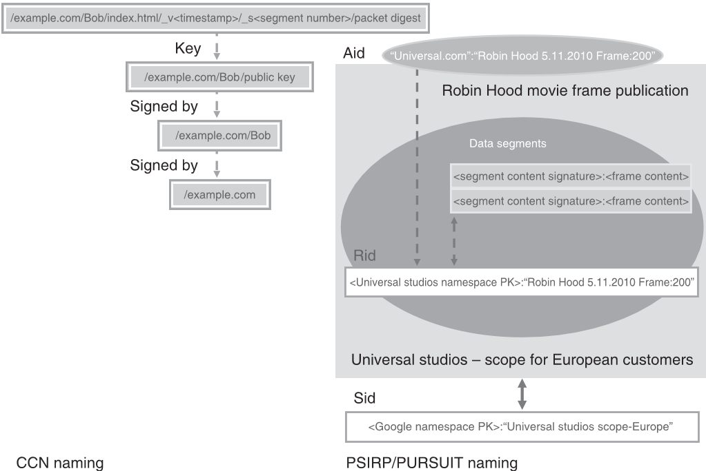

>图 13.1 CCN 和 PSIRP/PURSUIT 名称并排比较。

CCN 名称也与层次 URL 直接兼容。单个发布始终是不可变的，但名称可以包含可变数据的版本号和大型内容块的段号。名称的 SHA256 摘要可由链接用于明确标识任何内容。然而，对于动态数据，需要完整名称才能到达数据源，因为它可能编码生成请求内容所需的信息。层次名称可以按字典顺序排序，这使得请求数据项的最新版本变得简单。例如，带有 RightmostChild 注释的 "/example.com/video.avi" 请求匹配 "/example.com/video.avi/version_2/segment_0" 而不是 "../version_1/.."。然而，在此模型中必须到达原始数据源，以确保不存在匹配要求的更新发布。

#### 13.1.1.2 PSIRP/PURSUIT

PURSUIT 延续了 PSIRP 项目的工作，我们这里的解释基于 [3, 5] 中解释的工作路线，这只是抽象 PURSUIT 功能模型的一种可能实现。此架构中的所有标识符具有类似的自认证、两层、类 DONA 结构 [6]。标识符是一个 $(P, L)$ 对，其中 $P$ 是标识符命名空间所有者的公钥，$L$ 是自由格式二进制数据的可变长度标签。

网络中仅使用标识符的固定长度哈希来标识发布，但动态生成内容需要可变长度名称，其中标签编码数据源用于即时生成发布数据的参数。假设每个命名空间由其所有者管理，这就是为什么不需要管理标签的集中实体。可变长度标签可用于函数编程范式中函数值的记忆化，如标签 "weather(Helsinki,19.11.2011)"，这可能难以以通用方式映射到仅使用固定长度标识符的解决方案。可能存在无限数量的此类潜在发布，它们不能事先单独通告。自认证通过命名空间所有者授权 publisher 在命名空间中发布特定标签集来实现。实际内容段然后由 publisher 签名，从命名空间所有者公钥开始的证书链包含在每个有效载荷数据包中。

因为发布是不可变的，网络始终能够使用有效的缓存副本（如果在本地找到），而无需考虑数据的新鲜度。除了改善延迟外，此假设增加了许多应用的并行计算和可扩展性机会，因为不需要全局连接可用或需要联系原始数据源（可能成为瓶颈）。该模型与函数编程兼容，其中名称也绑定到不可变值以及函数值。

可变文档可以通过在标签中嵌入版本信息来实现，并可能使旧版本流仍然可用。这种在标签中"显式管道"稳定身份信息的类型通常应该推荐，因为发布可以独立处理，并且关于数据语义的所有假设都容易可见。不直接与发布身份关联的其他元数据应存储为独立的元数据发布。

作为流式传输如何映射到此模型的具体示例，可以考虑一个简单的游戏应用，其中每个用户将其头像坐标作为版本流发布。Rid 可以是 (<gameserver namespace public key>, "Avatar X coordinate version Y") 的形式。这种命名方案留下了确定最新坐标的问题。这可以通过一个额外发布轻松解决，该发布的标识符标签部分包含当前时间。此发布的内容然后具有当时可用的最新坐标版本。同样的方案可用于将流实现为版本化数据。因为 subscriber 可以在发布之前抢先订阅多个版本，所以此映射不会引入额外延迟。此外，多对一的消息汇聚也可以通过将 subscriber 的身份和当前时间包含在 Rid 中并订阅此 Rid 来轻松实现。这样，subscription 被中继到数据源，数据源可以使用标识符中的信息来订阅 subscriber 发布的发布流。

### 13.1.2 内容安全

我们在这里介绍的两种技术都以*位置无关*方式标识数据项，而不是使用位置信息寻址主机或数据容器。从 subscriber 的角度来看，这将重点从*哪里*转移到*什么*，因为任何人如果拥有数据就可以提供所需数据。这种观点的转变也包含了基于内容的安全方法：数据本身为完整性而保护，信任在 subscriber 和内容的原始生产者之间。与 subscriber 类似，缓存和中间节点也可以从任何来源按每个数据包本地验证数据。热门数据的可用性得到改善，因为多个数据源可以自然地用于向网络提供数据。

在 CCN 和 PURSUIT 中，所有内容块都可以通过在每个数据包中存储绑定名称和内容的签名来使用公钥签名进行认证。完整性检查可以对每个数据包独立进行，因为 PURSUIT Rid 包含 Rid 所属命名空间的公钥。我们称此类标识符为自认证的。另一方面，在 CCN 中，签名的数据包携带足够的信息以通过包含足够的信息来允许检索验证所需的公钥而可公开认证。在 CCN 中，信任模型是上下文相关的，因为不存在每个人都信任每个应用的单一实体。密钥只是 CCN 数据，内容可以用于认证其他内容。这可以与层次名称结合使用，例如，名为 "example.com" 的密钥用于签名另一个名为 "example.com/Bob" 的发布，该发布包含用于签名 Bob 发布的内容的密钥。这遵循 SDSI/SPKI 的信任模型，其中密钥使用本地控制的命名空间映射到身份，无需外部可信第三方。

CCN 和 PURSUIT 还支持*安全引用*，可以通过其内容的加密摘要而非仅名称引用另一个数据项。当被引用的内容在创建引用之前存在时，这是可能的，并且与使用的加密哈希函数一样安全。当无法使用这种更安全的方法时，始终存在泄露密钥的问题，这将使自认证标识符不安全。传统的密钥管理问题，特别是将现实身份映射到网络层使用的公钥，也必须在应用层解决。没有适合所有应用需求的单一解决方案，因此尝试以通用方式解决此问题没有意义。PURSUIT 采取了这样的理念：Rid 只是数据的网络级身份，可能没有长生命周期。需要某种应用级命名方案用于此类持久标识符，以及另一种将应用级标识符映射到 Rid 的机制。CCN 通过使用层次名称为密钥管理问题提供了部分解决方案，其中对顶级上下文的信任可以基于不同机制，如可信密钥的手动配置，然后层次地检查到各个数据项的信任链。

PURSUIT 引入了额外的 scope 概念，每个发布操作也确定发布发生的 scope。信息的 scope 划分与由命名方案形成的信息结构和引用其他数据项的数据项正交。相反，scope 确定其内部发布的全局分发策略。这具有额外的安全好处，即 subscriber 可以将其对分发策略的信任与对内容的信任分开。例如，在不受信任的 scope 内，某些第三方数据源可能错误地通告它们不打算提供的数据，以使 subscriber 无法获取数据。CCN 不能通过简单地使用来自原始 publisher 凭证的数据源来解决此问题，因为这限制了机会性地使用第三方数据源。

## 13.2 CCN

CCN 旨在保持 TCP/IP 的简单性和使其成功的设计选择。在 CCN 中，网络"腰部"转发简单的内容块并在网络中路由兴趣信息。熟悉的想法是，这个非常简单的核心功能可以在不同类型的分发策略和链路技术之上运行，任何东西都可以在 CCN 之上运行。在域内情况下，CCN 应该只需对基于 IP 的网络进行少量修改即可工作。只是网络节点应该能够使用相同的算法来路由 Interest 数据包并以简单方式在反方向转发 Data 数据包，而不是路由 IP 数据包。

### 13.2.1 CCN 节点操作

CCN 有两种数据包类型，*Interest* 和 *Data*，如图 13.2 所示。每个节点通过其所有可用连接广播匹配其希望接收的内容块的 Interest 数据包。在网络级 API 之下，有一个策略层指导 Interest 数据包分发的操作。数据沿与 Interest 数据包相反的方向流动，待处理的兴趣被认为由匹配的内容消费。如果原始 Interest 数据包中携带的名称是数据包中名称的匹配前缀，则 Data 数据包满足待处理的兴趣。这种名称聚合类似于 DNS 或 IP 层次结构，已被证明在 Internet 规模的路由和转发状态方面是可扩展的，同时允许快速查找。

CCN 节点的示意结构在操作上接近 IP 路由器：数据包到达节点的接口，后续操作由查找表中的最长前缀匹配确定。假设每个节点至少实现以下三个抽象数据结构：

![图 13.2：CCN 数据包格式 [2]](images/figure-0114.png)

>图 13.2 CCN 数据包格式 [2]。

1. Forwarding Information Base (FIB)，

2. Content Store，和

3. Pending Interest Table (PIT)。

FIB 用于将 Interest 数据包路由到一个或多个潜在数据源。兴趣信息的潜在多播允许并行查询，这与 IP FIB 形成对比，否则操作类似。节点可以使用不同的链路特定策略来路由 Interest 数据包。例如，本地无线网络中的笔记本电脑可以简单地向彼此广播其兴趣，从而在与全局网络的连接中断时继续通信。CCN 项目的最终目标是指定一个抽象机器，可用于运行实现*策略层*以路由 Interest 数据包的程序。在 [2] 中报告的当前研究系统中，兴趣默认发送到所有具有 *BroadcastCapable* 属性的接口，之后，如果没有响应，则按顺序尝试所有其他可用接口。此策略允许在回退到默认全局路由方法之前从本地源查询。CCN 在实际有效载荷通信之前没有任何单独的会合功能或阶段来查找数据，如 PURSUIT 中那样。

为了最大化多播潜力，Content store 在将接收到的数据包服务到传出接口后，使用 LRU 或 LFY 缓存替换策略尽可能长时间地将其存储在缓冲区中。基本上所有节点都可以参与网络中热门数据的机会性缓存。

PIT 数据结构存储来自不同入站接口的待处理兴趣，用于将数据向下游转发回 subscriber。可以认为路由的 Interest 数据包首先留下存储为 PIT 条目的"面包屑"痕迹，数据然后沿反方向跟随并在遍历它们时消费存储的面包屑。多个完全匹配的 subscription 只存储一次，当通过多个接口接收到相同兴趣时，只有新接口被添加到 PIT 中存储的列表，形成多播结构，只为多个 subscription 消费一次资源。每个路由器还可以在将数据存储到 Content store 之前执行数据验证。此策略消除了许多类型的缓存投毒攻击和不需要的流量。

存储在 PIT 中的所有数据都被视为"软状态"，意味着如果内存耗尽，它可以超时并被擦除。这遵循"命运共享"设计原则 [7]，基于 subscriber 最终是唯一负责确保接收其感兴趣数据的实体。如果 Content Store 已经有匹配新到达的 Interest 数据包的 Data 数据包，它立即向下游服务，无需进一步路由 Interest 数据包。如果 FIB 没有 Interest 数据包内 *ContentName* 的条目，并且请求的数据未存储在 Content Store 中，Interest 数据包将被简单丢弃，因为路由器没有处理它的规则。

### 13.2.2 CCN 传输模型

假设底层数据包网络是不可靠的，例如由于移动设备的间歇性连接：Interest 和 Data 数据包都可能在传输中丢失或损坏。因此，subscriber 需要在一定超时后重新传输 Interest 数据包。发送者在 CCN 中是无状态的，所有流管理由接收者完成。特定策略可能取决于接收者。例如，创建多少兴趣副本由使用的策略决定，先前的响应时间可以用作确定在哪里路由后续请求以获得最佳结果的启发式方法等。类似地，中间链路可以有自己的策略，CCN 中的操作始终是本地逐跳决策。为了防止循环的 Interest 数据包重复（Data 数据包在 CCN 中不能循环），它们包含一个随机 *nonce* 值，以便在接收到一个时可以丢弃重复数据包。

因为一个 Interest 数据包最多检索一个 Data 数据包，所以说网络中保持了流平衡：基本上接收者可以使用待处理 Interest 的数量来控制某一时刻最多可以有多少数据包在传输中，类似于 TCP 窗口大小通告。因为每个数据包独立订阅，在数据包丢失的情况下不需要其他机制（如 TCP SACK 机制）来保持数据包流的高效。

在 CCN 中，所有通信被认为是本地的，除了逐跳流平衡外没有端到端拥塞控制功能。假设路径上的路由器有足够的缓冲内存来存储所有飞行中的数据数据包，这保证了拥塞情况下的最终进展。据称使用 LRU 策略而非 FIFO 队列解耦了逐跳反馈控制回路并抑制了振荡 [2]，从而使端到端拥塞控制变得不必要。另一方面，延迟仍可能无限增长，网络资源也未优化，还为 Interest 数据包 DDoS 攻击打开了向量。排序由名称的层次结构处理，因为名称可以包含段编号；然而，其具体细节是应用层关注的问题。

### 13.2.3 Interest 路由

对于域内路由，IS-IS 和 OSPF 都支持通用类型标签值 (TLV) 方案，与分发数据源通告的 CCN 内容前缀兼容。CCN 命名的一个优势是，由于它与 IP 前缀路由相似，实现 CCN 转发模型的路由器可以使用 IS-IS 或 OSPF 连接到现有网络而无需修改网络。然而，在相同前缀的多个通告情况下，在 CCN 中 Interest 数据包需要发送到所有通告者，而不是像 IP 中那样只发送到一个。这是因为 CCN 通告的语义是"通过我可以到达具有此前缀的某些内容"。

CCN 尚未提供可扩展域间路由的任何解决方案。基本上，当前 Internet 中使用的 BGP 支持等效的 IGP TLV 机制扩展，域可以使用它来通告其提供的内容前缀，但这主要是因为 IP 地址用于可聚合位置而具有可扩展性，从而大大减少了 BGP 路由表的大小。随着多宿主和移动性变得越来越流行，CCN 的位置无关、可能人类可读的名称是否可以扩展到用于域间路由是一个开放问题。例如，活动 DNS 域名的数量比当前全局 BGP 表的大小大两个数量级，要求聚合限制了 CCN 名称的可能用途。

### 13.3 PSIRP/PURSUIT

在 PURSUIT 中，publisher 可以在*会合标识符* (Rid) 和数据值之间创建不可变关联，此关联称为发布。*数据源*然后可以在一组 *scope* 内发布该发布，scope 确定其内部发布的分发策略，如访问控制、网络资源、路由算法、可达性和 QoS，并可能支持数据中心通信的特定传输抽象策略，如复制和持久性。Scope 由具有与 Rid 类似结构的名称标识，这些标识符称为 *scope 标识符* (Sid)。

假设网络由域组成，域封装了链路、存储空间、路由器中的处理能力和信息等资源。域的概念在这里非常通用，可以指任何粒度的抽象，如软件组件、单个节点或 AS。Scope 和域在某种抽象意义上是彼此的概念逆：域引入可用于实现通信事件的资源，而 scope 基于某些要求消除可能的资源。

节点的上图是潜在资源的集合，可以表示为域及其连接的网络映射，节点基于其与服务提供商之间的契约可以访问这些资源。PURSUIT 项目中开发了一种称为高级网络描述语言 (ANDL) 的语言，用于以抽象和通用的方式在控制平面发布中通信可达性信息。

上图映射中的链路抽象地表示资源，可以限制为仅在其上承载各种传输抽象或协议。每个传输协议实现特定的通信抽象，每个实际化的交互或通信事件实例消耗网络资源始终具有关联的传输（通信抽象）、topic、graphlet 和参与传输的不同节点的一组角色。例如，数据中心 pub/sub 传输中端点的角色是数据源和 subscriber。Topic 由 Rid 标识，用于由通信发生的 scope 在正确的交互实例中匹配端节点。例如，对于数据中心通信，topic 标识请求的发布。

Graphlet 定义用于有效载荷通信的网络资源，它可以是从 IP 数据包路由到专用虚拟电路的任何东西。某些协议可能需要额外的资源分配阶段，以在通过给定 graphlet 描述的传递树进行实际有效载荷通信之前预留传递树。Graphlet 遵循一组 scope，这些 scope 负责将节点策略合规地匹配到交互实例、收集构建端到端路径所需的信息，以及对 graphlet 所选资源施加约束。Graphlet 然后连接一组端节点，每个端节点在传输中实现某个角色。当我们谈论一对多数据中心传输时，graphlet 称为*传递树*，它基本上是从数据源起源并以 subscriber 为叶子的多播树。

通信始终在至少单个 scope 内发生，但策略
可以分为由不同实体实现的不同 scope 模块化处理的通信方面。Scope 负责组合来自请求参与 scope 内交互实例的多个节点的上图信息 [8]，scope 选择遵循其策略的给定资源子集。应该注意，因为 scope 可以作为路由选择的中立第三方，它可以平衡端点之间的权力并将路径作为整体进行优化。

图 13.3 展示了 PSIRP/PURSUIT 架构此特定实例化的基本概念。应该注意，scope 和它接受的数据源之间存在双向授权。数据源需要授权 scope，以防止恶意 scope 构建通向它的路径以发起 DDoS 攻击。每个 subscription 指定 scope (Sid) 和发布 (Rid)。所选 scope 可以被认为回答数据应"如何"通过网络传递的问题，而 Rid 告诉 subscriber 对"什么"感兴趣。

### 13.4 Internet 域间结构

在为整个 Internet 设计网络架构时，有必要理解源于多方需求的复杂可扩展性、安全性和可部署性问题。Internet 由大约 30000 个自治系统 (AS) 以图形连接组成。每个 AS 封装一个具有自己路由策略的网络，通常由拥有资源的单个组织实体控制。AS 由 IANA 分配的 16 或 32 位 AS 编号标识。

AS 之间的大部分业务关系可以在逻辑层面归类为对等-对等、客户-提供商或兄弟-兄弟类型。也就是说，运营商通常相互形成双边契约，确定数据包如何路由。两个 AS 之间的对等关系意味着它们完全不进行经济补偿或为彼此交换的数据包支付更少费用，只要流量平衡在预定限制内或满足某些其他类似协议。当两个 AS 处于

![图 13.3：PSIRP/PURSUIT 概念 [2]](images/figure-0115.png)

>图 13.3 PSIRP/PURSUIT 概念 [2]。

客户-提供商关系时，客户向提供商 AS 支付数据包传输费用，通常基于流量随时间的某个函数。兄弟-兄弟关系是由同一组织管理的 AS 之间的关系，从策略路由的角度来看，通常可以被视为单个 AS。即使两个网络之间只有单一逻辑业务关系，大型 AS 通常通过地理分布的许多链路物理连接。图 13.4 展示了 AS 及其业务关系的示例子集。

AS 的连接度分布近似遵循幂律，这意味着在全球和国家层面，通常有少数运营商连接到数百个其他网络。Internet 核心由大约 12 个 tier-1 AS 组成，它们共同形成全网状并可以通过它们提供对整个 Internet 的完全可达性。tier-2 网络可以与其他网络对等，但为了完全可达性，它可能需要从一个或多个 tier-1 网络购买传输服务。大部分 AS，即所谓的存根，只连接到单个提供商，通常由企业和组织运营。只有大约 3000 个 AS 由 Internet 服务提供商 (ISP) 管理。

关于 Internet AS 结构的精确数据难以收集，因为并非所有对等关系都可以在全局 BGP 表中看到，运营商也不愿意透露其业务信息。然而，CAIDA [9] 使用 BGP 信息和从 traceroute 收集的数据来构建 AS 业务关系的推断映射。在更近期的研究 [10] 中，使用跨 110 个提供商的 3000 多个对等路由器分析了 2007 年至 2009 年超过 200 Exabytes 的商业域间流量。这是 Internet 总流量的重要百分比，从这些发现可以说，AS 的预期层次结构最近有所变化。核心 tier-1 运营商失去了一些重要性，因为内容和客户已整合到大型 tier-2 网络中，如 Google、大型 CDN（Akamai、LimeLight 等）或 Comcast，它们围绕核心直接相互对等。一般来说，Internet 似乎连接更密集，而不是骨干运营商、区域接入和本地接入运营商的层次结构。然而，AS 的流量分布仍近似幂律分布，但很明显，Internet 中的这些持续变化可能导致新商业模式的出现。

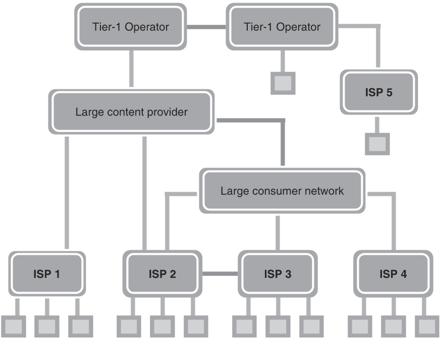

>图 13.4 当前 Internet 中的 AS 关系包含客户-提供商链路和对等-对等链路。此示例中未显示兄弟关系。

### 13.4.1 策略路由问题

在域内路由中，整个网络可以被视为由单个逻辑实体控制，路由可以基于某些全局指标（如延迟、吞吐量、容错性和/或公平性）的优化，但这在域间情况下不能直接实现。涉及的主要利益相关方是运营商、其客户和政府，政府可以监管前两者，它们都有自己的目标，可能相互矛盾，形成博弈 [11]。一般来说，运营商想要最大化其长期利润，而终端用户对其从网络获得的端到端服务质量感兴趣。政府可能出于安全原因对路由施加限制，例如要求运营商收集和存储用户信息。它们也可能关心网络为其公民产生的总体福利。

上述利益相关方的目标通常是矛盾的，但通过使用契约和补偿，客户能够使用其提供商网络的资源进行端到端通信。这些安排是网络外部的，不能仅从网络拓扑推断，这意味着网络架构必须允许策略信息的手动配置。例如，路由决策可以基于使用数据包来源、使用的协议、服务质量和路由成本作为输入的规则。这产生了如何

1. 以表达性方式表示路由策略；

2. 以高效和可扩展的方式分发拓扑和路由信息；以及

3. 保证所涉协议稳定运行

的技术问题。

域间路由协议试图以自己的方式回答这些问题，网络描述语言可用于策略的表示。然而，ISP 之间的博弈对可能的解决方案引入了一些约束，如许多网络资源所有者应获得其提供资源使用的市场价格补偿，运营商可能不会部署会降低其利润的技术 [12]。运营商的激励实际上限制了可以在其路由器中部署的策略类型。例如，如果没有某种外部压力或补偿，他们不愿意放弃利润、对资源的控制或信息。

从上一节解释的当前 Internet 结构可以得出，几乎所有策略合规路径都具有所谓的无谷属性 [13]，这意味着在 AS 业务关系层面，数据包始终首先遵循 0-n 个逻辑客户-提供商"上坡"链路，然后 0-1 个对等-对等链路，最后 0-n 个提供商-客户"下坡"链路。也就是说，每个 AS 级跳需要由通信端节点之一补偿。

AS 的典型路由策略是传入数据包首先路由到客户网络，然后通过对等链路，最后作为最后手段通过传输链路（如果目标地址可通过它们到达）。从提供商或对等 AS 向下流动的数据包仅路由到客户链路。这些简单策略直接遵循最小化每个提供传输的 ISP 支出的目标：通过对等链路发送的每个数据包都会影响对等契约中规定的流量平衡，通过传输链路发送的流量直接花费金钱，这两个选项都需要客户向其提供商补偿。例如，可以得出，可用的最短路径（定义为最少的 AS 级跳数）通常不被使用。

路由策略的时间粒度通常比流量工程（尤其是拥塞控制）运行的尺度粗得多。然而，策略可能在一般层面影响这两者并指导其操作。

## 13.4.2 PURSUIT 全局会合

PURSUIT 架构不规定全局会合功能的单一结构，而只指定会合操作所需的数据类型和发布命名方案。假设竞争实现可以并行部署，因为没有单一解决方案可以满足所有应用。[4] 中引入了全局会合的可能两层架构。它将数据中心 pub/sub 原语实现为递归层次结构，首先将节点本地会合实现加入会合网络 (RN)，然后使用称为 Canon [14] 的层次 Chord DHT 将 RN 加入全局会合互连 (RI)，如图 13.5 所示。假设 Canon 虚拟层次结构基于 AS 形成的契约在 Internet AS 图之上形成，并如 [4] 中解释的那样松散地优化通信的局部性。

RN 可以例如使用 DONA [6] 实现来实现。在另一个维度上，会合系统被分为通用的*会合核心*和特定 scope 的 *scope home* 实现，为如下节所述的一组 scope 实现功能。

### 13.4.2.1 会合核心

在层次的每个级别，会合核心提供到托管给定 scope 的大约最近 scope home 的 overlay anycast 路由。每个 subscription 消息包含 subscriber 希望接收其内容的发布的 (Sid,Rid) 元组。会合核心中的每个节点可以缓存先前会合操作的结果，并立即沿会合消息的反向路径将答案路由回 subscriber。

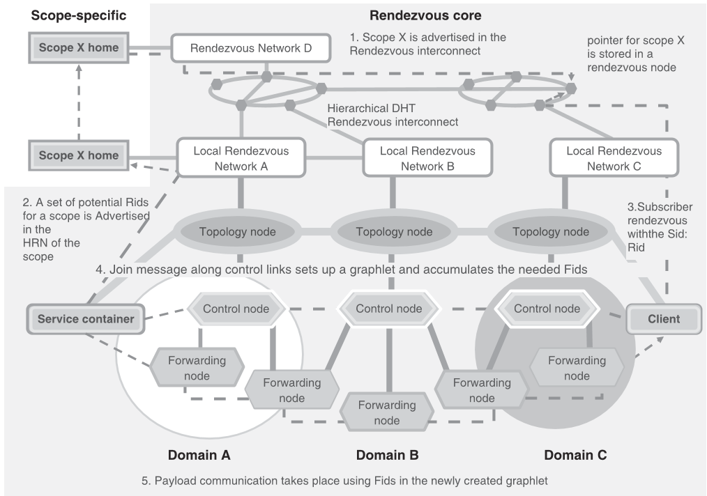

>图 13.5 PSIRP/PURSUIT 通信阶段。

每个会合消息首先基于相关 scope 的 Sid 哈希层次地路由到存储 scope 指针的会合 overlay 节点，然后指针将请求重定向到已向会合核心通告 scope 指针的大约最近 scope home。数据源的发布通告类似地最终路由到最近的 scope home，除了 (Sid,Rid) 对外还包含发布的内容。scope 然后存储发布的内容，以便之后可以服务请求它的 subscriber。根据命运共享原则，发布和 subscription 消息都需要定期重复，以保持发布数据或待处理 subscription 活跃。此数据中心请求-响应 anycast 路由原语是会合核心实现的唯一功能。[3] 中给出了此架构使用的安全机制的详细描述。

### 13.4.2.2 Scope 实现

Scope 可以有不同的实现。当在会合核心中找不到缓存结果时，
subscription 到达 scope home，然后如果它有足够可用的信息，可以动态
生成响应。可以通过在请求的 Rid 中包含版本号来避免缓存。每个 scope 实现可以由 scope 所有者添加更多 scope home 节点来扩展，这些节点可以在内部实现自己的协调协议。应该注意，*慢路径*控制平面 overlay 会合不用于传输大型发布，但此类应用应通过向数据平面添加数据中心传输来支持，如 [5] 中描述的那样。

### 13.4.2.3 通信阶段

每个希望通信的节点首先请求用于 graphlet 形成的端到端快路径资源的描述。这通过订阅给定 scope 内标记为 "<Topic_Rid>, <UN>, t" 的发布来实现，其中 UN 是命名节点 ANDL 上图映射的 (Sid,Rid) 对，t 是当前时间。如果执行上图合并的 scope 是访问控制的，则订阅的标签还包括节点身份。上图数据本身由 subscriber 的 ISP 发布。因为许多节点共享相同的上图，会合系统在 scope home 附近正交地缓存它们。类似地，会合结果自动缓存和重用，如果同一域中的另一个节点请求相同服务。ANDL 映射也可以链接到其他映射，完整映射可以从较小的发布递归构建，这最小化了通信量，因为只需要传输相关信息。

典型的操作序列如图 13.5 所示。在 scope 内成功会合后，客户端返回关于其可用于传递树形成的端到端资源的 graphlet 信息。然后使用单独的资源分配协议（如 [5] 中描述的）通过 graphlet 定义的域设置传递树。资源分配层可以产生例如一组安全转发标识符 (Fid)，如 zFilter [15]，数据源或中间网络内缓存可以将其用作不透明能力，以安全地访问创建的传递树而不影响网络的其余部分。zFilter 概念基于数据包内 Bloom filter，用链路标识符集编码多播树。

[5] 中解释了域内架构中传递树形成的更详细示例，其中处理特定传输抽象的专用节点可以分散在网络中。域的拓扑管理器节点只是在平衡每个节点负载的同时将携带给定传输的数据包路由通过兼容节点。在数据中心通信的情况下，在域级别反方向创建传递树的 subscription 消息在每个域中通过*分支节点*路由，该节点实现带缓存的时间解耦多播所需的传输逻辑。这意味着传输功能甚至不必以骨干线速度运行，因为在传递树路径上的每个域内将流多路复用到多个节点。

### 13.5 小结

在本章中，我们考察了受 pub/sub 范式启发的新网络架构提案的两个最近示例。CCN 提出了一种新的网络架构，其中命名方案基于层次的、二进制编码的、人类可读的名称，旨在取代 IP 地址和 DNS 名称。名称由多个组件组成，最顶层是全局可路由的，最后一个是实际数据的 SHA256 摘要。数据包是幂等的、自标识的和自认证的。PSIRP 是一个 FP7 资助的合作研究项目，目标是开发、实现和验证基于 publish-subscribe 通信范式的信息中心互联网络架构。

| |层 (OSI)|底层传输|API|命名空间|自认证|接收者驱动|关键应用|
| ---|---|---|---|---|---|---|---|
| DONA|L4-L7|TCP/IP|Anycast|扁平|是|否|内容发现和传递|
| CCN|L3|不可靠数据传输、流控制|基于名称（带租约）|层次|名称可认证|是|内容传递、语音|
| PSIRP|L2-L7、无层|Ethernet、TCP/IP 和 PLA|Pub/sub 和基于元数据|各种、递归|是|是|内容传递|
| Internet Indirection Infrastructure (i3)|L7|TCP/IP|基于触发器|扁平|是|是（也支持发送者驱动）|各种|
| Haggle|无层|基于数据包 (TCP/IP)|基于元数据|ADU、用户级名称|可能|是、机会性交互|移动分发、延迟容忍应用|
| Siena|L7|TCP/IP|Pub/sub|基于内容|否|是|事件分发和内容传递|
| Scribe 和其他基于 DHT 的系统|L7|TCP/IP|Pub/sub|基于 topic 或内容|各异|是|事件分发和内容传递|

>图 13.6 全新设计和 overlay 技术的比较。

图 13.6 将 $\dot{\text{CCN}}$ 和 PSIRP 与其他类似系统进行比较，如 DONA、i3、Siena 和基于 DHT 的 pub/sub 解决方案如 Scribe。这些系统可以基于协议栈中的级别、使用的底层传输协议（例如 TCP）、API 功能、命名空间和寻址模型、安全属性（如自认证）、数据包传递控制如何分布以及系统的关键应用来考察。我们可以观察到，所有这些系统都是接收者驱动的，它们赋予接收者选择通过网络传递什么内容的权力。这些系统是为各种层设计的。CCN 和 PSIRP 是所谓全新设计解决方案的示例，不一定假设使用 TCP/IP。DONA 是 shim 层解决方案的示例，用 anycast 和缓存支持扩展传输级 API。Siena、i3 和基于 DHT 的解决方案是应用层 overlay 的示例，通常在 TCP/IP 之上实现。

FP6 Hagggle$^\dagger$集成项目正在为具有间歇性网络连接的环境开发新的自主网络架构 [16]。Hagggle 利用自主机会性通信。提出了与现有 TCP/IP 协议套件的根本性偏离，完全消除了数据链路层之上的分层。

>\(\underline{1}\) www.haggleproject.org.

Haggle 使用应用驱动的消息转发，而不是将此责任委托给网络层。

PSIRP 与 Hagggle 共享需要新网络栈的愿景。项目之间的主要区别包括 PSIRP 专注于 publish/subscribe，以及 PSIRP 专注于开发 Internet 规模网络的架构，而非具有间歇性网络连接的环境。

## References

1. Filinski A (1989) *Declarative Continuations and Categorical Duality*. Master's thesis. University of Copenhagen.

2. Jacobson V, Smetters DK, Thornton JD, Plass MF, Briggs NH and Braynard RL (2009) Networking named content Proceedings of the 5th International Conference on Emerging Networking Experiments and Technologies, pp. 1–12. CoNEXT '09. ACM, New York, NY.

3. Lagutin D, Visala K, Zahemszky A, Burbridge T and Marias GF (2010) Roles and security in a publish/subscribe network architecture. ISCC'10, pp. 68–74.

4. Rajahalme J, Särelä M, Visala K and Riihijärvi J (2010) On name-based inter-domain routing. *Computer Networks Journal: Special Issue on Architectures and Protocols for the Future Internet*, pp. 975–86.

5. Visala K, Lagutin D and Tarkoma S (2009) LANES: An inter-domain data-oriented routing architecture. *ReArch'09*, pp. 55–60. ACM.

6. Koponen T, Chawla M, Chun BG, et al. (2007) A data-oriented (and beyond) network architecture. SIGCOMM Comput. Commun. Rev. 37(4): 181–92.

7. Carpenter B (1996) *Architectural Principles of the Internet Internet Engineering Task Force*: RFC 1958.

8. Tarkoma S and Antikainen M (2010) Canopy: publish/subscribe with upgraph combination. 13th IEEE Global Internet Symposium 2010, pp. 1–6.

9. The CAIDA AS Relationships Dataset, November 2009 (n.d.) http://www.caida.org/data/active/asrelationships/.

10. Labovitz C, Ikel-Johnson S, McPherson D, Oberheide J and Jahanian F (2010) Internet inter-domain traffic. SIGCOMM'10, pp. 75–86

11. Clark D, Wroclawski J, Sollins K and Braden R (2005) Tussle in cyberspace: Defining tomorrow's Internet. IEEE/ACM Transactions on Networking 13(3): 462–75.

12. Rajahalme J, Särelä M, Nikander P and Tarkoma S (2008) Incentive-compatible caching and peering in data-oriented networks. *ReArch'08*. ACM, 62:1–62:6.

13. Gao L (2001) On inferring autonomous system relationships in the Internet. IEEE/ACM Transactions on Networking 9(6): 733–45.

14. Ganesan P, Gummadi K and Garcia-Molina H (2004) Canon in G major: Designing DHTs with hierarchical structure. *ICDCS'04*, pp. 263–72. IEEE Computer Society.

15. Jokela P, Zahemszky A, Esteve C, Arianfar S and Nikander P (2009) LIPSIN: Line speed publish/subscribe inter-networking. SIGCOMM'09, pp. 195–206.

16. Su J, Scott J, Hui P, Crowcroft J, et al. (2007) Haggle: Seamless networking for mobile applications. Proceedings of the 9th International Conference on Ubiquitous Computing, pp. 391–408 UbiComp '07. Springer-Verlag, Berlin, Heidelberg.

# 14 总结与结论

### 结论

有许多方法可以对 pub/sub 系统进行分类，根据需求有许多使用可能性。在本书中，我们考察了许多创建 pub/sub 系统的最先进解决方案。我们观察到一种尺寸并不适合所有情况，需要模块化方法来构建通用 pub/sub 解决方案，以满足各种应用需求和操作环境。

我们考察了设计 pub/sub 系统的关键原则和模式。原则包括用于解耦组件的逻辑集中服务、用于接受 subscriber 兴趣的兴趣注册服务，以及用于选择性信息传播的过滤机制。主要特征包括相互对比的表达性和可扩展性。其他重要特征是简单性、模块化和互操作性。

事件通知有两种通用模式，即直接通知和基于基础设施的分布式通知。我们考察了这两类下的关键模式。观察者模式在对象之间设置一对多依赖关系，当被观察对象状态改变时，依赖对象自动收到通知/更新。事件通知者模式将观察者和中介者模式组合成逻辑集中的服务，完全解耦 subscriber 和 publisher，适用于分布式环境。分布式 pub/sub 系统遵循事件通知者模型。Pub/sub 也是单个设备内本地通信的重要范式。事件循环和本地事件 broker 是本地 pub/sub 系统的关键组件。例如，第 5 章中介绍的 Java 事件系统是本地系统的示例，后来扩展到分布式情况。

我们考察了当前的面向消息的 middleware 解决方案，如 JMS、DDS 和各种消息队列产品，以及面向研究的 topic 和基于内容的路由解决方案。面向消息的 middleware 和事件通知随着 CORBA Notification Service 和 DSS、Java Messaging Service 以及许多供应商的其他相关规范和产品而在行业中变得越来越流行。事实上，JMS 经常用于实现 Enterprise Service Bus 组件，DDS 是基于标准的关键解决方案，用于支持数据中心和实时通信的嵌入式和工业系统。

许多消息队列产品现在支持基于 XML 的解决方案，如 SOAP，作为传输选项之一。MQSeries、MSMQ 和 .NET 支持 SOAP，SIENA 也有 XML 绑定。XML 在消息传递和基于事件的通信中有许多应用。XML 可用于定义消息内容。例如，JMS 促进基于 XML 的消息和具有灵活基于头部系统的 XML 文档路由。YFilter 是支持 XPath 和 XQuery 语言的高效 XML 文档匹配器的示例。

面向研究的解决方案目前仅部分被商业系统使用，它们表明了可能的扩展甚至新产品。例如，目前在特定应用领域之外没有部署大规模基于内容的系统；然而，有许多已部署的事件服务，例如 Facebook Messages 和 Chat、Twitter、各种警报服务和 Pubsubhubbub。其中许多只提供简单匹配，其实现是基于集群的，并且是专有的。

这些限制由研究解决方案解决，如基于 DHT 的系统和基于内容的路由，可以实现为 overlay 并可以扩展到广域环境。有许多针对 pub/sub 相关功能和问题的特定解决方案，我们概述了与 topic、内容和基于关键字系统的基本功能相关的重要解决方案以及许多高级主题。许多研究项目已经解决并正在解决可扩展性、复合事件检测、移动性和容错等问题，仅举几例。

传统消息传递系统正在受到 pub/sub 系统的影响。例如，JMS 支持队列和带过滤的 pub/sub 风格通信。然而，这些系统通常缺乏对通知传递中分布式协调的支持，它们采用基于 topic 的路由。当前事件系统正在向基于内容的路由演进，它使用整个通知作为地址。在基于内容的系统中，客户端可以改变其兴趣而无需改变寻址方案（添加新 topic）。

一种尺寸不适合所有情况的观察导致了模块化和可重配置 pub/sub 系统的开发。当然，重配置是支持系统运行时修改所必需的。运行时升级和修改对于当今高度可扩展和可用的系统是必要的，正如我们讨论 Facebook Messages 后端系统时所讨论的。

图 14.1 提供了模块化 pub/sub 路由器组件的总结，该路由器适合各种环境并能够满足不同的应用需求。此设计基于本书中介绍的各种系统和解决方案。关键思想是提供基本 pub/sub API 的核心路由器，以及允许可插拔路由器组件的接口和系统。然后可以在运行时或配置时发现和利用各种组件。因此 pub/sub 路由器可以针对不同环境进行定制和调整，以满足给定的应用需求。pub/sub 系统的运行时配置和调整仍然是一个研究课题，除了负载均衡和容错功能外，产品通常不支持。

该图突出了部署在 overlay 网络上的模块化路由器核心，具有特定的可配置模块，共同形成运行时实现。核心及其组件为系统的开发者和用户暴露某些 API 方法。

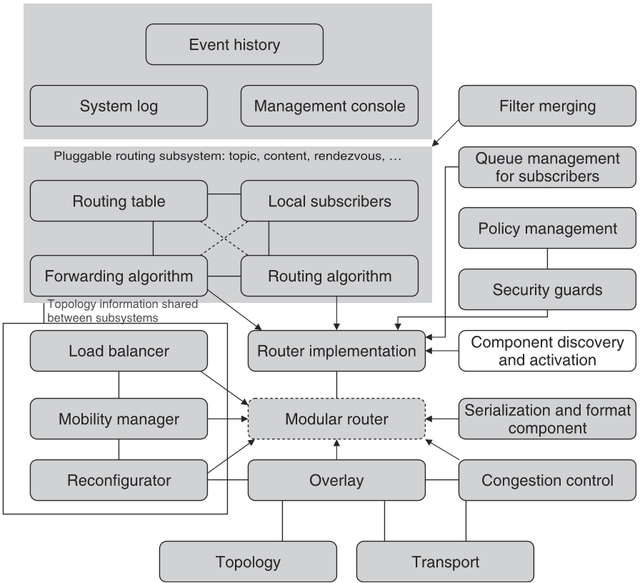

>图 14.1 模块化 pub/sub 框架。

组件的内部通信未在图中表示，但它可以是简单的本地方法调用或基于遵循 pub/sub 模型的本地系统总线。有趣的是观察到 pub/sub 以及黑板模式可用于实现 pub/sub 路由器引擎的内部组织。例如，路由算法组件可以订阅来自路由器和 overlay 网络关于相邻路由器状态的更新。此内部通信机制应该是灵活的，允许发现组件以及支持路由器内部的信息中介。

基本组件包括拥塞控制、带序列化和格式组件的消息处理，以及重配置器。路由器的核心由路由和转发算法以及它们运行所需的模块组成，即路由表、本地 subscriber 表和队列管理组件。路由和转发的分离允许开发不同的快速转发算法，并以不同方式处理路由表更新和发布的消息。需要额外的安全保护来满足给定的安全要求。

某些组件在分布式环境中工作。例如，下层
overlay 级别需要维护 overlay 网络路由表并监控 overlay
网络。pub/sub 路由表需要跟踪

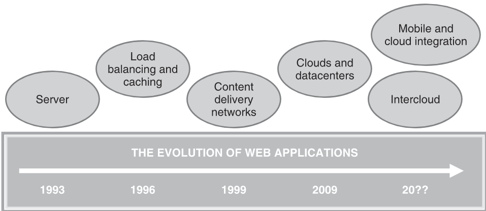

>图 14.2 Web 应用提供的演进。

基于内容的路由层中的相邻路由器。配置器和负载均衡组件可能需要了解 pub/sub 路由器的子集。此外，安全组件可能需要联系密钥服务器和其他逻辑集中的信任点。

图 14.2 展示了 Web 应用及其提供的演进。cloud computing 环境为低成本应用开发和部署提供了新的可能性，但也带来了数据如何在不同设备和数据中心之间存储和分发的新挑战。移动应用也在与云资源整合，存在如何跨设备和服务器同步应用并保持数据最新的一般问题。因此需要一个异步通信基础来将所有组件连接在一起。事实上，此类消息队列和基于 topic 的 pub/sub 解决方案今天用于管理系统。我们在第 12 章中考察了几种解决方案。

pub/sub 解决方案的未来看起来很有希望。我们在第 12 章中介绍了许多应用，突出了该技术的当前用途。经典应用包括股票市场和银行、复杂事件检测、物流、工业环境和系统以及 SOA。社交网站如 Facebook 和 Twitter 广泛使用 pub/sub 技术来连接人和应用。此外，cloud computing 系统和 Internet of Things 依赖消息传递和 pub/sub。还应注意，pub/sub 引擎可用于内容中介。事实上，在线广告是 pub/sub 系统的新兴领域。在线广告需要第 7 章和第 8 章中介绍的基于内容的路由解决方案。广告引擎依赖于用户档案与活跃广告活动的高效匹配。Pub/sub 系统可以提供此匹配引擎，并在 Internet 上分发匹配过程。

另一方面，Web 目前没有现有的全局 pub/sub 技术或服务。Facebook 和 Twitter 提供开放 API 以及其他网站，它们至少部分地提供此服务。随着 HTML5 和 WebSockets 的出现，Web 技术为实现 pub/sub 解决方案提供了更高效的基础。全局 pub/sub hub 如何在 Internet 上形成仍然是一个开放问题。Pubsubhubbub 提供了这种设计的一个有趣示例，但它尚未达到这种地位。

我们简要考察了 pub/sub 的许多安全解决方案，包括基于模块化保护组件的 Event-Guard 系统。基本安全可以通过建立在密钥生成和分发、加密和数字签名基础上的模块化安全解决方案来支持。Subscriber 和 publisher 隐私是 pub/sub 系统的新安全挑战，大多数 pub/sub 系统不考虑隐私问题。

另一个开放问题是事件服务应该位于网络层还是应用层。对于 Internet 规模路由，如 SIENA 所提议的，在网络层有一些支持可能是有益的。这最近由第 13 章中介绍的 PSIRP 和 CCN 项目进行了研究。这些提案需要对路由器和终端系统的运行方式进行重大更改，因此它们目前是面向研究的想法和原型。在 pub/sub 之上构建网络的想法是一个非常有趣的想法。

#### 索引

.NET, 42, 124

3GPP, 53

6loWPAN, 141

Acceptor-Connector, 82

access control, 251

ad hoc networks, 17, 266, 304

adapter, 49, 300

Additive Increase Multiplicative Decrease
see AIMD, 31

Advanced Message Queuing Protocol see
AMQP, 105

advertisement semantics, 12, 152, 161,
164, 210, 220

advertisements, 147

aggregation, 149, 260

AIMD, 277

AJAX, 24, 43, 92, 134, 296

algorithmic trading, 300

Amazon Elastic Compute Cloud
(EC2), 291

Amazon Simple Queue Service
(SQS), 291

AMQP, 127

anonymity, 80, 251

anti-entropy, 75

anycast, 65–6

AODV, 267

Apache, 295

API, 2

clean-slate, 309

DHT, 65

JMS, 115

network, 314

pub/sub, 10–11, 268, 272, 274, 328

Sockets, 10

AppFabric Service Bus, 288

Apple Push Notification Service, 303

application server, 294

applications, 26, 112, 330

advertising, 301, 330

CEP, 299

cloud computing, 288

Facebook, 294

Internet of Things, 304

mobile push, 303

 multiplayer games, 303

Pubsubhubbub, 297

SOA, 292

summary, 305

AS, 32, 318, 321

asynchronous communications model, 48

Asynchronous Javascript and XML see
AJAX, 23

at-least-once, 15, 46, 129, 291

at-most-once, 15, 46, 129

Atom, 24, 136, 297

attacks, 251

authentication, 253–4

authenticity, 253

authorization, 251

Autonomous System see AS, 31

availability, 251, 254, 291, 294

Azure, 288

B2B, 288, 292

backpressure, 277

batch processing, 3

Baeyux, 230

BDD, 178

best effort, 46

BGP, 33, 316, 319

Binary Decision Diagram see BDD, 105

blackboard, 84

blocking, 7–8

Bloom filter, 196, 221

multilevel, 200

structures, 199

bogus nodes, 252

Boolean expression, 180, 302

Border Gateway Protocol see BGP, 31

BPEL, 52

broadcast, 4

broker, 5, 10, 83–4, 86, 327

centralized, 5

network, 5

Business-to-Business see B2B, 31

caching, 310

CAIDA, 319

callback, 7, 298

Cambridge Event Architecture see
CEA, 105

CAN, 64

Canon DHT, 321

causal order, 14, 19, 39, 216

causality, 300

CBCB, 22, 178, 187, 211

CCN, 22, 309, 314

CEA, 83, 207, 258

cells, 294

CEP, 26, 149, 299, 302

challenge-response, 252

channelization, 154, 266

Chord, 64, 220, 321

churn, 61

clean-slate, 331

client-initiated connection, 92, 292, 296,
303

client-server, 59, 84

clock consistency, 39

cloud computing, 27, 287, 330

clustering, 155, 269, 280

CoAP, 140, 304

Cobra, 136, 277

COM+, 123

Comet, 24, 134

completeness, 167, 169
checking, 275

Complex Event Processing see CEP, 26

composite event, 4

composite events, 4, 146, 177, 218, 258,
299

composite subscriptions, 258

confidentiality, 251, 253–4

congestion, 10, 45, 277

application layer, 46

detection, 277

explicit signalling, 279

pub/sub, 277

transport layer, 45

congestion notification, 277

Connector, 49, 300

consistent hashing, 62, 295

Constrained Application Protocol see
CoAP, 133

Content Centric Networking see CCN,
22

content-based address, 158

content-based router, 157, 160

content-based routing, 12–13, 145, 149,
157, 209, 328

merging, 260

context-aware, 301

continuous query, 299

contracts, 50

CORBA, 42, 46, 83

Event Channel, 82

Event Service, 22, 105

Notification Service, 18, 22, 106, 178

CORBA Notification Service, 327
correlation, 149
counting algorithm, 178, 181
covering, 153, 159
covering relations, 21
covering-based routing, 152
cryptographic digest, 313
cryptography, 251

DADI, 233

DAG, 186

data aggregation, 75

data centric, 23, 109

Data Distribution Service see DDS, 22

data stream, 299–300

datacentric, 309

database systems, 2

datacenter, 287, 288

DCOM, 22, 42

DDS, 18, 22, 93, 105, 109, 327

decoupling, 7, 42, 80, 288, 292, 327
comparison, 8
pub/sub, 10

deflating, 43

Denial-of-Service see DoS, 31

denial-of-service, 252

DHT, 21, 59, 228, 239, 242, 321, 328
clusters, 61
geometries, 63
summary, 72

digital signature, 252, 313

Directed Acyclic Graph see DAG, 105

Distributed Component Object Model see
DCOM, 22

Distributed Hash Table see DHT, 21
DNS, 32, 34

Document Object Model see DOM, 23
DOM, 24, 141

Domain Name System see DNS, 31

DONA, 22, 311, 321

DoS, 253, 254

down-hill, 321

dynamic neighbour set, 152, 156

ECho, 227

EIS, 49

EJB, 121

Elvin, 21, 94, 178, 213, 272

embedded systems, 17

end-to-end, 10, 60

end-to-end principle, 31

Enterprise Information System see
EIS, 31

Enterprise JavaBeans see EJB, 105

Enterprise Service Bus see ESB, 31

Erlang, 297

ESB, 52, 102, 292, 327

Esper, 299

evaluation, 280

event

attributes, 4

taxonomy, 4

visibility, 6

event channel, 82

event history, 21, 300

event loop, 7, 17, 19, 327

event notifier, 82, 94, 327

event proxy, 98

event service, 80

Event Space Partitioning, 265

event storage, 9

event type, 256

EventGuard, 252

exactly-once, 15, 46, 129

experimental, 281

explicit invocation, 24

expressiveness, 14, 80, 148, 280

Extensible Markup Language see
XML, 23

Extensible Messaging and Presence
Protocol see XMPP, 23

Facebook, 24, 294, 328, 330
Chat, 295

Messages, 294

fairness, 320

false negative, 11, 169, 260

false positive, 11, 169, 260

fanout, 74, 155

fault-tolerance, 100, 270, 320

fetch, 13

fetch latest, 13

fetch with query, 13

FIFO order, 41

filter covering, 260

filter merging, 220, 260

filtering, 6, 10–11, 13, 80, 106, 145, 149,
155, 177, 224, 290, 327

accuracy, 11

covering, 181

inverted index, 20

language, 11

model, 180

summary, 200

threshold-based, 240

filters, 21

firewall, 11, 35, 288

flooding, 10, 59, 145, 151

forest, 179, 261

algorithm, 191

forking, 54

forwarding algorithm, 32, 159, 163, 210

forwarding table, 163

FTP, 47

Fuego, 222, 272

full text search, 20, 239

Global Positioning System see GPS, 31

Google, 24

Google Alerts, 3

gossip, 73, 145

pub/sub, 76

government, 320

GPS, 42

graphlet, 317

GREEN, 93, 220, 305

Gryphon, 20, 178, 180, 205

GUI, 2, 7, 17–18, 26

Haggle, 324

handoff, 91

happened-before relation, 39

Haystack, 295

HBase, 295

header-based routing, 13, 149

heartbeats, 170, 232

Hermes, 21, 91, 231, 252

composite events, 259

security, 256

HIIT, 222

history, 18

Host Identity Protocol, 223

HTML5, 23, 24, 135, 330

HTTP, 21, 23, 33, 37, 47, 133, 138, 140,
145, 147, 292

IaaS, 288

idempotent, 12

identity-based routing, 151

IDL, 83, 149

IETF, 23, 53, 135, 223

IFG, 21, 206

imperfect merging, 262

implicit invocation, 24

inflating, 43

Information Bus, 19

Information Flow Graph see IFG, 31

Information Retrieval, 239

information-centric, 310

integrity, 251, 253–4

Inter-Process Communication see IPC, 31

interest registration, 80

interest similarity, 269

Interface Definition Language see
IDL, 105

Internet, 31, 297, 309

Internet Engineering Task Force see
IETF, 23

Internet Indirection Infrastructure, 66

Internet of Things, 27, 304, 330

Inversion of Control see IoC, 31

inverted index, 20, 178

IoC, 49, 85, 310

IPC, 42

IPv4, 33, 38

IPv6, 33, 38

IPv6 over LoW Power wireless Area
Network see 6lowWPAN

ISIS, 19, 41

ISP, 320

Java Delegation Event Model, 114

Java EE, 23, 49, 121

Java Message Service see JMS, 22

JavaScript Object Notation see JSON, 31

JECho, 228

JEDI, 22, 178, 215, 272

Jini, 82, 114

JMS, 11, 18, 21, 22, 46, 47, 83, 115, 125,
178, 280, 293, 327

key objects, 118

pub/sub, 119

transactions, 121

JSON, 43

Lamport clock, 14, 39, 259

latency, 320

layering, 16

leases, 93, 170

light ping, 298

LINDA, 19

Linear Temporal Logic see LTL, 105

liveness, 168, 267

load balancing, 218, 263, 266, 270

channelization, 265

handoff, 270

load estimation, 264

offloading, 263

publisher placement, 264

load estimation, 264

location tracking, 4

locator-identity split, 34

long-lived connection 24, see

client-initiated connection, 31, 92,
134

LTL, 168

M2M, 140

machine-to-machine see M2M, 133

MAN, 32

management, 146

many-to-many, 15, 251

marshalling, 43

maximum associativity tree, 269

mediator, 83, 86, 89, 94

MEDYM, 233

Meghdoot, 233

mergeability, 262

merging-based routing, 152

message dropping attack, 252–3

message format, 6

message history, 294

Message Oriented Middleware see
MOM, 105

message passing, 8, 42

message protocol, 6

message queue, 291

message queuing, 8, 288, 291

message service, 82

messaging, 26, 31, 42

Metropolitan Area Network see MAN, 31

Microsoft Live Alerts, 3

Microsoft Message Queuing see
MSMQ, 105

middleware, 34, 288

mobile brokers, 267

mobile push, 303

mobility, 146, 211, 214, 216, 220, 226,
270, 316

comparison, 271

generic solution, 272

graph-based, 275

publisher, 276

mobility-safety, 170

modularity, 81

MOM, 8, 105, 115, 125, 292, 327

MQ Telemetry Transport see MQTT, 105

MQTT, 129, 297, 304

MSMQ, 125

multicast, 4, 21, 36, 65–6, 220, 251, 310

application layer, 38

atomic, 19

IP, 147

network layer, 36

multihoming, 316

multilayer, 84

 multiplayer games, 27, 303

multitier, 84

MVC, 19, 85, 89

namespace, 289

Narada, 38

NAT, 32, 35, 288

Network Address Translation see NAT, 31

network operators, 320

Network Time Protocol see NTP, 31

network utilization, 280

networking, 31

networks

hierarchy, 35

regional, 17

wide-area, 17

news service, 19

nonblocking, 44

nondestructive fetch, 13, 215

notification, 1, 4, 10

notification cache, 270

notification engine, 9

NTP, 41

OASIS, 51–2, 127, 142, 256

observer, 82–3, 87, 327

offloading, 263

one-to-many, 251

one-to-one, 5, 15

online advertising, 301, 330

Open Shortest Path First see OSPF, 31

optimal merging, 261

OSPF, 33

Overcast, 72

overlay network, 220, 275

overlay networks, 5, 10, 59, 145

P2P, 59, 239

PaaS, 288

Padres, 217, 260, 263, 272

Pastry, 64, 229

patterns, 79, 327

architectural, 80

design, 80

enterprise integration, 101

idioms, 80

MVC, 19

pub/sub, 86

peer-to-peer, 84

perfect merging, 262

performance, 100

ping, 298

ping/pong protocol, 273

pipeline, 84

PKI, 52, 252

PlanetLab, 280

Plaxton, 64

port numbers, 33

poset, 161, 179, 186, 221, 261

algorithm, 188

matching, 192

model, 187

presence, 297

pricing model, 289

principles, 79, 327

summary, 81

privacy, 255, 257

privilege, 256

protection, 253

proxy, 83, 98, 252

PSIRP, 22, 309

pub/sub

agreements, 6

API, 11, 170

clean-slate, 309

components, 4, 146

congestion control, 277

content-based, 12–13, 145, 149, 157,
328

content-based routing, 209

distributed, 5, 145

environments, 17

evaluation, 280

event channels, 82

filter merging, 260

general model, 80

gossip, 76

header-based, 13, 149

history, 18

keyword-based, 239

layering, 61

privacy, 257

problem, 2

routing solutions, 172

security, 252–3

service, 9

subject-based, 149

topic-based, 13, 145, 149, 153, 288,
291

type-based, 12–13, 145, 149

Web, 2

public key, 252, 313

Public Kev Infrastructure see PKI. 31

publish-register-notify, 82, 207

publisher placement, 264, 265

PubNub, 291

Pubsubhubbub, 2, 23, 297, 328

PURSUIT, 309

QoS, 14, 46, 81, 83, 93, 107, 154

DDS, 111

Quench, 94, 214

queuing, 44

QUIP, 255

Quip, 254

R-tree, 179

Rapide, 299

rate limit, 277

rate-control, 277

RBAC, 256

real-time, 111, 294, 299, 303

Really Simple Syndication see RSS, 23

Rebeca, 21, 93, 178, 220, 252, 261, 272

reconfiguration, 146, 220, 266, 328

congestion avoidance, 279

delayed unsubscribe, 269

graph-based, 269

GREEN, 220

middleware, 93, 267

Rebeca, 220

REDS, 219

strawman protocol, 268

topology, 93, 267

REDS, 93, 219, 305

reliability, 291

rendezvous network, 321

Rendezvous Point see RP, 31

replication, 10

Representational state transfer see

REST, 23

request-reply, 43, 48

rerouting, 277, 279

resource adapter, 50

REST, 23, 31, 42, 47, 133, 140, 289, 290

reverse path forwarding, 38

reverse path routing, 38, 93, 153

RMI, 8, 15, 42, 46, 114

robustness principle, 31

Role-Based Access Control see

RBAC, 105

routing

acyclic, 148

centralized, 147

cyclic, 148

hierarchical, 147

routing algorithm, 32, 145

routing function, 150

routing invariants, 167

routing table, 10, 60

RP, 37, 91, 147, 148, 166, 231, 239, 256,
275, 321

RPC, 8, 15, 19, 23–4, 42, 48, 222

RSS, 2, 18, 23–4, 135, 155, 239, 297

rumour-mongering, 75

SaaS, 288

safety, 168, 267

SAMIL, 51

scalability, 5, 14, 80, 254

schema, 146, 149

scope, 313

scopes, 252, 317

scoping, 93

Scribe, 21, 70, 91, 220, 228, 252

security, 146, 220, 251, 331

clean-slate, 312

Security Assertion Markup Language see

SAML, 31

security risks, 251

self-certification, 61, 313

self-organization, 3

sensor networks, 17

sequencer, 41

serialization, 42, 290

server utilization, 280

Service Oriented Architecture see

SOA, 26

Session Initiation Protocol see SIP, 22

shared memory, 19, 42

distributed, 15

SIENA, 21, 147, 148, 153, 157, 178, 180,
208, 220, 268, 272, 328

SIFT, 20, 178

Simple Mail Transfer Protocol see
SMTP, 23

simple routing, 151

simulation, 281

SIP, 22, 31, 44, 53, 113, 272

Event Package, 113

SMTP, 23, 47, 138

SOA, 26, 52, 292

SOAP, 23, 31, 42, 47, 137, 148, 220,
223, 294, 328

model, 138

routing, 138

Sockets API, 10, 31, 33, 44

soft state, 171, 315

soundness, 167

spanning tree, 147

SpiderCast, 76

SplitStream, 70

SQL, 11, 111, 178, 290, 299, 300

stabilization, 170

STAIRS, 240, 242

STEAM, 227, 305

store-and-forward, 44, 147

strawman protocol, 268

streaming, 312

StreamMine, 222

stretch, 167

SUB-2-SUB, 76, 233

subject-based routing, 149

subscription manager, 9

subscription semantics, 12, 210

subscription storage, 9

synchronization, 42

Tapestry, 64, 230

taxonomy, 24

TCP/IP, 5, 17, 21, 31, 37, 46, 59, 145,
147, 277, 309, 314

Tera, 76, 234

throughput, 280, 320

TibCo Rendezvous, 122

timestamp order, 41

TLS, 140

token, 254

Topic object, 110

topic-based routing, 13, 145, 149, 153,
288, 291

total order, 14, 19, 39

traitor-tracing scheme, 255

transmission delay, 172

Transport Layer Security see TLS, 133

tree algorithm, 180, 193

TRIAD, 22

trigger-based routing, 66

trust chain, 252

trusted third party, 251

tuple space, 8

LINDA, 19

tussle, 320

Twitter, 24, 330

type hierarchy, 13

type-based routing, 12–13, 145, 149

type-checking, 252

typed-tuple, 262

typled tuples, 6

UDDI, 47, 52

UML, 109

underlay, 59

unicast, 36

Unified Modeling Language see
UML, 105

Uniform Resource Identifier see URI, 31

Uniform Resource Locator see URL, 31

Universal Description, Discovery, and
Integration see UDDI, 31

UNIX signals, 19

unmarshalling, 43

unwanted traffic, 251

up-hill, 321

UR1, 34, 133, 290

URL, 34, 298, 302

vector clock, 14, 39

Vector Space Model, 239

view shuffling, 75

virtualization, 291

visibility, 290

W3C, 23, 47, 135, 142, 180

Web services, 31, 43, 46, 50, 102, 288

Web Services Description Language see
WSDL, 31

WebSocket, 135, 330

Websphere MQ, 125

Windows, 7, 123

Windows Communications
Framework, 289

wireless, 17

Wireless Sensor Network (WSN), 304

workload, 280

World Wide Web Consortium see
W3C, 133

WS-Eventing, 142

WS-Notification, 142

WSDL, 47, 52

X.509, 256

XACML, 51

XFilter, 180, 194, 294

XML, 6, 23, 43, 47, 135, 149, 180, 223,
293, 328

encryption, 51, 254
signature, 51, 254

XML Access Control Markup Language
see XACML, 31

XML-RPC, 47

XMPP, 18, 23, 139

XPath, 180, 294, 328

XQuery, 180, 294, 328

XSIENA, 171, 198, 221

YFilter, 180, 195, 294, 328

ZooKeeper, 295
