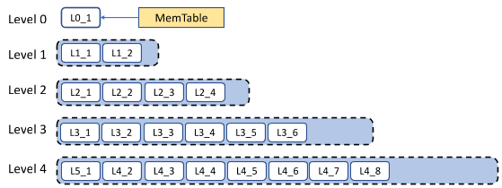
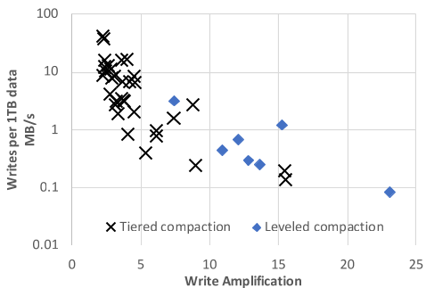
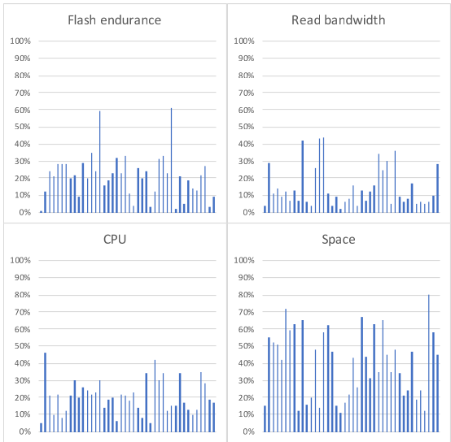
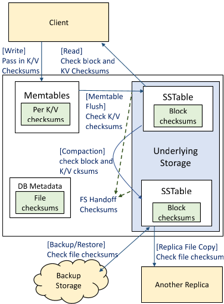

# Evolution of Development Priorities in Key-value Stores Serving Large-scale Applications: The RocksDB Experience

Siying Dong, Andrew Kryczka, and Yanqin Jin, Facebook Inc.; Michael Stumm, University of Toronto

https://www.usenix.org/conference/fast21/presentation/dong

This paper is included in the Proceedings of the
19th USENIX Conference on File and Storage Technologies.

February 23–25, 2021

978-1-939133-20-5

Open access to the Proceedings
of the 19th USENIX Conference on
File and Storage Technologies
is sponsored by USENIX.

Siying Dong†, Andrew Kryczka†, Yanqin Jin† and Michael Stumm‡

†Facebook Inc., 1 Hacker Way, Menlo Park, CA, U.S.A

‡University of Toronto, Toronto, Canada

## Abstract

RocksDB is a key-value store targeting large-scale distributed systems and optimized for Solid State Drives (SSDs). This paper describes how our priorities in developing RocksDB have evolved over the last eight years. The evolution is the result both of hardware trends and of extensive experience running RocksDB at scale in production at a number of organizations. We describe how and why RocksDB's resource optimization target migrated from write amplification, to space amplification, to CPU utilization. Lessons from running large-scale applications taught us that resource allocation needs to be managed across different RocksDB instances, that data format needs to remain backward and forward compatible to allow incremental software rollout, and that appropriate support for database replication and backups are needed. Lessons from failure handling taught us that data corruption errors needed to be detected earlier and at every layer of the system.

## 1 Introduction

RocksDB [19, 54] is a high-performance persistent key-value storage engine created in 2012 by Facebook, based on Google's LevelDB code base [22]. It is optimized for the specific characteristics of Solid State Drives (SSDs), targets large-scale (distributed) applications, and is designed as a library component that is embedded in higher-level applications. As such, each RocksDB instance manages data on storage devices of just a single server node; it does not handle any inter-host operations, such as replication and load balancing, and it does not perform high-level operations, such as checkpoints — it leaves the implementation of these operations to the application, but provides appropriate support so they can do it effectively.

RocksDB and its various components are highly customizable, allowing the storage engine to be tailored to a wide spectrum of requirements and workloads; customizations can include the write-ahead log (WAL) treatment, the compression strategy, and the compaction strategy (a process that removes dead data and optimizes LSM-trees as described in §2). RocksDB may be tuned for high write throughput or high read throughput, for space efficiency, or something in between. Due to its configurability, RocksDB is used by many applications, representing a wide range of use cases. At Facebook alone, RocksDB is used by over 30 different applications, in aggregate storing many hundreds of petabytes of production data. Besides being used as a storage engine for *databases* (e.g., MySQL [37], Rocksandra [6], CockroachDB [64], MongoDB [40], and TiDB [27]), RocksDB is also used for the following types of services with highly disparate characteristics (summarized in Table 1):

- **Stream processing:** RocksDB is used to store staging data in Apache Flink [12], Kafka Stream [31], Samza [43], and Facebook's Stylus [15].

- **Logging/queuing services:** RocksDB is used by Facebook's LogDevice [5] (that uses both SSDs and HDDs), Uber's Cherami [8], and Iron.io [29].

- **Index services:** RocksDB is used by Facebook's Dragon [59] and Rockset [58].

- **Caching on SSD:** In-memory caching services, such as Netflix’s EVCache [7], Qihoo’s Pika [51] and Redis [46], store data evicted from DRAM on SSDs using RocksDB.

A prior paper presented an analysis of several database applications using RocksDB [11]. Table 2 summarizes some of the key system metrics obtained from production workloads.

Having a storage engine that can support many different use cases offers the advantage that the same storage engine can be used across different applications. Indeed, having each application build its own storage subsystem is problematic, as doing so is challenging. Even simple applications need to protect against media corruption using checksums, guarantee data consistency after crashes, issue the right system calls in the correct order to guarantee durability of writes, and handle errors returned from the file system in a correct manner. A well-established common storage engine can deliver sophistication in all those domains.

Additional benefits are achieved from having a common storage engine when the client applications run within a common infrastructure: the monitoring framework, performance profiling facilities, and debugging tools can all be shared. For example, different application owners within a company can take advantage of the same internal framework that reports statistics to the same dashboard, monitor the system using the same tools, and manage RocksDB using the same embedded admin service. This consolidation not only allows expertise to be easily reused among different teams, but also allows information to be aggregated to common portals and encourages developing tools to manage them.

| |Read/Write|Read Types|Special Characteristics|
| ---|---|---|---|
| Databases|Mixed|Get + Iterator|Transactions and backups|
| Stream Processing|Write-Heavy|Get or Iterator|Time window and checkpoints|
| Logging / Queues|Write-Heavy|Iterator|Support HDD too|
| Index Services|Read-Heavy|Iterator|Bulk loading|
| Cache|Write-Heavy|Get|Can drop data|

> Table 1. RocksDB use cases and their workload characteristics.

| |CPU|Space Util|Flash Endurance|Read Bandwidth|
| ---|---|---|---|---|
| Stream Processing|11%|48%|16%|1.6%|
| Logging / Queues|46%|45%|7%|1.0%|
| Index Services|47%|61%|5%|10.0%|
| Cache|3%|78%|74%|3.5%|

> Table 2. System metrics for a typical use case from each application category.

Given the diverse set of applications that have adopted RocksDB, it is natural that priorities for its development have evolved. This paper describes how our priorities evolved over the last eight years as we learned practical lessons from real-world applications (both within Facebook and other organizations) and observed changes in hardware trends, causing us to revisit some of our early assumptions. We also describe our RocksDB development priorities for the near future.

§2 provides background on SSDs and Log-Structured Merge (LSM) trees [45]. From the beginning, RocksDB chose the LSM tree as its primary data structure to address the asymmetry in read/write performance and the limited endurance of flash-based SSDs. We believe LSM-trees have served RocksDB well and argue they will remain a good fit even with upcoming hardware trends (§3). The LSM-tree data structure is one of the reasons RocksDB can accommodate different types applications with disparate requirements.

§3 describes how our primary optimization target shifted from minimizing write amplification to minimizing space amplification, and from optimizing performance to optimizing efficiency.

§4 describes lessons we learned serving large-scale distributed systems; for example: (i) resource allocation must be managed across multiple RocksDB instances, since a single server may host multiple instances; (ii) data format must be backward and forward compatible, since RocksDB software updates are deployed/rolled-back incrementally; and (iii) proper support for database replication and backups are important.

§5 describes our experiences on failure handling. Large-scale distributed systems typically use replication for fault tolerance and high availability. However, single node failures must be properly handled to achieve that goal. We have found that simply identifying and propagating file system and checksum errors is not sufficient. Rather, faults (such as bitflips) at every layer must be identified as early as possible and applications should be able to specify policies for handling them in an automated way when possible.

§6 presents our thoughts on improving the key-value interface. While the core interface is simple and powerful given its flexibility, it limits the performance for some critical use cases. We describe our support for user-defined timestamps separate from the key and value.

§8 lists several areas where RocksDB would benefit from future research.

## 2 Background

The characteristics of flash have profoundly impacted the design of RocksDB. The asymmetry in read/write performance and limited endurance pose challenges and opportunities in the design of data structures and system architectures. As such, RocksDB employs flash-friendly data structures and optimizes for modern hardware.

### 2.1 Embedded storage on flash based SSDs

Over the last decade, we have witnessed the proliferation of flash-based SSD for serving online data. The low latency and high throughput device not only challenged software to take advantage of its full capabilities, but also transformed how many stateful services are implemented. An SSD offers hundreds of thousands of Input/Output Operations per Second (IOPS) for both of read and write, which is thousands of times faster than a spinning hard drive. It can also support hundreds of MBs of bandwidth. Yet high write bandwidth cannot be sustained due to a limited number of program/erase cycles. These factors provide an opportunity to rethink the storage engine's data structures to optimize for this hardware.

The high performance of the SSD, in many cases, also shifted the performance bottleneck from device I/O to the network for both of latency and throughput. It became more attractive for applications to design their architecture to store data on local SSDs rather than use a remote data storage service. This increased the demand for a key-value store engines that are embedded in applications.

> Figure 1. RocksDB LSM-tree using leveled compaction. Each white box is an SSTable.

RocksDB was created to address these requirements. We wanted to create a flexible key-value store to serve a wide range of applications using local SSD drives while optimizing for the characteristics of SSDs. LSM trees played a key role in achieving these goals.

### 2.2 RocksDB architecture

RocksDB uses Log-Structured Merge (LSM) trees [45] as its primary data structure to store data.

*Writes.* Whenever data is written to RocksDB, it is added to an in-memory write buffer called MemTable, as well as an on-disk Write Ahead Log (WAL). MemTable is implemented as a skiplist so keep the data ordered with O(log n) insert and search overhead. The WAL is used for recovery after a failure, but is not mandatory. Once the size of the MemTable reaches a configured size, then (i) the MemTable and WAL become immutable, (ii) a new MemTable and WAL are allocated for subsequent writes, (iii) the contents of the MemTable are flushed to a "Sorted String Table" (SSTable) data file on disk, and (iv) the flushed MemTable and associated WAL are discarded. Each SSTable stores data in sorted order, divided into uniformly-sized blocks. Each SSTable also has an index block with one index entry per SSTable block for binary search.

*Compaction.* The LSM tree has multiple levels of SSTables, as shown in Fig. 1. The newest SSTables are created by MemTable flushes and placed in Level-0. Levels higher than Level-0 are created by a process called compaction. The size of SSTables on a given level are limited by configuration parameters. When level-L's size target is exceeded, some SSTables in level-L are selected and merged with the overlapping SSTables in level-(L+1). In doing so, deleted and overwritten data is removed, and the table is optimized for read performance and space efficiency. This process gradually migrates written data from Level-0 to the last level. Compaction I/O is efficient as it can be parallelized and only involves bulk reads and writes of entire files.

Level-0 SSTables have overlapping key ranges, as each SSTable covers a full sorted run. Later levels each contain only one sorted run so the SSTables in these levels contain a partition of their level's sorted run.

*Reads.* In the read path, a key lookup occurs at each successive level until the key is found or it is determined that the key is not present in the last level. It begins by searching all MemTables, followed by all Level-0 SSTables, and then the SSTables in successively higher levels. At each of these levels, binary search is used. Bloom filters are used to eliminate an unnecessary search within an SSTable file. Scans require that all levels be searched.

| Compaction|Write Amplification|Max Space Overhead|Avg Space Overhead|#I/O per Get() with Bloom filter|# I/O per Get() without filter|# I/O per iterator seek|
| ---|---|---|---|---|---|---|
| Leveled|16.07|9.8%|9.5%|0.99|1.7|1.84|
| Tiered|4.8|94.4%|45.5%|1.03|3.39|4.80|
| FIFO|2.14|N/A|N/A|1.16|528|967|

> Table 3. Write amplification, overhead and read I/O for three major compaction types under RocksDB 5.9. Number of sorted runs is set to 12 for Tiered Compaction, and 20 Bloom filter bits per key are used for FIFO Compaction. Direct I/O is used and block cache size is set to be 10% of fully compacted DB size. Write amplification is calculated as total SSTable file writes vs number of MemTable bytes flushed. WAL writes are not included.

RocksDB supports multiple different types of compaction. Leveled Compaction was adapted from LevelDB and then improved [19]. In this compaction style, levels are assigned exponentially increasing size targets as exemplified by the dashed boxes in Fig. 1. Tiered Compaction (called Universal Compaction in RocksDB) is similar to what is used by Apache Cassandra or HBase. Multiple sorted runs are lazily compacted together, either when there are too many sorted runs, or the ratio between total DB size over the size of the largest sorted run exceeds a configurable threshold. Finally, FIFO Compaction simply discards old files once the DB hits a size limit and only performs lightweight compactions. It targets in-memory caching applications.

Being able to configure the type of compaction allows RocksDB to serve a wide range of use cases. By using different compaction styles, RocksDB can be configured as read friendly, write friendly, or very write friendly for special cache workloads. However, application owners will need to consider trade-offs among the different metrics for their specific use case [2]. A lazier compaction algorithm improves write amplification and write throughput, but read performance suffers, while a more aggressive compaction sacrifices write performance but allows for faster reads. Services like logging or stream processing can use a write heavy setup while database services need a balanced approach. Table 3 depicts this flexibility by way of micro-benchmark results.

> Figure 2. Survey of write amplification and write rate across 42 randomly sampled ZippyDB and MyRocks applications.

## 3 Evolution of resource optimization targets

Here we describe how our resource optimization target evolved over time: from write amplification to space amplification to CPU utilization.

### Write amplification

When we started developing RocksDB, we initially focused on saving flash erase cycles and thus write amplification, following the general view of the community at the time (e.g., [34]). This was rightly an important target for many applications, in particular for those with write-heavy workloads (Table 1) where it continues to be an issue.

Write amplification emerges at two levels. SSDs themselves introduce write amplification: by our observations between 1.1 and 3. Storage and database software also generate write amplification; this can sometimes be as high as 100 (e.g., when an entire 4KB/8KB/16KB page is written out for changes of less than 100 bytes).

Leveled Compaction in RocksDB usually exhibits write amplification between 10 and 30, which is several times better than when using B-trees in many cases. For example, when running LinkBench on MySQL, RocksDB issues only 5% as many writes per transaction as InnoDB, a B-tree based storage engine [37]. Still, write amplification in the 10–30 range is too high for write-heavy applications. For this reason we added Tiered Compaction, which brings write amplification down to the 4–10 range, although with lower read performance; see Table 3. Figure 2 depicts RocksDB's write amplification under different data ingestion rates. RocksDB application owners often pick a compaction method to reduce write amplification when the write rate is high, and compact more aggressively when the write rate is low to achieve space efficiency and read performance goals.

### Space amplification

After several years of development, we observed that for most applications, space utilization was far more important than write amplification, given that neither flash write cycles nor write overhead were constraining. In fact the number of IOPS utilized in practice was low compared to what the SSD could provide (yet still high enough to make HDDs unattractive, even when ignoring maintenance overhead). As a result, we shifted our resource optimization target to disk space.

| |Dynamic Leveled Compaction|Dynamic Leveled Compaction|Dynamic Leveled Compaction|LevelDB-style Compaction|LevelDB-style Compaction|LevelDB-style Compaction|
| ---|---|---|---|---|---|---|
| # keys (millions)|Fully compacted size (GB)|Steady DB size (GB)|Space overhead (%)|Fully compacted size (GB)|Steady DB size (GB)|Space overhead (%)|
| 200|12.0|13.5|12.4|12.0|15.1|25.6|
| 400|24.0|26.9|11.8|24.0|26.9|12.2|
| 600|36.0|40.4|12.2|36.4|42.5|16.9|
| 800|48.0|54.2|12.7|48.3|57.9|19.7|
| 1,000|60.1|67.5|12.4|60.3|73.8|22.4|

> Table 4. RocksDB space efficiency measured in a micro-benchmark: data is prepopulated and each write is to a key chosen randomly from the pre-populated key space. RocksDB 5.9 with all default options. Constant 2 MB/s write rate.

Fortunately, LSM-trees also work well when optimizing for disk space due to their non-fragmented data layout. However, we saw an opportunity to improve Leveled Compaction by reducing the amount of dead data (i.e., deleted and overwritten data) in the LSM tree. We developed Dynamic Leveled Compaction, where the size of each level in the tree is automatically adjusted based on the actual size of the last level (instead of setting the size of each level statically) [19]. This method achieves better and more stable space efficiency than Leveled Compaction. Table 4 shows space efficiency measured in a random write benchmark: Dynamic Leveled Compaction limits space overhead to 13%, while Leveled Compaction can add more than 25%. Moreover, space overhead in the worst case under Leveled Compaction can be as high as 90%, while it is stable for dynamic leveling. In fact, for UDB, one of Facebook's main databases, the space footprint was reduced to 50% when InnoDB was replaced by RocksDB [36].

### CPU utilization

An issue of concern sometimes raised is that SSDs have become so fast that software is no longer able to take advantage of their full potential. That is, with SSDs, the bottleneck has shifted from the storage device to the CPU, so fundamental improvements to the software are necessary. We do not share this concern based on our experience, and we do not expect it to become an issue with future NAND flash based SSDs for two reasons. First, only a few applications are limited by the IOPS provided by the SSDs; as discussed in §4.2, most applications are limited by space.

Second, we find that any server with a high-end CPU has more than enough compute power to saturate one high-end SSD. RocksDB has never had an issue making full use of SSD performance in our environment. Of course, it is possible to configure a system that results in the CPU becoming a bottleneck; e.g., a system with one CPU and multiple SSDs. However, effective systems are typically those configured to be well-balanced, which today's technology allows. Intensive write-dominated workloads may also cause the CPU to become a bottleneck. For some, this can be mitigated by configuring RocksDB to use a more lightweight compression option. For the other cases, the workload may simply not be suitable for SSDs since it would exceed the typical flash endurance budget that allows the SSD to last 2–5 years.

> Figure 3. Resource utilization across four metrics. Each line represents a different deployment with a different workload. Measurements were taken over the course of one month. All numbers are the average across all hosts in the deployment. CPU and read bandwidth are for the highest hour during the month. Flash endurance and space utilization are average across the entire month.

To confirm our view, we surveyed 42 different deployments of ZippyDB [65] and MyRocks in production, each serving a different application. Fig. 3 shows the result. Most of the workloads are space constrained. Some are indeed CPU heavy, but hosts are generally not fully utilized to leave headroom for growth and handling data center or region-level failures (or because of misconfigurations). Most of these deployments include hundreds of hosts, so averages give an idea of the resource needs for these use cases, considering that workloads can be freely (re-)balanced among those hosts (§4).

Nevertheless, reducing CPU overheads has become an important optimization target, given that the low hanging fruit of reducing space amplification has been harvested. Reducing CPU overheads improves the performance of the few applications where the CPU is indeed constraining. More importantly, optimizations that reduce CPU overheads allow for hardware configurations that are more cost-effective — until several years ago, the price of CPUs and memory was reasonably low relative to SSDs, but CPU and memory prices have increased substantially, so decreasing CPU overhead and memory usage has increased in importance. Early efforts to lower CPU overhead included the introduction of prefix Bloom filters, applying the Bloom filter before index lookups, and other Bloom filter improvements. There remains room for further improvement.

### Adapting to newer technologies

New architectural improvements related to SSDs could easily disrupt RocksDB's relevancy. For example, open-channel SSDs [50, 66], multi-stream SSD [68] and ZNS [4] promise to improve query latency and save flash erase cycles. However, these new technologies would benefit only a minority of the applications using RocksDB, given that most applications are space constrained, not erase cycle or latency constrained. Further, having RocksDB accommodate these technologies directly would challenge the unified RocksDB experience. One possible path worth exploring would be to delegate the accommodation of these technologies to the underlying file system, perhaps with RocksDB providing additional hints.

In-storage computing potentially might offer significant gains, but it is unclear how many RocksDB applications would actually benefit from this. We suspect it would be challenging for RocksDB to adapt to in-storage computing, likely requiring API changes to the entire software stack to fully exploit. We look forward to future research on how best to do this.

Disaggregated (remote) storage appears to be a much more interesting optimization target and is a current priority. So far, our optimizations have assumed the flash was locally attached, as our system infrastructure is primarily configured this way. However, faster networks currently allow many more I/Os to be served remotely, so the performance of running RocksDB with remote storage has become viable for an increasing number of applications. With remote storage, it is easier to make full use of both CPU and SSD resources at the same time, because they can be separately provisioned on demand (something much more difficult to achieve with locally attached SSDs). As a result, optimizing RocksDB for remote flash storage has become a priority. We are currently addressing the challenge of long I/O latency by trying to consolidate and parallelize I/Os. We have adapted RocksDB to handle transient failures, pass QoS requirements to underlying systems, and report profiling information. However, more work is needed.

Storage Class Memory (SCM) is a promising technology. We are investigating how best to take advantage of it. Several possibilities are worth considering: 1. use SCM as an extension of DRAM — this raises the questions of how best to implement key data structures (e.g., block cache or memtable) with mixed DRAM and SCM, and what overheads are introduced when trying to exploit the offered persistency; 2. use SCM as the main storage of the database, but we note that RocksDB tends to be bottlenecked by space or CPU, rather than I/O; and 3. use SCM for the WALs, but this raises the question of whether this use case alone justifies the costs of SCM, considering that we only need a small staging area before it is moved to SSD.

### Main Data Structure Revisited

We continuously revisit the question of whether LSM-trees remain appropriate, but continue to come to the conclusion that they do. The price of SSDs hasn't dropped enough to change the space and flash endurance bottlenecks for most use cases and the alternative of trading SSD usage with CPU or DRAM only makes sense for a few applications. While the main conclusion remains the same, we frequently hear users' demands for write amplification lower than what RocksDB can provide. Nevertheless, we noted that when object sizes are large, write amplification can be reduced by separating key and value (e.g. WiscKey [35] and ForrestDB [1]), so we are adding this to RocksDB (called BlobDB).

## 4 Lessons on serving large-scale systems

RocksDB is a building block for a wide variety of large-scale distributed systems with disparate requirements. Over time, we learned that improvements were needed with respect to resource management, WAL treatment, batched file deletions, data format compatibility, and configuration management.

### Resource management

Large-scale distributed data services typically partition the data into shards that are distributed across multiple server nodes for storage. The size of shards is limited, because a shard is the unit for load balancing and replication, and because shards are copied between nodes atomically for this purpose. As a result, each server node will typically host tens or hundreds of shards. In our context, a separate RocksDB instance is used to service each shard, which means that a storage host will have many RocksDB instances running on it. These instances can either all run in one single address space, or each in its own address space.

The fact that a host may run many RocksDB instances has implications on resource management. Given that the instances share the host's resources, the resources need to be managed both globally (per host) and locally (per instance) to ensure they are used fairly and efficiently. When running in single process mode, having global resource limits is important, including for (1) memory for write buffer and block cache, (2) compaction I/O bandwidth, (3) compaction threads, (4) total disk usage and (5) file deletion rate (described below), and such limits are potentially needed on a per-I/O device basis. Local resource limits are also needed, for example to ensure that a single instance cannot utilize an excessive amount of any resource. RocksDB allows applications to create one or more resource controllers (implemented as C++ objects passed to different DB objects) for each type of resource and also do so on a per instance basis. Finally, it is important to support prioritization among RocksDB instances to make sure a resource is prioritized for the instances that need it most.

Another lesson learned when running multiple instances in one process: liberally spawning unpooled threads can be problematic, especially if the threads are long-lived. Having too many threads increases the probability of CPU, causes excessive context switching overhead, and makes debugging extremely difficult, and I/O spikes. If a RocksDB instance needs to perform some work using a thread that may go to sleep or wait on a condition, then it is better to use a thread pool where size and resource usage can be easily capped.

Global (per host) resource management is more challenging when the RocksDB instances run in separate processes, given that each shard only has local information. Two strategies can be applied. First, each instance is configured to use resources conservatively, as opposed to greedily. With compaction, for example, each instance can initiate fewer compactions than "normal," ramping up only when compactions are behind. The downside of this strategy is that the global resources may not be fully exploited, leading to sub-optimal resource usage. The second, operationally more challenging strategy is for the instances to share resource usage information amongst themselves and to adapt accordingly in an attempt to optimize resource usage more globally. More work will be needed to improve host-wide resource management in RocksDB.

### WAL treatment

Traditional databases tend to force a write-ahead-log (WAL) write upon every write operation to ensure durability. In contrast, large-scale distributed storage systems typically replicate data for performance and availability, and they do so with various consistency guarantees. For example, if copies of the same data exist in multiple replicas, and one replica becomes corrupted or inaccessible, then the storage system uses valid replica(s) from other unaffected hosts to rebuild the replica of the failed host. For such systems, RocksDB WAL writes are less critical. Further, distributed systems often have their own replication logs (e.g., Paxos logs), in which case RocksDB WAL are not needed at all.

We learned it is helpful to provide options for tuning WAL sync behavior to meet the needs of different applications. Specifically, we introduced differentiated WAL operating modes: (i) synchronous WAL writes, (ii) buffered WAL writes, and (iii) no WAL writes at all. For buffered WAL treatment, WAL is periodically written out to disk in the background at low priority so as not to impact RocksDB's traffic latencies.

### Rate-limited file deletions

RocksDB typically interacts with the underlying storage device via a file system. These file systems are flash-SSD-aware; e.g., XFS, with realtime discard, may issue a TRIM command [28] to the SSD whenever a file is deleted. TRIM commands are commonly believed to improve performance and flash endurance [21], as validated by our production experience. However, it may also cause performance issues. TRIM is more disruptive than we originally thought: in addition to updating the address mapping (most often in the SSD's internal memory), the SSD firmware also needs to write these changes to the FTL[^1] journal in flash, which in turn may trigger the SSD's internal garbage collection, causing considerable data movement with an attendant negative impact on foreground I/O latencies. To avoid TRIM activity spikes and associated increases in I/O latency, we introduced rate limiting for file deletion to prevent multiple files from being deleted simultaneously (which happens after compactions).

### Data format compatibility

Large scale distributed applications run their services on many hosts, and they expect zero downtime. As a result, software upgrades are incrementally rolled out across the hosts; and when issues arise, the updates are rolled back. In light of continuous deployment [56], these software upgrades occur frequently; RocksDB issues a new release once a month. For this reason, it is important that the data on disk remain both backward and forward compatible across the different software versions. A newly upgraded (or rolled back) RocksDB instance must be able to make sense of the data stored on disk by the previous instance. Further, RocksDB data files may need to be copied between distributed instances for replica building or load balancing, and these instances may be running different versions. A lack of a forward compatibility guarantee caused operational difficulties in some RocksDB deployments, which led us to add the guarantee.

RocksDB goes to great lengths to ensure data remains both forward and backward compatible (except for new features). This is challenging both technically and process-wise, but we have found the effort pays off. For backwards compatibility, RocksDB must be able to understand all formats previously written to disk; this adds software and maintenance complexities. For forward compatibility, future data formats need to be understood, and we aim to maintain forward compatibility for at least one year. This can be achieved in part, by using generic techniques, such as those used by Protocol Buffer [63] or Thrift [62]. For configuration file entries, RocksDB needs to be able to identify new fields and use best-effort guesses on how to apply the configuration or when to discard. We continuously test different versions of RocksDB with different versions of its data.

### Managing configurations

RocksDB is highly configurable so that applications can optimize for their workload. However, we have found configuration management to be a challenge. Initially, RocksDB inherited LevelDB's method of configuring parameters where the parameter options were directly embedded in the code. This caused two problems. First, parameter options were often tied to the data stored on disk, causing potential compatibility issues when data files created using one option could not be opened by a RocksDB instance newly configured with another option. Second, configuration options not explicitly specified by the code were automatically set to RocksDB's default values. When a RocksDB software update included changes to the default configuration parameters (e.g., to increase memory usage or compaction parallelism), applications would sometimes experience unexpected consequences.

[^1]: FTL: Flash Translation Layer.

| Config Area:|Compaction|I/O|Compression|SSTable file|Plug-in functions|
| ---|---|---|---|---|---|
| Configurations:|14|4|2|7|6|

> Table 5. The number of distinct configurations used across 39 ZippyDB deployments.

To address these issues, RocksDB first introduced the ability for a RocksDB instance to open a database with a string parameter that included configuration options. Later RocksDB introduced support for optionally storing an options file along with the database. We also introduced two tools: (i) a validation tool that validates whether the options for opening a database was compatible with the target database; and (ii) a migration tool rewrites a database to be compatible with the desired options (although this tool is limited).

A more serious problem with RocksDB configuration management is the large number of configuration options. In the early years of RocksDB, we made the design choice of supporting a high degree of customization: we introduced many new knobs, and introduced the support of pluggable components, all to allow applications to realize their performance potential. This proved to be a successful strategy for gaining initial traction early on. However, a common complaint now is that there are far too many options and that it is too difficult to understand their effects; i.e., it has become very difficult to specify an "optimal" configuration.

More daunting beyond having many configuration parameters to tune is the fact that the optimal configuration depends not just on the system that has RocksDB embedded, but also on the workload generated by the applications above them. Consider, for example, ZippyDB [65], an in-house developed, large-scale distributed key-value store that uses RocksDB on its nodes. ZippyDB serves numerous different applications, sometimes individually, sometimes in a multi-tenant setup. Although significant efforts go into using uniform configurations across all ZippyDB use cases wherever possible, the workloads are so different for the different use cases, a uniform configuration is not practically feasible when performance is important. Table 5 shows that across the 39 ZippyDB deployments we sampled, over 25 distinct configurations.

Tuning configuration parameters is also particularly challenging for systems with embedded RocksDB that are shipped to third parties. Consider a third party using a database such as MySQL or ZippyDB within one of their applications. The third party will typically know very little about RocksDB and how it is best tuned. And the database owners have little appetite for tuning the systems of their clients.

These real-world lessons triggered changes in our configuration support strategy. We have spent considerable effort on improving out-of-box performance and simplifying configurations. Our current focus is on providing automatic adaptivity, while continuing to support extensive explicit configuration, given that RocksDB continues to server specialized applications. We note that pursuing adaptivity while retaining explicit configurability creates significant code maintenance overhead, we believe the benefits of having a consolidated storage engine outweighs the code complexity.

### Replication and backup support

RocksDB is a single node library. The applications that use RocksDB are responsible for replication and backups if needed. Each application implements these functions in its own way (for legitimate reasons), so it is important that RocksDB offer appropriate support these functions.

Bootstrapping a new replica by copying all the data from an existing one can be done in two ways. First, all the keys can be read from a source replica and then written to the destination replica (logical copying). On the source side, RocksDB supports data scanning operations by offering the ability to minimize the impact on concurrent online queries; e.g., by providing the option to not cache the result of these operations and thus prevent cache trashing. On the destination side, bulk loading is supported and also optimized for this scenario.

Second, bootstrapping a new replica can be done by copying SSTables and other files directly (physical copying). RocksDB assists physical copying by identifying existing database files at a current point in time, and preventing them from being deleted or mutated. Supporting physical copying is an important reason RocksDB stores data on an underlying file system, as it allows each application to use its own tools. We believe the potential performance gains of RocksDB directly using a block device interface or heavily integrating with FTL does not outweigh the aforementioned benefit.

Backup is an important feature for most databases and other applications. For backups, applications have the same logical vs. physical choice as with replication. One difference between backups and replication is that applications often need to manage multiple backups. While most applications implement their own backups (to accommodate their own requirements), RocksDB provides a backup engine for applications to use if their backup requirements are simple.

We see two areas for further improvement in this area, but both require changes to the key-value API; they are discussed in §6. The first involves applying updates in a consistent order on different replicas, which introduces performance challenges. The second involves performance issues surrounding write requests that are issued one at a time and the fact that replicas can fall behind and applications may wish these replicas to catch up faster. Various solutions have been implemented by different applications to address these issues, but they all have limitations [20]. The challenge is that applications cannot issue writes out of order and do snapshot reads with their own sequence numbers because RocksDB does not currently support multi-versioning with user-defined timestamps.

## 5 Lessons on failure handling

Through production experience, we have learned three major lessons about failure handling. First, data corruption needs to be detected early to minimize the risk of data unavailability or loss, and in doing so to pinpoint where the error originated. Second, integrity protection must cover the entire system to prevent silent corruptions from being exposed to RocksDB clients or spreading to other replicas (see Fig. 4). Third, errors need to be treated in a differentiated manner.

### Frequency of silent corruptions

RocksDB users do not usually use data protection by SSD (e.g. DIF/DIX) for performance reason, and storage media corruptions are detected by RocksDB block checksums, which is a routine feature for all mature databases so we skip the analysis here. CPU/memory corruption does happen rarely and it is difficult to accurately quantify. Applications that use RocksDB often run data consistency checks that compare replicas for integrity. This catches errors, but those could have been introduced either by RocksDB or by the client application (e.g., when replicating, backing up, or restoring data).

We found that the frequency of corruptions introduced at the RocksDB level can be estimated by comparing primary and secondary indexes in MyRocks database tables that have both; any inconsistencies would have been introduced at the RocksDB level, including CPU or memory corruptions. Based on our measurements, corruptions are introduced at the RocksDB level roughly once every three months for each 100PB of data. Worse, in 40% of those cases, the corruption had already propagated to other replicas.

Data corruptions also occur when transferring data, often because of software bugs. For example, a bug in the underlying storage system when handling network failures, caused us to see, over a period of time, roughly 17 checksum mismatches for every petabyte of physical data transferred.

### Multi-layer protection

Data corruption needs to be detected as early as possible to minimize downtime and data loss. Most RocksDB applications have their data replicated on multiple hosts; when a checksum mismatch is detected, the corrupt replica is discarded and replaced with a correct one. However, this is a viable option only as long as a correct replica still exists.

Today, RocksDB checksums file data at multiple levels to identify corruption in the layers beneath it. These, as well as the planned application layer checksum, are shown in Fig. 4. Multiple levels of checksums are important, primarily because they help detect corruptions early and because they protect against different types of threats. Block checksums, inherited from LevelDB, prevent data corrupted at or below the file system from being exposed to the client. File checksums, added in 2020, protect against corruption caused by the underlying storage system from being propagated to other replicas and against corruption caused when transferring SSTable files over the wire. For WAL files, handoff checksums enable efficient early detection of corruptions at write time.

*Block integrity.* Each SSTable block or WAL fragment has a checksum attached to it, generated when the data is created. Unlike the file checksum that is verified only when the file is moved, this checksum is verified every time the data is read, due to its smaller scope. Doing so prevents data corrupted by the storage layer from being exposed to RocksDB clients.

*File integrity.* File contents are particularly at risk of being corrupted during transfer operations; e.g., for backups or when distributing SSTable files. To address this, SSTables are protected by their own checksum, generated when the table is created. An SSTable's checksum is recorded in the metadata's SSTable file entry, and is validated with the SSTable file wherever it is transferred. However, we note that other files, such as WAL files, are still not protected this way.

*Handoff integrity.* An established technique for detecting write corruptions early is to generate a handoff checksum on the data to be written to the underlying file system, and pass it down along with the data, where it is verified by the lower layers [48, 70]. We wish to protect WAL writes using such a write API, since unlike SSTables, WALs benefit from incremental validation on each append. Unfortunately, local file systems rarely support this — some specialized stacks, such as Oracle ASM [49], do, however.

On the other hand, when running on remote storage, the write API can be changed to accept a checksum, hooking into the storage service's internal ECC. RocksDB can use checksum combining techniques on the existing WAL fragment checksums to efficiently compute a write handoff checksum. Since our storage service performs write-time verification, we expect it to be extremely infrequent for corruption detection to be delayed until read time.

#### End-to-end protection

While the layers of protection described above prevent clients from being exposed to corrupt data in many cases, they are not comprehensive. One deficiency of the protections mentioned so far is that data is unprotected above the file I/O layer; e.g., data in MemTable and the block cache. Data corrupted at this level will be undetectable and thus will eventually be exposed to the user. Further, flush or compaction operations can persist corrupted data, making the corruption permanent.

*Key-value integrity.* To address this problem, we are currently implementing per-key-value checksums to detect corruptions that occur above the file I/O layer. This checksum will be transferred along with the key/value wherever it is copied, although we will elide it from file data where alternative integrity protection already exists.

> Figure 4. Four Types of Checksums.

### Severity-based error handling

Most of the faults RocksDB encounters are errors returned by the underlying storage system. These errors can stem from a multitude of issues, from severe problems like a read-only file system, to transient problems like a full disk or a network error accessing remote storage. Early on, RocksDB reacted to such issues either by simply returning error messages to the client or by permanently halting all write operations.

Today, we aim to interrupt RocksDB operations only if the error is not locally recoverable; e.g., transient network errors should not require user intervention to restart the RocksDB instance. To implement this, we improved RocksDB to periodically retry resume operations after encountering an error classified as transient. As a result, we obtain operational benefits as clients do not need to manually mitigate RocksDB for a significant portion of faults that occur.

## 6 Lessons on the key-value interface

The core key-value (KV) interface is surprisingly versatile. Almost all storage workloads can be served by a datastore with a KV API; we have rarely seen an application not able to implement functionality using this interface. That is perhaps why KV-stores are so popular. The KV interface is generic. Both keys and values are variable-length byte arrays. Applications have great flexibility in determining what information to pack into each key and value, and they can freely choose from a rich set of encoding schemes. Consequently, it is the application that is responsible for parsing and interpreting the keys and values. Another benefit of the KV interface is its portability. It is relatively easy to migrate from one key-value system to another. However, while many use cases achieve optimal performance with this simple interface, we have noticed that it can limit performance for some applications.

For example, building concurrency control outside of RocksDB is possible but hard to make efficient, especially if two-phase-commit needs to be supported where some data persistence is needed before committing the transaction. We added transaction support for this reason, which is used by MyRocks (MySQL+RocksDB). We continue to add features; e.g., gap/next key locking and large transactions support.

In other cases, the limitation is caused by the key-value interface itself. Accordingly, we have started to investigate possible extensions to the basic key-value interface. One such extension is support for user-defined timestamps.

### Versions and timestamps

Over the last few years, we have come to understand the importance of data versioning. We have concluded that version information should become a first-class citizen in RocksDB, in order to properly support features, such as multi-version concurrency control (MVCC) and point-in-time reads. To achieve this, RocksDB needs to be capable of accessing different versions efficiently.

So far, RocksDB has internally been using 56-bit sequence numbers to identify different versions of KV-pairs. The sequence number is generated by RocksDB and incremented on every client write (hence, all data is logically arranged in sorted order). The client application cannot affect the sequence number. However RocksDB allows the application to take a Snapshot of the DB, after which RocksDB guarantees that all KV pairs that existed at the time of the snapshot will persist until the snapshot is explicitly released by application. As a result, multiple KV-pairs with the same key may co-exist, differentiated by their sequence numbers.

This approach to versioning is inadequate as it does not satisfy the requirements of many applications. To read from a past state, a snapshot must have already been taken at the previous point in time. RocksDB does not support taking a snapshot of the past, since there is no API to specify a time-point. Moreover, it is inefficient to support point-in-time reads. Finally, each RocksDB instance assigns its own sequence numbers and snapshots can be obtained only on a per instance basis. This complicates versioning for applications with multiple, (possibly replicated) shards, each of which is a RocksDB instance. In summary, it is essentially impossible to create versions of data that offer cross-shard consistent reads.

Applications can work around these limitations by encoding timestamps within the key or within the value. However, they will experience performance degradations in either case. Encoding within the key sacrifices performance for point-lookups, while encoding within the value sacrifices performance for out-of-order writes to the same key and complicates the reading of old versions of keys. We believe application-specified timestamps would better address these limitations, where the application can tag its data with timestamps that can be understood globally, and do so outside the key or value.

We have added basic support for application-specified timestamp and evaluated this approach with DB-Bench. The results are shown in Table 6. Each workload has two steps: the first step populates the database, and we measure performance during the second step. For example, in “fill_seq + read_random”, we populate the initial database by writing a number of keys in ascending order, and in step 2 perform random read operations. Relative to the baseline, where the application encodes a timestamp as part of the key (transparent to RocksDB), the application-specified timestamp API can lead to a 1.2X or better throughput gain. The improvements arise from treating the timestamp as metadata separate from the user key, because then point lookups can be used instead of iterators to get the newest value for a key, and Bloom filters may identify SSTables not containing that key. Additionally, the timestamp range covered by an SSTable can be stored in its properties, which can be leveraged to exclude SSTables that could only contain stale values.

| workload|throughput gain|
| ---|---|
| fill_seq + read_random|1.2|
| fill_seq + read_while_writing|1.9|
| fill_random + read_random|1.9|
| fill_random + read_while_writing|2.0|

> Table 6. DB_bench microbenchmark using the timestamp API sees $\geq 1.2\text{X}$ throughput improvement.

We hope this feature will make it easier for users to implement multi-versioning in their systems for single node MVCC, distributed transactions, or resolving conflicts in multi-master replication. The more complicated API, however, is less straightforward to use and perhaps prone to misuse. Further, the database would consume more disk space than storing no timestamp, and would be less portable to other systems.

## 7 Related Work

Our work on RocksDB has benefited from a broad range of research in a number of areas.

### Storage Engine Libraries

Many storage engine have been built as a library to be embedded in applications. RocksDB's KV interface is more primitive than, for example, BerkeleyDB [44], SQLite [47] and Hekaton [18]. Further, RocksDB differs from these systems by focusing on the performance of modern server workloads, which require high throughput and low latency, and typically run on high end SSDs and multicore CPUs. This differs from systems with more general targets, or built for faster storage media [18, 30].

### Key-value stores for SSDs

Over the years, much effort has gone into optimizing key-value stores, especially for SSDs. As early as 2011, SILT [34] proposed a key-value store that balanced between memory efficiency, CPU, and performance. ForestDB [45] uses HB+trees to index on top of logs. TokuDB [32] and other databases use FractalTree/Bε trees. LOCS [67], NoFTL-KV [66] and FlashKV [69] target Open-Channel SSDs for improved performance. While RocksDB benefited from these efforts, our position and strategy for improving performance is different and we continue to depend on LSM trees. Several studies have compared the performance of RocksDB with other databases such as InnoDB [41], TokuDB [19] [37], and WiredTiger [10].

### LSM-tree improvements

Several systems also use LSM trees and improved their performance. Write amplifications is often the primary optimization goal; e.g., WiscKey [35], PebblesDB [52], IAM-tree [25] and TRIAD [3]. These systems go further in optimizing for write amplification than RocksDB which focuses more on trade-offs among different metrics. SlimDB [53] optimized LSM trees for space efficiency; RocksDB also focuses on deleting dead data. Monkey [17] attempts to balance between DRAM and IOPs. bLSM [57], VT-tree [60] and cLSM [24] optimize for the general performance of LSM trees.

### Large-scale storage systems

There are numerous distributed storage systems [13, 14, 16, 26, 38, 64]. They usually have complex architectures spanning multiple processes, hosts and data centers. They are not directly comparable to RocksDB, a storage engine library on a single node. Other systems (e.g., MongoDB, MySQL [42], Microsoft SQL Server [38]) can use modular storage engines; they have addressed similar challenges to what RocksDB faces, including failure handling and using timestamps.

*Failure handling.* Checksums are frequently used to detect data corruption [9, 23, 42]. Our argument that we need both end-to-end and handoff checksums still mirrors the classic end-to-end argument [55] and is similar to the strategy used by others: [61], ZFS [71], Linux [48] and [70]. Our argument for earlier corruption detection is similar to [33] which argues that domain-specific checking is inadequate.

*Timestamp support.* Several storage systems provide timestamp support: HBase [26], WiredTiger [39] and BigTable [14]; Cassandra [13] supports a timestamp as an ordinary column. In these systems, timestamps are a count of the number of milliseconds since the UNIX epoch. Hekaton [18] uses a monotonically increasing counter to assign timestamps, which is similar to the RocksDB sequence number. RocksDB's ongoing work on a user timestamp can be complementary to the aforementioned efforts. We hope key-value APIs with a user-defined timestamp extension can make it easier for upper-level systems to support features related to data versioning with low overhead in both performance and efficiency.

## 8 Future Work and Open Questions

Besides completing the improvements mentioned above, including optimizing for dis-aggregated storage, key-value separation, multi-level checksums and application-specified timestamps, we plan to unify leveled and tiered compaction and improve adaptivity. However, a number of open questions could benefit from further research.

1. How can we use SSD/HDD hybrid storage to improve efficiency?

2. How can we mitigate the performance impact on readers when there are many consecutive deletion markers?

3. How should we improve our write throttling algorithms?

4. Can we develop an efficient way of comparing two replicas to ensure they contain the same data?

5. How can we best exploit SCM? Should we still use LSM tree and how to organize storage hierarchy?

6. Can there be a generic integrity API to handle data hand-off between RocksDB and the file system layer?

## 9 Conclusions

RocksDB has grown from a key-value store serving niche applications to its current position of widespread adoption across numerous industrial large-scale distributed applications. The LSM tree as the main data structure has served RocksDB well, as it exhibits good write and space amplification. Our view on performance has, however, evolved over time. While write and space amplification remain the primary concern, additional focus has shifted to CPU and DRAM efficiency, as well as remote storage.

Lessons from running large-scale applications taught us that resource allocation needs to be managed across different RocksDB instances, that the data format needs to remain backward and forward compatible to allow incremental software deployments, that appropriate support for database replication and backups are needed, and that configuration management needs to be straightforward and preferably automated. Lessons from failure handling taught us that data corruption errors need to be detected earlier and at every layer of the system. The key-value interface enjoys great popularity for its simplicity with some limitations in performance. Some simple revisions to the interface might yield a better balance.

## Acknowledgments

We attribute the success of RocksDB to all current and past RocksDB team members at Facebook, all those who made contributions in the open-source community, as well as RocksDB users. We especially thank Mark Callaghan, the mentor to the project for years, as well as Dhruba Borthakur, the lead founding member of RocksDB. We also appreciate comments to the paper by Jason Flinn and Mahesh Balakrishnan. Finally, we thank our shepherd, Ethan Miller, and the anonymous reviewers for their valuable feedback.

## A RocksDB Feature Timeline

| |Performance|Configurability|Features|
| ---|---|---|---|
| 2012|Multi-threaded compactions||Compaction filters Locking SSTables from deletion|
| 2013|Tiered compaction Prefix Bloom filter Bloom Filter for MemTables Separate thread pool for MemTable flush|Pluggable MemTable Pluggable file format|Merge Operator|
| 2014|FIFO compaction Compaction rate limiter Cache-friendly Bloom filters|String-based config options Dynamic config changes|Backup engine Support for multiple key spaces (“column family”) Physical checkpoints|
| 2015|Dynamic leveled compaction File deletion rate limiting Parallel Level 0 and 1 compaction|Separate config file Config compatibility checker|Bulk loading for SSTable file integration Optimistic and pessimistic transactions|
| 2016|Different compression for last level Parallel MemTable inserts|MemTable total size caps across instances Compaction migration tools|DeleteRange()|
| 2017|Separate thread pool for bottom-most compactions Two-level file indices Level 0 to level 0 compactions|Single memory limit for both block cache and MemTable||
| 2018|Dictionary compression Hash index into data blocks||Automatic recovery from out-of-space errors Query trace and replay tools|
| 2019|Batched MultiGet() with parallel I/O|Configure plug-in function using object registry|Secondary instance|
| 2020|Multithreaded single file compression||Entire file checksum Automatically recover from retriable errors Partial support for user-defined timestamps|

## B Recap of lessons learned

Some of the lessons we learned include:

1. It's important that a storage engine can be tuned to fit different performance characteristics. (§1)

2. Space efficiency is the bottleneck for most applications using SSDs. (§3, Space amplification)

3. CPU overhead is becoming more important to allow systems to run more efficiently. (§3, CPU utilization)

4. Global, per host, resource management is necessary when many RocksDB instances run on the same host. (§4, Resource management)

5. Having WAL treatment be configurable (synchronous WAL writes, buffered WAL writes or disabled WAL) offers applications performance advantages. (§4, WAL treatment)

6. The SSD TRIM operation is good for performance but file deletions need to be rate limited to prevent occasional performance issues. (§4, Rate-limited file deletions)

7. RocksDB needs to provide both of backward and “forward” compatibility. (§4, Data format compatibility)

8. Automatic configuration adaptivity is helpful in simplifying configuration management. (§4, Managing configurations)

9. Data replication and backups need to be properly supported. (§4, Replication and backup support)

10. It is beneficial to detect data corruptions earlier, rather than eventually. (§5)

11. CPU/memory corruption does happen, though very rarely, and sometimes cannot be handled by data replication. (§5)

12. Integrity protection must cover the entire system in order to prevent corrupted data (e.g., caused by bitflips in CPU/memory) from being exposed to clients or other replicas; detecting corruption only when the data is at rest or being sent over the wire is insufficient. (§5)

13. Users often demand RocksDB to automatically recover from transient I/O errors, e.g. out-of-space or caused by network problems. (§5)

14. Error handling needs to be treated in a differentiated manner, depending on their causes and consequences. (§5)

15. The key/value interface is versatile, but there are some performance limitation; adding a timestamp to key/value can offer a good balance between performance and simplicity. (§6)

## C Recap of design choices revisited

Some notable design choices revisited include:

1. Customizability is always good to users. (§4, Managing configurations)

2. RocksDB can be blind to CPU bit flips. (§5)

3. It's OK to panic when seeing any I/O error. (§5)

## References

[1] Jung-Sang Ahn, Chiyoung Seo, Ravi Mayuram, Rahim Yaseen, Jin-Soo Kim, and Seungryoul Maeng. ForestDB: A fast key-value storage system for variable-length string keys. IEEE Trans. on Computers, 65(3):902–915, 2015.

[2] Manos Athanassoulis, Michael S Kester, Lukas M Maas, Radu Stoica, Stratos Idreos, Anastasia Ailamaki, and Mark Callaghan. Designing access methods: The RUM conjecture. In Proc. Intl. Conf on Extending Database Technology (EDBT), volume 2016, pages 461–466, 2016.

[3] Oana Balmau, Diego Didona, Rachid Guerraoui, Willy Zwaenepoel, Huapeng Yuan, Aashray Arora, Karan Gupta, and Pavan Konka. TRIAD: Creating synergies between memory, disk and log in log-structured key-value stores. In Proc. USENIX Annual Technical Conference (USENIX-ATC'17), pages 363–375, 2017.

[4] Matias Björling. Zone Append: A new way of writing to zoned storage. In Proc. Usenix Linux Storage and Filesystems Conference (VAULT'20), 2020.

[5] Facebook Engineering Blog. LogDevice: A distributed data store for logs. https://engineering.fb.com/core-data/logdevice-a-distributed-data-store-for-logs/. [Online; retrieved September 2020].

[6] Instagram Engineering Blog. Open-sourcing a 10x reduction in Apache Cassandra tail latency. https://instagram-engineering.com/open-sourcing-a-10x-reduction-in-apache-cassandra-tail-latency-d64f86b43589. [Online; retrieved September 2020].

[7] Netflix Technology Blog. Application data caching using SSDs: The Moneta project: Next generation EV-Cache for better cost optimization. https://netflixtechblog.com/application-data-caching-using-ssds-5bf25df851ef. [Online; retrieved September 2020].

[8] Uber Engineering Blog. Cherami: Uber Engineering's durable and scalable task queue in Go. https://eng.uber.com/cherami-message-queue-system/. [Online; retrieved September 2020].

[9] Dhruba Borthakur. HDFS architecture guide. *Hadoop Apache Project*, 53(1-13):2, 2008.

[10] Mark Callaghan. MongoRocks and WiredTiger versus LinkBench on a small server. http://smalldatum.blogspot.com/2016/10/mongorocks-and-wiredtiger-versus.html. [Online; retrieved January 2021].

[11] Zhichao Cao, Siying Dong, Sagar Vemuri, and David H.C. Du. Characterizing, modeling, and benchmarking RocksDB key-value workloads at Facebook. In 18th USENIX Conf. on File and Storage Technologies (FAST'20), pages 209–223, February 2020.

[12] Paris Carbone, Asterios Katsifodimos, Stephan Ewen, Volker Markl, Seif Haridi, and Kostas Tzoumas. Apache Flink: Stream and batch processing in a single engine. Bulletin of the IEEE Computer Society Technical Committee on Data Engineering, 36(4), 2015.

[13] Apache Cassandra. https://cassandra.apache.org/. [Online; retrieved September 2020].

[14] Fay Chang, Jeffrey Dean, Sanjay Ghemawat, Wilson C Hsieh, Deborah A Wallach, Mike Burrows, Tushar Chandra, Andrew Fikes, and Robert E Gruber. Bigtable: A distributed storage system for structured data. ACM Trans. on Computer Systems (TOCS), 26(2):1–26, 2008.

[15] Guoqiang Jerry Chen, Janet L Wiener, Shridhar Iyer, Anshul Jaiswal, Ran Lei, Nikhil Simha, Wei Wang, Kevin Wilfong, Tim Williamson, and Serhat Yilmaz. Realtime data processing at Facebook. In Proc. Intl. Conf. on Management of Data, pages 1087–1098, 2016.

[16] James C Corbett, Jeffrey Dean, Michael Epstein, Andrew Fikes, Christopher Frost, Jeffrey John Furman, Sanjay Ghemawat, Andrey Gubarev, Christopher Heiser, Peter Hochschild, et al. Spanner: Google's globally distributed database. ACM Trans. on Computer Systems (TOCS), 31(3):1–22, 2013.

[17] Niv Dayan, Manos Athanassoulis, and Stratos Idreos. Monkey: Optimal navigable key-value store. In Proc. Intl. Conf. on Management of Data (SIGMOD'17), pages 79–94, 2017.

[18] Cristian Diaconu, Craig Freedman, Erik Ismert, Per-Ake Larson, Pravin Mittal, Ryan Stonecipher, Nitin Verma, and Mike Zwilling. Hekaton: SQL server's memory-optimized OLTP engine. In Proc. ACM SIGMOD Intl. Conf. on Management of Data (SIGMOD'13), pages 1243–1254, 2013.

[19] Siying Dong, Mark Callaghan, Leonidas Galanis, Dhruba Borthakur, Tony Savor, and Michael Stumm. Optimizing space amplification in RocksDB. In Proc. Conf. on Innovative Data Systems Research (CIDR'17), 2017.

[20] Jose Faleiro. The dangers of logical replication and a practical solution. In Proc. 18th Intl. Workshop on High Performance Transaction Systems (HPTS'19), 2019.

[21] Tasha Frankie, Gordon Hughes, and Ken Kreutz-Delgado. A mathematical model of the trim command in NAND-flash SSDs. In Proc. 50th Annual Southeast Regional Conference (ACM-SE'12), pages 59–64, 2012.

[22] S. Ghemawat and J. Dean. LevelDB. https://github.com/google/leveldb, 2011.

[23] Sanjay Ghemawat, Howard Gobioff, and Shun-Tak Leung. The Google File System. In Proc. 19th ACM Symp. on Operating systems principles (SOSP'13), pages 29–43, 2003.

[24] Guy Golan-Gueta, Edward Bortnikov, Eshcar Hillel, and Idit Keidar. Scaling concurrent log-structured data stores. In *Proc. European Conf. on Computer Systems (EUROSYS'15)*, pages 1–14, 2015.

[25] Caixin Gong, Shuibing He, Yili Gong, and Yingchun Lei. On integration of appends and merges in log-structured merge trees. In Proc. 48th Intl. Conf. on Parallel Processing (ICPP'19), pages 1–10, 2019.

[26] Apache HBase. https://hbase.apache.org/. [Online; retrieved September 2020].

[27] Dongxu Huang, Qi Liu, Qiu Cui, Zhuhe Fang, Xiaoyu Ma, Fei Xu, Li Shen, Liu Tang, Yuxing Zhou, Menglong Huang, Wan Wei, Cong Liu, Jian Zhang, Jianjun Li, Xuelian Wu, Lingyu Song, Ruoxi Sun, Shuaipeng Yu, Lei Zhao, Nicholas Cameron, Liquan Pei, and Xin Tang. TiDB: A Raft-based HTAP database. Proc. VLDB Endow., 13(12):3072–3084, August 2020.

[28] Intel. Trim overview. https://www.intel.com/content/www/us/en/support/articles/000016148/memory-and-storage.html. [Online; retrieved January 2021].

[29] Iron.io. Confluent https://www.iron.io. [Online; retrieved September 2020].

[30] Hideaki Kimura. FOEDUS: OLTP engine for a thousand cores and NVRAM. In Proc. SIGMOD Intl. Conf. on Management of Data (SIGMOD'15), pages 691–706, 2015.

[31] Jay Kreps. Introducing Kafka Streams: Stream processing made simple. Confluent https://www.confluent.io/blog/introducing-kafka-streams-stream-processing-made-simple/. [Online; retrieved September 2020].

[32] B Kuszmaul. How TokuDB fractal tree indexes work. Technical report, Technical report, TokuTek, 2010.

[33] Chuck Lever. End-to-end data integrity requirements for NFS. Oracle Corp. https://datatracker.ietf.org/meeting/83/materials/slides-83-nfsv4-2. [Online; retrieved September 2020].

[34] Hyeontaek Lim, Bin Fan, David G Andersen, and Michael Kaminsky. SILT: A memory-efficient, high-performance key-value store. In Proc. 23rd ACM Symp. on Operating Systems Principles (SOSP'11), pages 1–13, 2011.

[35] Lanyue Lu, Thanumalayan Sankaranarayana Pillai, Harisharan Gopalakrishnan, Andrea C Arpaci-Dusseau, and Remzi H Arpaci-Dusseau. WiscKey: Separating keys from values in SSD-conscious storage. ACM Trans. on Storage (TOS), 13(1):1–28, 2017.

[36] Yoshinori Matsunobu. Migrating a database from InnoDB to MyRock. Facebook Engineering Blog https://engineering.fb.com/core-data/migrating-a-database-from-innodb-to-myrocks/, 2017. [Online; retrieved September 2020].

[37] Yoshinori Matsunobu, Siying Dong, and Herman Lee. MyRocks: LSM-tree database storage engine serving Facebook's Social Graph. Proc. VLDB Endowment, 13(12):3217–3230, August 2020.

[38] Microsoft. Microsoft SQL Server. https://www.microsoft.com/en-us/sql-server/. [Online; retrieved September 2020].

[39] MongoDB. WiredTiger Storage Engine. https://docs.mongodb.com/manual/core/wiredtiger/. [Online; retrieved September 2020].

[40] MongoDB. RocksDB storage engine module for MongoDB. https://github.com/mongodb-partners/mongo-rocks. [Online; retrieved September 2020].

[41] MySQL. Introduction to InnoDB. https://dev.mysql.com/doc/refman/5.6/en/innodb-introduction.html. [Online; retrieved September 2020].

[42] MySQL. MySQL. https://www.mysql.com/. [Online; retrieved September 2020].

[43] Shadi A Noghabi, Kartik Paramasivam, Yi Pan, Navina Ramesh, Jon Bringhurst, Indranil Gupta, and Roy H Campbell. Samza: Stateful scalable stream processing at LinkedIn. *Proc. of the VLDB Endowment*, 10(12):1634–1645, 2017.

[44] Michael A Olson, Keith Bostic, and Margo I Seltzer. Berkeley DB. In USENIX Annual Technical Conference, FREENIX Track, pages 183–191, 1999.

[45] Patrick O'Neil, Edward Cheng, Dieter Gawlick, and Elizabeth O'Neil. The log-structured merge-tree (LSM-tree). Acta Informatica, 33(4):351–385, 1996.

[46] Keren Ouaknine, Oran Agra, and Zvika Guz. Optimization of RocksDB for Redis on flash. In Proc. Intl. Conf. on Compute and Data Analysis, pages 155–161, 2017.

[47] Mike Owens. *The definitive guide to SQLite*. Apress, 2006.

[48] Martin K Petersen. Linux data integrity extensions. In Linux Symposium, volume 4, page 5, 2008.

[49] Martin K. Petersen and Sergio Leunissen. Eliminating silent data corruption with Oracle Linux. Oracle Corp. https://oss.oracle.com/~mkp/docs/data_integrity_webcast.pdf. [Online; retrieved September 2020].

[50] Ivan Luiz Picoli, Niclas Hedam, Philippe Bonnet, and Pinar Tözün. Open-channel SSD (What is it good for). In Proc. Conf. on Innovative Data Systems Research (CIDR'20), 2020.

[51] Qihoo. Confluent https://github.com/Qihoo360/pika. [Online; retrieved September 2020].

[52] Pandian Raju, Rohan Kadekodi, Vijay Chidambaram, and Ittai Abraham. PebblesDB: Building key-value stores using fragmented log-structured merge trees. In Proc. 26th Symp. on Operating Systems Principles (SOSP'17), pages 497–514, 2017.

[53] Kai Ren, Qing Zheng, Joy Arulraj, and Garth Gibson. SlimDB: A space-efficient key-value storage engine for semi-sorted data. *Proc. of the VLDB Endowment (VLDB'17)*, 10(13):2037–2048, 2017.

[54] RocksDB.org. A persistent key-value store for fast storage environments. https://rocksdb.org. [Online; retrieved September 2020].

[55] Jerome H Saltzer, David P Reed, and David D Clark. End-to-end arguments in system design. ACM Trans. on Computer Systems (TOCS), 2(4):277–288, 1984.

[56] Tony Savor, Mitchell Douglas, Michael Gentili, Laurie Williams, Kent Beck, and Michael Stumm. Continuous deployment at Facebook and OANDA. In 2016 IEEE/ACM 38th International Conference on Software Engineering Companion (ICSE-C), pages 21–30. IEEE, 2016.

[57] Russell Sears and Raghu Ramakrishnan. bLSM: a general purpose log-structured merge tree. In Proc. Intl. Conf. on Management of Data (SIGMOD '12), pages 217–228, 2012.

[58] Arun Sharma. How we use RocksDB at Rockset. Rockset Blog https://rockset.com/blog/how-we-use-rocksdb-at-rockset/. [Online; retrieved September 2020].

[59] Arun Sharma. LogDevice: A distributed data store for logs. Facebook Engineering Blog https://engineering.fb.com/data-infrastructure/dragon-a-distributed-graph-query-engine/. [Online; retrieved September 2020].

[60] Pradeep J Shetty, Richard P Spillane, Ravikant R Malpani, Binesh Andrews, Justin Seyster, and Erez Zadok. Building workload-independent storage with VT-trees. In Proc. 11th USENIX Conf. on File and Storage Technologies (FAST'13), pages 17–30, 2013.

[61] Gopalan Sivathanu, Charles P Wright, and Erez Zadok. Enhancing file system integrity through checksums. Technical report, Citeseer, 2004.

[62] Mark Slee, Aditya Agarwal, and Marc Kwiatkowski. Thrift: Scalable cross-language services implementation. Facebook White Paper, 5(8), 2007.

[63] Google Open Source. Protobuf. https://opensource.google.com/projects/protobuf. [Online; retrieved September 2020].

[64] Rebecca Taft, Irfan Sharif, Andrei Matei, Nathan VanBenschoten, Jordan Lewis, Tobias Grieger, Kai Niemi, Andy Woods, Anne Birzin, Raphael Poss, Paul Bardea, Amruta Ranade, Ben Darnell, Bram Gruneir, Justin Jaffray, Lucy Zhang, and Peter Mattis. CockroachDB: The resilient geo-distributed SQL database. In Proc. ACM SIGMOD Intl. Conf. on Management of Data (SIGMOD'20), pages 1493–1509, 2020.

[65] Amy Tai, Andrew Kryczka, Shobhit O. Kanaujia, Kyle Jamieson, Michael J. Freedman, and Asaf Cidon. Who's afraid of uncorrectable bit errors? Online recovery of flash errors with distributed redundancy. In 2019 USENIX Annual Technical Conference (USENIX ATC'19), pages 977–992, Renton, WA, July 2019.

[66] Tobias Vinçon, Sergej Hardock, Christian Riegger, Julian Oppermann, Andreas Koch, and Ilya Petrov. NoFTL-KV: Tackling write-amplification on KV-stores with native storage management. In Proc. 21st Intl. Conf. on Extending Database Technology (EDBT'18), pages 457–460, 2018.

[67] Peng Wang, Guangyu Sun, Song Jiang, Jian Ouyang, Shiding Lin, Chen Zhang, and Jason Cong. An efficient design and implementation of LSM-tree based key-value store on open-channel SSD. In Proc. 9th European Conf. on Computer Systems (EUROSYS'14), pages 1–14, 2014.

[68] Fei Yang, K Dou, S Chen, JU Kang, and S Cho. Multi-streaming RocksDB. In Proc. Non-Volatile Memories Workshop, 2015.

[69] Jiacheng Zhang, Youyou Lu, Jiwu Shu, and Xiongjun Qin. FlashKV: Accelerating KV performance with open-channel SSDs. ACM Trans on Embedded Computing Systems (TECS), 16(5s):1–19, 2017.

[70] Yupu Zhang, Daniel S Myers, Andrea C Arpaci-Dusseau, and Remzi H Arpaci-Dusseau. Zettabyte reliability with flexible end-to-end data integrity. In Proc. 29th IEEE Symp. on Mass Storage Systems and Technologies (MSST'13), pages 1–14, 2013.

[71] Yupu Zhang, Abhishek Rajimwale, Andrea C Arpaci-Dusseau, and Remzi H Arpaci-Dusseau. End-to-end data integrity for file systems: A ZFS case study. In Proc. 8th USENIX Conf. on File and Storage Technologies (FAST'10), pages 29–42, 2010.
