# 在 Facebook 扩展 Memcache

Rajesh Nishtala, Hans Fugal, Steven Grimm, Marc Kwiatkowski, Herman Lee, Harry C. Li,
Ryan McElroy, Mike Paleczny, Daniel Peek, Paul Saab, David Stafford, Tony Tung,
Venkateshwaran Venkataramani

{rajshn,hans}@fb.com, {sgrimm, marc}@facebook.com, {herman, hcli, rm, mpal, dpeek, ps, dstaff, ttung, veeve}@fb.com
Facebook Inc.

**摘要：** Memcached 是一个广为人知的简单内存缓存方案。本文描述了 Facebook 如何利用 memcached 作为构建块来构建和扩展一个分布式键值存储，以支撑全球最大的社交网络。我们的系统每秒处理数十亿次请求，保存数万亿条数据项，为全球超过十亿用户提供丰富的体验。

## 1 引言

流行且引人入胜的社交网站带来了重大的基础设施挑战。每天有数亿人使用这些网络，产生的计算、网络和 I/O 需求是传统 Web 架构难以满足的。社交网络的基础设施需要：(1) 支持近实时通信；(2) 从多个来源即时聚合内容；(3) 能够访问和更新非常热门的共享内容；(4) 扩展到每秒处理数百万用户请求。

我们描述了如何改进开源版本的 memcached [14]，并将其作为构建块来构建全球最大的社交网络的分布式键值存储。我们讨论了从单个服务器集群扩展到多个地理分布集群的历程。据我们所知，该系统是全球最大的 memcached 部署，每秒处理超过十亿次请求，存储数万亿条数据项。

本文是一系列认识到分布式键值存储的灵活性和实用性的工作的最新成果 [1, 2, 5, 6, 12, 14, 34, 36]。本文聚焦于 memcached——一个内存哈希表的开源实现——因为它以低成本提供对共享存储池的低延迟访问。这些特性使我们能够构建否则不切实际的数据密集型功能。例如，一个每次页面请求发出数百次数据库查询的功能很可能永远无法离开原型阶段，因为它太慢且太昂贵。然而在我们的应用中，

Web 页面经常从 memcached 服务器获取数千个键值对。

我们的目标之一是展示在不同部署规模下出现的重要主题。虽然性能、效率、容错和一致性等品质在所有规模下都很重要，但我们的经验表明，在特定规模下，某些品质需要比其他品质付出更多努力才能实现。例如，在复制最少的小规模下维护数据一致性可能比在通常需要复制的大规模下更容易。此外，随着服务器数量增加和网络成为瓶颈，寻找最优通信调度的重要性也随之增加。

本文包含四个主要贡献：(1) 我们描述了 Facebook 基于 memcached 的架构的演进。(2) 我们确定了对 memcached 的改进，以提高性能和内存效率。(3) 我们强调了提高我们在大规模下运营系统能力的机制。(4) 我们刻画了施加在我们系统上的生产工作负载。

## 2 概述

以下属性极大地影响了我们的设计。首先，用户消费的内容比他们创建的内容多一个数量级。这种行为导致工作负载以获取数据为主，表明缓存可以带来显著优势。其次，我们的读操作从各种来源获取数据，例如 MySQL 数据库、HDFS 安装和后端服务。这种异构性需要一种灵活的缓存策略，能够存储来自不同来源的数据。

Memcached 提供了一组简单的操作（set、get 和 delete），使其作为大规模分布式系统中的基本组件很有吸引力。我们最初使用的开源版本提供单机内存哈希表。在本文中，我们讨论了如何将这个基本构建块变得更高效，并用它构建一个每秒可处理数十亿次请求的分布式键值存储。此后，我们使用"memcached"来指代源代码或运行中的二进制文件，使用"memcache"来描述分布式系统。

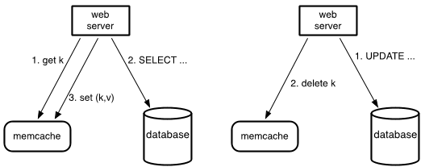

**查询缓存：** 我们依靠 memcache 来减轻数据库的读取负载。特别是，我们使用 memcache 作为*按需填充的旁路*（demand-filled look-aside）缓存，如图 1 所示。当 Web 服务器需要数据时，它首先通过提供字符串键从 memcache 请求值。如果该键对应的数据项未被缓存，Web 服务器从数据库或其他后端服务检索数据，并用该键值对填充缓存。对于写请求，Web 服务器向数据库发出 SQL 语句，然后向 memcache 发送 delete 请求以使任何过期数据失效。我们选择删除缓存数据而不是更新它，因为删除是幂等的。Memcache 不是数据的权威来源，因此允许驱逐缓存数据。

虽然有几种方法可以解决 MySQL 数据库上过多的读取流量，但我们选择了使用 memcache。在有限的工程资源和时间下，这是最佳选择。此外，将我们的缓存层与持久化层分离，使我们能够在工作负载变化时独立调整每一层。

**通用缓存：** 我们还将 `memcache` 用作更通用的键值存储。例如，工程师使用 `memcache` 存储来自复杂机器学习算法的预计算结果，这些结果随后可以被各种其他应用使用。新服务只需很少的努力就可以利用现有的 memcache 基础设施，而无需承担调优、优化、配置和维护大型服务器集群的负担。

就目前而言，memcached 不提供服务器间协调；它是在单个服务器上运行的内存哈希表。在本文的其余部分，我们描述了如何基于 memcached 构建一个能够在 Facebook 工作负载下运行的分布式键值存储。我们的系统提供了一套配置、聚合和路由服务，将 memcached 实例组织成分布式系统。

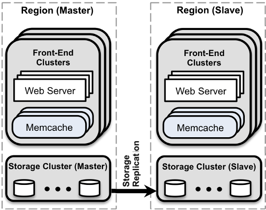

我们组织论文的结构以强调在三个不同部署规模下出现的主题。当我们有一个服务器集群时，读密集型工作负载和宽扇出是主要关注点。当需要扩展到多个前端集群时，我们解决这些集群之间的数据复制问题。最后，我们描述了在将集群分布到全球时提供一致用户体验的机制。运维复杂性和容错在所有规模下都很重要。我们提供了支持我们设计决策的关键数据，并引导读者参考 Atikoglu 等人 [8] 的工作以获取对我们工作负载的更详细分析。在高层次上，图 2 展示了最终架构，其中我们将共置的集群组织为一个区域，并指定一个主区域提供数据流以保持非主区域最新。

在演进系统的过程中，我们优先考虑两个主要设计目标。(1) 任何变更都必须影响面向用户或运维的问题。范围有限的优化很少被考虑。(2) 我们将读取瞬态过期数据的概率视为一个可调参数，类似于响应性。我们愿意暴露略微过期的数据，以换取保护后端存储服务免受过多负载。

## 3 集群内：延迟与负载

我们现在考虑在集群内扩展到数千台服务器的挑战。在这个规模下，我们的大部分工作集中在降低获取缓存数据的延迟或缓存未命中带来的负载。

### 3.1 降低延迟

无论数据请求导致缓存命中还是未命中，memcache 响应的延迟都是用户请求响应时间的关键因素。单个用户 Web 请求通常会导致数百个独立的 memcache get 请求。例如，加载我们的一个热门页面平均需要从 memcache 获取 521 个不同的数据项。¹

我们在集群中配置数百台 memcached 服务器以减少数据库和其他服务的负载。数据项通过一致性哈希 [22] 分布在 memcached 服务器上。因此 Web 服务器必须经常与许多 memcached 服务器通信以满足用户请求。结果，所有 Web 服务器在短时间内与每台 memcached 服务器通信。这种全对全通信模式可能导致 incast 拥塞 [30]，或使单个服务器成为许多 Web 服务器的瓶颈。数据复制通常可以缓解单服务器瓶颈，但在常见情况下会导致显著的内存低效。

我们主要通过关注 memcache 客户端来降低延迟，该客户端运行在每台 Web 服务器上。这个客户端承担一系列功能，包括序列化、压缩、请求路由、错误处理和请求批处理。客户端维护所有可用服务器的映射，通过辅助配置系统更新。

**并行请求和批处理：** 我们组织 Web 应用代码以最小化响应页面请求所需的网络往返次数。我们构建一个有向无环图（DAG）来表示数据之间的依赖关系。Web 服务器使用这个 DAG 来最大化可以并发获取的数据项数量。平均而言，这些批次每个请求包含 24 个键²。

**客户端-服务器通信：** Memcached 服务器之间不通信。在适当的时候，我们将系统的复杂性嵌入无状态客户端而不是 memcached 服务器中。这大大简化了 memcached，使我们能够专注于使其在更有限的用例下高性能。保持客户端无状态可以实现软件的快速迭代并简化我们的部署流程。客户端逻辑以两个组件提供：一个可以嵌入应用的库，或一个名为 mcrouter 的独立代理。该代理呈现 memcached 服务器接口，并将请求/回复路由到/来自其他服务器。

客户端使用 UDP 和 TCP 与 memcached 服务器通信。我们依靠 UDP 进行 get 请求以减少延迟和开销。由于 UDP 是无连接的，Web 服务器中的每个线程被允许直接与 memcached 服务器通信，绕过 mcrouter，无需建立和维护

>$^{1}$该页面获取的第 95 百分位数为 1,740 个数据项。

>$^{2}$第 95 百分位数为每个请求 95 个键。

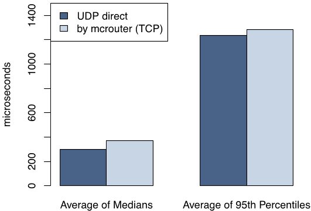

连接，从而减少开销。UDP 实现检测被丢弃或乱序接收的数据包（使用序列号），并在客户端将它们视为错误。它不提供任何尝试从中恢复的机制。在我们的基础设施中，我们发现这个决定是实用的。在峰值负载下，memcache 客户端观察到 0.25% 的 get 请求被丢弃。大约 80% 的这些丢弃是由于延迟或丢弃的数据包，而其余是由于乱序交付。客户端将 get 错误视为缓存未命中，但 Web 服务器在查询数据后会跳过向 memcached 插入条目，以避免对可能过载的网络或服务器施加额外负载。

为了可靠性，客户端通过运行在与 Web 服务器同一台机器上的 mcrouter 实例，通过 TCP 执行 set 和 delete 操作。对于需要确认状态变更的操作（更新和删除），TCP 消除了向我们的 UDP 实现添加重试机制的需要。

Web 服务器依靠高度并行和超额订阅来实现高吞吐量。开放 TCP 连接的高内存需求使得在每台 Web 线程和 memcached 服务器之间保持开放连接的成本过高，除非通过 mcrouter 进行某种形式的连接合并。合并这些连接通过减少高吞吐量 TCP 连接所需的网络、CPU 和内存资源来提高服务器效率。图 3 展示了生产环境中 Web 服务器通过 UDP 和通过 mcrouter 的 TCP 获取键的平均、中位数和第 95 百分位延迟。在所有情况下，这些平均值的标准偏差小于 1%。如数据所示，依靠 UDP 可以带来 20% 的延迟降低来服务请求。

**Incast 拥塞：** Memcache 客户端实现流控机制以限制 incast 拥塞。当

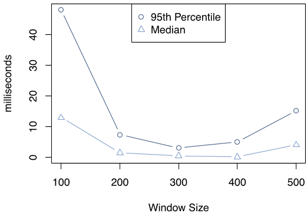

客户端请求大量键时，如果这些响应同时到达，可能会压垮机架和集群交换机等组件。因此客户端使用滑动窗口机制 [11] 来控制未决请求的数量。当客户端收到响应时，才能发送下一个请求。类似于 TCP 的拥塞控制，这个滑动窗口的大小在请求成功时缓慢增长，在请求未得到应答时缩小。该窗口独立于目的地应用于所有 memcache 请求；而 TCP 窗口仅适用于单个流。

图 4 展示了窗口大小对用户请求处于可运行状态但在 Web 服务器内等待被调度的时间量的影响。数据来自一个前端集群中的多个机架。用户请求在每台 Web 服务器上呈现泊松到达过程。根据 Little 定律 [26]，$L = \lambda W$，在服务器中排队的请求数（$L$）与请求处理所需的平均时间（$W$）成正比，假设输入请求率是恒定的（在我们的实验中确实如此）。Web 请求等待被调度的时间是系统中 Web 请求数量的直接指标。窗口大小较小时，应用必须串行地分派更多组 memcache 请求，增加了 Web 请求的持续时间。窗口大小过大时，同时的 memcache 请求数量会导致 incast 拥塞。结果将是 memcache 错误和应用回退到持久存储获取数据，从而导致 Web 请求处理变慢。在这两个极端之间存在一个平衡点，可以避免不必要的延迟并最小化 incast 拥塞。

### 3.2 降低负载

我们使用 memcache 来减少沿更昂贵路径（如数据库查询）获取数据的频率。当所需数据未被缓存时，Web 服务器回退到这些路径。以下小节描述了三种降低负载的技术。

#### 3.2.1 租约

我们引入了一种称为租约（lease）的新机制来解决两个问题：过期写入（stale set）和惊群效应（thundering herd）。过期写入发生在 Web 服务器在 memcache 中设置的值不反映应缓存的最新值时。这可能在并发更新 memcache 时被重新排序时发生。惊群效应发生在某个特定键经历大量读写活动时。由于写活动反复使最近设置的值失效，许多读取回退到更昂贵的路径。我们的租约机制解决了这两个问题。

直觉上，当客户端经历缓存未命中时，memcached 实例给该客户端一个租约，允许它将数据设置回缓存。租约是一个绑定到客户端最初请求的特定键的 64 位令牌。客户端在缓存中设置值时提供租约令牌。有了租约令牌，memcached 可以验证并确定数据是否应被存储，从而仲裁并发写入。如果 memcached 因收到该数据项的 delete 请求而使租约令牌失效，则验证可能失败。租约以类似于 load-link/store-conditional 操作 [20] 的方式防止过期写入。

对租约的轻微修改也能缓解惊群效应。每台 memcached 服务器调节其返回令牌的速率。默认情况下，我们配置这些服务器每个键每 10 秒只返回一次令牌。在令牌发出后 10 秒内对键值的请求会导致一个特殊通知，告诉客户端等待一小段时间。通常，持有租约的客户端会在几毫秒内成功设置数据。因此，当等待的客户端重试请求时，数据通常已存在于缓存中。

为了说明这一点，我们收集了一组特别容易受惊群效应影响的键在一周内所有缓存未命中的数据。没有租约时，所有缓存未命中导致峰值数据库查询率为 17K/s。有了租约，峰值数据库查询率为 1.3K/s。由于我们根据峰值负载配置数据库，我们的租约机制带来了显著的效率提升。

**过期值：** 有了租约，我们可以在某些用例中最小化应用的等待时间。我们可以通过识别返回略微过期的数据是可接受的情况来进一步减少这个时间。当一个键被删除时，其值被转移到一个保存最近删除数据项的数据结构中，在那里短暂存活后被清除。get 请求可以返回租约令牌或标记为过期的数据。能够使用过期数据继续前进的应用不需要等待从数据库获取最新值。我们的经验表明，由于缓存值往往是数据库的单调递增快照，大多数应用可以在不做任何更改的情况下使用过期值。

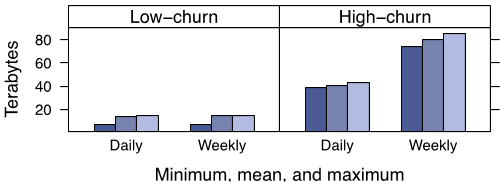

#### 3.2.2 Memcache 池

将 memcache 用作通用缓存层要求工作负载共享基础设施，尽管它们有不同的访问模式、内存占用和服务质量要求。不同应用的工作负载可能产生负面干扰，导致命中率下降。

为了适应这些差异，我们将集群的 memcached 服务器划分为独立的池。我们指定一个池（名为 wildcard）作为默认池，并为在 wildcard 中驻留有问题的键配置单独的池。例如，我们可能为访问频繁但缓存未命中代价低的键配置一个小池。我们也可能为访问不频繁但缓存未命中代价极高的键配置一个大池。

图 5 展示了两组不同数据项的工作集，一组是低流失率的，另一组是高流失率的。工作集通过每百万个数据项中采样一个的所有操作来近似。对于每个这些数据项，我们收集最小、平均和最大数据项大小。这些大小被求和并乘以一百万来近似工作集。每日和每周工作集之间的差异表示流失量。具有不同流失特征的数据项以一种不幸的方式交互：仍然有价值的低流失率键在不再被访问的高流失率键之前被驱逐。将这些键放在不同的池中可以防止这种负面干扰，并允许我们根据缓存未命中成本来调整高流失率池的大小。第 7 节提供了进一步的分析。

#### 3.2.3 池内复制

在某些池中，我们使用复制来提高 memcached 服务器的延迟和效率。当 (1) 应用经常同时获取许多键，(2) 整个数据集适合一到两台 memcached 服务器，且 (3) 请求率远高于单台服务器能处理的水平时，我们选择在池内复制一类键。

在这种情况下，我们倾向于复制而不是进一步划分键空间。考虑一台持有 100 个数据项且每秒能响应 50 万次请求的 memcached 服务器。每个请求要求 100 个键。每个请求获取 100 个键与 1 个键的 memcached 开销差异很小。要将系统扩展到每秒处理 100 万次请求，假设我们添加第二台服务器并将键空间平均分配。客户端现在需要将每个 100 键请求拆分为两个约 50 键的并行请求。因此，两台服务器仍然必须每秒处理 100 万次请求。然而，如果我们将所有 100 个键复制到多台服务器，客户端的 100 键请求可以发送到任何副本。这将每台服务器的负载降低到每秒 50 万次请求。每个客户端根据自己的 IP 地址选择副本。这种方法需要向所有副本传递失效通知以维护一致性。

### 3.3 处理故障

无法从 memcache 获取数据会导致后端服务承受过多负载，可能引发进一步的级联故障。我们必须在两个规模上处理故障：(1) 由于网络或服务器故障导致少量主机不可访问，或 (2) 影响集群内大量服务器的广泛中断。如果整个集群必须下线，我们将用户 Web 请求转移到其他集群，这有效地移除了该集群内 memcache 的所有负载。

对于小范围中断，我们依靠自动修复系统 [3]。这些操作不是即时的，可能需要几分钟。这个持续时间足以导致上述级联故障，因此我们引入了一种机制来进一步保护后端服务免受故障影响。我们专门分配一小部分机器，命名为 Gutter，来接管少数故障服务器的职责。Gutter 约占集群中 memcached 服务器的 1%。

当 memcached 客户端的 get 请求没有收到响应时，客户端假设服务器已故障，并将请求重新发送到特殊的 Gutter 池。如果第二次请求未命中，客户端将在查询数据库后将适当的键值对插入 Gutter 机器。Gutter 中的条目快速过期以避免 Gutter 失效操作。Gutter 以略微过期的数据为代价限制了后端服务的负载。

请注意，这种设计不同于客户端在剩余 memcached 服务器之间重新哈希键的方法。这种方法由于键访问频率不均匀而存在级联故障的风险。例如，单个键可能占服务器请求的 20%。负责该热键的服务器也可能变得过载。通过将负载转移到空闲服务器，我们限制了这种风险。

通常，每个失败的请求都会导致对后备存储的一次命中，可能使其过载。通过使用 Gutter 存储这些结果，这些故障中的很大一部分被转换为 Gutter 池中的命中，从而减少了后备存储的负载。在实践中，该系统将客户端可见的故障率降低了 99%，并每天将 10%–25% 的故障转换为命中。如果一台 memcached 服务器完全故障，Gutter 池中的命中率通常在 4 分钟内超过 35%，并且经常接近 50%。因此，当少数 memcached 服务器因故障或轻微网络事件而不可用时，Gutter 保护后备存储免受流量激增的影响。

## 4 区域内：复制

随着需求增加，购买更多 Web 和 memcached 服务器来扩展集群是很诱人的。然而，简单地扩展系统并不能消除所有问题。随着添加更多 Web 服务器来应对增加的用户流量，高请求量的数据项只会变得更受欢迎。随着 memcached 服务器数量增加，incast 拥塞也会恶化。因此，我们将 Web 和 memcached 服务器拆分为多个前端集群。这些集群与包含数据库的存储集群一起定义了一个区域。这种区域架构还允许更小的故障域和可管理的网络配置。我们用数据复制换取更多独立的故障域、可管理的网络配置和 incast 拥塞的减少。

本节分析了共享同一存储集群的多个前端集群的影响。具体来说，我们解决了允许数据在这些集群之间复制的后果以及禁止这种复制的潜在内存效率。

### 4.1 区域失效

虽然区域中的存储集群持有数据的权威副本，但用户需求可能将该数据复制到前端集群中。存储集群负责使缓存数据失效，以保持前端集群与权威版本一致。作为优化，修改数据的 Web 服务器还会向其自己的集群发送失效通知，以提供读后

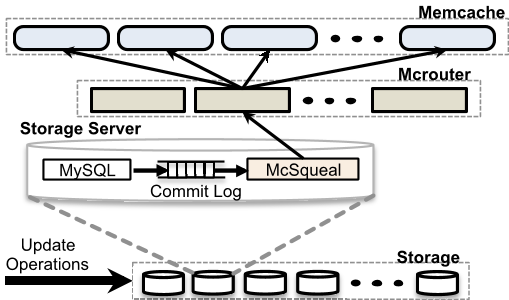

写语义，用于单个用户请求，并减少
过期数据在其本地缓存中存在的时间。

修改权威状态的 SQL 语句被修改为包含在事务提交后需要失效的 memcache 键 [7]。我们在每个数据库上部署失效守护进程（名为 mcsqueal）。每个守护进程检查其数据库提交的 SQL 语句，提取任何删除操作，并将这些删除广播到该区域中每个前端集群的 memcache 部署。图 6 展示了这种方法。我们认识到大多数失效操作并不删除数据；实际上，只有 4% 的删除操作实际导致了缓存数据的失效。

**降低数据包速率：** 虽然 mcsqueal 可以直接联系 memcached 服务器，但从后端集群发送到前端集群的数据包速率将高得不可接受。这个数据包速率问题是有许多数据库和许多 memcached 服务器跨集群边界通信的结果。失效守护进程将删除操作批处理为更少的数据包，并将它们发送到每个前端集群中运行 mcrouter 实例的一组专用服务器。这些 mcrouter 然后从每个批次中解包单个删除操作，并将这些失效路由到前端集群内共置的正确 memcached 服务器。批处理使每个数据包的删除中位数提高了 18 倍。

**通过 Web 服务器失效：** Web 服务器向所有前端集群广播失效操作更简单。这种方法不幸地存在两个问题。首先，它产生更多的数据包开销，因为 Web 服务器在批处理失效方面不如 mcsqueal 管道有效。其次，当出现系统性失效问题（如由于配置错误导致的删除误路由）时，它几乎没有补救措施。在过去，这通常需要整个 memcache 基础设施的滚动重启，这是一个缓慢且具有破坏性的过程，我们希望避免。相比之下，将失效嵌入 SQL 语句中，由数据库提交并存储在可靠日志中，允许 mcsqueal 简单地重放可能丢失或误路由的失效操作。

| |A（集群）|B（区域）|
| ---|---|---|
| 中位用户数|30|1|
| 每秒 get 数|3.26 M|458 K|
| 中位值大小|10.7 kB|4.34 kB|

>表 1：两个数据项族的集群复制或区域复制的决定因素

### 4.2 区域池

每个集群根据发送给它的用户请求的混合独立缓存数据。如果用户的请求被随机路由到所有可用的前端集群，那么所有前端集群中缓存的数据将大致相同。这使我们能够在不降低命中率的情况下将集群下线进行维护。过度复制数据可能在内存上效率低下，特别是对于大型、很少访问的数据项。我们可以通过让多个前端集群共享同一组 memcached 服务器来减少副本数量。我们称之为区域池。

跨集群边界会产生更多延迟。此外，我们的网络在集群边界上的平均可用带宽比单个集群内少 40%。复制用更多的 memcached 服务器换取更少的集群间带宽、更低的延迟和更好的容错。对于某些数据，放弃复制数据的优势并在每个区域保留单个副本更具成本效益。在区域内扩展 memcache 的主要挑战之一是决定一个键是否需要在所有前端集群之间复制，还是在每个区域保留单个副本。当区域池中的服务器故障时，也使用 Gutter。

表 1 总结了我们应用中两种具有大值的数据项。我们将一种（B）移到了区域池，而另一种（A）保持不变。注意，客户端访问 B 类数据项的频率比 A 类低一个数量级。B 类的低访问率使其成为区域池的理想候选，因为它不会对集群间带宽产生不利影响。B 类还将占据每个集群 wildcard 池的 25%，因此区域化提供了显著的存储效率。然而，A 类数据项大小是 B 类的两倍且访问频率高得多，使其不适合区域化考虑。将数据迁移到区域池的决定目前基于一组基于访问率、数据集大小和访问特定数据项的唯一用户数量的手动启发式方法。

### 4.3 冷集群预热

当我们上线新集群、现有集群故障或执行计划维护时，缓存的命中率会非常低，削弱了保护后端服务的能力。一个称为冷集群预热（Cold Cluster Warmup）的系统通过允许"冷集群"（即缓存为空的前端集群）中的客户端从"热集群"（即缓存具有正常命中率的集群）而不是持久存储检索数据来缓解这个问题。这利用了上述跨前端集群发生的数据复制。有了这个系统，冷集群可以在几小时内而不是几天内恢复到满容量。

必须小心避免因竞态条件导致的不一致。例如，如果冷集群中的客户端执行数据库更新，而另一个客户端的后续请求在热集群收到失效通知之前从热集群检索了过期值，则该数据项将在冷集群中无限期地不一致。Memcached 的 delete 支持非零的保持时间（hold-off time），在指定的保持时间内拒绝 add 操作。默认情况下，对冷集群的所有 delete 都带有两秒的保持时间。当在冷集群中检测到未命中时，客户端从热集群重新请求该键并将其添加到冷集群。add 的失败表明数据库上有更新的数据，因此客户端将从数据库获取值。虽然理论上 delete 仍可能延迟超过两秒，但在绝大多数情况下并非如此。冷集群预热的运维收益远远超过罕见缓存一致性问题的代价。一旦冷集群的命中率稳定且收益减少，我们就关闭它。

## 5 跨区域：一致性

更广泛的地理数据中心布局有几个优势。首先，将 Web 服务器放在离终端用户更近的地方可以显著降低延迟。其次，地理多样性可以减轻自然灾害或大规模停电等事件的影响。第三，新地点可以提供更便宜的电力和其他经济激励。我们通过部署到多个区域来获得这些优势。每个区域由一个存储集群和几个前端集群组成。我们指定一个区域持有主数据库，其他区域包含只读副本；我们依靠 MySQL 的复制机制来保持副本数据库与主数据库同步。在这种设计中，Web 服务器在访问本地 memcached 服务器或本地数据库副本时都能体验低延迟。当跨多个区域扩展时，维护 memcache 中的数据与持久存储之间的一致性成为主要的技术挑战。这些挑战源于一个单一问题：副本数据库可能落后于主数据库。

我们的系统代表了广泛的一致性和性能权衡谱中的一个点。一致性模型，像系统的其余部分一样，多年来一直在演进以适应站点的规模。它混合了在不牺牲高性能要求的情况下可以实际构建的内容。系统管理的大量数据意味着任何增加网络或存储需求的微小变化都会带来不可忽视的成本。大多数提供更严格语义的想法很少离开设计阶段，因为它们变得过于昂贵。与许多为现有用例定制的系统不同，memcache 和 Facebook 是一起开发的。这使应用和系统工程师能够共同找到一个对应用工程师来说足够容易理解、同时性能足够好且足够简单以在大规模下可靠工作的模型。我们提供尽力而为的最终一致性，但强调性能和可用性。因此，该系统在实践中对我们非常有效，我们认为我们找到了一个可接受的权衡。

**来自主区域的写入：** 我们早期要求存储集群通过守护进程使数据失效的决定在多区域架构中有重要后果。特别是，它避免了失效通知在数据从主区域复制*之前*到达的竞态条件。考虑主区域中已完成修改数据库并试图使现在过期的数据失效的 Web 服务器。在主区域内发送失效是安全的。然而，让 Web 服务器在副本区域使数据失效可能为时过早，因为更改可能尚未传播到副本数据库。随后从副本区域对数据的查询将与复制流竞争，从而增加将过期数据设置到 memcache 中的概率。历史上，我们是在扩展到多区域之后才实现 mcsqueal 的。

**来自非主区域的写入：** 现在考虑一个在复制延迟过大时从非主区域更新数据的用户。如果他最近的更改缺失，用户的下一个请求可能会导致混淆。只有在复制流追上之后，才应允许从副本数据库进行缓存填充。否则，后续请求可能导致副本的过期数据被获取和缓存。

我们采用远程标记（remote marker）机制来最小化读取过期数据的概率。标记的存在

表明本地副本数据库中的数据可能过期，查询应重定向到主区域。当 Web 服务器希望更新影响键 $k$ 的数据时，该服务器 (1) 在该区域设置远程标记 $r_k$，(2) 向主区域执行写入，将 $k$ 和 $r_k$ 嵌入 SQL 语句以进行失效，(3) 在本地集群删除 $k$。在后续对 $k$ 的请求中，Web 服务器将无法找到缓存数据，检查 $r_k$ 是否存在，并根据 $r_k$ 的存在将查询定向到主区域或本地区域。在这种情况下，我们明确地用缓存未命中时的额外延迟换取读取过期数据概率的降低。

我们通过使用区域池来实现远程标记。请注意，此机制可能在对同一键的并发修改期间暴露过期信息，因为一个操作可能删除了另一个进行中操作应保留的远程标记。值得强调的是，我们对 memcache 用于远程标记的使用在微妙的方式上不同于缓存结果。作为缓存，删除或驱逐键始终是安全的操作；它可能增加数据库的负载，但不会损害一致性。相比之下，远程标记的存在有助于区分非主数据库是否持有过期数据。在实践中，我们发现远程标记的驱逐和并发修改的情况都很罕见。

**运维考量：** 区域间通信是昂贵的，因为数据必须跨越大地理距离（例如横跨美国大陆）。通过为删除流和数据库复制共享同一通信通道，我们在较低带宽连接上获得了网络效率。

第 4.1 节中描述的用于管理删除的系统也部署在副本数据库上，以将删除广播到副本区域的 memcached 服务器。当下游组件无响应时，数据库和 mcrouter 会缓冲删除。任何组件的故障或延迟都会增加读取过期数据的概率。一旦这些下游组件再次可用，缓冲的删除就会被重放。替代方案包括将集群下线或在检测到问题时在前端集群中过度失效数据。鉴于我们的工作负载，这些方法带来的中断多于收益。

## 6 单服务器改进

全对全通信模式意味着单个服务器可能成为集群的瓶颈。本节描述了 memcached 中的性能优化和内存效率提升，这些改进允许在集群内更好地扩展。提高单服务器缓存性能是一个活跃的研究领域 [9, 10, 28, 25]。

### 6.1 性能优化

我们从使用固定大小哈希表的单线程 memcached 开始。最初的主要优化包括：(1) 允许哈希表自动扩展以避免查找时间漂移到 $O(n)$；(2) 使用全局锁保护多个数据结构使服务器多线程化；(3) 给每个线程分配自己的 UDP 端口以减少发送回复时的竞争，并随后分散中断处理开销。前两项优化已贡献回开源社区。本节的其余部分探讨了开源版本中尚未提供的进一步优化。

我们的实验主机配备 Intel Xeon CPU（X5650），运行频率 2.67GHz（12 核 12 超线程），Intel 82574L 千兆以太网控制器和 12GB 内存。生产服务器有额外的内存。更多细节此前已发表 [4]。性能测试设置由 15 个客户端组成，向一台运行 24 个线程的 memcached 服务器生成 memcache 流量。客户端和服务器共置在同一机架上，通过千兆以太网连接。这些测试测量了两分钟持续负载下 memcached 响应的延迟。

**Get 性能：** 我们首先研究用细粒度锁替换原始的多线程单锁实现的效果。我们通过在发出每个 10 键的 memcached 请求之前用 32 字节值预填充缓存来测量命中。图 7 展示了不同版本 memcached 在亚毫秒平均响应时间下可以维持的最大请求率。第一组柱状图是细粒度锁之前的 memcached，第二组是我们当前的 memcached，最后一组是开源版本 1.4.10，它独立实现了我们锁策略的较粗版本。

采用细粒度锁使命中峰值 get 率从 60 万提高到 180 万数据项/秒，提高了三倍。未命中的性能也从 270 万提高到 450 万数据项/秒。命中更昂贵，因为必须构造和传输返回值，而未命中只需要一个静态响应（END）用于整个 multiget，表示所有键都未命中。

我们还研究了使用 UDP 代替 TCP 的性能影响。图 8 展示了我们在平均延迟低于一毫秒的条件下可以维持的峰值请求率，分别针对单个 get 和 10 键 multiget。我们发现我们的 UDP 实现在单个 get 上比

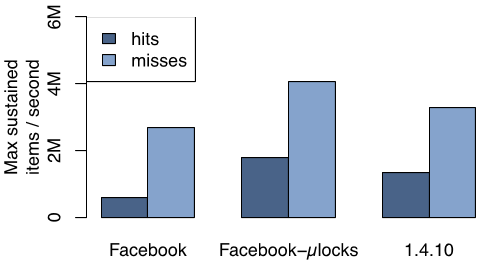

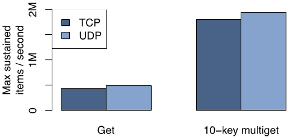

TCP 实现快 13%，在 10 键 multiget 上快 8%。

由于 multiget 在每个请求中打包了比单个 get 更多的数据，它们使用更少的数据包完成相同的工作。图 8 展示了 10 键 multiget 相比单个 get 约有四倍的改进。

### 6.2 自适应 slab 分配器

Memcached 使用 slab 分配器来管理内存。分配器将内存组织为 *slab 类*，每个类包含预分配的、大小统一的内存块。Memcached 将数据项存储在能容纳该数据项的元数据、键和值的最小 slab 类中。Slab 类从 64 字节开始，以 1.07 的因子指数增长到 1 MB，按 4 字节边界对齐³。每个 slab 类维护一个可用块的空闲列表，当空闲列表为空时以 1MB slab 为单位请求更多内存。一旦 memcached 服务器无法再分配空闲内存，新数据项的存储通过驱逐该 slab 类中最近最少使用（LRU）的数据项来完成。当工作负载变化时，最初分配给每个 slab 类的内存可能不再足够，导致命中率下降。

>³这个缩放因子确保我们同时拥有 64 和 128 字节的数据项，它们更适合硬件缓存行。

我们实现了一个自适应分配器，定期重新平衡 slab 分配以匹配当前工作负载。它将 slab 类标识为需要更多内存的条件是：当前正在驱逐数据项，且下一个被驱逐的数据项的最近使用时间至少比其他 slab 类中最近最少使用数据项的平均值新 20%。如果找到这样的类，则释放持有最近最少使用数据项的 slab 并转移到需要的类。请注意，开源社区已独立实现了类似的分配器，它平衡各 slab 类之间的驱逐率，而我们的算法专注于平衡各类中最旧数据项的年龄。平衡年龄提供了对整个服务器单一全局 LRU 驱逐策略的更好近似，而不是调整可能受访问模式严重影响的驱逐率。

### 6.3 瞬态数据项缓存

虽然 memcached 支持过期时间，但条目可能在过期后仍在内存中存活很长时间。Memcached 通过在服务该数据项的 get 请求时或当它们到达 LRU 末尾时检查过期时间来惰性驱逐这些条目。虽然对常见情况高效，但这种方案允许只经历单次活动爆发的短生命周期键浪费内存，直到它们到达 LRU 末尾。

因此我们引入了一种混合方案，对大多数键依赖惰性驱逐，并在短生命周期键过期时主动驱逐它们。我们将短生命周期数据项放入一个循环缓冲区的链表中（按距过期的秒数索引）——称为*瞬态数据项缓存*（Transient Item Cache）——基于数据项的过期时间。每秒，缓冲区头部的桶中所有数据项被驱逐，头部前进一位。当我们为一组使用频繁但数据项有用生命周期短的键添加短过期时间时，该键族使用的 memcache 池比例从 6% 降低到 0.3%，且不影响命中率。

### 6.4 软件升级

频繁的软件变更可能需要用于升级、bug 修复、临时诊断或性能测试。一台 memcached 服务器可以在几小时内达到其峰值命中率的 90%。因此，升级一组 memcached 服务器可能需要超过 12 小时，因为由此产生的数据库负载需要仔细管理。我们修改了 memcached 以将其缓存值和主要数据结构存储在 System V 共享内存区域中，以便数据可以在软件升级期间保持活跃，从而最小化中断。

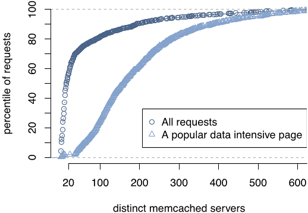

## 7 Memcache 工作负载

我们现在使用生产环境中运行的服务器数据来刻画 memcache 工作负载。

### 7.1 Web 服务器端的测量

我们记录了一小部分用户请求的所有 memcache 操作，并讨论了我们工作负载的扇出、响应大小和延迟特征。

**扇出：** 图 9 展示了 Web 服务器在响应页面请求时可能需要联系的不同 memcached 服务器的分布。如图所示，56% 的所有页面请求联系少于 20 台 memcached 服务器。按量计算，用户请求倾向于请求少量缓存数据。然而，这个分布有一个长尾。该图还展示了我们一个更热门页面的分布，该页面更好地展示了全对全通信模式。这种类型的大多数请求将访问超过 100 台不同的服务器；访问数百台 memcached 服务器并不罕见。

**响应大小：** 图 10 展示了 memcache 请求的响应大小。中位数（135 字节）和均值（954 字节）之间的差异意味着缓存数据项的大小有非常大的变化。此外，在大约 200 字节和 600 字节处似乎有三个明显的峰值。较大的数据项倾向于存储数据列表，而较小的数据项倾向于存储单条内容。

**延迟：** 我们测量了从 memcache 请求数据的往返延迟，包括路由请求和接收回复的成本、网络传输时间以及反序列化和解压缩的成本。在 7 天内，中位请求延迟为 333 微秒，而第 75 和第 95 百分位（p75 和 p95）分别为 475μs 和 1.135ms。我们从空闲 Web 服务器的中位端到端延迟为 178μs，而 p75 和 p95 分别为 219μs 和 374μs。p95 延迟之间的巨大差异源于处理大响应和等待可运行线程被调度，如第 3.1 节所讨论的。

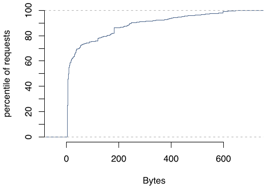

### 7.2 池统计

我们现在讨论四个 memcache 池的关键指标。这些池是 wildcard（默认池）、app（专用于特定应用的池）、用于频繁访问数据的复制池，以及用于很少访问信息的区域池。在每个池中，我们每 4 分钟收集一次平均统计数据，并在表 2 中报告一个月收集期间的最高平均值。这些数据近似了这些池看到的峰值负载。该表展示了不同池之间广泛不同的 get、set 和 delete 率。表 3 展示了每个池的响应大小分布。同样，不同的特征促使我们希望将这些工作负载彼此隔离。

如第 3.2.3 节所讨论的，我们在池内复制数据并利用批处理来处理高请求率。注意，复制池具有最高的 get 率（约为次高池的 $2.7\times$）和最高的字节与数据包比率，尽管其数据项大小最小。这些数据与我们的设计一致，其中我们利用复制和批处理来实现更好的性能。在 app 池中，更高的数据流失率导致自然更高的未命中率。该池倾向于包含访问几小时后因新内容而逐渐失去人气的缓存内容。区域池中的数据倾向于较大且访问不频繁，如请求率和值大小分布所示。

### 7.3 失效延迟

我们认识到失效的及时性是决定暴露过期数据概率的关键因素。为了监控这一健康状况，我们每

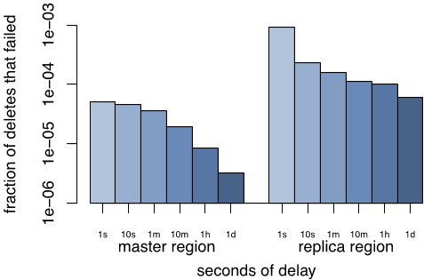

百万次删除中采样一次，并记录删除发出的时间。我们随后以固定间隔查询所有前端集群中 memcache 的内容，查找采样的键，并在数据项尽管有应使其失效的删除操作但仍然被缓存时记录错误。

在图 11 中，我们使用此监控机制报告 30 天跨度内的失效延迟。我们将这些数据分为两个不同的组成部分：(1) 删除源自主区域的 Web 服务器并发送到主区域的 memcached 服务器；(2) 删除源自副本区域并发送到另一个副本区域。如数据所示，当删除的源和目标与主区域共置时，我们的成功率要高得多，在 1 秒内达到四个 9 的可靠性，一小时后达到五个 9。然而，当删除源自并发送到主区域之外的位置时，我们的可靠性在 1 秒内降至三个 9，在 10 分钟内降至四个 9。根据我们的经验，我们发现如果失效在仅几秒后缺失，最常见的原因是第一次尝试失败，后续重试将解决问题。

## 8 相关工作

其他几个大型网站已经认识到键值存储的实用性。DeCandia 等人 [12] 提出了一个高可用键值存储，被 Amazon.com 的各种应用服务使用。虽然他们的系统针对写密集型工作负载进行了优化，但我们的系统针对以读为主的工作负载。类似地，LinkedIn 使用受 Dynamo 启发的系统 Voldemort [5]。键值缓存解决方案的其他主要部署包括 Github、Digg 和 Blizzard 的 Redis [6]，以及 Twitter [33] 和 Zynga 的 memcached。Lakshman 等人 [1] 开发了 Cassandra，一个基于模式的分布式键值存储。我们更倾向于部署和扩展 memcached，因为它的设计更简单。

我们在扩展 memcache 方面的工作建立在分布式数据结构的广泛工作之上。Gribble 等人 [19]

| 池|未命中率|$\frac{get}{s}$|$\frac{set}{s}$|$\frac{delete}{s}$|$\frac{packets}{s}$|出站带宽 (MB/s)|
| ---|---|---|---|---|---|---|
| wildcard|1.76%|262k|8.26k|21.2k|236k|57.4|
| app|7.85%|96.5k|11.9k|6.28k|83.0k|31.0|
| replicated|0.053%|710k|1.75k|3.22k|44.5k|30.1|
| regional|6.35%|9.1k|0.79k|35.9k|47.2k|10.8|

>表 2：选定 memcache 池上每台服务器的流量，7 天平均

| 池|均值|标准差|p5|p25|p50|p75|p95|p99|
| ---|---|---|---|---|---|---|---|---|
| wildcard|1.11 K|8.28 K|77|102|169|363|3.65 K|18.3 K|
| app|881|7.70 K|103|247|269|337|1.68K|10.4 K|
| replicated|66|2|62|68|68|68|68|68|
| regional|31.8 K|75.4 K|231|824|5.31 K|24.0 K|158 K|381 K|

>表 3：各池数据项大小的分布（字节）

提出了适用于互联网规模服务的键值存储系统的早期版本。Ousterhout 等人 [29] 也提出了大规模内存键值存储系统的案例。与这两种解决方案不同，memcache 不保证持久性。我们依靠其他系统来处理持久数据存储。

Ports 等人 [31] 提供了一个库来管理对事务数据库查询的缓存结果。我们的需求需要更灵活的缓存策略。我们对租约 [18] 和过期读取 [23] 的使用利用了先前关于高性能系统中缓存一致性和读操作的研究。Ghandeharizadeh 和 Yap [15] 的工作也提出了一种基于时间戳而非显式版本号来解决过期写入问题的算法。

虽然软件路由器更容易定制和编程，但它们的性能通常不如其硬件对应物。Dobrescu 等人 [13] 通过利用多核、多内存控制器、多队列网络接口和通用服务器上的批处理来解决这些问题。将这些技术应用于 mcrouter 的实现仍是未来工作。Twitter 也独立开发了类似于 mcrouter 的 memcache 代理 [32]。

在 Coda [35] 中，Satyanarayanan 等人展示了如何使因断开操作而分歧的数据集重新同步。Glendenning 等人 [17] 利用 Paxos [24] 和法定人数 [16] 构建 Scatter，一个具有线性化语义 [21] 的分布式哈希表，能够抵御流失。Lloyd 等人 [27] 研究了 COPS（一个广域存储系统）中的因果一致性。

TÁO [37] 是另一个严重依赖缓存来服务大量低延迟查询的 Facebook 系统。TAO 在两个根本方面与 memcache 不同。(1) TAO 实现了一个图数据模型，其中节点由固定长度的持久标识符（64 位整数）标识。(2) TAO 编码了其图模型到持久存储的特定映射，并负责持久性。许多组件，如我们的客户端库和 mcrouter，被两个系统共同使用。

## 9 结论

在本文中，我们展示了如何扩展基于 memcached 的架构以满足 Facebook 不断增长的需求。讨论的许多权衡不是根本性的，而是根植于在不断产品开发下演进活跃系统时平衡工程资源的现实。在构建、维护和演进我们的系统过程中，我们学到了以下教训。(1) 分离缓存和持久存储系统使我们能够独立扩展它们。(2) 改善监控、调试和运维效率的功能与性能同样重要。(3) 管理有状态组件在运维上比无状态组件更复杂。因此，将逻辑保持在无状态客户端中有助于迭代功能并最小化中断。(4) 系统必须支持新功能的渐进式推出和回滚，即使这导致功能集的临时异构性。(5) 简单性至关重要。

## 致谢

我们感谢 Philippe Ajoux、Nathan Bronson、Mark Drayton、David Fetterman、Alex Gartrell、Andrii Grynenko、Robert Johnson、Sanjeev Kumar、Anton Likhtarov、Mark Marchukov、Scott Marlette、Ben Maurer、David Meisner、Konrad Michels、Andrew Pope、Jeff Rothschild、Jason Sobel 和 Yee Jiun Song 的贡献。我们也感谢匿名审稿人、我们的 shepherd Michael Piatek、Tor M. Aamodt、Remzi H. Arpaci-Dusseau 和 Tayler Hetherington 对论文早期版本的宝贵反馈。最后，我们感谢 Facebook 的工程师同事们的建议、bug 报告和支持，正是这些使 memcache 成为今天的样子。

## 参考文献

[1] Apache Cassandra. http://cassandra.apache.org/.

[2] Couchbase. http://www.couchbase.com/.

[3] Making Facebook Self-Healing. https://www.facebook.com/note.php?note_id=10150275248698920.

[4] Open Compute Project. http://www.opencompute.org.

[5] Project Voldemort. http://project-voldemort.com/.

[6] Redis. http://redis.io/.

[7] Scaling Out. https://www.facebook.com/note.php?note_id=23844338919.

[8] ATIKOGLU, B., XU, Y., FRACHTENBERG, E., JIANG, S., AND PALECZNY, M. Workload analysis of a large-scale key-value store. ACM SIGMETRICS Performance Evaluation Review 40, 1 (June 2012), 53–64.

[9] BEREZECKI, M., FRACHTENBERG, E., PALECZNY, M., AND STEELE, K. Power and performance evaluation of memcached on the tilepro64 architecture. *Sustainable Computing: Informatics and Systems* 2, 2 (June 2012), 81 – 90.

[10] BOYD-WICKIZER, S., CLEMENTS, A. T., MAO, Y., PESTEREV, A., KAASHOEK, M. F., MORRIS, R., AND ZELDOVICH, N. An analysis of linux scalability to many cores. In Proceedings of the 9th USENIX Symposium on Operating Systems Design & Implementation (2010), pp. 1–8.

[11] CERF, V. G., AND KAHN, R. E. A protocol for packet network intercommunication. ACM SIGCOMM Computer Communication Review 35, 2 (Apr. 2005), 71–82.

[12] DECANDIA, G., HASTORUN, D., JAMPANI, M., KAKULAPATI, G., LAKSHMAN, A., PILCHIN, A., SIVASUBRAMANIAN, S., VOSSHALL, P., AND VOGELS, W. Dynamo: amazon's highly available key-value store. ACM SIGOPS Operating Systems Review 41, 6 (Dec. 2007), 205–220.

[13] FALL, K., IANNACONE, G., MANESH, M., RATNASAMY, S., ARGYRAKI, K., DOBRESCU, M., AND EGI, N. Routebricks: enabling general purpose network infrastructure. ACM SIGOPS Operating Systems Review 45, 1 (Feb. 2011), 112–125.

[14] FITZPATRICK, B. Distributed caching with memcached. *Linux Journal* 2004, 124 (Aug. 2004), 5.

[15] GHANDEHARIZADEH, S., AND YAP, J. Gumball: a race condition prevention technique for cache augmented sql database management systems. In Proceedings of the 2nd ACM SIGMOD Workshop on Databases and Social Networks (2012), pp. 1–6.

[16] GIFFORD, D. K. Weighted voting for replicated data. In Proceedings of the 7th ACM Symposium on Operating Systems Principles (1979), pp. 150–162.

[17] GLENDENNING, L., BESCHASTNIKH, I., KRISHNAMURTHY, A., AND ANDERSON, T. Scalable consistency in Scatter. In Proceedings of the 23rd ACM Symposium on Operating Systems Principles (2011), pp. 15–28.

[18] GRAY, C., AND CHERITON, D. Leases: An efficient fault-tolerant mechanism for distributed file cache consistency. ACM SIGOPS Operating Systems Review 23, 5 (Nov. 1989), 202–210.

[19] GRIBBLE, S. D., BREWER, E. A., HELLERSTEIN, J. M., AND CULLER, D. Scalable, distributed data structures for internet service construction. In Proceedings of the 4th USENIX Symposium on Operating Systems Design & Implementation (2000), pp. 319–332.

[20] HEINRICH, J. *MIPS R4000 Microprocessor User's Manual*. MIPS technologies, 1994.

[21] HERLIHY, M. P., AND WING, J. M. Linearizability: a correctness condition for concurrent objects. *ACM Transactions on Programming Languages and Systems* 12, 3 (July 1990), 463–492.

[22] KARGER, D., LEHMAN, E., LEIGHTON, T., PANIGRAHY, R., LEVINE, M., AND LEWIN, D. Consistent Hashing and Random trees: Distributed Caching Protocols for Relieving Hot Spots on the World Wide Web. In Proceedings of the 29th annual ACM Symposium on Theory of Computing (1997), pp. 654–663.

[23] KEETON, K., MORREY, III, C. B., SOULES, C. A., AND VEITCH, A. Lazybase: freshness vs. performance in information management. ACM SIGOPS Operating Systems Review 44, 1 (Dec. 2010), 15–19.

[24] LAMPORT, L. The part-time parliament. ACM Transactions on Computer Systems 16, 2 (May 1998), 133–169.

[25] LIM, H., FAN, B., ANDERSEN, D. G., AND KAMINSKY, M. Silt: a memory-efficient, high-performance key-value store. In *Proceedings of the 23rd ACM Symposium on Operating Systems Principles* (2011), pp. 1–13.

[26] LITTLE, J., AND GRAVES, S. Little's law. *Building Intuition* (2008), 81–100.

[27] LLOYD, W., FREEDMAN, M., KAMINSKY, M., AND ANDERSEN, D. Don't settle for eventual: scalable causal consistency for wide-area storage with COPS. In Proceedings of the 23rd ACM Symposium on Operating Systems Principles (2011), pp. 401–416.

[28] METREVELI, Z., ZELDOVICH, N., AND KAASHOEK, M. Cphash: A cache-partitioned hash table. In Proceedings of the 17th ACM SIGPLAN symposium on Principles and Practice of Parallel Programming (2012), pp. 319–320.

[29] OUSTERHOUT, J., AGRAWAL, P., ERICKSON, D., KOZYRAKIS, C., LEVERICH, J., MAZIÈRES, D., MITRA, S., NARAYANAN, A., ONGARO, D., PARULKAR, G., ROSENBLOUM, M., RUMBLE, S. M., STRATMANN, E., AND STUTSMAN, R. The case for ramcloud. *Communications of the ACM* 54, 7 (July 2011), 121–130.

[30] PHANISHAYEE, A., KREVAT, E., VASUDEVAN, V., ANDERSEN, D. G., GANGER, G. R., GIBSON, G. A., AND SESHAN, S. Measurement and analysis of tcp throughput collapse in cluster-based storage systems. In Proceedings of the 6th USENIX Conference on File and Storage Technologies (2008), pp. 12:1–12:14.

[31] PORTS, D. R. K., CLEMENTS, A. T., ZHANG, I., MADDEN, S., AND LISKOV, B. Transactional consistency and automatic management in an application data cache. In Proceedings of the 9th USENIX Symposium on Operating Systems Design & Implementation (2010), pp. 1–15.

[32] RAJASHEKHAR, M. Twemproxy: A fast, light-weight proxy for memcached. https://dev.twitter.com/blog/twemproxy.

[33] RAJASHEKHAR, M., AND YUE, Y. Caching with twemcache. http://engineering.twitter.com/2012/07/caching-with-twemcache.html.

[34] RATNASAMY, S., FRANCIS, P., HANDLEY, M., KARP, R., AND SHENKER, S. A scalable content-addressable network. ACM SIGCOMM Computer Communication Review 31, 4 (Oct. 2001), 161–172.

[35] SATYANARAYANAN, M., KISTLER, J., KUMAR, P., OKASAKI, M., SIEGEL, E., AND STEERE, D. Coda: A highly available file system for a distributed workstation environment. *IEEE Transactions on Computers* 39, 4 (Apr. 1990), 447–459.

[36] STOICA, I., MORRIS, R., KARGER, D., KAASHOEK, M., AND BALAKRISHNAN, H. Chord: A scalable peer-to-peer lookup service for internet applications. ACM SIGCOMM Computer Communication Review 31, 4 (Oct. 2001), 149–160.

[37] VENKATARAMANI, V., AMSDEN, Z., BRONSON, N., CABRERA III, G., CHAKKA, P., DIMOV, P., DING, H., FERRIS, J., GIARDULLO, A., HOON, J., KULKARNI, S., LAWRENCE, N., MARCHUKOV, M., PETROV, D., AND PUZAR, L. Tao: how facebook serves the social graph. In Proceedings of the ACM SIGMOD International Conference on Management of Data (2012), pp. 791–792.
