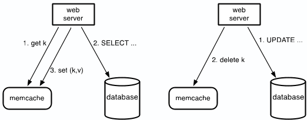
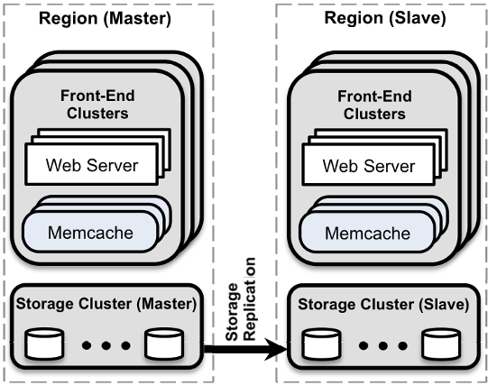
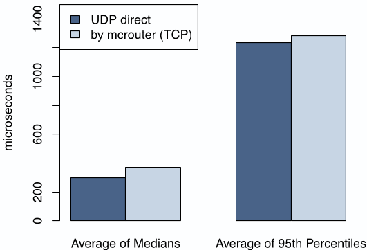

# Scaling Memcache at Facebook  

Rajesh Nishtala, Hans Fugal, Steven Grimm, Marc Kwiatkowski, Herman Lee, Harry C. Li,
Ryan McElroy, Mike Paleczny, Daniel Peek, Paul Saab, David Stafford, Tony Tung,
Venkateshwaran Venkataramani  

{rajshn,hans}@fb.com, {sgrimm, marc}@facebook.com, {herman, hcli, rm, mpal, dpeek, ps, dstaff, ttung, veeve}@fb.com
Facebook Inc.  

**Abstract:** Memcached is a well known, simple, in-memory caching solution. This paper describes how Facebook leverages memcached as a building block to construct and scale a distributed key-value store that supports the world's largest social network. Our system handles billions of requests per second and holds trillions of items to deliver a rich experience for over a billion users around the world.  

## 1 Introduction  

Popular and engaging social networking sites present significant infrastructure challenges. Hundreds of millions of people use these networks every day and impose computational, network, and I/O demands that traditional web architectures struggle to satisfy. A social network's infrastructure needs to (1) allow near real-time communication, (2) aggregate content on-the-fly from multiple sources, (3) be able to access and update very popular shared content, and (4) scale to process millions of user requests per second.  

We describe how we improved the open source version of memcached [14] and used it as a building block to construct a distributed key-value store for the largest social network in the world. We discuss our journey scaling from a single cluster of servers to multiple geographically distributed clusters. To the best of our knowledge, this system is the largest memcached installation in the world, processing over a billion requests per second and storing trillions of items.  

This paper is the latest in a series of works that have recognized the flexibility and utility of distributed key-value stores [1, 2, 5, 6, 12, 14, 34, 36]. This paper focuses on memcached—an open-source implementation of an in-memory hash table—as it provides low latency access to a shared storage pool at low cost. These qualities enable us to build data-intensive features that would otherwise be impractical. For example, a feature that issues hundreds of database queries per page request would likely never leave the prototype stage because it would be too slow and expensive. In our application,  

however, web pages routinely fetch thousands of key-value pairs from memcached servers.  

One of our goals is to present the important themes that emerge at different scales of our deployment. While qualities like performance, efficiency, fault-tolerance, and consistency are important at all scales, our experience indicates that at specific sizes some qualities require more effort to achieve than others. For example, maintaining data consistency can be easier at small scales if replication is minimal compared to larger ones where replication is often necessary. Additionally, the importance of finding an optimal communication schedule increases as the number of servers increase and networking becomes the bottleneck.  

This paper includes four main contributions: (1) We describe the evolution of Facebook's memcached-based architecture. (2) We identify enhancements to memcached that improve performance and increase memory efficiency. (3) We highlight mechanisms that improve our ability to operate our system at scale. (4) We characterize the production workloads imposed on our system.  

## 2 Overview  

The following properties greatly influence our design. First, users consume an order of magnitude more content than they create. This behavior results in a workload dominated by fetching data and suggests that caching can have significant advantages. Second, our read operations fetch data from a variety of sources such as MySQL databases, HDFS installations, and backend services. This heterogeneity requires a flexible caching strategy able to store data from disparate sources.  

Memcached provides a simple set of operations (set, get, and delete) that makes it attractive as an elemental component in a large-scale distributed system. The open-source version we started with provides a single-machine in-memory hash table. In this paper, we discuss how we took this basic building block, made it more efficient, and used it to build a distributed key-value store that can process billions of requests per second. Hence-forth, we use ‘memcached’ to refer to the source code or a running binary and ‘memcache’ to describe the distributed system.  

>Figure 1: Memcache as a demand-filled look-aside cache. The left half illustrates the read path for a web server on a cache miss. The right half illustrates the write path.  

**Query cache:** We rely on memcache to lighten the read load on our databases. In particular, we use memcache as a *demand-filled look-aside* cache as shown in Figure 1. When a web server needs data, it first requests the value from memcache by providing a string key. If the item addressed by that key is not cached, the web server retrieves the data from the database or other back-end service and populates the cache with the key-value pair. For write requests, the web server issues SQL statements to the database and then sends a delete request to memcache that invalidates any stale data. We choose to delete cached data instead of updating it because deletes are idempotent. Memcache is not the authoritative source of the data and is therefore allowed to evict cached data.  

While there are several ways to address excessive
read traffic on MySQL databases, we chose to use
memcache. It was the best choice given limited engi-
neering resources and time. Additionally, separating our
caching layer from our persistence layer allows us to ad-
just each layer independently as our workload changes.  

**Generic cache:** We also leverage `memcache` as a more general key-value store. For example, engineers use `memcache` to store pre-computed results from sophisticated machine learning algorithms which can then be used by a variety of other applications. It takes little effort for new services to leverage the existing marcher infrastructure without the burden of tuning, optimizing, provisioning, and maintaining a large server fleet.  

As is, memcached provides no server-to-server co-ordination; it is an in-memory hash table running on a single server. In the remainder of this paper we describe how we built a distributed key-value store based on memcached capable of operating under Facebook's workload. Our system provides a suite of configuration, aggregation, and routing services to organize memcached instances into a distributed system.  

>Figure 2: Overall architecture  

We structure our paper to emphasize the themes that emerge at three different deployment scales. Our read-heavy workload and wide fan-out is the primary concern when we have one cluster of servers. As it becomes necessary to scale to multiple frontend clusters, we address data replication between these clusters. Finally, we describe mechanisms to provide a consistent user experience as we spread clusters around the world. Operational complexity and fault tolerance is important at all scales. We present salient data that supports our design decisions and refer the reader to work by Atikoglu et al. [8] for a more detailed analysis of our workload. At a high-level, Figure 2 illustrates this final architecture in which we organize co-located clusters into a region and designate a master region that provides a data stream to keep non-master regions up-to-date.  

While evolving our system we prioritize two major design goals. (1) Any change must impact a user-facing or operational issue. Optimizations that have limited scope are rarely considered. (2) We treat the probability of reading transient stale data as a parameter to be tuned, similar to responsiveness. We are willing to expose slightly stale data in exchange for insulating a backend storage service from excessive load.  

## 3 In a Cluster: Latency and Load  

We now consider the challenges of scaling to thousands
of servers within a cluster. At this scale, most of our
efforts focus on reducing either the latency of fetching
cached data or the load imposed due to a cache miss.  

### 3.1 Reducing Latency  

Whether a request for data results in a cache hit or miss,
the latency of memcache's response is a critical factor
in the response time of a user's request. A single user
web request can often result in hundreds of individual memcache get requests. For example, loading one of our popular pages results in an average of 521 distinct items fetched from memcache.¹  

We provision hundreds of memcached servers in a cluster to reduce load on databases and other services. Items are distributed across the memcached servers through consistent hashing [22]. Thus web servers have to routinely communicate with many memcached servers to satisfy a user request. As a result, all web servers communicate with every memcached server in a short period of time. This all-to-all communication pattern can cause incast congestion [30] or allow a single server to become the bottleneck for many web servers. Data replication often alleviates the single-server bottleneck but leads to significant memory inefficiencies in the common case.  

We reduce latency mainly by focusing on the
memcache client, which runs on each web server. This
client serves a range of functions, including serialization, compression, request routing, error handling, and
request batching. Clients maintain a map of all available
servers, which is updated through an auxiliary configuration system.  

**Parallel requests and batching:** We structure our web-application code to minimize the number of network round trips necessary to respond to page requests. We construct a directed acyclic graph (DAG) representing the dependencies between data. A web server uses this DAG to maximize the number of items that can be fetched concurrently. On average these batches consist of 24 keys per request$^2$.  

**Client-server communication:** Memcached servers do not communicate with each other. When appropriate, we embed the complexity of the system into a stateless client rather than in the memcached servers. This greatly simplifies memcached and allows us to focus on making it highly performant for a more limited use case. Keeping the clients stateless enables rapid iteration in the software and simplifies our deployment process. Client logic is provided as two components: a library that can be embedded into applications or as a standalone proxy named mcrouter. This proxy presents a memcached server interface and routes the requests/replies to/from other servers.  

Clients use UDP and TCP to communicate with
memcached servers. We rely on UDP for get requests to
reduce latency and overhead. Since UDP is connection-
less, each thread in the web server is allowed to directly
communicate with memcached servers directly, bypass-
ing mrouter, without establishing and maintaining a  

>$^{1}$The $95^{th}$ percentile of fetches for that page is 1,740 items.  

>$^{2}$The $95^{th}$ percentile is 95 keys per request.  

>Figure 3: Get latency for UDP, TCP via mcrouter  

connection thereby reducing the overhead. The UDP
implementation detects packets that are dropped or re-
ceived out of order (using sequence numbers) and treats
them as errors on the client side. It does not provide
any mechanism to try to recover from them. In our in-
frastructure, we find this decision to be practical. Un-
der peak load, memcache clients observe that 0.25% of
get requests are discarded. About 80% of these drops
are due to late or dropped packets, while the remainder
are due to out of order delivery. Clients treat get er-
rors as cache misses, but web servers will skip insert-
ing entries into memcached after querying for data to
avoid putting additional load on a possibly overloaded
network or server.  

For reliability, clients perform set and delete operations over TCP through an instance of mrouter running on the same machine as the web server. For operations where we need to confirm a state change (updates and deletes) TCP alleviates the need to add a retry mechanism to our UDP implementation.  

Web servers rely on a high degree of parallelism and over-subscription to achieve high throughput. The high memory demands of open TCP connections makes it prohibitively expensive to have an open connection between every web thread and memcached server without some form of connection coalescing via mrouter. Coalescing these connections improves the efficiency of the server by reducing the network, CPU and memory resources needed by high throughput TCP connections. Figure 3 shows the average, median, and $95^{th}$ percentile latencies of web servers in production getting keys over UDP and through mrouter via TCP. In all cases, the standard deviation from these averages was less than 1%. As the data show, relying on UDP can lead to a 20% reduction in latency to serve requests.  

**Incast congestion:** Memcache clients implement flow-control mechanisms to limit incast congestion. When a
