# Database Internals: A Deep-Dive into How Distributed Data Systems Work

Alex Petrov 著

O'Reilly Media, Inc. 出版，地址：1005 Gravenstein Highway North, Sebastopol, CA
95472

- 版权所有 (C) 2019 Oleksandr Petrov，保留所有权利。
- 在美国印刷。
- 2019 年 10 月，第一版。
- ISBN：978-1-492-04034-7。

编辑及制作人员：

- 责任编辑：Mike Loukides
- 开发编辑：Michele Cronin
- 制作编辑：Christopher Faucher
- 文字编辑：Kim Cofer
- 校对：Sonia Saruba
- 索引编制：Judith McConville
- 内页设计：David Futato
- 封面设计：Karen Montgomery
- 插图：Rebecca Demarest

## 第一版修订历史

- 2019-09-12：首次发布。

发布详情请参见 http://oreilly.com/catalog/errata.csp? isbn=9781492040347。

## 献词

谨以此书献给 Pieter Hintjens， 我从他那里得到了人生中第一本带作者签名的书：
他是一位鼓舞人心的分布式系统程序员、作家、哲学家和朋友。

<a id="preface"></a>

# 前言

分布式数据库系统是大多数企业和绝大多数软件应用不可或缺的一部分。
这些应用提供逻辑和用户界面， 数据库系统则负责保障数据完整性、一致性和冗余。

回到 2000 年， 如果要选择数据库， 你只有寥寥几种选择，
而且其中大多数都属于关系数据库范畴， 所以它们之间的差异相对较小。 当然，
这并不意味着所有数据库都完全相同， 但它们的功能和使用场景非常相似。

其中一些数据库专注于_水平扩展_（scale out）， 即运行多个数据库实例，
让它们充当一个逻辑单元， 从而提升性能并增加容量； Gamma Database Machine
Project、Teradata、Greenplum、 Parallel DB2 等许多系统都是如此。 如今，
水平扩展仍然是客户期待数据库具备的最重要特性之一。
这可以用云服务日益普及来解释。
与把数据库迁移到更大、更强劲的机器上进行垂直扩展（scale up）相比，
启动一个新实例并将其加入集群通常更容易。 迁移可能漫长而痛苦， 还可能造成停机。

2010 年前后， 一类新的最终一致数据库开始出现， NoSQL 以及后来出现的 big data
等术语也逐渐流行起来。 过去 15 年间，
开源社区、大型互联网公司和数据库供应商创造了如此众多的数据库与工具，
以至于人们很容易迷失在对其使用场景、细节和特性的理解之中。

Amazon 团队于 2007 年发表的 Dynamo 论文 [DECANDIA07]
对数据库社区产生了巨大影响， 在很短时间内就催生出许多变体和实现。
其中最著名的包括 Facebook 创建的 Apache Cassandra、 LinkedIn 创建的 Project
Voldemort， 以及由前 Akamai 工程师创建的 Riak。

如今， 这个领域正在再次发生变化： 经历了键值存储、NoSQL 和最终一致性的时代之后，
我们开始看到扩展性和性能更强的数据库，
它们能够在提供更强一致性保证的同时执行复杂查询。

## 本书的读者

在技术会议的交谈中， 我经常听到同一个问题： “怎样才能进一步了解数据库内部原理？
我甚至不知道该从哪里开始。” 大多数数据库系统书籍不会深入介绍存储引擎的实现细节，
对于 B-Tree 等访问方法也只在相当高的层面加以介绍。 涵盖不同 B-Tree
变体、日志结构存储等较新概念的书籍少之又少， 所以我通常建议阅读论文。

读过论文的人都知道， 这并没有那么容易： 你往往缺少上下文， 措辞可能含糊不清，
论文之间很少有关联， 甚至毫无关联， 而且论文也很难找到。
本书对重要的数据库系统概念作了简明说明， 既可以为想要深入钻研的读者提供指引，
也可以作为已熟悉这些概念的读者手边的速查资料。

并非每个人都想成为数据库开发者， 但本书会帮助那些构建使用数据库系统之软件的人：
软件开发者、可靠性工程师、架构师和工程经理。

如果你的公司依赖任何基础设施组件，
无论是数据库、消息队列、容器平台还是任务调度器，
你都必须阅读项目的变更日志和邮件列表， 以便与社区保持联系，
及时了解项目的最新动态。 理解术语并了解其内部构造，
能让你从这些信息来源中获得更多内容，
也能帮助你更有效地使用工具来排查问题、识别并规避潜在风险和瓶颈。 如果出了问题，
对数据库系统的工作方式有一个全局认识和大体理解会有所帮助。 借助这些知识，
你将能够提出假设、验证假设、找出根本原因， 并把它说明给其他项目维护者。

本书也写给充满好奇心的人： 他们并非迫切需要才去学习，
而是会在空闲时间钻研有趣的东西，
创建编译器、编写自制操作系统、文本编辑器和电脑游戏， 学习编程语言并吸收新知识。

本书假定读者具有一些开发后端系统以及以用户身份使用数据库系统的经验。
事先了解一些不同的数据结构， 有助于更快地消化本书内容。

## 为什么要读本书？

我们经常听到人们用数据库系统实现的概念和算法来描述它们： “这个数据库使用 gossip
传播成员关系”（见[第 12 章](#chapter-12-anti-entropy-and-dissemination)）、
“他们实现了 Dynamo”， 或者“这就像 Spanner
论文中描述的那样”（见[第 13 章](#chapter-13-distributed-transactions)）。
如果讨论的是算法和数据结构， 你还可能听到这样的说法： “ZAB 和 Raft
有很多共同之处”（见[第 14 章](#chapter-14-consensus)）、 “Bw-Tree
就像在日志结构存储之上实现的
B-Tree”（见[第 6 章](#chapter-6-b-tree-variants)）， 或者“它们使用了类似
B-link-Tree
中的兄弟指针”（见[第 5 章](#chapter-5-transaction-processing-and-recovery)）。

讨论复杂概念需要抽象， 而我们不能每次开始交谈时都先讨论一遍术语。
以共同语言作为简便表达， 有助于我们把注意力转向其他更高层次的问题。

学习基础概念、证明和算法的好处之一， 是它们永不过时。 当然，
新概念和新算法总会出现， 但新算法往往源自人们在经典算法中发现了缺陷或改进空间。
了解历史有助于更好地理解其中的差异和动机。

了解这些内容会带来启发。 你会看到各种各样的算法，
看到我们的行业如何接连解决一个又一个问题， 并学会欣赏这些工作。 与此同时，
学习也会带来回报： 你几乎能感觉到， 多块拼图在脑海中彼此靠拢，
最终组成一幅完整图景， 而你永远都能把这幅图景分享给他人。

## 本书范围

本书既不是一本介绍关系数据库管理系统的书， 也不是一本介绍 NoSQL 数据库的书；
本书讨论的是各种数据库系统都会使用的算法和概念，
重点关注*存储引擎*以及负责*分布*的组件。

查询规划、查询优化、调度、关系模型等概念，
已经由多本优秀的数据库系统教材进行了介绍。 其中一些概念通常是从用户视角描述的，
而本书关注内部原理。
你可以在[第二部分总结](#part-2-conclusion)和各章的小结中找到一些实用文献的线索。
这些书很可能会解答你对数据库的许多疑问。

本书不讨论查询语言， 因为书中提到的数据库系统之间并不存在一种共同的语言。

为了收集本书材料， 我研究了 15 本以上的书、300
多篇论文、数不清的博客文章和源代码， 以及若干开源数据库的文档。
判断某个概念是否应该纳入本书时， 我采用的经验法则是问：
“数据库行业和研究圈的人是否在讨论这个概念？” 如果答案是“是”，
我就把这个概念加入需要讨论的长长清单。

## 本书结构

确实存在一些采用可插拔组件的可扩展数据库实例（例如 [SCHWARZ86]），
但它们相当少见。 与此同时， 数据库使用可插拔存储的实例却有很多。 同样，
我们很少听到数据库供应商谈论查询执行，
但他们非常热衷于讨论自己的数据库如何维持一致性。

数据库系统之间最显著的区别集中在两个方面： 它们如何*存储*数据，
以及如何*分布*数据。 （其他子系统有时也很重要， 但本书不予介绍。）
本书分为两个部分，
分别讨论负责_存储_（第一部分）和_分布_（第二部分）的子系统与组件。

**第一部分**讨论节点本地的处理过程， 重点是存储引擎； 它是数据库系统的核心组件，
也是最显著的差异化因素之一。 我们首先介绍数据库管理系统的架构，
然后给出几种依据主要存储介质和布局对数据库系统进行分类的方法。

接下来， 我们会继续讨论存储结构，
尝试理解基于磁盘的数据结构与内存数据结构有何不同， 介绍 B-Tree，
并讲解在磁盘上高效维护 B-Tree 结构的算法， 包括序列化、页布局和磁盘表示。 之后，
我们会讨论多种变体， 以展示这一概念的强大能力， 以及受 B-Tree
影响和启发的数据结构具有怎样的多样性。

最后， 我们会讨论日志结构存储的若干变体、采用它们的动机和理由；
这些变体常用于实现文件系统和存储系统。

**第二部分**介绍如何把多个节点组织成数据库集群。 我们首先说明，
在构建容错分布式系统时理解理论概念为何十分重要，
分布式系统与单节点应用有何不同，
以及我们在分布式环境中会面对哪些问题、约束和复杂情况。

之后， 我们深入探讨分布式算法。 首先介绍故障检测算法；
这些算法发现并报告故障、避开故障节点， 从而帮助提高性能和稳定性。
由于本书后面讨论的许多算法都依赖于对领导权概念的理解， 我们会介绍几种 Leader
选举算法， 并讨论它们的适用性。

在分布式系统中， 实现数据一致性是最困难的事情之一， 因此我们会先讨论复制概念，
然后讨论一致性模型、各副本之间可能出现的分歧以及最终一致性。
由于最终一致系统有时依赖反熵来实现收敛， 并依赖 gossip 来传播数据，
所以我们会讨论若干反熵方法和 gossip 方法。 最后，
我们会在数据库事务的语境下讨论逻辑一致性， 并以共识算法收尾。

如果没有所有这些研究和出版物， 本书就不可能写成。
正文中会出现许多对论文和出版物的引用， 这些引用以方括号括起， 并使用等宽字体，
例如 `[DECANDIA07]`。 你可以利用这些参考资料更深入地了解相关概念。

每一章之后都有一个小结， 其中包含与该章内容有关的延伸学习材料。

## 本书使用的排版约定

本书采用以下排版约定：

*斜体*

表示新术语、URL、电子邮件地址、文件名和文件扩展名。

`等宽字体`

用于程序清单，
也在段落中用于表示变量名或函数名、数据库、数据类型、环境变量、语句和关键字等程序元素。

> [!TIP]
> 此元素表示提示或建议。

> [!NOTE]
> 此元素表示一般说明。

> [!WARNING]
> 此元素表示警告或需要谨慎对待的事项。

## 使用代码示例

本书旨在帮助你完成工作。 一般来说， 如果本书提供了示例代码，
你可以在自己的程序和文档中使用这些代码。 除非要复制其中相当大的一部分，
否则无须联系我们取得许可。 例如， 编写一个使用本书若干代码片段的程序不需要许可。
销售或分发一张收录 O'Reilly 图书示例的 CD-ROM 则需要许可。
通过引用本书和示例代码来回答问题不需要许可。
把大量示例代码纳入你自己产品的文档则需要许可。

我们欢迎但不强制要求注明出处。 出处通常包括书名、作者、出版商和 ISBN。 例如：
“*Database Internals* by Alex Petrov (O'Reilly) . Copyright 2019 Oleksandr
Petrov, 978-1-492-04034-7.”

如果你认为自己对示例代码的使用超出了合理使用或上述许可范围， 请随时通过
permissions@oreilly.com 与我们联系。

## O'Reilly 在线学习

近 40 年来， O'Reilly Media 一直提供技术与商业培训、知识和洞见，
帮助企业取得成功。
其专家与创新者网络通过图书、文章、会议和在线学习平台分享知识与经验。 O'Reilly
在线学习平台按需提供直播培训课程、深入的学习路径、交互式编程环境， 以及来自
O'Reilly 和 200 多家其他出版商的大量文字与视频资源。 更多信息请访问
<http://oreilly.com>。

## 联系我们

有关本书的意见和问题， 请联系出版商：

O'Reilly Media, Inc.<br> 1005 Gravenstein Highway North<br> Sebastopol, CA
95472<br> 800-998-9938（美国或加拿大）<br> 707-829-0515（国际或本地）<br>
707-829-0104（传真）

本书网页列出了勘误、示例和其他补充信息：<http://bit.ly/database-internals>。
有关技术问题， 请发送邮件至 bookquestions@oreilly.com。
更多图书、课程、会议和新闻信息请访问 <http://www.oreilly.com>。

欢迎在 Facebook 关注我们：<http://facebook.com/oreilly>。 欢迎在 Twitter
关注我们：<http://twitter.com/oreillymedia>。 欢迎在 YouTube
观看我们的视频：<http://www.youtube.com/oreillymedia>。

## 致谢

如果没有数百人为研究论文和书籍辛勤工作， 本书便不可能问世；
这些论文和书籍为本书提供了思想和灵感， 也充当了参考资料。

我要感谢所有审阅书稿并提供反馈的人， 是他们确保了本书内容正确、措辞准确： Dmitry
Alimov、Peter Alvaro、Carlos Baquero、Jason Brown、 Blake Eggleston、Marcus
Eriksson、Francisco Fernández Castaño、 Heidi Howard、Vaidehi Joshi、Maximilian
Karaszt、Stas Kelvich、 Michael Klishin、Predrag Knežević、Joel Knighton、Eugene
Lazin、 Nate McCall、Christopher Meiklejohn、Tyler Neely、 Maxim Neverov、Marina
Petrova、Stefan Podkowinski、 Edward Ribiero、Denis Rytsov、Kir Shatrov、Alex
Sorokoumov、 Massimiliano Tomassi 和 Ariel Weisberg。

当然， 如果没有家人的支持， 本书也不可能问世： 我的妻子 Marina 和女儿 Alexandra
在一路走来的每一步都支持着我。

<a id="part-1-storage-engines"></a>

# 第一部分 存储引擎

任何数据库管理系统的首要任务， 都是可靠地存储数据并让用户可以访问数据。
我们把数据库作为主要数据源， 借助它在应用程序的不同部分之间共享数据。
每次创建新应用程序时， 我们不必重新寻找存储和检索信息的方法，
也不必发明新的数据组织方式， 而是使用数据库。 这样一来，
我们就能专注于应用程序逻辑而非基础设施。

由于 *database management system*（DBMS）这个说法相当冗长， 本书始终使用更简洁的
*database system* 和 *database* 来指代同一概念。

数据库是模块化系统， 由多个部分组成： 接收请求的传输层、
确定最高效查询执行方式的查询处理器、 执行操作的执行引擎，
以及存储引擎（参见[DBMS 架构](#dbms-架构)）。

存储引擎（或数据库引擎）是数据库管理系统中的软件组件，
负责在内存和磁盘上存储、检索和管理数据， 旨在为每个节点保存持久的长期记忆
[REED78]。 数据库能够响应复杂查询， 而存储引擎则以更细的粒度看待数据，
并提供简单的数据操作 API， 让用户可以创建、更新、删除和检索记录。
也可以这样理解： 数据库管理系统是构建在存储引擎之上的应用程序， 提供
schema、查询语言、索引、事务以及许多其他实用功能。

为了保持灵活性， 键和值都可以是任意字节序列， 没有规定的形式。
它们的排序和表示语义由更高层的子系统定义。 例如， 可以在一张表中使用 `int32`（32
位整数）作为键， 在另一张表中使用 `ascii`（ASCII 字符串）作为键；
从存储引擎的角度来看， 二者都只是序列化后的条目。

BerkeleyDB、LevelDB 及其后继 RocksDB、LMDB 及其后继 libmdbx、Sophia、 HaloDB
等众多存储引擎， 最初都是独立于后来嵌入它们的数据库管理系统开发的。
借助可插拔存储引擎， 数据库开发者可以利用现有存储引擎快速搭建数据库系统，
把精力集中在其他子系统上。

与此同时， 数据库系统组件之间清晰的分离也让切换不同引擎成为可能，
从而可以选择可能更适合特定用例的引擎。 例如， 流行的数据库管理系统 MySQL
拥有多个存储引擎， 包括 InnoDB、MyISAM 和 RocksDB（用于 MyRocks 发行版）。
MongoDB 允许在 WiredTiger、In-Memory 和现已弃用的 MMAPv1 存储引擎之间切换。

## 数据库比较

选择数据库系统可能会带来长期影响。
如果数据库可能因性能问题、一致性问题或运维挑战而不适合需求，
最好在开发周期的早期发现这一点， 因为迁移到另一个系统并非易事。 在某些情况下，
迁移可能需要大幅修改应用程序代码。

每个数据库系统都有优点和缺点。 为了降低高成本迁移的风险，
可以在决定使用某个数据库之前投入一些时间， 确认它能否满足应用程序的需求。

如果根据数据库的组件（例如使用哪种存储引擎， 数据如何共享、复制和分布等）、
排名（ThoughtWorks 等咨询机构或 DB-Engines、 Database of Databases
等数据库比较网站给出的任意流行度数值）， 或实现语言（C++、Java 或 Go
等）来比较数据库， 可能会过早得出无效结论。 这些方法只能用于高层比较，
其粒度甚至可能粗略到只是在 HBase 与 SQLite 之间做选择， 因此，
即使只是粗浅地了解每种数据库的工作原理和内部构成， 也有助于得出更加审慎的结论。

每次比较都应从明确定义目标开始， 因为哪怕最轻微的偏见也可能让整个调查完全失效。
如果要寻找适合现有工作负载（或计划承载的工作负载）的数据库，
最佳做法就是在不同数据库系统上模拟这些工作负载， 测量重要的性能指标，
然后比较结果。 有些问题， 尤其是性能和可扩展性方面的问题，
只有经过一段时间或容量增长之后才会显现。 为了发现潜在问题，
最好在尽可能贴近真实生产环境的环境中进行长时间测试。

模拟真实工作负载不仅有助于了解数据库的性能， 还有助于学习如何运维和调试数据库，
并了解其社区是否友善、是否乐于助人。 数据库选择始终是这些因素的综合结果，
而性能往往*并非*最重要的方面： 通常， 宁可使用一个缓慢保存数据的数据库，
也不要使用一个迅速丢失数据的数据库。

要比较数据库， 详细了解用例并定义当前及预期的变量会很有帮助， 例如：

- schema 和记录大小
- 客户端数量
- 查询类型和访问模式
- 读写查询速率
- 上述任一变量的预期变化

了解这些变量有助于回答以下问题：

- 数据库是否支持所需查询？
- 该数据库能否处理计划存储的数据量？
- 单个节点能处理多少次读写操作？
- 系统应有多少个节点？
- 考虑到预期增长率，集群应如何扩展？
- 维护流程是什么？

回答这些问题之后， 就可以构建测试集群并模拟工作负载。
大多数数据库已有可用于重现特定用例的压力测试工具。
如果一个数据库生态系统中没有用于生成真实随机工作负载的标准压力测试工具，
这可能是个危险信号。 如果某些因素妨碍使用默认工具， 可以尝试现有的通用工具，
也可以从头实现一个。

如果测试结果良好， 熟悉数据库代码可能会有所帮助。 阅读代码时，
通常可以先了解数据库由哪些部分组成， 如何找到不同组件的代码， 然后再逐一查看。
即使只是粗略了解数据库的代码库， 也能更好地理解它生成的日志记录和配置参数，
还有助于在使用它的应用程序乃至数据库代码本身中发现问题。

如果能一直把数据库当作黑盒， 从来不必查看其内部， 当然再好不过； 但实践表明，
错误、宕机、性能回退或其他问题迟早会出现， 因此最好提前做好准备。
了解并理解数据库内部机制， 就能降低业务风险， 提高快速恢复的机会。

Yahoo! Cloud Serving Benchmark（YCSB）是常用的基准测试、性能评估和比较工具之一。
YCSB 提供了一个框架和一组通用工作负载， 可应用于不同的数据存储。
与所有通用工具一样， 使用该工具时应当谨慎， 因为它很容易让人得出错误结论。
为了公平比较并作出有依据的决定， 必须投入足够时间理解数据库需要运行的真实条件，
并据此定制基准测试。

## TPC-C 基准测试

事务处理性能委员会（Transaction Processing Performance Council，TPC）
提供了一组基准测试， 数据库厂商用它们比较并宣传产品性能。 TPC-C
是一种在线事务处理（OLTP）基准测试， 由只读事务和更新事务混合而成，
用来模拟常见的应用程序工作负载。

该基准测试关注并发事务执行的性能和正确性。 主要性能指标是_吞吐量_：
数据库系统每分钟能够处理的事务数。 执行的事务必须保持 ACID 属性，
并符合基准测试本身定义的一组属性。

该基准测试不专注于任何特定业务领域， 而是提供了一组抽象操作，
这些操作对于大多数适合 OLTP 数据库的应用程序都很重要。
它包含仓库、库存、客户和订单等多张表和多种实体， 并规定了表布局、
可以对这些表执行的事务细节、 每张表的最少行数， 以及数据持久性约束。

这并不意味着基准测试只能用于比较数据库。
基准测试还可用于定义和测试服务级别协议（service-level agreement，SLA）[^1]
的细节、 了解系统需求、 进行容量规划等。 使用数据库之前对它了解得越多，
在生产环境中运行它时节省的时间就越多。

[^1]: SLA 是服务提供商对所提供服务质量作出的承诺。 除其他内容外， SLA
    还可以包含延迟、吞吐量、抖动以及故障次数和频率等信息。

选择数据库是一项长期决策， 最好持续关注新发布的版本，
了解具体发生了哪些变化以及变化原因， 并制定升级策略。
新版本通常包含改进以及对错误和安全问题的修复，
但也可能引入新错误、性能回退或意外行为，
因此在推出新版本之前进行测试也至关重要。 了解数据库实现者以往如何处理升级，
可能有助于判断未来会发生什么。 过去升级顺利并不保证未来的升级同样顺利，
但过去升级复杂， 则可能预示着未来的升级也不会轻松。

## 理解权衡

作为用户， 我们可以看到数据库在不同条件下的行为； 但在开发数据库时，
我们必须作出会直接影响这些行为的选择。

设计存储引擎肯定比实现教科书中的数据结构复杂得多： 其中有许多细节和边界情况，
很难从一开始就处理正确。 我们需要设计物理数据布局并组织指针， 确定序列化格式，
了解数据将如何进行垃圾回收、 存储引擎如何融入整个数据库系统的语义，
设法让它在并发环境中工作， 最后还要确保在任何情况下都绝不丢失任何数据。

不仅需要决定的事项很多， 而且其中大多数决定都涉及权衡。 例如，
如果按照记录插入数据库的顺序保存记录， 就能更快地存储记录；
但如果要按字典序检索记录， 就必须在向客户端返回结果之前重新排序。
正如本书将反复展示的那样， 存储引擎设计有许多不同方法，
而每种实现都有各自的优缺点。

考察不同存储引擎时， 我们会讨论它们的优势和不足。
如果存在一种对于所有可想象用例都绝对最优的存储引擎， 所有人都会直接使用它。
但这种引擎并不存在， 所以必须根据要承载的工作负载和用例明智选择。

存储引擎种类繁多， 使用各种数据结构， 采用从 C 等低级语言到 Java
等高级语言的不同语言实现。 所有存储引擎都面临相同的挑战和约束。
可以用城市规划作类比： 要为一定规模的人口建造城市， 可以选择向高处发展，
也可以选择向外扩张。 两种情况下城市都能容纳相同数量的人，
但这两种方法会带来截然不同的生活方式。 城市向高处发展时， 人们住在公寓里，
较高的人口密度很可能会在较小区域内造成更多交通拥堵； 在更加分散的城市中，
人们更可能住在独立住宅里， 但通勤需要跨越更长距离。

同样， 存储引擎开发者作出的设计决策， 会让引擎更适合不同的用途：
有些针对较低的读延迟或写延迟进行优化，
有些试图最大化密度（每个节点存储的数据量）， 还有些专注于运维简单性。

每章小结中都列出了可用于实现的完整算法和其他补充参考资料。
阅读本书应当能让你做好充分准备， 从而高效利用这些资料，
并扎实理解资料中所述概念的现有替代方案。

<a id="chapter-1-introduction-and-overview"></a>

# 第 1 章 引言与概述

数据库管理系统可以服务于不同目的： 有些主要用于临时的*热*数据，
有些充当长期的*冷*存储， 有些允许复杂的分析查询， 有些只允许按键访问值，
有些针对时间序列数据存储进行了优化， 还有些能高效存储大型 blob。
为了理解差异并作出区分， 我们先进行简短的分类和概述，
因为这有助于理解后续讨论的范围。

术语有时含义模糊， 脱离完整上下文便难以理解。 例如，
*列式存储*与*宽列存储*之间的区别——二者之间几乎或完全没有关系； 又如，
*聚簇索引*和*非聚簇索引*与*索引组织表*之间有何关系。
本章旨在消除这些术语的歧义， 找出其精确定义。

我们先概述数据库管理系统架构（参见 [DBMS 架构](#dbms-架构)），
并讨论系统组件及其职责。
随后从存储介质（参见[内存型与磁盘型 DBMS](#内存型与磁盘型-dbms)）
和布局（参见[列式与行式 DBMS](#列式与行式-dbms)）两方面讨论数据库管理系统之间的区别。

这两组分类并未构成数据库管理系统的完整分类体系， 数据库还有许多其他分类方式。
例如， 有些资料把 DBMS 分为三个主要类别：

**在线事务处理（OLTP）数据库**

这类数据库处理大量面向用户的请求和事务。 查询通常是预定义的， 持续时间也很短。

**在线分析处理（OLAP）数据库**

这类数据库处理复杂聚合。 OLAP 数据库通常用于分析和数据仓库，
能够处理复杂、长时间运行的 ad hoc 查询。

**混合事务分析处理（HTAP）数据库**

这类数据库同时具备 OLTP 和 OLAP 存储的属性。

还有许多其他术语和分类： 键值存储、关系数据库、文档式存储和图数据库。
本书不定义这些概念， 因为假定读者已经从高层了解并理解它们的功能。
我们讨论的概念适用范围广泛， 而且大多以某种形式用于上述多数存储类型，
因此后续讨论并不需要完整的分类体系， 它也并不重要。

由于本书第一部分关注存储和索引结构， 我们需要理解高层数据组织方法，
以及数据文件与索引文件之间的关系（参见[数据文件与索引文件](#数据文件与索引文件)）。

最后， 在[缓冲、不可变性与有序性](#缓冲不可变性与有序性)一节中，
我们会讨论三种广泛用于开发高效存储结构的技术，
以及应用这些技术会如何影响存储结构的设计和实现。

## DBMS 架构

数据库管理系统的设计没有通用蓝图。 每种数据库的构建方式都略有不同，
组件边界也不太容易看清和定义。 即使这些边界存在于书面设计中（例如项目文档里），
在代码中， 看似独立的组件也可能因性能优化、边界情况处理或架构决策而耦合在一起。

描述数据库管理系统架构的资料（例如 [HELLERSTEIN07]、[WEIKUM01]、[ELMASRI11] 和
[MOLINA08]）， 对组件及其关系的定义各不相同。 图 1-1
所示架构展示了这些表述中的一些共同主题。

数据库管理系统采用_客户端/服务器模型_： 数据库系统实例（*节点*）充当服务器，
应用程序实例充当客户端。

客户端请求通过*传输*子系统到达。 请求以查询的形式传入，
通常使用某种查询语言表达。 传输子系统还负责与数据库集群中的其他节点通信。

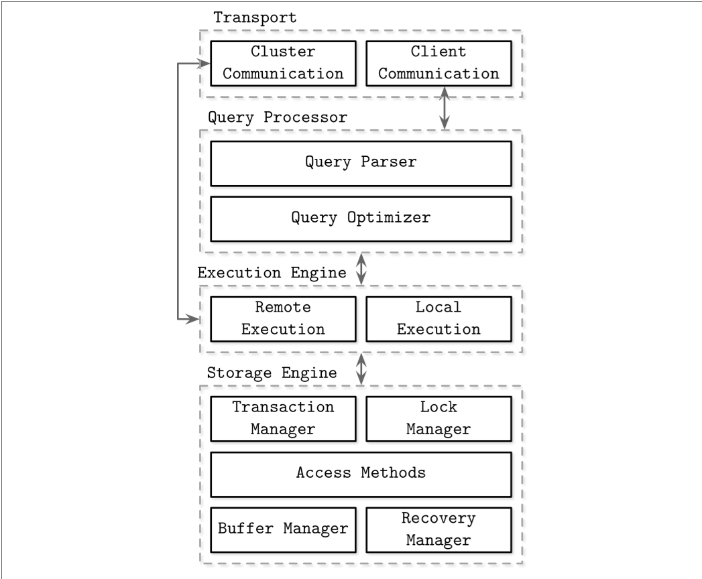

> 图 1-1：数据库管理系统的架构。

传输子系统收到查询后， 会把它交给_查询处理器_， 由后者解析、解释和验证查询。
之后再执行访问控制检查， 因为只有解释查询之后才能完整执行这些检查。

解析后的查询会传递给查询优化器。 优化器首先消除查询中不可能成立和冗余的部分，
然后依据内部统计信息（索引基数、近似交集大小等）和数据位置（集群中哪些节点持有数据以及传输数据的成本），
尝试找到最高效的执行方式。
优化器既要处理解析查询所需的关系操作——通常表示为依赖树，
也要处理索引排序、基数估计和访问方法选择等优化工作。

查询通常以_执行计划_（或_查询计划_）的形式表示： 它是一系列必须执行的操作，
这些操作全部完成后才能认为结果完整。 同一查询可以通过不同执行计划得到满足，
而这些计划的效率可能不同， 因此优化器会选择可用的最佳计划。

执行计划由*执行引擎*处理， 后者汇集本地操作和远程操作的执行结果。
*远程执行*可能涉及在集群其他节点上写入和读取数据， 也可能涉及复制。

本地查询（直接来自客户端或其他节点）由存储引擎执行。
存储引擎包含多个职责明确的组件：

**事务管理器**

该管理器调度事务， 并确保事务不会让数据库处于逻辑不一致的状态。

**锁管理器**

该管理器为正在运行的事务锁定数据库对象， 确保并发操作不会破坏物理数据完整性。

**访问方法（存储结构）**

访问方法管理对磁盘数据的访问和数据组织。 访问方法包括堆文件， 以及
B-Tree（参见“无处不在的 B-Tree”）或日志结构合并树（LSM Tree，参见“LSM Tree”）
等存储结构。

**缓冲区管理器**

该管理器在内存中缓存数据页（参见“缓冲区管理”）。

**恢复管理器**

该管理器维护操作日志， 并在发生故障时恢复系统状态（参见“恢复”）。

事务管理器和锁管理器共同负责并发控制（参见“并发控制”）：
二者在确保并发操作尽可能高效执行的同时， 保证逻辑和物理数据完整性。

## 内存型与磁盘型 DBMS

数据库系统在内存和磁盘上存储数据。 内存数据库管理系统（有时称为主存
DBMS）主要在内存中存储数据， 使用磁盘进行恢复和日志记录。 磁盘型 DBMS
把大部分数据保存在磁盘上， 使用内存缓存磁盘内容或充当临时存储。
两类系统都会在一定程度上使用磁盘， 但主存数据库几乎完全把内容存储在 RAM 中。

访问内存一直比访问磁盘快几个数量级， 如今依然如此[^ch1-2]，
因此使用内存作为主存储很有吸引力； 而且随着内存价格下降，
这样做在经济上也越来越可行。 不过，
与固态硬盘（SSD）和硬盘驱动器（HDD）等持久存储设备相比， RAM 的价格仍然很高。

[^ch1-2]: https://people.eecs.berkeley.edu/~rcs/research/interactive_latency.html
    提供了历年来磁盘和内存访问延迟以及许多其他相关数据的可视化与比较。

主存数据库系统与磁盘型数据库的区别不仅在于主存储介质，
还在于所使用的数据结构、组织方式和优化技术。

以性能、相对较低的访问成本和访问粒度为主要考虑，
有些数据库选择内存作为主要数据存储。 为主存编程也比为磁盘编程简单得多。
操作系统抽象了内存管理， 让我们可以从分配和释放任意大小内存块的角度思考问题。
在磁盘上， 则必须手动管理数据引用、序列化格式、已释放空间和碎片。

制约内存数据库发展的主要因素是 RAM 的易失性（换言之，缺乏持久性）和成本。 由于
RAM 内容无法持久保存， 软件错误、崩溃、硬件故障和断电都可能导致数据丢失。
不间断电源和电池供电 RAM 等方法可以确保持久性，
但需要额外的硬件资源和运维专业知识。 在实践中， 归根结底是磁盘更容易维护，
价格也低得多。

随着非易失性内存（Non-Volatile Memory，NVM）[ARULRAJ17]
技术的可用性和普及度不断提高， 这种情况很可能会发生变化。 NVM
存储可以缩小或完全消除读写延迟之间的不对称（取决于具体技术），
进一步改善读写性能， 并允许按字节寻址访问。

### 内存型存储的持久性

内存数据库系统会在磁盘上维护备份， 以提供持久性并防止易失数据丢失。
有些数据库只在内存中存储数据， 不提供任何持久性保证， 但本书不讨论这类数据库。

操作只有在结果写入顺序日志文件后才能视为完成。
“恢复”一节会更详细地讨论预写日志。 为避免启动时或崩溃后重放完整日志内容，
内存型存储会维护一个_备份副本_。 该备份副本以有序的磁盘结构维护； 为减少 I/O
操作次数， 对该结构的修改通常以异步方式进行（与客户端请求解耦）， 并成批应用。
恢复时， 可以通过备份和日志还原数据库内容。

日志记录通常分批应用到备份。 一批日志记录处理完毕后，
备份便保存了数据库在某个特定时间点的快照， 而截至该时间点的日志内容可以丢弃。
这个过程称为 checkpointing。 它让驻留在磁盘上的数据库尽可能跟上日志条目，
又不要求客户端阻塞至备份更新完成， 因而缩短了恢复时间。

> [!NOTE]
> 不能简单地说，
> 内存数据库就等同于拥有巨大页缓存的磁盘数据库（参见“缓冲区管理”）。
> 即使页缓存在内存中， 序列化格式和数据布局也会产生额外开销，
> 无法实现内存型存储所能达到的同等优化程度。

磁盘型数据库使用针对磁盘访问优化的专用存储结构。 在内存中，
可以相对快速地沿指针访问， 随机内存访问也明显快于随机磁盘访问。
磁盘型存储结构通常采用宽而矮的树形结构（参见“面向磁盘存储的树”），
而内存型实现可以从更广泛的数据结构中选择，
并进行在磁盘上无法实现或难以实现的优化 [MOLINA92]。 同样，
在磁盘上处理大小可变的数据需要特别关注， 而在内存中通常只需用指针引用该值。

对于某些用例， 可以合理地假定整个数据集都能装入内存。
有些数据集受现实世界对应事物的规模限制，
例如学校的学生记录、公司的客户记录或网上商店的库存。 每条记录不超过几 KB，
数量也有限。

## 列式与行式 DBMS

大多数数据库系统都存储一组_数据记录_， 记录由*表*中的*列*和*行*组成。
*字段*是列与行的交点： 某种类型的一个值。 属于同一列的字段通常具有相同数据类型。
例如， 如果定义一张保存用户记录的表， 所有姓名都具有相同类型并属于同一列。
在逻辑上属于同一条记录（通常由键标识）的一组值构成一行。

数据库的一种分类方式是看数据在磁盘上按行还是按列存储。
表既可以水平分区（把属于同一行的值存储在一起），
也可以垂直分区（把属于同一列的值存储在一起）。 图 1-2 展示了这一区别： (a)
展示按列分区的值， (b) 展示按行分区的值。

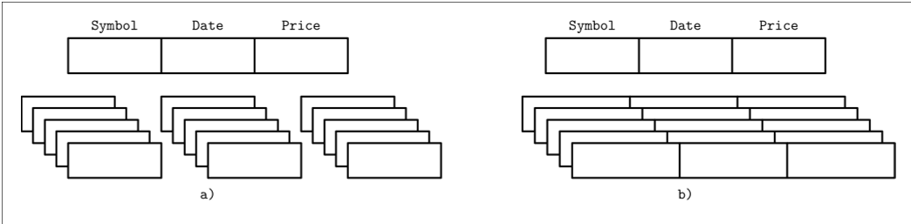

> 图 1-2：列式存储与行式存储中的数据布局； (a) 按列分区， (b) 按行分区。

行式数据库管理系统的例子很多： MySQL、PostgreSQL
以及大多数传统关系数据库都是如此。 MonetDB 和 C-Store
是两个开创性的开源列式存储（C-Store 是 Vertica 的开源前身）。

### 行式数据布局

行式数据库管理系统以记录或行的形式存储数据。 其布局非常接近表格数据表示，
其中每一行都拥有相同的一组字段。 例如，
行式数据库可以高效存储包含姓名、出生日期和电话号码的用户条目：

| ID | 姓名  | 出生日期           | 电话号码       |
| -- | ----- | ------------------ | -------------- |
| 10 | John  | 1981 年 8 月 1 日  | +1 111 222 333 |
| 20 | Sam   | 1988 年 9 月 14 日 | +1 555 888 999 |
| 30 | Keith | 1984 年 1 月 7 日  | +1 333 444 555 |

当多个字段（姓名、出生日期和电话号码）构成一条由键（本例中为单调递增的数字）唯一标识的记录时，
这种方法非常有效。 表示单个用户记录的所有字段通常会一起读取。
创建记录时（例如用户填写注册表单时）， 也会把这些字段一起写入。 与此同时，
每个字段也可以单独修改。

行式存储最适合必须按行访问数据的场景，
因此把完整的行存储在一起可以改善空间局部性[^ch1-3] [DENNING68]。

[^ch1-3]: 空间局部性是局部性原理之一， 该原理认为， 如果访问了某个内存位置，
    那么在不久的将来还会访问其附近的内存位置。

由于磁盘等持久介质通常按块访问（换言之， 磁盘访问的最小单位是块），
单个块将包含所有列的数据。 如果要访问完整的用户记录， 这非常合适；
但对于访问多条用户记录中单个字段的查询（例如只提取电话号码的查询），
代价就更高， 因为其他字段的数据也会一并换入内存。

### 列式数据布局

列式数据库管理系统不按行存储数据， 而是垂直地（即按列）对数据进行分区。
同一列的值在磁盘上连续存储， 而不像前面的示例那样连续存储行。 例如，
如果存储历史股票市场价格， 所有报价就会存储在一起。
把不同列的值存储在不同文件或文件段中， 可以实现高效的按列查询，
因为查询能够一次读取所需列， 不必读取整行后再丢弃未查询列的数据。

列式存储很适合计算聚合的分析型工作负载， 例如发现趋势、计算平均值等。
当逻辑记录包含多个字段，
但其中一些字段（本例中是报价）的重要程度不同且经常一起使用时，
就可以处理复杂聚合。

从逻辑角度看， 表示股票市场报价的数据仍可表示为表格：

| ID | 股票代码 | 日期              | 价格      |
| -- | -------- | ----------------- | --------- |
| 1  | DOW      | 2018 年 8 月 8 日 | 24,314.65 |
| 2  | DOW      | 2018 年 8 月 9 日 | 24,136.16 |
| 3  | S&P      | 2018 年 8 月 8 日 | 2,414.45  |
| 4  | S&P      | 2018 年 8 月 9 日 | 2,232.32  |

然而， 列式数据库的物理布局截然不同。 属于同一列的值会紧密存储在一起：

```text
Symbol: 1:DOW; 2:DOW; 3:S&P; 4:S&P
Date: 1:08 Aug 2018; 2:09 Aug 2018; 3:08 Aug 2018; 4:09 Aug 2018
Price: 1:24,314.65; 2:24,136.16; 3:2,414.45; 4:2,232.32
```

为了重建可能用于连接、过滤和多行聚合的数据 tuple， 需要在列级别保留一些元数据，
以标识该数据点与其他列中的哪些数据点相关联。 如果显式执行这一操作，
每个值都必须保存一个键， 这会造成重复并增加存储的数据量。
一些列式存储改用隐式标识符（虚拟 ID）， 通过值的位置（即偏移量）把值映射回相关值
[ABADI13]。

过去几年中， 或许是因为对不断增长的数据集运行复杂分析查询的需求日益上升，
出现了许多新的列式文件格式， 例如 Apache Parquet、Apache ORC 和 RCFile；
也出现了 Apache Kudu、ClickHouse 等许多列式存储 [ROY12]。

### 区别与优化

不能说行式存储与列式存储之间的区别仅仅在于数据存储方式。
选择数据布局只是列式存储所针对的一系列潜在优化中的一步。

一次连续读取同一列中的多个值， 可以显著提高缓存利用率和计算效率。 在现代 CPU
上， 向量化指令能够用一条 CPU 指令处理多个数据点[^ch1-4] [DREPPER07]。

[^ch1-4]: 向量化指令， 即单指令多数据（Single Instruction Multiple
    Data，SIMD）， 是指对多个数据点执行相同操作的一类 CPU 指令。

把具有相同数据类型的值存储在一起（例如数字与数字放在一起、字符串与字符串放在一起），
可以获得更高的压缩率。 可以根据数据类型使用不同的压缩算法，
为每种情况选择最有效的压缩方法。

要决定使用列式存储还是行式存储， 需要理解访问模式。
如果读取的数据以记录形式使用（即请求大多数或全部列），
而且工作负载主要由点查询和范围扫描组成， 行式方法可能会取得更好的结果。
如果扫描跨越许多行， 或需要对部分列计算聚合， 则值得考虑列式方法。

### 宽列存储

不应把列式数据库与 Bigtable 或 HBase 等*宽列存储*混为一谈。 在宽列存储中，
数据表示为多维 map， 列被分组成_列族_（通常存储相同类型的数据），
而每个列族内部的数据按行存储。
这种布局最适合存储通过一个键或一系列键检索的数据。

Bigtable 论文 [CHANG06] 中的 Webtable 是一个经典示例。 Webtable
存储特定时间戳下网页内容的快照、网页属性以及网页之间的关系。 页面用反转的 URL
标识， 所有属性（例如页面内容和表示页面间链接的
anchor）都用生成这些快照时的时间戳标识。 简化后， 它可以表示成如图 1-3
所示的嵌套 map。

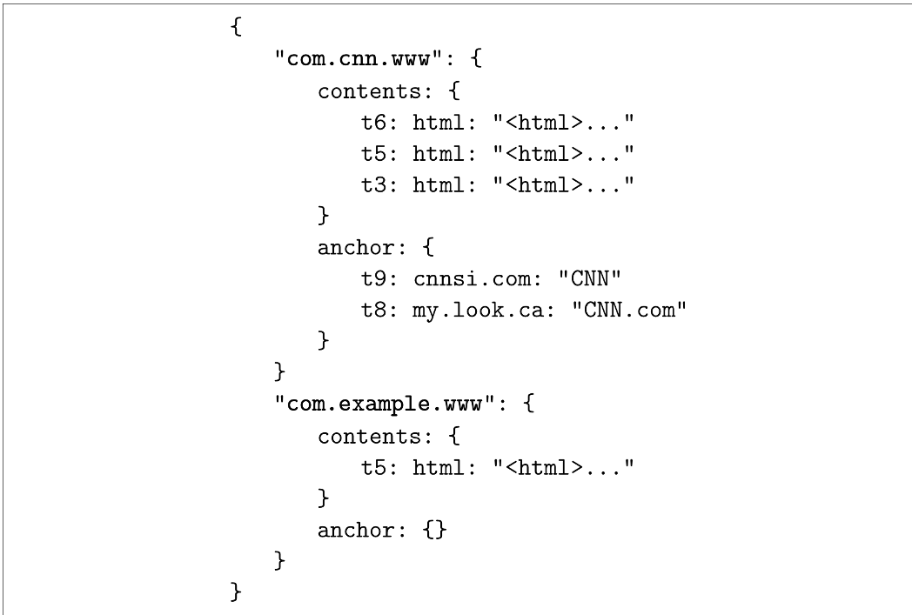

> 图 1-3：Webtable 的概念结构； 行键为反转的 URL， `contents` 和 `anchor`
> 列族分别保存带时间戳版本的网页内容及指向页面的链接。

数据存储在带有层级索引的多维有序 map 中： 可以通过反转的 URL
定位与特定网页相关的数据， 通过时间戳定位其内容或 anchor。 每行都由行键索引。
相关列分组到列族中——本例为 `contents` 和 `anchor`——并分别存储在磁盘上。
列族中的每一列都由列键标识； 列键由列族名称和限定符组成（本例中为
`html`、`cnnsi.com` 和 `my.look.ca`）。 列族按时间戳存储数据的多个版本。
这种布局让我们可以快速定位高层条目（本例中为网页）及其参数（内容版本和指向其他页面的链接）。

理解宽列存储的概念表示很有用， 但其物理布局略有不同。 图 1-4
用示意图展示了列族中的数据布局： 各列族分开存储， 但在每个列族中，
属于同一个键的数据存储在一起。

**列族：`contents`**

| 行键              | 时间戳 | 限定符 | 值          |
| ----------------- | ------ | ------ | ----------- |
| `com.cnn.www`     | $t_3$  | `html` | `<html>...` |
| `com.cnn.www`     | $t_5$  | `html` | `<html>...` |
| `com.cnn.www`     | $t_6$  | `html` | `<html>...` |
| `com.example.www` | $t_5$  | `html` | `<html>...` |

**列族：`anchor`**

| 行键          | 时间戳 | 限定符       | 值          |
| ------------- | ------ | ------------ | ----------- |
| `com.cnn.www` | $t_8$  | `cnnsi.com`  | `"CNN"`     |
| `com.cnn.www` | $t_5$  | `my.look.ca` | `"CNN.com"` |

**图 1-4：Webtable 的物理结构。** `contents` 和 `anchor` 列族分开存储，
每个列族内属于同一行键的数据存储在一起。

## 数据文件与索引文件

数据库系统的首要目标是存储数据并允许快速访问数据。 但数据是如何组织的？
为什么需要数据库管理系统， 而不是只使用一堆文件？ 文件组织如何提高效率？

数据库系统确实使用文件存储数据，
但它不会依靠文件系统的目录和文件层级来定位记录，
而是使用特定于实现的格式组成文件。 与平面文件相比，
使用专用文件组织方式的主要原因是：

**存储效率**

文件的组织方式可以尽量降低每条已存储数据记录的存储开销。

**访问效率**

可以用尽可能少的步骤定位记录。

**更新效率**

更新记录时， 可以尽量减少磁盘上的改动次数。

数据库系统把由多个字段组成的*数据记录*存储在表中，
通常每张表都用一个单独文件表示。 可以使用*搜索键*查找表中的每条记录。
为了定位记录， 数据库系统使用_索引_： 这是一种辅助数据结构，
无需每次访问都扫描整张表， 就能高效定位数据记录。
索引使用标识记录的字段子集构建。

数据库系统通常会分离*数据文件*和_索引文件_： 数据文件存储数据记录，
索引文件存储记录元数据并利用它定位数据文件中的记录。 索引文件通常小于数据文件。
文件被划分为页， 页的大小通常等于一个或多个磁盘块。
页可以组织成记录序列或分槽页（参见“分槽页”）。

新记录（插入）和现有记录的更新表示为键值对。
大多数现代存储系统不会从页中显式删除数据， 而是使用删除标记（也称为
tombstone）， 其中包含键和时间戳等删除元数据。
被更新或删除标记遮蔽的记录所占用的空间， 会在垃圾回收期间回收：
垃圾回收读取这些页， 把仍然有效（即未被遮蔽）的记录写入新位置，
并丢弃已被遮蔽的记录。

### 数据文件

数据文件（有时称为_主文件_）可以实现为索引组织表（index-organized table，IOT）、
堆组织表（堆文件）或散列组织表（散列文件）。

堆文件中的记录无须遵循任何特定顺序， 多数情况下按写入顺序放置。 这样，
追加新页时就无须执行额外工作或重组文件。 为了支持搜索，
堆文件需要额外的索引结构指向数据记录的存储位置。

在散列文件中， 记录存储在 bucket 中， 键的散列值决定记录属于哪个 bucket。 bucket
中的记录可以按追加顺序存储， 也可以按键排序以提高查找速度。

索引组织表（IOT）把数据记录存储在索引本身中。 由于记录按键顺序存储，
可以通过顺序扫描内容来实现 IOT 的范围扫描。

把数据记录存储在索引中， 可以至少减少一次磁盘寻道，
因为遍历索引并定位要查找的键之后， 无须再访问单独文件来查找相关数据记录。

当记录存储在单独文件中时， 索引文件会保存_数据条目_。 数据条目唯一标识数据记录，
并包含足以在数据文件中定位记录的信息。 例如，
可以存储文件_偏移量_（有时称为_行定位符_）、 数据记录在数据文件中的位置；
对于散列文件， 也可以存储 bucket ID。 在索引组织表中，
数据条目保存实际的数据记录。

### 索引文件

索引是一种在磁盘上组织数据记录的结构， 旨在支持高效检索操作。
索引文件组织为专用结构， 把键映射到数据文件中的位置；
由这些键标识的记录（对于堆文件）或主键（对于索引组织表）就存储在这些位置。

建立在_主_（数据）文件上的索引称为_主索引_。 不过在大多数情况下，
也可以认为主索引建立在主键或一组被认定为主键的键上。
所有其他索引都称为_二级索引_。

二级索引可以直接指向数据记录， 也可以只存储其主键。
指向数据记录的指针可以保存堆文件或索引组织表中的偏移量。
多个二级索引可以指向同一条记录， 让单条数据记录能够由不同字段标识，
并通过不同索引定位。 主索引文件中的每个搜索键只有一个唯一条目，
而二级索引中的每个搜索键可以有多个条目 [MOLINA08]。

如果数据记录的顺序与搜索键顺序一致， 这种索引称为_聚簇索引_（也称 clustering）。
在聚簇情况下， 数据记录通常存储在同一个文件或保持键顺序的*聚簇文件*中。
如果数据存储在单独文件中， 而且其顺序不遵循键顺序，
这种索引称为_非聚簇索引_（有时称为 unclustered index）。

图 1-5 展示了两种方法之间的区别：

- (a) 两个索引都从二级索引文件中直接引用数据条目。
- (b) 二级索引通过主索引这一间接层定位数据条目。

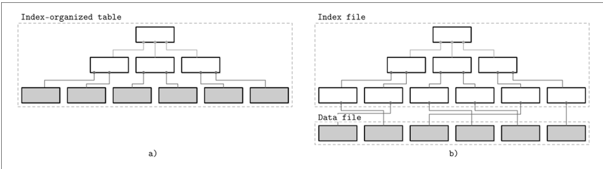

> 图 1-5：把数据记录存储在索引文件中， 与把指向数据文件的偏移量存储在索引中；
> 白色表示索引段， 灰色表示保存数据记录的段。

> [!NOTE]
> 索引组织表按索引顺序存储信息， 因此按定义就是聚簇的。 主索引*通常*是聚簇索引。
> 二级索引按定义是非聚簇索引， 因为它用于支持通过主键之外的键进行访问。
> 聚簇索引既可以是索引组织的， 也可以使用分离的索引文件和数据文件。

许多数据库系统具有固有且显式的_主键_， 即一组唯一标识数据库记录的列。
如果没有指定主键， 存储引擎可以创建*隐式*主键（例如， MySQL InnoDB
会添加一个新的自增列并自动填充值）。

这种术语用于不同类型的数据库系统： 关系数据库系统（例如 MySQL 和 PostgreSQL）、
基于 Dynamo 的 NoSQL 存储（例如 Apache Cassandra 和 Riak）， 以及文档存储（例如
MongoDB）。 不同项目可能采用不同名称， 但通常都能清晰地映射到这套术语。

### 用主索引进行间接寻址

对于数据记录应当直接引用（通过文件偏移量）， 还是通过主键索引引用，
数据库社区存在不同观点[^ch1-5]。

[^ch1-5]: 最初引发这场讨论的文章颇具争议且观点片面， 但可以参考比较 MySQL 与
    PostgreSQL 索引和存储格式的演示文稿， 其中也引用了最初的资料来源。

两种方法各有优缺点， 最好结合完整实现来讨论。 直接引用数据可以减少磁盘寻道次数，
但每当记录在维护过程中更新或重新定位时， 都必须承担更新指针的成本。
以主索引进行间接寻址， 可以降低更新指针的成本， 但读取路径的成本更高。

如果工作负载主要由读取组成， 只更新少量索引或许可行；
但对于具有多个索引的写密集型工作负载， 这种方法效果不佳。 为了降低指针更新成本，
有些实现不使用 payload 偏移量， 而使用主键进行间接寻址。 例如， MySQL InnoDB
使用主索引， 执行查询时会进行两次查找： 一次在二级索引中， 另一次在主索引中
[TARIQ11]。 这会增加一次主索引查找的开销， 而不是直接沿二级索引中的偏移量访问。

图 1-6 展示了两种方法之间的区别：

- (a) 两个索引都从二级索引文件中直接引用数据条目。
- (b) 二级索引通过主索引这一间接层定位数据条目。

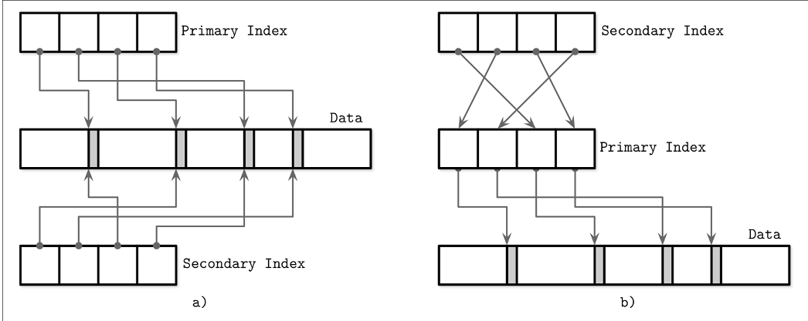

> 图 1-6：直接引用数据 tuple（a）， 与使用主索引进行间接寻址（b）。

还可以使用混合方法， 同时存储数据文件偏移量和主键。
首先检查数据偏移量是否仍然有效； 如果偏移量已经改变，
则承担通过主键索引访问的额外成本， 并在找到新偏移量后更新索引文件。

## 缓冲、不可变性与有序性

存储引擎以某种数据结构为基础。 然而，
这些结构并不能描述缓存、恢复、事务性以及存储引擎在其上增加的其他语义。

接下来的几章将从 B-Tree 开始讨论（参见“无处不在的 B-Tree”）， 尝试理解 B-Tree
为何有如此多变体， 以及新的数据库存储结构为何不断涌现。

存储结构有三个常见变量： 是否使用_缓冲_、 使用*不可变*文件还是可变文件，
以及按顺序还是不按顺序存储值。
本书讨论的存储结构差异和优化大多与这三个概念之一有关。

### 缓冲

缓冲是指存储结构是否选择先在内存中收集一定量的数据， 再将其写入磁盘。 当然，
每一种磁盘结构都必须在*某种*程度上使用缓冲， 因为磁盘数据传输的最小单位是_块_，
而且最好写入完整的块。 这里所说的是可以避免的缓冲，
也就是存储引擎实现者*选择*进行的缓冲。 本书最先讨论的优化之一， 是在 B-Tree
节点中添加内存缓冲区以分摊 I/O 成本（参见“惰性 B-Tree”）。 不过，
这并不是应用缓冲的唯一方式。

例如， 双组件 LSM Tree（参见“双组件 LSM Tree”）虽然与 B-Tree 有相似之处，
但其使用缓冲的方式完全不同， 而且把缓冲与不可变性结合起来。

### 可变性（或不可变性）

可变性定义了存储结构是否读取文件的一部分、 对其进行更新，
然后把更新结果写回文件中的同一位置。 不可变结构是*仅追加*的：
文件内容一旦写入便不再修改， 后续修改会追加到文件末尾。
不可变性还有其他实现方式。 其中一种是 *copy-on-write*（参见“Copy-on-Write”）：
包含记录更新版本的已修改页， 会写入文件中的*新*位置， 而不是原位置。 人们常把
LSM Tree 与 B-Tree 的区别归结为不可变存储与原地更新存储之别， 但也有一些受
B-Tree 启发却不可变的结构（例如“Bw-Tree”）。

### 有序性

有序性定义了*数据记录*在磁盘页中是否按键顺序存储。 换言之，
排序位置接近的键会存储在磁盘上的连续段中。
有序性往往决定了我们能否高效扫描记录_范围_， 而不仅仅是定位单条数据记录。
无序存储数据（通常按插入顺序存储）为一些写入时优化创造了机会。 例如，
Bitcask（参见“Bitcask”）和
WiscKey（参见“WiscKey”）把数据记录直接存储在仅追加文件中。

当然， 对这三个概念的简短讨论不足以展示它们的威力，
本书其余部分还会继续讨论它们。

## 小结

本章讨论了数据库管理系统的架构， 并介绍了其主要组件。

为了突出磁盘结构的重要性及其与内存结构的区别，
我们讨论了内存型存储和磁盘型存储。 结论是， 磁盘结构对两类存储都很重要，
但用途不同。

为了理解访问模式如何影响数据库系统设计， 我们讨论了列式和行式数据库管理系统，
以及将二者区分开的主要因素。 为了开始探讨_数据如何存储_，
我们还介绍了数据文件和索引文件。

最后， 我们引入了三个核心概念： 缓冲、不可变性和有序性。
本书将始终使用这些概念来突出采用它们的存储引擎所具有的属性。

## 延伸阅读

如要进一步了解本章提到的概念， 可以参考以下资料：

### 数据库架构

Hellerstein, Joseph M., Michael Stonebraker, and James Hamilton. 2007.
“Architecture of a Database System.” *Foundations and Trends in Databases* 1,
no. 2 (February): 141-259. https: //doi.org/10.1561/1900000002.

### 列式 DBMS

Abadi, Daniel, Peter Boncz, Stavros Harizopoulos, Stratos Idreaos, and Samuel
Madden. 2013. *The Design and Implementation of Modern Column-Oriented Database
Systems*. Hanover, MA: Now Publishers Inc.

### 内存 DBMS

Faerber, Frans, Alfons Kemper, and Per-Åke Alfons. 2017. *Main Memory Database
Systems*. Hanover, MA: Now Publishers Inc.

<a id="chapter-2-b-tree-basics"></a>

# 第 2 章 B-Tree 基础

本书前一章把存储结构分为可变结构和不可变结构，
并指出不可变性是影响其设计与实现的核心概念之一。
大多数可变存储结构使用原地更新机制： 执行插入、删除或更新时，
数据记录会直接在目标文件中的原位置更新。

存储引擎通常允许同一数据记录的多个版本同时存在；
例如使用[多版本并发控制](#多版本并发控制)或[分槽页](#分槽页)组织时就是如此。
为简化讨论， 暂且假设每个键只关联一条位置唯一的数据记录。

B-Tree 是最常用的存储结构之一。 许多开源数据库系统都以 B-Tree 为基础，
多年来它已证明能够覆盖大多数使用场景。

B-Tree 并非新近发明： Rudolf Bayer 与 Edward M. McCreight 于 1971 年提出了它，
此后逐渐普及。 到 1979 年， B-Tree 已经出现了许多变体； Douglas Comer
对其中一部分进行了收集和系统整理 [COMER79]。

在深入 B-Tree 之前， 先讨论为何需要考虑传统搜索树的替代方案，
例如二叉搜索树、2-3 树和 AVL 树 [KNUTH98]。 为此， 我们先回顾二叉搜索树。

## 二叉搜索树

二叉搜索树（binary search tree，BST）是一种有序的内存数据结构，
用于高效地查找键值对。 BST 由多个节点组成。
每个树节点由一个键、与该键关联的值以及两个子指针表示（因此称为二叉）。 BST
从一个称为根节点的节点开始。 一棵树只能有一个根。 图 2-1
展示了二叉搜索树的一个示例。

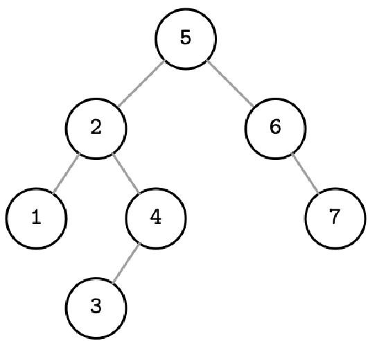

> 图 2-1：二叉搜索树。

如图 2-2 所示， 每个节点都将搜索空间划分为左、右两棵子树：
节点的键大于其左子树中存储的任何键， 并小于其右子树中存储的任何键
[SEDGEWICK11]。

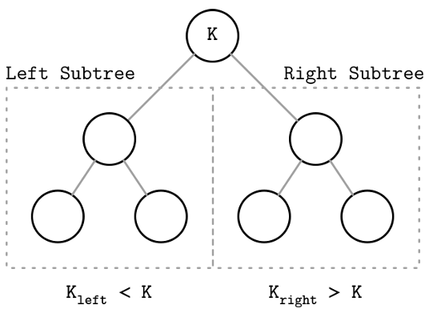

> 图 2-2：二叉树节点的不变量。

从树根开始沿左指针向下走到叶层（即节点没有子节点的层），
就能找到树中键最小的节点及其关联值。 类似地，
沿右指针走就能找到树中键最大的节点及其关联值。 树中所有节点都可以存储值。
搜索从根节点开始； 如果在较高层找到了要搜索的键， 便可在到达树的最底层之前结束。

## 树的平衡

插入操作不遵循任何特定模式，
插入元素可能导致树失衡（即某个分支比另一个分支更长）。 最坏情况如图
2-3（b）所示： 最终得到一棵更像链表的*病态*树， 其复杂度不再是期望的对数级，
而是线性级。

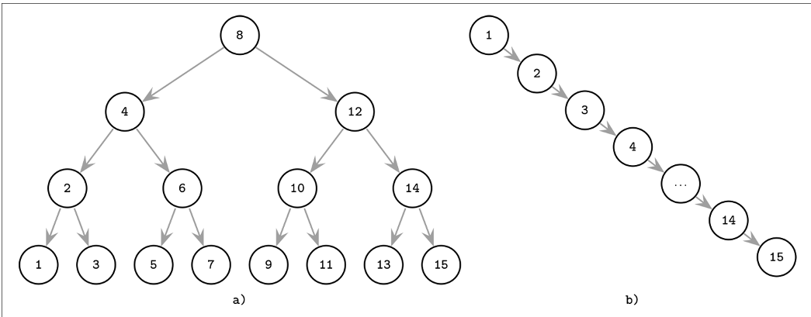

> 图 2-3：平衡树（a）与非平衡树或病态树（b）的示例。

这个例子可能略微夸大了问题， 但它说明了树为何需要保持平衡：
虽然所有元素都落到树的一侧不太可能， 但其中至少一部分肯定会如此，
这会显著减慢搜索。

*平衡*树是指高度为 $\log_2 N$ 的树， 其中 $N$ 是树中元素总数，
而两棵子树的高度差不超过 1[^ch2-1] [KNUTH98]。 如果不进行平衡，
我们就会失去二叉搜索树结构的性能优势， 并让插入和删除的顺序决定树的形状。

[^ch2-1]: AVL
    树和其他几种数据结构要求满足这一性质。更一般地说，二叉搜索树会将子树之间的高度差控制在一个较小的常数因子内。

在平衡树中， 沿左节点指针或右节点指针前进一步， 平均会将搜索空间减半，
因此查找复杂度为对数级：$O(\log_2 N)$。 如果树不平衡， 最坏情况复杂度会升至
$O(N)$， 因为可能出现所有元素都落在树的一侧的情况。

树不会把新元素不断加到某个分支上， 使其越来越长而另一分支仍为空（如图
2-3（b）所示）， 而是在每次操作后进行_平衡_。 平衡通过重组节点来完成，
目的是尽量降低树高， 并将两侧的节点数保持在界限之内。

保持树平衡的一种方法是在添加或移除节点后执行旋转步骤。
如果插入操作导致某个分支失衡（分支中连续两个节点都只有一个子节点），
就可以围绕中间节点*旋转*各节点。 在图 2-4 所示的例子中， 旋转期间，
称为旋转*枢轴*的中间节点（3）被提升一层， 其父节点则成为它的右子节点。

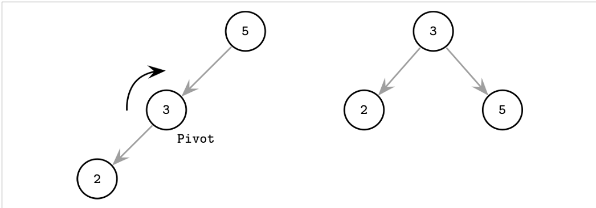

> 图 2-4：旋转步骤示例。

## 用于磁盘存储的树

如前所述， 非平衡树的最坏情况复杂度为 $O(N)$。 平衡树的平均复杂度为
$O(\log_2 N)$。 与此同时， 由于 fanout 较低（fanout
是每个节点允许拥有的最大子节点数），
我们不得不相当频繁地执行平衡、重定位节点和更新指针。 维护成本的增加使 BST
不适合作为磁盘数据结构 [NIEVERGELT74]。

如果想在磁盘上维护 BST， 我们会遇到若干问题。 其中一个是局部性：
由于元素以随机顺序添加， 无法保证新建节点会写在靠近其父节点的位置，
这意味着节点的子指针可能跨越多个磁盘页。
我们可以修改树的布局并使用分页二叉树（参见[分页二叉树](#分页二叉树)），
在一定程度上改善这种情况。

另一个与跟随子指针的成本密切相关的问题是树高。 二叉树的 fanout 只有 2，
因此其高度是树中元素数量的以 2 为底的对数； 为了找到目标元素， 必须执行
$O(\log_2 N)$ 次寻道， 随后还要执行同样次数的磁盘传输。 2-3 树和其他低 fanout
树也有类似限制： 它们适合作为内存数据结构， 但节点太小， 不适用于外部存储
[COMER79]。

朴素的磁盘 BST 实现需要执行与比较次数一样多的磁盘寻道，
因为它没有内置的局部性概念。 因此， 我们需要寻找一种具备这种性质的数据结构。

考虑到这些因素， 更适合磁盘实现的树应具备以下性质：

- fanout 高，以改善相邻键的局部性。
- 高度低，以减少遍历期间的寻道次数。

> [!NOTE]
> fanout 与高度负相关： fanout 越高， 高度越低。 fanout 较高时，
> 每个节点可以容纳更多子节点， 从而减少节点总数， 并进一步降低高度。

## 磁盘数据结构

我们此前已经从总体上讨论过内存存储和磁盘存储（参见[内存型与磁盘型 DBMS](#内存型与磁盘型-dbms)）。
对于具体数据结构也可以作出同样的区分： 有些更适合在磁盘上使用，
有些则更适合在内存中使用。

正如我们讨论过的，
并非每一种满足空间和复杂度要求的数据结构都能有效用于磁盘存储。
数据库使用的数据结构必须针对持久化介质的限制进行调整。

当数据量大到不可能或不适合将整个数据集保存在内存中时， 通常会使用磁盘数据结构。
任何时候都只能在内存中*缓存*一部分数据，
其余数据必须以可高效访问的方式存储在磁盘上。

### 硬盘驱动器

大多数传统算法都是在旋转磁盘作为最普遍持久化存储介质的时代开发的，
这对其设计产生了重大影响。 后来，
闪存盘等存储介质的新发展催生了新算法以及对现有算法的修改， 以利用新硬件的能力。
如今， 针对非易失性字节寻址存储优化的新型数据结构正在涌现（例如 [XIA17]
[KANNAN18]）。

在旋转磁盘上， 寻道会增加随机读取的成本， 因为它需要磁盘旋转和机械磁头移动，
才能把读写磁头定位到目标位置。 不过， 一旦完成这一昂贵步骤，
读取或写入连续字节（即顺序操作）的成本就相对较低。

旋转磁盘的最小传输单元是扇区， 因此执行某项操作时，
至少要读取或写入一个完整扇区。 扇区大小通常在 512 字节到 4 KB 之间。

磁头定位是硬盘驱动器（HDD）操作中成本最高的部分。 这也是我们经常听说_顺序 I/O_
有积极作用的原因之一： 它从磁盘读取和向磁盘写入连续的存储段。

### 固态硬盘

固态硬盘（SSD）没有活动部件： 不存在旋转的磁盘， 也没有读取前必须定位的磁头。
典型的 SSD 由*存储单元*构成， 存储单元连接成_串_（通常每串 32 到 64 个单元），
串组合成_阵列_， 阵列组合成_页_， 页再组合成_块_ [LARRIVEE15]。

根据所用技术的不同， 一个单元可以保存一位或多位数据。 不同设备的页大小各异，
通常在 2 到 16 KB 之间。 块通常包含 64 到 512 个页。 块组织成平面，
最后将平面置于裸片上。 SSD 可以包含一个或多个裸片。 图 2-5 展示了这一层次结构。

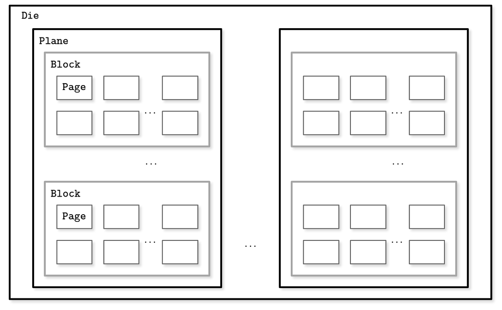

> 图 2-5：SSD
> 组织结构示意图。存储单元连接成串，串组成阵列，阵列组成页，页组成块，块组成平面，平面位于裸片上。

可写入（编程）或读取的最小单元是页。 但是，
只能修改空的存储单元（即写入前已擦除的单元）。 最小擦除实体不是页，
而是容纳多个页的块， 因此它通常称为擦除块。 空块中的页必须按顺序写入。

闪存控制器中负责将页 ID 映射到物理位置， 并跟踪空页、已写页和已丢弃页的部分称为
Flash Translation Layer（FTL，闪存转换层； 有关 FTL 的更多内容，参见“Flash
Translation Layer”）。 它还负责垃圾回收； 在此过程中， FTL
会找出可安全擦除的块。 有些块可能仍包含有效页。 此时，
它会将这些块中的有效页重定位到新位置， 并重新映射页 ID，使其指向新位置。 随后，
它会擦除这些不再使用的块， 使其可供写入。

由于 HDD 和 SSD 都是按存储块而非单个字节寻址（即按块访问数据），
大多数操作系统都提供*块设备*抽象 [CESATI05]。 它隐藏磁盘内部结构并在内部缓冲 I/O
操作， 因此从块设备读取*一个字*时， 会读取包含它的_整个块_。
在处理磁盘驻留数据结构时， 这个限制不容忽视， 必须始终纳入考虑。

SSD 不像 HDD 那样特别强调随机 I/O 与顺序 I/O 的区别，
因为随机读取与顺序读取的延迟差异没有那么大。 不过，
预取、读取连续页以及内部并行性仍会造成一定差异 [GOOSSAERT14]。

尽管垃圾回收通常是后台操作， 它仍可能对写入性能产生负面影响，
尤其是面对随机且未对齐的写入负载时。

只写入完整块， 并合并随后对同一个块的写入， 有助于减少所需的 I/O 操作次数。
后续章节会讨论以缓冲和不可变性实现这一点的方法。

## 磁盘结构

除了磁盘访问本身的成本， 构建高效磁盘结构的主要限制和设计条件是：
磁盘操作的最小单元是块。 要跟随指针访问块内的特定位置， 必须取得整个块。
既然无论如何都要这样做， 我们便可以调整数据结构的布局， 充分利用这一点。

本章已经多次提到指针， 但这个词在磁盘结构中的语义略有不同。 在磁盘上，
多数时候需要手动管理数据布局（例如使用内存映射文件时除外）。
这仍与普通指针操作类似， 但必须自行计算目标指针地址并显式跟随指针。

大多数时候， 磁盘偏移量会预先计算（指针先于其指向的部分写入磁盘时），
或缓存在内存中， 直到刷新到磁盘。
在磁盘结构中创建很长的依赖链会大幅增加代码和结构的复杂度，
因此最好尽量减少指针数量及其跨度。

总之， 磁盘结构在设计时会考虑目标存储设备的特性，
并且通常以减少磁盘访问为优化目标。 为此， 可以改善局部性、优化结构的内部表示，
并减少指向页外的指针数量。

在[二叉搜索树](#二叉搜索树)中， 我们得出结论： 高 fanout
和低高度是最优磁盘数据结构应有的性质。 我们还讨论了指针带来的额外空间开销，
以及平衡后重新映射这些指针产生的维护开销。 B-Tree 结合了这些思想： 提高节点
fanout， 并降低树高、节点指针数量和平衡操作频率。

## 分页二叉树

如图 2-6 所示， 将二叉树的节点分组放入页中， 可以改善局部性。 寻找下一个节点时，
只需跟随已取得页面内的指针。 不过， 节点及节点之间的指针仍会产生一些开销。
在磁盘上安排这种结构并进一步维护它并非易事，
尤其是在键和值未预先排序而是以随机顺序添加时。 平衡需要重组页面，
进而导致指针更新。

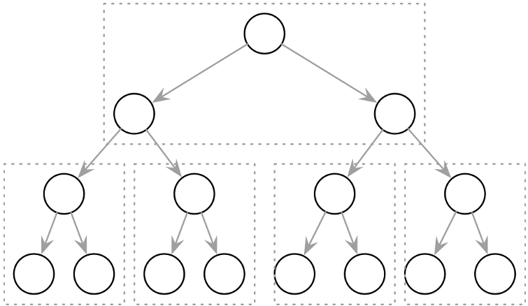

> 图 2-6：分页二叉树。多个二叉树节点被组合到同一磁盘页内。

## 无处不在的 B-Tree

> 我们比蜜蜂勇敢，而且……比树更长……
>
> ——小熊维尼

可以把 B-Tree 想象成图书馆里一间巨大的目录室： 首先要选择正确的目录柜，
再选择柜中正确的搁板， 然后选择搁板上正确的抽屉， 最后浏览抽屉里的卡片，
找到要搜索的那一张。 类似地， B-Tree 建立了一个层次结构，
帮助我们快速导航并找到搜索项。

正如[二叉搜索树](#二叉搜索树)中所述， B-Tree 以平衡搜索树为基础， 区别在于它的
fanout 更高（子节点更多）， 高度更低。

在大多数文献中， 二叉树节点绘制成圆形。 每个节点只负责一个键并将范围一分为二，
因此这种细节程度已经足够且很直观。 与此同时， B-Tree 节点通常绘制成矩形，
还会明确画出指针块， 以突出子节点与分隔键之间的关系。 图 2-7
并列展示了二叉树、2-3 树和 B-Tree 节点， 有助于理解它们的异同。

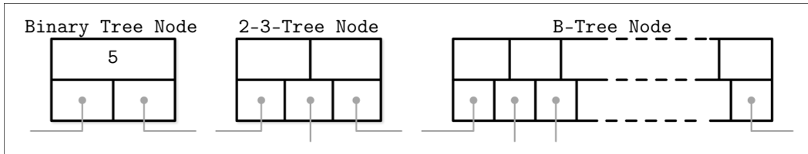

> 图 2-7：并列展示的二叉树、2-3 树和 B-Tree 节点。

当然也可以用相同方式描绘二叉树。 两种结构跟随指针的语义相似，
差异从维持平衡的方式开始显现。 图 2-8 展示了这种画法， 并暗示了 BST 与 B-Tree
的相似之处： 在两种情况下， 键都会把树划分成子树，
并用于在树中导航和寻找目标键。 可以将其与图 2-1 对照。

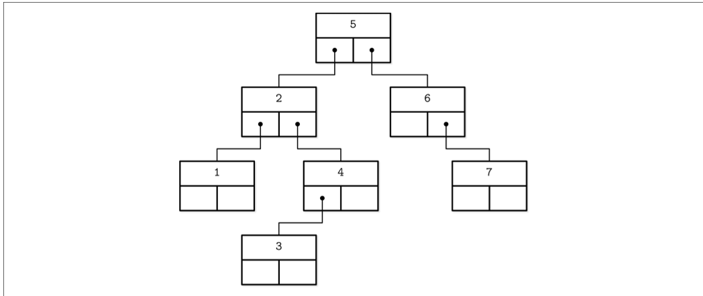

> 图 2-8：二叉树的另一种表示方式，明确画出了键与子指针。

B-Tree 是有序的： B-Tree 节点内的键按顺序存储。 因此，
可以使用二分搜索之类的算法定位目标键。 这也意味着 B-Tree 查找具有对数复杂度。
例如， 在 40 亿（$4 \times 10^9$）个元素中寻找目标键大约需要 32
次比较（有关这一主题的更多内容， 参见[B-Tree 查找复杂度](#b-tree-查找复杂度)）。
如果每次比较都必须执行一次磁盘寻道， 速度会显著下降； 但由于 B-Tree
节点可以存储几十乃至数百个元素， 每跨越一层只需执行一次磁盘寻道。
本章稍后会更详细地讨论查找算法。

使用 B-Tree， 可以高效执行点查询和范围查询。
点查询在大多数查询语言中以相等（=）谓词表示， 用于定位单个元素。
范围查询则以比较（<、>、≤ 和 ≥）谓词表示， 用于按顺序查询多个数据项。

## B-Tree 的层次结构

B-Tree 由多个节点组成。 每个节点最多容纳 $N$ 个键和 $N + 1$ 个指向子节点的指针。
这些节点在逻辑上分为三组：

**根节点**

没有父节点， 位于树的顶端。

**叶节点**

位于最底层， 没有子节点。

**内部节点**

除上述节点外的所有节点， 负责连接根与叶。 内部节点通常不止一层。

图 2-9 展示了这一层次结构。

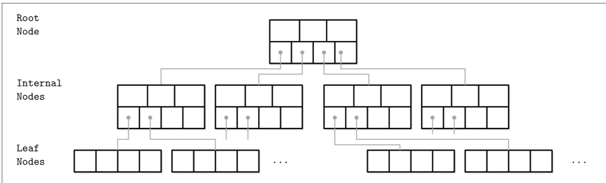

> 图 2-9：由根节点、内部节点和叶节点组成的 B-Tree 节点层次结构。

B-Tree 是一种页面组织技术（即用于组织和导航固定大小的页），
因此我们常常交替使用节点和页这两个术语。

节点容量与节点实际保存的键数之比称为占用率。

B-Tree 的特征是 fanout， 即每个节点中存储的键数。 较高的 fanout
能够摊销维持树平衡所需的结构变更成本，
并通过在一个块或多个连续块中存储键和指向子节点的指针来减少寻道次数。
当节点已满或几乎为空时， 会触发平衡操作， 也就是拆分和合并。

## $B^+$-Tree

本书将 B-Tree 作为一个统称， 指代共享上述全部或大部分性质的一系列数据结构。
这里描述的数据结构更准确的名称是 $B^+$-Tree。 [KNUTH98] 将 fanout
较高的树称为多路树。

B-Tree 允许在任何层存储值： 根节点、内部节点和叶节点都可以。 $B^+$-Tree
*只*在叶节点中存储值。 内部节点只存储_分隔键_，
用来引导搜索算法找到叶层上存储的关联值。

由于 $B^+$-Tree 中的值只存储在叶层，
所有操作（插入、更新、移除和检索数据记录）都只影响叶节点，
并且仅在拆分和合并期间向更高层传播。

$B^+$-Tree 已经得到广泛应用； 与该领域的其他文献一样， 本书将其称为 B-Tree。
例如， [GRAEFE11] 将 $B^+$-Tree 称为默认设计， MySQL InnoDB 也将其 $B^+$-Tree
实现称为 B-tree。

## 分隔键

存储在 B-Tree 节点中的键称为_索引项_、*分隔键*或_分隔单元_。
它们把树划分为_子树_（也称*分支*或_子范围_）， 各自包含相应的键范围。
键按顺序存储， 以便进行二分搜索。 查找子树时， 先定位某个键，
再从较高层沿对应指针前往较低层。

节点中的第一个指针指向包含小于第一个键的元素的子树，
最后一个指针指向包含大于或等于最后一个键的元素的子树。
其他指针引用两个键之间的子树： $K_{i-1} \le K_s < K_i$， 其中 $K$ 是键集合，
$K_s$ 是属于该子树的键。 图 2-10 展示了这些不变量。

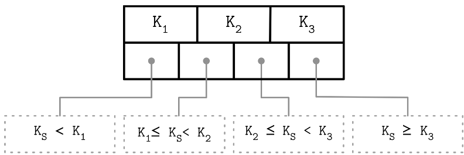

> 图 2-10：分隔键如何将树划分为子树。每个子指针对应由相邻分隔键界定的键范围。

某些 B-Tree 变体还带有兄弟节点指针， 最常见的是位于叶层， 以简化范围扫描。
借助这些指针， 无需返回父节点即可找到下一个兄弟节点。
有些实现在两个方向上都有指针， 从而在叶层形成双向链表， 使反向迭代成为可能。

B-Tree 的独特之处在于， 它不是像二叉搜索树那样自顶向下构建，
而是反过来自底向上构建。 叶节点数量不断增长， 进而增加内部节点数量和树高。

由于 B-Tree 会在节点内为将来的插入和更新预留额外空间， 树的存储利用率可能低至
50%， 但通常会高得多。 较高的占用率不会对 B-Tree 性能产生负面影响。

## B-Tree 查找复杂度

可以从两个角度看待 B-Tree 的查找复杂度： 查找期间的块传输次数和比较次数。

就传输次数而言， 对数的底数是 $N$（每个节点的键数）。 每增加一层，
节点数都会增加 $K$ 倍， 而跟随一个子指针会使搜索空间缩小 $N$ 倍。 查找时，
为找到目标键， 最多会寻址 $\log_K M$ 个页（其中 $M$ 是 B-Tree 中的元素总数）。
从根到叶的过程中必须跟随的子指针数量也等于层数， 换言之， 等于树高 $h$。

从比较次数看， 对数的底数是 2， 因为在每个节点内使用二分搜索来查找键。
每次比较都会将搜索空间减半， 因此复杂度为 $\log_2 M$。

理解寻道次数与比较次数的区别， 有助于直观认识搜索的执行方式，
并从两个角度理解查找复杂度。

在教科书和文章[^ch2-2]中， B-Tree 查找复杂度通常记为 $\log M$。
复杂度分析一般不写对数底数， 因为改变底数只会引入一个常数因子，
而乘以常数因子不会改变复杂度。 例如， 对于非零常数因子 $c$，
$O(|c| \times n) = O(n)$ [KNUTH97]。

[^ch2-2]: 例如 [KNUTH98]。

## B-Tree 查找算法

现在我们已经介绍了 B-Tree 的结构和内部组织， 可以定义查找、插入和移除算法。 要在
B-Tree 中查找元素， 必须从根到叶执行一次遍历。 搜索的目标是找到目标键或其前驱。
查找精确匹配用于点查询、更新和删除； 查找前驱则适用于范围扫描和插入。

算法从根开始执行二分搜索， 不断将目标键与根节点中存储的键比较，
直到找到第一个大于目标值的分隔键。 这样就定位了目标子树。 如前所述，
索引键以两个相邻键*之间*的边界将树划分成子树。 一旦找到子树，
就沿对应指针前进并继续相同的搜索过程（定位分隔键、跟随指针），
直到到达目标叶节点； 在该节点上， 要么找到目标键，
要么在找到其前驱后断定它不存在。

每下降一层， 看到的树就更为详细： 从最粗粒度的层级（树根）开始， 下降到下一层；
这一层的键表示更精确、更细致的范围， 直到最终到达存放数据记录的叶节点。

执行点查询时， 找到目标键或确认找不到后， 搜索即告结束。 执行范围扫描时，
迭代从找到的最近键值对开始， 然后沿兄弟指针继续，
直到到达范围末端或范围谓词不再满足。

## 键的计数方式

在各种文献中， 可以看到不同的键数和子偏移量计数方式。 [BAYER72]
提到一个由设备决定、表示最优页面大小的自然数 $k$。 此时， 页可以容纳 $k$ 到 $2k$
个键， 但可以只填充一部分； 页至少有 $k + 1$ 个、最多有 $2k + 1$
个指向子节点的指针。 根页可以容纳 1 到 $2k$ 个键。 该文随后又引入了数字 $l$，
并指出任何非叶页都可以有 $l + 1$ 个键。

其他资料（例如 [GRAEFE11]）描述的节点最多可以容纳 $N$ 个分隔键和 $N + 1$
个指针， 其他语义和不变量则与之类似。

两种方式会得到相同结果， 差异只是各资料为了强调相应内容而采用的不同表述。
为清楚起见， 本书始终用 $N$ 表示键的数量（对于叶节点， 则表示键值对的数量）。

## B-Tree 节点拆分

要向 B-Tree 插入值， 首先必须找到目标叶节点和插入点。 为此，
使用上一节描述的算法。 找到叶节点后， 将键和值追加到其中。 B-Tree
中的更新操作通过查找算法定位目标叶节点， 然后将新值与现有键关联起来。

如果目标节点没有足够空间， 就称该节点发生了_溢出_ [NICHOLS66]，
必须把它拆分为两个节点， 以容纳新数据。 更准确地说， 在下列条件下会拆分节点：

- 对于叶节点：节点最多可以容纳 $N$
  个键值对，而再插入一个键值对会使其超过最大容量 $N$。
- 对于非叶节点：节点最多可以容纳 $N + 1$
  个指针，而再插入一个指针会使其超过最大容量 $N + 1$。

执行拆分时， 先分配新节点， 将待拆分节点的一半元素转移到新节点，
再把新节点的第一个键和指针添加到父节点。 此时， 称该键被_提升_。
执行拆分的索引称为_拆分点_（也称中点）。
拆分点之后的所有元素都会转移到新建的兄弟节点； 拆分非叶节点时，
拆分点本身也包括在内。 其余元素留在待拆分节点中。

如果父节点已满， 没有空间容纳提升的键和指向新建节点的指针，
那么父节点也必须拆分。 这一操作可能一路递归传播到根。

树一旦达到容量上限（即拆分一路向上传播到根）， 就必须拆分根节点。 拆分根节点时，
会分配一个保存拆分点键的新根。
旧根（此时只保留一半索引项）与新建的兄弟节点一起降到下一层， 树高随之增加 1。
只有拆分根节点并分配新根， 或合并两个节点形成新根时， 树高才会变化。
在叶节点层和内部节点层， 树只会横向增长。

图 2-11 展示了向一个已完全占满的叶节点插入新元素 11 的过程。
我们在满节点中间画一条线， 将一半元素留在原节点， 其余元素移入新节点。
拆分点的值放入父节点， 作为分隔键。

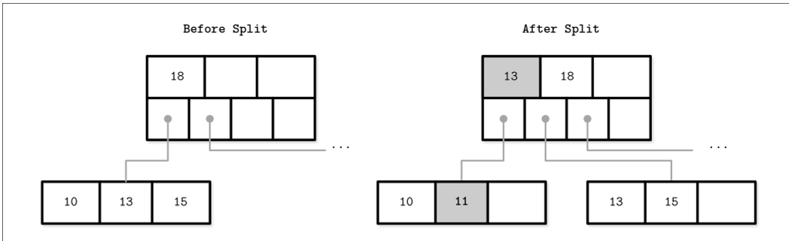

> 图 2-11：插入 11 时拆分叶节点。新元素和提升的键以灰色显示。

图 2-12 展示了插入新元素 11 时，
拆分已完全占满的非叶节点（即根节点或内部节点）的过程。 执行拆分时，
首先创建一个新节点， 并将从索引 $N/2 + 1$ 开始的元素移入其中。
拆分点的键提升到父节点。

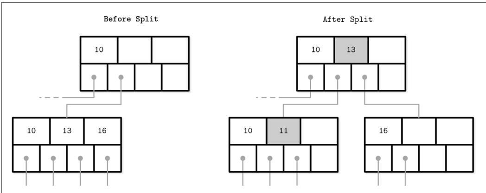

> 图 2-12：插入 11 时拆分非叶节点。新元素和提升的键以灰色显示。

非叶节点的拆分总是下层拆分向上传播的表现，
因此会多出一个指针（指向下一层的新建节点）。 如果父节点没有足够空间，
也必须拆分父节点。

拆分的是叶节点还是非叶节点并不重要（即节点保存的是键值对还是仅保存键）。
拆分叶节点时， 键会连同其关联值一起移动。

拆分完成后会得到两个节点， 必须选择正确的节点来完成插入。 为此，
可以利用分隔键不变量。 如果插入的键小于提升的键， 就将其插入原拆分节点，
完成操作； 否则将其插入新建节点。

总之， 节点拆分分为四步：

1. 分配一个新节点。
2. 将待拆分节点的一半元素复制到新节点。
3. 将新元素放入相应节点。
4. 在待拆分节点的父节点中添加分隔键和指向新节点的指针。

## B-Tree 节点合并

删除操作首先定位目标叶节点。 找到叶节点后， 移除键及其关联值。

如果相邻节点中的值太少（即占用率低于阈值）， 就合并兄弟节点。
这种情况称为_下溢_。 [BAYER72] 描述了两种下溢场景：
如果两个相邻节点拥有共同的父节点， 且其内容能够放入一个节点，
就应合并（拼接）二者的内容； 如果其内容无法放入一个节点，
就在二者之间重新分配键， 以恢复平衡（参见“重新平衡”）。 更准确地说，
在下列条件下会合并两个节点：

- 对于叶节点：节点最多可以容纳 $N$
  个键值对，而两个相邻节点中的键值对总数小于或等于 $N$。
- 对于非叶节点：节点最多可以容纳 $N + 1$
  个指针，而两个相邻节点中的指针总数小于或等于 $N + 1$。

图 2-13 展示了删除元素 16 时的合并过程。 为此，
将一个兄弟节点中的元素移到另一个兄弟节点。
通常把*右*兄弟节点中的元素移到*左*兄弟节点， 但只要保持键的顺序，
反向移动也可以。

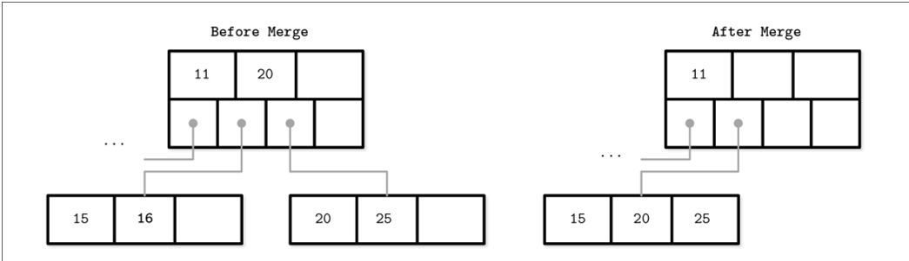

> 图 2-13：叶节点合并。

图 2-14 展示了删除元素 10 时必须合并的两个非叶兄弟节点。 将其元素合在一起后，
它们可以装入一个节点， 因此可以用一个节点取代两个节点。 合并非叶节点时，
必须从父节点下拉相应的分隔键（即将其降级）。 指针数量减少 1，
因为该合并源于下层删除页面所导致的指针删除传播。 与拆分类似，
合并也可能一路传播到根层。

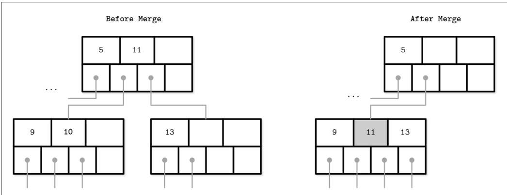

> 图 2-14：非叶节点合并。

假设元素已经移除， 节点合并分为三步：

1. 将右节点的所有元素复制到左节点。
2. 从父节点移除右节点指针（非叶节点合并时则将分隔键降级）。
3. 移除右节点。

B-Tree 中经常实现的一种减少拆分和合并次数的技术是重新平衡，
我们会在“重新平衡”中讨论它。

## 小结

本章首先说明了为磁盘存储创建专用结构的动机。
二叉搜索树可能具有相似的复杂度特征， 但由于 fanout 较低，
且平衡会导致大量重定位和指针更新， 它仍然不适合磁盘。 B-Tree
通过增加每个节点中存储的元素数量（高 fanout）并降低平衡操作频率，
解决了这两个问题。

随后， 我们讨论了 B-Tree 的内部结构， 并概述了查找、插入和删除算法。
在添加和移除元素时， 拆分和合并操作有助于重构树并使其保持平衡。
我们将树深维持在最小值， 只要现有节点仍有空闲空间， 就把元素添加到其中。

利用这些知识， 可以创建内存 B-Tree。 要创建基于磁盘的实现，
还需要深入了解如何在磁盘上安排 B-Tree 节点，
以及如何使用数据编码格式组成磁盘布局。

## 延伸阅读

如果想进一步了解本章提到的概念， 可以参考以下资料：

**二叉搜索树**

Sedgewick, Robert and Kevin Wayne. 2011. *Algorithms (4th Ed.).* Boston:
Pearson.

Knuth, Donald E. 1997. *The Art of Computer Programming, Volume 2 (3rd Ed.):
Seminumerical Algorithms*. Boston: Addison-Wesley Longman.

**B-Tree 的拆分与合并算法**

Elmasri, Ramez and Shamkant Navathe. 2011. *Fundamentals of Database Systems
(6th Ed.).* Boston: Pearson.

Silberschatz, Abraham, Henry F. Korth, and S. Sudarshan. 2010. *Database Systems
Concepts (6th Ed.).* New York: McGraw-Hill.

<a id="chapter-3-file-formats"></a>

# 第 3 章 文件格式

了解 B-Tree 的基本语义后， 现在可以探究 B-Tree 和其他结构究竟如何在磁盘上实现。
磁盘访问方式与主内存访问方式不同： 从应用程序开发者的角度看，
内存访问大多是透明的。 得益于虚拟内存 [BHATTACHARJEE17]，
我们不必手动管理偏移量。 磁盘通过系统调用访问（参见
https://databass.dev/links/54）。 我们通常必须指定目标文件内的偏移量，
再把磁盘表示转换为适合主内存使用的形式。

这意味着高效磁盘结构的设计必须考虑这种差异。 为此，
必须设计一种易于构造、修改和解释的文件格式。
本章将讨论有助于设计各种磁盘结构（而不只是 B-Tree）的一般原则与实践。

B-Tree 有许多种实现方式， 这里会讨论几项实用技术。 不同实现的细节可能有别，
但一般原则不变。 理解拆分、合并等 B-Tree 基本机制是必要的，
但还不足以进行实际实现。 最终结果要真正可用， 许多部分必须协同工作。

磁盘结构中指针管理的语义与内存结构略有不同。 可以把磁盘 B-Tree
看作一种页面管理机制： 算法必须组织和导航页面。
必须相应地计算和放置页面及指向页面的指针。

B-Tree 的大部分复杂性来自可变性，
因此我们会讨论页面布局、拆分、重定位等适用于可变数据结构的概念细节。 之后讨论
LSM Tree（参见“LSM Tree”）时， 则会重点关注排序和维护， 因为那是 LSM
复杂性的主要来源。

## 动机

创建文件格式在许多方面类似于在采用非托管内存模型的语言中创建数据结构。
我们分配一块数据， 再使用固定大小的原语和结构， 按任意方式将其切分。
如果想引用更大的内存块或大小可变的结构， 就使用指针。

采用非托管内存模型的语言允许我们在需要时随时分配更多内存（在合理范围内），
而不必考虑或担心是否存在连续内存段、它是否碎片化， 或释放之后会发生什么。
在磁盘上， 则必须自行处理垃圾回收和碎片。

数据布局在内存中的重要性远低于在磁盘上的重要性。 要让磁盘驻留数据结构高效，
就必须以能够快速访问的方式在磁盘上安排数据， 考虑持久化存储介质的特性，
设计二进制数据格式， 并找出高效序列化和反序列化数据的方法。

任何不借助额外库直接使用 C 等底层语言的人都了解其中的限制。 结构具有预定义大小，
并且要显式分配和释放。 手动实现内存分配和跟踪更具挑战性，
因为只能操作预定义大小的内存段， 还必须跟踪哪些段已经释放、哪些仍在使用。

在主内存中存储数据时， 大多数内存布局问题要么不存在， 要么更容易解决，
也可以借助第三方库解决。 例如， 处理可变长度字段和超大数据要直接得多，
因为可以使用内存分配和指针， 不必以任何特殊方式安排它们。
有时开发者仍会设计专门的主内存数据布局， 以利用 CPU cache
line、预取和其他硬件特性， 但这样做主要出于优化目的 [Fowler11]。

尽管操作系统和文件系统承担了部分职责， 实现磁盘结构仍需关注更多细节，
也存在更多陷阱。

## 二进制编码

为了在磁盘上高效存储数据， 需要用紧凑且易于序列化、反序列化的格式对数据编码。
谈到二进制格式时， 会经常听到“布局”一词。 我们没有 `malloc` 和 `free`
之类的原语， 只有读和写， 因此必须以不同方式考虑访问并相应准备数据。

这里会讨论创建高效页面布局所用的主要原则。 这些原则适用于任何二进制格式：
可以遵循类似准则来创建文件格式、序列化格式或通信协议。

在把记录组织成页面之前，
需要了解如何以二进制形式表示键和数据记录、如何把多个值组合成更复杂的结构，
以及如何实现大小可变的类型和数组。

### 原始类型

键和值都有类型， 例如整数、日期或字符串，
可以用其原始二进制形式表示（序列化转为该形式，反序列化从该形式还原）。

大多数数值数据类型都表示为固定大小的值。 处理多字节数值时，
编码和解码务必使用相同的_字节序_（endianness）。 字节序决定字节的排列顺序：

**大端序**

从最高有效字节（most-significant byte，MSB）开始，
后续字节按有效性递减的顺序排列。 换言之， MSB 的地址最低。

**小端序**

从最低有效字节（least-significant byte，LSB）开始，
后续字节按有效性*递增*的顺序排列。

图 3-1 对此进行了说明。 十六进制 32 位整数 `0xAABBCCDD` 中， `AA` 是 MSB；
图中分别使用大端和小端字节序展示了该整数。

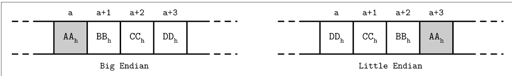

> 图 3-1：大端和小端字节序。最高有效字节以灰色显示。以 $a$
> 表示的地址从左向右递增。

例如， 为了按照相应字节序重建 64 位整数， RocksDB 提供了平台专用定义，
用于识别目标平台的字节序[^ch3-3]。
如果目标平台字节序与值的字节序不匹配（`EncodeFixed64WithEndian` 会查找
`kLittleEndian` 的值并将其与值的字节序比较）， 它就使用 `EndianTransform`
反转字节； 该函数逐字节以相反顺序读取值， 并将其追加到结果中。

[^ch3-3]: 根据平台（macOS、Solaris、AIX、某种 BSD 或
    Windows）的不同，`kLittleEndian` 变量会被设为该平台是否支持小端序。

记录由数字、字符串、布尔值等原语及其组合构成。 然而，
通过网络传输数据或把数据存储到磁盘时， 只能使用字节序列。 这意味着，
要发送或写入记录， 必须将其_序列化_（转换成可解释的字节序列）；
在接收或读取记录后使用它之前，
则必须将其_反序列化_（把字节序列还原成原始记录）。

在二进制数据格式中， 总是从原语开始， 以它们为构建更复杂结构的基础。
不同数值类型的大小可能不同。 `byte` 值为 8 位， `short` 为 2 字节（16 位），
`int` 为 4 字节（32 位）， `long` 为 8 字节（64 位）。

浮点数（例如 `float` 和 `double`）由符号、尾数和指数表示。 IEEE Standard for
Binary Floating-Point Arithmetic（IEEE 754） 标准描述了广泛采用的浮点数表示法。
32 位 `float` 表示单精度值。 例如， 浮点数 `0.15652` 的二进制表示如图 3-2 所示。
前 23 位表示尾数， 随后 8 位表示指数， 另有 1 位表示符号（数是否为负数）。

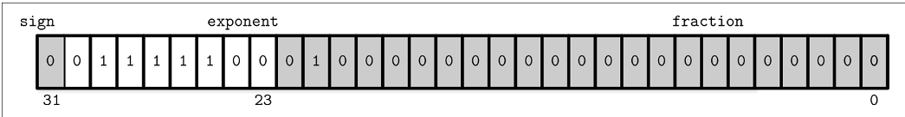

> 图 3-2：单精度浮点数的二进制表示。23 位尾数、8 位指数和 1 位符号共同组成 32
> 位值。

由于浮点值使用尾数计算， 这种表示得到的数只是近似值。
完整转换算法的讨论超出了本书范围， 这里只介绍表示法的基础。

`double` 表示双精度浮点值 [SAVARD05]。
大多数编程语言的标准库都提供了在浮点值及其二进制表示之间编码和解码的方法。

### 字符串与大小可变的数据

所有原始数值类型的大小都固定。 把多个值组合成更复杂的值， 很像 C 中的
`struct`[^ch3-4]。 可以将原始值组合成结构，
并使用固定大小的数组或指向其他内存区域的指针。

[^ch3-4]: 值得注意的是，编译器可能向结构添加填充，而且填充也与体系结构有关。这可能破坏对确切字节偏移量和位置的假设。有关结构体紧凑化的更多信息，请参阅
    https://databass.dev/links/58。

字符串及其他大小可变的数据类型（例如由固定大小数据组成的数组）可以序列化为一个表示数组或字符串长度的数字，
后跟 `size` 个字节的实际数据。 对于字符串， 这种表示法通常称为 *UCSD String* 或
*Pascal String*， 名称来自 Pascal 编程语言的一种流行实现。
可以用如下伪代码表示：

```text
String
{
    size    uint_16
    data    byte[size]
}
```

Pascal 字符串的另一种选择是_空字符结尾字符串_， 读取方逐字节读取字符串，
直到遇到字符串结束符。 Pascal 字符串方法有几个优点： 无需遍历字符串内容，
就能在常数时间内获知字符串长度； 还可以从内存中切取 `size` 个字节，
把字节数组传给字符串构造函数， 从而组成特定语言的字符串。

### 位压缩数据：布尔值、枚举和标志

布尔值既可以使用单个字节表示， 也可以将 `true` 和 `false` 编码为值 1 和 0。
布尔值只有两个取值， 用整个字节表示很浪费， 因此开发者常把布尔值按八个一组打包，
每个布尔值只占一位。 我们称值为 1 的位已置位， 值为 0 的位未置位或为空。

枚举是枚举类型的简称， 可以表示为整数， 经常用于二进制格式和通信协议。
枚举用于表示频繁重复的低基数值。 例如， 可以使用枚举编码 B-Tree 节点类型：

```c
enum NodeType {
    ROOT,     // 0x00h
    INTERNAL, // 0x01h
    LEAF      // 0x02h
};
```

另一个密切相关的概念是标志， 它类似于压缩布尔值与枚举的组合。
标志可以表示并非互斥的具名布尔参数。 例如，
可以用标志表示页面是否保存值单元、值的大小是固定还是可变，
以及是否有与该节点关联的溢出页。 由于每一位表示一个标志值， 掩码只能使用 2
的幂（因为 2 的幂在二进制中始终只有一个置位位； 例如
$2^3 = 8 = 1000b$、$2^4 = 16 = 0001\ 0000b$，等等）：

```c
int IS_LEAF_MASK = 0x01h; // bit #1
int VARIABLE_SIZE_VALUES = 0x02h; // bit #2
int HAS_OVERFLOW_PAGES = 0x04h; // bit #3
```

与压缩布尔值一样， 可以使用位掩码和按位运算符从压缩值中读写标志值。 例如，
要设置负责某个标志的位， 可以使用按位 OR（`|`）和位掩码。 也可以不用位掩码，
而使用移位（`<<`）和位索引。 要清除该位， 可以使用按位
AND（`&`）和按位取反运算符（`~`）。 要测试第 `n` 位是否置位， 可以把按位 AND
的结果与 0 比较：

```c
// Set the bit
flags |= HAS_OVERFLOW_PAGES;
flags |= (1 << 2);

// Unset the bit
flags &= ~HAS_OVERFLOW_PAGES;
flags &= ~(1 << 2);

// Test whether or not the bit is set
is_set = (flags & HAS_OVERFLOW_PAGES) != 0;
is_set = (flags & (1 << 2)) != 0;
```

## 一般原则

设计文件格式通常从决定寻址方式开始： 文件是否拆分成大小相同的页，
每个页是由单个块表示， 还是由多个连续块表示。
大多数原地更新存储结构都使用大小相同的页， 因为这能显著简化读写访问。
仅追加存储结构也常常按页写入数据： 记录逐个追加，
页面在内存中填满后立即刷新到磁盘。

文件通常以固定大小的*头部*开始， 也可能以固定大小的*尾部*结束；
二者保存需要快速访问或解码文件其余部分所需的辅助信息。 文件的其余部分拆分成页。
图 3-3 示意了这种文件组织方式。

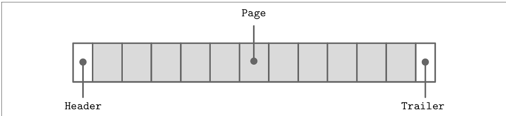

> 图
> 3-3：文件组织方式。固定大小的文件头部之后是多个页面，文件末尾可以包含固定大小的尾部。

许多数据存储都有固定 schema， 规定表可容纳的字段数量、顺序和类型。 固定 schema
有助于减少磁盘上的数据量： 不必重复写入字段名， 而可以使用其位置标识符。

如果要为公司通讯录设计一种格式， 存储每位员工的姓名、出生日期、税号和性别，
可以采用多种方法。 例如，
可以把固定大小的字段（如出生日期和税号）存储在结构前部， 后跟大小可变的字段：

```text
Fixed-size fields:
| (4 bytes) employee_id
| (4 bytes) tax_number
| (3 bytes) date
| (1 byte) gender
| (2 bytes) first_name_length
| (2 bytes) last_name_length

Variable-size fields:
| (first_name_length bytes) first_name
| (last_name_length bytes) last_name
```

现在， 要访问 `first_name`， 可以从固定大小区域之后切取 `first_name_length`
个字节。 要访问 `last_name`， 可以检查它之前各个大小可变字段的大小，
从而定位它的起始位置。 为了避免涉及多个字段的计算，
可以在固定大小区域中同时编码偏移量和长度。 这样就能分别定位任意大小可变字段。

构建更复杂的结构通常需要建立层次： 原语组成字段， 字段组成单元， 单元组成页面，
页面组成区段， 区段组成区域， 以此类推。 这里没有必须遵循的严格规则，
一切都取决于需要为哪类数据创建格式。

数据库文件通常由多个部分组成， 并借助查找表进行导航。
查找表指向这些部分的起始偏移量， 它可以写在文件头部、尾部，
也可以写在单独的文件中。

## 页面结构

数据库系统把数据记录存储在数据文件和索引文件中。
这些文件划分成称为*页*的固定大小单元， 每页通常由多个文件系统块组成。
页面大小通常在 4 到 16 KB 之间。

来看一个磁盘 B-Tree 节点示例。 从结构角度看， B-Tree
区分保存键与数据记录对的叶节点， 以及保存键与指向其他节点的指针的非叶节点。 每个
B-Tree 节点占据一个页或多个链接在一起的页， 因此在 B-Tree 语境中，
节点、页甚至块这些术语经常交替使用。

最初的 B-Tree 论文 [BAYER72] 描述了一种用于固定大小数据记录的简单页面组织方式；
如图 3-4 所示， 每个页只是若干三元组的拼接： 键以 $k$ 表示， 关联值以 $v$ 表示，
指向子页面的指针以 $p$ 表示。

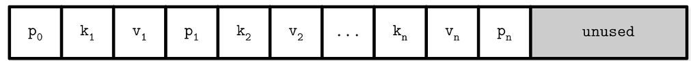

> 图 3-4：固定大小记录的页面组织方式。页面由指向子页面的指针 $p$、 键 $k$
> 和关联值 $v$ 构成的三元组连续拼接而成。

这种方法易于理解， 但存在一些缺点：

- 在最右侧以外的任何位置追加键，都需要重定位元素。
- 它无法高效管理或访问大小可变的记录，只适用于固定大小的数据。

## 分槽页

存储大小可变的记录时， 主要问题是空闲空间管理： 如何回收已移除记录占用的空间。
如果试图把大小为 $n$ 的记录放入先前由大小为 $m$ 的记录占据的空间， 除非
$m = n$， 或能找到另一个大小恰好为 $m - n$ 的记录，
否则这部分空间会保持未使用状态。 类似地， 如果 $k$ 大于 $m$， 大小为 $m$
的区段无法存储大小为 $k$ 的记录， 因此插入该记录时无法回收这部分未使用空间。

为了简化大小可变记录的空间管理， 可以把页面拆分成固定大小的区段。 然而，
这样做同样会浪费空间。 例如， 如果区段大小为 64 字节， 除非记录大小是 64
的倍数， 否则会浪费 $64 - (n \bmod 64)$ 字节， 其中 $n$ 是插入记录的大小。
换言之， 只要记录大小不是 64 的倍数， 其中一个块就只能填充一部分。

只需重写页面并移动记录， 就可以回收空间； 但必须保留记录偏移量，
因为页外指针可能正在使用这些偏移量。 还应在进行回收的同时尽量减少空间浪费。

总之， 我们需要一种能够做到以下几点的页面格式：

- 以最小开销存储大小可变的记录。
- 回收已移除记录占用的空间。
- 不考虑记录的确切位置即可引用页内记录。

为了高效存储字符串、binary large object（BLOB）等大小可变的记录，
可以使用一种称为_分槽页_（即带有槽的页面）[SILBERSCHATZ10] 或_槽目录_
[RAMAKRISHNAN03] 的组织技术。 许多数据库都采用了这种方法， 例如 PostgreSQL。

我们把页面组织成一组槽或单元， 并把指针与单元拆分到页面两侧的两个独立内存区域。
这意味着， 为了保持顺序， 只需重组指向单元的指针； 删除记录时，
则可以把其指针置空或移除。

分槽页有一个固定大小的头部， 保存页面和单元的重要信息（参见
[Page Header](#page-header)）。 单元大小可以各不相同， 能够保存任意数据：
键、指针、数据记录等。 图 3-5 展示了分槽页的组织方式，
每个页面都有维护区域（头部）、单元以及指向它们的指针。

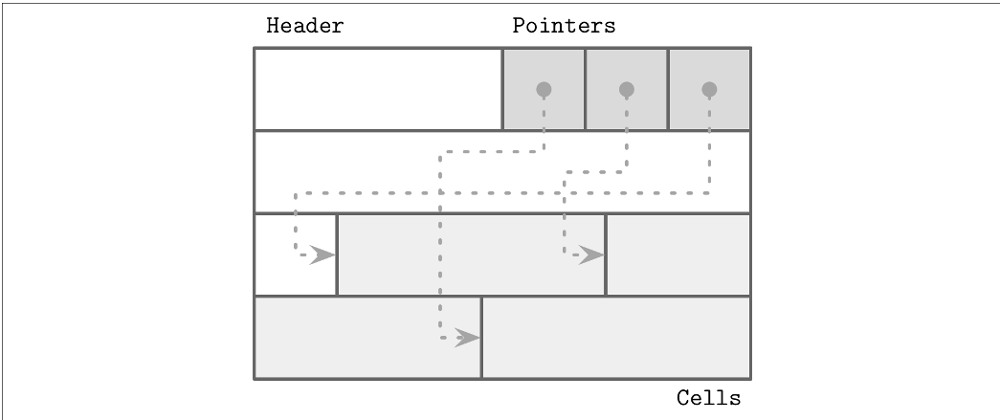

> 图
> 3-5：分槽页。固定大小的头部和单元指针位于页面一侧，大小可变的单元位于另一侧，中间是空闲空间。

下面看看这种方法如何解决本节开头提出的问题：

- **开销最小：**分槽页产生的唯一开销是指针数组，其中保存记录确切存储位置的偏移量。
- **空间回收：**可以通过页面碎片整理和重写来回收空间。
- **动态布局：**从页面外部只通过 ID 引用槽，因此确切位置属于页面内部实现。

### 单元布局

利用标志、枚举和原始值， 可以先设计单元布局， 再把单元组合成页面，
最后用页面组成树。 在单元层面， 需要区分键单元和键值单元。
键单元保存分隔键和指向两个相邻指针*之间*页面的指针。
键值单元保存键及其关联数据记录。

我们假定页面内的所有单元都是同一种类型（例如， 所有单元要么只保存键，
要么同时保存键和值； 同样， 所有单元要么保存固定大小的数据，
要么保存大小可变的数据， 而不会混合两者）。
这意味着描述单元的元数据只需在页面层存储一次， 不必在每个单元中重复存储。

组成键单元需要知道：

- 单元类型（可以从页面元数据推断）
- 键大小
- 该单元所指向的子页面 ID
- 键字节

大小可变的键单元布局可能如下所示（固定大小的键单元在单元层不需要大小说明符）：

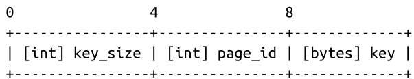

> 图 3-A：大小可变的 key cell 布局。 固定大小的 cell header 依次保存 key 大小和
> page ID， 随后是 `key_size` 个 key byte。

我们把固定大小的数据字段组合在一起， 后跟 `key_size` 个字节。 这并非绝对必要，
但能简化偏移量计算： 所有固定大小的字段都可以通过静态的预计算偏移量访问，
只有大小可变的数据需要计算偏移量。

键值单元保存数据记录而非子页面 ID。 除此以外， 其结构类似：

- 单元类型（可以从页面元数据推断）
- 键大小
- 值大小
- 键字节
- 数据记录字节

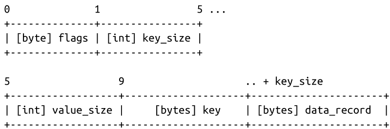

> 图 3-B：大小可变的 key-value cell 布局。 固定大小的 cell header 依次保存 key
> 大小和 value 大小， 随后是 key byte 和 data record byte。

你可能已经注意到这里对偏移量与页面 ID 的区分。 页面大小固定且由 page cache
管理（参见“缓冲区管理”）， 因此只需存储页面 ID，
随后再使用查找表将其转换为文件中的实际偏移量。 单元偏移量只在页内有效，
并且相对于页面起始偏移量； 这样可以使用基数较小的整数， 使表示更加紧凑。

### 大小可变的数据

单元中的键和值不一定要有固定大小。 键和值都可以大小可变。 可以使用偏移量，
根据固定大小的单元头部计算它们的位置。

要定位键， 可以跳过头部并读取 `key_size` 个字节。 类似地， 要定位值，
可以跳过头部和额外的 `key_size` 个字节， 再读取 `value_size` 个字节。

也可以通过其他方式实现相同目标； 例如， 存储总大小， 再用减法计算值大小。
归根结底， 只需有足够信息将单元切分成多个部分， 并重建编码后的数据。

### 将单元组合成分槽页

为了把单元组织成页面， 可以使用[分槽页](#分槽页)中讨论的*分槽页*技术。 如图 3-6
所示， 我们把单元追加到页面右侧（朝向页面末尾），
并把单元偏移量或指针保存在页面左侧。

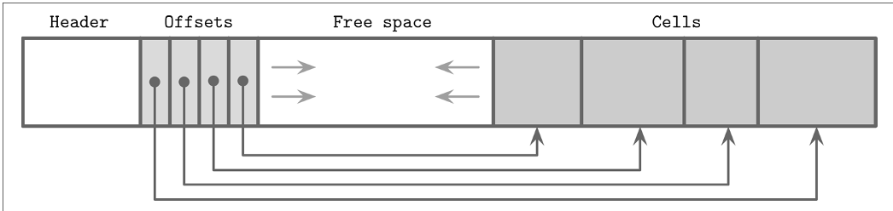

> 图
> 3-6：偏移量与单元的增长方向。单元偏移量从页面左侧向右增长，单元从页面右侧向左增长。

键可以不按顺序插入， 其逻辑排序则通过按键顺序排列单元偏移指针来维持。
这种设计能以极小的开销把单元追加到页面，
因为插入、更新或删除操作期间都不必重定位单元。

来看一个保存姓名的页面示例。 向页面添加两个姓名， 插入顺序为 *Tom*、*Leslie*。
如图 3-7 所示，
它们的*逻辑*顺序（这里是字母顺序）与*插入*顺序（追加到页面的顺序）并不相同。
单元按插入顺序排列， 但偏移量会重新排序， 以便使用二分搜索。

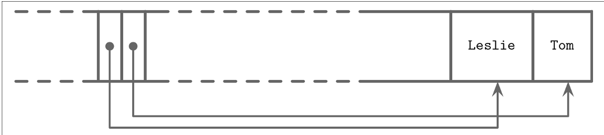

> 图 3-7：以随机顺序追加记录：Tom、Leslie。单元保持插入顺序，偏移指针则按
> Leslie、 Tom 的逻辑顺序排列。

现在， 我们想再向这个页面添加一个姓名：*Ron*。
新数据追加到页面空闲空间的上边界， 但单元偏移量必须保持键的字典序：
*Leslie*、*Ron*、*Tom*。 为此， 必须重新排列单元偏移量：
插入点之后的指针向右移动， 为指向 Ron 单元的新指针腾出空间， 如图 3-8 所示。

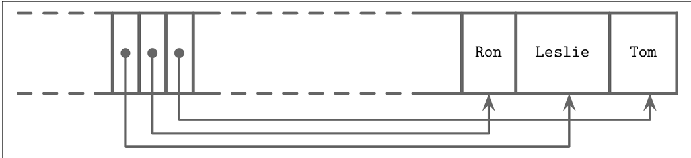

> 图 3-8：再追加一条记录 Ron。Ron 单元追加到现有单元之后， 偏移指针则插入 Leslie
> 与 Tom 对应的指针之间。

### 管理大小可变的数据

从页面移除元素时， 不必移除实际单元并移动其他单元来重新占用释放的空间。
可以把单元标记为已删除，
并把释放的内存量和指向释放值的指针记入内存中的可用空间列表。
可用空间列表存储已释放区段的偏移量和大小。 插入新单元时， 首先检查可用空间列表，
看是否存在能容纳它的区段。 图 3-9 展示了带有可用区段的碎片化页面示例。

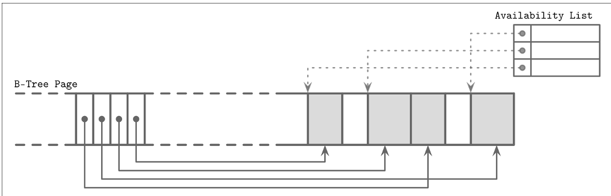

> 图
> 3-9：碎片化页面与可用空间列表。已占用区域以灰色显示，虚线表示可用空间列表中指向未占用内存区域的指针。

SQLite 将未占用区段称为 *freeblock*， 并在*页面头部*存储指向第一个 *freeblock*
的指针。 此外， 它还存储页内可用字节总数，
以便快速检查页面经碎片整理后能否容纳新元素。

是否适配取决于所用策略：

**首次适配**

这种策略可能产生更大的开销， 因为复用第一个合适区段后剩余的空间可能太小，
无法容纳任何其他单元， 因而实际上被浪费。

**最佳适配**

采用最佳适配时， 我们尝试寻找插入后剩余空间最小的区段。

如果找不到足够多的连续字节来容纳新单元， 但碎片化的可用字节总量足够，
就读取并重写有效单元， 对页面进行碎片整理， 并为新的写入回收空间。
如果碎片整理后空闲空间仍不足， 就必须创建溢出页（参见
[Overflow Page](#overflow-page)）。

> [!NOTE]
> 为了改善局部性（尤其是键较小时）， 有些实现在叶层分别存储键和值。
> 将键集中存储可以改善搜索期间的局部性。 找到目标键后，
> 可以在具有相应索引的值单元中找到它的值。 对于大小可变的键，
> 这要求额外计算并存储一个值单元指针。

总之， 为了简化 B-Tree 布局， 我们假定每个节点占据一个页面。
页面由固定大小的头部、单元指针块和单元组成。
单元保存键以及指向代表子节点的页面的指针， 或者保存关联数据记录。 B-Tree
使用简单的指针层次结构： 使用页面标识符定位树文件中的子节点，
使用单元偏移量定位页面内的单元。

## 版本控制

数据库系统不断演进， 开发者持续添加功能， 并修复缺陷和性能问题。 因此，
二进制文件格式可能发生变化。 大多数情况下，
任何存储引擎版本都必须支持不止一种序列化格式（例如当前格式以及一种或多种用于向后兼容的旧格式）。
为此， 必须能够确定当前面对的是哪个文件版本。

有多种方法可以做到这一点。 例如， Apache Cassandra 在文件名中使用版本前缀。
这样甚至无需打开文件， 就能判断其版本。 从 4.0 版开始， 数据文件名带有 `na`
前缀， 例如 `na-1-big-Data.db`。 旧文件使用不同前缀： 3.0 版写入的文件带有 `ma`
前缀。

也可以把版本存储在单独的文件中。 例如， PostgreSQL 将版本存储在 `PG_VERSION`
文件中。

版本也可以直接存储在索引文件头部。 此时，
头部的一部分（或整个头部）必须以一种不会随版本变化的格式编码。
确定文件使用哪个版本编码后， 就可以创建版本专用的读取器来解释其内容。
有些文件格式使用 magic number 标识版本， 我们会在 [Magic Number](#magic-number)
一节详细讨论。

## 校验和

磁盘文件可能因软件缺陷和硬件故障而损坏。 为了提前发现这些问题，
避免把损坏数据传播到其他子系统甚至其他节点，
可以使用校验和与循环冗余校验（CRC）。

有些资料不区分密码学与非密码学散列函数、CRC 和校验和。
它们的共同点是把一大块数据归约成一个小数值，
但各自的使用场景、目的和保证有所不同。

校验和提供的保证最弱， 无法检测多个位上的损坏。 它们通常使用带奇偶校验的 XOR
或求和来计算 [KOOPMAN15]。

CRC 有助于检测突发错误（例如多个连续位损坏）， 其实现通常使用查找表和多项式除法
[STONE98]。 检测多位错误至关重要，
因为通信网络和存储设备中有相当比例的故障以这种方式出现。

> [!WARNING]
> 不应使用非密码学散列和 CRC 来验证数据是否遭到篡改。 为此，
> 应始终使用为安全目的设计的强密码学散列。 CRC
> 的主要目标是确保数据没有发生非预期的意外变化。
> 这些算法并非为抵御攻击和蓄意数据修改而设计。

把数据写入磁盘之前， 我们会计算其校验和， 并将校验和与数据一同写入。
读取数据时， 再次计算校验和， 并与写入的校验和比较。 如果校验和不匹配，
就说明已经发生损坏， 不应使用读出的数据。

对整个文件计算校验和通常不切实际，
而且每次访问文件时都读取完整内容的可能性很低， 因此通常按页计算页面校验和，
并将其放入页面头部。 这样， 校验和可以更可靠（因为它针对的是一小部分数据），
而且如果损坏仅限于单个页面， 不必丢弃整个文件。

## 小结

本章学习了二进制数据组织方式：
如何序列化原始数据类型、将其组合成单元、用单元构建分槽页，
以及如何导航这些结构。

我们学习了如何处理字符串、字节序列和数组等大小可变的数据类型，
以及如何组成特殊单元， 用于保存其中所含值的大小。

我们讨论了分槽页格式。 它允许从页面外部通过单元 ID 引用单个单元，
按插入顺序存储记录， 并通过对单元偏移量排序来保持键顺序。

这些原则可以用于组成磁盘结构的二进制格式和网络协议。

## 延伸阅读

如果想进一步了解本章提到的概念， 可以参考以下资料：

**文件组织技术**

Folk, Michael J., Greg Riccardi, and Bill Zoellick. 1997. *File Structures: An
Object-Oriented Approach with C++* (3rd Ed.). Boston: Addison-Wesley Longman.

Giampaolo, Dominic. 1998. *Practical File System Design with the Be File System
(1st Ed.).* San Francisco: Morgan Kaufmann.

Vitter, Jeffrey Scott. 2008. "Algorithms and data structures for external
memory." *Foundations and Trends in Theoretical Computer Science* 2, no. 4
(January): 305-474. https: //doi.org/10.1561/0400000014.

<a id="chapter-4-implementing-b-trees"></a>

# 第 4 章 实现 B-Tree

上一章讨论了二进制格式构成的一般原则， 并学习了如何创建 cell、构建层次结构，
以及如何使用指针将它们连接到 page。 这些概念既适用于原地更新存储结构， 也适用于
append-only 存储结构。 本章将讨论 B-Tree 特有的一些概念。

本章各节分为三个逻辑组。 首先讨论组织方式：如何建立 key 与指针之间的关系，
以及如何实现 page header 和 page 之间的链接。

接下来讨论从根到叶下降期间发生的过程， 即如何执行二分查找、如何收集面包屑，
以及如何跟踪 parent node， 以便之后需要拆分或合并 node 时使用。

最后讨论优化技术（再平衡、仅向右追加和批量加载）、维护过程和垃圾回收。

## Page Header

page header 保存可用于导航、维护和优化的 page 信息。 它通常包含描述 page
内容与布局的 flag、page 中的 cell 数量、 标示空闲空间的下界和上界
offset（用于追加 cell offset 和数据）， 以及其他有用的元数据。

例如，PostgreSQL 在 header 中存储 page 大小和布局版本。 MySQL InnoDB 的 page
header 保存 heap record 数量、层级和其他一些实现特有的值。 SQLite 的 page header
则存储 cell 数量和最右指针。

### Magic Number

文件或 page header 中经常放置的值之一是 magic number。 它通常是一个多字节块，
其中包含一个常量值， 可用来表明该块代表 page、指定其类型或标识其版本。

magic number 常用于验证和合理性检查 [GIAMPAOLO98]。 随机 offset
处的字节序列恰好与 magic number 完全匹配的概率极低。 如果确实匹配， 该 offset
很可能是正确的。 例如，为了验证 page 是否正确加载并对齐， 写入时可以在 header
中放入 magic number `50 41 47 45`（`PAGE` 的十六进制表示）。 读取时，
通过比较读出的 header 中四个字节与预期字节序列来验证 page。

### Sibling Link

有些实现会存储前向和后向链接， 分别指向左、右 sibling page。
这些链接有助于定位相邻 node， 而不必向上返回 parent。
这种方法会增加拆分与合并操作的复杂度， 因为 sibling offset 也必须更新。
例如，拆分一个非最右 node 时， 其 right sibling 的后向指针（原先指向被拆分的
node） 必须重新绑定到新创建的 node。

从图 4-1 可以看到， 如果 sibling 之间没有链接， 定位 sibling node 就必须借助
parent node。 该操作可能一直上溯到根， 因为直接 parent 只能帮助定位它自己的
child。 如果直接在 header 中存储 sibling link，
只需沿链接即可定位同一层级上的前一个或后一个 node。

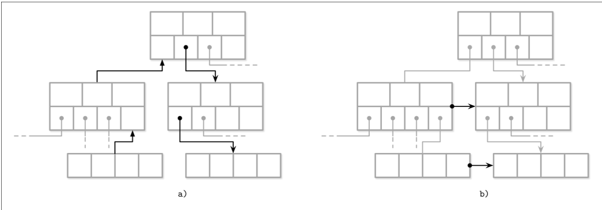

> 图 4-1：通过 parent link 定位 sibling（a）， 与通过 sibling link 定位
> sibling（b）的对比。

存储 sibling link 的缺点之一是， 拆分和合并时必须更新这些链接。 由于更新发生在
sibling node 中， 而不是正在拆分或合并的 node 中， 因此可能需要额外加锁。
[“B-link Tree”](#b-link-tree) 一节将讨论 sibling link 在并发 B-Tree
实现中的用途。

### 最右指针

B-Tree 的 separator key 具有严格的不变量： 它们用于将树划分为 subtree
并在其中导航， 因此 child page 指针总是比 key 多一个。
这就是[键的计数方式](#键的计数方式)一节所述 `+1` 的来源。

[分隔键](#分隔键)一节描述了 separator key 不变量。 在许多实现中， node 更像图
4-2 所示： 每个 separator key 都有一个 child 指针， 而最后一个指针因不与任何 key
配对而单独存储。 可以将其与图 2-10 对比。

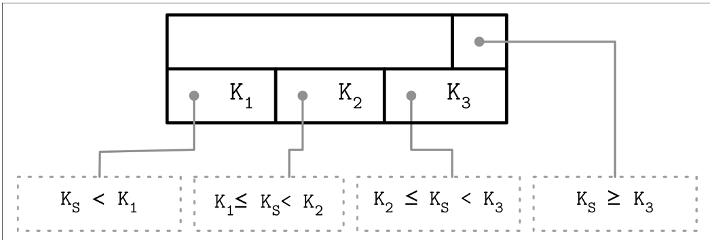

> 图 4-2：最右指针。

这个额外指针可以存储在 header 中， SQLite 的实现便是如此。

如果最右 child 被拆分， 并且新 cell 被追加到其 parent， 就必须重新分配最右 child
指针。 如图 4-3 所示， 拆分后追加到 parent 的 cell（灰色）保存提升的 key，
并指向被拆分的 node。 新 node 的指针则取代原来的最右指针。 SQLite
中描述并实现了类似方法。[^ch4-1]

[^ch4-1]: 可以在项目仓库的 `balance_deeper` 函数中找到该算法。

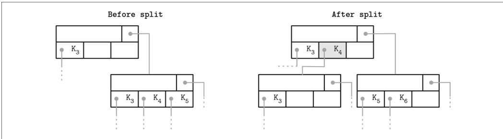

> 图 4-3：node 拆分期间更新最右指针。灰色部分表示提升的 key。

### Node High Key

也可以采用稍有不同的方法， 将最右指针与 node high key 一同存储在 cell 中。 high
key 表示当前 node 下方 subtree 中可能出现的最大 key。 PostgreSQL 采用这种方法，
称为 $B^{\text{link}}$-Tree （这种方法对并发的影响参见
[“B-link Tree”](#b-link-tree)）。

B-Tree 有 $N$ 个 key（记为 $K_i$）和 $N+1$ 个指针（记为 $P_i$）。 在每棵 subtree
中， key 的边界为 $K_{i-1} \leq K_s < K_i$。 $K_0=-\infty$ 是隐式的， 不会出现在
node 中。

$B^{\text{link}}$-Tree 为每个 node 添加一个 $K_{N+1}$ key。 它规定了指针 $P_N$
所指 subtree 中可存储 key 的上界， 因而也是当前 subtree 可存储值的上界。 图 4-4
展示了两种方法： （a）是不带 high key 的 node， （b）是带 high key 的 node。

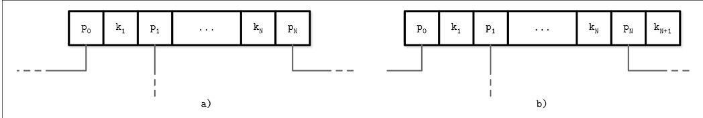

> 图 4-4：不带 high key 的 B-Tree（a）和带 high key 的 B-Tree（b）。

在这种情况下， 指针可以成对存储， 每个 cell 都可以拥有对应的指针。
由于需要考虑的边界情况较少， 这可能会简化最右指针的处理。

图 4-5 给出了两种方法的 page 结构示意图， 以及两种情况下查找空间的不同划分方式：
第一种一直延伸到 $+\infty$， 第二种则延伸到 $K_3$ 的上界。

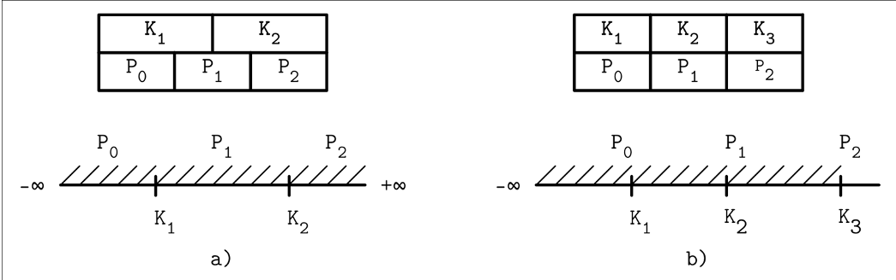

> 图 4-5：使用 $+\infty$ 作为虚拟 key（a），与存储 high key（b）的对比。

### Overflow Page

node 大小和树的 fanout 是固定值， 不会动态变化。 而且很难找到一个普遍最优的值：
如果树中存在足够大的变长值， 一个 page 只能容纳少数几个； 如果值很小，
则会浪费预留空间。

B-Tree 算法规定每个 node 保持特定数量的 item。 由于值的大小不同，
可能出现这样的情况： 按 B-Tree 算法来看 node 尚未填满， 但保存该 node 的定长
page 已经没有空闲空间。 调整 page 大小需要把已经写入的数据复制到新区域，
通常并不现实。 不过， 仍然需要找到增大或扩展 page 的办法。

为了在不把数据复制到新的连续区域的前提下实现变长 node， 可以用多个相互链接的
page 构成 node。 例如，默认 page 大小为 4 K， 插入若干值后数据大小超过了 4 K。
与其允许任意大小， 不如让 node 以 4 K 为增量增长： 分配一个 4 K 的扩展 page，
并从原 page 链接到它。 这些相互链接的 page 扩展称为 *overflow page*。
为清楚起见， 本节将原 page 称为 *primary page*。

多数 B-Tree 实现只允许在 B-Tree node 中直接存储固定数量的 payload 字节，
其余部分则 *spill* 到 overflow page。 该值通过 node 大小除以 fanout 计算得出。
采用这种方法， 不会出现 page 完全没有空闲空间的情况， 因为它始终至少有
`max_payload_size` 字节。 有关 SQLite overflow page 的更多信息， 请参阅 SQLite
源代码仓库； 另请参阅 MySQL InnoDB 文档。

当插入的 payload 大于 `max_payload_size` 时， 需要检查 node 是否已经关联了
overflow page。 如果已有 overflow page 且其中有足够空间， payload 的多余字节会
spill 到那里； 否则就分配新的 overflow page。

图 4-6 展示了一个 primary page 和一个 overflow page。 primary page 中的 record
指向 overflow page， 其 payload 在后者中继续存储。

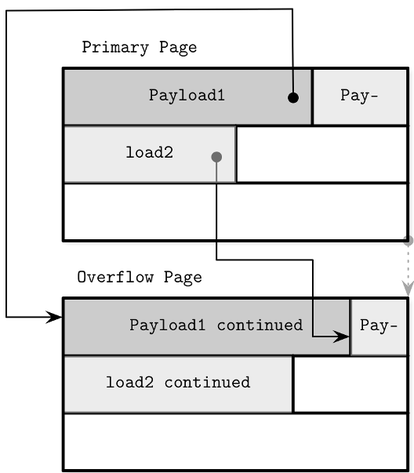

> 图 4-6： primary page 中的 record 指向保存其后续 payload 的 overflow page。

overflow page 需要额外的簿记， 因为它们和 primary page 一样也可能产生碎片。
必须能够回收这些空间来写入新数据， 或者在不再需要 overflow page 时将其丢弃。

分配第一个 overflow page 时， 它的 page ID 会存入 primary page 的 header。
如果一个 overflow page 不够， 就把下一个 overflow page ID 存入前一个 page 的
header， 从而链接多个 overflow page。 为了定位给定 payload 的 overflow 部分，
可能必须遍历多个 page。

由于 key 通常具有高基数， 只存储 key 的一部分是合理的： 大多数比较都可以在
primary page 中保存的截短 key 部分上完成。

对于 data record， 必须定位其 overflow 部分才能将其返回给用户。 不过这影响不大，
因为该操作并不频繁。 如果所有 data record 都超大， 则值得考虑为大值使用专门的
blob storage。

## 二分查找

前文已经讨论了 B-Tree 查找算法， 并提到在 node 内使用 *二分查找* 算法定位目标
key。 二分查找 *只能* 用于有序数据。 如果 key 无序， 就不能进行二分查找。 因此，
保持 key 的顺序和有序不变量至关重要。

二分查找算法接收一个有序 item 数组和目标 key， 并返回一个数。 如果返回值为正，
就表示找到了目标 key， 该数指明它在输入数组中的位置。
负返回值表示输入数组中不存在目标 key， 并给出一个 *插入点*。

插入点是第一个大于给定 key 的元素的索引。 该数的绝对值就是可以插入目标
key、同时保持顺序的索引。 插入时可以从插入点开始将元素向后移动一个位置，
为待插入元素腾出空间 [SEDGEWICK11]。

高层级上的大多数查找不会得到精确匹配， 我们关注的是查找方向。
此时必须找到第一个大于目标值的值， 并沿相应的 child link 进入关联的 subtree。

### 使用间接指针进行二分查找

B-Tree page 中的 cell 按插入顺序存储， 只有 cell offset 保持元素的逻辑顺序。
要在 page cell 上执行二分查找， 首先选取中间的 cell offset， 沿其指针定位 cell，
再将该 cell 的 key 与目标 key 比较， 以决定继续向左还是向右查找。
递归重复这一过程， 直至找到目标元素或插入点， 如图 4-7 所示。

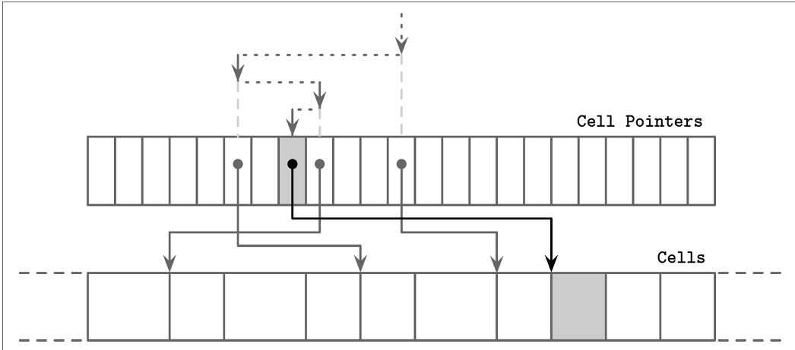

> 图 4-7：使用间接指针进行二分查找。灰色表示目标元素。虚线箭头表示通过 cell
> 指针执行的二分查找； 实线表示沿 cell 指针进行的访问，这是将 cell 值与目标 key
> 比较所必需的。

## 传播拆分与合并

如前几章所述， B-Tree 的拆分与合并可能传播到更高层级。 为此，
必须能够从正在拆分的 leaf 或正在合并的一对 leaf 沿链返回 root node。

B-Tree node 可以包含 parent node 指针。 由于从高层级引用低层级 page 时， 低层级
page 总会被载入内存， 因此甚至不必将该信息持久化到磁盘。

与 sibling 指针（参见 [Sibling Link](#sibling-link)）一样， parent
发生变化时都必须更新 parent 指针。 凡是带有 page identifier 的 separator key
从一个 node 转移到另一个 node 时， 都会发生这种情况： 包括 parent node
的拆分、合并或再平衡。

有些实现（例如 WiredTiger）使用 parent 指针遍历 leaf， 以避免使用 sibling
指针时可能出现的死锁（参见 [MILLER78]、[LEHMAN81]）。 算法不通过 sibling
指针遍历 leaf node， 而是使用 parent 指针， 与图 4-1 所示方法类似。

为了寻址和定位 sibling， 可以沿 parent node 的指针递归下降回低层级。
当遍历完共享同一 parent 的所有 sibling、到达 parent node 末端时，
查找会递归向上继续， 最终到达 root， 再继续向下返回 leaf 层级。

### 面包屑

与其存储并维护 parent node 指针， 不如跟踪通往目标 leaf node 的路径上所遍历的
node。 插入时若发生级联拆分， 或删除时发生合并， 便可以反向沿 parent node
链回溯。

执行可能引起 B-Tree 结构变化的操作（插入或删除）时， 首先从 root 遍历到 leaf，
查找目标 node 和插入点。 由于无法总是预先知道该操作是否会导致拆分或合并
（至少在定位目标 leaf node 之前无法知道）， 因此必须收集 *面包屑*。

面包屑包含从 root 开始沿途经过的 node 引用， 用于在传播拆分或合并时反向回溯这些
node。 最自然的数据结构是栈。 例如，PostgreSQL 将面包屑存储在内部称为 `BTStack`
的栈中。[^ch4-2]

如果 node 被拆分或合并， 可以利用面包屑寻找提升到 parent 的 key 的插入点，
并在必要时沿树向上返回， 把结构变化传播到更高层级 node。 该栈维护在内存中。

图 4-8 给出了从 root 到 leaf 的遍历示例。 收集的面包屑包含指向已访问 node
的指针和 cell 索引。 如果目标 leaf node 被拆分， 就弹出栈顶 item 以定位其直接
parent。 如果 parent node 有足够空间， 则在面包屑给出的 cell 索引处向其追加新
cell （假设该索引仍然有效）。 否则 parent node 也会被拆分。 这一过程递归持续，
直至栈为空且已经到达 root， 或当前层级没有发生拆分。

[^ch4-2]: 可在项目仓库中阅读更多信息：https://databass.dev/links/21。

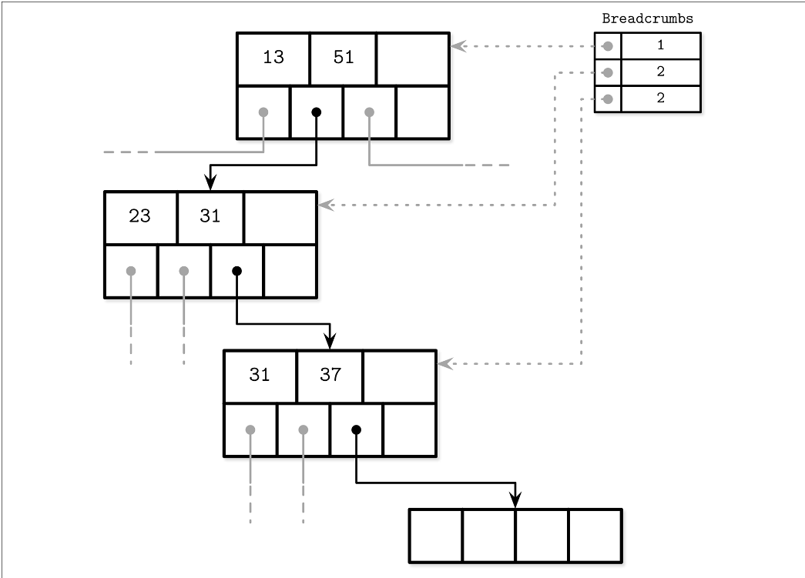

> 图 4-8：查找期间收集的面包屑，包含遍历过的 node 和 cell 索引。
> 虚线表示指向已访问 node 的逻辑链接；面包屑表中的数字表示沿途采用的 child
> 指针索引。

## 再平衡

有些 B-Tree 实现试图推迟拆分与合并操作， 以摊销其成本。
在最终执行拆分或合并之前， 它们尽可能在同一层级内 *再平衡* 元素，
把元素从占用较多的 node 移到占用较少的 node。 这有助于提高 node occupancy，
并可能减少树的层级数， 代价则可能是更高的再平衡维护成本。

负载均衡可以在插入和删除操作期间执行 [GRAEFE11]。 为了提高空间利用率， node
overflow 时可以不拆分 node， 而是把一部分元素转移到某个 sibling node，
为插入腾出空间。 同样， 删除时可以不合并 sibling node， 而是从相邻 node
移来一些元素， 确保该 node 至少半满。

B*-Tree 会持续在相邻 node 之间分配数据， 直至两个 sibling 都填满 [KNUTH98]。
随后， 算法不会把一个 node 拆成两个半空的 node， 而是把两个 node
拆成三个各自填满三分之二的 node。 SQLite 的实现采用了这种变体。
该方法通过推迟拆分提高平均 occupancy， 但需要额外的跟踪与平衡逻辑。
更高的利用率也意味着更高效的查找， 因为树高更小， 通往目标 leaf
的路径上需要遍历的 page 更少。

图 4-9 展示了在相邻 node 之间分配元素的过程， 其中 left sibling 的元素多于 right
sibling。 元素从占用较多的 node 移到占用较少的 node。 由于平衡会改变 sibling
node 的最小值/最大值不变量， 必须更新 parent node 中的 key
和指针来保持该不变量。

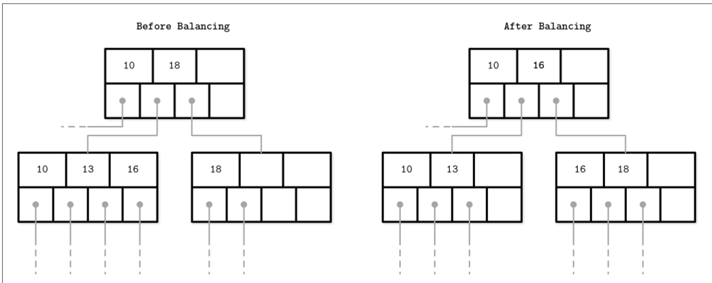

> 图 4-9：B-Tree 再平衡，在占用较多的 node 与占用较少的 node 之间分配元素。

负载均衡是许多数据库实现采用的一项实用技术。 例如，SQLite 实现了
*balance-siblings algorithm*， 与本节描述的方法颇为接近。
平衡可能会增加一些代码复杂度， 但由于其使用场景相对独立，
可以在后期作为优化实现。

## 仅向右追加

许多数据库系统使用自动递增的单调递增值作为 primary index key。
这种情况提供了优化机会， 因为所有插入都发生在 index 末端（即最右 leaf），
所以大多数拆分发生在每个层级的最右 node 上。 此外， 由于 key 单调递增，
只要追加相对于更新和删除的比例足够高， nonleaf page 的碎片也少于 key
随机排序时的情况。

PostgreSQL 将这种情况称为 *fastpath*。 当插入的 key 严格大于最右 page 中的最大
key， 且最右 page 有足够空间容纳新 entry 时， 新 entry 会插入缓存中的最右 leaf
的适当位置， 从而跳过整个读取路径。

SQLite 有一个类似概念， 称为 *quickbalance*。 当 entry 插入到最右端且目标 node
已满 （即插入后它成为树中最大的 entry）时， 系统不再平衡或拆分 node，
而是分配新的最右 node， 并把其指针添加到 parent （有关 SQLite
平衡实现的更多信息，参见[“再平衡”](#再平衡)一节）。 虽然这会使新建 page 几乎为空
（而 node 拆分产生的 page 是半空）， 但该 node 很可能很快就会填满。

## 批量加载

如果数据已经预排序并需要批量加载， 或者必须重建树（例如为了整理碎片），
可以进一步运用仅向右追加的思路。 由于创建树所需的数据已经有序，
批量加载期间只需在树的最右位置追加 item。

在这种情况下， 可以完全避免拆分和合并， 自底向上逐层写出并构造树；
也可以在已经写出的低层级 node 提供了足够多指针后， 立即写出高层级 node。

批量加载的一种实现方法是， 在 leaf 层级按 page 写入预排序数据，
而不是插入单个元素。 写完 leaf page 后， 把它的第一个 key 传播到 parent，
并使用普通算法构建更高的 B-Tree 层级 [RAMAKRISHNAN03]。 由于追加的 key
按排序顺序给出， 此时所有拆分都发生在最右 node。

B-Tree 始终从底部（leaf）层级开始构建， 因此可以在构成任何高层级 node
之前写出完整的 leaf 层级。 这样， 构建高层级时所有 child 指针都已就绪。
这种方法的主要优点是， 无需在磁盘上执行任何拆分或合并； 同时，
构建期间只需在内存中保留树的一小部分， 即当前正在填充的 leaf node 的所有
parent。

immutable B-Tree 也能用同样的方法创建。 但与 mutable B-Tree 不同，
它们无需为后续修改预留空间开销， 因为树上的所有操作都是最终操作。 所有 page
都可以完全填满， 从而提高 occupancy 并改善性能。

## 压缩

存储未经压缩的原始数据可能产生显著开销， 许多数据库都提供压缩方式以节省空间。
这里显而易见的取舍在于访问速度与压缩率： 更高的压缩率可以减小数据体积，
让一次访问取得更多数据， 但压缩和解压缩可能需要更多 RAM 和 CPU cycle。

压缩可以在不同粒度上进行。 虽然压缩整个文件可以获得更高的压缩率， 但其应用有限，
因为更新时必须重新压缩整个文件， 而粒度更细的压缩通常更适合大型数据集。 压缩整个
index 文件既不现实， 也很难高效实现： 为了寻址某个特定 page，
必须访问整个文件（或包含压缩元数据的部分，以定位压缩区段）、
将其解压并使其可用。

另一种方法是按 page 压缩数据。 这与此前的讨论很契合，
因为一直讨论的算法都使用定长 page。 page 可以彼此独立地压缩和解压， 从而把压缩与
page 加载、刷写结合起来。 不过， 压缩后的 page 可能只占 disk block 的一部分；
由于传输通常以 disk block 为单位， 可能还会将额外字节载入内存 [RAY95]。 图 4-10
中， 压缩 page（a）占用的空间小于 disk block。 加载该 page 时，
还会载入属于另一个 page 的额外字节。 对于像同图（b）中那样跨越多个 disk block 的
page， 则必须额外读取一个 block。

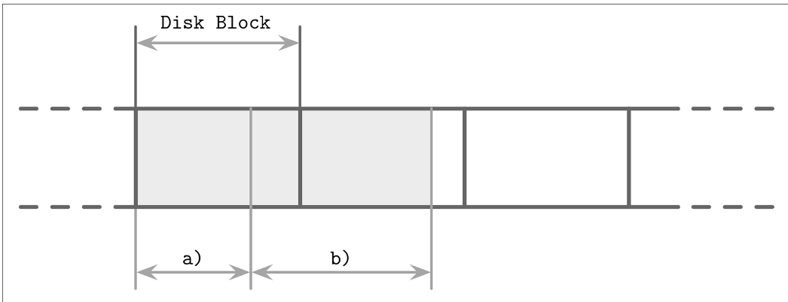

> 图 4-10：压缩与 block padding。（a）压缩 page 小于一个 disk block，
> 读取时会载入相邻 page 的额外字节；（b）page 跨越多个 disk block，
> 必须额外读取一个 block。

另一种方法是只压缩数据， 既可以按行压缩（压缩整个 data record），
也可以按列压缩（分别压缩各列）。 此时 page 管理与压缩相互解耦。

撰写本书期间考察的大多数开源数据库都提供可插拔的压缩方法， 使用
Snappy、zLib、lz4 等现有库。

由于压缩算法的效果取决于数据集与潜在优化目标 （例如压缩率、性能或内存开销），
本书不深入讨论其比较与实现细节。 现有许多综述针对不同 block 大小评估各种压缩算法
（例如 Squash Compression Benchmark）， 通常关注四项指标：
内存开销、压缩性能、解压缩性能和压缩率。 选择压缩库时必须考虑这些指标。

## Vacuum 与维护

到目前为止， 讨论主要集中在 B-Tree 面向用户的操作上。 不过，
还有其他过程会与查询并行运行， 以维护存储完整性、回收空间、减少开销并保持 page
有序。 在后台执行这些操作可以节省时间， 避免在插入、更新和删除期间支付清理成本。

前文描述的 slotted page 设计（参见[分槽页](#分槽页)）要求维护 page，
使其保持良好状态。 例如，internal node 中后续的拆分与合并， 或 leaf
层级上的插入、更新与删除， 可能导致 page 拥有足够的 *逻辑* 空间，
却因碎片化而没有足够的 *连续* 空间。 图 4-11 展示了这种情况： page
仍有一些逻辑空间可用， 但这些空间是碎片化的， 散布在两条已删除的垃圾 record
之间， 以及 header/cell 指针与 cell 之间剩余的空闲空间内。

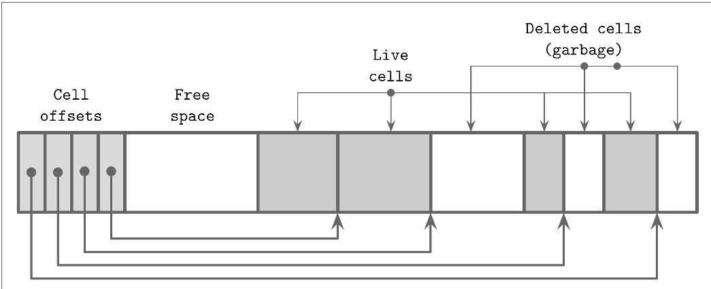

> 图 4-11：碎片化 page 示例。逻辑空闲空间散布在已删除的 record
> 和尚未使用的连续区域中。

B-Tree 从 root 层级开始导航。 从 root node 沿指针向下可达的 data record 是
live（可寻址）的。 不可寻址的 data record 称为垃圾： 这些 record
未被任何地方引用， 无法读取或解释， 其内容等同于已被清空。

图 4-11 展示了这一区别： 仍有指针指向的 cell 是可寻址的， 已删除或覆盖的 cell
则不然。 出于性能考虑， 通常不会以零填充垃圾区域，
因为这些区域最终都会被新数据覆盖。

### 更新与删除造成的碎片

下面分析 page 在什么情况下会出现不可寻址数据并需要 compact。 在 leaf 层级，
删除只会从 header 中移除 cell offset， 而保留 cell 本身。 此后该 cell
不再可寻址， 其内容不会出现在查询结果中， 也不必清空它或移动相邻 cell。

拆分 page 时只会裁掉 offset。 由于 page 的其余部分不可寻址， offset 被截掉的
cell 也不可达， 所以新数据到来时会将其覆盖， 或者在 vacuum 过程启动时将其回收。

> [!NOTE]
> 有些数据库依靠垃圾回收，
> 并为多版本并发控制（MVCC，参见[多版本并发控制](#多版本并发控制)）把已删除和更新的
> cell 留在原处。 在更新完成前， 并发执行的事务仍可访问这些 cell；
> 一旦不再有其他线程访问， 就可以回收它们。 有些数据库维护用于跟踪 ghost record
> 的结构； 所有可能见过这些 record 的事务完成后， 就会回收它们 [WEIKUM01]。

由于删除只丢弃 cell offset， 既不重新定位剩余 cell， 也不实际移除目标 cell
来占据所释放的空间， 释放的字节可能散落在整个 page 中。 此时称 page 已
*碎片化*， 需要 defragmentation。

执行写入通常需要一块能容纳 cell 的连续空闲字节。
为了把释放的碎片重新拼合并解决该问题， 必须 *重写* page。

插入操作使 tuple 保持插入顺序。 这不会造成同样严重的影响， 但自然有序的 tuple
有助于在顺序读取期间进行 cache prefetch。

更新主要适用于 leaf 层级： internal page key 用于引导导航， 只定义 subtree
的边界。 此外， 更新按 key 执行， 通常不会造成树的结构变化， 但创建 overflow
page 是一个例外。 然而在 leaf 层级， 更新操作不会改变 cell 顺序，
并会尽量避免重写 page。 这意味着最终可能存储一个 cell 的多个版本，
其中只有一个可寻址。

### Page Defragmentation

负责空间回收和 page 重写的过程称为 *compaction*、*vacuum*， 或直接称为
*maintenance*。 如果 page 没有足够的物理空闲空间， 可以在写入时同步重写 page
（以避免创建不必要的 overflow page）； 但 compaction
通常是指一个独立的异步过程： 遍历 page、执行垃圾回收并重写其内容。

该过程回收 dead cell 占据的空间， 并按逻辑顺序重写 cell。 重写 page 时，
也可能把它们重新定位到文件中的新位置。 未使用的内存 page 变为可用， 并返回 page
cache。 新释放的磁盘 page ID 被添加到 *free page list* （有时称为
*freelist*[^ch4-3]）。 该信息必须持久化， 才能经受 node 崩溃和重启，
并确保空闲空间不会丢失或泄漏。

[^ch4-3]: 例如，SQLite 维护数据库未使用 page 的列表。其中 trunk page 组成 linked
    list，并保存已释放 page 的地址。

## 小结

本章讨论了磁盘 B-Tree 实现特有的概念：

- **Page header**：通常存储哪些信息。
- **最右指针**：不与 separator key 配对的指针，以及如何处理它们。
- **High key**：确定 node 中允许存储的最大 key。
- **Overflow page**：使用定长 page 存储超大和变长 record。

随后介绍了从 root 到 leaf 遍历的一些细节：

- 如何使用间接指针执行二分查找。
- 如何使用 parent 指针或面包屑跟踪树的层次结构。

最后介绍了一些优化与维护技术：

- **再平衡**：在相邻 node 之间移动元素，以减少拆分与合并次数。
- **仅向右追加**：假设新建的最右 node 很快会填满，因而不拆分，而是追加新的最右
  node。
- **批量加载**：基于有序数据高效地从头构建 B-Tree。
- **垃圾回收**：重写 page、按 key 排列 cell，并回收不可寻址 cell 占据的空间。

这些概念应能弥合基础 B-Tree 算法与真实实现之间的差距， 帮助你更好地理解基于
B-Tree 的存储系统如何工作。

## 延伸阅读

若想进一步了解本章提到的概念， 可以参阅以下资料。

**Disk-based B-Trees**

Graefe, Goetz. 2011. "Modern B-Tree Techniques." *Foundations and Trends in
Databases* 3, no. 4 (April): 203-402. https: //doi.org/10.1561/1900000028.

Healey, Christopher G. 2016. *Disk-Based Algorithms for Big Data* (1st Ed.).
Boca Raton: CRC Press.

<a id="chapter-5-transaction-processing-and-recovery"></a>

# 第 5 章 事务处理与恢复

本书采用自底向上的方式介绍数据库系统概念： 首先学习了存储结构。 现在可以转向负责
buffer 管理、锁管理和恢复的高层组件， 它们是理解数据库事务的先决条件。

事务是数据库管理系统中不可分割的逻辑工作单元， 可以把多个操作表示为一个步骤。
事务执行的操作包括读取和写入数据库 record。
数据库事务必须保持原子性、一致性、隔离性和持久性。 这些属性通常统称为 ACID
[HAERDER83]。

## 原子性

事务步骤不可分割， 这意味着与事务关联的所有步骤要么全部成功执行，
要么一个都不执行。 换言之， 事务不应只应用一部分。 每个事务要么 commit
（使事务期间执行的写操作所产生的全部变更可见）， 要么 abort
（回滚所有尚未变为可见的事务副作用）。 commit 是最终操作。 abort
后可以重试事务。

## 一致性

一致性是一项与应用程序相关的保证：
事务只应把数据库从一个有效状态带到另一个有效状态， 并保持所有数据库不变量
（例如约束、参照完整性等）。 一致性是定义最宽松的属性，
这可能是因为它是唯一由用户控制、 而不只是由数据库本身控制的属性。

## 隔离性

多个并发执行的事务应当互不干扰地运行， 如同同时没有其他事务在执行。

隔离性定义数据库状态的变更何时可以变为可见， 以及并发事务可以看到哪些变更。
出于性能原因， 许多数据库采用比上述隔离定义更弱的隔离级别。
取决于并发控制采用的方法， 某个事务所做的变更可能对其他并发事务可见，
也可能不可见 （参见[“隔离级别”](#隔离级别)）。

## 持久性

事务一旦 commit， 对数据库状态的所有修改都必须持久化到磁盘，
并且能经受断电、系统故障和崩溃。

除在磁盘上组织并持久化数据的存储结构外，
数据库系统还需要多个组件协同工作才能实现事务。 在 node 本地， *transaction
manager* 协调、调度并跟踪事务及其各个步骤。

lock manager 保护对这些资源的访问， 防止违反数据完整性的并发访问。
每当请求锁时， lock manager 会检查是否已有其他事务以 shared 或 exclusive
模式持有它； 如果请求的访问级别不产生冲突， 便授予访问权限。
由于任何时刻最多只能有一个事务持有 exclusive lock，
请求该锁的其他事务必须等待锁释放， 或者 abort 后再重试。
锁一释放，或事务一终止， lock manager 就会通知某个等待中的事务，
让它获取锁并继续执行。

page cache 是 persistent storage（磁盘）与存储引擎其余部分之间的中介。
它在主内存中暂存状态变更， 并缓存尚未与 persistent storage 同步的 page。
数据库状态的所有变更都先应用于缓存的 page。

*log manager* 保存已经应用到缓存 page、 但尚未与 persistent storage
同步的操作历史（log entry）， 保证崩溃时不会丢失这些操作。 换言之， 启动期间使用
log 重新应用这些操作并重建缓存状态。 log entry 还可用于撤销已 abort
事务所做的变更。

分布式（跨 partition）事务需要额外的协调与远程执行。 第 13
章将讨论分布式事务协议。

## Buffer 管理

大多数数据库使用两级内存层次结构构建： 较慢的 persistent
storage（磁盘）和较快的主内存（RAM）。 为减少访问 persistent storage 的次数，
page 会被 *缓存* 在内存中。 存储层再次请求该 page 时， 会返回其缓存副本。

可以复用内存中的缓存 page， 前提是没有其他进程修改磁盘上的数据。
这种方法有时称为 *virtual disk* [BAYER72]。 只有当内存中尚无 page 副本时，
virtual disk read 才访问物理存储。 同一概念更常见的名称是 *page cache* 或
*buffer pool*。 page cache 负责把从磁盘读取的 page 缓存在内存中。
数据库系统崩溃或非正常关闭时， 缓存内容会丢失。

由于 *page cache* 一词能更好地体现该结构的用途， 本书统一采用该名称。 *buffer
pool* 听起来主要用于汇集和复用 *空* buffer， 而不共享其内容； 这可以是 page
cache 中很有用的一部分， 甚至可以作为独立组件， 但它无法同样准确地反映全部用途。

缓存 page 并不是数据库特有的问题。 操作系统也有 page cache 概念。 操作系统利用
*未使用* 的内存区段透明地缓存磁盘内容， 从而提高 I/O syscall 的性能。

未缓存的 page 从磁盘加载时称为被 *page in*。 如果缓存 page 有任何变更，
它就被称为 *dirty*， 直至这些变更被 *flush* 回磁盘。

由于保存缓存 page 的内存区域通常远小于整个数据集， page cache 最终会被填满。
为了 page in 一个新 page， 必须 *evict* 某个已缓存 page。

图 5-1 展示了 B-Tree page 的逻辑表示、 其缓存版本与磁盘 page 之间的关系。 page
cache 不按顺序把 page 加载到空闲 slot， 因此 page
在磁盘中的顺序与在内存中的顺序之间没有直接映射。

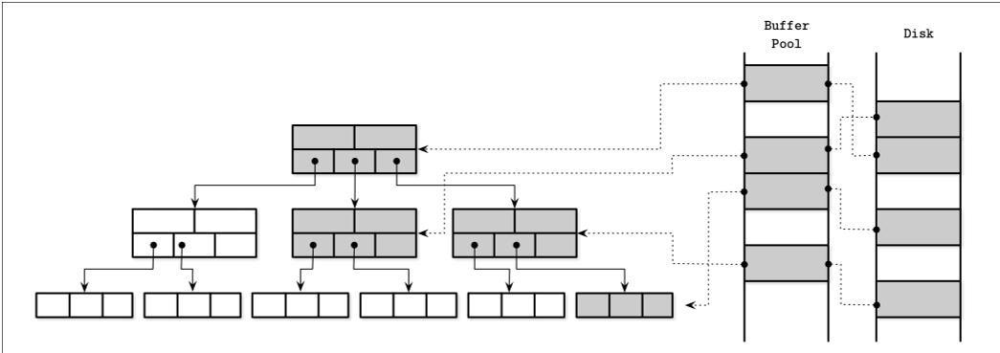

> 图 5-1：Page cache。B-Tree page 的逻辑表示、无序装入内存 slot 的缓存版本，
> 以及磁盘 page 之间的关系。

page cache 的主要功能可归纳如下：

- 在内存中保存缓存的 page 内容。
- 允许将磁盘 page 的修改汇集到一起缓冲，并作用于其缓存版本。
- 请求的 page 不在内存中且有足够空间时，由 page cache 将其 page
  in，并返回缓存版本。
- 请求的 page 已缓存时，返回其缓存版本。
- 没有足够空间容纳新 page 时，evict 其他 page，并把其内容 flush 到磁盘。

### 绕过内核 Page Cache

许多数据库系统使用 `O_DIRECT` flag 打开文件。 该 flag 允许 I/O syscall 绕过
kernel page cache、直接访问磁盘， 并使用数据库专用的 buffer 管理。
操作系统领域的人有时不赞成这种做法。

Linus Torvalds 曾批评 `O_DIRECT` 的使用， 因为它并非异步， 也没有 readahead
或其他能向内核说明访问模式的机制。 不过， 在操作系统提供更好的机制之前，
`O_DIRECT` 仍然很有用。

可以使用 `fadvise` 对内核如何从 cache evict page 施加一定控制，
但这只能请求内核考虑我们的意见， 不能保证它确实照做。 为了在执行 I/O 时避免
syscall， 可以使用 memory mapping， 但这又会失去对缓存的控制。

### 缓存语义

对 buffer 所做的所有变更都保留在内存中， 直至最终写回磁盘。
由于不允许其他进程修改底层文件， 该同步是单向的： 从内存到磁盘， 而不是反过来。
page cache 让数据库能更好地控制内存管理和磁盘访问。 可以把它看作 kernel page
cache 的应用程序专用版本： 它直接访问 block device，
实现类似功能并服务于类似目的。 它抽象磁盘访问， 并将逻辑写操作与物理写操作解耦。

缓存 page 有助于让树的一部分留在内存中， 无需修改算法，
也无需在内存中实体化对象。 只需把磁盘访问替换成对 page cache 的调用。

存储引擎访问（即请求）page 时， 首先检查其内容是否已经缓存； 如果是，
就返回缓存的 page 内容。 如果尚未缓存， cache 会把逻辑 page address 或 page
number 转换为物理地址， 把其内容加载到内存， 再向存储引擎返回缓存版本。 返回后，
保存缓存 page 内容的 buffer 被称为已 *referenced*。 存储引擎使用完后必须把它交还
page cache， 或解除引用。 可以通过 *pin* page 来指示 page cache 不要将其 evict。

如果 page 被修改（例如向其中追加了 cell）， 它会被标记为 dirty。 page 上设置的
dirty flag 表示其内容与磁盘不同步， 必须 flush 才能保证持久性。

### Cache Eviction

让 cache 保有内容是有益的： 可以在不访问 persistent storage
的情况下服务更多读取， 也能把针对同一 page 的更多写入缓冲到一起。 不过 page
cache 容量有限， 迟早必须 evict 旧 page 才能容纳新内容。 如果 page
内容与磁盘同步 （即已经 flush，或从未修改）， 且 page 未被 pin 或 referenced，
就可以立即 evict。 dirty page 必须先 flush 才能 evict。 其他线程正在使用
referenced page 时不应将其 evict。

由于每次 eviction 都触发 flush 可能损害性能， 有些数据库使用单独的后台进程，
循环处理可能被 evict 的 dirty page， 并更新其磁盘版本。 例如，PostgreSQL
就有执行该任务的 **background flush writer**。

还必须牢记另一个重要属性：*持久性*。 如果数据库崩溃， 所有尚未 flush
的数据都会丢失。 为确保所有变更都已持久化， flush 由 *checkpoint* 过程协调。
checkpoint 过程控制 write-ahead log（WAL）与 page cache， 确保二者同步协作。
只有与已经 flush 的缓存 page 上所执行操作关联的 log record， 才能从 WAL 中丢弃。
该过程完成前不能 evict dirty page。

这意味着始终需要在多个目标之间权衡：

- 推迟 flush，以减少磁盘访问次数。
- 预先 flush page，以便快速 eviction。
- 按最优顺序选择要 evict 和 flush 的 page。
- 把 cache 大小保持在内存限制内。
- 避免丢失尚未持久化到 primary storage 的数据。

下面将探讨几种技术， 在不突破后两个目标边界的前提下改善前三项特征。

### 在 Cache 中锁定 Page

每次读写都执行磁盘 I/O 并不现实： 后续读取可能请求同一 page，
后续写入也可能修改同一 page。 由于 B-Tree 越靠上越“窄”， 多数读取都会访问靠近
root 的高层级 node。 拆分和合并最终也会传播到高层级 node。
这意味着树中总有至少一部分能从缓存中显著获益。

可以“锁定”近期很可能使用的 page。 在 cache 中锁定 page 称为 pinning。 pinned
page 会在内存中保留更久， 有助于减少磁盘访问次数并提高性能 [GRAEFE11]。

B-Tree 每向下一个层级， node 数量都会相对上一层呈指数增长； 高层级 node
只占树的一小部分， 因此这部分树可以永久驻留在内存中， 其他部分则按需 page in。
这意味着执行查询时无需访问磁盘 $h$ 次 （“B-Tree 查找复杂度”一节中，$h$
是树高）， 只需针对 page 未缓存的较低层级访问磁盘。

对子树执行的操作可能产生相互抵触的结构变化， 例如多次删除造成合并，
紧接着写入造成拆分， 反之亦然。 从不同 subtree 传播的结构变化同样如此
（树的不同部分在时间上相近地发生结构变化并向上传播）。 只在内存中应用变更，
可以把这些操作缓冲到一起， 从而减少磁盘写入次数并摊销操作成本： 只执行一次写入，
而不是多次写入。

### Prefetch 与立即 Eviction

page cache 还让存储引擎能细粒度控制 prefetch 和 eviction。
可以让它提前加载尚未访问的 page。 例如， range scan 遍历 leaf node 时，
可以预加载后续 leaf。 同样， 如果某个维护过程加载了 page，
该过程完成后可以立即将其 evict， 因为正在执行的查询不太可能使用它。
有些数据库（例如 PostgreSQL）为大型顺序扫描使用 circular buffer （即 FIFO page
replacement policy）。

## Page Replacement

cache 容量达到上限后， 必须 evict 旧 page 才能加载新 page。 然而， 除非 evict
的是近期最不可能再次访问的 page， 否则可能随后多次重复加载它们，
尽管原本可以一直把它们留在内存中。 需要找到一种估计后续 page
访问概率的方法来优化这一过程。

为此， 可以规定 page 按 *eviction policy* （有时也称 *page-replacement
policy*）evict。 它试图找出近期最不可能再次访问的 page。 page 从 cache evict
后， 就可以在其位置加载新 page。

高性能的 page cache 实现需要高效的 page-replacement algorithm。
理想策略需要一颗能预测 page 访问顺序的水晶球， 只 evict 最长时间内不会访问的
page。 请求不一定遵循任何特定模式或分布， 所以很难精确预测行为； 不过采用合适的
page replacement strategy 可以减少 eviction 次数。

看起来只要使用更大的 cache 就能减少 eviction 次数， 但事实似乎并非如此。
展示这一困境的例子之一称为 Bélády anomaly [BEDALY69]。 它表明， 如果
page-replacement algorithm 不是最优的， 增加 page 数量反而可能增加 eviction
次数。 近期可能需要的 page 被 evict 后又重新加载时， page 会开始争夺 cache
空间。 因此必须谨慎选择算法， 确保它改善情况而不是使其恶化。

### FIFO 与 LRU

最朴素的 page-replacement strategy 是 first in, first out（FIFO）。 FIFO 按 page
ID 的插入顺序维护队列， 并把新 page 添加到队尾。 page cache 填满时，
它从队首取出元素， 找出最早被 page in 的 page。 由于它只考虑 page-in 事件，
而不考虑后续 page 访问， 因此对大多数真实系统都不实用。 例如， root 和最高层级
page 最先 page in； 按该算法， 它们也最先成为 eviction 候选，
尽管从树结构可以清楚看出， 这些 page 很快乃至立刻就可能再次被访问。

FIFO 算法的一种自然扩展是 least-recently used（LRU）[TANENBAUM14]。
它也按插入顺序维护 eviction 候选队列， 但允许在重复访问时把 page 放回队尾，
就像它刚刚第一次 page in 一样。 不过， 在并发环境中每次访问都更新引用并重新链接
node， 成本可能很高。

还有其他基于 LRU 的 cache eviction strategy。 例如，2Q（Two-Queue
LRU）维护两个队列： 首次访问时把 page 放入第一个队列， 后续访问时将其移入第二个
hot queue， 从而区分最近访问和频繁访问的 page [JONSON94]。 LRU-K 跟踪最近 $K$
次访问来识别频繁引用的 page， 并使用该信息逐 page 估算访问时间 [ONEIL93]。

### CLOCK

在某些情况下， 效率可能比精确性更重要。 CLOCK 算法的变体常用作 LRU 的紧凑、
cache-friendly 且支持并发的替代方案 [SOUNDARARAJAN06]。 例如，Linux 就使用 CLOCK
算法的一种变体。

CLOCK-sweep 在 circular buffer 中保存 page 引用和关联的 access bit。
有些变体使用 counter 而不是 bit 来记录频率。 每次访问 page 时， 其 access bit
都设为 1。 算法沿 circular buffer 循环并检查 access bit：

- access bit 为 1 且 page 未被 referenced 时，将 bit 设为 0， 再检查下一个
  page。
- access bit 已为 0 时，该 page 成为候选，并被安排 eviction。
- page 当前被 referenced 时，其 access bit 保持不变。 假定已访问 page 的 access
  bit 不可能为 0，因此不能被 evict； 这使 referenced page 更不容易被替换。

图 5-2 展示了带有 access bit 的 circular buffer。

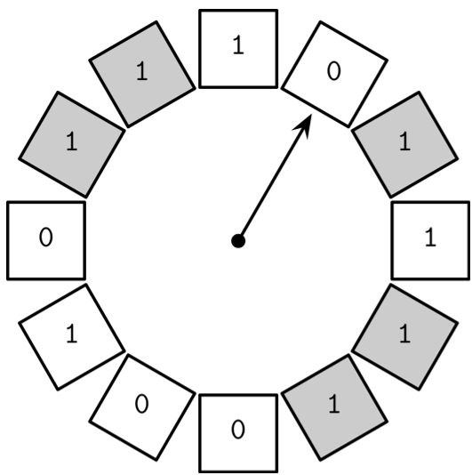

> 图 5-2：CLOCK-sweep 示例。灰色表示当前被 referenced 的 page 的 counter，
> 白色表示未被 referenced 的 page 的 counter；箭头指向下一个要检查的元素。

使用 circular buffer 的一个优点是， clock hand 指针与 buffer 内容都能通过
compare-and-swap 操作修改， 无需额外的锁机制。 该算法易于理解和实现，
常见于教科书 [TANENBAUM14] 和真实系统。

LRU 并不总是数据库系统的最佳 replacement strategy。 有时把 *使用频率* 而不是
*新近程度* 用作预测因素更实际。 毕竟， 对于高负载数据库系统，
新近程度可能无法提供足够信息， 因为它只表示 item 的访问顺序。

### LFU

为了改善这种情况， 可以跟踪 page reference 事件， 而不是 page-in 事件。
一种方法是跟踪 least-frequently used（LFU）page。

TinyLFU 是基于频率的 page-eviction policy [EINZIGER17]， 它正是这样做的： 不是按
page-in 的新近程度 evict page， 而是按使用频率排序。 流行的 Java 库 Caffeine
实现了它。

TinyLFU 使用 frequency histogram [CORMODE11] 保存紧凑的 cache 访问历史，
因为完整保留整个历史在实践中成本可能高得无法承受。

元素可以位于三个队列之一：

- **Admission**：保存新加入的元素，使用 LRU policy 实现。
- **Probation**：保存最可能被 evict 的元素。
- **Protected**：保存要在队列中保留更久的元素。

这种方法并非每次都选择要 evict 的元素， 而是选择要提升并保留的元素。
只有频率高于“因其提升而将被 evict 的 item”的 item， 才能移入 probation queue。
后续访问时， item 可以从 probation 移到 protected queue。 如果 protected queue
已满， 其中某个元素可能必须放回 probation。 访问更频繁的 item 更有可能保留，
使用较少的 item 则更容易被 evict。

图 5-3 展示了 admission、probation 和 protected queue、 frequency filter 与
eviction 之间的逻辑连接。

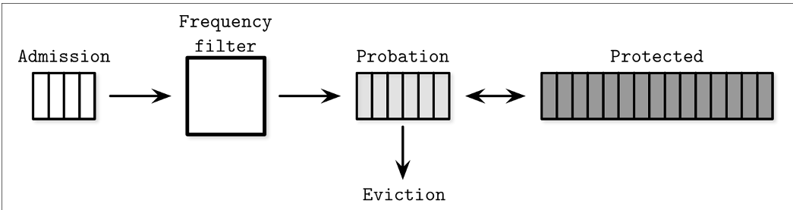

> 图 5-3：TinyLFU 的 admission、protected 和 probation queue， 以及 frequency
> filter 与 eviction 之间的关系。

还有许多其他算法可用于优化 cache eviction。 page-replacement strategy
的选择对延迟和 I/O 操作次数影响显著， 必须认真考虑。

## 恢复

数据库系统构建在多层硬件和软件之上， 每一层都可能存在自身的稳定性和可靠性问题。
数据库系统本身及其底层软硬件组件都可能失效。 数据库实现者必须考虑这些故障场景，
确保“承诺”写入的数据确实写入。

write-ahead log（WAL，亦称 commit log） 是一种 append-only、驻留磁盘的辅助结构，
用于崩溃恢复和事务恢复。 page cache 可以在内存中缓冲 page 内容的变更。
在缓存内容 flush 回磁盘之前， 磁盘上保存操作历史的唯一副本位于 WAL 中。
许多数据库系统使用 append-only WAL， 例如 PostgreSQL 和 MySQL。

WAL 的主要功能可归纳如下：

- 允许 page cache 缓冲对磁盘 page 的更新，同时确保整个数据库系统的持久性语义。
- 在受操作影响的缓存 page 副本同步到磁盘前，把所有操作持久化在磁盘上。
  任何修改数据库状态的操作都必须先记录到磁盘 log，之后才能修改相关 page 的内容。
- 崩溃时允许从操作 log 重建丢失的内存变更。

除这些功能外， WAL 在事务处理中也发挥着重要作用。 WAL 的重要性怎么强调都不过分：
它确保数据进入 persistent storage， 并在崩溃时可用； 已 commit 的数据会从 log
重放， 从而完整恢复崩溃前的数据库状态。 本节会经常提到 Algorithm for Recovery
and Isolation Exploiting Semantics（ARIES），
这是一种广泛使用和引用的先进恢复算法 [MOHAN92]。

### PostgreSQL 与 `fsync()`

PostgreSQL 使用 checkpoint， 确保 index 和数据文件已经纳入 logfile 中截至某条
record 的全部信息。 checkpoint 过程会定期一次性 flush 所有 dirty（已修改）page。
通过调用内核的 `fsync()`， 把 dirty page 内容同步到磁盘； 该调用理应将 dirty
page 同步到磁盘， 并清除 kernel page 上的 `dirty` flag。 可以预料， 如果 `fsync`
无法把 page flush 到磁盘， 它会返回错误。

在 Linux 和少数其他操作系统中， 发生 I/O 错误后， `fsync` 甚至会清除未成功 flush
page 的 dirty flag。 此外， 错误只会报告给故障发生时已经打开的 file descriptor，
所以 `fsync` 不会返回在被调用的 descriptor 打开 *之前* 已经发生的错误
[CORBET18]。

由于 checkpointer 不会始终保持所有文件打开， 它可能错过错误通知。 又因为 dirty
page flag 已被清除， checkpointer 会认为数据已成功写入磁盘，
但实际上数据可能并未写入。

这些行为的组合在发生本可恢复的故障时， 可能造成数据丢失或数据库损坏。
这类行为可能很难检测， 其造成的某些状态可能无法恢复。 有时甚至很难触发这种行为。
设计恢复机制时， 必须始终格外谨慎， 仔细推演并尝试测试每一种可能的故障场景。

### Log 语义

WAL 是 append-only 的， 已写入内容不可变， 因此对 log 的所有写入都是顺序写。
由于 WAL 是 immutable、append-only 数据结构， writer 继续向 log 尾部追加数据时，
reader 可以安全访问截至最新写入边界的内容。

WAL 由 log record 构成。 每条 record 都有唯一且单调递增的 log sequence
number（LSN）。 LSN 通常由内部 counter 或 timestamp 表示。 log record
不一定占满整个 disk block， 因此其内容缓存在 log buffer 中， 并在 force 操作中
flush 到磁盘。 log buffer 填满时会发生 force， transaction manager 或 page cache
也可以请求 force。 所有 log record 都必须按 LSN 顺序 flush 到磁盘。

除单个操作 record 外， WAL 还保存表示事务完成的 record。 在 log force 到事务
commit record 的 LSN 之前， 不能认为该事务已经 commit。

为了确保系统在 rollback 或恢复期间再次崩溃后仍能正确运行， 有些系统会在 undo
期间使用 *compensation log record*（CLR）， 并将其存入 log。

WAL 通常通过一个接口与 primary storage structure 配合， 到达 checkpoint
时可借助该接口 trim WAL。 logging 是数据库最关键的正确性环节之一，
要正确实现并不容易： 只要 log trimming 与“确保数据已经进入 primary storage
structure”之间存在最细微的不一致， 就可能造成数据丢失。

checkpoint 是让 log 知道某个标记之前的 log record 已经完全持久化、
不再需要的一种方式， 可显著减少数据库启动期间所需的工作。 强制把 *所有* dirty
page flush 到磁盘的过程通常称为 *sync checkpoint*， 因为它会完全同步 primary
storage structure。

把全部内容 flush 到磁盘并不现实， 而且需要暂停所有正在运行的操作， 直至
checkpoint 完成。 因此多数数据库系统实现 *fuzzy checkpoint*。 此时， log header
中存储的 `last_checkpoint` 指针包含最近一次成功 checkpoint 的信息。 fuzzy
checkpoint 以指定开始位置的特殊 `begin_checkpoint` log record 开始， 以
`end_checkpoint` log record 结束； 后者包含 dirty page 信息和 transaction table
的内容。 在该 record 指定的所有 page 全部 flush 之前， checkpoint 都被视为
*未完成*。 page 会异步 flush； 完成后， `last_checkpoint` record 被更新为
`begin_checkpoint` record 的 LSN。 若发生崩溃， 恢复过程将从这里开始 [MOHAN92]。

### 操作 Log 与数据 Log

有些数据库系统（例如 System R [CHAMBERLIN81]）使用 *shadow paging*，
这是一种确保数据持久性与事务原子性的 copy-on-write 技术。 新内容放入尚未发布的新
*shadow* page， 随后把指针从旧 page 翻转到保存更新内容的 page， 使新内容可见。

任何状态变更都可以由 before-image 与 after-image 表示， 也可以由相应的 redo 与
undo 操作表示。 对 before-image 应用 redo 操作会产生 after-image。 同样， 对
after-image 应用 undo 操作会产生 before-image。

可以使用 physical log （存储完整 page 状态或逐字节变更）， 也可以使用 logical
log （存储必须针对当前状态执行的操作）， 让 record 或 page 在时间上前后移动，
从一种状态变为另一种状态。 必须跟踪能够应用 physical 和 logical log record 的
page 的确切状态。

physical logging 记录 before-image 和 after-image， 因此必须记录受操作影响的完整
page。 logical log 指定必须应用于 page 的操作， 例如“为 key Y 插入 data record
X”； 以及相应的 undo 操作， 例如“移除与 Y 关联的值”。

实践中， 许多数据库系统结合使用这两种方法： 使用 logical logging 执行
undo（以改善并发性和性能）， 使用 physical logging 执行
redo（以缩短恢复时间）[MOHAN92]。

### Steal 与 Force Policy

为了确定何时必须把内存中的变更 flush 到磁盘， 数据库管理系统定义了
steal/no-steal 和 force/no-force policy。 这些 policy 主要适用于 page cache，
但更适合放在恢复的语境下讨论， 因为它们对可配合使用的恢复方法有显著影响。

允许在事务 commit 前 flush 被该事务修改的 page 的恢复方法称为 *steal policy*。
*no-steal policy* 不允许把任何未 commit 的事务内容 flush 到磁盘。 这里 *steal*
dirty page 是指把其内存内容 flush 到磁盘， 再从磁盘加载另一个 page 来取代它。

force policy 要求事务 commit 前， 把该事务修改的所有 page flush 到磁盘。 相反，
no-force policy 允许事务在其修改的部分 page 尚未 flush 到磁盘时 commit。 这里
force dirty page 是指在 commit 前把它 flush 到磁盘。

理解 steal 与 force policy 很重要， 因为它们会影响事务的 undo 与 redo。 *undo*
回滚未 commit 事务对已写入磁盘 page 的更新， 而 *redo* 则把已 commit
事务执行的变更应用到磁盘。

使用 no-steal policy 时， 只需 redo entry 即可实现恢复： 旧副本保存在磁盘 page
中， 修改则存储在 log 中 [WEIKUM01]。 采用 no-force 时， 可以推迟更新，
从而缓冲对 page 的多次更新。 由于这段时间内 page 内容必须缓存在内存中，
可能需要更大的 page cache。

使用 force policy 时， 崩溃恢复无需额外工作来重建已 commit 事务的结果，
因为这些事务修改的 page 已经 flush。 这种方法的主要缺点是， 必要的 I/O
会延长事务 commit 时间。

更一般地说， 在事务 commit *之前*， 必须拥有足够的信息来 undo 其结果。
如果事务涉及的任何 page 已经 flush， 就必须在它 commit 前一直把 undo 信息保留在
log 中， 以便回滚。 否则， 必须在它 commit 前一直把 redo record 保留在 log 中。
无论哪种情况， 在 undo 或 redo record 写入 logfile 前， 事务都 *不能* commit。

### ARIES

ARIES 是一种 steal/no-force 恢复算法。 它使用 physical redo 提高恢复性能
（因为能更快安装变更）， 并使用 logical undo 改善正常运行期间的并发性 （因为
logical undo 操作可以分别应用到各个 page）。 它利用 WAL record
在恢复期间重复历史， 从而在 undo 未 commit 事务前完整重建数据库状态， 并在 undo
期间创建 compensation log record [MOHAN92]。

数据库系统崩溃后重启时， 恢复分三个阶段进行：

1. *分析阶段*识别崩溃时 page cache 中的 dirty page 和正在进行的事务。 dirty page
   信息用于确定 redo 阶段的起点；进行中事务的列表在 undo
   阶段用于回滚未完成的事务。
2. *Redo
   阶段*重复直至崩溃点的历史，并把数据库恢复到先前状态。该阶段既处理未完成事务，
   也处理已经 commit、但其内容尚未 flush 到 persistent storage 的事务。
3. *Undo
   阶段*回滚所有未完成事务，并把数据库恢复到最近的一致状态。所有操作按逆时间顺序回滚。
   如果数据库在恢复期间再次崩溃，undo 事务的操作本身也会记录到
   log，以免重复执行。

ARIES 使用 LSN 标识 log record， 在 dirty page table 中跟踪运行中事务修改的
page， 并采用 physical redo、logical undo 和 fuzzy checkpointing。
尽管介绍该系统的论文发表于 1992 年，
其中大多数概念、方法与范式至今仍与事务处理和恢复密切相关。

## 并发控制

在“DBMS 架构”一节讨论数据库管理系统架构时， 我们曾提到 transaction manager 和
lock manager 协同处理并发控制。 并发控制是一组处理并发执行事务之间交互的技术，
大致可以分为以下几类：

**乐观并发控制（OCC）**

允许事务并发执行读写操作， 并判断组合执行的结果是否可串行化。 换言之，
事务互不阻塞， 维护各自操作的历史， 并在 commit 前检查这些历史是否存在潜在冲突。
如果执行产生冲突， 就 abort 其中一个冲突事务。

**多版本并发控制（MVCC）**

允许存在带 timestamp 的多个 record 版本， 从而保证数据库在 timestamp
标识的过去某一时刻的一致视图。 MVCC 可以使用 validation 技术实现，
只允许某个正在更新或 commit 的事务胜出； 也可以使用 timestamp ordering 等
lockless 技术， 或 two-phase locking 等基于锁的技术实现。

**悲观并发控制（PCC，亦称保守并发控制）**

保守方法既有基于锁的， 也有非锁定的， 二者在管理和授予 shared resource
访问权的方式上有所不同。 基于锁的方法要求事务维护数据库 record 上的锁，
防止其他事务修改已锁定的 record， 也防止其他事务在锁释放前访问正在修改的
record。 非锁定方法维护读写操作列表， 并根据未完成事务的 schedule 限制执行。
当多个事务相互等待对方释放锁才能继续时， 悲观 schedule 可能导致死锁。

本章专注于 node 本地的并发控制技术。 第 13 章介绍分布式事务和其他方法， 例如
deterministic concurrency control。

进一步讨论并发控制前， 需要定义试图解决的一组问题，
并讨论事务操作如何重叠以及这种重叠会产生什么后果。

### 可串行化

事务由针对数据库状态执行的读写操作， 以及业务逻辑 （应用于读取内容的转换）组成。
从数据库系统的角度看， *schedule* 是执行一组事务所需的操作列表
（即只包含与数据库状态交互的操作， 例如 read、write、commit 或 abort），
因为其他所有操作都被假定为无副作用 （即不影响数据库状态）[MOLINA08]。

如果 schedule 包含其中执行的每个事务的全部操作， 它就是 *complete*。 *correct*
schedule 在逻辑上等价于原始操作列表， 但只要不违反 ACID
属性和各事务结果的正确性， 它的各部分可以并行执行， 也可以为了优化而重排
[WEIKUM01]。

如果 schedule 中的事务完全独立执行、 没有任何交错，
即前一个事务完全执行完毕后下一个才开始， 则称该 schedule 是 *serial* 的。
与多个多步骤事务所有可能的交错相比， serial execution 很容易推理。 然而，
始终逐个执行事务会显著限制系统吞吐量并损害性能。

需要找到一种并发执行事务操作的方法， 同时保持 serial schedule 的正确性和简洁性。
*serializable* schedule 可以做到这一点。 如果某个 schedule 等价于同一事务集合的
*某个* complete serial schedule， 它就是 serializable 的。 换言之，
它产生的结果与按 *某种* 顺序逐个执行一组事务相同。 图 5-4
展示了三个并发事务及其可能的执行历史 （$3!=6$ 种可能，涵盖所有顺序）。

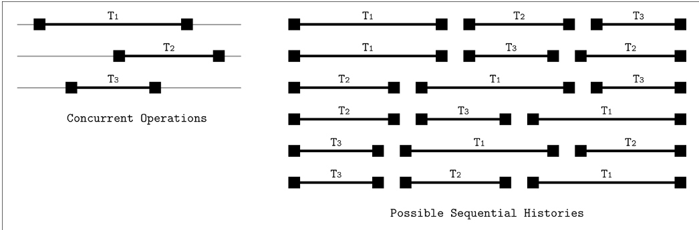

> 图 5-4：并发事务及其所有可能的顺序执行历史。

## 事务隔离

事务数据库系统允许采用不同的隔离级别。 *隔离级别*
指定事务的各部分如何以及何时可以或应当对其他事务可见。 换言之，
隔离级别描述事务与其他并发事务隔离的程度， 以及执行期间可能遇到哪些 anomaly。

实现隔离是有代价的： 为了防止不完整或临时的写入越过事务边界传播，
需要额外的协调与同步， 这会损害性能。

### 读写 Anomaly

SQL 标准 [MELTON06] 提到并描述了并发事务执行期间可能出现的 *read anomaly*：
dirty read、nonrepeatable read 和 phantom read。

*dirty read* 是事务能够读取其他事务未 commit 变更的情况。 例如， 事务 $T_1$
用新的地址字段值更新一条 user record， 事务 $T_2$ 在 $T_1$ commit
前读到了更新后的地址。 随后 $T_1$ abort 并回滚执行结果。 但 $T_2$
已经读到了这个值， 也就是访问了一个从未 commit 的值。

*nonrepeatable read*（有时称为 fuzzy read）
是事务两次查询同一行却得到不同结果的情况。 例如， 即使事务 $T_1$ 读取一行后，
事务 $T_2$ 修改它并 commit 该变更， 也会发生这种情况。 如果 $T_1$
在执行结束前再次请求同一行， 结果将与上次不同。

如果在事务期间执行 range read （即不只读取一条 data record，而是读取 record
范围）， 可能会看到 phantom record。 *phantom read*
是事务两次查询同一组行却得到不同结果的情况。 它与 nonrepeatable read 类似，
但适用于 range query。

还有语义类似的 write anomaly： lost update、dirty write 和 write skew。

*lost update* 发生在事务 $T_1$ 和 $T_2$ 都试图更新值 $V$ 时。 $T_1$ 和 $T_2$
都读取 $V$。 $T_1$ 更新 $V$ 并 commit， 随后 $T_2$ 也更新 $V$ 并 commit。
由于两个事务不知道彼此存在， 如果都允许 commit， $T_1$ 的结果会被 $T_2$
的结果覆盖， $T_1$ 的更新因而丢失。

*dirty write* 是某个事务获取一个未 commit 的值 （即 dirty read）、
修改它并保存的情况。 换言之， 事务结果建立在从未 commit 的值之上。

当每个事务各自都遵守所需不变量， 但组合起来却不满足这些不变量时， 就会发生
*write skew*。 例如， 事务 $T_1$ 和 $T_2$ 分别修改账户 $A_1$ 和 $A_2$ 的值。
$A_1$ 初始为 100， $A_2$ 初始为 150。 账户值可以为负， 只要两个账户之和非负：
$A_1+A_2\geq0$。 $T_1$ 和 $T_2$ 分别试图从 $A_1$ 和 $A_2$ 取出 200。 事务开始时
$A_1+A_2=250$， 因此总共可用 250。 两个事务都认为自己保持了不变量， 因而获准
commit。 commit 后， $A_1$ 为 -100， $A_2$ 为 -50，
显然违反了账户总额应保持非负的要求 [FEKETE04]。

### 隔离级别

最低（即最弱）的隔离级别是 *read uncommitted*。 在该隔离级别下，
事务系统允许一个事务观察其他并发事务未 commit 的变更。 换言之， 允许 dirty
read。

可以避免其中一些 anomaly。 例如， 可以确保特定事务执行的任何读取只能读取 *已经
commit* 的变更。 不过， 无法保证该事务稍后再次尝试读取同一条 data record
时仍会看到相同值。 如果两次读取之间发生了已 commit 的修改，
同一事务中的两次查询会得到不同结果。 换言之， 不允许 dirty read， 但允许 phantom
read 和 nonrepeatable read。 该隔离级别称为 *read committed*。 如果进一步禁止
nonrepeatable read， 就得到 *repeatable read* 隔离级别。

最强的隔离级别是 serializability。 如[“可串行化”](#可串行化)所述，
它保证事务结果会以某种顺序呈现， 如同事务串行执行 （即时间上不重叠）。
禁止并发执行会严重损害数据库性能。 只要事务内部不变量保持成立，
事务就可以重排并并发执行； 但其结果必须按 *某种* 串行顺序呈现。

图 5-5 展示了隔离级别及其允许的 anomaly。

**图 5-5：隔离级别及其允许的 anomaly。**

| 隔离级别         | Dirty read | Nonrepeatable read | Phantom read |
| ---------------- | ---------- | ------------------ | ------------ |
| Read uncommitted | 允许       | 允许               | 允许         |
| Read committed   | 不允许     | 允许               | 允许         |
| Repeatable read  | 不允许     | 不允许             | 允许         |
| Serializable     | 不允许     | 不允许             | 不允许       |

不存在依赖关系的事务可以按任意顺序执行， 因为其结果完全独立。 serializability 与
linearizability 不同 （后者将在分布式系统的语境下讨论）：
它是以任意顺序执行的多个操作所具有的属性，
并不暗示或试图规定事务执行的特定顺序。 ACID 中的隔离性意味着 serializability
[BAILIS14a]。 遗憾的是， 实现 serializability 需要协调。 换言之，
并发执行的事务必须协调， 以保持不变量， 并为冲突的执行施加串行顺序 [BAILIS14b]。

有些数据库使用 *snapshot isolation*。 在 snapshot isolation 下，
事务可以观察其开始时所有已 commit 事务所做的状态变更。 每个事务获取数据快照，
并在该快照上执行查询。 事务执行期间该快照不能变化。
只有该事务修改的值在其执行期间 *未曾* 改变时， 事务才会 commit； 否则将被 abort
并 rollback。

如果两个事务试图修改同一个值， 只允许其中一个 commit。 这排除了 *lost update*
anomaly。 例如， 事务 $T_1$ 和 $T_2$ 都试图修改 $v$。 二者从包含其开始前所有已
commit 事务变更的快照中读取 $v$ 的当前值。 先尝试 commit 的事务会成功，
另一个则必须 abort。 失败的事务会重试， 而不是覆盖该值。

snapshot isolation 下仍可能出现 write skew anomaly，
因为如果两个事务读取各自的本地状态、 修改相互独立的 record 并保持局部不变量，
二者都可以 commit [FEKETE04]。 本书将在分布式事务的语境下更详细地讨论 snapshot
isolation。

## 乐观并发控制

乐观并发控制假设事务冲突很少发生。 它不使用锁并阻塞事务执行， 而是在结果 commit
前验证事务， 以防止与并发事务产生读写冲突并确保 serializability。
事务执行通常分为三个阶段 [WEIKUM01]。

### 读取阶段

事务在自己的 private context 中执行各步骤， 不让任何变更对其他事务可见。
该阶段完成后， 所有事务依赖项（read set） 以及事务产生的副作用（write
set）都已知。

### 验证阶段

检查并发事务的 read set 与 write set， 判断其操作是否存在可能违反
serializability 的冲突。 如果事务读取的某些数据已经过时，
或者它会覆盖在其读取阶段 commit 的事务写入的某些值， 就清空 private context
并重新开始读取阶段。 换言之， 验证阶段判断 commit 该事务是否保持 ACID 属性。

### 写入阶段

如果验证阶段未发现冲突， 事务就可以把 private context 中的 write set commit
到数据库状态。

验证既可以检查与已经 commit 的事务之间的冲突 （backward-oriented），
也可以检查与当前处于验证阶段的事务之间的冲突 （forward-oriented）。
不同事务的验证阶段与写入阶段应以原子方式执行。 某个事务正在验证时，
不允许其他事务 commit。 验证阶段与写入阶段通常比读取阶段短，
所以这是一种可接受的折中。

backward-oriented concurrency control 确保任意一对事务 $T_1$ 和 $T_2$
满足以下属性：

- $T_1$ 在 $T_2$ 的读取阶段开始前已经 commit，因此允许 $T_2$ commit。
- $T_1$ 在 $T_2$ 的写入阶段前已经 commit， 且 $T_1$ 的 write set 与 $T_2$ 的
  read set 不相交。换言之， $T_1$ 没有写入任何 $T_2$ 本应看到的值。
- $T_1$ 的读取阶段在 $T_2$ 的读取阶段之前完成， 且 $T_2$ 的 write set 与 $T_1$
  的 read set、write set 均不相交。换言之， 事务操作的是彼此独立的 data record
  集，因此二者都可以 commit。

如果验证通常成功、 事务不必重试， 这种方法就很高效， 因为重试会显著损害性能。
当然， 乐观并发仍然有每次只能由一个事务进入的 *critical section*。
另一种允许某些操作采用非独占所有权的方法是使用 readers-writer lock （允许 reader
shared access） 和 upgradeable lock （允许在需要时把 shared lock 转为 exclusive
lock）。

## 多版本并发控制

多版本并发控制允许存在多个 record 版本， 并使用单调递增的 transaction ID 或
timestamp， 从而在数据库管理系统中实现事务一致性。
这使读写能在存储层以最少协调继续进行， 因为在新值 commit 前， 读取仍可访问旧值。

MVCC 区分 *committed* 与 *uncommitted* 版本， 二者对应已 commit 与未 commit
事务的值版本。 值最近一次 commit 的版本被视为 *当前* 版本。 一般而言，
transaction manager 此时的目标是任何时刻最多只有一个未 commit 值。

取决于数据库系统实现的隔离级别， 读操作可能允许访问未 commit 值， 也可能不允许
[WEIKUM01]。 多版本并发可以通过锁、调度和冲突解决技术 （例如 two-phase
locking）实现， 也可以通过 timestamp ordering 实现。 MVCC 的主要用途之一是实现
snapshot isolation [HELLERSTEIN07]。

## 悲观并发控制

悲观并发控制方案比乐观方案更为保守。 这些方案在事务运行时确定冲突， 并阻塞或
abort 其执行。

最简单的悲观（lock-free）并发控制方案之一是 timestamp ordering，
其中每个事务都有一个 timestamp。 是否允许执行事务操作， 取决于是否已有 timestamp
更早的事务 commit。 为此， transaction manager 必须为每个值维护
`max_read_timestamp` 和 `max_write_timestamp`， 描述并发事务执行的读写操作。

试图以低于 `max_write_timestamp` 的 timestamp 读取值的操作， 会导致所属事务
abort， 因为已经存在更新的值， 允许该操作会违反事务顺序。

同样， timestamp 低于 `max_read_timestamp` 的写操作会与较新的读取冲突。 不过，
timestamp 低于 `max_write_timestamp` 的写操作是允许的，
因为可以安全忽略过时的写入值。 这一推论通常称为 Thomas Write Rule [THOMAS79]。
读写操作一经执行， 相应的最大 timestamp 值就会更新。 abort 的事务会以新
timestamp 重新开始， 否则必然会再次 abort [RAMAKRISHNAN03]。

### 基于锁的并发控制

基于锁的并发控制方案是悲观并发控制的一种形式。 它对数据库对象使用显式锁， 而不像
timestamp ordering 等协议那样解析 schedule。 锁的一些缺点包括 contention
和可扩展性问题 [REN16]。

应用最广泛的锁技术之一是 *two-phase locking*（2PL）， 它把锁管理分为两个阶段：

- *Growing phase*（亦称 expanding phase）：获取事务所需的所有锁，不释放任何锁。
- *Shrinking phase*：释放 growing phase 获取的所有锁。

由这两个定义可以推出一条规则： 事务一旦释放了至少一个锁， 就不能再获取任何锁。
需要注意的是， 2PL 并不禁止事务在任一阶段执行步骤； 不过某些 2PL 变体 （例如
conservative 2PL）确实会施加此类限制。

> [!NOTE]
> 尽管名称相似， two-phase locking 与 two-phase commit 是完全不同的概念。
> two-phase commit 是用于分布式跨 partition 事务的协议， two-phase locking
> 则是常用于实现 serializability 的并发控制机制。

### 死锁

在锁协议中， 事务试图获取数据库对象上的锁； 如果无法立即授予锁，
事务就必须等待锁释放。 两个事务在尝试获取继续执行所需的锁时，
可能最终互相等待对方释放各自持有的其他锁。 这种情况称为 *死锁*。

图 5-6 给出了死锁示例： $T_1$ 持有锁 $L_1$ 并等待锁 $L_2$ 释放， 而 $T_2$ 持有锁
$L_2$ 并等待 $L_1$ 释放。

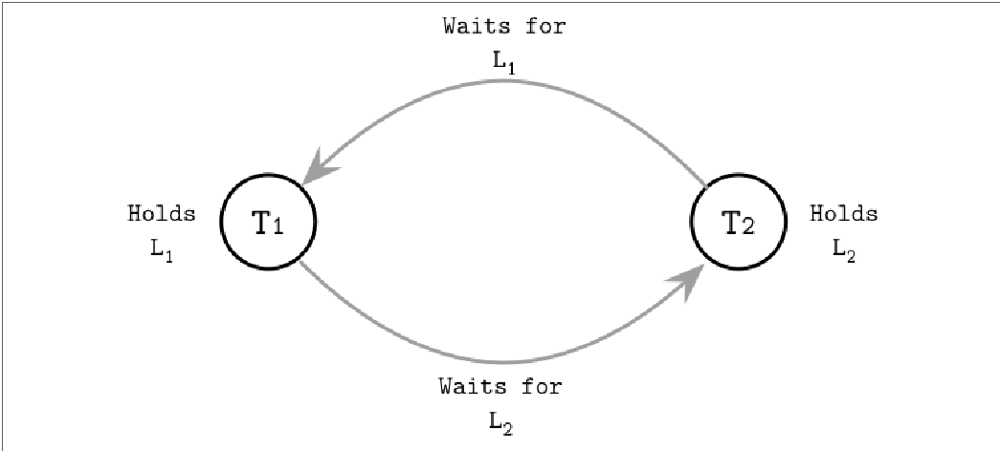

> 图 5-6：死锁示例。$T_1$ 与 $T_2$ 各自持有一个锁，并等待对方释放另一个锁。

处理死锁最简单的方法是引入 timeout， 并假定长时间运行的事务可能陷入死锁，
从而将其 abort。 另一种策略是 conservative 2PL，
它要求事务在执行任何操作前获取全部锁， 无法获取时就 abort。 不过，
这些方法会严重限制系统并发性， 所以数据库系统大多使用 transaction manager
检测或避免（即预防）死锁。

死锁检测通常使用 *waits-for graph*， 它跟踪进行中事务之间的关系，
并建立它们之间的 waits-for 关系。

图中的环表示存在死锁： 事务 $T_1$ 等待 $T_2$， 而后者又等待 $T_1$。
死锁检测既可以定期执行 （每隔一段时间一次）， 也可以持续执行 （每次 waits-for
graph 更新时）[WEIKUM01]。 其中一个事务 （通常是较晚才尝试获取锁的那个）会被
abort。 为了 *避免* 死锁， 把锁获取限制在不会导致死锁的情况， transaction
manager 可以使用事务 timestamp 确定其 *优先级*。 较小的 timestamp
通常意味着较高的优先级， 反之亦然。

如果事务 $T_1$ 试图获取当前由 $T_2$ 持有的锁， 且 $T_1$ 的优先级更高 （它比
$T_2$ 更早开始）， 可以使用下列限制之一来避免死锁 [RAMAKRISHNAN03]。

#### Wait-die

允许 $T_1$ 阻塞并等待该锁。 否则， $T_1$ 会被 abort 并重新开始。 换言之，
事务只能被 timestamp 更大的事务阻塞。

#### Wound-wait

$T_2$ 被 abort 并重新开始 （$T_1$ wound $T_2$）。 否则 （如果 $T_2$ 比 $T_1$
更早开始）， 允许 $T_1$ 等待。 换言之， 事务只能被 timestamp 更小的事务阻塞。

事务处理需要 scheduler 处理死锁。 与此同时，
latch（参见[“Latch”](#latch)）依靠程序员确保不会发生死锁，
而不依赖死锁避免机制。

## Lock

如果两个事务并发提交、 修改相互重叠的数据区段， 二者都不应观察到对方的部分结果，
从而维持逻辑一致性。 同样， 同一事务中的两个线程必须观察到相同的数据库内容，
并能访问彼此的数据。

在事务处理中， 保护逻辑数据完整性与物理数据完整性的机制有所区别。
分别负责逻辑与物理完整性的两个概念是 *lock* 和 *latch*。 命名有些不尽如人意，
因为这里所称的 latch 在系统编程中通常称为 lock； 本节将阐明二者的区别及影响。

lock 用于隔离和调度相互重叠的事务， 并管理数据库内容而不是内部存储结构； 它在
key 上获取。 lock 可以保护特定 key （无论该 key 存在与否）， 也可以保护 key
范围。 lock 通常存储和管理在树实现之外， 是由数据库 lock manager
管理的高层概念。

lock 比 latch 更重量级， 并且在整个事务期间一直持有。

<a id="latch"></a>

## Latch

另一方面， latch 保护 *物理* 表示： 插入、更新和删除操作会修改 leaf page
的内容。 由 leaf underflow 和 overflow 引起并向上传播的拆分与合并， 会修改
nonleaf page 内容与树结构。 latch 在这些操作期间保护树的物理表示 （page
内容和树结构）， 并在 page 层级获取。 任何 page 都必须取得 latch，
才能被安全地并发访问。 即使采用 lockless 并发控制技术， 仍然必须使用 latch。

leaf 层级上的一次修改可能传播到 B-Tree 的更高层级， 因此可能需要在多个层级获取
latch。 执行查询时不应观察到不一致状态的 page， 例如不完整的写入或只完成一部分的
node 拆分； 在后一种情况下， 数据可能同时存在于源 node 和目标 node 中，
或者尚未传播到 parent。

更新 parent 或 sibling 指针时也遵循同样的规则。 一般原则是尽可能缩短 latch
的持有时间， 即只在读取或更新 page 时持有， 以提高并发性。

并发操作之间的干扰大致分为三类：

- **并发读取**：多个线程访问同一 page，但不修改它。
- **并发更新**：多个线程试图修改同一 page。
- **边写边读**：一个线程试图修改 page 内容，另一个线程试图读取同一 page。

这些场景同样适用于与数据库维护相重叠的访问
（例如[“Vacuum 与维护”](#vacuum-与维护)所述的后台过程）。

### Readers-writer Lock

最简单的 latch 实现会向请求线程授予 exclusive read/write access。 不过，
多数时候无需把所有进程彼此隔离。 例如， 读取可以并发访问 page 而不会造成问题；
只需确保多个并发 writer 互不重叠， reader 也不与 writer 重叠。
为了实现这种粒度， 可以使用 readers-writer lock（RW lock）。

RW lock 允许多个 reader 并发访问对象， 只有通常数量较少的 writer 必须获取对象的
exclusive access。 图 5-7 给出了 readers-writer lock 的兼容性： 只有 reader
能共享锁所有权， reader 与 writer 的其他所有组合都必须取得 exclusive ownership。

**图 5-7：Readers-writer lock 兼容性表。**

|        | Reader    | Writer    |
| ------ | --------- | --------- |
| Reader | Shared    | Exclusive |
| Writer | Exclusive | Exclusive |

图 5-8（a）中， 多个 reader 正在访问对象， writer 则等待轮到自己， 因为 reader
访问 page 时它不能修改该 page。 图 5-8（b）中， writer 1 持有对象的 exclusive
lock， 另一个 writer 和三个 reader 必须等待。

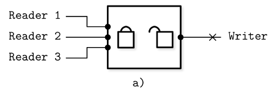

> 图 5-8（a）：多个 reader 以 shared 模式访问对象， writer 等待获取 exclusive
> lock。

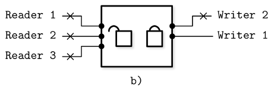

> 图 5-8（b）：writer 1 持有 exclusive lock， 另一个 writer 和三个 reader 等待。

两个相互重叠、试图访问同一 page 的读取不需要同步， 只需防止 page cache
从磁盘重复取得该 page， 因此读取可以安全地以 shared 模式并发执行。
一旦涉及写入， 就必须将其与并发读取和其他写入同时隔离。

### Busy-Wait 与 Queueing 技术

为了管理对 page 的 shared access， 既可以使用阻塞算法，
在能够继续时取消线程调度并将其唤醒； 也可以使用 busy-wait 算法。 busy-wait
算法允许线程等待极短时间， 而不是把控制权交还 scheduler。

queueing 通常使用 compare-and-swap 指令实现，
以保证锁获取与队列更新操作的原子性。 如果队列为空， 线程立即获得访问权。 否则，
线程把自己追加到等待队列， 并在一个只能由队列中排在前面的线程更新的变量上 spin。
这有助于减少获取和释放锁产生的 CPU traffic [MELLORCRUMMEY91]。

### Latch Crabbing

获取 latch 最直接的方法是， 从 root 到目标 leaf 的途中获取所有 latch。
这会造成并发瓶颈， 而且多数时候可以避免。 latch 的持有时间应当最短。
可实现这一目标的优化之一称为 *latch crabbing* （或 latch
coupling）[RAMAKRISHNAN03]。

latch crabbing 是一种相当简单的方法， 可以缩短 latch 的持有时间，
并在确定执行中的操作不再需要它时立即释放。 在读取路径上， 一旦定位 child node
并获取其 latch， 就可以释放 parent node 的 latch。

插入期间， 如果能保证操作不会造成可能传播到 parent 的结构变化， 就可以释放
parent latch。 换言之， 如果 child node 未满， 就可以释放 parent latch。

同样， 删除期间， 如果 child node 保存的元素足够多， 操作不会导致 sibling node
合并， 就可以释放 parent node 上的 latch。

图 5-9 展示了插入期间从 root 到 leaf 的过程：

- （a）在 root 层级获取 write latch。
- （b）定位下一层级 node 并获取其 write latch；检查该 node
  是否可能发生结构变化。 由于 node 未满，可以释放 parent latch。
- （c）操作下降到下一层级；获取 write latch，检查目标 leaf node
  是否可能发生结构变化， 并释放 parent latch。

这种方法是乐观的： 大多数插入和删除操作不会导致向上跨多个层级传播的结构变化。
事实上， 层级越高， 发生结构变化的概率越低。 大多数操作只需要目标 node 上的
latch， 必须保留 parent latch 的情况相对很少。

如果 child page 尚未加载到 page cache， 可以 latch 一个即将加载的 page；
也可以释放 parent latch， 等 page 加载后重新开始从 root 到 leaf 的过程， 以减少
contention。 重新开始 root-to-leaf 遍历听起来代价很高， 但实际上很少需要这样做；
还可以使用机制检测自遍历以来更高层级是否发生了结构变化 [GRAEFE10]。

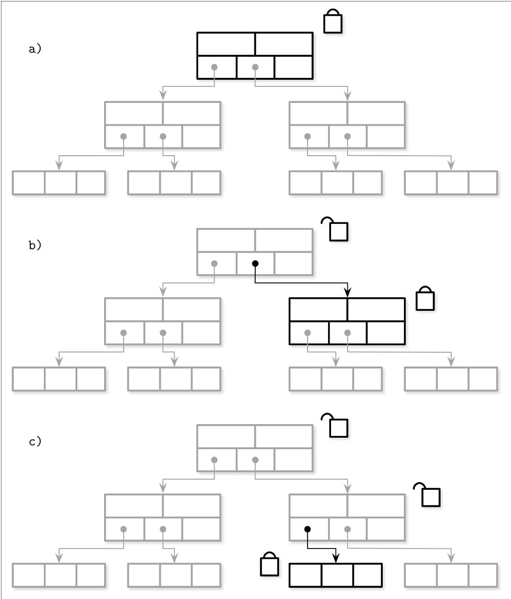

> 图 5-9：插入期间的 latch crabbing。（a）获取 root 的 write latch；（b）
> 获取下一层 node 的 latch，确认其未满后释放 parent latch；（c）继续下降，
> 在确认目标 leaf 不会引发结构变化后释放 parent latch。

### Latch Upgrading 与 Pointer Chasing

遍历期间不必立即以 exclusive 模式获取 latch， 可以改用 *latch upgrading*。
该方法沿查找路径获取 shared lock， 并在需要时将其 *upgrade* 为 exclusive lock。

写操作首先只在 leaf 层级获取 exclusive lock。 如果 leaf 必须拆分或合并，
算法会向上遍历树， 并尝试 upgrade parent 持有的 shared lock，
从而取得受影响树区段的 latch exclusive ownership （即因该操作也将拆分或合并的
node）。 由于多个线程可能试图获取某个高层级的 exclusive lock，
其中一个必须等待或重新开始。

你可能已经注意到， 此前介绍的所有机制都从获取 root node 上的 latch 开始。
每个请求都必须经过 root node， 它很快会成为瓶颈。 与此同时， root
总是最后才拆分， 因为它的所有 child 必须先填满。 这意味着 root node *始终*
可以用乐观方式加 latch， 很少需要付出重试（*pointer chasing*）的代价。

<a id="b-link-tree"></a>

### B-link Tree

$B^{\text{link}}$-Tree 建立在 B*-Tree 之上 （参见[“再平衡”](#再平衡)）， 并添加
high key （参见[“Node High Key”](#node-high-key)） 和 sibling link 指针
[LEHMAN81]。 high key 表示可能的最大 subtree key。 $B^{\text{link}}$-Tree 中除
root 外的每个 node 都有两个指针： 一个是从 parent 向下的 child 指针，
另一个是来自同一层级 left node 的 sibling link。

B-link Tree 允许一种称为 half-split 的状态： node 已被 sibling 指针引用，
但尚未被其 parent 的 child 指针引用。 检查 node high key 可以识别 half-split。
如果查找 key 超过 node 的 high key （违反 high key 不变量），
查找算法会得出结构已被并发修改的结论， 并沿 sibling link 继续查找。

为了保证最佳性能， 应尽快把指针添加到 parent； 但查找过程不必 abort 并重新开始，
因为树中所有元素仍然可达。 其优点是， 下降到 child 层级时无需持有 parent latch，
即使 child 即将拆分也是如此： 可以通过 sibling link 使新 node 可见， 再惰性更新
parent 指针， 而不会牺牲正确性 [GRAEFE10]。

与直接从 parent 下降相比， 这种方法效率略低， 需要额外访问一个 page；
但它简化了并发访问， 同时仍能正确地从 root 下降到 leaf。 拆分操作相对少见，
B-Tree 也很少收缩， 所以这种情况属于例外， 其成本微不足道。 该方法有不少优点：
减少 contention； 避免在拆分期间持有 parent latch； 把修改树结构期间持有的 latch
数量降为常数。 更重要的是， 它允许读取与树结构变化并发进行， 并防止并发修改向
parent node 传播时原本会引发的死锁。

## 小结

本章讨论了负责事务处理与恢复的存储引擎组件。 实现事务处理时面临两个问题：

- 为提高效率，必须允许事务并发执行。
- 为保持正确性，必须确保并发事务保持 ACID 属性。

事务并发执行可能导致不同类型的 read anomaly 和 write anomaly。 是否存在这些
anomaly， 由不同隔离级别的实现来描述和限制。
并发控制方法决定如何调度和执行事务。

page cache 负责减少磁盘访问次数： 它把 page 缓存在内存中，
并允许对其执行读写访问。 cache 达到容量上限时， page 会被 evict 并 flush
回磁盘。 为了确保 node 崩溃时不会丢失尚未 flush 的变更， 并支持事务 rollback，
需要使用 WAL。 page cache 与 WAL 通过 force 和 steal policy 协调，
确保每个事务都能高效执行和 rollback， 而不牺牲持久性。

## 延伸阅读

若想进一步了解本章提到的概念， 可以参阅以下资料。

**Transaction processing and recovery, generally**

Weikum, Gerhard, and Gottfried Vossen. 2001. *Transactional Information Systems:
Theory, Algorithms, and the Practice of Concurrency Control and Recovery*. San
Francisco: Morgan Kaufmann Publishers Inc.

Bernstein, Philip A. and Eric Newcomer. 2009. *Principles of Transaction
Processing*. San Francisco: Morgan Kaufmann.

Graefe, Goetz, Guy, Wey & Sauer, Caetano. 2016. "Instant Recovery with
Write-Ahead Logging: Page Repair, System Restart, Media Restore, and System
Failover, (2nd Ed.) " in *Synthesis Lectures on Data Management* 8, 1-113.
10.2200/S00710ED2V01Y201603DTM044.

Mohan, C., Don Haderle, Bruce Lindsay, Hamid Pirahesh, and Peter Schwarz. 1992.
"ARIES: a transaction recovery method supporting fine-granularity locking and
partial rollbacks using write-ahead logging." *Transactions on Database Systems*
17, no. 1 (March): 94-162. https://doi.org/10.1145/128765.128770.

**B-Tree 中的并发控制**

Wang, Paul. 1991. "An In-Depth Analysis of Concurrent B-Tree Algorithms." MIT
Technical Report. https: //apps.dtic.mil/dtic/tr/fulltext/u2/a232287.pdf.

Goetz Graefe. 2010. A survey of B-tree locking techniques. ACM Trans. Database
Syst. 35, 3, Article 16 (July 2010), 26 pages.

**Parallel and concurrent data structures**

McKenney, Paul E. 2012. "Is Parallel Programming Hard, And, If So, What Can You
Do About It?" https: //arxiv.org/abs/1701.00854.

Herlihy, Maurice and Nir Shavit. 2012. *The Art of Multiprocessor Programming*,
*Revised Reprint (1st Ed.).* San Francisco: Morgan Kaufmann.

**Chronological developments in the field of transaction processing**

Diaconu, Cristian, Craig Freedman, Erik Ismert, Per-Åke Larson, Pravin Mittal,
Ryan Stonecipher, Nitin Verma, and Mike Zwilling. 2013. "Hekaton: SQL Server's
Memory-Optimized OLTP Engine." In Proceedings of the 2013 ACM SIGMOD
International Conference on Management of Data (SIGMOD '13), 1243-1254. New
York: Association for Computing Machinery. https:
//doi.org/10.1145/2463676.2463710.

Kimura, Hideaki. 2015. "FOEDUS: OLTP Engine for a Thousand Cores and NVRAM." In
Proceedings of the 2015 ACM SIGMOD International Conference on Management of
Data (SIGMOD '15), 691-706. https: //doi.org/10.1145/2723372.2746480.

Yu, Xiangyao, Andrew Pavlo, Daniel Sanchez, and Srinivas Devadas. 2016.
"Tic-Toc: Time Traveling Optimistic Concurrency Control." In Proceedings of the
2016 International Conference on Management of Data (SIGMOD '16), 1629-1642.
https: //doi.org/10.1145/2882903.2882935.

Kim, Kangnyeon, Tianzheng Wang, Ryan Johnson, and Ippokratis Pandis. 2016.
"ERMIA: Fast Memory-Optimized Database System for Heterogeneous Workloads." In
Proceedings of the 2016 International Conference on Management of Data (SIGMOD
'16), 1675-1687. https://doi.org/10.1145/2882903.2882905.

Lim, Hyeontaek, Michael Kaminsky, and David G. Andersen. 2017. "Cicada:
Dependably Fast Multi-Core In-Memory Transactions." In Proceedings of the 2017
ACM International Conference on Management of Data (SIGMOD '17), 21-35. https:
//doi.org/10.1145/3035918.3064015.

<a id="chapter-6-b-tree-variants"></a>

# 第 6 章 B-Tree 变体

B-Tree 变体有一些共同点：树结构、通过拆分与合并进行平衡，以及查找和删除算法。
其他细节——如并发、磁盘 page 表示、sibling node
之间的链接和维护流程——则可能因实现而异。

本章讨论几种可用于实现高效 B-Tree 的技术以及采用这些技术的数据结构：

- 写时复制 B-Tree 的结构类似 B-Tree，但 node 不可变且不做原地更新。page
  会被复制、 更新并写入新位置。
- 惰性 B-Tree 通过在 node 上缓冲更新，减少后续写入同一 node 时的 I/O 请求。
  下一章还会介绍双组件 LSM tree，它进一步利用缓冲来实现完全不可变的 B-Tree。
- FD-Tree 采用一种类似 LSM tree 的缓冲方式：先在小型 B-Tree 中缓冲更新；
  填满后将内容写入不可变 run，并让更新以级联方式由高层向低层传播。
- Bw-Tree 把 B-Tree node 拆成多个较小部分，并以 append-only 方式写入，
  从而通过批处理不同 node 的更新降低小写入成本。
- Cache-oblivious B-Tree 允许以非常接近内存数据结构的方式处理磁盘数据结构。

## 写时复制

有些数据库不构建复杂的 latch 机制， 而是使用_写时复制_（copy-on-write）技术，
在存在并发操作时保证数据完整性。 在这种情况下， 每当页面即将被修改时，
都会先复制页面内容， 再修改复制出的页面而非原页面， 并创建一套并行的树层次结构。

旧版本的树仍可供与写入者并发运行的读取者访问，
而访问已修改页面的写入者必须等待先前的写操作完成。 新的页面层次结构创建好后，
指向最顶层页面的指针会以原子方式更新。 图 6-1 展示了一棵与旧树并行创建的新树，
它复用了未发生改动的页面。

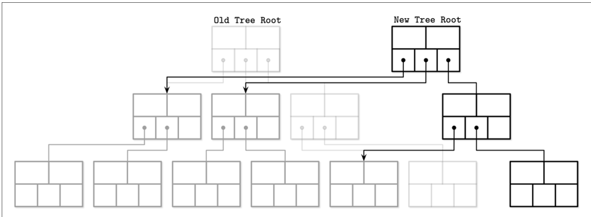

> 图 6-1：写时复制 B-Tree。

这种方法的一个明显缺点是需要更多空间（尽管旧版本只会保留很短的时间，
因为使用旧页面的并发操作一旦完成， 这些页面就能立即回收）和处理器时间，
因为必须复制完整的页面内容。 由于 B-Tree 通常很浅，
这种方法的简洁性与优点往往仍足以胜过其缺点。

这种方法最大的优点是读取者不需要任何同步， 因为已写入的页面不可变， 无需额外
latch 即可访问。 由于写操作在复制出的页面上执行， 读取者不会阻塞写入者。
任何操作都不可能观察到处于未完成状态的页面， 系统崩溃也不会让页面陷入损坏状态，
因为只有在所有页面修改完成后， 最顶层指针才会切换。

### LMDB 中的写时复制实现

使用写时复制的存储引擎之一是 Lightning Memory-Mapped Database（LMDB）， 它是
OpenLDAP 项目使用的键值存储。 得益于其设计和架构， LMDB 不需要页面缓存、
预写日志、 检查点或压实。[^6-1]

LMDB 实现为单层数据存储， 这意味着读写操作直接通过内存映射完成，
中间没有额外的应用层缓存。 这也意味着页面不需要额外物化，
读取可以直接由内存映射提供， 无需把数据复制到中间缓冲区。 更新期间，
从根到目标叶节点的路径上， 每个分支节点都会被复制， 并且可能被修改：
更新传播所经过的节点会发生变化， 其余节点则保持不变。

LMDB 只保留根节点的两个版本： 最新版本， 以及即将提交新变更的版本。 这已足够，
因为所有写操作都必须经过根节点。 新根创建后， 旧根便不再可供新的读写操作使用。
引用旧树片段的读取一旦完成， 相应页面就会被回收并可复用。 由于 LMDB 采用
append-only 设计， 它不使用兄弟指针， 顺序扫描时必须向上返回父节点。

在这种设计下， 把陈旧数据留在复制出的节点中并不实用：
已经有一份副本可以用于多版本并发控制（MVCC）， 并满足正在进行的读事务。
数据库结构天然具有多个版本， 读取者不以任何方式干扰写入者，
因而无需任何锁即可运行。

### 抽象节点更新

无论采用哪种方式更新磁盘上的页面， 都必须先更新它的内存表示。 不过，
在内存中表示节点有几种方式： 可以直接访问节点的缓存版本， 可以通过包装对象访问，
也可以创建一种由实现语言原生支持的内存表示。

在采用非托管内存模型的语言中， 可以重新解释 B-Tree 节点内存储的原始二进制数据，
并用原生指针操作这些数据。 此时， 节点以结构体定义，
结构体通过指针背后的原始二进制数据和运行时类型转换来工作。
这些指针通常指向页面缓存管理的内存区域， 或者使用内存映射。

另一种方式是把 B-Tree 节点物化为语言原生的对象或结构体。 这些结构可以用于插入、
更新和删除。 flush 时， 变更先应用到内存页面， 随后再应用到磁盘。
这种方法的优点是可以简化并发访问，
因为对底层原始页面的变更与对中间对象的访问是分开管理的； 但它的内存开销更高，
因为同一页面的两个版本（原始二进制版本和语言原生版本）都必须存放在内存中。

第三种方法是通过包装对象访问节点背后的缓冲区， 一旦对 B-Tree 作出变更，
包装对象便将其物化。 这种方法最常用于采用托管内存模型的语言。
包装对象会把变更应用到底层缓冲区。

分别管理磁盘页面、 页面的缓存版本和内存表示， 可以让它们具有不同的生命周期。
例如， 可以缓冲插入、 更新和删除操作，
并在读取时协调内存中的变更与磁盘上的原始版本。

## 惰性 B-Tree

有些算法（在本书范围内， 我们称之为惰性 B-Tree[^6-2]）会降低更新 B-Tree 的成本，
并使用更轻量、 对并发和更新更友好的内存结构来缓冲更新， 延迟传播这些更新。

### WiredTiger

下面看看如何利用缓冲来实现惰性 B-Tree。 为此， B-Tree 节点一旦调入内存，
就可以将其物化， 并用这个结构保存更新， 直到准备好 flush 为止。

WiredTiger 采用了类似方法， 它现在是 MongoDB 的默认存储引擎。 其行存储 B-Tree
实现为内存页面和磁盘页面使用不同格式。 内存页面持久化之前， 必须经过
reconciliation 过程。

图 6-2 是 WiredTiger 页面及其在 B-Tree 中组成方式的示意图。
一个*干净*页面只包含索引， 该索引最初根据磁盘页面映像构建。
更新首先保存到*更新缓冲区*中。

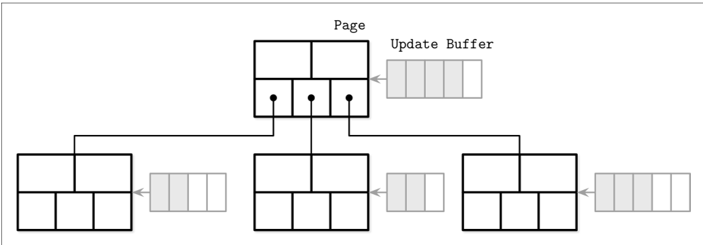

> 图 6-2：WiredTiger 高层概览。

读取时会访问更新缓冲区： 其中的内容会与磁盘原始页面的内容合并， 以返回最新数据。
flush 页面时， 更新缓冲区的内容会与页面内容进行 reconciliation，
然后持久化到磁盘并覆盖原页面。 如果 reconciliation 后的页面超过最大尺寸，
它会被拆分成多个页面。 更新缓冲区使用跳表实现； 跳表的复杂度与搜索树相近
[PAPADAKIS93]， 但具有更好的并发特性 [PUGH90a]。

图 6-3 展示了 WiredTiger 的干净页面和脏页面都有内存版本，
并引用磁盘上的基础映像。 除此之外， 脏页面还有更新缓冲区。

这里的主要优点是， 页面更新和结构修改（拆分与合并）由后台线程执行，
读写进程不必等待这些操作完成。

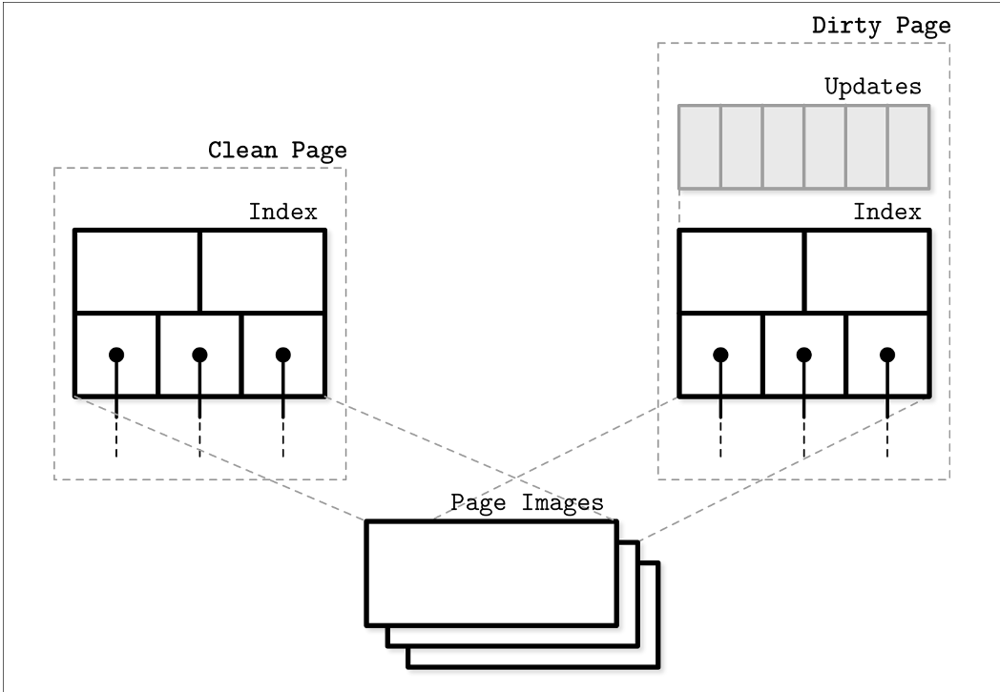

> 图 6-3：WiredTiger 页面。

### Lazy-Adaptive Tree

除了缓冲针对单个节点的更新， 还可以把节点组合成子树，
并为每棵子树附加一个更新缓冲区， 以批量处理操作。 此时，
更新缓冲区会跟踪针对子树顶层节点及其后代执行的所有操作。 这种算法称为
Lazy-Adaptive Tree（LA-Tree）[AGRAWAL09]。

插入数据记录时， 新条目首先加入根节点的更新缓冲区。 该缓冲区变满后，
通过复制变更并将其传播到较低树层的缓冲区来清空。 如果较低层也变满，
这项操作可以递归继续， 直至最终到达叶节点。

图 6-4 展示了一棵 LA-Tree， 其中按相应子树分组的节点具有级联缓冲区。
灰色方框表示从根缓冲区传播下来的变更。

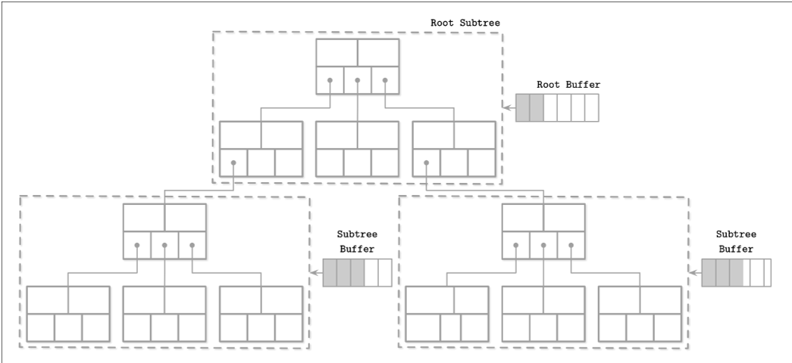

> 图 6-4：LA-Tree。

缓冲区之间存在层次依赖， 并且呈*级联*关系：
所有更新都从较高层缓冲区传播到较低层缓冲区。 更新到达叶层后， 批量的插入、
更新和删除操作会在那里执行， 一次性把所有变更应用到树的内容及结构上。
与其分别在多个时刻更新页面， 不如一次完成页面更新；
这需要的磁盘访问和结构变更更少， 因为拆分和合并也会成批传播到较高层。

这里介绍的缓冲方法都通过批量处理写操作来优化树的更新时间， 但具体方式略有不同。
两种算法都需要在内存缓冲结构中执行额外查找，
并将其中的内容与陈旧的磁盘数据合并或进行 reconciliation。

## FD-Tree

缓冲是数据库存储中广泛使用的思想之一： 它有助于避免大量小型随机写，
改为执行一次较大的写操作。 在 HDD 上， 随机写很慢， 因为磁头需要定位。 SSD
虽然没有活动部件， 但额外的写入 I/O 会带来额外的垃圾回收开销。

维护 B-Tree 需要大量随机写， 包括叶层写入， 以及向父节点传播的拆分和合并；
然而， 如果能彻底避免随机写和节点更新， 情况会怎样？

到目前为止， 我们讨论的是通过创建辅助缓冲区， 缓冲针对单个节点或一组节点的更新。
另一种方法是采用 append-only 存储和合并过程， 把针对*不同节点*的更新组合起来；
这个思想也启发了 LSM Tree（参见[LSM Tree](#lsm-tree)）。
这意味着任何写操作都不需要定位目标节点： 所有更新都只需追加。
利用这种方法建立索引的一个例子称为 Flash Disk Tree（FD-Tree）[LI10]。

FD-Tree 由一棵小型可变 head tree 和多个不可变的 sorted run 构成。
这种方法把需要随机写 I/O 的范围限制在 head tree： 这是一棵用于缓冲更新的小型
B-Tree。 head tree 一旦填满， 其内容就会转移到不可变 run。 如果新写入的 run
大小超过阈值， 其内容就会与下一层合并， 从而逐步把数据记录从较高层传播到较低层。

### 分数级联

为了维护层间指针， FD-Tree 使用一种称为_分数级联_（fractional cascading）的技术
[CHAZELLE86]。 这种方法有助于降低在一系列有序数组中定位项目的成本：
在第一个数组中查找目标项目需要执行 $\log n$ 步， 但后续查找便宜得多，
因为它们会从上一层最接近的匹配项处开始搜索。

为了最大限度缩小_间隙_， 即没有来自较高层指针的元素组，
相邻层数组之间会建立称为*桥*的捷径。 如果较低层的元素尚未存在于较高层，
就把它们*上拉*到较高层， 并指向被上拉元素在较低层数组中的位置， 由此建立桥。

由于 [CHAZELLE86] 解决的是计算几何中的搜索问题， 它描述了双向桥，
以及一种恢复间隙大小不变量的算法； 这里不讨论这些内容。
我们只介绍适用于数据库存储， 尤其是适用于 FD-Tree 的部分。

可以把较高层数组中的每个元素映射到下一层最接近的元素，
但这会给指针及其维护带来太大开销。 如果只映射已经存在于较高层的项目，
又可能出现元素间隙过大的情况。 为了解决这个问题， 我们把较低层数组中每第 $N$
个项目上拉到较高层。

例如， 假设有多个有序数组：

$$
\begin{array}{rl}
& \mathrm{A1}=[12,24,32,34,39] \\
& \mathrm{A2}=[22,25,28,30,35] \\
& \mathrm{A3}=[11,16,24,26,30]
\end{array}
$$

为了简化搜索， 可以把索引较大的数组中每隔一个元素上拉到索引较小的数组，
以便在元素间隙之间架桥：

$$
\begin{array}{rl}
\mathrm{A1} &= [12,24,25,30,32,34,39] \\
\mathrm{A2} &= [16,22,25,26,28,30,35] \\
\mathrm{A3} &= [11,16,24,26,30]
\end{array}
$$

现在可以利用这些上拉的元素建立_桥_（FD-Tree 论文称之为 *fence*）：
从较高层元素指向较低层对应元素的指针， 如图 6-5 所示。

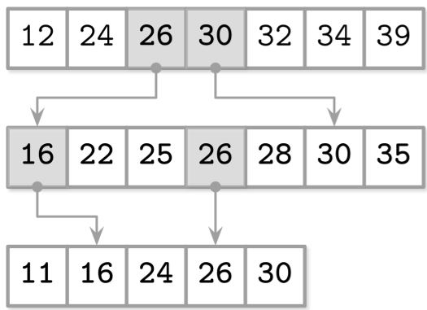

> 图 6-5：分数级联。

为了在*所有*这些数组中查找元素， 我们在最高层执行二分查找；
由于现在可以沿桥转到目标项目的大致位置， 下一层的搜索空间会显著缩小。
这样就能连接多个 sorted run， 降低在其中搜索的成本。

### 对数级 run

FD-Tree 把分数级联与创建大小呈对数增长的 sorted run 结合起来：
这些不可变有序数组的大小按系数 $k$ 增长， 通过把上一层与当前层合并而创建。

head tree 填满时， 会创建最高层的 run： 其叶节点内容写入第一层。 head tree
再次填满后， 其中的内容会与第一层的项目合并。 合并结果取代第一层 run 的旧版本。
较高层 run 的大小达到阈值时， 就会创建较低层 run。 如果较低层 run 已存在，
则由其内容与较高层内容的合并结果取代它。 这个过程与 LSM Tree 中的压实很相似；
压实会合并不可变表的内容， 以创建更大的表。

图 6-6 是 FD-Tree 的示意图， 顶部是一棵 head B-Tree， 下面有两个对数级 run L1 和
L2， 各层之间建有桥。

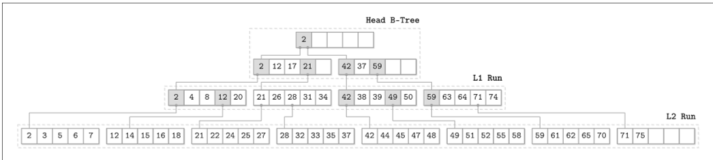

> 图 6-6：FD-Tree 示意概览。

为了让所有 sorted run 中的项目都可寻址， FD-Tree 使用一种经过调整的分数级联：
较低层页面的头部元素以指针形式传播到较高层。 借助这些指针，
在较低层树中搜索的成本会下降， 因为较高层已经完成了部分搜索，
可以从最接近的匹配项继续。

FD-Tree 不会原地更新页面， 而且同一个键的数据记录可能存在于多层； 因此， FD-Tree
通过插入墓碑来实现删除（FD-Tree 论文称其为 *filter entry*）。
墓碑表示与对应键关联的数据记录已标记为删除，
而较低层中该键的所有数据记录都必须丢弃。 当墓碑一路传播到最底层后， 便可以丢弃，
因为此时可以保证不存在任何还能被它遮蔽的项目。

## Bw-Tree

写放大是 B-Tree 原地更新实现中最显著的问题之一： 对 B-Tree 页面连续执行更新时，
每次都可能需要更新驻留磁盘的页面副本。 第二个问题是空间放大：
我们会预留额外空间， 以便执行更新。
这也意味着每传输一个承载所请求数据的有效字节，
还必须传输一些空字节以及页面的其余部分。 第三个问题是解决并发问题和处理 latch
的复杂性。

要同时解决这三个问题， 必须采取一种与前述方法截然不同的方案。
缓冲更新有助于缓解写放大和空间放大， 但无法解决并发问题。

可以利用 append-only 存储批量处理针对不同节点的更新， 把节点连接成链，
再使用一种内存数据结构， 以单次 compare-and-swap 操作安装节点间的指针，
从而使树无锁。 这种方法称为 *Buzzword-Tree*（Bw-Tree）[LEVANDOSKI14]。

### 更新链

Bw-Tree 将基础节点与其修改分开写入。 修改（delta 节点）会形成一条链：
这是一个从最新修改经过较旧修改， 最后到达基础节点的链表。
每次更新都可以单独存储， 无需重写磁盘上的现有节点。 delta 节点可以表示插入、
更新（它与插入没有区别）或删除。

基础节点和 delta 节点的大小不太可能与页面对齐， 因此适合把它们连续存储；
而且更新期间不会修改基础节点或 delta
节点（所有修改都只是在现有链表前添加一个节点）， 所以不需要预留任何额外空间。

把节点视为逻辑实体而非物理实体， 是一种有趣的范式转变： 我们不需要预分配空间，
不要求节点大小固定， 甚至不必把节点保存在连续内存段中。 这当然也有缺点：
读取时必须遍历所有 delta， 并将它们应用到基础节点， 才能重建节点的实际状态。
这与 LA-Tree 的做法有些相似（参见 [Lazy-Adaptive Tree](#lazy-adaptive-tree)）：
把更新与主结构分开保存， 并在读取时重放。

### 用 compare-and-swap 驯服并发

维护一种可以向子节点前端添加项目的磁盘树结构， 成本会很高：
这要求我们不断更新父节点中指向最新 delta 的指针。 因此， 由 delta
链和基础节点组成的 Bw-Tree 节点具有逻辑标识符，
并使用一张从标识符到磁盘位置的内存映射表。 这种映射还有助于摆脱 latch： Bw-Tree
写入时不取得独占所有权， 而是对映射表中的物理偏移执行 compare-and-swap 操作。

图 6-7 展示了一棵简单的 Bw-Tree。 每个逻辑节点都由一个基础节点和多个相连的 delta
节点组成。

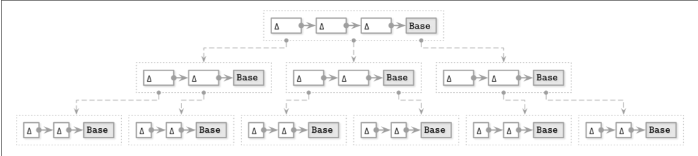

> 图
> 6-7：Bw-Tree。虚线表示节点之间通过映射表解析的虚拟链接。实线表示节点之间实际的数据指针。

要更新 Bw-Tree 节点， 算法会执行以下步骤：

1. 从根到叶遍历树， 找到目标逻辑叶节点。
   映射表包含指向目标基础节点或更新链中最新 delta 节点的虚拟链接。
2. 创建一个新的 delta 节点， 使其指向第 1 步找到的基础节点（或最新 delta
   节点）。
3. 更新映射表， 使其指向第 2 步创建的新 delta 节点。

第 3 步中的更新操作可以用原子的 compare-and-swap 完成，
因此所有与指针更新并发的读取都会被排在写操作之前或之后，
而读取者和写入者都不会被阻塞。 排在写操作之前的读取会沿旧指针访问，
看不到尚未安装的新 delta 节点。 排在写操作之后的读取会沿新指针访问，
并观察到更新。 如果两个线程试图给同一个逻辑节点安装新 delta 节点，
只有一个能够成功， 另一个必须重试。

### 结构修改操作

Bw-Tree 的逻辑结构与 B-Tree 相同， 这意味着节点仍可能增长得过大（overflow），
或收缩到几乎为空（underflow）， 因而需要执行拆分和合并等结构修改操作（structure
modification operation，SMO）。 这里拆分和合并的语义与 B-Tree 类似（参见“B-Tree
Node Splits”和“B-Tree Node Merges”）， 但实现不同。

拆分 SMO 首先 consolidation 待拆分节点的逻辑内容， 把 delta 应用到其基础节点，
并创建一个包含拆分点右侧元素的新页面。 之后， 过程分两步进行 [WANG18]：

1. **拆分。** 向待拆分节点追加一个特殊的 split delta 节点，
   通知读取者拆分正在进行。 split delta 节点保存中点分隔键，
   用于使待拆分节点中的记录失效， 同时保存指向新逻辑兄弟节点的链接。
2. **更新父节点。** 此时的情况与 $B^{\text{link}}$-Tree
   的半拆分相似（参见“Blink-Trees”）： 通过 split delta
   节点指针已经可以访问新节点， 但父节点尚未引用它； 读取者必须经过旧节点，
   再沿兄弟指针访问新创建的兄弟节点。 把新节点作为子节点添加到父节点后，
   读取者就能直接访问它， 无需经待拆分节点重定向， 至此拆分完成。

更新父指针是一项性能优化： 即使父指针永远不更新， 所有节点及其元素仍然可访问。
Bw-Tree 不使用 latch， 因此任何线程都可能遇到未完成的 SMO。 该线程必须参与协作，
接手并完成多步 SMO， 然后才能继续。 下一个线程会沿已安装的父指针访问，
不必经过兄弟指针。

合并 SMO 的工作方式类似：

1. **移除兄弟节点。** 创建一个特殊的 remove delta 节点并追加到右兄弟节点，
   表明合并 SMO 已开始， 并将右兄弟节点标记为删除。
2. **合并。** 在左兄弟节点上创建 merge delta 节点， 指向右兄弟节点的内容，
   使其在逻辑上成为左兄弟节点的一部分。
3. **更新父节点。** 此时可以从左兄弟节点访问右兄弟节点的内容。 要完成合并过程，
   必须从父节点移除指向右兄弟节点的链接。

并发 SMO 需要在父节点上额外安装一个 *abort delta* 节点， 以防止并发拆分和合并
[WANG18]。 abort delta 的工作方式与写锁相似：
同一时刻只能有一个线程拥有写访问权， 任何试图向这个 delta
节点追加新记录的线程都会中止。 SMO 完成后， 可以从父节点移除 abort delta。

Bw-Tree 的高度会在根节点拆分时增长。 根节点变得过大时， 会一分为二，
并在旧根的位置创建一个新根， 将旧根和新创建的兄弟节点作为其子节点。

### Consolidation 与垃圾回收

如果不采取额外措施， delta 链可以无限增长。 随着 delta 链增长，
读取的成本也越来越高， 因此需要尽量把 delta 链长度保持在合理范围内。
当它达到可配置的阈值时， 我们会把基础节点内容与所有 delta 合并， 将它们
consolidation 成一个新的基础节点， 从而重建节点。
随后把新节点写入磁盘上的新位置， 并更新映射表中的节点指针， 使其指向新节点。
我们会在 [LLAMA 与审慎分层](#llama-与审慎分层)中更详细地讨论这一过程，
因为底层日志结构存储负责垃圾回收、 节点 consolidation 和重定位。

节点一经 consolidation， 其旧内容（基础节点和所有 delta
节点）便不再由映射表寻址。 不过， 不能立刻释放它们占用的内存，
因为正在进行的操作可能仍在使用其中一些内容。 读取者不持有
latch（读取者访问节点时不必经过或登记到任何形式的屏障），
因此需要通过其他方式跟踪活跃页面。

为了区分可能遇到过特定节点的线程与绝无可能见过它的线程， Bw-Tree
使用一种称为_基于 epoch 的回收_（epoch-based reclamation）技术。 如果某些节点和
delta 因为在某个 epoch 中被 consolidation 产生的新节点替换， 从而从映射表移除，
那么原节点会一直保留， 直到同一 epoch 或更早 epoch 中启动的所有读取者都结束。
此后即可安全地对它们执行垃圾回收，
因为较晚启动的读取者在开始时已经无法寻址这些节点， 所以可以保证从未见过它们。

Bw-Tree 是一种有趣的 B-Tree 变体， 它改进了几个重要方面： 写放大、
非阻塞访问和缓存友好性。 实验性存储引擎 Sled 实现了一个修改版。 CMU Database
Group 开发了名为 OpenBw-Tree 的内存版 Bw-Tree， 并发布了一份实用实现指南
[WANG18]。

本章只粗略介绍了与 B-Tree 相关的高层 Bw-Tree 概念。 我们会在
[LLAMA 与审慎分层](#llama-与审慎分层)中继续讨论， 包括对底层日志结构存储的讨论。

## Cache-Oblivious B-Tree

块大小、 节点大小、 缓存行对齐和其他可配置参数都会影响 B-Tree 性能。 一类称为
*cache-oblivious 结构*的新数据结构 [DEMAINNE02]， 无论底层内存层次结构如何，
也无须调节这些参数， 都能提供渐近最优的性能。 这意味着算法不需要知道缓存行、
文件系统块和磁盘页面的大小。 cache-oblivious 结构经过专门设计，
无需修改即可在多台配置不同的机器上良好运行。

到目前为止， 我们主要从两级内存层次结构的角度考察
B-Tree（[写时复制](#写时复制)中介绍的 LMDB 除外）。 B-Tree
节点存储在驻留磁盘的页面中， 而页面缓存让主内存能够高效访问这些节点。

这一层次结构的两个层级分别是_页面缓存_（速度更快，
但空间有限）和_磁盘_（通常较慢， 但容量更大）[AGGARWAL88]。 这里只有两个参数，
所以设计算法相当容易， 因为只需要两个针对相应层级的代码模块，
分别处理与该层级有关的所有细节。

磁盘被划分成块， 数据以块为单位在磁盘与缓存之间传输：
即使算法只需定位块内的单个项目， 也必须加载整个块。 这种方法是 *cache-aware*
的。

开发性能关键型软件时， 我们通常会面向更复杂的模型编程， 考虑 CPU 缓存，
有时甚至考虑磁盘层次结构（例如冷热存储， 或者构建 HDD/SSD/NVM 层次结构，
并让数据从一个层级逐步转移到另一个层级）。 大多数情况下， 这类工作很难通用化。
我们在“Memory- Versus Disk-Based DBMS”中谈过，
访问磁盘比访问主内存慢几个数量级， 这促使数据库实现者针对这种差异进行优化。

cache-oblivious 算法让我们可以用两级内存模型来推理数据结构，
同时获得多级层次模型的好处。 这种方法不需要平台特定的参数，
但仍能保证两个层级之间的传输次数处于常数因子范围内。 如果一个数据结构经过优化，
能在内存层次结构的任意两个层级间达到最优表现，
那么它在两个*相邻*层级间也能达到最优表现。
实现这一点的方法是尽可能在最高缓存层级工作。

### van Emde Boas 布局

cache-oblivious B-Tree 由一棵静态 B-Tree 和一个 packed array 结构组成
[BENDER05]。 静态 B-Tree 使用 *van Emde Boas* 布局构建。 它在边的中间层拆分树，
然后以类似方式递归拆分每棵子树， 最终得到大小为 $\sqrt{N}$ 的子树。
这种布局的核心思想是， 任何递归树都存储在一块连续内存中。

图 6-8 展示了一个 van Emde Boas 布局示例。 逻辑上归为一组的节点彼此相邻放置。
上半部分是逻辑布局表示， 即节点如何形成一棵树；
下半部分则展示树节点如何布局在内存和磁盘中。

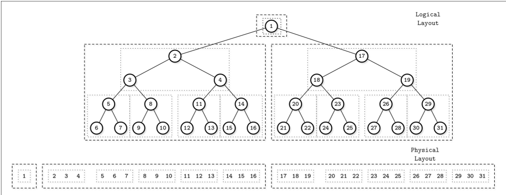

> 图 6-8：van Emde Boas 布局。

为了让数据结构动态化， 即允许插入、 更新和删除， cache-oblivious tree 使用
*packed array* 数据结构。 这种结构用连续内存段存储元素，
但会为以后插入的元素预留间隙。 间隙根据*密度阈值*分布。 图 6-9 展示了一个 packed
array 结构， 其中元素分散放置以留出间隙。

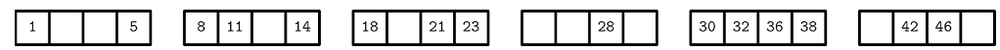

> 图 6-9：packed array。

这种方法能减少向树中插入项目时所需的重定位。 只有在不存在可用间隙时，
才需要重定位项目， 为新插入的元素腾出间隙。 当 packed array 变得过密或过疏时，
必须重建结构， 以扩大或缩小数组。

静态树作为底层 packed array 的索引， 并且必须随元素重定位而更新，
以正确指向底层元素。

这是一种有趣的方法， 其中的思想可用于构建高效的 B-Tree 实现。
它允许以非常接近主内存结构的方式构建磁盘结构。 不过截至本书写作时，
我还不知道任何非学术性的 cache-oblivious B-Tree 实现。

一个可能的原因是， 即使缓存加载已被抽象掉， 只要数据仍按块加载和写回，
分页和淘汰就仍会对结果产生负面影响。 另一个可能的原因是， 就块传输而言，
cache-oblivious B-Tree 与 cache-aware 对应实现的复杂度相同。
随着更高效的非易失性字节可寻址存储设备得到更广泛的应用， 这种情况可能会改变。

## 小结

原始 B-Tree 设计存在几个缺点； 这些设计或许很适合旋转磁盘， 但用在 SSD
上时效率较低。 B-Tree 具有很高的_写放大_（由页面重写造成）和很高的_空间开销_，
因为必须在节点中为未来的写入预留空间。

使用*缓冲*可以降低写放大。 WiredTiger 和 LA-Tree 等惰性 B-Tree
会给单个节点或节点组附加内存缓冲区， 在内存中缓冲对页面的连续更新，
从而减少所需的 I/O 操作数量。

为了降低空间放大， FD-Tree 使用_不可变性_： 数据记录存储在不可变的 sorted run
中， 而可变 B-Tree 的大小受到限制。

Bw-Tree 也利用不可变性解决空间放大。 B-Tree
节点及其更新分别存储在磁盘上的不同位置， 并持久化到日志结构存储中。 与原始
B-Tree 设计相比， 它的写放大有所降低， 因为属于同一个逻辑节点的内容很少需要进行
reconciliation。 逻辑节点间的虚拟指针存储在内存中， 所以 Bw-Tree 不需要用 latch
保护页面免受并发访问。

## 延伸阅读

如果想进一步了解本章提到的概念， 可以参考以下资料：

### Copy-on-Write B-Trees

Driscoll, J. R., N. Sarnak, D. D. Sleator, and R. E. Tarjan. 1986. "Making data
structures persistent." In Proceedings of the eighteenth annual ACM symposium on
Theory of computing (STOC '86), 109-121. https:
//dx.doi.org/10.1016/0022-0000(89)90034-2.

### Lazy-Adaptive Trees

Agrawal, Devesh, Deepak Ganesan, Ramesh Sitaraman, Yanlei Diao, and Shashi
Singh. 2009. "Lazy-Adaptive Tree: an optimized index structure for flash
devices." Proceedings of the VLDB Endowment 2, no. 1 (January): 361-372.
https://doi.org/10.14778/1687627.1687669.

### FD-Trees

Li, Yinan, Bingsheng He, Robin Jun Yang, Qiong Luo, and Ke Yi. 2010. "Tree
Indexing on Solid State Drives." Proceedings of the VLDB Endowment 3, no. 1-2
(September): 1195-1206. https://doi.org/10.14778/1920841.1920990.

### Bw-Trees

Wang, Ziqi, Andrew Pavlo, Hyeontaek Lim, Viktor Leis, Huanchen Zhang, Michael
Kaminsky, and David G. Andersen. 2018. "Building a Bw-Tree Takes More Than Just
Buzz Words." Proceedings of the 2018 International Conference on Management of
Data (SIGMOD '18), 473-488. https://doi.org/10.1145/3183713.3196895

Levandoski, Justin J., David B. Lomet, and Sudipta Sengupta. 2013. "The Bw-Tree:
A B-tree for new hardware platforms." In Proceedings of the 2013 IEEE
International Conference on Data Engineering (ICDE '13), 302-313. IEEE. https:
//doi.org/10.1109/ICDE.2013.6544834.

### Cache-Oblivious B-Trees

Bender, Michael A., Erik D. Demaine, and Martin Farach-Colton. 2005.
"Cache-Oblivious B-Trees." SIAM Journal on Computing 35, no. 2 (August):
341-358. https://doi.org/10.1137/S0097539701389956.

[^6-1]: 要进一步了解 LMDB，参见代码注释和相关演讲。

[^6-2]: 这并不是一个广为认可的名称；不过，本书讨论的这些 B-Tree
    变体共有一个特性，即把 B-Tree
    更新缓冲在中间结构中，而不是直接应用到树上。因此我们使用“惰性”一词，它相当准确地描述了这一特性。

<a id="chapter-7-log-structured-storage"></a>

# 第 7 章 日志结构存储

> 会计不用橡皮擦， 否则最终会进监狱。
>
> ——Pat Helland

会计需要修改记录时， 不会擦除已有数值， 而是创建一条包含更正内容的新记录。
季度报告发布时， 其中可能会有一些小修改， 用于更正上一季度的结果。
为了得出最终结果， 必须逐条检查记录并计算小计 [HELLAND15]。

类似地， 不可变存储结构不允许修改现有文件： 表只写入一次， 之后绝不修改。
新记录会追加到新文件中； 为了找出最终值（或断定它不存在），
必须根据多个文件重建记录。 相比之下， 可变存储结构会原地修改磁盘记录。

不可变数据结构常用于函数式编程语言， 而且因其安全特性越来越受欢迎：
不可变结构创建后不会变化， 所有对它的引用都可以并发访问，
它无法修改这一事实保证了其完整性。

从高层看， 存储结构内部和外部处理数据的方式有严格区别。 在内部，
不可变文件可以保存多个副本， 较新的副本覆盖较旧的副本；
可变文件通常只保存最新值。 访问不可变文件时， 系统会处理这些文件，
对冗余副本进行 reconciliation， 并把最新副本返回给客户端。

与这一主题的其他书籍和论文一样， 我们用 B-Tree 作为可变结构的典型示例， 用
Log-Structured Merge Tree（LSM Tree）作为不可变结构的示例。 不可变 LSM Tree 使用
append-only 存储和 merge reconciliation， 而 B-Tree 会在磁盘上定位数据记录，
并在文件的原始偏移处更新页面。

原地更新存储结构针对读取性能进行了优化 [GRAEFE04]： 在磁盘上找到数据后，
即可把记录返回给客户端。 代价是写入性能： 要原地更新数据记录，
必须先在磁盘上找到它。 另一方面， append-only 存储针对写入性能进行了优化。
写操作不必在磁盘上定位记录并覆盖它。 不过，
代价是读取时必须取得数据记录的多个版本并进行 reconciliation。

到目前为止， 我们讨论的主要是可变存储结构。 在讨论写时复制 B-Tree、 FD-Tree 和
Bw-Tree 时， 已经涉及不可变性， 但实现不可变结构还有更多方式。

由于可变 B-Tree 的结构和构建方式， 读取、 写入和维护期间的大多数 I/O
操作都是随机的。 每次写操作都必须先找到包含数据记录的页面， 然后才能修改。
B-Tree 需要拆分和合并节点， 从而重定位已经写入的记录。 一段时间后， B-Tree
页面可能需要维护。 页面大小固定， 并为未来写入预留了一些可用空间。
另一个问题是， 即使只修改页面中的一个 cell， 也必须重写整个页面。

还有其他方法可以缓解这些问题， 让一部分 I/O 操作变成顺序操作，
并避免修改期间重写页面。 使用不可变结构就是其中一种方法。 本章将重点介绍 LSM
Tree： 它如何构建、 具有什么属性， 以及与 B-Tree 有何不同。

## LSM Tree

讨论 B-Tree 时， 我们得出结论， 可以用缓冲改善空间开销和写放大。 一般来说，
缓冲可以通过两种方式应用到不同的存储结构中：
一是推迟把写入传播到驻留磁盘的页面（如 FD-Tree 和 WiredTiger），
二是让写操作顺序化。

LSM Tree 是最流行的不可变磁盘存储结构之一， 它利用缓冲和 append-only
存储实现顺序写。 LSM Tree 是一种类似 B-Tree 的磁盘结构变体， 节点完全填满，
并针对顺序磁盘访问进行了优化。 Patrick O'Neil 和 Edward Cheng
的论文首次提出了这一概念 [ONEIL96]。 Log-Structured Merge Tree
得名于日志结构文件系统； 这种文件系统把所有修改写入磁盘上形似日志的文件
[ROSENBLUM92]。

> [!NOTE]
> LSM Tree 会写入不可变文件， 并随时间推移将它们合并。
> 这些文件通常各自包含索引， 以帮助读取者高效定位数据。 尽管 LSM Tree
> 经常被描述为 B-Tree 的替代方案， 但也常常用 B-Tree 作为 LSM Tree
> 不可变文件内部的索引结构。

LSM Tree 名称中的“merge”表示： 由于树不可变， 其内容使用类似 merge sort
的方法合并。 维护期间会进行合并， 以回收冗余副本占用的空间；
读取期间也会在向用户返回内容前进行合并。

LSM Tree 会延迟数据文件写入， 把变更缓冲在驻留内存的表中。
随后通过把这些内容写入不可变磁盘文件来传播变更。 在文件完全持久化之前，
所有数据记录始终可以从内存访问。

保持数据文件不可变有利于顺序写： 数据单趟写入磁盘， 文件采用 append-only 方式。
可变结构可以单趟预分配块（例如 indexed sequential access method（ISAM）
[RAMAKRISHNAN03] [LARSON81]）， 但后续访问仍需要随机读写。
不可变结构让数据记录可以顺序布局， 从而避免碎片。 此外，
不可变文件的*密度*更高： 无需为以后写入的数据记录预留额外空间，
也无需预留空间应对更新后的记录比原记录更大的情况。

由于文件不可变， 插入、 更新和删除操作都不需要在磁盘上定位数据记录，
这会显著改善写入性能和吞吐量。 系统允许存在重复内容， 并在读取时解决冲突。
对于写操作远多于读操作的应用， LSM Tree 尤其有用；
随着数据量和摄取速率持续增长， 现代数据密集型系统经常属于这种情况。

读写操作在设计上互不相交， 因此无需锁定 segment 即可读写磁盘数据，
这显著简化了并发访问。 相比之下， 可变结构使用分层锁和 latch
来保证磁盘数据结构的完整性； 它们允许多个并发读取者， 但要求写入者独占子树。
基于 LSM 的存储引擎使用数据和索引文件的可线性化内存视图，
只需保护管理这些视图的结构免受并发访问。

B-Tree 和 LSM Tree 都需要一些维护工作来优化性能， 但原因不同。
由于已分配文件的数量稳步增长， LSM Tree 必须合并并重写文件，
确保读取时访问尽可能少的文件， 因为所请求的数据记录可能散布在多个文件中。
另一方面， 可变文件可能需要部分或全部重写，
以减少碎片并回收已更新或删除记录占用的空间。 当然，
维护过程的确切工作范围在很大程度上取决于具体实现。

## LSM Tree 结构

我们先介绍有序 LSM Tree [ONEIL96]， 其中的文件保存有序数据记录。
稍后在[无序 LSM 存储](#无序-lsm-存储)中，
还会讨论允许按插入顺序存储数据记录的结构；
这种结构在写入路径上有一些显而易见的优点。

如前所述， LSM Tree 由较小的驻留内存组件和较大的驻留磁盘组件组成。
要把不可变文件的内容写入磁盘， 必须先在内存中缓冲并排序这些内容。

驻留内存组件（通常称为 *memtable*）是可变的： 它缓冲数据记录，
并作为读写操作的目标。 memtable 的大小增长到可配置阈值后，
其内容会持久化到磁盘。 更新 memtable 不会访问磁盘， 因此没有相关 I/O 成本。
为了保证数据记录的持久性， 需要一个独立的预写日志文件。
数据记录先追加到日志并提交到内存， 之后才向客户端确认操作。

缓冲在内存中完成： 所有读写操作都会应用到一张驻留内存的表上；
这张表维护一个允许并发访问的有序数据结构， 通常是某种内存有序树，
也可以是能提供类似性能特征的任何数据结构。

驻留磁盘组件通过把内存中缓冲的内容 *flush* 到磁盘来构建。
驻留磁盘组件只用于读取： 缓冲内容一经持久化， 文件便永不修改。
这样我们可以从几种简单操作来思考系统： 写入内存表， 读取磁盘表和内存表， 合并，
以及移除文件。

本章会用“表”作为“驻留磁盘表”的简称。 由于讨论的是存储引擎语义，
这里的术语不会与数据库管理系统这个更广泛语境中的“表”概念混淆。

### 双组件 LSM Tree

LSM Tree 可分为双组件和多组件两种。 双组件 LSM Tree 只有一个磁盘组件， 由不可变
segment 组成。 这里的磁盘组件组织成 B-Tree， 节点占用率为 100%， 页面只读。

驻留内存树的内容分批 flush 到磁盘。 flush 时， 针对每棵被 flush 的内存子树，
我们会在磁盘上找到对应子树， 把驻留内存 segment
与驻留磁盘子树合并后的内容写入磁盘上的新 segment。 图 7-1
展示了合并前的内存树和磁盘树。

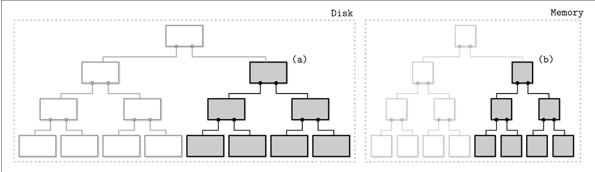

> 图 7-1：flush 前的双组件 LSM Tree。 灰色表示正在 flush 的驻留内存 segment
> 和驻留磁盘 segment。

子树 flush 后， 已被取代的驻留内存子树和驻留磁盘子树会被丢弃，
并由合并结果取代； 磁盘树原有部分可以寻址到这个结果。 图 7-2
展示了合并过程的结果： 它已经写到磁盘上的新位置， 并连接到树的其余部分。

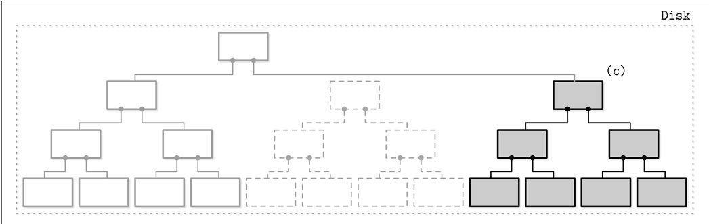

> 图 7-2：flush 后的双组件 LSM
> Tree。灰色表示合并后的内容。虚线框表示已丢弃的磁盘 segment。

合并可以这样实现：
让读取驻留磁盘叶节点的迭代器与读取内存树内容的迭代器同步前进。
由于两个来源都已排序， 要生成有序的合并结果，
每一步只需知道两个迭代器的*当前*值。

这种方法是对不可变 B-Tree 讨论的合理扩展与延续。 写时复制 B-Tree 使用 B-Tree
结构， 但节点没有完全填满， 而且需要复制根到叶路径上的页面并创建并行树结构。
这里的做法类似， 但由于写入先缓冲在内存中， 驻留磁盘树的更新成本得以摊销。

实现子树合并与 flush 时， 必须确保三件事：

1. flush 过程一开始， 所有新写入都必须进入新的 memtable。
2. flush 子树期间， 驻留磁盘子树和正在 flush 的驻留内存子树都必须可供读取。
3. flush 完成后， 发布合并内容以及丢弃未合并的驻留磁盘和驻留内存内容，
   必须以原子方式进行。

双组件 LSM Tree 虽可用于维护索引文件， 但截至本书写作时， 作者不知道有任何实现。
原因可能在于这种方法的写放大特征： 合并由 memtable flush 触发， 所以相当频繁。

### 多组件 LSM Tree

下面考虑另一种设计： 多组件 LSM Tree 拥有不止一张驻留磁盘表。 在这种情况下，
memtable 的全部内容会在单趟操作中 flush。

显而易见， 多次 flush 后会产生多张驻留磁盘表， 而且其数量会随时间不断增长。
由于并不总能确切知道哪些表保存了所需数据记录，
可能必须访问多个文件才能定位目标数据。

从多个来源而非单一来源读取可能代价高昂。 为了缓解这个问题并尽量减少表的数量，
系统会定期触发称为*压实*的合并过程（参见 [LSM Tree 的维护](#lsm-tree-的维护)）。
压实选取若干张表， 读取并合并其内容， 然后把合并结果写入一个新的组合文件。
新合并表出现时， 旧表会同时被丢弃。

图 7-3 展示了多组件 LSM Tree 的数据生命周期。 数据首先缓冲在驻留内存组件中。
组件过大时， 其内容 flush 到磁盘， 形成驻留磁盘表。 随后多张表合并，
形成更大的表。

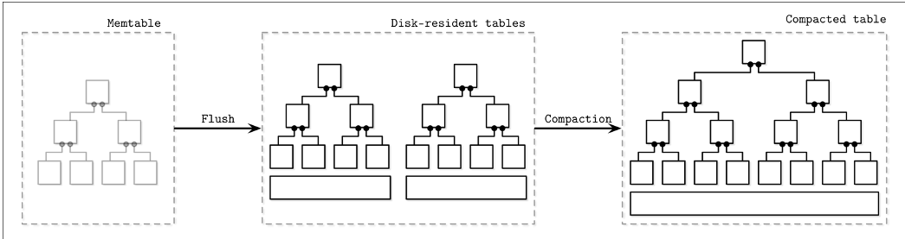

> 图 7-3：多组件 LSM Tree 的数据生命周期。

本章余下部分将介绍多组件 LSM Tree、 其构建块及其维护过程。

### 内存表

memtable flush 可以定期触发， 也可以使用大小阈值触发。 memtable 在 flush
前必须切换： 分配一个新的 memtable， 让它成为所有新写入的目标， 而旧 memtable
转入 flushing 状态。 这两个步骤必须以原子方式执行。 正在 flush 的 memtable
会继续供读取， 直至其内容完全 flush。 随后丢弃旧 memtable，
代之以新写入的驻留磁盘表； 该表此时开始供读取。

图 7-4 展示了 LSM Tree 的组件、 组件间关系以及完成状态转换的操作：

**当前 memtable**

接收写入并提供读取。

**正在 flush 的 memtable**

可供读取。

**磁盘 flush 目标**

内容尚不完整， 不参与读取。

**已 flush 的表**

正在 flush 的 memtable 一经丢弃， 已 flush 的表便可供读取。

**正在压实的表**

当前正在合并的驻留磁盘表。

**已压实的表**

由已 flush 的表或其他已压实表创建。

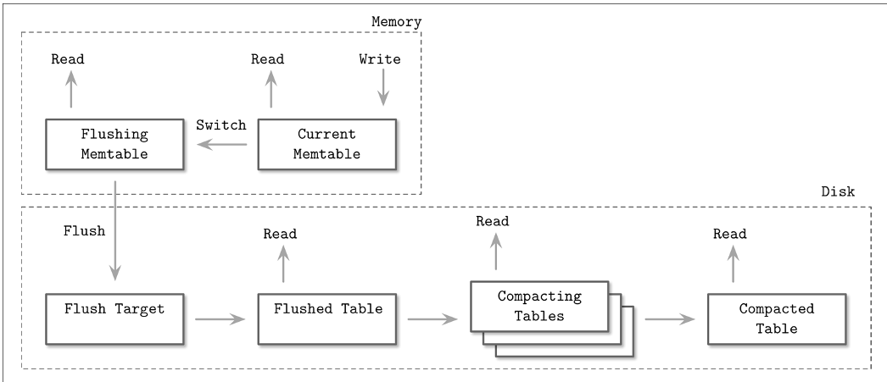

> 图 7-4：LSM 组件结构。

数据在内存中已经排好序，
因此可以通过把驻留内存内容顺序写入磁盘来创建驻留磁盘表。 flush 期间， 正在 flush
的 memtable 和当前 memtable 都可供读取。

在 memtable 完全 flush 之前， 它的内容在磁盘上的唯一版本存储在预写日志中。
memtable 内容完全 flush 到磁盘后， 日志便可裁剪， 保存着已应用于该 memtable
的操作的日志片段可以丢弃。

### 更新与删除

在 LSM Tree 中， 插入、 更新和删除操作不需要在磁盘上定位数据记录。
冗余记录会在读取期间进行 reconciliation。

仅从 memtable 移除数据记录并不足够，
因为其他驻留磁盘表或驻留内存表可能保存着同一个键的数据记录。 如果删除只从
memtable 移除项目， 删除操作要么毫无效果， 要么会使旧值_复活_。

来看一个例子。 已 flush 的驻留磁盘表中有与键 `k1` 关联的数据记录 `v1`， memtable
则保存着它的新值 `v2`：

| 磁盘表 |      | memtable |      |
| ------ | ---- | -------- | ---- |
| `k1`   | `v1` | `k1`     | `v2` |

如果只从 memtable 中移除 `v2` 并执行 flush， 实际上会让 `v1` 复活，
因为它成了与该键关联的唯一值：

| 磁盘表 |      | memtable      |
| ------ | ---- | ------------- |
| `k1`   | `v1` | $\varnothing$ |

因此， 必须显式记录删除。 可以插入一个特殊的删除条目（有时称为 tombstone 或
dormant certificate）， 表示与特定键关联的数据记录已被移除：

| 磁盘表 |      | memtable |               |
| ------ | ---- | -------- | ------------- |
| `k1`   | `v1` | `k1`     | `<tombstone>` |

reconciliation 过程会识别 tombstone， 并过滤掉被其遮蔽的值。

有时需要删除一段连续的键， 而不只是单个键。 可以使用_谓词删除_：
追加一条包含谓词的删除条目， 该谓词按常规记录排序规则排序。 reconciliation
期间， 与谓词匹配的数据记录会被跳过， 不会返回给客户端。

谓词可以采用 `DELETE FROM table WHERE key >= "k2" AND key < "k4"` 这样的形式，
也可以接受任何范围匹配器。 Apache Cassandra 实现了这种方法， 并称其为 range
tombstone。 range tombstone 覆盖一段键范围， 而非单个键。

使用 range tombstone 时， 由于范围可能重叠， 并且存在驻留磁盘表边界，
必须仔细考虑解析规则。 例如， 下面的组合会从最终结果中隐藏与 `k2` 和 `k3`
关联的数据记录：

| 磁盘表 1 |      | 磁盘表 2 |                               |
| -------- | ---- | -------- | ----------------------------- |
| `k1`     | `v1` | `k2`     | `<start_tombstone_inclusive>` |
| `k2`     | `v2` | `k4`     | `<end_tombstone_exclusive>`   |
| `k3`     | `v3` |          |                               |

## LSM Tree 查找

LSM Tree 由多个组件构成。 查找期间通常会访问多个组件，
所以必须合并这些组件的内容并进行 reconciliation， 然后才能返回给客户端。
为了更好地理解合并过程， 下面看看合并期间如何迭代表，
以及如何组合相互冲突的记录。

### 合并迭代

驻留磁盘表的内容已经排序， 所以可以使用多路 merge sort 算法。 例如，
假设有三个来源： 两张驻留磁盘表和一张 memtable。 存储引擎通常提供 cursor 或
iterator， 用于遍历文件内容。 cursor 保存最后一个已消费数据记录的偏移，
可以检查迭代是否结束， 也可用来取得下一条数据记录。

多路 merge sort 使用_优先队列_， 例如_最小堆_ [SEDGEWICK11]； 队列最多保存 $N$
个元素（$N$ 是迭代器数量）， 对内容排序， 并准备好接下来要返回的最小元素。
每个迭代器的头部都放入队列。 队列头部的元素就是所有迭代器中的最小值。

> [!NOTE]
> 优先队列是一种维护有序项目队列的数据结构。
> 普通队列按加入顺序保留项目（先进先出）， 而优先队列会在插入时重新排序，
> 把优先级最高（或最低）的项目放在队首。 这对于合并迭代尤其有用，
> 因为必须按顺序输出元素。

从队列移除最小元素后， 会检查与之关联的迭代器是否还有下一个值； 如果有，
就把该值放入队列， 队列重新排序以维持顺序。

所有迭代器的内容都已排序，
因此从先前保存所有迭代器头部最小值的迭代器中重新插入一个值， 仍可维持不变量：
队列保存的依然是所有迭代器中的最小元素。 某个迭代器耗尽后， 算法继续执行，
但不再插入它的下一个头部。 算法一直运行， 直到查询条件得到满足，
或所有迭代器都耗尽。

图 7-5 示意了上述合并过程： 头部元素（源表中的浅灰色项目）放入优先队列，
优先队列中的元素返回给输出迭代器， 输出结果有序。

合并迭代时可能遇到同一个键的多条数据记录。 根据优先队列和迭代器的不变量可知：
如果每个迭代器对每个键只保存一条数据记录， 而队列中出现了同一个键的多条记录，
这些记录一定来自不同迭代器。

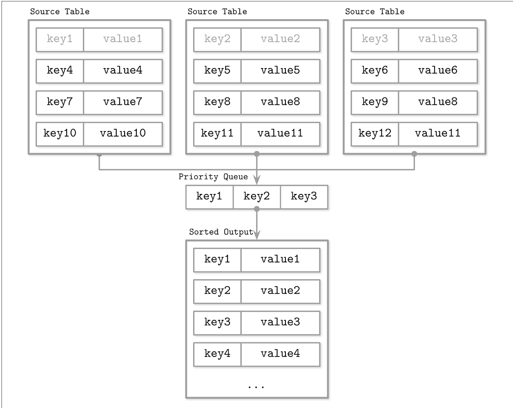

> 图 7-5：LSM 合并机制。

下面逐步考察一个示例。 输入数据是两张驻留磁盘表的迭代器：

```text
Iterator 1:                  Iterator 2:
{k2: v1} {k4: v2}           {k1: v3} {k2: v4} {k3: v5}
```

用迭代器头部填充优先队列：

```text
Iterator 1:      Iterator 2:                 Priority queue:
{k4: v2}         {k2: v4} {k3: v5}          {k1: v3} {k2: v1}
```

键 `k1` 是队列中的最小键， 将它追加到结果。 由于它来自 `Iterator 2`，
我们从该迭代器重新填充队列：

```text
Iterator 1:  Iterator 2:  Priority queue:       Merged Result:
{k4: v2}     {k3: v5}     {k2: v1} {k2: v4}   {k1: v3}
```

现在队列中有两条 `k2` 键的记录。 根据前述不变量，
可以确定任何迭代器中都没有该键的其他记录。 合并同键记录， 并追加到合并结果。

从两个迭代器重新向队列填充数据：

```text
Iterator 1:  Iterator 2:  Priority queue:       Merged Result:
{}           {}           {k3: v5} {k4: v2}    {k1: v3} {k2: v4}
```

所有迭代器现在都为空， 因此把队列余下内容追加到输出：

```text
Merged Result:
{k1: v3} {k2: v4} {k3: v5} {k4: v2}
```

总之， 要创建组合迭代器， 必须重复以下步骤：

1. 一开始用每个迭代器的第一个项目填充队列。
2. 从队列取出最小元素（头部）。
3. 除非相应迭代器已经耗尽， 否则从该迭代器重新填充队列。

从复杂度来看， 合并迭代器与合并有序集合相同。 其内存开销为 $O(N)$， 其中 $N$
是迭代器数量。 维护有序的迭代器头部集合需要 $O(\log N)$（平均情况）[KNUTH98]。

### Reconciliation

合并迭代只是合并多个来源的数据时要做的一个方面。
另一个重要方面是对同一个键关联的数据记录进行 reconciliation 和冲突解决。

不同表可能保存同一个键的数据记录， 例如更新和删除； 必须对其内容进行
reconciliation。 前述示例中的优先队列实现必须允许同一个键关联多个值， 并触发
reconciliation。

> [!NOTE]
> 如果记录不存在就插入数据库， 否则就更新现有记录， 这种操作称为 upsert。 在 LSM
> Tree 中， 插入和更新操作无法区分，
> 因为它们不会尝试在所有来源中找到此前与键关联的数据记录并重新赋值；
> 因此可以说， 默认情况下我们是在 upsert 记录。

要对数据记录进行 reconciliation， 必须了解其中哪一条优先。
数据记录保存着所需的元数据， 例如时间戳。 要确定来自多个来源的项目之间的顺序，
并找出哪一个更新， 可以比较它们的时间戳。

被时间戳更高的记录遮蔽的记录不会返回给客户端， 压实期间也不会写入。

## LSM Tree 的维护

与可变 B-Tree 类似， LSM Tree 需要维护。
这些过程的性质深受算法所维持不变量的影响。

在 B-Tree 中， 维护过程会收集未引用的 cell， 并对页面进行碎片整理，
以回收被移除和被遮蔽记录占用的空间。 在 LSM Tree 中， 驻留磁盘表的数量持续增长，
但可以触发定期压实来减少数量。

压实会选取多张驻留磁盘表， 使用前述合并和 reconciliation 算法迭代其全部内容，
并把结果写入新创建的表。

驻留磁盘表的内容已排序， 而且由于 merge sort 的工作方式，
压实的理论内存用量有上限， 因为内存中只需保存迭代器头部。
所有表内容都被顺序消费， 合并结果也顺序写出。
这些细节可能因实现的额外优化而有所不同。

正在压实的表会继续供读取， 直到压实过程完成； 这意味着在压实期间，
磁盘上必须有足够可用空间写入压实后的表。

系统在任意时刻都可以执行多个压实操作。 不过，
这些并发压实通常作用于互不相交的表集合。 压实写入者既可以把多张表合并成一张，
也可以把一张表分区成多张。

### Tombstone 与压实

Tombstone 是正确执行 reconciliation 所需的重要信息， 因为其他表可能仍保存着被
tombstone 遮蔽的过时数据记录。

压实时不会立刻丢弃 tombstone。
只有当存储引擎可以确定其他任何表中都不存在同一个键、 时间戳更低的数据记录时，
才会丢弃。 RocksDB 会一直保留 tombstone， 直到它到达最底层。 Apache Cassandra
由于数据库最终一致的性质， 会保留 tombstone 直到垃圾回收（GC）宽限期结束，
以确保其他节点观察到 tombstone。 压实期间保留 tombstone 对避免数据复活至关重要。

### 分层压实

压实提供了多种优化机会， 也存在许多不同的压实策略。
一种经常实现的策略称为_分层压实_（leveled compaction）。 例如， RocksDB
就使用这种策略。

分层压实把驻留磁盘表分成多个层级。 每一层的表都有目标大小，
每层还有对应的索引号（标识符）。 有些违反直觉的是， 索引最高的层称为最底层。
为清晰起见， 本节避免使用“较高层”和“较低层”， 而使用与层级索引相同的限定方式。
也就是说， 因为 2 大于 1， 第 2 层的索引高于第 1 层。
“上一层”和“下一层”也与层级索引采用相同的顺序语义。

第 0 层的表由 flush memtable 内容创建。 第 0 层各表的键范围可能重叠。 第 0
层的表数量一达到阈值， 就会合并其内容， 为第 1 层创建新表。

第 1 层及所有索引更高层级中的表， 键范围互不重叠； 因此压实期间必须对第 0
层表进行分区， 把它们拆分成多个范围， 再与保存相应键范围的表合并。
另一种做法是， 压实包含第 0 层和第 1 层的所有表， 并输出经过分区的第 1 层表。

索引较高层级上的压实会从连续两层中选取范围重叠的表，
并在索引更高的层级生成新表。 图 7-6 示意了压实过程如何在层级间迁移数据。 压实第
1 层和第 2 层表会在第 2 层生成新表。 根据表的分区方式，
可能从一层选取多张表参与压实。

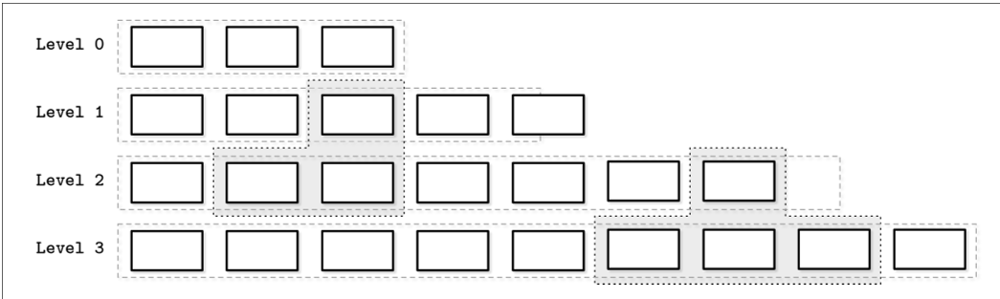

> 图
> 7-6：压实过程。带虚线的灰色方框表示当前正在压实的表。横跨整层的方框表示该层的目标数据大小限制。
> 第 1 层超出限制。

把不同键范围保存在不同表中， 可以减少读取时访问的表数量。
具体方法是检查表元数据， 过滤掉范围不包含目标键的表。

每一层都有表大小限制和最大表数量限制。 第 1 层或索引更高的任何一层，
其表数量一旦达到阈值， 就把*当前*层的表与*下一*层中保存重叠键范围的表合并。

各层之间的大小呈指数增长： 每个下一层的表都比上一层的表成指数级增大。
这样最新数据始终位于索引最低的层级， 而较旧数据逐步迁移到索引更高的层级。

### 大小分级压实

另一种流行的压实策略称为_大小分级压实_（size-tiered compaction）。
它不根据驻留磁盘表的层级分组， 而是按大小分组： 小表与小表放在一组，
大表与大表放在一组。

第 0 层保存最小的表； 这些表来自 memtable flush， 或由压实过程创建。 表压实后，
合并结果会写入保存相应大小表的层级。 过程递归继续： 增加层级，
压实并把较大表提升到更高层， 同时把较小表降到更低层。

> [!WARNING]
> 大小分级压实的一个问题称为_表饥饿_： 如果表压实后仍然足够小（例如记录被
> tombstone 遮蔽， 没有进入合并表）， 较高层可能无法得到压实， 其中的 tombstone
> 也不会被纳入考虑， 从而增加读取成本。 在这种情况下， 即使某层没有足够多的表，
> 也必须强制压实。

还有一些常见的压实策略， 可针对不同工作负载优化。 例如， Apache Cassandra
还实现了时间窗口压实策略； 它特别适合设置了 time-to-live（TTL）的时序工作负载，
换句话说， 项目必须在给定时间后过期。

时间窗口压实策略会考虑写入时间戳，
并允许直接丢弃保存已过期时间范围数据的整个文件， 无需压实并重写其内容。

### 读放大、写放大与空间放大

实现最优压实策略时， 必须考虑多个因素。 一种方法是回收重复记录占用的空间，
降低空间开销； 代价是持续重写表造成更高的写放大。 另一种方法是避免持续重写数据；
这会增加读放大（读取期间对同一个键关联的数据记录进行 reconciliation 的开销）
和空间放大（因为冗余记录会保留更长时间）。

> [!NOTE]
> 数据库社区的一大争论是 B-Tree 还是 LSM Tree 的写放大更低。
> 理解两者写放大的来源极其重要。 B-Tree 的写放大来自写回操作，
> 以及对同一个节点的后续更新。 LSM Tree
> 的写放大则来自压实期间把数据从一个文件迁移到另一个文件。
> 直接比较两者可能得出错误结论。

总之， 以不可变方式在磁盘上存储数据时， 会面临三个问题：

**读放大**

来自为取得数据而寻址多张表的需要。

**写放大**

由压实过程持续重写造成。

**空间放大**

来自存储与同一个键关联的多条记录。

本章余下部分将逐一处理这些问题。

### RUM 猜想

一种流行的存储结构成本模型考虑三个因素： 读取、 更新和内存开销。 它称为 RUM 猜想
[ATHANASSOULIS16]。

RUM 猜想指出， 减少其中两项开销必然导致第三项恶化，
优化只能以牺牲三个参数中的一个为代价。 可以从这三个参数比较不同存储引擎，
了解它们针对什么优化， 以及这可能带来哪些权衡。

理想方案会提供最低读取成本， 同时保持较低的内存与写入开销； 但现实中做不到，
只能作出权衡。

B-Tree 针对读取进行了优化。 写入 B-Tree 需要在磁盘上定位记录，
对同一个页面的连续写入可能多次更新磁盘页面。
为未来更新和删除预留的额外空间会增加空间开销。

LSM Tree 写入时不需要在磁盘上定位记录， 也不为未来写入预留额外空间。 不过，
存储冗余记录仍会产生一些空间开销。 在默认配置下， 读取成本更高，
因为必须访问多张表才能返回完整结果。 不过， 本章讨论的优化有助于缓解这个问题。

正如 B-Tree 各章已经展示， 本章也将继续展示， 应用不同优化可以改善这些特征。

这个成本模型并不完美， 因为它没有考虑延迟、 访问模式、 实现复杂度、
维护开销和硬件相关特性等其他重要指标。
它也没有考虑一致性的影响和复制开销等对分布式数据库很重要的高层概念。 不过，
这个模型可以用作初步近似和经验法则， 帮助理解存储引擎能提供什么。

## 实现细节

前面介绍了 LSM Tree 的基本动态： 数据如何读取、 写入和压实。 不过， 许多 LSM
Tree 实现还有一些共同点值得讨论： 驻留内存表和驻留磁盘表如何实现，
二级索引如何工作， 如何减少读取时访问的驻留磁盘表数量，
以及与日志结构存储有关的新思想。

### Sorted String Table

到目前为止， 我们讨论了 LSM Tree 的层次结构和逻辑结构，
即它由多个驻留内存组件和驻留磁盘组件构成， 但还没有讨论驻留磁盘表如何实现，
以及其设计如何与系统其余部分配合。

驻留磁盘表通常使用 Sorted String Table（SSTable）实现。 顾名思义， SSTable
中的数据记录按键排序和布局。 SSTable 通常由两个组件构成： 索引文件和数据文件。
索引文件用允许对数时间查找的结构（例如 B-Tree），
或常数时间查找的结构（例如哈希表）实现。

数据文件按键顺序保存记录， 因此用哈希表建立索引并不会妨碍实现范围扫描：
哈希表只用于定位范围中的第一个键， 随后只要范围谓词仍然匹配，
就可以顺序读取数据文件中的范围。

索引组件保存键和数据条目， 即实际数据记录在数据文件中的偏移。
数据组件由拼接起来的键值对组成。 第 3 章介绍的 cell 设计和数据记录格式大体适用于
SSTable。 主要区别是， cell 顺序写入， 在 SSTable 的整个生命周期中都不会修改。
索引文件保存指向数据文件中数据记录的指针，
所以创建索引时必须已经知道这些记录的偏移。

压实期间可以顺序读取数据文件， 无需寻址索引组件， 因为其中的数据记录已经有序。
压实期间合并的表顺序相同， 而合并迭代会维持顺序，
所以最终合并表也是通过单趟顺序写入数据记录而创建的。
文件完全写好后即视为不可变， 不再修改其驻留磁盘内容。

### SSTable 附属二级索引

LSM Tree 索引领域一个有趣的发展是 Apache Cassandra 实现的 SSTable-Attached
Secondary Index（SASI）。 为了不仅按主键， 还按其他任意字段索引表内容，
索引结构及其生命周期与 SSTable 生命周期相耦合， 每张 SSTable 都创建一个索引。
memtable flush 时， 其内容写入磁盘， 并随 SSTable 主键索引一起创建二级索引文件。

LSM Tree 会在内存中缓冲数据， 而索引必须既适用于驻留内存内容，
也适用于驻留磁盘内容； 因此 SASI 会维护一个独立的内存结构， 用于索引 memtable
内容。

读取时， 通过搜索并合并索引内容来定位目标记录的主键； 数据记录的合并和
reconciliation 与 LSM Tree 查找的通常做法相似。

让索引搭乘 SSTable 生命周期的一项优点是， 可以在 memtable flush
或压实期间创建索引。

### Bloom filter

LSM Tree 的读放大来自这样一个事实： 为了完成读取操作， 必须寻址多张驻留磁盘表。
这是因为事先并不总能知道驻留磁盘表是否包含目标键的数据记录。

一种避免查表的方法是在元数据中存储表的键范围， 即给定表中存储的最小键和最大键，
并检查目标键是否属于该表的范围。 这一信息并不精确，
只能告诉我们数据记录*可能*存在于表中。 为了改善这种情况， 包括 Apache Cassandra
和 RocksDB 在内的许多实现使用称为 Bloom filter 的数据结构。

> [!NOTE]
> 概率数据结构通常比对应的“常规”数据结构更节省空间。 例如， 要检查集合成员关系、
> 基数（找出集合中不同元素的数量）或频率（找出某个元素出现的次数），
> 就必须存储所有集合元素， 并遍历整个数据集才能得出结果。
> 概率结构允许存储近似信息， 并执行带有一定不确定性的查询。
> 这类数据结构的常见例子包括用于集合成员关系的 Bloom filter、 用于估计基数的
> HyperLogLog [FLAJOLET12]， 以及用于估计频率的 Count-Min Sketch [CORMODE12]。

Bloom filter 由 Burton Howard Bloom 于 1970 年提出 [BLOOM70]，
是一种节省空间的概率数据结构， 可用于测试元素是否属于集合。
它可能产生假阳性匹配， 即声称元素属于集合， 但它实际并不存在；
却不会产生假阴性： 如果返回否定匹配， 就可以保证该元素不属于集合。

换句话说， Bloom filter 可以告诉我们键_可能在表中_， 或_肯定不在表中_。
查询期间会跳过 Bloom filter 返回否定匹配的文件。 其余文件仍需访问，
以确定数据记录是否确实存在。 使用与驻留磁盘表关联的 Bloom filter，
有助于显著减少读取期间访问的表数量。

Bloom filter 使用一个大型 bit array 和多个哈希函数。
把哈希函数应用于表中记录的键， 找出 bit array 中的索引， 并把这些位置上的 bit
置为 1。 由所有哈希函数确定的位置都为 1， 表示键存在于集合中。
查找期间检查元素是否存在于 Bloom filter 时， 会再次计算键的哈希函数；
如果所有哈希函数确定的 bit 都为 1， 就返回肯定结果，
声称该项目以一定概率属于集合。 只要至少一个 bit 为 0，
就可以准确断定元素不在集合中。

应用于不同键的哈希函数可能返回同一个 bit 位置， 从而发生哈希冲突； bit 为 1
只表示某个哈希函数曾针对某个键生成这个位置。

假阳性概率通过配置 bit set 的大小和哈希函数数量来控制： bit set 越大，
冲突概率越低； 类似地， 哈希函数越多， 可以检查的 bit 越多， 结果也越精确。

更大的 bit set 会占用更多内存， 计算更多哈希函数也可能对性能产生负面影响，
所以必须在可接受概率和所产生开销之间找到合理的平衡点。
概率可以根据预期集合大小计算。 LSM Tree 中的表不可变，
所以可以预先知道集合大小， 即表中的键数量。

来看图 7-7 所示的简单示例。 有一个 16 位的 bit array 和 3 个哈希函数， 它们为
`key1` 生成值 3、 5 和 10。 现在把这些位置上的 bit 置位。 随后加入下一个键；
哈希函数为 `key2` 生成值 5、 8 和 14， 同样把这些 bit 置位。

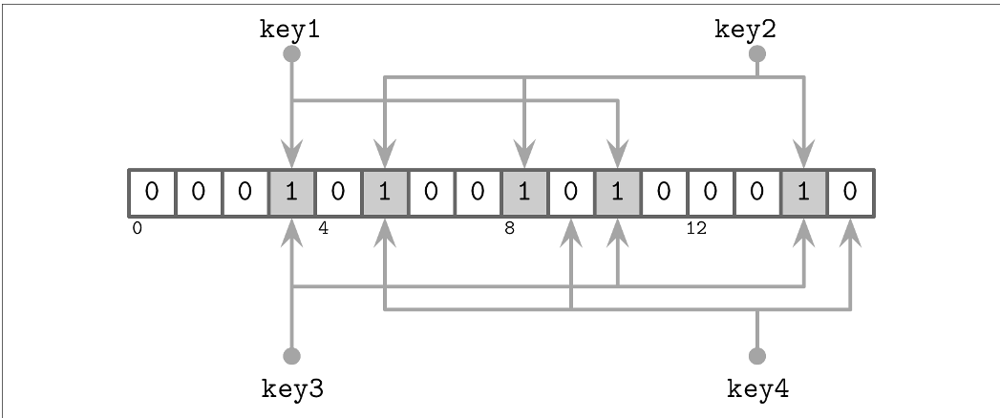

> 图 7-7：Bloom filter。

现在检查 `key3` 是否存在于集合中， 哈希函数生成 3、 10 和 14。 这三个 bit
都已在加入 `key1` 和 `key2` 时置位， 所以 Bloom filter 会返回假阳性： `key3`
从未追加到集合， 但计算出的所有 bit 都已置位。 不过， Bloom filter
只声称元素*可能*在表中， 所以这个结果可以接受。

如果查找 `key4`， 得到值 5、 9 和 15， 就会发现只有 bit 5 已置位，
其余两个尚未置位。 只要一个 bit 未置位， 就能确定该元素从未追加到 filter。

### 跳表

有许多不同的数据结构可以在内存中保存有序数据。
其中一种因简单而在近年来越来越流行的结构称为_跳表_ [PUGH90b]。 从实现来看，
跳表不比单链表复杂多少， 但其概率复杂度保证接近搜索树。

跳表执行插入和更新时不需要旋转或重定位， 而使用概率式平衡。 跳表通常不如内存
B-Tree 对缓存友好， 因为跳表节点很小， 而且在内存中随机分配。 一些实现使用
unrolled linked list 改善这种情况。

跳表由一系列高度不同的节点组成， 构建出能够跳过一段项目的链接层次结构。
每个节点保存一个键； 与链表节点不同， 有些节点拥有不止一个后继节点。 高度为 $h$
的节点会由一个或多个高度不超过 $h$ 的前驱节点链接。
最低层节点可以由任意高度的节点链接。

节点高度由随机函数决定， 在插入期间计算。 高度相同的节点组成一层。
为避免无限增长， 层数有上限； 最大高度根据结构能保存的项目数量选择。
每个下一层的节点数量呈指数减少。

查找会沿最高层的节点指针进行。 一旦遇到所保存键*大于*目标键的节点，
就沿其前驱节点指向下一层节点的链接前进。 换句话说，
如果目标键*大于*当前节点的键， 搜索就继续向前； 如果目标键*小于*当前节点的键，
搜索就从前驱节点的下一层继续。 这一过程递归重复， 直到找到目标键或其前驱。

例如， 在图 7-8 所示的跳表中搜索键 7， 可以按以下步骤进行：

1. 沿最高层指针前进， 到达保存键 10 的节点。
2. 目标键 7 小于 10， 所以沿 head 节点的下一层指针前进， 找到保存键 5 的节点。
3. 沿该节点的最高层指针前进， 再次找到保存键 10 的节点。
4. 目标键 7 小于 10， 所以沿保存键 5 的节点的下一层指针前进， 找到保存目标键 7
   的节点。

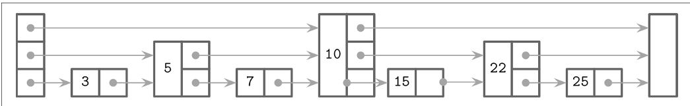

> 图 7-8：跳表。

插入时， 使用前述算法找到插入点（保存目标键的节点或其前驱）， 并创建新节点。
为了构建类似树的层次结构并保持平衡， 节点高度由基于概率分布生成的随机数决定。
保存着小于新节点键的前驱节点， 其指针会链接到新节点。
这些前驱节点更高层的指针保持不变。 新节点中的指针则链接到每层相应的后继节点。

删除时， 被移除节点的前向指针会放到相应层级的前驱节点上。

可以实现一种线性化方案来创建并发版跳表； 该方案使用额外的 `fullyLinked` 标志，
确定节点指针是否已全部更新。 这个标志可以用 compare-and-swap 设置 [HERLIHY10]。
之所以需要该标志， 是因为必须更新多个层级上的节点指针， 才能完全恢复跳表结构。

在采用非托管内存模型的语言中， 可以使用引用计数或 *hazard pointer*，
确保当前被引用的节点不会在并发访问期间释放 [RUSSEL12]。 该算法不会发生死锁，
因为节点始终从较高层访问。

Apache Cassandra 的二级索引 memtable 实现使用跳表。 WiredTiger
的一些内存操作也使用跳表。

### 磁盘访问

大部分表内容驻留磁盘， 而存储设备通常按块访问数据； 因此， 许多 LSM Tree
实现依赖页面缓存来执行磁盘访问和中间缓存。 “Buffer Management”中介绍的许多技术，
例如页面淘汰和 pin， 仍然适用于日志结构存储。

最显著的区别是， 内存内容不可变， 因此并发访问不需要额外的锁或 latch。
系统使用引用计数确保当前正在访问的页面不会被内存淘汰，
并确保进行中的请求在压实期间移除底层文件前完成。

另一个区别是， LSM Tree 中的数据记录不一定与页面对齐；
寻址指针可以用绝对偏移实现， 而不是使用页面 ID。 图 7-9
展示了内容未与磁盘块对齐的记录。 有些记录跨越页面边界，
需要把多个页面加载到内存。

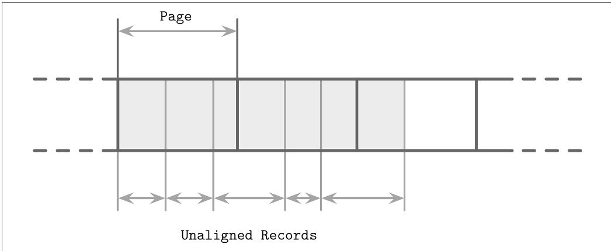

> 图 7-9：未对齐的数据记录。

### 压缩

我们已经在 B-Tree 的语境中讨论过压缩（参见“Compression”）。 类似思想也适用于 LSM
Tree。 主要区别是， LSM Tree 表不可变， 而且通常单趟写入。 逐页压缩数据时，
压缩页面不会与页面对齐， 因为它们比未压缩页面更小。

为了寻址压缩页面， 写入内容时必须跟踪地址边界。 可以用 0 填充压缩页面，
使其与页面大小对齐， 但这样就失去了压缩的好处。

要让压缩页面可寻址， 需要一个存储压缩页面偏移和大小的间接层。 图 7-10
展示了压缩块与未压缩块之间的映射。 压缩页面*总是*小于原页面，
否则压缩就没有意义。

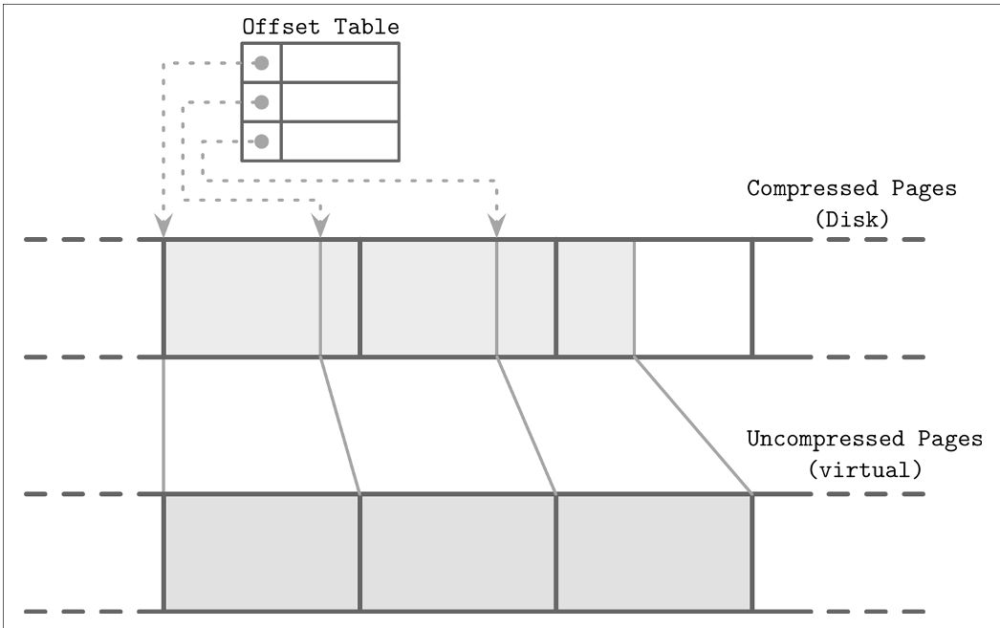

> 图
> 7-10：读取压缩块。虚线表示从映射表指向磁盘压缩页面偏移的指针。未压缩页面通常驻留在页面缓存中。

压实和 flush 期间， 压缩页面顺序追加，
压缩信息（原始未压缩页面偏移和实际压缩页面偏移）存储在单独的文件 segment 中。
读取时查找压缩页面的偏移和大小， 随后即可解压页面并将其物化到内存中。

## 无序 LSM 存储

到目前为止， 所讨论的大多数存储结构都*按顺序*存储数据。 可变与不可变 B-Tree
页面、 FD-Tree 的 sorted run， 以及 LSM Tree 的 SSTable 都按键顺序存储数据记录。
这些结构维持顺序的方式不同： B-Tree 页面原地更新， FD-Tree 的 run 通过合并两个
run 的内容创建， SSTable 则通过在内存中缓冲并排序数据记录来创建。

本节讨论以随机顺序存储记录的结构。 无序存储通常不需要独立日志，
并且可以按插入顺序存储数据记录， 从而降低写入成本。

### Bitcask

Bitcask 是 Riak 使用的存储引擎之一， 是一种无序日志结构存储引擎 [SHEEHY10b]。
它与此前讨论的日志结构存储实现不同， 不使用 memtable 缓冲，
而是把数据记录直接存储在 logfile 中。

为了使值可搜索， Bitcask 使用称为 keydir 的数据结构，
其中保存与相应键关联的最新数据记录的引用。 旧数据记录可能仍存在于磁盘， 但
keydir 不再引用它们， 压实期间会对其进行垃圾回收。 keydir 实现为内存 hashmap，
启动时必须根据 logfile 重建。

写入时， 键和数据记录顺序追加到 logfile， 并把指向新写入数据记录位置的指针放入
keydir。

读取时检查 keydir 以定位目标键， 再沿关联指针进入 logfile， 找到数据记录。
任意时刻 keydir 中只能有一个值与键关联， 所以点查询不必合并多个来源的数据。

图 7-11 展示了 Bitcask 中键与数据文件记录之间的映射。 logfile 保存数据记录，
keydir 指向与每个键关联的最新活跃数据记录。 数据文件中被遮蔽的记录，
即被后续写入或删除所取代的记录， 以灰色表示。

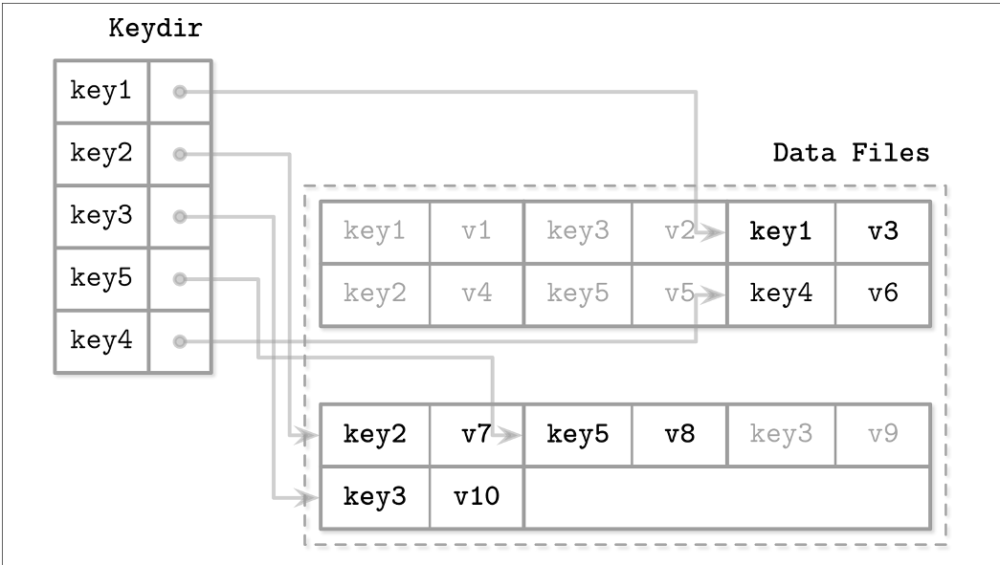

> 图 7-11：Bitcask 中 keydir
> 与数据文件的映射。实线表示从键指向与其关联的最新值的指针。
> 被遮蔽的键值对以浅灰色表示。

压实期间， 系统顺序读取所有 logfile 的内容， 将其合并并写入新位置；
只保留活跃数据记录， 丢弃被遮蔽的记录。 keydir 会更新，
指向重定位后数据记录的新位置。

数据记录直接存储在 logfile 中， 所以不必维护独立的预写日志，
从而同时降低空间开销和写放大。 这种方法的缺点是只提供点查询， 不允许范围扫描，
因为 keydir 和数据文件中的项目都无序。

这种方法的优点是简单， 并且点查询性能出色。 虽然存在数据记录的多个版本， 但
keydir 只寻址最新版本。 不过， 必须把所有键保存在内存中， 并在启动时重建
keydir； 对于某些用例， 这些限制可能无法接受。 这种方法很适合点查询，
但完全不支持范围查询。

### WiscKey

范围查询对许多应用都很重要。 如果一种存储结构既能拥有无序存储的写入和空间优势，
又允许执行范围扫描， 将非常理想。

WiscKey [LU16] 把排序与垃圾回收解耦： 键在 LSM Tree 中保持有序，
数据记录则保存在称为 vLog（value log）的无序 append-only 文件中。
这种方法可以解决讨论 Bitcask 时提到的两个问题： 必须把所有键保存在内存中，
以及启动时必须重建哈希表。

图 7-12 展示了 WiscKey 的关键组件， 以及键与日志文件之间的映射。 vLog
文件保存无序数据记录。 键存储在有序 LSM Tree 中， 指向 logfile
中最新的数据记录。

键通常比与其关联的数据记录小得多， 所以压实键的效率显著更高。
这种方法特别适合更新和删除率较低的用例，
因为此时垃圾回收释放的磁盘空间不会那么多。

主要挑战是 vLog 数据无序， 所以范围扫描需要随机 I/O。 WiscKey 利用 SSD
的内部并行能力， 在范围扫描期间并行预取块， 降低随机 I/O 成本。 就块传输而言，
成本仍然很高： 范围扫描期间要取得一条数据记录， 必须读取它所在的整个页面。

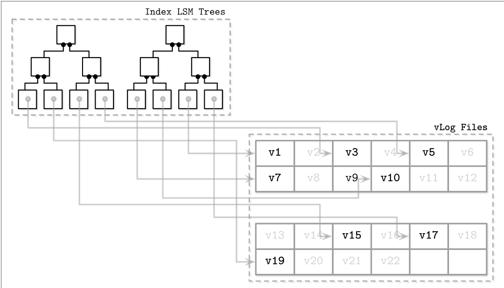

> 图 7-12：WiscKey 的关键组件，包括索引 LSM Tree 和 vLog
> 文件，以及它们之间的关系。
> 数据文件中被遮蔽的记录，即被后续写入或删除所取代的记录，以灰色表示。
> 实线表示从 LSM Tree 中的键指向日志文件中最新值的指针。

压实期间， 系统顺序读取 vLog 文件内容， 将其合并并写入新位置。 指针（键 LSM Tree
中的值）会更新， 指向这些新位置。 为了避免扫描 vLog 的全部内容， WiscKey 使用
head 和 tail 指针， 保存包含活跃键的 vLog segment 信息。

vLog 中的数据无序， 且不包含存活信息， 所以必须扫描键树， 找出哪些值仍然活跃。
在垃圾回收期间执行这些检查会增加复杂性： 传统 LSM Tree
可以在压实期间解析文件内容， 而无需寻址键索引。

## LSM Tree 中的并发

LSM Tree 的主要并发挑战与切换表视图， 以及日志同步有关。
表视图是驻留内存表和驻留磁盘表的集合， 会在 flush 和压实期间变化。 memtable
通常也会被并发访问（ScyllaDB 等按核分区的存储除外），
但并发内存数据结构不在本书讨论范围内。

flush 期间必须遵守以下规则：

- 新 memtable 必须可供读写。
- 旧的（正在 flush 的）memtable 必须继续对读取可见。
- 必须把正在 flush 的 memtable 写入磁盘。
- 丢弃已 flush 的 memtable 与使已 flush 的驻留磁盘表可用， 必须以原子方式执行。
- 必须丢弃保存着已应用于该 memtable 的操作日志条目的预写日志 segment。

例如， Apache Cassandra 使用操作顺序屏障解决这些问题： memtable flush 前，
会等待所有已接受的写操作完成。 这样， 作为消费者的 flush
过程就知道哪些作为生产者的其他进程依赖它。

更一般地说， 存在以下同步点：

**memtable 切换**

此后所有写入只进入新 memtable， 使其成为主 memtable； 旧 memtable 仍可供读取。

**flush 完成**

在表视图中用已 flush 的驻留磁盘表取代旧 memtable。

**预写日志截断**

丢弃保存着与已 flush 的 memtable 关联记录的日志 segment。

这些操作对正确性具有严重影响。 继续写入旧 memtable 可能导致数据丢失； 例如，
写入 memtable 中已经 flush 的部分。 类似地， 如果没有让旧 memtable
一直可供读取， 直到它的驻留磁盘副本准备好， 就会得到不完整的结果。

压实期间表视图也会变化， 但过程略微直接一些： 丢弃旧驻留磁盘表，
加入压实后的版本取而代之。 在新表完全写好并准备取代旧表供读取之前，
旧表必须始终可供读取。 还必须避免同一批表同时参与多个并行压实。

在 B-Tree 中， 必须协调日志截断与从页面缓存 flush 脏页面， 以保证持久性。 LSM
Tree 也有类似要求： 写入缓冲在 memtable 中， 内容完全 flush 前不具备持久性，
所以必须协调日志截断与 memtable flush。 flush 一完成， 就把最新已 flush 日志
segment 的信息交给日志管理器， 随后可以安全丢弃其中的内容。

不让日志截断与 flush 同步也会导致数据丢失： 如果日志 segment 在 flush
完成前被丢弃， 而节点随后崩溃， 日志内容就不会重放， 该 segment
中的数据也无法恢复。

## 日志分层

许多现代文件系统采用日志结构： 它们在内存 segment 中缓冲写入， segment 填满后以
append-only 方式把内容 flush 到磁盘。 SSD 也使用日志结构存储来处理小型随机写，
最大限度降低写入开销， 改善损耗均衡， 并延长设备寿命。

日志结构存储（LSS）系统开始流行时， 恰逢 SSD 价格变得更可负担。 LSM Tree 与 SSD
很匹配， 因为顺序工作负载和 append-only 写入有助于减少原地更新产生的放大，
而原地更新会对 SSD 性能产生负面影响。

如果把多个日志结构系统层叠在一起， 就可能遇到我们原本试图用 LSS 解决的几个问题，
包括写放大、 碎片和性能不佳。 开发应用时， 至少需要考虑 SSD 的 flash translation
layer 和文件系统 [YANG14]。

### Flash Translation Layer

在 SSD 中使用日志结构映射层有两个原因： 小型随机写必须批量组合到物理页面中；
而且 SSD 通过 program/erase cycle 工作。 只能向先前已*擦除*的页面写入。
这意味着页面只有为空， 即已被*擦除*时， 才能被 *program*， 也就是写入。

无法擦除单个页面， 只能一起擦除块中的一组页面（通常包含 64 到 512 个页面）。 图
7-13 示意了分组为块的页面。 Flash Translation
Layer（FTL）把逻辑页面地址转换为物理位置， 并跟踪页面状态（活跃、
已丢弃或空闲）。 FTL 没有可用页面时， 必须执行垃圾回收并擦除已丢弃页面。

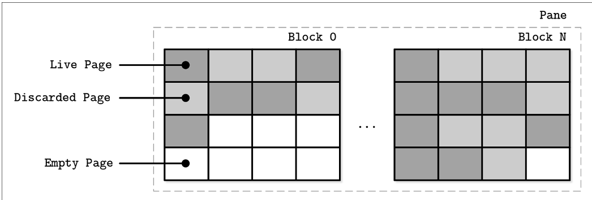

> 图 7-13：分组为块的 SSD 页面。

不能保证即将擦除的块中所有页面都已被丢弃。 擦除块之前， FTL
必须把其中的活跃页面重定位到某个含有空页面的块。 图 7-14
展示了把活跃页面从一个块移动到新位置的过程。

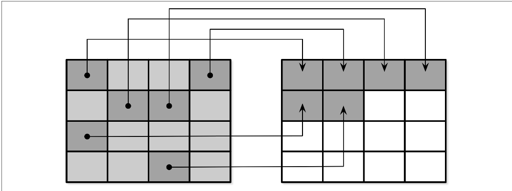

> 图 7-14：垃圾回收期间的页面重定位。

所有活跃页面重定位后， 即可安全擦除该块， 其中的空页面也可供写入。 FTL
知道页面状态和状态转换， 并拥有所有必要信息， 所以也负责 SSD 的损耗均衡。

> [!NOTE]
> 损耗均衡让负载均匀分布在介质上， 避免出现热点； 热点会使块因经历大量
> program-erase cycle 而过早失效。 损耗均衡不可或缺， 因为 flash memory cell
> 只能经历有限次数的 program-erase cycle， 均匀使用 memory cell
> 有助于延长设备寿命。

总之， 在 SSD 上使用日志结构存储， 是为了把小型随机写批量组合起来， 以摊销 I/O
成本； 这通常会减少操作数量， 进而减少触发垃圾回收的次数。

### 文件系统日志

在 SSD 之上还有文件系统； 许多文件系统同样使用日志技术缓冲写入，
以减少写放大并以最优方式使用底层硬件。

日志分层有几种表现形式。 首先， 每一层都必须执行自己的 bookkeeping；
而底层日志通常不会暴露避免重复工作所需的信息。

图 7-15 展示了高层日志（例如应用）与低层日志（例如文件系统）之间的映射；
这会造成重复记录日志和不同的垃圾回收模式 [YANG14]。 未对齐的 segment
写入可能让情况更加糟糕， 因为丢弃高层日志 segment 可能导致相邻 segment
的部分发生碎片化和重定位。

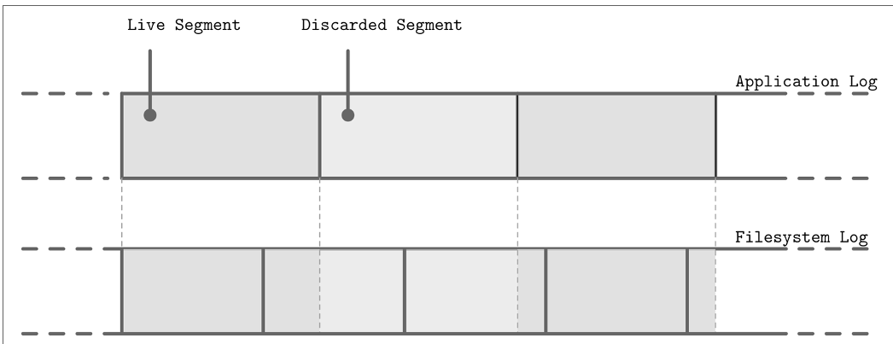

> 图 7-15：未对齐写入与丢弃高层日志 segment。

各层不交换与 LSS 有关的调度信息， 例如丢弃或重定位 segment； 因此，
低层子系统可能对已经丢弃或即将丢弃的数据执行冗余操作。 类似地，
由于不存在统一的标准 segment 大小， 未对齐的高层 segment 可能占用多个低层
segment。 所有这些开销都可以减少， 甚至完全避免。

虽然我们说日志结构存储的核心是顺序 I/O， 但必须记住数据库系统可能有多个写入流，
例如日志写入与数据记录写入并行 [YANG14]。 从硬件层面看，
交错的顺序写入流未必会转化为相同的顺序模式： 块不一定按写入顺序放置。 图 7-16
展示了多个在时间上重叠的写入流； 它们写入的记录大小未与底层硬件页面大小对齐。

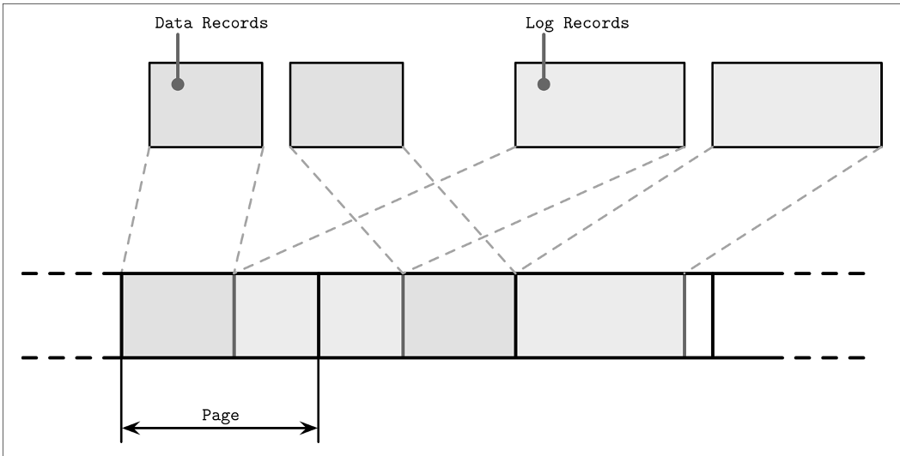

> 图 7-16：未对齐的多流写入。

这会造成我们原本试图避免的碎片。 为了减少交错，
一些数据库厂商建议把日志放在独立设备上， 以隔离工作负载，
并能独立推理其性能和访问模式。 不过， 更重要的是让分区与底层硬件对齐 [INTEL14]，
并让写入与页面大小对齐 [KIM12]。

### LLAMA 与审慎分层

> 嗯， 你肯定不会相信， 但你眼前的这只羊驼曾经是个人。 而且还不是普通人。
> 那家伙是个皇帝， 有钱有势， 魅力非凡。
>
> ——《The Emperor's New Groove》中的 Kuzco

我们在 [Bw-Tree](#bw-tree) 一节中讨论了一种名为 Bw-Tree 的不可变 B-Tree 版本。
Bw-Tree 构建在 *latch-free, log-structured, access-method
aware*（LLAMA）存储子系统之上。 这种分层让 Bw-Tree 可以动态增长和收缩，
同时让垃圾回收和页面管理对树透明。 这里最关注的是 *access-method aware* 部分，
它展示了软件层间协调的好处。

回顾一下， 一个_逻辑_ Bw-Tree 节点由一系列相连的_物理_ delta 节点组成：
更新链从最新更新延伸到最旧更新， 最后到达基础节点。 逻辑节点使用内存映射表链接，
该表指向最新更新在磁盘上的位置。 键和值会在逻辑节点中添加或移除，
但其物理表示保持不可变。

日志结构存储把节点更新（delta 节点）一起缓冲到 4 MB 的 flush buffer 中。 buffer
一旦填满， 就 flush 到磁盘。 垃圾回收会定期回收未使用的 delta
节点和基础节点占用的空间， 并重定位活跃节点， 从而释放碎片页面。

如果不了解 access method， 属于不同逻辑节点的交错 delta 节点会按插入顺序写入。
LLAMA 对 Bw-Tree 的了解使它能够把多个 delta 节点 consolidation
到同一个连续物理位置。 如果 delta 节点中的两次更新彼此抵消， 例如插入后又删除，
也可以对其进行逻辑 consolidation， 只持久化后一个删除操作。

LSS 垃圾回收还可以负责 consolidation 逻辑 Bw-Tree 节点的内容。
这意味着垃圾回收不仅能回收可用空间， 还能显著减少物理节点碎片。
如果垃圾回收只是连续重写多个 delta 节点， 它们仍会占用相同空间， 读取者仍需把
delta 更新应用到基础节点。 同时， 如果高层系统 consolidation
节点并把它们连续写入新位置， LSS 仍需对旧版本执行垃圾回收。

由于了解 Bw-Tree 语义， 垃圾回收期间可以把多个 delta 重写成单个已经应用全部
delta 的基础节点。 这样既能回收已丢弃页面占用的空间， 又能减少表示这个 Bw-Tree
节点所用的总空间， 并降低读取页面所需的延迟。

由此可见， 经过审慎考虑的分层可以带来很多好处。 不必总是构建紧耦合的单层结构。
良好的 API 和恰当的信息暴露可以显著提高效率。

### Open-Channel SSD

软件层叠的另一种方案是跳过所有间接层， 直接使用硬件。 例如， 面向 Open-Channel
SSD 开发， 可以避开文件系统和 flash translation layer。
这样至少可以避免两层日志， 并更好地控制损耗均衡、 垃圾回收、 数据放置和调度。
采用这种方法的实现之一是 LOCS（LSM Tree-based KV Store on Open-Channel
SSD）[WANG13]。 另一个使用 Open-Channel SSD 的例子是 Linux 内核中实现的 LightNVM
[BJØRLING17]。

flash translation layer 通常处理数据放置、 垃圾回收和页面重定位。 Open-Channel
SSD 暴露其内部结构、 驱动器管理和 I/O 调度， 无需经过 FTL。 从开发者的角度看，
这当然需要更加关注细节， 但可能带来显著的性能提升。 这类似于使用 `O_DIRECT`
标志绕过内核页面缓存： 它能提供更强的控制能力， 但需要手动管理页面。

Software Defined Flash（SDF）[OUYANG14] 是一种软硬件协同设计的 Open-Channel SSD
系统， 它暴露一个考虑 SSD 特性的非对称 I/O 接口。 读写单元大小不同，
写入单元大小与擦除单元（块）相对应， 从而大幅降低写放大。
这种设置非常适合日志结构存储， 因为只有一个软件层负责垃圾回收和页面重定位。
此外， 开发者可以使用 SSD 内部并行能力， 因为 SDF 中每个 channel
都作为独立块设备暴露， 可用来进一步改善性能。

把复杂性隐藏在简单 API 背后听起来很诱人， 但当软件层具有不同语义时，
这可能引发复杂问题。 暴露底层系统的部分内部信息， 可能有利于更好地集成。

## 小结

日志结构存储无处不在： 从 flash translation layer， 到文件系统和数据库系统。
它把小型随机写一起缓冲在内存中， 从而降低写放大。 为了回收已移除 segment
占用的空间， LSS 会定期触发垃圾回收。

LSM Tree 借鉴了 LSS 的一些思想， 有助于构建以日志结构方式管理的索引结构：
写入在内存中批量组合， 然后 flush 到磁盘； 被遮蔽的数据记录在压实期间清理。

必须记住， 许多软件层都使用 LSS， 并确保各层以最优方式堆叠。
另一种做法是完全跳过文件系统层， 直接访问硬件。

## 延伸阅读

如果想进一步了解本章提到的概念， 可以参考以下资料：

### Overview

Luo, Chen, and Michael J. Carey. 2019. "LSM-based Storage Techniques: A Survey."
*The VLDB Journal* https: //doi.org/10.1007/s00778-019-00555-y.

### LSM Trees

O'Neil, Patrick, Edward Cheng, Dieter Gawlick, and Elizabeth O'Neil. 1996. "The
log-structured merge-tree (LSM-tree)." *Acta Informatica* 33, no. 4: 351-385.
https: //doi.org/10.1007/s002360050048.

### Bitcask

Justin Sheehy, David Smith. "Bitcask: A Log-Structured Hash Table for Fast
Key/Value Data." 2010.

### WiscKey

Lanyue Lu, Thanumalayan Sankaranarayana Pillai, Hariharan Gopalakrishnan, Andrea
C. Arpaci-Dusseau, and Remzi H. Arpaci-Dusseau. 2017. "WiscKey: Separating Keys
from Values in SSD-Conscious Storage." ACM Trans. Storage 13, 1, Article 5
(March 2017), 28 pages.

### LOCS

Peng Wang, Guangyu Sun, Song Jiang, Jian Ouyang, Shiding Lin, Chen Zhang, and
Jason Cong. 2014. "An efficient design and implementation of LSM-tree based
key-value store on open-channel SSD." In Proceedings of the Ninth European
Conference on Computer Systems (EuroSys '14). ACM, New York, NY, USA, Article
16, 14 pages.

### LLAMA

Justin Levandoski, David Lomet, and Sudipta Sengupta. 2013. "LLAMA: a
cache/storage subsystem for modern hardware." Proc. VLDB Endow. 6, 10 (August
2013), 877-888.

<a id="part-1-conclusion"></a>

# 第一部分结语

第一部分讨论了存储引擎。 我们从高层数据库系统架构和分类开始，
学习了如何实现磁盘存储结构， 以及这些结构如何与其他组件共同构成完整系统。

我们考察了多种存储结构， 首先是 B-Tree。 所讨论的结构并不能代表整个领域，
还有许多其他有趣的发展。 不过，
这些例子仍然很好地说明了本部分开头确定的三个属性： *缓冲*、
*不可变性*和_有序性_。 这些属性有助于描述、 记忆和表达存储结构的不同方面。

表 I-1 总结了本书讨论的存储结构， 并展示它们是否使用这些属性。

添加内存缓冲区总能对写放大产生积极影响。 在 WiredTiger 和 LA-Tree
等原地更新结构中， 内存缓冲会把针对同一页面的多次写入组合起来， 从而摊销其成本。
换句话说， 缓冲有助于降低写放大。

在多组件 LSM Tree 和 FD-Tree 等不可变结构中， 缓冲也有类似的积极作用；
但代价是未来把数据从一个不可变层级移到另一个层级时需要重写。 换句话说，
使用不可变性可能造成延迟的写放大。 与此同时，
使用不可变性会对并发和空间放大产生积极影响，
因为所讨论的大多数不可变结构都使用完全填满的页面。

使用不可变性却不同时使用缓冲时， 会得到 Bitcask 和 WiscKey
这样的无序存储结构（写时复制 B-Tree 例外， 它会复制页面，
重新排序并重定位页面）。 WiscKey 只把键存储在有序 LSM Tree 中，
并允许使用键索引按键顺序取得记录。 在 Bw-Tree 中， 一部分节点（已经
consolidation 的节点）按键顺序保存数据记录， 其余逻辑 Bw-Tree 节点的 delta
更新则可能散布在不同页面中。

**表 I-1：本书讨论的存储结构所具有的缓冲、不可变性和有序性属性。**

|                 | 缓冲    | 可变 | 有序    |
| --------------- | ------- | ---- | ------- |
| B+Tree          | 否      | 是   | 是      |
| WiredTiger      | 是      | 是   | 是      |
| LA-Tree         | 是      | 是   | 是      |
| COW B-Tree      | 否      | 否   | 是      |
| 双组件 LSM Tree | 是      | 否   | 是      |
| 多组件 LSM Tree | 是      | 否   | 是      |
| FD-Tree         | 是      | 否   | 是      |
| Bitcask         | 否      | 否   | 否      |
| WiscKey         | 是（1） | 否   | 是（1） |
| Bw-Tree         | 否      | 否   | 否（2） |

（1）WiscKey 只使用缓冲来让键保持有序。 （2）Bw-Tree 中只有 consolidation
后的节点保存有序记录。

这三个属性可以自由组合， 以实现所需特征。 遗憾的是， 存储引擎设计通常涉及权衡：
为了改善一种操作， 需要增加另一种操作的成本。

掌握这些知识后， 你应该可以开始仔细研究大多数现代数据库系统的代码。
整本书中可以找到一些代码参考资料和切入点。 了解并理解相关术语，
会让这个过程更容易。

许多现代数据库系统由概率数据结构驱动 [FLAJOLET12] [CORMODE04]，
而且将机器学习思想引入数据库系统的新研究也正在进行 [KRASKA18]。
随着非易失性字节可寻址存储变得更加普及和广泛可用，
研究界和产业界即将经历更多变化 [VENKATARAMAN11]。

了解本书描述的基础概念， 应当有助于理解和实现更新的研究成果， 因为这些研究借鉴、
构建于并受到相同概念的启发。 了解理论和历史的主要优势在于，
世上没有全然崭新的事物； 正如本书的叙述所展示的那样， 进步是渐进的。

<a id="part-2-distributed-systems"></a>

# 第二部分 分布式系统

> 一个分布式系统，会因为一台你甚至不知道其存在的计算机发生故障，而让你自己的计算机无法使用。
>
> ——Leslie Lamport

如果没有分布式系统，我们就无法打电话、转账，也无法远距离交换信息。
我们每天都在使用分布式系统。
有时甚至意识不到这一点：任何客户端/服务器应用程序都是分布式系统。

对于许多现代软件系统而言，*纵向*扩展（即在一台 CPU 更多、RAM
更大或磁盘更快的大型高速机器上运行同一软件） 并不可行。
大型机器更昂贵、更难更换，也可能需要特殊维护。
另一种选择是*横向*扩展：让软件运行在多台通过网络连接的机器上，并作为单个逻辑实体协同工作。

分布式系统的规模可能各不相同，从寥寥数台到数百台机器不等；
参与者的特征也可能迥异，从小型手持设备或传感器设备，到高性能计算机都有。

数据库系统主要运行在单个节点上的时代早已过去，
大多数现代数据库系统都由多个节点连接成集群，以增加存储容量、改善性能并提高可用性。

尽管分布式计算的一些理论突破并不新鲜，
但它们大多直到相对较近的时期才得到实际应用。
如今，这一主题受到的关注越来越多，相关研究和新开发工作也在不断增加。

## 基本定义

在分布式系统中，有若干_参与者_，有时也称为_进程_、*节点*或_副本_。
每个参与者都有自己的本地_状态_。 参与者通过彼此之间的通信*链路*交换_消息_。

进程可以通过*时钟*获取时间，时钟可以是*逻辑*时钟，也可以是*物理*时钟。
逻辑时钟用某种单调递增的计数器实现。
物理时钟也称为_墙上时钟_，与物理世界中的时间概念相联系，进程可以通过本地手段（例如操作系统）访问它。

谈论分布式系统时，不可能不提到其各个部分彼此分离所造成的固有困难。
远程进程通过可能缓慢且不可靠的链路通信，因而更难了解远程进程的确切状态。

分布式系统领域的大多数研究都与一个事实有关：没有任何东西完全可靠。
通信通道可能延迟消息、打乱消息顺序或无法投递消息；
进程可能暂停、变慢、崩溃、失控，或突然停止响应。

并发编程与分布式编程领域在术语和主题上有许多共同之处， 因为 CPU
本身就是带有链路、处理器和通信协议的微型分布式系统。
在“一致性模型”一章中，你会看到它与并发编程的许多相似之处。
然而，由于远程参与方之间的通信成本，以及链路和进程的不可靠性，大多数原语无法直接复用。

为了克服分布式环境中的困难，我们需要使用一类特殊的算法，即_分布式算法_。
这类算法包含本地与远程状态及执行的概念，并且能够在网络不可靠、组件发生故障的情况下工作。
我们用*状态*和_步骤_（或_阶段_）以及它们之间的*转换*来描述算法。
每个进程在本地执行算法步骤，而这些本地执行和进程交互的组合便构成了分布式算法。

分布式算法描述多个独立节点的本地行为及其交互。 节点通过相互发送消息进行通信。
算法会定义参与者角色、交换的消息、状态、转换、执行的步骤、投递介质的属性、时序假设、故障模型，
以及描述进程及其交互的其他特征。

分布式算法有许多不同用途：

### 协调

由一个进程监督若干工作进程的动作和行为。

### 协作

多个参与者相互依赖，共同完成任务。

### 传播

进程相互协作，将信息快速、可靠地传播给所有相关方。

### 共识

让多个进程达成一致。

本书结合算法的使用场景来讨论算法，并且更偏重实践方法，而不是纯粹的学术材料。
首先，我们会介绍所有必要的抽象、进程及其连接，随后逐步构建更复杂的通信模式。
我们从 User Datagram
Protocol（UDP）开始，此时发送方无法保证其消息是否到达目的地；
最后到达共识，让多个进程就某个特定值达成一致。

<a id="chapter-8-introduction-and-overview"></a>

# 第 8 章 引言与概述

分布式系统与单节点系统究竟有何本质区别？ 让我们通过一个简单示例来观察。
在单线程程序中，我们会定义变量和执行过程（一组步骤）。

例如，可以定义一个变量，并对其执行简单的算术运算：

```java
int i = 1;
i += 2;
i *= 2;
```

这里只有一段执行历史：声明一个变量，将它加二，再乘以二，得到结果 6。
假设不再由一个执行线程完成这些操作，而是由两个线程读取和写入变量 `x`。

## 并发执行

一旦允许两个执行线程访问这个变量，除非在线程之间同步各个步骤，否则并发执行步骤的确切结果便不可预测。
如图 8-1 所示，可能的结果不再只有一个，而是四个。[^ch8-1]

[^ch8-1]: 为简洁起见，省略了乘法线程先于加法线程读取的交错方式，因为它得到的结果与
    a 相同。

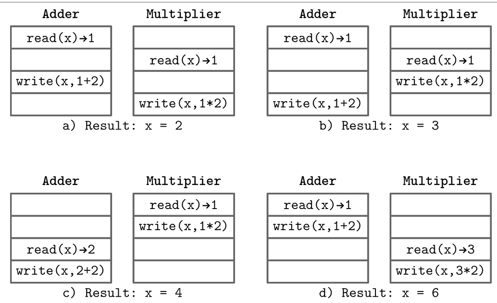

> 图 8-1：并发执行可能的交错方式。

- a) `x = 2`：两个线程都读取初始值；加法线程写入自己的值，但该值被乘法结果覆盖。
- b) `x = 3`：两个线程都读取初始值；乘法线程写入自己的值，但该值被加法结果覆盖。
- c) `x = 4`：乘法线程在加法线程启动前读取初始值并完成操作。
- d) `x = 6`：加法线程在乘法线程启动前读取初始值并完成操作。

甚至还没跨过单个节点的边界，我们就遇到了分布式系统中的第一个问题：并发。
每个并发程序都具有分布式系统的某些属性。
线程访问共享状态，在本地执行一些操作，再将结果传播回共享变量。

为了精确定义执行历史并减少可能出现的结果数量，我们需要_一致性模型_。
一致性模型描述并发执行，并规定操作执行以及对参与者可见的顺序。
借助不同的一致性模型，可以限制或放宽系统可能处于的状态数量。

分布式系统与并发计算在术语和研究上有大量重叠，但也存在一些差异。
并发系统可以拥有共享内存，处理器能够借此交换信息。
分布式系统中的每个处理器则拥有自己的本地状态，参与者通过传递消息进行通信。

### 并发与并行

我们经常交替使用并发计算和并行计算这两个术语，但它们在语义上略有差别。
两组步骤并发执行时，二者都在推进，但任何时刻只执行其中一组。
两组步骤并行执行时，它们的步骤可以同时执行。
并发操作在时间上重叠，而并行操作由多个处理器执行 [WEIKUM01]。

Erlang 编程语言的创造者 Joe Armstrong 举过一个例子：
并发执行就像两支队伍共用一台咖啡机，而并行执行就像两支队伍分别使用两台咖啡机。
不过，绝大多数资料都用“并发”描述具有多个并行执行线程的系统，很少使用“并行性”一词。

## 分布式系统中的共享状态

我们可以尝试在分布式系统中引入某种共享内存概念，例如一个作为唯一信息源的数据库。
即使解决了并发访问这个数据库的问题，仍然无法保证所有进程都保持同步。

为了访问该数据库，进程必须通过通信介质发送和接收消息，以查询或修改状态。
然而，如果某个进程在较长时间内都没有收到数据库的响应，会发生什么？
要回答这个问题，首先必须定义“较长时间”究竟是什么意思。
为此，需要用*同步性*来描述系统：通信是完全异步的，还是存在某些时序假设。
这些时序假设使我们能够引入操作超时和重试。

我们不知道数据库没有响应究竟是因为过载、不可用或运行缓慢，还是因为通往数据库的网络出现问题。
这描述了崩溃的_性质_：进程可能因不再参与后续算法步骤而崩溃，可能发生临时故障，也可能遗漏一些消息。
在决定如何处理故障之前，我们需要定义_故障模型_，并描述故障可能以哪些方式发生。

描述系统可靠性以及系统能否在发生故障时继续正确运行的属性称为_容错性_。
故障不可避免，因此我们需要用可靠的组件构建系统；
朝这个方向迈出的第一步，可以是消除前述单节点数据库这一单点故障。
为此，可以引入一定的*冗余*并添加一个备用数据库。
然而，现在又面临另一个问题：如何让共享状态的*多个副本*保持同步？

到目前为止，尝试为这个简单系统引入共享状态，给我们留下的问题多于答案。
现在我们知道，共享状态并非简单地引入一个数据库即可，
而必须采取粒度更细的方法，用独立进程以及它们之间的消息传递来描述交互。

## 分布式计算的谬误

在理想情况下，两台计算机通过网络通信时，一切都能顺利工作：
进程打开连接、发送数据、得到响应，皆大欢喜。
假定操作总能成功、不可能出错是很危险的；
一旦确实出了问题，原有假设又被证明错误，系统的行为就会变得难以甚至无法预测。

大多数时候，假定*网络可靠*是合理的。 网络至少要在一定程度上可靠，才有实用价值。
我们都遇到过这样的情况：尝试连接远程服务器，却收到 `Network is Unreachable`
错误。 但是，即使能够建立连接，*初次成功*连接服务器也不代表链路稳定；
连接随时可能中断。
消息可能已经到达远端，但响应可能丢失，也可能在响应送达前连接就已中断。

网络交换机可能损坏，线缆可能断开，网络配置也随时可能变化。
我们构建的系统应当能够从容处理所有这些情形。

连接可能很稳定，但不能指望远程调用和本地调用一样快。
我们应尽可能少地对延迟作出假设，并且绝不能假定延迟为零。
消息要到达远程服务器，必须经过多个软件层以及光纤或线缆等物理介质。
所有这些操作都不是瞬间完成的。

Michael Lewis 在其著作 *Flash Boys*（Simon and Schuster） 中讲述了这样一个故事：
一些公司花费数百万美元，只为将延迟降低几毫秒，从而比竞争对手更快地访问证券交易所。
这是将延迟转化为竞争优势的绝佳示例。 但值得一提的是，根据 [BARTLETT16]
等其他研究，陈旧报价套利（利用比竞争对手更快获知价格并执行订单来获利）
并不能让高速交易者操纵市场。

吸取这些教训后，我们增加了重试和重新连接，并放弃了执行瞬间完成的假设，但这仍然不够。
当交换消息的数量、速率和大小增加，或向现有网络添加新进程时，不应假定带宽无限。

> [!NOTE]
> 1994 年，Peter Deutsch 发布了一份如今已广为人知的断言清单， 题为“Fallacies of
> distributed computing”，描述了分布式计算中容易被忽视的方面。
> 除网络可靠性、延迟和带宽假设外，他还描述了其他一些问题。
> 例如网络安全、潜在敌对方的存在、可能破坏我们对特定资源是否存在及其位置之假设的有意或无意拓扑变化、
> 时间和资源两方面的传输成本，以及最后，是否存在一个了解并控制整个网络的单一权威。

Deutsch
的分布式计算谬误清单相当全面，但它关注的是通过链路从一个进程向另一个进程发送消息时可能出现的问题。
这些顾虑确实合理，也描述了最普遍、最底层的复杂性；
但遗憾的是，在设计和实现分布式系统时，我们还会作出许多其他假设，而这些假设可能在系统运行时引发问题。

### 处理

远程进程在回应刚收到的消息之前，需要先在本地完成一些工作，因此不能假定_处理是瞬间完成的_。
仅仅考虑网络延迟还不够，因为远程进程执行操作同样不是即时的。

此外，消息送达后也不能保证处理会立即开始。
消息可能进入远程服务器的待处理队列，必须等到所有先到达的消息都处理完毕。

节点之间可能相距较近或较远，可能使用不同的 CPU、RAM
容量和磁盘，也可能运行不同的软件版本和配置。 不能指望它们以相同速率处理请求。
如果必须等待若干并行工作的远程服务器响应才能完成任务，那么整体执行速度取决于最慢的远程服务器。

与普遍看法相反，*队列容量并非无限*，不断堆积更多请求对系统毫无益处。
*反压*是一种应对策略：当生产者发布消息的速率超过消费者的处理速率时，放慢生产者。
反压是分布式系统中最未得到充分重视和应用的概念之一；
它往往是事后补上的，而不是系统设计不可分割的一部分。

增大队列容量听起来可能是个好主意，也有助于流水线化、并行化和有效调度请求，
但消息待在队列中等待轮到自己时，实际上什么也没有发生。
改变队列大小不会影响处理速率，因此增大队列可能延长延迟。

一般而言，进程本地队列用于实现以下目标：

#### 解耦

接收和处理在时间上分离，并且彼此独立地进行。

#### 流水线化

处于不同阶段的请求由系统中的独立部分处理。
负责接收消息的子系统不必阻塞到上一条消息完全处理完毕。

#### 吸收短时突发流量

系统负载往往会变化，但请求的到达间隔不会直接暴露给负责处理请求的组件。
由于花在队列中的时间，系统总体延迟会增加， 但这通常仍优于返回失败并重试请求。

队列大小取决于工作负载和应用程序。
对于相对稳定的工作负载，可以测量任务处理时间以及每项任务处理前在队列中的平均停留时间，
据此设置队列大小，确保吞吐量增加时延迟仍在可接受范围内。
在这种情况下，队列相对较小。
对于不可预测、任务突发提交的工作负载，设置队列大小时还应考虑突发流量和高负载。

远程服务器可能很快处理完请求，但这并不意味着我们总能从它那里得到肯定响应。
它可能返回失败：无法完成写入、找不到所查值，或触发了 bug。
总之，即使是最有利的情形，仍然需要我们认真处理。

### 时钟与时间

> 时间是一种幻觉。午餐时间尤其如此。
>
> ——Ford Prefect，*The Hitchhiker's Guide to the Galaxy*

假定远程机器上的时钟同步运行同样很危险。
再结合“延迟为零”和“处理瞬间完成”这两个假设，会产生各种异常，尤其是在时间序列和实时数据处理中。
例如，在收集和聚合来自不同时间认知的参与者的数据时，
应当了解它们之间的时间漂移并相应地将时间归一化，而不是依赖来源时间戳。
除非使用专门的高精度时间源，否则不应依靠时间戳进行同步或排序。
当然，这并不意味着完全不能或不应该依赖时间：毕竟，任何同步系统都会使用本地时钟设置超时。

必须始终考虑进程之间可能存在的时间差，以及消息投递和处理所需的时间。
例如，Spanner（参见“使用 Spanner 的分布式事务”）使用一种特殊的时间 API，
它会返回时间戳和不确定性边界，以施加严格的事务顺序。
一些故障检测算法依赖共享的时间概念，并要求时钟漂移始终处于允许范围内，以保证正确性
[GUPTA01]。

除了分布式系统中的时钟难以同步之外，*当前*时间本身也在不断变化：
可以向操作系统请求当前 POSIX
时间戳，执行若干步骤后再请求一个*当前*时间戳，二者会有所不同。
这是个相当显然的观察，但理解时间的来源以及时间戳捕获的确切时刻至关重要。

了解时钟源是否单调（即永远不会倒退），以及已调度的时间相关操作可能漂移多少，也会很有帮助。

### 状态一致性

此前的大多数假设都属于“几乎总是错误”， 但有些假设更适合描述为“并非总是正确”：
我们很容易走思维捷径，以某种特定方式简化模型，却忽略了一些棘手的边界情况。

分布式算法并不总能保证严格的状态一致性。
有些方法的约束更宽松，允许副本之间的状态产生分歧，
并依靠冲突解决（在系统中检测并解决分歧状态的能力）以及读取时数据修复（当副本返回不同结果时，在读取期间使副本恢复同步）。
关于这些概念的更多信息可参见第 12 章。
假定各节点间的状态完全一致，可能引发隐蔽的 bug。

最终一致的分布式数据库系统可能包含在读取期间查询节点法定人数、以处理副本分歧的逻辑，
却假定数据库模式和集群视图是强一致的。
除非强制保证这些信息的一致性，否则依赖该假设可能造成严重后果。

例如，Apache Cassandra 曾有一个
bug，根源在于模式变更会在不同时间传播到各服务器。
如果在模式传播期间尝试读取数据库，就可能发生数据损坏，
因为一台服务器按照一种模式编码结果，另一台服务器却用另一种模式解码。

另一个例子是由彼此分歧的环视图导致的 bug：
一个节点认为另一个节点持有某个键的数据记录，但后者拥有不同的集群视图，
此时读写数据可能把数据记录放错位置；
也可能在数据记录其实完好地存在于另一个节点上时，得到空响应。

即使完整解决方案的实现成本很高，最好也提前考虑可能出现的问题。
理解并处理这些情况，就可以加入防护措施，或改变设计，让解决方案更加自然。

### 本地执行与远程执行

把复杂性隐藏在 API 后面可能很危险。
例如，如果有一个用于本地数据集的迭代器，即使不熟悉存储引擎，也能合理预测幕后发生的事情。
理解远程数据集的迭代过程却是完全不同的问题：
需要了解一致性和投递语义、数据协调、分页、合并、并发访问的影响，以及许多其他事项。

简单地把二者隐藏在同一个接口之后，尽管有用，却可能造成误导。
为了调试、配置和可观测性，可能需要额外的 API 参数。
我们应始终牢记，本地执行与远程执行并不相同 [WALDO96]。

隐藏远程调用最明显的问题是延迟：
远程调用的成本比本地调用高出许多倍，因为它涉及双向网络传输、序列化/反序列化以及许多其他步骤。
交错执行本地调用与阻塞式远程调用，可能导致性能下降和意外副作用 [VINOSKI08]。

### 必须处理故障

开始构建系统时，可以假定所有节点都已启动并正常工作，
但认为情况始终如此则很危险。
在长期运行的系统中，节点可能因维护而下线（这通常涉及优雅关闭），也可能因各种原因崩溃：
软件问题、内存不足终止器（out-of-memory killer）[KERRISK10]、运行时
bug、硬件问题等。 进程确实会发生故障；
最好的应对方式是做好准备，并理解如何处理故障。

如果远程服务器没有响应，我们并不总能知道确切原因。
这可能源于崩溃、网络故障、远程进程运行缓慢，或通往它的链路缓慢。
有些分布式算法使用*心跳协议*和_故障检测器_，对哪些参与者仍然存活且可达作出推断。

### 网络分区与局部故障

当两台或多台服务器无法彼此通信时，我们称这种情形为_网络分区_。 在“Perspectives
on the CAP Theorem”[GILBERT12] 中， Seth Gilbert 和 Nancy Lynch 区分了两种情形：
两个参与者无法相互通信；
或者若干组参与者彼此隔离，无法交换消息，却各自继续执行算法。

网络的一般性不可靠（丢包、重传、难以预测的延迟）“令人恼火但可以忍受”，
而网络分区会造成更大的麻烦，因为彼此独立的组可能继续执行并产生冲突结果。
网络链路还可能发生非对称故障：消息仍能从一个进程投递到另一个进程，反方向却不行。

为了构建能承受一个或多个进程故障的稳健系统， 必须考虑局部故障
[TANENBAUM06]，以及当系统的一部分不可用或工作不正常时，系统如何继续运行。

故障难以检测，而且从系统的不同部分观察时，不一定以相同方式显现。
设计高可用系统时，应始终考虑边界情况： 如果复制了数据却没有收到确认，会怎样？
需要重试吗？ 在已发送确认的节点上，数据是否仍可供读取？

墨菲定律[^ch8-2]告诉我们，故障确实会发生。
编程界的俗语还补充说，故障会以最糟糕的方式发生；
因此，分布式系统工程师的任务就是尽量减少出错情形，并为故障做好准备，将其可能造成的损害控制在一定范围内。

[^ch8-2]: 墨菲定律是一句格言，可概括为“任何可能出错的事情都会出错”；它在流行文化中得到推广，并经常被当作习语使用。

不可能防止所有故障，但仍然可以构建一个在故障存在时仍能正确工作的弹性系统。
面向故障进行设计的最佳方法，就是对故障进行测试。
要想遍历每一种可能的故障情形并预测多个进程的行为，几乎不可能。
最好的方法是建立测试工具，制造分区、模拟 bit rot
[GRAY05]、增加延迟、使时钟产生分歧， 并放大相对处理速度的差异。
真实世界中的分布式系统环境可能极具对抗性，既不友好又很“有创意”（不过是以一种非常恶劣的方式），
因此测试工作应尽可能覆盖更多情形。

> [!TIP]
> 过去几年出现了一些有助于重现不同故障情形的开源项目。 Toxiproxy
> 可以帮助模拟网络问题：限制带宽、引入延迟和超时等。 Chaos Monkey
> 采取更激进的方法，通过随机关闭服务，让工程师直面生产环境故障。 CharybdeFS
> 有助于模拟文件系统和硬件错误及故障。
> 你可以用这些工具测试软件，确保它在发生这些故障时行为正确。 CrashMonkey
> 是一个不依赖特定文件系统的记录、重放与测试框架，有助于测试持久文件的数据和元数据一致性。

使用分布式系统时，必须认真对待容错性、弹性、可能的故障情形和边界情况。
类似于“只要眼睛足够多，所有 bug
都是浅显的”，我们可以说，足够大的集群最终会碰到每一种可能的问题。
与此同时，只要测试足够充分，最终也能发现每一个现存问题。

### 级联故障

我们并不总能彻底隔离故障：
一个进程在高负载下倒下，会增加集群其余部分的负载，使其他节点发生故障的可能性更高。
*级联故障*会从系统的一部分传播到另一部分，不断扩大问题范围。

有时，级联故障甚至可能出于完全善意的举动。
例如，一个节点离线了一段时间，没有收到最新更新。
它重新上线后，热心的对等节点想帮助它追上最近的进度，于是开始向它流式传输缺失的数据，
结果耗尽网络资源，或导致该节点在启动后不久再次发生故障。

> [!TIP]
> 为了防止故障在系统中传播，并从容应对故障情形，可以使用熔断器。
> 在电气工程中，熔断器通过中断电流来保护昂贵且难以更换的部件，使其免于过载或短路。
> 在软件开发中，熔断器会监控故障，并启用回退机制：绕开故障服务，给它一些恢复时间，并从容处理失败的调用，从而保护系统。

与某台服务器的连接失败或服务器没有响应时，客户端会开始重新连接循环。
到这时，过载服务器已经很难跟上新的连接请求，客户端紧密循环重试并不会改善局面。
为避免这种情况，可以使用退避策略。 客户端不立即重试，而是等待一段时间。
退避能够调度重试并延长后续请求之间的时间间隔，从而避免放大问题。

退避用于延长单个客户端的请求间隔。
然而，采用相同退避策略的不同客户端仍可能产生巨大负载。
为了防止*不同*客户端在退避期结束后同时重试，可以引入_抖动_。
抖动会在退避时间上加上一小段随机时间，降低客户端同时唤醒并重试的概率。

硬件故障、bit rot 和软件错误可能导致数据损坏，而损坏又可能通过标准投递机制传播。
例如，如果未验证损坏的数据记录，它们可能被复制到其他节点。
如果没有验证机制，系统可能把损坏的数据传播至其他节点，并可能覆盖未损坏的数据记录。
为避免这种情况，应使用校验和与验证来检查节点间交换的任何内容是否完整。

可以通过规划和协调执行来避免过载和热点。
与其让对等节点独立执行操作步骤，不如使用协调者根据可用资源准备执行计划，并依据以往的执行数据预测负载。

总之，应始终考虑系统某一部分的故障可能在其他地方引发问题的情形。
我们应为系统配备熔断器、退避、验证和协调机制。
处理小范围、彼此隔离的问题，总比尝试从大规模停机中恢复来得直接。

我们刚刚用整整一节讨论了分布式系统中的问题和潜在故障情形，
但应把它视为警示，而不是令人望而却步的恐吓。

了解可能出现的问题，并谨慎设计和测试系统，会让系统更加稳健、更有弹性。
意识到这些问题，有助于在开发过程中识别并找到潜在问题源，也有助于在生产环境中调试问题。

## 分布式系统抽象

谈论编程语言时，我们使用共同的术语，并用函数、运算符、类、变量和指针来定义程序。

拥有共同词汇，可以避免每次描述事物时都发明新词。
定义越精确、歧义越少，听者就越容易理解。

在讨论算法之前，首先必须介绍分布式系统的词汇：
这些定义会频繁出现在演讲、书籍和论文中。

### 链路

网络并不可靠：消息可能丢失、延迟和乱序。
把这一点牢记于心后，我们将尝试构建若干通信协议。
我们会从最不可靠、最不稳健的协议开始，识别它们可能处于的状态，
并判断可以为协议增加哪些机制，以提供更强的保证。

#### 公平损失链路

我们可以从两个由一条*链路*连接的*进程*开始。 如图 8-2
所示，进程可以互相发送消息。 任何通信介质都不完美，消息可能丢失或延迟。

让我们看看能得到什么保证。 消息 $M$
发送后，从发送方的角度看，它可能处于以下状态之一：

- 尚未投递给进程 B（但会在未来某个时刻投递）；
- 在传输过程中无可挽回地丢失；
- 已成功投递给远程进程。


> 图 8-2：最简单且不可靠的通信形式；进程 A 通过链路向进程 B 发送消息 $M$。

请注意，发送方无从得知消息是否已经投递。
在分布式系统术语中，这类链路称为_公平损失链路_。 这类链路具有以下属性：

##### 公平损失

如果发送方和接收方都正确，并且发送方无限多次地持续重传消息，那么消息最终会被投递。[^ch8-3]

##### 有限重复

已发送的消息不会被无限多次投递。

##### 不会凭空创建

链路不会自行产生消息； 换言之，它不会投递从未发送过的消息。

[^ch8-3]: 更精确的定义是：如果正确进程 A 无限多次地向正确进程 B
    发送一条消息，那么该消息也会被无限多次地投递 [CACHIN11]。

公平损失链路是一种有用的抽象，也是构建具有强保证的通信协议时的第一个构件。
可以假定这条链路不会*系统性地*丢失通信双方之间的消息，也不会创建新消息。
但与此同时，我们不能完全依赖它。
这可能会让你想到用户数据报协议（UDP）：它允许进程间发送消息，但协议层面不提供可靠投递语义。

#### 消息确认

为了改善情况并更清楚地掌握消息状态，可以引入_确认_：
接收方向发送方通知自己已收到消息的一种方式。
为此，需要使用双向通信通道，并加入某种区分消息的手段；
例如_序列号_，即唯一且单调递增的消息标识符。

> [!NOTE]
> 为每条消息分配唯一标识符就足够了。
> 序列号只是唯一标识符的一种特殊形式，它通过从计数器中取得标识符来保证唯一性。
> 使用哈希算法唯一标识消息时，应考虑潜在冲突，并确保仍能消除消息之间的歧义。

现在，进程 A 可以发送消息 $M(n)$，其中 $n$ 是单调递增的消息计数器。 B
收到消息后，立即向 A 发回确认 $ACK(n)$。 图 8-3 展示了这种通信形式。


> 图 8-3：发送带确认的消息；进程 A 向进程 B 发送 $M(n)$，进程 B 返回 $ACK(n)$。

确认和原始消息一样，都可能在途中丢失。 消息可能处于的状态略有变化。 在 A
收到确认之前，消息仍处于前述三种状态之一； 但 A
一旦收到确认，就可以确信消息已经投递给 B。

#### 消息重传

只增加确认仍不足以让这种通信协议称得上可靠：
已发送的消息仍可能丢失，远程进程也可能在确认之前发生故障。
为解决这个问题并提供投递保证，可以尝试重传。
重传让发送方能够重试可能失败的操作。
这里说“可能失败”，是因为发送方其实不知道操作是否失败：即将讨论的这种链路并不使用确认。

进程 A 发送消息 $M$ 后，会一直等待到触发超时 $T$，然后尝试再次发送同一消息。
假定进程间链路保持完好、进程间的网络分区不会无限持续，而且并非所有数据包都丢失，
那么从发送方视角看，消息要么尚未投递给进程 B，要么已成功投递给进程 B。 由于 A
会不断尝试发送消息，因此可以说消息不会在传输途中无可挽回地丢失。

在分布式系统术语中，这种抽象称为_顽固链路_。
之所以称为“顽固”，是因为发送方会无休止地一再重发消息；
但这种抽象非常不切实际，因此需要将重试与确认结合起来。

#### 重传的问题

每当发送消息后，在收到远程进程的确认之前，
我们都不知道消息是已经处理、即将处理、已经丢失，还是远程进程在收到消息前已经崩溃——任何一种状态都有可能。
可以重试操作并再次发送消息，但这可能产生重复消息。
只有要执行的操作具有幂等性时，处理重复消息才是安全的。

幂等操作可以执行多次，每次都得到相同结果，而且不会产生额外副作用。
例如，服务器关闭操作可以是幂等的：
第一次调用发起关闭，后续所有调用都不会产生额外效果。

如果每项操作都具有幂等性，我们就不必过多考虑投递语义，
可以更多地依赖重传实现容错，并以完全响应式的方式构建系统：响应某个信号触发动作，又不产生意外副作用。
然而，操作不一定具有幂等性，仅仅假定它们幂等可能产生集群范围的副作用。
例如，从客户的信用卡扣款不是幂等操作，多次扣款显然不可取。

幂等性在发生局部故障和网络分区时尤其重要，
因为我们不总能得知远程操作的确切状态——究竟已经成功、已经失败，还是马上就会执行——只能等待更长时间。
要求每项执行的操作都具有幂等性并不现实，
因此需要在不改变底层操作语义的前提下，提供等同于幂等性的保证。
为此，可以使用去重，避免多次处理消息。

#### 消息顺序

不可靠的网络带来两个问题：消息可能乱序到达；
而且由于重传，一些消息可能不止一次到达。
我们已经引入序列号，可以在接收方使用这些消息标识符来保证先进先出（FIFO）顺序。
由于每条消息都有序列号，接收方可以跟踪：

- $n_{\text{consecutive}}$：表示截至哪个最高序列号为止，所有消息都已出现；
  不超过该序列号的消息可以恢复顺序。
- $n_{\text{processed}}$：表示截至哪个最高序列号为止，消息已经恢复原始顺序并得到处理；
  该值可以用于去重。

如果收到消息的序列号不连续，接收方就把它放入重排缓冲区。 例如，在收到序列号为 3
的消息后，又收到序列号为 5 的消息，说明 4 仍然缺失； 因此需要先把 5 放到一旁，等
4 到达后再重建消息顺序。 由于底层使用公平损失链路， 我们假定
$n_{\text{consecutive}}$ 与 $n_{\text{max\_seen}}$ 之间的消息最终都会投递。

接收方可以安全丢弃随后收到的、序列号不超过 $n_{\text{consecutive}}$ 的消息，
因为这些消息肯定已经投递过。

去重的工作方式是检查序列号为 $n$
的消息是否已经处理（即接收方是否已将其向协议栈下层传递），并丢弃已经处理过的消息。

在分布式系统术语中，这类链路称为_完美链路_，它提供以下保证 [CACHIN11]：

##### 可靠投递

正确进程 A 向正确进程 B 发送一次的每条消息，最终都会投递。

##### 不重复

任何消息都不会投递超过一次。

##### 不会凭空创建

与其他类型的链路一样，它只能投递实际发送过的消息。

这可能会让你想到 Transmission Control Protocol（TCP）[^ch8-4]（不过， TCP
的可靠投递只在单个会话范围内得到保证）。 当然，这个模型只是用于说明的简化表示。
TCP 处理确认的模型复杂得多，它会对确认进行分组，以降低协议层开销。 此外，TCP
还有选择性确认、流量控制、拥塞控制、错误检测以及许多不在本书讨论范围内的其他功能。

[^ch8-4]: 参见 https://databass.dev/links/53。

### 恰好一次投递

> 分布式系统中只有两个难题：2. 恰好一次投递；1. 保证消息顺序；2. 恰好一次投递。
>
> ——Mathias Verraes

关于能否实现恰好一次投递，一直存在许多讨论。 这里的语义和精确措辞至关重要。
由于链路故障可能导致消息第一次尝试无法投递，大多数真实系统采用至少一次投递：
发送方会一直重试到收到确认为止，否则消息不被视为已经接收。
另一种投递语义是至多一次：发送方发出消息，但不期待任何投递确认。

TCP 协议会把消息拆成数据包，逐个传输，再在接收端重新拼接。 TCP
可能尝试重传某些数据包，而且可能有多次传输尝试成功。 由于 TCP
为每个数据包标记序列号，即使某些数据包传输了多次，它也能对数据包去重，
保证接收方只看到并处理一次消息。 在 TCP 中，这一保证只在单个会话内有效：
如果消息已经得到确认和处理，但连接中断前发送方没有收到确认，应用程序就不知道该消息已投递；
根据自身逻辑，它可能尝试再次发送消息。

这意味着真正值得关注的是恰好一次_处理_，
因为重复投递（或重复传输数据包）没有副作用，只是链路尽力而为所产生的附带现象。
例如，如果数据库节点只接收了记录却没有将其持久化，那么投递虽已发生，却毫无用处，除非还能取回这条记录；
换言之，除非它既已投递，又已处理。

为了让恰好一次保证成立，节点之间应当具有共同知识 [HALPERN90]：
每个人都知道某个事实，而且每个人都知道其他每个人也知道这个事实。
简单来说，节点必须就记录的状态达成一致：
两个节点都同意记录已经持久化，或者都同意记录尚未持久化。
本章稍后会说明，这在理论上不可能做到，
但实践中仍会通过放宽协调要求来使用这一概念。

关于能否实现恰好一次投递的任何误解，最可能源于从不同的协议与抽象层次看待问题，以及对“投递”的定义不同。
不可能构建一条从不多次传输任何消息的可靠链路，
但通过只处理一次消息并忽略重复消息，可以从发送方视角营造恰好一次投递的假象。

既然已经确立了可靠通信的手段，接下来就可以探索如何在分布式系统的进程间实现统一与一致。

## 两将军问题

分布式系统中关于达成一致最著名的描述之一，是一个广为人知的思想实验：*两将军问题*。

这个思想实验表明，存在链路故障时，如果通信是*异步*的，两方就不可能达成一致。
尽管 TCP
表现出完美链路的属性，但必须记住：完美链路虽有此名，却不保证*完美*投递。
它也无法保证参与者始终存活，而且它只关心传输。

设想有两支分别由两位将军率领的军队，正准备进攻一座设防城市。
两支军队位于城市两侧，只有同时发起进攻，围城战才可能成功。

两位将军可以派信使通信，而且已经制订了进攻计划。
现在唯一需要达成一致的，就是是否执行该计划。
这个问题的变体包括：其中一位将军军衔更高，但必须确保协同进攻；
或者两位将军需要就确切时间达成一致。
这些细节并不改变问题定义：两位将军必须达成一致。

两军将领只需确认双方都会发动进攻。 否则，进攻不可能成功。 将军 A 发送消息
$MSG(N)$，声明如果对方也同意行动，自己就准备在指定时间发动进攻。

A 派出信使后，并不知道信使是否已经到达： 信使可能被俘，无法送达消息。 将军 B
收到消息后，必须发送确认 $ACK(MSG(N))$。 图 8-4
展示了一方发送消息、另一方返回确认的过程。

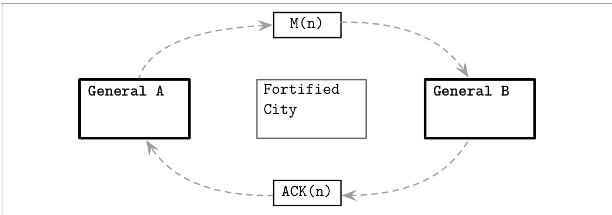

> 图 8-4：两将军问题示意图；两军隔城相望，通过可能被俘的信使传递消息与确认。

携带确认的信使同样可能被俘或无法送达。 B 无法知道信使是否成功送达了确认。

为确定这一点，B 必须等待 $ACK(ACK(MSG(N)))$， 也就是一条二阶确认，表明 A
已经收到了对确认的确认。

无论两位将军继续互相发送多少次确认，他们总是还差一个
ACK，才能知道是否可以安全发动进攻。
他们注定要不断猜测，携带最后一次确认的消息是否到达目的地。

请注意，我们没有作出任何时序假设：两位将军之间的通信完全异步。
对于将军需要多长时间响应，没有设定任何时间上界。

## FLP 不可能性

Fischer、Lynch 和 Paterson 在一篇论文中描述了一个著名问题， 称为 *FLP
不可能性问题* [FISCHER85]，名称来自三位作者姓氏的首字母。
他们讨论了一种共识形式：进程从一个初始值开始，尝试就一个新值达成一致。
算法完成后，所有无故障进程的新值都必须相同。

如果网络完全可靠，就特定值达成一致很直接；
但现实中，系统容易遭遇许多不同类型的故障，例如消息丢失、重复、网络分区，以及进程缓慢或崩溃。

共识协议描述这样一种系统：多个进程从其*初始状态*开始，协议使所有进程进入_决策状态_。
要让共识协议正确，必须保持三个属性：

### 一致性

协议得出的决策必须全体一致：
每个进程都决定某个值，而且所有进程决定的值必须相同。 否则就没有达成共识。

### 有效性

达成一致的值必须由某个参与者提出， 也就是说，系统不能自行“想出”一个值。
这也意味着该值不能是平凡的：进程不能总是决定某个预定义的默认值。

### 终止性

只有所有进程都进入决策状态，一致结果才算最终确定。

[FISCHER85] 假定处理完全异步；进程之间不存在共享的时间概念。
这类系统中的算法不能依赖超时，进程也无从得知另一个进程究竟已经崩溃，还是只是运行得过慢。
论文证明，在这些假设下，即使只有一个进程可能崩溃，也不存在能够保证终止的确定性共识协议。
FLP 并不否定安全性，也不表示每次执行都无法达成共识；
它说明某些合法执行可能无限期不作出决定。

如果不考虑进程完成算法步骤的时间上界，就无法可靠检测进程故障，也不存在能保证终止的确定性共识算法。

然而，FLP 不可能性并不意味着既然无法保证终止，我们就只能收拾东西回家。
实践中的系统至少会表现出某种程度的同步性，解决这个问题需要更精细的模型。

## 系统同步性

从 FLP 不可能性可以看出，时序假设是分布式系统的一项关键特征。
在异步系统中，我们不知道进程之间的相对速度，
无法保证消息在有界时间内或以特定顺序投递。
进程可能无限长时间不响应，也不总能可靠检测进程故障。

对异步系统的主要批评是，这些假设并不现实：
进程的处理速度不可能有*任意大*的差异，链路也不可能花费*无限长*时间投递消息。
依靠时间既能简化推理，也有助于提供时间上界保证。

在异步模型中，共识问题并非总能解决 [FISCHER85]。
此外，设计高效的同步算法也并非总能做到；
对于某些任务，实际解决方案更有可能依赖时间 [ARJOMANDI83]。

可以放宽这些假设，将系统视为*同步*系统。 为此，我们引入时序概念。
在同步模型下对系统进行推理要容易得多。
该模型假定进程以相近速率推进，传输延迟有界，而且消息投递不会花费任意长的时间。

同步系统也可以用彼此同步的进程本地时钟来表示：
两个进程本地时间源之间的时间差有一个上界 [CACHIN11]。

在同步模型下设计系统，可以使用超时。
以此为基础，可以构建领导者选举、共识、故障检测等更复杂的抽象。
这会让最佳情形更加稳健，但如果时序假设不成立，就会导致故障。 例如，在 Raft
共识算法（参见“Raft”）中，可能有多个进程认为自己是领导者；
解决方法是迫使落后的进程接受另一个进程为领导者。 故障检测算法（参见第 9
章）则可能错误地把存活进程识别为故障进程，反之亦然。
设计系统时，应确保考虑到这些可能性。

异步模型和同步模型的属性可以结合起来，此时可将系统视为*部分同步*系统。
部分同步系统表现出同步系统的一些属性，
但消息投递、时钟漂移和相对处理速度的边界可能并不精确，而且只在*大多数时候*成立
[DWORK88]。

同步性是分布式系统的一项基本属性：
它会影响性能、可扩展性和问题总体上是否可解，并包含许多系统正确运行所必需的因素。
本书讨论的一些算法在同步系统的假设下运行。

## 故障模型

我们一直在提到_故障_，但到目前为止，它还是一个可能包含许多含义的宽泛概念。
正如可以作出不同的时序假设一样，也可以假定存在不同类型的故障。
*故障模型*精确描述进程在分布式系统中会以何种方式发生故障，算法则基于这些假设开发。
例如，可以假定进程可能崩溃且永不恢复，也可以假定它会在一段时间后恢复，
还可以假定它会因失控并提供错误值而发生故障。

在分布式系统中，各进程相互依赖来执行算法，因此故障可能导致整个系统执行错误。

我们将讨论分布式系统中的多种故障模型，例如*崩溃*故障、*遗漏*故障和*任意*故障。
这份清单并不穷尽所有模型，但涵盖了大多数适用于现实系统且十分重要的情形。

### 崩溃故障

通常，我们期望进程正确执行算法的所有步骤。
进程发生故障最简单的方式，就是*停止*执行算法所需的任何后续步骤，并且不再向其他进程发送消息。
换言之，进程*崩溃*了。
大多数时候，我们采用*崩溃即停止*进程抽象，它规定进程一旦崩溃，就会一直保持这一状态。

该模型并不假定进程不可能恢复，也不反对或试图阻止恢复。
它只意味着算法的正确性或活性*不依赖*恢复。
进程完全可以恢复、追上系统状态，并参与算法的*下一次*实例。

发生故障的进程无法继续参与它出故障时所在的当前协商轮次。
为恢复中的进程分配一个新的不同身份，并不会让该模型等价于下文讨论的崩溃恢复模型，
因为大多数算法使用预定义的进程列表，并根据能够容忍多少个故障来明确定义故障语义
[CACHIN11]。

*崩溃恢复*是另一种进程抽象。
在该模型下，进程会停止执行算法所需的步骤，但稍后会恢复并尝试继续执行后续步骤。
恢复的可能性要求系统引入持久状态和恢复协议 [SKEEN83]。
允许崩溃恢复的算法需要考虑所有可能的恢复状态，
因为恢复中的进程可能尝试从自己所知的最后一步继续执行。

旨在利用恢复能力的算法必须同时考虑状态和身份。
这种情况下，崩溃恢复也可以视为遗漏故障的一种特殊情况，
因为从其他进程的视角看，无法区分一个不可达的进程和一个已经崩溃并恢复的进程。

### 遗漏故障

另一种故障模型是_遗漏故障_。
该模型假定进程跳过或无法执行某些算法步骤，或其执行对其他参与者不可见，
又或者它无法向其他参与者发送消息或接收来自其他参与者的消息。
遗漏故障涵盖由故障网络链路、交换机故障或网络拥塞造成的进程间网络分区。
网络分区可以表示为各个进程或进程组之间的消息遗漏。
完全遗漏发往或来自某个进程的所有消息，就可以模拟崩溃。

当某个进程比其他参与者运行得慢、发送响应的时间远晚于预期时，
在系统其余部分看来，它可能像是把事情忘了。
缓慢节点并没有彻底停止，而是试图与其他节点不同步地发送结果。

当本应执行某些步骤的算法跳过这些步骤，或执行结果不可见时，就会发生遗漏故障。
例如，消息可能在前往接收方的途中丢失，而发送方没有再次发送，仍像消息已成功投递一样继续运行，
尽管消息已经无可挽回地丢失。
间歇性挂起、网络过载、队列已满等也可能造成遗漏故障。

### 任意故障

最难克服的一类故障是*任意*故障或*拜占庭*故障：
进程继续执行算法步骤，但其行为违背算法；
例如，共识算法中的某个进程决定采用一个从未有任何其他参与者提出过的值。

软件 bug 或进程运行不同版本的算法都可能造成这类故障；
这些情况下，故障相对容易发现和理解。
如果无法控制所有进程，而且其中一个进程有意误导其他进程，问题就会困难得多。

你可能听说过航空航天领域中的拜占庭容错：
飞机和航天器系统不会照单全收子组件的响应，而会交叉验证其结果。
另一项广泛应用是加密货币 [GILAD17]：
这里没有中央权威，各节点由不同主体控制，而敌对参与者有切实的物质动机伪造数值，并试图通过提供错误响应操纵系统。

### 处理故障

可以通过组建进程组并在算法中引入冗余来*掩蔽*故障：
即使一个进程发生故障，用户也不会察觉 [CHRISTIAN91]。

故障可能带来一定的性能损失：
正常执行依赖进程及时响应，而系统必须回退到较慢的执行路径来处理和纠正错误。
许多故障可以在软件层面预防，方法包括代码审查、充分测试、通过引入超时和重试确保消息投递，以及确保本地步骤按顺序执行。

本书接下来介绍的大多数算法都假定崩溃故障模型，并通过引入冗余来应对故障。
这些假设有助于创建性能更好，也更容易理解和实现的算法。

## 小结

本章讨论了分布式系统的一些术语，并介绍了若干基本概念。
我们讨论了系统组件不可靠所造成的固有困难和复杂性：
链路可能无法投递消息，进程可能崩溃，网络也可能发生分区。

这些术语足以让我们继续后面的讨论。
本书其余部分会讨论分布式系统中常用的_解决方案_：
回顾可能出现的问题，并了解有哪些选择可以使用。

## 延伸阅读

如果想进一步了解本章提到的概念，可以参阅以下资料：

**分布式系统抽象、故障模型与时序假设**

Lynch, Nancy A. 1996. *Distributed Algorithms*. San Francisco: Morgan Kaufmann.

Tanenbaum, Andrew S. and Maarten van Steen. 2006. *Distributed Systems:
Principles and Paradigms* (2nd Ed). Boston: Pearson.

Cachin, Christian, Rachid Guerraoui, and Lus Rodrigues. 2011. *Introduction to
Reliable and Secure Distributed Programming* (2nd Ed.). New York: Springer.
<a id="chapter-9-failure-detection"></a>

# 第 9 章 故障检测

> 如果一棵树在森林中倒下，而周围没人听见，它发出声音了吗？
>
> ——佚名

为了让系统对故障作出恰当反应，应及时检测故障。
系统可能会联系一个无法响应的故障进程，从而增加延迟并降低系统整体可用性。

在异步分布式系统中检测故障（即不作任何时序假设）极其困难，
因为无法判断进程是已经崩溃，还是仅仅运行缓慢、需要无限长的时间才能响应。
我们在“FLP 不可能性”一节讨论过一个与此相关的问题。

*死亡*、*发生故障*和*崩溃*等术语通常用于描述已经彻底停止执行步骤的进程。
*无响应*、*有故障嫌疑*和*缓慢*等术语则用于描述*受怀疑*的进程，而它实际上也可能已经死亡。

故障可能发生在链路层面（进程间的消息丢失或投递缓慢），也可能发生在进程层面（进程崩溃或运行缓慢），
而缓慢并不总能与故障区分开来。 这意味着我们总要在两者之间权衡：
错误地把存活进程怀疑为死亡会产生假阳性；
迟迟不把无响应进程标记为死亡，选择姑且相信它并期待它最终响应，则会产生假阴性。

故障检测器是一种本地子系统，负责识别发生故障或不可达的进程，
将其排除在算法之外，从而在保持安全性的同时保证活性。

活性和安全性描述算法解决特定问题的能力及其输出的正确性。
更正式地说，*活性*属性保证某个预期事件*必须*发生。
例如，如果某个进程发生故障，故障检测器就*必须*检测到该故障。
*安全性*则保证非预期事件*不会*发生。
例如，如果故障检测器把某个进程标记为死亡，那么该进程实际上必须确已死亡
[LAMPORT77] [RAYNAL99] [FREILING11]。

从实践角度看，排除故障进程有助于避免不必要的工作，并防止错误传播和级联故障；
但排除可能只是受到怀疑、实际仍然存活的进程，则会降低可用性。

故障检测算法应当具备若干基本属性。 首先，每个无故障成员最终都应注意到进程故障，
而且算法应当能够推进并最终得出结果。 这一属性称为_完备性_。

可以用*效率*评价算法质量：故障检测器识别进程故障有多快。
另一种评价方法是考察算法的_准确性_：是否精确检测到了进程故障。
换言之，如果算法错误指控存活进程发生故障，或无法检测现有故障，它就是不准确的。

可以把效率与准确性的关系视为一个可调参数：
效率更高的算法可能不那么准确，而准确性更高的算法通常效率较低。
已经证明，不可能构建既准确又高效的故障检测器。
与此同时，允许故障检测器产生假阳性，即错误地把存活进程识别为故障进程，反之亦然
[CHANDRA96]。

故障检测器是许多共识和原子广播算法的必要前提与组成部分，本书稍后会讨论这些算法。

许多分布式系统使用*心跳*实现故障检测器。
这种方法因简单且具有强完备性而十分流行。
这里讨论的算法假定不存在拜占庭故障：进程不会有意谎报自己或邻居的状态。

## 心跳与 Ping

可以通过触发以下两种周期性过程之一，查询远程进程的状态：

- 可以触发
  ping，向远程进程发送消息，并期待它在指定时段内响应，以检查它是否仍然存活。
- 可以触发_心跳_，由进程主动向对等节点发送消息，通知它们自己仍在运行。

这里以 ping 为例，但也可以用心跳解决同一问题，并得到相似结果。

每个进程都维护一个其他进程的列表（包括存活、死亡和受怀疑的进程），
并更新每个进程最近一次响应的时间。 如果某个进程超过一定时间仍未响应 ping
消息，就会被标记为_受怀疑_。

图 9-1 展示了系统正常工作时的情形：进程 P1 查询邻居节点 P2 的状态，P2 返回确认。

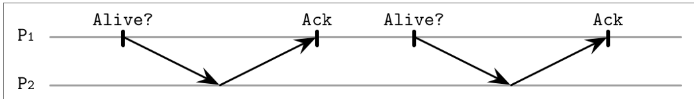

> 图 9-1：使用 Ping 检测故障时的正常工作情形；消息没有延迟，P1 发出 ping
> 后及时收到 P2 的确认。

相比之下，图 9-2 展示了确认消息发生延迟的情形，这可能导致活跃进程被标记为停机。

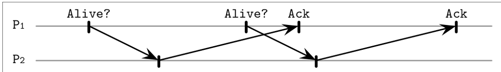

> 图 9-2：使用 Ping 检测故障时，响应发生延迟，在下一条消息发出后才到达。

许多故障检测算法以心跳和超时为基础。 例如，流行的分布式系统构建框架 Akka
实现了一种截止期限故障检测器：
它使用心跳，如果进程未能在固定时间间隔内登记，就报告进程故障。

这种方法有几个潜在缺点： 它的精度依赖对 ping 频率和超时时间的谨慎选择，
而且它无法体现从其他进程视角观察到的进程可见性（参见“委托式心跳”）。

## 无超时故障检测器

有些算法检测故障时避免依赖超时。 例如，Heartbeat 是一种无超时故障检测器
[AGUILERA97]，
它只对心跳计数，并允许应用程序根据心跳计数器向量中的数据检测进程故障。
由于该算法不使用超时，因此它在异步系统假设下运行。

该算法假定任意两个正确进程之间都有一条公平路径，
其中只包含公平链路（即如果一条消息在链路上发送无限多次，也会被接收无限多次），
而且每个进程都知道网络中所有其他进程的存在。

每个进程维护一份邻居列表以及与各邻居关联的计数器。 进程首先向邻居发送心跳消息。
每条消息都包含该心跳迄今经过的路径。 初始消息的路径中包含第一个发送方，
还包含一个唯一标识符，可用于避免多次广播同一消息。

进程收到一条新的心跳消息时，会递增路径中所有参与者的计数器，
再把该心跳发送给尚未出现在路径中的参与者，并把自己追加到路径中。
只要进程发现所有已知进程都已经收到消息（换言之，所有进程 ID
都已出现在路径中），就停止传播消息。

由于消息经由不同进程传播，而心跳路径包含从邻居收到的聚合信息，
即使两个进程之间的直接链路发生故障，我们也可以（正确地）把一个无法直接到达的进程标记为存活。

心跳计数器表示系统的全局归一化视图。
该视图捕获心跳彼此之间的相对传播情况，使我们能够比较不同进程。
然而，这种方法的缺点之一，是解释心跳计数器可能相当棘手：
需要选择一个能产生可靠结果的阈值。
如果做不到这一点，算法就会错误地把活跃进程标记为受怀疑。

## 委托式心跳

可扩展弱一致感染式进程组成员协议（Scalable Weakly Consistent Infection-style
Process Group Membership Protocol，SWIM）[GUPTA01] 采用了另一种方法：
使用委托式心跳，借助从邻居视角获得的进程活性信息来提高可靠性。
这种方法不要求进程知道网络中的所有其他进程，只需知道一部分已连接的对等节点。

如图 9-3 所示，进程 $P_1$ 向进程 $P_2$ 发送 ping 消息。 $P_2$ 没有响应，因此
$P_1$ 接着选择多个随机成员（$P_3$ 和 $P_4$）。 这些随机成员尝试向 $P_2$
发送心跳消息； 如果 $P_2$ 响应，它们就将确认转发回 $P_1$。

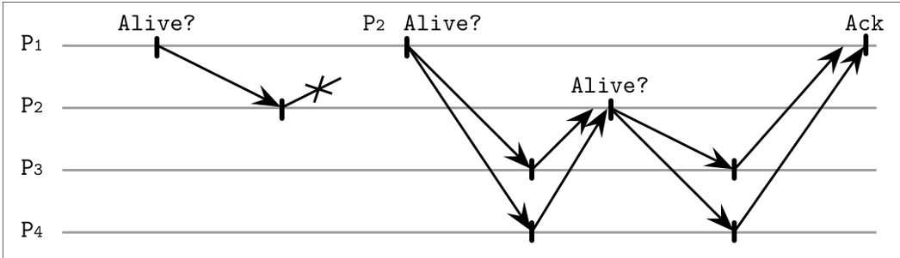

> 图 9-3：“委托”心跳；$P_1$ 无法直接从 $P_2$ 得到响应时， 请 $P_3$ 和 $P_4$
> 代为探测并转发确认。

这样就可以同时考虑直接和间接可达性。 例如，若有进程 $P_1$、$P_2$ 和 $P_3$，
就可以同时从 $P_1$ 和 $P_2$ 的视角检查 $P_3$ 的状态。

委托式心跳把决策责任分散给一组成员，从而实现可靠的故障检测。
这种方法不需要向一大群对等节点广播消息。
由于委托式心跳请求可以并行触发，它能够快速收集更多关于受怀疑进程的信息，让我们作出更准确的决定。

## Phi Accrual 故障检测器

Phi Accrual（$\varphi$ Accrual）故障检测器 [HAYASHIBARA04]
不把节点故障视为只有“启动”和“停机”两种状态的二元问题，
而是使用连续刻度来表示受监控进程发生崩溃的概率。
它维护一个滑动窗口，收集来自对等进程的最近心跳到达时间。
这些信息用于估计*下一次*心跳的到达时间，
将估计值与实际到达时间比较，并计算_怀疑程度_ $\varphi$：
在当前网络条件下，故障检测器对故障发生有多大把握。

该算法收集并采样到达时间，以建立可用于可靠判断节点健康状况的视图。
它使用这些样本计算 $\varphi$ 值： 如果该值达到阈值，节点就被标记为停机。
这种故障检测器通过调整将节点标记为受怀疑的刻度，动态适应不断变化的网络条件。

从架构角度看，Phi Accrual 故障检测器可视为三个子系统的组合：

### 监控

通过 ping、心跳或请求-响应采样来收集活性信息。

### 解释

决定是否应把进程标记为受怀疑。

### 操作

每当进程被标记为受怀疑时执行的回调。

监控进程会收集数据样本（假定这些样本服从正态分布），
并将其存储在固定大小的心跳到达时间窗口中。
较新的到达时间加入窗口，最旧的心跳数据点则被丢弃。

通过确定样本的均值和方差，可以从采样窗口估计分布参数。
这些信息用于估计下一次心跳的到达时间，并据此计算 $\varphi$：
它衡量在进程仍正常的假设下，当前这么长的心跳延迟有多不可能。 $\varphi$
越高，对进程发生故障的怀疑越强。

这种方法由日本北陆先端科学技术大学院大学的研究人员开发，
如今已用于许多分布式系统，例如 *Cassandra* 和 *Akka*（Akka
还使用前述截止期限故障检测器）。

## Gossip 与故障检测

另一种避免依据单节点视图作决策的方法，是 Gossip 风格的故障检测服务
[VANRENESSE98]。 它使用 Gossip（参见“Gossip 传播”）收集并分发相邻进程的状态。

每个成员都维护一份其他成员的列表，其中包含它们的*心跳计数器*和时间戳；
时间戳指明心跳计数器最近一次递增的时间。
每个成员都会周期性递增自己的心跳计数器，并把列表分发给一个随机邻居。
邻居收到消息后，会将该列表与自己的列表合并，并更新其他邻居的心跳计数器。

节点还会周期性检查状态列表和心跳计数器。
如果某个节点长时间没有更新计数器，就认为它发生了故障。
应谨慎选择这个超时时段，以尽量降低假阳性的概率。
成员彼此通信的频率（换言之，最坏情况下的带宽）有上限，
最多随系统中的进程数线性增长。

图 9-4 展示了三个通信进程共享各自心跳计数器的过程：

- a) 三个进程都能相互通信并更新时间戳。
- b) P3 无法与 P1 通信，但它的时间戳 $t_6$ 仍可通过 P2 传播。
- c) P3 崩溃；由于它不再发送更新，其他进程检测到它发生了故障。

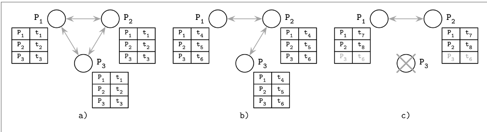

> 图
> 9-4：用于故障检测的复制心跳表；三个进程通过共享心跳计数器，在直接链路故障时传播状态，
> 并在 P3 停止更新后检测其故障。

这样既能检测崩溃节点，也能检测任何其他集群成员都无法到达的节点。
由于集群视图由多个节点的视图聚合而成，这项决定是可靠的。
如果两台主机之间的链路发生故障，心跳仍能通过其他进程传播。 使用 Gossip
传播系统状态会增加系统中的消息数量，但能让信息传播得更加可靠。

## 反转故障检测问题

故障信息并不总能传播，而且逐一通知每个成员的成本可能很高。 一种称为 failure
notification service（FUSE）的方法 [DUNAGAN04]，
专注于实现可靠而低成本的故障传播，即使发生网络分区也能工作。

为了检测进程故障，该方法将所有活跃进程组织成组。
如果其中一个组变得不可用，所有参与者都会检测到故障。
换言之，每当检测到一个进程故障，就会将它转换并传播为组故障。
这样，无论断连、分区和节点故障以何种组合出现，都能检测到故障。

组内进程周期性向其他成员发送 ping 消息，查询它们是否仍然存活。
如果某个成员由于崩溃、网络分区或链路故障而无法响应， 发起这次 ping
的成员随后也会停止响应 ping 消息。

图 9-5 展示了四个相互通信的进程：

- a) 初始状态：所有进程都存活且可以通信。
- b) $P_2$ 崩溃并停止响应 ping 消息。
- c) $P_4$ 检测到 $P_2$ 的故障，自己也停止响应 ping 消息。
- d) 最终，$P_1$ 和 $P_3$ 注意到 $P_2$ 和 $P_4$
  都没有响应，进程故障传播到整个组。

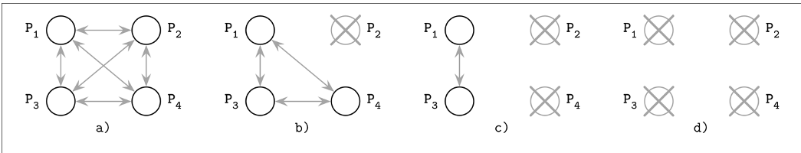

> 图 9-5：FUSE 故障检测；$P_2$ 崩溃后，检测到故障的 $P_4$
> 也停止响应，最终故障通知传播到整个组。

所有故障都会从故障源传播到系统中的所有其他参与者。 参与者逐渐停止响应
ping，将单个节点故障转换为组故障。

这里使用不通信作为传播手段。
这种方法的一个优点，是保证每个成员都会得知组故障并作出适当反应。
缺点之一是，将单个进程与其他进程隔开的链路故障也可能被转换成组故障；
但这究竟是缺点还是优点，取决于使用场景。
应用程序可以使用自己对传播故障的定义来考虑这种情形。

## 小结

故障检测器是任何分布式系统的基本组成部分。 正如 FLP
不可能性结果所示，没有任何协议能保证在异步系统中达成共识。
故障检测器有助于增强模型，让我们能在准确性与完备性之间作出权衡，从而解决共识问题。
这一领域中证明故障检测器实用性的一项重要发现见 [CHANDRA96]：
即使故障检测器会犯无限多次错误，也仍有可能解决共识问题。

我们介绍了几种故障检测算法，它们各自采用不同方法：
有些专注于通过直接通信检测故障，有些使用广播或 Gossip 传播信息，
还有一些选择使用静默（换言之，不通信）作为传播手段。
现在我们知道，可以使用心跳或 ping、严格的截止期限或连续刻度。
每种方法都有各自的优势：简单性、准确性或精度。

## 延伸阅读

如果想进一步了解本章提到的概念，可以参阅以下资料：

**故障检测与算法**

Chandra, Tushar Deepak and Sam Toueg. 1996. "Unreliable failure detectors for
reliable distributed systems." *Journal of the ACM* 43, no. 2 (March): 225-267.
https: //doi.org/10.1145/226643.226647.

Freiling, Felix C., Rachid Guerraoui, and Petr Kuznetsov. 2011. "The failure
detector abstraction." *ACM Computing Surveys* 43, no. 2 (January): Article 9.
https://doi.org/10.1145/1883612.1883616.

Phan-Ba, Michael. 2015. "A literature review of failure detection within the
context of solving the problem of distributed consensus." https:
//www.cs.ubc.ca/~bestchai/theses/michael-phan-ba-msc-essay-2015.pdf
<a id="chapter-10-leader-election"></a>

# 第 10 章 领导者选举

同步的成本可能很高：
如果算法的每一步都要联系其他每个参与者，通信开销可能相当可观。
对于规模庞大且地理分散的网络尤其如此。
为了降低同步开销以及达成决策所需的消息往返次数，
有些算法依赖*领导者*进程（有时称为_协调者_）的存在，
由它负责执行或协调分布式算法的步骤。

一般来说，分布式系统中的进程是对等的，任何进程都可以接任领导者角色。
进程会长期担任领导者，但这并非永久角色。
通常，进程会一直担任领导者，直到自身崩溃。
崩溃后，任何其他进程都可以启动新一轮选举；
如果当选，就接任领导者并继续故障领导者的工作。

选举算法的*活性*保证，*大多数时候*系统中都会有领导者，
而且选举最终会结束，即系统不应无限期停留在选举状态。

理想情况下，我们还希望假定安全性，
保证任何时刻最多只有一位领导者，并彻底杜绝脑裂：
两位为同一目的服务的领导者都已当选，却不知道彼此的存在。
然而在实践中，许多领导者选举算法都会违反这项一致性要求。

例如，领导者进程可用于实现广播消息的全序。
领导者收集并持有全局状态、接收消息，再将消息传播给各进程。
它也可用于在故障后、初始化期间或重要状态发生变化时协调系统重组。

系统初始化、首次选出领导者时，或者前任领导者崩溃或无法通信时，都会触发选举。
选举必须是确定性的：这个过程必须恰好产生一位领导者。
该决定必须对所有参与者生效。

虽然从理论上看，领导者选举和分布式锁（即对共享资源的排他所有权）可能很相似，但二者略有不同。
如果某个进程持有用于执行临界区的锁，只要满足活性属性（即锁最终会释放，让其他进程能够获取），
其他进程并不需要知道当前究竟是谁持有该锁。
相比之下，当选进程具有一些特殊属性，而且必须为所有其他参与者所知，
因此新当选的领导者必须向对等节点通知自己的角色。

如果分布式锁算法对某个进程或某组进程存在任何偏好，
最终都会使不受偏好的进程无法获得共享资源，这与活性属性相矛盾。
而领导者则可以一直担任该角色，直到停止或崩溃； 领导者任期越长越好。

系统中存在稳定的领导者，有助于避免远程参与者之间的状态同步、减少消息交换，
并由单个进程驱动执行，而不必进行点对点协调。
采用领导者概念的系统存在一个潜在问题：领导者可能成为瓶颈。
为克服这一问题，许多系统会把数据划分到彼此不相交的独立副本集中（参见“数据库分区”）。
每个副本集都有自己的领导者，而不是整个系统共用一个领导者。 Spanner（参见“使用
Spanner 的分布式事务”）就是采用这种方法的系统之一。

由于每个领导者进程最终都会发生故障，系统必须检测并报告故障，再作出反应：
选出另一位领导者来接替故障领导者。

ZAB（参见“Zookeeper 原子广播（ZAB）”）、Multi-Paxos（参见“Multi-Paxos”） 或
Raft（参见“Raft”）等算法， 使用临时领导者来减少参与者达成一致所需的消息数量。
不过，这些算法使用各自特有的手段来进行领导者选举、故障检测，并解决相互竞争的领导者进程之间的冲突。

## Bully 算法

一种称为 *Bully 算法*的领导者选举算法，使用进程排名来确定新领导者。
每个进程都会获分配一个唯一排名。 选举期间，排名最高的进程成为领导者 [MOLINA82]。

这种算法以简单著称。 之所以称为
*Bully*，是因为排名最高的节点会“威逼”其他节点接受自己。
它也称为*君主式*领导者选举：前任不复存在后，排名最高的同级节点成为君主。

如果某个进程发现系统中没有领导者（系统从未初始化），
或前任领导者已经停止响应请求，选举就会开始，并分三个步骤进行：[^ch10-5]

1. 该进程向标识符比自己高的进程发送 `Election` 消息。
2. 该进程等待，让排名更高的进程响应。如果没有排名更高的进程响应，就进入第 3
   步；否则， 它会通知本轮中已响应的最高排名进程，让后者进入第 3 步。
3. 该进程假定不存在排名更高的活跃进程，并通知所有排名较低的进程新领导者是谁。

[^ch10-5]: 这里描述的是改进后的 Bully 选举算法
    [KORDAFSHARI05]，因为它更加紧凑、清晰。

图 10-1 展示了 Bully 领导者选举算法：

- a) 进程 3 发现前任领导者 6 已经崩溃，于是向标识符更高的进程发送 `Election`
  消息， 启动新一轮选举。
- b) 4 和 5 的排名高于 3，因此以 `Alive` 响应。
- c) 3 通知本轮中已响应的最高排名进程 5。
- d) 5 当选为新领导者；它广播 `Elected` 消息，向排名较低的进程通知选举结果。

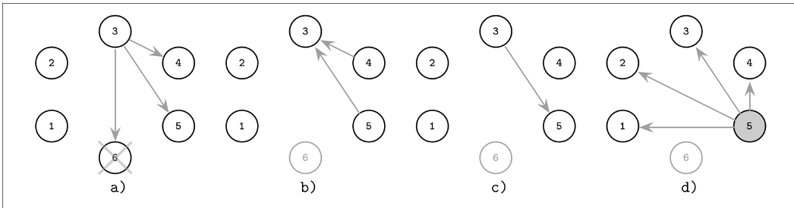

> 图 10-1：Bully 算法；前任领导者 6 发生故障，进程 3 启动新一轮选举，最终进程 5
> 当选。

该算法一个明显的问题是，发生网络分区时它会违反安全性保证，即任何时刻最多只能选出一位领导者。
节点很容易分裂为两个或更多彼此独立工作的子集，而每个子集都会选出自己的领导者。
这种情形称为脑裂。

该算法的另一个问题是强烈偏好排名较高的节点。
如果这些节点不稳定，这种偏好就会成为问题，并可能导致系统永远处于重新选举状态。
一个不稳定的高排名节点推举自己为领导者，不久后发生故障，重新选举时再次胜出，随后再次发生故障，整个过程不断重复。
可以通过分发主机质量指标，并在选举时考虑这些指标来解决这个问题。

### 顺位故障转移

Bully 算法有许多不同版本，用于改进它的各种属性。
例如，可以使用多个顺位候补进程进行故障转移，以缩短重新选举过程 [GholiPour 09]。

每位当选的领导者都会提供一份故障转移节点列表。
某个进程检测到领导者故障时，会向故障领导者所提供列表中排名最高的*候补*发送消息，启动新一轮选举。
如果某个候补仍在运行，它就成为新领导者，无需完成整轮选举。

如果检测到领导者故障的进程本身就是列表中排名最高的进程，
它可以立即向其他进程通知新领导者。

图 10-2 展示了采用这种优化后的过程：

- a) 领导者 6 已指定候补 `{5, 4}`，随后发生崩溃；3
  发现故障，并联系列表中排名最高的候补 5。
- b) 5 向 3 响应自己仍然存活，阻止它继续联系候补列表中的其他节点。
- c) 5 向其他节点通知自己是新领导者。

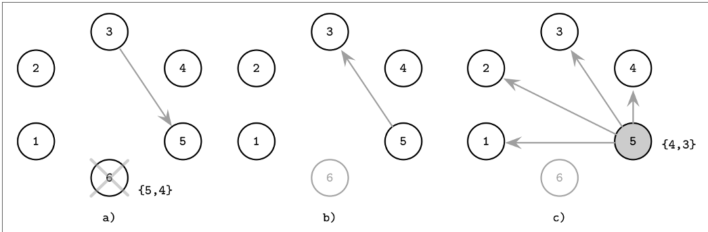

> 图 10-2：带故障转移的 Bully 算法；前任领导者 6 发生故障，进程 3
> 联系排名最高的候补 5， 后者接任领导者。

因此，如果顺位候补进程仍然存活，选举所需的步骤就会减少。

### 候选/普通进程优化

另一种算法把节点分为候选进程和普通进程两个子集，试图减少消息数量；
最终只有候选节点之一能够成为领导者 [MURSHED12]。

普通进程通过联系候选节点来发起选举，收集它们的响应，
选择排名最高且仍存活的候选进程作为新领导者， 再向其余节点通知选举结果。

为解决多场选举同时进行的问题，该算法提出使用决胜变量 $\delta$：
这是每个进程特有的延迟，在节点间差异显著，从而让某个节点能先于其他节点发起选举。
决胜时间通常大于消息往返时间。 优先级较高的节点具有较小的 $\delta$，反之亦然。

图 10-3 展示了选举过程的各个步骤：

- a) 普通进程集中的进程 4 发现领导者进程 6
  发生故障；它联系候选进程集中的所有剩余进程，启动新一轮选举。
- b) 候选进程作出响应，通知 4 自己仍然存活。
- c) 4 向所有进程通知新领导者为 2。

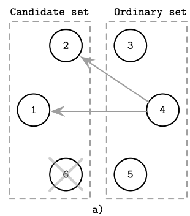

> 图 10-3(a)：Bully 算法的候选/普通进程改进；领导者 6 发生故障后，普通进程 4
> 联系候选进程。

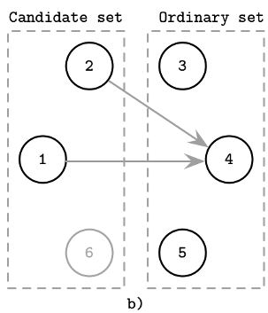

> 图 10-3(b)：候选进程向普通进程 4 响应自己仍然存活。

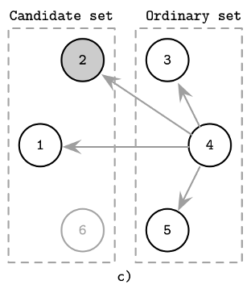

> 图 10-3(c)：普通进程 4 向所有进程通知选举结果，进程 2 成为新领导者。

## 邀请算法

邀请算法允许进程“邀请”其他进程加入自己的组，而不是试图在排名上压过它们。
根据定义，该算法允许存在多个领导者，因为每个组都有自己的领导者。

每个进程一开始都是一个新组的领导者，该组唯一的成员就是它自己。
组领导者联系不属于自己组的对等进程，邀请它们加入。
如果对等进程本身也是领导者，就合并两个组。 否则，被联系的进程会返回组领导者 ID，
让两个组的领导者可以直接建立联系，以更少步骤合并两个组。

图 10-4 展示了邀请算法的执行步骤：

- a) 四个进程一开始分别是只含自身一个成员的组领导者；1 邀请 2 加入自己的组，3
  邀请 4 加入自己的组。
- b) 2 加入进程 1 的组，4 加入进程 3 的组；第一组的领导者 1 联系另一组的领导者
  3； 其余组成员（本例中的 4）会收到新组领导者的通知。
- c) 两个组合并，1 成为扩展后组的领导者。

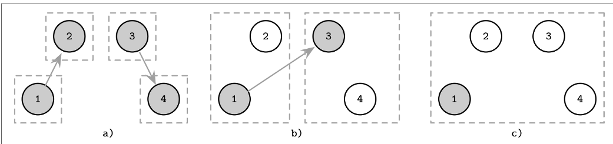

> 图
> 10-4：邀请算法；各自担任组领导者的进程通过邀请和合并逐步组成更大的组，最终进程
> 1 成为合并后组的领导者。

由于组会合并，由提出合并的进程还是另一个进程担任新领导者并不重要。
为了尽量减少合并组所需的消息数量，可以让较大组的领导者担任新组的领导者。
这样只需向较小组中的进程通知领导者变更。

与讨论过的其他算法类似，该算法允许进程分处多个组，也允许多个领导者存在。
邀请算法允许创建和合并进程组，无需从头触发新一轮选举，
从而减少完成选举所需的消息数量。

## 环算法

在环算法 [CHANG79] 中，系统中的所有节点组成一个环，并且知道环拓扑，
即知道自己在环中的前驱和后继。 进程检测到领导者故障时，就启动新一轮选举。
选举消息沿环转发：每个进程联系自己的后继，即环中离它最近的下一个节点。
如果该节点不可用，进程就跳过这个不可达节点，尝试联系环中的后续节点，直到最终有一个节点响应。

节点沿环依次联系同级节点，并收集存活节点集合；
它们先将自己加入集合，再把集合传给下一个节点。
这与“无超时故障检测器”一节描述的故障检测算法相似，
后者的节点会把自己的标识符追加到路径中，再将路径传给下一个节点。

算法会完整遍历整个环。
消息回到启动选举的节点时，就从存活集合中选择排名最高的节点作为领导者。 图 10-5
展示了一次这样的遍历：

- a) 前任领导者 6 已发生故障，每个进程都从自己的视角观察环。
- b) 3
  通过启动遍历来发起一轮选举；在每一步中，都有一个迄今已在路径上遍历过的节点集合；5
  无法到达 6， 因此跳过它，直接前往 1。
- c) 由于 5 是排名最高的节点，3 发起另一轮消息传递，以分发新领导者的信息。

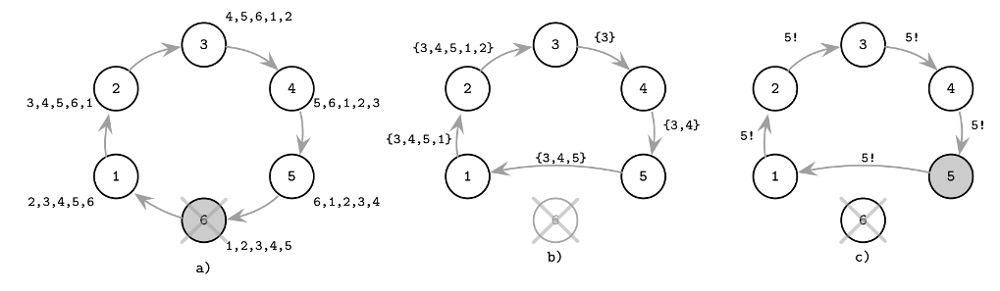

> 图 10-5：环算法；前任领导者 6 发生故障，进程 3
> 启动选举过程，遍历环后选出排名最高的存活进程 5。

该算法的一些变体不收集活跃节点集合，而只收集一个排名最高的标识符，以节省空间。
由于 `max` 函数满足交换律，只需知道当前最大值即可。
算法回到发起选举的节点时，再让最后已知的最高标识符沿环传播一轮。

由于环可能被分割为两个或更多部分，而每一部分都可能选出自己的领导者，
这种方法同样不具备安全性属性。

由此可见，要让具有领导者的系统正确工作，就需要知道当前领导者的状态，即它是否存活。
为了保持进程组织有序并让执行继续，领导者必须存活且可达，才能履行职责。
可以使用故障检测算法（参见第 9 章）检测领导者崩溃。

## 小结

领导者选举是分布式系统中的重要主题，
因为使用指定的领导者有助于降低协调开销，并改善算法性能。
选举轮次的成本可能很高，但由于并不频繁，不会对系统整体性能产生负面影响。
单个领导者可能成为瓶颈；
但大多数时候，可以通过对数据分区并为每个分区使用领导者，或为不同操作使用不同领导者来解决。

遗憾的是，本章讨论的所有算法都容易遭遇脑裂问题：
两个领导者可能存在于彼此独立的子网中，并且不知道对方存在。
为避免脑裂，必须获得集群范围内的多数票。

包括 Multi-Paxos 和 Raft 在内的许多共识算法，都依赖领导者进行协调。
但领导者选举不就等同于共识吗？ 要选出领导者，就需要就其身份达成共识。
如果能就领导者身份达成共识，也就能用相同的手段就任何其他事情达成共识
[ABRAHAM13]。

领导者的身份可能在进程不知情的情况下发生变化，
因此问题在于，进程对领导者的本地认知是否仍然有效。
为此，需要把领导者选举与故障检测结合起来。
例如，*稳定领导者选举*算法使用拥有唯一稳定领导者的轮次和基于超时的故障检测，
保证只要领导者没有崩溃且仍可访问，就能一直保持其地位 [AGUILERA01]。

依赖领导者选举的算法往往*允许*多个领导者存在，并试图尽快解决领导者之间的冲突。
例如，Multi-Paxos（参见“Multi-Paxos”）就是如此：
两个冲突的领导者（提议者）中只有一个能继续推进；
算法通过收集第二个法定人数来解决冲突，保证来自两个不同提议者的值不会都被接受。

在 Raft（参见“Raft”）中，领导者可能发现自己的任期已经过时，
这意味着系统中存在另一个领导者，于是它会把自己的任期更新为较新的任期。

在这两种情况下，拥有领导者都是为了保证_活性_：
如果当前领导者发生故障，就需要选出新的领导者，
而进程不应无限长时间都无法确定它是否真的发生了故障。
缺少*安全性*并允许多个领导者存在，是一种性能优化：
算法可以继续进行复制阶段，再通过检测并解决冲突来保证_安全性_。

第 14 章将结合共识，更详细地讨论共识和领导者选举。

## 延伸阅读

如果想进一步了解本章提到的概念，可以参阅以下资料：

**领导者选举算法**

Lynch, Nancy and Boaz Patt-Shamir. 1993. "Distributed algorithms." *Lecture
notes for 6.852*. Cambridge, MA: MIT.

Attiya, Hagit and Jennifer Welch. 2004. *Distributed Computing: Fundamentals,
Simulations and Advanced Topics*. USA: John Wiley & Sons.

Tanenbaum, Andrew S. and Maarten van Steen. 2006. *Distributed Systems:
Principles and Paradigms* (2nd Ed.) . Upper Saddle River, NJ: Prentice-Hall.

<a id="chapter-11-replication-and-consistency"></a>

# 第 11 章 复制与一致性

在继续讨论共识和原子提交算法之前，
让我们补上深入理解它们所需的最后一块拼图：*一致性模型*。 一致性模型很重要，
因为它解释了存在多个数据副本时系统的可见性语义和行为。

容错是指系统在组件发生故障时仍能继续正确运行的属性。
让系统具备容错能力并非易事， 而且可能很难为现有系统增添容错能力。
首要目标是消除系统中的单点故障， 并确保关键组件具备冗余。 通常，
这种冗余对用户完全透明。

系统可以存储多个数据副本， 这样一台机器发生故障时， 另一台就能接替它提供服务，
从而继续正确运行。 在只有一个事实来源的系统中（例如主库/副本数据库），
可以显式执行故障转移， 将一个副本提升为新主库。 另一些系统无须显式重新配置，
而是在读写查询期间收集多个参与者的响应来保证一致性。

数据复制通过在系统中维护多个数据副本来引入冗余。 然而，
由于以原子方式更新多个数据副本等价于共识问题 [MILOSEVIC11]，
对数据库中的每项操作都这样做可能成本高昂。
我们可以探索一些成本更低、更加灵活的方法， 允许参与者之间存在一定程度的分歧，
同时让数据从用户角度看起来一致。

复制在多数据中心部署中尤为重要。 在这种情况下， 地理复制具有多个目的：
它通过提供冗余来提高可用性， 并增强系统承受一个或多个数据中心故障的能力；
还可以把数据副本放在物理上更靠近客户端的位置， 从而降低延迟。

修改数据记录后， 其副本必须相应更新。 谈论复制时，
我们最关心三个事件：写入、副本更新和读取。
这些操作会触发由客户端发起的一系列事件。 在某些情况下，
从客户端角度看写入已经完成之后， 副本更新才会发生；
但这并不改变客户端必须能以特定顺序观察操作这一事实。

## 实现可用性

我们已经讨论过分布式系统的谬误， 也确认了许多可能出错的地方。 在现实世界中，
节点并非始终存活， 也并非总能彼此通信。 不过， 间歇性故障不应影响_可用性_：
从用户角度看， 整个系统必须像什么都没发生一样继续运行。

系统可用性是一项极其重要的属性： 在软件工程中， 我们始终追求高可用，
并努力把停机时间降至最低。 工程团队常以自己的正常运行时间指标为傲。
我们如此重视可用性有若干原因： 软件已经成为社会不可或缺的一部分，
银行交易、通信、出行等许多重要事务都离不开它。

对企业而言， 缺乏可用性可能意味着失去客户或金钱： 网店宕机时你无法购物，
银行网站没有响应时你也无法转账。

为了让系统高度可用， 设计必须能从容应对一个或多个参与者故障或不可用的情形。
为此， 我们需要引入冗余和复制。 然而， 一旦增加冗余，
就必须面对保持多个数据副本同步的问题， 并实现恢复机制。

## 声名狼藉的 CAP

可用性衡量系统能否成功响应每个请求。 其理论定义只要求最终给出响应，
但在真实系统中， 我们当然不希望服务要无限久才能响应。

理想情况下， 我们希望每项操作都保持_一致_。
此处的一致性定义为原子一致性或_线性一致性_（参见[线性一致性](#线性一致性)）。
线性一致的历史可表示为一系列保留原始操作顺序的瞬时操作。
线性一致性简化了对可能系统状态的推理， 使分布式系统看起来像在单台机器上运行。

我们希望在容忍网络分区的同时实现一致性和可用性。 网络可能被分割成若干部分，
其中的进程无法相互通信： 分区节点之间发送的一些消息到不了目的地。

可用性要求任何未发生故障的节点都交付结果， 而一致性要求结果具备线性一致性。 Eric
Brewer 提出的 CAP 猜想讨论了一致性（Consistency）、可用性（Availability）
和分区容错性（Partition tolerance）之间的权衡 [BREWER00]。

在发生网络分区的异步系统中， 不可能同时保证 CAP 可用性和线性一致性 [GILBERT02]。
我们可以构建保证强一致性并尽力提供可用性的系统，
也可以构建保证可用性并尽力提供一致性的系统 [GILBERT12]。
这里的“尽力”意味着一切正常时， 系统不会有意违反任何保证； 但发生网络分区时，
允许削弱和违反这些保证。

换言之， CAP 描述了一个由潜在选择构成的连续谱， 其两端分别是以下系统：

### 一致且分区容错

CP 系统宁愿让请求失败， 也不愿提供可能不一致的数据。

### 可用且分区容错

AP 系统放宽一致性要求， 允许在请求期间提供可能不一致的值。

实现共识算法的系统就是 CP 系统的一个例子： 它需要多数节点才能推进，
始终保持一致， 但发生网络分区时可能不可用。
只要有一个副本在线就始终接受写入和提供读取的数据库， 则是 AP 系统的例子；
它最终可能丢失数据或提供不一致的结果。

作为 CAP 扩展的 PACELC 猜想 [ABADI12] 指出： 存在网络分区时，
需要在一致性和可用性之间选择（PAC）； 否则（E）， 即使系统正常运行，
仍要在延迟和一致性之间选择（LC）。

### 谨慎使用 CAP

需要特别注意， CAP 讨论的是_网络分区_，
而不是*节点崩溃*或其他任何故障类型（如崩溃恢复）。
与集群其余部分隔离的节点可能为请求提供不一致的结果， 而崩溃的节点根本不会响应。
一方面， 这意味着即使没有任何节点宕机， 也可能遇到一致性问题。 另一方面，
现实世界的情况并非这么简单： 故障场景多种多样， 其中一些可以用网络分区模拟。

CAP 意味着即使所有节点都在运行， 只要它们之间存在连接问题，
我们也可能遇到一致性问题， 因为我们要求每个未发生故障的节点都正确响应，
而不考虑可能有多少节点宕机。

CAP 猜想有时被画成一个三角形， 仿佛可以旋转旋钮， 同时增减三个参数。 然而，
尽管我们可以旋转旋钮、在一致性和可用性之间权衡，
分区容错性却不是现实中可以调节或拿来交换其他属性的东西 [HALE10]。

> [!NOTE]
> CAP 中的一致性指线性一致性：
> 每项操作看起来在调用与响应之间的某个瞬间原子生效， 并遵守实时先后顺序。
> 它不同于 ACID（参见第 5 章）中描述事务保持数据库不变量的一致性。

CAP 中的可用性也不同于前述的_高可用性_ [KLEPPMANN15]。 CAP
的定义不限制执行延迟。 此外， 数据库中的可用性与 CAP 不同，
并不要求*每个*未发生故障的节点都响应*每个*请求。

CAP 猜想可用来解释分布式系统、推理故障场景以及评估可能出现的情况； 但务必记住，
放弃一致性与提供不可预测的结果之间仅有一线之隔。

声称偏向可用性的数据库在正确使用时， 只要有足够多的副本存活，
仍能从副本提供一致的结果。 当然， 故障场景还可能复杂得多， CAP
猜想只是一条经验法则， 不一定反映全部事实。[^11-1]

[^11-1]: 有关最终一致存储中 quorum
    读写的更多讨论，参见[最终一致性](#最终一致性)。

## 收获量与产出率

CAP 猜想只讨论最强形式的一致性和可用性： 线性一致性，
以及系统最终响应每个请求的能力。 这迫使我们在两项属性之间作出艰难取舍。 不过，
某些应用可以受益于稍微放宽的假设， 我们也可以考虑这些属性的较弱形式。

系统不必*要么*一致、*要么*可用， 而可以提供放宽后的保证。
我们可以定义两个可调指标：*收获量*和_产出率_； 在二者之间作出选择，
仍可视为正确行为 [FOX99]。

### 收获量

定义查询结果的完整程度： 如果查询应返回 100 行， 却因某些节点不可用而只能取得 99
行， 这仍可能好过让查询彻底失败、什么也不返回。

### 产出率

表示成功完成的请求数占尝试请求总数的比例。 产出率不同于正常运行时间； 例如，
繁忙节点并没有宕机， 却仍可能无法响应部分请求。

这把权衡的重点从绝对值转向相对值。 我们可以用收获量换取产出率，
允许部分请求返回不完整数据。
提高产出率的一种方法是只返回来自可用分区的查询结果（参见“数据库分区”一章）。
例如， 即使存储部分用户记录的一组节点宕机， 我们仍可继续为其他用户提供服务。
另一种选择是要求关键应用数据只能完整返回， 但允许其他请求存在一定偏差。

定义并度量收获量和产出率， 以及在二者间作出有意识的选择，
有助于构建对故障更有韧性的系统。

## 共享内存

对客户端而言， 存储数据的分布式系统表现得像拥有共享存储， 与单节点系统类似。
节点间通信和消息传递被抽象掉， 在幕后进行。 这营造出共享内存的假象。

可由读写操作访问的单个存储单元通常称为_寄存器_。
我们可以把分布式数据库中的*共享内存*视为这类寄存器组成的数组。

我们用*调用*和*完成*事件标识每项操作。 如果发起操作的进程在操作完成前崩溃，
就把该操作定义为_失败_。
如果一项操作的调用和完成事件都发生在另一项操作调用之前， 就称前者*先于*后者，
且两项操作是*顺序*的； 否则称它们_并发_。

图 11-1 展示了进程 $P_1$ 和 $P_2$ 执行不同操作的情形：

- a) 进程 $P_2$ 执行的操作在 $P_1$ 的操作已经完成后才开始，
  两项操作为*顺序*操作。
- b) 两项操作存在重叠， 因而是并发操作。
- c) $P_2$ 的操作在 $P_1$ 的操作开始后才开始， 却在它之前完成；
  这两项操作也是并发操作。

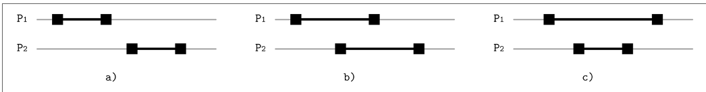

> 图 11-1：顺序操作与并发操作。

多个读取者或写入者可以同时访问寄存器。 寄存器的读写操作_并非瞬时完成_，
而要花费一定时间。 不同进程执行的并发读写操作不是*串行*的：
根据操作重叠时寄存器的行为， 这些操作可能以不同方式排序， 并产生不同结果。
按照并发操作存在时寄存器的行为， 可以区分三类寄存器：

### 安全寄存器

并发写入期间，
对安全寄存器的读取可能返回该寄存器取值范围内的*任意*值（这听起来并不实用，
但或许能描述不强加顺序的异步系统语义）。 并发读写期间，
取二进制值的安全寄存器可能看起来在_闪烁_， 即返回值在两个值之间交替。

### 正则寄存器

正则寄存器提供稍强的保证： 读操作只能返回最近一次已完成写入所写的值，
或与当前读取重叠的写操作所写的值。 此时系统具备一定的顺序概念，
但写入结果不会同时对所有读取者可见（例如，
主库接受写入、再复制到提供读取的工作节点时， 复制数据库中就可能出现这种情况）。

### 原子寄存器

原子寄存器保证线性一致性： 每项写操作都有一个唯一时刻，
在此之前每项读操作都返回旧值， 在此之后每项读操作都返回新值。
原子性是一项基础属性， 它简化了对系统状态的推理。

## 排序

看到一系列事件时， 我们会直觉地判断其执行顺序。 然而，
在分布式系统中这并不总是容易， 因为很难知道某件事究竟在何时发生，
也很难让整个集群立即获得这一信息。 每个参与者都可能拥有自己的状态视图，
因此我们必须逐项查看操作， 根据其*调用*和*完成*事件来定义它， 并描述操作的边界。

假设一个系统中的进程可以在共享寄存器上执行 `read(register)` 和
`write(register, value)` 操作。 每个进程顺序执行自己的操作集合， 也就是说，
每项已调用的操作必须先完成， 才能开始下一项操作。
各进程的顺序执行组合成一段全局历史， 其中的操作可以并发执行。

思考一致性模型最简单的方法， 是考虑读写操作及其可能的重叠方式：
读操作没有副作用， 写操作则改变寄存器状态。
这有助于推理写入之后数据究竟何时变得可读。 例如，
考虑两个进程并发执行以下事件的历史：

```text
进程 1：       进程 2：
write(x, 1)    read(x)
read(x)
```

只看这些事件， 无法确定两次 `read(x)` 分别会得到什么结果。 可能的历史有若干种：

- 写入在两次读取之前完成。
- 写入和两次读取彼此交错， 写入可能在两次读取之间执行。
- 两次读取都在写入之前完成。

即使只有一份数据， 也无法简单回答应该发生什么。 在复制系统中，
可能状态的组合更多； 当多个进程读写数据时， 情况还会更加复杂。

如果所有操作都由单个进程执行， 我们可以强制采用严格的事件顺序；
但涉及多个进程时就难多了。 潜在困难可归为两类：

- 操作可能重叠。
- 不重叠调用的效果可能不会立即可见。

为了推理操作顺序并明确描述可能结果， 我们必须定义一致性模型。
我们借助共享内存和并发系统来讨论分布式系统中的并发，
因为定义一致性的多数定义和规则仍然适用。
尽管并发系统与分布式系统的大量术语相互重叠， 但由于通信模式、性能和可靠性不同，
我们不能直接应用多数并发算法。

## 一致性模型

由于共享内存寄存器上的操作可以重叠， 我们应明确规定其语义：
多个客户端同时或在短时间内读取、修改不同数据副本时会发生什么。
这个问题没有唯一正确答案， 因为语义因应用而异； 不过，
一致性模型领域已对它进行了充分研究。

一致性模型提供不同的语义和保证。 可以把一致性模型视为参与者之间的契约：
每个副本必须做什么才能满足所需语义， 用户发出读写操作时又可以期待什么。

一致性模型描述了即使存在多个数据副本及并发访问，
客户端仍可对可能返回的值抱有哪些预期。 本节将讨论*单操作*一致性模型。

每种模型都描述系统行为与我们所期待或认为自然的行为相差多远。
它帮助我们区分“操作交错产生的所有可能历史”和“模型 X 允许的历史”，
从而显著简化对状态变化可见性的推理。

我们可以从状态角度思考一致性， 描述哪些状态不变量可以接受，
并规定放在不同副本上的数据副本之间允许存在何种关系。 也可以考虑操作一致性：
它从外部观察数据存储， 描述操作并约束其发生顺序 [TANENBAUM06] [AGUILERA16]。

没有全局时钟时， 很难为分布式操作赋予精确且确定的顺序。
这就像数据领域的狭义相对论： 每个参与者都有自己的状态观和时间观。

理论上， 每次想改变系统状态时， 我们都可以获取一把全系统锁； 但这极不现实。
我们转而使用一组规则、定义和限制， 缩小可能历史和结果的范围。

一致性模型为[声名狼藉的 CAP](#声名狼藉的-cap)中所讨论的问题增加了一个维度。
现在不仅要兼顾一致性与可用性， 还要从同步成本角度考虑一致性 [ATTIYA94]。
同步成本可能包括延迟、执行额外操作消耗的 CPU 周期、持久化恢复信息所用的磁盘
I/O、等待时间、网络 I/O， 以及避免同步就能省下的一切成本。

首先， 我们将关注操作结果的可见性和传播。 回到并发读写示例，
我们可以把相互依赖的写入依次排列， 或定义新值的传播时点，
从而限制可能历史的数量。

我们使用对数据库状态发出_读_、*写*操作的_进程_（客户端）来讨论一致性模型。
由于讨论的是复制数据的一致性， 我们假设数据库可以有多个副本。

### 严格一致性

严格一致性等价于复制完全透明： 任何进程的任何写入，
都会立即供任何进程之后的读取使用。 它涉及全局时钟概念； 如果在时刻 $t_1$ 执行了
`write(x, 1)`， 那么在任意时刻 $t_2 > t_1$， `read(x)` 都将返回刚写入的值 1。

遗憾的是， 这只是理论模型， 无法实现；
物理定律和分布式系统的工作方式限制了事件发生的速度 [SINHA97]。

### 线性一致性

线性一致性是最强的单对象、单操作一致性模型。 在此模型下，
写入的效果会在操作开始与结束之间的某个时点恰好一次地对所有读取者可见；
任何客户端都无法观察到部分写入（尚未结束、仍在执行）或未完成写入（完成前被中断）的状态转变或副作用
[LEE15]。

并发操作被表示为一种满足可见性属性的可能顺序历史。
线性一致性存在一定的不确定性， 因为事件可能有不止一种排序方式 [HERLIHY90]。

如果两项操作重叠， 它们可以按任意顺序生效。
写操作完成后发生的所有读操作都能观察到它的效果。 一旦某项读操作返回了特定值，
之后所有读取返回的值至少要与它一样新 [BAILIS14a]。

并发事件在全局历史中的发生顺序有一定灵活性， 但不能随意重排。
操作结果不应在操作开始前生效， 否则就需要能预测未来操作的神谕。 与此同时，
结果必须在完成前生效， 否则便无法定义线性化点。

线性一致性既尊重进程局部的顺序操作次序， 也尊重并行操作相对于其他进程的次序，
并定义事件的_全序_。

此顺序应当_一致_： 每次读取共享值时，
都应返回此次读取之前写入该共享变量的最新值， 或与此次读取重叠的写入所写的值。
对共享变量的线性一致写访问还意味着互斥： 两项并发写入中只能有一项先发生。

虽然操作并发且有所重叠， 但其效果的可见方式使它们看起来依次执行。
没有操作真正瞬时发生， 却仍然*表现*得像原子操作。

考虑以下历史：

```text
进程 1：       进程 2：       进程 3：
write(x, 1)    write(x, 2)    read(x)
read(x)
read(x)
```

图 11-2 中有三个进程， 其中两个在初始值为 $\emptyset$ 的寄存器 $x$
上执行写操作。 读操作可能以下列方式观察这些写入：

- a) 第一次读取可以返回 1、2 或 $\emptyset$（初始值， 即两次写入之前的状态），
  因为两次写入都仍在执行。
  第一次读取可以排在两次写入之前、两次写入之间或两次写入之后。
- b) 第二次读取只能返回 1 或 2， 因为第一次写入已经完成， 第二次写入尚未返回。
- c) 第三次读取只能返回 2， 因为第二次写入排在第一次写入之后。

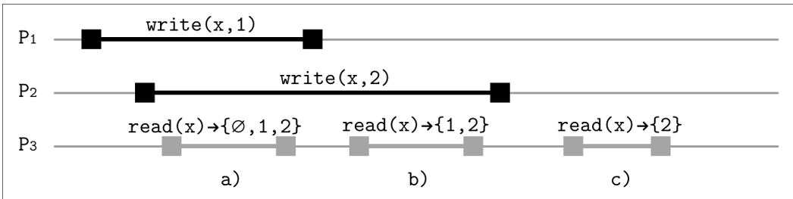

> 图 11-2：线性一致性示例。

#### 线性化点

线性一致性最重要的特征之一是可见性： 操作一旦完成， 所有人都必须看到它；
系统不能“穿越回过去”， 撤销它或让部分参与者看不到它。 换言之，
线性化禁止陈旧读取， 并要求读取单调。

最好用原子操作（即不可中断、不可分割的操作）来解释这种一致性模型。
操作不必瞬时完成（也不存在真正的瞬时操作）， 但其效果必须在某个时点变得可见，
营造出操作瞬时完成的假象。 这个时刻称为线性化点。

越过写操作的线性化点后（换言之， 该值对其他进程可见时），
每个进程都必须看到该操作写入的值； 如果还有其他写操作排在它之后，
则看到某个更晚的值。 一个值变得可见后， 应一直保持稳定， 直至下一个值变得可见；
寄存器不应在最近两个状态之间来回切换。

> [!NOTE]
> 如今多数编程语言都提供原子原语，
> 支持原子写和比较并交换（compare-and-swap，CAS）操作。
> 原子写不考虑寄存器当前值； CAS 则只有在原值未变时才从一个值切换到另一个值
> [HERLIHY94]。 读取值、修改值、再用 CAS 写入， 比单纯检查并设置值更复杂，
> 原因是可能出现 ABA 问题 [DECHEV10]： 如果 CAS 预期寄存器中存在值 A，
> 那么即使另两项并发写操作曾把它改成 B 又改回 A， CAS 仍会安装新值。 换言之，
> 仅仅存在值 A 并不能保证它在上次读取后未曾改变。

线性化点是一条分界线， 越过它后操作效果就变得可见。 可以用锁保护临界区，
或使用原子读写及读取-修改-写入原语来实现它。

图 11-3 表明线性一致性假定严格的时间边界， 而且时钟是_实时时钟_；
所以操作效果必须在发出操作请求的 $t_1$ 与进程收到响应的 $t_2$ 之间变得可见。

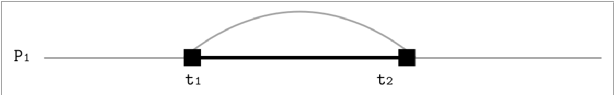

> 图 11-3：线性一致操作的时间边界。

图 11-4 说明线性化点把历史分成前后两部分。 在线性化点之前旧值可见，
在线性化点之后新值可见。


> 图 11-4：线性化点。

#### 线性一致性的成本

如今许多系统都避免实现线性一致性。 即使 CPU 默认也不为主内存访问提供线性一致性。
这是因为同步指令成本高、速度慢， 还涉及跨节点 CPU 流量和缓存失效。 不过，
使用底层原语可以实现线性一致性 [MCKENNEY05a] [MCKENNEY05b]。

在并发编程中， 可以使用比较并交换操作引入线性一致性。 许多算法先*准备*结果，
再用 CAS 交换指针并*发布*结果。 例如， 我们可以创建链表节点，
再以原子方式把它追加到链表尾部， 从而实现并发队列 [KHANCHANDANI18]。

在分布式系统中， 线性一致性需要协调和排序。 它可以通过*共识*实现：
客户端使用消息与复制存储交互， 共识模块负责确保整个集群应用的操作一致且相同。
每项写操作都会在其调用与完成事件之间的某个时点恰好一次地表现为瞬时发生
[HOWARD14]。

有趣的是， 传统理解中的线性一致性被视为局部属性，
并支持组合独立实现和验证的元素。 组合线性一致的历史仍会产生线性一致的历史
[HERLIHY90]。 换言之， 所有对象都线性一致的系统也是线性一致的。
这是非常有用的属性， 但应记住其范围仅限于单个对象；
即使两个独立对象上的操作都线性一致， 同时涉及二者的操作仍须依赖额外同步手段。

#### 可复用的线性一致性基础设施

可复用的线性一致性基础设施（Reusable Infrastructure for Linearizability，
RIFL）是一种实现线性一致远程过程调用（RPC）的机制 [LEE15]。 在 RIFL 中，
消息由客户端 ID 和客户端本地单调递增的序列号唯一标识。

为了分配客户端 ID， RIFL 使用由全系统服务签发的租约： 唯一标识符用来建立唯一性，
并打破序列号平局。 如果发生故障的客户端试图使用过期租约执行操作，
其操作不会提交； 客户端必须获取新租约并重试。

如果服务器在确认写入前崩溃， 客户端可能会重试该操作， 却不知道它已经应用。
甚至可能出现这种情况： 客户端 C1 写入值 V1， 但没有收到确认； 与此同时客户端 C2
写入 V2。 如果 C1 重试并成功写入 V1， C2 的写入就会丢失。 为避免这种情况，
系统需要阻止重试操作重复执行。 客户端重试时， RIFL 不会重新应用操作，
而是返回一个完成对象， 表明关联操作已经执行， 并返回其结果。

完成对象与实际数据记录一起存入持久存储。 不过二者的生命周期不同：
完成对象应一直存在， 直至发起它的客户端承诺不再重试关联操作；
或者直至服务器检测到客户端崩溃， 此时便可安全删除与该客户端关联的所有完成对象。
创建完成对象必须与修改其关联的数据记录保持原子性。

客户端必须定期续租来表明自己仍然存活。 如果客户端没有续租， 就会被标记为已崩溃，
与其租约关联的所有数据都会被垃圾回收。 租约生命周期有限，
以确保故障进程的操作不会永远留在日志中。
如果故障客户端试图使用过期租约继续操作， 其结果不会提交， 客户端必须从头开始。

RIFL 的优点在于： 它保证 RPC 不会执行超过一次，
因而只要确保操作结果以原子方式变得可见， 就能使操作线性一致；
而且其大多数实现细节都独立于底层存储系统。

### 顺序一致性

实现线性一致性可能成本过高， 但可以放宽模型， 同时仍提供相当强的一致性保证。
顺序一致性允许把操作排列成仿佛按某种顺序执行的样子，
同时要求每个进程的操作保持该进程执行它们时的顺序。

进程可以按照与自身历史一致的顺序观察其他参与者执行的操作， 但从全局角度看，
这个视图可以任意陈旧 [KINGSBURY18a]。 进程之间的执行顺序没有定义，
因为它们没有共同的时间概念。

顺序一致性最初在并发领域提出， 用来描述如何正确执行多处理器程序。
最初的描述要求对同一内存单元的请求在队列中有序排列（FIFO，即到达顺序），
不要求对独立内存单元的重叠写入采用全局顺序， 并允许读取从内存单元取得值，
或在队列非空时取得队列中的最新值 [LAMPORT79]。
这个例子有助于理解顺序一致性的语义。 操作可以按不同方式排序（取决于到达顺序，
两次写入同时到达时甚至可以任意排序）， 但所有进程都以相同顺序观察操作。

每个进程可以按照自身程序规定的顺序发出读写请求， 这很符合直觉。
任何非并发的单线程程序都是这样逐步执行。
来自同一进程的所有写操作按该进程提交它们的顺序传播。
来自不同来源的操作可以任意排序， 但从读取者角度看， 该顺序保持一致。

> [!NOTE]
> 顺序一致性常与线性一致性混淆， 因为二者语义相近。
> 顺序一致性与线性一致性一样要求操作具有全局顺序，
> 但线性一致性还要求全局顺序尊重操作的实时先后关系；
> 顺序一致性只要求保持各进程的程序顺序 [VIOTTI16]。 另一个重要区别是可组合性：
> 组合线性一致的历史仍可期待得到线性一致的结果， 而顺序一致的调度不可组合
> [ATTIYA94]。

图 11-5 展示了 `write(x,1)` 和 `write(x,2)` 如何对 $P_3$ 与 $P_4$ 可见。
尽管按实际时钟时间来看， 1 先于 2 写入， 但 1 可以排在 2 之后。 与此同时， 即使
$P_3$ 已经读到值 1， $P_4$ 仍可读到 2。 然而， 只要不同读取者看到的顺序一致，
$1 \rightarrow 2$ 和 $2 \rightarrow 1$ 都有效。 关键在于 $P_3$ 和 $P_4$
以相同顺序观察到这些值： 先是 2， 再是 1 [TANENBAUM14]。

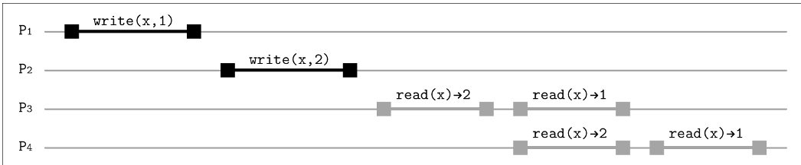

> 图 11-5：顺序一致性中的排序。

陈旧读取可以用副本分歧来解释： 即使写入以相同顺序传播到不同副本，
也可能在不同时刻到达。

与线性一致性的主要区别是没有全局强制的时间边界。 在线性一致性下，
操作必须在其实际时钟时间边界内生效。 写操作 $w_1$ 完成时， 其结果必须已应用，
每个读取者都应至少能看到与 $w_1$ 所写值一样新的值。 同理， 读操作 $R_1$ 返回后，
任何后来发生的读操作都应返回 $R_1$
看到的值或更晚的值（后者当然也必须遵循同一规则）。

顺序一致性放宽了这一要求： 只要从各处理器角度看顺序一致，
操作结果可以在操作完成*之后*才变得可见。 同源写入不能彼此“超车”：
相对于执行它们的进程， 必须保持其程序顺序。
另一项限制是已经呈现的操作顺序必须对*所有*读取者保持一致。

与线性一致性类似， 现代 CPU 默认不保证顺序一致性； 由于处理器可以重排指令，
我们应使用内存屏障（也称栅栏）确保写入依次对并发线程可见 [DREPPER07]
[GEORGOPOULOS16]。

### 因果一致性

> 你看， 只有一个常量、一个普遍法则， 它是唯一真正的真理：因果关系。 行动。
> 反应。 起因与结果。
>
> ——《黑客帝国 2：重装上阵》中的 Merovingian

虽然通常不需要全局操作顺序， 但可能需要为*部分*操作建立顺序。
在*因果一致性*模型下， 所有进程必须以相同顺序观察*具有因果关系*的操作。
不具备因果关系的*并发写入*可以被不同处理器以不同顺序观察到。

首先看看为什么需要因果关系， 以及无因果关系的写入如何传播。 图 11-6 中， 进程
$P_1$ 和 $P_2$ 进行的写入不具有因果顺序。
这些操作的结果可能在不同时刻、以乱序方式传播给读取者。 进程 $P_3$ 先看到值 1
再看到 2， 而 $P_4$ 先看到 2 再看到 1。

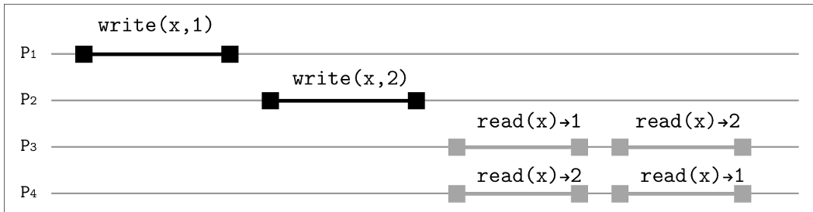

> 图 11-6：无因果关系的写操作。

图 11-7 给出了具有因果关系的写入示例。 除写入值外， 现在还必须指定逻辑时钟值，
以建立操作之间的因果顺序。 $P_1$ 从写操作
$\text{write}(x, \emptyset, 1) \to t_1$ 开始， 该操作以初始值 $\emptyset$
为起点。 $P_2$ 又执行写操作 $\text{write}(x, t_1, 2)$， 并指定它在逻辑上排在
$t_1$ *之后*， 要求操作只能按逻辑时钟建立的顺序传播。

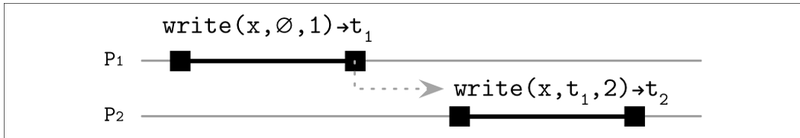

> 图 11-7：具有因果关系的写操作。

这就在操作之间建立了_因果顺序_。 即使后一次写入传播得比前一次更快，
在其所有依赖项到达前也不会变得可见； 事件顺序会依据逻辑时间戳重建。 换言之，
无需使用物理时钟即可在逻辑上建立 happened-before 关系，
而且所有进程都认可这一顺序。

图 11-8 中， 进程 $P_1$ 和 $P_2$ 进行具有因果关系的写入，
这些写入按逻辑顺序传播到 $P_3$ 和 $P_4$。 这可以避免图 11-6 所示的情况；
你可以比较两幅图中 $P_3$ 和 $P_4$ 的历史。

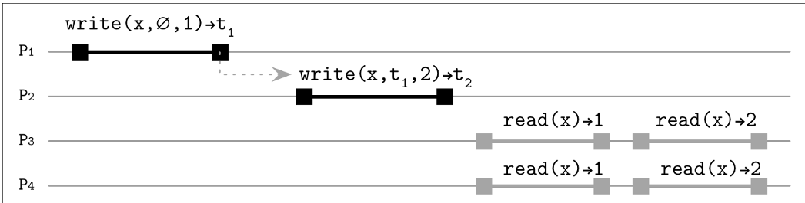

> 图 11-8：具有因果关系的写操作传播。

可以用在线论坛中的交流来理解这一点： 你在网上发布内容， 有人看到后作出回复，
第三个人又看到回复并继续这条对话线索。 对话线索可能分叉：
你可以选择回复线索中的某段对话， 继续事件链； 但有些线索只有少量共同消息，
因此所有消息可能并不存在唯一历史。

在因果一致系统中， 应用会获得会话保证， 确保其数据库视图与自己的操作一致，
即使它向不同且可能彼此不一致的服务器执行读写请求也是如此 [TERRY94]。
这些保证包括：单调读、单调写、读己之写和写随读。
更多信息参见[会话模型](#会话模型)。

可以使用逻辑时钟 [LAMPORT78] 实现因果一致性， 并随每条消息发送上下文元数据，
汇总逻辑上先于当前操作的操作。 服务器返回更新时， 其中包含最新版本的上下文。
只有先前的所有操作都已应用， 当前操作才能处理。
上下文不匹配的消息会在服务器端缓冲， 因为现在交付它们还太早。

实现因果一致性且经常被引用的两个著名项目是保持顺序的服务器集群（Clusters of
Order-Preserving Servers，COPS）[LLOYD11] 和 Eiger [LLOYD13]。
二者都通过一个库（实现为用户所连接的前端服务器）实现因果性，
并跟踪依赖关系来保证一致性。 COPS 通过键版本跟踪依赖关系， Eiger
则建立操作顺序（Eiger 中的操作可以依赖其他节点上执行的操作， 例如跨分区事务）。
二者都不会像最终一致存储那样暴露乱序操作， 而是检测并处理冲突： COPS
检查键顺序并使用应用专用函数， Eiger 则实现最后写入胜出规则。

#### 向量时钟

建立因果顺序后， 即使消息乱序交付， 系统也能重建事件序列、填补消息间的空缺，
并在仍缺少某些消息时避免发布操作结果。 例如， 如果消息
$\{M1(\emptyset,t1), M2(M1,t2), M3(M2,t3)\}$ 具有因果关系且乱序传播，
其中每条消息都指定自己的依赖项， 进程就会缓冲它们，
直到收集到全部操作依赖并恢复因果顺序 [KINGSBURY18b]。 许多数据库（例如 Dynamo
[DECANDIA07] 和 Riak [SHEEHY10a]） 使用向量时钟 [LAMPORT78] [MATTERN88]
建立因果顺序。

向量时钟是一种在事件之间建立偏序、检测并解决事件链分歧的结构。 借助向量时钟，
可以模拟共同时间和全局状态， 并把异步事件表示成同步事件。
进程维护由多个逻辑时钟组成的向量， 每个进程对应一个时钟。 每个时钟从初始值开始，
每当新事件到达（例如发生写入）就递增。 收到其他进程的时钟向量时，
进程会针对每个进程，
把本地向量更新成所收向量中的最高时钟值（即发送节点见过的最高时钟值）。

使用向量时钟解决冲突时， 每当写入数据库，
我们首先检查所写键的值在本地是否已存在。 如果已有旧值， 就向版本向量追加新版本，
并建立两次写入之间的因果关系。 否则， 就开始新的事件链，
并用单个版本初始化该值。

此前我们用共享内存寄存器访问和实际时钟操作排序来讨论一致性，
并在讨论顺序一致性时首次提到潜在的副本分歧。
由于只有对同一内存位置的写操作必须排序， 如果各值相互独立， 就不会出现写冲突
[LAMPORT79]。

由于我们寻找的是能改善可用性和性能的一致性模型，
必须允许副本不仅因提供陈旧读取而发生分歧， 还可接受可能冲突的写入，
于是系统可以创建两条独立的事件链。 图 11-9 展示了这种分歧： 从一个副本的角度看，
历史为 1、5、7、8； 另一个副本报告的历史则是 1、5、3。 Riak
允许用户查看并解决分歧的历史 [DAILY13]。

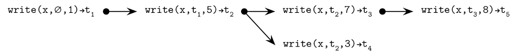

> 图 11-9：因果一致性下发生分歧的历史。

> [!NOTE]
> 为实现因果一致性， 我们必须存储因果历史、增加垃圾回收，
> 并在发生冲突时要求用户协调分歧历史。 向量时钟可以告知冲突已经发生，
> 却不会给出确切的解决办法， 因为解决语义通常由应用决定。 因此， Apache
> Cassandra 等一些最终一致数据库不按因果关系排列操作，
> 而是使用最后写入胜出规则解决冲突 [ELLIS13]。

### 会话模型

从值传播角度思考一致性对数据库开发者很有帮助，
因为这有助于理解并施加所需的数据不变量；
但有些事情从客户端角度更容易理解和解释。
我们可以从单个客户端而非多个客户端的角度观察分布式系统。

会话模型 [VIOTTI16]（也称以客户端为中心的一致性模型 [TANENBAUM06]）
有助于从客户端角度推理分布式系统状态：
每个客户端发出读写操作时如何观察系统状态。

此前讨论的其他一致性模型着重解释存在并发客户端时的操作排序，
而以客户端为中心的一致性关注单个客户端如何与系统交互。
我们仍假设每个客户端顺序执行操作： 必须完成一项操作才能开始下一项。
如果客户端在操作完成前崩溃或与服务器断开连接，
我们不对未完成操作的状态作任何假设。

在分布式系统中， 客户端通常可以连接任何可用副本；
如果最近写入一个副本的结果尚未传播到另一个副本，
客户端可能无法观察到自己所做的状态改变。

一种合理预期是客户端发出的每次写入都对自身可见。 *读己之写*一致性模型规定：
同一副本或其他副本上发生于写入之后的每次读取， 都必须观察到更新后的值。 例如，
紧接 `write(x,V)` 执行的 `read(x)` 将返回值 V。

单调读模型限制值的可见性， 并规定如果 `read(x)` 已经观察到值 V，
之后的读取就必须观察到至少与 V 一样新的值或更晚的值。

单调写模型假设来自同一客户端的值按照客户端执行它们的顺序出现。
如果按照客户端会话顺序， `write(x,V2)` 发生在 `write(x,V1)` 之后，
那么它们的效果必须以相同顺序（先 V1， 再 V2）对其他所有进程可见。 没有这一假设，
旧数据可能“复活”， 导致数据丢失。

写随读（有时称为会话因果性）确保写入排在先前读操作所观察到的写入之后。 例如，
如果 `write(x,V2)` 排在返回 V1 的 `read(x)` 之后， 那么 `write(x,V2)` 也会排在
`write(x,V1)` 之后。

> [!NOTE]
> 会话模型不对不同进程（客户端）或不同逻辑会话发出的操作作任何假设
> [TANENBAUM14]。 这些模型从单个进程角度描述操作排序。 不过，
> 同样的保证必须对系统中的每个进程成立。 换言之， 如果 $P_1$ 能读到自己的写入，
> $P_2$ 也应能读到自己的写入。

组合单调读、单调写和读己之写， 可以得到流水线 RAM（Pipelined RAM，PRAM）一致性
[LIPTON88] [BRZEZINSKI03]， 它也称为 FIFO 一致性。 PRAM
保证来自同一进程的写操作按该进程执行它们的顺序传播。 与顺序一致性不同，
来自不同进程的写入可以按不同顺序被观察到。

以客户端为中心的一致性模型所描述的属性都很值得拥有； 多数情况下，
分布式系统开发者会用它们验证系统并简化系统使用。

### 最终一致性

无论在多处理器编程还是分布式系统中， 同步都很昂贵。
正如[一致性模型](#一致性模型)中所讨论的， 我们可以放宽一致性保证，
使用允许节点之间存在一定分歧的模型。 例如， 顺序一致性允许读取以不同速度传播。

在*最终一致性*下， 更新在系统中异步传播。 其形式化定义是：
如果不再对某个数据项执行*额外*更新， 那么*最终*所有访问都会返回最近写入的值
[VOGELS09]。 发生冲突时， “最近”的含义可能改变，
因为来自分歧副本的值会使用最后写入胜出或向量时钟等冲突解决策略进行协调（参见[向量时钟](#向量时钟)）。

“最终”用来描述值传播很有意思， 因为它没有规定必须在多长时间内完成。
如果交付服务除了“最终”保证之外什么都不提供， 听起来似乎并不可靠。

不过实践中效果很好， 如今许多数据库都被称为最终一致数据库。

### 可调一致性

最终一致系统有时用 CAP 来描述： 可以用可用性换取一致性，
反之亦然（参见[声名狼藉的 CAP](#声名狼藉的-cap)）。 从服务器端看，
最终一致系统通常实现可调一致性， 用三个变量复制、读取和写入数据：

**复制因子 N**

存储数据副本的节点数。

**写一致性 W**

写入成功前必须确认该写入的节点数。

**读一致性 R**

读取成功前必须响应读操作的节点数。

选择满足 $R + W > N$ 的一致性级别， 并使用版本信息从响应中选择最新值时，
可以保证读集合与最近一次已完成写入的写集合重叠。 例如， 若 N = 3、W = 2、R = 2，
系统只能容忍一个节点故障。 三个节点中必须有两个确认写入。 理想情况下，
系统还会把写入异步复制到第三个节点。 如果第三个节点宕机， 反熵机制（参见第 12
章）最终会把写入传播过去。

读取期间， 三个副本中必须有两个可用并为请求提供服务， 我们才能返回一致的结果。
任意节点组合中， 都至少有一个节点拥有指定键的最新记录。

> [!NOTE]
> 执行写入时， 协调者应把它提交给 N 个节点， 但只需等待 W
> 个节点便可继续（如果协调者本身也是副本， 则为 W - 1 个）。
> 其余写操作可以异步完成， 也可能失败。 同理， 执行读取时， 协调者必须至少收集 R
> 个响应。 某些数据库使用推测执行并发出额外读请求， 以降低协调者响应延迟。
> 这意味着最初发出的某个读请求失败或迟迟未到时， 可以把推测请求计入 R。

写密集型系统有时选择 W = 1、R = N， 这样写入只需一个节点确认即可成功，
但读取要求所有副本（包括可能发生故障的副本）都可用。 W = N、R = 1 的组合也一样：
只要写入在应用到所有副本后才成功， 就能从任意节点读到最新值。

提高读或写一致性级别会增加延迟， 也会提高请求期间对节点可用性的要求。
降低一致性级别则以牺牲一致性为代价改善系统可用性。

#### Quorum

由 $\lfloor N/2 \rfloor + 1$ 个节点组成的一致性级别称为 quorum， 即多数节点。
发生网络分区或节点故障时， 在拥有 $2f + 1$ 个节点的系统中， 如果至多有 $f$
个节点不可用， 存活节点仍可继续接受读写， 直至集群其余部分恢复可用。 换言之，
这类系统最多可以容忍 $f$ 个节点故障。

使用 quorum 执行读写操作时， 系统无法容忍多数节点发生故障。 例如，
总共有三个副本而其中两个宕机时， 读写操作无法达到读写一致性所需的节点数，
因为只有一个节点能响应请求。

写入未完成时， 使用 quorum 读写并不保证单调性。
如果某项写操作在把值写入三个副本之一后失败， 根据所联系的副本不同， quorum
读取可能返回未完成操作的结果， 也可能返回旧值。
后续对同一值的读取无须联系相同副本， 所以返回值可能交替变化。
要实现读取单调性（以牺牲可用性为代价），
必须使用阻塞式读修复（参见[读修复](#读修复)）。

#### 见证副本

使用 quorum 保证读取一致性有助于改善可用性： 即使某些节点宕机，
数据库系统仍可接受读取和提供写入。
多数要求保证任意两个多数集至少有一个节点重叠， 所以任何 quorum
读取都能观察到最近完成的 quorum 写入。 然而， 复制和多数集增加了存储成本：
每个副本都必须存储一份数据。 如果复制因子是 5， 就必须存储五份副本。

可以使用*见证副本*来改善存储成本。 我们不在每个副本上都存一份记录，
而是把副本分成*数据副本*和*见证副本*两个子集。
数据副本仍像之前一样保存数据记录。 正常运行时，
见证副本只存储一条表示写操作已经发生的记录。 不过， 数据副本数量有时可能过少。
例如， 若有三个数据副本和两个见证副本， 而两个数据副本宕机， 最后构成的 quorum
就是一个数据副本加两个见证副本。

发生写入超时或数据副本故障时， 见证副本可以升级，
临时代替故障或超时的数据副本存储记录。 原数据副本一恢复，
升级后的副本就可以恢复原先状态， 或者让恢复的副本变为见证副本。

考虑一个三节点复制系统， 其中两个节点保存数据副本， 第三个充当见证：[1c, 2c,
3w]。 我们尝试写入， 但 2c 暂时不可用， 无法完成操作。
此时把记录临时存储到见证副本 3w。 2c 恢复后， 修复机制可以让它更新到最新状态，
并从见证节点删除冗余副本。

在另一个场景中， 我们尝试读取； 记录存在于 1c 和 3w， 但不存在于 2c。
任意两个副本都足以构成 quorum， 所以只要有任意两个节点可用——无论是两个数据副本
[1c, 2c]， 还是一个数据副本加一个见证 [1c, 3w] 或 [2c,
3w]——都能保证提供一致结果。 从 [1c, 2c] 读取时， 我们从 1c 取得最新记录，
并可把它复制到缺少该值的 2c。 如果只有 [2c, 3w] 可用， 则可从 3w 取得最新记录。
为了恢复原始配置并让 2c 更新到最新状态， 可以把记录复制给它，
再从见证节点删除记录。

更一般地说， 只要遵循两条规则， $n$ 个数据副本加 $m$ 个见证副本就能提供与
$n + m$ 个数据副本相同的可用性保证：

- 使用多数节点（即 $\lfloor N/2 \rfloor + 1$ 个参与者）执行读写操作。
- 该 quorum 中*必须*至少有一个数据副本。

之所以可行， 是因为数据必然存在于数据副本或见证副本上。 发生故障时，
修复机制会让数据副本更新至最新状态， 而见证副本在此期间存储数据。

使用见证副本有助于在保持一致性不变量的同时降低存储成本。 这种方法有多种实现，
例如 Spanner [CORBETT12] 和 Apache Cassandra。

### 强最终一致性与 CRDT

我们讨论过线性一致性和可串行化等多种强一致性模型，
以及一种弱一致性形式：最终一致性。
二者之间可能存在一种兼具两类模型部分优点的折中方案， 即_强最终一致性_。
在此模型下， 更新可以迟到或乱序传播到服务器；
但当所有更新最终都传播到目标节点后， 它们之间的冲突可以解决，
并可合并产生相同的有效状态 [GOMES17]。

在某些条件下， 我们可以允许操作保留额外状态， 以便执行后协调（即合并）分歧状态，
从而放宽一致性要求。 这种方法最著名的例子之一是无冲突复制数据类型（Conflict-Free
Replicated Data Type， CRDT）[SHAPIRO11a]， Redis 等系统实现了这种数据类型
[BIYIKOGLU13]。

CRDT 是专门的数据结构， 它排除冲突，
并允许以任意顺序应用这些数据类型上的操作而不改变结果。
这项属性在分布式系统中极为有用。 例如， 在使用无冲突复制计数器的多节点系统中，
即使网络分区使节点无法相互通信， 我们仍可独立递增每个节点上的计数器值。
通信恢复后， 可以协调所有节点的结果， 分区期间应用的操作无一丢失。

这使 CRDT 适合最终一致系统， 因为这类系统允许副本状态暂时出现分歧。
副本可以在本地执行操作， 无须事先与其他节点同步； 操作最终传播到所有其他副本，
而且可能乱序到达。 CRDT 让我们能从各个局部状态或操作序列重建完整系统状态。

最简单的 CRDT 例子是基于操作的可交换复制数据类型（Commutative Replicated Data
Type，CmRDT）。 要让 CmRDT 正常工作， 允许的操作必须具备以下性质：

**生成阶段无副作用**

生成待广播操作时不修改副本状态； 收到并应用该操作的 effect 时才更新状态。

**可交换**

参数顺序无关紧要：$x \cdot y = y \cdot x$。 换言之， $x$ 与 $y$ 合并还是 $y$ 与
$x$ 合并没有区别。

**按因果排序**

操作的成功交付取决于前置条件， 该条件确保系统已经达到可以应用操作的状态。

例如， 可以实现一个只增计数器。 每台服务器保存一个状态向量，
由其他所有参与者最近一次已知的计数器更新组成， 并以零初始化。
每台服务器只能修改向量中属于自己的值。 更新传播后， 函数 `merge(state1, state2)`
合并两台服务器的状态。

例如， 有三台服务器， 其初始状态向量如下：

```text
节点 1：       节点 2：       节点 3：
[0, 0, 0]     [0, 0, 0]     [0, 0, 0]
```

如果更新第一和第三个节点上的计数器， 它们的状态变为：

```text
节点 1：       节点 2：       节点 3：
[1, 0, 0]     [0, 0, 0]     [0, 0, 1]
```

更新传播时， 使用合并函数， 通过选择每个槽位的最大值来合并结果：

```text
节点 1（节点 3 的状态向量传播到此）：
merge([1, 0, 0], [0, 0, 1]) = [1, 0, 1]
```

```text
节点 2（节点 1 的状态向量传播到此）：
merge([0, 0, 0], [1, 0, 0]) = [1, 0, 0]
```

```text
节点 2（节点 3 的状态向量传播到此）：
merge([1, 0, 0], [0, 0, 1]) = [1, 0, 1]
```

```text
节点 3（节点 1 的状态向量传播到此）：
merge([0, 0, 1], [1, 0, 0]) = [1, 0, 1]
```

为了确定当前向量状态， 计算所有槽位值之和：$\text{sum}([1,0,1]) = 2$。
合并函数满足交换律。 服务器只能更新自己的值， 而这些值彼此独立，
所以无须额外协调。

可以使用由两个向量组成的载荷实现支持递增和递减的正负计数器（Positive-Negative
Counter， PN-Counter）： 节点用 P 记录递增， 用 N 记录递减。 在更大的系统中，
为避免传播巨大向量， 可以使用超级对等节点。 超级对等节点复制计数器状态，
有助于避免对等节点之间持续交换消息 [SHAPIRO11b]。

可以使用寄存器保存和复制值。 最简单的寄存器是最后写入胜出寄存器（LWW
register）， 它为每个值附上唯一且全局有序的时间戳来解决冲突。 发生写冲突时，
只保留时间戳较大的写入。 这里的合并操作（选择时间戳最大的值）也满足交换律，
因为它依赖时间戳。 如果不允许丢弃值， 可以提供应用专用的合并逻辑，
使用存储全部已写值、并让应用选择正确值的多值寄存器。

CRDT 的另一个例子是无序只增集合（G-Set）。 每个节点维护本地状态，
并可向其中追加元素。 添加元素会产生有效集合。 合并两个集合也是可交换操作。
与计数器类似， 可以使用两个集合来同时支持添加和删除。 此时必须保持一项不变量：
只有添加集合中包含的值才能加入删除集合。 为重建集合的当前状态，
从添加集合中减去删除集合包含的所有元素 [SHAPIRO11b]。

结合更复杂结构的一种无冲突类型是无冲突复制 JSON 数据类型，
它允许对深度嵌套且包含列表和映射类型的 JSON 文档执行插入、删除和赋值等修改。
该算法在客户端执行合并操作， 不要求操作按任何特定顺序传播 [KLEPPMANN14]。

CRDT 为我们提供了相当多的可能性，
越来越多的数据存储正使用这一概念来提供强最终一致性（SEC）。 这是一个强大的概念，
可以加入我们构建容错分布式系统的工具库。

## 小结

容错系统使用复制改善可用性： 即使某些进程发生故障或没有响应，
整个系统仍能继续正确运行。 不过， 保持多个副本同步需要额外协调。

我们讨论了多种单操作一致性模型， 以下按保证从强到弱排列：[^11-2]

**线性一致性**

操作看起来瞬时应用， 并保持操作的实时顺序。

**顺序一致性**

操作效果按某种全序传播， 且该顺序与各进程执行操作的顺序一致。

**因果一致性**

具有因果关系的操作效果以相同顺序对所有进程可见。

**PRAM/FIFO 一致性**

操作效果按照各进程执行它们的顺序变得可见。
来自不同进程的写入可以按不同顺序被观察到。

[^11-2]: 这些简短定义只用于回顾；读者应参阅完整定义来了解上下文。

之后， 我们讨论了多种会话模型：

**读己之写**

读操作反映先前的写入。 写入在系统中传播， 并供稍后来自同一客户端的读取使用。

**单调读**

任何已经观察到一个值的读取， 都不能再观察到比该值更旧的值。

**单调写**

来自同一客户端的写入， 按照该客户端执行它们的顺序传播给其他客户端。

**写随读**

写操作排在其效果被同一客户端先前读操作观察到的写入之后。

了解并理解这些概念， 有助于理解底层系统的保证， 并将其用于应用开发。
一致性模型描述数据操作必须遵循的规则， 但其范围仅限于特定系统。
把保证较弱的系统叠加在保证较强的系统之上， 或忽视底层系统的一致性影响，
可能造成无法恢复的不一致和数据丢失。

我们还讨论了最终一致性和可调一致性概念。 基于 quorum
的系统使用多数节点提供一致数据。 见证副本可用于降低存储成本。

## 延伸阅读

若想进一步了解本章提到的概念， 可以参阅以下资料：

### 一致性模型

Perrin, Matthieu. 2017. *Distributed Systems: Concurrency and Consistency* (1st
Ed.). Elsevier, UK: ISTE Press.

Viotti, Paolo and Marko Vukolić. 2016. "Consistency in Non-Transactional
Distributed Storage Systems." ACM Computing Surveys 49, no. 1 (July):
Article 19. https: //doi.org/10.1145/2926965.

Bailis, Peter, Aaron Davidson, Alan Fekete, Ali Ghodsi, Joseph M. Hellerstein,
and Ion Stoica. 2013. "Highly available transactions: virtues and limitations."
Proceedings of the VLDB Endowment 7, no. 3 (November): 181-192. https:
//doi.org/10.14778/2732232.2732237.

Aguilera, M.K., and D.B. Terry. 2016. "The Many Faces of Consistency." *Bulletin
of the Technical Committee on Data Engineering* 39, no. 1 (March): 3-13.

<a id="chapter-12-anti-entropy-and-dissemination"></a>

# 第 12 章 反熵与传播

此前讨论的大多数通信模式要么是点对点， 要么是一对多（协调者与副本）。
为了在整个系统中可靠传播数据记录， 传播节点必须可用且能够连接其他节点；
即便如此， 吞吐量仍受限于单台机器。

快速可靠的传播可能不太适合数据记录， 但对集群范围的元数据更重要，
例如成员关系信息（节点加入和离开）、节点状态、故障、模式变更等。
包含这些信息的消息通常不频繁且很小， 但必须尽可能快速、可靠地传播。

一般可以使用三大类方法之一把这类更新传播到集群所有节点 [DEMERS87]； 图 12-1
给出了这些通信模式的示意图：

- a) 从一个进程向其他所有进程广播通知。
- b) 定期进行点对点信息交换。 对等节点两两连接并交换消息。
- c) 协作广播； 消息接收者成为广播者， 帮助更快、更可靠地传播信息。

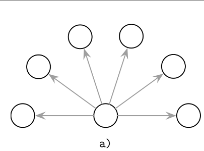

> 图 12-1a：广播；一个进程向其他所有进程发送通知。

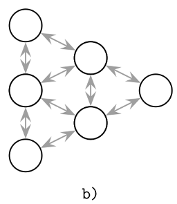

> 图 12-1b：反熵；对等进程定期两两交换信息。

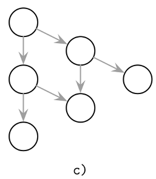

> 图 12-1c：gossip；消息接收者协作传播信息。

向其他所有进程广播消息是最直截了当的方法， 在集群节点较少时效果很好；
但在大型集群中， 节点数量会使它变得昂贵， 对单一进程的过度依赖也会使它不可靠。
单个进程未必始终知道网络中其他所有进程的存在。 此外，
广播进程必须与每个接收者有一段同时在线的重叠时间， 这在某些情况下可能很难做到。

为了放宽这些约束， 可以假设*部分*更新可能无法传播。
协调者尽力把消息交付给所有可用参与者； 若发生故障， 反熵机制随后让节点恢复同步。
这样， 消息交付责任由系统中的所有节点共同承担，
并分为初始交付和定期同步两个步骤。

熵是表示系统无序程度的属性。 在分布式系统中， 熵表示节点间状态分歧的程度。
这种属性并不理想， 应该尽量减少， 所以有许多技术用于处理熵。

初始交付机制失败时， 通常使用反熵让节点恢复到最新状态。
即使协调者在某个时点发生故障， 系统仍可继续正确运行，
因为其他节点会继续传播信息。 换言之， 反熵用于缩短最终一致系统的收敛时间上界。

为了保持节点同步， 反熵会触发后台或前台进程， 比较并协调缺失或冲突的记录。
后台反熵进程使用 Merkle 树和更新日志等辅助结构识别分歧。
前台反熵进程则搭载在读写请求上： 例如提示移交、读修复等。

复制系统中的副本出现分歧时， 为了恢复一致性并让它们重新同步，
必须两两比较副本状态， 找出并修复缺失记录。 对于大型数据集， 这可能极为昂贵：
我们必须读取两个节点上的整个数据集， 并通知副本有哪些较新的状态变化尚未传播。
为降低成本， 可以考虑副本过时的方式以及数据访问模式。

## 读修复

读取期间最容易检测副本之间的分歧， 因为此时可以联系各副本，
向每个副本请求所查询的状态， 并检查其响应是否匹配。 注意，
此时不是查询每个副本上存储的整个数据集， 目标仅限于客户端请求的数据。

协调者执行分布式读取， 乐观地假设副本保持同步、拥有相同信息。
如果副本发送了不同响应， 协调者就把缺失的更新发给缺少它们的副本。

这种机制称为_读修复_， 常用于检测并消除不一致。 读修复期间，
协调节点向副本发出请求、等待响应并进行比较。 如果某些副本遗漏了近期更新，
因而响应不同， 协调者会检测到不一致， 并把更新发回这些副本 [DECANDIA07]。

一些 Dynamo 风格的数据库不要求联系*所有*副本， 而是使用可调一致性级别。
为了返回一致结果， 无须联系并修复所有副本， 只需达到一致性级别要求的节点数。
如果使用 *quorum* 读写， 仍能得到一致结果， 但部分副本仍可能未包含全部写入。

读修复可以实现为阻塞操作或异步操作。 阻塞式读修复期间，
原始客户端请求必须等待协调者“修复”副本。 异步读修复只调度一个任务，
该任务可以在结果返回用户后执行。

对 quorum 读取而言， 阻塞式读修复保证读取单调性（参见[会话模型](#会话模型)）：
客户端一旦读到特定值， 后续读取返回的值就至少与其见过的值一样新，
因为副本状态已经修复。 如果读取不使用 quorum， 就会失去这项单调性保证，
因为后续读取发生时数据可能尚未传播到目标节点。 与此同时，
阻塞式读修复牺牲可用性， 因为目标副本必须确认修复， 而读取在收到响应前无法返回。

为了准确检测副本响应中哪些记录不同， 一些数据库（例如 Apache
Cassandra）使用带合并监听器的专用迭代器， 重建合并结果与各项输入之间的差异。
协调者随后利用其输出， 通知副本缺失哪些数据。

读修复假定副本*基本*同步， 我们并不预期每个请求都会退回阻塞式修复。
由于阻塞式修复保证读取单调性， 只要期间没有写操作完成，
也可以预期后续请求会返回相同的一致结果。

### 摘要读取

协调者不必向每个节点都发出完整读取请求， 而可以只发出一个完整读取请求，
并向其他副本只发送*摘要*请求。 摘要请求读取副本本地数据，
但不返回所请求数据的完整快照， 而是计算该响应的哈希值。
随后协调者可以计算完整读取的哈希， 并与其他所有节点返回的摘要进行比较。
如果摘要全部匹配， 就可以确信副本保持同步。

如果摘要不匹配， 协调者并不知道哪些副本领先、哪些落后。
为了让落后副本与其余节点重新同步， 协调者必须向返回不同摘要的副本发出完整读取，
比较其响应、协调数据， 再把更新发送给落后副本。

> [!NOTE]
> 摘要通常使用 MD5 等非密码学哈希函数计算， 因为必须快速完成计算，
> 才能让“顺利路径”保持高性能。 哈希函数可能发生_碰撞_，
> 但对多数现实系统而言概率可以忽略。 数据库通常使用不止一种反熵机制，
> 因此即使发生极不可能的哈希碰撞， 也可以期待另一个子系统协调数据。

## 提示移交

另一种反熵方法称为_提示移交_ [DECANDIA07]， 它是一种写入侧修复机制。
如果目标节点未确认写入， 写入协调者或某个副本就会存储一条称为*提示*的特殊记录，
目标节点一恢复， 这条记录就会在该节点上重放。

在 Apache Cassandra 中， 除非使用 ANY 一致性级别 [ELLIS11]，
否则提示写入不计入复制因子（参见[可调一致性](#可调一致性)），
因为提示日志中的数据无法用于读取， 只用于帮助落后的参与者追赶进度。

Riak 等一些数据库把*宽松 quorum*与提示移交结合使用。 使用宽松 quorum 时，
若副本发生故障， 写操作可以使用节点列表中的其他健康节点；
这些节点不必是所执行操作的目标副本。

例如， 假设五节点集群包含节点 {A, B, C, D, E}， 其中 {A, B, C}
是此次写操作的副本， 节点 B 已宕机。 作为查询协调者的 A 选择节点 D 来满足宽松
quorum， 并维持所需的可用性和持久性保证。 数据现在复制到 {A, D, C}。 不过 D
上记录的元数据中会带有提示， 因为写入原本是给 B 的。 B 一恢复， D
就会尝试把提示转发给它。 在 B 上重放提示后， 可以安全删除该提示，
而不会减少副本总数 [DECANDIA07]。

在类似情况下， 如果节点 {B, C} 因网络分区而短暂地与集群其余部分隔离， 并在 {A,
D, E} 上完成宽松 quorum 写入， 那么紧接着在 {B, C}
上进行的读取将观察不到最新写入 [DOWNEY12]。 换言之， 宽松 quorum
以一致性为代价改善可用性。

## Merkle 树

读修复只能修复当前所查询数据中的不一致，
因此应使用其他机制来发现并修复不常查询数据中的不一致。

如前所述， 准确找出副本之间哪些行出现分歧， 需要两两交换和比较数据记录。
这非常不切实际， 而且成本高昂。 许多数据库使用 *Merkle 树* [MERKLE87]
降低协调成本。

Merkle 树通过构建哈希树， 组成对本地数据的紧凑哈希表示。
哈希树的最底层通过扫描保存数据记录的整张表并计算记录范围的哈希来构建。
更高层包含下层哈希的哈希， 构成一种层次表示； 通过比较哈希，
递归沿哈希树节点缩小范围， 便可快速检测不一致。 既可以逐层交换和比较子树，
也可以交换并比较整棵树。

图 12-2 展示了 Merkle 树的组成。 最底层由数据记录范围的哈希组成。
更高各层的哈希通过对下一层的哈希进行哈希计算得出， 这一过程递归重复直至树根。

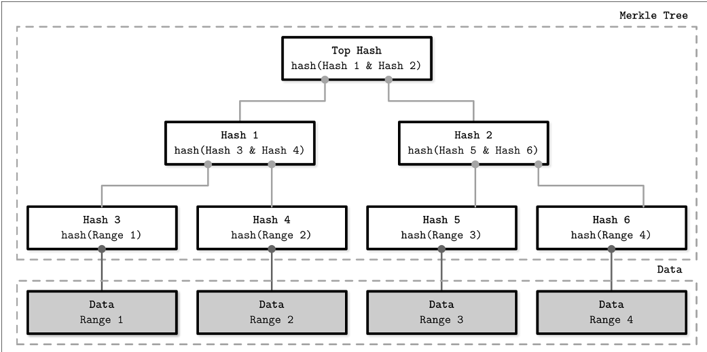

> 图 12-2：Merkle 树。灰色方框表示数据记录范围，白色方框表示哈希树层次结构。

要确定两个副本间是否存在不一致， 只需比较其 Merkle 树的根级哈希。
从上到下两两比较哈希， 就能定位节点之间存在差异的范围， 并修复其中的数据记录。

Merkle 树以自底向上的方式递归计算， 因此数据变化会触发整棵子树的重新计算。
树的大小（进而交换消息的大小）与精度（数据范围有多小、多准确）之间也存在权衡。

## 位图版本向量

该领域较新的研究提出了_位图版本向量_ [GONÇALVES15]，
它可以根据*新旧程度*解决数据冲突：
每个节点为每个对等节点保存一份在本地发生或复制而来的操作日志。
反熵期间比较日志， 再把缺失数据复制到目标节点。

节点协调的每次写入都由一个点 $(i,n)$ 表示： 该事件的节点本地序列号为 $i$，
由节点 $n$ 协调。 序列号 $i$ 从 1 开始， 节点每执行一次写操作就递增。

为了跟踪副本状态， 我们使用节点本地逻辑时钟。 每个时钟表示一个点集，
这些点代表该节点*直接*看到（由节点自身协调）或*间接*看到（由其他节点协调并复制而来）的写入。

在节点逻辑时钟中， 由节点自身协调的事件不会存在空缺。
如果其他节点的部分写入尚未复制过来， 时钟中就会有空缺。 为了让两个节点重新同步，
它们可以交换逻辑时钟， 识别由缺失点表示的空缺， 再复制与之关联的数据记录。
为此， 我们需要重建每个点所指的数据记录。 该信息存储在_带点因果容器_（dotted
causal container，DCC）中， 它把点映射到指定键的因果信息。 这样，
冲突解决就能捕获写入间的因果关系。

图 12-3（改编自 [GONÇALVES15]）展示了系统中三个节点 $P_1$、 $P_2$ 和 $P_3$
的状态表示； 这是从 $P_2$ 的角度观察它见过哪些值。 $P_2$
每次执行写入或收到复制值时都会更新此表。

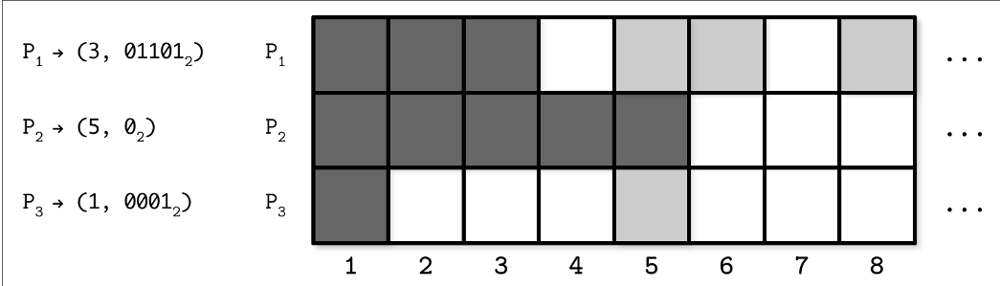

> 图 12-3：位图版本向量示例。

复制期间， $P_2$ 创建该状态的紧凑表示： 构建从节点标识符到一个值对的映射，
其中包含它已连续看到的最新值位置， 以及把它见过的其他写入编码为 1 的位图。
这里的 $(3, \text{01101}_2)$ 表示节点 $P_2$ 已经连续看到第三个值， 并且相对于 3
又见过第二、第三和第五个位置上的值（即见过序列号为 5、6 和 8 的值）。

与其他节点交换数据时， 它会收到其他节点见过而自己缺失的更新。
系统所有节点一旦都连续看到索引 $i$ 之前的值， 版本向量便可截断到该索引。

这种方法的优点是捕获值写入之间的因果关系，
并让节点准确识别其他节点缺少哪些数据点。 潜在缺点是： 如果节点长时间宕机，
对等节点便无法截断日志， 因为落后节点恢复后仍须向它复制数据。

## Gossip 传播

> 群体永远是心理传染病的温床。
>
> ——Carl Jung

为了让其他节点参与， 并以广播的*覆盖范围*和反熵的*可靠性*传播更新， 可以使用
gossip 协议。

Gossip 协议是一种概率通信过程，
其原理类似人类社会中的谣言传播或疾病在人群中的传播。
谣言和流行病生动地说明了这类协议的工作方式： 只要人群仍有兴趣听， 谣言就会传播；
疾病会传播到人群中再无易感者为止。

Gossip 协议的主要目标是利用协作传播， 把信息从一个进程散播到集群其余部分。
正如病毒在人群中从一个人传给另一个人， 并可能每一步都扩大范围，
信息也在系统中逐级转发， 让更多进程参与进来。

持有待传播记录的进程称为_感染者_。 尚未收到更新的进程称为_易感者_。
经过一段时间的主动传播后不愿再传播新状态的感染进程称为_移除者_ [DEMERS87]。
所有进程起初都处于易感状态。 某个数据记录的更新到达后，
接收它的进程转为感染状态， 开始向其他*随机*邻近进程传播更新并感染它们。
感染进程一旦确信更新已经传播， 就转入移除状态。

为了避免显式协调、维护全局接收者列表，
以及要求单个协调者向系统中其他每个参与者广播消息，
这类算法使用兴趣丧失函数来建模完整性。
协议效率取决于它能以多快速度感染尽可能多的节点，
同时把冗余消息造成的开销降至最低。

Gossip 可用于同构去中心化系统中的异步消息交付； 其中节点可能没有长期成员身份，
也未按任何拓扑组织。 Gossip 协议通常不要求显式协调，
所以适合成员关系灵活（节点频繁加入和离开）的系统或网状网络。

Gossip 协议非常稳健， 有助于在分布式系统固有的故障面前实现高可靠性。
消息以随机方式转发， 所以即使部分通信组件发生故障， 仍可通过其他路径交付。
可以说， 系统会适应故障。

### Gossip 机制

进程定期随机选择 $f$ 个对等节点（$f$ 是称为 fanout 的可配置参数），
并与它们交换当前“热门”的信息。 进程每从对等节点获知一条新信息，
就会尝试继续转发。 由于对等节点通过概率方式选择， 选择结果总会有所重叠；
消息会重复交付， 并可能继续流转一段时间。 消息冗余度用于衡量重复交付产生的开销。
冗余是一项重要属性， 也是 gossip 工作方式的关键。

系统达到收敛所需的时间称为_延迟_。 达到收敛（停止 gossip
过程）与把消息交付给所有对等节点略有区别， 因为可能存在一小段时期，
所有对等节点都已收到通知， 但 gossip 仍在继续。 Fanout 和延迟取决于系统规模：
系统越大， 就越需要提高 fanout 来保持延迟稳定， 否则就必须接受更高延迟。

随着时间推移， 节点发现自己一再收到相同信息后， 消息的重要性开始下降，
节点最终必须停止转发。
兴趣丧失既可按*概率*计算（每个进程在每一步计算停止传播的概率），
也可使用_阈值_（统计收到的重复消息数， 数量过高时停止传播）。
两种方法都必须考虑集群规模和 fanout。 统计重复项来衡量收敛可以改善延迟并减少冗余
[DEMERS87]。

从一致性角度看， gossip 协议提供_收敛一致性_ [BIRMAN07]：
节点对越久远的事件越可能持有相同视图。

### 覆盖网络

Gossip 协议虽然重要且有用， 通常却只用于范围较窄的一组问题。
非流行病式方法能以非概率性的确定性、更少的冗余， 并且通常以更优方式分发消息
[BIRMAN07]。 Gossip 算法经常因其可扩展性及能在 $\log N$
轮消息内分发消息而受到赞扬（$N$ 为集群规模） [KREMARREC07]； 但也必须留意 gossip
轮次产生的冗余消息数。 为了实现可靠性， 基于 gossip
的协议会产生一些重复消息交付。

随机选择节点大幅提升了系统的_稳健性_： 发生网络分区时，
只要存在间接连接两个进程的链路， 消息最终就能交付。
这种方法的明显缺点是消息并非最优： 为了保证稳健性，
必须在对等节点间维持冗余连接， 并发送冗余消息。

两种方法的折中方案是在 gossip 系统中构建*临时*固定拓扑。
这可以通过创建对等节点的*覆盖网络*实现： 节点可以对其他节点进行采样，
并根据邻近程度（通常以延迟衡量）选择最佳联系点。

系统中的节点可以构成_生成树_： 一种覆盖整个网络、边各不相同且没有环的无向图。
有了这种图， 消息可以在固定步数内分发。

图 12-4 给出了生成树示例：[^12-1]

- a) 不使用全部边也能让所有点完全连通。
- b) 只要一条链路断开， 整棵子树就可能失去连接。

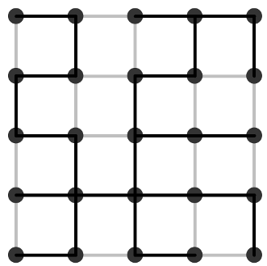

> 图
> 12-4a：生成树在不使用所有边的情况下实现各点完全连通。深色点表示节点，深色线表示覆盖网络，
> 灰线表示节点之间其他可能存在的连接。

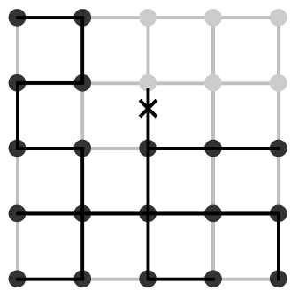

> 图
> 12-4b：生成树中一条链路断开后，整棵子树可能失去连接。深色点表示节点，深色线表示覆盖网络，
> 灰线表示节点之间其他可能存在的连接。

[^12-1]: 此例仅用于说明；网络中的节点通常不会排列成网格。

这种方法的潜在缺点之一是可能形成相互连通的对等节点“孤岛”，
其中的节点彼此之间有强烈偏好。

为了在保持较少消息数的同时允许连接丢失后快速恢复， 可以混合两种方法：
系统稳定时使用固定拓扑和基于树的广播， 故障转移和系统恢复时退回 gossip。

### 混合 Gossip

推送/惰性推送多播树（Plumtree）[LEITAO07]
在流行病式传播与基于树的广播原语之间作出权衡。 Plumtree
创建由节点组成的生成树覆盖网络， 以最小开销主动分发消息。 正常情况下，
节点只向对等节点采样服务所提供的一小部分对等节点发送完整消息。

每个节点向一小部分节点发送完整消息， 对其余节点则仅以*惰性*方式转发消息 ID。
如果节点收到一条从未见过的消息的标识符， 就可以向对等节点查询消息内容。
这一*惰性推送*步骤保证高可靠性， 并提供快速修复广播树的方法。 发生故障时，
协议通过惰性推送步骤退回 gossip 方法， 广播消息并修复覆盖网络。

由于分布式系统的性质， 任何节点或节点间链路都可能随时发生故障；
某个分段不可达时， 就无法遍历整棵树。 惰性 gossip
网络帮助节点相互通知已经见过的消息， 从而构建并修复树。

图 12-5 展示了这种双重连接： 节点由最优生成树（实线）和惰性 gossip
网络（虚线）连接。 此图不表示任何具体网络拓扑， 只表示节点间的连接。

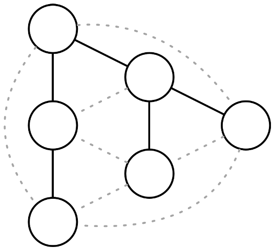

> 图 12-5：惰性推送网络与积极推送网络。实线表示广播树，虚线表示惰性 gossip
> 连接。

使用惰性推送机制构建和修复树的优点之一是： 在负载恒定的网络中，
它往往也能生成消息延迟最小的树， 因为最先响应的节点会被加入广播树。

### 局部视图

向所有已知对等节点广播消息并维护完整集群视图， 可能成本高昂且不切实际，
特别是在_成员变动率_（系统中加入和离开节点数量的度量）很高时。 为避免这种情况，
gossip 协议通常使用_对等节点采样服务_。 该服务维护集群的_局部视图_， 并通过
gossip 定期刷新。 局部视图相互重叠， 因为 gossip 协议需要一定程度的冗余；
但冗余过多又意味着额外工作。

例如， 混合局部视图（Hybrid Partial View，HyParView）协议 [LEITAO07]
维护一个较小的主动视图和一个较大的被动视图。
主动视图中的节点创建可用于传播的覆盖网络。 被动视图用于维护节点列表，
以便替换主动视图中发生故障的节点。

节点定期执行洗牌操作， 交换彼此的主动和被动视图。 交换期间，
节点把从对等节点收到的主动、被动视图成员都加入自己的被动视图，
并逐出最旧的值来限制列表大小。

主动视图会根据视图中节点的状态变化以及对等节点的请求来更新。 如果进程 $P_1$
怀疑其主动视图中的对等节点 $P_2$ 已发生故障， $P_1$ 就从主动视图中移除 $P_2$，
并尝试与被动视图中的替代进程 $P_3$ 建立连接。 如果连接失败， 则从 $P_1$
的被动视图中移除 $P_3$。

根据 $P_1$ 主动视图中的进程数， 如果 $P_3$ 的主动视图已满， 它可以拒绝连接。
如果 $P_1$ 的视图为空， $P_3$ 就必须用 $P_1$ 替换当前主动视图中的一个对等节点。
这以轮换部分连接为代价， 帮助正在引导启动或恢复的节点迅速成为集群中的有效成员。

这种方法只使用主动视图中的节点进行传播， 从而减少系统中的消息数；
同时又把被动视图用作恢复机制， 维持高可靠性。
对等节点采样服务的性能和质量指标之一， 是拓扑重组时收敛到稳定覆盖网络的速度
[JELASITY04]。 HyParView 在此方面表现很好， 原因是它维护视图的方式，
以及它会优先考虑正在引导启动的进程。

HyParView 和 Plumtree 使用_混合 gossip_ 方法： 用一小部分对等节点广播消息，
发生故障和网络分区时退回更广泛的对等节点网络。
两种系统都不依赖包含所有对等节点的全局视图。
这不仅有利于节点数量庞大的系统（大多数时候并非如此），
也可以避免在每个节点上维护最新成员列表的成本。
局部视图让节点只与一小部分邻近节点主动通信。

## 小结

最终一致系统允许副本状态出现分歧。 可调一致性让我们能以一致性换取可用性，
也能反向交换。 副本分歧可使用以下反熵机制之一解决：

**提示移交**

目标节点宕机时， 在相邻节点上临时存储写入； 目标节点一恢复，
就在其上重放这些写入。

**读修复**

读取期间比较响应、检测缺失记录并将其发送给落后副本， 从而协调所请求的数据范围。

**Merkle 树**

计算并交换分层哈希树， 检测需要修复的数据范围。

**位图版本向量**

维护包含近期写入信息的紧凑记录， 检测副本缺失的写入。

这些反熵方法分别针对范围缩减、新旧程度或完整性这三个参数之一进行优化。
可以只同步正在查询的数据（读修复）或单条缺失写入（提示移交），
从而缩小反熵范围。 如果假设多数故障都是暂时的， 参与者会尽快恢复，
就可以保存近期分歧事件的日志，
并在发生故障时准确知道需要同步什么（位图版本向量）。
如果需要两两比较多个节点上的完整数据集并高效定位差异，
则可以对数据进行哈希并比较哈希值（Merkle 树）。

Gossip 协议可用于在大规模系统中可靠分发信息。 在可能的情况下， 混合 gossip
协议既减少交换的消息数， 又保持对网络分区的抵抗能力。

许多现代系统使用 gossip 进行故障检测和传播成员关系信息 [DECANDIA07]。
高性能、高可扩展性分布式计算框架 *Partisan* 使用 HyParView。 Riak core 曾使用
Plumtree 传播集群范围的信息。

## 延伸阅读

若想进一步了解本章提到的概念， 可以参阅以下资料：

### Gossip 协议

Shah, Devavrat. 2009. “Gossip Algorithms.” *Foundations and Trends in
Networking* 3, no. 1 (January): 1-125. https: //doi.org/10.1561/1300000014.

Jelasy, Márk. 2003. “Gossip-based Protocols for Large-scale Distributed
Systems.” Dissertation. http: //www.inf.u-szeged.hu/~jelasy/dr/doktori-mu.pdf.

Demers, Alan, Dan Greene, Carl Hauser, Wes Irish, John Larson, Scott Shenker,
Howard Sturgis, Dan Swinehart, and Doug Terry. 1987. "Epidemic algorithms for
replicated database maintenance." In Proceedings of the sixth annual ACM
Symposium on Principles of distributed computing (PODC '87), 1-12. New York:
Association for Computing Machinery. https: //doi.org/10.1145/41840.41841.

<a id="chapter-13-distributed-transactions"></a>

# 第 13 章 分布式事务

为了维持分布式系统中的秩序， 我们必须至少保证某种一致性。
在“[一致性模型](#一致性模型)”中， 我们讨论了单对象、单操作一致性模型，
它们有助于我们推理各个操作。 然而， 在数据库中，
我们经常需要以原子方式执行多个操作。

原子操作可以用状态转换来解释： 某个事务开始前， 数据库处于状态 A； 当它结束时，
状态已从 A 转换为 B。 从操作的角度看， 这很容易理解，
因为事务并不预先绑定某个确定状态。 相反， 它们从某个时间点开始，
将操作应用于数据记录。 这在调度和执行方面为我们提供了一定的灵活性：
事务可以重新排序， 甚至可以重试。

事务处理主要关注如何确定允许的历史， 以及如何对可能的交错执行场景建模和表示。
这里的历史表示一个依赖图： 在当前事务执行之前， 哪些事务已经执行。
如果一段历史等价于按顺序执行这些事务的某段历史， 也就是说二者具有相同的依赖图，
那么就称该历史是可串行化的。 关于历史、历史等价性、可串行化及其他概念，
可以回顾“[可串行化](#可串行化)”一节。 总体而言， 本章是第 5
章所讨论的节点本地事务处理在分布式系统中的对应内容。

单分区事务会采用我们在第 5 章讨论过的悲观并发控制方案（基于锁或跟踪），
或乐观并发控制方案（尝试并验证）。 但这两种方法都无法解决多分区事务的问题，
因为多分区事务需要不同服务器之间进行协调， 还需要分布式提交和回滚协议。

一般来说， 把钱从一个账户转到另一个账户时，
你会希望向第一个账户入账和从第二个账户扣款这两个操作能*同时*发生。 然而，
如果把事务分解成单独的步骤， 就连扣款或入账乍看之下也不是原子的：
我们需要读取旧余额， 加上或减去所需金额， 再保存结果。
每个子步骤又包含若干操作： 节点接收请求、解析请求、在磁盘上定位数据、执行写入，
最后确认操作。 这仍然只是相当高层的视角： 为了执行一次简单的写入，
我们必须完成数百个细小步骤。

这意味着我们必须先执行事务， 然后才能让其结果可见。 不过， 先来定义什么是事务。
事务是一组操作， 也是一个原子执行单元。 事务原子性意味着，
它的所有结果要么全部可见， 要么全都不可见。 例如， 如果在一个事务中修改了多行，
甚至多张表， 那么这些修改要么全部应用， 要么一个也不应用。

为了保证原子性， 事务应当是可恢复的。 换句话说，
如果事务无法完成、被中止或超时， 就必须彻底回滚其结果。
不可恢复且只执行了一部分的事务可能使数据库处于不一致状态。 总之，
如果事务执行失败， 数据库状态必须恢复到先前的状态， 就像从未尝试过这个事务一样。

网络分区和节点故障是另一个重要方面： 系统中的节点彼此独立地发生故障和恢复，
但它们的状态必须保持一致。 这意味着原子性要求不仅适用于本地操作，
也适用于在其他节点上执行的操作： 变更要么持久传播到事务涉及的所有节点，
要么一个节点也不传播 [LAMPSON79]。

## 让操作表现为原子操作

为了让多个操作表现为原子操作， 尤其是在其中一些操作是远程操作时，
我们需要使用一类称为*原子提交*的算法。 原子提交不允许参与者之间存在分歧：
即使只有一个参与者投票反对， 事务也_不会提交_。 与此同时，
这意味着发生故障的进程必须与参与者中的其他进程得出相同结论。
这一事实还有一个重要含义： 原子提交算法无法在出现拜占庭故障时工作。
在这种故障中， 进程会谎报自己的状态或任意选择一个值， 这与全体一致的要求相矛盾
[HADZILACOS05]。

原子提交试图解决的问题， 是就是否执行提议的事务达成一致。
参与者不能选择、影响或改变提议的事务， 也不能提出其他方案：
它们只能投票表明自己是否愿意执行该事务 [ROBINSON08]。

原子提交算法不会严格规定事务的 *prepare*、*commit* 或 *rollback*
操作应具有什么语义。 数据库实现者必须决定：

- 何时将数据视为已经准备好提交， 此时只需交换一个指针就能公开变更。
- 如何执行提交本身， 以便在尽可能短的时间内让事务结果可见。
- 如果算法决定不提交， 如何回滚事务所做的变更。

我们在第 5 章讨论过这些过程的节点本地实现。

许多分布式系统都使用原子提交算法， 例如 MySQL（用于分布式事务）和
Kafka（用于生产者与消费者交互 [MEHTA17]）。

在数据库中， 分布式事务由通常称为事务管理器的组件执行。
事务管理器是一个负责调度、协调、执行和跟踪事务的子系统。 在分布式环境中，
事务管理器负责确保节点本地的可见性保证， 与分布式原子操作所规定的可见性一致。
换句话说， 事务会在所有分区和所有副本上提交。

我们将讨论两种原子提交算法： 二阶段提交解决了提交问题，
但不允许协调者进程发生故障； 三阶段提交 [SKEEN83]
解决了非阻塞原子提交问题[^13-1]， 即使协调者发生故障， 参与者也可以继续执行
[BABAOGLU93]。

[^13-1]: 严格来说，前提是“网络高度可靠”。 换句话说， 网络不会发生分区
    [ALHOUMAILY10]。 这一假设的含义在该论文介绍算法的章节中有所讨论。

## 二阶段提交

先从最直接的分布式提交协议说起， 它允许以*原子方式*进行多分区更新。
有关分区的更多信息， 可以参阅“[数据库分区](#数据库分区)”。
二阶段提交（2PC）通常在数据库事务的语境下讨论。 2PC 分两个阶段执行。
在第一阶段， 分发决定值并收集投票。 在第二阶段， 节点只需拨动开关，
让第一阶段的结果变得可见。

2PC 假设存在一个领导者（或协调者）， 它保存状态、收集投票，
并充当这一轮协商的主要参照点。 其余节点称为参与者。
这里的参与者通常是操作互不相交数据集的分区， 事务会在这些数据集上执行。
协调者和每个参与者都会为执行的每一步保留本地操作日志。
参与者投票接受或拒绝协调者提出的某个值。
这个值通常是必须执行的分布式事务标识符， 不过 2PC 也可以用于其他场景。

协调者可以是接收到事务执行请求的节点，
也可以随机选取、通过领导者选举算法选出、手动指定，
甚至在系统的整个生命周期内固定不变。 协议并不限制协调者角色， 为了可靠性或性能，
这个角色也可以移交给另一个参与者。

顾名思义， 二阶段提交分两步执行：

### 准备

协调者发送 `Propose` 消息， 将新事务通知给各参与者。
参与者决定自己能否提交事务中与其相关的部分。 如果某个参与者认为可以提交，
就把赞成票通知给协调者。 否则， 它会回复协调者， 要求中止事务。
参与者必须先在本地持久化自己的投票， 再向协调者回复。 协调者持久化收到的投票，
并在第二阶段广播结果之前持久化最终的提交或中止决定。

### 提交/中止

事务中的操作可以跨不同分区更改状态， 每个分区由一个参与者代表。
即使只有一个参与者投票中止事务， 协调者也会向所有参与者发送 `Abort` 消息。
只有所有参与者都投了赞成票， 协调者才会向它们发送最终的 `Commit` 消息。

这一过程如图 13-1 所示。

在*准备*阶段， 协调者分发提议值， 并收集参与者对是否应提交该值的投票。
参与者可以拒绝协调者的提议， 例如另一个相冲突的事务已经提交了不同的值。

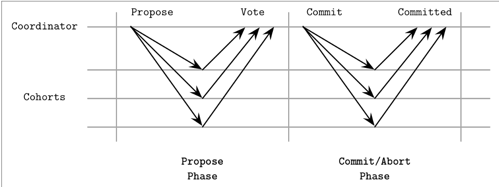

> 图 13-1：二阶段提交协议。 在第一阶段， 各参与者会收到新事务的通知。
> 在第二阶段， 事务会被提交或中止。

协调者收集完投票后， 就可以决定*提交*还是*中止*事务。
如果所有参与者都投了赞成票， 协调者便决定提交， 并发送 `Commit` 消息通知它们。
否则， 协调者向所有参与者发送 `Abort` 消息， 事务随之回滚。 换句话说，
只要有一个节点拒绝提议， 整轮操作就会中止。

在每个步骤中， 协调者和参与者都必须把每项操作的结果写入持久存储，
这样才能在本地故障时重建状态并恢复， 也才能为其他参与者转发和重放结果。

在数据库系统的语境中， 每轮 2PC 通常负责一个事务。 在*准备*阶段，
事务内容（操作、标识符和其他元数据）从协调者传输到各参与者。
参与者在本地执行事务， 并将它留在*部分提交*状态， 有时也称为*预提交*状态。
这样协调者便能在下一阶段通过提交或中止来完成执行。 等到事务提交时，
其内容已经持久存储在所有其他节点上 [BERNSTEIN09]。

### 2PC 中的参与者故障

来看几种故障场景。 例如， 如图 13-2 所示， 如果某个参与者在提议阶段发生故障，
协调者就无法继续提交， 因为提交要求所有投票都是赞成票。 如果某个参与者不可用，
协调者将中止事务。 这一要求会对可用性产生负面影响：
单个节点发生故障便可能阻止事务执行。 有些系统（例如 Spanner，
参见“[使用 Spanner 的分布式事务](#使用-spanner-的分布式事务)”）不是在单个节点上执行
2PC， 而是在 Paxos 组上执行， 以提高协议的可用性。

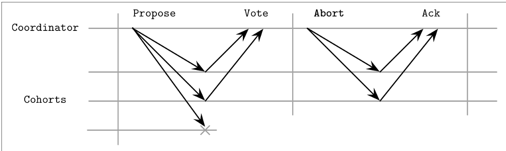

> 图 13-2：提议阶段的参与者故障。

2PC 背后的核心思想是参与者做出的_承诺_： 一旦它对提议作出肯定答复， 就不会反悔，
因此只有协调者能中止事务。

如果某个参与者在接受提议*之后*发生故障， 它必须先了解投票的实际结果，
才能正确地提供值， 因为协调者可能会因其他参与者的决定而中止提交。
参与者节点恢复后， 必须同步协调者的最终决定。
这通常通过在协调者一侧持久保存决定日志，
并把决定值复制给发生故障的参与者来完成。 在此之前， 参与者处于不一致状态，
因此不能处理请求。

协议中有多个位置需要进程等待其他参与者， 例如协调者收集投票时，
或参与者等待提交/中止阶段时。 因此链路故障可能造成消息丢失，
而等待会无限持续下去。 如果协调者在提议阶段没有收到副本的响应，
它可以触发超时并中止事务。

### 2PC 中的协调者故障

如图 13-3 所示， 如果某个参与者在第二阶段没有收到协调者发来的提交或中止命令，
它应尝试查明协调者作出了什么决定。 协调者可能已经决定了值，
却没能把决定传达给这个特定副本。 在这种情况下，
可以从对等节点的事务日志或备用协调者复制决定信息。 复制提交决定是安全的，
因为该决定总是全体一致的： 2PC 的要点就是在所有站点上统一提交或统一中止，
而在一个参与者上提交意味着所有其他参与者也必须提交。

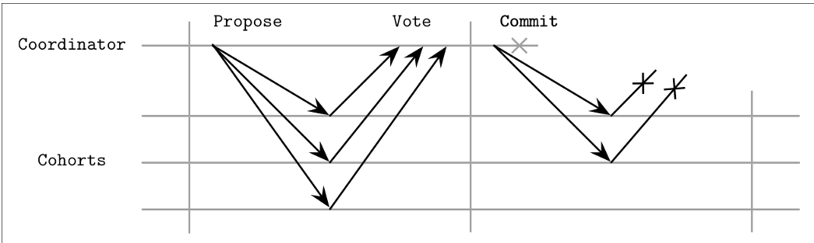

> 图 13-3：提议阶段之后的协调者故障。

在第一阶段， 协调者收集投票， 继而收集参与者的承诺：
它们会等待协调者明确发出提交或中止命令。
如果协调者在收集投票之后、广播投票结果之前发生故障，
参与者最终会陷入不确定状态。 如图 13-4 所示，
参与者不知道协调者究竟作出了什么决定，
也不知道是否已有某个参与者收到事务结果通知， 而这个参与者可能同样无法连接
[BERNSTEIN87]。

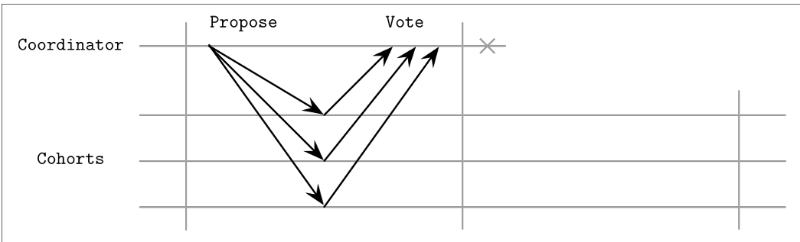

> 图 13-4：协调者尚未来得及联系任何参与者便发生故障。

协调者无法继续提交或中止， 会让集群停留在未决定状态。 这意味着，
如果协调者永久故障， 参与者将无法得知最终决定。 由于这个性质， 我们把 2PC
称为阻塞式原子提交算法。 如果协调者永远无法恢复，
它的替代者必须再次收集给定事务的投票， 然后作出最终决定。

许多数据库都使用 2PC， 包括 MySQL、PostgreSQL 和 MongoDB[^13-2] 等。
二阶段提交常被用来实现分布式事务， 因为它很简单（易于推理、实现和调试），
而且开销很低（协议的消息复杂度和往返次数都很低）。 为了降低上述故障发生的概率，
实现适当的恢复机制并设置备用协调者节点非常重要。

[^13-2]: 不过， 文档称截至 v3.6， 2PC
    只提供类似事务的语义：<https://databass.dev/links/7>。

## 三阶段提交

为了让原子提交协议能够抵御协调者故障并避免未决定状态，
三阶段提交（3PC）协议增加了一个步骤， 并在两端都设置超时。 协调者发生故障时，
参与者可以根据系统状态继续提交或中止。 3PC 假设采用同步模型，
并且通信故障不可能发生 [BABAOGLU93]。

3PC 在提交/中止步骤之前增加了一个准备阶段。
该阶段传达协调者在提议阶段收集到的参与者状态，
使协议即使在协调者发生故障时也能继续。 3PC
的其他所有性质以及每轮操作必须有协调者的要求， 都与二阶段提交相似。 3PC
的另一个实用补充是参与者一侧的超时。 根据进程当前执行的步骤，
超时会强制产生提交或中止决定。

如图 13-5 所示， 一轮三阶段提交包含三个步骤：

**提议**

协调者发出提议值并收集投票。

**准备**

协调者把投票结果通知给各参与者。 如果投票通过且所有参与者都决定提交，
协调者就发送 `Prepare` 消息， 指示它们做好提交准备。 否则， 协调者发送 `Abort`
消息， 本轮操作结束。

**提交**

协调者通知各参与者提交事务。

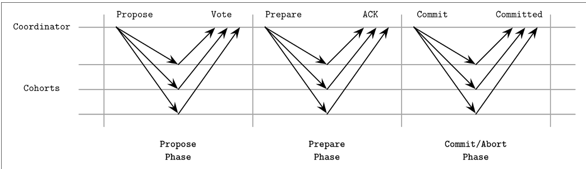

> 图 13-5：三阶段提交。

与 2PC 类似， 在*提议*步骤中， 协调者分发提议值并收集各参与者的投票， 如图 13-5
所示。 如果协调者在此阶段崩溃且操作超时， 或某个参与者投了反对票，
事务就会中止。

收集完投票后， 协调者作出决定。 如果协调者决定继续执行事务， 就发出 `Prepare`
命令。 协调者可能无法把准备消息分发给所有参与者， 也可能无法收到它们的确认。
在这种情况下， 参与者可以在超时后中止事务， 因为算法尚未完全进入*已准备*状态。

只要所有参与者都成功进入已准备状态， 且协调者收到了它们的准备确认，
那么此后任意一方发生故障， 事务都会提交。 之所以能够这样做，
是因为此阶段的所有参与者对状态都有相同的认识。

在*提交*期间， 协调者把*准备*阶段的结果传达给所有参与者， 重置它们的超时计数器，
并实际完成事务。

### 3PC 中的协调者故障

所有状态转换都经过协调， 在所有参与者完成前一个阶段之前，
参与者不能进入下一阶段： 协调者必须等待副本， 才能继续。
如果参与者尚未越过准备阶段， 且在超时前没有收到协调者的消息，
最终就可以中止事务。

如前所述， 2PC 无法从协调者故障中恢复， 参与者可能会卡在不确定状态，
直到协调者恢复。 3PC 在这种情况下不会阻塞进程，
而是允许参与者按照确定性的决定继续执行。

3PC 最糟糕的场景是图 13-6 所示的网络分区。 一部分节点成功进入已准备状态，
现在可以在超时后继续提交。 另一些节点无法与协调者通信， 会在超时后中止。
这会导致脑裂： 一些节点继续提交， 另一些节点则中止； 它们都遵循协议，
但参与者最终却处于不一致且相互矛盾的状态。

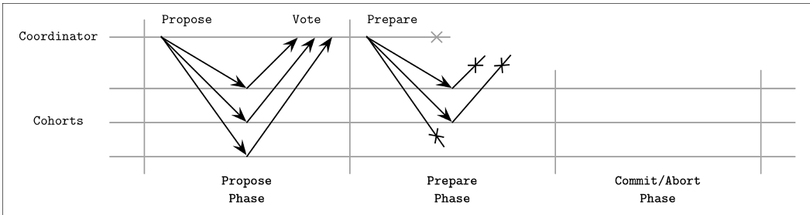

> 图 13-6：第二阶段发生协调者故障。

理论上， 3PC 的确在一定程度上解决了 2PC 的阻塞问题， 但它的消息开销更大，
可能引入矛盾， 而且在出现网络分区时表现不佳。 这可能正是 3PC
在实践中没有得到广泛使用的主要原因。

## 使用 Calvin 的分布式事务

我们已经谈到同步成本以及规避它的几种方法。 不过， 还有其他办法可以减少争用，
并缩短事务持有锁的总时间。 其中一种办法是， 让副本在获取锁并开始执行之前，
先就执行顺序和事务边界达成一致。 如果能够做到这一点，
节点故障就不会导致事务中止，
因为节点可以从并行执行同一事务的其他参与者那里恢复状态。

传统数据库系统使用两阶段锁或乐观并发控制来执行事务， 没有确定性的事务顺序。
这意味着必须协调节点才能维持顺序。 确定性的事务顺序消除了执行阶段的协调开销，
而且由于所有副本都获得相同输入， 它们也会产生等价的输出。 这种方法通常称为
Calvin， 它是一种快速分布式事务协议 [THOMSON12]。 使用 Calvin
实现分布式事务的一个著名示例是 FaunaDB。

为了实现确定性顺序， Calvin 使用定序器， 即所有事务的入口点。
定序器决定事务的执行顺序， 并建立全局事务输入序列。
为了尽量减少争用并批量作出决定， 时间线会被划分为 epoch。 定序器收集事务，
并将它们分组到短时间窗口内， 原论文提到的是 10 毫秒批次。
这些批次也成为复制单元， 因此不必逐个传送事务。

事务批次成功复制后， 定序器立即将其转发给调度器， 由调度器编排事务执行。
调度器使用确定性调度协议并行执行事务的各个部分，
同时保持定序器指定的串行执行顺序。
由于把事务应用到特定状态必然只产生该事务所指定的变更，
而且事务顺序已经预先确定， 副本不必再与定序器通信。

Calvin 中的每个事务都有一个*读集*和一个_写集_。 读集是事务的依赖项，
即执行事务所需的、来自当前数据库状态的数据记录集合。 写集是事务的执行结果，
换句话说就是它的副作用。 Calvin 原生不支持依赖额外读取来确定读集和写集的事务。

由调度器管理的工作线程分四步执行：

1. 分析事务的读集和写集， 确定读集中的节点本地数据记录，
   并创建*活跃*参与者列表， 即持有写集元素、会修改数据的参与者。
2. 收集执行事务所需的*本地*数据， 也就是恰好位于该节点上的读集记录。
   收集到的数据记录会转发给相应的活跃参与者。
3. 如果这个工作线程运行在活跃参与者节点上， 它会接收其他参与者转发来的数据记录，
   与第 2 步中执行的操作相对应。
4. 最后， 它执行一批事务， 并将结果持久保存到本地存储。
   它不必把执行结果转发给其他节点， 因为那些节点会收到相同的事务输入，
   并自行在本地执行并持久保存结果。

如图 13-7 所示， 典型的 Calvin
实现会把定序器、调度器、工作线程和存储子系统部署在一起。
为了确保各定序器就哪些事务进入当前 epoch/批次准确达成共识， Calvin 使用 Paxos
共识算法（参见“[Paxos](#paxos)”）， 或者使用异步复制，
由一个专用副本充当领导者。 使用领导者可以改善延迟， 但恢复成本更高，
因为节点必须重建发生故障的领导者的状态， 才能继续执行。

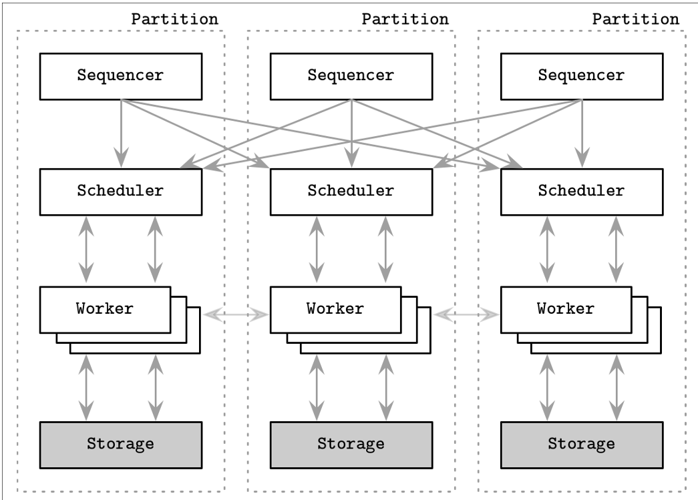

> 图 13-7：Calvin 架构。

## 使用 Spanner 的分布式事务

Calvin 经常与另一种名为 Spanner 的分布式事务管理方法进行比较 [CORBETT12]。
它的实现（或衍生实现）包括几个开源数据库， 其中最著名的是 CockroachDB 和
YugabyteDB。 Calvin 通过在定序器之间达成共识来建立全局事务执行顺序， 而 Spanner
则在每个分区（也就是每个分片）的共识组上使用二阶段提交。 Spanner
的设置相当复杂， 本书只介绍其高层细节。

为了实现一致性并规定事务顺序， Spanner 使用 *TrueTime*： 一种高精度的墙上时钟
API， 它还会给出不确定性界限， 从而允许本地操作人为减速， 等待越过不确定性界限。

Spanner 提供三种主要操作类型： *读写事务*、*只读事务*和_快照读取_。
读写事务需要锁、悲观并发控制以及领导者副本。 只读事务无须加锁，
可以在任意副本上执行。 只有在*最新*时间戳执行读取时才需要领导者， 这种读取会从
Paxos 组中取得最新提交的值。 在指定时间戳执行的读取是一致的， 因为值带有版本，
而快照内容一经写入便无法更改。 每条数据记录都会分配一个时间戳，
其值为事务提交时间。 这也意味着可以存储一条记录的多个带时间戳版本。

图 13-8 展示了 Spanner 的架构。 每个 *spanserver*（即副本，
是向客户端提供数据的服务器实例）保存若干 *tablet*， 每个 tablet 都附有 Paxos
状态机（参见“[Paxos](#paxos)”）。 副本组成称为 Paxos 组的副本集，
它是数据放置和复制的单位。 每个 Paxos
组都有一个长期存在的领导者（参见“Multi-Paxos”）。 在多分片事务期间，
领导者会相互通信。

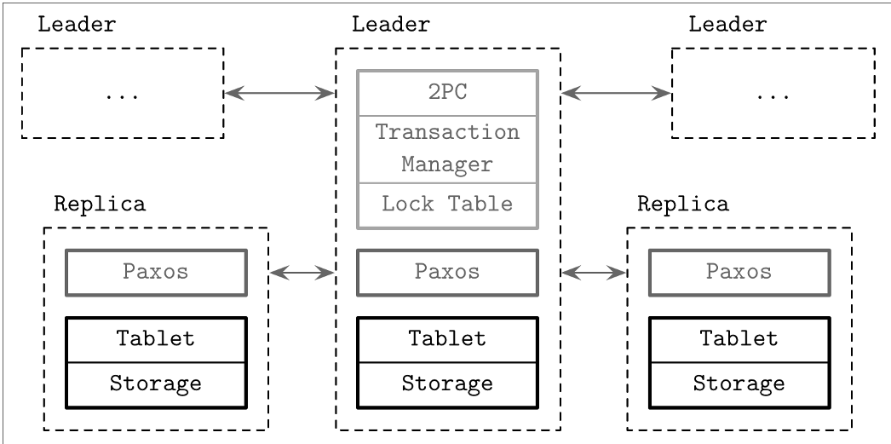

> 图 13-8：Spanner 架构。

每次写入都必须经过 Paxos 组领导者， 而读取可以由最新副本上的 tablet 直接提供。
领导者保存一张锁表，
用于通过两阶段锁机制实现并发控制（参见“[基于锁的并发控制](#基于锁的并发控制)”）；
它还保存一个事务管理器， 负责多分片分布式事务。 需要同步的操作，
例如事务中的写入和读取， 必须从锁表中获取锁； 其他操作， 例如快照读取，
则可以直接访问数据。

对于多分片事务， 各组的领导者必须相互协调并执行二阶段提交来保证一致性，
还要使用两阶段锁来保证隔离性。 2PC 算法要求所有参与者都在场才能成功提交，
因此会损害可用性。 Spanner 使用 Paxos 组而非单个节点作为参与者，
从而解决这个问题。 这意味着即使组内某些成员宕机， 2PC 仍然可以继续运行。 在
Paxos 组内， 2PC 只联系充当领导者的节点。

Paxos 组用于在多个节点之间一致地复制事务管理器状态。 Paxos 领导者首先获取写锁，
选择一个保证大于此前所有事务时间戳的写时间戳， 然后通过 Paxos 记录一条 2PC
准备条目。 事务协调者收集时间戳， 生成一个大于所有准备时间戳的提交时间戳，
并通过 Paxos 记录一条提交条目。 随后，
它会一直等到自己选择的提交时间戳已经过去，
因为它必须保证客户端只能看到时间戳位于过去的事务结果。 之后，
它把这个时间戳发送给客户端和各领导者。 领导者在自己的本地 Paxos
组中以新时间戳记录提交记录， 随后便可以释放锁。

单分片事务不必查询事务管理器， 因而也不必执行跨分区二阶段提交， 因为查询 Paxos
组和锁表已经足以保证分片内的事务顺序和一致性。

Spanner 的读写事务提供一种称为外部一致性的串行化顺序： 即使对于分布式事务，
事务时间戳也会反映串行化顺序。 外部一致性具有与线性一致性等价的实时性质：
如果事务 $T_1$ 在 $T_2$ 开始之前提交， 那么 $T_1$ 的时间戳小于 $T_2$ 的时间戳。

总而言之， Spanner 使用 Paxos 一致地复制事务日志，
使用二阶段提交处理跨分片事务， 并使用 TrueTime 确定事务顺序。 与 Calvin 相比，
这意味着多分区事务会因为额外的一轮二阶段提交而付出更高成本 [ABADI17]。
这两种方法都值得理解， 因为它们使我们能够在经过分区的分布式数据存储中执行事务。

## 数据库分区

在讨论 Spanner 和 Calvin 时， 我们频繁使用了*分区*这个术语。
现在来更详细地讨论它。 对于大多数现代应用而言，
把所有数据库记录存储在单个节点上很不现实， 因此许多数据库都会使用分区：
在逻辑上把数据划分成更小、更易管理的段。

最直接的数据分区方法是把数据拆成多个范围， 并让*副本集*只管理特定范围（分区）。
执行查询时，
客户端（或查询协调者）必须根据*路由键*把读写请求路由到正确的副本集。
这种分区方案通常称为_分片_： 每个副本集充当某个数据子集的唯一来源。

为了最有效地使用分区， 确定分区大小时必须考虑负载和值分布。
这意味着可以把访问频繁、读写负载高的范围拆成更小的分区，
从而在它们之间分散负载。 与此同时， 如果某些值范围比其他范围更密集，
也可以把它们拆成更小的分区。 例如， 如果选择邮政编码作为路由键，
由于全国人口分布不均， 某些邮政编码范围可能会分配到更多数据， 例如人员和订单。

在集群中添加或移除节点时， 数据库必须重新划分数据， 以保持平衡。
为了确保移动过程一致， 我们应先迁移数据，
再更新集群元数据并开始把请求路由到新目标。 一些数据库会执行_自动分片_，
并使用放置算法迁移数据， 由算法确定最佳分区方式。
这些算法会使用每个分片的读负载、写负载和数据量信息。

为了根据路由键找到目标节点， 一些数据库系统会计算键的哈希，
并以某种方式把哈希值映射到节点 ID。 使用哈希函数确定副本位置有一个优点：
它有助于减少范围热点， 因为哈希值的排序方式与原始值不同。
按字典序相近的两个路由键会放在同一个副本集中，
而使用哈希值会把它们放在不同的副本集中。

把哈希值映射到节点 ID 最直接的方法， 是用哈希值除以集群大小并取余数。
如果系统中有 $N$ 个节点， 就通过计算 $hash(v) \bmod N$ 选取目标节点 ID。
这种方法的主要问题在于， 每当添加或移除节点、集群大小从 $N$ 变为 $N'$ 时，
$hash(v) \bmod N'$ 返回的许多值都会与原值不同。 这意味着大部分数据都必须移动。

### 一致性哈希

为了缓解这个问题， Apache Cassandra 和 Riak
等数据库采用了另一种称为*一致性哈希*的分区方案。 如前所述，
路由键的值会进行哈希计算。 哈希函数返回的值映射到一个*环*上，
因此在最大可能值之后会绕回最小值。 每个节点在环上都有自己的位置，
并负责其前驱位置与自身位置之间的值_范围_。

使用一致性哈希有助于减少维持平衡所需的数据迁移：
环上的变更只会影响离开或加入节点的近邻， 而不会影响整个集群。
定义中的“一致性”意味着， 调整哈希表大小时， 如果有 $K$ 个可能的哈希键和 $n$
个节点， 平均只需迁移 $K/n$ 个键。 换句话说， 随着函数值域发生变化，
一致性哈希函数的输出只发生最小幅度的变化 [KARGER97]。

## 使用 Percolator 的分布式事务

回到分布式事务这个主题。 由于隔离级别允许出现读写异常， 对其进行推理可能很困难。
如果应用不要求可串行化， 那么避免 SQL-92 所述写异常的一种方法，
是使用称为快照隔离（SI）的事务模型。

快照隔离保证事务中的所有读取都与某个数据库快照一致。
该快照包含在事务开始时间戳之前提交的所有值。 如果发生写-写冲突，
即两个并发运行的事务试图写入同一个单元格， 则只有其中一个事务能够提交。
这个特征通常称为先提交者胜。

快照隔离可以防止读偏差， 这种异常在读已提交隔离级别下是允许出现的。 例如， 假设
$x$ 与 $y$ 的和应当为 100。 事务 $T_1$ 执行操作 `read(x)`， 读到值 70。 $T_2$
通过 `write(x, 50)` 和 `write(y, 50)` 更新两个值， 然后提交。 如果 $T_1$
尝试执行 `read(y)`， 并根据 $T_2$ 刚刚提交的 $y$ 值 50 继续执行事务，
就会导致不一致。 $T_1$ 在 $T_2$ 提交前读取的 $x$ 值， 与 $y$ 的新值并不一致。
由于快照隔离只让不晚于特定时间戳的值对事务可见， 所以 $y$ 的新值 50 不会对 $T_1$
可见 [BERENSON95]。

快照隔离有几个便利的性质：

- 它只允许对已提交数据进行可重复读。
- 从特定时间戳的快照中读取值， 因而这些值彼此一致。
- 为防止不一致， 冲突的写入会被中止并重试。

尽管如此， 快照隔离下的历史_并不可串行化_。
由于只有针对*同一单元格*的冲突写入才会中止，
仍然可能出现_写偏差_（参见“[读写异常](#读写-anomaly)”）。
当两个事务修改互不相交的值集合， 且各自都维持其所写数据的不变量时，
就会发生写偏差。 两个事务都可以提交， 但二者所做写入的组合可能违反这些不变量。

快照隔离提供的语义适用于许多应用， 其主要优势是读取高效。
这是因为快照数据无法更改， 所以不必获取锁。

Percolator 是一个在分布式数据库 Bigtable 之上实现事务 API
的库（参见“[宽列存储](#宽列存储)”）。 它是在现有系统之上构建事务 API
的绝佳示例。 Percolator
把数据记录、已提交数据点的位置（写入元数据）和锁存储在不同的列中。
为了避免竞态条件， 并通过单次远程过程调用（RPC）可靠地锁定表， 它使用 Bigtable
的条件变更 API， 从而只用一次远程调用就能执行读取-修改-写入操作。

每个事务必须查询*时间戳预言机*两次： 它是全体集群一致的单调递增时间戳来源。
第一次查询用于获得事务开始时间戳， 第二次查询发生在提交期间。 写入会先缓冲起来，
然后使用由客户端驱动的二阶段提交进行提交（参见“[二阶段提交](#二阶段提交)”）。

表 13-9 展示了执行各事务步骤时表内容的变化：

- **a）初始状态。** 上一个事务执行后， 两个账户的最新时间戳都是 `TS1`。
  此时没有持有任何锁。
- **b）第一阶段，称为预写。** 事务尝试获取事务期间写入的所有单元格的锁。
  其中一把锁标记为_主锁_， 用于客户端恢复。 事务检查可能的冲突：
  是否有其他事务已经用更晚的时间戳写入任何数据，
  或任何时间戳上是否存在尚未释放的锁。 如果检测到任何冲突， 事务便会中止。
- **c）**如果成功获取了所有锁， 并且排除了发生冲突的可能性， 事务就可以继续。
  在第二阶段， 客户端从主锁开始释放锁。 它用写入记录替换锁，
  并使用最新数据点的时间戳更新写入元数据， 以此发布写入。

由于客户端可能在尝试提交事务时发生故障，
我们需要确保部分完成的事务最终得到完成或回滚。 如果后续事务遇到未完成状态，
它应尝试释放主锁并提交事务。 如果主锁已经释放， 就必须提交事务内容。
同一时刻只能有一个事务持有锁， 而且所有状态转换都是原子的，
所以不会出现两个事务试图同时操作这些内容的情况。

| 账户     | 时间戳 | 数据  | 锁 | 写入元数据 |
| -------- | ------ | ----- | -- | ---------- |
| Account1 | TS2    | -     | -  | TS1 最新   |
| Account1 | TS1    | \$100 | -  | -          |
| Account2 | TS2    | -     | -  | TS1 最新   |
| Account2 | TS1    | \$200 | -  | -          |

> a）从 Account2 向 Account1 转移 150 美元之前的初始状态。

| 账户     | 时间戳 | 数据  | 锁                | 写入元数据 |
| -------- | ------ | ----- | ----------------- | ---------- |
| Account1 | TS3    | \$250 | 主锁              | -          |
| Account1 | TS2    | -     | -                 | TS1 最新   |
| Account1 | TS1    | \$100 | -                 | -          |
| Account2 | TS3    | \$50  | 主锁位于 Account1 | -          |
| Account2 | TS2    | -     | -                 | TS1 最新   |
| Account2 | TS1    | \$200 | -                 | -          |

> b）获取锁并更新账户之后的状态。

| 账户     | 时间戳 | 数据  | 锁                | 写入元数据 |
| -------- | ------ | ----- | ----------------- | ---------- |
| Account1 | TS4    | -     | -                 | TS3 最新   |
| Account1 | TS3    | \$250 | -                 | -          |
| Account1 | TS2    | -     | -                 | TS1 最新   |
| Account1 | TS1    | \$100 | -                 | -          |
| Account2 | TS4    | -     | -                 | TS3 最新   |
| Account2 | TS3    | \$50  | 主锁位于 Account1 | -          |
| Account2 | TS2    | -     | -                 | TS1 最新   |
| Account2 | TS1    | \$200 | -                 | -          |

> c）事务提交释放锁， 并用最新时间戳更新元数据。

> 表 13-9：Percolator 事务的执行步骤。 事务从 Account2 扣除 150 美元，
> 并将其记入 Account1。

快照隔离是事务处理中常用的一种重要而实用的抽象。 它简化了语义、排除了某些异常，
并为提高并发性和性能创造了机会，
因此许多多版本并发控制（MVCC）系统都提供这种隔离级别。

基于 Percolator 模型的数据库示例之一是 TiDB， 其中“Ti”代表 Titanium。 TiDB
是一种与 MySQL 兼容的开源数据库， 具有强一致性、高可用性， 并且可以水平扩展。

## 避免协调

另一个例子会讨论可串行化的成本， 并尝试在仍然提供强一致性保证的同时减少协调量，
这就是避免协调 [BAILIS14b]。 如果操作满足不变量汇合性，
就可以在维持数据完整性约束的同时避免协调。
不变量汇合（$I$-Confluence）这一性质保证，
两个都满足不变量但彼此分歧的数据库状态， 能够合并成一个有效的最终状态。
这里的不变量会维持原子性、一致性、隔离性和持久性（ACID）语义中的一致性。

由于任意两个有效状态都能合并成一个有效状态， 满足 $I$-Confluence
的操作可以在没有额外协调的情况下执行， 这会显著改善性能特征和可扩展性潜力。

为了维持这一不变量， 除了定义把数据库转换到新状态的操作，
我们还必须定义一个接受两个状态的*合并*函数。 如果状态被独立更新，
这个函数就用来让分歧状态重新汇合。

事务针对本地数据库版本（快照）执行。 如果事务执行时需要来自其他分区的某个状态，
系统会让该状态在本地可供事务使用。 如果事务提交， 对本地快照所做的变更就会迁移，
并与其他节点上的快照合并。 允许避免协调的系统模型必须保证以下性质：

### 全局有效性

无论是合并后的已提交数据库状态， 还是彼此分歧的已提交数据库状态，
所需的不变量始终得到满足， 而且事务不能观察到无效状态。

### 可用性

如果客户端能访问所有持有状态的节点， 事务就必须作出提交决定；
如果提交会违反某个事务不变量， 则必须中止。

### 汇合

节点可以独立维护各自的本地状态， 但在不再有新事务且不存在无限期网络分区时，
它们必须能够达到相同状态。

### 免协调

本地事务的执行独立于代表其他节点对本地状态执行的操作。

读原子多分区（RAMP）事务是实现避免协调的一个例子 [BAILIS14c]。 RAMP
使用多版本并发控制和当前进行中操作的元数据， 从其他节点获取缺失的状态更新，
从而允许读写操作并发执行。 例如，
系统可以检测到与某个修改同一条目的写入方重叠的读取方， 并在必要时增加一轮通信，
从进行中写入的元数据获取所需信息， 从而修复读取。

在分布式环境中， 基于锁的方法可能不是最佳选择。 RAMP 没有采用这种方法，
而是提供了两个性质：

### 同步独立性

一个客户端的事务不会让另一个客户端的事务停顿或中止， 也不会迫使其等待。

### 分区独立性

客户端不必联系其事务未涉及任何值的分区。

RAMP 引入了*读原子隔离*级别：
事务不能观察到进行中、未提交和已中止事务的任何处理中状态变更。 换句话说，
事务的更新要么全部对并发事务可见， 要么全都不可见。 按照这一定义，
读原子隔离级别还能防止_断裂读取_，
即一个事务只观察到另一个事务所执行写入的一个子集。

RAMP 提供原子写入可见性， 却不要求互斥；
分布式锁等其他解决方案通常会把二者绑定在一起。 这意味着事务可以继续执行，
而不会彼此阻塞。

RAMP 分发事务元数据， 让读取操作能够检测并发的进行中写入。 利用这些元数据，
事务可以检测到较新记录版本的存在， 找到并获取最新版本， 再对其进行操作。
为了避免协调， 所有本地提交决定还必须在全局有效。 RAMP 的解决办法是要求：
等到一次写入在某个分区中变得可见时， 同一事务在其他所有相关分区中的写入，
也已经对那些分区的读取方可见。

为了让读取方和写入方能够在不阻塞其他并发读取方和写入方的情况下继续执行，
同时在本地和整个系统范围内维持读原子隔离级别，
也就是在提交事务所修改的所有其他分区中维持该级别， RAMP
使用二阶段提交安装写入并让它们可见：

### 准备

第一阶段准备写入， 并把它们放入各自的目标分区， 但不让它们可见。

### 提交/中止

第二阶段发布提交事务的写操作所做的状态变更，
让这些变更以原子方式在所有分区中可用； 或者回滚这些变更。

RAMP 允许同一条记录的多个版本在任意时刻同时存在： 最新值、进行中的未提交变更，
以及被后续事务覆盖的过时版本。 只有仍有正在进行的读取请求时，
才需要保留过时版本。 所有并发读取方一完成， 就可以丢弃过时值。

要让分布式事务既高效又可扩展很困难，
因为预防、检测和避免并发操作冲突都伴随着协调开销。 系统越大，
或者它试图处理的事务越多， 产生的开销就越大。
本节所述的方法使用不变量确定哪些地方可以避免协调， 试图减少协调量，
并且只在绝对必要时才付出全部代价。

## 小结

本章讨论了实现分布式事务的几种方法。 首先， 我们讨论了两种原子提交算法：
二阶段提交和三阶段提交。 这些算法最大的优点是易于理解和实现，
但它们也有一些缺点。 在 2PC 中，
协调者（或至少是它的替代者）必须在整个提交过程中存活， 这会显著降低可用性。 3PC
在某些情况下解除了这一要求， 但发生网络分区时容易出现脑裂。

现代数据库系统中的分布式事务通常使用共识算法实现， 我们将在下一章讨论这些算法。
例如， 本章讨论的 Calvin 和 Spanner 都使用 Paxos。

共识算法比原子提交算法更复杂， 但容错性质好得多。 它们将决定与决定的发起者解耦，
并允许参与者决定一个值， 而不只是决定是否接受某个值 [GRAY04]。

## 延伸阅读

如果想进一步了解本章提到的概念， 可以参考以下资料：

**原子提交与本地事务处理及恢复子系统的集成**

Silberschatz, Abraham, Henry F. Korth, and S. Sudarshan. 2010. *Database Systems
Concepts* (6th Ed.). New York: McGraw-Hill.

Garcia-Molina, Hector, Jeffrey D. Ullman, and Jennifer Widom. 2008. *Database
Systems: The Complete Book* (2nd Ed.). Boston: Pearson.

**分布式事务领域的近期进展（按时间顺序排列；本列表并非详尽无遗）**

Cowling, James and Barbara Liskov. 2012. "Granola: low-overhead distributed
transaction coordination." In Proceedings of the 2012 USENIX conference on
Annual Technical Conference (USENIX ATC '12): 21-21. USENIX.

Balakrishnan, Mahesh, Dahlia Malkhi, Ted Wobber, Ming Wu, Vijayan Prabhakaran,
Michael Wei, John D. Davis, Sriram Rao, Tao Zou, and Aviad Zuck. 2013. "Tango:
distributed data structures over a shared log." In Proceedings of the
Twenty-Fourth ACM Symposium on Operating Systems Principles (SOSP '13): 324-340.

Ding, Bailu, Lucja Kot, Alan Demers, and Johannes Gehrke. 2015. "Centiman:
elastic, high performance optimistic concurrency control by watermarking." In
Proceedings of the Sixth ACM Symposium on Cloud Computing (SoCC '15): 262-275.

Dragojević, Aleksandar, Dushyanth Narayanan, Edmund B. Nightingale, Matthew
Renzelmann, Alex Shamis, Anirudh Badam, and Miguel Castro. 2015. "No
compromises: distributed transactions with consistency, availability, and
performance." In Proceedings of the 25th Symposium on Operating Systems
Principles (SOSP '15): 54-70.

Zhang, Irene, Naveen Kr. Sharma, Adriana Szekeres, Arvind Krishnamurthy, and Dan
R. K. Ports. 2015. "Building consistent transactions with inconsistent
replication." In Proceedings of the 25th Symposium on Operating Systems
Principles (SOSP '15): 263-278.

<a id="chapter-14-consensus"></a>

# 第 14 章 共识

我们已经讨论了分布式系统中的许多概念，
从链路和进程等基础知识、分布式计算的问题开始，
继而介绍故障模型、故障检测器和领导者选举， 还讨论了一致性模型；
现在终于可以把这一切结合起来， 探讨分布式系统研究的巅峰主题：分布式共识。

分布式系统中的共识算法允许多个进程就某个值达成一致。 FLP 不可能性（参见“FLP
不可能性”）表明， 在完全异步的系统中， 不可能保证在有界时间内达成共识。
即使能保证消息送达， 一个进程也不可能知道另一个进程是已经崩溃，
还是仅仅运行缓慢。

第 9 章讨论过， 故障检测的准确性与检测速度之间存在权衡。
共识算法假设异步模型并保证安全性， 外部故障检测器则可以提供其他进程的信息，
从而保证活性 [CHANDRA96]。 由于故障检测并不总是完全准确，
有时共识算法会等待检测到某个进程的故障，
有时则会因为某个进程被错误地怀疑发生故障而重新启动算法。

即使部分参与者碰巧崩溃， 进程也必须就某个参与者提出的值达成一致。
如果一个进程没有崩溃并继续执行算法步骤， 就称它为正确进程。
共识对于按特定顺序排列事件以及确保参与者之间的一致性极为有用。 借助共识，
系统中的进程可以从一个值转移到下一个值， 同时始终确定客户端观察到的是哪些值。

从理论角度看， 共识算法具有三个属性：

**一致性（Agreement）**

所有正确进程的决定值都相同。

**有效性（Validity）**

决定值由某个进程提出。

**终止性（Termination）**

所有正确进程最终都会作出决定。

这些属性中的每一个都极为重要。 一致性就蕴含在人们对共识的理解之中： 字典对
consensus 的定义中就有“全体一致”一词。 这意味着达成一致后，
任何进程都不允许对结果持有不同意见。
可以把它想象成你和朋友约定见面的时间和地点： 大家都想见面，
需要达成一致的只是活动的具体细节。

有效性至关重要， 因为没有它，共识就会变得微不足道。
共识算法要求所有进程就某个值达成一致。 如果进程不考虑提议值，
始终把某个预先确定的任意默认值作为决定结果， 它们确实会达成全体一致，
但这种算法的输出无效， 在现实中也毫无用处。

如果没有终止性， 算法就会永远运行而得不出任何结论，
或者无限期地等待已经崩溃的进程恢复， 这同样没有多大用处。 进程最终必须达成一致；
要让共识算法具备实用价值， 达成一致的速度还必须相当快。

## 广播

广播是分布式系统中经常使用的一种通信抽象。 广播算法用于在一组进程之间传播信息。
广播算法有很多种， 它们采用不同的假设并提供不同的保证。 广播是一种重要的原语，
用在包括共识算法在内的许多地方。 我们已经讨论过广播的一种形式——gossip
传播（参见“Gossip 传播”）。

当单个协调者节点必须把数据分发给所有其他参与者时， 广播常用于数据库复制。
然而，让这个过程变得可靠并非易事：
如果协调者把消息分发给部分节点后、尚未分发给其他节点时崩溃，
系统就会处于不一致状态： 一些节点观察到了新消息， 另一些则没有。

广播消息最简单、最直接的方式是尽力而为广播（best effort broadcast）[CACHIN11]。
在这种情况下， 发送方负责确保消息送达所有目标。 如果发送方失败，
其他参与者不会尝试重新广播消息； 如果协调者崩溃， 这种广播会静默失败。

可靠广播必须保证： 即使发送方在传输期间崩溃， 所有正确进程也会收到相同的消息。

要实现一个朴素的可靠广播版本， 可以使用故障检测器和回退机制。
最直接的回退机制是， 让收到消息的每个进程把消息转发给它所知道的所有其他进程。
源进程发生故障时， 其他进程检测到故障并继续广播消息， 实际上会用 $N^2$
条消息洪泛网络（如图 14-1 所示）。 即使发送方已经崩溃，
消息仍会被系统中的其余进程接收和传递， 从而提高可靠性，
并让所有接收方看到相同的消息 [CACHIN11]。

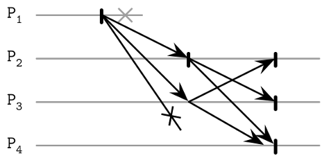

> 图
> 14-1：广播。源进程把消息发送给其他进程；源进程发生故障后，收到消息的进程继续将其转发给其余进程。

这种方法的缺点之一是会使用 $N^2$ 条消息， 其中 $N$ 是*剩余*接收者的数量
（因为每个广播进程都会排除原始进程和自身）。 理想情况下，
我们希望减少可靠广播所需的消息数量。

## 原子广播

尽管刚刚介绍的洪泛算法能够确保消息送达， 但它不能保证按任何特定顺序送达。
消息最终会在某个未知时刻到达目的地。 如果需要按顺序传递消息，
就必须使用原子广播（atomic broadcast， 也称全序组播，即 total order
multicast）， 它同时保证可靠传递和全序。

可靠广播确保各进程就已传递消息的集合达成一致，
而原子广播还确保它们就相同的消息序列达成一致
（即每个目标的消息传递顺序都相同）。

总之， 原子广播必须确保两个基本属性：

**原子性**

进程必须就收到的消息集合达成一致。 要么所有未发生故障的进程都传递该消息，
要么都不传递。

**顺序**

所有未发生故障的进程都以相同顺序传递消息。

这里的消息以*原子方式*传递： 每条消息要么传递给所有进程， 要么不传递给任何进程；
如果消息得到传递， 其他每条消息都会排在它之前或之后。

### 虚拟同步

一种使用广播进行组通信的框架称为虚拟同步（virtual synchrony）。
原子广播有助于向一个*静态*进程组传递全序消息，
而虚拟同步则向一个*动态*对等进程组传递全序消息。

虚拟同步把进程组织成组。 只要组仍然存在， 消息就会以相同顺序传递给组内所有成员。
这里的顺序并非由模型指定； 只要实现所提供的顺序在所有成员间一致，
某些实现就能利用这一点提升性能 [BIRMAN10]。

各进程对组拥有相同的视图， 消息则与组标识相关联： 只有属于同一个组时，
进程才能看到完全相同的消息。

一旦有参与者加入、离开或发生故障而被强制移出组， 组视图就会改变。
系统通过向所有组成员宣布组变更来完成这一过程。 每条消息都与产生它的组唯一关联。

虚拟同步区分消息接收 （组成员收到消息时） 和消息传递
（所有组成员都收到消息时）。 如果消息是在某个视图中发送的，
它只能在同一个视图中传递； 比较当前组与消息所关联的组即可确定这一点。
在进程收到成功传递的通知之前， 已接收的消息会一直在队列中等待。

由于每条消息都属于特定的组， 除非组内所有进程都在视图变更之前收到消息，
否则任何组成员都不能认为该消息已经传递。
这意味着所有消息都在两次视图变更之间发送和传递， 从而提供原子传递保证。
在这种情况下， 组视图构成了消息广播无法穿越的屏障。

有些全序广播算法使用单个进程（sequencer）确定消息顺序。 这类算法可能更容易实现，
但其活性依赖于检测领导者故障。 使用 sequencer 可以提升性能，
因为不必为每条消息在进程之间建立共识， 而可以改用 sequencer 的局部视图。
这种方法仍可通过对请求进行分区来扩展。

尽管虚拟同步在技术上很可靠， 但并未得到广泛采用，
在面向最终用户的商业系统中也不常见 [BIRMAN06]。

### ZooKeeper 原子广播（ZAB）

最流行、最广为人知的原子广播实现之一， 是层次式分布式键值存储 Apache ZooKeeper
所使用的 ZooKeeper Atomic Broadcast（ZAB）[HUNT10] [JUNQUEIRA11]。 ZooKeeper
用它来确保事件全序和原子传递， 这是维持副本状态一致所必需的。

ZAB 中的进程可以承担两种角色之一：领导者和跟随者。 领导者是临时角色。
它通过执行算法步骤来推动流程， 向跟随者广播消息并确定事件顺序。
要写入新记录或执行能观察到最新值的读取， 客户端会连接到集群中的某个节点。
如果该节点恰好是领导者， 它就处理请求； 否则，它会把请求转发给领导者。

为了保证领导者的唯一性， 协议时间线被划分成 epoch， 每个 epoch
都由一个唯一且单调递增的序号标识。 任何 epoch 中都只能有一个领导者。
流程首先使用任意选举算法寻找潜在领导者，
只要该算法选出的进程很可能仍在运行即可。 由于后续算法步骤会保证安全性，
确定潜在领导者更多是一项性能优化。 前任领导者发生故障时，
也会产生新的潜在领导者。

潜在领导者一经确定， 就会执行包含三个阶段的协议：

**发现**

潜在领导者了解其他每个进程所知的最新 epoch， 并提出一个比任何跟随者当前 epoch
都大的新 epoch。 跟随者用前一个 epoch 中所见最新事务的标识符响应 epoch 提议。
这一步之后， 任何进程都不会再接受先前 epoch 的广播提议。

**同步**

该阶段用于从前任领导者的故障中恢复， 并让落后的跟随者赶上进度。
潜在领导者向跟随者发送消息， 提议自己成为新 epoch 的领导者， 并收集它们的确认。
一旦收到确认， 领导者就正式确立。 这一步之后， 跟随者不会接受其他任何进程成为该
epoch 领导者的尝试。 同步期间， 新领导者会确保各跟随者拥有相同的历史，
并传递先前 epoch 中已确立领导者所提交的提议。 这些提议会在新 epoch
的任何提议得到传递*之前*传递。

**广播**

跟随者恢复同步后， 主动消息传递便会开始。 在此阶段，
领导者接收客户端消息、确定其顺序并向跟随者广播： 它发送新提议，
等待达到法定人数的跟随者以确认响应， 最后提交提议。
这个过程类似于没有中止的两阶段提交： 投票只是确认，
客户端不能投票反对有效领导者的提议。 不过， 不应确认来自错误 epoch
的领导者提议。 广播阶段会一直持续， 直到领导者崩溃、与跟随者发生网络分区，
或因消息延迟而被怀疑已经崩溃。

图 14-2 展示了 ZAB 算法的三个阶段， 以及每一步中交换的消息。

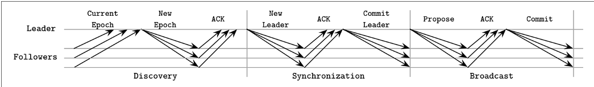

> 图 14-2：ZAB
> 协议概要。协议依次经历发现、同步和广播三个阶段，并展示领导者与跟随者在各阶段交换的消息。

只要跟随者确保仅接受来自已确立 epoch 领导者的提议， 该协议的安全性就能得到保证。
两个进程可能都会*尝试*当选， 但只有一个能胜出并确立为 epoch 领导者。
协议还假定进程会善意执行规定的步骤并遵循协议。

领导者和跟随者都依靠心跳判断远程进程的活性。
如果领导者没有收到达到法定人数的跟随者发来的心跳，
它就会退出领导者角色并重新启动选举过程。 类似地，
如果某个跟随者判定领导者已经崩溃， 它就会启动新的选举过程。

消息是全序的； 在前一条消息得到确认之前， 领导者不会尝试发送下一条消息。
即使跟随者多次收到某些消息， 只要遵守传递顺序， 重复应用也不会产生额外副作用。
ZAB 能够处理客户端发起的多个尚未完成的并发状态变更，
因为唯一的领导者会接收写请求、确定事件顺序并广播变更。

消息全序也让 ZAB 能提高恢复效率。 在同步阶段，
跟随者以其编号最高的已提交提议响应。 领导者只需选择拥有最高提议的节点进行恢复，
而且可以只从这一个节点复制消息。

ZAB 的优点之一是高效： 广播过程只需要两轮消息； 发生领导者故障后，
可以从单个最新进程流式传输缺失消息来恢复。 长期存续的领导者也能改善性能：
领导者可以依据其局部视图对事件排序， 因此不需要额外的共识轮次来建立事件历史。

## Paxos

在存在崩溃故障的异步系统中， 原子广播与共识是等价的问题 [CHANDRA96]，
因为参与者必须就消息顺序达成一致， 并且必须能够获知该顺序。
原子广播与共识算法在动机和实现方面有许多相似之处。

Paxos 可能是最广为人知的共识算法。 Leslie Lamport 最先在论文 “The Part-Time
Parliament” [LAMPORT98] 中提出它。 该论文借用爱琴海 Paxos
岛上的立法与投票过程术语来描述共识。 2001 年， 作者发表了后续论文 “Paxos Made
Simple” [LAMPORT01]， 引入了更简单的术语； 如今人们通常使用这些术语解释该算法。

Paxos 的参与者可以承担三种角色之一：提议者、接受者或学习者：

**提议者**

从客户端接收值， 创建接受这些值的提议， 并尝试收集接受者的投票。

**接受者**

投票接受或拒绝提议者提出的值。 为了容错， 算法要求存在多个接受者； 但为了活性，
只需达到法定人数（多数）的接受者投票即可接受提议。

**学习者**

承担副本角色， 存储已接受提议的结果。

任何参与者都可以承担任意角色， 而且大多数实现会将这些角色共置：
单个进程可以同时是提议者、接受者和学习者。

每项提议都包含客户端提出的值， 以及一个唯一且单调递增的提议编号，
用于区分协议轮次并拒绝陈旧提议；
该编号本身不表示客户端操作的执行顺序或因果顺序。

### Paxos 算法

Paxos 算法大体可分为两个阶段： 投票（或提议阶段）和复制。 在投票阶段，
提议者竞争以确立领导地位； 在复制阶段， 提议者把值分发给接受者。

提议者是客户端最初的联系点。 它接收一个需要作出决定的值，
并尝试从达到法定人数的接受者处收集投票。 完成后，
接受者把商定值的信息分发给学习者， 从而批准结果。
学习者则提高已商定值的复制因子。

多个提议者可以在不同编号的轮次中先后获得多数承诺；
若它们持续以更高编号相互抢占， 协议可能活锁， 因而需要重试或选定 distinguished
proposer。 “故障场景”一节会讨论这一情况。

在提议阶段， 提议者向接受者发送 `Prepare(n)` 消息 （其中 $n$ 是提议编号），
并尝试从达到法定人数的接受者处收集承诺。

*接受者*收到 prepare 请求时必须响应， 并保持下列不变量 [LAMPORT01]：

- 如果该接受者尚未响应过序号更高的 prepare 请求，
  它就作出_承诺_：不接受序号更低的任何提议。
- 如果该接受者先前已经接受过其他提议 （收到过
  `Accept!($m, v_{\text{accepted}}$)` 消息）， 它会用
  `Promise($m, v_{\text{accepted}}$)` 消息响应， 通知提议者它已经接受了序号为
  $m$ 的提议。
- 如果该接受者已经响应过序号更高的 prepare 请求，
  它会通知提议者存在编号更高的提议。
- 接受者可以响应多个 prepare 请求， 只要后一个请求的序号更高。

在复制阶段， *提议者*收集到达到法定人数的承诺后即可开始复制：
它向接受者发送带有值 $v$ 和提议编号 $n$ 的 `Accept!(n, v)` 消息，
请求它们接受该提议； 只有达到法定人数的接受者接受后，该值才被选定。 $v$
是它从接受者响应中收到的编号最高提议所关联的值； 如果响应中没有先前接受的提议，
也可以是它自己的任意值。

接受者会接受编号为 $n$ 的提议， 除非它在提议阶段已经响应过 `Prepare(m)`， 且 $m$
大于 $n$。 如果接受者拒绝提议， 它会把见过的最高序号随请求一起发给提议者，
通知提议者并帮助它赶上进度 [LAMPORT01]。

图 14-3 是 Paxos 一轮执行的概括性表示。

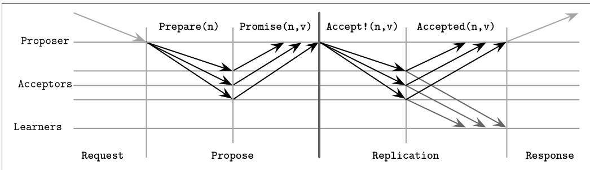

> 图 14-3：Paxos 算法的正常执行。提议者先以 `Prepare` 和 `Promise`
> 消息完成提议阶段， 再以 `Accept!`
> 消息和确认完成复制阶段，接受者随后把决定通知学习者。

一旦某个值被选定 （即达到法定人数的接受者接受了它），
未来的提议者就必须决定相同的值， 以保证一致性。 因此，
接受者会用自己接受的最新值响应。 如果没有接受者见过先前的值，
提议者可以自由选择自己的值。

学习者必须获知已决定的值； 收到多数接受者的通知后， 它就能知道该值。
为了让学习者尽快知道新值， 接受者一旦接受该值即可通知它。 如果有多个学习者，
每个接受者都必须通知每个学习者。 也可以指定一个或多个*特定*学习者，
由它们把已接受的值通知其他学习者。

总之， 算法第一阶段的目标是为这一轮确立领导者， 并了解将接受哪个值，
以便领导者进入第二阶段：广播该值。 在基础算法中，
我们假设每次要决定一个值时都必须执行两个阶段。 实践中希望减少算法步骤，
因此可以允许提议者提出多个值。 “Multi-Paxos”一节会进一步讨论这一点。

### Paxos 中的法定人数

法定人数用于确保即使*部分*参与者发生故障，
只要能从仍存活的参与者中收集到足够的投票， 流程仍可继续。
法定人数是执行操作所需的*最少*票数， 通常由参与者的*多数*构成。 其核心思想是：
即使参与者发生故障或被网络分区隔开， 也至少有一个参与者充当仲裁者，
确保协议正确。

足够多的参与者接受提议后， 协议就能保证该值被接受，
因为任意两个多数集合至少有一个共同参与者。

无论发生多少故障， Paxos 都保证安全性。 不存在会产生错误或不一致状态的配置，
否则就违背了共识的定义。

存在 $f$ 个故障进程时， 活性也能得到保证。 为此， 协议总共需要 $2f + 1$ 个进程；
这样，即使恰有 $f$ 个进程发生故障， 仍有 $f + 1$ 个进程可以继续。
Paxos（以及其他共识算法）使用法定人数， 而非要求所有进程都在场， 因而即使发生
$f$ 个进程故障也能保证结果。 “Flexible
Paxos”一节会从略有不同的角度讨论法定人数，
并说明如何构建只要求算法步骤之间法定人数相交的协议。

> [!NOTE]
> 必须记住， 法定人数只描述系统的阻塞属性。 为了保证安全性，
> 每一步都必须等待至少达到法定人数的节点响应。 可以向更多节点发送提议和 accept
> 命令， 只是无需等待它们响应便可继续。 也可以向更多节点发送消息
> （有些系统采用推测执行， 发出冗余查询，
> 以便在节点发生故障时达到所需的响应数）， 但为了保证活性，
> 一旦收到达到法定人数的响应就可以继续。

### 故障场景

讨论分布式算法时， 故障场景尤其有趣。 一种体现容错能力的场景是：
提议者在第二阶段、尚未把值广播给所有接受者之前发生故障
（提议者仍存活但运行缓慢， 或无法与部分接受者通信时也会出现类似情况）。 此时，
新提议者可以接手并提交该值， 将它分发给其他参与者。

图 14-4 展示了这种情况：

- 提议者 $P_1$ 以提议编号 1 完成选举阶段， 但只向接受者 $A_1$ 发送值 V1
  后就发生故障。
- 另一个提议者 $P_2$ 使用更高的提议编号 2 开始新一轮，
  收集达到法定人数的接受者响应 （此处为 $A_1$ 和 $A_2$）， 然后提交 $P_1$
  提出的旧值 V1。

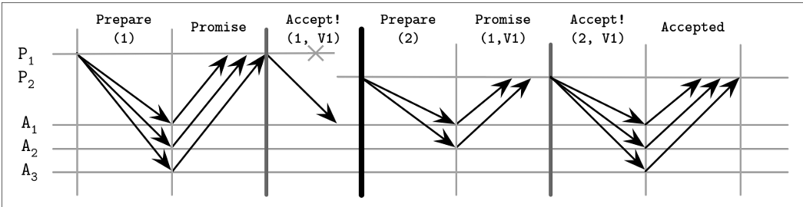

> 图 14-4：Paxos 故障场景——提议者故障后决定旧值。$P_1$ 仅将 V1 发给 $A_1$
> 后故障； $P_2$ 从包含 $A_1$ 的法定人数集合获知 V1，并继续提交它。

由于算法状态复制到了多个节点， 提议者故障不会导致无法达成共识。
即使当前提议者在只有一个接受者 $A_1$ 接受值之后发生故障，
下一个提议者也*可以*接手它的提议。 这也意味着，
整个过程可能在原提议者毫不知情的情况下发生。

在客户端只连接原提议者的客户端/服务器应用中， 这可能导致客户端不知道 Paxos
轮次的执行结果。[^14-1]

不过， 也可能出现图 14-5 所示的其他场景：

- 与上例一样， $P_1$ 只向 $A_1$ 发送值 V1 后发生故障。
- 下一个提议者 $P_2$ 使用更高的提议编号 2
  开始新一轮并收集达到法定人数的接受者响应， 但这次率先响应的是 $A_2$ 和 $A_3$。
  收集到法定人数后， 尽管 $A_1$ 上存在另一个仅被单个接受者接受、尚未选定的值，
  $P_2$ 仍会提交自己的值。

[^14-1]: 例如，https://databass.dev/links/68 描述了这种情况。

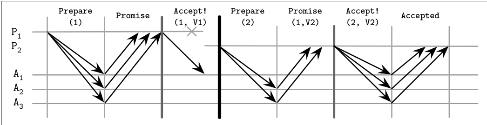

> 图 14-5：Paxos 故障场景——提议者故障后决定新值。$P_2$ 从不含 $A_1$
> 的法定人数集合获得响应， 因此可以提交自己的新值。

还有一种可能， 如图 14-6 所示：

- 只有一个接受者 $A_1$ 接受值 V1 后， 提议者 $P_1$ 发生故障。 $A_1$
  接受提议后不久也发生故障， 未能把自己的值通知下一个提议者。
- $P_1$ 故障后启动这一轮的提议者 $P_2$ 与 $A_1$ 没有重叠，
  因而继续提交自己的值。
- 此轮*之后*任何与 $A_1$ 重叠的提议者都会忽略 $A_1$ 的值，
  转而选择更新的已接受提议。

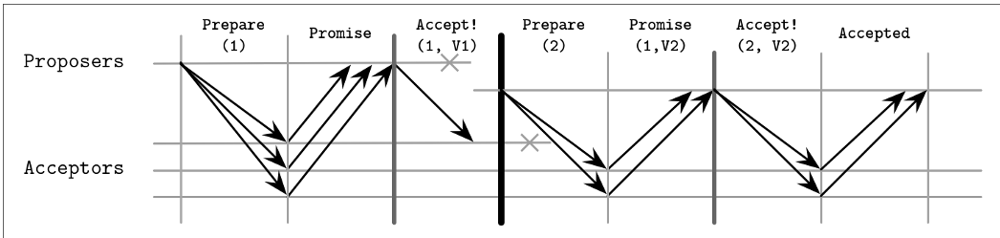

> 图 14-6：Paxos 故障场景——提议者故障后接受者也发生故障。 保存 V1 的唯一接受者
> $A_1$ 随 $P_1$ 之后故障，$P_2$ 因而提交自己的值；
> 后续轮次选择更新的已接受提议。

另一种故障场景是两个或更多提议者开始竞争： 每个都试图通过提议阶段，
但由于另一个总是抢先， 它们不断无法收集到多数票。

接受者虽然承诺不接受编号更低的提议， 但仍可响应多个 prepare 请求，
只要后一个请求的序号更高。 提议者尝试提交值时，
可能发现接受者已经响应过序号更高的 prepare 请求。 这可能导致多个提议者不断重试，
彼此阻止对方继续推进。 通常可加入随机退避来解决这个问题：
最终一个提议者会在另一个休眠时继续执行。

Paxos 算法可以容忍接受者故障， 但前提是仍有足够多的接受者存活以形成多数。

### Multi-Paxos

到目前为止， 我们讨论的是经典 Paxos 算法： 选择任意提议者并尝试启动一轮 Paxos。
这种方法的问题之一是， 系统每进行一轮复制都需要一轮提议。 只有当多数接受者用
Promise 响应提议者的 Prepare， 从而为本轮确立提议者后， 复制才能开始。
为了避免重复提议阶段， 并让提议者复用已经得到认可的地位， 可以使用 Multi-Paxos。
它引入了领导者的概念， 即一个特定提议者 [LAMPORT01]。 这是一个至关重要的补充，
显著提高了算法效率。

领导者确立后， 可以跳过提议阶段直接开始复制： 分发值并收集接受者的确认。

在经典 Paxos 算法中， 读取可以通过运行一轮 Paxos 来实现，
该轮会收集尚未完成轮次中存在的任何值。 之所以必须这样做，
是因为最后一个已知提议者不一定持有最新数据：
另一个提议者可能已经在它不知情的情况下修改了状态。

Multi-Paxos 中可能出现类似情况： 另一个领导者已经当选后，
我们仍尝试从已知领导者读取， 从而返回陈旧数据， 这违背了共识的线性一致性保证。
为了避免这种情况， 并确保其他进程无法成功提交值， 一些 Multi-Paxos
实现使用_租约_。 领导者定期联系参与者， 通知它们自己仍然存活，
实际上是在延长租约。 参与者必须响应并允许领导者继续运行，
同时承诺在租约有效期内不接受其他领导者的提议 [CHANDRA07]。

租约不是正确性保证， 而是一项性能优化，
它允许从活跃领导者读取而不必收集法定人数。 为了保证安全性，
租约依赖参与者之间有界的时钟同步。 如果时钟漂移过大，
领导者认为自己的租约仍然有效， 而其他参与者认为租约已经过期，
就*无法*保证线性一致性。

Multi-Paxos 有时被描述为应用于某种结构的操作_复制日志_。
算法不关心该结构的语义， 只负责一致地复制将追加到日志中的值。
为了在进程崩溃时保留状态， 参与者会持久保存收到的消息日志。

为了防止日志无限增长， 应把日志内容应用于上述结构。
日志内容与主结构同步并创建快照后， 就可以截断日志。 日志和状态快照应彼此一致，
而且快照变更应与日志段截断以原子方式应用 [CHANDRA07]。

可以把 single-decree Paxos 看作一次写入寄存器： 有一个槽位可以放入一个值，
值一旦写入就不能再修改。 第一步中， 提议者竞争寄存器的所有权； 第二阶段中，
其中一个提议者写入值。 与此同时， Multi-Paxos
可以看作由一系列此类值组成的仅追加日志： 每次写入一个值， 所有值严格有序，
而且已写入的值不可修改 [RYSTSOV16]。 也有一些共识算法提供读-修改-写寄存器集合，
并使用状态共享而非复制状态机， 例如 Active Disk Paxos [CHOCKLER15] 和 CASPaxos
[RYSTSOV18]。

### Fast Paxos

与经典 Paxos 相比， 让任意提议者直接联系接受者而不经过领导者，
可以减少一次往返。 为此， 法定人数需要从经典 Paxos 的 $f + 1$ （$f$
为允许发生故障的进程数） 增加到 $2f + 1$， 接受者总数则要增加到 $3f + 1$
[JUNQUEIRA07]。 这项优化称为 Fast Paxos [LAMPORT06]。

经典 Paxos 有一项条件： 在复制阶段， 提议者可以选择它在提议阶段收集到的任意值。
Fast Paxos 有两类轮次： 经典轮次与经典版本的执行方式相同；
快速轮次则允许接受者接受其他值。

描述该算法时， 我们把在提议阶段收集到足够响应的提议者称为协调者，
并把“提议者”一词留给其他所有提议者。 有些 Fast Paxos
描述称客户端可以直接联系接受者 [ZHAO15]。

在快速轮次中， 如果允许协调者在复制阶段选择自己的值，
它也可以改为向接受者发出特殊的 `Any` 消息。 此时，
接受者可以把任意提议者的值当作经典轮次中从协调者收到的值来处理。 换言之，
接受者独立决定从不同提议者收到的值。

图 14-7 展示了 Fast Paxos 中经典轮次和快速轮次的示例。 从图中看，
快速轮次似乎有更多执行步骤； 但要记住， 经典轮次中的提议者要提交自己的值，
必须经过协调者才能完成提交。

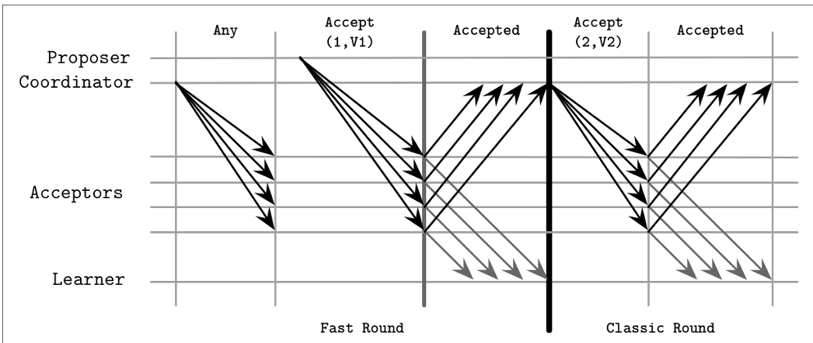

> 图 14-7：Fast Paxos 的快速轮次和经典轮次。经典路径由提议者经协调者提交值；
> 快速路径在协调者发出 `Any` 后允许提议者直接向接受者提交值。

该算法容易发生_碰撞_： 如果两个或更多提议者都尝试使用*快速*步骤来减少往返次数，
接受者就可能收到不同的值。 此时协调者必须介入， 通过发起新一轮来开始恢复。

这意味着接受者收到不同提议者的值后， 可能会决定相互冲突的值。
协调者检测到冲突（值碰撞）时， 必须重新初始化 Propose 阶段，
让接受者收敛到单一值。

Fast Paxos 的缺点之一是： 请求率很高时， 碰撞会增加往返次数和请求延迟。
[JUNQUEIRA07] 表明， 由于副本数增加以及参与者间交换的消息随之增多， Fast Paxos
尽管步骤更少， 延迟却可能高于经典版本。

### Egalitarian Paxos

使用特定提议者作为领导者会使系统容易受故障影响： 领导者一旦发生故障，
系统必须选出新领导者才能继续后续步骤。
另一个问题是领导者可能承担不成比例的负载， 从而损害系统性能。

> [!NOTE]
> 避免把整个系统负载都放在领导者身上的一种方法是_分区_。
> 许多系统把可能的值域拆分成更小的段， 允许一部分系统负责特定范围，
> 而无需关心其他部分。 这有助于提升可用性 （把故障隔离到单个分区，
> 防止其传播到系统其他部分）、 性能 （服务不同值的段互不重叠） 和可扩展性
> （可以增加分区数量来扩展系统）。 但必须记住，
> 针对*多个*分区执行操作需要原子提交。

除了使用领导者和提议编号对命令排序， 还可以让一个领导者负责提交*特定*命令，
并通过查找和设置依赖关系来建立顺序。 这种方法通常称为 Egalitarian Paxos， 简称
EPaxos [MORARU11]。 让互不冲突的写入独立提交到复制状态机的思想最早由 [LAMPORT05]
提出， 称为 Generalized Paxos。 EPaxos 是 Generalized Paxos 的第一个实现。

EPaxos 试图兼具经典 Paxos 和 Multi-Paxos 的优点。 经典 Paxos
每轮都会确立领导者， 因此可用性高， 但消息复杂度也较高。 Multi-Paxos
吞吐量高且所需消息更少， 但领导者可能成为瓶颈。

EPaxos 从 Pre-Accept 阶段开始， 在该阶段，一个进程成为特定提议的领导者。
每项提议必须包含：

**依赖关系**

所有可能干扰当前提议、 但不一定已经提交的命令。

**序号**

它用于打破依赖关系中的环。 将它设为大于所有已知依赖项序号的值。

收集这些信息后， 领导者向快速法定人数的副本转发 `Pre-Accept` 消息。 若系统有
$N = 2f + 1$ 个副本并容忍 $f$ 个故障， 快速法定人数（含 command leader）为
$f + \lfloor(f + 1)/2\rfloor$ 个副本。

副本检查本地命令日志， 根据各自观察到的潜在冲突提议更新提议的依赖关系，
然后把这些信息发回领导者。 如果领导者收到快速法定人数副本的响应，
而且它们的依赖项列表彼此一致、也与领导者自身的一致， 领导者就可以提交命令。

如果领导者没有收到足够的响应，
或者从副本收到的命令列表各不相同且包含相互干扰的命令，
它就使用新的依赖项列表和序号更新提议。 新依赖项列表以先前的副本响应为基础，
合并所有收集到的依赖关系。 新序号必须大于副本所见的最高序号。 随后，
领导者把更新后的新命令发送给多数副本。 慢路径需要 $f + 1$ 个副本（含 command
leader）。 达到这一法定人数后， 领导者就可以提交提议。

实际上存在两种场景：

**快速路径**

依赖关系匹配， 领导者只用快速法定人数的副本就能安全进入提交阶段。

**慢速路径**

副本之间存在分歧， 必须先更新其命令列表， 领导者才能继续提交。

图 14-8 展示了这两种场景： $P_1$ 发起快速路径， $P_5$ 发起慢速路径：

- $P_1$ 以提议编号 1 且无依赖关系开始， 并发送 `PreAccept(1, $\emptyset$)`
  消息。 由于 $P_2$ 和 $P_3$ 的命令日志为空， $P_1$ 可以继续提交。
- $P_5$ 创建序号为 2 的提议。 此时它的命令日志为空， 因而也声明无依赖关系，
  并发送 `PreAccept(2, $\emptyset$)` 消息。 $P_4$ 不知道已提交的提议 1， 但
  $P_3$ 会把冲突通知 $P_5$， 并发送自己的命令日志：`{1}`。
- $P_5$ 更新本地依赖项列表，
  并发送消息以确保副本拥有相同依赖关系：`Accept(2, {1})`。 副本一旦响应，
  它就可以提交该值。

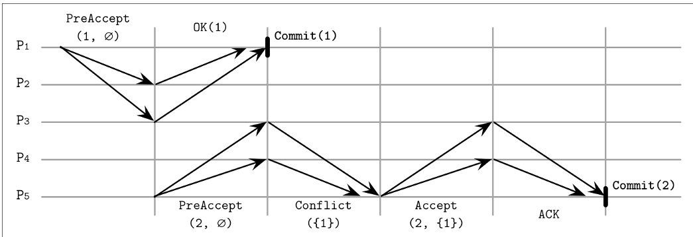

> 图 14-8：EPaxos 算法的执行。$P_1$ 的依赖关系一致，沿快速路径提交； $P_5$
> 发现与提议 1 冲突后更新依赖项，沿慢速路径完成 `Accept` 后提交。

仅当命令 A 和 B 的执行顺序会影响结果时， 二者才相互干扰； 换言之， 先执行 A
再执行 B 与先执行 B 再执行 A 会产生不同结果。

提交通过响应客户端并异步用 `Commit` 消息通知副本来完成。 命令在提交后执行。

由于依赖关系在 Pre-Accept 阶段收集， 请求开始执行时命令顺序已经确定，
不会有命令突然插入其间： 它只能追加在序号最大的命令_之后_。

为了执行命令， 副本会构建依赖图， 并按依赖关系的逆序执行所有命令。 换言之，
执行某条命令之前， 必须先执行它的所有依赖项 （以及这些依赖项的全部依赖项）。
由于只有相互干扰的命令才必须彼此依赖， 对大多数工作负载而言，
这种情况应该相对少见 [MORARU13]。

与 Paxos 类似， EPaxos 使用 ballot number 防止陈旧消息； ballot 由
epoch、节点本地计数器和副本 ID 组成。 命令的 sequence number
则是用于打破依赖环的整数， 两者不可混用。 如果副本收到的 ballot
低于自己已经见过的 ballot， 它会对提议作否定确认， 并在响应中发送它所知的最高
ballot 和更新后的命令列表。

### Flexible Paxos

法定人数通常定义为进程的多数。 按照定义， 无论如何选择节点，
两个法定人数集合都会相交： 总有至少一个节点可以打破平局。

我们必须回答两个重要问题：

- 每个执行步骤中都有必要联系*多数*服务器吗？
- 所有法定人数集合都必须相交吗？ 换言之，
  用于选择特定提议者（第一阶段）的法定人数、 用于决定值（第二阶段）的法定人数，
  以及每个执行实例 （例如并发执行第二阶段的多个实例） 之间都必须有共同节点吗？

由于讨论的仍是共识， 不能改变任何安全性定义： 算法必须保证一致性。

在 Multi-Paxos 中， 领导者选举阶段很少发生，
特定提议者可以提交多个值而不重新执行选举阶段， 并可能长期保持领导地位。
“可调一致性”一节讨论过有助于找出节点集合相交配置的公式。 其中一个例子是：
只等待一个节点确认写入 （对其余节点的请求异步完成）， 但从所有节点读取。
换言之， 只要保持 $R + W > N$， 读集合与写集合之间就至少有一个共同节点。

共识能否使用类似逻辑？ 答案是可以。 在 Paxos 中，
只要求第一阶段（选出领导者）的节点组 与第二阶段（参与接受提议）的节点组相交。

换言之， 法定人数不必都定义为多数， 但第一阶段与第二阶段的法定人数必须相交。
如果参与者总数为 $N$， 提议阶段成功所需的节点数为 $Q_1$，
接受阶段成功所需的节点数为 $Q_2$， 那么只需确保 $Q_1 + Q_2 > N$。
由于第二阶段通常比第一阶段更常见， $Q_2$ 可以只包含 $N/2$ 个接受者，
只要相应增大 $Q_1$ （$Q_1 = N - Q_2 + 1$）。 这一发现是理解共识的一项关键洞见。
采用这种方法的算法称为 Flexible Paxos [HOWARD16]。

例如， 如果有五个接受者， 只要要求收集其中四个接受者的投票才能赢得选举轮次，
就可以允许领导者在复制阶段只等待两个节点响应。 而且，
由于任意两个接受者组成的子集都与领导者选举法定人数相交，
可以向互不相交的接受者集合提交提议。 直观地说，
这是因为每当新领导者在当前领导者不知情的情况下当选时，
总会有至少一个接受者知道新领导者的存在。

Flexible Paxos 允许用可用性换取延迟： 减少参与第二阶段的节点数，
代价是领导者选举阶段必须收集更多投票， 因而需要更多参与者可用。 好消息是，
只要当前领导者稳定且无需进行新一轮选举， 这种配置就可以继续复制阶段， 并容忍最多
$N - Q_2$ 个节点发生故障。

另一种采用法定人数相交思想的 Paxos 变体是 Vertical Paxos。 Vertical Paxos
区分读法定人数和写法定人数， 二者必须相交。
领导者必须为一个或多个编号更低的提议收集较小的读法定人数，
再为自己的提议收集较大的写法定人数 [LAMPORT09]。 [LAMPORT01] 也区分 *out*
法定人数和 *decision* 法定人数， 它们分别对应 prepare 和 accept 阶段，
并给出了与 Flexible Paxos 类似的法定人数定义。

### 共识的通用解法

Paxos 有时不太容易推理： 多个角色、多个步骤以及所有可能的变体很难同时掌握。
不过， 可以用更简单的方式来理解它。 我们不必在参与者之间划分角色并执行决定轮次，
而可以使用一组简单的概念和规则， 实现 single-decree Paxos 的保证。
这里只简要讨论这种方法， 因为它是相对较新的进展 [HOWARD19]： 了解它很重要，
但我们尚未看到其实现和实际应用。

系统中有一个客户端和一组服务器。 每台服务器都有多个寄存器。
每个寄存器都有标识它的索引， 只能写入一次， 并可能处于三种状态之一：
未写入、包含某个值， 以及包含 nil（一种特殊的空值）。

位于不同服务器、索引相同的寄存器构成一个寄存器集合。
每个寄存器集合可以有一个或多个法定人数集合。 根据其中寄存器的状态，
法定人数集合可以处于未决定状态（`Any` 和 `Maybe v`） 或已决定状态（`None` 和
`Decided v`）：

**Any**

根据未来的操作， 该法定人数集合可以决定任意值。

**Maybe v**

如果该法定人数集合作出决定， 它只能决定 $v$。

**None**

该法定人数集合无法决定该值。

**Decided v**

该法定人数集合已经决定值 $v$。

客户端与服务器交换消息并维护一张状态表， 在其中跟踪值和寄存器，
并可推断法定人数集合所作的决定。

为了保持正确性， 必须限制客户端如何与服务器交互，
以及它们可以和不可以写入哪些值。 就读取值而言，
只有从同一寄存器集合内达到法定人数的服务器中读到决定值， 客户端才能输出该值。

写入规则稍复杂一些， 因为为了保证算法安全性， 必须保持若干不变量。
首先必须确保客户端不会凭空创造新值： 只有当特定值是客户端收到的输入，
或是从某个寄存器读到的值时， 才允许它把该值写入寄存器。
客户端不能写入会让同一寄存器集合内不同法定人数集合决定不同值的值。 最后，
客户端不能写入会覆盖先前寄存器集合中既有决定的值 （索引不超过 $\tau - 1$
的寄存器集合所作决定必须是 `None`、 `Maybe v` 或 `Decided v`）。

#### 通用 Paxos 算法

把这些规则结合起来， 就能实现一种使用一次写入寄存器、 对单个值达成共识的通用
Paxos 算法 [HOWARD19]。 假设有三台服务器 `[S0, S1, S2]`、 寄存器 `[R0, R1, ...]`
和客户端 `[C0, C1, ...]`， 每个客户端只能写入分配给它的寄存器子集。
所有寄存器都使用简单多数法定人数 （$\{S0, S1\}$、$\{S0, S2\}$、$\{S1, S2\}$）。

这里的决定过程分为两个阶段。 第一阶段确保向寄存器写入值是安全的，
第二阶段则把值写入寄存器：

**阶段 1**

客户端向服务器发送 $P1_A(\text{register})$ 命令，
检查即将写入的寄存器是否尚未写入。 如果该寄存器尚未写入， 它之前直到
`register - 1` 的所有寄存器都会设为 nil， 以防止客户端写入先前的寄存器。
服务器以目前已经写入的寄存器集合响应。 如果收到多数服务器的响应，
客户端会选择索引最大寄存器中的非空值； 如果不存在值， 则选择自己的值。
否则，它会重新开始第一阶段。

**阶段 2**

客户端向所有服务器发送 $P2_A(\text{register}, \text{value})$，
把第一阶段选出的值通知它们。 如果多数服务器响应这条消息，
客户端就可以输出决定值； 否则，它会从第一阶段重新开始。

图 14-9 展示了这种 Paxos 泛化形式 （改编自 [HOWARD19]）。 客户端 C0 尝试提交值
V。 第一步中， 其状态表为空， 服务器 S0 和 S1 以空寄存器集合响应，
表示此前没有写入任何寄存器。 第二步中， 由于没有写入其他值， 它可以提交自己的值
V。

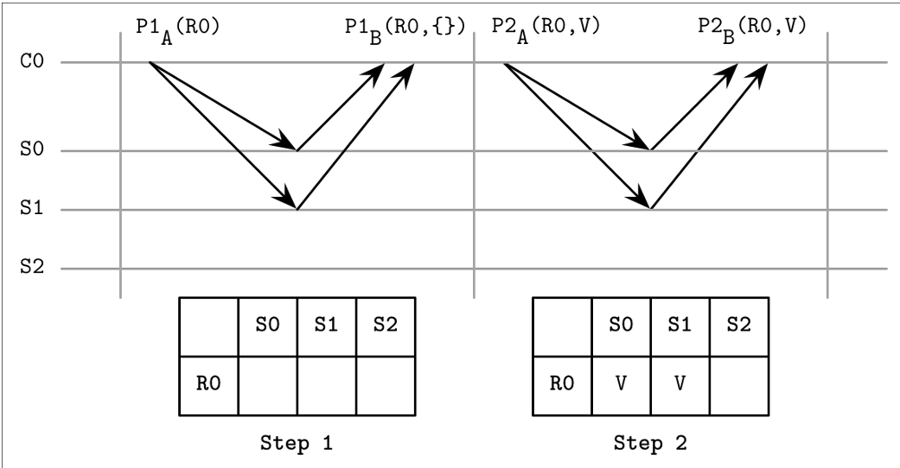

> 图 14-9：Paxos 的泛化形式。客户端 C0 在阶段 1 从多数服务器确认寄存器尚未写入，
> 再在阶段 2 把值 V 写入多数服务器；状态表据此推断各法定人数集合的决定状态。

此时， 其他任何客户端都可以查询服务器以了解当前状态。 法定人数集合 $\{S0, S1\}$
已经达到 `Decided V` 状态， $\{S0, S2\}$ 和 $\{S1, S2\}$ 则在 R0 上达到
`Maybe V` 状态， 因此 C1 会选择值 V。 从这一刻起， 任何客户端都无法决定 V
以外的值。

这种方法有助于理解 Paxos 的语义。 与其从远程参与者交互的角度考虑状态
（例如提议者要确定接受者是否已经接受了不同提议）， 不如依据最后已知状态思考，
从而简化决定过程并消除可能的歧义。 不可变状态和消息传递也更容易正确实现。

还可以把它与原始 Paxos 对照起来。 例如，
如果客户端发现先前某个寄存器集合的决定为 `Maybe V`， 它就会接手 V
并尝试再次提交； 这类似于 Paxos 中，
前一个提议者让至少一个接受者接受值后发生故障， 后续提议者仍可提出该值。 同样，
Paxos 通过以更高提议编号重新投票来解决领导者冲突，
而通用算法则把所有尚未写入且级别较低的寄存器设为 nil。

## Raft

十余年间， Paxos 一直是共识算法的代表， 但分布式系统社区公认它难以推理。 2013
年出现了一种名为 Raft 的新算法。
开发它的研究人员希望创造一种容易理解和实现的算法。 该算法首次发表于论文 “In
Search of an Understandable Consensus Algorithm” [ONGARO14]。

分布式系统本身已经足够复杂， 因此更简单的算法十分可取。 除了论文，
作者还发布了名为 LogCabin 的参考实现， 用于消除可能的歧义，
并帮助未来的实现者更好地理解算法。

参与者在本地存储一份日志， 其中包含状态机所执行的命令序列。
由于进程收到的输入相同， 日志又以相同顺序包含相同命令，
把这些命令应用于状态机便能保证相同输出。 Raft 把领导者概念提升为一等公民，
从而简化共识。 领导者用于协调状态机操作和复制。 Raft 与原子广播算法以及
Multi-Paxos 有许多相似之处： 副本中产生单一领导者，
由其作出原子决定并确定消息顺序。

Raft 中每个参与者可以承担三种角色之一：

**候选者**

领导地位是一种临时状态， 任何参与者都可以承担这一角色。 要成为领导者，
节点必须先转入候选者状态， 并尝试收集多数票。 如果候选者既未赢得也未输掉选举
（选票被多个候选者瓜分， 无人获得多数票）， 系统会开启新任期并重新选举。

**领导者**

当前的临时集群领导者， 负责处理客户端请求并与复制状态机交互。
领导者在称为任期的时间段内当选。 每个任期由单调递增的编号标识，
持续时间可以任意长。 如果当前领导者崩溃、失去响应， 或被其他进程怀疑发生故障，
就会选出新领导者； 网络分区和消息延迟都可能引起这种怀疑。

**跟随者**

被动参与者， 负责持久化日志条目， 并响应领导者和候选者的请求。 Raft
中的跟随者角色类似于 Paxos 的接受者和学习者。 每个进程启动时都是跟随者。

为了在不依赖时钟同步的情况下保证全局偏序， 时间被划分成多个任期（也称 epoch），
每个任期中领导者唯一且稳定。 任期编号单调递增，
每条命令由任期编号及其在任期内的消息编号唯一标识 [HOWARD14]。

不同参与者可能对哪个任期是*当前*任期存在分歧，
因为它们可能在不同时间获知新任期， 或错过一个或多个任期的领导者选举。
由于每条消息都包含任期标识符， 如果某个参与者发现自己的任期已经过时，
就会将其更新为编号更高的任期 [ONGARO14]。
这意味着任意时刻*可能*有多个任期正在进行， 但发生冲突时编号较高的任期胜出。
只有当节点开始新的选举过程， 或发现自己的任期已经过时时， 才会更新任期。

启动时， 或每当跟随者收不到领导者的消息并怀疑它已经崩溃时，
跟随者就会启动领导者选举。 参与者转入候选者状态并收集多数节点的投票，
以尝试成为领导者。

图 14-10 的时序图展示了 Raft 算法的主要组成部分：

**领导者选举**

候选者 P1 向其他进程发送 `RequestVote` 消息。 该消息包含候选者的当前任期、
最后一个日志条目的索引和任期。 收集到多数票后， 候选者成功当选该任期的领导者。
每个进程在每个任期最多投票给一个候选者。

**周期性心跳**

协议使用心跳机制确保参与者的活性。 领导者定期向所有跟随者发送心跳以维持其任期。
如果跟随者在一段称为*选举超时*的时间内没有收到新心跳，
它就会认为领导者发生故障并启动新选举。

**日志复制/广播**

领导者可以通过发送 `AppendEntries` 消息， 反复向复制日志追加新值。
消息包含领导者的任期、 当前所发送条目的前一个日志条目的索引和任期，
以及一个或多个要存储的条目。

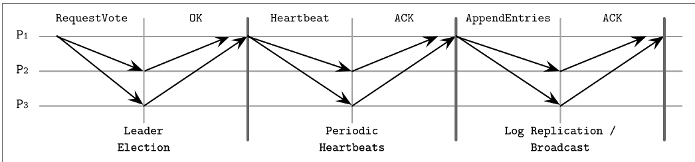

> 图 14-10：Raft 共识算法概要。候选者通过 `RequestVote` 当选领导者，
> 领导者用周期性心跳维持任期，并以 `AppendEntries` 向跟随者复制日志。

### Raft 中的领导者角色

只有持有全部已提交条目的节点才能当选领导者： 选举期间，
如果跟随者的日志信息比候选者更新 （即任期 ID 更高，
或在任期相同时日志条目序列更长）， 它就会拒绝投票。

候选者必须收集多数票才能赢得选举。 条目始终按顺序复制， 因此只需比较最新条目的
ID， 就足以判断参与者是否为最新状态。

领导者当选后， 必须接受客户端请求 （其他节点也可以把请求转发给它）
并将其复制到跟随者。 具体做法是把条目追加到自己的日志， 再并行发送给所有跟随者。

跟随者收到 `AppendEntries` 消息后， 会把消息中的条目追加到本地日志，
并确认消息， 让领导者知道条目已经持久化。 只有当前任期的条目复制到多数副本后，
领导者才能据此推进 `commitIndex`； 推进后， 该条目之前的所有条目也随之间接提交。

由于只有最新的候选者才能成为领导者， 跟随者永远不必让领导者赶上进度；
日志条目只从领导者流向跟随者， 不会反向流动。

图 14-11 展示了这一过程：

- a）新命令 `x = 8` 追加到领导者日志。
- b）该值提交前必须复制到多数参与者。
- c）领导者完成复制后在本地提交该值。
- d）提交决定被复制到跟随者。

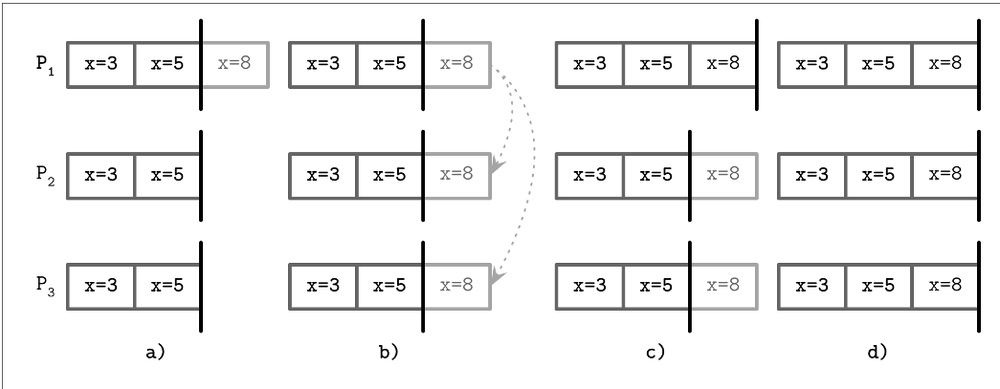

> 图 14-11：以 $P_1$ 为领导者时 Raft
> 的提交过程。命令先追加到领导者日志并复制到多数参与者，
> 随后领导者在本地提交，再把提交决定复制给跟随者。

图 14-12 展示了一轮共识的示例， 其中 $P_1$ 是领导者， 拥有最新的事件视图。
领导者把条目复制给跟随者， 并在收集确认后提交。
提交一个条目也会提交日志中它之前的所有条目。 只有领导者能决定条目是否可以提交。
每个日志条目都标有任期 ID （日志条目框右上角的数字）
和标识其日志位置的日志索引。 已提交条目保证已经复制到达到法定人数的参与者，
可以安全地按其在日志中的顺序应用于状态机。

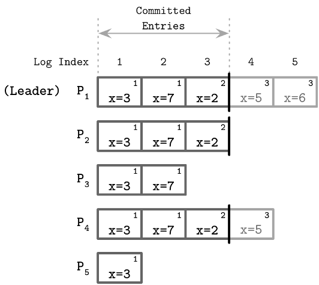

> 图 14-12：Raft 状态机。领导者 $P_1$ 将按任期和索引标识的日志条目复制给跟随者；
> 获得法定人数确认的条目及其之前所有条目均可按序应用于状态机。

### 故障场景

当多个跟随者决定成为候选者， 而没有任何候选者能收集多数票时，
这种情况称为_选票瓜分_。 Raft 使用随机化定时器，
降低后续多次选举都出现选票瓜分的概率。
某个候选者可以更早开始下一轮选举并收集足够选票，
其他候选者则仍在休眠并为其让路。
这种方法无需候选者之间进行额外协调便能加快选举。

跟随者可能宕机或响应缓慢， 领导者必须尽最大努力确保消息送达。
如果没有在预期时限内收到确认， 它可以尝试重新发送消息。 作为性能优化，
它可以并行发送多条消息。

由于领导者复制的条目具有唯一标识， 重复传递消息也保证不会破坏日志顺序。
跟随者使用序列 ID 对消息去重， 确保重复传递不会产生意外副作用。

序列 ID 还用于确保日志顺序。 如果领导者发来的前一条目 ID 和任期
与跟随者自身记录中的最高条目不匹配， 跟随者就会拒绝编号更高的条目。
如果不同副本的两份日志中， 某些条目具有相同的任期和索引，
那么它们存储的命令相同， 而且此前的所有条目也相同。

Raft 保证绝不会把未提交消息显示为已提交， 但由于网络或副本缓慢，
已提交消息仍可能显示为_进行中_。 这是一个相当无害的属性，
可以通过重试客户端命令直到最终提交来处理 [HOWARD14]。

为了检测故障， 领导者必须向跟随者发送心跳， 借此维持自己的任期。
某个节点注意到当前领导者宕机后， 会尝试发起选举。
新当选的领导者必须把集群状态恢复到最后一个已知的最新日志条目。 它会找出共同点
（领导者与跟随者一致认同的最高日志条目），
并命令跟随者丢弃在此之后追加的所有未提交条目。
随后，它从自己的日志发送最新条目， 覆盖跟随者的历史。
领导者自身的日志记录永远不会删除或覆盖： 它只能向自己的日志追加条目。

总之， Raft 算法提供以下保证：

- 给定任期中一次只能选出一个领导者； 同一任期中不会同时存在两个活跃领导者。
- 领导者不会删除或重新排序日志内容， 只会追加新消息。
- 已提交日志条目保证存在于后续领导者的日志中， 而且无法回滚，
  因为条目提交前已知领导者完成了复制。
- 所有消息都由消息 ID 和任期 ID 唯一标识；
  当前及后续领导者都不能为不同条目复用同一标识符。

Raft 问世后变得非常流行， 目前用于 CockroachDB、Etcd 和 Consul
等许多数据库及其他分布式系统。 这可以归因于它的简洁性， 也可能说明 Raft
确实兑现了成为可靠共识算法的承诺。

## 拜占庭共识

目前讨论的所有共识算法都假设非拜占庭故障 （参见“任意故障”）。 换言之，
节点会“善意”执行算法， 不会试图利用算法或伪造结果。

正如将要看到的， 这一假设让系统能够用更少的可用参与者达成共识，
提交所需的往返次数也更少。 然而， 分布式系统有时部署在潜在的对抗性环境中，
其中节点不受同一个实体控制； 即使一些节点行为反常甚至恶意，
我们也需要算法确保系统正确运行。 除恶意行为外，
bug、错误配置、硬件问题或数据损坏也会导致拜占庭故障。

多数拜占庭共识算法完成一个算法步骤需要 $N^2$ 条消息， 其中 $N$
是法定人数的大小， 因为法定人数中的每个节点都必须相互通信。 之所以需要这样做，
是为了用其他节点交叉验证每一步： 节点无法信任彼此或领导者，
必须把返回结果与多数响应进行比较， 以验证其他节点的行为。

这里只讨论一种拜占庭共识算法： 实用拜占庭容错（Practical Byzantine Fault
Tolerance，PBFT）[CASTRO99]。 PBFT 假设节点故障彼此独立 （即故障可以协调发生，
但整个系统不可能一次全部被攻陷， 至少不能用同一种利用手段实现）。
系统采用弱同步假设， 类似于通常对网络正常行为的预期： 故障可能发生，
但不会无限持续， 最终会恢复。

节点之间的所有通信都会加密， 以防消息伪造和网络攻击。 副本知道彼此的公钥，
用于验证身份和加密消息。 故障节点可能泄露系统内部信息， 因为即使使用加密，
每个节点也需要解释消息内容才能作出反应。 这并不会削弱算法，
因为算法的用途与防止信息泄露不同。

### PBFT 算法

要让 PBFT 同时保证安全性和活性， 发生故障的副本不能超过 $(n - 1)/3$ （$n$
是参与者总数）。 系统要承受 $f$ 个被攻陷节点， 至少需要 $n = 3f + 1$ 个节点。
原因是多数节点必须就该值达成一致： 可能有 $f$ 个副本发生故障， 还可能有 $f$
个副本没有响应但并未发生故障 （例如由于网络分区、断电或维护）。
算法必须能从无故障副本收集到足够多的响应， 使其数量仍多于故障副本的响应。

PBFT 的共识属性与其他共识算法类似： 尽管可能发生故障，
所有无故障副本仍必须就接收值的集合及其顺序达成一致。

为了区分集群配置， PBFT 使用视图。 每个视图中， 一个副本是主副本，
其余副本则视为备份副本。 所有节点连续编号， 主节点索引为 $v \bmod N$， 其中 $v$
是视图 ID， $N$ 是当前配置的节点数。 主副本发生故障时， 视图可以改变。
客户端在主副本上执行操作。 主副本把请求广播给备份副本，
后者执行请求并把响应发回客户端。 对于任何操作， 客户端都要等待 $f + 1$
个副本返回相同结果， 操作才算成功。

主副本收到客户端请求后， 协议按三个阶段执行：

**Pre-prepare**

主副本广播一条消息， 其中包含视图 ID、 唯一且单调递增的标识符、
payload（客户端请求） 和 payload 摘要。 摘要使用抗碰撞的强哈希函数计算，
并由发送方签名。 如果消息视图与主副本视图匹配， 且客户端请求没有被篡改
（计算出的 payload 摘要与收到的摘要一致）， 备份副本就接受消息。

**Prepare**

如果备份副本接受 pre-prepare 消息， 它就进入 prepare 阶段，
开始向所有其他副本（包括主副本）广播 `Prepare` 消息。 该消息包含视图 ID、消息 ID
和 payload 摘要， 但不包含 payload 本身。 副本只有收到来自不同备份副本的 $2f$ 条
prepare， 且它们与 prepare 期间收到的消息相匹配， 才能越过 prepare 状态：
这些消息必须拥有相同视图、相同 ID 和相同摘要。

**Commit**

随后， 备份副本进入 commit 阶段， 向所有其他副本广播 `Commit` 消息，
并等待从其他参与者收集 $2f + 1$ 条匹配的 Commit 消息 （可以包括自己的消息）。

这里使用摘要是为了在 prepare 阶段减小消息大小， 因为无需重新广播整个 payload
进行验证； 摘要可以作为 payload 的概括。 密码学哈希函数具有抗碰撞性：
生成摘要相同的两个值非常困难，
更不用说生成两条摘要相同且在系统上下文中都有意义的消息。 此外， 摘要还会签名，
以确保摘要本身来自可信来源。

$2f$ 这一数字十分重要， 因为算法必须确保至少有 $f + 1$ 个无故障副本响应客户端。

图 14-13 展示了 PBFT 算法一轮正常执行的时序图： 客户端向 $P_1$ 发送请求，
节点通过收集足够数量、 来自行为正确对等节点的匹配响应， 在各阶段间转换。 $P_4$
可能已经发生故障， 也可能返回了不匹配的消息， 因此它的响应不会计入。

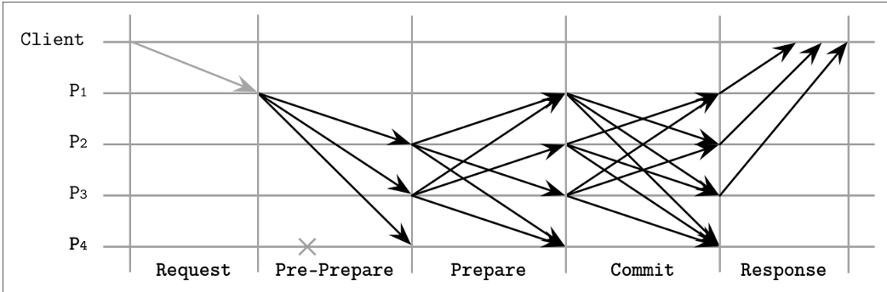

> 图 14-13：PBFT 共识的正常执行。客户端向主副本 $P_1$ 发送请求； 副本依次执行
> Pre-prepare、Prepare 和 Commit，并仅在收集到足够多匹配消息后进入下一阶段，
> 最后向客户端响应。

在 prepare 和 commit 阶段， 节点通过向其他每个节点发送消息，
并等待相应数量的其他节点返回消息来通信， 从而检查消息是否匹配，
并确保不会广播错误消息。 对等节点交叉验证所有消息，
因此只有无故障节点才能成功提交消息。 如果无法收集足够数量的匹配消息，
节点就不会进入下一步。

副本收集到足够的 commit 消息后会通知客户端， 结束这一轮。 在收到 $f + 1$
个匹配响应之前， 客户端无法确定执行是否正确完成。

副本注意到主副本不活跃并怀疑它可能发生故障时， 就会变更视图。
检测到主副本故障的节点会停止响应后续消息 （checkpoint 和视图变更相关消息除外），
广播视图变更通知并等待确认。 新视图的主副本收到 $2f$ 个视图变更事件后，
就会启动新视图。

为了减少协议中的消息数量， 客户端可以从暂时执行请求的节点收集 $2f + 1$
个匹配响应 （例如节点已经收集到足够多匹配的 Prepared 消息后）。
如果客户端无法收集到足够的匹配暂定响应， 它会重试， 并像先前所述等待 $f + 1$
个非暂定响应。

PBFT 中的只读操作只需一次往返即可完成。 客户端向所有副本发送读请求。
在对读取值进行的所有未完成状态变更都提交后，
副本在暂定状态上执行请求并响应客户端。 从不同副本收集到 $2f + 1$
个值相同的响应后， 操作即告完成。

### 恢复与 checkpoint

副本把已接受消息保存在稳定日志中。 每条消息都必须保留到至少 $f + 1$
个节点执行完它为止。 发生网络分区时， 可以使用该日志让其他副本赶上进度；
但正在恢复的副本需要某种手段验证收到的状态正确，
否则攻击者可能会利用恢复过程发动攻击。

为了证明状态正确， 节点会针对截至给定序号的消息计算状态摘要。
节点可以比较摘要、验证状态完整性， 并确保恢复期间收到的消息最终形成正确状态。
为每个请求都执行这一过程成本过高。

每经过 $N$ 个请求 （$N$ 是可配置常量）， 主副本会创建稳定 checkpoint：
广播其执行结果已反映在状态中的最新请求序号， 以及该状态的摘要， 然后等待
$2f + 1$ 个副本响应。 这些响应构成 checkpoint 的证明，
并保证副本可以安全丢弃截至给定序号的所有 pre-prepare、prepare、 commit 和
checkpoint 消息状态。

理解拜占庭容错非常重要； 它用于部署在潜在对抗性网络中的存储系统。 多数时候，
对节点间通信进行身份验证和加密就足够了； 但系统各部分之间不存在信任时，
就必须采用类似 PBFT 的算法。

抗拜占庭故障算法在交换消息数量方面会引入显著开销， 因此理解其使用场景十分重要。
[BAUDET19] 和 [BUCHMAN18] 中介绍的其他协议， 试图针对拥有大量参与者的系统优化
PBFT 算法。

## 小结

共识算法是分布式系统中最有趣、 也最复杂的主题之一。 过去几年里，
新算法和既有算法的许多实现不断涌现， 证明了这一主题日益重要并广受关注。

本章讨论了经典 Paxos 算法及其若干变体， 每种变体都改善了不同属性：

**Multi-Paxos**

允许提议者保留其角色， 并复制多个值而非仅一个值。

**Fast Paxos**

使用快速轮次来减少消息数量； 在快速轮次中，
接受者可以处理来自已确立领导者以外其他提议者的消息。

**EPaxos**

通过解析所提交消息之间的依赖关系来确定事件顺序。

**Flexible Paxos**

放宽法定人数要求，
只要求第一阶段（投票）的法定人数与第二阶段（复制）的法定人数相交。

Raft 简化了描述共识的术语， 并把领导地位提升为算法中的一等公民。 Raft
将日志复制、领导者选举和安全性彼此分离。

为了在对抗性环境中保证共识安全性， 应使用拜占庭容错算法， 例如 PBFT。 在 PBFT
中， 参与者会交叉验证彼此的响应， 只有在遵守规定算法规则的节点足够多时，
才继续执行后续步骤。

## 延伸阅读

如果想进一步了解本章提到的概念， 可以参考以下资料：

### Atomic broadcast

Junqueira, Flavio P., Benjamin C. Reed, and Marco Serafini. “Zab:
High-performance broadcast for primary-backup systems.” 2011. In Proceedings of
the 2011 IEEE/IFIP 41st International Conference on Dependable Systems &
Networks (DSN ’11): 245-256.

Hunt, Patrick, Mahadev Konar, Flavio P. Junqueira, and Benjamin Reed. 2010.
“ZooKeeper: wait-free coordination for internet-scale systems.” In Proceedings
of the 2010 USENIX conference on USENIX annual technical conference
(USENIX-ATC’10): 11.

Oki, Brian M., and Barbara H. Liskov. 1988. “Viewstamped Replication: A New
Primary Copy Method to Support Highly-Available Distributed Systems.” In
Proceedings of the seventh annual ACM Symposium on Principles of distributed
computing (PODC ’88): 8-17.

Van Renesse, Robbert, Nicolas Schiper, and Fred B. Schneider. 2014. “Vive la
Différence: Paxos vs. Viewstamped Replication vs. Zab.”

### Classic Paxos

Lamport, Leslie. 1998. “The part-time parliament.” ACM Transactions on Computer
Systems 16, no. 2 (May): 133-169.

Lamport, Leslie. 2001. “Paxos made simple.” ACM SIGACT News 32, no. 4: 51-58.

Lamport, Leslie. 2005. “Generalized Consensus and Paxos.” Technical Report
MSR-TR-2005-33. Microsoft Research, Mountain View, CA.

Primi, Marco. 2009. “Paxos made code: Implementing a high throughput Atomic
Broadcast.” (Libpaxos code: https://bitbucket.org/sciascid/libpaxos/src/master/.

### Fast Paxos

Lamport, Leslie. 2005. “Fast Paxos.” 14 July 2005. Microsoft Research.

### Multi-Paxos

Chandra, Tushar D., Robert Griesemer, and Joshua Redstone. 2007. “Paxos made
live: an engineering perspective.” In Proceedings of the twenty-sixth annual ACM
symposium on Principles of distributed computing (PODC ’07): 398-407.

Van Renesse, Robbert and Deniz Altinbuken. 2015. “Paxos Made Moderately
Complex.” ACM Computing Surveys 47, no. 3 (February): Article 42.
https://doi.org/10.1145/2673577.

### EPaxos

Moraru, Iulian, David G. Andersen, and Michael Kaminsky. 2013. “There is more
consensus in Egalitarian parliaments.” In Proceedings of the Twenty-Fourth ACM
Symposium on Operating Systems Principles (SOSP ’13): 358-372.

Moraru, I., D. G. Andersen, and M. Kaminsky. 2013. “A proof of correctness for
Egalitarian Paxos.” Technical report, Parallel Data Laboratory, Carnegie Mellon
University, Aug. 2013.

### Raft

Ongaro, Diego, and John Ousterhout. 2014. “In search of an understandable
consensus algorithm.” In Proceedings of the 2014 USENIX conference on USENIX
Annual Technical Conference (USENIX ATC’14), Garth Gibson and Nickolai Zeldovich
(Eds.): 305-320.

Howard, H. 2014. “ARC: Analysis of Raft Consensus.” Technical Report
UCAM-CL-TR-857, University of Cambridge, Computer Laboratory, July 2014.

Howard, Heidi, Malte Schwarzkopf, Anil Madhavapeddy, and Jon Crowcroft. 2015.
“Raft Refloated: Do We Have Consensus?” SIGOPS Operating Systems Review 49, no.
1 (January): 12-21. https: //doi.org/10.1145/2723872.2723876.

### Recent developments

Howard, Heidi and Richard Mortier. 2019. “A Generalised Solution to Distributed
Consensus.” 18 Feb 2019.

<a id="part-2-conclusion"></a>

# 第二部分结语

性能和可扩展性是任何数据库系统的重要属性。
存储引擎和节点本地读写路径对系统性能的影响可能更大，
因为它们决定系统在本地处理请求的速度。 与此同时，
负责集群内通信的子系统通常对数据库系统的可扩展性影响更大，
因为它决定最大集群规模和容量。 然而， 如果存储引擎无法扩展，
其性能又随着数据集增长而下降， 它就只能用于有限的使用场景。 同样，
即使在最快的存储引擎上叠加一个缓慢的原子提交协议， 也不会得到好的结果。

分布式进程、集群范围进程和节点本地进程彼此关联， 必须整体考虑。
设计数据库系统时， 必须考虑不同子系统如何组合并协同工作。

第二部分首先讨论分布式系统与单节点应用有何不同，
以及在这类环境中会遇到哪些困难。

我们讨论了分布式系统的基本构件、 不同的一致性模型， 以及几类重要的分布式算法；
其中一些可用于实现这些一致性模型：

**故障检测**

准确、高效地识别远程进程故障。

**领导者选举**

快速、可靠地选择单个进程临时担任协调者。

**传播**

使用点对点通信可靠地分发信息。

**反熵**

识别并修复节点间的状态分歧。

**分布式事务**

以原子方式针对多个分区执行一系列操作。

**共识**

在容忍进程故障的同时， 让远程参与者达成一致。

这些算法用于许多数据库系统、消息队列、调度器及其他重要基础设施软件。
凭借从本书获得的知识， 你将能更好地理解它们如何工作；
这反过来会帮助你更明智地决定使用哪种软件， 并识别潜在问题。

## 延伸阅读

每章末尾都列出了与该章内容相关的资料。 这里列出可供进一步研究的书籍，
涵盖本书提到的概念以及其他概念。 这份书单并不追求完备，
但其中资料包含许多对数据库系统爱好者重要且有用的信息，
有些内容并未在本书中涉及：

### Database systems

Bernstein, Philip A., Vassco Hadzilacos, and Nathan Goodman. 1987. *Concurrency
Control and Recovery in Database Systems*. Boston: Addison-Wesley Longman.

Korth, Henry F. and Abraham Silberschatz. 1986. *Database System Concepts*. New
York: McGraw-Hill.

Gray, Jim and Andreas Reuter. 1992. *Transaction Processing: Concepts and
Techniques* (1st Ed.). San Francisco: Morgan Kaufmann.

Stonebraker, Michael and Joseph M. Hellerstein (Eds.) . 1998. *Readings in
Database Systems* (3rd Ed.) . San Francisco: Morgan Kaufmann.

Weikum, Gerhard and Gottfried Vossen. 2001. *Transactional Information Systems:
Theory, Algorithms, and the Practice of Concurrency Control and Recovery*. San
Francisco: Morgan Kaufmann.

Ramakrishnan, Raghu and Johannes Gehrke. 2002. *Database Management Systems* (3
Ed.). New York: McGraw-Hill.

Garcia-Molina, Hector, Jeffrey D. Ullman, and Jennifer Widom. 2008. *Database
Systems: The Complete Book* (2 Ed.). Upper Saddle River, NJ: Prentice Hall.

Bernstein, Philip A. and Eric Newcomer. 2009. *Principles of Transaction
Processing* (2nd Ed.). San Francisco: Morgan Kaufmann.

Elmasri, Ramez and Shamkant Navathe. 2010. *Fundamentals of Database Systems*
(6th Ed.). Boston: Addison-Wesley.

Lake, Peter and Paul Crowther. 2013. *Concise Guide to Databases: A Practical
Introduction*. New York: Springer.

Härder, Theo, Caetano Sauer, Goetz Graefe, and Wey Guy. 2015. *Instant recovery
with write-ahead logging*. Datenbank-Spektrum.

### Distributed systems

Lynch, Nancy A. *Distributed Algorithms*. 1996. San Francisco: Morgan Kaufmann.

Attiya, Hagit, and Jennifer Welch. 2004. *Distributed Computing: Fundamentals,
Simulations and Advanced Topics*. Hoboken, NJ: John Wiley & Sons.

Birman, Kenneth P. 2005. *Reliable Distributed Systems: Technologies, Web
Services, and Applications*. Berlin: Springer-Verlag.

Cachin, Christian, Rachid Guerraoui, and Lus Rodrigues. 2011. *Introduction to
Reliable and Secure Distributed Programming* (2nd Ed.). New York: Springer.

Fokkink, Wan. 2013. *Distributed Algorithms: An Intuitive Approach*. The MIT
Press.

Ghosh, Sukumar. *Distributed Systems: An Algorithmic Approach* (2nd Ed.).
Chapman & Hall/CRC.

Tanenbaum Andrew S. and Maarten van Steen. 2017. *Distributed Systems:
Principles and Paradigms* (3rd Ed.) . Boston: Pearson.

### Operating databases

Beyer, Betsy, Chris Jones, Jennifer Petoff, and Niall Richard Murphy. 2016.
*Site Reliability Engineering: How Google Runs Production Systems* (1st Ed.) .
Boston: O'Reilly Media.

Blank-Edelman, David N. 2018. *Seeking SRE*. Boston: O'Reilly Media.

Campbell, Laine and Charity Majors. 2017. *Database Reliability Engineering:
Designing and Operating Resilient Database Systems* (1st Ed.). Boston: O'Reilly
Media.

Sridharan, Cindy. 2018. *Distributed Systems Observability: A Guide to Building
Robust Systems*. Boston: O'Reilly Media.

<a id="appendix-a-bibliography"></a>

# 附录 A：参考文献

1. [ABADI12] Abadi, Daniel. 2012. "Consistency Tradeoffs in Modern Distributed
   Database System Design: CAP is Only Part of the Story." Computer 45, no. 2
   (February): 37-42. https://doi.org/10.1109/MC.2012.33.

2. [ABADI17] Abadi, Daniel. 2017. “Distributed consistency at scale: Spanner vs.
   Calvin.” *Fauna* (blog). April 6, 2017.
   https://fauna.com/blog/distributed-consistency-at-scale-spanner-vs-calvin.

3. [ABADI13] Abadi, Daniel, Peter Boncz, Stavros Harizopoulos, Stratos Idreaos,
   and Samuel Madden. 2013. *The Design and Implementation of Modern
   Column-Oriented Database Systems*. Hanover, MA: Now Publishers Inc.

4. [ABRAHAM13] Abraham, Ittai, Danny Dolev, and Joseph Y. Halpern. 2013.
   "Distributed Protocols for Leader Election: A Game-Theoretic Perspective." In
   *Distributed Computing*, edited by Yehuda Afek, 61-75. Berlin: Springer,
   Berlin, Heidelberg.

5. [AGGARWAL88] Aggarwal, Alok, and Jeffrey S. Vitter. 1988. "The input/output
   complexity of sorting and related problems." *Communications of the ACM* 31,
   no. 9 (September): 1116-1127. https://doi.org/10.1145/48529.48535.

6. [AGRAWAL09] Agrawal, Devesh, Deepak Ganesan, Ramesh Sitaraman, Yanlei Diao,
   Shashi Singh. 2009. "Lazy-Adaptive Tree: an optimized index structure for
   flash devices." Proceedings of the VLDB Endowment 2, no. 1 (January):
   361-372.

7. [AGRAWAL08] Agrawal, Nitin, Vijayan Prabhakaran, Ted Wobber, John D. Davis,
   Mark Manasse, and Rina Panigrahy. 2008. "Design tradeoffs for SSD
   performance." USENIX 2008 Annual Technical Conference (ATC '08), 57-70.
   USENIX.

8. [AGUILERA97] Aguilera, Marcos K., Wei Chen, and Sam Toueg. 1997. "Heart-beat:
   a Timeout-Free Failure Detector for Quiescent Reliable Communication." In
   *Distributed Algorithms*, edited by M. Mavronicolas and P. Tsigas, 126-140.
   Berlin: Springer, Berlin, Heidelberg.

9. [AGUILERA01] Aguilera, Marcos Kawazoe, Carole Delporte-Gallet, Hugues
   Fauconnier, and Sam Toueg. 2001. "Stable Leader Election." In Proceedings of
   the 15th International Conference on Distributed Computing (DISC '01), edited
   by Jennifer L. Welch, 108-122. London: Springer-Verlag.

10. [AGUILERA16] Aguilera, M. K., and D. B. Terry. 2016. "The Many Faces of
    Consistency." *Bulletin of the Technical Committee on Data Engineering* 39,
    no. 1 (March): 3-13.

11. [ALHOUMAILY10] Al-Houmaily, Yousef J. 2010. "Atomic commit protocols, their
    integration, and their optimisations in distributed database systems."
    *International Journal of Intelligent Information and Database Systems* 4,
    no. 4 (September): 373–412. https://doi.org/10.1504/IJIIDS.2010.035582.

12. [ARJOMANDI83] Arjomandi, Eshrat, Michael J. Fischer, and Nancy A.
    Lynch. 1983. "Efficiency of Synchronous Versus Asynchronous Distributed
    Systems." Journal of the ACM 30, no. 3 (July): 449-456.
    https://doi.org/10.1145/2402.322387.

13. [ARULRAJ17] Arulraj, J. and A. Pavlo. 2017. "How to Build a Non-Volatile
    Memory Database Management System." In Proceedings of the 2017 ACM
    International Conference on Management of Data: 1753-1758.
    https://doi.org/10.1145/3035918.3054780.

14. [ATHANASSOULIS16] Athanassoulis, Manos, Michael S. Kester, Lukas M. Maas,
    Radu Stoica, Stratos Idriss, Anastasia Ailamaki, and Mark Callaghan. 2016.
    "Designing Access Methods: The RUM Conjecture." In *International Conference
    on Extending Database Technology (EDBT)*.
    https://stratos.seas.harvard.edu/files/stratos/files/rum.pdf.

15. [ATTIYA94] Attiya, Hagit and Jennifer L. Welch. 1994. "Sequential
    consistency versus linearizability." ACM Transactions on Computer Systems
    12, no. 2 (May): 91-122. https://doi.org/10.1145/176575.176576.

16. [BABAOGLU93] Babaoglu, Ozalp and Sam Toueg. 1993. "Understanding
    Non-Blocking Atomic Commitment." Technical Report. University of Bologna.

17. [BAILIS14a] Bailis, Peter. 2014. "Linearizability versus Serializability."
    *Highly Available, Seldom Consistent* (blog). September 24, 2014.
    https://www.bailis.org/blog/linearizability-versus-serializability.

18. [BAILIS14b] Bailis, Peter, Alan Fekete, Michael J. Franklin, Ali Ghodsi,
    Joseph M. Hellerstein, and Ion Stoica. 2014. "Coordination Avoidance in
    Database Systems." Proceedings of the VLDB Endowment 8, no. 3 (November):
    185-196. https://doi.org/10.14778/2735508.2735509.

19. [BAILIS14c] Bailis, Peter, Alan Fekete, Ali Ghodsi, Joseph M. Hellerstein,
    and Ion Stoica. 2014. "Scalable Atomic Visibility with RAMP Transactions."
    *ACM Transactions on Database Systems* 41, no. 3 (July).
    https://doi.org/10.1145/2909870.

20. [BARTLETT16] Bartlett, Robert P. III, and Justin McCrary. 2016. "How Rigged
    Are Stock Markets?: Evidence From Microsecond Timestamps." UC Berkeley
    Public Law Research Paper. https://doi.org/10.2139/ssrn.2812123.

21. [BAUDET19] Baudet, Mathieu, Avery Ching, Andrey Chursin, George Danezis,
    François Garillot, Zekun Li, Dahlia Malkhi, Oded Naor, Dmitri Perelman, and
    Alberto Sonnino. 2019. "State Machine Replication in the Libra Blockchain."
    https://developers.libra.org/docs/assets/papers/libra-consensus-state-machine-replication-in-the-libra-blockchain.pdf.

22. [BAYER72] Bayer, R., and E. M. McCreight. 1972. "Organization and
    maintenance of large ordered indices." *Acta Informatica* 1, no. 3
    (September): 173-189. https://doi.org/10.1007/BF00288683.

23. [BEDALY69] Belady, L. A., R. A. Nelson, and G. S. Shedler. 1969. "An anomaly
    in space-time characteristics of certain programs running in a paging
    machine." *Communications of the ACM* 12, no. 6 (June): 349-353.
    https://doi.org/10.1145/363011.363155.

24. [BENDER05] Bender, Michael A., Erik D. Demaine, and Martin
    Farach-Colton. 2005. "Cache-Oblivious B-Trees." SIAM Journal on Computing
    35, no. 2 (August): 341-358. https://doi.org/10.1137/S0097539701389956.

25. [BERENSON95] Berenson, Hal, Phil Bernstein, Jim Gray, Jim Melton, Elizabeth
    O'Neil, and Patrick O'Neil. 1995. "A critique of ANSI SQL isolation levels."
    *ACM SIGMOD Record* 24, no. 2 (May): 1-10.
    https://doi.org/10.1145/568271.223785.

26. [BERNSTEIN87] Bernstein, Philip A., Vassco Hadzilacos, and Nathan
    Goodman. 1987. *Concurrency Control and Recovery in Database Systems*.
    Boston: AddisonWesley Longman.

27. [BERNSTEIN09] Bernstein, Philip A. and Eric Newcomer. 2009. *Principles of
    Transaction Processing*. San Francisco: Morgan Kaufmann.

28. [BHATTACHARJEE17] Bhattacharjee, Abhishek, Daniel Lustig, and Margaret
    Martonosi. 2017. Architectural and Operating System Support for Virtual
    Memory. San Rafael, CA: Morgan & Claypool Publishers.

29. [BIRMAN07] Birman, Ken. 2007. “The promise, and limitations, of gossip
    protocols.” ACM SIGOPS Operating Systems Review 41, no. 5 (October): 8-13.
    https://doi.org/10.1145/1317379.1317382.

30. [BIRMAN10] Birman, Ken. 2010. "A History of the Virtual Synchrony
    Replication Model" In *Replication*, edited by Bernadette Charron-Bost,
    Fernando Pedone, and André Schiper, 91-120. Berlin: Springer-Verlag, Berlin,
    Heidelberg.

31. [BIRMAN06] Birman, Ken, Coimbatore Chandersekaran, Danny Dolev, Robbert
    vanRenesse. 2006. "How the Hidden Hand Shapes the Market for Software
    Reliability." In *First Workshop on Applied Software Reliability* (WASR
    2006). IEEE.

32. [BIYIKOGLU13] Biyikoglu, Cihan. 2013. "Under the Hood: Redis CRDTs
    (Conflict-free Replicated Data Types)."
    http://lp.redislabs.com/rs/915-NFD-128/images/WP-RedisLabs-Redis-Conflict-free-Replicated-Data-Types.pdf.

33. [BJØRLING17] Bjørling, Matias, Javier González, and Philippe Bonnet. 2017.
    "LightNVM: the Linux open-channel SSD subsystem." In Proceedings of the 15th
    Usenix Conference on File and Storage Technologies (FAST'17), 359-373.
    USENIX.

34. [BLOOM70] Bloom, Burton H. 1970. "Space/time trade-offs in hash coding with
    allowable errors." *Communications of the ACM* 13, no. 7 (July): 422-426.
    https://doi.org/10.1145/362686.362692.

35. [BREWER00] Brewer, Eric. 2000. "Towards robust distributed systems."
    Proceedings of the nineteenth annual ACM symposium on Principles of
    distributed computing (PODC '00). New York: Association for Computing
    Machinery. https://doi.org/10.1145/343477.343502.

36. [BRZEZINSKI03] Brzezinski, Jerzy, Cezary Sobaniec, and Dariusz
    Wawrzyniak. 2003. "Session Guarantees to Achieve PRAM Consistency of
    Replicated Shared Objects." In *Parallel Processing and Applied
    Mathematics*, 1–8. Berlin: Springer, Berlin, Heidelberg.

37. [BUCHMAN18] Buchman, Ethan, Jae Kwon, and Zarko Milosevic. 2018. “The latest
    gossip on BFT consensus.” https://arxiv.org/pdf/1807.04938.pdf.

38. [CACHIN11] Cachin, Christian, Rachid Guerraoui, and Luis Rodrigues. 2011.
    *Introduction to Reliable and Secure Distributed Programming (2nd Ed.).* New
    York: Springer.

39. [CASTRO99] Castro, Miguel. and Barbara Liskov. 1999. "Practical Byzantine
    Fault Tolerance." In OSDI '99 Proceedings of the third symposium on
    Operating systems design and implementation, 173-186.

40. [CESATI05] Cesati, Marco, and Daniel P. Bovet. 2005. *Understanding the
    Linux Kernel*. Third Edition. Sebastopol: O'Reilly Media, Inc.

41. [CHAMBERLIN81] Chamberlin, Donald D., Morton M. Astrahan, Michael W.
    Blasgen, James N. Gray, W. Frank King, Bruce G. Lindsay, Raymond Lorie,
    James W. Mehl, Thomas G. Price, Franco Putzolu, Patricia Griffiths Selinger,
    Mario Schkolnick, Donald R. Slutz, Irving L. Traiger, Bradford W. Wade, and
    Robert A. Yost. 1981. "A history and evaluation of System R."
    *Communications of the ACM* 24, no. 10 (October): 632–646.
    https://doi.org/10.1145/358769.358784.

42. [CHANDRA07] Chandra, Tushar D., Robert Griesemer, and Joshua Redstone. 2007.
    "Paxos made live: an engineering perspective." In Proceedings of the
    twenty-sixth annual ACM symposium on Principles of distributed computing
    (PODC '07), 398-407. New York: Association for Computing Machinery.
    https://doi.org/10.1145/1281100.1281103.

43. [CHANDRA96] Chandra, Tushar Deepak, and Sam Toueg. 1996. "Unreliable failure
    detectors for reliable distributed systems." *Journal of the ACM* 43, no. 2
    (March): 225-267. https://doi.org/10.1145/226643.226647.

44. [CHANG79] Chang, Ernest, and Rosemary Roberts. 1979. "An improved algorithm
    for decentralized extrema-finding in circular configurations of processes."
    *Communications of the ACM* 22, no. 5 (May): 281–283.
    https://doi.org/10.1145/359104.359108.

45. [CHANG06] Chang, Fay, Jeffrey Dean, Sanjay Ghemawat, Wilson C. Hsieh,
    Deborah A.Wallach, Mike Burrows, Tushar Chandra, Andrew Fikes, and Robert E.
    Gruber. 2006. "Bigtable: A Distributed Storage System for Structured Data."
    In *7th USENIX Symposium on Operating Systems Design and Implementation
    (OSDI '06)*. USENIX.

46. [CHAZELLE86] Chazelle, Bernard, and Leonidas J. Guibas. 1986. "Fractional
    Cascading, A Data Structuring Technique." *Algorithmica* 1: 133-162.
    https://doi.org/10.1007/BF01840440.

47. [CHOCKLER15] Chockler, Gregory, and Dahlia Malkhi. 2015. "Active disk paxos
    with infinitely many processes." In Proceedings of the twenty-first annual
    symposium on Principles of distributed computing (PODC '02), 78-87. New
    York: Association for Computing Machinery.
    https://doi.org/10.1145/571825.571837.

48. [COMER79] Comer, Douglas. 1979. "Ubiquitous B-Tree." *ACM Computing Surveys*
    11, no. 2 (June): 121-137. https://doi.org/10.1145/356770.356776.

49. [CORBET18] Corbet, Jonathan. 2018. “PostgreSQL’s fsync() surprise.”
    https://lwn.net/Articles/752063.

50. [CORBETT12] Corbett, James C., Jeffrey Dean, Andrew Fikes, Christopher
    Frost, JJ Furman, Sanjay Ghemawat, Andrey Gubarev, Christopher Heiser, Peter
    Hochschild, Wilson Hsieh, Sebastian Kanthak, Eugene Kogan, Hongyi Li,
    Alexander Lloyd, Sergey Melnik, David Mwaura, David Nagle, Sean Quinlan,
    Rajesh Rao, Lindsay Rolig, Yasushi Saito, Michal Szymaniak, Christopher
    Taylor, Ruth Wang, and Dale Woodford. 2012. "Spanner: Google's
    Globally-Distributed Database." In 10th USENIX Symposium on Operating
    Systems Design and Implementation (OSDI '12), 261-264. USENIX.

51. [CORMODE04] Cormode, G. and S. Muthukrishnan. 2004. "An improved data stream
    summary: The count-min sketch and its applications." *Journal of Algorithms*
    55, No. 1 (April): 58-75. https://doi.org/10.1016/j.jalgor.2003.12.001.

52. [CORMODE11] Cormode, Graham, and S. Muthukrishnan. 2011. “Approximating Data
    with the Count-Min Data Structure.”
    http://dimacs.rutgers.edu/~graham/pubs/papers/cmsoft.pdf.

53. [CORMODE12] Cormode, Graham and Senthilmurugan Muthukrishnan. 2012.
    "Approximating Data with the Count-Min Data Structure."

54. [CHRISTIAN91] Cristian, Flavin. 1991. "Understanding fault-tolerant
    distributed systems." *Communications of the ACM* 34, no. 2 (February):
    56-78. https://doi.org/10.1145/102792.102801.

55. [DAILY13] Daily, John. 2013. "Clocks Are Bad, Or, Welcome to the Wonderful
    World of Distributed Systems." Riak (blog). November 12, 2013.
    https://riak.com/clocks-are-bad-or-welcome-to-distributed-systems.

56. [DECANDIA07] DeCandia, Giuseppe, Deniz Hastorun, Madan Jampani, Gunavardhan
    Kakulapati, Avinash Lakshman, Alex Pilchin, Swaminathan Sivasubramanian,
    Peter Vosshall, and Werner Vogels. 2007. "Dynamo: amazon's highly available
    key-value store." SIGOPS Operating Systems Review 41, no. 6 (October):
    205-220. https://doi.org/10.1145/1323293.1294281.

57. [DECHEV10] Dechev, Damian, Peter Pirkelbauer, and Bjarne Stroustrup. 2010.
    "Understanding and Effectively Preventing the ABA Problem in
    Descriptor-Based Lock-Free Designs." Proceedings of the 2010 13th IEEE
    International Symposium on Object/Component/Service-Oriented Real-Time
    Distributed Computing (ISORC '10): 185–192.
    https://doi.org/10.1109/ISORC.2010.10.

58. [DEMAINNE02] Demaine, Erik D. 2002. "Cache-Oblivious Algorithms and Data
    Structures." In *Lecture Notes from the EEF Summer School on Massive Data
    Sets*. Denmark: University of Aarhus.

59. [DEMERS87] Demers, Alan, Dan Greene, Carl Hauser, Wes Irish, John Larson,
    Scott Shenker, Howard Sturgis, Dan Swinehart, and Doug Terry. 1987.
    "Epidemic algorithms for replicated database maintenance." In Proceedings of
    the sixth annual ACM Symposium on Principles of distributed computing (PODC
    '87), 1-12. New York: Association for Computing Machinery.
    https://doi.org/10.1145/41840.41841.

60. [DENNING68] Denning, Peter J. 1968. "The working set model for program
    behavior". *Communications of the ACM* 11, no. 5 (May): 323-333.
    https://doi.org/10.1145/363095.363141.

61. [DIACONU13] Diaconu, Cristian, Craig Freedman, Erik Ismert, Per-Åke Larson,
    Pravin Mittal, Ryan Stonecipher, Nitin Verma, and Mike Zwilling. 2013.
    "Hekaton: SQL Server's Memory-Optimized OLTP Engine." In Proceedings of the
    2013 ACM SIGMOD International Conference on Management of Data (SIGMOD '13),
    1243-1254. New York: Association for Computing Machinery.
    https://doi.org/10.1145/2463676.2463710.

62. [DOWNEY12] Downey, Jim. 2012. "Be Careful with Sloppy Quorums." *Jim Downey*
    (blog). March 5, 2012.
    https://jimdowney.net/2012/03/05/be-careful-with-sloppy-quorums.

63. [DREPPER07] Drepper, Ulrich. 2007. What Every Programmer Should Know About
    Memory. Boston: Red Hat, Inc.

64. [DUNAGAN04] Dunagan, John, Nicholas J. A. Harvey, Michael B. Jones, Dejan
    Kostić, MarvinTheimer, and Alec Wolman. 2004. "FUSE: lightweight guaranteed
    distributed failure notification." In Proceedings of the 6th conference on
    Symposium on Operating Systems Design & Implementation - Volume 6 (OSDI'04),
    11-11. USENIX.

65. [DWORK88] Dwork, Cynthia, Nancy Lynch, and Larry Stockmeyer. 1988.
    "Consensus in the presence of partial synchrony." *Journal of the ACM* 35,
    no. 2 (April): 288-323. https://doi.org/10.1145/42282.42283.

66. [EINZIGER15] Einziger, Gil and Roy Friedman. 2015. "A formal analysis of
    conservative update based approximate counting." In 2015 International
    Conference on Computing, Networking and Communications (ICNC), 260-264.
    IEEE.

67. [EINZIGER17] Einziger, Gil, Roy Friedman, and Ben Manes. 2017. "TinyLFU: A
    Highly Efficient Cache Admission Policy." In 2014 22nd Euromicro
    International Conference on Parallel, Distributed, and Network-Based
    Processing, 146-153. IEEE.

68. [ELLIS11] Ellis, Jonathan. 2011. "Understanding Hinted Handoff." *Datastax*
    (blog). May 31, 2011.
    https://www.datastax.com/dev/blog/understanding-hinted-handoff.

69. [ELLIS13] Ellis, Jonathan. 2013. "Why Cassandra doesn't need vector clocks."
    *Datastax* (blog). September 3, 2013.
    https://www.datastax.com/dev/blog/why-cassandra-doesnt-need-vector-clocks.

70. [ELMASRI11] Elmasri, Ramez and Shamkant Navathe. 2011. *Fundamentals of
    Database Systems (6th Ed.).* Boston: Pearson.

71. [FEKETE04] Fekete, Alan, Elizabeth O'Neil, and Patrick O'Neil. 2004. "A
    read-only transaction anomaly under snapshot isolation." ACM SIGMOD Record
    33, no. 3 (September): 12-14. https://doi.org/10.1145/1031570.1031573.

72. [FISCHER85] Fischer, Michael J., Nancy A. Lynch, and Michael S.
    Paterson. 1985. "Impossibility of distributed consensus with one faulty
    process." *Journal of the ACM* 32, 2 (April): 374-382.
    https://doi.org/10.1145/3149.214121.

73. [FLAJOLET12] Flajolet, Philippe, Eric Fusy, Olivier Gandouet, and Frédéric
    Meunier. 2012. "HyperLogLog: The analysis of a near-optimal cardinality
    estimation algorithm." In AOF A '07: Proceedings of the 2007 International
    Conference on Analysis of Algorithms.

74. [Fowler11] Fowler, Martin. 2011. “The LMAX Architecture.” Martin Fowler.
    July 12, 2011. https://martinfowler.com/articles/lmax.html.

75. [FOX99] Fox, Armando and Eric A. Brewer. 1999. "Harvest, Yield, and Scalable
    Tolerant Systems." In Proceedings of the Seventh Workshop on Hot Topics in
    Operating Systems, 174-178.

76. [FREILING11] Freiling, Felix C., Rachid Guerraoui, and Petr Kuznetsov. 2011.
    "The failure detector abstraction." ACM Computing Surveys 43, no. 2
    (January): Article 9. https://doi.org/10.1145/1883612.1883616.

77. [MOLINA82] Garcia-Molina, H. 1982. “Elections in a Distributed Computing
    System.” *IEEE Transactions on Computers* 31, no. 1 (January): 48-59.
    https://dx.doi.org/10.1109/TC.1982.1675885.

78. [MOLINA92] Garcia-Molina, H. and K. Salem. 1992. "Main Memory Database
    Systems: An Overview." IEEE Transactions on Knowledge and Data Engineering
    4, no. 6 (December): 509-516. https://doi.org/10.1109/69.180602.

79. [MOLINA08] Garcia-Molina, Hector, Jeffrey D. Ullman, and Jennifer
    Widom. 2008. *Database Systems: The Complete Book* (2nd Ed.). Boston:
    Pearson.

80. [GEORGOPOULOS16] Georgopoulos, Georgios. 2016. "Memory Consistency Models of
    Modern CPUs." https://es.cs.uni-kl.de/publications/datarg/Geor16.pdf.

81. [GholiPour09] Gholipour, Majid, M. S. Kordafshari, Mohsen Jahanshahi, and
    Amir Masoud Rahmani. 2009. "A New Approach For Election Algorithm in
    Distributed Systems." In 2009 Second International Conference on
    Communication Theory, Reliability, and Quality of Service, 70-74. IEEE.
    https://doi.org/10.1109/CTRQ.2009.32.

82. [GIAMPAOLO98] Giampaolo, Dominic. 1998. *Practical File System Design with
    the be File System*. San Francisco: Morgan Kaufmann.

83. [GILAD17] Gilad, Yossi, Rotem Hemo, Silvio Micali, Georgios Vlachos, and
    Nickolai Zeldovich. 2017. "Algorand: Scaling Byzantine Agreements for
    Cryptocurrencies." Proceedings of the 26th Symposium on Operating Systems
    Principles (October): 51–68. https://doi.org/10.1145/3132747.3132757.

84. [GILBERT02] Gilbert, Seth and Nancy Lynch. 2002. "Brewer's conjecture and
    the feasibility of consistent, available, partition-tolerant web services."
    ACM SIGACT News 33, no. 2 (June): 51-59.
    https://doi.org/10.1145/564585.564601.

85. [GILBERT12] Gilbert, Seth and Nancy Lynch. 2012. “Perspectives on the CAP
    Theorem.” *Computer* 45, no. 2 (February): 30-36.
    https://doi.org/10.1109/MC.2011.389.

86. [GOMES17] Gomes, Victor B. F., Martin Kleppmann, Dominic P. Mulligan, and
    Alastair R. Beresford. 2017. "Verifying strong eventual consistency in
    distributed systems." Proceedings of the ACM on Programming Languages 1
    (October). https://doi.org/10.1145/3133933.

87. [GONÇALVES15] Gonçalves, Ricardo, Paulo Sérgio Almeida, Carlos Baquero, and
    Victor Fonte. 2015. "Concise Server-Wide Causality Management for Eventually
    Consistent Data Stores." In *Distributed Applications and Interoperable
    Systems*, 66-79. Berlin: Springer.

88. [GOOSSAERT14] Goossaert, Emmanuel. 2014. "Coding For SSDs." *CodeCapsule*
    (blog). February 12, 2014.
    *http://codecapsule.com/2014/02/12/coding-for-ssds-part-1-introduction-and-table-of-contents*.

89. [GRAEFE04] Graefe, Goetz. 2004. "Write-Optimized B-Trees." In Proceedings of
    the Thirtieth international conference on Very large data bases - Volume 30
    (VLDB '04), 672-683. VLDB Endowment.

90. [GRAEFE07] Graefe, Goetz. 2007. "Hierarchical locking in B-tree indexes."
    https://www.semanticscholar.org/paper/Hierarchical-locking-in-B-tree-indexes-Graefe/270669b1eb0d31a99fe99bec67e47e9b11b4553f.

91. [GRAEFE10] Graefe, Goetz. 2010. "A survey of B-tree locking techniques." ACM
    Transactions on Database Systems 35, no. 3, (July).
    https://doi.org/10.1145/1806907.1806908.

92. [GRAEFE11] Graefe, Goetz. 2011. "Modern B-Tree Techniques." *Foundations and
    Trends in Databases* 3, no. 4 (April): 203-402.
    https://doi.org/10.1561/1900000028.

93. [GRAY05] Gray, Jim, and Catharine van Ingen. 2005. "Empirical Measurements
    of Disk Failure Rates and Error Rates." Accessed March 4, 2013.
    https://arxiv.org/pdf/cs/0701166.pdf.

94. [GRAY04] Gray, Jim, and Leslie Lamport. 2004. "Consensus on Transaction
    Commit." ACM Transactions on Database Systems 31, no. 1 (March): 133-160.
    https://doi.org/10.1145/1132863.1132867.

95. [GUERRAOUI07] Guerraoui, Rachid. 2007. "Revisiting the relationship between
    non-blocking atomiccommitment and consensus." In *Distributed Algorithms*,
    87-100. Berlin: Springer, Berlin, Heidelberg.
    https://doi.org/10.1007/BFb0022140.

96. [GUERRAOUI97] Guerraoui, Rachid, and André Schiper. 1997. "Consensus: The
    Big Misunderstanding." In Proceedings of the Sixth IEEE Computer Society
    Workshop on Future Trends of Distributed Computing Systems, 183-188. IEEE.

97. [GUPTA01] Gupta, Indranil, Tushar D. Chandra, and Germán S.
    Goldszmidt. 2001. "On scalable and efficient distributed failure detectors."
    In Proceedings of the twentieth annual ACM symposium on Principles of
    distributed computing (PODC '01) New York: Association for Computing
    Machinery. https://doi.org/10.1145/383962.384010.

98. [HADZILACOS05] Hadzilacos, Vassos. 2005. "On the relationship between the
    atomic commitment and consensus problems." In *Fault-Tolerant Distributed
    Computing*, 201-208. London: Springer-Verlag.

99. [HAERDER83] Haerder, Theo, and Andreas Reuter. 1983. "Principles of
    transaction-oriented database recovery." ACM Computing Surveys 15 no. 4
    (December):287–317. https://doi.org/10.1145/289.291.

100. [HALE10] Hale, Coda. 2010. "You Can't Sacrifice Partition Tolerance." *Coda
     Hale* (blog). https://codahale.com/you-cant-sacrifice-partition-tolerance.

101. [HALPERN90] Halpern, Joseph Y., and Yoram Moses. 1990. "Knowledge and
     common knowledge in a distributed environment." Journal of the ACM 37, no.
     3 (July): 549-587. https://doi.org/10.1145/79147.79161.

102. [HARDING17] Harding, Rachael, Dana Van Aken, Andrew Pavlo, and Michael
     Stonebraker. 2017. "An Evaluation of Distributed Concurrency Control."
     Proceedings of the VLDB Endowment 10, no. 5 (January): 553-564.
     https://doi.org/10.14778/3055540.3055548.

103. [HAYASHIBARA04] Hayashibara, N., X. Defago, R.Yared, and T. Katayama. 2004.
     "The $\Phi$ Accrual Failure Detector." In IEEE Symposium on Reliable
     Distributed Systems, 66-78. https://doi.org/10.1109/RELDIS.2004.1353004.

104. [HELLAND15] Helland, Pat. 2015. "Immutability Changes Everything." *Queue*
     13, no. 9 (November). https://doi.org/10.1145/2857274.2884038.

105. [HELLERSTEIN07] Hellerstein, Joseph M., Michael Stonebraker, and James
     Hamilton. 2007. "Architecture of a Database System." *Foundations and
     Trends in Databases* 1, no. 2 (February): 141-259.
     https://doi.org/10.1561/1900000002.

106. [HERLIHY94] Herlihy, Maurice. 1994. "Wait-Free Synchronization." *ACM
     Transactions on Programming Languages and Systems* 13, no. 1 (January):
     124-149. http://dx.doi.org/10.1145/114005.102808.

107. [HERLIHY10] Herlihy, Maurice, Yossi Lev, Victor Luchangco, and Nir
     Shavit. 2010. “A Provably Correct Scalable Concurrent Skip List.”
     https://www.cs.tau.ac.il/~shanir/nir-pubs-web/Papers/OPODIS2006-BA.pdf.

108. [HERLIHY90] Herlihy, Maurice P., and Jeannette M. Wing. 1990.
     "Linearizability: a correctness condition for concurrent object." ACM
     Transactions on Programming Languages and Systems 12, no. 3 (July):
     463-492. https://doi.org/10.1145/78969.78972.

109. [HOWARD14] Howard, Heidi. 2014. "ARC: Analysis of Raft Consensus."
     Technical Report UCAM-CL-TR-857. Cambridge: University of Cambridge

110. [HOWARD16] Howard, Heidi, Dahlia Malkhi, and Alexander Spiegelman. 2016.
     "Flexible Paxos: Quorum intersection revisited."
     https://arxiv.org/abs/1608.06696.

111. [HOWARD19] Howard, Heidi, and Richard Mortier. 2019. “A Generalised
     Solution to Distributed Consensus.” https://arxiv.org/abs/1902.06776.

112. [HUNT10] Hunt, Patrick, Mahadev Konar, Flavio P. Junqueira, and Benjamin
     Reed. 2010. "ZooKeeper: wait-free coordination for internet-scale systems."
     In Proceedings of the 2010 USENIX conference on USENIX annual technical
     conference (USENIXATC'10), 11. USENIX.

113. [INTEL14] Intel Corporation. 2014. "Partition Alignment of Intel® SSDs for
     Achieving Maximum Performance and Endurance." (February).
     https://www.intel.com/content/dam/www/public/us/en/documents/technology-briefs/ssd-partition-alignment-tech-brief.pdf.

114. [JELASITY04] Jelasity, Márk, Rachid Guerraoui, Anne-Marie Kermarrec, and
     Maarten van Steen. 2004. "The Peer Sampling Service: Experimental
     Evaluation of Unstructured Gossip-Based Implementations." In *Middleware
     '04 Proceedings of the 5th ACM/IFIP/USENIX international conference on
     Middleware*, 79-98. Berlin: Springer-Verlag, Berlin, Heidelberg.

115. [JELASITY07] Jelasity, Márk, Spyros Voulgaris, Rachid Guerraoui, Anne-Marie
     Kermarrec, and Maarten van Steen. 2007. "Gossip-based Peer Sampling." ACM
     Transactions on Computer Systems 25, no. 3 (August).
     http://doi.org/10.1145/1275517.1275520.

116. [JONSON94] Johnson, Theodore, and Dennis Shasha. 1994. "2Q: A Low Overhead
     High Performance Buffer Management Replacement Algorithm." In VLDB '94
     Proceedings of the 20th International Conference on Very Large Data Bases,
     439-450. San Francisco: Morgan Kaufmann.

117. [JUNQUEIRA07] Junqueira, Flvio, Yanhua Mao, and Keith Marzullo. 2007.
     "Classic Paxos vs. fast Paxos: caveat emptor." In Proceedings of the 3rd
     workshop on on Hot Topics in System Dependability (HotDep'07). USENIX.

118. [JUNQUEIRA11] Junqueira, Flvio P., Benjamin C. Reed, and Marco
     Serafini. 2011. "Zab: High-performance broadcast for primary-backup
     systems." 2011 IEEE/IFIP 41st International Conference on Dependable
     Systems & Networks (DSN) (June): 245–256.
     https://doi.org/10.1109/DSN.2011.5958223.

119. [KANNAN18] Kannan, Sudarsun, Nitish Bhat, Ada Gavrilovska, Andrea
     Arpaci-Dusseau, and Remzi Arpaci-Dusseau. 2018. "Redesigning LSMs for
     Nonvolatile Memory with NoveLSM." In USENIX ATC '18 Proceedings of the 2018
     USENIX Conference on USEnix Annual Technical Conference, 993-1005. USENIX.

120. [KARGER97] Karger, D., E. Lehman, T. Leighton, R. Panigrahy, M. Levine, and
     D. Lewin. 1997. "Consistent hashing and random trees: distributed caching
     protocols for relieving hot spots on the World Wide Web." In STOC '97
     Proceedings of the twenty-ninth annual ACM symposium on Theory of computing
     , 654-663. New York: Association for Computing Machinery.

121. [KEARNEY17] Kearney, Joe. 2017. "Two Phase Commit an old friend." Joe's
     Mots (blog). January 6, 2017.
     https://www.joeKearney.co.uk/posts/two-phase-commit.

122. [KEND94] Kendall, Samuel C., Jim Waldo, Ann Wollrath, and Geoff
     Wyant. 1994. "A Note on Distributed Computing." Technical Report. Mountain
     View, CA: Sun Microsystems, Inc.

123. [KREMARREC07] Kermarrec, Anne-Marie, and Maarten van Steen. 2007.
     "Gossiping in distributed systems." SIGOPS Operating Systems Review 41, no.
     5 (October): 2-7. https://doi.org/10.1145/1317379.1317381.

124. [KERRISK10] Kerrisk, Michael. 2010. *The Linux Programming Interface*. San
     Francisco: No Starch Press.

125. [KHANCHANDANI18] Khanchandani, Pankaj, and Roger Wattenhofer. 2018.
     "Reducing Compare-and-Swap to Consensus Number One Primitives."
     https://arxiv.org/abs/1802.03844.

126. [KIM12] Kim, Jaehong, Sangwon Seo, Dawoon Jung, Jin-Soo Kim, and Jaehyuk
     Huh. 2012. "Parameter-Aware I/O Management for Solid State Disks (SSDs)."
     *IEEE Transactions on Computers* 61, no. 5 (May): 636-649.
     https://doi.org/10.1109/TC.2011.76.

127. [KINGSBURY18a] Kingsbury, Kyle. 2018. “Sequential Consistency.”
     https://jepsen.io/consistency/models/sequential.2018.

128. [KINGSBURY18b] Kingsbury, Kyle. 2018. "Strong consistency models." *Aphyr*
     (blog). August 8, 2018.
     https://aphyr.com/posts/313-strong-consistency-models.

129. [KLEPPMANN15] Kleppmann, Martin. 2015. "Please stop calling databases CP or
     AP." Martin Kleppmann (blog). May 11, 2015.
     https://martin.kleppmann.com/2015/05/11/please-stop-calling-databases-cp-or-ap.html.

130. [KLEPPMANN14] Kleppmann, Martin, and Alastair R. Beresford. 2014. “A
     Conflict-Free Replicated JSON Datatype.” https://arxiv.org/abs/1608.03960.

131. [KNUTH97] Knuth, Donald E. 1997. *The Art of Computer Programming, Volume 1
     (3rd Ed.): Fundamental Algorithms*. Boston: Addison-Wesley Longman.

132. [KNUTH98] Knuth, Donald E. 1998. *The Art of Computer Programming, Volume
     3: (2nd Ed.): Sorting and Searching*. Boston: Addison-Wesley Longman.

133. [KOOPMAN15] Koopman, Philip, Kevin R. Driscoll, and Brendan Hall. 2015.
     "Selection of Cyclic Redundancy Code and Checksum Algorithms to Ensure
     Critical Data Integrity." U.S. Department of Transportation Federal
     Aviation Administration.
     https://www.faa.gov/aircraft/air_cert/design_approvals/air_software/media/TC-14-49.pdf.

134. [KORDAFSHARI05] Kordafshari, M. S., M. Gholipour, M. Mosakhani, A. T.
     Haghighat, and M. Dehghan. 2005. "Modified bully election algorithm in
     distributed systems." Proceedings of the 9th WSEAS International Conference
     on Computers (ICCOMP'05), edited by Nikos E. Mastorakis, Article 10.
     Stevens Point: World Scientific and Engineering Academy and Society.

135. [KRASKA18] Kraska, Time, Alex Beutel, Ed H. Chi, Jeffrey Dean, and Neoklis
     Polyzotis. 2018. "The Case for Learned Index Structures." In SIGMOD '18
     Proceedings of the 2018 International Conference on Management of Data,
     489-504. New York: Association for Computing Machinery.

136. [LAMPORT77] Lamport, Leslie. 1977. "Proving the Correctness of Multiprocess
     Programs." *IEEE Transactions on Software Engineering* 3, no. 2 (March):
     125-143. https://doi.org/10.1109/TSE.1977.229904.

137. [LAMPORT78] Lamport, Leslie. 1978. "Time, Clocks, and the Ordering of
     Events in a Distributed System." *Communications of the ACM* 21, no. 7
     (July): 558-565

138. [LAMPORT79] Lamport, Leslie. 1979. "How to Make a Multiprocessor Computer
     That Correctly Executes Multiprocess Programs." IEEE Transactions on
     Computers 28, no. 9 (September): 690-691.
     https://doi.org/10.1109/TC.1979.1675439.

139. [LAMPORT98] Lamport, Leslie. 1998. "The part-time parliament." ACM
     Transactions on Computer Systems 16, no. 2 (May): 133-169.
     https://doi.org/10.1145/279227.279229.

140. [LAMPORT01] Lamport, Leslie. 2001. "Paxos Made Simple." ACM SIGACT News
     (Distributed Computing Column) 32, no. 4 (December): 51-58.
     https://www.microsoft.com/en-us/research/publication/paxos-made-simple.

141. [LAMPORT05] Lamport, Leslie. 2005. "Generalized Consensus and Paxos."
     https://www.microsoft.com/en-us/research/publication/generalized-consensus-and-paxos.

142. [LAMPORT06] Lamport, Leslie. 2006. “Fast Paxos.” *Distributed Computing*
     19, no. 2 (July): 79-103. https://doi.org/10.1007/s00446-006-0005-x.

143. [LAMPORT09] Lamport, Leslie, Dahlia Malkhi, and Lidong Zhou. 2009.
     "Vertical Paxos and Primary-Backup Replication." In PODC '09 Proceedings of
     the 28th ACM symposium on Principles of distributed computing, 312-313.
     https://doi.org/10.1145/1582716.1582783.

144. [LAMPSON01] Lampson, Butler. 2001. "The ABCD's of Paxos." In PODC '01
     Proceedings of the twentieth annual ACM symposium on Principles of
     distributed computing, 13. https://doi.org/10.1145/383962.383969.

145. [LAMPSON79] Lampson, Butler W., and Howard E. 1979. "Crash Recovery in a
     Distributed Data Storage System."
     https://www.microsoft.com/en-us/research/publication/crash-recovery-in-a-distributed-data-storage-system.

146. [LARRIVEE15] Larivee, Steve. 2015. "Solid State Drive Primer." *Cactus
     Technologies* (blog). February 9th, 2015.
     https://www.cactus-tech.com/resources/blog/details/solid-state-drive-primer-1-the-basic-nand-flash-cell.

147. [LARSON81] Larson, Per-Åke, and Åbo Akedemi. 1981. "Analysis of
     index-sequential files with overflow chaining". ACM Transactions on
     Database Systems. 6, no. 4 (December): 671-680.
     https://doi.org/10.1145/319628.319665.

148. [LEE15] Lee, Collin, Seo Jin Park, Ankita Kejriwal, Satoshi Matsushita, and
     John Ousterhout. 2015. "Implementing linearizability at large scale and low
     latency." In SOSP '15 Proceedings of the 25th Symposium on Operating
     Systems Principles, 71-86. https://doi.org/10.1145/2815400.2815416.

149. [LEHMAN81] Lehman, Philip L., and S. Bing Yao. 1981. "Efficient locking for
     concurrent operations on B-trees." ACM Transactions on Database Systems 6,
     no. 4 (December): 650-670. https://doi.org/10.1145/319628.319663.

150. [LEITAO07] Leitao, Joao, Jose Pereira, and Luis Rodrigues. 2007. "Epidemic
     Broadcast Trees." In SRDS '07 Proceedings of the 26th IEEE International
     Symposium on Reliable Distributed Systems, 301-310. IEEE.

151. [LEVANDOSKI14] Levandoski, Justin J., David B. Lomet, and Sudipta
     Sengupta. 2013. "The Bw-Tree: A B-tree for new hardware platforms." In
     Proceedings of the 2013 IEEE International Conference on Data Engineering
     (ICDE '13), 302-313. IEEE. https://doi.org/10.1109/ICDE.2013.6544834.

152. [LI10] Li, Yinan, Bingsheng He, Robin Jun Yang, Qiong Luo, and Ke Yi. 2010.
     "Tree Indexing on Solid State Drives." Proceedings of the VLDB Endowment 3,
     no. 1-2 (September): 1195-1206. https://doi.org/10.14778/1920841.1920990.

153. [LIPTON88] Lipton, Richard J., and Jonathan S. Sandberg. 1988. "PRAM: A
     scalable shared memory." Technical Report, Princeton University.
     https://www.cs.princeton.edu/research/techreps/TR-180-88.

154. [LLOYD11] Lloyd, W., M. J. Freedman, M. Kaminsky, and D. G. Andersen. 2011.
     "Don't settle for eventual: scalable causal consistency for wide-area
     storage with COPS." In Proceedings of the Twenty-Third ACM Symposium on
     Operating Systems Principles (SOSP '11), 401-416. New York: Association for
     Computing Machinery. https://doi.org/10.1145/2043556.2043593.

155. [LLOYD13] Lloyd, W., M. J. Freedman, M. Kaminsky, and D. G. Andersen. 2013.
     "Stronger semantics for low-latency geo-replicated storage." In 10th USENIX
     Symposium on Networked Systems Design and Implementation (NSDI '13),
     313-328. USENIX.

156. [LU16] Lu, Lanyue, Thanumalayan Sankaranarayana Pillai, Hariharan
     Gopalakrishnan, Andrea C. Arpaci-Dusseau, and Remzi H.
     Arpaci-Dusseau. 2017. "WiscKey: Separating Keys from Values in
     SSD-Conscious Storage." ACM Transactions on Storage (TOS) 13, no. 1
     (March): Article 5. https://doi.org/10.1145/3033273.

157. [MATTERN88] Mattern, Friedemann. 1988. "Virtual Time and Global States of
     Distributed Systems."
     http://courses.csail.mit.edu/6.852/01/papers/VirtTime_Glob-State.pdf.

158. [MCKENNEY05a] McKenney, Paul E. 2005. "Memory Ordering in Modern
     Microprocessors, Part I." *Linux Journal* no. 136 (August): 2.

159. [MCKENNEY05b] McKenney, Paul E. 2005. "Memory Ordering in Modern
     Microprocessors, Part II." *Linux Journal* no. 137 (September): 5.

160. [MEHTA17] Mehta, Apurva, and Jason Gustafson. 2017. "Transactions in Apache
     Kafka." *Confluent* (blog). November 17, 2017.
     https://www.confluent.io/blog/transactions-apache-kafka.

161. [MELLORCRUMMEY91] Mellor-Crummey, John M., and Michael L. Scott. 1991.
     "Algorithms for scalable synchronization on shared-memory multiprocessors."
     *ACM Transactions on Computer Systems* 9, no. 1 (February): 21-65.
     https://doi.org/10.1145/103727.103729.

162. [MELTON06] Melton, Jim. 2006. "Database Language SQL." In *International
     Organization for Standardization (ISO)*, 105–132. Berlin: Springer.
     https://doi.org/10.1007/b137905.

163. [MERKLE87] Merkle, Ralph C. 1987. "A Digital Signature Based on a
     Conventional Encryption Function." *A Conference on the Theory and
     Applications of Cryptographic Techniques on Advances in Cryptology (CRYPTO
     '87)*, edited by Carl Pomerance. London: Springer-Verlag, 369–378.
     https://dl.acm.org/citation.cfm?id=704751.

164. [MILLER78] Miller, R., and L. Snyder. 1978. "Multiple access to B-trees."
     *Proceedings of the Conference on Information Sciences and Systems*,
     Baltimore: Johns Hopkins University (March).

165. [MILOSEVIC11] Milosevic, Z., M. Hutle, and A. Schiper. 2011. "On the
     Reduction of Atomic Broadcast to Consensus with Byzantine Faults." In
     Proceedings of the 2011 IEEE 30th International Symposium on Reliable
     Distributed Systems (SRDS '11), 235-244. IEEE.
     https://doi.org/10.1109/SRDS.2011.36.

166. [MOHAN92] Mohan, C., Don Haderle, Bruce Lindsay, Hamid Pirahesh, and Peter
     Schwarz. 1992. "ARIES: a transaction recovery method supporting
     fine-granularity locking and partial rollbacks using write-ahead logging."
     *Transactions on Database Systems* 17, no. 1 (March): 94-162.
     https://doi.org/10.1145/128765.128770.

167. [MORARU11] Moraru, Iulian, David G. Andersen, and Michael Kaminsky. 2013.
     "A Proof of Correctness for Egalitarian Paxos."
     https://www.pdl.cmu.edu/PDL-FTP/associated/CMU-PDL-13-111.pdf.

168. [MORARU13] Moraru, Iulian, David G. Andersen, and Michael Kaminsky. 2013.
     "There Is More Consensus in Egalitarian Parliaments." In Proceedings of the
     Twenty-Fourth ACM Symposium on Operating Systems Principles (SOSP '13),
     358-372. https://doi.org/10.1145/2517349.2517350.

169. [MURSHED12] Murshed, Md. Golam, and Alastair R. Allen. 2012. "Enhanced
     Bully Algorithm for Leader Node Election in Synchronous Distributed
     Systems." *Computers* 1, no. 1: 3-23.
     https://doi.org/10.3390/computers1010003.

170. [NICHOLS66] Nichols, Ann Eljenholm. 1966. “The Past Participle of
     ‘Overflow:’ ‘Over flowed’ or ‘Overflown.’” *American Speech* 41, no. 1
     (February): 52–55. https://doi.org/10.2307/453244.

171. [NIEVERGELT74] Nievergelt, J. 1974. "Binary search trees and file
     organization." In Proceedings of 1972 ACM-SIGFIDET workshop on Data
     description, access and control (SIGFIDET '72), 165-187.
     https://doi.org/10.1145/800295.811490.

172. [NORVIG01] Norvig, Peter. 2001. “Teach Yourself Programming in Ten Years.”
     https://norvig.com/21-days.html.

173. [ONEIL93] O'Neil, Elizabeth J., Patrick E. O'Neil, and Gerhard
     Weikum. 1993. "The LRU-K page replacement algorithm for database disk
     buffering." In Proceedings of the 1993 ACM SIGMOD international conference
     on Management of data (SIGMOD '93), 297-306.
     https://doi.org/10.1145/170035.170081.

174. [ONEIL96] O'Neil, Patrick, Edward Cheng, Dieter Gawlick, and Elizabeth
     O'Neil. 1996. "The log-structured merge-tree (LSM-tree)." *Acta
     Informatica* 33, no. 4: 351-385. https://doi.org/10.1007/s002360050048.

175. [ONGARO14] Ongaro, Diego and John Ousterhout. 2014. "In Search of an
     Understandable Consensus Algorithm." In Proceedings of the 2014 USENIX
     conference on USENIX Annual Technical Conference (USENIX ATC'14), 305-320.
     USENIX.

176. [OUYANG14] Ouyang, Jian, Shiding Lin, Song Jiang, Zhenyu Hou, Yong Wang,
     and Yuanzheng Wang. 2014. "SDF: software-defined flash for web-scale
     internet storage systems." ACM SIGARCH Computer Architecture News 42, no. 1
     (February): 471-484. https://doi.org/10.1145/2654822.2541959.

177. [PAPADAKIS93] Papadakis, Thomas. 1993. "Skip lists and probabilistic
     analysis of algorithms." Doctoral Dissertation, University of Waterloo.
     https://cs.uwaterloo.ca/research/tr/1993/28/root2side.pdf.

178. [PUGH90a] Pugh, William. 1990. "Concurrent Maintenance of Skip Lists."
     Technical Report, University of Maryland.
     https://drum.lib.umd.edu/handle/1903/542.

179. [PUGH90b] Pugh, William. 1990. "Skip lists: a probabilistic alternative to
     balanced trees." *Communications of the ACM* 33, no. 6 (June): 668-676.
     https://doi.org/10.1145/78973.78977.

180. [RAMAKRISHNAN03] Ramakrishnan, Raghu, and Johannes Gehrke. 2002. *Database
     Management Systems (3rd Ed.).* New York: McGraw-Hill.

181. [RAY95] Ray, Gautam, Jayant Haritsa, and S. Seshadri. 1995. "Database
     Compression: A Performance Enhancement Tool." In Proceedings of 7th
     International Conference on Management of Data (COMAD). New York: McGraw
     Hill.

182. [RAYNAL99] Raynal, M., and F. Tronel. 1999. "Group membership failure
     detection: a simple protocol and its probabilistic analysis." *Distributed
     Systems Engineering* 6, no. 3 (September): 95-102.
     https://doi.org/10.1088/0967-1846/6/3/301.

183. [REED78] Reed, D. P. 1978. "Naming and synchronization in a decentralized
     computer system." Technical Report, MIT.
     https://dspace.mit.edu/handle/1721.1/16279.

184. [REN16] Ren, Kun, Jose M. Faleiro, and Daniel J. Abadi. 2016. "Design
     Principles for Scaling Multi-core OLTP Under High Contention." In
     Proceedings of the 2016 International Conference on Management of Data
     (SIGMOD '16), 1583-1598. https://doi.org/10.1145/2882903.2882958.

185. [ROBINSON08] Robinson, Henry. 2008. "Consensus Protocols: Two-Phase
     Commit." *The Paper Trail* (blog). November 27, 2008.
     https://www.the-paper-trail.org/post/2008-11-27-consensus-protocols-two-phase-commit.

186. [ROSENBLUM92] Rosenblum, Mendel, and John K. Ousterhout. 1992. "The Design
     and Implementation of a Log Structured File System." ACM Transactions on
     Computer Systems 10, no. 1 (February): 26-52.
     https://doi.org/10.1145/146941.146943.

187. [ROY12] Roy, Arjun G., Mohammad K. Hossain, Arijit Chatterjee, and William
     Perrizo. 2012. "Column-oriented Database Systems: A Comparison Study." In
     Proceedings of the ISCA 27th International Conference on Computers and
     Their Applications, 264-269.

188. [RUSSEL12] Russell, Sears. 2012. “A concurrent skiplist with hazard
     pointers.” http://rsea.rs/skiplist.

189. [RYSTSOV16] Rystsov, Denis. 2016. “Best of both worlds: Raft’s joint
     consensus + Single Decree Paxos.” Rystsov.info (blog). January 5, 2016.
     http://rystsov.info/2016/01/05/raft-paxos.html.

190. [RYSTSOV18] Rystsov, Denis. 2018. “Replicated State Machines without logs.”
     https://arxiv.org/abs/1802.07000.

191. [SATZGER07] Satzger, Benjamin, Andreas Pietzowski, Wolfgang Trumler, and
     Theo Ungerer. 2007. "A new adaptive accrual failure detector for dependable
     distributed systems." In Proceedings of the 2007 ACM symposium on Applied
     computing (SAC '07), 551-555. https://doi.org/10.1145/1244002.1244129.

192. [SAVARD05] Savard, John. 2005. “Floating-Point Formats.”
     http://www.quadibloc.com/comp/cp0201.htm.

193. [SCHWARZ86] Schwarz, P., W. Chang, J. C. Freytag, G. Lohman, J. McPherson,
     C. Mohan, and H. Pirahesh. 1986. "Extensibility in the Starburst database
     system." In OODS '86 Proceedings on the 1986 international workshop on
     Object-oriented database systems, 85–92. IEEE.

194. [SEDGEWICK11] Sedgewick, Robert, and Kevin Wayne. 2011. *Algorithms (4th
     Ed.).* Boston: Pearson.

195. [SHAPIRO11a] Shapiro, Marc, Nuno Preguiça, Carlos Baquero, and Marek
     Zawirski. 2011. "Conflict-free Replicated Data Types." In *Stabilization,
     Safety, and Security of Distributed Systems*, 386-400. Berlin: Springer,
     Berlin, Heidelberg.

196. [SHAPIRO11b] Shapiro, Marc, Nuno Preguiça, Carlos Baquero, and Marek
     Zawirski. 2011. "A comprehensive study of Convergent and Commutative
     Replicated Data Types." https://hal.inria.fr/inria-00555588/document.

197. [SHEEHY10a] Sheehy, Justin. 2010. "Why Vector Clocks Are Hard." *Riak*
     (blog). April 5, 2010.
     https://riak.com/posts/technical/why-vector-clocks-are-hard.

198. [SHEEHY10b] Sheehy, Justin, and David Smith. 2010. "Bitcask, A
     Log-Structured Hash Table for Fast Key/Value Data."

199. [SILBERSCHATZ10] Silberschatz, Abraham, Henry F. Korth, and S.
     Sudarshan. 2010. *Database Systems Concepts (6th Ed.).* New York:
     McGraw-Hill.

200. [SINHA97] Sinha, Pradeep K. 1997. *Distributed Operating Systems: Concepts
     and Design*. Hoboken, NJ: Wiley.

201. [SKEEN82] Skeen, Dale. 1982. "A Quorum-Based Commit Protocol." Technical
     Report, Cornell University.

202. [SKEEN83] Skeen, Dale, and M. Stonebraker. 1983. "A Formal Model of Crash
     Recovery in a Distributed System." *IEEE Transactions on Software
     Engineering* 9, no. 3 (May): 219-228.
     https://doi.org/10.1109/TSE.1983.236608.

203. [SOUNDARARAJAN06] Soundararajan, Gokul. 2006. "Implementing a Better Cache
     Replacement Algorithm in Apache Derby Progress Report."
     https://pdfs.semanticscholar.org/220b/2fe62f13478f1ec75cf17ad085874689c604.pdf.

204. [STONE98] Stone, J., M. Greenwald, C. Partridge and J. Hughes. 1998.
     "Performance of checksums and CRCs over real data." IEEE/ACM Transactions
     on Networking 6, no. 5 (October): 529-543.
     https://doi.org/10.1109/90.731187.

205. [TANENBAUM14] Tanenbaum, Andrew S., and Herbert Bos. 2014. *Modern
     Operating Systems (4th Ed.).* Upper Saddle River: Prentice Hall Press.

206. [TANENBAUM06] Tanenbaum, Andrew S., and Maarten van Steen. 2006.
     *Distributed Systems: Principles and Paradigms*. Boston: Pearson.

207. [TARIQ11] Tariq, Ovais. 2011. “Understanding InnoDB clustered indexes.”
     Ovais Tariq (blog). January 20, 2011.
     http://www.ovaistariq.net/521/understanding-innodb-clustered-indexes/#XTtaUpNKj5Y.

208. [TERRY94] Terry, Douglas B., Alan J. Demers, Karin Petersen, Mike J.
     Spreitzer, Marvin M. Theimer, and Brent B. Welch. 1994. "Session Guarantees
     for Weakly Consistent Replicated Data." In *PDIS '94 Proceedings of the
     Third International Conference on Parallel and Distributed Information
     Systems*, 140–149. IEEE.

209. [THOMAS79] Thomas, Robert H. 1979. "A majority consensus approach to
     concurrency control for multiple copy databases." ACM Transactions on
     Database Systems 4, no. 2 (June): 180–209.
     https://doi.org/10.1145/320071.320076.

210. [THOMSON12] Thomson, Alexander, Thaddeus Diamond, Shu-Chun Weng, Kun Ren,
     Philip Shao, and Daniel J. Abadi. 2012. "Calvin: Fast distributed
     transactions for partitioned database systems." In Proceedings of the ACM
     SIGMOD International Conference on Management of Data (SIGMOD '12). New
     York: Association for Computing Machinery.
     https://doi.org/10.1145/2213836.2213838.

211. [VANRENESSE98] van Renesse, Robbert, Yaron Minsky, and Mark Hayden. 1998.
     "A Gossip-Style Failure Detection Service." In *Middleware '98 Proceedings
     of the IFIP International Conference on Distributed Systems Platforms and
     Open Distributed Processing*, 55–70. London: Springer-Verlag.

212. [VENKATARAMAN11] Venkataraman, Shivaram, Niraj Tolia, Parthasarathy
     Ranganathan, and Roy H. Campbell. 2011. "Consistent and Durable Data
     Structures for Non-Volatile Byte-Addressable Memory." In Proceedings of the
     9th USENIX conference on File and stroage technologies (FAST'11), 5.
     USENIX.

213. [VINOSKI08] Vinoski, Steve. 2008. “Convenience Over Correctness.” IEEE
     Internet Computing 12, no. 4 (August): 89–92.
     https://doi.org/10.1109/MIC.2008.75.

214. [VIOTTI16] Viotti, Paolo, and Marko Vukolić. 2016. "Consistency in
     Non-Transactional Distributed Storage Systems." ACM Computing Surveys 49,
     no. 1 (July): Article 19. https://doi.org/0.1145/2926965.

215. [VOGELS09] Vogels, Werner. 2009. “Eventually consistent.” *Communications
     of the ACM* 52, no. 1 (January): 40–44.
     https://doi.org/10.1145/1435417.1435432.

216. [WALDO96] Waldo, Jim, Geoff Wyant, Ann Wollrath, and Samuel C.
     Kendall. 1996. "A Note on Distributed Computing." *Selected Presentations
     and Invited Papers Second International Workshop on Mobile Object
     Systems—Towards the Programmable Internet* (July): 49–64.
     https://dl.acm.org/citation.cfm?id=747342.

217. [WANG13] Wang, Peng, Guangyu Sun, Song Jiang, Jian Ouyang, Shiding Lin,
     Chen Zhang, and Jason Cong. 2014. "An Efficient Design and Implementation
     of LSM-tree based Key-Value Store on Open-Channel SSD." EuroSys '14
     Proceedings of the Ninth European Conference on Computer Systems (April):
     Article 16. https://doi.org/10.1145/2592798.2592804.

218. [WANG18] Wang, Ziqi, Andrew Pavlo, Hyeontaek Lim, Viktor Leis, Huanchen
     Zhang, Michael Kaminsky, and David G. Andersen. 2018. "Building a Bw-Tree
     Takes More Than Just Buzz Words." Proceedings of the 2018 International
     Conference on Management of Data (SIGMOD '18), 473–488.
     https://doi.org/10.1145/3183713.3196895.

219. [WEIKUM01] Weikum, Gerhard, and Gottfried Vossen. 2001. *Transactional
     Information Systems: Theory, Algorithms, and the Practice of Concurrency
     Control and Recovery*. San Francisco: Morgan Kaufmann Publishers Inc.

220. [XIA17] Xia, Fei, Dejun Jiang, Jin Xiong, and Ninghui Sun. 2017. "HiKV: A
     Hybrid Index Key-Value Store for DRAM-NVM Memory Systems." Proceedings of
     the 2017 USENIX Annual Technical Conference (USENIX ATC '17), 349–362.
     USENIX.

221. [YANG14] Yang, Jingpei, Ned Plasson, Greg Gillis, Nisha Talagala, and
     Swaminathan Sundararaman. 2014. "Don't stack your Log on my Log." INFLOW
     (October).
     https://www.usenix.org/system/files/conference/inflow14/inflow14-yang.pdf.

222. [ZHAO15] Zhao, Wenbing. 2015. "Fast Paxos Made Easy: Theory and
     Implementation." *International Journal of Distributed Systems and
     Technologies* 6, no. 1 (January): 15-33.
     https://doi.org/10.4018/ijdst.2015010102.

<a id="index"></a>

# 索引

## A

ABA problem, 225

abort, 79

acceptors, 286

access methods, 10

access patterns, 15

accuracy, 196

ACID properties, 79, 94, 97, 218

acknowledgments, 183

admission queue, 88

after-images, 91

anti-entropy and dissemination

bitmap version vectors, 248

digest reads, 246

gossip dissemination, 250-255

hinted handoff, 246

Merkle trees, 247

overview of, 243, 255

read repair, 245

Apache Cassandra

conflict resolution in, 233

hinted writes in, 246

range tombstones in, 137

time window compaction in, 143

Apache Kudu, 14

Apache ORC, 14

Apache Parquet, 14

Apache Zookeeper, 283

append-only structures, 22, 129, 130

arbitrary faults, 193

ARIES, 92

arrays, 30

asynchronous communication, 187, 245

asynchronous systems, 190, 197

at-least-once delivery, 186

at-most-once delivery, 186

atomic broadcast, 281-285

atomic commitment, 258

atomic registers, 220

atomicity, 79, 218, 225

auto-sharding, 271

availability, 216

availability lists, 57

## B

B-Trees, basics of

B-Tree hierarchy, 35

B-Tree lookup algorithm, 38

B-Tree lookup complexity, 37

B-Tree node merges, 41

B-Tree node splits, 39

counting keys, 38

point and range queries using, 35

separator keys in, 36

similarities between BSTs and B-Trees, 33

B-Trees, implementing

binary search, 67-67

compression, 73-74

page headers, 61-67

rebalancing, 70

right-only appends, 71-72

vacuum and maintenance, 74-76

B-Trees, variants of

abstracting node updates, 113

Bw-Trees, 120-124, 165

cache-oblivious B-Trees, 124

copy-on-write B-Trees, 112, 165

FD-Trees, 117-120, 165

lazy B-Trees, 114-117

B+-Trees, 36

backoff strategy, 181

backpressure, 175

backup copies, 11

backward links, 62

backward-oriented validation, 98

balanced search trees, 27

balancing operations, 35

bandwidth, 175

base nodes, 121

before-images, 91

benchmarking tools, 4

BerkeleyDB, 2

best effort availability and consistency, 217

best effort broadcast, 280

best fit strategy, 57

big-endian byte order, 47

BigTable, 15, 272

binary encoding

Booleans, enums, and flags, 49

page layouts, 47

primitive types, 47

strings and variable-size data, 49

versioning, 58

binary large objects (BLOBs), 53

binary search algorithm, 67

binary search trees (BSTs)

balancing, 27

similarities to B-Trees, 33

structure of, 26

trees for disk-based storage, 28

bit rot, 181

Bitcask, 153, 165

bitmap version vectors, 248

bitmasks, 50

B-link-Trees, 64, 107

block device, 31

block padding, 73

blocking atomic commitment, 263

blocking operations, 245

blocks, 21, 30, 52

Bloom filters, 146

Booleans, 49

branches, 36

breadcrumbs, 69

bridges, 118

broadcasting, 243, 280

buffer management

cache eviction, 83

caching semantics, 83

circular buffers, 85, 86

database-specific, 82

locking pages in cache, 84

overview of, 81

page replacement, 85-88

buffer manager, 10

buffer pools, 81

buffering, 21, 130, 165 (see also buffer management)

bulk-loading, 72

bully algorithm, 207

busy-wait algorithms, 104

Bw-Trees (Buzzword-Trees)

buffering, immutability, and ordering, 165

compare-and-swap, 121

consolidation and garbage collection, 123

overview of, 120

structural modification operations, 122

update chains, 121

byte-order, 47

Byzantine consensus, 305-309

Byzantine faults, 193

## C

C-Store, 13

cache-aware structures, 125

cache-oblivious B-Trees, 124

caching, 12, 29, 81-85

Calvin, 266

candidate/ordinary optimization, 209

candidates, 86

CAP (consistency, availability, and partition tolerance), 216-219

cascading failures, 180

causal consistency, 229-233

cell offsets, 55

cells

cell layout, 54

organizing into pages, 56

checkpointing, 12, 83, 90, 309

checksumming, 59

child offsets, 38

churn, 254

circuit breakers, 180

circular buffers, 85, 86

clean pages, 115

ClickHouse, 14

client centric consistency model, 233

client/server model, 8

CLOCK algorithm, 86

clocks, 168, 176, 232

cluster-wide metadata, 243

clustered files, 19

clustered indexes, 7, 19

CockroachDB, 268

code examples, obtaining and using, xviii

cohorts, 260

cold storage, 7

collisions, 293

column families, 15

column keys, 16

column stores, 7

column-oriented data layout, 12-15

columns, 12

comments and questions, xviii

commit

atomic commitment, 259

three-phase commits, 264-266

two-phase commits (2PCs), 259-264

commit log, 88

commit operation, 79

committed version, 99

common ground, 305

common knowledge, 187

compaction

defined, 76

leveled compaction, 142

process of, 134

size-tiered compaction, 143

time window compaction, 143

tombstones and, 141

compare-and-swap instructions, 104, 121, 225

compensation log records (CLR), 90

complete schedules, 94

completeness, 196

completion events, 219

complexity, 178

compression, 73, 151

concurrency control

categories of, 93

concurrency in LSM trees, 155

in distributed systems, 171-174

interference between operations, 103

isolation levels, 96

lock-based concurrency control, 100-108

multiversion concurrency control (MVCC), 99

optimistic concurrency control (OCC), 98

pessimistic (conservative) concurrency control (PCC), 99

transaction isolation, 95

concurrent computing, 173

concurrent operations, 219

conflict resolution, 140, 177, 232

Conflict-Free Replicated Data Types (CRDTs), 238

consensus

Byzantine consensus, 305-309

linearizability using, 226

overview of, 279

Paxos, 285-300

Raft, 300-305

conservative 2PL, 101

conservative concurrency control, 93

consistency

consistency guarantees, 79

convergent consistency, 251

defined, 218

eventual consistency, 234

external consistency, 270

linearizable consistency, 216

operation consistency, 222

overview of, 215

state consistency, 177

tunable consistency, 235

consistency models

causal consistency, 229-233

client centric consistency model, 233

linearizability, 223-227

monotonic reads/writes models, 233

overview of, 222

read-own-writes consistency model, 233

role of, 172, 215

sequential consistency, 227

strict consistency, 223

writes-follow-reads model, 234

consistent hashing, 271

convergent consistency, 251

cooperation, 169

cooperative broadcasts, 243

coordination, 169

coordination avoidance, 275

coordinators, 205, 260

copy-on-write, 22

copy-on-write B-Trees, 112, 165

correct schedules, 94

CP systems, 217

crash faults, 191

crash-recovery, 192

cursors, 137

cyclic redundancy checks (CRCs), 59

## D

data

bulk-loading, 72

compressing, 73, 151

deserialization of, 48

disk-based structures for, 29-32

file formats, 45-60

preventing loss of, 11, 59

serialization of, 48

variable-size data, 49, 55, 57

data entries, 18

data files, 17-18

data logs, 91

data records

direct versus primary key references, 20

ordering of, 22

storing and retrieving, 17

data replication, 215

database management system (DBMS), 1

(see also database systems)

database partitioning, 270-271

database systems

architecture of, 1, 8-10

buffering, immutability, and ordering in, 21, 165

column- versus row-oriented, 12-16

comparing, 2-6

data files and index files, 17-21

data storage and distribution, xvi

memory- versus disk-based, 10-12

performance and scalability of, 313

prerequisites to learning about, xiv

purpose of, 1

terminology used in, 7

topics covered, xv

dead processes, 195

deadlocks, 101

decision state, 189

decoupling, 176

deduplication, 185

defragmentation, 76

delete entry, 137

(see also tombstones)

deletion markers, 18, 75

(see also tombstones)

delta nodes, 121

density, 131

deserialization, 48

dies, 30

digest reads, 246

direct coordination, 248

dirty pages, 81, 83, 90

dirty reads, 95

dirty writes, 96

disk-based data structures

hard disk drives, 30

on-disk structures, 32

solid state drives (SSDs), 30, 157, 161

uses for, 29

disk-based DBMS

durability in, 12

versus memory-based, 10

trees for disk-based storage, 28

disk-resident tables, 132

dissemination, 169, 250-255

distinguished learners, 287

distinguished proposers, 291

distributed algorithms, 168

distributed systems

abstractions, 181

benefits of, 167

challenges of, 168

concurrent execution, 171-174

failure models, 191-193

fallacies of, 174-181

FLP Impossibility Problem, 189

versus single-node systems, 171

system synchrony, 190

terminology used in, 168

Two Generals’ Problem, 187

distributed transactions

coordination avoidance, 275

making operations appear atomic, 258

overview of, 257

three-phase commits, 264-266

two-phase commits (2PCs), 259-264

with Calvin, 266

with Percolator, 272-274

with Spanner, 268

divider cells, 36

(see also separator keys)

dormant certificates, 137

(see also tombstones)

dots, 248

dotted causal containers, 249

durability, 11, 80, 83

## E

efficiency, 196

Egalitarian Paxos (EPaxos), 293

election timeouts, 302

entropy, 244

enumerated types (enums), 49

epoch-based reclamation, 124

epochs, 266, 283

erase blocks, 31

eventual consistency, xiii, 234

eviction, 81, 83, 85

eviction policy, 85

exactly-once delivery, 186

execution engine, 10

execution plan, 9

expanding phase, 100

exponent, 48

external consistency, 270

## F

fadvise flag, 82

failed processes, 195, 219

failure detection

challenges of, 195

failure sites, 195

gossip and, 200

group failures, 201

heartbeats and pings, 196-199

overview of, 195

reversing problem statements, 201

terminology used in, 195

failure detectors

close enough failure detection, 199

purpose of, 179, 195

timeout-free, 197

failure models

arbitrary faults, 193

crash faults, 191

failure handling, 193

omission faults, 192

purpose of, 191

role of, 173

failure scenarios, 288, 304

fair path, 197

fair-loss links, 182

false-negatives, 195

false-positives, 195

fanout, 28, 32, 35, 251

Fast Paxos, 292

fastpath, 72

fault tolerance, 173, 215

faulty processes, 195

FD-Trees (Flash Disk Trees)

fractional cascading, 118

logarithmic runs, 119

overview of, 117

fences, 119

fields, 12

file formats

binary encoding, 47-50

cell layout, 54

checksumming, 59

general principles, 50

on-disk structures, 45-46

page structure, 52

slotted pages, 52

variable-size data, 57

versioning, 58

filesystem logging, 159

filter entries, 120

(see also tombstones)

finite duplication, 183

first committer wins, 272

first fit strategy, 57

first in, first out (FIFO) strategy, 86, 185

fit strategy, 57

flags, 50

flash drives, 30

Flash Translation Layer (FTL), 31, 157

Flexible Paxos, 296

floating-point numbers, 48

FLP Impossibility Problem, 189

flush finalization, 156

flushing, 81, 83, 90, 132

followers, 283

force operation, 90

force/no-force policy, 91

forward links, 62

forward-oriented validation, 98

fraction, 48

fractional cascading, 118

fractured reads, 276

fragmentation, 75, 160

free page list, 76

freeblocks, 57

freelist, 76

fsync(), 89

FUSE (failure notification service), 201

fuzzy checkpoints, 90

fuzzy reads, 95

## G

garbage collection, 31, 74

ghost records, 75

gossip, 200

gossip dissemination

gossip mechanics, 251

gossip protocols, 250

hybrid gossip, 253

overlay networks, 251

partial views, 254

group failures, 201

grow-only sets (G-Sets), 240

growing phase, 100

## H

half-split nodes, 107, 122

HaloDB, 2

hard disk drives (HDDs), 30

hardware failures, 181

harvest and yield, 219

hash collision, 147, 246

hash-organized tables (hashed files), 18

hazard pointers, 150

HBase, 15

head elements, 120

head trees, 118

headers, 50

heap-organized tables (heap files), 18

heartbeat counters, 200

heartbeat protocols, 179, 196-199

high availability, 218

high keys, 64, 107

hinted handoff, 246

histories, 257

horizontal scaling, xiii, 167

hot data, 7

hotspotting, 181

hybrid gossip, 253, 254

Hybrid Partial View (HyParView) protocol, 254

hybrid transactional and analytical processing (HTAP), 8

## I

idempotent operations, 184

IEEE Standard for Floating-Point Arithmetic, 48

immediate eviction, 85

immutability, 21, 165

immutable storage structures, 129, 165

implicit primary keys, 20

in-memory database management systems, 10

in-memory tables, 135

in-place updates, 25, 75, 130

incomplete checkpoints, 91

index entries, 36

index files, 17, 18

index-organized tables (IOT), 7, 18

indexes

clustered versus nonclustered, 7, 19

defined, 18

primary and secondary, 19

purpose of, 17

SSTable-Attached Secondary Indexes (SASI), 146

indirection pointers, 67

indivisibility, 79

infective processes, 250

initial state, 189

InnoDB, 2

insertion points, 67

instantaneous processing, 175

internal nodes, 35

Invariant Confluence (I-Confluence), 275

invitation algorithm, 210

invocation events, 219

isolation, 79

isolation levels

already committed, 96

purpose of, 95

read and write anomalies, 95

serializability, 94

iterators, 137

## J

jitter, 181

## K

kernel page cache, 82

key hashes, 271

keydir, 153

## L

last-write-wins register (LWW register), 239

latch crabbing, 105

latch upgrading, 107

latch-free, log-structured, access-method aware (LLAMA), 160

latches, 103

latency, 174, 251

lazy B-Trees

benefits of, 114

Lazy-Adaptive Tree (LA-Tree), 116, 165

WiredTiger, 114, 165

Lazy-Adaptive Tree (LA-Tree), 116, 165

lazy-push, 253

leader election

bully algorithm, 207

candidate/ordinary optimization, 209

in Raft, 302

invitation algorithm, 210

next-in-line failover, 208

overview of, 205

ring algorithm, 211

stable leader election, 213

leaders, 260, 283, 291

leaf nodes, 35, 52

learners, 287

leases, 227, 291

least-frequently used (LFU), 87

least-recently used (LRU), 86

least-significant byte (LSB), 47

LevelDB, 2

leveled compaction, 142

libmdbx, 2

Lightning Memory-Mapped Database (LMDB), 113

linearizability, 97, 216, 218, 223-227

linearization point, 225

links

defined, 168

exactly-once delivery, 186

failure sites, 195

fair-loss links, 182

message acknowledgments, 183

message order, 185

message retransmit problems, 184

message retransmits, 184

perfect links, 186

stubborn links, 184

little-endian byte order, 47

liveness guarantees, 195, 205

LMDB, 2

load-balancing, 70

local clocks, 176

local execution, 178, 226

lock manager, 10, 80

lock table, 269

lock-based concurrency control

B-link-Trees, 107

deadlocks, 101

latch crabbing, 105

latch upgrading and pointer chasing, 107

latches, 103

locks, 102

overview of, 100

readers-writer lock (RW lock), 103

locking, 84

log buffer, 90

log manager, 80

log sequence number (LSN), 90

log stacking

drawbacks of, 157

filesystem logging, 159

Flash Translation Layer (FTL), 157

log-structured merge-trees (LSM trees)

concurrency in LSM trees, 155

immutable storage offered by, 129

LSM Tree lookups, 137

maintenance in, 141

merge-iteration, 137-140

overview of, 130

reconciliation, 140

structure of, 132-136

updates and deletes, 136

log-structured storage (LSS)

implementation details, 145-152

LLAMA and mindful stacking, 160

log stacking, 157-160

LSM Trees, 130-143

mutable versus immutable storage, 129

read, write, and space amplification, 143-145

unordered LSM storage, 152-155

logarithmically sized sorted runs, 119

logical clocks, 168, 232

logical logs, 91

logical space, 74

loss of interest function, 250

lost update anomaly, 97

lost updates, 96

## M

magic numbers, 62

main memory DBMS

versus disk-based, 10

durability in, 11

maintenance, 76

mapping tables, 121

memory cells, 30

memory mapped files, 32

memory-resident components (memtables), 132

memtable switch, 156

merge delta nodes, 123

merge functions, 275

merge reconciliation, 129

merge structural modification operations, 123

merge-iteration, 137-140

merges, 35, 41, 68, 122

Merkle trees, 247

message acknowledgments, 183

message redundancy, 251

message retransmits, 184

messages, 168

metadata, 243

min-heap, 138

mindful stacking, 160

MMAPv1, 2

monarchial leader election, 207

MonetDB, 13

MongoDB

storage engines available, 2

terminology used in, 20

WiredTiger storage engine, 114

monotonic reads/writes models, 233

most-significant byte (MSB), 47

Multi-Paxos, 291

multicomponent LSM Trees, 134, 165

multiple copies, 173

multiple partitions, 294

multishard transactions, 269

multiversion concurrency control (MVCC), 93, 99

multiway trees, 36

mutability, 22

mutable storage structures, 129, 165

MyISAM, 2

MySQL

append-only write-ahead logs, 89

overflow pages, 65

page header content, 61

storage engines available, 2

terminology used in, 20

## N

network partitions, 179, 217

network unreliability, 179

next-in-line failover, 208

node crashes, 217

node high keys, 64

node merges, 41, 68

node splits, 39, 68

node updates, 113

nodes, 8, 52, 168

Non-Volatile Memory (NVM), 11

nonblocking atomic commitment problem, 259

nonclustered indexes, 7, 19

nonleaf nodes, 52

nonrepeatable reads, 95

notification broadcasts, 243

null-terminated strings, 49

## O

occupancy, 35

offsets, 18, 51, 55

omission faults, 192

on-disk data structures, 32, 45

online analytical processing (OLAP), 8

online transaction processing (OLTP), 4, 7

Open-Channel SSDs, 161

operation consistency, 222

operation logs, 91

optimistic concurrency control (OCC), 93, 98

ordering, 21, 165, 221

outsourced heartbeats, 198

overflow, 39

overflow pages, 65

overlay networks, 251

overload, 181

O_DIRECT flag, 82

## P

PACELEC conjecture, 217

page caches, 81, 83

page headers

contents of, 61

magic numbers, 62

node high keys, 64

overflow pages, 65

rightmost pointers, 63

sibling links, 62

page ID, 55

page reference events, 87

page replacement

CLOCK algorithm, 86

eviction policy, 85

FIFO algorithm, 86

least-frequently used (LFU), 87

LRU-based cache eviction, 86

usage frequency, 87

page-replacement policy, 85

paged binary trees, 32

pages, 18, 30, 35, 45, 52

paging-in, 81, 87

parallel computing, 173

parent updates, 122

partial failures, 179

partial views, 254

partially synchronous systems, 191

participants, 168

partitioning, 294

pathological trees, 27

Paxos

distributed transactions in Spanner, 269

Egalitarian Paxos (EPaxos), 293

failure scenarios, 288

Fast Paxos, 292

Flexible Paxos, 296

generalized solution to consensus, 297

Multi-Paxos, 291

overview of, 285

Paxos algorithm, 286

quorums in, 287

peer sampling services, 254

peer-to-peer information exchange, 243

Percolator, 272-274

perfect delivery, 187

perfect links, 186

performance evaluation tools, 4

pessimistic (conservative) concurrency control (PCC), 93, 99

phantom reads, 95

phases, 168

phi-accrual (φ-accrual) failure detector, 199

physical clocks, 168

physical logs, 91

pinning, 83, 84

pipelining, 176

platform byte order, 48

point queries, 35

pointer chasing, 107

pointers, 38

Positive-Negative-Counter (PN-Counter), 239

PostgreSQL

append-only write-ahead logs, 89

B-link-Trees, 64

circular buffers, 85

versus fsync(), 89

page header content, 61

right-only appends (fastpath), 72

terminology used in, 20

versioning in, 58

Practical Byzantine Fault Tolerance (PBFT), 306

Pre-Accept phase, 294

predicate deletes, 137

prefetching, 85

prepare operations, 259, 260

primary files, 18

primary indexes, 19-21

primary keys, 20-21

primary pages, 65

primitive types, 47

priority queues, 138

probabilistic interest loss, 251

probation queue, 88

process-local queues, 176

processes

consistency models and, 223

defined, 168

failure sites, 195

fair-loss links, 182

infective processes, 250

susceptible processes, 250

processing time, 175

promises, 262, 286

promotion, 39

proposers, 286

prospective leaders, 283

protected queue, 88

push/lazy push multicast trees (Plumtrees), 253

## Q

query optimizer, 9

query plan, 9

query processor, 9

questions and comments, xviii

queue capacity, 175

queueing techniques, 104

quickbalance, 72

quorums, 236, 245, 287

## R

Raft

failure scenarios, 304

leader role in, 302

overview of, 300

random I/O, 31

random processes, 250

range queries, 35, 154

range tombstones, 137

RCFile, 14

read amplification, 143-145

read anomalies

dirty read, 95

fractured read, 276

nonrepeatable read, 95

phantom read, 95

read atomic isolation level, 276

read committed isolation level, 96

read performance, 130

read phase, 98

read repair, 245

read sets, 267

read skews, 272

read uncommitted isolation level, 96

Read-Atomic Multi Partition (RAMP) transactions, 275

read-only transactions, 268

read-own-writes consistency model, 233

read-time data repair, 177

read-write transactions, 268

readers-writer lock (RW lock), 103

rebalancing, 70

recency conflicts, 248

reconciliation, 140

recoverability, 258

recovery

ARIES algorithm, 92

Byzantine consensus, 309

log semantics, 90

operation versus data logs, 91

steal and force policies, 91

write-ahead log (WAL), 88

recovery manager, 10

redo operations, 91

redundancy, 173

redundant messages, 251

referencing, 83

registers, 219, 239

regular registers, 220

reliability, 174, 186

reliable broadcasts, 281

remote execution, 10, 178

remove delta nodes, 123

removed processes, 250

repeatable read isolation level, 96

repeating history, 92

replica sets, 270

replica states, 248

replicas, 168

replicated logs, 291

replication and consistency

CAP conjecture, 216-219

Conflict-Free Replicated Data Types (CRDTs), 238

consistency models, 222-233

eventual consistency, 234

ordering, 221

overview of, 215, 240

quorums, 236

session models, 233

shared memory, 219

strong eventual consistency, 238

system availability, 216

tunable consistency, 235

witness replicas, 236

Reusable Infrastructure for Linearizability (RIFL), 227

Riak, 20, 246

right-only appends, 71

rightmost pointers, 63

ring algorithm, 211

robustness, 251

RocksDB, 2

rollback operations, 259

root nodes, 26, 35

routing keys, 270

row keys, 16

row locators, 18

row-oriented data layout, 12-15

rows, 12

RUM Conjecture, 144

## S

safe registers, 220

safety guarantees, 195, 205

sanity checks, 62

scaling horizontally (scaling out), xiii, 167

scaling vertically (scaling up), xiii, 167

schedulers, 267

schedules, 94

search keys, 17

secondary indexes, 19

sectors, 30

seeks, 30

separator keys, 36, 38, 63

sequence numbers, 183

sequencers, 266

sequential consistency, 227

sequential I/O, 30

sequential operations, 219

serial operations, 220

serial schedules, 94

serializability, 94, 96, 257

serialization, 48

session causality, 234

session models, 233

shadow paging, 91

shadowing, 18

sharding, 270

shared memory, 172, 219

shared state, 173

short-time bursts, 176

shrinking phase, 100

sibling links, 62, 107

sign, 48

single-operation consistency models, 222

single-partition transactions, 257

size-tiered compaction, 143

skiplists, 115, 148

sloppy quorums, 246

slot directory, 53

slotted pages, 18, 52, 56, 74

snapshot isolation (SI), 97, 272

snapshot reads, 268

snapshots, 12

Software Defined Flash (SDF), 162

software errors, 181

solid state drives (SSDs), 30, 157, 161

Sophia, 2

Sorted String Tables (SSTables), 145

space amplification, 143-145

Spanner, 268

spanning trees, 252

spanservers, 269

speculative execution, 288

spinning disks, 30

split brain, 205, 208

split delta nodes, 122

split point, 39

split SMOs, 122

split vote, 304

splits, 35, 39, 68, 122

SQLite

overflow pages, 65

page header content, 61

quickbalance, 72

rightmost pointers, 63

unoccupied segments (freeblocks), 57

SSTable-Attached Secondary Indexes (SASI), 146

stable checkpoints, 309

stable leader election, 213

state, 168, 168, 222

state consistency, 177

steal/no-steal policy, 91

steps, 168

storage engines

responsibilities of, 1, 10

understanding trade-offs, 5

strategy, 57

strict consistency, 223

strings, 30, 49, 53

strong eventual consistency, 238

structural modification operations (SMOs), 122

stubborn links, 184

subtrees, 26, 36

super-peers, 239

susceptible processes, 250

suspected processes, 195

suspicion level, 199

sync checkpoint, 90

synchrony, 173, 190

system availability, 216

system loads, 176

## T

table starvation, 143

table views, 155

tables

defined, 12

disk-resident tables, 132

hash-organized tables (hashed files), 18

heap-organized tables (heap files), 18

in-memory tables, 135

index-organized tables, 7, 18

lock tables, 269

mapping tables, 121

Sorted String Tables (SSTables), 145

tablets, 269

TCP protocol, 186

Thomas Write Rule, 100

three-phase commits, 264-266

threshold interest loss, 251

throughput, 4

time window compaction, 143

timeout-free failure detection, 197

timestamp oracle, 273

timestamp ordering, 99

TinyLFU, 87

tombstones, 18, 137, 141

total order multicast, 281

TPC-C benchmark, 4

trailers, 50

transaction isolation, 95

transaction manager, 10, 101, 259, 269

transaction processing and recovery

ACID properties, 79, 94, 97, 218

buffer management, 81-88

concurrency control, 93-108

recovery, 88-93

Transaction Processing Performance Council (TPC), 4

transitions, 168

transitive coordination, 248

transport subsystem, 8

tree balancing, 27, 70

tree height, 29, 32

trimming, 90, 136

TrueTime, 268

tunable consistency, 235

Two Generals’ Problem, 187

two-component LSM Trees, 132, 165

two-level memory hierarchy, 81

two-phase commits (2PCs)

cohort failures in, 261

coordinator failures in, 262

overview of, 259

versus two-phase locking, 100

two-phase locking (2PL), 100

types, 47

## U

ubiquitous B-Trees, 33-42

unclustered indexes, 19

uncommitted version, 99

underflow, 41

undo and redo, 92

unique identifiers, 183

unordered storage structures

benefits of, 152

Bitcask, 153, 165

WiscKey, 154, 165

unresponsive processes, 195

update buffers, 115

update chains, 121

upserts, 140

usage frequency, 87, 87

## V

vacuum, 76

validation, 62

validation phase, 98

van Emde Boas layout, 125

vector clocks, 232

versioning, 58

Vertica, 13

vertical scaling, 167

virtual disks, 81

virtual IDs, 14

virtual synchrony, 282

vLogs (value logs), 154

## W

wait-die restriction, 102

waits-for graphs, 101

wall clocks, 168

wear leveling, 158

wide column stores, 7, 15

WiredTiger, 2, 114, 165

WiscKey, 154, 165

witness replicas, 236

wound-wait restriction, 102

write amplification, 143-145

write anomalies, 96

write performance, 130

write phase, 98

write sets, 267

write skews, 96, 97, 272

write-ahead log (WAL), 83, 88

write-ahead log truncation, 156

write-once registers, 292

write-write conflicts, 272

writes-follow-reads model, 234

## Y

Yahoo! Cloud Serving Benchmark (YCSB), 4

yield, 219

YugaByte, 268

## Z

Zookeeper Atomic Broadcast (ZAB), 283

<a id="about-the-author"></a>

# 作者简介

Alex Petrov is a data infrastructure engineer, database and storage systems
enthusiast, Apache Cassandra committer, and PMC member interested in storage,
distributed systems, and algorithms.
