# Distributed consensus revised

Heidi Howard

2019 年 4 月

- 编号：UCAM-CL-TR-935。
- © 2019 Heidi Howard。
- 本技术报告基于作者 2018 年 9 月为攻读博士学位提交给剑桥大学 Pembroke College 的学位论文。
- 剑桥大学计算机实验室出版的技术报告可在互联网上免费获取：
  <https://www.cl.cam.ac.uk/techreports/>。

# 摘要

我们在生活的方方面面都依赖分布式系统。
分布式共识，
即在故障与异步面前达成一致的能力，
是从不可靠组件构建可靠分布式系统的基础且强大的原语。

二十多年来，
Paxos 算法一直是分布式共识的代名词。
Paxos 在生产系统中得到广泛部署，
但人们对它理解不深，
而且在实践中被证明笨重、难以扩展且不可靠。
因此，
围绕 Paxos 出现了大量研究，
以更好地理解该算法、优化其性能并缓解其局限。

本文重新审视 Paxos 解决分布式共识的基础。
我们的假设是：
这些局限并非共识问题所固有，
而是 Paxos 的方法所特有。
我们的分析得出了一个出人意料的结果：
这一被广泛研究的算法，
其要求可以大幅弱化。
基于这一洞见，
我们得以证明对 Paxos 算法的广泛推广。

我们对分布式共识的修正理解，
使我们能够构建一族多样的共识算法；
其中既有经典算法，
也有在以往被认为不可能达成共识的情形下仍能达成共识的新算法。
我们将探讨这一新理解的广泛影响，
从生产系统的务实优化，
到在性能、可扩展性和可靠性上取得新权衡的根本性新方法。

# 致谢

首先也是最重要的，
我要衷心感谢我的导师 Jon Crowcroft。
自从六年前我们相识以来，
他始终满怀热情并给予我支持。
没有他的鼓励，
我不会相信自己有可能攻读博士学位。

养育一个孩子需要整个村庄，
培养一名研究生需要一个研究组。
自从我踏入研究领域，
计算机实验室的系统研究组（Systems Research Group，SRG）就是我的家。
我感激我的指导者 Richard Mortier 的建议与耐心，
尤其是在我博士阶段比预期更漫长的最后冲刺时期。
我也感激 Tim Harris 对本文富有洞见的反馈，
这些反馈对提升本文的清晰度与可读性帮助极大。
感谢我已毕业的同学 Natacha Crooks、Malte Schwarzkopf、
Matthew Grosvenor、Shehar Bano，
以及现在的同学 Krittika D'Silva、Zahra Tarkhani、
Mohibi Hussain 和 Marco Caballero 的友谊。
除上述各位之外，
我还要衷心感谢 SRG 之外的朋友，
特别是 Laura Scriven、Shreedipta Mitra 和 Jeunese Payne，
感谢他们多年来让我保持清醒。
感谢我的同事 Martin Kleppmann，
在博士阶段的关键时刻与我讨论分布式系统。

我深深感激我的第二导师 Anil Madhavapeddy，
他接纳我进入 OCaml 实验室社区，
还经常请我吃饭。
多年来，
我与 Gemma Gordon、
David Allsopp 以及我的办公室同伴 KC Sivaramakrishnan 和 Stephen Dolan
一起度过了许多愉快的午餐讨论和美食广场之旅。
我也感谢前同事 Mindy Preston 和 Amir Chaudhry 在计算机实验室期间的陪伴。

我非常幸运能与分布式系统领域的指导者 Dahlia Malkhi 共事。
还要感谢在加州期间陪伴我的新老朋友：
Nick Spooner、Diego Ongaro、Jenny Wolochow 和 Igor Zablotschi。
没有你们，
我远离剑桥的日子可能会非常孤独。

最后但同样重要的是，
我要感谢我的丈夫 Olly Andrade，
感谢你过去七年给我的生活带来的快乐，
以及你花费无数小时校对本论文。
谨以此论文献给我的父亲 Daniel Howard，
他抚养我长大，
一生支持我，
却不幸在与癌症短暂抗争后，
于本博士学位完成之前离世。

## 目录

**[第 1 章 引言](#第-1-章-引言)**

- [1.1 现状](#11-现状)
- [1.2 历史背景](#12-历史背景)
- [1.3 动机](#13-动机)
- [1.4 方法](#14-方法)
- [1.5 贡献](#15-贡献)
- [1.6 范围与局限](#16-范围与局限)

**[第 2 章 共识与经典 Paxos](#第-2-章-共识与经典-paxos)**

- [2.1 预备知识](#21-预备知识)
- [2.2 经典 Paxos](#22-经典-paxos)
- [2.3 示例](#23-示例)
- [2.4 性质](#24-性质)
- [2.5 非平凡性](#25-非平凡性)
- [2.6 安全性](#26-安全性)
- [2.7 进展](#27-进展)
- [2.8 小结](#28-小结)

**[第 3 章 已知的修订](#第-3-章-已知的修订)**

- [3.1 否定响应（NACK）](#31-否定响应nack)
- [3.2 绕过阶段二](#32-绕过阶段二)
- [3.3 终止](#33-终止)
- [3.4 指定 proposer](#34-指定-proposer)
- [3.5 阶段排序](#35-阶段排序)
- [3.6 Multi-Paxos](#36-multi-paxos)
- [3.7 角色](#37-角色)
- [3.8 Epoch](#38-epoch)
- [3.9 为 epoch 进行阶段一投票](#39-为-epoch-进行阶段一投票)
- [3.10 提案复制](#310-提案复制)
- [3.11 推广到法定人数](#311-推广到法定人数)
- [3.12 其他](#312-其他)
- [3.13 小结](#313-小结)

**[第 4 章 法定人数交集再探](#第-4-章-法定人数交集再探)**

- [4.1 跨阶段的法定人数交集](#41-跨阶段的法定人数交集)
- [4.2 跨 epoch 的法定人数交集](#42-跨-epoch-的法定人数交集)
- [4.3 影响](#43-影响)
- [4.4 小结](#44-小结)

**[第 5 章 承诺再探](#第-5-章-承诺再探)**

- [5.1 直觉](#51-直觉)
- [5.2 算法](#52-算法)
- [5.3 安全性](#53-安全性)
- [5.4 示例](#54-示例)
- [5.5 小结](#55-小结)

**[第 6 章 值选择再探](#第-6-章-值选择再探)**

- [6.1 不区分 epoch 的算法](#61-不区分-epoch-的算法)
- [6.2 依赖 epoch 的算法](#62-依赖-epoch-的算法)
- [6.3 小结](#63-小结)

**[第 7 章 Epoch 再探](#第-7-章-epoch-再探)**

- [7.1 来自分配器的 epoch](#71-来自分配器的-epoch)
- [7.2 按值映射的 epoch](#72-按值映射的-epoch)
- [7.3 经恢复分配的 epoch](#73-经恢复分配的-epoch)
- [7.4 混合 epoch 分配](#74-混合-epoch-分配)
- [7.5 小结](#75-小结)

**[第 8 章 结论](#第-8-章-结论)**

- [8.1 动机](#81-动机)
- [8.2 贡献总结](#82-贡献总结)
- [8.3 贡献的意义](#83-贡献的意义)

**[参考文献](#参考文献)**

# 第 1 章 引言

我们在生活的方方面面都依赖计算机系统。
我们期望系统响应迅速、行为符合预期，
并在需要时可用。
然而，
构成这些系统的组件，
例如计算机以及连接它们的网络，
并不可靠。
分布式共识研究的是如何在故障与异步面前可靠地达成一致。
这个由来已久的难题是分布式系统的基础；
一旦解决，
我们就有能力从不可靠的组件构建可靠的分布式系统。

Lamport 的 Paxos 算法 [Lam98] 二十年来一直是分布式共识的代名词 [Mal]。
它在生产中得到广泛部署，
并成为大量研究的对象，
这些研究致力于优化、扩展并更好地理解该算法。
然而，
尽管 Paxos 广受欢迎，
它在实践中表现不佳：
其僵化的方法笨重、难以扩展，
并且在异步与故障面前可能不可用。

本文重新审视分布式共识问题以及我们解决它的方式。
首先，
我们证明 Paxos 实际上只是解决分布式共识的广阔方法谱系中的一个点，
这为新一代高性能、可扩展且有韧性的共识算法打开了大门。
随后，
我们探讨这一结果催生的一些新算法；
其中一些甚至能在以往被认为不可能达成共识的情形下达成共识。

在下一节中，
我们描述现代分布式系统中事实上的共识方法（1.1 节）。
对于不熟悉该领域的读者，
我们随后概述这项研究的历史背景，
重点介绍分布式共识问题的早期表述如何塑造（且可以说限制）了今天解决它的方式（1.2 节）。
之后是我们对这一被广泛采用的方法的批评，
也就是我们重新审视共识解法的动机（1.3 节）。
接下来，
我们描述为研究共识而选择的方法论（1.4 节），
并强调由此为共识领域带来的出人意料的贡献（1.5 节）。

## 1.1 现状

各方之间达成一致是现代社会的基本需求，
无论是决定会议时间，
还是决定由谁治理国家。
分布式计算机系统同样如此：
主机之间必须达成一致，
才能为寻址、资源分配、文件系统、primary 选举、路由、加锁、定序和协调等关键功能共享一致的状态。

一致性问题涵盖分布式系统中范围广泛的决策问题。
分布式共识是其中一类问题，
它由两项保证刻画：
其一，
所有决定都是最终决定，
且不假设可靠性或同步性（安全性保证）；
其二，
最终会达成决定（进展保证）。
已知在不假设同步性或可靠性的情况下，
不可能保证进展 [FLP85]。
因此，
求解共识的算法都力求在尽可能弱的活性假设下保证进展。

Paxos 算法最初由 Leslie Lamport 于 1998 年提出 [Lam98]，
后来得到进一步完善 [Lam01a]，
它是我们今天实现分布式共识的核心[^ch1-1]。
概括地说，
它的方法分两个阶段运行，
每个阶段都需要多数参与者同意。
第一阶段确立一名参与者为 *leader*，
阻止过去的 leader 再作出任何决定。
一旦多数参与者就由谁领导达成一致，
leader 就进入第二阶段，
通过获得多数参与者的支持来作出决定。
leader 负责保留在算法第一阶段获知的所有过去决定，
并且只在安全的情况下才提议新值。
只要至少多数参与者在线并同步通信，
该算法就保证能达成决定。
这种方法现在被广泛采用，
成为许多生产系统的基础。

## 1.2 历史背景

分布式共识问题于 20 世纪 80 年代初出现在学术文献中。
最初，
分布式共识是分布式数据库领域一个被广泛研究的事务提交问题的推广。
有些出人意料的是，
分布式共识问题的普及竟源于其不可能性的证明。
Fischer、Lynch 和 Paterson [FLP85] 于 1985 年证明：
在参与者可能故障的异步系统中，
任何分布式共识算法都无法保证终止。
该证明之所以引人注目，
是因为它在一个出人意料地强的模型下依然成立：
可靠的恰好一次、可乱序的消息传递，
至多一名参与者故障，
且只需对单个二元值达成一致。
这就是著名的 FLP 结果。

既然已经确定，
要保证任何分布式共识算法终止都必须对同步性作出某些假设，
那么自然会产生这样的问题：
这些假设是什么？
最弱的假设又是什么？
Dolev、Dwork 和 Stockmeyer [DDS87] 以及 Dwork、
Lynch 和 Stockmeyer [DLS88] 等工作研究了这些问题。
达成分布式共识的困难在于无法可靠地检测故障。
然而，
尽管故障检测器不可靠，
它们对实现分布式共识仍然有用 [CT96, CHT96]。
原子广播是一种保证系统中所有参与者最终收到相同消息序列的广播。
它也是分布式系统中的强大原语，
并已被证明与分布式共识等价 [CT96]。

共识的早期解法可见于 Viewstamped Replication [OL88]、
Gbcast [Bir85, BJ87] 等系统以及 Dwork 等人的工作 [DLS88]。
与此同时，
由 Lamport 提出 [Lam78b]、经 Schneider 推广 [Sch90] 的状态机复制，
成为一种通过复制应用状态并用共识协调其操作来使应用容错的技术。

那篇声名狼藉的论文《The Part-Time Parliament》[Lam98] 于 1990 年投稿，
八年之后才得以发表，
其中描述了 Paxos。
彼时，
用更简单的语言解释该算法的尝试已经开始 [PLL97]，
并延续至今 [Lam01a, Lam01b, VRA15]。
Paxos 成为分布式共识事实上的方法，
也因此成为大量后续研究的对象；
其中与本文尤其相关的例子包括 Disk Paxos [GL03]、Cheap Paxos [LM04]、
Fast Paxos [Lam05a] 和 Egalitarian Paxos [MAK13]。
Paxos 与更早提出的共识解法之间的共同基础，
在学术文献的其他地方也有论述 [Lam96, vRSS15, LC12]。

2007 年，
Google 发表了一篇论文，
记录了他们在 Chubby 锁服务 [Bur06] 中大规模部署 Paxos 的经验 [CGR07]。
Chubby 又被 GFS [GGL03] 和 Bigtable [CDG+08]
等 Google 系统用于分布式协调和元数据存储。
紧随其后的是 Zookeeper 协调服务 [JRS11, HKJR10]，
有人称之为 Chubby 的开源实现。
该项目大受欢迎，
被认为把分布式共识带给了大众。
与此同时，
利用 Paxos 进行状态机复制的思路也增进了社区对分布式共识的理解与采用 [BBH+11, LC12, OO14]。

其结果是，
分布式共识近来在生产中重新兴起[^ch1-2]，
用于提供键值存储和协调服务[^ch1-3]。

## 1.3 动机

尽管 Paxos 已成为分布式系统共识事实上的方法，
它并非没有局限。

首先，
Paxos 出了名的难以理解，
这催生了大量后续工作：
有的用更简单的语言解释该算法 [PLL97, Lam01a, OO14, VRA15]，
有的填补原始描述中构建实际实现所必需的空白 [CGR07, BBH$^+$11]。
理论界与系统界之间的这种分歧，
用下面两段引文来说明再合适不过：

> 用平实的英语表述时，
> Paxos 算法非常简单。

> [Paxos] 属于最简单、最显而易见的分布式算法之列。

—— Leslie Lamport [Lam01a]

> Paxos 异常难以理解。
> 完整的解释晦涩得出了名；
> 很少有人能成功理解它，
> 而且要付出巨大努力。
> ……在 NSDI 2012 与会者的一次非正式调查中，
> 我们发现很少有人能自如运用 Paxos，
> 即使在资深研究者中也是如此。

> 我们的结论是，
> Paxos 既不是构建系统的良好基础，
> 也不是教学的良好基础。
> —— Diego Ongaro 和 John Ousterhout [OO14]

其次，
对多数派同意的依赖意味着 Paxos 算法达成决定的速度很慢，
因为每个决定都需要与许多参与者往返一次。
让每个决定都牵涉大多数参与者，
会给参与者与 leader 之间的网络以及 leader 本身带来很高的负载。
其结果是系统规模受限，
通常只有三到五名参与者[^ch1-4]，
因为每增加一名参与者都会显著降低整体性能[^ch1-5]。
众所周知，
如果多数参与者发生故障，
Paxos 就无法达成一致。
然而这只是全貌的一部分：
无法达成一致不仅可能源于主机不可用，
还可能源于网络分区、主机缓慢、网络拥塞、持久存储等资源争用、时钟偏移、丢包以及无数其他情形。
此类问题在某些系统中司空见惯，
而且往往相互关联、彼此加剧。
在实践中，
部署 Paxos 并不能保证可用性，
因为该算法的进展依赖于同步性和活性条件，
而今天的系统无法保证满足这些条件。

Paxos 的共识方法确立一名参与者为 leader，
并由该参与者负责作出决定。
这种集中式方法以单点串行化换来了简单性，
但它也使算法的性能受限于单个高度拥塞的参与者。
由于 leader 负责决策，
所有决策请求都必须转发给 leader 并由其处理，
这进一步增加了决策延迟。
leader 在分布式系统中引入了单点故障。
尽管 Paxos 能够在给定条件下从 leader 故障中恢复，
但这样的恢复可能缓慢而笨拙，
并且通常会导致一段不可用时间。

这些局限广为人知，
但实践中鲜有 Paxos 的替代方案得到使用。
海量的分布式共识学术文献，
总体上聚焦于通过优化、扩展和务实实现来缓解这些局限。
鉴于我们目前讨论过的这些局限，
Amazon 的 Dynamo [DHJ+07] 和 Facebook 的 TAO [BAC+13, LVA+15]
等生产系统选择牺牲强一致性保证，
以换取高可用性。

## 1.4 方法

一个自然产生的问题是：
这些局限是共识问题所固有的，
还是 Paxos 算法的方法所特有的？
同样，
Paxos 算法是共识的最优解吗？
这些问题将指导我们的研究。

我们的方法是重新审视分布式共识问题，
以及我们作为社区解决它的方式。
与以往工作不同，
我们对如何在单个值上达成共识进行了广泛的考察。
由于 Paxos 被广泛采用，
且我们聚焦于共识的底层理论，
我们的分析结果可能产生广泛影响：
它不针对特定系统、硬件、工作负载或部署场景，
因而应用范围不受其限制。

我们首先开发一个用于证明共识算法正确性的框架，
并将其应用于 Paxos 算法。
该框架的目的是明确说明算法的各项性质在正确性证明中是如何使用的。
这样，
我们就可以修改算法并验证其正确性，
而无须重新证明整个算法。
这种方法带来了两个出人意料的结果：
其一，
正确性证明并没有用到所提供性质的全部强度；
其二，
有许多方法都能满足同样的性质。
这些观察构成了我们逐步推广 Paxos 算法的基础。
在每个阶段，
我们都能在原证明的基础上验证正确性。

## 1.5 贡献

本文共分 8 章。
通过这些章节，
我们逐步推广流行的 Paxos 算法，
构建出求解分布式共识的新型泛化算法。
总体而言，
我们作出了以下关键贡献：

**第 2 章** 我们首先定义分布式共识问题，
并概述两种已知解法：
一种简单的稻草人算法和广泛使用的 Paxos 算法。
我们证明这两种算法都满足求解共识的必要要求。

**第 3 章** 本章是知识系统化的一章，
我们概述对 Paxos 算法最常见的修订，
并把底层的算法贡献与文献中使用的具体框架和术语区分开来——后者在不同出版物之间往往差异很大。

**第 4 章** 我们通过弱化法定人数交集要求来推广 Paxos 算法，
允许算法两个阶段各自的法定人数互不相交。
随后我们提出进一步的推广，
弱化法定人数交集要求，
允许算法第一阶段与后续各第二阶段之间的法定人数互不相交。

**第 5 章** 我们证明法定人数交集具有传递性且可以复用，
从而在某些场景中允许用更少的参与者达成决定。

**第 6 章** 我们利用算法第一阶段获得的知识弱化值选择规则，
以此推广 Paxos 算法。
这一推广让参与者在选择要提议的值时拥有更大的灵活性。

**第 7 章** 我们进一步扩展推广，
允许以多种机制共享各阶段，
以充分利用迄今为止的推广成果。
我们提出的算法提供了新的进展保证，
并能以更少的阶段达成决定。

本文的成果是一族实现分布式共识的方法，
它推广了 Paxos 和 Fast Paxos [Lam05a] 等最流行的现有算法。
我们旨在增进对这个常常缺乏理解的领域的认识，
并展示求解共识的可能正确方法有多么丰富。
在本文后面的部分，
我们将探讨对共识的修正理解所带来的广泛影响。
我们关注如何提升共识算法的性能与可靠性，
进而提升构建于其上的分布式系统。
分布式系统以必须在各种理想性质之间妥协而闻名，
这在很大程度上源于 CAP 定理等流行表述。
然而，
这类表述是粗糙的。
相比之下，
我们旨在量化共识可用的具体权衡，
并展示实现这些性质的算法。

### 1.5.1 发表的论文

本文所述研究的部分内容已发表在以下经同行评审的会议和期刊论文中：

Heidi Howard, Dahlia Malkhi,
and Alexander Spiegelman. Flexible Paxos:
Quorum intersection revisited. In *Proceedings of the 20th
International Conference on Principles of Distributed
Systems (OPODIS)*, 2016.

以下论文不在本文收录范围之内：

Heidi Howard, Malte Schwarzkopf, Anil Madhavapeddy,
and Jon Crowcroft. Raft Refloated: Do we have consensus?
*SIGOPS Operating Systems Review*, 49(1):12–21,
January 2015.

Amir Chaudhry, Jon Crowcroft, Heidi Howard,
Anil Madhavapeddy, Richard Mortier, Hamed Haddadi,
and Derek McAuley. Personal data:
Thinking inside the box. In *Proceedings of The Fifth
Decennial Aarhus Conference on Critical Alternatives*,
AA '15, pages 29–32. Aarhus University Press, 2015.

### 1.5.2 后续研究

本文的研究绝不是分布式共识的终点。
事实上，
它打开的门比关上的更多。
我们将在 4.1 节介绍的 Paxos 修订 A 以 *Flexible Paxos* 之名发表；
在撰写本文时，
社区已经开始了后续研究和系统开发：

1. Flexible Paxos 的 PlusCal 形式化规范 [Dem]，
   以及使用可判定逻辑对 Flexible Paxos 进行的机械化形式化验证 [PLSS17]。
2. 利用 Flexible Paxos 弱化的法定人数交集要求，
   为地理上分布的系统设计的共识协议，
   如 WPaxos [ACDK17] 和 DPaxos [NAEA18]。
3. 各种实现，
   包括面向 JVM 的 Flexible Paxos 原型 Trex [Tre]，
   以及将 Apache Zookeeper 改造为使用 Flexible Paxos 的工作 [Mel17]。

## 1.6 范围与局限

我们的方法有以下局限：

**Byzantine 容错**——我们假设算法被正确地实现和执行。
参与者以及它们之间的网络不会任意或恶意行事。
不作此假设的共识算法称为 *Byzantine 容错*算法。
PBFT [CL99] 就是这类算法的一个例子。

**重配置**——我们假设参与者集合固定且已知，
每个参与者都有唯一标识符。
重配置在文献中有广泛讨论，
是许多算法的组成部分，
例如 Stoppable Paxos [MLZ08]、VRR [LC12, §7]、Raft [OO14, §6]。

**弱化的语义**——我们不支持具有弱化语义的操作，
例如陈旧读取；
也不支持依赖同步或有界时钟漂移来保证安全性的操作，
例如 master 租约 [Bur06, VRA15]。

**实现细节**——我们假设存储空间无界、可以表示任意值、状态和消息不会损坏。
参与者可以停止并重启。
重启后，
持久状态保持不变，
非持久状态重新初始化，
算法从头开始再次执行。
本文提供的伪代码假定由单个线程按顺序执行，
每行都原子地执行。
对状态的写入必须完成后才能继续，
包括对持久存储的写入；
这可以通过 write-ahead logging [MHL$^+$92] 等技术实现。
对状态的读取必须始终返回最新值。

**偏序**——我们的算法决定单个值
（或决定一个全序的无限值序列）。
我们不考虑在多个值序列、偏序序列 [Lam05b] 或有限序列 [MLZ08] 上达成一致。

**实践中的进展**——参与者可以以任意速度运行。
消息最终会送达，
但通信信道投递消息的时间没有上界。
消息可能乱序送达，
也可能重复送达。
然而，
算法的进展依赖于大量假设，
包括同步性和时序假设。
我们在这些假设下证明了算法的进展性质，
但这些假设并不是最小的。

**特定系统**——所有算法都以高层表示给出，
而非具体协议或实现。
为了适用于一系列现有和未来的系统，
我们不针对特定系统或工作负载进行优化，
而这类优化一直是大量研究的主题。
例如，
Ring Paxos [MPSP10] 和 Multi-Ring Paxos [MPP12]
针对提供 IP 组播的网络进行了优化。

[^ch1-1]: 目前，
    我们用 Paxos 一词指代该算法今天通常的形式，
    而不是 Lamport 最初描述的形式。
    为此人们也常使用 Multi-degree Paxos 或简称 Multi-Paxos。

[^ch1-2]: 实现包括 Zookeeper（zookeeper.apache.org）、Consul（www.consul.io）和 Etcd（coreos.com/etcd）。

[^ch1-3]: 应用包括 HBase（hbase.apache.org）、MongoDB（mongodb.com）等数据库，
    以及 Kubernetes（kubernetes.io）、
    Docker Swarm（github.com/docker/swarm）
    和 Mesos（mesos.apache.org）等编排工具。

[^ch1-4]: 例如，
    Chubby 在一小组服务器之间达成共识，
    通常为五台 [CGR07]。
    同样，
    Raft 集群通常包含五台服务器 [OO14, §5.1]。

[^ch1-5]: 这种效应的例子可见 [MJM08, Figure 8]。

# 第 2 章 共识与经典 Paxos

我们对分布式共识的研究，
首先考虑如何在一组参与者之间决定一个值。
这项任务看似简单，
却会占据本论文的大部分篇幅。
文献往往认为单值共识已经解决或不足为道，
因而很少深入讨论，
尽管它是分布式系统中至关重要的组件，
而且出了名的难以理解。

本章大体分为三部分。
我们首先定义算法求解分布式共识所需满足的要求（2.1 节）。
其次，
概述两种求解单值共识的现有算法：
单 acceptor 算法（2.1.1 节），
一种朴素的稻草人方案；
以及经典 Paxos（2.2、2.3、2.4 节），
这一被广泛采用的方案是众多复杂分布式系统的基础。
最后，
我们证明这两种算法都满足第一部分定义的分布式共识的全部要求
（2.5、2.6、2.7 节）。

## 2.1 预备知识

单值分布式共识问题，
是在由 $n$ 个参与者组成的有限集合 $U = \{u_1, u_2, \ldots, u_n\}$ 之间，
决定一个值 $v \in V$。

**定义 1.** 一个算法只有在满足以下三条安全性要求时，
才能称得上求解了分布式共识：

**非平凡性** *已决定值必须是由某个参与者提出的。*

**安全性** *如果某个值已被决定，
就不会再决定其他值。*

**安全获知** *如果参与者获知了某个值，
它获知的必定是已决定值。*

此外还有以下两条进展要求[^ch2-1]：

**进展** 在一组指定的活性条件下，
如果某个值已被参与者提出，
那么最终会有某个值被决定。

**最终获知** 在一组指定的活性条件下，
如果某个值已被决定，
那么最终会有参与者获知该值。

这五条要求合在一起，
排除了许多平凡算法求解分布式共识的可能。
如果没有安全性和安全获知要求，
共识算法可以决定或获知参与者提出的所有值。
如果不要求非平凡性，
共识算法可以简单地决定一个固定值。
如果不要求进展和最终获知，
共识算法可以永远不决定任何值，
拒绝收到的一切提案，
或者从不允许任何参与者获知该值。
这些平凡方案没有什么意义，
因此上述五条要求都是必要的。

需要特别注意的是，
安全性要求不依赖任何活性条件。
换句话说，
故障或异步不会导致安全性被破坏，
因此算法不能依赖有界的时钟漂移、消息延迟或执行时间。

相比之下，
进展可以依赖指定的活性条件，
例如部分同步。
无论系统处于什么状态，
活性条件始终足以让算法取得进展。
换句话说，
算法不会无限期地陷入死锁（或活锁）。

请注意，
这些要求都不限制被决定的是哪个提案值。
具体来说，
分布式共识算法可以从任何已提出的值中自由选择，
无论该值由哪个参与者提出、提案顺序如何、有多少参与者提出了相同的值，
以及提出的值本身是什么。
唯一的限制是，
在进展条件下，
只要至少有一个值被提出，
就必须最终有某个值被决定。
因此，
由非平凡性条件可知：
如果只提出了一个值，
那么它最终必定被选定。

在本章中，
我们采用学术文献中惯用的方式来表述共识问题[^ch2-2]。
系统中的每个参与者被分配以下两种角色之一，
或同时承担两种角色。

- proposer——希望某个特定值被选定的参与者。

- acceptor——同意并持久保存已决定值的参与者。

在由 $n$ 个参与者组成的系统 $U$ 中，
我们把 acceptor 集合记为 $A = \{a_1, a_2, \ldots\}$，
其中 $A \subseteq U$ 且 $|A| = n_a$；
把 proposer 集合记为 $P = \{p_1, p_2, \ldots\}$，
其中 $P \subseteq U$ 且 $|P| = n_p$。
共识算法定义了 acceptor 从 proposer 提出的值中选定值 $v$ 的过程。
我们把 acceptor 已对某个特定值作出决定的时刻称为_提交点_。
在这一时刻之后，
$v$ 已被决定，
之后不能再更改。
proposer 获知哪个值已被决定，
这必定发生在提交点达成之后。

如果我们能就单个值达成共识，
就能就无限长的值序列 $v_1, v_2, v_3, \ldots$ 达成共识[^ch2-3]：
依次对序列中的每个值独立地执行共识即可。
这样的序列可以表示可重写寄存器的更新、复制状态机的操作、
原子广播的消息、共享日志，
或主备系统中的状态变更。

本节及论文其余部分引入的所有记号，
都汇总在表 2.1 中备查。

### 2.1.1 单 acceptor 算法

本节介绍一个求解分布式共识的稻草人算法。
这个算法称为_单 acceptor 算法_（SAA），
它要求恰好有一个参与者被分配 acceptor 角色[^ch2-4]。
SAA 的活性条件是：
acceptor 和至少一个 proposer 在线，
并且能可靠地交换消息。
这里引入该算法，
是为了在进入更复杂的算法之前，
让读者熟悉相关术语和方法。

单 acceptor 算法选定 proposer 提出的第一个值。
持有候选值 $\gamma$ 的 proposer 会用消息 $propose(\gamma)$ 向 acceptor
提出该值。
如果这是 acceptor 收到的第一个提案，
它就把 $\gamma$ 写入持久存储（称为 $accepting$），
并用消息 $accept(\gamma)$ 通知 proposer 该值已被决定。
否则，
如果这不是收到的第一个提案，
acceptor 就用 $accept(\gamma')$ 把已决定的值 $\gamma'$ 回复给 proposer。
无论哪种情况，
只要 acceptor 可用，
proposer 就能获知已决定值。
该方法的伪代码描述见算法 1 和算法 2[^ch2-5]。

| 记号                                | 说明                                        | 首次使用 |
| ----------------------------------- | ------------------------------------------- | -------- |
| $u_1, u_2, \dots$                   | 参与者                                      | 2.1      |
| $a_1, a_2, \dots / p_1, p_2, \dots$ | 具体的 acceptor/proposer                    | 2.1      |
| $n/n_a/n_p$                         | 参与者/acceptor/proposer 的数量             | 2.1      |
| $v, w, x, \dots$                    | 值                                          | 2.1      |
| $v_1, v_2, \dots$                   | 值序列                                      | 2.1      |
| $a, a', \dots / p, p', \dots$       | acceptor/proposer                           | 2.1.1    |
| $A, B, C \dots$                     | 具体的值                                    | 2.1.1    |
| $\gamma, \gamma'$                   | 候选值                                      | 2.1.1    |
| $v_{acc}$                           | 最近接受的值                                | 2.1.1    |
| $e, f, g, \dots$                    | epoch                                       | 2.2      |
| $(e, v)$                            | epoch 为 $e$、值为 $v$ 的提案               | 2.2      |
| $e_{min}/e_{max}$                   | 最小/最大 epoch                             | 2.2      |
| $e_{pro}/e_{acc}$                   | 最近承诺/接受的 epoch                       | 2.2      |
| $v_{dec}$                           | 已决定值                                    | 3.3      |
| $pid/sid/vid$                       | proposer ID/序列 ID/版本 ID                 | 3.8      |
| $p_{lst}$                           | 最近的 proposer                             | 3.9      |
| $U/A/P$                             | 参与者/acceptor/proposer 集合               | 2.1      |
| $V$                                 | 值集合                                      | 2.1      |
| $E$                                 | epoch 集合                                  | 2.2      |
| $\mathcal{E}$                       | 未使用的 epoch 集合                         | 2.2      |
| $Q_P/Q_A$                           | 已承诺/已接受的 acceptor 集合               | 2.2      |
| $Q_V$                               | 以 $e_{max}$ 作出承诺的 acceptor 集合       | 3.2      |
| $\Gamma$                            | 候选值集合                                  | 2.2      |
| $Q, Q', \dots$                      | 法定人数（acceptor 集合）                   | 3.11     |
| $\mathcal{Q}, \mathcal{Q}', \dots$  | 法定人数集合                                | 3.11     |
| $\mathcal{Q}_i^e$                   | 阶段 $i$、epoch $e$ 的法定人数集合          | 4.1      |
| $V_{dec}$                           | 可能已被决定的值的集合                      | 6.1      |
| $R$                                 | 从 acceptor 到承诺、$no$ 或 $(e, v)$ 的映射 | 6.1      |
| $D$                                 | 从法定人数到决定的映射                      | 6.1      |
| $min(\mathcal{E})$                  | 返回 $\mathcal{E}$ 中的最小 epoch           | 2.2      |
| $succ(e)$                           | 返回 epoch $e$ 的后继                       | 3.8      |
| $only(V)$                           | 返回单元素集合 $V$ 中唯一的元素             | 6.1      |

> 表 2.1：记号速查表。

**算法 1：SAA 的 proposer 算法。**

```text
state:
• γ: candidate value (configured, persistent)

1 send propose(γ) to acceptor
2 case accept(v) received from acceptor
    /* proposer 获知 v 已被决定，于是返回 v */
3 return v
```

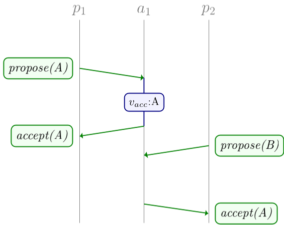

> 图 2.1：
> 一个 acceptor $\{a_1\}$ 与两个 proposer $\{p_1, p_2\}$ 之间的 SAA
> 示例运行。

**算法 2：SAA 的 acceptor 算法。**

```text
state:
• v_acc: accepted value (persistent)

1 while true do
2     case propose(v) received from proposer
3         if v_acc = nil then
4            v_acc ← v
5         send accept(v_acc) to proposer
```

图 2.1 是单 acceptor 算法一次示例执行的消息时序图（MSD）。
我们将大量使用 MSD 来展示随时间推移发生的消息交换和状态更新。
请注意，
时间轴（y 轴负方向）不假定是线性的。
在这个例子中，
proposer $p_1$ 的候选值为 $\gamma = A$，
proposer $p_2$ 的候选值为 $\gamma = B$。
acceptor 先收到 $propose(A)$，
因此值 $A$ 被决定。

#### 安全性

不难看出，
这个简单算法满足分布式共识的三条安全性条件。
acceptor 选定它收到的第一个提案，
因此满足非平凡性。
acceptor 接受第一个提案之后，
不再接受 proposer 的其他提案，
因此该算法满足安全性。
如果 proposer 返回了某个值，
该值必定是从 acceptor 收到的，
因而必定已被决定，
满足安全获知。
下面我们更详细地考察这些性质。

**定理 1**（SAA 的非平凡性）。如果值 $v$ 已被决定，
那么 $v$ 必定是由某个 proposer 提出的。

定理 1 的证明。
假设值 $v$ 已被决定。
$v$ 要被决定，
acceptor 必定接受过提案 $propose(v)$。
由于消息不会被篡改，
$v$ 必定是由某个 proposer 提出的。$\square$

**定理 2**（SAA 的安全性与安全获知）。对任意两个 proposer $p, p' \in P$，
如果它们分别获知已决定值 $v$ 为 $\gamma$ 和 $\gamma'$，
那么 $\gamma = \gamma'$。

定理 2 的证明。
proposer $p$ 获知已决定值 $v$ 为 $\gamma$，
是因为它从唯一的 acceptor 收到了 $accept(\gamma)$。
其他任何参与者 $p'$ 也是如此。

由于发送 $accept(\gamma)$ 和发送 $accept(\gamma')$ 这两个事件发生在同一个参与者，
即唯一的 acceptor 上，
它们不可能并发发生。
因此一个事件必定先于另一个事件发生。

假设发送 $accept(\gamma)$ 先于发送 $accept(\gamma')$。

acceptor 通过读取已接受值 $v_{acc}$ 来确定 $\gamma, \gamma'$。
如果 $\gamma \neq \gamma'$，
那么 $v_{acc}$ 必定在两次发送 accept 消息之间从 $\gamma$ 变成了 $\gamma'$。
acceptor 把 $v_{acc}$ 更新为 $\gamma'$ 的唯一途径是收到
$propose(\gamma')$。
而更新 $v_{acc}$ 的前提是 $v_{acc}$ 为 nil；
由于 $v_{acc}$ 是持久的，
它此前已被设为 $\gamma$，
不可能再为 nil。
因此 $v_{acc}$ 不可能在两次发送事件之间被更新，
所以 $\gamma = \gamma'$。

发送 $accept(\gamma')$ 先于发送 $accept(\gamma)$ 的情形同理。

#### 进展

同样不难看出，
在 acceptor 和至少一个 proposer 在线的活性条件下，
这个简单算法也满足分布式共识的两条进展条件。
请注意，
虽然我们使用了消息最终送达的假设，
但不要求消息送达或运行速度有时间上界。

**定理 3**（SAA 的进展性）。如果 proposer $p \in P$ 提出了值 $\gamma$，
并且活性条件在足够长的时间内得到满足，
那么最终会有某个值 $v$ 被决定。

定理 3 的证明。
假设 proposer $p$ 向 acceptor 发送 $propose(\gamma)$。
根据活性条件，
这条消息最终会被 acceptor 收到。
根据活性条件，
acceptor 必定在线并处理该消息。
要么尚未达成任何决定，
于是提案被接受且 $v = \gamma$；
要么已经达成决定，
此时 $v = v_{acc}$。$\square$

#### 小结

只要 acceptor 在线，
这个简单算法只需到 acceptor 的一次往返（两条消息）、
一次到持久存储的同步写入，
就能提供共识。
如果 acceptor 宕机，
系统就无法取得进展，
直到 acceptor 恢复在线。
该算法之所以有效，
是因为所有值提案都交汇于单点——acceptor。
其结果是提案形成全序，
选定提案变得轻而易举。
然而，
对单个 acceptor 的依赖也正是该算法的致命弱点。
一旦这个 acceptor 发生故障，
算法就无法取得进展，
直到它恢复。

SAA 中的 acceptor 是单点故障，
显而易见的解决办法是使用多个 acceptor。
但这样一来，
我们无法再保证提案的全序，
单 acceptor 算法也就不再适用[^ch2-6]。
下一节将介绍经典 Paxos，
一种能够处理多个 acceptor 的共识算法。

## 2.2 经典 Paxos

经典 Paxos [Lam98][^ch2-7] 是求解分布式共识问题的一种算法[^ch2-8]。
在最好的情况下，
未经优化的算法只需到多数派 acceptor 的两次往返、
三次到持久存储的同步写入即可达成共识，
不过某些情况下需要更长时间。
其活性条件是：
$n_a$ 个 acceptor 中的 $\lfloor n_a/2 \rfloor + 1$ 个以及一个
proposer 在线，
并且同步地通信。
这些条件对进展而言既是必要的，
也是充分的。

经典 Paxos 决定一个值的过程分为两个阶段。
阶段一可以看作读取阶段：
proposer 了解系统当前状态，
并获取一个版本号，
用于检测此后的变化。
阶段二可以看作写入阶段：
proposer 尝试让某个值被接受。
如果在算法的阶段一之后，
proposer 确信尚没有任何值被决定，
它就可以提出候选值 $\gamma$。
如果阶段一的结果是某个值可能已经被决定，
那么在阶段二中就必须改为提出那个值。
这两个阶段各自都需要多数派 acceptor 同意才能继续。

我们现在定义 *epoch* 和 *提案*两个术语，
然后用它们来概括经典 Paxos 算法。

**定义 2.** epoch $e$ 是 epoch 集合 $E$ 的任意成员。
$E$ 是任意无限全序集，
其上的运算符 $<$、$>$ 和 $=$ 始终有定义[^ch2-9]。

**定义 3.** *提案* $(e, v)$ *是任意 epoch 与值组成的对*[^ch2-10]。

#### 经典 Paxos 阶段一

1. proposer 选择一个唯一的 epoch $e$，
   并向各 acceptor 发送 $prepare(e)$。

2. 每个 acceptor 存储最近承诺的 epoch 和最近接受的提案。
   acceptor 收到 $prepare(e)$ 时，
   如果 $e$ 是它承诺的第一个 epoch，
   或者 $e$ 大于或等于最近承诺的 epoch，
   就把 $e$ 写入存储，
   并回复 $promise(e,f,v)$。
   其中 $(f,v)$ 是最近接受的提案（如果存在），
   $f$ 是 epoch，
   $v$ 是相应的提案值。

3. 一旦 proposer 从多数派 acceptor 收到 $promise(e,_,_-)$，
   就进入阶段二。
   承诺中可以包含最近接受的提案，
   供下一阶段使用。

4. 否则，
   如果 proposer 超时，
   就用更大的 epoch 重试。

#### 经典 Paxos 阶段二

1. proposer 现在必须按照以下值选择规则选定值 $v$：

   i. 如果阶段一的承诺没有带回任何提案，
   proposer 就选定自己的候选值 $\gamma$。

   ii. 如果只带回一个提案，
   就选定该提案的值。

   iii. 如果带回多个提案，
   proposer 必须选定与最大 epoch 关联的值。

   随后 proposer 向各 acceptor 发送 $propose(e,v)$。

2. 每个 acceptor 收到 $propose(e,v)$。
   如果 $e$ 是它承诺的第一个 epoch，
   或者 $e$ 大于或等于最近承诺的 epoch，
   就更新承诺的 epoch 和接受的提案，
   并回复 $accept(e)$。

3. 一旦 proposer 从多数派 acceptor 收到 $accept(e)$，
   它就获知值 $v$ 已被决定。

4. 否则，
   如果 proposer 超时，
   就用更大的 epoch 重试阶段一。

|        | 消息           | 说明                                                            | 发送方   | 接收方   |
| ------ | -------------- | --------------------------------------------------------------- | -------- | -------- |
| 阶段一 | prepare(e)     | e：epoch                                                        | proposer | acceptor |
| 阶段一 | promise(e,f,v) | e：epoch；f：最近接受的 epoch*；v：最近接受的值*（*可能为 nil） | acceptor | proposer |
| 阶段二 | propose(e,v)   | e：epoch；v：提案值                                             | proposer | acceptor |
| 阶段二 | accept(e)      | e：epoch                                                        | acceptor | proposer |

> 表 2.2：经典 Paxos 中交换的消息。

表 2.2 概览了经典 Paxos 使用的四条消息[^ch2-11]，以备查阅。
下面更详细地考察这一过程。

### 2.2.1 Proposer 算法

算法 3 描述了承担 proposer 角色的参与者所执行的经典 Paxos 算法。
该算法的关键输入是待提出的候选值 $\gamma$，
输出是已决定值 $v$。
已决定值可能与候选值相同，
也可能不同，
这取决于算法执行时 acceptor 的状态。
proposer 只有在确信另一个值尚未被选定时，
才会提出自己的候选值 $\gamma$。
一旦 proposer 获知某个值已被决定，
就不会有 proposer 获知另一个不同的值已被决定。

算法首先初始化变量（算法 3 第 1—2 行），
然后选择要使用的 epoch $e$（算法 3 第 3 行）。
为保持一般性，
我们不规定可用 epoch 集合 $\mathcal{E} \subseteq E$ 应如何生成。
不过，
该算法要求每个 proposer 配置一个无限的、互不重叠的 epoch 集合。
算法通过把当前 epoch $e$ 从可用 epoch 集合中移除（算法 3 第 4 行），
保证每个 epoch 只使用一次。
为简单起见，
我们让 proposer 按顺序尝试各个 epoch，
不过 proposer 使用任何未使用的 epoch 都是安全的。

消息 $prepare(e)$ 被发送给所有 acceptor（算法 3 第 5 行），
随后 proposer 等待响应。
随着承诺不断到达，
proposer 跟踪收到的提案中的最大 epoch $e_{max}$
及其关联值 $v$（算法 3 第 8—11 行）。
如果某个承诺不包含提案，
就不更新最大 epoch $e_{max}$ 及其关联值 $v$（算法 3 第 10 行）。
集合 $Q_P$ 跟踪到目前为止有哪些 acceptor 已作出承诺。
如果在超时之前没有从多数派 acceptor 收到承诺，
算法就重试（算法 3 第 6、12—13 行）。
如果承诺没有带回任何提案，
就把提案值 $v$ 设为候选值 $\gamma$（算法 3 第 14—15 行）。

**算法 3：经典 Paxos 的 proposer 算法。**

```text
state:
• n_a: total number of acceptors (configured, persistent)
• e: current epoch
• v: current proposal value
• e_max: maximum epoch received in phase 1
• ℰ: set of unused epochs (configured, persistent)
• Q_P: set of acceptors who have promised
• Q_A: set of acceptors who have accepted

/* （重新）设置变量 */
1 v, e_max ← nil
2 Q_P, Q_A ← ∅
/* 选择并设置 epoch e */
3 e ← min(ℰ)
4 ℰ ← ℰ ∖ {e}
/* 开始 epoch e 的阶段一 */
5 send prepare(e) to acceptors
6 while |Q_P| < ⌊n_a/2⌋ + 1 do
7     switch do
8         case promise(e,f,w) received from acceptor a
9             Q_P ← Q_P ∪ {a}
10             if f ≠ nil ∧ (e_max = nil ∨ f > e_max) then
                /* (e_max, v) 是收到的最大提案 */
11                 e_max ← f, v ← w
12         case timeout
13             goto line 1
14 if v = nil then
    /* 没有收到任何提案，因此提出 γ */
15     v ← γ
/* 开始提案 (e,v) 的阶段二 */
16 send propose(e,v) to acceptors
17 while |Q_A| < ⌊n_a/2⌋ + 1 do
18     switch do
19         case accept(e) received from acceptor a
20             Q_A ← Q_A ∪ {a}
21         case timeout
22             goto line 1
23 return v
```

随后 proposer 向各 acceptor 发送 $propose(e,v)$（算法 3 第 16 行）。
在多数派 acceptor 接受提案 $(e, v)$ 之后（算法 3 第 17—20 行），
proposer 返回值 $v$（算法 3 第 23 行）；
否则重试（算法 3 第 21—22 行）。

请注意，
proposer 收到的、与 switch 语句中任何分支都不匹配的其他所有消息，
例如来自先前 epoch 的消息或阶段二期间收到的承诺，
都可以安全地忽略。

### 2.2.2 Acceptor 算法

**算法 4：经典 Paxos 的 acceptor 算法。**

```text
state:
• e_pro: last promised epoch (persistent)
• e_acc: last accepted epoch (persistent)

1 while true do
2     switch do
3         case prepare(e) received from proposer
4         if e_pro = nil ∨ e ≥ e_pro then
5               e_pro ← e
6             send promise(e, e_acc, v_acc) to proposer
7         case propose(e, v) received from proposer
8         if e_pro = nil ∨ e ≥ e_pro then
9               e_pro ← e
10               v_acc ← v, e_acc ← e
11             send accept(e) to proposer
```

经典 Paxos 中的 acceptor 负责处理传入的 prepare 和 propose 消息。
相关逻辑见算法 4[^ch2-12]。
所有消息，
无论是 $prepare(e)$ 还是 $propose(e,v)$，
其 epoch $e$ 都必须大于或等于 $e_{pro}$，
acceptor 才会处理（算法 4 第 4、8 行）。
如果这是 acceptor 收到的第一条消息，
那么 $e_{pro}$ 为 nil，
该检查必定成功。
检查成功后，
$e_{pro}$ 被更新为 $e$（算法 4 第 5、9 行）。

如果消息是 $prepare(e)$，
acceptor 就回复 $promise(e,e_{acc},v_{acc})$（算法 4 第 6 行）。
如果 acceptor 尚未接受任何提案，
$e_{acc}$ 和 $v_{acc}$ 就是 nil。
当 acceptor 发出承诺消息时，
我们称该 acceptor 已承诺 epoch $e$[^ch2-13]。

如果消息是 $propose(e,v)$，
acceptor 就把 $e_{acc}$ 和 $v_{acc}$ 设为提案 $(e,v)$（算法 4 第 10 行），
并回复 $accept(e)$（算法 4 第 11 行）。
此时我们称该 acceptor 已接受提案 $(e,v)$。

**定义 4.** *在经典 Paxos 中，
如果提案 $(e, v)$ 已被多数派 acceptor 接受，
则称该提案已被决定。*

请注意，
这个定义并不要求该提案仍是多数派 acceptor 上最近接受的提案。
如果存在 epoch $e \in E$ 使得提案 $(e, v)$ 已被决定，
则称值 $v \in V$ 已被决定。
这也可以表述为值 $v$ 在 $e$ 中被_决定_。
*提交点*是某个提案首次被决定的时刻。

## 2.3 示例

本节考察经典 Paxos 若干可能执行的消息时序图（MSD）示例。
为简单起见，
凡接收后不产生任何效果的消息都省略不画。
每个示例系统都由三个 acceptor $A = \{a_1, a_2, a_3\}$
和两个 proposer $P = \{p_1, p_2\}$ 组成，
因此 $\lfloor n_a/2 \rfloor + 1 = 2$。
初始时，
proposer $p_1$ 的 $\gamma = A$，
proposer $p_2$ 的 $\gamma = B$。

在我们的示例中，
epoch 取自然数 $E = \mathbb{N}^0$，
并以轮转方式在两个 proposer 之间划分。
因此初始时 $p_1$ 上 $\mathcal{E} = \{0, 2, 4, \ldots\}$，
$p_2$ 上 $\mathcal{E} = \{1, 3, 5, \ldots\}$。

图 2.2 展示了两个 proposer 串行执行经典 Paxos 的例子。
首先，
proposer $p_1$ 执行经典 Paxos，
提案 $(0, A)$ 被决定。
然后 proposer $p_2$ 执行经典 Paxos，
提案 $(1, A)$ 被决定。
两个 proposer 都能在两个阶段内完成经典 Paxos。
这代表经典 Paxos 最好的情形。

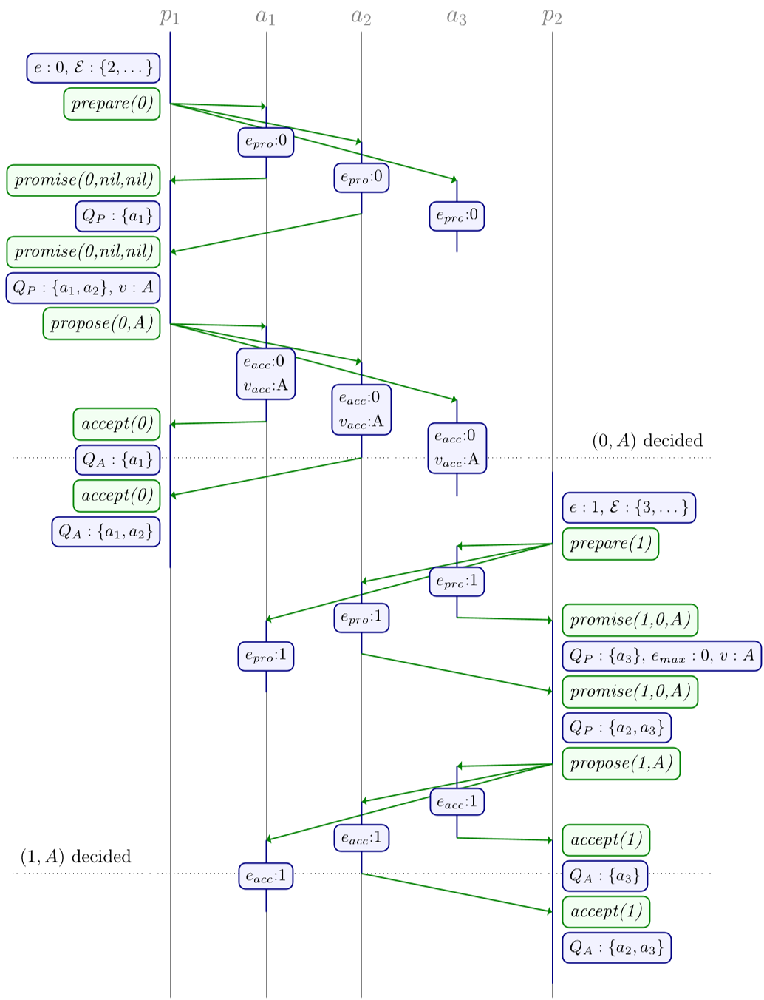

> 图 2.2：两个 proposer 串行执行经典 Paxos 的示例运行。
> proposer $p_1$ 先执行经典 Paxos，随后是 proposer $p_2$。

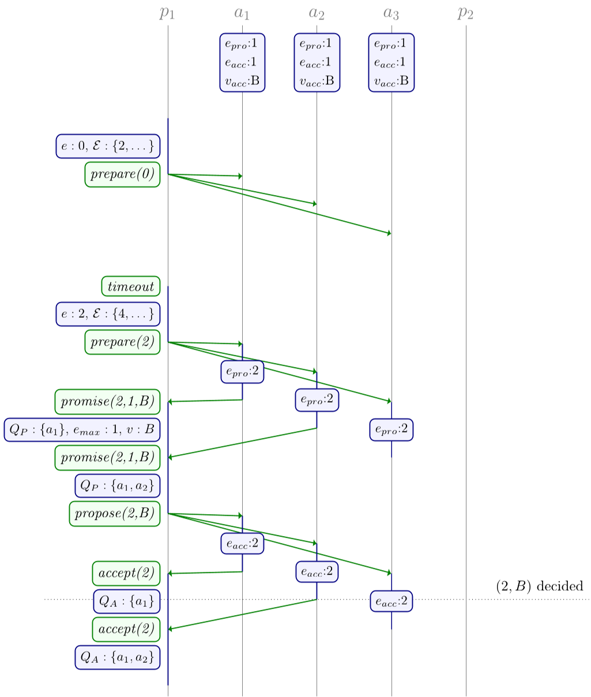

> 图 2.3：两个 proposer 串行执行经典 Paxos 的示例运行。
> proposer $p_2$ 在 proposer $p_1$ 开始之前已完成经典 Paxos。

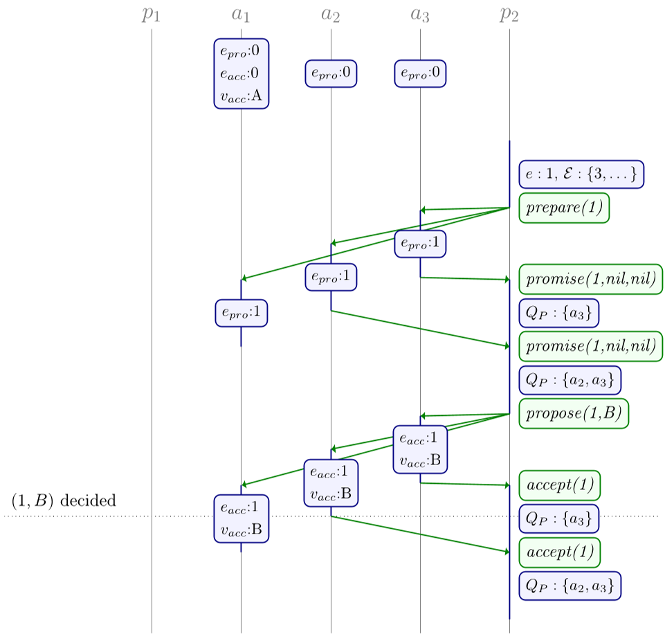

> 图 2.4：经典 Paxos 的示例运行，其中 proposer $p_1$ 在阶段二中、到达提交点之前停止。
> proposer $p_2$ 没有观测到来自 $p_1$ 的提案。

在图 2.3 中，初始时
proposer $p_2$ 已执行经典 Paxos，
提案 $(1, B)$ 已被决定并被所有 acceptor 接受。
随后 proposer $p_1$ 以 epoch 0 执行阶段一，
但该阶段没有成功。
proposer $p_1$ 重试经典 Paxos，
提案 $(2, B)$ 被决定。
与之前不同，
本例中的 proposer $p_1$ 需要三个阶段才能获知已决定值。

图 2.4 和图 2.5 展示了 proposer（此处为 $p_1$）提出提案（此处为 $(0, A)$）之后、
到达提交点之前停止的两种可能结果。
在图 2.4 中，
proposer $p_2$ 在其阶段一中没有观测到提案 $(0, A)$，
因此随后决定的是提案 $(1, B)$。
相反，
在图 2.5 中，
proposer $p_2$ 在其阶段一中观测到了提案 $(0, A)$，
因此随后决定的是提案 $(1, A)$。

到目前为止的示例展示的都是 proposer 串行执行经典 Paxos。
在图 2.6 中，
我们看到经典 Paxos 最坏的情形：
两个并发 proposer 相互决斗，
谁也无法取得进展。
proposer $p_1$ 以 epoch 0 执行阶段一，
然后 proposer $p_2$ 以 epoch 1 执行阶段一。
proposer $p_1$ 的提案 $(0, A)$ 在阶段二失败，
于是以 epoch 2 执行阶段一。
接着 proposer $p_2$ 的提案 $(1, B)$ 在阶段二失败。
这种情形虽然不太可能发生，
但理论上可能无限持续下去。
请注意，
即使两个 proposer 提出的是同一个值，
或者在决定已经达成之后，
这种情形仍可能出现。

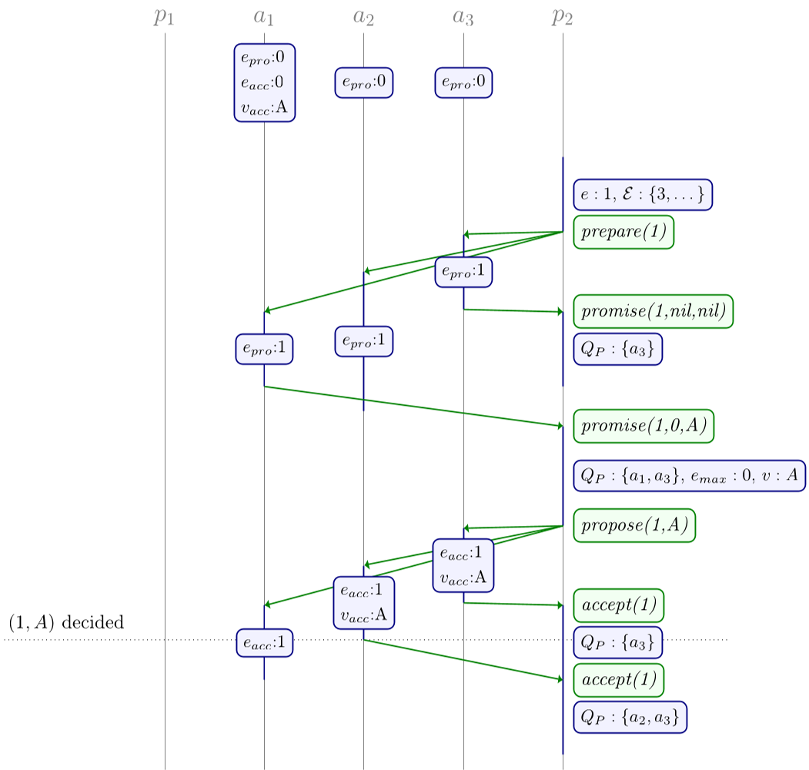

> 图 2.5：经典 Paxos 的示例运行，其中 proposer $p_1$ 在阶段二中、到达提交点之前停止。
> proposer $p_2$ 观测到了来自 $p_1$ 的提案。

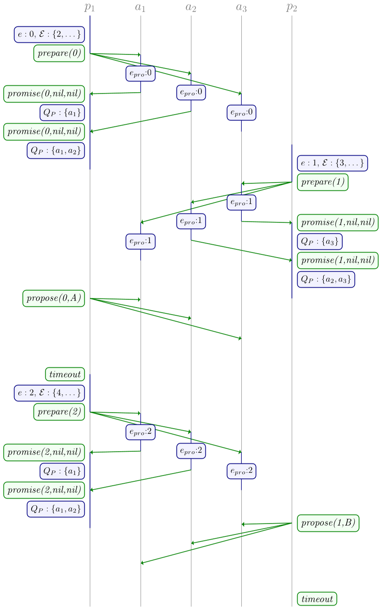

> 图 2.6：两个并发 proposer 相互决斗的经典 Paxos 示例运行。

## 2.4 性质

在论证经典 Paxos 的安全性和活性之前，
我们先把算法分解为一组性质。
这些性质将标明算法的各个具体组件在后续证明中如何被使用。
在后面的章节中，
我们将修改经典 Paxos 算法；
借助这些性质，
我们就能判定哪些证明仍然成立、哪些需要修订。

经典 Paxos proposer 算法的关键性质如下：

**性质 1.** *proposer 为每个提案使用唯一的 epoch。*

**性质 2.** *proposer 只有在收到 $\lfloor n_a/2 \rfloor + 1$ 个
acceptor
的承诺之后才提出值。*

**性质 3.** *proposer 只有在收到 $\lfloor n_a/2 \rfloor + 1$ 个
acceptor
的接受之后才返回值。*

**性质 4.** *proposer 必须按照值选择规则选定要提出的值。如果承诺没有带回先前接受的提案，
可以选定任何值。如果带回一个或多个先前接受的提案，
则选定与最大 epoch 关联的值。*

**性质 5.** *proposer 使用的每个 epoch 都大于该 proposer 先前使用的所有
epoch。*

acceptor 算法的关键性质是：

**性质 6.** *对于 acceptor 收到的每条 prepare 或 propose 消息，
仅当消息携带的 epoch 大于或等于最近承诺的 epoch 时，
acceptor 才处理该消息。*

**性质 7.** *对于收到的每条 prepare 或 propose 消息，
acceptor 把最近承诺的 epoch 设为消息携带的 epoch。
这发生在性质 6 满足之后。*

**性质 8.** *对于收到的每条 prepare 消息，
acceptor 回复承诺。
这发生在性质 6 和 7 满足之后。*

**性质 9.** *对于收到的每条 propose 消息，
acceptor 在更新其最近接受的提案之后回复接受。
这发生在性质 6 和 7 满足之后。*

**性质 10.** *最近承诺的 epoch 和最近接受的提案是持久的，
只由性质 7 和 9 更新。*

在接下来的三节（2.5、2.6 和 2.7 节）中，
我们将证明经典 Paxos 算法满足非平凡性、安全性和进展要求，
因而是分布式共识的一种解法。

## 2.5 非平凡性

首先，
经典 Paxos 要能求解分布式共识，
就必须满足非平凡性。
令 $\Gamma$ 表示 proposer 提出的候选值集合，
则非平凡性可表述为：

**定理 4**（已决定值的非平凡性）。如果值 $v$ 已被决定，
那么 $v \in \Gamma$。

在经典 Paxos 中，
一个值要被决定，
必须先被提出。
因此定理 4 有一个更强的版本：

**定理 5**（已提出值的非平凡性）。*如果值 $v$ 已被提出，
那么 $v \in \Gamma$。*

定理 5 的证明。
考虑阶段二中以 epoch $e$ 提出值 $v$ 的 proposer。
令 $V$ 表示到目前为止已被提出的值的集合，
因此初始时 $V = \emptyset$。

我们对已提出值集合 $V$ 作归纳，
证明所有已提出的值都是候选值，
即 $V \subseteq \Gamma$。

基础情形（初始状态）：初始时，
任何值都尚未被提出，
$V = \emptyset$，
而 $\emptyset \subseteq \Gamma$。

基础情形（第一个提案）：考虑第一个提出值的 proposer。
把这个值记为 $v$。
值 $v$ 必定是按照算法的值选择规则选定的。
由于尚没有任何值被提出，
proposer 在阶段一收到的承诺不会带回任何提案。
因此第一个 proposer 总是提出自己的候选值，
$v \in \Gamma$，
于是 $V = \{v\}$ 且 $V \subseteq \Gamma$（性质 4）。

归纳情形：假设 $V \subseteq \Gamma$，
且下一个 proposer 提出值 $w$。
我们将证明 $w \in \Gamma$，
从而 $V \subseteq \Gamma$ 仍然成立。

值 $w$ 必定是按照算法的值选择规则选定的。
要么 proposer 在阶段一没有收到任何提案，
于是提出自己的候选值，
$w \in \Gamma$；
要么阶段一的承诺带回了一个（或多个）提案，
此时 proposer 提出与带回的最大 epoch 关联的值 $w$（性质 4）。
所有收到的提案必定先由某个 proposer 提出。
因此 $V$ 保持不变，
$V \subseteq \Gamma$ 仍然成立。$\square$

## 2.6 安全性

要使经典 Paxos 算法求解分布式共识，
我们必须证明算法的所有可能执行都是安全的。
换句话说，
如果某个值已被决定，
就不可能再决定其他值。
本节将证明经典 Paxos 的这一性质，
但首先证明该算法的几条简单性质，
它们将在后面派上用场。

**引理 6**（承诺的单调性）。*每个 acceptor 存储的最近承诺 epoch 单调递增。*

引理 6 的证明。
最近承诺的 epoch 初始为 nil，
只能由 acceptor 在收到 proposer 的 prepare 或 propose 时更新（性质 10）。
仅当收到的 epoch 大于或等于最近承诺的 epoch 时，
最近承诺的 epoch 才被更新为收到的 epoch（性质 6 和 7）。

因此最近承诺的 epoch 严格递增。

**引理 7**（acceptor 各 epoch 之间的关系）。在每个 acceptor 上，
最近承诺的 epoch 始终大于（或等于）最近接受的 epoch。

引理 7 的证明。
每当最近接受的提案被更新时，
最近承诺的 epoch 总是已被更新为同一个值（性质 9 和 10）。
因此，
最近接受的提案绝不会被更新为严格大于最近承诺 epoch 的值。
引理 6 表明最近承诺的 epoch 单调递增，
因此最近承诺的 epoch 绝不会被更新为小于最近接受 epoch 的值。
所以，
最近承诺的 epoch $\ge$ 最近接受的 epoch 恒成立。$\square$

引理 7 的证明凸显了确保经典 Paxos 算法各步骤按序执行的重要性。
如果先写最近接受的提案、后写最近承诺的 epoch，
那么 acceptor 在两次写入之间发生故障就可能破坏引理 7。

**引理 8**（承诺的一般形式）。对于 acceptor 发出的所有形如 $promise(e,f,v)$
且 $f \neq nil$ 的承诺，
都有 $e \geq f$。

引理 8 的证明。
acceptor 会在收到 proposer 的 $prepare(e)$ 后回复
$promise(e,f,v)$（性质 8）。
因此 $e \geq$ 收到 prepare 消息时最近承诺的 epoch。
由引理 7，
最近承诺的 epoch $\geq$ 最近接受的 epoch $f$。
根据 $\geq$ 关系的传递性，
$e \geq f$。$\square$

引理 8 的一个推论是，
acceptor 可能发出形如 $promise(e,e,v)$ 的承诺。
如果消息乱序送达，
acceptor 先收到 proposer 的 $propose(e,v)$、后收到 $prepare(e)$，
就可能出现这种情况。
不过，
proposer 绝不会用这种形式的承诺来完成阶段一。
这是因为既然 $(e,v)$ 已被提出，
$e$ 的 proposer 必定已经完成了阶段一。

**推论 8.1**（有用承诺的形式）。*proposer 用于达成决定的承诺，
要么形如 $promise(e,nil,nil)$（不带提案），
要么形如 $promise(e,f,v)$ 且 $e > f$（带先前的提案）。*

由此可知，
epoch $e$ 中的 proposer 可能收到的最大承诺来自其前驱 epoch[^ch2-14]。
因此根据值选择规则（性质 4）：

推论 8.2（前驱提案）。
如果 epoch $e$ 中的 proposer 在阶段一收到 $promise(e,f,v)$ 且
$e = succ(f)$，
那么该 proposer 将提出值 $v$。

**引理 9**（值的唯一性）。如果值 $v$ 在 epoch $e$ 中被提出，
那么 $e$ 中不可能提出其他值。

引理 9 的证明。
每个 epoch 至多由一个 proposer 使用（性质 1）。
每个 proposer 会选定一个要提出的值，
并把携带该值的 propose 消息发给各 acceptor。
proposer 不会重复使用同一个 epoch。
如果 proposer 在提案过程中发生故障，
且不知道选定的值，
它会用新的 epoch 重新开始。

由引理 9 可得：

推论 9.1（承诺中值的唯一性）。
对任意两个承诺 $promise(.,f,v)$ 和 $promise(.,g,w)$，
如果 $f = g$，
那么 $v = w$。

因此我们知道，
proposer 在阶段一中不会收到多个 epoch 相同但值不同的提案。

**引理 10**（消息定序）。如果一个 acceptor 发出了一系列消息[^ch2-15]，
那么这些消息的 epoch 是消息发出先后顺序上的偏序。
无论这些消息全是承诺、全是接受，
还是两者兼有，
该结论都成立。

引理 10 的证明。
考虑某个 acceptor 发出的两条消息，
其 epoch 分别为 $e$ 和 $f$，
且 $e < f$。
假设 epoch 为 $f$ 的消息先发出。

acceptor 发出第一条消息时，
无论该消息是承诺还是接受，
最近承诺的 epoch $e_{pro}$ 都已被设为 $f$（性质 7）。
引理 6 表明最近承诺的 epoch 单调递增，
因此此后 $e_{pro} \geq f$。

第二条消息的 epoch 为 $e$，
是 acceptor 在 $e \geq e_{pro}$ 的前提下回复 prepare 或 propose
请求时发出的
（性质 6、8 和 9）。
这就要求 $e = f$，
与 $e < f$ 的假设矛盾。
因此 epoch 为 $f$ 的消息必定在 epoch 为 $e$ 的消息之后发出。

**引理 11**（法定人数交集）。如果值 $v$ 在 epoch $e$ 中被决定，
那么对于任何未来 $> e$ 的提案，
至少有一个接受过提案 $(e, v)$ 的 acceptor 必须作出承诺。

引理 11 的证明。
经典 Paxos 的两个阶段都需要多数派 acceptor 参与（性质 2）。
任意两个多数派 acceptor 集合都相交，
换句话说，
它们至少有一个共同的 acceptor。

在引理 11 的基础上，
可以证明：

引理 12（弱化的未来提案安全性）。如果值 $v$ 在 epoch $e$ 中被决定，
且值 $w$ 在 $f$ 中被提出（其中 $f > e$），
那么 $w$ 必定曾在某个 $g$ 中被提出，
其中 $e \leq g < f$。

引理 12 的证明。
假设值 $v$ 在 epoch $e$ 中被决定，
值 $w$ 在 $f$ 中被提出，
其中 $f > e$。

$f$ 中的 proposer 必定是在完成阶段一并按值选择规则选定 $w$ 之后提出它的。

由引理 11，
至少有一个 acceptor 既向 $e$ 中的 proposer 发送过 $accept(e,v)$，
又向 $f$ 中的 proposer 发送过 $promise(f,_,-)$，
因为 $e < f$。

由引理 10，
由于 $e < f$，
该 acceptor 先发送 $accept(e,v)$，
后发送 $promise(f,_,_-)$。

在发送 $accept(e,v)$ 之前，
该 acceptor 已把最近承诺的 epoch（性质 7）和最近接受的 epoch 设为 $e$，
并把最近接受的值设为 $v$（性质 9）。

由于最近承诺的 epoch 被设为 $e$ 且单调递增（引理 6），
该 acceptor 在发送 $accept(e,v)$ 之后只能接受 $\ge e$ 的提案。
反过来，
由引理 8，
在发送 $promise(f,_,_-)$ 之前，
该 acceptor 只可能接受过 $\le f$ 的提案。
因此该 acceptor 只会因为 $e$ 到 $f$ 之间的提案更新其最近接受的值。
所以它发出的必定是 $promise(f,g,x)$，
其中 $e \le g < f$，
$x$ 是在 $g$ 中提出的值。

根据值选择规则（性质 4），
$f$ 中的 proposer 不选定提案 $x$ 的唯一可能，
是它同时收到了 epoch 更高的提案，
而那个 epoch 也必定 $< f$；
无论哪种情况，
$w$ 都必定曾在某个 $g$ 中被提出，
其中 $e \leq g < f$。$\square$

利用引理 9，
并考虑引理 12 中 $f = succ(e)$ 的情形，
此时 $g = e$，
于是可得：

推论 12.1（未来提案安全性的基础情形）。如果值 $v$ 在 epoch $e$ 中被决定，
且值 $w$ 在 $succ(e)$ 中被提出，
那么 $v = w$。

**定义 5.** 如果 epoch $e$ 一旦达成决定就只能决定 $v$，
我们称 epoch $e$ 被限定于值 $v$。

因此，
推论 12.1 也可以表述为：
如果 $v$ 在 epoch $e$ 中被决定，
那么 $succ(e)$ 被限定于 $v$。

推论 12.1 可以扩展如下：

推论 12.2（未来提案安全性的归纳情形）。如果值 $v$ 在 epoch $e$ 中被决定，
且从 $e$（不含）到 $f$（含）的提案都被限定于值 $v$，
那么当值 $w$ 在 $g$ 中被提出且 $g = \text{succ}(f)$ 时，
有 $v = w$。

定理 13（未来提案的安全性）。如果值 $v$ 在 epoch $e$ 中被决定，
且值 $w$ 在 epoch $f$ 中被提出，
其中 $e < f$，
那么 $v = w$。

定理 13 表明：
一旦某个值在 epoch $e$ 中被决定，
此后所有达成决定的 epoch $> e$ 都将决定同一个值。

定理 13 的证明。
假设值 $v$ 在 epoch $e$ 中被决定。
我们用归纳法证明。

首先证明没有 proposer 会用提案 $succ(e)$ 提出不同的值。
我们无法知道 epoch $succ(e)$ 中是否会达成决定，
但如果达成，
决定的必定是与 $e$ 相同的值 $v$。
换句话说，
提案 $e$ 的后继被限定于 $v$。

（基础情形）如果值 $w$ 在 epoch $f$ 中被提出且 $f = succ(e)$，
那么 $v = w$。

这已由推论 12.1 证明。

接下来证明：
在一个已决定提案之后，
一串被限定提案的后继同样被限定于同一个值。

（归纳情形）如果从 $e$ 到 $f$ 的提案都被限定于值 $v$，
那么当值 $w$ 在 epoch $g$ 中被提出且 $g = succ(f)$ 时，
有 $v = w$。

这已由推论 12.2 证明。

由归纳法可知：
如果值 $v$ 在 epoch $e$ 中被决定，
那么所有后续提案都被限定于值 $v$。
于是定理 13 得证，
定理 14 也随之得证。

#### 经典 Paxos 安全性证明

总体而言，
为证明 Paxos 的安全性，
我们要证明：

定理 14（经典 Paxos 的安全性）。如果值 $v$ 在 epoch $e$ 中被决定，
且值 $w$ 在 epoch $f$ 中被决定，
那么 $v = w$。

这也可以表述为：
如果值 $v$ 已被决定，
那么所有 epoch 都被限定于 $v$。

定理 14 的证明。
考虑 $e = f$ 的情形。

引理 9 表明，
任一 epoch 至多提出一个值。
由于值必须先被提出才能被决定，
这意味着任一 epoch 也至多决定一个值。

考虑 $e \neq f$ 的情形。

由于 epoch 是全序的，
要么 $e < f$，
要么 $e > f$。
由定理 14 的对称性，
我们可以假设 $e < f$，
交换 $e$ 和 $f$ 即得 $e > f$ 的情形。

值必须先被提出才能被决定，
因此定理 13 是一个更强的定理。

既然已证明已决定值的安全性，
下面证明 proposer 只会返回已决定的值。

**引理 15**（获知的安全性）。如果 proposer 返回了值 $v$，
那么 $v$ 已被决定。

引理 15 的证明。
考虑返回了 $v$ 的 proposer $p$。

在返回 $v$ 之前，
$p$ 必定从多数派 acceptor 收到了某个 epoch $e$ 的 $accept(e)$（性质 3）。

我们知道 $accept(e)$ 必定是对 proposer $p$ 的 $propose(e,v)$ 的响应（性质
1）。

因此多数派 acceptor 必定已接受提案 $(e, v)$，
根据定义，
值 $v$ 已被决定（性质 9）。

| 结论                              | 用到的性质 | 用到的其他结论 |
| --------------------------------- | ---------- | -------------- |
| 承诺的单调性（6）                 | 6, 7, 10   |                |
| acceptor 各 epoch 之间的关系（7） | 8, 10      | 6              |
| 承诺的一般形式（8）               | 8          | 7              |
| 值的唯一性（9）                   | 1          |                |
| 消息定序（10）                    | 6, 7, 8, 9 | 6              |
| 法定人数交集（11）                | 2          |                |
| 弱化的未来提案安全性（12）        | 4, 7, 9    | 11, 8, 10, 6   |
| 未来提案安全性的基础情形（12.1）  |            | 9, 12          |
| 未来提案安全性的归纳情形（12.2）  |            | 9, 12          |
| 未来提案的安全性（13）            |            | 12.1, 12.2     |
| 经典 Paxos 的安全性（14）         |            | 9, 13          |
| 获知的安全性（15）                | 1, 3, 9    |                |

> 表 2.3：在经典 Paxos 安全性证明中对算法性质的使用。

表 2.3 概述了我们如何把经典 Paxos 安全性（定理 14）的证明分解开来。
这种使用多层中间结论的方法，
使我们能够在全书中不断修订这个证明，
而不必重述完整证明。

值得注意的是，
引理 6、7、8 和 10 是经典 Paxos acceptor 算法的性质。
它们的证明不依赖 proposer 算法的任何性质，
因此即使 proposer 行为任意，
这些引理依然成立。
同样，
引理 11 和 9 是经典 Paxos proposer 算法的性质，
不依赖 acceptor 算法。

## 2.7 进展

经典 Paxos 的安全性证明不依赖任何活性条件，
例如有界消息延迟或执行时间。
相比之下，
本节要证明的进展性必须依赖某些活性条件，
FLP 结果 [FLP85] 已经证明了这一点。
我们对进展的表述如下：
从时刻 0 到 Global Stabilisation Time（GST），
参与者系统一直在执行经典 Paxos。
在此期间不对活性作任何假设。
在 GST 时刻，
系统可以处于任何可达状态。

从 GST 起，
以下*活性条件*必须在足够长的时间内成立：

- 至少多数派 acceptor 在线，
  并在已知上界 $\delta_a$ 内回复 proposer 的消息，
  如果算法要求回复的话[^ch2-16]。

- 恰好一个（固定的）proposer 在线，
  其相对时钟最多比全局时间快 $\delta_d$。
  我们假定来自其他 proposer 的消息都不会被送达[^ch2-17]。

- proposer 与多数派 acceptor 之间的消息在已知上界 $\delta_m$ 内送达。

这种先异步、最终转为同步的模型有时称为部分同步 [DLS88]。

不出所料，
我们要求多数派 acceptor 在线且能够通信，
因为 proposer 需要获得多数派同意才能完成经典 Paxos 的两个阶段。
我们还需要要求恰好有一个 proposer 在执行算法，
以防止 proposer 无限期地决斗，
如图 2.6（2.3 节）所示。
对有界执行时间、消息延迟和时钟漂移的要求，
是为了保证在 proposer 重启提案之前，
acceptor 有机会响应 proposer 的消息。

**定理 16.** *只要活性条件得到满足，
proposer 最终会终止并返回值 $v$。*

定理 16 的证明。
考虑一个已到达 GST 的系统。
proposer $p$ 可能处于 proposer 算法的任何阶段。

考虑 $p$ 位于 proposer 算法起点的情形。

proposer $p$ 会生成 epoch $e \in E$，
并把 $prepare(e)$ 分发给所有 acceptor。
由活性条件，
多数派 acceptor 将在 $\delta_m$ 内收到 $prepare(e)$。
同样，
如果 $e$ 大于或等于某个 acceptor 最近承诺的提案号，
它将在 $\delta_a$ 内作出承诺；
否则该 acceptor 不会回复 prepare 消息。
acceptor 发出的任何承诺都将在 $\delta_m$ 内被收到。

如果 proposer 在 $\delta_{a} + 2\delta_{m} + \delta_{d}$
之后仍未收到多数派 acceptor 的承诺，
它将放弃 epoch $e$ 并重启 proposer 算法。
proposer $p$ 会生成新的 epoch $f$，
其中 $f > e$（性质 5），
并重复阶段一。
由于 acceptor 不会收到来自其他 proposer 的任何消息，
最近承诺的提案号不会增加，
除非响应 $p$。

最终，
proposer $p$ 会生成一个足够大的 epoch，
使得多数派 acceptor 在 $\delta_a + 2\delta_m$ 内作出承诺。
proposer 随即开始选定值。

如果 acceptor 没有带回任何已接受的提案，
proposer 可以自由选定自己的值。
否则，
proposer 必须选定与最大 epoch 关联的值。
由于 epoch 是全序的，
且值对 epoch 是唯一的（推论 9.1），
proposer 总能选定一个值 $v$。

随后 proposer 把 $propose(e,v)$ 分发给各 acceptor，
消息在 $\delta_m$ 内被收到。
由于 acceptor 没有更新其最近承诺的 epoch（因为没有其他 proposer），
它们会接受该提案。
由于 proposer 将在 $\delta_a + 2\delta_m$ 内收到多数派 acceptor 的接受，
值 $v$ 被返回。

考虑 $p$ 位于 proposer 算法其他位置的情形。

如果 proposer $p$ 处于算法的阶段一，
它将按第一种情形所述继续执行。
如果 proposer 处于阶段二，
当它的 epoch 小于多数派 acceptor 已承诺的 epoch 时，
它可能超时。
此时 proposer 在 $\delta_a + 2\delta_m + \delta_d$ 之前不会收到多数派
acceptor 的接受，
于是放弃该提案并重启 proposer 算法，
如第一种情形所述。$\square$

由引理 15，
可以得到定理 16 的一个较弱形式：

**推论 16.1.** *只要活性条件得到满足，
最终会有某个值 $v$ 被决定。*

请注意这些活性条件与 SAA 的活性条件（2.1.1 节）有何不同。
SAA 要求唯一的 acceptor 在线，
而经典 Paxos 要求多数派 acceptor 在线。
另一方面，
经典 Paxos 要求恰好一个 proposer 在线，
而 SAA 只要求至少一个 proposer 在线。
经典 Paxos 还要求执行时间（仅对 acceptor）和消息延迟有界，
而 SAA 只要求最终执行和消息最终送达。

这个进展性证明要求 proposer 知道上界 $\delta_a$、$\delta_m$ 和 $\delta_d$。
如果 proposer 在重试前等待的时间不够长，
系统可能无法取得进展。
如果这些上界未知，
可以在生成新 epoch 时使用退避定时器来解决。

## 2.8 小结

单值分布式共识是在一组参与者之间决定单个值的问题。
一个算法被称为求解了分布式共识，
只要它能保证安全性，
使决定不可更改；
并保证进展，
使决定最终能够达成。
在异步、不可靠的分布式系统中运行的算法，
如果不对系统的活性和/或同步性作出假设，
就无法保证进展。

|                    | SAA          | 经典 Paxos                           |
| ------------------ | ------------ | ------------------------------------ |
| acceptor 数量      | 1            | $n_a$                                |
| 进展条件：         |              |                                      |
| 在线 proposer 数量 | 1 个或更多   | 恰好 1 个                            |
| 在线 acceptor 数量 | 全部（1 个） | $\lfloor n_a/2 \rfloor + 1$ 个或更多 |
| 同步性             | 否           | 是                                   |
| 消息数量           | 2            | $2n_a + 2$ 或更多                    |
| 往返次数           | 1            | 2 次或更多                           |
| 持久写入次数       | 1            | 3 次或更多                           |

> 表 2.4：SAA 与经典 Paxos 的比较。

本章介绍了两种已知的分布式算法：
单 acceptor 算法（SAA）和经典 Paxos。
两种算法都保证安全性和进展，
因此都求解了分布式共识，
但它们保证进展所需的活性条件不同。
两种算法都把系统中的参与者划分为 proposer 和 acceptor：
proposer 提出待决定的值，
acceptor 选定并存储值。
SAA 要求唯一的 acceptor 和至少一个 proposer 在线。
经典 Paxos 要求严格多数派 acceptor 和恰好一个 proposer 在线，
且这些参与者同步运行。
在这些条件下，
SAA 中的 proposer 保证在一次到 acceptor 的往返内终止；
而经典 Paxos 中的 proposer 保证在有限步内终止，
最少需要两次到严格多数派 acceptor 的往返。
这些差异汇总在表 2.4 中。

近几十年来，
经典 Paxos 得到了广泛研究；
下一章将讨论 Paxos 家族中种类繁多的共识算法。

[^ch2-1]: 请注意，这里对进展的定义比文献中常见的定义更一般，后者是专门针对多数派的。这一推广旨在把多数派（共识算法的常见特征）与问题定义解耦。

[^ch2-2]: 采用这种方式是为了方便已经熟悉该领域的读者，不过它有时会产生歧义。

[^ch2-3]: 值序列始终从 1 开始编号。

[^ch2-4]: 我们并不是第一个用这种稻草人方案来解释共识问题的，见 [Lam01a, §2.2]。

[^ch2-5]: 请注意，本论文所有伪代码中的变量都存储在易失内存中，除非另有说明，否则初始值均为 nil。另请注意，本论文所有伪代码都以清晰和一致为先，而非性能。

[^ch2-6]: 假设网络不提供原子广播。

[^ch2-7]: 也称 Synod 或 Single-degree Paxos。

[^ch2-8]: 更准确地说，它是一族算法。

[^ch2-9]: epoch 在文献中也称为 term [OO14, §5.1]、view number [LC12, §3]、round number [MPSP10, §3]、instance values/epoch [HKJR10, §1] 或 ballot number。

[^ch2-10]: 提案在文献中也称为 ballot。

[^ch2-11]: 这些消息通常分别称为 1a、1b、2a 和 2b。容易混淆的是，propose 消息在 VRR [LC12, §4.1] 中称为 prepare。

[^ch2-12]: 算法 4 使用了变量 $v_{acc}$，但它没有包含在状态列表中。受篇幅所限，每个算法的状态列表只包含新引入的变量。$v_{acc}$ 等变量的说明见表 2.1。

[^ch2-13]: 文献中有时用 adopt 一词代替 promise，例如 [VRA15]。

[^ch2-14]: 请注意，当 $e = \min(E)$ 时不存在这样的前驱。

[^ch2-15]: 虽然我们在此不予证明，但消息定序同样适用于 proposer。

[^ch2-16]: 这不一定是固定的一组 acceptor，但为简化证明，我们假定它是固定的。

[^ch2-17]: 这一假设对保证进展并非必需，但它确实简化了我们的证明。

# 第 3 章 已知的修订

到目前为止，
我们一直把经典 Paxos 当作一个求解单值分布式共识的具体算法。
然而，
Paxos 实际上是一个庞大的分布式共识算法家族。
本章对知识加以系统化，
考察经典 Paxos 算法的一些最常用改进。

## 3.1 否定响应（NACK）

到目前为止描述的经典 Paxos 可以概括为遵循这样一个理念：
“如果你不能说点好听的，那就什么也别说。”[^ch3-1]
更具体地说，
如果 proposer 的 epoch $e$ 小于 acceptor 最后承诺的 epoch $e_{pro}$，
acceptor 就不会回复该 proposer。
结果是 proposer 必须等待 prepare 超时，
再用新的 epoch 重试。

可以加入否定响应来改进这一点，
例如 $no\_promise(e)$ 和 $no\_accept(e)$。
acceptor 收到 prepare 或 propose 消息时，
如果 $e < e_{pro}$，
就向 proposer 发送这些否定响应。
proposer 收到否定响应后，
可以选择用更大的 epoch 重启提案。
否则，
proposer 可以忽略否定响应，
等待看能否从多数参与者那里收到肯定响应。
如果 proposer 收到多数 acceptor 的否定响应，
它的提案就不会成功，
应当重启提案。
proposer 在任何阶段放弃或重启提案都是安全的，
因为这在功能上等价于 proposer 发生故障并重启。

acceptor 还可以在否定响应中附带更多信息，
例如 $no\_promise(e,f)$ 和 $no\_accept(e,f)$，
其中 $f$ 是 acceptor 最后承诺的 epoch；
甚至 $no\_promise(e,f,g,v)$ 和 $no\_accept(e,f,g,v)$，
其中 $(g,v)$ 是 acceptor 最后接受的提案。[^ch3-2]

**算法 5：带 NACK 的经典 Paxos proposer 算法。**

```text
1 v, e_max ← nil
2 Q_P, Q_A ← ∅
3 e ← min(ℰ)
4 ℰ ← ℰ ∖ {e}
/* 为 epoch e 开始阶段一 */
5 send prepare(e) to acceptors
6 while |Q_P| < ⌊n_a/2⌋ + 1 do
7     switch do
8         case promise(e,f,w) received from acceptor a
9             Q_P ← Q_P ∪ {a}
10             if f ≠ nil ∧ (e_max = nil ∨ f > e_max) then
11                 e_max ← f, v ← w
12         case no-promise(e,f) received from acceptor
            /* 放弃 e，用大于 f 的 epoch 重启 */
13             ℰ ← {n ∈ ℰ | n > f}
14             goto line 1
15 if v = nil then
16     v ← γ
/* 为提案 (e,v) 开始阶段二 */
17 send propose(e,v) to acceptors
18 while |Q_A| < ⌊n_a/2⌋ + 1 do
19     switch do
20         case accept(e) received from acceptor a
21             Q_A ← Q_A ∪ {a}
22         case no-accept(e,f) received from acceptor
            /* 放弃 e，用大于 f 的 epoch 重启 */
23             ℰ ← {n ∈ ℰ | n > f}
24             goto line 1
25 return v
```

算法 5 和算法 6 给出了这种方法在实践中的一个示例。
灰色行与经典 Paxos 的 proposer 和 acceptor 算法相同。
如果 proposer 收到 $no\text{-}promise(e,f)$ 或
$no\text{-}accept(e,f)$，
它就重启算法，
并跳过所有 $\leq f$ 的 epoch，
因为它们不太可能成功（算法 5 第 12–14 行和第 22–24 行）。

**算法 6：带 NACK 的经典 Paxos acceptor 算法。**

```text
1 while true do
2     switch do
3         case prepare(e) received from proposer
4         if e_pro = nil ∨ e ≥ e_pro then
5             e_pro ← e
6             send promise(e, e_acc, v_acc) to proposer
7         else
            /* e < e_pro，回复 NACK */
8             send no-promise(e, e_pro) to proposer
9         case propose(e, v) received from proposer
10         if e_pro = nil ∨ e ≥ e_pro then
11             e_pro ← e
12             v_acc ← v, e_acc ← e
13             send accept(e) to proposer
14         else
            /* e < e_pro，回复 NACK */
15             send no-accept(e, e_pro) to proposer
```

图 3.1 给出了算法 5 和算法 6 在实践中的一个示例。
在这个场景中，
提案 $(5, B)$ 最初已被全部三个 acceptor 接受，
因而已被决定。
proposer $p_1$ 向所有 acceptor 发送 $prepare(0)$，
开始阶段一。
在经典 Paxos 中，
这个 proposer 需要等待超时，
再用提案号 2、4、6 重试，
因此至少需要 4 个往返时间。
而有了 NACK，
acceptor $a_1$ 可以告知 proposer 它最后承诺的提案号是 5，
proposer $p_1$ 于是跳过提案号 2 和 4，
使阶段一能在 2 个往返内完成。

NACK 取代了超时，
因为我们假设消息最终会送达。
因此可以从进展证明中移除同步假设。
不过，
要保证进展仍要求恰好只有一个 proposer；
后文将说明这可以在同步假设下实现（3.4 节）。

请注意，
重启提案和跳过 epoch 这两项优化彼此独立，
可以分开使用。
例如，
一个从长时间故障中恢复的 proposer 可以选择跳过一些 epoch，
以提高第一次尝试就完成 proposer 算法的可能性。
还值得注意的是，
NACK 不必包含 proposer 的 epoch，
也不必为每个阶段使用单独的消息。
事实上，
现有的 accept 消息就可以用于这个目的。
我们选择这种做法是为了与现有消息保持一致，
并确保每条消息只服务于一个明确定义的目的。

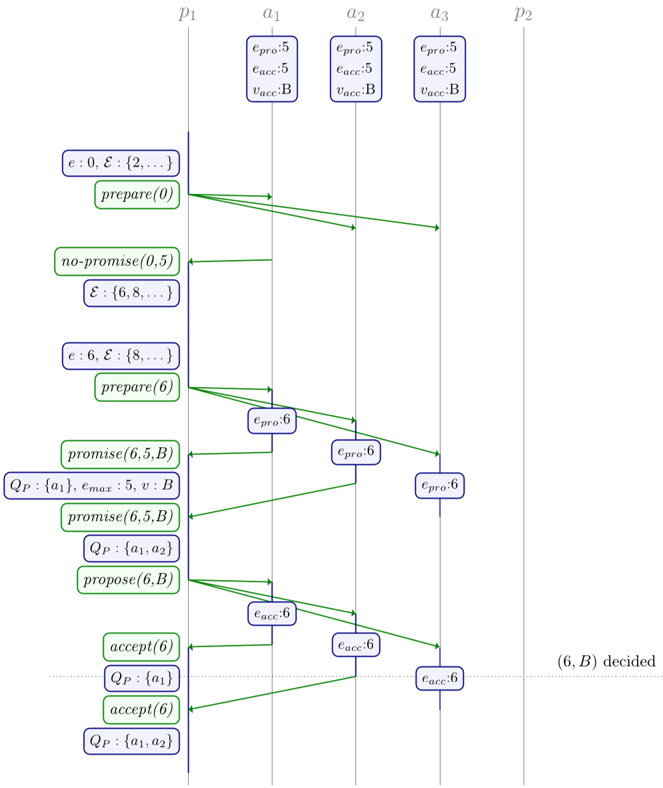

> 图 3.1：带 NACK 的经典 Paxos（算法 5、6）。

## 3.2 绕过阶段二

经典 Paxos 的 proposer 算法所做的工作，
超出了满足分布式共识要求所必需的程度。
在实践中，
如果多数 acceptor 在阶段一中返回了相同的提案，
proposer 就会得知某个值已经被决定，
此时它可以跳过阶段二，
直接返回该提案中的值。

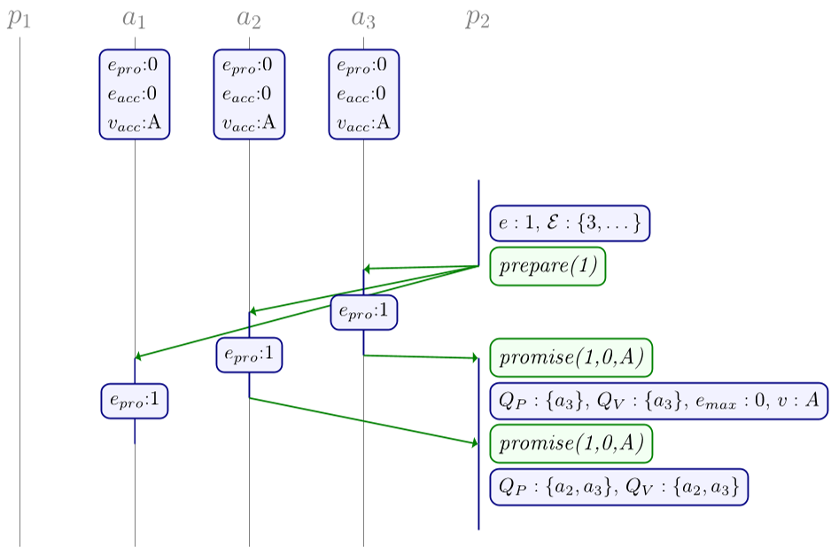

> 图 3.2：带绕过的经典 Paxos（算法 4、7）。

因此，
proposer 的阶段一有三种可能的结果：

**未达成决定**——阶段一中没有随承诺收到任何提案，
因此还没有值被决定。
proposer 将在阶段二中提出自己的候选值。

**已达成决定**——阶段一收到的所有承诺都认同同一个值。
这个值已被决定，
proposer 也就获知了被选定的值。
无须进一步行动。

**不确定**——阶段一返回了一些提案。
proposer 不确定是否已达到提交点。
如果已达到，
已决定值就是所返回 epoch 最大的提案中的值，
因此 proposer 提出这个值。

算法 7 给出了一个 proposer 算法版本，
它在得知决定已达成时绕过阶段二。
其实现方式是维护一个 acceptor 集合 $Q_V$，
其中的 acceptor 都已承诺，
并随承诺返回了提案 $(e_{max}, v)$（第 3、12、15、16 行）。
阶段一完成后，
如果 $Q_V$ 包含多数 acceptor，
就可以绕过阶段二（第 19–20 行）。
请注意，
acceptor 算法保持不变。

图 3.2 展示了如何用阶段二绕过改进我们的第一个经典 Paxos 示例（图 2.2）。
proposer $p_2$ 能够跳过阶段二，
因为它得知提案 $(0, A)$ 已被多数 acceptor 接受，
即已被决定。

**算法 7：带阶段二绕过的经典 Paxos proposer 算法。**

state：

- $Q_V$：已随 $(e_{max}, v)$ 承诺的 acceptor 集合

```text
1 v, e_max ← nil
2 Q_P, Q_A ← ∅
3 Q_V ← ∅
4 e ← min(ℰ)
5 ℰ ← ℰ ∖ {e}
/* 为 epoch e 开始阶段一 */
6 send prepare(e) to acceptors
7 while |Q_P| < ⌊n_a/2⌋ + 1 do
8     switch do
9         case promise(e,f,w) received from acceptor a
10             Q_P ← Q_P ∪ {a}
11             if f ≠ nil then
12                 if e_max = nil ∨ f > e_max then
13                     Q_V ← {a}
14                     e_max ← f, v ← w
15                 else if f = e_max then
16                     Q_V ← Q_V ∪ {a}
17         case timeout
18             goto line 1
19 if |Q_V| ≥ ⌊n_a/2⌋ + 1 then
    /* proposer 已得知 (e_max, v) 被决定 */
20     return v
21 else
22     if v = nil then
23         v ← γ
    /* 为提案 (e,v) 开始阶段二 */
24     send propose(e,v) to acceptors
25     while |Q_A| < ⌊n_a/2⌋ + 1 do
26         switch do
27             case accept(e) received from acceptor a
28                 Q_A ← Q_A ∪ {a}
29         case timeout
30             goto line 1
31     return v
```

我们可以用以下技术提高阶段二绕过的可能性：

- 如果 proposer 在阶段一中收到许多相同的提案，
  但还没有达到绕过阶段二所需的 $\lfloor n_a/2 \rfloor + 1$ 份，
  它可以选择在继续之前等待更多承诺。
  为维持进展保证，
  需要用超时来限制这段等待时间。[^ch3-3]
- proposer 可以同时开始阶段二，
  并继续等待阶段一的承诺。
  如果在阶段二完成之前收到了足够多的、携带相同提案的承诺，
  就可以绕过阶段二的剩余部分。
- proposer 可以不只跟踪最大提案是否由多数返回，
  而是跟踪所有返回的提案。
- proposer 在为阶段二绕过跟踪返回的提案时，
  可以复用之前 epoch 的承诺。
  这可能需要把先前收到的提案存入持久存储，
  但并非必须。
- proposer 在为阶段二绕过跟踪返回的提案时，
  还可以计入 NACK 中的提案，
  同样不考虑 epoch 或消息名。
- acceptor 可以存储所有已接受的提案，
  而不仅是最后接受的提案。
  这样 acceptor 就可以在承诺消息（以及 NACK）中附带所有先前接受的提案，
  为 proposer 提供关于系统状态的更多信息。[^ch3-4]

## 3.3 终止

在经典 Paxos 中，
即使启用了阶段二绕过，
proposer 也必须与多数 acceptor 通信才能获知已决定值。
这意味着进展的活性条件不仅是充分的，
也是必要的。
换句话说，
无论系统处于什么状态，
多数 acceptor 都必须在线并能通信，
proposer 才能执行其算法并返回已决定值。

我们可以给经典 Paxos 增加一个可选的阶段三来改进这一点：
acceptor 在阶段三中获知值已被决定。
随后 acceptor 可以通知未来的 proposer 值已被决定，
使 proposer 不必等待多数 acceptor 就能返回已决定值。
为经典 Paxos 增加阶段三有一个可能不会立即显现的重要作用：
活性条件不再是进展的必要条件。
使用这个变体时，
只要多数 acceptor 在线，
或者至少有一个已获知决定的 acceptor 在线，
经典 Paxos 就能取得进展。
因此，
proposer 可能只与一个 acceptor 通信后就返回已决定值。
算法 8 和算法 9 给出了如何将其实现到经典 Paxos 中的示例。

**算法 8：带终止的经典 Paxos proposer 算法。**

```text
1 v, e_max ← nil
2 Q_P, Q_A ← ∅
3 e ← min(ℰ)
4 ℰ ← ℰ ∖ {e}
/* 为 epoch e 开始阶段一 */
5 send prepare(e) to acceptors
6 while |Q_P| < ⌊n_a/2⌋ + 1 do
7     switch do
8         case promise(e,f,w) received from acceptor a
9             Q_P ← Q_P ∪ {a}
10             if f ≠ nil ∧ (e_max = nil ∨ f > e_max) then
11                 e_max ← f, v ← w
12         case decided(w) received from acceptor
            /* 跳过阶段一和阶段二的剩余部分 */
13             v ← w
14             goto line 29
15         case timeout
16             goto line 1
17 if v = nil then
18     v ← γ
/* 为提案 (e,v) 开始阶段二 */
19 send propose(e,v) to acceptors
20 while |Q_A| < ⌊n_a/2⌋ + 1 do
21     switch do
22         case accept(e) received from acceptor a
23             Q_A ← Q_A ∪ {a}
24         case decided(w) received from acceptor
            /* 跳过阶段二的剩余部分 */
25             v ← w
26             goto line 29
27         case timeout
28             goto line 1
29 return v
30 /* 为已决定值 v 开始阶段三 */
31 send decided(v) to acceptors
```

**算法 9：带终止的经典 Paxos acceptor 算法。**

state：

- $v_{dec}$：已决定值

```text
1 while true do
2     switch do
3         case prepare(e) received from proposer
4         if v_dec ≠ nil then
            /* 通知 proposer 决定已达成 */
5             send decided(v_dec) to proposer
6         else if e_pro = nil ∨ e ≥ e_pro then
7             e_pro ← e
8             send promise(e, e_acc, v_acc) to proposer
9         case propose(e, v) received from proposer
10         if v_dec ≠ nil then
            /* 通知 proposer 决定已达成 */
11             send decided(v_dec) to proposer
12         else if e_pro = nil ∨ e ≥ e_pro then
13             e_pro ← e
14             v_acc ← v, e_acc ← e
15             send accept(e) to proposer
16         case decided(v) received from proposer
            /* 保存已决定值 */
17             v_dec ← v
```

算法 9 为 acceptor 增加了*已决定值*状态 $v_{dec}$。
在算法 8 中，
proposer 一旦得知值 $v$ 已被决定，
就向所有 acceptor 发送 $decided(v)$。[^ch3-5]
acceptor 收到 $decided(v)$ 后，
可以把已决定值 $v_{dec}$ 设为 $v$，
此后对收到的消息（无论消息类型或 epoch 如何）都回复 $decided(v)$。
acceptor 上的所有其他状态现在都可以安全丢弃。
Mencius [MJM08, §4.2] 等算法采用了这种方法。

图 3.3 展示了这个额外的阶段如何让未来的 proposer（此例中为 $p_2$）
只与一个 acceptor $a_3$ 通信就能获知已决定值。
图 3.3 使用的场景与我们的第一个经典 Paxos 示例（图 2.2）相同。

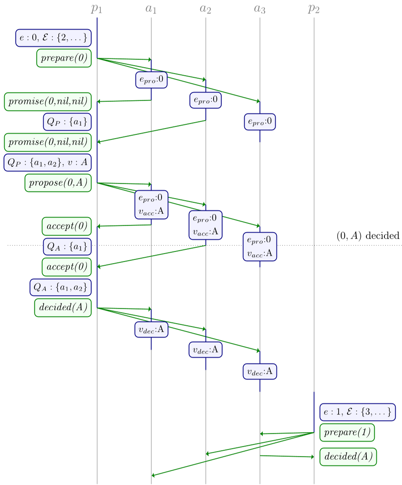

> 图 3.3：带终止的经典 Paxos（算法 8、9）。

这种方法要求 proposer 把值发送给所有 acceptor，
而值可能很大，
尽管至少多数 acceptor 已经有该值的副本。
另一种做法是，
proposer 可以发送 $decided(e)$，
其中 $e$ 是值 $v$ 被决定时所在的 epoch。
如果 acceptor 收到 $decided(e)$，
并且已接受来自 $e$（或更晚 epoch）的提案，
那么 acceptor 就得知该提案中的值已被决定。
这可以从值唯一性（引理 9）和未来提案的安全性（定理 13）推出。

另一种情况是，
如果 proposer 得知决定已达成但不知道已决定值，
它可以执行经典 Paxos 的阶段一来获知已决定值。
由未来提案的安全性（定理 13），
如果决定已达成，
值选择规则选出的值就是已决定值。

大多数共识算法都利用某种形式的终止。
Mencius [MJM08] 和 Ring Paxos [MPSP10, §4] 使用显式的阶段三消息，
分别称为 *learn* 和 *decision*。
而 Raft 和 VRR [LC12, §4.1] 等算法则在后续消息中使用提交索引，
而不是用显式的阶段三来通知 acceptor 决定已达成。
acceptor 一旦得知某个提案已被决定，
就可以安全地与其他参与者（包括 acceptor）分享这一信息 [MJM08, §4.5]。

## 3.4 指定 proposer

在图 2.6（2.3 节）中，
我们观察到 proposer 决斗问题：
多个 proposer 围绕待决定的提案相互冲突。
正是这个 proposer 决斗问题，
使我们的进展证明（2.7 节）假设恰好只有一个 proposer 在执行经典 Paxos。

在实践中，
算法可以指定一个 proposer 为_指定 proposer_，
从而尽量减少 proposer 决斗的可能性。
通过修改非指定 proposer 的 proposer 算法，
把候选值转发给这个 proposer，
指定 proposer 就成为串行化点，
从而最大限度降低决斗的概率。[^ch3-6]
这一机制使任一时刻恰好只有一个 proposer 在执行经典 Paxos 的可能性更大，
从而提高性能的可靠性。

如果指定 proposer 看起来缓慢或无响应，
另一个 proposer 可以成为指定 proposer，
直接提出值。
没有指定 proposer、有多个指定 proposer，
或者对指定 proposer 的认知不一致，
这些都始终是安全的。[^ch3-7]
但要保证进展，
任一时刻应恰好有一个指定 proposer，
且所有 proposer 都应知道它的身份。
要满足这个条件，
需要可靠的故障检测，
而异步分布式系统中不存在可靠的故障检测 [FLP85]。
我们只能用心跳和超时来近似可靠的故障检测器；
不过，这确实要求我们加强进展的活性条件，
以约束 proposer 之间的消息延迟、时钟漂移和运行速度。
故障检测的最弱活性条件在文献 [CHT96, MOZ05] 中有研究。

这项称为指定 proposer 的优化被广泛使用 [Lam01a, §2.4][LC12, §4.2]
[OO14, §5.1][VRA15, §3][MPSP10, §3]，
通常与 Multi-Paxos 结合使用（见 3.6 节）。

## 3.5 阶段排序

在经典 Paxos 的阶段一中，
proposer 不需要知道自己在阶段二可能提出的值 $\gamma$。
因此，
proposer 可以在知道要提出的值之前先执行阶段一。
当 proposer 随后得知要提出的值时，
如果没有其他 proposer 也用更大的 epoch 执行了 proposer 算法，
它现在就可以用一个往返而不是两个来决定这个值。
把这个 proposer 同时设为指定 proposer，
可以提高这种情况发生的可能性。

这一观察被广泛使用 [Lam01a, §3][MPSP10, §4]，
通常与指定 proposer 和 Multi-Paxos 结合使用（见 3.6 节）。

## 3.6 Multi-Paxos

到目前为止，
我们考虑的是如何对单个值达成共识。
在实践中，
这些算法通常用于对无限长的值序列达成共识。
大体上，
我们可以把现有的序列共识算法分为两个家族：

**经典 Paxos 算法**，
基于执行多个相互独立的单值共识实例。
例子包括经典 Paxos、Mencius [MJM08] 和 Fast Paxos [Lam05a]。
这类方法很少用于生产系统。

**Multi-Paxos 算法**，
其中一个 proposer 通过在序列上执行阶段一来担任 *leader* 角色，
然后协调各项决定，
直到新的 leader 接任。
这种方法在生产系统中被广泛使用。
例子包括 Chubby [Bur06, CGR07]、Zookeeper [HKJR10, JRS11]、
Ring Paxos [MPSP10]、View-stamped Replication [OL88, LC12]
和 Raft [OO14]。

Multi-Paxos 是经典 Paxos 针对序列共识的优化。
Multi-Paxos 与连续执行的经典 Paxos 实例有一个关键区别：
经典 Paxos 的阶段一由所有实例共享。
每个 acceptor 只需存储一次最后承诺的 epoch。
prepare 和 promise 消息不针对特定实例，
因此阶段一消息中不需要包含索引。

这与指定 proposer（3.4 节）和阶段排序（3.5 节）优化结合如下：
proposer 在得知要提出的值之前先执行阶段一。
阶段一完成后，
我们把这个 proposer 称为 *leader*。[^ch3-8]
leader 即指定 proposer，
因而负责达成决定。
如果另一个 proposer 怀疑 leader 已发生故障，
它可以通过执行阶段一接任 leader；
我们把这个过程称为 *leader 选举*，[^ch3-9]
该 proposer 由此成为下一个指定 proposer。

Multi-Paxos 的关键优势是，
在稳定状态下，
每项决定只需一次到多数 acceptor 的往返和一次到持久存储的同步写入。
当恰好有一个 proposer（leader）处于复制阶段，
且多数 acceptor 在线并有响应时，
系统就处于稳定状态。
系统在大多数时间都应运行在这个状态。

Multi-Paxos 给 leader 带来了巨大的负载。
在稳定状态下，
这唯一的 proposer 负责接收候选值、为值分配索引、向 acceptor 提出值、收集 accept 消息、
获知已决定值，
并把决定通知各参与者。
因此，
leader 往往是 Multi-Paxos 系统的瓶颈。
这种不均衡的方式让 leader 及其网络链路承受很大压力，
而其他参与者和网络的其他部分却利用不足。
此外，
虽然系统现在能用一个往返而不是两个达成共识，
但也只有一个 proposer 能做到这一点。
因此候选值必须转发给 leader（或者重定向客户端），
这会增加一次额外的往返。
这些原因正是 Mencius [MJM08, §3] 等算法的动机。

## 3.7 角色

到目前为止，
本文把经典 Paxos 中的职责划分为两个不同的角色：
acceptor 和 proposer。[^ch3-10]
采用这种方式是因为它在学术文献中被广泛使用，
但这种区分也相当随意。

例如，
我们可以只设一个称为 replica 的角色，
把 proposer 和 acceptor 共置在一个参与者中。
replica 需要通信的 acceptor 数量会因此减少一个；
proposer 生成下一个 epoch 时也可以使用 acceptor 最后承诺的 epoch。

这种方法在学术文献中被广泛讨论，
也在实践中得到采用，
例子包括 Simple Paxos [Lam01a, §3]、Chubby [CGR07]、
Mencius [MJM08]、VRR [LC12]、Raft [OO14]
和 Moderately Complex Paxos [VRA15, §4.4]。

反过来，
我们也可以增加角色数量。
例如可以增加一个 *reader* 角色：
这种参与者向 acceptor 询问最后接受的提案，
试图确定值是否已被决定以及该值是什么；
或者增加一个 *recovery proposer*：
它的行为与 proposer 类似，
但如果阶段一没有返回任何值，
它就退出，
而不是返回一个值。

## 3.8 Epoch

此前我们规定，
epoch 集合 $E$ 必须是无限全序集（定义 2），
且每个 proposer 应分配到互不重叠的 epoch 子集。
我们的伪代码保持一般性，
没有具体说明应如何生成 epoch。
可以采用许多不同的机制来分配 epoch。

我们的示例使用的方法是：
epoch 为自然数 $E = \mathbb{N}^0$，
在 proposer 之间轮转分配。

另一种做法是，
epoch 采用字典序元组 $(sid, pid)$，
其中 $sid$ 是提案序列号（持久状态），
$pid$ 是唯一的 proposer id（配置）。
proposer 在使用当前 $sid$ 之前必须把它写入持久存储，
以保证提案唯一。
由于 $sid$ 单调递增，
只需存储最新的 $sid$。[^ch3-11]

这两种方法都要求每个提案以一次到持久存储的同步写入开始。
可以改用形如 $(sid, pid, vid)$ 的 epoch 来避免这一点，
其中 $sid$ 是序列号（易失状态），
$pid$ 是唯一的 proposer id（配置），
$vid$ 是 proposer 版本号（持久状态）。
proposer 每次重启都必须递增 $vid$，
以保证 epoch 唯一，
而无须把 $sid$ 的更新写入持久存储。

另一种做法是，
把 epoch $e$ 的上界写入持久存储，
只在需要时更新，
从而避免大多数同步写入。[^ch3-12]
epoch 在其他方面可以采用形如 $(sid, pid)$ 的形式，
其中 $sid$ 存储在易失状态中，
而其上界存储在持久状态中。

这种把 epoch 上界写入持久存储的做法，
也可以用于 acceptor 上最后承诺的 epoch。
这样就不必在 acceptor 每次承诺时同步写入持久存储。

在实践中，
为维持提案唯一性，
到持久存储的写入只需在阶段二开始前完成即可。
因此，
更新 $\mathcal{E}$ 和执行阶段一可以并发完成，
从而缓解同步写入持久存储的延迟。

Simple Paxos [Lam01a, §2.5]、Chubby [CGR07]、VRR [LC12, §4]
和 Moderately Complex Paxos [VRA15] 等算法展示了分配 epoch 的各种机制。

## 3.9 为 epoch 进行阶段一投票

人们早已知道，
如果 acceptor 要求 proposer 的 epoch 严格大于最后承诺的提案，
经典 Paxos 就不要求 epoch 唯一。
这意味着对于给定 epoch，
至多只有一个 proposer 能进入阶段二：
进入阶段二要求 proposer 已经在阶段一获得多数同意，
由此保证了唯一性。

**算法 10：带投票的经典 Paxos acceptor 算法。**

state：

- $p_{lst}$：最后承诺过的 proposer，$p_{lst} \in P$（持久）

```text
1 while true do
2     switch do
3         case prepare(e) received from proposer p
4         if (e_pro = nil) ∨ (e > e_pro) ∨ (e = e_pro ∧ p = p_lst) then
5             e_pro ← e, p_lst ← p
6             send promise(e, e_acc, v_acc) to proposer
7         case propose(e, v) received from proposer
8         if e_pro = nil ∨ e ≥ e_pro then
9             e_pro ← e
10             v_acc ← v, e_acc ← e
11             send accept(e) to proposer
```

我们可以给承诺增加一项要求，
通过投票实现独占 epoch：
如果 prepare 消息中的 epoch $e$ 等于最后承诺的 epoch $e_{pro}$，
那么 proposer $p$ 必须与先前承诺过的 proposer $p_{lst}$ 相同。
这个修订后的 acceptor 算法如算法 10 所示。
proposer 算法几乎保持不变，
只是 proposer 不再需要分配到互不重叠的 epoch 子集，
因此 proposer 可以使用任意 epoch，$\mathcal{E} = E$。

图 3.4 给出了带投票的经典 Paxos 示例。
与我们的第一个经典 Paxos 示例（图 2.2）不同，
proposer $p_2$ 最初使用提案号 0（而不是 1）。
由于 $p_1$ 已经完成了提案号 0 的阶段一，
proposer $p_2$ 超时。
随后 proposer $p_2$ 尝试提案号 1，
并像之前一样继续。

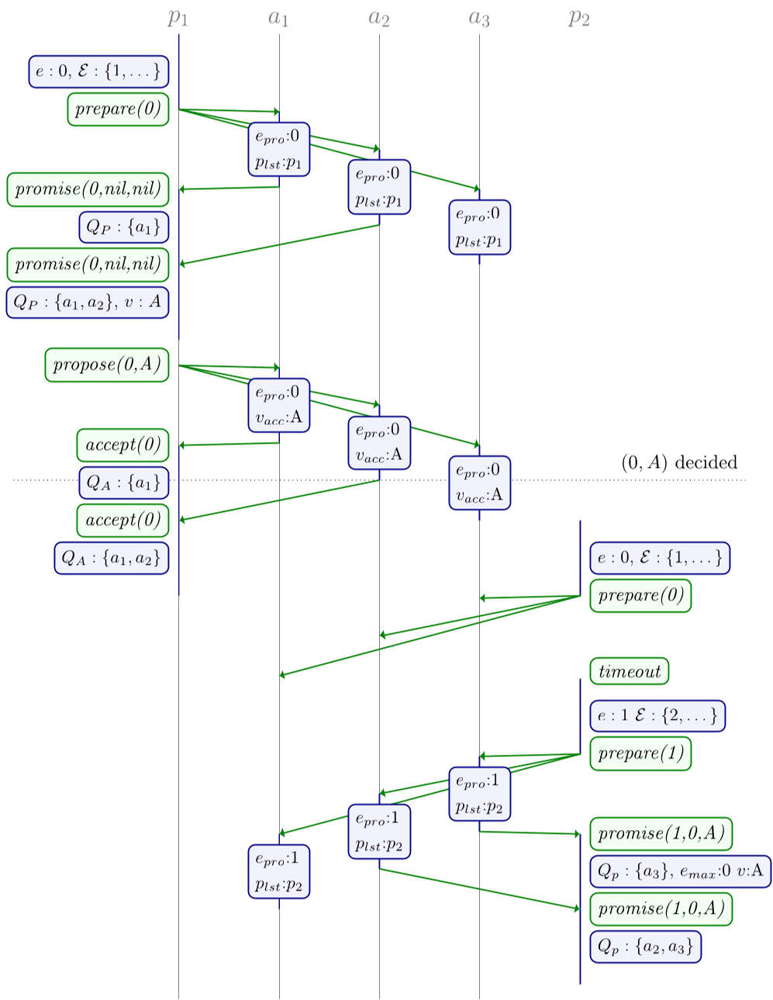

> 图 3.4：带投票的经典 Paxos（算法 3、10）。

回想一下，
在经典 Paxos 的安全性证明中我们使用了以下引理：

**引理 9**（值唯一性）。如果值 $v$ 在 epoch $e$ 中被提出，
那么 $e$ 中不能提出任何其他值。

我们现在把引理 9 的证明修订如下。

**引理 17。** *每个 acceptor 对每个 epoch $e$ 至多只向一个 proposer 承诺。*

引理 17 的证明。
假设一个 acceptor 收到了 $prepare(e)$ 并回复了 $promise(e, \ldots)$。
acceptor 在发送承诺之前已把最后承诺的 epoch 设为 $e$。
由于最后承诺的 epoch 单调递增（引理 6），
acceptor 最后承诺的 epoch 此后将 $\ge e$。

假设该 acceptor 从另一个 proposer 收到 $prepare(e)$。
acceptor 要在 $e$ 中承诺，
必须满足 $e$ 大于最后承诺的 epoch；
但最后承诺的 epoch 已经 $\geq e$，
因此该 acceptor 不能接受这个承诺。

通过投票实现独占 epoch 后，
引理 9 的修订证明如下。
由引理 17 和阶段一法定人数交集要求可得：

**推论 17.1。** *至多只有一个 proposer 为一个 epoch 提出值。*

由此可得，
由于每个 proposer 对给定 epoch 只提出一个值，
每个 epoch 至多只有一个值被提出。

Raft [OO14, §5.1] 等共识算法使用投票来分配 epoch。

## 3.10 提案复制

经典 Paxos 中的 epoch 预分配（或通过投票独占访问 epoch）
确保每个 epoch 由唯一的 proposer 使用。
为了保证安全性（引理 9），
必须确保每个 epoch 至多只关联一个值。
但并没有要求每个 epoch 只能由一个 proposer 使用。
acceptor 收到 $propose(e,v)$ 时，
会得知两个重要事实：
其一，
某个 proposer 已用 epoch $e$ 成功执行了阶段一；
其二，
值选择规则的结果是选定值 $v$ 与 epoch $e$ 关联。
有了这些信息，
另一个 proposer 不仅可以复用提案映射 $(e, v)$，
还可以跳过阶段一，
直接向 acceptor 发送 $propose(e,v)$ 进入阶段二。
我们把这种技术称为提案复制。[^ch3-13]
下面给出 proposer 如何获知（进而复制）过往提案的两个示例。

**算法 11：带提案复制的经典 Paxos proposer 算法。**

```text
1 v, e_max ← nil
2 Q_P, Q_A ← ∅
3 e ← min(ℰ)
4 ℰ ← ℰ ∖ {e}
/* 为 epoch e 开始阶段一 */
5 send prepare(e) to acceptors
6 while |Q_P| < ⌊n_a/2⌋ + 1 do
7     switch do
8         case promise(e,f,w) received from acceptor a
9             Q_P ← Q_P ∪ {a}
10             if f ≠ nil ∧ (e_max = nil ∨ f > e_max) then
11                 e_max ← f, v ← w
12         case no-promise(e,f,g,w) received from acceptor a
13             ℰ ← {n ∈ ℰ | n > f}
14             if (g,w) ≠ nil ∧ f = g then
                /* 复制提案 (g,w)，跳过阶段一的剩余部分 */
15                 e ← g, v ← w, Q_A ← {a}
16                 goto line 21
17             else
18                 goto line 1
19 if v = nil then
20     v ← γ
21 send propose(e,v) to acceptors
22 while |Q_A| < ⌊n_a/2⌋ + 1 do
23     switch do
24         case accept(e) or no-promise(_,_,e,v) or no-accept(_,_,e,v) received from acceptor a
25             Q_A ← Q_A ∪ {a}
26         case no-accept(e,f,g,w) received from acceptor a
27             ℰ ← {n ∈ ℰ | n > f}
28             if (g,w) ≠ nil ∧ f = g then
                /* 复制提案 (g,w)，重启阶段二 */
29                 e ← g, v ← w, Q_A ← {a}
30                 goto line 21
31             else
32                 goto line 1
33 return v
```

#### 示例：从 NACK 高效恢复

此前（3.1 节）我们了解到，
否定响应（NACK）可以为 proposer 提供关于 acceptor 状态的额外信息。
在算法 5 中，
proposer 收到 $no\text{-}promise(e,f)$ 或
$no\text{-}accept(e,f)$ 后会重启 proposer 算法。
我们还讨论过，
NACK 也可以附带最后接受的提案 $(g,w)$，
例如 $no\text{-}promise(e,f,g,w)$ 或
$no\text{-}accept(e,f,g,w)$，
但当时这些额外信息还没有用处。

提案复制让 proposer 能够利用这些信息。
如果否定响应中包含一个非 nil 的提案 $(g, w)$，
proposer 就得知 epoch $g$ 映射到值 $w$。
proposer 可以不从第 1 行重试提案，
而是跳到提案 $(g, w)$ 的阶段二。
这如算法 11 的第 14–16 行和第 28–30 行所示。[^ch3-14]

此外，
从先前提案的否定响应中，
如果包含提案 $(e, v)$，
proposer 就得知该 acceptor 已接受提案 $(e, v)$，
因此这个 acceptor 可以计入阶段二法定人数（算法 11 第 24 行）。

图 3.5 展示了图 3.1 的修订版本：
proposer $p_1$ 复制提案 $(5, B)$，
从而跳过 epoch 5 的阶段一。
为简单起见，
这个场景假设来自 acceptor $a_2$ 的 no-promise 丢失或延迟。
与往常一样，
proposer 把请求发送给所有 acceptor；
但在这个例子中，
proposer $p_1$ 无须向 acceptor $a_1$ 发送 $propose(5, B)$，
因为 $p_1$ 已经知道 $a_1$ 接受了提案 $(5, B)$。

#### 示例：共置系统上的高效恢复

考虑一个 proposer 和 acceptor 共置在每个参与者上、
并使用阶段三终止的系统。
如果某个参与者已接受提案 $(e, v)$，
但在超时时间内没有得知决定已达成，
它可以启动一个 recovery proposer。
利用提案复制，
该参与者可以跳过阶段一，
进入阶段二，
向所有其他参与者发送 $propose(e, v)$。
该参与者不仅可能只用一个阶段（阶段二）就决定该值，
而且原始 proposer 与复制提案的 proposer 之间也不会发生冲突。

总而言之，
要复制提案 $(e, v)$，
参与者首先必须得知 $propose(e, v)$ 曾在某个时刻被发出。
这意味着值 $v$ 已被选定与 epoch $e$ 对应。
下一节我们将探讨，
如果值被静态地预先分配给 epoch，
会发生什么。

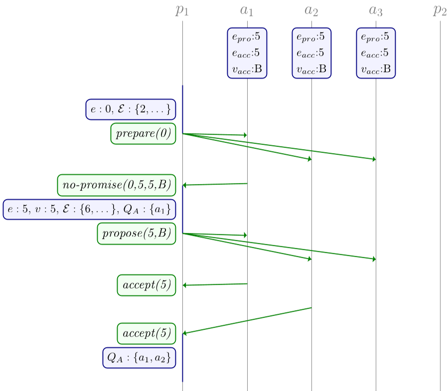

> 图 3.5：从 NACK 复制提案的经典 Paxos（算法 4、11）。

## 3.11 推广到法定人数

回想一下，
我们假设 acceptor 是有限集合 $A = \{a_1, a_2, \ldots, a_{n_a}\}$，
$|A| = n_a$。

**定义 6。** *法定人数 $Q$ 定义为 acceptor 的非空子集，
$Q \in \mathcal{P}(A) \setminus \emptyset$。*

**定义 7。** 法定人数集合 $\mathcal{Q}$ 是法定人数的非空集合，
$\mathcal{Q} \subseteq \mathcal{P}(A) \setminus \emptyset$。

到目前为止描述的经典 Paxos 使用_严格多数派法定人数_。
形式化地，
我们把法定人数集合定义如下：

$$ \mathcal{Q}=\{Q\in\mathcal{P}(A)||Q|\geq\lfloor n_{a}/2\rfloor+1\} $$

经典 Paxos 没有多数参与就无法取得进展，
因此它能容忍至多少数派 $\lceil n_a/2 \rceil - 1$ 个 acceptor 故障。
这种方法把 acceptor 总数、参与共识所需的 acceptor 数量和可容忍的故障数量紧紧耦合在一起。
理想情况下，
我们希望尽量减少系统中的 acceptor 数量和参与共识所需的数量，
因为 proposer 必须等待 acceptor 回复，
并发送更多消息。
反过来，
我们又希望系统能容忍的故障数量尽可能多。
使用多数派时，
要容忍 $f$ 个故障，
在 $2f + 1$ 个 acceptor 的系统中，
法定人数至少要有 $f + 1$ 个。
这种方法很快就会限制系统的可扩展性和容错能力。

使用严格多数派的目的是确保所有法定人数相交；
因此已有文献 [Lam78a, §1.4][Lam01a, §2.2][Lam05a][JRS11, §2] 指出，
多数派可以推广为任意法定人数系统 $\mathcal{Q}$，
只要所有法定人数 $Q \in \mathcal{Q}$ 都相交。
因此，
我们把*已决定*的定义修订如下：

**定义 8。** 如果提案 $(e, v)$ 已被一个法定人数的 acceptor 接受，
则该提案被决定。

形式化地，
经典 Paxos 的法定人数交集要求规定如下：

$$ \forall Q,Q^{\prime}\in\mathcal{Q}:Q\cap Q^{\prime}\neq\emptyset $$

（3.1）

算法 12 给出了推广后的 proposer 算法。
acceptor 算法保持不变。

图 3.6 给出了这一推广在实践中的示例。
在这个场景中，
系统由 4 个 acceptor 组成，
$A = \{a_1, a_2, a_3, a_4\}$，
法定人数系统为
$\mathcal{Q} = \{\{a_1, a_2\}, \{a_1, a_3\}, \{a_1, a_4\}, \{a_2, a_3, a_4\}\}$。
严格多数派法定人数要求三个 acceptor 才能构成法定人数；
相比之下，
本例中的 proposer $p_1$ 只用两个 acceptor $a_1$ 和 $a_2$
构成的法定人数就完成了两个阶段。
[^ch3-15]

严格多数派只是满足经典 Paxos 法定人数交集要求的法定人数集合之一。
还有许多法定人数集合可以用于经典 Paxos，
它们在法定人数的大小、数量和多样性、参与者数量，
以及可容忍故障的数量和类型上提供不同的权衡。
选择法定人数集合的灵活性，
让我们得以放松 acceptor 数量、每个阶段参与的 acceptor 数量和可容忍故障数量之间的耦合。
然而，
由于所有法定人数都必须相交，
能实现的目标仍存在根本限制。
例如，
只要有任何一个完整法定人数整体故障，
经典 Paxos 就无法达成决定。
因此，
严格多数派之外的法定人数系统在实践中很少使用。

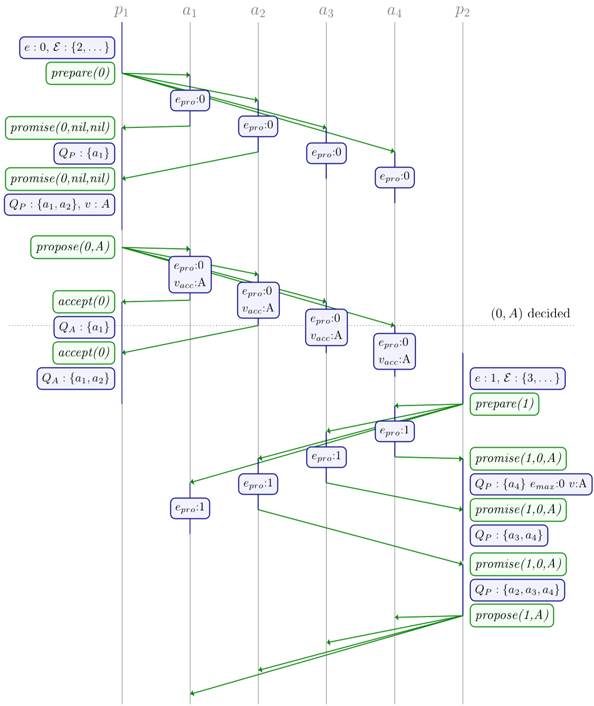

> 图 3.6：使用非多数派法定人数的经典 Paxos（算法 4、12）。

**算法 12：使用广义法定人数的经典 Paxos proposer 算法。**

state：

- $\mathcal{Q}$：法定人数集合（配置，持久）

```text
1 v, e_max ← nil
2 Q_P, Q_A ← ∅
3 e ← min(ℰ)
4 ℰ ← ℰ ∖ {e}
/* 为 epoch e 开始阶段一 */
5 send prepare(e) to acceptors
6 while ∀Q ∈ 𝒬 : Q_P ⊉ Q do
7     switch do
8         case promise(e,f,w) received from acceptor a
9             Q_P ← Q_P ∪ {a}
10             if e_max = nil ∨ f > e_max then
11                 e_max ← f, v ← w
12         case timeout
13             goto line 1
14     if v = nil then
15         v ← γ
/* 为提案 (e,v) 开始阶段二 */
16 send propose(e,v) to acceptors
17 while ∀Q ∈ 𝒬 : Q_A ⊉ Q do
18     switch do
19         case accept(e) received from acceptor a
20             Q_A ← Q_A ∪ {a}
21         case timeout
22             goto line 1
23 return v
```

## 3.12 其他

其他变体和优化包括：

#### 获知

讨论 Paxos 时，
人们经常会考虑第三种角色，
称为 learner。
learner 只是希望获知已决定值的参与者。
learner 与 proposer 相似之处在于它们都想获知。
与 proposer 不同的是，
learner 是被动的，
没有自己要提出的值。
proposer 或 acceptor 一旦得知某个值已被决定以及已决定值是什么，
就可以通知 learner。
更多关于获知的选项在其他文献中有讨论 [Lam01a, §2.3]。

#### 消息

到目前为止，
本章中经典 Paxos 的 proposer 把 prepare 和 propose 消息发送给全部 $n_a$ 个
acceptor，
并等待多数响应。
如果所有 acceptor 都在线，
这种方法每个阶段产生 $2n_a$ 条消息。
Chubby [Bur06]、VRR [LC12, §4.1]、Raft [OO14]
和 Moderately Complex Paxos [VRA15] 等系统采用这种方法。

由于 proposer 只需要多数 acceptor 响应，
它们可以安全地只把消息发送给多数 acceptor，
只在需要时，
例如一个或多个 acceptor 没有回复时，
才发送更多消息。
在最好的情况下，
即所有 acceptor 都在线时，
这种方法产生 $2(\lfloor n_a/2 \rfloor + 1)$ 条消息。
如果想降低需要发送更多消息的可能性，
可以一开始就发送给多于多数的 acceptor。
Ring Paxos [MPSP10, §4] 采用了这种方法。

如果想进一步减少消息数量，
可以让 acceptor 以链或环的形式转发消息。
在最好的情况下，
这种方法把消息数量减少到 $\lfloor n_a/2 \rfloor + 2$；
但延迟会从 2 跳增加到 $\lfloor n_a/2 \rfloor + 2$ 跳。
这与 Ring Paxos 阶段二采用的方法类似 [MPSP10, §3]。

#### 更严格的 epoch 条件

如前所述，
经典 Paxos 的 acceptor 算法在 prepare/propose 消息的 epoch $e$
大于或等于最后承诺的 epoch $e_{pro}$ 时就会承诺/接受。
一些算法有更严格的要求：
例如 [MPSP10, §4] 要求 $e > e_{pro}$ 才承诺；
Moderately Complex Paxos [VRA15] 要求 $e > e_{pro}$ 才承诺，
且 $e = e_{pro}$ 才接受。
这些限制始终是安全的，
因为它们等价于丢弃一条消息，
但可能影响进展的活性条件。

#### 故障即停模型

如果不允许参与者在故障后重启，
就可以避免写入持久存储。
但这意味着参与者数量会随时间减少，
系统需要重新配置才能维持容错能力。
VRR [LC12, §4.3] 采用了这种方法。
另一种做法是要求故障的 acceptor 不超过多数派 [MPSP10, §4.2]。

#### 虚拟序列

对序列中的某个值达成共识时，
值得注意的是，
序列中的值与应用使用的索引之间不一定存在一一对应关系。
我们可以改进这一点：
在每个索引上决定一个值序列，
而不是单个值。
这种把值批量并入决定的做法降低了决定延迟，
而且不必暴露给外部，
因为值可以重新分配到后续的（虚拟）索引。
批处理在共识中被广泛使用，
例子包括 Chubby [CGR07]、Mencius [MJM08]、VRR [LC12, §6.2]
和 Raft [OO14]。
这种抽象意味着长度为零的序列就是一个可以被决定的 nil 值。
我们看到 Simple Paxos [Lam01a, §3] 和 Mencius [MJM08]
等算法都利用了这样的 no-op。

#### Fast Paxos

Fast Paxos [Lam05a] 是经典 Paxos 的一个变体：
对于一个 epoch 子集，
如果 acceptor 在其阶段一中没有收到任何提案，
因而可以提出自己的值，
那么它可以通知所有其他 acceptor，
任何 acceptor 都可以在阶段二中直接提出自己的值，
而无须再次执行阶段一。
文献把这些 epoch 称为 fast epoch，
其余 epoch 称为 classic epoch。
除了要求所有法定人数相交之外，
为保持安全性，
Fast Paxos 还要求任意两个 fast 法定人数与一个 classic 法定人数必须相交。
Fast Paxos 对 fast epoch 使用大小为 $k_f$ 的计数法定人数，
对 classic epoch 使用大小为 $k_c$ 的计数法定人数，
使得：[^ch3-16]

$$ n_{a}<2k_{c} $$

$$ 2n_{a}<2k_{f}+k_{c} $$

## 3.13 小结

经典 Paxos 已被广泛研究，
本章只是开始讨论经典 Paxos 家族中种类繁多的共识算法。
这个家族中的所有算法都有三个关键特征：
epoch、两个阶段，
以及多数派（或相交法定人数）同意。
在接下来的三章中，
我们将逐一修订这些方面，
首先从法定人数交集开始。

[^ch3-1]: 引自迪士尼电影《小鹿斑比》中 Thumper 的台词。

[^ch3-2]: 例如，在 Raft 算法中，acceptor 在对 prepare 和 propose 消息（分别称为 AppendEntries 和 RequestVote）的否定响应中包含它们最后承诺的 epoch（称为 current term）[OO14, Figure 2]。

[^ch3-3]: 在上一节关于否定响应（3.1 节）中，我们看到 proposer 可以选择在超时之前提前重试提案。现在我们看到，proposer 也可以选择多等一段时间再进入阶段二。

[^ch3-4]: [VRA15] 等一些论文把这种方法描述为 Paxos，而把只存储最后接受的提案描述为一种优化。

[^ch3-5]: 这条消息有时称为 learn。

[^ch3-6]: 在实践中，候选值往往来自外部客户端，客户端可以尝试把值直接发送给指定 proposer。采用这种方法的算法包括 VRR [LC12, §4] 和 Raft [OO14, §8]。另一种做法是客户端把值广播给所有 proposer，Moderately Complex Paxos [VRA15, §2.1] 采用了这种做法。

[^ch3-7]: 换句话说，选择指定 proposer 不是 leader 选举问题，其本身并不需要分布式共识。

[^ch3-8]: leader 在文献中也称 master、primary [LC12] 或 coordinator [MPSP10]。非 leader 的 proposer 也称 backup [LC12] 和 follower [OO14, §5.1]。这里的 leader 不应与 leaders 混淆，后者有时被用作 proposer 的另一种说法，例如 Renesse 和 Altinbuken [VRA15] 的用法。

[^ch3-9]: 这在 Viewstamped Replication [OL88, LC12] 中称为 view change。

[^ch3-10]: proposer 可以细分为指定与非指定，或 leader 与非 leader。

[^ch3-11]: 请注意，采用这种方案时，pid 和 sid 将取代 E。

[^ch3-12]: 这等价于批量预执行到持久存储的写入。

[^ch3-13]: 这是阶段二绕过（3.2 节）的推广。

[^ch3-14]: 算法 11 还包含 f = g 的要求，否则提案复制不太可能成功。

[^ch3-15]: 同样可以使用 acceptor $a_{1}$ 和 $a_{3}$，或 acceptor $a_{1}$ 和 $a_{4}$。每个阶段可以使用不同的法定人数。

[^ch3-16]: 这些表达式由 [Lam05a] 3.4.1 节重排而来。

# 第 4 章 法定人数交集再探

本章将证明，
第 2 章给出的经典 Paxos 的通常描述比实际所需更为保守。
具体而言，
我们将论证经典 Paxos 的法定人数交集要求——即要求所有法定人数两两相交，
其形式化表述见 3.11 节的式（3.1）——可以被大幅弱化。
这一结果具有广泛的影响，
本论文将通篇加以探讨。
特别是，
我们将论证它为达成分布式共识的方式提供了大得多的灵活性。

本章分两个不同阶段逐步细化法定人数交集要求：
修订 A（4.1 节）与修订 B（4.2 节）。
我们从经典 Paxos 到法定人数的推广（3.11 节）出发。
每个阶段都通过进一步弱化法定人数交集要求，
对前一修订作出推广。

## 4.1 跨阶段的法定人数交集

我们首先区分经典 Paxos 阶段一使用的法定人数集合，
记作 $\mathcal{Q}_1$，
与阶段二使用的法定人数集合，
记作 $\mathcal{Q}_2$。
经典 Paxos 的两个阶段可以使用不同的法定人数集合。

与之前一样，
我们先修订*已决定*的定义：

**定义 9。** *如果提案 $(e, v)$ 已被阶段二的一个 acceptor 法定人数接受，
则称该提案已决定。*

由于经典 Paxos 要求所有法定人数无论处于算法的哪个阶段都必须相交，
法定人数集合 $\mathcal{Q}_1$、$\mathcal{Q}_2$ 必须同时满足以下全部三个交集要求：

$$ \forall Q,Q^{\prime}\in\mathcal{Q}_{1}:Q\cap Q^{\prime}\neq\emptyset $$

（4.1）

$$ \forall Q,Q^{\prime}\in\mathcal{Q}_{2}:Q\cap Q^{\prime}\neq\emptyset $$

（4.2）

$$ \forall Q_{1}\in\mathcal{Q}_{1},\forall Q_{2}\in\mathcal{Q}_{2}:Q_{1}\cap Q_{2}\neq\emptyset $$

（4.3）

我们的第一个发现是，
只需要求阶段一法定人数（$\mathcal{Q}_1$）与阶段二法定人数（$\mathcal{Q}_2$）相交。
阶段一法定人数之间不必相交，
阶段二法定人数之间同样不必相交。
由于阶段内部不要求交集，
经典 Paxos 每个阶段内部的法定人数可以互不相交。
我们把经典 Paxos 的这一推广称为 Paxos 修订 A。
在文献中，
我们曾将其称为 Flexible Paxos（FPaxos）。

形式化地说，
*修订 A 的法定人数交集要求*可以表述为：

$$ \forall Q_{1}\in\mathcal{Q}_{1},\forall Q_{2}\in\mathcal{Q}_{2}:Q_{1}\cap Q_{2}\neq\emptyset $$

（4.4）

### 4.1.1 算法

算法 13 给出经典 Paxos 推广后的伪代码。
这里只给出 proposer 算法，
因为 acceptor 算法与算法 4 相比没有变化。
我们可以为算法配置法定人数集合 $\mathcal{Q}_1$ 和 $\mathcal{Q}_2$，
也可以只提供其中一个法定人数集合，
再按需计算另一个。
算法 13 采用的是后一种做法。

### 4.1.2 安全性

现在考察为什么放宽法定人数交集要求是安全的，
方法是回顾此前经典 Paxos 安全性证明（2.6 节）对法定人数交集的利用。

回顾以下性质（最初定义于 2.4 节）：

**性质 2。
** *proposer 只有在收到 $\lfloor n_a/2 \rfloor + 1$ 个 acceptor
的承诺后才提出值。*

**性质 3。
** *proposer 只有在收到 $\lfloor n_a/2 \rfloor + 1$ 个 acceptor
的接受后才返回值。*

现在用 Paxos 修订 A 的以下性质替换它们。
其余性质保持不变。

**性质 11。** *proposer 只有在收到阶段一的一个 acceptor 法定人数
$Q \in \mathcal{Q}_1$ 的承诺后才提出值。*

**性质 12。** *proposer 只有在收到阶段二的一个 acceptor 法定人数
$Q \in \mathcal{Q}_2$ 的接受后才返回值。*

**算法 13：Paxos 修订 A 的 proposer 算法。**[^ch4-3]

state:
• Q₂: set of quorums for phase two (configured, persistent)

```text
1 v, e_max ← nil
2 Q_P, Q_A ← ∅
3 e ← min(ℰ)
4 ℰ ← ℰ ∖ {e}
/* 开始 epoch e 的阶段一 */
5 send prepare(e) to acceptors
6 while ∃Q ∈ 𝒬_2 : Q_P ∩ Q = ∅ do
7     switch do
8         case promise(e,f,w) received from acceptor a
9             Q_P ← Q_P ∪ {a}
10             if f ≠ nil ∧ (e_max = nil ∨ f > e_max) then
11                 e_max ← f, v ← w
12         case timeout
13             goto line 1
14 if v = nil then
15     v ← γ
/* 开始提案 (e,v) 的阶段二 */
16 send propose(e,v) to acceptors
17 while ∀Q ∈ 𝒬_2 : Q_A ⊉ Q do
18     switch do
19         case accept(e) received from acceptor a
20             Q_A ← Q_A ∪ {a}
21         case timeout
22             goto line 1
23 return v
```

由表 2.3 可知，
修订引理 11 的证明就足以证明 Paxos 修订 A 的安全性。

回顾经典 Paxos 安全性证明（2.6 节）中的引理 11：

**引理 11**（法定人数交集）。如果值 $v$ 在 epoch $e$ 中被决定，
那么任何大于 $e$ 的未来提案都必须有至少一个接受过提案 $(e, v)$ 的 acceptor 作出承诺。

引理 11 证明，
任何后续提案都必须有至少一个接受过已决定提案的 acceptor 作出承诺。
经典 Paxos 要求每个阶段都有一个 acceptor 法定人数参与，
且任意两个法定人数都相交，
由此可以平凡地证明该引理。
不过，
我们也可以使用式（4.4）中更弱的修订 A 法定人数交集来证明引理 11：

引理 11 的修订证明。假设值 v 在 epoch e 中被决定，
于是阶段二的某个 acceptor 法定人数 $Q_2 \in \mathcal{Q}_2$ 已经接受了提案
$(e, v)$。

在阶段二中提出某个值之前，
阶段一的一个 acceptor 法定人数 $Q_1 \in \mathcal{Q}_1$ 必须已向 proposer
作出承诺（性质 11）。
由式（4.4），
这两个法定人数总是相交，
因此它们至少有一个共同的 acceptor。$\square$

引理 11 的证明是经典 Paxos 证明中唯一用到法定人数交集的地方。
因此，
把上述内容代入经典 Paxos 的原始证明，
即得到 Paxos 修订 A 的安全性证明。
为简洁起见，
这里不再复述完整证明。
经典 Paxos 的非平凡性证明（2.5 节）没有用到法定人数交集，
因此对 Paxos 修订 A 依然适用。

### 4.1.3 示例

图 4.1 和图 4.2 展示了 Paxos 修订 A 的两个执行示例。
两个示例中，
系统都由四个 acceptor $A = \{a_1, a_2, a_3, a_4\}$ 和两个 proposer
$P = \{p_1, p_2\}$ 组成。
法定人数系统如下：
$\mathcal{Q}_1 = \{\{a_1, a_2\}, \{a_3, a_4\}\}$，
$\mathcal{Q}_2 = \{\{a_1, a_3\}, \{a_2, a_4\}\}$。
选择这个法定人数系统，
是因为它具有满足修订后法定人数交集要求的最小交集。
为简单起见，
本例中 acceptor 每个阶段只向一个法定人数发送消息，
而不是所有可能的法定人数。
图 4.1 中两个 proposer 串行执行 Paxos 修订 A。
proposer $p_1$ 在 proposer $p_2$ 启动 proposer 算法之前已决定提案
$(0, A)$。
不出所料，
proposer $p_2$ 决定了提案 $(1, A)$。
图 4.2 中两个 proposer 并发执行 Paxos 修订 A。
由于所用的两个阶段一法定人数互不相交，
两个 proposer 都能完成阶段一。
但由于 $p_1$ 的阶段二法定人数与 $p_2$ 的阶段一法定人数在 acceptor $a_3$ 处相交，
只有 $p_2$ 能完成阶段二。
随后 proposer $p_1$ 以 epoch 2 重试，
提案 $(2, B)$ 被决定。

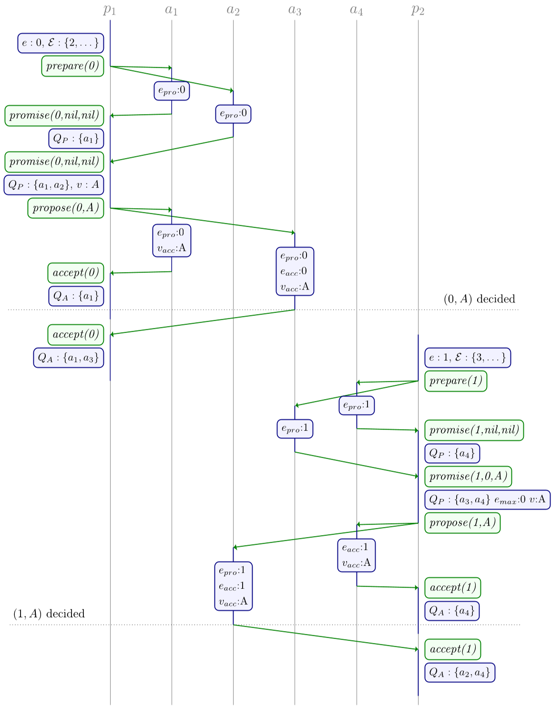

> 图 4.1：各阶段内法定人数互不相交、两个 proposer 串行执行 Paxos 修订 A 的示例。

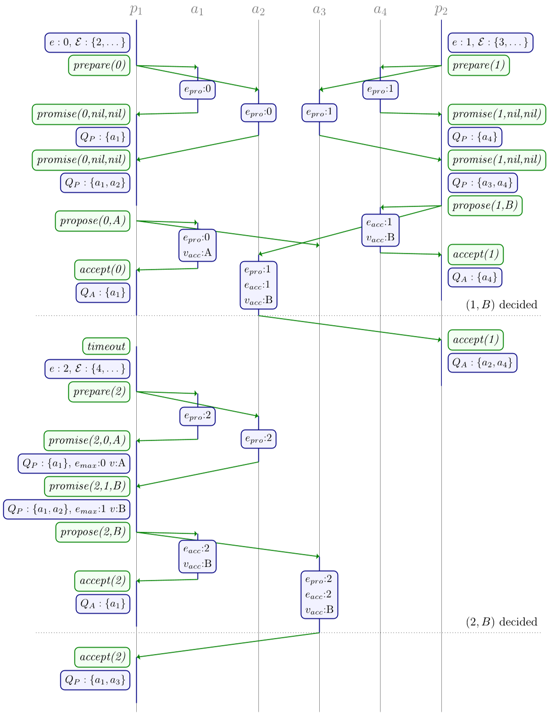

> 图 4.2：各阶段内法定人数互不相交、两个 proposer 并发执行 Paxos 修订 A 的示例。

## 4.2 跨 epoch 的法定人数交集

上一节区分了 Paxos 各阶段使用的法定人数。
本节继续这一细化，
在阶段之外再按法定人数关联的 epoch $e \in E$ 加以区分。
我们用 $Q_n^e$ 表示 epoch $e$ 下阶段 $n$ 的法定人数集合。
到目前为止，
无论 epoch 如何，
我们都使用同一个法定人数集合。
如果使用随 epoch 而异的法定人数集合，
就需要对每个 epoch $e$ 满足：

$$ \forall Q\in\mathcal{Q}_{1}^{e},\forall f\in E,\forall Q^{\prime}\in\mathcal{Q}_{2}^{f}:Q\cap Q^{\prime}\neq\emptyset $$

（4.5）

与之前一样，
我们先修订*已决定*的定义：

**定义 10。** 如果提案 $(e, v)$ 已被 epoch $e$ 的阶段二 acceptor 法定人数接受，
则称该提案已决定。

下一个结果表明，
法定人数交集要求还可以进一步弱化。
我们只要求 epoch $e$ 的阶段一法定人数（$\mathcal{Q}_1^e$）
与所有更小 epoch $\{f \in E | f < e\}$
的阶段二法定人数（$\mathcal{Q}_2^f$）
相交[^ch4-1]。
给定 epoch 的阶段一与阶段二法定人数之间没有相交要求。
同样，
一个 epoch 的阶段一法定人数也不必与所有更大 epoch 的阶段二法定人数相交。

这一新修订的法定人数交集要求称为_修订 B 的法定人数交集要求_，
对每个 epoch $e$ 可表述为：

$$ \forall Q\in\mathcal{Q}_{1}^{e},\forall f\in E:f<e\implies\forall Q^{\prime}\in\mathcal{Q}_{2}^{f}:Q\cap Q^{\prime}\neq\emptyset $$

（4.6）

### 4.2.1 算法

算法 14 给出修订后的经典 Paxos 推广伪代码。
这里只给出 proposer 算法，
因为 acceptor 算法与算法 4 相比没有变化。
请注意，
现在阶段一法定人数可以为空（稍后将讨论），
因此在这种情况下可以增加跳过阶段一的选项。

### 4.2.2 安全性

与修订 A（式（4.4））的情形类似，
这一结果的安全性源于如下观察：
经典 Paxos 的安全性证明并没有用到关于法定人数交集所作假设的全部强度。

回顾以下性质（最初定义于 2.4 节）：

**性质 2。
** *proposer 只有在收到 $\lfloor n_a/2 \rfloor + 1$ 个 acceptor
的承诺后才提出值。*

**性质 3。
** *proposer 只有在收到 $\lfloor n_a/2 \rfloor + 1$ 个 acceptor
的接受后才返回值。*

与之前一样，
我们先重新定义性质 2 和性质 3。
其余性质保持不变。

**算法 14：Paxos 修订 B 的 proposer 算法。**

state:
• $\mathcal{Q}_2^e$: for each $e \in E$,
set of quorums for phase two (configured, persistent)

```text
1 v, e_max ← nil
2 Q_P, Q_A ← ∅
3 e ← min(ℰ)
4 ℰ ← ℰ ∖ {e}
/* 开始 epoch e 的阶段一 */
5 send prepare(e) to acceptors
6 while ∃ z ∈ E : z < e ∧ ∃ Q ∈ 𝒬_2^z : Q_P ∩ Q = ∅ do
7 switch do
8 case promise(e, f, w) received from acceptor a
9 Q_P ← Q_P ∪ {a}
10 if f ≠ nil ∧ (e_max = nil ∨ f > e_max) then
11 e_max ← f, v ← w
12 case timeout
13 goto line 1
14 if v = nil then
15 v ← γ
/* 开始提案 (e, v) 的阶段二 */
16 send propose(e, v) to acceptors
17 while ∀ Q ∈ 𝒬_2^e : Q_A ⊉ Q do
18 switch do
19 case accept(e) received from acceptor a
20 Q_A ← Q_A ∪ {a}
21 case timeout
22 goto line 1
23 return v
```

**性质 13。** *proposer 只有在收到 epoch $e$ 的阶段一 acceptor 法定人数
$\mathcal{Q}_1^e$ 的承诺后，
才在 epoch $e$ 中提出值。*

**性质 14。** *proposer 只有在收到 epoch $e$ 的阶段二 acceptor 法定人数
$\mathcal{Q}_2^e$ 的接受后才返回值。*

回顾经典 Paxos 安全性证明（2.6 节）中的引理 11：

**引理 11**（法定人数交集）。如果值 $v$ 在 epoch $e$ 中被决定，
那么任何大于 $e$ 的未来提案都必须有至少一个接受过提案 $(e, v)$ 的 acceptor 作出承诺。

与 Paxos 修订 A 的安全性证明（4.1.2 节）类似，
现在给出引理 11 的修订证明，
把它代入经典 Paxos 的证明，
即得到 Paxos 修订 B 的安全性证明。

引理 11 的修订证明。假设值 v 在 epoch e 中被决定，
于是 epoch e 的阶段二 acceptor 法定人数 $Q \in \mathcal{Q}_2^e$
已经接受了提案
$(e, v)$。

考虑 epoch f 中的一个提案，
其中 f > e。
在 f 中提出某个值之前，
epoch f 的阶段一 acceptor 法定人数 $Q' \in \mathcal{Q}_1^f$ 必须已向 f 的
proposer 作出承诺（性质 13）。
由于 f > e，
应用式（4.6）可知任意两个这样的法定人数都会相交，
因此这些法定人数总是至少有一个共同的 acceptor。

修订 A 依据法定人数所处的算法阶段弱化交集要求，
从而推广了经典 Paxos。
修订 B 进而依据法定人数所处的 epoch 和阶段弱化交集要求，
推广了修订 A（也就推广了经典 Paxos）。
与我们对经典 Paxos 的安全性证明一样，
Lamport 的原始证明也没有用到所作假设的全部强度，
即所有法定人数都会相交。
这一结果并不否认经典 Paxos 是分布式共识的解法，
但表明该算法的做法存在不必要的保守。
经典 Paxos 是 Paxos 修订 A 的特例，
进而是修订 B 的特例；
它增加了每个阶段内部的法定人数交集要求，
并要求无论 epoch 如何都相交。

### 4.2.3 示例

这一结果的一个关键推论是：
对于最小 epoch $e_{min} = min(E)$，
不存在阶段一法定人数交集要求。
其实际应用是：
持有 epoch $e_{min}$ 的 proposer 可以跳过阶段一，
直接在阶段二中用 $propose(e_{min},\gamma)$ 提出自己的值 $\gamma$。
由于 epoch 对 proposer 是唯一的，
只有一个 proposer 能利用这一点。
假设该 proposer 最先提出值，
且没有其他 proposer 并发地提出提案，
那么它可以在一次往返内决定一个值，
如图 4.3 所示。
图 4.3 与图 2.2 是同一个示例，
但 proposer $p_1$ 现在可以跳过阶段一，
只用一个阶段就达成一致。

这一结果在功能上等价于让系统从这样一种状态启动：
某个 proposer 已经与所有 acceptor 执行过阶段一。
Mencius 的 Coordinated Paxos 算法就使用了这项技术 [MJM08, §4.2]。

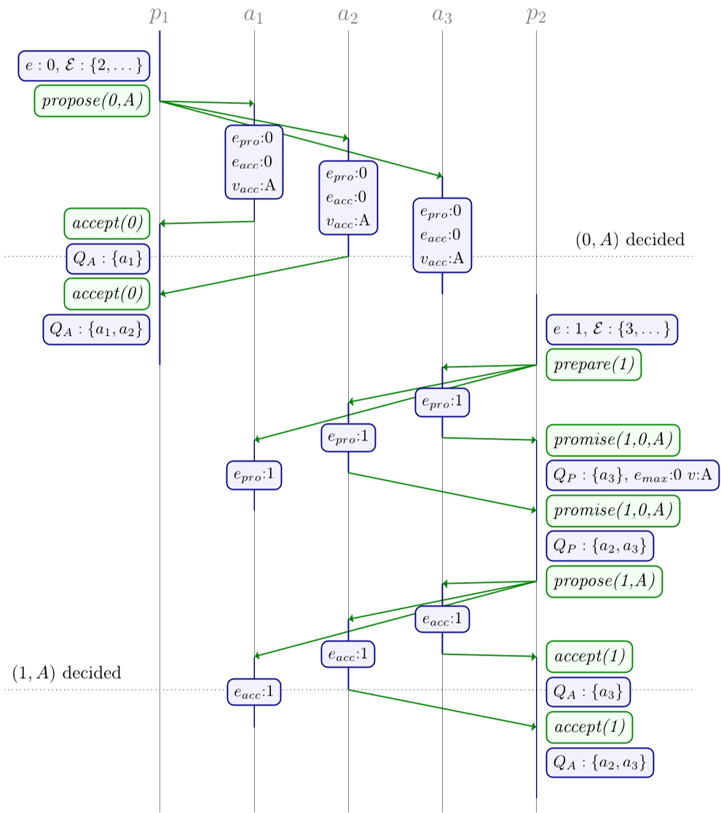

> 图 4.3：proposer 使用最小 epoch 成功跳过阶段一的示例。

与直觉相反，
现在可能出现这样的情况：
提交点已经到达，
而某个 proposer（持有较小 epoch，
如 $e_{min}$）在其阶段一中没有看到已选定的值。
该 proposer 随后可能在阶段二中提出一个与已决定值不同的值。
这种情形并不违反安全性，
因为该 proposer 的阶段二不会成功：
其阶段二法定人数会与更高 epoch 的阶段一法定人数相交。
图 4.4 给出了这种情形的一个例子。
图 4.4 与图 2.3 是同一次执行，
但现在 proposer $p_1$ 跳过了第一个阶段一。

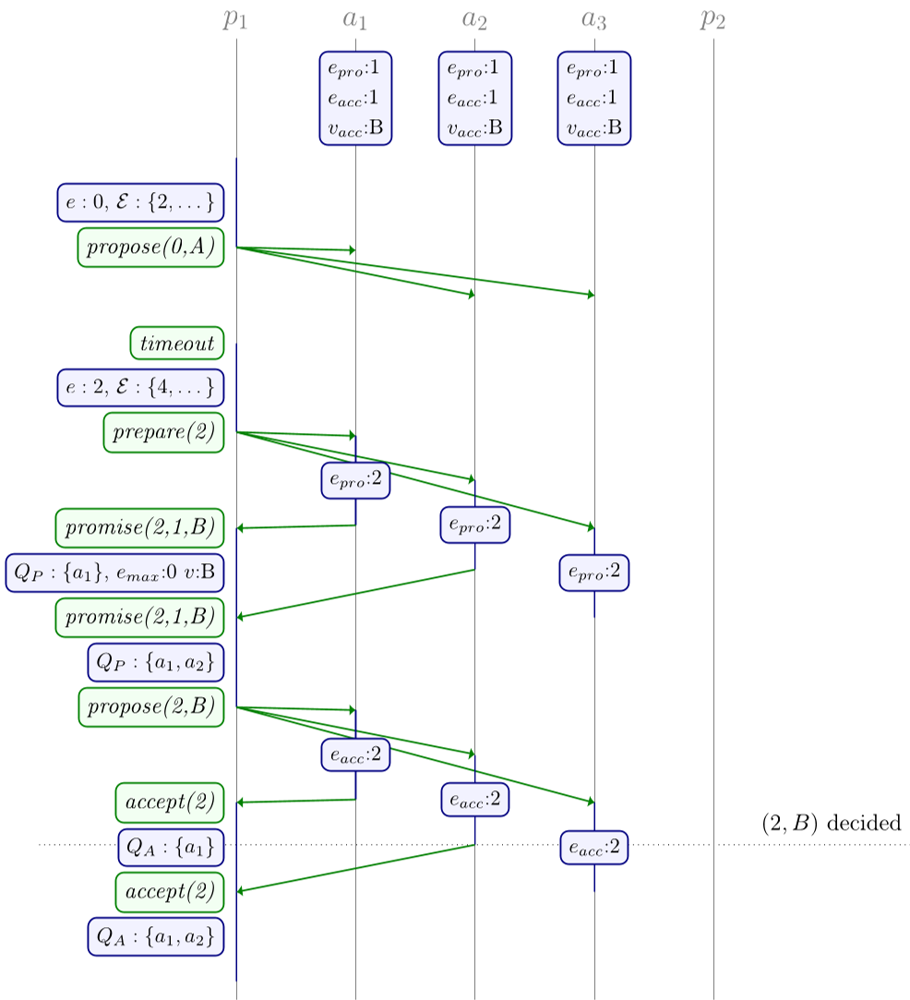

> 图 4.4：提交点到达后，
> proposer 提出与已决定值不同的值的示例。

更一般地说，
这一结果的推论是：
阶段一法定人数只需与先前 epoch 的阶段二法定人数相交，
而不必与所有阶段二法定人数相交。
这一结果的一个应用是：
如果让阶段二法定人数随 epoch 变化，
就可以根据 epoch 缩小阶段一法定人数。

## 4.3 影响

到目前为止，
我们弱化了 Paxos 的法定人数交集要求，
并讨论了它对第 2 章所述经典 Paxos 的影响。
本节将探讨对共识的这一修订认识，
对第 3 章考察过的已知 Paxos 变体有何影响。

### 4.3.1 绕过阶段二

在 3.2 节中，
我们讨论了当阶段一中多数派 acceptor 随承诺返回相同提案 $(e, v)$ 时，
经典 Paxos 的 proposer 如何绕过阶段二。
这是安全的，
因为 $(e, v)$ 已经被决定。
类似的优化是：
当 epoch $e$ 的阶段二法定人数 $\mathcal{Q}_2^e$ 的 acceptor 都返回提案
$(e, v)$ 时，
直接返回值 $v$。
如果在收齐 $\mathcal{Q}_1^f$ 的承诺之前，
已有 $\mathcal{Q}_2^e$ 的 acceptor 返回了相同提案，
那么不仅能跳过阶段二，
还能跳过阶段一的剩余部分。

### 4.3.2 proposer 与 acceptor 的共置

在 3.7 节中，
我们讨论了在每个参与者上同时共置一个 proposer 和一个 acceptor 的做法。
现在考察三个算法，
它们都来自这种共置与我们弱化后的法定人数交集要求的结合。

#### 示例：All aboard Paxos

修订 A 的一个有趣推论是：
如果我们愿意要求所有参与者都在线才能保证进展，
并且把 proposer 和 acceptor 共置，
那么只需一次往返就能达成共识。
其实现方式是要求所有 acceptor 都在阶段二中接受。
此时在修订 A 下，
阶段一中只要有任意一个 acceptor 作出承诺就足够了，
因为两个阶段之间的交集仍然得到保证。
把 acceptor 和 proposer 共置后，
阶段一可以在本地完成，
无须与其他参与者通信。

例如，
在由 3 个 acceptor 组成的系统 $A = \{a_1, a_2, a_3\}$ 中，
以下法定人数集合是合法的：

$$ \begin{array}{r l r}&{}&{\mathcal{Q}_{1}=\{\{a_{1}\},\{a_{2}\},\{a_{3}\}\}}\\ &{}&{\mathcal{Q}_{2}=\{\{a_{1},a_{2},a_{3}\}\}}\end{array} $$

相比之下，
在经典 Paxos 下阶段一仍然需要相交的法定人数，
例如多数派，
因此要求所有 acceptor 参与阶段二只有坏处，
没有好处。

到目前为止，
我们利用修订 A 在所有 acceptor 都参与阶段二的前提下实现了一次往返达成共识。
与经典 Paxos 相比，
All aboard Paxos 的主要局限是必须所有参与者都在线才能保证进展，
而不只是多数派。
现在利用修订 B 来克服这一局限，
做法如下：
要求 epoch 0 到某个 epoch $k$ 的阶段二由所有 acceptor 接受，
而从 $k + 1$ 起的所有 epoch，
阶段二只要求多数派接受。
$k$ 可以取任何大于或等于 1 的值。
表 4.1 第三列给出了一组阶段二法定人数的示例。

|                         | 阶段一法定人数，$\mathcal{Q}_1^e =$    | 阶段二法定人数，$\mathcal{Q}_2^e =$    |
| ----------------------- | -------------------------------------- | -------------------------------------- |
| $e = 0$                 | ${{}}$                                 | ${{a_1, a_2, a_3}}$                    |
| $e \in [1, k]$          | ${{a_1}, {a_2}, {a_3}}$                | ${{a_1, a_2, a_3}}$                    |
| $e = k + 1$             | ${{a_1}, {a_2}, {a_3}}$                | ${{a_1, a_2}, {a_2, a_3}, {a_1, a_3}}$ |
| $e \in [k + 2, \infty]$ | ${{a_1, a_2}, {a_2, a_3}, {a_1, a_3}}$ | ${{a_1, a_2}, {a_2, a_3}, {a_1, a_3}}$ |

> 表 4.1：
> 三个 acceptor $U = \{a_1, a_2, a_3\}$ 时 All aboard Paxos
> 的法定人数示例。

如果没有修订 B，
无论 epoch 如何，
所有阶段一都必须使用多数派法定人数，
才能保证跨阶段的法定人数交集。
而使用修订 B 弱化后的法定人数交集要求，
就可以缩小阶段一法定人数。
如前所述，
epoch 0 没有阶段一法定人数交集要求。
对于提案编号 1 到 $k + 1$，
任意单个 acceptor 都是合法的阶段一法定人数。
从 epoch $k + 2$ 起，
任意多数派 acceptor 都是合法的阶段一法定人数。
其结果是：
如果 proposer 没有收到所有 acceptor 的响应，
可以回退到经典 Paxos。
表 4.1 第二列给出了一组阶段一法定人数的示例。

如果所有 acceptor 都可用，
且没有 proposer 尝试在大于 k 的 epoch 中提出提案，
那么一次往返即可达成决定；
如果只有多数派 acceptor 可用，
则需要两次往返。

#### 示例：Singleton Paxos

另一种做法是反过来要求所有 acceptor 都在阶段一中作出承诺，
从而允许任意一个 acceptor 在阶段二中接受值。
例如，
在由 3 个 acceptor 组成的系统 $A = \{a_1, a_2, a_3\}$ 中，
以下法定人数集合也是合法的：

$$ \begin{array}{r l}&{\mathcal{Q}_{1}=\{\{a_{1},a_{2},a_{3}\}\}}\\ &{\mathcal{Q}_{2}=\{\{a_{1}\},\{a_{2}\},\{a_{3}\}\}}\end{array} $$

阶段二之后还可以增加一个阶段三来存储已决定值，
如 3.3 节所述。

#### 示例：共置情形下的多数派法定人数

4.2 节提出的对不同 epoch 使用不同法定人数的想法也许显得不同寻常，
但这其实已经相当常见。
考虑一个有 5 个参与者的经典 Paxos 系统 $U = \{u_1, u_2, u_3, u_4, u_5\}$，
每个参与者既是 acceptor 又是 proposer。

epoch 以轮转方式预先分配：
参与者 $u_1$ 可以使用 epoch $\mathcal{E} = \{0, 5, 10, \ldots\}$，
参与者 $u_2$ 可以使用 epoch $\mathcal{E} = \{1, 6, 11, \ldots\}$，
依此类推。
假设系统使用多数派法定人数，
那么无论阶段和 epoch 如何，
法定人数都是：

$$ \begin{array}{r l}&{Q=\{\{u_{1},u_{2},u_{3}\},\{u_{1},u_{2},u_{4}\},\{u_{1},u_{2},u_{5}\},\{u_{1},u_{3},u_{4}\},\{u_{1},u_{3},u_{5}\},}\\ &{\quad\{u_{1},u_{4},u_{5}\},\{u_{2},u_{3},u_{4}\},\{u_{2},u_{3},u_{5}\},\{u_{2},u_{4},u_{5}\},\{u_{3},u_{4},u_{5}\}\}}\end{array} $$

但在实践中，
每个参与者都会把自己包含在自己的法定人数中。
因此阶段二法定人数将具有如下形式：

$$ \begin{array}{r l}&{Q_{2}^{0}=\{\{\pmb{u_{1}},u_{2},u_{3}\},\{\pmb{u_{1}},u_{2},u_{4}\},\{\pmb{u_{1}},u_{2},u_{5}\},\{\pmb{u_{1}},u_{3},u_{4}\},\{\pmb{u_{1}},u_{3},u_{5}\},\{\pmb{u_{1}},u_{4},u_{5}\}\}}\\ &{Q_{2}^{1}=\{\{u_{1},\pmb{u_{2}},u_{3}\},\{u_{1},\pmb{u_{2}},u_{4}\},\{u_{1},\pmb{u_{2}},u_{5}\},\{\pmb{u_{2}},u_{3},u_{4}\},\{\pmb{u_{2}},u_{3},u_{5}\},\{\pmb{u_{2}},u_{4},u_{5}\}\}}\end{array} $$

修订 B 带来的认识是：
阶段一法定人数只需与更小 epoch 的阶段二法定人数相交。
因此可以把最初几个阶段一法定人数细化为：

$$ \begin{array}{c}Q_{1}^{0}=\{\{\}\}\\\quad Q_{1}^{1}=\{\{\boldsymbol{u}_{1}\},\{\boldsymbol{u}_{2},\boldsymbol{u}_{3},\boldsymbol{u}_{4}\},\{\boldsymbol{u}_{2},\boldsymbol{u}_{3},\boldsymbol{u}_{5}\},\{\boldsymbol{u}_{2},\boldsymbol{u}_{4},\boldsymbol{u}_{5}\},\{\boldsymbol{u}_{3},\boldsymbol{u}_{4},\boldsymbol{u}_{5}\}\}\\\quad Q_{1}^{2}=\{\{\boldsymbol{u}_{1},\boldsymbol{u}_{2}\},\{\boldsymbol{u}_{1},\boldsymbol{u}_{3},\boldsymbol{u}_{4}\},\{\boldsymbol{u}_{1},\boldsymbol{u}_{3},\boldsymbol{u}_{5}\},\{\boldsymbol{u}_{1},\boldsymbol{u}_{4},\boldsymbol{u}_{5}\},\\\quad\{\boldsymbol{u}_{2},\boldsymbol{u}_{3},\boldsymbol{u}_{4}\},\{\boldsymbol{u}_{2},\boldsymbol{u}_{3},\boldsymbol{u}_{5}\},\{\boldsymbol{u}_{2},\boldsymbol{u}_{4},\boldsymbol{u}_{5}\},\{\boldsymbol{u}_{3},\boldsymbol{u}_{4},\boldsymbol{u}_{5}\}\}\end{array} $$

可以把这一示例推广到任意法定人数系统：
所有与先前 epoch（小于 e）相关联的参与者组成的集合，
就是 epoch e 的一个合法阶段一法定人数。
在这个具体示例中，
前三个 epoch 的阶段一法定人数得到了改进；
但对大于 3 的 epoch，
这一认识没有帮助，
因为任意 3 个或更多参与者组成的集合本来就已经是合法法定人数。
下一节将处理这个问题。

### 4.3.3 Multi-Paxos

在 Multi-Paxos（3.6 节）中，
算法的稳态是一个 proposer 与多数派 acceptor 执行阶段二。
如果假设故障很少发生，
那么与阶段二相比，
经典 Paxos 的阶段一很少执行。
从 Paxos 修订 A 可知，
法定人数交集只在阶段一与阶段二法定人数之间需要。
因此，
我们可以在两个阶段的法定人数集合之间做权衡：
缩小阶段二法定人数的规模（和/或增加其数量），
代价是增大阶段一法定人数的规模（和/或减少其数量）。

使用多数派法定人数的 Multi-Paxos 把性能、系统规模和容错能力紧紧耦合在一起。
现在系统可以针对给定场景选择最合适的权衡。
这一修改优化了稳态性能，
同时提高了故障恢复的代价。
这一规则的一个例外称为偶数节点优化。
当 acceptor 数量 $n_a$ 为偶数时，
Multi-Paxos 的法定人数大小为 $\frac{n_a}{2} + 1$，
因此现有的 Multi-Paxos 系统建议不要部署在偶数个 acceptor 上。
使用 Paxos 修订 A，
当 $n_a$ 为偶数时可以把阶段二法定人数缩小到 $\frac{n_a}{2}$，
使在偶数个 acceptor 上部署成为可行选项。
阶段二法定人数规模的这一改进没有其他方面的代价，
因此实际上是免费的。

leader 收到多数派 acceptor 的接受后，
即获知决定已成功达成。
如果假设 propose 消息发送给所有 acceptor，
那么延迟就以到最快的多数派 acceptor 的往返时间为界。
缩小阶段二法定人数的规模（和/或增加法定人数数量），
就能降低这一延迟，
最坏情况下延迟也保持不变。
降低决定延迟也就提高了负载下可达成的吞吐量[^ch4-2]。
Multi-Paxos 已经在实践中广泛部署。
因此，
即便对 Multi-Paxos 的这一优化幅度有限，
也能以极小的实现工作量产生广泛影响。

如前所述（3.12 节），
proposer 只需把 propose 消息发送给阶段二的一个法定人数，
前提是：当某个 acceptor 不响应时，
proposer 能换用另一个阶段二法定人数重试。
这种做法把经典 Paxos 稳态下每次决定发送的消息数量（几乎）减半，
从而降低 leader 和网络的负载。
由于每个值只有最少数量的 acceptor 接受，
总体存储需求也随之降低。
不过，
与把 propose 消息发送给所有 acceptor 相比，
无论是否发生故障，
决定延迟都会增加。
缩小阶段二法定人数的规模（和/或增加法定人数数量），
可以进一步减少消息数量和已接受值的副本数。

一种做法是在一组互不相交的法定人数之间轮流切换。
这种做法可以大幅提升吞吐量，
还能降低存储序列所需的空间，
类似于对序列做分片。
另一种做法是让 leader 在阶段二使用一个固定的小型 acceptor 法定人数，
其余 acceptor 充当备用，
因为只有在发生故障时才需要它们。

### 4.3.4 为 epoch 投票

此前我们讨论了如何利用经典 Paxos 的阶段一保证 epoch 的唯一性（3.9 节）。
这一结论同样适用于我们的修订，
前提是同一 epoch 的阶段一法定人数两两相交。
这需要增加以下法定人数交集要求：

$$ \forall Q,Q^{\prime}\in\mathcal{Q}_{1}^{e}:Q\cap Q^{\prime}\neq\emptyset $$

（4.7）

这一机制允许任何 proposer 尝试使用任何 epoch，
包括 $e_{min}$。
不过，
这一法定人数交集限制意味着我们不能再为 $e_{min}$ 跳过阶段一。

## 4.4 小结

经典 Paxos（3.11 节）要求 proposer 等到收到每个法定人数的承诺后才能完成阶段一，
无论阶段或 epoch 如何。
本章首先引入修订 A，
证明了 proposer 只要对每个阶段二法定人数都收到一个承诺即可完成阶段一，
无论 epoch 如何。
随后，
我们在修订 B 中进一步弱化了 Paxos 的交集要求，
证明了使用 epoch $e$ 的 proposer 只要对每个小于 $e$ 的 epoch
的阶段二法定人数都收到一个承诺，
即可完成阶段一。

| 经典 Paxos | $\exists Q \in \mathcal{Q} : Q_P \cap Q = \emptyset$                                     |
| ---------- | ---------------------------------------------------------------------------------------- |
| 修订 A     | $\exists Q \in \mathcal{Q}_2 : Q_P \cap Q = \emptyset$                                   |
| 修订 B     | $\exists f \in E : f   < e \land \exists Q \in \mathcal{Q}_2^f : Q_P \cap Q = \emptyset$ |

> 表 4.2：阶段一 while 条件的几种替代形式。

表 4.2 总结了三个推广阶段对法定人数交集要求的逐步弱化。
表 4.2 中的表达式是完成阶段一时可供选择的几种 *while* 条件。

[^ch4-1]: 等价地说，
    epoch $e$ 的阶段二法定人数与所有更大 epoch 的阶段一法定人数相交。

[^ch4-2]: 这里假设算法对并发决定的数量有某种上界，
    并忽略批量处理决定的影响。

[^ch4-3]: 译注：算法 13、14、15、28 中累加 promise 的一行，原文误作 $Q_P \leftarrow Q_P \cap \{a\}$（交集），应为并集 $\cup$，译文已更正。

# 第 5 章 承诺再探

经典 Paxos（第 2 章）要求 proposer 等到收到多数派 acceptor 的承诺之后，
才能在算法的阶段二提出值。
上一章（第 4 章）把这一要求细化为：
proposer 必须等到针对每个先前 epoch，
都收到来自一个阶段二法定人数的承诺，
才能继续。
经典 Paxos 以及我们迄今的修订都要求 proposer 等待足够多的承诺，
而不论收到的承诺内容是什么[^ch5-1]。

本章将展示如何利用从收到的承诺中获知的信息，
提高这些算法的灵活性。
我们将证明，
proposer 可以根据阶段一收到的承诺内容，
安全地提前进入阶段二。

## 5.1 直觉

Paxos 修订 B 要求 proposer 的阶段一法定人数，
必须与每个先前 epoch 的所有可能阶段二法定人数相交。
这是因为 proposer 不知道其他 proposer 使用了哪些阶段二法定人数。
考虑 proposer 在 epoch $e$ 的阶段一中从某个 acceptor 收到
`promise(e,f,v)` 时会发生什么。
该 proposer 由此获知：
如果 epoch $f$ 中达成了决定，
那么选定的值就是 $v$。
该 proposer 无需再等待 $f$ 的所有阶段二法定人数 $\mathcal{Q}_2^f$ 的承诺，
因为它们不会返回 epoch 相同但值不同的承诺（推论 9.1）。

此外，
既然 proposer 已经知道值 $v$ 在 epoch $f$ 中被提出，
它也就不需要再与先前 epoch（即小于 $f$ 的 epoch）的阶段二法定人数相交了。

具体而言，
如果 epoch $e$ 的 proposer 获知了 epoch $f$ 的值选择规则的结果，
那么 Paxos 修订 B 的法定人数交集要求可以减弱为：

$$ \forall Q\in\mathcal{Q}_{1}^{e},\forall g\in E:f<g<e\implies\forall Q^{\prime}\in\mathcal{Q}_{2}^{g}:Q\cap Q^{\prime}\neq\emptyset $$

（5.1）

这称为_修订 C 法定人数交集要求_。

回想一下，
Paxos 阶段一的目的有二：
其一，
获知某个值是否可能已被决定；
其二，
防止在本阶段与下一阶段之间有值被决定。
如果 epoch $e$ 的 proposer 收到 `promise(e,f,v)`，
它就获知所有小于等于 $f$ 的 epoch 都被限定为值 $v$。
这是因为 $f$ 的 proposer 必定曾在其阶段一中收到过一个 acceptor 法定人数的承诺。
$e$ 的 proposer 本质上可以复用 $f$ 的 proposer 成功执行过的那次阶段一，
因为 epoch $f$ 阶段一的结果已知是值 $v$。

## 5.2 算法

算法 15 给出 Paxos 修订 C 修改后的 proposer 算法。
与 Paxos 修订 B（算法 14）相比，
本算法把随承诺收到的最大 epoch $e_{max}$，
用作完成阶段一所需法定人数交集要求的（排他的）下界（算法 15 第 6 行）。

**算法 15：Paxos 修订 C 的 proposer 算法。**

```text
1 v, e_max ← nil
2 Q_P, Q_A ← ∅
3 e ← min(ℰ)
4 ℰ ← ℰ ∖ {e}
/* 开始 epoch e 的阶段一 */
5 send prepare(e) to acceptors
6 while ∃z ∈ E, ∃Q ∈ 𝒬_2^z : (e_max = nil ∨ e_max < z) ∧ z < e ∧ (Q_P ∩ Q = ∅) do
7     switch do
8         case promise(e, f, w) received from acceptor a
9             Q_P ← Q_P ∪ {a}
10             if f ≠ nil ∧ (e_max = nil ∨ f > e_max) then
11                 e_max ← f, v ← w
12         case timeout
13             goto line 1
14 if v = nil then
15     v ← γ
/* 开始提案 (e, v) 的阶段二 */
16 send propose(e, v) to acceptors
17 while ∀Q ∈ 𝒬_2^e : Q_A ⊉ Q do
18     switch do
19         case accept(e) received from acceptor a
20             Q_A ← Q_A ∪ {a}
21         case timeout
22             goto line 1
23 return v
```

## 5.3 安全性

我们将采用与经典 Paxos 安全性证明（2.6 节）相同的方法，
证明 Paxos 修订 C 的安全性。

回忆以下性质（最初在 4.2.2 节定义）：

**性质 13。
** *proposer 只有在收到 epoch $e$ 的一个阶段一法定人数 $\mathcal{Q}_1^e$ 中
acceptor 的承诺之后，
才会在 epoch $e$ 中提出值。*

我们将性质 13 修订如下，
其余性质全部保持不变。

**性质 15。** *proposer 只有在从 acceptor 处收到足够多的承诺之后，
才会在 epoch $e$ 中提出值。
对于每个先前 epoch $f < e$，
以下条件之一满足即可：
来自 $f$ 的每个阶段二法定人数 $\mathcal{Q}_2^f$ 中至少一个 acceptor 的承诺；
或者来自任一 acceptor 的、包含 epoch $f$ 或其后继 epoch 提案的承诺，
即 `promise(e,g,-)` 且 $g \ge f$。*

引理 11 不再成立。
我们先证明引理 11 的一个弱化版本。

**引理 18**（Paxos 修订 C 的弱化法定人数交集）。*如果值 $v$ 在 epoch $e$ 中被决定，
那么在所有后续 epoch 中，
以下两者必居其一：*

- 至少有一个接受过提案 $(e, v)$ 的 acceptor 会作出承诺；或者
- 某个 acceptor 会带着提案 $(e,v)$ 或某个后继 epoch 的提案作出承诺。

引理 18 的证明。
假设值 $v$ 在 epoch $e$ 中被决定，
那么必有某个阶段二法定人数 $Q \in \mathcal{Q}_2^e$ 中的 acceptor 接受过提案
$(e, v)$。

考虑 epoch $f$ 中的一个提案，
其中 $f > e$。
在值能够在 $f$ 中被提出之前，
$f$ 的阶段一法定人数中的 acceptor 必须向 $f$ 的 proposer 作出承诺（性质 15）。
$\square$

因此，
我们必须为引理 12 提供修订后的证明，
以验证 Paxos 修订 C 的安全性。

**引理 12**（弱化的未来提案安全性）。如果值 $v$ 在 epoch $e$ 中被决定，
且值 $w$ 在 $f$ 中被提出，
其中 $f > e$，
那么 $w$ 必定曾在某个满足 $e \leq g < f$ 的 $g$ 中被提出过。

引理 12 的修订证明。
假设值 $v$ 在 epoch $e$ 中被决定，
且值 $w$ 在 $f$ 中被提出，
其中 $f > e$。

$f$ 中的 proposer 是在完成阶段一并依据值选择规则选定 $w$ 之后，
才提出 $w$ 的。

由引理 18 可知，
要么至少有一个接受过提案 $(e, v)$ 的 acceptor 需要在 $f$ 中作出承诺，
要么某个 acceptor 会带着 epoch $e$ 或其后继 epoch 的提案作出承诺。

无论哪种情形，
该 acceptor 都会回复 `promise(f,g,x)`，
其中 $e \leq g < f$，
$x$ 是在 $g$ 中提出的值（引理 6 与 10、推论 8.1）。

根据值选择规则（性质 4），
$f$ 的 proposer 因而必须提出值 $x$，
或者提出来自某个满足 $h > g$ 的提案 $(h, y)$ 的另一个值 $y$。
无论 $w = x$ 还是 $w = y$，
$w$ 都必定曾在 $e$（含）与 $f$（不含）之间的某个 epoch 中被提出过。
$\square$

经典 Paxos 的非平凡性证明（2.5 节）仍然适用于 Paxos 修订 C。

## 5.4 示例

即使所用的法定人数系统不区分 epoch，
这一结果仍然适用。
例如，
我们可以扩展经典 Paxos 的 proposer 算法，
检查承诺消息是否包含当前 epoch 的前一 epoch 的提案。
如果是，
proposer 无需等待阶段一法定人数，
就可以直接进入阶段二。
表 5.1 展示了当阶段二法定人数不区分 epoch 时，
算法 15 第 6 行可以如何化简。

$$ \begin{array}{l|l}修订 A&\exists Q\in \mathcal{Q}_{2}:Q_{P}\cap Q=\emptyset\\修订 B&与 A 相同，且 e\neq e_{min}\\修订 C&与 B 相同，且 e\neq succ(e_{max})\\\hline\end{array} $$

> 表 5.1：算法 15 第 6 行的化简 while 条件。

图 5.1 展示了一个简单示例，
场景与我们第一个经典 Paxos 示例（图 2.2）相同。
proposer $p_2$ 只收到一个 acceptor $a_3$ 的承诺后就进入 epoch 1 的阶段二，
因为该承诺包含了前一 epoch 的提案 $(0, A)$。

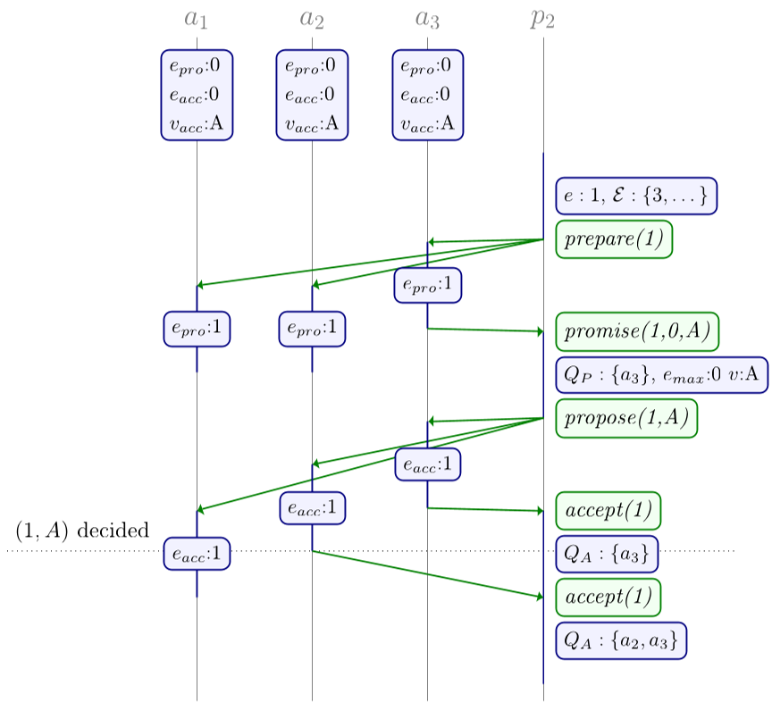

> 图 5.1：proposer 获知先前提案后提前完成阶段一的示例。

#### 续例：共置 proposer 与 acceptor

回顾我们那个由 5 个参与者组成的系统示例，
其中每个参与者既是 acceptor 又是 proposer（4.3.2 节）。
Paxos 修订 B 允许我们仅把所有先前 epoch 关联的 acceptor 集合用作阶段一法定人数。
这有助于减小最初几个 epoch 的阶段一法定人数规模，
但随着先前法定人数增多，
它很快就失去了作用。

我们可以用 Paxos 修订 C 解决这个问题。
在上述系统中，
考虑参与者 $u_4$ 以 epoch 3 执行阶段一。
在以下五种情形下，
$u_4$ 可以用少于三个承诺进入阶段二：

- $u_4$ 从任一参与者收到 `promise(3,2,-)`。[1 个承诺]
- $u_4$ 从 $u_3$ 收到 `promise(3,1,-)`。[1 个承诺]
- $u_4$ 从参与者 $u_3$ 收到一个承诺，
  并从任一参与者收到 `promise(3,1,-)`。[2 个承诺]
- $u_4$ 从参与者 $u_3$ 收到一个承诺，
  并从 $u_2$ 收到 `promise(3,0,-)`。[2 个承诺]
- $u_4$ 从参与者 $u_2$ 收到一个承诺，
  并从 $u_3$ 收到 `promise(3,0,-)`。[2 个承诺]

## 5.5 小结

本章证明，
proposer 可以利用法定人数交集的传递性，
复用先前 epoch 的交集，
从而在不满足通常法定人数交集要求的情况下完成阶段一。
如果 proposer 收到包含提案 $(e, v)$ 的承诺，
它就不再需要与 epoch $e$ 及之前的所有阶段二法定人数相交。

[^ch5-1]: 这一说法的例外是绕过阶段二：当多数派 proposer 带着相同提案作出承诺时可以绕过（3.2 节）。

# 第 6 章 值选择再探

在经典 Paxos 及我们的修订中，
阶段二提出的值 $v$ 是从 acceptor 处收到的最大 epoch $e_{max}$ 所关联的值。
初始时 $e_{max}$ 和 $v$ 都设为 nil，
此后每当收到包含更大 epoch 提案的承诺时就更新它们。
阶段一完成后，
只要 $v$ 不是 nil 就提出 $v$，
否则提出 proposer 自己的候选值。
此后我们把这种方法称为_经典值选择_。

然而，
本章将利用 proposer 从每个承诺中获得的额外信息，
对经典值选择规则进行推广。
我们把这一修订技术称为基于法定人数的值选择，
它能让 proposer 在选择要提出的值时更加灵活。
我们把讨论分为两节：
先考虑较简单的、法定人数不区分 epoch 的情形（6.1 节），
再推广到法定人数依赖 epoch 的情形（6.2 节）。

## 6.1 不区分 epoch 的算法

算法 16 展示了 Paxos 修订 A proposer 算法（算法 13）的另一种版本。
acceptor 算法（算法 4）保持不变。

与原算法不同，
我们的新算法用 $R$ 跟踪每个 acceptor 对 `prepare(e)` 回复的承诺。
$R$ 是从每个 acceptor $a \in A$ 到以下两者之一的映射：
$no$ 表示尚未收到该 acceptor 的承诺；
或者提案 $(f, w)$ 表示已收到 `promise(e, f, w)`。
注意，
与通常一样，
$(f, w)$ 可以为 nil。
初始时，
所有 acceptor 的 $R$ 都设为 $no$（算法 16 第 5 行），
此后每收到一个承诺就更新一次（算法 16 第 10 行）。
当 proposer 从每个阶段二法定人数中都收到至少一个 acceptor 的承诺时，
阶段一即告完成（算法 16 第 7 行）。

随后，
possibleValues 函数接收承诺集合 $R$，
返回可能已被决定的值的集合 $V_{dec}$（算法 16 第 13 行）[^ch6-1]。
如果 $V_{dec}$ 为空，
说明尚未达成任何决定，
于是提出候选值（算法 16 第 14—15 行）。
否则，
$V_{dec}$ 是单元素集合，
提出其中唯一的值（算法 16 第 16—17 行）。
函数 $only$ 返回单元素集合中唯一的元素。

**算法 16：使用 possibleValues 的修订 A proposer 算法。**

state:

- $R$: for each acceptor $a \in A$, either:
  - $no$: no promise received yet from $a$
  - $(e, v)$: the proposal received with a promise from $a$,
    maybe nil
- $V_{dec}$: set of values which may have been decided

```text
1  v ← nil
2  Q_A ← ∅
3  e ← min(ℰ)
4  ℰ ← ℰ ∖ {e}
5  ∀a ∈ A : R[a] ← no
   /* 开始 epoch e 的阶段一 */
6  send prepare(e) to acceptors
7  while ∃Q ∈ 𝒬_2, ∀a ∈ Q : R[a] = no do
8      switch do
9          case promise(e,f,w) received from acceptor a
10             R[a] ← (f, w)
11         case timeout
12             goto line 1
13 V_dec ← possibleValues(R)
14 if V_dec = ∅ then
15     v ← γ
16 else
17     v ← only(V_dec)
   /* 开始提案 (e,v) 的阶段二 */
18 send propose(e,v) to acceptors
19 while ∀Q ∈ 𝒬_2 : Q_A ⊉ Q do
20     switch do
21         case accept(e) received from acceptor a
22             Q_A ← Q_A ∪ {a}
23         case timeout
24             goto line 1
25 return v
```

#### 经典值选择

**算法 17：possibleValues 的经典算法。**

```text
1 func possibleValues(R):
2     return {v ∈ V | ∃f ∈ E : R[_] = (f, v)
3         ∧ (∀a ∈ A : R[a] = no ∨ ∃g ∈ E : R[a] = (g, _) ∧ f ≥ g)}
```

算法 17 展示了 possibleValues 的预期实现，
它与经典 Paxos 及我们的各修订等价。
该算法要么返回包含最大 epoch 提案所关联值的集合，
要么在所有提案都为 nil 时返回空集[^ch6-2]。

#### 修订后的值选择

算法 18 给出 possibleValues 的基于法定人数的实现。
该算法分为两步：
首先判断每个法定人数是否可能已达成决定，
并把结果存入 $D$（算法 18 第 2—9 行）；
然后利用 $D$ 判断整体上是否可能已达成决定（算法 18 第 10 行）。

这个计算法定人数决定情况的算法（算法 18 第 2—9 行），
并不是简单地计算每个法定人数中的最大 epoch 提案，
而是利用了以下两个结论：

**引理 19。
** 如果 acceptor $a$ 发送 `promise(f,e,w)` 且 $(e, w) = nil$，
那么在小于 $f$ 的 epoch 中，
包含 $a$ 的法定人数没有达成任何决定。

算法 18 第 3—4 行利用了引理 19：
如果法定人数中任一 acceptor 返回了 nil 承诺，
proposer 就把该法定人数的决定情况设为 $no$。

**引理 20。** 如果 acceptor $a_1$ 和 $a_2$ 分别发送 `promise(g,e,w)` 和
`promise(g,f,x)`，
其中 $e < f$ 且 $w \neq x$，
那么在小于 $g$ 的 epoch 中，
包含 $a_1$ 的法定人数没有达成任何决定。

**算法 18：possibleValues 的基于法定人数的算法。**

state:

- $D$: for each quorum $Q$,
  the outcome of previous proposals, either:
  - $no$: no decision has been reached in $Q$
  - $v$: if decision(s) were reached in $Q$,
    value $v$ was decided

```text
1 func possibleValues(R):
2     foreach Q ∈ 𝒬_2 do
3         if ∃a ∈ Q : R[a] = nil then
            /* 如果法定人数中有 acceptor 返回 nil，则没有决定 */
4             D[Q] ← no
5         else if ∃a ∈ Q, ∃f, g ∈ E, ∃w, x ∈ V :
6             R[a] = (f, w) ∧ R[_] = (g, x) ∧ g > f ∧ x ≠ w then
            /* 如果两个 acceptor 返回了值不同的提案，
               则包含返回较小 epoch 提案的 acceptor 的法定人数没有决定 */
7             D[Q] ← no
8         else
            /* 法定人数返回的所有提案都是同一个值，因此该值可能已被决定 */
9             D[Q] ← only({w ∈ V | ∃a ∈ Q : R[a] = (_, w)})
10     return {w ∈ V | ∃Q ∈ 𝒬_2 : D[Q] = w}
```

算法 18 第 5—7 行利用了引理 20：
如果任一 acceptor 返回的提案，
其 epoch 更大且值与该法定人数内另一 acceptor 返回的提案不同，
proposer 就把该法定人数的决定情况设为 $no$。

对于给定法定人数 $Q$，
如果前面两种情形（算法 18 第 3—7 行）都不满足，
那么 $Q$ 中可能已达成决定。
执行到这种情形（第 8—9 行）时，
$Q$ 中各 acceptor 承诺返回的值恰好只有一个。
理由如下：
$Q$ 中至少有一个 acceptor 作出了承诺[^ch6-3]；
$Q$ 中所有作出承诺的 acceptor 返回的都是非 nil 提案；
而且如果有两个 acceptor 返回了不同的值，
就不会执行到这种情形。

如果某个值已被决定，
possibleValues 的两种实现都会返回该已决定值。
如果没有任何值被提出过，
两种方法都会返回空集。
如果每个法定人数中恰好只有一个 acceptor 作出承诺，
两种方法返回的结果也相同。

然而，
如果收到了更多承诺，
possibleValues 的经典实现可能返回一个值，
而基于法定人数的实现可能返回空集。
换句话说，
经典方法可能提出一个值，
而基于法定人数的方法知道该值尚未被决定[^ch6-4]。
在这一实现中，
如果没有达成任何决定，
proposer 总是提出自己的候选值。
不过，
proposer 其实可以安全地提出它迄今见过的任何值，
因此基于法定人数的值选择是对经典值选择规则的推广。

### 6.1.1 安全性

我们首先证明不区分 epoch 的、基于法定人数的值选择算法的安全性。
回忆一下，
我们先前的所有安全性证明都依赖性质 4：

**性质 4。** *proposer 必须按照值选择规则选择要提出的值。
如果没有随承诺返回任何先前被接受的提案，
则可以选择任意值。
如果返回了一个或多个先前被接受的提案，
则选择最大 epoch 所关联的值。*

possibleValues 的朴素实现（算法 17）实现了这条性质，
但基于法定人数的实现（算法 18）没有。
对于基于法定人数的 Paxos，
我们把值选择规则修订如下。
Paxos 修订 A 的其余性质仍然成立。

**性质 16。** *proposer 必须按照值选择规则选择在 epoch $e$ 中提出的值。
如果 $V_{dec}$ 是空集，
则可以选择任意值。
否则，
如果 $V_{dec}$ 是单元素集合，
则选择其中唯一的值。*

我们先修订推论 12.1 的证明。

**推论 12.1**（未来提案安全性的基础情形）。如果值 $v$ 在 epoch $e$ 中被决定，
且值 $w$ 在 $succ(e)$ 中被提出，
那么 $v = w$。

推论 12.1 的修订证明。
假设 $(e, v)$ 已被决定，
且 $(succ(e), w)$ 已被提出。

由于 $(e, v)$ 已被决定，
存在一个法定人数 $Q \in \mathcal{Q}_2$，
其中所有 acceptor 都接受过 $(e, v)$。

在 $succ(e)$ 中提出的值 $w$，
必定是以两种方式之一选出的：
要么 $V_{dec}$ 为空（此时 $w$ 是 proposer 的候选值），
要么 $V_{dec} = \{w\}$（性质 16）。
前一种情形要求 $D[Q] = no$；
后一种情形要求当 $succ(e)$ 的 proposer 完成阶段一时，
$D[Q] = no$ 或 $D[Q] = w$。
我们现在逐一考虑各种情形：

考虑 $D[Q] = no$ 的情形。

把 $D[Q]$ 设为 $no$ 有两条途径：
其一，
$Q$ 中任一 acceptor 返回 nil 提案（算法 18 第 3—4 行）；
其二，
返回了 epoch 更大且值不同的提案（算法 18 第 6—7 行）。
由于法定人数 $Q$ 中的所有 acceptor 在 $succ(e)$ 中作出承诺之前都已接受过
$(e, v)$（引理 10），
它们都不会返回 nil 提案，
排除了前一种可能（引理 6 与 7）。
由推论 8.1 可知，
$e$ 是提案中会被返回的最大 epoch，
这又排除了后一种可能。
因此 $D[Q] \neq no$。

考虑 $D[Q] = w$ 的情形。

这种情形要求 $Q$ 中某个 acceptor 曾在某个小于等于 $e$ 的 epoch 中接受过 $w$（推论
8.1）。
由于 $Q$ 中所有 acceptor 都接受过 $(e, v)$，
由值的唯一性（引理 9）和已接受 epoch 的单调性（引理 6 与 7）可知 $v = w$。

接下来修订推论 12.2 的证明。

**推论 12.2**（未来提案安全性的归纳情形）。如果值 $v$ 在 epoch $e$ 中被决定，
且从 $e$（不含）到 $f$（含）的提案都限定为值 $v$，
那么如果值 $w$ 在满足 $g = \text{succ}(f)$ 的 $g$ 中被提出，
就有 $v = w$。

推论 12.2 的修订证明。
假设 $(e,v)$ 已被决定，
于是存在 $Q \in \mathcal{Q}_2$，
其中所有 acceptor 都接受过 $(e,v)$。
再假设从 $e$ 到 $f$（含）的各 epoch 中的所有提案也都是值 $v$。

假设 $(succ(f), w)$ 已被提出。
值 $w$ 必定是以两种方式之一选出的：
要么 $V_{dec}$ 为空（此时 $w$ 是 proposer 的候选值），
要么 $V_{dec} = \{w\}$（性质 16）。
前一种情形要求 $D[Q] = no$；
后一种情形要求当 $succ(f)$ 的 proposer 完成阶段一时，
$D[Q] = no$ 或 $D[Q] = w$。
我们现在逐一考虑各种情形：

考虑 $D[Q] = no$ 的情形。

把 $D[Q]$ 设为 $no$ 有两种可能：
其一，
$Q$ 中任一 acceptor 返回 nil 提案（算法 18 第 3—4 行）；
其二，
返回了 epoch 更大且值不同的提案（算法 18 第 6—7 行）。

由于 $succ(f) > e$，
法定人数 $Q$ 中的所有 acceptor 在 $succ(f)$ 中作出承诺之前都已接受过 $(e, v)$（引理
10）。
因此它们都不会返回 nil 提案，
排除了前一种可能（引理 6 与 7）。
由推论 8.1 可知，
$f$ 是提案中会被返回的最大 epoch。
同样，
由已接受提案的单调性（引理 6 与 7）可知，
$Q$ 中的 acceptor 只会返回 epoch 大于等于 $e$ 的提案。
由于 epoch $e$ 到 $f$ 都限定为值 $v$，
不可能返回不同的值，
排除了后一种可能。
因此 $D[Q] \neq no$。

考虑 $D[Q] = w$ 的情形。

这种情形要求 $Q$ 中某个 acceptor 曾在某个小于等于 $f$ 的 epoch 中接受过值 $w$（推论
8.1）。
由于 $Q$ 中所有 acceptor 都接受过 $(e, v)$，
由已接受提案的单调性（引理 6 与 7）可知，
$Q$ 中的 acceptor 只会返回 epoch 大于等于 $e$ 的提案。
由于 epoch $e$ 到 $f$ 都限定为值 $v$，
$Q$ 中 acceptor 返回的提案必定是值 $v$。
因此 $v = w$。

本节证明了使用基于法定人数的值选择的新修订 A 算法（算法 16）的安全性。
我们还可以扩展该算法，
利用修订 B 和 C 的结果：
当 $e = min(E)$ 时绕过阶段一；
收到 $e$ 前一 epoch 的提案时完成阶段一。

接下来，
我们将证明基于法定人数的值选择所利用的两个结论（引理 19 与 20）的正确性。

**引理 19。
** 如果 acceptor $a$ 发送 `promise(f,e,w)` 且 $(e, w) = nil$，
那么在小于 $f$ 的 epoch 中，
包含 $a$ 的法定人数没有达成任何决定。

引理 19 的证明。
假设 acceptor $a$ 发送 `promise(f,e,w)` 且 $(e,w)=nil$。

在发送 $\text{promise}(f, e, w)$ 之前，
由于 $(e, w) = \text{nil}$，
acceptor $a$ 不可能接受过 epoch 小于等于 $f$ 的任何提案。
因此，
包含 $a$ 的任何法定人数都不可能决定了 epoch 小于等于 $f$ 的提案。

在发送 `promise(f,e,w)` 之后，
acceptor $a$ 也不会接受 epoch 小于等于 $f$ 的任何提案，
因为它最后承诺的 epoch 将始终是 $f$ 或更大。
因此，
包含 $a$ 的任何法定人数都不会决定 epoch 小于等于 $f$ 的提案。
$\square$

回忆定理 13：

**定理 13**（未来提案的安全性）。如果值 $v$ 在 epoch $e$ 中被决定，
且值 $w$ 在满足 $e < f$ 的 epoch $f$ 中被提出，
那么 $v = w$。

提案要被接受，
必须先被提出，
因此可得：

**推论 20.1。
** 如果 acceptor $a$ 发送 `promise(f,e,w)` 且 $(e, w) \neq nil$，
那么如果在小于等于 $e$ 的 epoch 中达成了决定，
选定的值就是 $w$。

**引理 21。
** 如果两个 acceptor $a_1$ 和 $a_2$ 分别发送 `promise(g,e,w)` 和
`promise(g,f,x)`，
其中 $e < f$ 且 $w \neq x$，
那么在小于等于 $e$ 的 epoch 中没有达成任何决定。

引理 21 的证明。
假设 acceptor $a_1$ 以 `promise(g,e,w)` 回复 `prepare(g)`，
其中 $(e,w) \neq nil$。
同样，
假设 acceptor $a_2$ 以 `promise(g,f,x)` 回复 `prepare(g)`，
其中 $(f,x) \neq nil$。
假设 $e < f$ 且 $w \neq x$。

由推论 20.1，
如果某个值 $v$ 在 epoch 小于等于 $e$ 时被决定，
则 $v = w$。
同样，
如果某个值 $v$ 在 epoch 小于等于 $f$ 时被决定，
则 $v = x$。

由于 $e < f$，
如果某个值 $v$ 在 epoch 小于等于 $e$ 时被决定，
则 $v = w$ 且 $v = x$。
这只有在 $w = x$ 时才成立。
由此产生矛盾。
$\square$

**引理 20。** 如果 acceptor $a_1$ 和 $a_2$ 分别发送 `promise(g,e,w)` 和
`promise(g,f,x)`，
其中 $e < f$ 且 $w \neq x$，
那么在小于 $g$ 的 epoch 中，
包含 $a_1$ 的法定人数没有达成任何决定。

引理 20 的证明。
假设 acceptor $a_1$ 发送 `promise(g,e,w)`，
acceptor $a_2$ 发送 `promise(g,f,x)`。
需证明包含 $a_1$ 的法定人数 $Q$ 不可能在小于 $g$ 的 epoch 中达成决定。

由引理 21 可知，
epoch 小于等于 $e$ 时不可能达成任何决定。
由于 acceptor $a_1$ 已发送 `promise(g,e,w)`，
它不可能接受从 $e$（不含）到 $g$（不含）的提案，
因此法定人数 $Q$ 不可能达成决定，
因为 $a_1 \in Q$。
$\square$

### 6.1.2 进展

我们不区分 epoch 的、基于法定人数的值选择算法，
依赖于每次调用 $only$ 函数时集合都是单元素集合这一事实。
这样的调用有两处：
算法 16 第 17 行和算法 18 第 9 行。
如果集合不是单元素集合，
proposer 算法就会停滞，
陷入死锁，
违反我们的进展保证。
本节将证明这种情况不会发生。

**引理 22。** *算法 18 第 9 行的赋值总能返回一个值。*

引理 22 的证明。
我们要求传给 $only$ 的集合必须是单元素集合。
我们用反证法证明：
传给算法 18 第 9 行 $only$ 的集合既不可能是空集，
也不可能是基数大于 1 的集合。

考虑对某个法定人数 $Q$，
$\{w \in V|\exists a \in Q : R[a] = (-, w)\} = \emptyset$
的情形。

这要求法定人数 $Q$ 中的所有 acceptor 都满足 $R[a] = nil$ 或 $R[a] = no$。
possibleValues 只会在每个法定人数中都至少有一个 acceptor 满足 $R[a] \neq no$
之后才被调用。
而第 3 行的 if 语句为假，
因此 $Q$ 中所有 acceptor 都满足 $R[a] \neq nil$。
所以这种情形不会发生。

考虑对某个法定人数 $Q$，
$|\{w \in V|\exists a \in Q : R[a] = (-, w)\}| > 1$ 的情形。

这要求同一法定人数中（至少）有两个 acceptor 返回了不同值的提案。
由于第 5 行的 if 语句为假，
这些 acceptor 返回的提案必定属于同一个 epoch（由 epoch 的全序性）。
由值的唯一性（推论 9.1），
这种情形不会发生。
$\square$

**引理 23。** *算法 16 第 17 行的赋值总能返回一个值。*

引理 23 的证明。
我们要求算法 16 第 17 行传给 $only$ 的集合 $V_{dec}$ 必须是单元素集合。
由于第 14 行的 if 语句为假，
$V_{dec} \neq \emptyset$。
因此我们必须证明
$|\{w \in V | \exists Q \in \mathcal{Q}_2 : D[Q] = w\}| \leq 1$（算法 18 第 10 行）。

用反证法。
假设有两个（或更多）法定人数 $Q$ 和 $Q'$，
其 $D[Q]$ 取不同的值。
这要求有两个 acceptor——一个在 $Q$ 中、
一个在 $Q'$ 中——带着不同值的提案作出承诺（算法 18 第 9 行）。
如果这些提案的 epoch 不同，
那么 epoch 较小的法定人数会被设为 $D[Q] = no$。
因此这些提案的 epoch 必须相同；
然而由值的唯一性（推论 9.1），
这不可能发生。
$\square$

### 6.1.3 示例

考虑以下示例：
$A = \{a_1, a_2, a_3, a_4, a_5\}$，
$\mathcal{Q}_2 = \{\{a_1, a_2, a_3\}, \{a_4, a_5\}\}$。
某个 proposer 处于 epoch 5，
并（按序）收到以下承诺：

- 来自 $a_1$ 的 `promise(5,3,A)`，随后是
- 来自 $a_2$ 的 `promise(5,nil,nil)`，随后是
- 来自 $a_4$ 的 `promise(5,2,B)`

在经典 Paxos 中，
proposer 必须提出最大 epoch 所关联的值，
此例中为 $A$。
然而，
利用基于法定人数的值选择，
proposer 可以获知 epoch 0—4 中没有达成任何决定，
因而可以自由地为阶段二选择任意值。
由于 $a_2$ 返回了 nil 提案，
法定人数 $\{a_1, a_2, a_3\}$ 不可能在 epoch 0—4 中达成决定。
同样，
由于 $a_1$ 返回了提案 $(3, A)$，
proposer 由此获知 $(2, B)$ 不可能已被决定，
因此法定人数 $\{a_4, a_5\}$ 也不可能在 epoch 0—4 中达成决定。

注意，
即使承诺中没有 nil 提案，
这种推广也同样有用。
考虑 proposer 改为（按序）收到以下承诺的情形：

- 来自 $a_1$ 的 `promise(5,3,A)`，随后是
- 来自 $a_2$ 的 `promise(5,1,A)`，随后是
- 来自 $a_4$ 的 `promise(5,2,B)`。

与之前一样，
通常的 Paxos 算法会要求 proposer 提出 $A$；
然而，
使用基于法定人数的值选择，
proposer 可以自由提出任意值。
这是因为法定人数 $\{a_1, a_2, a_3\}$ 不可能已达成决定：
提案 $(2, B)$ 的存在意味着 $a_2$ 返回的提案 $(1, A)$ 不可能已被决定。
同样，
由于提案 $(3, A)$ 的存在，
法定人数 $\{a_4, a_5\}$ 也不可能已达成决定。

## 6.2 依赖 epoch 的算法

迄今我们介绍的基于法定人数的值选择，
是 Paxos 经典值选择规则的替代方案。
我们的这一算法利用了先前在 Paxos 修订 A 上的工作。
然而，
由于所有 epoch 使用相同的法定人数，
我们对修订 B 和 C 的利用很有限。
本节将展示 proposer 如何不仅按法定人数、还按 epoch 跟踪承诺。
这一推广允许我们根据 epoch 改变法定人数。

**算法 19：使用 possibleValues 的修订 B/C proposer 算法。**

```text
1 v ← nil
2 Q_A ← ∅
3 e ← min(ℰ)
4 ℰ ← ℰ ∖ {e}
5 ∀a ∈ A : R[a] ← no
6 V_dec ← possibleValues(R, e)
/* 开始 epoch e 的阶段一 */
7 send prepare(e) to acceptors
8 while |V_dec| > 1 do
9     switch do
10         case promise(e, f, w) received from acceptor a
11             R[a] ← (f, w)
12             V_dec ← possibleValues(R, e)
13         case timeout
14             goto line 1
15 if V_dec = ∅ then
16     v ← γ
17 else
18     v ← only(V_dec)
/* 开始提案 (e, v) 的阶段二 */
19 send propose(e, v) to acceptors
20 while ∀Q ∈ 𝒬_2 : Q_A ⊉ Q do
21     switch do
22         case accept(e) received from acceptor a
23             Q_A ← Q_A ∪ {a}
24         case timeout
25             goto line 1
26 return v
```

算法 19 和 20 给出了适用于 Paxos 修订 B 和 C 的、基于法定人数的值选择实现。

**算法 20：possibleValues 的基于法定人数的算法（修订 B/C）。**

state:

- $D$: for each quorum $Q$ in each epoch $e$,
  the outcome of previous proposals, either:
  - $no$: no decision has been reached in $Q$ during $e$
  - $v$: if a decision was reached in $Q$ during $e$,
    value $v$ was decided
  - $nil$:
    no information known on whether a decision was reached
    in $Q$ during $e$

```text
1 func possibleValues(R, e):
2     foreach f ∈ {f ∈ E | f < e} do
3         foreach Q ∈ 𝒬_2^f do
4             if ∃a ∈ Q : R[a] = nil then
                /* 如果法定人数中有 acceptor 返回 nil，则没有决定 */
5                 D[Q] ← no
6             else if ∃a ∈ Q, ∃g ∈ E : g < f ∧ R[a] = (g, _) then
                /* 如果法定人数中有 acceptor 返回了更小的提案，则没有决定 */
7                 D[Q] ← no
8             else if ∃g, h ∈ E, ∃w, x ∈ V : R[_] = (g, w) ∧ R[_] = (h, x) ∧ f ≤ g ∧ f ≤ h ∧ w ≠ x then
                /* 如果返回了两个（或更多）epoch ≥ f 的不同提案，则没有决定 */
9                 D[Q] ← no
10             else if ∃g ∈ E, ∃w ∈ V : R[_] = (g, w) ∧ f ≤ g then
                /* 如果返回了一个（或多个）epoch ≥ f 的相同提案，则该法定人数可能决定了该值 */
11                 D[Q] ← w
12             else
13                 D[Q] ← nil
14     if ∃f ∈ E, ∃Q ∈ 𝒬_2^f : f < e ∧ D[Q] = nil then
15         return V
16     else
17         return {v ∈ V | ∃f ∈ E, ∃Q ∈ 𝒬_2^f : f < e ∧ D[Q] = v}
```

### 6.2.1 安全性

本节将证明依赖 epoch 的、基于法定人数的值选择算法的安全性。
与不区分 epoch 算法的安全性证明（6.1.1 节）一样，
我们用性质 16 替换性质 4。

**性质 4。** *proposer 必须按照值选择规则选择要提出的值。
如果没有随承诺返回任何先前被接受的提案，
则可以选择任意值。
如果返回了一个或多个先前被接受的提案，
则选择最大 epoch 所关联的值。*

**性质 16。** *proposer 必须按照值选择规则选择在 epoch $e$ 中提出的值。
如果 $V_{dec}$ 是空集，
则可以选择任意值。
否则，
如果 $V_{dec}$ 是单元素集合，
则选择其中唯一的值。*

我们先修订推论 12.1 的证明。

**推论 12.1**（未来提案安全性的基础情形）。如果值 $v$ 在 epoch $e$ 中被决定，
且值 $w$ 在 $succ(e)$ 中被提出，
那么 $v = w$。

推论 12.1 的修订证明。
假设 $(e, v)$ 已被决定，
且 $(succ(e), w)$ 已被提出。

由于 $(e, v)$ 已被决定，
存在一个法定人数 $Q \in \mathcal{Q}_2^e$，
其中所有 acceptor 都接受过 $(e, v)$。

在 $succ(e)$ 中提出的值 $w$，
必定是以两种方式之一选出的：
要么 $V_{dec}$ 为空（此时 $w$ 是 proposer 的候选值），
要么 $V_{dec} = \{w\}$（性质 16）。

考虑 $V_{dec} = \emptyset$ 的情形。

这要求对于小于 $succ(e)$ 的 epoch 的所有法定人数都有 $D[Q] = no$，
其中包括接受过 $(e, v)$ 的法定人数 $Q$。
由消息顺序（引理 10）和承诺的单调性（引理 6 与 7），
$D[Q]$ 不会由第 4—5 行或第 6—7 行赋值。
由值的唯一性（引理 9）和承诺格式（推论 8.1），
$D[Q]$ 不会由第 8—9 行赋值。
因此 $V_{dec} = \emptyset$ 的情形不会发生。

考虑 $V_{dec} = \{w\}$ 的情形。

这要求对于小于 $succ(e)$ 的 epoch 的所有法定人数，
都有 $D[Q] = w$ 或 $D[Q] = no$。
我们已经证明，
对于接受过 $(e, v)$ 的法定人数，
$D[Q] \neq no$，
因此 $D[Q] = w$。
由于 $e$ 是会随承诺返回的最大 epoch（推论 8.1），
所以 $w = v$。

接下来修订推论 12.2 的证明。

**推论 12.2**（未来提案安全性的归纳情形）。如果值 $v$ 在 epoch $e$ 中被决定，
且从 $e$（不含）到 $f$（含）的提案都限定为值 $v$，
那么如果值 $w$ 在满足 $g = \text{succ}(f)$ 的 $g$ 中被提出，
就有 $v = w$。

推论 12.2 的修订证明。
假设 $(e,v)$ 已被决定，
于是存在 $Q \in \mathcal{Q}_2$，
其中所有 acceptor 都接受过 $(e,v)$。
再假设从 $e$ 到 $f$（含）的各 epoch 中的所有提案也都是值 $v$。

在 $succ(f)$ 中提出的值 $w$，
必定是以两种方式之一选出的：
要么 $V_{dec}$ 为空（此时 $w$ 是 proposer 的候选值），
要么 $V_{dec} = \{w\}$（性质 16）。

考虑 $V_{dec} = \emptyset$ 的情形。

这要求对于小于 $succ(e)$ 的 epoch 的所有法定人数都有 $D[Q] = no$，
其中包括接受过 $(e, v)$ 的法定人数 $Q$。
由消息顺序（引理 10）和承诺的单调性（引理 6 与 7），
$D[Q]$ 不会由第 4—5 行或第 6—7 行赋值为 $no$。

由于 $f$ 是会随承诺返回的最大 epoch（推论 8.1），
且 epoch $e$ 到 $f$ 的所有提案都是值 $v$，
$D[Q]$ 不会由第 8—9 行赋值。
因此 $V_{dec} = \emptyset$ 的情形不会发生。

考虑 $V_{dec} = \{w\}$ 的情形。

这要求对于小于 $succ(e)$ 的 epoch 的所有法定人数，
都有 $D[Q] = w$ 或 $D[Q] = no$。
我们已经证明，
对于接受过 $(e, v)$ 的法定人数 $Q$，
$D[Q] \neq no$，
因此 $D[Q] = w$。
如前所述，
$f$ 是会随承诺返回的最大 epoch（推论 8.1）。
因此 $Q$ 中至少有一个 acceptor 曾带着提案 $(h, w)$ 作出承诺，
其中 $h$ 满足 $e \leq h \leq f$，
$w$ 为某个值。
由于 epoch $e$ 到 $f$ 的所有提案都是值 $v$，
必定有 $v = w$。

### 6.2.2 进展

与不区分 epoch 的算法不同，
在我们的新算法（算法 19）中，
proposer 每收到一个承诺就重新计算 $V_{dec}$，
然后根据 $V_{dec}$ 的基数判断阶段一何时完成。
与迄今的算法不同，
在预期的活性条件下该算法是否总能取得进展并不明显。
因此本节将证明，
一旦法定人数交集要求得到满足，
proposer 的阶段一就会终止。

**引理 24。** 如果 epoch $e$ 的 proposer 已收到足够多的承诺，
满足修订 C 法定人数交集要求，
那么对于先前 epoch 的所有法定人数，
都有 $D[Q] \neq \text{nil}$。

引理 24 的证明。
考虑任一满足 $f < e$ 的 epoch $f$，
及其任一阶段二法定人数 $Q \in \mathcal{Q}_2^f$。
证明 $D[Q] \neq nil$。
修订 C 与 $Q$ 的法定人数交集要求可以通过两种机制满足。

考虑某个 acceptor 在 $e$ 中带着提案 $(g, w)$ 作出承诺的情形，
其中 $g$ 满足 $g \geq f$，
$w$ 为某个值。

$D[Q]$ 将被设为 $no$ 或 $w$，
取决于是否还收到了 epoch 大于等于 $f$ 且值不同的其他提案（算法 20 第 8—11 行）。

考虑 acceptor $a \in Q$ 在 $e$ 中带着提案 $(g, w)$ 作出承诺的情形，
其中 $g$ 为某个 epoch，
$w$ 为某个值。

考虑 $(g, w) = nil$ 的情形。

$D[Q]$ 将被设为 $no$（算法 20 第 4—5 行）。

考虑 $(g, w) \neq nil$ 的情形。

由 epoch 的全序性，
要么 $g < f$，
要么 $g \geq f$。
如果 $g < f$，
$D[Q]$ 将被设为 $no$（算法 20 第 6—7 行）。
否则 $g \geq f$，
这就回到了第一种情形。
$\square$

**引理 25。** 如果 epoch $e$ 的 proposer 已收到足够多的承诺，
满足修订 C 法定人数交集要求，
那么 $V_{dec}$ 要么是空集，
要么是单元素集合。

引理 25 的证明。
$V_{dec}$ 被设为 possibleValues 的输出（算法 19 第 12 行）。
由引理 24 可知，
算法 20 第 14 行的 if 语句将为假。
因此 possibleValues 的输出由算法 20 第 17 行的 return 语句决定。

用反证法。
假设存在分别属于 epoch $f$ 和 $g$ 的两个法定人数，
其 $D[Q]$ 取值 $w$ 和 $x$，
且 $w \neq x$。
由 epoch 的全序性，
必定是 $f = g$、$f > g$ 或 $f < g$ 三者之一。

考虑 $f = g$ 的情形。

由值的唯一性（引理 9），
每个 epoch 只能提出一个值，
因此 $w = x$。

考虑 $f > g$ 的情形。

对于 epoch $g$ 中的法定人数，
只有在不存在 epoch 更大且值不同的提案时，
$D[Q]$ 才会被设为值 $x$（算法 20 第 8—9 行）。
而我们已经假设 $w \neq x$，
所以这不成立。

$f < g$ 时对 epoch $f$ 同理。
$\square$

## 6.3 小结

经典 Paxos（及我们的修订）要求：
proposer 在收到满足法定人数交集要求的足够多承诺之后，
提出所收到的最大 epoch 关联的值；
如果没有收到这样的值，
就提出自己的候选值。

我们证明，
通过跟踪每个法定人数的状态，
proposer 可以利用额外的承诺，
免除在阶段二中必须提出某个特定值的要求。
在这种情况下，
proposer 可以提出自己的候选值，
或任何先前见过的值。

基于法定人数的值选择推广了经典 Paxos 的值选择规则。
原始规则是对更完备的基于法定人数的规则的一种快速而安全的近似。
这一关系类似于经典 Paxos 法定人数交集要求与 Paxos 修订 B 要求之间的关系。

[^ch6-1]: 此时没有必要返回集合，因为它要么为空、要么只含一个元素，但我们稍后会用到这一点。

[^ch6-2]: 该算法不可能返回包含两个或更多值的集合，因为那意味着 proposer 收到了多个 epoch 相同但值不同的提案。我们已经证明这不可能发生（推论 9.1）。

[^ch6-3]: 因为 possibleValues 只会在每个法定人数中至少有一个 acceptor 回复之后才被调用。

[^ch6-4]: 反之则不成立。

# 第 7 章 Epoch 再探

本章考虑若干替代方案，
以取代此前对经典 Paxos 的描述（第 2 章）中预先分配唯一 epoch 的要求。
到目前为止，
我们一直依赖于 proposer 不会为同一个 epoch $e$ 和不同的值 $v$ 发送
`propose(e,v)` 这一事实。
做到这一点，
可以事先在 proposer 之间分配 epoch，
让每个 proposer 只使用互不相交的 epoch 子集，
并要求每个 proposer 对每个 epoch 只使用一次。
我们还展示过，
这也可以通过在 proposer 算法的阶段一中为 epoch 投票来实现，
见 3.9 节，
并在 4.3.4 节推广。

然而，
需要为 proposer 分配 epoch 这一点，
限制了单值共识能够做到的事情。
特别是，
我们希望任何 proposer 在最好情况下只需一次往返就能决定一个值。
经典 Paxos 允许任何 proposer 在两次往返内决定一个值，
尽管其中一次往返可以在得知该值之前执行。
Paxos 修订 B 让能够使用最小 epoch 的 proposer 得以跳过阶段一，
因为不存在阶段一法定人数交集要求。
但至多只有一个 proposer 能利用这一点。

本章探讨如何取消预先分配唯一 epoch 或为唯一 epoch 投票的要求来克服这一限制，
从而让 proposer 在使用哪些 epoch 上拥有更大的灵活性。
讨论的三种方法是：

- 使用分配器动态分配 epoch（7.1 节）。
- 根据阶段二中要提议的值预先分配 epoch（7.2 节）。
- 允许以同一个 epoch 提议不同的值，
  但要求阶段二交集以及跨阶段的强化交集要求（7.3 节）。

这些方法还可以与原有技术，
即预先分配唯一 epoch 和投票，
按 epoch 逐个组合，
构成混合算法（7.4 节）。
下面详细考察每种方法。

## 7.1 来自分配器的 epoch

到目前为止，
我们一直假定 epoch 集合 $E$ 已事先在 proposer 之间分配。
其实也可以用分配器在 proposer 之间动态分配 epoch。
分配器不必比一个从 $e_{min}$ 开始的简单计数器更复杂。
我们把选择下一个 epoch 的步骤，
即算法 3 第 3—4 行，
替换为与分配器的一次消息交换。
分配器必须保证每个 epoch 至多被分配一次[^ch7-1]。

**算法 21：分配器算法。**

```text
state:
    • sid: sequence number
    • vid: service version number (persistent, initially 0)

1  sid ← 0, vid ← vid + 1
2  while true do
3      switch do
4          case generate-next() received from proposer
5              sid ← sid + 1
6          send allocate((vid, sid)) to proposer
```

算法 21 给出了在单个参与者上实现分配器的朴素算法。
epoch 是形如 $(vid, sid)$ 的有序二元组，
例如：

$$ E=\{(1,1),(1,2),(1,3),\ldots,(2,1),(2,2),(2,3),\ldots\} $$

该算法实际上是一个简单的计数器 $sid$，
外加版本号 $vid$，
用于在发生故障时保证所分配 epoch 的唯一性。
服务版本号 $vid$ 存储在持久存储中，
每次重启时递增。
序列号 $sid$ 存储在易失内存中，
每次分配时递增[^ch7-2]。
由于分配器对每个 epoch 至多分配一次，
且按递增顺序分配 epoch，
此前的所有性质仍然成立，
所以我们的安全性证明无须修订即可继续成立。

我们可以扩展这个朴素方法，
让 proposer 在发给分配器的请求中带上自己的候选值。
分配器可以存储 epoch 到值的映射。
这样，
分配器就可以把 epoch 重新分配给其他 proposer，
条件是它们提议的值与最初分配时指定的值相同。
这可以为缓慢或发生故障的 proposer 提供无冲突的恢复。
在这种情况下，
$e_{min}$ 是分配器分配的唯一 epoch。
此时分配器等价于一个初始值为 nil 的单次写入寄存器[^ch7-3]。
该算法与 SAA 的 acceptor 算法相同，
见 2.1.1 节。
同样，
由于此前的所有性质仍然成立，
安全性证明依然成立。

这两种简单机制，
即来自分配器的独占 epoch 和来自分配器的共享 epoch，
允许任何 proposer 分配到最小 epoch，
从而绕过阶段一。
不过，
这需要额外增加一个阶段来请求并接收 epoch。
此外，
系统的活性现在还依赖分配器的可用性，
引入了单点故障，
意味着这些算法几乎没有实用价值。
我们将在 7.4 节解决这一限制。

## 7.2 按值映射的 epoch

要求 epoch 唯一，
是为了确保 proposer 不会为同一个 epoch $e$ 和不同的值 $v$ 发送
`propose(e, v)`。
实现这一点的另一种机制，
是把 epoch 预先分配给与其关联的值，
而不是分配给 proposer。
希望提议值 $v$ 的 proposer 会使用该值的第一个 epoch。
如果 proposer 执行阶段一之后无法选定自己的值，
它就需要用与其期望的值相关联的 epoch 重试阶段一。

这种方法的优点是，
proposer 不需要把 epoch 存入持久存储，
预先分配 epoch 时则需要；
也不需要阶段一法定人数交集，
投票分配 epoch 时则需要。
其结果是，
任何希望提议与最小 epoch $e_{min}$ 对应值的 proposer 都可以跳过阶段一。

然而，
阶段一现在需要知道将要提议的值。
这也意味着阶段一无法预先执行，
见 3.5 节。
因此，
当 proposer 因阶段一的结果而改变想要提议的值时，
可能需要更多阶段。
这种方法并不满足分布式共识问题的要求，
因为它只能应用于可能被决定的值落在某个有限已知集合内的系统；
我们将在 7.4 节解决这一限制[^ch7-4]。

#### 示例：二元共识算法

说明这种方法的最佳方式，
是考虑一个对二元值达成共识的算法，
例如决定一个事务应当提交，
即 $v = 1$，
还是中止，
即 $v = 0$。
算法 22 和算法 23 给出了示例伪代码。
我们令奇数 epoch 对应 $v = 1$，
偶数 epoch 对应 $v = 0$。
由于 $e_{min} = 0$，
我们可以利用跳过阶段一的能力，
它来自 Paxos 修订 B，
于是任何 proposer 只需一个阶段，
即阶段二，
就能达成中止决定，
见算法 22 第 4—5 行。
同样，
如果收到的承诺带有来自前驱 epoch 的提案，
我们可以跳过阶段一的剩余部分，
见算法 22 第 13 行。
由于 epoch 与值直接对应，
即 $v = e \mod 2$，
被提议或被接受的值也可以省略。
图 7.1 展示了这种方法的实际运行示例，
其中 proposer $p_1$ 希望提交，
而 $p_2$ 希望中止。

**算法 22：二元决定的 proposer 算法。**

```text
state:
    • γ: candidate value, 1 or 0
    • e: current epoch (initially nil)

1 e_max ← nil
2 Q_P, Q_A ← ∅
3 if e = nil then
4     if γ = 0 then
5         e ← 0, goto line 25
6     else
7         e ← 1
8 else
9     e ← e + 1
10     if e mod 2 ≠ γ then
11         e ← e + 1
/* epoch e 的阶段一开始 */
12 send prepare(e) to acceptors
13 while ∃Q ∈ 𝒬_2 : Q_P ∩ Q = ∅ ∧ e_max ≠ e - 1 do
14     switch do
15         case promise(e,f) received from a
16             Q_P ← Q_P ∪ {a}
17             if f ≠ nil ∧ (e_max = nil ∨ f > e_max) then
18                 e_max ← f
19         case timeout
20             goto line 1
21 if e_max ≠ nil ∧ (e_max mod 2 ≠ e mod 2) ∨ e_max = nil ∧ (e mod 2 = γ) then
    /* 提案值与 epoch 不匹配，重试 */
22     e_max ← nil
23     Q_P ← ∅
24     e ← e + 1, goto line 12
/* 提案 (e) 的阶段二开始 */
25 send propose(e) to acceptors
26 while ∀Q ∈ 𝒬_2 : Q_A ⊉ Q do
27     switch do
28         case accept(e) received from a
29             Q_A ← Q_A ∪ {a}
30         case timeout
31             goto line 1
32 return e mod 2
```

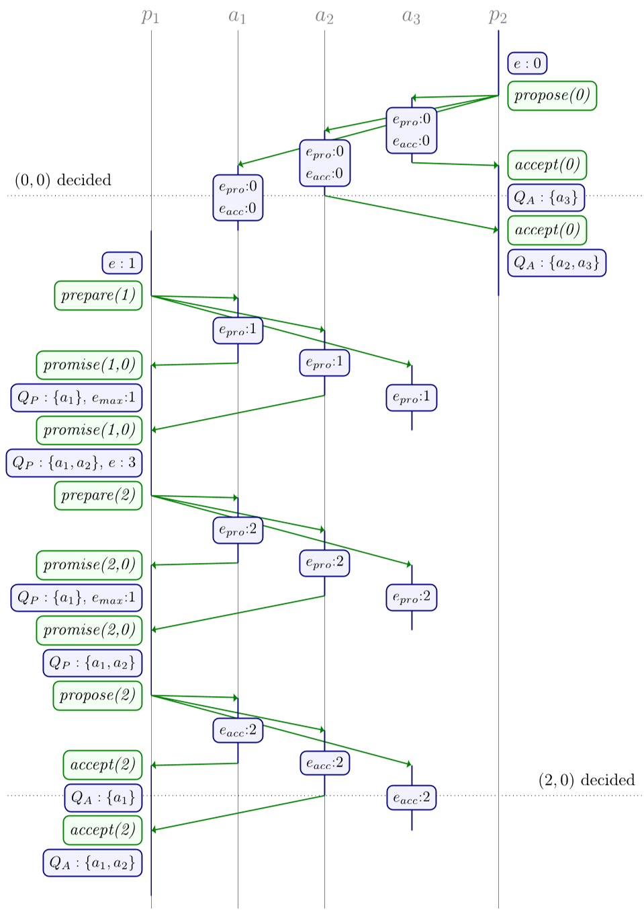

> 图 7.1：二元共识的 Paxos（算法 23、22）。

**算法 23：二元决定的 acceptor 算法。**

```text
1  while true do
2      switch do
3          case prepare(e) received from proposer
4          if  e_pro = nil ∨ e ≥ e_pro  then
5              e_pro ← e
6              send promise(e, e_acc) to proposer
7          case propose(e) received from proposer
8          if  e_pro = nil ∨ e ≥ e_pro  then
9              e_pro ← e
10             e_acc ← e
11             send accept(e) to proposer
```

## 7.3 经恢复分配的 epoch

本章到目前为止，
已经提出了多种维持值唯一性，
即引理 9 的技术。
但在本节中，
我们将考虑如何取消值对 epoch 必须唯一这一要求。
我们的方法称为_经恢复分配的 epoch_，
它允许 proposer 使用任意 epoch，
同时增加相应机制，
以便在同一个 epoch 被提议了多个值时进行恢复。

### 7.3.1 直观思路

现在，
我们通过考察如果直接允许经典 Paxos 共享 epoch 会出什么问题，
来推导一个使用共享 epoch 的算法。
为保持一般性，
我们以 Paxos 修订 B 为起点[^ch7-5]。

**问题 1：**首先，
不同的 proposer 可能以同一个 epoch 提交多个值，
因为每个值都可能被互不相交的阶段二法定人数接受。

**解决方案 1：**因此，
我们要求给定 epoch 的各个阶段二法定人数彼此相交，
表述为：

$$ \forall Q,Q^{\prime}\in\mathcal{Q}_{2}^{e}:Q\cap Q^{\prime}\neq\emptyset $$

（7.1）

**问题 2：**其次，
一个已被阶段二法定人数接受的值，
可能被同一 epoch 的不同值覆盖，
从而违反协议安全性。

**解决方案 2：**这可以通过给阶段二增加一个条件来解决：
提案 $(e, v)$ 仅当新提案 epoch 高于先前 epoch，
即 $e > e_{acc}$，
或新提案与先前提案相同，
即 $(e, v) = (e_{acc}, v_{acc})$ 时才被接受。
换句话说，
acceptor 不能用相同 epoch 覆盖已接受的值。

**问题 3：**再次，
到目前为止描述的方法可能进入一种在通常活性条件下无法取得进展的状态。
我们称之为_值冲突_。

回忆一下，
Paxos 的值选择规则要求 proposer 选定阶段一中收到的最高 epoch 所关联的值。
在这个例子中，
proposer 在算法阶段一收到了两个承诺，
二者 epoch 相同但值不同。
proposer 必须选择在其阶段二中提议哪一个值。
选择值时，
proposer 必须确切知道没有其他值已被决定。
然而在这种情况下，
proposer 无法知道其他 acceptor 按什么顺序收到 prepare 消息，
甚至不知道它们是否收到过。
因此，
由于 proposer 无法安全地继续执行算法，
它无法取得进展。

**解决方案 3：**这个例子说明，
使用共享 epoch 时需要强化法定人数交集要求。
我们已经看到，
此前的法定人数交集要求，
即式（4.6），
不一定足以取得进展。
式（7.2）给出的以下交集规则足以始终取得进展。
在 Paxos 修订 B 中，
我们要求阶段一法定人数与先前的任何阶段二法定人数相交。

现在，
我们要求阶段一法定人数与先前某个 epoch 的任意两个阶段二法定人数的交集相交。
更形式化地说，
对每个 epoch $e$，
以下交集要求是充分的：

$$ \forall Q\in\mathcal{Q}_{1}^{e},\forall f\in E:f<e\implies\forall Q^{\prime},Q^{\prime \prime}\in\mathcal{Q}_{2}^{f}:Q\cap Q^{\prime}\cap Q^{\prime \prime}\neq\emptyset $$

（7.2）

值得注意的是，
这条法定人数交集规则是最坏情形下所需阶段一法定人数的上界。
视收到的承诺而定，
通常更弱的要求，
即式（4.6），
可能就已足够。
与式（4.6）一样，
这一要求的结果是：
对于最小 epoch $e_{min}$，
不存在阶段一法定人数交集要求。
其结果是任何 proposer 都可以跳过 $e_{min}$ 的阶段一。

### 7.3.2 算法

**算法 24：经恢复分配 epoch 的 acceptor 算法。**

```text
1  while true do
2      switch do
3          case prepare(e) received from proposer
4          if  e_pro = nil ∨ e ≥ e_pro  then
5              e_pro ← e
6              send promise(e, e_acc, v_acc) to proposer
7          case propose(e, v) received from proposer
8          if  e_pro = nil ∨ e ≥ e_pro ∧ (e ≠ e_acc ∨ v = v_acc)  then
9              e_pro ← e
10             v_acc ← v, e_acc ← e
11             send accept(e, v) to proposer
```

算法 24 给出了经恢复分配 epoch 的 acceptor 算法。
它与经典 Paxos 的 acceptor 算法只有两处不同：
accept 消息现在包含值，
见第 11 行；
以及接受提案时增加了一个条件，
见第 8 行。
具体来说，
acceptor 不会用 epoch 相同但值不同的提案覆盖已接受的提案。
这一点在第 8 行实现：
收到 propose 时，
acceptor 必须检查自己尚未接受过 epoch 相同但值不同的提案。

算法 25 给出了修订 A 在经恢复分配 epoch 时 proposer 算法的阶段一[^ch7-6]。
我们改用与 epoch 无关、基于法定人数的值选择，
见 6.1 节，
因为这种方法更适合高效地表达经恢复分配的 epoch。

该算法与使用基于法定人数值选择的修订 A，
即算法 16，
有三处关键差异[^ch7-7]。

第一，
由于不再要求 proposer 从互不相交的 epoch 集合中选取并跟踪哪些已被使用，
$\mathcal{E}$ 被移除了。
取而代之的是，
epoch $e$ 初始为 nil，
并在每次使用前递增，
见算法 25 第 4—7 行[^ch7-8][^ch7-9]。

第二，
我们对 possibleValues 的实现，
即算法 26，
增加了一个额外情形：
如果同一法定人数内的两个 acceptor 返回的承诺带有相同 epoch 但不同的值，
就把该法定人数 $Q$ 的 $D$ 置为 no，
见算法 26 第 7—8 行。

第三，
在满足通常的法定人数交集要求之后，
如果存在多个可能被决定的值，
proposer 必须等待更多承诺来排除其他值，
直到只剩一个或零个值。
这一点通过对 $V_{dec}$ 的基数增加条件来实现，
见算法 25 第 10 行。

**算法 25：修订 A 经恢复分配 epoch 的 proposer 算法。**

```text
state:
    • e: current epoch (persistent, initially nil)

1  v ← nil
2  Q_A ← ∅
3  V_dec ← ∅
4  if e = nil then
5      e ← 0, v ← γ, goto line 21
6  else
7      e ← e + 1
8  ∀a ∈ A : R[a] ← no
   /* epoch e 的阶段一开始 */
9  send prepare(e) to acceptors
10 while (∃Q ∈ 𝒬_2, ∀a ∈ Q : R[a] = no) ∨ |V_dec| > 1 do
11     switch do
12         case promise(e, f, w) received from acceptor a
13             R[a] ← (f, w)
14             V_dec ← possibleValues(R)
15         case timeout
16             goto line 1
17 if V_dec = ∅ then
18     v ← γ
19 else
20     v ← only(V_dec)
   /* 提案 (e, v) 的阶段二开始 */
21 send propose(e, v) to acceptors
22 while ∀Q ∈ 𝒬_2 : Q_A ⊉ Q do
23     switch do
24         case accept(e, v) received from acceptor a
25             Q_A ← Q_A ∪ {a}
26         case timeout
27             goto line 1
28 return v
```

**算法 26：经恢复分配 epoch 时计算可能值的算法（修订 A）。**

```text
1 func possibleValues(R):
2     foreach Q ∈ 𝒬_2 do
3         if ∃a ∈ Q : R[a] = nil then
            /* 法定人数中有 acceptor 返回 nil，则无决定 */
4             D[Q] ← no
5         else if ∃a ∈ Q, ∃f, g ∈ E, ∃w, x ∈ V :
6             R[a] = (f, w) ∧ R[_] = (g, x) ∧ g > f ∧ x ≠ w then
            /* 两个 acceptor 返回不同值的提案，则包含提案 epoch 较低者的法定人数无决定 */
7             D[Q] ← no
8         else if ∃a, b ∈ Q : ∃f ∈ E, ∃w, x ∈ V :
9             R[a] = (f, w) ∧ R[b] = (f, x) ∧ w ≠ x then
            /* 同一法定人数中两个 acceptor 返回 epoch 相同但值不同的提案，则无决定 */
10             D[Q] ← no
11         else
            /* 该法定人数返回的提案都属于同一个值，因此该值可能被决定 */
12             D[Q] ← only({w ∈ V | ∃a ∈ Q : R[a] = (_, w)})
13     return {w ∈ V | ∃Q ∈ 𝒬_2 : D[Q] = w}
```

### 7.3.3 安全性

我们将用通常的方法证明采用经恢复分配 epoch 的 Paxos 修订 A 的安全性。
通常的性质仍然成立，
只有性质 1 和性质 4 除外，
重述如下：

**性质 1。** *proposer 为每个提案使用唯一的 epoch。*

**性质 4。** *proposer 必须按照值选择规则选定要提议的值。如果没有随承诺返回先前已接受的提案，
则可以选定任意值。如果返回了一个或多个先前已接受的提案，则选定与最高 epoch 关联的值。*

不过，
我们将增加以下三条额外性质，
供后文使用：

**性质 17。** *对于 acceptor 收到的每条 propose 消息，
如果其 epoch 与最后接受的 epoch 相同，则仅当所提议的值与最后接受的值相同时，
acceptor 才处理该消息。*

**性质 18。** *proposer 只有在收到足够多的 acceptor 的承诺、
使得至多只有一个值可能已被决定之后，才会提议一个值。*

**性质 19。** *proposer 必须按照值选择规则选定在 epoch $e$ 中提议的值。
如果 $V_{dec}$ 是空集，则可以选定任意值。否则，如果 $V_{dec}$ 是单元素集合，则选定其中唯一的值。*

由性质 17 可得：

**引理 26。** 一个 acceptor 不会接受同一个 epoch 的多个提案。
如果一个 acceptor 对任意 epoch $e \in E$ 接受了 $(e, v)$ 和 $(e, w)$，
那么 $v = w$。

引理 26 的证明。
假设一个 acceptor 先接受了 $(e, v)$，
随后接受了 $(e, w)$。
由性质 10、6 和 9，
接受 $(e, w)$ 时最后接受的提案必为 $(e, v)$。
由性质 17，
$v = w$。

因此可以证明：

**引理 27。** 如果值 $v$ 在 epoch $e$ 中被决定，
那么不存在满足 $v \neq w$ 的值 $w$ 也在 $e$ 中被决定。

引理 27 的证明。
假设提案 $(e, v)$ 已被决定，
因此阶段二 acceptor 法定人数 $Q \in \mathcal{Q}_2$ 已接受 $(e, v)$。
同样，
要使 $w$ 被决定，
阶段二 acceptor 法定人数 $Q' \in \mathcal{Q}_2$ 必须已接受 $(e, w)$。
由于给定 epoch 的任意两个阶段二法定人数都相交，
至少有一个 acceptor 接受了这两个提案。
由引理 26，
$v = w$，
所以不可能接受其他值。$\square$

我们先修订对推论 12.1 的证明。

**推论 12.1**（未来提案安全性的基础情形）。如果值 $v$ 在 epoch $e$ 中被决定，
且值 $w$ 在 $succ(e)$ 中被提议，
那么 $v = w$。

推论 12.1 的修订证明。
假设 $(e, v)$ 已被决定，
且 $(succ(e), w)$ 已被提议。

由于 $(e, v)$ 已被决定，
存在一个法定人数 $Q \in Q_2$，
其中所有 acceptor 都已接受 $(e, v)$。

在 $succ(e)$ 中被提议的值 $w$ 将以两种方式之一选定：
要么 $V_{dec}$ 为空，
此时 $w$ 是 proposer 的候选值；
要么 $V_{dec} = \{w\}$，
见性质 19。
前一种情形要求 $D[Q] = no$，
后一种情形要求 $succ(e)$ 的 proposer 完成阶段一时 $D[Q] = no$ 或
$D[Q] = w$。
现在分别考察每种情形。
考虑 $D[Q] = no$ 的情形。

由于法定人数 $Q$ 中的所有 acceptor 都已接受 $(e, v)$，
它们都不会随承诺返回 nil 提案，
见第 3—4 行。
同样，
acceptor 不会再接受来自 $e$ 的其他提案，
见第 9—10 行。
因此，
必有另一个 acceptor 返回了 epoch 大于 $e$ 的提案，
见第 8—10 行与性质 19。
这个 epoch 必是 $succ(e)$。

考虑 $D[Q] = w$ 的情形。

由于法定人数 $Q$ 中的所有 acceptor 都已接受 $(e,v)$，
要么 $w = v$，
要么 $w = x$ 且 $(succ(e),x)$ 已被提议。

我们已经看到，
要么 $w = v$，
要么 $w = x$，
其中 $x$ 是在 epoch $succ(e)$ 中被提议的另一个值。
如果这是 $succ(e)$ 中被提议的第一个值，
那么必有 $w = v$。
如果 $succ(e)$ 中被提议的所有其他值都是 $v$，
那么 $w = v$。
于是我们归纳证明了推论 12.1。

接下来修订对推论 12.2 的证明。

**推论 12.2**（未来提案安全性的归纳情形）。如果值 $v$ 在 epoch $e$ 中被决定，
且从 $e$（不含）到 $f$（含）的提案都仅限于值 $v$，
那么如果值 $w$ 在 $g$ 中被提议且 $g = \text{succ}(f)$，
则 $v = w$。

推论 12.2 的修订证明。
假设 $(e,v)$ 已被决定，
于是存在 $Q \in Q_{2}$，
其中所有 acceptor 都已接受 $(e,v)$。
再假设从 $e$ 到 $f$ 的各 epoch 中被提议的值也都是 $v$。

假设值 $w$ 已由某个 proposer 在 epoch $succ(f)$ 中提议。
值 $w$ 将以两种方式之一选定：
要么 $V_{dec}$ 为空，
此时 $w$ 是 proposer 的候选值；
要么 $V_{dec} = \{w\}$。

考虑 $V_{dec} = \emptyset$ 的情形。

对包括 $Q$ 在内的所有法定人数，
$D[Q] = no$。
由于 $Q$ 中所有 acceptor 都已接受 $(e, v)$，
只有当某个 acceptor 返回 `promise(succ(f), h, x)`，
其中 $h > e$ 且 $x \neq v$ 时，
才可能出现 $D[Q] = no$，
见性质 19。
由于从 $e$ 到 $f$ 的各 epoch 中被提议的值都是 $v$，
所以 $h = succ(f)$。
由归纳假设可知 $x = v$，
因此这种情形不可能发生。

考虑 $V_{dec} = \{w\}$ 的情形。

对包括 $Q$ 在内的所有法定人数，
$D[Q] = no$ 或 $D[Q] = w$。
我们已经证明不可能出现 $D[Q] = no$，
因此 $D[Q] = w$，
于是 $\exists a \in Q : R[a] = (h, w)$。
这个 acceptor 必定先接受过 $(e, v)$，
因此 $h \geq e$。
如果 $h = e$，
那么 $v = w$，
见引理 26。
否则，
如果 $e < h \leq f$，
那么 $v = w$，
因为这些 epoch 中被提议的值都是 $v$。
否则 $h = succ(f)$，
由归纳假设可得 $w = v$。

同前，
推论 12.1 和 12.2 将分别构成证明定理 13 的基础情形和归纳情形。

#### 经典 Paxos 安全性证明

总体而言，
为了证明 Paxos 的安全性，
我们希望证明：

**定理 14**（经典 Paxos 的安全性）。如果值 $v$ 在 epoch $e$ 中被决定，
且值 $w$ 在 epoch $f$ 中被决定，
那么 $v = w$。

定理 14 的修订证明。
考虑 $e = f$ 的情形。

引理 27 表明，
给定 epoch 中至多只有一个值会被决定。

考虑 $e \neq f$ 的情形。

由于 epoch 存在全序，
要么 $e < f$，
要么 $e > f$。
由定理 14 的对称性，
我们可以假设 $e < f$；
$e > f$ 的情形可通过交换 $e$ 和 $f$ 归结为前者。

一个值要被决定，
必须先被提议，
因此定理 13 是更强的定理。

### 7.3.4 进展

此前我们断言，
式（7.2）中强化的法定人数交集要求始终足以取得进展。
现在考察这一断言。

**引理 28。** *epoch $e$ 中的 proposer 收到足以满足式（7.2）的承诺之后，
possibleValues 总是返回空集或单元素集合。*

引理 28 的证明。
考虑 epoch $e$ 中的一个 proposer，
它在收到足以满足式（7.2）的承诺后调用 possibleValues。
假设 possibleValues 返回包含两个或更多值的集合，
例如 $\{v, v', ...\}$，
其中 $v \neq v'$。

那么必然存在两个法定人数 $Q, Q' \in \mathcal{Q}_2$，
使得 $D[Q] = v$ 且 $D[Q'] = v'$。

这要求 $\forall a \in Q : R[a] = no \lor R[a] = (-, v)$，
且 $\forall a \in Q' : R[a] = no \lor R[a] = (-, v')$。

由式（7.2）
可知
$\exists a \in A : R[a] \neq no \wedge a \in Q \wedge a \in Q'$。
结合上述结果，
可得 $\exists a \in A : R[a] = (-, v) \wedge R[a] = (-, v')$。
这要求 $v = v'$，
于是产生矛盾。$\square$

### 7.3.5 示例

现在考察经恢复分配 epoch 的三个示例，
分别使用三类不同的法定人数系统。

#### 示例：采用经恢复分配 epoch 的 All aboard Paxos

**算法 27：经恢复分配 epoch 且使用固定法定人数的 proposer 算法。**

```text
state:
    • Q: fixed phase two quorum

1  Q_A ← ∅
2  if e = nil then
3      e ← 0
4  else
5      e ← e + 1
   /* epoch e 的阶段一开始 */
6  send prepare(e) to acceptors
7  switch do
8      case promise(e,_,w) received from acceptor a ∈ Q
9          if w ≠ nil then
10             v ← w
11         else
12             v ← γ
13     case timeout
14         goto line 1
   /* 提案 (e,v) 的阶段二开始 */
15 send propose(e,v) to acceptors
16 while Q_A ⊉ Q do
17     switch do
18         case accept(e,v) received from acceptor a
19             Q_A ← Q_A ∪ {a}
20         case timeout
21             goto line 1
22 return v
```

使用经恢复分配 epoch 的算法未必复杂。
例如，
最简单的法定人数系统只包含一个固定法定人数 $Q$。
如果令 $\mathcal{Q}_2 = \{Q\}$，
那么来自 $Q$ 中一个 acceptor 的承诺总是足以完成阶段一，
如算法 27 所示。
这个算法虽然简单，
但它的活性要求 $Q$ 中所有 acceptor 都在线。
该算法类似于第一版 All aboard Paxos，
见 4.3.2 节，
但增加了 proposer 可以使用任意 epoch 的灵活性。

#### 示例：经恢复分配 epoch 的固定法定人数

算法 28 改为给每个 epoch $e$ 分配一个法定人数 $Q^e$，
使得 $\forall e \in E : \mathcal{Q}_2^e = \{Q^e\}$。
epoch $e$ 中的所有阶段二法定人数保证在 $Q^e$ 的所有 acceptor 处相交，
因此来自 $Q^e$ 中一个 acceptor 的承诺即足以满足强化的交集要求。
我们还对该算法应用了 Paxos 修订 C。
算法 27 是算法 28 在每个 epoch 都分配相同法定人数时的特例。

请注意，
当每个 epoch 只有一个阶段二法定人数时，
这个 proposer 算法与 Paxos 修订 C 的 proposer 算法非常相似。
关键区别在于，
收到提案 $(f, v)$ 只足以满足严格小于 $f$ 的 epoch 的法定人数交集要求；
而在 Paxos 修订 C 中，
它足以满足小于或等于 $f$ 的 epoch。
除此之外，
共享 epoch 实际上是零成本的，
因为不需要额外的承诺。

#### 示例：经恢复分配 epoch 的计数法定人数

我们经恢复分配 epoch 的算法，
即算法 25，
与法定人数系统无关。
本节把该算法特化到_计数法定人数_：
任意 $k$ 个或更多 acceptor 组成的集合都是阶段二法定人数。
算法 29 给出了 proposer 算法的伪代码。
acceptor 算法保持不变。
由于我们要求阶段二法定人数交集，
即式（7.1），
因此要求 $2k > n_a$，
其中 $n_a$ 是 acceptor 数量，
$k$ 是法定人数大小。

完成阶段一必须满足两个条件，
见算法 29 第 10 行。

第一，
必须已收到至少 $n_a - k + 1$ 个承诺。
这个条件满足通常的修订 A 法定人数交集要求，
即式（4.6）。
第二，
$V_{dec}$ 中至多只能有一个值。
第一个条件满足之后，
$V_{dec}$ 表示在 $e_{max}$ 中可能被决定的值的集合。
值 $v$ 仅当提案 $(e_{max}, v)$ 已被足够多的 acceptor 返回时才被纳入 $V_{dec}$；
所谓足够多，
是指如果其余所有 acceptor，
即 $n_a - |Q_P|$ 个，
也返回提案 $(e_{max}, v)$，
那么 $(e_{max}, v)$ 就会被决定[^ch7-10]。

**算法 28：经恢复分配 epoch 且使用固定法定人数的 proposer 算法。**

```text
state:

• Q^e: a fixed phase two quorum for each epoch ∀e ∈ E

1 v, e_max ← nil
2 Q_P, Q_A ← ∅
3 if e = nil then
4     e ← 0, v ← γ, goto line 18
5 else
6     e ← e + 1
/* epoch e 的阶段一开始 */
7 send prepare(e) to acceptors
8 while ∃z ∈ E : z < e ∧ (e_max = nil ∨ e_max ≤ z) ∧ Q_P ∩ Q^e = ∅ do
9     switch do
10         case promise(e, f, w) received from acceptor a
11             Q_P ← Q_P ∪ {a}
12             if f ≠ nil ∧ (e_max = nil ∨ f > e_max) then
13                 e_max ← f, v ← w
14         case timeout
15             goto line 1
16 if v = nil then
17     v ← γ
/* 提案 (e, v) 的阶段二开始 */
18 send propose(e, v) to acceptors
19 while Q_A ⊉ Q^e do
20     switch do
21         case accept(e, v) received from acceptor a
22             Q_A ← Q_A ∪ {a}
23         case timeout
24             goto line 1
25 return v
```

最坏情况下，
收到的提案在与最高 epoch 关联的两个值之间均分。
因此我们可以对 $Q_P$ 的基数给出如下界限：

$$ n_{a}-k+1\leq|Q_{P}|\leq2n_{a}-2k+1 $$

表 7.1[^ch7-11] 展示了 acceptor 总数 $n_a$、
阶段二所需 acceptor 数 $k$ 与阶段一所需 acceptor 数 $|Q_P|$ 之间这种关系的一些例子。

**算法 29：经恢复分配 epoch 且使用计数法定人数的 proposer 算法。**

```text
state:
    • k: size of counting quorum (configured, persistent)

1 e_max ← nil
2 Q_P, Q_A ← ∅
3 if e = nil then
4     e ← 0, v ← γ, goto line 24
5 else
6     e ← e + 1
7     ∀a ∈ A : R[a] ← no
8     V_dec ← ∅
/* epoch e 的阶段一开始 */
9 send prepare(e) to acceptors
10 while (|Q_P| ≤ n_a - k) ∨ (|V_dec| > 1) do
11     switch do
12         case promise(e,f,w) received from acceptor a
13             Q_P ← Q_P ∪ {a}
14             if f ≠ nil ∧ (e_max = nil ∨ f > e_max) then
15                 e_max ← f
16                 R[a] ← (f,w)
17                 V_dec ← {v ∈ V | |{a ∈ A | R[a] = (e_max, v)}| ≥ k + |Q_P| - n_a}
18         case timeout
19             goto line 1
20 if V_dec = ∅ then
21     v ← γ
22 else
23     v ← only(V_dec)
/* 提案 (e,v) 的阶段二开始 */
24 send propose(e,v) to acceptors
25 while |Q_A| < k do
26     switch do
27         case accept(e,v) received from acceptor a
28             Q_A ← Q_A ∪ {a}
29         case timeout
30             goto line 1
31 return v
```

| $n_a$ | $k$ | $|Q_P|$ |
| --- | --- | --- |
| 2 | 2 | 1 |
| 3 | 2 | 2—3 |
| 3 | 3 | 1 |
| 4 | 3 | 2—3 |
| 4 | 4 | 1 |
| 5 | 3 | 3—5 |
| 5 | 4 | 2—3 |
| 5 | 5 | 1 |
| 6 | 4 | 3—5 |
| 6 | 5 | 2—3 |
| 6 | 6 | 1 |
| 7 | 4 | 4—7 |
| 7 | 5 | 3—5 |
| 7 | 6 | 2—3 |
| 7 | 7 | 1 |

> 表 7.1：经恢复分配 epoch 的计数法定人数示例。

现在考察算法 29 的四种可能执行。
每个示例中，
系统由 3 个 acceptor，
即 $n_a = 3$，
和 2 个 proposer，
即 $n_p = 2$ 组成，
并使用严格多数派法定人数，
即 $k = 2$。
同前，
proposer 从 epoch 0 开始按顺序使用 epoch。
由于 $e_{min} = 0$，
任何使用它的 proposer 都可以跳过阶段一，
直接进入阶段二。

首先考察图 7.2、图 7.3 和图 7.4，
其中两个 proposer 串行执行，
先是 proposer $p_1$，
随后是 proposer $p_2$。
三种执行都开始于 proposer $p_1$ 提议并决定提案 $(0, A)$ 之后。
在图 7.2 中，
提案 $(0, A)$ 被所有 acceptor 接受。
而在图 7.3 和图 7.4 中，
由于消息延迟或丢失，
或 acceptor 缓慢或故障，
acceptor $a_3$ 尚未接受提案 $(0, A)$。
三种情形都以 proposer $p_2$ 提议 $(0, B)$ 开始，
但由于值 $A$ 已被决定，
$p_2$ 没有收到完成阶段二所需的两个 accept。

在图 7.2 中，
acceptor $a_3$ 不接受提案 $(0, B)$，
因为它已接受 $(0, A)$。
在图 7.3 中，
acceptor $a_3$ 尚未接受任何提案，
因此本可以接受提案 $(0, B)$，
但由于丢失或故障而没有接受。
在图 7.4 中，
acceptor $a_3$ 接受了提案 $(0, B)$。

此时，
三个示例的差别只在于 acceptor $a_3$ 的状态。
在图 7.2 中，
$a_3$ 上最后接受的提案是 $(0, A)$；
在图 7.3 中，
$a_3$ 上最后接受的提案是 nil；
在图 7.4 中，
$a_3$ 上最后接受的提案是 $(0, B)$。
在全部三个示例中，
proposer $p_2$ 随后都以 epoch 1 重试 proposer 算法，
并收到来自 acceptor $a_2$ 和 $a_3$ 的承诺。

在图 7.2 中，
acceptor $a_2$ 和 $a_3$ 都随承诺返回提案 $(0, A)$，
因此 $V_{dec} = \{A\}$，
proposer $p_2$ 可以进入阶段二并提议 $(1, A)$。

在图 7.3 中，
只有 acceptor $a_2$ 随承诺返回提案，
即 $(0, A)$，
因此 $V_{dec} = \{A\}$，
proposer $p_2$ 可以进入阶段二并提议 $(1, A)$。

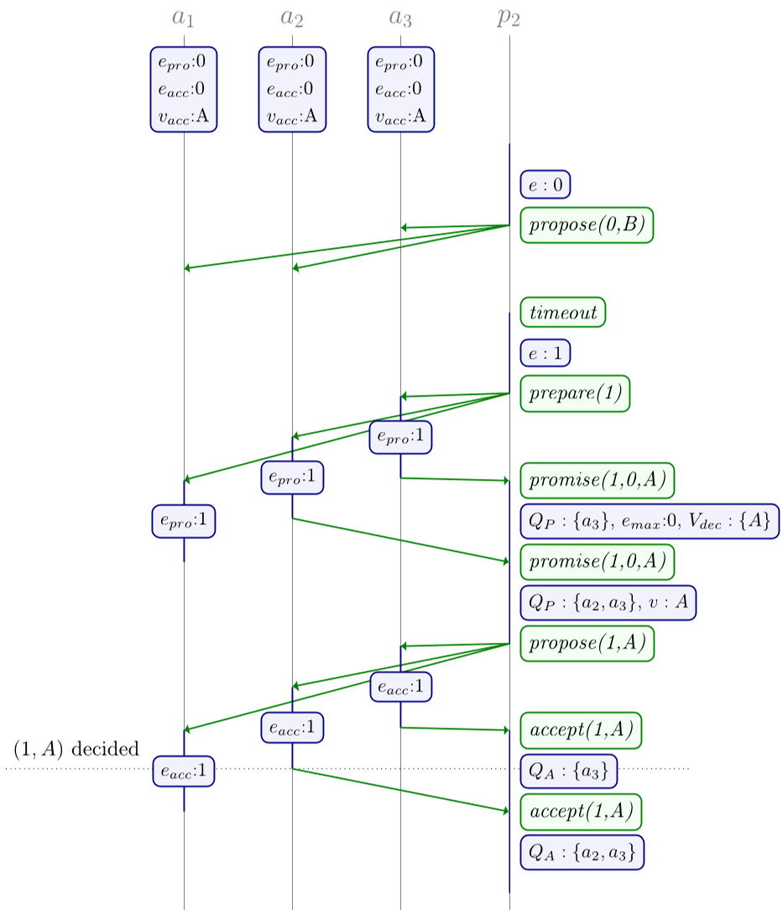

> 图 7.2：两个串行 proposer 执行经恢复分配 epoch 的示例。
> 在 proposer $p_2$ 提议 $(0, B)$ 之前，
> 提案 $(0, A)$ 已被所有 acceptor 接受。

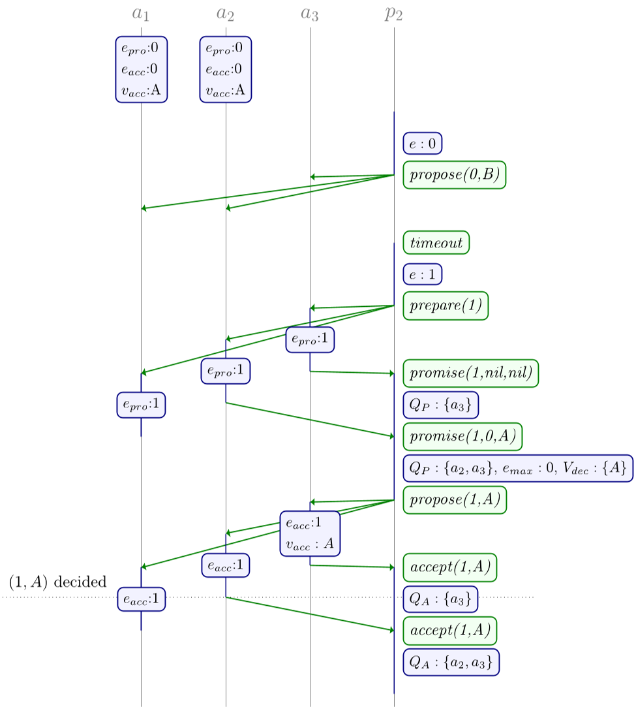

> 图 7.3：两个串行 proposer 执行经恢复分配 epoch 的示例。
> 提案 $(0, A)$ 和 $(0, B)$ 都未被 acceptor $a_3$ 接受。

在图 7.4 中，
各 acceptor 随承诺返回了两个不同的提案。
acceptor $a_2$ 返回提案 $(0, A)$，
acceptor $a_3$ 返回提案 $(0, B)$。
此时 $|Q_P| = 2$ 且 $V_{dec} = \{A, B\}$。
这是一次值冲突，
因此 proposer $p_2$ 必须等待更多承诺。
proposer $p_2$ 收到 acceptor $a_1$ 随承诺返回的提案 $(0, A)$。
此时 $|Q_P| = 3$ 且 $V_{dec} = \{A\}$，
于是 $p_2$ 可以进入阶段二并提议 $(1, A)$。

与之前的图不同，
图 7.5 展示了两个 proposer 并发执行的情形。
二者提议的是同一个提案 $(0, A)$，
该提案很快被决定。

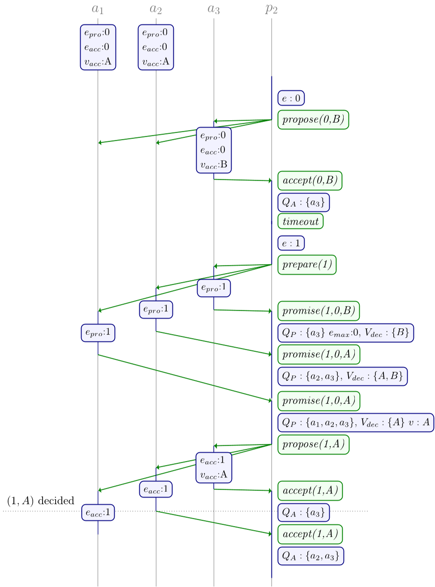

> 图 7.4：两个串行 proposer 执行经恢复分配 epoch 的示例。
> 提案 $(0, B)$ 被 acceptor $a_3$ 接受。

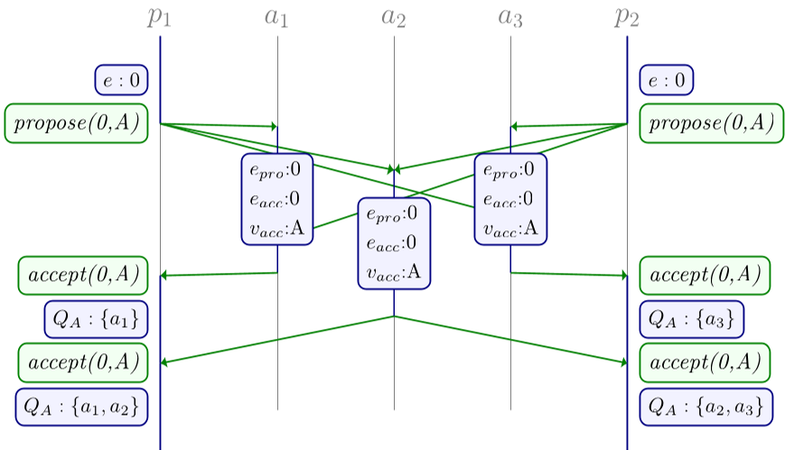

> 图 7.5：两个并发 proposer 提议同一提案 $(0, A)$ 的经恢复分配 epoch 示例。

## 7.4 混合 epoch 分配

| epoch 分配方法 | epoch 对值唯一 | epoch 对 proposer 唯一 | 需要指定 epoch      |
| -------------- | -------------- | ---------------------- | ------------------- |
| 预先分配       | 是             | 是                     | 是，指定给 proposer |
| 投票           | 是             | 是                     | 否                  |
| 分配器         | 是             | 是与否[^ch7-12]        | 否                  |
| 按值分配       | 是             | 否                     | 是，指定给值        |
| 恢复分配       | 否             | 否                     | 否                  |

> 表 7.2：epoch 分配的各种方法。

到目前为止，
我们已经描述了五种处理 epoch 分配的机制：
静态分配、阶段一投票、分配器动态分配（7.1 节）、按值分配（7.2 节）和经恢复分配（7.3 节）。
表 7.2 对这些机制做了汇总[^ch7-13]。
不过，
分布式共识算法不必只使用其中一种机制，
而可以把 epoch 分配给特定的方法，
组合使用这些机制。

proposer 能够使用任意 epoch 的能力，
在 epoch $e_{min}$ 上最为强大，
因为使用 $e_{min}$ 的 proposer 可以跳过阶段一。
因此，
一种合理的混合算法是：
对 $e_{min}$ 采用分配器、按值分配或恢复分配方法之一，
即快速路径；
对所有其他 epoch 采用预先分配，
即慢速路径。
下面分别考察这三种算法。

### 7.4.1 使用分配器的 Multi-path Paxos

使用分配器分配独占 epoch 的一个关键限制，
见 7.1 节，
是系统活性现在依赖分配器这个单一参与者的可用性。
这可以用一种混合方法解决：
只对 $e_{min}$ 使用分配器，
即快速路径；
对所有其他 epoch 使用预先分配，
即慢速路径[^ch7-14][^ch7-15]。

快速路径的 proposer 算法以与分配器的一次消息交换开始。
如果 proposer 被分配到 $e_{min}$，
它就可以绕过阶段一，
直接在 $e_{min}$ 的阶段二中提议其候选值。

如果快速路径不成功，
无论是因为分配器不可用，
还是因为另一个 proposer 已被分配到 $e_{min}$，
proposer 都照常执行 Paxos[^ch7-16]，
这称为慢速路径[^ch7-17]。

**算法 30：使用分配器的 Multi-path Paxos 的阶段零。**

```text
/* 阶段零开始 */
1  send generate-next() to allocator
2  switch do
3      case allocate(e_min) received
4          e ← e_min, v ← γ
5          goto phase two
6      case timeout or no-allocate() received
7          e ← min(ℰ)
8          ℰ ← ℰ ∖ {e}
9          goto phase one
10 ...
```

算法 30 给出了阶段零，
即 epoch 选择阶段的示例。
如果 epoch $e_{min}$ 被分配给该 proposer，
它就进入阶段二。
否则，
如果 $e_{min}$ 已被分配，
或分配器没有响应，
proposer 就使用自己预先分配的 epoch 之一。
分配器可以实现为一个简单的布尔标志，
表示 $e_{min}$ 是否已被分配。

如 7.1 节所述，
我们可以扩展分配器，
让它存储与服务所分配 epoch 关联的值。
实际上，
分配器存储值的主副本，
acceptor 存储备份副本。
如果分配器可用，
proposer 可以走快速路径：
首先，
proposer 在分配器上读取或设置值的主副本，
即阶段零；
然后把值备份到一个 acceptor 法定人数 $\mathcal{Q}_2^{e_{min}}$，
即阶段一[^ch7-18]。
否则，
proposer 走慢速路径，
在 acceptor 上执行经典的两阶段 proposer 算法，
以更新值的备份副本。

请注意，
这个算法提供了一种新的进展保证。
如果系统是同步的，
并且分配器和一个 acceptor 法定人数 $Q \in \mathcal{Q}_2^{e_{min}}$ 都在线，
那么 proposer 保证在两次往返内终止，
一次到分配器，
一次到 acceptor[^ch7-19]。
这是因为分配器充当串行化点，
防止了 proposer 之间的决斗。

### 7.4.2 使用按值分配的 Multi-path Paxos

按值分配 epoch 要求候选值限于一个已知范围。
使用 Multi-path Paxos 可以弱化这一限制，
允许已知范围之外的值。
前 $n$ 个 epoch 分配给大小为 $n$ 的已知范围内的值；
最可能的值应分配较低的 epoch，
最常见的值分配给 $e_{min}$。
$n$ 之后的所有 epoch 通过预先分配指定给 proposer。
如果 proposer 的候选值在已知范围内，
它就可以使用按值分配的 epoch。
如果不成功，
或者 proposer 的候选值在已知范围之外，
proposer 可以退回使用预先分配的 epoch。

同前，
这个算法提供了一种新的进展保证。
如果所有 proposer 提议的是同一个值，
那么即使在异步系统中，
它们也保证在两次往返内终止，
与最小 epoch 关联的值则为一次往返[^ch7-20]。
经典 Paxos 则不然：
提议同一个值的 proposer 可能无限期地决斗。

### 7.4.3 使用恢复分配的 Multi-path Paxos

算法 31 和算法 32 展示了一个混合算法示例：
对 $e_{min}$ 使用经恢复分配的 epoch，
即快速路径；
对所有其他 epoch 使用预先分配，
即慢速路径。
算法 31 是快速路径 proposer 算法，
算法 32 是慢速路径 proposer 算法，
acceptor 算法与经恢复分配 epoch 的算法相同，
即算法 24。

**算法 31：快速路径——使用恢复分配的 Multi-path Paxos 的 proposer 算法。**

```text
/* 提案 (e_min, γ) 的阶段二开始 */
1  Q_A ← ∅
2  send propose (e_min, γ) to acceptors
3  while |Q_A| < ⌈3n_a/4⌉ do
4      switch do
5          case accept (e_min, γ) received from acceptor a
6              Q_A ← Q_A ∪ {a}
7          case timeout
8              goto slow path
9  return γ
```

如果对 $e_{min}$ 使用大小为 $k = \lceil \frac{3n_a}{4} \rceil$
的计数法定人数，
那么对所有其他 epoch 就可以使用严格多数派法定人数。
这样的算法满足与经典 Paxos 相同的进展保证，
但最好情况更优：
只需一次往返到 $\frac{3}{4}$ 的 acceptor 即可做出决定。
proposer 算法会先尝试让 acceptor 接受 $e_{min}$ 的阶段二，
即快速路径；
如果不成功，
就退回对后续 epoch 的两个阶段都要求多数派同意，
即慢速路径。

我们可以利用 Paxos 修订 C 优化算法 32。
对所有满足 $e \neq succ(e_{min})$ 的 epoch $e$，
如果收到的承诺带有提案 $(f, v)$ 且 $e = succ(f)$，
proposer 就可以进入 epoch $e$ 的阶段二并提议 $v$。

类似地，
对于 epoch $succ(e_{min})$，
当至少 $\lfloor \frac{n_a}{4} \rfloor + 1$ 个 acceptor 已承诺，
且随承诺收到的不同提案至多只有一个时，
我们也可以进入阶段二。

Fast Paxos，
见 3.12 节，
是混合 epoch 的一个特例：
其中快速 epoch 经恢复共享，
经典 epoch 则预先分配或投票分配。
在 Fast Paxos 中，
无论阶段一返回什么承诺，
所有阶段一法定人数的大小都是 $k_c$。
这等价于总是等待经恢复分配 epoch 的 Paxos 中所需承诺数的上界。
因此，
除了一般性之外，
经恢复分配 epoch 的意义之一，
是 Fast Paxos 的阶段一可以在收到更少承诺后完成，
最少只需要 $n_a - k_f + 1$ 个承诺。

## 7.5 小结

本章展示了在 proposer 之间分配 epoch 的多种替代方案，
以取代预先分配或阶段一投票。
所介绍的方法包括：
由分配器动态分配 epoch、
按值而非按 proposer 分配 epoch，
以及经恢复共享 epoch。
这些方法可以单独使用，
也可以组合使用。

**算法 32：慢速路径——使用恢复分配的 Multi-path Paxos 的 proposer 算法。**

```text
1  e_max ← nil
2  Q_P, Q_A ← ∅
3  e ← min(ℰ)
4  ℰ ← ℰ ∖ {e}
5  ∀a ∈ A : R[a] ← no
   /* epoch e 的阶段一开始 */
6  send prepare(e) to acceptors
7  while |Q_P| < ⌊n_a/2⌋ + 1 do
8      switch do
9          case promise(e,f,w) received from acceptor a
10             Q_P ← Q_P ∪ {a}
11             if f ≠ nil ∧ (e_max = nil ∨ f > e_max) then
12                 e_max ← f
13                 R[a] ← (f,w)
14         case timeout
15             goto line 1
16 if e_max = e_min then
17     V_dec ← {v ∈ V | |{a ∈ A | R[a] = (e_max, v)}| ≥ ⌈n_a/4⌉}
18 else
19     V_dec ← {v ∈ V | R[_] = (e_max,v)}
20 if V_dec = ∅ then
21     v ← γ
22 else
23     v ← only(V_dec)
   /* 提案 (e,v) 的阶段二开始 */
24 send propose(e,v) to acceptors
25 while |Q_A| < ⌊n_a/2⌋ + 1 do
26     switch do
27         case accept(e,v) received from acceptor a
28             Q_A ← Q_A ∪ {a}
29         case timeout
30             goto line 1
31 return v
```

最值得注意的是，
我们提出了经恢复分配的 epoch，
它允许任何 proposer 使用任意 epoch，
前提是满足额外的交集要求。
经恢复分配的 epoch 把我们修订后的法定人数交集，
见 4.2 节，
和值选择，
见第 6 章，
的理解付诸实践，
从而推广了 Fast Paxos。
任何 proposer 都可以在一次往返内决定一个值；
相比之下，
经典 Paxos 中任何 proposer 需要两次往返才能决定一个值，
而 Multi-Paxos 只允许一个 proposer，
即 leader，
在一次往返内决定一个值。

我们重新考察 epoch 分配方式的动机，
是克服独占式 epoch 分配的限制，
尤其是只有一个 proposer 能利用最小 epoch 绕过阶段一这一点。
在追求这一目标的过程中，
我们还发现这些技术可以在特定场景下提供更强的进展保证，
有时这些保证甚至在更弱的假设下也成立。
例如，
在经恢复分配的 epoch 中，
多个提议同一个值的 proposer 不会发生决斗，
并且无须假设同步就能在一次往返内终止[^ch7-21]。

[^ch7-1]: 请注意，就安全性而言，分配无须按序进行，也无须分配每个 epoch。不过与经典 Paxos 类似，按序使用 epoch 确实可以简化我们的进展证明。

[^ch7-2]: 该算法实现了唯一 epoch，而无须为每个提案向持久存储执行同步写入；这一技术最早在 3.8 节介绍。

[^ch7-3]: 这一陈述假设值存储在持久存储中。否则，分配器在恢复后需要分配新的 epoch。

[^ch7-4]: 只要 epoch 集合可以划分为无限多个无限子集，也可以支持已知的无限值集合。

[^ch7-5]: 稍后我们将考虑是否也能应用修订 C，因为它直接使用了值唯一性引理。

[^ch7-6]: 为简单起见，我们不随 epoch 改变法定人数，因此修订 B 和修订 C 不适用。

[^ch7-7]: 虽然伪代码中没有显式表示，但该算法还要求给定 epoch 的各个阶段二法定人数必须相交。

[^ch7-8]: 此前的算法对任意 epoch 集合 $E$ 都通用，而现在 $E = N^{0}$。这样选择是为了简单，不过这些算法很容易推广到任意 epoch 集合 $E$。

[^ch7-9]: 当前 epoch $e$ 无须存入持久存储来保证正确性，但持久化有助于 proposer 在故障后快速恢复。

[^ch7-10]: 这段伪代码在收到每条消息后都重新计算 $V_{dec}$；通过增量更新 $V_{dec}$ 可以做得更高效。

[^ch7-11]: 阶段一的 acceptor 数量从 epoch 1 起列出，因为 proposer 总是可以绕过 epoch 0 的阶段一。

[^ch7-12]: 仅当提案未被重新分配时，使用分配器的 epoch 才对 proposer 唯一。

[^ch7-13]: 提案复制（3.10 节）也可以与这些机制中的每一种组合。

[^ch7-14]: 同样，所有其他 epoch 也可以改用阶段一投票，而不是预先分配。

[^ch7-15]: 请注意，我们可以把这种方法扩展到前 $n$ 个 epoch 都使用分配器，而不仅是 $e_{min}$。

[^ch7-16]: 只是 $e_{min}$ 不能被预先分配。

[^ch7-17]: 实践中，proposer 可以选择先尝试快速路径，还是直接进入慢速路径。

[^ch7-18]: 请注意，与 SAA 不同，proposer 不能总是通过读取分配器上存储的值来获知已决定的值。

[^ch7-19]: 这要求系统自启动以来一直是同步的。

[^ch7-20]: 这一陈述假设使用 NACK 而非超时。

[^ch7-21]: 这一陈述假设使用 NACK 而非超时。

# 第 8 章 结论

> 对人生最有益的学问，
> 莫过于摒弃谬误。
>
> ——Antisthenes

二十多年来，Paxos 一直是分布式共识的代名词。
因此，它被广泛研究、讲授并部署到生产系统中。
本文试图重新审视我们在分布式系统中处理共识的方式，
并挑战“Paxos 算法是共识的最优解”这一广为流传的观念。

## 8.1 动机

在 1.3 节中，我们列举了 Paxos 的种种局限。
除了算法本身的微妙与规范不足之外，
它的决定过程也很慢：
每次决定都需要向多数派 acceptor 发起两次往返。
这种方式带来很高的消息开销，
开销随 acceptor 数量线性增长；
可扩展性也受限，
因为每增加一个 acceptor 都会扩大多数派的规模，
从而降低性能。
Paxos 依赖同步性来避免 proposer 决斗，
也依赖多数派 acceptor 保持在线才能取得进展。

Paxos 把参与者数量、面对故障时的可用性和稳态性能紧紧地耦合在一起。
Paxos 为分布式共识提供了一种一刀切的方案：
它高度对称，
无论系统处于什么状态，
都遵循同一条固定的执行路径。
在其活性条件下，
即同步、恰好一个 proposer 在线、且至少多数派 acceptor 在线，
Paxos 保证 proposer 在两轮内终止。
如果这些条件不满足，
Paxos 几乎无法提供任何进展保证。
即使满足了更强的条件，
Paxos 仍需两轮多数派同意才能取得进展。

实践中，
用 Paxos 就一个序列达成一致时，
几乎毫无例外地使用 Multi-Paxos 优化。
以至于 Paxos 和 Multi-Paxos 这两个术语经常被混用。
学术文献中也提出过不借助 Multi-Paxos 就一个序列达成一致的方案，
例如 Fast Paxos，
但这类方案鲜有实际应用。
不考虑可能多出的、往返 leader 的一次额外通信，
Multi-Paxos 只需向多数派 acceptor 发起一次往返即可达成一致。
此外，
Multi-Paxos 中的 leader 充当串行化点，
防止 proposer 决斗；
不过，
要可靠地检测并替换失效的 leader 仍需同步性。
Multi-Paxos 这类集中式方案的主要局限在于 leader 是性能瓶颈。

## 8.2 贡献总结

本文通过弱化法定人数交集、阶段完成、值选择和 epoch 分配的要求，
证明了 Paxos 的做法是保守的。

在第 2 章概述广为人知的经典 Paxos 算法之后，
我们首先开展了知识系统化研究（第 3 章），
考察了对经典 Paxos 算法的各项关键改进。

在第 4 章中，
我们把 Paxos 的法定人数交集要求从：

$$ \forall Q,Q^{\prime}\in\mathcal{Q}:Q\cap Q^{\prime}\neq\emptyset $$

修订为对每个 epoch $e$：

$$ \forall Q\in\mathcal{Q}_{1}^{e},\forall f\in E:f<e\implies\forall Q^{\prime}\in\mathcal{Q}_{2}^{f}:Q\cap Q^{\prime}\neq\emptyset $$

换言之，
我们证明了既不必要求阶段一的法定人数两两相交，
也不必要求阶段二的法定人数两两相交，
更不必要求阶段一的法定人数与后续 epoch 的阶段二法定人数相交。

在第 5 章中，
我们证明了如果 proposer 收到一条携带提案 $(e, v)$ 的承诺，
就足以满足直至 epoch $e$（含）的法定人数交集要求。

在第 6 章中，
我们论证了 Paxos 的值选择规则，
即提出与最大 epoch 关联的值，
只是基于法定人数的值选择的一种保守近似。
如果收到的承诺多于满足法定人数交集所需的数量，
那么跟踪法定人数就能让 proposer 提出自己的候选值，
而不必提出先前的值。

对法定人数交集、阶段完成和值选择的这些修订在 7.3 节汇合，
我们在那里取消了 epoch 必须唯一对应提案的要求。
这项技术称为经恢复分配的 epoch，
它通过弱化 Fast Paxos 的法定人数交集要求，
实现了对 Fast Paxos 算法的泛化。
此外，
它应用了我们基于法定人数的值选择方法，
允许 proposer 以更少的承诺完成阶段一，
并为所提出的值提供了更大的灵活性。

我们还提出了经恢复分配 epoch 的多种替代方案，
例如来自分配器的 epoch（7.1 节）或按值映射的 epoch（7.2 节）。
这些方案可以替代现有的 epoch 分配方法，
也可以与之结合使用。

## 8.3 贡献的意义

在本文中，
我们提出了一种求解分布式共识的泛化算法，
它是构建分布式系统的强大原语。
在 1.4 节中，
我们提出了以下两个研究问题：

Paxos 的局限是共识问题固有的，
还是 Paxos 算法所采用方法特有的？

Paxos 算法是分布式共识的最优解吗？

我们相信，
我们已经改进了 Paxos 算法，
并证明了它的部分局限是其方法所特有的。
下面分四个方面进一步讨论：
更大的灵活性、新的进展保证、更高的性能和更好的清晰度。

### 8.3.1 更大的灵活性

我们提出的算法并非“银弹”。
相反，
它是一个灵活的方法族，
可以构建覆盖广泛谱系的共识算法，
适用于多种部署环境，
可针对不同工作负载优化，
并在性能与可靠性之间提供新的权衡。
所提算法的广度旨在反映当今分布式系统的多样化格局。
本文提出的算法为 Paxos 引入了非对称性，
为 proposer 提供了多条到达终止的路径，
具体路径随系统状态而变化。

我们首先利用弱化后的法定人数交集要求，
引入了按 epoch 变化法定人数的概念。
例如，
在 4.2 节中，
我们提出了 All Aboard Paxos，
它为（与 acceptor 共置的）proposer 提供了两条终止路径：

- 使用 epoch 0 到 $k$，向所有 acceptor 发起一次往返即终止；或
- 使用 $k+1$ 起的 epoch，向多数派 acceptor 发起两次往返而终止。

同样，
Paxos 修订 C（第 5 章）是这种多路径方法的又一例证：
处于 epoch $e$ 阶段一的 proposer 可以通过以下任一方式，
满足与先前 epoch $f$ 的阶段二的交集要求：

- 从每个法定人数 $Q \in \mathcal{Q}_2^f$ 中至少一个 acceptor 处收到承诺；或
- 收到一条携带 epoch $g$ 提案的承诺，其中 $f \leq g \leq e$。

在 3.10 节中，
我们让 proposer 可以选择复制现有提案，
而不必发起新提案。
在 7.4 节中，
我们提出了一种混合方法：
对最小 epoch 使用分配器、值映射或恢复方式进行 epoch 分配，
对所有其他 epoch 使用预分配或投票方式进行 epoch 分配。

### 8.3.2 新的进展保证

Paxos 只关注单一的进展属性：
无论算法当前处于什么状态都保证取得进展。
虽然这便于比较各算法在最坏情况下的容错能力，
但它几乎无法告诉我们算法的整体可用性。
在本文中，
我们展示了具有依赖于系统状态的新进展属性的算法。
本节将考察若干示例。

如果阶段一已经完成，
且此后法定人数中没有 acceptor 再作出承诺或接受提案，
proposer 只需向阶段二法定人数发起一次往返即可终止（4.1 节）。
极端情况下，
该法定人数可以只包含一个 acceptor，
如 4.3.2 节所述。
优化阶段二法定人数的代价是阶段一法定人数的性能与可用性下降。
与 Multi-Paxos 结合时，
这种权衡可能是值得的，
因为与阶段二相比，
Multi-Paxos 很少执行阶段一（4.3.3 节）。

如果 proposer 是第一个发起提案且被分配到 $e_{min}$ 的，
它只需向阶段二法定人数发起一次往返即可终止，
因为该 proposer 能够绕过阶段一。
更一般地说，
由于阶段一中的每个 proposer 只需与先前 epoch 的阶段二法定人数相交，
交集要求会随 epoch 增大而不断累积（4.2.3 节）。

我们对经典 Paxos 的进展保证依赖于只有一个 proposer 执行 proposer 算法。
实践中，
这通常通过将其中一个 proposer 设为指定 proposer 来实现，
从而依赖同步性来检测该指定 proposer 的故障。

在 7.2 节和 7.3 节中，
我们提出了按值映射的 epoch 和经恢复分配的 epoch。
当多个 proposer 以相同候选值执行 proposer 算法时，
这两种新算法都能保证终止。
图 7.5 就展示了这样的例子。

在 7.4 节中，
我们提出了一种混合算法：
最小 epoch 使用分配器分配，
所有其他 epoch 使用预分配。
只要分配器在线且同步，
任意数量的 proposer 都会在两次往返内终止，
一次往返到分配器，
一次往返到 acceptor。

### 8.3.3 更高的性能

我们的泛化既提供了改善最佳情况性能的机会，
也提高了最佳情况在实践中出现的可能性。
针对稳态进行优化使我们得以提升整体性能。
这一收益的代价可能是更罕见的故障场景下性能下降。
与经典 Paxos 不同，
我们并不强制规定性能与可用性之间的某种特定权衡。
相反，
这一权衡由应用自行决定。

将 Multi-Paxos 与弱化后的阶段间法定人数交集（4.1 节）相结合，
最能说明这一点。
阶段一法定人数很少使用，
因为只有在更换 leader 时才需要它们；
阶段二法定人数则用于每一次决定。
现在我们可以自行选择在二者之间的权衡。

Multi-Paxos 的关键动机是一次往返即达成一致，
然而它的集中式方案是一个严重的性能瓶颈。
我们提出了多种无需集中化即可一次往返达成一致的机制，
包括：

如果 proposer 与 acceptor 共置于每个参与者上：

- 参与者可以在本地执行阶段一，前提是阶段二使用所有参与者（4.1 节）。
- 参与者可以在本地完成阶段一，前提是该参与者已接受来自前一个 epoch 的提案（第 5 章）。

否则：

- 被分配到最小 epoch 的 proposer 之一可以跳过阶段一（4.2.3 节）。就一个序列达成一致时，
  可以轮换该 proposer 以避免集中化。
- 如果使用按值映射的 epoch 分配把 proposer 的候选值指派给最小 epoch，
  该 proposer 可以跳过阶段一直接提出其候选值（7.2 节）。
- 如果最小 epoch 由经恢复分配的 epoch 指派，
  任何 proposer 都可以跳过阶段一直接提出其候选值（7.3 节）。

### 8.3.4 更好的清晰度

至少，
我们希望本文增进了人们对分布式系统这一重要而又惊人微妙的领域的理解。

# 参考文献

[ACDK17] Ailidani Ailijiang, Aleksey Charapko, Murat Demirbas, and Tevfik Kosar. Multileader WAN paxos: Ruling the archipelago with fast consensus, 2017. arXiv:1703.08905 [cs.DC].

[BAC$^{+}$13] Nathan Bronson, Zach Amsden, George Cabrera, Prasad Chakka, Peter Dimov, Hui Ding, Jack Ferris, Anthony Giardullo, Sachin Kulkarni, Harry Li, Mark Marchukov, Dmitri Petrov, Lovro Puzar, Yee Jiun Song, and Venkat Venkataramani. TAO: Facebook's distributed data store for the social graph. In *Proceedings of the 2013 USENIX Annual Technical Conference*, ATC'13, pages 49–60, Berkeley, CA, USA, 2013. USENIX Association.

[BBH$^{+}$11] William J. Bolosky, Dexter Bradshaw, Randolph B. Haagens, Norbert P. Kusters, and Peng Li. Paxos replicated state machines as the basis of a high-performance data store. In *Proceedings of the 8th USENIX Conference on Networked Systems Design and Implementation*, NSDI'11, pages 141–154, Berkeley, CA, USA, 2011. USENIX Association.

[Bir85] Kenneth P. Birman. Replication and fault-tolerance in the ISIS system. In *Proceedings of the 10th ACM Symposium on Operating Systems Principles*, SOSP '85, pages 79–86, New York, NY, USA, 1985. ACM.

[BJ87] Kenneth P. Birman and Thomas A. Joseph. Reliable communication in the presence of failures. *ACM Transactions on Computer Systems (TOCS)*, 5(1):47–76, January 1987.

[Bur06] Mike Burrows. The Chubby lock service for loosely-coupled distributed systems. In *Proceedings of the 7th Symposium on Operating Systems Design and Implementation*, OSDI '06, pages 335–350, Berkeley, CA, USA, 2006. USENIX Association.

[CDG$^{+}$08] Fay Chang, Jeffrey Dean, Sanjay Ghemawat, Wilson C. Hsieh, Deborah A. Wallach, Mike Burrows, Tushar Chandra, Andrew Fikes, and Robert E. Gruber. Bigtable: A distributed storage system for structured data. *ACM Transactions on Computer Systems (TOCS)*, 26(2):4:1–4:26, June 2008.

[CGR07] Tushar D. Chandra, Robert Griesemer, and Joshua Redstone. Paxos made live: An engineering perspective. In *Proceedings of the 26th Annual ACM Symposium on Principles of Distributed Computing*, PODC '07, pages 398–407, New York, NY, USA, 2007. ACM.

[CHT96] Tushar Deepak Chandra, Vassos Hadzilacos, and Sam Toueg. The weakest failure detector for solving consensus. *Journal of the ACM (JACM)*, 43(4):685–722, July 1996.

[CL99] Miguel Castro and Barbara Liskov. Practical byzantine fault tolerance. In *Proceedings of the 3rd Symposium on Operating Systems Design and Implementation*, OSDI '99, pages 173–186, Berkeley, CA, USA, 1999. USENIX Association.

[CT96] Tushar Deepak Chandra and Sam Toueg. Unreliable failure detectors for reliable distributed systems. *Journal of the ACM (JACM)*, 43(2):225–267, March 1996.

[DDS87] Danny Dolev, Cynthia Dwork, and Larry Stockmeyer. On the minimal synchronization needed for distributed consensus. *Journal of the ACM (JACM)*, 34(1):77–97, January 1987.

[Dem] Murat Demirbas. Modeling Paxos and Flexible Paxos in Pluscal and TLA+. <http://muratbuffalo.blogspot.co.uk/2016/11/modeling-paxos-and-flexible-paxos-in.html>. [Online; accessed 17-Jan-2018].

[DHJ+07] Giuseppe DeCandia, Deniz Hastorun, Madan Jampani, Gunavardhan Kakulapati, Avinash Lakshman, Alex Pilchin, Swaminathan Sivasubramanian, Peter Vosshall, and Werner Vogels. Dynamo: Amazon's highly available key-value store. In *Proceedings of 21st ACM SIGOPS Symposium on Operating Systems Principles*, SOSP '07, pages 205–220, New York, NY, USA, 2007. ACM.

[DLS88] Cynthia Dwork, Nancy Lynch, and Larry Stockmeyer. Consensus in the presence of partial synchrony. *Journal of the ACM (JACM)*, 35(2):288–323, April 1988.

[FLP85] Michael J. Fischer, Nancy A. Lynch, and Michael S. Paterson. Impossibility of distributed consensus with one faulty process. *Journal of the ACM (JACM)*, 32(2):374–382, April 1985.

[GGL03] Sanjay Ghemawat, Howard Gobioff, and Shun-Tak Leung. The Google file system. In *Proceedings of the 19th ACM Symposium on Operating Systems Principles*, SOSP '03, pages 29–43, New York, NY, USA, 2003. ACM.

[GL03] Eli Gafni and Leslie Lamport. Disk Paxos. *Distributed Computing*, 16(1):1–20, February 2003.

[HKJR10] Patrick Hunt, Mahadev Konar, Flavio P. Junqueira, and Benjamin Reed. Zookeeper: Wait-free coordination for internet-scale systems. In *Proceedings of the 2010 USENIX Annual Technical Conference*, ATC'10, pages 11–11, Berkeley, CA, USA, 2010. USENIX Association.

[JRS11] Flavio P. Junqueira, Benjamin C. Reed, and Marco Serafini. Zab: High-performance broadcast for primary-backup systems. In *Proceedings of the 41st IEEE/IFIP International Conference on Dependable Systems & Networks (DSN)*, pages 245–256. IEEE, 2011.

[Lam78a] Leslie Lamport. The implementation of reliable distributed multiprocess systems. *Computer Networks*, 2(2):95–114, August 1978.

[Lam78b] Leslie Lamport. Time, clocks, and the ordering of events in a distributed system. *Communications of the ACM (CACM)*, 21(7):558–565, July 1978.

[Lam96] Butler W. Lampson. How to build a highly available system using consensus. In *Proceedings of the 10th International Workshop on Distributed Algorithms*, WDAG '96, pages 1–17, London, UK, UK, 1996. Springer-Verlag.

[Lam98] Leslie Lamport. The part-time parliament. *ACM Transactions on Computer Systems (TOCS)*, 16(2):133–169, May 1998.

[Lam01a] Leslie Lamport. Paxos made simple. *ACM SIGACT News (Distributed Computing Column)*, December 2001.

[Lam01b] Butler Lampson. The ABCD's of Paxos. In *Proceedings of the 20th Annual ACM Symposium on Principles of Distributed Computing*, PODC '01, pages 13–, New York, NY, USA, 2001. ACM.

[Lam05a] Leslie Lamport. Fast Paxos. Technical Report MSR-TR-2005-112, Microsoft Research, 2005.

[Lam05b] Leslie Lamport. Generalized consensus and Paxos. Technical Report MSR-TR-2005-33, Microsoft Research, March 2005.

[LC12] Barbara Liskov and James Cowling. Viewstamped replication revisited. Technical Report MIT-CSAIL-TR-2012-021, MIT, July 2012.

[LM04] Leslie Lamport and Mike Massa. Cheap Paxos. In *Proceedings of the 2004 International Conference on Dependable Systems and Networks*, DSN '04, pages 307–, Washington, DC, USA, 2004. IEEE Computer Society.

[LVA$^{+}$15] Haonan Lu, Kaushik Veeraraghavan, Philippe Ajoux, Jim Hunt, Yee Jiun Song, Wendy Tobagus, Sanjeev Kumar, and Wyatt Lloyd. Existential consistency: Measuring and understanding consistency at Facebook. In *Proceedings of the 25th Symposium on Operating Systems Principles*, SOSP '15, pages 295–310, New York, NY, USA, 2015. ACM.

[MAK13] Iulian Moraru, David G. Andersen, and Michael Kaminsky. There is more consensus in egalitarian parliaments. In *Proceedings of the 24th ACM Symposium on Operating Systems Principles*, SOSP '13, pages 358–372, New York, NY, USA, 2013. ACM.

[Mal] Dahlia Malkhi. ACM A.M. Turing award - Leslie Lamport 2013. <https://amturing.acm.org/award_winners/lamport_1205376.cfm>. [Online; accessed 23-April-2018].

[Mel17] Max Meldrum. Flexible Paxos: An industry perspective. Master's thesis, Blekinge Institute of Technology, 2017.

[MHL+92] C. Mohan, Don Haderle, Bruce Lindsay, Hamid Pirahesh, and Peter Schwarz. ARIES: A transaction recovery method supporting fine-granularity locking and partial rollbacks using write-ahead logging. *ACM Transactions on Database Systems (TODS)*, 17(1):94–162, March 1992.

[MJM08] Yanhua Mao, Flavio P. Junqueira, and Keith Marzullo. Mencius: Building efficient replicated state machines for WANs. In *Proceedings of the 8th USENIX Conference on Operating Systems Design and Implementation*, OSDI'08, pages 369–384, Berkeley, CA, USA, 2008. USENIX Association.

[MLZ08] Dahlia Malkhi, Leslie Lamport, and Lidong Zhou. Stoppable Paxos. Technical Report MSR-TR-2008-192, Microsoft Research, April 2008.

[MOZ05] Dahlia Malkhi, Florin Oprea, and Lidong Zhou. Omega meets Paxos: Leader election and stability without eventual timely links. In *Proceedings of the 19th International Conference on Distributed Computing*, DISC'05, pages 199–213, Berlin, Heidelberg, 2005. Springer-Verlag.

[MPP12] P. J. Marandi, M. Primi, and F. Pedone. Multi-ring Paxos. In *Proceedings of the 42nd Annual IEEE/IFIP International Conference on Dependable Systems and Networks (DSN)*, pages 1–12, June 2012.

[MPSP10] P. J. Marandi, M. Primi, N. Schiper, and F. Pedone. Ring Paxos: A high-throughput atomic broadcast protocol. In *Proceedings of the 2010 IEEE/IFIP International Conference on Dependable Systems and Networks (DSN)*, pages 527–536, June 2010.

[NAEA18] Faisal Nawab, Divyakant Agrawal, and Amr El Abbadi. DPaxos: Managing data closer to users for low-latency and mobile applications. In *Proceedings of the 2018 International Conference on Management of Data*, SIGMOD '18, pages 1221–1236, New York, NY, USA, 2018. ACM.

[OL88] Brian M. Oki and Barbara H. Liskov. Viewstamped replication: A new primary copy method to support highly-available distributed systems. In *Proceedings of the 7th Annual ACM Symposium on Principles of Distributed Computing*, PODC '88, pages 8–17, New York, NY, USA, 1988. ACM.

[OO14] Diego Ongaro and John Ousterhout. In search of an understandable consensus algorithm. In *Proceedings of the 2014 USENIX Annual Technical Conference*, ATC'14, pages 305–320, 2014.

[PLL97] Roberto De Prisco, Butler W. Lampson, and Nancy A. Lynch. Revisiting the Paxos algorithm. In *Proceedings of the 11th International Workshop on Distributed Algorithms*, WDAG '97, pages 111–125, London, UK, UK, 1997. Springer-Verlag.

[PLSS17] Oded Padon, Giuliano Losa, Mooly Sagiv, and Sharon Shoham. Paxos made EPR: Decidable reasoning about distributed protocols. *Proceedings of the ACM on Programming Languages*, 1(OOPSLA):108:1–108:31, October 2017.

[Sch90] Fred B. Schneider. Implementing fault-tolerant services using the state machine approach: A tutorial. *ACM Computing Surveys (CSUR)*, 22(4):299–319, December 1990.

[Tre] Trex. An embeddable paxos engine for the JVM. <https://github.com/trex-paxos/trex>. [Online; accessed 17-Jan-2018].

[VRA15] Robbert Van Renesse and Deniz Altinbuken. Paxos made moderately complex. *ACM Computing Surveys (CSUR)*, 47(3):42:1–42:36, February 2015.

[vRSS15] R. van Renesse, N. Schiper, and F. B. Schneider. Vive la différence: Paxos vs. Viewstamped Replication vs. Zab. *IEEE Transactions on Dependable and Secure Computing*, 12(4):472–484, July 2015.
