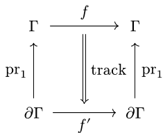
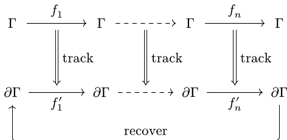
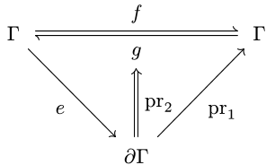
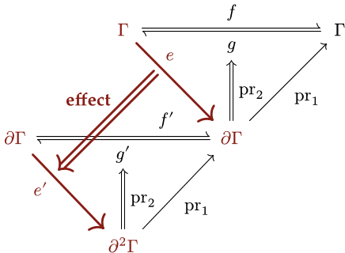
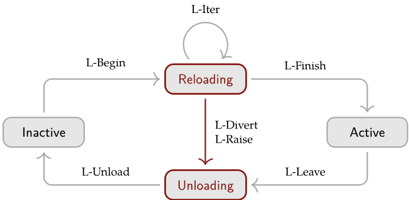

# A Programming Paradigm for Spatiotemporal Composability

Yifan Shi¹,²、Wei Zhang¹、Tianyi Cui²

¹北京大学 ²DeepSeek-AI

## 摘要

现代软件——从插件系统到自进化 agent 运行时——越来越需要*动态组合*，但其形式基础仍不完善。
我们识别出该问题的两个正交维度：*时间可组合性*，即在组件移除时能够完整回退其副作用的能力；*空间可组合性*，
即能够声明并以响应式方式管理组件间依赖的能力。我们通过将经典的效应与系数概念提升为运行时机制来应对这两个维度。具体而言，
我们形式化了*可逆效应*，其中每个上下文变换都携带一个由运行时跟踪的逆。我们形式化了*响应式系数*，
其中上下文的每次变化都会依据组件的系数规约通知该组件。我们将效应上下文与系数上下文统一为单一的*上下文类型*，
由此构成一种编程范式。随后，我们将这些机制组合为*组件*这一概念，并给出一个动态组合演算，
其元理论把时空可组合性从单个组件延伸到由交错组件构成的整个系统。
我们在 *Cordis* 中实现了这些想法——一个时空可组合性的元框架，它提供具备效应跟踪与系数解析的核心库，
以及具备配置调和与热模块替换的声明式组件加载器。

## 目录

**[引言](#引言)**

- [1.1 可组合性的维度](#11-可组合性的维度)
- [1.2 动机示例](#12-动机示例)
- [1.2.1 插件系统](#121-插件系统)
- [1.2.2 自进化 agent 运行时](#122-自进化-agent-运行时)
- [1.2.3 粗粒度的权宜之计](#123-粗粒度的权宜之计)
- [1.3 贡献](#13-贡献)

**[2. 预备知识](#2-预备知识)**

- [2.1 效应](#21-效应)
- [2.2 系数](#22-系数)
- [2.3 与动态可组合性的关系](#23-与动态可组合性的关系)

**[3. 可逆效应与响应式系数](#3-可逆效应与响应式系数)**

- [3.1 可逆效应](#31-可逆效应)
- [3.1.1 效应上下文](#311-效应上下文)
- [3.1.2 可逆效应函数](#312-可逆效应函数)
- [3.1.3 效应的独立性](#313-效应的独立性)
- [3.2 响应式系数](#32-响应式系数)
- [3.2.1 系数上下文](#321-系数上下文)
- [3.2.2 规约与通知](#322-规约与通知)
- [3.2.3 隔离与拦截](#323-隔离与拦截)
- [3.3 上下文范式](#33-上下文范式)
- [3.3.1 统一上下文](#331-统一上下文)
- [3.3.2 观测等价](#332-观测等价)
- [3.3.3 上下文范式的定位](#333-上下文范式的定位)

**[4. 动态组合演算](#4-动态组合演算)**

- [4.1 组件与 fiber](#41-组件与-fiber)
- [4.2 基础演算](#42-基础演算)
- [4.3 进行中的转移](#43-进行中的转移)
- [4.3.1 撤销](#431-撤销)
- [4.3.2 迭代](#432-迭代)
- [4.3.3 异步性](#433-异步性)
- [4.3.4 失败](#434-失败)
- [4.4 元理论](#44-元理论)

**[5. 实现与案例研究](#5-实现与案例研究)**

- [5.1 核心库](#51-核心库)
- [5.1.1 效应跟踪](#511-效应跟踪)
- [5.1.2 系数操作](#512-系数操作)
- [5.1.3 组件生命周期](#513-组件生命周期)
- [5.1.4 上下文访问](#514-上下文访问)
- [5.2 组件加载器](#52-组件加载器)
- [5.2.1 声明式配置](#521-声明式配置)
- [5.2.2 热模块替换](#522-热模块替换)
- [5.3 案例研究：Koishi](#53-案例研究koishi)

**[6. 讨论](#6-讨论)**

- [6.1 系统边界](#61-系统边界)
- [6.2 服务多路复用](#62-服务多路复用)
- [6.3 访问控制与沙箱化](#63-访问控制与沙箱化)
- [6.4 语言独立性与选择](#64-语言独立性与选择)
- [6.5 相互依赖与组件粒度](#65-相互依赖与组件粒度)
- [6.6 依赖类型化与版本化](#66-依赖类型化与版本化)
- [6.7 与语言和操作系统的协同设计](#67-与语言和操作系统的协同设计)

**[7. 相关工作](#7-相关工作)**

- [7.1 效应与系数系统](#71-效应与系数系统)
- [7.2 编程范式](#72-编程范式)
- [7.3 时间可组合性](#73-时间可组合性)
- [7.4 空间可组合性](#74-空间可组合性)

**[8. 结论](#8-结论)**


**[参考文献](#参考文献)**


## 引言

组合——从更简单的部件装配出复杂系统——是软件工程的一条基本原则 [1]。传统上，组合是静态的：函数调用、
模块导入和类继承在编译期解析，并在整个执行过程中保持不变。然而，现代软件越来越需要动态组合，即组件在运行时被加载、
卸载和重新配置。插件架构 [2] 与自进化 agent 运行时都要求系统能够即时安全地添加和移除功能，
但当前实践退而依赖粗粒度机制 [3]，这些机制只能通过重启来重新配置，并丢弃运行时状态。
尽管动态组合的实践重要性日益增长，其理论基础与静态组合所拥有的丰富形式框架相比仍不完善。

### 1.1 可组合性的维度

为刻画动态组合的需求，我们在已被充分研究的组合的代数方面之外，识别出两个正交维度：

- **时间可组合性**针对*时间*维度：在组件移除时，该组件对共享环境所做的修改必须被完整、安全地回退。
  这要求跟踪组件执行的每一次资源分配、事件注册和状态变更，并保证它们在移除时被有序地回收。
- **空间可组合性**针对空间维度：组件必须能够以结构化、可验证的方式声明、发现和解析彼此之间的依赖。
  这要求管理依赖拓扑，并响应依赖变化协调组件的生命周期。

在静态场景中，时间可组合性退化为词法作用域（如 RAII [4]、bracket 模式 [5]），
空间可组合性退化为模块导入解析 [6]。在动态场景中，组件在运行时出现和离开，两个维度都变得显著更困难：
时间可组合性必须处理长寿命、有状态的效应，其作用域不受词法约束；空间可组合性必须处理在执行过程中出现、
消失或改变身份的依赖。

### 1.2 动机示例

### 1.2.1 插件系统

插件系统是动态组合的典型实例。我们以 Visual Studio Code（VSCode）
——使用最广泛的可扩展 IDE 之一——作为代表示例。

**时间限制。** VSCode 在一个称为扩展宿主的共享进程中运行所有扩展。尽管扩展可以动态安装，
但该宿主不提供在运行时卸载单个扩展代码的机制。一旦某个扩展的 activate 函数执行完毕，
禁用或卸载它就要求重启整个宿主，从而影响所有已加载的扩展。主题、快捷键和代码片段等纯声明式扩展不携带代码，可以自由移除。
然而，在安装量排名前 100 的扩展中，有 87 个包含可执行代码[^1]，因此移除时需要进行这样的重启。
尽管 VSCode 提供了 deactivate 钩子，但它仅作为宿主进程终止时的优雅关闭回调，因此并不支持在线移除。
此外，该钩子把效应处置与效应创建（在 activate 中）分离开来，破坏了关注点的局部性，使得完整的清理难以验证。

**空间限制。** VSCode 确实提供了 extensionDependencies 用于声明扩展之间的依赖，
但它很少被使用：在安装量排名前 100 的扩展中，
只有 7 个对非内置扩展声明了 extensionDependencies。[^1]
这种稀缺性反映了扩展 API 的形态，它暴露的是固定、表层的扩展点，如命令、视图和语言特性。
扩展通过这些扩展点向宿主贡献能力，而非相互依赖，因此扩展之间的依赖很少出现。此外，
VSCode 的扩展间交互机制不提供结构性契约：
它通过 `vscode.extensions.getExtension(...)` 的导出向其他扩展暴露某个扩展的功能，
但返回的值是无类型的（默认为 `any`），因此依赖方无法依赖经过检查的接口。简言之，
VSCode 将扩展引向宿主提供的一组固定扩展点，而没有为它们提供安全、结构化的相互依赖方式。

这两个限制并非 VSCode 独有；它们普遍存在于各类插件系统中 [2, 7]，只是程度不同。

### 1.2.2 自进化 agent 运行时

现代 AI agent 依赖 agent 运行时 [8–10]。这些系统可以组合多样的工具套件 [11] 与执行环境，
管理权限与沙箱化，维护会话状态与持久化，提供上下文管理与记忆系统 [12]，
编排子 agent 与多 agent 工作流 [13]，并向用户与自动化暴露接口。
未来的运行时可以在持续服务请求的同时生成并部署对自身组件的修改。
模型合成的可复用工具构成了组件级自修改的一种较窄前身 [14]。每一次这样的修改本身就是动态组合的一个实例。

由于这些修改持续发生，且人工监督有限或缺失，动态可组合性变得不可或缺。没有时间可组合性，每一次自修改都会强制完全重启，
丢弃所有进程本地的累积状态；在这样的频率下，累积的不可用性变得相当可观，进行中的任务被反复中断；更糟的是，
一次有缺陷的自修改可能禁用恢复所必需的进程本身。没有空间可组合性，每个模块都必须自行检测并适应它所依赖模块的出现、
消失或身份变化，且只能通过临时手段做到；更糟的是，朴素的代码替换策略可能悄悄破坏依赖方，
或引入仅在重载时才显现的循环依赖。

### 1.2.3 粗粒度的权宜之计

动态可组合性受到的形式化关注有限，原因之一是操作系统与容器编排器已经提供了粗粒度的替代方案。
操作系统在进程粒度上给出时间可组合性；容器编排器 [3] 在服务粒度上给出空间可组合性。实践中，
大多数软件通过退而依赖这些粗粒度机制来容忍细粒度可组合性的缺失：行为异常的模块通过重启进程来处理，
服务依赖由容器编排器来管理。

然而，这种权宜之计带来了巨大的成本。在时间上，每次重启都会丢弃所有进程本地的累积状态（如缓存、连接、未完成的计算），
重建它们需要几秒到几分钟 [15]；在此期间维持可用性需要冗余副本，从而带来资源开销，以弥补无法恢复单个组件的不足。
在空间上，容器级编排无法表达共享同一地址空间的组件之间的依赖，并为本可成为本地函数调用的交互引入网络开销。
两种机制都作用于进程与容器的边界，而现代系统越来越多地在更细的粒度上进行组合。
这种粒度不匹配要求一种在与组件本身相同的层面上管理效应和依赖的组合抽象。

### 1.3 贡献

动态可组合性的两个维度分别涉及计算如何修改环境以及如何依赖环境。这两个方向正是效应系统 [16, 17]
与系数系统 [18, 19] 所形式化的内容：效应提供用于推理环境修改的形式词汇，系数提供用于推理环境需求的形式词汇。
然而，现有形式化把推理限制在词法固定作用域上的编译期分析，并未扩展到组件在运行时出现和离开的动态场景。
通过把效应提升为可逆的运行时模型、把系数提升为响应式的依赖解析机制，我们为动态可组合性获得了统一的形式基础。
这一基础语言无关，适用于任何需要动态组合的软件架构。我们做出以下贡献：

1. 我们形式化**可逆效应**（3.1 节）：每个上下文变换都携带一个由运行时跟踪的显式逆，跟踪与恢复都保持组合性，
   因此在组件移除时上下文得以恢复。这建立了局部时间可组合性。
2. 我们形式化响应式系数（3.2 节）：组件将其所需系数以规约的形式声明，
   上下文的每次变化都会依据该规约把组件通知为激活、停用或中性。这建立了局部空间可组合性。
3. 我们将效应上下文与系数上下文统一为单一的**上下文类型**（3.3 节），其中系数上的观测等价为效应提供独立性，
   构成时空可组合性的编程范式。
4. 我们给出动态组合演算（第 4 节），它将两种机制组合为组件的概念，并为其生命周期配备操作语义。
   其元理论把时空可组合性从单个组件延伸到由交错组件构成的整个系统。
5. 我们在 Cordis（第 5 节）中实现了这些想法——一个时空可组合性的元框架，
   它提供以效应跟踪与系数解析实现形式模型的核心库，以及具备配置调和与热模块替换的声明式组件加载器。

[^1]: 数据于 2026 年 6 月 9 日取自 Visual Studio Code Marketplace。
## 2. 预备知识

本节简要概述效应系统与系数系统——它们是支撑我们工作的两大理论支柱。
我们假定读者熟悉基础类型论与范畴论；
本节的目标是固定记号，并引入第 3 节将落地为运行时机制的关键抽象。

### 2.1 效应

在简单类型 λ 演算（STLC）[20, 21] 中，
类型判断 $\Gamma \vdash t : T$ 表示项 $t$ 在上下文 $\Gamma$ 下具有类型 $T$。
效应系统对类型加以细化，以描述一次计算可能产生的副作用，从而得到如下形式的判断

$$ \Gamma\vdash t:T_{\mathrm{e f f e c t}} $$

(1)

这里，结果类型以效应代数中的一个元素加以标注，该元素描述计算可能产生的副作用，从而能够对有状态计算进行组合式推理。
这一方法起源于 Lucassen 与 Gifford [22]，他们提出了一种带 kind 的类型系统，通过区分类型、
效应与 region 来发现并行程序中的调度约束。

**Monad 效应。** Moggi [16] 最早通过 monad 从范畴论角度刻画计算效应；Wadler [23]
在 Haskell 中普及了这一方法。
范畴 $\mathcal{C}$ 上的 monad $(T, \eta, \mu)$ 将带效应的计算封装为类型
$T(A)$ 的值，其中 $\eta: A \to T(A)$ 将纯值提升，
$\mu: T(T(A)) \to T(A)$ 则对嵌套计算进行顺序化。
经典实例包括 Maybe monad（用于偏性）、State monad（用于可变状态）
以及 IO monad（用于外部交互）。

**代数效应。** Plotkin 与 Power [17, 24] 证明了代数运算决定 monad，
从而建立起一个效应接口与其实现相解耦的框架。
效应签名 $\Sigma$ 声明一组运算（例如对状态而言，get : () → $S$ 与 put : $S$ → ()
）；程序可以自由调用这些运算，而无需承诺某种特定解释。
Plotkin 与 Pretnar [25] 随后引入了*效应处理器*，它通过提供延续语义来解释这些运算：

handle e with { op(v, $ \kappa $) $\mapsto$ ... }

(2)

处理器接收运算参数 $v$ 与定界延续 $\kappa$，可以调用它零次、一次或多次，从而在同一框架内支持异常、
协程与非确定性 [26]。
Koka [27, 28]、Eff [29] 与 OCaml 5 [30] 等语言已经以不同的设计权衡采用了代数效应。

### 2.2 系数

与效应相对偶地，*系数系统* [18, 31] 丰富的是上下文而非类型，从而得到如下形式的判断

$$ \Gamma_{\mathrm{c o e f f e c t}}\vdash t:T $$

(3)

这里，上下文以系数代数中的一个元素加以标注，该元素描述计算对其环境的要求，例如需要访问的资源、需要持有的权限，
或需要依赖的服务。
效应刻画的是程序对世界的影响，而系数刻画的是世界对程序的约束。

**Comonad 系数。
** 用 comonad 组织依赖上下文的计算这一思想最早由 Uustalu 与 Vene [32] 提出，
他们提出了对称（半）幺半 comonad，作为 Moggi 效应 monad 框架的对偶，
用以刻画数据流与属性求值等概念。
Petricek 等人 [18] 在此基础上提出把系数作为对上下文依赖性的统一静态分析。
comonad $(D, \varepsilon, \delta)$ 刻画依赖上下文的计算：
$\varepsilon : D(A) \to A$ 从上下文中提取当前值，
而 $\delta : D(A) \to D(D(A))$ 复制上下文以支持嵌套访问。
Environment comonad $D(X) = E \times X$ 刻画对固定环境 $E$ 的依赖；
Stream comonad $D(X) = \mathbb{N} \to X$ 刻画对时序数据的依赖。

**分级系数。** 为实现更细粒度的跟踪，
*分级*系数系统采用预序半环 $\mathcal{S} = (S, \le, +, \times, 0, 1)$
作为系数代数 [33]，这一方法后来由 Gaboardi 等人 [19] 与分级效应统一起来。
$S$ 的元素标注每个变量绑定以量化其使用情况：0 表示未使用，1 表示线性使用，$n$ 表示有界使用，
$\infty$ 表示无限制使用。
半环运算按顺序（$\times$）与并行（$+$）组合系数，从而在统一的代数框架 [37] 内实现精确的资源跟踪、
敏感性分析 [34] 与信息流控制 [35, 36]。

### 2.3 与动态可组合性的关系

效应系统与系数系统沿两个互补的方向组织关于计算的推理：效应描述计算如何*修改*其环境，而系数描述计算如何*依赖*其环境。
这两个方向对应于第 1 节中所指出的动态可组合性的两个维度：

• **时间可组合性**要求组件对共享环境的修改在卸载时是可逆的。
相关的效应是那些有状态的效应，它们持久地变换该环境；要撤销这样的变换，就要求该变换存在逆。

• **空间可组合性**要求组件间的依赖被声明并以响应式方式管理。
这类依赖正是系数所捕获的东西，而管理它们相当于对照环境所提供的内容来解析每一项依赖。

然而，经典效应系统与系数系统是静态工具：效应在词法固定的作用域内被跟踪，并由编译期处理器消解；
系数标注则针对执行之前确定的上下文加以验证。
相比之下，动态组合要求这些保证对在运行时到达与离开的组件、针对持续演化的上下文成立。
没有任何固定的词法作用域能够界定部署之后加载的插件；也没有任何编译期上下文能够预见到由运行时配置产生的依赖。

这促使我们转换视角：与其用更多标注来扩展静态类型系统，不如将效应与系数的概念结构具体化，使运行时能够直接对其操作，
从而动态地建立起这些系统静态所提供的保证。
## 3. 可逆效应与响应式系数

本节把 2 节引入的效应与系数概念提升为运行时机制，
构建出动态组合的理论。
核心思想是把携带效应与系数的*类型上下文*转化为*上下文类型*，
即把上下文具体化为头等实体的、可在运行时操作的类型。
对效应类型，我们把它建模为与一个逆配对的上下文变换，
从而获得局部时间可组合性。
对系数上下文，我们把它建模为携带依赖信息的类型，
从而获得局部空间可组合性。
系数上的观测等价于是为效应提供了独立性。
同时携带效应与系数的统一上下文，本身即构成一种编程范式。

### 3.1 可逆效应

时间可组合性是指在运行时加载和卸载组件，
使得卸载时共享环境恢复到组合前的状态。
这要求组件对环境所做的每一处修改都既可跟踪又可恢复。
因此，
我们把效应建模为类型为 $\Gamma \to \Gamma \times (\Gamma \to \Gamma)$
的函数：
把它作用于当前上下文，就得到修改后的上下文以及一个显式的逆。
提供这个逆使效应得以回退，
把它返回给运行时则使效应可被跟踪。
我们称这样的效应为可逆的：
在执行过程中跟踪并组合这些逆，
完整的环境恢复便成为一项结构性保证。

### 3.1.1 效应上下文

给定任意非纯函数 $f_{\text{impure}} : X \to Y$，
我们把它变换为纯形式 $f : \Gamma \times X \to \Gamma \times Y$，
其中 $\Gamma$ 是上下文，一切可能的副作用都可以表示为 $\Gamma$ 上的变换。
对任意固定的输入 $x : X$，
由之诱导的映射 $\gamma \mapsto \mathrm{pr}_1(f(\gamma, x))$ 捕获了
$f$ 的副作用，与返回值无关。
因此，
$\Gamma$ 上的效应居于变换 $\Gamma \to \Gamma$ 在组合 $\circ$
之下构成的幺半群之中，
其中每条幺半群公理都可直接解读为效应的一种性质：

- 封闭性：两个效应的顺序组合仍是效应；
- 结合性：复合效应与其加括号方式无关；
- 单位元：$\mathrm{id}_{\Gamma}$，即 $\Gamma$ 上的恒等函数，充当组合的单位元。

为了建模可被撤销的效应，
我们给每个变换 $f$ 配上另一个撤销 $f$ 的变换 $g$，
并称 $g$ 为 $f$ 的左逆，在本文中一律简称为逆。
撤销是单侧的：逆所承担的是 $g \circ f$，而绝不是 $f \circ g$。
变换对自身带有一种乘法：

**定义 1。** 如下定义上下文变换对的*扭转组合*：

$$ (f_{1},g_{1})\circ(f_{2},g_{2}):=(f_{1}\circ f_{2},g_{2}\circ g_{1}) $$

(4)

与 $\circ$ 本身一样，左操作数在右操作数之后作用，而逆以相反的顺序累积。
这使 $(\Gamma \to \Gamma) \times (\Gamma \to \Gamma)$ 成为以
$(\mathrm{id}_{\Gamma}, \mathrm{id}_{\Gamma})$ 为单位元的幺半群，
即变换幺半群与其反幺半群的积，
我们称之为 $\Gamma$ 上的扭转组合幺半群 $\mathfrak{T}_{\Gamma}$。

为了在上下文内部跟踪效应，我们引入如下定义：

**定义 2。** 给定上下文 $\Gamma$，定义其*效应上下文*为：

$$ \partial\Gamma:=\Gamma\times(\Gamma\to\Gamma) $$

(5)

它可理解为一个二元组 $(\gamma, \varphi)$，其中：

- $\gamma : \Gamma$ 是当前的上下文状态；
- $\varphi : \Gamma \to \Gamma$ 是*累加器*，即到目前为止已执行效应的逆的复合，
  也就是把上下文恢复到初始状态的函数。

特别地，初始效应上下文可表示为 $(\gamma_0, \mathrm{id}_\Gamma)$。
我们也写
$\partial^2\Gamma = \partial\Gamma \times (\partial\Gamma \to \partial\Gamma)$，
并依此类推直至塔的更高层。
有了累加器 $\varphi$，在 $\partial\Gamma$ 上执行的所有效应就都可以被跟踪和恢复。
下面给出跟踪与恢复的具体构造。

**定义 3。** 如下定义上下文函数对上的变换 $\mathrm{track}_{\Gamma}$：

$$ \begin{array}{r l r l r l r l}&{\mathrm{track}_{\Gamma}}&{:}&{(\Gamma\to\Gamma)\times(\Gamma\to\Gamma)}&{\to}&{\partial\Gamma}&{\to}&{\partial\Gamma}\\ &{\mathrm{track}_{\Gamma}}&{=}&{(f,g)}&{\mapsto}&{(\gamma,\varphi)}&{\mapsto}&{(f(\gamma),\varphi\circ g)}\end{array} $$

(6)

这个变换把前向函数 $f$ 连同候选逆 $g$ 转换为效应上下文 $\partial\Gamma$ 上的一个变换。
把 $\mathrm{track}_{\Gamma}(f,g)$ 作用于状态 $(\gamma,\varphi)$，
用 $f$ 变换 $\gamma$，并把逆 $g$ 复合到 $\varphi$ 上，
从而在上下文中跟踪 $f$ 的效应。

**定理 4。
** 对每个
$(f, g) \in (\Gamma \to \Gamma) \times (\Gamma \to \Gamma)$，
下图可交换，即，

$$ \mathrm{pr}_{1}\circ\mathrm{track}_{\Gamma}(f,g)=f\circ\mathrm{pr}_{1} $$

(7)



> 图 1：
> $\mathrm{pr}_1 \circ \mathrm{track}_\Gamma(f,g) = f \circ \mathrm{pr}_1$ 的可交换图。

定理 4 的证明。对所有 $(\gamma, \varphi) \in \partial\Gamma$：

$$ \begin{aligned}{(\operatorname{pr}_{1}\circ\operatorname{track}_{\Gamma}(f,g))(\gamma,\varphi)}&{{}=\operatorname{pr}_{1}(f(\gamma),\varphi\circ g)}\\ {}&{{}=f(\gamma)}\\ {}&{{}=(f\circ\operatorname{pr}_{1})(\gamma,\varphi)}\\ \end{aligned} $$

**定理 5。
** $\mathrm{track}_{\Gamma}$ 是从 $\mathfrak{T}_{\Gamma}$ 到
$\partial\Gamma \to \partial\Gamma$ 的幺半群同态。即，

1. $\mathrm{track}_{\Gamma}(\mathrm{id}_{\Gamma}, \mathrm{id}_{\Gamma}) = \mathrm{id}_{\partial\Gamma}$；
2. 对所有 $(f_1, g_1), (f_2, g_2) \in \mathfrak{T}_\Gamma$，

$$ \mathrm{track}_{\Gamma}((f_{1},g_{1})\circ(f_{2},g_{2}))=\mathrm{track}_{\Gamma}(f_{1},g_{1})\circ\mathrm{track}_{\Gamma}(f_{2},g_{2}) $$

(8)

定理 5 的证明。

1. 单位元被映为单位元，
   因为
   $\operatorname{track}_{\Gamma}(\mathrm{id}_{\Gamma}, \mathrm{id}_{\Gamma})(\gamma, \varphi)=(\gamma, \varphi \circ \mathrm{id}_{\Gamma})=(\gamma, \varphi)$。
2. 对于乘法，任取 $(\gamma, \varphi) \in \partial\Gamma$：

$$ \begin{aligned}{(\operatorname{track}_{\Gamma}(f_{1},g_{1})\circ\operatorname{track}_{\Gamma}(f_{2},g_{2}))(\gamma,\varphi)}&{=\operatorname{track}_{\Gamma}(f_{1},g_{1})(f_{2}(\gamma),\varphi\circ g_{2})}\\ {}&{=(f_{1}(f_{2}(\gamma)),\varphi\circ g_{2}\circ g_{1})}\\ {}&{=\operatorname{track}_{\Gamma}(f_{1}\circ f_{2},g_{2}\circ g_{1})(\gamma,\varphi)}\\ \end{aligned} $$

$\square$

**定义 6。
** 如下定义 $\partial\Gamma$ 上的变换 $\mathrm{recover}_{\Gamma}$：

$$ \begin{array}{r c l r c l}{{\mathrm{recover}}_{\Gamma}}&{{:}}&{{\partial\Gamma}}&{{\to}}&{{\partial\Gamma}}\\ {{\mathrm{recover}}_{\Gamma}}&{{=}}&{{(\gamma,\varphi)}}&{{\mapsto}}&{{(\varphi(\gamma),\mathrm{id}_{\Gamma})}}\end{array} $$

(9)

这个变换把恢复函数 $\varphi$ 作用于当前状态 $\gamma$，并把 $\varphi$ 重置为恒等函数。
下图说明：
在效应序列
$\mathrm{track}(f_1, g_1), \cdots, \mathrm{track}(f_n, g_n)$ 作用于 $\partial\Gamma$ 之后，
recover 如何把上下文恢复到其初始状态：



> 图 2：track 序列之后，recover 将效应上下文带回初始状态的可交换图。

该图表明，被跟踪的效应之后接上 recover，会把初始效应上下文带回其自身。
每个跟踪步骤所保持的，正是恢复本身的结果——无论从哪个状态进行恢复：

**定理 7。
** 对每个 $(\gamma, \varphi) \in \partial\Gamma$ 以及每个满足
$g(f(\gamma)) = \gamma$ 的二元组 $(f, g)$，

$$ \mathrm{recover}_{\Gamma}(\mathrm{track}_{\Gamma}(f,g)(\gamma,\varphi))=\mathrm{recover}_{\Gamma}(\gamma,\varphi) $$

(10)

定理 7 的证明。

$$ \begin{aligned}{\operatorname{recover}_{\Gamma}(\operatorname{track}_{\Gamma}(f,g)(\gamma,\varphi))}&{{}=\operatorname{recover}_{\Gamma}(f(\gamma),\varphi\circ g)}\\ {}&{{}=(\varphi(g(f(\gamma))),\operatorname{id}_{\Gamma})}\\ {}&{{}=(\varphi(\gamma),\operatorname{id}_{\Gamma})=\operatorname{recover}_{\Gamma}(\gamma,\varphi)}\\ \end{aligned} $$

二元组序列不需要单独的论证。
令 $(f_1, g_1), \cdots, (f_n, g_n)$ 从 $(\gamma, \varphi)$
起依序应用，
并记 $\delta_0 = \gamma$、$\delta_i = f_i(\delta_{i-1})$。
由定理 5，
复合
$\mathrm{track}_\Gamma(f_n, g_n) \circ \cdots \circ \mathrm{track}_\Gamma(f_1, g_1)$
等于扭转复合
$(f_n \circ \cdots \circ f_1, g_1 \circ \cdots \circ g_n)$
的 $\mathrm{track}_\Gamma$，
而若对每个 $i$ 都有 $g_i(\delta_i) = \delta_{i-1}$，
则
$(g_1 \circ \cdots \circ g_n)(\delta_n) = \delta_0 = \gamma$。
因此该二元组在 $\gamma$ 处满足定理 7 的假设，应用一次该定理即得

$$ \mathrm{recover}_{\Gamma}((\mathrm{track}_{\Gamma}(f_{n},g_{n})\circ\cdots\circ\mathrm{track}_{\Gamma}(f_{1},g_{1}))(\gamma,\varphi))=\mathrm{recover}_{\Gamma}(\gamma,\varphi) $$

(11)

取 $(\gamma, \varphi) = (\gamma_0, \mathrm{id}_\Gamma)$，
恢复就把以这种方式到达的每个状态都带回 $(\gamma_0, \mathrm{id}_\Gamma)$。
满足 $g \circ f = \mathrm{id}_\Gamma$ 的二元组在每个状态都满足该假设。
恢复通过量 $\varphi(\gamma)$ 读取一个状态，
我们把 $\varphi(\gamma) = \gamma_0$ 称为 $\partial\Gamma$
中状态的*健全性不变量*。

### 3.1.2 可逆效应函数

上一节的 track/recover 模型把逆当作先验给定的：
$\mathrm{track}_{\Gamma}(f, g)$ 在见到任何上下文状态之前就固定了 $g$，
因此同一个 $g$ 必须服务于效应被应用到的每个状态。
然而在实践中，每个效应的逆并非先验可知：
它必须由调用者在效应应用之处提供。
此外，recover 是全有或全无的：
它无法有选择地撤销一个效应而保留其他效应。
为解决这两个问题，我们在输入端和输出端同时增强该模型：

1. 在输入端，我们不仅变换 $\Gamma$，还随之一并返回一个逆函数，
   使得逆在效应被应用之处提供：
   $\Gamma \to \Gamma \times (\Gamma \to \Gamma)$，
   即 $\Gamma \to \partial\Gamma$；
2. 在输出端，我们不仅变换 $\partial\Gamma$，还随之一并返回一个逆函数，
   使得一个效应可被撤销而其他效应得以保留：
   $\partial\Gamma \to \partial\Gamma \times (\partial\Gamma \to \partial\Gamma)$，
   即 $\partial\Gamma \to \partial^2\Gamma$。

这种增强保持了输入与输出之间的结构一致性，
因此我们仍可定义相应的理论，维持 track 的数学性质。
由此得到的类型是效应函数 $\mathfrak{E}_{\Gamma}$ 及其带见证的精化
$\mathfrak{E}_{\Gamma}^{*}$：

**定义 8。
** 如下定义效应函数 $\mathfrak{E}_{\Gamma}$ 和*带见证的*效应函数
$\mathfrak{E}_{\Gamma}^{*}$：

$$ \begin{aligned}{\mathfrak{E}_{\Gamma}}&{{}:=\Gamma\to\Gamma\times(\Gamma\to\Gamma)}\\ {\mathfrak{E}_{\Gamma}^{*}}&{{}:=(e:\Gamma\to\Gamma\times(\Gamma\to\Gamma))}\\ {}&{{}\times((\gamma:\Gamma)\to((\delta:\Gamma)\times(g:\Gamma\to\Gamma)\times((\delta,g)=e(\gamma)\to g(\delta)=\gamma)))}\\ \end{aligned} $$

(12)

其中 $e(\gamma)$ 给出二元组 $(\delta, g)$，表示：

- $\delta : \Gamma$ 是新上下文；
- $g : \Gamma \to \Gamma$ 是当前效应的逆函数。

$\mathfrak{E}_{\Gamma}^{*}$ 的一个元素逐状态选取其逆，
而约束 $g(\delta) = \gamma$ 把这个选取限定为在效应被应用之处回退该效应，
$g$ 在其余各处则不受约束。
单个满足 $g \circ f = \mathrm{id}_{\Gamma}$ 的 $g$ 同时在每个状态都满足该约束，
并通过 $(f, g) \mapsto \gamma \mapsto (f(\gamma), g)$ 诱导出
$\mathfrak{E}_{\Gamma}^{*}$ 的一个元素；
定理 11 将表明这是一个同态。
该约束可以可视化为下面的可交换图，
它保证 $e$ 所返回的逆确实在 $e$ 被应用的状态处反转了该变换：



> 图 3：$e$ 在应用状态处返回的逆反转该变换的可交换图。

由于效应函数 $\mathfrak{E}_{\Gamma}$ 不再是上下文上的自同态，它们无法直接组合。
因此，我们为效应组合定义一个新的运算：

**定义 9。** 给定函数 $f, g \in \mathfrak{E}_{\Gamma}$，
定义它们的*效应组合* $f \diamond g$ 为：

$$ f \diamond g : \Gamma \to \partial\Gamma $$

$$ f \diamond g = \gamma \mapsto \mathrm{let}~(\delta, s) = g(\gamma)~\mathbf{in}~\mathrm{let}~(\varepsilon, t) = f(\delta)~\mathbf{in}~(\varepsilon, s \circ t) $$

(13)


**定理 10。
** 效应组合把 $\mathfrak{T}_{\Gamma}$ 的幺半群结构传递到
$\mathfrak{E}_{\Gamma}$ 上。即，

1. $(\mathfrak{E}_{\Gamma}, \diamond)$ 是以
   $\eta_{\Gamma} := \gamma \mapsto (\gamma, \mathrm{id}_{\Gamma})$ 为单位元的幺半群；
2. 映射 $(f, g) \mapsto \gamma \mapsto (f(\gamma), g)$ 是从
   $\mathfrak{T}_{\Gamma}$ 到 $\mathfrak{E}_{\Gamma}$ 的幺半群同态。

定理 10 的证明。

1. 结合律和单位元律由 $\circ$ 的相应定律逐分量推出。
2. 记 $e_i = \dot{\gamma} \mapsto (f_i(\gamma), g_i)$；
   则
   $(e_1 \diamond e_2)(\dot{\gamma}) = (f_1(f_2(\gamma)), g_2 \circ g_1)$，
   这正是 $(f_1, g_1) \circ (f_2, g_2)$ 的像，
   且 $(\mathrm{id}_\Gamma, \mathrm{id}_\Gamma)$ 被映到
   $\eta_\Gamma$。

$\square$

**定理 11。** *见证在效应组合下保持，且均匀的逆在每个状态都提供见证。*即，

1. $\mathfrak{E}_{\Gamma}^{*}$ 是 $\mathfrak{E}_{\Gamma}$
   的子幺半群；
2. 定理 10 的同态把每个满足 $g \circ f = \mathrm{id}_{\Gamma}$ 的二元组映到
   $\mathfrak{E}_{\Gamma}^{*}$ 中。

定理 11 的证明。

1. 单位元属于 $\mathfrak{E}_{\Gamma}^{*}$，
   因为 $\mathrm{id}_{\Gamma}(\gamma)=\gamma$。
   对于封闭性，
   取 $f,g\in\mathfrak{E}_{\Gamma}^{*}$ 和任意
   $\gamma\in\Gamma$，
   令 $(\delta,s)=g(\gamma)$、$(\varepsilon,t)=f(\delta)$，
   于是 $(f\diamond g)(\gamma)=(\varepsilon,s\circ t)$。
   那么 $s(\delta)=\gamma$ 且 $t(\varepsilon)=\delta$，
   因此 $(s\circ t)(\varepsilon)=s(\delta)=\gamma$。
2. $g \circ f = \mathrm{id}_{\Gamma}$ 给出每个 $\gamma$ 处的
   $g(f(\gamma)) = \gamma$，
   因此这样的二元组的像在每个状态都被见证。

$\square$

正如 track 把 $\Gamma$ 上的变换对提升到 $\partial\Gamma$，
我们定义 effect 把 $\mathfrak{E}_{\Gamma}$ 提升到
$\mathfrak{E}_{\partial\Gamma}$：

**定义 12。** 如下定义效应函数变换 $\mathrm{effect}_{\Gamma}$：

$$ \begin{array}{r c l r c l r c l}{{\mathrm{effect}_{\Gamma}}}&{{:}}&{{\mathfrak{E}_{\Gamma}}}&{{\to}}&{{\partial\Gamma}}&{{\to}}&{{}}&{{\partial^{2}\Gamma}}\\ {{}}&{{}}&{{}}&{{}}&{{}}&{{}}&{{}}&{{}}\\ {{\mathrm{effect}_{\Gamma}}}&{{=}}&{{e}}&{{\mapsto}}&{{(\gamma,\varphi)}}&{{\mapsto}}&{{\mathbf{let}~(\delta,g)=e(\gamma)~\mathbf{in}}}&{{}}\\ {{}}&{{}}&{{}}&{{}}&{{}}&{{}}&{{((\delta,\varphi\circ g),\mathrm{track}_{\Gamma}(g,\mathrm{pr}_{1}\circ e))}}&{{}}\end{array} $$

(14)

由于 $\mathrm{effect}_{\Gamma}(e)$ 本身是
$\mathfrak{E}_{\partial\Gamma}$，
它所返回的是按定义 8 在高一层解读的逆。
这个逆本身是对该效应交换两个方向所得二元组的 track。
普通的跟踪规则再次适用：
撤销该效应本身就是一个效应，它用 $g$ 变换状态，
而撤销它的方式就是再次执行该效应——这正是 $\mathrm{pr}_1 \circ e$ 所做的。
因此，这个逆复合到交给它的累加器上，正如 track 所规定的那样。
现在我们可以为 effect 证明与 track 类似的性质。

**定理 13。** effect 保持 $\diamond$ 运算。即，
$\forall f, g \in \mathfrak{E}_{\Gamma}$：

$$ \mathrm{effect}_{\Gamma}(f)\diamond\mathrm{effect}_{\Gamma}(g)=\mathrm{effect}_{\Gamma}(f\diamond g) $$

(15)

定理 13 的证明。任取 $(\gamma, \varphi) \in \partial \Gamma$，
令 $(\delta, s) = g(\gamma)$、$(\varepsilon, t) = f(\delta)$，
于是 $(f \diamond g)(\gamma) = (\varepsilon, s \circ t)$
且
$\mathrm{pr}_1 \circ (f \diamond g) = (\mathrm{pr}_1 \circ f) \circ (\mathrm{pr}_1 \circ g)$。于是

$$ \begin{aligned}{(\operatorname{effect}_{\Gamma}(f)\diamond\operatorname{effect}_{\Gamma}(g))(\gamma,\varphi)}&{{{=((\varepsilon,\varphi\circ s\circ t),\operatorname{track}_{\Gamma}(s,\operatorname{pr}_{1}\circ g)\circ\operatorname{track}_{\Gamma}(t,\operatorname{pr}_{1}\circ f))}}}\\ {}&{{{=((\varepsilon,\varphi\circ s\circ t),\operatorname{track}_{\Gamma}(s\circ t,(\operatorname{pr}_{1}\circ f)\circ(\operatorname{pr}_{1}\circ g)))}}}\\ {}&{{{=\operatorname{effect}_{\Gamma}(f\diamond g)(\gamma,\varphi)}}}\\ \end{aligned} $$

其中第一步在 $(\gamma, \varphi)$ 和 $(\delta, \varphi \circ s)$
处展开定义 12，
第二步用到定理 5，第三步折叠回定义 12。$\square$

下图展示了这两个层级之间的关系。
其上三角是 $e$ 的见证条件（依据定义 8），
下三角则是 $e'$ 是否像 $e$ 那样被见证的问题。



> 图 4：effect 提升后两个层级之间关系的可交换图。

在两个层级之间，投影 $\mathrm{pr}_1$ 把每个被提升的映射与其提升前的映射联系起来，
正如定理 4 中 $\mathrm{track}_\Gamma$ 的情形。

**定理 14。** 令 $e \in \mathfrak{E}_\Gamma$，
记 $f := \mathrm{pr}_1 \circ e$，
并令 $e' := \mathrm{effect}_\Gamma(e)$，
其前向映射为 $f' := \mathrm{pr}_1 \circ e'$。那么

1. $\mathrm{pr}_{1} \circ f^{\prime} = f \circ \mathrm{pr}_{1}$；
2. 对每个 $(\gamma, \varphi) \in \partial \Gamma$，
   被提升的逆 $g' := \mathrm{pr}_2(e'(\gamma, \varphi))$
   与在该处被见证的逆 $g := \mathrm{pr}_2(e(\gamma))$
   满足 $\mathrm{pr}_1 \circ g' = g \circ \mathrm{pr}_1$。

定理 14 的证明。

1. 由定义 12，
   $f'(\gamma, \varphi) = (f(\gamma), \varphi \circ g)$，
   其状态为
   $f(\gamma) = (f \circ \mathrm{pr}_1)(\gamma, \varphi)$。
2. 这是把定理 4 应用于 $g' = \operatorname{track}_{\Gamma}(g, f)$。

下三角是否闭合，取决于计算被提升的逆返回什么：

**定理 15。** 令 $e \in \mathfrak{E}_{\Gamma}^{*}$，
记 $f := \mathrm{pr}_{1} \circ e$。
固定 $(\gamma, \varphi) \in \partial \Gamma$，
令 $(\delta, g) = e(\gamma)$，
并以 $(\Delta, g')$ 表示 $\mathrm{effect}_{\Gamma}(e)$ 在
$(\gamma, \varphi)$ 处的值。那么

$$ g^{\prime}(\Delta)=(\gamma,\varphi\circ g\circ f) $$

(16)

状态被精确恢复。
累加器也被恢复——等价地，
$\mathrm{effect}_{\Gamma}(e) \in \mathfrak{E}_{\partial\Gamma}^{*}$——
当且仅当 $g \circ f = \mathrm{id}_{\Gamma}$；
而在所有情形下都有
$(\varphi \circ g \circ f)(\gamma) = \varphi(\gamma)$，
因此健全性不变量得以保持。

定理 15 的证明。由定义 12，
$\Delta = (\delta, \varphi \circ g)$ 且
$g' = \mathrm{track}_{\Gamma}(g, f)$，所以

$$ g^{\prime}(\Delta)=(g(\delta),\varphi\circ g\circ f)=(\gamma,\varphi\circ g\circ f) $$

其中用到 $g(\delta) = \gamma$。
要属于 $\mathfrak{E}_{\partial\Gamma}^*$，
就要求这在每个输入处都等于 $(\gamma, \varphi)$；
取 $\varphi = \mathrm{id}_\Gamma$ 就把累加器的相等转化为
$g \circ f = \mathrm{id}_\Gamma$，
而该条件反过来又给出对每个 $\varphi$ 的累加器相等。
最后，
$(\varphi \circ g \circ f)(\gamma) = \varphi(g(\delta)) = \varphi(\gamma)$。
$\square$

因此，只有在 $\gamma$ 处被见证的逆在每个状态都回退 $f$ 时，下三角才会闭合，
所以 $\mathrm{effect}_{\Gamma}$ 并不把
$\mathfrak{E}_{\Gamma}^{*}$ 送入
$\mathfrak{E}_{\partial\Gamma}^{*}$。
在所有情形下都成立的是在 $\gamma$ 处的一致：
$\mathrm{recover}_{\Gamma}(g'(\Delta)) = \mathrm{recover}_{\Gamma}(\gamma, \varphi)$，
这正是定理 7 对累加器所要求的全部，
因此回退不会触及恢复目标。

以与它们被应用顺序相反的次序回退效应，不需要任何额外条件，
因为此时每个逆遇到的正是它自身应用所产生的状态：

**定理 16。
** 令 $e_1, \cdots, e_n \in \mathfrak{E}_\Gamma^*$ 从
$(\gamma_0, \mathrm{id}_\Gamma)$ 起依序应用，
并以相反次序回退。那么

1. 每次回退都恢复它自身应用所针对的上下文状态；
2. 每个中间状态都满足健全性不变量。

定理 16 的证明。每一步要么是一次应用，要么是一次回退。
一次应用把 $(\gamma, \varphi)$ 带到 $(\delta, \varphi \circ g)$，
且 $g(\delta) = \gamma$，
因此由定理 7 它保持 $\varphi(\gamma)$；
定理 7 的假设正是 $\mathfrak{E}_\Gamma^*$ 的见证。
以相反次序回退时，每个逆得到的都是它自身应用所产生的状态，
因此由定理 15，该回退精确恢复前一个状态，同时也保持 $\varphi(\gamma)$；
两个结论都不依赖于该逆所接收的累加器。$\square$


### 3.1.3 效应的独立性

在效应自身应用所产生的状态处回退该效应，是定理 16 所涵盖的情形；
在任意其他状态处回退一个效应，则是本小节所涵盖的情形。
有两种情况需要后者。
逆可能在后续效应仍然在场时被运行——从正在运行的系统里撤销一个组件，正是这种情况；
而一个序列可能交错多个组件的效应，每个组件保留各自的逆，
于是某个组件的逆被另一组件的应用所隔开。
在这两种情况下，逆遇到的都是被外来效应移动过的状态，
它是否仍然回退它原本要回退的东西，是一个交换性问题：
必须交换的是，一个效应所能执行的每个变换与另一个效应所能执行的每个变换——
无论是前向映射还是所产生的逆，概莫能外。
单个累加器无法解决这两种情形中的任何一种，
因为 $\varphi$ 是一个复合，它按一种顺序、一次性运行它所持有的所有逆。

**定义 17。** 对效应函数 $e \in \mathfrak{E}_{\Gamma}$，
其*变换幺半群* $\mathfrak{M}(e)$ 是由 $e$ 的前向映射连同 $e$ 所产生的每个逆生成的
$\Gamma \to \Gamma$ 的子幺半群，
而 $\mathfrak{M}(e)$ 的*生成元*就是该生成集的元素：

$$ \mathfrak{M}(e):=\langle\{\mathrm{pr}_{1}\circ e\}\cup\{\mathrm{pr}_{2}(e(\gamma))\mid\gamma\in\Gamma\}\rangle $$

(17)

由二元组 $(f, g) \in \mathfrak{T}_{\Gamma}$ 诱导的效应以 $f$ 和 $g$
为生成元，
它在每个状态所产生的逆都是 $g$。

**引理 18。** 交换性在生成元上判定，而 $\diamond$ 不会扩大任何变换幺半群。即，

1. 若 $\mathfrak{M}(e_1)$ 的每个生成元与 $\mathfrak{M}(e_2)$
   的每个生成元交换，
   则 $\mathfrak{M}(e_1)$ 的每个元素与 $\mathfrak{M}(e_2)$ 的每个元素交换；
2. $\mathfrak{M}(e_1 \diamond e_2) \subseteq \langle \mathfrak{M}(e_1) \cup \mathfrak{M}(e_2) \rangle$。

引理 18 的证明。

1. 与 $\mathfrak{M}(e_2)$ 的每个生成元都交换的映射构成 $\Gamma \to \Gamma$
   的一个子幺半群，
   因为 $\mathrm{id}_\Gamma$ 在其中，且只要 $f$ 与 $f'$ 在其中，
   $f \circ f'$ 也在其中。
   按假设，该子幺半群包含 $\mathfrak{M}(e_1)$ 的生成元，
   因而包含 $\mathfrak{M}(e_1)$。
   固定 $f \in \mathfrak{M}(e_1)$，与 $f$ 交换的映射同样构成一个子幺半群，
   它包含 $\mathfrak{M}(e_2)$ 的生成元，因而包含 $\mathfrak{M}(e_2)$。

2. 由定义 9，
   $e_1 \diamond e_2$ 的前向映射是
   $(\mathrm{pr}_1 \circ e_1) \circ (\mathrm{pr}_1 \circ e_2)$，
   且它在任意状态所产生的逆是 $s \circ t$，
   其中 $s$ 由 $e_2$ 产生、$t$ 由 $e_1$ 产生。
   因此，$\mathfrak{M}(e_1 \diamond e_2)$ 的每个生成元都是这两个效应生成元的复合。

**定义 19。** 效应函数 $e_1, e_2 \in \mathfrak{E}_\Gamma$ 是*独立的*，当

1. 一个效应的每个变换都与另一个效应的每个变换交换，

$$ \forall f\in\mathfrak{M}(e_{1}),g\in\mathfrak{M}(e_{2}).\quad f\circ g=g\circ f $$

(18)

2. 任何一个的变换都不扰乱另一个所产生的逆，

$$ \forall g\in\mathfrak{M}(e_{2}),\gamma\in\Gamma.\quad\mathrm{pr}_{2}(e_{1}(g(\gamma)))=\mathrm{pr}_{2}(e_{1}(\gamma)) $$

(19)

并且交换 $e_1$ 与 $e_2$ 后同样成立。
一族 $(e_l)_{l \in L}$ 是两两独立的，当对每个 $l \neq l'$，
$e_l$ 与 $e_{l'}$ 都独立。
一个族可以重复某个效应函数，
而让一个效应函数与自身独立，就是要求 $\mathfrak{M}(e)$ 交换。
对由二元组 $(f_1, g_1)$ 和 $(f_2, g_2)$ 诱导的效应，
按引理 18(1)，条款 (1) 就是四对映射的交换，
即 $f_1$ 与 $f_2$、$g_1$ 与 $g_2$、$f_1$ 与 $g_2$、$g_1$ 与 $f_2$；
条款 (2) 则直接成立，因为诱导效应在每个状态只产生同一个逆。
在 $\diamond$ 之下的交换是另一性质。
$e_1 \diamond e_2 = e_2 \diamond e_1$ 所等同的是：
两种次序的复合前向映射彼此相等，以及两种次序的复合逆彼此相等，
其中每个逆都在其自身应用所产生的状态处进入复合；
而独立性则把每个效应的每个变换与另一个效应的每个变换联系起来，
包括一个前向映射与一个外来逆相配对的情形。

在独立性之下，逆可以在被后续效应移动过的状态处运行，
而它在那里所撤销的正是它自身的贡献，别无其他：

**定理 20。
** 令 $e_1, \cdots, e_n \in \mathfrak{E}_\Gamma^*$ 两两独立，
并从 $\gamma_0$ 起依序应用。
记 $f_i := \mathrm{pr}_1 \circ e_i$，
令 $\delta_i := f_i(\delta_{i-1})$，其中 $\delta_0 := \gamma_0$，
并令 $g_i := \mathrm{pr}_2(e_i(\delta_{i-1}))$ 为 $e_i$
在其应用处所产生的逆。
固定 $j$，
记
$\delta'_i := (f_i \circ \cdots \circ f_{j+1})(\delta_{j-1})$ 为去掉 $e_j$ 的序列的状态，
于是 $\delta'_j = \delta_{j-1}$。
那么对每个满足 $j \leq u \leq n$ 的 $u$，

1. $\delta_u = f_j(\delta'_u)$ 且
   $g_j(\delta_u) = \delta'_u$；
2. 每个满足 $i > j$ 的 $e_i$ 在 $\delta'_{i-1}$ 处所产生的逆 $g_i$，
   与其在 $\delta_{i-1}$ 处所产生的相同。

定理 20 的证明。

1. 第一个等式是对 $u$ 的归纳。在 $u = j$ 处，
   它读作 $\delta_j = f_j(\delta_{j-1})$，这正是 $\delta_j$ 的定义。
   对于归纳步，
   $\delta_{u+1} = f_{u+1}(\delta_u) = f_{u+1}(f_j(\delta_u')) = f_j(f_{u+1}(\delta_u')) = f_j(\delta_{u+1}')$，
   其中中间的等式是定义 19 的条款 (1) 应用于 $e_{u+1}$ 与 $e_j$，
   而由于 $u + 1 > j$，它们是该族中不同的效应。
   对于第二个等式，条款 (1) 把 $g_j$ 移出在 $e_j$ 之后应用的那些前向映射，
   剩下 $e_j$ 的见证在其所成立的那一个状态处被使用：

$$ g_{j}(\delta_{u})=\big(g_{j}\circ f_{u}\circ\cdots\circ f_{j+1}\big)\big(\delta_{j}\big)=\big(f_{u}\circ\cdots\circ f_{j+1}\big)\big(g_{j}\big(f_{j}\big(\delta_{j-1}\big)\big)\big)=\delta_{u}^{\prime} $$

   最后一个等式依赖于 $g_j(f_j(\delta_{j-1})) = \delta_{j-1}$，
   这正是定义 8 要求 $e_j$ 在 $\delta_{j-1}$ 处提供的见证。

2. 由 (1)，状态 $\delta_{i-1}$ 是 $f_j(\delta'_{i-1})$，
   且 $f_j \in \mathfrak{M}(e_j)$，
   因此把定义 19 的条款 (2) 应用于 $e_i$ 与 $e_j$ 即得
   $\mathrm{pr}_2(e_i(f_j(\delta'_{i-1}))) = \mathrm{pr}_2(e_i(\delta'_{i-1}))$。
   $\square$

条款 (1) 定位了逆所到达的状态：
它正是同一序列在该效应从未被应用时本会到达的状态，无论其后应用了哪些效应。
条款 (2) 定位了其他效应在那里所持有的逆，
两者合起来使该定理可以再次应用于更短的序列：

**推论 21。
** 令 $e_1, \cdots, e_n \in \mathfrak{E}_\Gamma^*$ 两两独立并从
$\gamma_0$ 起依序应用，
且令 $g_1, \cdots, g_n$ 如上。
在 $\delta_n$ 处按 $\{1, \cdots, n\}$ 的任意置换的次序应用这 $n$ 个逆，
都到达 $\gamma_0$。

推论 21 的证明。对 $n$ 向下归纳。
设该置换以 $j$ 开头。
由定理 20(1)，在 $\delta_n$ 处应用 $g_j$ 到达 $\delta'_n$，
即去掉 $e_j$ 的序列所到达的状态；
由定理 20(2)，其余效应在那里所产生的逆正是我们手中的 $g_i$。
作为子族，该序列是两两独立的，
因此归纳假设适用于它以及该置换的其余部分；空序列到达 $\gamma_0$。$\square$

LIFO 次序就是这样一个置换，而定理 16 在无需任何假设的情况下就按该次序回退。
独立性所换来的是一切其他次序，以及随之而来交错多个组件的序列——
4.4.2 节把它推广为整个系统的 trace。

这些构造合起来构成*可逆效应*：
$\mathfrak{E}_{\Gamma}^{*}$ 中的每个效应函数都显式地提供自己的逆，
effect 在效应上下文 $\partial\Gamma$ 上跟踪这些逆，
而 $\diamond$ 运算在保持可逆性的同时把它们组合起来。
它们所带来的是*局部时间可组合性*——“局部”在于该保证只针对单个组件自身的效应。
我们把这视为如下准则：
对组件所应用的每个效应函数序列，累加器恢复它开始时的上下文（定理 7），
且回退该序列时每个逆得到的都是它自身应用所针对的状态（定理 16）。
加载组件就是应用这样一个序列并把它的逆累积到 $\varphi$ 中；
卸载组件就是应用 $\varphi$。

该准则遗漏了两件事，而一旦多个组件登场，这两件事都会出现：
以累加器所规定的次序之外的方式回退，以及交错其他组件效应的序列。
独立性带来了它们（推论 21），而且它是关于效应的条件，而非构造本身的性质——
3.3.2 节确定满足它的纪律，4.4.2 节则从整个系统的 trace 读出该保证。
在独立性不成立的地方，次序必须由别处承担：
在单个组件内部由累加器承担——无论效应如何，它都按 LIFO 次序回退（4.3.2 节）；
跨组件则由一个声明的系数承担——它把一个激活与另一个激活排序（4.3.1 节）。
### 3.2 响应式系数

空间可组合性指组件彼此声明依赖、系统在运行时解析、提供并撤销这些依赖的能力。
这要求每当共享上下文变化时重新评估依赖是否得到满足，从而组件在其依赖可用时激活，在其被撤销时停用。
因此我们把组件的依赖建模为一项规约，并将上下文的每一次变化相对该规约归类为激活、停用或中性。
相对规约归类正是检测满足状态变化的手段；对该归类作出响应则是驱动激活与停用的手段。
我们把这类系数称为响应式系数：通过对上下文变化归类并由此驱动激活与停用，正确的系数次序便成为一项结构性保证。

### 3.2.1 系数上下文

传统的控制反转（IoC）容器 [38] 通常把依赖建模为简单的键值映射。
本节把 IoC 形式化为一种系数上下文，它与可逆效应协同，为动态组合提供数学基础。

**定义 22。** 给定一个类型族 $\mathcal{V}: K \to \text{Type}$，
把*系数上下文*定义为依赖偏函数类型：

$$ \Sigma:=(k:K)\to\mathcal{V}_{k} $$

(20)

其中 $\sigma : \Sigma$ 是一个有限偏函数，
为每个 $k \in \text{dom}(\sigma) \subseteq K$ 赋予一个类型为
$\mathcal{V}_k$ 的值。
我们记：

• $\sigma(k)$ 表示应用（当 $k \in \text{dom}(\sigma)$ 时有定义）；

• \(\sigma[k \mapsto v]\) 表示在 k 处绑定 v、其余与 \(\sigma\) 一致的表；

• $\sigma \setminus k$ 表示限制（当 $k \in \text{dom}(\sigma)$
时有定义）；

• $k \in \text{dom}(\sigma)$ 表示成员关系。

使用类型族 $\mathcal{V}$ 保证每个依赖键 $k$ 都与一个具体的值类型 $\mathcal{V}_k$
相关联，为依赖访问提供静态类型安全。
扩展与限制带有前置条件，由下面的运算施加：
一个依赖不能被提供两次（扩展要求 $k \notin \text{dom}(\sigma)$），
也不得在缺失时被撤销（限制要求 $k \in \text{dom}(\sigma)$）。
违反前置条件会被报告为错误且不产生任何转移，因此描述实际发生的转移的效应代数对这些运算原样适用。
偏好把失败内在化的读者可以把下文中每个 $\Sigma \to \Sigma$ 读作
$\Sigma \to \text{Maybe}(\Sigma)$，并在 Maybe monad 中组合（2.1 节），
代价是把每个恒等替换为该运算定义域上的偏恒等。
基于这一上下文结构，我们定义两个核心运算：

**定义 23。** $\Sigma$ 上的 get 与 set 运算定义如下：

$$ \begin{array}{r c l r c l r c l}&{\mathrm{g e t}}&{:}&{\quad(k:K)}&{\quad}&{\rightarrow}&{\Sigma}&{\rightarrow}&{\quad}&{\mathcal{V}_{k}}\\ &{\mathrm{g e t}}&{=}&{\quad k}&{\quad}&{\mapsto}&{\sigma}&{\mapsto}&{\quad}&{\sigma(k)}\\ &{\mathrm{s e t}}&{:}&{\quad(k:K)\times\mathcal{V}_{k}}&{\quad}&{\rightarrow}&{\Sigma}&{\rightarrow}&{\quad}&{\Sigma\times(\Sigma\rightarrow\Sigma)}\\ &{\mathrm{s e t}}&{=}&{\quad(k,v)}&{\quad}&{\mapsto}&{\sigma}&{\mapsto}&{\quad}(\sigma[k\mapsto v],\lambda\sigma^{\prime}.\sigma^{\prime}\setminus k)}\end{array} $$

(21)

其中 get(k) 要求 $k \in \text{dom}(\sigma)$ 作为前置条件，set(k, v)
要求 $k \notin \text{dom}(\sigma)$ 作为前置条件。

值得注意的是，set$(k, v)$ 的类型是 $\mathfrak{E}_{\Sigma}^{*}$，
正是系数上下文上的一个效应函数。
因此我们可以直接运用 3.1 节的效应机制：effect$_{\Sigma}$ 对依赖注册提供自动跟踪与恢复。
这正是响应式系数与可逆效应之间的协同：系数运算是效应，而效应是可逆的。

get 交给组件的只是一个值，而组件能用该值做什么，则取决于该键处系数所提供的全部能力。
因此，一个键携带的不止是值类型：

**定义 24。
** 键 $k$ 处的*系数*是一个三元组
$\left(\mathcal{V}_k, \underset{k}{\sim}, \mathcal{A}_k\right)$，
其中 $\mathcal{V}_k$ 是定义 22 中的值类型，
$\underset{k}{\sim}$ 是 $\mathcal{V}_k$ 上的等价关系，
键 $k$ 处的值以该等价关系为准进行比较（3.3.2 节），$\mathcal{A}_k$ 是一组*系数运算*，
即绑定在 $k$ 处的值提供给持有它的组件的运算。
一个运算 $a \in \mathcal{A}_k$ 带有参数类型 $X_a$ 与结果类型 $B_a$，
并且只作用在该值本身上：

$$ a:X_{a}\to\mathcal{V}_{k}\to\mathcal{V}_{k}\times(\mathcal{V}_{k}\to\mathcal{V}_{k})\times B_{a} $$

(22)

其前两个分量构成 $\mathcal{V}_k$ 上的一个效应函数，其见证如定义 8 所要求，第三个分量是一个结果。
每个运算都要求尊重 $\underset{k}{\sim}$：在 $\underset{k}{\sim}$ 相关的值上，
它要么在两者处都有定义、要么在两者处都无定义，并且在有定义处产生 $\underset{k}{\sim}$ 相关的后继、
再次把 $\underset{k}{\sim}$ 相关的值映到 $\underset{k}{\sim}$ 相关的值的逆，
以及相等的结果。
一个运算通过其提升作用在系数上下文上：

$$ a^{\Sigma}(x)(\sigma):=\mathbf{l e t}\left(v,g,b\right)=a(x)(\sigma(k))\;\mathbf{i n}\;\left(\sigma[k\mapsto v],\;\lambda\sigma^{\prime}.\sigma^{\prime}[k\mapsto g(\sigma^{\prime}(k))],\;b\right) $$

(23)

当 $k \in \text{dom}(\sigma)$ 时有定义，其前两个分量是 $\Sigma$ 上的一个效应函数。

把 $k$ 的运算类型化到 $\mathcal{V}_k$ 上，正是把它限定在 $k$ 处的绑定上：
该提升读取并写入这一绑定，而让其他每个键保持原样，因此无需附带条件来说明这一点。
在隔离生效的地方，它所到达的绑定就是该 realm 解析到的那个绑定（定义 28），
共享一个 realm 的两个键共享同一个绑定。
行为取决于另一个键的运算会把那个键的值读入其参数 $X_a$，而下一小节的响应式纪律正是把该值固定住，
直到读取它的组件运行结束为止（定理 63）。

### 3.2.2 规约与通知

上述定义描述了个别依赖如何被注册和访问。
然而，访问一个缺失的依赖是运行时失败。
因此，组件应当仅在其声明的所有依赖都就位时才激活，而不是乐观地访问它们、在缺失时失败。
这引出两个问题：组件声明的依赖是否被联合满足，以及当该状态变化时系统应如何响应。
系数上下文 $\Sigma$ 带有一种天然的观测结构，使这两个问题都可处理：
对任意系数规约 $d \subseteq K$，定义满足谓词：

$$ \sigma\nmid d:=\forall k\in d.k\in\mathrm{d o m}(\sigma) $$

(24)

该谓词是可判定的（因为 $\text{dom}(\sigma)$ 是有限的）。
由于对 $\sigma$ 的所有变更都经过效应函数（其逆会恢复之前的定义域），
满足状态的变化在每个效应边界处都可被检测到。
这就是响应式的代数基础：效应系统保证每一次系数变化都被观测到。

**定义 25。** 系数规约是：

$$ \mathfrak{D}_{\Sigma}:=\operatorname{S e t}(K) $$

(25)

表示组件从环境声明的依赖集合。

使该规约具有响应性的，是它如何归类状态转移。
任何把 $\sigma$ 变换为 $\sigma'$ 的效应都可以被规约
$d \in \mathfrak{D}_{\Sigma}$ 归类，依据是 $d$ 的满足状态是否发生改变：

**定义 26。
** 给定系数规约 $d \subseteq K$ 与状态
$\sigma, \sigma' \in \Sigma$，定义：

$$ \mathrm{notify}_{d}(\sigma,\sigma^{\prime}):=\begin{cases}{\mathrm{activating}}&{\mathrm{if}\sigma\not\equiv d\wedge\sigma^{\prime}\nmid d}\\ {\mathrm{deactivating}}&{\mathrm{if}\sigma\equiv d\wedge\sigma^{\prime}\not\equiv d}\\ {\mathrm{neutral}}&{\mathrm{otherwise}}\end{cases} $$

(26)

这是良定义的，因为 $\sigma \vDash d$ 是可判定的，并且所有状态转移都由效应函数中介。
响应式不变式是：激活转移触发组件效应的执行（并带有完整效应跟踪），而停用转移通过应用累加器触发恢复。
这些转移的精确操作语义取决于它们与控制流的相互作用，将在 4 节展开。

set 与 notify 一起交付的是局部空间可组合性——此处的“局部”含义与之前相同，
即仅就某一组件自身的系数来读取的保证。
我们把这一点取为如下准则：组件只在满足其规约的状态下激活，因此它绝不会读取缺失的绑定；
上下文的每一次变化都相对该规约被归类，因此满足状态的丧失在其发生处被检测到并驱动一次停用。
这两半都由上述定义直接得到：满足是在组件将要激活处检查的前置条件，而 notify$_d$ 在每次转移处都有定义。

该准则覆盖系数次序的一个方向而非另一个方向。
若组件 A 提供键 k、组件 B 声明 $ k \in d_{B} $，
则 B 只能在 A 已激活并提供了 k 之后才激活，
因为 $ \sigma \nmid d_{B} $ 要求 $ k \in \text{dom}(\sigma) $。
逆命题不成立：卸载 A 会从 $ \text{dom}(\sigma) $ 中移除 k，从而破坏 B 的满足，
但一次通知本身既不能把 k 保持可读到 B 自身拆除所需之时，也不能把 A 的恢复拖到 B 完成之后。
把撤销安排在其引起的停用之后，是对其他组件而非对执行动作的那个组件提出的条件，因此它属于该保证的全局形式，
4.3.1 节提供所需的机制。

### 3.2.3 隔离与拦截

基本系数上下文 $\Sigma$ 建模的是一张扁平的依赖表。
然而在实践中，系统可能需要为不同组件把不同的值绑定到同一个逻辑依赖上。
本节用两种机制扩展系数上下文：系数隔离（同一键在不同上下文中解析结果不同）与系数拦截（对依赖访问施加横切行为）。

**实现。** 两种机制与 get 和 set 的区别在于它们作用的对象。
一次提供写入的是每个组件都读取的共享表，因此它是该表上的一个效应，并携带一个逆以便撤销。
隔离与拦截则调整的是某个上下文之下的组件解析键的方式，而让表本身保持原样。
把一个运算类型化为效应，固定的是它的*指称*——一个后继状态与一个逆的配对，而不是它的*实现*，后者决定该逆如何执行。

**定义 27。** 上下文上的一个效应函数承认两种*实现*：

• 就地实现就地变更上下文并返回一个非平凡的逆；后继与输入互为别名，恢复运行该逆以撤销这一变更。

• 派生实现保持输入不变，返回一个由它派生的新上下文，并以恒等作为其逆；恢复丢弃该派生上下文。
由一个上下文派生出的另一个上下文，正是定义 32 的递归结构所携带的东西。

在纯函数环境下两者重合，而命令式宿主可以按运算任选其一；5.1.2 节实现两者。
隔离与拦截被直接赋予派生实现：它们各自产生一个新上下文，其自身的表不同于所继承的表，
因此下文把两者都类型化为从上下文到上下文的映射，而非效应函数。
共享表中没有任何变化，所以没有逆需要跟踪，也没有任何东西可供定义 12 提升，
而恢复会连同其携带的调整一起丢弃派生上下文。
对派生表的赋值会覆盖继承表在该键处原有的内容，这正是两个运算都不携带前置条件的原因。

**系数隔离。** 通过引入*隔离 realm*，系数隔离允许同一个依赖在不同上下文中绑定到不同值。
这在多租户系统、测试环境与组件沙箱中有广泛应用。

**定义 28。** 把带隔离的系数上下文定义为：

$$ \Sigma^{\mathrm{i s o}}:=\left(K\to R\right)\times\left(\left(r:R\right)\to\mathcal{V}_{r}\right) $$

(27)

它可以表示为一对 $(\rho, \sigma)$，其中：

• $\rho : K \to R$ 是隔离 realm 表，为每个被隔离的键分配一个 realm 标识符；
$\text{dom}(\rho)$ 之外的键解析到其自身的 realm，
因此我们记作 $\rho(k) = k$（$R \supseteq K$）；

• $\sigma : (r : R) \to \mathcal{V}_r$ 是依赖表，
一个从 realm 标识符到类型化值的偏依赖函数。

两层映射结构把逻辑层与存储层解耦，使依赖访问具有上下文感知能力。
访问键 $k$ 时，系统先解析 $\rho(k)$ 得到 realm 标识符 $r$，
再访问 $\sigma(r)$ 取得实际值。

**定义 29。** $\Sigma^{\text{iso}}$ 上的 get、set 与 isolate 运算是：

$$ \begin{array}{r c l r c l r c l}&{\mathrm{g e t}}&{:}&{(k:K)}&{\to}&{\Sigma^{\mathrm{i s o}}}&{\to}&{\mathcal{V}_{\rho(k)}}\\ &{\mathrm{g e t}}&{=}&{k}&{\mapsto}&{(\rho,\sigma)}&{\mapsto}&{\sigma(\rho(k))}\\ &{\mathrm{s e t}}&{:}&{(k:K)\times\mathcal{V}_{\rho(k)}}&{\to}&{\Sigma^{\mathrm{i s o}}}&{\to}&{\Sigma^{\mathrm{i s o}}\times\big(\Sigma^{\mathrm{i s o}}\to\Sigma^{\mathrm{i s o}}\big)}\\ &{\mathrm{s e t}}&{=}&{(k,v)}&{\mapsto}&{(\rho,\sigma)}&{\mapsto}&{((\rho,\sigma[\rho(k)\mapsto v]),\lambda(\rho^{\prime},\sigma^{\prime}).(\rho^{\prime},\sigma^{\prime}\setminus\rho^{\prime}(k)))}\\ &{\mathrm{i s o l a t e}}&{:}&{K\times R}&{\to}&{\Sigma^{\mathrm{i s o}}}&{\to}&{\Sigma^{\mathrm{i s o}}}\\ &{\mathrm{i s o l a t e}}&{=}&{(k,r)}&{\mapsto}&{(\rho,\sigma)}&{\mapsto}&{(\rho[k\mapsto r],\sigma)}\end{array} $$

(28)

其中 get 与 set 携带定义 23 的前置条件沿 $\rho$ 搬运后的版本，
即 $\rho(k) \in \text{dom}(\sigma)$ 与
$\rho(k) \notin \text{dom}(\sigma)$。
isolate$(k, r)$ 派生的上下文把 realm $r$ 赋给 $k$ 并原样继承依赖表，
因此一个已被隔离的键是被重新赋值而非被拒绝。

系数隔离机制本质上实现了一个运行时的 ad-hoc 多态系统。
通过隔离 realm 标识符，同一个依赖键可以在不同上下文中解析到完全不同的值，且这种多态可以在运行时动态调整。
与传统依赖注入相比，系数隔离提供更细粒度的控制，能够为特定组件定制隔离；
set 仍然是效应函数（$\mathfrak{E}_{\Sigma^{\text{iso}}}^{*}$），
因而继承了可逆性，而 isolate 不需要可逆性，它派生一个上下文而不是写入共享表。

**系数拦截。** 第二种机制，即*系数拦截*，把横切元数据附加到依赖访问上，在不修改依赖值的情况下增加行为。
该元数据既可由上下文携带，也可由组件声明，因此我们同时扩展系数上下文与系数规约：

**定义 30。** 把带拦截的系数上下文与系数规约定义为：

$$ \begin{array}{r l}{\Sigma^{\mathrm{i n t e r}}:=}&{((k:K)\to\mathcal{M}_{k})\times((k:K)\to(\mathcal{M}_{k}\to\mathcal{V}_{k}))}\\ {\mathfrak{D}^{\mathrm{i n t e r}}:=}&{(k:K)\to\mathcal{M}_{k}}\end{array} $$

(29)

上下文 $\Sigma^{\text{inter}}$ 是一对 $(\iota, \sigma)$：
$\iota$ 是安装在上下文自身上的、由上下文携带的元数据，默认为空 $(\epsilon_k)$；
$\sigma$ 把每个键 $k$ 映射到一个从元数据 $\mathcal{M}_k$ 到值
$\mathcal{V}_k$ 的提供者函数。
规约 $d \in \mathfrak{D}^{\text{inter}}$ 携带由组件声明的元数据，
为每个键赋上其元数据 $d(k)$，并以 $\text{dom}(d)$ 作为依赖集合。
每个键为其元数据配备一个 monoid $(\mathcal{M}_k, \oplus_k, \epsilon_k)$：
合并 $\oplus_k$ 是结合的，并以 $\epsilon_k$（空元数据）为单位元。

**定义 31。** $\Sigma^{\text{inter}}$ 上的 get、
set 与 intercept 运算是：

$$ \begin{array}{r c l r c l r c l}&{\mathrm{g e t}}&{:}&{(k:K)\times\mathcal{M}_{k}}&{\to}&{\Sigma^{\mathrm{i n t e r}}}&{\to}&{\mathcal{V}_{k}}\\ &{\mathrm{g e t}}&{=}&{(k,\mu)}&{\mapsto}&{(\iota,\sigma)}&{\mapsto}&{\sigma(k)(\mu\oplus_{k}\iota(k))}\\ &{\mathrm{s e t}}&{:}&{(k:K)\times(\mathcal{M}_{k}\to\mathcal{V}_{k})}&{\to}&{\Sigma^{\mathrm{i n t e r}}}&{\to}&{\Sigma^{\mathrm{i n t e r}}\times\big(\Sigma^{\mathrm{i n t e r}}\to\Sigma^{\mathrm{i n t e r}}\big)}\\ &{\mathrm{s e t}}&{=}&{(k,\psi)}&{\mapsto}&{(\iota,\sigma)}&{\mapsto}&{((\iota,\sigma[k\mapsto\psi]),\lambda(\iota^{\prime},\sigma^{\prime}).(\iota^{\prime},\sigma^{\prime}\setminus k))}\\ &{\mathrm{i n t e r c e p t}}&{:}&{(k:K)\times\mathcal{M}_{k}}&{\to}&{\Sigma^{\mathrm{i n t e r}}}&{\to}&{\Sigma^{\mathrm{i n t e r}}}\\ &{\mathrm{i n t e r c e p t}}&{=}&{(k,\nu)}&{\mapsto}&{(\iota,\sigma)}&{\mapsto}&{(\iota[k\mapsto\iota(k)\oplus_{k}\nu],\sigma)}\end{array} $$

(30)

其中 get 与 set 携带定义 23 在提供者表上的前置条件，
即 $k \in \text{dom}(\sigma)$ 与
$k \notin \text{dom}(\sigma)$。
intercept$(k, \nu)$ 派生的上下文把 $\nu$ 合并到 $k$ 处继承的元数据上，
并原样继承提供者表。

当规约为 $d$ 的组件访问键 $k$ 时，
系统求值 $\sigma(k)(d(k) \oplus_k \iota(k))$：
组件声明的元数据与上下文携带的元数据 $\iota$ 合并，提供者函数被应用到结果上。
这一合并遵循每个键自身的语义（例如标量字段被覆盖，集合值字段取并集），并且是右偏的，因此 $\iota(k)$ 优先，
可以覆盖组件的声明，让外围上下文在不修改组件的情况下约束组件如何使用某个系数（例如 6.3 节）。

### 3.3 上下文范式

3.1 节与 3.2 节各自作用于一个上下文，前者作为效应的载体，后者作为系数的载体，
留下了同时承载两者的单一上下文长什么样这一问题。
本节为这一统一给出一个具体构造，从系数中装配出一个观测等价，用以补足 3.1.3 节留下的效应独立性，
并论证由此得到的上下文类型本身构成一种编程范式。

### 3.3.1 统一上下文

对上下文 $\Gamma$ 而言，效应上下文 $\partial\Gamma$（3.1 节）提供一种更高层的抽象，
承载上一层的上下文与该层的累加器（定义 2）。
把这一结构递归化并与系数上下文 $\Sigma$ 结合，得到如下类型：

**定义 32。** 上下文类型 $\Gamma_\infty$ 定义为：

$$ \Gamma_{\infty}:=\mu\Gamma.\Gamma\times(\Gamma\to\Gamma)\times\Sigma $$

(31)

其中三个投影分别是：

• $\Gamma$：当前上下文状态（递归）；

• $\Gamma \rightarrow \Gamma$：累加器，恢复这一层的效应；

• $\Sigma$：承载依赖信息的系数上下文。

在这一定义下，效应把 $\mathfrak{E}_{\Gamma_\infty}$ 映到自身，
把 $\partial$-塔统一为单一的自相似类型。
系数上下文 $\Sigma$ 在结构上被整合进来：依赖运算（set、get）作用于 $\Sigma$，
累加器跟踪它们的逆转。
由于 $\Sigma$ 之下的类型族 $\mathcal{V}$ 不受约束，
系统需要跨组件共享的任何状态都可以被编码为带合适值类型的依赖——$\Sigma$ 囊括了所有共享可变状态，
而不只是组件间依赖。
组件与其环境之间的每一次交互都经过这一单一实体。

**分层组合。** $\Gamma_\infty$ 的递归结构支持分层控制：父上下文聚合多个子层效应，形成树状控制结构，
在保持模块化的同时实现统一的跨层管理。
效应变换实现了一种字面意义上的“插件”隐喻：

• 加载一个组件对应于执行其效应（插入）；

• 卸载一个组件对应于恢复其效应（拔出，不影响其他正在运行的组件）；

• 层级中不同层的组件可独立加载与卸载；父上下文聚合并管理其所有子组件的效应，实现任意嵌套的组合。

### 3.3.2 观测等价

3.1 节的恢复保证断言的是状态的相等（定理 7），这是一种理想化，因为物理状态无法按原样恢复。
例如，free 把一块内存释放给分配器，却不恢复 malloc 之前堆的布局；一个生成性名字也不会被丢弃它的逆所恢复，
因为下一次创建会取出一个全新的名字 [39]。
因此第 3 节的相等都应当以等价 $\simeq$ 为准来读取，而我们取 $\simeq$ 为观测等价：
当没有任何观测者能区分两个状态时，这两个状态相关。
比较行为而非表示是通往程序等价的既定途径 [40]，而这种比较所产生的关系取决于观测者被赋予什么来工作 [41]。
一个上下文的观测者被赋予的是它所携带的系数，而每个系数都自带一个等价（定义 24），
因此上下文上的关系由它们的关系装配而成。
装配它是本小节的任务，而对它取商正是换取 3.1.3 节所要求的独立性。

**定义 33。** 两个系数上下文相关，当它们把相同的键绑定到相关的值；一个上下文的两个状态相关，
当它们的系数投影相关：

$$ \begin{array}{r c l}{\sigma\simeq\sigma^{\prime}}&{:=}&{\mathrm{d o m}(\sigma)=\mathrm{d o m}(\sigma^{\prime})\wedge\forall k\in\mathrm{d o m}(\sigma).\sigma(k)\underset{k}{\simeq}\sigma^{\prime}(k)}\\ {\gamma\simeq\gamma^{\prime}}&{:=}&{\sigma_{\gamma}\simeq\sigma_{\gamma^{\prime}}}\end{array} $$

(32)

其中 $\sigma_{\gamma}$ 记 $\gamma$ 的系数投影（定义 32）。

一个状态中没有键绑定的部分由此被遗忘，而遗忘它正是让定理 7 能够以 $\simeq$ 为准来读取的原因：
上述例子中的堆布局与生成性名字处于该关系之外，除非有某个键绑定它们。
3.2.2 节所需 $\simeq$ 的性质是随之而来，而非被假定。
相关状态具有相同的定义域，
因此它们在满足谓词 $\sigma \vDash d$ 以及定义 26 的归类 notify$_d$ 上一致，
响应性是 $\Sigma/\simeq$ 的一个性质。

把这个关系称为观测的，是关于每个 $\underset{k}{\sim}$ 的一个断言，
即它的区分能力不超过 $k$ 的运算所能分辨的范围。
一个值的观测者运行那些运算并读取其结果。

**定义 34。** 设 $V$ 按定义 24 的意义带有一组运算 $\mathcal{A}$，
并用 $\mathfrak{M}(a)$ 记效应函数 $a(x)$（对每个参数 $x : X_a$）
的变换 monoid（定义 17）。
$\mathcal{A}$ 上的一个*测试*是 monoid
$\mathfrak{M}(a), a \in \mathcal{A}$ 的生成元上的一个有限字，
每个字母作用于其前面字母所留下的值；其*结果*是那些作为运算正向映射的字母沿途产生的结果，而在前置条件失败处无定义。
值 $v, v' : V$ 是*不可区分*的，记作 $v \approx_{\mathcal{A}} v'$，
当 $\mathcal{A}$ 上的每个测试要么在两者处都有定义、要么在两者处都无定义，并在两者处产生相同的结果。

**引理 35。** 不可区分性是这些运算所尊重的最粗关系。
即，

1. $\mathcal{A}$ 的每个运算都在定义 24 的意义上尊重 $\approx$；

2. $\mathcal{A}$ 的每个运算所尊重的每个等价都包含于 $\approx$。

因此 $\underset{k}{\sim}$ 的每个可采纳选择都包含于
$\underset{\mathcal{A}_k}{\approx}$，
而 $\underset{\mathcal{A}_k}{\approx}$ 本身是可采纳的。

引理 35 的证明。

1. 设 $v \approx v'$，并设 $a \in \mathcal{A}$ 被应用于一个参数。
   在一个测试前面加一个字母仍是测试，因此正向映射到达的值不可区分，任一产生的逆从不可区分的参数到达的值也不可区分；
   单字母测试给出两者处都有定义或都无定义以及结果的相等。
2. 设 R 是这样一个等价且 $vRv'$。测试的每个字母要么是一个运算的正向映射，要么是其产生的逆，
   而尊重把 R 沿两者传递，使到达的值在每个字母处都保持相关、结果保持相等。
   因此每个测试在 v 与 $v'$ 处一致。$\square$

处处把 $=$ 替换为 $\simeq$ 本身还不够，因为效应函数返回的既有状态也有逆，
而被 $\simeq$ 等同的两个状态还必须产生被 $\simeq$ 等同的逆。

**定义 36。** 映射 $f : \Gamma \to \Gamma$ *尊重* $\simeq$，当

$$ \forall\gamma,\gamma^{\prime}\in\Gamma.\quad\gamma\simeq\gamma^{\prime}\Rightarrow f(\gamma)\simeq f(\gamma^{\prime}) $$

(33)

两个映射相关，当它们在每个状态处一致；$\partial\Gamma$ 中的两对相关，当两个分量都相关：

$$ \begin{array}{r c l}{{f\simeq g}}&{{:=}}&{{\forall\gamma\in\Gamma.f(\gamma)\simeq g(\gamma)}}\\ {{}}&{{}}&{{}}\\ {(\delta,g)\simeq(\delta^{\prime},g^{\prime})}&{{:=}}&{{\delta\simeq\delta^{\prime}\wedge g\simeq g^{\prime}}}\end{array} $$

(34)

尊重 $\simeq$ 的映射是下降到 $\Gamma/\simeq$ 的映射，
而被 $\simeq$ 关联的两个映射是在那里下降到同一个映射的两个映射。
效应函数两者都需要：前者使其计算出的状态在商上确定，后者使其返回的逆在商上确定。

**定义 37。** 以 $\simeq$ 为准读取定义 8：
当 $e$ 作为映射 $\Gamma \to \partial\Gamma$ 尊重 $\simeq$，
且记 $(\delta, g) = e(\gamma)$，对每个 $\gamma \in \Gamma$ 有

1. $g(\delta) \simeq \gamma;$

2. g 尊重 \(\simeq\)。

则 $e \in \mathfrak{E}_{\Gamma}$ 属于
$\mathfrak{E}_{\Gamma}^{*}$。
把 $\simeq$ 取为 $\Gamma$ 上的相等即可恢复定义 8。

**引理 38。** 以定义 37 的方式读取 $\mathfrak{E}_{\Gamma}^{*}$ 时，
3.1 节断言的每个状态相等在把 $=$ 换成 $\simeq$ 后都成立，
且从 $(\gamma_{0}, \mathrm{id}_{\Gamma})$ 可达的每个状态的累加器都尊重
$\simeq$。

引理 38 的证明。累加器是逆的复合，其中每个逆按定义 37(2) 尊重 $\simeq$，
而尊重 $\simeq$ 的映射的复合尊重 $\simeq$，基例是 $\mathrm{id}_{\Gamma}$。
3.1 节的证明于是原样成立，尊重正是把关系沿逆传递的东西：
由 $g_2(\delta_2) \simeq \delta_1$ 与
$g_1(\delta_1) \simeq \gamma$，
尊重给出 $(g_1 \circ g_2)(\delta_2) \simeq \gamma$，
这正是逆的每次复合所迈出的一步，
而定理 7 的健全性不变式按这一步读作 $\varphi(\gamma) \simeq \gamma_0$。
$\square$

定义 19 所要求的交换性由同一个引理以 $\simeq$ 为准来读取，而这样读取正是使它根本可达的原因：
两个运算可能留下被 $\simeq_k$ 等同的值，却仍算作交换。
对于两个运算，它比它们的提升所诱导的效应函数多要求一件事——一个运算还会产生一个结果。

**定义 39。** 运算 $a$ 与 $a'$ 是*独立*的，当它们的提升在每对参数上都是独立的效应函数（定义 19）
，且任一方的变换都不干扰另一方产生的结果：

$$ \forall x:X_{a},g\in\mathfrak{M}(a^{\prime\Sigma}),\sigma\in\Sigma.\quad\mathrm{p r}_{3}(a^{\Sigma}(x)(g(\sigma)))=\mathrm{p r}_{3}(a^{\Sigma}(x)(\sigma)) $$

(35)

并且 $a$ 与 $a'$ 交换后同样成立，
其中 $\mathfrak{M}(a^{\Sigma})$ 记提升 $a^{\Sigma}(x)$（对每个参数）
的变换 monoid，正如定义 34 用 $\mathfrak{M}(a)$ 记运算本身的变换 monoid。
键 $k$ 是交换的，当 $\mathcal{A}_k$ 中任意两个运算都独立，其中运算也被要求与自身独立。

在不同键之间，该条件直接成立。

**定理 40。** 不同键处的运算是独立的。

定理 40 的证明。设 $a$ 在 $\mathcal{A}_k$ 中、
$a'$ 在 $\mathcal{A}_{k'}$ 中，且 $k \neq k'$。
按定义 24，
$\mathfrak{M}(a^\Sigma)$ 的每个生成元都具有形式
$\sigma \mapsto \sigma[k \mapsto u(\sigma(k))]$，
其中 $u$ 是 $\mathcal{V}_{k'}$ 上的一个映射，它要么是正向映射的提升，要么是所产生逆的提升；
$a'$ 在 $k'$ 处同样如此。
两个这样的映射交换，因为它们各自只读取和写入一个键，而这两个键不同；引理 18(1)
把交换性从生成元扩展到两个 monoid。
对于第二个条件，
$a^\Sigma$ 在 $\sigma$ 处产生的东西——逆与结果都一样——由 $\sigma(k)$ 决定，
而 $\mathfrak{M}(a'^\Sigma)$ 的每个生成元都让它保持原样。$\square$

值是一张由可独立增删的表项的键是交换的，路由或事件监听器的注册就是代表性例子：
无论以何种顺序进行的两次注册都留下对每个测试给出相同回答的表，且任一注册都可以在另一注册仍存在时被撤销。
值是一条有序链的键则不交换，因为插在另一个中间件之前的中间件会看到不同的请求，
而且任一顺序都不能在不干扰另一方的情况下被撤销。
开篇例子中的分配器按它的接口所公开的内容来划分。
当它发出的句柄不被该键的任何运算比较时，
$\simeq_k$ 可以把仅相差一个句柄重命名的两个堆关联起来——这正是 CompCert
把一个程序与其翻译的内存状态相关联的方式 [42]——此时分配是交换的；当地址是结果且按相等比较时，
任何可采纳的 $\simeq_k$ 都不能使两种分配顺序一致，此时该键不是交换的。

组件执行的是运算的一个序列，其中每个运算都可能依赖其前面运算所产生的结果，
而具有这种形状的效应函数正是下面定理所谈论的对象。

**定义 41。
** 系数中介的效应函数构成最小集合
$\mathfrak{E}_{\Sigma}^{A} \subseteq \mathfrak{E}_{\Sigma}$，
它包含单位 $\eta_{\Sigma}$，并在如下运算下封闭：对键 $k$、
运算 $a \in \mathcal{A}_k$、
参数 $x : X_a$ 以及一族成员 $(e_b)_{b \in B_a}$，

$$ \sigma\mapsto{\bf l e t}(\delta,s,b)=a^{\Sigma}(x)(\sigma){\bf i n}{\bf l e t}(\varepsilon,t)=e_{b}(\delta){\bf i n}(\varepsilon,s\circ t) $$

(36)

仍是成员。
每个阶段执行一个运算，并按结果选择其后继，因此参数可以依赖已经获得的结果。
一个成员中出现的运算是其各阶段所执行的运算，遍及结果的每一种选择。

**定理 42。** 设 $e_1, e_2 \in \mathfrak{E}_\Sigma^A$，
并设两者都有运算出现的每个键都是交换的（定义 39）。
则 $e_1$ 与 $e_2$ 独立（定义 19）。

定理 42 的证明。按定义 41 的构造归纳，
$\mathfrak{M}(e_i)$ 位于 $e_i$ 中出现的运算的生成元所生成的子 monoid 中：
单位生成平凡 monoid，而一个阶段是 $a^\Sigma(x)$ 与一个成员的 $\diamond$-复合，
引理 18(2) 适用于此。

因此，对于定义 19 的子句 (1)，按引理 18(1)，
只需证明 $e_1$ 中出现的运算的一个生成元与 $e_2$ 中出现的运算的一个生成元交换。
当两个运算位于不同键时，这是定理 40；当它们位于同一键时，该键承载两者的运算，按假设是交换的。

对于子句 (2)，取 $g \in \mathfrak{M}(e_2)$，
它是 $e_2$ 中出现的运算的生成元的一个复合，并对 $e_1$ 的构造归纳。
单位在每个状态处产生 $\mathrm{id}_{\Sigma}$。
在一个阶段处，
设 $(\delta, s, b) = a^{\Sigma}(x)(\sigma)$ 与
$(\varepsilon, t) = e_b(\delta)$，
于是该阶段在 $\sigma$ 处产生 $s \circ t$。
把运算的独立性一次应用于 $g$ 的一个生成元，在 $g(\sigma)$ 处再次得到 $s$ 与 $b$，
因此选择同一个后继 $e_b$，而子句 (1) 把它运行所处的状态放在 $g(\delta)$，
在那里归纳假设再次得到 $t$。
因此该阶段在 $g(\sigma)$ 处产生 $s \circ t$。$\square$

组件与其环境之间的每一次交互都经过上下文，而类型族 $\mathcal{V}$ 不受约束，
因此系统可以把每个跨组件共享的位置绑定到自己的一个键上（3.3.1 节）。
组件的效应函数于是就是一个系数中介效应函数沿系数投影的提升，独立性转移到该提升上，其变换只移动投影。
3.1.3 节留下的假设就这样得到满足，随之而来的还有整个组件系统的时间可组合性。

这一分解划分的是计算中的交换部分与次序敏感部分。
交换部分由效应承载：组件按任务所需顺序执行它们，推论 21 按系统觉得方便的顺序逆转它们，任何两个组件互不约束。
次序敏感部分由系数承载，因为运算不交换的键正是其次序必须从效应之外强加的键，而有两个地方可供强加。
在一个组件内部由累加器强加，按 LIFO 顺序逆转效应所做的一切（定理 16）。
跨组件则由一个被声明的系数强加，一个组件提供另一个组件所声明的依赖，且提供先于声明的满足（3.2.2 节）。
可组合性由此以组件而非单个效应为粒度获得，这正是 4 节工作的尺度。

该定理有两个局限值得指出。
把每个共享位置绑定到一个键上是该范式的纪律，而非构造的性质，因此系统无法物化为系数的位置处于 6.1 节边界之外，
也随之处于该定理之外。
而键的交换性是该键所公开接口的性质，因此满足它是提供该键的组件的义务，而非消费它的组件的义务。

### 3.3.3 上下文范式的定位

编程范式在处理副作用的方式上有根本差异。
两个既有的极端界定着这个谱系：

**显式状态传递（函数式）。** 为保持引用透明性，纯函数式语言把副作用建模为对状态的显式变换。
State monad $S \rightarrow (A, S)$ [23] 将环境贯穿于每一次计算。
这一方法产生强大的组合性保证：效应在类型中可见，并适合等式推理。
然而它带来显著的易用性代价：调用链中的每个函数都必须接受并返回状态参数，即使它只是原样传递状态。
随着效应维度数量增长（日志、配置、I/O），monad 堆叠或效应处理器样板代码激增。

**隐式变更（命令式/面向对象）。** 主流命令式语言允许组件修改共享状态并访问依赖，而无需在调用处显式声明。
在效应一侧，一个有代表性的例子是 React 的 useEffect 钩子：
它在组件内部的 fiber 上注册一个持久副作用，
但效应目标与注册机制都不是显式参数——识别依赖的是隐藏运行时状态中的调用顺序位置。
在系数一侧，
Java 的服务定位器模式（例如 Spring 的 ApplicationContext.getBean(...)）
在运行时从进程级注册表获取依赖，需要在每个调用处做空值检查与类型转换；依赖关系是隐式的，散布在整个代码库中。
更一般地，要理解 f() 如何修改或依赖系统，需要传递性地阅读其实现。
重构变得脆弱，因为移动或删除一个调用可能悄然破坏远处的不变式。

上下文范式结合了函数式方法的可追踪性与命令式方法的易用性。
效应与系数都通过一个显式上下文参数中介。
因此每个运算都可归因于调用它的特定上下文，进而归因于该上下文所属的组件。

除了结合两个极端的优点之外，上下文范式还让开发者逐个处理每个效应与依赖，并自动把它们组合成系统行为。
对可逆效应，开发者只需给出每个原子运算的逆，任何复合的逆都随组合而来（3.1 节），因此组件的拆除由其加载导出，
而非与其并列编写。
对响应式系数，组件只声明它所需的依赖，运行时自动解析并重新接线（3.2 节），在提供者被添加、移除或替换时保持一致接线。
在两个方向上，原本依赖开发者纪律的正确性都成为该范式的结构性性质。
## 4. 动态组合演算

3 节仅以局部形式建立了空间可组合性与时间可组合性。
把二者带到整个系统，
需要把系统分解为若干组件，
每个组件把一份系数规约与一个带见证的效应函数配对，
从而使与共享环境的每一次交互都可归因于其中一个组件。
下面各节为该分解给出操作语义，
并以全局形式建立空间可组合性与时间可组合性。

4.1 节与 4.2 节给出最小演算，
生命周期在其中获得规则，
该演算把每次转移视为原子的、即时的、绝无失败的；
4.3 节放弃这三个假设——
原子性在转移可沿的每个方向上各放弃一次，
承认运行时在转移开始与结束之间插入的各种控制流，
并得到真实运行时实现的那个演算；
4.4 节建立该演算的元理论，
即保持性、全局的时间与空间可组合性、进展与汇合性。

### 4.1 组件与 fiber

本节确定规则所作用的对象：
*组件*；
*fiber*，即携带自身生命周期状态的一次组件实例化；
以及*注册表*，它持有状态所携带的 fiber，系数上下文即从中读出。

**组件。** 组件以三元组给出，其系数一侧分为它从环境读取的内容与它向环境提供的内容。

**定义 43。** 承载效应与系数二者的上下文 $\Gamma$（定义 32）上的*组件*定义为：

$$ \mathfrak{C}_{\Gamma}:=\mathfrak{D}_{\Gamma}\times\mathfrak{P}_{\Gamma}\times\mathfrak{E}_{\Gamma}^{*} $$

(37)

表示一个三元组 $(d, p, e)$，其中：

• $d : \mathfrak{D}_{\Gamma}$ 是定义 25 的系数规约，声明环境所要求的依赖；

• $p : \mathfrak{P}_{\Gamma} := \text{Set}(K)$ 是提供，
声明组件可提供的系数键，且 $p$ 之外的任何键都不是其效应函数写入的键；

• $e : \mathfrak{C}_{\Gamma}^{*}$ 是定义 8 的带见证的效应函数，
定义组件处于活跃状态时所贡献的效应以及撤销这些效应的逆。

这两份声明是同一接口的两个方向，
$d$ 是组件从环境读取的内容，
$p$ 是组件写入环境的内容，
而 4.2 节不允许同一注册表中两个 fiber 的提供相交。
全文下标均取在 $\Gamma$ 上，
系数上下文是它的一个投影（定义 32），
故定义 25 的 $\mathfrak{D}_{\Sigma}$ 在这里写作
$\mathfrak{D}_{\Gamma}$。

提供的互不相交正是本章与 3.2.3 节分道扬镳之处。
定义 28 的隔离允许一个键通过 realm 表解析，
从而使两个 fiber 可在不同 realm 中提供同一键；
承载 realm 的演算会把互不相交放宽为同一 realm 内的互不相交，
并将所声明的键对着声明它的 fiber 所在的 realm 解析。
我们在此不引入 realm，
而是全部在一个共享 realm 上读取每个键，
这正是使上述互不相交成为正确条件、并使每个键的提供者唯一（定义 45）的原因。
它限制的是组件可被实例化的次数：
提供非空的组件一次只能有一个 fiber，
因此下面的大量实例化都属于不提供任何内容的组件，
这正是一个只消费或注册其他组件的组件的常见情形。

在运行系统中被实例化的组件随时间被激活与停用，
因此它携带一个*生命周期状态*，
而*转移*正是把它从一个生命周期状态移到另一个生命周期状态的东西：
一次*激活*执行 $e$，在上下文上累积副作用，
一次*停用*应用累加器以恢复上下文。
在其最简形式下，生命周期即图 5 的两状态模型，
4.2 节为其给出规则；
4.3 节在每引入一种控制流特性时对它加以细化。


> 图 5：基础组件生命周期。

**Fiber。** 一个组件可被实例化多次，每次实例化携带自身的生命周期状态。
我们把这样的实例化称为 *fiber*。
一个 fiber 记录产生它的组件、在其下实例化它的那个 fiber、它所提供的系数，以及它处于生命周期的哪个阶段。

**定义 44。** 固定 fiber 名集合 $\mathfrak{N}$。
实例化组件 $(d, p, e) \in \mathfrak{C}_\Gamma$ 的*fiber* 是一个元组
$\langle d, p, e, \pi, \sigma, \tau, \theta \rangle$，其中

• $d : \mathfrak{D}_{\Gamma}, p : \mathfrak{P}_{\Gamma}$ 与
$e : \mathfrak{E}_{\Gamma}^{*}$ 是定义 43 的系数规约、提供与效应函数；

-  $ \pi : \mathfrak{M} \cup \{\text{root}\} $  是父级，
   即这个 fiber 在其下被实例化的 fiber，或根标记 root；

• $\sigma : \Sigma$ 是 fiber 自身的系数表（定义 22），在它激活前为空，
并随其效应运行而被写入；

• $\tau^{\cdot}$: $\{\bot, \top\}$ 是退役标志，新 fiber 中为 $\bot$，
一旦编排器令该 fiber 退役即为 $\top$；

• $\theta : \Theta_{\Gamma}$ 是生命周期状态，在 4.2 节的两状态模型中为

$$ \Theta_{\Gamma}:=\mathrm{I n a c t i v e}\mid\mathrm{A c t i v e}(g,\omega) $$

(38)

其中 $g : \Gamma \to \Gamma$ 是累加器，
$\omega : d \to \mathfrak{N}$ 是已提交视图。

已提交视图 $\omega$ 把 fiber 声明的每个键映到在转移提交时提供它的那个 fiber 的名。
4.3 节用进行中的转移所需的扩展替换 $\Theta_{\Gamma}$；
定义 44 的其余部分对二者一次给出，
只是 $e$ 按 4.3 节每一层引入的更丰富效应类型来读取。

**注册表。** 一个状态以其名持有它的 fiber，fiber 的同一性与 3.2 节的系数上下文都从这一安排中读出。

**定义 45。** 记 $\mathfrak{F}_{\Gamma}$ 为 $\Gamma$ 上的 fiber 集合。
状态 $\gamma \in \Gamma$ 携带一个*注册表*

$$ F_{\gamma}:\mathfrak{N}\to\mathfrak{F}_{\Gamma} $$

(39)

它是一个有限偏函数，其父指针形成以 root 为根的树，
连同 $\Gamma$ 中没有任何 fiber 的 $\sigma$ 所命名的其余内容。
我们以 $\gamma(n)$ 记 $F_\gamma(n)$，
并在状态明确时用下标 $n$ 缩写 $\gamma(n)$ 的字段，
于是 $d_n, p_n, e_n, \pi_n, \sigma_n, \tau_n, \theta_n$ 是定义
44 的字段，
$g_n, \omega_n$ 是 $\theta_n$ 所携带的累加器与已提交视图；
$\gamma[\theta_n \mapsto \theta']$、
$\gamma[n \mapsto \langle \cdots \rangle]$ 与
$\gamma \setminus n$
分别是在一个字段、一个 fiber 与一个 fiber 的存在上不同于 $\gamma$ 的状态。

fiber 的名赋予了它一个在其自身变异中存续的同一性：
下面每条规则都只重写一个 fiber 的生命周期状态而让其余 fiber 保持原样，
所以规则必须指明是哪一个，
而有两个字段引用 fiber 而非描述它们，即父级 $\pi$ 与已提交视图 $\omega$。
名是原子：
没有规则计算名、检查名的结构、或除相等之外以任何方式关联两个名，
引入一个 fiber 只是取一个尚未使用的名。
这正是动态创建的局部名 [39] 的纪律，在此用于 fiber 同一性。

每个 fiber 各自拥有一张表，意味着系数上下文是导出的而非存储的：
它就是活跃 fiber 共同提供的内容。

$$ \sigma_{\gamma}:=\bigcup\{\sigma_{m}\mid m\in\mathrm{d o m}\big(F_{\gamma}\big),\theta_{m}=\mathtt{A c t i v e}(-,-)\} $$

(40)

该并集良定义，因为 fiber 只写入它所声明的键，
$\text{dom}(\sigma_n) \subseteq p_n$，
且不同 fiber 的提供互不相交（定义 43），
所以每个 $k \in \text{dom}(\sigma_\gamma)$ 恰好位于一个 Active fiber
的表中，
我们把该 fiber 的名写作
$\text{provider}_k(\gamma) \in \mathfrak{N}$ 并称之为 $k$ 的提供者。
因此每个键只有一个可能的提供者，由提供而非状态确定。
没有规则直接写 $\sigma_n$：
fiber 的提供是它自己的效应函数执行的集合操作，
这些操作落入 $\sigma_n$，因而已是 $e_n$ 返回的状态的一部分，
并随累加器一同离开。
只有效应的系数部分以这种方式记录，
因为只有系数部分才是其他 fiber 声明所针对的内容；
变异 $\gamma$ 中其他位置状态的效应与其他效应一样由 $g$ 跟踪，
但没有 fiber 能在规约中命名它们，
故它们不贡献任何排序约束。

于是 3.2.2 节的满足关系原样适用，
以 $\gamma \vDash d$ 作为 $\sigma_\gamma \vDash d$ 的缩写。
一个键位于 $\text{dom}(\sigma_\gamma)$ 中，
当且仅当某个 Active fiber 已安装它，
其提供是它可安装的键而非它已安装的键，
故 $\gamma \vDash d$ 已要求每个声明的键都有一个 Active 提供者。
只对 Active fiber 取并集，
正是让 fiber 能在尚未撤销任何内容时就停止提供的原因，
4.3.1 节将其转化为排序纪律。

### 4.2 基础演算

本节给出图 5 两状态生命周期的演算，仅此而已：
每个 fiber 与之比较的目标，以及移动它的五条规则。

**目标视图。** 规则把每个 fiber 与一个*目标*比较，
即它是否应当运行，以及应当以依赖的哪一种解析为准来运行。
目标不只是 fiber 自身的性质，
因为 fiber 声明的键是相对整个状态解析的，
所以它是该状态上的谓词。

**定义 46。** $n$ 在 $\gamma$ 处的*目标视图*把每个声明的键映到其提供者，
因此它是一个全映射 $d_n \to \mathfrak{N}$，
且在 $n$ 根本不应运行时为 $\perp$：

$$ \mathrm{t a r g e t}_{n}(\gamma):=\begin{cases}{\bot}&{\mathrm{i f~}\tau_{n}\vee\neg(\gamma\mathrel{\vDash}d_{n})}\\ {(k\in d_{n})\mapsto\mathrm{p r o v i d e r}_{k}(\gamma)}&{\mathrm{o t h e r w i s e}}\end{cases} $$

(41)

当每个 fiber 都已达到其目标视图时，状态是静止的：

$$ \mathrm{q u i e t}(\gamma):=\forall n\in\mathrm{d o m}\big(F_{\gamma}\big).\begin{cases}{\mathrm{t a r g e t}_{n}(\gamma)=\bot}&{\mathrm{i f~}\theta_{n}=\mathrm{I n a c t i v e}}\\ {\mathrm{t a r g e t}_{n}(\gamma)=\omega_{n}}&{\mathrm{i f~}\theta_{n}=\mathrm{A c t i v e}(-,\omega_{n})}\end{cases} $$

(42)

目标只回应两件事、别无其他：
一是经 $\tau_n$ 的退役，
二是经 $\gamma \nmid d_n$ 与 provider$_k$ 的系数解析；
每个声明的键都在定义 43 的那一个共享 realm 上从 $\sigma_\gamma$ 读出。

定义 44 的已提交视图与目标视图具有相同类型，
生命周期正是通过比较二者来驱动：
$\omega_n$ 是 $n$ 激活时所依据的解析，
$\text{target}_n(\gamma)$ 是它应当运行所依据的解析，
下面每条规则都在二者一致或不一致时触发。
记录的正是提供者而非值，这才使比较可用：
若记录的是值，换一个 fiber 提供相等的值时两者仍会比较为相等。
组件读取的值经由视图到达，
因为提供者的表持有该值，
实现把该映射保存在 fiber.committed 中，
并把其哈希保存在 fiber.target 中（5.1.3 节）。

**规则。** 基础演算把每次转移视为原子的、即时的、绝无失败的：
一次激活在一步内应用其效应函数，
一次停用在一步内应用累加器，
且二者都成功做到。
4.3 节放弃全部三者。

五条规则生成两种关系。
*编排*规则以 O- 为前缀、写作 $\gamma \Rightarrow \delta$，是编排器可执行的动作；
其前提说的是该动作何时合法，而非何时发生。
*生命周期*规则以 L- 为前缀、写作 $\gamma \longrightarrow \delta$，
是系统在其前提成立时自发进行的一步。
一步序列交织二者，下文 $\longrightarrow^*$ 表示仅含生命周期步。

$$ \frac{n\notin\operatorname{dom}\big(F_{\gamma}\big)\quad\pi\in\operatorname{dom}\big(F_{\gamma}\big)\cup\{\operatorname{root}\}\quad(d,p,e)\in\mathfrak{C}_{\Gamma}\quad\forall m\in\operatorname{dom}\big(F_{\gamma}\big).\,p\cap p_{m}=\varnothing}{\gamma\Rightarrow\gamma[n\mapsto\langle d,p,e,\pi,\varnothing,\perp,\operatorname{Inactive}\rangle]}\quad\text{O-Insert} $$
$$ \frac{n\in\operatorname{dom}\big(F_{\gamma}\big)}{\gamma\Rightarrow\gamma[\tau_{n}\mapsto\top]}\quad\text{O-Retire} $$
$$ \frac{\tau_{n}=\top\quad\theta_{n}=\operatorname{Inactive}\quad\forall m.\,\pi_{m}\neq n}{\gamma\Rightarrow\gamma\setminus n}\quad\text{O-Remove} $$

插入与退役是仅有的外部输入：
编排器请求一个 fiber 存在或停止存在，而从不直接设置其生命周期状态。
O-Retire 不依赖 fiber 的状态，因为退役是一个请求，由生命周期规则来执行。
退役与移除分离出于同样原因：
一个已退役但仍为 Active 的 fiber 必须先被停用，
过早移除它会丢弃累加器并造成泄漏。
前提 $\forall m. \pi_m \neq n$ 通过在移除父级之前移除子级来保持树的良构。
O-Insert 的最后一个前提正是施加单一来源纪律之处：
一个键只有一个可能的提供者，因为编排器不得接纳声明该键的第二个组件。

$$ \begin{aligned}{\frac{\theta_{n}=\mathsf{I n a c t i v e}\quad\omega=\mathsf{t a r g e t}_{n}(\gamma)\neq\perp\quad e_{n}(\gamma)=(\delta,g)}{\gamma\longrightarrow\delta[\theta_{n}\mapsto\mathsf{A c t i v e}(g,\omega)]}}&{{}\mathsf{L-R e l o a d}}\\ {\frac{\theta_{n}=\mathsf{A c t i v e}(g,\omega)\quad\mathsf{t a r g e t}_{n}(\gamma)\neq\omega\quad g(\gamma)=\delta}{\gamma\longrightarrow\delta[\theta_{n}\mapsto\mathsf{I n a c t i v e}]}}&{{}\mathsf{L-U n l o a d}}\end{aligned} $$

L-Reload 在安装逆的同时安装已提交视图；
L-Unload 应用逆并丢弃已提交视图。
二者由同一比较驱动：
L-Reload 在一个 fiber 不持有已提交视图且其目标视图不为 $\bot$ 时触发，
L-Unload 在它所持有的已提交视图不是其目标视图时触发。
这正是 3.2 节的响应式纪律，
从一个既回应退役也回应系数的目标读出：
每当目标视图改变时即发起一次转移，无论二者中是哪一方使其改变。

**实例化。** 一个组件可在安装其效应时实例化另一个组件，
这正是插件宿主在插件加载自己的插件时所做的事。
迄今的规则把注册表完全留给编排规则，
因此这样的实例化无处发生。
一个原语为它提供了发生之处。

**定义 47。** $e_n$ 的一次应用，或在 4.3.2 节适用时它的一个迭代，
可注册组件 $(d, p, e) \in \mathfrak{C}_\Gamma$。
作为状态映射的替代，它取该组件以 $\pi = n$ 的 O-Insert，
并作为其逆产生所注册 fiber 的 O-Retire。
该规则取出名字（受 O-Insert 的新鲜性前提约束），并把它交给效应函数。

该逆退役而非移除，原因在于逆必须在其被到达的任何地方都能应用。
O-Remove 带有前提，因此由它构造的逆可能无法应用：
子级仍为 Active 的父级无法运行其累加器，
而由于定义 46 不读取 fiber 树，也没有规则会移动该子级。
O-Retire 仅以 $n \in \text{dom}(F_\gamma)$ 为唯一前提。
它在注册发生时所处状态留下的条目已退役，为 $\text{Inactive}(\perp)$，且持有空表，
这正是引理 57 的残余条目：
它与该 fiber 的不存在仅在控制字段上不同，而没有规则能区分二者。

令子级退役会设置 $\tau$，从而把其目标视图带到 $\perp$，
此后普通规则把它带回 Inactive。
父级无需等待，因为 O-Retire 是无条件的，
所以无论子级是否已离开，L-Unload 都适用于父级。
孙级一次到达一层，由子级自身的累加器令子级注册的内容退役。
定理 66 同时涵盖这一级联与 4.3.1 节沿系数施加的级联。

**限制。** 有了这一处例外，效应函数须遵守的纪律便可给出。
它界定一次应用写入什么——使应用它的规则能说明其余所有变化，
以及一次应用读取什么——使 fiber 只看到它声明的系数而看不到注册表的更多内容。
界定写入正是让 4.4 节把表 1 读作其完整清单的原因。

**定义 48。** 映射 $f : \Gamma \to \Gamma$ *受限于 $n$*，
当对每个满足 $n \in \text{dom}(F_\gamma)$ 的 $\gamma \in \Gamma$，
记 $\delta = f(\gamma)$，有

1.（写入。）
$\operatorname{dom}(F_{\delta}) = \operatorname{dom}(F_{\gamma})$，
对每个满足 $m \neq n$ 的 $m \in \operatorname{dom}(F_{\gamma})$ 有
$\delta(m) = \gamma(m)$，
且 $\delta(n)$ 与 $\gamma(n)$ 仅在 $\sigma$ 上不同；

2.（读取。） 在 $\sigma_n$、
对每个 $m \in \text{dom}(F_\gamma)$ 的限制 $\sigma_m|_{d_n}$、
以及任何 fiber 的表都未命名的状态部分上一致的两个状态，被 $f$ 带到在上述三者上一致的状态。

效应函数 $e$ 受限于 $n$，当它的每次应用、以及在 4.3.2 节适用时它的每个迭代，
要么注册一个组件（定义 47），
要么其状态映射 $\mathrm{pr}_1 \circ e$ 与它所产生之逆都受限于 $n$。
要求每个 fiber 的效应函数都受限于该 fiber。

一次注册写入 O-Insert 所写入的条目，位置在它取出的那一个名字处，别无其他；
作为其逆产生的 O-Retire 写入该名字的 $\tau$，别无其他。
因此这两种应用都不写任何已存在 fiber 的控制字段（除那一个 $\tau$ 外），也完全不读。

第 (2) 条正是组件可以读取它所声明的值的原因：
那些值位于其提供者的表中，
故一个除 $\sigma_n$ 外不读任何表的效应函数将无法使用自己的系数。
它所不能读取的是 $d_n$ 之外的表、或任何控制字段，
这正防止组件根据它未声明的 fiber 的生命周期状态来分支。

这些规则是非确定性的：
多个 fiber 可能持有与其目标视图不同的已提交视图，
而该关系不对它们承诺任何顺序。
它们也仅具*响应性*，
因为没有规则提及调度器；
步是规则应用的任意序列，
因此对所有此类序列证明的定理，对运行时可能采用的每种调度策略都成立。

### 4.3 进行中的转移

本节在四种情形下扩展基础演算。
第一种提供 3.2 节所要求而 4.2 节无法表达的东西：
跨一段其依赖者可占据的区间展开的停用；
另外三种放弃"转移是原子的、即时的、绝无失败的"这一理想化，
而这些性质在真实运行时中一个也不成立。
被放弃的是"整个转移是一步"，
而非"一步是一次规则应用"，
四者共有一个结构上的后果，在此一并给出：
不是一步的转移需要一个在它进行期间占据的状态，
其可沿的每个方向各需一个。

**定义 49。** 本节的生命周期状态把 $\Theta_{\Gamma}$ 替换为

$$ \Theta_{\Gamma}:=\mathsf{I n a c t i v e}(\zeta)\mid\mathsf{R e l o a d i n g}(i,g,\omega)\mid\mathsf{A c t i v e}(g,\omega)\mid\mathsf{U n l o a d i n g}(g,\omega,\zeta) $$

(43)

其中 $i : \mathfrak{C}_{\Gamma}^{\mathrm{iter}^{*}}$
是剩余效应迭代器（定义 51，见下），
$g : \Gamma \rightarrow \Gamma$ 是迄今构建的累加器，
$\omega : d \rightarrow \mathfrak{N}$ 是已提交视图，
$\zeta : \{\bot\} \cup \Xi$ 是结果，
由 Unloading 携带的是其停用所朝向的结果，
由 Inactive 携带的是它所到达的结果，
即 $\bot$ 或从 4.3.4 节所提供的错误集合 $\Xi$ 中取出的错误。

当 fiber 处于携带累加器与已提交视图的三种状态之一时，它是*已安装*的；
当它携带错误结果时，它是*已失败*的：

$$ \mathrm{i n s t a l l e d}_{n}(\gamma):=\theta_{n}\neq\mathrm{l n a c t i v e}(-),\qquad\mathrm{f a i l e d}_{n}(\gamma):=\exists\xi\in\Xi.\theta_{n}=\mathrm{l n a c t i v e}(\xi) $$

(44)

当 $ \omega_{n}(k)=m $ 时，已安装的 fiber $n$ 把 $k$ 解析到 $m$。
定义 46 的静止性在更宽的状态空间上读作

$$ \mathrm{q u i e t}(\gamma):=\forall n\in\mathrm{d o m}\big(F_{\gamma}\big).\begin{cases}\zeta\neq\bot\lor\mathrm{t a r g e t}_{n}(\gamma)=\bot&\mathrm{i f~}\theta_{n}=\mathtt{I n a c t i v e}(\zeta)\\ \mathrm{t a r g e t}_{n}(\gamma)=\omega_{n}&\mathrm{i f~}\theta_{n}=\mathtt{A c t i v e}(-,\omega_{n})\\ \bot&\mathrm{o t h e r w i s e}\end{cases} $$

(45)

4.1 节的定义延续到这一状态空间，只需固定两处读法。
第一，
4.2 节的 Inactive 在 O-Insert 的结论中读作 $\text{Inactive}(\perp)$，
在 O-Remove 的前提中读作 $\text{Inactive}(-)$。
第二，$\sigma_\gamma$ 仍只对 Active fiber 的表取并集，
因此其转移正沿任一方向进行的 fiber 通过它所持有的 $\omega$ 读取系数，且不提供任何自己的系数；
故其转移已写入的键尚不是依赖者可以依据其激活的键。
在两状态演算中这一区分是空的，因为那里每个已安装 fiber 都是 Active。

图 6 描绘这些状态所构成的生命周期，下面四个小节给出其边上的规则。



> 图 6：含进行中的转移的生命周期；两个转移状态以轮廓标出。

### 4.3.1 撤销

3.2 节要求依赖者在其依赖之后激活，且依赖仅在其依赖者停用之后才撤销其提供。
前一半在基础演算中已然成立：
激活要求 $\gamma \vDash d_n$，
因此声明 $k$ 的 fiber 无法在某个 fiber 正在活跃提供 $k$ 之前激活。
后一半才是实质所在，
它必须提供的不仅是状态变化的排序。
一个因其提供者即将离开而被拆除的组件正在运行它自己的拆除代码，
该代码可能需要正在被撤销的那个系数本身；
关闭连接池通常意味着把连接交还给提供它们的对象。
后一半必须提供的是：
消费者在其整个停用过程中仍能读取 $k$，
且提供者对 $k$ 的撤销仅在此后才生效。
基础演算根本无法提供这一点：
它的 L-Unload 一并移除提供并运行逆，
在二者之间不给消费者的拆除留出任何区间。

这一层把那一步一分为二，并用如下条件守卫后一半。

**定义 50。** 当某个其他已安装 fiber 把一个键解析到 fiber $n$ 时，
$n$ 在 $\gamma$ 处*被依赖*：

$$ \mathrm{r e l i e d}_{n}(\gamma):=\exists m\in\mathrm{d o m}\big(F_{\gamma}\big),k\in d_{m}.m\neq n\land\mathrm{i n s t a l l e d}_{m}(\gamma)\land\omega_{m}(k)=n $$

(46)

$$ \begin{aligned}{\frac{\theta_{n}=\mathbf{A c t i v e}(g,\omega)\quad\mathrm{t a r g e t}_{n}(\gamma)\neq\omega}{\gamma\longrightarrow\gamma[\theta_{n}\mapsto\mathbf{U n l o a d i n g}(g,\omega,\bot)]}}\mathrm{L-L e a v e}\\ {\frac{\theta_{n}=\mathbf{U n l o a d i n g}(g,\omega,\zeta)\quad\lnot\mathrm{r e l i e d}_{n}(\gamma)\quad g(\gamma)=\delta}{\gamma\longrightarrow\delta[\theta_{n}\mapsto\mathbf{I n a c t i v e}(\zeta)]}}\mathrm{L-U n l o a d}}\end{aligned} $$

L-Leave 记录停用的决定而不付诸行动，
这使 fiber 停止提供其系数，同时让它自己的已提交视图与所有其他 fiber 的保持不变。
L-Unload 应用累加器、丢弃已提交视图，并让 fiber 以它所携带的结果进入 Inactive；
在 4.3.4 节给出另一种情况之前，该结果为 $\perp$。
它是演算中唯一应用累加器的规则。

排序的两半于是由形式的不同部分承载：
可见性一半由已提交视图承载，L-Unload 将其丢弃作为其最后动作；
排序一半由前提 $\neg$relied$_n(\gamma)$ 承载，
我们称之为守卫，
它把 $k$ 的撤销一直按住，直到每个把 $k$ 解析到 $n$ 的消费者都已离开。
定理 63 确立二者。

守卫是按绑定而非按 fiber 施加的：
relied$_n(\gamma)$ 检查是否有某个已提交视图命名了 $n$，
因此一个未声明 $n$ 的任何键的 fiber 不构成障碍，
在另一个 realm 中解析了 $n$ 的某个键的 fiber 也不构成障碍（3.2.3 节）。
在 4.2 节的单一来源纪律下，
按绑定读法与更粗的测试 $\exists m \neq n, k \in d_m$，installed$_m(\gamma) \wedge k \in p_n$ 一致，
因为那里一个键只有一个可能的提供者。

这种守卫通常会死锁。
使它不死锁的是 Unloading 加上 $\sigma_\gamma$ 仅对 Active fiber 取并集：
一旦 L-Leave 标记了 $n$，它的表便离开 $\sigma_\gamma$，
于是不再有目标视图能命名 $n$，
而每个已向 $n$ 提交的消费者自己也在退出途中。
定理 66 把它化为"守卫总会释放"这一断言。

守卫沿系数而非沿 fiber 树排序停用：
父级可以在其子级仍为 Unloading 时运行其逆，
因为 relied 只谈论已提交视图。
因此父级与子级的排序比定理 63 对提供者与其消费者的排序更弱，
而效应在周围状态中相遇的父级与子级改由定义 60 的独立性假设管辖。

### 4.3.2 迭代

一次激活可依次执行多个效应，而停用必须恢复它们。
我们用*效应迭代器*来建模这样的激活，
其每个迭代产生修改后的上下文、一个逆与一个延续：

**定义 51。
** 把效应迭代器 $\mathfrak{E}_{\Gamma}^{\mathrm{iter}}$
与带见证的效应迭代器 $\mathfrak{E}_{\Gamma}^{\mathrm{iter*}}$
定义为如下递归类型：

$$ \begin{array}{r l}{\mathfrak{E}_{\Gamma}^{\mathrm{i t e r}}:=\mu\mathfrak{I}.\Gamma\to\Gamma\times(\Gamma\to\Gamma)\times\mathrm{M a b e y e}(\mathfrak{I})}\\ {\mathfrak{E}_{\Gamma}^{\mathrm{i t e r}^{*}}:=\mu\mathfrak{I}.\left(e:\Gamma\to\Gamma\times(\Gamma\to\Gamma)\times\mathrm{M a b e y e}(\mathfrak{I})\right)}\\ {\quad\times\left((\gamma:\Gamma)\to(\mathbf{l e t}\left(\delta,g,o\right)=e(\gamma)\mathbf{i n}g(\delta)\simeq\gamma)\right)}\end{array} $$

(47)

其中 $e(\gamma)$ 产生三元组 $(\delta, g, o)$，表示：

• $\delta$ 是新上下文；

• $g$ 是当前效应的逆函数；

• $o$ 指示延续：

Nothing 表示迭代终止；

▶ Just(i) 提供下一个迭代。

见证按定义 33 的 $\simeq$ 读取，
正如定义 37 读取 $\mathfrak{C}_{\Gamma}^{*}$ 的见证那样：
当 $i$ 尊重 $\simeq$、且它所产的每个 $g$ 尊重 $\simeq$ 并满足上述子句时，
$i \in \mathfrak{C}_{\Gamma}^{\mathrm{iter}}$ 属于
$\mathfrak{C}_{\Gamma}^{\mathrm{iter} *}$。
三元组按分量比较，Nothing 只与 Nothing 比较，
$\mathrm{Just}(i)$ 与 $\mathrm{Just}(i')$ 在 $i \simeq i'$
时比较，
迭代器上的 $\simeq$ 是满足这些子句的最大关系。
取 $\simeq$ 为 $\Gamma$ 上的相等即可精确地恢复该读法。

效应迭代器变换 effect$\Gamma^{\text{iter}}$ 通过递归调用把
effect$_{\Gamma}$ 扩展到迭代器结构：

**定义 52。** 把效应迭代器变换 effect$\Gamma^{\text{iter}}$ 定义为：

$$ \begin{array}{r l r l r l r l}&{\mathrm{e f f e c t}_{\Gamma}^{\mathrm{i t e r}}}&{:}&{\mathfrak{E}_{\Gamma}^{\mathrm{i t e r}}}&{\rightarrow}&{\partial\Gamma}&{\rightarrow}&{\partial^{2}\Gamma}\\ &{}&{}&{}&{}&{}&{}\\ &{}&{}&{}&{}&{}&{}\\ &{\mathrm{e f f e c t}_{\Gamma}^{\mathrm{i t e r}}}&{=}&{i}&{\mapsto}&{(\gamma,\varphi)}&{\mapsto}&{\begin{array}{l l}{\mathrm{l e t~}(\delta,g,o)=i(\gamma)\mathrm{~i n}}\\ {\mathrm{l e t~}t=\mathrm{t r a c k}_{\Gamma}(g,\mathrm{p r}_{1}\circ i)\mathrm{~i n}}\\ {\mathrm{m a t c h~}o}\\ {|~\mathrm{N o t h i n g}\Rightarrow((\delta,\varphi\circ g),t)}\\ {|~\mathrm{J u s t}(i^{\prime})\Rightarrow\mathrm{l e t}~(s,r)=\mathrm{e f f e c t}_{\Gamma}^{\mathrm{i t e r}}(i^{\prime})(\delta,\varphi\circ g)\mathrm{~i n}}\\ {(s,t\circ r)}\end{array}}\end{array} $$

(48)

在每次迭代，逆 $g$ 按应用顺序复合到 $\varphi$ 上，
因此累加器 $\varphi \circ g_1 \circ \cdots \circ g_k$ 在被应用时自然按
LIFO 顺序恢复效应。
由于 effect$_\Gamma^{\text{iter}}$ 与 effect$_\Gamma$ 一样落入同一个
$\partial \Gamma \to \partial^2 \Gamma$，
迭代器本身就是一种效应，可用于效应可用的任何地方。
组件的整个激活就是这样一种使用，本节其余部分将其形式化，
且实现允许在每个变异点使用迭代器（5.1.1 节）。
Maybe($\mathcal{E}^{\text{iter}}$) 延续使任意两个连续迭代之间存在一个边界，
在该边界处上下文就是迄今各迭代所形成的样子，
而累加器只恢复这些、别无其他。
在此意义上，效应迭代器是一个物化的定界延续，
即主流语言通过 yield 运算符 [43] 暴露的结构，
因此该模型直接映射到它们已提供的生成器上。

在演算中，
定义 44 的 $e_n$ 从此处起按 $\mathfrak{C}_\Gamma^{\text{iter}*}$ 读取，
而以迭代器替换原子效应函数，
把基础 L-Reload 拆成一个迹所经过的已开始的状态，
并给 fiber 提供了离开该状态的第二种方式。

$$ \begin{array}{c}\theta_{n}=\mathrm{Inactive}(\perp)\quad\omega=\mathrm{target}_{n}(\gamma)\neq\perp\\\gamma\longrightarrow\gamma[\theta_{n}\mapsto\mathrm{Reloading}(e_{n},\mathrm{id}_{\Gamma},\omega)]\\\theta_{n}=\mathrm{Reloading}(i,g,\omega)\quad\mathrm{target}_{n}(\gamma)\neq\omega\quad(\delta,h)=(\gamma,\mathrm{id}_{\Gamma})\vee i(\gamma)=(\delta,h,-)\\\gamma\longrightarrow\delta[\theta_{n}\mapsto\mathrm{Unloading}(g\circ h,\omega,\perp)]\\\theta_{n}=\mathrm{Reloading}(i,g,\omega)\quad\mathrm{target}_{n}(\gamma)=\omega\quad i(\gamma)=(\delta,h,\mathrm{Just}(i^{\prime}))\\\gamma\longrightarrow\delta[\theta_{n}\mapsto\mathrm{Reloading}(i^{\prime},g\circ h,\omega)]\\\theta_{n}=\mathrm{Reloading}(i,g,\omega)\quad\mathrm{target}_{n}(\gamma)=\omega\quad i(\gamma)=(\delta,h,\mathrm{Nothing})\\\gamma\longrightarrow\delta[\theta_{n}\mapsto\mathrm{Active}(g\circ h,\omega)]\\\end{array}\begin{array}{c}\mathrm{L-Begin}\\\mathrm{L-Divert}\\\mathrm{L-Iter}\\\mathrm{L-Finish}\\\end{array} $$

每次迭代都遵循定义 52，把新产生的逆以 $g \circ h$ 复合到累加器上，
从而使累加器按后进先出的顺序应用这些逆。
在任意两个连续迭代之间，若目标视图已改变，系统可*转向*该转移，
应用迄今累积的逆以恢复上下文。
L-Divert 与所有其他停用一样经由 Unloading 走，
而不是就地应用累加器，
它在那里遇到的守卫是空的，
因为从未 Active 过的 fiber 不提供任何内容、也不出现在任何已提交视图中。
其两个选项中的第一个*中止* fiber 正持有的迭代，
而这只有迭代边界才使之成为可能，
因此转向可落入的粒度正是迭代器的粒度；
第二个让该迭代落地，4.3.3 节正是需要它的地方。

普通效应函数（$\mathfrak{E}_\Gamma$）是第一次迭代即已产生 Nothing 的退化情形。
这样的转移仍经过 Reloading，且 L-Divert 仍在那里适用，
但累加器为 $\text{id}_\Gamma$ 且尚无迭代运行，
因此无需恢复任何内容，转移要么安装其全部效应、要么一个都不安装。

### 4.3.3 异步性

迄今的各层允许环境在一个迭代与下一个迭代之间移动，
并假设每个迭代本身瞬时完成，其启动与落地为同一步。
我们抽象地建模非即时性：
迭代产生类型 $Future(A)$ 的值，
其中 $Future$ 是一个不透明类型构造子，
其定义性性质是：在提交与解析之间，外部状态可能改变。

在此模型下，一个迭代在一个状态启动、在另一个状态落地，
而 fiber 在其在途期间处于 Reloading。
这一层所增加的是惯性：
一旦启动，迭代就会落地，且其落地不可拒绝。
因此，在飞行期间转向的目标视图不能以中止迭代来回应，
L-Divert 中让迭代落地的那个选项成为唯一可用：
迭代落地，随后 fiber 停用。
因此这一层不增加任何规则、也不增加任何规则所匹配的类型；
在 $\Gamma$ 的粒度上，惯性就是它的全部内容，
其形式是宿主可选取 L-Divert 哪个选项的限制。

该选项正是基础演算无法表达的东西。
在基础演算中，目标视图已转向的转移在发现它的同一步即被撤销；
而在此处，在途的迭代必须先落地，
因此 fiber 需要在其逆运行期间有一个容身之处，
而唯一可靠之处是持有迭代所产生之逆的 Unloading。
若改经 Active，则会令 fiber 提供其系数长达一步之久，
并迫使依赖者依据一个已在离开的组件激活。
这正是实现中 reload 与 unload 的相互链式衔接。

停用也可直接链回激活，靠的是复合而非规则。
L-Unload 不携带关于目标视图的前提，
因此无论 fiber 停用期间目标视图变成了什么，
累加器都会运行、fiber 进入 Inactive，
而 L-Begin 可立即从该状态开始一次新转移。

### 4.3.4 失败

迄今每条规则都假定它所运行的效应成功，而运行时做不到这一点。
组件安装的效应会触及跟踪它们的上下文之外，
而其所触及的对象可能拒绝：
已被绑定的端口、不存在的文件、不应答的对端。
失败的转移仍须使 fiber 的效应得到恢复，而非悬置。

设 $\Xi$ 为错误集合，
并细化定义 51 的效应迭代器，使迭代可以抛出以取代产生三元组：

$$ \begin{array}{r l}&{\mathfrak{E}_{\Gamma}^{\mathrm{f a i l}}:=\mu\mathfrak{I}.\Gamma\to\mathrm{E i t h e r}(\Xi,\Gamma\times(\Gamma\to\Gamma)\times\mathrm{M a b e}(\mathfrak{I}))}\\ &{\mathfrak{E}_{\Gamma}^{\mathrm{f a i l}*:=\mu\mathfrak{I}.(e:\Gamma\to\mathrm{E i t h e r}(\Xi,\Gamma\times(\Gamma\to\Gamma)\times\mathrm{M a b e}(\mathfrak{I})))}}\\ &{\quad\times((\gamma:\Gamma)\to(\mathtt{l e t}\mathrm{R i g h t}(\delta,g,o)=e(\gamma)\;\mathtt{i n}\;g(\delta)\simeq\gamma))}\end{array} $$

(49)

见证只约束 Right 情形，
在模式不匹配处为空——一次抛出无需撤销任何内容，
而 Reloading 所携带的 $i$ 从此处起按
$\mathfrak{C}_{\Gamma}^{\text{fail}^*}$ 读取。
定义 52 的提升随以抛出取代三元组而延续，
因此抛出的迭代器与普通迭代器一样，可在效应可用的任何地方使用。
这一层增加一条规则，并用上定义 49 的第二个结果，
O-Remove 无需放宽即可接纳它。
L-Iter、L-Finish 与 L-Divert 的前提在所匹配的三元组外围以 Right 读取。
抛出是迭代所做的一件事，因此该规则是离开 Reloading 的一个出口。

$$ \frac{\theta_{n}=\mathtt{R e l o a d i n g}(i,g,\omega)\quad i(\gamma)=\mathtt{L e f t}(\xi)}{\gamma\longrightarrow\gamma[\theta_{n}\mapsto\mathtt{U n l o a d i n g}(g,\omega,\xi)]}\quad\mathtt{L-R a i s e} $$

L-Raise 先恢复、后记录。
fiber 携带着作为其结果进入 Unloading，
截至失败迭代所累积的累加器在那里被应用，
fiber 到达 Inactive($\xi$)、未安装任何内容，
所到达的状态与中止式 L-Divert 本会产生的状态仅在 fiber 所携带的结果上不同。
把失败与所有其他停用一样路由，
正是使每个结果都只能经由 L-Unload 到达的原因，
这是定理 59 所依赖的唯一事实。
L-Begin 以 Inactive($\bot$) 为前提，
因此生命周期不会从错误结果重新进入；
这正是该结果的实质，
它扣留一个其效应函数在它所运行的状态下已证明不可靠的 fiber，
而不是在不变的环境下重试它。
失败的 fiber 也不阻碍任何东西：
它是 Inactive，故不携带已提交视图，无法使 relied 成立。

失败记录在 fiber 上，而非传播到其父级，
因此转移失败的组件让其兄弟 fiber 继续运行，
这正是插件宿主想要的行为，
也是结果按 fiber 而非作为整个状态性质的原因。
### 4.4 元理论

4.3 节提供了十条规则：4.2 节的三条编排规则；
针对激活的 L-Begin、L-Iter 与 L-Finish；
针对激活可能提前结束的两种方式的 L-Divert 与 L-Raise；
以及针对停用的 L-Leave 与 L-Unload。
本节以全局形式从这些规则读出可组合性的两个维度——
一个 fiber 的保证始终成立，无论其余 fiber 在其间做什么——
并补充只有对整个系统才能提出的要求：
下面的每个性质都是关于一步序列的性质，因此我们对步骤编号，并从该编号读出状态的各字段。

两条约定把 3.3.2 节带入本节。
下面状态之间的每个等式都按定义 33 的观测等价 $\simeq$ 理解，
正如引理 38 理解 3.1 节的那些等式那样；
而效应函数须遵守的见证条件正是定义 37 给出的那个条件，对迭代器按定义 51 所给出的方式理解，
对注册式迭代按下面的 $\approx$ 理解。

**定义 53。** 用 $t$ 为步骤编号，令 $\gamma^t$ 为前 $t$ 个步骤所到达的状态，并记

$$ \mathbf{s t e p}^{t}:=r(n) $$

(50)

为在 $\gamma^t$ 处采取的步骤：它应用的规则 $r$（十条规则之一），
以及它在 $n \in \mathfrak{N}$ 这个名称处应用该规则。
序列从 $\text{dom}(F^0) = \emptyset$ 的 $\gamma^0$ 开始，
因此每个 fiber 都通过一次 O-Insert 进入存在，
无论它是编排者的 O-Insert 还是一次迭代所采取的（定义 47）。
$\gamma^t$ 的一个字段以上标形式携带编号，
于是 $\theta_n^t, \omega_n^t, \sigma_n^t, g_n^t$ 与 $i_n^t$
分别是 $n$ 在 $\gamma^t$ 处的生命周期状态、已提交视图、表、累加器与剩余迭代器，
而 $F^t$ 与 $\sigma^t$ 则是 $\gamma^t$ 自身的注册表与系数上下文，
即在那里读出的定义 45 的 $F_\gamma$ 与 $\sigma_\gamma$。
谓词以状态为参数、以其余一切为下标，于是 installed$_n^t$、target$_n^t$、
relied$_n^t$ 与 quiet$^t$ 就是定义 46、
定义 49 与定义 50 的谓词在 $\gamma^t$ 处的取值。
$n$ 的一次片段是 installed$_n^t$ 在其上始终成立的最大编号区间 $[b, u]$。
它在 $b$ 处打开，
其中 $b > 0$ 且 $\neg \text{installed}_n^{b-1}$——空的 $F^0$
使初始时没有任何 fiber 处于已安装状态；
当 installed$_n^u$ 成立而 installed$_n^{u+1}$ 不成立时，它在 $u$ 处关闭，
而最终的片段未必如此关闭。

4.3 节的每条规则都以 $\gamma \longrightarrow \delta[\cdots]$ 的形式作结，
其中各前提由 $\gamma$ 算出 $\delta$，并在什么也不计算之处把它保持为 $\gamma$，
而方括号则编辑注册表的被命名字段。
这两半分别命名，且都是整个 $\Gamma$ 上的映射。
在 $\gamma^t$ 处由作用于 $n$ 的规则所采取的步骤，其状态映射为

$$ \Psi^{t}:=\begin{cases}{\mathrm{p r}_{1}\circ i}&{\mathrm{a t~L-I t e r,~L-F i n i s h,~a n d~a~l a n d i n g~L-D i v e r t}}\\ {g}&{\mathrm{a t~L-U n l o a d}}\\ {\mathrm{i d}_{\Gamma}}&{\mathrm{a t~e v e r y~o t h e r~r u l e}}\end{cases} $$

(51)

其中 $i$ 与 $g$ 是 $\theta_n^t$ 所携带的迭代器与累加器，而编辑 edit$^t$ :
$\Gamma \rightarrow \Gamma$ 是把方括号读作函数：
它把前提在 $\gamma^t$ 处算出的值赋给其命名的字段。
因此二者都由 step$^t$ 连同 $\gamma^t$ 固定，并在每个状态处都有定义，
这正是定理 61 与引理 71 能在 $\gamma^t$ 之外对它们求值的原因。
每一步都分解为

$$ \gamma^{t+1}=\mathtt{e d i t}^{t}(\Psi^{t}(\gamma^{t})) $$

(52)

例如在 L-Unload 处，
edit$^t$ 是 $[\theta_n \mapsto \text{Inactive}(\zeta)]$，
在 O-Remove 处它是删除 $\setminus n$，这就是为何后一半是编辑而非赋值。
字段沿同一条缝线划分：
各表 $\sigma_m$ 在创建 $m$ 的 O-Insert 把它置空后就不再被任何 edit$^t$ 写入；
而控制字段 $\theta_m, \tau_m, \pi_m, d_m, p_m, e_m$ 连同
$\text{dom}(F_\gamma)$，除通过定义 47 的原语之外，没有任何 $\Psi^t$ 写入。
当两个状态除控制字段外完全一致时，记作 $\gamma \approx \delta$。

关系 $\approx$ 不是定义 33 的 $\simeq$，且二者互不精化，因为各自都遗忘了另一方必须保留的东西。
恢复精确性是关于效应的论断，因此 $\approx$ 精确地比较各表与周围状态，
只遗忘注册表中哪个 fiber 安装了它们的记录。
规则读取控制字段来决定是否适用，因此 $\simeq$ 必须保留它们，而本节把它理解为定义 33 与注册表定义域一致、
以及每个 fiber 的每个控制字段一致的合取：

$$ \gamma\simeq\delta\quad:=\quad\sigma_{\gamma}\simeq\sigma_{\delta}\wedge\mathrm{d o m}\big(F_{\gamma}\big)=\mathrm{d o m}\big(F_{\delta}\big)\wedge\forall n,c\in\{\theta,\tau,\pi,d,p,e\}.\;c(\gamma(n))\simeq c(\delta(n)) $$

(53)

函数类型字段——如 $e_n$ 与 $\theta_n$ 内部的 $g$——按定义 36 比较映射的方式比较，
迭代器按定义 51 比较两个迭代器的方式比较，任何其他类型的字段按相等比较。
下面的结果在模这两个关系下成立，状态的两半各对应一个关系，其中引理 55 一次性为全部十条规则确立了 $\simeq$ 那一半。

表 1 是把 4.3 节的十条规则读作此类写入。
累加器、已提交视图与剩余迭代器都是 $\theta_n$ 的组成部分，因此第三列也记录对它们的写入，
而其中的 $h$ 命名第四列那次迭代所产生的逆，
在 L-Divert 中止该迭代之处为 $\text{id}_\Gamma$。
当一个由迭代器构造的 $\Psi^t$ 注册一个 fiber（定义 47）时，
该注册在其抽取的名称处携带 O-Insert 行的写入；
而一个其累加器使某 fiber 退休的 L-Unload 则携带 O-Retire 行的写入。
下面每个分情形分析都是表中的一次查表，有五次查表频繁到值得命名。

| 规则 | $\theta_n^t$ | $\theta_n^{t+1}$ | $\Psi^t$ | 被编辑的控制字段 |
| --- | --- | --- | --- | --- |
| O-Insert | 未定义 | Inactive($\bot$) | id Γ | dom($F_\gamma$) |
| O-Retire | 不受约束 | 不变 | id Γ | $\tau_n$ |
| O-Remove | Inactive($\bot$) | 未定义 | id Γ | dom($F_\gamma$) |
| L-Begin | Inactive($\bot$) | Reloading($e_n, \text{id}_\Gamma, \omega$) | id Γ | $\theta_n$ |
| L-Iter | Reloading($i, g, \omega$) | Reloading($i', g \circ h, \omega$) | pr 1 $\circ$ $i$ | $\theta_n$ |
| L-Finish | Reloading($i, g, \omega$) | Active($g \circ h, \omega$) | pr 1 $\circ$ $i$ | $\theta_n$ |
| L-Divert | Reloading($i, g, \omega$) | Unloading($g \circ h, \omega, \bot$) | id Γ 或 pr 1 $\circ$ $i$ | $\theta_n$ |
| L-Raise | Reloading($i, g, \omega$) | Unloading($g, \omega, \xi$) | id Γ | $\theta_n$ |
| L-Leave | Active($g, \omega$) | Unloading($g, \omega, \bot$) | id Γ | $\theta_n$ |
| L-Unload | Unloading($g, \omega, \zeta$) | Inactive($\zeta$) | $g$ | $\theta_n$ |

> 表 1：把规则读作对其所作用的 fiber n 的写入，其中 step$^t$ 就是在 n 处应用的那条规则。

**引理 54。** 把表 1 与定义 48 一起读，
对每一步 $t$ 以及在 $\gamma^t$ 处存在的所有 fiber $m, n$：

1. $\sigma_{m}^{t+1} \neq \sigma_{m}^{t}$ 仅在 step t 作用于 m
   时成立，且该写入位于 $\Psi^{t}$ 之内；
2. \(\omega_{n}\) 仅在 step\(^{t}\)
   = L-Begin\(\langle n\rangle\) 时进入存在，仅在 step\(^{t}\)
   = L-Unload\((n)\) 时终止存在，因此 \(\omega_{n}^{t}\)
   在 n 的片段内的各 t 处恒定；
3. $\Psi^t = g_n^t$ 仅在 step$^t$ = L-Unload($n$) 时成立，
   且没有其他步骤把 $g_n$ 应用于状态；
4. $\neg \text{installed}_n^t \wedge \text{installed}_n^{t+1} \Rightarrow \text{step}^t = \text{L-Begin}(n)$，
   且
   $\hat{\text{installed}}_n^t \wedge \neg \text{installed}_n^{t+1} \Rightarrow \text{step}^t = \text{L-Unload}(n)$；
5. $\pi_n$、$d_n$、$p_n$ 与 $e_n$ 随 n 的进入而进入存在且此后不再被写入，
   而 $\tau_n$ 是单调的，仅在 $\top$ 处且仅由一次 O-Retire 写入。

引理 54 的证明。令 step $t$ 在 $n$ 处应用 $r$。
由定义 53，它分解为 $\text{edit}^t \circ \Psi^t$，
其中 $\text{edit}^t$ 只写入表 1 第五列所命名的字段，
而 $\Psi^t$ 是 $\text{id}_\Gamma$、对 $n$ 的某次迭代的应用、
或累加器 $g_n^t$（它是这些迭代所产生的逆的复合）。
由定义 48，这三者都被限制在 $n$ 上，
因此 $\Psi^t$ 除 $\sigma_n$ 之外不写入在 $\gamma^t$ 处存在的任何 fiber 的字段，
此外还有一次注册所添加的条目及其逆所写入的 $\tau$。
因此这两半划分了写入，而每个条款都是该划分在某一字段处的读法。
第二、三两列的一种读法被用了两次：Inactive 是唯一不携带已提交视图的生命周期状态，
L-Begin 是唯一引出它的规则，L-Unload 是唯一引向它的规则，
而其他每一行都把自己前提中的 $\omega$ 原封不动地带入结论。

（1）
edit$^{t}$ 不写入任何表——第五列没有命名任何表——而 $\Psi^{t}$ 对存在的 $m \neq n$
不写入任何 $\sigma_{m}$。
因此 $\sigma_{m}$ 只能在 m = n 处、且只能在 $\Psi^{t}$ 内部发生改变。

（2）$\omega_n$ 是 $\theta_n$ 的组成部分，
而 $\theta_n$ 只有 edit$^t$ 写入且只在该步骤所作用的 fiber 处写入，因此按上面的读法，
$\omega_n$ 在 $n$ 的一次 L-Begin 处进入存在并在 $n$ 的一次 L-Unload 处终止。
$n$ 的片段是 installed$_n$ 在其上成立的区间，因此是在其上 $\omega_n$ 有定义的区间，
所以这两条规则都不落在其内部。

（3）第四列——累加器只在 L-Unload 处出现：
其他规则取前向映射 $\mathrm{pr}_{1} \circ i$ 或
$\mathrm{id}_{\Gamma}$，而任何 $\mathrm{edit}^{t}$ 都根本不把映射应用于状态。

（4）installed$_n$ 即 $\theta_n \neq \text{Inactive}(-)$，
而按上面的读法，
L-Begin 与 L-Unload 是仅有的其前提与结论在 $\theta_n$ 是否为 Inactive
上不同的规则。
作用于某个 $m \neq n$ 的步骤不写入 $\theta_n$，
而一次注册所添加的条目位于一个在 $\gamma^t$ 处不存在的名称处。

（5）第五列没有任何行命名 $\pi$、$d$、$p$ 或 $e$；这些字段随 O-Insert 所添加的条目进入存在，
其结论写入了该条目，一次注册所采取的 O-Insert 亦然。
只有 O-Retire 在 $\top$ 处写入 $\tau$，无论它由编排者采取还是作为一次注册的逆（定义 47）；
O-Insert 在一个尚不存在的名称处令 $\tau = \bot$，
因此没有任何步骤使 $\tau$ 回到 $\bot$。$\square$

再有三次查表说明规则看不到什么。
第一次是：规则只通过上述观测读取状态，因此整个演算下降到 $\Gamma/\simeq$。

**引理 55**（$\simeq$ 不变性）。令 $\gamma \simeq \gamma'$ 按上述读法成立。
那么 4.3 节的一条规则在 $\gamma$ 处作用于 $n$ 适用，
当且仅当它在 $\gamma'$ 处作用于 $n$ 适用，且两次应用所到达的状态再次由 $\simeq$ 关联。

引理 55 的证明。4.3 节的每个前提都属于四种之一，且各自读取该关系所保留的一个组成部分。
把 $\theta_n$ 或 $\tau_n$ 与一个模式匹配的前提，
以及 O-Remove 的前提 $\forall m. \pi_m \neq n$，读取控制字段。
O-Insert 的前提 $(d, p, e) \in \mathfrak{C}_\Gamma$ 与
$\forall m. p \cap p_m = \varnothing$ 读取 $d$、$p$ 与 $e$。
提及 target$_n$ 或 relied$_n$ 的前提读取 $\tau_n$、
各 $\theta_m$ 内部的已提交视图以及 $\text{dom}(\sigma_\gamma)$——定义 45
由各 $\theta_m$ 与各 $\text{dom}(\sigma_m)$ 算出它，
而定义 33 仅当两个系数上下文的定义域一致时才把它们关联。
其余前提读取 $\text{dom}(F_\gamma)$。
没有任何前提以超出 $\stackrel{\sim}{k}$ 的方式读取值 $\sigma_\gamma(k)$，
因此没有任何前提能区分两个由 $\approx$ 关联的状态。

至于结论，
由定义 53 有 $\gamma^{t+1} = \text{edit}^t(\Psi^t(\gamma^t))$。
一个 $\text{edit}^t$ 所赋的值是它所匹配的前提的组成部分，
它们由上一段以及定义 51 在两个状态处被关联——定义 51 把迭代器在由 $\simeq$
关联的状态处所产生的三元组关联起来。
而 $\Psi^t$ 尊重 $\simeq$：它是 $\text{id}_\Gamma$，
或是 $e_n$ 的一次迭代——定义 51 要求它尊重 $\simeq$——或是 $\theta_n$ 内部的累加器，
即各逆的复合，其中每个逆都由同一结论尊重 $\simeq$。$\square$

一个状态所携带的名称由上述观测中的两个读取，即 $\text{dom}(F_\gamma)$ 与控制字段的索引，
而抽取名称的规则抽取的是任何尚未使用的名称（定义 47）。
因此，按 $\simeq$ 理解下面的结果，也要求按一次重命名来理解它们，这正是 4.1 节所兑现的那套纪律。

**引理 56**（等变性）。令 $\chi : \mathfrak{N} \to \mathfrak{N}$ 为双射，
令 $\chi \cdot \gamma$ 为携带注册表 $F_\gamma \circ \chi^{-1}$、
且出现在 $\pi_m$ 或 $\omega_m$ 中的每个名称都被替换为其像的状态。
那么 $\chi \cdot \gamma$ 是一个状态，在 $\gamma$ 良构之处也良构，
并且 step$^t = r(n)$ 把 $\gamma^t$ 带到 $\gamma^{t+1}$，
当且仅当 $r(\chi(n))$ 把 $\chi \cdot \gamma^t$ 带到
$\chi \cdot \gamma^{t+1}$。

引理 56 的证明。一个前提读取名称时，只是把它与另一个名称比较，
无论是直接比较——如 O-Insert 的新鲜性 $n \notin \text{dom}(F_\gamma)$ 与
O-Remove 的 $\forall m. \pi_m \neq n$——还是通过一个名称表比较——如
target$_n$ 与 relied$_n$ 读取各 $\pi_m$ 与各 $\omega_m$。
双射保持每一种这样的比较。
规则所写入的名称只有 O-Insert 所设的 $\pi$ 与 L-Begin 所设的 $\omega$，
二者都取自其前提所读取的内容，因此写入与 $\chi$ 交换；
效应函数根本不写入名称，只通过定义 47 的原语抽取一个，而定义 48 把它限制在该原语所添加的条目处。
良构性（定义 58）是四个把名称与名称比较的条件。$\square$

因此，一个序列与其重命名按相同顺序采取相同的规则，并到达只相差 $\chi$ 的状态。
于是，两个除注册所抽取的名称外一致的序列被等同起来，下面的结果都按使它们等同的那个重命名来理解。

第二次查表是：
一个剥去名称以外一切的条目对规则不可见——正是这一点让定义 47 能在它所恢复的状态中已无该
fiber 之处使其退役，并让引理 72 能移除被删除片段所做的注册。

**引理 57**（退化条目）。
当
$\tau_n = \top, \theta_n = \text{Inactive}(\bot), \sigma_n = \emptyset$ 且没有任何 $m$ 使 $\pi_m = n$ 时，
称 $n$ 在 $\gamma$ 处是退化的；
退化条目满足 $\gamma \approx \gamma \setminus n$。
若 $n$ 在 $\gamma$ 处退化，则对每条规则与每个 $m \neq n$：

1. 在 $\gamma$ 处作用于 m 的规则在 $\gamma \setminus n$ 处也作用于 m，
   且二者到达的状态仅在 n 处的条目上不同，该条目保持退化；
2. 反之，
   在 $\gamma \setminus n$ 处作用于 $\bar{m}$ 的规则在 $\gamma$ 处也适用，
   除非它是抽取名称 $n$ 或声称 $p_n$ 的某个键的 O-Insert。

引理 57 的证明。退化的 $n$ 对作用于 $m \neq n$ 的规则之前提所读取的任何观测都没有贡献。
它不是 Active，因此 $\sigma_n$ 不进入任何 $\sigma_\gamma$，
且 $n$ 不是任何键的提供者，于是 $\gamma \nmid d_m$ 与 target$_m$ 都不受影响；
installed$_n$ 不成立，因此 $n$ 不对 relied$_m$ 贡献任何析取项；
没有任何 $\pi_{m'}$ 命名 $n$，
因此对 $m$ 的 O-Remove 的前提 $\forall m'. \pi_{m'} \neq m$ 不受影响；
而 $\theta_n, \tau_n$ 与 $\pi_n$ 只被作用于 $n$ 的规则读取。
条款（2）所排除的两个前提正是删除所放宽的两个前提——不存在的名称是新鲜的，
而不存在的提供与其余每个提供都满足不相交条件。
由引理 54，作用于 $m \neq n$ 的规则不写入 $n$ 的任何字段，因此该条目留存下来；
而该步骤的状态映射由定义 48 限制在 $m$ 上，因此它使 $\sigma_n$ 保持为空。$\square$

简化生命周期状态以及匹配它们的规则，会得到一个子演算，但并非每个结果都能经得起这种简化。
去掉 4.3.1 节是关键情形——从元理论这一侧看，那正是 4.3 节开头的划分：它的守卫正是确立定义 58 第（3）、
（4）款的东西，而定理 63 依赖该守卫所创造的区间，因此没有它这三者都失败。
其余三个小节所添加的内容可以被简化掉而不扰乱下面的结果，因为它们每个都只是向定义 49 所固定的那一个状态空间添加规则。

#### 4.4.1 保持性

定义 45 固定了注册表的形状，而在下面的结果能在其上补充之前，必须先对照它检查各规则。
本小节指出规则所保持的不变量，其第一款就是那个形状，其余各款则是那些结果所假设的东西。

**定义 58。
** 当对所有 $m, n \in \text{dom}(F_{\sim})$ 与所有 $k \in K$
都满足下列条件时，称注册表 $F_{\sim}$ 是*良构*的：

1. $\pi_n \in \text{dom}(F_\gamma) \cup \{\text{root}\}$；
2. $m \neq n \Rightarrow p_m \cap p_n = \emptyset$；
3. installed$_n(\gamma) \Rightarrow \omega_n$ 在 $d_n$
   上全定义且在 dom($F_\gamma$) 中取值；
4. installed\(_{n}(\gamma)
   \wedge k \in d_{n} \wedge \omega_{n}(k)
   = m \Rightarrow \text{installed}_{m}(\gamma)$

第（1）款是定义 45 的树一次读一条边，保持父指针落在注册表中。
该定义还要求的无环性无需条款，因为指针所命名的 fiber 在命名它的 fiber 之前被注册。

**定理 59**（保持性）。若 $F^t$ 良构，则 $F^{t+1}$ 也良构，
无论 step $t$ 应用哪条规则。
每一款都在 $\gamma^{t+1}$ 处由 $\gamma^t$ 处的全部四款确立。

定理 59 的证明。令 step t 作用于 n。

（1）由表 1，
只有 O-Insert 与 O-Remove 写入 $\pi$ 或 $\text{dom}(F_\gamma)$。
O-Insert 以 $\pi_n \in \text{dom}(F^t) \cup \{\text{root}\}$
为前提，这正是它所添加的 fiber 的条款，
且它在扩大 $\operatorname{dom}(F_{\gamma})$ 的同时不碰其余每个 $\pi$。
O-Remove 有 $\forall m. \pi_m \neq n$，
因此没有任何存活的 $\pi_m$ 命名它所移除的 fiber。

（2）O-Insert 的最后一个前提是 $\forall m. p_n \cap p_m = \emptyset$，
这正是它所添加的 fiber 的条款，而由表 1，
没有其他规则写入 $p$ 或扩大 $\text{dom}(F_\gamma)$。
下面用到两个推论：由定义 43 有 $\text{dom}(\sigma_m) \subseteq p_m$，
因此不同的表不相交且 $\sigma_\gamma$ 是一个函数；
而 $k \in p_m \cap p_{m'}$ 迫使 $m = m'$，因此 $k$ 至多有一个可能的提供者。

（3）由引理 54（2），写入 $\omega_n$ 的唯一规则是 L-Begin，
其前提 $\omega = \text{target}_n^t \neq \bot$ 使它在 $d_n$ 上全定义且在
$\text{dom}(F^t)$ 中取值——target 命名提供者。
由表 1，缩小 $\text{dom}(F_\gamma)$ 的唯一规则是 O-Remove，
其前提 $\theta_n^t = \text{Inactive}(-)$ 给出
$\neg \text{installed}_n^t$，于是由 $\gamma^t$ 处的第（4）款，
当 $\text{installed}_m^t$ 成立时没有任何 $m$ 对某个 $k \in d_m$ 有
$\omega_m^t(k) = n$；
而 $n$ 自身不携带任何 $\omega$。

（4）由引理 54（2）与（4），该款只能在下列情形于 $\gamma^{t+1}$ 处失败：某个已安装状态已消失、
某个 $\omega$ 已被写入、
或某个 $\omega$ 所命名的 fiber 已离开 $\mathrm{dom}(F_\gamma)$。
最后一种是 O-Remove，其被移除的 fiber 未安装，因而由 $\gamma^t$ 处的第（4）款，
不被任何已安装的 $m$ 的 $\omega_m^t$ 所命名。
第一种是 $n$ 的 L-Unload，其前提 $\neg \mathrm{relied}_n^t$ 读作

$$ \forall m\neq n,k\in d_{m}.\mathrm{i n s t a l l e d}_{m}^{t}\Rightarrow\omega_{m}^{t}(k)\neq n $$

且它对 $m \neq n$ 不写入任何 $\omega_m$，
并留下 $\neg$installed$_n^{t+1}$，因此该款对 $n$ 也成立。
第二种是 $n$ 的 L-Begin，写入 target$_n^t$，其值是 $d_n$ 的各键的提供者，
因而在 $\gamma^t$ 处是 Active；
该步骤不改变任何其他 fiber 的 $\theta$，因此它们在 $\gamma^{t+1}$ 处也处于已安装状态。
$\square$

L-Unload 上的守卫正是承载第（3）、（4）款的东西。
O-Remove 的前提 $\forall m$. $\pi_m \neq n$ 只谈及父指针；
使已提交视图不命名被移除 fiber 的是那个守卫——它在若干步之前、出于不同的理由被施加。
由于失败同样经由 Unloading 路由，该论证无需为错误结局重复。
由此推出基础演算所不具备的两件事。
一个由 O-Remove 释放的名称可以被 O-Insert 重新发放，因为没有陈旧的已提交视图能命名它；
而一个 fiber 一旦成为 Inactive 就可以被移除，无需单独检查无人依赖它。

#### 4.4.2 时间可组合性

局部时间可组合性用一个累加器恢复一段效应序列（3.1.3 节）。
注册表为每个 fiber 持有一个累加器，而各 fiber 交错进行：
在 $n$ 把一个逆组合到 $g_n$ 上那一刻与 $g_n$ 运行那一刻之间，其他 fiber 已经移动了状态。
$g_n$ 在那里是否仍撤销它被构造来撤销的东西，正是该保证的全局形式所断言的内容，而它所依赖的条件是：
介入的各步与 $g_n$ 交换。

**定义 60。
** 对 $i \in \mathfrak{E}_{\Gamma}^{\mathrm{iter} *}$，
令 $\mathrm{reach}(i)$ 为包含 $i$ 且在延续下封闭的最小迭代器集合，
并按下述方式在迭代器处读出定义 17 的变换 monoid $\mathfrak{M}$：
取其生成元为 $\mathrm{reach}(i)$ 中每个迭代器的前向映射与所产生的逆：

$$ \begin{aligned}reach(i)&:=\bigcap\{S\mid i\in S\land\forall i^{\prime}\in S,\gamma\in\Gamma.i^{\prime}(\gamma)=(-,-,Just(i^{\prime \prime}))\Rightarrow i^{\prime \prime}\in S\}\\ \mathfrak{M}(i)&:=\langle\{pr_{1}\circ i^{\prime}\mid i^{\prime}\in reach(i)\}\cup\{pr_{2}(i^{\prime}(\gamma))\mid i^{\prime}\in reach(i),\gamma\in\Gamma\}\rangle\end{aligned} $$

(54)

其中在 4.3.4 节适用之处把三元组周围读作 Right，
并记 $\mathrm{len}(i)$ 为延续所排序的链
$C \subseteq \mathrm{reach}(i)$ 上 $|C|$ 的上确界。
两个迭代器 $i, j$ 是独立的，当它们在定义 19 的意义下如此——用这些变换 monoid 来读，
且一次迭代的产出是其逆连同其延续：

$$ \begin{array}{r l r}&{\forall f\in\mathfrak{M}(i),g\in\mathfrak{M}(j).}&{f\circ g\simeq g\circ f}\\ &{\forall i^{\prime}\in\mathrm{r e a c h}(i),g\in\mathfrak{M}(j),\gamma\in\Gamma.}&{\mathrm{p r}_{2,3}(i^{\prime}(g(\gamma)))\simeq\mathrm{p r}_{2,3}(i^{\prime}(\gamma))}\end{array} $$

(55)

且对 $j$ 对称成立，其中对映射按定义 36 的方式理解 $\simeq$，对延续按定义 51 的方式理解，
对注册式迭代（定义 47）按它所命名的组件一致来理解。
一族迭代器 $(i_l)_{l \in L}$ 是两两独立的，
当对每个 $l \neq l'$ 都有 $i_l$ 与 $i_{l'}$ 独立；
一个步骤序列是两两独立的，当 $(e_n)_{n \in N}$ 如此，
其中 $N$ 是该序列曾经持有的名称集合——编排者插入的每个 fiber 与每次迭代注册的每个 fiber 各有一个。

这种意义上的独立性正是迹理论当作原语的东西：可交换的动作在序列上生成一个等价关系，
在该等价关系下重排两个相邻的独立动作保持终点 [44]，而引理 71 正是这些规则的这种重排。
用族而非集合，是为了让同一组件的两个名称保持在视野内：该条件随即要求那个组件的效应函数独立于其自身，
也就是要求 $\mathfrak{M}(i)$ 可交换。
第一个条件是定理 61 所用的，第二个是定理 73 另外所需的：
重排两个 fiber 的步骤会在另一个 fiber 移动过的状态处求值迭代器，
而映射可交换本身并不说明迭代器在那里产生相同的逆与相同的延续。
检查第一个条件只需要各迭代本身，因为引理 18（1）把交换性从生成元带到它们所生成的 monoid。

在这些条件下，定理 7 的单累加器不变量经受住了交错，其形式赋予时间可组合性以内容：
运行一个逆只撤销该 fiber 的贡献，别无其他。

**定理 61**（恢复精确性）。令步骤序列两两独立，令 $n$ 的一个片段在 $b$ 处打开，
令 $u \ge b$ 位于其中，
并令 $t_1 < \cdots < t_i$ 为 $[b, u)$ 中作用 fiber 不是 $n$ 的那些编号。
那么

$$ g_{n}^{u}(\gamma^{u})\approx\big(\Psi^{t_{1}}\circ\ldots\circ\Psi^{t_{1}}\big)\big(\gamma^{b}\big) $$

(56)

也就是说，在 $\gamma^u$ 处应用 $n$ 的累加器，
得到——除控制字段外——这些同样的步骤本会从 $\gamma^b$ 产生的那个状态。
把右边读作 $n$ 从未开始时会到达的状态，
另外假设 $n$ 所注册的任何 fiber 在 $[b, u)$ 中都不采取步骤，
因为 $n$ 所注册的 fiber 是那种若不注册就不会在那里采取步骤的 fiber。

定理 61 的证明。对 u 归纳，遍历 $u + 1$ 在片段中的那些编号 u。
在 u = b 处，
b - 1 处的步骤是 L-Begin——片段由定义 53 打开——因此由表 1 有
$g_{n}^{b} = id_{\Gamma}$，编号集为空，
而断言是 $\gamma^{b} \approx \gamma^{b}$。
每一步用到两个事实。
由于 $edit^{t}$ 只写入控制字段，

$$ \gamma^{t+1}\approx\Psi^{t}(\gamma^{t}) $$

又由于 $\mathfrak{M}(e_n)$ 中的每个映射除一次注册所添加的控制字段外不写入任何控制字段——由定义
48 连同定义 47——每个这样的映射都把 $\approx$ 相等的状态带到 $\approx$ 相等的状态。

令 step $u$ 作用于 $n$。
由于片段在 $u$ 与 $u + 1$ 处都打开，引理 54（4）
排除了 $n$ 的 L-Begin 与 L-Unload，
而 O-Insert 与 O-Remove 读取一个被 installed$_n^u$ 否定的 $\theta_n$，
于是只剩两种情形。
当规则是 L-Iter、L-Finish 或着陆式 L-Divert 时，
表 1 给出 $\Psi^u = \text{pr}_1 \circ i_n^u$ 与
$g_n^{u+1} = g_n^u \circ h$，其中 $h$ 是那次迭代所产生的逆。
定义 51 的见证条件读作 $h(\Psi^u(\gamma^u)) = \gamma^u$，
在该迭代注册一个 fiber 之处除 $\approx$ 外成立（引理 57），
而 $g_n^u$ 由上方的等式保持 $\approx$，因此

$$ g_{n}^{u+1}(\gamma^{u+1})\approx(g_{n}^{u}\circ h)(\Psi^{u}(\gamma^{u}))=g_{n}^{u}(\gamma^{u}) $$

当规则是 L-Leave、L-Raise、中止式 L-Divert 或 $n$ 的 O-Retire 时，
表 1 给出 $\Psi^u = \mathrm{id}_\Gamma$ 与 $g_n^{u+1} = g_n^u$，
因此同一等式在 $h = \mathrm{id}_\Gamma$ 下成立。
无论哪种情形，归纳假设都带着未变的编号集继续成立，这正是定理 7 的计算逐一步地进行。

令 step $u$ 作用于 $m \neq n$。
那么由表 1 有 $g_n^{u+1} = g_n^u$，
且 $\Psi^u \in \mathfrak{M}(e_m)$，
或在该规则是编排规则之处 $\Psi^u = \mathrm{id}_\Gamma$，因此独立性给出

$$ g_{n}^{u}(\gamma^{u+1})\approx g_{n}^{u}(\Psi^{u}(\gamma^{u}))=\Psi^{u}(g_{n}^{u}(\gamma^{u})) $$

这就是附加上 $\Psi^u$ 的归纳假设。

**推论 62**（终止恢复）。令步骤序列两两独立，令 n 的一个片段在 b 处打开并在 u 处关闭，
无论 n 到达何种结局。
那么，用与定理 61 中相同的 $t_{1} < \cdots < t_{l}$，

$$ \gamma^{u+1}\approx\left(\Psi^{t_{l}}\circ\ldots\circ\Psi^{t_{1}}\right)\left(\gamma^{b}\right) $$

(57)

由 O-Remove 移除的 fiber 同样不留下任何东西，
其前提只允许 $\theta_n = \text{Inactive}(-)$。

推论 62 的证明。由引理 54（4），step $u$ 是 $n$ 的 L-Unload，
其 $\Psi^u$ 由引理 54（3）为 $g_n^u$，
因此 $\gamma^{u+1} \approx g_n^u(\gamma^u)$，定理 61 适用。
该陈述与 $\approx$ 都不提及 $\zeta$，而由表 1，
$\zeta$ 正是 L-Divert 与 L-Raise 所导致的状态彼此不同的那一个字段。$\square$

上面的结果对组件假定两两独立，而 3.3.2 节正是兑现它的地方：
当一个组件执行的每个效应都是某个键的操作且每个键都可交换时，由这些操作构造的任意两个效应函数都独立（定理 42）。
把该结果从效应函数带到迭代器不需要任何新东西——系数中介的效应函数（定义 41）
已经根据每个阶段所产生的结局选择该阶段之后的内容，而这正是迭代器在其延续中携带的东西。
3.2 节的系数操作是完全无需假设的情形：组件在那里贡献的映射是集合操作与相应限制的复合，
两个这样的映射只要触及不相交的键就可交换，而定义 58 第（2）款使不同 fiber 的提供不相交。

#### 4.4.3 空间可组合性

局部空间可组合性把一个组件约束到它自己的规约：仅在其依赖被提供之处激活它，
并针对它们对每次上下文变化分类（3.2.2 节）。
全局形式补充了对其他 fiber 量化后得到的东西：提供者仅当每个解析了它的依赖者都已停用之后才撤销一个绑定，
而一次转移据以安装其效应的解析在该转移之下不漂移。
系数一侧的两个性质分别给出这两者，且它们被一起证明，是同一个不变量的两半——即引理 54（2）
所确立的 $\omega_n$ 在片段上的固定性。
排序定理是该固定性在 $n$ 处于 Active、随后处于 Unloading 的那部分片段上所换来的东西，
而一致性定理是它在 $n$ 安装其效应的那部分片段上所换来的东西。

**定理 63**（排序）。一个 fiber 仅在其依赖被提供之处开始一次转移：

$$ \mathrm{s t e p}^{t}=\mathrm{L-B e g i n}(m)\Rightarrow\gamma^{t}\models d_{m} $$

(58)

再令 $[b', u']$ 为 $m$ 的一个片段，
且对某个 $m \neq n$ 与 $k \in d_m$ 有 $\omega_m^{b'}(k) = n$，
令 $[b, u]$ 为包含 $b'$ 的 $n$ 的片段，并令 $t$ 在 $[b', u']$ 上取值。
那么

1. $\omega_{m}^{t}(k)=n$；
2. $b < b'$，且若 $[b, u]$ 关闭则 $u' < u$；
3. $k \in \operatorname{dom}(\sigma_{n}^{t})$ 且
   $\sigma_{n}^{t}(\dot{k}) = \sigma_{n}^{b^{\prime}}(k)$。

定理 63 的证明。第一个断言是 L-Begin 的前提 target\(^{t}_{m} \neq \perp\)，
它由定义 46 给出 \(\gamma^{t} \vdash d_{m}\)。

（1）即引理 54（2）。

对于（2），
$b' - 1$ 处的 L-Begin 写入
$\omega_m^{b'} = \text{target}_m^{b'-1}$，其值是提供者，
因此 $\theta_n^{b'} = \text{Active}(-, -)$；
而 $b - 1$ 处的 L-Begin 留下
$\theta_n^b = \text{Reloading}(-, -, -)$，因此 $b \neq b'$，
从而 $b < b'$——两个片段都由定义 53 打开。
令 $[b, u]$ 关闭并假设 $u \leq u'$。
那么 $u \in [b', u']$，因此 installed$_m^u$ 成立且由（1）
有 $\omega_m^u(k) = n$；
那就是 relied$_n^u$，而 $u$ 处的 L-Unload 否定它。
因此 $u' < u$。

对于（3），n 在 $\gamma^{b'}$ 处是 k 的提供者，
因此 $k \in \text{dom}(\sigma_{n}^{b'})$。
n 的 L-Unload 不落在 $[b', u')$ 中：在 $[b, u]$ 关闭之处，由（2）
它落在 $u > u'$ 处；
在它不关闭之处，引理 54（4）使 n 根本没有 L-Unload。
由于 $\theta_{n}^{b'} = \text{Active}(-, -)$，
表 1 因此使 L-Leave 成为 n 在 $[b', u')$ 内唯一能被作用的规则，
且其 $\Psi^{t}$ 是 $id_{\Gamma}$；
由引理 54（1），$\sigma_{n}$ 在那里恒定。

否则，一个跨越多步的转移就可能安装针对一个在它之下已经变化的解析所计算的效应，而两个前提阻止了这一点。
L-Iter 与 L-Finish 携带 target$_n(\gamma) = \omega$，
因此转移仅当其已提交视图仍是其目标视图时才继续；
L-Divert 携带其否定，因此目标视图的任何变化都会把该 fiber 带出转移。
L-Raise 根本不以目标视图为条件——raise 是迭代所做的事，而非环境所要求的事——而且它无论如何都会退出转移。
变化的两个方向不被区分：依赖已消失的组件与依赖已被替换的组件经由同一路线离开，
因为一个已变成 $\bot$ 的目标视图与一个已变成其他 fiber 的目标视图同样都不等于 $\omega$。

惯性正是阻止这一点成为对每一步的保证的东西。
当目标视图转向时已在飞行中的迭代无论如何都会着陆——由
L-Divert——而那次着陆会安装一个针对不再成立的解析所计算的效应。
因此规则所交付的是一个析取，而第二个分支正是使第一个分支安全的东西。

**定理 64**（解析一致性）。
令 $n$ 的一个片段 $[b, u]$ 在 $b$ 处打开且 $\omega_n^b = \omega$。
那么 $\theta_n$ 在该片段的一个初始区间 $[b, r]$ 上是 Reloading$(-,-,-)$，
且转移的每次迭代都针对这同一个解析 $\omega$ 运行：

$$ \forall t\in[b,r].\operatorname{s t e p}^{t}\in\{\mathrm{L-I t e r}(n),\mathrm{L-F i n i s h}(n)\}\Rightarrow\operatorname{t a r g e t}_{n}^{t}=\omega $$

(59)

在该 fiber 离开该区间、即 r < u 之处，下列情形恰有一个成立：

1. $\text{step}^{r} = \text{L-Finish}(n)$ 且 $\theta_{n}^{r+1} = \text{Active}(-, \omega)$；
2. step $^r \in \{\text{L-Divert}(n), \text{L-Raise}(n)\}$，
   且该片段在某个 $u > r$ 处关闭，
   并有如推论 62 中的
   $\gamma^{u+1} \approx (\Psi^{t_l} \circ \dots \circ \Psi^{t_1})(\gamma^b)$。

定理 64 的证明。$b-1$ 处的 L-Begin 写入 Reloading，
而由表 1 它是引向该生命周期状态的唯一规则；
其前提 $\theta_n = \text{Inactive}(\perp)$ 与引理 54（4）
把它任何第二次应用都放到片段之外。
因此 Reloading 占据 $[b, u]$ 的一个初始区间 $[b, r]$ 且不被再次进入。

第一个断言于是是表 1 给 L-Iter 与 L-Finish 的前提
target$_n(\gamma) = \omega'$，连同由引理 54（2）
的 $\omega' = \omega$。

对于二分情形，
step $^{r}$ 是一条其前提有 $\theta_{n} = \text{Reloading}(-,-,-)$
而结论没有的规则，表 1 给出的这类规则有 L-Finish、L-Divert 与 L-Raise；
第一个落入 Active $(-,\omega)$，另两个落入 Unloading $(-,\omega,-)$，
由此引理 54（4）使 L-Unload 成为唯一出口，而推论 62 提供该等式。
着陆式 L-Divert 所贡献的迭代是 n 自己的迭代之一，因而在累加器所撤销的那些映射之中。
反之，当 r = u 时，序列以转移仍在飞行中结束，而第一个断言就是所断言的全部内容。

#### 4.4.4 进展

一个把提供者的撤销推迟到其依赖者都已消失的守卫，只有在它最终会释放时才能交付定理 63。
注册表的 fiber 上的一个关系承载了该论证。

**定义 65。** 注册表的名称上的*先序关系*是

$$ n\prec m:=p_{n}\cap d_{m}\neq\varnothing $$

(60)

因此 n 可以提供 m 所声明的某个键。
它只读取 d 与 p，而由引理 54（5），二者随 fiber 的进入而进入存在且此后不再被写入。

定理 66 与定理 73 在 $\prec$ 无环的假设下确立，
这是一个假设而非该定义所交付的东西——$n \prec n$ 对一个声明了自己提供的键的组件成立。
$\prec$ 所排序的是两个 fiber 的激活而非其生命期：
$n \prec m$ 说的是 $n$ 必须先于 $m$ 变成 Active，
而提供者比其消费者活得更久则是定理 63（2）——一个关于带守卫演算的定理。

一个 fiber 的目标视图既响应创建它的 fiber，也响应其提供者。
创建者所写入的是 $\tau_n$——通过定义 47 的原语——而由引理 54（5），$\tau$ 是单调的。
因此，创建者在其子 fiber 的整个存在期间至多能让其子 fiber 的目标视图转向一次。

进展是关于某条规则适用的论断，因此它针对宿主必须提供的那些规则来表述：L-Begin、L-Leave、L-Unload，
着陆规则 L-Iter、L-Finish 与 L-Raise，以及 L-Divert。
它完全不诉诸 L-Divert 的中止式备选，因此受 4.3.3 节惯性约束的宿主也同样被涵盖。

**定理 66**（进展）。假设 $\prec$ 无环、
对每个 $n$ 有 $\text{len}(e_n) \le K$，且定义 60 的名称集合 $N$ 有限；
并令每一步都应用一条生命周期规则。
记 $S(n)$ 为作用于 $n$ 的步骤数，并记

$$ V(n):=\left|\left\{t:\operatorname{t a r g e t}_{n}^{t}\neq\operatorname{t a r g e t}_{n}^{t+1}\right\}\right| $$

(61)

为其目标视图转向的次数。
那么

1. （无死锁）$\neg$ quiet$^t$ 蕴含某条生命周期规则在 $\gamma^{t}$ 处适用；
2. （终止性）$S(n) \leq (K + 4)(V(n) + 1)$，
   且 $V(n)$ 与 $\sum_n S(n)$ 都有限。

因此，每个极大的生命周期步骤序列都终止于一个静止状态。

定理 66 的证明。无死锁。令 $\neg$ quiet$^t$，
于是某个 fiber $n$ 不满足定义 49 的静止的两个条款中的任何一个。
对照表 1 的四种可能，它只能是：

- $\theta_n^t = \text{Inactive}(\perp)$ 且
  $\text{target}_n^t \neq \perp$：L-Begin 适用；
- $\theta_n^t = \text{Reloading}(-, -, \omega_n)$ 且
  $\text{target}_n^t = \omega_n$：
  $i_n^t(\gamma^t)$ 的值所选出的 L-Iter、
  L-Finish 与 L-Raise 中的那一个适用；
- $\theta_n^t = \text{Reloading}(-, -, \omega_n)$ 且
  $\text{target}_n^t \neq \omega_n$：
  若 $i_n^t(\gamma^t)$ raise 则 L-Raise 适用，否则 L-Divert 适用，
  让那次迭代着陆而非中止它；
- $\theta_n^t = \text{Active}(-, \omega_n)$ 且
  $\text{target}_n^t \neq \omega_n$：L-Leave 适用。

假设没有任何 fiber 属于这些种类之一，
于是有某个 $m_0$ 满足 $\theta_{m_0}^t = \text{Unloading}(-, -, -)$。
如下构造 $m_0, m_1, \dots$：给定处于 Unloading 的 $m_j$，
要么 $\neg \text{relied}_{m_j}^t$，此时 L-Unload 对 $m_j$ 适用且构造停止；
要么存在 $m_{j+1} \neq m_j$ 与 $k_j$ 满足 installed$_{m_{j+1}}^t$
与 $\omega_{m_{j+1}}^t(k_j) = m_j$。
在后一情形，

$$ k_{j}\in d_{m_{j+1}}\cap\mathrm{d o m}\big(\sigma_{m_{j}}^{t}\big)\subseteq d_{m_{j+1}}\cap p_{m_{j}} $$

第二个隶属关系是定理 63（3）在 $t$ 所处 $m_{j+1}$ 的那个片段上的结果，
因此 $m_j \prec m_{j+1}$。
此外 target$_{m_{j+1}}^t \neq \omega_{m_{j+1}}^t$：
Unloading 的 fiber 在定义 $\sigma_\gamma$ 的并集之外，
因此 $k_j$ 在 $\gamma^t$ 处未被提供或由 $m_j$ 之外的某个 fiber 提供。
若 $m_{j+1}$ 处于 Active 或 Reloading，它就会属于被排除的四种之一，
因此它处于 Unloading 且构造继续。
各 $m_j$ 是 $\prec$ 递增的，因而由无环性互不相同，而 dom($F^t$) 有限，因此构造停止。

终止性。两个断言界定 $S(n)$。

（A）在 target$_{n}^{t}$ 恒定于 $\omega^{*}$ 的一个极大区间上，
至多有 $K + 4$ 步作用于 n。
读表 1 的 $\theta_{n}$ 列：
从满足 $\omega \neq \omega^{*}$ 的 Active $(-, \omega)$ 出发，该
fiber 采取一次 L-Leave 与一次 L-Unload，然后若 $\omega^{*} \neq \perp$，
则采取一次 L-Begin 与至多 $\operatorname{len}(e_{n}) \leq K$ 次着陆，
外加在最后一次着陆是 L-Raise 时的第二次 L-Unload；
从针对 $\omega \neq \omega^{*}$ 的 Reloading 出发，
它以一次 L-Divert 取代 L-Leave；
从任何其他状态出发则是该序列的一个后缀。
区间内不再有 L-Divert 或 L-Leave 落下——L-Begin 所写入的 $\omega$ 正是
target$_{n}^{t} = \omega^{*}$ 本身——而在 Active
$(-, \omega^{*})$ 处、
在 $\omega^{*} = \perp$ 时的 Inactive $(\perp)$ 处以及 Inactive
$(\xi)$ 处，根本没有任何规则适用。

（B）
若 target$_{n}^{t} \neq$ target$_{n}^{t+1}$ 且 step t 作用于 m，
则要么 m $\prec$ n，要么 step t 写入 $\tau_{n}$。
由定义 46，target$_{n}$ 的值是 $\tau_{n}$ 与 $d_{n}$ 的各键的提供者之表的函数；
一个提供者满足 $k \in \operatorname{dom}(\sigma_{m}) \cap d_{n}$，
从而 $m \prec n$，而一个表只在作用于其自身 fiber 的步骤处改变（引理 54（1））。
第一种情形由无环性给出 $m \neq n$，而引理 54（5）
的单调性允许第二种情形在每个 fiber 至多一个 t 处发生。

由（A），区间计数把 $S(n)$ 界定为 $S(n) \leq (K + 4)(V(n) + 1)$；
而由（B），
target$_n$ 的每次转向要么消耗一个严格位于 $n$ 的 $\prec$ 之下的 fiber 的一步，
要么是 $\tau_n$ 所允许的那一次转向，
因此 $V(n) \leq 1 + \sum_{m \prec n} S(m)$。
由于 $\prec$ 无环且 $N$ 有限，递归

$$ B(n):=(K+4)\left(2+\sum_{m\prec n}B(m)\right) $$

是良基的，并定义出满足 $S(n) \leq B(n)$ 的 $B$；
因此 $V(n)$ 有限且 $\sum_n S(n) \leq \sum_n B(n)$。
由（1），一个不能再扩展的序列是静止的。$\square$

$N$ 的有限性是假设的而非推导的，而对组件的一个条件交付了它。
宿主所持有的组件是在任何东西运行之前给出的有限多个程序，因此若没有任何组件能（无论多么间接地）
注册一个会注册其自身实例的组件的 fiber，则各注册形成一棵深度有界的树，
而 $\text{len}(e_n) \le K$ 界定了它的分支。
该假设所排除的是：一个组件无界地注册自身的实例。

target 记录的是提供 fiber 而非布尔值，而在 4.2 节的单一来源纪律下，
二者驱动相同的转移——在那里一个键只有一个可能的提供者。
这个视图所换来的是上面结果的词汇表：定理 63 与定理 64 都谈及一个 fiber 据以激活的解析，
而正是它使那些结果在 3.2.3 节的作用域化解析下仍成立——在该解析下，一个键在不同 realm 中解析到不同提供者，
而提供不再强制该视图。
实现携带了那种作用域化，并把该视图保存在 fiber.committed 中（5.1.3 节）。

#### 4.4.5 汇合性

至此的结果都是关于单个 fiber 的。
表征整个系统的性质是：它的动态历史不留下痕迹——无论一个运行中的系统经历过怎样的激活与停用序列，它所静止于的状态，
正是同样的插入与退休在如下情形本会产生的那个状态：
每个最终处于 active 的组件都只按依赖顺序加载一次，且从未被卸载。
生命周期关系是汇合的，而它收敛到的范式正是静态装配的那个。
对于动态组合，这正是变更传播为增量计算所确立的、与从头求值的一致性 [45] 的类比。

该论断只关乎 $\rightarrow$。
编排步骤是输入，而两个被给予不同输入的序列落入不同之处并无有趣的理由；
问题在于生命周期规则——它们在哪个 fiber 下一步以及 Reloading 的 fiber
采取哪个出口上是不确定的——能否被弄得彼此分歧。

首先需要三个引理。
第一个在不参照任何步骤序列的情况下固定最终处于 Active 的 fiber 集合，
这正是使它成为输入而非调度的函数的原因。

**定义 67。** 当一个 fiber 未被退休、注册它的 fiber 受支持、
且它声明的每个键都由一个受支持的 fiber 提供时，称该 fiber 在 $\gamma$ 处*受支持*。
$\text{dom}(F_\gamma)$ 上的*支持关系*是这些条款所读取的两个关系的并，

$$ m\triangleleft n:=m\prec n\lor\pi_{n}=m $$

(62)

而在它良基之处（引理 68），我们记 A 为支持集，即在 $\gamma$ 处受支持的各 fiber：

$$ n\in A:=\neg\tau_{n}\land(\pi_{n}=\mathtt{r o o t}\lor\pi_{n}\in A)\land\forall k\in d_{n}.\exists m\in A.k\in p_{m} $$

(63)

其中 $\pi_n = \text{root}$ 标记编排者所插入的 fiber，
否则 $\pi_n$ 是其激活注册了 $n$ 的那个 fiber。
这些条款只读取 $\tau, \pi, d, p$ 这些字段。
两半都把一个 fiber 与紧邻其下的一个关联起来——是父而非祖先、是直接提供者而非传递提供者，
因为那正是这些条款所读取的；
当下面结果想要一个序时，它们取传递闭包，其极小元、极大元与线性化就是 $\triangleleft$ 的那些。

这些条款提到 $A$ 自身，因此该定义是沿 $\triangleleft$ 的递归，而正是下面的引理使它成为有解的递归。

**引理 68**（支持良基）。令 $\prec$ 无环，令 $\gamma$ 由一个步骤序列到达。
那么 $\triangleleft$ 良基，且 $A$ 是定义 67 的唯一解，只依赖于 $\tau$、$\pi$、
$d$ 与 $p$。

引理 68 的证明。
按注册每个名称的那一步的编号为 $\text{dom}(F_\gamma)$ 的各名称排序——定义 53
通过让序列从空注册表开始提供了该编号。
$\triangleleft$ 的父那一半在该编号上下降：
O-Insert 以 $\pi \in \text{dom}(F_\gamma)$ 为前提，
因此父指针命名的 fiber 注册得更早，迭代它即可在有限步内到达一个名称的全部祖先。
因此一个环必须用到 $\prec$，而由于 $\prec$ 无环，它必须混合二者，
这要求某个 $m$ 声明一个 $m$ 自己的子树中的某个 fiber 可能提供的键。
这样的 fiber 由 $m$ 或 $m$ 的某个后代的一次激活所注册，
因而在 $m$ 的 L-Begin 之后的某一步注册；
那次 L-Begin 以 $\gamma \vDash d_m$ 为前提，
因此提供该键的 fiber 在那之前就已 Active，而定义 58 第（2）款不给该键留下第二个可能的提供者。
因此本会闭合该环的 fiber 根本不会被注册，那条边也就不在 $\text{dom}(F_\gamma)$ 中。
良基递归有唯一解，而这些条款只读取那四个字段。$\square$

最后一个条款读取 $p$——组件可能提供的键——而 target 读取
$\text{dom}(\sigma_\gamma)$——其 fiber 已安装的键——定义 43 只通过
$\text{dom}(\sigma_n) \subseteq p_n$ 把二者关联。
因此支持集在一般情况下对 Active 的 fiber 过度近似，而闭合这一差距的条件如下。

**定义 69。** 当一个组件 $(d, p, e)$ 的一次完成的激活已安装了 $p$ 的每个键、
从而在每个实例化它的 Active fiber 处 $\text{dom}(\sigma_n) = p_n$ 时，
称该组件*对其提供全定义*。

与独立性（定义 60）一样，这是只关乎组件的条件，不提及任何生命周期状态与任何步骤；
而独立性已经界定了它能失败到什么程度：若一个组件只在另一个组件的效应所到达的上下文状态处安装某个键，
其前向映射就不会与那个组件的映射交换，因此一个 fiber 所安装的键由它的组件而非由调度固定。
全定义性所补充的是：这个固定集合是整个 $p$，而非其真子集。

**引理 70**（静止处的支持）。令 $\prec$ 无环，令 quiet($\gamma$) 成立，
令 $\gamma$ 的任何 fiber 都未失败，并令 $\gamma$ 的每个组件都对其提供全定义（定义 69）。
那么支持集就是 Active 的 fiber 集合：

$$ A=\{n:\theta_{n}=\mathtt{A c t i v e}(-,-)\} $$

(64)

引理 70 的证明。记 $A'$ 为右端集合。
由于没有任何 fiber 失败，定义 49 的静止只留下 Inactive($\bot$)
与 Active 作为仅有的状态，并读作

$$ n\in A^{\prime}\Longleftrightarrow\mathrm{t a r g e t}_{n}(\gamma)\neq\bot $$

由定义 46，
右端恰好当 $\neg\tau_n$ 且每个 $k \in d_n$ 都位于
$\text{dom}(\sigma_\gamma)$ 时成立，
而由定义 69 有
$\text{dom}(\sigma_\gamma) = \bigcup_{m \in A'} p_m$。
中间那个条款是 target 不再携带的，而注册补上了它：
一个满足 $\pi_n \neq \text{root}$ 的 fiber 只由 $\pi_n$ 的一次激活注册，
而若 $\pi_n \notin A'$ 则 $\pi_n$ 不是 Active，
因此其累加器已运行并由定义 47 使 $n$ 退休，给出 $\tau_n$。
因此 $A'$ 满足定义 67 的各条款，而引理 68 给它们唯一解，故 $A = A'$。$\square$

**引理 71**（转置）。令各步骤两两独立且 $F^t$ 良构，
并令步骤 $t$ 与 $t + 1$ 作用于不同的 fiber $m$ 与 $n$。

1. 若二者都应用激活规则，即 L-Begin、L-Iter 或 L-Finish，
   且 step $t + 1$ 在 $\gamma^t$ 处适用，
   则 step $t$ 在 step $t + 1$ 从 $\gamma^t$ 产生的状态处适用，
   且两种顺序到达相同的 $\gamma^{t+2}$。
2. 若 step t 在 m 处应用激活规则、step $t + 1$ 在 n 处应用编排规则，
   且 step t 不注册 n，则对这二者同样成立。

引理 71 的证明。对于（1），由表 1，$m$ 的步骤写入 $\theta_m$，
并在 $\Psi^t \in \mathfrak{M}(e_m)$ 内写入表 $\sigma_m$ 与效应部分。
因此它不碰 $\theta_n$ 与 $i_n$，而由定义 60 的第二个条件，它也不碰 $i_n$ 所产生的逆与延续，
于是只剩 step $t + 1$ 中提及 target$_n$ 的前提需要检查。
其退休那一半不可能失败——没有任何激活规则写入 $\tau$。
其解析那一半也不可能移动：
step $t + 1$ 在 $\gamma^t$ 处适用把每个 $k \in d_n$ 都放进
dom($\sigma^t$)，而定义 58 第（2）款使提供这样一个 $k$ 的 fiber 是唯一能提供它的那个，
因此 $k \notin p_m$ 且 $\sigma_m$ 的任何写入都够不到 $d_n$ 的键。
反向的同一论证使 step $t$ 保持适用。
最后，
$\Psi^t \in \mathfrak{M}(e_m)$ 与
$\Psi^{t+1} \in \mathfrak{M}(e_n)$ 由定义 60 的第一个条件可交换，
而两次编辑写入不同 fiber 的控制字段，因此复合在两种顺序下相同。

对于（2），编排步骤由表 1 有 $\Psi^{t+1} = \mathrm{id}_{\Gamma}$，
因此两个状态映射径直交换，
而其 $\mathrm{edit}^{t+1}$ 只在 $n$ 处写入 $\tau_n$ 或
$\mathrm{dom}(F_\gamma)$，这是激活步骤既不读取也不写入的：
后者的前提读取 $\theta_m, i_m, \tau_m$ 与 $\mathrm{target}_m$，
而一个新鲜 $n$ 的 O-Insert 不移动任何 target——新鲜的 fiber 什么也不提供——而 $n$
的 O-Retire 或 O-Remove 使 $\sigma_\gamma$ 保持原样，
因为 $n$ 在一种情形下是 Inactive、在另一种情形下其表不受影响。
因此 step $t$ 保持适用。
反之，
编排步骤的每个前提要么在 $n$ 处读取——step $t$ 不写入那里——要么是 O-Insert
那两个被更小注册表只会放宽的前提之一，
于是它在 $\gamma^{t+1}$ 处的适用性给出它在 $\gamma^t$ 处的适用性；
这里 step $t$ 不注册 $n$ 正是使 $n$ 在 O-Retire 与 O-Remove 需要它的
$\gamma^t$ 处仍然存在的原因。$\square$

**引理 72**（删除）。令步骤序列两两独立，令每个组件都对其提供全定义（定义 69），
令它到达一个静止的 $\gamma^T$ 且在该处没有任何 fiber 失败，
令 $[b, u]$ 为 $n$ 的一个关闭的片段，
令任何满足 $n \prec m$ 的 $m$ 的片段都不在该序列中关闭，
并令 $n$ 在 $[b, u]$ 期间所注册的任何 fiber 都没有片段。
记 $R$ 为这些注册所抽取的名称。
那么，删除 $[b, u]$ 中作用于 $n$ 的步骤、连同作用于 $R$ 中某个名称的每一步，
剩下一个到达与 $\gamma^T$ 为 $\approx$ 相等、
且在 $R$ 之外与之为 $\simeq$ 相等的状态的步骤序列。

引理 72 的证明。被删除的步骤使状态停留在它们发现它时的地方。
令 $t_1 < \cdots < t_l$ 为 $[b, u]$ 中作用于 $n$ 以外 fiber 的步骤。
推论 62 读作

$$ \gamma^{u+1}\approx\left(\Psi^{t_{l}}\circ\cdots\circ\Psi^{t_{1}}\right)\left(\gamma^{b}\right) $$

其右端正是 $[b, u]$
中幸存的步骤自身所产生的东西——$\gamma^{b-1} \approx \gamma^b$，
且它们的编辑写入删除未触及的 $n$ 以外 fiber 的控制字段。
由表 1，$n$ 的被删除步骤只写入 $\theta_n$，而引理 54（4）
在 $u$ 处把它恢复为 Inactive($\bot$)
——没有任何 fiber 失败——且它原本在 $\gamma^{b-1}$ 处就持着这个值。

一个不变量承载着后缀。
记 $\gamma'^t$ 为幸存的步骤在对应于 $t$ 的点所到达的状态。
我们断言，对每个 $t > u$，都有 $\gamma^t \approx \gamma'^t$、
$R$ 的每个名称在 $\gamma^t$ 处退化且在 $\gamma'^t$ 处缺席，
且这两个状态在 $R$ 之外每个名称的每个字段上都一致。
在 $t = u + 1$ 处，这就是上一段连同定义 47：
它使 $R$ 的每个名称都由在 $u$ 处运行的累加器退休——Inactive($\bot$)
且持有空表——因为由假设，$R$ 的各 fiber 没有片段。
归纳步是在 $R$ 的每个名称处依次应用引理 57（1）：作用于 $R$ 之外的步骤在两个状态处有相同的前提，
再次到达 $\approx$ 相等的状态，并使 $R$ 的各条目保持退化。
作用于 $R$ 中某个名称的步骤是被删除的步骤之一，而引理 57（2）
正是它必须被删除而非保留的原因——对一个缺席名称的 O-Retire 或 O-Remove 没有可作用的 fiber；
仍由（1），这样的步骤不移动 $R$ 之外的任何字段，因此丢弃它保持该不变量。
于是最终状态是 $\approx$ 相等的，且在 $R$ 之外相等。

没有任何幸存的步骤失去前提。
作用于 $m \notin R \cup \{n\}$ 的步骤只通过
$\text{target}_m(\gamma)$ 或 $\text{relied}_m(\gamma)$ 读取 n。
前者在 m 声明 n 所提供的某个键、从而 $n \prec m$ 时依赖于 n，也在 n 注册了 m、
从而 $m \in R$ 时依赖于 n。
在第一种情形，由假设 m 的片段不关闭，因此它在 $\gamma^T$ 处打开，
在那里静止给出 $\omega_m = \text{target}_m^T$，
而引理 70 把其值置于 Active 的 fiber 之中——n 不在其中；
由于一个键至多有一个可能的提供者，n 在 m 的 L-Begin 处也不提供 $d_m$ 的任何键。
第二种情形只通过 $\omega_n$ 的值读取 n，而删除该片段只会使 relied 变假，
这放宽了 L-Unload 上的守卫而非阻塞它。
这样的步骤对 R 中某个名称所读取的内容由不变量涵盖。
两两独立性是效应函数的性质，因此删除步骤保持它。

**定理 73**（汇合性）。令一个步骤序列到达静止的 $\gamma^T$ 且在该处没有任何 fiber 失败，
令各步骤两两独立且每个组件都对其提供全定义（定义 69），并令 $A$ 如定义 67 所述。
那么

1. （范式）$\gamma^T$ 从 $\gamma^0$ 出发、除归约所撤销的那些名称的条目外，由这样一个序列到达：
它按原顺序采取相同的编排步骤——作用于编排者所插入 fiber 的那些编排步骤先于每个生命周期步骤，
其余每个编排步骤跟随注册了它所作用的 fiber 的那个步骤——
并且，对把 $\triangleleft$ 线性化的 $A$ 的一个枚举 $n_1, ..., n_k$，
按该顺序采取每个 $n_i$ 的一个片段。
2. （汇合性）从 $\gamma^0$ 出发、采取相同编排步骤的任意两个这样的序列，在如引理 56 那样重命名之后，
   到达由 $\simeq$ 与由 $\approx$ 关联的状态。

定理 73 的证明。对于（1），序列的各片段有两种：
在 $\gamma^T$ 处已关闭的与仍打开的——后者由 quiet$^T$ 与引理 70 是 $A$ 的每个
fiber 各一个片段。

关闭的片段先处理，对其数量归纳。
在每一阶段选取一个 fiber $n$ 的关闭片段，
其中 $n$ 在其片段仍关闭的那些 fiber 中是 $\triangleleft$ 极大的；
由引理 68 与 $N$ 的有限性，这样的片段存在。
引理 72 的三个假设随即满足。
由极大性，没有任何满足 $n \prec m$ 的 $m$ 有关闭片段。
且 $n$ 在 $[b, u]$ 期间注册的任何 fiber 都没有片段：
这样的 fiber 由在 $u$ 处运行的累加器退休（定义 47），并由引理 54（5）保持退休，
因此其目标视图是 $\perp$，而引理 70 把它置于 $A$ 之外，
于是它在 $\gamma^T$ 处没有打开的片段；
而 $\triangleleft$ 通过其父指针把它与 $n$ 关联，因此由极大性它也没有关闭的片段。
该引理移除这个片段、连同它注册的各名称的步骤，使 $\gamma^T$ 除这些名称外保持在原处。
测度减一，因此最终没有任何关闭片段剩下。

$A$ 之外的 fiber 不采取任何生命周期步骤。
由引理 70 与 quiet$^T$，它在 $\gamma^T$ 处没有打开的片段，而现在也没有关闭的片段剩下，
因此它根本没有片段，且始终是 Inactive($\perp$)；
L-Begin 是那里唯一适用的规则，而应用它会打开一个片段。

接着处理编排步骤。
作用于编排者所插入 fiber 的编排步骤，由引理 71（2）越过一个不同 fiber 的生命周期步骤向前移一位——
它适用是因为 $A$ 的一个 fiber 的步骤不注册这样的名称：注册抽取新鲜名称，
而这里的名称是原序列的一次 O-Insert 所引入的。
对于同一 fiber 的生命周期步骤则无可交换——$n$ 的 O-Insert 已经先于 $n$ 的每一步，
而 $n$ 的 O-Retire 或 O-Remove 只在 $A$ 之外适用，那里不采取生命周期步骤。
依次把每个移到前面保持其相对顺序。
作用于某次激活所注册 fiber 的编排步骤不能移到前面，其前提要求该 fiber 存在，因此它留在注册所放置的位置；
由上一段，它作用于 $A$ 之外，因此由引理 71 的同一款，它与它和那次注册之间的一切都交换。

各片段被排序并连成一片，对 $|A|$ 归纳。
令 $n_1$ 为 $A$ 中 $\triangleleft$ 极小的。
那么 $d_{n_1} = \varnothing$ 且 $\pi_{n_1} = \text{root}$，
因为定义 67 把 $d_{n_1}$ 的某个键的提供者与注册 $n_1$ 的 fiber 都放进 $A$，
而 $\triangleleft$ 把二者都置于 $n_1$ 之下。
因此 $\text{target}_{n_1}$ 不读取另一个 fiber 的任何字段，
且——没有剩下写入 $\tau_{n_1}$ 的编排步骤，
也没有剩下使 $n_1$ 退休的其下 fiber——它是恒定的。
作用于 $n_1$ 的每一步都是激活步骤——没有任何片段关闭——而其剩余前提读取 $\theta_{n_1}$ 与
$i_{n_1}$，由表 1 只有 $n_1$ 写入它们；
因此每一步在每一较早状态处都适用，而引理 71 在不移动终点的情况下把它向前移一位。
在每次应用时，先于 $n_1$ 某一步的其他 fiber 的步骤数都减一，因此 $n_1$ 的片段成为一个初始的连续块。
该论证在 $A \setminus \{n_1\}$ 上、在跟随该块的后缀上重复，
在那里 $n_1$ 始终 Active 且不再采取步骤，因此它也贡献一个恒定的 target。
由此产生的枚举按构造把 $\triangleleft$ 线性化。

对于（2），两个序列都由（1）归约到一个规范序列，而两个归约在同一个 $A$ 上运行、除重命名外一致。
定义 67 读取 $\tau, \pi, d$ 与 $p$，其中后三个随 fiber 的进入被写入一次（引理 54（5）
），因此需要看到的是：
相同的名称带着相同的 $d, p$ 与 $\pi$ 进入存在，且相同的名称被退休。
插入由假设为两个序列所共有。
注册同样共有：$A$ 的一个 fiber 的激活在其每次迭代处注册该迭代器在那里所命名的组件，
而定义 60 的第二个条件使它在交错下固定，
因此一个 $A$ 的 fiber 之下的注册树是该 fiber 的组件的函数；
这些注册所抽取的名称并不共有，而引理 56 正是在这里被应用，用一个双射匹配这两棵树。
而一次退休要么是一次编排步骤（共有），
要么是累加器所采取的一次 O-Retire——它恰好退休同一次激活所注册的那些名称。
把 $\triangleleft$ 线性化的两个枚举相差于不可比较片段的转置，而引理 71 同样使终点不受其影响，
因此两个规范序列一致。
连同定理 66 的终止性，生命周期关系因此具有唯一范式。$\square$

失败被排除在该陈述之外，因为它是真正的分歧来源，而该演算不应被读作否认它：
一步是否 raise 取决于它所运行于其上的状态，因此一个调度可能使某个 fiber 失败而另一个调度完成它，
于是两个静止状态在该 fiber 的生命周期状态上不同。
由推论 62，它们在任何其他方面都无不同——它把失败 fiber 对状态的贡献定为零。

在 4.2 节的基础演算中，同样的定理成立，且证明除丢掉一个条款外无需任何替换。
在那里 L-Unload 不携带守卫，因此引理 72 的最后一段是空的；
该引理的其余部分只诉诸 quiet$^T$，而基础演算原封不动地提供了它。

该定理正是许可把 Cordis 应用当作静态装配来推理的东西。
一个添加组件、移除组件、替换提供者并撤销替换的编排者，被保证会到达它本可以一开始就把最终组合写下来而获得的状态；
而一个推理哪些系数在作用域内的组件作者，可以只对静止状态推理。
它也界定了该保证：它谈的是状态，而非系统沿途产生的排放，这正是 6.1 节在获取（在边界内被跟踪）与排放（跨越边界）
之间所划的区分。
## 5. 实现与案例研究

本节介绍 Cordis，它把 3 节的形式化模型实现为一种实用的编程抽象。
Cordis 是一个时空可组合性的元框架：与面向具体领域（如 Web 路由、ORM、UI 渲染）的应用框架不同，
它不规定任何具体场景；它唯一的职责是提供通用的动态组合语义。
实现分为三层：(1) 核心库（5.1 节）直接实现效应系统与系数系统；(2) 组件加载器（5.2 节）
在核心之上扩展配置调和与热模块替换；(3) Koishi 等应用框架（5.3 节）在前两层之上构建领域专用功能。

### 5.1 核心库

表 2 总结了理论构造与其运行时对应物之间的对应关系。
特别地，本节通篇使用下文引入的运行时名称，而将理论符号留给形式化对应。
我们还用 @name 表示框架内部的符号键，因此 ctx[@@store]
中的方括号表示以符号为键访问上下文上的一个不透明槽位，而不是索引到以字符串为键的映射。

| 理论（3 节、4 节） | 实现 |
| --- | --- |
| Γ ∞ | ctx，一等上下文 |
| γ ∈ Γ | 上下文树连同运行系统已触及的一切 |
| ℰ Γ , ℰ iter Γ | 返回 / 产出逆的效应回调 |
| effect Γ (e) | ctx.effect(callback) |
| Σ, Σ iso , Σ inter | ctx[@@store], ctx[@isolate], ctx[@interrupt] |
| get(k), set(k, v) | ctx.get(key), ctx.set(key, value) |
| isolate(k, r) | ctx.isolate(key, realm) |
| interrupt(k, ν) | ctx.interrupt(key, metadata) |
| ⟨d, p, e, π, σ, τ, θ⟩ | fiber，组件在 ℰ Γ 中的一次实例化 |
| dom(F γ ) | 通过 ctx.registry 枚举 |
| n : ℵ | fiber.uint |
| d : ℵ Γ | fiber.inject |
| p : ℵ Γ | 组件的 provide |
| e : ℰ * Γ | fiber.apply |
| π : ℵ | fiber.parent.fiber.uint，拥有其被实例化所在上下文的 fiber |
| 派生实现（定义 27） | fiber.ctx，fiber 运行于其中的子上下文 |
| θ（定义 44） | fiber.state，生命周期状态，其 LOADING 即 Reloading、其 FAILED 即 Inactive(ξ) |
| recover、累加器 g | fiber.dispose，累加器 |
| ω（定义 44） | fiber.committed，已提交视图 |
| provider k (γ) | 其 provider fiber 处于 ACTIVE 的 Impl |
| target(γ, n) | fiber.target，由 refresh（算法 5）重新计算，其中 ⊥ 即 INACTIVE |
| Future、inertia（4.3.3 节） | fiber.inertia，进行中转移的句柄 |
| O-Insert、O-Retire（定义 47） | ctx.use 及其回调的逆（算法 4） |
| O-Remove | 从运行时丢弃、uid 被清除的 fiber |
| L-Begin、L-Iter、L-Finish | execute 的迭代循环（算法 1） |
| L-Divert | guard 在迭代边界处失败（算法 1），或 reload 链入 unload |
| L-Leave | refresh 将 fiber 标记为 UNLOADING（第 10 行） |
| L-Unload | unload 及其惯性链式转移（算法 5） |
| guard on L-Unload | unload 等待被通知的依赖方（第 25 行） |
| L-Raise | 记录在 fiber 上的错误，其 target 被置为 ⊥ |

> 表 2：理论到实现的对应关系

本节剩余部分自底向上构建核心库。
5.1.1 节实现可逆效应——这是修改上下文所经由的唯一原语；5.1.2 节在其上实现响应式系数；
5.1.3 节把二者组合进组件生命周期；5.1.4 节则暴露建立在二者之上的上下文级操作。

### 5.1.1 效应跟踪

本节实现可逆效应（3.1 节）。
在 Cordis 中，上下文的每一次修改都经由同一个原语 ctx.effect：系数提供、组件实例化，
以及所有其他修改上下文的操作都归约为一次 ctx.effect 调用，因此任何经由上下文执行的操作都会被自动跟踪，
并在组件卸载时得到恢复。
在操作上，ctx.effect 是 effect$^{\text{iter}}_{\Gamma}$（定义 52）的实现：
它接受一个类型为 $\mathfrak{E}_{\Gamma}^{\text{iter}}$ 的回调，
将其提升为 $\mathfrak{E}_{\partial\Gamma}^{\text{iter}}$，
产出一个 dispose 闭包，调用该闭包即可恢复效应。
Cordis 通过这一个操作同时接受 $\mathfrak{E}_{\Gamma}$ 与
$\mathfrak{E}_{\Gamma}^{\text{iter}}$（特设多态）；我们以迭代器形式为代表，
因为普通效应函数是只产出一个逆的退化迭代器。
该操作不检查的是 $\mathfrak{E}_{\Gamma}^{*}$ 所携带的见证：回调提供一个逆，
而该逆确实恢复它所伴随的效应，这是组件作者所负的义务，而非运行时验证的性质。
演算在定理 61 处依赖它，6.1 节则划定这一义务的范围。

算法 1 展示了 ctx.effect 的构造。
我们用 $f \circ g$ 表示先运行 $g$ 再运行 $f$ 的 disposer，用 id 表示空操作；
因此把每个新的逆前置即可得到 LIFO 恢复。

**算法 1　效应跟踪**

```text
1 async function execute(callback, guard)
2     iter ← callback()
3     inverse ← id
4     while guard()
5         (value, done) ← await iter.next()
6         if value then inverse ← value ○ inverse
7         if done then break
8     return inverse
9 function effect(ctx, callback)
10     armed ← true
11     task ← execute(callback, () → armed)
12     async function dispose()
13         if not armed then return
14         armed ← false
15         recover ← await task
16         recover()
17         ctx.dispose ← dispose ○ ctx.dispose
18     return dispose
```

引擎 execute
把回调作为效应迭代器（$\mathfrak{E}_{\Gamma}^{\mathrm{iter}}$，定义 51）
来驱动，并把每一步产出的逆折叠成单个复合逆。
在每一步之前，它都询问调用方提供的 guard；一旦 guard 触发，迭代停止，只剩此前累积的逆。
这正是 4.3.2 节的步边界中断：Maybe($\mathfrak{E}^{\mathrm{iter}}$)
延续由迭代器的 done 标志与 guard 共同实现。

ctx.effect 是 execute 之上的一个薄封装，它增加了两件事。
第一，自回收：guard 报告 armed 标志，返回的 dispose 把 armed 翻转为 false，
这既使任何进行中的迭代停止，又保证恢复最多触发一次。
触发两次会把逆应用到一个该效应从未产生过的状态上，而在那里已没有任何约束限定它该恢复什么。
第二，父级组合：dispose 被前置到外层上下文的累积逆 ctx.dispose 之前，
因此子效应的逆本身又是对父级的一个效应，这正是 $\partial^2\Gamma$ 的递归结构。
组件层（5.1.3 节）复用同一个 execute，
但所用的 guard 测试的是 fiber.target 的稳定性而非 armed。

### 5.1.2 系数操作

本节实现响应式系数（3.2 节）。
所有系数操作都作用于每个上下文所携带的三个以符号为键的槽位：

- @store：值存储 $\sigma : (r : R) \rightarrow \mathcal{V}_r$，
  从 realm 符号到带类型值；
- @isolate：realm 表 $\rho : \text{Map}(K, R)$，从系数键到 realm 符号；
- @intercept：
  拦截表 $\iota : (k : K) \rightarrow \mathcal{M}_k$，
  为每个键分配其元数据。

前两者组合成两层解析
$k \rightarrow \rho(k) \rightarrow \sigma(\rho(k))$：
ctx.get(key)（算法 2）先从 @isolate 读取 realm 符号 $\rho(k)$，
再从 @store 读取绑定值 $\sigma(\rho(k))$。
$\rho$ 这一层间接寻址让隔离可以把某个键重定向到独立的绑定，而 @intercept 只在绑定被访问时才被查询，
它调整的是绑定如何被使用，而非绑定解析成什么。
我们分两部分实现这些操作：(1) 提供与通知，安装或撤回绑定并把变化传播给依赖方；(2) 隔离与拦截，重塑键的解析方式。

**提供与通知。
** 由于 set$(k, v)$ 具有类型 $\mathfrak{E}_{\Sigma}$（3.1 节），
系数提供是一次 ctx.effect 调用，并继承其自动跟踪与恢复。
算法 2 实现 ctx.set(key, value)，即具体的 set$(k, v)$：
回调把值绑定到 realm 符号 $\rho(k)$ 之下的存储中，返回的 dispose 函数将其移除。
安装与移除都会调用 notify 把变化传播给依赖组件。

**算法 2　系数操作**

```text
1 function get(ctx, key)
2     realm ← ctx[@isolate][key] ▷ ρ(k)
3     return ctx[@store][realm] ▷ σ(ρ(k))

4 function set(ctx, key, value)
5     function callback()
6         realm ← ctx[@isolate][key] ▷ ρ(k)
7         ctx[@store][realm] ← value ▷ σ[ρ(k) ⊑ v]
8         notify(ctx, [key])
9         return function()
10             delete ctx[@store][realm] ▷ σ ∖ ρ(k)
11             notify(ctx, [key])
12     return ctx.effect(callback)
```

算法 3 通过以下方式把每次绑定变化传播给依赖方：对每个存活的 fiber，
测试某个变化键是否出现在其 fiber.inject 中并解析到同一 realm；若是，
则调用 refresh（5.1.3 节）让该 fiber 针对新状态重新求值，并返回它所重新求值的 fiber，
以便调用方可以等待它们。
这正是定义 26 的响应式分类：翻转满足性的变化会激活或停用 fiber，而 refresh 的幂等性使中性变化无害。
这种重新求值与各种控制流的交互在 5.1.3 节展开。

**算法 3　响应式通知**

```text
1 function notify(ctx, keys)
2     affected ← ∅
3     for fiber in all_fibers do
4         for key in keys do
5             if key ∈ fiber.inject and fiber.ctx[@isolate][key] = ctx[@isolate][key] then
6                 refresh(fiber)
7                 affected ← affected ∪ {fiber}
8                 break
9     return affected
```

只有当安装某绑定的 fiber 处于 ACTIVE 时，该绑定才算对依赖方可用，
因此 refresh 是针对活动的提供者而非仅针对存储来解析每个已声明键。
这就是定义 46 的 *由……提供* 关系，也正是它使撤销在发生前一步就对依赖方可见：
已进入 UNLOADING 的提供者已停止提供，于是其依赖方重新计算出一个未满足的目标视图，
并在其绑定仍全部就位时开始各自的拆除。

**隔离与拦截。** 这两个操作在结构上做的是同一件事：各自派生一个子上下文，仅就 key 调整一张被继承的表，
而不触碰父上下文，因此恢复是隐式的：丢弃子上下文即可，无需运行显式的逆。
ctx.isolate(key, realm) 用 realm 覆盖 realm 映射 $\rho$，
默认则使用一个新生成的符号（实现 isolate，定义 29），因此对同一键分配不同符号的两个上下文会解析到独立的绑定。
ctx.intercept(key, metadata)
把元数据合并进拦截表 $\iota$（实现 intercept，定义 31）：依照该定义，
新元数据与上下文已为 key 携带的内容组合，并优先于后者。
### 5.1.3 组件生命周期

组件由 ctx.use 实例化为 fiber。
本节赋予 fiber（在 5.1 节引入）以操作含义，即 4.3.3 节的惯性状态机。
下面算法由两个字段驱动：fiber.parent，即 fiber.ctx 的父上下文，
它构成组件层级（$\Gamma_\infty$ 的递归结构，3.3.1 节）；以及 fiber.inertia，
进行中的异步转移的句柄（空闲时为 null）。

算法 4 展示组件实例化。
组件把系数规约 component.inject（d）与效应函数 component.apply 配对；
实例化把组件的 config 绑定进 fiber.apply（第 9 行），即生命周期随后运行的、
应用了配置的效应函数（e）。
回调函数（第 2 行）是在父 fiber 中被跟踪的效应：执行时，它调用 refresh（算法 5）
启动子组件的生命周期；恢复时，它把子组件的 target 强制置为 ⊥ 并触发 unload。
这就是定义 47 的注册原语，其中 callback 是其 O-Insert，
callback 返回的闭包是其 O-Retire：实例化是父级的一个普通被跟踪效应，因此卸载父级会级联到其子级。

**算法 4　组件实例化**

```text
1 function use(ctx, component, config)
2     function callback()
3         refresh(fiber)
4         return function()
5             fiber.target ← ⊥
6             unload(fiber)
7     fiber ← Fiber(parent: ctx, inject: component.inject)
8     fiber.ctx ← ctx[fiber → fiber]
9     fiber.apply ← () → component.apply(fiber.ctx, config)
10     ctx.effect(callback)
11     return fiber
```

算法 5 实现 4.3.3 节的惯性状态机，其中 reload 与 unload 都是惯性的：一旦进入，
转移就会运行到完成，系统才响应目标状态的变化。
它使用系数存储上的两个辅助查找：resolve(inject) 返回已声明键当前解析到的绑定，
provided(fiber) 返回本 fiber 所安装绑定的键。
refresh 函数根据系数存储重新计算 fiber.target，若该 fiber 尚未处于转移中，
则启动 reload 或 unload 任务²。
reload 函数记录当前目标并执行组件的效应函数 apply。
完成时，它检查目标是否仍然匹配：若匹配，fiber 进入 ACTIVE；
若不匹配（无论新目标是 $\perp$ 还是一组不同的提供者），它链入 unload。
对称地，unload 按 LIFO 顺序恢复所有被跟踪的效应，然后要么进入 INACTIVE，要么链入 reload。
这种相互递归实现了惯性性质：转移一旦开始，就要在任何新转移可以开始之前完成。

**算法 5　组件生命周期**

```text
1 function refresh(fiber)
2     target ← target(γ, n)
3     if target = fiber.target then return
4     fiber.target ← target
5     if fiber.inertia then return
6     if target ≠ ⊥ then
7         fiber.state ← LOADING
8         fiber.inertia ← create_task(reload(fiber))
9     else
10         fiber.state ← UNLOADING ▷ out of service before any inverse is scheduled
11         fiber.inertia ← create_task(unload(fiber))
12     async function reload(fiber)
13         target₀ ← fiber.target
14         fiber.committed ← resolve(fiber.inject) ▷ commit the view
15         recover ← await execute(fiber.apply, ()) → fiber.target = target₀
16         fiber.dispose ← recover ○ fiber.dispose
17         if fiber.target = target₀ then
18             fiber.state ← ACTIVE
19             notify(fiber.ctx, provided(fiber))
20             fiber.inertia ← null
21         else
22             fiber.state ← UNLOADING
23             fiber.inertia ← create_task(unload(fiber))
24     async function unload(fiber)
25         await all(notify(fiber.ctx, provided(fiber)).map(f → f.await())) ▷ drain dependents
26         await fiber.dispose()
27         fiber.dispose ← id
28         fiber.committed ← ⊥
29         if fiber.target = ⊥ then
30             fiber.state ← INACTIVE
31             fiber.inertia ← null
32         else
33             fiber.state ← LOADING
34             fiber.inertia ← create_task(reload(fiber))
```

> ² create_task 将一个异步函数调度为并发运行，并返回其句柄（存储于 fiber.inertia）。
> 为语言无关起见，我们显式写出它：在急切调度（如 TypeScript promise）下，该调用是隐式的，
> 返回的 promise 就是句柄；而在惰性调度（如 Python 协程、Rust future）下，
> 宿主必须启动该任务，它才会推进。

fiber.target 通过针对当前系数存储解析每个已声明键、并把提供它的 fiber 的 uid 组成元组来计算，
因此它是 target($\gamma, n$)（定义 46）的一个摘要。
按提供者而非按值来标识绑定，是单次与已记录目标比较就足够的原因：uid 是新抽取且从不复用的，
因此被替换的提供者不可能被误认为它所替换的那个，即便二者提供了相等的值。
由于 notify（5.1.2 节）在每次系数变化时都会重新计算目标，
fiber 恰好在它的某个已声明键改由另一个 fiber 提供时重载。
因此，就地覆写自身绑定的提供者不会被观察到；希望自己的替换得以传播的组件会先撤回绑定，再重新安装它。

算法在两个互补的层面上运作。
在转移层面，reload 与 unload 在完成时检查目标，从而支持跨转移的惯性链式转移。
在每个转移内部的迭代层面，效应执行（算法 1）在每个迭代边界检查目标，从而支持单个转移内的部分回滚。
这两个机制分别对应 4.3.3 节的转移间链式转移，以及定理 64 所依赖的转移内陈旧性检查。

有三行代码承载定理 63 的系数顺序，而它们各自所处的位置正是使该顺序成立的原因。
reload 在第 14 行提交解析出的视图，unload 只在所有逆都运行之后才丢弃它，
因此 fiber 在装载期间——包括它自己的拆除期间——读取的是同一组绑定。
refresh 在创建转移任务之前于第 10 行把 fiber 标记为 UNLOADING，这是 L-Leave 步骤：
fiber 停止提供，依赖方在其任何逆被调度之前就据此重新计算。
unload 随后在第 25 行等待每个被通知的依赖方达到 INACTIVE，这是 L-Unload 上的 guard；
notify 只有当依赖方的已声明键解析到与提供者相同的 realm 符号时才接纳它，
这正是 guard 要求的运行时形式：依赖方必须从本 fiber 看到该键，而不仅仅是声明它。
这一等待位于整个恢复之前，而非位于被等待的某个逆之内，因为 fiber.dispose 并发地发起 fiber 的效应，
若把等待放在其中某个效应之内，其余效应就会失去顺序。
终止性由定理 66 给出：fiber 只会等待那些已经不再可满足的依赖方，
而本身也是提供者的依赖方以同样方式等待它自己的依赖方，因此提供者图是按需遍历的，而非预先分析。

### 5.1.4 上下文访问

5.1.2 节的系数操作构成一个反射式 API：系数用 ctx.set(key, value) 写入、
用 ctx.get(key) 读取，二者都按名字取键。
Cordis 在这个反射式 API 之上叠加了第二种、更原生的扩展与消费上下文的方式：属性访问。
组件可以把系数作为属性 ctx[key] 来访问，仿佛它是上下文的原生结构，而不是通过方法调用。
在 TypeScript 中，Cordis 用 Proxy 实现这一点，其 get 陷阱中介每次属性访问。
算法 6 展示上下文如何在 5.1.2 节的原语 get 之上把这样一次访问解析为系数。

**算法 6　Proxy 中介的上下文访问**

```text
1 function resolve(ctx, key)
2     fiber ← ctx.fiber
3     repeat
4         if key ∈ fiber.committed then return fiber.committed[key]
5         if key ∈ fiber.inject then throw INACTIVE_ACCESS
6         if fiber = root then throw UNDECLARED_ACCESS
7         fiber ← fiber.parent.fiber
```

算法 6 从发起访问的上下文出发沿 fiber 链向上遍历：在第一个其已提交视图绑定了 key 的 fiber 处，
访问被授权并返回该绑定；若遍历到达一个声明了 key 但尚未提交它的 fiber，说明该 fiber 未装载，访问失败；
若在没有任何声明的情况下到达根，访问被拒绝，视为未声明访问。
这正是 proxy 与裸 ctx.get 的区别所在：ctx.get(key) 是针对存储的查找，
返回绑定值或什么都不返回，从不失败；而 proxy 针对发起访问的 fiber 自己的视图解析，
并在使用点强制执行系数规约 $d$。
读取视图而非存储也正是定理 63 所依赖之处，因为它让该依赖对组件保持可读，即使组件的拆除正是由依赖的消失所触发。

这种拒绝是在访问点执行的运行时检查。
由于组件的系数规约 $d$ 是静态声明的，同一违规原则上可在编译期检测出来，方法是在执行前把每个 ctx[key]
针对已声明的 $d$ 解析；6.4 节讨论宿主语言的类型级依赖声明与编译期元编程如何恰好执行这种中介。
### 5.2 组件加载器

核心库为组件开发者提供了用于动态组合的命令式原语，如 ctx.effect、ctx.use 和 ctx.set。
对应用编排者而言则出现了另一个关注点：他们把既有组件装配成运行系统，并在其生命周期内调整组合。
组件加载器通过引入声明式配置层来解决这一关注点：编排者把期望的组合指定为持久数据结构，
加载器把对该规约的更改翻译成相应的命令式 fiber 操作。

### 5.2.1 声明式配置

4 节把运行系统分解为 fiber，每个 fiber 是一个组件的一次实例化。
实例化所需的一切都可以声明，因此编排者可以把整个系统描述为声明式配置：一个持久记录，
加载器把它实现为 fiber 并使其与 fiber 保持同步。

**条目。** 配置由 *条目* 组成。
每个条目指定并管理一个 fiber，而且这种绑定是双向的：加载器通过调整 fiber 来响应条目字段的变化，
而修改自身配置或停用自身的组件则把变化写回其条目。

**定义 74。** 一个 *条目* 声明单个 fiber，记录：

- id —— 稳定标识符，当其所在组的子列表变化时用作调和键；
- url —— 要实例化的组件模块的 URL；
- isolate —— 应用于该条目上下文的隔离标注；
- intercept —— 应用于该条目上下文的拦截标注；
- config —— 绑定进组件以形成其效应函数 apply 的配置；
- disabled —— 该条目是否被管理性地关闭。

条目之所以能充当忠实的规约，是因为支撑一个 fiber 的东西恰好就是条目所记录的东西。
定义 67 的支持集读取 $\tau$、$\pi$、$d$ 和 $p$，别无其他，而条目给出了全部四者：
disabled 给出 $\tau$，条目在树中的父节点给出 $\pi$，url 选定声明 $d$ 和 $p$ 的组件。
支持集不读取的字段是 fiber 的运行时状态，实例化同样不需要它；在假定每个组件都安装它所声明的每个键（定义 69）
的前提下，引理 70 把支持集与静息状态（定义 49）的 Active fiber 等同起来。

这些条目构成一棵 *配置树*，它是系统装载内容的权威记录。
条目可以是一个映射到单个 fiber 的叶节点，或者其组件可能进而装载更多组件，使该条目成为分支节点。
Cordis 为这种分组和嵌套装载提供了组件：
@cordisjs/group 把子条目列表作为其配置并作为一个子组装载它们，
@cordisjs/include 装载外部配置文件（YAML 或 JSON）并把其条目作为嵌套子树嫁接进来。
二者都是建立在定义 47 的注册原语（算法 4）之上的普通组件，因此嵌套树仍处于演算之内，下面的结果对它也成立。

**调和。** 当条目的记录变化时，加载器以增量方式调和，而不是整体拆除 fiber 再重建。
以这种方式调和之所以是健全的，其原因由元理论提供。

- 定理 73 使静息状态只成为最终配置的函数：无论加载器在过程中执行了哪些实例化与退役，也无论顺序如何，
  系统都会静息在从头装载最终配置所留下的位置。最终装载了哪些组件只由声明读出，
  且以每个组件都安装它所声明的每个键（定义 69）为前提；只声明某键并只在某些配置下安装它的组件，加载器仍可调和，
  但此时已装载组件的集合也随这些配置而定。
- 定理 66 证明系统确实会静息，因此一旦调和所需的实例化与退役都已发出，调和即告完成。
- 推论 62 把离场 fiber 对状态的贡献置为零，因此重建一个条目会撤回其 fiber 所安装的内容，
  并使其周围的 fiber 保持原样。
- 定理 63 允许各条目一起实例化，无需编排者安排装载顺序：
  其已声明键尚未被提供的 fiber 在其 L-Begin 处等待，而其提供者离开的 fiber 则提前被停用。因此，
  依赖约束的是 fiber 何时激活，而非其模块何时被获取与求值，
  所以加载器并发装载模块——拉起大型配置的时间正花在这里。

在条目所声明的 fiber 之上，加载器根据条目哪些字段发生了变化来分派，并对每个字段应用破坏性最小的操作。

- id、url —— 重建该条目，因为其身份或组件已改变；
- isolate —— 重新分配该条目的 realm（算法 7）；
- intercept —— 就地更新，因为拦截元数据在读取时被查询，无需重载；
- config —— 交给组件，由组件决定如何应用新载荷，通常是将其与上一个载荷做 diff，只在有实质变化时才重载。
  特别地，@cordisjs/group 条目的 config 是其子条目列表，
  因此它把更新作为对子 id 的键控 diff 来应用，创建、移除或更新每个子条目；
  由于更新存活的子条目会重新进入这一逐字段分派，组调和与条目更新便一起沿树递归下去；
- disabled —— 置位时卸载 fiber，清零时重载它。

**受管理的 realm。** 核心中的隔离派生一个子上下文，
在单个键上覆盖 realm 表 $\rho$（5.1.2 节），这在上下文树静止时已经足够。
条目可能在运行时在组之间移动，因此加载器自己管理 realm，isolate 字段为每个键选择两种作用域规则之一。
取值为 true 时，请求一个 *局部* realm，它对条目私有并以条目的 id 标记，条目无论移到哪里都随身携带；
取值为字符串时，请求一个 *全局* realm，由命名该字符串的每个条目共享，
因此移动这样的条目改变的是它与哪些条目共享绑定，而非它属于哪个 realm。
一旦没有条目命名某个 realm，该 realm 即被丢弃。

重新分配条目的 realm 取决于哪些键换了 realm、该条目本身是否就是某变化键的提供者，以及要通知哪些依赖方。
中间那个问题最难，因为一个 realm 符号可能被多个 fiber 共享，而其中只有一个提供者。
加载器用 *分隔符* 来回答它：每个键一个符号 $\delta_k$，每个上下文在该符号下存储自己的标记。
分隔符写在上下文上并由其后代继承，因此当且仅当二者是在 $k$ 的同一个 isolate 作用域内派生时，
条目的标记才与提供者的标记一致——而正是在这种情况下，$k$ 处的绑定才是条目自己的，必须随它移动。

**算法 7　隔离 realm 重新分配**

```text
1 function patch_isolation(entry, ρ')
2     ρ ← entry.ctx[@isolate]
3     store ← entry.ctx[@store]
4     Δ ← {k | ρ(k) ≠ ρ'(k)} ∇ keys whose realm changes
5     for k in Δ do
6         entry.ctx[δ_k] ← fresh tag
7         diff[k] ← (ρ(k), ρ'(k), entry.ctx[δ_k], store[ρ(k)].fiber.ctx[δ_k])
8     entry.ctx[@isolate] ← ρ'
9     reload(entry.fiber)
10     for k in Δ do
11         (s₁, s₂, d₁, d₂) ← diff[k]
12         if d₁ = d₂ and store[s₁] and not store[s₂] then ▷ the binding is the entry's own
13             store[s₂] ← store[s₁]
14             delete store[s₁]
15 function affected(fiber, k)
16     (s₁, s₂, d₁, d₂) ← diff[k]
17     return fiber.ctx[@isolate][k] ∈ {s₁, s₂} and (fiber.ctx[δ_k] = d₁) ≠ (d₂ = d₁)
18 notify(entry.ctx, Δ, affected) ▷ in place of the realm test of Algorithm 3
```

该测试依赖于分隔符的一个性质。
$\delta_k$ 之下的标记写在条目的上下文上，并被从它派生的每个上下文继承，而且每次重新分配都新抽取一个，
因此对上下文 $\gamma'$ 而言

$$\gamma^{\prime}[\delta_{k}] = d_{1} \Longleftrightarrow \gamma^{\prime} \text{ is derived from the entry's context}$$

(65)

把这个条件记为 own($\gamma'$)，$d_2 = d_1$ 是它在提供者处的实例。
重新分配把满足 own 的上下文从 $s_1$ 移到 $s_2$，其余则留在原处，而由上面的循环可知，
当且仅当提供者满足 own 时，绑定才被移到 $s_2$。
当依赖方在 $k$ 处的自有 realm 正是该绑定所在的 realm 时，它看到该绑定。
当 own 在依赖方与提供者处一致时，二者要么都移动、要么都不动，因此依赖方之后看到绑定的情况恰好与之前相同。
当 own 把二者分开时，一方移动而另一方留下，因此依赖方获得或失去该绑定。
那个不等式正是这种分离，而成员测试则丢弃在任一 realm 中都不解析 $k$ 的依赖方——移动的任何部分都够不到它们。
### 5.2.2 热模块替换

热模块替换（HMR）把可逆效应模式应用到模块层面：当源文件变化时（通常发生在开发期间），
系统在不重启进程的情况下就地替换受影响的模块。
由于 fiber 已经约束了其组件的全部效应与系数，本身即是组件的模块可以仅通过 fiber 操作被替换：
dispose 旧 fiber 恢复该组件安装的一切，而从重新加载的模块实例化的新 fiber 将其重新安装。
因此，与 Webpack [46] 或 Vite [47] 的 HMR 不同，HMR 无需开发者标注的接受边界。

@cordisjs/hmr 组件提供 HMR 引擎，它分三个阶段运作。

**阶段 1：模块分类。** 引擎接收两个输入：*stashed* 集合（自上次重载以来内容已变化的文件 URL）
与 *externals* 集合（无法热替换、因而触发完全重启的模块）。
用 `get_imports(url)` 表示 `url` 直接导入的模块，引擎对变化的依赖子图进行分类，
把每个模块标记为 accepted 或 declined：

**算法 8　模块分类**

```text
1 function classify(stashed, externals)
2     accepted ← stashed
3     declined ← externals
4     pending ← ∅
5     for url in stashed do
6         pending ← pending ∪ (get_imports(url) \ (accepted ∪ declined))
7 repeat
8     progress ← false
9     for url in pending do
10         if get_imports(url) ∩ accepted ≠ ∅ then
11             accepted ← accepted ∪ {url}
12             pending ← pending \ {url}
13             progress ← true
14         else if get_imports(url) ⊆ declined then
15             declined ← declined ∪ {url}
16             pending ← pending \ {url}
17             progress ← true
18         else
19             pending ← pending ∪ (get_imports(url) \ (accepted ∪ declined))
20 until not progress
21 declined ← declined ∪ pending
22 return (accepted, declined)
```

以 stashed 文件的导入为种子，该不动点迭代在模块的某个导入被 accepted 时接受它，
在其全部导入都被 declined 时拒绝它；任何仍悬而未决、陷入导入环的模块都默认归为 declined。

**阶段 2：stale 条目检测。** 引擎接着利用 accepted 与 declined，
把组件条目过滤为 *stale* 条目，即其依赖树触及某个已变化模块的条目。
它用 `get_dependencies` 遍历每个条目的树，该函数收集模块的传递导入，
同时把 declined 视为边界：

**算法 9　stale 条目检测**

```text
1 function get_dependencies(root, declined)
2     deps ← ∅
3     function traverse(url)
4         if url ∈ deps or url ∈ declined then return
5         deps ← deps ∪ {url}
6         for child in get_imports(url) do traverse(child)
7     traverse(root)
8     return deps

9 function detect(entries, accepted, declined)
10     stale_entries ← ∅
11     for entry in entries do
12         tree ← get_dependencies(entry.url, declined)
13         if tree ∩ accepted ≠ ∅ then
14             accepted ← accepted ∪ tree
15             stale_entries ← stale_entries ∪ {entry}
16     return stale_entries
```

当且仅当条目的树与 accepted 相交时，该条目才是 stale 的；随后该树被并入 accepted，
因此沿树分布的每个已变化模块都会在下一阶段失效。

**阶段 3：事务式重载。** 最后，引擎重载 stale 条目。
它使 accepted 模块的缓存失效³，为支持回滚而备份每个被移除的模块，
然后按 url 重新导入每个 stale 条目的组件模块，并换入一个新的 fiber：

**算法 10　事务式模块重载**

```text
1 function reload(ctx, accepted, stale_entries)
2     backup ← invalidate_caches(accepted)
3     try
4         for entry in stale_entries do
5             entry.fiber.dispose()
6             entry.fiber ← ctx.use(import(entry.url), entry.config)
7     catch error
8         restore_caches(backup)
9         for entry in stale_entries do
10             entry.fiber.dispose()
11             entry.fiber ← ctx.use(backup[entry.url], entry.config)
12         throw error
```

事务性保证确保系统永远不会进入半重载状态：若有任何模块导入失败（例如因语法错误），缓存会被恢复，
每个 stale 条目都从 backup[entry.url]（其缓存刚刚被恢复的前一组件）重建，从而撤销已做的交换。

> ³ 在 Node.js 上，这意味着同时清除 ES 模块与 CommonJS 模块系统的缓存，
> 因为通过 ES 加载器导入的模块可能同时出现在两者中。

### 5.3 案例研究：Koishi

Koishi 是一个构建于 Cordis⁴ 之上的开源聊天机器人应用框架。
经过四年多的发展，它已积累超过 4000 个社区贡献的插件⁵，涵盖即时通讯（IM）适配器、数据库驱动、
管理控制台以及终端用户功能。
其规模与多样性使其成为 Cordis 动态可组合性在生产环境中的代表性验证。

> ⁴ Koishi 目前使用 Cordis v3。本文介绍 Cordis v4，
> 它细化了效应与系数语义并重新设计了加载器；核心组合模型为两个版本所共享。

> ⁵ Koishi 用插件一词指代本文形式化为组件的概念。

**元框架的表达力与通用性。** Koishi 作为服务端机器人运行，
其每个功能都实现为构建于 5.1 节上下文原语之上的插件；Koishi 自身只贡献聊天机器人领域的词汇。
同一模型在一个完全不同的运行时中再次出现：Koishi 的 Web 控制台是第二个、独立的 Cordis 应用，
其插件组合的是浏览器及其用户界面的原语，而非服务器原语。
上述迥异的场景确立了 3 节模型的两个性质。
(1) 它是表达力强的：其原语足以承载一个完整的生产系统，宿主框架只提供领域词汇。
(2) 它是通用的：它固定效应与系数如何组合，而把其含义留给每个应用，因此既不预设特定领域，也不预设特定运行时。

**无认知负担的时间可组合性。** 1.2.1 节所考察的插件系统若要不重启扩展宿主就卸载单个扩展的效应，是做不到的。
Koishi 经常执行这一操作：编排者从控制台停用插件，其效应被就地撤销；在开发期间，
HMR 引擎在保存时重新应用被编辑的插件，同时保留系统其他部分的缓存状态与活动连接。
Cordis 使这种移除不仅成为可能，而且对插件作者而言毫不费力。
由于经由上下文执行的效应被跟踪，其逆被自动组合（3.1 节），即便没有经验的作者也能获得插件上下文中介效应的有序清理，
而无需编写卸载路径。
这实现了关注点局部性，而 1.2.1 节所指出的正是这种局部性的缺失：本应依赖每位作者勤勉的正确性，
改为由抽象一次性兑现。

**开放生态系统中的空间可组合性。** 与 1.2.1 节的插件系统（其中插件间依赖基本缺席）形成对比的是，
Koishi 的生态系统展现出真正的依赖拓扑：IM 适配器提供对各消息平台的访问，数据库驱动提供持久化存储，
功能插件把这些声明为系数并访问之。
在运行时重新配置提供者（例如切换存储后端或重连适配器）只会重新激活解析出的依赖发生变化的那些依赖方（3.2 节）；
依赖不可用的插件保持不活动，直到该依赖出现，且不会报错。
案例研究所证实的是，这种组合在独立编写的代码之间成立：插件与其依赖通常由不同作者编写，
他们除连接二者的那个系数外无需任何协调，因此响应式系数使装配在独立贡献者组成的开放生态系统中保持一致。

**对有效性的威胁。** 这里的证据取自单一宿主语言中的单一生态系统，
因此它无法把该范式的优点与其 TypeScript 实现或 Koishi 特定领域的优点区分开来，而且它是观察性的，
而非针对替代架构的受控比较。
因此，案例研究所确立的是存在性与采纳性结果，而非定量结果；对照基线衡量该抽象的额外开销及其对开发者生产力的影响，
仍是未来工作。
## 6. 讨论

前几节给出的形式化模型与实现引入了一种面向动态可组合性的编程范式。
本节考察该范式如何延伸到更广泛的工程关注点，并讨论设计张力与开放问题。

### 6.1 系统边界

3.1 节中的每个效应都携带一个逆，而这个逆意味着什么，由 *系统边界* 决定。
边界把系统所运行于其上的环境分为两部分。
(1) 当系统能够独占修改某位置并在修改前恢复其状态时，该位置位于 *内部*，
因此对它的操作在 $\Gamma$ 中被跟踪，并可在之后恢复。
(2) 当这两项能力中任一项不成立时，该位置位于 *外部*，因此对它的操作表现为 $\text{id}_\Gamma$，
既不被跟踪也不被恢复。
本节展开这一边界的性质及其对恢复的后果。

**由系数确定的边界。** 系数通过具体化外部位置来移动边界：它把对该位置的所有访问都限制在它所提供的一组操作内，
其中每个操作它都能提供一个逆，因此原本表现为 id$_\Gamma$ 的操作开始被跟踪到 $\Gamma$ 中并被恢复。
边界因此是按位置而非按介质划分的，因为上述两项能力都是位置的性质，而具体化改变的是位置如何被访问，其介质则保持原样。
例如，当只有系统写入某内存 region 时，它位于内部；当其他进程也写入它时，它位于外部。
当只有系统能触及某文件时——如私有路径下的暂存文件——它位于内部；当它是其他程序也读写的路径时，它位于外部。
移动边界本身就是一种权衡：一边是环境是否为某位置提供可逆语义，另一边是提供这些语义在每次访问上的代价。
我们在 6.7 节讨论这种协同设计。

**获取与发射。** 到达边界之外的操作通常分两个阶段进行。
(1) 在 *获取* 阶段，操作获得访问权并在边界内部安装一条记录：open 安装一个由 close 移除的描述符，
malloc 保留一块由 free 释放的内存，fork 启动一个由 kill 终止的子进程。
这条记录本身是具体化该位置的系数的一部分，例如它维护的映射中的一个条目，而安装该条目是一种可逆效应。
这条记录同时也是数据可以离开所经由的 *通道*。
(2) 在 *发射* 阶段，操作把数据推过该通道，如 write 交给文件的字节、或 send 放到线路上的数据报，
而这次推送表现为 id$_\Gamma$，把数据留在其他各方可能读写之处。
因此，这两个阶段落在边界的相反两侧：获取留在内部，而发射越到外部。

**暂扣与补偿。** 一个仍必须从某次发射中恢复的系统有两种可用方法。
其一是暂扣发射，直到产生它的状态确定会持久化，这是回滚恢复的 *输出提交问题* [48]。
其二是 *补偿* [49]：一种把状态恢复到应用所提供等价（比定义 33 的 $\simeq$ 更粗）的动作，
例如删除已创建的文件或退回已收取的费用。
这类动作以与逆相同的 LIFO 顺序组合，因此 3.1 节的组合可以迁移到它们身上。
元理论则不然：定义 60 的交换性是针对 $\simeq$ 证明的，必须针对更粗的等价重新建立。

### 6.2 服务多路复用

OSGi [50] 等动态组件平台围绕 *服务* 组织组合：服务是由提供者在某接口下发布、由消费者绑定的功能单元。
Cordis 的系数模型呼应了这一概念，服务对应于键背后的接口。
提供某服务的组件是其 *提供者*，注入某服务的组件是其 *消费者*。
单个服务可由多个提供者实现，而这种多重性可以两种形式实现。
(1) *独占绑定*：多个实现共享一个接口，但任一时刻至多一个被绑定；编排者选择绑定哪个实现，
在它们之间切换需要卸载一个提供者并装载另一个，从而短暂扰动每个消费者的依赖。
(2) *服务代理*：一个充当接口入口点的中心服务同时被后台提供者与消费者注入，于是多个提供者共存，
代理在它们之间分派每个请求。
与独占绑定相比，代理吸收了这种扰动：更新后台提供者时代理保持不动，因此消费者看不到其依赖的任何变化，也不会触发重载。

服务代理支撑三种能力：负载均衡、滚动更新与跨进程调用。

**负载均衡。** 当多个提供者共存时，代理按可配置策略（如轮询、最少负载、延迟加权）或消费者指明的显式目标，
在它们之间分发请求。
由于提供者是普通组件，它们可被增删以扩缩容量；每个提供者通过一个可逆效应向代理注册，因此卸载它会撤销该注册，
并自动把它从代理的路由集合中移除。

**滚动更新。** 在运行时升级服务实现，归结为一次受控的提供者转移 [51, 52]。
为执行该转移，新提供者作为一个额外 fiber 被装载并向代理注册；一旦它变为 ACTIVE，
流量就从旧提供者逐步迁移到新提供者（例如通过调整选择权重），旧提供者在不再承载进行中请求后即被卸载。
这种提供者转移把传统上基础设施层面的操作（如容器编排、蓝绿部署）变成应用层面的组合模式。

**跨进程调用。** 服务代理也可跨进程边界应用 [53]。
每个进程承载自己的 Cordis 上下文与本地提供者；一个协调组件把它们连接起来，把每个都视为远程提供者。
跨进程服务访问由一个保持接口的 RPC 机制中介，使分布对消费者透明。
需要注意的是，跨进程调用会引入延迟并可能中途失败，因此同步暴露它会阻塞调用方。
因此，意图跨进程暴露的接口必须针对异步契约来设计。

### 6.3 访问控制与沙箱化

给定一个由独立组件装配而成的应用，保护该应用需要两种互补机制：(1) 约束组件可访问哪些依赖，以及 (2)
把不可信代码与宿主环境沙箱化隔离。
Cordis 通过依赖声明与拦截支持前者；后者则需要外部沙箱。

**基于能力的访问控制。** 依赖访问机制（5.1.4 节）已经构成对 proxy 中介属性的一种访问控制形式：
组件只能访问它所声明的依赖；未声明的访问会引发错误。
这在结构上类似于基于能力的安全 [54–56]，其中权限由持有引用而非环境权限所授予。
inject 声明充当能力请求，上下文 proxy 充当能力中介。
由于这些请求是静态声明的，组件所需的 proxy 中介能力的完整集合在运行前即已知，
编排者因此可以在装载时审查并批准它们，而不是在访问发生时才发现。

通过拦截机制，这种中介可以推广为细粒度策略。
访问控制元数据可以由上下文携带，或由组件声明（定义 30），提供者在依赖被调用时查询它，以决定是否允许某请求。
例如，文件系统依赖可以携带声明组件可读写哪些路径的元数据，提供者据此检查每次调用。
由于这种拦截位于上下文之上，而非任一方代码之中，编排者可以调整它以约束任何组件对依赖的访问，而无需修改提供者，
例如授予社区组件只读的数据库访问权，而核心组件保留完全访问权。
此外，由于拦截只影响依赖如何被调用，而不影响它是否被满足，它可以在运行时安装、重新配置或移除，
而不会触发任何重载或扰动依赖图。

**沙箱化不可信组件。** 当组件代码不可信时，语言级访问控制是不够的，
因为能访问宿主运行时的恶意组件可以直接触及底层对象，使这些检查形同虚设。
沙箱化需要一个语言级手段无法企及的执行边界，例如软件故障隔离 [57]、单独的语言运行时、
沙箱化进程或虚拟化容器 [58]。
无论采用何种机制，不可信组件都运行在自己的沙箱化上下文中，并通过桥接触及宿主提供的依赖，
这推广了 6.2 节的跨进程调用：同样的透明性论证使这种桥接访问与本地注入无法区分。
在宿主一侧，桥接是一个普通 fiber，其能力可被上述访问控制削弱。
### 6.4 语言独立性与选择

尽管 Cordis 是用 TypeScript 实现的，上下文范式是语言无关的：时空可组合性仅由其两个可组合性维度定义，
因此可在任何沿这两个维度满足某些要求的语言中实现。
我们逐一分析每个维度上的这些要求。

**时间可组合性。** 最基础地，时间可组合性要求 *闭包*：可逆效应把动作与逆配对，
而该逆必须连同它所恢复的状态一起被捕获为值，以便在拆除时重放。
除此之外，组件的代码及装载它的副作用必须能在运行时被引入与撤回。

语言如何满足这第二个要求，取决于其执行模型。
在受管运行时中，这采取程序化模块注册表的形式：已装载模块可从注册表驱逐，并在不再被引用后被垃圾回收；
例如 Node.js 就暴露了这样的注册表。⁶
原生代码不暴露模块注册表，
因此引入与撤回采取显式动态链接与解除链接的形式（如 Unix 上的 dlopen/dlclose、
Windows 上的 LoadLibrary/FreeLibrary）[59]，即把目标代码加载进运行中的进程，
之后再将其分离。
WebAssembly 根据其嵌入器采取其中一条路径：在受管嵌入器（如 JavaScript 宿主）下，
模块实例由宿主回收器回收；在原生嵌入器（如 Wasmtime）下，则在丢弃时被释放。
在这些机制中，可逆效应模型把装载视为对上下文的一个效应，其逆撤销模块所引入的符号、类型或处理器的注册。

> ⁶ CommonJS 通过 require.cache 暴露模块缓存；ES 模块不提供公开的驱逐 API，
> 不过模块仍可通过引擎内部接口管理。

**空间可组合性。** 空间可组合性要求一种机制，让组件声明其依赖，并让运行时提供与注入这些依赖。
这归结为依赖注入（DI）问题 [38]，它体现在两个因语言而异的层面上：依赖如何被 *类型化*，
以及其访问如何被 *中介*。

在类型层面，语言应为开发者提供一种表达良好类型化依赖访问的方式。
消费者从上下文读取键来获得系数，因此上下文类型（3.2.1 节）必须记录每个键的系数。
类型类（Haskell）[60] 与 trait（Rust）[61]
通过让提供者从自身模块经 instance 或 impl [62] 扩展上下文类型来实现这一点。
TypeScript 的模块增强 [63] 同样让提供者模块把声明合并进上下文类型。

在运行时层面，依赖访问必须被动态中介：键背后的系数可能随提供者的装载与卸载而变化，并可能在不同上下文中被不同地解析。
因此，语言需要一种透明地介入访问的方式，使消费者代码保持不变，
例如经由 JavaScript 的 Proxy 对象 [64] 或 Python 的描述符协议（__get__）[65]。
没有这种原语时，运行时反射 [66, 67] 可以动态中介访问，代价是类型安全与开发者体验。

在这两个层面之上，元编程设施同时提供类型化与中介。
注解 [68] 与装饰器把元数据附着到声明上，处理器将其展开为中介访问的访问器；编译期元编程（如 Rust 过程宏、
Scala 宏 [69]、Zig comptime）为每个依赖生成一个带类型的声明以及这样一个访问器，
从而省去通用的拦截原语。

### 6.5 相互依赖与组件粒度

在响应式系数模型中，依赖环只会让涉及的组件永久不活动：给定两个组件 $A$ 与 $B$，
若 $A$ 需要 $B$ 提供的键、$B$ 需要 $A$ 提供的键，则二者的满足谓词都永远不会为真。
与并发系统中的死锁（取决于调度、必须在发生时检测）不同，这一条件仅凭依赖声明即可预测，因此运行时可以在组件装载时报告它。

在实践中，大多数表面上的相互依赖都可以分解为消除环的更细粒度组件。
考虑两个组件：一个服务器（提供网络接口）与一个访问控制器（执行授权策略）。
二者双向交互：访问控制器中介到达服务器的请求，服务器暴露用于修改访问控制策略的端点。
单体设计会让每个组件依赖另一个。
然而，两个交互方向在逻辑上是相互独立的关注点。
分解它们得到四个组件：server-core、access-control-core、
request-mediation（依赖两个 core，以对入站请求应用访问控制）
与 policy-management（依赖两个 core，以经由服务器暴露策略修改）。
通过这一方法，环被消除，因为两个 core 互不依赖；只有集成组件依赖两者。

这种分解原则上总是可能的，因为每个双向交互都可以分解为独立的单向绑定，但它会增加组件数量：在一般情况下，
给定 $n$ 个相互交互的组件，集成组件的数量可能随 $n$ 二次增长，
因为每对交互组件都可能为每个交互方向需要一个不同组件。
这不影响正确性或运行时性能（组件是轻量的），而更细的粒度可能有益：用户获得只装载他们所需特定集成绑定的能力，
从而有效提高系统的可组合性。
然而，它可能影响开发者体验：更多组件意味着更多配置、更多命名，以及理解依赖图时更多的认知负担。

减轻这种粒度成本是一个工程问题，而非理论问题。
实用策略包括包打包（即把相关的细粒度组件归组为单个可安装单元）、基于约定的接线（即自动连接名称或类型匹配某模式的组件）
以及脚手架工具（即从声明式规约生成样板集成组件）。
这些策略在保留无环模型形式化保证的同时，把编写负担降低到接近单体情形的程度。

### 6.6 依赖类型化与版本化

在形式化模型中，依赖链纯粹由键身份建立：提供键 $k$ 的组件满足在其依赖集中声明 $k$ 的任何组件。
类型族 $\mathcal{V}_k$ 在单个编译单元内确保类型级一致，
但当组件被独立开发与构建时（组件生态系统中常见的场景），这一保证就失效了。
这种失效导致两个不同的问题。

**接口漂移。** 提供者可能在版本之间修改与 $k$ 关联的接口（增加字段、改变方法签名、更改行为契约），
而针对更早接口编译的消费者仍继续声明同一个键 $k$。
依赖在系数层面得到满足（$k \in \text{dom}(\sigma)$），但运行时值不再符合消费者的期望，
导致类型错误、方法未找到的失败或静默的行为分歧 [70]。

**键冲突。** 两个独立开发的提供者可能用同一个键名 $k$ 表示完全不相关的接口。
由于仅凭键身份即建立链接，期待某个提供者接口的消费者会毫无兼容性检查地接受另一个提供者的值。
与接口漂移（其中提供者与消费者至少共享共同谱系）不同，键冲突中期望类型与实际类型之间毫无关系，
使由此产生的失败不可预测且难以诊断。

两个问题指向同一个缺口：系数模型只提供 *名义式* 链接（按键名），
而不提供 *版本化* 或 *结构化* 链接（按接口兼容性）[71]。
我们讨论三种弥合该缺口的方法，从最耦合基础设施到最语言无关。

**键命名空间化。** 把键空间从 $K$ 扩展到 $K \times P$（其中 $P$ 标识定义接口的包），
通过构造消除了键冲突：同名但独立开发的接口占据不同的键。
这是最直接的解决方案，但也是最耦合的：它把包命名空间嵌入形式化模型本身，使系统在键身份上依赖外部包注册表。

**peer 依赖。** 更轻的耦合是经由宿主语言的包管理器声明版本约束 [72]。
这是 Cordis 当前采用的方法。
组件依赖在语义上是 *peer 依赖*：组件不把依赖打包在内部，而是期望运行时上下文提供它们。
支持 peer 依赖的包管理器（如 npm）可以强制版本兼容：若提供某键的包的版本落在消费者声明的 peer 范围之外，
不兼容性在安装时被捕获，而不是表现为运行时失败。
然而，这种方法有两个局限：(1) 它依赖提供者忠实地遵循语义化版本，而这是一种无法强制执行的约定；(2)
包管理器通常把每个依赖解析到单一版本，这阻止了在一个应用内装载来自同一包多个版本的组件。

**结构化兼容。
** 一种完全语言无关的方法会用一个兼容性谓词取代成员检查 $k \in \text{dom}(\sigma)$，
该谓词验证提供者的实际接口在结构上涵盖消费者的期望。
这类似于结构子类型化 [73]：若所提供接口是所需接口的子类型，则提供者满足消费者。
挑战在于以语言无关的方式定义该谓词：结构化兼容对记录类型而言是直接的（宽度子类型化），
但对行为契约（如前置/后置条件 [74]、效应规约 [22]）会变得复杂，而一旦参数化多态引入有界量化 [75]，
它甚至不可判定。

这三种方法处理问题的不同方面。
设计一个统一的依赖模型，既结合这些方法，又保留系数模型的动态组合保证，仍是一个开放问题。

### 6.7 与语言和操作系统的协同设计

6.4 节确定了宿主语言为上下文范式必须提供的最低限度。
本节讨论反向的问题：与范式协同设计的语言或操作系统能在此最低限度之上额外提供什么。

**与语言的协同设计。** 围绕上下文范式设计的语言可以在两个方面优于库：它赋予上下文的语义，
以及它赋予效应与系数的原语。

这样的语言可以在保留 3.3 节上下文语义的同时，让上下文重新成为隐式的。
命令式语言已经在隐式上下文中运行每条语句，但那个单一上下文既不跟踪效应也不解析系数。
相比之下，上下文范式区分多个上下文，其中一个操作要么修改它所运行的上下文，要么从它派生另一个上下文（定义 27）。
就地实现修改环境上下文，正如命令式语言所做的那样。
而派生实现则引入一个独立的上下文，语言必须为此提供一种构造。
让上下文隐式化带来工效与安全两方面的收益。
(1) 在库实现中，每个涉及效应或系数的函数都把上下文作为普通参数或接收者，如 5.1 节那样。
而在语言隐式提供上下文之处，函数不再需要携带它。
(2) 每个上下文都携带自己的生命周期状态与已提交视图（4.1 节）。库实现把上下文当作普通变量传递，
因此组件可能经闭包或全局变量错误地触及另一组件的上下文。它在那里安装的效应随之泄漏出其自身的生命周期，
它在那里读取的系数也逃逸出其依赖规约。让上下文隐式化可以同时堵住这两点。

这样的语言还可以让效应与系数为其编译器所知。
(1) 对于效应，效应迭代器（定义 51）在每一步分配一个闭包，以把逆连同它所恢复的状态放在一起。借助执行效应的语法，
编译器可以为整个迭代生成单个状态机，并把这些逆保存在其栈帧中。
(2) 对于系数，系数规约可以被纳入类型系统，带来两个好处。第一，依赖环在编译期即被报告，而非留到运行时（6.5 节）。
第二，依赖可以按其类型的结构而非仅按键身份来比较，正如行类型所做的那样 [28]，
这是对 6.6 节结构化兼容的类型级支持。

**与操作系统的协同设计。** 1.2.3 节观察到动态可组合性的一种粗粒度替代品：
操作系统以进程的粒度提供时间可组合性，其上的容器编排器以服务的粒度提供空间可组合性。
与范式协同设计的操作系统将支持细粒度组合，方法是让组件所声明的系数规约成为它所能触及的全部，并把自身资源作为系数提供。

这样的操作系统可以提供 6.3 节推迟给语言外部机制的沙箱。
它通过把组件约束到它所声明的依赖来实现：在组件装载时提供这些依赖，使其内部别无他物可达，
正如 WebAssembly 模块在实例化时从其嵌入器接收导入 [76]。
它还可以把 3.2.3 节的系数隔离与拦截作为自身能力提供：为每个组件不同地绑定键，并中介它所提供的访问。

这样的操作系统还可以把自身资源作为系数提供。
位于边界之外的资源，在运行时针对作出每次获取的组件记录该获取时（6.1 节），便成为可逆的；
而每个运行时都保存自己的记录。
把资源作为系数提供的操作系统只需保存一次这种记录，因为它是发放资源的一方，能够把它归属于请求它的组件。
内存与文件描述符是最直接的候选者，而为恢复之目的跟踪它们已在内核接口处做过 [77, 78]。
此外，操作系统可以让 6.1 节只能暂扣或补偿的某些操作变得可逆。
以事务方式执行持久化存储写入的系统可以将其回滚 [79]，
而构建于写时复制或不可变存储之上的系统通过移动指针即可回到更早的状态 [80, 81]。
## 7. 相关工作

动态可组合性与多个成熟的研究领域相交。
我们综述最相关的几条工作线索，并说明我们的贡献与它们各自的区别。

### 7.1 效应与系数系统

2 节回顾了作为我们工作理论支柱的效应与系数。
我们首先定位如今在工业实践中常见的 monadic 效应系统，
然后综述三条沿着与 Cordis 相关的方向扩展效应与系数的研究线索：把代数效应重新表述为能力、赋予效应可逆语义，
以及在单一分级体系下统一效应与系数。

**Monadic 效应系统。**
一类库在现有通用语言的类型系统中编码效应，把它们表示为由运行时执行的 monadic 值。
Scala 中的 ZIO [82] 把计算建模为 ZIO[R,E,A]，
TypeScript 中的 Effect-TS [83] 则建模为 Effect<A,E,R>，这是一个泛型类型，
其参数描述其结果、其类型化错误，以及其上下文必须提供的服务；fp-ts 库 [84]
通过基于 Reader 的 monad 变换器编码相同的错误通道与需求通道。
两个特征把这些系统与 Cordis 区分开来。
其一，这种跟踪以 monadic 嵌入为代价：程序只有写在效应类型内部才能获得它，
而 Cordis 把效应作为叠加在普通宿主代码之上的覆盖层来跟踪。
其二，需求通过解释来消解——即一个提供其操作的已安装服务，而当该服务被撤销时，其操作已经执行的内容仍保留在原地；
Cordis 则相反，为每个效应配对了一个逆，并在提供者来来去去时重新解析需求（3.1 节、3.2 节）。

**作为能力的代数效应。**
代数效应（2.1 节）让效应操作对类型系统可见。
与我们的工作最接近的扩展是 Brachthäuser 等人的 Effekt 语言，
它把效应类型重新解释为*能力* [85, 86]：效应类型表达的是计算从上下文中需要什么，而非它可能产生什么副作用。
这一视角与我们一样，把上下文视为能力的中介。
Cordis 与 Effekt 在两方面有所不同。
(1) 在目的上，代数效应让效应可见以支持*模块化解释*，为同一操作赋予多种处理器语义；
而 Cordis 让效应可见以支持*跟踪与逆转*，为每个上下文变换配对逆。
(2) 在设定上，Effekt 在类型层面静态约束效应，默认采用基于作用域的推理，其中能力是第二等的、
被限制在其词法作用域内，需通过装箱恢复一等使用——装箱在类型中跟踪被捕获的能力，从而解除这一限制；Cordis 则相反，
在运行时约束效应，目标是在组件移除时实现完全的资源恢复；
6.7 节讨论了一种在此意义上使上下文成为第二等的语言会带来什么。

**可逆效应语义。**
一条平行线索赋予效应可逆语义而非解释性语义。
Heunen 等人 [87]
在可逆设定下通过把 Hughes 的 arrow 改造为 *dagger arrow* 与 *inverse arrow*
来建模副作用，捕获了串行化和可变存储等其操作存在逆的效应。
这是与我们的可逆效应最接近的形式化说明：两者都为每个效应配对撤销它的手段，而不是通过处理器将其消解。
两者的不同在于可逆性所在的位置，以及它们对其要求的多少。
Heunen 等人在指称的、范畴论的设定下工作，其中可逆性是一个全局性质，由于每个计算都可逆而由构造保证，且逆是双侧的、
从范畴结构中恢复。
Cordis 在运行时跟踪逆，对其要求更少：不要求整个计算可逆，只要求每个原子效应承认一个单侧逆，
由调用方在应用处提供而非推导得出，任意复合的逆由此通过组合得到（3.1 节）。

**作为统一效应与系数的分级类型。**
Orchard 等人 [88] 提出*分级模态类型*作为涵盖效应推理（通过分级 monad）
与系数推理（通过分级 comonad）的总括概念，并在 Granule 语言中实现，
证明了单一类型系统可以同时跟踪计算做什么与需要什么；
更近期的工作把*系数*扩展到类 Java 的命令式语言 [89, 90]
以及 call-by-push-value [91]。
所有这些都在类型层面运作：效应与*系数*是编译时在词法固定的作用域上检查的静态标注。
我们的贡献与这一分析正交：我们把同样的两个概念提升为运行时机制，从而使 Cordis 能够处理动态组合。
时间性回退与空间性依赖随着已加载组件集合的演进而被重新解析，而不是在固定的程序文本上一次性确定。

### 7.2 编程范式

3.3.3 节确立了上下文范式这一通过显式上下文来中介效应与系数的纪律。
两种成熟的范式值得明确比较：一种与我们共享术语，另一种与我们共享对横切关注点的处理。

**面向上下文编程。**
COP [92, 93] 为语言配备*层*——即根据执行上下文在运行时被激活和停用的部分方法与类定义，
从而让行为在基代码不显式命名其上下文依赖的情况下适应变化 [94]。
COP 与 Cordis 一致之处在于，都把上下文视为一等、运行时可变的实体，并动态激活和停用行为，
但这种相似只是名义上的。
在 COP 中，“上下文”指环境中的执行情境（例如位置、用户、模式），激活改变的是动态作用域范围内的方法分派；
层既不跟踪它引起的副作用，也不撤销它们，且激活不受依赖满足的支配。
在 Cordis 中，上下文是中介效应与系数的 $\Gamma_\infty$ 实体：激活运行组件的可逆效应，
并由响应式系数满足驱动（3.2 节），停用则完整撤销它们。
COP 改变运行什么行为；Cordis 组合并撤销组件安装的效应与依赖。
两者的区别是一种取舍。
COP 把激活折叠进宿主语言的方法分派，以语言的特定性为代价获得动态作用域的层范围；
而 Cordis 作为语言无关的覆盖层，在共享上下文上响应式地解析激活。
因此 Cordis 只能把 COP 的全局、值驱动的片段表达为系数：在实现之间的上下文相关选择，而非动态作用域的激活。

**面向切面编程。**
AOP [95, 96] 把横切关注点模块化为一个*切面*：一个在基程序中选定的*连接点*上做量化的*切入点*，
以及在每个连接点处织入的*增强*。
Cordis 解决的是同一类问题——那些否则会散落在各组件之间的上下文相关行为，但它的切面对应物是一个*系数*：
一个许多组件声明依赖的共享中介点，从而可以在那里重塑横切行为而无需编辑其中任何一个。
两种范式随后在两条轴上有所不同。
(1) *声明与无感知*：AOP 的切入点是无感知的、量化的，匹配任意连接点，其代码并不知道自己正被增强；
而 Cordis 把横切限制在每个组件声明的系数上，所以其触达范围恰好就是那个被声明的表面。
这带来了确定性与可追踪性：应用编排器可以在配置层检视并治理某个组件被什么横切，而无需阅读或分析其源码；
而 AOP 的关注点只有通过对它做量化的切面才可读。
(2) *生命周期集成*：Cordis 中的横切改变由组件的效应承载，在组件卸载时撤销，并响应式地传播给其依赖方，
因此它是动态组合模型内的一步；动态 AOP 系统 [97, 98] 也能在运行时织入和解除织入，但这是独立操作，
既不绑定组件的生命周期，也不在被增强的代码中触发重新解析。

### 7.3 时间可组合性

时间可组合性关注在运行中的程序里替换或移除组件，同时恢复其安装的效应。
既有方法按它们处理离开组件的状态与效应的方式划分：把状态向前迁移给后继版本、通过开发者编写的清理来恢复效应、
在预先固定的作用域内自动逆转效应，或从运行时借接口拦截而累积的记录中回收资源。

**有状态的前向迁移。**
一大类系统在不停机的情况下替换运行中的组件，方式是把状态跨版本向前迁移。
它们都遵循同一时间纪律：组件只有在到达安全、无交互的点时才能被替换。
Kramer 与 Magee 把这一准则确立为*静默* [51]，
Vandewoude 等人后来将其放宽为破坏性更小的*平静* [52]；我们的滚动更新模式（6.2 节）
通过在卸载提供者之前排空进行中的请求来落实这一准则。
动态软件更新（DSU）随后通过手写的变换函数向前迁移状态：Hicks 等人的通用 C 语言 DSU [99]、
Stoyle 等人通过 con-freeness 分析得到的类型安全更新点 [100]，
以及 Hayden 等人的 Kitsune [101]，都把旧版本数据映射到新版本表示，原地继承堆对象、
打开的文件和连接，同时重新初始化所有未被迁移的内容。
同样的纪律延伸到持久状态：Overeem 等人 [102] 在保持系统可用的同时，
通过手写的升级操作在 schema 版本之间转换运行中事件存储的数据。
Erlang/OTP [15] 在进程层面采取同样立场，通过 code_change/3 迁移状态，
并通过重启受监督的进程而非撤销其效应来从故障中恢复；JavaScript 的热模块替换（例如 webpack [46]、
Vite [47]）在模块层面做同样的事，
在一次重载中通过 module.hot 或 import.meta.hot API 向前移交状态。
与 Cordis 的模块替换（5.2 节）相比，这些方法对内存中状态的迁移更优雅：Cordis 撤销旧组件被跟踪的效应，
并从一张白纸重新应用新组件的效应，因此组件自身的内存状态除非放在更长寿的依赖中，否则无法在重载后存活；
而在可逆效应之上叠加 DSU 式前向迁移是未来的工作。
尽管如此，Cordis 的方法在两个意义上更通用：它不需要 DSU 和 HMR 所要求的那种手写迁移函数，
而且它支持完全卸载组件并恢复其资源，而不仅仅是就地更新。

**开发者编写的恢复。**
第二类方法通过开发者手写的清理或补偿逻辑来恢复组件的效应。
插件生命周期约定（例如 OSGi [50]、Eclipse 的扩展点、IntelliJ 与 VSCode）
把清理委托给开发者编写的卸载回调；命令模式 [103] 把操作与撤销方法一起封装，用于撤销/重做栈；
saga 模型 [49] 把长事务组织为若干步骤，每步配对一个补偿动作；
代数效应处理器可以挂接终结器，在拆除时运行 [104]；事件溯源 [105] 通过追加补偿事件而非执行逆来撤回状态。
在所有这些方法中，逆都是一项不受强制、与操作解耦的职责，
因此被遗忘的逆会悄无声息地泄漏资源（正如 1.2.1 节经验性地记录的那样）。
React 的 useEffect 钩子 [106] 最接近于在结构上把效应与其逆配对，它返回一个清理函数，
由运行时在每次重新执行之前和卸载时调用。
它的短板在于可组合性：钩子只能在一个组件或另一个钩子的顶层被调用，绝不能出现在条件、循环或嵌套函数内部，
而且其效应体既不接受异步函数，也不接受迭代器。
因此效应无法由其他效应组装，也无法与控制流交错，于是没有任何东西能从中推导出复合逆。
Cordis 效应没有这种限制：它们是普通的操作，可以自由组合，也可以异步运行，并且只要求为每个原子效应手写一个逆，
任意复合的逆由此通过组合推导，因此组装已有效应完全无需编写逆。
这种每个效应与其逆的结构性配对，使完全恢复成为系统的不变量，而非开发者自律的问题。

**静态作用域的逆转。**
第三类方法通过构造自动逆转效应，但把逆转限制在预先固定的作用域内。
软件事务内存 [107, 108] 源自硬件事务内存 [109]，它记录读/写日志，使一组内存操作要么提交要么中止，
把内存回滚到其事务前状态。
可逆计算，从 Landauer 与 Bennett 的热力学分析 [110, 111] 到 Janus [112]
等可逆语言，走得更远，使整个计算的每一步都全局可逆。
可逆进程演算把回溯构建进语义本身：RCCS [113] 在每个进程旁携带一段记忆，
并允许在某一步所通往的过去因果等价时撤销该步，Phillips 与 Ulidowski [114]
在保持前向操作语义的同时，统一地为 CCS、ACP 和 CSP 推导出可逆算子。
它们的因果一致性准则是 Cordis 恢复所遵循次序的并发对应物：一个累加器以后进先出的顺序应用组件自身的逆，
4.3.1 节的守卫把提供者的撤销推迟到其消费者都停用之后（定理 63）。
然而，其可达范围由语义固定——已执行的每个动作都保持可撤销；而 Cordis 组件为每个原子效应提供逆，
其累加器把上下文带回其组合开始之处。
线性类型 [115]、RAII [4] 和 Rust 的所有权系统 [61] 把资源的释放绑定到词法 region。
每一种都在静态上固定逆转的作用域与可达范围；Cordis 则相反，不预先固定这种作用域：
它在一个组件的生命周期内逆转任意的上下文操作，并把词法资源管理视为补充，适用于单个组件内部的局部资源。

**拦截式回收。**
第四类方法无需组件自身提供逆，就能回收组件所获得的东西，方式是在运行时控制的接口处记录其获取。
Nooks [77] 包装了跨越 Linux 内核与其可加载扩展之间边界的每一次调用，
使扩展触及的内核对象经过一个对象跟踪器，其记录告诉恢复管理器在扩展失败时该释放什么；
shadow drivers [78] 从另一侧拦截同样的调用，记录决定驱动状态的请求与配置，
使重启的实例能恢复到该状态。
Akeso [116] 则通过编译器插桩获得记录，把内核执行划分为可嵌套的恢复域，记录其状态变化与跨线程依赖，
并把出错的请求连同每个依赖它的域一起回滚。
因此，回收来自运行时维护的记录，而非开发者记得编写的清理，这使得这一类成为可逆效应在系统层面最接近的先例。
它与 Cordis 在词汇和可达范围上有所不同。
平台固定了可以记录什么——无论是每种内核对象类型的释放代码、每个驱动类一个 shadow，
还是每个被插桩分配器一个逆——所以组件只能持有平台已知如何释放的资源；Cordis 组件则引入自己的效应，
并为每个原子效应提供逆（3.1 节）。
回收同样被一次提交的请求或同一扩展的重启所限定；而 Cordis 在组件的整个生命周期内逆转，并把移除传播给其依赖方，
依赖方再各自释放自己的效应（3.2 节）。

### 7.4 空间可组合性

空间可组合性关注组件对其他组件的依赖如何被声明与绑定。
既有机制按绑定对变化的响应方式划分：在初始化时一次性装配依赖、响应整个组件的可用性，或在单个值的粒度上传播变化。

**初始化时依赖装配。**
两种既有机制在初始化时把组件装配在一起。
依赖注入框架 [38]（例如 Spring [117]、Guice、Angular、Inversify）
在初始化时把依赖注入组件，
UI 框架上下文（例如 Vue.js 的 provide/inject 与 React 的 Context API）
沿组件树传递它们。
其中一些支持动态作用域（例如 Spring 的 prototype/request 作用域、
Angular 的分层注入器），但这两类机制都不做响应式重新解析：当提供者在运行时被替换或移除时，
既有依赖方既不被停用也不被重新初始化，而且没有一个提供我们组件状态机所提供的那种生命周期管理。
Cordis 的响应式系数（3.2 节）补上了这一点：每当满足谓词发生变化时，通知机制就触发生命周期转移。

**可用性响应式组件模型。**
与我们响应式系数最接近的先例响应服务的可用性。
OSGi 的 Declarative Services 与 iPOJO [118, 119]
让组件声明提供的服务与所需的服务，由运行时在服务出现和消失时自动激活和停用组件；
iPOJO 的 Gravity 项目 [119] 明确面向对服务可用性变化的自主运行时适应，
其 provide/require 模型直接预示了 Cordis 的 ctx.provide/ctx.get 模式。
R-OSGi [53] 通过 RPC 把同样的抽象透明地扩展到分布式设置，把网络故障映射为服务撤销事件，
这一模式在 6.2 节中作为 Cordis 模型的扩展被讨论。
所有这些系统都通过停用回调来恢复，这在两方面受限。
其一，回调是手写的，所以资源安全依赖开发者自律，被遗忘的回调会悄无声息地泄漏。
其二，回调是同步的：如果拆除需要与正在离开的依赖进行一次异步交互，这些框架不提供等待它的协议，
只能对可能已经失效的引用进行阻塞等待。
Cordis 的响应式系数弥补了这两个缺口：停用撤销依赖方累积的效应，
其惯性的 Unloading 状态（4.3.3 节）在进一步响应变化之前把异步拆除运行到底。

**值级响应性。**
函数式响应式编程（FRP）[120] 及其现代化身（例如 SolidJS、Vue 响应式系统、
Angular Signals 中的信号 [121, 122]）以*值级*粒度传播变化：当信号变化时，
被推导的计算被同步地或在调度器 [123] 下重新求值。
Cordis 的响应式系数以*组件级*粒度运作，加入了值级传播所不建模的异步生命周期语义。
同样的粒度差异在一致性上朝相反方向起作用：在一个回合内、以依赖图固定的次序传播，
让 FRP 得以要求没有任何被推导的计算读到更新与陈旧输入的混合，这就是*无毛刺* [124]；
而 Cordis 没有回合的对应物——编排动作一次到达一个——并且只保证没有单次转移跨越其系数的两次解析（定理 64）。
两者是互补而非竞争：Cordis 系数本身可以携带响应式值，组件只在其实际消费的部分上更新，
从而把组件级响应性细化为跨越两个层面的、更细粒度的响应式系数。

## 8. 结论

我们把经典的效应与系数概念提升为运行时机制，从而为动态可组合性给出了一套形式化基础。
可逆效应处理局部时间可组合性：每个上下文变换都携带一个由运行时跟踪的逆，跟踪与恢复都保持组合，
因此组件移除时上下文得以恢复。
响应式系数处理局部空间可组合性：每当上下文变化时，组件都根据其系数规约得到通知，每次变化被归类为激活、停用或中性，
其中系数隔离改变已声明键解析到什么，系数拦截改变绑定如何被使用。
我们把效应上下文与系数上下文统一为单一上下文类型，其中系数上的观测等价为效应提供了独立性，
从而构成一种时空可组合性的编程范式。
把这些机制组合进组件这一概念，进而给出动态组合演算，其元理论把时空可组合性从单个组件推广到由交织组件构成的整个系统。
我们把这一范式实现为 Cordis 元框架，其核心库提供效应跟踪与系数解析，
以及带配置调和与热模块替换的声明式组件加载器。
Koishi 案例研究在一个拥有超过 4000 个社区插件的生产系统中验证了 Cordis 的设计。

除了人工策展的插件生态之外，未来验证的一个有吸引力的方向是自进化的 agent 运行时（1.2.2 节），
其中 AI agent 持续生成并替换其自身的运行时组件，且几乎不受人工监督。
在这样的设定下应用 Cordis，将验证在快速组件替换下完全恢复的时间性保证，以及在频繁拓扑变化下依赖协调的空间性保证。
这样的验证将展示该范式作为 agent 运行时及其他自治系统中可恢复、协调且持续的自进化基础所具有的适用性。

## 参考文献

[1] D. L. Parnas, "On the criteria to be used in decomposing systems into modules," *Communications of the ACM*, vol. 15, no. 12, pp. 1053–1058, 1972, doi: 10.1145/361598.361623.

[2] D. Birsan, "On Plug-ins and Extensible Architectures," ACM Queue, vol. 3, no. 2, pp. 40–46, 2005, doi: 10.1145/1053331.1053345.

[3] B. Burns, B. Grant, D. Oppenheimer, E. Brewer, and J. Wilkes, "Borg, Omega, and Kubernetes," *Communications of the ACM*, vol. 59, no. 5, pp. 50–57, 2016, doi: 10.1145/2890784.

[4] B. Stroustrup, *The Design and Evolution of C++*. Addison-Wesley, 1994.

[5] S. Marlow, S. Peyton Jones, A. Moran, and J. Reppy, "Asynchronous Exceptions in Haskell," in Proceedings of the ACM SIGPLAN 2001 Conference on Programming Language Design and Implementation, in PLDI '01. New York, NY, USA: Association for Computing Machinery, 2001, pp. 274–285. doi: 10.1145/378795.378858.

[6] L. Cardelli, "Program Fragments, Linking, and Modularization," in Proceedings of the 24th ACM SIGPLAN-SIGACT Symposium on Principles of Programming Languages (POPL 1997), ACM Press, 1997, pp. 266–277. doi: 10.1145/263699.263735.

[7] C. Szyberski, Component Software: Beyond Object-Oriented Programming, 2nd ed. Addison-Wesley, 2002.

[8] R. Lopopolo, "Harness Engineering: Leveraging Codex in an Agent-First World." [Online]. Available: https://openai.com/index/harness-engineering/

[9] Anthropic, "Harness Design for Long-Running Application Development." [Online]. Available: https://www.anthropic.com/engineering/harness-design-long-running-apps

[10] L. Wang et al., "A Survey on Large Language Model Based Autonomous Agents," Frontiers of Computer Science, vol. 18, no. 6, p. 186345, 2024, doi: 10.1007/s11704-024-40231-1.

[11] Y. Qin et al., "Tool Learning with Foundation Models," ACM Computing Surveys, 2025, doi: 10.1145/3704435.

[12] C. Packer, V. Fang, S. G. Patil, K. Lin, S. Wooders, and J. E. Gonzalez, "MemGPT: Towards LLMs as Operating Systems," CoRR, vol. abs/2310.08560, 2023.

[13] T. Guo et al., "Large Language Model Based Multi-Agents: A Survey of Progress and Challenges," in Proceedings of the Thirty-Third International Joint Conference on Artificial Intelligence, in IJCAI 2024. 2024, pp. 8048–8057. doi: 10.24963/ijcai.2024/890.

[14] T. Cai, X. Wang, T. Ma, X. Chen, and D. Zhou, "Large Language Models as Tool Makers," in Proceedings of the Twelfth International Conference on Learning Representations, in ICLR 2024. 2024. [Online]. Available: https://openreview.net/forum?id=qV83K9d5WB

[15] J. Armstrong, "Making Reliable Distributed Systems in the Presence of Software Errors," Doctoral dissertation, 2003. [Online]. Available: https://erlang.org/download/armstrongthesis_2003.pdf

[16] E. Moggi, "Notions of computation and monads," Information and Computation, vol. 93, no. 1, pp. 55–92, 1991, doi: 10.1016/0890-5401(91)90052-4.

[17] G. Plotkin and J. Power, "Adequacy for Algebraic Effects," in *Foundations of Software Science and Computation Structures*, F. Honsell and M. Miculan, Eds., Berlin, Heidelberg: Springer Berlin Heidelberg, 2001, pp. 1–24.

[18] T. Petricek, D. Orchard, and A. Mycroft, "Coefficients: unified static analysis of context-dependence," in Proceedings of the 40th International Conference on Automata, Languages, and Programming - Volume Part II, in ICALP'13. Riga, Latvia: Springer-Verlag, 2013, pp. 385–397. doi: 10.1007/978-3-642-39212-2_35.

[19] M. Gaboardi, S.-ya Katsumata, D. Orchard, F. Breuvart, and T. Ustalu, "Combining effects and coefficients via grading," in Proceedings of the 21st ACM SIGPLAN International Conference on Functional Programming, in ICFP 2016. Nara, Japan: Association for Computing Machinery, 2016, pp. 476–489. doi: 10.1145/2951913.2951939.

[20] A. Church, "A Formulation of the Simple Theory of Types," *The Journal of Symbolic Logic*, vol. 5, no. 2, pp. 56–68, 1940, doi: 10.2307/2266170.

[21] B. C. Pierce, *Types and Programming Languages*. MIT Press, 2002.

[22] J. M. Lucassen and D. K. Gifford, "Polymorphic Effect Systems," in Proceedings of the 15th ACM SIGPLAN-SIGACT Symposium on Principles of Programming Languages, in POPL '88. San Diego, California, USA: Association for Computing Machinery, 1988, pp. 47–57. doi: 10.1145/73560.73564.

[23] P. Wadler, "Monads for functional programming," in *Program Design Calculi*, M. Broy, Ed., Berlin, Heidelberg: Springer Berlin Heidelberg, 1993, pp. 233–264.

[24] G. Plotkin and J. Power, "Notions of Computation Determine Monads," in *Foundations of Software Science and Computation Structures*, Berlin, Heidelberg: Springer Berlin Heidelberg, 2002, pp. 342–356. doi: 10.1007/3-540-45931-6_24.

[25] G. Plotkin and M. Pretnar, "Handlers of Algebraic Effects," in *Programming Languages and Systems (ESOP)*, Berlin, Heidelberg: Springer Berlin Heidelberg, 2009, pp. 80–94. doi: 10.1007/978-3-642-00590-9_7.

[26] M. Pretnar, "An Introduction to Algebraic Effects and Handlers. Invited tutorial paper," Electron. Notes Theor. Comput. Sci., vol. 319, no. C, pp. 19–35, Dec. 2015, doi: 10.1016/j.ENTS.2015.12.003.

[27] D. Leijen, "Koka: Programming with Row Polymorphic Effect Types," *Electronic Proceedings in Theoretical Computer Science*, vol. 153, pp. 100–126, Jun. 2014, doi: 10.4204/eptcs.153.8.

[28] D. Leijen, "Type directed compilation of row-typed algebraic effects," in Proceedings of the 44th ACM SIGPLAN Symposium on Principles of Programming Languages, in POPL '17. Paris, France: Association for Computing Machinery, 2017, pp. 486–499. doi: 10.1145/3009837.3009872.

[29] A. Bauer and M. Pretnar, "Programming with algebraic effects and handlers," *Journal of Logical and Algebraic Methods in Programming*, vol. 84, no. 1, pp. 108–123, Jan. 2015, doi: 10.1016/j.jlamp.2014.02.001.

[30] K. Sivaramakrishnan et al., "Retrofitting parallelism onto OCaml," Proc. ACM Program. Lang., vol. 4, no. ICFP, Aug. 2020, doi: 10.1145/3408995.

[31] T. Petricek, D. Orchard, and A. Mycroft, "Coefficients: a calculus of context-dependent computation," in Proceedings of the 19th ACM SIGPLAN International Conference on Functional Programming, in ICFP '14. Gothenburg, Sweden: Association for Computing Machinery, 2014, pp. 123–135. doi: 10.1145/2628136.2628160.

[32] T. Uustalu and V. Vene, "Comonadic Notions of Computation," *Electronic Notes in Theoretical Computer Science*, vol. 203, no. 5, pp. 263–284, 2008, doi: 10.1016/j.ENTCS.2008.05.029.

[33] A. Brunel, M. Gaboardi, D. Mazza, and S. Zdancewic, "A Core Quantitative Coeffect Calculus," in Proceedings of the 23rd European Symposium on Programming Languages and Systems - Volume 8410, Berlin, Heidelberg: Springer-Verlag, 2014, pp. 351–370. doi: 10.1007/978-3-642-54833-8_19.

[34] J. Reed and B. C. Pierce, "Distance makes the types grow stronger: a calculus for differential privacy," SIGPLAN Not., vol. 45, no. 9, pp. 157–168, Sep. 2010, doi: 10.1145/1932681.1863568.

[35] M. Abadi, A. Banerjee, N. Heintze, and J. G. Riecke, "A core calculus of dependency," in Proceedings of the 26th ACM SIGPLAN-SIGACT Symposium on Principles of Programming Languages, in POPL '99. San Antonio, Texas, USA: Association for Computing Machinery, 1999, pp. 147–160. doi: 10.1145/292540.292555.

[36] D. E. Denning, "A lattice model of secure information flow," *Commun. ACM*, vol. 19, no. 5, pp. 236–243, May 1976, doi: 10.1145/360051.360056.

[37] U. Dal Lago and F. Gavazzo, "A relational theory of effects and coefficients," *Proc. ACM Program. Lang.*, vol. 6, no. POPL, Jan. 2022, doi: 10.1145/3498692.

[38] M. Fowler, "Inversion of Control Containers and the Dependency Injection pattern." [Online]. Available: https://martinfowler.com/articles/injection.html

[39] A. M. Pitts and I. D. B. Stark, "Observable Properties of Higher Order Functions that Dynamically Create Local Names, or What's New?," in Mathematical Foundations of Computer Science 1993 (MFCS 1993), in Lecture Notes in Computer Science, vol. 711. Springer, 1993, pp. 122–141. doi: 10.1007/3-540-57182-5\_8.

[40] G. D. Plotkin, "LCF Considered as a Programming Language," Theoretical Computer Science, vol. 5, no. 3, pp. 223–255, 1977, doi: 10.1016/0304-3975(77)90044-5.

[41] D. R. Ghica, K. Muroya, and T. Waugh Ambridge, "A Robust Graph-Based Approach to Observational Equivalence," *Logical Methods in Computer Science*, vol. 21, no. 2, p. 8:1–8:95, 2025, doi: 10.46298/LMCS-21(2:8)2025.

[42] X. Leroy and S. Blazy, "Formal Verification of a C-like Memory Model and Its Uses for Verifying Program Transformations," Journal of Automated Reasoning, vol. 41, no. 1, pp. 1–31, 2008, doi: 10.1007/s10817-008-9099-0.

[43] R. P. James and A. Sabry, "Yield: Mainstream Delimited Continuations," in *First International Workshop on the Theory and Practice of Delimited Continuations (TPDC 2011)*, 2011, pp. 20–32. [Online]. Available: https://homes.luddy.indiana.edu/sabry/files/yield.pdf

[44] A. W. Mazurkiewicz, "Trace Theory," in Petri Nets: Central Models and Their Properties, Advances in Petri Nets 1986, Part II, in Lecture Notes in Computer Science, vol. 255. Springer, 1986, pp. 279–324. doi: 10.1007/3-540-17906-2_30.

[45] U. A. Acar, G. E. Blelloch, and R. Harper, "Adaptive functional programming," ACM Transactions on Programming Languages and Systems, vol. 28, no. 6, pp. 990–1034, 2006, doi: 10.1145/1186632.1186634.

[46] webpack, "Hot Module Replacement." [Online]. Available: https://webpack.js.org/api/hot-module-replacement/

[47] Vite, “HMR API.” [Online]. Available: https://vite.dev/guide/api-hmr

[48] E. N. (M. Elnozahy, L. Alvisi, Y.-M. Wang, and D. B. Johnson, "A Survey of Rollback-Recovery Protocols in Message-Passing Systems," ACM Computing Surveys, vol. 34, no. 3, pp. 375–408, 2002, doi: 10.1145/568522.568525.

[49] H. Garcia-Molina and K. Salem, "Sagas," in Proceedings of the 1987 ACM SIGMOD International Conference on Management of Data, in SIGMOD '87. 1987, pp. 249–259. doi: 10.1145/38713.38742.

[50] OSGi Alliance, OSGi Core Release 8. OSGi Alliance, 2020. [Online]. Available: https://docsosgi.org/specification/osgi.core/8.0.0/

[51] J. Kramer and J. Magee, "The Evolving Philosophers Problem: Dynamic Change Management," IEEE Transactions on Software Engineering, vol. 16, no. 11, pp. 1293–1306, 1990, doi: 10.1109/32.60317.

[52] Y. Vandewoude, P. Ebraert, Y. Berbers, and T. D'Hondt, "Tranquility: A Low Disruptive Alternative to Quiescence for Ensuring Safe Dynamic Updates," IEEE Transactions on Software Engineering, vol. 33, no. 12, pp. 856–868, 2007, doi: 10.1109/tse.2007.70733.

[53] J. S. Rellermeyer, G. Alonso, and T. Roscoe, "R-OSGi: Distributed Applications Through Software Modularization," in Proceedings of the ACM/IFIP/USENIX 8th International Middleware Conference, in Middleware '07. 2007, pp. 1–20. doi: 10.1007/978-3-540-76778-7_1.

[54] J. B. Dennis and E. C. Van Horn, "Programming Semantics for Multiprogrammed Computations," *Communications of the ACM*, vol. 9, no. 3, pp. 143–155, 1966, doi: 10.1145/365230.365252.

[55] M. S. Miller, K.-P. Yee, and J. Shapiro, "Capability Myths Demolished," technical report SRL2003-2, 2003. [Online]. Available: http://zesty.ca/capmyths/usenix.pdf

[56] R. N. M. Watson, J. Anderson, B. Laurie, and K. Kennaway, "Capsicum: Practical Capabilities for UNIX," in Proceedings of the 19th USENIX Security Symposium, 2010, pp. 29–46. [Online]. Available: https://www.usenix.org/legacy/events/sec10/tech/full_papers/Watson.pdf

[57] R. Wahbe, S. Lucco, T. E. Anderson, and S. L. Graham, "Efficient Software-Based Fault Isolation," in Proceedings of the 14th ACM Symposium on Operating Systems Principles, in SOSP '93. 1993, pp. 203–216. doi: 10.1145/168619.168635.

[58] A. Barth, A. P. Felt, P. Saxena, and A. Boodman, "Protecting Browsers from Extension Vulnerabilities," in Proceedings of the 17th Annual Network and Distributed System Security Symposium, in NDSS '10. 2010. [Online]. Available: https://www.ndss-symposium.org/ndss2010/protecting-browsers-extension-vulnerabilities/

[59] W. W. Ho and R. A. Olsson, "An Approach to Genuine Dynamic Linking," *Software: Practice and Experience*, vol. 21, no. 4, pp. 375–390, 1991, doi: 10.1002/SPE.4380210404.

[60] P. Wadler and S. Blott, "How to Make Ad-hoc Polymorphism Less Ad Hoc," in Proceedings of the 16th ACM SIGPLAN-SIGACT Symposium on Principles of Programming Languages, in POPL '89. 1989, pp. 60–76. doi: 10.1145/75277.75283.

[61] N. D. Matsakis and F. S. K. II, "The Rust Language and Type System," in ACM SIGPLAN ML Family Workshop, Gothenburg, Sweden, Sep. 2014.

[62] D. Dreyer, R. Harper, M. M. T. Chakravarty, and G. Keller, "Modular Type Classes," in Proceedings of the 34th ACM SIGPLAN-SIGACT Symposium on Principles of Programming Languages, in POPL '07. 2007, pp. 63–70. doi: 10.1145/1190216.1190229.

[63] Microsoft, “Declaration Merging.” [Online]. Available: https://www.typescriptlang.org/docs/handbook/declaration-merging.html

[64] T. Van Cutsem and M. S. Miller, "Proxies: Design Principles for Robust Object-oriented Intercession APIs," in Proceedings of the 6th Symposium on Dynamic Languages, in DLS '10. 2010, pp. 59–72. doi: 10.1145/1869631.1869638.

[65] R. Hettinger, "Descriptor HowTo Guide." [Online]. Available: https://docs.python.org/3/howto/descriptor.html

[66] P. Maes, "Concepts and Experiments in Computational Reflection," in Conference on Object-Oriented Programming Systems, Languages, and Applications (OOPSLA), 1987, pp. 147–155. doi: 10.1145/38765.38821.

[67] G. Bracha and D. M. Ungar, "Mirrors: design principles for meta-level facilities of object-oriented programming languages," in Proceedings of the 19th Annual ACM SIGPLAN Conference on Object-Oriented Programming, Systems, Languages, and Applications (OOPSLA), 2004, pp. 331–344. doi: 10.1145/1028976.1029004.

[68] R. Rouvoy and P. Merle, "Leveraging component-based software engineering with Fraclet," Annals of Telecommunications, vol. 64, no. 1–2, pp. 65–79, 2009, doi: 10.1007/s12243-008-0072-z.

[69] E. Burmako, "Scala Macros: Let Our Powers Combine!", in Proceedings of the 4th Workshop on Scala, in SCALA@ECOOP '13. 2013, p. 3:1–3:10. doi: 10.1145/2489837.2489840.

[70] S. Raemaekers, A. van Deursen, and J. Visser, "Semantic Versioning and Impact of Breaking Changes in the Maven Repository," Journal of Systems and Software, vol. 129, pp. 140–158, 2017, doi: 10.1016/j.jss.2016.04.008.

[71] P. Lam, J. Dietrich, and D. J. Pearce, "Putting the Semantics into Semantic Versioning," in Proceedings of the 2020 ACM SIGPLAN International Symposium on New Ideas, New Paradigms, and Reflections on Programming and Software, in Onward! '20. 2020, pp. 157–179. doi: 10.1145/3426428.3426922.

[72] P. Abate, R. Di Cosmo, R. Treinen, and S. Zacchiroli, "Dependency Solving: A Separate Concern in Component Evolution Management," Journal of Systems and Software, vol. 85, no. 10, pp. 2228–2240, 2012, doi: 10.1016/j.jss.2012.02.018.

[73] L. Cardelli, "Structural Subtyping and the Notion of Power Type," in Proceedings of the 15th ACM SIGPLAN-SIGACT Symposium on Principles of Programming Languages, in POPL '88. 1988, pp. 70–79. doi: 10.1145/73560.73566.

[74] B. Meyer, "Applying "Design by Contract", " Computer, vol. 25, no. 10, pp. 40–51, 1992, doi: 10.1109/2.161279.

[75] B. C. Pierce, "Bounded Quantification is Undecidable," *Information and Computation*, vol. 112, no. 1, pp. 131–165, 1994, doi: 10.1006/inco.1994.1055.

[76] A. Haas et al., "Bringing the web up to speed with WebAssembly," in Proceedings of the 38th ACM SIGPLAN Conference on Programming Language Design and Implementation (PLDI), ACM, 2017, pp. 185–200. doi: 10.1145/3062341.3062363.

[77] M. M. Swift, B. N. Bershad, and H. M. Levy, "Improving the reliability of commodity operating systems," in Proceedings of the 19th ACM Symposium on Operating Systems Principles (SOSP), ACM, 2003, pp. 207–222. doi: 10.1145/945445.945466.

[78] M. M. Swift, M. Annamalai, B. N. Bershad, and H. M. Levy, "Recovering device drivers," ACM Transactions on Computer Systems, vol. 24, no. 4, pp. 333–360, 2006, doi: 10.1145/1189256.1189257.

[79] D. E. Porter, O. S. Hofmann, C. J. Rossbach, A. Benn, and E. Witchel, "Operating System Transactions," in Proceedings of the 22nd ACM Symposium on Operating Systems Principles (SOSP), ACM, 2009, pp. 161–176. doi: 10.1145/1629575.1629591.

[80] O. Kiselyov and C.-chiah Shan, "Delimited Continuations in Operating Systems," in Modeling and Using Context (CONTEXT 2007), in Lecture Notes in Computer Science, vol. 4635. Springer, 2007, pp. 291–302. doi: 10.1007/978-3-540-74255-5_22.

[81] E. Dolstra and A. Löh, "NixOS: a purely functional Linux distribution," in Proceedings of the 13th ACM SIGPLAN International Conference on Functional Programming (ICFP), ACM, 2008, pp. 367–378. doi: 10.1145/1411204.1411255.

[82] ZIO, "ZIO: Type-safe, composable asynchronous and concurrent programming for Scala." [Online]. Available: https://zio.dev/

[83] Effect, “Effect: A TypeScript library for building robust applications.” [Online]. Available: https://effect.website/

[84] G. Canti, "fp-ts: Functional programming in TypeScript." [Online]. Available: https://github.com/gcanti/fp-ts

[85] J. I. Brachthäuser, P. Schuster, and K. Ostermann, "Effects as capabilities: effect handlers and lightweight effect polymorphism," *Proc. ACM Program. Lang.*, vol. 4, no. OOPSLA, 2020, doi: 10.1145/3428194.

[86] J. I. Brachthäuser, P. Schuster, E. Lee, and A. Boruch-Gruszecki, "Effects, capabilities, and boxes: from scope-based reasoning to type-based reasoning and back," *Proc. ACM Program. Lang.*, vol. 6, no. OOPSLA1, 2022, doi: 10.1145/3527320.

[87] C. Heunen, R. Kaarsgaard, and M. Karvonen, "Reversible Effects as Inverse Arrows," in Proceedings of the Thirty-Fourth Conference on the Mathematical Foundations of Programming Semantics (MFPS XXXIV), in Electronic Notes in Theoretical Computer Science, vol. 341. 2018, pp. 179–199. doi: 10.1016/j entcs.2018.11.009.

[88] D. Orchard, V.-B. Liepelt, and H. Eades III, "Quantitative program reasoning with graded modal types," *Proc. ACM Program. Lang.*, vol. 3, no. ICFP, 2019, doi: 10.1145/3341714.

[89] R. Bianchini, F. Dagnero, P. Giannini, E. Zucca, and M. Servetto, "Coefficients for sharing and mutation," Proc. ACM Program. Lang., vol. 6, no. OOPSLA2, Oct. 2022, doi: 10.1145/3563319.

[90] R. Bianchini, F. Dagnero, P. Giannini, and E. Zucca, "A Java-like calculus with heterogeneous coefficients," *Theoretical Computer Science*, vol. 971, p. 114063, 2023, doi: https://doi.org/10.1016/j.tcs.2023.114063.

[91] C. Torczon, E. Suárez Acevedo, S. Agrawal, J. Velez-Ginorio, and S. Weirich, "Effects and Coeffects in Call-by-Push-Value," *Proc. ACM Program. Lang.*, vol. 8, no. OOPSLA2, Oct. 2024, doi: 10.1145/3689750.

[92] R. Hirschfeld, P. Costanza, and O. Nierstrasz, "Context-oriented Programming," *Journal of Object Technology*, vol. 7, no. 3, pp. 125–151, 2008, doi: 10.5381/jot.2008.7.3.a4.

[93] P. Costanza and R. Hirschfeld, "Language constructs for context-oriented programming: an overview of ContextL," in Proceedings of the 2005 Symposium on Dynamic Languages (DLS '05), ACM, 2005, pp. 1–10. doi: 10.1145/1146841.1146842.

[94] G. Salvaneschi, C. Ghezzi, and M. Pradella, "Context-oriented programming: A software engineering perspective," *Journal of Systems and Software*, vol. 85, no. 8, pp. 1801–1817, 2012, doi: 10.1016/j.jss.2012.03.024.

[95] G. Kiczales et al., "Aspect-Oriented Programming," in ECOOP'97 — Object-Oriented Programming, 11th European Conference, in Lecture Notes in Computer Science, vol. 1241. Springer, 1997, pp. 220–242. doi: 10.1007/BFb0053381.

[96] G. Kiczales, E. Hilsdale, J. Hugunin, M. Kersten, J. Palm, and W. G. Griswold, "An Overview of AspectJ," in ECOOP 2001 — Object-Oriented Programming, 15th European Conference, in Lecture Notes in Computer Science, vol. 2072. Springer, 2001, pp. 327–353. doi: 10.1007/3-540-45337-7_18.

[97] A. Popovici, T. Gross, and G. Alonso, "Dynamic Weaving for Aspect-Oriented Programming," in Proceedings of the 1st International Conference on Aspect-Oriented Software Development (AOSD 2002), ACM, 2002, pp. 141–147. doi: 10.1145/508386.508404.

[98] J. Bonér, "What Are the Key Issues for Commercial AOP Use: How Does AspectWerkz Address Them?," in Proceedings of the 3rd International Conference on Aspect-Oriented Software Development (AOSD 2004), ACM, 2004, pp. 5–6. doi: 10.1145/976270.976273.

[99] M. Hicks, J. T. Moore, and S. Nettles, "Dynamic Software Updating," in Proceedings of the ACM SIGPLAN 2001 Conference on Programming Language Design and Implementation, in PLDI '01. 2001, pp. 13–23. doi: 10.1145/378795.378798.

[100] G. Stoyle, M. Hicks, G. Bierman, P. Sewell, and I. Neamtiu, "Mutatis Mutandis: Safe and Predictable Dynamic Software Updating," in Proceedings of the 32nd ACM SIGPLAN-SIGACT Symposium on Principles of Programming Languages, in POPL '05. 2005, pp. 183–194. doi: 10.1145/1040305.1040321.

[101] C. M. Hayden, K. Saur, E. K. Smith, and M. Hicks, "Kitsune: Efficient, General-Purpose Dynamic Software Updating for C," ACM Trans. Program. Lang. Syst., vol. 36, no. 4, 2014, doi: 10.1145/2629460.

[102] M. Overeem, M. Spoor, and S. Jansen, "The Dark Side of Event Sourcing: Managing Data Conversion," in IEEE 24th International Conference on Software Analysis, Evolution and Reengineering, in SANER '17. 2017, pp. 193–204. doi: 10.1109/SANER.2017.7884621.

[103] E. Gamma, R. Helm, R. Johnson, and J. Vlissides, *Design Patterns: Elements of Reusable Object-Oriented Software*. Boston, MA: Addison-Wesley, 1994.

[104] D. Leijen, "Algebraic Effect Handlers with Resources and Deep Finalization," technical report MSR-TR-2018-10, Apr. 2018. [Online]. Available: https://www.microsoft.com/en-us/research/publication/algebraic-effect-handlers-resources-deep-finalization/

[105] M. Fowler, “Event Sourcing.” 2005.

[106] J. Lee, J. Ahn, and K. Yi, "React-tRace: A Semantics for Understanding React Hooks," Proc. ACM Program. Lang., vol. 9, no. OOPSLA2, pp. 471–498, 2025, doi: 10.1145/3763067.

[107] N. Shavit and D. Touitou, "Software Transactional Memory," in Proceedings of the Fourteenth Annual ACM Symposium on Principles of Distributed Computing, in PODC '95. 1995, pp. 204–213. doi: 10.1145/224964.224987.

[108] T. Harris, S. Marlow, S. Peyton Jones, and M. Herlihy, "Composable Memory Transactions," in Proceedings of the Tenth ACM SIGPLAN Symposium on Principles and Practice of Parallel Programming, in PPoPP '05. 2005, pp. 48–60. doi: 10.1145/1065944.1065952.

[109] M. Herlihy and J. E. B. Moss, "Transactional Memory: Architectural Support for Lock-Free Data Structures," in Proceedings of the 20th Annual International Symposium on Computer Architecture, in ISCA '93. 1993, pp. 289–300. doi: 10.1145/165123.165164.

[110] R. Landauer, "Irreversibility and Heat Generation in the Computing Process," IBM Journal of Research and Development, vol. 5, no. 3, pp. 183–191, 1961, doi: 10.1147/rd.53.0183.

[111] C. H. Bennett, "Logical Reversibility of Computation," IBM Journal of Research and Development, vol. 17, no. 6, pp. 525–532, 1973, doi: 10.1147/rd.176.0525.

[112] T. Yokoyama and R. Glück, "A Reversible Programming Language and its Invertible Self-Interpreter," in Proceedings of the 2007 ACM SIGPLAN Workshop on Partial Evaluation and Semantics-Based Program Manipulation, in PEPM '07. 2007, pp. 144–153. doi: 10.1145/1244381.1244404.

[113] V. Danos and J. Krivine, "Reversible Communicating Systems," in CONCUR 2004 — Concurrency Theory, 15th International Conference, in Lecture Notes in Computer Science, vol. 3170. Springer, 2004, pp. 292–307. doi: 10.1007/978-3-540-28644-8_19.

[114] I. Phillips and I. Ulidowski, "Reversing Algebraic Process Calculi," in *Foundations of Software Science and Computation Structures, 9th International Conference (FOSSACS 2006)*, in Lecture Notes in Computer Science, vol. 3921. Springer, 2006, pp. 246–260. doi: 10.1007/11690634_17.

[115] P. Wadler, "Linear Types Can Change the World!," in *Programming Concepts and Methods: Proceedings of the IFIP Working Group 2.2/2.3 Working Conference*, North-Holland, 1990, pp. 561–581. [Online]. Available: https://homepages.inf.ed.ac.uk/wadler/papers/linear/linear.ps

[116] A. Lenharth, V. S. Adve, and S. T. King, "Recovery domains: an organizing principle for recoverable operating systems," in Proceedings of the 14th International Conference on Architectural Support for Programming Languages and Operating Systems (ASPLOS), ACM, 2009, pp. 49–60. doi: 10.1145/1508244.1508251.

[117] C. Walls, *Spring in Action*, 6th ed. Manning Publications, 2022. [Online]. Available: https://www.manning.com/books/spring-in-action-sixth-edition

[118] C. Escoffier, R. S. Hall, and P. Lalanda, "iPOJO: an Extensible Service-Oriented Component Framework," in IEEE International Conference on Services Computing, 2007, pp. 474–481. doi: 10.1109/SCC.2007.74.

[119] H. Cervantes and R. S. Hall, "Autonomous Adaptation to Dynamic Availability Using a Service-Oriented Component Model," in Proceedings of the 26th International Conference on Software Engineering, in ICSE '04. 2004, pp. 614–623. doi: 10.1109/ICSE.2004.1317483.

[120] C. Elliott and P. Hudak, "Functional Reactive Animation," in Proceedings of the Second ACM SIGPLAN International Conference on Functional Programming, in ICFP '97. 1997, pp. 263–273. doi: 10.1145/258948.258973.

[121] G. H. Cooper and S. Krishnamurthi, "Embedding Dynamic Dataflow in a Call-by-Value Language," in *Programming Languages and Systems (ESOP 2006)*, in Lecture Notes in Computer Science, vol. 3924. Springer, 2006, pp. 294–308. doi: 10.1007/11693024_20.

[122] I. Maier and M. Odersky, "Deprecating the Observer Pattern with Scala.React," technical report EPFL-REPORT-176887, 2012. [Online]. Available: https://infoscience.epfl.ch/record/176887

[123] E. Bainomugisha, A. L. Carreton, T. Van Cutsem, W. De Meuter, and others, "A Survey on Reactive Programming," ACM Comput. Surv., vol. 45, no. 4, 2013, doi: 10.1145/2501654.2501666.

[124] A. Margara and G. Salvaneschi, "On the Semantics of Distributed Reactive Programming: The Cost of Consistency," IEEE Trans. Software Eng., vol. 44, no. 7, pp. 689–711, 2018, doi: 10.1109/TSE.2018.2833109.
