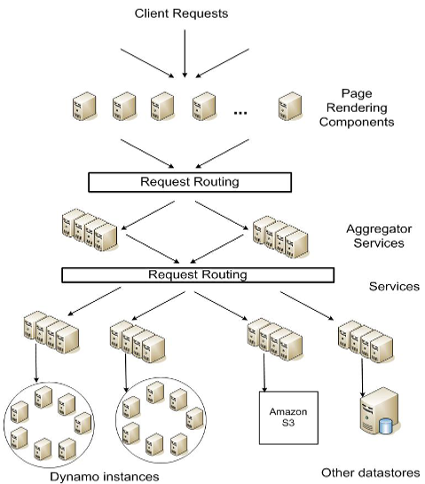
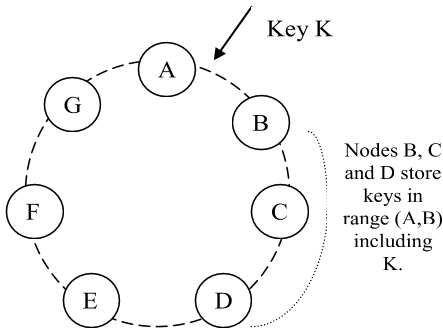
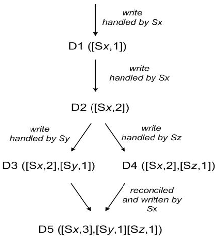
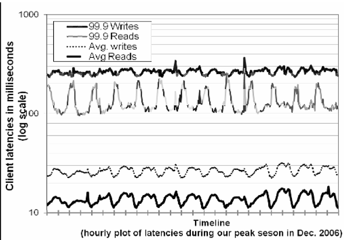
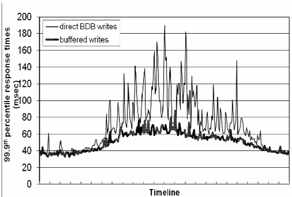
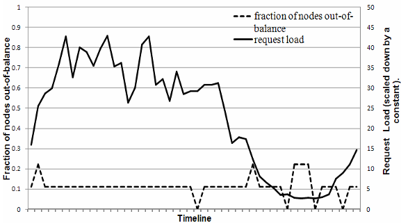
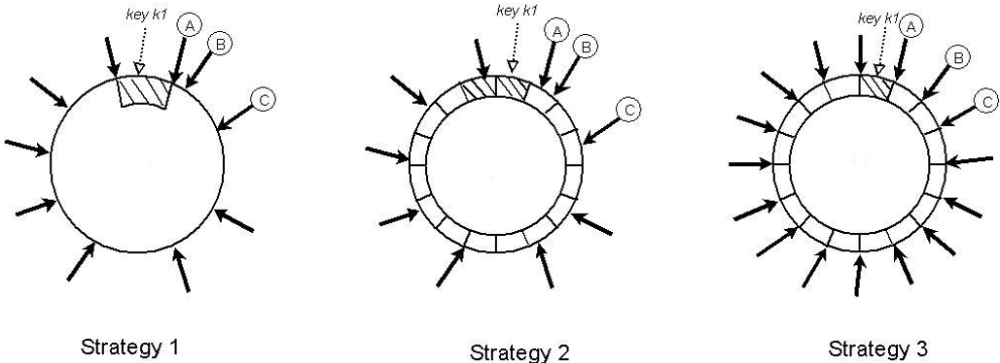
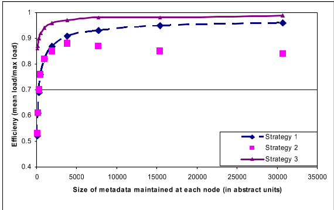

# Dynamo: Amazon's Highly Available Key-value Store

Giuseppe DeCandia、Deniz Hastorun、Madan Jampani、 Gunavardhan
Kakulapati、Avinash Lakshman、Alex Pilchin、 Swaminathan Sivasubramanian、Peter
Vosshall 和 Werner Vogels

Amazon.com

*发表于第 21 届 ACM 操作系统原理研讨会（SOSP '07）， 2007 年 10 月 14—17
日，美国华盛顿州 Stevenson。*

## 摘要

大规模系统的可靠性是 Amazon.com 面临的最大挑战之一。 Amazon.com
是全球最大的电子商务企业之一， 即使最短暂的中断也会造成显著的经济损失，
并影响客户信任。 Amazon.com 平台为世界各地的许多网站提供服务，
它构建在由数万台服务器和网络组件组成的基础设施之上，
这些设施分布于全球许多数据中心。 在这种规模下， 大大小小的组件不断发生故障；
面对这些故障时如何管理持久状态， 决定了软件系统的可靠性和可扩展性。

本文介绍 Dynamo 的设计与实现。 Dynamo 是一种高可用 key-value 存储系统， Amazon
的一些核心服务借助它提供“永远在线”的体验。 为了达到这样的可用性， Dynamo
在某些故障情形下牺牲了一致性。 它大量使用对象版本控制和应用程序辅助的冲突解决，
并以此为开发者提供了一种新颖的接口。

## 类别与主题描述符

D.4.2 [操作系统]：存储管理； D.4.5 [操作系统]：可靠性； D.4.2 [操作系统]：性能

## 通用术语

算法、管理、测量、性能、设计、可靠性

## 1. 引言

Amazon 运营着一个全球性的电子商务平台。 在高峰时段，
该平台利用分布在世界各地许多数据中心的数万台服务器， 服务数千万客户。 Amazon
平台在性能、可靠性和效率方面有严格的运营要求； 为了支持持续增长，
平台还必须具备很强的可扩展性。 可靠性是最重要的要求之一，
因为即使最短暂的中断也会造成显著的经济损失， 并影响客户信任。

我们的组织在运营 Amazon 平台的过程中学到的一项经验是：
系统的可靠性和可扩展性取决于如何管理其应用状态。 Amazon
采用高度去中心化、松耦合的面向服务架构， 其中包含数百项服务。 在这种环境里，
始终可用的存储技术尤其重要。 例如， 即使磁盘正在发生故障、网络路由反复波动，
或数据中心遭龙卷风摧毁， 客户也应当能够查看购物车并向其中添加商品。 因此，
负责管理购物车的服务必须始终能够读写其数据存储，
而且数据需要跨多个数据中心保持可用。

应对由数百万个组件组成的基础设施中的故障， 是我们的标准运行方式；
任何时刻都会有少量但不可忽视的服务器和网络组件发生故障。 因此， Amazon
的软件系统必须把故障处理视为常态来构建， 同时不能影响可用性或性能。

为了满足可靠性和扩展需求， Amazon 开发了多种存储技术。 其中最著名的可能是 Amazon
Simple Storage Service（Amazon S3）， 这项服务也对 Amazon 外部开放。
本文介绍另一种为 Amazon 平台构建的高可用、可扩展分布式数据存储 Dynamo，
并说明其设计和实现。 Dynamo 用于管理那些可靠性要求极高，
并且需要精确控制可用性、一致性、成本效益和性能之间权衡的服务状态。 Amazon
平台包含形形色色、存储需求各不相同的应用。
其中一部分应用需要足够灵活的存储技术，
让应用设计者能够根据上述权衡恰当地配置数据存储，
以最具成本效益的方式获得高可用性和有保证的性能。

Amazon 平台上的许多服务只需通过主键访问数据存储。
对于畅销榜、购物车、客户偏好、会话管理、销售排名和商品目录等许多服务，
采用关系数据库这一常见模式会造成低效， 并限制规模和可用性。 Dynamo
提供简单的、仅使用主键的接口， 以满足这些应用的需求。

Dynamo 综合运用多种成熟技术来实现可扩展性和可用性： 使用一致性哈希 [10]
对数据进行分区和复制， 并通过对象版本控制 [12] 促进一致性。
更新期间的副本一致性由一种类似法定人数的技术和去中心化副本同步协议维持。 Dynamo
还采用基于 gossip 的分布式故障检测和成员管理协议。 Dynamo
是一个完全去中心化的系统， 几乎不需要人工管理。 向 Dynamo 添加或移除存储节点时，
无需手工分区或重新分发数据。

过去一年里， Dynamo 一直是 Amazon 电子商务平台多项核心服务的底层存储技术。
在繁忙的假日购物季， 它高效扩展到极端峰值负载， 且没有发生任何停机。 例如，
维护购物车的 Shopping Cart Service 在一天内处理了数千万次请求， 促成了远超 300
万次结账； 管理会话状态的服务则处理了数十万个并发活跃会话。

这项工作对研究界的主要贡献，
在于评估如何组合不同技术来提供一个统一的高可用系统。
它证明最终一致的存储系统能够在生产环境中服务要求严苛的应用，
也说明了如何调校这些技术， 以满足性能要求极其严格的生产系统。

本文结构如下： 第 2 节介绍背景， 第 3 节介绍相关工作， 第 4 节介绍系统设计， 第
5 节说明实现， 第 6 节详述 Dynamo 在生产运行中积累的经验与认识， 第 7
节给出结论。 本文有多处本可提供更多信息， 但为了保护 Amazon 的商业利益，
我们必须减少部分细节。 因此， 第 6 节的数据中心内部与数据中心之间的延迟、 第 6.2
节的绝对请求率， 以及第 6.3 节的中断持续时间和工作负载，
均以汇总度量而非绝对数值给出。

## 2. 背景

Amazon 的电子商务平台由数百项协同工作的服务组成，
提供从推荐、订单履约到欺诈检测等各种功能。 每项服务都通过定义明确的接口暴露，
并可经由网络访问。 这些服务托管在由数万台服务器组成的基础设施中，
服务器分布于世界各地的许多数据中心。 其中一些服务是无状态的，
例如汇总其他服务响应的服务； 另一些则是有状态的，
即服务对持久存储中的状态执行业务逻辑来生成响应。

传统生产系统把状态存储在关系数据库中。 然而， 对于许多常见的状态持久化使用模式，
关系数据库远非理想方案。 这些服务大多只按主键存取数据，
并不需要关系数据库管理系统（Relational Database Management System，RDBMS）
提供的复杂查询和管理功能。 这些多余功能需要昂贵的硬件和高技能人员来运维，
因而效率很低。 此外， 可用的复制技术能力有限， 而且通常选择一致性而非可用性。
尽管近年来已有许多进展， 横向扩展数据库或使用智能分区方案进行负载均衡仍非易事。

本文描述的 Dynamo 是一种高可用数据存储技术， 用于满足这些重要服务类别的需求。
Dynamo 具有简单的 key-value 接口、 很高的可用性和明确定义的一致性窗口，
能高效使用资源， 并有简单的横向扩展方案来应对数据集大小或请求率的增长。 每项使用
Dynamo 的服务都运行自己的 Dynamo 实例。

### 2.1 系统假设与要求

面向这类服务的存储系统有以下要求：

**查询模型：** 对由 key 唯一标识的数据项执行简单的读写操作。 状态以唯一 key
标识的二进制对象， 即 blob 形式存储。 操作不会跨越多个数据项，
也不需要关系模式。 这项要求源于一个观察： Amazon
有相当一部分服务能够使用这种简单查询模型， 而不需要任何关系模式。 Dynamo
面向需要存储较小对象的应用， 对象通常小于 1 MB。

**ACID 属性：** 原子性、一致性、隔离性和持久性（Atomicity, Consistency,
Isolation, Durability，ACID） 是一组保证数据库事务得到可靠处理的属性。
在数据库语境中， 对数据的一次逻辑操作称为事务。 Amazon 的经验表明， 提供 ACID
保证的数据存储往往可用性较差。 业界和学术界都已广泛承认这一点 [5]。 Dynamo
面向愿意采用较弱一致性， 即弱化 ACID 中的“C”， 以换取高可用性的应用。 Dynamo
不提供任何隔离保证， 而且只允许单 key 更新。

**效率：** 系统需要在通用硬件基础设施上运行。 Amazon
平台中的服务有严格的延迟要求， 通常以延迟分布的第 99.9 百分位衡量。
状态访问对服务运行至关重要， 因此存储系统必须能够满足如此严格的服务等级协议
（Service Level Agreement，SLA，见第 2.2 节）。 服务必须能够配置 Dynamo，
使其持续达到延迟和吞吐量要求。
需要权衡的因素包括性能、成本效益、可用性和持久性保证。

**其他假设：** Dynamo 只供 Amazon 内部服务使用。
它的运行环境被假定为非敌对环境， 因而没有身份验证和授权之类的安全要求。 此外，
由于每项服务都使用独立的 Dynamo 实例， 其初始设计目标是扩展到数百台存储主机。
后续章节将讨论 Dynamo 的可扩展性限制和可能的扩展方式。

### 2.2 服务等级协议（SLA）

为了保证应用能在有界时间内提供功能，
平台中的每一项依赖都需要以更严格的时限提供功能。 客户端与服务之间订立 SLA，
这是一份经过正式协商的契约， 双方就多项系统特征达成一致；
其中最重要的内容包括客户端对特定应用程序编程接口（API）的预期请求率分布，
以及这些条件下预期的服务延迟。 一个简单的 SLA 示例是：
服务保证在客户端峰值负载为每秒 500 个请求时， 99.9% 的请求能在 300 ms
内得到响应。

> 图 1：Amazon 平台的面向服务架构。 动态页面渲染组件调用聚合服务或其他服务，
> 各服务在自身边界内使用不同的数据存储来管理状态。

SLA 在 Amazon 去中心化的面向服务基础设施中发挥着重要作用。 例如，
电子商务网站的一次页面请求通常要求渲染引擎向 150 多项服务发送请求，
再据此构造响应。 这些服务经常有多项依赖， 其依赖通常又是其他服务，
所以应用的调用图包含不止一层并不罕见。
为确保页面渲染引擎能维持明确的页面交付时限，
调用链中的每项服务都必须遵守其性能契约。

图 1 是 Amazon 平台架构的抽象视图。 动态 Web 内容由页面渲染组件生成，
这些组件又会查询许多其他服务。 服务可以使用不同的数据存储管理状态，
而且这些数据存储只能从服务边界内访问。 有些服务调用多项其他服务来生成组合响应，
充当聚合器。 聚合服务通常是无状态的， 但会大量使用缓存。

业界制定性能型 SLA 的常见方法， 是使用平均值、中位数和预期方差来描述它。 Amazon
发现， 如果目标是让所有客户而不只是大多数客户获得良好体验， 这些度量还不够好。
例如， 如果大量使用个性化技术， 历史记录较长的客户就需要更多处理，
这会影响分布高端的性能。 以平均或中位响应时间表述的 SLA，
无法反映这一重要客户群体的性能。 为解决这个问题， Amazon 以分布的第 99.9
百分位表述和衡量 SLA。 之所以选择 99.9% 而非更高的百分位，
是因为成本收益分析表明， 若要把性能再提高到那个程度， 成本会显著增加。 Amazon
生产系统的经验表明， 与基于平均值或中位数定义 SLA 的系统相比，
这种方法带来了更好的整体体验。

本文多次提到分布的第 99.9 百分位， 这反映了 Amazon
工程师坚持从客户体验角度关注性能。 许多论文报告平均值，
因此本文也会在适于比较时列出平均值。 不过， Amazon
的工程与优化工作并不以平均值为重点。 有些技术， 例如通过负载均衡选择写协调节点，
完全是为了控制第 99.9 百分位的性能。

存储系统往往在制定服务 SLA 中扮演重要角色； 如果业务逻辑相对轻量， 许多 Amazon
服务正是如此， 它就尤其重要。 此时， 状态管理成为服务 SLA 的主要组成部分。
Dynamo 的一项主要设计考量， 是让服务能够控制持久性和一致性等系统属性，
并自行权衡功能、性能和成本效益。

### 2.3 设计考量

商业系统使用的数据复制算法传统上以同步方式协调副本，
以提供强一致的数据访问接口。 为了达到这种一致性，
这些算法不得不在某些故障情形下牺牲数据可用性。 例如，
它们不会冒险给出不确定是否正确的答案， 而是让数据不可用，
直到完全确定答案正确为止。 早期的复制数据库研究已经充分说明：
在可能发生网络故障时， 强一致性和高数据可用性无法同时实现 [2, 11]。 因此，
系统和应用需要了解在何种条件下能够获得哪些属性。

对于容易发生服务器和网络故障的系统， 可以使用乐观复制来提高可用性：
允许变更在后台传播到副本， 并容忍彼此断开时的并发工作。 这种方法的挑战在于，
它可能产生必须检测并解决的冲突变更。 冲突解决过程带来两个问题： 何时解决，
以及由谁解决。 Dynamo 被设计为最终一致的数据存储， 也就是说，
所有更新最终都会到达所有副本。

一项重要设计选择是决定在*何时*解决更新冲突， 也就是在读取还是写入时解决冲突。
许多传统数据存储在写入时解决冲突， 以保持读取逻辑简单 [7]。 在这类系统中，
如果数据存储在某一时刻无法访问全部或多数副本， 写入就可能被拒绝。 Dynamo
则瞄准“始终可写”的设计空间， 即提供很高写入可用性的数据存储。 对多项 Amazon
服务来说， 拒绝客户更新会造成糟糕的客户体验。 例如， 即使发生网络和服务器故障，
购物车服务也必须允许客户添加和移除商品。 为了保证写入永不被拒绝，
这项要求迫使我们把冲突解决的复杂性推到读取路径。

下一个设计选择是由*谁*执行冲突解决， 可以是数据存储， 也可以是应用程序。
如果由数据存储解决冲突， 它的选择相当有限， 只能使用“最后写入胜出”[22]
等简单策略。 应用程序了解数据模式， 因而能够选择最适合其客户体验的冲突解决方法。
例如， 维护客户购物车的应用可以选择“合并”冲突版本， 返回一份统一的购物车。
尽管这样很灵活， 有些应用开发者可能不想自行编写冲突解决机制，
而选择把工作下推给数据存储； 数据存储随后采用“最后写入胜出”等简单策略。

设计还遵循以下关键原则：

- **增量可扩展性：**Dynamo 应能一次横向扩展一台存储主机，
  下文把存储主机称为“节点”， 并尽量减少对系统运维人员和系统本身的影响。
- **对称性：**Dynamo 中每个节点承担的职责应与对等节点相同；
  不应存在承担特殊角色或额外职责的特殊节点。 根据我们的经验，
  对称性简化了系统配置和维护。
- **去中心化：**这是对称性的延伸； 设计应优先采用去中心化的 peer-to-peer 技术，
  而非集中式控制。 过去集中式控制曾造成系统中断， 我们的目标是尽可能避免它，
  从而得到更简单、更可扩展且可用性更高的系统。
- **异构性：**系统需要能够利用底层基础设施的异构性。 例如，
  工作量分配必须与各服务器的能力成比例。 只有这样，
  才能添加容量更大的新节点而不必一次升级所有主机。

## 3. 相关工作

### 3.1 Peer-to-peer 系统

有多种 peer-to-peer（P2P）系统研究过数据存储和分发问题。 Freenet 和 Gnutella[^1]
等第一代 P2P 系统主要用于文件共享。 它们是非结构化 P2P 网络的例子， peer
之间的覆盖网络链接任意建立。 在这类网络中， 搜索查询通常会泛洪整个网络，
以寻找尽可能多的、共享该数据的 peer。 P2P
系统随后演化到下一代，即通常所说的结构化 P2P 网络。 这种网络采用全局一致的协议，
确保任何节点都能把搜索查询高效路由到持有所需数据的某个 peer。 Pastry [16] 和
Chord [20] 等系统使用路由机制， 确保查询能在有界跳数内得到回答。
为减少多跳路由引入的额外延迟， 有些 P2P 系统采用 $O(1)$ 路由， 例如文献 [14]；
每个 peer 在本地维护足够的路由信息，
因而能在常数跳数内把访问数据项的请求路由到适当的 peer。

OceanStore [9] 和 PAST [17] 等多种存储系统构建在这些路由覆盖网络之上。
OceanStore 提供全局、事务型、持久的存储服务，
支持对广泛复制的数据执行串行化更新。 为了允许并发更新，
同时避免广域锁固有的许多问题， 它使用基于冲突解决的更新模型。 文献 [21]
引入冲突解决， 以减少事务中止次数。 OceanStore 通过处理一系列更新、
为其选择全序， 再按此顺序原子地应用更新来解决冲突。
它面向数据复制到不受信任基础设施上的环境。 相比之下， PAST 在 Pastry
之上为持久且不可变的对象提供简单抽象层，
并假设应用程序能在其上构建所需的存储语义， 例如可变文件。

[^1]: <http://freenetproject.org/>；<http://www.gnutella.org/>。

### 3.2 分布式文件系统与数据库

文件系统和数据库系统研究领域已经广泛探讨如何分发数据，
以获得性能、可用性和持久性。 P2P 存储系统只支持扁平命名空间，
分布式文件系统通常还支持层次化命名空间。 Ficus [15] 和 Coda [19]
等系统以牺牲一致性为代价复制文件， 从而获得高可用性。
更新冲突通常由专门的冲突解决过程管理。 Farsite [1] 是一种不使用 Network File
System（NFS）式集中服务器的分布式文件系统， 通过复制获得高可用性和可扩展性。
Google 文件系统（Google File System，GFS）[6] 是另一种为托管 Google
内部应用状态而构建的分布式文件系统。 GFS 采用简单设计： 一台 master
服务器托管全部元数据， 数据被切分为 chunk 并存储在 chunkserver 中。 Bayou
是一种支持离线操作并提供最终数据一致性的分布式关系数据库系统 [21]。

在这些系统中， Bayou、Coda 和 Ficus 允许离线操作，
能够承受网络分区和中断等问题。 这些系统的冲突解决过程有所不同： Coda 和 Ficus
在系统层解决冲突， Bayou 则允许应用层解决冲突。 不过， 它们都保证最终一致性。
与这些系统类似， Dynamo 允许在网络分区期间继续读写，
并通过不同的冲突解决机制处理更新冲突。 FAB [18]
等分布式块存储系统把大型对象切分成较小的块， 再以高可用方式存储每个块。
相比这些系统， key-value 存储更适合本文的场景， 原因有二： 其一，
它用于存储相对较小的对象， 即小于 1 MB； 其二， key-value
存储更易针对每个应用单独配置。 Antiquity
是一种为应对多台服务器故障而设计的广域分布式存储系统 [23]。
它用安全日志维持数据完整性， 把每份日志复制到多台服务器以获得持久性， 并用
Byzantine fault tolerance 协议保证数据一致性。 Dynamo 与之不同，
它不关注数据完整性和安全问题， 而是为可信环境构建。 Bigtable
是一种管理结构化数据的分布式存储系统， 它维护稀疏、多维、有序映射，
并允许应用通过多个属性访问数据 [2]。 Dynamo 与 Bigtable 相比， 面向只需要
key-value 访问的应用， 主要关注高可用性； 即使发生网络分区或服务器故障，
更新也不会被拒绝。

传统的复制型关系数据库系统重点保证复制数据的强一致性。
强一致性虽然为应用开发者提供了方便的编程模型， 却限制了系统的可扩展性和可用性
[7]。 由于这类系统通常提供强一致性保证， 它们无法处理网络分区。

### 3.3 讨论

Dynamo 与上述去中心化存储系统的目标要求不同。 首先， Dynamo
主要面向需要“始终可写”数据存储的应用； 更新不会因为故障或并发写入而被拒绝。
这是许多 Amazon 应用的关键要求。 其次， 如前所述， Dynamo
为单一管理域内的基础设施构建， 假设所有节点都可信。 再次， 使用 Dynamo
的应用不需要层次化命名空间， 这在许多文件系统中很常见；
也不需要传统数据库支持的复杂关系模式。 最后， Dynamo 为延迟敏感型应用构建，
这些应用要求至少 99.9% 的读写操作在数百毫秒内完成。 为了满足如此严格的延迟要求，
必须避免通过多个节点路由请求， 而 Chord 和 Pastry
等多种分布式哈希表系统采用的正是这种典型设计。
这是因为多跳路由会增大响应时间的变化， 从而提高较高百分位处的延迟。 Dynamo
可以描述为零跳 Distributed Hash Table（DHT）：
每个节点都在本地维护足够的路由信息， 能够把请求直接路由到适当的节点。

## 4. 系统架构

需要在生产环境中运行的存储系统具有复杂的架构。 除了实际的数据持久化组件，
系统还必须为负载均衡、成员管理与故障检测、故障恢复、
副本同步、过载处理、状态转移、并发与作业调度、
请求编组、请求路由、系统监控与告警以及配置管理， 提供可扩展且健壮的解决方案。
本文无法逐一描述这些方案的细节， 因此将重点放在 Dynamo
使用的核心分布式系统技术上： 分区、复制、版本控制、成员管理、故障处理和扩展。 表
1 汇总了 Dynamo 采用的技术及其优势。

| 问题               | 技术                                 | 优势                                                   |
| ------------------ | ------------------------------------ | ------------------------------------------------------ |
| 分区               | 一致性哈希                           | 增量可扩展性                                           |
| 写入的高可用性     | 向量时钟，并在读取时调和             | 版本大小与更新率解耦                                   |
| 处理临时故障       | 宽松法定人数和提示移交               | 当部分副本不可用时提供高可用性和持久性保证             |
| 从永久故障中恢复   | 使用 Merkle 树进行反熵               | 在后台同步发生分歧的副本                               |
| 成员管理与故障检测 | 基于 gossip 的成员管理协议和故障检测 | 保持对称性，避免使用集中式注册表存储成员及节点存活信息 |

> 表 1：Dynamo 使用的技术及其优势汇总。

### 4.1 系统接口

Dynamo 通过简单接口存储与 key 关联的对象， 并暴露两个操作： `get()` 和 `put()`。
`get(key)` 操作在存储系统中定位与 key 关联的对象副本，
并随上下文返回单个对象或一组版本冲突的对象。 `put(key, context, object)`
操作根据关联的 key 确定对象副本的存放位置， 再把副本写入磁盘。
上下文编码调用方不可见的对象系统元数据， 其中包含对象版本等信息。
上下文信息与对象一同存储， 以便系统验证 `put` 请求中所提供上下文对象的有效性。

Dynamo 把调用方提供的 key 和对象都视为不透明字节数组。 它对 key 应用
Message-Digest Algorithm 5（MD5）哈希， 生成一个 128 位标识符，
据此确定负责服务该 key 的存储节点。

### 4.2 分区算法

Dynamo 的关键设计要求之一是必须能够增量扩展。 这需要一种机制，
在系统的节点集合， 即存储主机上动态划分数据。 Dynamo 的分区方案依靠一致性哈希，
把负载分散到多台存储主机。 在一致性哈希 [10] 中，
哈希函数的输出范围被视为固定的环形空间， 即最大哈希值之后绕回最小哈希值。
系统中的每个节点都会在此空间中获得一个随机值， 代表它在环上的“位置”。 对于由 key
标识的每个数据项， 系统对 key 进行哈希以得到它在环上的位置，
随后顺时针沿环行进， 找到位置值大于该数据项位置的第一个节点，
并把数据项分配给它。

> 图 2：Dynamo 环中的 key 分区与复制。 key $K$ 落在范围 $(A,B]$ 中； 当 $N=3$
> 时， 节点 B、C 和 D 存储该范围内包括 $K$ 在内的 key。

因此， 每个节点负责环上它与其前驱节点之间的区域。 一致性哈希的主要优点是，
节点离开或加入只会影响紧邻它的节点， 其他节点不受影响。

基本的一致性哈希算法有一些问题。 第一， 把每个节点随机放置在环上，
会导致数据和负载分布不均匀。 第二， 基本算法忽略了节点性能的异构性。
为解决这些问题， Dynamo 使用一致性哈希的一种变体， 与文献 [10, 20]
中的方法相似： 每个节点不只映射到环上的一个点， 而是被分配到多个点。 为此，
Dynamo 使用“虚拟节点”概念。 虚拟节点看起来像系统中的单个节点，
但每个物理节点可以负责多个虚拟节点。 实际上，
新节点加入系统时会在环上获得多个位置， 下文称为 token。 第 6 节将讨论 Dynamo
分区方案的调优过程。

使用虚拟节点有以下优点：

- 如果某节点因故障或例行维护而不可用， 它承担的负载会均匀分散到其余可用节点。
- 当节点恢复可用或新节点加入系统时，
  这个新近可用的节点会从其他各可用节点接收大致等量的负载。
- 可以根据节点容量决定它负责的虚拟节点数量， 从而考虑物理基础设施的异构性。

### 4.3 复制

为了获得高可用性和持久性， Dynamo 在多台主机上复制数据。 每个数据项被复制到 $N$
台主机， 其中 $N$ 是按实例配置的参数。 每个 key $k$ 都被分配给一个协调节点，
其确定方法见上一节。 协调节点负责复制落在其范围内的数据项。
除了在本地存储其范围内的每个 key， 协调节点还把这些 key 复制到环上顺时针方向的
$N-1$ 个后继节点。 于是， 系统中每个节点都负责它与其第 $N$
个前驱之间的环形区域。 在图 2 中， 节点 B 除在本地存储 key $k$ 外，
还把它复制到节点 C 和 D。 节点 D 将存储落在 $(A,B]$、$(B,C]$ 和 $(C,D]$ 范围内的
key。

负责存储特定 key 的节点列表称为偏好列表。 如第 4.8 节所述， 系统经过相应设计，
使每个节点都能为任何特定 key 确定该列表应包含哪些节点。 为了应对节点故障，
偏好列表包含多于 $N$ 个节点。 请注意， 使用虚拟节点时， 某个 key 的前 $N$
个后继位置可能归少于 $N$ 个不同的物理节点所有， 即一个物理节点可能占据前 $N$
个位置中的多个位置。 为解决这个问题， 构建 key
的偏好列表时会跳过环上的一些位置， 确保列表只包含互不相同的物理节点。

### 4.4 数据版本控制

Dynamo 提供最终一致性， 允许更新异步传播到所有副本。 一次 `put()`
调用可能在更新尚未应用到全部副本时就返回调用方， 因而后续 `get()`
操作可能返回没有最新更新的对象。 如果不发生故障， 更新传播时间存在上界。
但在服务器中断或网络分区等特定故障情形下， 更新可能很长时间都无法到达全部副本。

Amazon 平台中有一类应用能够容忍这种不一致， 也能在这些条件下正常工作。 例如，
购物车应用要求“加入购物车”操作绝不能被遗忘或拒绝。
如果无法取得购物车的最新状态， 而用户修改了较旧版本， 这一变更仍然有意义，
应当得到保留。 但它也不应取代当前不可用的状态，
因为后者本身可能包含应当保留的变更。 请注意，
“加入购物车”和“从购物车删除商品”操作都会被转换为对 Dynamo 的 `put` 请求。
如果客户要在购物车中添加或移除商品， 但最新版本不可用，
系统就在旧版本中添加或移除该商品， 之后再调和发生分歧的版本。

为了提供这种保证， Dynamo 把每次修改的结果视为一个新的、不可变的数据版本。
它允许系统中同时存在一个对象的多个版本。 大多数时候， 新版本会涵盖旧版本，
系统本身可以确定权威版本， 这称为语法调和。 但是， 发生故障并伴随并发更新时，
版本可能产生分支， 形成对象的冲突版本。 此时系统无法调和同一对象的多个版本，
客户端必须执行调和， 把数据演化的多个分支重新收拢为一个， 这称为语义调和。
一种典型的收拢操作是“合并”客户购物车的不同版本。 采用这种调和机制，
“加入购物车”操作永远不会丢失， 但已删除的商品可能重新出现。

需要理解的是， 某些故障模式可能让系统中存在同一份数据的不止两个、 而是多个版本。
网络分区和节点故障期间的更新， 可能使对象形成各不相同的版本子历史，
系统未来必须对其进行调和。 这要求应用的设计明确承认同一份数据可能存在多个版本，
以保证永不丢失任何更新。

Dynamo 使用向量时钟 [12] 捕获同一对象不同版本之间的因果关系。
向量时钟实际上是一组“节点、计数器”对。 每个对象的每个版本都关联一个向量时钟。
通过检查两个对象版本的向量时钟， 可以判断它们位于并行分支上， 还是存在因果顺序。
如果第一个对象时钟中各节点的计数器，
都小于或等于第二个对象时钟中相应节点的计数器，
那么第一个对象就是第二个对象的祖先， 可以丢弃。 否则， 两项变更被视为存在冲突，
需要调和。

在 Dynamo 中， 客户端要更新对象时， 必须指明所更新的版本。
它通过传入先前读取操作得到的上下文来做到这一点， 该上下文包含向量时钟信息。
处理读取请求时， 如果 Dynamo 取得多个无法在语法上调和的分支，
就返回所有叶节点对象， 并在上下文中附上相应的版本信息。
使用这个上下文执行的更新被视为已经调和了分歧版本， 各分支会收拢成一个新版本。

> 图 3：对象版本随时间的演化。 $D_1$、$D_2$、$D_3$ 顺次形成一条因果链， 从 $D_2$
> 并发产生的 $D_3$ 和 $D_4$ 彼此冲突； 客户端调和二者后生成同时涵盖这两个版本的
> $D_5$。

为说明向量时钟的用法， 考虑图 3 中的示例。 客户端写入一个新对象。 处理该 key
写入的节点， 假设为 $S_x$， 递增自身序列号， 并用它创建数据的向量时钟。
系统现在有对象 $D_1$ 及其时钟 $[(S_x,1)]$。 客户端更新该对象，
假设仍由同一节点处理请求。 系统现在又有对象 $D_2$ 及其时钟 $[(S_x,2)]$。 $D_2$
是 $D_1$ 的后代， 所以会覆盖 $D_1$； 但尚未见到 $D_2$ 的节点上可能仍残留 $D_1$
的副本。 假设同一客户端再次更新对象， 这次由另一台服务器 $S_y$ 处理请求。
系统现在有数据 $D_3$ 及其时钟 $[(S_x,2),(S_y,1)]$。

接着假设另一个客户端读取 $D_2$ 后尝试更新它， 并由另一个节点 $S_z$ 执行写入。
系统现在有 $D_4$， 它是 $D_2$ 的后代， 版本时钟为 $[(S_x,2),(S_z,1)]$。 知道
$D_1$ 或 $D_2$ 的节点收到 $D_4$ 及其时钟时， 能够判定新数据已经覆盖 $D_1$ 和
$D_2$， 因而可以对二者执行垃圾回收。 知道 $D_3$ 的节点收到 $D_4$ 时，
则会发现二者之间不存在因果关系。 换句话说， $D_3$ 和 $D_4$
各有未反映在另一版本中的变更。 系统必须保留两个数据版本，
并在读取时把它们提供给客户端进行语义调和。

现在假设某客户端同时读取 $D_3$ 和 $D_4$， 读取上下文会反映找到了两个值。
该上下文是 $D_3$ 和 $D_4$ 时钟的汇总， 即 $[(S_x,2),(S_y,1),(S_z,1)]$。
如果客户端执行调和， 并由节点 $S_x$ 协调写入， $S_x$
就会更新时钟中自己的序列号。 新数据 $D_5$ 的时钟为 $[(S_x,3),(S_y,1),(S_z,1)]$。

向量时钟可能存在一个问题： 如果由许多服务器协调写入， 时钟会不断增大。
实际中这种情况不太可能发生， 因为写入通常由偏好列表前 $N$ 个节点之一处理。
发生网络分区或多台服务器故障时， 写请求可能由不在偏好列表前 $N$ 位的节点处理，
导致向量时钟变大。 在这类情形下， 最好限制向量时钟的大小。 为此， Dynamo
采用以下时钟截断方案： 除“节点、计数器”对外， Dynamo 还存储一个时间戳，
指示该节点上次更新数据项的时间。 向量时钟中的“节点、计数器”对数量达到阈值时，
例如 10 个， 最旧的一对会从时钟中删除。 显然， 这种截断方案可能使调和效率降低，
因为系统无法准确推断后代关系。 不过， 这个问题尚未在生产环境出现，
所以我们没有深入研究。

### 4.5 `get()` 与 `put()` 操作的执行

Dynamo 中任何存储节点都可以接收客户端对任意 key 发起的 `get` 和 `put` 操作。
为便于说明， 本节描述无故障环境中这些操作的执行方式，
下一节再说明发生故障时如何执行读写。

`get` 和 `put` 操作都通过 Hypertext Transfer Protocol（HTTP）， 使用 Amazon
基础设施专用的请求处理框架调用。 客户端可以采用两种节点选择策略：
一是让请求经过通用负载均衡器， 由后者根据负载信息选择节点；
二是使用能够感知分区的客户端库， 把请求直接路由到适当的协调节点。
第一种方法的优点是客户端应用无需链接任何 Dynamo 专用代码；
第二种策略跳过了可能发生的一次转发， 所以延迟更低。

处理读写操作的节点称为*协调节点*。 通常， 它是偏好列表前 $N$ 个节点中的第一个。
如果请求经由负载均衡器接收， 访问某 key 的请求可能被路由到环上的任意随机节点。
在这种情况下， 如果接收请求的节点不在该 key 偏好列表的前 $N$ 位，
它就不会协调请求， 而是将请求转发给偏好列表前 $N$ 个节点中的第一个。

读写操作会选取偏好列表中前 $N$ 个健康节点， 跳过已宕机或无法访问的节点。
所有节点都健康时， 访问 key 偏好列表中的前 $N$ 个节点。
存在节点故障或网络分区时， 则访问偏好列表中排名更靠后的节点。

为了维持副本之间的一致性， Dynamo 使用与法定人数系统类似的一致性协议。
该协议有两个关键的可配置值： $R$ 和 $W$。 $R$
是一次成功读取必须参与的最少节点数， $W$ 是一次成功写入必须参与的最少节点数。 令
$R+W>N$ 可得到类似法定人数的系统。 在此模型中， 一次 `get` 或 `put` 操作的延迟，
由 $R$ 或 $W$ 个副本中最慢的一个决定。 因此， $R$ 和 $W$ 通常被配置为小于 $N$，
以得到更低的延迟。

收到某 key 的 `put()` 请求后， 协调节点为新版本生成向量时钟，
并在本地写入新版本。 随后， 协调节点把新版本及其向量时钟发送给排名最高的 $N$
个可达节点。 如果至少有 $W-1$ 个节点响应， 就认为写入成功。

类似地， 对于 `get()` 请求， 协调节点向该 key 偏好列表中排名最高的 $N$
个可达节点， 请求该 key 现存的所有数据版本， 然后等候 $R$
个响应再把结果返回客户端。 如果协调节点最终收集到多个数据版本，
它会返回所有被判定为不存在因果关系的版本。 客户端随后调和这些分歧版本，
并把调和后的版本写回，取代当前各版本。

### 4.6 处理故障：提示移交

如果 Dynamo 使用传统法定人数方法， 它会在服务器故障和网络分区期间变得不可用，
而且即使发生最简单的故障， 持久性也会下降。 为解决这个问题， Dynamo
不强制要求严格的法定人数成员， 而使用“宽松法定人数”：
所有读写操作都在偏好列表中的前 $N$ 个健康节点上执行，
这些节点不一定是沿一致性哈希环行进时最先遇到的 $N$ 个节点。

考虑图 2 中 $N=3$ 的 Dynamo 配置。 如果节点 A
在一次写操作期间暂时宕机或无法访问， 通常应存放在 A 上的副本就会改为发送给节点
D， 以维持所需的可用性和持久性保证。 发送给 D 的副本在元数据中带有一条提示，
说明它原本应发送给哪个节点， 此例中为 A。
收到提示副本的节点会将其保存在单独的本地数据库中， 并定期扫描该数据库。 D 检测到
A 已恢复后， 就尝试把副本交付给 A。 传输成功后， D 可以从本地存储中删除该对象，
而不会减少系统中的副本总数。 这一过程称为提示移交。

Dynamo 使用提示移交， 确保读写操作不会因临时节点或网络故障而失败。
需要最高可用性的应用可以把 $W$ 设为 1； 这样， 只要系统中有一个节点已把 key
持久写入本地存储， 写入就会被接受。 因此， 只有当系统中所有节点都不可用时，
写请求才会被拒绝。 不过在实践中， Amazon 的大多数生产服务会把 $W$ 设为更高的值，
以达到所需的持久性水平。 第 6 节将更详细地讨论 $N$、$R$ 和 $W$ 的配置。

高可用存储系统必须能够应对整个数据中心发生故障。
电力中断、制冷故障、网络故障和自然灾害都可能导致数据中心故障。 Dynamo
的配置会让每个对象跨多个数据中心复制。 实质上， 系统构造 key 的偏好列表时，
会让存储节点分布在多个数据中心。 这些数据中心通过高速网络链路连接。
这种跨数据中心复制方案让我们能够应对整个数据中心的故障， 而不会造成数据不可用。

### 4.7 处理永久故障：副本同步

如果系统成员变动很少、 节点故障只是暂时的， 提示移交的效果最好。
但在某些情况下， 提示副本可能在归还原副本节点之前就变得不可用。
为了处理这种情形及其他持久性威胁， Dynamo 实现了反熵， 即副本同步协议，
以保持副本同步。

为了更快检测副本间的不一致， 并尽量减少数据传输量， Dynamo 使用 Merkle 树 [13]。
Merkle 树是一种哈希树， 叶节点是各 key 对应值的哈希，
树中更高层的父节点则是各自子节点的哈希。 Merkle 树的主要优点是，
无需下载整棵树或整个数据集， 就能独立检查每个分支。 此外，
在检查副本间的不一致时， Merkle 树有助于减少需要传输的数据量。 例如，
如果两棵树的根哈希值相等， 树中叶节点的值也相等， 节点无需同步。 否则，
就说明某些副本的值不同。 此时节点可以交换子节点的哈希值， 不断继续这一过程，
直到到达树叶； 届时主机就能找出“不同步”的 key。 Merkle
树既尽量减少了同步所需的数据传输量， 也减少了反熵过程执行的磁盘读取次数。

Dynamo 通过以下方式使用 Merkle 树执行反熵： 每个节点为它托管的每个 key 范围，
即一个虚拟节点覆盖的 key 集合， 分别维护一棵 Merkle 树。 这样， 节点可以检查某个
key 范围内的各 key 是否为最新状态。 两个节点交换它们共同托管的 key 范围所对应
Merkle 树的根。 随后， 节点使用上述树遍历方案判断是否存在差异，
并执行适当的同步操作。 这种方案的缺点是， 节点加入或离开系统时许多 key
范围都会变化， 因而需要重新计算相应的树。 不过， 第 6.2
节描述的改进分区方案解决了这个问题。

### 4.8 成员管理与故障检测

#### 4.8.1 环成员管理

在 Amazon 的环境中， 节点因故障和维护任务而中断通常只是暂时的，
但也可能持续很长时间。 节点中断很少意味着永久离开，
所以不应导致重新均衡分区分配或修复无法访问的副本。 类似地，
人工失误可能导致意外启动新的 Dynamo 节点。 基于这些原因，
我们认为应使用显式机制发起节点加入或移出 Dynamo 环的操作。
管理员使用命令行工具或浏览器连接到 Dynamo 节点， 发出成员变更命令，
让节点加入环或从环中移除。 服务该请求的节点把成员变更及其发出时间写入持久存储。
由于节点可能多次移除并重新加入， 这些成员变更会构成历史记录。 基于 gossip
的协议传播成员变更， 并维护最终一致的成员视图。 每个节点每秒联系一个随机选择的
peer， 两个节点高效调和各自持久保存的成员变更历史。

节点首次启动时会选择一组 token， 即一致性哈希空间中的虚拟节点，
并把节点映射到各自的 token 集合。 该映射持久保存在磁盘上， 最初只包含本地节点和
token 集合。 不同 Dynamo 节点存储的映射，
会在调和成员变更历史的同一次通信交换中完成调和。 因此， 分区和放置信息也通过基于
gossip 的协议传播， 每个存储节点都知道其 peer 负责的 token 范围。 这样，
每个节点都能把 key 的读写操作直接转发到正确的节点集合。

#### 4.8.2 外部发现

上述机制可能暂时形成逻辑上分区的 Dynamo 环。 例如， 管理员可能先联系节点 A， 让
A 加入环； 然后联系节点 B， 让 B 加入环。 在这种情形下， A 和 B
都会认为自己是环的成员， 却都不会立刻知道对方的存在。 为防止逻辑分区， 一些
Dynamo 节点会充当种子。 种子是通过外部机制发现、 且为所有节点所知的节点。
由于所有节点最终都会与种子调和成员信息， 逻辑分区极不可能发生。
种子可以来自静态配置或配置服务， 通常是 Dynamo 环中功能完整的节点。

#### 4.8.3 故障检测

Dynamo 使用故障检测， 以避免在 `get()`、`put()` 操作以及传输分区和提示副本期间，
尝试与无法访问的 peer 通信。 若目的只是避免失败的通信尝试，
完全使用局部故障视图就足够了： 如果节点 B 不响应节点 A 的消息， A 就可以认为 B
已发生故障， 即使 B 仍能响应节点 C 的消息。 如果客户端请求以稳定速率在 Dynamo
环内产生节点间通信， 当 B 不响应消息时， 节点 A 会很快发现 B 无响应； A
随后使用替代节点， 为映射到 B 所负责分区的请求提供服务， 并定期重试 B，
检查它是否恢复。 如果没有客户端请求驱动两个节点之间的流量，
它们其实都不需要知道对方是否可达、是否有响应。

去中心化故障检测采用简单的 gossip 式协议，
让系统中的每个节点了解其他节点的到达或离开。
有关去中心化故障检测器及影响其准确性的参数， 详见文献 [8]。 Dynamo
的早期设计使用去中心化故障检测器， 维护全局一致的故障状态视图。 后来我们发现，
显式节点加入和离开方法消除了对全局故障状态视图的需要。 原因是，
永久添加或移除节点会通过显式方法通知其他节点；
临时节点故障则由各节点在转发请求期间无法与其他节点通信时自行检测。

### 4.9 添加与移除存储节点

新节点 $X$ 加入系统时， 会获得随机散布在环上的多个 token。 对于分配给 $X$ 的每个
key 范围， 当前可能有不超过 $N$ 个节点负责处理落在该 token 范围内的 key。
由于这些 key 范围被分配给 $X$， 一些现有节点不再需要存储其中的某些 key，
因而会把它们传输给 $X$。 考虑一种简单的引导情形： 节点 $X$ 加入图 2 所示环中 A
与 B 之间的位置。 $X$ 加入系统后， 负责存储 $(F,G]$、$(G,A]$ 和 $(A,X]$ 范围内的
key。 因此， 节点 B、C 和 D 不再需要分别存储这些范围内的 key。 B、C 和 D
会提出传输相应的 key 集合， 并在得到 $X$ 确认后执行传输。 节点从系统中移除时，
key 的重新分配过程与之相反。

运维经验表明， 这种方法把 key 分发工作产生的负载均匀分布到各存储节点；
这对于满足延迟要求和确保快速引导非常重要。 最后，
通过在来源节点和目标节点之间增加一轮确认， 可以保证目标节点不会收到特定 key
范围的重复传输。

## 5. 实现

Dynamo 的每个存储节点包含三个主要软件组件： 请求协调、成员管理与故障检测，
以及本地持久化引擎。 这些组件都使用 Java 实现。

Dynamo 的本地持久化组件可以插入不同的存储引擎。 正在使用的引擎包括 Berkeley
Database（BDB） Transactional Data Store[^2]、 BDB Java Edition、MySQL，
以及带持久后备存储的内存缓冲区。 设计可插拔持久化组件的主要原因，
是可以选择最适合应用访问模式的存储引擎。 例如， BDB 能处理通常为数十 KB 的对象，
MySQL 则能处理更大的对象。 应用根据自身对象大小分布选择 Dynamo
的本地持久化引擎。 Dynamo 的生产实例大多使用 BDB Transactional Data Store。

[^2]: <http://www.oracle.com/database/berkeley-db.html>。

请求协调组件构建在事件驱动消息传递底层之上， 消息处理流水线被切分为多个阶段，
类似 Staged Event-Driven Architecture（SEDA）[24]。 所有通信都使用 Java New
I/O（NIO）channel 实现。 协调节点代表客户端执行读写请求：
读取时从一个或多个节点收集数据， 写入时在一个或多个节点存储数据。
每个客户端请求都会在接收该请求的节点上创建一个状态机。 状态机包含以下全部逻辑：
找出负责某个 key 的节点、发送请求、等待响应、 视需要重试、处理答复，
以及封装返回客户端的响应。 每个状态机实例恰好处理一个客户端请求。 例如，
一次读取操作实现以下状态机： （i）向节点发送读取请求；
（ii）等待达到最低要求数量的响应； （iii）如果在给定时限内收到的答复太少，
则让请求失败； （iv）否则收集所有数据版本， 确定要返回哪些版本；
（v）如果启用了版本控制， 执行语法调和， 并生成不透明的写入上下文，
其中包含涵盖所有剩余版本的向量时钟。 为简洁起见， 这里省略故障处理和重试状态。

读取响应返回调用方后， 状态机还会等待一小段时间， 接收尚未返回的响应。
如果某个响应返回了陈旧版本， 协调节点就用最新版本更新相应节点。
这个过程称为*读修复*， 因为它会伺机修复错过近期更新的副本，
免去反熵协议执行这项工作的需要。

如前所述， 写请求由偏好列表前 $N$ 个节点之一协调。 理想情况下， 总应由这 $N$
个节点中的第一个协调写入， 从而在单一位置串行化所有写入；
但这种方法曾导致负载分布不均， 进而违反 SLA。
原因在于请求负载并没有均匀分布到各对象。 为解决这个问题， 偏好列表前 $N$
个节点中的任何一个都可以协调写入。 具体来说，
由于每次写入通常发生在一次读取之后，
系统会选择最快响应前一次读取操作的节点作为写协调节点，
并把这一信息存储在请求的上下文中。
这种优化可以选中持有前一次读取所得数据的节点， 提高获得“读己之写”一致性的概率。
它还减少请求处理性能的变化， 改善第 99.9 百分位的性能。

## 6. 经验与教训

多项服务以不同配置使用 Dynamo。
这些实例的版本调和逻辑和读写法定人数特征各不相同。 Dynamo
主要有以下几种使用模式：

- **特定于业务逻辑的调和：**这是 Dynamo 的一种常见用法。
  每个数据对象跨多个节点复制。 如果出现分歧版本， 客户端应用执行自己的调和逻辑。
  前述购物车服务就是这一类别的典型例子；
  它的业务逻辑通过合并客户购物车的不同版本来调和对象。
- **基于时间戳的调和：**这种模式与上一种仅在调和机制上不同。 如果出现分歧版本，
  Dynamo 执行简单的“最后写入胜出”时间戳调和逻辑，
  即选择物理时间戳最大的对象作为正确版本。
  维护客户会话信息的服务是使用这种模式的典型例子。
- **高性能读取引擎：**Dynamo 虽然被构建成“始终可写”的数据存储，
  但少数服务会调校它的法定人数特征， 将其作为高性能读取引擎。
  这些服务通常有很高的读取请求率， 而更新很少。 此配置通常把 $R$ 设为 1、 把 $W$
  设为 $N$。 对这些服务而言， Dynamo 能够跨多个节点对数据进行分区和复制，
  从而提供增量可扩展性。 其中一些实例充当权威持久化缓存，
  数据则存储在更重量级的后备存储中。 维护商品目录和促销商品的服务属于这一类别。

Dynamo 的主要优势是， 客户端应用可以调校 $N$、$R$ 和 $W$，
以获得所需的性能、可用性和持久性水平。 例如， $N$ 的值决定每个对象的持久性。
Dynamo 用户常用的 $N$ 值为 3。

$W$ 和 $R$ 的值会影响对象的可用性、持久性和一致性。 例如， 如果 $W$ 设为 1，
只要系统中至少有一个节点能成功处理写请求， 系统就绝不会拒绝写请求。 但是，
较低的 $W$ 和 $R$ 会增加不一致风险， 因为即使写请求没有在多数副本上得到处理，
它也会被视为成功并向客户端返回。 这还会形成一个持久性脆弱窗口：
写请求虽然已成功返回客户端， 却只持久化到了少量节点。

传统观点认为持久性和可用性相辅相成， 但这里未必如此。 例如， 提高 $W$
可以缩短持久性的脆弱窗口， 却可能增加拒绝请求的概率， 进而降低可用性，
因为处理写请求需要更多存储主机保持存活。

多个 Dynamo 实例常用的 $(N,R,W)$ 配置是 $(3,2,2)$。
选择这些值是为了满足性能、持久性、一致性和可用性 SLA 所要求的水平。

本节所有测量都来自一个在线系统。 该系统采用 $(3,2,2)$ 配置，
运行约两百个硬件配置相同的节点。 如前所述， 每个 Dynamo
实例都包含位于多个数据中心的节点， 这些数据中心通常通过高速网络链路连接。
回想一下， 要生成成功的 `get` 或 `put` 响应， 需要分别有 $R$ 或 $W$
个节点响应协调节点。 显然， 数据中心之间的网络延迟会影响响应时间；
节点及其数据中心位置的选择要能满足应用的目标 SLA。

### 6.1 平衡性能与持久性

构建高可用数据存储虽然是 Dynamo 的首要设计目标， 但性能在 Amazon
平台中同样重要。 如前所述， 为了提供一致的客户体验， Amazon 服务在第 99.9 或第
99.99 百分位等较高百分位设定性能目标。 使用 Dynamo 的服务通常需要满足这样的
SLA： 99.9% 的读写请求在 300 ms 内执行完毕。

Dynamo 在标准通用硬件组件上运行， 其 I/O 吞吐量远低于高端企业服务器，
因而持续为读写操作提供高性能并非易事。 读写操作会涉及多个存储节点，
这让问题更加困难， 因为操作性能受 $R$ 或 $W$ 个副本中最慢的一个限制。 图 4
展示了 30 天内 Dynamo 读写操作的平均延迟和第 99.9 百分位延迟。
图中延迟呈现清晰的昼夜模式， 这是由传入请求率的昼夜模式引起的， 也就是说，
白天与夜间的请求率有显著差异。 此外， 写延迟高于读延迟，
显然是因为写操作总会访问磁盘。 第 99.9 百分位延迟约为 200 ms，
比平均值高一个数量级。 这是因为第 99.9
百分位延迟受到请求负载、对象大小和局部性模式变化等多种因素影响。

> 图 4：2006 年 12 月峰值请求季中， 读写请求的平均延迟和第 99.9 百分位延迟。 x
> 轴相邻刻度间隔为 12 小时。 延迟呈现与请求率相似的昼夜模式， 第 99.9
> 百分位延迟比平均值高一个数量级。

这一性能水平对许多服务而言可以接受， 但少数面向客户的服务要求更高的性能。
对这些服务， Dynamo 允许以持久性保证换取性能。 在这种优化中，
每个存储节点都在主内存中维护对象缓冲区。 每次写操作都先进入缓冲区，
再由写入线程定期写入存储。 读取操作会先检查所请求的 key 是否在缓冲区中；
如果存在， 就从缓冲区而非存储引擎读取对象。

这种优化即使只使用能容纳一千个对象的很小缓冲区， 也能在流量高峰期把第 99.9
百分位延迟降低到原来的五分之一， 见图 5。 图中还可看到，
写入缓冲使较高百分位的延迟变得更平滑。 显然， 这种方案以持久性换取性能。
服务器崩溃可能导致缓冲区中排队的写入丢失。 为了降低持久性风险，
写操作被改进为由协调节点从 $N$ 个副本中选择一个执行“持久写入”。
由于协调节点只等待 $W$ 个响应，
写操作的性能不会受到单个副本所执行持久写入操作性能的影响。

> 图 5：24 小时内缓冲写入与非缓冲写入的第 99.9 百分位延迟性能比较。 x
> 轴相邻刻度间隔为 1 小时。

### 6.2 确保负载均匀分布

Dynamo 使用一致性哈希在各副本间划分 key 空间， 并确保负载均匀分布。 只要 key
的访问分布没有严重偏斜， 均匀的 key 分布就有助于实现均匀的负载分布。 具体而言，
Dynamo 的设计假定： 即使访问分布明显偏斜， 分布的热门端也有足够多的 key，
因而仍可通过分区把处理热门 key 的负载均匀分散到各节点。 本节讨论 Dynamo
中观察到的负载不均衡， 以及不同分区策略对负载分布的影响。

为了研究负载不均衡及其与请求负载的相关性， 我们测量了 24
小时内每个节点收到的请求总数， 并把测量划分为 30 分钟的时间段。
在给定时间窗口内， 如果节点的请求负载偏离平均负载的幅度小于某个阈值， 此处为
15%， 则认为该节点“均衡”； 否则认为它“不均衡”。 图 6
展示了这段时间内“不均衡”节点所占比例， 下文称为“不均衡比率”。 作为参照，
图中还绘制了同一时间段内整个系统收到的相应请求负载。 如图所示，
不均衡比率随负载增加而下降。 例如， 低负载时不均衡比率高达 20%， 高负载时则接近
10%。 直观解释是， 高负载下会访问大量热门 key； 由于 key 均匀分布，
负载也会均匀分布。 而在低负载下， 负载为测得峰值的八分之一， 所访问的热门 key
更少， 因而负载更加不均衡。

> 图 6：不均衡节点所占比例， 即请求负载偏离系统平均负载超过给定阈值的节点比例，
> 以及相应的请求负载。 x 轴相邻刻度间隔为 30 分钟。

下面讨论 Dynamo 分区方案如何随时间演化， 以及它对负载分布的影响。

**策略 1：每节点 $T$ 个随机 token，按 token 值分区。**
这是最初部署到生产环境的策略， 也是第 4.2 节描述的策略。
每个节点获得从哈希空间中均匀随机选择的 $T$ 个 token。 所有节点的 token
按其在哈希空间中的值排序， 每两个相邻 token 定义一个范围。 最后一个 token
与第一个 token 构成一个范围， 从哈希空间的最大值“绕回”最小值。 由于 token
随机选择， 各范围大小不一。 节点加入或离开系统时， token 集合随之变化，
范围也会变化。 请注意， 每个节点维护成员信息所需的空间， 随系统节点数线性增长。

使用这项策略时遇到了以下问题。 第一， 新节点加入系统时， 需要从其他节点“窃取”
key 范围。 但移交 key 范围的节点必须扫描本地持久存储，
才能取出适当的数据项集合。 在生产节点上执行这种扫描相当棘手，
因为扫描会消耗大量资源， 而且必须在后台执行， 不能影响客户侧性能。
这要求我们以最低优先级运行引导任务， 却会显著拖慢引导过程。 在繁忙购物季，
节点每天处理数百万次请求时， 引导过程甚至需要将近一天才能完成。 第二，
节点加入或离开系统时， 许多节点负责的 key 范围都会改变， 必须为新范围重新计算
Merkle 树； 这在生产系统中并非易事。 最后， 由于 key 范围具有随机性，
无法轻易为整个 key 空间创建快照， 使归档过程变得复杂。 在此方案中， 归档整个 key
空间需要分别从每个节点取回 key， 效率非常低。

这项策略的根本问题是数据分区与数据放置方案相互纠缠。 例如，
有时希望增加系统节点来应对请求负载增长， 但在这种方案下，
无法在不影响数据分区的情况下添加节点。 理想情况下，
分区和放置应使用彼此独立的方案。 为此， 我们评估了以下策略。

**策略 2：每节点 $T$ 个随机 token，采用等大分区。** 该策略把哈希空间分为 $Q$
个同样大小的分区或范围， 并为每个节点分配 $T$ 个随机 token。 通常令 $Q\gg N$ 且
$Q\gg S\times T$， 其中 $S$ 是系统中的节点数。 该策略只用 token
构建从哈希空间中的值到有序节点列表的映射函数， 而不用它决定分区。
从分区末端开始顺时针沿一致性哈希环行进， 该分区会被放置到最先遇到的 $N$
个不同节点上。 图 7 展示了 $N=3$ 时的策略。 在该示例中， 从包含 key $k_1$
的分区末端开始沿环行进， 依次遇到节点 A、B 和 C。 这项策略的主要优点是：
（i）将分区与分区放置解耦； （ii）可以在运行时改变放置方案。

**策略 3：每节点 $Q/S$ 个 token，采用等大分区。** 与策略 2 类似，
该策略把哈希空间分为 $Q$ 个等大分区， 并将分区放置与分区方案解耦。 此外，
每个节点被分配 $Q/S$ 个 token， 其中 $S$ 是系统节点数。 节点离开系统时， 其
token 会随机分发给剩余节点， 同时保持这些属性。 类似地，
节点加入系统时会从现有节点“窃取”token， 并仍然保持这些属性。

> 图 7：三种策略中的 key 分区与放置。 A、B、C 表示在一致性哈希环上构成 key $k_1$
> 偏好列表的三个不同节点， 此处 $N=3$。 阴影区域表示以 A、B、C 为偏好列表的 key
> 范围， 深色箭头表示各节点的 token 位置。

我们为一个 $S=30$、$N=3$ 的系统评估了三种策略的效率。 不过，
公平比较这些策略并不容易， 因为不同策略需要调校不同配置才能提高效率。 例如，
策略 1 的负载分布属性取决于 token 数 $T$， 策略 3 则取决于分区数 $Q$。
一种公平的比较方法是， 让所有策略使用同样多的空间维护成员信息，
再评估其负载分布的偏斜程度。 例如， 在策略 1 中， 每个节点需要维护环上所有节点的
token 位置； 在策略 3 中， 每个节点需要维护分配给各节点的分区信息。

接下来的实验通过改变相关参数 $T$ 和 $Q$ 来评估这些策略。
在每个节点所需维护的成员信息大小各不相同的情况下， 测量各策略的负载均衡效率。
负载均衡效率定义为： 每个节点服务的平均请求数，
与负载最高节点服务的最大请求数之比。

> 图 8：在每个节点维护同等数量元数据的条件下， 比较一个包含 30 个节点且 $N=3$
> 的系统中不同策略的负载分布效率。
> 系统规模和副本数取值来自大多数服务部署的典型配置。

结果如图 8 所示。 策略 3 的负载均衡效率最高， 策略 2 最低。 在 Dynamo 实例从策略
1 迁移到策略 3 的过程中， 策略 2 曾短暂用作过渡配置。 与策略 1 相比， 策略 3
效率更高， 还能把每个节点维护的成员信息大小缩减三个数量级。
存储空间虽然不是主要问题， 但节点会定期通过 gossip 交换成员信息，
因此最好让这些信息尽可能紧凑。 除此之外， 策略 3 还有以下优点， 且部署更简单：
（i）**更快的引导与恢复：** 分区范围固定， 所以可以存储在不同文件中；
只需传输文件， 就能把分区作为一个整体迁移， 避免为定位特定数据项而进行随机访问。
这简化了引导和恢复过程。 （ii）**易于归档：** 定期归档数据集是 Amazon
大多数存储服务的强制要求。 策略 3 可以分别归档各分区文件， 所以归档 Dynamo
存储的整个数据集更加简单。 相比之下， 策略 1 随机选择 token， 归档 Dynamo
中的数据需要分别从各节点取回 key， 通常既低效又缓慢。 策略 3 的缺点是，
为了保持分配所需属性， 改变节点成员关系时需要协调。

### 6.3 分歧版本：何时出现，有多少个？

如前所述， Dynamo 的设计以一致性换取可用性。 要精确理解不同故障对一致性的影响，
需要关于多项因素的详细数据，
包括中断持续时间、故障类型、组件可靠性和工作负载等。
详细列出这些数值超出本文范围。 不过， 本节讨论一项很好的汇总度量：
应用在在线生产环境中观察到的分歧版本数量。

数据项会在两种情形下产生分歧版本。
第一种是系统面临节点故障、数据中心故障、网络分区等故障场景。
第二种是大量写入方并发写入同一个数据项， 最终由多个节点并发协调更新。
从易用性和效率两个角度看， 任何时刻的分歧版本数量都应尽可能少。
如果只根据向量时钟无法在语法上调和各版本，
就必须把它们传给业务逻辑进行语义调和。 语义调和会给服务增加额外负载，
所以应尽量减少对它的需要。

在下一项实验中， 我们分析了 24 小时内返回购物车服务的版本数量。 在此期间，
99.94% 的请求只看到一个版本； 0.00057% 的请求看到 2 个版本； 0.00047% 的请求看到
3 个版本； 0.00009% 的请求看到 4 个版本。 这表明分歧版本很少产生。

经验表明， 分歧版本数量增加并非故障所致， 而是因为并发写入方增多。
并发写入增多通常由繁忙的机器人， 即自动客户端程序触发， 很少由人类触发。
由于此事较为敏感， 本文不做详细讨论。

### 6.4 客户端驱动还是服务器驱动的协调

如第 5 节所述， Dynamo 的请求协调组件使用状态机处理传入请求。
负载均衡器把客户端请求均匀分配到环上各节点。 任何 Dynamo
节点都能充当读取请求的协调节点。 写请求则必须由 key 当前偏好列表中的节点协调。
施加这一限制是因为这些偏好节点还负责创建新的版本戳，
它必须在因果上涵盖写请求所更新的版本。 请注意， 如果 Dynamo
使用基于物理时间戳的版本控制方案， 任何节点都能协调写请求。

另一种请求协调方法是把状态机移到客户端节点。 在此方案中，
客户端应用使用库在本地协调请求。 客户端定期随机选择一个 Dynamo 节点，
下载它当前的 Dynamo 成员状态视图。 客户端利用这些信息， 能够确定任意 key
的偏好列表由哪些节点构成。 读取请求可以在客户端节点协调，
从而避免负载均衡器把请求分配给随机 Dynamo 节点时产生的额外网络跳转。
写入会被转发给 key 偏好列表中的节点； 如果 Dynamo 使用基于时间戳的版本控制，
也可以在本地协调写入。

客户端驱动协调的一项重要优点是， 不再需要负载均衡器均匀分配客户端负载。 key
近似均匀地分配给存储节点， 隐式保证了负载的公平分布。 显然，
这种方案的效率取决于客户端成员信息的新鲜程度。 目前， 客户端每 10 秒轮询一个随机
Dynamo 节点， 获取成员更新。 我们选择 pull 而非 push 方法，
因为前者面对大量客户端时扩展性更好， 服务端也只需维护极少的客户端相关状态。
不过在最坏情况下， 客户端可能使用长达 10 秒的陈旧成员信息。
如果客户端发现成员表已经过时， 例如某些成员无法访问， 它会立即刷新成员信息。

| 协调方式   | 第 99.9 百分位读延迟（ms） | 第 99.9 百分位写延迟（ms） | 平均读延迟（ms） | 平均写延迟（ms） |
| ---------- | -------------------------: | -------------------------: | ---------------: | ---------------: |
| 服务器驱动 |                       68.9 |                       68.5 |              3.9 |             4.02 |
| 客户端驱动 |                       30.4 |                       30.4 |             1.55 |              1.9 |

> 表 2：客户端驱动与服务器驱动协调方法的性能。

表 2 展示了在 24 小时内观察到的延迟改善，
比较了客户端驱动协调与服务器驱动方法的第 99.9 百分位延迟和平均延迟。 如表所示，
客户端驱动协调把第 99.9 百分位延迟至少降低了 30 ms， 把平均延迟降低了 3～4 ms。
延迟改善的原因是， 客户端驱动方法消除了负载均衡器的开销，
也消除了请求被分配给随机节点时可能产生的额外网络跳转。 如表所示，
平均延迟往往显著低于第 99.9 百分位延迟。 这是因为 Dynamo
存储引擎的缓存和写缓冲区有较高的命中率。 此外，
负载均衡器和网络会给响应时间引入额外变化， 所以第 99.9
百分位响应时间获得的改善比平均值更大。

### 6.5 平衡后台任务与前台任务

除正常的前台 `put` 和 `get` 操作外，
每个节点还会为副本同步和数据移交执行不同类型的后台任务； 数据移交可能来自提示，
也可能来自节点添加或移除。 在早期生产配置中， 这些后台任务引发了资源争用问题，
影响正常 `put` 和 `get` 操作的性能。 因此，
必须确保后台任务只在不会显著影响常规关键操作时运行。 为此，
后台任务与准入控制机制集成。
每项后台任务都通过此控制器预留资源（例如数据库）的运行时切片；
这些切片由所有后台任务共享。 系统采用基于前台任务监测性能的反馈机制，
改变可供后台任务使用的切片数量。

准入控制器会持续监测执行“前台”`put` 或 `get` 操作时的资源访问行为。
监测内容包括磁盘操作延迟、 因锁争用和事务超时而失败的数据库访问，
以及请求队列的等待时间。 系统使用这些信息检查在给定尾随时间窗口内，
延迟或故障的百分位数与目标阈值有多接近。 例如， 后台控制器检查过去 60
秒内数据库读取延迟的第 99 百分位， 看它与预设阈值（例如 50 ms）有多接近。
控制器利用这些比较评估可供前台操作使用的资源。 随后，
它决定后台任务可以使用多少时间片， 从而通过反馈回路限制后台活动的侵扰程度。
请注意， 文献 [4] 研究过类似的后台任务管理问题。

### 6.6 讨论

本节总结实现和维护 Dynamo 期间积累的一些经验。 过去两年里， Amazon
的许多内部服务都使用了 Dynamo， Dynamo 为其应用提供了很高的可用性。 具体来说，
应用 99.9995% 的请求都在没有超时的情况下收到了成功响应；
迄今也没有发生任何数据丢失事件。

此外， Dynamo 的主要优势是提供了 $N$、$R$ 和 $W$ 三个参数作为必要的调节旋钮，
让使用者能按需求调校实例。 与流行的商业数据存储不同， Dynamo
把数据一致性和调和逻辑问题暴露给开发者。 乍看之下， 应用逻辑可能因此变得更复杂。
但是， Amazon 平台历来以高可用性为目标构建，
许多应用原本就被设计为能够处理各种故障模式及可能发生的不一致。 因此，
把这类应用迁移到 Dynamo 相对简单。 对于希望使用 Dynamo 的新应用，
则需要在开发初期进行分析， 选择适合业务场景的冲突解决机制。 最后， Dynamo
采用完整成员模型， 每个节点都知道其 peer 托管的数据。 为此，
每个节点都会主动通过 gossip 与系统中其他节点交换完整路由表。
对于包含数百个节点的系统， 这个模型运行良好。
但要把这种设计扩展到数万个节点并不容易， 因为维护路由表的开销会随系统规模增长。
可以为 Dynamo 引入层次化扩展来克服这一限制。 另外， $O(1)$ DHT
系统正在积极解决这一问题， 例如文献 [14]。

## 7. 结论

本文描述了高可用、可扩展的数据存储 Dynamo， 它用于存储 Amazon.com
电子商务平台多项核心服务的状态。 Dynamo 提供了所需的可用性和性能水平，
并成功应对服务器故障、数据中心故障和网络分区。 Dynamo 可以增量扩展，
服务所有者能够根据当前请求负载向上或向下扩容。 服务所有者还可以调校 $N$、$R$ 和
$W$ 参数， 定制存储系统， 使其达到所需的性能、持久性和一致性 SLA。

Dynamo 过去一年的生产应用表明， 多种去中心化技术可以组合成一个统一的高可用系统。
它在最具挑战性的应用环境之一取得成功，
说明最终一致的存储系统能够成为高可用应用的构建块。

## 致谢

作者感谢 Pat Helland 对 Dynamo 初始设计所作的贡献。 我们还要感谢 Marvin Theimer
和 Robert van Renesse 提供的意见。 最后， 感谢论文指导人 Jeff Mogul；
他在准备最终出版版本期间提供了详尽的意见和建议， 极大提高了论文质量。

## 参考文献

[1] Adya, A., Bolosky, W. J., Castro, M., Cermak, G., Chaiken, R., Douceur, J.
R., Howell, J., Lorch, J. R., Theimer, M., and Wattenhofer, R. P. 2002. Farsite:
federated, available, and reliable storage for an incompletely trusted
environment. *SIGOPS Oper. Syst. Rev.* 36, SI (Dec. 2002), 1–14.

[2] Bernstein, P. A., and Goodman, N. An algorithm for concurrency control and
recovery in replicated distributed databases. *ACM Trans. on Database Systems*,
9(4):596–615, December 1984.

[3] Chang, F., Dean, J., Ghemawat, S., Hsieh, W. C., Wallach, D. A., Burrows,
M., Chandra, T., Fikes, A., and Gruber, R. E. 2006. Bigtable: a distributed
storage system for structured data. In *Proceedings of the 7th Conference on
USENIX Symposium on Operating Systems Design and Implementation—Volume 7*
(Seattle, WA, November 6–8, 2006). USENIX Association, Berkeley, CA, 15–15.

[4] Douceur, J. R. and Bolosky, W. J. 2000. Process-based regulation of
low-importance processes. *SIGOPS Oper. Syst. Rev.* 34, 2 (Apr. 2000), 26–27.

[5] Fox, A., Gribble, S. D., Chawathe, Y., Brewer, E. A., and Gauthier, P. 1997.
Cluster-based scalable network services. In *Proceedings of the Sixteenth ACM
Symposium on Operating Systems Principles* (Saint Malo, France, October 5–8,
1997). W. M. Waite, Ed. SOSP '97. ACM Press, New York, NY, 78–91.

[6] Ghemawat, S., Gobioff, H., and Leung, S. 2003. The Google file system. In
*Proceedings of the Nineteenth ACM Symposium on Operating Systems Principles*
(Bolton Landing, NY, USA, October 19–22, 2003). SOSP '03. ACM Press, New York,
NY, 29–43.

[7] Gray, J., Helland, P., O'Neil, P., and Shasha, D. 1996. The dangers of
replication and a solution. In *Proceedings of the 1996 ACM SIGMOD International
Conference on Management of Data* (Montreal, Quebec, Canada, June 4–6, 1996). J.
Widom, Ed. SIGMOD '96. ACM Press, New York, NY, 173–182.

[8] Gupta, I., Chandra, T. D., and Goldszmidt, G. S. 2001. On scalable and
efficient distributed failure detectors. In *Proceedings of the Twentieth Annual
ACM Symposium on Principles of Distributed Computing* (Newport, Rhode Island,
United States). PODC '01. ACM Press, New York, NY, 170–179.

[9] Kubiatowicz, J., Bindel, D., Chen, Y., Czerwinski, S., Eaton, P., Geels, D.,
Gummadi, R., Rhea, S., Weatherspoon, H., Wells, C., and Zhao, B. 2000.
OceanStore: an architecture for global-scale persistent storage. *SIGARCH
Comput. Archit. News* 28, 5 (Dec. 2000), 190–201.

[10] Karger, D., Lehman, E., Leighton, T., Panigrahy, R., Levine, M., and Lewin,
D. 1997. Consistent hashing and random trees: distributed caching protocols for
relieving hot spots on the World Wide Web. In *Proceedings of the Twenty-Ninth
Annual ACM Symposium on Theory of Computing* (El Paso, Texas, United States, May
4–6, 1997). STOC '97. ACM Press, New York, NY, 654–663.

[11] Lindsay, B. G., et al. “Notes on Distributed Databases,” Research Report
RJ2571(33471), IBM Research, July 1979.

[12] Lamport, L. Time, clocks, and the ordering of events in a distributed
system. *Communications of the ACM*, 21(7), pp. 558–565, 1978.

[13] Merkle, R. A digital signature based on a conventional encryption function.
*Proceedings of CRYPTO*, pages 369–378. Springer-Verlag, 1988.

[14] Ramasubramanian, V., and Sirer, E. G. Beehive: $O(1)$ lookup performance
for power-law query distributions in peer-to-peer overlays. In *Proceedings of
the 1st Symposium on Networked Systems Design and Implementation*, San
Francisco, CA, March 29–31, 2004.

[15] Reiher, P., Heidemann, J., Ratner, D., Skinner, G., and Popek, G. 1994.
Resolving file conflicts in the Ficus file system. In *Proceedings of the USENIX
Summer 1994 Technical Conference—Volume 1* (Boston, Massachusetts, June 6–10,
1994). USENIX Association, Berkeley, CA, 12–12.

[16] Rowstron, A., and Druschel, P. Pastry: scalable, decentralized object
location and routing for large-scale peer-to-peer systems. *Proceedings of
Middleware*, pages 329–350, November 2001.

[17] Rowstron, A., and Druschel, P. Storage management and caching in PAST, a
large-scale, persistent peer-to-peer storage utility. *Proceedings of Symposium
on Operating Systems Principles*, October 2001.

[18] Saito, Y., Frølund, S., Veitch, A., Merchant, A., and Spence, S. 2004. FAB:
building distributed enterprise disk arrays from commodity components. *SIGOPS
Oper. Syst. Rev.* 38, 5 (Dec. 2004), 48–58.

[19] Satyanarayanan, M., Kistler, J. J., Siegel, E. H. Coda: a resilient
distributed file system. *IEEE Workshop on Workstation Operating Systems*,
Nov. 1987.

[20] Stoica, I., Morris, R., Karger, D., Kaashoek, M. F., and Balakrishnan,
H. 2001. Chord: a scalable peer-to-peer lookup service for Internet
applications. In *Proceedings of the 2001 Conference on Applications,
Technologies, Architectures, and Protocols for Computer Communications* (San
Diego, California, United States). SIGCOMM '01. ACM Press, New York, NY,
149–160.

[21] Terry, D. B., Theimer, M. M., Petersen, K., Demers, A. J., Spreitzer, M.
J., and Hauser, C. H. 1995. Managing update conflicts in Bayou, a weakly
connected replicated storage system. In *Proceedings of the Fifteenth ACM
Symposium on Operating Systems Principles* (Copper Mountain, Colorado, United
States, December 3–6, 1995). M. B. Jones, Ed. SOSP '95. ACM Press, New York, NY,
172–182.

[22] Thomas, R. H. A majority consensus approach to concurrency control for
multiple copy databases. *ACM Transactions on Database Systems*
4(2):180–209, 1979.

[23] Weatherspoon, H., Eaton, P., Chun, B., and Kubiatowicz, J. 2007. Antiquity:
exploiting a secure log for wide-area distributed storage. *SIGOPS Oper. Syst.
Rev.* 41, 3 (Jun. 2007), 371–384.

[24] Welsh, M., Culler, D., and Brewer, E. 2001. SEDA: an architecture for
well-conditioned, scalable Internet services. In *Proceedings of the Eighteenth
ACM Symposium on Operating Systems Principles* (Banff, Alberta, Canada, October
21–24, 2001). SOSP '01. ACM Press, New York, NY, 230–243.
