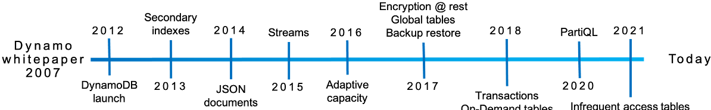
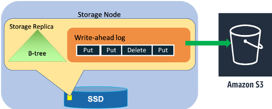
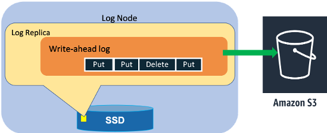
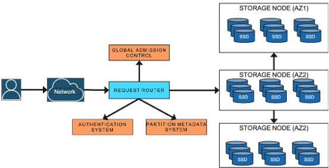
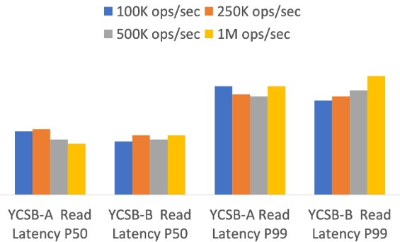
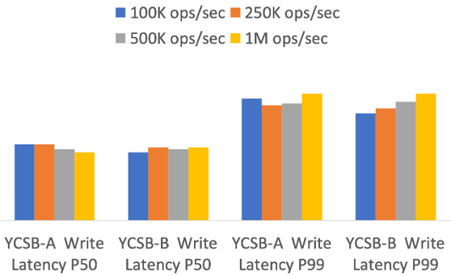

# Amazon DynamoDB: A Scalable, Predictably Performant, and Fully Managed NoSQL Database Service

Mostafa Elhemali、Niall Gallagher、Nicholas Gordon、
Joseph Idziorek、Richard Krog、Colin Lazier、Erben Mo、
Akhilesh Mritunjai、Somu Perianayagam、Tim Rath、
Swami Sivasubramanian、James Christopher Sorenson III、
Sroaj Sosothikul、Doug Terry、Akshat Vig

Amazon Web Services（AWS）

联系邮箱：dynamodb-paper@amazon.com

收录于 2022 USENIX Annual Technical Conference 会议论文集，
2022 年 7 月 11—13 日，
美国加利福尼亚州卡尔斯巴德。
ISBN 978-1-939133-29-8。

## 摘要

Amazon DynamoDB 是一项 Not Only SQL（NoSQL）云数据库服务，
能够在任意规模下提供稳定一致的性能。
数十万客户依赖 DynamoDB 的几项基本属性：稳定一致的性能、可用性、持久性，
以及全托管的 serverless 体验。
2021 年，
在长达 66 小时的 Amazon Prime Day 购物活动期间，
包括 Alexa、
Amazon.com 站点和 Amazon 物流中心在内的 Amazon 系统向 DynamoDB 发出了数万亿次
Application Programming Interface（API）调用，
峰值达到每秒 8920 万次请求，
同时仍保持了高可用性和个位数毫秒级性能。
自 2012 年发布以来，
DynamoDB 的设计和实现一直根据我们的运维经验不断演进。
系统成功处理了公平性、partition 间流量不均衡、监控和自动化系统运维等问题，
且没有影响可用性或性能。
可靠性至关重要，
因为即使最轻微的中断也可能给客户造成重大影响。
本文介绍我们超大规模运营 DynamoDB 的经验，
以及其架构如何持续演进，
以满足客户工作负载不断增长的需求。

## 1 引言

Amazon DynamoDB 是一项 NoSQL 云数据库服务，
在任意规模下都能提供快速且可预测的性能。
DynamoDB 是一项基础 AWS 服务，
使用分布在全球各地数据中心的大量服务器为数十万客户提供服务。
DynamoDB 支撑着多个高流量的 Amazon 业务和系统，
包括 Alexa、Amazon.com 站点以及所有 Amazon 物流中心。
此外，
AWS Lambda、
AWS Lake Formation 和 Amazon SageMaker 等许多 AWS 服务都构建在
DynamoDB 之上，
数十万客户应用程序也是如此。

这些应用程序和服务在性能、可靠性、持久性、效率与规模方面都有严苛的运维要求。
DynamoDB 用户依赖它以稳定的低延迟处理请求。
对 DynamoDB 客户而言，
任意规模下的稳定性能往往比请求服务时间的中位数更重要，
因为延迟异常高的请求会在依赖 DynamoDB 的应用程序上层被放大，
导致糟糕的客户体验。
DynamoDB 的设计目标是以个位数毫秒级的低延迟完成所有请求。
此外，
庞大而多样的客户群还依赖图 1 所示的持续扩展的功能集。
DynamoDB 在过去十年间不断演进，
其中一个关键挑战是在不影响运维要求的前提下增加功能。
为了让客户和应用程序开发者受益，
DynamoDB 以独特的方式整合了以下六项基本系统属性：

- **DynamoDB 是一项全托管云服务。**
  应用程序使用 DynamoDB API 创建表并读写数据，
  无须关心这些表存储在哪里或如何管理。
  DynamoDB 让开发者不必再承担软件补丁、硬件管理、分布式数据库集群配置和持续集群运维的负担。
  DynamoDB 负责资源预置、故障自动恢复、数据加密、软件升级管理、备份，
  以及全托管服务所需的其他任务。
- **DynamoDB 采用多租户架构。**
  DynamoDB 将不同客户的数据存储在相同的物理机器上，
  以确保资源得到充分利用，
  从而将节省的成本让利给客户。
  资源预留、严格预置和受监控的使用情况，
  为共同驻留的表工作负载提供隔离。
- **DynamoDB 使表可以无界扩展。**
  每个表能够存储的数据量没有预定义上限。
  表可以弹性增长，
  以满足客户应用程序的需求。
  DynamoDB 能够按需将专用于一个表的资源从数台服务器扩展到数千台服务器。
  随着数据存储量和吞吐量需求的增长，
  DynamoDB 会把应用程序的数据分散到更多服务器上。
- **DynamoDB 提供可预测的性能。**
  简洁的 DynamoDB API 提供 `GetItem` 和 `PutItem` 操作，
  因而能以稳定的低延迟响应请求。
  对于 1 KB 的 item，
  部署在与数据相同 AWS Region 的应用程序，
  通常能观察到处于个位数毫秒低位的平均服务端延迟。
  最重要的是，
  DynamoDB 的延迟可以预测。
  即使表从几 MB 增长到数百 TB，
  由于 DynamoDB 采用分布式数据放置和请求路由算法，
  延迟仍能保持稳定。
  DynamoDB 通过水平扩展处理任意规模的流量，
  并自动对数据进行 partition 划分和重新划分，
  以满足应用程序的 Input/Output（I/O）性能要求。
- **DynamoDB 高度可用。**
  DynamoDB 跨多个数据中心复制数据；
  这些数据中心在 AWS 中称为 Availability Zone。
  如果发生磁盘或节点故障，
  DynamoDB 会自动重新复制，
  以满足严格的可用性与持久性要求。
  客户还可以创建跨所选 Region 进行地理复制的 global table，
  用于灾难恢复并从任何地点提供低延迟访问。
  DynamoDB 为普通表提供可用性达 99.99% 的 Service Level Agreement（SLA），
  为 global table 提供 99.999% 的 SLA；
  对于后者，
  DynamoDB 会跨多个 AWS Region 复制表。
- **DynamoDB 支持灵活的使用场景。**
  DynamoDB 不会强迫开发者采用特定的数据模型或一致性模型。
  DynamoDB 表没有固定 schema，
  而是允许每个 item 包含任意数量、不同类型的 attribute，
  其中包括多值 attribute。
  表使用键值或文档数据模型。
  从表中读取 item 时，
  开发者可以请求强一致性或最终一致性。

> 图 1：DynamoDB 时间线。从 2007 年 Dynamo 白皮书开始，
> 依次展示 2012 年 DynamoDB 发布、2013 年 secondary index、
> 2014 年 JavaScript Object Notation（JSON）文档、2015 年 Streams、
> 2016 年 adaptive capacity、2017 年静态数据加密、global table 与备份恢复、
> 2018 年事务与 on-demand table、
> 2020 年 PartiQL（SQL-compatible query language），
> 以及 2021 年低频访问表等里程碑。

本文介绍 DynamoDB 如何作为一项分布式数据库服务不断演进，
以满足客户需求，
同时又不失去其关键特征：
用多租户架构为每位客户提供单租户体验。
本文阐述系统遇到的挑战及服务为处理这些挑战所经历的演进，
并将所需变更归结到持久性、可用性、可扩展性和可预测性能这一共同主题之下。

本文总结了我们多年来获得的以下经验：

- 根据客户的流量模式调整数据库表的物理 partition 划分方案，
  可以改善客户体验。
- 持续校验静态数据，
  是防范硬件故障和软件缺陷、实现高持久性目标的可靠方法。
- 在系统演进过程中维持高可用性，
  需要严谨的运维纪律和工具。
  对复杂算法进行形式化证明、举行 game day（混沌与负载测试）、执行升级/降级测试和确保部署安全等机制，
  使我们能够放心地调整代码并开展实验，
  而不必担心破坏正确性。
- 与追求绝对效率相比，
  以可预测性为目标来设计系统能提高系统稳定性。
  cache 等组件虽然可以提高性能，
  但不要让它们掩盖系统在没有 cache 时需要完成的工作，
  从而确保系统始终预置了足以应对意外情况的资源。

本文结构如下：
第 2 节进一步回顾 DynamoDB 的历史，
说明它源于最初的 Dynamo 系统。
第 3 节概述 DynamoDB 架构。
第 4 节介绍 DynamoDB 从 provisioned table 走向 on-demand table 的历程。
第 5 节介绍 DynamoDB 如何确保高持久性，
以及如何应对相关挑战。
第 7 节给出基于 Yahoo! Cloud Serving Benchmark（YCSB）的实验结果，
第 8 节总结全文。

## 2 历史

DynamoDB 的设计源于我们使用其前身 Dynamo [9] 的经验。
Dynamo 是 Amazon 开发的第一个 NoSQL 数据库系统，
旨在满足购物车数据对高度可扩展、高可用且持久的键值数据库的需求。
早期，
Amazon 发现让应用程序直接访问传统企业数据库实例会造成扩展瓶颈，
例如连接管理、并发工作负载间的相互干扰，
以及 schema 升级等任务带来的运维问题。
因此，
我们采用面向服务的架构，
把应用程序数据封装在服务级 API 背后，
从而实现充分解耦，
以便在不中断客户端的情况下完成重新配置等任务。

高可用性是数据库服务的一项关键属性，
因为任何停机都可能影响依赖其中数据的客户。
Dynamo 的另一项关键要求是性能可预测，
从而让应用程序可以为用户提供一致的体验。
为实现这些目标，
Amazon 在设计 Dynamo 时必须从基本原理出发。
Dynamo 是当时唯一能够大规模提供高可靠性的数据库服务，
因此在 Amazon 内部逐渐扩展到许多使用场景。
然而，
Dynamo 仍有自主管理大型数据库系统所固有的运维复杂性。
Dynamo 是单租户系统，
各团队需要管理自己的 Dynamo 安装。
团队必须成为数据库服务各个部分的专家，
由此带来的运维复杂性成为采用 Dynamo 的障碍。

在这一时期，
Amazon 推出了专注于托管式弹性体验的新服务，
其中尤以 Amazon Simple Storage Service（Amazon S3）
和 Amazon SimpleDB 为代表，
目的是消除上述运维负担。
即使 Dynamo 的功能通常更符合应用程序需求，
Amazon 工程师仍更愿意使用这些服务，
而不是管理自己的 Dynamo 等系统。
托管式弹性服务使开发者摆脱数据库管理工作，
可以专注于应用程序本身。

Amazon 的第一项 Database-as-a-Service 是 SimpleDB [1]，
这是一项全托管的弹性 NoSQL 数据库服务。
SimpleDB 提供多数据中心复制、高可用性和高持久性，
客户无须设置、配置数据库或为其打补丁。
与 Dynamo 一样，
SimpleDB 也提供非常简单的表接口和受限的查询集，
可以作为许多开发者的构建块。
SimpleDB 虽然很成功并支撑了许多应用程序，
但也存在一些局限。
其一是表的存储容量较小，
只有 10 GB，
请求吞吐量也有限。
另一项局限是查询和写入延迟不可预测，
原因是所有表 attribute 都建立了索引，
每次写入都必须更新索引。
这些局限给开发者造成了一种新的运维负担：
他们必须把数据拆分到多个表中，
以满足应用程序的存储与吞吐量需求。

我们意识到，
SimpleDB API 无法实现消除 SimpleDB 局限、提供性能可预测的可扩展 NoSQL 数据库服务这一目标。
我们得出结论，
更好的解决方案应结合原始 Dynamo 设计与 SimpleDB 各自的优点：
前者提供增量可扩展性和可预测的高性能，
后者提供易于管理的云服务、一致性支持，
以及比纯键值存储更丰富的表数据模型。
这些架构讨论最终催生了 Amazon DynamoDB，
并于 2012 年作为公共服务推出。
它与之前的 Dynamo 系统名称大体相同，
架构却几乎毫无相似之处。
Amazon DynamoDB 汇聚了我们为 Amazon.com 构建大规模非关系数据库所获得的全部经验，
并基于我们在 AWS 构建高度可扩展且可靠的云计算服务的经验持续演进。

| 操作         | 说明                                                     |
| ------------ | -------------------------------------------------------- |
| `PutItem`    | 插入新 item，或用新 item 替换旧 item。                   |
| `UpdateItem` | 更新现有 item；如果 item 尚不存在，则向表中添加新 item。 |
| `DeleteItem` | 根据 primary key 从表中删除单个 item。                   |
| `GetItem`    | 返回具有指定 primary key 的 item 的一组 attribute。      |

> 表 1：DynamoDB 用于 item 的 create、read、update、delete（CRUD）API。

## 3 架构

DynamoDB 表是 item 的集合，
每个 item 又是 attribute 的集合。
每个 item 都由 primary key 唯一标识。
primary key schema 在创建表时指定。
primary key schema 包含 partition key，
或者包含 partition key 和 sort key，
即复合 primary key。
partition key 的值始终作为内部 hash 函数的输入。
hash 函数的输出与 sort key 值（如果存在）共同决定 item 的存储位置。
在使用复合 primary key 的表中，
多个 item 可以具有相同的 partition key 值，
但这些 item 必须具有不同的 sort key 值。

DynamoDB 还支持 secondary index，
以提供更强的查询能力。
一个表可以有一个或多个 secondary index。
除了根据 primary key 查询之外，
secondary index 还允许使用替代键查询表中数据。
DynamoDB 提供了简单接口，
用于在表或 index 中存取 item。
表 1 列出了客户端读写 DynamoDB 表中 item 时可用的主要操作。
插入、更新或删除 item 的任何操作都可以指定一个条件，
只有满足该条件，
操作才会成功。
DynamoDB 支持原子性、一致性、隔离性和持久性（Atomicity, Consistency,
Isolation, Durability，ACID）事务，
让应用程序能够更新多个 item，
同时保证 item 间的原子性、一致性、隔离性和持久性，
而不牺牲 DynamoDB 表的可扩展性、可用性与性能特征。

DynamoDB 表被划分为多个 partition，
以满足表的吞吐量和存储需求。
表的每个 partition 承载表 key range 中互不重叠且连续的一段。
每个 partition 都有多个 replica，
它们分布在不同的 Availability Zone，
以实现高可用性和高持久性。
一个 partition 的多个 replica 构成 replication group。
replication group 使用 Multi-Paxos [14] 进行 leader 选举和共识。
任何 replica 都可以发起一轮选举。
一个 replica 当选 leader 后，
只要定期续订 leadership lease，
就可以继续保持 leader 身份。

只有 leader replica 能够处理写请求和强一致性读请求。
收到写请求后，
负责所写 key 的 replication group leader 会生成 write-ahead log 记录，
并将其发送给 peer replica。
当 quorum 数量的 peer 把日志记录持久化到各自的本地 write-ahead log 后，
系统才向应用程序确认写入成功。
DynamoDB 支持强一致性读取和最终一致性读取。
replication group 中的任何 replica 都可以处理最终一致性读取。
组 leader 使用 lease 机制延长其 leadership。
如果任一 peer 通过故障检测认为组 leader 不健康或不可用，
该 peer 就可以提出新一轮选举，
尝试将自己选为新 leader。
在原 leader 的 lease 到期之前，
新 leader 不会处理任何写请求或一致性读请求。

> 图 2：storage node 上的 storage replica。
> storage replica 在 Solid State Drive（SSD）
> 上同时保存存储键值数据的 B-tree 和包含 `Put`、
> `Delete` 等记录的 write-ahead log，
> 并将 write-ahead log 归档到 Amazon S3。

> 图 3：log node 上的 log replica。
> log replica 只在 SSD 上持久化近期 write-ahead log，不保存 B-tree，
> 并将 write-ahead log 归档到 Amazon S3。

replication group 包含 storage replica；
如图 2 所示，
storage replica 同时包含 write-ahead log 和存储键值数据的 B-tree。
为了提高可用性和持久性，
replication group 还可以包含只持久化近期 write-ahead log 条目的 replica，
如图 3 所示。
这些 replica 称为 log replica。
log replica 类似 Paxos 中的 acceptor，
不存储键值数据。
第 5 节和第 6 节介绍 log replica 如何帮助 DynamoDB 提高可用性与持久性。

DynamoDB 由数十个微服务组成。
其核心服务包括 metadata service、request routing service、
storage node 和 autoadmin service，
如图 4 所示。
metadata service 存储路由信息，
其中包括表、index，
以及给定表或 index 中各 key 所属 replication group 的信息。
request routing service 负责对每个请求进行授权、身份验证和路由，
将其发送到适当的服务器。
例如，
所有读取与更新请求都会被路由到承载客户数据的 storage node。
request router 从 metadata service 查询路由信息。
所有资源创建、更新和数据定义请求都会被路由到 autoadmin service。
storage service 负责在 storage node 机群上存储客户数据。
每个 storage node 都承载来自不同 partition 的许多 replica。

> 图 4：DynamoDB 架构。客户请求经网络到达 request router；
> request router 与 authentication system、
> partition metadata system 和 global admission control 交互，
> 再把请求路由到跨多个 Availability Zone 部署的 storage node。

autoadmin service 被设计成 DynamoDB 的中枢神经系统。
它负责机群健康、partition 健康、表扩展，
以及执行所有 control plane 请求。
该服务持续监控所有 partition 的健康状况，
并替换任何被判定为不健康的 replica，
包括缓慢、无响应或承载在故障硬件上的 replica。
该服务还会检查 DynamoDB 所有核心组件的健康状况，
并替换正在发生故障或已经发生故障的硬件。
例如，
如果 autoadmin service 检测到某个 storage node 不健康，
它就会启动恢复流程，
替换该节点承载的 replica，
使系统恢复稳定状态。

图 4 没有展示 DynamoDB 的其他服务，
这些服务支持 point-in-time restore、on-demand backup、update stream、
global admission control、global table、
global secondary index 和事务等功能。

## 4 从 provisioned 到 on-demand 的历程

DynamoDB 发布时引入了一种名为 partition 的内部抽象，
用于动态扩展表的容量和性能。
在 DynamoDB 的最初版本中，
客户需要用 read capacity unit（RCU）和 write capacity unit（WCU）
明确指定所需的表吞吐量。
对于不超过 4 KB 的 item，
一个 RCU 每秒可以执行一次强一致性读请求。
对于不超过 1 KB 的 item，
一个 WCU 每秒可以执行一次标准写请求。
RCU 和 WCU 统称 provisioned throughput。
最初的系统把表拆分成 partition，
从而将表内容分散到多个 storage node 上，
并与这些节点上可用的空间和性能相匹配。
当表的需求发生变化时，
无论是数据量增长还是负载增加，
partition 都可以进一步拆分和迁移，
让表实现弹性扩展。
partition 抽象被证明非常有价值，
至今仍是 DynamoDB 设计的核心。
然而，
这一早期版本将容量分配和性能分配都与各个 partition 紧密耦合，
由此带来了一些挑战。

DynamoDB 使用 admission control 确保 storage node 不会过载，
避免共同驻留的表 partition 互相干扰，
并强制执行客户请求的吞吐量限制。
DynamoDB 的 admission control 在过去十年中不断演进。
一张表的所有 storage node 共同承担 admission control。
storage node 根据其本地存储 partition 的分配独立执行 admission control。
由于一个 storage node 会承载多个表的 partition，
每个 partition 的已分配吞吐量被用于隔离工作负载。
DynamoDB 对单个 partition 可以分配的最大吞吐量设置上限，
并确保 storage node 所承载的全部 partition 的总吞吐量，
小于或等于根据存储驱动器的物理特性确定的节点最大允许吞吐量。

当整张表的吞吐量发生变化，
或其 partition 被拆分成子 partition 时，
分配给 partition 的吞吐量会随之调整。
按大小拆分 partition 时，
父 partition 的已分配吞吐量会在子 partition 间平均分配。
按吞吐量拆分 partition 时，
新 partition 会根据表的 provisioned throughput 获得分配。
例如，
假设一个 partition 最多可以容纳 1000 WCU 的 provisioned throughput。
创建 provisioned throughput 为 3200 WCU 的表时，
DynamoDB 会创建四个 partition，
每个分配 800 WCU。
如果表的 provisioned throughput 增加到 3600 WCU，
每个 partition 的容量会增加到 900 WCU。
如果表的 provisioned throughput 增加到 6000 WCU，
这些 partition 会拆分为八个子 partition，
每个分配 750 WCU。
如果随后把表容量降低到 5000 WCU，
每个 partition 的容量就会降低到 625 WCU（原文误作 675 WCU）。

吞吐量在各 partition 间均匀分配，
其依据是两个假设：
应用程序会均匀访问表中的 key，
而按大小拆分 partition 也会均匀拆分性能。
然而我们发现，
应用程序工作负载在时间和 key range 两个维度上都经常呈现不均匀的访问模式。
当表内请求速率分布不均匀时，
拆分 partition 并按比例划分性能分配，
可能会让 partition 热点部分可用的性能反而低于拆分之前。
由于吞吐量是静态分配的，
且在 partition 层级强制执行，
这些不均匀工作负载有时会导致应用程序读写被拒绝，
即发生 throttling，
尽管整张表的 provisioned throughput 足以满足其需求。

应用程序最常遇到的两个挑战是 hot partition 和吞吐量稀释。
如果应用程序的流量持续指向表中的少数 item，
就会形成 hot partition。
热点 item 可能属于一组固定的 partition，
也可能随时间跳转到不同 partition。
吞吐量稀释常见于因大小而拆分 partition 的表。
按大小拆分 partition 会使其吞吐量在新创建的子 partition 间平均分配，
因而每个 partition 的吞吐量会降低。

在这两种情况下，
从客户角度看，
throttling 会使应用程序经历一段不可用时间，
尽管服务本身的行为完全符合预期。
遇到 throttling 的客户会通过提高表的 provisioned throughput 来规避问题，
但不会用完全部容量，
也就是对表进行过度预置。
这虽然使客户获得所需性能，
体验却很差，
因为他们难以估算应该为表预置多少性能才合适。

### 4.1 admission control 的早期改进

如本节开头所述，
hot partition 和吞吐量稀释源于把刚性的性能分配与各 partition 紧密耦合，
并在 partition 拆分时继续划分该分配。
我们希望继续在单个 partition 层级强制执行分配，
因为这样可以避免分布式 admission control 的复杂性，
但这些控制措施显然已经不够。
DynamoDB 发布后不久便引入了 bursting 和 adaptive capacity 两项改进，
以解决这些问题。

#### 4.1.1 Bursting

partition 访问不均匀这一关键观察，
还使我们发现 storage node 承载的 partition 并不会同时用完各自分配到的吞吐量。
因此，
为了在 partition 层级吸收工作负载的瞬时峰值，
DynamoDB 引入了 bursting 概念。
bursting 的思路是让应用程序以 best-effort 方式利用 partition 层级的闲置容量，
吸收短时峰值。
DynamoDB 最多保留一个 partition 的部分闲置容量 300 秒，
供后续吞吐量突增使用；
当 consumed capacity 超过该 partition 的 provisioned capacity
时便会使用它。
这些闲置容量称为 burst capacity。

DynamoDB 规定，只有节点层级存在闲置吞吐量时，
partition 才能 burst，以此维持工作负载隔离。
容量在 storage node 上通过多个 token bucket 管理：
每个 partition 有两个，
分别对应 allocated capacity 和 burst capacity；
节点另有一个。
这些 bucket 负责 admission control。
读写请求抵达 storage node 时，
如果 partition 的 allocated token bucket 中仍有 token，
请求就会被接纳，
并从 partition 和节点层级的 bucket 中扣除 token。
partition 用完所有 provisioned token 后，
只有 burst token bucket 与节点层级 token bucket 中同时仍有 token，
请求才能 burst。
系统依据本地 token bucket 接纳读请求。
写请求要使用 burst capacity，
还需要检查该 partition 其他成员 replica 所在节点的节点级 token bucket。
partition 的 leader replica 会定期收集每个成员的节点级容量信息。
第 4.3 节说明我们如何提高节点的 burst 能力。

#### 4.1.2 Adaptive capacity

DynamoDB 推出了 adaptive capacity，
以便更好地吸收 burst capacity 无法处理的长期流量峰值。
adaptive capacity 使 DynamoDB 能够更好地吸收 partition
间访问模式高度倾斜的工作负载。
adaptive capacity 主动监控所有表的 provisioned capacity 和 consumed
capacity。
如果表发生 throttling，
但表级吞吐量尚未超限，
系统便使用比例控制算法，
自动提高表中 partition 的已分配吞吐量，
也就是提供 boost。
如果表消耗的容量超过其 provisioned capacity，
获得 boost 的 partition 容量便会降低。
autodrive 系统确保把获得 boost 的 partition 迁移到有能力处理增加后吞吐量的适当节点上。
不过与 bursting 一样，
adaptive capacity 也是 best-effort 的；
但它消除了超过 99.99% 因访问模式倾斜引起的 throttling。

### 4.2 Global admission control

DynamoDB 使用 bursting 和 adaptive capacity 大幅缓解了访问不均匀造成的吞吐量问题，
但两种方案都有局限。
bursting 只对短期流量峰值有帮助，
而且依赖节点拥有足以支持 burst 的吞吐量。
adaptive capacity 是被动响应，
只有观察到 throttling 后才会启动。
这意味着使用该表的应用程序已经经历了一小段不可用时间。
从 bursting 和 adaptive capacity 中得到的要点是，
我们把 partition 层级的容量与 admission control 绑定得过于紧密。
admission control 是分布式的，
在 partition 层级执行。
DynamoDB 认识到，
如果能把 admission control 从 partition 中移除，
让 partition 在保持工作负载隔离的同时始终能够 burst，
将会更有利。

为解决 admission control 问题，
DynamoDB 用 global admission control（GAC）
取代了 adaptive capacity。
GAC 建立在同样的 token bucket 思路之上。
GAC 服务以 token 为单位，
集中跟踪表容量的总消耗量。
每个 request router 都维护一个本地 token bucket 来作出接纳决定，
并定期与 GAC 通信以补充 token，
间隔约为数秒。
GAC 维护根据客户端请求即时计算的临时状态。
任何 GAC server 都可以停止并重启，
不会对服务整体运行造成影响。
每个 GAC server 可以跟踪一个或多个独立配置的 token bucket。
所有 GAC server 都属于一个独立 hash ring。
request router 在本地管理若干有时限的 token。
应用程序请求到达时，
request router 会扣除 token。
最终，
request router 会因为 token 被消耗或过期而耗尽 token。
此时 request router 会向 GAC 请求更多 token。
GAC instance 根据客户端提供的信息估算全局 token 消耗量，
并从下一时间单位可用的 token 总量中，
向该客户端发放其份额。
这样可以确保只把流量发送到部分 item 的不均匀工作负载，
仍能够一直执行到最大 partition capacity。

除 global admission control 方案之外，
系统还保留了 partition 层级 token bucket，
作为 defense-in-depth 措施。
这些 token bucket 的容量受到上限约束，
确保单个应用程序不会消耗 storage node 上的全部或大部分资源。

### 4.3 平衡 consumed capacity

要让 partition 始终能够 burst，
DynamoDB 必须有效管理 burst capacity。
DynamoDB 运行在多种硬件 instance type 上，
这些 instance type 的吞吐量和存储能力各不相同。
最新一代 storage node 承载数千个 partition replica。
单个 storage node 上的 partition 可能彼此完全无关，
并属于不同的表。
在 storage node 上承载来自多个表的 replica 时，
每张表可能来自不同客户，
流量模式也各不相同；
因此需要定义一种分配方案，
在不违反可用性、可预测性能、安全性和弹性等关键属性的前提下，
决定哪些 replica 可以安全地共同驻留。

对于 provisioned throughput table，
共同放置问题很容易处理。
在 provisioned 模式下，
由于 partition 是静态的，
共同放置更容易管理，
分配方案也相当简单。
对于没有 bursting 和 adaptive capacity 的 provisioned table，
分配过程就是根据 partition 的 allocated capacity，
寻找能够容纳它的 storage node。
partition 绝不允许接收超过 allocated capacity 的流量，
因此不存在 noisy neighbor。
一个 storage node 上的所有 partition 不会在同一时刻用完其全部容量。
为了响应不断变化的工作负载而执行 bursting，
意味着 storage node 可能超过其规定容量，
这让租户共同放置成为更复杂的挑战。
因此，
系统会在 storage node 上装入一组 replica，
其 provisioned capacity 总量超过节点的总容量。
DynamoDB 实现了一个系统，
根据吞吐量消耗与存储空间主动平衡 storage node 间分配的 partition，
从而缓解 replica 紧密装箱造成的可用性风险。
每个 storage node 都独立监控其承载的全部 replica 的总吞吐量与数据大小。
如果吞吐量超过节点最大容量的某个阈值百分比，
节点就会向 autoadmin service 报告一组适合从当前节点迁出的 partition replica。
autoadmin 会在相同或另一 Availability Zone 中，
为该 partition 寻找尚未承载其 replica 的新 storage node。

### 4.4 Split for consumption

即使有 GAC，
且 partition 始终能够 burst，
如果表的流量倾斜到一组特定 item，
仍可能发生 throttling。
为解决这个问题，
DynamoDB 会根据 consumed throughput 自动横向扩展 partition。
一旦 partition 的 consumed throughput 超过某个阈值，
系统就会对其执行 split for consumption。
key range 中的拆分点根据该 partition 观察到的 key 分布选取。
观察到的 key 分布可作为应用程序访问模式的替代指标，
比在 key range 中点进行拆分更有效。
partition 拆分通常在数分钟内完成。
仍有一些工作负载无法从 split for consumption 中受益。
例如，
流量高度集中于单个 item 的 partition，
或者 key range 被顺序访问的 partition，
都无法从拆分中获益。
DynamoDB 会检测这类访问模式并避免拆分 partition。

### 4.5 On-demand 预置

许多迁移到 DynamoDB 的应用程序此前运行在本地或自托管数据库上。
无论哪种情况，
应用程序开发者都必须预置服务器。
DynamoDB 提供了简化的 serverless 运维模型，
以及用读写 capacity unit 进行预置的新模型。
由于 capacity unit 对客户是一个新概念，
一些客户发现很难预测 provisioned throughput。
如本节开头所述，
客户要么过度预置而导致利用率低，
要么预置不足而导致 throttling。
为了改善突发型工作负载的客户体验，
我们推出了 on-demand table。

on-demand table 免去了客户为表确定适当预置量的负担。
DynamoDB 收集读写信号，
根据 consumed capacity 为 on-demand table 预置资源，
并可立即容纳最高达到该表以往峰值两倍的流量。
如果应用程序需要超过表以往峰值两倍的容量，
DynamoDB 会随着流量增加自动分配更多容量，
确保工作负载不会遇到 throttling。
on-demand 模式通过 split for consumption 扩展表。
其拆分决策算法以流量为依据。
GAC 让 DynamoDB 可以监控并保护系统，
防止单个应用程序耗尽所有资源。
按 consumed capacity 进行平衡，
实际上意味着系统能够智能放置 on-demand table 的 partition，
以避免触及节点层级限制。

## 5 持久性与正确性

数据提交后绝不能丢失。
实践中，
硬件故障、软件缺陷或硬件缺陷都可能造成数据丢失。
DynamoDB 以高持久性为目标进行设计，
通过相应机制预防、检测并纠正任何潜在的数据丢失。

### 5.1 硬件故障

与大多数数据库管理系统一样，
DynamoDB 中的 write-ahead log [15] 是实现持久性与崩溃恢复的核心。
write-ahead log 存储在 partition 的全部三个 replica 中。
为了实现更高的持久性，
系统会定期把 write-ahead log 归档到 Amazon S3；
该对象存储被设计为具有 11 个 9 的持久性。
每个 replica 仍保存通常正在等待归档的最新 write-ahead log，
这些未归档日志一般有数百 MB。
在大型服务中，
内存和磁盘故障等硬件故障十分常见。
节点故障时，
它承载的所有 replication group 都只剩两个副本。
修复一个 storage replica 可能需要数分钟，
因为修复过程涉及复制 B-tree 和 write-ahead log。
检测到不健康的 storage replica 后，
replication group leader 会添加一个 log replica，
以确保持久性不受影响。
添加 log replica 只需数秒，
因为系统只需把近期 write-ahead log 从健康 replica 复制到新 replica，
无须复制 B-tree。
因此，
使用 log replica 快速修复受影响的 replication group，
确保了近期写入的高持久性。

### 5.2 Silent data error

一些硬件故障会使系统存储错误数据 [5, 7]。
根据我们的经验，
存储介质、central processing unit（CPU）或内存都可能导致这些错误 [5]。
遗憾的是，
silent data error 很难检测，
并且可能出现在系统的任何位置。
DynamoDB 大量使用 checksum 来检测 silent data error。
DynamoDB 在每个日志条目、消息和日志文件中维护 checksum，
从而校验两个节点之间每次数据传输的完整性。
这些 checksum 如同护栏，
可以防止错误扩散到系统其他部分。
例如，
系统会为节点或组件间的每条消息计算并校验 checksum，
因为消息到达目的地之前可能经过多层转换。
没有这种检查，
任何一层都可能引入 silent data error。

归档到 S3 的每个日志文件都有 manifest，
其中包含日志所属表、partition，
以及日志文件内所存数据的起止 marker 等信息。
负责把日志文件归档到 S3 的 agent 会在上传前执行多项检查，
包括但不限于：
校验每个日志条目，
确保其属于正确的表和 partition；
校验 checksum，
检测任何 silent data error；
以及确认日志文件的 sequence number 没有空洞。
所有检查通过后，
日志文件及其 manifest 才会被归档。
日志归档 agent 在 replication group 的三个 replica 上都会运行。
如果某个 agent 发现日志文件已经归档，
它会下载已上传的文件，
并与本地 write-ahead log 比较以校验数据完整性。
每个日志文件和 manifest 文件都带 content checksum 上传到 S3。
S3 会在 `Put` 操作中检查 content checksum，
从而防止数据传输到 S3 的过程中出现错误。

### 5.3 持续校验

DynamoDB 还会持续校验静态数据，
目标是检测系统中的 silent data error 或 bit rot。
*scrub* 流程就是一种持续校验系统，
旨在发现 bit rot 等我们未曾预料的错误。
scrub 流程会校验两件事：
replication group 的三个 replica 副本是否拥有相同数据；
在线 replica 的数据是否与使用归档 write-ahead log 条目离线构建的 replica 副本相符。
第 5.5 节将介绍使用归档日志构建 replica 的流程。
系统对在线 replica 计算 checksum，
并与从 S3 归档日志条目生成的快照 checksum 进行比较，
由此完成校验。
scrub 机制是一项 defense-in-depth 措施，
用于检测在线 storage replica 与使用表自创建以来全部历史日志所构建 replica 之间的偏差。
这些全面检查大大增强了我们对运行中系统的信心。
系统使用类似的持续校验技术校验 global table 的 replica。
多年来我们认识到，
持续校验静态数据是防范硬件故障、silent data corruption 乃至软件缺陷最可靠的方法。

### 5.4 软件缺陷

DynamoDB 是构建在复杂基础之上的分布式键值存储。
高度复杂性增加了设计、代码和运维中出现人为错误的概率。
系统错误可能造成数据丢失或损坏，
也可能违反客户所依赖的其他接口契约。
我们广泛使用形式化方法 [16]，
确保复制协议的正确性。
核心复制协议使用 TLA+ [12, 13] 编写规范。
添加会影响复制协议的新功能时，
我们会将其纳入规范并执行 model checking。
model checking 使我们得以在代码进入生产环境之前捕获细微缺陷，
否则这些缺陷可能造成持久性和正确性问题。
S3 [6] 等其他服务也发现 model checking 在类似场景中很有用。

我们还广泛采用故障注入测试与压力测试，
确保部署的每个软件组件都具有正确性。
除了测试并校验 data plane 复制协议，
我们还使用形式化方法校验 control plane 以及分布式事务等功能的正确性。

### 5.5 备份与恢复

除了防范物理介质损坏，
DynamoDB 还支持 backup 和 restore，
以防范客户应用程序缺陷造成的逻辑损坏。
backup 和 restore 使用归档到 S3 的 write-ahead log 构建，
因此不会影响表的性能或可用性。
backup 跨多个 partition 保持一致，
精度可达最接近的一秒。
backup 是 DynamoDB 表的完整副本，
存储在 Amazon S3 bucket 中。
backup 数据随时可以恢复到新的 DynamoDB 表。

DynamoDB 还支持 point-in-time restore。
客户可以借此把过去 35 天内任意时刻存在的表内容，
恢复到同一 Region 中的另一个 DynamoDB 表。
对于启用了 point-in-time restore 的表，
DynamoDB 会定期为属于该表的 partition 创建快照并上传到 S3。
partition 的快照周期根据该 partition 累积的 write-ahead log 数量确定。
快照与 write-ahead log 结合用于执行 point-in-time restore。
收到表的 point-in-time restore 请求后，
DynamoDB 会为表的所有 partition 找出与请求时刻最接近的快照，
应用日志直至恢复请求指定的时间戳，
创建表快照，
然后将其恢复。

## 6 可用性

为了实现高可用性，
DynamoDB 表跨一个 Region 内的多个 Availability Zone（AZ）分布并复制。
DynamoDB 定期测试系统面对节点、机架和 AZ 故障时的韧性。
例如，
系统通过断电测试检验整个服务的可用性和持久性。
在逼真的模拟流量下，
job scheduler 会随机关闭节点。
所有断电测试结束后，
测试工具会确认数据库中存储的数据在逻辑上有效且没有损坏。
本节进一步介绍过去十年中为确保高可用性而解决的一些挑战。

### 6.1 写入与一致性读取的可用性

一个 partition 的写可用性取决于它能否拥有健康的 leader 和健康的 write quorum。
在 DynamoDB 中，
健康的 write quorum 由来自不同 AZ 的三个 replica 中的两个组成。
只要有足够多的健康 replica 形成 write quorum 并选出 leader，
partition 就保持可用。
如果不可用的 replica 数量导致系统无法达到最小 quorum，
partition 将无法写入。
如果一个 replica 无响应，
leader 会向组中添加一个 log replica。
添加 log replica 是确保始终满足组 write quorum 的最快方法，
可以尽量减少 write quorum 不健康对写可用性的干扰。
leader replica 负责一致性读取。
引入 log replica 是对系统的一项重大改变，
经过形式化证明的 Paxos 实现使我们有信心安全地调整系统并开展实验，
以实现更高可用性。
我们已经能在一个 Region 中运行数百万个带 log replica 的 Paxos group。
任何 replica 都可以处理最终一致性读取。
leader replica 故障时，
其他 replica 会检测故障并选举新 leader，
尽量减少对一致性读取可用性的干扰。

### 6.2 故障检测

新当选的 leader 必须等待旧 leader 的 lease 到期后才能处理流量。
这虽然只需几秒钟，
但新 leader 在此期间不能接受任何新写入或一致性读取流量，
从而干扰可用性。
leader 故障检测是高可用系统中的关键组件之一。
故障检测必须快速而稳健，
才能尽量减少干扰。
故障检测的 false positive 会造成更多可用性干扰。
当组内每个 replica 都与 leader 失去连接时，
故障检测工作良好。
然而，节点可能遇到 gray network failure。
这可能源于 leader 与 follower 之间的通信问题、
节点出站或入站通信问题，
也可能出现 leader 与 follower 之间通信正常、
但 front-end router 无法与 leader 通信的情况。
gray failure 可能因故障检测出现 false positive 或根本未检测到故障而破坏可用性。
例如，
收不到 leader heartbeat 的 replica 会尝试选举新 leader，
而如上一节所述，
这会干扰可用性。
为解决 gray failure 造成的可用性问题，
希望触发 failover 的 follower 会向 replication group 中的其他 replica
发送消息，
询问它们能否与 leader 通信。
如果有 replica 回复 leader 健康，
follower 就会放弃触发 leader 选举。
DynamoDB 对故障检测算法的这项改动，
显著减少了系统中的 false positive，
进而减少了无谓的 leader 选举。

### 6.3 衡量可用性

DynamoDB 的设计目标是 global table 达到 99.999% 可用性，
Regional table 达到 99.99% 可用性。
系统以每 5 分钟为一个区间计算可用性，
即 DynamoDB 所处理请求中成功请求的百分比。
为确保达到这些目标，
DynamoDB 在服务与表两个层级持续监控可用性。
跟踪到的可用性数据用于分析客户感知的可用性趋势；
如果客户观察到的错误超过一定阈值，
系统就会触发告警。
这类告警称为 customer-facing alarm（CFA）。
其目标是报告任何与可用性相关的问题，
并通过自动化机制或运维人员干预主动加以缓解。
除了实时跟踪之外，
系统还运行每日任务触发聚合，
计算每位客户的整体可用性指标。
聚合结果会上传到 S3，
用于定期分析可用性趋势。

DynamoDB 还会衡量客户端观察到的可用性并据此告警。
用于衡量用户感知可用性的客户端分为两组。
第一组是使用 DynamoDB 作为数据存储的 Amazon 内部服务；
这些服务会分享其软件观察到的 DynamoDB API 调用可用性指标。
第二组是 DynamoDB canary 应用程序。
这些应用程序部署在 Region 内的每个 AZ 中，
并通过每个公共 endpoint 与 DynamoDB 通信。
真实应用程序流量使我们能够推断客户所见的 DynamoDB 可用性与延迟，
并捕获 gray failure [10, 11]。
无论长期还是短期趋势，
它们都能很好地代表客户可能正在经历的情况。

### 6.4 部署

与传统关系数据库不同，
DynamoDB 无须 maintenance window 即可完成部署，
而且不会影响客户体验到的性能与可用性。
部署软件的原因多种多样，
包括发布新功能、修复缺陷和优化性能。
部署往往涉及更新众多服务。
DynamoDB 按固定节奏推送软件更新。
一次部署会把软件从一种状态带到另一种状态。
新软件会经历完整的开发与测试周期，
以建立对代码正确性的信心。
经过多年来的多次部署，
DynamoDB 认识到，重要的不仅是开始状态和结束状态；
有时新部署的软件无法正常工作，
必须 rollback。
rollback 后的状态可能不同于软件的初始状态。
测试中往往会遗漏 rollback 流程，
这可能影响客户。
每次部署前，
DynamoDB 都会在组件层级运行一套 upgrade 和 downgrade 测试。
随后，
软件会被有意 rollback，
并通过运行功能测试进行检验。
DynamoDB 发现这一流程很有价值，
它能捕获那些在需要时会导致难以安全 rollback 的问题。

在单个节点上部署软件与向多个节点部署截然不同。
分布式系统中的部署不是原子的；
在任意时刻，
机群中一些节点可能运行旧代码，
另一些节点则运行新代码。
分布式部署的额外挑战是，
新软件可能引入新消息类型，
或以旧软件无法理解的方式改变协议。
DynamoDB 使用 read-write deployment 处理这类变更，
其过程分为多个步骤。
第一步部署能够读取新消息格式或协议的软件。
所有节点都能处理新消息后，
再更新软件以发送新消息，
同时通过软件部署启用新消息。
read-write deployment 确保两种消息可以在系统中共存。
即使发生 rollback，
系统也能理解新旧两种消息。

所有部署都会先在少量节点上进行，
然后再推送到整个节点机群，
以减少错误部署的潜在影响。
DynamoDB 为第 6.3 节提到的可用性指标设置告警阈值。
如果部署期间错误率或延迟超过阈值，
系统就会触发自动 rollback。
向 storage node 部署软件会触发 leader failover，
这种 failover 经过专门设计，不会影响可用性。
leader replica 会主动放弃 leadership，
因此组的新 leader 无须等待旧 leader 的 lease 到期。

### 6.5 对外部服务的依赖

为确保高可用性，
DynamoDB 在请求路径上依赖的所有服务都应比 DynamoDB 具有更高可用性；
或者，
当依赖服务受损时，
DynamoDB 仍应能够继续运行。
DynamoDB 在请求路径上依赖的服务包括 AWS Identity and Access
Management（IAM）[2]，
以及对使用客户 key 加密的表提供支持的 AWS Key Management Service（AWS KMS）
[3]。
DynamoDB 使用 IAM 和 AWS KMS 验证每个客户请求。
这些服务虽然高度可用，
但 DynamoDB 的设计仍能在它们不可用时继续运行，
且不牺牲这些系统提供的任何安全属性。

对于 IAM 和 AWS KMS，
DynamoDB 采用 statically stable design [18]，
即使依赖受损，
整个系统仍能继续工作。
系统或许无法获得依赖本应提供的更新信息，
但依赖受损前可以工作的所有功能，
在依赖受损后仍可继续工作。
DynamoDB 在负责验证每个请求的 request router 中缓存 IAM 和 AWS KMS 的结果，
并定期异步刷新缓存结果。
如果 IAM 或 KMS 不可用，
router 会在预先确定的一段较长时间内继续使用缓存结果。
向没有缓存结果的 request router 发送操作的客户端会受到影响。
但在实践中，
AWS KMS 或 IAM 受损时我们观察到的影响很小。
此外，
cache 免去了 off-box 调用，
可以缩短响应时间，
在系统负载较高时尤其有价值。

### 6.6 metadata 可用性

request router 所需的最重要 metadata 之一，
是表 primary key 与 storage node 之间的映射。
DynamoDB 发布时把 metadata 存储在 DynamoDB 自身。
这些路由信息包括表的全部 partition、每个 partition 的 key range，
以及承载该 partition 的 storage node。
router 收到此前从未见过的表请求时，
会下载整张表的路由信息并缓存到本地。
由于 partition replica 的配置信息很少变化，
cache hit rate 约为 99.75%。
其缺点是 cache 会引入 bimodal behavior。
在 request router cache 为空的 cold start 情况下，
每个 DynamoDB 请求都会产生一次 metadata lookup，
因此 metadata service 必须扩展到能以与 DynamoDB 相同的速率处理请求。
在实践中，
我们曾在向 request router 机群增加新容量时观察到这种效应。
metadata service 流量偶尔会激增，增幅最高可达 75%。
因此，
引入新的 request router 会影响性能，
并可能使系统不稳定。
此外，
无效的 cache 可能让数据源因过多直接负载而崩溃，
进而造成系统其他部分发生 cascading failure [4]。

DynamoDB 希望消除或显著减少 request router 和其他 metadata client 对本地
cache 的依赖，
同时不影响客户请求延迟。
处理请求时，
router 只需要承载该请求 key 的 partition 信息。
因此，
获取整张表的路由信息是一种浪费，
对于拥有许多 partition 的大表尤其如此。
为以经济高效的方式降低 metadata 扩展与可用性风险，
DynamoDB 构建了名为 MemDS 的内存分布式 datastore。
MemDS 将全部 metadata 存储在内存中，
并在 MemDS 机群中复制。
MemDS 通过水平扩展承载 DynamoDB 的全部传入请求速率，
数据经过高度压缩。
节点上的 MemDS process 封装了 Perkle 数据结构，
它是 Patricia tree [17] 与 Merkle tree 的混合体。
Perkle tree 允许插入 key 及其关联值，
随后可使用完整 key 或 key prefix 查询。
此外，
由于 key 按排序顺序存储，
它还支持 `lessThan`、`greaterThan` 和 `between` 等 range query。
MemDS Perkle tree 还支持 `floor` 和 `ceiling` 两种特殊查询操作。
`floor` 接收一个 key，
并返回 Perkle 中 key 小于或等于给定 key 的已存条目。
`ceiling` 与之类似，
但返回 key 大于或等于给定 key 的条目。

每个 request router host 上都部署了新的 partition map cache，
以避免原 request router cache 的 bimodality。
在新 cache 中，
cache hit 也会异步调用 MemDS 刷新 cache。
因此，
无论 cache hit ratio 如何，
新 cache 都能确保 MemDS 机群始终处理恒定流量。
与由 cache hit ratio 决定后端流量的传统 cache 相比，
这种恒定流量会增加 metadata 机群的负载，
却能避免 cache 变得无效时在系统其他部分造成 cascading failure。

DynamoDB storage node 是 partition membership 数据的权威来源。
storage node 会把 partition membership 更新推送到 MemDS，
每项更新都会传播到全部 MemDS node。
如果 MemDS 提供的 partition membership 已经过时，
被错误访问的 storage node 要么返回自己已知的最新 membership，
要么返回一个错误码，
触发 request router 再次查询 MemDS。

## 7 Microbenchmark

为了说明规模不会影响应用程序观察到的延迟，
我们运行了 A 类和 B 类 YCSB [8] 工作负载；
A 类包含 50% 读取和 50% 更新，
B 类包含 95% 读取和 5% 更新。
两项 benchmark 都采用均匀 key 分布和大小为 900 byte 的 item。
工作负载在北弗吉尼亚 Region 的生产 DynamoDB 上运行，
从总计每秒 10 万次操作扩展到每秒 100 万次操作。

> 图 5：YCSB 读取延迟汇总。比较 YCSB-A 与 YCSB-B 在每秒 10 万、25 万、
> 50 万和 100 万次操作下的第 50 百分位（P50）与第 99 百分位（P99）的读取延迟。

> 图 6：YCSB 写入延迟汇总。比较 YCSB-A 与 YCSB-B 在每秒 10 万、25 万、
> 50 万和 100 万次操作下的 P50 与 P99 写入延迟。

图 5 展示两种工作负载的 P50 和 P99 读取延迟。
该图旨在说明，
即使吞吐量不同，
DynamoDB 的读取延迟也只有极小变化；
随着工作负载吞吐量增加，
延迟仍保持相同。
工作负载 B 的读取吞吐量是工作负载 A 的两倍，
但延迟的变化仍非常小。
图 6 展示两种工作负载的 P50 和 P99 写入延迟。
与读取延迟一样，
无论工作负载吞吐量如何，
写入延迟都保持不变。
在 YCSB 中，
工作负载 A 驱动的写入吞吐量高于工作负载 B，
但二者的写入延迟分布相似。

## 8 结论

DynamoDB 开创了 cloud-native NoSQL 数据库领域。
它是数千个应用程序的关键组件，
这些应用程序每天用于购物、餐饮、交通、银行、娱乐等众多场景。
开发者依赖 DynamoDB 扩展数据工作负载，
同时获得稳定性能、高可用性和较低的运维复杂性。
十余年来，
DynamoDB 一直保持这些关键属性，
并通过 on-demand capacity、point-in-time backup and restore、
multi-Region replication 和 atomic transaction 等突破性功能，
持续增强对应用程序开发者的吸引力。

## 9 致谢

DynamoDB 从客户那里获益良多，
客户持续不断的反馈推动我们为他们不断创新。
在这段历程中，
我们有幸与一支卓越的团队同行。
感谢 Shawn Bice、Rande Blackman、Marc Brooker、Lewis Bruck、
Andrew Certain、Raju Gulabani、James Hamilton、Long Huang、
Yossi Levanson、David Lutz、Maximiliano Maccanti、
Rama Pokkunuri、Tony Petrossian、Jim Scharf、Khawaja Shams、
Stefano Stefani、Allan Vermuellen、Wei Xiao 和整个 DynamoDB 团队，
感谢他们在这一演进过程中作出的重要贡献。
许多人帮助改进了本文。
感谢帮助塑造本文的匿名审稿人。
特别感谢 Darcy Jayne、Kiran Reddy 和 Andy Warfield 作出的超常努力与帮助。

## 参考文献

[1] Amazon SimpleDB: Simple Database Service.
<https://aws.amazon.com/simpledb/>.

[2] AWS Identity and Access Management Service.
<https://aws.amazon.com/iam/>.

[3] AWS Key Management Service.
<https://aws.amazon.com/kms/>.

[4] Summary of the Amazon DynamoDB service disruption and related impacts in the US-East Region.
2015.
<https://aws.amazon.com/message/5467D2/>.

[5] L. N. Bairavasundaram, A. C. Arpaci-Dusseau, R. H. Arpaci-Dusseau, G. R. Goodson, and B. Schroeder.
An analysis of data corruption in the storage stack.
*ACM Transactions on Storage (TOS)*, 4(3):1–28, 2008.

[6] J. Bornholt, R. Joshi, V. Astrauskas, B. Cully, B. Kragl, S. Markle, K. Sauri, D. Schleit, G. Slatton, S. Tasiran, J. Van Geffen, and A. Warfield.
Using lightweight formal methods to validate a key-value storage node in Amazon S3.
In *Proceedings of the ACM SIGOPS 28th Symposium on Operating Systems Principles*, SOSP '21, pages 836–850, New York, NY, USA, 2021.
Association for Computing Machinery.

[7] C. Constantinescu, I. Parulkar, R. Harper, and S. Michalak.
Silent data corruption—myth or reality?
In *2008 IEEE International Conference on Dependable Systems and Networks With FTCS and DCC (DSN)*, pages 108–109.
IEEE, 2008.

[8] B. F. Cooper, A. Silberstein, E. Tam, R. Ramakrishnan, and R. Sears.
Benchmarking cloud serving systems with YCSB.
In *Proceedings of the 1st ACM Symposium on Cloud Computing*, pages 143–154, 2010.

[9] G. DeCandia, D. Hastorun, M. Jampani, G. Kakulapati, A. Lakshman, A. Pilchin, S. Sivasubramanian, P. Vosshall, and W. Vogels.
Dynamo: Amazon's highly available key-value store.
*SIGOPS Operating Systems Review*, 41(6):205–220, October 2007.

[10] T. Hauer, P. Hoffmann, J. Lunney, D. Ardelean, and A. Diwan.
Meaningful availability.
In *17th USENIX Symposium on Networked Systems Design and Implementation (NSDI 20)*, pages 545–557, 2020.

[11] P. Huang, C. Guo, L. Zhou, J. R. Lorch, Y. Dang, M. Chintalapati, and R. Yao.
Gray failure: The Achilles' heel of cloud-scale systems.
In *Proceedings of the 16th Workshop on Hot Topics in Operating Systems*, pages 150–155, 2017.

[12] L. Lamport.
*Specifying Systems*, volume 388.
Addison-Wesley, Boston, 2002.

[13] L. Lamport.
The PlusCal algorithm language.
In *International Colloquium on Theoretical Aspects of Computing*, pages 36–60.
Springer, 2009.

[14] L. Lamport et al.
Paxos made simple.
*ACM SIGACT News*, 32(4):18–25, 2001.

[15] C. Mohan, D. Haderle, B. Lindsay, H. Pirahesh, and P. Schwarz.
ARIES: A transaction recovery method supporting fine-granularity locking and partial rollbacks using write-ahead logging.
*ACM Transactions on Database Systems (TODS)*, 17(1):94–162, 1992.

[16] C. Newcombe, T. Rath, F. Zhang, B. Munteanu, M. Brooker, and M. Dearduff.
How Amazon Web Services uses formal methods.
*Communications of the ACM*, 58(4):66–73, 2015.

[17] K. Sklower.
A tree-based packet routing table for Berkeley UNIX.
In *USENIX Winter*, volume 1991, pages 93–99.
Citeseer, 1991.

[18] B. Weiss and M. Furr.
Static stability using Availability Zones.
<https://aws.amazon.com/builders-library/static-stability-using-availability-zones/>.
