# Learning eBPF

为增强可观测性、网络与安全性而编程 Linux 内核

## Learning eBPF

什么是 eBPF？
借助这项革命性技术，
你可以编写自定义代码，
动态改变内核的行为方式。
它是构建新一代安全、可观测性和网络工具的非凡平台。
这本实用的书非常适合想要了解其工作原理的开发者、
系统管理员、运维人员和学生。

作者 Liz Rice 为想要理解 eBPF 的读者打下基础。
书中的代码和命令行示例是一个起点，
帮助想要探索这项技术并学习编写 eBPF 程序的读者启程。

通过本书，你将：

- 了解 eBPF 近年来为何变得如此重要，以及它如何支撑起强大基础设施工具的构建

- 从"Hello World"开始探索 eBPF 代码，直至检测安全相关事件、操纵网络数据包的示例

- 学习如何管理 eBPF 程序并将它们挂载到事件上

- 理解 eBPF 验证器如何确保程序运行安全，以及如何让 eBPF 程序跨不同内核版本移植

- 探索 eBPF 组件如何与 Linux 交互，动态改变操作系统的行为

"《Learning eBPF》全面概述了这项技术，
从基础到高级特性，
并提供了大量运用 eBPF 的实用建议。"

——Alexei Starovoitov，eBPF 共同创造者

"eBPF 在云原生领域掀起了一场全新的基础设施运动，
Liz 的这本书清晰地阐释了其基础，
并提供了丰富的示例和练习。"

——Daniel Borkmann，eBPF 共同创造者

Liz Rice 是 Isovalent 的首席开源官。
她曾担任 CNCF 技术监督委员会主席，
在安全工具、网络协议和分布式系统方面经验丰富。
Liz 也是 *Container Security*（O'Reilly）一书的作者。

# Learning eBPF

## 为增强可观测性、网络与安全性而编程 Linux 内核

Liz Rice 著

## Learning eBPF

作者：Liz Rice

版权所有 © 2023 Vertical Shift Ltd。保留所有权利。

美国印刷。

O'Reilly Media, Inc. 出版，地址：
1005 Gravenstein Highway North, Sebastopol, CA 95472。

O'Reilly 图书可购买用于教育、
商业或促销用途。大多数图书也提供在线版本（http://oreilly.com）。
如需更多信息，请联系我们的企业/机构销售部门：
800-998-9938 或 corporate@oreilly.com。

策划编辑：John Devins
索引编制：WordCo Indexing Services, Inc.

开发编辑：Rita Fernando
内文设计：David Futato

制作编辑：Chris Faucher
封面设计：Karen Montgomery

**文字编辑：** Audrey Doyle
**插画：** Kate Dullea

校对：Kim Wimpsett

2023 年 3 月：第一版

### 第一版修订历史

2023-03-07：首次发布

有关版本的详细信息，请参阅 http://oreilly.com/catalog/errata.csp?
isbn=9781098135126。

O'Reilly 标志是 O'Reilly Media, Inc. 的注册商标。
*Learning eBPF*、封面图像及相关商业外观均为 O'Reilly Media, Inc. 的商标。

本书所表达的观点属于作者本人，
并不代表出版商的观点。
尽管出版商和作者已尽力确保
本书所含信息和说明准确无误，
但出版商和作者对任何错误或遗漏概不负责，
包括但不限于因使用或依赖本书而造成的损失。
使用本书所含信息和说明的风险由你自行承担。
如果本书包含或介绍的任何代码示例或其他技术受到开源许可证或他人知识产权的约束，
你有责任确保自己的使用符合此类许可证和/或权利的要求。

本书是 O'Reilly 与 Isovalent 合作的成果。
请参阅我们的编辑独立性声明。

978-1-098-13512-6

## 目录

- **[前言](#前言)**

   - [谁应该阅读本书？](#谁应该阅读本书)
   - [本书内容](#本书内容)
   - [预备知识](#预备知识)
   - [示例代码与练习](#示例代码与练习)
   - [eBPF 只适用于 Linux 吗？](#ebpf-只适用于-linux-吗)
   - [本书使用的排版约定](#本书使用的排版约定)
   - [使用代码示例](#使用代码示例)
   - [O'Reilly 在线学习](#oreilly-在线学习)
   - [如何联系我们](#如何联系我们)
   - [致谢](#致谢)
1. **[第 1 章 什么是 eBPF，它为什么重要？](#第-1-章-什么是-ebpf它为什么重要)**
   - [eBPF 的起源：Berkeley Packet Filter](#ebpf-的起源berkeley-packet-filter)
   - [从 BPF 到 eBPF](#从-bpf-到-ebpf)
   - [eBPF 向生产系统的演进](#ebpf-向生产系统的演进)
   - [命名之难](#命名之难)
   - [Linux 内核](#linux-内核)
   - [向内核添加新功能](#向内核添加新功能)
   - [内核模块](#内核模块)
   - [eBPF 程序的动态加载](#ebpf-程序的动态加载)
   - [eBPF 程序的高性能](#ebpf-程序的高性能)
   - [云原生环境中的 eBPF](#云原生环境中的-ebpf)
   - [小结](#chapter-1-summary)
   - [参考文献](#h1-1-参考文献)
2. **[第 2 章 eBPF 的 "Hello World"](#第-2-章-ebpf-的-hello-world)**
   - [BCC 的 "Hello World"](#bcc-的-hello-world)
   - [运行 "Hello World"](#运行-hello-world)
   - [BPF 映射](#bpf-映射)
   - [哈希表映射](#哈希表映射)
   - [perf 缓冲区与环形缓冲区映射](#perf-缓冲区与环形缓冲区映射)
   - [环形缓冲区](#h2-1-环形缓冲区)
   - [函数调用](#函数调用)
   - [尾调用](#尾调用)
   - [小结](#chapter-2-summary)
   - [练习](#chapter-2-exercises)
   - [参考文献](#h2-2-参考文献)
3. **[第 3 章 eBPF 程序剖析](#第-3-章-ebpf-程序剖析)**
   - [eBPF 虚拟机](#ebpf-虚拟机)
   - [eBPF 寄存器](#ebpf-寄存器)
   - [eBPF 指令](#ebpf-指令)
   - [面向网络接口的 eBPF "Hello World"](#面向网络接口的-ebpf-hello-world)
   - [编译 eBPF 目标文件](#编译-ebpf-目标文件)
   - [检查 eBPF 目标文件](#检查-ebpf-目标文件)
   - [把程序加载到内核](#把程序加载到内核)
   - [检查已加载的程序](#检查已加载的程序)
   - [BPF 程序标签](#bpf-程序标签)
   - [转换后的字节码](#转换后的字节码)
   - [JIT 编译的机器码](#jit-编译的机器码)
   - [挂载到事件](#挂载到事件)
   - [全局变量](#全局变量)
   - [卸载程序挂载](#卸载程序挂载)
   - [从内核卸载程序](#从内核卸载程序)
   - [BPF 到 BPF 调用](#bpf-到-bpf-调用)
   - [小结](#chapter-3-summary)
   - [练习](#chapter-3-exercises)
4. **[第 4 章 bpf() 系统调用](#第-4-章-bpf-系统调用)**
   - [加载 BTF 数据](#加载-btf-数据)
   - [创建映射](#创建映射)
   - [加载程序](#加载程序)
   - [从用户空间修改映射](#从用户空间修改映射)
   - [BPF 程序与映射的引用](#bpf-程序与映射的引用)
   - [eBPF 涉及的其他系统调用](#ebpf-涉及的其他系统调用)
   - [初始化 perf 缓冲区](#初始化-perf-缓冲区)
   - [挂载到 kprobe 事件](#挂载到-kprobe-事件)
   - [设置并读取 perf 事件](#设置并读取-perf-事件)
   - [环形缓冲区](#h4-2-环形缓冲区)
   - [从映射中读取信息](#从映射中读取信息)
   - [小结](#chapter-4-summary)
   - [练习](#chapter-4-exercises)
5. **[第 5 章 CO-RE、BTF 与 Libbpf](#第-5-章-co-rebtf-与-libbpf)**
   - [BCC 的可移植性方案](#bcc-的可移植性方案)
   - [CO-RE 概览](#co-re-概览)
   - [BPF 类型格式](#bpf-类型格式)
   - [用 bpftool 列出 BTF 信息](#用-bpftool-列出-btf-信息)
   - [带有 BTF 信息的映射](#带有-btf-信息的映射)
   - [函数与函数原型的 BTF 数据](#函数与函数原型的-btf-数据)
   - [查看映射和程序的 BTF 数据](#查看映射和程序的-btf-数据)
   - [生成内核头文件](#生成内核头文件)
   - [CO-RE eBPF 程序](#co-re-ebpf-程序)
   - [CO-RE 用户空间代码](#co-re-用户空间代码)
   - [Libbpf 代码示例](#libbpf-代码示例)
   - [小结](#chapter-5-summary)
   - [练习](#chapter-5-exercises)
6. **[第 6 章 验证过程](#第-6-章-验证过程)**
   - [验证器日志](#验证器日志)
   - [可视化控制流](#可视化控制流)
   - [校验辅助函数](#校验辅助函数)
   - [辅助函数参数](#辅助函数参数)
   - [检查许可证](#检查许可证)
   - [检查内存访问](#检查内存访问)
   - [解引用前检查指针](#解引用前检查指针)
   - [访问上下文](#访问上下文)
   - [运行到完成](#运行到完成)
   - [循环](#循环)
   - [检查返回码](#检查返回码)
   - [非法指令](#非法指令)
   - [不可达指令](#不可达指令)
   - [小结](#chapter-6-summary)
   - [练习](#chapter-6-exercises)
7. **[第 7 章 eBPF 程序类型与挂载类型](#第-7-章-ebpf-程序类型与挂载类型)**
   - [程序上下文参数](#程序上下文参数)
   - [辅助函数与返回码](#辅助函数与返回码)
   - [Kfunc](#kfunc)
   - [追踪](#追踪)
   - [Kprobe 与 Kretprobe](#kprobe-与-kretprobe)
   - [Fentry/Fexit](#fentryfexit)
   - [Tracepoint](#tracepoint)
   - [支持 BTF 的 Tracepoint](#支持-btf-的-tracepoint)
   - [用户空间挂载](#用户空间挂载)
   - [LSM](#lsm)
   - [网络](#网络)
   - [套接字](#套接字)
   - [流量控制](#流量控制)
   - [XDP](#xdp)
   - [流解析器](#流解析器)
   - [轻量级隧道](#轻量级隧道)
   - [Cgroup](#cgroup)
   - [红外控制器](#红外控制器)
   - [BPF 挂载类型](#bpf-挂载类型)
   - [小结](#chapter-7-summary)
   - [练习](#chapter-7-exercises)
8. **[第 8 章 用于网络的 eBPF](#第-8-章-用于网络的-ebpf)**
   - [丢弃数据包](#丢弃数据包)
   - [XDP 程序的返回码](#xdp-程序的返回码)
   - [XDP 数据包解析](#xdp-数据包解析)
   - [负载均衡与转发](#负载均衡与转发)
   - [XDP 卸载](#xdp-卸载)
   - [流量控制（TC）](#流量控制tc)
   - [数据包加密与解密](#数据包加密与解密)
   - [用户空间 SSL 库](#用户空间-ssl-库)
   - [eBPF 与 Kubernetes 网络](#ebpf-与-kubernetes-网络)
   - [避开 iptables](#避开-iptables)
   - [协同工作的网络程序](#协同工作的网络程序)
   - [网络策略执行](#网络策略执行)
   - [加密连接](#加密连接)
   - [小结](#chapter-8-summary)
   - [练习与延伸阅读](#练习与延伸阅读)
9. **[第 9 章 用 eBPF 实现安全](#第-9-章-用-ebpf-实现安全)**
   - [安全可观测性需要策略与上下文](#安全可观测性需要策略与上下文)
   - [用系统调用实现安全事件](#用系统调用实现安全事件)
   - [Seccomp](#seccomp)
   - [生成 Seccomp 配置文件](#生成-seccomp-配置文件)
   - [跟踪系统调用的安全工具](#跟踪系统调用的安全工具)
   - [BPF LSM](#bpf-lsm)
   - [Cilium Tetragon](#cilium-tetragon)
   - [挂载到内核内部函数](#挂载到内核内部函数)
   - [预防式安全](#预防式安全)
   - [网络安全](#网络安全)
   - [小结](#chapter-9-summary)
10. **[第 10 章 eBPF 编程](#第-10-章-ebpf-编程)**
   - [Bpftrace](#bpftrace)
   - [内核中 eBPF 的语言选择](#内核中-ebpf-的语言选择)
   - [BCC Python/Lua/C++](#bcc-pythonluac)
   - [C 和 Libbpf](#c-和-libbpf)
   - [Go](#go)
   - [Rust](#rust)
   - [测试 BPF 程序](#测试-bpf-程序)
   - [多个 eBPF 程序](#多个-ebpf-程序)
   - [小结](#chapter-10-summary)
   - [练习](#chapter-10-exercises)
11. **[第 11 章 eBPF 的未来演进](#第-11-章-ebpf-的未来演进)**
   - [eBPF 基金会](#ebpf-基金会)
   - [eBPF for Windows](#ebpf-for-windows)
   - [Linux eBPF 的演进](#linux-ebpf-的演进)
   - [eBPF 是平台，而非特性](#ebpf-是平台而非特性)
   - [延伸阅读](#延伸阅读)
   - [结语](#结语)
- **[索引](#索引)**

   - [A](#a)
   - [B](#b)
   - [C](#c)
   - [D](#d)
   - [E](#e)
   - [F](#f)
   - [G](#g)
   - [H](#h)
   - [I](#i)
   - [J](#j)
   - [K](#k)
   - [L](#l)
   - [M](#m)
   - [N](#n)
   - [O](#o)
   - [P](#p)
   - [R](#r)
   - [S](#s)
   - [T](#t)
   - [U](#u)
   - [V](#v)
   - [W](#w)
   - [X](#x)
- **[关于作者](#关于作者)**

- **[版权说明](#版权说明)**

# 前言

在云原生社区内外，
eBPF 已成为近年来最热门的技术话题之一。
人们以 eBPF 为平台，
构建（并持续创造着）新一代强大的网络、安全、可观测性等领域的工具和项目，
相比前代产品，它们的性能和准确性都更出色。
eBPF Summit、Cloud Native eBPF Day 等 eBPF 相关会议
吸引了数以千计的与会者和观众；
在本书写作时，eBPF Slack 社区已有超过 14,000 名成员。

为什么 eBPF 会被这么多基础设施工具选作底层技术？
它如何兑现所承诺的性能提升？
从性能追踪到网络流量加密，
eBPF 又为何能在如此迥异的技术领域发挥作用？

本书旨在回答这些问题：
帮助读者理解 eBPF 的工作原理，
并介绍如何编写 eBPF 代码。

## 谁应该阅读本书？

本书面向对 eBPF 感到好奇、想进一步了解其工作原理的开发者、系统管理员、运维工程师和学生。
对于想自己动手编写 eBPF 程序的人，本书将打下基础。
由于 eBPF 为新一代的插桩与工具开发提供了出色的平台，
未来几年 eBPF 开发者大概率会有不错的就业机会。

但即使你不打算自己编写 eBPF 代码，本书同样会对你有用。
如果你从事运维、安全或其他与软件基础设施相关的工作，
现在或未来几年内你很可能会接触到基于 eBPF 的工具。
了解这些工具的内部原理，你就能更有效地使用它们。
例如，如果你知道事件如何触发 eBPF 程序，
当某个基于 eBPF 的工具向你展示性能指标时，
你就能更准确地理解它实际测量的是什么。
如果你是应用开发者，也可能接触到这类基于 eBPF 的工具——
比如在对应用做性能调优时，
你可能会用 Parca 这样的工具生成火焰图，
查看哪些函数占用了最多时间。
如果你在评估安全工具，
本书将帮助你理解 eBPF 的优势所在，
以及如何避免以幼稚的方式使用 eBPF，
导致它在攻击面前收效甚微。

即使你现在还没有使用 eBPF 工具，
我也希望本书能带你领略 Linux 中一些你此前可能未曾留意的领域。
大多数开发者把内核视为理所当然，
因为他们使用的编程语言提供了便利的高层抽象，
让他们可以专注于应用开发本身——这已经够难了！
他们借助调试器、性能分析器等工具来高效完成工作。
了解调试器或性能工具的内部原理或许有趣，但并非必需。
不过，对我们许多人来说，
沿着兔子洞一路探究下去既有趣又有成就感。¹
同样，大多数人使用 eBPF 工具时
并不需要关心它们是如何构建的。
Arthur C. Clarke 写道："任何足够先进的技术都与魔法无异"，
但就我个人而言，我喜欢深入挖掘，
弄清这个魔法把戏是怎么变出来的。
你可能也和我一样，
忍不住想探索 eBPF 编程，
更好地感受这项技术能做到什么。
如果是这样，我想你会喜欢这本书。

## 本书内容

eBPF 仍在以相当快的速度演进，
要写出一本不需要不断更新的全面参考书相当困难。
不过，其中有一些基础和基本原理不太可能发生重大变化，
这正是本书讨论的内容。

第 1 章介绍背景：
为什么 eBPF 作为一项技术如此强大，
以及能够在操作系统内核中运行自定义程序
为何能催生如此多激动人心的能力。

第 2 章的内容更加具体，
你会看到一些"Hello World"示例，
借此了解 eBPF 程序和映射（map）的概念。

第 3 章深入探讨 eBPF 程序及其在内核中运行的更多细节，
第 4 章则探讨用户空间应用与 eBPF 程序之间的接口。

近年来，eBPF 面临的一大挑战是跨内核版本的兼容性问题。
第 5 章介绍解决这一问题的"一次编译、随处运行（CO-RE）"方案。

验证过程或许是 eBPF 区别于内核模块最重要的特征。
第 6 章将带你认识 eBPF 验证器。

第 7 章介绍众多不同类型的 eBPF 程序及其挂载点。
其中许多挂载点位于网络协议栈中，
第 8 章更详细地探讨 eBPF 在网络功能方面的应用。
第 9 章介绍 eBPF 如何被用于构建安全工具。

如果你想编写与 eBPF 程序交互的用户空间应用，
有许多库和框架可以提供帮助。
第 10 章概览各种编程语言下的可选方案。

最后，在第 11 章中，
我将展望 eBPF 世界未来可能出现的一些发展。

## 预备知识

本书假定你能熟练使用 Linux 的基本 shell 命令，
并理解用编译器把源代码变成可执行程序的概念。
书中有一些简单的 Makefile 摘录，
假定你至少对 make 如何使用这些文件有最基本的了解。

书中有大量 Python、C 和 Go 的代码示例。
要读懂这些示例，你不需要深入了解这些语言，
但如果你平时就乐于阅读代码，收获会最大。
我还假定你熟悉*指针*的概念——它标识一个内存位置。

## 示例代码与练习

本书包含大量代码示例。
如果你想亲自尝试，
可以在 https://github.com/lizrice/learning-ebpf
找到配套的 GitHub 仓库，
以及安装和运行这些代码的说明。

我还在大多数章节的末尾安排了练习，
帮助你通过扩展示例或编写自己的程序来探索 eBPF 编程。

由于 eBPF 持续演进，
你可以使用的特性取决于所运行的内核版本。
许多适用于早期版本的限制在后来的版本中已被解除或放宽。
Iovisor 项目有一份很实用的概览，
列出了各项 BPF 特性分别是在哪个内核版本中加入的；
在本书中，我也尽量注明了所介绍的各项能力是在何时加入的。
书中的示例使用 5.15 版本的内核测试过，
而在本书写作时，
一些流行的 Linux 发行版尚未支持这么新的内核版本。
如果你在本书出版后不久阅读它，
可能会发现某些特性在你的组织生产环境使用的 Linux 内核上无法工作。

## eBPF 只适用于 Linux 吗？

eBPF 最初是为 Linux 开发的。
同样的方法没有什么特别的理由不能用于其他操作系统——
事实上，Microsoft 一直在开发 Windows 上的 eBPF 实现。
第 11 章会对此做简要讨论，
但本书其余部分都聚焦于 Linux 实现，
所有示例也都来自 Linux。

## 本书使用的排版约定

本书使用以下排版约定：

斜体

表示新术语、URL、电子邮件地址、文件名和文件扩展名。

等宽字体

用于程序清单，也用于在段落中指代程序元素，
例如变量名或函数名、数据库、数据类型、环境变量、语句和关键字。

等宽粗体

表示应由用户逐字输入的命令或其他文本。

等宽斜体

表示应替换为用户提供的值或由上下文确定的值的文本。

> [!TIP]
> 此元素表示提示或建议。

> [!NOTE]
> 此元素表示一般性说明。

> [!WARNING]
> 此元素表示警告或提醒。

## 使用代码示例

补充材料（代码示例、练习等）可在
https://github.com/lizrice/learning-ebpf 下载。

如果你在使用代码示例时有技术问题或遇到困难，
请发送邮件至 bookquestions@oreilly.com。

本书旨在帮助你完成工作。
一般来说，对于本书附带的示例代码，
你可以在自己的程序和文档中使用。
除非你要复制代码的很大一部分，
否则无需联系我们获得许可。
例如，编写一个使用了本书若干代码片段的程序不需要许可；
销售或分发 O'Reilly 图书的示例则需要许可。
引用本书并援引示例代码来回答问题不需要许可；
把本书大量示例代码纳入你的产品文档则需要许可。

我们欢迎但不要求署名。
署名通常包括书名、作者、出版商和 ISBN。
例如："Learning eBPF by Liz Rice (O'Reilly).
Copyright 2023 Vertical Shift Ltd., 978-1-098-13512-6."

如果你觉得自己对代码示例的使用
超出了合理使用范围或上述许可，
欢迎通过 permissions@oreilly.com 联系我们。

## O'Reilly 在线学习


> O'Reilly 在线学习标志。

40 多年来，O'Reilly Media 一直提供技术与商业培训、
知识和洞见，帮助企业取得成功。

我们由专家和创新者组成的独特网络，
通过图书、文章和在线学习平台分享知识与专长。
O'Reilly 在线学习平台让你可以按需访问直播培训课程、
深入的学习路径、交互式编程环境，
以及来自 O'Reilly 和其他 200 多家出版商的海量文本与视频内容。
欲了解更多信息，请访问 https://oreilly.com。

## 如何联系我们

有关本书的意见和问题，请联系出版商：

O'Reilly Media, Inc.

1005 Gravenstein Highway North

Sebastopol, CA 95472

800-998-9938（美国或加拿大境内）

707-829-0515（国际或本地电话）

707-829-0104（传真）

我们为本书设有一个网页，
其中列出了勘误、示例和其他补充信息。
你可以通过 https://oreil.ly/learning-eBPF 访问该页面。

如需对本书发表评论或提出技术问题，
请发送邮件至 bookquestions@oreilly.com。

有关我们的图书和课程的新闻与信息，请访问 https://oreilly.com。

在 LinkedIn 上关注我们：https://linkedin.com/company/oreilly-media。

在 Twitter 上关注我们：https://twitter.com/oreillymedia。

在 YouTube 上观看我们的视频：https://youtube.com/oreillymedia。

## 致谢

我要感谢许多为本书写作做出巨大贡献的人：

- 我的技术审校者——Timo Beckers、Jess Males、Quentin Monnet、
  Kevin Sheldrake 和 Celeste Stinger——
  提供了细致、可操作的反馈，
  以及改进示例的好点子，对此我非常感激。

- 我站在巨人的肩膀上：
  这些巨人构建了 eBPF、推广了 eBPF，并至今仍在维护它，
  包括 Daniel Borkmann、Thomas Graf、Brendan Gregg、
  Andrii Nakryiko、Alexei Starovoitov，
  以及无数其他贡献者——
  他们贡献的不只是代码，
  还有面向社区的会议演讲和博客文章。

- 感谢我在 Isovalent 才华横溢又可爱的同事们，
  其中许多人是 eBPF 和内核专家，
  我从他们身上不断学到很多东西。

- 还要感谢 O'Reilly 的团队，
  尤其是我的编辑 Rita Fernando——
  她在写作过程中给了我无尽的支持，
  并做了大量规划工作，帮助本书按计划推进；
  还有 John Devins，是他最初鼓励我写这本书的。

- Phil Pearl 不仅对内容给出了有益的反馈，
  还确保我按时吃饭、适当休息。
  我永远感激他的支持与鼓励。

我还要感谢多年来所有抽出时间对我的工作给予鼓励之言的可爱的人们，
无论是在活动现场当面交流，还是在社交媒体上。
知道自己写下或录制的内容
帮助别人掌握了某个技术概念，
或者激发了他们自己动手构建或写作的愿望，
这令人无比振奋。谢谢你们！

---

> 1 2017 年，在巴黎的 dotGo 大会上，
> 我做了一场展示调试器工作原理的演讲。

# 第 1 章 什么是 eBPF，它为什么重要？

eBPF 是一项革命性的内核技术，
开发者可以用它编写自定义代码并动态加载到内核中，
从而改变内核的行为方式。
（如果你还不确定内核是什么，不必担心——本章很快就会讲到。）

由此催生出了新一代高性能的网络、可观测性和安全工具。
而且正如你将看到的，
如果想用这些基于 eBPF 的工具来观测应用，
借助 eBPF 在内核中的独特位置，
你完全不需要修改或重新配置应用本身。

eBPF 能做的事情包括但不限于：

- 对系统几乎任何方面进行性能追踪

- 高性能网络处理，并自带可见性

- 检测恶意活动（并可选地加以阻止）

让我们从 Berkeley Packet Filter 说起，
简要回顾一下 eBPF 的历史。

## eBPF 的起源：Berkeley Packet Filter

今天我们所说的 "eBPF" 起源于 BSD Packet Filter，
它最早在 1993 年的一篇论文 [1] 中被提出，
作者是劳伦斯伯克利国家实验室的 Steven McCanne 和 Van Jacobson。
这篇论文讨论了一种可以运行过滤器的伪机器，
过滤器是用来决定接受还是拒绝网络数据包的程序。
这些程序用 BPF 指令集编写——
这是一套通用的 32 位指令集，
与汇编语言非常相似。
下面这个例子直接取自那篇论文：

```text
ldh [12]
jeq #ETHERTYPE_IP, L1, L2
L1: ret #TRUE
L2: ret #0
```

这段简短的代码会过滤掉非互联网协议（IP）的数据包。
过滤器的输入是一个以太网数据包，
第一条指令（`ldh`）从数据包的第 12 字节处加载一个 2 字节的值。
下一条指令（`jeq`）将该值与代表 IP 数据包的值比较。
如果匹配，执行跳转到标签 L1 处的指令，
通过返回一个非零值（这里写作 `#TRUE`）接受该数据包。
如果不匹配，说明该数据包不是 IP 数据包，
通过返回 0 将其拒绝。

你可以想象（或查阅论文中的例子）更复杂的过滤器程序，
它们基于数据包的其他特征来做决定。
重要的是，
过滤器的作者可以编写自己的自定义程序并在内核中执行——
这正是 eBPF 能力的核心所在。

BPF 后来成为 "Berkeley Packet Filter" 的代称，
并于 1997 年首次进入 Linux 内核版本 2.1.75 [2]，
在 tcpdump 工具中用作高效捕获待追踪数据包的手段。

快进到 2012 年，
seccomp-bpf 在内核版本 3.5 中引入。
它让 BPF 程序能够决定是否允许用户空间应用发起系统调用。
我们将在第 10 章更详细地探讨这一点。
这是 BPF 从狭隘的数据包过滤领域
演进为今天这个通用平台的第一步。
从那时起，名字里的"数据包过滤"就开始名不副实了！

## 从 BPF 到 eBPF

从 2014 年的内核版本 3.18 开始，
BPF 演进为我们所说的 "extended BPF"，即 "eBPF"。
这带来了几项重大变化：

- BPF 指令集被彻底改造，
  以在 64 位机器上更高效地运行，
  解释器也被完全重写。

- 引入了 eBPF 映射——
  这是一种可以被 BPF 程序和用户空间应用共同访问的数据结构，
  使二者之间可以共享信息。
  你将在第 2 章了解映射。

- 新增了 bpf() 系统调用，
  使用户空间程序能够与内核中的 eBPF 程序交互。
  你将在第 4 章读到这个系统调用。

- 新增了若干 BPF 辅助函数。
  你将在第 2 章看到一些例子，
  并在第 6 章了解更多细节。

- 新增了 eBPF 验证器，
  用于确保 eBPF 程序可以安全运行。
  这将在第 6 章讨论。

至此 eBPF 的基础已经就位，
但开发并未放缓！
自那以后，eBPF 有了长足的演进。

## eBPF 向生产系统的演进

Linux 内核自 2005 年起就存在一项名为 kprobe（内核探针）的特性，
它允许在内核代码的几乎任何指令上设置陷阱。
开发者可以编写内核模块，
将函数挂接到 kprobe 上，
用于调试或性能测量 [3]。

2015 年，内核新增了将 eBPF 程序挂接到 kprobe 的能力，
这成为整个 Linux 系统追踪方式变革的起点。
与此同时，
内核网络协议栈中也开始加入钩子，
让 eBPF 程序能够承担网络功能的更多方面。
我们将在第 8 章看到更多相关内容。

到 2016 年，基于 eBPF 的工具已经用于生产系统。
Brendan Gregg 在 Netflix 的追踪工作
在基础设施和运维圈子里广为人知，
他所说的 eBPF "为 Linux 带来了超能力" 同样广为人知。
同年，Cilium 项目发布，
它是第一个用 eBPF 替换容器环境中整个数据平面的网络项目。

次年，Facebook（现 Meta）将 Katran 开源。
Katran 是一个四层负载均衡器，
满足了 Facebook 对高可扩展、高速解决方案的需求。
自 2017 年以来，
发往 Facebook.com 的每一个数据包都经过了 eBPF/XDP [4]。
对我个人而言，
正是这一年点燃了我对这项技术所能带来的可能性的热情——
那是在得克萨斯州奥斯汀的 DockerCon 上，
听了 Thomas Graf 关于 eBPF 和 Cilium 项目的演讲之后。

2018 年，eBPF 成为 Linux 内核中一个独立的子系统，
由来自 Isovalent 的 Daniel Borkmann
和来自 Meta 的 Alexei Starovoitov 担任维护者
（后来同样来自 Meta 的 Andrii Nakryiko 也加入了他们）。
同年还引入了 BPF Type Format（BTF），
它大大提升了 eBPF 程序的可移植性。
我们将在第 5 章探讨这一点。

2020 年引入了 LSM BPF，
允许将 eBPF 程序挂接到 Linux Security Module（LSM）内核接口上。
这标志着 eBPF 的第三大用途已被确认：
除了网络和可观测性之外，
eBPF 显然也是构建安全工具的绝佳平台。

多年来，得益于 300 多位内核开发者
以及众多相关用户空间工具
（如我们将在第 3 章见到的 bpftool）、
编译器和编程语言库贡献者的工作，
eBPF 的能力有了长足发展。
程序一度被限制在 4,096 条指令以内，
但这一限制已经提高到 100 万条经过验证的指令 [5]，
并且随着尾调用和函数调用（你将在第 2、3 章看到）的支持，
这一限制实际上已经无关紧要。

> [!NOTE]
> 想深入了解 eBPF 的历史，
> 还有谁比从一开始就参与其中的维护者更值得参考呢？
>
> Alexei Starovoitov 做过一场精彩的演讲，
> 从软件定义网络（SDN）的角度讲述了 BPF 的历史。
> 他在演讲中讨论了让早期 eBPF 补丁被内核接受的策略，
> 并透露 eBPF 的官方生日是 2014 年 9 月 26 日——
> 那一天，涵盖验证器、BPF 系统调用和映射的第一批补丁被接受。
>
> Daniel Borkmann 也讲述过 BPF 的历史
> 及其为支持网络和追踪功能所做的演进。
> 我强烈推荐他的演讲
> "eBPF and Kubernetes:
> Little Helper Minions for Scaling Microservices"，
> 其中满是有趣的细节。

## 命名之难

eBPF 的应用早已远远超出数据包过滤的范畴，
以至于这个缩写如今基本上已无意义，
它已经成为一个独立的术语。
而且由于现今广泛使用的 Linux 内核都支持"扩展"部分，
eBPF 和 BPF 这两个术语在很大程度上已经可以互换使用。
在内核源代码和 eBPF 编程中，
通用的术语是 BPF。
例如，我们将在第 4 章看到，
与 eBPF 交互的系统调用是 `bpf()`，
辅助函数以 `bpf_` 开头，
不同类型的 (e)BPF 程序用以 `BPF_PROG_TYPE` 开头的名字来标识。
而在内核社区之外，
"eBPF" 这个名字似乎已经固定下来，
比如社区网站 ebpf.io 和 eBPF 基金会的名称。

## Linux 内核

要理解 eBPF，
你需要扎实地掌握 Linux 中内核与用户空间的区别。
我在我的报告《What Is eBPF?》[6] 中讲过这个话题，
接下来几段我改写了其中的部分内容。

Linux 内核是位于应用程序与其运行硬件之间的软件层。
应用运行在一个称为用户空间的非特权层中，
无法直接访问硬件。
应用需要通过系统调用（syscall）接口发起请求，
让内核代为执行。
这种硬件访问可能涉及读写文件、
收发网络流量，
甚至只是访问内存。
内核还负责协调并发进程，
让多个应用能够同时运行。
如图 1-1 所示。

作为应用开发者，
我们通常不会直接使用系统调用接口，
因为编程语言为我们提供了高层抽象和标准库，
这些是更容易使用的编程接口。
因此，
很多人对内核在我们的程序运行时做了多少工作一无所知。
如果你想感受一下内核被调用的频繁程度，
可以使用 `strace` 工具来显示一个应用发起的所有系统调用。

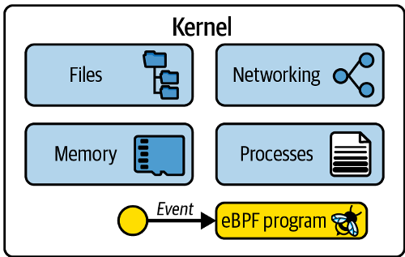

> 图 1-1：用户空间中的应用通过系统调用接口向内核发起请求。

举个例子，用 `cat` 把 hello 这个词输出到屏幕上，
就涉及 100 多次系统调用：

| % time | seconds | usecs/call | calls | errors | syscall |
| --- | --- | --- | --- | --- | --- |
| 24.62 | 0.001693 | 56 | 30 | 12 | openat |
| 17.49 | 0.001203 | 60 | 20 | | mmap |
| 15.92 | 0.001095 | 57 | 19 | | newfstatat |
| 15.66 | 0.001077 | 53 | 20 | | close |
| 10.35 | 0.000712 | 712 | 1 | | execve |
| 3.04 | 0.000209 | 52 | 4 | | mprotect |
| 2.52 | 0.000173 | 57 | 3 | | read |
| 2.33 | 0.000160 | 53 | 3 | | brk |
| 2.09 | 0.000144 | 48 | 3 | | munmap |
| 1.11 | 0.000076 | 76 | 1 | | write |
| 0.96 | 0.000066 | 66 | 1 | 1 | faccessat |
| 0.76 | 0.000052 | 52 | 1 | | getrandom |
| 0.68 | 0.000047 | 47 | 1 | | rseq |
| 0.65 | 0.000045 | 45 | 1 | | set_robust_list |
| 0.63 | 0.000043 | 43 | 1 | | prlimit64 |
| 0.61 | 0.000042 | 42 | 1 | | set_tid_address |
| 0.58 | 0.000040 | 40 | 1 | | futex |
| 100.00 | 0.006877 | 61 | 111 | 13 | total |

正因为应用如此重度地依赖内核，
只要能观察应用与内核之间的交互，
我们就能深入了解应用的行为。
借助 eBPF，
我们可以在内核中加入观测代码来获得这些洞察。

例如，
如果你能拦截打开文件的系统调用，
就能精确地看到任何应用访问了哪些文件。
但这种拦截要怎么做呢？
让我们设想一下，
如果要修改内核、加入新代码，
以便在该系统调用被调用时产生某种输出，
会涉及哪些事情。

## 向内核添加新功能

Linux 内核非常复杂，
截至本书写作时约有 3,000 万行代码 [7]。
修改任何代码库都需要对现有代码有一定了解，
所以除非你已经是内核开发者，
否则这很可能是个挑战。

此外，
如果你想把改动贡献到上游，
面临的挑战就不纯粹是技术层面的了。
Linux 是一个通用操作系统，
运行在各种环境和场景中。
这意味着，
如果你想让自己的改动进入正式的 Linux 版本，
仅仅写出能工作的代码是不够的。
代码必须被社区（更具体地说，
被 Linux 的创造者和主要开发者 Linus Torvalds）
接受为对所有人都有益的改动。
这并非理所当然——
提交的内核补丁中只有三分之一会被接受 [8]。

假设你已经想出了一个拦截打开文件系统调用的好方案。
经过几个月的讨论和你的一番艰苦开发，
设想这个改动被内核接受了。太好了！
但它还要多久才能出现在每个人的机器上呢？

Linux 内核每两三个月就有一个新版本，
但即便一个改动进入了某个版本，
距离它出现在大多数人的生产环境中还有一段时间。
这是因为我们大多数人并不直接使用 Linux 内核——
我们使用的是 Debian、Red Hat、Alpine、Ubuntu 等 Linux 发行版，
它们把某个版本的 Linux 内核与各种其他组件打包在一起。
你很可能会发现，
你喜欢的发行版使用的内核版本已经发布了好几年。

例如，许多企业用户使用 Red Hat Enterprise Linux（RHEL）。
截至本书写作时，
当前版本是 2021 年 11 月发布的 RHEL 8.5，
它使用的是 4.18 版本的 Linux 内核。
这个内核发布于 2018 年 8 月。

如图 1-2 的漫画所示，
新功能从想法阶段到进入生产环境的 Linux 内核，
真的需要数年时间 [9]。


> 图 1-2：向内核添加功能（漫画：Vadim Shchekoldin，Isovalent）。

## 内核模块

如果你不想等上几年才让自己的改动进入内核，
还有另一种选择。
Linux 内核被设计为可以接受内核模块，
模块可以按需加载和卸载。
如果你想改变或扩展内核行为，
编写模块当然是一种办法。
内核模块可以独立于官方 Linux 内核版本分发给其他人使用，
因此它不必被上游主代码库接受。

这里最大的挑战在于，
这仍然是完全意义上的内核编程。
用户历来对使用内核模块非常谨慎，
原因很简单：
如果内核代码崩溃，
整台机器以及机器上运行的一切都会随之宕掉。
用户怎么能确信一个内核模块可以安全运行呢？

"可以安全运行"不仅仅意味着不崩溃——
用户还想知道这个内核模块从安全角度看是否可靠。
它是否包含攻击者可以利用的漏洞？
我们能否信任模块的作者不会在其中放入恶意代码？
因为内核是特权代码，
它可以访问机器上的一切，
包括所有数据，
所以内核中的恶意代码会造成严重的隐患。
内核模块同样如此。

内核的安全性是 Linux 发行版
迟迟不采用新版本内核的重要原因之一。
如果一个内核版本已经在各种环境中被其他人运行了数月乃至数年，
问题应该已经暴露出来了。
发行版维护者可以有相当的把握，
他们交付给用户和客户的内核是经过考验的——
也就是说，可以安全运行。

eBPF 提供了一种截然不同的安全性方案：*eBPF 验证器*。
它确保 eBPF 程序只有在可以安全运行时才会被加载——
不会使机器崩溃或陷入死循环，
也不会让数据遭到破坏。
我们将在第 6 章更详细地讨论验证过程。

## eBPF 程序的动态加载

eBPF 程序可以动态地加载到内核中或从内核中移除。
一旦挂接到某个事件上，
无论该事件由什么引发，
程序都会被它触发。
例如，
如果你把一个程序挂接到打开文件的系统调用上，
那么每当任何进程试图打开文件时，
它都会被触发。
至于那个进程在程序加载时是否已经在运行，
则无关紧要。
与升级内核然后必须重启机器才能使用新功能相比，
这是一个巨大的优势。

这也带来了基于 eBPF 的可观测性或安全工具的一大优势——
它能即刻获得机器上发生的一切的可见性。
在运行容器的环境中，
这包括对容器内所有进程以及宿主机上所有进程的可见性。
本章稍后我会深入探讨这对云原生部署的影响。

此外，如图 1-3 所示，
人们可以通过 eBPF 非常快速地创建新的内核功能，
而不需要其他所有 Linux 用户接受同样的改动。

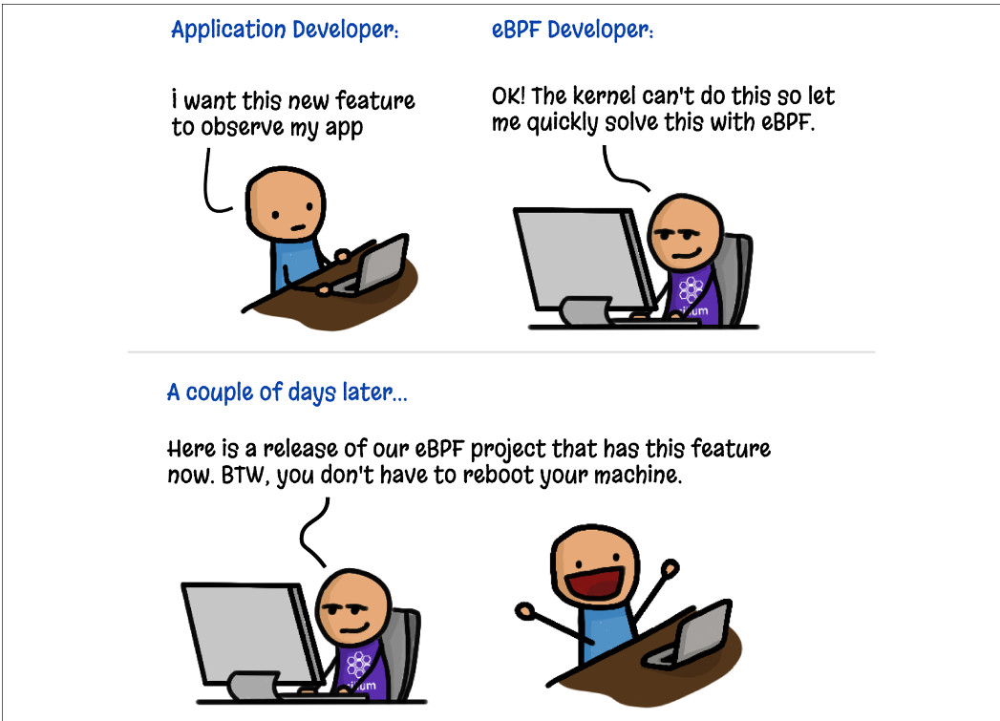

> 图 1-3：用 eBPF 添加内核功能（漫画：Vadim Shchekoldin，Isovalent）。

## eBPF 程序的高性能

eBPF 程序是一种非常高效的观测手段。
程序一经加载并完成 JIT 编译（你将在第 3 章看到），
就会作为原生机器指令在 CPU 上运行。
此外，
处理每个事件时都不需要承担内核与用户空间之间切换的开销
（这是一种昂贵的操作）。

2018 年那篇描述 eXpress Data Path（XDP）的论文 [10]
给出了一些 eBPF 在网络方面带来的性能提升的例证。
例如，
与常规 Linux 内核实现相比，
在 XDP 中实现路由"将性能提升了 2.5 倍"；
在负载均衡方面，
"XDP 相比 IPVS 提供了 4.3 倍的性能提升"。

对于性能追踪和安全可观测性而言，
eBPF 的另一个优势是：
相关事件可以在内核中先行过滤，
然后才承担把它们发送到用户空间的开销。
毕竟，
只过滤特定网络数据包正是最初 BPF 实现的目标。
如今，
eBPF 程序可以收集系统中各种事件的信息，
并使用复杂、可定制的程序化过滤器，
只把相关的信息子集发送到用户空间。

## 云原生环境中的 eBPF

如今，
许多组织选择不再直接在服务器上执行程序来运行应用。
相反，
许多组织采用云原生的方式：
容器、Kubernetes 或 ECS 之类的编排器，
或者 Lambda、云函数、Fargate 之类的 serverless 方案。
这些方式都通过自动化来选择每个工作负载运行的服务器；
在 serverless 中，
我们甚至不知道每个工作负载运行在哪台服务器上。

尽管如此，服务器依然存在，
而且这些服务器（无论是虚拟机还是裸机）中的每一台都运行着一个内核。
如果应用以容器形式运行在同一台（虚拟）机器上，
它们就共享同一个内核。
在 Kubernetes 环境中，
这意味着给定节点上所有 Pod 中的所有容器都在使用同一个内核。
当我们用 eBPF 程序观测这个内核时，
该节点上所有容器化工作负载对这些 eBPF 程序都是可见的，
如图 1-4 所示。

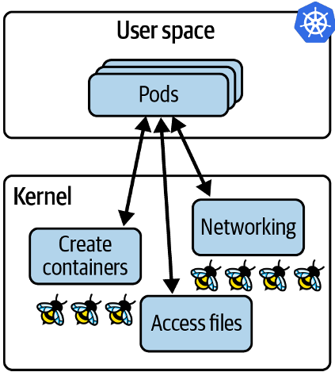

> 图 1-4：内核中的 eBPF 程序可以看到 Kubernetes 节点上运行的所有应用。

对节点上所有进程的可见性，
加上动态加载 eBPF 程序的能力，
赋予了基于 eBPF 的工具在云原生计算中真正的超能力：

- 我们不需要修改应用，
  甚至不需要修改它们的配置方式，
  就能用 eBPF 工具对它们进行观测。

- eBPF 程序一旦被加载到内核并挂接到事件上，
  就可以开始观察先前已存在的应用进程。

与之形成对比的是 *sidecar 模型*——
它曾被用来为 Kubernetes 应用添加日志、追踪、安全和服务网格等功能。
在 sidecar 方式中，
观测代码作为一个容器被"注入"每个应用 Pod。
这个过程需要修改定义应用 Pod 的 YAML，
加入 sidecar 容器的定义。
这种方式当然比把观测代码加进应用源代码更方便
（在 sidecar 方式出现之前我们只能那样做；
例如，在应用中引入一个日志库，
并在代码的适当位置调用该库）。
尽管如此，sidecar 方式仍有一些缺点：

- 必须重启应用 Pod 才能加入 sidecar。

- 必须有东西去修改应用的 YAML。
  这一般是一个自动化过程，
  但如果出了差错，sidecar 就不会被加入，
  这意味着该 Pod 得不到观测。
  例如，
  可能会给某个 Deployment 加上注解，
  指示准入控制器把 sidecar 的 YAML 加入该 Deployment 的 Pod 规格。
  但如果 Deployment 的标注不正确，
  sidecar 就不会被加入，
  观测工具也就看不到它。

- 当一个 Pod 中有多个容器时，
  它们就绪的时间可能不同，
  顺序也未必可预测。
  注入 sidecar 可能显著拖慢 Pod 的启动时间，
  更糟的是可能引发竞态条件或其他不稳定因素。
  例如，
  Open Service Mesh 的文档就描述了
  应用容器必须容忍在 Envoy 代理容器就绪之前所有流量都被丢弃。

- 当服务网格之类的网络功能以 sidecar 形式实现时，
  必然意味着进出应用容器的所有流量
  都必须穿过内核中的网络协议栈才能到达网络代理容器，
  从而给这些流量增加延迟；
  如图 1-5 所示。
  我们将在第 9 章讨论如何用 eBPF 提升网络效率。

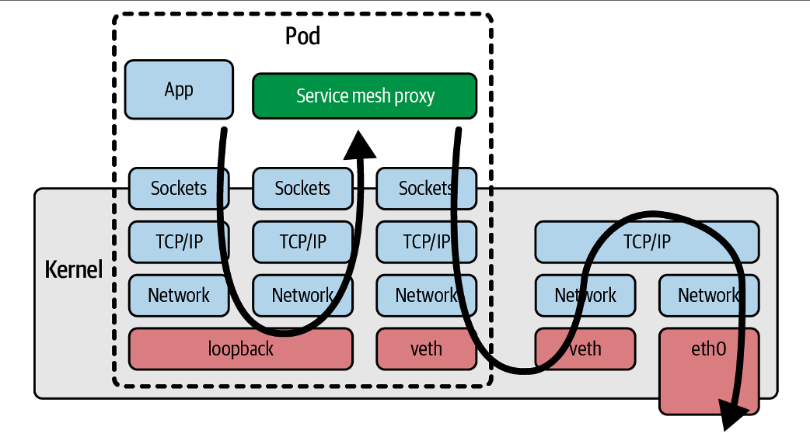

> 图 1-5：使用服务网格代理 sidecar 容器时网络数据包的路径。

所有这些问题都是 sidecar 模型固有的。
幸运的是，
如今 eBPF 作为一个平台已经可用，
我们有了一种可以避免这些问题的新模型。
此外，
由于基于 eBPF 的工具可以看到（虚拟）机器上发生的一切，
恶意行为者更难绕过它们。
例如，
如果攻击者设法在你的某台主机上部署了一个加密货币挖矿程序，
他们多半不会好心地
用你在应用工作负载上使用的 sidecar 来给它加上观测。
如果你依赖基于 sidecar 的安全工具
来阻止应用建立意外的网络连接，
那么在 sidecar 未被注入的情况下，
这个工具就发现不了挖矿程序连接矿池的行为。
相比之下，
用 eBPF 实现的网络安全可以管控宿主机上的所有流量，
因此这种加密货币挖矿行为很容易被阻止。
出于安全原因丢弃网络数据包的能力，
我们将在第 8 章再讨论。

<a id="chapter-1-summary"></a>

## 小结

希望本章已经让你体会到 eBPF 作为一个平台为何如此强大。
它让我们能够改变内核的行为，
为构建定制工具或定制策略提供了灵活性。
基于 eBPF 的工具可以观察内核中的任何事件，
进而观察到（虚拟）机器上运行的所有应用，
无论它们是否容器化。
eBPF 程序还可以动态部署，
随时改变行为。

到目前为止，
我们对 eBPF 的讨论还停留在相对概念化的层面。
下一章我们将更加具体，
探讨基于 eBPF 的应用由哪些部分组成。

<a id="h1-1-参考文献"></a>

## 参考文献

[1] Steven McCanne 和 Van Jacobson，
"The BSD Packet Filter: A New Architecture for User-level Packet Capture"。

[2] 这些细节及其他内容来自 Alexei Starovoitov 2015 年的 NetDev 演讲
"BPF – in-kernel virtual machine"。

[3] 内核文档中有一段关于 kprobe 工作原理的很好的描述。

[4] 这个精彩的事实来自 Daniel Borkmann 在 KubeCon 2020 上的演讲
"eBPF and Kubernetes: Little Helper Minions for Scaling Microservices"。

[5] 关于指令数量限制和"复杂度限制"的更多细节，
参见 https://oreil.ly/OiVer。

[6] 摘自 Liz Rice 的《What Is eBPF?》。
Copyright © 2022 O'Reilly Media。经授权使用。

[7] "Linux 5.12 Coming In At Around 28.8 Million Lines"，
Phoronix，2021 年 3 月。

[8] Jiang Y, Adams B, German DM. 2013.
"Will My Patch Make It? And How Fast?" (2013)。
根据这篇研究论文，33% 的补丁会被接受，
且大多数需要三到六个月。

[9] 好在针对现有功能的安全补丁会更快提供。

[10] Høiland-Jørgensen T, Brouer JD, Borkmann D, et al.
"The eXpress data path: fast programmable packet processing in the operating system kernel".
Proceedings of the 14th International Conference on emerging Networking EXperiments and Technologies (CoNEXT '18).
Association for Computing Machinery; 2018:54–66.

# 第 2 章 eBPF 的 "Hello World"

上一章我讨论了 eBPF 为何如此强大，
但如果你对运行 eBPF 程序究竟意味着什么还没有具体的感受，
也完全正常。
本章我将用一个简单的 "Hello World" 例子，
让你获得更直观的体会。

随着你读完本书，
你会了解到编写 eBPF 应用有若干种不同的库和框架。
作为热身，
我先展示从编程角度看大概最容易上手的方式：**BCC Python 框架**。
它提供了一种非常简便的方式来编写基本的 eBPF 程序。
出于我将在第 5 章讨论的原因，
对于打算分发给其他用户的生产应用，
它未必是我如今会推荐的方式，
但它非常适合迈出第一步。

> [!TIP]
> 如果你想亲自尝试这些代码，
> 可以在 https:
> //github.com/lizrice/learning-ebpf 的 chapter2 目录中找到它们。

BCC 项目位于 https://github.com/iovisor/bcc，
BCC 的安装说明见 https:
//github.com/iovisor/bcc/blob/master/INSTALL.md。

## BCC 的 "Hello World"

下面是 hello.py 的完整源代码——
这是一个用 BCC 的 Python 库编写的 eBPF "Hello World" 应用 [1]：

```python
#!/usr/bin/python
from bcc import BPF

program = r"""
int hello(void *ctx) {
    bpf_trace_printk("Hello World");
    return 0;
}
"""

b = BPF(text=program)
syscall = b.get_syscall_fname("execve")
b.attach_kprobe(event=syscall, fn_name="hello")
b.trace_print()
```

这段代码由两部分组成：
将在内核中运行的 eBPF 程序本身，
以及把 eBPF 程序加载到内核并读取其生成的追踪信息的一些用户空间代码。
如图 2-1 所示，
hello.py 是这个应用的用户空间部分，
hello() 则是在内核中运行的 eBPF 程序。

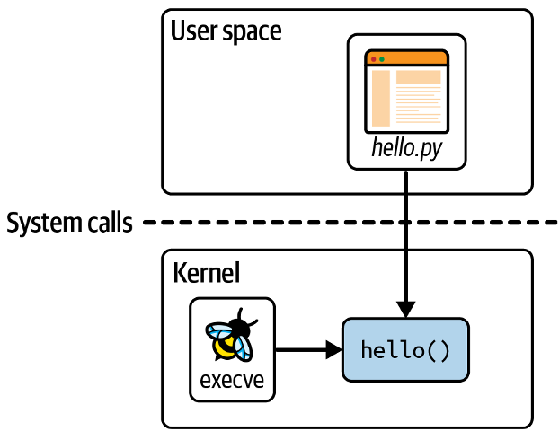

> 图 2-1："Hello World" 的用户空间与内核组件。

让我们逐行深入这段源代码，
更好地理解它。

第一行告诉你这是 Python 代码，
能够运行它的程序是 Python 解释器（/usr/bin/python）。

eBPF 程序本身是用 C 代码编写的，
也就是这一部分：

```c
int hello(void *ctx) {
    bpf_trace_printk("Hello World");
    return 0;
}
```

这个 eBPF 程序所做的全部事情，
就是使用辅助函数 bpf_trace_printk() 写出一条消息。
辅助函数是"扩展"BPF 区别于其"经典"前身的又一特性。
它们是一组供 eBPF 程序调用以与系统交互的函数；
我将在第 5 章进一步讨论它们。
眼下你只需把它理解为打印一行文本。

整个 eBPF 程序在 Python 代码中被定义为一个名为 program 的字符串。
这个 C 程序需要先编译才能执行，
但 BCC 会替你完成这一步。
（下一章你将看到如何自己编译 eBPF 程序。）
你要做的只是在创建 BPF 对象时把这个字符串作为参数传入，
如下面这行：

```python
b = BPF(text=program)
```

eBPF 程序需要挂接到一个事件上，
在这个例子中我选择挂接到 `execve` 系统调用——
这是用来执行一个程序的 `syscall`。
每当这台机器上有什么东西或什么人启动了一个新程序，
就会调用 `execve()`，
从而触发这个 eBPF 程序。
虽然 "execve()" 这个名字是 Linux 中的标准接口，
但内核中实现它的函数名取决于芯片架构，
不过 BCC 提供了一种便捷的方式来查询我们运行所在机器上的函数名：

```python
syscall = b.get_syscall_fname("execve")
```

现在，syscall 就代表我将要挂接的内核函数名，
挂接使用的是 kprobe（第 1 章已经介绍过 kprobe 的概念）[2]。
你可以像这样把 hello 函数挂接到那个事件上：

```python
b.attach_kprobe(event=syscall, fn_name="hello")
```

到这里，
eBPF 程序已经加载到内核并挂接到一个事件上，
因此每当机器上有新的可执行程序启动时，
这个程序就会被触发。
Python 代码中剩下要做的，
就是读取内核输出的追踪信息并把它显示在屏幕上：

```python
b.trace_print()
```

这个 trace_print() 函数会无限循环（直到你停止程序，
比如按 Ctrl+C），
显示任何追踪信息。

图 2-2 展示了这段代码的运行过程。
Python 程序编译 C 代码，
把它加载到内核，
并将它挂接到 execve 系统调用的 kprobe 上。
每当这台（虚拟）机器上的任何应用调用 execve()，
就会触发 eBPF 的 hello() 程序，
向一个特定的伪文件写入一行追踪信息。
（本章稍后我会介绍这个伪文件在哪里。）
Python 程序从伪文件中读取追踪消息并显示给用户。

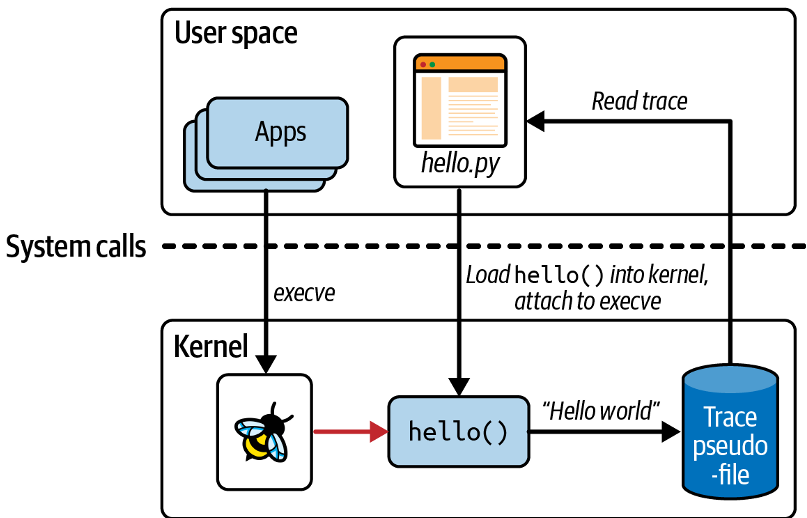

> 图 2-2：运行中的 "Hello World"。

## 运行 "Hello World"

运行这个程序，
根据你所用（虚拟）机器上正在发生的事情，
你可能会立刻看到生成的追踪信息，
因为其他进程可能正在通过 execve 系统调用执行程序 [3]。
如果你什么也没看到，
打开第二个终端，
随便执行一些命令 [4]，
你就会看到 "Hello World" 生成的相应追踪信息：

```text
$ hello.py
b'        bash-5412    [001] .... 90432.904952: 0: bpf_trace_printk: Hello World'
```

由于 eBPF 能力强大，
使用它需要特殊权限。
root 用户自动拥有这些权限，
所以运行 eBPF 程序最简单的方式就是以 root 身份运行，
比如使用 sudo。
为清晰起见，
本书的示例命令中我不会带上 sudo，
但如果你看到 "Operation not permitted" 错误，
首先要检查的就是
你是否在以非特权用户身份运行 eBPF 程序。

> [!NOTE]
> 内核版本 5.8 引入了 CAP_BPF，
> 它为执行某些 eBPF 操作（比如创建某些类型的映射）提供了足够的权限。
> 不过你可能还需要额外的能力：
>
> - 加载追踪类程序需要同时具备 CAP_PERFMON 和 CAP_BPF。
>
> - 加载网络类程序需要同时具备 CAP_NET_ADMIN 和 CAP_BPF。
>
> Milan Landaverde 的博客文章
> "Introduction to CAP_BPF" 中有更多相关细节。

*hello* eBPF 程序一旦被加载并挂接到事件上，
就会被先前已存在的进程所产生的事件触发。
这应该能强化你在第 1 章学到的两个要点：

- eBPF 程序可以用来动态改变系统的行为。
  不需要重启机器，
  也不需要重启现有进程。
  eBPF 代码一挂接到事件上就开始生效。

- 不需要对其他应用做任何改动，
  它们就能被 eBPF 看到。
  只要你能访问那台机器上的终端，
  在其中运行一个可执行程序就会使用 execve() 系统调用；
  如果你把 hello 程序挂接到了那个系统调用上，
  它就会被触发并生成追踪输出。
  同样，
  如果你有一个运行可执行程序的脚本，
  它也会触发 hello eBPF 程序。
  你不需要对终端的 shell、脚本或你运行的可执行程序做任何改动。

追踪输出显示的不仅是 "Hello World" 字符串，
还有关于触发 hello eBPF 程序运行的事件的一些额外上下文信息。
在本节开头的示例输出中，
发起 execve 系统调用的进程 ID 是 5412，
运行的命令是 bash。
对于追踪消息来说，
这些上下文信息是内核追踪基础设施（并非 eBPF 特有）自动添加的；
但正如本章稍后你将看到的，
也可以在 eBPF 程序内部获取这样的上下文信息。

你可能会好奇 Python 代码怎么知道该从哪里读取追踪输出。
答案并不复杂——
内核中的 bpf_trace_printk() 辅助函数
总是把输出发送到同一个预定义的伪文件位置：
/sys/kernel/debug/tracing/trace_pipe。
你可以用 cat 查看它的内容来确认这一点；
访问它需要 root 权限。

对于简单的 "Hello World" 示例或基本的调试目的来说，
单一的追踪管道位置尚可接受，
但它非常受限。
输出格式几乎没有灵活性，
而且只支持输出字符串，
因此不太适合传递结构化信息。
也许最重要的是，
整台（虚拟）机器上只有这一个位置。
如果同时运行多个 eBPF 程序，
它们都会把追踪输出写到同一个追踪管道，
这对人类操作员来说会非常混乱。

有一种好得多的方式可以从 eBPF 程序中获取信息：使用 eBPF 映射。

## BPF 映射

映射是一种既可以从 eBPF 程序访问、
也可以从用户空间访问的数据结构。
映射是扩展 BPF 区别于其经典前身的真正重要的特性之一。
（你可能以为它们通常被称为 "eBPF 映射"，
但你会经常看到 "BPF 映射" 的说法。
和通常情况一样，这两个术语可以互换使用。）

映射可以用于在多个 eBPF 程序之间共享数据，
或在用户空间应用与运行在内核中的 eBPF 代码之间通信。
典型用途包括：

- 用户空间写入配置信息，
  供 eBPF 程序读取

- eBPF 程序存储状态，
  供另一个 eBPF 程序（或同一程序以后的运行）稍后读取

- eBPF 程序把结果或指标写入映射，
  供负责呈现结果的用户空间应用读取

Linux 的 *uapi/linux/bpf.h* 文件中定义了多种类型的 BPF 映射，
**内核文档**中也有关于它们的一些信息。
一般来说它们都是键值存储；
本章你将看到哈希表、perf 和环形缓冲区，
以及 eBPF 程序数组等映射的例子。

有些映射类型被定义为数组，
其键类型固定为 4 字节索引；
另一些映射是哈希表，
可以使用某种任意数据类型作为键。

有些映射类型针对特定类型的操作做了优化，
例如先进先出队列、后进先出栈、最近最少使用数据存储、
最长前缀匹配，
以及 Bloom 过滤器（一种旨在快速判断元素是否存在的概率型数据结构）。

有些 eBPF 映射类型保存特定类型对象的信息。
例如，
`sockmap` 和 `devmap` 保存套接字和网络设备的信息，
供网络相关的 eBPF 程序用来重定向流量。
程序数组映射存储一组带索引的 eBPF 程序，
（正如本章稍后你将看到的）用于实现尾调用——
即一个程序调用另一个程序。
甚至还有一种 `map-of-maps` 类型，
支持存储关于映射的信息。

有些映射类型有 per-CPU 变体，
也就是说，
内核为每个 CPU 核心的该映射版本使用不同的内存块。
这可能会让你想到*非* per-CPU 映射的并发问题——
多个 CPU 核心可能同时访问同一个映射。
内核版本 5.1 为（部分）映射加入了自旋锁支持，
我们将在第 5 章回到这个话题。

下一个例子（GitHub 仓库中的 chapter2/hello-map.py）
展示了使用哈希表映射的一些基本操作。
它也演示了 BCC 的一些便捷抽象，
让映射的使用变得非常容易。

## 哈希表映射

与本章前一个例子一样，
这个 eBPF 程序将挂接到 execve 系统调用入口处的 kprobe。
它将用一些键值对填充一个哈希表，
键是用户 ID，
值是运行在该用户 ID 下的进程调用 execve 的次数计数器。
实际上，
这个例子会展示每个不同用户运行了多少次程序。

首先来看 eBPF 程序本身的 C 代码：

```c
BPF_HASH(counter_table);

int hello(void *ctx) {
    u64 uid;
    u64 counter = 0;
    u64 *p;

    uid = bpf_get_current_uid_gid() & 0xFFFFFFFF;
    p = counter_table.lookup(&uid);
    if (p != 0) {
        counter = *p;
    }
    counter++;
    counter_table.update(&uid, &counter);
    return 0;
}
```

① BPF_HASH() 是一个 BCC 宏，用于定义哈希表映射。

② bpf_get_current_uid_gid() 是一个辅助函数，
用于获取触发此 kprobe 事件的进程所运行的用户 ID。
用户 ID 保存在返回的 64 位值的最低 32 位中。
（高 32 位保存的是组 ID，
但那部分被掩码屏蔽了。）

③ 在哈希表中查找键与该用户 ID 匹配的条目。
它返回一个指向哈希表中对应值的指针。

④ 如果存在该用户 ID 的条目，
就把 counter 变量设为哈希表中的当前值（由 p 指向）。
如果哈希表中不存在该用户 ID 的条目，
指针将为 0，
counter 的值保持为 0。

⑤ 无论当前计数值是多少，都把它加一。

⑥ 用该用户 ID 的新计数值更新哈希表。

仔细看看访问哈希表的那几行代码：

```c
p = counter_table.lookup(&uid);
```

以及后面的：

```c
counter_table.update(&uid, &counter);
```

如果你在想"这不是正规的 C 代码！"，你说得完全没错。
C 语言不支持在结构体上那样定义方法 [5]。
这是一个很好的例子，
说明 BCC 版本的 C 只是一种非常宽泛意义上的类 C 语言，
BCC 在把代码送到编译器之前会对它进行重写。
BCC 提供了一些便捷的简写和宏，
会把它们转换成"正规的"C。

和前一个例子一样，
C 代码被定义为一个名为 program 的字符串。
程序的编译、加载到内核、挂接到 execve kprobe 的方式，
与前一个 "Hello World" 例子完全相同：

```python
b = BPF(text=program)
syscall = b.get_syscall_fname("execve")
b.attach_kprobe(event=syscall, fn_name="hello")
```

这一次，
Python 侧要多做一点工作来读取哈希表中的信息：

```python
while True:
    sleep(2)
    s = ""
    for k, v in b["counter_table"].items():
        s += f"ID {k.value}: {v.value}\t"
    print(s)
```

① 这部分代码无限循环，
每两秒查找一次要显示的输出。

② BCC 自动创建一个 Python 对象来表示哈希表。
这段代码遍历其中的所有值并打印到屏幕上。

运行这个例子时，
你会想打开第二个终端窗口，
在其中运行一些命令。
下面是我得到的一些示例输出，
右侧标注了我在另一个终端中运行的命令：

```text
终端 1                          终端 2
$ ./hello-map.py

ID 501: 1                       [在我运行命令之前是空行]
ID 501: 1
ID 501: 2                       ls
ID 501: 3                       ls
ID 501: 4                       sudo ls
ID 501: 4
ID 501: 5                       ls
ID 0: 1                         sudo ls
ID 0: 1
ID 0: 1
ID 0: 2
```

这个例子每两秒生成一行输出，
无论有没有事情发生。
在输出的最后，
哈希表包含两个条目：

- key=501，value=5

- key=0，value=2

在第二个终端中，
我的用户 ID 是 501。
用这个用户 ID 运行 ls 命令会让 execve 计数器加一。
当我运行 sudo ls 时，
会产生两次 execve 调用：
一次是以用户 ID 501 执行 sudo，
另一次是以 root 的用户 ID 0 执行 ls。

在这个例子中，
我用哈希表把数据从 eBPF 程序传递到用户空间。
（这里我本来也可以用数组类型的映射，
因为键是整数；
哈希表则允许你用任意类型作为键。）
当数据天然就是键值对时，
哈希表非常方便，
但用户空间代码必须定期轮询表。
Linux 内核早已支持用 perf 子系统把数据从内核发送到用户空间，
而 eBPF 也支持使用 perf 缓冲区及其后继者 BPF 环形缓冲区。
我们来看看。

## perf 缓冲区与环形缓冲区映射

本节我要介绍一个稍微复杂一点的 "Hello World" 版本，
它使用 BCC 的 BPF_PERF_OUTPUT 功能，
让你把自选结构的数据写入 perf 环形缓冲区映射。

> [!NOTE]
> 现在有一种更新的构造叫 "BPF 环形缓冲区"，
> 如果你的内核版本在 5.8 或以上，
> 通常更推荐用它而不是 BPF perf 缓冲区。
> Andrii Nakryiko 在他的 **BPF ring buffer** 博客文章中讨论了两者的区别。
> 你将在第 4 章看到 BCC 的 `BPF_RINGBUF_OUTPUT` 的例子。

<a id="h2-1-环形缓冲区"></a>

## 环形缓冲区

环形缓冲区绝非 eBPF 独有，
但以防你以前没接触过，
我还是解释一下。
你可以把环形缓冲区想象成一块在逻辑上组织成环形的内存，
有独立的"写"指针和"读"指针。
某种任意长度的数据被写到写指针所在的位置，
长度信息包含在该数据的头部中。
写指针随后移动到这段数据的末尾之后，
为下一次写操作做好准备。

同样，
读操作从读指针所在的位置读取数据，
用头部来确定要读多少数据。
读指针沿着与写指针相同的方向移动，
指向下一段可读的数据。
如图 2-3 所示，
图中是一个有三段不同长度数据可供读取的环形缓冲区。

如果读指针追上了写指针，
就说明没有数据可读。
如果一次写操作会让写指针超过读指针，
数据就不会被写入，
同时丢弃计数器加一。
读操作会带上丢弃计数器，
以表明自上次成功读取以来是否有数据丢失。

如果读写操作以完全相同的速率发生、毫无波动，
而且每次包含的数据量也总是相同，
那么至少在理论上，
一个刚好容纳该数据大小的环形缓冲区就够了。
在大多数应用中，
读、写或两者之间的时间间隔总会有一些波动，
因此需要据此调整缓冲区大小。


> 图 2-3：环形缓冲区。

你可以在《Learning eBPF》的 GitHub 仓库的
chapter2/hello-buffer.py 中找到这个例子的源代码。
和本章开头的第一个 "Hello World" 例子一样，
这个版本会在每次使用 execve() 系统调用时
把字符串 "Hello World" 写到屏幕上。
它还会查找发起每次 execve() 调用的进程 ID 和命令名，
因此你会得到与第一个例子类似的输出。
这也给了我机会向你再展示几个 BPF 辅助函数的例子。

下面是将加载到内核中的 eBPF 程序：

```c
BPF_PERF_OUTPUT(output);

struct data_t {
    int pid;
    int uid;
    char command[16];
    char message[12];
};

int hello(void *ctx) {
    struct data_t data = {};
    char message[12] = "Hello World";

    data.pid = bpf_get_current_pid_tgid() >> 32;
    data.uid = bpf_get_current_uid_gid() & 0xFFFFFFFF;

    bpf_get_current_comm(&data.command, sizeof(data.command));
    bpf_probe_read_kernel(&data.message, sizeof(data.message), message);

    output.perf_submit(ctx, &data, sizeof(data));
    return 0;
}
```

① BCC 定义了宏 BPF_PERF_OUTPUT，
用于创建一个将消息从内核传递到用户空间的映射。
我把这个映射命名为 output。

② 每次运行 hello() 时，
代码都会写入一个结构体的数据。
这是该结构体的定义，
它有进程 ID、当前运行命令的名称和一条文本消息等字段。

③ data 是一个局部变量，
保存待提交的数据结构；
message 保存 "Hello World" 字符串。

④ bpf_get_current_pid_tgid() 是一个辅助函数，
用于获取触发此 eBPF 程序运行的进程 ID。
它返回一个 64 位值，
进程 ID 在高 32 位 [6]。

⑤ bpf_get_current_uid_gid() 是你在上一个例子中见过的用于获取用户 ID 的辅助函数。

⑥ 同样，
`bpf_get_current_comm()` 是一个辅助函数，
用于获取发起 `execve` 系统调用的进程中正在运行的可执行程序
（即"命令"）的名称。
这是一个字符串，
而不是进程 ID、用户 ID 那样的数值，
在 C 语言中不能简单地用 `=` 给字符串赋值。
你必须把字符串要写入的字段的地址 &data.command
作为参数传给辅助函数。

⑦ 在这个例子中，
消息每次都是 "Hello World"。
bpf_probe_read_kernel() 把它复制到数据结构中正确的位置。

⑧ 此时数据结构已经填入了进程 ID、命令名和消息。
这次对 output.perf_submit() 的调用把这些数据放入映射。

和第一个 "Hello World" 例子一样，
这个 C 程序在 Python 代码中被赋给一个名为 program 的字符串。
接下来是 Python 代码的其余部分：

```python
b = BPF(text=program)
syscall = b.get_syscall_fname("execve")
b.attach_kprobe(event=syscall, fn_name="hello")

def print_event(cpu, data, size):
    data = b["output"].event(data)
    print(f"{data.pid} {data.uid} {data.command.decode()} " + \
          f"{data.message.decode()}")

b["output"].open_perf_buffer(print_event)
while True:
    b.perf_buffer_poll()
```

① 编译 C 代码、把它加载到内核、
挂接到系统调用事件的这几行，
与你之前看到的 "Hello World" 版本没有变化。

② print_event 是一个回调函数，
用于向屏幕输出一行数据。
BCC 做了一些繁重的工作，
让我可以直接用 b["output"] 引用映射，
并用 b["output"].event() 从中取数据。

③ b["output"].open_perf_buffer() 打开 perf 环形缓冲区。
该函数接受 print_event 作为参数，
指定每当缓冲区中有数据可读时就使用这个回调函数。

④ 程序随后将无限循环 [7]，
轮询 perf 环形缓冲区。
如果有任何可用数据，
print_event 就会被调用。

运行这段代码，
得到的输出与最初的 "Hello World" 相当相似：

```text
$ sudo ./hello-buffer.py
11654 node Hello World
11655 sh Hello World
...
```

和之前一样，
你可能需要打开第二个连接到同一台（虚拟）机器的终端，
运行一些命令来触发输出。

这个例子与最初的 "Hello World" 例子最大的不同在于，
数据不再使用单一、集中的追踪管道，
而是通过一个名为 output 的环形缓冲区映射传递——
这个映射是该程序为自己创建并专用的，
如图 2-4 所示。

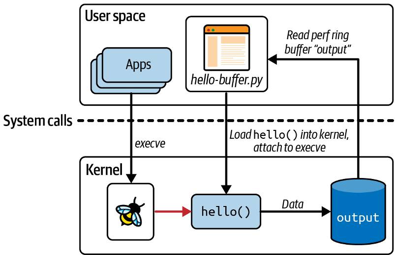

> 图 2-4：用 perf 环形缓冲区把数据从内核传递到用户空间。

你可以用 `cat /sys/kernel/debug/tracing/trace_pipe`
来验证信息并没有进入追踪管道。

除了演示环形缓冲区映射的用法之外，
这个例子还展示了一些 eBPF 辅助函数，
用于获取触发 eBPF 程序运行的事件的上下文信息。
在这里你看到了获取用户 ID、进程 ID 和当前命令名的辅助函数。
正如你将在第 7 章看到的，
可用的上下文信息集合，
以及可以用来获取这些信息的合法辅助函数集合，
取决于程序的类型以及触发它的事件。

eBPF 代码能够获得这样的上下文信息，
正是它对可观测性如此有价值的原因。
每当事件发生时，
eBPF 程序不仅能报告事件发生这一事实，
还能报告关于是什么触发了该事件的相关信息。
它的性能也非常高，
因为所有这些信息都可以在内核中收集，
不需要任何到用户空间的同步上下文切换。

在本书后面的例子中，
你还会看到用 eBPF 辅助函数收集其他上下文数据，
以及 eBPF 程序修改上下文数据、
甚至完全阻止事件发生的例子。

## 函数调用

你已经看到 eBPF 程序可以调用内核提供的辅助函数，
但如果你想把自己编写的代码拆分成函数呢？
一般来说，
在软件开发中，
把公共代码提取到一个可以从多处调用的函数中，
而不是一遍又一遍地重复同样的代码，
被认为是良好的实践 [8]。
但在早期，
eBPF 程序不允许调用辅助函数以外的函数。
为了绕过这个限制，
程序员们让编译器"始终内联"他们的函数，
像这样：

```c
static __always_inline void my_function(void *ctx, int val)
```

一般来说，
源代码中的一个函数会让编译器生成一条跳转指令，
使执行跳转到组成被调用函数的那组指令
（并在该函数执行完毕后跳回来）。
你可以在图 2-5 的左侧看到这一点。
右侧展示了函数被内联时的情况：
没有跳转指令，
而是把该函数指令的一份副本直接生成在调用函数内部。

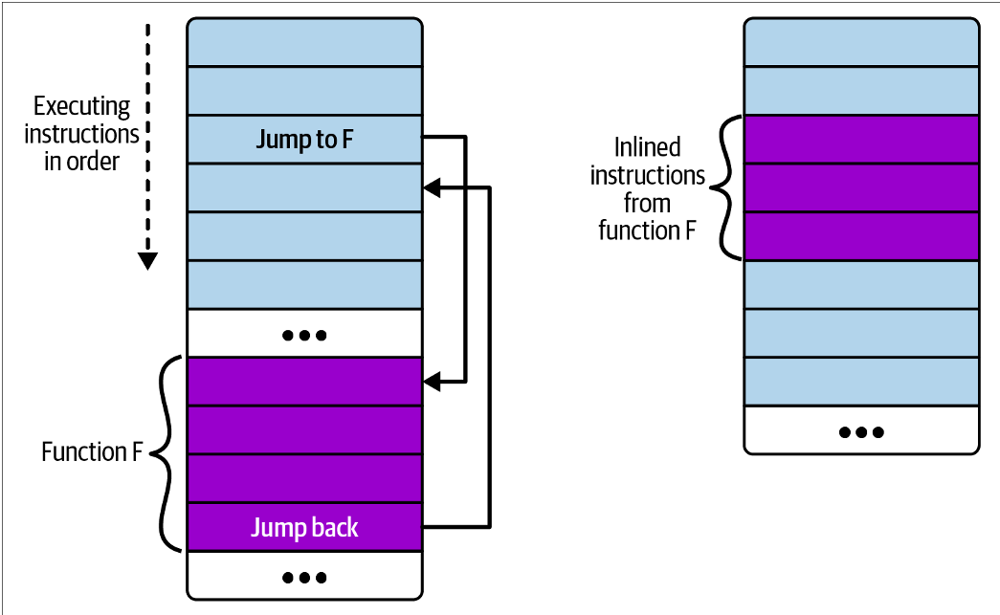

> 图 2-5：非内联与内联函数指令的布局。

如果一个函数从多处被调用，
编译出的可执行文件中就会有该函数指令的多份副本。
（有时编译器可能出于优化目的选择内联一个函数，
这也是你可能无法把 kprobe 挂接到某些内核函数上的原因之一。
我将在第 7 章回到这个话题。）

从 Linux 内核 4.16 和 LLVM 6.0 开始，
函数必须内联的限制被解除，
eBPF 程序员可以更自然地编写函数调用。
然而，
这个被称为 "BPF 到 BPF 函数调用" 或 "BPF 子程序" 的特性
目前还不被 BCC 框架支持，
所以我们到下一章再讨论它。
（当然，
如果函数被内联，
你仍然可以在 BCC 中使用它们。）

eBPF 中还有另一种把复杂功能分解为更小部分的机制：尾调用。

## 尾调用

如 ebpf.io 所述，
"尾调用可以调用并执行另一个 eBPF 程序并替换执行上下文，
类似于 execve() 系统调用对普通进程的工作方式"。
换句话说，
尾调用完成后，
执行不会返回到调用者。

尾调用绝非 eBPF 编程独有。
尾调用的一般动机是避免函数递归调用时
不断向栈上添加栈帧，
最终可能导致栈溢出错误。
如果你能把代码安排成最后一件事才是调用递归函数，
那么与调用函数关联的栈帧实际上没在做任何有用的事。
尾调用允许调用一连串函数而不增长栈。
这在 eBPF 中特别有用，
因为栈被限制在 512 字节。

尾调用通过 `bpf_tail_call()` 辅助函数发起，
其签名如下：

```c
long bpf_tail_call(void *ctx, struct bpf_map *prog_array_map, u32 index)
```

这个函数的三个参数含义如下：

- ctx 允许把上下文从发起调用的 eBPF 程序传递给被调用者。

- prog_array_map 是一个 BPF_MAP_TYPE_PROG_ARRAY 类型的 eBPF 映射，
  保存一组标识 eBPF 程序的文件描述符。

- index 指示应该调用这组 eBPF 程序中的哪一个。

这个辅助函数有些不同寻常：
如果成功，它永远不会返回。
当前运行的 eBPF 程序在栈上被所调用的程序替换。
这个辅助函数也可能失败——
例如，
如果指定的程序在映射中不存在——
这种情况下发起调用的程序会继续执行。

用户空间代码必须把所有 eBPF 程序加载到内核（和往常一样），
还要设置好程序数组映射。

让我们看一个用 BCC 编写的简单 Python 例子；
代码在 GitHub 仓库的 chapter2/hello-tail.py 中。
主 eBPF 程序挂接到所有系统调用公共入口处的 tracepoint。
这个程序使用尾调用，
针对特定的系统调用操作码追踪特定的消息。
如果某个操作码没有对应的尾调用，
程序就追踪一条通用消息。

如果你使用 BCC 框架，
可以用下面这种稍微简化的形式来发起尾调用：

```python
prog_array_map.call(ctx, index)
```

在把代码送去编译之前，
BCC 会把上面这行改写成：

```c
bpf_tail_call(ctx, prog_array_map, index)
```

下面是这个 eBPF 程序及其尾调用的源代码：

```c
BPF_PROG_ARRAY(syscall, 300);

int hello(struct bpf_raw_tracepoint_args *ctx) {
    int opcode = ctx->args[1];
    syscall.call(ctx, opcode);
    bpf_trace_printk("Another syscall: %d", opcode);
    return 0;
}

int hello_execve(void *ctx) {
    bpf_trace_printk("Executing a program");
    return 0;
}

int hello_timer(struct bpf_raw_tracepoint_args *ctx) {
    if (ctx->args[1] == 222) {
        bpf_trace_printk("Creating a timer");
    } else if (ctx->args[1] == 226) {
        bpf_trace_printk("Deleting a timer");
    } else {
        bpf_trace_printk("Some other timer operation");
    }
    return 0;
}

int ignore_opcode(void *ctx) {
    return 0;
}
```

① BCC 提供了 BPF_PROG_ARRAY 宏，
方便定义 BPF_MAP_TYPE_PROG_ARRAY 类型的映射。
我把这个映射命名为 syscall，
并允许 300 个条目 [9]，
这对这个例子来说足够了。

② 在你稍后将看到的用户空间代码中，
我将把这个 eBPF 程序挂接到 `sys_enter` raw tracepoint，
每当发起任何系统调用时都会命中它。
传递给挂接到 raw tracepoint 的 eBPF 程序的上下文，
采用这个 `bpf_raw_tracepoint_args` 结构体的形式。

③ 就 sys_enter 而言，
raw tracepoint 参数中包含标识正在发起哪个系统调用的操作码。

④ 这里我们向程序数组中键与操作码匹配的条目发起尾调用。
这行代码在 BCC 把源代码送去编译之前，
会被改写为对 `bpf_tail_call()` 辅助函数的调用。

⑤ 如果尾调用成功，
这行追踪操作码值的代码永远不会被执行。
我用它为映射中没有程序条目的操作码提供一行默认的追踪输出。

⑥ hello_exec() 是一个将被加载到 syscall 程序数组映射中的程序，
当操作码表明这是 execve() 系统调用时，
它将作为尾调用被执行。
它只是生成一行追踪，
告诉用户一个新程序正在被执行。

⑦ hello_timer() 是另一个将被加载到 syscall 程序数组中的程序。
在这个例子中，
它会被程序数组中的多个条目引用。

⑧ ignore_opcode() 是一个什么都不做的尾调用程序。
对于那些我不想生成任何追踪的系统调用，
我会用到它。

现在来看加载和管理这组 eBPF 程序的用户空间代码：

```python
b = BPF(text=program)
b.attach_raw_tracepoint(tp="sys_enter", fn_name="hello")

ignore_fn = b.load_func("ignore_opcode", BPF.RAW_TRACEPOINT)
exec_fn = b.load_func("hello_exec", BPF.RAW_TRACEPOINT)
timer_fn = b.load_func("hello_timer", BPF.RAW_TRACEPOINT)

prog_array = b.get_table("syscall")
prog_array[ct.c_int(59)] = ct.c_int(exec_fn.fd)
prog_array[ct.c_int(222)] = ct.c_int(timer_fn.fd)
prog_array[ct.c_int(223)] = ct.c_int(timer_fn.fd)
prog_array[ct.c_int(224)] = ct.c_int(timer_fn.fd)
prog_array[ct.c_int(225)] = ct.c_int(timer_fn.fd)
prog_array[ct.c_int(226)] = ct.c_int(timer_fn.fd)

# 忽略一些出现得非常频繁的系统调用
prog_array[ct.c_int(21)] = ct.c_int(ignore_fn.fd)
prog_array[ct.c_int(22)] = ct.c_int(ignore_fn.fd)
prog_array[ct.c_int(25)] = ct.c_int(ignore_fn.fd)

b.trace_print()
```

① 与你之前看到的挂接 kprobe 不同，
这一次用户空间代码把主 eBPF 程序挂接到 sys_enter tracepoint。

② 这些对 b.load_func() 的调用为每个尾调用程序返回一个文件描述符。
注意，
尾调用需要与它们的父程序具有相同的程序类型——
在这个例子中是 BPF.RAW_TRACEPOINT。
另外值得指出的是，
每个尾调用程序本身就是一个独立的 eBPF 程序。

③ 用户空间代码在 syscall 映射中创建条目。
映射不必为每个可能的操作码都填满；
如果某个操作码没有条目，
只是意味着不会执行尾调用。
另外，
多个条目指向同一个 eBPF 程序也是完全可以的。
在这个例子中，
我希望这一组定时器相关的系统调用中的任何一个
都执行 hello_timer() 尾调用。

④ 有些系统调用被系统执行得过于频繁，
每个都输出一行追踪会让追踪输出混乱到无法阅读。
我对几个系统调用使用了 `ignore_opcode()` 尾调用。

⑤ 把追踪输出打印到屏幕上，
直到用户终止程序。

运行这个程序会为（虚拟）机器上运行的每个系统调用生成追踪输出，
除非该操作码有条目链接到 ignore_opcode() 尾调用。
下面是在另一个终端中运行 ls 时的一些示例输出
（为便于阅读省略了一些细节）：

```text
./hello-tail.py
b' hello-tail.py-2767 ... Another syscall: 62'
b' hello-tail.py-2767 ... Another syscall: 62'
...
b' bash-2626 ... Executing a program'
b' bash-2626 ... Another syscall: 220'
...
b' <...>-2774 ... Creating a timer'
b' <...>-2774 ... Another syscall: 48'
b' <...>-2774 ... Deleting a timer'
...
b' ls-2774 ... Another syscall: 61'
b' ls-2774 ... Another syscall: 61'
...
```

具体执行的是哪些系统调用并不重要，
但你可以看到不同的尾调用被调用并生成了追踪消息。
你也可以看到，
对于在尾调用程序映射中没有条目的操作码，
输出了默认消息 Another syscall。

> [!TIP]
> 看看 Paul Chaignon 关于各种内核版本上 BPF 尾调用开销的博客文章。

从内核版本 4.2 起 eBPF 就支持尾调用，
但很长一段时间里它们与 BPF 到 BPF 函数调用互不兼容。
这一限制在内核 5.10 中解除 [10]。

最多可以把 33 个尾调用串联在一起，
再加上每个 eBPF 程序 100 万条指令的复杂度限制，
这意味着今天的 eBPF 程序员有很大的余地
来编写完全在内核中运行的非常复杂的代码。

<a id="chapter-2-summary"></a>

## 小结

希望通过展示一些具体的 eBPF 程序例子，
本章能帮助你巩固对"eBPF 代码在内核中运行、由事件触发"的心智模型。
你还看到了用 BPF 映射把数据从内核传递到用户空间的例子。

使用 BCC 框架隐藏了程序如何构建、
加载到内核以及挂接到事件的许多细节。
下一章我将展示编写 "Hello World" 的另一种方式，
我们将更深入地探究那些隐藏的细节。

<a id="chapter-2-exercises"></a>

## 练习

如果你想进一步探索 "Hello World"，
可以尝试（或思考）下面这些可选的练习：

1. 改造 hello-buffer.py eBPF 程序，
   让它对奇数和偶数进程 ID 输出不同的追踪消息。

2. 修改 hello-map.py，
   让 eBPF 代码被多个系统调用触发。
   例如，
   openat() 常被用来打开文件，
   write() 被用来向文件写数据。
   你可以先把 hello eBPF 程序挂接到多个系统调用的 kprobe 上。
   然后试着为不同的系统调用编写 hello eBPF 程序的修改版本，
   以此演示你可以从多个不同的程序访问同一个映射。

3. hello-tail.py eBPF 程序是一个挂接到 sys_enter raw tracepoint 的例子，
   每当任何系统调用被调用时都会命中它。
   修改 hello-map.py，
   把它挂接到同一个 sys_enter raw tracepoint，
   以显示每个用户 ID 发起的系统调用总数。

   下面是我做出这个修改后得到的一些示例输出：

   ```text
   $ ./hello-map.py
   ID 104: 6     ID 0: 225
   ID 104: 6     ID 101: 34     ID 100: 45     ID 0: 332     ID 501: 19
   ID 104: 6     ID 101: 34     ID 100: 45     ID 0: 368     ID 501: 38
   ID 104: 6     ID 101: 34     ID 100: 45     ID 0: 533     ID 501: 57
   ```

4. BCC 提供的 RAW_TRACEPOINT_PROBE 宏简化了挂接 raw tracepoint 的过程，
   它告诉用户空间的 BCC 代码自动把程序挂接到指定的 tracepoint。
   在 hello-tail.py 中试试它，像这样：

   - 把 hello() 函数的定义替换为 RAW_TRACEPOINT_PROBE(sys_enter)。

   - 从 Python 代码中移除显式的挂接调用 b.attach_raw_tracepoint()。

   你应该会看到 BCC 自动创建了挂接，
   程序的行为完全一样。
   这是 BCC 提供的众多便捷宏的一个例子。

5. 你还可以进一步改造 hello_map.py，
   让哈希表中的键标识某个特定的系统调用（而不是某个特定的用户）。
   输出将显示该系统调用在整个系统范围内被调用了多少次。

<a id="h2-2-参考文献"></a>

## 参考文献

[1] 我最初是为一场题为 "The Beginner's Guide to eBPF Programming" 的演讲写的这个例子。
原始代码以及幻灯片和视频的链接见 https://github.com/lizrice/ebpf-beginners。

[2] 从内核版本 5.5 起，
有一种性能更高的方式可以把 eBPF 程序挂接到函数上，
它使用 fentry（以及对应的 fexit，
代替 kretprobe 来处理函数退出）。
我将在本书后面讨论它，
但目前我用 kprobe 来让本章的例子尽可能简单。

[3] 我经常用 VS Code Remote 连接到云端的虚拟机。
这会在虚拟机上运行许多 node 脚本，
从而产生这个 "Hello World" 应用的大量追踪输出。

[4] 有些命令（echo 是一个常见的例子）可能是 shell 内建命令，
作为 shell 进程的一部分运行，
而不是执行一个新程序。
它们不会触发 execve() 事件，
因此不会生成追踪。

[5] C++ 支持，但 C 不支持。

[6] 低 32 位是*线程组 ID*。
对于单线程进程，
它与进程 ID 相同，
但该进程的其他线程会被赋予不同的 ID。
GNU C 库的文档对*进程* ID 和*线程组* ID 的区别有很好的描述。

[7] 这只是示例代码，
所以我没有操心键盘中断时的清理之类的细节！

[8] 这一原则常被称为 "DRY"（"Don't Repeat Yourself"），
因《The Pragmatic Programmer》而广为人知。

[9] Linux 中大约有 300 个系统调用，
由于这个例子没有用到任何较新的系统调用，
这个数量足够了。

[10] 从 BPF 子程序发起尾调用需要 JIT 编译器的支持，
你将在下一章见到 JIT 编译器。
在我撰写本书例子时使用的内核版本中，
只有 x86 上的 JIT 编译器有这种支持，
不过内核 6.0 已经为 ARM 添加了支持。

# 第 3 章 eBPF 程序剖析

上一章介绍了一个用 BCC 框架编写的简单 eBPF "Hello World" 程序。
本章给出一个完全用 C 语言编写的 "Hello World" 示例，
让你看到 BCC 在幕后处理的一些细节。

本章还会展示 eBPF 程序从源代码到执行所经历的各个阶段，
如图 3-1 所示。


> 图 3-1：C（或 Rust）源代码被编译为 eBPF 字节码，
> 再经 JIT 编译或解释执行为原生机器码指令。

eBPF 程序就是一组 eBPF 字节码指令。
直接用这种字节码编写 eBPF 代码是可行的，
就像可以用汇编语言编程一样。
但人们通常觉得高级编程语言更容易驾驭；
至少在我写作本书时，
可以说绝大多数 eBPF 代码都是用 C 语言编写的¹，
然后编译为 eBPF 字节码。

从概念上讲，
这些字节码运行在内核中的 eBPF 虚拟机上。

> ¹ 用 Rust 编写的 eBPF 程序也越来越多，
> 因为 Rust 编译器支持以 eBPF 字节码为目标。

## eBPF 虚拟机

eBPF 虚拟机和任何虚拟机一样，
是计算机的软件实现。
它接收 eBPF 字节码指令形式的程序，
而这些指令必须转换为在 CPU 上运行的原生机器指令。

在 eBPF 的早期实现中，
字节码指令是在内核中解释执行的——
也就是说，
每次 eBPF 程序运行时，
内核都会检查这些指令，
将其转换为机器码，
然后再执行。
出于性能考虑，
也为了避免 eBPF 解释器中某些与 Spectre 相关的漏洞，
解释执行后来基本被 JIT（just-in-time，即时）编译取代。
*编译*意味着到原生机器指令的转换只发生一次，
即在程序加载到内核时。

eBPF 字节码由一组指令组成，
这些指令作用于（虚拟的）eBPF 寄存器。
eBPF 指令集和寄存器模型的设计目标，
是能够干净利落地映射到常见的 CPU 架构，
从而使字节码到机器码的编译或解释步骤相当直接。

## eBPF 寄存器

eBPF 虚拟机使用 10 个通用寄存器，
编号为 0 到 9。
此外，
寄存器 10 用作栈帧指针（只能读，
不能写）。
eBPF 程序执行时，
值会存入这些寄存器以跟踪状态。

需要理解的重要一点是，
eBPF 虚拟机中的这些 eBPF 寄存器是用软件实现的。
在 Linux 内核源码的 include/uapi/linux/bpf.h 头文件中，
可以看到它们从 BPF_REG_0 到 BPF_REG_10 的枚举定义。

eBPF 程序的上下文参数在执行开始前加载到寄存器 1。
函数的返回值存放在寄存器 0。

从 eBPF 代码调用函数之前，
该函数的参数会被放入寄存器 1 到寄存器 5
（如果参数少于五个，
则不会用到所有寄存器）。

## eBPF 指令

同一个 *linux/bpf.h* 头文件定义了一个名为 *bpf_insn* 的结构体，
表示一条 eBPF 指令：

```c
struct bpf_insn {
    __u8 code; /* 操作码 */
    __u8 dst_reg:4; /* 目标寄存器 */
    __u8 src_reg:4; /* 源寄存器 */
    __s16 off; /* 有符号偏移量 */
    __s32 imm; /* 有符号立即数常量 */
};
```

1. 每条指令都有一个操作码，
   定义该指令要执行的操作：
   例如把一个值加到寄存器的内容上，
   或跳转到程序中的另一条指令。²
   Iovisor 项目的 "Unofficial eBPF spec" 列出了全部有效指令。
2. 不同的操作最多可能涉及两个寄存器。
3. 视操作而定，
   还可能有一个偏移量值和/或一个"立即数"整数值。

这个 bpf_insn 结构体长 64 位（即 8 字节）。
但有时一条指令可能需要超过 8 字节。
如果想把一个寄存器设置为 64 位的值，
不可能把这个值的全部 64 位连同操作码和寄存器信息一起塞进这个结构体。
在这种情况下，
指令会使用宽指令编码，
总长 16 字节。
本章后面会看到这种编码的例子。

加载到内核时，
eBPF 程序的字节码由一系列这样的 bpf_insn 结构体表示。
验证器会对这些信息进行多项检查，
以确保代码可以安全运行。
你将在第 6 章进一步了解验证过程。

大多数不同的操作码可归入以下几类：

- 把一个值加载到寄存器（可以是立即数、从内存读取的值或来自另一个寄存器的值）
- 把寄存器中的值存入内存
- 执行算术运算，
  例如把一个值加到寄存器的内容上
- 在满足特定条件时跳转到另一条指令

> ² 有少数指令的操作会被指令中其他字段的值"修饰"。
> 例如，
> 内核 5.12 引入了一组原子指令，
> 其中包含的算术运算（ADD、AND、OR、XOR）由 imm 字段指定。

> [!TIP]
> 关于 eBPF 架构的概览，
> 我推荐 Cilium 项目文档中的 BPF and XDP Reference Guide。
> 如果想了解更多细节，
> 内核文档对 eBPF 指令及编码的描述也相当清晰。

让我们再用一个简单的 eBPF 程序示例，
跟随它从 C 源代码出发，
经过 eBPF 字节码，
直到机器码指令的旅程。

> [!NOTE]
> 如果你想自己构建并运行这段代码，
> 可以在 github.com/lizrice/learning-ebpf 找到代码以及搭建运行环境的说明。
> 本章的代码在 chapter3 目录中。

> [!NOTE]
> 本章的示例用 C 语言编写，
> 使用了一个名为 *libbpf* 的库。
> 你将在第 5 章进一步了解这个库。

## 面向网络接口的 eBPF "Hello World"

上一章的示例由系统调用 kprobe 触发，
输出 "Hello World" 跟踪信息；
这一次我要展示的 eBPF 程序，
在网络数据包到达时触发，
写出一行跟踪信息。

数据包处理是 eBPF 非常常见的应用。
我将在第 8 章更详细地介绍，
但现在了解一下基本思路会有帮助：
eBPF 程序会在网络接口上每到达一个数据包时被触发一次。
程序可以检查甚至修改数据包的内容，
并对内核应当如何处理该数据包做出决定（或称裁决）。
裁决可以告诉内核照常继续处理、
丢弃它，
或把它重定向到别处。

在这里展示的简单示例中，
程序不对网络数据包做任何处理；
它只是每次收到网络数据包时，
往跟踪管道写出 *Hello World* 字样和一个计数器。

示例程序在 chapter3/hello.bpf.c 中。
把 eBPF 程序放在以 bpf.c 结尾的文件名中是相当常见的约定，
以便与可能位于同一源码目录中的用户空间 C 代码区分开来。
下面是完整的程序：

```c
#include <linux/bpf.h>
#include <bpf/bpf_helpers.h>

int counter = 0;

SEC("xdp")
int hello(void *ctx) {
    bpf_printk("Hello World %d", counter);
    counter++;
    return XDP_PASS;
}
char LICENSE[] SEC("license") = "Dual BSD/GPL";
```

1. 这个示例首先包含了一些头文件。
   以防你不熟悉 C 语言编程：
   每个程序都必须包含定义了它将要使用的结构体或函数的头文件。
   从名字就能猜出这些头文件与 BPF 相关。
2. 这个示例展示了 eBPF 程序如何使用全局变量。
   这个计数器会在程序每次运行时递增。
3. 宏 SEC() 定义了一个名为 xdp 的段，
   稍后你能在编译出的目标文件中看到它。
   我将在第 5 章再讲段名的用途，
   目前你只需把它理解为：
   它声明这是一个 eXpress Data Path（XDP）类型的 eBPF 程序。
4. 这里可以看到实际的 eBPF 程序。
   在 eBPF 中，
   程序名就是函数名，
   所以这个程序叫 hello。
   它使用辅助函数 bpf_printk 写出一串文本，
   递增全局变量 counter，
   然后返回 XDP_PASS。
   这个裁决告诉内核应当照常处理这个网络数据包。

最后是另一个 SEC() 宏，
它定义了一个许可字符串，
这是 eBPF 程序的一项关键要求。
内核中的一些 BPF 辅助函数被定义为"仅限 GPL"。
如果你想使用其中任何一个函数，
你的 BPF 代码就必须声明为 GPL 兼容许可。
如果声明的许可与程序使用的函数不兼容，
验证器（将在第 6 章讨论）会提出异议。
某些 eBPF 程序类型也要求 GPL 兼容，
包括使用 BPF LSM 的程序（将在第 9 章介绍）。

> [!NOTE]
> 你可能在想，
> 为什么上一章用的是 `bpf_trace_printk()`，
> 而这个版本用的是 `bpf_printk()`。
> 简短的回答是：
> BCC 的版本叫 `bpf_trace_printk()`，
> libbpf 的版本叫 `bpf_printk()`，
> 但它们都是内核函数 `bpf_trace_printk()` 的封装。
> Andrii Nakryiko 在他的博客上写过一篇很好的相关文章。

这个 eBPF 程序示例挂载到网络接口的 XDP 钩子点。
你可以认为 XDP 事件在网络数据包到达（物理或虚拟）网络接口的那一刻触发。

> [!TIP]
> 一些网卡支持卸载 XDP 程序，
> 使其可以在网卡本身上执行。
> 这意味着每个到达的网络数据包都可以在网卡上处理，
> 根本无需接近机器的 CPU。
> XDP 程序可以检查甚至修改每个网络数据包，
> 因此非常适合以高性能的方式实现 DDoS 防护、
> 防火墙或负载均衡等功能。
> 你将在第 8 章进一步了解。

你已经看到了 C 源代码，
下一步是把它编译成内核能理解的目标文件。

## 编译 eBPF 目标文件

我们的 eBPF 源代码需要编译成 eBPF 虚拟机能理解的机器指令：
eBPF 字节码。
只要指定 -target bpf，
LLVM 项目的 Clang 编译器就能完成这项工作。
下面是 Makefile 中负责编译的片段：

```makefile
hello.bpf.o: %.o: %.c
	clang \
	    -target bpf \
	    -I/usr/include/$(shell uname -m)-linux-gnu \
	    -g \
	    -O2 -c $< -o $@
```

这会从 hello.bpf.c 中的源代码生成名为 hello.bpf.o 的目标文件。
这里的 -g 标志是可选的³，
但它会生成调试信息，
使你在检查目标文件时能把源代码和字节码对照起来看。

> ³ 生成 BTF 信息需要 -g 标志，
> 而 CO-RE eBPF 程序需要 BTF 信息，
> 我将在第 5 章介绍。

让我们检查这个目标文件，
更好地理解其中包含的 eBPF 代码。

## 检查 eBPF 目标文件

file 工具常用于确定文件的内容：

```console
$ file hello.bpf.o
hello.bpf.o: ELF 64-bit LSB relocatable, eBPF, version 1 (SYSV), with debug_info,
not stripped
```

这表明它是一个 ELF（Executable and Linkable Format）文件，
包含 eBPF 代码，
面向采用 LSB（least significant bit）架构的 64 位平台。
如果你在编译步骤使用了 -g 标志，
其中还会包含调试信息。

你可以用 llvm-objdump 进一步检查这个目标文件，
查看 eBPF 指令：

```console
$ llvm-objdump -S hello.bpf.o
```

即使你不熟悉反汇编，
这条命令的输出也不算难懂：

```text
hello.bpf.o: file format elf64-bpf

Disassembly of section xdp:

0000000000000000 <hello>:
; bpf_printk("Hello World %d", counter);
0: 18 06 00 00 00 00 00 00 00 00 00 00 00 00 00 00 r6 = 0 ll
2: 61 63 00 00 00 00 00 00 r3 = *(u32 *) (r6 + 0)
3: 18 01 00 00 00 00 00 00 00 00 00 00 00 00 00 00 r1 = 0 ll
5: b7 02 00 00 0f 00 00 00 r2 = 15
6: 85 00 00 00 06 00 00 00 call 6
; counter++;
7: 61 61 00 00 00 00 00 00 r1 = *(u32 *) (r6 + 0)
8: 07 01 00 00 01 00 00 00 r1 += 1
9: 63 16 00 00 00 00 00 00 *(u32 *) (r6 + 0) = r1
; return XDP_PASS;
10: b7 00 00 00 02 00 00 00 r0 = 2
11: 95 00 00 00 00 00 00 exit
```

1. 第一行进一步确认了 hello.bpf.o 是包含 eBPF 代码的 64 位 ELF 文件
   （有些工具用 BPF 这个叫法，
   有些用 eBPF，
   并没有什么特别的规律；
   如前所述，
   这两个术语如今实际上已经可以互换）。
2. 接下来是标记为 xdp 的段的反汇编，
   与 C 源代码中的 SEC() 定义相对应。
3. 这个段是一个名为 hello 的函数。
4. 有五行 eBPF 字节码指令对应源代码行 bpf_printk("Hello World %d",
   counter);。
5. 三行 eBPF 字节码指令用于递增 counter 变量。
6. 另外两行字节码由源代码 return XDP_PASS; 生成。

除非你特别感兴趣，
否则并没有必要确切理解每一行字节码与源代码的对应关系。
编译器会负责生成字节码，
你无需为此操心！
但让我们稍微仔细地看一下输出，
感受一下它与本章前面介绍的 eBPF 指令和寄存器之间的关系。

在每一行字节码的左侧，
可以看到该指令相对于 hello 在内存中位置的偏移量。
如本章前面所述，
eBPF 指令一般长 8 字节；
在 64 位平台上，
每个内存单元可以容纳 8 字节，
因此偏移量通常每条指令递增 1。
不过，
这个程序的第一条指令恰好是宽指令编码，
需要 16 字节才能把寄存器 6 设置为一个 64 位的值 0。
这使得第二行输出中的指令位于偏移量 2。
之后又是另一条 16 字节指令，
把寄存器 1 设置为 64 位的值 0。
再往后，
其余指令都只需 8 字节，
所以偏移量每行递增 1。

每行的第一个字节是告诉内核执行什么操作的操作码，
每条指令行的右侧是该指令的人类可读解释。
在我写作本书时，
Iovisor 项目拥有最完整的 eBPF 操作码文档，
但 Linux 内核官方文档正在赶上，
eBPF 基金会也在制定不绑定特定操作系统的标准文档。

举个例子，
来看偏移量 5 处的指令，
它长这样：

```text
5: b7 02 00 00 0f 00 00 00 r2 = 15
```

操作码是 0xb7，
文档告诉我们对应的伪代码是 dst = imm，
可以读作"把目标设置为立即数"。
目标由第二个字节 0x02 定义，
表示"寄存器 2"。
这里的"立即数"（即字面值）是 0x0f，
即十进制的 15。
所以我们可以理解，
这条指令告诉内核"把寄存器 2 设置为值 15"。
这与我们在指令右侧看到的输出 r2 = 15 一致。

偏移量 10 处的指令类似：

```text
10: b7 00 00 00 02 00 00 00 r0 = 2
```

这一行的操作码同样是 0xb7，
这次它把寄存器 0 的值设置为 2。
eBPF 程序运行结束时，
寄存器 0 保存返回码，
而 XDP_PASS 的值就是 2。
这与总是返回 XDP_PASS 的源代码相符。

现在你知道 hello.bpf.o 包含一个字节码形式的 eBPF 程序了。
下一步是把它加载到内核中。

## 把程序加载到内核

这个例子中我们使用名为 bpftool 的工具。
你也可以通过编程方式加载程序，
本书后面会看到这方面的例子。

> [!TIP]
> 一些 Linux 发行版提供了包含 `bpftool` 的软件包，
> 你也可以从源代码编译它。
> 在 Quentin Monnet 的博客上可以找到关于安装或构建该工具的更多细节，
> Cilium 网站上也有更多文档和用法说明。

下面是使用 bpftool 把程序加载到内核的示例。
注意，
你很可能需要 root 身份（或使用 sudo），
才能获得 bpftool 所需的 BPF 权限。

```console
$ bpftool prog load hello.bpf.o /sys/fs/bpf/hello
```

这会从编译出的目标文件加载 eBPF 程序，
并把它"钉"（pin）到 /sys/fs/bpf/hello 这个位置。⁴

> ⁴ 一般来说这是可选的——eBPF 程序可以不钉到文件位置就加载到内核——但对 bpftool 来说不是可选的，
> 它总是要把加载的程序钉住。
> 原因将在第 4 章"BPF 程序和映射的引用"一节进一步说明。

该命令没有任何输出即表示成功，
但你可以用 ls 确认程序已经就位：

```console
$ ls /sys/fs/bpf
hello
```

eBPF 程序已成功加载。
让我们用 bpftool 工具进一步了解这个程序及其在内核中的状态。

## 检查已加载的程序

bpftool 工具可以列出加载到内核中的所有程序。
如果你自己动手试，
输出中很可能会看到几个预先存在的 eBPF 程序；
但为清晰起见，
我只展示与我们的 "Hello World" 示例相关的行：

```console
$ bpftool prog list
...
540: xdp name hello tag d35b94b4c0c10efb gpl
       loaded_at 2022-08-02T17:39:47+0000 uid 0
       xlated 96B jited 148B memlock 4096B map_ids 165,166
       btf_id 254
```

这个程序被分配了 ID 540。
这个标识是每个程序加载时分配的编号。
知道了 ID，
就可以让 bpftool 显示该程序的更多信息。
这次我们用美化后的 JSON 格式输出，
这样字段名和值都能看到：

```console
$ bpftool prog show id 540 --pretty
{
    "id": 540,
    "type": "xdp",
    "name": "hello",
    "tag": "d35b94b4c0c10efb",
    "gpl_compatible": true,
    "loaded_at": 1659461987,
    "uid": 0,
    "bytes_xlated": 96,
    "jited": true,
    "bytes_jited": 148,
    "bytes_memlock": 4096,
    "map_ids": [165, 166],
    "btf_id": 254
}
```

有了字段名，
其中很多内容都一目了然：

- 程序的 ID 是 540。
- type 字段告诉我们这个程序可以通过 XDP 事件挂载到网络接口。
  还有几种其他类型的 BPF 程序可以挂载到不同类型的事件，
  我们将在第 7 章进一步讨论。
- 程序名是 hello，
  即源代码中的函数名。
- tag 是这个程序的另一个标识符，
  我稍后会详细介绍。
- 程序以 GPL 兼容许可定义。
- 有一个时间戳显示程序的加载时间。
- 用户 ID 0（即 root）加载了这个程序。
- 这个程序有 96 字节转换后的 eBPF 字节码，
  我稍后会展示给你看。
- 这个程序经过了 JIT 编译，
  编译产生了 148 字节的机器码。
  这一点我稍后也会讲到。
- bytes_memlock 字段告诉我们这个程序保留了 4096 字节不会被换出的内存。
- 这个程序引用了 ID 为 165 和 166 的 BPF 映射。
  这似乎有点出人意料，
  因为源代码中并没有明显引用映射。
  本章后面你会看到，
  eBPF 程序是如何利用映射语义来处理全局数据的。
- 你将在第 5 章了解 BTF；
  目前只需知道 btf_id 表明这个程序带有一块 BTF 信息。
  只有用 -g 标志编译，
  目标文件中才会包含这些信息。

## BPF 程序标签

tag 是程序指令的 SHA（Secure Hashing Algorithm）校验和，
可以用作程序的另一个标识符。
每次加载或卸载程序，
ID 都可能变化，
但 tag 保持不变。
bpftool 工具接受以 ID、名称、tag 或钉住路径引用 BPF 程序，
所以在本例中，
以下命令的输出都相同：

- bpftool prog show id 540
- bpftool prog show name hello
- bpftool prog show tag d35b94b4c0c10efb
- bpftool prog show pinned /sys/fs/bpf/hello

你可能有多个同名程序，
甚至可能有多个 tag 相同的程序实例，
但 ID 和钉住路径永远是唯一的。

## 转换后的字节码

bytes_xlated 字段告诉我们有多少字节的"转换后"eBPF 代码。
这是通过验证器之后的 eBPF 字节码
（也可能出于本书后面会讨论的原因被内核修改过）。

让我们用 bpftool 展示 "Hello World" 代码的这个转换后版本：

```console
$ bpftool prog dump xlated name hello
int hello(struct xdp_md * ctx):
; bpf_printk("Hello World %d", counter);
0: (18) r6 = map[id:165][0]+0
2: (61) r3 = *(u32 *) (r6 +0)
3: (18) r1 = map[id:166][0]+0
5: (b7) r2 = 15
6: (85) call bpf_trace_printk#-78032
; counter++;
7: (61) r1 = *(u32 *) (r6 +0)
8: (07) r1 += 1
9: (63) *(u32 *) (r6 +0) = r1
; return XDP_PASS;
10: (b7) r0 = 2
11: (95) exit
```

这看起来与你之前在 llvm-objdump 输出中看到的反汇编代码非常相似。
偏移地址相同，
指令看起来也相似——
例如，
可以看到偏移量 5 处的指令是 r2=15。

## JIT 编译的机器码

转换后的字节码已经相当底层，
但还不是机器码。
eBPF 使用 JIT 编译器把 eBPF 字节码转换为在目标 CPU 上原生运行的机器码。
bytes_jited 字段显示，
经过这次转换后程序长 148 字节。⁵

> ⁵ 要利用 JIT 编译，
> 需要启用内核设置 CONFIG_BPF_JIT；
> 也可以在运行时通过 net.core.bpf_jit_enable sysctl 设置启用或禁用。
> 关于不同芯片架构上 JIT 支持的更多信息，
> 请参阅文档。

> [!NOTE]
> 为了获得更高的性能，
> eBPF 程序一般都经过 JIT 编译。
> 另一种方式是在运行时解释执行 eBPF 字节码。
> eBPF 指令集和寄存器的设计与原生机器指令相当接近，
> 使解释执行简单直接、
> 因而相对快速；
> 但编译后的程序会更快，
> 而且现在大多数架构都支持 JIT。

bpftool 工具可以生成这份 JIT 代码的汇编语言转储。
如果你不熟悉汇编语言、
觉得它完全看不懂，
也不用担心！
我把它列在这里只是为了展示 eBPF 代码从源代码到可执行机器指令所经历的全部转换。
命令及其输出如下：

```console
$ bpftool prog dump jited name hello
int hello(struct xdp_md * ctx):
bpf_prog_d35b94b4c0c10efb_hello:
; bpf_printk("Hello World %d", counter);
0: hint #34
4: stp x29, x30, [sp, #-16]!
8: mov x29, sp
c: stp x19, x20, [sp, #-16]!
10: stp x21, x22, [sp, #-16]!
14: stp x25, x26, [sp, #-16]!
18: mov x25, sp
1c: mov x26, #0
20: hint #36
24: sub sp, sp, #0
28: mov x19, #-140733193388033
2c: movk x19, #2190, lsl #16
30: movk x19, #49152
34: mov x10, #0
38: ldr w2, [x19, x10]
3c: mov x0, #-205419695833089
40: movk x0, #709, lsl #16
44: movk x0, #5904
48: mov x1, #15
4c: mov x10, #-6992
50: movk x10, #29844, lsl #16
54: movk x10, #56832, lsl #32
58: blr x10
5c: add x7, x0, #0
; counter++;
60: mov x10, #0
64: ldr w0, [x19, x10]
68: add x0, x0, #1
6c: mov x10, #0
70: str w0, [x19, x10]
; return XDP_PASS;
74: mov x7, #2
78: mov sp, sp
7c: ldp x25, x26, [sp], #16
80: ldp x21, x22, [sp], #16
84: ldp x19, x20, [sp], #16
88: ldp x29, x30, [sp], #16
8c: add x0, x7, #0
90: ret
```

> [!NOTE]
> 一些打包发行的 bpftool 尚不支持转储 JIT 输出；
> 如果是这种情况，
> 你会看到 "Error: No libbfd support."。
> 你可以按照 https://github.com/libbpf/bpftool 的说明自行构建 bpftool。

你已经看到 "Hello World" 程序被加载到了内核中，
但此时它还没有关联到任何事件，
所以没有什么会触发它运行。
它需要被挂载到一个事件上。

## 挂载到事件

程序类型必须与其挂载的事件类型匹配；
你将在第 7 章进一步了解。
本例是一个 XDP 程序，
可以用 bpftool 把这个 eBPF 示例程序挂载到网络接口的 XDP 事件上，
如下所示：

```console
$ bpftool net attach xdp id 540 dev eth0
```

> [!NOTE]
> 在我写作本书时，
> bpftool 工具还不支持挂载所有程序类型，
> 但最近已经扩展为可以自动挂载 k(ret)probe、u(ret)probe 和 tracepoint。

这里我用的是程序的 ID 540，
但你也可以用名称（前提是唯一）或 tag 来标识要挂载的程序。
在这个例子中，
我把程序挂载到了网络接口 eth0。

你可以用 bpftool 查看所有挂载到网络的 eBPF 程序：

```console
$ bpftool net list
xdp:
eth0(2) driver id 540

tc:

flow_dissector:
```

ID 为 540 的程序挂载到了 eth0 接口的 XDP 事件上。
这个输出还给出了一些线索，
提示网络栈中还有哪些可以挂载 eBPF 程序的潜在事件：
tc 和 flow_dissector。
更多内容见第 7 章。

你也可以用 ip link 检查网络接口，
输出大致如下（为清晰起见删去了一些细节）：

```text
1: lo: <LOOPBACK,UP,LOWER_UP> mtu 65536 qdisc noqueue state UNKNOWN mode DEFAULT group default qlen 1000
2: eth0: <BROADCAST,MULTICAST,UP,LOWER_UP> mtu 1500 xdp qdisc fq_codel state UP mode DEFAULT group default qlen 1000
    ...
    prog/xdp id 540 tag 9d0e949f89f1a82c jited
    ...
```

这个例子中有两个接口：
环回接口 lo 用于向本机上的进程发送流量；
eth0 接口把本机连接到外部世界。
输出还显示 eth0 的 XDP 钩子上挂载了一个 JIT 编译的 eBPF 程序，
标识为 540，
tag 为 9d0e949f89f1a82c。

> [!TIP]
> 你也可以用 ip link 把 XDP 程序挂载到网络接口或将其卸载。
> 我把这作为本章末尾的练习，
> 第 7 章还有更多示例。

此时，
hello eBPF 程序应该在每次收到网络数据包时产生跟踪输出。
你可以运行 cat /sys/kernel/debug/tracing/trace_pipe 来查看。
输出会很多，
大致如下：

```text
<idle>-0 [003] d.s.. 655370.944105: bpf_trace_printk: Hello World 4531
<idle>-0 [003] d.s.. 655370.944587: bpf_trace_printk: Hello World 4532
<idle>-0 [003] d.s.. 655370.944896: bpf_trace_printk: Hello World 4533
```

如果你记不住跟踪管道的位置，
也可以用 bpftool prog tracelog 命令得到同样的输出。

与第 2 章看到的输出相比，
这次每个事件都没有关联的命令或进程 ID；
相反，
每行跟踪的开头都是 <idle>-0。
在第 2 章中，
每个系统调用事件之所以发生，
是因为用户空间中执行命令的进程调用了系统调用 API。
那个进程 ID 和命令是 eBPF 程序执行上下文的一部分。
但在这个例子中，
XDP 事件由网络数据包的到达触发。
没有任何用户空间进程与这个数据包关联——
在 hello eBPF 程序被触发时，
系统除了把数据包接收到内存中之外还没有对它做任何处理，
也不知道这个数据包是什么、要发往何处。

可以看到，
跟踪输出的计数器值如预期那样每次递增 1。
在源代码中，
counter 是一个全局变量。
让我们看看在 eBPF 中它是如何用映射实现的。

## 全局变量

如你在上一章所学，
eBPF 映射是一种可以从 eBPF 程序或用户空间访问的数据结构。
由于同一个映射可以被同一程序的不同运行反复访问，
它可以用来在两次执行之间保存状态。
多个程序也可以访问同一个映射。
正因为这些特性，
映射语义可以被转用作全局变量。

> [!NOTE]
> 在 2019 年加入全局变量支持之前，
> eBPF 程序员必须显式编写映射来完成同样的任务。

你之前看到，
bpftool 显示这个示例程序使用了标识为 165 和 166 的两个映射。
（如果你自己动手试，
很可能会看到不同的标识，
因为标识是映射在内核中创建时分配的。）
让我们看看这些映射里有什么。

bpftool 工具可以显示加载到内核中的映射。
为清晰起见，
我只展示与 "Hello World" 示例程序相关的条目 165 和 166：

```console
$ bpftool map list
165: array name hello.bss flags 0x400
     key 4B value 4B max_entries 1 memlock 4096B
     btf_id 254
166: array name hello.rodata flags 0x80
     key 4B value 15B max_entries 1 memlock 4096B
     btf_id 254 frozen
```

从 C 程序编译出的目标文件中，
bss⁶ 段通常保存全局变量；
可以用 bpftool 检查其内容，
如下所示：

```console
$ bpftool map dump name hello.bss
[
    {
        "value": {
            ".bss": [
                {
                    "counter": 11127
                }
            ]
        }
    }
]
```

我也可以用 bpftool map dump id 165 获取同样的信息。
如果我再次运行其中任何一条命令，
会看到 counter 增加了，
因为每收到一个网络数据包程序就会运行一次。

你将在第 5 章了解到，
bpftool 只有在有 BTF 信息可用时，
才能漂亮地打印出映射中的字段名（这里是变量名 counter），
而这些信息只有用 -g 标志编译才会包含。
如果你在编译步骤省略了该标志，
看到的输出会更像这样：

```console
$ bpftool map dump name hello.bss
key: 00 00 00 00 value: 19 01 00 00
Found 1 element
```

没有 BTF 信息，
bpftool 就无法知道源代码中用了什么变量名。
你可以推断，
既然这个映射中只有一项，
十六进制值 19 01 00 00 一定就是 counter 的当前值
（字节从最低有效字节开始排列，
即十进制的 281）。

你在这里看到，
eBPF 程序利用映射语义来读写全局变量。
映射也用于保存静态数据，
检查另一个映射就能看到这一点。

另一个映射名为 hello.rodata，
这暗示它可能是与我们的 hello 程序相关的只读数据。
转储这个映射的内容，
可以看到它保存着 eBPF 程序用于跟踪的字符串：

```console
$ bpftool map dump name hello.rodata
[
    {
        "value": {
            ".rodata": [
                "hello.____fmt": "Hello World %d"
            ]
        }
    }
]
```

如果你编译目标文件时没有加 -g 标志，
看到的输出会是这样：

```console
$ bpftool map dump id 166
key: 00 00 00 00 value: 48 65 6c 6c 6f 20 57 6f 72 6c 64 20 25 64 00
Found 1 element
```

这个映射中有一个键值对，
值包含 12 字节数据，
以 0 结尾。
你大概不会惊讶，
这些字节正是字符串 "Hello World %d" 的 ASCII 表示。

> ⁶ 这里的 bss 是 "block started by symbol" 的缩写。

检查完这个程序和它的映射，
是时候清理了。
我们先把它从触发它的事件上卸载下来。

## 卸载程序挂载

可以这样把程序从网络接口上卸载：

```console
$ bpftool net detach xdp dev eth0
```

命令成功运行时没有输出，
但你可以通过 bpftool net list 的输出中不再有 XDP 条目，
确认程序已不再挂载：

```console
$ bpftool net list
xdp:

tc:

flow_dissector:
```

不过，
程序仍然加载在内核中：

```console
$ bpftool prog show name hello
395: xdp name hello tag 9d0e949f89f1a82c gpl
loaded_at 2022-12-19T18:20:32+0000 uid 0
xlated 48B jited 108B memlock 4096B map_ids 4
```

## 从内核卸载程序

bpftool prog load 没有反向操作（至少在我写作本书时如此），
但你可以通过删除钉住的伪文件把程序从内核中移除：

```console
$ rm /sys/fs/bpf/hello
$ bpftool prog show name hello
```

这条 bpftool 命令没有任何输出，
因为程序已不再加载在内核中。

## BPF 到 BPF 调用

上一章你看到了尾调用的实际效果，
我还提到现在也可以在 eBPF 程序内部调用函数。
让我们看一个简单的例子。
和尾调用的例子一样，
它可以挂载到 sys_enter tracepoint；
不同的是，
这次它会跟踪输出系统调用的操作码。
代码在 chapter3/hello-func.bpf.c 中。

为了演示，
我写了一个非常简单的函数，
从 tracepoint 参数中提取系统调用操作码：

```c
static __attribute((noinline)) int get_opcode(struct bpf_raw_tracepoint_args *ctx) {
    return ctx->args[1];
}
```

如果任由编译器选择，
它很可能会把这个只在一处调用的极简函数内联掉。
那样就达不到本例的目的了，
所以我加了 __attribute((__noinline__)) 强制编译器就范。
在正常情况下，
你应该去掉这个属性，
让编译器按它认为合适的方式优化。

调用这个函数的 eBPF 函数如下所示：

```c
SEC("raw_tp")
int hello(struct bpf_raw_tracepoint_args *ctx) {
    int opcode = get_opcode(ctx);
    bpf_printk("Syscall: %d", opcode);
    return 0;
}
```

把它编译为 eBPF 目标文件后，
就可以加载到内核，
并用 bpftool 确认它已加载：

```console
$ bpftool prog load hello-func.bpf.o /sys/fs/bpf/hello
$ bpftool prog list name hello
893: raw_tracepoint name hello tag 3d9eb0c23d4ab186 gpl
loaded_at 2023-01-05T18:57:31+0000 uid 0
xlated 80B jited 208B memlock 4096B map_ids 204
btf_id 302
```

这个练习中有趣的部分是检查 eBPF 字节码，
看看 get_opcode() 函数：

```console
$ bpftool prog dump xlated name hello
int hello(struct bpf_raw_tracepoint_args * ctx):
; int opcode = get_opcode(ctx);
0: (85) call pc+7#bpf_prog_cbacc90865b1b9a5_get_opcode
; bpf_printk("Syscall: %d", opcode);
1: (18) r1 = map[id:193][0]+0
3: (b7) r2 = 12
4: (bf) r3 = r0
5: (85) call bpf_trace_printk#-73584
; return 0;
6: (b7) r0 = 0
7: (95) exit
int get_opcode(struct bpf_raw_tracepoint_args * ctx):
; return ctx->args[1];
8: (79) r0 = *(u64 *)((r1 +8)
; return ctx->args[1];
9: (95) exit
```

1. 这里可以看到 hello() eBPF 程序调用了 get_opcode()。
   偏移量 0 处的 eBPF 指令是 0x85，
   对照指令集文档可知它对应"函数调用"。
   执行不会继续执行下一条指令（即偏移量 1 处），
   而是向前跳转七条指令（pc+7），
   也就是偏移量 8 处的指令。
2. 这里是 get_opcode() 的字节码，
   如你所愿，
   第一条指令就在偏移量 8。

函数调用指令需要把当前状态压入 eBPF 虚拟机的栈，
这样被调用的函数退出后，
调用函数才能继续执行。
由于栈的大小限制为 512 字节，
BPF 到 BPF 调用的嵌套不能太深。

> [!TIP]
> 关于尾调用和 BPF 到 BPF 调用的更多细节，
> Cloudflare 博客上有一篇 Jakub Sitnicki 写的精彩文章：
> "Assembly within! BPF tail calls on x86 and ARM"。

<a id="chapter-3-summary"></a>

## 小结

本章展示了 C 源代码示例如何被转换为 eBPF 字节码，
再编译为机器码，
从而可以在内核中执行。
你还学会了如何使用 bpftool 检查加载到内核中的程序和映射，
以及如何挂载到 XDP 事件。

此外，
你看到了由不同类型事件触发的不同类型 eBPF 程序的示例。
XDP 事件由网络接口上数据包的到达触发，
而 kprobe 和 tracepoint 事件由触及内核代码中的特定位置触发。
我将在第 7 章讨论其他一些 eBPF 程序类型。

你还了解了映射如何用于为 eBPF 程序实现全局变量，
并看到了 BPF 到 BPF 函数调用。

下一章将深入另一个层次：
我将向你展示当 bpftool——或任何其他用户空间代码——
加载程序并将其挂载到事件时，
系统调用层面发生了什么。

<a id="chapter-3-exercises"></a>

## 练习

如果你想进一步探索 BPF 程序，
可以试试下面几件事：

1. 试着用如下 ip link 命令挂载和卸载 XDP 程序：

   ```console
   $ ip link set dev eth0 xdp obj hello.bpf.o sec xdp
   $ ip link set dev eth0 xdp off
   ```

2. 运行第 2 章中的任意 BCC 示例。
   在程序运行时，
   打开第二个终端窗口，
   用 bpftool 检查已加载的程序。
   下面是我运行 hello-map.py 示例时看到的输出：

   ```console
   $ bpftool prog show name hello
   197: kprobe name hello tag ba73a317e9480a37 gpl
   loaded_at 2022-08-22T08:46:22+0000 uid 0
   xlated 296B jited 328B memlock 4096B map_ids 65
   btf_id 179
   pids hello-map.py(2785)
   ```

   你也可以用 bpftool prog dump 命令查看这些程序的字节码和机器码版本。

3. 运行 chapter2 目录中的 hello-tail.py，
   在它运行时查看它加载的程序。
   你会看到每个尾调用程序都单独列出，
   如下所示：

   ```console
   $ bpftool prog list
   120: raw_tracepoint name hello tag b6bfd0e76e7f9aac gpl loaded_at 2023-01-05T14:35:32+0000 uid 0 xlated 160B jited 272B memlock 4096B map_ids 29 btf_id 124 pids hello-tail.py(3590)
   121: raw_tracepoint name ignore_opcode tag a04f5eef06a7f555 gpl loaded_at 2023-01-05T14:35:32+0000 uid 0 xlated 16B jited 72B memlock 4096B btf_id 124 pids hello-tail.py(3590)
   122: raw_tracepoint name hello_exec tag 931f578bd09da154 gpl loaded_at 2023-01-05T14:35:32+0000 uid 0 xlated 112B jited 168B memlock 4096B btf_id 124 pids hello-tail.py(3590)
   123: raw_tracepoint name hello_timer tag 6c3378ebb7d3a617 gpl loaded_at 2023-01-05T14:35:32+0000 uid 0 xlated 336B jited 356B memlock 4096B btf_id 124 pids hello-tail.py(3590)
   ```

   你也可以用 bpftool prog dump xlated 查看字节码指令，
   并与[BPF 到 BPF 调用](#bpf-到-bpf-调用)一节中看到的内容对比。

4. 做这一条要小心，
   也许最好只是想一想为什么会这样，
   而不要真的去尝试！
   如果从 XDP 程序返回 0，
   它对应的是 XDP_ABORTED，
   告诉内核中止对该数据包的一切后续处理。
   鉴于 0 在 C 语言中通常表示成功，
   这似乎有点反直觉，
   但事实就是如此。
   所以，
   如果你试着把程序改成返回 0，
   并把它挂载到某台虚拟机的 eth0 接口上，
   所有网络数据包都会被丢弃。
   如果你正通过 SSH 连接那台机器，
   这就有点不幸了——
   你很可能得重启机器才能重新获得访问权限！

   你可以在容器内运行这个程序，
   把 XDP 程序挂载到只影响该容器、
   而不影响整台虚拟机的虚拟以太网接口上。
   https://github.com/lizrice/lb-from-scratch 有一个这样做的例子。

# 第 4 章 bpf() 系统调用

如第 1 章所述，
当用户空间应用希望内核代为完成某项工作时，
会通过系统调用 API 发起请求。
因此，用户空间应用要把 eBPF 程序加载进内核，
自然也离不开系统调用。
实际上，有一个名为 `bpf()` 的系统调用，
本章将展示如何用它来加载 eBPF 程序和映射，并与之交互。

值得注意的是，运行在内核中的 eBPF 代码并不通过系统调用来访问映射。
系统调用接口只供用户空间应用使用。
eBPF 程序使用辅助函数读写映射；
前两章已经见过这样的例子。

如果你日后自己编写 eBPF 程序，
大概率不会直接调用这些 bpf() 系统调用。
本书后面会介绍一些库，
它们提供了更高层的抽象，让事情变得更简单。
不过，这些抽象通常与本章介绍的底层系统调用命令一一对应。
无论使用哪个库，
你都需要理解本章所讲的底层操作——
加载程序、创建和访问映射，等等。

在展示 bpf() 系统调用的示例之前，
先看看 bpf() 的手册页是怎么说的：
bpf() 用于"对扩展 BPF 映射或程序执行命令"。
手册页还给出了 bpf() 的签名：

```c
int bpf(int cmd, union bpf_attr *attr, unsigned int size);
```

bpf() 的第一个参数 cmd 指定要执行的命令。
bpf() 系统调用并非只做一件事——
它有许多不同的命令，可用于操作 eBPF 程序和映射。
图 4-1 概览了用户空间代码常用的一些命令：
加载 eBPF 程序、创建映射、把程序挂载到事件，
以及访问映射中的键值对。

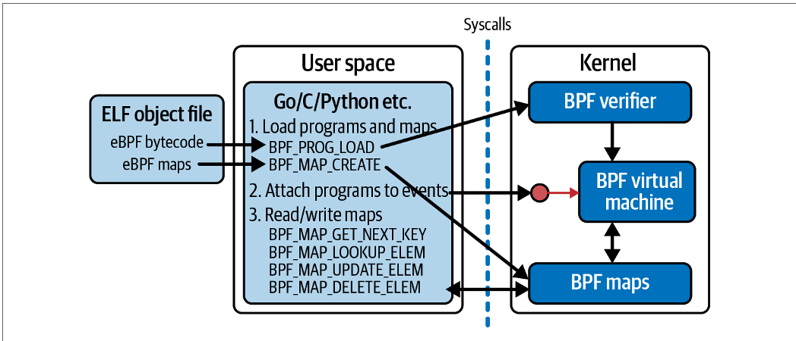

> 图 4-1：用户空间程序通过系统调用与内核中的 eBPF 程序和映射交互。
> 用户空间代码（Go/C/Python 等）使用 BPF_PROG_LOAD 加载程序和映射、
> 使用 BPF_MAP_CREATE 创建映射，把程序挂载到事件，
> 并通过 BPF_MAP_GET_NEXT_KEY、BPF_MAP_LOOKUP_ELEM、
> BPF_MAP_UPDATE_ELEM、BPF_MAP_DELETE_ELEM 读写映射。

bpf() 系统调用的 attr 参数保存指定命令参数所需的数据，
size 表示 attr 中数据的字节数。

第 1 章已经介绍过 `strace`，
当时用它展示了用户空间代码如何通过系统调用 API 发起大量请求。
本章将用它演示 `bpf()` 系统调用的用法。
`strace` 的输出包含每个系统调用的参数，
但为了避免本章的示例输出过于杂乱，
除非 `attr` 参数特别有意思，
否则我会省略其中的许多细节。

> [!NOTE]
> 你可以在 `github.com/lizrice/learning-ebpf` 找到本书代码，
> 以及搭建运行环境的说明。
> 本章的代码在 `chapter4` 目录中。

本例使用一个名为 *hello-buffer-config.py* 的 BCC 程序，
它在第 2 章示例的基础上构建。
与 *hello-buffer.py* 示例一样，
这个程序每次运行时都会向 perf 缓冲区发送一条消息，
把内核中关于 *execve()* 系统调用事件的信息传递给用户空间。
这个版本的新特性是：
可以为每个用户 ID 配置不同的消息。

下面是 eBPF 源代码：

```c
struct user_msg_t {
    char message[12];
};

BPF_HASH(config, u32, struct user_msg_t);

BPF_PERF_OUTPUT(output);

struct data_t {
    int pid;
    int uid;
    char command[16];
    char message[12];
};

int hello(void *ctx) {
    struct data_t data = {};
    struct user_msg_t *p;
    char message[12] = "Hello World";

    data.pid = bpf_get_current_pid_tgid() >> 32;
    data.uid = bpf_get_current_uid_gid() & 0xFFFFFFFF;

    bpf_get_current_comm(&data.command, sizeof(data.command));

    p = config.lookup(&data.uid);
    if (p != 0) {
        bpf_probe_read_kernel(&data.message, sizeof(data.message), p->message);
    } else {
        bpf_probe_read_kernel(&data.message, sizeof(data.message), message);
    }

    output.perf_submit(ctx, &data, sizeof(data));
    return 0;
}
```

① 这行定义了结构体 user_msg_t，用于存放一条 12 个字符的消息。

② BCC 宏 BPF_HASH 定义了一个名为 config 的哈希表映射。
它保存 user_msg_t 类型的值，
以 u32 类型的键索引——这个大小正好适合存放用户 ID。
（如果不指定键和值的类型，BCC 默认两者都用 u64。）

③ perf 缓冲区 output 的定义方式与第 2 章完全相同。
可以向缓冲区提交任意数据，
所以这里不需要指定任何数据类型……

④ ……不过实际上，本例中的程序总是提交一个 data_t 结构体。
这也与第 2 章的示例一致。

⑤ eBPF 程序的其余大部分与之前的 hello() 版本相同。

⑥ 唯一的区别是：
代码用辅助函数获取用户 ID 之后，
会在 `config` 哈希映射中查找以该用户 ID 为键的条目。
如果有匹配的条目，
其中的值所包含的消息就会取代默认的 "Hello World"。

Python 代码多了两行：

```python
b["config"][ct.c_int(0)] = ct.create_string_buffer(b"Hey root!")
b["config"][ct.c_int(501)] = ct.create_string_buffer(b"Hi user 501!")
```

这两行在 config 哈希表中为用户 ID 0 和 501 定义了消息，
分别对应 root 用户和我在这台虚拟机上的用户 ID。
这段代码使用 Python 的 ctypes 包，
确保键和值的类型与 user_msg_t 的 C 定义中使用的类型一致。

下面是这个示例的一段示意输出，
以及我在另一个终端中为获得它而运行的命令：

```text
终端 1
$ ./hello-buffer-config.py
37926 501 bash Hi user 501!
37927 501 bash Hi user 501!
37929 0 sudo Hey root!
37931 501 bash Hi user 501!
37933 1 sudo Hello World
终端 2
ls
sudo ls
sudo -u daemon ls
```

了解了这个程序的功能之后，
我来展示它运行时使用的 bpf() 系统调用。
这次用 strace 运行它，
并指定 -e bpf，表示只关心 bpf() 系统调用：

```text
$ strace -e bpf ./hello-buffer-config.py
```

如果你自己动手尝试，
输出中会看到对这个系统调用的多次调用。
每次调用都会显示一个命令，
指明 bpf() 系统调用要做什么。
大致轮廓如下：

```text
bpf(BPF_BTF_LOAD, ...) = 3
bpf(BPF_MAP_CREATE, {map_type=BPF_MAP_TYPE_PERF_EVENT_ARRAY...}) = 4
bpf(BPF_MAP_CREATE, {map_type=BPF_MAP_TYPE_HASH...}) = 5
bpf(BPF_PROG_LOAD, {prog_type=BPF_PROG_TYPE_KPROBE,...prog_name="hello",...}) = 6
bpf(BPF_MAP_UPDATE_ELEM, ...)
...
```

下面逐一分析。
你我都没有无限的耐心，
所以我不会讨论每次调用的每一个参数！
我会聚焦那些最能讲清楚"用户空间程序与 eBPF 程序交互时究竟发生了什么"的部分。

## 加载 BTF 数据

我看到的第一处 bpf() 调用是这样的：

```text
bpf(BPF_BTF_LOAD, {btf=\\237\\353\\1\\0...}, 128) = 3
```

这次输出中显示的命令是 BPF_BTF_LOAD。
它只是众多有效命令中的一个，
这些命令（至少在本书写作时）
最完整的文档在内核源代码中。[^1]

如果你使用的是较老的 Linux 内核，
可能看不到这个命令的调用，
因为它与 BTF（即 BPF Type Format）有关。[^2]
BTF 让 eBPF 程序可以跨不同内核版本移植：
你可以在一台机器上编译程序，
然后在另一台机器上使用，
即使后者运行着不同的内核版本、
内核数据结构也不同。
第 5 章会更详细地讨论这一点。

这次 bpf() 调用把一段 BTF 数据加载进内核，
bpf() 系统调用的返回值（我的例子中是 3）
是一个指向该数据的文件描述符。

> [!NOTE]
> 文件描述符是已打开文件（或类文件对象）的标识符。
> 打开一个文件（用 open() 或 openat() 系统调用）时，
> 返回值就是文件描述符，
> 之后把它作为参数传给 read() 或 write() 等其他系统调用，
> 对该文件执行操作。
> 这里的这段数据并不完全是一个文件，
> 但内核给它分配了一个文件描述符作为标识符，
> 后续涉及它的操作都可以使用。

## 创建映射

下一个 bpf() 调用创建 output perf 缓冲区映射：

```text
bpf(BPF_MAP_CREATE, {map_type=BPF_MAP_TYPE_PERF_EVENT_ARRAY, key_size=4, value_size=4, max_entries=4, ... map_name="output", ...}, 128) = 4
```

从命令名 BPF_MAP_CREATE 大概就能猜到，
这个调用创建了一个 eBPF 映射。
可以看到，这个映射的类型是 PERF_EVENT_ARRAY，名字是 output。
这个 perf 事件映射中的键和值都是 4 字节长。
max_entries 字段把这个映射中可容纳的键值对数量限制为 4；
本章稍后会解释为什么这个映射有四个条目。
返回值 4 是供用户空间代码访问 output 映射的文件描述符。

输出中的下一个 bpf() 系统调用创建 config 映射：

```text
bpf(BPF_MAP_CREATE, {map_type=BPF_MAP_TYPE_HASH, key_size=4, value_size=12, max_entries=10240... map_name="config", ...btf_fd=3,...}, 128) = 5
```

这个映射被定义为哈希表映射，
键长 4 字节（对应一个 32 位整数，可用于存放用户 ID），
值长 12 字节（与 user_msg_t 结构体的长度一致）。
我没有指定表的大小，
所以它被赋予了 BCC 的默认大小：10240 个条目。

这个 bpf() 系统调用同样返回一个文件描述符 5，
之后的系统调用会用它来引用这个 config 映射。

还可以看到字段 btf_fd=3，
它告诉内核使用之前获得的 BTF 文件描述符 3。
第 5 章会讲到，
BTF 信息描述数据结构的布局，
把它包含在映射定义中，
就意味着这个映射所用的键和值类型有了布局信息。
bpftool 之类的工具会利用这些信息美化映射的转储（dump）输出，
使其易于阅读——第 3 章已经见过这样的例子。

## 加载程序

到目前为止，
示例程序已经用系统调用把 BTF 数据加载进内核，
并创建了几个 eBPF 映射。
接下来它要做的，
是用下面的 bpf() 系统调用把 eBPF 程序加载进内核：

```text
bpf(BPF_PROG_LOAD, {prog_type=BPF_PROG_TYPE_KPROBE, insn_cnt=44, insns=0xffffffa836abe8, license="GPL", ... prog_name="hello", ... expected_attach_type=BPF_CGROUP_INET_INGRESS, prog_btf_fd=3,...}, 128) = 6
```

这里有相当多的字段值得一看：

- prog_type 字段描述程序类型，
  这里的值表明它要挂载到 kprobe。
  第 7 章会介绍更多程序类型。

- *insn_cnt* 字段表示"指令数"，
  即程序中字节码指令的数量。

- 组成这个 eBPF 程序的字节码指令存放在内存中，
  地址由 `insns` 字段指定。

- 这个程序被指定为 GPL 许可，
  这样它才能使用 GPL 许可的 BPF 辅助函数。

- 程序名是 hello。

- expected_attach_type 为 BPF_CGROUP_INET_INGRESS 可能让人意外，
  因为这听起来像是与入口网络流量有关的东西，
  但你知道这个 eBPF 程序是要挂载到 kprobe 的。
  实际上，expected_attach_type 字段只用于某些程序类型，
  而 BPF_PROG_TYPE_KPROBE 不在其中。
  BPF_CGROUP_INET_INGRESS 恰好是 BPF 挂载类型列表中的第一项，[^3]
  所以它的值是 0。

- prog_btf_fd 字段告诉内核，
  这个程序使用之前加载的哪一段 BTF 数据。
  这里的值 3 对应 BPF_BTF_LOAD 系统调用返回的文件描述符
  （与 config 映射使用的是同一段 BTF 数据）。

如果程序未能通过验证（第 6 章会讨论），
这个系统调用会返回负值，
但这里可以看到它返回了文件描述符 6。
回顾一下，此时各文件描述符的含义如表 4-1 所示。

表 4-1：运行 hello-buffer-config.py 加载程序后的文件描述符

| 文件描述符 | 代表的对象 |
| --- | --- |
| 3 | BTF 数据 |
| 4 | output perf 缓冲区映射 |
| 5 | config 哈希表映射 |
| 6 | hello eBPF 程序 |

## 从用户空间修改映射

前面已经看过 Python 用户空间源代码中的那两行：
它们为 root 用户（用户 ID 0）和用户 ID 501 配置了特殊消息：

```python
b["config"][ct.c_int(0)] = ct.create_string_buffer(b"Hey root!")
b["config"][ct.c_int(501)] = ct.create_string_buffer(b"Hi user 501!")
```

可以通过这样的系统调用看到这些条目被写入映射：

```text
bpf(BPF_MAP_UPDATE_ELEM, {map_fd=5, key=0xffffa7842490, value=0xffffa7a2b410, flags=BPF_ANY}, 128) = 0
```

BPF_MAP_UPDATE_ELEM 命令更新映射中的键值对。
BPF_ANY 标志表示：
如果该键在映射中尚不存在，就创建它。
这样的调用有两次，
对应为两个不同用户 ID 配置的两个条目。

map_fd 字段标识正在操作的是哪个映射。
可以看到这里是 5，
即之前创建 config 映射时返回的文件描述符值。

文件描述符是内核为特定进程分配的，
所以值 5 只对运行这个 Python 程序的那个用户空间进程有效。
不过，多个用户空间程序（以及内核中的多个 eBPF 程序）
都可以访问同一个映射。
访问内核中同一映射结构的两个用户空间程序，
很可能被分配不同的文件描述符值；
同样，两个用户空间程序也可能用相同的文件描述符值
指代完全不同的映射。

键和值都是指针，
所以从 strace 输出中看不出键或值的具体数值。
不过可以用 bpftool 查看映射的内容，
会看到类似这样的输出：

```text
$ bpftool map dump name config
[
{
    "key": 0,
    "value": {
        "message": "Hey root!"
    }
},
{
    "key": 501,
    "value": {
        "message": "Hi user 501!"
    }
}
]
```

bpftool 怎么知道该如何格式化这些输出？
比如，它怎么知道值是一个结构体，
其中有个名为 message 的字段包含一个字符串？
答案是：
它使用了定义这个映射的 BPF_MAP_CREATE 系统调用中包含的 BTF 信息。
下一章会详细介绍 BTF 如何传递这些信息。

到目前为止，
你已经看到用户空间如何与内核交互来加载程序和映射，
以及如何更新映射中的信息。
在目前为止看到的系统调用序列中，
程序还没有被挂载到任何事件上。
这一步必不可少，
否则程序永远不会被触发。

事先提醒：
不同类型的 eBPF 程序会以各种不同的方式挂载到不同的事件上！
本章稍后会展示本例中挂载到 kprobe 事件所用的系统调用，
而这个过程并不涉及 bpf()。
相比之下，
在本章末尾的练习中，
我会展示另一个例子：
用 bpf() 系统调用把程序挂载到 raw tracepoint 事件。

在深入这些细节之前，
先讨论一下退出程序时会发生什么。
你会发现程序和映射会被自动卸载，
这是因为内核在用*引用计数*跟踪它们。

## BPF 程序与映射的引用

你知道，用 `bpf()` 系统调用把 BPF 程序加载进内核会返回一个文件描述符。
在内核中，这个文件描述符就是对该程序的一个*引用*。
发起系统调用的用户空间进程拥有这个文件描述符；
当该进程退出时，文件描述符被释放，
程序的引用计数随之减一。
当一个 BPF 程序不再有任何引用时，
内核就会移除这个程序。

把程序*固定*（pin）到文件系统会额外创建一个引用。

### 固定到文件系统

第 3 章已经见过固定的实际用法，
命令如下：

```text
bpftool prog load hello.bpf.o /sys/fs/bpf/hello
```

> [!NOTE]
> 这些被固定的对象并不是真正持久化到磁盘上的文件。
> 它们创建在*伪文件系统*上——
> 伪文件系统的行为与普通的磁盘文件系统一样，
> 有目录和文件，
> 但内容保存在内存中，
> 这意味着系统重启后它们不会保留。

如果 bpftool 允许只加载程序而不固定它，
那就毫无意义：
bpftool 退出时文件描述符被释放，
引用数归零，程序就会被删除，
等于什么都没做成。
而把它固定到文件系统，
就意味着程序多了一个引用，
命令结束后程序仍然保持加载状态。

当 BPF 程序被挂载到会触发它的钩子上时，
引用计数也会增加。
这些引用计数的行为取决于 BPF 程序类型。
第 7 章会介绍更多程序类型，
其中一些与追踪（tracing）相关（如 kprobe 和 tracepoint），
总是与某个用户空间进程相关联；
对于这些类型的 eBPF 程序，
进程退出时内核的引用计数会减一。
挂载在网络栈或 cgroup（control group 的缩写）中的程序
不与任何用户空间进程关联，
所以即使加载它们的用户空间程序退出，
它们也会保持原位。
用 ip link 命令加载 XDP 程序时已经见过这样的例子：

```text
ip link set dev eth0 xdp obj hello.bpf.o sec xdp
```

ip 命令已经执行完毕，
也没有定义任何固定位置，
但 bpftool 仍然会显示这个 XDP 程序已加载到内核中：

```text
$ bpftool prog list

1255: xdp name hello tag 9d0e949f89f1a82c gpl
loaded_at 2022-11-01T19:21:14+0000 uid 0
xlated 48B jited 108B memlock 4096B map_ids 612
```

这个程序的引用计数非零，
因为 ip link 命令完成后，
它与 XDP 钩子的挂载关系仍然存在。

eBPF 映射也有引用计数器，
引用计数降到零时映射会被清理。
每个使用该映射的 eBPF 程序都会使计数加一，
用户空间程序持有的每个指向该映射的文件描述符也一样。

eBPF 程序的源代码可能定义了某个映射，
而程序实际上并没有引用它。
假设你想保存一些关于程序的元数据，
可以把它定义为全局变量，
而如前一章所述，
这些信息会存放在一个映射中。
如果 eBPF 程序没有对这个映射做任何操作，
程序到映射的引用计数就不会自动增加。
有一个 BPF(BPF_PROG_BIND_MAP) 系统调用可以把映射与程序关联起来，
这样当用户空间加载程序退出、
不再持有指向该映射的文件描述符引用时，
映射就不会立即被清理掉。

映射也可以固定到文件系统，
用户空间程序只要知道映射的路径，
就能访问它。

> [!TIP]
> Alexei Starovoitov 在他的博客文章
> ["Lifetime of BPF Objects"](https://facebookmicrosites.github.io/bpf/blog/2018/08/31/object-lifetime.html)
> 中对 BPF 引用计数器和文件描述符做了很好的说明。

另一种创建对 BPF 程序的引用的方式是 BPF link。

### BPF link

BPF link 在 eBPF 程序与其挂载的事件之间提供了一层抽象。
BPF link 本身可以固定到文件系统，
这会为程序额外创建一个引用。
这意味着把程序加载进内核的用户空间进程可以终止，
而程序仍保持加载。
用户空间加载程序的文件描述符被释放，
程序的引用计数随之减少，
但由于 BPF link 的存在，
引用计数仍然非零。

完成本章末尾的练习，
你就能看到 BPF link 的实际效果。
现在，先回到 hello-buffer-config.py 使用的 bpf() 系统调用序列。

## eBPF 涉及的其他系统调用

回顾一下：
到目前为止，
你已经看到了把 BTF 数据、程序和映射以及映射数据加入内核的 bpf() 系统调用。
strace 输出中接下来显示的内容与设置 perf 缓冲区有关。

> [!NOTE]
> 本章的其余部分将比较深入地探讨使用 perf 缓冲区、
> 环形缓冲区、kprobe 和映射迭代时涉及的系统调用序列。
> 并非所有 eBPF 程序都需要做这些事情，
> 所以如果你时间紧张，
> 或者觉得这部分太琐碎，
> 可以直接跳到本章小结。
> 我不会介意的！

## 初始化 perf 缓冲区

前面已经看到了向 config 映射添加条目的 bpf(BPF_MAP_UPDATE_ELEM) 调用。
接下来，输出中出现了一些这样的调用：

```text
bpf(BPF_MAP_UPDATE_ELEM, {map_fd=4, key=0xfffffa7842490, value=0xfffffa7a2b410, flags=BPF_ANY}, 128) = 0
```

它们看起来与定义 config 映射条目的调用非常相似，
只是这里映射的文件描述符是 4，
代表 output perf 缓冲区映射。

和之前一样，键和值都是指针，
所以从 strace 输出中看不出键或值的具体数值。
我看到这个系统调用重复了四次，
所有参数的值都相同——
不过无从得知指针所指向的值在每次调用之间是否发生了变化。
这些 BPF_MAP_UPDATE_ELEM bpf() 调用留下了一些关于缓冲区如何建立和使用的疑问：

- 为什么有四次 BPF_MAP_UPDATE_ELEM 调用？
  这与 output 映射创建时最多四个条目有关吗？

- 在这四次 BPF_MAP_UPDATE_ELEM 之后，
  strace 输出中再也没有出现 bpf() 系统调用。
  这似乎有点奇怪，
  因为映射存在的意义就是让 eBPF 程序每次被触发时都能写入数据，
  而且你也看到了用户空间代码把数据显示了出来。
  这些数据显然不是用 bpf() 系统调用从映射中取出的，
  那它是怎么得到的？

你也还没有看到任何迹象表明
eBPF 程序是如何挂载到触发它的 kprobe 事件上的。
要解释所有这些疑问，
我需要让 strace 在运行这个示例时多跟踪几个系统调用，
像这样：

```text
$ strace -e bpf,perf_event_open,ioctl,ppoll ./hello-buffer-config.py
```

为简洁起见，
我会忽略那些与本例 eBPF 功能无直接关系的 ioctl() 调用。

## 挂载到 kprobe 事件

前面已经看到，
eBPF 程序 hello 加载进内核后，
被分配了文件描述符 6。
要把 eBPF 程序挂载到一个事件上，
还需要一个代表该事件的文件描述符。
strace 输出中的下面这行
展示了为 execve() kprobe 创建文件描述符的过程：

```text
perf_event_open({type=0x6 /* PERF_TYPE_??? */,...}) = 7
```

根据 perf_event_open() 系统调用的手册页，
它"创建一个用于测量性能信息的文件描述符"。
从输出可以看出，
strace 不知道如何解读值为 6 的 type 参数，
但如果进一步查阅该手册页，
会发现它描述了 Linux 支持动态类型的性能测量单元（PMU）：

> ……在 /sys/bus/event_source/devices 下，
> 每个 PMU 实例都有一个子目录。
> 每个子目录中有一个 type 文件，
> 其内容是一个整数，
> 可以用在 type 字段中。

果然，查看那个目录，
会找到一个 kprobe/type 文件：

```text
$ cat /sys/bus/event_source/devices/kprobe/type
6
```

由此可见，
perf_event_open() 调用把 type 设为 6，
表示这是 kprobe 类型的 perf 事件。

遗憾的是，
`strace` 没有输出能确凿证明这个 kprobe 挂载到 `execve()` 系统调用的细节，
但我希望这里的证据足以让你相信，
这个返回的文件描述符代表的就是它。

perf_event_open() 的返回码是 7，
它代表 kprobe perf 事件的文件描述符，
而你知道文件描述符 6 代表 hello eBPF 程序。
perf_event_open() 的手册页还解释了
如何用 ioctl() 在两者之间建立挂载关系：

> PERF_EVENT_IOC_SET_BPF […]
> 允许把 Berkeley Packet Filter（BPF）程序
> 挂载到一个已有的 kprobe tracepoint 事件上。
> 参数是由之前的 bpf(2) 系统调用创建的 BPF 程序文件描述符。

这就解释了 strace 输出中接下来的 ioctl() 系统调用，
其参数引用的正是这两个文件描述符：

```text
ioctl(7, PERF_EVENT_IOC_SET_BPF, 6) = 0
```

还有另一个 ioctl() 调用用于启用这个 kprobe 事件：

```text
ioctl(7, PERF_EVENT_IOC_ENABLE, 0) = 0
```

至此，
每当这台机器上运行 execve()，
这个 eBPF 程序就应该会被触发。

## 设置并读取 perf 事件

前面提到过，
我看到了四次与 output perf 缓冲区相关的 bpf(BPF_MAP_UPDATE_ELEM) 调用。
加上额外跟踪的系统调用后，
strace 输出显示这样的序列出现了四次：

```text
perf_event_open({type=PERF_TYPE_SOFTWARE, size=0 /* PERF_ATTR_SIZE_??? */,
config=PERF_COUNT_SW_BPF_OUTPUT, ...}, -1, X, -1, PERF_FLAG_FD_CLOEXEC) = Y

ioctl(V, PERF_EVENT_IOC_ENABLE, 0) = 0

bpf(BPF_MAP_UPDATE_ELEM, {map_fd=4, key=0xffffa7842490, value=0xffffffffa7a2b410, flags=BPF_ANY}, 128) = 0
```

我用 X 标出的位置，
在四次调用中输出值分别为 0、1、2、3。
查阅 perf_event_open() 系统调用的手册页可知，
这是 cpu 字段，
它前面的字段是 pid（进程 ID）。手册页写道：

> pid == -1 且 cpu >= 0
>
> 测量指定 CPU 上的所有进程/线程。

这个序列出现四次，
对应我的笔记本有四个 CPU 核。
至此，"output" perf 缓冲区映射为什么有四个条目终于有了答案：
每个 CPU 核一个。
这也解释了映射类型名 BPF_MAP_TYPE_PERF_EVENT_ARRAY 中
"array"（数组）一词的含义——
这个映射代表的不只是一个 perf 环形缓冲区，
而是一个缓冲区数组，
每个核一个。

如果你编写 eBPF 程序，
不需要操心核数之类的细节，
第 10 章讨论的任何 eBPF 库都会替你处理好。
不过我觉得，
对这个程序使用 strace 时看到的这些系统调用细节，
了解一下还是很有意思的。

每个 perf_event_open() 调用都返回一个文件描述符，
我用 Y 表示；
它们的值是 8、9、10 和 11。
ioctl() 系统调用为每个文件描述符启用 perf 输出。
BPF_MAP_UPDATE_ELEM bpf() 系统调用设置映射条目，
指向每个 CPU 核的 perf 环形缓冲区，
指明 eBPF 程序可以向哪里提交数据。

随后，用户空间代码可以对这四个输出流文件描述符使用 ppoll()，
这样无论某次 execve() kprobe 事件恰好由哪个核运行 eBPF 程序 hello，
它都能拿到输出的数据。
ppoll() 的系统调用如下：

```text
ppoll([{fd=8, events=POLLIN}, {fd=9, events=POLLIN}, {fd=10, events=POLLIN}, {fd=11, events=POLLIN}], 4, NULL, NULL, 0) = 1 ([{fd=8, revents=POLLIN}])
```

如果你自己运行这个示例程序就会发现，
这些 `ppoll()` 调用会一直阻塞，
直到某个文件描述符上有数据可读。
只有当某个动作触发 `execve()`、
使 eBPF 程序写入数据之后，
你才会看到返回码打印到屏幕上——
用户空间正是通过这个 `ppoll()` 调用取回数据的。

第 2 章提到过，
如果你的内核版本在 5.8 或以上，
现在更推荐使用 BPF 环形缓冲区而不是 perf 缓冲区。[^4]
下面看看改用环形缓冲区的同一示例的修改版。

<a id="h4-2-环形缓冲区"></a>

## 环形缓冲区

如内核文档所述，
环形缓冲区优于 perf 缓冲区，
部分出于性能原因，
也因为它能保证数据的顺序，
即使数据由不同的 CPU 核提交。
环形缓冲区只有一个，
由所有核共享。

把 *hello-buffer-config.py* 改为使用环形缓冲区，
需要的改动不多。
在配套的 GitHub 仓库中，
这个示例是 *chapter4/hello-ring-buffer-config.py*。
表 4-2 列出了两者的区别。

表 4-2：使用 perf 缓冲区与使用环形缓冲区的 BCC 示例代码差异

| hello-buffer-config.py | hello-ring-buffer-config.py |
| --- | --- |
| BPF_PERF_OUTPUT(output); | BPF_RINGBUF_OUTPUT(output, 1); |
| output.perf_submit(ctx, &data, sizeof(data)); | output.ringbuf_output(&data, sizeof(data), 0); |
| b["output"].open_perf_buffer(print_event) | b["output"].open_ring_buffer(print_event) |
| b.perf_buffer_poll() | b.ring_buffer_poll() |

不出所料，
由于这些改动只涉及输出缓冲区，
与加载程序、config 映射以及把程序挂载到 kprobe 事件相关的系统调用
都保持不变。

创建 output 环形缓冲区映射的 bpf() 系统调用如下：

```text
bpf(BPF_MAP_CREATE, {map_type=BPF_MAP_TYPE_RINGBUF, key_size=0, value_size=0, max_entries=4096, ... map_name="output", ...}, 128) = 4
```

strace 输出的主要区别是：
完全看不到设置 perf 缓冲区时那一系列
四个不同的 perf_event_open()、ioctl() 和 bpf(BPF_MAP_UPDATE_ELEM)
系统调用。
环形缓冲区只有一个文件描述符，
由所有 CPU 核共享。

在本书写作时，
BCC 对 perf 缓冲区使用前面展示的 ppoll 机制，
而等待环形缓冲区数据时则使用较新的 epoll 机制。
正好借这个机会理解一下 ppoll 和 epoll 的区别。

在 perf 缓冲区示例中，
hello-buffer-config.py 产生的 ppoll() 系统调用是这样的：

```text
ppoll([{fd=8, events=POLLIN}, {fd=9, events=POLLIN}, {fd=10, events=POLLIN}, {fd=11, events=POLLIN}], 4, NULL, NULL, 0) = 1 ([{fd=8, revents=POLLIN}]
```

注意，调用传入了文件描述符集合 8、9、10、11，
用户空间进程想从中获取数据。
每次 poll 事件返回数据后，
都必须再次调用 ppoll()，
重新设置同一组文件描述符。
而使用 epoll 时，
文件描述符集合由内核对象管理。

从下面这串 epoll 相关的系统调用可以看到这一点，
它们发生在 hello-ring-buffer-config.py 建立对 output 环形缓冲区的访问时。

首先，用户空间程序请求在内核中创建一个新的 epoll 实例：

```text
epoll_create1(Epoll_CLOEXEC) = 8
```

它返回文件描述符 8。
然后调用 `epoll_ctl()`，
告诉内核把文件描述符 4（output 缓冲区）
加入该 `epoll` 实例的文件描述符集合：

```text
epoll_ctl(8, EPOLL_CTL_ADD, 4, {events=EPOLLIN, data={u32=0, u64=0}}) = 0
```

用户空间程序用 `epoll_pwait()` 等待环形缓冲区中有数据可用。
这个调用只在有数据时才返回：

```text
epoll_pwait(8, {{events=EPOLLIN, data={u32=0, u64=0}}}], 1, -1, NULL, 8) = 1
```

当然，
如果你使用 BCC（或 *libbpf*，或本书后面要介绍的其他库）这样的框架写代码，
完全不需要了解用户空间应用如何通过 perf 缓冲区或环形缓冲区
从内核获取信息的这些底层细节。
我希望你觉得，
掀开盖子看看这些东西的工作原理是件有趣的事。

不过，你很可能会编写从用户空间访问映射的代码，
看一个这样的实现示例或许会有帮助。
本章前面用 bpftool 查看过 config 映射的内容。
既然 bpftool 是在用户空间运行的工具，
那就用 strace 看看它获取这些信息时发起了哪些系统调用。

## 从映射中读取信息

下面的命令展示了 bpftool 读取 config 映射内容时
发起的 bpf() 系统调用节选：

```text
$ strace -e bpf bpftool map dump name config
```

你会看到，这个序列由两个主要步骤组成：

- 遍历所有映射，寻找名为 config 的映射。

- 如果找到匹配的映射，遍历该映射中的所有元素。

### 查找映射

输出以一串重复的相似调用开始，
bpftool 遍历所有映射，
寻找名为 config 的映射：

```text
bpf(BPF_MAP_GET_NEXT_ID, {start_id=0, ...}, 12) = 0
bpf(BPF_MAP_GET_FD_BY_ID, {map_id=48...}, 12) = 3
bpf(BPF_OBJ_GET_INFO_BY_FD, {info={bpf_fd=3, ...}}, 16) = 0
bpf(BPF_MAP_GET_NEXT_ID, {start_id=48, ...}, 12) = 0
bpf(BPF_MAP_GET_FD_BY_ID, {map_id=116, ...}, 12) = 3
bpf(BPF_OBJ_GET_INFO_BY_FD, {info={bpf_fd=3...}}, 16) = 0
```

① BPF_MAP_GET_NEXT_ID 获取 start_id 指定值之后的下一个映射的 ID。

② BPF_MAP_GET_FD_BY_ID 返回指定映射 ID 的文件描述符。

③ BPF_OBJ_GET_INFO_BY_FD 获取文件描述符所指对象（这里是映射）的信息。
这些信息包括它的名字，
这样 bpftool 就能检查它是不是要找的映射。

④ 序列重复，
获取第 1 步那个映射之后的下一个映射的 ID。

内核中每加载一个映射，
就有一组这样的三个系统调用；
你还可以看到，
start_id 和 map_id 所用的值与这些映射的 ID 一一对应。
当没有更多映射可看时，
这个重复模式就结束了——
此时 BPF_MAP_GET_NEXT_ID 返回 ENOENT，
像这样：

```text
bpf(BPF_MAP_GET_NEXT_ID, {start_id=133,...}, 12) = -1 ENOENT (No such file or directory)
```

如果找到了匹配的映射，
bpftool 会持有它的文件描述符，
以便从中读出元素。

### 读取映射元素

此时，bpftool 已经持有了它要读取的映射的文件描述符引用。
来看读取这些信息的系统调用序列：

```text
bpf(BPF_MAP_GET_NEXT_KEY, {map_fd=3, key=NULL,
next_key=0xaaaaf7a63960}, 24) = 0
bpf(BPF_MAP_LOOKUP_ELEM, {map_fd=3, key=0xaaaaf7a63960,
value=0xaaaaf7a63980, flags=BPF_ANY}, 32) = 0
[
{
    "key": 0,
    "value": {
        "message": "Hey root!"
    }
}
bpf(BPF_MAP_GET_NEXT_KEY, {map_fd=3, key=0xaaaaf7a63960,
next_key=0xaaaaf7a63960}, 24) = 0
bpf(BPF_MAP_LOOKUP_ELEM, {map_fd=3, key=0xaaaaf7a63960,
value=0xaaaaf7a63980, flags=BPF_ANY}, 32) = 0
},
{
    "key": 501,
    "value": {
        "message": "Hi user 501!"
    }
}
bpf(BPF_MAP_GET_NEXT_KEY, {map_fd=3, key=0xaaaaf7a63960,
next_key=0xaaaaf7a63960}, 24) = -1 ENOENT (No such file or directory)
]
```

① 首先，应用需要找到映射中实际存在的一个有效键。
它使用 bpf() 系统调用的 BPF_MAP_GET_NEXT_KEY 变体来完成。
key 参数是指向某个键的指针，
系统调用会返回这个键之后的下一个有效键。
传入 NULL 指针，
表示应用请求映射中的第一个有效键。
内核把键写入 next_key 指针指定的位置。

② 给定一个键，
应用请求与之关联的值，
值会被写入 value 指定的内存位置。

③ 此时，bpftool 拿到了第一个键值对的内容，
并把这些信息打印到屏幕上。

④ 接下来，bpftool 转向映射中的下一个键，
取出它的值，
并把这个键值对打印到屏幕上。

⑤ 再下一次 BPF_MAP_GET_NEXT_KEY 调用返回 ENOENT，
表示映射中没有更多条目了。

⑥ 最后，bpftool 完成屏幕输出并退出。

注意，在这里，
bpftool 被分配了文件描述符 3 来对应 config 映射。
这与 hello-buffer-config.py 用文件描述符 5 指的是同一个映射。
前面已经说过，
文件描述符是进程私有的。

对 bpftool 行为的这番分析说明，
用户空间程序可以遍历可用的映射，
也可以遍历映射中保存的键值对。

<a id="chapter-4-summary"></a>

## 小结

本章展示了用户空间代码如何使用 bpf() 系统调用
加载 eBPF 程序和映射。
你看到了用 BPF_PROG_LOAD 和 BPF_MAP_CREATE 命令
创建程序和映射的过程。

你了解到，
内核会跟踪 eBPF 程序和映射的引用数量，
引用计数降到零时将其释放。
你还接触了把 BPF 对象固定到文件系统、
以及用 BPF link 创建额外引用的概念。

你看到了用 BPF_MAP_UPDATE_ELEM 从用户空间在映射中创建条目的例子。
类似的命令还有
BPF_MAP_LOOKUP_ELEM 和 BPF_MAP_DELETE_ELEM，
用于从映射中检索和删除值。
还有 BPF_MAP_GET_NEXT_KEY 命令，
用于查找映射中存在的下一个键，
可以用它遍历所有有效条目。

你看到了用户空间程序用 perf_event_open() 和 ioctl()
把 eBPF 程序挂载到 kprobe 事件的例子。
其他类型的 eBPF 程序的挂载方式可能大不相同，
有些甚至使用 bpf() 系统调用。
例如，bpf(BPF_PROG_ATTACH) 系统调用可用于挂载 cgroup 程序，
bpf(BPF_RAW_TRACEPOINT_OPEN) 用于 raw tracepoint
（见本章末尾的练习 5）。

我还展示了如何用 BPF_MAP_GET_NEXT_ID、BPF_MAP_GET_FD_BY_ID
和 BPF_OBJ_GET_INFO_BY_FD
定位内核持有的映射（及其他）对象。

还有一些 `bpf()` 命令本章没有涉及，
但你在这里看到的已经足以让人对全貌有个很好的把握。

你还看到了一些 BTF 数据被加载进内核，
我也提到 bpftool 利用这些信息理解数据结构的格式，
从而把它们漂亮地打印出来。
至于 BTF 数据长什么样、
它如何使 eBPF 程序跨内核版本移植，
我还没有解释。
这正是下一章的内容。

<a id="chapter-4-exercises"></a>

## 练习

如果你想进一步探索 bpf() 系统调用，
可以试试下面几件事：

1. 确认 `BPF_PROG_LOAD` 系统调用中的 `insn_cnt` 字段，
   与用 `bpftool` 转储该程序翻译后的 eBPF 字节码时输出的指令数量一致。
   （`bpf()` 系统调用的手册页中有相关说明。）

2. 同时运行两个示例程序实例，
   这样就有两个名为 config 的映射。
   运行 bpftool map dump name config，
   输出会包含这两个不同映射的信息及其内容。
   在 strace 下运行它，
   跟踪系统调用输出中不同文件描述符的使用。
   你能看出它在哪里获取映射的信息、
   又在哪里获取映射中保存的键值对吗？

3. 在其中一个示例程序运行时，
   用 bpftool map update 修改 config 映射。
   用 sudo -u username 验证这些配置变更会被 eBPF 程序采用。

4. 在 *hello-buffer-config.py* 运行时，
   用 `bpftool` 把程序固定到 BPF 文件系统，
   像这样：

   ```text
   bpftool prog pin name hello /sys/fs/bpf/hi
   ```

   退出正在运行的程序，
   用 bpftool prog list 确认 hello 程序仍加载在内核中。
   可以用 rm /sys/fs/bpf/hi 删除这个固定项来完成清理。

5. 在系统调用层面，
   挂载到 raw tracepoint 比挂载到 kprobe 要简单得多，
   它只涉及一次 bpf() 系统调用。
   试把 *hello-buffer-config.py* 改为挂载到 *sys_enter* 的 raw
   tracepoint，
   使用 BCC 的 *RAW_TRACEPOINT_PROBE* 宏
   （如果你做过第 2 章的练习，
   已经有一个合适的程序可用）。
   不需要在 Python 代码中显式挂载程序，
   BCC 会替你完成。
   在 *strace* 下运行，
   你应该会看到类似这样的系统调用：

   ```text
   bpf(BPF_RAW_TRACEPOINT_OPEN, {raw_tracepoint={name="sys_enter", prog_fd=6}}, 128) = 7
   ```

   内核中的这个 tracepoint 名为 sys_enter，
   文件描述符为 6 的 eBPF 程序正被挂载到它上面。
   从此以后，
   每当内核执行到那个 tracepoint，
   就会触发这个 eBPF 程序。

6. 运行 BCC 的 *libbpf tools* 中的 opensnoop 应用。
   这个工具会建立一些 BPF link，
   可以用 *bpftool* 查看，
   像这样：

   ```text
   $ bpftool link list
   116: perf_event prog 1849
       bpf_cookie 0
       pids opensnoop(17711)
   117: perf_event prog 1851
       bpf_cookie 0
       pids opensnoop(17711)
   ```

   确认程序 ID（我的示例输出中是 1849 和 1851）
   与列出已加载 eBPF 程序的输出一致：

   ```text
   $ bpftool prog list
   ...
   1849: tracepoint name tracepoint___syscalls___sys_enter_openat
       tag 8ee3432dcd98ffc3 gpl run_time_ns 95875 run_cnt 121
       loaded_at 2023-01-08T15:49:54+0000 uid 0
       xlated 240B jited 264B memlock 4096B map_ids 571,568
       btf_id 710
       pids.opensnoop(17711)
   1851: tracepoint name tracepoint___syscalls___sys_exit_openat
       tag 387291c2fb839ac6 gpl run_time_ns 8515669 run_cnt 120
       loaded_at 2023-01-08T15:49:54+0000 uid 0
       xlated 696B jited 744B memlock 4096B map_ids 568,571,569
       btf_id 710
       pids opensnoop(17711)
   ```

7. 在 opensnoop 运行时，
   试着用 bpftool link pin id 116 /sys/fs/bpf/mylink
   固定其中一个 link
   （使用 bpftool link list 输出中你看到的某个 link ID）。
   你会发现即使终止 opensnoop，
   这个 link 和对应的程序也仍然加载在内核中。

8. 如果提前看第 5 章的示例代码，
   会找到一个用 *libbpf* 库编写的 *hello-buffer-config.py* 版本。
   这个库会自动为它加载进内核的程序建立 BPF link。
   用 *strace* 查看它发起的 *bpf()* 系统调用，
   能看到 *bpf(BPF_LINK_CREATE)* 系统调用。

[^1]: 完整的 BPF 命令集记录在 *linux/bpf.h* 头文件中。

[^2]: BTF 是在 5.1 内核中合入上游的，
但一些 Linux 发行版已经把它回移植到了旧版本，
参见内核邮件列表中的相关讨论。

[^3]: 这些挂载类型定义在 linux/bpf.h 的 bpf_attach_type 枚举中。

[^4]: 再次提醒，
想进一步了解两者的区别，
可以读 Andrii Nakryiko
的["BPF ring buffer"](https://nakryiko.com/posts/bpf-ringbuf/)博客文章。

# 第 5 章 CO-RE、BTF 与 Libbpf

上一章你第一次接触到了 BPF 类型格式（BTF）。
本章讨论它为什么存在，
以及如何用它让 eBPF 程序跨不同版本的内核保持可移植性。
它是 BPF 的"一次编译、随处运行（CO-RE）"方案的关键部分，
该方案解决的正是 eBPF 程序跨内核版本的可移植性问题。

许多 eBPF 程序需要访问内核数据结构，
eBPF 程序员需要包含相应的 Linux 头文件，
才能让 eBPF 代码正确定位这些数据结构中的字段。
然而，Linux 内核在持续演进，
这意味着内部数据结构在不同内核版本之间可能发生变化。
如果把在一台机器上编译出的 eBPF 目标文件¹
加载到运行不同内核版本的机器上，
数据结构是否一致就毫无保证。

CO-RE 方案在高效解决这一可移植性问题方面迈出了一大步。
它允许 eBPF 程序携带编译时所用数据结构布局的信息，
并提供一种机制：
当程序运行的目标机器上数据结构布局不同时，
可以调整字段的访问方式。
只要程序要访问的字段或数据结构在目标机器的内核中确实存在，
程序就能跨不同内核版本保持可移植。

> 1 严格来说，数据结构定义来自内核头文件，
> 你也可以选择基于一套与构建当前运行内核时不同的头文件来编译。
> 要想正常工作（不借助本章介绍的 CO-RE 机制），
> 内核头文件必须与运行 eBPF 程序的目标机器上的内核兼容。

在深入 CO-RE 的工作原理之前，
我们先看看它为什么如此必要——
回顾一下 BCC 项目最初实现的内核可移植性方案。

## BCC 的可移植性方案

在第 2 章中，
我用 BCC 演示了一个基本的 eBPF 程序 "Hello World" 示例。
BCC 是第一个流行的 eBPF 程序实现项目，
它为用户空间和内核两侧都提供了框架，
对没有太多内核经验的程序员来说相对容易上手。
为了解决跨内核的可移植性问题，
BCC 采取的做法是在目标机器上就地、在运行时编译 eBPF 代码。
这种做法有不少问题：

- 每台要运行代码的目标机器都需要安装编译工具链，
  以及内核头文件（而头文件并不总是默认安装的）。

- 每次启动工具都要等编译完成，
  这意味着每次启动都可能延迟好几秒。

- 如果要在大批相同的机器上运行该工具，
  在每台机器上重复编译是对计算资源的浪费。

- 一些基于 BCC 的项目把 eBPF 源代码和工具链打包进容器镜像，
  这样分发到各台机器会更容易。
  但这并没有解决确保内核头文件存在的问题，
  而且如果每台机器上安装了多个这样的 BCC 容器，
  反而可能造成更多重复。

- 嵌入式设备可能没有足够的内存资源来执行编译步骤。

由于这些问题，
如果你打算着手开发一个重要的新 eBPF 项目，
我不建议使用这种老式的 BCC 方案，
尤其是打算分发给他人使用的情况下。
本书中给出一些基于 BCC 的示例，
是因为它适合用来学习 eBPF 的基本概念，
特别是因为 Python 用户空间代码非常紧凑易读。
如果你更习惯用它、想快速搭出点东西，
它也完全是个不错的选择。
但它不是严肃的现代化 eBPF 开发的最佳方式。

CO-RE 方案为 eBPF 程序的跨内核可移植性问题提供了好得多的解决方案。

> [!TIP]
> github.com/iovisor/bcc 上的 BCC 项目包含大量命令行工具，
> 可以观察 Linux 机器运行状况的各种信息。
> tools 目录中的原始版本大多用 Python 实现，
> 采用的正是本节介绍的这种老式可移植性方案。
>
> 在 BCC 的 *libbpf-tools* 目录中，
> 你可以找到这些工具的更新版本：
> 它们用 C 编写，利用了 *libbpf* 和 CO-RE，
> 不存在我刚才列出的那些问题。
> 这是一套极其有用的工具集！

## CO-RE 概览

CO-RE 方案由几个要素组成：² ³

### BTF

BTF 是一种表达数据结构布局和函数签名的格式。
在 CO-RE 中，
它用于确定编译时与运行时所用结构之间的差异。
bpftool 等工具也用 BTF 把数据结构以人类可读的格式转储出来。
Linux 内核从 5.4 版本开始支持 BTF。

### 内核头文件

Linux 内核源代码中包含描述其所用数据结构的头文件，
这些头文件在不同 Linux 版本之间可能发生变化。
eBPF 程序员可以选择包含单个头文件；
或者，正如你将在本章看到的，
可以用 bpftool 从运行中的系统生成一个名为 *vmlinux.h* 的头文件，
其中包含 BPF 程序可能需要的关于内核的全部数据结构信息。

### 编译器支持

Clang 编译器做了增强：
用 -g 标志编译 eBPF 程序时，
会根据描述内核数据结构的 BTF 信息，
生成所谓的 CO-RE 重定位信息。
GCC 编译器也在第 12 版中为 BPF 目标添加了 CO-RE 支持。

### 用于数据结构重定位的库支持

当用户空间程序把 eBPF 程序加载进内核时，
CO-RE 方案要求根据编译进目标文件的 CO-RE 重定位信息，
调整字节码，
以补偿编译时的数据结构与程序即将运行的目标机器上的数据结构之间的差异。²

有几个库可以完成这项工作：
*libbpf* 是最初具备这种重定位能力的 C 库，
Cilium eBPF 库为 Go 程序员提供了同样的能力，
Aya 则为 Rust 提供了这种能力。

### 可选的 BPF 骨架

骨架（skeleton）可以从编译好的 BPF 目标文件自动生成，
其中包含一些方便的函数，
供用户空间代码调用来管理 BPF 程序的生命周期——
把程序加载进内核、挂载到事件上等等。
如果用户空间代码用 C 编写，
可以用 bpftool gen skeleton 生成骨架。
这些函数是更高层的抽象，
对开发者来说通常比直接使用底层库（libbpf、cilium/ebpf 等）更方便。³

> 2 本节部分内容改编自 Liz Rice 的《What Is eBPF?》。
> 版权所有 © 2022 O'Reilly Media。经授权使用。
> 3 一项小型且不严谨的调查表明，
> 大多数人把 CO-RE 读作与单词 core 同音，
> 而不是分成两个音节来读。

> [!TIP]
> Andrii Nakryiko 写过一篇出色的博客文章，
> 介绍了 CO-RE 的背景，并阐述了它的工作原理和使用方法。
> 他还写了权威的 BPF CO-RE 参考指南（BPF CO-RE Reference Guide），
> 如果你打算自己动手写代码，请务必读一读。
> 他的 *libbpf-bootstrap* 指南介绍了如何从零开始用 CO-RE + *libbpf* +
> 骨架构建 eBPF 应用，
> 也是必读之作。

现在你已经对 CO-RE 的各个要素有了概览，
接下来深入看看它们是如何工作的，
先从 BTF 开始。

## BPF 类型格式

BTF 信息描述数据结构和代码在内存中的布局。
这些信息可以有多种不同的用途。

### BTF 的用途

本章之所以讨论 BTF，
主要原因是：
知道某个结构在 eBPF 程序编译处与即将运行处的布局差异，
就能在程序加载进内核时做出相应的调整。
本章稍后会讨论重定位过程，
但现在我们先看看 BTF 信息的其他一些用途。

知道一个结构的布局以及其中每个字段的类型，
就可以把结构的内容以人类可读的形式漂亮地打印出来。
例如，从计算机的角度看，字符串只是一串字节，
但把这些字节转换成字符后，
字符串对人来说就容易理解多了。
上一章你已经见过这样的例子：
bpftool 利用 BTF 信息来格式化映射转储的输出。

BTF 信息还包括行号和函数信息，
有了它，
bpftool 就能把源代码穿插在翻译后或 JIT 编译后的程序转储输出中，
正如你在第 3 章所见。
到第 6 章你还会看到源代码信息与验证器日志输出穿插在一起，
这同样来自 BTF 信息。

BPF 自旋锁（spin lock）也需要 BTF 信息。
*自旋锁*用于阻止两个 CPU 核同时访问同一个映射值。
锁必须是映射值结构的一部分，像这样：

```c
struct my_value {
    ... <其他字段>
    struct bpf_spin_lock lock;
    ... <其他字段>
};
```

在内核中，
eBPF 程序使用 bpf_spin_lock() 和 bpf_spin_unlock() 辅助函数来获取和释放锁。
只有在有 BTF 信息描述锁字段在结构中的位置时，
才能使用这些辅助函数。

> [!NOTE]
> 自旋锁支持是在内核 5.1 版本中加入的。
> 自旋锁的使用有很多限制：
> 只能用于哈希或数组类型的映射，
> 也不能用于跟踪（tracing）或 socket filter 类型的 eBPF 程序。
> 更多关于自旋锁的内容，
> 请参阅 lwn.net 上关于 BPF 并发管理的文章。

现在你已经知道 BTF 信息为什么有用了，
接下来看一些具体的例子。

## 用 bpftool 列出 BTF 信息

与程序和映射一样，
你也可以用 bpftool 工具查看 BTF 信息。
下面的命令列出加载进内核的所有 BTF 数据：

```text
bpftool btf list
1: name [vmlinux] size 5843164B
2: name [aes_ce_cipher] size 407B
3: name [cryptd] size 3372B
...
149: name <anon> size 4372B prog_ids 319 map_ids 103
pids hello-buffer-co(7660)
155: name <anon> size 37100B
pids bpftool(7784)
```

（为简洁起见，我省略了结果中的许多条目。）

列表中的第一个条目是 vmlinux，
它对应前面提到的 vmlinux 文件，
其中保存着当前运行内核的 BTF 信息。

> [!NOTE]
> 本章前面的一些示例复用了第 4 章的程序；
> 本章后面会有一些新的示例，
> 其源代码在 github.com/lizrice/learning-ebpf 的 chapter5 目录中。

为了得到这个示例输出，
我在第 4 章的 hello-buffer-config 示例运行时执行了该命令。
可以看到，
以 149: 开头的那一行描述了这个进程正在使用的 BTF 信息：

```text
149: name <anon> size 4372B prog_ids 319 map_ids 103
pids hello-buffer-co(7660)
```

这一行告诉我们：

- 这段 BTF 信息的 ID 是 149。

- 它是一段约 4 KB 的匿名 BTF 信息块。

- 它被 prog_id 为 319 的 BPF 程序和 map_id 为 103 的 BPF 映射使用。

- 它还被 ID 为 7660 的进程（括号中所示）使用，
  该进程运行的是 hello-buffer-config 可执行文件
  （名字被截断到了 15 个字符）。

这些程序、映射和 BTF 标识符，
与 bpftool 显示的关于 hello-buffer-config 的 hello 程序的以下输出相吻合：

```text
bpftool prog show name hello
319: kprobe name hello tag a94092da317ac9ba gpl
loaded_at 2022-08-28T14:13:35+0000 uid 0
xlated_400B jited 428B memlock 4096B map_ids 103,104
btf_id 149
pids hello-buffer-co(7660)
```

这两组信息之间唯一看起来不完全吻合的地方是：
程序还引用了另一个 map_id 104。
那是 perf 事件缓冲区映射，
它不使用 BTF 信息，
因此不会出现在与 BTF 相关的输出中。

正如 bpftool 可以转储程序和映射的内容一样，
它也可以用来查看一段数据中包含的 BTF 类型信息。

### BTF 类型

知道 BTF 信息的 ID 后，
就可以用 bpftool btf dump id <id> 命令查看其内容。
我用前面得到的 ID 149 运行该命令，
得到了 69 行输出，
每行是一个类型定义。
我只介绍前几行，
你应该就能明白如何解读其余部分了。
这几行的 BTF 信息与 config 哈希映射有关，
它在源代码中是这样定义的：

```c
struct user_msg_t {
    char message[12];
};

BPF_HASH(config, u32, struct user_msg_t);
```

这个哈希表的键类型为 u32，
值类型为 struct user_msg_t。
该结构保存一个 12 字节的 message 字段。
我们来看看这些类型在对应的 BTF 信息中是如何定义的。

BTF 输出的前三行如下：

```text
[1] TYPEDEF 'u32' type_id=2

[2] TYPEDEF '__u32' type_id=3

[3] INT 'unsigned int' size=4 bits_offset=0 nr_bits=32 encoding=(none)
```

每行开头方括号中的数字是类型 ID
（因此以 [1] 开头的第一行定义了 type_id 1，依此类推）。
我们详细看看这三个类型：

- 类型 1 定义了一个名为 u32 的类型，
  它的类型由 type_id 2 定义，
  也就是以 [2] 开头那一行定义的类型。
  如你所知，哈希表的键就是这个 u32 类型。

- 类型 2 名为 __u32，
  其类型由 type_id 3 定义。

- 类型 3 是一个整数类型，
  名为 unsigned int，长度为 4 字节。

这三个类型都是 32 位无符号整数类型的同义词。
在 C 语言中，整数的长度是平台相关的，
因此 Linux 定义了 u32 这样的类型来明确定义特定长度的整数。
在这台机器上，u32 对应一个无符号整数。
引用这些类型的用户空间代码应使用带下划线前缀的同义词，
如 __u32。

BTF 输出中接下来的几个类型如下：

```text
[4] STRUCT 'user_msg_t' size=12 vlen=1
'message' type_id=6 bits_offset=0
[5] INT 'char' size=1 bits_offset=0 nr_bits=8 encoding=(none)
[6] ARRAY 'anon' type_id=5 index_type_id=7 nr_elems=12
[7] INT '__ARRAY_SIZE_TYPE__' size=4 bits_offset=0 nr_bits=32 encoding=(none)
```

这些与 config 映射中用作值的 user_msg_t 结构有关：

- 类型 4 是 user_msg_t 结构本身，
  总长 12 字节。
  它包含一个名为 message 的字段，
  由类型 6 定义。
  vlen 字段表示这个定义中有多少个字段。

- 类型 5 名为 char，
  是一个 1 字节整数——
  正是 C 程序员所期望的 "char" 类型的定义。

- 类型 6 把 message 字段的类型定义为一个有 12 个元素的数组。
  每个元素的类型是 5（即 char），
  数组的索引类型是 7。

- 类型 7 是一个 4 字节整数。

有了这些定义，
你就可以完整地描绘出 user_msg_t 结构在内存中的布局，
如图 5-1 所示。

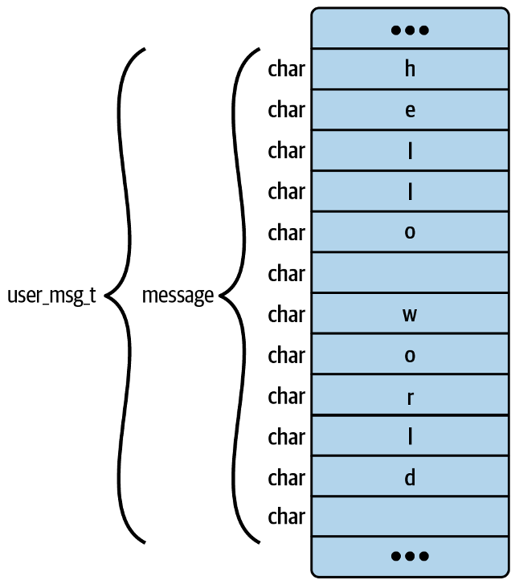

> 图 5-1：一个 user_msg_t 结构占用 12 字节内存。

到目前为止，
所有条目的 bits_offset 都是 0，
但下一行输出是一个包含多个字段的结构：

```text
[8] STRUCT '___btf_map_config' size=16 vlen=2
'key' type_id=1 bits_offset=0
'value' type_id=4 bits_offset=32
```

这是名为 config 的映射中存储的键值对的结构定义。
我并没有在源代码中自己定义这个 ___btf_map_config 类型，
它是由 BCC 生成的。
key 的类型是 u32，
value 是 user_msg_t 结构。
它们分别对应你前面看到的类型 1 和类型 4。

这个结构的 BTF 信息中另一个重要部分是：
value 字段从结构起始处偏移 32 位的位置开始。
这完全说得通，
因为前 32 位要用来存放 key 字段。

> [!NOTE]
> 在 C 语言中，
> 结构字段会自动对齐到边界，
> 因此不能简单地认为一个字段在内存中总是紧跟前一个字段。
> 例如，考虑这样一个结构：
>
> ```c
> struct something {
>     char letter;
>     u64 number;
> }
> ```
>
> 在 letter 字段之后会有 7 个字节的未使用内存，
> 然后才是 number 字段，
> 这样 64 位的 number 才能对齐到可被 8 整除的内存地址。
>
> 在某些情况下可以开启编译器打包（packing）来避免这种未使用的空间，
> 但这通常会降低性能，
> 而且——至少以我的经验——这么做并不常见。
> 更常见的是，
> C 程序员会手工设计结构以高效利用空间。

## 带有 BTF 信息的映射

你刚才看到了与映射关联的 BTF 信息。
现在来看看创建映射时这些 BTF 数据是如何传递给内核的。

你在第 4 章已经看到，
映射是用 bpf(BPF_MAP_CREATE) 系统调用创建的。
它接收一个 bpf_attr 结构作为参数，
该结构在内核中定义如下（省略了一些细节）：

```c
struct { /* BPF_MAP_CREATE 命令使用的匿名结构 */
    __u32 map_type; /* enum bpf_map_type 之一 */
    __u32 key_size; /* 键的字节大小 */
    __u32 value_size; /* 值的字节大小 */
    __u32 max_entries; /* 映射中的最大条目数 */
}

char map_name[BPF_OBJ_NAME_LEN];
__u32 btf_fd; /* 指向 BTF 类型数据的 fd */
__u32 btf_key_type_id; /* 键的 BTF type_id */
__u32 btf_value_type_id; /* 值的 BTF type_id */
};
```

在引入 BTF 之前，
这个 bpf_attr 结构中并没有 btf_* 字段，
内核也无法知晓键或值的结构。
key_size 和 value_size 字段定义了它们需要多少内存，
但它们只是被当作一堆字节来处理。
额外传入定义键和值类型的 BTF 信息后，
内核就能对它们进行内省，
bpftool 之类的工具也能检索类型信息用于美化打印，
如前所述。
不过值得注意的是，
键和值是分别传入各自的 BTF 类型 ID 的。
你刚才看到的 ___btf_map_config 结构并不被内核用于映射定义；
它只是 BCC 在用户空间一侧使用的。

## 函数与函数原型的 BTF 数据

到目前为止，
示例输出中的 BTF 数据都与数据类型有关，
但 BTF 数据还包含函数和函数原型的信息。
下面是同一段 BTF 数据块中描述 hello 函数的信息：

```text
[31] FUNC_PROTO 'anon' ret_type_id=23 vlen=1
'ctx' type_id=10

[32] FUNC 'hello' type_id=31 linkage=static
```

在类型 32 中可以看到，
名为 hello 的函数被定义为具有前一行定义的类型。
那是一个*函数原型*，
返回值的类型 ID 是 23，
接收一个参数（vlen=1），
名为 ctx，类型 ID 是 10。
为完整起见，
这里给出这两个类型在输出中前面的定义：

```text
[10] PTR 'anon' type_id=0

[23] INT 'int' size=4 bits_offset=0 nr_bits=32 encoding=SIGNED
```

类型 10 是一个匿名指针，
默认类型为 0，
它没有显式包含在 BTF 输出中，
但被定义为 void 指针。⁴

> 4 参见内核文档 https:
> //docs.kernel.org/bpf/btf.html#type-encoding。

类型 23 的返回值是一个 4 字节整数，
encoding=SIGNED 表示它是有符号整数，
即可以取正值或负值。
这对应 hello-buffer-config.py 源代码中的函数定义，
如下所示：

```c
int hello(void *ctx)
```

到目前为止，
我展示的示例 BTF 信息都来自对一段 BTF 数据块内容的完整列出。
下面看看如何只获取与特定映射或程序相关的 BTF 信息。

## 查看映射和程序的 BTF 数据

如果想查看与某个特定映射关联的 BTF 类型，
bpftool 让这件事变得很容易。
例如，下面是 config 映射的输出：

```text
bpftool btf dump map name config
[1] TYPEDEF 'u32' type_id=2
[4] STRUCT 'user_msg_t' size=12 vlen=1
'message' type_id=6 bits_offset=0
```

类似地，
可以用 bpftool btf dump prog <程序标识> 查看与某个程序相关的 BTF 信息。
更多细节就留给你自己查阅 man 手册页了。

> [!TIP]
> 如果你想更深入地了解 BTF 类型数据是如何生成和去重的，
> Andrii Nakryiko 还有一篇关于这个主题的出色博客文章。

到这里，
你应该已经理解 BTF 是如何描述数据结构和函数的格式的。
用 C 编写的 eBPF 程序需要定义类型和结构的头文件。
下面看看为 eBPF 程序可能需要的任何内核数据类型生成头文件有多么容易。

## 生成内核头文件

如果在支持 BTF 的内核上运行 bpftool btf list，
你会看到许多已有的 BTF 数据块，
如下所示：

```text
$ bpftool btf list
1: name [vmlinux] size 5842973B
2: name [aes_ce_cipher] size 407B
3: name [cryptd] size 3372B
...
```

这个列表中的第一项，
ID 为 1、名为 vmlinux，
是这台（虚拟）机器上运行的内核所用的全部数据类型、结构和函数定义的 BTF 信息。⁵

eBPF 程序需要它将要引用的所有内核数据结构和类型的定义。
在 CO-RE 出现之前，
你通常得自己弄清楚 Linux 内核源码中众多的头文件里哪一个包含了你感兴趣的结构的定义；
但现在有了一种简单得多的办法：
支持 BTF 的工具可以从内核自带的 BTF 信息生成合适的头文件。

这个头文件按惯例称为 *vmlinux.h*，
可以用 *bpftool* 这样生成：

```bash
bpftool btf dump file /sys/kernel/btf/vmlinux format c > vmlinux.h
```

这个文件定义了内核的所有数据类型，
因此在 eBPF 程序源代码中包含这个生成的 *vmlinux.h* 文件，
就能获得你可能需要的任何 Linux 数据结构的定义。
把源代码编译成 eBPF 目标文件时，
该目标文件会包含与这个头文件中使用的定义相匹配的 BTF 信息。
之后，当程序在目标机器上运行时，
把它加载进内核的用户空间程序会做出调整，
以补偿这个编译期 BTF 信息与目标机器上运行内核的 BTF 信息之间的差异。

从 5.4 版本起，
Linux 内核就包含了以 /sys/kernel/btf/vmlinux 文件形式存在的 BTF 信息，⁶
但也可以为更老的内核生成 *libbpf* 可用的原始 BTF 数据。
换句话说，
如果你想在一台本身没有 BTF 信息的目标机器上运行支持 CO-RE 的 eBPF 程序，
你也许可以自己为那个目标提供 BTF 数据。
**BTFHub** 上有关于如何生成 BTF 文件的说明，
以及针对各种 Linux 发行版的文件存档。

> [!TIP]
> 如果你想更深入地研究 BTF 内部机制，
> BTFHub 仓库还提供了进一步阅读的材料。

接下来看看如何运用这一点和其他手段，
用 CO-RE 编写可跨内核移植的 eBPF 程序。

> 5 内核需要在构建时启用 CONFIG_DEBUG_INFO_BTF 选项。

> 6 能支持 BTF 的最老 Linux 内核版本是哪个？
> 参见 https://oreil.ly/HML9m。

## CO-RE eBPF 程序

回想一下，eBPF 程序运行在内核中。
本章后面我会展示一些与内核中运行的代码交互的用户空间代码，
但在这一节我专注于内核一侧。

如你所见，
eBPF 程序被编译成 eBPF 字节码，
而（至少在撰写本书时）支持这一点的编译器有用于编译 C 代码的 Clang 或 gcc，
以及 Rust 编译器。
我会在第 10 章讨论使用 Rust 的一些选择，
但在本章中，
我假设你用 C 编写，
并使用 Clang 和 *libbpf* 库。

在本章余下的部分，
我们来看一个名为 hello-buffer-config 的示例应用。
它与上一章使用 BCC 框架的 hello-buffer-config.py 示例非常相似，
但这个版本用 C 编写，
使用 libbpf 和 CO-RE。

> [!TIP]
> 如果你有想迁移到 *libbpf* 的基于 BCC 的 eBPF 代码，
> 可以查看 Andrii Nakryiko 网站上那份出色而全面的**迁移指南**。
> BCC 提供了一些便捷的捷径，
> 在 *libbpf* 中的处理方式并不完全相同；
> 反过来，
> *libbpf* 也提供了自己的一套宏和库函数，
> 让 eBPF 程序员的日子更好过。
> 在讲解示例的过程中，
> 我会指出 BCC 和 *libbpf* 两种方式之间的一些差异。

与本节配套的示例 C eBPF 程序，
在 github.com/lizrice/learning-ebpf 仓库的 chapter5 目录中。

首先来看 *hello-buffer-config.bpf.c*，
它实现了在内核中运行的 eBPF 程序。
本章稍后我会向你展示 *hello-buffer-config.c* 中的用户空间代码，
它负责加载程序并显示输出，
就像第 4 章中这个示例的 BCC 实现里 Python 代码所做的那样。

与任何 C 程序一样，
eBPF 程序也需要包含一些头文件。

### 头文件

hello-buffer-config.bpf.c 的前几行指定了它需要的头文件：

```c
#include "vmlinux.h"
#include <bpf/bpf_helpers.h>
#include <bpf/bpf_tracing.h>
#include <bpf/bpf_core_read.h>
#include "hello-buffer-config.h"
```

这五个文件分别是 *vmlinux.h* 文件、
几个来自 *libbpf* 的头文件，
以及我自己编写的一个应用专属头文件。
我们来看看为什么这是 *libbpf* 程序所需头文件的典型模式。

#### 内核头文件信息

如果你编写的 eBPF 程序引用了任何内核数据结构或类型，
最简单的选择是包含本章前面介绍的 *vmlinux.h* 文件。
或者，
也可以包含 Linux 源码中的单个头文件，
或者如果你真的不怕麻烦，
也可以在自己的代码中手工定义这些类型。
如果要使用 *libbpf* 的任何 BPF 辅助函数，
就需要包含 *vmlinux.h* 或 *linux/types.h*，
以获得 BPF 辅助函数源码所引用的 *u32*、*u64* 等类型的定义。

vmlinux.h 文件源自内核源代码头文件，
但它不包含其中的 #define 定义值。
例如，
如果你的 eBPF 程序要解析以太网数据包，
你可能需要那些告诉你数据包包含什么协议的常量定义
（比如 0x0800 表示这是一个 IP 数据包，
0x0806 表示 ARP 数据包）。
如果不包含为内核定义这些值的 if_ether.h 文件，
你就需要在自己的代码中重复定义这一系列的常量值。
hello-buffer-config 不需要任何这些值定义，
但在第 8 章你会看到另一个与此相关的例子。

#### 来自 libbpf 的头文件

要在 eBPF 代码中使用任何 BPF 辅助函数，
需要包含 *libbpf* 中给出它们定义的头文件。

> [!NOTE]
> 关于 *libbpf* 有一点可能让人稍感困惑：
> 它不仅仅是用户空间库。
> 你会发现自己在用户空间代码和 eBPF C 代码中都要包含来自 *libbpf* 的头文件。

在撰写本书时，
常见的做法是 eBPF 项目把 *libbpf* 作为子模块（submodule）引入并从源码构建/安装——
本书的示例仓库就是这么做的。
如果把它作为子模块引入，
只需在 *libbpf/src* 目录下运行 `make install` 即可。
我认为用不了多久，
*libbpf* 作为软件包在常见 Linux 发行版上广泛提供会成为更常见的做法，
特别是因为 *libbpf* 现在已经跨过了 **1.0 版本发布**的里程碑。

#### 应用专属头文件

有一个应用专属的头文件是非常常见的做法，
它定义你的应用中用户空间和 eBPF 两部分都会用到的结构。
在我的示例中，
hello-buffer-config.h 头文件定义了 data_t 结构，
我用它把事件数据从 eBPF 程序传递到用户空间。
它与你在 BCC 版本代码中看到的结构几乎相同，
如下所示：

```c
struct data_t {
    int pid;
    int uid;
    char command[16];
    char message[12];
    char path[16];
};
```

与你之前看到的版本唯一的区别是，
我增加了一个名为 path 的字段。

把这个结构定义抽到一个单独的头文件中的原因是，
hello-buffer-config.c 中的用户空间代码也会引用它。
在 BCC 版本中，
内核代码和用户空间代码都定义在一个文件里，
BCC 在幕后做了一些工作，
让 Python 用户空间代码也能使用这个结构。

### 定义映射

包含头文件之后，
*hello-buffer-config.bpf.c* 源代码的接下来几行定义了映射所用的结构，
如下所示：

```c
struct {
    __uint(type, BPF_MAP_TYPE_PERF_EVENT_ARRAY);
    __uint(key_size, sizeof(u32));
    __uint(value_size, sizeof(u32));
} output SEC(".maps");

struct user_msg_t {
    char message[12];
};

struct {
    __uint(type, BPF_MAP_TYPE_HASH);
    __uint(max_entries, 10240);
    __type(key, u32);
    __type(value, struct user_msg_t);
} my_config SEC(".maps");
```

这比等价的 BCC 示例需要更多行代码！
在 BCC 中，
名为 `config` 的映射是用下面的宏创建的：

```c
BPF_HASH(config, u64, struct user_msg_t);
```

不用 BCC 时这个宏是不可用的，
因此在 C 中你得把它完整地写出来。
你会看到我用了 __uint 和 __type。
它们与 __array 一起定义在 bpf/bpf_helpers_def.h 中，
如下所示：

```c
#define __uint(name, val) int (*name)[val]
#define __type(name, val) typeof(val) *name
#define __array(name, val) typeof(val) *name[]
```

这些宏在基于 *libbpf* 的程序中似乎是按惯例使用的，
而且我认为它们让映射定义更易读一些。

> [!NOTE]
> 名字 "config" 与 vmlinux.h 中的一个定义冲突了，
> 因此在这个示例中我把映射改名为 "my_config"。

### eBPF 程序段

使用 *libbpf* 要求每个 eBPF 程序都用 `SEC()` 宏标注，
该宏定义了程序类型，
像这样：

```c
SEC("kprobe")
```

这会在编译出的 ELF 目标文件中生成一个名为 kprobe 的段（section），
这样 *libbpf* 就知道要把它作为 *BPF_PROG_TYPE_KPROBE* 加载。
我们将在第 7 章进一步讨论不同的程序类型。

根据程序类型，
你还可以用段名来指定程序将挂载到什么事件上。
*libbpf* 库会用这些信息自动设置挂载，
而不是让你在用户空间代码中显式完成。
例如，
要自动挂载到 ARM 机器上 *execve* 系统调用的 kprobe，
可以这样指定段：

```c
SEC("kprobe/__arm64_sys_execve")
```

这要求你知道该系统调用在该架构上的函数名
（或者想办法找出来，
比如查看目标机器上的 /proc/kallsyms 文件，
它列出了包括函数名在内的所有内核符号）。
但 libbpf 还能让你更省事：
使用 k(ret)syscall 段名，
它会告诉加载器自动挂载到架构特定函数的 kprobe 上：

```c
SEC("ksyscall/execve")
```

> [!TIP]
> 有效的段名和格式列在 *libbpf 文档*中。
> 过去对段名的要求宽松得多，
> 因此你可能会遇到在 *libbpf* 1.0 之前编写的、
> 段名不在有效集合中的 eBPF 程序。
> 别让它们把你搞糊涂了！

段定义声明了 eBPF 程序应挂载的位置，
随后就是程序本身。
和之前一样，
eBPF 程序本身写成一个 C 函数。
在示例代码中它叫 hello()，
与你在第 4 章看到的 hello() 函数极其相似。
我们来看看之前那个版本和这里的版本之间的差异：

```c
SEC("ksyscall/execve")
int BPF_KPROBE_SYSCALL(hello, const char *pathname)    ①
{
    struct data_t data = {};
    struct user_msg_t *p;

    data.pid = bpf_get_current_pid_tgid() >> 32;
    data.uid = bpf_get_current_uid_gid() & 0xFFFFFFF;

    bpf_get_current_comm(&data.command, sizeof(data.command));
    bpf_probe_read_user_str(&data.path, sizeof(data.path), pathname);    ②

    p = bpf_map_lookup_elem(&my_config, &data.uid);        ③
    if (p != 0) {
        bpf_probe_read_kernel(&data.message, sizeof(data.message), p->message);
    } else {
        bpf_probe_read_kernel(&data.message, sizeof(data.message), message);
    }

    bpf_perf_event_output(ctx, &output, BPF_F_CURRENT_CPU,    ④
            &data, sizeof(data));
    return 0;
}
```

① 我利用了 libbpf 中定义的 BPF_KPROBE_SYSCALL 宏，
它可以方便地按名字访问系统调用的参数。
对于 execve()，
第一个参数是将要执行的程序的路径名。
这个 eBPF 程序的名字是 hello。

② 既然这个宏让访问 execve() 的 pathname 参数变得如此容易，
我就把它也包含在发往 perf 缓冲区输出的数据中。
注意，复制内存需要使用 BPF 辅助函数。

③ 这里的 bpf_map_lookup_elem() 是根据键在映射中查找值的 BPF 辅助函数。
BCC 中的等价写法是 p = my_config.lookup(&data.uid)。
BCC 会在把 C 代码传给编译器之前，
把它改写为使用底层的 bpf_map_lookup_elem() 函数。
使用 libbpf 时，
编译前不会对代码做任何改写，⁷
因此你必须直接调用辅助函数。

④ 这是另一个类似的例子：
我直接调用了辅助函数 bpf_perf_event_output()，
而 BCC 给我的是方便的等价写法 output.perf_submit(ctx, &data,
sizeof(data))。

剩下唯一的区别是，
在 BCC 版本中，
我把 message 字符串定义为 hello() 函数内的局部变量，
因为 BCC（至少在撰写本书时）不支持全局变量。
在这个版本中我把它定义为全局变量，
像这样：

```c
char message[12] = "Hello World";
```

在 chapter4/hello-buffer-config.py 中，
hello 函数的定义就大不相同了，
是这样的：

```c
int hello(void *ctx)
```

BPF_KPROBE_SYSCALL 宏是我前面提到的 *libbpf* 的便利功能之一。
你不是必须用这个宏，
但它能让事情轻松不少。
它完成了所有繁重的工作，
为传给系统调用的所有参数提供了命名参数。
在这个例子中，
它提供了一个 `pathname` 参数，
指向保存即将运行的可执行文件路径的字符串，
也就是 `execve()` 系统调用的第一个参数。

如果你观察得特别仔细，
可能会注意到 ctx 变量并没有在 hello-buffer-config.bpf.c 的源代码中显式定义，
但我在向 output perf 缓冲区提交数据时却能使用它，
像这样：

```c
bpf_perf_event_output(ctx, &output, BPF_F_CURRENT_CPU, &data, sizeof(data));
```

ctx 变量确实存在，
它隐藏在 libbpf 的 bpf/bpf_tracing.h 中 BPF_KPROBE_SYSCALL 宏的定义里，
在那里你还能找到关于这一点的一些说明。
使用一个没有显式定义的变量可能让人有点困惑，
但能访问它确实非常有用。

> 7 好吧，正常的 C 预处理还是适用的，
> 所以你可以使用 #define 之类的功能。
> 但不像使用 BCC 时那样有特殊的改写。

### 用 CO-RE 访问内存

用于跟踪的 eBPF 程序对内存的访问是受限的，
要通过 bpf_probe_read_*() 家族的 BPF 辅助函数进行。⁸
（还有一个 bpf_probe_write_user() 辅助函数，
但它只"供实验之用"。）
问题在于，
正如你将在下一章看到的，
eBPF 验证器通常不允许你像在 C 中通常那样直接通过指针读内存
（例如 x = p->y）。⁹

libbpf 库为 bpf_probe_read_*() 辅助函数提供了 CO-RE 封装，
以利用 BTF 信息，
让内存访问调用可以跨不同内核版本移植。
下面是 bpf_core_read.h 头文件中定义的其中一个封装示例：

```c
#define bpf_core_read(dst, sz, src)
bpf_probe_read_kernel(dst, sz,
(const void *)__builtin_preserve_access_index(src))
```

如你所见，
bpf_core_read() 直接调用 bpf_probe_read_kernel()，
唯一的区别是它用 __builtin_preserve_access_index() 包装了 src 字段。
这会告诉 Clang 在访问该内存地址的 eBPF 指令旁生成一条 CO-RE 重定位条目。

> [!NOTE]
> 这个 __builtin_preserve_access_index() 指令是对"常规" C 代码的扩展，
> 把它加入 eBPF 还需要修改 Clang 编译器以支持它并生成这些 CO-RE 重定位条目。
> 这类扩展正是为什么（至少目前）某些 C 编译器无法生成 eBPF 字节码的例证。
> 关于 eBPF CO-RE 支持所需的 Clang 改动，
> 可阅读 LLVM 邮件列表上的更多内容。

正如你将在本章后面看到的，
CO-RE 重定位条目告诉 *libbpf* 在把 eBPF 程序加载进内核时重写地址，
以补偿任何 BTF 差异。
如果 *src* 在其包含结构中的偏移量在目标内核上不同，
重写后的指令会把这一点考虑进去。

libbpf 库提供了 BPF_CORE_READ() 宏，
让你可以在一行中完成多次 bpf_core_read() 调用，
而不必为每一次指针解引用都单独调用一次辅助函数。
例如，
如果你想做 d = a->b->c->d 这样的事情，
可以写下面的代码：

```c
struct b_t *b;
struct c_t *c;

bpf_core_read(&b, 8, &a->b);
bpf_core_read(&c, 8, &b->c);
bpf_core_read(&d, 8, &c->d);
```

但用下面的写法紧凑得多：

```c
d = BPF_CORE_READ(a, b, c, d);
```

然后就可以用 bpf_probe_read_kernel() 辅助函数从指针 d 读取了。
Andrii 的指南中对此有很好的说明。

> 8 处理网络数据包的 eBPF 程序用不了这个辅助函数，
> 只能访问网络数据包的内存。

> 9 在某些支持 BTF 的程序类型（如 tp_btf、fentry 和 fexit）中是允许的。

### 许可证定义

你从第 3 章已经知道，
eBPF 程序必须声明其许可证。
示例代码是这样做的：

```c
char LICENSE[] SEC("license") = "Dual BSD/GPL";
```

现在你已经看完了 *hello-buffer-config.bpf.c* 示例中的全部代码。
接下来把它编译成目标文件。

### 为 CO-RE 编译 eBPF 程序

在第 3 章你看到过一段 Makefile 摘录，
它把 C 编译成 eBPF 字节码。
我们来深入研究其中用到的选项，
看看为什么它们对 CO-RE/libbpf 程序是必要的。

#### 调试信息

必须给 Clang 传 -g 标志，
让它包含调试信息，
这是 BTF 所必需的。
不过 -g 标志还会往输出目标文件中加入 DWARF 调试信息，
而 eBPF 程序并不需要它，
因此可以运行下面的命令把它剥离，
以减小目标文件的体积：

```bash
llvm-strip -g <目标文件>
```

#### 优化

Clang 需要 -O2 优化标志（2 级或更高）
才能生成能通过验证器的 BPF 字节码。
一个必要性的例子是：
默认情况下 Clang 会输出 callx <寄存器> 来调用辅助函数，
但 eBPF 不支持从寄存器调用地址。

#### 目标架构

如果你使用 *libbpf* 定义的某些宏，
就需要在编译时指定目标架构。
*libbpf* 头文件 *bpf/bpf_tracing.h* 定义了几个平台相关的宏，
比如我在这个示例中使用的 `BPF_KPROBE` 和 `BPF_KPROBE_SYSCALL`。
`BPF_KPROBE` 宏可用于挂载到 kprobe 的 eBPF 程序，
`BPF_KPROBE_SYSCALL` 是专门用于系统调用 kprobe 的变体。

kprobe 的参数是一个 pt_regs 结构，
其中保存着 CPU 寄存器内容的副本。
由于寄存器是架构相关的，
pt_regs 结构的定义取决于你运行的架构。
这意味着如果想用这些宏，
还需要告诉编译器目标架构是什么。
可以通过设置 -D __TARGET_ARCH_$(ARCH) 来做到，
其中 $(ARCH) 是 arm64、amd64 之类的架构名。

还要注意，
如果不用这个宏，
要访问 kprobe 的寄存器信息，
反正也得写架构相关的代码。

也许"每种架构编译一次，随处运行"说起来确实有点拗口！

### Makefile

下面是一个编译 CO-RE 目标文件的 Makefile 示例
（取自本书 GitHub 仓库 chapter5 目录中的 Makefile）：

```makefile
hello-buffer-config.bpf.o: %.o: %.c
clang \
    -target bpf \
    -D __TARGET_ARCH_$(ARCH) \
    -I/usr/include/$(shell uname -m)-linux-gnu \
    -Wall \
    -O2 -g \
    -c $< -o $@
llvm-strip -g $@
```

如果你使用示例代码，
在 *chapter5* 目录中运行 *make*，
应该就能构建出 eBPF 目标文件 *hello-buffer-config.bpf.o*
（以及我稍后会介绍的配套用户空间可执行文件）。
我们来检查一下这个目标文件，
确认它包含了 BTF 信息。

### 目标文件中的 BTF 信息

关于 BTF 的内核文档描述了 BTF 数据在 ELF 目标文件中如何编码为两个段：
.BTF 包含数据和字符串信息，
.BTF.ext 涵盖函数和行号信息。
可以用 readelf 看到这些段已被加入目标文件，
像这样：

```text
$ readelf -S hello-buffer-config.bpf.o | grep BTF
[10] .BTF            PROGBITS        0000000000000000 000002c0
[11] .rel.BTF        REL              0000000000000000 00000e50
[12] .BTF.ext        PROGBITS        0000000000000000 00000b18
[13] .rel.BTF.ext    REL              0000000000000000 00000ea0
```

bpftool 工具让我们可以查看目标文件中的 BTF 数据，
像这样：

```bash
bpftool btf dump file hello-buffer-config.bpf.o
```

输出看起来与本章前面你看到的、
从已加载的程序和映射转储 BTF 信息的输出完全一样。

下面看看这些 BTF 信息如何能让程序运行在另一台内核版本不同、
数据结构也不同的机器上。

### BPF 重定位

*libbpf* 库让 eBPF 程序适配其运行的目标内核上的数据结构布局，
即使该布局与编译代码时所用的内核不同。
为此，
*libbpf* 需要 Clang 在编译过程中生成的 BPF CO-RE 重定位信息。

你可以从 linux/bpf.h 头文件中 struct bpf_core_relo 的定义进一步了解重定位的工作原理：

```c
struct bpf_core_relo {
    __u32 insn_off;
    __u32 type_id;
    __u32 access_str_off;
    enum bpf_core_relo_kind kind;
};
```

一个 eBPF 程序的 CO-RE 重定位数据，
由每条需要重定位的指令对应的这样一个结构组成。
假设某条指令要把一个寄存器设置为结构中某个字段的值，
那么该指令（由 insn_off 字段标识）对应的 bpf_core_relo 结构
编码了该结构的 BTF 类型（type_id 字段），
并指明该字段相对于该结构如何访问（access_str_off）。

如你刚才所见，
内核数据结构的重定位数据由 Clang 自动生成并编码进 ELF 目标文件。
让 Clang 这样做的，
是你会在 *vmlinux.h* 文件开头附近看到的下面这一行：

```c
#pragma clang attribute push (__attribute__((preserve_access_index)), \
apply_to = record)
```

preserve_access_index 属性告诉 Clang 为类型定义生成 BPF CO-RE 重定位。
clang attribute push 部分表示这个属性应应用于之后的所有定义，
直到文件末尾出现的 clang attribute pop。
这意味着 Clang 会为 vmlinux.h 中定义的所有类型生成重定位信息。

加载 BPF 程序时，
可以用 bpftool 加 -d 标志打开调试信息，
看到重定位的发生，
像这样：

```bash
bpftool -d prog load hello.bpf.o /sys/fs/bpf/hello
```

这会产生大量输出，
其中与重定位相关的部分如下所示：

```text
libbpf: CO-RE relocating [24] struct user_pt_regs: found target candidate [205]
struct user_pt_regs in [vmlinux]
libbpf: prog 'hello': relo #0: <byte_off> [24] struct user_pt_regs.regs[0]
(0:0:0 @ offset 0)
libbpf: prog 'hello': relo #0: matching candidate #0 <byte_off> [205] struct
user_pt_regs.regs[0] (0:0:0 @ offset 0)
libbpf: prog 'hello': relo #0: patched insn #1 (LDX/ST/STX) off 0 -> 0
```

在这个例子中可以看到，
hello 程序 BTF 信息中的类型 ID 24 指的是名为 user_pt_regs 的结构。
libbpf 库把它与 vmlinux BTF 数据集中类型 ID 为 205 的同名内核结构匹配上了。
实际上，
因为我是在同一台机器上编译并加载这个程序的，
类型定义完全相同，
所以在这个例子中，
从结构起始处偏移 0 的位置保持不变，
对指令 #1 的"修补"也没有改变它。

在许多应用中，
你不会想让用户运行 bpftool 来加载 eBPF 程序，
而是希望把这个功能构建进一个专门的、
以可执行文件形式提供的用户空间程序中。
我们来看看如何编写这样的用户空间代码。

## CO-RE 用户空间代码

有几种不同编程语言的框架支持 CO-RE，
它们在把 eBPF 程序加载进内核时实现重定位。
本章展示使用 *libbpf* 的 C 代码；
其他选择包括 Go 语言的 *cilium/ebpf* 和 *libbpfgo* 包，
以及 Rust 的 Aya。
我会在第 10 章进一步讨论这些选择。

### 用于用户空间的 Libbpf 库

如果你的应用的用户空间部分用 C 编写，
可以直接使用 *libbpf* 这个用户空间库。
如果愿意，
你也可以在不使用 CO-RE 的情况下使用这个库。
**Andrii Nakryiko** 关于 *libbpf-bootstrap* 的精彩博客文章中就有这样的例子。

这个库提供的函数封装了你在第 4 章见过的 bpf() 及相关系统调用，
用来执行把程序加载进内核、挂载到事件上、
从用户空间访问映射信息等操作。
使用这些抽象的传统也是最简单的方式，
是通过自动生成的 BPF 骨架代码。

### BPF 骨架

可以用 bpftool 从 ELF 文件格式的已有 eBPF 目标文件自动生成骨架代码，
像这样：

```bash
bpftool gen skeleton hello-buffer-config.bpf.o > hello-buffer-config.skel.h
```

查看这个骨架头文件，
你会看到它包含 eBPF 程序和映射的结构定义，
以及若干名字都以 hello_buffer_config_bpf__ 开头的函数
（基于目标文件的名字）。
这些函数管理 eBPF 程序和映射的生命周期。
你不是必须使用骨架代码——
如果愿意，也可以直接调用 libbpf——
但自动生成的代码通常能省你不少敲键盘的功夫。

在生成的骨架文件末尾，
你会看到一个名为 hello_buffer_config_bpf__elf_bytes 的函数，
它返回 ELF 目标文件 hello-buffer-config.bpf.o 的字节内容。
一旦骨架生成完毕，
我们其实就不再需要那个目标文件了。
可以验证这一点：
运行 make 生成 hello-buffer-config 可执行文件后删掉 .o 文件，
可执行文件内已经包含了 eBPF 字节码。

> [!TIP]
> 如果你愿意，
> 也可以用 `libbpf` 函数 `bpf_object__open_file` 从 ELF 文件加载 eBPF
> 程序和映射，
> 而不使用骨架文件中的字节。

下面是这个示例中管理 eBPF 程序和映射生命周期的用户空间代码大纲，
使用了生成的骨架代码。
为清晰起见我省略了一些细节和错误处理，
完整源代码见 chapter5/hello-buffer-config.c。

```c
... [其他 #include]
#include "hello-buffer-config.h"
#include "hello-buffer-config.skel.h"    ①

... [一些回调函数]

int main()
{
    struct hello_buffer_config_bpf *skel;
    struct perf_buffer *pb = NULL;
    int err;

    libbpf_set_print(libbpf_print_fn);    ②

    skel = hello_buffer_config_bpf__open_and_load();    ③

    err = hello_buffer_config_bpf__attach(skel);    ④

    pb = perf_buffer__new(bpf_map__fd(skel->maps.output), 8, handle_event, lost_event, NULL, NULL);    ⑤

    while (true) {
        err = perf_buffer__poll(pb, 100);    ⑥
    }

    perf_buffer__free(pb);    ⑦
    hello_buffer_config_bpf__destroy(skel);    ⑦
    return -err;
}
```

① 这个文件包含了自动生成的骨架头文件，
以及我手工编写的、
用户空间和内核代码共享的数据结构的头文件。

② 这行代码设置了一个回调函数，
用于打印 *libbpf* 生成的任何日志消息。

③ 这里创建了一个 skel 结构，
它表示 ELF 字节中定义的所有映射和程序，
并把它们加载进内核。

④ 程序被自动挂载到相应的事件上。

⑤ 这个函数创建了一个用于处理 perf 缓冲区输出的结构。

⑥ 这里对该 perf 缓冲区进行持续轮询。

⑦ 这是清理代码。

我们来更详细地看看其中的几个步骤。

#### 把程序和映射加载进内核

第一个调用的自动生成函数是这个：

```c
skel = hello_buffer_config_bpf__open_and_load();
```

顾名思义，
这个函数涵盖两个阶段：打开（open）和加载（load）。
"打开"阶段读取 ELF 数据，
把其中的各个段转换成表示 eBPF 程序和映射的结构。
"加载"阶段把这些映射和程序加载进内核，
并在必要时执行 CO-RE 修正。

这两个阶段可以很容易地分开处理，
因为骨架代码提供了单独的 name__open() 和 name__load() 函数。
这样你就可以选择在加载之前对 eBPF 信息进行加工。
一个常见用法是在加载前对程序进行配置。
例如，
我可以把计数器全局变量 c 初始化为某个值，
像这样：

```c
skel = hello_buffer_config_bpf__open();
if (!skel) {
    // 错误处理 ...
}
skel->data->c = 10;
err = hello_buffer_config_bpf__load(skel);
```

hello_buffer_config_bpf__open() 返回的数据类型
（hello_buffer_config_bpf__load() 也一样）
是骨架头文件中定义的一个名为 hello_buffer_config_bpf 的结构，
其中包含目标文件中定义的所有映射、程序和数据的信息。

> [!WARNING]
> 骨架对象（本例中的 hello_buffer_config_bpf）只是 ELF 字节中信息的用户空间表示。
> 一旦被加载进内核，
> 再修改对象中的值就不会对内核侧的数据产生任何影响。
> 例如，加载后再修改 skel->data->c 不会有任何效果。

#### 访问已有的映射

默认情况下，
`libbpf` 还会创建 ELF 字节中定义的所有映射，
但有时你可能想写一个复用已有映射的 eBPF 程序。
上一章你已经见过这样的例子：
`bpftool` 遍历所有映射，
寻找与指定名字匹配的那个。
使用已有映射的另一个常见原因是在两个不同的 eBPF 程序之间共享信息，
这时只应由其中一个程序创建映射。
`bpf_map__set_autocreate()` 函数允许你覆盖 `libbpf` 的自动创建行为。

那么如何访问一个已有的映射呢？
映射可以被钉住（pin），
如果知道钉住路径，
就可以用 `bpf_obj_get()` 获得指向已有映射的文件描述符。
下面是一个非常简单的例子
（在 GitHub 仓库中为 `chapter5/find-map.c`）：

```c
struct bpf_map_info info = {};
unsigned int len = sizeof(info);

int findme = bpf_obj_get("/sys/fs/bpf/findme");
if (findme <= 0) {
    printf("No FD\n");
} else {
    bpf_obj_get_info_by_fd(findme, &info, &len);
    printf("Name: %s\n", info.name);
}
```

要试用它，
可以先用 bpftool 创建一个映射，
像这样：

```text
$ bpftool map create /sys/fs/bpf/findme type array key 4 value 32 entries 4
name findme
```

运行 find-map 可执行文件会打印出：

```text
Name: findme
```

我们回到 *hello-buffer-config* 示例和骨架代码。

#### 挂载到事件

示例中的下一个骨架函数把程序挂载到 execve 系统调用函数上：

```c
err = hello_buffer_config_bpf__attach(skel);
```

*libbpf* 库自动从这个程序的 SEC() 定义中获取挂载点。
如果你没有完整定义挂载点，
还有一整系列的 *libbpf* 函数可用于挂载不同的程序类型，
如 *bpf_program__attach_kprobe*、*bpf_program__attach_xdp* 等等。

#### 管理事件缓冲区

设置 perf 缓冲区用的是 *libbpf* 本身定义的函数，
而不是骨架中的函数：

```c
pb = perf_buffer__new(bpf_map__fd(skel->maps.output), 8, handle_event,
                        lost_event, NULL, NULL);
```

可以看到，
perf_buffer__new() 函数的第一个参数是 "output" 映射的文件描述符。
handle_event 参数是一个回调函数，
当 perf 缓冲区中有新数据到达时会被调用；
如果内核要写入数据条目时 perf 缓冲区空间不足，
则会调用 lost_event。
在我的示例中，
这些函数只是把消息写到屏幕上。

最后，
程序必须反复轮询 perf 缓冲区：

```c
while (true) {
    err = perf_buffer__poll(pb, 100);
}
```

100 是以毫秒为单位的超时时间。
当数据到达或缓冲区满时，
前面设置的回调函数会相应地被调用。

最后，
清理时我释放 perf 缓冲区并销毁内核中的 eBPF 程序和映射，
像这样：

```c
perf_buffer__free(pb);
hello_buffer_config_bpf__destroy(skel);
```

libbpf 中有一整套 perf_buffer__* 和 ring_buffer__* 相关的函数，
帮助你管理事件缓冲区。

如果构建并运行这个 hello-buffer-config 示例程序，
你会看到如下输出
（与你在第 4 章看到的非常相似）：

```text
23664 501 bash Hello World
23665 501 bash Hello World
23667 0 cron Hello World
23668 0 sh Hello World
```

## Libbpf 代码示例

有许多优秀的基于 *libbpf* 的 eBPF 程序示例可供参考，
可以作为你编写自己程序的灵感和指导：

- *libbpf-bootstrap* 项目旨在用一组示例程序帮助你起步。

- BCC 项目已经把许多原来基于 BCC 的工具迁移到了 *libbpf* 版本。
  你可以在 *libbpf-tools* 目录中找到它们。

<a id="chapter-5-summary"></a>

## 小结

CO-RE 让 eBPF 程序能够运行在与构建时不同版本的内核上。
这极大地改善了 eBPF 的可移植性，
也让工具开发者的工作轻松了许多——
他们希望向用户和客户交付生产可用的工具。

在本章中，
你看到了 CO-RE 是如何做到这一点的：
把类型信息编码进编译出的目标文件，
并在程序加载进内核时用重定位来改写指令。
你还初步学习了如何用 C 编写使用 *libbpf* 的代码：
既包括在内核中运行的 eBPF 程序，
也包括基于自动生成的 BPF 骨架代码、
管理这些程序生命周期的用户空间程序。
在下一章，
你将学习内核如何验证 eBPF 程序可以安全运行。

<a id="chapter-5-exercises"></a>

## 练习

你可以做下面几件事来进一步探索 BTF、CO-RE 和 *libbpf*：

1. 试用 bpftool btf dump map 和 bpftool btf dump prog，
   分别查看与映射和程序关联的 BTF 信息。
   记住，指定单个映射和程序的方式不止一种。

2. 对同一个程序，
   比较 bpftool btf dump file 和 bpftool btf dump prog 的输出——
   前者针对 ELF 目标文件形态，
   后者针对加载进内核之后。
   两者应该完全相同。

3. 查看 bpftool -d prog load hello-buffer-config.bpf.o
   /sys/fs/bpf/hello 的调试输出。
   你会看到每个段的加载、许可证检查、重定位的发生，
   以及描述每条 BPF 程序指令的输出。

4. 尝试用 BTFHub 上另一个不同的 *vmlinux* 头文件构建一个 BPF 程序，
   并在 *bpftool* 的调试输出中寻找改变了偏移量的重定位。

5. 修改 hello-buffer-config.c 程序，
   让你可以用映射为不同的用户 ID 配置不同的消息
   （类似于第 4 章的 hello-buffer-config.py 示例）。

6. 尝试修改 SEC() 中的段名，
   比如改成你自己的名字。
   加载程序进内核时你应该会看到错误，
   因为 libbpf 不认识这个段名。
   这说明了 libbpf 是如何用段名来判断这是哪种 BPF 程序的。
   你还可以试着自己写挂载代码，
   显式挂载到你选择的事件上，
   而不依赖 libbpf 的自动挂载。

# 第 6 章 验证过程

验证器会分析程序，评估所有可能的执行路径。
它按顺序逐条处理指令，对指令进行求值而不是真正执行它们。
在此过程中，它用一个名为 bpf_reg_state 的结构来跟踪每个寄存器的状态。
（这里说的寄存器就是你在第 3 章见过的 eBPF 虚拟机的寄存器。）
该结构包含一个名为 bpf_reg_type 的字段，描述寄存器中保存的值的类型。
可能的类型有多种，包括：

- NOT_INIT，表示寄存器尚未被赋值。

- SCALAR_VALUE，表示寄存器已被赋予一个不代表指针的值。

- 若干 PTR_TO_* 类型，表示寄存器保存了指向某个对象的指针。这个对象可以是，例如：

— PTR_TO_CTX：寄存器保存指向作为参数传给 BPF 程序的上下文的指针。

— PTR_TO_PACKET：寄存器指向一个网络数据包（在内核中即 skb->data）。

— PTR_TO_MAP_KEY 或 PTR_TO_MAP_VALUE：相信你一定能猜出它们的含义。

还有其他几种 PTR_TO_* 类型，完整的枚举可以在 *linux/bpf.h* 头文件中找到。

bpf_reg_state 结构还会跟踪寄存器可能保存的取值范围。
验证器利用这些信息来判断程序何时试图执行非法操作。

每当验证器遇到分支——即需要决定是继续顺序执行还是跳转到另一条指令时——
它会把当前所有寄存器状态的副本压入栈中，然后探索其中一条可能的路径。
它持续对指令求值，直到到达程序末尾的返回指令
（或者达到它所能处理的指令数上限，目前是一百万条¹），
然后从栈中弹出下一个分支继续评估。
如果它发现某条指令可能导致非法操作，验证就会失败。

> ¹ 在很长一段时间里，这个上限是 4096 条指令，这对 eBPF 程序的复杂度造成了很大限制。
> 对于以非特权用户身份运行的 BPF 程序，这个上限仍然适用。

逐一验证每一种可能性在计算上代价高昂，
因此实践中采用了一种称为*状态剪枝（state pruning）*的优化，
避免重复评估程序中本质等价的路径。
在分析程序的过程中，验证器会记录程序中某些指令处所有寄存器的状态。
如果之后它以相同的寄存器状态再次到达同一条指令，
就无需继续验证该路径的剩余部分，因为已知它是合法的。

人们在优化验证器及其剪枝过程上投入了大量工作。
验证器过去会在每条跳转指令前后都存储剪枝状态，
但分析表明，这导致平均每四条指令左右就要存储一次状态，
而这些剪枝状态中的绝大多数永远不会被匹配到。
事实证明，无论是否分支，每 10 条指令存储一次剪枝状态的效率更高。

关于验证在内核中如何工作的更多细节，可以阅读内核文档。

## 验证器日志

当程序验证失败时，验证器会生成一份日志，展示它是如何得出程序非法这一结论的。
如果你使用 bpftool prog load，验证器日志会输出到 stderr。
如果你用 libbpf 编写程序，可以使用 libbpf_set_print() 函数设置一个处理函数，
用来展示这些错误（或做其他有用的处理）。
（你会在本章的 hello-verifier.c 源码中看到这样的例子。）

如果你确实想深入了解验证器的工作细节，
还可以让它在验证成功时也生成日志。
hello-verifier.c 文件中也有一个这样的基本示例：
做法是向把程序加载进内核的 libbpf 调用传入一个用于保存验证器日志内容的缓冲区，
然后把日志内容输出到屏幕。

验证器日志包含验证器工作量的摘要，看起来像这样：

```
processed 61 insns (limit 1000000) max_states_per_insn 0 total_states 4 peak_states 4 mark_read 3
```

在这个例子中，验证器处理了 61 条指令，
其中可能包括经由不同路径多次处理同一条指令。
注意，一百万的复杂度上限是对程序中指令数的上限；
实际上，如果代码中有分支，验证器会多次处理某些指令。

存储的状态总数是 4，对这个简单程序来说正好等于存储状态的峰值。
如果其中一些状态被剪枝掉了，峰值可能会低于总数。

日志输出包括验证器分析过的 BPF 指令，
以及对应的 C 源代码行（如果构建目标文件时使用了 -g 标志以包含调试信息）
和验证器状态信息的摘要。
下面是 hello-verifier.bpf.c 中程序开头几行对应的验证器日志摘录：

```
0: (bf) r6 = r1
; data.counter = c;
1: (18) r1 = 0xffffffff800008178000
3: (61) r2 = *(u32 *) (r1 + 0)
R1_w = map_value(id = 0, off = 0, ks = 4, vs = 16, imm = 0) R6_w = ctx(id = 0, off = 0, imm = 0)
R10 = fp0
; c++;
4: (bf) r3 = r2
5: (07) r3 += 1
6: (63) *(u32 *) (r1 + 0) = r3
R1_w = map_value(id = 0, off = 0, ks = 4, vs = 16, imm = 0) R2_w = inv(id = 1, umax_value = 4294967295, var_off = (0x0; 0xffffffff)) R3_w = inv(id = 0, umin_value = 1, umax_value = 4294967296, var_off = (0x0; 0x1ffffffff)) R6_w = ctx(id = 0, off = 0, imm = 0) R10 = fp0
```

> ¹ 日志中包含源代码行，以便更容易理解输出与源码的对应关系。
> 这些源代码之所以可用，是因为编译步骤中使用了 -g 标志来构建调试信息。

> ² 这是日志中输出寄存器状态信息的一个例子。
> 它告诉我们，在这一阶段，寄存器 1 包含一个映射值，
> 寄存器 6 保存上下文，寄存器 10 是保存局部变量的帧（即栈）指针。

> ³ 这是另一个寄存器状态信息的例子。
> 这里你不仅可以看到每个（已初始化的）寄存器中保存的值的类型，
> 还可以看到寄存器 2 和寄存器 3 的可能取值范围。

让我们进一步探究其中的细节。
我说过寄存器 6 保存上下文，验证器日志用 R6_w=ctx(id=0, off=0, imm=0) 来表示这一点。
它是在字节码的第一行设置的，那里把寄存器 1 复制到了寄存器 6。
eBPF 程序被调用时，寄存器 1 总是保存传给程序的上下文参数。
为什么要把它复制到寄存器 6 呢？
原因是，调用 BPF 辅助函数时，调用的参数通过寄存器 1 到 5 传递。
辅助函数不会修改寄存器 6 到 9 的内容，
所以把上下文保存到寄存器 6 中，意味着代码调用辅助函数时不会失去对上下文的访问。

寄存器 0 用于保存辅助函数的返回值，也用于保存 eBPF 程序的返回值。
寄存器 10 总是保存指向 eBPF 栈帧的指针（eBPF 程序不能修改它）。

让我们看看指令 6 之后寄存器 2 和寄存器 3 的寄存器状态信息：

```
R2_w=inv(id=1,umax_value=4294967295,var_off=(0x0; 0xffffffff)) R3_w=inv(id=0,umin_value=1,umax_value=4294967296,var_off=(0x0; 0x1fffffff))
```

寄存器 2 没有最小值，
这里以十进制显示的 umax_value 对应 0xFFFFFFFF，
即一个 4 字节寄存器能保存的最大值。
换句话说，此时该寄存器可能保存其任意可能取值。

在指令 4 中，寄存器 2 的内容被复制到寄存器 3，
然后指令 5 把这个值加一。
因此，寄存器 3 可能保存任何大于等于 1 的值。
你可以从寄存器 3 的状态信息中看到这一点：
它的 umin_value 被设为 1，umax_value 为 0x1FFFFFFFF。

验证器不仅利用每个寄存器的状态信息，
还利用每个寄存器可能包含的取值范围，
来确定程序的可能执行路径。
这也用于前面提到的状态剪枝：
如果验证器曾处于代码中的同一位置，
且各寄存器的类型和可能取值范围都相同，
就无需进一步评估这条路径。
更进一步，如果当前状态是之前见过的某个状态的子集，也可以被剪枝。

## 可视化控制流

验证器会探索 eBPF 程序的所有可能路径，
如果你在调试问题，亲眼看看这些路径会很有帮助。
bpftool 工具可以帮上忙：
它能以 DOT 格式生成程序的控制流图，
然后你可以把它转换成图片格式，像这样：

```
$ bpftool prog dump xlated name kprobe_exec visual > out.dot
$ dot -Tpng out.dot > out.png
```

这会生成如图 6-1 所示的控制流可视化图。

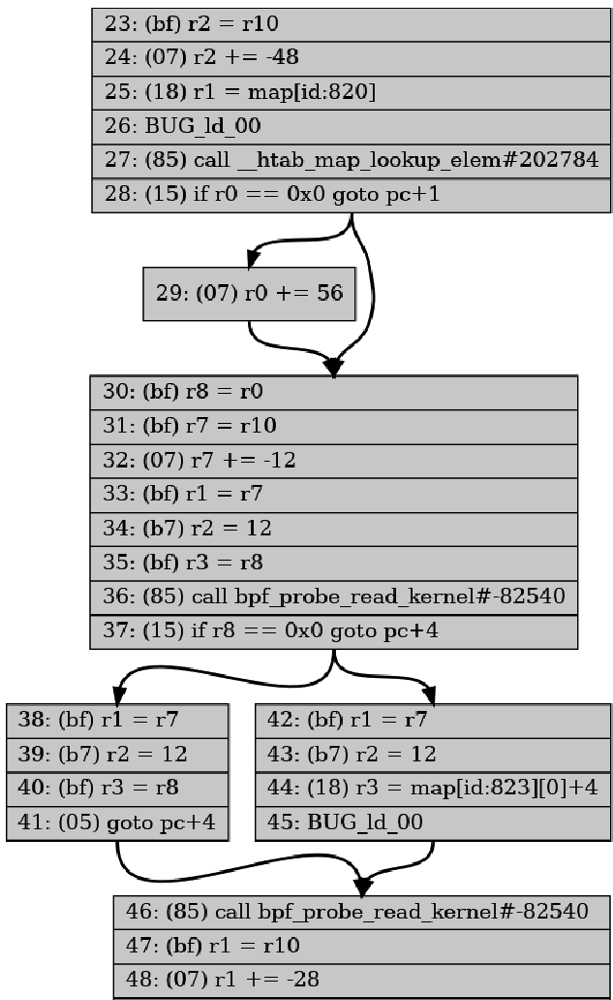

> 图 6-1：
> 控制流图摘录（完整图片见本书 GitHub 仓库中的 chapter6/kprobe_exec.png）。

## 校验辅助函数

eBPF 程序不允许直接调用任何内核函数
（除非该函数已注册为 kfunc，你将在下一章见到），
但 eBPF 提供了许多辅助函数，让程序能够从内核获取信息。
bpf-helpers 手册页尝试把它们全部记录在案。

不同的辅助函数适用于不同的 BPF 程序类型。
例如，辅助函数 bpf_get_current_pid_tgid() 用于获取当前用户空间的进程 ID 和线程 ID，
但在 XDP 程序中调用它就没有意义——
XDP 程序由网络接口收到数据包触发，根本不涉及用户空间进程。
你可以动手验证这一点：
把 hello-verifier.bpf.c 中 hello eBPF 程序的 SEC()
定义从 kprobe 改为 xdp，
尝试加载该程序时，验证器会输出如下信息：

```
...
16: (85) call bpf_get_current_pid_tgid#14
unknown func bpf_get_current_pid_tgid#14
```

这里的 unknown func 并不意味着这个函数完全不为人知，
只是它对这种 BPF 程序类型而言是未知的。
（BPF 程序类型是下一章的主题；
目前你只需把它们理解为适合挂载到不同类型事件的程序即可。）

## 辅助函数参数

举个例子，如果你查看 kernel/bpf/helpers.c，²
就会发现每个辅助函数都有一个 bpf_func_proto 结构，
下面是辅助函数 bpf_map_lookup_elem() 的例子：

```c
const struct bpf_func_proto bpf_map_lookup_elem_proto = {
    .func = bpf_map_lookup_elem,
    .gpl_only = false,
    .pkt_access = true,
    .ret_type = RET_PTR_TO_MAP_VALUE_OR_NULL,
    .arg1_type = ARG_CONST_MAP_PTR,
    .arg2_type = ARG_PTR_TO_MAP_KEY,
};
```

这个结构定义了辅助函数参数和返回值的约束。
由于验证器一直在跟踪每个寄存器中保存的值的类型，
如果你试图向辅助函数传递错误类型的参数，它就能发现。
例如，试着把 hello 程序中对 bpf_map_lookup_elem() 调用的参数改成这样：

```c
p = bpf_map_lookup_elem(&data, &uid);
```

这里传入的不再是 &my_config（一个指向映射的指针），
而是 &data（一个指向局部变量结构的指针）。
从编译器的角度看这是合法的，
所以你可以正常构建出 BPF 目标文件 hello-verifier.bpf.o，
但当你尝试把程序加载进内核时，
会在验证器日志中看到类似这样的错误：

> ² 辅助函数也定义在源码的其他一些地方，
> 例如 kernel/trace/bpf_trace.c 和 net/core/filter.c。

```
27: (85) call bpf_map_lookup_elem#1
R1 type=fp expected=map_ptr
```

这里的 fp 代表帧指针（frame pointer），
即栈上保存局部变量的内存区域。
寄存器 1 被加载了局部变量 data 的地址，
但该函数期望的是一个指向映射的指针
（正如前面展示的 bpf_func_proto 结构中 arg1_type 字段所示）。
通过跟踪每个寄存器中保存的值的类型，验证器发现了这一不符之处。

## 检查许可证

验证器还会检查：
如果你使用的 BPF 辅助函数是以 GPL 许可的，
你的程序也必须使用 GPL 兼容的许可证。
第 6 章示例代码 hello-verifier.bpf.c 的最后一行定义了一个 "license" 段，
其中保存字符串 Dual BSD/GPL。
如果你删掉这一行，验证器的输出将以如下内容结尾：

```
37: (85) call bpf_probe_read_kernel#113
cannot call GPL-restricted function from non-GPL compatible program
```

这是因为 bpf_probe_read_kernel() 辅助函数的 gpl_only 字段被设为 true。
这个 eBPF 程序前面还调用了其他辅助函数，
但它们不是 GPL 许可的，所以验证器并不反对使用它们。

BCC 项目维护了一份辅助函数列表，标明了它们是否为 GPL 许可。
如果你有兴趣了解辅助函数实现方式的更多细节，
《BPF and XDP Reference Guide》中有一节专门介绍。

## 检查内存访问

验证器会执行多项检查，确保 BPF 程序只访问它们被允许访问的内存。

例如，处理网络数据包时，
XDP 程序只允许访问构成该网络数据包的内存位置。
大多数 XDP 程序的开头都与下面这段非常相似：

```c
SEC("xdp")
int xdp_load_balancer(struct xdp_md *ctx)
{
    void *data = (void *) (long)ctx->data;
    void *data_end = (void *) (long)ctx->data_end;
    ...
```

作为上下文传给程序的 xdp_md 结构描述了收到的网络数据包。
该结构中的 ctx->data 字段是数据包在内存中的起始位置，
ctx->data_end 是数据包的末尾位置。
验证器会确保程序不会越过这些边界。

例如，hello-verifier.bpf.c 中下面这个程序是合法的：

```c
SEC("xdp")
int xdp_hello(struct xdp_md *ctx) {
    void *data = (void *) (long)ctx->data;
    void *data_end = (void *) (long) ctx->data_end;
    bpf_printk("%x", data_end);
    return XDP_PASS;
}
```

变量 data 和 data_end 非常相似，
但验证器足够聪明，能识别出 data_end 对应数据包的末尾。
程序必须检查从数据包中读出的任何值都没有越过这个位置，
而且它不允许你通过修改 data_end 的值来"作弊"。
试着在 bpf_printk() 调用之前加上下面这行：

```c
data_end++;
```

验证器会报错，像这样：

```
; data_end++;
1: (07) r3 += 1
R3 pointer arithmetic on pkt_end prohibited
```

另一个例子是，访问数组时，
你必须确保不可能访问超出数组边界的下标。
示例代码中有一段从 message 数组中读出一个字符的代码，像这样：

```c
if (c < sizeof(message)) {
    char a = message[c];
    bpf_printk("%c", a);
}
```

这段代码没问题，因为它显式检查了计数器变量 c 不大于 message 数组的大小。
像下面这样一个简单的"差一（off by one）"错误就会让它变成非法：

```c
if (c <= sizeof(message)) {
    char a = message[c];
    bpf_printk("%c", a);
}
```

验证器会拒绝它，并给出类似这样的错误信息：

```
invalid access to map value, value_size=16 off=16 size=1
R2 max value is outside of the allowed memory range
```

从这条信息可以相当清楚地看出，
这是一次对映射值的非法访问，
因为寄存器 2 可能保存的值对于索引该映射来说太大了。
如果你在调试这个错误，
会想要深入日志，看看是源代码中的哪一行导致的。
日志在抛出错误信息之前的结尾如下
（为清晰起见，我删去了一些状态信息）：

```
; if (c <= sizeof(message)) {
30: (25) if r1 > 0xc goto pc+10
    R0_w=map_value_or_null(id=2,off=0,ks=4,vs=12,imm=0) R1_w=inv(id=0,
    umax_value=12,var_off=(0x0; 0xf)) R6=ctx(id=0,off=0,imm=0) ...
; char a = message[c];
31: (18) r2 = 0xFFFF800008e00004
33: (0f) r2 += r1
last_idx 33 first_idx 19
regs=2 stack=0 before 31: (18) r2 = 0xFFFF800008e00004
regs=2 stack=0 before 30: (25) if r1 > 0xc goto pc+10
regs=2 stack=0 before 29: (61) r1 = *(u32 *(r8 +0)
34: (71) r3 = *(u8 *(r2 +0)
    R0_w=map_value_or_null(id=2,off=0,ks=4,vs=12,imm=0) R1_w=invP(id=0,
    umax_value=12,var_off=(0x0; 0xf)) R2_w=map_value(id=0,off=4,ks=4,vs=16,
    umax_value=12,var_off=(0x0; 0xf),s32_max_value=15,u32_max_value=15)
R6=ctx(id=0,off=0,imm=0) ...
```

> ¹ 从错误往前回溯，最后一条寄存器状态信息显示寄存器 2 的最大值可能是 12。

> ² 在指令 31，寄存器 2 被设置为一个内存地址，然后被加上寄存器 1 的值。
> 输出显示这对应于访问 message[c] 的那行代码，
> 因此可以推断寄存器 2 被设置为指向 message 数组，
> 然后加上保存在寄存器 1 中的 c 的值。

> ³ 继续往前回溯寄存器 1 的值，日志显示它的最大值是 12（即十六进制 0x0c）。
> 然而，message 被定义为一个 12 字节的字符数组，
> 因此只有下标 0 到 11 在其边界之内。
> 由此可见，错误源于源代码中对 c <= sizeof(message) 的判断。

在第 2 步中，我根据验证器贴心地包含在日志中的源代码行，
推断出了一些寄存器与它们所代表的源代码变量之间的关系。
你也可以在验证器日志中逐步回溯，验证这一推断是否正确——
事实上，如果代码编译时没有调试信息，你可能就不得不这么做。
既然有调试信息，理所当然应该利用它。

message 数组被声明为全局变量，
你可能还记得第 3 章讲过，全局变量是用映射实现的。
这就解释了为什么错误信息说的是"invalid access to a map value"（对映射值的非法访问）。

## 解引用前检查指针

让 C 程序崩溃的一个简单方法，
是在指针为零值（也就是 null）时对其解引用。
指针指示值保存在内存中的什么位置，而零不是合法的内存位置。
eBPF 验证器要求所有指针在解引用之前都必须经过检查，
这样这类崩溃就不会发生。

hello-verifier.bpf.c 中的示例代码用下面这行，
在 my_config 哈希表映射中查找某个用户可能存在的自定义消息：

```c
p = bpf_map_lookup_elem(&my_config, &uid);
```

如果这个映射中没有对应 uid 的条目，
这行代码会把 p（一个指向消息结构 msg_t 的指针）置为零。
下面这段额外的代码试图解引用这个可能为空的指针：

```c
char a = p->message[0];
bpf_printk("%c", a);
```

这段代码编译没问题，但验证器会拒绝它，如下所示：

```
; p = bpf_map_lookup_elem(&my_config, &uid);
25: (18) r1 = 0xffffffff263ec2fe5000
27: (85) call bpf_map_lookup_elem#1
28: (bf) r7 = r0
; char a = p->message[0];
29: (71) r3 = *(u8 *)((r7 +0)
R7 invalid mem access 'map_value_or_null'
```

> ¹ 辅助函数调用的返回值保存在寄存器 0 中。
> 在这里，这个值被存进了寄存器 7。
> 这意味着寄存器 7 现在保存的是局部变量 p 的值。

> ² 这条指令试图解引用指针值 p。
> 验证器一直在跟踪寄存器 7 的状态，
> 知道它可能保存一个指向映射值的指针，也可能为空。

验证器拒绝了这次对空指针的解引用尝试，
但如果加上显式检查，程序就能通过验证，像这样：

```c
if (p != 0) {
    char a = p->message[0];
    bpf_printk("%d", c);
}
```

有些辅助函数会替你完成指针检查。
例如，查看 bpf-helpers 手册页，
你会发现 bpf_probe_read_kernel() 的函数签名如下：

```c
long bpf_probe_read_kernel(void *dst, u32 size, const void *unsafe_ptr)
```

这个函数的第三个参数名为 unsafe_ptr。
这是一个辅助函数帮助程序员写出安全代码的例子：
它替你处理检查。
你可以传入一个可能为空的指针——
但只能作为名为 unsafe_ptr 的第三个参数——
辅助函数会在尝试解引用之前检查它不是空指针。

## 访问上下文

每个 eBPF 程序都会被传入一些上下文信息作为参数，
但取决于程序类型和挂载类型，
它可能只被允许访问其中一部分上下文信息。
例如，tracepoint 程序会收到一个指向某些 tracepoint 数据的指针。
这些数据的格式取决于具体的 tracepoint，
但它们都以一些公共字段开头——
然而这些公共字段对 eBPF 程序是不可访问的。
只有跟在后面的、特定于该 tracepoint 的字段才能访问。
试图读写错误的字段会导致 invalid bpf_context access 错误。
本章末尾的练习中就有这样一个例子。

## 运行到完成

验证器会确保 eBPF 程序能够运行到完成；
否则，程序就有无限消耗资源的风险。
它通过限制所能处理的指令总数来实现这一点，
如前所述，在撰写本书时这个上限被设为一百万条指令。
这个上限是硬编码在内核中的，不是可配置项。
如果验证器在达到这个指令数之前还没有处理到 BPF 程序的末尾，
它就会拒绝该程序。

要制造一个永远无法完成的程序，最简单的办法就是写一个永不结束的循环。
让我们看看在 eBPF 程序中循环是如何实现的。

## 循环

为了保证程序能够完成，直到内核 5.3 版本之前都对循环有限制。³
循环遍历同一组指令需要向后跳转到之前的指令，
而过去验证器不允许这样做。
eBPF 程序员用 `#pragma unroll` 编译指令绕过这个限制，
让编译器为循环的每一轮生成一组相同（或非常相似）的字节码指令。
这省去了程序员把同样的代码行输入许多遍的麻烦，
但你会在生成的字节码中看到重复的指令。

> ³ 这个版本为 BPF 验证器带来了多项重要的优化和改进，
> LWN 文章《Bounded loops in BPF for the 5.3 kernel》对此有很好的总结。

从 5.3 版本开始，
验证器在检查所有可能执行路径的过程中，
既向前也向后跟踪分支。
这意味着它可以接受一些循环，
只要执行路径保持在一百万条指令的上限之内。

你可以在示例程序 *xdp_hello* 中看到一个循环的例子。
一个能通过验证的循环版本如下：

```c
for (int i=0; i < 10; i++) {
    bpf_printk("Looping %d", i);
}
```

（成功的）验证器日志会显示它沿着这个循环的执行路径走了 10 遍。
在此过程中，它没有触及一百万条指令的复杂度上限。
在本章的练习中，还有这个循环的另一个版本，
它会触及那个上限，从而无法通过验证。

5.17 版本引入了一个新的辅助函数 bpf_loop()，
它让验证器不仅更容易接受循环，而且验证效率也高得多。
这个辅助函数的第一个参数是最大迭代次数，
还会传入一个每次迭代都会调用的函数。
无论这个函数会被调用多少次，
验证器只需对其中的 BPF 指令验证一次。
该函数可以返回非零值来表示无需再次调用它，
这可用于在达到预期结果后提前终止循环。

还有一个辅助函数 bpf_for_each_map_elem()，
它会为映射中的每一项调用提供的回调函数。

## 检查返回码

eBPF 程序的返回码保存在寄存器 0（R0）中。
如果程序没有初始化 R0，验证就会失败，像这样：

```
R0 !read_ok
```

你可以把某个函数里的代码全部注释掉来试试；
例如，把 xdp_hello 示例改成这样：

```c
SEC("xdp")
int xdp_hello(struct xdp_md *ctx) {
    void *data = (void *)((long)ctx->data;
    void *data_end = (void *)((long)ctx->data_end;
    // bpf_printk("%x", data_end);
    // return XDP_PASS;
}
```

这样是无法通过验证的。
然而，如果你把调用辅助函数 bpf_printk() 的那一行加回来，
验证器就不会抱怨了——
尽管源代码中并没有显式设置返回值！

这是因为寄存器 0 也用于保存辅助函数的返回码。
在 eBPF 程序中调用辅助函数返回之后，
寄存器 0 就不再处于未初始化状态了。

## 非法指令

正如你在第 3 章关于 eBPF（虚拟）机的讨论中了解到的，
eBPF 程序由一组字节码指令组成。
验证器会检查程序中的指令是否为合法的字节码指令——
例如，只使用已知的操作码。

如果编译器生成了非法字节码，那会被视为编译器的 bug，
所以除非（出于某种只有你自己知道的原因）你选择手写 eBPF 字节码，
否则你不太可能看到这类验证器错误。
不过，后来确实新增了一些指令，比如原子操作。
如果你编译出的字节码使用了这些指令，
它们在较旧的内核上会无法通过验证。

## 不可达指令

验证器还会拒绝包含不可达指令的程序。
通常，这些指令反正会被编译器优化掉。

<a id="chapter-6-summary"></a>

## 小结

我刚开始对 eBPF 产生兴趣的时候，
让代码通过验证器曾像一门玄学：
看似合法的代码会被拒绝，抛出看似莫名其妙的错误。
随着时间推移，验证器有了*大量*改进，
在本章中你已经看到好几个例子，
验证器日志会给出提示，帮助你弄清问题所在。

如果你对 eBPF（虚拟）机的工作方式有清晰的心智模型——
它在逐条处理 eBPF 程序时使用一组寄存器来临时保存值——
这些提示会更有帮助。
验证器跟踪每个寄存器的类型和可能取值范围，
以确保 eBPF 程序可以安全运行。

如果你试着自己写一些 eBPF 代码，
可能会发现需要一些帮助来解决验证器报错。
eBPF 社区的 Slack 频道是寻求帮助的好地方，
很多人也在 StackOverflow 上找到了有用的建议。

<a id="chapter-6-exercises"></a>

## 练习

下面是更多引发验证器错误的方法。
看看你能否把验证器日志的输出与你遇到的错误对应起来：

1. 在[检查内存访问](#检查内存访问)一节中，
   你看到了验证器拒绝越过全局 message 数组末尾的访问。
   示例代码中还有一段以类似方式访问局部变量 data.message 的代码：

   ```c
   if (c < sizeof(data.message)) {
       char a = data.message[c];
       bpf_printk("%c", a);
   }
   ```

   试着把 < 换成 <=，制造同样的"差一"错误，
   你会看到一条关于 invalid variable-offset read from stack R2
   的错误信息。

2. 在示例代码中找到 *xdp_hello* 里被注释掉的循环。
   试着加入第一个循环，它看起来像这样：

   ```c
   for (int i=0; i < 10; i++) {
       bpf_printk("Looping %d", i);
   }
   ```

   你应该会在验证器日志中看到一系列重复出现的行，看起来像这样：

   ```
   42: (18) r1 = 0xffff800008e10009
   44: (b7) r2 = 11
   45: (b7) r3 = 8
   46: (85) call bpf_trace_printk#6
   R0=inv(id=0) R1_w=map_value(id=0,off=9,ks=4,vs=26,imm=0) R2_w=inv11
   R3_w=inv8 R6= pkt_end(id=0,off=0,imm=0) R7= pkt(id=0,off=0,r=0,imm=0)
   R10=fp0
   last_idx 46 first_idx 42
   regs=4 stack=0 before 45: (b7) r3 = 8
   regs=4 stack=0 before 44: (b7) r2 = 11
   ```

   从日志中找出哪个寄存器在跟踪循环变量 i。

3. 现在试着加入一个会失败的循环，它看起来像这样：

   ```c
   for (int i=0; i < c; i++) {
       bpf_printk("Looping %d", i);
   }
   ```

   你应该会看到，验证器试图把这个循环一直探索到结束，
   但在完成之前就达到了指令复杂度上限
   （因为全局变量 c 没有上界）。

4. 写一个挂载到 tracepoint 的程序。
   （你可能在第 4 章的练习中已经做过了。）
   提前看一下 [Tracepoint](#tracepoint) 一节，
   可以看到一个上下文参数的结构定义，它以这些字段开头：

   ```c
   unsigned short common_type;
   unsigned char common_flags;
   unsigned char common_preempt_count;
   int common_pid;
   ```

   自己定义一个以这些字段开头的结构，
   并让程序中的上下文参数为指向这个结构的指针。
   在程序中试着访问其中任何一个字段，
   会看到验证器以 invalid bpf_context access 报错。

# 第 7 章 eBPF 程序类型与挂载类型

在前面的章节中，你已经看到了许多 eBPF 程序的例子，
你大概已经注意到，它们挂载到了不同类型的事件上。
我展示的一些例子挂载到 kprobe，
另一些例子则演示了处理新到达网络数据包的 XDP 程序。
这些只是内核中众多挂载点中的两种。
在本章中，我们将更深入地了解不同的程序类型，
以及它们如何挂载到不同的事件上。

你可以使用 `github.com/lizrice/learning-ebpf` 上的代码和说明来构建并运行本章的示例。
本章的代码在 `chapter7` 目录中。

> [!NOTE]
> 在撰写本书时，部分示例在 ARM 处理器上不受支持。
> 更多细节和建议请查看 *chapter7* 目录中的 *README* 文件。

目前 uapi/linux/bpf.h 中枚举了约 30 种程序类型，以及 40 多种挂载类型。
挂载类型更具体地定义了程序挂载的位置；
对许多程序类型来说，挂载类型可以从程序类型推断出来，
但有些程序类型可以挂载到内核中的多个不同位置，
因此还必须指定挂载类型。

如你所知，本书并不打算写成一本参考手册，
所以我不会逐一介绍每一种 eBPF 程序类型。
况且到你读到这本书的时候，很可能又增添了新的类型！

## 程序上下文参数

所有 eBPF 程序都接收一个指针类型的上下文参数，
但它指向的结构取决于触发程序的事件类型。
eBPF 程序员需要编写接受正确类型上下文的程序；
如果事件是（比如说）一个 tracepoint，
却假装上下文参数指向一个网络数据包，那就毫无意义了。
定义不同的程序类型，
可以让验证器确保上下文信息得到恰当处理，
并强制执行关于哪些辅助函数允许使用的规则。

> [!TIP]
> 想深入了解传给不同 BPF 程序类型的上下文数据的细节，
> 可以阅读 Alan Maguire 发表在 Oracle 博客上的一篇文章。

## 辅助函数与返回码

如你在上一章所见，
验证器会检查程序使用的所有辅助函数是否与其程序类型兼容。
上一章的例子演示了 bpf_get_current_pid_tgid() 辅助函数在 XDP 程序中是不允许使用的。
在收到数据包、XDP 钩子被触发的那一刻，并不涉及任何用户空间进程或线程，
因此在那种上下文中，调用获取当前进程和线程 ID 的函数是没有意义的。

程序类型还决定了程序返回码的含义。
再以 XDP 为例，
返回码告诉内核在 eBPF 程序处理完数据包之后该如何处置它——
可以是把它交给网络协议栈、丢弃它，或者把它重定向到另一个接口。
而当 eBPF 程序由（比如说）命中某个 tracepoint 触发时，
这些返回码就没有任何意义了，因为根本不涉及网络数据包。

辅助函数有专门的手册页
（其中很合理地声明了：由于 BPF 子系统仍在持续开发中，手册可能并不完整）。

你可以用 `bpftool` feature 命令列出在你的内核版本中，
每种程序类型可以使用哪些辅助函数。
它会显示系统配置，列出所有可用的程序类型和映射类型，
甚至还会列出每种程序类型支持的所有辅助函数。

辅助函数被视为 *UAPI*——即 Linux 内核对外的稳定接口——的一部分。
因此，一旦某个辅助函数在内核中定义了，
它将来就不应该改变，尽管内核内部的函数和数据结构可以改变。

尽管内核版本之间存在变化的风险，
eBPF 程序员仍有从 eBPF 程序中访问某些内核内部函数的需求。
这可以通过一种称为 *BPF 内核函数*（即 *kfunc*）的机制来实现。

## Kfunc

kfunc 允许把内核内部函数注册到 BPF 子系统，
这样验证器就会允许 eBPF 程序调用它们。
每个 kfunc 都会针对允许调用它的各种 eBPF 程序类型分别注册。

与辅助函数不同，kfunc 不提供兼容性保证，
所以 eBPF 程序员必须考虑到内核版本之间发生变化的可能性。

在撰写本书时，已有一组"核心" BPF kfunc，
其中的函数允许 eBPF 程序获取和释放内核对 task 和 cgroup 的引用。

总结一下：eBPF 程序的类型决定了它可以挂载到哪些事件上，
而这又定义了它接收到的上下文信息的类型。
程序类型还定义了它可以调用的辅助函数和 kfunc 的集合。

程序类型大致可以分为两类：
追踪（tracing，或称 perf）类程序类型和网络相关程序类型。
让我们来看一些例子。

## 追踪

挂载到 kprobe、tracepoint、raw tracepoint、
fentry/fexit 探针和 perf 事件的程序，
都是为了给内核中的 eBPF 程序提供一种高效的方式，
把事件的追踪信息报告到用户空间。
这些追踪相关的类型原本并不期望影响内核响应所挂载事件的方式
（不过，正如你将在第 9 章看到的，这个领域已经出现了一些创新！）。

这些类型有时被称为"perf 相关"程序。
例如，bpftool perf 子命令可以让你查看挂载到 perf 相关事件上的程序，像这样：

```
$ sudo bpftool perf show
pid 232272 fd 16: prog_id 392 kprobe func __x64_sys_execve offset 0
pid 232272 fd 17: prog_id 394 kprobe func do_execve offset 0
pid 232272 fd 19: prog_id 396 tracepoint sys_enter_execve
pid 232272 fd 20: prog_id 397 raw_tracepoint sched_process_exec
pid 232272 fd 21: prog_id 398 raw_tracepoint sched_process_exec
```

上面的输出是我运行 chapter7 目录中 hello.bpf.c 文件的示例代码时看到的，
它把不同的程序挂载到了一组都与 execve() 相关的事件上。
本节会逐一讨论所有这些类型，这里先概览一下，这些程序分别是：

- 一个挂载到 execve() 系统调用入口点的 kprobe。

- 一个挂载到内核函数 do_execve() 的 kprobe。

- 一个位于 execve() 系统调用入口处的 tracepoint。

- 在 execve() 处理过程中被调用的同一个 raw tracepoint 的两个版本。
  正如你将在本节看到的，其中一个是支持 BTF 的版本。

使用任何追踪相关的 eBPF 程序类型，
都需要 CAP_PERFMON 和 CAP_BPF 或 CAP_SYS_ADMIN 能力。

## Kprobe 与 Kretprobe

我在第 1 章讨论过 kprobe 的概念。
你几乎可以把 kprobe 程序挂载到内核中的任何位置。¹
常见的做法是用 kprobe 挂载到函数入口，
用 kretprobe 挂载到函数出口，
但你也可以用 kprobe 挂载到函数入口之后指定偏移处的某条指令上。
如果你选择这么做，²
就需要确信在你运行的内核版本中，
你想挂载的那条指令确实位于你以为的位置！
挂载到内核函数的入口点和出口点相对稳定，
但任意代码行很容易在不同版本之间被修改。

> ¹ 内核中有少数地方出于安全原因不允许使用 kprobe。
> 它们列在 /sys/kernel/debug/kprobes/blacklist 中。

> ² 我目前见过的唯一例子在 cilium/ebpf 的测试套件中。

在前面 bpftool perf 的示例输出中，
你可以看到两个 kprobe 的偏移量都是 0。

编译内核时还有一种可能：
编译器会选择把某个内核函数"内联"——
也就是说，编译器可能不会从调用处跳转过去，
而是直接在调用函数内部生成实现该函数功能的机器码。
如果某个函数恰好被内联了，
就没有可供你的 eBPF 程序挂载的 kprobe 入口点了。

### 把 kprobe 挂载到系统调用入口点

本章的第一个示例 eBPF 程序名为 kprobe_sys_execve，
它是一个挂载到 execve() 系统调用的 kprobe。
函数及其段定义如下：

```c
SEC("ksyscall/execve")
int BPF_KPROBE_SYSCALL(kprobe_sys_execve, char *pathname)
```

这与你在第 5 章看到的一样。

挂载到系统调用的一个原因是，
系统调用是稳定的接口，不会在内核版本之间变化
（tracepoint 也是如此，我们很快就会讲到）。
然而，安全工具不应依赖系统调用 kprobe，
具体原因我将在第 9 章详细介绍。

### 把 kprobe 挂载到其他内核函数

你可以找到很多基于 eBPF 的工具使用 kprobe 挂载系统调用的例子，
但如前所述，kprobe 也可以挂载到内核中任何未被内联的函数上。
我在 hello.bpf.c 中提供了一个把 kprobe 挂载到函数 do_execve() 的例子，
它的定义如下：

```c
SEC("kprobe/do_execve")
int BPF_KPROBE(kprobe_do_execve, struct filename *filename)
```

因为 do_execve() 不是系统调用，
所以这个例子与前一个例子之间有一些差异：

- SEC 名称的格式与前一个挂载到系统调用入口点的版本完全相同，
  但无需定义特定于平台的变体，
  因为 do_execve() 和大多数内核函数一样，在所有平台上都是通用的。

- 我使用了 BPF_KPROBE 宏而不是 BPF_KPROBE_SYSCALL。
  两者的意图完全一样，只是后者会处理系统调用参数。

- 还有一个重要的区别：
  系统调用的 pathname 参数是一个指向字符串的指针（char *），
  而这个函数的参数名为 filename，
  是一个指向 struct filename 的指针，
  这是内核内部使用的数据结构。

你大概会好奇我是怎么知道这个参数该用什么类型的。我来演示一下。
内核中 do_execve() 函数的签名如下：

```c
int do_execve(struct filename *filename,
                    const char __user *const __user *__argv,
                    const char __user *const __user *__envp)
```

我选择忽略 do_execve() 的参数 __argv 和 __envp，
只声明 filename 参数，
并使用 struct filename * 类型以匹配内核函数的定义。
鉴于参数在内存中是按顺序排列的，
忽略最后 n 个参数是可以的，
但如果你想使用靠后的参数，就不能忽略列表中靠前的参数。

这个 filename 结构定义在内核内部，
它很好地说明了 eBPF 编程就是内核编程：
我必须查阅 do_execve() 的定义来找到它的参数，
还要查阅 struct filename 的定义。
即将运行的可执行文件的名称由 filename->name 指向。
我在示例代码中用下面这几行来获取这个名称：

```c
const char *name = BPF_CORE_READ(filename, name);
bpf_probe_read_kernel(&data.command, sizeof(data.command), name);
```

总结一下：系统调用 kprobe 的上下文参数，
是一个表示用户空间传入系统调用的各参数值的结构。
"普通"（非系统调用）kprobe 的上下文参数，
是一个表示调用它的内核代码传给被调用函数的各参数的结构，
因此这个结构取决于函数的定义。

kretprobe 与 kprobe 非常相似，
区别在于它们在函数返回时触发，
访问的是返回值而不是参数。

kprobe 和 kretprobe 是挂载内核函数的合理方式，
但如果你运行在较新的内核上，还有一个更新的选项值得考虑。

## Fentry/Fexit

内核 5.5 版本随着 BPF trampoline 的概念一起，
引入了一种更高效的追踪内核函数入口和出口的机制
（这是在 x86 处理器上；ARM 处理器直到 Linux 6.0 才支持 BPF trampoline）。
如果你使用的内核足够新，
fentry/fexit 现在是追踪内核函数入口或出口的首选方式。
在 kprobe 或 fentry 类型的程序内部，你可以写同样的代码。

chapter7/hello.bpf.c 中有一个名为 fentry_execve() 的 fentry 示例程序。
我用 libbpf 的 BPF_PROG 宏声明了这个 eBPF 程序，
这是另一个方便的封装，
它提供对带类型参数的访问，而不是通用的上下文指针，
这个版本用于 fentry、fexit 和 tracepoint 程序类型。
定义如下：

```c
SEC("fentry/do_execve")
int BPF_PROG(fentry_execve, struct filename *filename)
```

段名告诉 *libbpf* 挂载到 `do_execve()` 内核函数开头的 fentry 钩子上。
与 *kprobe* 示例一样，
上下文参数反映的是传给你想挂载 eBPF 程序的那个内核函数的参数。

fentry 和 fexit 挂载点在设计上比 kprobe 更高效，
但当你想在函数结束时生成事件时，它们还有另一个优势：
fexit 钩子可以访问函数的输入参数，而 kretprobe 不能。
你可以在 *libbpf-bootstrap 的示例*中看到这样的例子。
*kprobe.bpf.c* 和 *fentry.bpf.c* 是两个等价的示例，
都挂载到 *do_unlinkat()* 内核函数。
挂载到 kretprobe 的 eBPF 程序签名如下：

```c
SEC("kretprobe/do_unlinkat")
int BPF_KRETPROBE(do_unlinkat_exit, long ret)
```

BPF_KRETPROBE 宏展开后，
使这个程序成为在退出 do_unlinkat() 时触发的 kretprobe 程序。
这个 eBPF 程序收到的唯一参数是 ret，
它保存 do_unlinkat() 的返回值。
把它与 fexit 版本对比一下：

```c
SEC("fexit/do_unlinkat")
int BPF_PROG(do_unlinkat_exit, int dfd, struct filename *name, long ret)
```

在这个版本中，程序不仅能访问返回值 ret，
还能访问 do_unlinkat() 的输入参数 dfd 和 name。

## Tracepoint

tracepoint 是内核代码中标记好的位置
（本章稍后会讲到用户空间的 tracepoint）。
它们绝非 eBPF 专属，
长期以来一直被用于生成内核追踪输出，
也被 SystemTap 等工具使用。
与用 kprobe 挂载到任意指令不同，
tracepoint 在内核版本之间是稳定的
（尽管较旧的内核可能没有较新内核中新增的全部 tracepoint）。

查看 /sys/kernel/tracing/available_events，
就能看到你的内核上可用的追踪子系统集合，如下所示：

```
$ cat /sys/kernel/tracing/available_events
tls:tls_device_offload_set
tls:tls_device_decrypted
...
syscalls:sys_exit_execveat
syscalls:sys_enter_execveat
syscalls:sys_exit_execve
syscalls:sys_enter_execve
...
```

我的 5.15 版本内核在这个列表中定义了 1400 多个 tracepoint。
tracepoint eBPF 程序的段定义应与其中某一项匹配，
这样 *libbpf* 才能自动把它挂载到该 tracepoint。
定义的形式是 `SEC("tp/追踪子系统/tracepoint 名")`。

在 chapter7/hello.bpf.c 文件中有一个例子，
它对应 syscalls:sys_enter_execve 这个 tracepoint，
当内核开始处理 execve() 调用时会命中它。
段定义告诉 libbpf 这是一个 tracepoint 程序，以及它应该挂载到哪里，像这样：

```c
SEC("tp/syscalls/sys_enter_execve")
```

tracepoint 的上下文参数又是什么样的呢？
正如我稍后会讲到的，BTF 可以在这里帮上忙，
但先考虑一下没有 BTF 时需要做什么。
每个 tracepoint 都有一个格式描述，说明它会追踪出哪些字段。
举个例子，下面是 execve() 系统调用入口处的 tracepoint 的格式：

```
$ cat /sys/kernel/tracing/events/syscalls/sys_enter_execve/format
name: sys_enter_execve
ID: 622
format:
    field:unsigned short common_type;       offset:0; size:2; signed:0;
    field:unsigned char common_flags;      offset:2; size:1; signed:0;
    field:unsigned char common_preempt_count; offset:3; size:1; signed:0;
    field:int common_pid;                   offset:4; size:4; signed:1;

    field:int __syscall_nr;               offset:8; size:4; signed:1;
    field:const char * filename;            offset:16; size:8; signed:0;
    field:const char *const * argv;        offset:24; size:8; signed:0;
    field:const char *const * envp;         offset:32; size:8; signed:0;

print fmt: "filename: 0x%08lx, argv: 0x%08lx, envp: 0x%08lx",
((unsigned long)(REC->filename)), ((unsigned long)(REC->argv)),
((unsigned long)(REC->envp))
```

我利用这些信息，
在 chapter7/hello.bpf.c 中定义了一个与之匹配的结构
my_syscalls_enter_execve：

```c
struct my_syscalls_enter_execve {
    unsigned short common_type;
    unsigned char common_flags;
    unsigned char common_preempt_count;
    int common_pid;

    long syscall_nr;
    long filename_ptr;
    long argv_ptr;
    long envp_ptr;
};
```

eBPF 程序不允许访问其中前四个字段。
如果你试图访问它们，
程序将无法通过验证，报 invalid bpf_context access 错误。

我那个挂载到这个 tracepoint 的示例 eBPF 程序，
可以用指向这个类型的指针作为其上下文参数，像这样：

```c
int tp_sys_enter_execve(struct my_syscalls_enter_execve *ctx) {
```

然后你就可以访问这个结构的内容了。
例如，可以这样获取文件名指针：

```c
bpf_probe_read_user_str(&data.command, sizeof(data.command), ctx->filename_ptr);
```

使用 tracepoint 程序类型时，
传给 eBPF 程序的结构已经从一组原始参数映射而来。
为了获得更好的性能，
你可以用 raw tracepoint eBPF 程序类型直接访问这些原始参数。
段定义应以 raw_tp（或 raw_tracepoint）开头，而不是 tp。
你需要把参数从 __u64 转换为该 tracepoint 结构所使用的类型
（当 tracepoint 是系统调用入口时，这些参数依赖于芯片架构）。

## 支持 BTF 的 Tracepoint

在前面的例子中，
我编写了一个名为 my_syscalls_enter_execve 的结构，
来定义我的 eBPF 程序的上下文参数。
但当你在 eBPF 代码中自行定义结构或解析原始参数时，
就存在代码与所运行内核不匹配的风险。
好消息是，你在第 5 章见过的 BTF 也解决了这个问题。

有了 BTF 支持，`vmlinux.h` 中会定义一个
与传给 tracepoint eBPF 程序的上下文结构相匹配的结构。
你的 eBPF 程序应使用 `SEC("tp_btf/tracepoint_name")` 这样的段定义，
其中 tracepoint 名是 `/sys/kernel/tracing/available_events`
中列出的可用事件之一。
`chapter7/hello.bpf.c` 中的示例程序如下所示：

```c
SEC("tp_btf/sched_process_exec")
int handle_exec(struct trace_event_raw_sched_process_exec *ctx)
```

如你所见，结构名与 tracepoint 名一致，只是加上了 trace_event_raw_ 前缀。

## 用户空间挂载

到目前为止，我展示的例子都是把 eBPF 程序挂载到内核源码中定义的事件上。
用户空间代码中也有类似的挂载点：
uprobe 和 uretprobe 用于挂载到用户空间函数的入口和出口，
用户静态定义追踪点（user statically defined tracepoint，USDT）
用于挂载到应用程序代码或用户空间库中指定的追踪点。
它们都使用 BPF_PROG_TYPE_KPROBE 程序类型。

> [!TIP]
> 挂载到用户空间事件的程序有很多公开的例子。
> 下面是 BCC 项目中的几个：
>
> - bashreadline 和 funclatency 工具挂载到 u(ret)probe。
> - BCC 中的 USDT 示例。

如果你使用 *libbpf*，`SEC()` 宏可以让你定义这些用户空间探针的自动挂载点。
段名所需的格式可以在 *libbpf 文档*中找到。
例如，要把一个 uprobe 挂载到 OpenSSL 中 `SSL_write()` 函数的开头，
可以用下面的定义为 eBPF 程序指定段：

```c
SEC("uprobe/usr/lib/aarch64-linux-gnu/libssl.so.3/SSL_write")
```

对用户空间代码进行插桩时，有几个坑需要注意：

- 注意，这个例子中共享库的路径是特定于架构的，
  所以你可能需要相应的、特定于架构的定义。

- 除非你掌控着运行代码的机器，
  否则你无法知道机器上会安装哪些用户空间库和应用程序。

- 应用程序可能被构建为独立的二进制文件，
  这样它就不会命中你挂载在共享库中的任何探针。

- 容器通常使用自己的文件系统副本运行，
  其中安装了自己的一套依赖。
  容器使用的共享库路径与宿主机上的共享库路径并不相同。

- 你的 eBPF 程序可能需要感知应用程序是用什么语言编写的。
  例如，在 C 语言中，函数参数通常通过寄存器传递，
  但在 Go 中是通过栈传递的，³
  因此保存寄存器信息的 pt_regs 结构可能就没那么有用了。

> ³ 直到 Go 1.17 版本引入了新的基于寄存器的调用约定为止。
> 不过我认为，用旧版本构建的 Go 可执行文件在今后一段时间内仍会广泛存在。

尽管如此，仍有许多有用的工具用 eBPF 对用户空间应用进行插桩。
例如，你可以挂载到 SSL 库，
追踪出加密信息的明文版本——
我们将在下一章更详细地探讨这一点。
另一个例子是使用 Parca 等工具对应用进行持续性能剖析（continuous profiling）。

## LSM

BPF_PROG_TYPE_LSM 程序挂载到 Linux 安全模块（Linux Security Module，
LSM）API，
这是内核中一个稳定的接口，
最初是为内核模块实施安全策略而设计的。
正如你将在第 9 章看到的（那里我会更详细地讨论），
eBPF 安全工具现在也可以使用这个接口了。

BPF_PROG_TYPE_LSM 程序使用 bpf(BPF_RAW_TRACEPOINT_OPEN) 挂载，
在许多方面它们被当作追踪程序对待。
BPF_PROG_TYPE_LSM 程序有一个有趣的特性：
返回值会影响内核的行为。
非零返回码表示安全检查未通过，
因此内核不会继续执行它被要求完成的操作。
这与 perf 相关程序类型有显著区别——后者的返回码会被忽略。

LSM 程序类型并不是唯一在安全领域发挥作用的类型。
你将在下一节看到的许多网络相关程序类型，
都可以用于网络安全，允许或拒绝网络流量或与网络相关的操作。
你还将在第 9 章看到更多关于 eBPF 用于安全用途的内容。

到目前为止，本章已经介绍了一组内核和用户空间追踪程序类型，
它们让整个系统变得可观测。
接下来要考虑的一组 eBPF 程序类型，
是那些让我们能挂载到网络协议栈的类型——
它们不仅可以观测，
还可以影响协议栈处理收发数据的方式。

## 网络

有许多不同的 eBPF 程序类型，
用于在网络消息经过网络协议栈的各个位置时对其进行处理。
图 7-1 展示了一些常用程序类型的挂载位置。
这些程序类型都需要 CAP_NET_ADMIN 和 CAP_BPF 或 CAP_SYS_ADMIN 能力才能使用。

传给这些类型程序的上下文就是相关的网络消息，
不过结构的类型取决于内核在网络协议栈相应位置所持有的数据。
在协议栈底部，数据以第 2 层网络数据包的形式存在，
本质上是一串已经或即将"在线路上"传输的字节。
在协议栈顶部，应用程序使用套接字，
内核则创建套接字缓冲区来处理这些套接字收发的数据。

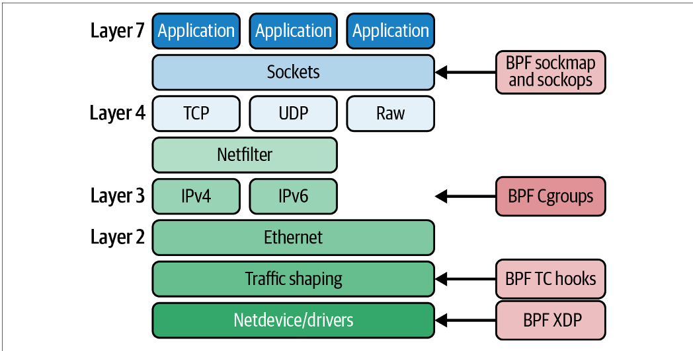

> 图 7-1：BPF 程序类型挂载到网络协议栈中的各个位置。

网络分层模型超出了本书的范围，
但许多其他书籍、文章和培训课程都有涉及。
我在《Container Security》（O'Reilly）一书的第 10 章也讨论过。
就本书而言，知道以下几点就足够了：
第 7 层涵盖供应用程序使用的格式，如 HTTP、DNS 或 gRPC；
TCP 在第 4 层；IP 在第 3 层；以太网和 WiFi 在第 2 层。
网络协议栈的职责之一就是在这些不同格式之间转换消息。

网络类程序类型与本章前面介绍的追踪相关类型之间有一个很大的区别：
它们通常旨在允许定制网络行为。
这包含两个主要特征：

1. 使用 eBPF 程序的返回码告诉内核如何处置网络数据包——
   可以是照常处理、丢弃，或者重定向到其他目的地。

2. 允许 eBPF 程序修改网络数据包、套接字配置参数等。

你将在下一章看到一些例子，
展示如何利用这些特征构建强大的网络功能，
不过现在，先概览一下这些 eBPF 程序类型。

## 套接字

在协议栈顶部，这些网络相关程序类型中有一个子集与套接字及套接字操作有关：

- BPF_PROG_TYPE_SOCKET_FILTER 是最初被加入内核的程序类型。
  你从名字大概能猜到它用于套接字过滤，
  但不那么显而易见的是，
  这并不意味着过滤发往或来自应用程序的数据。
  它过滤的是套接字数据的副本，
  这些副本可以发送给 tcpdump 之类的观测工具。

- 套接字特定于某个第 4 层（TCP）连接。
  BPF_PROG_TYPE_SOCK_OPS 允许 eBPF 程序拦截套接字上发生的各种操作和动作，
  并为该套接字设置 TCP 超时值等参数。
  套接字只存在于连接的端点上，
  而不存在于连接可能经过的任何中间设备上。

- BPF_PROG_TYPE_SK_SKB 程序与一种特殊的映射类型配合使用，
  这种映射保存一组对套接字的引用，
  提供所谓的 *sockmap* 操作：
  在套接字层把流量重定向到不同的目的地。

## 流量控制

沿着网络协议栈往下是"TC"，即流量控制（traffic control）。
Linux 内核中有一整个与 TC 相关的子系统，
看一眼 tc 命令的手册页，
你就能体会到它有多复杂，
以及在网络数据包的处理方式上拥有深层的灵活性和可配置性，
对整个计算领域有多么重要。

eBPF 程序可以被挂载上来，
为入口（ingress）和出口（egress）流量提供自定义的网络数据包过滤器和分类器。
这是 Cilium 项目的基石之一，
我将在下一章介绍一些例子。
如果你等不到那时，Quentin Monnet 的博客上有一些不错的例子。
这可以通过编程方式完成，
但你也可以选择使用 tc 命令来操纵这类 eBPF 程序。

## XDP

你在第 3 章已经简单见过 XDP（eXpress Data Path）eBPF 程序。
在那个例子中，我用下面的命令加载 eBPF 程序并把它挂载到 eth0 接口：

```
bpftool prog load hello.bpf.o /sys/fs/bpf/hello
bpftool net attach xdp id 540 dev eth0
```

值得注意的是，XDP 程序挂载到特定的接口（或虚拟接口）上，
你完全可以给不同的接口挂载不同的 XDP 程序。
在第 8 章中，你将进一步了解 XDP 程序如何被卸载到网卡上，
或由网络驱动程序执行。

XDP 程序是另一类可以用 Linux 网络工具管理的程序——
这里用的是 iproute2 的 ip 命令的 link 子命令。
与前面加载并挂载程序到 eth0 大致等价的命令是：

```
$ ip link set dev eth0 xdp obj hello.bpf.o sec xdp
```

这条命令从 hello.bpf.o 目标文件中读取标记为 xdp 段的 eBPF 程序，
并把它挂载到 eth0 网络接口上。
现在，这个接口的 ip link show 命令输出中包含了一些关于所挂载 XDP 程序的信息：

```
2: eth0: <BROADCAST,MULTICAST,UP,LOWER_UP> mtu 1500 xdpgeneric qdisc fq_codel
state UP mode DEFAULT group default qlen 1000
link/ether 52:55:55:3a:1b:a2 brd ff:ff:ff:ff:ff:ff
prog/xdp id 1255 tag 9d0e949f89f1a82c jited
```

用 ip link 移除 XDP 程序可以这样做：

```
$ ip link set dev eth0 xdp off
```

你将在下一章看到更多关于 XDP 程序及其应用的内容。

## 流解析器

流解析器（flow dissector）在网络协议栈的多个位置被用来从数据包头部提取详细信息。
BPF_PROG_TYPE_FLOW_DISSECTOR 类型的 eBPF 程序可以实现自定义的数据包解析。
LWN 上有一篇关于用 BPF 编写网络流解析器的文章，写得很不错。

## 轻量级隧道

BPF_PROG_TYPE_LWT_* 这一族程序类型可用于在 eBPF 程序中实现网络封装。
这些程序类型也可以用 ip 命令来操纵，
不过这次用到的是 route 子命令。
在实践中，它们很少被使用。

## Cgroup

eBPF 程序可以挂载到 cgroup（"control group" 的缩写）。
cgroup 是 Linux 内核中的一个概念，
用于限制给定进程或进程组可以访问的资源集合。
cgroup 是把一个容器（或一个 Kubernetes pod）与另一个隔离开的机制之一。
把 eBPF 程序挂载到 cgroup，
可以实现只对该 cgroup 的进程生效的自定义行为。
所有进程都关联到某个 cgroup，
包括那些没有在容器内运行的进程。

有若干种与 cgroup 相关的程序类型，
可以挂载的钩子则更多。
至少在撰写本书时，它们几乎都与网络相关，
不过还有一种 BPF_CGROUP_SYSCTL 程序类型，
可以挂载到影响特定 cgroup 的 sysctl 命令上。

举例来说，有专门用于 cgroup 的套接字相关程序类型
BPF_PROG_TYPE_CGROUP_SOCK 和 BPF_PROG_TYPE_CGROUP_SKB。
eBPF 程序可以决定某个 cgroup 是否被允许执行所请求的套接字操作或数据传输。
这对于网络安全策略的执行很有用（我将在下一章介绍）。
套接字程序还可以欺骗调用进程，
让它以为自己正在连接某个特定的目的地址。

## 红外控制器

BPF_PROG_TYPE_LIRC_MODE2 类型的程序可以挂载到红外控制器设备的文件描述符上，
为红外协议提供解码。
在撰写本书时，这种程序类型需要 CAP_NET_ADMIN 能力，
但我认为这恰好说明：
把程序类型划分为追踪相关和网络相关，
并不能完全表达 eBPF 所能覆盖的应用范围。

## BPF 挂载类型

挂载类型提供了对程序在系统中挂载位置的更细粒度控制。
对某些程序类型来说，
程序类型与可挂载的钩子类型之间是一一对应的，
因此挂载类型由程序类型隐式定义。
例如，XDP 程序挂载到网络协议栈中的 XDP 钩子。
对少数程序类型来说，还必须指定挂载类型。

挂载类型参与决定哪些辅助函数是合法的，
在某些情况下，它还限制对上下文信息部分内容的访问。
本章前面就有一个这样的例子：
验证器报出 invalid bpf_context access 错误。

你还可以在内核函数 bpf_prog_load_check_attach（定义于 bpf/syscall.c）中看到，
哪些程序类型需要指定挂载类型，以及哪些挂载类型是合法的。

例如，下面是检查 CGROUP_SOCK 类型程序挂载类型的代码：

```c
case BPF_PROG_TYPE_CGROUP_SOCK:
    switch (expected_attach_type) {
        case BPF_CGROUP_INET_SOCK_CREATE:
            case BPF_CGROUP_INET_SOCK_RELEASE:
            case BPF_CGROUP_INET4_POST_BIND:
            case BPF_CGROUP_INET6_POST_BIND:
                return 0;
        default:
            return -EINVALID;
    }
}
```

这种程序类型可以挂载到多个位置：
套接字创建时、套接字释放时，
或者 IPv4 或 IPv6 的 bind 完成之后。

另一个可以找到程序合法挂载类型列表的地方是 *libbpf 文档*，
那里还列出了 *libbpf* 为每种程序类型和挂载类型所识别的段名。

<a id="chapter-7-summary"></a>

## 小结

在本章中，你看到了各种 eBPF 程序类型被挂载到内核中不同的挂载点。
如果你想编写响应特定事件的代码，
就需要确定适合挂载到该事件的程序类型。
传入程序的上下文取决于程序类型，
内核对程序返回码的响应方式也可能因其类型而异。

本章的示例代码主要关注 perf 相关（追踪）事件。
在接下来的两章中，
你将看到更多用于网络和安全应用的不同 eBPF 程序类型的细节。

<a id="chapter-7-exercises"></a>

## 练习

本章的示例代码包括 kprobe、fentry、tracepoint、raw tracepoint
和支持 BTF 的 tracepoint 程序，
它们都挂载到同一个系统调用的入口。
如你所知，eBPF 追踪程序还可以挂载到系统调用之外的许多地方。

1. 用 strace 跟踪 hello 可执行文件，像这样：

   ```
   strace -e bpf -o outfile ./hello
   ```

   这会把每个 bpf() 系统调用的信息记录到名为 outfile 的文件中。
   在该文件中找到 BPF_PROG_LOAD 指令，
   看看不同程序的 prog_type 字段有何不同。
   你可以通过追踪输出中的 prog_name 字段辨认出每个程序，
   并与 chapter7/hello.bpf.c 中的源代码对应起来。

2. hello.c 中的示例用户空间代码会加载 hello.bpf.o 中定义的所有程序对象。
   作为编写 libbpf 用户空间代码的练习，
   修改示例代码，只加载并挂载其中一个 eBPF 程序（任选你喜欢的一个），
   同时不要从 hello.bpf.c 中删除其他程序。

3. 编写一个 kprobe 和/或 fentry 程序，
   在某个其他内核函数被调用时触发。
   你可以查看 /proc/kallsyms 找到你的内核版本中可用的函数。

4. 编写一个普通的、raw 的或支持 BTF 的 tracepoint 程序，
   挂载到某个其他内核 tracepoint。
   你可以在 /sys/kernel/tracing/available_events 中找到可用的
   tracepoint。

5. 试着往同一个接口挂载多个 XDP 程序，并确认这是做不到的！
   你应该会看到类似这样的错误：

   ```
   libbpf: Kernel error message: XDP program already attached

   Error: interface xdpgeneric attach failed: Device or resource busy
   ```

# 第 8 章 用于网络的 eBPF

如第 1 章所述，eBPF 的动态特性让我们能够定制内核的行为。
在网络领域，不同应用有着千差万别的需求。
例如，电信运营商可能需要对接 SRv6 等电信专用协议；
Kubernetes 环境可能需要与遗留应用集成；
专用硬件负载均衡器可以被运行在通用硬件上的 XDP 程序取代。
eBPF 让程序员能够构建满足特定需求的网络功能，
而无须把这些功能强加给所有上游内核用户。

基于 eBPF 的网络工具如今已得到广泛应用，
并在大规模场景下证明了自身的有效性。
例如，CNCF 的 Cilium 项目把 eBPF 作为 Kubernetes 网络、
独立负载均衡等功能的平台，
各行各业采用云原生技术的组织都在使用它。[^ch8-1]
Meta 一直在极大规模地使用 eBPF——自 2017 年以来，
进出 Facebook 的每一个数据包都经过了 XDP 程序。
另一个公开的超大规模例子是 Cloudflare 用 eBPF 做分布式拒绝服务（DDoS）防护。

这些都是复杂的、可用于生产环境的解决方案，
其细节远超出本书范围，
但通过阅读本章的示例，
你可以对这类 eBPF 网络解决方案的构建方式有所体会。

[^ch8-1]: 在本书撰写时，约有 100 家组织在 Cilium 的 *USERS.md* 文件中公开宣布使用 Cilium，而且这一数字还在快速增长。Cilium 也已被 AWS、Google 和 Microsoft 采用。

## 丢弃数据包

有几项网络安全功能涉及丢弃某些入站数据包并放行其他数据包，
包括防火墙、DDoS 防护，以及缓解"死亡数据包"漏洞：

- 防火墙根据源和目的 IP 地址及/或端口号，
  逐个数据包地决定是否放行。

- DDoS 防护更复杂一些，
  可能需要跟踪来自特定源的数据包到达速率，
  及/或检测数据包内容的某些特征，
  以判断是否有单个或一群攻击者正试图用流量淹没网络接口。

- 死亡数据包漏洞是一类内核漏洞：
  内核无法安全处理以某种特定方式构造的数据包。
  发送这种特定格式数据包的攻击者可以利用该漏洞，
  可能导致内核崩溃。
  传统上，发现这类内核漏洞后需要安装修复后的新内核，
  而这又需要停机。
  但检测并丢弃这类恶意数据包的 eBPF 程序可以动态安装，
  即刻保护主机，
  且不影响机器上运行的任何应用。

这类功能的决策算法超出本书范围，
但我们来探究一下挂载到网络接口 XDP 钩子上的 eBPF 程序如何丢弃特定数据包——这是实现上述用例的基础。

## XDP 程序的返回码

XDP 程序由网络数据包的到达触发。
程序检查数据包，
完成后用返回码给出裁决，
指示接下来如何处置该数据包：

- `XDP_PASS` 表示按常规方式把数据包交给网络协议栈
  （就像没有 XDP 程序时一样）。

- `XDP_DROP` 立即丢弃数据包。

- `XDP_TX` 把数据包从它到达的同一接口发回去。

- `XDP_REDIRECT` 把它发往另一个网络接口。

- `XDP_ABORTED` 同样丢弃数据包，
  但它表示出现了错误或意外情况，
  而不是"正常"的丢弃决定。

对某些用例（如防火墙）来说，
XDP 程序只需在放行和丢弃之间做出选择。
一个决定是否丢弃数据包的 XDP 程序大致如下：

```c
SEC("xdp")
int hello(struct xdp_md *ctx) {
    bool drop;

    drop = <检查数据包并决定是否丢弃>;

    if (drop)
        return XDP_DROP;
    else
        return XDP_PASS;
}
```

XDP 程序还可以修改数据包内容，
这一点我将在本章后面讲到。

只要所挂载的接口上有入站网络数据包到达，
XDP 程序就会被触发。
`ctx` 参数是指向 `xdp_md` 结构的指针，
其中保存着入站数据包的元数据。
下面看看如何利用这个结构检查数据包内容，
从而得出裁决。

## XDP 数据包解析

`xdp_md` 结构的定义如下：

```c
struct xdp_md {
    __u32 data;
    __u32 data_end;
    __u32 data_meta;
    /* Below access go through struct xdp_rxq_info */
    __u32 ingress_ifindex; /* rxq->dev->ifindex */
    __u32 rx_queue_index; /* rxq->queue_index */
    __u32 egress_ifindex; /* txq->dev->ifindex */
};
```

不要被前三个字段的 `__u32` 类型迷惑，
它们其实是指针。
`data` 字段指示数据包在内存中的起始位置，
`data_end` 指示结束位置。
如第 6 章所述，
为了通过 eBPF 验证器，
对数据包内容的任何读写都必须显式检查是否落在 `data` 到 `data_end` 的范围内。

在数据包前方、`data_meta` 与 `data` 之间还有一块内存区域，
用于存放该数据包的元数据。
同一个数据包在穿越协议栈的途中，
可能在多个位置被不同的 eBPF 程序处理，
这块区域可用于这些程序之间的协作。

为说明解析网络数据包的基本方法，
示例代码中有一个名为 `ping()` 的 XDP 程序：
每当检测到 ping（ICMP）数据包时，
它就输出一行 trace。
该程序的代码如下：

```c
SEC("xdp")
int ping(struct xdp_md *ctx) {
    long protocol = lookup_protocol(ctx);
    if (protocol == 1) // ICMP
    {
        bpf_printk("Hello ping");
    }
    return XDP_PASS;
}
```

按以下步骤可以看到这个程序的实际运行效果：

1. 在 `chapter8` 目录下运行 `make`。
   这不仅会构建代码，
   还会把 XDP 程序挂载到回环接口（名为 `lo`）上。

2. 在一个终端窗口中运行 `ping localhost`。

3. 在另一个终端窗口中运行 `cat /sys/kernel/tracing/trace_pipe`，
   观察 trace 管道中产生的输出。

你应该会看到大约每秒产生两行 trace，
内容类似这样：

```text
ping-26622 [000] d.s11 276880.862408: bpf_trace_printk: Hello ping
ping-26622 [000] d.s11 276880.862459: bpf_trace_printk: Hello ping
ping-26622 [000] d.s11 276881.889575: bpf_trace_printk: Hello ping
ping-26622 [000] d.s11 276881.889676: bpf_trace_printk: Hello ping
ping-26622 [000] d.s11 276882.910777: bpf_trace_printk: Hello ping
ping-26622 [000] d.s11 276882.910930: bpf_trace_printk: Hello ping
```

每秒有两行 trace，
是因为回环接口同时收到了 ping 请求和 ping 响应。

只需在协议匹配时加一行返回 `XDP_DROP` 的代码，
就能很容易地修改这段代码来丢弃 ping 数据包，
如下所示：

```c
if (protocol == 1) // ICMP
{
    bpf_printk("Hello ping");
    return XDP_DROP;
}
return XDP_PASS;
```

如果试一下，
你会看到 trace 输出中类似下面的内容每秒只出现一次：

```text
ping-26639 [002] d.s11 277050.589356: bpf_trace_printk: Hello ping
ping-26639 [002] d.s11 277051.615329: bpf_trace_printk: Hello ping
ping-26639 [002] d.s11 277052.637708: bpf_trace_printk: Hello ping
```

回环接口收到 ping 请求后，
XDP 程序把它丢弃了，
所以请求没能走到网络协议栈足够深的地方去触发响应。

这个 XDP 程序的大部分工作由 `lookup_protocol()` 函数完成，
它确定第 4 层协议类型。
它只是个示例，
并非生产质量的网络数据包解析实现！
但足以让你了解 eBPF 中的解析是如何工作的。

收到的网络数据包由一串字节组成，
布局如图 8-1 所示。

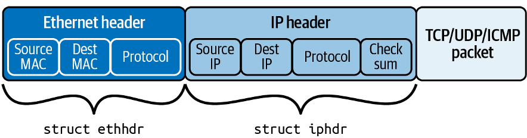

> 图 8-1：IP 网络数据包的布局：开头是以太网首部，
> 其后是 IP 首部，
> 然后是第 4 层数据。

`lookup_protocol()` 函数接收保存着该数据包内存位置信息的 `ctx` 结构，
返回它在 IP 首部中找到的协议类型。
代码如下：

```c
unsigned char lookup_protocol(struct xdp_md *ctx)
{
    unsigned char protocol = 0;

    void *data = (void *)(long)ctx->data;  ①
    void *data_end = (void *)(long)ctx->data_end;
    struct ethhdr *eth = data;  ②
    if (data + sizeof(struct ethhdr) > data_end)  ③
        return 0;

    // 检查是否为 IP 数据包  ④
    if (bpf_ntohs(eth->h_proto) == ETH_P_IP)
    {
        // 返回该数据包的协议  ⑤
        // 1 = ICMP
        // 6 = TCP
        // 17 = UDP
        struct iphdr *iph = data + sizeof(struct ethhdr);
        if (data + sizeof(struct ethhdr) + sizeof(struct iphdr) <= data_end)  ⑥
            protocol = iph->protocol;  ⑦
    }
    return protocol;
}
```

① 局部变量 `data` 和 `data_end` 分别指向网络数据包的起点和终点。

② 网络数据包应以太网首部开头。

③ 但不能想当然地认为这个数据包足够大、
容得下以太网首部！
验证器要求你显式检查这一点。

④ 以太网首部中有一个 2 字节字段，
告诉我们第 3 层协议。

⑤ 如果协议类型表明这是 IP 数据包，
IP 首部就紧跟在以太网首部之后。

⑥ 同样不能想当然地认为数据包里有足够空间容纳 IP 首部。
验证器再次要求你显式检查。

⑦ IP 首部中包含该函数要返回给调用者的协议字节。

该程序使用的 `bpf_ntohs()` 函数确保两个字节按本机期望的顺序排列。
网络协议是大端序，
而大多数处理器是小端序，
即它们以不同的字节顺序存放多字节值。
这个函数（在必要时）把网络字节序转换为主机字节序。
每当从网络数据包中长度超过一个字节的字段提取值时，
都应使用这个函数。

这个简单的例子表明，
寥寥几行 eBPF 代码就能对网络功能产生巨大影响。
不难想象，
关于放行哪些数据包、丢弃哪些数据包的更复杂规则，
可以实现本节开头描述的那些功能：
防火墙、DDoS 防护和死亡数据包漏洞缓解。
接下来看看，
在 eBPF 程序拥有修改网络数据包的能力之后，
还能提供哪些更强大的功能。

## 负载均衡与转发

XDP 程序并不局限于检查数据包内容，
它们还可以修改数据包内容。
我们来看看，
要构建一个简单的负载均衡器需要做些什么：
它接收发往某个 IP 地址的数据包，
再把这些请求分发给多个能够处理请求的后端。

GitHub 仓库中有这样一个示例。[^ch8-2]
示例环境由运行在同一台主机上的一组容器构成：
一个客户端、一个负载均衡器和两个后端，
各自运行在自己的容器中。
如图 8-2 所示，
负载均衡器接收来自客户端的流量，
并将其转发到两个后端容器之一。

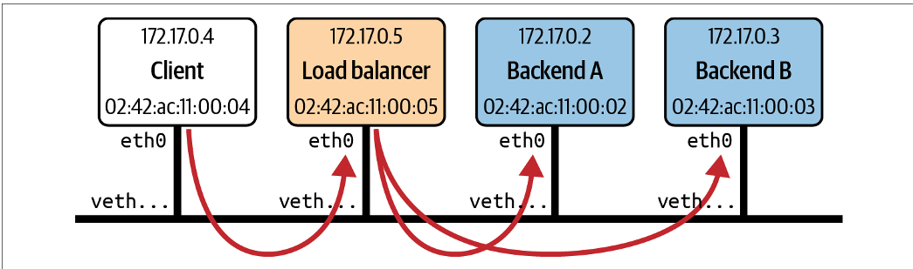

> 图 8-2：负载均衡器示例环境。

负载均衡功能实现为一个 XDP 程序，
挂载在负载均衡器的 `eth0` 网络接口上。
该程序的返回码是 `XDP_TX`，
表示把数据包从它进入的接口发回去。
但在此之前，
程序必须先更新数据包首部中的地址信息。

虽然我认为这个示例作为学习练习很有用，
但它距离生产可用还差得非常非常远；
例如，它使用硬编码地址，
假定 IP 地址与图 8-2 所示完全一致。
它假定自己收到的 TCP 流量只有来自客户端的请求或发往客户端的响应。
它还利用了 Docker 设置虚拟 MAC 地址的方式"作弊"：
把每个容器的 IP 地址末四字节用作该容器虚拟以太网接口 MAC 地址的末四字节。
从容器的视角看，
这个虚拟以太网接口就叫 `eth0`。

下面是示例负载均衡器代码中的 XDP 程序：

```c
SEC("xdp_lb")
int xdp_load_balancer(struct xdp_md *ctx)
{
    void *data = (void *)((long)ctx->data);
    void *data_end = (void *)((long)ctx->data_end);

    struct ethhdr *eth = data;  ①
    if (data + sizeof(struct ethhdr) > data_end)
        return XDP_ABORTED;

    if (bpf_ntohs(eth->h_proto) != ETH_P_IP)  ②
        return XDP_PASS;

    struct iphdr *iph = data + sizeof(struct ethhdr);
    if (data + sizeof(struct ethhdr) + sizeof(struct iphdr) > data_end)
        return XDP_ABORTED;

    if (iph->protocol != IPPROTO_TCP)
        return XDP_PASS;

    if (iph->saddr == IP_ADDRESS(CLIENT))  ③
    {
        char be = Backend_A;  ④
        if (bpf_get_prandom_u32() % 2)
            be = Backend_B;

        iph->daddr = IP_ADDRESS(be);  ⑤
        eth->h_dest[5] = be;
    }
    else
    {
        iph->daddr = IP_ADDRESS(CLIENT);  ⑥
        eth->h_dest[5] = CLIENT;
    }
    iph->saddr = IP_ADDRESS(LB);  ⑦
    eth->h_source[5] = LB;

    iph->check = iph_csum(iph);  ⑧

    return XDP_TX;
}
```

① 函数的第一部分与上一个示例几乎相同：
在数据包中定位以太网首部，
然后是 IP 首部。

② 这一次只处理 TCP 数据包，
其他数据包照常上交协议栈，
就当什么都没发生过。

③ 这里检查源 IP 地址。
如果这个数据包不是来自客户端，
我就假定它是发往客户端的响应。

④ 这段代码在后端 A 和 B 之间生成一个伪随机选择。

⑤ 把目的 IP 和 MAC 地址更新为所选后端的地址……

⑥ ……或者，如果这是来自某个后端的响应
（这里假定：只要不是来自客户端的就是响应），
就把目的 IP 和 MAC 地址更新为客户端的地址。

⑦ 无论这个数据包要去哪里，
都需要更新源地址，
让它看起来像是发自负载均衡器。

⑧ IP 首部包含一个根据其内容计算的校验和，
由于源和目的 IP 地址都已更新，
校验和也需要重新计算并写回数据包。

[^ch8-2]: 这个示例基于我在 eBPF Summit 2021 上的一场演讲"A Load Balancer from scratch"，演讲中用 15 分钟多一点的时间从零构建了一个 eBPF 负载均衡器。

这是一本讲 eBPF 而不是讲网络的书，
所以我没有深入讨论诸如为什么需要更新 IP 和 MAC 地址、
不更新会怎样之类的细节。
如果你感兴趣，
可以看我最初写下这个示例的那场 eBPF Summit 演讲的 YouTube 视频，
里面有更多相关内容。

与上一个示例很像，
Makefile 中不仅包含构建代码的指令，
还包括用 bpftool 加载 XDP 程序并把它挂载到接口上的指令，
如下所示：

```makefile
xdp: $(BPF_OBJ)
    bpftool net detach xdpgeneric dev eth0
    rm -f /sys/fs/bpf/$(TARGET)
    bpftool prog load $(BPF_OBJ) /sys/fs/bpf/$(TARGET)
    bpftool net attach xdpgeneric pinned /sys/fs/bpf/$(TARGET) dev eth0
```

这条 make 指令需要在负载均衡器容器内运行，
这样 `eth0` 才对应它的虚拟以太网接口。
这就引出一个有趣的问题：
eBPF 程序加载进内核，
而内核只有一个；
但挂载点却可以位于某个特定的网络命名空间内，
并且只在该网络命名空间内可见。[^ch8-3]

[^ch8-3]: 如果你想探究这一点，可以试试 eBPF Summit 2022 的 CTF 挑战 3。我在书中就不剧透了，你可以在 Duffie Cooley 和我主讲的演示视频中看到解法。

## XDP 卸载

XDP 的构想源于一次讨论：
如果能在网卡上运行 eBPF 程序，
在数据包到达内核网络协议栈之前就对逐个数据包做出决策，
那该多有用。[^ch8-4]
确实有一些网卡支持这种完整的 XDP 卸载能力，
能在自己的处理器上对入站数据包运行 eBPF 程序，
如图 8-3 所示。

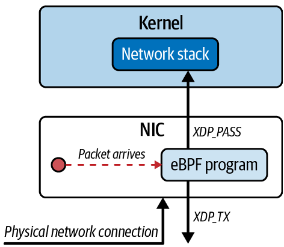

> 图 8-3：支持 XDP 卸载的网卡可以在不需要主机 CPU 做任何工作的情况下处理、
> 丢弃和转发数据包。

[^ch8-4]: 见 Daniel Borkmann 的演讲"Little Helper Minions for Scaling Microservices"，其中回顾了 eBPF 的历史，他讲到了这段轶事。

这意味着，
被丢弃或被从同一物理接口转发回去的数据包——比如本章前面的丢弃数据包和负载均衡示例——根本不会进入主机内核的视野，
主机机器的 CPU 也不会为处理它们花费任何周期，
因为所有工作都在网卡上完成。

即使物理网卡不支持完整的 XDP 卸载，
许多网卡驱动也支持 XDP 钩子，
这能把 eBPF 程序处理数据包所需的内存拷贝降到最低。[^ch8-5]

[^ch8-5]: Cilium 在 BPF and XDP Reference Guide 中维护了一份支持 XDP 的驱动列表。

这可以带来显著的性能收益，
让负载均衡之类的功能在通用硬件上非常高效地运行。[^ch8-6]

[^ch8-6]: Cezanne 团队在一篇博客文章中分享了他们试验基于 eBPF 的负载均衡器时获得的性能提升数据。

你已经看到如何用 XDP 处理入站网络数据包——在数据包到达机器时尽早访问它们。
eBPF 也可以在网络协议栈的其他位置、
沿任意方向处理流量。
接下来看看挂载在 TC 子系统中的 eBPF 程序。

## 流量控制（TC）

上一章提到过流量控制。
网络数据包到达这一层时，
已经以 `sk_buff` 的形式存在于内核内存中。
`sk_buff` 是内核网络协议栈中到处使用的数据结构。
挂载在 TC 子系统中的 eBPF 程序会收到一个指向 `sk_buff` 结构的指针作为上下文参数。


> 挂载到 TC 子系统的 eBPF 程序收到指向 `sk_buff` 结构的指针。

你可能会好奇，
为什么 XDP 程序不用同样的结构作为上下文。
答案是：
XDP 钩子发生在网络数据到达协议栈之前，
那时 `sk_buff` 结构还没有建立。

TC 子系统的用途是调节网络流量的调度方式。
例如，你可能想限制每个应用可用的带宽，
让它们都有公平的机会。
但当你逐个调度数据包时，
带宽并不是一个很贴切的度量，
因为它描述的是发送或接收数据的平均速率。
某个应用的流量可能突发性很强，
另一个应用可能对网络延迟非常敏感，
所以 TC 对数据包的处理和优先级提供了精细得多的控制。[^ch8-7]

[^ch8-7]: 想更完整地了解 TC 及其概念，我推荐 Quentin Monnet 的文章"Understanding tc 'direct action' mode for BPF"。

引入 eBPF 程序是为了自定义控制 TC 内部使用的算法。
但凭借修改、丢弃或重定向数据包的能力，
挂载在 TC 中的 eBPF 程序也可以用作构建复杂网络行为的构件。

协议栈中的网络数据沿两个方向之一流动：
入向（ingress，从网络接口进来）或出向（egress，向网络接口出去）。
eBPF 程序可以挂载在任一方向上，
并且只影响该方向的流量。
与 XDP 不同，
TC 可以挂载多个 eBPF 程序，
它们将按顺序依次执行。

传统流量控制分为*分类器*（classifier）和*动作*（action）：
分类器根据某种规则对数据包分类，
动作则根据分类器的输出决定如何处置数据包。
可以有一系列分类器，
它们都定义在某个 *qdisc*（排队规则）之下。

eBPF 程序作为分类器挂载，
但它也可以在同一个程序内决定采取什么动作。
动作由程序的返回码指示
（取值定义在 `linux/pkt_cls.h` 中）：

- `TC_ACT_SHOT` 告诉内核丢弃数据包。

- `TC_ACT_UNSPEC` 表现得就像这个 eBPF 程序没有运行过一样
  （数据包会被交给序列中的下一个分类器，
  如果有的话）。

- `TC_ACT_OK` 告诉内核把数据包交给协议栈的下一层。

- `TC_ACT_REDIRECT` 把数据包发往另一个网络设备的入向或出向路径。

我们来看几个可以挂载到 TC 中的简单程序示例。
第一个只生成一行 trace，
然后告诉内核丢弃数据包：

```c
int tc_drop(struct __sk_buff *skb) {
    bpf_trace_printk("[tc] dropping packet\n");
    return TC_ACT_SHOT;
}
```

再来看看如何只丢弃一部分数据包。
这个示例丢弃 ICMP（ping）请求数据包，
与本章前面的 XDP 示例非常相似：

```c
int tc(struct __sk_buff *skb) {
    void *data = (void *)((long)skb->data);
    void *data_end = (void *)((long)skb->data_end);

    if (is_icmp_ping_request(data, data_end)) {
        struct iphdr *iph = data + sizeof(struct ethhdr);
        struct icmphdr *icmp = data + sizeof(struct ethhdr) + sizeof(struct iphdr);
        bpf_trace_printk("[tc] ICMP request for %x type %x\n", iph->daddr,
                icmp->type);
        return TC_ACT_SHOT;
    }
    return TC_ACT_OK;
}
```

`sk_buff` 结构有指向数据包数据起点和终点的指针，
与 `xdp_md` 结构非常相似，
数据包解析的过程也大同小异。
同样，
为了通过验证，
你必须显式检查对数据的任何访问是否落在 `data` 到 `data_end` 的范围内。

你可能会问：
既然已经见过用 XDP 实现同样的功能，
为什么还要在 TC 层实现这样的东西？
一个很好的理由是：
TC 程序可以处理出向流量，
而 XDP 只能处理入向流量。
另一个理由是：
XDP 在数据包一到达就被触发，
那时还没有与该数据包关联的 `sk_buff` 内核数据结构。
如果 eBPF 程序关心或想修改内核为该数据包创建的 `sk_buff`，
TC 挂载点正合适。


> XDP 与 TC 挂载点的比较。

要更好地理解 XDP 与 TC eBPF 程序之间的差异，
可以阅读 Cilium 项目的 BPF and XDP Reference Guide 中的"Program
Types"一节。

接下来看一个不只是丢弃特定数据包的例子。
这个示例识别收到的 ping 请求，
并回复一个 ping 响应：

```c
int tc_pingpong(struct __sk_buff *skb) {
    void *data = (void *)(long)skb->data;
    void *data_end = (void *)(long)skb->data_end;

    if (!is_icmp_ping_request(data, data_end)) {  ①
        return TC_ACT_OK;
    }

    struct iphdr *iph = data + sizeof(struct ethhdr);
    struct icmphdr *icmp = data + sizeof(struct ethhdr) + sizeof(struct iphdr);

    swap_mac_addresses(skb);  ②
    swap_ip_addresses(skb);

    // 把 ICMP 数据包的类型改为 0（ICMP Echo Reply）
    //（原来是 8，ICMP Echo Request）  ③
    update_icmp_type(skb, 8, 0);

    // 把修改后的 skb 的克隆重定向回它到达的接口  ④
    bpf_clone_redirect(skb, skb->ifindex, 0);

    return TC_ACT_SHOT;  ⑤
}
```

① `is_icmp_ping_request()` 函数解析数据包，
不仅检查它是不是 ICMP 报文，
还检查它是不是 echo（ping）请求。

② 由于这个函数要向发送方回送响应，
需要交换源地址和目的地址。
（如果你想看其中的繁琐细节，
包括更新 IP 首部校验和，
可以阅读示例代码。）

③ 通过修改 ICMP 首部中的类型字段，
把它变成 echo 响应。

④ 这个辅助函数把数据包的克隆从收到它的接口（`skb->ifindex`）发回去。

⑤ 由于辅助函数在发出响应前克隆了数据包，
原始数据包应当被丢弃。

正常情况下，
ping 请求稍后会由内核的网络协议栈处理，
而这个小示例展示了：
更一般地说，
网络功能可以整个由 eBPF 实现来替代。

如今许多网络能力由用户空间服务承担，
但只要它们能被 eBPF 程序替代，
就很可能带来可观的性能提升。
在内核中处理的数据包不必走完协议栈的剩余旅程；
它无须切换到用户空间去处理，
响应也无须再切换回内核。
更进一步，
两者还可以并行——对于那些需要它无力承担的复杂处理的数据包，
eBPF 程序可以返回 `TC_ACT_OK`，
让它们照常上交用户空间服务。

在我看来，
这是用 eBPF 实现网络功能的一个重要方面。
随着 eBPF 平台的发展
（例如较新的内核允许长达一百万条指令的程序），
在内核中实现越来越复杂的网络功能成为可能。
尚未用 eBPF 实现的部分，
仍可由内核中的传统协议栈或用户空间来处理。
随着时间推移，
越来越多功能可以从用户空间迁入内核；
而 eBPF 的灵活性和动态特性意味着，
你不必等它们成为内核发行版的一部分——可以立即加载 eBPF 实现，
正如我在第 1 章讨论的那样。

我将在"eBPF 与 Kubernetes 网络"一节回到网络功能的实现这个话题。
但在此之前，
先考虑 eBPF 支持的另一个用例：
查看加密流量解密后的内容。

## 数据包加密与解密

如果应用使用加密来保护它收发的数据，
那么在加密之前或解密之后，
总存在一个数据处于明文的时点。
回想一下，
eBPF 几乎可以把程序挂载到机器上的任何位置，
所以如果你能钩住数据尚未加密、
或刚刚解密完成的位置，
eBPF 程序就能观察到明文数据。
不需要像传统 SSL 检查工具那样提供任何证书来解密流量。

在许多情况下，
应用会使用 OpenSSL 或 BoringSSL 这类位于用户空间的库来加密数据。
此时，
流量到达套接字——也就是网络流量的用户空间/内核边界——时已经加密。
如果想以未加密的形式追踪这些数据，
可以把 eBPF 程序挂载到用户空间代码中的合适位置。

## 用户空间 SSL 库

追踪加密数据包明文内容的一种常见做法，
是钩住对 OpenSSL 或 BoringSSL 等用户空间库的调用。
使用 OpenSSL 的应用通过调用 `SSL_write()` 函数发送待加密的数据，
通过 `SSL_read()` 取回以加密形式从网络收到、
并已解密的明文数据。
用 uprobe 把 eBPF 程序钩进这些函数，
就能观察任何使用该共享库的应用的数据——在加密之前或解密之后，
以明文形式。
而且不需要任何密钥，
因为应用本身已经提供了密钥。

Pixie 项目中有一个相当直观的例子叫 `openssl-tracer`，[^ch8-8]
其中的 eBPF 程序在 `openssl_tracer_bpf_funcs.c` 文件中。
下面这段代码负责把数据发往用户空间，
使用的是 perf 缓冲区
（与本书前面的示例类似）：

```c
static int process_SSL_data(struct pt_regs* ctx, uint64_t id, enum
ssl_data_event_type type, const char* buf) {
    ...
    bpf_probe_read(event->data, event->data_len, buf);
    tls_events.perf_submit(ctx, event, sizeof(struct ssl_data_event_t));

    return 0;
}
```

[^ch8-8]: 这个示例还有一篇配套的博客文章，见 https://blog.px.dev/ebpf-openssl-tracing。

可以看到，
代码用辅助函数 `bpf_probe_read()` 把 `buf` 中的数据读入一个事件结构，
再把这个事件结构提交到 perf 缓冲区。

既然这些数据被发往用户空间，
就有理由认为它一定是未加密形式的数据。
那么这缓冲区的数据是从哪里来的？
看看 `process_SSL_data()` 函数在哪里被调用就知道了。
它在两处被调用：
一处对应读取数据，
一处对应写入数据。
图 8-4 展示了读取以加密形式到达本机的数据时发生的事情。

读取数据时，
你向 `SSL_read()` 提供一个缓冲区指针；
函数返回时，
缓冲区里就是未加密的数据。
与 kprobe 很像，
函数的输入参数——包括那个缓冲区指针——只对挂载在入口点的 uprobe 可见，
因为保存参数的寄存器很可能在函数执行过程中被覆盖。
但数据要到函数退出时才会出现在缓冲区里，
那时可以用 uretprobe 读取。

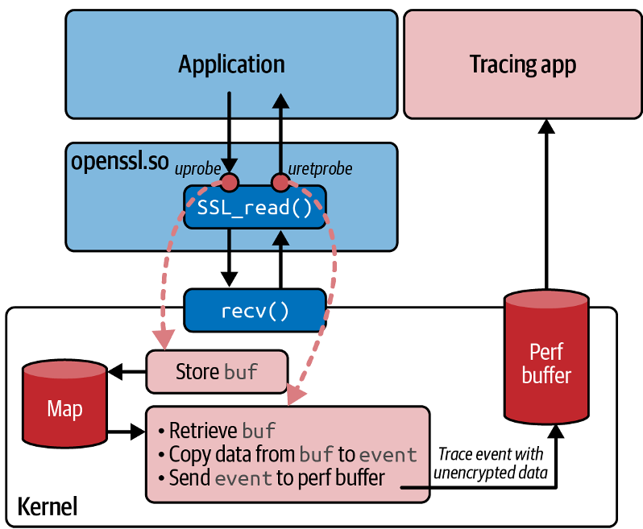

> 图 8-4：eBPF 程序钩住 `SSL_read()` 入口和出口处的 uprobe，
> 从而能通过缓冲区指针读取未加密的数据。

所以这个示例采用了 kprobe 和 uprobe 的一种常见模式
（如图 8-4 所示）：
入口探针用映射临时保存输入参数，
出口探针再从映射中取出。
我们来看实现这一模式的代码，
从挂载在 `SSL_read()` 起始处的 eBPF 程序开始：

```c
// 被探测的函数签名：
// int SSL_read(SSL *s, void *buf, int num)
int probe_entry_SSL_read(struct pt_regs* ctx) {
    uint64_t current_pid_tgid = bpf_get_current_pid_tgid();
    ...
    const char* buf = (const char*)PT_REGS_PARM2(ctx);  ①
    active_ssl_read_args_map.update(&current_pid_tgid, &buf);  ②
    return 0;
}
```

① 如该函数的注释所述，
缓冲区指针是传入 `SSL_read()` 函数的第二个参数，
这个探针将挂载到该函数上。
`PT_REGS_PARM2` 宏从上下文中取出这个参数。

② 缓冲区指针被存入一个哈希映射，
键是当前进程和线程 ID，
它在函数开头用辅助函数 `bpf_get_current_pid_tgid()` 获得。

下面是对应的出口探针程序：

```c
int probe_ret_SSL_read(struct pt_regs* ctx) {
    uint64_t current_pid_tgid = bpf_get_current_pid_tgid();

    ...
    const char** buf = active_ssl_read_args_map.lookup(&current_pid_tgid);  ①
    if (buf != NULL) {
        process_SSL_data(ctx, current_pid_tgid, kSSLRead, *buf);  ②
    }

    active_ssl_read_args_map.delete(&current_pid_tgid);  ③
    return 0;
}
```

① 查出当前进程和线程 ID 后，
用它作键从哈希映射中取出缓冲区指针。

② 如果不是空指针，
就调用 `process_SSL_data()`——也就是前面那个用 perf 缓冲区把缓冲区数据发往用户空间的函数。

③ 清理哈希映射中的条目，
因为每次入口调用都应与一次出口调用配对。

这个示例展示了如何追踪用户空间应用收发的加密数据的明文版本。
追踪本身挂载在用户空间库上，
而并不能保证每个应用都使用某个特定的 SSL 库。
BCC 项目包含一个名为 `sslsniff` 的工具，
还支持 GnuTLS 和 NSS。
但如果某人的应用用了别的加密库
（甚至——但愿不会——选择"自己造轮子"），
uprobe 就找不到合适的位置挂钩，
这类追踪工具也就失效了。

还有一些更常见的原因会导致这种基于 uprobe 的方法不成功。
与内核不同（每台〔虚拟〕机器上只有一个内核），
用户空间库代码可能存在多份副本。
如果使用容器，
每个容器很可能都有自己一整套库依赖。
你可以钩进这些库里的 uprobe，
但必须为想追踪的特定容器找到正确的那份副本。
另一种可能是，
应用没有使用动态链接的共享库，
而是静态链接成一个独立的可执行文件。

## eBPF 与 Kubernetes 网络

虽然本书不是讲 Kubernetes 的，
但 eBPF 在 Kubernetes 网络中的应用实在太广泛，
它是利用这个平台定制网络协议栈的绝佳范例。

在 Kubernetes 环境中，
应用以 *pod* 的形式部署。
每个 pod 是一组共享内核命名空间和 cgroup 的一个或多个容器，
pod 之间、pod 与所在主机之间相互隔离。

具体而言（就本章而言），
pod 通常有自己的网络命名空间和自己的 IP 地址。[^ch8-9]
这意味着内核为该命名空间维护着一套独立的网络协议栈结构，
与主机和其他 pod 相互隔离。
如图 8-5 所示，
pod 通过一条虚拟以太网连接与主机相连，
并分配有自己的 IP 地址。

[^ch8-9]: pod 也可以运行在主机的网络命名空间中，与主机共享 IP 地址，但除非 pod 中运行的应用确有理由需要，一般不这样做。

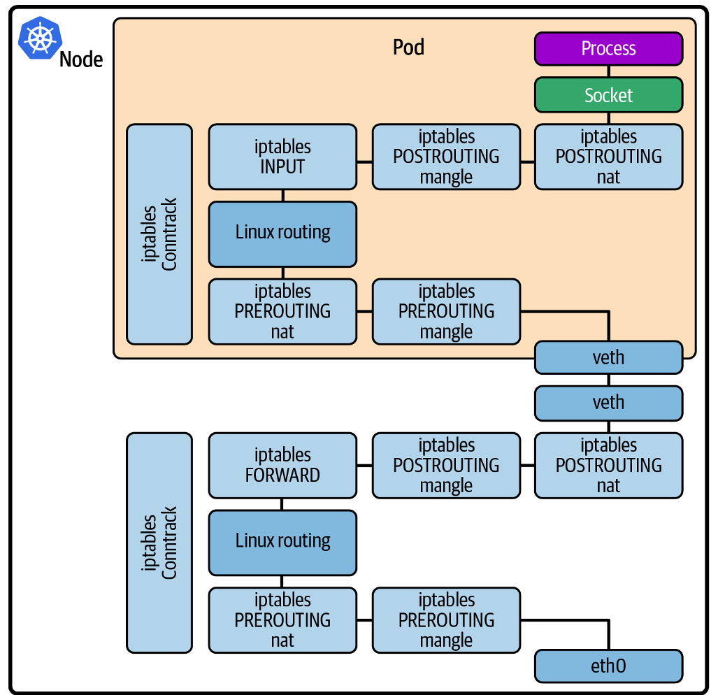

> 图 8-5：Kubernetes 中的网络路径。

从图 8-5 可以看出，
一个从机器外部发来、
发往某个应用 pod 的数据包，
必须先穿过主机上的网络协议栈，
跨过虚拟以太网连接，
进入 pod 的网络命名空间，
然后再穿越一次网络协议栈才能到达应用。

这两个网络协议栈运行在同一个内核里，
所以数据包实际上是把同一套处理流程走了两遍。
网络数据包经过的代码越多，
延迟就越高，
因此如果能缩短网络路径，
就很可能带来性能提升。

像 Cilium 这样基于 eBPF 的网络解决方案可以钩进网络协议栈，
覆盖内核原生的网络行为，
如图 8-6 所示。

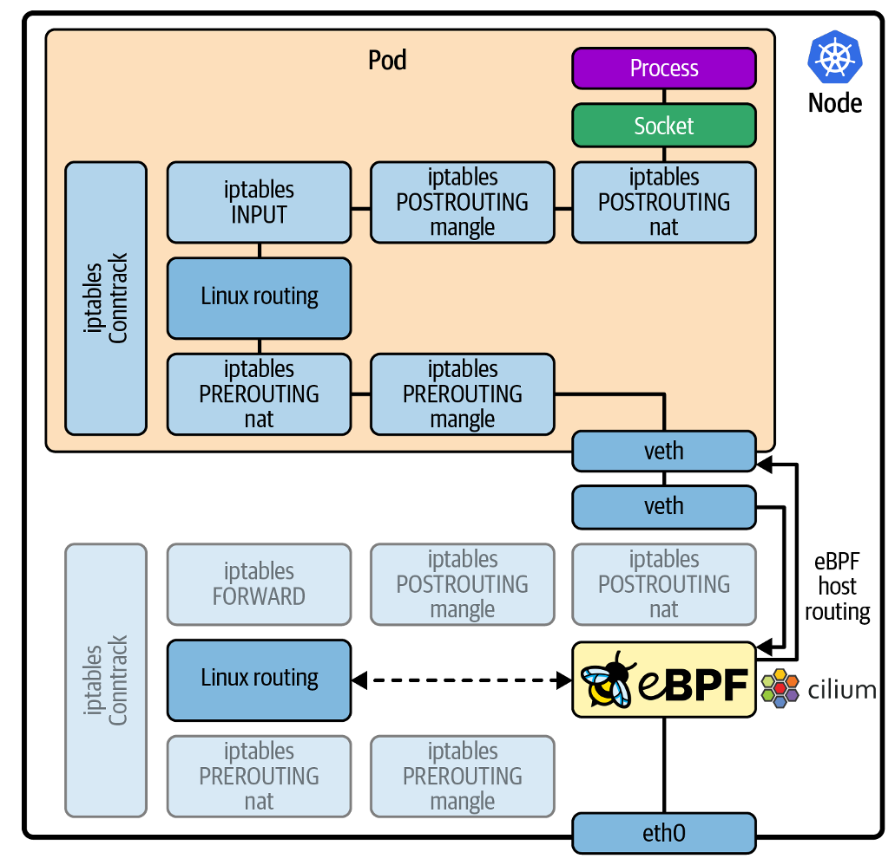

> 图 8-6：用 eBPF 绕过 iptables 和 conntrack 处理。

特别地，
eBPF 可以用更高效的方案替代 iptables 和 conntrack 来管理网络规则和连接跟踪。
下面讨论为什么这能在 Kubernetes 中带来显著的性能提升。

## 避开 iptables

Kubernetes 有一个叫 kube-proxy 的组件，
它实现负载均衡行为，
让多个 pod 共同完成对某个服务的请求。
这一直是用 iptables 规则实现的。

Kubernetes 通过容器网络接口（CNI）让用户自行选择网络方案。
一些 CNI 插件用 iptables 规则实现 Kubernetes 的 L3/L4 网络策略；
也就是说，
由 iptables 规则决定是否因为数据包不符合网络策略而丢弃它。

尽管 iptables 对传统（容器出现之前）的网络很有效，
但用在 Kubernetes 中时它有一些弱点。
在这种环境里，
pod——连同它们的 IP 地址——动态地来来去去，
每次增删 pod，
iptables 规则都得整体重写，
规模一大就会影响性能。
（Haibin Xie 和 Quinton Hoole 在 2017 年 KubeCon 上的一场演讲提到，
对拥有 20,000 个服务的 iptables 规则做一次单条规则更新，
可能需要五个小时。）

更新 iptables 并不是唯一的性能问题：
查找规则需要在线性表中顺序搜索，
这是一个 $O(n)$ 操作，
随规则数量线性增长。

Cilium 用 eBPF 哈希表映射存储网络策略规则、
连接跟踪和负载均衡查找表，
可以替代 kube-proxy 使用的 iptables。
在哈希表中查找条目和插入新条目都近似 $O(1)$ 操作，
这意味着它们的可扩展性要好得多。

你可以在 Cilium 博客上读到由此带来的基准测试性能提升。
同一篇文章还会告诉你，
另一个提供 eBPF 选项的 CNI——Calico——在选择其 eBPF 实现而非 iptables
时也能获得更好的性能。
对于可扩展、动态变化的 Kubernetes 部署，
eBPF 提供了性能最优的机制。

## 协同工作的网络程序

像 Cilium 这样复杂的网络实现不可能写成单个 eBPF 程序。
如图 8-7 所示，
它由多个不同的 eBPF 程序组成，
分别钩进内核及其网络协议栈的不同位置。

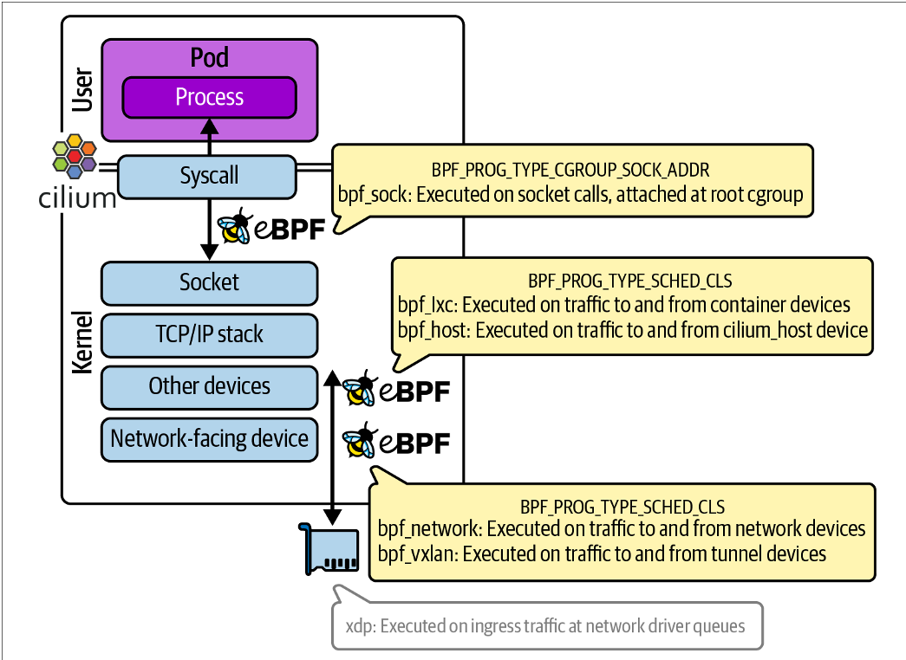

> 图 8-7：Cilium 由多个协同工作的 eBPF 程序组成，
> 它们钩进内核中的不同位置。

作为一般原则，
Cilium 尽可能早地拦截流量，
以缩短每个数据包的处理路径。
从应用 pod 流出的报文在套接字层被拦截，
尽可能靠近应用。
来自外部网络的入站数据包则用 XDP 拦截。
那么其他挂载点又是做什么的呢？

Cilium 支持适合不同环境的多种网络模式。
完整介绍超出本书范围
（你可以在 Cilium.io 找到更多信息），
但我在这里简要概述一下，
好让你明白为什么会有这么多不同的 eBPF 程序！

有一种简单的扁平网络模式：
Cilium 从同一个 CIDR 为集群中所有 pod 分配 IP 地址，
并直接在它们之间路由流量。
还有几种不同的隧道模式：
发往另一节点上 pod 的流量被封装进以该目的节点 IP 地址为目的地址的报文，
到达目的节点后再解封装，
完成进入 pod 的最后一跳。
根据数据包的目的地是本地容器、本机、本网络中的另一台主机还是隧道，
会调用不同的 eBPF 程序来处理流量。

在图 8-7 中可以看到多个 TC 程序，
它们处理往来于不同设备的流量。
这些设备代表数据包可能流经的各种真实和虚拟网络接口：

- 通向 pod 网络的接口
  （pod 与主机之间虚拟以太网连接的一端）

- 通向网络隧道的接口

- 主机上物理网络设备的接口

- 主机自己的网络接口


> 数据包在 Cilium 各组件间的流向。

如果你有兴趣进一步了解数据包如何流经 Cilium，
Arthur Chiao 写过一篇详尽而有趣的博客文章：
"Life of a Packet in Cilium:
Discovering the Pod-to-Service Traffic Path and BPF
Processing Logics"。

挂载在内核这些不同位置的 eBPF 程序通过 eBPF 映射相互通信，
也利用数据包穿越协议栈时可附带的元数据
（我在 XDP 示例中讲到访问网络数据包时提过）。
这些程序不只是把数据包路由到目的地；
它们也基于网络策略丢弃数据包——就像你在前面的示例中看到的那样。

## 网络策略执行

你在本章开头看到 eBPF 程序如何丢弃数据包——被丢弃的数据包根本到不了目的地。
这就是网络策略执行的基础，
无论我们讨论的是"传统"防火墙还是云原生防火墙，
概念上本质都一样：
策略根据数据包的源及/或目的信息决定是否丢弃它。

在传统环境中，
IP 地址会长期分配给某台特定服务器；
而在 Kubernetes 中，
IP 地址动态地来来去去，
今天分配给某个应用 pod 的地址，
明天很可能被另一个完全不同的应用复用。
这就是传统防火墙在云原生环境中不太有效的原因——每次 IP 地址变化都手工重新定义防火墙规则是不现实的。

作为替代，
Kubernetes 支持 NetworkPolicy 资源的概念：
基于应用在特定 pod 上的标签、
而非 IP 地址来定义防火墙规则。
虽然这种资源类型是 Kubernetes 原生的，
但 Kubernetes 本身并不实现它，
而是把这项功能委托给你使用的 CNI 插件。
如果你选择的 CNI 不支持 NetworkPolicy 资源，
你配置的任何规则都会被直接忽略。
反过来说，
CNI 也可以自由定义自定义资源，
支持比 Kubernetes 原生定义更复杂的网络策略配置。
例如，
Cilium 支持基于 DNS 的网络策略规则等功能：
你可以不按 IP 地址、
而是按 DNS 名称（如"example.com"）来决定是否允许流量。
还可以为各种第 7 层协议定义策略，
例如允许对某个 URL 的 HTTP GET 调用，
但拒绝 POST 调用。


> 基于标签的网络策略决定哪些端点之间可以通信。

Isovalent 的免费动手实验"Getting Started with Cilium"会带你定义第 3/4
层和第 7 层的网络策略。
另一个非常有用的资源是 networkpolicy.io 上的 Network Policy Editor，
它以可视化方式呈现网络策略的效果。

如本章前面所述，
可以用 iptables 规则丢弃流量，
一些 CNI 正是用这种方法实现 Kubernetes NetworkPolicy 规则的。
Cilium 则用 eBPF 程序丢弃与当前规则集不匹配的流量。
看过本章前面丢弃数据包的示例后，
希望你对它的工作方式已经有了大致的心智模型。

Cilium 用 Kubernetes 身份来判断某条网络策略规则是否适用。
正如标签定义了哪些 pod 属于 Kubernetes 中的某个服务，
标签也定义了 pod 的 Cilium 安全身份。
以这些服务身份为索引的 eBPF 哈希表，
让规则查找非常高效。

## 加密连接

许多组织需要通过加密应用之间的流量来保护其部署和用户数据。
这可以在每个应用中编写代码来建立安全连接，
通常是使用双向传输层安全（mTLS）为 HTTP 或 gRPC 连接提供保障。
建立这些连接，
首先要确定连接两端应用的身份
（通常通过交换证书实现），
然后加密在它们之间流动的数据。

在 Kubernetes 中，
可以把这项要求从应用中卸载出去，
交给服务网格层或底层网络本身。
完整讨论服务网格超出本书范围，
但你可能会感兴趣我在 The New Stack 上发表的一篇文章：
"How eBPF Streamlines the Service Mesh"。
这里我们聚焦网络层，
看看 eBPF 如何把加密需求下沉到内核。

确保 Kubernetes 集群内流量被加密的最简单选择是使用透明加密。
称之为"透明"，
是因为它完全发生在网络层，
从运维角度看极其轻量。
应用本身完全无须感知加密的存在，
也无须建立 HTTPS 连接；
这种方式也不需要在 Kubernetes 中运行任何额外的基础设施组件。

常用的内核加密协议有两个：IPsec 和 WireGuard®，
Cilium 和 Calico 这两个 CNI 的 Kubernetes 网络方案都支持它们。
讨论这两个协议的差异超出本书范围，
但关键在于：
它们在两台机器之间建立一条安全隧道。
CNI 可以选择把 pod 的 eBPF 端点经由这条安全隧道连接起来。


> 通过安全隧道在节点间实现透明加密。

Cilium 博客上有一篇很好的文章，
介绍 Cilium 如何使用 WireGuard® 和 IPsec 在节点间提供加密流量，
文中还简要比较了两者的性能特征。

安全隧道使用两端节点的身份建立。
这些身份反正由 Kubernetes 管理，
所以运维人员的管理负担极小。
对许多场景来说这已经足够，
因为它确保集群中的所有网络流量都被加密。
透明加密还可以原封不动地与 NetworkPolicy 配合使用——后者用 Kubernetes
身份管理集群中不同端点之间能否通信。

有些组织运营多租户环境，
需要强多租户边界，
必须用证书标识每一个应用端点。
在每个应用内处理这件事负担沉重，
所以较新的做法是把它卸载到服务网格层，
但这需要部署一整套额外组件，
带来额外的资源消耗、延迟和运维复杂性。

eBPF 正在支持一种新方法：
它建立在透明加密之上，
但用 TLS 完成初始的证书交换和端点认证，
使身份可以代表单个应用，
而不是应用所在的节点，
如图 8-8 所示。

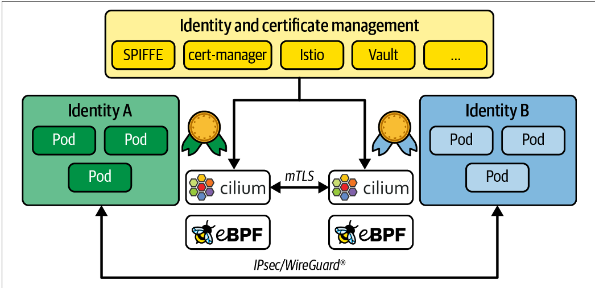

> 图 8-8：经认证的应用身份之间的透明加密。

认证步骤完成后，
就用内核中的 IPsec 或 WireGuard® 加密在这些应用之间流动的流量。
这有诸多优点：
它允许 cert-manager 或 SPIFFE/SPIRE 等第三方证书和身份管理工具负责身份部分，
而加密由网络层负责，
对应用完全透明。
Cilium 支持按 SPIFFE ID——而不仅仅是 Kubernetes 标签——指定端点的
NetworkPolicy 定义。
也许最重要的是，
这种方式适用于任何以 IP 数据包传输的协议。
相比只适用于基于 TCP 连接的 mTLS，
这是一大进步。

本书没有足够的篇幅深入 Cilium 的所有内部细节，
但希望本节帮你理解了：
eBPF 是一个强大的平台，
可以构建像功能完备的 Kubernetes CNI 这样复杂的网络功能。

<a id="chapter-8-summary"></a>

## 小结

在本章中，
你看到挂载在网络协议栈各种不同位置的 eBPF 程序。
我展示了基本数据包处理的示例，
希望它们让你体会到 eBPF 如何能创造强大的网络功能。
你还看到了这些网络功能的一些真实案例，
包括负载均衡、防火墙、安全缓解和 Kubernetes 网络。

## 练习与延伸阅读

以下是进一步学习 eBPF 网络用例的一些途径：

1. 修改示例 XDP 程序 `ping()`，
   让它为 ping 响应和 ping 请求生成不同的 trace。
   ICMP 首部紧跟在网络数据包的 IP 首部之后
   （就像 IP 首部跟在以太网首部之后一样）。
   你很可能需要用到 `linux/icmp.h` 中的 `struct icmphdr`，
   并查看 `type` 字段是 `ICMP_ECHO` 还是 `ICMP_ECHOREPLY`。

2. 如果想进一步深入 XDP 编程，
   我推荐 xdp-project 的 xdp-tutorial。

3. 使用 BCC 项目的 `sslsniff` 查看加密流量的内容。

4. 通过 Cilium 网站上链接的教程和实验来探索 Cilium。

5. 使用 *networkpolicy.io* 上的编辑器，
   可视化网络策略在 Kubernetes 部署中的效果。

# 第 9 章 用 eBPF 实现安全

## 安全可观测性需要策略与上下文

安全工具与只报告事件的观测工具之间的区别在于，
安全工具需要能够区分两类事件：
一类是在正常情况下预期会发生的事件，
另一类是暗示可能有恶意活动正在发生的事件。
举个例子，
假设某个应用在正常处理过程中会把数据写入本地文件。
比如说，
这个应用预期会写入 /home/<username>/<filename>，
那么从安全角度来看，
这种活动并不需要关注。
但是，
如果这个应用写入了 Linux 中众多敏感文件位置之一，
你就会希望收到通知。
例如，
它大概率不需要修改存储在 /etc/passwd 中的口令信息。

制定策略时不能只考虑系统完全正常时的行为，
还要考虑预期的错误路径行为。
例如，
如果物理磁盘满了，
应用可能会开始发送网络消息来报告这一情况。
这些网络消息不应被视为安全事件——
它们虽然不同寻常，
但并不可疑。
把错误路径考虑进去会让制定有效策略变得很有挑战性，
本章后面还会回到这个挑战。

定义什么是、什么不是预期行为，
正是策略的工作。
安全工具将活动与策略进行比较，
当活动超出策略范围、变得可疑时，
就采取某种行动。
这种行动通常包括生成一条安全事件日志，
日志一般会被发送到安全信息与事件管理（SIEM）平台。
它还可能触发对真人的告警，
由人来调查到底发生了什么。

调查人员能获得的上下文信息越多，
就越有可能查明事件的根本原因，
并判断它是否是一次攻击、哪些组件受到了影响、
攻击如何发生、发生在何时，
以及责任方是谁。
如图 9-1 所示，
能够回答这类问题，
才能让一个工具从单纯的日志记录，
提升到名副其实的安全可观测性。

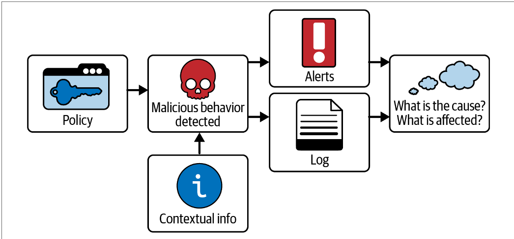

> 图 9-1：安全可观测性要求在检测出策略外事件的同时提供上下文信息。

接下来看看 eBPF 程序被用来检测和执行安全策略的一些方式。
如你所知，
eBPF 程序可以挂载到各种各样的事件上，
而其中一类多年来被广泛用于安全目的的事件就是系统调用。
我们的讨论从系统调用开始，
但你会看到，
系统调用未必是用 eBPF 实现安全工具的最有效方式。
本章后面会介绍一些更新、更精巧的方法。

## 用系统调用实现安全事件

系统调用（syscall）是用户空间应用与内核之间的接口。
如果能限制一个应用可以发起的系统调用集合，
就能限制它能做的事情。
例如，
如果阻止一个应用发起 open*() 族的系统调用，
它就无法打开文件。
如果你有一个预期永远不会打开文件的应用，
你可能希望加上这个限制，
这样即使应用被攻破，
它也无法恶意地打开文件。
如果你过去几年用过 Docker 或 Kubernetes，
那你很可能已经接触过一个用 BPF 来限制系统调用的安全工具：seccomp。

## Seccomp

seccomp 这个名字是 SECure COMPuting 的缩写。
在其最初的严格（strict）形式下，
seccomp 用来把进程可以使用的系统调用限制在一个非常小的子集内：
read()、write()、_exit() 和 sigreturn()。
严格模式的意图是让用户可以运行不受信的代码
（比如从互联网下载的程序），
而完全不用担心这些代码做出恶意行为。

严格模式限制极强，
而许多应用需要使用多得多的系统调用——
但这也并不意味着它们需要全部 400 多个系统调用。
允许用更灵活的方式来限制任意给定应用可用的集合，
是合情合理的。
这就是我们这些来自容器领域的人大多遇到过的那种 seccomp 背后的思路，
它更准确的名称是 seccomp-bpf。
这种模式不再固定允许一个系统调用子集，
而是用 BPF 代码来过滤哪些系统调用允许、哪些不允许。

在 seccomp-bpf 中，
一组 BPF 指令被加载进来充当过滤器。
每次发起系统调用时，
过滤器都会被触发。
过滤器代码可以访问传给系统调用的参数，
因此它可以同时基于系统调用本身和传入的参数来做决定。
其结果是若干种可能动作之一，
包括：

- 允许系统调用继续执行

- 向用户空间应用返回一个错误码

- 杀死该线程

- 通知一个用户空间应用（seccomp-unotify）（自内核 5.0 版本起）

> [!TIP]
> 如果你想尝试自己编写 BPF 过滤器代码，
> Michael Kerrisk 在 https://oreil.ly/cJ6HL 提供了一些不错的示例。

传给系统调用的参数有些是指针，
而 seccomp-bpf 中的 BPF 代码无法解引用这些指针。
这限制了 seccomp 配置文件的灵活性，
因为它在决策过程中只能使用值参数。
此外，
配置文件必须在进程启动时应用——
你无法修改正在应用于某个给定应用进程的配置文件。

你很可能在没有编写任何 BPF 代码的情况下就用过 seccomp-bpf，
因为 BPF 代码通常是从人类可读的 seccomp 配置文件派生出来的。
Docker 的默认配置文件就是一个很好的例子。
这是一个通用配置文件，
目标是几乎能用于任何正常的容器化应用。
这不可避免地意味着它允许大多数系统调用，
只禁止少数几个在任何应用中都不太可能合适的调用，
reboot() 就是一个很好的例子。

根据 Aqua Security 的统计，
大多数容器化应用使用的系统调用大约在 40 到 70 个之间。
为了更好的安全性，
更可取的做法是使用更受约束、针对每个具体应用的配置文件，
只允许它实际使用的那些系统调用。

## 生成 Seccomp 配置文件

如果你让一个普通的应用开发者说出他们的某个程序会发起哪些系统调用，
你很可能会看到一脸茫然。
这并不是要冒犯谁，
只是因为大多数开发者使用的编程语言提供了更高层的抽象，
远离系统调用的细节。
例如，
他们可能知道应用会打开哪些文件，
但不太可能说得出这些文件是用 open() 还是 openat() 打开的。
这就意味着，
如果你要求开发者在交付应用代码的同时手工打造一份合适的 seccomp 配置文件，
你多半得不到积极的回应。

自动化才是出路：
思路是用一个工具来记录应用发起的系统调用集合。
早期，
seccomp 配置文件一般是用 strace 收集应用调用的系统调用集合来编制的。¹
在云原生时代，
这不是一个很好的方案，
因为没有简便的办法把 strace 对准某个特定的容器或 Kubernetes pod。
而且更有帮助的做法是，
生成的配置文件不只是系统调用的列表，
而是 Kubernetes 和兼容 OCI 的容器运行时能够接受的 JSON 格式。
有几个工具正是这样做的，
它们用 eBPF 来收集所有被调用的系统调用的信息：

- Inspektor Gadget 包含一个 seccomp 画像器，
  可以为 Kubernetes pod 中的容器生成定制的 seccomp 配置文件。²

- Red Hat 以 OCI 运行时钩子的形式创建了一个 seccomp 画像器。

使用这些画像器时，
你需要让应用运行一段任意长的时间，
才能生成包含它可能合法调用的全部系统调用的配置文件。
如本章前面所讨论的，
这份列表需要包含错误路径。
如果你的应用在错误条件下因为所需的系统调用被阻止而无法正常工作，
这可能会造成更大的问题。
而且由于 seccomp 配置文件所处的抽象层次比大多数开发者熟悉的要低，
人工审查它们是否覆盖了所有正确场景也很困难。

以 OCI 运行时钩子为例，
一个 eBPF 程序被挂载到 `syscall_enter` raw tracepoint 上，
并维护一个 eBPF 映射来记录已经出现过哪些系统调用。
这个工具的用户空间部分是用 Go 编写的，
使用了 `iovisor/gobpf` 库。
（我将在[第 10 章](#第-10-章-ebpf-编程)讨论这个库以及其他 eBPF 的 Go 语言库。）

下面几行代码来自这个 OCI 运行时钩子，
它们把 eBPF 程序加载进内核并挂载到 tracepoint
（为简洁起见省略了几行）：

```go
src := strings.Replace(source, "$PARENT_PID", strconv.Itoa(pid), -1) ①
m := bcc.NewModule(src, []string{})
defer m.Close()

enterTrace, err := m.LoadTracepoint("enter_trace") ②
if err := m.AttachTracepoint("raw_syscalls:sys_enter", enterTrace); err != nil { ③
    return fmt.Errorf("error attaching to tracepoint: %v", err)
}
```

① 这一行做的事情相当有趣：
它把 eBPF 源代码中名为 $PARENT_PID 的变量替换成一个数字形式的进程 ID。
这是一种常见模式，
表明这个工具会为每个被观测的进程加载单独的 eBPF 程序。

② 这里，
一个名为 enter_trace 的 eBPF 程序被加载进内核。

③ enter_trace 程序被挂载到 tracepoint raw_syscalls:sys_enter 上。
这是进入任何系统调用时的 tracepoint，
你在前面的示例中已经见过。
每当任何用户空间代码发起系统调用，
这个 tracepoint 都会被命中。

这些画像器用挂载到 sys_enter 的 eBPF 代码来跟踪已使用的系统调用集合，
并生成供 seccomp 使用的配置文件，
由 seccomp 完成实际的策略执行。
接下来要看的另一类 eBPF 工具也挂载到 sys_enter，
但它们用系统调用来跟踪应用的行为，
并将其与安全策略进行比较。

## 跟踪系统调用的安全工具

这类跟踪系统调用的安全工具中最有名的是 CNCF 项目 Falco，
它提供安全告警。
Falco 默认以内核模块的方式安装，
但也有一个 eBPF 版本。
用户可以定义规则（rules）来决定哪些事件与安全相关，
当发生与这些规则所定义策略不符的事件时，
Falco 能以多种格式生成告警。

内核模块驱动和基于 eBPF 的驱动都挂载到系统调用上。
如果你查看 GitHub 上的 Falco eBPF 程序，
会看到类似下面这样的代码行，
它们把探针挂载到原始系统调用的入口和出口点
（外加少量其他事件，
如缺页错误）：

```c
BPF_PROBE("raw_syscalls/", sys_enter, sys_enter_args)

BPF_PROBE("raw_syscalls/", sys_exit, sys_exit_args)
```

由于 eBPF 程序可以动态加载，
并且可以检测由既有进程触发的事件，
Falco 这类工具可以把策略应用到已经在运行的应用负载上。
用户无需修改应用或其配置，
就能修改所应用的规则集合。
这与 seccomp 配置文件形成对比，
后者必须在应用进程启动时应用。

不幸的是，
这种把系统调用入口点用于安全工具的做法存在一个问题：
存在检查时间与使用时间（Time Of Check to Time Of Use，TOCTOU）问题。

当 eBPF 程序在系统调用的入口点被触发时，
它可以访问用户空间传给该系统调用的参数。
如果这些参数是指针，
内核需要先把指针指向的数据复制到自己的数据结构中，
然后才能对数据进行操作。
如图 9-2 所示，
攻击者有一个机会窗口：
在 eBPF 程序检查过数据之后、
内核复制数据之前修改这些数据。
于是，
内核实际操作的数据可能与 eBPF 程序捕获到的并不相同。³

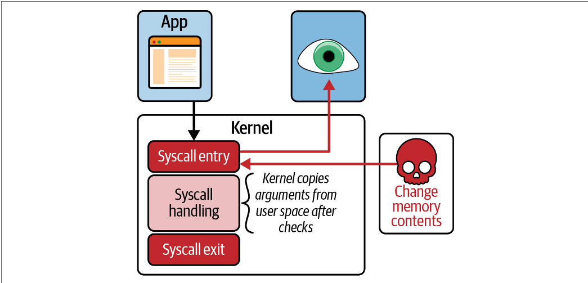

> 图 9-2：攻击者可以在内核访问系统调用参数之前修改它们。

同样的窗口对 seccomp-bpf 也适用，
只不过在 seccomp-bpf 中程序根本不允许解引用用户空间指针，
所以也就无从检查数据。

TOCTOU 问题确实适用于 seccomp_unotify——
这是 seccomp 新近增加的一种模式，
可以把违规事件报告给用户空间。
seccomp_unotify 的 man 手册页明确指出：
"因此必须绝对清楚：
seccomp 的用户空间通知机制不能用于实现安全策略！"

系统调用入口点对于可观测性目的来说也许非常方便，
但对于一个严肃的安全工具来说，
它真的不够用。

Sysmon for Linux 工具通过同时挂载到系统调用的入口和出口点，
解决了 TOCTOU 窗口问题。
在调用完成后，
它会查看内核的数据结构以获得准确的视图。
例如，
如果系统调用返回一个文件描述符，
挂载到出口点的 eBPF 程序可以通过查看相关进程的文件描述符表，
获取该文件描述符所代表对象的正确信息。
虽然这种方法可以得到安全相关活动的准确记录，
但它无法阻止动作发生，
因为在做检查时系统调用已经完成。

为了确保检查的就是内核将要据以行动的同一份信息，
eBPF 程序应该挂载到参数已被复制进内核内存之后发生的事件上。
不幸的是，
内核中并没有一个统一的公共位置来做这件事，
因为数据在各个系统调用专属的代码中处理方式各不相同。
不过，
确实存在一个定义良好、可以安全挂载 eBPF 程序的接口：
Linux 安全模块（Linux Security Module，LSM）API。
这需要一个相对较新的 eBPF 特性：BPF LSM。

## BPF LSM

LSM 接口提供了一组钩子，
每个钩子都发生在内核即将对某个内核数据结构采取行动之前。
钩子所调用的函数可以决定是否允许该动作继续。
这个接口最初是为了让安全工具以内核模块的形式实现而提供的；
BPF LSM 对其做了扩展，
让 eBPF 程序也能挂载到同样的钩子点上，
如图 9-3 所示。

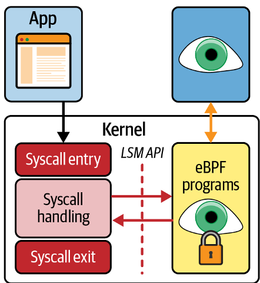

> 图 9-3：有了 LSM BPF，eBPF 程序可以由 LSM 钩子事件触发。

LSM 钩子有数百个，
在内核源代码中有相当完善的文档说明。
需要明确的是，
系统调用和 LSM 钩子之间并没有一一对应关系，
但如果某个系统调用有可能做出从安全角度来看值得关注的事情，
处理这个系统调用就会触发一个或多个钩子。

下面是一个挂载到 LSM 钩子的 eBPF 程序的简单例子。
这个例子在处理 chmod 命令期间被调用
（chmod 意为 change modes，
主要用于改变文件的访问权限）：

```c
SEC("lsm/path_chmod")
int BPF_PROG(path_chmod, const struct path *path, umode_t mode)
{
    bpf_printk("Change mode of file name %s\n", path->dentry->d_iname);
    return 0;
}
```

这个例子只是把文件名追踪输出，
并且总是返回 0，
但你可以想象一个真实的实现会利用这些参数来决定是否允许这次模式变更。
返回非零值会拒绝这次变更的权限，
内核也就不会继续执行。
值得注意的是，
像这样完全在内核内进行策略检查，
性能非常高。

传给 BPF_PROG() 的 path 参数是表示该文件的内核数据结构，
mode 参数是期望的新模式值。
你可以从 path->dentry->d_iname 字段看到被访问文件的名称。

LSM BPF 是在内核 5.7 版本中加入的，
这意味着（至少在撰写本书时）
它在许多受支持的 Linux 发行版上还不可用，
但我预计未来几年内，
许多厂商会开发出利用这个接口的安全工具。
在 LSM BPF 广泛可用之前，
还有另一种可行的方法，
即 Cilium Tetragon 的开发者所采用的方法。

## Cilium Tetragon

Tetragon 是 Cilium 项目（同属 CNCF）的一部分。
Tetragon 的方法不是挂载到 LSM API 钩子，
而是构建一个框架，
把 eBPF 程序挂载到 Linux 内核中的任意函数上。

Tetragon 面向 Kubernetes 环境设计，
项目定义了一种名为 TracingPolicy 的 Kubernetes 自定义资源类型。
它用来定义一组要挂载 eBPF 程序的事件、
需要由 eBPF 代码检查的条件，
以及条件满足时要采取的动作。
下面摘自一份 TracingPolicy 示例：

```yaml
spec:
  kprobes:
  - call: "fd_install"
    ...
    matchArgs:
    - index: 1
      operator: "Prefix"
      values:
      - "/etc/"

...
```

这份策略定义了一组要挂载程序的 kprobe，
其中第一个是内核函数 fd_install。
这是内核内部的一个函数。
我们来看看为什么会选择挂载到这样的函数上。

## 挂载到内核内部函数

系统调用接口和 LSM 接口在 Linux 内核中被定义为稳定接口；
也就是说，
它们不会以向后不兼容的方式变化。
如果你今天编写的代码使用了这些接口中的函数，
它们在未来的内核版本中仍会继续工作。
这些接口只是构成 Linux 内核的 3000 万行代码中的极小一部分。
代码库中的某些部分事实上是稳定的，
即使没有被官方声明为稳定；
它们很长时间没有变化，
未来也不太可能变化。

编写挂载到非官方稳定内核函数的 eBPF 程序，
并预期它们在相当长一段时间内都能工作，
是完全合理的。
另外，
考虑到一个新内核版本通常需要数年才能广泛部署，
可以相当有把握地说，
会有充足的时间来解决可能出现的任何不兼容问题。

Tetragon 的贡献者中包括多位内核开发者，
他们利用自己对内核内部的了解，
找到了一些适合挂载 eBPF 程序、
可用于实现有价值安全用途的良好而安全的位置。
项目中有多个 TracingPolicy 示例定义运用了这些知识。
这些示例监控的安全事件涵盖文件操作、网络活动、程序执行和权限变更——
全都是恶意攻击者在攻击过程中会做的那类事情。

回到前面那份挂载到 fd_install 的策略示例。
fd 代表文件描述符（file descriptor），
这个函数源代码中的注释告诉我们，
它的作用是"把文件指针安装到 fd 数组中"。
这发生在文件被打开时，
并且在文件的数据结构已经在内核中填充完毕之后调用。
在这里检查文件名是安全的——
而在前面的 TracingPolicy 示例中，
只有文件名以 "/etc/" 开头时才值得关注。

与 LSM BPF 程序一样，
Tetragon 的 eBPF 程序也能访问上下文信息，
从而完全在内核中做出安全决策。
不必把某一类型的所有事件都报告给用户空间，
与安全相关的事件可以在内核中过滤，
只有超出策略的事件才会被报告给用户空间。

## 预防式安全

大多数基于 eBPF 的安全工具用 eBPF 程序来检测恶意事件，
然后通知用户空间应用，
由后者采取行动。
如图 9-4 所示，
用户空间应用采取的任何行动都是异步发生的，
到那时可能为时已晚——
数据也许已经被窃取，
或者攻击者可能已经把恶意代码持久化到了磁盘上。

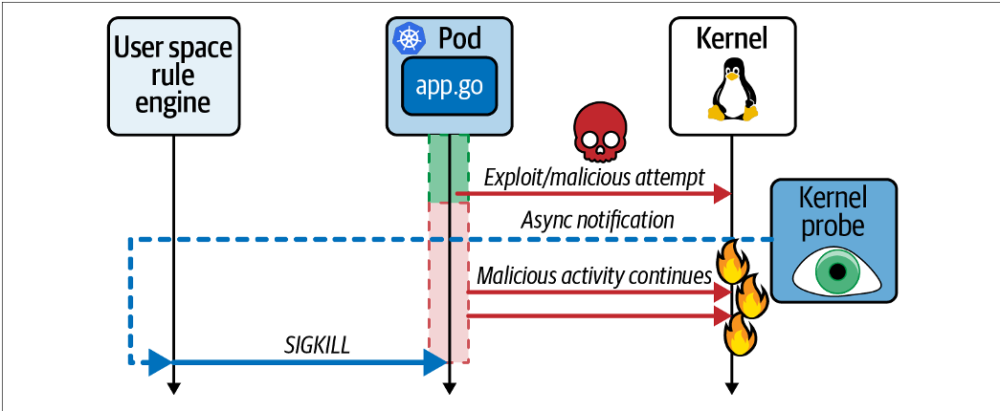

> 图 9-4：从内核到用户空间的异步通知会让攻击在一段时间内继续进行。

在内核 5.3 及以上版本中，
有一个名为 bpf_send_signal() 的 BPF 辅助函数。
Tetragon 用这个函数来实现预防式安全。
如果策略定义了 SIGKILL 动作，
任何匹配的事件都会让 Tetragon 的 eBPF 代码生成一个 SIGKILL 信号，
终止那个试图执行策略外动作的进程。
如图 9-5 所示，
这是同步发生的；
也就是说，
内核正在进行的、被 eBPF 代码判定为超出策略的活动，
会被阻止完成。

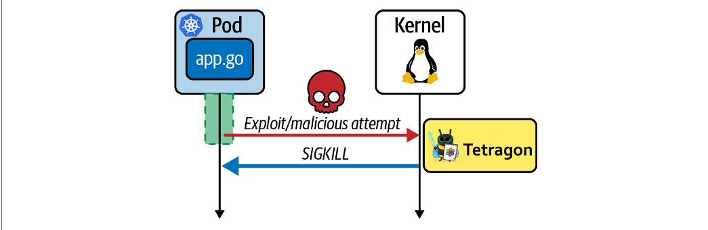

> 图 9-5：Tetragon 通过从内核发送 SIGKILL 信号，同步地杀死恶意进程。

SIGKILL 策略需要谨慎使用，
因为配置不当的策略可能导致不必要地终止应用，
但它是 eBPF 在安全用途上极其强大的一种用法。
你可以先以审计（audit）模式运行，
只生成安全事件而不施加 SIGKILL 执行，
直到你确信策略不会破坏任何东西。

如果你有兴趣进一步了解如何用 Cilium Tetragon 检测安全事件，
Natália Réka Ivánkó 和 Jed Salazar 撰写的报告
《Security Observability with eBPF》探讨了更多细节。

## 网络安全

[第 8 章](#第-8-章-用于网络的-ebpf)讨论了如何用 eBPF 非常有效地实现网络安全机制。
总结一下：

- 防火墙和 DDoS 防护天然适合挂载在网络数据包入站路径早期的 eBPF 程序。
  再加上 XDP 程序可以卸载到硬件上，
  恶意数据包甚至可能根本到不了 CPU！

- 要实现更复杂的网络策略，
  例如决定哪些服务之间允许通信的 Kubernetes 策略，
  挂载到网络协议栈中各点的 eBPF 程序可以在判定数据包超出策略时将其丢弃。

网络安全工具非常经常地以预防模式使用，
直接丢弃数据包，
而不只是审计恶意活动。
这是因为恶意行为者发起网络相关攻击实在太容易了；
如果你给一台设备分配一个暴露在互联网上的公网 IP 地址，
用不了多久你就会开始看到可疑流量，
所以各组织被迫采取预防性措施。

相比之下，
许多组织以审计模式使用入侵检测工具，
依靠取证来判定某个可疑事件是否真是恶意的，
以及需要采取什么补救措施。
如果某个安全工具太过粗钝、
容易产生误报，
那它只能以审计模式而非预防模式运行，
也就不足为奇了。
我相信，
eBPF 正在催生更精细、控制更准确的安全工具。
正如我们今天认为防火墙已经足够准确、
可以以预防模式使用一样，
我们将会看到越来越多作用于其他非网络事件的预防性工具。
这甚至可能包括把基于 eBPF 的控制作为应用产品的一部分打包发布，
让应用能够提供自身的运行时安全。

<a id="chapter-9-summary"></a>

## 小结

在本章中，
你看到了 eBPF 在安全领域的应用如何从对系统调用的底层检查，
演进为对 eBPF 程序更为精巧的运用：
安全策略检查、内核内事件过滤和运行时强制执行。

eBPF 安全用途的领域仍在活跃开发之中。
我相信，
未来几年我们会看到这个领域的工具不断演进并被广泛采用。

> ¹ 例如，可以看看 Jess Frazelle 的这篇文章，
> 她开发了 Docker 的默认 seccomp 配置文件：
> 《How to Use the New Docker Seccomp Profiles》。

> ² Inspektor Gadget seccomp 画像器的文档相当枯燥，
> 但 Jose Blanquicet 的这个视频概览更容易理解。

> ³ Rex Guo 和 Junyuan Zeng 在 DEFCON 29 上题为
> 《Phantom Attack: Evading System Call Monitoring》
> 的演讲讨论了如何利用这个窗口；
> Leo Di Donato 和 KP Singh 的演讲《LSM BPF Change Everything》
> 更详细地介绍了它对 Falco 的影响。

# 第 10 章 eBPF 编程

到目前为止，
通过本书你已经了解了大量关于 eBPF 的知识，
也看到了它在各种应用中的许多用例。
但如果你想基于 eBPF 实现自己的想法呢？
本章讨论你在编写自己的 eBPF 代码时有哪些选择。

通过阅读本书你已经知道，
eBPF 编程由两部分组成：

- 编写在内核中运行的 eBPF 程序

- 编写管理 eBPF 程序并与之交互的用户空间代码

本章要讨论的大多数库和语言，
都要求你作为程序员同时处理这两个部分，
并清楚哪部分在哪里处理。
但 bpftrace 这个也许是最简单的 eBPF 编程语言，
对程序员屏蔽了这种区分。

## Bpftrace

正如该项目 README 页面上所描述的，
"bpftrace 是一种用于 Linux eBPF 的高级跟踪语言……
灵感来自 awk 和 C，
以及 DTrace 和 SystemTap 等前辈跟踪工具。"

bpftrace 命令行工具把用这种高级语言编写的程序转换为 eBPF 内核代码，
并在终端中为结果提供一些输出格式化。
作为用户，
你其实不需要考虑内核与用户空间的划分。

在项目文档中你能找到不少实用的单行命令示例，
其中包括一份很不错的教程，
带你从编写简单的 "Hello World" 脚本，
一路写到能够从内核数据结构中读取并追踪数据的更复杂脚本。

> [!TIP]
> 想感受 bpftrace 提供的能力范围，
> 可以看 Brendan Gregg 的 bpftrace 速查表。
> 如果想深入了解 bpftrace 和 BCC，
> 可以读他的著作《BPF Performance Tools》。

顾名思义，
bpftrace 可以挂载到跟踪（也称 perf 相关）事件上，
包括 kprobe、uprobe 和 tracepoint。
例如，
你可以用 -l 选项列出机器上可用的 tracepoint 和 kprobe，
像这样：

```
$ bpftrace -l "*execve*"
tracepoint:syscalls:sys_enter_execve
tracepoint:syscalls:sys_exit_execve
...
kprobe:do_execve_file
kprobe:do_execve
kprobe:_ia32_sys_execve
kprobe:_x64_sys_execve
...
```

这个示例找出了所有包含 "execve" 的可用挂载点。
从输出中可以看到，
可以挂载到一个名为 do_execve 的 kprobe。
下面是一个挂载到该事件的 bpftrace 单行脚本：

```
bpftrace -e 'kprobe:do_execve { @[comm] = count(); }'
Attaching 1 probe...
^C

@[node]: 6
@[sh]: 6
@[cpuUsage.sh]: 18
```

{ @[comm] = count(); } 部分就是挂载到该事件的脚本。
这个示例统计了该事件被不同可执行程序触发的次数。

bpftrace 脚本可以协调挂载到不同事件上的多个 eBPF 程序。
例如，
看看报告文件打开情况的 opensnoop.bt 脚本。
下面是其中一段摘录：

```
tracepoint:syscalls:sys_enter_open,
tracepoint:syscalls:sys_enter_openat
{
    @filename[tid] = args->filename;
}

tracepoint:syscalls:sys_exit_open,
tracepoint:syscalls:sys_exit_openat
/@filename[tid]/
{
    $ret = args->ret;
    $fd = $ret > 0 ? $ret : -1;
    $errno = $ret > 0 ? 0 : - $ret;

    printf("%-6d %-16s %4d %3d %s\n", pid, comm, $fd, $errno, str(@filename[tid]));
    delete(@filename[tid]);
}
```

这个脚本定义了两个不同的 eBPF 程序，
各自挂载到两个不同的内核 tracepoint 上，
分别位于 open() 和 openat() 系统调用的入口和出口。¹
这两个系统调用都用于打开文件，
并接受文件名作为输入参数。
由任一种系统调用入口触发的程序会缓存该文件名，
把它存入一个以当前线程 ID 为键的映射中。
当出口 tracepoint 被命中时，
脚本中的 /@filename[tid]/ 行会从该映射中取回缓存的文件名。

运行这个脚本会产生类似这样的输出：

```
./opensnoop.bt
Attaching 6 probes...
Tracing open syscalls... Hit Ctrl-C to end.
PID     COMM             FD ERR PATH
297388  node             30   0 /home/liz/.vscode-server/data/User/
workspaceStorage/73ace3ed015
297360  node             23   0 /proc/307224/cmdline
297360  node             23   0 /proc/305897/cmdline
297360  node             23   0 /proc/307224/cmdline
```

我刚说过有四个 eBPF 程序挂载到了 tracepoint 上，
为什么输出里说有六个探针？
答案是有两个特殊探针，
对应这个程序完整版本中包含的 BEGIN 和 END 子句，
用于初始化和清理脚本（与 awk 语言非常相似）。
这里为简洁起见省略了这些子句，
但你可以在 GitHub 上的源代码中找到它们。

如果你使用 bpftrace，
并不需要了解底层的程序和映射，
但对于读过本书前面章节的读者来说，
这些概念现在应该已经很熟悉了。
如果你有兴趣查看 bpftrace 程序运行时加载到内核中的程序和映射，
用 bpftool 就能轻松做到（正如你在[第 3 章](#第-3-章-ebpf-程序剖析)中见过的那样）。
下面是我在运行 opensnoop.bt 时得到的输出：

```
$ bpftool prog list

494: tracepoint name sys_enter_open tag 6f08c3c150c4ce6e gpl
    loaded_at 2022-11-18T12:44:05+0000 uid 0
    xlated 128B jited 93B memlock 4096B map_ids 254

495: tracepoint name sys_enter_opena tag 26c093d1d907ce74 gpl
    loaded_at 2022-11-18T12:44:05+0000 uid 0
    xlated 128B jited 93B memlock 4096B map_ids 254

496: tracepoint name sys_exit_open tag 0484b911472301f7 gpl
    loaded_at 2022-11-18T12:44:05+0000 uid 0
    xlated 936B jited 565B memlock 4096B map_ids 254,255

497: tracepoint name sys_exit_openat tag 0484b911472301f7 gpl
    loaded_at 2022-11-18T12:44:05+0000 uid 0
    xlated 936B jited 565B memlock 4096B map_ids 254,255

$ bpftool map list

254: hash flags 0x0
    key 8B value 8B max_entries 4096 memlock 331776B

255: perf_event_array name printf flags 0x0
    key 4B value 4B max_entries 2 memlock 4096B
```

你可以清楚地看到四个 tracepoint 程序，
以及用于缓存文件名的哈希映射，
还有用于把输出数据从内核传到用户空间的 perf_event_array。

bpftrace 工具构建在 BCC 之上，
BCC 在本书其他地方已经出现过，
本章后面也会介绍。
bpftrace 脚本会被转换为 BCC 程序，
然后在运行时用 LLVM/Clang 工具链编译。

如果你想要的是基于 eBPF 的性能测量命令行工具，
你很可能会发现 bpftrace 就能满足需求。
不过，
尽管 bpftrace 是把 eBPF 用于跟踪的强大工具，
它并不能开启 eBPF 所能实现的全部可能性。

要释放 eBPF 的全部潜力，
你需要自己直接为内核编写 eBPF 程序，
同时处理好用户空间部分。
这两个方面可以——也常常确实——用完全不同的语言编写。
先来看看在内核中运行的 eBPF 代码有哪些语言选择。

## 内核中 eBPF 的语言选择

eBPF 程序可以直接用 eBPF 字节码编写，²
但实际上，
大多数 eBPF 程序是从 C 或 Rust 编译成字节码的。
这些语言的编译器支持把 eBPF 字节码作为目标输出。

eBPF 字节码并不是所有编译型语言都合适的目标。
如果一门语言带有运行时组件（比如 Go，
或者 Java 的虚拟机），
它很可能与 eBPF 的验证器不兼容。
例如，
很难想象内存垃圾回收如何能与验证器对内存安全使用的检查协同工作。
同样，
eBPF 程序必须是单线程的，
所以语言中的任何并发特性都用不上。

虽然不算真正的 eBPF，
但有一个有趣的项目叫 XDPLua，
它提议用 Lua 脚本编写直接在内核中运行的 XDP 程序。
不过，
该项目的初步研究表明，
eBPF 的性能很可能更好；
而且随着 eBPF 在每个内核版本中变得越来越强大
（例如现在已经能够实现循环），
除了某些人可能偏爱用 Lua 脚本写代码之外，
看不出还有什么明显的优势。

我大胆猜测，
大多数选择用 Rust 编写 eBPF 内核代码的人，
也会选择用同样的语言编写用户空间代码，
因为共享的数据结构就不需要重写了。
但这不是必须的——
你可以把 eBPF 代码与你选择的任何用户空间语言混合搭配。

选择用 C 编写内核侧代码的人，
也可以选择用 C 编写用户空间代码
（本书中你已经见过大量这样的例子）。
但 C 是一门相当底层的语言，
要求程序员自己处理大量细节，
尤其是内存管理。
虽然有些人对此得心应手，
但许多人更愿意用另一门更高级的语言来编写用户空间代码。
无论你偏好哪门语言，
你都会希望有一个提供 eBPF 支持的库，
这样就不必直接面对你在[第 3 章](#第-3-章-ebpf-程序剖析)看到的系统调用接口了。
在本章余下的部分，
我们将讨论各种语言中一些最流行的 eBPF 库选择。

## BCC Python/Lua/C++

回想[第 2 章](#第-2-章-ebpf-的-hello-world)，
我给你的第一个 "Hello World" 示例就是一个用 BCC 库编写的 Python 程序。
这个项目包含大量用同一个库实现的实用性能测量工具
（以及基于 libbpf 的更新实现，
稍后就会讲到）。

除了描述如何使用所提供的 BCC 工具测量性能的文档之外，
BCC 还包含一份参考指南和一个 Python 编程教程，
帮助你在这个框架中开发自己的 eBPF 工具。

[第 5 章](#第-5-章-co-rebtf-与-libbpf)讨论过 BCC 的可移植性方案：
在运行时编译 eBPF 代码，
以确保它与目标机器的内核数据结构兼容。
在 BCC 中，
你把内核侧 eBPF 程序代码定义为一个字符串
（或者由 BCC 读入字符串的文件内容）。
这个字符串会被传给 Clang 编译，
但在此之前，
BCC 会对字符串做一些预处理。
这使得它能给程序员提供便利的快捷方式，
本书中你已经见过其中一些。
例如，
下面是[第 2 章](#第-2-章-ebpf-的-hello-world)
示例代码 chapter2/hello_map.py 中的相关代码行：

```python
#!/usr/bin/python3
from bcc import BPF

program = """
BPF_RINGBUF_OUTPUT(output, 1); ③
...
int hello(void *ctx) {
    ...
    output.ringbuf_output(&data, sizeof(data), 0); ④
    return 0;
}
"""

b = BPF(text=program) ⑤
...

b["output"].open_ring_buffer(print_event) ⑥
...
```

① 这是一个 Python 程序，
将在用户空间运行。

② program 字符串保存着待编译、随后加载进内核的 eBPF 程序。

③ BPF_RINGBUF_OUTPUT 是一个 BCC 宏，
定义了一个名为 output 的环形缓冲区。
这是 program 字符串的一部分，
所以很自然地会认为它是从内核视角定义这个缓冲区的。
先记住这一点，
到标注 ⑥ 处再回来看。

④ 这一行看起来像是对一个名为 output 的对象调用 ringbuf_output() 方法。
但等一下——
对象上的方法根本不是 C 语言的一部分！
BCC 在这里做了大量工作，
把这样的方法展开为底层的 BPF 辅助函数，
在这个例子中就是 bpf_ringbuf_output()。

⑤ 这一行把 program 字符串改写为 Clang 可以编译的 BPF C 代码。
这一行还会把编译得到的程序加载进内核。

⑥ 代码中没有其他地方定义名为 output 的环形缓冲区，
然而这里的 Python 用户空间代码却能访问它。
BCC 在预处理标注 ③ 那一行时身兼两职：
它同时为用户空间部分和内核部分定义了这个环形缓冲区。

正如这个例子所示，
BCC 本质上为 BPF 编程提供了自己的一套类 C 语言。
它让程序员的工作变得轻松，
处理诸如内核和用户空间共享的结构体定义之类的事情，
并为 BPF 辅助函数提供便捷的封装快捷方式。
这意味着，
如果你是 eBPF 领域的新手，
BCC 是一条容易上手的入门路径，
尤其是当你已经熟悉 Python 的时候。

> [!TIP]
> 如果你想探索 BCC 编程，
> 这份面向 Python 程序员的教程是很好的途径，
> 它能带你领略 BCC 远比本书篇幅所能容纳的更多特性和能力。

文档没有把这一点说得特别清楚，
但除了支持用 Python 编写 eBPF 工具的用户空间部分之外，
BCC 也支持用 Lua 和 C++ 编写工具。
随附的 examples 中有 lua 和 cpp 目录，
如果你热衷于尝试这种方式，
可以基于其中的示例编写自己的代码。

BCC 对程序员来说也许很方便，
但由于需要随工具一起分发编译器工具链，
效率不高（[第 5 章](#第-5-章-co-rebtf-与-libbpf)对此有更深入的讨论），
所以如果你想编写打算分发的生产级工具，
我建议考虑本章讨论的其他一些库。

## C 和 Libbpf

本书中你已经见过大量用 C 编写的 eBPF 程序示例，
它们用 LLVM 工具链编译成 eBPF 字节码。
你也已经看到，
LLVM 中为支持 BTF 和 CO-RE 而加入的扩展。
许多 C 程序员也熟悉另一大 C 编译器 GCC，
他们会很高兴地知道，
GCC 从 10 版本开始也支持以 eBPF 为编译目标；
不过，
与 LLVM 提供的功能相比，
GCC 仍有一些差距。

正如你在[第 5 章](#第-5-章-co-rebtf-与-libbpf)所见，
CO-RE 和 libbpf 实现了一种可移植的 eBPF 编程方式，
不需要随每个 eBPF 工具一起分发编译器工具链。
BCC 项目利用了这一点：
除了最初那套 BCC 性能跟踪工具之外，
现在还有了利用 libbpf 重写的版本。
普遍共识是，
基于 libbpf 重写的 BCC 工具版本是更好的选择，
因为它们的内存占用显著更低，³
而且不会在编译步骤进行时产生启动延迟。

如果你熟悉 C 语言编程，
使用 libbpf 是非常合理的选择。
本书中你已经见过大量这样的例子。

> [!TIP]
> 要用 C 编写你自己的 libbpf 程序，
> 最好的起点（既然你已经读过本书！）是 libbpf-bootstrap。
> 可以读 Andrii Nakryiko 关于它的博客文章，
> 那是了解这个项目背后动机的很好入门材料。

还有一个叫 libxdp 的库，
它构建在 libbpf 之上，
让 XDP 程序的开发和管理更容易。
它是 xdp-tools 的一部分，
其中还有我最喜欢的 eBPF 编程学习资源之一：XDP 教程。⁴

但 C 是一门相当有挑战性的底层语言。
C 程序员必须对内存管理和缓冲区处理之类的事情负责，
很容易写出带安全漏洞的代码，
更不用说因指针处理不当导致的崩溃了。
eBPF 验证器在内核侧提供了帮助，
但你的用户空间代码没有等价的保护。

好消息是，
其他编程语言也有一些库可以对接 libbpf，
或者提供类似的重定位功能来实现可移植的 eBPF 程序。
下面是其中最受欢迎的几个。

## Go

Go 语言已被广泛采用于基础设施和云原生工具，
所以自然会有用它编写 eBPF 代码的选择。

> [!TIP]
> Michael Kashin 的这篇文章提供了另一个视角，
> 比较了 Go 的不同 eBPF 库。

### Gobpf

最早的严肃 Golang 实现可能是 gobpf 项目，
它与 BCC 并列，
同属 Iovisor 项目。
不过，
它已经有一段时间没有积极维护了，
在我撰写本书时，
社区正在讨论弃用它，
所以在做库选择时请记住这一点。

### Ebpf-go

Cilium 项目中包含的 eBPF Go 库被广泛使用
（我在 GitHub 上找到约一万处引用，
该项目有近 4000 个 star）。
它提供了管理和加载 eBPF 程序与映射的便捷函数，
包括 CO-RE 支持，
全部用纯 Go 实现。

使用这个库，
你可以选择把 eBPF 程序编译成字节码，
并用一个名为 bpf2go 的配套工具把字节码嵌入 Go 源代码中。
你需要 LLVM/Clang 编译器，
在构建步骤中完成这一生成。
Go 代码编译完成后，
你就得到了一个可以分发的单一 Go 二进制文件，
其中包含 eBPF 字节码，
并且可以移植到不同的内核上，
除了 Linux 内核本身之外没有任何依赖。

cilium/ebpf 库也支持加载和管理构建为独立 ELF 文件的 eBPF 程序
（就像你在本书中见过的 *.bpf.o 示例）。

在撰写本书时，
cilium/ebpf 库支持用于跟踪的 perf 事件，
包括相对较新的 fentry 事件，
以及广泛的网络程序类型，
如 XDP 和 cgroup socket 挂载。

在 cilium/ebpf 项目的 examples 目录下，
你会看到内核侧程序的 C 代码与对应的 Go 用户空间代码放在同一目录中：

- C 文件以 // +build ignore 开头，
  告诉 Go 编译器忽略它们。
  在撰写本书时，
  项目正在进行一项更新，
  改用较新的 //go:build 风格的构建标签。

- 用户空间文件包含类似下面的一行，
  告诉 Go 编译器对 C 文件调用 bpf2go 工具：

```go
//go:generate go run github.com/cilium/ebpf/cmd/bpf2go -cc $BPF_CLANG -cflags $BPF_CFLAGS bpf <C filename> -- -I../headers
```

对包运行 go:generate，
会在一个步骤中重新构建 eBPF 程序并重新生成骨架代码。

很像你在[第 5 章](#第-5-章-co-rebtf-与-libbpf)
见过的 bpftool gen skeleton，
bpf2go 会生成用于操作 eBPF 对象的骨架代码，
把你需要自己编写的用户空间代码减到最少
（只不过它生成的是 Go 代码而不是 C）。
输出文件还包括包含字节码的 .o 目标文件。

实际上，
bpf2go 会为大端和小端架构分别生成两个字节码 .o 文件。
相应地也会生成两个 .go 文件，
编译时会使用与目标平台对应的正确版本。
例如，
cilium/ebpf 的 kprobe 示例中自动生成的文件有：

- 包含 eBPF 字节码的 bpf_bpfeb.o 和 bpf_bpfel.o ELF 文件

- bpf_bpfeb.go 和 bpf_bpfel.go 文件，
  其中定义了与该字节码中定义的映射、程序和链接相对应的 Go 结构体和函数

你可以把自动生成的 Go 代码中定义的对象，
与生成它们的 C 代码对应起来。
下面是那个 kprobe 示例的 C 代码中定义的对象：

```c
struct bpf_map_def SEC("maps") kprobe_map = {
};

SEC("kprobe/sys_execve")
int kprobe_execve() {
};
```

自动生成的 Go 代码包含表示所有映射和程序的结构体
（在这个例子中各有一个）：

```go
type bpfMaps struct {
    KprobeMap *ebpf.Map `ebpf:"kprobe_map"`
}

type bpfPrograms struct {
    KprobeExecve *ebpf.Program `ebpf:"kprobe_execve"`
}
```

KprobeMap 和 KprobeExecve 这两个名字，
源自 C 代码中使用的映射名和程序名。
这些对象被归组到一个 bpfObjects 结构体中，
表示正在加载进内核的一切：

```go
type bpfObjects struct {
    bpfPrograms
    bpfMaps
}
```

然后你就可以在用户空间 Go 代码中使用这些对象定义和相关的自动生成函数。
为了让你对这会涉及什么有个概念，
下面是基于同一个 kprobe 示例的 main 函数改写的摘录
（为简洁起见省略了错误处理）：

```go
objs := bpfObjects{}
loadBpfObjects(&objs, nil) ①

defer objs.Close()

kp, _ := link.Kprobe("sys_execve", objs.KprobeExecve, nil) ②

defer kp.Close()

ticker := time.NewTicker(1 * time.Second) ③

defer ticker.Stop()

for range ticker.C {
    var value uint64
    objs.KprobeMap.Lookup(mapKey, &value) ④
    log.Printf("%s called %d times\n", fn, value)
}
```

① 把以字节码形式嵌入的所有 BPF 对象，
加载到我刚给你看过的、由自动生成代码定义的 bpfObjects 中。

② 把程序挂载到 sys_execve kprobe 上。

③ 设置一个定时器，
让代码可以每秒轮询一次映射。

④ 从映射中读出一项。

cilium/ebpf 目录中还有几个其他示例，
可供你参考和借鉴。

### Libbpfgo

Aqua Security 的 libbpfgo 项目在 libbpf C 代码之上实现了一个 Go 封装，
提供了加载和挂载程序的工具函数，
以及用 Go 原生特性（如 channel）接收事件的能力。
因为它构建在 libbpf 之上，
所以支持 CO-RE。

下面摘自 libbpfgo README 中的示例，
很好地从高层展示了可以对这个库有什么期待：

```go
bpfModule := bpf.NewModuleFromFile(bpfObjectPath) ①
bpfModule.BPFLoadObject() ②

mymap, _ := bpfModule.GetMap("mymap")
mymap.Update(key, value) ③

rb, _ := bpfModule.InitRingBuffer("events", eventsChannel, buffSize)
rb.Start()
e := <-eventsChannel ④
```

① 从目标文件读取 eBPF 字节码。

② 把该字节码加载进内核。

③ 操作 eBPF 映射中的一项。

④ Go 程序员会喜欢通过 channel 从环形缓冲区或 perf 缓冲区接收数据，
channel 正是为处理异步事件而设计的语言特性。

这个库是为 Aqua 的 Tracee 安全项目创建的，
也被其他项目使用，
比如 Polar Signals 的 Parca，
它提供基于 eBPF 的 CPU 性能剖析。
对该项目方法的唯一顾虑，
在于 libbpf C 代码与 Go 之间的 CGo 边界，
这可能带来性能和其他问题。⁵

大约十年来，
Go 一直是大量基础设施编码的既定语言，
而最近越来越多的开发者更偏爱 Rust。

## Rust

Rust 正被越来越多地用于构建基础设施工具。
它允许像 C 那样的底层访问，
又额外带来内存安全的好处。
事实上，
Linus Torvalds 在 2022 年确认，
Linux 内核本身将开始纳入 Rust 代码，
最近的 6.1 版本已经有了初步的 Rust 支持。

正如本章前面所讨论的，
Rust 可以编译为 eBPF 字节码，
这意味着（在合适的库支持下）
可以用 Rust 同时编写 eBPF 工具的用户空间代码和内核代码。

Rust 的 eBPF 开发有几个选择：libbpf-rs、Redbpf 和 Aya。

### Libbpf-rs

libbpf-rs 是 libbpf 项目的一部分，
它在 libbpf C 代码之上提供 Rust 封装，
让你可以用 Rust 编写 eBPF 代码的用户空间部分。
从该项目的 examples 可以看出，
eBPF 程序本身是用 C 编写的。

> [!TIP]
> libbpf-bootstrap 项目中还有更多 Rust 示例，
> 如果你想尝试用这个 crate 构建自己的代码，
> 它们可以帮你上手。

这个 crate 有助于把 eBPF 程序纳入基于 Rust 的项目，
但它无法满足许多人也想用 Rust 编写内核侧代码的愿望。
来看几个能做到这一点的其他项目。

### Redbpf

Redbpf 是一组与 libbpf 对接的 Rust crate，
作为 foniod（一个基于 eBPF 的安全监控代理）的一部分开发。

Redbpf 早于 Rust 编译到 eBPF 字节码的能力，
所以它使用多步编译过程：
先从 Rust 编译到 LLVM bitcode，
再用 LLVM 工具链生成 ELF 格式的 eBPF 字节码。
Redbpf 支持多种程序类型，
包括 tracepoint、kprobe 和 uprobe、XDP、TC，
以及一些 socket 事件。

随着 Rust 编译器 rustc 获得了直接生成 eBPF 字节码的能力，
一个名为 Aya 的项目利用了这一点。
在撰写本书时，
社区网站 ebpf.io 把 Aya 列为新兴（emerging）项目，
而 Redbpf 被列为主要项目，
但我个人的看法是，
发展势头似乎正在向 Aya 转移。

### Aya

Aya 用 Rust 直接构建到系统调用层面，
所以它不依赖 libbpf（实际上也不依赖 BCC 或 LLVM 工具链）。
但它确实支持 BTF 格式，
支持与 libbpf 相同的重定位（如[第 5 章](#第-5-章-co-rebtf-与-libbpf)所述），
因此提供了同样的 CO-RE 能力：
一次编译，
即可在其他内核上运行。
在撰写本书时，
它支持的 eBPF 程序类型比 Redbpf 更广，
包括跟踪/perf 相关事件、XDP 和 TC、cgroup，
以及 LSM 挂载。

如前所述，
Rust 编译器也支持编译到 eBPF 字节码，
所以这门语言可以同时用于内核侧和用户空间的 eBPF 编程。

> [!TIP]
> 能够原生地用 Rust 编写内核侧和用户空间两侧、
> 而不需要 LLVM 这个中间依赖，
> 这一点吸引了许多 Rust 程序员选择 Aya。
> GitHub 上有一个有趣的讨论，
> 讲述了 lockc 项目（一个基于 eBPF、
> 利用 LSM 钩子增强容器负载安全性的项目）的开发者
> 为什么决定把项目从 libbpf-rs 移植到 Aya。

该项目包含 aya-tool，
这是一个生成与内核数据结构匹配的 Rust 结构体定义的工具，
你不必自己手写。

Aya 项目非常强调开发者体验，
让新手容易上手。
本着这个宗旨，
《Aya book》是一份可读性很强的入门材料，
带有一些很好的示例代码，
并附有有用的讲解注释。

为了让你简要了解 Rust 中的 eBPF 代码长什么样，
下面是 Aya 的基础 XDP 示例中的一段摘录，
它放行所有流量：

```rust
#[xdp(name="myapp")] ①
pub fn myapp(ctx: XdpContext) -> u32 {
    match unsafe { try_myapp(ctx) } { ②
        Ok(ret) => ret,
        Err(_) => xdp_action::XDP_ABORTED,
    }
}

unsafe fn try_myapp(ctx: XdpContext) -> Result<u32, u32> {
    info!(&ctx, "received a packet"); ③
    Ok(xdp_action::XDP_PASS)
}
```

① 这一行定义了节名，
等价于 C 中的 SEC("xdp/myapp")。

② 名为 myapp 的 eBPF 程序调用 try_myapp 函数，
处理在 XDP 处收到的网络数据包。

③ try_myapp 函数记录收到数据包这一事实，
并总是返回 XDP_PASS，
告诉内核照常继续处理该数据包。

正如我们在本书中基于 C 的示例中所见，
eBPF 程序会被编译成 ELF 目标文件。
不同之处在于，
Aya 用 Rust 编译器而不是 Clang 来生成这个文件。

Aya 也会为用户空间活动生成代码，
即把 eBPF 程序加载进内核并挂载到事件上。
下面是同一个基础示例的用户空间部分的几行关键代码：

```rust
let mut bpf = Bpf::load(include_bytes_aligned!( ①
    "../../target/bpfel-unknown-none/release/myapp"
))?;

let program: &mut Xdp = bpf.program_mut("myapp").unwrap().try_into()?; ②
program.load()?; ③
program.attach(&opt iface, XdpFlags::default()) ④
```

① 从编译器生成的 ELF 目标文件中读取 eBPF 字节码。

② 在该字节码中找到名为 myapp 的程序。

③ 把它加载进内核。

④ 把它挂载到指定网络接口的 XDP 事件上。

如果你是 Rust 程序员，
我强烈建议你更详细地探索《Aya book》中的更多示例。
Kong 还有一篇不错的博客文章，
演示了如何用 Aya 编写一个 XDP 负载均衡器。

> [!TIP]
> Aya 维护者 Dave Tucker 和 Alessandro Decina
> 和我一起参加了 eBPF and Cilium Office Hours 直播的第 25 期，
> 他们在节目中演示并介绍了用 Aya 进行 eBPF 编程。

### Rust-bcc

Rust-bcc 提供的 Rust 绑定模仿了 BCC 项目的 Python 绑定，
并附带一些 BCC 跟踪工具集中部分工具的 Rust 实现。

## 测试 BPF 程序

bpf() 有一个命令 BPF_PROG_RUN，
允许从用户空间运行 eBPF 程序以进行测试。

BPF_PROG_RUN（目前）只适用于一部分大多与网络相关的 BPF 程序类型。

你还可以通过一些内置的统计信息来了解 eBPF 程序的性能。
运行以下命令启用它：

```
$ sysctl -w kernel.bpf_stats_enabled=1
```

这会在 bpftool 关于程序的输出中显示额外信息，
像这样：

```
$ bpftool prog list
...
2179: raw_tracepoint name raw_tp_exec tag 7f6d182e48b7ed38 gpl
run_time_ns 316876 run_cnt 4
loaded_at 2023-01-09T11:07:31+0000 uid 0
xlated 216B jited 264B memlock 4096B map_ids 780,777
btf_id 953
pids hello(19173)
```

额外的统计信息以粗体显示，
从中可以看出该程序运行了四次，
总共耗时约 300 微秒。

> [!TIP]
> 想了解更多，
> 可以看 Quentin Monnet 在 FOSDEM 2020 上题为
> "Tools and mechanisms to debug BPF programs" 的演讲。

## 多个 eBPF 程序

一个 eBPF 程序是一个挂载到内核中某个事件上的函数。
许多应用需要跟踪多个事件才能达成目标。
opensnoop 就是一个简单的例子。⁶
本章前面介绍过这个工具的 bpftrace 版本，
你当时看到它把 BPF 程序挂载到了四个不同的系统调用 tracepoint 上：

- syscall_enter_open

- syscall_exit_open

- syscall_enter_openat

- syscall_exit_openat

这些是内核对 open() 和 openat() 系统调用处理的入口点和出口点。
这两个系统调用都可以用来打开文件，
opensnoop 工具对它们都进行跟踪。

但为什么需要同时跟踪这些系统调用的入口和出口呢？
需要入口点，
是因为那时可以拿到系统调用的参数，
其中包括文件名和传给 open[at] 系统调用的任何标志。
但在那个阶段，
还无法知道文件是否会打开成功。
这就解释了为什么也需要把 eBPF 程序挂载到出口点上。

如果你看 libbpf-tools 版本的 opensnoop，
你会看到只有一个用户空间程序，
它把全部四个 eBPF 程序加载进内核并挂载到各自的事件上。
这些 eBPF 程序本身基本上是相互独立的，
但它们用 eBPF 映射在彼此之间进行协调。

一个复杂的应用甚至可能需要在很长的时间内动态地添加和移除 eBPF 程序。
对任意给定应用来说，
eBPF 程序的数量甚至可能不是固定的。
例如，
Cilium 把 eBPF 程序挂载到每个虚拟网络接口上，
而在 Kubernetes 环境中，
这些接口会随着运行中的 pod 数量变化而出现和消失。

本章介绍的大多数库会自动处理这种多 eBPF 程序的情况。
例如，
libbpf 和 ebpf-go 会生成骨架代码，
通过一次函数调用就把目标文件或缓冲区中字节码里的所有程序和映射加载进来。
它们也会生成更细粒度的函数，
让你可以单独操作各个程序和映射。

<a id="chapter-10-summary"></a>

## 小结

绝大多数使用基于 eBPF 的工具的人，
并不需要自己编写 eBPF 代码；
但如果你确实发现自己想要亲手实现点什么，
你有很多选择。
这是一个不断变化的领域，
所以很有可能在你读到本书时，
已经出现了新的语言库和框架，
或者围绕本章重点介绍的一些库形成了共识。
在 ebpf.io 的重要项目清单的 Infrastructure 页面上，
你可以找到围绕 eBPF 的主要语言项目的最新列表。

要快速收集跟踪信息，
bpftrace 是非常有价值的选择。

要获得更大的灵活性和控制力，
如果你熟悉 Python，
BCC 是构建 eBPF 工具的快捷途径——
前提是你不介意在运行时进行的编译步骤。

如果你编写的 eBPF 代码要广泛分发、
并能跨不同内核版本移植，
你很可能想要利用 CO-RE。
在撰写本书时，
支持 CO-RE 的用户空间框架有：
面向 C 的 libbpf，
面向 Go 的 cilium/ebpf 和 libbpfgo，
以及面向 Rust 的 Aya。

如需更多建议，
我强烈推荐加入 eBPF Slack，
在那里讨论你的问题。
你很可能会在那个社区里找到许多这些语言库的维护者。

<a id="chapter-10-exercises"></a>

## 练习

如果你想试用本章讨论的一个或多个库，
"Hello World" 永远是一个好的起点：

1. 用你选择的一个或多个库，
   编写一个输出简单跟踪消息的 "Hello World" 示例程序。

2. 用 llvm-objdump 把生成的字节码与[第 3 章](#第-3-章-ebpf-程序剖析)
   的 "Hello World" 示例进行比较。
   你会发现大量相似之处！

3. 正如你在[第 4 章](#第-4-章-bpf-系统调用)所见，
   可以用 `strace -e bpf` 观察何时发起了 `bpf()` 系统调用。
   在你的 "Hello World" 程序上试一试，
   看看它的行为是否符合你的预期。

> ¹ 挂载到系统调用入口点意味着这个脚本存在上一章讨论过的
> 检查时间与使用时间（TOCTOU）漏洞。
> 这并不妨碍它成为一个有用的工具；
> 只是你不应把它当作安全防线的唯一依靠。

> ² 相关示例可以看看 Cloudflare 的博客文章
> 《eBPF, Sockets,
> Hop Distance and manually writing eBPF assembly》。

> ³ 例如，Brendan Gregg 观察到，
> 基于 libbpf 的 opensnoop 版本只需要约 9 MB 内存，
> 而基于 Python 的版本需要 80 MB。

> ⁴ 可以观看我在 eBPF and Cilium Office Hours 直播第 13 期中
> 演示 XDP 教程部分示例的视频。

> ⁵ Dave Cheney 2016 年的文章《cgo is not Go》
> 至今仍是对 CGo 边界相关顾虑的很好概述。

> ⁶ 除了这个工具的 bpftrace 版本之外，
> BCC 和 libbpf-tools 中也有等价实现。
> 它们做的事情几乎一样：
> 每当有进程打开文件时就生成一行跟踪记录。
> 我的报告《What Is eBPF?》中有对 BCC 版 opensnoop 的 eBPF 代码的逐步讲解。

# 第 11 章 eBPF 的未来演进

eBPF 还没有完成！
像大多数软件一样，
它在 Linux 内核中持续演进，
并且也正在被加入 Windows 操作系统。
本章将展望这项技术未来可能的一些发展路径。

自从被引入 Linux 内核以来，
BPF 已经演变成一个拥有自己的邮件列表和维护者的独立子系统。¹
随着 eBPF 日益流行、
关注者超出 Linux 内核社区的范围，
成立一个能在各相关方之间进行协调的中立机构就变得顺理成章。
这个机构就是 eBPF 基金会。

## eBPF 基金会

eBPF 基金会于 2021 年由 Google、Isovalent、Meta（当时名为 Facebook）、
Microsoft 和 Netflix
在 Linux 基金会的支持下成立。
该基金会作为一个中立机构，
可以持有资金和知识产权，
从而让各家商业公司能够相互协作。

其意图并不是改变 Linux 内核社区和 Linux BPF 子系统贡献者开发 eBPF 技术的方式。
基金会的活动由 BPF 指导委员会指导，
该委员会完全由构建这项技术的技术专家组成，
包括 Linux 内核 BPF 维护者和其他核心 eBPF 项目的代表。

eBPF 基金会聚焦于作为技术平台的 eBPF，
以及支撑 eBPF 开发的工具体系。
在 eBPF 之上构建、
并寻求中立归属的项目，
可能会在其他基金会找到更合适的家。
例如，
Cilium、Pixie 和 Falco 都是 CNCF 的一部分，
这很合理，
因为它们都面向云原生环境。

推动这种在现有 Linux 维护者之外开展协作的一个关键因素，
是 Microsoft 对在 Windows 操作系统中发展 eBPF 的兴趣。
这带来了定义 eBPF 标准的需求，²
使得为一个操作系统编写的程序可以在另一个操作系统上使用。
这项工作正在 eBPF 基金会的主持下进行。

## eBPF for Windows

Microsoft 支持 eBPF for Windows 的工作正在顺利推进。
在我撰写本书的 2022 年末，
已经有可运行的演示，
展示了 Cilium 的四层负载均衡和基于 eBPF 的连接跟踪在 Windows 上运行。

我之前说过，
eBPF 编程就是内核编程，
乍看之下，
一个为在 Linux 内核中运行而编写、
并能访问 Linux 内核数据结构的程序，
竟然能以某种方式在一个完全不同的操作系统中运行，
这似乎有违直觉。
但实际上，
特别是在网络方面，
所有操作系统都有相当多的共同点。
无论网络数据包是在 Windows 还是 Linux 机器上产生的，
它的结构都是一样的，
网络协议栈的各层也必须以同样的方式处理。

你还会记得，
eBPF 程序由一组字节码指令组成，
由内核中实现的虚拟机（VM）处理。
这个虚拟机也可以在 Windows 中实现！

图 11-1 展示了 eBPF for Windows 的架构概览，
取自该项目的 GitHub 仓库。
从图中可以看出，
eBPF for Windows 复用了现有 eBPF 生态系统中的一些开源组件，
比如 libbpf，
以及 Clang 中生成 eBPF 字节码的支持。
Linux 内核以 GPL 许可发布，
而 Windows 是专有软件，
所以 Windows 项目无法复用 Linux 内核验证器实现的任何部分。³
取而代之的是，
它使用 PREVAIL 验证器和 uBPF JIT 编译器
（两者都采用宽松许可证，
因此可以被更广泛的项目和组织使用）。

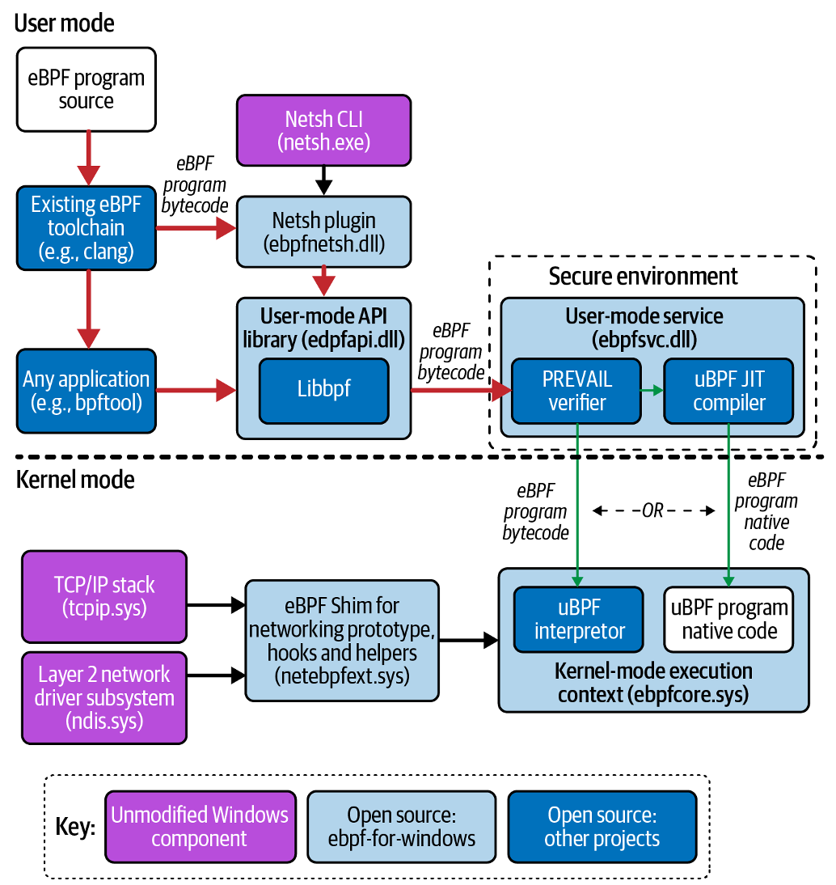

> 图 11-1：eBPF for Windows 架构概览，改编自 https://oreil.ly/HxKsu。

一个有趣的区别是，
eBPF 代码的验证和 JIT 编译发生在用户空间的一个 Windows 安全环境中，
而不是在内核中
（图 11-1 中显示在内核里的 uBPF 解释器只用于调试构建，
不用于生产环境）。

指望每一个为在 Linux 上运行而编写的 eBPF 程序都能在 Windows 上工作，
是不现实的。
但这与让 eBPF 程序在不同 Linux 内核版本上运行的挑战并没有太大不同：
即使有 CO-RE 支持，
内核内部数据结构在不同版本之间也可能被修改、增加或删除。
优雅地处理这些可能性，
正是 eBPF 程序员的工作。

说到 Linux 内核的变化，
未来几年我们可以期待 eBPF 出现哪些变化呢？

## Linux eBPF 的演进

自 3.15 版本以来，
eBPF 的能力几乎随着每个内核版本都在演进。
如果你想知道任意给定版本中有哪些可用特性，
BCC 项目维护了一份实用的清单。
而我当然期待未来几年会有更多新增特性。

预测未来走向的最好办法，
就是直接倾听正在做这项工作的人。
例如，
在 2022 年的 Linux Plumbers Conference 上，
eBPF 维护者 Alexei Starovoitov 在演讲中讨论了他预期 eBPF 程序所使用的 C
语言将如何演进。⁴
我们已经看到，
eBPF 从支持几千条指令，
演进到几乎不受限制的复杂度，
增加了对循环的支持，
以及不断扩充的 BPF 辅助函数集合。
随着更多能力被加入所支持的 C 语言，
再加上验证器的支持，
eBPF C 有可能演进到允许开发内核模块的全部灵活性，
同时保留 eBPF 的安全性和动态加载特性。

其他一些正在讨论和开发中的 eBPF 新特性和新能力的想法包括：

### 签名的 eBPF 程序

软件供应链安全是过去几年的热门话题，
其中一个关键要素，
是能够确认你打算运行的程序来自预期的来源且未被篡改。
实现这一点的一种方式，
一般来说，
是校验随程序附带的加密签名。
你可能会认为这是内核可以为 eBPF 程序做的事情，
也许可以作为验证步骤的一部分，
但不幸的是，
这并不简单！
正如你在本书中所见，
用户空间加载器会动态地调整程序，
写入映射所在位置的信息；
出于 CO-RE 的目的也会做类似调整。
从签名的视角看，
这些调整很难与恶意修改区分开来。
这是 eBPF 社区热切希望找到解决方案的一个问题。

### 长生命周期的内核指针

eBPF 程序可以用辅助函数或 kfunc 获取指向内核对象的指针，
但指针只在该次程序执行期间有效。
指针不能存入映射以供日后取用。
带类型指针支持的想法，
将在这个领域提供更大的灵活性。

### 内存分配

eBPF 程序直接调用 kmalloc() 这样的内存分配函数是不安全的，
但有一项提案建议提供 eBPF 专属的替代方案。

当新的 eBPF 特性出现时，
你什么时候能用上它们呢？
作为最终用户，
你能用上哪些特性，
取决于你在生产环境中运行的内核版本；
正如我在[第 1 章](#第-1-章-什么是-ebpf它为什么重要)讨论的，
内核版本进入稳定的 Linux 发行版可能需要数年时间。
作为个人，
你可以选择使用最前沿的内核，
但绝大多数运行服务器部署的组织使用的是稳定的、受支持的版本。
eBPF 程序员必须考虑到：
如果他们编写的代码利用了内核最新加入的特性，
这些特性在未来几年内都不太可能在大多数生产环境中可用。
有些组织的需求足够紧迫，
值得更快地推出更新的内核版本，
以便尽早采用新的 eBPF 特性。

例如，
在另一场关于构建未来网络的前瞻性演讲中，
Daniel Borkmann 讨论了一个名为 Big TCP 的特性。
它在 Linux 5.19 版本中加入，
通过把网络数据包批量交由内核处理，
实现 100 GBit/s（及更快）的网络速度。
大多数 Linux 发行版在几年内都不会支持这么新的内核，
但对于处理大量网络流量的专业机构来说，
更早升级很可能物有所值。
今天就把 Big TCP 支持加入 eBPF 和 Cilium，
意味着那些超大规模用户现在就能用上它，
即使我们大多数人在一段时间内还无法启用它。

由于 eBPF 允许动态调整内核代码，
有理由期待它被用来解决现网中的问题。
在[第 9 章](#第-9-章-用-ebpf-实现安全)中，
你读到了用 eBPF 缓解内核漏洞的内容；
目前还有一些工作正在进行，
用 eBPF 来帮助支持人机接口设备，
如鼠标、键盘和游戏手柄。
这建立在[第 7 章](#第-7-章-ebpf-程序类型与挂载类型)提到的、
对红外控制器所用协议进行解码的现有支持之上。

## eBPF 是平台，而非特性

大约十年前，
最热门的新技术是容器，
似乎人人都在谈论它们是什么、会带来什么好处。
今天的 eBPF 正处于类似的阶段，
大量的会议演讲和博客文章——
本书就引用了其中不少——
都在称颂 eBPF 的好处。
如今，
容器已经成为许多开发者日常生活的一部分，
无论是在本地用 Docker 或其他容器运行时运行代码，
还是把代码部署到 Kubernetes 环境。
eBPF 也会成为每个人日常工具箱的一部分吗？

我相信答案是否定的——
至少不会直接如此。
大多数用户不会直接编写 eBPF 程序，
也不会用 bpftool 之类的工具手动操作它们。
但他们会经常与用 eBPF 构建的工具打交道，
无论是用于性能测量、调试、网络、安全、跟踪，
还是其他众多尚待人们用 eBPF 实现的能力。
用户可能并不会意识到自己在使用 eBPF，
正如他们使用容器时，
可能并不知道自己正在使用 namespace 和 cgroup 这样的内核特性。

今天，
了解 eBPF 的项目和厂商会强调自己对它的使用，
因为它如此强大，
意味着诸多优势。
随着基于 eBPF 的项目和产品获得认可和市场份额，
eBPF 正在成为基础设施工具事实上的默认技术平台。

eBPF 编程知识现在是——并将继续是——
一种抢手但相对稀缺的技能，
正如今天的内核开发远比开发业务应用或游戏少见得多。
如果你喜欢深入系统底层，
想要构建必不可少的基础设施工具，
eBPF 技能会让你受益匪浅。
希望本书在你的 eBPF 之旅中有所助益！

## 延伸阅读

本书中我已经提供了指向具体文章和文档页面的参考。
这里再列出一些额外的资源，
为你的 eBPF 之旅提供帮助：

- eBPF 社区网站 ebpf.io

- Cilium 文档中的 BPF 和 XDP 参考

- Linux 内核的 BPF 文档

- Brendan Gregg 关于用 eBPF 做性能与可观测性的网站

- Andrii Nakryiko 的网站，
  尤其适合进一步了解 CO-RE 和 libbpf

- Lwn.net，
  了解 Linux 内核（包括 BPF 子系统）更新的绝佳资源

- Elixir.bootlin.com，
  可以在这里浏览 Linux 源代码

- eCHO，
  每周一次的直播节目，
  涵盖 eBPF 和 Cilium 社区的各类话题
  （本书作者是常驻主讲人之一）

## 结语

恭喜你读到了本书的结尾！

希望阅读《Learning eBPF》让你领略了 eBPF 的强大。
也许它激发了你亲自编写 eBPF 代码、
或动手试试我讨论过的一些工具的兴趣。
如果你已经决定做一些 eBPF 编程，
希望本书给了你一些关于如何入门的信心。
而如果你在阅读过程中完成了各章的练习，
太棒了！

如果你对 eBPF 充满热情，
有很多方式可以参与社区。
最好的起点是 ebpf.io 网站。
它会把你引向最新的新闻、项目、活动和动态，
也会把你引向 eBPF Slack 频道，
在那里你很可能找到能解答你任何问题的专家。

欢迎你对本书提出反馈、评论和指正。
你可以通过本书配套的 GitHub 仓库提交你的意见：
github.com/lizrice/learning-ebpf。
我也很乐意直接听到你的评论。
在互联网的许多地方，
你都可以通过 @lizrice 找到我。

> ¹ 在此向 Meta 的 Alexei Starovoitov 和 Andrii Nakryiko、
> 以及 Isovalent 的 Daniel Borkmann 致意，
> 他们是 Linux 内核 BPF 子树的维护者。

> ² Dave Thaler 在 Linux Plumbers Conference 上介绍了这项标准化工作的现状。

> ³ 嗯，它*可以*复用，
> 但那样做会要求 Microsoft 也以 GPL 许可证发布 Windows 源代码。

> ⁴ Alexei Starovoitov 在这段视频中讨论了 BPF 从受限 C 语言到扩展的安全 C
> 语言的演进历程。

# 索引

> 索引条目后的页码对应原书印刷版。

## A

挂载

程序挂载到事件，49-51

用户空间，133-134

挂载类型

BPF，139

eBPF 程序与，125-140

Aya 项目，197-199

## B

BCC 框架

BPF 函数调用，30

"Hello World" 应用，15-35

可移植性方案，80

Python/Lua/C++，189-191

Berkeley Packet Filter（BPF）

eBPF 的起源与，1

向 eBPF 的演进，2

Borkmann, Daniel，4, 203

BPF 挂载类型，139

BPF trampoline，130

BPF Type Format（BTF）（见 BTF）

bpf() 系统调用，59-77

挂载到 kprobe 事件，70

创建映射，63

对其的 libbpf 封装，102

加载 BTF 数据，63

加载程序，64

从用户空间修改映射，65-67

perf 缓冲区，69

perf 事件，71

程序和映射引用，67-69

从映射读取信息，74-76

环形缓冲区，72-74

用 BPF_PROG_RUN 测试，199

bpftool

用其将程序挂载到事件，49

用其自动生成 BPF 骨架代码，102-106

BPF 重定位，101

用其将程序从网络接口卸载，53

用其导出 JIT 编译后的机器码，48

与辅助函数，126

用其查看 BTF 类型，89

生成内核头文件，90

用其列出 BTF 信息，83-84

用其列出程序，45

用其将程序加载到内核，44, 54

perf 子命令，127

用其固定，67

读取映射信息，74-75

用其从内核移除程序，54

显示加载到内核的映射，51

显示翻译后的字节码，47

骨架代码生成，82

用其查看映射内容，66

用其可视化控制流，113

XDP 与，151

bpftrace，185-188

BPF_MAP_CREATE，64

BPF_MAP_GET_FD_BY_ID，74

BPF_MAP_GET_NEXT_ID，74

BPF_MAP_UPDATE_ELEM，66, 69, 71

BPF_OBJ_GET_INFO_BY_FD，74

BPF_PERF_OUTPUT，24, 26

BPF_PROG_ATTACH，76

BPF_PROG_LOAD，77

BPF_PROG_RUN，199

BPF_RAW_TRACEPOINT_OPEN，76

BSD Packet Filter（见 Berkeley Packet Filter）

BTF（BPF Type Format），82-89

BTF 类型，85-87

函数与函数原型的数据，88

目标文件中的信息，100

查看映射和程序的 BTF 数据，89

引入，4

内核头文件，89-90

用 bpftool 列出 BTF 信息，83-84

加载 BTF 数据，63

带 BTF 信息的映射，87

用例，82

支持 BTF 的 tracepoint，133

字节码

JIT 编译后的机器码，48

翻译后的，47

## C

C（语言）

用 C 编写 eBPF 程序，191-196

"Hello World" 应用，15-35

内核侧代码，189

C++，BCC 工具，191

cgroup（control group），138

Cilium

协同的网络程序，163-165

ebpf-go 库，193-195

起源，3

Cilium Tetragon，179-182

挂载到内核内部函数，180

预防式安全，180

Clang 编译器，42, 97

云原生环境，11-13

CNI（Container Network Interface），163, 165

一次编译、随处运行（CO-RE）程序，91-98

基础，79

BPF 重定位信息，100

目标文件中的 BTF 信息，100

为 CO-RE 编译 eBPF 程序，98-100

定义映射，93

eBPF 程序段，94-96

头文件，91-93

许可证定义，98

内存访问，97-98

概览，81

用户空间代码，101

CO-RE 重定位，81

代码示例，GitHub 仓库，xi

编译为 eBPF 字节码，98-100

调试信息，98

Makefile 指令，99

优化，98

目标架构，99

编译，定义，38

复杂度上限，4

Container Network Interface（CNI），163, 165

容器，cgroup 与，138

上下文参数，125

上下文信息，用验证器访问，120

## D

DDoS 防护，144

调试，98

解引用指针，119

从网络接口卸载程序，53

文档，44

丢包计数器，24

动态加载，9

## E

eBPF（总体）

向内核添加新功能，7-8

基础，1-13

Berkeley Packet Filter 与，1

云原生环境与，11-13

eBPF 程序的动态加载，9

从 BPF 演进而来，2

向生产系统的演进，3-4

辅助函数，126

eBPF 程序的高性能，10

内核模块，8

Linux 内核与，5-7

程序（见 eBPF 程序）

术语，4

虚拟机（见虚拟机）

eBPF for Windows，204-206

eBPF 基金会，203

ebpf-go，193-195

封装，轻量隧道与，138

加密

Kubernetes 中的加密连接，166-168

数据包加密/解密，157-160

透明加密，167

事件

将 eBPF 挂载到 kprobe 事件，70

将程序挂载到事件，49-51

事件缓冲区，105

execve 系统调用函数，105

## F

Facebook，Katran 与，3

Falco，176

fentry 程序，130

fexit 程序，130

文件描述符，63

防火墙

定义，144

网络策略执行与，165

flow dissector，138

帧指针，116

函数调用，29, 54-55

函数与函数原型，BTF 数据，88

## G

全局变量，51-53

Go，192

gobpf，193

GPL 许可证，116

Gregg, Brendan，3

## H

哈希表映射，21-24

头文件，C，41

应用专属头文件，93

CO-RE eBPF 程序的，91-93

生成内核头文件，89-90

来自 libbpf 的头文件，92

内核头文件，92

辅助函数，126

## I

红外控制器，139

查看已加载的程序，45-49

BPF 程序标签，47

JIT 编译后的机器码，48

翻译后的字节码，47

指令

复杂度上限，4

eBPF 虚拟机的，38-40

验证器对无效指令的检查，122

验证器对不可达指令的检查，122

ioctl，70-72

Iovisor 项目，xi

IP 地址，Kubernetes 与，165

ip link，50, 68

ip route，138

IPsec 加密协议，167

iptables，规避，163

## J

Jacobson, Van，1

JIT 编译，48

跳转指令，29

## K

Katran，3

内核

向其添加新功能，7-8

基础，5-7

定义，5

内核特性的演进，xi

生成内核头文件，89-90

查看内核中已加载的程序，45-49

将 eBPF 程序加载到内核，44

从内核移除程序，54

内核头文件，89-90

内核模块，8

kfunc，127

kprobe，128-130

将 eBPF 程序挂载到 kprobe 事件，70

挂载到系统调用入口点，128

挂载到各种内核函数，129

起源，3

kube-proxy，163

Kubernetes

规避 iptables，163

cgroup 与，138

CNI，163, 165

eBPF 与 Kubernetes 网络，160-168

加密连接，166-168

策略执行，165

sidecar 模式，12

## L

libbpf

访问映射，104

BPF 骨架，102-106

代码示例，106

eBPF 编程与，191-196

ebpf-go，193-195

辅助函数的头文件，92

来自 libbpf 的头文件，92

将程序/映射加载到内核，104

用户空间，102-106

libbpf-rs，196

libbpfgo，195

许可证

CO-RE 与，98

eBPF 验证器与，116

轻量隧道，138

链接，BPF，68

Linux 内核（见内核）

LLVM，197

llvm-objdump，42

负载均衡，148-151

kube-proxy，163

日志，验证器，111-113

循环，验证器的处理，120

LSM（Linux Security Module）

LSM BPF，4, 178-179

挂载到 LSM 的程序，134

Lua，BCC 工具，191

## M

Makefile，99

映射引用，67-69

映射，BPF，20-34

访问，104

创建，63

定义，20

为 CO-RE 程序定义，93

查找，74

函数调用与，29

哈希表映射，21-24

查看映射的 BTF 数据，89

带 BTF 信息的映射，87

从用户空间修改，65-67

从映射读取信息，74-76

读取映射元素，75

复用其语义用作全局变量，51-53

尾调用与，30-34

McCanne, Steven，1

内存访问

验证器执行的检查，116-118

CO-RE 的，97-98

Meta，Katran 与，3

Microsoft（eBPF for Windows），204-206

模块，内核，8

## N

Nakryiko, Andrii，4, 203

网络接口

从网络接口卸载程序，53

面向网络接口的 "Hello World" 程序，40-42

网络安全，182

网络安全，157-160

丢包，144-148

数据包加密/解密，157-160

网络

eBPF 网络应用，143-168

eBPF 程序类型，135-139

Kubernetes 与 eBPF，160-168

负载均衡与转发，148-151

网络安全，144-148

丢包，144-148

数据包加密/解密，157-160

策略执行，165

安全，182

流量控制，153-156

XDP 卸载，151

网络程序类型，135-139

cgroup，138

flow dissector，138

红外控制器，139

轻量隧道，138

套接字，137

与追踪类类型的对比，136

流量控制，137

XDP，137

## O

目标文件

编译，42

查看，42-44

可观测性工具，与安全工具的对比，171-172

opensnoop，200

优化，98

## P

丢包，144-148

XDP 数据包解析，145-148

XDP 程序返回码，144

数据包加密/解密，157-160

数据包处理，40

死亡数据包漏洞，144

perf 缓冲区

初始化，69

管理，105

与环形缓冲区的对比，24, 72

设置/读取 perf 事件，71

perf 环形缓冲区，24

perf 相关程序，127

Performance Measurement Unit（PMU），70

perf_event_open()，70

固定，67

Pod，定义，160

指针，解引用前检查，119

策略，安全可观测性与，171

可移植性（见 CO-RE）

预防式安全，180

特权，19

提权，180

运行 eBPF 程序所需的，19, 45

生产系统，eBPF 向生产系统的演进，3-4

程序段，94-96

程序标签，47

eBPF 编程，185-201

BCC Python/Lua/C++，189-191

bpftrace，185-188

C 与 libbpf，191-196

Go，192

内核侧 eBPF 的语言选择，189

多个 eBPF 程序，200

Rust，196-199

测试，199

eBPF 程序，37-56

剖析，37-56

挂载到事件，49-51

挂载到 kprobe 事件，70

挂载类型，125-140

BPF 到 BPF 调用，54-55

编译 eBPF 目标文件，42

上下文参数，125

从网络接口卸载，53

动态加载，9

eBPF 虚拟机，38-40

确保程序运行至完成，120

全局变量，51-53

辅助函数与返回码，126

高性能，10

查看 eBPF 目标文件，42-44

查看程序的 BTF 数据，89

查看内核中已加载的程序，45-49

kfunc 与，127

加载到内核，44

用 bpf() 系统调用加载，64

网络类型，135-139

从内核移除，54

段，94-96

尾调用，30-34

追踪，127-135

卸载，54

伪文件系统，67

Python BCC 工具，189-191

## R

Red Hat Enterprise Linux（RHEL），7

redbpf，197

引用，程序和映射，67-69

BPF 链接与，68

固定与，67

寄存器，eBPF 虚拟机的，38

重定位，BPF，100

返回码

用验证器检查，121

程序类型与，126

XDP 程序返回码，144

RHEL（Red Hat Enterprise Linux），7

环形缓冲区映射，24

环形缓冲区，72-74

基础，24

丢包计数器，24

与 perf 缓冲区的对比，24, 72

Rust，196-199

Aya 与，197-199

libbpf-rs 与，196

redbpf 与，197

## S

SEC()，41, 94

seccomp

基础，173

生成 seccomp 配置档，174-176

引入，2

安全，171-183

Cilium Tetragon，179-182

Kubernetes 中的加密连接，166-168

生成 seccomp 配置档，174-176

LSM BPF，178-179

网络安全，182

可观测性工具与安全工具的对比，171-172

丢包，144-148

数据包加密/解密，157-160

seccomp，173

用系统调用获取安全事件，173-178

sidecar 模式，12-13

骨架代码

访问映射，104

将程序挂载到事件，105

自动生成，82

用 bpftool 自动生成，102-106

将程序/映射加载到内核，104

管理事件缓冲区，105

套接字，137

自旋锁，83

SSL 库，157-160

Starovoitov, Alexei，4, 203

状态剪枝，111

子程序，eBPF，30, 54-55

系统调用

将 kprobe 挂载到入口点，128

bpf()（见 bpf() 系统调用）

生成 seccomp 配置档，174-176

Linux 内核与，5

seccomp 与，173

追踪系统调用的安全工具，176-178

用于安全事件，173-178

## T

标签，BPF 程序，47, 50

尾调用，30-34

目标架构，为 CO-RE 程序指定，99

TC（见流量控制）

测试 BPF 程序，199

Tetragon（见 Cilium Tetragon）

Time Of Check to Time Of Use（TOCTOU），176-178

tracepoint，131-133

追踪

bpf_trace_printk()，17, 20, 41

eBPF 程序，perf 相关，127-135

fentry/fexit，130

kprobe 与 kretprobe，128-130

LSM，134

trace pipe，20, 27, 51

tracepoint，131-133

用户空间挂载，133-134

流量控制（TC），137, 153-156, 165

透明加密，167

隧道，轻量，138

## U

卸载程序，54, 67

不可达指令，验证器的检查，122

用户空间

CO-RE，101

事件，133-134

与内核，5

面向用户空间的 libbpf 库，102-106

SSL 库，157-160

user statically defined tracepoint（USDT），133

## V

验证器，109-123

访问上下文，120

检查无效指令，122

检查不可达指令，122

检查内存访问，116-118

解引用前检查指针，119

检查返回码，121

检查许可证，116

确保程序运行至完成，120

辅助函数参数，115

循环，120

校验辅助函数，114

验证过程，110-111

验证器日志，111-113

可视化控制流，113

虚拟机，eBPF，38-40

指令，38-40

寄存器，38

## W

宽指令编码，39, 44

Windows，eBPF for Windows，204-206

WireGuard 加密协议，167

## X

XDP（eXpress Data Path）

负载均衡与转发，148-151

内存访问，116

卸载，42, 151

数据包解析，145-148

程序类型，137

返回码，126, 144

# 关于作者

Liz Rice 是 eBPF 专业公司 Isovalent 的首席开源官，
Isovalent 是云原生网络、安全与可观测性项目 Cilium 的创建者。
她是 CNCF 理事会和 OpenUK 董事会的成员。
她曾在 2019–2022 年担任 CNCF 技术监督委员会主席，
并在 2018 年担任 KubeCon + CloudNativeCon 联合主席。
她还是 O'Reilly 出版的《Container Security》一书的作者。

她在网络协议和分布式系统，
以及 VOD、音乐和 VoIP 等数字技术领域，
拥有丰富的软件开发、团队和产品管理经验。
在不写代码或不谈论代码的时候，
Liz 喜欢在天气比她家乡伦敦更好的地方骑自行车，
在 Zwift 上参加虚拟竞速，
并以 Insider Nine 的化名创作音乐。

# 版权说明

《Learning eBPF》封面上的动物是早绒熊蜂（*Bombus pratorum*），
这是一种分布于欧洲大部分地区（尤其是英国）和亚洲部分地区的熊蜂。

早绒熊蜂在田野、公园和稀疏森林的地面上筑巢，
甚至会改造利用废弃的鸟巢或啮齿动物的巢。
早绒熊蜂确实在一年中很早就开始活动，
通常从三月到七月，
但在英格兰南部，
工蜂早在二月就会出现，
因此一年内出现两个蜂群周期相当常见。

这种熊蜂比其他熊蜂小不少。
虽然蜂后、工蜂和雄蜂之间略有差异，
但早绒熊蜂的外形一般是黑色，
带一圈黄色的颈环，
腹节上另有一条黄色带纹，
尾部呈红色或暗橙色。

早绒熊蜂形成由蜂后和工蜂组成的蜂群，
但不同寻常的是，
蜂后用攻击性行为而非信息素来确立统治地位，
用上颚去顶撞最强壮的工蜂，
以维持对蜂群的控制。
工蜂采集白三叶草、蓟、鼠尾草、薰衣草等开花植物的花蜜和花粉；
雄蜂在蜂群周期的后期产生，
随后离巢去寻找新的蜂后。

O'Reilly 封面上的许多动物都是濒危物种；
它们对世界都很重要。
封面插图由 Karen Montgomery 创作，
取材自《The Animal Kingdom Illustrated》中的一幅古老线刻版画。
封面字体是 Gilroy Semibold 和 Guardian Sans。
正文字体是 Adobe Minion Pro；
标题字体是 Adobe Myriad Condensed；
代码字体是 Dalton Maag 的 Ubuntu Mono。
