# Efficient Memory Management for Large Language Model Serving with PagedAttention

Woosuk Kwon*、Zhuohan Li*、Siyuan Zhuang、Ying Sheng、 Lianmin Zheng、Cody Hao
Yu、 Joseph E. Gonzalez、Hao Zhang、Ion Stoica

加州大学伯克利分校、斯坦福大学、独立研究者、加州大学圣地亚哥分校

## 摘要

大语言模型（LLM）的高吞吐服务要求同时批处理足够多的请求。
然而，现有系统难以应对， 因为每个请求的 key-value cache（KV cache）内存巨大，
而且会动态地增长和收缩。 如果管理不当，
这部分内存会因碎片和冗余重复而被大量浪费， 从而限制批量大小。 为解决这个问题，
我们提出 PagedAttention，
这是一种受操作系统中经典的虚拟内存与分页技术启发的注意力算法。 在此基础上，
我们构建了 vLLM， 一个 LLM 服务系统， 实现了（1）KV cache 内存的接近零浪费，
以及（2）请求内和请求间灵活的 KV cache 共享， 从而进一步降低内存占用。
评估表明， 与 FasterTransformer 和 Orca 等最先进的系统相比， vLLM
在相同延迟水平下将主流 LLM 的吞吐量提高了 2—4 倍。
序列越长、模型越大、解码算法越复杂， 这一提升就越明显。 vLLM 的源代码已在
https://github.com/vllm-project/vllm 公开。

> \* 同等贡献。

> 本作品的部分或全部内容可为个人或课堂使用免费复制，
> 前提是副本不以盈利或商业利益为目的而制作或分发，
> 且副本首页带有本声明和完整引用。 本作品中第三方组件的版权必须得到尊重。
> 其他用途请联系作者/版权所有者。

> SOSP '23，2023 年 10 月 23—26 日，德国科布伦茨。

> © 2023 版权归作者/版权所有者所有。

> ACM ISBN 979-8-4007-0229-7/23/10。

> https://doi.org/10.1145/3600006.3613165

## 1. 引言

GPT [5, 37] 和 PaLM [9] 等大语言模型的出现催生了编程助手 [6, 18]
和通用聊天机器人 [19, 35] 等新应用， 它们正开始深刻影响我们的工作和日常生活。
许多云厂商 [34, 44] 正竞相以托管服务的形式提供这些应用。
然而，运行这些应用的成本非常高， 需要大量的 GPU 等硬件加速器。 据最近的估计，
处理一个 LLM 请求的成本可能是传统关键词查询的 10 倍 [43]。 鉴于如此高昂的成本，
提高 LLM 服务系统的吞吐量——从而降低每个请求的成本——正变得越来越重要。

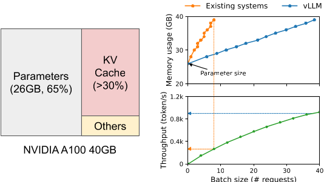

> 图 1：左：在 NVIDIA A100 上运行 13B 参数 LLM 时的内存布局。
> 参数（灰色）在整个服务期间常驻 GPU 内存。 KV
> cache（红色）的内存随每个服务请求分配和释放。 少量内存（黄色）被临时用于激活。
> 右：vLLM 平滑了现有系统 [31, 60] 中 KV cache 内存的快速增长曲线，
> 从而显著提升服务吞吐量。

LLM 的核心是一个自回归 Transformer 模型 [53]。
该模型基于输入（prompt）和目前已生成的输出 token 序列， 逐个生成词（token）。
对于每个请求， 这一昂贵的过程会一直重复， 直到模型输出终止 token。
这种串行生成过程使工作负载受限于内存， 无法充分利用 GPU 的计算能力，
从而限制了服务吞吐量。

将多个请求批处理在一起可以提高吞吐量。 然而，要在一个批次中处理大量请求，
就必须高效管理每个请求的内存空间。 例如，图 1（左） 展示了一个 13B 参数的 LLM 在
40GB 内存的 NVIDIA A100 GPU 上的内存分布。 约 65% 的内存分配给模型权重，
权重在服务期间保持不变。 近 30% 的内存用于存储请求的动态状态。 对 Transformer
而言， 这些状态由与注意力机制关联的 key 和 value 张量组成， 通常称为 KV cache
[41]， 它们代表先前 token 的上下文， 用于依次生成新的输出 token。
剩余的一小部分内存用于其他数据， 包括激活——即评估 LLM 时临时创建的张量。
由于模型权重是常量， 且激活只占 GPU 内存的一小部分， KV cache
的管理方式就成为决定最大批量大小的关键。 如果管理不当， KV cache
内存会严重限制批量大小， 进而限制 LLM 的吞吐量， 如图 1（右）所示。

本文观察到， 现有的 LLM 服务系统 [31, 60] 在高效管理 KV cache 内存方面存在不足。
这主要是因为它们将请求的 KV cache 存储在连续内存空间中——大多数深度学习框架 [33,
39] 都要求张量连续存储。 然而，与传统深度学习工作负载中的张量不同， KV cache
具有独特的性质： 它会随着模型生成新 token 而动态增长和收缩，
其生存期和长度都无法事先预知。 这些特性使现有系统的方法在两个方面显著低效：

第一，现有系统 [31, 60] 存在内部和外部内存碎片。 为了将请求的 KV cache
存入连续空间， 它们按请求的最大长度（如 2048 个 token）预分配一块连续内存。
这会造成严重的内部碎片， 因为请求的实际长度可能远小于其最大长度（例如图 11）。
此外，即使实际长度事先已知， 预分配仍然低效：
由于整块内存在请求的生存期内都被预留，
其他更短的请求无法利用该块中当前未使用的任何部分。 除此之外，
外部碎片也可能很严重， 因为每个请求的预分配大小可能不同。 事实上， 图 2
中的分析结果表明， 在现有系统中， 只有 20.4%—38.2% 的 KV cache
内存被用于存储实际的 token 状态。

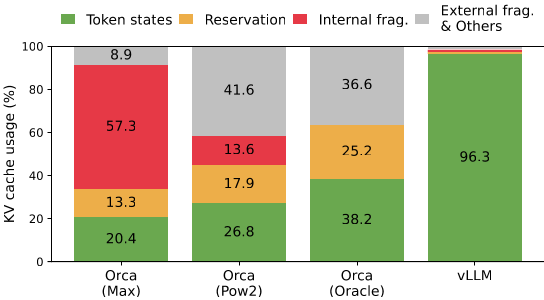

> 图 2：§6.2 实验中不同 LLM 服务系统的平均内存浪费百分比。

第二，现有系统无法利用内存共享的机会。 LLM
服务通常使用并行采样和束搜索等高级解码算法， 为每个请求生成多个输出。
在这些场景中， 请求由多个序列组成， 这些序列可以部分共享其 KV cache。
然而，在现有系统中内存共享无法实现， 因为各序列的 KV cache
存储在各自独立连续的空间中。

为解决上述局限， 我们提出 PagedAttention，
这是一种受操作系统（OS）解决内存碎片与共享问题的方案——分页式虚拟内存——启发的注意力算法。
PagedAttention 将请求的 KV cache 划分为块， 每块可容纳固定数量 token 的注意力
key 和 value。 在 PagedAttention 中， KV cache 的块不必存储在连续空间中。
因此，我们可以像操作系统的虚拟内存那样更灵活地管理 KV cache： 可以把块看作页，
把 token 看作字节， 把请求看作进程。 这一设计通过使用相对较小的块并按需分配，
缓解了内部碎片。 此外，由于所有块大小相同， 它还消除了外部碎片。 最后，
它以块为粒度实现内存共享， 既可以在同一请求关联的不同序列之间共享，
甚至可以跨不同请求共享。

在此基础上， 我们构建了 vLLM， 一个高吞吐的分布式 LLM 服务引擎， 实现了 KV cache
内存的接近零浪费。 vLLM 采用块级内存管理和抢占式请求调度， 二者与 PagedAttention
协同设计。 vLLM 支持 GPT [5]、OPT [62] 和 LLaMA [52] 等各种规模的主流 LLM，
包括超过单张 GPU 内存容量的模型。 我们在多种模型和工作负载上的评估表明，
与最先进的系统 [31, 60] 相比， vLLM 将 LLM 服务吞吐量提高了 2—4 倍，
且完全不影响模型精度。 序列越长、模型越大、解码算法越复杂，
提升就越明显（§4.3）。 总之，本文的贡献如下：

- 我们指出了 LLM 服务中内存分配的挑战， 并量化了其对服务性能的影响。

- 我们提出 PagedAttention， 一种作用于存储在非连续分页内存中的 KV cache
  的注意力算法， 其灵感来自操作系统中的虚拟内存与分页。

- 我们设计并实现了 vLLM， 一个构建在 PagedAttention 之上的分布式 LLM 服务引擎。

- 我们在多种场景下评估了 vLLM， 证明其大幅优于 FasterTransformer [31] 和 Orca
  [60] 等此前最先进的方案。

## 2. 背景

本节介绍典型 LLM 的生成与服务过程， 以及 LLM 服务中使用的迭代级调度。

### 2.1 基于 Transformer 的大语言模型

语言建模的任务是对一串 token $(x_1, \ldots, x_n)$ 的概率建模。
由于语言具有自然的顺序性，
通常将整个序列上的联合概率分解为条件概率的乘积（即自回归分解 [3]）：

$$ P(x)=P(x_{1})\cdot P(x_{2}\mid x_{1})\cdots P(x_{n}\mid x_{1},\ldots,x_{n-1}). \tag{1} $$

Transformer [53] 已成为大规模建模上述概率的事实标准架构。 基于 Transformer
的语言模型中最重要的组件是其自注意力层。 对于输入隐状态序列
$(x_1, \ldots, x_n) \in \mathbb{R}^{n \times d}$， 自注意力层首先对每个位置 $i$
应用线性变换， 得到 query、key 和 value 向量：

$$ q_{i}=W_{q}x_{i},\ k_{i}=W_{k}x_{i},\ v_{i}=W_{v}x_{i}. \tag{2} $$

然后， 自注意力层将一个位置的 query 向量与其之前所有 key 向量相乘，
得到注意力分数 $a_{ij}$， 并计算输出 $o_i$ 为 value 向量的加权平均：

$$ a_{ij}=\frac{\exp(q_{i}^{\top}k_{j}/\sqrt{d})}{\sum_{t=1}^{i}\exp(q_{i}^{\top}k_{t}/\sqrt{d})},\ o_{i}=\sum_{j=1}^{i}a_{ij}v_{j}. \tag{3} $$

除式（3）中的计算外， Transformer
模型中的所有其他组件——包括嵌入层、前馈层、层归一化 [2]、残差连接 [22]、 输出
logit 计算， 以及式（2）中的 query、key、value 变换——都以 $y_i = f(x_i)$
的形式逐位置独立应用。

### 2.2 LLM 服务与自回归生成

训练完成后， LLM 通常被部署为条件生成服务（如补全 API [34] 或聊天机器人 [19,
35]）。 发给 LLM 服务的请求提供一串输入 prompt token $(x_1, \ldots, x_n)$， LLM
服务则按式（1）生成一串输出 token $(x_{n+1}, \ldots, x_{n+T})$。 我们把 prompt
与输出拼接起来的列表称为序列。

由于式（1）的分解， LLM 只能逐个采样并生成新 token， 且每个新 token
的生成过程都依赖于该序列中所有先前的 token， 具体而言是它们的 key 和 value
向量。 在这一串行生成过程中， 已有 token 的 key 和 value 向量通常被缓存起来，
用于生成后续 token， 称为 KV cache。 注意， 一个 token 的 KV cache
依赖于它之前的所有 token。 这意味着同一个 token 出现在序列中不同位置时， 其 KV
cache 是不同的。

给定一个请求 prompt， LLM 服务中的生成计算可以分为两个阶段：

**prompt 阶段**将整个用户 prompt $(x_1, \ldots, x_n)$ 作为输入， 计算第一个新
token 的概率 $P(x_{n+1} \mid x_1, \ldots, x_n)$。 在此过程中还会生成 key 向量
$k_1, \ldots, k_n$ 和 value 向量 $v_1, \ldots, v_n$。 由于 prompt token
$x_1, \ldots, x_n$ 全部已知， prompt 阶段的计算可以使用矩阵-矩阵乘法并行化。
因此，这一阶段可以高效利用 GPU 固有的并行性。

**自回归生成阶段**逐个串行生成其余的新 token。 在第 $t$ 次迭代， 模型以一个
token $x_{n+t}$ 作为输入， 用 key 向量 $k_1, \ldots, k_{n+t}$ 和 value 向量
$v_1, \ldots, v_{n+t}$ 计算概率 $P(x_{n+t+1} \mid x_1, \ldots, x_{n+t})$。
注意， 位置 $1$ 到 $n + t - 1$ 的 key 和 value 向量已在之前的迭代中缓存，
本次迭代只需计算新的 key 和 value 向量 $k_{n+t}$ 和 $v_{n+t}$。
当序列达到最大长度（由用户指定或受 LLM 限制）， 或生成序列结束（<eos>）token
时， 这一阶段结束。 由于数据依赖， 不同迭代的计算无法并行化，
且通常使用效率较低的矩阵-向量乘法。 因此，这一阶段对 GPU 计算的利用严重不足，
受限于内存， 占据了单个请求延迟的大部分。

### 2.3 LLM 的批处理技术

将多个请求批处理可以提高 LLM 服务的计算利用率。 由于请求共享相同的模型权重，
移动权重的开销被分摊到批次中的各个请求上； 当批量足够大时，
计算开销可以盖过这部分开销。 然而， 对 LLM 服务的请求进行批处理并不容易，
原因有二。 第一，请求可能在不同时间到达。
朴素的批处理策略要么让早到的请求等待晚到的请求，
要么把新到的请求推迟到之前的请求完成， 导致显著的排队延迟。
第二，请求的输入和输出长度可能相差很大（图 11）。
简单的批处理技术会对请求的输入和输出做填充以对齐长度， 浪费 GPU 计算和内存。

为解决这个问题， 研究者提出了细粒度批处理机制， 如 cellular batching [16]
和迭代级调度 [60]。 与工作在请求级的传统方法不同， 这些技术工作在迭代级。
每次迭代后， 已完成的请求被移出批次， 新请求被加入。
因此，新请求只需等待一次迭代即可被处理， 而不必等待整个批次完成。
此外，借助特殊的 GPU kernel， 这些技术消除了对输入和输出做填充的需要。
通过减少排队延迟和填充带来的低效， 细粒度批处理机制显著提高了 LLM 服务的吞吐量。

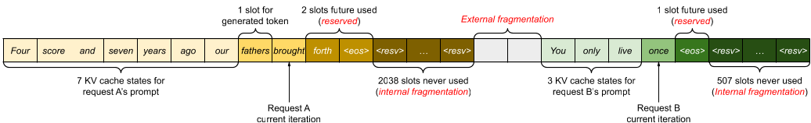

> 图 3：现有系统中的 KV cache 内存管理。
> 存在三类内存浪费——预留、内部碎片和外部碎片——导致其他请求无法放入内存。
> 每个内存槽中的 token 代表其 KV cache。 注意，相同的 token
> 在不同位置可以有不同的 KV cache。

## 3. LLM 服务中的内存挑战

尽管细粒度批处理减少了计算浪费， 并使请求能够更灵活地组批，
但能一起批处理的请求数量仍受 GPU 内存容量的限制， 尤其是分配给 KV cache
存储的空间。 换言之， 服务系统的吞吐量受限于内存。 要突破这一内存限制，
需要解决内存管理中的以下挑战：

**巨大的 KV cache。** KV cache 的大小随请求数量快速增长。 以 130 亿参数的 OPT
模型 [62] 为例， 单个 token 的 KV cache 需要 800 KB 空间， 计算方式为 2（key 和
value 向量）× 5120（隐状态维度）× 40（层数）× 2（FP16 的字节数）。 由于 OPT
最长可生成 2048 个 token 的序列， 存储一个请求的 KV cache 所需的内存可高达 1.6
GB。 目前的 GPU 内存容量为数十 GB。 即使把所有可用内存都分给 KV cache，
也只能容纳几十个请求。 此外，低效的内存管理会进一步缩小批量， 如图 2 所示。
另外，从当前趋势看， GPU 计算速度的增长快于内存容量的增长 [17]。 例如，从 NVIDIA
A100 到 H100， FLOPS 提高了 2 倍多， 但 GPU 内存最大仍为 80 GB。
因此，我们相信内存将成为越来越严重的瓶颈。

**复杂的解码算法。** LLM 服务为用户提供一系列解码算法，
每种算法对内存管理复杂度的影响各不相同。 例如，当用户要求对单个输入 prompt
做多次随机采样时——这是程序建议 [18] 中的典型用例——prompt 部分的 KV
cache（在我们的实验中占总 KV cache 内存的 12%， 见 §6.3）可以被共享，
以最大限度地减少内存占用。 另一方面， 自回归生成阶段的 KV cache 则不应共享，
因为各采样结果不同， 且依赖于上下文和位置。 KV cache
的共享程度取决于所使用的具体解码算法。 在束搜索 [49] 等更复杂的算法中，
请求的不同束之间可以共享更大比例的 KV cache（最多可节省 55% 内存， 见 §6.3），
且共享模式会随着解码过程的推进而变化。

**针对未知输入与输出长度的调度。** 发给 LLM
服务的请求在输入和输出长度上差异很大。 这要求内存管理系统能够适应范围很广的
prompt 长度。 此外，随着请求的输出长度在解码过程中增长， 其 KV cache
所需的内存也随之扩张， 可能会耗尽用于接纳新请求或维持现有 prompt
继续生成的可用内存。 系统需要做出调度决策， 例如将某些请求的 KV cache 从 GPU
内存中删除或换出。

### 3.1 现有系统中的内存管理

由于当前深度学习框架 [33, 39] 中的大多数算子要求张量连续存储， 此前的 LLM
服务系统 [31, 60] 也将一个请求在不同位置的 KV cache 存储为一个连续张量。 由于
LLM 的输出长度无法预知， 它们按请求可能的最大序列长度静态地为请求分配一块内存，
而不考虑请求的实际输入长度或最终输出长度。

图 3 展示了两个请求： 请求 A 的可能最大序列长度为 2048， 请求 B 为 512。
现有系统中的块预分配方案有三个主要的内存浪费来源： 为未来 token 预留的槽位、
因按可能的最大序列长度超额供给而产生的内部碎片， 以及来自 buddy
分配器等内存分配器的外部碎片。 外部碎片永远不会被生成的 token 使用，
这一点在服务一个请求之前就已知。 内部碎片同样保持闲置，
但只有在请求完成采样后才能确定。 两者都是纯粹的内存浪费。
预留内存虽然最终会被使用，
但在请求的整个生存期内预留这部分空间——尤其是当预留空间很大时——挤占了本可用于处理其他请求的空间。
我们在图 2 中可视化了实验中各类内存浪费的平均占比， 结果表明， 在之前的系统中，
实际有效内存可能低至 20.4%。

尽管 compaction [54] 被提出作为解决碎片问题的潜在方案， 但在对性能敏感的 LLM
服务系统中， 由于 KV cache 规模巨大， 执行 compaction 并不实际。 即使采用
compaction，
每个请求的预分配块空间也阻碍了现有内存管理系统针对解码算法的内存共享。

## 4. 方法

本文提出了一种新的注意力算法 PagedAttention， 并构建了 LLM 服务引擎 vLLM，
以应对 §3 所述的挑战。 vLLM 的架构如图 4 所示。 vLLM
采用集中式调度器来协调分布式 GPU worker 的执行。 KV cache
管理器以分页方式高效管理 KV cache， 这由 PagedAttention 提供支持。 具体而言， KV
cache 管理器通过集中式调度器发送的指令， 管理 GPU worker 上的物理 KV cache
内存。

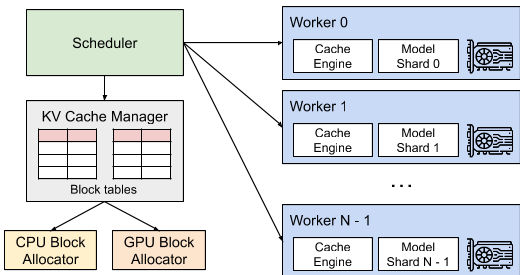

> 图 4：vLLM 系统概览。

接下来， 我们在 §4.1 介绍 PagedAttention 算法。 在此基础上， §4.2 展示 KV cache
管理器的设计， §4.3 展示它如何支撑 PagedAttention。 然后，
我们展示该设计如何为各种解码方法实现高效的内存管理（§4.4），
以及如何处理变长的输入和输出序列（§4.5）。 最后， 我们展示 vLLM
的系统设计如何在分布式环境中工作（§4.6）。

### 4.1 PagedAttention

为应对 §3 中的内存挑战， 我们提出 PagedAttention， 一种受操作系统中经典分页思想
[25] 启发的注意力算法。 与传统注意力算法不同， PagedAttention 允许将连续的 key
和 value 存储在非连续的内存空间中。 具体而言， PagedAttention 将每个序列的 KV
cache 划分为 KV 块。 每块包含固定数量 token 的 key 和 value 向量¹，
我们将这一数量记为 KV 块大小（B）。 记 key 块
$K_{j} = (k_{(j-1)B+1}, \ldots, k_{jB})$， value 块
$V_{j} = (v_{(j-1)B+1}, \ldots, v_{jB})$。
式（3）中的注意力计算可以转换为如下的分块计算：

$$ A_{ij}=\frac{\exp(q_{i}^{\top}K_{j}/\sqrt{d})}{\sum_{t=1}^{\lceil i/B\rceil}\exp(q_{i}^{\top}K_{t}\mathbf{1}/\sqrt{d})},\ o_{i}=\sum_{j=1}^{\lceil i/B\rceil}V_{j}A_{ij}^{\top}, \tag{4} $$

其中 $A_{ij} = (a_{i,(j-1)B+1}, \ldots, a_{i,jB})$ 是第 $j$ 个 KV
块上注意力分数的行向量。

> ¹ 在 Transformer 中， 每个 token 在每一层的各个注意力头上都有一组 key 和 value
> 向量。 所有 key 和 value 向量可以一起放在单个 KV 块中管理，
> 也可以让不同头、不同层的 key 和 value 向量各自使用独立的块，
> 并在独立的块表中管理。 两种设计在性能上没有差别，
> 为便于实现，我们选择了第二种。

在注意力计算过程中， PagedAttention kernel 分别识别并取回不同的 KV 块。 图 5
展示了 PagedAttention 的一个例子： key 和 value 向量分布在三个块中，
且这三个块在物理内存上不连续。 每一步， kernel 将查询 token（"forth"） 的 query
向量 $q_i$ 与一个块中的 key 向量 $K_j$（例如块 0 中 "Four score and seven" 的
key 向量）相乘， 计算出注意力分数 $A_{ij}$， 随后将 $A_{ij}$ 与该块中的 value
向量 $V_j$ 相乘， 得到最终的注意力输出 $o_i$。

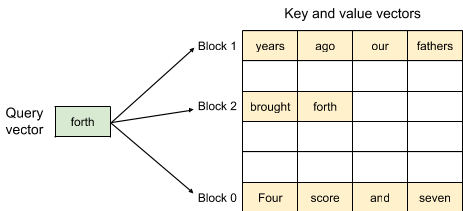

> 图 5：PagedAttention 算法示意， 注意力 key 和 value
> 向量以非连续的块存储在内存中。

总之， PagedAttention 算法允许 KV 块存储在非连续的物理内存中， 这使 vLLM
中的分页内存管理更加灵活。

### 4.2 KV Cache 管理器

vLLM 内存管理器背后的核心思想类似于操作系统中的虚拟内存 [25]。
操作系统将内存划分为固定大小的页， 并将用户程序的逻辑页映射到物理页。
连续的逻辑页可以对应非连续的物理内存页，
使用户程序可以像访问连续内存一样访问内存。 此外， 物理内存空间不必事先全部预留，
操作系统可以按需动态分配物理页。 vLLM 运用虚拟内存背后的思想来管理 LLM 服务中的
KV cache。 借助 PagedAttention， 我们将 KV cache 组织为固定大小的 KV 块，
就像虚拟内存中的页。

一个请求的 KV cache 表示为一系列逻辑 KV 块， 随着新 token 及其 KV cache
的生成从左到右填充。 最后一个 KV 块中未填充的位置为后续生成预留。 在 GPU worker
上， block engine 分配一块连续的 GPU DRAM， 并将其划分为*物理 KV 块*（在 CPU RAM
上也做同样的划分， 用于交换，见 §4.5）。 *KV
块管理器*还维护*块表*——每个请求的逻辑 KV 块与物理 KV 块之间的映射。
每个块表项记录一个逻辑块对应的物理块以及已填充位置的数量。 将逻辑 KV 块与物理 KV
块分离， 使 vLLM 能够动态增长 KV cache 内存， 而不必事先为所有位置预留，
从而消除了现有系统中的大部分内存浪费， 如图 2 所示。

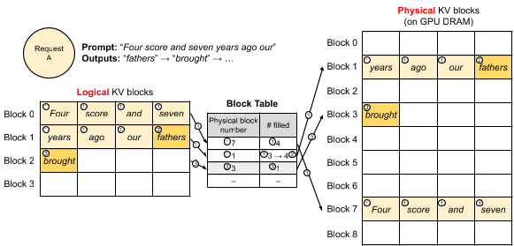

> 图 6：vLLM 中的块表转换。

### 4.3 基于 PagedAttention 与 vLLM 的解码

接下来， 我们以图 6 为例， 演示 vLLM 在单个输入序列的解码过程中如何执行
PagedAttention 并管理内存： ① 与操作系统的虚拟内存一样， vLLM
最初不需要为可能生成的最大序列长度预留内存。 相反， 它只预留容纳 prompt
计算期间生成的 KV cache 所必需的 KV 块。 在这个例子中， prompt 有 7 个 token，
因此 vLLM 将前 2 个逻辑 KV 块（0 和 1）分别映射到 2 个物理 KV 块（7 和 1）。 在
prefill 步骤， vLLM 用传统的自注意力算法（如 [13]）生成 prompt 的 KV cache
和第一个输出 token。 然后， vLLM 将前 4 个 token 的 KV cache 存入逻辑块 0，
将随后 3 个 token 的存入逻辑块 1。 剩余的槽位为后续自回归生成阶段预留。 ②
在第一个自回归解码步骤， vLLM 在物理块 7 和 1 上用 PagedAttention 算法生成新
token。 由于最后一个逻辑块中还有一个可用槽位， 新生成的 KV cache 就存在那里，
并更新块表中的已填充位置数。 ③ 在第二个解码步骤， 由于最后一个逻辑块已满， vLLM
将新生成的 KV cache 存入一个新的逻辑块； vLLM 为它分配一个新的物理块（物理块
3）， 并将这一映射存入块表。

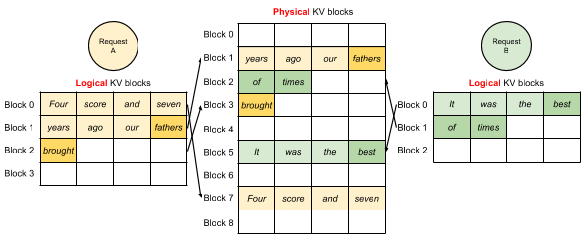

> 图 7：vLLM 同时存储两个请求的 KV cache。

在全局层面， 每次解码迭代， vLLM 首先选出一组参与组批的候选序列（详见 §4.5），
并为新需要的逻辑块分配物理块。 然后， vLLM 将当前迭代的所有输入 token（即 prompt
阶段请求的所有 token 和生成阶段请求的最新 token）拼接为一个序列， 送入 LLM。 在
LLM 的计算过程中， vLLM 使用 PagedAttention kernel 访问以逻辑 KV
块形式存储的先前 KV cache， 并将新生成的 KV cache 保存到物理 KV 块中。 在一个 KV
块中存储多个 token（块大小 > 1）， 使 PagedAttention kernel
能够并行处理更多位置的 KV cache， 从而提高硬件利用率并降低延迟。
然而，更大的块也会增加内存碎片。 我们在 §7.2 研究块大小的影响。

同样地， 随着更多 token 及其 KV cache 的生成， vLLM
动态地为逻辑块分配新的物理块。 由于所有块都从左到右填充，
且只有当前面的块全部填满时才分配新物理块， vLLM
将一个请求的所有内存浪费限制在一个块以内， 因此可以有效利用全部内存， 如图 2
所示。 这使得更多请求能够放入内存参与批处理——从而提高吞吐量。
一旦一个请求完成生成， 它的 KV 块就可以被释放， 用于存储其他请求的 KV cache。 图
7 展示了 vLLM 同时管理两个序列内存的例子。 两个序列的逻辑块被映射到 GPU worker
上 block engine 预留空间内的不同物理块。 两个序列相邻的逻辑块在 GPU
物理内存中不必连续， 两个序列都可以高效利用物理块空间。

### 4.4 应用于其他解码场景

§4.3 展示了 PagedAttention 和 vLLM 如何处理基本的解码算法， 如以一个用户 prompt
为输入、生成单个输出序列的贪心解码和采样。 在许多成功的 LLM 应用 [18, 34] 中，
LLM 服务必须支持更复杂的解码场景， 这些场景呈现更复杂的访问模式，
也提供更多内存共享的机会。 本节展示 vLLM 在这些场景中的普遍适用性。

**并行采样。** 在基于 LLM 的编程助手 [6, 18] 中， LLM 为单个输入 prompt
生成多个采样输出； 用户可以从多个候选输出中选择一个最喜欢的。 到目前为止，
我们隐含地假设一个请求生成一个序列。 在本文余下部分， 我们假设更一般的情形：
一个请求生成多个序列。 在并行采样中， 一个请求包含多个共享同一输入 prompt
的样本， 因此 prompt 的 KV cache 也可以共享。 通过 PagedAttention
和分页内存管理， vLLM 可以轻松实现这种共享并节省内存。

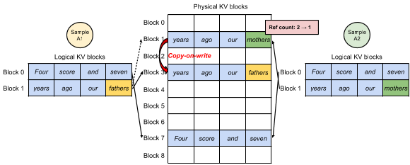

> 图 8：并行采样示例。

图 8 展示了两个输出的并行解码示例。 由于两个输出共享同一个 prompt， 在 prompt
阶段我们只为 prompt 的状态预留一份副本的空间； 两个序列的 prompt
逻辑块被映射到相同的物理块： 两个序列的逻辑块 0 和 1 分别映射到物理块 7 和 1。
由于一个物理块可以被映射到多个逻辑块， 我们为每个物理块引入引用计数。
在这个例子中， 物理块 7 和 1 的引用计数都是 2。 在生成阶段，
两个输出采样出不同的输出 token， 需要各自独立的 KV cache 存储。
对于需要被多个序列修改的物理块， vLLM 在块粒度上实现写时复制机制，
类似于操作系统虚拟内存中的写时复制技术（如 fork 进程时）。 具体而言， 在图 8
中， 当样本 A1 需要写入其最后一个逻辑块（逻辑块 1）时， vLLM
发现对应物理块（物理块 1）的引用计数大于 1； 于是分配一个新的物理块（物理块
3）， 指示 block engine 复制物理块 1 中的信息， 并将引用计数减为 1。 接下来，
当样本 A2 写入物理块 1 时， 引用计数已经降为 1， 因此 A2 直接将其新生成的 KV
cache 写入物理块 1。

总之， 除了最后一个逻辑块由写时复制机制管理外， vLLM
使多个输出样本能够共享用于存储 prompt KV cache 的绝大部分空间。
通过跨多个样本共享物理块， 内存占用可以大幅降低， 对长输入 prompt 尤其明显。

**束搜索。** 在机器翻译 [59] 等 LLM 任务中， 用户期望 LLM 输出最合适的前 $k$
个翻译。 束搜索 [49] 被广泛用于从 LLM 解码出最可能的输出序列，
因为它降低了完整遍历样本空间的计算复杂度。 该算法依赖束宽参数 $k$，
它决定每一步保留的最优候选数量。 在解码过程中， 束搜索通过考虑所有可能的 token
来扩展束中的每个候选序列， 用 LLM 计算它们各自的概率， 并从 $k \cdot |V|$
个候选中保留概率最高的前 $k$ 个序列， 其中 $|V|$ 是词表大小。

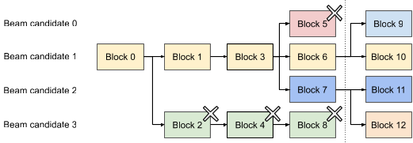

> 图 9：束搜索示例。

与并行解码不同， 束搜索不仅能共享初始的 prompt 块，
还能在不同候选之间共享其他块， 且共享模式随解码过程的推进动态变化，
类似于操作系统中由多次 fork 复合而成的进程树。 图 9 展示了 vLLM 如何管理 $k = 4$
的束搜索示例的 KV 块。 在图中虚线所示的迭代之前， 每个候选序列已用满 4
个逻辑块。 所有束候选共享第一个块 0（即 prompt）。 候选 3
从第二个块开始与其他候选分离。 候选 0—2 共享前 3 个块， 在第四个块处分开。
在随后的迭代中， 概率最高的前 4 个候选都来自候选 1 和 2。 由于原来的候选 0 和 3
不再属于最优候选， 它们的逻辑块被释放， 相应物理块的引用计数随之减少。 vLLM
释放所有引用计数降为 0 的物理块（块 2、4、5、8）。 然后， vLLM
分配新的物理块（块 9—12）来存储新候选的新 KV cache。 现在， 所有候选共享块
0、1、3； 候选 0 和 1 共享块 6； 候选 2 和 3 进一步共享块 7。

此前的 LLM 服务系统需要在束候选之间频繁复制 KV cache。 例如，在图 9
所示的情形中， 在虚线之后， 候选 3 需要复制候选 2 的大部分 KV cache
才能继续生成。 vLLM 的物理块共享显著降低了这种频繁内存复制的开销。 在 vLLM 中，
不同束候选的大部分块都可以共享。 只有当新生成的 token
落在某个旧的共享块中时——与并行解码一样——才会触发写时复制机制，
而这只涉及复制一个块的数据。

**共享前缀。** 通常， LLM 用户会提供一段（很长的）任务描述，
包括指令以及示例输入和输出， 也称为*系统 prompt* [36]。
这段描述与实际任务输入拼接， 构成请求的 prompt。 LLM 基于完整的 prompt
生成输出。 图 10 展示了一个例子。 此外， 共享前缀还可以通过 prompt engineering
进一步调整， 以提高下游任务的精度 [26, 27]。

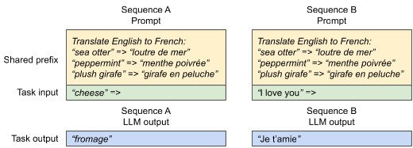

> 图 10：机器翻译的共享 prompt 示例。 示例取自 [5]。

对于这类应用， 许多用户 prompt 共享一个前缀， 因此 LLM
服务提供方可以预先存储该前缀的 KV cache， 以减少在前缀上花费的冗余计算。 在 vLLM
中， 这可以方便地实现： 由 LLM 服务提供方为一组预定义的共享前缀预留一组物理块，
就像操作系统跨进程处理共享库一样。 带有共享前缀的用户输入 prompt，
只需将其逻辑块映射到缓存的物理块（最后一个块标记为写时复制）即可。 prompt
阶段的计算只需在用户的任务输入上执行。

**混合解码方法。** 前面讨论的解码方法呈现出多样的内存共享与访问模式。 尽管如此，
vLLM 仍支持同时处理具有不同解码偏好的请求， 而现有系统*无法*高效做到这一点。
这是因为 vLLM 通过一个将逻辑块转换为物理块的公共映射层，
屏蔽了不同序列之间复杂的内存共享。 LLM 及其执行 kernel
只看到每个序列的一串物理块 ID， 无需处理跨序列的共享模式。 与现有系统相比，
这种方式拓宽了对具有不同采样需求的请求进行组批的机会，
最终提高了系统的整体吞吐量。

### 4.5 调度与抢占

当请求流量超过系统容量时， vLLM 必须优先处理部分请求。 在 vLLM 中，
我们对所有请求采用先来先服务（FCFS）调度策略， 以保证公平性并防止饥饿。 当 vLLM
需要抢占请求时， 它确保最早到达的请求最先得到服务， 最晚到达的请求最先被抢占。

LLM 服务面临一个独特的挑战： LLM 的输入 prompt 长度可能差异巨大，
而相应的输出长度无法事先预知， 它同时取决于输入 prompt 和模型。
随着请求数量及其输出的增长， vLLM 可能耗尽 GPU 上用于存储新生成 KV cache
的物理块。 在这种情形下， vLLM 需要回答两个经典问题： （1）应该驱逐哪些块？
（2）如果被驱逐的块再次被需要， 如何恢复？ 通常，
驱逐策略使用启发式方法预测哪个块将在最远的将来被访问， 并驱逐该块。
由于在我们的场景中， 一个序列的所有块总是一起被访问，
我们实现了全有或全无的驱逐策略， 即要么驱逐一个序列的全部块， 要么一个也不驱逐。
此外，
一个请求内的多个序列（如一个束搜索请求中的各束候选）会以序列组为单位成组调度。
由于这些序列之间可能存在内存共享， 一个序列组内的序列总是被一起抢占或重新调度。
要回答第二个问题——如何恢复被驱逐的块， 我们考虑两种技术：

**交换。** 这是大多数虚拟内存实现使用的经典技术，
将被驱逐的页复制到磁盘上的交换空间。 在我们的场景中， 我们把被驱逐的块复制到 CPU
内存。 如图 4 所示， 除 GPU 块分配器外， vLLM 还包含一个 CPU 块分配器，
用于管理交换到 CPU RAM 的物理块。 当 vLLM 用尽空闲物理块、无法容纳新 token 时，
它选择一组序列驱逐， 将它们的 KV cache 转移到 CPU。 一旦 vLLM
抢占某个序列并驱逐其块， 它就停止接受新请求， 直到所有被抢占的序列完成。
当一个请求完成时， 其块从内存中释放， 被抢占序列的块被重新调回，
继续该序列的处理。 注意，在这一设计下， 交换到 CPU RAM 的块数永远不会超过 GPU
RAM 中的物理块总数， 因此 CPU RAM 上的交换空间以分配给 KV cache 的 GPU
内存为界。

**重计算。** 在这种方式下， 我们在被抢占的序列被重新调度时直接重新计算其 KV
cache。 注意， 重计算的延迟可以显著低于原始延迟， 因为解码时生成的 token
可以与原始用户 prompt 拼接成新的 prompt——它们在所有位置的 KV cache 可以在一次
prompt 阶段迭代中生成。

交换和重计算的性能取决于 CPU RAM 与 GPU 内存之间的带宽以及 GPU 的计算能力。
我们在 §7.3 考察交换和重计算的速度。

### 4.6 分布式执行

许多 LLM 的参数规模超过单张 GPU 的容量 [5, 9]。 因此， 有必要将它们划分到分布式
GPU 上， 以模型并行的方式执行 [28, 63]。 这要求内存管理器能够处理分布式内存。
vLLM 通过支持在 Transformer 上广泛使用的 Megatron-LM 风格张量模型并行策略 [47]，
在分布式环境中保持高效。 该策略遵循单程序多数据（SPMD）执行调度，
其中线性层被划分以执行分块矩阵乘法， 各 GPU 通过 all-reduce
操作不断同步中间结果。 具体而言， 注意力算子沿注意力头维度切分， 每个 SPMD
进程负责多头注意力中一部分注意力头。

我们观察到， 即使采用模型并行执行， 每个模型分片仍处理同一组输入 token，
因此需要相同位置的 KV cache。 所以， vLLM 在集中式调度器中设置单一的 KV cache
管理器， 如图 4 所示。 不同的 GPU worker 共享该管理器，
以及逻辑块到物理块的映射。 这一公共映射使 GPU worker
能够用调度器为每个输入请求提供的物理块执行模型。 虽然每个 GPU worker
持有相同的物理块 ID， 但一个 worker 只存储其对应注意力头的那部分 KV cache。

每一步， 调度器首先为批次中的每个请求准备包含输入 token ID 的消息，
以及每个请求的块表。 接下来， 调度器将这条控制消息广播给 GPU worker。 然后， GPU
worker 开始用输入 token ID 执行模型。 在注意力层， GPU worker
根据控制消息中的块表读取 KV cache。 执行过程中， GPU worker 像 [47] 中那样用
all-reduce 通信原语同步中间结果， 无需调度器协调。 最后， GPU worker
将本次迭代采样出的 token 送回调度器。 总之， GPU worker 不需要在内存管理上同步，
因为它们只需在每次解码迭代开始时， 随步骤输入一起接收所有内存管理信息。

## 5. 实现

vLLM 是一个端到端的服务系统， 带有 FastAPI [15] 前端和基于 GPU 的推理引擎。
前端扩展了 OpenAI API [34] 接口， 允许用户为每个请求定制采样参数，
如最大序列长度和束宽 $k$。 vLLM 引擎由 8500 行 Python 代码和 2000 行 C++/CUDA
代码写成。 我们用 Python 开发调度器和块管理器等控制相关组件， 同时为
PagedAttention 等关键操作开发自定义 CUDA kernel。 在模型执行器方面， 我们用
PyTorch [39] 和 Transformers [58] 实现了 GPT [5]、OPT [62] 和 LLaMA [52] 等主流
LLM。 我们使用 NCCL [32] 在分布式 GPU worker 之间进行张量通信。

### 5.1 Kernel 级优化

由于 PagedAttention 引入了现有系统无法高效支持的内存访问模式， 我们开发了若干
GPU kernel 来优化它。 （1）融合 reshape 与块写入。 在每个 Transformer 层， 新的
KV cache 被切分为块， reshape 成针对块读取优化的内存布局，
然后保存到块表指定的位置。 为尽量减少 kernel 启动开销， 我们将它们融合为单个
kernel。 （2）融合块读取与注意力。 我们改造 FasterTransformer [31] 中的注意力
kernel， 使其按块表读取 KV cache 并即时执行注意力运算。 为保证合并的内存访问，
我们指派一个 GPU warp 读取每个块。 此外， 我们还支持同一请求批次内的变长序列。
（3）融合块复制。 由写时复制机制发起的块复制操作可能作用于不连续的块。 如果使用
cudaMemcpyAsync API， 这会导致大量小数据移动的调用。 为降低开销， 我们实现了一个
kernel， 将不同块的复制操作合批到一次 kernel 启动中。

### 5.2 支持各种解码算法

vLLM 用三个关键方法实现各种解码算法： fork、append 和 free。 fork
方法从现有序列创建新序列。 append 方法向序列追加新 token。 free 方法删除序列。
例如，在并行采样中， vLLM 用 fork 方法从单个输入序列创建多个输出序列。
然后它在每次迭代中用 append 向这些序列添加新 token， 并用 free
删除满足停止条件的序列。 同样的策略也被 vLLM 应用于束搜索和前缀共享。 我们相信，
未来的解码算法也可以通过组合这些方法来支持。

## 6. 评估

本节在各种工作负载下评估 vLLM 的性能。

### 6.1 实验设置

**模型与服务器配置。** 我们使用 13B、66B 和 175B 参数的 OPT [62] 模型以及 13B
参数的 LLaMA [52] 进行评估。 如某 LLM 排行榜 [38] 所示， 13B 和 66B 是流行的 LLM
规模， 而 175B 是著名的 GPT-3 [5] 模型的规模。 所有实验都使用 Google Cloud
Platform 上配备 NVIDIA A100 GPU 的 A2 实例。 详细的模型大小和服务器配置见表 1。

> 表 1：模型大小与服务器配置。

| 模型大小            | 13B   | 66B    | 175B        |
| ------------------- | ----- | ------ | ----------- |
| GPU                 | A100  | 4×A100 | 8×A100-80GB |
| GPU 总内存          | 40 GB | 160 GB | 640 GB      |
| 参数大小            | 26 GB | 132 GB | 346 GB      |
| KV cache 内存       | 12 GB | 21 GB  | 264 GB      |
| KV cache 槽位数上限 | 15.7K | 9.7K   | 60.1K       |

**工作负载。** 我们基于 ShareGPT [51] 和 Alpaca [50] 数据集合成工作负载，
这两个数据集包含真实 LLM 服务的输入和输出文本。 ShareGPT 数据集是用户分享的与
ChatGPT [35] 对话的集合。 Alpaca 数据集是由 GPT-3.5 通过 self-instruct [57]
生成的指令数据集。 我们对数据集做分词， 并用其输入和输出长度合成客户端请求。
如图 11 所示， ShareGPT 数据集的输入 prompt 平均比 Alpaca 数据集长 8.4 倍，
输出平均长 5.8 倍， 且方差更大。 由于这些数据集不包含时间戳，
我们用泊松分布以不同的请求速率生成请求到达时间。

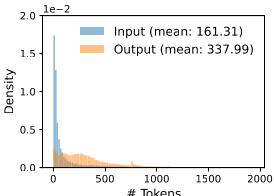

> 图 11（a）：ShareGPT 数据集的输入与输出长度分布。

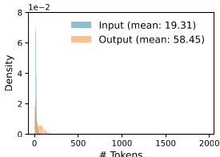

> 图 11（b）：Alpaca 数据集的输入与输出长度分布。

**基线 1：FasterTransformer。** FasterTransformer [31]
是一个针对延迟高度优化的分布式推理引擎。 由于 FasterTransformer
没有自己的调度器， 我们实现了一个自定义调度器， 其动态批处理机制类似于 Triton
[30] 等现有服务系统。 具体而言， 我们根据 GPU 内存容量，
为每个实验设置尽可能大的最大批量 $B$。 调度器取最多 $B$ 个最早到达的请求，
将批次发给 FasterTransformer 处理。

**基线 2：Orca。** Orca [60] 是一个针对吞吐量优化的最先进 LLM 服务系统。 由于
Orca 未公开可用， 我们实现了自己的 Orca 版本。 我们假设 Orca 使用 buddy
分配算法来决定存储 KV cache 的内存地址。 根据它为请求输出超额预留空间的多少，
我们实现了三个版本的 Orca：

- Orca（Oracle）。 我们假设系统知道请求实际将生成的输出长度。 这展示了 Orca
  的性能上界， 在实践中无法达到。

- Orca（Pow2）。 我们假设系统为输出超额预留的空间至多为 2 倍。
  例如，如果真实输出长度为 25， 它就为输出预留 32 个位置。

- Orca（Max）。 我们假设系统总是按模型的最大序列长度（即 2048 个
  token）预留空间。

**关键指标。** 我们关注服务吞吐量。 具体而言， 我们使用不同请求速率的工作负载，
测量系统的_归一化延迟_——每个请求的端到端延迟除以其输出长度后的平均值， 与 Orca
[60] 一致。 高吞吐的服务系统应在高请求速率下保持低归一化延迟。 大多数实验用 1
小时的轨迹评估各系统。 作为例外， 由于成本限制， 我们对 OPT-175B 模型使用 15
分钟的轨迹。

### 6.2 基本采样

我们在三个模型和两个数据集上评估 vLLM 基本采样（每请求一个样本）的性能。 图 12
第一行展示了 ShareGPT 数据集上的结果。 曲线表明， 随着请求速率提高，
延迟起初缓慢上升， 但随后突然激增。 这是因为当请求速率超过服务系统的容量时，
队列长度会无限增长， 请求的延迟也随之无限增长。

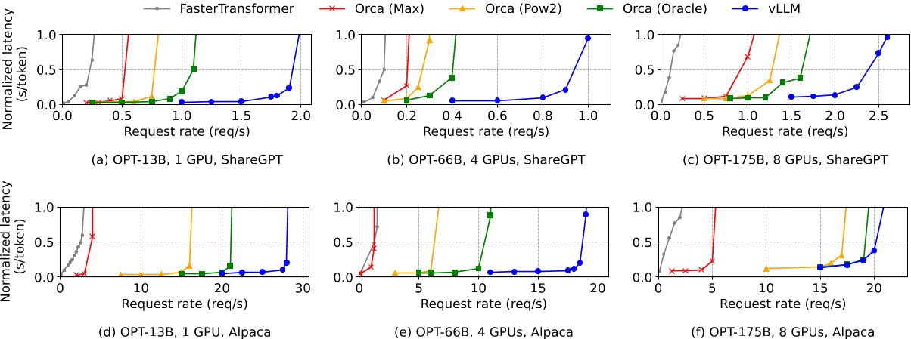

> 图 12：OPT 模型在 ShareGPT 和 Alpaca 数据集上的单序列生成。

在 ShareGPT 数据集上， vLLM 能承受的请求速率比 Orca（Oracle）高 1.7—2.7 倍， 比
Orca（Max）高 2.7—8 倍， 同时保持相近的延迟。 这是因为 vLLM 的 PagedAttention
能高效管理内存使用， 从而比 Orca 批处理更多请求。 例如，如图 13（a）所示， 对于
OPT-13B， vLLM 同时处理的请求数是 Orca（Oracle）的 2.2 倍， 是 Orca（Max）的 4.3
倍。 与 FasterTransformer 相比， vLLM 能承受高达 22 倍的请求速率， 因为
FasterTransformer 没有使用细粒度调度机制， 且像 Orca（Max）一样低效地管理内存。

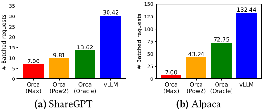

> 图 13：在 ShareGPT（2 请求/秒）和 Alpaca（30 请求/秒） 轨迹下运行 OPT-13B
> 时的平均批处理请求数。

图 12 第二行和图 13（b）展示了 Alpaca 数据集上的结果， 其趋势与 ShareGPT
数据集类似。 一个例外是图 12（f）， vLLM 相对 Orca（Oracle）和
Orca（Pow2）的优势不那么明显。 这是因为 OPT-175B 的模型与服务器配置（表
1）提供了充裕的 GPU 内存来存储 KV cache， 而 Alpaca 数据集的序列较短。
在这种设置下， 尽管内存管理低效， Orca（Oracle）和
Orca（Pow2）也能批处理大量请求。 于是系统的性能瓶颈从内存转为计算。

### 6.3 并行采样与束搜索

我们用两种流行的采样方法评估 PagedAttention 中内存共享的有效性：
并行采样和束搜索。 在并行采样中， 请求中的所有并行序列可以共享 prompt 的 KV
cache。 如图 14 第一行所示， 采样序列数越多， vLLM 相对 Orca 基线的提升越大。
类似地， 图 14 第二行展示了不同束宽下束搜索的结果。 由于束搜索允许更多共享，
vLLM 展现出更大的性能优势。 在 OPT-13B 和 Alpaca 数据集上， vLLM 相对
Orca（Oracle）的提升从基本采样的 1.3 倍提高到束宽为 6 的束搜索的 2.3 倍。

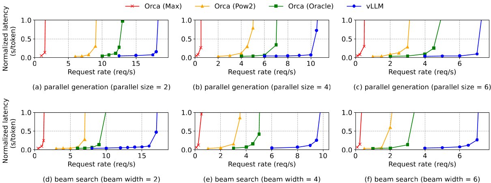

> 图 14：OPT-13B 在 Alpaca 数据集上的并行生成与束搜索。

图 15 绘制了内存节省量， 计算方法是用共享省下的块数除以不共享时的总块数。
并行采样带来 6.1%—9.8% 的内存节省， 束搜索带来 37.6%—55.2% 的节省。 在使用
ShareGPT 数据集的相同实验中， 我们观察到并行采样节省 16.2%—30.5% 内存，
束搜索节省 44.3%—66.3%。

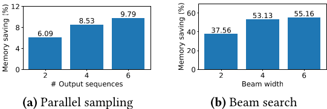

> 图 15：在 Alpaca 轨迹下运行 OPT-13B 时， 共享 KV 块带来的平均内存节省量。

### 6.4 共享前缀

我们考察 vLLM 在不同输入 prompt 共享一个前缀的场景（如图 10 所示）中的有效性。
模型方面， 我们使用多语言的 LLaMA-13B [52]。 工作负载方面， 我们使用 WMT16 [4]
英德翻译数据集， 并合成两个包含指令和若干翻译示例的前缀。
第一个前缀包含一个示例（即 one-shot）， 另一个前缀包含 5 个示例（即 few-shot）。
如图 16（a）所示， 共享 one-shot 前缀时， vLLM 的吞吐量比 Orca（Oracle）高 1.67
倍。 此外， 当共享更多示例时（图 16（b））， vLLM 的吞吐量比 Orca（Oracle）高
3.58 倍。

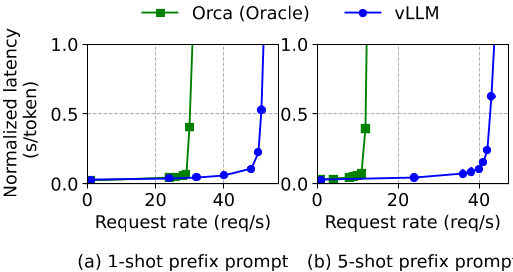

> 图 16：输入 prompt 共享公共前缀的翻译工作负载。 前缀包含（a）1 个示例（80 个
> token）或（b）5 个示例（341 个 token）。

### 6.5 聊天机器人

聊天机器人 [8, 19, 35] 是 LLM 最重要的应用之一。 为实现聊天机器人，
我们将聊天历史与最近一条用户提问拼接成 prompt， 让模型生成回复。 我们用 ShareGPT
数据集合成聊天历史和用户提问。 由于 OPT-13B 模型的上下文长度有限， 我们将 prompt
截断到最后 1024 个 token， 并让模型最多生成 1024 个 token。
我们不在不同对话轮次之间保存 KV cache，
因为这样做会在对话轮次之间挤占其他请求的空间。

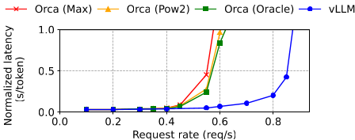

> 图 17：聊天机器人工作负载下的性能。

图 17 显示， vLLM 能承受的请求速率是三个 Orca 基线的 2 倍。 由于 ShareGPT
数据集包含许多长对话， 大多数请求的输入 prompt 都有 1024 个 token。 由于 buddy
分配算法的存在， 无论 Orca 基线如何预测输出长度， 它们都会为请求输出预留 1024 个
token 的空间。 因此，三个 Orca 基线的表现相近。 相比之下， vLLM 能有效处理长
prompt， 因为 PagedAttention 解决了内存碎片和预留的问题。

## 7. 消融研究

本节研究 vLLM 的各个方面， 并用消融实验评估我们做出的设计选择。

### 7.1 Kernel 微基准测试

PagedAttention 中动态的块映射会影响涉及已存 KV cache 的 GPU 操作的性能，
即块读写和注意力。 与现有系统相比， 我们的 GPU
kernel（§5）引入了访问块表、执行额外分支和处理变长序列的额外开销。 如图
18（a）所示， 与高度优化的 FasterTransformer 实现相比， 这使注意力 kernel
的延迟高出 20%—26%。 我们认为这一开销很小， 因为它只影响注意力算子，
而不影响模型中的 Linear 等其他算子。 尽管存在这一开销， PagedAttention 仍使 vLLM
在端到端性能上大幅超越 FasterTransformer（§6）。

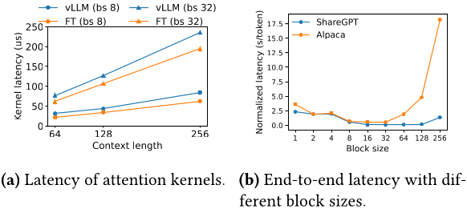

> 图 18：消融实验。

### 7.2 块大小的影响

块大小的选择会对 vLLM 的性能产生重大影响。 如果块太小， vLLM 可能无法充分利用
GPU 并行读取和处理 KV cache 的能力。 如果块太大， 内部碎片会增加，
共享的概率会下降。

在图 18（b）中， 我们用 ShareGPT 和 Alpaca 轨迹在固定请求速率的基本采样下，
评估了不同块大小对 vLLM 性能的影响。 在 ShareGPT 轨迹中， 16 到 128
的块大小性能最好。 在 Alpaca 轨迹中， 虽然块大小 16 和 32 表现良好，
但更大的块会显著降低性能， 因为序列变得比块还短。 实践中我们发现， 块大小 16
既大到足以高效利用 GPU， 又小到足以在大多数工作负载下避免显著的内部碎片。
因此，vLLM 将默认块大小设为 16。

### 7.3 重计算与交换的比较

vLLM 同时支持重计算和交换作为恢复机制。 为理解两种方法之间的权衡，
我们评估它们的端到端性能， 并对它们的开销做微基准测试， 结果见图 19。
我们的结果表明， 小块大小时交换会产生过高开销。 这是因为小块通常导致 CPU 与 GPU
之间大量的小数据传输， 限制了有效的 PCIe 带宽。 相比之下，
重计算的开销在不同块大小下保持不变， 因为重计算无需访问 KV 块。 因此，
块较小时重计算更高效， 块较大时交换更高效， 不过重计算的开销从未超过交换延迟的
20%。 对于 16 到 64 的中等块大小， 两种方法的端到端性能相当。

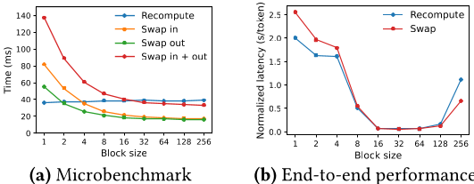

> 图 19：（a）不同块大小下重计算与交换的开销。 （b）相同请求速率下用 ShareGPT
> 轨迹运行 OPT-13B 的性能。

## 8. 讨论

**将虚拟内存与分页技术应用于其他 GPU 工作负载。**
虚拟内存与分页的思想之所以能有效管理 LLM 服务中的 KV cache，
是因为该工作负载需要动态内存分配（输出长度无法事先预知）， 且其性能受 GPU
内存容量限制。 然而， 这一点并非对所有 GPU 工作负载都成立。 例如，在 DNN
训练中， 张量形状通常是静态的， 因此内存分配可以提前优化。 又如，在服务非 LLM 的
DNN 时， 内存效率的提高可能不会带来任何性能提升， 因为性能主要受计算限制。
在这些场景中， 引入 vLLM
的技术反而可能因内存间接寻址和非连续块内存的额外开销而降低性能。 不过，
我们期待看到 vLLM 的技术被应用到其他与 LLM 服务性质相似的工作负载上。

**应用虚拟内存与分页时的 LLM 特定优化。** vLLM 通过利用应用特定的语义，
重新诠释并增强了虚拟内存与分页的思想。 一个例子是 vLLM 的全有或全无换出策略，
它利用了处理一个请求需要其所有对应 token 状态都存入 GPU 内存这一事实。
另一个例子是用重计算方法恢复被驱逐的块， 这在操作系统中是不可行的。 此外， vLLM
通过将内存访问操作的 GPU kernel 与注意力等其他操作的 kernel 融合，
缓解了分页中内存间接寻址的开销。

## 9. 相关工作

**通用模型服务系统。** 模型服务是近年来活跃的研究领域， 已有众多系统被提出，
以解决深度学习模型部署的各个方面的问题。 Clipper [11]、TensorFlow Serving
[33]、Nexus [45]、 InferLine [10] 和 Clockwork [20]
是一些较早的通用模型服务系统。
它们研究服务单个或多个模型时的批处理、缓存、放置和调度。 更近一些， DVABatch
[12] 引入了多入口多出口批处理。 REEF [21] 和 Shepherd [61] 提出了服务中的抢占。
AlpaServe [28] 利用模型并行进行统计复用。 然而， 这些通用系统没有考虑 LLM
推理的自回归性质和 token 状态， 错失了优化机会。

**面向 Transformer 的专用服务系统。** 由于 Transformer 架构的重要性，
大量面向它的专用服务系统被开发出来。 这些系统利用 GPU kernel 优化 [1, 29, 31,
56]、高级批处理机制 [14, 60]、 模型并行 [1, 41, 60] 和参数共享 [64]
来实现高效服务。 其中， Orca [60] 与我们的工作最相关。

**与 Orca 的比较。** Orca [60] 的迭代级调度与 vLLM 的 PagedAttention
是互补的技术： 两个系统都旨在提高 GPU 利用率， 从而提高 LLM 服务的吞吐量； Orca
通过调度和交错请求， 使更多请求能被并行处理； 而 vLLM 通过提高内存利用率，
使更多请求的工作集能够放入内存。 通过减少内存碎片并实现共享， vLLM
在一个批次中并行运行更多请求， 相对 Orca 实现了 2—4 倍的加速。 事实上， 像 Orca
那样的细粒度请求调度与交错使内存管理更具挑战性， 这使 vLLM 提出的技术更加关键。

**内存优化。** 加速器计算能力与内存容量之间不断扩大的差距，
使内存成为训练和推理的瓶颈。 交换 [23, 42, 55]、重计算 [7, 24] 及二者的结合 [40]
已被用于降低训练的峰值内存。 值得注意的是， FlexGen [46] 研究了在 GPU
内存有限时如何为 LLM 推理交换权重和 token 状态， 但它不针对在线服务场景。 OLLA
[48] 通过优化张量的生存期和位置来减少碎片， 但它不做细粒度的块级管理，
也不针对在线服务。 FlashAttention [13] 应用分块和 kernel
优化来降低注意力计算的峰值内存并减少 I/O 开销。
本文在在线服务的背景下引入了块级内存管理的新思想。

## 10. 总结

本文提出 PagedAttention， 一种新的注意力算法， 允许注意力 key 和 value
存储在非连续的分页内存中； 并构建了 vLLM， 一个高吞吐的 LLM 服务系统，
其高效内存管理由 PagedAttention 实现。 受操作系统启发，
我们展示了虚拟内存和写时复制等成熟技术如何被改造用于高效管理 KV cache， 并处理
LLM 服务中的各种解码算法。 实验表明， vLLM 相对最先进的系统实现了 2—4
倍的吞吐量提升。

## 致谢

感谢 Xiaoxuan Liu、Zhifeng Chen、Yanping Huang、 SOSP
匿名审稿人以及我们的论文指导人 Lidong Zhou 提出的宝贵意见。 本研究部分得到
Andreessen Horowitz、Anyscale、Astronomer、Google、IBM、
Intel、Lacework、Microsoft、 穆罕默德·本·扎耶德人工智能大学、Samsung SDS、Uber
和 VMware 的捐赠支持。

## 参考文献

[1] Reza Yazdani Aminabadi, Samyam Rajbhandari, Minjia Zhang, Ammar Ahmad Awan,
Cheng Li, Du Li, Elton Zheng, Jeff Rasley, Shaden Smith, Olatunji Ruwase, et
al. 2022. DeepSpeed Inference: Enabling Efficient Inference of Transformer
Models at Unprecedented Scale. arXiv preprint arXiv:2207.00032 (2022).

[2] Jimmy Lei Ba, Jamie Ryan Kiros, and Geoffrey E Hinton. 2016. Layer
normalization. arXiv preprint arXiv:1607.06450 (2016).

[3] Yoshua Bengio, Réjean Ducharme, and Pascal Vincent. 2000. A neural
probabilistic language model. *Advances in neural information processing
systems* 13 (2000).

[4] Ondřej Bojar, Rajen Chatterjee, Christian Federmann, Yvette Graham, Barry
Haddow, Matthias Huck, Antonio Jimeno Yepes, Philipp Koehn, Varvara Logacheva,
Christof Monz, Matteo Negri, Aurelie Neveol, Mariana Neves, Martin Popel, Matt
Post, Raphael Rubino, Carolina Scarton, Lucia Specia, Marco Turchi, Karin
Verspoor, and Marcos Zampieri. 2016. Findings of the 2016 Conference on Machine
Translation. In Proceedings of the First Conference on Machine Translation.
Association for Computational Linguistics, Berlin, Germany, 131–198.
http://www.aclweb.org/anthology/W/W16/W16-2301

[5] Tom Brown, Benjamin Mann, Nick Ryder, Melanie Subbiah, Jared D Kaplan,
Prafulla Dhariwal, Arvind Neelakantan, Pranav Shyam, Girish Sastry, Amanda
Askell, et al. 2020. Language models are few-shot learners. *Advances in neural
information processing systems* 33 (2020), 1877–1901.

[6] Mark Chen, Jerry Tworek, Heewoo Jun, Qiming Yuan, Henrique Ponde de Oliveira
Pinto, Jared Kaplan, Harri Edwards, Yuri Burda, Nicholas Joseph, Greg Brockman,
et al. 2021. Evaluating large language models trained on code. arXiv preprint
arXiv:2107.03374 (2021).

[7] Tianqi Chen, Bing Xu, Chiyuan Zhang, and Carlos Guestrin. 2016. Training
deep nets with sublinear memory cost. arXiv preprint arXiv:1604.06174 (2016).

[8] Wei-Lin Chiang, Zhuohan Li, Zi Lin, Ying Sheng, Zhanghao Wu, Hao Zhang,
Lianmin Zheng, Siyuan Zhuang, Yonghao Zhuang, Joseph E. Gonzalez, Ion Stoica,
and Eric P. Xing. 2023. Vicuna: An Open-Source Chatbot Impressing GPT-4 with
90%* ChatGPT Quality. https://lmsys.org/blog/2023-03-30-vicuna/

[9] Aakanksha Chowdhery, Sharan Narang, Jacob Devlin, Maarten Bosma, Gaurav
Mishra, Adam Roberts, Paul Barham, Hyung Won Chung, Charles Sutton, Sebastian
Gehrmann, et al. 2022. PaLM: Scaling language modeling with pathways. arXiv
preprint arXiv:2204.02311 (2022).

[10] Daniel Crankshaw, Gur-Eyal Sela, Xiangxi Mo, Corey Zumar, Ion Stoica,
Joseph Gonzalez, and Alexey Tumanov. 2020. InferLine: latency-aware provisioning
and scaling for prediction serving pipelines. In Proceedings of the 11th ACM
Symposium on Cloud Computing. 477–491.

[11] Daniel Crankshaw, Xin Wang, Guilio Zhou, Michael J Franklin, Joseph E
Gonzalez, and Ion Stoica. 2017. Clipper: A Low-Latency Online Prediction Serving
System. In 14th USENIX Symposium on Networked Systems Design and Implementation
(NSDI 17). 613–627.

[12] Weihao Cui, Han Zhao, Quan Chen, Hao Wei, Zirui Li, Deze Zeng, Chao Li, and
Minyi Guo. 2022. DVABatch: Diversity-aware Multi-Entry Multi-Exit Batching for
Efficient Processing of DNN Services on GPUs. In 2022 USENIX Annual Technical
Conference (USENIX ATC 22). 183–198.

[13] Tri Dao, Dan Fu, Stefano Ermon, Atri Rudra, and Christopher Ré. 2022.
FlashAttention: Fast and memory-efficient exact attention with IO-awareness.
Advances in Neural Information Processing Systems 35 (2022), 16344–16359.

[14] Jiarui Fang, Yang Yu, Chengduo Zhao, and Jie Zhou. 2021. TurboTransformers:
an efficient GPU serving system for transformer models. In Proceedings of the
26th ACM SIGPLAN Symposium on Principles and Practice of Parallel Programming.
389–402.

[15] FastAPI. 2023. FastAPI. https://github.com/tiangolo/fastapi.

[16] Pin Gao, Lingfan Yu, Yongwei Wu, and Jinyang Li. 2018. Low latency RNN
inference with cellular batching. In Proceedings of the Thirteenth EuroSys
Conference. 1-15.

[17] Amir Gholami, Zhewei Yao, Sehoon Kim, Michael W Mahoney, and Kurt
Keutzer. 2021. AI and memory wall. *RiseLab Medium Post 1* (2021), 6.

[18] Github. 2022. https://github.com/features/copilot

[19] Google. 2023. https://bard.google.com/

[20] Arpan Gujarati, Reza Karimi, Safya Alzayat, Wei Hao, Antoine Kaufmann, Ymir
Vigfusson, and Jonathan Mace. 2020. Serving DNNs like Clockwork: Performance
Predictability from the Bottom Up. In 14th USENIX Symposium on Operating Systems
Design and Implementation (OSDI 20). 443–462.

[21] Mingcong Han, Hanze Zhang, Rong Chen, and Haibo Chen. 2022.
Microsecond-scale Preemption for Concurrent GPU-accelerated DNN Inferences. In
16th USENIX Symposium on Operating Systems Design and Implementation (OSDI 22).
539–558.

[22] Kaiming He, Xiangyu Zhang, Shaoqing Ren, and Jian Sun. 2016. Deep residual
learning for image recognition. In Proceedings of the IEEE conference on
computer vision and pattern recognition. 770–778.

[23] Chien-Chin Huang, Gu Jin, and Jinyang Li. 2020. SwapAdvisor: Pushing deep
learning beyond the GPU memory limit via smart swapping. In Proceedings of the
Twenty-Fifth International Conference on Architectural Support for Programming
Languages and Operating Systems. 1341–1355.

[24] Paras Jain, Ajay Jain, Aniruddha Nrusimha, Amir Gholami, Pieter Abbeel,
Joseph Gonzalez, Kurt Keutzer, and Ion Stoica. 2020. Checkmate: Breaking the
memory wall with optimal tensor rematerialization. Proceedings of Machine
Learning and Systems 2 (2020), 497–511.

[25] Tom Kilburn, David BG Edwards, Michael J Lanigan, and Frank H Sumner. 1962.
One-level storage system. *IRE Transactions on Electronic Computers* 2 (1962),
223–235.

[26] Brian Lester, Rami Al-Rfou, and Noah Constant. 2021. The power of scale for
parameter-efficient prompt tuning. arXiv preprint arXiv:2104.08691 (2021).

[27] Xiang Lisa Li and Percy Liang. 2021. Prefix-tuning: Optimizing continuous
prompts for generation. arXiv preprint arXiv:2101.00190 (2021).

[28] Zhuohan Li, Lianmin Zheng, Yinmin Zhong, Vincent Liu, Ying Sheng, Xin Jin,
Yanping Huang, Zhifeng Chen, Hao Zhang, Joseph E Gonzalez, et al. 2023.
AlpaServe: Statistical Multiplexing with Model Parallelism for Deep Learning
Serving. arXiv preprint arXiv:2302.11665 (2023).

[29] Lingxiao Ma, Zhiqiang Xie, Zhi Yang, Jilong Xue, Youshan Miao, Wei Cui,
Wenxiang Hu, Fan Yang, Lintao Zhang, and Lidong Zhou. 2020. Rammer: Enabling
holistic deep learning compiler optimizations with rtasks. In Proceedings of the
14th USENIX Conference on Operating Systems Design and Implementation. 881–897.

[30] NVIDIA. [n. d.]. Triton Inference Server.
https://developer.nvidia.com/nvidia-triton-inference-server.

[31] NVIDIA. 2023. FasterTransformer.
https://github.com/NVIDIA/FasterTransformer.

[32] NVIDIA. 2023. NCCL: The NVIDIA Collective Communication Library.
https://developer.nvidia.com/nccl.

[33] Christopher Olston, Noah Fiedel, Kiril Gorovoy, Jeremiah Harmsen, Li Lao,
Fangwei Li, Vinu Rajasheker, Sukriti Ramesh, and Jordan Soyke. 2017.
TensorFlow-Serving: Flexible, high-performance ML serving. arXiv preprint
arXiv:1712.06139 (2017).

[34] OpenAI. 2020. https://openai.com/blog/openai-api

[35] OpenAI. 2022. https://openai.com/blog/chatgpt

[36] OpenAI. 2023. https://openai.com/blog/custom-instructions-for-chatgpt

[37] OpenAI. 2023. GPT-4 Technical Report. arXiv:2303.08774 [cs.CL]

[38] LMSYS ORG. 2023. Chatbot Arena Leaderboard Week 8: Introducing MT-Bench and
Vicuna-33B. https://lmsys.org/blog/2023-06-22-leaderboard/.

[39] Adam Paszke, Sam Gross, Francisco Massa, Adam Lerer, James Bradbury,
Gregory Chanan, Trevor Killeen, Zeming Lin, Natalia Gimelshein, Luca Antiga, et
al. 2019. PyTorch: An imperative style, high-performance deep learning library.
*Advances in neural information processing systems* 32 (2019).

[40] Shishir G Patil, Paras Jain, Prabal Dutta, Ion Stoica, and Joseph
Gonzalez. 2022. POET: Training Neural Networks on Tiny Devices with Integrated
Rematerialization and Paging. In International Conference on Machine Learning.
PMLR, 17573–17583.

[41] Reiner Pope, Sholto Douglas, Aakanksha Chowdhery, Jacob Devlin, James
Bradbury, Anselm Levskaya, Jonathan Heek, Kefan Xiao, Shivani Agrawal, and Jeff
Dean. 2022. Efficiently Scaling Transformer Inference. arXiv preprint
arXiv:2211.05102 (2022).

[42] Jie Ren, Samyam Rajbhandari, Reza Yazdani Aminabadi, Olatunji Ruwase,
Shuangyan Yang, Minjia Zhang, Dong Li, and Yuxiong He. 2021. ZeRO-Offload:
Democratizing Billion-Scale Model Training. In USENIX Annual Technical
Conference. 551–564.

[43] Reuters. 2023.
https://www.reuters.com/technology/tech-giants-ai-like-bing-bard-poses-billion-dollar-search-problem-2023-02-22/

[44] Amazon Web Services. 2023. https://aws.amazon.com/bedrock/

[45] Haichen Shen, Lequn Chen, Yuchen Jin, Liangyu Zhao, Bingyu Kong, Matthai
Philipose, Arvind Krishnamurthy, and Ravi Sundaram. 2019. Nexus: A GPU cluster
engine for accelerating DNN-based video analysis. In Proceedings of the 27th ACM
Symposium on Operating Systems Principles. 322–337.

[46] Ying Sheng, Lianmin Zheng, Binhang Yuan, Zhuohan Li, Max Ryabinin, Daniel Y
Fu, Zhiqiang Xie, Beidi Chen, Clark Barrett, Joseph E Gonzalez, et al. 2023.
High-throughput Generative Inference of Large Language Models with a Single GPU.
arXiv preprint arXiv:2303.06865 (2023).

[47] Mohammad Shoeybi, Mostofa Patwary, Raul Puri, Patrick LeGresley, Jared
Casper, and Bryan Catanzaro. 2019. Megatron-LM: Training multi-billion parameter
language models using model parallelism. arXiv preprint arXiv:1909.08053 (2019).

[48] Benoit Steiner, Mostafa Elhoushi, Jacob Kahn, and James Hegarty. 2022.
OLLA: Optimizing the Lifetime and Location of Arrays to Reduce the Memory Usage
of Neural Networks. (2022). https://doi.org/10.48550/arXiv.2210.12924

[49] Ilya Sutskever, Oriol Vinyals, and Quoc V Le. 2014. Sequence to sequence
learning with neural networks. *Advances in neural information processing
systems* 27 (2014).

[50] Rohan Taori, Ishaan Gulrajani, Tianyi Zhang, Yann Dubois, Xuechen Li,
Carlos Guestrin, Percy Liang, and Tatsunori B. Hashimoto. 2023. Stanford Alpaca:
An Instruction-following LLaMA model.
https://github.com/tatsu-lab/stanford_alpaca.

[51] ShareGPT Team. 2023. https://sharegpt.com/

[52] Hugo Touvron, Thibaut Lavril, Gautier Izacard, Xavier Martinet, Marie-Anne
Lachaux, Timothée Lacroix, Baptiste Rozière, Naman Goyal, Eric Hambro, Faisal
Azhar, et al. 2023. LLaMA: Open and efficient foundation language models. arXiv
preprint arXiv:2302.13971 (2023).

[53] Ashish Vaswani, Noam Shazeer, Niki Parmar, Jakob Uszkoreit, Llion Jones,
Aidan N Gomez, Lukasz Kaiser, and Illia Polosukhin. 2017. Attention is all you
need. *Advances in neural information processing systems* 30 (2017).

[54] Jing Wang, Youyou Lu, Qing Wang, Minhui Xie, Keji Huang, and Jiwu
Shu. 2022. Pacman: An Efficient Compaction Approach for Log-Structured Key-Value
Store on Persistent Memory. In 2022 USENIX Annual Technical Conference (USENIX
ATC 22), 773–788.

[55] Linnan Wang, Jinmian Ye, Yiyang Zhao, Wei Wu, Ang Li, Shuai-wen Leon Song,
Zenglin Xu, and Tim Kraska. 2018. Superneurons: Dynamic GPU memory management
for training deep neural networks. In Proceedings of the 23rd ACM SIGPLAN
symposium on principles and practice of parallel programming. 41–53.

[56] Xiaohui Wang, Ying Xiong, Yang Wei, Mingxuan Wang, and Lei Li. 2021.
LightSeq: A High Performance Inference Library for Transformers. In Proceedings
of the 2021 Conference of the North American Chapter of the Association for
Computational Linguistics: Human Language Technologies: Industry Papers.
113–120.

[57] Yizhong Wang, Yeganeh Kordi, Swaroop Mishra, Alisa Liu, Noah A Smith,
Daniel Khashabi, and Hannaneh Hajishirzi. 2022. Self-Instruct: Aligning Language
Model with Self Generated Instructions. arXiv preprint arXiv:2212.10560 (2022).

[58] Thomas Wolf, Lysandre Debut, Victor Sanh, Julien Chaumond, Clement
Delangue, Anthony Moi, Pierrick Cistac, Tim Rault, Rémi Louf, Morgan Funtowicz,
et al. 2020. Transformers: State-of-the-art natural language processing. In
Proceedings of the 2020 conference on empirical methods in natural language
processing: system demonstrations. 38–45.

[59] Yonghui Wu, Mike Schuster, Zhifeng Chen, Quoc V Le, Mohammad Norouzi,
Wolfgang Macherey, Maxim Krikun, Yuan Cao, Qin Gao, Klaus Macherey, et al. 2016.
Google's neural machine translation system: Bridging the gap between human and
machine translation. arXiv preprint arXiv:1609.08144 (2016).

[60] Gyeong-In Yu, Joo Seong Jeong, Geon-Woo Kim, Soojeong Kim, and Byung-Gon
Chun. 2022. Orca: A Distributed Serving System for Transformer-Based Generative
Models. In 16th USENIX Symposium on Operating Systems Design and Implementation
(OSDI 22). 521–538.

[61] Hong Zhang, Yupeng Tang, Anurag Khandelwal, and Ion Stoica. 2023. SHEPHERD:
Serving DNNs in the Wild. In 20th USENIX Symposium on Networked Systems Design
and Implementation (NSDI 23). USENIX Association, Boston, MA, 787–808.
https://www.usenix.org/conference/nsdi23/presentation/zhang-hong

[62] Susan Zhang, Stephen Roller, Naman Goyal, Mikel Artetxe, Moya Chen, Shuohui
Chen, Christopher Dewan, Mona Diab, Xian Li, Xi Victoria Lin, et al. 2022. OPT:
Open pre-trained transformer language models. arXiv preprint arXiv:2205.01068
(2022).

[63] Lianmin Zheng, Zhuohan Li, Hao Zhang, Yonghao Zhuang, Zhifeng Chen, Yanping
Huang, Yida Wang, Yuanzhong Xu, Danyang Zhuo, Eric P Xing, et al. 2022. Alpa:
Automating Inter-and Intra-Operator Parallelism for Distributed Deep Learning.
In *16th USENIX Symposium on Operating Systems Design and Implementation* (OSDI
22). 559–578.

[64] Zhe Zhou, Xuechao Wei, Jiejing Zhang, and Guangyu Sun. 2022. PetS: A
Unified Framework for Parameter-Efficient Transformers Serving. In 2022 USENIX
Annual Technical Conference (USENIX ATC 22). 489–504.
