# 程序员修炼之道：通向务实的最高境界（第2版）

[美] David Thomas、Andrew Hunt 著

云风 译

*The Pragmatic Programmer: your journey to mastery, 20th Anniversary Edition
(2nd Edition)*

电子工业出版社

## 内容简介

《程序员修炼之道》之所以在全球范围内广泛传播， 被一代代开发者奉为圭臬，
盖因它可以创造出真正的价值： 或编写出更好的软件， 或探究出编程的本质，
而所有收获均不依赖于特定语言、框架和方法。 时隔20年的新版，
经过全面的重新选材、组织和编写，
覆盖哲学、方法、工具、设计、解耦、并发、重构、需求、团队等务实话题的最佳实践及重大陷阱，
以及易于改造、复用的架构技术。 本书极具洞察力与趣味性，
适合从初学者到架构师的各阶层读者潜心研读或增广见闻。

## 目录

- **[内容简介](#内容简介)**
- **[本书赞誉](#本书赞誉)**
- **[序](#序)**
- **[新版前言](#新版前言)**
  - [这本书是如何组织的](#这本书是如何组织的)
  - [名字有什么含义](#名字有什么含义)
  - [源码与其他资源](#源码与其他资源)
  - [给我们反馈](#给我们反馈)
  - [第二版鸣谢](#第二版鸣谢)
- **[第一版前言](#第一版前言)**
  - [谁应该读这本书](#谁应该读这本书)
  - [是什么造就了务实的程序员](#是什么造就了务实的程序员)
  - [务实的个体，大型的团队](#务实的个体大型的团队)
  - [这是一个连续的过程](#这是一个连续的过程)
- **[读者服务](#读者服务)**
- **[第 1 章 务实的哲学](#第-1-章-务实的哲学)**
  - [1 人生是你的](#1-人生是你的)
  - [2 我的源码被猫吃了](#2-我的源码被猫吃了)
  - [3 软件的熵](#3-软件的熵)
  - [4 石头做的汤和煮熟的青蛙](#4-石头做的汤和煮熟的青蛙)
  - [5 够好即可的软件](#5-够好即可的软件)
  - [6 知识组合](#6-知识组合)
  - [7 交流！](#7-交流)
- **[第 2 章 务实的方法](#第-2-章-务实的方法)**
  - [8 优秀设计的精髓](#8-优秀设计的精髓)
  - [9 DRY——邪恶的重复](#9-dry邪恶的重复)
  - [10 正交性](#10-正交性)
  - [11 可逆性](#11-可逆性)
  - [12 曳光弹](#12-曳光弹)
  - [13 原型与便签](#13-原型与便签)
  - [14 领域语言](#14-领域语言)
  - [15 估算](#15-估算)
- **[第 3 章 基础工具](#第-3-章-基础工具)**
  - [16 纯文本的威力](#16-纯文本的威力)
  - [17 Shell 游戏](#17-shell-游戏)
  - [18 加强编辑能力](#18-加强编辑能力)
  - [19 版本控制](#19-版本控制)
  - [20 调试](#20-调试)
  - [21 文本处理](#21-文本处理)
  - [22 工程日记](#22-工程日记)
- **[第 4 章 务实的偏执](#第-4-章-务实的偏执)**
  - [23 契约式设计](#23-契约式设计)
  - [24 死掉的程序不会说谎](#24-死掉的程序不会说谎)
  - [25 断言式编程](#25-断言式编程)
  - [26 如何保持资源的平衡](#26-如何保持资源的平衡)
  - [27 不要冲出前灯范围](#27-不要冲出前灯范围)
- **[第 5 章 宁弯不折](#第-5-章-宁弯不折)**
  - [28 解耦](#28-解耦)
  - [29 在现实世界中抛球杂耍](#29-在现实世界中抛球杂耍)
  - [30 变换式编程](#30-变换式编程)
  - [31 继承税](#31-继承税)
  - [32 配置](#32-配置)
- **[第 6 章 并发](#第-6-章-并发)**
  - [33 打破时域耦合](#33-打破时域耦合)
  - [34 共享状态是不正确的状态](#34-共享状态是不正确的状态)
  - [35 角色与进程](#35-角色与进程)
  - [36 黑板](#36-黑板)
- **[第 7 章 当你编码时](#第-7-章-当你编码时)**
  - [37 听从蜥蜴脑](#37-听从蜥蜴脑)
  - [38 巧合式编程](#38-巧合式编程)
  - [39 算法速度](#39-算法速度)
  - [40 重构](#40-重构)
  - [41 为编码测试](#41-为编码测试)
  - [42 基于特性测试](#42-基于特性测试)
  - [43 出门在外注意安全](#43-出门在外注意安全)
  - [44 事物命名](#44-事物命名)
- **[第 8 章 项目启动之前](#第-8-章-项目启动之前)**
  - [45 需求之坑](#45-需求之坑)
  - [46 处理无法解决的难题](#46-处理无法解决的难题)
  - [47 携手共建](#47-携手共建)
  - [48 敏捷的本质](#48-敏捷的本质)
- **[第 9 章 务实的项目](#第-9-章-务实的项目)**
  - [49 务实的团队](#49-务实的团队)
  - [50 椰子派不上用场](#50-椰子派不上用场)
  - [51 务实的入门套件](#51-务实的入门套件)
  - [52 取悦用户](#52-取悦用户)
  - [53 傲慢与偏见](#53-傲慢与偏见)
- **[跋](#跋)**
  - [道德罗盘](#道德罗盘)
  - [想象你要的未来](#想象你要的未来)
- **[参考文献](#参考文献)**
- **[练习的参考答案](#练习的参考答案)**
  - [答案 1（来自练习 1）](#答案-1来自练习-1)
  - [答案 2（来自练习 2）](#答案-2来自练习-2)
  - [答案 3（来自练习 3）](#答案-3来自练习-3)
  - [答案 4（来自练习 4）](#答案-4来自练习-4)
  - [答案 5（来自练习 5）](#答案-5来自练习-5)
  - [答案 6（来自练习 6）](#答案-6来自练习-6)
  - [答案 7（来自练习 7）](#答案-7来自练习-7)
  - [答案 8（来自练习 8）](#答案-8来自练习-8)
  - [答案 9（来自练习 9）](#答案-9来自练习-9)
  - [答案 10（来自练习 10）](#答案-10来自练习-10)
  - [答案 14（来自练习 14）](#答案-14来自练习-14)
  - [答案 15（来自练习 15）](#答案-15来自练习-15)
  - [答案 16（来自练习 16）](#答案-16来自练习-16)
  - [答案 17（来自练习 17）](#答案-17来自练习-17)
  - [答案 18（来自练习 18）](#答案-18来自练习-18)
  - [答案 19（来自练习 19）](#答案-19来自练习-19)
  - [答案 20（来自练习 20）](#答案-20来自练习-20)
  - [答案 21（来自练习 21）](#答案-21来自练习-21)
  - [答案 22（来自练习 22）](#答案-22来自练习-22)
  - [答案 23（来自练习 23）](#答案-23来自练习-23)
  - [答案 24（来自练习 24）](#答案-24来自练习-24)
  - [答案 25（来自练习 25）](#答案-25来自练习-25)
  - [答案 26（来自练习 26）](#答案-26来自练习-26)
  - [答案 27（来自练习 27）](#答案-27来自练习-27)
  - [答案 28（来自练习 28）](#答案-28来自练习-28)
  - [答案 29（来自练习 29）](#答案-29来自练习-29)
  - [答案 30（来自练习 30）](#答案-30来自练习-30)
  - [答案 31（来自练习 31）](#答案-31来自练习-31)
  - [答案 32（来自练习 32）](#答案-32来自练习-32)
  - [答案 33（来自练习 33）](#答案-33来自练习-33)
- **[译者跋](#译者跋)**
- **[读者服务](#读者服务_1)**

## 本书赞誉

这样的赞美一直不绝于耳： 通过撰写一本书来推动整个行业， 是 Andy 和 Dave
用《程序员修炼之道：从小工到专家》完成的一大壮举， 无人可以超越。 然而，
有时两次闪电的确会击中同一个地方， 这部名著的再版即为明证。
其令人震撼的内容更新，
足以确保自身在未来二十年里继续雄踞“精选软件开发图书”榜单之首， 此可谓实至名归。

——VM（Vicky）Brasseur，瞻博网络开源战略总监

如果想让自己的软件既领先于时代又易于维护，
就在手边摆放一本《程序员修炼之道：通向务实的最高境界（第2版）》。
本书充满实用建议， 有技术方面的， 也有专业方面的，
无不能让你和你的项目受益多年。

——Andrea Goulet，Corgibytes 公司 CEO，LegacyCode.Rocks 创始人

可以说， 《程序员修炼之道》完全改变了我的职业轨迹，
为我指明了软件领域的成功方向。 正是这本书， 开阔了我的视野，
让我意识到自己不仅仅是庞大机器上的一枚齿轮， 有朝一日也能藉由修炼成为匠师。
它是我生命中最重要的一本书。

——Obie Fernandez，《Rails 之道》作者

初读此书的读者， 在见识到那个软件开发实践的新世界时， 立刻充满期待。
而第一版图书， 对塑造这样一个迷人的现代世界， 的确厥功至伟。 现在，
第一版的读者将有机会在新版中重温旧梦， 再次接受洞察力和实践智慧的洗礼，
而《程序员修炼之道》当初正因此被奉为圭臬。 更重要的是，
经由两位专家亲手组织与更新的再版图书， 业已因富含新知而重焕青春。

——David A. Black，《Ruby程序员修炼之道》作者

旧版的《程序员修炼之道》一直驻留在我的书架上。
从很久以前它改变我作为一个程序员的工作方式那一刻起， 我读了又读。
在这个全新的版本中， 一切似乎都已改变， 而一切又仿佛还在那里。 虽然我们现在换用
iPad 阅读新版， 其代码示例也改由现代编程语言实现——
但是蕴藏其中的概念、思想和态度， 亘古不变且通行宇宙。 二十年过去，
这本书的价值从未折损。 现在乃至将来的开发人员， 都有机会从 Andy 和 Dave
的深刻洞见中获益， 正如当年的我一样， 这让人备感欣慰。

——Sandy Mamoli，敏捷教练，How Self-Selection Lets People Excel 作者

二十年前， 《程序员修炼之道》的第一版彻底颠覆了我的技术生涯。 这次的新版，
也将对你有此影响。

——Mike Cohn，《Scrum敏捷软件开发》《敏捷估计与规划》《用户故事与敏捷方法》作者

## 序

我还记得 Dave 和 Andy 第一次在推特上谈论这本书的新版的那一刻——这可是一条大新闻。
在编程社区， 所见之处都是对这条大新闻兴奋的回应， 人们的期待塞满了我的信息流。
二十年过去了， 《程序员修炼之道》这本书的地位不逊于当年。

承载这样一段历史的一本书， 能引起这样的反响， 本身就说明了很多问题。
为了写这篇序， 我有幸在尚未出版前阅读了本书，
读后我就明白了它为什么会引起这么大的轰动。 本来， 一本书被冠以技术图书之名，
给人的印象应该是不太好的。
因为技术图书常常令人生畏——充斥着深奥的词汇、晦涩的术语和令人费解的例子，
不经意间就会让你觉得自己很愚蠢。 而且， 作者越有经验，
就越容易忘记初学者在学习新概念时的感觉。

Dave 和 Andy 的作品， 却能透出那种只有刚刚学到这些课程的人才会有的兴奋感，
尽管他们已有几十年的编程经验， 却战胜了写出这种感觉的挑战。
他们不会居高临下地指指点点， 不会假定你是个专家， 甚至不认为你已读过本书第一版，
仅仅把你当成想要变得更好的程序员而已。 他们不惜用整本书的篇幅来帮助你达到目标，
一步一个脚印。

公平地说， 在这方面， 他们在过往已经成绩斐然。 最初的本书第一版，
包含了许多具体的例子、新想法和实用的技巧，
可以帮助你修炼编程所需的“肌肉”和“大脑”， 这些东西到今天仍然适用。 但是，
这次在新版图书中， 又有了两项改进。

第一项显而易见：删除了一些较老的引用内容和过时的例子，
增补了大量新鲜、现代的内容。 循环不变式或构建机这样的例子已经看不到了。 Dave 和
Andy 保留了第一版书中的重要内容， 以确保相应的课程依然有效，
而且读者也不必受旧示例的干扰。 对于像 DRY（不要重复自己）这样的旧思想，
上面的灰尘已被掸去， 并且涂上了一层新油漆——这样做真的让其熠熠生辉。

而第二项， 才是这次新版图书发布真正令人兴奋的地方。 在写完本书第一版后，
他们有机会思考自己想要说什么， 想让读者获得什么， 以及读者是如何接受这些信息的。
他们得到了这些课程的反馈， 也看到了读者在哪里被卡住、有什么需要改进，
以及哪些内容被误解。 在这本书通过全世界程序员的双手和心灵传播的二十年间， Dave
和 Andy 研究了这些回应， 并且形成了新的想法和理念。

他们认识到自主权的重要性， 并且意识到， 相比大多数其他专业人员，
开发者或许更能为自己做主。 他们以简单而深刻的启示开始这本书：“人生是你的。”
这唤起了我们自己的力量， 它就蕴含在我们的代码库、工作和职业生涯中。
这也为本书的其他内容定下了基调——它不仅仅是又一本充满代码示例的技术图书。

这本书必定会在摆满各种技术图书的书架上脱颖而出，
因为它理解身为一名程序员到底意味着什么。 编程关涉诸事——尽量减少未来的痛苦，
让队友更轻松， 做错事情后能够重新振作起来， 养成良好的习惯， 以及理解工具集。
编程只是程序员世界的一部分， 而这本书探索了整个世界。

我在思考编码之旅上花了很多时间。 我不是从小就开始接触编程的，
大学里也没学过编程课。 可以说， 我的青少年时光并没有花在“摆弄”科技上，
直到二十来岁的时候才进入了编程的世界，
因而亟须想明白一件事情：成为一名程序员意味着什么。
编程社区与我曾经身处的其他社区非常不同。 其独特之处在于，
人们无不醉心于学习和实践， 这既令人生畏， 又让人耳目一新。

这对我来说， 真像进入一个全新的世界。 就算去到一个新城镇，
也有必要了解邻居、挑选杂货店、找到最好的咖啡店。 我花了一段时间来了解地形，
找到了最有效的路线， 避开了交通最繁忙的街道，
并且知道了什么时候交通可能会出问题。 等到天气变化， 我又要去置办应季的新衣。

来到一个新城镇的头几周， 甚至是头几个月， 可能会很害怕。
如果有一个已经在这里住了一段时间的邻居， 而且他知识渊博又友好，
那不是再好不过的事情吗？ 谁能带你四处参观， 谁能领你去那些咖啡店？
当然是一个在当地待了足够长时间的， 了解当地文化、当地脉搏的人。
这样你不仅有家的感觉， 还能成为一个同样有贡献的成员。 Dave 和 Andy
就是这样的邻居。

一个准新人， 更容易对成为程序员的过程， 而不是对编程的行为不知所措。 因此，
必须对整个心态做一次切换——改变习惯、行为和期望。 仅仅知道如何编程，
并不会让你成为一名更好的程序员， 在这个过程中必须经历有意识和深思熟虑的实践。
好在现在有了这本书， 可以有效地指导你成为更好的程序员。

但不要搞错了——这本书不会告诉你编程应该是怎样的，
它并没有使用那种哲学或审判的方式， 它只是简单、明了地告诉你，
什么是务实的程序员——他们如何操作、如何处理代码。
作者让你自己决定是否想成为其中的一员。 如果你觉得不适合， 也没有人会怪罪你。
但如果你决定成为其中的一员， 作者就是你的友好邻居， 会陪伴左右、为你指路。

Saron Yitbarek

CodeNewbie 创始人及 CEO

Command Line Heroes 主办者

> 献给 Juliet 与 Ellie， Zachary 与 Elizabeth， Henry 与 Stuart

## 新版前言

在 20 世纪 90 年代， 我们在与一些项目存在问题的公司合作时，
发现总是在对每个人说同样的话：也许你应该在发布之前先测试一下。 为什么代码只能在
Mary 的机器上构建？ 为什么没有人问一下用户呢？

为了节省与新客户打交道的时间， 我们开始做笔记。
这些笔记最终变成了《程序员修炼之道》这本书。 令人惊讶的是，
这本书似乎引起了大家的共鸣， 在过去的二十年间， 这本书一直很受欢迎。

但是二十年对于软件领域来说已经过了好几代。 如果一个开发者从 1999
年直接穿越到今天的团队中， 面对这个陌生的新世界一定会备感挣扎。 但 20 世纪 90
年代的世界对今天的开发者来说同样陌生。 书中所引用的 CORBA、CASE 工具，
以及索引、循环这些东西， 放在今天， 充其量不过略显古雅有趣，
而更多的会给人带来困扰。

与此同时， 二十年对常识没有丝毫影响。 技术可能改变了， 但人没有。
实践和方法中的闪光点， 在今天看来光芒依旧。 在这些方面， 本书保鲜如初。

所以， 当我们要出版这本二十周年纪念版的时候，
必须做出抉择——是回顾和更新前一版中引用的技术后就大功告成，
还是充分借鉴这平添的二十年丰富经验， 重新审视前一版所推崇的实践背后的种种假设。

最终， 我们两者都做了。

因此， 这本书有点像忒修斯之船[^ch01-preface-1]。
书中大约三分之一的主题是全新的， 而其余的大部分都被部分或全部重写了。
我们的目的是， 让内容变得更清晰、更贴切， 并在某种程度上不受时间的影响。

我们做了一些艰难的决定。 删除了参考资料附录， 这样做既因为它无法持续更新，
也因为当你有此需要时很容易就能搜索获得。 我们重新组织了与并发有关的主题，
这是因为考虑到当前有着大量的并行硬件， 却缺乏处理并行的好方法。
我们还添加了一些内容来反映不断变化的认知和环境， 从我们帮助发起的敏捷运动，
到对函数式编程语境的日益接受， 再到对隐私和安全性方面日益增长的需求。

然而有趣的是， 我们之间关于版本内容的争论比写第一个版本时要少得多。
重要的东西更容易辨别， 这已是我们的共识。

无论如何， 这本书最后就是这个样子了， 请享用吧。
你也许可以从中吸取一些新的做法， 也许会觉得我们建议的某些东西是错的，
不妨把它们都带到你的工作中去， 然后给我们反馈。

但是， 最重要的是， 记住过程要开心。

### 这本书是如何组织的

这本书是许多短小主题的合集。 每一个主题都针对特定的话题而独立成章。
你会发现大量的交叉引用， 这有助于把各个主题连贯起来。
你可以以任意次序随意阅读这些主题——这不是一本需要从头到尾阅读的书。

偶尔你会看到一个写有提示 $n$ 的框起来的标签块（比如提示
1：[关注你的技艺](#提示-1-关注你的技艺)）。 这些提示不仅是文中的重点，
在我们眼里也是一条条生命——我们每天都赖以为生。

我们已尽可能适时地在书中加入了练习和挑战。 练习通常有相对简单的答案，
而挑战则更加开放。 为了让你理解我们的思维方式，
在附录里我们列出了这些练习的答案， 但是拥有唯一正确答案的问题并不多。
挑战或许能用于高级编程课程中的小组讨论， 或许能作为论文写作的基础。

本书还有一个简短的参考文献， 列出了我们明确引用的图书和文章。

### 名字有什么含义

> “我用一个词，”矮胖子相当傲慢地说，“总是同我想要说的恰如其分的，既不重，也不轻。”
>
> ——路易斯·卡罗《爱丽丝镜中奇遇》

在整本书中， 你会发现各种各样的行话——要么原本是完好的英语单词，
却被曲解为技术词， 要么是一些可怕的合成词，
由那些对语言充满怨恨的计算机科学家赋予其意义。 当我们第一次使用这些行话时，
会尝试定义它们， 或者至少对其含义给出解释。 当然， 肯定还有漏网之鱼，
而且像对象和关系型数据库这种已被广泛使用的， 再下一次定义就有点画蛇添足了。
如果你遇到一个以前没见过的术语， 请不要跳过它， 不妨花点时间去查一下，
可以在网上查， 也可以在计算机科学的课本上查。 如果有机会还可以给我们发邮件投诉，
这样我们就可以在本书下一版中增加一个定义。

既然话已至此， 我们决定报复一下计算机科学家。 有时候， 明明有一些非常好的术语，
对某个概念表达得很好， 但我们却决定不使用这些术语。 为什么？
因为现有的术语通常局限于特定的问题领域， 或者特定的开发阶段。
而本书的基本哲学之一就是， 我们推荐的大多数技术都是通用的：例如模块化，
它就能同时适用于代码、设计、文档和团队组织。
当某个传统术语被拿来在更广泛的场景下使用时，
却会造成困惑——我们似乎无法摆脱该术语从最初就开始背负的历史包袱。
当这种情况发生时， 我们只好发明自己的术语， 助纣为虐地让语言继续堕落。

### 源码与其他资源

本书中的大部分代码都是从可编译的源文件中提取出来的，
这些源文件可以从我们的网站上下载。[^ch01-preface-2]

在那里， 你还可以找到我们认为有用的资源链接、本书的更新内容，
以及其他有关《程序员修炼之道》项目进展的新闻。

### 给我们反馈

收到你的来信我们会很高兴。 我们的电子邮件地址是 ppbook@pragprog.com。

### 第二版鸣谢

在过去的二十年里， 有成千上万关于编程的有趣对话曾让我们开心不已，
其中不乏在会议、课程， 甚至是飞机上与人们的偶遇。 每一次经历，
都会加深我们对开发过程的理解， 并为此版本的更新添砖加瓦。 感谢所有人（而且，
当我们犯错误的时候， 请继续提醒）。

感谢本书 Beta 测试过程的参与者， 是你们的问题和评论，
帮助我们把事情解释得更清楚。

在进行 Beta 测试之前， 我们曾与一些人分享过本书。 感谢 VM（Vicky）Brasseur、Jeff
Langr、Kim Shrier 给予的详细评论， 感谢 José Valim 与 Nick Cuthbert 的技术审核。

感谢 Ron Jeffries 让我们用数独的例子。

非常感谢培生集团的人， 是他们让我们以自己的方式来创作这本书。

特别感谢不可或缺的 Janet Furlow， 她掌控着一切， 让我们的工作没有走样。

最后，
向所有在过去的二十年里一直致力于让编程变得更好的务实的程序员们发出一声呐喊：再接再厉，
更创二十年辉煌。

[^ch01-preface-1]: 如果经过了很多年，一艘船的每一个部件都因为故障而被更换掉，那么最终的船还是原来的船吗？

[^ch01-preface-2]: 见本书链接列表（可在图书页面 www.broadview.com.cn/38435
    下载获取）0.1 条目。

## 第一版前言

本书将帮助你成为更好的程序员。

不论你是独立开发者， 还是大型项目团队的一员， 或是同时与许多客户共事的顾问，
都无所谓。 本书旨在告诉你， 作为个体如何更好地完成工作。
这本书不是理论书——我们专注于实践的话题， 利用经验来做出更明智的决定。
务实（Pragmatic）这个词来自拉丁语 *pragmaticus*——“精通业务”， 该词又来源于希腊语
*πραγματικός*， 意思是“适合使用”。

这是一本关于实干的书。

编程是一门技艺。 简单地说，
就是让计算机做你想让它做的事情（或是你的用户想让它做的事情）。 作为一名程序员，
你既在倾听， 又在献策； 既是传译， 又行独裁； 你试图捕获难以捉摸的需求，
并找到一种表达它们的方式， 以便仅靠一台机器就可以从容应付。
你试着把工作记录成文档， 以便他人理解； 你试着将工作工程化，
这样别人就能在其上有所建树； 更重要的是，
你试图在项目时钟的滴答声中完成所有这些工作。 你每天都在创造小小的奇迹。

编程是一项艰难的工作。

想帮你的人可不少——工具供应商在吹嘘他们家产品所创造出的奇迹，
方法论大师承诺他们的技术可以为结果做出保证，
每个人都声称他们用的编程语言是最好的， 每个操作系统都自诩包治百病。

当然， 这些都不是真的， 哪有什么简单的答案。 没有最好的解决方案，
无论是工具、语言还是操作系统； 只在特定的环境下才有所谓更合适的系统。

这就让务实主义有了用武之地。 你不应该拘泥于任何特定的技术，
而应该拥有足够广泛的背景和经验基础， 以便在特定的情况下选择合适的解决方案。
你的背景来自对计算机科学基本原理的理解， 而你的经验来自广泛的实际项目。
理论结合实践会让你变得强大。

调整方法去适应当前的情况和环境。 对所有影响项目因素的相对重要性做出判断，
并通过经验找到适当的解决方案。 随着工作的进展， 你要不断地这样做。
务实的程序员不仅把工作做完， 并且做得很好。

### 谁应该读这本书

本书的目标读者是那些希望成为更高效、多产的程序员的人。 也许你现在感到沮丧，
因为似乎没能发挥自己的潜力； 也许你已经注意到，
有些同事似乎正在利用工具让自己的效率比你更高；
也许你在现在的工作中使用的是较老的技术， 你想知道如何为工作引入新的想法。

我们不会假装拥有所有（或是绝大部分）的答案，
也不会假装我们的每个想法都适用于所有情况。 我们只能说， 如果你遵循我们的方法，
你将快速获得经验、提高生产力， 并且更好地理解整个开发过程。 最终，
你会写出更好的软件。

### 是什么造就了务实的程序员

每个开发人员都是独特的， 有各自的优势和劣势， 以及偏好和厌恶的东西。
诚如随着时间的推移， 每个人都将打造自己的个人环境。
这种环境将像程序员的爱好、衣服或发型一样， 能强烈地反映出他或她的个性。 然而，
作为务实的程序员， 你们会共有许多如下特征：

**早期的采纳者/快速的适配者**

你对技术和技巧有一种直觉， 喜欢尝试。 当接触到新东西时， 你可以很快地掌握它们，
并把它们与其他的知识结合起来。 你的信心来自经验。

**好奇**

你倾向于问问题。 这真不错——你怎么做到的？ 你对那个库有意见吗？
总在听人说起的量子计算到底是什么？ 符号链接是怎么实现的？
你热衷于收集各种细微的事实， 坚信它们会影响自己多年后的决策。

**批判性的思考者**

你在没有得到证实前很少接受既定的现实。 当同事们说“因为就该这么做”，
或者供应商承诺会解决所有的问题时， 你会闻到挑战的味道。

**现实主义**

你试图理解所面临的每个问题的本质。
这种现实主义让你对事情有多困难、需要用多长时间有一个很好的感知。
一个过程应该很难， 或是需要点时间才能完成， 对这些的深刻理解，
给了你坚持下去的毅力。

**多面手**

你努力熟悉各种技术和环境， 并努力跟上新的进展。
虽然目前的工作可能要求你在某个专门领域成为行家， 但你总是能够进入新的领域，
迎接新的挑战。

我们把最基本的特征留到最后。 所有务实的程序员都有这个特征。 它足够基本，
完全可以作为提示来加以声明。

<a id="提示-1-关注你的技艺"></a>

> [!TIP]
> **提示 1 关注你的技艺**
>
> 我们觉得， 如果你不关心怎么把软件开发好，
> 那么软件开发领域就再也没什么好谈的事情了。

> [!TIP]
> **提示 2 思考！思考你的工作**
>
> 为了成为一名务实的程序员， 我们要求你在做事的时候， 思考一下自己正在做什么。
> 这不是对当前实践做的一次性审计——而是对每天里每一个项目所做的每一个决定进行的批判性评估。
> 不要用自动辅助驾驶系统偷懒， 而是要不断地思考， 即时地批判自己的工作。 IBM
> 公司的座右铭“思考！”， 实属每个务实程序员的真言。
>
> 如果你觉得这听起来很困难， 那么你就表现出了现实主义的特征。
> 这会占用你一些宝贵的时间——可能是已经处于巨大压力之下的时间。 当然会有回报，
> 你能更积极地投入喜欢的工作， 对越来越多的学科有掌控感， 对不断进步产生愉悦感。
> 从长期来看， 时间投资将得到回报， 因为你和你的团队将变得更高效，
> 能编写出更容易维护的代码， 并且在会议上花的时间更少。

### 务实的个体，大型的团队

有些人认为在大型团队或复杂的项目中没有个性的空间。
“软件是一门工程学科，”他们说， “如果团队成员个体自行其是， 软件就会崩溃。”

我们强烈反对这种看法。

诚然， 软件构造有工程的成分。 然而， 这并不妨碍个体的技艺。
想想中世纪在欧洲建造的大教堂， 每一座都需要数千人年的努力， 时间跨度长达几十年。
从中吸取的经验教训被传递给下一代的建造者，
最终一代代累积的造诣推动了结构工程的发展。
而木匠、石匠、雕刻师和玻璃工人都是手工艺人——通过吃透工程要求，
其创造所体现出的整体水准， 已远超建筑中纯机械的部分。
正是他们对个人贡献的信念支撑着这些项目：我们， 采集的只是石头，
却必须始终展望着未来的大教堂。

在一个项目的整体结构中， 总有个性和技艺的空间。 考虑到软件工程的当前状态，
这一点尤为正确。 今天的土木工程师，
很难接受中世纪大教堂建造者使用的技术——百年后我们的工程看上去也一样古老，
而我们的技艺仍将受到尊重。

### 这是一个连续的过程

一位游客在参观英格兰伊顿公学时， 询问园丁是如何把草坪修剪得如此完美的。
“那很简单，”园丁回答说， “你只要每天早上拂去露水， 隔天修剪一次，
一周再滚压一次就行了。”

“就是这些吗？”游客问。 “就这些，”园丁回答， “这样做上五百年，
你也会有一片漂亮的草坪。”

伟大的草坪需要每天的点滴护理， 伟大的程序员也是如此。
管理顾问喜欢在谈话中抛出“改善（Kaizen）”这个词。 “改善”是一个日语术语，
意思是不断地做出许多小的改进。
这被认为是日本制造业生产率和质量大幅提高的主要原因之一， 并被全世界广泛效仿。
改善也适用于个人。 每一天都要努力打磨你的技能， 并往技能库里添加新的工具。
与伊顿草坪不同， 你会在几天内就看到效果。 几年下来，
你会对成果惊讶不已——经验业已开花结果， 技能早就茁壮成长。

## 读者服务


> 图
> 0-1：读者服务微信二维码。微信扫码回复：38435，可获取本书配套代码资源、加入读者交流群、获取博文视点学院付费内容抵扣券、技术专家分享视频与学习资源，以及本书提及所有网址的“链接列表”。

- 获取本书配套代码资源。
- 加入本书读者交流群， 与更多读者互动。
- 获取博文视点学院 20 元付费内容抵扣券。
- 获取更多技术专家分享视频与学习资源。
- 获取本书提及所有网址的“链接列表”。

## 第 1 章 务实的哲学

这是一本和你有关的书。

毫无疑问， 你的事业是你自己的， 更重要的是，
你的人生是你的——都是你自己所拥有的。 之所以有必要读这本书，
是因为我们相信自己可以成为一个更好的开发者， 并能帮助其他人变得更好——也就是说，
可以成为一个务实的程序员。

务实的程序员的特质是什么？ 是他们面临问题时，
在解决方案中透出的态度、风格及理念。 他们总是越过问题的表面，
试着将问题放在更宽泛的上下文中综合考虑， 从大局着想。 毕竟，
若不去了解来龙去脉， 结合实际如何谈起？ 又怎能做出明智的妥协和合理的决策？

他们的另一个成功点是他们为所做的一切负责。 关于这一点，
我们会在[我的源码被猫吃了](#2-我的源码被猫吃了)中讨论。
责任感驱使务实派程序员不会在他们的项目分崩离析时坐视不管。
在[软件的熵](#3-软件的熵)中， 我们将告诉你如何让项目保持清爽。

大多数人很难接受改变， 这或许有充分的理由， 也有可能仅仅是旧有的惰性使然。
在[石头做的汤和煮熟的青蛙](#4-石头做的汤和煮熟的青蛙)中，
我们会看到一个推动变革的策略（考虑利益平衡），
了解一个两栖动物忽视了渐进变化中风险的寓言故事。

了解所做工作的来龙去脉有一个好处， 那就是更容易把握软件必须做到多好。
接近完美往往才是唯一的选项， 这通常需要做许多折衷方案。
我们将在[够好即可的软件](#5-够好即可的软件)中展开。

当然， 你需要大量的基础知识和经验， 才可能实现以上这些。
学习是一个持续不断的过程。 在[知识组合](#6-知识组合)中，
我们会讨论一些保持学习劲头的方法。

最后， 没有与世隔绝的工作。 我们总是在花大量的时间和其他人打交道。
[交流！](#7-交流)列出了让我们做得更好的一系列方法。

务实的编程源于务实思考的哲学。 这一章描述了这种哲学的基调。

### 1 人生是你的

> 我活着不是为了满足你的期望， 正如你也不是因为我的期望而活着。
>
> ——李小龙

人生是你自己的， 是你在拥有、经营和创造。

我们和很多沮丧的开发者交谈过。 他们的担忧多种多样。
一些人感觉自己的工作停滞不前。 还有一些人认为自己的技术已经过时了。
有人觉得自己没有得到应有的重视， 有人觉得薪水过低， 有人觉得团队已经一团糟。
一些人想去亚洲或是欧洲工作， 一些人想在家工作。

对此， 我们总是给出相同的答案。

“为什么你不考虑改变一下呢？”

软件开发在任何职业列表中， 绝对是你自己最能掌控的职业之一。 我们的技能供不应求，
我们的知识不限于地域， 我们可以远程工作。 我们收入颇丰。
我们真的能做我们想做的任何事情。

但是， 总有一些原因导致开发者拒绝改变。 他们缩在那里， 期盼着事情会自己变好。
他们眼睁睁地看着自己的技能过时， 却抱怨公司没有给予培训。 他们乘着公交车，
路过广告林立的街道， 顶着凄雨寒风， 钻入写字楼工作。

因此， 这里给出本书最重要的提示。

> [!TIP]
> **提示 3 你有权选择**
>
> 你的工作环境很糟糕？ 你的工作很无聊？ 尝试纠正它。 不过， 不要一直试下去。
> 正如 Martin Fowler 说的， “你可以去改变组织， 或是让自己换一个组织。”[^ch02-1]
>
> 如果你的技术过时了， 安排时间（你自己的时间）学习一些看起来有趣的新东西。
> 这是一种自我投资， 只有为此而加班才是合理的。
>
> 想远程工作？ 要求过了吗？ 如果他们说不行， 就去找个说行的人。
>
> 这个行业给了你一系列非凡的机遇。 积极主动点， 掌控这些机遇。

#### 相关部分包括

- [话题 4：石头做的汤和煮熟的青蛙](#4-石头做的汤和煮熟的青蛙)
- [话题 6：知识组合](#6-知识组合)

### 2 我的源码被猫吃了

> 在所有弱点中， 最大的弱点就是害怕出现弱点。
>
> ——J.B.Bossuet，Politics from Holy Writ，1709

在你的职业发展、学习教育， 以及你的项目、每天的工作等各方面对你自己负责，
对你的行为负责， 这是务实哲学的基石之一。
一个务实的程序员能完全掌握自己的职业生涯， 从不害怕承认无知和错误。
有些事在编程中会令人不快， 但却必然会发生——即使最好的项目也无法幸免。
尽管有彻底的测试， 有优秀的文档， 有完备的自动化，
结果还是出了问题——交付被推迟， 未曾预料的技术问题出现。

一旦这些事情发生， 尝试依靠我们的专业性去解决问题。 这意味着要诚实和坦率。
我们固然会为我们的能力而骄傲， 但面对缺点时也必须诚实——承认我们犯了错误，
而且是因为我们的无知而犯下的。

#### 团队信任

首先， 你的团队需要能信赖和依赖你——你也应该同样地放心依赖他们每个人。
有研究文献表明， 团队信任对于创造力和协作至关重要。[^ch02-2]
在一个以信任为基础的健康环境中， 你可以安全地说出你的想法， 表达你的思想。
学会依赖你的团队成员， 他们也会依赖你。 如果缺少信任， 那么……

假设有支高科技的秘密忍者小队正潜入反派的邪恶巢穴。
经过几个月的细致规划、精确执行， 最终成功抵达现场。 当轮到你来设置激光导栅时，
传来： “兄弟们， 不好意思， 我忘带激光器了。 我拿去逗猫玩， 落在了家里。”

这种对信任的破坏可能难以修复。

#### 承担责任

责任意味着你对某事积极认同。 你保证事情能搞定， 并为之做出承诺，
但你不必直接掌控事情的每个方面。 除了个人尽力做好，
你必须分析超出你控制范围的风险情况。 如果责任的伦理内涵过于含糊，
或是面对无法实现的情况， 抑或风险过大， 你都有权不承担责任。
你必须根据自己的价值观和判断做出决定。

当你决定对一个结果承担责任时， 要明白这意味着你将承接相关的义务。
当你犯了错误（就像我们所有人一样）， 或是做出了错误的判断时， 诚实地承认它，
并尝试给出选择。

不要把问题归咎于别人或其他什么事情上， 也不要寻找借口。
不要把所有问题都归咎于供应商、编程语言、管理或是同事。
这些因素都可能是问题的一部分。 它们的确会对解决方案造成影响， 但不是给你的借口。

如果你面临供应商帮不上忙这样的风险， 就应该制订一个应急方案。
如果磁盘挂起——你所有的源码都在里面——而你没有备份， 这就是你的错。
跟你的老板说“我的源码被猫吃了”解决不了问题。

> [!TIP]
> **提示 4 提供选择，别找借口**
>
> 如果你打算跟别人解释为什么做不完、为什么延期、为什么搞砸， 在此之前先等等，
> 听一下自己的内心。 讲给你显示器上的橡皮鸭听听， 或是先对着猫说一遍。
> 你的那些借口听起来合理吗？ 还是很愚蠢？ 你的老板听到会怎样？
>
> 把谈话在心里过一遍。 其他人可能说什么？ 他们会问， “你试过这样做吗……”
> “为什么你不考虑一下那样做？” 而你怎么回答？ 在你跑去告诉他们坏消息前，
> 还有什么你可以再试试的？ 有时， 你已经知道他们会说什么，
> 那么就直接帮他们搞定。
>
> 给出选择， 而不是找借口。 不要说搞不定； 解释一下要做些什么才能挽回这个局面。
> 是否必须扔掉这些代码呢？
> 给他们讲讲重构的价值（参见[话题 40：重构](#40-重构)）。
> 你是否需要一点时间来做原型？
> 因为只有这样才能决定后面怎么做最好（参见[话题 13：原型与便签](#13-原型与便签)）。
> 为了防止错误再次发生，
> 你是否需要引入更好的测试（参见[话题 41：为编码测试](#41-为编码测试)和无情的持续测试）或增加自动化流程？
>
> 也许你需要额外的资源才能完成这项任务。 或许你需要花更多的时间和用户打交道？
> 也可能仅仅是你自己需要时间： 你需要学习一些技能吗？
> 需要对某项技能学习得更深入一些？ 读一本书或许有用？ 或是学习一门课程？
> 别害怕请教别人， 别害怕承认自己需要帮助。
>
> 打算敷衍搪塞前， 试着驱走这些念头。 如果实在做不到， 那么就先和你的猫通个气。
> 毕竟你想让这只可怜的小猫背锅……

#### 相关部分包括

- [话题 49：务实的团队](#49-务实的团队)

#### 挑战

- 当某人——比如银行职员、汽车修理工、店员——敷衍搪塞你时， 你的反应是什么？
  你会怎么看他们和他们的公司？
- 当你意识到自己在说“我不知道”时， 一定要接着说“——但是我会去搞清楚”。
  用这样的方式来表达你不知道是非常好的，
  因为接着你就可以像一个专家一样承担起责任。

### 3 软件的熵

虽然软件开发不受绝大多数物理法则的约束， 但我们无法躲避来自熵的增加的重击。
熵是一个物理学术语， 它定义了一个系统的“无序”总量。 不幸的是，
热力学法则决定了宇宙中的熵会趋向最大化。 当软件中的无序化增加时，
程序员会说“软件在腐烂”。 有些人可能会用更乐观的术语来称呼它， 即“技术债”，
潜台词是说他们总有一天会偿还的——恐怕不会还了。

不过不管叫什么名字， 债务和腐烂都可能失控地蔓延开。

有很多因素会导致软件腐烂。 最重要的一个似乎是项目工作中的心理性状态，
或者说文化。 即使是一个单人团队， 你的项目的心理性状态也是个非常脆弱的东西。
即使有最合理的计划和最佳的人员， 项目还是可能在生命周期中逐步荒废、腐烂。
但也有一些项目在经历了巨大的困难、持续不断的挫折之后，
成功地对抗了天然的无序化倾向， 走出了困境。

是什么造成了差异？

在城市中心， 有些建筑干净漂亮， 而另一些则破落不堪。 为什么会这样？
一些犯罪和城市衰败领域的研究人员发现了一个有趣的触发机制，
只需一样东西就能非常迅速地把一幢干净完好的宜居建筑变成一个破败的废弃物。[^ch02-3]

一扇破窗。

一扇破损的窗户， 只要一段时间不去修理，
建筑中的居民就会潜移默化地产生一种被遗弃的感觉——当权者不关心这幢建筑的感觉。
然后， 其他的窗户也开始损坏， 居民开始乱丢废物， 墙上开始出现涂鸦，
建筑开始出现严重的结构性损坏。 在一段看上去很短的时间内，
建筑的损坏程度就足以打消业主们想修好它的期望， 被遗弃的感觉最终变成了现实。

为何造成这样的影响？ 心理学家的研究[^ch02-4]表明， 绝望是会传染的，
就像狭窄空间中的流感病毒。 无视一个明显损坏的东西， 会强化这样一种观念：
看来没有什么是能修好的， 也没人在乎， 一切都命中注定了。
所有的负面情绪会在团队成员间蔓延， 变成恶性循环。

> [!TIP]
> **提示 5 不要放任破窗**
>
> 不要搁置“破窗”（糟糕的设计、错误的决定、低劣的代码）不去修理。
> 每发现一个就赶紧修一个。 如果没有足够的时间完全修好， 那么就把它钉起来。
> 也许你可以注释掉那些糟糕的代码， 显示一行“尚未实现”的信息，
> 或用假数据先替代一下。 采取行动， 预防进一步的损害发生，
> 表明一切尽在你的掌握中。

现在我们了解了一旦窗户开始破裂， 运转良好的干净系统会迅速恶化。
还有一些其他因素会导致软件腐烂， 我们将在别处探讨， 但与其他任何因素相比，
漠视会加速腐烂的过程。

你或许会觉得， 没人有时间来来回回清理项目中所有的碎玻璃。 如果你真这么想，
劝你还是趁早多想想怎么料理这个项目的后事， 或是直接离开是非之地。
不要让熵赢得胜利。

#### 先勿伤害

多年以前，[^ch02-5] Andy 认识一个土豪。 他的房子富丽堂皇，
屋子里摆满了无价的古董， 到处陈列着精美的艺术品。 有一天，
一张挂毯因为离客厅壁炉太近而着火了。 消防员奋勇冲进去救民于水火， 当然主要是火。
但是在把巨大的水管拖进屋子前，
他们停了下来——尽管里面火势紧急——毅然选择先在前门和火源之间铺上垫子，
因为觉得水管太脏。

他们不想弄坏地毯。

现在听起来这很偏激。 消防部门的首要任务当然是灭火，
何必管过程中的那些附带损害呢？ 但是他们在清醒地评估了形势后，
出于对自己控制这场火势能力的绝对自信， 还是尽力兼顾了不对财物造成不必要的毁害。
这也是软件开发中应该遵循的方法： 不要只是因为一些东西非常危急，
就去造成附带损害。 破窗一扇都嫌太多。

一扇破窗——一段设计糟糕的代码，
一个让团队在整个项目周期内都必须要遵守的糟糕管理决定——就是一切衰退的开始。
如果你发现自己正处在有几扇破窗的项目中，
就非常容易陷入这样的想法——“反正代码所有其他部分都是一坨屎， 我只是随大流而已。”
项目运作在这个时间点前是不是一直良好并不重要。 在最初启发“破窗理论”的实验中，
一辆废弃的汽车完好无损地停放了一个星期。 但是一旦有一块玻璃被打破，
这辆车在几个小时内就会被扒光并翻了个底朝天。

出于同样原因， 如果身处一个健康团队，
你们项目的代码如此完美——编写清晰、设计优良、简洁优雅——你就会倾向于格外地小心，
不把它弄糟。 就像那些消防员一样，
即使屋内火势熊熊（截止时限、发行日期、销售演示， 等等），
你也不想成为第一个弄乱它、造成附带损害的人。

一定要告诉自己， “不要打破窗户。”

#### 相关部分包括

- [话题 10：正交性](#10-正交性)
- [话题 40：重构](#40-重构)
- [话题 44：事物命名](#44-事物命名)

#### 挑战

- 通过在项目的社区中做调研来帮助团队变强。 选择两三个破掉的窗户，
  与你的同事讨论问题是什么， 以及可以做些什么来修复。
- 你能说出第一扇破窗是何时产生的吗？ 你对此有何反应？ 如果这是别人决定的结果，
  或者是一个管理命令， 那你能做点什么吗？

### 4 石头做的汤和煮熟的青蛙

有三个战场归途中的士兵饥肠辘辘。 他们看到前方有一座村庄，
顿时重整精神——他们觉得村民们会给口饭吃。 可是当他们抵达那里时，
却发现四处门窗紧闭。 多年战乱下， 村民们食物短缺， 仅有的存粮都藏了起来。

士兵们没有气馁， 他们烧了一锅水， 小心翼翼地在里面放了三块石头。
诧异的村民们都跑出来围观。

“这叫石头汤。” 士兵们解释道。 “你们在汤里只放这个？” 村民们问道。
“对——不过有人说如果加点胡萝卜味道会好一些……” 一个村民转身跑回了家，
从自己的窖藏中拎来了一筐胡萝卜。

几分钟之后， 村民们又问道“这就可以了吗？”

“可以了，” 士兵们说道， “加几个土豆或许更有味道。” 另一个村民听到后跑开了。

在接下来的一个小时内， 士兵们列出了更多食材： 牛肉、韭菜、盐及各种香料，
说能让汤做得更加鲜美。 每次都有不同的村民跑回去取来自己的私藏。

最后， 他们煮了一大锅热气腾腾的汤。 士兵们把汤里的石头扔掉，
和整个村子的村民一起分享了一顿美餐， 这是他们所有人几个月以来吃的第一顿饱餐。

石头汤这个故事讲述了很多道理。 村民被士兵骗了，
士兵利用了村民的好奇心来获取食物。 不过更重要的是， 士兵充当了催化剂的角色，
将村民们组织了起来。
这样他们才能聚在一起做出他们无法单独做到的事情——一项协作的成果。
最后所有人都是赢家。

从现在开始， 你要考虑仿效这些士兵。

你可能处在这样一种状况下——清楚地知道需要做些什么， 以及怎样去做。
整个系统就在你的眼前——你知道这样做就对了。 但当你为做整件事去征求意见的时候，
见到的往往是推脱和茫然的眼神。 人们想成立一个委员会， 然后申请预算，
之后事情会变得异常繁杂。 每个人都会守着自己的一亩三分田。
有时我们称之为“筹备期的劳累”。 这个时候， 就该拿出石头了——找出你合理的请求，
然后不断完善。 一旦有成果产出， 展示给人们看， 让他们大吃一惊。
现在可以用上“当然了， 它还可以更好， 只要我们再加点……”这句话，
而且要假装你并不在意。 这时先坐下来， 等他们开始问你要不要加些你原本想要的功能。
人们都觉得， 加入一个推进中的成功项目更容易一些。 因为只要一窥未来，
大家就能团结在一起。[^ch02-6]

> [!TIP]
> **提示 6 做推动变革的催化剂**

#### 村民们的角度

换个角度来看， 石头汤的故事讲述的是一个温和渐进的骗局。
因为过于将注意力集中在石头上， 村民们忘却了石头外的世界，
这很像我们每天陷入俗事缠身的状态。

项目进展缓慢， 完全失去了控制——这是很常见的症状。
大多数软件灾难都始于微不足道的小事， 项目的拖延也是一天天累积而成的。
系统一个特性接一个特性地偏离规范， 一个接一个的补丁加到代码上，
最终原始代码无影无踪。 往往就是一件件小事的累积破坏了团队和士气。

> [!TIP]
> **提示 7 牢记全景**
>
> 老实说， 下面这件事其实我们从来都没试过。 只是听“有人”说过，
> 如果你抓住一只青蛙， 把它扔进沸水中， 它立刻就会跳出来。 但是，
> 如果你把青蛙放在一锅冷水中， 然后缓慢地加热， 青蛙就不会意识到水温在缓慢上升，
> 直到它们被煮熟。
>
> 注意， 青蛙的案例和[话题 3：软件的熵](#3-软件的熵)讨论的破窗问题不同。
> 破窗理论中， 人们失去打败熵的斗志是因为他们觉得没其他人在乎。
> 而青蛙仅仅只是未察觉到变化。
>
> 不要学寓言里的青蛙， 永远留意着大局， 持续不断地审视你身边发生的事情，
> 而不要只专注于你个人在做的事情。

#### 相关部分包括

- [话题 1：人生是你的](#1-人生是你的)
- [话题 38：巧合式编程](#38-巧合式编程)

#### 挑战

- 在审阅第一版的草稿时， John Lakos 提出了这样一个问题：
  士兵们一步步地欺骗着村民， 但他们作为催化剂促成的变化对大家都好。 然而，
  你一步步地欺骗青蛙， 却是在伤害它。 你在催生变化的时候，
  能判别是在做石头汤还是青蛙汤吗？ 这个决定是出于主观还是客观？
- 不要看， 马上回答， 你头顶的天花板上有几盏灯？ 屋子里一共有几盏灯？ 有多少人？
  有没有发现什么东西有违和感， 感觉它们不应该属于这里？ 这是一个情景感知的练习，
  从童子军到海豹突击队， 人们都在练习这种技巧。 先养成仔细观察周围环境的习惯，
  然后在项目中这样做。

### 5 够好即可的软件

> 为了追求更好， 我们毁损了原已够好的。
>
> ——莎士比亚《李尔王 1.4》

有个（有点）老的笑话是这样的： 一家美国公司向一家日本制造商下了一个 100,000
片集成电路的订单。 规格书上指定了次品率： 10,000 片中只能有一片。 几周后，
订单完成， 货也送到了。 只是一大箱的芯片外， 还有一个小盒子里装有十片芯片，
盒子上贴着的标签写着“这些是次品”。

要是我们真能这样控制质量就好了。 但现实世界不会让我们生产出太多真正完美的产品，
尤其是完全没有 Bug 的软件。 时间、技术、急躁合力对抗着我们。

然而， 莫要太沮丧。 如《IEEE
软件》杂志上一篇由爱德华·尤登写的文章《够好即可的软件就是最好的》[You95] 所述，
你能训练自己写出够好即可的软件——对用户、未来的维护者来说够好即可，
只要好的程度能让你自己内心平静就可以。 你会发现， 你变得更有效率，
用户也更快乐。 而且， 可能让你更开心的是，
更短的孵化期促使你的程序实际上更好了。

在进一步讨论之前， 我们需要对将要讨论的内容做一些限定。
“够好即可”这个词并不意味着草率或糟糕的代码。
所有系统必须达到用户的需求才算完成， 需要达到基本的性能、隐私和安全标准。
你做的东西， 从用户需求角度来说是否足够好？ 最好还是留给用户一个机会，
让他们能亲自参与评判。

#### 让用户参与权衡

通常你是为别人开发软件， 总能记得找出他们的需求。[^ch02-7]
但你是否经常询问他们， 到底希望软件好到什么程度？ 事实上很多时候根本没有选择。
如果你的软件用于起搏器、航天飞机， 或是被广泛使用的底层库， 需求会更苛刻，
而且能做的选择也很有限。

不过， 如果你正在开发一个全新的产品，
面临的约束条件将有所不同——市场人员要信守他们的承诺，
最终用户可能也已经基于交付时间表制订好了计划， 公司更是肯定会受现金流的约束。
无视来自用户方面的需求， 一味地向程序中堆砌功能， 一次又一次打磨代码，
这是很不专业的表现。 心浮气躁当然不值得提倡， 比如承诺一个无法兑现的时间尺度，
然后为了赶上截止期而去删减必要的边角工程， 这同样是不专业的做法。

对于你创建的系统， 其应用领域和要达到的质量， 必须作为系统需求的一部分加以讨论。

> [!TIP]
> **提示 8 将质量要求视为需求问题**
>
> 人们经常会遇到需要权衡利弊的情况。 令人惊讶的是，
> 许多用户宁愿今天就用上一个毛糙的软件，
> 也不愿意多等上一年再用那个打磨光亮、功能齐备的版本（而且，
> 实际上他们一年后真正需要的东西可能完全不同）。 许多预算紧张的 IT
> 部门会同意这样的说法。 与构想中的明天那个完美的软件相比，
> 今天就还不错的软件通常更讨人喜欢。 如果你早点给用户一点东西玩，
> 他们的反馈常常能引领你做出更好的最终方案（参见[话题 12：曳光弹](#12-曳光弹)）。

#### 知道何时止步

在某些方面， 编程就像绘画。 你从一张空白的画布开始， 只有一些非常基础的原料。
你糅合了科学、艺术、工艺手段来决定用这些原料做点什么。 你勾勒出一个整体的形状，
绘制出潜在的基调， 然后再装点细节。 你不断地带着批判的眼光回顾自己已完成的部分。
你会时不时地扔掉一张画布， 然后重新开始。

不过艺术家会告诉你， 如果你不知道什么时候该停止， 那么所有的努力就都白费了。
如果你不断地一层叠一层， 细节盖细节， 绘画将迷失在颜料中。

不要让过度的修饰和精炼侵蚀掉一个完好的程序。 继续前行，
让代码在它该有的位置驻留一段时间。 它或许并不完美，
不要紧的——它就算永不完美也没关系。 （在第 7
章[当你在编码时](#第-7-章-当你编码时)中我们将讨论在不完美的世界中开发代码的哲学。）

#### 相关部分包括

- [话题 45：需求之坑](#45-需求之坑)
- [话题 46：处理无法解决的难题](#46-处理无法解决的难题)

#### 挑战

- 看一看经常使用的软件工具和操作系统， 能不能找到一些迹象，
  表明开发它们的组织及开发者在知道其不完美的情况下， 还是心安理得地发布了。
  作为用户， 你是更想（1）等所有的 Bug 都修复了再用，
  还是（2）想要一个复杂的软件并接受它有一些 Bug，
  或是在可选的情况下（3）使用一个更简单但是瑕疵更少的软件？
- 考虑模块化对软件交付的影响。 一个单块软件和一个按模块设计的系统相比，
  满足质量要求所需的开发时间， 是多还是少？ 你能找到商业案例吗？
- 你能想到哪些受功能膨胀所累的流行软件？ 就是说，
  软件包含的特性远远超过了你每次使用时所需。 每个特性都有机会引入新的 Bug
  和安全漏洞， 而且使你很难找到并掌握你真正想用的那些特性。
  你自己有没有落入这个陷阱的危险？

### 6 知识组合

> 投资知识， 收益最佳。
>
> ——本杰明·富兰克林

啊哈， 富兰克林那家伙老是滔滔不绝地讲些大道理。 呃， 我们只要早起早睡[^ch02-8]，
就能成为伟大的程序员——真的吗？ 早起的鸟儿或许有虫吃， 但是早起的虫儿会怎样？

不过， 开头那句话富兰克林还真是说到了点子上，
知识和经验的确是你最重要的专业资产。

可惜的是， 它们是一种时效资产。[^ch02-9] 随着新技术的出现，
以及语言和环境的发展， 你的知识会变得过时。
不断变化的市场力量可能会使经验变得陈旧而无关紧要。
鉴于技术社会变化的速度越来越快， 这种事情可能会发生得特别迅速。

当你的知识价值下降时， 你对于公司或客户的价值也在下降。 我们想阻止这一切的发生。

学习新事物的能力是你最重要的战略资产。 但是如何获取学习方法，
又如何知道该学什么呢？

#### 知识组合

我们可以将程序员所了解的一切有关计算过程的事实、工作的应用领域， 以及所有经验，
视为他们拥有的知识组合。 管理知识组合和管理金融投资组合非常的类似：

1. 正规投资者有定期投资的习惯。
2. 多样化是长线成功的关键。
3. 聪明的投资者会平衡保守型和高风险高回报型投资的组合。
4. 投资者用低买高卖来获得最大的回报。
5. 应定期审查和重新平衡投资组合。

要想事业成功， 你必须用同样的指导方针管理你的知识组合。

好消息是， 管理这类投资是一项技能， 就像其他技能一样——可以学会。
诀窍是让自己一开始就这样做， 并养成习惯。 制定一个你能遵循的例行规程，
照此去做， 直到大脑将其内化。 做到这个程度后， 你会发现自己会自动吸收新知识。

#### 构建知识组合

##### 定期投资

就像金融投资一样， 你必须定期为你的知识组合投资， 即使数量有限。
习惯本身就和总数量一样重要， 所以要安排一个固定的时间和地点，
这有助于撇开常见的干扰。 下一部分将列出一些示例目标。

##### 多样化

你知道的东西越多， 你的价值就越大。 起码要知道目前工作中特定技术的来龙去脉，
但不要就此打住。
计算机技术变化迅猛——今天的技术热点可能到了明天就接近无用（至少不那么受欢迎）。
熟悉的技能越多， 越能适应变化。

##### 风险管理

不同技术在从高风险高回报到低风险低回报的区间均匀分布。
把所有的钱都投在高风险股票中绝非明智， 因为有可能突然崩盘，
同样你也不应该把所有的钱都投资在保守的领域， 那样可能错失良机。
不要把所有的技术鸡蛋都放在一个篮子里。

##### 低买高卖

在一项新兴技术变得流行之前就开始学习， 可能和发现一只被低估的股票一样困难，
但是所得到的收获会和此类股票的收益一样好。 在 Java 刚发明的时候就去学习，
可能有很大风险， 不过当 Java 流行后， 那些早期用户都获得了相当丰厚的回报。

##### 重新评估调整

这是一个充满活力的行业。 你上个月开始研究的热门技术现在可能已经凉下来了。
也许你需要刷新一下有段时间没用过的数据库技术。 或者， 不妨去尝试另一种语言，
它可能会让你在新的工作中处于更有利的地位……

在所有这些指导方针中， 最重要的下面这条做起来反而最简单。

> [!TIP]
> **提示 9 对知识组合做定期投资**

#### 目标

现在你已经有了一些指导方针， 知道什么时候添加什么内容到知识组合中。
对于那些构成知识组合的智力资产， 获取它们的最佳途径是什么？ 这里有一些建议：

**每年学习一门新语言**

不同的语言以不同的方式解决相同的问题。 多学习几种不同的解决方法，
能帮助自己拓宽思维， 避免陷入陈规。 此外， 要感谢丰富的免费软件，
让我们学习多种语言非常容易。

**每月读一本技术书**

虽然网络上有大量的短文和偶尔可靠的答案， 但深入理解还是需要去读长篇的书。
浏览书店页面后[^ch02-10]挑选和你当前项目主题相关的技术图书。 一旦你养成习惯，
就一个月读一本。 在你掌握了当前正在使用的所有技术后， 扩展你的领域，
学习一些和你的项目不相关的东西。

**还要读非技术书**

记住， 计算机是由人来使用的， 你做的事情是为了满足人的需要， 这非常重要。
和你一起工作的是人， 雇佣你的也是人， 黑你的还是人。
不要忘记方程式中人的那一面， 它需要完全不同的技能集（我们称这些为软技能，
听起来很容易， 但实际上它们很硬核， 难以掌握）。

**上课**

在本地大学或是网上找一些有趣的课程，
或许也能在下一场商业会展或是技术会议上找到。

**加入本地的用户组和交流群**

不要只是去当听众， 要主动参与。 独来独往对你的职业生涯是致命的；
了解一下公司之外的人们都在做什么。

**尝试不同的环境**

如果你只在 Windows 下工作， 那么就花点时间在 Linux 上。
如果你只使用简单的编辑器和 Makefile， 那就试试最新的炫酷复杂的 IDE， 反之亦然。

**与时俱进**

关心一下和你当前项目不同的技术， 阅读相关的新闻和技术帖。 这是一种很好的方式，
可以了解用到那些不同技术的人的经验及他们所用的特殊术语， 等等。

持续投资非常重要。 一旦你进入了对某个新语言或新技术的舒适期， 向前走，
再学一个。

你是否在项目中使用过这些技术并不重要， 甚至要不要把它们放在你的简历中也不重要。
学习的过程将会扩展你的思维， 为你打开全新可能性的大门， 让你领悟新的做事方式。
想法的交叉传授是很重要的； 试着把你领悟到的东西应用到你当前的项目中。
即使项目没有用到某项技术， 你也可以借鉴一些想法。 例如， 熟悉面向对象，
你就可以用不同的方式来编写朴素的 C 程序， 理解函数式编程范式，
就能用不同的方式来写 Java， 等等。

#### 学习的机会

你如饥似渴地阅读， 已站在你所在领域的最新突破性进展前沿（这可不是件容易的事）。
尽管如此， 当有人问你问题时， 如你的确毫无思路， 也只能坦率地承认自己无法作答。

但不要停在这里， 把找到答案作为一项个人挑战。 问问周围的人，
或是上网搜索——不要仅限于大众领域， 还要试试在学术领域找一下。

如果你无法自己找到答案， 去寻觅有能力找到答案的人， 而不要让问题沉寂下去。
和其他人交谈有助于构建你的人际网络， 而且你还会惊奇地发现，
在这个过程中你会找到一些其他不相关问题的解决方案——旧有的知识组合会不断地扩大……

所有阅读和研究都需要时间， 而时间总是不够用的。 所以你需要提前准备好，
确保在无聊的时候有东西可读。
在医院排队往往是把书读完的好机会——不过一定要记得带上自己的电子阅读器。
不然可能只好去翻医院里的旧年刊， 里面折起的那页讲的是 1973 年的巴布亚新几内亚。

#### 批判性思维

最后一个要点是要批判性地思考读到的和听到的东西。
你需要确保组合中的知识是精准的， 未受供应商或媒体炒作的影响。
当心坚持教条的狂热者， 他们将其视为唯一答案——而那些教条未必适合你和项目。

永远不要低估商业主义的力量。 网络搜索引擎有时仅仅是把热门的东西列在最前面而已，
并不能说明这是你的最佳选择， 而且内容提供商也可以花钱把它们的东西排到前列。
书店有时仅仅是把一本书摆在显著的位置而已， 并不能说明这是一本好书，
甚至不能说明这本书很流行， 可能只是有人花钱把它摆在了那里。

> [!TIP]
> **提示 10 批判性地分析你读到和听到的东西**

批判性思维本身就是一门完整的学科， 我们鼓励你仔细研究和学习这门学科。
现在先在这里起个头， 问几个值得思考的问题。

**问“五个为什么”**

我最喜欢的咨询技巧是： 至少问五次“为什么”。 就是说， 每当有了答案后，
还要追问“为什么”。 像个烦人的四岁小孩那样经常性重复提问，
不过记得要比小朋友更有礼貌。 这样做可以让你更接近本源。

**谁从中受益**

虽然听起来有点世俗， 不过追踪钱的流动更容易理清脉络。
其他人或其他组织的利益可能和你自己的一致， 也可能不一致。

**有什么背景**

每件事都发生在它自己的背景下， 这也是为何“能解决所有问题”的方案通常不存在，
而那些兜售“最佳实践”的书或文章实际上经不起推敲。
“最适合谁”是一个值得考虑的好问题， 类似的还有先决条件是什么、后果是什么，
以及是短期的还是长期的。

**什么时候在哪里可以工作起来**

是在什么情况下？ 太晚了吗？ 太早了吗？
不要停留在一阶思维下（接下来会发生什么）， 要进行二阶思考：
当它结束后还会发生什么？

**为什么这是个问题**

是否存在一个基础模型？ 这个基础模型是怎么工作的？

很不幸， 现在很难再找到简单的答案。 但借助广泛的知识组合，
在你将读到的海量技术出版物上加一点批判性分析， 你就能理解那些复杂的答案。

#### 相关部分包括

- [话题 1：人生是你的](#1-人生是你的)
- [话题 22：工程日记](#22-工程日记)

#### 挑战

- 本周就开始学习一门新语言。 你是不是一直在用同一门古老的语言编程？ 试试
  Clojure、Elixir、Elm、F#、Go、Haskell、Python、R、ReasonML、Ruby、Rust、Scala、Swift、Typescript，
  或是其他你看过去感觉会喜欢的语言。[^ch02-11]
- 开始读一本新的书（不过一定要先把我们这本书读完！）。
  如果你正在做非常细致的实现和编码工作， 就去读一本讲设计和构架的书。
  如果你正在较高的层次做设计工作， 就去读一本讲编码技术的书。
- 走出去和那些与你当前项目无关的人谈谈技术， 和别的公司的人聊聊。
  试着在公司餐厅建立你的人脉， 或是去参加本地的聚会， 找一些志同道合的人。

### 7 交流！

> 我认为被人从头打量到脚总比被人视而不见要好。
>
> ——梅·韦斯特 电影：《九十岁的美女》，1934

也许我们可以向韦斯特女士学习。 只拥有是不够的， 还要看你如何包装它。
即使拥有最好的想法、漂亮的代码、最务实的思想， 如果不能和他人交流，
最终都无法孕育出果实。 缺乏有效的沟通， 好点子就成了一个孤儿。

作为开发人员， 我们必须在多个层次上进行交流。 我们会花数个小时开会，
倾听和交谈。 我们会和最终用户一起合作， 去理解他们的需求。 我们编写代码，
代码将我们的意图传达给机器； 我们编写文档， 文档为下一代开发者记录了我们的想法。
我们写建议和备忘录， 用于解释资源申请、报告现状及提出新的方案。
我们每天都在团队中工作——倡导想法、修改实践或提出建议。
我们每天的大部分时间都花在了交流上， 所以需要把它做好。

把英语（或者你的母语是别的什么语言）看成另一门编程语言。
像写代码一样用自然语言写文章： 尊重 DRY 原则、ETC、自动化， 等等。
（我们会在下一章讨论 DRY 和 ETC 设计原则。）

> [!TIP]
> **提示 11 英语就是另一门编程语言**

这里汇总了其他我们认为有用的想法。

#### 了解听众

传达信息的过程才算是交流。 为了把信息送达， 你需要了解受众的需求、兴趣和能力。
我们都曾参加过这样的会议：
一个开发极客滔滔不绝地讲述一项晦涩难懂的技术的诸多优点，
把营销副总裁弄得目光呆滞。 这不是在交流， 只是在空谈， 而且很烦人。[^ch02-12]
假设你想提出建议， 用一个基于网页的系统让最终用户提交错误报告。 根据听众的不同，
你可以用很多不同的方式来描述这个系统。 最终用户更喜欢每天 24
小时都能随时提交错误报告， 而不用在电话里等着。
市场部门能够利用这个功能来促进销售。 支持部门的经理们有两个理由感到高兴：
少雇员工， 问题报告可以自动化。 最后，
开发人员可能乐于积累一些基于网页的架构技术的经验， 或是尝试一下新的数据库引擎。
通过对每个小组进行适当的游说， 你能让他们都为你的项目感到兴奋。

与所有的沟通形式一样， 这里的窍门是收集反馈。 不要只是等待问题的出现：
把它问出来。 注意看肢体语言和面部表情。 神经语言规划有一个预设假定，
“所获对方的反应即沟通的意义。” 在交流的过程中， 不断提高对听众的了解。

#### 明白自己想说什么

在更正式的商务沟通方式中， 最困难的部分可能是捋出你到底想说什么。
小说作家常常在一开始就用许多细节来勾勒出书的框架，
但技术文档的编写者更喜欢坐在键盘前——输入：

> 1. 介绍

接着输入脑海中想到的东西。

计划好你想说什么， 写一个大纲， 然后问自己：
“这是否用正确的方式向我的听众传达了我想表达的东西？” 精炼到不能更精炼为止。

这种方法不仅适用于编写文档。 当你要参加一个重要的会议或给一个大客户打电话时，
记下你想要沟通的想法， 并准备多个让对方理解的策略。

既然你已经知道了听众想要什么， 那么是时候计划如何去做了。

#### 选择时机

现在是星期五下午六点， 审计人员已经进驻了一周。 你老板的小儿子正在住院，
外面下着瓢泼大雨， 下班回家道路上的经历肯定会变成一场噩梦。
这时候请她给你的笔记本电脑升级内存， 可能不是个好时机。
理解听众想听什么的一个角度， 就是搞清楚他们的优先事项是什么。
当经理因为丢了一些源码而刚被老板教训了一通时，
抓住机会找他谈有关代码仓库的想法， 他更容易听得进去。 你说的东西不仅要内容合适，
说的时间也要合适。 有时只需要问一个简单的问题“现在是讨论……的好时机吗？”

#### 挑选风格

根据听众调整你的表达方式。 有些人想要一份正式的“只含事实”的简报。
另一些人则喜欢在谈正事之前高谈阔论一番。 他们在这个领域的技能水平和经验如何？
是专家还是新手？ 他们需要手把手教， 还是只想要一个“太长就不看”版的简介？
如果有疑虑， 开口问。

不过， 还是要记住， 相互沟通这件事你占了其中的一半。
如果有人想让你用一段话谈谈某件事， 而你发现那不是三两句就讲得清楚的，
那么如实告之。 记住， 这样的反馈也是一种交流方式。

#### 让它看起来不错

想法很重要。 但听众还希望有个好看的包装。

太多的开发人员（包括他们的经理）在编写书面文档时只关注内容。 我们认为这不对。
随便一个厨师（或者是美食频道的主持人）都会告诉你，
仅仅是糟糕的外观就能毁掉你在厨房里埋头苦干几个小时的成果。

今天， 我们已找不到借口制作出版式丑陋的文档。 无论你是用 Markdown
还是字处理软件编写， 现代软件都能输出精美的结果。
你需要学习的东西只是一些基本的命令而已。 如果你正在使用字处理软件，
请使用它的样式表以保持一致性。 （你的公司应该已经准备好了样式表，
你可以直接使用。） 学习如何设置页眉和页脚。 看看软件包里的实例文档，
学习一下样式和布局。 打开拼写检查， 先依靠自动检查修正拼写错误，
然后再手工检查一遍。 逼近总有些措别字会漏掉检察不出来。[^ch02-13]

#### 让听众参与

我们常常发现， 相对最终定稿的文档， 编写出文档这个过程更为重要。 只要有可能，
让读者参与到文档的初稿中来。 听取他们的反馈， 汲取他们的智慧。
这样能建立良好的工作关系， 而且通过这个过程， 能编写出更好的文档。

#### 做倾听者

如果想让别人听你说话， 有一个技巧必须掌握： 听他们说。 即使你掌握了全部信息，
甚至是在一个正式的会议上站在 20 个西装革履的人面前——如果你不听他们的，
他们也不会听你的。

通过提问鼓励人们交谈， 试着让他们总结你的发言。 把会议变成一场对话，
你将更有效地表达你的观点。 说不定你还可以学到一些东西。

#### 回应别人

当你问别人一个问题时， 如果他们不回答， 你会觉得他们不礼貌。 那么，
当别人发电子邮件或备忘录给你， 问你一些信息， 请你做一些事情时，
你有多少次没有回应？ 日常生活忙忙碌碌， 忘点事情太常见了。 一定要记得回复邮件，
就算简单地说一句“我稍后答复你”都好。 随时知会别人，
能让人更容易原谅你偶然的疏忽， 让人觉得你并没有忘记他们。

> [!TIP]
> **提示 12 说什么和怎么说同样重要**

除非你与世隔绝， 否则必须学会交流。 越是有效的交流， 影响力就越大。

#### 文档

最后， 还有一个通过文档进行交流的问题。 通常， 开发人员不会在文档上花太多心思，
充其量视其为一项不得已而为之的任务，
最糟糕的情况是把它当成一个低优先级任务——最好项目经理在项目结束的时候忘了它。

务实的程序员将文档视为整个开发过程的一个组成部分。
为了让编写文档变得更容易一点， 我们要避免重复劳动和浪费时间，
让文档总是在手边——直接写在代码里。 实际上，
我们想把所有用于编码的务实原则全部用于文档。

> [!TIP]
> **提示 13 把文档嵌进去，而不要栓在表面**
>
> 用源码中的注释生成好看的文档非常容易， 建议给模块和导出函数都加上注释，
> 这能在其他开发者使用的时候， 给他们很大的助力。

不过， 有人说必须给每个函数、数据结构、类型声明等都分别加上注释，
我们并不赞同这种做法。 这种机械的注释方式实际上会导致代码更难维护：
一旦你想改点什么， 就需要改变两个东西。 因此， 将非 API
的注释限制在只用来讨论其为何存在及其意图、目标。
当代码已经展示了事情怎样完成时， 注释是多余的——因为这违反了 DRY 原则。

注释源码是一个绝佳的机会， 可以用来记录那些在其他地方无法记录的项目细节：
工程上的权衡， 为什么要做决定， 放弃了哪些替代方案， 等等。

#### 总结

- 明白自己想说什么。
- 了解听众。
- 选择时机。
- 挑选风格。
- 让它看起来不错。
- 让听众参与。
- 做倾听者。
- 回应别人。
- 把代码和文档绑在一起。

#### 相关部分包括

- [话题 15：估算](#15-估算)
- [话题 18：加强编辑能力](#18-加强编辑能力)
- [话题 45：需求之坑](#45-需求之坑)
- [话题 49：务实的团队](#49-务实的团队)

#### 挑战

- 有几本好书中有涉及开发团队内部交流的章节，
  包括《人月神话：软件项目管理之道》[Bro95] 和《人件》[DL99]。 务必在未来 18
  个月尽力读完这些书。 另外， 有一本 Dinosaur Brains: Dealing with All Those
  Impossible People at Work [BR89]， 讨论了我们都会带入工作环境的情感包袱。
- 下次你要做一个演讲或是写一个备忘录支持某个立场的时候，
  试着先把本部分中的建议都过一遍。 要搞清听众是谁， 以及需要沟通的内容。
  如有可能， 事后再找当事人谈谈， 看看你的预估和他们本来的需求之间的匹配程度。

#### 网上交流

我们所说的关于书面交流的一切， 同样适用于电子邮件、社交媒体帖子和博客， 等等。
特别是电子邮件， 已经发展成为公司内交流的主要方式； 它被用来讨论合同、解决争端，
以及作为法庭上的证据。 可是因为某些原因， 人们不愿意发送一份破旧的纸质文件，
却喜欢满世界散发一些看起来乱七八糟、语无伦次的电子邮件。

我们的建议很简单：

- 点击发送按钮前先校对一遍。
- 检查一遍拼写， 找到有可能是自动纠错没做对的地方。
- 用简单的格式。 并不是所有的电子邮件客户端都能像现代浏览器那样擅长渲染，
  你那美丽的排版可能会变得乱七八糟。 很多网站的评论和回复中不允许带 HTML 标签。
- 尽可能少地引用原文。 没有人喜欢在收到一封回复邮件时，
  看到里面上百行文字都是他自己写的， 只是在最后加了一行“我同意”。
- 如果你要引用别人的邮件， 一定要注明出处， 并做内联引用（而不是放在附件里）。
  在社交媒体平台上进行引用也应遵守此道。
- 不要在网上侮辱别人， 不要做喷子， 除非你就喜欢被喷， 喜欢受虐。
  一些话如果当着对方的面你不会说出口， 那么也不要在网上说。
- 在点发送前检查一下收件人列表。 这已经是老生常谈——你若在部门邮件中批评老板，
  小心不要把老板也加到转发列表中。 当然， 最好不要在邮件里批评老板。

电子邮件和社交媒体帖子一旦发出去就无法抹去， 无数大公司和政治家都被坑过。
所以要像对待任何书面备忘录或报告一样对待电子邮件。

[^ch02-1]: 见本书链接列表 1.1 条目。

[^ch02-2]: 例如，参见这篇不错的元分析文章：A meta-analysis of main effects,
    moderators, and covariates，网址见链接列表 1.2 条目。

[^ch02-3]: 参见 The police and neighborhood safety [WH82]。

[^ch02-4]: 参见 Contagious depression: Existence, specificity to depressed
    symptoms, and the role of reassurance seeking [Joi94]。

[^ch02-5]: 译注：原文为 First, Do No Harm，来源于著名的希伯克拉底誓词。

[^ch02-6]: 当你这样耍花招时，海军少将 Grace Hopper
    博士的话或许能让你安心一点：“请求原谅要比获得许可更容易。”

[^ch02-7]: 曾经这是个笑话！

[^ch02-8]: 译注：“早起的鸟儿有虫吃”是富兰克林的名言。

[^ch02-9]: 时效资产指资产的价值随时间推移而减少。例如，装满了香蕉的仓库和球赛的门票，都属于时效资产。

[^ch02-10]: 我们的网站（网址见链接列表 1.3
    条目）上有很多供你选择，虽然可能有些偏颇。

[^ch02-11]: 这些语言都没听说过吗？记住，知识是一种时效资产，流行的技术也是如此。这里列出的热门新语言、实验语言，和本书第一版非常不同，可能你读到这里的时候又会发生变化。那就更有理由继续学习了。

[^ch02-12]: 此处原注为对英文单词 annoying 词根 annoy 的解释。

[^ch02-13]: 译注：这句话的原文 After awl, their are spelling miss steaks that
    the chequer can knot ketch.
    中故意留了许多拼写错误，译文特意保留了这种错误效果。正确的文字为“毕竟总有些错别字会漏掉检查不出来”。

## 第 2 章 务实的方法

有一些提示和技巧适用于软件开发的所有层级， 其中蕴含的思想几乎成了公理，
实施过程实际上也非常通用。 然而， 这些方法很少被规范成文档；
你可能会在有关设计、项目管理或编码的讨论中， 看到一些关于它们的零散段落。
但是为了方便你们， 我们将把这些想法和过程集中在这里。

首先， 是触及软件开发核心的至关重要主题：优秀设计的精髓。
所有后面的内容都来源于此。

接下来的两部分：DRY——邪恶的重复和正交性， 有紧密关联。
前一个提醒你不要在系统中复制知识，
后一个阐述了不要把同一块知识切分到多个系统组件中。

随着变化的步伐加快， 让应用程序跟上变化变得越来越困难。 在可逆性中，
我们将介绍一些有助于把项目从其所在的千变万化的环境中隔离出来的技术。

接下来的两个部分也是相互关联的。 在曳光弹中， 我们将讨论一种开发风格，
这种风格允许你在同一时间收集需求、测试设计和实现代码。
这是跟上现代生活节奏的唯一方法。

原型与便签告诉你怎样使用原型来测试架构、算法、接口及想法。 在现代社会，
全身心投入之前， 测试想法并得到反馈至关重要。

尽管计算机科学成熟得很缓慢， 设计人员还是不断开发出越来越高级的语言。
虽然现在还没有编译器能直接处理“去搞定它[^ch03-ch2-1]”这个命令， 但在领域语言中，
我们给出了更多适度的建议， 供你自行实施。

我们都在一个时间资源有限的世界中工作。 如果你善于估算出事情完成需要多长时间，
就可以更好地克服这一缺憾（并让你的老板更高兴）。 在评估中我们涵盖了这个主题。

只要在开发过程中牢记这些基本原则， 你就能把代码写得更好更快更健壮，
甚至还能让代码看起来很易懂。

### 8 优秀设计的精髓

谈起怎样设计软件， 世界上到处都是上师和大神，
一个个都渴望向世间传授那些来之不易的智慧。
有各种缩略词、列表（好像大多是五条）、模式、图表、视频、演讲，
甚至（互联网上无奇不有）好像还有一个超酷的系列，
是用形意舞的形式来讲解得墨忒耳法则[^ch03-ch2-2]。

真是惭愧， 拙著也未能免俗。 不过作为补偿， 我们会与时俱进地讲解一些东西，
它们可是最近才明显被认可使用的。 首先是总体概述：

> [!TIP]
> **提示 14 优秀的设计比糟糕的设计更容易变更**
>
> 能适应使用者的就是好的设计。 对代码而言， 就是要顺应变化。 因此要信奉 ETC
> 原则（Easier To Change，更容易变更）——就该如此。

据我们所知， 无论是什么设计原则， 都是 ETC 的一个特例。

为什么解耦很好？ 因为通过隔离关注焦点， 可让每一部分都容易变更——此谓 ETC。

为什么单一职责原则很有用？
因为一个需求变化仅体现为某个单一模块上的一个对应变化——此谓 ETC。

为什么命名很重要？ 因为好的命名可以使代码更容易阅读，
而你需要通过阅读来变更代码——此谓 ETC！

#### ETC 是一种价值观念，不是一条规则

价值观念是帮助你做决定的：我应该做这个， 还是做那个？ 当你在软件领域思考时， ETC
是个向导， 它能帮助你在不同的路线中选出一条。 就像其他一些价值观念一样，
你应该让它漂浮在意识思维之下， 让它微妙地将你推向正确的方向。

那么怎样才能做到？ 我们的经验是， 一开始需要一点有意识的强化。
你可能需要花一个星期左右的时间来有意识地问自己：“我刚刚做的事情是让整个系统更容易改变还是更难改变？”
当你保存文件时问一遍， 当你写测试时问一遍， 当你修复 Bug 时也问一遍。

ETC 里有一个隐含的前提。 多条路线中的哪一条更易于将来的变更， ETC
假定我们有能力辨别。 很多时候， 常识通常就不会错， 你完全可以据此推断。

然而有时你找不到线索。 这也没关系。 这种情况下， 我们觉得你可以做两件事。

第一件事， 假设不确定什么形式的改变会发生，
你也总是可以回到终极的“容易变更”的道路上：试着让你写的东西可替换。 这样，
无论未来发生什么， 这块代码都不会成为路障。 这似乎有点极端， 但不管怎样，
实际上你一直应该这样做。 做起来并不难， 想着一直保持代码的解耦和内聚就够了。

第二件事， 把它当作培养直觉的一种方式。
在工程日志中记下你面临的处境：你有哪些选择， 以及关于改变的一些猜测。
在源码中留个标签， 以便之后必须修改这块代码时， 进行回顾并给自己留下反馈记录。
下一次在行进的道路上再碰到类似的分岔口时， 这会有所帮助。

本章其余部分是针对设计的各种想法， 而这些想法的出发点，
同样来源于这里的这条原则。

#### 相关部分包括

- [话题 9：DRY——邪恶的重复](#9-dry邪恶的重复)
- [话题 10：正交性](#10-正交性)
- [话题 11：可逆性](#11-可逆性)
- [话题 14：领域语言](#14-领域语言)
- [话题 28：解耦](#28-解耦)
- [话题 30：变换式编程](#30-变换式编程)
- [话题 31：继承税](#31-继承税)

#### 挑战

- 思考一下你经常使用的设计原则。它们是为了让事情变得易于变更吗？
- 再思考一下语言和编程范式（面向对象、函数式编程、响应式编程，等等）。当利用它们写出
  ETC
  的代码时，有什么地方起了很大的正面作用或负面效果？在编码时你能做点什么来避免负面效果，或加强正面效益？[^ch03-ch2-3]
- 很多编辑器支持（不论是内建支持还是通过扩展支持）在你保存文件时运行一些指令。可以试着让你的编辑器在每次存盘的时候弹出一个
  ETC？的提示[^ch03-ch2-4]，以此督促你思考刚刚写的代码——是否容易变更？

### 9 DRY——邪恶的重复

詹姆斯·T·柯克船长在对抗人工智能劫掠者时，
最喜欢用的方法就是给电脑两条自相矛盾的知识。 不幸的是，
这一原理用来击溃你的代码同样有效。

作为程序员， 我们做的就是收集、组织、维护以及治理知识。 我们把知识文档化，
写进规范； 通过运行代码赋予知识以活力； 在测试过程中，
运用知识去知道应提供哪些检查。

不幸的是， 知识并不稳定。 知识会改变——通常频率还很高。 可能只要和客户开个会，
对需求的理解马上就变了。 政府改了条规定， 一些业务逻辑就过时了。
也可能是测试提示之前选的算法行不通。 所有这些不稳定因素意味着， 在维护模式下，
重新组织和表达知识将会花掉大部分的时间。

大多数人认为维护始于程序发布， 这里的维护指修复 Bug 和增强特性。
我们觉得这些人搞错了。 程序员一直处于维护模式下， 从未间断。
我们的理解每天都在变化。 当我们在项目中埋头工作时， 新的需求会不断出现，
已有的需求也会发展。 也可能是环境发生了变化。 不管具体原因是什么，
维护从来不是个离散的活动， 而是整个开发过程中的常态。

当我们进行维护时， 必须找到并变更事物的表达——那些嵌入程序的知识胶囊。 问题是，
在规范、流程、开发的程序中复制知识太容易了， 一旦我们动手这么做，
就会招致维护的噩梦——这个噩梦在程序发布前就会开始。

我们认为， 想可靠地开发软件， 或让开发项目更容易理解和维护，
唯一的方法是遵循下面这条被称为 DRY 的原则：

在一个系统中， 每一处知识都必须单一、明确、权威地表达。

为什么叫作 DRY？

> [!TIP]
> **提示 15 DRY——不要重复自己**
>
> 与之相对的不同做法是在两个或更多地方表达相同的东西。 如果变更了其中一个，
> 就必须记得变更其他的那些。 否则就像星际迷航中的外星电脑一样，
> 程序会因为一个矛盾点而崩溃。 这不是你能不能记住的问题，
> 而是什么时候会忘记的问题。

你会发现 DRY 原则将在本书中一次又一次地出现， 而且经常出现在与编码无关的语境中。
我们认为它是务实程序员的工具箱中最重要的工具之一。

在本部分中， 我们将对重复这个问题做一个概述， 并给出避免重复的一般性策略。

#### DRY 不限于编码

让我们先解决一个问题吧。 在本书的第一版中，
我们没能很好地解释什么是“不要重复自己”。 许多人认为它仅指编码， 将 DRY
的意思限定为“不要复制粘贴源码”。

这的确是 DRY 的组成部分， 但这只是一个很小的部分， 一点也不重要。

DRY 针对的是你对知识和意图的复制。 它强调的是，
在两个地方表达的东西其实是相同的， 只是表达方式有可能完全不同。

接下来是一个严峻的考验：当代码的某个单一方面必须改变时，
你是否发现自己在多个地方以多种不同的格式进行了变更？ 有没有同时修改代码和文档，
或是同时变更数据库 Schema 和代码中相关的数据结构， 亦或……？ 如果这类情况发生，
你的代码并不满足 DRY。

下面让我们来看看一些典型的关于重复的例子。

#### 代码中的重复

重复的代码， 可能都是些微不足道的东西， 简直太常见了。 这里有个例子：

```
def print_balance(account)
    printf "Debits: %10.2f\n", account.debits
    printf "Credits: %10.2f\n", account.credits
    if account.fees < 0
        printf "Fees: %10.2f-\n", -account.fees
    else
        printf "Fees: %10.2f\n", account.fees
    end
    printf "---\n"
    if account.balance < 0
        printf "Balance: %10.2f-\n", -account.balance
    else
        printf "Balance: %10.2f\n", account.balance
    end
end
```

这里我们犯了个新手错误， 不应该用浮点数保存货币金额。 不过暂且忽略掉这个问题。
看看你是否能指出这段代码中的重复问题。 （我们能发现至少三处重复，
或许你能发现更多。）

不知道你找到了哪些？ 下面列出了我们的发现。

首先， 关于负数处理的地方有一处很明显的复制粘贴。
通过增加一个函数可以消除这个重复：

```
def format_amount(value)
    result = sprintf("%10.2f", value.abs)
    if value < 0
        result + "-"
    else
        result + " "
    end
end

def print_balance(account)
    printf "Debits: %10.2f\n", account.debits
    printf "Credits: %10.2f\n", account.credits
    printf "Fees: %s\n", format_amount(account.fees)
    printf "---\n"
    printf "Balance: %s\n", format_amount(account.balance)
end
```

另一个重复是多个 printf 调用中， 相同的字段格式反复出现。
我们固然可以增加一个常量， 把这个常量传给每次的调用，
不过何不直接使用已经定义好的函数？

```
def format_amount(value)
    result = sprintf("%10.2f", value.abs)
    if value < 0
        result + "-"
    else
        result + " "
    end
end

def print_balance(account)
    printf "Debits: %s\n", format_amount(account.debits)
    printf "Credits: %s\n", format_amount(account.credits)
    printf "Fees: %s\n", format_amount(account.fees)
    printf "---\n"
    printf "Balance: %s\n", format_amount(account.balance)
end
```

还有吗？ 嗯， 如果客户要求在前面的标签和后面的金额间多加一个空格怎么办？
我们需要变更 5 行代码。 让我们消除这个重复。

```
def format_amount(value)
    result = sprintf("%10.2f", value.abs)
    if value < 0
        result + "-"
    else
        result + " "
    end
end

def print_line(label, value)
    printf "%-9s%s\n", label, value
end

def report_line(label, amount)
    print_line(label + ": ", format_amount(amount))
end

def print_balance(account)
    report_line("Debits", account.debits)
    report_line("Credits", account.credits)
    report_line("Fees", account.fees)
    print_line("", "---")
    report_line("Balance", account.balance)
end
```

如果我们需要变更金额的格式， 就去修改 format_amount。 如果想变更标签的格式，
就去修改 report_line。

还有一个不明显的违背 DRY 的地方：分割线那行连字符的个数和金额的宽度是相关的。
不过现在并没有精确对齐：当前的实现少了一个字符， 一旦后面加了负号，
就会超出列宽。 这是顾客的意图， 与实际的金额格式有不同的含义。

#### 并非所有的代码重复都是知识的重复

在开发在线葡萄酒订购程序时， 你需要采集和校验用户的年龄， 以及他们订单上的数量。
据网站所有者所述， 这两者都必须是大于零的数字。 因此你写下了这样的校验代码：

```
def validate_age(value):
    validate_type(value, :integer)
    validate_min_integer(value, 0)

def validate_quantity(value):
    validate_type(value, :integer)
    validate_min_integer(value, 0)
```

在代码复审时， 几个来自夜郎国的家伙挑出了这段代码， 声称这违背了
DRY：这两个函数体完全一样。

他们错了。 代码的确相同， 但代码所表达的知识是不同的。
这两个函数校验了两个不相干的东西， 只是恰巧使用了相同的规则。 这是一个巧合，
而非重复。

#### 文档中的重复

好好地吃着素食， 睡着八小时足觉， 给函数写着注释， 却总是看见这种东西：

```
# 计算这个账户的费用。
#
# * 每张退票算 $20
# * 如果账户透支超过 3 天，
#   每天产生 $10 的费用
# * 如果账户余额超过 $2,000
#   减少 50% 的费用

def fees(a)
    f = 0
    if a.returned_check_count > 0
        f += 20 * a.returned_check_count
    end
    if a.overdraft_days > 3
        f += 10*a.overdraft_days
    end
    if a.average_balance > 2_000
        f /= 2
    end
    f
end
```

这个函数的意图被描述了两次：注释中写了一次， 然后在代码中又写了一次。
一旦客户要变更金额， 我们就必须更新两个地方。 几乎可以肯定， 用不了多久，
注释和代码就会变得不同步。

在给代码加注释的时候要多想想。 从我们的视角来看，
这段注释仅仅对糟糕的命名和排版， 做了一点弥补。 那么这样改改如何：

```
def calculate_account_fees(account)
    fees = 20 * account.returned_check_count
    fees += 10 * account.overdraft_days if account.overdraft_days > 3
    fees /= 2                      if account.average_balance > 2_000
    fees
end
```

准确的命名即可表述清要做什么。 如果有人需要了解更多细节， 源码里应有尽有。
这就是 DRY！

#### 数据中的 DRY 违规

用数据结构来表达知识， 就有可能违背 DRY 原则。 下面来看看一个描述线段的类：

```
class Line {
    Point start;
    Point end;
    double length;
};
```

第一眼看上去， 这个类貌似挺有道理。 一条线段有起点和终点，
而且一定有长度（即使长度为零）。 不过这里出现了重复。
长度是由起点及终点定义出来的：改变一个端点必然引起长度的变化。
最好是把长度定义为一个通过计算得到的字段：

```
class Line {
    Point start;
    Point end;
    double length() { return start.distanceTo(end); }
};
```

在之后的开发过程中， 你可能因为性能原因而选择违背 DRY 原则。
大多数情况是你需要缓存数据， 以避免重复进行昂贵的运算。
这里的技巧可以将负面影响限制在局部。
违背的部分不会被暴露到外部世界：只有类里面的方法才用担心相关行为的正确性。

```java
class Line {
    private double length;
    private Point start;
    private Point end;

    public Line(Point start, Point end) {
        this.start = start;
        this.end = end;
        calculateLength()
    }

    // public
    void setStart(Point p) { this.start = p; calculate_length() }
    void setEnd(Point p) { this.end = p; calculate_length() }

    Point getStart(void) { return start; }
    Point getEnd(void) { return end; }

    double getLength() { return length; }

    private void calculate_length() {
        this.length = start.distanceTo(end);
    }
};
```

这个例子也阐明了一个重要的问题：无论什么时候， 只要模块暴露出数据结构，
就意味着， 所有使用这个数据结构的代码和模块的实现产生了耦合。 但凡有可能，
都应采用一组访问器函数来读写对象的属性。 如果未来需要增加功能，
这样做能让事情更容易一些。

这个访问器函数的用法与 Meyer 的“统一访问”原则一致。
该原则记录在《面向对象软件构造》[Mey97] 一书中， 它是这样说的：

一个模块提供的所有服务都应该通过统一的约定来提供，
该约定不应表露出其内部实现是基于储存还是基于运算的。

#### 表征的重复

代码要和外部世界打交道， 包括通过 API 访问的其他库，
通过远程调用访问的其他服务， 以及来自于外部资源的数据， 等等。
几乎每次做这些事情的时候， 都会以某种形式违背
DRY：代码必须持有外部那个东西已经蕴含的知识。 它需要了解 API、数据的
schema、出错码的含义， 或是其他什么东西。
这里的重复是指两个事物（代码和外部实体）必须拥有接口的表征知识。 一端发生改变，
另一端就会坏掉。

这类重复无法避免， 但有办法减缓。 下面会谈一些策略。

#### 内部 API 间的重复

对于内部 API， 去找个工具， 用来将 API 描述成一种中立的格式。
这些工具通常能生成文档、模拟 API、功能测试。 之后还可以生成不同语言的 API
客户端。 理想情况下， 这个工具会把 API 保存在一个中心仓库中，
以便不同的团队共享。

#### 外部 API 间的重复

你会发现， 公开的 API 越来越多采用类似 OpenAPI[^ch03-ch2-5]
的东西来做正式的规范。 这可以方便你将 API 规范导入你的本地 API 工具，
更可靠地和服务集成。 如果找不到这样的规范， 可以考虑自己创建一个并发布。
不只是别人会觉得它有用， 甚至你在维护它时也能获得帮助。

#### 数据源引起的重复

许多数据源允许对数据的 schema 进行内省。
这个特性能用来消除数据源和你的代码之间的很多重复。 借助内省这个特性，
你就不必通过手工编写代码来将要储存的数据包含其中， 可以直接从 schema
生成容器代码。 很多持久化框架能帮你完成这项繁重的工作。

还有一个选择，
更为人所青睐——不用专门编写代码来定义固定结构的外部数据（例如具体的 struct 或
class）， 只要把数据插入键值对的数据结构（在你用的语言中，
这种结构可能叫表、哈希表或字典， 甚至就叫对象）中即可。

就方法本身而言， 这样做是有风险的：知道正在处理的数据到底是什么，
一般而言会更安全一些， 而现在则少了这样一层安全保障。
因此我们建议给这个方案增加第二个层次：一张表驱动的校验组件，
让其可以校验保存有数据的表， 保证其包含了你需要的数据，
以及这些数据符合你需要的格式。 再强调一下， 你同样能用 API
生成工具来完成这项校验。

#### 开发人员间的重复

最难检测到且最难处理的重复类型， 可能发生在同一项目的不同的开发人员之间。
整块的功能集可能会在不经意间重复， 而这种重复或许好几年都未被发现，
最终导致了维护问题。 这里有一个例子，
是我们从当事人那里直接听来的：当调查美国一个州的政府电脑系统是否已处理好千年虫问题时，
审计找出了超过 10,000 个程序， 每个程序都包含有不同版本的社保号验证代码。

从高的层次讲， 应建立一个强大的、紧密联系的、沟通良好的团队来解决这个问题。

然而在模块这个层次上， 这个问题更加隐蔽。 属于常规需求的功能或数据，
若没有归属于某个明显的职责范围， 很可能就有相同的功能被多次实现，
同一份数据被存放在多处。

我们认为解决这个问题的最好方法是鼓励开发人员之间积极频繁的交流。

可以来一次日常 Scrum 晨会。 可以开一个论坛（比如 Slack 频道）用于讨论常见问题。
这提供了一种非侵入性的通信方式——甚至可以跨越多个场所——为说的每件事都留下永久记录。

指派团队中的一个人做项目知识管理员， 他的工作就是促进知识的传播。
在源码目录树中设置一个集中的位置， 存放工具程序和工具脚本。
要重视阅读其他人的源码和文档， 不管使用非正式的形式还是通过正式的代码审核。
这不是偷窥别人的工作——而是在向他们学习。 记住，
这是个互惠的过程——如果别人研读（乱翻？）你的代码， 也不要想太多。

> [!TIP]
> **提示 16 让复用变得更容易**
>
> 你要努力的方向， 应该是孕育出一个更容易找到和复用已有事物的环境，
> 而不是自己重新编写。 如果复用不容易， 人们就不会这么做。 如果你未能复用，
> 就有重复知识的风险。

#### 相关部分包括

- [话题 8：优秀设计的精髓](#8-优秀设计的精髓)
- [话题 28：解耦](#28-解耦)
- [话题 32：配置](#32-配置)
- [话题 38：巧合式编程](#38-巧合式编程)
- [话题 40：重构](#40-重构)

### 10 正交性

如果想构建出易于设计、构造、测试和扩展的系统， 正交性是一个至关重要的概念。
然而， 正交性的概念很少被直接教授， 在平时学习的各种方法和技术中，
它往往是很不明显的特性——这很令人遗憾。 一旦你学会了直接运用正交性原理，
构建出的系统的质量就会有立竿见影的改进。

#### 什么是正交性

“正交性”是从几何学中借用来的术语。 若两条直线相交后构成直角， 它们就是正交的。
例如， 图表中的坐标轴就是正交的。 对于向量而言， 这两条线相互独立。 图示中的向量
1 指向北， 完全不影响东西朝向。 向量 2 指向东， 完全不影响南北朝向。


> 图 2-1：正交的向量。向量 1 指向北，向量 2 指向东，两者相互独立，互不影响。

在计算科学中， 这个术语象征着独立性或解耦性。 对于两个或多个事物，
其中一个的改变不影响其他任何一个， 则这些事物是正交的。 在良好设计的系统中，
数据库相关代码应该和用户界面保持正交：你可以变更界面但不应影响数据库，
切换数据库而不必更换界面。

在我们去看正交系统带来的好处之前， 先看看不正交的系统。

#### 非正交的系统

你在乘坐直升机游览大峡谷时， 飞行员犯了一个严重的错误， 他午餐吃鱼吃坏了肚子。
突然， 飞行员开始呻吟并晕倒。 幸运的是， 事发时飞行员让直升机悬停住了，
你现在身处离地 100 英尺的天空中。

不幸中的万幸， 头天晚上你在维基百科上读过有关直升机的页面。
你知道直升机有四种基本操作。 回旋杆指你右手握着的操作杆，
推动它直升机就会向相应的方向移动； 你的左手握着的是总距操纵杆，
向上拉能增加所有桨叶的螺距， 产生升力； 总距操纵杆的顶端是油门；
最后还有两个脚蹬， 用来改变尾桨的推力， 从而帮助直升机转向。

“简单！” 你暗道。 只要缓缓地放低总距操纵杆， 就能优雅地降落到地面， 我太牛了。
然而当你真的去做的时候， 才发现现实远没那么简单。 当直升机的机头下沉的时候，
机身开始向左下回旋。 你猛然发现， 飞行系统针对每个操控输入都有一个次生效应。
压低左手操纵杆的同时， 你需要在右手操作杆上补偿一点向后的运动， 并踩一下右脚蹬。
这一系列的操作， 每个都会再次对其他操作造成影响。 突然间，
你要应付一个难以置信的复杂系统， 系统中每个变化都影响着其他输入。
你的工作负担惊人的巨大：手脚不断移动， 试图平衡所有的交互力。

直升机的控制绝对不是正交的。

#### 正交的好处

正如直升机的例子所揭示的， 非正交系统天生就复杂， 难以变更和控制。
当系统的组件相互之间高度依赖时， 就没有局部修理这回事。

> [!TIP]
> **提示 17 消除不相关事物之间的影响**
>
> 我们希望设计的组件自成一体：独立自主， 有单一的清晰定义的意图（在 Structured
> Design: Fundamentals of a Discipline of Computer Program and Systems Design
> [YC86] 一书中， Yourdon 和 Constantine 将其称为内聚）。 当组件彼此隔离时，
> 你知道可以变更其中一个组件， 而不必担心影响到其他组件。
> 只要不去改变组件的对外接口， 就可以放心， 不会发生波及整个系统的问题。

但凡编写正交的系统， 就能获得两个主要的收益：提高生产力及降低风险。

#### 获得生产力

- 将变更限制在局部后，开发时间和测试时间都会减少。编写相对较小的、独立自主的组件比编写完整一大块代码要容易。简单的组件可以在设计、编码、单元测试之后遗弃——加点新代码就行的时候没必要一直改变已有的代码。
- 正交的方法同时促进了重用。如果组件有一个职责定义清晰的规范，就能以原作者预想不到的方式与新组件组合使用。系统耦合越松散，重新配置系统和再加工就越容易。
- 组合正交组件能获得相当微妙的生产力提升。假设一个组件能做 M
  件独特的事情，另一个能做 N 件。如果它们是正交的，组合起来就能做 $M \times N$
  件事。如果两个组件不正交，有重叠之处，结果就少一些。在正交组件的组合过程中，单个单元的性价比提高了。

#### 减少风险

正交的方法减少了开发中内在的风险。

- 代码中病变的部分被隔离开。如果一个模块生病了，不太可能将症状传播到系统的其他部分。把它切下来并移植一个新的健康器官进去，也更加容易。
- 这样获得的系统不那么脆弱。对特定区域进行小的变更和修复后，因此而产生的任何问题都将局限于该区域。
- 正交系统可能更利于测试，因为为其组件设计和运行测试更加容易。
- 你不会被特定的供应商、产品或平台紧紧束缚。因为这些第三方组件的接口所关联的，仅仅是整个开发中相对很小的一部分。

让我们来看看一些方法， 它们可以将正交性原则用于实际工作中。

#### 设计

大多数开发人员对设计正交系统的必要性都很熟悉。
只不过他们可能会使用其他一些词来描述这个过程， 例如模块化、基于组件和分层，
等等。 系统应该由一组相互协作的模块构成， 每个模块实现的功能应独立于其他模块。
有时这些模块组件被组织到不同的层次上， 每一层都做了一级抽象。
这种分层的实现是设计正交系统的有力途径。 因为每一层只使用它下面一层提供的抽象，
所以可以在不影响代码的情况下极其灵活地更改底层实现。
分层还可以降低模块之间依赖关系失控的风险。 你经常会看到用图表表达的层次图：

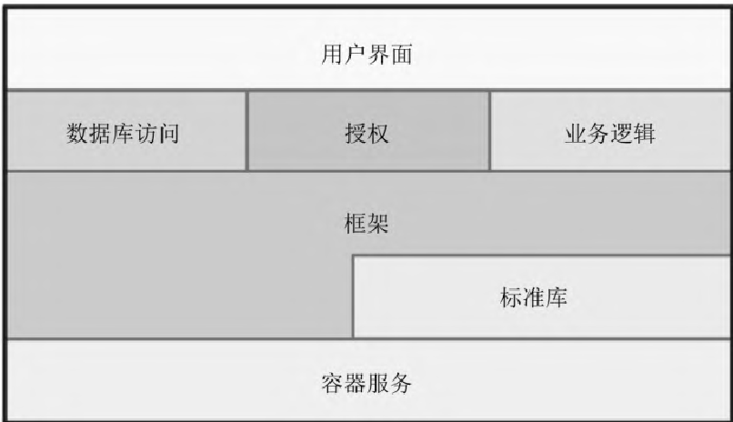

> 图
> 2-2：分层的系统架构。自上而下依次为用户界面层，数据库访问、授权、业务逻辑层，框架与标准库层，以及容器服务层。每一层只使用其下一层提供的抽象。

可以用一个简单的方法来测试设计的正交性。 当你规划好组件后，
问问自己：如一个特别功能背后的需求发生显著改变， 有多少模块会受影响？
对于一个正交系统， 答案应该是“一个”[^ch03-ch2-6]。 比如，
移动图形界面上的按钮应该不需要改变数据库的 schema，
添加现场帮助也不必变更计费系统。

假设有一个复杂的系统， 用于监视和控制加热设备。 最初只是要有一个图形用户界面，
但后来需求发生了变化， 要求增加一个语音响应系统——可通过触摸屏电话控制设备。
对于一个正交设计的系统，
你只需要改变那些与用户界面相关的模块即可：控制设备的底层逻辑应保持不变。
事实上， 如果你的系统精心构造过， 应该可以用相同的底层代码来支持这两种界面。

还要问问你自己， 你的设计与现实世界的变化有多大程度的解耦。
你是否正在用电话号码作为客户标识符？ 当电话公司重新分配区号时会发生什么？
邮政编码、社会保险号或是身份证号， 电子邮件地址以及域名， 都是外部标识符，
你无法完全控制， 它们都可能因为某些原因而改变。 不要依赖那些你无法控制的东西。

#### 工具包和程序库

在引入第三方工具包和程序库时， 请注意保持系统的正交性。 技术选择要明智。

当你拿出一个工具包（就算是来自于同一团队其他成员那里的一个程序库）时，
问问自己， 它是否会将一些不应该有的变化强加给你的代码。 如果对象持久化模式[^ch03-ch2-7]
清楚易懂， 那么它就是正交的。 如果它要求用一种特别的方式创建或读写对象，
那么它就不是。 将这些细节与代码隔离开来还有一个额外的好处，
那就是使将来变更供应商变得更加容易。

Enterprise Java Bean（EJB）系统是一个关于正交性的有趣例子。
在大多数面向事务的系统中， 应用程序代码必须描述每件事务的开始和结束。 在 EJB
下， 此信息以注解声明的方式表达出来， 放在实际工作的方法之外。
同样的应用程序代码可以运行在不同的 EJB 事务环境中， 而不需要做任何变更。

EJB 的这个方式是修饰模式的一个范例：给一个事物添加功能却不需要修改事物本身。
这种编程风格可以用于各种编程语言， 无须要求特别的框架或是库。
唯一需要的是在编程时遵守一点纪律。

#### 编码

每当你写下代码时， 就有降低软件的正交性的风险。 你不仅需要盯着正在做的事情，
还要监控软件的大环境。 如果不这样， 其他模块中的功能就很可能无意间重复了，
或是把已有的知识表达了两次。

有几种技术可以用来保持正交性：

#### 保持代码解耦

编写害羞的代码——模块不会向其他模块透露任何不必要的信息，
也不依赖于其他模块的实现。 试试最少知识原则，
会在[话题 28：解耦](#28-解耦)中加以讨论。 如果你需要改变一个对象的状态，
让该对象替你来完成。 这样做能让你的代码和其他代码实现隔离， 更有可能保持正交性。

#### 避免全局数据

只要代码引用全局数据， 就会将自己绑定到共享该数据的其他组件上。
即使只打算对全局数据进行读操作，
也可能引发问题（例如突然需要将代码改为多线程的情形）。 一般来说，
如果总是显式地将任何需要的上下文传递给模块， 那么代码会更容易理解和维护。
在面向对象的应用程序中， 上下文通常作为参数传给对象的构造函数。 在其他代码中，
也可以创建一个包含上下文的数据结构， 并将结构的引用传出去。

《设计模式：可复用面向对象软件的基础》[GHJV95] 一书介绍了单例模式。
该模式提供了一种方法， 可确保一个特定的类只有唯一实例。
许多人把单例对象当成另一种形式的全局变量在用（尤其是在 Java 这样的语言中，
除此之外就没有全局数据的概念）。 小心单例——其同样会导致不必要的结合。

#### 避免相似的函数

我们经常会遇到一组看起来很相似的函数——或许在开头和结尾的地方共享了公共代码，
但是每个函数都有不同的中心算法。 重复代码是结构问题的症状。 想要更好的实现，
可以看看《设计模式》中的策略模式。

养成不断质疑代码的习惯。 只要有机会就重新组织、改善其结构和正交性。
这个过程被称为重构， 它非常重要，
我们专门开辟了一个部分来讨论它（参见[话题 40：重构](#40-重构)）。

#### 测试

基于正交性设计和实现的系统更容易测试。 由于系统组件之间的交互是形式化的，
且交互有限， 因此可以在单个模块级别上执行更多的系统测试。 这是一个好消息，
因为模块级别（或单元）的测试比集成测试更容易列举出来执行。 实际上，
我们建议将这些测试作为常规构建过程的一部分自动执行（参见[话题 41：为编码测试](#41-为编码测试)）。

编写单元测试本身就是一个有趣的正交性测试。
做什么才能让单元测试构建出来并运行起来？ 需要导入系统其余的大部分代码吗？
如果是这样， 那么就已经发现了一个与系统其余部分没有很好地解耦的模块。

修 Bug 也是评估整个系统的正交性的好时机。 遇到问题时，
评估一下修复行为的局部化程度。 只变更了一个模块，
还是有很多处变更分散在整个系统中？ 当你修正了一个地方， 是不是就修复了所有问题，
还是会神秘地出现其他问题？ 这是一个实施自动化的好时机。
如果在用版本控制系统（相关内容你会在[话题 19：版本控制](#19-版本控制)中读到），
测试通过提交后， 要在回顾代码时把 Bug 修复标注出来。 你可以启用月度报告，
去分析每个 Bug 修复所影响的源文件数量的趋势。

#### 文档

也许有点出乎意料， 正交性也适用于文档。 其涉及的两个独立维度是内容和呈现。
真正符合正交性的文档， 应该能够在不改变内容的情况下显著地改变外观。
字处理程序提供的样式表和宏可以做到这一点。 但我个人更喜欢使用 Markdown
这样的标记系统：在编写时， 我们只关注内容，
而将呈现留给随便什么工具去处理[^ch03-ch2-8]。

#### 与正交共处

正交（迄今为止）还很难用言语表达。 使用 DRY 时， 你追求最小化系统中的重复。
反之， 在使用正交时， 则要去减少系统组件之间的相互依赖。
“正交”的字面意思可能不太好懂， 但是采用正交性原则， 并与 DRY 原则紧密结合，
的确可以让系统变得更灵活、更容易理解， 并且更容易调试、测试和维护。

如果你加入这样一个项目——人们总是在奋力地改来改去，
而每一次改变似乎都会导致另外四件事出错——想想直升机噩梦吧。
这说明该项目很有可能没有遵循正交性来设计和编码， 那么是时候进行重构了。

还有， 如果你是个直升机驾驶员， 切忌吃鱼……

#### 相关部分包括

- [话题 3：软件的熵](#3-软件的熵)
- [话题 8：优秀设计的精髓](#8-优秀设计的精髓)
- [话题 11：可逆性](#11-可逆性)
- [话题 28：解耦](#28-解耦)
- [话题 31：继承税](#31-继承税)
- [话题 33：打破时域耦合](#33-打破时域耦合)
- [话题 34：共享状态是不正确的状态](#34-共享状态是不正确的状态)
- [话题 36：黑板](#36-黑板)

#### 挑战

- 假设有一组具有图形用户界面的工具，以及一组小巧但可以组合使用的命令行工具，哪一组更具备正交性，为什么？对于刚好符合设计意图的场景，哪一组更容易使用？哪一组工具更容易和其他工具组合使用去应对新的挑战？哪一组更容易学习？
- C++ 支持多重继承，Java 允许一个类实现多个接口，Ruby 有 mixin
  类。使用这些设施对正交性有什么影响？使用多重继承和多重接口会有不同的影响吗？使用委托和使用继承之间有区别吗？

#### 练习

练习 1（参考答案见[练习的参考答案](#练习的参考答案)）

要求是一次读取文件中的一行。 对于每一行， 必须将其拆分为多个字段。
下列哪一组伪代码中的类定义可能更符合正交性？

```
class Split1 {
    constructor(fileName)    # 打开要读的文件
    def readNextLine()       # 移到下一行
    def getField(n)          # 返回当前行的第 n 个字段
}
```

还是

```
class Split2 {
    constructor(line)        # 切分一行
    def getField(n)          # 返回当前的第 n 个字段
}
```

练习 2（参考答案见[练习的参考答案](#练习的参考答案)）

面向对象语言和函数式语言在正交性方面有什么差异？ 这些差异是语言本身固有的，
还是仅仅由人们使用它们的方法引起的？

### 11 可逆性

> 如果某个想法是你唯一的想法， 那就没有比它更危险的东西了。
>
> ——埃米尔-奥古斯特·沙尔捷（阿兰）Propos sur la religion，1938

工程师喜欢简单、唯一的解决方案。 在数学考试中， 你可以自信地公布结果 x=2，
这比起那些千头万绪解说法国大革命起因的文章要让人舒服得多。
管理层倾向于站在工程师一边：简单明了的答案非常适合填入电子表格，
或做进项目计划。

要是现实世界能这么配合就好了！ 不幸的是， 虽然今天 x 等于 2， 但明天它可能就成了
5， 下周又变成了 3。 没有什么是永恒不变的——如果你严重依赖某些事实，
几乎可以肯定将来其会发生变化。

实现一件事情的方法往往不止一种， 提供第三方产品的供应商通常也不止一个。
如果你加入的项目被“只有一种方法行得通”这种短视的观念所束缚，
很可能有“惊喜”等着你。 请拭目以待项目团队瞠目结舌的那一刻：

“你说过我们会用 XYZ 数据库的！ 代码已经写完 85% 了， 现在不能变！”
程序员抗议道。 “对不起， 但是现在公司决定统一使用 PDQ 数据库。 我也没有办法。
我们需要重新编码。 以后所有人周末都过来加班， 直到另行通知。”

变化不需要多么剧烈， 甚至不必立刻发生。 随着时间推移和项目推进，
你可能就会发现自己已陷入一个无法立足的境地。 每做出一个关键决定，
项目团队就会投身于一个更具体的目标——由于选择变少， 视野会越来越狭隘。

历经诸多关键决定之后， 目标会变得非常之具体。 一旦它自身有变， 或是风向改变，
甚至只是因为有只蝴蝶在东京扇动了翅膀， 你就会错过目标[^ch03-ch2-9]，
而且错过的可能是十万八千里。

问题在于， 关键的决定不易逆转。

一旦决定使用某个供应商的数据库， 或是某个架构模式， 抑或是特定的部署模型，
就是在采取一系列无法回退的行动， 除非付出巨大的代价。

#### 可逆性

这本书中的许多主题都面向有弹性、适应性强的软件生产过程。
只要坚持其中推荐的做法， 尤其是[话题 28：解耦](#28-解耦)，
以及使用[话题 32：配置](#32-配置)这些原则， 我们就不必做太多不可逆转的关键决定。
这是一件好事， 因为我们并不总能在第一次就做出最好的决定。 比如，
在特定技术上投入， 结果却发现我们招不到足够多的具备必要技能的人；
锁定了某些第三方供应商， 结果他们被竞争对手收购。
需求、用户和硬件的变化速度比我们开发软件的速度要快。

假设在项目的早期， 你决定使用来自供应商 A 的关系型数据库。 很久以后，
在性能测试期间， 却发现该数据库非常慢， 而来自供应商 B 的文档型数据库要快得多。
对于大多数传统项目， 这会很不幸。 大多数情况下，
对第三方产品的调用在整个代码中是纠缠不清的。
但如果你真的将数据库的概念抽象出去——让它只是以服务形式提供持久化——现在你就可以灵活地中途换马了。

类似地， 假设项目开始时是一个基于浏览器的应用程序， 但后来，
市场营销人员认识到他们真正想要的是一个移动 App。 这会给你造成多大的困难呢？
在理想情况下， 这不应对你造成太大的影响， 至少在服务器端是这样。
你要做的应该是剥离出 HTML 呈现层并用另一套 API 替换掉。

错误在于认为任何决定都是板上钉钉的——而没有为可能出现的意外做好准备。
与其认为决定是被刻在石头上的， 还不如把它们想象成写在海滩的沙子上。
一个大浪随时都可能袭来， 卷走一切。

> [!TIP]
> **提示 18 不设最终决定**

#### 灵活的架构

很多人都会尽力保持代码的灵活性，
但其实还要考虑在体系结构、部署和供应商集成方面保持灵活性。

写下这段文字的时间点是 2019 年。 自世纪之交以来，
我们看到了以下服务端架构的“最佳实践”：

- 大铁块[^ch03-ch2-10]
- 大铁块的联合
- 带负载均衡的商用硬件集群
- 将程序运行在云虚拟机中
- 将服务运行在云虚拟机中
- 把云虚拟机换成容器再来一遍
- 基于云的无服务器架构
- 最后，无可避免的，有些任务又回到了大铁块。

继续， 把最新和最伟大的时髦的东西添加到这个列表中，
然后怀着敬畏之心去膜拜：每个东西的成功都是个奇迹。

你能为这种架构的变化提前准备吗？ 做不到。

你能做的就是让修改更容易一点。 将第三方 API 隐藏在自己的抽象层之后。
将代码分解为多个组件：即使最终会把它们部署到单个大型服务器上，
这种方法也比一开始做成庞然大物， 然后再切分要容易得多。
（我们的伤疤可以证明这一点。）

还有， 最后一条建议， 虽然它并不特别针对可逆性问题。

> [!TIP]
> **提示 19 放弃追逐时尚**
>
> 没有人知道未来会怎样， 我们也不例外。
> 要让你的代码具备“摇滚”精神：顺境时摇摆滚动， 逆境时直面困难。

#### 相关部分包括

- [话题 8：优秀设计的精髓](#8-优秀设计的精髓)
- [话题 10：正交性](#10-正交性)
- [话题 19：版本控制](#19-版本控制)
- [话题 28：解耦](#28-解耦)
- [话题 45：需求之坑](#45-需求之坑)
- [话题 51：务实的入门套件](#51-务实的入门套件)

#### 挑战

- 现在来看看量子力学中薛定谔的猫。

假设一个封闭的盒子里有一只猫和一颗放射性粒子。 这颗粒子有 50% 的概率裂变成两个。
如果分裂了， 猫会被杀死。 如果没发生裂变， 猫就没事。 那么这只猫死了还是活着？
根据薛定谔的理论， 正确答案是两者都是（至少在盒子保持关闭状态时是这样）。
每当一个亚核反应发生时， 宇宙就会被克隆。 在其中一个宇宙中， 事件发生了，
而在另一个宇宙中则没有。 猫在一个宇宙中活着， 在另一个宇宙中死了。
只有当你打开盒子后， 才知道自己处于哪个宇宙。

难怪为未来编写代码会很困难。

但是，
可以把代码的演化路线想象成装满了薛定谔猫的盒子：每一个决定都会导致不同版本的未来。
你的代码可以支持多少种可能的未来？ 哪一种未来更有可能出现？
到时候为其提供支持会有多难？

你敢打开盒子吗？

### 12 曳光弹

> 预备，开火，瞄准……
>
> ——无名氏

在开发软件时， 我们经常谈论如何命中目标。
实际上我们并没有在靶场内向什么东西开火， 但这仍然是一个有用且非常直观的比喻。
特别是， 在一个复杂多变的世界里考虑如何命中目标， 是很有趣的。

当然， 答案取决于你进行瞄准所用的设备的性质。 在很多情况下，
你只有一次瞄准的机会， 此外就只能去看看是否击中了靶心。 但是有一个更好的方法。

你肯定看过那些人们用机关枪射击的电影、电视节目和电子游戏？ 在这些场景中，
会经常看到子弹在空中留下明亮的轨迹线。 这些线条来自曳光弹。

曳光弹和普通弹药间隔着一起被压入弹夹。 当曳光弹发射时， 上面的磷就会被点燃，
在枪和击中物之间留下一道烟火轨迹。 如果曳光弹击中了目标，
那么之后的常规子弹也会击中。
士兵们使用这些曳光弹来调整他们的瞄准：这是一种务实的方法，
可以在真实条件下提供实时反馈。

同样的原则也适用于做项目。 特别是在要构建一些以前从未做过的东西的时候，
我们使用曳光弹式开发这个术语， 来直观地说明，
在真实条件下针对移动目标进行即时反馈的必要性。

就像枪手一样， 你在尝试于黑暗中击中目标。 因为用户以前从未见过这样的系统，
所以需求可能是模糊的。 或许你可能正在使用不熟悉的算法、技术、语言或库，
因此将面临大量的未知因素。 由于项目需要时间去完成， 所以几乎可以确定，
在完成之前， 工作所处的环境一定会改变。

典型的反应是要把系统定死；把各种需求逐条列出来， 制成大量的文件；
约束好每一项未知的东西， 并且限定环境； 开火时采用航迹推算法。 总之，
前面先做大量的计算， 然后开枪， 希望能命中。

然而， 务实的程序员更喜欢使用相当于曳光弹的软件。

#### 在黑暗中发光的代码

曳光弹之所以有用， 是因为其工作环境和约束与真实子弹的相同。
曳光弹能快速抵达目标， 所以枪手可以得到即时的反馈。 而且， 从实用的观点来看，
这是一个成本相对低的解决方案。

为了在编码中获得相同的效果， 我们会找一些东西，
能让我们快速、直观、可重复地从需求中得到最终系统的某个方面。

寻找重要的需求， 那些定义了系统的需求。 寻找你有疑问的地方，
那些你认为有重大风险的地方。 然后对开发进行优先级排序， 首先从这些地方开始编码。

> [!TIP]
> **提示 20 使用曳光弹找到目标**

实际上， 今天的项目架构都很复杂， 有大量的外部依赖， 需要诸多的工具，
曳光弹也就变得更为重要。 对于我们来说， 最初的曳光弹就是， 创建一个简单的工程，
加一行“hello world！”， 并确保其能编译和运行。 然后，
我们再去找整个应用程序中不确定的部分， 添加上让它们跑起来的骨架。

请看下图。 这个系统有五个架构层。 我们对它们是怎么集成起来的有些疑虑，
所以就先去找一个简单的特性， 用来实验一下这些层次是如何一起工作的。
对角线显示了该特性依赖的代码路径。 要让系统工作起来，
我们只需要先把每层的实心阴影部分实现出来， 那些画了弯曲线条的部分以后再说。


> 图
> 2-3：曳光弹穿越系统各层。系统分为用户界面、授权、业务逻辑、数据模型、数据库五个架构层，对角线表示某个特性依赖的代码路径，实心阴影部分需先实现，弯曲线条部分（尚未实现）留待以后补充。

我们曾经接手过一个复杂的客户端-服务器数据库营销项目。
有一部分需求是能够指定并执行临时查询。 服务器是一系列关系数据库和专用数据库；
客户端 UI 是用任一种语言 A 写的； 用于访问服务器的接口，
是用另一种语言写成的库来实现的； 用户查询以一种类似 Lisp 的符号保存在服务器上，
等到执行之前再将其转换为优化过的 SQL。 有许多未知因素， 涉及各种不同的环境，
也没有人确定 UI 应该如何表现。

这是一个使用曳光代码的好机会。 我们开发了用于前端的框架、处理查询的库，
以及另一个框架。 这个框架用于将储存下来的查询转换为面向特定数据库的查询。
然后我们把它们放在一起， 检查是否工作正常。 对于一开始的版本，
所能做的仅仅是提交一个列出表里所有行的查询。 但它提供了和库交流的 UI，
库能序列化及反序列化查询， 服务器能通过序列化结果生成 SQL。 在接下来的几个月里，
我们逐步充实了这个基本框架， 并行地扩展了曳光代码的各个不同的组件，
也增加了新功能。 每当 UI 添加一个新的查询类型时， 库就会成长， SQL
生成器也会变得更加复杂。

曳光代码不是一次性的：编写它是为了持续使用。
代码中需要包含所有的错误检查、结构、文档、自检查这些任何生产代码都应具备的东西。
它只是功能还不完整。 但是， 只要在各个组件间， 从一头到另一头全部打通，
就可以检查出离目标有多么接近， 并在必要时做出调整。 一旦抵达目标，
再添加功能就很容易了。

曳光弹式开发和项目不会结束这种理念是一致的：总有东西需要改， 总有新功能需要加。
这是一个逐步递增的方法。

传统的做法是使用一种笨重的工程方法：代码被分成模块，
在为这些模块编码时不用考虑外部环境。 模块被组合成组件， 然后集成这些组件，
直到有一天它变成一个完整的应用程序。 只有这些完成后，
才能将应用程序作为一个整体交付给用户进行测试。

使用曳光代码有很多优势：

用户可以更早地获得能工作的东西

如果能成功地传达你正在做什么（参见[话题 52：取悦用户](#52-取悦用户)），
用户会知道他们看到的是不成熟的东西。 这样他们就不会因为缺少功能而失望，
而在系统有了明显的进展时则会欢呼鼓舞。 用户的持续购买， 和项目的推进一样，
都会产生贡献。 这样的用户， 也极有可能会告诉你每次迭代离目标又接近了多少。

开发者构造了一个可以在其中工作的框架

最让人气馁的是一张上面什么也没写的纸。 如果已经打通了应用程序的所有层面，
并将它们通过代码表达出来， 那么团队就不需要太多无中生有的东西。
这使每个人都更有效率， 并促进了一致性。

你有了一个集成平台

当系统已经打通时， 你就有了一个环境，
可以在做完单元测试后立刻把代码一块块加进来。
你可以每天（通常是一天多次）持续集成， 而不必去面对一个巨量的集成工作。
每次新的变更造成的影响会更明显， 相互间的影响也更有限，
这样调试和测试就更快更准确。

你有可以演示的东西

项目赞助商和公司高层倾向于在最不适当的时候想起看看演示。 只要使用曳光代码，
你总是有东西可以演示。

你对进度有更好的感觉

在曳光弹式开发中， 开发人员逐个跟踪案例。 做完一个后再做下一个，
度量性能和向用户展示进度要容易得多。 因为每个独立的开发环节要小得多，
这样就避免了在编写巨型代码块时， 一次次地在周报中汇报这块东西已经完成了 95%。

#### 曳光弹并不总能击中目标

曳光弹会告诉你击中了什么。 可能它并不能每次都击中目标， 你需要不断地调整瞄准，
直到击中目标。 这正是问题的关键。

曳光代码也一样。 当你不能 100% 确定要做什么的时候， 就用这个技术。
如果你一开始的一系列尝试出错了：用户说“我不是这个意思”，
或是数据在你需要的时候还没到位， 或是有一些性能问题， 请不要诧异，
去弄清楚如何改变你已经做好的东西， 想办法让它靠近目标。
你会受益于这种精益的开发方式。 小块代码惯性也小——容易快速地变更。
你能够以更快的速度、更小的成本， 收集到针对应用程序的反馈，
并生成一个新的更准确的版本。 而且，
应用程序的每个主要组件都已经出现在曳光代码中，
用户可以确信他们看到的东西基于现实， 而不仅仅是一个纸面规范。

#### 曳光代码对阵原型制作

你可能认为曳光代码这个概念与原型制作无异， 只不过换了个咄咄逼人的名字。
但它们是有区别的。 当使用原型时， 你的目标是探索最终系统的特定方面。
如果有了一个真正的原型， 最终你将扔掉验证构思时捆绑在一起的所有东西，
并总结经验教训， 最后正确地重新编码。

例如， 假设你正在创作一个应用程序。
它可以帮助托运人确定如何将奇怪尺寸的箱子打包到集装箱中。 要面对的另一课题是，
用户界面需要符合直觉， 而且找到最佳装箱策略的算法非常复杂。

可以用一个 UI 工具创建一个最终用户使用的界面原型。
为之编写的代码只要能响应用户操作就够了。 一旦用户认可了布局，
你就可以把原型扔掉， 再重新通过编码来加以实现。 这次可以使用目标语言，
并在界面后加上业务逻辑。 类似地， 你可能打算做几个真的装箱的算法原型。
可以用高阶宽松的语言测试功能， 比如 Python，
也可以用更接近机器的语言编写低阶代码来测试性能。 不管是哪一种情况，
只要你从中做出了选择， 就可以重新开始， 在最终的环境中编写算法，
与现实世界交接。 这叫原型制作， 非常有用。

曳光代码方法解决的是一个不同的问题。 你需要知道， 应用程序作为一个整体，
是如何整合在一起的， 需要向用户展示实践中交互如何工作，
而且你想要给开发人员一个框架， 用来挂接代码。 在这种情况下，
就可以用曳光代码构建出一个程序，
它包含普通的装箱算法（比如来一个东西就装一个）和一个简单但能工作的用户界面。
一旦将应用程序中的所有组件都放置在一起， 就有了一个框架，
可以展示给用户和开发人员。 随着时间的推移， 你会把新的功能添加到这个框架中，
把留白的程序补充。 但是框架保持不变， 并且你知道系统将继续这样运作，
一直和一开始完成曳光代码时一致。

这一区别非常重要， 值得我们反复强调。 原型生成的是一次性代码；
曳光代码虽然简单但是完整， 它是最终系统框架的组成部分。
可以将原型制作看作是在发射一颗曳光弹之前进行的侦察和情报收集工作。

#### 相关部分包括

- [话题 13：原型与便签](#13-原型与便签)
- [话题 27：不要冲出前灯范围](#27-不要冲出前灯范围)
- [话题 40：重构](#40-重构)
- [话题 49：务实的团队](#49-务实的团队)
- [话题 50：椰子派不上用场](#50-椰子派不上用场)
- [话题 51：务实的入门套件](#51-务实的入门套件)
- [话题 52：取悦用户](#52-取悦用户)

### 13 原型与便签

许多不同的行业都使用原型来尝试特定的想法； 原型制作比完整的产品制作要便宜得多。
例如， 汽车制造商可能会为一款新车的设计制造许多不同的原型。
每个原型都是为了测试一个特定方面——空气动力学、造型、结构特征等。
老派的人可能会用粘土模型来做风洞测试， 用软木和布胶带为艺术部门做模型， 等等。
不那么浪漫的人会在电脑屏幕上或虚拟现实中建模， 从而进一步降低成本。
通过这种方式， 不必在制作真正的东西上投入， 就可以找出有风险或不确定的因素。

我们以同样的方式， 出于同样的原因构建软件原型——用来分析和暴露风险，
以一种能大幅降低成本的方式获得修正的机会。 与汽车制造商一样，
我们可以用原型去测试项目的单个或多个特定方面。

一般来说原型是基于代码的， 但并非总是如此。 像汽车制造商一样，
我们可以用不同的材料制造原型。 便签非常适合构建动态事务的原型，
例如工作流和应用逻辑。 用户界面的原型， 可以是白板上的一幅画，
也可以是用绘图程序画的一个无功能的模型， 还可以通过界面制作工具来完成。

原型被设计出来， 只是为了回答几个问题， 因此比要投入生产的应用程序成本更低，
开发速度更快。 其代码可以忽略一些不重要的细节——那些以后可能对用户非常重要，
但目前还不重要的东西。 例如， 如果你正在制作 UI 的原型，
不正确的结果或数据就无所谓。 另一方面， 如果只是在研究计算或性能方面的问题，
那么就可以使用非常糟糕的界面， 甚至不要界面也行。

但如果你发现自己处在一个不能放弃细节的环境中， 那么就需要问问自己，
是否真的是在制作一个原型。 也许在这种情况下，
曳光弹式开发更合适（参见[话题 12：曳光弹](#12-曳光弹)）。

#### 需要做原型的东西

你会选择用原型来研究什么类型的东西呢？ 答案是， 任何有风险的东西，
任何之前没有尝试过或对最终系统来说很关键的东西，
任何未经证实、实验性或可疑的东西， 以及任何让你不舒服的东西。
你可以为下列事物做原型：

- 架构
- 已存在的系统中的新功能
- 数据结构或外部数据的内容
- 第三方工具或组件
- 性能问题
- 用户界面设计

原型设计是为了学习经验。 它的价值不在于产生的代码， 而在于吸取的教训。
这正是原型的意义所在。

> [!TIP]
> **提示 21 用原型学习**

#### 怎样使用原型

当制作一个原型时， 哪些细节可以忽略？

正确性

你可以在适当的地方使用替代数据。

完整性

原型只需要满足有限的功能， 可能只有一个预先选好的输入数据片段及单个菜单选项。

健壮性

错误检查可以不完整， 甚至完全没有都行。 如果你偏离了预定的航线，
原型机很可能烧毁在绚丽的烟火中——那又如何！

格式

原型代码可能并不需要太多注释和文档（尽管围绕从原型中获取的经验，
可能会产生大量文档， 但是相对而言， 原型系统本身的文档要少得多）。

由于原型需要跳过细节， 专注于它所考虑的系统的特定方面，
所以你可能想用高阶脚本语言来实现原型——比项目的其他部分高阶一些（可能是 Python 或
Ruby 之类的语言）， 因为这些语言可以帮你开山辟路。
你可以选择继续用原型所用的语言做开发， 也可以换一个； 毕竟，
无论如何都要扔掉原型的。

如果你需要对用户界面做原型， 就使用能让你聚焦在外观以及（或）交互上的工具，
而不必操心编码或标签问题。

脚本语言也可以很好地充当“粘合剂”， 将低阶代码块组合成新的搭配。 使用这种方法，
可以快速地将现有组件组装为新的配置， 以便了解其工作原理。

#### 制作架构原型

有许多原型用于对还在考虑中的整个系统建模。 和曳光弹相反，
原型系统中的所有单个模块都不需要有特别的功能。 实际上，
甚至可能不必编写代码来创建架构原型——在白板上贴一些便签和索引卡就够了。
尽量推迟思考细节， 因为你要确定的是， 系统的各个部分是怎么结合成一个整体的。
下面列出了一些特定领域， 你可能希望在架构原型中找到其相关问题的答案：

- 主要组件的职责是否恰当，有没有定义清晰？
- 主要组件之间的协作是否定义清晰？
- 耦合度最小化了吗？
- 你能确定重复的潜在来源吗？
- 接口的定义和约束能否接受？
- 在执行过程中是否每个模块都有访问所需数据的途径？在需要数据的时候，能访问到吗？

根据制作原型的经验， 最后这条往往能产生惊喜， 获得有价值的结果。

#### 不要把原型用于产品

在开始任何基于代码的原型开发之前， 请确保每个人都理解， 正在编写的是一次性代码。
原型可能有着欺骗性的外表， 对那些不知道这只是原型的人产生吸引力。
你必须非常清楚地表明该代码是用完即弃的， 它并不完整也不可能做到完整。

如果没有设定正确的期望值， 演示用的原型很容易因为表面的完整而产生欺骗性。
项目赞助商和管理人员可能会坚持部署原型（或其后代）。 提醒他们，
你可以用软木和胶带做出一辆很棒的新车原型， 但你不会在高峰时间驾驶它！

如果你觉得所在的环境或文化中， 原型代码的目的很有可能被误解，
那么最好使用曳光弹的方法。 这样， 最后你可以做出一个坚实的框架，
在此基础上进行未来的开发。

如果使用得当， 原型利于在开发的早期就识别出潜在的问题点，
并给予纠正——此时修正错误不仅廉价还容易。 这能帮你节省大量的时间和金钱，
极大地减少你的苦难。

#### 相关部分包括

- [话题 12：曳光弹](#12-曳光弹)
- [话题 14：领域语言](#14-领域语言)
- [话题 17：Shell 游戏](#17-shell-游戏)
- [话题 27：不要冲出前灯范围](#27-不要冲出前灯范围)
- [话题 37：听从蜥蜴脑](#37-听从蜥蜴脑)
- [话题 45：需求之坑](#45-需求之坑)
- [话题 52：取悦用户](#52-取悦用户)

#### 练习

练习 3（参考答案见附录）

市场部门想和你一起坐下来做一场关于几个网页设计的头脑风暴。
他们正在考虑做一些可点击的图像， 用来导向其他页面。
但是他们未能决定图像的模型——可能是一辆车、一部手机或一栋房子。
你有一个目标页面和内容的清单； 他们希望看到一些原型。 哦， 顺便说一下， 你只有
15 分钟时间。 这时你会使用什么工具？

### 14 领域语言

> 语言之界限， 即是一个人世界之界限。
>
> ——路德维希·维特根斯坦

计算机的语言会影响你怎样思考问题， 影响你怎样看待信息的传播。
每一门语言都有一个特性列表——比如这些时髦的术语：静态类型还是动态类型，
早期绑定还是晚期绑定[^ch03-ch2-11]， 函数式还是面向对象， 继承模型， mixin，
宏机制——所有这些对问题的解决方案， 既可能提供建议也可能扰乱视听。
同样是设计解决方案， 用 C++ 的方式和用 Haskell 的思想， 得到的结果会大为不同，
反之亦然。 与之相对， 问题域的语言同样也能反过来启发程序设计的解决方案，
而且我们认为这更为重要。

我们总是试图使用应用领域的词汇表来编写代码（参见[话题 45：需求之坑](#45-需求之坑)）。
在一些案例中， 务实的程序员能跨越到下一个层级， 直接用该领域的语言编程，
直接使用该领域的词汇、语法和语义。

> [!TIP]
> **提示 22 靠近问题域编程**

#### 一些真实世界中的领域语言

通过几个例子来看看别人是怎么做的。

RSpec

RSpec[^ch03-ch2-12] 是一个 Ruby 的测试库。
大多数其他现代语言的版本都曾受它启发。 用 RSpec
描述的测试旨在反映出你期望从代码中得到的行为。

```
describe BowlingScore do
    it "totals 12 if you score 3 four times" do
        score = BowlingScore.new
        4.times { score.add_pins(3) }
        expect(score.total).to eq(12)
    end
end
```

Cucumber

Cucumber[^ch03-ch2-13] 提供了一种对编程语言中立的方法来编写测试。
你可以使用适配了你的语言的 Cucumber 版本来运行测试。
为了支持类似自然语言的语法， 还必须为测试编写特定的匹配器，
去识别短语以及提取参数。

```
Feature: Scoring

Background:
    Given an empty scorecard

Scenario: bowling a lot of 3s
    Given I throw a 3
    And I throw a 3
    And I throw a 3
    And I throw a 3
    Then the score should be 12
```

用 Cucumber 是为了让软件的客户能够阅读这些测试（虽然在实践中很少有人真的去读。
下面来讨论这一现象可能的原因）。

#### 为什么很多商务客户不去读 Cucumber 写出的东西

收集需求、设计、编码、发布， 这套传统的方法不再有效，
原因之一是它离不开一个前提——我们知道需求是什么。 可惜我们很少真的有所了解。
商务用户对自己想要达成目标的设想很模糊， 而且他们既不知道也不关心细节。
这正是我们价值的体现之处——能凭直觉感知到意图并将其转换为代码。

因此， 如果你强迫商务人士在需求文档上签字， 或是让他们同意一组 Cucumber
写出的东西， 那就相当于让他们去检查苏美尔语文章的拼写错误。
他们会随便改改来挽回面子， 然后签字让你离开他们的办公室。

还不如直接向他们交付能运行的代码， 毕竟，
可以拿来就用——这才是他们真正的需求所在。

#### Phoenix 路由

许多网页框架都有路由功能， 用来将传入的 HTTP 请求映射到代码中的处理函数。
这里有一个 Phoenix[^ch03-ch2-14] 的例子。

```
scope "/", HelloPhoenix do
    pipe_through :browser # 使用默认的浏览器管线
    get "/", PageController, :index
    resources "/users", UserController
end
```

这块代码是说， 以“/”开头的请求在通过一系列过滤器之后被适配到浏览器管线。
单独的一个“/”请求会交给 PageController 模块的 index 函数处理。 UsersController
实现的函数， 掌管着通过 url/users 访问的资源。

#### Ansible

Ansible[^ch03-ch2-15] 是一个软件配置工具， 通常用于管理大量远程服务器。
它通过读取提供好的规范来进行工作， 可以让服务器遵循规范来做任何需要做的事情。
规范可用 YAML[^ch03-ch2-16] 编写， YAML
是一门用于从文本描述构建出数据结构的语言：

```yaml
---
- name: install nginx
  apt: name=nginx state=latest
- name: ensure nginx is running (and enable it at boot)
  service: name=nginx state=started enabled=yes
- name: write the nginx config file
  template: src=templates/nginx.conf.j2 dest=/etc/nginx/nginx.conf
  notify:
    - restart nginx
```

上面这个例子能确保已安装最新版本的 nginx。 服务器默认是启动状态，
并且用的是提供好的配置文件。

#### 领域语言的特征

让我们来更细致地看看这些例子。

RSpec 和 Phoenix 路由是用它们的宿主语言（Ruby 和 Elixir）编写的。
它们利用了一些诸如元编程和宏这类很迂回的代码，
但最终可以像常规代码一样编译和运行。

Cucumber 的测试和 Ansible 的配置是用它们自己的专用语言编写的。 Cucumber
的测试被转换成可运行的代码或是运行时所需的数据结构， 而 Ansible
规范总是被转换成由 Ansible 运行时处理的数据结构。

因此， RSpec
和路由代码是被嵌入运行的代码的：它们对你的编码词汇表做了真正的扩展。 Cucumber 和
Ansible 被代码读出来， 然后转换成代码可以使用的某种形式。

我们将 RSpec 和路由视为内部领域语言的范例， 与之相对， Cucumber 和 Ansible
采用的是外部语言。

#### 内部语言和外部语言之间的权衡

一般来说， 内部领域语言可以利用其宿主语言的特性：创建出来的领域语言更为强大，
而且这种威力是毫无代价的。 例如， 你可以用一些 Ruby 代码来自动创建一组 RSpec
测试。 对于这个保龄球计分的案例， 如果不计补中和全中的情况，
你可以这样来测试多组得分：

```
describe BowlingScore do
    (0..4).each do |pins|
        (1..20).each do |throws|
            target = pins * throws
            it "totals #{target} if you score #{pins} #{throws} times" do
                score = BowlingScore.new
                throws.times { score.add_pins(pins) }
                expect(score.total).to eq(target)
            end
        end
    end
end
```

一下子就写了 100 个测试。 今天剩下的时间里可以去休息了。

内部领域语言的缺点是会受到宿主语言的语法和语义的限制。
尽管有些语言在这方面非常灵活，
你仍然不得不在想要的语言和可以实现的语言之间做出妥协。

无论你最终想出什么花招， 还是要符合目标语言的语法。 带有宏机制的语言（比如
Elixir、Clojure、Crystal）提供的弹性会大一些， 不过终究会有语法限制。

外部语言没有这样的限制。 只要为这种语言编写一个解析器就可以了。
有时可以使用其他人做的解析器（就像 Ansible 使用 YAML 那样）， 不过这样一来，
就又回到了折衷的做法。

编写解析器可能意味着要向你的程序添加新的库和工具。
编写一个好的解析器并不是一件简单的工作。 但是， 如果你有一颗坚强的心， 可以试试
bison 或 ANTLR 之类的解析器生成器， 或是诸如 PEG 之类的解析框架。

我们的建议相当简单：花费的努力不要比节省下来的还多。
编写领域语言会给项目增加一些成本，
所以你需要确信省下的花销（在可预计的长期）足以抵消它。

通常， 如果可以的话， 就使用现成的外部语言（如 YAML、JSON 或 CSV）。
否则就试试内部语言。 我们建议仅当应用程序的领域语言开放给用户来写的时候，
才选择外部语言。

#### 廉价的内部语言

最后， 再告诉你一个创建内部语言的技巧， 如不介意大量的语法泄露则可以一试。
不必做大量元编程， 相反只需编写函数来完成这项工作即可。 事实上， RSpec
差不多就是这么干的：

```
describe BowlingScore do
    it "totals 12 if you score 3 four times" do
        score = BowlingScore.new
        4.times { score.add_pins(3) }
        expect(score.total).to eq(12)
    end
end
```

在这段代码中， describe、it、expect、to 和 eq 都只是 Ruby 的方法。
虽然在如何传递对象方面还有一些幕后工作， 但都只是代码而已。
我们会在练习中再来探讨。

#### 相关部分包括

- [话题 8：优秀设计的精髓](#8-优秀设计的精髓)
- [话题 13：原型与便签](#13-原型与便签)
- [话题 32：配置](#32-配置)

#### 挑战

- 你当前的项目中的一些需求是否可以用特定领域语言来表达？有没有可能写一个编译器或是一个翻译程序来生成所需的大部分代码？
- 如果决定将采用小语言作为一种更接近问题域的编程方式，那么你就要做好准备多花一些力气来加以实现。将为一个项目开发的框架复用到别的项目，你能找到对应的方法吗？

#### 练习

练习 4（参考答案见附录）

我们希望实现用一种小语言来控制一个简单的绘图包（可能是一个海龟图形系统）。
这种语言由单字母命令组成， 有些命令后面跟着一个数字。 例如，
下面的输入将绘制一个矩形。

```
P 2 # select pen 2
D # pen down
W 2 # draw west 2cm
N 1 # then north 1
E 2 # then east 2
S 1 # then back south
U # pen up
```

试着实现代码来解析此语言。 注意设计时要确保添加新命令比较容易。

练习 5（参考答案见附录）

在上一个练习中，
我们为海龟图形语言实现了一个简单的解析器——它是一种外部领域语言。 这一次，
用内部语言来实现。 不用要其他小聪明， 为每个命令编写一个函数就够了。
过程中可能需要将命令的名称更改为小写形式， 还可能要将它们封装在某些东西的内部，
以提供其运行的环境。

练习 6（参考答案见附录）

设计一个 BNF 语法来解析时间规范， 需要能处理以下所有示例。

```
4pm, 7:38pm, 23:42, 3:16, 3:16am
```

练习 7（参考答案见附录）

在上一个练习中你设计出了 BNF 语法， 现在选择一种语言， 用该语言的 PEG
生成器去实现该语法的解析器。 最后输出的是午夜过后的整数分钟。

练习 8（参考答案见附录）

用脚本语言和正则表达式来实现这个时间解析器。

### 15 估算

位于华盛顿特区的国会图书馆目前有大约 75 Tb 的在线数字信息。 请马上回答！ 通过
1Gbps 的网络发送出所有这些信息需要多长时间？
一百万个名字和地址需要多大的磁盘空间？ 压缩 100Mb 的文本需要多长时间？
完成你的项目需要几个月？

在某种程度上， 这些都是毫无意义的问题——因为缺少必要信息。 然而，
只要你愿意估算， 这些问题都是可以回答的。 并且， 在估算的过程中，
你将会加深对程序所处世界的理解。

通过学习估算， 把这项技能发展为对事物的数量级产生直觉，
你将能展现出一种魔法般的能力， 这种能力可以判别事情的可行性。
当有人说“我们要通过网络将备份上传到亚马逊 S3 上”时，
你直觉上就能判断这是否可行。 在你编码的时候， 能知道哪个系统需要优化，
哪些放在那里就够了。

> [!TIP]
> **提示 23 通过估算来避免意外**

无论何时， 当有人要你做预估时， 有一个答复是万能的。 对于这个小福利，
我们将在本部分的末尾揭晓答案。

#### 多精确才够

在某种程度上， 所有的答案都是估算， 区别仅在于一些比另一些更精确。
所以当有人让你估算的时候， 你要问自己的第一个问题是， 答案会用在什么场合下。
对方需要很高的精度， 还是只要一个大约的估计？

有一件关于估算的有趣的事——你使用的单位会对结果的解释产生影响。
如果你说某件事需要 130 个工作日完成，
那么听的人往往觉得实际要的时间会很接近这个数字。 然而， 如果你说的是“哦， 大约 6
个月吧”， 他们就会认为还需要 5 到 7 个月不等。 两个数字表示的时间周期是一致的，
但是“130 天”却可能暗示了比你想象得更高的精度级别。
我们建议你采用下面的时间尺度做估算：

| 持续时间 | 采用的估算单位       |
| -------- | -------------------- |
| 1-15 天  | 天                   |
| 3-6 周   | 周                   |
| 8-20 周  | 月                   |
| 20+ 周   | 说出估算前再仔细想想 |

因此， 如做完功课后， 你确定项目将花掉 125 个工作日（25 周）， 那么你可以用“大约
6 个月”来描述这个估算。

同样的理念也适用于任何数量的估算：挑选答案的单位来反映想要传达的精确性。

#### 估算从何而来

所有的估算都是基于对问题的建模。 但是在我们深入建模技术之前，
必须提到一个基本的估算技巧， 用它总能给出不错的答案：问问已经做过的人。
在你全身投入建模之前， 先问问周围有没有一些过去经历过类似情况的人。
看看他们的问题是如何解决的。 你不太可能找到一个完全匹配的事情，
但你会惊讶地发现， 总能成功地多次借鉴他人的经验。

#### 理解在问什么

所有的评估工作的首要部分都是建立对所问内容的理解。
除了上面已经讨论过的精确度问题， 你还需要掌握问题域的范围。
范围通常是问题的隐含前提， 你只是需要养成习惯， 在开始猜测之前就加以考虑。
很多时候， 你选择的范围会成为给出的答案的一部分：“假设没有交通事故，
车里也有汽油， 那么我会在 20 分钟内抵达那里。”

#### 对系统建模

建模是估算中很有趣的部分。 当你理解了被问的问题时，
就开始为之建立一个粗略的思维模型框架。 如果是估计响应时间，
那么模型可能涉及一个服务器， 以及进来的流量的一些状况。 对于一个项目，
模型可能是开发组织在开发期间需要的每个步骤，
以及关于系统可能如何实现的粗略图景。

建模的过程， 从长远来看， 既富创造性又实用。 通常，
在建模的过程中会发现一些表面上看不出来的潜在模式和过程。
你甚至可能会去想重新审视最初的问题：“你要一个对做 X 的预估， 然而这事很像一个 X
的变种 Y。 而 Y 用一半的时间就能完成， 仅仅只比 X 少一个特性而已。”

建模会给估算过程引入不准确性。 这不可避免， 但也是有益的。
你在用模型的简单性来换取精确性。
在模型上加倍的努力可能只会换来精度上的微小提升。 经验会告诉你何时应停止精炼。

#### 把模型分解成组件

一旦得到了模型， 就可以将其分解为组件。
你需要发掘出描述这些组件如何交互的数学规则。
有时候组件向最终结果贡献的值是累加上去的， 但有些组件提供的则是乘法因子，
它们会更复杂（例如那些模拟抵达节点的流量的组件）。

你会发现每个组件通常都有一些参数， 这些参数会影响组件对整个模型的贡献。
在这个阶段， 只要确定出各个参数就行了。

#### 确定每个参数的值

一旦参数被分离， 就可以将它们过一遍， 为每个参数分配一个值。
这一步通常会引入一些误差。 但关键是找出哪些参数对结果影响最大，
集中精力确保其近乎正确。 一般来说， 就重要性而言， 把价值累加到结果的参数，
明显低于对结果有乘法或除法效应的参数。 将一条线路的速度提高一倍，
会让一小时内接收的数据总量翻倍， 而增加 5 毫秒的传输延迟则不会产生明显的影响。

你应该用一个合理的方法来计算这些关键参数。 例如在队列的例子中，
最好试着度量一下现有系统的实际事务到达率， 或者找到一个类似的系统度量一下。
类似地， 你可以度量一下目前服务单个请求所需的时间，
或是使用本部分中描述的技巧做一个估算。 事实上，
你经常会发现自己的估算是建立在其他次级估算的基础上的。
这会是犯下最大错误的地方。

#### 计算答案

只有在最简单的案例中， 估算才会有单一的答案。 你也许能高兴地说：“我能在 15
分钟内走过 5 个街区。” 然而随着系统变得越来越复杂， 你会避免正面回答。
做多组计算， 不断改变关键参数的值， 直到能确定哪些参数在真正地主导模型。
电子表格对此大有助益。 然后围绕下面这些参数来表述你的答案——“如果系统配有 SSD 及
32GB 内存， 那么响应时间大约是四分之三秒； 如果内存是 16GB， 那么响应时间大约是
1 秒。” （注意到没有， “四分之三秒”传达出了与 750ms 不同感觉的精度。）

在计算阶段， 你可能会得到一些奇怪的答案。 不要急于否定。 如果计算是正确的，
那么错的可能是你对问题的理解， 或者模型是错的。 这是有价值的信息。

#### 记录你的估算能力

我们认为记录下你做过的估算是一个好主意， 这样可以看到做过的估算的准确程度。
如果一个全面评估涉及多项次级评估， 那么也要记录这些次级评估。 你会时常发现，
估算得还是挺准确的——事实上很快你就会觉得理应如此。

当估算错误时， 不要只是耸耸肩就走开。 找出为什么结果偏离了你的猜测。
也许是选择的一些参数与问题的实际情况不匹配， 也许是模型出错。 不管是什么原因，
都要花点时间去查出到底是怎么回事。 只要这样做， 下一次的估算就会更好。

#### 估算项目进度

一般你会被要求估计完成某件事需要多长时间。 如果这件“事情”很复杂，
那么估算起来就很难。 在本部分中， 我们将研究两种减少不确定性的技巧。

#### 粉刷导弹

“粉刷房子要多长时间？”

“嗯， 如果一切顺利， 而且这种油漆有广告上说的那么好用， 可能只要 10 小时。

但恐怕做不到：我猜一个更现实的数字是接近 18 小时。 当然， 如果天气变坏，
可能会推延到 30 小时以上。”

这就是人们在现实世界中所做的估算。
它不会仅有一个数字（除非你强迫他们给你一个数字）， 而是由一系列的预案构成。

当美国海军需要计划北极星潜艇项目时， 他们采用了这种评估方法，
并称之为计划评审技术（Program Evaluation Review Technique，PERT）。

每个 PERT 任务都有一个乐观的、一个最有可能的和一个悲观的估算。
任务被排列进一个相互依赖的网络中，
然后使用一些简单的统计方法来确定整个项目可能的最佳和最差时间。

像上面这样使用一个带范围的值是一个好方法，
它能避免最常见的那些导致估算错误的因素：因为不确定而随便填一个数字。 相反， PERT
背后的统计数据为你分散了不确定性， 使你能够更好地估算整个项目。

然而， 我们对此兴趣不大。 人们倾向于为项目中所有任务做一面墙那么大的图表，
并潜在地相信， 仅仅因为使用了一个公式， 就能得到一个准确的估算。
这不太可能成功， 因为迄今为止从未有人如愿。

#### 吃掉大象

我们发现， 确定一个项目的时间表的唯一方法， 通常来自于在这个项目上获得的经验。
只要重复下列步骤做增量开发， 这未必是个悖论。[^ch03-ch2-17]

- 检查需求
- 分析风险
- 设计、实现、集成
- 和用户一起验证

在初始阶段， 到底需要多少次迭代， 每次迭代需要多长时间，
对这些你可能只有一个模糊的概念。 有些方法要求你在初始阶段就将其明确下来，
但对几乎所有不太平凡的项目来说， 这样做都是错的。
除非你在做的东西和上一个非常类似， 且有一个相同的团队， 还必须使用相同的技术，
否则都只是猜测。

因此， 先完成初始功能的编码和测试， 然后将其标记为第一次迭代的结束点。
基于这个过程积累的经验， 可以用来提炼最初对迭代次数及每次迭代要做些什么的猜测。
一次次地迭代下去， 提炼出的东西会变得更好， 对进度的信心也会随之增长。
这种评估工作通常在每个迭代周期的末尾团队进行回顾时完成。

这也是一个老笑话里所讲的， 怎样吃掉大象：一次咬一口。

> [!TIP]
> **提示 24 根据代码不断迭代进度表[^ch03-ch2-18]**

这可能不受管理人员的欢迎， 他们通常在项目开始之前就想要一个简单可靠的数字。
你必须帮助他们去理解， 进度是由团队、团队的生产力和环境综合决定的。
明确了这一点， 把提炼进度表作为每次迭代的一部分，
你就可以估算出能力范围内最精确的进度安排。

#### 被要求做一个估算时说什么

应该说“我等一下答复你。”

放慢节奏， 花点时间完成本部分中描述的步骤， 你总能得到更好的结果。
在咖啡机旁边给出的估算会（像咖啡一样）反过来消磨掉你的时间。

#### 相关部分包括

- [话题 7：交流！](#7-交流)
- [话题 39：算法速度](#39-算法速度)

#### 挑战

- 开始给你的估算做一个记录。每次都跟踪一下估算的准确程度。如果误差超过了
  50%，试着找到估算错误的原因。

#### 练习

练习 9（参考答案见附录）

有一个问题问你：“下面哪个的带宽更高——是 1Gbps 的网络连接，
还是一个行走于两台计算机之间的人？ 注意， 这个人的口袋里装有满载 1TB
数据的储存设备。” 你会在答案前加上什么约束条件，
来确保回答在适用范围内是正确的？ （例如， 你可能会说，
忽略读写储存设备的时间。）

练习 10（参考答案见附录）

那么， 哪一个的带宽更高？

---

[^ch03-ch2-1]: 译注：原文为 make it so——星际迷航中光头皮卡尔船长经常对副指挥说
    make it so，意指“别多说，去干就好”。

[^ch03-ch2-2]: 译注：原文为 Law of Demeter，又称作“最少知识原则”。

[^ch03-ch2-3]: 套用 Arlen/Mercer 的老歌……

[^ch03-ch2-4]: 或许应该设置成每十次弹出一次，以免被逼疯……

[^ch03-ch2-5]: 网址参见链接列表 2.1 条目。

[^ch03-ch2-6]: 在现实中这么想就太天真了。除非你非常幸运，否则大多数真实的需求变化都将影响系统中的多个功能。但是，如果从功能的角度分析变化，那么每个功能的变化在理想情况下仍然应该只影响一个模块。

[^ch03-ch2-7]: 译注：原文为 object persistence
    scheme，指的是某种规则，可以据此将对象编码为静态的数据。它用于对象在超出它原本的控制范围之外还要继续存在的情况。例如，把对象数据保存到文件中，或是复制给未知的其他系统使用。

[^ch03-ch2-8]: 事实上，本书就是用 Markdown 编写，并且直接用 Markdown
    的源文件进行排版的。

[^ch03-ch2-9]: 对一个非线性系统或是混沌系统，对其一个输入进行一项小改变，都有可能会得到一个巨大且通常不可预测的结果。一个老套的例子：一只蝴蝶在东京扇动了翅膀，可能触发一系列事件，最终在得克萨斯州引起一场龙卷风。这听起来像是你知道的某个项目吗？

[^ch03-ch2-10]: 译注：指自己组装的服务器。

[^ch03-ch2-11]: 译注：早期绑定（Early
    binding）通常指一个变量在编译期就绑定到特定类型上，而晚期绑定（Late
    binding）相对则应于运行期绑定。

[^ch03-ch2-12]: 网址见链接列表 2.2 条目。

[^ch03-ch2-13]: 网址见链接列表 2.3 条目。

[^ch03-ch2-14]: 网址参见链接列表 2.4 条目。

[^ch03-ch2-15]: 网址参见链接列表 2.5 条目。

[^ch03-ch2-16]: 网址参见链接列表 2.6 条目。

[^ch03-ch2-17]: 译注：悖论指不做就无法预估。

[^ch03-ch2-18]: 译注：不要凭空安排进度，要持续写代码，通过代码的推进对进度表进行迭代。

## 第 3 章 基础工具

每个制造者在开始他们的职业生涯时， 都会准备一套精良的基础工具。
木工可能需要一些尺子、量规， 几把锯子， 好的刨刀， 精细的凿子， 钻头和支架，
木槌以及夹子。 这些工具是精心挑选出来的， 打算一直使用下去，
不同工具的用途之间很少重叠——也许更重要的是， 这些工具会越用越称手。

接下来是一个学习和适应的过程。 每个工具都有自己的特性和“怪癖”，
需要特别的操作方法。 每一个都需要用一个独特的方式打磨， 或需要专门的手法持握。
随着时间的推移， 经过使用中的不断磨合， 抓握之处会像依据木工的手模做出来的一样，
磨合出的切面刚好与持握的角度吻合。 在这一刻，
工具就变成了大脑到最终产品的导管——成为了制造者的手的延展。 过了一段时间，
木工会添置新的工具，
如木工接合机、激光制导斜切锯、燕尾夹具等各种奇妙的科技产品。 但可以打包票，
木工手里还是拿着一件原始的工具， 享受着刨刀划过木料时发出的美妙声音，
因为这时候最开心。

工具会放大你的才能。 工具越好， 同时你越知道怎样用更好， 效率就越高。
一开始一组基础的通用工具就够用了。 随着经验的增长， 伴随着各种特殊需求的出现，
你会扩充你的工具组合。 这是和工匠学的——定期给工具箱添加工具。
要一直寻找更好的做事方法。 如果感觉手头的工具搞不定遇到的问题， 先记录下来，
再去试试其他的工具， 只要它足够强大，
就可能对你有帮助——让需求来驱使你不断选购新的工具。

许多新程序员依赖单一的强大工具， 例如特定的集成开发环境（IDE），
总是离不开让自己很舒适的那些界面。 这绝对是个糟糕的错误。
其实我们完全可以轻松跳出 IDE 所施加的限制，
只要让自己的基础工具集随时保持锋利和可用状态即可。

在本章中， 我们将讨论如何为自己的基础工具箱投资。 想好好讨论工具，
就要从考察原始材料开始（在[纯文本的威力](#16-纯文本的威力)中），
那是你要打磨的东西。 我们将从那里转向工作台， 即我们工作中的计算机。
你怎样使用电脑来充分利用手头的工具呢？ 在
[Shell 游戏](#17-shell-游戏)中将对此做出讨论。 有了材料和工作台，
后面会讨论可能是最常使用的工具——编辑器。 在[加强编辑能力](#18-加强编辑能力)中，
我们会给出一些提升效率的建议。

为了确保不会丢失任何宝贵的工作成果，
应该始终使用[版本控制](#19-版本控制)系统——甚至个人通讯录这样的东西也不例外！
而且要知道， 连墨菲这样真正的乐观主义者， 也不得不考虑糟糕的事情。
你必须在[调试](#20-调试)方面做到非常熟练， 才可能成为一个伟大的程序员。

你需要一些胶水把这些魔法粘在一起。
我们在[文本处理](#21-文本处理)中讨论了一些可选的工具， 比如 awk、perl 和
python。

最后， 好记性不如烂笔头。 如我们在[工程日记](#22-工程日记)中所述，
要对思考过程和历史轨迹进行跟踪记录。

花点时间学习使用这些工具， 某一天你会惊讶地发现， 自己十指翻飞敲击着键盘，
在下意识地处理文本。 这些工具将成为双手的延伸。

### 16 纯文本的威力

作为务实的程序员， 我们的基础材料不是木头或铁块， 而是知识。
我们把需求以知识的形式收集起来， 然后在设计、实现、测试和文档中表达这些知识。
我们相信， 纯文本是将知识持久地存储下来的最佳格式。
纯文本赋予了我们操作知识的能力， 既可以用手工的方式，
也可以用编程的方式进行操作， 事实上任何工具都可以拿来一用。

大多数二进制格式的问题是， 理解数据所需的上下文与数据本身是分离的。
这是在人为地将数据与其含义剥离。 数据可能因此被加密起来；
缺少了解析它们的应用逻辑， 数据变得毫无意义。 然而用纯文本，
就有了一种自解释的数据流， 而它和创建它的应用程序是相互独立的。

#### 什么是纯文本

纯文本是由可打印字符组成的， 构成某种用来传递信息的形态。
它可以和购物清单一样简单：

- 牛奶
- 生菜
- 咖啡

也可以和本书的原稿一样复杂（是的， 本书的原稿[^ch04-1]就是基于纯文本的，
这让出版商非常的懊恼， 他们希望我们用字处理软件）。

表达信息的部分很重要。 如下就不是有用的纯文本：

```text
hlj;uijn bfjxrrctvh jkni'pio6p7gu;vh bjxrdi5rgvhj
```

这也不是：

```text
Field19=467abe
```

读者不知道 467abe 的意义是什么。 我们希望纯文本可以被人类直接阅读。

> [!TIP]
> **提示 25 将知识用纯文本保存**

#### 文本的威力

所谓纯文本， 不是说文本是无结构的：HTML、JSON、YAML 等这些都是纯文本。
网络上的各种基本协议也大多如此， 例如 HTTP、SMTP、IMAP， 等等。
这样做有一些很好的理由。

- 为防备老化而加保险
- 利用杠杆效应让已有工具发挥最大优势
- 易于测试

#### 为防备老化而加的保险

人类可读形式的数据与自描述数据， 会比所有其他形式的数据，
以及创建数据的应用程序， 更有生命力， 这毋庸置疑。 只要数据还在，
就有机会用到——即使其时产生数据的应用程序可能已失效很久。

只需要有格式的部分知识， 就能解析纯文本文件； 但对于绝大多数二进制文件而言，
则必须了解整个格式的所有细节， 才能成功地解析出来。

来看看这样一个数据文件， 它来自于某个遗留系统[^ch04-2]。
你对当初的应用程序知之甚少； 不过知道这个文件中维护有客户的社会安全号码列表，
而当前的要务是找到这些号码并提取出来。 数据是这样的：

```text
<FIELD10>123-45-6789</FIELD10>
...
<FIELD10>567-89-0123</FIELD10>
...
<FIELD10>901-23-4567</FIELD10>
```

在辨别出社会安全号码的格式后，
就可以马上编写一个小程序来提取出这些数据——即使你不了解文件中任何其他内容的信息。

但想象一下， 如果文件的格式是这样的：

```text
AC27123456789B11P
...
XY43567890123QTYL
...
6T2190123456788AM
```

就可能没那么容易识别出这些数字的意义。 这就是人类可读和人类可理解的区别。
在这里， FIELD10 也没有多大帮助。 像

```text
<SSN0>123-45-6789</SSN0>
```

这样的形式， 就可以让这个示例非常容易理解，
同时确保了数据比所有创建它的项目都更有生命力。

#### 杠杆效应

实际上， 从版本控制系统到编辑器， 再到命令行工具，
计算领域中的所有工具都可以对纯文本进行操作。

#### UNIX 哲学

围绕着小巧锋利的工具去设计， UNIX 哲学以此著称，
这些工具的目的无一不是把自己的事情做好。
这种哲学的可行性基于使用一种通用的底层格式——面向行的纯文本文件。
用于系统管理的数据库（用户名和密码、网络配置， 等等）都保存为纯文本文件。
（有些系统同时还针对特定数据库， 维护着一种二进制形式， 用于性能优化。
但纯文本版本依旧保留， 作为二进制版本的接口。）

当系统崩溃时， 或许你只能对着一个很小的环境来进行系统恢复（例如，
可能无法访问图形驱动程序）。 遇到这种情况， 你会由衷感激纯文本的简单性。

纯文本也更易于搜索。 如果你不记得是哪个配置文件在管理系统备份， 快速执行一下
grep -r backup /etc 应该就能知道了。

例如， 假设你需要对一个大型应用程序做生产部署，
该系统使用一种复杂的专用配置文件。 如果该文件是纯文本的，
你可以把它放入版本控制系统（参见[话题 19：版本控制](#19-版本控制)），
这样就能自动保存整个变更历史。 diff 和 fc
这样的文件比较工具能让你快速浏览改变了什么， sum 可以为文件生成一个校验和，
用于监控无意（或恶意）的修改。

#### 易于测试

如果你使用纯文本创建综合数据来驱动系统测试，
那么添加、更新或改变测试数据就很简单， 不需要为这件事制作什么专门的工具。
类似地， 回归测试输出的纯文本， 通过 Shell
命令或是简单的脚本就能进行常规的分析。

#### 最小公分母

想象一下， 在未来狂野危险的互联网上， 到处穿梭着独立自主的区块链智能代理，
它们正在彼此间协商数据交换——即使这一天来临， 无处不在的文本文件仍然在发挥功用！
事实上， 在异构环境中使用纯文本， 利远大于弊。
当需要确保有一个所有各方都能使用的公共标准， 才能实现相互沟通时，
纯文本就是这个标准。

#### 相关部分包括

- [话题 17：Shell 游戏](#17-shell-游戏)
- [话题 21：文本处理](#21-文本处理)
- [话题 32：配置](#32-配置)

#### 挑战

- 设计一个小型地址簿数据库（姓名、电话号码等），
  先使用你所选语言中最直截了当的二进制呈现方式。 完成以后再继续往下读。
- 把格式转换为基于 XML 的纯文本格式。
- 针对两个版本， 各添加一个新的称为方向的变长字段，
  这个字段用于记录每个人屋子的朝向。

在版本控制和可扩展性方面出现了什么问题？ 哪种形式更容易变更？
转换已有的数据的过程是怎样的？

### 17 Shell 游戏

每个木工都需要一个优秀、坚固、可靠的工作台， 这样在加工工件的时候，
就可以把工件放在合适的高度。 工作台成为了木工车间的中心，
制造者会一次又一次地在零件成型后返回那里。

对于操作文本文件的程序员来说， 工作台就是指令 Shell。 在 Shell 中，
你可以调用所有能用的工具，
或通过管道用各种方式把工具组合起来——恐怕开发者自己做梦都不会想到，
自己当初开发的工具会被这么使用。 你可以在 Shell
里启动应用程序、调试器、浏览器、编辑器和工具， 可以搜索文件、查询系统状态，
并将结果过滤后输出。 此外， 可以通过对 Shell 编程构建出复杂宏指令，
来处理经常要干的事情。

对于在图形界面和集成开发环境（IDE）中长大的程序员来说， 这么干显得有点极端。
毕竟， 通过点击一样能做好每件事， 不是吗？

答案很简单——“不能”。 图形界面非常棒， 对于一些简单的操作来说，
干起来可以更快更方便。 移动文件、阅读电子邮件和输入信息这些事情，
你可能都想在一个图形环境下完成。 但是， 如果使用图形界面去完成所有工作，
就会错失环境的全部能力。 你将无法把常见的任务自动化，
或是无法充分利用工具所能提供的强大功能。 并且，
你也无法通过组合你的工具来创建定制的宏工具。 图形工具的好处在于
WYSIWYG——所见即所得； 弱势之处是 WYSIAYG——所见即全部。

GUI 环境通常局限于其设计者所期望的功能。 非要超越设计人员提供的模型，
往往会遭遇挫折——而且， 需要超越模型的时候的确要多得多。 对于务实的程序员来说，
在修改代码、开发对象模型、编写文档、自动化构建过程这些事中，
很难只需要负责一项——往往所有的事都要做。 任何一个单一工具的使用范围，
通常都局限于该工具预期执行的任务。 例如， 假设需要在 IDE
中集成一个代码预处理程序（用它来实现契约式设计，
或是某种需要多遍处理的编译器标注， 以及其他此类事情）。 除非 IDE
的设计者明确地为这个功能提供了钩子， 否则你就是做不到。

> [!TIP]
> **提示 26 发挥 Shell 命令的威力**

熟悉 Shell 之后， 你会发现生产率大幅提高。 需要一份所有 Java
代码中显式导入的包的唯一名称列表吗？
下面这一段能统计出来并把结果写入一个叫“list”的文件。

```sh
sh/packages.sh

grep '^import ' *.java |
    sed -e's/.*import *//' -e's/;.*$//' |
    sort -u >list
```

如果没有花很多时间研究所用系统的 Shell 命令， 那么这个东西可能会让你心存畏惧。
然而， 投入一些精力去熟悉 Shell， 事情很快就会开始步入正轨。 试着玩一下 Shell
命令， 你会惊讶地发现它使工作效率提高了很多。

#### 你的专属 Shell

就像木工定制他们的工作空间一样， 开发人员也应该定制自己的 Shell。
最典型的莫过于改变所用终端程序的配置。

常见的变更包括：

- 设置颜色主题。 为你的 Shell 尝试遍网上各种主题会花掉很多时间。
- 配置提示信息。 提示信息能通知你， Shell 已经准备好接受你输入命令了，
  它能配置成任何你想知道（以及一堆你从不想知道）的信息。
  个人偏好决定了这里要显示的东西——我们倾向于使用简单的提示信息，
  只包括精简的当前目录名和带时间的版本控制状态。
- 别名和 Shell 函数。 大量使用的命令组可以转换为简单的别名， 这样能简化工作流。
  比如你经常更新 Linux 机器， 但是总不记得应该先更新再升级， 还是先升级再更新。
  那么创建一个这样的别名：

  ```sh
  alias apt-up='sudo apt-get update && sudo apt-get upgrade'
  ```

  或许你经常不小心用 rm 一下子误删了很多文件。 可以写这样一个别名，
  用于今后的每次提醒：

  ```sh
  alias rm='rm -iv'
  ```

- 命令补全。 大多数 Shell 会补全命令和文件的名称——输入头几个字符， 按一下 tab
  键， 将会补上能补上的内容。 而且你还可以再进一步， 将 Shell
  配置成能识别你正在输入的命令， 并根据上下文提供针对性的补全。
  有时候甚至可以定制化为基于当前目录来补全。

你会花很多时间住在某个 Shell 里， 像寄居蟹一样， 把 Shell 当成自己的家。

#### 相关部分包括

- [话题 13：原型与便签](#13-原型与便签)
- [话题 16：纯文本的威力](#16-纯文本的威力)
- [话题 21：文本处理](#21-文本处理)
- [话题 30：变换式编程](#30-变换式编程)
- [话题 51：务实的入门套件](#51-务实的入门套件)

#### 挑战

- 你目前在 GUI 中手动执行哪些操作？
  是否曾经向同事传达过这样的指令——由许多“点击这个按钮”“选择这一项目”这样的独立操作步骤构成？
  可以自动化吗？
- 每当换到一个新环境时， 一定要找出可用的 Shell， 或是看看能不能继续用上你现在的
  Shell。
- 研究当前 Shell 的替代品。 如果遇到正在用的 Shell 无法解决的问题， 看看其他
  Shell 是否可以处理得更好。

### 18 加强编辑能力

我们在前面提到过， 工具是手的延伸。 嗯， 把它用在编辑器上，
要比用在任何其他软件工具上更贴切——你需要尽可能毫不费力地操作文本，
因为文本是编程的原始材料。

在本书的第一版中，
我们建议只用一个编辑器来完成所有的事情：编码、文档、备忘录、系统管理， 等等。
现在我们的立场软化了一些——你爱用多少个编辑器就用多少个，
不过最好每一个用起来都能游刃有余。

> [!TIP]
> **提示 27 游刃有余地使用编辑器**

有那么夸张吗？ 我是不是还没有说过这能节省大量时间？ 千真万确：以一整年为跨度，
即使编辑效率只提高了 4%， 只要每周花在编辑上的时间有 20 小时，
你每年就能凭空多出一周时间。

但这还不是真正的好处——真不算是。 如果你操作编辑器游刃有余，
最主要的收益来自于变得“顺畅”——不必再把心思花在编辑技巧上面。
从思考到将想到的东西呈现在编辑器中的整个过程， 没有阻塞， 一气呵成。
思考变流畅， 编程就会受益。 （如果你教过新手开车，
就能理解他们和老司机的确不一样。 新手一定会去仔细考虑要做的每个动作，
而老司机则是靠本能在开车。）

#### 游刃有余意味着什么

怎么才算游刃有余。 这里有一个挑战列表：

- 当编辑文本时， 以字符、单词、行、段落为单位移动光标及进行选择。
- 当编辑代码时， 在各种语法单元（配对的分隔符、函数、模块……）之间移动。
- 做完修改后， 重新缩进代码。
- 用单个指令完成代码块的注释或取消注释。
- Undo 并 Redo 变更。
- 把编辑窗口切割成多个面板， 然后在它们之间跳转。
- 跳转到特定的行号。
- 对选出的多行进行排序。
- 搜索普通字符串， 或用正则表达式搜索， 然后重复上一次的搜索。
- 基于框选或某个模式匹配的结果， 临时创建多个光标， 并行地在多个光标处编辑文本。
- 显示当前项目的编译错误。
- 跑一下当前项目的测试。

能不能不用鼠标/触控板完成上面所有的任务？

你可能会说， 现在用的编辑器尚难以胜任其中的一些任务。 那么，
是不是该换个编辑器了？

#### 逐步游刃有余

据我们猜测， 对于功能强大的特定编辑器， 知道其所有命令的人屈指可数，
也不指望你能做到。 相反，
我们建议一种更务实的方法：只学习那些让你过得更舒服的命令。

秘诀相当简单。

首先， 编辑时要自省。 每次发现自己又在重复做某件事情的时候，
要习惯性地想到“或许有更好的方法”， 然后找到这个方法。

一旦你发掘出一个新的有用的特性， 需要尽快把它内化成一种肌肉记忆，
这样在使用的时候就能不假思索。 据我们所知， 能做到这点的唯一方法只有不断重复。
有意识地寻找机会使用这些新获取的超能力， 最好是一天多次。 一周左右，
你会发现自己已经在下意识地运用。

#### 培育你的编辑器

大多数强力代码编辑器都是基于一个基础核心创建的，
之后可以用扩展的方式不断增强这一核心。 有些扩展是编辑器自带的，
有些则留待日后添加。

当你在使用编辑器过程中遇到明显的限制时， 可以四处找找有什么扩展可以解决问题。
极有可能你并非这个功能的唯一需求者， 如果幸运的话， 有其他人已经发布过解决方案。

更进一步， 深入研究一下编辑器的扩展语言。
搞明白怎样用它来将一些重复工作自动化——通常也就是一两行代码的事情。

有时你还会走得更远， 不知不觉就写出一个完整的扩展。 那么，
不妨发布出去：你需要它， 其他人也会需要的。

#### 相关部分包括

- [话题 7：交流！](#7-交流)

#### 挑战

- 不要再用自动重复。

  所有人都这么干：当你想删除输入的最后一个单词时， 就按着 backspace 键不放，
  等着自动重复机制开始起作用。 事实上， 我敢打赌，
  由于大脑对这种事情早已习以为常， 你一定能在非常精准的时机抬起手指，
  刚好删除一个单词。

  那么， 该关掉自动重复功能了——改为学着用组合键， 以字符、单词、行、块为单位，
  进行移动、选择和删除操作。

- 这一条做起来会很痛苦。

  藏起鼠标/触摸板， 一整个星期只用键盘。 如果发现有大量的事情，
  离开点击你就干不了了， 那么正好学习一下该怎么干。 学习过程中，
  要将学到的按键组合记录下来（我们建议用回上学时的老办法， 使用铅笔和纸）。

  头几天你会发现生产力受损。 但是， 一旦你学会了不必移动手的位置也能做一些事情，
  就会发现编辑过程变得比过去任何时候更为快捷流畅。

- 寻求集成。 在写这一章时， Dave 担心他无法在编辑器里预览最终的布局（一个 PDF
  文件）。 在下载了一个东西之后， 布局就显示在原始文本的一侧，
  两者都在编辑器中。 记录一个列表， 列出你想在编辑器中集成的东西，
  然后找到它们。

- 再有野心一些， 如果找不到想要的插件或扩展， 就自己写一个。 Andy
  喜欢为他称手的编辑器定制 Wiki 插件。 如果你找不到这个插件， 自己去写一个！

### 19 版本控制

> 进步， 远非寓于改变之中， 而是依赖于保持。 那些不能铭记过去的人，
> 注定要重蹈覆辙。
>
> ——乔治·桑塔亚那

在用户界面中， 我们最期待的一个东西就是 Undo
键——一个可以原谅我们犯下错误的按钮。 如果环境支持多级撤销和重做就更好了，
这样可以从几分钟前发生的事情中恢复过来。

但如果错误发生在上周呢？ 在那之后， 你已经开关电脑数十次了。
这就是使用版本控制系统（VCS）的诸多好处之一：它是一个巨大的 Undo 键，
一个项目的时间机器， 可以让你回到上周的那些平静日子——在那个时候，
代码明明还可以编译和运行。

对很多人来说， 这已经是他们使用 VCS 的极限。 而他们错过的是一个更广阔的天地，
一个充满协作、部署流水线、问题追踪、团队交流的完整世界。

现在让我们来看一眼 VCS， 先从把它视为一个存放变更的仓库开始，
然后再将它放在团队和代码的集会中心的位置。

#### 共享目录绝非版本控制

我们还是能遇到这样的团队，
他们是通过网络来共享项目的源文件的：要么通过内部网络共享， 要么使用某种云存储。

这行不通。

在团队里这样做经常会搞砸彼此的工作， 或丢失修改， 或破坏构建流程，
甚至发展到在停车场挥拳相向。 这就像是在使用共享数据编写并发代码时，
没有采用同步机制一样——当然应该采用版本控制啊！

然而这还不算完！ 有些人倒是在用版本控制，
但把仓库（保存着所有的修改历史）指向一个网络地址或是放在云储存中——他们深信找到了两者兼顾的最佳方案：有个公共仓库可以随时随地往里面放东西，
另一方面（因为使用了云存储）后台会不断做备份。[^ch04-3]

事实证明这只会更加糟糕， 面临着丢失所有东西的风险。
仓库本身是由一组相互关联的文件和目录构成的。 如果两个人同时提交变更，
无法预料会造成怎样的灾难。 而且， 谁又会愿意去收拾无法挽回的烂摊子呢？

#### 从源码开始

版本控制系统跟踪着你在源码和文档中所做的每个更改。 使用正确配置的源码控制系统，
总是可以将软件回退到以前的某个版本。

但版本控制系统所做的事情远不只撤销错误。 一个好的 VCS
能让你通过跟踪变化来回答诸如此类问题：这行代码是谁改的？
当前版本和上周版本的差异在哪里？ 这个发布版中我们修改了多少行代码？ 这类信息，
对跟踪 Bug、审核、性能以及质量这些目标来说， 意义非常重大。

VCS 还能帮你标识出软件的不同发布版本。 一经标识，
就总是能回到特定的版本并重新生成它， 而不受之后可能发生的更改的影响。

版本控制系统会将所维护的所有文件保存在一个中央仓库中——这是一个很好的归档候选地。

最后， 版本控制系统允许两个或多个用户同时处理同一组文件，
甚至对同一文件进行并发更改。 当文件被发送回仓库时， 系统再来处理这些更改的合并。
尽管看起来有风险， 但是在各种规模的项目中， 这样的系统实际上都能很好地工作。

> [!TIP]
> **提示 28 永远使用版本控制**

即使你只有一个人且项目一周就会结束， 即使它是一个“用完即弃的”原型，
即使你操作的不是源码， 永远都应如此。
确保所有内容都在版本控制之下——文档、电话号码列表、供应商备忘录、Makefile
文件、构建和发布过程、整理日志文件的小 shell 脚本——所有的一切。
我们会将自己输入的所有内容（包括这本书的文本）都例行公事地提交到版本控制系统中。
即使不是在开发项目， 我们也会用一个仓库将日常事务保护起来。

#### 分支出去

版本控制系统不只是保存着一份项目的单一历史。 它最强大和有用的特性之一是，
有办法让你可以把开发过程中的一个个孤岛隔离到称之为分支的东西中。
你能在项目历史中的任何一个时间点创建出分支（有时这种行为被称为创建一个分叉），
然后你在这个分支上所做的任何工作就都已和其他分支隔离开。 在未来的某个时间，
你可以将手头上的分支合并回另一个分支，
这样目标分支就包含了你在分叉出来的分支上所做的修改。
甚至多个人可以在同一个分支上工作：在某种程度上， 分支就像一个小型的克隆项目。

分支的第一个好处是为你提供了隔离。 如果你在一个分支中开发了特性 A，
而另一个团队成员在另一个分支上开发了特性 B， 你们之间不会相互干扰。

第二个好处可能令人惊讶， 那就是：团队项目的工作流核心通常围绕着分支来开展。

怎么在工作流中用好分支会让人有点困惑。
用分支进行版本控制和组织测试有一些共同之处：关于这二者，
有无数人在等着告诉你应该这样干那样干。 但这样的建议很大程度上毫无意义，
因为他们等于在说“这么做在我这里很有效。”

所以先在项目中把版本控制用起来， 等遇到工作流问题时，
再去寻求可行的解决方案就好。 记得回顾和调整做事方法， 从中汲取经验。

#### 一个思想实验

把一整杯茶（一种英式早茶， 可以加点牛奶）倒在笔记本上； 然后把机器拿到天才吧，
让他们折腾去； 再买一台新的带回家。

你需要多久， 才能把机器恢复到当初的状态？ 就是举起那只致命的杯子时的状态，
包括所有的 SSH 热键、编辑器配置、Shell 设置、安装的软件， 等等。
我们今年就碰到一次这样的事情。

好在， 原来机器所有影响配置和使用的数据， 都保存在版本控制系统中， 包括：

- 所有的用户参数以及点开头的文件
- 编辑器配置
- 用 Homebrew 安装的软件列表
- 用来配置软件的 Ansible 脚本
- 所有当前项目

当天下午机器就复原了。

#### 把版本控制视为项目中枢

虽然项目控制对个人项目极其有用， 但它在团队工作中才能真正发挥作用。
而其价值很大程度上来自于如何托管仓库。

现在， 许多版本控制系统不需要做任何托管。 它们已经完全去中心化了，
每个开发人员在对等的基础上进行协作。 但即使有了这样的系统，
对于如何构建中央仓库， 也很有必要研究一下。 因为这样一来，
就可以利用大量的集成来简化项目流程。

许多仓库系统都是开源的， 因此在自己的公司中就可以安装和运行。
但这不见得属于你的业务范围， 对于大多数人而言， 建议使用第三方托管。
要找支持以下功能的：

- 有良好的安全和访问权限控制
- 有符合直觉的界面
- 同时支持通过命令行来做所有的事情（因为你可能需要实现自动化）
- 自动化构建和测试
- 对分支合并提供良好支持（有时称之为 Pull Request）
- 问题管理（理想情况下， 可以将其集成到提交和合并中， 这样就可以定量评估）
- 生成漂亮的报告（看板式面板对展示问题和任务非常有帮助）
- 易于团队交流：发生改变时能通过电子邮件或其他方式发出通知， 有一个 wiki， 等等

很多团队都会对 VCS 进行配置， 使其有一个特定的分支， 只要有变更推进去，
就会自动构建系统并运行测试， 没问题就自动把新代码部署到生产环境中。

听起来很可怕吗？ 不用怕， 要知道你已在使用版本控制——随时可以回滚。

#### 相关部分包括

- [话题 11：可逆性](#11-可逆性)
- [话题 49：务实的团队](#49-务实的团队)
- [话题 51：务实的入门套件](#51-务实的入门套件)

#### 挑战

- 知道可以使用 VCS 回滚到任何以前的状态是一回事， 但是你真的可以做到吗？
  知道正确操作的指令吗？ 现在就开始学习吧， 而不要等到灾难来临时背负着压力去学。
- 花点时间考虑一下， 如何在灾难发生时恢复自己的笔记本电脑环境。
  你需要恢复些什么？ 很多东西只是些文本文件。 如果它们不在 VCS
  中（托管在笔记本之外）， 请设法把它们加进去。
  然后再考虑其他东西：已安装的应用程序、系统配置等。
  想一下如何在文本文件中表达所有这些东西， 这样它们也可以被保护起来。

  一个有趣的实验是， 一旦学有所成， 就去找一台不再使用的旧电脑，
  看看你的新系统是否可以在上面装起来。

- 在你正在用的 VCS 中以及托管商那里， 有意识地去探索一下那些还没有用到的特性。
  如果你的团队尚未使用特性分支， 可以尝试引入。 还有很多可以尝试的， 例如合并
  Pull Request、持续集成、构建流水线， 甚至是持续部署。 也可以看看团队交流工具，
  如 Wiki、看板等。

  不是说每个都必须去用。 但是需要知道它的作用， 这样才能做出相应的决定。

- 把版本控制也用到非项目的事务上。

### 20 调试

> 看着自己的麻烦， 清楚地知道， 是你， 就是你自己， 而非他人所致。
> 这真是件痛苦的事情。
>
> ——索福克勒斯《埃阿斯》

从 14 世纪开始， Bug 这个词就一直被用来描述一种“恐怖的东西”。
海军少将格蕾丝·赫柏博士， COBOL 的发明者， 被认为观察到第一个计算机
Bug——字面意义的 Bug， 一只飞进早期计算机系统中的蛾子。
当被要求解释那台机器为什么不能正常工作时， 技术人员报告“在系统中发现了一只
Bug”， 并且很尽职地把它订在了记录本中， 包括翅膀等所有部分。

遗憾的是， 我们的系统总是会有 Bug， 虽然不是会飞的那种。 在 14 世纪， Bug
这个词用来指称魔鬼， 或许这个古义用在现在更加贴切。 软件缺陷以各种方式表现出来，
从对需求的误解到编码的错误。 不幸的是， 现代计算机系统仍有局限性，
能干你让它干的事情， 却不一定是能干你想让它干的事情。

没有人能写出完美的软件， 所以调试可能会占用一天中的大部分时间。
让我们来看看调试中涉及的问题， 以及一些通用策略， 这些策略可以用来查找难以捉摸的
Bug。

#### 调试心理学

对于许多开发人员来说， 调试是一个敏感的、情绪化的主题。
你可能会遇到拒绝、指责、站不住脚的借口或习惯性的漠视，
而不是把它当作一个有待解决的难题来攻克。
要接受这样一个事实：调试只是在解决问题并为此攻关。

有人在发现了别人的 Bug 之后， 会费时费力地把责任推到罪魁祸首身上。
在一些工作场所， 这就是文化的一部分， 而且或许有助于宣泄。 然而， 在技术领域，
我们宁愿把精力集中在解决问题上， 而不是归咎于他人。

> [!TIP]
> **提示 29 去解决问题，而不是责备**
>
> Bug 是你的错还是别人的错并不重要。 无论是谁的错， 问题仍然要你来面对。

#### 调试心态

> 最容易欺骗的人就是自己。
>
> ——爱德华·鲍沃尔-利顿，The Disowned

在开始调试之前， 正确的心态非常重要。 你需要关闭许多平日用来自我保护的防御机制，
排除可能面临的任何来自项目的压力， 让自己放松下来。 首先，
请牢记调试的首要法则：

> [!TIP]
> **提示 30 不要恐慌**

人们很容易陷入恐慌， 尤其是当最后期限逼近，
或是在老板或客户站在背后紧张凝视之下， 拼命找出问题原因的时候。 然而，
这时非常重要的是要退后一步冷静思考。 对于那些你觉得是 Bug 引起的症状，
认真想想， 到底什么会导致它们那个样子。

如果你在看到 Bug 或 Bug 报告时的第一反应是“这不可能”， 那你就大错特错了。
不要在“但那不可能发生”的思路上浪费哪怕一个神经元， 因为很明显它会发生，
而且已经发生了。

调试时要注意不要短视。 不要仅仅去纠正你所看到的症状：更有可能的是，
实际的错误可能与你所观察到的尚有几步之遥， 并且可能涉及许多其他相关的事情。
永远要去发掘问题的根本原因， 而不仅仅停留在问题的表面现象。

#### 从哪里开始

在开始查 Bug 之前， 请确保正在处理的代码可以干净构建——没有警告。
我们通常将编译器警告级别设置得尽可能高。
浪费时间去找一个计算机可以帮你找到的问题， 是没有意义的！
我们需要专注于手头更难的问题。

当你试图解决任何问题时， 需要收集所有相关的数据。 不幸的是， Bug
报告并不是一门精确科学。 报告很容易被巧合所误导， 而你不应浪费时间去调试巧合。
首先需要在观察上更准确。

当错误报告来自第三方时， Bug 报告的准确性会进一步降低——实际上，
你可能需要观察提交错误报告的用户， 通过其操作来获得足够详细的信息。

Andy 曾经开发过一个大型的图形应用程序。 临近发布的时候， 测试人员报告说，
每当他们用一个特定的笔刷画一笔时， 应用程序就会崩溃。
负责的程序员辩称没有任何问题； 他试过用它画画， 一切正常。
这种对话来回了好几天， 彼此的火气很快被带起来了。

最后， 我们把他们聚在一个房间里。 测试人员选择笔刷工具，
从右上角到左下角画了一笔——程序崩了。 “哦，” 程序员小声说， 然后不好意思地承认，
他只是从左下角到右上角测试了一下， 当时没有暴露出这个 Bug。

这个故事有两个要点：

- 你可能需要拜访报告 Bug 的用户， 这样才能收集到比最初提供的更多的数据。
- 人为的测试（例如程序员从下到上画线）对应用程序的测试而言还不够。
  你必须粗暴地测试所有边界条件， 并且复原实际的最终用户使用模式。
  你需要有系统地做这些事情（参见[无情的持续测试](#无情的持续测试)）。

#### 调试策略

一旦你觉得自己知道发生了什么， 就该去查明——以程序视角看——发生了什么。

#### 复制 Bug

我们的 Bug 当然不会自我复制（虽然有些 Bug 已经到了合法生殖的年龄）。
我们这里谈的是另一种意义上的复制。[^ch04-4]

开始动手修 Bug 时， 最好是先使其重现。 毕竟， 如果你不能重现它，
又怎么知道它究竟是否被修复了呢？

但是， 我们可不想通过一系列步骤来重现一个 Bug， 我们想让它通过单一指令就能重现。
如果必须经过 15 个步骤才能到达 Bug 出现的地方， 那么修复它就会困难得多。

所以调试最重要的原则就是：

> [!TIP]
> **提示 31 修代码前先让代码在测试中失败**

有时， 只要强制自己对暴露 Bug 的环境进行隔离， 就能获得对如何修 Bug 的洞察力。
写测试这个动作， 就会揭示出解决方案。

#### 身处陌生之地的程序员

所有关于隔离 Bug 的讨论都很好， 但当五万行代码摆在眼前，
倒计时的滴答声响彻耳边时， 可怜的程序员该做点什么呢？

首先， 看一眼问题。 是程序崩了吗？ 在我们教授有关编程的课程时， 最让人诧异的是，
很多开发者一看见红色的异常弹出框， 就立马切去看代码。

> [!TIP]
> **提示 32 读一下那些该死的出错信息**
>
> 简单明了， 无需赘言。

#### 错误的结果

或许这不算程序崩溃， 仅仅只是一个错误的结果？

打开调试器直奔主题， 用可以测试出失败的用例去触发问题。

在进行其他操作之前， 请确保在调试器中也看到了不正确的值。 为了追踪某个 Bug，
我们都曾徒劳地调试数小时， 结果却发现这段代码没有问题。

有时问题很明显：interest_rate 现在是 4.5， 而它本该是 0.045。 很多情况下，
你必须更深入地查明， 为何这个值一开始就错了。 你一定要会上下移动调用栈，
并且会检查当前堆栈的环境。

要知道， 把纸笔放在旁边会很有帮助， 这样可以随时做笔记。 特别是，
当无意中发现一个线索， 一番顺藤摸瓜后却发现问题不在这里时，
如果之前没有记下从哪里开始的， 可能会在找回源头上浪费很多时间。

有时你看到的堆栈跟踪信息无比之深。 在这种情况下，
通常有一种比逐个检查每个栈帧更快的方法来发现问题：使用二分法。
但是在讨论二分法之前， 让我们先看看另外两个常见的 Bug 场景。

#### 输入值的敏感度

这种情况你肯定遇到过：程序可以很好地处理所有的测试数据，
并在第一周的生产中保持良好状态。 之后， 当输入特定数据集时， 它会突然崩溃。

你可以着眼于它崩溃的地方， 试着由此回溯。 不过有时从数据着手更容易一些。
获取数据集的副本， 并用数据测试本地运行的应用程序副本， 确保其在本地也能崩溃。
然后将数据用二分法分解， 直到能准确地分离出导致崩溃的输入值。

#### 版本间回退

一个很棒的团队， 将软件好好地发布到生产环境中， 某一天代码却出了 Bug，
而软件在一周前还能正常工作。 有什么方法可以很好地帮你找出， 是哪一步的变更引起的
Bug？ 你猜怎么着， 二分法要登场了。

#### 二分法

每个 CS 本科生都被要求写过基于二分法的代码（有时也叫二分查找）。 想法很简单，
你需要在一个有序的数组里找到特定的值。 当然可以一次一个地依次查找，
但是这样一来， 找到该值平均需要的次数， 多达数组元素个数的一半。
这样做有时找到的是一个更大一点的值， 那有可能意味着你要的值不一定在数组里面。

分而治之就快多了。 先在数组中间选择一个值。 如果是你要找的就停下来； 如果不是，
就可以把数组切成两半。 若找到的值大于目标值，
那么就知道它一定位于数组的前半部分， 否则就位于数组的后半部分。
在适当的子集中重复这个过程， 很快就能得到结果。
（我们将在[话题 39：算法速度](#39-算法速度)中讨论大 O 记号法时看到，
线性查找的结果是 $O(n)$， 二分法的结果是 $O(\log n)$）。

因此， 对规模较大的问题， 二分法是一种非常快捷的方法。
让我们来看看在调试中如何运用。

当你面对一个大型的堆栈跟踪， 试图找出到底是哪个函数把值搞坏了时，
可以在调用栈中间选一帧来进行切分， 看看错误是否在那里出现。 如果是，
那么就知道需要关注之前的帧， 否则问题就出在之后的帧上。 然后继续切分。
即使堆栈跟踪信息有 64 帧， 这种方法也会在最多 6 次尝试之后给出一个答案。

如果你发现在某个数据集上出现了 Bug， 可能也会这样做。 将数据集一分为二，
看看向应用程序提供其中一半数据时是否会出现问题。 不断分割数据，
直到得到能显露问题的最小集。

如果团队在一系列发布版中引入了一个 Bug， 那么也可以使用相同的方法。 写一个测试，
确保其能让当前版本测试失败；
然后在现在和最后那个确定可以工作的版本之间选择一个中间版本。 再次运行测试，
并决定如何缩小搜索范围。 能够这么做，
只是在项目中使用良好的版本控制的众多好处之一。 实际上，
许多版本控制系统会更进一步， 将这个过程自动化， 根据测试结果自动为你选择版本。

#### 输出日志及（或）跟踪信息

调试器通常关注程序现在的状态。 有时你更贪心，
想要不断观察程序或数据结构的状态变化过程。
查看堆栈跟踪信息只能告诉你到达这里的直接路线，
通常无法告诉你调用链之前在干什么， 特别是在基于事件的系统中。[^ch04-5]

跟踪语句是一些小的诊断消息， 会打印到屏幕或文件中， 其中包含诸如“已到这里”和“x
的值=2”之类的内容。 与 IDE 风格的调试器相比， 这是一种原始的技术，
但是它在处理通过诊断调试器搞不定的几类错误时， 特别有效。 对于任何系统，
当时间本身就是一个影响因子时， 比如并发进程、实时系统和基于事件的应用程序，
跟踪信息都是不可或缺的。

你可以使用跟踪语句深入分析代码。 也就是说， 可以加一些跟踪语句，
让它代替你顺着调用树来下溯。

跟踪消息应该采用规范一致的格式， 因为有可能需要自动对其解析。 例如，
如果需要跟踪资源泄漏（例如不平衡的文件打开/关闭），
可以在日志文件中跟踪每个打开和关闭操作。 通过使用文本处理工具或 Shell
命令来处理日志文件， 就可以很容易地识别出， 有问题的打开操作发生在哪里。

#### 找个橡皮鸭

有一个非常简单但特别有用的方法， 可以用来找到问题的原因，
那就是向其他人解释该问题。
你找的人只须要越过你的肩膀看着屏幕并不断点头（就像一只橡皮鸭在浴缸里上下跳动），
一句话都不用说。 你一步一步地解释代码用来做什么，
这一简单的做法常常能让问题跳出屏幕来暴露自己。[^ch04-6]

这听起来很简单， 但是在向另一个人解释这个问题时，
你必须明确地陈述自己检查代码时可能认为理所当然的事情。
通过把这些假设用语言表达出来， 你可能会突然对这个问题有了新的认识。
如果你找不到一个人来听， 那么用橡皮鸭、泰迪熊或盆栽植物也可以。

#### 排除法

在大多数项目中， 你正在调试的代码，
可能是你的项目团队编写的应用程序代码、第三方产品（数据库、网络库、Web
框架、专用通信层或算法等）和平台环境（操作系统、系统库和编译器）的混合体。

操作系统、编译器或第三方产品中都可能存在 Bug， 但这不是首先要考虑的。
正在开发的应用程序的代码中更有可能存在 Bug。 通常，
假定应用程序代码对库的调用不正确， 要比假定库本身坏掉了更有利。
即使问题的确是第三方的责任， 在提交 Bug 报告之前，
仍然需要排除掉你的代码的问题。

我们曾经做过一个项目：有一位资深工程师确信一个 UNIX 系统上的 select
系统调用有问题。 无论怎么劝，
摆出再多的逻辑也改变不了他的想法（这个平台上别的网络应用程序都能正常工作，
连这样的事实也无济于事）。 他花了数周时间编写绕开问题的方法，
但出于某种奇怪的原因， 这些方法似乎并没有解决问题。 当他最终被迫坐下来阅读
select 的文档时， 发现了问题所在， 并在几分钟内完成修改。 现在，
每当我们中的某人开始将自己的错误归咎于系统时， 就会用“select
坏掉了”这个梗来委婉地提醒自己。

> [!TIP]
> **提示 33 “select”没出问题**

记住， 如果你看见了马蹄印， 应该联想到马——而不是斑马。 操作系统不大可能出错，
select 也多半没问题。

如果你“只改变了一个东西”， 然后系统就不工作了，
那么这个东西就最可能直接或间接地负有责任， 不管看起来多么牵强。
有时改变的东西超出了你的控制范围：更新操作系统、编译器、数据库或其他第三方软件的版本，
可能会破坏以前正确的代码， 因而出现新的 Bug。 之前如果发现 Bug，
你会想办法绕过去， 但当这些 Bug 被修复后， 你当初绕过 Bug 的方案却不能用了。 API
改了， 功能变了； 简而言之， 这是一个全新的局面，
你必须在这些新的条件下重新测试系统。 因此， 在考虑升级时， 请密切关注时间表；
有时等到下一次发布之后再做升级也许更合理。

#### 让人吃惊的元素

当你发现自己被一个 Bug 吓了一跳时（甚至在别人听不见时低声嘀咕一句“这不可能”），
必须重新评估你一直笃信的真理。 在一个计算折扣的算法中， 你坚信此处无懈可击，
绝不可能导致这样的 Bug——但你测试了所有的边界条件吗？ 那段使用多年的代码，
不可能还有 Bug——真的不可能吗？

当然有可能。 出错时受到惊吓的程度， 与对正在运行的代码的信任程度成正比。
这就是为什么， 当面对一个“让人吃惊”的错误时，
必须接受之前的一个或多个假设是错的。 不要因为“觉得”一个程序或一段代码没问题，
就在它牵涉一个 Bug 时， 对它视而不见。 你需要证明它没问题， 用出 Bug
时的上下文、同样的数据、当时的边界条件来证明它没问题。

> [!TIP]
> **提示 34 不要假设，要证明**

当你遇到一个意外的 Bug 时， 除了修复它，
还需要确定为什么没有更早地发现这个错误。 考虑一下，
是否需要修改单元测试或其他测试， 以让这些测试能够捕获到它。

同样， 如果 Bug 是损坏的数据造成的结果， 而数据引爆程序前经过几层逐级传播，
可以试试给函数加上更完备的参数检查，
以便更早地将问题剥离出来（关于尽早崩溃和断言的讨论，
分别参见[话题 24：死掉的程序不会说谎](#24-死掉的程序不会说谎)和[话题 25：断言式编程](#25-断言式编程)）。

如某个地方出现了 Bug， 那么代码的其他地方也可能会受到这个 Bug 的影响吗？
现在是找到并修复那些地方的时候了。 保证不管发生了什么事，
你都能知道这事是否还会发生。

如果修复这个 Bug 花了很长时间， 问问自己为什么。 你能做些什么来让下次修复这个
Bug 更容易呢？ 也许可以构建更好的测试钩子， 或是编写一个日志文件分析器。

最后一点， 如果 Bug 是因为某人的错误假设造成的，
那么就与整个团队讨论这个问题：如果一个人误解了， 那么很可能很多人都误解了。

做完上述所有这些， 希望你下次不会被吓到。

#### 调试工作的清单

- 被报告的问题是潜在的 Bug 的直接结果， 还是仅仅是一种症状？
- 真的是你所使用的框架的 Bug 吗？ 是 OS 的问题吗？ 还是仅仅是你代码的问题？
- 如果你要向同事详细解释这个问题， 你会怎么说？
- 如果怀疑的代码通过了单元测试， 那么测试是否足够完整？
  如果使用这些数据运行测试， 会发生什么？
- 导致这个 Bug 的条件是否存在于系统的其他地方？ 还有其他 Bug
  处于幼虫期等着孵化吗？

#### 相关部分包括

- [话题 24：死掉的程序不会说谎](#24-死掉的程序不会说谎)

#### 挑战

- 调试已经颇具挑战。

### 21 文本处理

务实的程序员处理文本的方式， 与木工给木材塑形的方式相同。 在前面的部分中，
讨论了一些我们用到的专用工具——Shell、编辑器、调试器。
这些工具好比木工的凿子、锯子和刨子——专用于完成一两件特定工作。 然而，
我们经常需要做一些基本工具集不太容易做到的转换工作，
所以最好能有一个通用的文本处理工具。

文本处理语言对于编程来说， 就像木工的修边机[^ch04-7]。
有些人发誓说决不会把修边机放进工具箱里， 因为它吵吵闹闹、脏乱不堪， 只有些蛮力；
而且如果用的时候出了错， 整个工件就毁了。 但是在合适的人手中，
修边机和文本处理语言都可以非常强大和通用。 你可以很快地把东西成型、榫接、雕刻。
如果运用得当， 这些工具会拥有惊人的灵巧和精妙。 但是需要时间才能得心应手。

幸运的是， 有许多优秀的文本处理语言。 UNIX 开发人员（这里包括 macOS
用户）很喜欢发挥 Shell 指令的威力， 比如用 awk 和 sed 等工具增强文本处理的能力。
喜欢更结构化的工具的人可能更青睐 Python 或 Ruby 等语言。

这些语言是重要的赋能技术。 运用它们， 你可以快速地做出工具，
或是为想法建立原型——而使用传统语言则可能需要五到十倍的时间。
对于做一些实验性质的东西来说， 这种放大效果至关重要。 花 30
分钟尝试一个疯狂的想法， 比花 5 个小时要好得多。
花一天时间对项目的重要组件进行自动化是可以接受的； 但要花上一周时间就未必了。
在《程序设计实践》[Kp99]一书中， 柯林汉和派克用 5
种不同的语言构建了相同的程序——Perl 版是最短的（17 行， 而 C 语言版本则要 150
行）。 使用 Perl， 你可以处理文本、与程序交互、通过网络交谈、驱动 Web
页面、执行任意精度的运算， 以及写出看起来就像史努比爆的粗口一样的代码[^ch04-8]。

> [!TIP]
> **提示 35 学习一门文本处理语言**

为了展示文本处理语言的广泛适用性， 下面的例子是我们用 Ruby 和 Python
做的一些东西， 都与创作本书有关。

- **构建这本书**

  为 Pragmatic Bookshelf[^ch04-9]所开发的构建系统， 是用 Ruby 编写的。
  作者、编辑、排版人员和支持人员使用 Rake 任务来协调 PDF 和电子书的构建。

- **代码嵌入及语法高亮**

  我们认为， 一本书中呈现的任何代码都应该首先经过测试，
  这一点很重要——这本书中的大部分代码都是如此。 然而， 基于 DRY
  原则（参见[话题 9：DRY——邪恶的重复](#9-dry邪恶的重复)），
  我们不希望将测试过的程序中的代码行复制粘贴到书中。 这意味着我们将重复代码，
  实际上会导致我们在进行相应程序的更改时， 忘记更新示例。 对于一些示例，
  我们也不想让你对编译和运行示例所需的所有框架代码感到厌烦。 所以， 我们使用
  Ruby。 当我们格式化书籍时， 会调用一个相对简单的脚本——它提取源文件的指定段落，
  进行语法高亮， 并将结果转换为我们使用的排版语言。

- **更新网站**

  我们有一个简单的脚本， 它能构建书籍的一部分， 提取出目录，
  然后将其上传到我们网站上的书籍页面。 我们还有一个脚本，
  它可以提取书籍的部分内容并作为样章上传。

- **引入公式**

  有一个 Python 脚本可以将 LaTeX 数学标记转换成格式良好的文本。

- **生成索引**

  大多数索引最后都被创建成单独的文档（这使得在文档发生更改时很难维护）。
  我们在文本之中做了标记， 有个 Ruby 脚本会整理和格式化这些条目。

还有很多。 Pragmatic Bookshelf 就是用这种真实的方式，
围绕着文本处理来构建这本书的。 如果你遵循我们的建议， 将内容保持为纯文本格式，
那么使用这些语言来处理文本将获得很多好处。

#### 相关部分包括

- [话题 16：纯文本的威力](#16-纯文本的威力)
- [话题 17：Shell 游戏](#17-shell-游戏)

#### 练习

##### 练习 11

你正在重写一个使用 YAML 作为配置语言的应用程序。 公司现在已经把 JSON
定为了标准， 因此现在有一堆 .yaml 文件需要转换成 .json。 须编写一个脚本，
然后获取一个目录并将每个 .yaml 文件转换为相应的 .json 文件（因此 database.yaml
会变成 database.json， 内容是有效的 JSON）。

##### 练习 12

你的团队最初选择对变量名使用驼峰命名法， 但是后来改变了主意， 改用下划线命名法。
编写一个脚本， 扫描所有的源文件， 查找出驼峰命名法的名字并汇报出来。

##### 练习 13

继续前面的练习， 添加一个功能， 可以在一个或多个文件中自动更改这些变量的名称。
记得保留一份原件的备份， 以防出现非常非常糟糕的情况。

### 22 工程日记

Dave 曾经为一家小型电脑制造商工作， 这意味着他曾和电子工程师一起工作，
有时还有机械工程师。

他们中的许多人都带着一个纸质笔记本到处走， 通常在书脊处插着一支笔。
我们谈话的时候， 他们会时不时地打开笔记本， 胡乱地涂写着什么东西。

最后 Dave 忍不住开口相问， 才知道那是一本工程日记。
他们被训练在上面记录所做的事情、所学的东西、想法的草图和仪表的读数——基本上都是各种与工作有关的东西。
当笔记本满了的时候， 他们会在书脊上写下日期范围， 然后塞入书架，
放在上一本日记的旁边。 可能还会有一场温和的比赛， 看谁占据的书架空间最多。

我们会用日记本在会议上做笔记， 记下我们正在做的事情， 在调试时记下变量的值，
在我们暂时搁置什么事的时候留个提醒， 记录一些疯狂的想法， 有时只是涂鸦。[^ch04-10]

日记本有三大好处。

- 它比记忆更可靠。
  人们可能会问：“你上周打电话问的那个有电力供应问题的公司叫什么名字？”
  你只需翻回一页左右， 说出名字和号码。
- 它为你提供了一个地方， 用来保存与当前任务无关的想法。
  这样你就可以继续专注于正在做的事情， 并知道这个伟大的想法不会被遗忘。
- 它就像一种橡皮鸭（在[找个橡皮鸭](#找个橡皮鸭)中讨论过）。 当你停下来，
  把东西写上去的时候， 大脑可能会换档，
  几乎就像在和某人说话一样——这是一个反思的好机会。 你可能在开始做笔记的时候，
  突然意识到刚刚做的事情， 也就是笔记的主题， 是完全错误的。

还有一个额外的好处。 你能时不时地回想起多年以前你在做什么，
会想到那些人、那些项目， 以及那些糟糕的衣服和发型。

所以， 试着拥有一本工程日记。 使用纸和笔而不是文件或维基：与打字相比，
写作有一些特别之处。 给自己一个月的时间， 看看是否有所收益。

如果没感觉到有别的好处， 那至少等你名利双收的时候， 写回忆录会更容易一点。

#### 相关部分包括

- [话题 6：知识组合](#6-知识组合)
- [话题 37：听从蜥蜴脑](#37-听从蜥蜴脑)

[^ch04-1]: 译注：本书的翻译稿亦如是。

[^ch04-2]: 所有的软件从它们完成的那一天开始就变成了遗留软件。

[^ch04-3]: 译注：版本控制系统通常需要指定仓库在文件系统中的位置。
    这里指多人各自在机器上独立运行着版本控制系统， 都直接读写仓库；
    而仓库只有一份， 通过网络共享的方式， 直接面对多方的读写。 正确的做法是，
    仓库数据由一个唯一的版本控制系统服务来操作，
    所有人通过这个单一的服务来访问仓库。

[^ch04-4]: 译注：原词 Reproduction 同时有生殖的意思， 对 Bug 来说，
    这里是再现的意思。

[^ch04-5]: 不过 Elm 语言有一个时间回溯调试器。

[^ch04-6]: 为什么是“橡皮鸭”？ Dave 在伦敦帝国理工学院读本科的时候， 和一个叫
    Greg Pugh 的研究助理一起做了很多工作， Greg 是 Dave 认识的最好的开发者之一。
    在那几个月， Greg 总是带着一个黄色的橡皮鸭，
    一开始编码就把橡皮鸭放在显示器上面。 过了好一段时间， Dave
    才鼓起勇气询问原因。

[^ch04-7]: 修边机（Router）是一种木工用来快速倒角、修边的工具，
    不是指那个联通网络的设备。

[^ch04-8]: 译注：一些 Perl 代码看起来由一些毫无意义的符号构成，
    很像史努比漫画中那些由乱七八糟符号组成的粗口。

[^ch04-9]: 译注：本书原版的出版机构。

[^ch04-10]: 有些证据表明， 涂鸦有助于集中注意力和提高认知能力， 比如 What does
    doodling do? 这篇文章[And10]。

## 第 4 章 务实的偏执

> [!TIP]
> **提示 36 你无法写出完美的软件**

受打击了吗？ 没必要。 要将其视为座右铭来接受、拥抱和赞美。
因为完美的软件的确不存在。 在计算机的短暂历史中， 没有人写出过完美的软件。
你也不太可能是第一个。 除非接受这个事实，
否则你最终是在浪费时间和精力追逐一个不可能实现的梦想。

那么， 面对这个令人沮丧的现实， 一个务实的程序员如何把它变成一种优势呢？
这就是本章的主题。

每个人都觉得， 地球上只有自己一个好司机。
全世界都在闯红灯、实线变道、不打灯就转弯、开车发短信， 总之都不符合我们的标准。
所以我们需要防御性驾驶。 在麻烦发生之前就做好准备， 预料到意料之外的事情，
永远不要把自己置于无法自拔的境地。

与编程类比， 上述理论也明显成立。 我们不断地与他人的代码交互，
代码可能不符合我们的高标准， 或需要处理可能有效也可能无效的输入。
所以我们被教导要防御式编程——有任何疑问， 都要去验证我们得到的一切信息；
使用断言来检测错误数据， 不信任任何可能来自潜在攻击者或有恶意者的数据；
做一致性检查， 对数据库的列设置约束——做完这些， 我们通常就会自我感觉良好。

务实的程序员则更进一步， 他们连自己也不相信。 既然没人能写出完美的代码，
那么也包括自己在内。 务实的程序员会为自己的错误建立防御机制。
我们将在[契约式设计](#23-契约式设计)中描述第一个防御措施：
客户和供应商必须就权利和责任达成共识。

在[死掉的程序不会说谎](#24-死掉的程序不会说谎)中， 我们想要确保在找出 Bug
的过程中不会造成破坏。 因此我们会试着频繁地做检查，
一旦有什么偏差就立刻终止程序。

[断言式编程](#25-断言式编程)中描述了一种沿路检查的简单方法——为你所做的假设编写主动校验的代码。

当你的程序变得更加动态时， 就会发现自己像在玩抛球杂耍一样，
同时抛接着多种系统资源——内存、文件、设备， 等等。
在[如何保持资源的平衡](#26-如何保持资源的平衡)中，
我们将提出一些方法来确保一个球也不会掉落到地上。

最重要的一点是， 只要我们总是坚持走小步，
按照[不要冲出前灯范围](#27-不要冲出前灯范围)中描述的那样，
就不会从悬崖边掉下去。

在一个系统不完善、时间安排荒谬、工具可笑、需求不可能实现的世界里，
让我们安全行事吧。 就像伍迪·艾伦说的： “当所有人都真的在给你找麻烦的时候，
偏执就是一个好主意。”

### 23 契约式设计

> 没什么比常识和朴实无欺更让人吃惊。
>
> ——拉尔夫·沃尔多·爱默生《爱默生随笔》

与计算机系统打交道很难， 与人打交道更是难上加难。 好在， 作为一个物种，
人类解决彼此交往问题的历史足够悠久。 过去几千年中提出的一些解决方案，
也可以应用到软件的编写上。 契约就是确保朴实无欺的最佳方案之一。

契约规定了你的权利和责任， 同时也规定了对方的权利和责任。 另外，
如果任何一方不遵守契约， 还会面对一个针对后果的协议。

也许你有一份工作契约， 上面规定了工作时间和必须遵守的行为准则； 作为回报，
公司会支付你薪水和其他津贴——双方履约， 人人受益。

这个想法通行世界——在正式和非正式场合——用来帮助人类交往。
我们可以使用相同的理念来促进软件模块之间的交互吗？ 答案是肯定的。

#### DBC

伯特兰·迈耶（《面向对象软件构造》[Mey97]）在 Eiffel
语言中发明了契约式设计的概念。[^ch05-ch4-1] 这是一种简单但功能强大的技术，
侧重于文档化（并约定）软件模块的权利和责任， 以确保程序的正确性。
什么是正确的程序？ 不多也不少， 正好完成它主张要做的事情的程序。
文档化及对主张进行检验是契约式设计（DBC）的核心。

软件系统中的每一个函数和方法都力争有所作为。 在开始做事之前，
这个函数可能对世界的状态有一些期望； 当结束时，
或许它也能够对世界的状态做出一个陈述。 迈耶将这些期望和主张描述如下。

**前置条件**

为调用这个例程， 必须为真的是什么？ 例程的需求。
一个例程永远不应该在前置条件被违反的时候被调用。
传递良好的数据是调用者的责任（参见[谁的责任](#谁的责任)）。

**后置条件**

例程保证要做的是什么？ 例程完成时世界的状态。 例程有后置条件这个事实，
意味着能得出这样的结论——不允许无限循环。

**类的不变式**

从调用者的角度来看， 类会确保该条件始终为真。 在例程的内部处理期间，
可以不遵守不变式， 但是当例程退出并将控制权返回给调用者时， 不变式必须为真。
（注意， 一个类不能给参与不变式的任何数据成员不受限制的写访问权限。）

例程和任何潜在调用者之间的契约因此可以被解读为

> 如果调用者满足了例程的所有前置条件，
> 则例程应保证在完成时所有后置条件和不变式都为真。

如果任何一方未能履行契约， 就会调用（之前已经同意的）补救措施——可能是抛出异常，
或者程序终止。 不管发生什么事， 毫无疑问， 不能履行契约都是一个 Bug。
这是不应该发生的事情， 也正缘于此，
不应该使用前置条件来执行诸如用户输入验证之类的操作。

与其他语言相比， 一些语言对这些概念能予以更好的支持。 例如， Clojure
既支持了前置和后置条件， 也可通过 spec 提供更全面的监控设施。
下面这个实例是一个用于存款的银行函数， 使用了简单的前置和后置条件：

```clojure
(defn accept-deposit [account-id amount]
{ :pre [ (> amount 0.00)
    (account-open? account-id) ]
:post [ (contains? (account-transactions account-id) %) ] }
"Accept a deposit and return the new transaction id"
;; 其他一些流程在这里……
;; 返回新创建的事务：
(create-transaction account-id :deposit amount))
```

accept-deposit 函数有两个前置条件。 第一个条件是金额大于零，
第二个条件是账户有效， 其有效性由一个名为 account-open? 的函数来确定。
其还有一个后置条件： 该函数保证这笔新交易（该函数的返回值， 这里用 %
表示）可以在该账户的所有交易中找到。

如果你在调用 accept-deposit 函数时， 向这个有效账户的存款中传入了正数金额，
那么它将创建出一个适当类型的交易， 并执行相关处理操作。 然而， 如果程序中有一个
Bug， 莫名其妙地给出了一个负数金额， 这时就会出现一个运行时异常：

```text
Exception in thread "main"...
Caused by: java.lang.AssertionError: Assert failed: (> amount 0.0)
```

类似地， 此函数要求指定的账户是开放状态且有效的。 如果不是， 你会看到这个异常：

```text
Exception in thread "main"...
Caused by: java.lang.AssertionError: Assert failed: (account-open? account-id)
```

其他语言也有一些特性， 虽然不是专为 DBC 设计的， 但仍然可以有效地使用。 例如，
Elixir 使用 guard 子句来将函数分发到几段函数体上：

```elixir
defmodule Deposits do
  def accept_deposit(account_id, amount) when (amount > 100000) do
    # 去叫经理！

  end
  def accept_deposit(account_id, amount) when (amount > 10000) do
    # 联邦需要的额外报告
    # 一些处理流程……
  end
  def accept_deposit(account_id, amount) when (amount > 0) do
    # 一些处理流程……
  end
end
```

在这个实例中， 用足够大的金额调用 accept_deposit 函数可能会触发额外的处理步骤。
但是， 尝试以小于或等于零的金额调用它时， 将出现一个异常，
用来通知你不能这样做：

```text
** (FunctionClauseError) no function clause matching in Deposits.accept_deposit/2
```

这是一种比简单地检查输入更好的方法； 在这个实例中， 如果参数超出范围，
就无法调用此函数了。

> [!TIP]
> **提示 37 通过契约进行设计**

在[正交性](#10-正交性)中， 我们建议编写“害羞”的代码。 而在这里，
强调的是“懒惰”的代码： 在开始之前， 对要接受的东西要求严格一点，
并且尽可能少地对回报做出承诺。 请记住， 如果你订的契约是可以接受任何东西，
并且承诺要回报整个世界， 那么你就有很多代码要写！

在任何编程语言中， 无论是函数式的、面向对象的， 还是过程式的， DBC
都会迫使你去思考。

#### 类的不变式与函数式语言

这是一个命名的问题。 Eiffel 是一门面向对象的语言，
因此迈耶将这个概念命名为“类的不变式”。 但实际上， 它所指代的东西更为普遍，
这个概念实际上指的是状态。 在面向对象语言中， 状态与类的实例相关联。
但是其他语言中也有状态。

在函数式语言中， 通常将状态传递给函数并接收更新后的状态。
不变式的概念在这种情况下同样有用。

#### DBC 与测试驱动开发

如有这样一个世界，
开发人员严格采用单元测试、测试驱动开发（TDD）、基于属性的测试， 或防御性编程，
是否还需要契约式设计？

一言以蔽之， 需要。

DBC 和测试是关于正确性这个更宽泛话题的不同方法。 它们都有价值，
在不同的情况下各有用途。 DBC 与特定的测试方法相比， 有以下几个优点：

- DBC 不需要任何设置和模拟器
- DBC 定义出参数何时成立、何时失败的所有情况， 而测试则一次只针对一种特定的情况
- TDD 及其他测试只发生在构建循环中的“测试环节”。 但 DBC 和断言永远存在，
  无论在设计时、开发时、部署时， 还是维护时
- TDD 在测试时并不重点考虑对代码中不变式的检查，
  更多的是以一种黑箱风格检查公共接口
- 与防御性编程相比， DBC 更高效（也更 DRY）， 因为在防御性编程中，
  每个人都必须校验数据， 以防有人没有校验。

TDD 是一项伟大的技术， 但是与许多技术一样， 它会让你专注于“愉快的道路”，
而不是充满着坏掉的数据、恶意的参与者、损坏的版本和糟糕的规范的现实世界。

#### 实现 DBC

在编写代码之前，
简单地列出输入域的范围、边界条件是什么、例程承诺要交付什么——或者更重要的是，
没有承诺要交付什么——这些对编写更好的软件来说， 是一个巨大的飞跃。
不说清楚这些内容，
就回到了巧合式编程（参见[话题 38：巧合式编程](#38-巧合式编程)），
这是许多项目开始、结束、最终失败的地方。

对于不支持在代码中 DBC 的语言， 你或许只能止步于此——也不是太糟糕。 DBC
毕竟是一种设计技术。 即使没有自动检查，
也可以将契约作为注释加入代码或是写入单元测试， 并且仍然可以获得非常实际的好处。

#### 断言

虽然将这些假设记录在文档中是一个很好的开始，
但是让编译器检查契约可以获得更大的好处。 在一些语言中，
你可以使用断言部分地模拟它：
断言是一种对逻辑条件的运行时检查（参见[话题 25：断言式编程](#25-断言式编程)）。
为什么只是“部分”？ 难道不能用断言去做 DBC 能做到的所有事情吗？

不幸的是， 的确不能。 首先， 在面向对象的语言中，
可能不支持将断言向下传播到继承的层次结构中。 这意味着，
如果改写了带有契约的基类方法，
就不会正确调用实现该契约的断言（除非在新代码中手动复制它们）。
在退出每个方法之前， 必须记住手动调用类的不变式（以及所有基类的不变式）。
最基本的问题是契约无法自动实施。

在其他环境中， 由 DBC 风格的断言产生的异常， 可能会被全局关闭，
或者在代码中被忽略。

此外， 也没有内建的变量“旧”值的概念； 旧值指的是变量曾经位于方法入口处时的值。
如果使用断言来实施契约， 即使语言允许这么干， 也必须在前置条件中添加代码，
以保存希望在后置条件中使用的信息。 在 DBC 诞生的 Eiffel 语言中， 你只需要使用
old 表达式就够了。

最后一点， 传统的运行时系统和库不是为支持契约而设计的， 因此这些调用不会被检查。
这是一个很大的损失， 因为契约最大的用途，
就体现在你的代码和它所使用的库之间的边界处，
这里通常会检测到最多的问题（参见[话题 24：死掉的程序不会说谎](#24-死掉的程序不会说谎)，
其中有更详细的讨论）。

#### DBC 与尽早崩溃

DBC
非常符合我们关于尽早崩溃的理念（参见[话题 24：死掉的程序不会说谎](#24-死掉的程序不会说谎)）。
通过使用断言或 DBC 机制来验证前置条件、后置条件和不变式，
可以尽早崩溃并报告有关问题更准确的信息。

例如， 假设有一个计算平方根的方法。 它需要一个 DBC 前置条件，
用来将域限制为正数。 在支持 DBC 的语言中， 如果向 sqrt 传递一个负值参数，
就会得到一个类似 sqrt_arg_must_be_positive 的错误信息， 以及堆栈跟踪。

这比其他语言， 如 Java、C 和 C++ 中的替代方法更好。 在这些语言中， 将负值传递给
sqrt 将返回特殊值 NaN（Not a Number， 非数字）。 可能在稍后的程序中， 尝试在 NaN
上做一些数学运算时， 才会得到令人惊讶的结果。

#### 谁的责任

检查前置条件是谁的责任？ 是调用者还是被调用的例程？
当它被当作语言的一部分实现出来时， 答案是两者都不是： 前置条件是在幕后被测试的，
测试发生在调用者调用例程之后， 但在进入例程之前。 因此，
如果需要显式地检查参数， 则必须由调用者执行，
因为例程本身永远不会看到违反其前置条件的参数。 （对于没有内建支持的语言，
需要在被调用的例程中加上一个用于检查这些断言的前置片段及/或后置片段。）

考虑这样一个程序， 它从控制台读取一个数字， 计算其平方根（通过调用 sqrt 函数），
然后打印结果。 sqrt 函数有一个前置条件——它的参数不能是负值。
如果用户在控制台中输入负值， 则由调用代码确保不会传递给 sqrt 负值。
调用代码有许多选择： 它可以终止程序， 可以发出警告并读取另一个数字，
也可以使数字为正并在 sqrt 返回的结果后加一个 i。 无论做何选择， 都绝不是 sqrt
的问题。

通过在 sqrt 例程的前置条件里表达清楚平方根函数的处理范围，
你可以将保证正确性的责任转移到调用者身上——这正是它的职责所在。 然后，
可以基于“输入将在范围内”这一知识， 来设计 sqrt 例程的安全性。

在问题发生的地方尽早崩溃， 能让找到问题和诊断问题更加容易。

#### 语义不变式

你可以使用语义不变式来表达不可违背的需求， 这是一种“哲学上的契约”。

我们曾经写过一个借记卡交易开关程序。 一个主要要求是，
借记卡用户账户中的同一笔交易不应该发生两次。 换句话说，
不管可能发生哪种类型的失败， 错误的处理方式都应该是不处理交易，
而不是重复处理交易。

这个简单的法则， 直接由需求驱动， 在整理复杂的错误恢复场景时，
被证明非常有帮助， 并可以在许多领域中指导详细设计和实现。

一定不要把固定的、不可违背的需求，
与那些仅仅可能是随着新管理层上任而改变的策略相混淆。
这就是我们使用语义不变式这个术语的原因——它必须是事物意义的核心，
而不受策略的影响（策略用于更动态的业务规则）。

当你发现一个需求符合这个标准时， 确保它成为你维护的文档中众所周知的部分，
无论是什么文档——不管是一式三份签署的需求文档中的带圆点的列表，
还是每个人都能看到的公共白板上的大通告。 尽量把它定义得清楚又无歧义。
比如这个借记卡的例子， 我们会这样写：

> 出错时要偏向消费者。

这是一个清晰、简明、无歧义的陈述， 适用于系统的许多不同领域。
它是我们与系统所有用户之间的契约， 是我们对行为的保证。

#### 动态契约与代理

到目前为止， 我们一直将契约视为固定的、不能改变的规范。 但在自主代理的视野下，
情况不一定如此。 依据“自主”的定义， 代理有拒绝自己不想接受的请求的自由。
它们可以自由地对契约重新协商——“我无法提供那个， 但如果你给我这个，
那么我可以提供别的东西”。

当然， 任何依赖于代理技术的系统，
对合同安排都有至关重要的依赖性——即使其是动态生成的。

想象一下： 如果有足够多的组件和代理能够通过相互磋商契约来实现目标，
那么我们也许能让软件为我们去化解软件生产力危机。

但是如果我们不能手工使用契约， 那么也就无法自动化地使用。
所以下次你设计软件的时候， 也要设计它的契约。

#### 相关部分包括

- [话题 24：死掉的程序不会说谎](#24-死掉的程序不会说谎)
- [话题 25：断言式编程](#25-断言式编程)
- [话题 38：巧合式编程](#38-巧合式编程)
- [话题 42：基于特性测试](#42-基于特性测试)
- [话题 43：出门在外注意安全](#43-出门在外注意安全)
- [话题 45：需求之坑](#45-需求之坑)

#### 挑战

- 仔细考虑一下： 既然 DBC 如此强大， 为什么没有得到更广泛的应用？
  制定契约很难吗？ 它会让你思考那些本来想搁置一边的问题吗？ 它会强迫你思考吗？
  显然， 这是一个危险的工具！

#### 练习

**练习 14**（[参考答案](#答案-14来自练习-14)）

设计一个厨房搅拌机的界面。 它最终将是一个基于 Web 且支持物联网的搅拌机，
但是现在我们只需要有个界面来控制它。 它有十档速度设置（0 表示关闭）。
你不能让它空转， 而且一次只能改变一个单位的速度（也就是说， 从 0 到 1， 从 1 到
2， 而不能从 0 到 2）。

下面是一些方法， 用来添加适当的前置条件、后置条件和不变式。

```java
int getSpeed()
void setSpeed(int x)
boolean isFull()
void fill()
void empty()
```

**练习 15**（[参考答案](#答案-15来自练习-15)）

0, 5, 10, 15, ..., 100 这个序列中有多少个数字？

### 24 死掉的程序不会说谎

有没有注意到， 有时候在你意识到自己出了问题之前， 别人就已经察觉到有些不对劲了？
别人的代码也一样会遇到这样的情况。 如果我们的某个程序开始出问题，
有时库或框架例程会更早发现。 可能是我们给库传了一个空值， 或是一张空表；
可能是哈希表中缺少一个键； 可能本来应该是一个哈希表的值， 现在变成一个列表；
可能有一个网络错误或文件系统错误没有被捕获， 然后得到了空的或损坏的数据。 或是，
几百万条指令之前的逻辑错误导致了待选的 case 语句不再是预期的 1、2 或 3
中的一个； 我们意外地跑进了 default 分支。 这也是为什么每个 case/switch
语句段都需要有一个 default 子句的原因之一： 我们想知道什么时候“不可能”发生了。

人们很容易陷入“这不可能”的心态。 我们大多数人编写的代码，
都没有检查文件关闭操作是否成功， 或者确认 trace 语句是否按预期写进输出里。
这些事情都有一个共性， 似乎我们不需要这么干——在所有正常情况下，
前面所讨论的那些代码都不会失败。 但我们在防御性编码——要确保数据是我们想要的，
确保产品中使用的代码就是我们以为的那些代码，
我们会检查依赖项的正确版本是否已经加载。

所有的错误对你来说都是信息。 你可以说服自己错误不可能发生， 然后选择忽略它。
但是务实的程序员会告诉自己， 如果出现错误， 就意味着已经发生了非常糟糕的事情。
别忘了看那该死的错误信息（参见[身处陌生之地的程序员](#身处陌生之地的程序员)）。

#### 捕获再释放只适合用在鱼身上

一些开发人员认为， 捕获或挽救所有异常， 在写下某种消息后重新抛出它们，
是一种很好的方式。 他们的代码中到处是这样的东西（一个“裸着”的 raise
语句重新抛出当前的异常）：

```ruby
try do
    add_score_to_board(score);
rescue InvalidScore
    Logger.error("Can't add invalid score. Exiting");
    raise
rescue BoardServerDown
    Logger.error("Can't add score: board is down. Exiting");
    raise
rescue StaleTransaction
    Logger.error("Can't add score: stale transaction. Exiting");
    raise
end
```

下面是务实的程序员的写法：

```ruby
add_score_to_board(score);
```

我们更青睐这样做有两个原因。 首先， 应用程序代码并不会因为错误处理而黯然失色。
其次， 也许更重要， 代码的耦合性更低。 在冗长版的那个例子中， 我们必须列出
add_score_to_board 方法可能抛出的每个异常。 如果该方法的作者添加了另一个异常，
则代码过时， 难以察觉。 对于更务实的第二个版本， 新的异常会自动传播。

> [!TIP]
> **提示 38 尽早崩溃**

#### 崩溃，不要制造垃圾

尽快检测问题的好处之一是， 可以更早崩溃， 而崩溃通常是你能做的最好的事情。
除此之外， 也可以继续将损坏的数据写入一些重要的数据库， 或命令洗衣机进入 20
个连续旋转周期。

Erlang 和 Elixir 语言信奉这种哲学。 乔·阿姆斯特朗， Erlang 的发明者， 《Erlang
程序设计》[Arm07] 的作者， 有一句反复被引用的话： “防御式编程是在浪费时间，
让它崩溃！” 在这些环境中， 程序被设计成允许出故障， 但是故障会由监管程序掌控。
监管程序负责运行代码， 并知道在代码出故障时该做什么，
这可能包括在代码出错后做清理工作、重新启动等。 当监管程序本身出错时会发生什么？
它自己还有一个监管程序来管理这些事件， 从而形成一种由监管程序树构成的设计。
该技术非常有效， 有助于解释这些语言在高可用性、容错性系统中的用法。

在其他环境中， 只简单地退出正在运行的程序， 可能是不合适的。
你可能已经声明了一些资源， 它们可能不会被释放，
或者可能需要写一些日志消息、处理未关闭的事务或与其他进程交互。

但是， 基本原理是一样的——一旦代码发现本来不可能发生的事情已发生，
程序就不再可靠。 从这一时刻开始， 它所做的任何事情都是可疑的，
所以要尽快终止它。

一个死掉的程序， 通常比一个瘫痪的程序， 造成的损害要小得多。

#### 相关部分包括

- [话题 20：调试](#20-调试)
- [话题 23：契约式设计](#23-契约式设计)
- [话题 25：断言式编程](#25-断言式编程)
- [话题 26：如何保持资源的平衡](#26-如何保持资源的平衡)
- [话题 43：出门在外注意安全](#43-出门在外注意安全)

### 25 断言式编程

> 自责中往往有种奢侈。 我们自责时， 总觉得别人无权再责备我们。
>
> ——奥斯卡·王尔德《道林·格雷的画像》

似乎每个程序员在职业生涯早期， 都一定会记住一句魔咒。
我们学着将这句咒语作为计算领域的基本原则， 一种基础信念，
运用到需求、设计、代码、注释及所做的任何事情中。 它念起来像是这样的

> 这件事绝不会发生……

“这个应用程序绝不会在国外使用， 所以为什么要做国际化？” “count 绝不会为负数。”
“写日志绝不会失败。”

不要再这样自我欺骗下去了， 特别是在编程的时候。

> [!TIP]
> **提示 39 使用断言去预防不可能的事情**

无论何时， 你发现自己在想“当然这是不可能发生的”时， 添加代码来检查这一点。
最简单的方法是使用断言。 在许多语言实现中，
都有一些检查布尔条件的断言形式[^ch05-ch4-2]。 这些检查非常重要。
如果一个参数或返回结果永远不应该为 null， 那么就这样显式地检查：

```java
assert (result != null);
```

在 Java 实现中， 你可以（也应该）再加一个描述字符串：

```java
assert result != null && result.size() > 0 : "Empty result from XYZ";
```

断言对算法操作的检查也很有用。 比如， 你写了一个聪明的排序算法， 名字叫
my_sort。 检查一下其是否工作正常：

```ruby
books = my_sort(find("scifi"))
assert(is_sorted?(books))
```

不要使用断言来代替真正的错误处理。 断言检查的是不可能发生的事情：
你不会想编写出下面这样的代码：

```ruby
puts("Enter 'Y' or 'N': ")
ans = gets[0] # 抓取回应的第一个字符
assert(ch == 'Y') || (ch == 'N') # 非常糟糕的方案!
```

而且， 不能仅仅因为大多数 assert 的实现在断言失败时将终止进程，
就认为你写的这个版本也应当如此。 如果需要释放资源，
请捕获断言抛出的异常或捕获退出， 然后运行自己的错误处理程序。
只要确保在接下来几毫秒的结束过程中，
执行的代码不要依赖于最初触发断言失败的信息即可。

#### 断言与副作用

如果我们为检测错误而添加的代码最终“滋生”了新的错误， 那就很尴尬。
如果对条件做评估本身有副作用， 就可能发生这样的事情。 例如，
编写诸如此类的代码就很糟糕：

```java
while (iter.hasMoreElements()) {
    assert(iter.nextElement() != null);
    Object obj = iter.nextElement();
    // ...
}
```

断言中的 .nextElement() 调用有一个副作用， 它会在获取元素时移动迭代器，
因此这个循环只会处理集合中一半的元素。 这样写更好：

```java
while (iter.hasMoreElements()) {
    Object obj = iter.nextElement();
    assert(obj != null);
    // ...
}
```

这个问题属于一种海森堡 Bug[^ch05-ch4-3]——调试本身改变了被调试的系统的行为。

（我们还认为， 既然如今大多数语言对于让函数迭代处理集合都有良好的支持，
那么就不必采用这种糟糕的显式循环了。）

#### 保持断言常开

对于断言有一个常见的误解， 大概是这样的：

> 断言给代码增加了一些开销。 因为它们在检查不应该发生的事情， 所以只会被代码中的
> Bug 触发。 一旦代码被测试过并发布出去， 就不再需要断言了，
> 应该关闭它们以让代码运行得更快。 断言是一种调试设施。

这里有两个明显错误的假设。 首先， 假设了测试可以发现所有的 Bug。 实际上，
对于任何复杂的程序， 在所有执行代码的路径中， 哪怕只是很小的一部分，
都不太可能测试全。 其次， 乐观主义者忘记了程序是在一个危险的世界中运行的。
在测试期间， 老鼠不太可能会咬穿通信电缆， 玩游戏的人也不大会耗尽内存，
日志文件也不会写满存储分区。 而一旦程序在生产环境中运行时， 这些事情都可能发生。
第一道防线是测试任何可能的错误， 而第二道防线则是使用断言来检测你没想到的东西。

当程序交付到生产环境时， 关闭断言就像是走钢丝——不能因为你在练习中成功完成过，
就不设安全网。 虽然这样的刺激不无价值， 但很难买到“人寿保险”。

即使确实存在性能问题， 那么也只需关闭那些真正有影响的断言。
上面的排序例子可能是应用程序的关键部分， 需要加快速度。
添加那处检查意味着多次遍历数据， 而这或许无法接受。
那么将那个特定的检查设置为可选， 但其余的要保留。

#### 在生产环境中使用断言能赚到大钱

Andy 有一个老邻居， 开了一家小型创业公司做网络设备。 他们有一个成功的秘诀，
即决定在最终产品中保留断言。 这些断言经过精心设计，
可以报告导致失败的所有相关数据， 并通过美观的 UI 呈现给最终用户。
这种级别的反馈， 来自实际情况下的真实用户，
能使开发人员填补漏洞并修复这些模糊的、难以复制的 Bug，
从而得到非常稳定的防弹级软件。

这家小而知名的公司拥有如此坚固的产品， 很快就以数亿美元的价格被收购了。

姑妄听之。

#### 练习

**练习 16**（[参考答案](#答案-16来自练习-16)）

做一个快速的现实测试。 下列哪些“不可能”的事情有可能发生？

- 一个月少于 28 天
- 系统调用返回了出错码：无法访问当前目录
- 在 C++ 中，`a = 2; b = 3;`，但是 `(a + b)` 不等于 5
- 三角形的内角和 ≠ 180°
- 1 分钟不是 60 s
- `(a + 1) <= a`

#### 相关部分包括

- [话题 23：契约式设计](#23-契约式设计)
- [话题 24：死掉的程序不会说谎](#24-死掉的程序不会说谎)
- [话题 42：基于特性测试](#42-基于特性测试)
- [话题 43：出门在外注意安全](#43-出门在外注意安全)

### 26 如何保持资源的平衡

> 点亮一盏烛火， 便投出一道阴影。
>
> ——厄休拉·勒古恩《地海巫师》

无论在什么时候， 我们写代码都要管理资源：
内存、事务、线程、网络连接、文件、计时器——所有可用的数量有限的东西。
大多数情况下， 资源使用遵循一个可预测的模式： 分配资源， 使用它， 然后释放它。

然而， 许多开发人员对于处理资源分配和释放， 没有一致的计划。 因此，
让我们提出一个简单的建议：

> [!TIP]
> **提示 40 有始有终**

这个建议能简单地应用到大多数场合。 简单说就是， 分配资源的函数或对象，
对释放资源应负有责任。 让我们通过一些糟糕的代码， 来演示如何应用它——这是一段
Ruby 程序的一部分， 它将打开一个文件， 从文件中读取客户信息， 更新一个字段，
然后将结果写回去。 我们已经去除了错误处理代码， 让例子更清晰：

```ruby
def read_customer
    @customer_file = File.open(@name + ".rec", "r+")
    @balance = BigDecimal(@customer_file.gets)
end

def write_customer
    @customer_file.rewind
    @customer_file.puts @balance.to_s
    @customer_file.close
end

def update_customer(transaction_amount)
    read_customer
    @balance = @balance.add(transaction_amount, 2)
    write_customer
end
```

乍一看， 例程 update_customer 是合理的。
它似乎实现了我们需要的逻辑——读取一条记录， 更新余额， 然后将记录写回去。 然而，
在整洁之下掩盖着一个主要问题。 例程 read_customer 和 write_customer
紧密地耦合在一起[^ch05-ch4-4]——它们共享了一个变量实例 customer_file。
read_customer 打开了文件并将文件的引用存储在 customer_file 中， 然后
write_customer 使用了前面存储下来的文件引用， 并在完成时关闭该文件。
这个共享变量甚至没出现在 update_customer 例程中。

为什么这样很糟糕？ 让我们站在不幸的维护程序员的立场上考虑一下，
他被告知规范已经改变——只有在新值不为负时才应该更新余额， 下面打开源码修改一下：

```ruby
def update_customer(transaction_amount)
    read_customer
    if (transaction_amount >= 0.00)
        @balance = @balance.add(transaction_amount, 2)
        write_customer
    end
end
```

在测试阶段， 似乎一切正常。 然而， 当代码进入生产环境跑了几小时后， 程序挂掉了。
报的错误是， 打开了太多的文件。 这是因为在有些场合下， write_customer 未被调用。
当这种情况发生时， 文件没能关闭。

有一个非常糟糕的解决方案能搞定这个问题， 那就是针对 update_customer
中的特定情况做一些处理：

```ruby
def update_customer(transaction_amount)
    read_customer
    if (transaction_amount >= 0.00)
        @balance += BigDecimal(transaction_amount, 2)
        write_customer
    else
        @customer_file.close # Bad idea!
    end
end
```

这个问题已修复——如果不考虑新的平衡， 文件现在的确关闭了。 但是，
这个修复方案意味着， 三个例程因为共享变量 customer_file 耦合在了一起，
而且对文件何时是打开状态、何时是关闭状态的跟踪开始变得混乱。
我们正掉入一个陷阱， 如果继续走这条路， 情况将开始迅速恶化。 这是不平衡的！

有始有终这条提示告诉我们， 理想情况下， 分配资源的例程也应该负责释放它。
我们可以通过重构代码在这里应用这个方法：

```ruby
def read_customer(file)
    @balance = BigDecimal(file.gets)
end

def write_customer(file)
    file.rewind
    file.puts @balance.to_s
end

def update_customer(transaction_amount)
    file = File.open(@name + ".rec", "r+")
    read_customer(file)
    @balance = @balance.add(transaction_amount, 2)
    file.close
end
```

我们修改了代码， 将文件引用通过参数传进去， 而不是在内部持有引用[^ch05-ch4-5]。
现在， 关于该文件的所有职责都在 update_customer 例程中。 它打开文件，
再（有始有终地）在返回之前关闭它。 例程保持了文件使用的平衡：
打开和关闭在同一个位置， 而且非常明显的是，
每次对文件的打开操作都有一个对应的关闭操作。 重构还删除了一个丑陋的共享变量。

我们还可以做另一个虽小但重要的改进。 在许多现代语言中，
可以将资源的生命周期限定在某种封闭的块内。 在 Ruby 中， 文件 open
有一个变种用法， 可以将打开的文件引用传入一个代码块， 也就是 do 和 end
之间的代码块：

```ruby
def update_customer(transaction_amount)
    File.open(@name + ".rec", "r+") do |file|
        read_customer(file)
        @balance = @balance.add(transaction_amount, 2)
        write_customer(file)
    end
end
```

在本例中， 在代码块的末尾， file 变量超出范围时会关闭外部文件。 这样，
就可以确保关闭一定能做到， 而无须记得去关闭文件释放资源。

当有疑问时， 缩小范围总是有好处的。

> [!TIP]
> **提示 41 在局部行动**

#### 嵌套的分配

对于一次需要不止一个资源的例程， 可以对这个资源分配的基本模式做一些扩展。
只有两个额外的建议：

- 释放资源的顺序与分配资源的顺序相反。 在这样的次序下，
  如果一个资源包含对另一个资源的引用， 就不会让被依赖的资源提前释放。
- 在代码的不同位置， 如果都会分配同一组资源， 就始终以相同的顺序分配它们。
  这将减少死锁的可能性。 （如果在 A 进程中获取到 resource1，
  并在持有它的前提下再去索取 resource2， 与此同时， B 进程获取到 resource2，
  尝试索取 resource1， 这时两个进程就会陷入无限相互等待的状态。）

不管我们使用什么类型的资源——事务、网络连接、内存、文件、线程、窗口，
基本的模式都是适用的： 分配资源的人应该负责释放它。 然而， 在一些语言中，
我们可以进一步发展这个概念。

#### 长期的平衡

在本话题中， 我们主要关注的是进程运行时使用的临时资源。
但你可能还要考虑一下其他一些进程遗留的东西。

例如， 你是怎样处理日志文件的？ 日志会不断创建数据并逐步耗尽存储空间。
是否可以用合适的方法来滚动日志并将其清理干净？
那些非官方调试文件被扔到哪里去了？ 如果日志被写入数据库，
是否有类似的过程来废弃过期的日志？ 对于你创建出的占用有限资源的任何东西，
请考虑一下如何保持它的平衡。

你还遗留了什么吗？

#### 对象与异常

在分配和释放资源之间保持平衡， 会让人联想到面向对象中类的构造和析构函数。
类描述了一个资源， 构造函数将这种资源类型的一个对象交给你，
然后析构函数会在超出作用域时移除它。

如果使用面向对象的语言进行编程， 你可能会发现将资源封装到类中非常有用。
当每次需要特定的资源类型时， 就实例化该类的对象。
当对象超出范围或被垃圾回收器回收时， 对象的析构函数将释放封装起来的资源。

如果在你使用的语言中， 异常机制可能对资源释放造成干扰， 这种方法有特别的好处。

#### 保持平衡与异常

支持异常的语言会使资源释放变得棘手。 如果抛出异常，
如何保证之前分配给异常的所有内容都已依次释放？ 答案在一定程度上取决于语言支持。
你通常有两个选择：

1. 利用变量的作用域（例如， C++ 或 Rust 中的栈变量）
2. 使用 try...catch 代码块中的 finally 子句

当变量超出作用域时（可能是通过函数返回、退出语句块或异常）， C++ 或 Rust
等语言中常用的作用域规则是回收变量的内存。
但是也可以钩住这个变量的析构函数来清除一切外部资源。 在本例中， 名为 accounts 的
Rust 变量将在超出作用域时自动关闭相关文件：

```rust
{
    let mut accounts = File::open("mydata.txt")?;
    // 使用 'accounts'
    ...
}

// 'accounts' 现在超出了作用域，文件被自动关闭
```

另一种方法（如果语言支持它）是 finally 子句。 finally 子句将确保无论 try...catch
代码块是否引发异常， 指定的代码都将运行：

```text
try
    // 一些危险的东西
catch
    // 引发异常
finally
    // 无论是否有异常都要做清理
```

然而， 这里有一个陷阱。

#### 一个异常的反模式

我们经常看到有人这样写：

```ruby
begin
    thing = allocate_resource()
    process(thing)
finally
    deallocate(thing)
end
```

你看得出哪里有问题吗？

如果资源分配失败并引发异常， 会发生什么情况？ finally 子句将截获该异常，
并尝试释放一个从未分配的东西。

在有异常的环境中， 处理资源回收的正确模式是

```ruby
thing = allocate_resource()
begin
    process(thing)
finally
    deallocate(thing)
end
```

#### 当你无法保持资源的平衡时

有时， 资源分配的基本模式并不合适。 这种情况通常出现在使用动态数据结构的程序中。
一个例程会分配一个内存区域并将它链接到某个更大的结构中，
在那里这块内存可能会停留一段时间。

这里有一个技巧， 可用来为内存分配建立一个语义不变式。
你需要确定由谁来负责聚合的数据结构中的数据， 以及当释放顶层结构时会发生什么。
有三种主要的方案：

- 顶层结构同时负责释放它所包含的任何子结构。
  然后这些结构递归地删除它们包含的数据等。
- 顶层结构只做简单的释放。
  它所指向的每个结构（没有其他地方引用）都变得无处引用。
- 如果包含任何子结构， 则顶层结构拒绝释放自己。

这里的选择取决于每个单独数据结构的情况。 但是， 每个情况都需要明确对待，
并让执行方针始终保持一致。 用 C 之类的过程式语言实现这些方案可能会有问题：
数据结构本身无法自主行事。 在这些情况下，
我们倾向于写一个模块供每种主要结构使用，
这个模块可为那些结构提供标准的分配和释放设施。
（这个模块还可以提供类似调试输出、序列化、反序列化及遍历用的钩子这些设施。）

#### 检查平衡

因为务实的程序员不相信任何人， 包括自己。 所以，
写一些代码去实际检查资源有没有被恰当地释放， 绝对是一个好主意。
对于大多数应用程序， 我们可以为每种类型的资源都做一个封装器，
使用这些封装器去跟踪所有的分配和释放操作。 在代码中的某些特定的位置，
程序逻辑能指明资源应处于某种状态： 利用封装器去检查是否是这样的。 例如，
长期运行的处理请求的服务程序， 都可能在其主循环的顶部有一个单点，
程序会在此等待下一个请求的到来。 这就是一个好位置，
可以在这里确保资源的用量并没有较上个执行循环不断递增。

在较低但同样有用的层次上，
你可以投资一些（额外的）工具来检查正在运行的程序是否存在内存泄漏。

#### 相关部分包括

- [话题 15：估算](#15-估算)
- [话题 24：死掉的程序不会说谎](#24-死掉的程序不会说谎)
- [话题 31：继承税](#31-继承税)
- [话题 33：打破时域耦合](#33-打破时域耦合)
- [话题 35：角色与进程](#35-角色与进程)
- [话题 38：巧合式编程](#38-巧合式编程)
- [话题 40：重构](#40-重构)
- [话题 41：为编码测试](#41-为编码测试)
- [话题 43：出门在外注意安全](#43-出门在外注意安全)

#### 挑战

- 虽然找不到确保资源总能被释放的可靠方法， 但某些设计技术如果能一直贯彻下去，
  将会有所帮助。 在前面我们讨论了为主要的数据结构建立一个语义不变式，
  通过这样来指导内存释放的方针。
  考虑一下[话题 23：契约式设计](#23-契约式设计)对打磨这个想法有何帮助。

#### 练习

**练习 17**（[参考答案](#答案-17来自练习-17)）

一些 C 和 C++ 开发人员在释放指针所引用的内存之后， 会将它设置为 NULL。
为什么这是一个好主意？

**练习 18**（[参考答案](#答案-18来自练习-18)）

一些 Java 开发人员会在使用完对象之后将对象变量设置为 NULL。
为什么这是一个好主意？

### 27 不要冲出前灯范围

> 做预测很难， 关乎未来时尤其困难。
>
> ——尤吉·贝拉， 转述自一句丹麦谚语

夜深了， 天很黑， 下着倾盆大雨。 一辆双座汽车在弯弯曲曲的山间小路上来回急转，
几近失控。 这时， 出现了一个急转弯的提示牌， 汽车错过了它， 撞向稀疏的护栏，
冲入下面的山谷后燃起大火。 赶到现场的那些交警里， 有个高级警官惋惜地摇着头说：
“一定是冲出了前灯。”

超速行驶的双座汽车是不是跑得比光速还快？ 当然不是， 没有什么能超过光速。
这名警官提及的是， 司机在前灯照射范围内及时停车或控制方向的能力。

前灯有一定的照射范围， 被称为投射距离。 过了临界点， 光的扩散就会太分散，
难以维持效果。 此外， 前灯只在直线上投射， 不会照亮任何偏离轴线的东西，
比如道路上的急转弯、山丘或斜坡。 据美国国家公路交通安全管理局称，
近光灯照射的平均距离约为 160 英尺。 不幸的是， 时速 40 英里时的停车距离是 189
英尺， 时速 70 英里时的停车距离是 464 英尺[^ch05-ch4-6]。 所以事实上，
你很容易就会超出前灯范围。

在软件开发中， 我们的“前灯”照明同样有限。 我们无法看到遥远的未来，
离照射轴越远， 就越黑暗。 所以务实的程序员都有一个坚定的原则：

> [!TIP]
> **提示 42 小步前进——由始至终**

总是采取经过深思熟虑的小步骤， 同时检查反馈， 并在推进前不断调整。
把反馈的频率当作速度限制， 永远不要进行“太大”的步骤或任务。

这里说的反馈到底是什么意思？ 是任何能独立证实或否定你行为的东西。 例如：

- 你对 API 和算法的理解， REPL[^ch05-ch4-7] 得到的结果能给出反馈
- 单元测试能给出最近变更的反馈
- 用户演示和对话能给出关于功能和可用性的反馈

怎样的任务才算太大？ 任何大到需要“占卜”的任务。 就像汽车前灯的投射距离有限一样，
我们只能看到未来的一两步， 也许只有几个小时， 最多两三天。 大于这个范围后，
就会很快超出理性猜测的范畴， 进入疯狂的猜想。 当你不得不做下面这些事情的时候，
可能已经陷入了占卜的境地：

- 估计未来几个月之后的完成日期
- 为将来的维护或可扩展性预设方案
- 猜测用户将来的需求
- 猜测将来有什么技术可用

但是， 似乎已听到你在叫嚣——我们不是应该为将来的维护做设计吗？ 没错，
不过要适可而止： 别超过你能看见的范围。 越是必须预测未来会怎样，
就越有可能犯错。 与其浪费精力为不确定的未来做设计， 还不如将代码设计成可替换的。
当你想要丢弃你的代码， 或将其换成更合适的时， 要让这一切无比容易。
使代码可替换， 还有助于提高内聚性、解耦和 DRY， 从而实现更好的总体设计。

即使你对未来充满信心， 但总有机会遇到黑天鹅。

#### 黑天鹅

纳西姆·尼古拉斯·塔勒布在他的《黑天鹅：如何应对不可知的未来》[Tal10] 一书中提出，
历史上所有重大事件都来自备受关注、难以预测、罕见且超出正常预期的事件。
这些异常值虽然在统计上很少见， 但却具有远超占比的影响。 此外，
自我认知偏见往往使我们对悄悄临近工作的变化视而不见（参见[石头做的汤和煮熟的青蛙](#4-石头做的汤和煮熟的青蛙)）。

大约在《程序员修炼之道》的第一版出版前后，
计算机杂志和在线论坛上有一个热门话题， 围绕它展开了激烈的辩论： “谁将赢得桌面
GUI 之战， Motif 还是 OpenLook？”[^ch05-ch4-8] 现在来看， 这是一个糟糕的问题，
因为以浏览器为中心的 Web 很快就占据了主导地位， 二者最终都没有成为“赢家”，
这使你甚至很有可能从来没机会听说过这些技术。

> [!TIP]
> **提示 43 避免占卜**

很多时候， 明天看起来会和今天差不多， 但不要指望一定会这样。

#### 相关部分包括

- [话题 12：曳光弹](#12-曳光弹)
- [话题 13：原型与便签](#13-原型与便签)
- [话题 40：重构](#40-重构)
- [话题 41：为编码测试](#41-为编码测试)
- [话题 48：敏捷的本质](#48-敏捷的本质)
- [话题 50：椰子派不上用场](#50-椰子派不上用场)

[^ch05-ch4-1]: 部分基于 Dijkstra、Floyd、Hoare、Wirth 等人早期的工作。

[^ch05-ch4-2]: 在 C 和 C++ 中， 断言通常以宏的形式实现。 在 Java 中，
    默认情况下断言被禁用了。 打开 -enableassertions 标签可以让 Java VM
    启用它们， 并保持启用状态。

[^ch05-ch4-3]: 网址参见链接列表 4.1 条目。

[^ch05-ch4-4]: 关于耦合代码的危险的讨论， 参见[话题 28：解耦](#28-解耦)。

[^ch05-ch4-5]: 参见[提示 50：不要囤积状态，传递下去](#提示-50)。

[^ch05-ch4-6]: 根据美国国家公路交通安全管理局的说法， 停车距离 = 反应距离 +
    刹车距离， 假定平均反应时间为 1.5 s， 减速的加速度为 17.02 ft/s²。

[^ch05-ch4-7]: 译注：“读取-求值-输出”循环。

[^ch05-ch4-8]: Motif 和 OpenLook 都是基于 X-Windows 的 UNIX 工作站的 GUI 标准。

## 第 5 章 宁弯不折

生活不会裹足不前，我们写的代码也不会。
为了跟上当今近乎疯狂的变化速度，我们需要尽一切努力编写尽可能宽松、灵活的代码。
否则，就可能会发现，我们的代码很快便会过时， 或是因太脆弱而无法在出错后修复，
最终都可能在疯狂冲向未来的过程中被抛在后面。

在前面的可逆性中，我们谈到了不可逆转的决定的危险。
在本章中，我们将告诉你如何做出可逆的决策，
这样代码在面对不确定的世界时可以保持灵活性和适应性。

首先我们来看看耦合——代码之间的依赖关系。
解耦展示了如何将不同的概念分开，以减少耦合。

接下来，我们将介绍在现实世界中抛球杂耍时可以使用的不同技术。
我们将研究四种不同的策略，它们可以用来帮助管理和响应事件，
而这是现代软件应用程序的一个关键方面。

传统的过程式和面向对象的代码可能过于紧密耦合，与你的目标不一致。
在变换式编程中，我们将利用函数管道，获得一个更灵活、清晰的风格，
即使你用的语言不直接支持也没关系。

常见的面向对象风格可能会让你陷入另一个陷阱。
不要上当，否则最终你要支付高额的继承税。
我们将探索更好的替代方法来保持代码的灵活性，让其更易变更。

当然，有一个保持灵活性的好方法，那就是编写更少的代码。 修改代码可能会引入新的
Bug。 配置将解释如何将细节完全移出代码，以便实现更安全、更容易的变更。

所有这些技术，都将帮助你编写出只弯曲却不会折断的代码。

### 28 解耦

> 当我们试着单独挑出一个事物的时候，总会发现它与宇宙中其他一切都有关联。
>
> ——约翰·缪尔《夏日走过山间》

在[话题 8：优秀设计的精髓](#8-优秀设计的精髓)中，
我们宣称使用良好的设计原则会让你的代码易于变更。
耦合是修改之敌，因为它将事情连接在一起，要改就得一起改。
这使得修改变得更加困难：
要么需要花上不少时间，弄清楚所有需要修改的地方到底有哪些，
要么又会因为“仅仅只修改一处”而没有跟着改与之相耦合的地方，
把时间花在想明白为什么会出问题上。

当你设计一些想确保刚性的东西，比如一座桥或一座塔时， 就需要把组件耦合在一起：


> 图 5-1：刚性连接。组件耦合在一起，结构获得刚性。

这种连接方式让结构获得了刚性。

与下面这样的连接方式比较一下：


> 图 5-2：柔性连接。连接的个体可以变动，其他部分总能适应它。

这里结构上的刚性没有了：连接的个体可以变动，而其他部分总能适应它。

当设计桥梁的时候，你想让其保持自己的形状，需要它们具备刚性。
但当设计未来会变化的软件时，想要的恰恰相反：你希望它是灵活的。
为了更灵活，单个组件应该与尽可能少的其他组件耦合。

更糟糕的是，耦合有传递性： 如果 A 与 B、C 耦合，B 与 M、N 耦合，C 与 X、Y 耦合，
那么 A 实际上与 B、C、M、N、X 及 Y 耦合。

这意味着你应该遵循一个简单的原则：

> [!TIP]
> **提示 44 解耦代码让改变更容易**

既然我们通常并不使用钢梁和铆钉来编码， 那么对代码进行“解耦”到底是指什么呢？
在本部分中，我们将讨论：

- 铁道事故——一连串的方法调用
- 全局化——静态事物的风险
- 继承——为什么子类很危险

在某种程度上，这个列表有些刻意为之：
任何时候，只要两段代码共享点什么东西，都可能发生耦合，
因此在阅读下面的内容时，请注意更深层次的模式，以便将其应用到你的代码中。
再就是注意留心一些耦合的“症状”：

- 不相关的模块或库之间古怪的依赖关系
- 对一个模块进行的“简单”修改，会传播到系统中不相关的模块里，
  或是破坏了系统中的其他部分
- 开发人员害怕修改代码，因为他们不确定会造成什么影响
- 会议要求每个人都必须参加，因为没有人能确定谁会受到变化的影响

#### 铁道事故

我们都见过（可能也写过）这样的代码：

```ruby
public void applyDiscount(customer, order_id, discount) {
    totals = customer
    .orders
    .find(order_id)
    .getTotals();

    totals.grandTotal = totals.grandTotal - discount;
    totals.discount = discount;
}
```

我们从 customer 对象获取到一组订单的引用，
从中查找出特定的订单，然后获取订单的总金额。
基于这些总金额对象，我们从订单总金额中减去折扣金额，并且更新了折扣值。

这段代码跨越了从客户到总金额的五个抽象层次。 最终，我们的顶层代码必须知道，
客户对象暴露了订单，而订单有一个 find 方法， 这个方法可以接收一个订单 id
并返回一个订单对象； 然后还需要知道，订单对象有一个 total 对象，
该对象具备读取器和设置器，可以用来计算总金额和折扣—— 这里有如此之多的隐含知识。
但更糟糕的是，将来有很多事情是不能改变的，否则代码无法继续工作下去。
火车的所有车厢都是耦合在一起的，
所有的方法和属性就像铁道事故中的那些列车车厢一样，紧紧连在一起。

让我们假设一下，公司如果决定订单的折扣不能超过 40%，
我们应该把执行这条规则的代码放在哪里？

你可能会说，那正是我们刚写的 applyDiscount 函数的责任。 这当然是答案的一部分。
但是在现在的代码组织方式下，你并不知道这是否就是全部的答案。
在每个地方的随便一个代码块中，都可能设置 totals 对象的字段，
如果代码的维护者不守规矩，代码就无法按照新的折扣策略一一修正。

似乎可以从责任的角度看待这个问题——totals 对象当然要承担管理汇总的责任。
然而这里并非如此：它实际上只是一个容器，
容纳了一堆任何人都可以查询和更新的字段。

解决这个问题的方法如下：

> [!TIP]
> **提示 45 只管命令不要询问**

这个原则说的是，不应该根据对象的内部状态做出决策，然后更新该对象。
这样做完全破坏了封装的优势，
并且在这样做时，也会把实现相关的知识扩散到整个代码中。
因此，处理这个铁道事故，首先要做的就是， 把计算折扣的工作委托给 total 对象：

```ruby
public void applyDiscount(customer, order_id, discount) {
    customer
    .orders
    .find(order_id)
    .getTotals()
    .applyDiscount(discount);
}
```

对于客户对象和对象的订单两者来说， 这里也存在
TDA（tell-don't-ask，只管命令不要询问）的问题，
我们不应该取出订单列表再从中搜索， 而应该直接向客户要我们想要的订单：

```ruby
public void applyDiscount(customer, order_id, discount) {
    customer
    .findOrder(order_id)
    .getTotals()
    .applyDiscount(discount);
}
```

订单对象和订单的总金额之间也有相同的问题。 订单的实现使用了一个分离的对象 totals
来保存总金额， 外部世界为什么必须知道有这么一个对象呢？

```ruby
public void applyDiscount(customer, order_id, discount) {
    customer
    .findOrder(order_id)
    .applyDiscount(discount);
}
```

我们可能应该在这里停下来。

此时，你可能会认为，如果要想遵循 TDA， 就应该在客户对象内添加一个
applyDiscountToOrder(order_id) 方法。 而且如果机械地进行下去，理应如此。

但 TDA 不是一个自然法则，它只是帮助我们识别问题的一种模式。
在本例中，我们可以轻松地暴露这样一个事实：
客户有订单，并且通过向客户对象发出请求，可以找到其中一个订单。
这是一个务实的决定。

在每个应用程序中，都有一些通用的顶层概念。
在这样的应用程序中，顶层概念包括客户和订单。
将订单完全隐藏在客户对象中是没有意义的：它们有自己的存在价值。
因此，我们完全可以创建出暴露订单对象的 API。

#### 得墨忒耳法则

在关于耦合的讨论中，人们经常提及得墨忒耳法则，或简称 LoD。 LoD 是由伊恩·霍兰德在
20 世纪 80 年代末提出的一组参考指南[^ch06-1]。
创建这组指南是为了帮助得墨忒耳项目的开发人员保持函数简洁和解耦。

LoD 说的是，定义在 C 类中的函数只应该调用：

- C 类其他实例的方法
- 它的参数
- 它所创建出来的对象的方法，包括在栈上和堆上的对象
- 全局变量

在这本书的第一版中，我们花了一些时间来描述 LoD。
在这二十年间，这朵玫瑰的花苞已经凋谢了。
我们现在不喜欢“全局变量”这一条款（原因将在下一部分讨论）。
我们还发现在实践中很难使用它：
感觉有点像每次调用方法时都必须解析一遍法律文件一样。

不过，这个原则仍然是合理的。 我们只是推荐一种更简单的表达方式：

> [!TIP]
> **提示 46 不要链式调用方法**

当你访问某样东西时，尽量不要超过一个“.”。
这里说的访问，也包括使用中间变量的情况，见下例：

```ruby
# 这是很糟糕的风格
amount = customer.orders.last().totals().amount;
# 这也一样……
orders = customer.orders;
last = orders.last();
totals = last.totals();

amount = totals.amount;
```

“一个点”规则有一个很大的例外：
如果你链式调用的东西真的不太可能改变，那么这个规则就不适用。
在实践中，应用程序中的任何内容，都应该被认为是可能发生改变的。
第三方库中的任何东西都应该被认为是易变的，
特别是如果已知该库的维护者在版本之间修改过 API。
但是，语言附带的库可能非常稳定，所以我们很乐意使用以下代码：

```ruby
people
.sort_by {|person| person.age }
.first(10)
.map {| person | person.name }
```

这段 Ruby 代码写于本书的第一版写作之时，二十年前它可以工作。
看起来等到我们进养老院（就快了……）时它还能工作。

#### 链式调用与管道

在[话题 30：变换式编程](#30-变换式编程)中， 我们将讨论把函数组合为管道。
这些管道会对数据做变换，从一个函数传入下一个函数。
这不像造成铁道事故的链式方法调用，因为我们并不依赖隐藏的实现细节。

这并不是说管道不会引入耦合：它们也引入了耦合。
管道中的函数所返回的数据格式必须与下一个函数所接受的格式兼容。

我们的经验是，这种形式的耦合对修改代码所造成的障碍，
远远小于导致铁道事故的那种形式。

#### 邪恶的全局化

全局可访问的数据是应用程序组件之间耦合的潜在来源。
每一块全局数据就好像让应用程序中的每个方法都突然获得了一个额外的参数：
毕竟，全局数据在每个方法中都是可用的。

全局变量给代码带来耦合有很多原因。
最明显的是，修改全局变量的实现，可能会潜在地影响到系统中的所有代码。
当然，在实践中影响相当有限； 归根结底，问题在于你必须找到每一处需要修改的地方。

在分解代码时，全局数据也会产生耦合。

关于代码重用的好处已经讨论了很多。
我们的经验是，重用可能不是创建代码时主要考虑的问题，
但是探求代码的可重用性应该作为例行编码过程的一部分。
当你使代码可重用时，就给了它干净的接口，将其与其他代码解耦。
这允许你在提取一个方法或模块时，不需要同时牵扯出其他东西。
如果代码使用了全局数据，则很难将其与其他部分分离。

当给使用全局数据的代码编写单元测试时，你将看到这个问题。
你将发现自己需要编写一组设置代码来创建一个全局环境， 以便让测试能够运行。

> [!TIP]
> **提示 47 避免全局数据**

#### 全局数据包括单件

在前一段中，我们小心地使用了全局数据这个词，而非全局变量。
那是因为经常有人跟我们说：
“看！没有全局变量。我把它包装到单件的实例数据中，或是包装到全局模块中。”

别犯傻了。 如果你拥有的只是一个带有大量导出实例变量的单件，
那么它仍然只是全局数据，只是用起来名字比较长而已。

于是有人使用这个单件并将所有数据隐藏在方法后面。 在原本写 Config.log_level
的地方， 现在使用了 Config.log_level() 或是 Config.getLogLevel()。
这样做会好一点，因为这意味着藏在其后的全局数据能变得聪明一点。
如果你决定修改日志级别的表达方式， 就可以在配置 API
的新旧版本之间做一个映射，以保持兼容性。 不过，你还是只有唯一一组配置数据。

#### 全局数据包括外部资源

任何可变的外部资源都是全局数据。
如果应用程序使用了数据库、数据存储、文件系统、服务 API 等，
那么它就有落入全局化陷阱的风险。
同样，解决方案是确保始终将这些资源包装在你所控制的代码之后。

> [!TIP]
> **提示 48 如果全局唯一非常重要，那么将它包装到 API 中**

#### 继承增加了耦合

子类化，是指一个类从另一个类继承状态和行为， 对其的误用是一个重要的话题。
我们会单独开辟一节讨论这个问题，见[话题 31：继承税](#31-继承税)。

#### 再强调一次，一切都是为了变更

耦合的代码很难变更： 一个地方的修改可能会对代码的其他地方产生副作用，
而且通常产生在难以找到的地方， 以至于 1 个月后才会在生产环境中显露出问题。

让代码害羞一点：让它只处理直接知道的事情，
这将有助于保持应用程序解耦，使其更易于变更。

#### 相关部分包括

- [话题 8：优秀设计的精髓](#8-优秀设计的精髓)
- [话题 9：DRY——邪恶的重复](#9-dry邪恶的重复)
- [话题 10：正交性](#10-正交性)
- [话题 11：可逆性](#11-可逆性)
- [话题 29：在现实世界中抛球杂耍](#29-在现实世界中抛球杂耍)
- [话题 30：变换式编程](#30-变换式编程)
- [话题 31：继承税](#31-继承税)
- [话题 32：配置](#32-配置)
- [话题 33：打破时域耦合](#33-打破时域耦合)
- [话题 34：共享状态是不正确的状态](#34-共享状态是不正确的状态)
- [话题 35：角色与进程](#35-角色与进程)
- [话题 36：黑板](#36-黑板)
- 我们在 2003 年软件构建专栏的文章 The Art of Enbugging
  中讨论了“只管命令不要询问”[^ch06-2]。

### 29 在现实世界中抛球杂耍

> 事情不会随随便便发生，它们是注定要发生的。
>
> ——约翰·肯尼迪

在笔者还稚气未脱的旧日时光里，计算机还不是特别灵活。
我们通常会根据计算机的局限性来组织与它们的交互方式。

今天，我们要求更多：计算机必须融入我们的世界， 而不是我们去融入计算机的世界。
我们的世界是混乱的：事情在不断发生，东西在四处移动，
我们的想法在变化……我们所写的应用程序必须以某种方式确定要做什么。

本部分主要讨论如何编写这些响应式应用程序。

我们将从事件这个概念开始。

#### 事件

事件表达出信息的可用性。
它可能来自外部世界：用户点击了按钮，或是股票报价更新了。
它也可能是内部的：计算的结果已经准备好了，搜索完成了。
它甚至可以是像获取列表中的下一个元素这样简单的事情。

不管来源是什么，如果我们编写响应事件的应用程序， 并根据这些事件调整程序的行为，
那么这些应用程序将在现实世界中更好地工作。
用户会发现它们更具交互性，应用程序本身也会更好地利用资源。

但我们如何编写这类应用程序呢？ 如果没有某种策略，我们很快就会陷入困惑，
应用程序将是一堆紧密耦合的代码。

下面看看能帮助我们的四个策略。

1. 有限状态机
2. 观察者模式
3. 发布/订阅
4. 响应式编程与流

#### 有限状态机

Dave 发现他每周写代码几乎都会用到有限状态机（FSM）。 通常情况下，FSM
的实现只需要几行代码， 但是这几行代码有助于解决很多潜在的问题。

使用 FSM 非常简单，但是许多开发人员却对其敬而远之。
他们似乎心存这样的信念：这很难， 或者只适用于与硬件打交道的情况，
又或者需要使用一些难以理解的库。 但这些都不是真的。

#### 对务实的 FSM 的剖析

状态机基本上就是怎样处理事件的一份规范。 它由一组状态组成，其中一个是当前状态。
对于每个状态，我们列出对该状态有意义的事件。
对于每个事件，我们定义出系统新的当前状态。

例如，我们可能从 websocket 接收到多个部分构成的消息。
第一个消息是消息头，接下来是任意数量的数据体，之后是消息尾。 这可以表示为一个
FSM，就像这样：

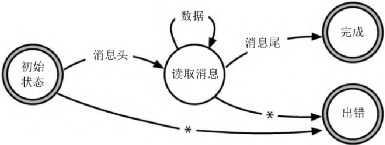

> 图 5-3：消息解析 FSM。从“初始状态”开始，接收消息头转换到“读取消息”状态；
> 接收消息尾转换到“完成”状态；其他任何操作转换到“出错”状态。

我们从“初始状态”开始。 如果我们接收到消息头，就转换到“读取消息”状态。
如果在初始状态接收到任何其他内容（带有星号的线），
我们就转换到“出错”状态，这样就大功告成了。

当我们处于“读取消息”状态时，
可以接收数据消息（在这种情况下，我们将继续以相同的状态读取数据），
也可以接收消息尾（它将让我们转换到“完成”状态）。
其他任何操作都会导致转换到“出错”状态。

FSM 的妙处在于，我们可以将其纯粹地表示为数据。
这里有一张表，表达了我们的消息解析器：

| 状态 | 事件 | 事件 | 事件 | 事件 |
| ---- | ---- | ---- | ---- | ---- |
| 状态 | 头   | 数据 | 尾   | 其他 |
| 初始 | 读取 | 出错 | 出错 | 出错 |
| 读取 | 出错 | 读取 | 完成 | 出错 |

表中每行表示一个状态。 要查找事件发生时该做什么，就找到当前状态的行，
扫描出表示该事件所在的列，该单元格的内容就是新的状态。

处理代码同样简单：

```ruby
# event/simple_fsm.rb
TRANSITIONS = {
    initial: {header: :reading},
    reading: {data: :reading, trailer: :done},
}

state = :initial

while state != :done && state != :error
    msg = get_next_message()
    state = TRANSITIONS[state][msg.msg_type] || :error
end
```

实现状态间转换的代码在第 11 行。 它使用当前状态在转换表中进行索引查找，
然后使用消息类型在该状态应做的转换中进行索引查找。
如果匹配不到新状态，则将状态设置为 :error。

#### 添加动作

一个纯粹的 FSM，就像我们刚才看到的，是一个事件流解析器。
它唯一的输出是最终的状态。 我们可以通过在某些转换上添加触发动作来增强它。

例如，我们可能需要提取源文件中的所有字符串。 字符串是双引号之间的文本，
但是字符串中的反斜杠会转义下一个字符， 所以 “Ignore\”quotes\””
是单独的一个字符串。 这里有一个 FSM 可以做到这些：

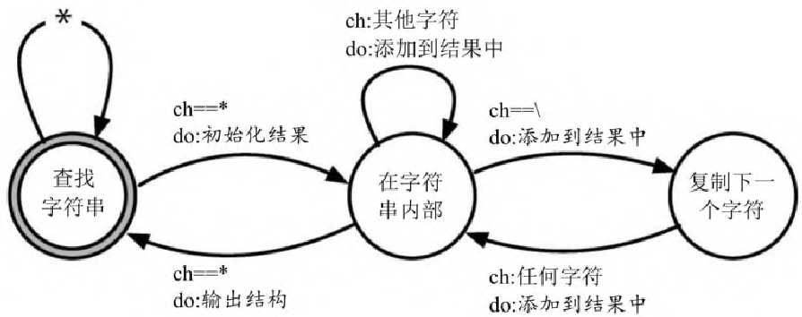

> 图 5-4：字符串提取 FSM。每个转换有两个标签：
> 上面是触发它的事件，下面是在状态之间移动时要采取的动作。

这一次，每个转换都有两个标签。 上面一个是触发它的事件，
下面一个是我们在状态之间移动时要采取的动作。

我们就像上次那样，把这些用表展示出来。
但是，在这种情况下，表中的每个条目都是双元素列表，
列表中包含下一个状态和动作名称：

```ruby
# event/strings_fsm.rb

TRANSITIONS = {

    # 当前转换到新状态需要采取的动作
    #--------------------------------------------------------

    look_for_string: { # 查找字符串
        '"'      => [ :in_string, :start_new_string ],
        :default => [ :look_for_string, :ignore ],
    },

    in_string: { # 在字符串内部
        '"'      => [ :look_for_string, :finish_current_string ],
        '\\'     => [ :copy_next_char, :add_current_to_string ],
        :default => [ :in_string, :add_current_to_string ],
    },

    copy_next_char: { # 复制下一个字符
        :default => [ :in_string, :add_current_to_string ],
    },
}
```

我们还添加了指定默认转换的功能，
如果事件与此状态的任何其他转换不匹配，就会执行默认转换。

现在来看看代码：

```ruby
# event/strings_fsm.rb
state = :look_for_string
result = []

while ch = STDIN.getc
    state, action = TRANSITIONS[state][ch] || TRANSITIONS[state][:default]
    case action
    when :ignore
    when :start_new_string
        result = []
    when :add_current_to_string
        result << ch
    when :finish_current_string
        puts result.join
    end
end
```

这与前面的示例类似，我们循环遍历事件（输入中的字符），然后触发转换。
但是比起以前的代码，现在的做了更多的事。
每次转换的结果都是一个新的状态和一个动作的名称。
在回到循环之前，使用动作名称来选择要运行的代码。

这段代码非常基础，但足以完成任务。 还有许多其他变体：
转换表可以是动作对应的匿名函数或函数指针，
你可以将实现状态机的代码包装在一个单独的有自己状态的类中，等等。

并没有这样的限制——必须在同一时间处理所有的状态转换。
如果你曾实现过在应用程序上注册用户的流程，就知道可能会有好几个步骤，
例如输入详细资料，验证电子邮件， 同意现在所有网络 App 都会给出的 107
条法律警告，等等。 把状态保存在外部存储器中，并使用这些状态来驱动状态机，
这是处理此类工作流需求的好方法。

#### 状态机是一个开始

状态机并没有被开发人员充分利用，我们鼓励你找机会多用用。
但其并不能解决所有与事件相关的问题。 关于在杂耍般抛接事件球中会遇到的问题，
我们接下来将讨论一下其他解决方法。

#### 观察者模式

在观察者模式中，我们有一个事件源，被称为被观察对象；
而客户列表，也即观察者，会对其中的事件感兴趣。

观察者根据其兴趣被注册到观察对象上， 这通常由传递一个待调用的函数引用来实现。
随后，当事件发生时，观察对象遍历它的观察者列表， 并调用每个传递给它的函数。
事件作为调用参数提供给函数。

下面是用 Ruby 写的一个简单示例。 Terminator 模块用于终止应用程序。
不过在终止应用程序之前，它会通知所有观察者，应用程序将要退出[^ch06-3]。
观察者可能会使用这个通知来整理临时资源、提交数据，等等：

```ruby
# event/observer.rb

module Terminator
  CALLBACKS = []

  def self.register(callback)
    CALLBACKS << callback
  end

  def self.exit(exit_status)
    CALLBACKS.each { |callback| callback.(exit_status) }
    exit!(exit_status)
  end
end

Terminator.register(->(status) { puts "callback 1 sees #{status}" })
Terminator.register(->(status) { puts "callback 2 sees #{status}" })

Terminator.exit(99)
```

```
$ ruby event/observer.rb
callback 1 sees 99
callback 2 sees 99
```

创建一个观察对象不需要太多的代码：
将一个函数引用压入一个列表，然后在事件发生时调用那些函数即可。
这是一个不使用库的好例子。

观察者/观察对象模式已经使用了几十年，一直在很好地为我们服务。
它在用户界面系统中特别流行， 回调被用于通知应用程序某些交互已经发生。

但是观察者模式有一个问题：
因为每个观察者都必须与观察对象注册在一起，所以它引入了耦合。
此外，由于在典型的实现中， 回调是由观察对象以同步的方式内联处理的，
因此可能会导致性能瓶颈。

下一个策略会解决这个问题，那就是发布/订阅。

#### 发布/订阅

发布/订阅（pubsub）推广了观察者模式，同时解决了耦合和性能问题。

在 pubsub 模式中，我们有发布者和订阅者。 它们是通过信道连接在一起的。
信道在单独的代码块中实现：有时是库，有时是进程，有时是分布式基础设施。
所有这些实现细节对代码来说都是隐藏的。

每个信道都有一个名字。
订阅者注册感兴趣的一个或多个具名信道，发布者向信道写入事件。
与观察者模式不同，发布者和订阅者之间的通信是在代码之外处理的，
并且可能是异步的。

虽然你可以自己实现一个非常基本的 pubsub 系统，但你可能不想这么做。
大多数云服务提供商都提供公开的 pubsub 服务，
允许你将世界各地的应用程序连接起来。 每一种流行语言都至少有一个 pubsub 库。

pubsub 是一种很好的解耦异步事件处理过程的技术。
它允许在应用程序运行时添加和替换代码，而无须更改现有代码。
其缺点是，很难查看在一个重度使用 pubsub 模式的系统中发生了什么：
无法在查看发布者的同时立即看到有哪些订阅者涉及特定的消息。

与观察者模式相比，pubsub
模式是一个通过用共享接口（信道）进行抽象来减少耦合的好例子。
然而，它基本上仍然只是一个消息传递系统。
创建响应事件组合的系统需要的不仅仅是这些，
所以让我们看看如何为事件处理添加时间维度。

#### 响应式编程、流与事件

如果你曾经使用过电子表格，那么就会熟悉响应式编程。
如果一个单元格包含了一个公式，该公式引用了第二个单元格的内容，
那么在更新第二个单元格时，也会导致第一个单元格更新。
这些值会随着它们所使用的值变化而变化。

有许多框架可以帮助实现这种数据级的响应： 在浏览器领域，React 和 Vue.js
是当前的热门技术 （不过，由于它们基于
JavaScript，这些信息在本书付梓之前就会过时）。

很明显，事件也可以用来在代码中触发响应， 但是将它们“楔”进去并不一定容易。
这时就该引入流这个概念了。

流让我们把事件当作数据集合来对待。
这就好像我们有一个事件列表，当新事件到达时，列表会变长。
它的美妙之处在于，我们可以像对待任何其他集合一样对待流：
我们可以操作、合并、过滤，以及做我们所熟知的所有其他针对数据所做的事情。
我们甚至可以将事件流和常规集合组合在一起。
流可以是异步的，这意味着你的代码有机会按事件到来的方式去回应事件。

用于响应式事件处理方法的事实上的基线，
已经在相应网站上做出定义（网址参见链接列表 5.2 条目），
包含一组与语言无关的原则，并记录了一些常见的实现。 在这里，我们选用 JavaScript
的 RxJs 库。

我们的第一个示例是，获取两个流并将它们打包在一起： 其结果是一个新的流，
其中每个元素包含来自第一个输入流的条目与另一个输入流的条目。
在本例中，第一个流只是五个动物名称的列表。
第二个流更有趣：它是一个周期性计时器，每 500ms 生成一个事件。
因为数据流是打包在一起的，所以只有在数据都抵达后才会生成结果，
所以我们的结果流每 0.5 秒只发出一个值：

```javascript
// event/rx0/index.js

import * as Observable from 'rxjs'
import { logValues } from '../rxcommon/logger.js'

let animals = Observable.of("ant", "bee", "cat", "dog", "elk")
let ticker = Observable.interval(500)

let combined = Observable.zip(animals, ticker)

combined.subscribe(next => logValues(JSON.stringify(next)))
```

这段代码使用了一个简单的日志函数[^ch06-4]，
该函数将条目添加到浏览器窗口中的一个列表里。
从程序开始运行以来，每一项都带有以毫秒为单位的时间戳，
该时间戳指的是程序启动之后经过的时间。 下面是代码的显示：

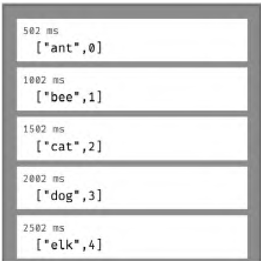

> 图 5-5：RxJS 打包流输出。每 500ms 从流中获取一个事件，
> 每个事件包含一个序列号和列表中下一个动物的名字。

注意时间戳：我们每 500ms 从流中获取一个事件。 每个事件包含一个序列号（由
Observable.interval 所创建） 和列表中下一个动物的名字。
在浏览器中实时观察，日志行每半秒会出现一次。

事件流通常以事件触发的形式增殖， 这意味着导致其增殖的被观察对象可以并行运行。
下面是一个从远程网站获取用户信息的示例。 为此，我们将使用一个提供了开放 REST
接口的公共网站 （网址参见链接列表 5.4 条目）。 作为其 API 的一部分，
我们可以通过对 users/«id» 执行 GET 请求来获取特定（虚假）用户的数据。
我们的代码会获取 ID 为 3、2、1 的用户数据：

```javascript
// event/rx1/index.js

import * as Observable from 'rxjs'
import { mergeMap } from 'rxjs/operators'
import { ajax } from 'rxjs/ajax'
import { logValues } from "../rxcommon/logger.js"

let users = Observable.of(3, 2, 1)

let result = users.pipe(
    mergeMap((user) => ajax.getJSON(`https://reqres.in/api/users/${user}`))
)

result.subscribe(
    resp => logValues(JSON.stringify(resp.data)),
    err => console.error(JSON.stringify(err))
)
```

代码的内部细节不是很重要。 令人兴奋的是结果，见下面这张屏幕截图：

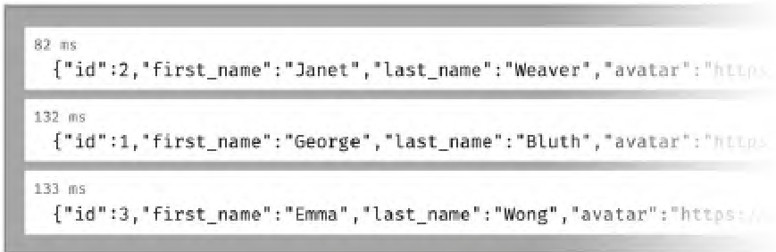

> 图 5-6：RxJS 并行请求输出。三个请求并行处理， 第一个返回的是 id 2，用了
> 82ms，后面两个分别在 50ms 和 51ms 后返回。

看看时间戳：这三个请求，或者说是三个单独的流，是并行处理的， 第一个返回的是 id
2，用了 82ms， 后面两个分别在 50ms 和 51ms 后返回。

#### 事件流是异步集合

在前面的例子中，我们的用户 ID 列表（在被观测对象 users 中）是静态的。
但不一定非得如此。 也许我们想在人们登录网站时收集这些信息。
我们所要做的就是在创建会话时生成一个包含用户 ID 的被观测事件，
并用这个被观测对象来取代那个静态对象。 这样，我们就可以在收到这些 ID
的同时，获取用户的详细信息， 大概还能将信息存储到某个位置去。

这是一个非常强大的抽象方法：我们不再须要将时间视为必须管理的东西。
事件流将同步和异步处理统一到一个通用的、方便的 API 之后。

#### 事件无处不在

事件到处都是。 有些是显而易见的：一次按钮点击，一个计时器到期。
有些则没那么简单：有人登录进来，文件中的一行匹配了一个模式。
但是，无论事件源是什么，围绕事件编写的代码都比对应的线性代码更容易响应，
解耦效果也更好。

#### 相关部分包括

- [话题 28：解耦](#28-解耦)
- [话题 36：黑板](#36-黑板)

#### 练习

##### 练习 19（[参考答案](#答案-19来自练习-19)）

在 FSM 部分中，我们提到可以将通用状态机实现移到它自己的类里。
通过传入一张转换表和初始状态，就能初始化这个类。

尝试以这种方式实现字符串提取器。

##### 练习 20（[参考答案](#答案-20来自练习-20)）

这些技术中的哪一个（或几个的组合）适合以下情况：

- 如果你接收到三起网络接口宕机事件，仅仅在 5 分钟内，就通知操作人员。
- 如果日落之后，在楼梯的底部检测到运动，随后又在楼梯的顶部检测到运动，
  就打开楼上的灯。
- 你希望通知各种报告系统订单已经完成。
- 为了确定客户是否有资格申请汽车贷款，
  应用程序需要向三个后台服务发送请求并等待回应。

### 30 变换式编程

> 如果你不能将正在做的事情描述为一个流程，那表示你不知道自己正在做什么。
>
> ——爱德华兹·戴明（出处待考）

所有程序其实都是对数据的一种变换——将输入转换成输出。
然而，当我们在构思设计时，很少考虑创建变换过程。
相反，我们操心的是类和模块、数据结构和算法、语言和框架。

我们认为，从这个角度关注代码往往忽略了要点——
我们需要重新把程序视为从输入到输出的一个变换。
当这样做的时候，许多以前操心的细节就消失了。
结构变得更清晰，错误处理更加一致，耦合下降了很多。

为了开始我们的研究，先坐时间机器回到 20 世纪 70 年代， 让一个 UNIX
程序员为我们编写一个程序，
列出目录树中最长的五个文件，这里的最长表示“拥有最多的行数”。

你可能以为他们会打开编辑器并开始输入 C 代码。
但是并非如此，因为他们考虑的角度是我们所拥有的（目录树）
和我们想要的（文件列表）。 然后他们会打开终端，输入以下内容：

```
$ find . -type f | xargs wc -l | sort -n | tail -5
```

这是一系列的变换：

```
find . -type f
```

向标准输出写入当前目录（.）及其下的所有文件（-type f）。

```
xargs wc -l
```

从标准输入一行行读入，把每一行的内容作为参数传给命令 wc -l。 wc 这个程序搭配 -l
选项，用来计算每个参数指定的文件的行数， 并把结果以“行数
文件名”的形式输出到标准输出。

```
sort -n
```

假设标准输入的每一行以一个数字开头（-n），
则用这些数字进行排序，将结果输出到标准输出。

```
tail -5
```

从标准输入读入，只把最后 5 行写到标准输出。

针对我们的书的目录运行这行指令，得到如下输出：

```
470 ./test_to_build.pml
487 ./dbc.pml
719 ./domain_languages.pml
727 ./dry.pml
9561 total
```

最后一行是所有文件的总行数（不仅仅是显示的那几个文件的总行数）， 因为 wc
就是这样输出的。 我们可以从 tail 那里多请求一行，然后忽略最后一行：

```
$ find . -type f | xargs wc -l | sort -n | tail -6 | head -5
470 ./debug.pml
470 ./test_to_build.pml
487 ./dbc.pml
719 ./domain_languages.pml
727 ./dry.pml
```

让我们从各个步骤之间数据流动的角度来考虑这个问题。 我们最初的需求——“行数最多的 5
个文件”，变成了一系列的变换。

目录名

→ 列出文件

→ 列出行数

→ 对列表排序

→ 最多的五项 + 总数

→ 最多的五项

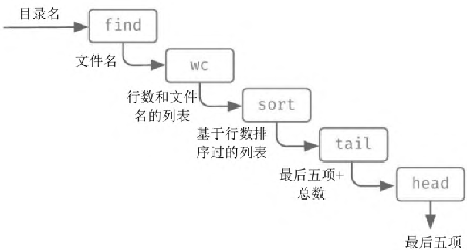

> 图 5-7：find 管道的一系列变换。目录名经 find 列出文件， 经 wc 列出行数，经
> sort 排序，经 tail 取最后五项加总数，经 head 取最多的五项。

这几乎就像一条工业装配线：一端输入原始数据，另一端输出成品（信息）。

我们喜欢用这种方式思考所有的代码。

> [!TIP]
> **提示 49 编程讲的是代码，而程序谈的是数据**

#### 寻找变换

有时候，找到变换的最简单方法是，从需求开始并确定它的输入和输出。
现在你已经将整个程序表示为函数。 然后就可以找到从输入到输出的步骤。
这是一个自顶向下的方法。

例如，你想要为那些玩文字游戏的人创建一个网站，
该网站可以找到由一组字母组成的所有单词。 这里的输入是一组字母，
而输出是由三个字母、四个字母组成的单词列表，依此类推：

```
        3 => ivy, lin, nil, yin
"lyvin" 变换到 → 4 => inly, liny, viny
        5 => vinyl
```

（是的，它们都是单词，至少在 macOS 字典里查得到。）

整个应用程序背后的技巧很简单： 我们有一本字典，它根据特征对单词进行分组，
包含相同字母的所有单词都有相同的特征。
最简单的特征函数，就是对单词中的字母进行排序，得到一个有序串。
然后，我们就先对输入的字符串生成特征，
然后查看字典中的哪些单词（如果有的话）具有相同的特征。

因此，这个字谜发现者程序就分解成四个独立的变换：

| 步骤    | 变换                         | 样本数据                                                                              |
| ------- | ---------------------------- | ------------------------------------------------------------------------------------- |
| 步骤 0: | 初始输入                     | “ylvin”                                                                               |
| 步骤 1: | 所有三个以上字母构成的组合   | vin, viy, vil, vny, vnl, vyl, iny, inl, iyl, nyl, viny, vinl, viyl, vnyl, inyl, vinyl |
| 步骤 2: | 组合的特征                   | inv, ivy, ilv, nvy, lnv, lvy, iny, iln, ily, lny, invy, ilnv, ilvy, lnvy, ilny, ilnvy |
| 步骤 3: | 列出字典中符合特征的所有单词 | ivy, yin, nil, lin, viny, liny, inly, vinyl                                           |
| 步骤 4: | 把单词按长度分组             | 3 => ivy, lin, nil, yin<br>4 => inly, liny, viny<br>5 => vinyl                        |

#### 一直向下做变换

让我们从第一步开始，首先拿到一个单词，
创建一个包含三个以上字母的所有组合的列表。 这一步本身可以表达为一个变换列表：

| 步骤      | 变换               | 样本数据                                                                                           |
| --------- | ------------------ | -------------------------------------------------------------------------------------------------- |
| 步骤 1.0: | 初始输入           | “ylvin”                                                                                            |
| 步骤 1.1: | 转换为字符         | v, i, n, y, l                                                                                      |
| 步骤 1.2: | 得到所有的子集     | [], [v], [i], ... [v,i], [v,n], [v,y], ... [v,i,n], [v,i,y], ... [v,n,y,l], [i,n,y,l], [v,i,n,y,l] |
| 步骤 1.3: | 只取至少三个字符的 | [v,i,n], [v,i,y], ... [i,n,y,l], [v,i,n,y,l]                                                       |
| 步骤 1.4: | 转换回字符串       | [vin, viy, ... inyl, vinyl]                                                                        |

我们现在已经可以很容易地在代码中实现每个变换 （在本例中使用的是 Elixir）：

```elixir
# function-pipelines/anagrams/lib/anagrams.ex
defp all_subsets_longer_than_three_characters(word) do
  word
  |> String.codepoints()
  |> Comb.subsets()
  |> Stream.filter(fn subset -> length(subset) >= 3 end)
  |> Stream.map(&List.to_string(&1))
end
```

#### |> 运算符是怎么回事

Elixir 和许多其他函数式语言一样，都有一个管道操作符，
有时称为前向管道或直接称为管道[^ch06-5]。
它所做的就是将左侧的值作为右侧函数的参数，插入在第一个参数的位置。 因此，

```elixir
"vinyl" |> String.codepoints |> Comb.subsets()
```

相当于这样写：

```elixir
Comb.subsets(String.codepoints("vinyl"))
```

（其他语言可能会将这个管道中的值作为下一个函数的最后一个参数注入——
这在很大程度上取决于内置库的风格。）

你可能认为这只是一个语法糖。
但管道运算符以一种非常真实的方式，给思考的转变带来了革命性的机遇。
使用管道意味着，你会自动地从数据变换的角度去思考； 每次你看到 |>
时，实际上看到的是数据在一次变换和下一次变换之间流动的地方。

许多语言都有类似的东西： Elm、F# 与 Swift 有 |>，Clojure 有 -> 和
->>（两者功能上有一点区别）， R 有 %>%。 Haskell
既有管道运算符，也能很容易地声明一个新的替代品。
当我们写到这里时，正有人在讨论给 Javascript 添加 |>。

如果你现在用的语言支持类似的东西，那么很幸运。
如果不支持，可以看一看[X 语言中没有管道操作](#x-语言中没有管道操作)。

无论如何，回到代码。

#### 继续变换

现在看看主程序的第二步，在这里我们将子集转换为特征。
同样，这是一个简单的转换——子集列表变成特征列表：

| 步骤      | 变换       | 样本数据                  |
| --------- | ---------- | ------------------------- |
| 步骤 2.0: | 初始输入   | vin, viy, ... inyl, vinyl |
| 步骤 2.1: | 转换为特征 | inv, ivy ... ilny, ilnvy  |

下面列出的 Elixir 代码同样简单：

```elixir
# function-pipelines/anagrams/lib/anagrams.ex
defp as_unique_signatures(subsets) do
  subsets
  |> Stream.map(&Dictionary.signature_of/1)
end
```

现在我们变换特征列表： 每个特征都映射到具有相同特征的已知单词列表，
如果没有此类单词，则映射为 nil。 然后，我们必须删除所有
nil，并把嵌套的列表平坦化到一个层次：

```elixir
# function-pipelines/anagrams/lib/anagrams.ex
defp find_in_dictionary(signatures) do
    signatures
    |> Stream.map(&Dictionary.lookup_by_signature/1)
    |> Stream.reject(&is_nil/1)
    |> Stream.concat(&(&1))
end
```

下一步，将单词按长度分组。 这是另一个简单的变换，将我们的列表转换成一个查找表，
其中键是长度，值是具有该长度的所有单词：

```elixir
# function-pipelines/anagrams/lib/anagrams.ex
defp group_by_length(words) do
  words
  |> Enum.sort()
  |> Enum.group_by(&String.length/1)
end
```

#### 把所有东西放在一起

我们已经写出了每一个单独的变换。 现在是时候把它们都串进主函数了：

```elixir
# function-pipelines/anagrams/lib/anagrams.ex

def anagrams_in(word) do
    word
    |> all_subsets_longer_than_three_characters()
    |> as_unique_signatures()
    |> find_in_dictionary()
    |> group_by_length()
end
```

能工作了吗？来试试：

```
iex(1)> Anagrams.anagrams_in "lyvin"
%{
  3 => ["ivy", "lin", "nil", "yin"],
  4 => ["inly", "liny", "viny"],
  5 => ["vinyl"]
}
```

#### X 语言中没有管道操作

管道已经存在很长时间了，但只存在于小众语言中。
其最近才成为主流，许多流行的语言至今仍然不支持这个概念。

好消息是，从变换的角度去思考问题并不需要特定的语言语法： 它更像是一种设计哲学。
你仍然把代码构造成变换式，只是会写成一串赋值：

```javascript
const content = File.read(file_name);
const lines = find_matching_lines(content, pattern)
const result = truncate_lines(lines)
```

写起来有点乏味，但的确能完成任务。

#### 为什么这很棒

让我们再来看看主函数：

```elixir
word
|> all_subsets_longer_than_three_characters()
|> as_unique_signatures()
|> find_in_dictionary()
|> group_by_length()
```

它刚好是我们需要的变换链，
可以满足这样的要求——每个变换都从前一个变换获取输入并将输出传递给下一个变换。
这样就能尽量向编写文学化代码靠拢。

其实还有更深层次的原因。 如果你有面向对象编程的背景，
那么就会条件反射似的要求隐藏数据，并将数据封装在对象中。
结果这些对象会来回折腾，改变彼此的状态。 这就引入了很多耦合，因而也成为 OO
系统难于更改的一个重要原因。

<a id="提示-50"></a>

> [!TIP]
> **提示 50 不要囤积状态，传递下去**

在变换式模型中，我们将其颠倒过来。
不要把数据看作是遍布整个系统的小数据池，而要把数据看作是一条浩浩荡荡的河流。
数据成为与功能对等的东西： 管道是一系列的代码→数据→代码→数据……
数据不再和特定的函数组一起绑定在类定义中。
相反，当应用程序将其输入转换为输出时，可以自由地表达自己的展开过程。
这意味着我们可以极大地减少耦合：
一个函数可以在任何地方使用（并重用），只要其参数与其他函数的输出相匹配。

是的，仍然存在一定程度的耦合， 但是根据我们的经验，它比 OO
风格的命令和控制更易于管理。 而且，如果使用的是带有类型检查的语言，
那么当试图连接两个不兼容的事物时，会收到编译时警告。

#### 错误处理怎么做

到目前为止，我们的变换已经在一个不出错的世界中工作起来了。
但是，又如何在现实世界中使用它们呢？
如果我们只能建立线性链，那么怎样添加错误检查所需的所有条件逻辑？

有许多方法可以做到这一点，但是所有方法都依赖于一个基础约定：
永远不在变换之间传递原始值。 取而代之的是，将值封装在一个数据结构（或类型）中，
该结构可以告知我们所包含的值是否有效。 例如，在 Haskell 中，这个包装器被称为
Maybe。 在 F# 和 Scala 中是 Option。

如何使用这个概念是语言相关的。 但是，通常有两种编写代码的基本方法：
你可以在变换的内部或外部做错误检查。

我们之前一直在用的 Elixir 没有内置这种支持。
对于当下的目的来说，这是一件好事，因为我们可以从头开始展示一个实现。
类似的东西在其他大多数语言中也应该适用。

#### 首先选择一个表达形式

我们需要包装器的一种表达形式（包含错误提示或错误码的数据结构）。
你可以为此使用一个结构，但 Elixir 已经有了一个非常强的约定： 函数通常会返回
{:ok, value} 或 {:error, reason} 的元组。 例如，File.open 要么返回 :ok 加一个 IO
进程， 要么返回 :error 加一个原因码：

```
iex(1)> File.open("/etc/passwd")
{:ok, #PID<0.109.0>}
iex(2)> File.open("/etc/wombat")
{:error, :enoent}
```

在通过管道传递数据时，我们将把 :ok/:error 元组当作数据的包装器。

#### 然后在每次变换内部进行处理

让我们编写一个函数，该函数返回文件中包含指定字符串的所有行， 并截取每行的前 20
个字符。 我们想把它写成一个变换， 所以输入将是一个文件名和一个要匹配的字符串，
输出将是一个 :ok 和行列表构成的元组， 或者是一个 :error 和原因码构成的元组。
顶层函数大概是这样的：

```elixir
# function-pipelines/anagrams/lib/grep.ex
def find_all(file_name, pattern) do
  File.read(file_name)
  |> find_matching_lines(pattern)
  |> truncate_lines()
end
```

这里没有显式的错误检查， 但是如果管道中的任何步骤返回一个错误元组，
管道都会返回该错误，而不执行随后的函数[^ch06-6]。 我们利用 Elixir
的模式匹配来做到这一点：

```elixir
# function-pipelines/anagrams/lib/grep.ex

defp find_matching_lines({:ok, content}, pattern) do
    content
    |> String.split(~r/\n/)
    |> Enum.filter(&String.match?(&1, pattern))
    |> ok_unless_empty()
end

defp find_matching_lines(error, _), do: error

#-------

defp truncate_lines({:ok, lines}) do
    lines
    |> Enum.map(&String.slice(&1, 0, 20))
    |> ok()
end

defp truncate_lines(error), do: error

#-------

defp ok_unless_empty([]), do: error("nothing found")
defp ok_unless_empty(result), do: ok(result)

defp ok(result), do: {:ok, result}

defp error(reason), do: {:error, reason}
```

看看函数 find_matching_lines。 如果它的第一个参数是 :ok 元组，
那么将使用元组中的 content 来和文件逐行做模式匹配。 但是，如果第一个参数不是 :ok
元组， 则运行第二个版本的函数，而它只返回该参数。
通过这种方式，函数能简单地沿着管道传递错误。 truncate_lines 干了同样的事情。

我们可以在控制台这样玩玩：

```
iex> Grep.find_all "/etc/passwd", ~r/www/
{:ok, ["_www:*:70:70:World W", "_wwwproxy:*:252:252:"]}
iex> Grep.find_all "/etc/passwd", ~r/wombat/
{:error, "nothing found"}
iex> Grep.find_all "/etc/koala", ~r/www/
{:error, :enoent}
```

可以看到，在管道中任何地方发生的错误立即会成为管道本身的值。

#### 在管道中处理也可

当你在审视 find_matching_lines 和 truncate_lines 函数时，
可能会觉得我们把错误处理的负担转移到了变换内部——的确如此。
在使用模式匹配做函数调用的语言（如 Elixir）中，它的负面影响弱一些，
但这样的做法仍然很丑陋。

如果 Elixir 能有另一个版本的 |> 管道操作符， 它能感知 :ok/:error
元组并在发生错误时短路执行，就好了[^ch06-7]。
但事实是，它不允许我们添加类似的东西， 这种方式可能只适用于许多其他语言。

我们面临的问题是，当错误发生时， 我们不希望继续运行管道后面的代码，
也不希望让后面的代码感知到错误正在发生。 这意味着我们需要暂缓管道函数的运行，
直到我们知道管道中先前的步骤已经完成。
为此，需要将代码从函数调用改写为一个函数值，以供稍后调用。 这里有一种实现方法：

```elixir
# function-pipelines/anagrams/lib/grep1.ex
defmodule Grep1 do

  def and_then({:ok, value}, func), do: func.(value)
  def and_then(anything_else, _func), do: anything_else

  def find_all(file_name, pattern) do
      File.read(file_name)
      |> and_then(&find_matching_lines(&1, pattern))
      |> and_then(&truncate_lines(&1))
  end

  defp find_matching_lines(content, pattern) do
      content
      |> String.split(~r/\n/)
      |> Enum.filter(&String.match?(&1, pattern))
      |> ok_unless_empty()
  end

  defp truncate_lines(lines) do
      lines
      |> Enum.map(&String.slice(&1, 0, 20))
      |> ok()
  end

  defp ok_unless_empty([]), do: error("nothing found")
  defp ok_unless_empty(result), do: ok(result)

  defp ok(result), do: {:ok, result}
  defp error(reason), do: {:error, reason}
end
```

and_then 函数是绑定函数的一个示例： 绑定函数能将包装在某些东西中的一个值取出来，
并对其运用一个函数，再返回一个新的包装过的值。 管道函数在使用 and_then
时要多带一些标点符号， 这是因为 Elixir
用这些符号来表明，须要将函数调用转换为函数值。 变换函数因此变得简单：
每个变换函数只需要处理一个值（以及额外的参数）， 并返回 {:ok, new_value} 或
{:error, reason}，就够了； 额外做的那点事情相比起来不足为道。

#### 变换到变换式编程

将代码看作一系列（嵌套的）变换，可以为编程打开思路。
这需要一段时间来适应，但是一旦你养成这个习惯，
将发现代码变得更简洁，函数变得更短，而设计也变得更平顺。

试试看。

#### 相关部分包括

- [话题 8：优秀设计的精髓](#8-优秀设计的精髓)
- [话题 17：Shell 游戏](#17-shell-游戏)
- [话题 26：如何保持资源的平衡](#26-如何保持资源的平衡)
- [话题 28：解耦](#28-解耦)
- [话题 35：角色与进程](#35-角色与进程)

#### 练习

##### 练习 21（[参考答案](#答案-21来自练习-21)）

你能将以下需求表示为顶层的变换吗？ 也就是说，对于每一条，识别出输入和输出。

1. 将运费和消费税加入订单
2. 应用程序从具名文件加载配置信息
3. 某人登录了一个网站应用

##### 练习 22（[参考答案](#答案-22来自练习-22)）

你已经确认了一个需求，要验证输入字段并将其从字符串转换为 18 到 150 之间的整数。
整个转换是这样描述的：

```
field contents as string
→ [validate & convert]
→ {:ok, value} | {:error, reason}
```

编写组成 validate & convert 的单个转换。

##### 练习 23（[参考答案](#答案-23来自练习-23)）

在[X 语言中没有管道操作](#x-语言中没有管道操作)中，我们曾这样写：

```javascript
const content = File.read(file_name);
const lines = find_matching_lines(content, pattern)
const result = truncate_lines(lines)
```

许多人写 OO 代码时把方法调用串起来，因而可能会这样写：

```javascript
const result = content_of(file_name)
    .find_matching_lines(pattern)
    .truncate_lines()
```

这两段代码有什么区别？你认为我们会更喜欢哪一种？

### 31 继承税

> 你想要一根香蕉，但得到的却是一只拿着香蕉的大猩猩，甚至还有整个丛林。
>
> ——乔·阿姆斯特朗

你用面向对象的语言编程吗？使用继承吗？[^ch06-8]

如果是这样，那么停下来！继承可能做不到你想做的事情。

让我们来看看为什么。

#### 一些背景知识

继承首次出现于 1969 年的 Simula 67 中。
对于在同一个列表中排入多种类型事件的问题，这曾是一个优雅的解决方案。 Simula
的方法使用的是一种被称为前缀类的东西。 你可以这样写：

```
link CLASS car;
... implementation of car
link CLASS bicycle;
... implementation of bicycle
```

这里的 link 就是一个前缀类，它能带来链接表的功能。
这样你就可以把汽车和自行车加到（比如说）红绿灯前等待者的列表中。
用现在的术语说，link 是一个父类。

Simula 程序员使用的心智模型是， link 类的实现及实例的数据被预先添加在 car
这个类和 bicycle 这个类的实现里。 link
的部分差不多被看作是装载汽车和自行车的容器。

这样做赋予了它们某种形式的多态： 汽车和自行车都实现了 link
接口，因为它们均包含了 link 的代码。

Simula 之后，Smalltalk 随之而来。 艾伦·凯是 Smalltalk 的创始人之一， 2019 年他在
Quora 网站上[^ch06-9]解释了为什么 Smalltalk 有继承：

> 因此当我设计 Smalltalk-72 时——一想到 Smalltalk-71 就觉得很有意思——
> 我想，如果用类 Lisp 的动态性去实验一下“微分式编程[^ch06-10]”
> （意思是：用不同的方式来完成“这玩意和那玩意很像，除了……”）， 一定会很有趣。

这纯粹是为了行为的子类化。

两种类型的继承（实际上有相当多的共同点）在接下来的几十年里发展起来。 Simula
方法认为继承是一种将类型组合起来的方法， 这种方法在 C++ 和 Java
等语言中得到了延续。 Smalltalk 学派认为，继承是一种动态的行为组织， 这在 Ruby 和
JavaScript 等语言中都可以看到。

就这样，到了今天，我们面对的是 OO 开发者这一代人，
他们使用继承有两个原因：一个是不喜欢拍键盘，另一个是喜欢类型。

那些不喜欢拍键盘的人，通过继承将基类的公共功能添加到子类中， 来保护他们的手指：
User 类和 Product 类都是 ActiveRecord::Base 的子类。

那些喜欢类型的人，通过继承来表达类之间的关系：汽车是一种交通工具。

不幸的是，这两种形式的继承都有问题。

#### 通过继承共享代码的问题

继承就是耦合。 不仅子类耦合到父类，以及父类的父类等，
而且使用子类的代码也耦合到所有祖先类。 这里有一个例子：

```ruby
class Vehicle
    def initialize
        @speed = 0
    end

    def stop
        @speed = 0
    end

    def move_at(speed)
        @speed = speed
    end
end

class Car < Vehicle
    def info
        "I'm car driving at #{@speed}"
    end
end

# top-level code
my_ride = Car.new
my_ride.move_at(30)
```

当顶层调用 my_car.move_at 时，被调用的方法在 Car 的父类 Vehicle 里。

现在，负责 Vehicle 的开发者改变了 API， 把 move_at 改成了 set_velocity，
并把实例变量 @speed 改成了 @velocity。

可以预料到，API 的变化将破坏 Vehicle 类的客户。
但顶层对此并不关心，它只关心是否在使用 Car。 Car
类在实现层面做的事情并不为顶层代码所关心， 但是 Car 类的确被破坏了。

类似地，实例变量的名称纯粹是内部实现细节， 但是当 Vehicle
的名称改变时，这样的变更也会（无声地）破坏 Car。

太多耦合了。

#### 通过继承构建类型的问题

有些人认为继承是定义新类型的一种方式。
他们最喜欢的设计图表，会展示出类的层次结构。 他们看待问题的方式，
与维多利亚时代的绅士科学家们看待自然的方式是一样的，
即将自然视为须分解到不同类别的综合体。


> 图 5-8：类层次结构图。为了表示类之间的细微差别而逐层添加，
> 最终可怕地爬满墙壁。

不幸的是，这些图表很快就会为了表示类之间的细微差别而逐层添加，
最终可怕地爬满墙壁。 由此增加的复杂性，可能使应用程序更加脆弱，
因为变更可能在许多层之间上下波动。


> 图 5-9：多重继承问题。汽车可以是一种交通工具，
> 但它也可以是一种资产、保险项目、贷款抵押品。

然而，更糟糕的是多重继承问题。
汽车可以是一种交通工具，但它也可以是一种资产、保险项目、贷款抵押品，等等。
正确地对此进行建模需要多重继承。

因为一些值得商榷的词义消歧方面的原因， C++ 在 20 世纪 90
年代玷污了多重继承的名声。 结果，许多当下的 OO 语言都没有提供这种功能。
因此，即使你很喜欢复杂的类型树，也完全无法为你的领域准确地建模。

> [!TIP]
> **提示 51 不要付继承税**

#### 更好的替代方案

让我们推荐三种技术，它们意味着你永远不需要再使用继承：

- 接口与协议
- 委托
- mixin 与特征

#### 接口与协议

大多数 OO 语言都允许你指定，由一个类来实现一个或多个行为集。 例如，Car 类实现了
Drivable 行为和 Locatable 行为。 这样做用到的语法各不相同——在 Java
中，可能是这样的：

```java
public class Car implements Drivable, Locatable {
    // Code for class Car. This code must include
    // the functionality of both Drivable
    // and Locatable
}
```

Drivable 和 Locatable 在 Java 中被称为接口； 其他一些语言称之为协议，
还有一些语言称之为特征（虽然不是我们后面会提到的特征）。

接口这样定义：

```java
public interface Drivable {
    double getSpeed();
    void stop();
}

public interface Locatable {
    Coordinate getLocation();
    boolean locationIsValid();
}
```

这些声明没有创建任何代码： 它们只是说，实现 Drivable 的任何类必须实现 getSpeed
和 stop 这两个方法， 而 Locatable 类必须实现 getLocation 和 locationIsValid。
这意味着，我们之前的 Car 类定义，只有在包含所有这四个方法时才有效。

接口与协议之所以如此强大， 是因为我们可以将它们用作类型，
而实现适当接口的任何类都将与该类型兼容。 如果 Car 和 Phone 都实现了 Locatable，
我们可以将它们存储在一个可定位物品的列表中：

```java
List<Locatable> items = new ArrayList<>();

items.add(new Car(...));
items.add(new Phone(...));
items.add(new Car(...));
// ...
```

然后，我们可以安全地处理这个列表， 因为我们知道每个条目都有 getLocation 和
locationIsValid：

```java
void printLocation(Locatable item) {
    if (item.locationIsValid()) {
        print(item.getLocation().asString());
    }
    // ...
    items.forEach(printLocation);
}
```

> [!TIP]
> **提示 52 尽量用接口来表达多态**

接口与协议给了我们一种不使用继承的多态性。

#### 委托

继承鼓励开发人员创建这样的对象，其类拥有大量的方法。 如果父类有 20
个方法，而子类只想使用其中的两个， 那么其对象还是会将其他 18
个方法放在那里，并使其能被调用。 类失去了对其接口的控制。
这是一个常见的问题——许多持久化框架和 UI
框架坚持让应用程序的组件继承一些框架所提供的基类：

```ruby
class Account < PersistenceBaseClass
end
```

Account 类现在携带了所有持久化类的 API。
相反，设想一个使用委托的替代方法，如下例所示：

```ruby
class Account
    def initialize( . . . )
        @repo = Persister.for(self)
    end

    def save
        @repo.save()
    end
end
```

现在，我们没有向 Account 类的客户公开任何的框架 API： 耦合关系就此被断开了。
还有更多好处——现在，我们不再受所使用框架的 API 的限制， 可以自由地创建所需的
API。 是的，以前也可以这样做，但会有风险：
我们编写的接口有可能被绕过，而持久化的 API 会被直接调用。 现在我们掌控了一切。

> [!TIP]
> **提示 53 用委托提供服务：“有一个”胜过“是一个”**

事实上，我们可以更进一步。 为什么 Account 必须知道如何持久化自己呢？
它的职责不是了解并执行账户业务规则吗？

```ruby
class Account
    # nothing but account stuff
end

class AccountRecord
    # wraps an account with the ability
    # to be fetched and stored
end
```

现在我们真的解耦了，但这是有代价的。
我们必须编写更多的代码，通常其中一些是样板代码：
例如，所有的记录类可能都需要一个 find 方法。

幸运的是，mixin 和特征可以帮我们做这些。

#### mixin、特征、类别、协议扩展……

在这个行业里，我们喜欢给事物命名。
我们经常给同样的东西起很多名字，不是总说多多益善吗？

这就是我们在研究 mixin 时要解决的问题。
基本思想很简单：希望能够为类和对象扩展新的功能，但不用继承。
那么就创建一组函数，给这个函数组起一个名字，然后用它去扩展一个类或对象。
至此，你就创建出了一个新的类或对象，它组合了原始类及所有 mixin 的特性。
在大多数情况下，即使无法使用要扩展的类的源码，也可以进行此扩展。

现在，特性的实现和名称是因语言而异的。 我们在这里倾向于称它们为 mixin，
但真的希望你将其视为与语言无关的特性。
重要的是，所有这些实现都具有这样一个特性： 将现有事物和新事物的功能合并在一起。

作为一个例子，让我们来回头看一看 AccountRecord。
在我们之前的讨论中，AccountRecord 既需要了解账户，又需要了解持久化框架。
它还必须对所有持久化层需要暴露给外部世界的方法做委托。

mixin 给了我们一个替代方案。 首先，我们可以写一个
mixin，让它实现（例如）三个标准查询方法中的两个。 然后我们就可以以 mixin
的形式把它们加到 AccountRecord 里。
接下来，当我们写一个新的类来做一些持久化的事情时， 就可以也将这个 mixin 加上去：

```
mixin CommonFinders {
    def find(id) { ... }
    def findAll() { ... }
end

class AccountRecord extends BasicRecord with CommonFinders
class OrderRecord extends BasicRecord with CommonFinders
```

我们还可以更进一步。
例如，我们都知道业务对象需要验证代码来防止坏数据渗透到计算中。
但这里说的验证到底是什么意思呢？

例如，针对一个账户，可能有许多不同的验证层可以应用：

- 验证散列过的密码是否与用户输入的密码匹配
- 验证用户在创建账户时输入的表单数据
- 验证管理员更新用户详细信息时输入的表单数据
- 验证其他系统组件添加到账户的数据
- 在持久化数据前验证数据的一致性

一种常见的（但我们认为不太理想的）方法是将所有验证打包到单个类
（业务对象/持久化对象）中， 然后添加标记来控制在什么情况下触发什么。

我们认为更好的方法是使用 mixin 创建专门的类来分别处理对应的情况：

```
class AccountForCustomer extends Account
    with AccountValidations, AccountCustomerValidations
class AccountForAdmin extends Account
    with AccountValidations, AccountAdminValidations
```

在这里，两个派生类都包含针对所有账户对象的通用验证。 Customer
版本还包含针对客户的 API， 而 Admin 版本则包含（可能限制较少的）管理员级验证。

现在，通过反复传递 AccountForCustomer 或 AccountForAdmin 的实例，
代码能自动确保应用正确的验证方式。

> [!TIP]
> **提示 54 利用 mixin 共享功能**

#### 继承很少用到

我们已经快速了解了针对传统的类继承的三个替代方案：

- 接口与协议
- 委托
- mixin 与特征

无论你的目的是共享类型信息、添加功能，还是共享方法，
在不同的场景下，都会有一个方案更合适。
与编程中的任何事情一样，选一个最能表达你意图的技术。

尽量不要扛着大山去兜风。

#### 相关部分包括

- [话题 8：优秀设计的精髓](#8-优秀设计的精髓)
- [话题 10：正交性](#10-正交性)
- [话题 28：解耦](#28-解耦)

#### 挑战

- 下次发现自己在进行子类化的时候， 花点时间检查一下备选方案。
  能通过接口、委托和（或）mixin 来实现你想要的东西吗？ 这样做可以减少耦合吗？

### 32 配置

> 物归其所，事定期限。
>
> ——本杰明·富兰克林《富兰克林自传》，十三条美德

如果代码依赖某些值，而这些值在应用程序发布后还有可能改变，
那么就把这些值放在程序外部。
当应用程序于不同的环境中运行，而且面对不同的用户时，
将和环境相关、用户相关的值放在应用之外。
通过这种方式来参数化应用程序，让代码适应其运行的环境。

> [!TIP]
> **提示 55 使用外部配置参数化应用程序**

可能会置入配置数据的内容包括：

- 外部服务（数据库、第三方 API 等）的证书
- 日志级别与日志位置
- 应用程序使用的端口、IP 地址、机器名及集群名
- 特定环境的校验参数
- 外部设置参数，例如税率
- 特定场合的格式化细节
- 许可证密钥

基本上，对于任何以后必须要改而又可以表达在代码主体之外的内容，
只要事先知道，就要找出来并放入某个配置容器。

#### 静态配置

许多框架和相当多的可定制程序，将配置直接保存在文件中， 或放在数据库的表内。
如果信息直接放在文件中，倾向于用一些现成的纯文本格式。 目前，YAML 和 JSON
非常流行。 有时，有些用脚本语言编写的应用程序会分出几个源码文件，
专门用来包含配置数据。 如果信息是结构化的，而且很可能被用户改变（例如税率），
可能储存到数据库的表中更好。
当然，你可以两者一起使用，根据配置信息的用途分开存放。

无论使用什么形式，配置都将作为数据结构被读入应用程序，
这通常发生在应用程序启动时。 一般来说，这种数据结构会被设计成全局的，
这样考虑是因为可以让代码的每个部分都更容易获得配置的值。

我们希望你不是这样做的，而是将配置信息包装在一个（瘦）API 后面。
这将使代码从配置的呈现细节中解耦出来。

#### 配置服务化

虽然静态配置很常见，但目前我们倾向于另一种做法。
我们仍然希望配置数据保持在应用程序外部， 但不直接放在文件中，也不放在数据库里；
而是储存在一个服务 API 之后。 这样做有很多好处：

- 在身份认证和访问权限控制将多个应用程序的可见内容阻隔开的情况下，
  让多个应用程序可以共享配置信息
- 配置的变更可以在任何地方进行
- 配置数据可以通过专有 UI 维护
- 配置数据变得动态

最后一点，配置应该是动态的，这在我们转向高可用性应用程序时至关重要。
为了改变单个参数就必须停下来重启应用程序， 这样的想法已完全脱离当前的现实。
使用配置服务，应用程序的组件可以注册所使用参数的更新通知，
服务可以在配置被更改时发送包含了新值的消息。

无论采用何种形式，配置数据都会驱动应用程序的运行时行为。
当配置值更改时，不需要重新构建代码。

#### 不要写出渡渡鸟般的代码

如果没有外部配置，代码的适应性和灵活性就会大打折扣。 这是一件坏事吗？
在现实世界中，不适应环境的物种会死亡。

毛里求斯岛上的渡渡鸟因为不适应岛上出现的人类和家畜， 很快就灭绝了[^ch06-11]。
这是被记录的首个因人类活动而灭绝的动物物种。

不要让你的项目（或事业）走上渡渡鸟的老路。


> 图 5-10：渡渡鸟。不要让你的项目（或事业）走上渡渡鸟的老路。

#### 相关部分包括

- [话题 9：邪恶的重复](#9-dry邪恶的重复)
- [话题 14：领域语言](#14-领域语言)
- [话题 16：纯文本的威力](#16-纯文本的威力)
- [话题 28：解耦](#28-解耦)

#### 不要做得太过

在本书的第一版中，出于同样的考虑，我们建议使用配置，而不是代码，
但显然应该说明得更具体一些。
任何建议都有可能导致走极端或使用不当，所以这里列出一些注意事项：

不要太过。 我们早期的一个客户，决定让应用程序中的每个字段都可配置。
因此，即使是做最小的改变，也需要几周的时间。
这是因为，不仅是字段，为了保存和编辑这些字段， 还要实现所有相应的管理代码。
他们手头有大约 40,000 个配置变量，这是一个编码的噩梦。

不要因为懒，就放弃做决策，而把分歧做成配置。
如果对某个特性应该这样工作还是那样工作真的存在争议，
或者不知道是否应该让用户选择， 那么就去找个方法试试，通过反馈来决定哪一种更好。

[^ch06-1]: 所以准确地说它不是法则，更像是类似得墨忒耳的好点子之类的东西。

[^ch06-2]: 网址见链接列表 5.1 条目。

[^ch06-3]: 是的，我们知道 Ruby 已经有一个 at_exit 函数能实现这个功能。

[^ch06-4]: 网址参见链接列表 5.3 条目。

[^ch06-5]: 管道的开始使用似乎要追溯到 1994 年，在关于语言 Isabelle/ML
    的讨论中它首次出现，该讨论的存档见链接列表 5.5 条目。

[^ch06-6]: 我们在这里说得太随意——从技术上讲，后面的函数确实被执行了，只是没执行其中的代码。

[^ch06-7]: 实际上，你可以利用 Elixir 的宏机制将这样的操作符添加到 Elixir
    中；比如 hex 中的 Monad 库就是这样的例子。你也可以使用 Elixir 的 with
    概念，但是这样你就失去了很多用管道写变换的感觉。

[^ch06-8]: 译注：原文为 Inheritance
    Tax，通常译为遗产税，但此处强调的是面向对象中的继承，故翻译为继承税。

[^ch06-9]: 网址参见链接列表 5.6 条目。

[^ch06-10]: 译注：微分式编程（Differential
    Programming）是玩笑的说法，这个词的来源可能是 Differential Dynamic
    Programming，在数学上称为“差分动态规划”，和编程无关。此处有调侃函数式编程（Functional
    Programming）及当前在 AI 领域热门的可微分式编程（Differentiable
    Programming）的意味。

[^ch06-11]: 移民者用棍棒打死了这些温和的鸟，仅仅是为了取乐。

## 第 6 章 并发

为了让大家达成共识，让我们从几个定义开始：

并发性指的是两个或更多个代码段在执行过程中表现得像是在同时运行一样。
并行性是指它们确是在同一时刻一起运行。

想获得并发性，需要在一个特殊的环境下运行代码。
当代码运行时，这个环境可以在其不同部分之间切换执行过程。
这样的环境通常基于纤程、线程、进程来实现。

想获得并行性，则需要有可以同时做两件事情的硬件， 通常是同一 CPU
上的多个核心、同一机器上的多个 CPU， 或是连接在一起的多台计算机。

#### 一切都会并发

在一个规模适度的系统中编写代码，完全不涉及并发方面的事情，几乎是不可能的。
并发可能是外显的，也可能埋藏在库内部。
如果希望你的应用程序能够在由异步构成的现实世界中打拼，
那么并发性是一个必要条件：
用户在交互中，数据在获取中，外部服务在调用中，所有这些都是同时进行的。
如果强迫这个过程串行——一件事发生后才能进行下一件事，以此类推，
则系统的反应会变得迟钝，运行代码的硬件也可能难以充分发挥自己的能力。

在本章中，我们将讨论并发性和并行性。

开发人员经常讨论代码块之间的耦合。
他们指涉的是依赖关系，以及这些依赖关系是如何让事物变得难以变更的。
但还有另一种形式的耦合。
如果代码给几件事情强加一个顺序进来，而这个顺序对解决手头问题而言并非必需，
就会发生时域耦合。 你对“嘀嘀”早于“嗒嗒”有依赖吗？ 如果想保持灵活性就不要这样。
你的代码是在一个接一个地串行访问多个后端服务吗？ 如果你想留住客户，也不要这样。
在打破时域耦合部分，我们会去看看鉴别这类时域耦合的几种方法。

为什么编写并发和并行代码如此困难？ 原因之一是，我们一直使用顺序系统来学习编程，
所用的语言都有一些在顺序使用时相对安全的特性；
但是，一旦两件事情同时发生，这些特性却会拖后腿。 此处的罪魁祸首之一是共享状态。
这里不单单是指全局变量：
任何时候，只要两个或多个代码块持有对同一个可变数据块的引用， 就已经共享了状态。
然而，共享状态是不正确的状态。
这部分描述了一些解决此问题的方法，但它们终究还是容易出错。

如果为此感到沮丧，不要绝望！ 有更好的方法构建并发应用。
其中的一种是角色模型，它不允许在独立的进程之间共享任何数据，
只通过信道基于预定义好的简单语义进行通信。
我们在角色和进程部分谈论这个方法的理论和实践。

最后，我们会看一下黑板。 这种系统有点像是对象仓库和智能发布/订阅代理的组合体。
尚在雏形中时，黑板从未真正走红。
但时至今日，我们看到越来越多的中间件层实现了类黑板的语义。
如果使用正确，这种类型的系统可解耦大量的东西。

并发和并行代码曾经是很新奇的玩意，但现在已经是标配。

### 33 打破时域耦合

你可能会问：“时域耦合[^ch07-1]到底是指什么？” 它指的是时间。

时间是软件架构中经常被忽略的一个方面。
唯一让我们担心的是日程表上的时间，发布前还剩的时间——
不过这不是我们这里想讨论的内容。
我们讨论的是，时间在作为软件本身的设计元素时所担当的角色。
时间对我们来说有两个重要的方面：
并发性（在同一时刻发生的多件事情）以及次序（事情在时间轴上的相对位置）。

我们通常不会在编程时考虑这两个方面。
当人们刚开始坐下来设计架构或编写程序时，倾向于将事情线性化。
这符合绝大多数人的思考方式——先做这个，再做那个。
但这样的思考方式会导向时域耦合——在时间范畴上产生耦合： A 方法必须在 B
方法之前调用； 一次只能运行一个报告； 在按钮按下前必须等屏幕先重绘；
“嘀嘀”一定在“嗒嗒”之前发生。

这个方法不太灵活，也不太符合现实。

我们需要考虑并发性，并且考虑对时间依赖或顺序依赖解耦。
通过这样做，我们可以在开发的许多领域中获得灵活性并减少任何基于时间的依赖：
工作流分析、体系结构、设计和部署。
结果将是系统更容易推理，潜在的响应更快、更可靠。

#### 搜寻并发性

在许多项目中，我们需要对应用程序的工作流建模并加以分析，这是设计工作的一部分。
我们想知道哪些事情可以同时进行，哪些必须按照严格的顺序发生。
有一种方法可以做到，那就是使用类似活动图之类的符记来理清工作流。[^ch07-2]

> [!TIP]
> **提示 56 通过分析工作流来提高并发性**

活动图由一组用圆角框表示的活动构成。 从一个活动出发的箭头可以指向另一个活动
（这个活动能在前一个活动完成后启动）， 也可以指向被称为同步条的粗实线。
一旦指向同步条的所有活动都已完成，就可以处理所有离开同步条的箭头。
如果一个活动没有被任何箭头指向，就可以在任意时间启动。

你可以在活动图中标识出能够并行和不能并行的活动，以此来最大化并行性。

例如，我们可能正在为一个自动化椰林飘香鸡尾酒制造机编写软件。 被告知步骤如下：

1. 打开搅拌机
2. 打开椰林飘香预拌粉
3. 将预拌粉放入搅拌机
4. 量半杯白朗姆酒
5. 倒入朗姆酒
6. 加两倍冰
7. 关闭搅拌机
8. 液化一分钟
9. 打开搅拌机
10. 拿出玻璃杯
11. 拿出粉红小伞
12. 端出

然而，如果酒保真的以这样的步骤一个接一个地按序操作，肯定会丢掉工作。
尽管操作是依次描述下来的，但其中许多步骤可以并行执行。
可使用下面的活动图来挖掘和推理出其中的并发性。

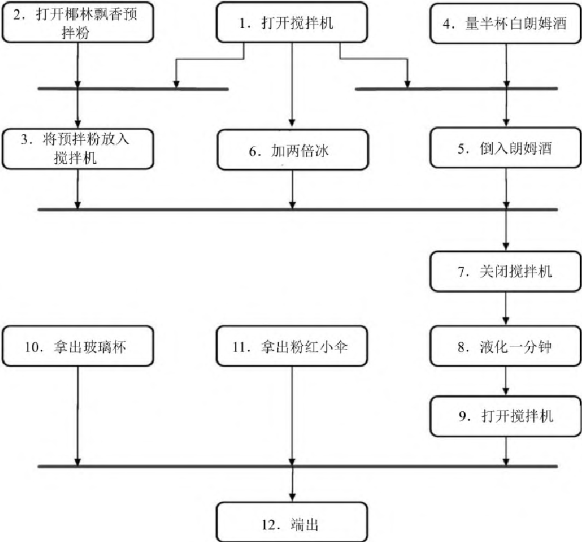

> 图 6-1：椰林飘香鸡尾酒制作的活动图。圆角框表示活动，粗实线为同步条。任务
> 1、2、4、10、11 可在一开始并发进行；任务 3、5、6
> 在各自前置条件满足后可并行执行；任务 12 须等待所有前置活动完成。

看到依赖发生的真正所在，会让人眼前一亮。 在这个实例中，顶层任务（1、2、4、10 和
11）可以在一开始就并发进行。 稍后可以并行执行任务 3、5 和 6。
如果你去参加一个椰林飘香制作大赛，这些优化可能会让一切有所不同。

#### 并发的机会

活动图显示了并发性可能存在的地方，但没有表明这些地方是否值得去开拓。
例如，在椰林飘香的例子中，能一起操作的初始任务那么多，
除非调酒师有五只手，否则很难同时执行。

这就是设计部分的用武之地。
当我们审视这些活动时，会注意到第八项：等待液化的一分钟。
在这段时间里，酒保可以去拿杯子和雨伞（活动 10 和 11），
或许还有时间去招待其他顾客。

#### 更快的格式化

这本书是用纯文本写的。
文字要经过一系列流水线处理工序，才能构建出用于印刷的版本，
或是电子书等其他版本。
有些工序是去查找特定的结构（参考书目引用、索引条目、提示的特殊标记，等等）。
其他工序则是对整个文档进行操作。

流水线中的许多处理工序，必须访问外部信息
（读取文件、写入文件，以及通过管道调用外部程序）。
所有速度相对较慢的工作，都为我们提供了利用并发性的机会：
实际上，流水线中的每个步骤都是并发执行的——
从上一个步骤读取的同时写入下一个步骤。

此外，部分处理工序是相对处理器密集型的。 其中之一是数学公式的转换。
由于各种历史原因，单个方程的转换时间最长可达 500 毫秒。
为了加快速度，我们利用了并行性。 因为每个公式都是独立于其他公式的，
所以我们把每个转换过程放在独立的并行进程中进行，
并在转换完成后，将结果收集起来放回书中。

因此，这本书在多核机器上的构建速度要快得多。

（当然，我们确实在流水线中发现了许多并发性相关的错误……）

这就是我们在针对并发性做设计时所追求的东西。
我们希望找到那些耗时活动中，无须把时间花在代码上的活动，
例如查询数据库、访问外部服务、等待用户输入——
所有这些事情时常会让我们的程序卡住，直到操作完成。
这些等待的间隙，都有机会去做一些更有意义事情， 总比让 CPU 闲得无聊要好。

#### 并行的机会

记住两者的区别：并发性是一种软件机制，而并行性则和硬件相关。
如果我们有多个处理器，无论是本地的还是远程的，
只要能把工作分割开，并在处理器之间分配，就可以减少总的时间。

在这样分割时，最理想的是，将工作分成相对独立的一块一块——
每一块工作都能独立进行，而不需要为其他部分做出任何等待。
一种常见的模式是，将一大块工作分解成独立的小块， 并行处理每一块，然后合并结果。

Elixir 语言编译器的工作方式，就是一个实践中的有趣例子。
在编译器启动时，它会将正在构建的项目分解成不同模块， 然后并行地编译每个模块。
有时一个模块会依赖别的模块，
在这种情况下，编译将暂停，直到被依赖模块的构建结果可用为止。
当顶层模块编译完成时，就意味着所有依赖项都已编译完毕。
最终结果是获得了一个能利用所有（处理器）核心的快速编译器。

#### 识别出这些机会只是开始

回头看看应用程序。 我们已经识别出哪些地方可以从并发和并行中受益。
现在到了棘手的部分：如何安全地实现并发和并行。 那就是本章接下来的主题。

#### 相关部分包括

- [话题 10：正交性](#10-正交性)
- [话题 26：如何保持资源的平衡](#26-如何保持资源的平衡)
- [话题 28：解耦](#28-解耦)
- [话题 36：黑板](#36-黑板)

#### 挑战

- 在早上为开始工作做准备的时候，你会同时执行多少项任务？ 你可以用 UML
  活动图来表示这些任务吗？ 能找到通过增加并发性来更快做好准备的方法吗？

### 34 共享状态是不正确的状态

你坐在最喜欢的餐厅。 吃完主菜，问男服务员还有没有苹果派。
他回头一看——陈列柜里还有一个，就告诉你“还有”。
点到了苹果派，你心满意足地长出了一口气。

与此同时，在餐厅的另一边，还有一位顾客也问了女服务员同样的问题。
她也看了看，确认有一个，让顾客点了单。

总有一个顾客会失望的。

把陈列柜换成一个联名银行账户，把服务员变成 POS 机。
你和你的伴侣同时决定买一部新手机，但账户里的钱只够买一部。
那么总有一方，要么是银行，要么是商店，要么是你，会非常不高兴。

> [!TIP]
> **提示 57 共享状态是不正确的状态**

问题出在共享状态。 餐馆里的每一位服务员都查看了陈列柜，却没有考虑到其他服务员。
每个 POS 机都会查看账户余额，但不会考虑其他设备。

#### 非原子更新

让我们看看餐厅的例子，如果它是代码：

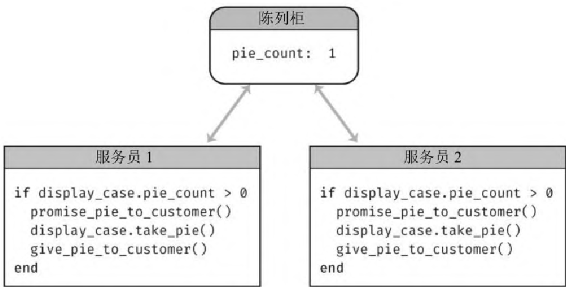

> 图 6-2：两名服务员并发地访问同一个陈列柜。陈列柜中的 `pie_count` 为 1，服务员
> 1 和服务员 2 各自执行相同的代码，先检查派的数量，再承诺并取走派。

这两个服务员在并发操作（在现实生活中是并行的）。 让我们看看他们的代码：

```
if display_case.pie_count > 0
    promise_pie_to_customer()
    display_case.take_pie()
    give_pie_to_customer()
end
```

服务员 1 清点了一下当前派的数量，发现是 1。 他把派承诺给顾客。
但与此同时，服务员 2 跑过来。 她也看到了派的数量是
1，并对她的客户做出了相同的承诺。 然后，其中一个人拿起最后一个派，
另一个服务员会进入某种错误状态（这可能招致很多赔礼道歉）。

这里的问题，不是两个进程可以同时向同一块内存写入数据。
而是没有哪个进程能保证二者对内存的认知前后一致。 实际上，当一个服务员执行
`display_case.pie_count()` 时， 会将陈列柜中的值复制到自己的内存中。
如果陈列柜中的值发生变化， 那么服务员自己的内存（用来做决策的内存）就过时了。

这都是因为，对派的数量的获取和更新，均不是原子操作： 其值在过程中可能发生改变。

那么我们如何使它具有原子性呢？

#### 信号量和其他形式的互斥

简单而言，信号量是一个在同一时间只能让一个人持有的东西。
你可以创建一个信号量，然后利用它来控制对其他资源的访问。
在我们的示例中，可以创建一个信号量来控制对派的陈列柜的访问。 采用这样的约定：
任何想要更新陈列柜内容的人，只有在持有该信号量的情况下才能行动。

假设餐厅决定使用物理信号量来解决派的问题。 他们可以在陈列柜上放一个塑料小妖精。
任何一个服务员在卖派之前，必须先把小妖精抓在手里。
一旦订单完成（这意味着把派送到桌子上），
他们就可以把小妖精送回守卫派宝藏的地方，为下一个订单做准备。

让我们再看看代码。 传统上，获取信号量的操作称为 P，释放信号量的操作称为
V[^ch07-3]。 今天，我们使用诸如 lock/unlock、claim/release 等术语。

```
case_semaphore.lock()

if display_case.pie_count > 0
    promise_pie_to_customer()
    display_case.take_pie()
    give_pie_to_customer()
end

case_semaphore.unlock()
```

这段代码的假设是，已经创建了一个信号量， 并将其存储在 `case_semaphore` 变量中。

让我们假设两个服务员同时执行代码。 两人的代码都试图锁定信号量，但只有一个成功。
得到信号量的那个继续正常运行。 没有获得信号量的那个将被挂起，直到该信号量可用
（服务员在那里等着……）。
当第一个服务员完成订单时，解锁信号量，第二个服务员继续运行。
他们现在发现陈列柜中没有派了，于是向顾客道歉。

这种方法存在一些问题。 可能最重要的一点是，
这个方法只有在访问陈列柜的每个人都同意使用信号量时才有效。
如果有人忘记使用（换句话说，一些开发人员编写的代码不符合约定），
那么我们又会陷入混乱。

#### 让资源具备事务性

当前的设计很糟糕， 因为该设计将保护陈列柜访问权的责任委托给了使用它的人。
让我们做出改变，将其调整为集中控制。 要做到这一点，我们必须改变 API，
以便服务员在单次调用中，既能检查派的数量又能获得一块派：

```
slice = display_case.get_pie_if_available()
if slice
    give_pie_to_customer()
end
```

要做到这一点，我们需要写一个方法，作为陈列柜本身的一部分：

```
def get_pie_if_available()
    if @slices.size > 0
        update_sales_data(:pie)
        return @slices.shift()
    else
        false
    end
end
```

这段代码阐明了一个常见的误解。 我们已经把资源访问转移到一个中心位置，
但是我们的方法仍然可能被多个并发线程调用， 所以仍然需要用一个信号量来保护它：

```
def get_pie_if_available()
    @case_semaphore.lock()

    if @slices.size > 0
        update_sales_data(:pie)
        return @slices.shift()
    else
        false
    end

    @case_semaphore.unlock()
end
```

这段代码还是可能不正确。 如果 `update_sales_data`
抛出一个异常，信号量将永远不会解锁， 这会导致将来对陈列柜的访问都无限期挂起。
我们需要解决这个问题：

```
def get_pie_if_available()
    @case_semaphore.lock()
    try {
        if @slices.size > 0
            update_sales_data(:pie)
            return @slices.shift()
        else
            false
        end
    }
    ensure {
        @case_semaphore.unlock()
    }
end
```

因为这是一个常见的错误，许多语言都提供了库来处理这个问题：

```
def get_pie_if_available()
    @case_semaphore.protect() {
        if @slices.size > 0
            update_sales_data(:pie)
            return @slices.shift
        else
            false
        end
    }
end
```

#### 多个资源的事务

我们的餐车刚装了一个冰淇淋冷冻机。
如果顾客点的是派加冰淇淋，服务员需要确认派和冰淇淋都可以供应。

可以将服务员代码更改为这样：

```
slice = display_case.get_pie_if_available()
scoop = freezer.get_ice_cream_if_available()
if slice && scoop
    give_order_to_customer()
end
```

但这行不通。 如果我们声明已拿到一块派，接下来想要提供一勺冰淇淋时，
却发现根本没有，那该怎么办？ 现在手里还拿着一块派，而只有派是不够的
（因为顾客一定要吃冰淇淋）。 而我们拿着派就意味着它已不在这个陈列柜中，
所以这块派就不能提供给那些只想吃派不想要冰淇淋的顾客 （那些纯粹主义者）。

我们可以通过向柜子添加一个方法来修复这个问题， 这个方法允许我们把派退回去。
还需要添加一些异常处理，以确保在发生故障时不会保留着资源：

```
slice = display_case.get_pie_if_available()
if slice
    try {
        scoop = freezer.get_ice_cream_if_available()
        if scoop
            try {
                give_order_to_customer()
            }
        rescue {
            freezer.give_back(scoop)
        }
        end
    }
    rescue {
        display_case.give_back(slice)
    }
    end
```

这依然不是很理想。 代码现在真的很丑陋，很难搞清楚实际上做了什么——
业务逻辑被隐藏在各种乱七八糟的事务中。

之前，我们通过将资源处理代码转移到资源身上来解决这个问题。
然而在这里，我们有两个资源。
那么到底应该把代码放在陈列柜上，还是应该放在冷冻机上？

这两个选项，我们都想拒绝。 务实的思路是“派加冰激凌本身就是一种资源”。
将这段代码移到一个新模块中，
这样客户接下来只需说“给我拿个派加冰淇淋”，要么成功，要么失败。

当然，在现实世界中可能会有许多这样的复合菜品， 你不会想为每个菜品都编写新模块。
你更需要的是某种形式的“菜单条目”， 让这些条目来引用包含的配料，
然后实现一个通用的 `get_menu_item` 方法以调配每个条目所需的资源。

#### 非事务性更新

作为并发性问题的根源，内存的共享备受关注。 但实际上，在应用程序代码共享可变资源
（文件、数据库、外部服务等）的任何地方，问题都有可能冒出来。
当代码的两个或多个实例可以同时访问某些资源时，就会出现潜在的问题。

有时候，资源并不是那么明显。 在编写这个版本的图书时，我们更新了工具链，
以便能利用线程并行地完成更多的工作。
这导致构建失败，错误以奇怪的方式发生在随机的地方。
在各种错误中有一条常见的线索： 找不到文件或目录，尽管它们确实位于正确的位置。

我们跟踪到几处会临时修改当前目录的代码。
在非并行版本中，只要这段代码运行完能恢复之前的目录，就足够了。
但在并行版本中，一个线程会修改当前目录，
而且在这个时候该目录下的另一个线程将开始运行。
新启动的线程本应在原始目录下运行，
但是由于当前目录是在线程之间共享的，实际情况并非如此。

这个问题的性质揭示了另一个提示：

> [!TIP]
> **提示 58 随机故障通常是并发问题**

#### 其他类型的独占访问

大多数语言都支持对共享资源进行某种形式的独占访问。
它们可能被称为互斥量、监视器或信号量，而且都是作为库来实现的。

然而，有些语言本身就内置了并发支持。 例如，Rust 强化了数据所有权的概念；
一次只能有一个变量或参数包含对任何特定可变数据段的引用。

你还可以认为，函数式语言倾向于使所有数据不可变，从而简化了并发性。
然而，函数式语言仍然面临着同样的挑战，
因为在某个时刻会被迫踏入那个易变的现实世界。

#### 医生，一这样就痛……

如果你还没有从本部分中学到什么东西，那么记住这条：
在共享资源环境中实现并发非常难，尝试的过程将充满挑战。

这就是为什么我们用这个老笑话来抖包袱：

> 医生，我一这么做就会痛。
>
> 哦，那就别这么做。

接下来的部分会提供一些替代的方法， 用来毫无痛苦地发挥出并发带来的优势。

#### 相关部分包括

- [话题 10：正交性](#10-正交性)
- [话题 28：解耦](#28-解耦)
- [话题 38：巧合式编程](#38-巧合式编程)

### 35 角色与进程

> 没有作家，故事不会被写出来；没有演员，故事就无法获得生命。
>
> ——Angie-Marie Delsante

对于实现并发性，角色与进程提供了有趣的方式， 而且无须同步访问共享内存。[^ch07-4]

不过在开始之前，需要先定义一下其含义。
这听起来很学术，但别担心，很快就会万事大吉。

- 角色是一个独立的虚拟处理单元，具有自己的本地（且私有的）状态。
  每个角色都有一个信箱。 当消息出现在信箱中且角色处于空闲状态时，
  角色被激活并开始处理消息。 处理完该条消息后，它将继续处理信箱中的其他消息，
  如果信箱是空的，则返回休眠状态。

  在处理消息的过程中，一个角色可以创建其他角色， 可以向其他认识的角色发送消息，
  也可以创建一个新的状态，用来在处理下一条消息时作为当前状态。

- 进程通常代表一种更通用的虚拟处理机，
  它一般由操作系统实现，可以让并发处理更容易。
  进程也能（根据约定）被约束为以角色的形式运转， 我们在这里说的就是这类进程。

#### 角色只会是并发的

有些事情，在角色的定义中是不会出现的：

- 没有一件事是可控的。 接下来会发生什么，不会事先计划；
  信息从原始数据到最终输出的传输过程，也无法统筹安排。

- 系统中唯一的状态，保存在消息和每个角色的本地状态中。
  消息除了接收方可以读取，没有其他途径检查； 本地状态在角色之外无法被访问。

- 所有的消息都是单向的——没有回应这个概念。 如果希望角色能返回一个回应消息，
  则需要在发送给角色的消息中包含自己的信箱地址，
  然后角色（最终）会将回应作为另一条消息发送到该信箱。

- 角色会将每一条消息处理完，一次只会处理一条。

因此，角色以并发方式来异步地执行，并且不共享任何内容。
如果有足够的物理处理器，就可以在每个处理器上运行一个角色。
如果只有一个处理器，那么某些运行时可以处理角色之间的上下文切换。
无论以哪种方式，在角色内运行的代码都是相同的。

> [!TIP]
> **提示 59 用角色实现并发性时不必共享状态**

#### 一个简单的角色

让我们把角色概念套进上面的餐厅案例中。
在这种情况下，我们将有三个角色（顾客、服务员和装派的柜子）。

整个消息流如下所示：

- 我们（看作是某种外部的神一般的存在）让顾客感觉到饥饿
- 作为回应，他们会向服务员点派
- 服务员会向柜子要一些派给顾客
- 只要有一块派，就会送到顾客那里，并通知服务员加到账单中
- 如果派已经没有了，柜子会告知服务员，让服务员去给顾客道歉

我们选择用 JavaScript 的 Nact[^ch07-5] 来实现代码。 我们为此添加了一个小包装器，
以便用简单的对象的形式来编写角色， 其中键是它接收到的消息类型，
值是在接收到特定消息时要运行的函数。
（大多数角色系统都有一个类似的结构，不过具体的形式取决于宿主语言。）

让我们从顾客开始。 顾客可以收到三条信息：

- 你饿了（从外部环境发送）
- 桌子上有一个派（由柜子发送）
- 对不起，没有派了（由服务员发送）

下面是代码：

```javascript
// concurrency/actors/index.js

const customerActor = {
    'hungry for pie': (msg, ctx, state) => {
        return dispatch(state.waiter,
            { type: "order", customer: ctx.self, wants: 'pie' }
        )
    },
    'put on table': (msg, ctx, _state) => {
        console.log(`${ctx.self.name} sees ${msg.food} appear on the table`)
    },
    'no pie left': (_msg, ctx, _state) => {
        console.log(`${ctx.self.name} sulks...`)
    }
}
```

有趣的是，当我们收到一条 “hungry for pie” 的消息时， 会向服务员发送一条消息。
（我们很快就会看到顾客是如何知道“服务员”这个角色的。）

下面是服务员的代码：

```javascript
// concurrency/actors/index.js

const waiterActor = {
    "order": (msg, ctx, state) => {
        if (msg.wants == "pie") {
            dispatch(state.pieCase,
                { type: "get slice", customer: msg.customer, waiter: ctx.self }
            )
        } else {
            console.dir(`Don't know how to order ${msg.wants}`)
        }
    },
    "add to order": (msg, ctx) => {
        console.log(`Waiter adds ${msg.food} to ${msg.customer.name}'s order`)
    },
    "error": (msg, ctx) => {
        dispatch(msg.customer, { type: 'no pie left', msg: msg.msg })
        console.log(`\nThe waiter apologizes to ${msg.customer.name}: ${msg.msg}`)
    }
}
```

当它收到来自顾客的 'order' 消息时， 会检查请求的东西是否是派。
如果是，它将向柜子发送一个请求， 同时传递自身的引用及顾客的引用。

柜子是有状态的：它包含所有派的数组。 （同样，我们很快就会看到如何设置它。）
当它收到来自服务员的 'get slice' 消息时，会查看是否还有剩余的派。
如果有，就将派发给顾客，通知服务员更新订单，
最后返回一个更新后的状态，其中少了一块派。 下面是代码：

```javascript
// concurrency/actors/index.js

const pieCaseActor = {
    'get slice': (msg, context, state) => {
        if (state.slices.length == 0) {
            dispatch(msg.waiter,
                { type: 'error', msg: "no pie left", customer: msg.customer })
            return state
        }
        else {
            var slice = state.slices.shift() + " pie slice"
            dispatch(msg.customer,
                { type: 'put on table', food: slice })
            dispatch(msg.waiter,
                { type: 'add to order', food: slice, customer: msg.customer })
            return state
        }
    }
}
```

虽然你经常会发现角色是由其他角色动态启动的，
但在这个示例中，我们将力求简单，手动来启动角色。 同时也会直接传入一些初始状态：

- 柜子会获得所包含的派的初始列表
- 我们将柜子的引用交给服务员
- 我们将服务员的引用交给顾客

```javascript
// concurrency/actors/index.js

const actorSystem = start()
let pieCase = start_actor(
    actorSystem,
    'pie-case',
    pieCaseActor,
    { slices: ["apple", "peach", "cherry"] })
let waiter = start_actor(
    actorSystem,
    'waiter',
    waiterActor,
    { pieCase: pieCase })
let c1 = start_actor(actorSystem, 'customer1',
    customerActor, { waiter: waiter })
let c2 = start_actor(actorSystem, 'customer2',
    customerActor, { waiter: waiter })
```

最后我们让它跑起来。 顾客很贪婪——顾客 1 要了三块派，顾客 2 要了两块：

```javascript
// concurrency/actors/index.js

dispatch(c1, { type: 'hungry for pie', waiter: waiter })
dispatch(c2, { type: 'hungry for pie', waiter: waiter })
dispatch(c1, { type: 'hungry for pie', waiter: waiter })
dispatch(c2, { type: 'hungry for pie', waiter: waiter })
sleep(500)
    .then(() => {
        stop(actorSystem)
    })
```

当我们运行它时，可以看到角色之间在通信。[^ch07-6] 你看到的顺序很可能不同：

```
$ node index.js
customer1 sees "apple pie slice" appear on the table
customer2 sees "peach pie slice" appear on the table
Waiter adds apple pie slice to customer1's order
Waiter adds peach pie slice to customer2's order
customer1 sees "cherry pie slice" appear on the table
Waiter adds cherry pie slice to customer1's order
The waiter apologizes to customer1: no pie left
customer1 sulks...
The waiter apologizes to customer2: no pie left
customer2 sulks...
```

#### 没有显式的并发

在角色模型中，不需要为处理并发性编写任何特定代码， 因为没有共享状态。
对于业务从头到尾的逻辑，也没有必要以“做这个，做那个”的方式，
将其显式地写在代码里，因为角色会基于收到的消息自己处理这些事情。

这里也没有提及底层架构该是怎样的。
这样的一组组件，在单处理器、多处理器甚至网络上的多台机器上， 都能很好地工作。

#### Erlang 提供了舞台

Erlang 语言及其运行时是一个角色模型实现的绝佳例子 （虽然 Erlang
的发明者并没有阅读关于角色的原始论文）。 Erlang
把角色称为进程，但其不是常规的操作系统进程。
相反，就和我们之前讨论过的角色一样， Erlang
的进程是轻量级的（你可以在一台机器上运行数百万个进程），
其通过发送消息进行通信。 每一个进程都与其他进程相互隔离，进程之间没有状态共享。

此外，Erlang 的运行时实现了一个监督系统， 这个系统管理着进程的生命周期，
在出现故障时能重新启动一个进程或一组进程。 Erlang 还提供了代码的热加载机制：
你可以在不停止正在运行的系统的情况下，替换该系统中的代码。 Erlang
系统运行着一些世界上最可靠的代码，号称有 9 个 9 的可用性。

但 Erlang（及其后代 Elixir）并不是唯一的—— 大多数语言都有角色的实现。
考虑一下将它们用于你的并发实现。

#### 相关部分包括

- [话题 28：解耦](#28-解耦)
- [话题 30：变换式编程](#30-变换式编程)
- [话题 36：黑板](#36-黑板)

#### 挑战

- 你当前是否还在写用互斥量来保护共享数据的代码。
  为什么不试试使用相同的代码基于角色模型来做一个原型呢？
- 餐厅的角色代码只支持订购派。 将其扩展到让顾客能订购派加冰激凌，
  分别由不同的代理人管理派的分发及冰淇淋勺。
  正确安排这些事情，需要能处理其中一项资源耗尽的情况。

### 36 黑板

> 墙上写字……
>
> ——但以理书第五章（参考）

考虑一下，侦探们在调查一起谋杀案时， 如何使用黑板来协调工作和解决问题。
首席侦探首先在会议室里挂起一块大黑板。 她在上面写下一个问题：

> 矮胖子（男性、蛋形）：意外？谋杀？

矮胖子[^ch07-7]是真的摔倒了，还是被人推了下去？
每个侦探都可以通过添加事实、目击者的陈述、
任何可能出现的法医证据等，为这个潜在的谋杀之谜做出贡献。
随着数据的积累，侦探可能会注意到其中的联系， 并发布观察结果或推测。
这个过程不断继续，历经多次换班，
许多不同的人和代理人参与其中，直到最后案件结束。 下图展示了一个黑板的示例。
黑板方法的关键特点有：

- 没有哪个侦探需要知道其他侦探的存在—— 他们只是通过观察黑板来寻找新的信息，
  并向黑板添加他们的发现。

- 这些侦探可能受过不同的训练， 可能有不同的教育水平和专业知识，
  甚至可能不在同一个警区工作。 但他们只是一心想着破案，别无他求。

- 在案件的处理过程中，不同的侦探可能加入又退出，也可能轮班工作。

- 黑板上的内容没有限制，可能是图片、句子、物证，等等。

这是一种放任自由的并发形式。 侦探是独立的进程、代理人、角色等。
有些人把事实保存在黑板上。 另一些人则从黑板上摘取事实，可能将其合并或处理，
并向黑板添加更多信息。 黑板逐渐会帮助他们得出结论。

基于计算机的黑板系统，最初被用于人工智能的应用中，
所解决的是一些大型和复杂的问题——语音识别、知识推理系统等。


> 图
> 6-3：黑板示例。有人发现了矮胖子的赌债和电话记录之间的联系，也许他接到了恐吓电话。黑板上贴着照片、蛋壳碎片、涂鸦、通话记录、目击证人、妻子不在场证明等线索，福尔摩斯、马普尔、斯佩德三位侦探各自独立地查看和添加信息。

大卫·盖勒特的 Linda 是最早的黑板系统之一。 它将事实存储为带类型的元组。
应用程序可以将新的元组写入 Linda， 也可以采用模式匹配这种形式来取出已有的元组。

后来出现了分布式的类黑板系统，比如 JavaSpaces 及 T Spaces。
在这些系统里，你可以在黑板上保存活动的 Java 对象，而不仅仅是数据。
可通过部分匹配字段（借助模板和通配符）或是根据子类型，检索出对象。
例如，假设你有一个类型 Author，它是 Person 的子类型。 你能使用一个具备 LastName
值为 “Shakespeare” 的 Author 模板 来搜寻包含 Person 对象的黑板。 你会找到名为
Bill Shakespeare 的作者， 而不会找到名为 Fred Shakespeare 的园丁。

我们认为这些系统从未真正用起来，
部分原因是当时对并发协作处理的需求还没有发展起来。

#### 黑板擅长的事

假设我们正在编写一个程序来接受和处理抵押或贷款的申请。
管理这一领域的法律极其复杂，联邦、州和地方政府都各有说法。
贷款人必须证明自己已经披露了某些信息， 还必须询问某些特定信息——
但另一些特定问题又是一定不能问的，大致如此。

除去相关法律的泥沼，我们还面临以下问题：

- 回应可能以任何次序到达。 例如，对信用核查或产权调查的查询可能会花费大量时间，
  而名字和地址等项可能立即可以获知。

- 数据收集可能由不同的人完成，分布在不同的办公室和不同的时区。

- 有些数据收集工作可能是由其他系统自动完成的。 这些数据也可能异步到达。

- 尽管如此，某些数据可能仍然依赖于其他数据。
  例如，在你没拿到汽车所有权证明或保险单之前， 可能无法开始做汽车的产权调查。

- 新数据的到来可能会引出新的问题和策略。 假设信用核查回来的报告不那么光彩，
  就需要提供 5 份额外的表格，也许还需要一份血样。

你可以试试用工作流系统来处理每一个可能的问题组合和环境。
存在许多这样的系统，但是它们可能很复杂，而且需要大量的程序员。
随着规则的变化，工作流必须重新组织：
人们可能不得不修改过程，并且硬编码的部分可能不得不重写。

采用黑板，再结合一个封装有法律需求的规则引擎， 是解决这些困难的一种优雅的方案。
数据到达的顺序无关紧要： 当发布一个事实时，可以触发适当的规则。
反馈也很容易处理：
任何一组规则的输出都可以发布到黑板上，从而触发更多适用的规则。

> [!TIP]
> **提示 60 使用黑板来协调工作流**

#### 消息系统可以像黑板一样工作

在编写这一第二版图书时， 许多应用程序都是使用小型的、解耦的服务构建起来的，
所有这些服务都可通过某种形式的消息传递系统相互通信。 这些消息传递系统（如 Kafka
和 NATS）所做的远不只将数据从 A 发送到 B。
特别是，它们还能提供持久化特性（以事件日志的形式），
以及通过模式匹配的形式来检索消息的能力。
这意味着你可以将它们视作一个黑板系统和（或）一个能运行一组角色的平台。

#### 但事情没那么简单

面向架构的角色、黑板和微服务解决方案， 帮助应用程序消除了潜在的并发类型的问题。
但这种好处是有代价的。 这些方法比较难推理出来，因为很多操作都是间接的。
你会发现，为消息格式和（或）API 保留一个中央仓库应该很有帮助，
如该中央仓库能生成代码和文档则尤甚。 你还需要开发出好工具，
以便在消息和事实在系统中穿行时去跟踪它们。
（有一种有用的技术是，在启动特定的业务功能时， 给业务加上唯一的跟踪 id，然后将
id 传播给所有相关的参与者。 最后，就能从日志文件中重建所发生的事情。）

最后，这类系统的部署和管理比较麻烦，因为有更多的活动部件。
但这未必是坏事，在一定程度上系统粒度也变得更细，
仅需单独替换一个角色就能完成系统更新，而不必触碰整个系统。

#### 相关部分包括

- [话题 28：解耦](#28-解耦)
- [话题 29：在现实世界中抛球杂耍](#29-在现实世界中抛球杂耍)
- [话题 33：打破时域耦合](#33-打破时域耦合)
- [话题 35：角色与进程](#35-角色与进程)

#### 练习

练习 24：（[参考答案](#练习的参考答案)）

黑板风格的系统是否适用于以下的应用？ 为什么可以，为什么不可以？

1. 图像处理。 你希望有多个并行进程来抓取图像的区块，
   处理之后，将完成的图块送还。

2. 组织日程安排。 有一群人分散在世界各地，身在不同的时区，说不同的语言，
   你来安排一个会议。

3. 网络监控工具。 系统收集性能统计数据和故障报告，
   代理者利用这些数据来查找系统中的故障。

#### 挑战

- 你在现实生活中使用过黑板系统吗—— 是冰箱旁的留言板，还是工作中的大白板呢？
  是什么让它们如此有效呢？ 信息是否以一致的格式发布呢？ 答案重要吗？

[^ch07-1]: 译注：原文为 Temporal
    Coupling，指和时间有关的耦合，也被翻译为时间耦合。

[^ch07-2]: 尽管 UML 已经逐渐消失，但是 UML
    中用到的许多特定图表，仍然以这样或那样的形式存在，其中就包括非常有用的活动图。有关所有
    UML 图表种类的更多信息，参见《UML 精粹：标准对象建模语言简明指南》[Fow04]。

[^ch07-3]: P 和 V
    这两个名称来源于荷兰语的某个单词的首字母。不过到底是什么词，还有些争议。这项技术的发明者
    Edsger Dijkstra 的推荐是，P 对应的是 passering 及 prolaag；V 对应的是
    vrijgave，也可能是 verhogen。

[^ch07-4]: 译注：此处的角色（Actor）也译为演员，并没有通用的译名，在中文开发社区中常保留英文原词；进程（Process）虽是常规译词，但此处含义更接近英文原义“处理过程”，尤其不应与操作系统里的“进程”那个特定术语相混淆。在角色模型中提到的
    Process，通常是框架用来承载 Actor
    运行的特定数据结构，并非直接对应操作系统的进程。

[^ch07-5]: 网址参见链接列表 6.1 条目。

[^ch07-6]: 如果你要运行这段代码，还需要我们的包装器函数。这里没有列出，你可以去网站下载，网址参见链接列表
    6.2 条目。

[^ch07-7]: 译注：《爱丽丝镜中奇遇记》中的人物。

## 第 7 章 当你编码时

传统观点认为， 一旦项目到了编码阶段， 就几乎只剩一些机械工作：
只是把设计翻译成可运行的代码段而已。
我们认为这种态度是软件项目失败的最重要的原因。
这导致许多系统最终变得丑陋、低效、结构糟糕、不可维护， 或者根本就是错误的。

编码不是机械工作。 否则， 早在20世纪80年代，
人们曾寄予厚望的那些CASE（电脑辅助软件工程）工具， 就已经取代程序员的工作了。
每一分钟都有需要做出的决定——如果想让最终的程序长寿， 并在运作期间保持准确高效，
那么这些决定都需要经过仔细的思考和判断。

并不是所有的决定都是有意识做出的。 当你听从蜥蜴脑时，
可以更好地利用直觉和无意识的想法。 我们将看到如何更仔细地倾听，
以及如何积极地回应这些有时显得琐碎的想法。

但听从直觉并不意味着就能仅凭自动驾驶飞翔。 没有对代码进行积极思考的开发者，
是通过巧合进行编程的——代码可能可以工作， 但原因不明。 在巧合式编程中，
我们提倡更积极地参与编码过程。

虽然我们编写的大多数代码执行速度都很快， 但偶尔也会开发一些算法，
这些算法甚至有可能使速度最快的处理器陷入停滞。 在算法速度中，
讨论了评估代码速度的方法， 并给出了一些如何在潜在的问题发生之前将其发现的技巧。

务实的程序员会对所有代码进行批判性思考， 包括自己的代码。
我们不断看到程序和设计的改进空间。

在重构中， 关注的是那些帮助我们在前进中持续改进已有代码的技巧。

测试不是关于找 Bug 的工作， 而是一个从代码中获取反馈的过程，
涉及设计的方方面面， 以及 API、耦合度等。 这意味着，
测试的主要收益来自你思考和编写测试期间， 而不是运行测试那一刻。
我们将在[为编码测试](#41-为编码测试)中探索这个思想。

但是， 在你测试自己的代码时， 当然可能会将自己的偏见带到任务中。
在[基于特性测试](#42-基于特性测试)中，
我们将看到如何让计算机为你做一些广泛的测试， 以及当无可避免的 Bug
出现时应如何处理。

编写易读易懂的代码至关重要。 外面的世界很残酷，
到处有坏人积极地试图闯入你的系统， 并且造成伤害。
我们将讨论一些非常基本的技巧和方法，
来帮助你[出门在外注意安全](#43-出门在外注意安全)。

最后， 命名是软件开发中最困难的事情之一。 我们不得不给很多东西起名字，
而我们选择的名字在很多方面决定了所创造的最终是什么。 在编写代码时，
需要注意任何潜在的语义偏移。

我们大多数人都能在很大程度上以自动辅助驾驶的心态驾驶汽车：
不会明确地命令自己的脚去踩踏板， 也不会明确地命令自己的手臂去转动方向盘——
我们仅仅在想着“慢一点， 向右转”。 然而，
可靠的、安全的驾驶员会不断地复查各种情况， 检查潜在的问题，
并且让自己处于良好的位置， 以防意外发生。
同样的道理也适用于编写代码——编码可能在很大程度上只是例行公事，
但保持头脑清醒可以很好地防止灾难的发生。

### 37 听从蜥蜴脑

> 只有人类才能睁眼说瞎话， 即使已经有了能做出准确预测所需的全部信息，
> 甚至已经瞬间做出了准确的预测， 却还是说不是那样的。
>
> ——加文·德·贝克尔《恐惧给你的礼物》

加文·德·贝克尔毕生的工作就是帮助人们保护自己。
他的书《恐惧给你的礼物——关键时刻直觉能救你的命》[de 98] 讲述了这些知识。
贯穿全书的一个关键主题是， 作为老练的人类，
我们已经习惯于忽视自己更动物性的一面， 比如蜥蜴脑这样的本能。 他声称，
大多数在街上被袭击的人在袭击前都感到不舒服或紧张。 当时，
这些人往往会告诫自己正在犯傻。 但是， 那个身影随后就出现在黑暗的门口了……

本能就是我们的无意识大脑对模式的一种直接反应， 有些是天生的，
有些是通过不断重复学习到的。 当你作为程序员积累了经验后，
大脑就会逐渐形成一层又一层的隐性知识： 这样可以工作， 那样不能工作，
导致某种类型错误的原因， 所有在日常生活中注意到的事情。
这部分大脑会在你停下来和别人聊天时， 按下保存文件的按键，
即使你没有意识到正在这么做。

无论直觉是怎么来的， 都有一个共同点： 无法用语言表达。 直觉让你感觉，
而不是思考。 因此， 当一种直觉被触发时， 你不会看到闪烁耀眼的提示条。
而是会感到紧张反胃， 或是警觉到巨大的工作量扑面而来。

诀窍首先是注意到它正在发生， 然后找出原因。 让我们先来看看一些常见的情况，
这些时候你内心的蜥蜴会设法告诉你一些事情。
然后我们将讨论如何让本能的大脑摆脱它的保护层。

#### 害怕空白页

每个人都害怕空荡荡的屏幕——孤独的光标在闪烁， 被无尽的虚无包裹。
开始一个新项目（甚至是现有项目中的一个新模块）有可能让人不安。 因此，
我们中的许多人宁愿推迟迈出第一步。

我们认为造成这种情况的原因有两个， 而二者的解决方案是相同的。

第一个原因是你的蜥蜴脑试图告诉你一些事情，
就像是在感知面下潜藏着某种形式的疑虑。 这是很重要的。

作为一名开发人员， 你已经尝试过很多东西， 并已了解哪些是有效的， 哪些是无效的。
你一直在积累经验和智慧。 如果能感到一种挥之不去的疑虑，
或在面对一项任务时感觉有些不情愿， 那可能是那些经验试图和你说些什么——要注意听。
你可能无法确切地指出哪里出了问题， 但经过一段时间后， 疑虑可能会变得实在，
变成可以确定的东西。 让直觉来提高你的绩效。

另一个原因则平淡无奇： 你可能只是担心自己会犯错。

这是一种合理的恐惧。 我们这些开发者在代码中投入了大量精力，
因而会把代码中的错误看作是自身能力的反映。
也许存在一些“冒名顶替症候群”[^ch08-1]的因素，
让我们可能认为这个项目超出了能力范围。 看不到通往终点的路， 只好继续远行，
直到最后被迫承认自己迷路。

#### 和自己作战

有时， 代码只是从你的大脑飞进编辑器： 想法变成比特似乎毫不费力。

其他时候， 编程感觉就像在泥泞中爬山。 每走一步都需要付出巨大的努力，
走上三步就会后退两步。

但是， 作为一名专业人士， 你会坚持下去， 一步一个脚印： 这是你的工作。
不幸的是， 你真正应该做的事情可能恰恰相反。

你的代码试图告诉你一些事情。
它说这超过了本应具有的难度——也许结构或设计是错误的， 也许你解决了错误的问题，
也许你只是创造了一个只会招来Bug的蚂蚁农场。 不管是什么原因，
你的蜥蜴脑正在感知来自代码的反馈， 它拼命地尝试让你倾听。

#### 如何同蜥蜴脑交谈

对于倾听你的直觉， 倾听你那无意识的蜥蜴脑， 我们已经谈论了许多，
用到的技巧往往差不多。

> [!TIP]
> **提示 61 倾听你内心的蜥蜴**

首先， 停止正在做的事情。 给自己一点时间和空间， 让大脑自我组织。 远离键盘，
停止对代码的思考， 做一些暂时不需要动脑筋的事情——散步、吃午饭、和别人聊天，
或是先睡一觉。 让想法自己从大脑的各个层面渗透出来： 对此不用很刻意。
最终这些想法可能会上升到有意识的水平， 这样你就能抓住一个“啊哈！”的时刻。

如果这不起作用， 就试着把问题外化。 把正在写的代码涂画到纸上，
或者向你的同事（最好不是程序员）解释一下是怎么回事， 向橡皮鸭解释一下也行。
把问题暴露给不同部分的大脑， 看看有没有一部分大脑能更好地处理困扰你的问题。
我们已经记不清有过多少次这样的讨论， 其中一个人向另一个人解释问题，
说着说着突然叫道： “哦！当然应该这样！” 然后停下来解决了问题。

但也许在试过这些方法后， 还是无法脱困。 那么就该行动了。 我们需要告诉大脑：
打算要做的事情， 并没有那么重要。 可以用做原型的方式来干这件事。

#### 游戏时间

Andy和Dave都曾连着几个小时盯着空空如也的编辑器。 我们先输入一些代码，
之后看着天花板， 再拿一杯饮料， 接着再输入一些代码，
然后去读一篇有两条尾巴的猫的有趣故事， 再输入一些代码，
接下来却执行了全选/删除的操作， 就这样周而复始， 一次又一次， 一次又一次。

多年以后， 我们发现了一种有效的脑力突破的方法——告诉自己该做原型了。
如果你面对的是一个空白屏幕， 那么就找找项目中你想探索的某些方面。
也许你正在使用一个新的框架， 并希望了解框架是如何进行数据绑定的。
或者是一个新的算法， 你想要探索一下算法如何在边缘情况下工作。
或者你可能想尝试几种不同风格的用户交互。

如果你正在和现有的代码交战， 那么就先把它藏在某个地方， 然后做一些类似的原型。

执行以下操作。

1. 在便签上写下“我正在做原型”， 然后贴在屏幕的一侧。

2. 提醒自己， 原型注定要出问题。 提醒自己， 原型即使没有出问题也会被扔掉。
   这样做没有坏处。

3. 在空编辑器窗口中， 写一条注释， 用一句话描述你想学点什么或做点什么。

4. 开始编码。

如果你开始产生疑虑， 就看看便签。

如果在编码的过程中， 那个挥之不去的疑虑突然变成了实实在在的担忧，
那么把它弄清楚。

如果在实验结束后仍旧不舒服， 那就重新从散步、谈话和休息开始。

不过根据我们的经验， 在第一个原型的某个时间点上，
你会惊讶地发现自己正在随着音乐哼唱， 享受着编写代码的愉快体验。 紧张感会消失，
取而代之的是一种紧迫感： 让我们把这件事做好！

到了这个阶段， 你知道该做什么。 删除所有的原型代码， 扔掉便签，
用明亮的新代码填充空白的编辑器。

#### 不仅仅是你的代码

我们的大部分工作是处理现有的代码， 这些代码通常是由其他人编写的。
这些人的直觉和你不同， 所以他们会做出不同的决定。 但不一定更糟，
仅仅是不同而已。

你可以只是机械地阅读他们的代码， 慢慢啃， 在看似重要的地方做笔记。
这是一件苦差事， 但很有用。

或者可以做一个实验。 当你发现事情以一种奇怪的方式完成时， 把它记下来。
持续这样做， 试着寻找模式。 如果能看出是什么驱使他人以这种方式编写代码，
理解代码这项工作会变得容易得多。 你将能够有意识地应用他们那些心照不宣的模式。

你可能会学到一些新的东西。

#### 不仅仅是代码

学会在编码时听从直觉是一项需要培养的重要技能。 但它同样适用于更宽泛的领域。
有时候， 如果一个设计让你感觉不妥， 或是一些需求让你觉得不爽，
就停下来去分析这些感觉。 如果你身处一个支持性环境， 那就大声说出这些感觉。
探索下去， 很可能在某个黑暗的门口潜伏着什么东西。 听从你的直觉，
在问题跳出来之前加以避免。

#### 相关部分包括

- [话题 13：原型与便签](#13-原型与便签)
- [话题 22：工程日记](#22-工程日记)
- [话题 46：处理无法解决的难题](#46-处理无法解决的难题)

#### 挑战

- 有没有什么事情你知道应该去做， 但却因为觉得它可怕或困难而推迟？
  试一试本部分中的技巧。 把时间限制在一个小时或是两个小时以内， 并向自己保证：
  当铃声响起时， 会删除做过的事情。 你从中学到了什么？

### 38 巧合式编程

你看过以前的黑白战争片吗？ 疲惫的士兵小心翼翼地走出灌木丛。 前面有一块空地：
那里有地雷吗？ 能安全通过吗？ 没有任何迹象表明这是雷区——没有标记牌，
没有铁丝网， 也没有弹坑。 士兵战战兢兢地用刺刀戳着前方的地面， 以为会爆炸，
然而并没有。 于是他费力地向前走了一阵子， 边走边戳。 最后，
他确信这片土地是安全的， 于是便挺起腰板， 昂首阔步， 不料却被炸成了碎片。

士兵最初的探雷行动没有发现任何东西， 但这只和运气有关。
他得出了一个错误的结论——结果是灾难性的。

作为开发者， 我们也在雷区工作。 每天都有数百个陷阱等着我们掉进去。
记住那个士兵的故事， 下结论时要保持警惕， 以免出错。 我们应该避免通过巧合编程，
因为靠运气和意外来获得成功是行不通的， 编程应该深思熟虑。

#### 怎样算是靠巧合编程

假设 Fred 被分配了一个编程任务。 他输入了一些代码， 试了试， 似乎可以工作。
然后又输入了一些代码， 试了试， 仍然可以工作。 这样编码几周后，
程序突然不能工作了。 修修补补几个小时后， 他仍然不知道出了什么问题。 Fred
很可能会花大量的时间在这块代码上， 却始终无法修好。 不管他做什么，
代码似乎总是不能正常工作。

Fred不知道为什么代码会出错， 因为他一开始就不知道它为什么能工作。
之前所做的有限“测试”似乎能表明工作正常， 但那只是一个巧合，
一个让他看上去备受鼓舞实则头脑发昏的假象。 现在， 只要你足够机警，
也能觉察到几个像Fred这样的人， 但你更需要对自己警醒——我们从不依赖巧合， 真的吗？

有时是这样的。 但也有时， 很容易把快乐的巧合与有目的的计划搞混。
让我们看几个例子。

#### 实现造成的偶然事件

实现造成的偶然事件， 指事情之所以这样， 仅仅是因为代码当前的写法如此。
你最终依赖的是， 一些因文档中没有记载而未考虑到的边界条件， 或是将错就错的结果。

假设你用错误的数据去调用一个例程。 例程会以特定的方式回应，
而之后的代码逻辑是基于该回应的。
但作者并没有打算让这个程序以这种方式工作——甚至从来没有考虑过。 当例程“修复”时，
你的代码可能会坏掉。 在最极端的情况下，
调用的例程甚至可能不是按照你想要的方式设计的， 但它似乎可以正常工作。
以错误的顺序或在错误的上下文中调用也属于这类问题。

下面 Fred写的这段代码， 看起来像是想通过折腾一个特别的 GUI 渲染框架，
让屏幕上显示点什么：

```
paint();
invalidate();
validate();
revalidate();
repaint();
paintImmediately();
```

但这些例程从来就不是这样设计的——虽然这么干似乎能让它们跑起来，
但这真的只是一个巧合。

更糟糕的是， 当场景最终被画出来时， Fred不会回头去处理那些莫名其妙的调用。
“现在能工作了， 最好别碰这块……”

人们很容易被这种想法愚弄。 为什么要冒把能工作的东西搞砸的风险呢？
我们可以想到几个原因：

- 它可能并非真的在工作——或许只是看起来是这样。

- 你所依赖的边界条件可能只是一个偶然现象。 在不同的环境中（不同的屏幕分辨率，
  或更多的CPU内核）， 它的行为可能不同。

- 未计入文档的行为可能会随着库的下一个版本而改变。

- 额外的不必要的调用会使代码变慢。

- 额外的调用增加了引入新 Bug 的风险。

对于你所编写的由其他人调用的代码， 遵守一些基本原则总是有用的，
比如良好的模块化， 以及将实现隐藏在短小且文档清晰的接口后面。
一份详细说明的契约（参见[话题 23：契约式设计](#23-契约式设计)）能帮助消除误解。

对于调用的例程， 其只应依赖文档上的行为。 如果你做不到， 不管出于什么原因，
那就把你的假设记录下来。

#### 和结果接近是不够的

我们曾经在一个大型项目中工作过，
该项目汇报的数据来自现场非常大量的硬件数据收集装置。
这些装置分布在各个州和时区， 由于各种后勤和历史原因，
每个装置都被设定为当地时间。[^ch08-2]
由于时区解释的冲突和夏令时政策的不一致问题， 结果几乎总是错误的， 但错得不多，
只是数值上差1。 项目的开发人员已经养成习惯，
通过简单地加上或减去1来得到正确答案， 他们认为反正在这种情况下只是差1而已。
然后， 在下一个函数中则又看到， 值会在另一个方向产生偏差， 就只好再纠正回来。

但事实是， 在某些时候“只是”偏差了1， 是一个巧合，
它掩盖了一个深层次的更为根本的缺陷。 如果没有恰当的时间处理模型，
整个庞大的代码库就会随着时间的推移而退化， 直到难以维持大量的+1和-1语句。 最终，
没有一处是正确的， 这个项目被废弃了。

#### 虚幻的模式

人类天生就善于发现模式和归咎原因， 即使那些东西只是巧合。 例如，
俄罗斯领导人总是在秃顶的和头发浓密的之间交替： 近两百年来，
俄罗斯会由一位秃顶（或正在秃）的国家领导人去接替一位不秃顶（“头发浓密”）的国家领导人，
反之亦然。[^ch08-3]

虽然你不会写出依赖下一任俄罗斯领导人是否秃顶的代码， 但在某些领域，
我们一直是这样去思考的。 赌徒们想象出彩票号码、骰子游戏或轮盘赌的模式，
而实际上这些都是统计上独立的事件。 在金融领域， 股票和债券交易同样充满了巧合，
并没有真实的、可辨别的模式。

日志文件显示， 每经过一千个请求， 就会出现间歇性错误，
这可能是一个难以诊断出来的竞态条件， 也可能是一个常见的普通Bug。

至于在你的机器上通过而在服务器上没有通过的测试，
或许表示这两个环境之间有所差异， 也可能只是一个巧合。

不要假设， 要证明。

#### 环境造成的偶然事件

你也有可能碰到“环境造成的偶然事件”。 假设你正在编写一个工具模块。
仅仅因为当前是在为GUI环境编写代码， 这个模块就必须依赖当前的GUI环境吗？
你是否依赖用户说英语， 或依赖识字的用户？ 还有什么依赖项是不能保证的？

你是否依赖于当前目录是可写的， 依赖某些环境变量或配置文件必须存在，
依赖服务器上的时间是准确的——准确到什么精度？ 你是否依赖网络可用和网络速度？

当你从网上找到的第一个搜索结果中复制代码时， 确定你的环境是相同的吗？
你构建的代码是否只是一种“货物崇拜”， 只是在模仿形式而缺乏内容？[^ch08-4]

找到恰好能用的答案和找到正确的答案不是一回事。

> [!TIP]
> **提示 62 不要依赖巧合编程**

#### 隐式的假设

从生成需求到测试， 巧合会在所有的层次上产生误导。 特别是测试，
充满了虚假的因果关系和巧合的结果， 很容易假定X是导致Y的原因。
但是正如我们在[话题 20：调试](#20-调试)中所说的： 不要假设， 要证明。

在所有层次上， 人们都在头脑中使用许多假设——但是这些假设很少被记录下来，
这些假设经常在不同的开发人员之间发生冲突。 不以既定事实为基础的假设，
是所有项目的祸根。

#### 如何深思熟虑地编程

如果希望花费更少的时间来编写代码， 就要在开发周期中尽可能早地捕获并修复错误，
这样可以一开始就少犯错。 只要我们在编程时能深思熟虑， 便能看到效果：

- 时刻注意你在做什么。 Fred是慢慢让事情失去控制的， 直到最后，
  像[话题 4：石头做的汤和煮熟的青蛙](#4-石头做的汤和煮熟的青蛙)中的青蛙一样被煮熟。

- 你能向一个更初级的程序员详细解释一下代码吗？ 如果做不到，
  也许正在依赖某个巧合。

- 不要在黑暗中编码。 构建一个没有完全掌握的应用程序，
  或者使用一个并不理解的技术， 就很可能会被巧合咬伤。 如果不确定它为什么能用，
  就不会知道它为什么出错。

- 要按计划推进， 不管这个计划是在脑子里， 还是在鸡尾酒餐巾纸的背面，
  或是在白板上。

- 只依赖可靠的东西。 不要依赖假设。 如果你不知道某件事是否可靠，
  就要做最坏的打算。

- 将假设文档化。 [话题 23：契约式设计](#23-契约式设计)，
  可以帮助你在心中澄清设想， 也可以帮助你与他人沟通。

- 不要只测试代码， 还要测试假设。 不要猜， 去实际试一下。
  写一个断言来测试假设（参见[话题 25：断言式编程](#25-断言式编程)）。
  如果断言是正确的， 那么说明你已经改进了代码中的文档。 如果发现假设是错误的，
  那么你应该感到幸运。

- 为你的精力投放排一个优先级。 要把时间花在重要的方面（事实上，
  这往往正是比较困难的部分）。 如果根本原理或基础设施都会出问题，
  花哨的外表则更是不堪一击。

- 不要成为历史的奴隶。 不要让现有的代码去支配未来的代码。 如果不再合适，
  所有代码都可以替换。 即使一个程序正在进展中，
  也不要让已经做完的事情限制下一步要做的事情——准备好重构（参见[话题 40：重构](#40-重构)）。
  这个决定可能会影响项目进度。 这里的假设是影响小于不进行更改造成的开销。[^ch08-5]

所以下次碰到有什么事情看起来可行， 但你不知道为什么， 确保它不是一个巧合。

#### 相关部分包括

- [话题 4：石头做的汤和煮熟的青蛙](#4-石头做的汤和煮熟的青蛙)
- [话题 9：邪恶的重复](#9-dry邪恶的重复)
- [话题 23：契约式设计](#23-契约式设计)
- [话题 34：共享状态是不正确的状态](#34-共享状态是不正确的状态)
- [话题 43：出门在外注意安全](#43-出门在外注意安全)

#### 练习

练习 25（参考答案见[练习的参考答案](#练习的参考答案)）

这里有一组来自供应商的数据， 它是一个元组数组， 每个元组是一个键值对。
当键是DepositAccount时， 对应的值是一个账号字符串：

```
[
    {
        :DepositAccount, "564-904-143-00"
    }
]
```

在开发者的四核笔记本上， 以及在十二核的构建机上跑测试时， 它都能完美工作。
但是当生产环境跑在容器中时， 却总是得到错误的账号。 这是怎么回事？

练习 26（参考答案见[练习的参考答案](#练习的参考答案)）

你正在编写一个语音警报的自动拨号程序， 它必须管理一个联系人信息数据库。
ITU（国际电信联盟）规定电话号码不应超过15位数字，
因此你可以将联系人的电话号码存储在保证至少包含15位数字的数字字段中。
你已经在整个北美进行了全面的测试， 一切似乎都很好，
但突然收到了来自世界其他地方的一连串投诉。 为什么？

练习 27（参考答案见[练习的参考答案](#练习的参考答案)）

你编写过的一款应用程序， 可以为一艘可容纳5,000人游轮的餐厅提供常用食谱。
但有人抱怨说， 单位转换不精确。 你检查了一下，
代码使用了1加仑等于16杯这个转换公式。 这没问题， 不是吗？

### 39 算法速度

在[话题 15：估算](#15-估算)中， 我们讨论了对某类事情的估算，
诸如穿过城镇需要多长时间， 或是完成一个项目需要多长时间。 然而还有一类估算，
务实的程序员几乎每天都在做： 评估算法所用的时间、处理器、内存等资源。

这种评估通常至关重要。 如果让你在两种做某事的方法中选择， 你会选哪一种？
你知道程序跑1,000条记录需要的时间长度， 但如果扩展到1,000,000条记录会怎样呢？
哪些部分的代码需要优化？

事实证明， 要想解答这些问题， 通常只需用常识加上一些分析，
再引入大O符号来描述近似值即可。

#### 评估算法到底是什么意思

大多数非平凡的算法可以处理一些可变的输入——对 $n$ 个字符串排序， 对 $m \times n$
矩阵取反， 或是用一个 $n$ 比特的密钥解密一条信息。 通常， 输入的大小会影响算法：
输入数量越大， 运行时间就越长， 或使用的内存就越多。
如果关系总是线性的（因而时间与 $n$ 的值成正比增加）， 这一部分内容就不重要了。
然而， 大多数重要的算法都是非线性的。 好消息是， 许多是次线性的，
以二分查找为例， 在搜索匹配项时不必逐项比对。 坏消息是，
还有些算法比线性的要糟糕得多——运行时间或是内存需求的增长速率， 比 $n$ 快得多。
某个算法处理 10 个元素只需一分钟， 但处理 100 个元素却又可能要花一辈子。

我们发现， 每当编写任何包含循环或递归调用的东西时，
我们都会下意识地检查运行时间和内存需求。 很多时候这并不是一个正式的过程，
我们往往只是想快速确认一下， 所做的事情在这种情况下是否合理。 然而，
我们有时会发现自己正在进行更详细的分析。 这时大O符号就派上用场了。

#### 大O符号

大O符号， 写作 $O()$， 它是一种处理近似的数学方法。 当我们把一个特定的对 $n$
个记录排序的例程写作 $O(n^{2})$ 时间时， 其实是在说， 在最糟糕的情况下，
时间会随 $n$ 的平方变化。 记录数量翻倍， 所需时间粗略估计会有四倍增加。 可以把
$O$ 的含义看作是数量级。

$O()$ 这个符号为正在测量的对象（时间、内存等）的值设置了一个上限。
如果我们说一个函数会花 $O(n^2)$ 的时间， 意思是函数所需时间的增速上限不会超过
$n^2$。 有时， 我们会算出相当复杂的 $O()$ 函数， 但因为随着 $n$ 的增加，
最高阶的项将占主导地位， 所以惯例是删除所有低阶的项，
而且不需要保留任何常数乘法系数：

$$ O\left(n^{2}/2+3n\right)\text{ 和 }O\left(n^{2}/2\right)\text{ 以及 }O\left(n^{2}\right)\text{ 是一样的。} $$

这的确是 $O()$ 符号的一个特性——一种 $O(n^2)$ 算法可能比另一种 $O(n^2)$ 算法快
1,000倍， 但你从符号中看不出来。 大
O永远不会告诉你时间、内存或其他什么资源的真正开销数值：
它只是告诉你数值会怎样跟着输入的量而变化。

图 7-1展示了几种常见的 $O()$ 符号给人的印象，
这张图分类比较了它们各自的运行时间。 很明显， 从 $O(n^2)$ 开始，
事情很快就失控了。

例如， 假设有一个例程需要1s处理100条记录。 那么处理1,000条需要多久？
如果你写的代码是 $O(1)$， 那么答案就还是1s。 如果是 $O(\lg n)$，
那么你可能要等大约3 s。 对于 $O(n)$， 就会线性扩展到10 s， 而 $O(n \lg n)$
则会花掉33 s。 如果你很不幸地写出一个 $O(n^2)$ 的例程， 那就坐下来耐心等上100
s吧。 而如果使用的是一个指数算法 $O(2^n)$， 例程大概需要 $10^{263}$
年跑完——而你可能只是想去煮一杯咖啡。
到那个时候我们大概能知道宇宙是怎样终结的了。

$O()$ 符号不仅适用于时间， 也可以用它来表示算法使用的任何其他资源。 例如，
它常常用来对内存开销建模（练习中有一个例子）。

- $O(1)$ 常量（访问数组中的元素， 简单的代码段）

- $O(\lg n)$ 对数（二分查找）。 对数的底无关紧要， 所以它等价于 $O(\log n)$

- $O(n)$ 线性（顺序查找）

- $O(n \lg n)$ 比线性糟糕一点， 不过还能接受（快速排序及堆排序的平均时间）

- $O(n^2)$ 平方（选择排序及插入排序）

- $O(n^{3})$ 立方（两个 $n \times n$ 矩阵乘法）

- $O(C^n)$ 指数（旅行推销员问题， 集合划分）

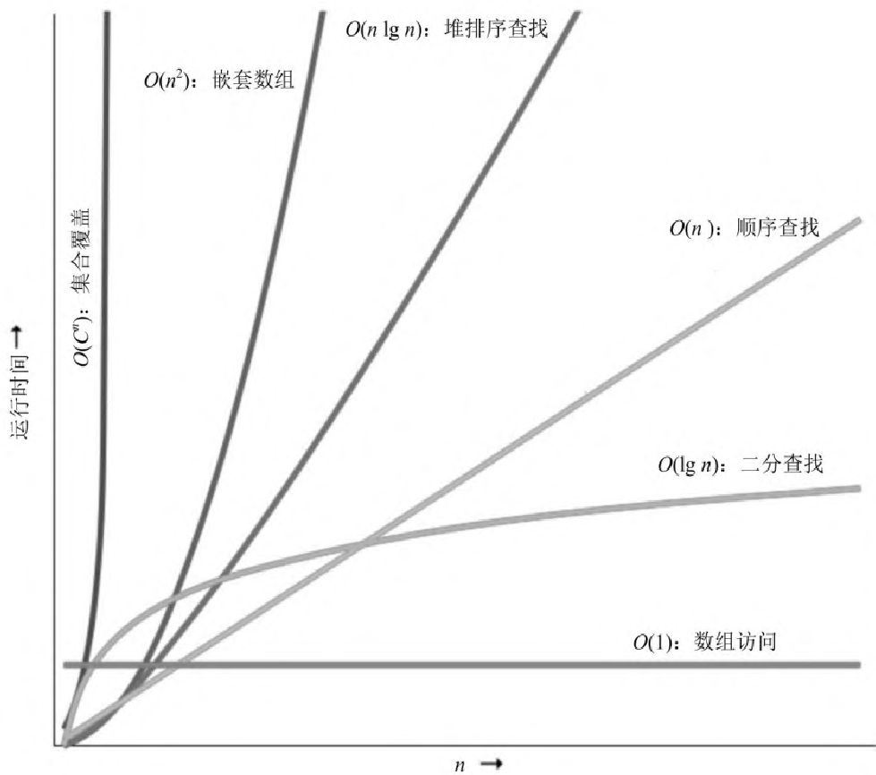

> 图 7-1：各种算法的运行时间。横轴为输入规模
> $n$，纵轴为运行时间。$O(1)$（数组访问）几乎平坦；$O(\lg n)$（二分查找）增长缓慢；$O(n)$（顺序查找）线性增长；$O(n \lg n)$（堆排序查找）略陡；$O(n^2)$（嵌套数组）急剧上升；$O(C^n)$（集合覆盖）几乎垂直。

#### 常识判断

你可以用常识判断出许多基本算法的级别。

#### 简单循环

如果简单地从 1 循环到 $n$， 算法大概是 $O(n)$ 时间的——时间增加和 $n$ 线性相关。

例子有穷举查找、找到数组中的最大值， 以及生成校验和。

#### 嵌套循环

如果你在循环中嵌套另一个循环， 算法就变成了 $O(m \times n)$， 这里 $m$ 和 $n$
分别是两层循环的上限。 这通常出现在排序算法中， 例如冒泡排序，
外层循环每一轮检查数组中的一个元素， 内层循环确定这个元素在排序结果中的位置。
这类排序算法趋近于 $O(n^{2})$。

#### 二分法

如果你的算法在循环中每轮将集合对分， 那么就接近于对数 $O(\lg n)$。
对有序数列二分查找、遍历二叉树、找到机器字的最高位， 都是 $O(\lg n)$ 的。

#### 分治法

如果算法会将输入分成两半来分开处理， 最后再把结果合并起来， 那么就是
$O(n \lg n)$ 的。 经典的例子是快速排序， 这个算法会把数据分为两块，
然后递归地对每块排序。 虽然技术上说， 其行为在处理有序输入时会退化为 $O(n^2)$，
但快速排序的平均运行时间是 $O(n \lg n)$。

#### 组合问题

当算法开始关注事物的排列时， 运行时间可能会失控。 这是因为排列涉及阶乘（数字 1
到 5 的排序就有 $5! = 5 \times 4 \times 3 \times 2 \times 1 = 120$ 种）。 以计算
5 个元素的组合算法的时间为基准： 运行 6 个元素需要 6 倍的时间， 运行 7
个元素需要 42 倍的时间。
例子包括了许多公认的困难问题的算法——旅行推销员问题、最优装箱问题，
以及对一组数字分组以让每组的和相等， 等等。 通常，
在特定问题领域需要使用启发式算法来减少这些算法的运行时间。

#### 实践中的算法速度

在你的职业生涯中， 不太可能花很多时间来编写排序程序。 库里面有现成的实现，
可以拿过来直接使用， 它们通常比你随手写的那些要好得多。 然而，
我们前面描述的那些基本类型的算法会一次又一次地出现。 无论何时，
只要你发现自己在写一个简单的循环， 还是会明白这是一个 $O(n)$ 的算法。
如果循环中又套了一层循环， 它就是 $O(m \times n)$ 的。
这时应该问问自己这些值能有多大。 如果这些数字是有界的，
那么就能知道代码运行大概需要多长时间。
如果这些数字依赖于外部因素（例如需要运行一晚上的批处理的记录数量或是名单中的人名数量），
那么你可能需要停下来， 考虑一下较大的值对运行时间或内存消耗的影响。

> [!TIP]
> **提示 63 评估算法的级别**

有一些方法可以用来解决潜在的问题。 如果你有一个 $O(n^2)$ 的算法，
试试寻找一个分治的方法把它降到 $O(n \lg n)$。

如果你不确定代码会运行多久， 或是不知道代码需要多少内存， 那就跑跑看。
不断改变输入数据的数量或其他会对运行时间造成很大影响的东西，
然后把不同的量和对应的开销制成一张图， 图上曲线的形状很容易理解。
看看随着输入数量增加， 曲线是向上走， 还是呈直线， 或是逐渐拉平？
有三四个点就能看明白了。

还要考虑一下你写的代码本身。 当 $n$ 较小时， 一个简单的 $O(n^{2})$
循环比一个复杂的 $O(n \lg n)$ 算法表现得要好得多， 在 $O(n \lg n)$
的内层循环非常昂贵时尤为如此。

在沉浸于整个理论中时， 不要忘记还要考虑实际情况。 在输入集较小的时候，
运行时可能会线性地上升。 可一旦灌入百万级的输入， 却会使系统颠簸，
最终时间变得很长。 如果用随机输入去测试一个排序例程，
那么在第一次遇到有序输入时， 你可能会感到惊讶。 要尽量将理论和实践基础全部覆盖。
做完所有的估算后， 只有在生产环境中用真实的数据跑一遍， 得到的计时结果才算数。
这就引出了下一个提示。

> [!TIP]
> **提示 64 对估算做测试**

如果获得精确的计时结果比较困难， 可以用代码分析器统计算法中不同步骤运行的次数，
然后再根据输入的数据大小绘制出图表。

#### 最好的不会永远最好

在选择合适的算法时， 你还需要务实一点——最快的算法并不总是最适合当前工作的。
对于小输入集， 简单的插入排序将与快速排序执行得一样好，
并且将花费更少的时间来编写和调试。 如果所选择算法的设置成本很高， 你也需要小心。
对于小输入集， 这种设置在让运行时间变得微不足道的同时，
并不能让算法在整体上变得合适。

还须注意不要过早地优化。 在投入宝贵的时间尝试改进算法之前， 确保算法确实是瓶颈，
总是最为可取。

#### 相关部分包括

- [话题 15：估算](#15-估算)

#### 挑战

- 每个开发者都应该了解如何设计和分析算法。
  罗伯特·塞奇威克写了一系列关于这个主题的通俗易懂的书（《算法》[SW11]、《算法分析导论》[SF13]，
  等等）。 我们建议你将其中一本书加到收藏中， 最重要的是一定要读一读。

- 如果你想更深入了解比塞奇威克介绍的东西，
  那就读一下高德纳的那套权威的《计算机程序设计艺术》，
  该书在一个更宽的范畴分析了算法。

  - 《计算机程序设计艺术（第1卷）：基本算法》[Knu98]
  - 《计算机程序设计艺术（第2卷）：半数值算法》[Knu98a]
  - 《计算机程序设计艺术（第3卷）：排序与查找》[Knu98b]
  - 《计算机程序设计艺术（第4A卷）：组合算法（一）》[Knu11]

- 在接下来的第一个练习中， 我们将研究长整数数组的排序。 如果排序针对的键更复杂，
  键比较的开销很高， 会造成怎样的影响？ 键结构是否会影响排序算法的效率，
  最快的排序是否永远是最快的？

#### 练习

练习 28（参考答案见[练习的参考答案](#练习的参考答案)）

我们用 Rust 编写了一组简单的排序例程[^ch08-6]。 在各种可用的机器上运行它们。
你得到的数据符合预期的曲线吗？ 关于不同机器上的相对速度， 你能推断出什么？
各种编译器优化设置产生了怎样的效果？

练习 29（参考答案见[练习的参考答案](#练习的参考答案)）

在[常识判断](#常识判断)那段， 我们宣称二分法是 $O(\lg n)$ 的，
你能证明这一点吗？

练习 30（参考答案见[练习的参考答案](#练习的参考答案)）

在图 7-1中， 我们宣称 $O(\lg n)$ 和 $O(\log_{10} n)$
是一样的（对数的底可以是任何数）。 你能解释一下为什么吗？

### 40 重构

> 四境所见， 尽是变迁朽腐……
>
> ——亨利·弗兰西斯·赖特《与我同住》

随着程序的演化， 有必要重新考虑早期的决策， 对部分代码进行返工。
这个过程理所当然。 代码需要演化； 它不是一个静态的东西。

不幸的是， 软件开发最常见的隐喻是建筑的构建。
伯特兰·迈耶的经典著作《面向对象软件构造》[Mey97] 使用了“软件构造”这个术语，
甚至笔者也曾在二十一世纪初为IEEE Software的软件构造专栏做编辑。[^ch08-7]

但是使用构造一词作为指导性隐喻意味着以下步骤：

1. 建筑师绘制蓝图。

2. 承包商挖地基， 修建上层建筑， 铺设电线和管道， 并进行最后的装修。

3. 租客们搬进来， 从此过上了幸福的生活， 遇到任何问题只需叫建筑维护人员来解决。

可是软件不是这样工作的。 软件更像是园艺而非建筑——它更像一个有机体而非砖石堆砌。
你根据最初的计划和条件在花园里种植很多花木。 有些茁壮成长，
另一些注定要成为堆肥。 你会改变植物相对的位置， 利用光和影、风和雨的相互作用。
过度生长的植物会被分栽或修剪， 那些不协调的颜色可能会转移到更美观的地方。
你拔除杂草， 给需要额外帮助的植物施肥。 你不断地监测花园的健康状况，
并根据需要（对土壤、植物、布局）做出调整。

商务人士对建筑的隐喻感到很舒服： 它比园艺更科学， 是可重复的，
管理上有严格的汇报层次结构， 等等。
但是我们并不是在建造摩天大楼——也没有受到物理和现实世界的限制。

园艺的隐喻更接近于现实的软件开发。 也许某个例程日渐庞大，
或许是它想要完成的事情太多了——所以需要一分为二。
无法得到计划中结果的东西需要被删除或修剪。

对代码进行重写、修订、结构调整的这一系列工作被称为重组。
但是这些行动当中有一个子集已经成为了实践标准， 它被称为重构。

马丁·福勒将重构 [Fow19] 定义为一种：

> 重组现有代码实体、改变其内部结构而不改变其外部行为的规范式技术。

这一定义的关键部分是：

1. 这项活动是有规范的， 不应随意为之

2. 外部行为不变； 现在不是添加功能的时候

重构并不是一种特殊的、隆重的、偶尔进行的活动。 为了重新种植而在整个花园中翻耕，
重构不是这样的活动。 重构是一项日复一日的工作， 需要采取低风险的小步骤进行，
它更像是耙松和除草这类活动。 这是一种有针对性的、精确的方法，
有助于保持代码易于更改， 而不是对代码库进行自由的、大规模的重写。

为了保证外部行为没有改变， 你需要良好的自动化单元测试来验证代码的行为。

#### 何时该重构

当你学到一些东西时， 当你比去年、昨天甚至十分钟前更了解某事时， 你会重构。

也许是由于代码已经不太合适， 让你遇到一个绊脚石，
或是注意到有两件事情的确需要合并， 又或是被其他什么事情触动而心生悔意，
不要犹豫， 去改掉它。 此时不做， 更待何时。 无论问题是多是少，
都有可能促使我们对代码进行重构：

重复

你发现了一处违背 DRY 原则的地方。

非正交设计

你发现做一些事情可以让其更为正交。

过时的知识

事情变化了， 需求偏移了， 你对问题的了解更多了——代码也需要成长。

使用

当系统在真实的环境中被真实的人使用时， 你会意识到， 与以前的认识相比，
一些特性现在看来更为重要， 反而“必须拥有”的特性可能并不重要。

性能

你需要将功能从系统的一个区域移动到另一个区域以提高性能。

通过了测试

对， 没开玩笑。 我们说过， 重构应该是一个小规模的活动， 需要良好的测试支持。
因此， 如果你添加了少量代码， 并且通过了一个额外的测试，
现在就有了一个很好的机会， 来深入研究并整理刚刚编写的代码。

重构代码——把功能移来移去并更新早期的决策——实际上是一种疼痛治疗的练习。
让我们面对它， 修改源码可能相当令人痛苦： 它们已经能工作了， 保持原样或许更好。
如果仅仅是写得不够好， 许多开发者可不愿意为此劳师动众地重新打开一段代码。

#### 复杂的现实世界

试一试， 去找队友或客户说， “这段代码可以工作，
但我还需要一个星期来完全重构它。”

想想他们的回复会多么劲爆， 总之不方便直接印在这里。

时间压力常常被用作不重构的借口。 但是这个借口根本站不住脚： 如果现在不进行重构，
那么以后就需要投入更多的时间来解决问题——因为需要处理更多的依赖关系。
到时会有更多的时间吗？ 不可能有。

或许可以用一个医学类比来向其他人解释这个原则：
将需要重构的代码看作是“一种增生”。 切除增生需要侵入性手术。 你现在动手，
可以趁它还小的时候把它拿掉。 或者， 你可以等着它生长扩大，
但切除起来将更加昂贵和危险。 一直等下去， 你可能会再也见不到这个病人。

> [!TIP]
> **提示 65 尽早重构，经常重构**

随着时间的推移，
代码中的附带损害有可能致命（参见[话题 3：软件的熵](#3-软件的熵)）。 重构，
和大多数事情一样， 在问题很小的时候做起来更容易， 要把它当作编码日常活动。
你并不需要“用一周时间去重构”一块代码——那是在全面重写。
即使重写这种程度的破坏性工作是必要的， 也很可能无法立即完成。 你要做的是，
确保这个过程已被安排在日程表上， 确保受影响代码的用户知道重写的计划，
以及这么做会对他们有何影响。

#### 怎样重构

重构始于 Smalltalk社区。 当我们编写第一版图书时， 它刚刚开始收获更广泛的拥趸。
这可能要归功于第一本重构方面主要著作（《重构：改善既有代码的设计》[Fow19]，
现在已经是第二版了）的出版。

重构的核心是重新设计。 你或团队中的其他人设计的任何东西，
都可以根据新的事实、更深的理解、更改的需求等重新设计。 但是，
如果你执拗地非要将海量的代码统统撕毁， 可能会发现， 自己所处的境地，
比开始时更加糟糕。

显然， 重构是一项需要慢慢地、有意地、仔细地进行的活动。
马丁·福勒提供了一些简单技巧， 可以用来确保进行重构不至于弊大于利：[^ch08-8]

1. 不要试图让重构和添加功能同时进行。

2. 在开始重构之前， 确保有良好的测试。 尽可能多地运行测试。 这样，
   如果变更破坏了任何东西， 都将很快得知。

3. 采取简短而慎重的步骤： 将字段从一个类移动到另一个类， 拆分方法， 重命名变量。
   重构通常涉及对许多局部进行的修改， 这些局部修改最终会导致更大范围的修改。
   如果保持小步骤， 并在每个步骤之后进行测试， 就能避免冗长的调试。[^ch08-9]

#### 自动化重构

早在第一版中我们就注意到， “在 Smalltalk 的世界之外， 该技术还没有出现，
但是这可能会发生改变……” 的确如此， 改变已经发生了。 现在许多 IDE
和大多数主流语言都支持自动化重构。

这些 IDE 可以重命名变量和方法， 将长例程分割成更小的例程，
自动化传播所需的更改， 用鼠标拖放的形式帮助你移动代码， 等等。

我们接下来将在[话题 41：为编码测试](#41-为编码测试)中讨论这个层次上的测试，
以及在[无情的持续测试](#无情的持续测试)中讨论更大规模的测试。 不过，
福勒先生的关注点在于维护一个良好的回归测试， 这才是安全重构的关键。

如果不得不进行超过重构范围的工作， 而且会以改变外部行为或接口收场，
那么通过刻意破坏构建， 让代码过去的客户无法通过编译， 可能会有所帮助。
这样做可以让你知道什么需要更新。 下一次看到一段代码与它应该有的样子不符时，
要把它修好。 这其实是在控制疼痛——尽管现在很痛， 但以后会痛得更厉害，
那么就忍痛赶紧干完。 记住在[话题 3：软件的熵](#3-软件的熵)中上的那一课：
不要放任破窗。

#### 相关部分包括

- [话题 3：软件的熵](#3-软件的熵)
- [话题 9：邪恶的重复](#9-dry邪恶的重复)
- [话题 12：曳光弹](#12-曳光弹)
- [话题 27：不要冲出前灯范围](#27-不要冲出前灯范围)
- [话题 44：事物命名](#44-事物命名)
- [话题 48：敏捷的本质](#48-敏捷的本质)

### 41 为编码测试

这本书的前一版写于更原始的年代， 那时大多数开发人员都不写测试——他们想，
为什么还要这么麻烦， 反正世界将在2000年终结。

在那一版的书中， 我们有一部分是讨论如何构建易于测试的代码的。
那其实是在用一种鬼鬼祟祟的方法说服开发者去编写测试。

现在的时代已经比较开明了。 如果有开发者仍然没有编写测试，
至少他知道自己应该去做。

但还有一个问题。 当我们问开发者为什么要编写测试时， 他们盯着我们，
就好像我们在问他们是否仍然在用打孔机编码， 他们会回答“确保代码工作正常”，
后面还有一句没说出口的“你这个笨蛋”。 我们认为这是错误的。

那么我们所认为的测试重要性是什么？ 我们认为你应该怎么去做呢？

让我们从这句加粗的句子开始：

> [!TIP]
> **提示 66 测试与找 Bug 无关**

我们相信， 测试获得的主要好处发生在你考虑测试及编写测试的时候，
而不是在运行测试的时候。

#### 考虑测试

在一个周一的早晨， 你开始着手写一些新代码。 这次必须写一些东西来查询数据库，
以返回一个列表， 用来统计在你那个“世界上最有趣的洗碗视频”网站上，
每周观看超过10个视频的人。

启动编辑器， 首先编写执行查询的函数：

```
def return_avid_viewers do
    # ... hmmm ...
end
```

停！你怎么知道要做的是一件好事呢？

答案是你不可能知道。 没有人可以知道。 但考虑一下测试或许就能知道了。
下面是工作原理。

首先假设你已经完成了函数的编写， 现在需要测试它。 你会怎么做呢？
有时想使用一些测试数据， 而这可能意味着需要在真实掌控的数据库中工作。
现在有些框架可以帮你应对这一情况， 在一个测试数据库上运行测试。
但对于我们这个案例， 这意味着我们应该向函数传递数据库实例， 而不是使用全局实例，
因为这样我们才能在测试时改变该实例：

```
def return_avid_users(db) do
```

然后， 我们必须考虑如何填充测试数据。
需求指明要一份“每周观看10个以上视频的人的名单”。 因此，
我们查看了数据库的schema， 找了找可能有帮助的字段。
我们在“谁看了什么”这张表中发现了两个可能的字段： opened_video 和
completed_video。 要编写测试数据， 我们需要知道该使用哪个字段。
但我们不知道需求到底是什么意思， 我们的业务联系也已经中断了。 让我们做一下弊，
传入字段名（这将允许我们测试所拥有的字段， 以后有需要时还可以改）：

```
def return_avid_users(db, qualifying_field_name) do
```

我们从考虑测试开始， 在不写一行代码的情况下， 已经有了两个发现，
并使用这些发现改变了方法的API。

#### 测试驱动编码

在前面的示例中，
考虑测试使我们减少了代码中的耦合（通过传递数据库连接而没有使用全局连接），
并增加了灵活性（通过把测试的字段名称变成一个参数）。
为方法写一个测试的考虑过程， 使我们得以从外部看待这个方法，
这让我们看起来是代码的客户， 而不是代码的作者。

> [!TIP]
> **提示 67 测试是代码的第一个用户**

我们认为这可能是测试所提供的最大好处： 测试所提供的反馈至关重要，
可以指导编码过程。

与其他代码紧密耦合的函数或方法很难进行测试，
因为你必须在运行方法之前设置好所有环境。 所以，
让你的东西可测试也减少了它的耦合。

在你能对一个东西做测试之前， 必须先理解它。 虽然听起来很傻，
但现实中我们开始编写代码， 都只能基于对必须要做的事情的模糊理解。
我们打算边干边解决。 哦， 稍后还会添加支持边界条件的所有代码。 哦，
还有错误处理要完成。 这样进行下去， 代码会比它应有的长度长五倍，
因为它充满了条件逻辑和特殊情况。 但是， 如果用测试先探照一下代码，
事情就会变得更清楚。 如果你在开始编写代码之前，
就考虑过测试边界条件及其工作方式， 那么就很可能会发现简化函数的逻辑模式。
如果你考虑过需要测试的错误条件， 那么将会相应地去构造这个函数。

#### 测试驱动开发

有编程学派质疑， 既然预先考虑测试有这么多好处， 为什么不直接把它们先写出来呢？
这个学派的人进而会实践所谓的测试驱动开发（TDD）。
你还会听到有人把它称为测试先行的开发。[^ch08-10]

TDD 的基本循环是：

1. 决定要添加一小部分功能。

2. 编写一个测试。 等相应功能实现后， 该测试会通过。

3. 运行所有测试。 验证一下， 是否只有刚刚编写的那个测试失败了。

4. 尽量少写代码， 只需保证测试通过即可。 验证一下， 测试现在是否可以干净地运行。

5. 重构代码： 看看是否有办法改进刚刚编写的代码（测试或函数）。
   确保完成时测试仍然通过。

这里的想法是， 这个循环周期应该非常短——只有几分钟的时间，
这样就可以不断地编写测试， 然后让它们工作。

我们看到了 TDD对于从测试着手做事的人的主要好处。 只要遵循 TDD 工作流程，
就能保证代码始终都有测试。 这意味着你会一直处于考虑测试的状态。

然而， 我们也看到人们成为 TDD 的奴隶。 这表现在许多方面：

- 他们花费了过多的时间来确保总是有 100% 的测试覆盖率。

- 他们做了很多冗余的测试。 例如， 在第一次编写类之前，
  许多TDD的信徒会先编写一个失败的测试， 仅仅只是简单地引用一下类的名称。
  测试失败了， 然后再编写一个空的类定义， 以让测试通过。 但现在，
  你有的是一个完全不做任何事的测试； 下一个编写的测试也将引用该类，
  因此第一个测试就变得多余了。 如果以后类名发生变更， 还需要修改更多内容。
  这只是一个简单的例子。

- 他们的设计倾向于从底层开始， 然后逐步上升。
  （参见下方的[自上而下与自下而上之争，以你应该用的方式去做](#自上而下与自下而上之争以你应该用的方式去做)）。

务必实践一下 TDD。 但真这样做时， 不要忘记时不时停下来看看大局。
人们很容易被“测试通过”的绿色消息所诱惑， 从而编写大量的代码，
但实际上这些代码并不能让你离解决方案更近。

#### TDD：你需要知道该去何方

在一个老笑话中有人问道： “怎样吃掉一头大象？” 回答很妙： “一次咬一口。”
当你不能理解整个问题时， 就应小步前进， 一次一个测试。 这个想法经常被吹捧为 TDD
的一个优点。 然而， 这种方法可能会误导你， 它鼓励人们专注于不断优化简单的问题，
而忽略编码的真正动因。 有一个发生于 2006 年的有趣案例，
当时敏捷运动的领军人物罗恩·杰弗里斯开始写一个博客的系列文章。 这个系列，
记录了他尝试用测试驱动的方法， 来开发解数独程序的过程。[^ch08-11]
在写了五篇文章之后， 他改进了底层棋盘的呈现方式， 进行了多次重构，
直到对对象模型满意为止。 但之后他放弃了这个项目。
按顺序阅读这些博客文章是很有趣的，
可以看到一个聪明的人是如何被通过测试的喜悦套牢， 开始被琐事分心。

#### 自上而下与自下而上之争，以你应该用的方式去做

在那计算科学稚嫩的童年， 有两种设计学派： 自上而下和自下而上。
自上而下学派讲的是， 应该从试图解决的整个问题开始， 把它分解成几块。
然后逐步拆分成更小的块， 以此类推， 直到最后得到小到可以用代码表示的块为止。

自下而上学派主张构建代码就像构建房子一样。 他们从底层开始， 生成一层代码，
为这些代码提供一些更接近于目标问题的抽象。 然后添加一层具有更高层次的抽象。
这个过程会持续下去， 直到所要解决问题的抽象出现， 这里也就是最后一层：
“去搞定它……”。

这两个学派实际上都没成功， 因为它们都忽略了软件开发中最重要的一个方面：
我们不知道开始时在做什么。 自上而下学派认为可以提前表达整个需求，
然而他们做不到。 自下而上学派假设他们能构建出一系列的抽象，
这串抽象最终会将他们带到一个单一的顶层解决方案， 但是当不知道方向时，
如何决定每一层的功能呢？

> [!TIP]
> **提示 68 既非自上而下，也不自下而上，基于端对端构建**

我们坚信， 构建软件的唯一方法是增量式的。 构建端到端功能的小块，
一边工作一边了解问题。 应用学到的知识持续充实代码，
让客户参与每一个步骤并让他们指导这个过程。

作为对比， 彼德·诺米格描述了一种感觉非常不同的替代方法[^ch08-12]：
不是由测试驱动，
而是——从对传统上如何解决这类问题（使用约束传播）的基本理解开始，
然后专注于改进算法。 他只用了十几行代码就实现了棋盘的呈现方式，
而这直接来源于对符号的讨论。

测试对开发的驱动绝对能有帮助。 但是， 就像每次驱动汽车一样，
除非心里有一个目的地， 否则就可能会兜圈子。

#### 回到代码

基于组件的开发一直是软件开发的一个崇高目标。[^ch08-13] 其思想是，
通用软件组件应该是有效的， 并且可以像通用集成电路（IC）一样轻松地组合起来使用。
但是， 只有已经知道使用的组件是可靠的，
并且在具有公共电压、互连标准、定时机制等前提下， 这种方法才有效。

芯片一般会被设计成可测试的——不仅限于在工厂测试， 也不仅是在安装时，
在部署的场景下也要测试。
更复杂的芯片和系统可能有一个完整的内置自测试（BIST）功能，
它在内部运行一些基本的诊断， 或者有一个测试访问机制（TAM），
用于提供一个测试工具， 允许外部环境提供刺激并从芯片收集响应。

我们可以在软件上做同样的事情。 与硬件同事一样，
需要从一开始就在软件中构建可测试性， 并在尝试将每个部分连接在一起之前，
对它们进行彻底的测试。

#### 单元测试

硬件的芯片级测试大致相当于软件测试中的单元测试， 即对每个模块单独进行测试，
以验证其行为。 一旦我们在受控（甚至人为的）条件下对模块进行了完整的测试，
就能更好地了解模块在大范围内的反应。

软件单元测试的代码用来操演某一特定模块。 通常， 单元测试将建立某种人工环境，
然后调用被测试模块中的例程。 之后检查返回的结果， 与已知的值比较，
或与相同测试的前一次运行结果比较（回归测试）。

稍后， 当我们将“软件集成电路”装配成一个完整的系统时，
可以确信各个部分是按预期工作的， 进而可以使用相同的单元测试工具来测试整个系统。
我们会在[无情的持续测试](#无情的持续测试)中讨论这种对系统的大规模检查。

不过， 在我们深入之前， 需要决定在单元这个级别上测试什么。 由来已久的做法是，
程序员抛给代码一些随机的数据， 再查看一下打印语句， 随即就声称测试已通过。
其实我们可以做得更好。

#### 针对契约测试

我们喜欢将单元测试看作是在针对契约测试（参见[话题 23：契约式设计](#23-契约式设计)）。
我们想要编写测试用例来确保指定的单元遵守了契约。 这样做能告诉我们两件事：
代码是否符合契约， 以及契约是否具有我们所认为的含义。
我们想通过范围很广的测试用例和边界条件来测试模块是否交付了它所承诺的功能。

在实践中这意味着什么呢？ 让我们从一个简单的数值示例开始： 一个平方根例程。
契约文档很简单：

```
pre-conditions:
    argument >= 0;

post-conditions:
    ((result * result) - argument).abs <= epsilon*argument;
```

它可以告诉我们要测试的内容：

- 传入一个负数以确保会被拒绝。

- 传入参数零， 确保其能被接受（这是一个边界值）。

- 传入零和最大可表达参数之间的多个值，
  并对结果的平方与一开始传入的参数之间的差距进行验证，
  其差幅应小于一个很小的比例值（epsilon）。

有了这个契约， 并假设例程会自己对前置和后置条件做检查，
就可以编写一个基本的测试脚本来执行平方根函数。

然后我们就可以调用这个例程来测试平方根函数：

```
assertWithinEpsilon(my_sqrt(0), 0)
assertWithinEpsilon(my_sqrt(2.0), 1.4142135624)
assertWithinEpsilon(my_sqrt(64.0), 8.0)
assertWithinEpsilon(my_sqrt(1.0e7), 3162.2776602)
assertRaisesException fn => my_sqrt(-4.0) end
```

这是一个非常简单的测试； 在现实世界中，
任何非平凡的模块都可能依赖于许多其他模块， 那么我们如何测试这些模块的组合呢？

假设我们有一个模块A， 使用了DataFeed和LinearRegression。 那么就可以依次测试：

1. DataFeed 的完整契约

2. LinearRegression 的完整契约

3. A 的契约。 这份契约依赖其他契约， 但并没有暴露所依赖的契约

这种风格的测试， 要求首先测试模块的子组件。 一旦验证了子组件，
就可以继续测试模块本身。

如果 DataFeed 和 LinearRegression 通过了测试， 但 A 没有通过测试，
我们就可以确信问题出在 A 上面， 或是出在 A 对那些子组件的用法上面。
这种技巧是减少调试工作的好方法： 我们可以快速地集中于模块 A 中问题的可能来源，
而不会浪费时间反复检查它的子组件。

我们为什么要费这么大的劲呢？ 最重要的是，
要避免制造“定时炸弹”——某个被忽视的东西， 在项目后期的尴尬时刻爆炸。
通过强调针对契约的测试， 可以尽量避免那些下游的灾难。

> [!TIP]
> **提示 69 为测试做设计**

#### 临时测试

不要把临时（Ad Hoc）与“odd hack”搞混，
临时测试发生在我们通过手动运行来捣鼓代码的时候。
可能只是简单地加一句console.log()，
也可能是在调试器、IDE或REPL环境中交互输入的一段代码。

在调试完以后， 需要把这个临时测试正式化。 如果代码出过一次问题，
就有再出问题的可能性。 不要将创建出来的测试扔掉， 把它添加到现有的单元测试库中。

#### 开一扇测试窗口

即使是最好的测试集， 也不可能找到所有的 Bug； 在生产环境那潮湿、温暖的条件下，
木器更容易长虫。

这意味着经常需要对软件做测试——一旦软件被部署下去，
真实世界的数据就会流经它的血管。 与电路板或芯片不同， 软件中没有测试引脚，
但我们可以提供模块内部状态的各种视图，
而不必用调试器去查看（在生产环境中可能不方便或不可能使用调试器）。

包含跟踪消息的日志文件就是这样一种机制。 日志消息应该采用规范一致的格式；
你可能希望自动解析日志以推断程序的处理时间或逻辑路径。
糟糕的或格式不一致的诊断信息非常“恶心”——它们难以阅读， 也不好解析。

进入运行代码内部的另一种机制是“热键”组合或魔术 URL。
当按下特定键的组合或访问某个 URL 时， 将弹出一个诊断控制窗口，
里面有各种状态信息等。 通常你并不会把这个方法透露给最终用户， 但对于咨询台来说，
这会非常方便。

一般而言， 你可以留一个特性开关， 为特定用户或用户组启用额外的诊断信息。

#### 测试文化

你编写的所有软件最终都将被测试——如果不是由你和你的团队做测试，
那么就将由最终的用户去测试——所以不妨计划好进行彻底的测试。 稍微提前考虑一下，
就能大大降低维护成本， 减少求助电话。

可以做的事情真的只有这些：

- 测试先行

- 边做边测

- 永不测试

在大多数情况下， 测试先行， 包括测试驱动设计， 可能是最佳选择，
因为它能确保测试的进行。 但它也不是总那么方便和有效，
所以在编码期间进行测试是一个很好的后备方案——编写一些代码， 尽情修改，
为它编写测试， 然后继续在下一个部分如法炮制。
最糟糕的做法基本可以统称为“以后再测”。 开什么玩笑，
“以后再测”实际上意味着“永不测试”。

测试文化的内涵是， 所有的测试最终都能通过。 忽略一堆“总是失败”的测试，
更容易引发对所有测试的忽略，
恶性循环就此开始（参见[话题 3：软件的熵](#3-软件的熵)）。

#### 忏悔

我， Dave， 因告诉别人自己不再编写测试， 而大出风头。 这样做的部分原因是，
想动摇那些把测试变成宗教的人的信仰。 而这样说的部分原因是，
这（在某种程度上）是真的。

我已经编写了 45 年的代码， 在 30 多年中我都写了自动化测试。 构思写测试，
已经成为我编写代码方式的组成部分。 这种方式令人舒适。 我的个性坚持认为，
当开始觉得舒适的时候， 就应该去尝试别的东西。

因此我决定停止编写测试几个月， 看看这样做会对代码造成什么影响。 令人惊讶的是，
影响“不是很大”， 所以我花了一些时间来找出原因。

我相信这个原因就是， （对我来说）测试的好处更主要来自于思考测试，
以及思考测试会对代码造成怎样的影响。 在长时间坚持这样做之后，
我写不写测试都会这样思考。 代码仍然是可测试的， 只是无须真的写出测试而已。

不过这样做会忽略一个事实， 测试也是与其他开发人员进行交流的一种方式，
所以我现在还是会在与他人共享代码时为其编写测试， 或给有外部依赖的事情写测试。

Andy 说我不应该加上这个知识栏。 他担心这会诱使缺乏经验的开发人员不进行测试。
下面是我的折衷方案：

应该编写测试吗？ 要。 但等你写了 30 年后， 不妨从容地做些试验，
看看它究竟给你带来什么好处。

对待测试代码要像对待任何产品代码一样， 保持解耦性、简洁性和健壮性，
同时不要依赖于不可靠的东西（参见[话题 38：巧合式编程](#38-巧合式编程)）， 比如
GUI 系统中某个部件的绝对位置， 服务器日志中的准确时间戳，
或是错误信息的精确措辞——对这类事情做检查会导致测试非常脆弱。

> [!TIP]
> **提示 70 要对软件做测试，否则只能留给用户去做**

毫无疑问， 测试是编程的一部分， 不该留给其他部门的人去做。

测试、设计、编码——都是在编程。

#### 相关部分包括

- [话题 27：不要冲出前灯范围](#27-不要冲出前灯范围)
- [话题 51：务实的入门套件](#51-务实的入门套件)

### 42 基于特性测试

> Доверяй, но проверяй.（信任， 但要核实。）
>
> ——俄罗斯谚语

我们建议为函数写单元测试。 基于对要测试的东西的认识，
一般会考虑一些有可能出问题的典型案例去做测试。

然而， 这段话里隐藏着一个虽小但可能很重要的问题。 如果原始代码和测试都写好了，
那么是否两者都使用了相同的错误假设？ 代码可以通过测试，
只是因为它根据你的理解去完成工作的。

有一种解决方法是， 让不同的人去写测试和被测试的代码， 但我们不喜欢这个方案：
正如在[话题 41：为编码测试](#41-为编码测试)中所言，
考虑测试的最大好处之一就是它能指导你写代码。 如果测试工作从代码中分离出去，
就失去了这个好处。

相反， 我们倾向于另一种选择， 让计算机来做一些测试，
它不会受你的先入之见的影响。

#### 契约、不变式与特性

在[话题 23：契约式设计](#23-契约式设计)中，
我们讨论了代码有它所满足的契约——当你的输入满足条件时，
它会对输出做出一定的保证。

还有一些代码不变式， 它们在通过一个函数后， 某部分的状态保持为真。 例如，
如果对列表进行排序， 结果将具有与原始列表相同的元素数量——长度就是一个不变式。

一旦实现了契约和不变式（我们将把它们放在一起并称为特性），
就可以使用特性来自动化我们的测试。 最后要做的事情被称为基于特性的测试。

> [!TIP]
> **提示 71 使用基于特性的测试来校验假设**

这是一个人为的示例， 我们来为列表排序构建一些测试。 现在已经建立了一个特性：
已排序列表与原始列表大小相同。 同时还可以声明，
结果中的任何元素都不能大于该元素的后续元素。

现在可以用代码来表达。 大多数语言都有某种基于特性的测试框架。 这个例子是用Python
编写的， 使用了 Hypothesis 和 pytest， 但是这些原则都是通用的。

以下是测试的全部源码：

```
proptest/sort.py
from hypothesis import given
import hypothesis.strategies as some

@given(some.lists(some.integers()))
def test_list_size_is_invariant_across_sorting(a_list):
    original_length = len(a_list)
    a_list.sort()
    assert len(a_list) == original_length

@given(some.lists(some.text()))
def test_sorted_result_is_ordered(a_list):
    a_list.sort()
    for i in range(len(a_list) - 1):
        assert a_list[i] <= a_list[i + 1]
```

运行结果会是这样：

```
$ pytest sort.py

test session starts

plugins: hypothesis-4.14.0

sort.py .. [100%]

2 passed in 0.95 seconds
```

并没有什么戏剧性的东西。 但是， Hypothesis 在幕后将两个测试各运行了 100 次，
每次都传入一个不同的列表。 列表的长度不同， 内容也不同。 这就好像我们用 200
个随机列表编写了 200 个独立测试一样。

#### 测试数据的生成

与大多数基于特性的测试库一样， Hypothesis
提供了一种用于描述所应生成数据的小语言。 语言是基于对 hypothesis.strategies
模块中函数的调用的。 这里我们给它起了一个别名 some， 这样读起来更舒服一点。

如果我们写下：

```
@given(some.integers())
```

测试函数将运行多次。 每次都会传递一个不同的整数。 如果我们这样写：

```
@given(some.integers(min_value=5, max_value=10).map(lambda x: x * 2))
```

就能得到 10 到 20 之间的偶数。

还可以组合类型， 像这样：

```
@given(some.lists(some.integers(min_value=1), max_size=100))
```

就能得到最多 100 个元素的自然数列表。

由于并不是关于任何特定框架的教程， 所以我们将跳过一些很酷的细节，
来看看一个真实的例子。

#### 找到不良假设

我们正在编写一个简单的订单处理和库存控制系统（总是能找到再写一个的理由）。 它用
Warehouse 对象对库存水平建模。 我们可以查询仓库， 查看是否有库存，
从库存中删除物品， 并获得当前的库存水平。

下面是代码：

```
proptest/stock.py

class Warehouse:
    def __init__(self, stock):
        self.stock = stock

    def in_stock(self, item_name):
        return (item_name in self.stock) and (self.stock[item_name] > 0)

    def take_from_stock(self, item_name, quantity):
        if quantity <= self.stock[item_name]:
            self.stock[item_name] -= quantity
        else:
            raise Exception("Oversold {}".format(item_name))

    def stock_count(self, item_name):
        return self.stock[item_name]
```

我们写了一个基本的可以通过的单元测试：

```
proptest/stock.py

def test_warehouse():
    wh = Warehouse({"shoes": 10, "hats": 2, "umbrellas": 0})
    assert wh.in_stock("shoes")
    assert wh.in_stock("hats")
    assert not wh.in_stock("umbrellas")

    wh.take_from_stock("shoes", 2)
    assert wh.in_stock("shoes")

    wh.take_from_stock("hats", 2)
    assert not wh.in_stock("hats")
```

接下来， 我们编写了一个函数来处理从仓库订购商品的请求。 它返回一个元组，
其中第一个元素是 “ok” 或 “not available”， 紧接着的元素是物品和数量。
我们也写了一些测试， 并且它们通过了：

```
proptest/stock.py

def order(warehouse, item, quantity):
    if warehouse.in_stock(item):
        warehouse.take_from_stock(item, quantity)
        return ("ok", item, quantity)
    else:
        return ("not available", item, quantity)
```

```
proptest/stock.py

def test_order_in_stock():
    wh = Warehouse({"shoes": 10, "hats": 2, "umbrellas": 0})
    status, item, quantity = order(wh, "hats", 1)
    assert status == "ok"
    assert item == "hats"
    assert quantity == 1
    assert wh.stock_count("hats") == 1

def test_order_not_in_stock():
    wh = Warehouse({"shoes": 10, "hats": 2, "umbrellas": 0})
    status, item, quantity = order(wh, "umbrellas", 1)
    assert status == "not available"
    assert item == "umbrellas"
    assert quantity == 1
    assert wh.stock_count("umbrellas") == 0

def test_order_unknown_item():
    wh = Warehouse({"shoes": 10, "hats": 2, "umbrellas": 0})
    status, item, quantity = order(wh, "bagel", 1)
    assert status == "not available"
    assert item == "bagel"
    assert quantity == 1
```

从表面上看， 一切都很好。 但是在发布代码之前， 让我们添加一些特性测试。

我们知道的一件事是， 库存不会在我们的交易中出现或消失。 这意味着，
如果从仓库中取出一些物品， 取出的数量加上当前在仓库中的数量，
应该与最初仓库中的数量相同。 在接下来的测试中， 我们在 “hat” 或 “shoe”
中随机挑选一个作为物品参数， 并从 1 到 4 中选一个作为数量来运行测试：

```
proptest/stock.py

@given(item = some.sampled_from(["shoes", "hats"]),
    quantity = some.integers(min_value=1, max_value=4))

def test_stock_level_plus_quantity_equals_original_stock_level(item, quantity):
    wh = Warehouse({"shoes": 10, "hats": 2, "umbrellas": 0})
    initial_stock_level = wh.stock_count(item)
    (status, item, quantity) = order(wh, item, quantity)
    if status == "ok":
        assert wh.stock_count(item) + quantity == initial_stock_level
```

跑一下看看：

```
$ pytest stock.py

stock.py:72:

stock.py:76: in test_stock_level_plus_quantity_equals_original_stock_level
(status, item, quantity) = order(wh, item, quantity)

stock.py:40: in order

warehouse.take_from_stock(item, quantity)

self = <stock.Warehouse object at 0x10cf97cf8>, item_name = 'hats'

quantity = 3

def take_from_stock(self, item_name, quantity):
    if quantity <= self.stock[item_name]:
        self.stock[item_name] -= quantity
    else:
        raise Exception("Oversold {}".format(item_name))

E Exception: Oversold hats

stock.py:16: Exception

Hypothesis

Falsifying example:
test_stock_level_plus_quantity_equals_original_stock_level(
    item='hats', quantity=3)
```

测试在 warehouse.take_from_stock 里引爆： 我们试图从仓库中移除三顶帽子，
但是仓库中只有两项。

我们的特性测试发现了一个错误的假设： in_stock
函数只检查库存中至少有一个特定商品。 但我们需要确保有足够的数量来满足订单：

```
proptest/stock1.py

def in_stock(self, item_name, quantity):
    return (item_name in self.stock) and (self.stock[item_name] >= quantity)
```

还要改改 order 函数：

```
proptest/stock1.py

def order(warehouse, item, quantity):
    if warehouse.in_stock(item, quantity):
        warehouse.take_from_stock(item, quantity)
        return ("ok", item, quantity)
    else:
        return ("not available", item, quantity)
```

现在特性测试就能通过了。

#### 基于特性的测试总能带来惊喜

在前面的示例中， 我们使用了基于特性的测试来检查库存水平是否被正确调整。
测试发现了一个 Bug， 但与库存水平调整无关。 相反， Bug 是在 in_stock 函数中。

这就是基于特性的测试既强大又给人挫折之处。 说它强大是因为，
只要建立一些规则来生成输入， 设定好断言来验证输出， 就可以任其发展。
至于会发生什么， 你并不完全知道——测试可能通过， 断言也可能失败，
又或者代码可能因无法处理所给定输入而完全失败。

挫折之处在于， 确定失败的原因可能很棘手。

我们的建议是， 当基于特性的测试失败时， 找出传递给测试函数的参数，
然后使用这些值创建一个单独的、常规的单元测试。 单元测试为你做了两件事。 第一，
它使你可以将注意力集中在问题上，
而避开所有那些基于特性的测试框架产生的对代码的额外调用。 第二，
单元测试可充当回归测试。 因为基于特性的测试所传递的参数是随机生成的，
不能保证在下一次运行测试时使用相同的值； 而单元测试则能强制使用这些值， 确保 Bug
不会通过。

#### 基于特性的测试对设计也有帮助

当我们在谈单元测试时说过， 其主要好处之一是， 它能强制你以特定方式思考代码：
单元测试是 API 的第一个客户。

这一点对基于特性的测试也同样成立， 只是方式略有不同。
基于特性的测试让你从不变式和契约的角度来考虑代码； 你会思考什么不能改变，
什么必须是真实的。 这种额外的洞察力会对代码产生神奇的影响， 可以消除边界情况，
并突显使数据处于不一致状态的函数。

我们相信基于特性的测试是对单元测试的补充： 二者处理不同的关注点，
并且都能带来各自的好处。 如果你现在还没有使用， 那就试试吧。

#### 相关部分包括

- [话题 23：契约式设计](#23-契约式设计)
- [话题 25：断言式编程](#25-断言式编程)
- [话题 45：需求之坑](#45-需求之坑)

#### 练习

练习 31（参考答案见[练习的参考答案](#练习的参考答案)）

回顾一下仓库的例子。 还有其他可以测试的特性吗？

练习 32（参考答案见[练习的参考答案](#练习的参考答案)）

你们公司装运机器。 每台机器装在一个板条箱里， 每个板条箱都是长方形的，
并且大小不一。 你的工作是写一些代码， 把尽可能多的板条箱塞入一个单层的运输卡车。
代码的输出是所有箱子的列表。 对于每个板条箱， 列表给出了其在卡车中的位置，
以及宽度和高度。 针对输出， 可以测试哪些特性？

#### 挑战

考虑一下当前正在处理的代码。 特性是什么： 契约还是不变式？
你可以使用基于特性的测试框架来自动验证它们吗？

### 43 出门在外注意安全

> 好篱笆造出好邻家。
>
> ——罗伯特·李·弗罗斯特《修墙》

在第一版图书关于代码耦合的讨论中， 我们做了一个大胆而天真的陈述：
“我们不需要像间谍或异见人士那样偏执。” 我们错了。 事实上，
你确实需要每天都那么偏执。

在我们写这一部分的时候，
每天的新闻都充斥着毁灭性的数据泄露、系统被劫持和网络欺诈的故事。
数以亿计的记录顷刻间被盗，
数十亿美元的损失和赔偿产生——这些数字每年都在快速增长。 在绝大多数情况下，
这并不是因为攻击者非常聪明， 他们甚至都谈不上有多大能力。

开发人员实在太粗心了。

#### 剩下的 90%

在编写代码时， 你可能反复经历着“可以跑了！”和“为什么不工作？”的循环，
间或抱怨一句“不可能啊……”[^ch08-14] 在爬坡的过程中经历了几次起伏之后，
很容易对自己说： “唷， 都跑起来了！” 并宣告代码已经完成。 当然， 还没有完成。
你已经完成了90%， 现在只需考虑剩余路程， 但行百里者半九十，
这相当于又是一个90%。

接下来要做的是分析代码中那些可能出错的路径， 并将其添加到测试套件中。
你要考虑传入错误的参数、泄漏的资源或资源不存在等此类事情。

在美好的旧日时光中， 对这些内部错误做出评估就已经足够了。 但时至今日，
这仅仅才是开始， 因为除了内部原因造成的错误，
还需要考虑外部参与者是如何故意将系统搞砸的。 也许你会抗议， “哦，
没人会关心我这些代码， 并不是什么重要的东西， 甚至没人知道这台服务器……”
无论是地球另一端的熊孩子、国家支持的恐怖主义， 还是犯罪团伙、商业间谍，
甚至是复仇心重的前任， 都已就位并将你瞄准。 对于未修补的、过时的系统，
其在开放网络中的生存时间是以分钟计算的——甚至更少。

通过隐藏来实现安全性是行不通的。

#### 安全性的基本原则

务实的程序员有相当多的偏执。 我们知道自己有缺陷和限制，
外部攻击者会抓住每个我们留下的漏洞去破坏系统。 特定的开发和部署环境，
将有其自己的围绕安全性的需求， 但是你应该始终牢记一些基本原则：

1. 将攻击面的面积最小化

2. 最小特权原则

3. 安全的默认值

4. 敏感数据要加密

5. 维护安全更新

下面逐个看看。

#### 将攻击面的面积最小化

系统攻击面的面积指，
攻击者可以在其中输入数据、提取数据或调用服务执行的所有访问点的总和。
这里有几个例子：

代码复杂性滋生攻击载体

代码的复杂性会让攻击面更大， 会留下更多产生意料之外的副作用的机会。
可以将复杂的代码视作元凶， 是它使攻击面脆弱多孔、易受感染。 同样，
代码越简单越好。 更少的代码意味着更少的 Bug， 更少机会出现严重安全漏洞。
更简单、更紧凑、复杂度更小的代码更好推理， 更容易发现潜在的弱点。

输入数据是一种攻击载体

永远不要信任来自外部实体的数据，
在将其传递到数据库、呈现视图或其他处理过程之前， 一定要对其进行消毒。[^ch08-15]
一些语言可以在这方面提供帮助。 例如在 Ruby中，
包含外部输入的变量被认为是受污染的， 对其执行的操作会受到限制。 例如，
这段代码明显使用了 wc 程序来汇报一个文件中有多少字符，
该文件名是在运行时提供的：

```
safety/taint.rb
puts "Enter a file name to count: "
name = gets
system("wc -c #{name}")
```

某个邪恶的用户可以这样做坏事：

```
Enter a file name to count:
test.dat; rm -rf /
```

不过， 将安全级别设置为 1 将会污染外部数据， 这意味着它不能用于危险的上下文中：

```
safety/taint.rb
$SAFE = 1

puts "Enter a file name to count: "
name = gets

system("wc -c #{name}")
```

```
$ ruby taint.rb
Enter a file name to count:
test.dat; rm -rf /
code/safety/taint.rb:5:in `system': Insecure operation - system (SecurityError)
    from code/safety/taint.rb:5:in `<main>'
```

未经身份认证的服务成为攻击载体

就其本质而言， 世界上任何地方的任何用户都可以调用未经身份认证的服务，
因此如不做任何的处理和限制， 就至少立刻创造了一个拒绝服务（DOS）攻击的机会。
最近多起被高度曝光的数据泄露事件，
是由于开发者不小心将数据放入无须身份认证、公开可读的云存储中造成的。

经过身份认证的服务成为攻击载体

将授权用户的绝对数量保持在最小值。 要淘汰不使用的、旧的或过时的用户和服务。
我们发现， 许多启用网络的设备包含有简单的默认密码，
或未使用的、不受保护的管理账户。 如果带有部署凭据的账户被泄露，
则整个产品将为之受损。

输出数据成为攻击载体

有一个（可能是虚构的）故事， 是关于一个非常尽职的系统的，
它甚至会报告“该密码已经被其他用户使用”这样的提示信息。 不要泄露信息，
并确保所通报的数据适合该用户的权限。 对潜在的危险信息，
比如社会保险或其他政府颁发的身份识别号码， 要做截断或混淆。

调试信息成为攻击载体

没有什么比看到本地 ATM 机、机场自助服务站或崩溃的网页上的完整堆栈跟踪信息，
更让人感动的了。 为了让调试更容易而设计的信息， 也有可能使破坏变得更容易。
要确保任何“测试窗口”（在[开一扇测试窗口](#开一扇测试窗口)中讨论过）和运行时异常报告都已受到保护，
不会被间谍看见。[^ch08-16]

> [!TIP]
> **提示 72 保持代码简洁，让攻击面最小**

#### 最小特权原则

另一个关键原则是， 在最短的时间内使用最少的特权。 换句话说，
不要自动获取类似root或Administrator这样的最高级别权限。
如果真需要这么高级别的权限， 那就去申请， 获得权限后只做最少量的工作，
然后迅速放弃权限， 这样可以降低风险。 这一原则可以追溯到20世纪70年代初期：

> 每个程序和系统的每个特权用户为了完成工作，
> 都只应该使用所需的最少数量的特权进行操作。
>
> ——Jerome Saltzer《美国计算机学会通讯》，1974

以 UNIX 派生系统上的 login 程序为例。 一开始它使用 root 特权运行。 然而，
一旦完成了对正确用户的身份认证， 它就会把最高特权降为该用户所持权限。

这条原则并不仅仅适用于操作系统特权级别。 你的应用程序实现了不同级别的访问吗？
级别划分是不是很生硬， 仅分为“管理员”和“用户”？ 如果是， 请考虑更细的粒度，
比如敏感资源可划分为不同的类别， 单个用户仅对其中部分类别具有权限。

这种技术遵循与最小化攻击面相同的思想——通过时间和特权级别减少攻击载体的范围。
在这种情况下， 少即是多。

#### 安全的默认值

在应用程序或网站用户的设置里， 默认值应该是最安全的。
这些值可能不是对用户最友好或最方便的，
但是最好让每个人自己为安全性和方便性之间的权衡做决定。

例如， 密码输入的默认设置可能是隐藏输入， 用星号替换每个字符。
如果你在一个拥挤的公共场所， 或者是在一群观众面前输入密码，
这是一个合理的默认设置。 但有些用户可能希望看到密码显示出来， 这样当然更方便。
如果被人从背后偷窥的风险很小， 这对他们来说是一个合理的选择。

#### 敏感数据要加密

不要将个人身份信息、财务数据、密码或其他凭据，
以纯文本的形式保存在数据库或其他外部文件中。 如果数据被泄露，
加密提供了额外的安全级别。

在版本控制中， 我们强烈建议将项目所需的一切事项都置于版本控制之下。 没错，
几乎一切。 但这里给出此规则的一个主要例外：

不要把保密内容、API 密钥、SSH 密钥、加密密码或其他凭据，
和源码一起提交到版本控制中。

密钥和秘密需要单独管理——作为构建和部署的一部分，
通常通过配置文件或环境变量来管理。

#### 维护安全更新

更新计算机系统可能非常令人痛苦。 你需要某个安全补丁， 但它有副作用，
可能破坏应用程序的某些部分。 你或许决定等待， 并将更新推迟到以后。
但这是一个糟糕的想法， 因为现在的系统很容易受到已知漏洞的攻击。

> [!TIP]
> **提示 73 尽早打上安全补丁**

这个提示关涉每一个联网设备，
包括电话、汽车、家用电器、个人笔记本电脑、开发人员机器、构建机器、生产服务器和云映像，
可谓无所不包。 如果你认为这并不重要， 那么要记住，
历史上（到目前为止）最严重的数据泄露是由系统更新滞后造成的。

别让这种事发生在你身上。

#### 密码的反模式

安全性的一个基本问题是， 好的安全性常常与常识或惯例背道而驰。 例如，
如果你认为严格的密码要求会提高应用程序或网站的安全性， 那么你就错了。

严格的密码策略实际上会降低安全性。 以下针对一些非常糟糕的想法， 提供一些 NIST
的建议：[^ch08-17]

- 不要将密码长度限制在 64 个字符以内。 NIST 推荐 256 为最佳长度。

- 不要截断用户选择的密码。

- 不要限制特殊字符， 比如；&%$#./。 请参阅本部分前面关于 Bobby Tables 的说明。
  如果密码中的特殊字符会危及系统， 那么你将面临更大的问题。 NIST
  表示接受所有可打印的 ASCII 字符、空格和 Unicode。

- 不要向未经身份认证的用户提供密码提示， 或提示输入特定类型的信息（例如，
  “你的第一只宠物叫什么名字？”）。

- 不要禁用浏览器中的粘贴功能。 破坏浏览器和密码管理器的功能，
  并不能使系统更安全。 实际上， 它会促使用户创建更简单、更短、更容易破解的密码。
  出于这个原因， 美国的 NIST
  和英国的国家网络安全中心都特别要求校验方允许粘贴功能。

- 不要强加其他组合规则。 例如，
  不要强制要求任何特定的大小写混合、数字或特殊字符， 或禁止重复字符， 等等。

- 不要蛮横地要求用户在一段时间后更改密码。
  只有在有正当理由的情况下才这样做（例如， 系统遭到了破坏）。

我们应该鼓励长的随机的密码， 因为它有更高程度的熵。 人为的限制局限了信息熵，
助长了使用糟糕密码的习惯， 让用户的账户很容易被接管。

#### 常识与密码学

一定要记住， 当涉及密码学的问题时， 常识可能会让你失望。 当涉及加密时，
第一条也是最重要的一条规则是， 永远不要自己做。[^ch08-18]
即使是对于密码这样简单的东西，
常见的做法也是错误的（参见[密码的反模式](#密码的反模式)）。
一旦你进入了密码学的世界， 即使是最小的、看起来最不起眼的错误， 也会危及一切：
你那聪明的、全新的、自制的加密算法，
可能会在几分钟内被专家破解——不要自己做加密。

正如我们在其他地方所说的， 只应依赖可靠的东西：
经过良好审查、彻底检查、维护良好、经常更新、最好是开源的库和框架。

除了简单的加密任务， 还应该仔细研究网站或应用程序的其他与安全性相关的特性，
下面以身份认证为例。

为了实现自己的密码登录或生物认证， 你需要了解哈希和盐是如何工作的，
破解者是如何使用彩虹表之类的东西的， 为什么不应该使用MD5或SHA1，
以及许多其他问题。 即使你做的一切都是正确的， 在一天结束的时候，
你仍然有责任根据那些新的立法和法律义务， 保留数据并维持数据的安全。

或者你可以采取务实的方法， 启用第三方提供的鉴权服务， 让其他人去操心。
它可能是内部运行的现成服务， 也可能是云中的第三方。
身份认证服务通常可以从电子邮件、电话或社交媒体提供商那里获得，
这可能适合也可能不适合你的应用程序。 无论如何，
这些人整天都在维护自己系统的安全， 在这方面他们比你做得更好。

出门在外注意安全。

#### 相关部分包括

- [话题 23：契约式设计](#23-契约式设计)
- [话题 24：死掉的程序不会说谎](#24-死掉的程序不会说谎)
- [话题 25：断言式编程](#25-断言式编程)
- [话题 38：巧合式编程](#38-巧合式编程)
- [话题 45：需求之坑](#45-需求之坑)

### 44 事物命名

> 名不正， 则言不顺； 言不顺， 则事不成。
>
> ——孔子

名字里有什么？ 当我们编程时， 名字里有“一切”。

我们为应用程序、子系统、模块、函数和变量起名字——不断地创造新事物并给它们命名。
这些名字非常非常重要， 因为它们透露出你的很多意图和信念。

我们认为， 事物应该根据它们在代码中扮演的角色来命名。 这意味着， 无论何时，
只要你有所创造， 就需要停下来思考“我这一创造的动机是什么？”

这是一个强有力的问题， 因为它把你从立即解决问题的心态中带出来，
让你看到更大的图景。 当我们考虑一个变量或函数的作用时， 所考虑的是它的特别之处，
它能做什么， 它与什么相互作用。 在很多时候， 对于正要去做的事情，
一旦我们怎么都想不出一个适合它的名字， 往往就会幡然醒悟，
意识到这件事情其实毫无意义。

名字有着深刻的含义， 这背后是有科学依据的。 事实证明，
大脑阅读和理解单词的速度非常快： 快过许多其他活动。
这意味着当我们试图理解某事时， 单词有一定的优先级。 这可以用斯特鲁普效应来演示。[^ch08-19]

请看下面的面板。 它由一组颜色或灰度的名称构成，
每个名称都以不同的颜色或灰度显示。 但是名字和颜色不一定匹配。
这是挑战的第一部分——大声说出每种颜色的名字：[^ch08-20]


> 图
> 7-2：斯特鲁普效应演示面板。面板由一组颜色名称的文字构成，每个名称以与其字义不同的颜色或灰度显示。先大声读出每个词，再大声说出每个字的颜色——后者明显困难得多，因为大脑阅读文字的速度远快于识别颜色。

现在再来一次， 但这次要大声说出字的颜色。 很难， 对吗？ 读出文字很容易，
但要识别颜色就难多了。

大脑很尊重书面文字。 我们需要确保使用的名字不辜负这一点。

让我们来看几个例子：

- 我们正在对一个网站的访客进行身份验证， 这个网站售卖用旧显卡制成的珠宝：

```
let user = authenticate(credential)
```

变量名是 user， 因为一直都在用 user。 但为什么要用这个名字？ 好像并无特殊含义。
试试 customer 或者 buyer？ 只是换个名字， 就能通过代码不断地提醒我们，
这个人打算做什么， 做的事情对我们意味着什么。

- 我们有一个对订单打折的方法：

```
public void deductPercent(double amount)
// ...
```

这里有两个问题。 首先， deductPercent（扣除百分比）指的是它要做的事情，
而不是为什么要做这件事。 其次， 参数名 amount 最容易误导人：
它是一个绝对量还是一个百分比？

或许这样会好一些：

```
public void applyDiscount(Percentage discount)
// ...
```

方法名现在明确了它的意图。 我们还将参数类型从 double 改成 Percentage
这个自定义类型。 不知道你怎么样， 反正我们在处理百分比时， 从不知道该值应该是 0
到 100 之间， 还是 0.0 到 1.0 之间。 使用一个专门类型， 可以将函数的期望文档化。

- 我们有一个模块， 是用斐波那契数列来干一些有趣的事情。 其中之一是计算序列中的第
  $n$ 个数字。 停下来想想你会怎么称呼这个函数。

我们问过的大多数人都会说应该叫 fib。 看起来很合理， 但记住，
调用通常会带上模块名， 因此调用会是 Fib.fib(n)。 何不改为 of 或 nth：

```
Fib.of(0)   # => 0
Fib.nth(20) # => 4181
```

在命名时， 要不断地寻找方法来阐明你的意思，
而这种行为本身将使你在编写代码时更好地理解代码。

然而， 并不是所有的名字都必须去参评文学奖。

#### 这条规则的例外

我们应力求代码清晰， 但品牌是完全不同的事情。

有一个悠久的传统， 项目和项目团队应该有个朦胧的、“聪明的”名字——宝可梦，
漫威超级英雄， 可爱的小动物， 指环王中的角色， 只要你能想得到。

名字而已。

#### 尊重文化

在计算机科学中只有两件难事： 缓存失效和命名。

大多数的计算机入门文章都会告诫你， 永远不要使用单个字母的变量， 如 i、j、k。[^ch08-21]
我们认为在某种程度上这并不正确。

事实上， 这取决于特定编程语言或环境所处的文化氛围。 在 C 语言中， i、j、k
通常用作循环变量， s 用于字符串， 等等。 如果在这种环境中编写程序，
那么你就会习以为常， 违反这种规范反而不和谐（也就说明不对）。 与此相对，
在没有同样预期的其他环境中沿用该习惯也是错误的。
你永远不要做一些令人发指的事情， 比如这个 Clojure 的例子，
它将一个字符串赋值给变量 i：

```
(let [i "Hello World"]
    (println i))
```

一些语言社区喜欢 camelCase 这样大小写交错的驼峰命名， 而另一些社区更喜欢
snake_case 这样使用下划线分隔的单词。 对语言来说， 当然两者都能接受，
但这并不意味着怎么做都是正确的。 要尊重当前身处的文化。

有些语言允许在名称中使用 Unicode 的子集。 但你在使用 $\text{əsn}$ 或是
$\varepsilon\xi\dot{r}\chi\varepsilon\tau\alpha$ 这样的可爱名字之前，
先了解一下社区的预期。

#### 一致性

爱默生有一句名言“愚蠢的使用一致性是无知的妖怪……”，
不过爱默生并不属于任何一个程序员团队。

每个项目都有自己的词汇表： 对团队有特殊意义的术语。
“Order”对于开发在线商店的团队来说是一回事，
而对于记录宗教团体的世系的应用程序来说， 意味着完全不同的另一件事。[^ch08-22]
重要的是， 团队中的每个人都知道这些词的意思， 并始终如一地使用它们。

一种方法是鼓励大量的交流。 如果每个人都参与结对编程， 并且频繁地交换结对，
那么术语就会渗透性地传播开来。

另一种方法是使用项目术语表， 列出对团队有特殊意义的术语。 这是一个非正式的文档，
可以在 wiki上创建并维护， 也可以将索引卡片挂在墙上。

过一段时间， 项目术语将会有自己的生命。 随着每个人都熟悉了这些词汇，
就能够把这些术语用作简称， 准确而简洁地表达许多意思。 （这正是模式语言所指。）

#### 更名更难

在计算机科学中只有“两”件难事： 缓存失效、命名以及差一错误。

无论你在一开始投入多少努力， 事情在中途都会改变——代码被重构， 用法被修改，
意义产生了微妙的变化。

如果你不注意随时更新名字， 很快就会陷入比毫无暗示的名字更糟糕的噩梦：
误导性的名字。 你是否曾经遇到过有人解释代码中的不一致性， 比如“名为 getData
的例程实际上会将数据写入归档文件”？

正如我们在[软件的熵](#3-软件的熵)中所讨论的， 当你发现一个问题时，
要立即修复它。 当你看到一个名称不再表达其意图， 或是具有误导性，
亦或是令人困惑时， 请修复它。 你已经有了完整的回归测试，
因此能发现任何漏改的位置。

> [!TIP]
> **提示 74 好好取名；需要时更名**

如果由于某种原因， 无法改变现在这个错误名字， 那么说明这里有一个更大的问题： 对
ETC 的违背（参见[优秀设计的精髓](#8-优秀设计的精髓)）。
那么先修复这个更大的问题， 再更换有问题的名字。 让更名变得容易， 并且经常去做。

否则， 你将不得不向团队中的新成员解释， getData实际上会将数据写入文件，
而且必须板着脸不笑出来。

#### 相关部分包括

- [话题 3：软件的熵](#3-软件的熵)
- [话题 40：重构](#40-重构)
- [话题 45：需求之坑](#45-需求之坑)

#### 挑战

- 当发现函数或方法的名称过于宽泛时， 请尝试对其进行重命名， 以表达真正的功能。
  现在， 这样的重构目标实现起来毫无难度。

- 在我们的示例中， 曾建议使用更具体的像 buyer 这样的名字， 而不是更传统和通用的
  user。 你还习惯用什么更好的名字？

- 你的系统中所用名字， 是否与来自该领域的用户术语一致？ 如果不一致， 为什么？
  这会对团队造成斯特鲁普效应式的认知失调吗？

- 你的系统中的名字很难改变吗？ 关于修理那扇破窗， 你能做点什么？

[^ch08-1]: 译注：症状是怀疑自身能力，认为自己的成功都来自外界因素。

[^ch08-2]: 血的教训：UTC 是其中一个重要因素，一定记得要用。

[^ch08-3]: 网址参见链接列表7.1条目。

[^ch08-4]: 参见[话题 50：椰子派不上用场](#50-椰子派不上用场)。

[^ch08-5]: 有人可能会在这个方面走得太远。我们曾经认识一个开发者，他重写了所有交给他的源码，因为他有自己的命名约定。

[^ch08-6]: 网址参见链接列表7.2条目。

[^ch08-7]: 是的，我们确实表达过对标题的担忧。

[^ch08-8]: 最初由《UML精粹：标准对象建模语言简明指南》[Fow00]一书指出。

[^ch08-9]: 这是一个很好的建议（参见[话题 27：不要冲出前灯范围](#27-不要冲出前灯范围)）。

[^ch08-10]: 有些人认为测试先行和测试驱动开发是两个不同的东西——坚称它们的目的是不同的。然而，从历史上看，测试先行（来自于极限编程）与人们现在所称的
    TDD 是相同的。

[^ch08-11]: 网址参见链接列表7.3条目。“特别感谢”罗恩让我们使用这个故事。

[^ch08-12]: 网址参见链接列表7.4条目。

[^ch08-13]: 我们至少从 1986 年就开始尝试了，当时 Cox 和 Novobilski
    在他们那本关于 Objective-C 的书 Object-Oriented Programming: An Evolutionary
    Approach [CN91] 中创造了“软件集成电路”这个术语。

[^ch08-14]: 参见[话题 20：调试](#20-调试)。

[^ch08-15]: 还记得我们的好朋友，小东西Bobby
    Tables（网址见链接列表7.5条目）吗？一边回忆一边看看这个网站（网址见链接列表7.6条目），那里列出了一系列将数据传去做数据库查询前的消毒方法。

[^ch08-16]: 这种技术，已被证明在 CPU
    芯片级别上是成功的。在这个级别上，许多著名漏洞都是针对调试和管理设施的。一旦芯片被破解，整个机器就暴露在外。

[^ch08-17]: NIST Special Publication 800-63B: Digital Identity Guidelines:
    Authentication and Lifecycle
    Management，在网上能免费浏览（网址见链接列表7.7条目）。

[^ch08-18]: 除非你有密码学的博士学位。即使是这样，也要经过大量的同行评审，进行广泛的有
    Bug 悬赏的现场试验，并且要有长期维护的预算。

[^ch08-19]: Studies of Interference in Serial Verbal Reactions [Str35]

[^ch08-20]: 这个面板有两个版本。一个使用不同的颜色，另一个使用灰色阴影。如果你看到的是黑白的，但想要彩色的版本，或者你在区分颜色上有困难，想要尝试灰度版本，打开链接列表7.8条目的网址即可。

[^ch08-21]: 你知道为什么常用 i 做循环变量吗？答案是，在 60 多年前的原始 FORTRAN
    中，从 I 到 N 的变量都是整数。而 FORTRAN 语言又是受到了代数的影响。

[^ch08-22]: 译注：Order 有订单的意思，也有教团的意思。

## 第 8 章 项目启动之前

在项目的最早期， 你和团队需要了解需求。
仅仅是被人告知要做什么或是倾听用户是不够的： 读一下[需求之坑](#45-需求之坑)，
学习如何避免常见的陷阱。

[处理无法解决的难题](#46-处理无法解决的难题)介绍的是传统智慧和约束管理。
无论是在需求采集、分析、编码环节， 还是在测试环节， 都会出现一些困难的问题。
大多数时候， 它们不会真如最初看起来那么难。

当那个不可能完成的项目出现时，
我们就会求助于秘密武器：[携手共建](#47-携手共建)。 我们所说的“齐心协力”，
并不是指共享大量的需求文档、发送大量抄送的邮件或无休止地开会，
而是指在编码时一起解决问题。 我们会告诉你需要谁以及如何开始。

尽管《敏捷宣言》开篇就说“个体与互动高于流程与工具”，
但几乎所有的“敏捷”项目都始于对将使用哪些流程和工具的吐槽。 但是，
无论“敏捷”经过了怎样的深思熟虑， 包含了多少“最佳实践”，
都没有可以取代思考的方法。 你不需要任何特定的过程或工具，
真正需要的是[敏捷的本质](#48-敏捷的本质)。

这些关键的问题如能在项目启动之前解决， 就可以更好地避免“分析瘫痪”，
从而真正开始（并完成）一个成功的项目。

### 45 需求之坑

> 所谓完美境界， 亦非加无可加， 而是减无可减……
>
> ——安托万·德圣埃克絮佩里《风沙星辰》，1939

许多书籍和教程都将采集需求放在项目的早期阶段。 “采集”一词似乎隐喻着，
一群快乐的分析师， 他们在周遭的土地上寻找智慧的金块，
而背景音乐正在轻柔地演奏着田园交响曲。
“采集”意味着需求已经在那里了——你只需要找到它们， 将其放在篮子里，
然后愉快地上路。

但事实并非如此。 需求很少停留在表面。 通常情况下，
它们被埋在层层的假设、误解和政治之下。 更糟糕的是， 需求通常根本不存在。

> [!TIP]
> **提示 75 无人确切知道自己想要什么**

#### 需求神话

在软件开发的早期，
计算机的价值（按每小时的平摊成本计算）要高于与计算机打交道的人的价值。
为了省钱， 我们第一次就试着把事情做对。
这个过程有一部分是在试图明确我们要让机器做什么。 我们将从获得需求规范开始，
将其转化为设计文档， 然后变成流程图和伪代码， 最后写成代码。 还没完，
在代码输入电脑之前， 我们还需要花时间在办公桌前检查一遍。

这样做会花很多钱。 这样的成本意味着，
人们只有在知道自己真正想要什么的时候才会尝试自动化。 由于早期的机器相当受限，
所解决问题的范围也受到了限制： 实际上， 尽量要在开始之前就理解整个问题。

但那不是现实的世界。 现实世界是混乱的、矛盾的、未知的。 在现实世界中，
得到任何事物的精确规范， 即使不是完全不可能， 也是非常罕见的。

这就是我们程序员的用武之地。 我们的工作是帮助人们了解他们想要什么。 事实上，
这可能是我们最有价值的属性， 因而值得一再重申：

> [!TIP]
> **提示 76 程序员帮助人们理解他们想要什么**

#### 如治疗般编程

先把要求我们编写软件的人称为我们的客户。

典型的客户会带着需求来找我们。 这种需求可能是战略性的， 但更可能是战术性的：
对当下面临的问题做一个回应。 需求可能是对现有系统的变更，
也可能是需要某些新东西。 需求有时用业务术语表达， 有时用的是技术术语。

新手开发人员经常犯的错误是， 把这种对需求的声明照单全收， 然后实现对应方案。

根据我们的经验， 最初对需求的声明， 往往并非绝对化的要求。
客户可能没有意识到这一点， 但一定希望你能一起去探索。

下面给出一个简单的例子。

你在一家出版纸质书和电子书的公司工作。 你接到一个新的需求：

> 所有 50 美元以上的订单都应该免运费。

停一秒钟， 把自己带入这个场景。 首先想到的是什么？

你有大把机会发现问题：

- 50 美元含税吗？
- 50 美元算没算上本应支付的运费？
- 50 美元必须全是用来买纸质书吗？还是允许在同一订单中有部分电子书？
- 包邮指的是怎样的服务？是加急还是平邮？
- 如果是国际订单如何处理？
- 未来会经常改变 50 美元这个限制吗？

这就是我们所做的。 当某些事情看起来很简单的时候， 我们却会去寻找那些边缘情况，
并就其不胜其烦地问人。

很可能客户已经想到了其中的一些问题， 并假定实现将以某种方式工作。
问这类问题只是把信息明确下来。 但有些问题可能客户之前并没有考虑到。
这就是事情变得有趣之处， 也能让好的开发人员从此处事老练。

> **你**：我们想知道这个 50 美元的总数，包括了通常应收取的运费吗？
>
> **客户**：当然。总数指他们本应支付的金额。
>
> **你**：很好，消费者理解起来并不难，我自己都想去下一单了。不过，我觉得有些不太正派的消费者会钻这个系统的空子。
>
> **客户**：会怎么做？
>
> **你**：这样，假设他们买了一本 25
> 美元的书，然后选了隔夜加急配送，也就是最贵的那个选项。运输费用大概需要 30
> 美元，这样整个订单就是 55 美元了。我们需要免去运费，结果就是消费者只需要花 25
> 美元就能第二天加急拿到一本 25 美元的书。
>
> （这时，有经验的开发人员会停下来——提供事实，让客户做决定。）
>
> **客户**：哎哟。这当然不是我的本意；那些订单会让我们赔钱的。有什么建议？

这就开启了探索过程。 你充当的角色是解释客户所说的话， 并向他们反馈其中的含义。
这既是一个演绎性过程， 又是一个创造性过程： 你会灵机一动，
为一个更好的解决方案添砖加瓦， 最终方案会比你或客户单独提出的方案更好。

#### 需求是一个过程

在前面的例子中， 开发者获取需求并将结果反馈给客户。 这开启了探索之旅。
在探索过程中， 随着客户尝试不同的解决方案， 你可能会得到更多的反馈。
这是所有需求采集过程的现实情况：

> [!TIP]
> **提示 77 需求是从反馈循环中学到的**

你的工作是帮助客户理解他们所陈述需求的后果。 你通过激发反馈来做到这一点，
并让他们利用反馈来完善自己的想法。

在前面的例子中， 反馈很容易用语言表达。 但有时却很难做到。 坦白说，
有时候你对该领域的具体情况真的所知甚少。

在这种情况下， 务实的程序员藉由“你是不是这个意思”这样的客户访谈来得到反馈。
我们制造出展示模型和产品原型， 并让客户先用用看。 理想情况下，
我们生产的东西足够灵活， 经得起在与客户讨论过程中的修改；
该我们对客户反馈的“这不是我的意思”做出回应了， 就用这一句——“是不是更像这样”。

有时这些展示模型可以在一个小时左右的时间内完成。 很明显，
凑出这个模型只是为了传达一个概念。

但在现实中， 我们做的所有工作都是某种形式的展示模型。 即使是在项目结束时，
我们仍在解释客户的需求。 事实上， 到那个时候， 我们可能会有更多的客户： QA
人员、运营人员、市场人员， 甚至可能是消费者组成的测试群体。

因此， 务实的程序员将所有项目视为采集需求的练习。
这就是为什么我们更喜欢那种较短的迭代过程： 每次迭代都以客户的直接反馈结束。
这样可使我们走上正轨， 并确保如果走错了方向， 损失的时间是最少的。

#### 代入客户的立场

有一个简单的方法可以让你深入客户的头脑， 但这个方法并不常用： 成为客户。
你正在为帮助台编写一个系统吗？ 不妨花几天时间和有经验的客服一起接电话。
你正在让手动库存控制系统自动化吗？ 试着去仓库工作一周。[^ch09-ch8-1]

在了解系统真实使用方式的同时，
你还会惊讶于一个小小请求的实际效果——“你工作的时候我可以在旁边坐一个星期吗”。
它既有助于建立信任， 也为我们与客户的沟通奠定了基础。 但要记住不能碍事！

> [!TIP]
> **提示 78 和用户一起工作以便从用户角度思考**

收集反馈也是与客户建立融洽关系的时机，
可以用来了解他们对你正在构建的系统的期望。
在[话题 52：取悦用户](#52-取悦用户)中， 可以了解到更多内容。

#### 需求与策略

假设在讨论人力资源系统时，
客户说“只有员工的主管和人事部门可以查看该员工的记录”。 这句话真的是必要条件吗？
放在今天可能是， 但它在一份绝对性陈述中嵌入了一条业务策略。

是业务策略还是需求？ 这里有一个很微妙的区别， 而它将对开发者产生深远的影响。
如果需求被声明为“只有主管和人事可以查看员工记录”，
那么开发者可能会为应用程序每次访问该数据编写一个显式的测试。 但是，
如果声明是“只有授权用户才能访问员工记录”，
那么开发者可能会设计并实现某种访问控制系统。 当策略改变时（往往会变的），
只需要更新该系统的元数据。 实际上， 以这种方式采集需求，
自然会导向一个通过良好分解来支持元数据的系统。

事实上， 这里有一个普遍的规则：

> [!TIP]
> **提示 79 策略即元数据**

针对更普遍的情况做实现， 至于系统需要支持的那种特定类型的东西，
只是通用实现在加入策略信息后的示例。

#### 需求与现实

在 1999 年 1 月《连线》杂志的一篇文章中[^ch09-ch8-2]，
制作人兼音乐家布莱恩·伊诺描述了一项令人难以置信的技术——终极混音台。
它能对声音做任何事。 然而， 它并没有让音乐家创作出更好的音乐，
或者更快、更便宜地制作唱片， 而是成为一种障碍——因为它破坏了创造的过程。

想了解原因， 你必须了解录音师是如何工作的。 他们凭直觉平衡声音。 多年来，
他们在耳朵与指尖的滑块旋钮等之间， 形成了一种自然的反馈回路。 然而，
新混音器的界面并没有放大这些技能。 相反， 它强迫用户在键盘上打字或点击鼠标。
它提供的功能很全面， 但是被包装为不熟悉的奇异方式。 工程师需要的功能，
有时隐藏在晦涩的名字后面， 或者是通过一些并不直观的基本功能组合来实现。

这个例子还阐明了我们的信念， 即成功的工具会让用的人觉得称手。
成功的需求采集也会将其考虑在内。 这也就是为什么使用原型或曳光弹做早期的反馈时，
会听到客户说： “是的， 它做了我想要的东西， 但不是用我想要的方式”。

#### 需求的文档化

我们相信， 最好的需求文档， 或许也是唯一的需求文档， 就是可以工作的代码。

但这并不意味着， 你可以不记录对客户需求的理解就扬长而去。 这只是意味着，
这些文档不必交付： 它们不是需要交给客户签字的东西； 相反，
只是帮助指导实现过程的路标。

#### 需求文档不是为客户准备的

在 Andy 和 Dave 过去参与过的一些项目中， 产生的需求详细到令人难以置信。
这些详尽的文档， 是在客户最初两分钟需求解释基础上进行的扩展， 最终产出的杰作，
有一英寸厚， 充满图片和表格。 它事无巨细地一路指定下来，
几乎没有给实现留下任何含糊的余地。 如果有足够强大的工具，
这份文档实际上可以直接转换为最终的程序。

创建这些文档是一个错误， 原因有两个。 首先， 正如我们所讨论的，
客户并不确切知道自己想要什么。 所以， 当我们需要把他们所说的东西，
扩展为几近一份法律文件时， 就好像是在流沙上建造一座难以置信的复杂城堡。

你可能会说： “反正之后我们会把文件交给客户， 让他们在上面签字。
在那个过程中我们随时都在得到反馈。” 然而，
这正好引出了这些需求规范的第二个问题： 客户从不阅读规范。

客户之所以请程序员来， 是因为程序员会对所有的细节和细微之处感兴趣，
尽管客户的动机只是解决一个高阶的、有些模糊的问题。 需求文档是为开发人员编写的，
其中包含的信息和细微之处有时难以理解， 并且常常让客户感到乏味。

拿到你提交的一份 200 页的需求文档后， 客户可能会掂一下重量，
并据此来判断其重要性。
他们可能会读最开始的几个段落（这就是为什么前两个段落总是要放执行摘要），
然后随意翻一翻， 只在看到某页上有张漂亮的图表时停一停。

不是贬低客户， 但给他们一份庞大的技术文档，
就像是给普通开发者一份荷马时代希腊语的《伊利亚特》，
并让他们依此编写出一个视频游戏。

#### 需求文档是为计划准备的

因此， 对于那些庞然巨物， 那些厚度足以震惊四座的需求文档， 我们并不相信。 然而，
我们知道需求必须被写下来， 因为团队中的开发人员需要知道即将做什么。

应该用怎样的形式？ 我们喜欢可以写在真实（或虚拟）索引卡上的东西。
这些简短的描述通常被称为用户故事。 它们从使用某功能的用户角度，
描述了应用程序的一小部分应该做什么。

当以这种方式编写需求文档时， 需求可以放在一块板子上并四处移动，
以展示其状态和优先级。

你可能认为， 单张索引卡无法囊括实现应用程序组件所需的信息。 你说的没错，
但这正是目的之一——通过保持需求的简短陈述， 鼓励开发人员去澄清问题。
这样可以在创建每段代码之前， 以及在创建期间，
对客户和程序员之间的反馈过程进行强化。

#### 过度规范化

生成需求文档的另一大危险是过于具体。 好的需求是抽象的。 就需求而言，
最简单最能准确反映业务需求的语句是最好的。
这并不意味着可以模棱两可——必须将底层语义的不变式作为需求来紧抓不放，
并将特定的或当前的工作实践作为策略记录下来。 需求不是架构； 需求无关设计，
也非用户界面； 需求就是需要的东西。

#### 最后一根稻草

许多项目失败，
都可以归咎于不断扩大涉及范围——也称为功能膨胀、特性泛滥或需求蠕变。
这是“沸水青蛙综合症”的一个方面，
参见[话题 4：石头做的汤和煮熟的青蛙](#4-石头做的汤和煮熟的青蛙)。
我们可以做些什么来防止需求蔓延开呢？

答案（又一次）是反馈。 如果你在与客户一起工作时， 一直通过持续反馈来进行迭代，
那么客户对“特性又多了一个”产生的影响， 将有切身体会。
他们将看到另一张故事卡出现在面板上， 继而帮你另选一张卡，
以为进入下次迭代腾出空间。 反馈是双向的。

#### 维护一张术语表

一旦开始讨论需求， 用户和领域专家就会使用对他们各自来说有特定意义的特定术语。
例如， 可能“客户”和“消费者”是有区别的， 在系统中随意混用这两个词就是不合适的。

创建并维护一张项目术语表， 在上面记录项目中所有特定术语和词汇的定义。
项目所有的参与者， 包括最终用户和支持员工， 都应该使用同一张术语表来确保一致性。
这意味着术语表必须随处可访问， 同时也说明了为什么需要在线文档。

> [!TIP]
> **提示 80 使用项目术语表**

如果用户和开发者使用不同的名称来称呼相同的事物， 或者更糟糕的是，
使用相同的名称来指代不同的事物， 那么项目就很难取得成功。

#### 相关部分包括

- [话题 5：够好即可的软件](#5-够好即可的软件)
- [话题 7：交流！](#7-交流)
- [话题 11：可逆性](#11-可逆性)
- [话题 13：原型与便签](#13-原型与便签)
- [话题 23：契约式设计](#23-契约式设计)
- [话题 43：出门在外注意安全](#43-出门在外注意安全)
- [话题 44：事物命名](#44-事物命名)
- [话题 46：处理无法解决的难题](#46-处理无法解决的难题)
- [话题 52：取悦用户](#52-取悦用户)

#### 练习

练习 33（参考答案见[练习的参考答案](#练习的参考答案)）

下列各项的真正需求到底是什么？
找到导致现在的陈述不太通用的部分并重述一次（如有可能）。

1. 响应时间必须少于 500ms。
2. 模式窗口需要有一个灰色的背景。
3. 应用程序将由许多前端进程和后端服务器构成。
4. 如果用户在数字框中输入了非数字字符，系统将闪动输入框的背景且不接受输入。
5. 这个嵌入式应用程序的代码和数据必须在 32Mb 内。

#### 挑战

- 你能使用你正在编写的软件吗？在自己还不能使用软件的情况下，可能对需求有一个良好的感觉吗？
- 选择一个目前需要解决的与计算机无关的问题，为非计算机解决方案生成需求。

### 46 处理无法解决的难题

> 戈耳狄俄斯， 弗里吉亚之王， 曾经打了一个无法解开的绳结。 有一个神谕说，
> 解开戈耳狄俄斯之结之人就可当亚细亚之王。 亚历山大大帝来到弗里吉亚，
> 见到这个绳结之后， 拿出剑将其劈为两半。 只是对要求做了一点不同的解释，
> 仅此而已……后来他统治了大部分亚细亚。

偶尔也会出现一个真的非常困难的问题， 你会发现自己顿时被卷入项目之中：
一些工程问题你把握不了， 或者某些代码比你想象的更难写， 也许看起来根本做不到。
但这些真的像看起来那么难吗？

想想现实中的那些谜题——你面对的是用木头、熟铁或是塑料做出来的玩具，
它们常常充当圣诞礼物， 或是出现在旧货甩卖摊上， 而要你做的，
通常是把戒指取出来， 或是把一个 T 形块塞进盒子里去， 等等。

你把玩具拿到手后， 一般先简单地拉一下戒指， 或直接塞一下 T 形块，
马上就会发现常规的方法行不通， 根本不能用直接的方式解开谜题。 尽管很明显做不到，
但人们还是会不停地做同样的尝试——一遍又一遍——觉得总能试出来。

当然了， 这么干是行不通的， 解决方法藏在别处。
解谜的奥妙在于确定真正的（而不是想象的）约束条件，
在这个约束条件下找到解开的方法。 有些约束条件是绝对的，
有些其实是一些先入为主的观念。 应该尊重那些绝对的约束条件，
无论这些约束条件看起来多么令人反感或愚蠢。

但另一方面， 正如亚历山大证实的，
一些明显的约束条件并非真的约束条件——许多软件问题都很狡猾。

#### 自由度

有句流行语“跳出框框思考”， 鼓励我们认识到可能不适用的约束， 并忽略它们。
但这句话并不完全准确。 如果“框框”是约束和条件的边界， 那么诀窍就是找到框框，
它可能比你想象的要大得多。

解决谜题的关键是， 认识到你所受到的约束和你所拥有的自由度，
因为认识到这些就会找到答案。
这就是为什么有些谜题如此有效——我们太容易忽视潜在的解决方案。 举个例子，
你能笔不离纸， 画出三段直线， 把下图中的所有点连起来， 且最后回到起点吗？
（*Math Puzzles & Games* [Hol92]）


> 图 8-1：四点谜题。笔不离纸，画出三段直线，把四个点全部连起来，且最后回到起点。

你必须挑战任何先入之见， 并评估它们是否是真实的、硬性的约束。

问题不在于你是在框框里思考还是在框框外思考，
问题在于找到框框——识别真正的约束条件。

> [!TIP]
> **提示 81 不要跳出框框思考——找到框框**

当面对一个棘手的问题时， 把你面前所有可能的解决途径都列举出来。
不要忽略任何东西， 无论听起来多么无用或愚蠢。
现在遍历列出的清单并逐条解释为什么不能选择这条路。 你确定吗？ 你能证明吗？

想想特洛伊木马——这是一个棘手问题的奇特解决方案。
你怎样才能在不被发现的情况下让军队进入一个有城墙的城市？ 可以打赌，
“从大门进去”最初肯定被认为是在自杀。

对约束进行分类和排序。 当木工开始一个项目时， 他们先切出最长的木块，
然后从剩下的木头中切出较小的木块。 同样地， 我们希望首先确定最具限制性的约束，
然后让其余的约束适配它。

顺便说一下， 那四个圆点的谜题的答案在本书的最后，
见[练习的参考答案](#练习的参考答案)。

#### 跳出自身的局限

有时你会发现自己正在解决的问题比想象的要困难得多。
也许会感觉到自己走错了路——一定有比这更容易的方法！
也许你已经在原计划上延误很久， 或者已感到绝望， 觉得系统不可能再正常工作，
因为解决这个特殊的问题是“无法做到的”。

这是暂时做点别的事情的理想时间。 做点不同的事情， 比如遛遛狗；
先让自己放空一下， 晚一点再继续。

主管意识的那部分大脑认识到了这个问题，
但你的这个意识脑真的有些愚蠢（无意冒犯）。 所以是时候给你真正的大脑，
那个潜藏在你意识之下的神奇的联想神经网络， 腾出一些空间了。 你会惊讶地发现，
当故意分散注意力的时候， 答案总是会突然出现在你的脑海里。

可能你觉得这太神秘主义了， 其实不是。 《今日心理学》[^ch09-ch8-3]杂志这样报道：

> 简单地说， 注意力分散的人在解决复杂问题时比有意识的人做得更好。

如果你就是不愿意让这个问题搁置一段时间，
那么最好的办法就是找个人去解释一下这个问题。 通常情况下，
围绕它的简单谈论就可以让你分心， 从而得到启迪。

让他们问你一些问题， 比如：

- 为什么你在解决这个问题？
- 解决这个问题有什么收益？
- 你遇到的问题是否与边界情况有关？你能消除这些边界情况吗？
- 有没有一个更简单的相关问题，是你能解决的？

这是另一个实践橡皮鸭的例子。

#### 幸运眷顾有准备的人

据报道， 路易·巴斯德曾说过：

> Dans les champs de l'observation le hasard ne favorise que les esprits
> préparés. （在观察的领域里，命运总是垂青有准备的人。）

解决问题也是如此。 为了得到那些“优里卡！”[^ch09-ch8-4]时刻，
你的无意识大脑需要大量的原材料； 过去的种种经验都会对答案有所贡献。
在日常工作中， 将什么行得通什么行不通反馈给大脑， 是供养大脑的最好方法。
我们描述过一个好方法， 就是记录工程日记（见[话题 22：工程日记](#22-工程日记)）。

永远记住《银河系漫游指南》封面上的忠告： 不要恐慌。

#### 相关部分包括

- [话题 5：够好即可的软件](#5-够好即可的软件)
- [话题 37：听从蜥蜴脑](#37-听从蜥蜴脑)
- [话题 45：需求之坑](#45-需求之坑)
- Andy
  写了一整本书讨论这件事：《程序员的思维修炼：开发认知潜能的九堂课》[Hun08]。

#### 挑战

- 仔细看看你今天卷入的难题。你能解决这个棘手的问题吗？一定要这样做吗？一定要做吗？
- 当你投入到当前的项目时，是否得到了一组约束条件？它们到现在都仍然适用吗？对它们的解释仍然有效吗？

### 47 携手共建

> 我从来没见过有人想读 17,000 页的文档。 如果有这么个人， 我会杀了他，
> 将他从基因池中抹去。
>
> ——约瑟夫·科斯特洛，铿腾电子（Cadence）总裁

曾经有一个“不可能完成”的项目， 就是那种听起来令人既兴奋又恐惧的项目。
有个古老的系统正走向生命的尽头， 因为硬件正在消失，
必须设计出一个全新的系统可以和过去（通常没有文档记录）的行为完全匹配。
这个系统正处理着数亿美元的资金， 而从启动到部署的期限仅有数月。

Andy 和 Dave 就在这里初次相遇。 一个不可能完成的项目， 还有一个可笑的最后期限。
多年以来有位专家一直在负责这个系统，
而她的办公室就在我们那个壁橱般大小的开发室对面， 仅隔着大厅。
只有一件事使这个项目获得了巨大的成功： 我们可以不断地提问、澄清、决策和演示。

与用户密切合作的建议贯穿本书； 用户是你团队的一部分。 在共同工作的第一个项目中，
我们一起实践了现在被称为结对编程或群体编程的方法： 一个人输入代码，
而一个或多个团队成员一起评论、思考和解决问题。 这是一种强大的合作方式，
超越了没完没了的会议、备忘录和冗长的法律文件。

这就是我们所说的“一起工作”的真正含义： 不仅仅是提问、讨论、做笔记，
还要在真正编码的同一时刻提问和讨论。

#### 康威定律

康威定律是马尔文·康威在 1967 年于 *How do Committees Invent?* [Con68]
中提出的想法：

> 设计系统的架构受制于产生这些设计的组织的沟通结构。

也就是说， 团队和组织的社会结构和沟通路径，
将反映在正在开发的应用程序、网站或产品中。
各种研究都对这一观点提供了强有力的支持。
我们已经无数次地亲眼目睹了这一点——例如在团队中， 没有人互相交谈，
导致孤立的“烟囱”系统。 或者一个团队被一分为二，
形成客户端/服务器或前端/后端部门。

对其反向原则， 研究也给予支持： 你可以有意地按照代码所期待的样子来组织团队。
例如， 地理上分散的团队更倾向于模块化、分布式的软件。

但最重要的是， 包含用户的开发团队所开发出的软件，
能够清晰地将这种参与性反映出来， 即使团队不刻意去做也将如此。

#### 结对编程

结对编程是极限编程（XP）的实践之一， 它已经在 XP 之外流行开来。 在结对编程中，
一个开发人员操作键盘， 另一个不操作。 他们可以一起解决问题，
还可以根据需要切换打字任务。

结对编程有很多好处。 不同的人有不同的背景和经验， 有不同的解决问题的技巧和方法，
对任何特定的问题有不同的关注点。
充当打字员的开发者必须专注于语法和编码风格的底层细节，
而另一个人可以自由地在更高层次的范畴考虑问题。 虽然这听起来像是一个小小的区别，
但请记住， 我们人类的大脑带宽有限。
天马行空地输入编译器勉强能接受的深奥单词和符号，
就已占用了我们相当大的处理能力。 在执行任务的过程中，
有另一个开发人员的完整大脑可用， 将带来更多的脑力供我们支配。

第二个人带来的同伴压力， 有助于克服脆弱的瞬间， 以及避免把变量起名为 foo
这样的坏习惯等。 当有人盯着的时候， 也不太可能去走那些让你事后尴尬的捷径，
这也会导致软件质量的提高。

#### 群体编程

如果两个脑袋比一个要好， 那么让一堆不同的人同时处理一个问题， 外加一个打字员，
可不可以呢？

尽管名为“群体编程”， 但这个群体并非一干乌合之众。 作为结对编程的扩展，
它不只涉及两个开发人员。 支持者声称， 使用群体来解决困难问题的效果很好。
群体可以很容易地将通常不被认为是开发团队一部分的人囊括进来，
比如用户、项目赞助者和测试人员。 事实上， 在我们的第一个“不可能完成的”项目中，
由一个人打字， 而另一个人与业务专家讨论这个问题，
是一个常见的场景——最后这样的组合成为一个三人的小团体。

你可以将群体编程想象成基于现场编码的紧密协作。

#### 我该做什么

如果你目前在个人独立编程， 可以尝试一下结对编程。 最少预留两周的时间，
一次持续几个小时， 因为一开始会感觉很奇怪。 在需要集思广益、想出新点子，
或诊断出棘手问题的时候， 不妨尝试做一次群体编程。

如果你已经在做结对或群体编程， 是和谁一起做？ 仅仅是开发者，
还是允许用户、测试人员、赞助者等周边团队的成员参与？

与所有合作性事务一样， 你需要对人的方面如同对技术方面一样有所把控。
这里有一些用来启动的小技巧：

- 打造代码，而非打造自我。这与谁最聪明无关；我们都有许多闪光的瞬间，也有糟糕的时刻。
- 从小规模做起。只需要 4-5 人的群体，或者开始时只组成几对，做一些短期活动。
- 批评要针对代码，而不针对人。“让我们看看这一块”听起来比“你搞错了”好得多。
- 倾听他人的观点并试着理解。观点不同不是错误。
- 频繁进行回顾，为下一次做好准备。

不管是在同一个办公室里还是远程合作， 不管是独立还是结对或群体编程，
都是通过共同工作解决问题的有效途径。 如果你和团队只用过其中一种形式，
那么可能会想尝试一些不同种类。 但是， 不要天真地直接开干：
每种开发风格都有规则、建议和指导方针。 例如， 在群体编程中， 每隔 5-10
分钟就需要换一次打字员。

做一点阅读和研究， 从课本和经验报告中， 感受一下可能取得的优势和遭遇的问题。
你可能希望从一个简单的练习开始， 而不是直接跳到最难的产品代码。

但不管你怎么做， 让我们提最后一条建议：

> [!TIP]
> **提示 82 不要一个人埋头钻进代码中**

### 48 敏捷的本质

> 你一直在用那个词。 我认为它并没有表达出你想的那个意思。
>
> ——埃尼戈·蒙托亚《公主新娘》

敏捷是一个形容词： 它指向你做事情的方式。 你可以成为一名敏捷的开发人员。
你可以加入一个采用敏捷实践的团队， 一个对变化和挫折做出敏捷反应的团队。
敏捷指你的风格， 并不指你这个人。

> [!TIP]
> **提示 83 敏捷不是一个名词；敏捷有关你如何做事**

在我们写这篇文章的时候， 敏捷软件开发宣言[^ch09-ch8-5]已经诞生将近 20 年了，
我们看到敏捷的价值在许多开发人员身上成功体现，
也看到很多优秀团队在获取和利用这一价值上颇有心得， 包括指导所做的事情，
以及指导如何对所做的事情加以改变。

然而， 我们也看到了敏捷的另一面——很多团队和公司渴望现成的解决方案：
让敏捷开箱即用。 他们想要的这个东西， 也正是许多咨询公司和咨询师很乐意推销的。
结果这些公司采用了更多层的管理、更正式的报告、更专业的开发人员和更花哨的岗位头衔，
这类头衔的背后其实就是一些“拿着笔记本和秒表的人”。[^ch09-ch8-6]

我们觉得很多人已经忽视了敏捷的真正含义， 因而希望看到人们回归到最基本的东西。

记住宣言中的价值观：

> 我们一直在实践中探寻更好的软件开发方法， 身体力行的同时也帮助他人。
> 由此我们建立了如下价值观：
>
> - 个体和互动高于流程和工具
> - 工作的软件高于详尽的文档
> - 客户合作高于合同谈判
> - 响应变化高于遵循计划
>
> 也就是说， 尽管右项有其价值， 我们更重视左项的价值。

如果有人向你兜售一些东西， 而这些东西让你觉得右边的事情比左边的事情更重要，
那么这样的人， 对于我们和其他宣言作者重视的东西， 显然不会认同。

任何向你推销“开箱即用方案”的人都没有读过这份介绍性声明。 这些价值观，
是由不断发现更好软件生产方法的行为， 所激发和显露出来的。 这不是一份静态的文档，
它是对生产过程的建议。

#### 永远不可能有一个叫敏捷的工艺流程

事实上， 无论什么时候有人说， “这么干， 你就敏捷了”， 显然都是错的。

因为无论是物理世界中的敏捷， 还是软件开发中的敏捷， 谈的都是对变化的响应，
对开始后所遇到的未知事情做出的响应。 奔跑中的羚羊不会沿直线前进，
体操运动员一秒钟要纠正数百个错误，
因为他们要对环境的变化和脚部位置的微小偏差做出反应。

无论是对团队还是对个人开发者， 都是如此。 在开发软件时，
并没有单一的计划可以遵循。 在敏捷宣言的四条价值观中， 有三条谈的都是这一点，
都是关于收集和回应反馈的。

这些价值观不会告诉你该做什么。 当你自己决定要做点什么的时候，
它们会告诉你要去追寻什么。

这些决策总是与环境相关：
它们取决于你是谁、团队的性质、你的应用程序、你用的工具、你的公司、你的客户以及外部世界；
有很多因素， 有重要的也有不重要的。 任何固定的、静态的计划，
都无法经受这种不确定性。

#### 那么我们应该做什么

没有人能告诉你该做什么。 而我们打算告诉你的， 是做事时该有的精神。
它完全可以归结为如何处理不确定性。
敏捷宣言建议你通过收集反馈并采取行动来做到这一点。
所以下面是我们以敏捷方式工作的秘诀：

1. 弄清楚你在哪里。
2. 朝想去的方向迈出有意义的最小一步。
3. 评估在哪里终结，把弄坏的东西修好。

重复这些步骤， 直到完成。 在每一件事的每个层面上递归地使用这些步骤。

有时候， 当你收集反馈时， 即使是最不起眼的决定也会变得重要起来。

> 现在我的代码需要获得账户所有者。
>
> `let user = accountOwner(accountID);`
>
> 嗯……user 是个没意义的名字， 应该换成 owner。
>
> `let owner = accountOwner(accountID);`
>
> 但现在它显得有些累赘。 我到底想做什么？ 在这个情景下，
> 我是要给这个人发一封电子邮件， 所以需要找到他们的电子邮件地址。
> 也许我根本不需要账户所有者的全部信息。
>
> `let email = emailOfAccountOwner(accountID);`

通过在非常底层的层面上（对变量的命名）应用反馈循环，
我们实际上改进了整个系统的设计， 减少了这部分代码与处理账户的代码之间的耦合。

反馈循环也适用于项目的最高层级。 我们最成功的一些工作成果，
是在开始处理客户需求时偶然产生的。 当我们迈出一小步时，
就意识到将要做的事情并不是必须要做的， 最好的解决方案甚至不涉及软件。

此循环不仅仅能用于单个项目。 团队应该应用它来回顾流程及其起到的效果。
不持续对流程做实验的团队， 不是敏捷团队。

#### 还可以用来驱动设计

在[话题 8：优秀设计的精髓](#8-优秀设计的精髓)中， 我们曾断言，
设计的衡量标准是对设计出的结果进行变更的容易程度：
优秀的设计比糟糕的设计更容易变更。

关于敏捷的讨论解释了为什么会这样。

你做出了一个改变， 后来发现自己并不喜欢。 根据清单上的第三步，
我们必须能够修复我们破坏了的东西。 为了使反馈循环更有效， 修复必须尽可能地简单。
如果不够简单， 我们就只会耸耸肩， 而不去修它。
我们在[话题 3：软件的熵](#3-软件的熵)中讨论了这种效应。 为了使整个工作敏捷起来，
需要实践优秀的设计， 因为优秀的设计使事情容易改变。 如果它很容易改变，
就可以在每个层面做调整， 不会有任何犹豫。

这就是敏捷。

#### 相关部分包括

- [话题 27：不要冲出前灯范围](#27-不要冲出前灯范围)
- [话题 40：重构](#40-重构)
- [话题 50：椰子派不上用场](#50-椰子派不上用场)

#### 挑战

简单的反馈循环并不仅仅适用于软件。 回想一下最近做的软件之外的决定。
如果事与愿违， 那么假设一切可以回退， 就此是否有什么能改进之处？
你能想到通过收集反馈并采取行动来改进所做事情的方法吗？

[^ch09-ch8-1]: 一周时间听起来是不是很长？真的不长，尤其是当你发现，对同一个流程，管理者和雇工秉持完全不同的立场时。管理者会给出一个关于事物如何运作的观点，但是当你脚踏实地时，会发现一个非常不同的现实——一个需要时间去消化的现实。

[^ch09-ch8-2]: 网址参见链接列表 8.1 条目。

[^ch09-ch8-3]: 网址参见链接列表 8.2 条目。

[^ch09-ch8-4]: 译注：原文为
    Eureka！，意为“我发现了”。相传古希腊学者阿基米德在洗澡时发现了浮力原理，高兴地从浴盆中跳了出来，光着身体在城里边跑边喊着“优里卡！”。

[^ch09-ch8-5]: 网址见链接列表 8.3 条目。

[^ch09-ch8-6]: 想知道这么干到底有多糟糕，请参考《失控的数据》[Mul18]。

## 第 9 章 务实的项目

随着项目的进行， 我们需要从个人的哲学和编码问题， 转移到更大的、项目规模的问题。
我们不会探究项目管理的细节， 但是会讨论一些关键的领域，
一些足以成就项目或是毁掉项目的领域。

一旦项目不只你一个人， 就需要建立一些基本规则， 并依次将项目的各部分分配出去。
在[务实的团队](#49-务实的团队)中，
我们将展示如何在尊重务实哲学的基础上做到这一点。

软件开发方法的目的是帮助人们一起工作。 你和团队所做的工作对你而言是否合适，
你是否只是在对不重要的样子货进行投资， 而没有获得应有的实际收益？
我们会看到为什么[椰子派不上用场](#50-椰子派不上用场)， 并提供真正的成功秘诀。

当然， 如果你连持续可靠地交付软件都做不到， 也就没什么问题可言了。 这一前提，
引出了由“魔法三连”：版本控制、测试和自动化组成的[务实的入门套件](#51-务实的入门套件)。

然而， 最终的成功看在旁观者（项目的赞助者）的眼中。 成功的感觉才是最重要的，
在[取悦用户](#52-取悦用户)中， 我们将向你展示如何取悦每一位项目的赞助者。

本书所有提示最终导向最后一条。 在[傲慢与偏见](#53-傲慢与偏见)中，
我们要求你在作品上签名， 并为自己的工作感到自豪。

### 49 务实的团队

> 在 L 组里， 斯托弗管理着六个一流的程序员， 这在管理上的挑战与养猫差不多。
>
> ——《华盛顿邮报》杂志 1985 年 6 月 9 日刊

甚至在 1985 年， 关于养猫的笑话就已经很老了。 到世纪之交的第一版时，
这已经是个相当古老的笑话。 然而它却历久弥新， 因为它揭示了真相。
程序员有点像猫：聪明、意志坚强、固执己见、独立， 并且经常引起网络崇拜。

到目前为止， 我们已经在这本书中看到，
有关务实的技巧能帮助一个人成为更好的程序员。 这些方法是否也适用于团队，
甚至是由一群意志坚强、独立个体构成的团队呢？ 这里可以响亮地回答“可以！”
成为一个务实的人， 有很多优势， 但是如果这样的个体能在一个务实的团队中工作，
优势会成倍增加。

在我们看来， 团队是小而稳定的实体。 50 个人就不算是团队，
那是部落[^ch10-ch9-1]。 如果团队的成员经常被分配到其他地方， 相互之间缺乏了解，
那么这也不是一个团队， 他们只是暂时同在一个公交车站躲雨的陌生人。

务实的团队很小， 充其量也就 10-12 人左右。 成员很少进出。 每个人都很了解彼此，
相互信任， 互相依赖。

> [!TIP]
> **提示 84 维持小而稳定的团队**

在本部分中， 我们将简要地了解如何将有关务实的技巧应用到整个团队。
这些注解只是一个开始。 一旦你将一组务实的开发者置于一个赋能环境中工作，
他们将快速发展， 并基于自身情况来改善团队动力。

让我们从团队的角度来重写之前的一些章节。

#### 禁止破窗

质量是一个团队问题。 即使是最勤奋的开发者， 只要身处一个什么都不在乎的团队中，
也会发现自己很难保持修复琐碎问题所需的热情。
如果团队不鼓励开发者在这些修复工作上花费时间， 那么问题就会进一步恶化。

团队作为一个整体， 不应该容忍破碎的窗户——那些没人去修的小问题。
团队必须对产品的质量负责， 要支持某些开发人员，
因为他们理解我们在[话题 3：软件的熵](#3-软件的熵)中所描述的“禁止破窗”哲学；
而对那些尚不理解的人， 也要予以鼓励。

在一些团队方法中， 团队会设一个“质量官”——由这个人对交付产品的质量负责。
这显然是荒谬的：质量只能来自团队每个成员的独立贡献。 质量是内在的，
无法额外保证。

#### 煮熟的青蛙

还记得在[话题 4：石头做的汤和煮熟的青蛙](#4-石头做的汤和煮熟的青蛙)中，
水盆里那只可疑的青蛙吗？ 它没有注意到环境在逐渐变化， 最终被煮熟了。
同样的情况也会发生在那些不警惕的人身上。 在项目开发的高潮中，
很难保持对整个环境的关注。

整个团队甚至更容易被一锅炖熟。 每个人都觉得有别人在处理问题，
或是觉得领导一定已经同意用户请求的变更。 即使是最用心的团队，
也可能对项目中的重大变化浑然不觉。

要和这些现象做斗争。 鼓励每个人积极监控环境的变化。 保持清醒，
对项目范围扩大、时间缩短、额外特性、新的环境——任何在最初的理解中没有的东西，
都要留心。 对新的需求要保持度量[^ch10-ch9-2]。
团队不必对变化导致的失控心存抗拒——只需要知道变化正在发生就可以。 否则，
置身沸水的人就会是你。

#### 为知识组合安排日程

在[话题 6：知识组合](#6-知识组合)中，
我们探讨了在业余时间投资个人知识组合的方法。 团队想要成功，
也需要考虑对他们的知识和技能投资。

如果团队对改进和创新是认真的， 那么就需要将其排入日程表。
“只要有空闲时间”就去做， 意味着这件事永远不会发生。
无论你处理事务用的是待办事项表、任务列表、流程表， 还是什么别的工具，
都不要将其仅用于功能开发。 团队的工作不应仅致力于开发新功能， 还可能包括：

**旧系统的维护**

虽然我们喜欢在新系统上工作， 但是旧系统可能需要一些维护工作。
我们遇到过这样的团队， 他们试图把这项工作扔到角落里。 如果团队被赋予这样的任务，
那么就去做吧——真正地去做。

**流程的反思与精炼**

只有在你花时间观察周围， 找出什么是有效的， 什么是无效的， 然后做出改变的时候，
持续的改进才有可能发生。 （参见[话题 48：敏捷的本质](#48-敏捷的本质)）。
太多的团队忙于排水， 而没有时间修补漏洞。 把这件事排入日程表并加以解决。

**实验新技术**

不要仅仅因为“大家都在这么做”， 或是你在会议上听到、网上看到了什么，
就去采用新的技术、框架或库。 做一个原型来慎重考察候选技术。
将这项任务安排在时间表上， 来尝试新事物并分析结果。

**学习和提升技能**

个人的学习和提高是一个很好的开始， 但是很多技能在团队范围内传播时更有效。
要制订计划去做， 无论是非正式的午餐时间学习， 还是更正式的培训课程。

> [!TIP]
> **提示 85 排上日程以待其成**

#### 团队整体的对外交流

很明显， 团队中的开发人员必须相互交流。
我们在[话题 7：交流！](#7-交流)中给过一些建议。 然而， 我们很容易忘记，
团队自身也存在于组织中； 团队作为一个实体，
也需要与世界的其他部分进行清晰的沟通。

在外人看来， 最糟糕的项目团队就是那些看起来闷闷不乐、沉默寡言的团队。
他们的会议组织混乱， 没有人愿意发言。
电子邮件和项目文档一团糟：每一个都使用着不同的术语，
没有哪两样东西看起来是相同的。

优秀的项目团队有独特的个性。 人们期待与他们会面， 因为知道他们准备得很充分，
会让看到他们表现的每个人都心情愉悦。 他们生成的文档是清晰、准确和一致的。
团队用同一个声音说话[^ch10-ch9-3]， 甚至可能还不乏幽默感。

有一个简单的营销技巧， 可以帮助团队作为一个整体对外交流：创建一个品牌。
当开始一个项目时， 为它起一个名字， 最好是一个稀奇古怪的名字。
（过去我们在项目上曾用过捕食绵羊的鹦鹉、视错觉、沙鼠、卡通人物和神话中的城市等名字。）
花 30 分钟想一个滑稽的标志， 然后加以启用。 与别人交谈时，
要大方地使用团队的名字。 听起来有点傻， 但这给了团队一个赖以依托的身份，
也将作品和一个值得纪念的世界关联在一起。

#### 不要重复自己

在[话题 9：DRY——邪恶的重复](#9-dry邪恶的重复)中，
我们讨论了消除团队成员之间重复工作的困难性。 这种重复导致了工作的浪费，
并可能导致维护的噩梦。 “烟囱式”或“竖井式”系统在这些团队中很常见，
这样的系统很少共享， 而且有很多重复的功能。

良好的沟通是避免这些问题的关键。 这里所说的“良好”， 指的是即时、无摩擦力。

在向团队成员提出问题时， 或多或少， 你应该能够得到即时答复。
如果团队位于同一地点， 这可能就像把头探过工作隔板或是走过大厅那么简单。
对于远程团队， 就可能必须依赖通信程序或其他电子手段。

如果要等一个星期才能在团队会议上提出问题或分享状态，
那就会存在很多摩擦力[^ch10-ch9-4]。 无摩擦力意味着， 提出问题，
分享进展、问题、见解和学到的东西， 以及时刻关注队友正在做什么——都很容易，
不需要什么仪式。

保持清醒， 留意 DRY。

#### 团队的曳光弹

一个项目团队必须在项目的不同领域完成许多不同的任务， 涉及许多不同的技术。
理解需求、设计架构、为前端和服务器编码、测试， 所有这些都必须进行。
但有一个常见的误解是， 这些活动和任务可以单独发生、相互隔离。 不， 这做不到。

有些方法论提倡在团队中设立各种不同的角色和头衔， 或是创建完全隔离的专用团队。
而这种方法的问题是， 引入了门槛和交接。 原先从团队到部署的平稳流程，
现在必须中断， 因为被人为设置了各种门槛， 诸如确认后才能进行的交接，
以及批准和文书工作。 精益人士认为这是一种浪费， 并在积极努力地加以消除。

所有这些不同的角色和活动， 实际上代表了对同一问题的不同看法，
人为地将其割裂开来可能会造成大量的麻烦。 例如，
与代码的实际用户隔了两三层的程序员， 不太可能知道他们的工作所使用的上下文，
也就无法做出明智的决定。

使用曳光弹时， 我们建议开发单独的特性， 无论它们最初是多么小多么局限，
都要贯穿整个系统。 在团队中要实现这一点，
意味着你需要拥有所有技能：前端、UI/UX、服务器、DBA、QA， 等等，
而且这些技术彼此之间也需要协调、融洽。 使用曳光弹方法，
可以非常快速地实现非常小的功能， 并立即获得关于团队沟通和交付情况的反馈。
这样就创建了一个环境， 在你做出改变时， 可以快速、轻松地调整团队和流程。

> [!TIP]
> **提示 86 组织全功能的团队**
>
> 要构建团队， 只有这样才可以端到端地、增量地、迭代地构建代码。

#### 自动化

有一个确保一致性和准确性的好方法， 就是将团队所做的一切自动化。 当编辑器或 IDE
可以为你自动处理格式时， 为什么还要与代码格式标准做斗争呢？
当持续构建可以自动运行测试时， 为什么还要进行手工测试呢？
当自动化每次都可以用相同方式重复且可靠地进行部署时， 为什么还要手工部署呢？

自动化是每个项目团队的基本组成部分。 确保团队拥有构建工具的技能，
以便可以构建和部署工具， 用其来将项目开发和生产部署自动化。

#### 知道何时停下画笔

记住团队是由个人组成的。 赋予每个成员能力， 让他们以自己的方式发光发热。
要提供完善的架构来支持他们， 并确保项目交付的价值。 然后，
像[够好即可的软件](#5-够好即可的软件)中的画家那样， 抵制住多画几笔的诱惑。

#### 相关部分包括

- [话题 2：我的源码被猫吃了](#2-我的源码被猫吃了)
- [话题 7：交流！](#7-交流)
- [话题 12：曳光弹](#12-曳光弹)
- [话题 19：版本控制](#19-版本控制)
- [话题 50：椰子派不上用场](#50-椰子派不上用场)
- [话题 51：务实的入门套件](#51-务实的入门套件)

#### 挑战

- 找找软件开发领域之外的成功团队。 是什么让他们成功的？
  他们是否用到了本部分讨论的流程？

- 下次开始一个项目前， 试着说服周围的人给项目设计一个品牌。
  给你的组织一些时间来适应这个想法， 然后进行一个快速调查，
  看看品牌在团队内部和外部产生的影响有何不同。

- 你可能曾经听过这样的问题：“如果 4 个工人挖一条沟需要 6 个小时， 那么 8
  个工人需要多长时间？” 然而， 在现实生活中， 如果工人们是在写代码，
  什么因素对答案会造成影响呢？ 时间真的减少的场景有多少种？

- 阅读弗雷德里克·布鲁克斯的《人月神话》[Bro96]。 额外加分项：买两本，
  这样你就能以两倍的速度读完。

### 50 椰子派不上用场

原生岛民以前从未见过飞机， 也没见过和这些陌生来客一样的人。
这些陌生人给他们的家乡带来了难以置信的物质财富。 他们操纵着机械大鸟，
在被称为“跑道”的地方整日起降， 并带来这些东西，
用于回报当地人允许他们使用自己的土地。 陌生人提到这可能与战争和冲突有关。
直到有一天， 一切都结束了， 他们离开了， 顺便带走了他们那些奇异的财富。

岛民们急于重现好运，
他们用当地的材料重建了机场、控制塔和设备的复制品：使用的是葡萄藤、椰子壳、棕榈叶等。
但是由于某种原因， 尽管他们把一切都准备好了， 飞机还是没有来。
他们模仿的是形式， 不是内容。 人类学家称之为货物崇拜。

在很多时候， 我们就是这些岛民。

人们容易受到诱惑， 掉入货物崇拜的陷阱：通过投资去造出神器的外观，
希望吸引来潜在有效的魔法。 但与最初发生在美拉尼西亚的货物崇拜一样[^ch10-ch9-5]，
用椰子壳制成的赝品是替代不了真机场的。

例如， 我们亲眼见过一些团队， 宣称在使用 Scrum。 但再仔细一些盘问后就会知道，
他们每周只做一次每日站立会议， 4 周迭代经常演变为 6 周或 8 周迭代。
他们认为这没什么问题， 因为正在使用的是流行的“敏捷”调度工具。
他们的投资仅仅浮于神器的表面——甚至只限于名字，
就好像“站立”或“迭代”这些词是某种邪教的咒语一样。 不出所料，
他们也没能吸引到真正的魔力。

#### 环境很重要

你或团队掉进这个陷阱了吗？ 问问自己， 为什么要使用这种特殊的开发方法？
为什么使用那个框架， 使用那种测试技术？ 它真的很适合手头的工作吗？ 对你有用吗？
还是仅仅因为互联网上流传的最新成功故事中用到了这些东西？

目前的趋势是采用成功公司的政策和流程， 比如 Spotify、Netflix、Stripe、GitLab
这样的公司。 每家公司对软件开发和管理都有自己独特的理解。
但是考虑一下环境：你是否处于相同的市场，
具有相同的约束和机会、相似的专业知识和组织规模、相似的管理和相似的文化？
用户基础和需求是否相近？

别上当。 特定的神器， 以及浮于表面的结构、策略、流程和方法是不够的。

> [!TIP]
> **提示 87 做能起作用的事，别赶时髦**

怎样才能知道“什么能起作用”？ 有一个最基本的实用技巧可以依靠， 那就是：

试一试。

用一个小团队或一大套人马来试验这个想法。 保留那些看起来效果不错的部分，
其他的都可以视为日常的开销和浪费， 弃之无妨。 没有人会对你的公司降低评级，
仅仅因为它与 Spotify 或 Netflix 的运作方式不同。 要知道， 即便是这些公司，
在自身的成长过程中， 也并没有遵循目前的流程。 几年之后，
随着这些公司的成熟、转型及继续蓬勃发展， 他们要做的事情还会发生变化。

这才是他们成功的真正秘诀。

#### 同一尺码无法适应所有人

软件开发方法论的目的是帮助人们一起工作。
正如我们在[敏捷的本质](#48-敏捷的本质)中所讨论的， 在开发软件时，
没有哪一个计划是可以照搬的， 更别说另一家公司里某个人提出的一个计划。

许多认证课程实际上更加糟糕：它们建立在学生能够记住并遵守规则的基础之上。
而你想要的并非如此， 你需要有能力超越现有的规则， 发掘有利的可能性。 这与“但是
Scrum/精益/看板/XP/敏捷是这样做的……”的心态大为不同。

实际上， 你希望获取每种特定方法中最好的部分， 并对其进行调整以供使用。
没有适合所有情况的方法， 而且当前的方法还远远不够完整，
因此你不只需要关注某一个流行的方法。

例如， Scrum 定义了一些项目管理实践， 但是 Scrum
本身并没有在技术层面为团队提供足够的指导，
也没有在项目组合和管理层面为领导提供足够的指导。 那么从哪里开始呢？

#### 像他们一样！

我们经常听到软件开发的领导者对员工说， “我们应该像
Netflix（或另一家领先的公司）那样运营”。 你当然可以这么做。

首先， 你自己先要有几十万台服务器和几千万用户……

#### 真正的目的

我们的目标当然不是“使用 Scrum”、“进行敏捷”、“做到精益”或诸如此类的事情。
我们的目标是交付可以工作的软件， 让用户马上能获得新的功能。
不是几周、几个月或几年以后， 而是现在。 对于许多团队和组织来说，
持续交付感觉像是一个崇高的、无法实现的目标，
特别是当你背负着一个将交付时间限制在几个月甚至几周的流程时。 但和任何目标一样，
最关键的是要保持瞄着正确的方向。

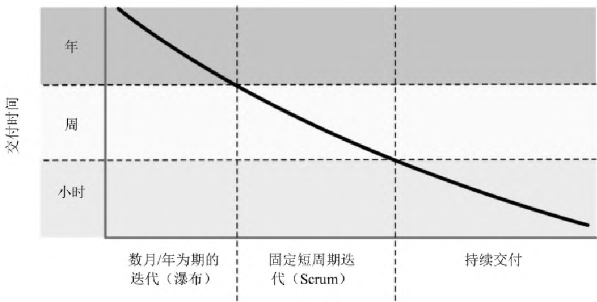

> 图
> 9-1：交付时间与交付方式的关系。纵轴为交付时间（年、周、小时），横轴从左到右依次为：数月/年为期的迭代（瀑布）、固定短周期迭代（Scrum）、持续交付。曲线随交付方式的演进而持续下降。

如果交付周期是几年， 试着把周期缩短到几个月。 如果是几个月， 就减少到几周。
如果是一个四周的冲刺， 那么试一下两周。 如果是两周的冲刺， 试试一周。
然后到每天。 最后是即期交付。 请注意，
能够即期交付并不意味着你必须每天每分钟都交付。 只有当这样做在业务上有意义时，
才有必要在用户需要时即期交付。

> [!TIP]
> **提示 88 在用户需要时交付**

为了转向上面这种风格的持续开发， 你需要有坚实的基础设施，
我们将在下一话题：[务实的入门套件](#51-务实的入门套件)中对其进行讨论。
你会在版本控制系统的主干上进行开发， 而不是在分支上进行，
并且使用诸如特性切换之类的技术来选择性地向用户推出测试特性。

一旦基础设施就绪， 就需要决定如何组织工作。 初学者可以从项目管理的 Scrum 开始，
再加上极限编程（XP）的技术实践。 更有纪律和经验的团队可能会关注看板和精益技术，
两者都面向团队及更大的管理问题。

但不要轻信我们的话， 自己调查并尝试一下这些方法。 不过务必小心， 不要做过头。
过度投资于任何一种特定的方法， 会让你对其他方法视而不见。 当你习惯于一种方法时，
很快就看不到其他的出路了。 你已经僵化， 变得不再能快速适应。

结果和用椰子差不多。

#### 相关部分包括

- [话题 12：曳光弹](#12-曳光弹)
- [话题 27：不要冲出前灯范围](#27-不要冲出前灯范围)
- [话题 48：敏捷的本质](#48-敏捷的本质)
- [话题 49：务实的团队](#49-务实的团队)
- [话题 51：务实的入门套件](#51-务实的入门套件)

### 51 务实的入门套件

> 文明的进步是以增加那些不需要思考就能完成的重要操作来实现的。
>
> ——阿尔弗雷德·诺思·怀特海

在汽车还是一样新奇事物的时候， 福特 Model-T 的启动说明书有两页多。
对于现代汽车， 你只需按一个按钮——启动程序是自动的， 而且是完全傻瓜化的。
一个按照指令清单进行操作的人可能会浇灭发动机， 但自动启动器不会。

虽然软件开发仍然是一个处于 Model-T 阶段的行业，
但是我们不能为了一些常见的操作而一遍又一遍地阅读两页的说明书。
无论是构建和发布过程、测试、项目文书工作， 还是项目上的任何其他重复任务，
都必须是自动的， 并且在任何能力足够的机器上都是可重复的。

此外， 我们希望确保项目的一致性和可重复性。 手工操作或许可以做到一致性，
但无法保证可重复性， 尤其是在操作过程的某些方面可以由不同的人来解释的时候。

在我们写完第一版的《程序员修炼之道》之后， 希望创作更多的书来帮助团队开发软件。
我们认为， 应该从头开始：每个团队需要的最基本、最重要的元素是什么，
而不去考虑方法、语言或技术栈。 因此， 务实的入门套件这个想法诞生了，
它涵盖了三个关键且相互关联的主题：

- 版本控制
- 回归测试
- 完全自动化

这是支撑每个项目的三条腿。 下面谈谈怎样去做。

#### 版本控制驱动

正如我们在[版本控制](#19-版本控制)中所说，
你希望将构建项目所需的一切都置于版本控制之下。 在项目本身的背景下，
这个想法变得更加重要。

首先， 它允许构建的机器朝生暮死。
与其在办公室角落里放一台人人都不敢碰的、神圣的、吱吱作响的机器[^ch10-ch9-6]，
不如按需将机器及（或）集群创建在云中的 spot 实例中[^ch10-ch9-7]。
部署配置也在版本控制之下， 因此发布到生产环境也能被自动处理。

这就是重要的部分：版本控制在项目级别驱动构建和发布流程。

> [!TIP]
> **提示 89 使用版本控制来驱动构建、测试和发布**

也就是说， 构建、测试和部署通过提交或推送给版本控制来触发，
并在云容器中完成创建。 发布到交付阶段， 还是生产阶段，
可以通过在版本控制系统中打标记来指定。 这样， 发布就不再有那么强的仪式感，
变成了日常生活中的一部分——这是真正的持续交付，
没有绑定到任何一台构建机器或开发人员的机器上。

#### 无情的持续测试

许多开发者小心翼翼地进行测试， 下意识地知道代码将在何处出问题，
继而回避这些弱点。 务实的程序员则不同。 现在我们主动去找出 Bug，
将来就不必忍受由别人找到我们的 Bug 所带来的耻辱。

寻找 Bug 有点像用网捕鱼。 我们使用精细的小渔网（单元测试）来捕捉小鱼，
使用大的粗渔网（集成测试）来捕捉食人鲨。 有时鱼会尽力逃脱，
所以要修补任何发现的洞，
希望这样能捕捉到越来越多在项目池中游来游去的滑溜溜的缺陷。

> [!TIP]
> **提示 90 尽早测试，经常测试，自动测试**

一旦代码写出来了， 就要尽早开始测试。 这些小鱼的恶心之处在于，
它们很快就会变成巨大的食人鲨， 而捕捉鲨鱼则相当困难。 所以我们要写单元测试，
写很多很多单元测试。

事实上， 好项目的测试代码可能会比产品代码更多。
生成这些测试代码所花费的时间是值得的。 从长远来看， 最终的成本会低得多，
而且你实际上有机会生产出几乎没有缺陷的产品。

另外， 知道通过了测试， 可以让你对代码已经“完成”产生高度信心。

> [!TIP]
> **提示 91 直到所有的测试都已运行，编码才算完成**

自动构建过程要运行所有可用的测试。 以“测试实际环境”为目标很重要， 换句话说，
测试环境应该与生产环境紧密匹配。 任何缝隙都是 Bug 滋生的地方。

构建可能包括几种主要的软件测试类型：单元测试、集成测试、确认和验证，
以及性能测试。

这个列表绝不够完整， 一些特殊的项目还需要各种其他类型的测试。
但这是一个很好的起点。

#### 单元测试

单元测试是操演模块的代码。
我们在[话题 41：为编码测试](#41-为编码测试)中对此有所涉及。
单元测试是我们将在本部分中讨论的所有其他测试形式的基础。
如果这些部件不能单独工作， 它们就不能很好地协同工作。 你使用的所有模块，
必须通过它们自己的单元测试， 否则工作无法继续。

一旦所有相关模块都通过了各自的测试， 就可以进入下一个阶段了。
你需要测试所有模块如何放在整个系统中使用和交互。

#### 集成测试

集成测试可以表明， 组成项目的主要子系统能够很好地相互协作。
有了良好的契约并进行过完善的测试， 任何集成问题都可以被很容易地检测到。 否则，
集成将成为滋生 Bug 的肥沃土壤。 事实上， 这常常是系统中最大的 Bug 来源。

集成测试实际上只是对我们所描述的单元测试的扩展——你只是在测试整个子系统如何在履行契约。

#### 确认和验证

一旦你有了一个可执行的用户界面或原型，
就需要回答一个非常重要的问题：用户告诉过你他们想要什么，
但这就是他们需要的东西吗？

是否满足系统的功能需求？ 这一点也需要检验。 即使是没有 Bug 的系统，
若是回答了错误的问题， 那就不算是很有用。 要注意终端用户访问模式，
以及其与开发人员测试数据的不同之处（[话题 20：调试](#20-调试)中关于笔刷的故事，
是为一例）。

#### 性能测试

性能或压力测试也可能是项目的重要方面。

问问自己，
软件是否满足了现实世界条件下的性能要求——包括预期的用户数、连接数或每秒事务数。
它是可伸缩的吗？

对于某些应用程序， 你可能需要专门的测试硬件或软件来真实地模拟负载。

#### 对测试做检测

因为我们无法写出完美的软件， 所以也不可能写出完美的测试软件。
我们需要检测这些测试。

我们的测试套件集可以看作是一个精心设计的安全系统， 用来在出现 Bug 时发出警报。
如何比费力闯入更好地测试一个安全系统呢？

在你编写了一个测试来检测某个特定 Bug 之后， 可以故意地引发这个 Bug
并确保测试能报告出来。 这确保了如果 Bug 真的出现， 测试能捕捉到它。

> [!TIP]
> **提示 92 使用破坏者检测你的测试**

如果你对测试非常认真， 那么可以从源码树中分出一个单独的分支， 有目的地引入 Bug，
并验证测试是否能够捕获到。 在更高的层次上， 可以使用像 Netflix 的 Chaos Monkey[^ch10-ch9-8]
这样的东西来破坏（例如，“kill”）服务， 以测试应用程序的韧性。

在编写测试时， 确保在应该发出警报时警报会响。

#### 测试要彻底

一旦你确信测试是正确的， 并且正在进行寻找 Bug 的工作，
那么如何知道是否已经对代码库进行了足够彻底的测试？

简单的回答是“无法知道”， 永远也不会知道。
你可以试试能在测试期间监视代码覆盖率的分析工具， 并跟踪哪些代码行已经执行，
哪些没有执行。 这些工具帮助你大致了解测试有多全面， 但是不要期望 100% 的覆盖率。[^ch10-ch9-9]

即使你碰巧命中了代码的每一行， 也不代表全部。 重要的是程序可能具有的状态数。
状态和代码行并不等价。 例如， 假设有一个函数， 它接受两个整数， 每个整数可以是 0
到 999 之间的数字：

```c
int test(int a, int b) {
    return a / (a + b);
}
```

理论上， 这个三行的函数有 1,000,000 个逻辑状态， 其中 999,999 个可以正常工作，
而另一个则不能（当 $a + b$ 等于零时）。
仅仅知道执行了这行代码并不能告诉你这些——你需要识别出程序的所有可能状态。
不幸的是， 通常这真是一个大难题——难到“还没等你解决了这个问题，
太阳已经变成一个冰冷的硬疙瘩”。

> [!TIP]
> **提示 93 测试状态覆盖率，而非代码覆盖率**

#### 基于特性测试

探索代码如何处理意外状态的一个好方法是， 让计算机生成这些状态。

使用基于特性的测试技术， 根据被测代码的契约和不变式生成测试数据。
[话题 42：基于特性测试](#42-基于特性测试)对此有详细涵盖。

#### 绷紧渔网

最后， 我们想要揭示测试中最重要的概念。 它显而易见，
几乎每一本教科书都会告诫我们要那么做； 但由于某些原因， 大多数项目仍然没有做到。

如果有某个 Bug 成了现有测试的漏网之鱼， 那么就需要添加一个新测试，
以保证下一次能将其捕获。

> [!TIP]
> **提示 94 每个 Bug 只找一次**

一个 Bug 一旦被人类测试员发现， 这就应该是它被该人类测试员发现的最后一次。
要立即修改自动化测试， 以便这个特定的 Bug，
从此往后每次都被检查到——不能有任何例外， 无论它多么琐碎，
也无论开发者有多少抱怨， 或是不停唠叨“哦， 永远不会再发生了”。

因为还会再发生的。 但我们实在没有时间追着 Bug 跑，
好在可以让自动化测试帮忙将其找出来。 而我们的时间，
必须用于编写新的代码——以及新的 Bug。

#### 完全自动化

正如我们在本部分开始时所说的， 现代开发依赖于脚本化的自动过程。 无论你是使用
rsync 和 ssh 这样简单的 shell 脚本， 还是 Ansible、Puppet、Chef 或 Salt
这样功能全面的解决方案， 都不要依赖任何手动干预。

从前， 我们做过一个客户端软件， 所有的开发人员都在使用同一种 IDE。
系统管理员向每个开发者提供了一套说明， 指导如何将附加组件包安装到 IDE 上。
这些说明， 足足写满许多页——全是点击这里、滚动那里、拖动这个、双击那个，
以及再做一遍。

每个开发者的机器装载方式略有不同， 这一点也不奇怪。
当不同的开发者运行相同的代码时， 应用程序的行为会有细微的差异。 一台机器上出现的
Bug， 不一定会出现在其他机器上。 跟踪任一个组件的版本差异， 通常都会收获惊喜。

> [!TIP]
> **提示 95 不要使用手动程序**

人不像电脑那样具有可重复性。 我们也不应对此抱有期望。 shell
脚本或程序将一次又一次地以相同的顺序执行相同的指令。 它是在版本控制之下的，
因此你也可以跟着时间线去检查构建/发布过程的修改（“之前明明可以用的……”）。

一切都要依赖于自动化。 除非构建完全自动化， 否则无法在匿名云服务器上构建项目。
如果涉及手动步骤， 则无法自动部署。 一旦你引入了手动步骤（“就只有这一部分……”），
就打破了一扇非常大的窗户。[^ch10-ch9-10]

有了这三件套：版本控制、无情的测试和完全自动化， 项目就有了你所需要的坚实基础，
这样就可以将精力集中在困难的部分：取悦用户。

#### 相关部分包括

- [话题 11：可逆性](#11-可逆性)
- [话题 12：曳光弹](#12-曳光弹)
- [话题 17：Shell 游戏](#17-shell-游戏)
- [话题 19：版本控制](#19-版本控制)
- [话题 41：为编码测试](#41-为编码测试)
- [话题 49：务实的团队](#49-务实的团队)
- [话题 50：椰子派不上用场](#50-椰子派不上用场)

#### 挑战

- 你的夜间构建或持续构建是自动化的， 但是部署到生产环境中的过程却没有自动化，
  是这样吗？ 为什么？ 那台服务器有什么特别之处？

- 你能自动测试你的项目吗？ 许多团队无奈地回答“做不到”。 为什么？
  对可接受的结果做出定义， 是不是太难了？
  难道向赞助商证明项目已经“完成”不会因而变得更加困难吗？

- 对应用程序独立于 GUI 之外的逻辑进行测试， 是否太难了？ 这说明了和 GUI
  有关的什么问题？ 是耦合问题吗？

### 52 取悦用户

> 当你吸引别人的时候， 目标不是从他们身上赚钱或者让他们做你想做的事，
> 而是让他们充满快乐。
>
> ——盖伊·川崎

作为开发者， 我们的目标是取悦用户。 这就是我们身在其位的原因。
不要为了数据就从他们身上深挖， 不要数他们的眼球， 不要掏空他们的钱包。
撇开邪恶的目标不谈， 只是及时交付能工作的软件， 还远远不够。
这本身无法取悦他们。

用户真正要的不是代码， 他们只是遇到某个业务问题， 需要在目标和预算范围内解决。
他们的信念是， 通过与你的团队合作， 能够做到这一点。

他们的期望与软件无关，
甚至并不隐含在提供给你的任何规范说明中（因为在你的团队对其进行多次迭代之前，
该规范说明都是不完整的）。

那么， 如何发掘他们的期望呢？ 问一个简单的问题：

> 这个项目在完成一个月（或是一年， 不管多久）之后，
> 你根据什么来判断自己已经取得成功？

你很可能会对最终答案感到惊讶。 一个对产品推荐做改进的项目，
实际上可能是根据客户留存率来判断的； 合并两个数据库的项目，
可能是根据数据质量来判断的， 也可能是根据节省的成本来判断的。
但是真正有意义的是这些对业务价值的期望， 而不仅仅是软件项目本身。
软件只是达到这些目的的一种手段。

既然你已经让项目背后的一些价值期望浮现出来， 你就可以开始考虑如何实现这些期望：

- 确保团队中的每个人都清楚这些期望。

- 在做决定的时候， 想想哪条路更接近这些期望。

- 根据期望严格分析用户需求。 在许多项目中， 我们已经发现，
  所陈述的“需求”实际上只是对用技术可以完成哪些工作的猜测——它实际上是一个业余的实现计划，
  只是伪装成需求文档。 如果你能证明有方法会使项目更接近目标， 那么就不要害怕，
  大胆提出改变需求的建议。

- 随着项目的进展， 继续考虑这些期望。

我们发现， 随着对该领域知识的增长， 我们能够更好地对更多事情提出建议，
从而解决潜在的业务问题。 我们坚信， 那些接触过组织的许多不同方面的开发人员，
经常可以看到将业务的不同部分编织在一起的方法，
而这些方法对各个部门来说并不总是显而易见的。

> [!TIP]
> **提示 96 取悦用户，而不要只是交付代码**

如果你想取悦客户， 就和他们建立起某种关系， 这样即可积极地帮助他们解决问题。
或许你的头衔只是“软件开发者”或“软件工程师”的某种变体，
而事实上这个头衔应该是“解决问题的人”。 这就是我们所做的，
也是一个务实的程序员的本质。

我们在解决问题。

#### 相关部分包括

- [话题 12：曳光弹](#12-曳光弹)
- [话题 13：原型与便签](#13-原型与便签)
- [话题 45：需求之坑](#45-需求之坑)

### 53 傲慢与偏见

> 你使我们开心得够久啦。
>
> ——简·奥斯汀《傲慢与偏见》

务实的程序员不会逃避责任。 相反， 我们乐于接受挑战， 并让自己的专长广为人知。
如果我们正在负责一个设计， 或一段代码， 那么这是一份值得自豪的工作。

> [!TIP]
> **提示 97 在作品上签名**
>
> 过去的工匠很自豪地为他们的作品签名。 你也应该这样。

不过， 项目团队毕竟是由人组成的， 这条规则可能会带来麻烦。 在一些项目中，
关于代码所有权的念头可能会导致合作问题。 人们可能会因此变得狭隘，
或者不愿意为共同的基础元素工作。 项目可能会覆灭， 像一群孤立的诸侯小国那样。
对于到底该支持自己的代码， 还是同事的代码， 你会产生偏见。

那不是我们想要的。 你不应该百般猜忌地捍卫自己的代码不被他人干涉； 同理，
你应该尊重别人的代码。 恪守恕道（“己所不欲， 勿施于人”），
以及在开发者之间建立相互尊重的基础， 是实现这一条的关键。

保持匿名会滋生粗心、错误、懒惰和糟糕的代码，
特别是在大型项目中——很容易把自己看成只是大齿轮上的一个小齿，
在无休止的工作汇报中制造蹩脚的借口， 而不是写出好的代码。

虽然代码的所有权必须有所归属， 但不必被个人拥有。 事实上，
肯特·贝克的极限编程[^ch10-ch9-11]建议共享代码所有权（但这也需要额外的实践，
比如结对编程， 以防匿名危险）。

我们想看到你对所有权引以为豪——“这是我写的， 我与我的作品同在”。
你的签名应该被认为是质量的标志。 人们应该在一段代码上看到你的名字，
并对它是可靠的、编写良好的、经过测试的、文档化的充满期许。
这是一件非常专业的工作， 出自专业人士之手。

一个务实的程序员。

谢谢。

*——Dave 与 Andy（手写签名）*

[^ch10-ch9-1]: 随着团队规模的增长， 沟通路径以 $O(n^{2})$ 的速度增长， 其中 $n$
    是团队成员的数量。 在更大的团队中， 沟通开始中断并变得无效。

[^ch10-ch9-2]: 在这里， 同时标注已做工作和待做工作的燃尽图（burnup），
    要比只标注待做工作的燃尽图（burndown）好，
    因为前者便于清楚地看到增加功能是如何改变目标的。

[^ch10-ch9-3]: 团队只是对外用一个声音说话。 在内部，
    我们强烈鼓励活跃有力的辩论。 优秀的开发者往往对他们的工作充满激情。

[^ch10-ch9-4]: Andy 见过一些团队， 居然只在周五举行 Scrum“每日”站立会。

[^ch10-ch9-5]: 网址参见链接列表 9.1 条目。

[^ch10-ch9-6]: 我们亲眼见过这类情况的次数远超你的想象。

[^ch10-ch9-7]: 译注：spot 实例是亚马逊云提供的在空闲时间享有超低折扣的服务。

[^ch10-ch9-8]: 网址参见链接列表 9.2 条目。

[^ch10-ch9-9]: 对于测试覆盖率和缺陷之间的相关性的一个有趣的研究， 参见 Mythical
    Unit Test Coverage [ADSS18]。

[^ch10-ch9-10]: 牢记软件熵， 永不忘却。

[^ch10-ch9-11]: 网址参见链接列表 9.3 条目。

## 跋

> 长远来说， 我们塑造生活， 塑造自己。 直至死亡为止， 这过程永远不会完结。
> 最终我们总要为所做的抉择负上责任。
>
> ——埃莉诺·罗斯福

在第一版问世前的 20 年里， 计算机从一种非主流的新奇事物，
进化为当今时代的企业必备， 而我们有幸成为这一进化的一部分。 从那以后的二十年间，
软件快速发展， 不仅突破了单纯商务机器的范畴， 甚至可以说接管了世界。
但这对我们来说意味着什么呢？

在《人月神话：软件项目管理之道》[Bro96]中， 弗雷德里克·布鲁克斯说过：“程序员，
就像诗人一样， 几乎仅仅工作在单纯的思考中。 他们运用自己的想象，
来建造自己的城堡。” 我们从一张白纸开始， 几乎可以创造任何我们能想象到的东西。
我们创造的东西可以改变世界。

从帮助人们规划变革运动的 Twitter， 到用来防止汽车打滑的处理器，
再到让我们不必记住日常烦琐细节的智能手机， 我们的程序无处不在，
我们的想象力无处不在。

我们这些开发者， 拥有令人难以置信的特权——我们真正在建设未来，
这是一股巨大的力量。 伴随着这种力量而来的， 是一种非同寻常的责任。

我们隔多久会停下来思考这个问题？ 对于这一责任究竟意味着什么， 我们在自己人之间，
以及和更广泛的读者一起， 隔多久会讨论一次？

比起笔记本电脑、台式机和数据中心， 嵌入式设备用到的计算机要多一个数量级。
这些嵌入式计算机通常控制着生命攸关的系统， 从发电厂到汽车再到医疗设备。
即使是简单的中央供暖控制系统或家用电器， 如果设计或实施不当， 也会致人死亡。
当你为这些设备做开发时， 所承担的责任是很惊人的。

许多非嵌入式系统同时具备好的一面和坏的一面。 社交媒体可以促进和平改革，
也能煽动丑陋的仇恨。 大数据可以让购物变得更容易，
也可以摧毁任何你认为该自己保有的隐私。 银行系统做出的贷款决策，
足以改变人们的生活。 几乎任何系统都可以用来窥探用户。

我们已经隐约看到乌托邦未来的可能性， 也见过不少例子中反乌托邦噩梦般的意外后果。
这两种结果之间的差异可能比想象的更微妙。 但一切都在你的手中。

### 道德罗盘

这种意想不到的力量， 并非没有代价， 它会让你提心吊胆。
我们的行为直接影响着全人类。 不再是车库里 8 位 CPU 上的业余程序，
也不再是数据中心主机上孤立的批量业务流程， 甚至不再只是桌面
PC——我们的软件已渗透到当今日常生活的方方面面。

对于我们交付的每一段代码， 我们有义务问自己两个问题：

1. 我已经保护好用户了吗？

2. 我自己会用它吗？

首先， 你应该问的是“我是否已经尽了最大努力来保护这段代码的用户免受伤害？”
也就是问自己——是否已经做好准备， 不断把安全补丁应用到那个简单的婴儿监视器上；
是否已经确保， 即使中央自动加热恒温器失效， 客户仍然可以手动控制；
是否只保存了需要的数据， 并加密了所有个人信息。

人无完人， 每个人都会时不时地忘记一些事情。
但如果你不能满怀信心地声明自己已尽力列出所有后果， 并确信能保护用户不受其影响，
那么当事情变糟时， 就难辞其咎。

> [!TIP]
> **提示 98 先勿伤害**

其次， 有一个与恕道相关的拷问：我自己愿意成为这个软件的用户吗？
我希望分享自己的详细信息吗？ 我希望自己的行踪被交给零售店吗？
我愿意乘坐这辆自动驾驶汽车吗？ 做这件事我能心安吗？

有一些创造性的想法， 开始打道德行为界限的擦边球， 如果你参与了这类项目，
就和出资者一样负有责任。

下面这条规则的正确性， 并不取决于“为虐”到底是在经过几度分隔后被你合理化的：

> [!TIP]
> **提示 99 不要助纣为虐**

### 想象你要的未来

这取决于你。 正是你的想象力、你的希望、你的关注， 为未来 20
年甚至更长时间的构建， 提供了纯净的思想基础。

你正在为自己和子孙后代建设未来——这是你的职责所在，
去创造一个让所有人心向往之的宜居未来。 当你做的事情违背了这个理想时，
要敢于承认， 并有勇气说“不！” 对可以拥有的未来充满憧憬， 才有动力去创造它。
即使是空中楼阁， 也要每天为它添砖加瓦。

我们都有精彩的人生。

> [!TIP]
> **提示 100**
>
> 你要为自己的人生做主。 精心营造， 与人分享， 为之喝彩。 好好享受吧！

## 参考文献

[ADSS18] Vard Antinyan, Jesper Derehag, Anna Sandberg, and Miroslaw Staron.
Mythical Unit Test Coverage. IEEE Software. 35:73-79, 2018.

[And10] Jackie Andrade. What does doodling do? Applied Cognitive Psychology.
24(1):100-106, 2010, January.

[Arm07] Joe Armstrong, *Programming Erlang: Software for a Concurrent World*.
The Pragmatic Bookshelf, Raleigh, NC, 2007.

[BR89] Albert J. Bernstein and Sydney Craft Rozen. *Dinosaur Brains: Dealing
with All Those Impossible People at Work*. John Wiley & Sons, New York,
NY, 1989.

[Bro96] Frederick P. Brooks, Jr. *The Mythical Man-Month: Essays on Software
Engineering*. Addison-Wesley, Reading, MA, Anniversary, 1996.

[CN91] Brad J. Cox and Andrew J. Novobilski. Object-Oriented Programming: An
Evolutionary Approach. Addison-Wesley, Reading, MA, Second, 1991.

[Con68] Melvin E. Conway. How do Committees Invent? Datamation. 14(5):28-31,
1968, April.

[de 98] Gavin de Becker. The Gift of Fear: And Other Survival Signals That
Protect Us from Violence. Dell Publishing, New York City, 1998.

[DL13] Tom DeMarco and Tim Lister. Peopleware: Productive Projects and Teams.
Addison-Wesley, Boston, MA, Third, 2013.

[Fow00] Martin Fowler. UML Distilled: A Brief Guide to the Standard Object
Modeling Language. Addison-Wesley, Boston, MA, Second, 2000.

[Fow04] Martin Fowler. UML Distilled: A Brief Guide to the Standard Object
Modeling Language. Addison-Wesley, Boston, MA, Third, 2004.

[Fow19] Martin Fowler. *Refactoring: Improving the Design of Existing Code*.
Addison-Wesley, Boston, MA, Second, 2019.

[GHJV95] Erich Gamma, Richard Helm, Ralph Johnson, and John Vlissides. *Design
Patterns: Elements of Reusable Object-Oriented Software*. Addison-Wesley,
Reading, MA, 1995.

[Hol92] Michael Holt. Math Puzzles & Games. Dorset House, New York, NY, 1992.

[Hun08] Andy Hunt. Pragmatic Thinking and Learning: Refactor Your Wetware. The
Pragmatic Bookshelf, Raleigh, NC, 2008.

[Joi94] T.E. Joiner. Contagious depression: Existence, specificity to depressed
symptoms, and the role of reassurance seeking. *Journal of Personality and
Social Psychology*. 67(2):287–296, 1994, August.

[Knu11] Donald E. Knuth. *The Art of Computer Programming, Volume 4A:
Combinatorial Algorithms, Part 1*. Addison-Wesley, Boston, MA, 2011.

[Knu98] Donald E. Knuth. *The Art of Computer Programming, Volume 1: Fundamental
Algorithms*. Addison-Wesley, Reading, MA, Third, 1998.

[Knu98a] Donald E. Knuth. *The Art of Computer Programming, Volume 2:
Seminumerical Algorithms*. Addison-Wesley, Reading, MA, Third, 1998.

[Knu98b] Donald E. Knuth. *The Art of Computer Programming, Volume 3: Sorting
and Searching*. Addison-Wesley, Reading, MA, Second, 1998.

[KP99] Brian W. Kernighan and Rob Pike. *The Practice of Programming*.
Addison-Wesley, Reading, MA, 1999.

[Mey97] Bertrand Meyer. *Object-Oriented Software Construction*. Prentice Hall,
Upper Saddle River, NJ, Second, 1997.

[Mul18] Jerry Z. Muller. The Tyranny of Metrics. Princeton University Press,
Princeton, NJ, 2018.

[SF13] Robert Sedgewick and Philippe Flajolet. *An Introduction to the Analysis
of Algorithms*. Addison-Wesley, Boston, MA, Second, 2013.

[Str35] James Ridley Stroop. Studies of Interference in Serial Verbal Reactions.
*Journal of Experimental Psychology*. 18:643–662, 1935.

[SW11] Robert Sedgewick and Kevin Wayne. Algorithms. Addison-Wesley, Boston, MA,
Fourth, 2011.

[Tal10] Nassim Nicholas Taleb. *The Black Swan: Second Edition: The Impact of
the Highly Improbable*. Random House, New York, NY, Second, 2010.

[WH82] James Q. Wilson and George L. Kelling. The police and neighborhood
safety. The Atlantic Monthly. 249[3]:29-38, 1982, March.

[YC79] Edward Yourdon and Larry L. Constantine. Structured Design: Fundamentals
of a Discipline of Computer Program and Systems Design. Prentice Hall, Englewood
Cliffs, NJ, 1979.

[You95] Edward Yourdon. When good-enough software is best. IEEE Software. 1995,
May.

## 练习的参考答案

> 我宁愿要无法回答的问题， 也不要不能质疑的答案。
>
> ——理查德·费曼

### 答案 1（来自练习 1）

在我们看来， Split2 这个类更为正交。 它专注于自己的任务及分割行，
而忽略像这些数据来自何处之类的细节。 这不仅使代码更容易开发， 而且使它更灵活。
Split2 可以分割从文件中读取的多行数据， 也可以由另一个例程生成或通过环境传入。

### 答案 2（来自练习 2）

让我们先从下一个断言开始： 你可以用任何语言编写良好的正交代码。 与此同时，
每种语言都不乏诱惑——那些可能会导致耦合性增强和正交性降低的语言特性。

在面向对象语言中，
诸如多重继承、异常、操作符重载和父方法重载（通过子类化）等特性，
都有充足的机会以不明显的方式增加耦合。 还存在一种耦合，
源于类将代码与数据耦合在一起。
这通常是一件好事（当耦合是好的时，我们称之为内聚）。
但是如果你没能让类足够专注于一点， 就可能会产生一些非常难看的接口。

函数式语言则提倡， 编写大量小的、解耦的函数， 并以不同的方式加以组合来解决问题。
这在理论上是可行的， 在实践中也通常如此。 但是有时也会发生某种形式的耦合。
这些函数典型的行为是转换数据， 这意味着一个函数的结果可以成为另一个函数的输入。
如果不小心改变了函数生成的数据格式， 可能会导致转换流中的某个地方出现故障。
具有良好类型系统的语言， 有助于缓解这种状况。

### 答案 3（来自练习 3）

低科技营救措施！ 在白板上用记号笔画几幅漫画——一辆车、一部电话和一所房子。
画得好不好都没有关系， 用简笔画勾勒出轮廓就可以。
在可点击区域贴上描述目标页面内容的便签。 随着会议的进展， 你可以完善画作，
以及修改便签的摆放位置。

### 答案 4（来自练习 4）

因为我们想使语言可扩展， 所以需要将解析器做成表驱动的。 表中的每个条目，
都包含命令字母、一个用来表示是否需要参数的标志，
以及处理该特定命令所需调用的例程名称。

```c
lang/turtle.c

typedef struct {
    char cmd; /* 命令字母 */
    int hasArg; /* 带参数吗 */
    void (*func)(int, int); /* 调用例程 */
} Command;

static Command cmds[] = {
    { 'P', ARG, doSelectPen },
    { 'U', NO_ARG, doPenUp },
    { 'D', NO_ARG, doPenDown },
    { 'N', ARG, doPenDir },
    { 'E', ARG, doPenDir },
    { 'S', ARG, doPenDir },
    { 'W', ARG, doPenDir }
};
```

主程序非常简单： 读取一行， 查找命令， 在需要时获取参数， 然后调用处理函数。

```c
lang/turtle.c

while (fgets(buff, sizeof(buff), stdin)) {

    Command *cmd = findCommand(*buff);

    if (cmd) {
        int arg = 0;

        if (cmd->hasArg && !getArg(buff + 1, &arg)) {
            fprintf(stderr, "'%c' needs an argument\n", *buff);
            continue;
        }

        cmd->func(*buff, arg);
    }
}
```

查找命令的函数对表执行线性搜索， 返回匹配的条目或 NULL。

```c
lang/turtle.c

Command *findCommand(int cmd) {
    int i;

    for (i = 0; i < ARRAY_SIZE(cmds); i++) {
        if (cmds[i].cmd == cmd)
            return cmds + i;
    }

    fprintf(stderr, "Unknown command '%c'\n", cmd);
    return 0;
}
```

最后， 简单地调用 sscanf 来读取数值参数。

```c
lang/turtle.c

int getArg(const char *buff, int *result) {
    return sscanf(buff, "%d", result) == 1;
}
```

### 答案 5（来自练习 5）

实际上， 你已经在前面的练习中解决了这个问题——为外部语言编写一个解释器，
它将包含内部解释器。 在我们的示例代码中， 这就是 doXxx 系列函数。

### 答案 6（来自练习 6）

时间的 BNF 规范可以写为：

```text
time     ::= hour ampm | hour : minute ampm | hour : minute
ampm     ::= am | pm
hour     ::= digit | digit digit
minute   ::= digit digit
digit    ::= 0|1|2|3|4|5|6|7|8|9
```

在定义小时和分钟时， 最好能考虑到， 小时的数字只能从 00 到 23，
而分钟的数字只能从 00 到 59：

```text
hour     ::= h-tens digit | digit
minute   ::= m-tens digit
h-tens   ::= 0|1
m-tens   ::= 0|1|2|3|4|5
digit    ::= 0|1|2|3|4|5|6|7|8|9
```

### 答案 7（来自练习 7）

下面是使用 JavaScript 的 Pegjs 库编写的解析器：

```javascript
lang/peg_parser/time_parser.pegjs

time
= h:hour offset:ampm { return h + offset }
/ h:hour ":" m:minute offset:ampm { return h + m + offset }
/ h:hour ":" m:minute { return h + m }
```

```javascript
ampm
= "am" { return 0 }
/ "pm" { return 12*60 }
```

```javascript
hour
= h:two_hour_digits { return h*60 }
/ h:digit { return h*60 }
```

```javascript
minute
= d1:[0-5] d2:[0-9] { return parseInt(d1+d2, 10); }
```

```javascript
digit
= digit:[0-9] { return parseInt(digit, 10); }
```

```javascript
two_hour_digits
= d1:[01] d2:[0-9] { return parseInt(d1+d2, 10); }
/ d1:[2] d2:[0-3] { return parseInt(d1+d2, 10); }
```

从测试代码中可以看到用法：

```javascript
lang/peg_parser/test_time_parser.js

let test = require('tape');
let time_parser = require('./time_parser.js');
```

```javascript
// time   ::= hour ampm       |
//         hour : minute ampm |
//         hour : minute
//
// ampm  ::= am | pm
//
// hour  ::= digit | digit digit
//
// minute ::= digit digit
//
// digit ::= 0 | 1 | 2 | 3 | 4 | 5 | 6 | 7 | 8 | 9

const h = (val) => val*60;
const m = (val) => val;
const am = (val) => val;
const pm = (val) => val + h(12);

let tests = {
    "1am": h(1),
    "1pm": pm(h(1)),
    "2:30": h(2) + m(30),
    "14:30": pm(h(2)) + m(30),
    "2:30pm": pm(h(2)) + m(30),
}

test('time parsing', function (t) {
    for (const string in tests) {
        let result = time_parser.parse(string)
            t.equal(result, tests[string], string);
    }
    t.end()
});
```

### 答案 8（来自练习 8）

这里有一个 Ruby 写的参考解决方案：

```ruby
lang/re_parser/time_parser.rb

TIME_RE = %r{
(?<digit>[0-9]){0}
(?<h_ten>[0-1]){0}
(?<m_ten>[0-6]){0}

(?<ampm> am | pm){0}
(?<hour> (\g<h_ten> \g<digit>) | \g<digit>){0}
(?<minute> \g<m_ten> \g<digit>){0}

\A(
    (\g<hour> \g<ampm>)
    | (\g<hour> : \g<minute> \g<ampm>)
    | (\g<hour> : \g<minute>)
)\Z
}x

def parse_time(string)
    result = TIME_RE.match(string)
    if result
        result[:hour].to_i * 60 +
        (result[:minute] || "0").to_i +
        (result[:ampm] == "pm" ? 12 * 60 : 0)
    end
end
```

（这段代码使用了在正则表达式开头定义具名模板的技巧，
然后在实际匹配中将具名模板作为子模板引用。）

### 答案 9（来自练习 9）

我们的答案必须满足下列假设：

- 存储设备包含了我们需要传送的信息。
- 我们知道这个人走路的速度。
- 我们知道机器之间的距离。
- 我们不考虑进出存储设备的信息所需的传输时间。
- 保存数据的开销大致等于通过通信线路发送数据的开销。

### 答案 10（来自练习 10）

请留意前面的答案： 一盒 1TB 的磁带包含 $8 \times 2^{40}$， 也就是 $2^{43}$ 位，
所以 1 Gbps 的线路处理这些数据需要 9,000 秒， 传输等量信息大约需要 2½ 小时。
如果这个人保持常数 3½ mph 的步行速度， 那么要想让通信线路胜过信使，
我们的两台机器需要相距差不多 9 英里远。 否则， 这个人就赢了。

### 答案 14（来自练习 14）

我们会列出 Java 的函数签名， 并在注释中给出前置条件和后置条件。

首先是类的不变式：

```java
/**
 * @invariant getSpeed() > 0
 * implies isFull() // 不要空转
 *
 * @invariant getSpeed() >= 0 &&
 * getSpeed() < 10 // 范围检查
 */
```

然后是前置和后置条件：

```java
/**
 * @pre Math.abs(getSpeed() - x) <= 1 // 仅改变 1
 * @pre x >= 0 && x < 10 // 范围检查
 * @post getSpeed() == x // 尊重请求的速度
 */
public void setSpeed(final int x)

/**
 * @pre !isFull() // 不要添加两次
 * @post isFull() // 保证完成
 */
void fill()

/**
 * @pre isFull() // 不要清空两次
 * @post !isFull() // 保证完成
 */
void empty()
```

### 答案 15（来自练习 15）

序列中有 21 项。 如果你觉得是 20 项，
那就是犯了栅栏错误（没弄清楚该统计的是栅栏柱的个数， 还是柱间空位的个数）。

### 答案 16（来自练习 16）

- 1752 年的九月只有 19 天。这是格里高利改革的一部分，用来同步日历。
- 该目录可能已被另一个进程删除，你可能没有权限读取，驱动器可能没有挂载进来……——都不难想象。
- 我们暗地里没有指定 a 和 b 的类型。操作符重载可能定义了 +、= 或
  !=，这样可能会产生意外的行为。而且 a 和 b
  还可能是同一个变量的别名，这样第二个赋值将覆盖第一个变量中存储的值。另外，如果程序是并发的，并且编写得很糟糕，那么做加法时
  a 的值可能已经被更新。
- 在非欧几里得几何中，三角形内角之和不会等于
  $180^{\circ}$——想象一个映射在球面上的三角形。
- 闰分则有 61 秒或 62 秒。
- 根据语言的不同，当数字溢出时，$a+1$ 的结果可能是一个负数。

### 答案 17（来自练习 17）

在大多数 C 和 C++ 实现中， 都无法检查指针是否指向有效内存。 一个常见的错误是，
我们在释放一块内存后， 又在程序的后面对其引用。 如果那样，
被指向的内存届时很可能已经被重新分配， 用于其他目的。 为防止这些恶意引用，
程序员寄希望于将指针设置为 NULL， 因为在绝大多数情况下，
对空指针解引用将产生运行时错误。

### 答案 18（来自练习 18）

通过将引用设置为 NULL， 可以将指向引用对象的指针数量减少 1。 一旦该计数为零，
对象就可以进行垃圾收集。 将引用设置为 NULL 对于长时间运行的程序非常重要，
因为程序员需要确保内存使用不会随时间增加。

### 答案 19（来自练习 19）

这里有一个简单的实现：

```ruby
event/strings_ex_1.rb

class FSM
  def initialize(transitions, initial_state)
    @transitions = transitions
    @state = initial_state
  end

  def accept(event)
    @state, action = TRANSITIONS[@state][event] || TRANSITIONS[@state][:default]
  end
end
```

（下载这个文件， 获得使用这个新的 FSM 类的最新代码。）

### 答案 20（来自练习 20）

……三起网络接口宕机事件， 仅仅在 5 分钟内……

这可以用状态机实现， 不过做起来可能比第一眼看上去要棘手： 如果你在第 1、4、7、8
分钟分别接收到故障事件， 应该在第 4 个事件发生的时候触发警告，
这意味着状态机需要能处理自身的重置。

因此， 事件流似乎是首选技术。 有一个名为 buffer 的响应函数，
带有大小和偏移量参数， 它能让你返回三个一组的到达事件。 然后，
你可以查看组中第一个和最后一个事件的时间戳， 以确定是否应该触发警报。

……日落之后， 在楼梯的底部检测到运动， 随后又在楼梯的顶部检测到运动……

这可以通过使用发布订阅和状态机的组合来实现。
你可以使用发布订阅将事件传播到任意数量的状态机， 然后让状态机确定要做什么。

……通知各种报告系统订单已经完成。

这可能最好使用发布订阅来处理。 你可能想要使用流，
但是那将需要被通知的系统也是基于流的。

……向三个后台服务发送请求并等待回应。

这与我们使用流获取用户数据的示例类似。

### 答案 21（来自练习 21）

1. 订单中增加了运费和销售税：

```text
basic order → finalized order
```

在传统的代码中， 可能有一个函数计算运费， 另一个函数计算税金。
但是我们在这里考虑的是变换， 所以我们把一个只有物品的订单转换成一种新的东西：
一个可以发货的订单。

2. 应用程序从一个具名文件加载配置信息：

```text
file name → configuration structure
```

3. 某人登录到一个 web 应用程序：

```text
user credentials → session
```

### 答案 22（来自练习 22）

高层次的变换：

```text
field contents as string
→ [validate & convert]
→ {:ok, value} | {:error, reason}
```

可以分解为：

```text
field contents as string
→ [convert string to integer]
→ [check value >= 18]
→ [check value <= 150]
→ {:ok, value} | {:error, reason}
```

### 答案 23（来自练习 23）

让我们先回答问题的第二部分： 我们更喜欢第一段代码。

在第二段代码中， 每一步都返回一个对象， 该对象实现了我们调用的下一个函数：
content_of 返回的对象必须实现 find_matching_lines， 以此类推。

这意味着 content_of 返回的对象与我们的代码是耦合的。 假设需求发生了变化，
我们必须忽略以 # 字符开头的行。 在变换式风格中， 这很简单：

```javascript
const content = File.read(file_name);
const no_comments = remove_comments(content)
const lines = find_matching_lines(no_comments, pattern)
const result = truncate_lines(lines)
```

即使我们交换了 remove_comments 和 find_matching_lines 的顺序， 仍然可以工作。

但在链式风格中， 这就比较困难了。 remove_comments 方法应该放在哪里： 是在
content_of 返回的对象中， 还是在 find_matching_lines 返回的对象中？
如果我们改变了这个对象， 还会破坏其他什么代码？
这种耦合就是链接风格的方法有时被称为“铁道事故”的原因。

### 答案 24（来自练习 24）

图像处理

对于在并行进程之间简单地调度工作负载， 共享工作队列可能就足够了。 如果涉及反馈，
也就是说， 处理一个块的结果会影响其他块，
比如在机器视觉应用程序或复杂的三维图像扭转变换中， 那么你可能会考虑黑板系统。

组织日程安排

这可能很合适。 你可以把安排好的会议和可用时间贴在黑板上。
既然你有独立运作的实体， 那么来自决策的反馈就很重要， 因为参与者可能会来来去去。

基于正在做搜索的人来划分这种黑板系统， 你可能有此打算：
初级员工或许只关心直属办公室， 人力资源可能只想在全球范围找到说英语的办公室， 而
CEO 或许必须掌握要事的全部细节。

在数据格式上也有一些灵活性： 对于不理解的格式或语言可以随便忽略。
只有那些一起开会的办公室， 才必须相互理解对方的不同格式，
而且我们不需要让每一个与会者都接触所有可能格式的完整传输包。
这减少了需要特定格式之处的耦合度， 去掉了人为的约束。

网络监控工具

这与抵押贷款申请程序非常相似。 把用户发送来的问题报告和自动统计报告，
统统张贴到黑板上。 人类或软件代理可以通过分析黑板来诊断网络故障：
某行中出现两个错误可能只是宇宙射线引起的， 但如果出现了两万个错误，
就应该是硬件问题。 就像侦探解开谋杀之谜一样，
你可以让多个实体分析和提出想法来解决网络问题。

### 答案 25（来自练习 25）

键值对列表通常假设键是唯一的， 而哈希库在实现的时候，
要么通过哈希表自身的行为来决定该如何处理， 要么会在重复键出现时显式抛出错误。
然而， 数组则一般不会做这些约束， 只要你在编写代码时不去特别检查，
就能轻松地保存重复的键。 因此在这个案例中， 首先匹配到的 DepositAccount 会胜出，
其余的匹配项将被忽略掉。 但条目的次序是没有保证的， 所以有时工作正常，
有时会出问题。

那么， 开发机器与生产机器的区别在哪里？ 没有区别，
在开发机器上能正常工作仅仅是一个巧合。

### 答案 26（来自练习 26）

纯数字字段在美国、加拿大和加勒比海地区能工作， 这只是一个巧合。
根据国际电信联盟的规范， 国际电话格式以文本 + 符号开头。 在一些场所也会使用 *
字符， 而更为常见的是， 将前导零作为数字的一部分。
永远不要将电话号码存储在数字字段中。

### 答案 27（来自练习 27）

这取决于你在哪里。 在美国， 容积测量是以加仑为基础的。 将高 6 英寸、直径 7
英寸的圆柱体的体积四舍五入后， 得到的最接近的立方英寸数， 与 1 加仑等值。

在加拿大， “一杯”可以是下列任何一种：

- 1/5 英制夸脱，或 227 毫升
- 1/4 美制夸脱，或 236 毫升
- 16 公制汤匙，或 240 毫升
- 1/4 升，或 250 毫升

如果说的是电饭煲， 那么“一杯”在这里指的是 180 毫升。 此处的杯这个词来源于石，
一石干米大约可以满足一个人一年的需求量： 大约是 180 升。 电饭煲的杯指一合， 即
1/1,000 石，[^ch11-1] 大致相当于一个人一顿饭所吃的大米量。[^ch11-2]

### 答案 28（来自练习 28）

显然， 对这个问题我们不能给出绝对的答案。 不过， 我们可以给你一些建议。

如果你发现结果没有遵循一条平滑的曲线，
可能应该去检查是否有其他活动正在占用一些处理器的能力。
如果后台进程周期性地抢占你的程序， 你可能就不会得到良好的数据。
可能还应该检查一下内存： 如果应用程序开始使用交换空间， 性能会急剧下降。

下面是在我们的机器上运行代码的结果图：


> 图 11-1：使用不同算法对整数数组排序的时间。横轴为输入数据大小（快排为
> 1:100,000，其余为
> 1:1,000），纵轴为时间（ms）。冒泡排序增长最快，选择排序与插入排序次之，快排最慢。

### 答案 29（来自练习 29）

有几种方法可以达到这个目的。 其中一种可以彻底解决问题： 如果数组只有一个元素，
我们就不会遍历循环。 每一次额外的迭代， 都会使我们能搜索的数组的大小加倍。
因此， 数组大小的通式为 $n=2^{m}$， 其中 m 为迭代次数。 两边取以 2 为底的对数，
得到 $\lg n=\lg 2^{m}$， 根据对数的定义就是 $\lg n=m$。

### 答案 30（来自练习 30）

这可能会勾起很多关于中学数学的回忆， 而你是否还记得下面这个把以 a
为底的对数转换成以 b 为底的对数的公式：

$$ \log_{b}x=\frac{\log_{a}x}{\log_{a}b} $$

因为 $\log_a b$ 是一个常量， 因此在大 O 中可以忽略。

### 答案 31（来自练习 31）

我们可以测试的一个特性是： 当仓库有足够的库存时， 订单成功。
我们可以生成一些随机数量的订单， 并验证当仓库中有库存时返回“OK”元组。

### 答案 32（来自练习 32）

这是基于特性测试的一个很好的应用。
单元测试可以专注于通过其他方法得出结果的个别情况，
而特性测试可以专注于以下事情：

- 两个板条箱重叠了吗？
- 某个板条箱的某部分超过卡车的宽度或长度？
- 装箱密度（板条箱使用的总面积除以卡车底座的面积）是否小于等于 1？
- 如果需求中已列明装箱密度，它是否超过了可接受的密度下限？

### 答案 33（来自练习 33）

1. 这个陈述听起来像是一个真实的需求： 应用程序的环境可能会对其施加约束。

2. 这个陈述本身并不是一个必要条件。 但要找出真正所需要的，
   你必须问那个神奇的问题——“为什么”。

这可能是一个企业标准。 在这种情况下， 实际的需求应该类似于“所有 UI
元素必须符合大型企业用户界面标准 V12.76”。

这可能是设计团队碰巧喜欢的颜色。 在这种情况下，
你应该考虑到设计团队也喜欢改变想法，
并将需求的措辞改为“所有模式窗口的背景颜色必须是可配置的。 但在发布时，
颜色为灰色”。
“应用程序的所有可视元素（颜色、字体和语言）都必须是可配置的”这种更宽泛的说法，
明显更胜一筹。

或者， 这可能仅仅意味着， 用户需要能够区分模式窗口和非模式窗口。 如果是这样，
还需要更多的讨论。

3. 这个陈述不是需求， 而是架构。 当面对这样的事情时， 你必须深入挖掘，
   找出用户在想什么。 这是规模问题吗？ 还是性能问题？ 还是成本问题？
   还是安全问题？ 答案会影响你的设计。

4. 潜在的需求可能更接近于“系统要防止用户在字段中创建无效的条目，
   并在创建这些条目时警告用户”。

5. 基于某些硬件限制， 此陈述可能是硬需求。

最后是四点问题的解决方法：

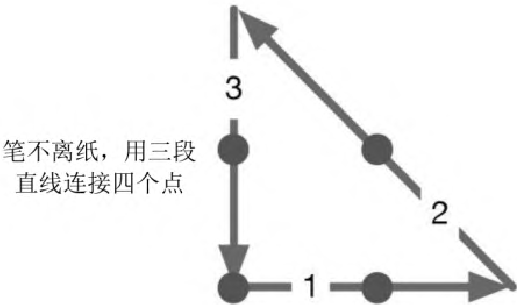

> 图 11-2：四点问题的解法。笔不离纸，用三段直线连接四个点。

[^ch11-1]: 译注：石的概念在汉语中古已有之，但此处提到的石与合均为日语语境下的计量单位。

[^ch11-2]: 感谢 Avi Bryant（@avibryant）提供的这些细节。

## 译者跋

> 文本在阐释中烟消云散。
>
> ——尼采《善恶的彼岸》

2019 年 12 月 20 日， 我终于用笨拙的中文把《程序员修炼之道》的第二版初步译完。
距编辑侠少把英文电子版发送给我已经过去了 70 天。 这两个多月里，
翻译工作几乎占据了我所有的业余时间， 真的很累， 但却心甘情愿， 并乐得其中。

侠少和我认识多年， 他一直劝我再写一本和编程开发有关的书。 虽然在这 20
年职业开发生涯中积累了很多想法， 也在用 Blog 坚持记录，
但每当有动笔写书的念头时， 心中便开始忐忑不安。 甚至前些年写过半本关于 Lua
源码赏析的书， 最终却因不甚喜欢而半途废弃。

似乎每隔一段时间， 我都会对编程这件事产生新的领悟。
尤其是这几年随着儿女的前后到来， 通过陪伴他们的成长， 明白了更多的道理。 然而，
却越发的不敢写了。

《程序员修炼之道》曾是我最喜欢的一本开发实践方面的著作。 在 20 年后，
作者在旧版的基础上进行了大量的重写。 得知新版已经付梓， 我特别期待。
来自务实的程序员的 20 年的积累， 会是多么的可观。 我相信，
自己将从这一新版中汲取大量营养。 所以， 几乎是毫不犹豫地， 就接下了翻译的任务。

从私心讲， 我希望是自己， 而不是其他任何人来用中文重新阐释这些思想。
由于自己的深度还远不及这些前辈， 若谈原创恐怕力所不及， 但做翻译应当是合格的。

我做过技术文档的翻译， 汉化过游戏文本， 翻译过一些技术书的部分章节。
但像这样完整地翻译整本书并付诸出版， 还是第一次。 工作启动后，
难度远超我的预想。 作者不仅引经据典，
还大量使用了未传入中文世界的迷因及英语俚语。 这让我经常为了一两个句子而反复
google， 流连于 wikipedia、urbandictionary、quora 这些网站。

感谢我的同事： 曾瑞宏、李焱、朱晓靖、刘阳、李熙龙、吕斌、陆志锴，
他们在我翻译的过程中， 指出了很多错误， 陪我推敲词句。 当然还有本书的编辑侠少，
他做了大量的校对、改错、润色工作， 在工作的 git 仓库上，
可以看到大部分句子都有他修改过的痕迹。 如果你觉得译文理解起来还算流畅，
那都是他的功劳； 若是发现了什么技术错误， 全是我的责任。

翻译是译者用自己的思想， 换一种语言， 对原作者想法的重新阐释。
鉴于我的学识所限， 误解和错译在所难免。 如果你买到本书的原版，
且有能力阅读英文（我相信这是一个务实的程序员的必备技能）， 请直接去读原文。
因为与之相较， 我的译文可能根本不值得一读。

作为务实的程序员， 原作者在写作本书时实践了他们的理念： 用 markdown 创作，
基于版本控制工具维护， 利用自动化脚本生成最终的版面。 很惭愧，
受当前的中文出版条件所限， 我只在初译阶段， 遵循了这些。
尚无法写出用于排版阶段的自动化脚本来整合版面， 也因此无法维护原书丰富的索引，
对此我甚为遗憾。

最后， 愿每个写代码的人都能成为务实的程序员。

> “我生命中至关重要的书之一。”
>
> ——Obie Fernandez，《Rails 之道》作者

> “《程序员修炼之道》初版在二十年前完全改变了我的职业生涯。
> 这次的新版也将会对你有此影响。”
>
> ——Mike Cohn，《Scrum
> 敏捷软件开发》《敏捷估计与规划》《用户故事与敏捷方法》作者

> “……充满实用建议， 有技术方面的， 也有专业方面的，
> 无不能让你和你的项目受益多年。”
>
> ——Andrea Goulet，Corgibytes 公司 CEO，LegacyCode.Rocks 创始人

> “……闪电的确会击中同一个地方两次， 这本书就是明证。”
>
> ——VM (Vicky) Brasseur，瞻博网络开源战略总监

《程序员修炼之道：通向务实的最高境界》（第 2 版）是技术图书中的一件“珍品”，
需要经年累月一读再读。 无论是新手还是经验丰富的实践者，
无不能从每次阅读中发现新的见解。

Thomas 与 Hunt 从 1999 年开始， 通过这部颇具影响力的大作，
帮助无数客户创造出更好的软件， 重新发掘出编码的乐趣。
这些课程凌驾于任何特定的语言、框架或方法之上，
启发一代代程序员探索软件开发的本质。
务实哲学不仅催生出数以百计的图书、视频和有声读物， 还孕育出数以千计的成功案例。

二十年后的今天， 这一新版本又在重新审视： 作为一个现代程序员究竟意味着什么。
本书主题不拘一格， 从个人责任与职业发展，
到确保代码灵活且易于适配、重用的架构技术， 涉猎广泛。 通过阅读本书可以学会：

- 与“软件腐烂”做斗争
- 避免知识重复的陷阱
- 驾驭基本工具的力量
- 学习真正的需求
- 防范安全漏洞
- 对你的工作和事业负责
- 组建务实的入门套件
- 持续学习
- 写出有弹性、动态、适配性强的代码
- 避免依赖巧合编程
- 解决并发代码的底层问题
- 建立务实程序员构成的团队
- 无情而有效地做测试，包括基于特性的测试
- 取悦你的用户

本书由一组独立的话题构成， 用一系列经典而鲜活的奇闻逸事，
以及深刻的案例和有趣的类比， 阐明软件开发中诸多方面的卓越方法和主要陷阱。
无论是编码新手， 还是富有经验的程序员， 抑或是负责软件项目的经理，
只要每天学习这些课程并加以运用，
个人生产力、准确性和工作满意度的提高就会立竿见影。 从书中学到的技能，
以及开发习惯和态度， 都是在漫长职业生涯中获得成功的坚实基础。

你将成为一名务实的程序员。

<a id="读者服务_1"></a>

## 读者服务

微信扫码回复：38435

- 获取本书配套代码资源
- 加入读者交流群，与更多读者互动
- 获取博文视点学院 20 元付费内容抵扣券
- 获取更多技术专家分享视频与学习资源


> 图 11-3：读者服务二维码。

责任编辑：张春雨

封面设计：李玲

Pearson

www.pearson.com

上架建议：架构/编程

定价：89.00 元
