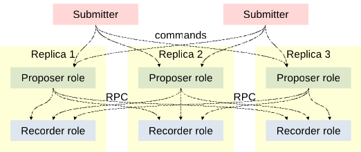
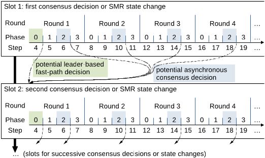
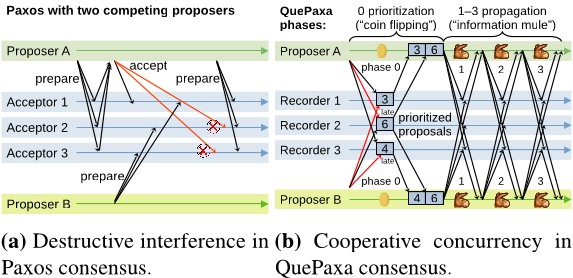
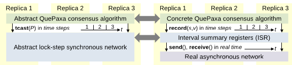
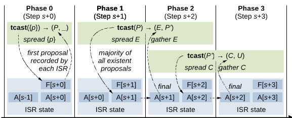
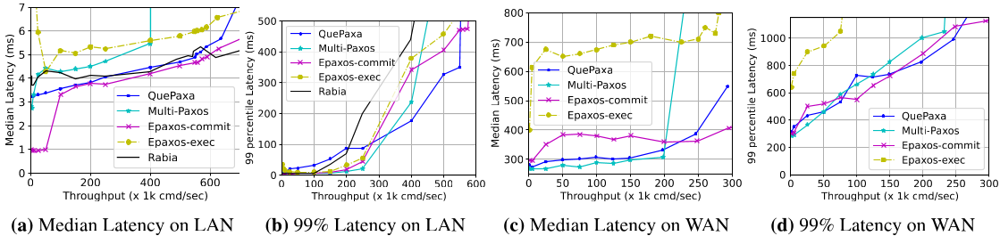
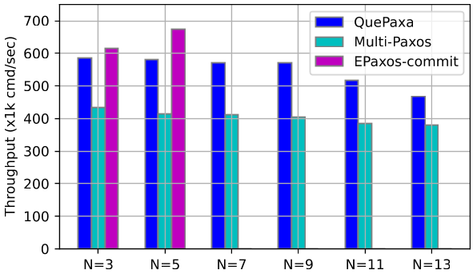
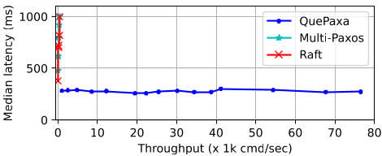
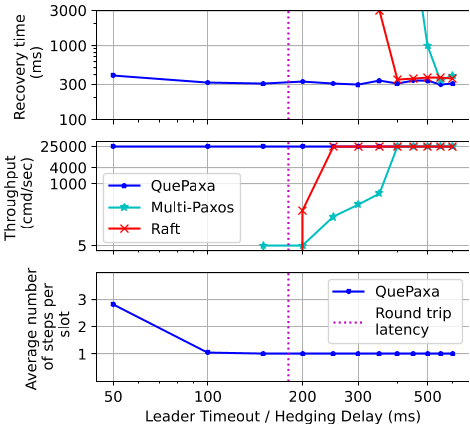
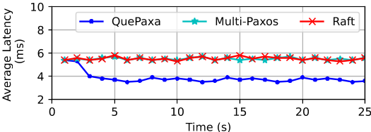

# QuePaxa: Escaping the Tyranny of Timeouts in Consensus

Pasindu Tennage\*¹、Cristina Băiescu\*¹、Ewa Syta²、Lefteris Kokoris-Kogias³、
Vero Estrada-Galiñanes¹ 和 Bryan Ford¹

¹ EPFL　² Trinity College　³ ISTA and Mysten Labs

*发表于第 29 届 ACM 操作系统原理研讨会（SOSP '23）， 2023 年 10 月 23—26
日，德国科布伦茨。*

## 摘要

基于 leader 的共识算法在正常条件下快速且高效， 但因其依赖超时来保证活性，
在不利条件下缺乏稳健性。 我们提出 QuePaxa， 它是首个无需依赖超时、
却能提供最先进的正常情形效率的协议。 QuePaxa 使用新颖的随机化异步共识核心，
以容忍拒绝服务（DoS）攻击等不利条件； 同时， 一次往返的 fast path 保持了
Multi-Paxos 或 Raft 的正常情形效率。 通过允许并发 proposer 而不产生破坏性干扰，
并使用较短的 hedging 延迟而非保守的超时来限制冗余开销， QuePaxa 允许在 leader
故障后快速恢复， 而不会因错误超时引发代价高昂的视图切换。 通过将 leader 选择与
hedging 延迟视为多臂老虎机优化问题， QuePaxa 能对当前环境做出响应， 即使现任
leader 尚未故障， 也能选出最佳 leader。 针对原型的实验证实， QuePaxa
的正常情形吞吐率在局域网（LAN）与广域网（WAN）中分别达到 584k 与 250k cmd/sec，
与 Multi-Paxos 相当。 在 DoS 攻击、配置错误或缓慢 leader
等严重冲击现有协议的条件下， 我们发现 QuePaxa 在 WAN 实验中仍保持活性，
中位延迟低于 380ms。

## 1 引言

在广泛部署的状态机复制（SMR）协议 [64, 75] 中， 一个容错的分布式副本群体使用共识
[16, 42] 来就一系列强有序的状态达成一致。 然而， 主流 SMR
协议的运行高度依赖超时， 由此引出三个相关问题， 我们将之称为超时的暴政。 首先，
由于大多数实用共识算法由 leader 驱动，
它们依靠部分同步假设与超时触发的视图切换来获得可用性，
在不利的网络条件下可能丧失活性。 其次， 由于并发的 leader 会破坏性地相互干扰，
而视图切换代价高昂， 超时必须选取足够保守（偏大）的值， 以避免误触发并维持性能。
第三， 超时带来了精心手工配置的管理成本， 而配置错误可能导致性能低下或完全宕机。
实用的 SMR 系统能否摆脱超时的暴政？

我们提出 QuePaxa， 一种直面这些问题的共识与 SMR 新方法。 QuePaxa
力求在瞬态变慢、 针对性 DoS 攻击或配置错误等各种条件下，
都确保稳健的可用性与性能。 简言之， QuePaxa 通过以下几点获得稳健性：
（1）利用随机化异步共识， 在最坏条件下保证活性； （2）依靠 hedging [23, 71]
而非超时， 在正常条件下获得与基于 leader 的协议相当的高效； （3）自适应地选择
leader 与 hedging 计划， 以减轻手工配置的成本与风险。

异步共识算法长久以来被寄予厚望， 可避免依赖超时来保证活性 [2, 14, 29]，
并能容忍包括针对性 DoS 攻击在内的任意网络条件。 然而， 在正常条件下，
异步算法通常远不如部分同步算法高效。 QuePaxa 提出一种新颖的异步 crash-stop
共识协议， 它通过随机化 proposal 的优先级来规避 FLP 定理 [27]，
并以高概率保证在少量几次往返内完成提交。 为避免异步共识传统的效率成本， QuePaxa
支持一条 fast path， 让被指定的 leader 仅通过调整其优先级选择，
就可在一次往返内完成提交， 从而获得与部分同步协议相当的正常情形效率。

传统协议中的超时必须设置得足够保守（大一些）， 以避免误触发， 因为并发的
proposer 会破坏性地相互干扰， 导致任何一方都无法推进，
而不必要的视图切换代价高昂。 然而， 得益于 QuePaxa 的异步核心， 并发的 proposer
非但不会破坏性地相互干扰， 反而能协作地帮助彼此更快地做出决定。 QuePaxa 中的
proposer 用 hedging [23, 71]——一种延迟激活的计划—— 取代超时与视图切换，
使计划中靠后的 proposer 得以"明智地拖延"， 避免重复靠前 proposer
工作中冗余的部分（计算与带宽消耗）。 在稳定的网络条件下， hedging 使 QuePaxa
获得与传统协议相同的 $O(n)$ 复杂度。 此外， hedging 延迟可以设置得十分短小，
从而在 leader 故障时将恢复时间降到最低。 正如我们的实验所证实的， 误触发很少延误
QuePaxa 的共识， 即使 hedging 延迟被严重错误配置， 也绝不会损害活性。

最后， 超时传统上还带来手动调优的管理成本， 并限制系统对当前环境的响应性 [69,
93] 或动态适应能力。 如今流行的共识协议（如 Raft [64]） 可能会"卡"在一个缓慢、
却又不足以触发视图切换的 leader 上， 即使存在更快的 leader 也无法切换。
受多臂老虎机理论 [78] 启发， QuePaxa 融入了延迟监测与自适应技术， 以动态调整其
leader 选择与 hedging 计划， 并确保对随时间变化的环境保持响应。

我们用 Go [52] 实现了 QuePaxa 原型， 并对照 Multi-Paxos [42]、Raft [64]、EPaxos
[55] 与 Rabia [66] 进行了评估。 我们在 Amazon EC2 上，
以局域网（单区域）与广域网（多区域）两种部署测试了 QuePaxa。 我们首先确认，
QuePaxa 在 5.8ms 中位延迟下可获得 584k cmd/sec 的吞吐率，
与正常条件下最先进的协议相当。 此外， 在会拖慢或中止现有协议的对抗性网络攻击下，
QuePaxa 仍保持活性。 即使 QuePaxa 的 hedging 延迟仅为底层往返时间的 1/3，
它也能保持完整性能； 而 Multi-Paxos 与 Raft 的超时必须至少达到往返延迟的 1.8
倍， 才能避免因误触发和不必要视图切换而停滞。 最后， 我们证明 QuePaxa
能自动识别并收敛到最快的 leader 副本， 在数据中心环境中，
异构副本之间的中位延迟可再降低 1.4ms。

本文的主要贡献如下：

• 首个实用的异步共识协议， 仅靠调整 proposal 的优先级， 即可实现单次往返、$O(n)$
的正常情形提交。

• 用 hedging 取代超时， 以避免不必要视图切换的高昂成本， 并将 leader
故障后的恢复时间降到最低。

• 新颖的自适应技术， 使 QuePaxa 能够优化其 leader 选择与 hedging 计划，
并保持对当前环境的响应性。

• 一个可运行的原型， 以及在正常与对抗两种条件下对 QuePaxa 的实验分析。

• 正确性证明（附录 C）， 以及经 SPIN 模型检查器验证的 Promela 模型（附录 D）。

第 2 节总结背景， 第 3 节对 QuePaxa 进行高层总览。 第 4 节详述共识协议， 第 5
节介绍其在高效 SMR 中的应用。 第 6 节描述我们的原型， 第 7 节对其实验评估， 第 8
节概述相关工作。

## 2 背景与动机

本节概述共识与 SMR 的当前最高水平， 以及激励 QuePaxa 诞生的挑战。

#### 基于 leader 的共识

部署最广泛的共识与 SMR 协议每次选举一个 *leader* 来驱动共识 [42, 64]，
因为同时活动的副本会破坏性地相互干扰， 这一点我们将在第 3.4 节讨论。 如果 leader
故障， 共识将停滞， 直到足够多的副本超时并触发 *视图切换* 以选出新的 leader。

这些协议只在部分同步条件下保证活性： 即网络延迟足够小且稳定， 使某个 leader
能在两次超时触发的视图切换之间取得进展。 高延迟或抖动的时段、 非对称连接、
配置错误等不利网络条件， 都可能大幅拖慢或中止进展 [7, 40, 47]。 此外，
如果网络中的对手能将 DoS 攻击聚焦于当前 leader， 攻击者就能拖慢或中止所有进展，
直至超时发生。 如果这样的攻击者还能利用流量分析来识别视图切换，
并把攻击重新对准每个新 leader， 那么原则上它可以无限期地中止进展，
而每次只需针对一个副本 [80]。

#### 异步协议

异步共识 [2, 14, 53, 63] 避免依赖超时，
原则上即使在任意最坏网络条件下也能保证稳健的可用性。 然而， 在基于 leader
的协议所优化的正常条件下， 异步协议通常效率低得多， 每次决策需要 $O(n^2)$ 而非
$O(n)$ 的通信复杂度。 因此， 异步协议在实践中很少部署。 理想情况下，
我们希望有一种共识协议， 既能具备基于 leader 协议的正常情形效率，
又能提供异步协议的稳健最坏情形可用性保证。

Rabia [66] 是一种随机化 crash 容错 SMR 协议， 它以 Ben-Or 的二元异步共识算法
[14] 作为核心组件。 然而， Rabia 专为低延迟、高容量的数据中心网络设计，
其假设与设计取舍限制了它在其他环境中的可用性 （参见第 7.2 节与附录 E）。

#### 保守的超时

在基于 leader 的方案中， 由于并发 leader 会破坏性地相互干扰、 视图切换代价高昂，
超时必须设置得足够保守（大一些）， 以限制随机延迟或短暂降速引发误触发的风险。
正如我们稍后在 7.5 节的实验所证实的， 如果超时相对底层延迟过短， 基于 leader
的协议会急剧变慢甚至完全停止。 然而， 过大的超时意味着 leader
故障后需要很长的恢复时间。 因此， 我们更希望有一种协议，
能在不因超时误触发而有丧失可用性风险的前提下， 实现短暂的恢复时间。



> 图 1：QuePaxa 架构。一个配置包含 $2f+1$ 个副本，可容忍 $f$
> 个故障。每个副本承担两种角色： proposer 主动驱动共识，而 recorder
> 被动地存储状态，并响应命令更新状态。

#### 配置敏感性

实践中， 基于 leader 协议的超时必须仔细配置， 既需要管理投入，
配置错误又有宕机风险。 此外， 静态配置的超时使基于 leader
的方案无法动态适应当前环境， 例如当现任 leader 缓慢、 但又不足以触发超时时。
理想情况下， 我们希望有一种协议， 无需手动配置延迟， 却能自动适应当前环境，
例如在存在更快 leader 时自动改选它。

简言之， QuePaxa 力求应对三大挑战：

• 如何同时实现最坏情形下的稳健可用性与正常情形下的高效率？

• 如何在不必牺牲活性的前提下最小化恢复时间？

• 如何动态适应当前的网络条件？

## 3 QuePaxa 架构总览

本节从高层概述 QuePaxa 的架构， 涵盖系统模型、假设、工作流， 以及使 QuePaxa
摆脱对超时依赖的性质。

### 3.1 QuePaxa 系统模型

图 1 展示了 QuePaxa 的架构。 任意数量的提交者（submitter）将描述事务请求的命令
发送给一组共同负责存储状态的副本。 提交者可以是直接生成命令的客户端，
但在现代分层部署中， 提交者更常见的形式是前端代理，
它从互联网上别处的真实客户端接收命令， 通常把命令聚合成批后再提交给 proposer。

与常见 crash 容错共识一样， 总共有 $\hat{n} \ge 2f + 1$ 个副本， 其中至多 $f$
个可能故障， 即永远保持沉默（故障不是 Byzantine）。
我们假设副本集合是已知且静态的， 但也可以通过标准实践支持重新配置 [42, 64]。
提交者将命令发送给所有副本， 因此无论哪些 proposer 提交事务，
提交者发出的命令都不会无限期地处于饥饿状态。[^1]

[^1]: 在任何共识协议中，提交者都必须至少向 $f + 1$ 个副本发送命令，因为 $f$
    个副本可能故障。一个降低带宽与负载的标准优化是：提交者先只联系当前
    leader，仅当 leader 未快速响应时才联系其他副本。

如图 1 所示， 每个副本在内部扮演两种功能角色： （1）副本的 *proposer*
角色从提交者处接收命令， 并主动驱动这些命令的提交过程； （2）副本的 *recorder*
角色被动地维护共识状态， 同时响应来自 proposer 的 RPC 风格请求。
这种主动/被动的角色划分与 Disk Paxos [32] 类似。

### 3.2 假设与威胁模型

QuePaxa 假设 $n$ 个副本是可信的， 但通信路径却不可信。 特别是在 WAN 中，
间歇性中断、 高延迟或抖动、 非对称连接等 都可能在实际中破坏通信 [7, 47]。
网络中的智能对手可能会识别出共识协议流量 （例如借助流量分析模式），
并试图通过针对性 DoS、 路由劫持 [19] 或其他攻击来拖慢或中止进展。

形式上， QuePaxa 假设正确（无故障）节点之间发送的任何消息 最终都会被送达 [16]，
在实践中， 我们通过构建在 TCP [81] 等可靠传输之上来满足这一假设。 我们认为向 $n$
个副本进行的一次广播 由 $n$ 条并行、独立的消息传输组成：
我们不假设存在高效的网络广播。

QuePaxa 假设网络对手是 content-oblivious 的 [10]。 也就是说，
对手可以任意操纵网络延迟与报文顺序， 但无法查看消息内容或副本内存。
这一假设是现实的， 因为我们只需加密副本之间的两两通信， 例如通过 TLS [73]，
即可在实践中满足这一假设。[^2]

[^2]: 通过侧信道泄漏信息可能会破坏 content-oblivious
    对手假设。此类风险可以通过实现层面的最佳实践来缓解，例如使用定长消息与恒定时间代码路径，但侧信道不在本文讨论范围内。

如果存在某个最大延迟 $\Lambda$——共识协议并不知道其取值——
为所有消息传输延迟设定上界， 我们就说网络是部分同步的 [24]。
如果不存在这样的最大延迟， 网络就是异步的。
部分同步为网络延迟相对稳定的"正常情形"时段建模， 而异步则建模 DoS
攻击等不利条件。 QuePaxa 既寻求部分同步下的高性能与高效率，
也要确保即使在异步条件下也能保证安全性与活性。

### 3.3 QuePaxa 工作流总览

图 2 展示了 QuePaxa 的工作流， 它采用标准的 SMR 范式 [75]。 一系列 slot
表示相继的状态变更， 形成全序历史。 提交者向所有 proposer
广播一条命令（或一批命令）， proposer 再在下一个空闲 slot 中提出这些命令。
随后， proposer 在每个 slot 中运行一个共识协议实例， 就该 slot
的唯一状态变更达成一致。 最后， proposer 向提交者报告命令的提交情况。 proposer
可以将并发提交者的命令（或批次）合并进同一个 slot， 也可以推迟到后续 slot。
因此， 在提交者与 proposer 两个阶段都可以进行批处理。



> 图 2：QuePaxa 工作流总览。*slots* 表示由共识决定的相继状态变更。
> 一次决定需要一个或多个 *round*，每个 *round* 包含四个 *phase*。 *steps*
> 将轮次与阶段编号组合成一个逻辑时钟：$step = 4 \times round + phase$。

由于异步共识在一般情况下是确定性不可解的 [27]，
任何一次单独的决定尝试都可能失败并需要重试。 因此， QuePaxa 通过一系列从 1
开始编号的尝试或轮次来决定每个 slot。 每轮由 0–3 四个协议阶段组成。 step 编号或
threshold clock [28] 跨轮次对阶段计数， 使得 $step = 4 \times round + phase$。
一个 step 表示在完成一轮阈值通信上的进展， 它既不假设网络同步，
也不假设存在同步时钟。 每个 step 需要至少一个 proposer 与 $n - f$ 个 recorder
组成的 quorum 或多数派之间 进行一次通信往返。

被动的 recorder 角色非常简单， 只需通过简单算术（例如整数最大值）聚合近期的
proposals， 并存储一份简洁、空间恒定的摘要。 我们将这一 recorder
功能形式化为一个原语——interval summary register（ISR）， 详见第 4.2.2 节。

proposer 可以通过两种方式决定一个 slot。 在部分同步条件下， 一个唯一指定的
proposer 或 leader 可以仅用一次往返完成提交（第 1 轮的第 0 阶段）。 这条 fast
path 与 Multi-Paxos 中已就绪 leader 的快速共识大体等价 [42]。 如果 fast path
因任何原因失败——包括 leader 故障或网络异步—— 那么任何 proposer
都可能在任意一轮的第 2 阶段决定该 slot。 每个 slot 的第 2 轮及更高轮次是无
leader 的， 且完全异步， 每轮都能以至少 1/2 的概率独立保证成功。 每轮的第 3
阶段仅用于为下一轮做准备， 以防当前轮未能达成共识。

### 3.4 从竞争式 claim-staking 到协作

与 Paxos 一样， QuePaxa 在只有一个 proposer（即 leader）同时提案时最为高效 （其
fast path 也最有可能成功）。 正常情形下， 两种协议中的副本都会预期是哪个
proposer "应当"在一个 slot 中（首先）提案。 然而， 两种协议在预期强度、
以及预期被违反的后果上存在根本差异。 图 3 展示了这一差异。



> 图 3：共识算法中多个 proposer 之间的破坏性并发与建设性并发。

Paxos 的 **prepare** 阶段的目的， 类似于在多数派 proposer 上宣示领地主张； Paxos
的 **accept** 阶段则本质上是记录一次成功的主张。 然而， 两个相互竞争的 proposer
会破坏性地相互干扰， 最坏情况下会无限期地阻塞对方的进展。 在图 3a 中， proposer
B 的 **prepare** 阶段打断了 proposer A 完成（通过 **accept**）一个它已成功
prepared 的事务的尝试。 随后， proposer A 以更高的 ballot 编号从 **prepare**
阶段重试， 又打断 proposer B——如此往复， 以至无穷。
这种破坏性干扰催生了传统的视图切换协议： 其中*只有*给定视图的 leader 可以提案——
并且*必须*在其他 proposer 超时到期之前提案—— 否则共识将停滞，
直到进一步的视图切换找到一个活着的 leader。 如果超时配置得比网络延迟所需更短，
那么恰恰就会发生这种"最坏情形"， Paxos 将永远活锁。

然而， QuePaxa 的 leader 只是"同类之首"（first among equals）， 享有特殊的 fast
path 特权。 其他副本也可以提案， 除了冗余开销外几乎没有风险或代价。 并发的
proposer 不会破坏性地相互干扰， 甚至能互相帮助， 更快地完成共识轮次。

如图 3b 所示， 第 0 阶段的 proposer 承担"掷硬币"的职能， 为每个 recorder
看到的第一个 proposal 附加一个随机优先级。 在第 1–3 阶段， proposer
承担"信息骡"的职能， 在 recorder 之间传播关于带优先级 proposals 的信息。
在这两种职能中， 究竟是一个还是几个 proposer 同时执行这些步骤， 都无关紧要。
共识轮次无论如何都会完成， 每一轮都以恒定概率做出决定。

### 3.5 摆脱超时的暴政

基于上述运行总览， 我们现在可以更精确地总结 QuePaxa 是如何摆脱第 1
节中引入的三个"超时的暴政"问题的。

#### 活性

QuePaxa 消除了活性对超时的依赖。 所有轮次的所有阶段都异步推进。 每个 slot
的第一轮基于 leader， 允许正常条件下单次往返的 fast path 提交。
智能的网络对手可能会利用对 leader 的了解， 使第一轮始终无法做出决定；
但随后的轮次没有 leader、完全异步， 每轮都保证至少 1/2 的成功概率。



> 图 4：协议分层。抽象 QuePaxa（算法 1）运行在 lock-step
> 阈值同步广播（tcast）之上； 具体协议（算法 4）则用 interval summary
> register（ISR）来模拟该广播（算法 2）。

#### Hedging

通过避免破坏性干扰或视图切换， QuePaxa 允许所有 proposer 按照 hedging 计划 [23,
71] 参与任意轮次。 计划中靠后的 proposer 等待更久， 仅在尚未看到靠前 proposer
取得进展时才提案。 正常条件下， 每轮通常只有第一个被安排的 proposer 提案，
从而与基于 leader 的协议一样， 产生 $O(n)$ 的通信开销。 与超时不同， hedging
延迟可以设得很短， 以便在 leader 故障后快速恢复。 即使设置得过小、 导致多个
proposer 在第一个 proposer 完成之前就开始行动， 共识也仍然保持活性，
唯一的代价只是冗余的 proposer 开销， 以及较低的 fast path 成功概率。

#### 自动调优

由于 QuePaxa 中 leader 的选择与 hedging 计划 是对活性并不关键的优化参数，
这些选择构成一种多臂老虎机（MAB）问题 [78]。 因此， QuePaxa 利用受 MAB
理论启发的简单探索/利用过程， 来探索替代方案，
并自动调优共识以利用已习得的知识。 与现有协议不同， QuePaxa 因此可以在现任
leader 尚未故障时， 就主动找到更好的 leader。 QuePaxa
还消除了配置超时的管理负担， 以及错误配置超时的主要风险。

在总结了 QuePaxa 的运行方式、 以及它如何避免对超时的依赖之后，
我们现在详细阐述其设计。

## 4 QuePaxa 协议设计

本节详述 QuePaxa 的设计： 为清晰起见， 首先以核心协议的简化抽象表述呈现，
随后给出该核心的具体实例化（见图 4）。

### 4.1 抽象 QuePaxa 共识协议

为简单起见， 我们暂时忽略网络异步的挑战， 只处理不可靠性问题：
即预期的消息因副本故障而未能到达。 图 4 描绘了该抽象协议的架构层次，
以及它们与我们稍后在 4.2 节介绍的具体协议之间的对应关系。
我们现在假设网络提供一种阈值同步广播原语， 即下面要描述的 **tcast**。
随后我们基于 **tcast** 定义 QuePaxa 的抽象共识协议（算法 1）。 简言之，

**算法 1：抽象 QuePaxa 共识算法**

```text
Input: $v \leftarrow$ value preferred by this replica

repeat // iterate through rounds
    $p \leftarrow \langle v, \text{random}() \rangle$ // prioritized proposal
    $(P, \_ ) \leftarrow \text{tcast}(\{p\})$ // propagate our proposal
    $(E, P') \leftarrow \text{tcast}(P)$ // propagate existent sets
    $(C, U) \leftarrow \text{tcast}(P')$ // propagate common sets
    $v \leftarrow \text{best}(C).\text{value}$ // next candidate value
    if $\text{best}(E) = \text{best}(U)$ then // detect consensus
        deliver(v) // deliver decision
```

**tcast** 在每个时间步 为每个副本提供来自任意多数派或 quorum 副本的消息；
每个副本还会识别出一条被所有存活副本都收到的消息。 基于 **tcast**
的共识为每个副本提供两个 proposal 集合， 它们界定了任意副本所收到的某个 proposal
集合的范围。 这种跨节点子集关系对副本确保安全至关重要。 每个副本为其 proposal
附加一个随机的本地优先级， 使协议以概率 1 在较小的常数期望轮数内终止。

#### 4.1.1 阈值同步广播（tcast）

我们暂且假装 $n$ 个副本运行在一个 以 lock-step 方式同步的理想化网络之上：
任何消息的投递都恰好需要一步。 这个理想化网络提供一种*阈值广播*原语，即
**tcast** [28, 29]， 我们发现它特别适合共识中的信息传播。

在每个时间步， 每个存活副本 $i$ 以某个 proposal 集合 $P_i$ 调用
$\text{tcast}(P_i)$， $i$ 希望将 $P_i$ 传播给其他副本。 一个时间步之后，
每个副本 $i$ 的 $\text{tcast}(P_i)$ 调用完成， 并返回一对 proposal 集合
$(R_i, B_i)$。 集合 $R_i$ 和 $B_i$ 满足我们下面定义的两个关键性质。

**tcast** 返回的第一个集合 $R_i$， 是副本 $i$ 在该广播步骤中收到的所有 proposal
的集合。 这个 $R_i$ 包含来自多数派副本的输入。 也就是说， 存在某个副本集合 $S$
使得 $|S| > n/2$， 且对所有 $j \in S$，$P_j \subseteq R_i$。

**tcast** 返回的第二个集合 $B_i$， 是某个 proposal 集合输入（即某个 $j$ 的
$P_j$）， **tcast** 已在该广播步骤中成功将其广播给所有无故障副本。 也就是说，
返回的 $B_i$ 是某个副本 $j$（不一定与 $i$ 相同）的 proposal 集合输入 $P_j$，
使得对所有副本 $k$，$P_j \subseteq R_k$。 因此， 对所有副本 $i$ 和 $j$，都有
$B_i \subseteq R_j$。

总之， **tcast** 保证两个关键性质： （1）所有存活副本都收到多数派副本的输入；
（2）至少有一个副本的输入（在 $B$ 中返回） 被*所有*存活副本看到。[^3]

[^3]: 这两个性质可以拆分为两个独立的通信原语，
    但我们认为这种合并的表述更容易理解。

#### 4.1.2 在 tcast 之上构建共识

算法 1 给出了 QuePaxa 基于 **tcast** 构建的抽象共识协议核心， 针对单个 SMR
slot。 每个副本在概念上在该 slot 中运行无限系列的轮次，
每一轮以一定概率交付一个共识决定。
不同的副本可能在不同轮次中更早或更晚达成决定。

在每一轮中， 每个副本 $i$ 首先将其当前偏好的值 $v$ 与一个随机数值优先级关联，
构成 $i$ 的 proposal $p_i$。
所有副本独立地从相同的私有随机分布中选择这些优先级。 为简单起见，
我们暂时假设一轮之内优先级从不并列。[^4]

[^4]: 通过选择高熵（例如 256 位）的优先级，
    可以确保最佳提案并列的几率可忽略不计，
    这些优先级取自强（例如密码学）随机数生成器。 如果高熵优先级不受欢迎， 附录 A
    讨论了选择优先级和处理并列的替代方法。

随后， 所有 $n$ 个副本在三个连续的 **tcast** 步骤中 传播它们带优先级的
proposal。 第一个 **tcast** 给每个副本 $i$ 一个 proposal 集合 $P_i$，
其中包含来自任意多数派副本的 proposal。 第二个 **tcast** 以 $P_i$ 为输入， 给
$i$ 一个保证包含在 *existent* 集合 $E_j$ 中的 proposal 集合 $P'_i$， $E_j$
返回给所有其他副本 $j$。 最后， 第三个 **tcast** 以 $P'_i$ 为输入， 给副本 $i$
一个 *common* proposal 集合 $C_i$ 和一个 *universal* proposal 集合 $U_i$。

这些协议步骤实现的一个重要目标， 是
$\forall i, j, U_i \subseteq C_j \subseteq E_i$。 也就是说， 每个副本的
universal 集合 $U_i$ 是每个其他副本的 common 集合 $C_j$ 的子集，
而后者又是任意副本 existent 集合 $E_i$ 的子集。

或许更直观地说， 从副本 $i$ 的视角看， proposal p 是 existent 的（即
$p \in E_{i}$）， 如果 $i$ 知道 p 存在： 也就是说， $i$ 知道某个副本在本轮提出了
p。 对 $i$ 而言，proposal p 是 common（$p \in C_{i}$）， 如果 $i$
知道所有副本都知道 p 存在。 对 $i$ 而言，proposal p 是
universal（$p \in U_{i}$）， 如果 $i$ 知道所有副本都知道 p 是 common。

最后， 每个副本选择 $\mathbf{best}(C_i)$， 即 $i$ 的 common 集合 $C_i$
中优先级最高的 proposal， 作为 $i$ 下一共识轮的输入偏好值。 每个副本还会检查
其已知的最佳 existent proposal $\mathbf{best}(E_i)$ 是否与其已知的最佳 universal
proposal $\mathbf{best}(U_i)$ 相同， 若相同， 则交付该 proposal
的值作为共识决定。

#### 4.1.3 共识协议的正确性

我们现在简要勾勒该算法正确性的论证思路。 详细的正确性证明见附录 B。

**定理（安全性）。** *抽象 QuePaxa
确保共识的关键安全性质：有效性、完整性和一致性。*

**证明概要：** 如果副本 $i$ 看到 $\mathbf{best}(E) = \mathbf{best}(U)$
并在某一轮中交付决定， 那么每个副本 $j$ 都必须选择相同的 proposal
作为其下一个候选值 $\mathbf{best}(C_j)$。 也就是说，
由于上面建立的跨节点子集关系 $U_i \subseteq C_j \subseteq E_i$、
且优先级从不并列，
$\forall i, j, \mathbf{best}(E_i) = \mathbf{best}(C_j) = \mathbf{best}(U_i)$。
由于随后的每一轮只使用上一轮延续下来的值，
该决定是本轮或任何后续轮中任何副本唯一可以决定的值， 从而确保了一致性。
被决定的值从上一轮延续下来， 并通过归纳法源自第一轮，
而第一轮只使用副本提出的值， 从而确保了有效性。 每个副本通过维护一个本地决定标志
（为简单起见未在算法 1 中显示）每 slot 只决定一次， 平凡地确保完整性。



> 图 5：算法 4 中四阶段的具体协议 与算法 1 中抽象 QuePaxa 算法的三次 **tcast**
> 调用之间的对应关系。

**定理（活性）。** *抽象 QuePaxa 以概率 1 终止，期望轮数少于两轮。*

**证明概要：** 非形式地说， 如果某轮中唯一最佳的 proposal 出现在 $i$ 的
universal 集合 $U_i$ 中， 那么每个副本 $i$ 保证在该轮做出决定。 在这种情况下，
该唯一最佳 proposal 也必然出现在 $E_i$ 中且成为最佳， 并出现在其他每个副本 $j$
的 $C_j$ 中且成为最佳。 算法 1 中 **tcast** 调用返回的所有集合
都包含来自多数派副本的 proposal。 由于网络调度对手是 content-oblivious 的，
因而不知道附加在 proposal 上的优先级（见第 3.1 节）， 每个副本 $i$ 观察到
该轮唯一最佳 proposal 出现在 $U_i$ 中 并因此做出决定的概率至少为 $1/2$。 因此，
每个副本期望在两轮之内做出决定， 并以概率 1 最终做出决定， 从而确保协议的活性。

### 4.2 具体 QuePaxa 共识协议

具体 QuePaxa 共识协议在本质上模拟了上述抽象协议，
并以几种方式更真实、更高效地实现它。 如前面 3.3 节所述， 具体 QuePaxa
协议分离了每个副本的主动与被动角色， 通过 threshold logical clock 处理网络异步
[28]， 只传输常数空间的整数摘要而非 proposal 集合， 并加入一个类 Paxos 的 fast
path， 以便在有利的网络条件下、有已知 leader 时实现单轮共识。

图 5 概览了上述抽象协议中的三次 **tcast** 操作
如何映射到下文详述的具体协议的四个阶段。 具体实现算法 1 中的第一次 **tcast**
操作 只需要一个 threshold clock 时间步（阶段 0），
因为这一步只需要每个副本从多数派副本获得 proposals。 具体实现算法 1
中的第二、三次 **tcast** 操作 各需要两个 threshold clock 步， 使用下文详述的
*spread/gather* 序列， 将至少一个副本的 **tcast** 输入传播给*所有*存活副本。
不过， 我们可以将后两次 **tcast** 操作流水线化， 因此总共只需要三步（阶段
1–3）。 完整的具体协议每轮总共包含四个阶段。

**算法 2：区间汇总寄存器（ISR）**

```text
State : S current logical clock step, initially 0
State : F[s] first value recorded at each step, default nil
State : A[s] aggregate of values in each step, default nil

record (s, v) → (s', f', a'):
    // handle an invocation
    if s > S then
        // advance to a higher step
        S ← s
        // update current step number
        F[s] ← v
        // record first value in this step
    if s = S then
        // aggregate all values
        A[s] ← aggregate(A[s], v)
        // seen in this step
    return (S, F[S], A[S - 1])
    // return a summary
```

#### 4.2.1 分离主动与被动角色

每个副本扮演一个主动的 *proposer* 角色，驱动共识； 以及一个被动的 *recorder*
角色，仅记录状态。 所有通信都是 RPC 风格、proposer 到 recorder 的。 proposer
之间从不直接交互， recorder 之间同样如此。

任何 proposer 都可以驱动共识， 方法是引导 recorder 经历一系列状态， 模拟抽象
QuePaxa 协议（算法 1）的一次执行。 与传统的基于 leader 的共识协议一样，
在常见情形下， 只有一个 proposer 驱动共识是充分且最有效的。 因此，
我们预期大多数副本的 proposer 角色（leader 除外） 在平时大部分时间处于空闲。
然而， 如果多个 proposer 同时活跃， 它们只会协同工作、更快地驱动这一模拟
（即每一步都以最快 proposer 的速度推进）， 而不是像类 Paxos
协议那样破坏性地相互干扰。

#### 4.2.2 逻辑时钟与区间汇总寄存器

由于具体协议运行在异步网络之上， recorder 使用 *threshold logical clock* [28]
模拟算法 1 假设的同步、lock-step 时间概念。 每个共识轮次包含四个逻辑时间步。
*step* 是一个非负整数， 与现实时间没有直接对应关系，
只有在前一步完成了阈值数量的通信后才会推进。

我们把每个 recorder 的状态与行为 提炼成一种简单的抽象，称为 interval summary
register（ISR）， 它的价值可能超出 QuePaxa 本身。 直观地说， ISR
接受一系列值，每个值关联一个逻辑时间步，
并在每次调用时返回当前步与紧邻前一步中、 迄今提交给 ISR 的所有值的简明摘要。

算法 2 以通用、抽象的形式刻画了我们的 ISR 的运行。 ISR 只提供一个操作 record，
接受两个参数 s、v，返回三个结果 $s'$、$f'$、$a'$。 值 v 关联逻辑时间步 s。
record 操作首先使用 s 将 ISR 的内部步计数器 S 增加到迄今所见的最大步数，
并记录在每一步提交的第一个值 v。 随后，ISR 使用某个二元组合子 **aggregate**
（我们稍后在本节详述） 来汇总每一步内看到的所有值。 如果与 v 关联的步 s 小于 ISR
的内部步计数器 S， 则说明提供的值 v 已过时，ISR 直接丢弃它。 无论如何， ISR
都返回其内部步计数器 S、 当前步提交的第一个值，
以及紧邻前一步提交的*所有*值的聚合。

这种 ISR 表述假设存在一个定义明确的“基”值， 我们称之为 **nil**， 使得
**aggregate**(v, **nil**) = v。 此外，为清晰起见， 算法 2 的表述就像 ISR
会永久记录*所有*历史时间步的值。 这显然没有必要， 因为 ISR
只返回当前步与前一步的第一个值和聚合值。 因此， 如果提供给 ISR 的值大小恒定，
ISR 实现就只需要常数空间。[^5]

[^5]: QuePaxa 的 recorder 当然还必须存储 slot 和 step 编号，
    原则上它们可能无界。 实践中，slot 编号可以被限制为定长整数，
    方法是在重配置事件时重置它们， 并在 slot 编号溢出前强制进行重配置。 step
    编号在实践中可限制为约 $10$ 位， 因为一个 slot 超过约 $256$ 轮仍未决定的概率
    在密码学意义上可忽略不计。

#### 4.2.3 具体 QuePaxa 的专用化 ISR

在具体 QuePaxa 协议中， 我们必须用合适的值类型、**nil** 值和 **aggregate**
组合子 实例化通用 ISR。 由于抽象共识算法（算法 1）使用 proposal 集合， QuePaxa
的朴素 ISR 可以以 proposal 集合作为值类型、 空集 $\emptyset$ 作为 **nil** 值、
集合并 $\cup$ 作为 **aggregate** 组合子。

在实践中， 由于我们只需要集合中 **best**（最佳）即最高优先级的 proposal，
QuePaxa 更优化的实现可以使用简单的二进制整数作为 ISR 值、 以 0 作为 **nil**、
以整数最大值作为 **aggregate**。 因此，QuePaxa 的实际 ISR 是常数空间的。
为完整起见， 算法 3 给出了具体 QuePaxa proposer 协议所需的、
面向整数的常数空间专用 ISR 的伪代码， 我们接下来描述该协议。

**算法 3：专用化的常数空间整数 ISR**

```text
State : $S$ current logical clock step, initially 0
State : $F_c$ first value received in current step $S$, initially 0
State : $A_c$ maximum value seen in this step, initially 0
State : $A_p$ maximum value seen in prior step, initially 0
record $(s, v) \rightarrow (s', f', a')$: // handle an invocation
    if $s = S$ then // aggregate all values
        $A_c \leftarrow \max(A_c, v)$ // seen in this step
    else if $s > S$ then // advance to a higher step
        if $s = S + 1$ then // exactly one step forward
            $A_p \leftarrow A_c$ // current aggregate now prior
        else // skipping one or more step(s)
            $A_p \leftarrow 0$ // we saw nothing in $s - 1$
        $S \leftarrow s$ // advance to the new higher step
        $F_c \leftarrow v$ // record first proposal this step
        $A_c \leftarrow v$ // initial aggregate for this step
    return $(S, F_c, A_p)$ // return a summary
```

#### 4.2.4 具体 QuePaxa proposer 协议

算法 4 给出了具体 QuePaxa proposer 算法的伪代码。
该算法每个共识轮次使用四个逻辑时间步， 从 step $s = 4$ 开始表示第 1 轮、阶段 0。
图 5 说明了具体协议的这四个阶段 如何通过与 recorder 及其 ISR 状态的相互作用，
对应并实现算法 1 中的三次 **tcast** 调用，详见下文。 每一步都会在 proposer
与多数派 recorder 之间 产生一次往返。

**算法 4：QuePaxa proposer i 的协议**

```text
Input: v preferred value of this proposer i

s ← 4 × 1 + 0 // start at round 1, phase 0
p ← <H, i, v> // initial proposal template

repeat
    p_j ← p for all recorders j // prepare proposals
    if s mod 4 = 0 and (s > 4 or i is not leader) then
        p_j.priority ← random(1..H - 1) for all j
    Send record(s, p_i) in parallel to each recorder j
    Await R ← quorum of replies (s'_j, f'_j, a'_j)
    if s'_j = s in all replies received in R then
        if s mod 4 = 0 then // phase 0: propose
            if f'_j.priority = H in all replies then
                return f'_j.value from any reply in R
            p ← best_j of f'_j from all replies in R
        if s mod 4 = 1 then // phase 1: spread E
            // no action required
        if s mod 4 = 2 then // phase 2: gather E, spread C
            if p = best_j of a'_j from all replies in R then
                return p.value // report decision
        if s mod 4 = 3 then // phase 3: gather C
            p ← best_j of a'_j from all replies in R
        s ← s + 1 // advance to next step
    else if any reply in R has s'_j > s then
        s, p ← s'_j, f'_j // catch up to step s'_j
```

proposal 在逻辑上是 $\langle \textbf{priority, proposer, value} \rangle$
三元组。 我们假设每个分量以定宽二进制格式编码后拼接起来， 因此上述基于 ISR 的
recorder 可以将 proposal 简单地视为一个二进制整数。

由于 ISR 使用整数最大值来聚合值， 且 **priority** 是三元组的第一个分量， ISR
聚合会选择一步内提交的 proposals 中优先级最高的那个， 在并列时以 **proposer**
消歧。

Proposal 随机化： 每轮的阶段 0（即 $s \bmod 4 = 0$） 实现 proposals
的优先级指派以及算法 1 中的第一次 tcast。 proposer i 为每个 recorder
选择一个随机优先级， 但基于 leader 的轮次除外（如 4.2.5 节稍后讨论）。 将每个
proposal $p_j$ 发送给 recorder $j$ 后， proposer $i$ 等待来自多数派 quorum 的
recorder 以 $(s'_j, f'_j, a'_j)$ 形式回复。 如果该 quorum 中每个 recorder $j$
回复的 step $s'_j$ 等于 proposer 的 step 编号 $s$， proposer 就测试是否满足 fast
path 决定（4.2.5 节）， 然后从 quorum 的所有 $f'_j$（first-value）回复中 选择
**best**（最高优先级）proposal， 作为 $i$ 供下面的阶段 1 使用的新 proposal $p$。

Proposer 追赶： 在任何阶段， 如果 proposer i 从某个 recorder j 收到回复
$(s_{j}^{\prime}, f_{j}^{\prime}, a_{j}^{\prime})$， 且其 $s_{j}^{\prime} > s$，
说明 proposer i 在逻辑时间上落后于 recorder j （因此也落后于某个其他
proposer）。 在这种情况下， proposer i 直接“追赶”到 step $s_{j}^{\prime}$：
（a）采用 $s_{j}^{\prime}$ 作为 i 的新 step 编号 s， （b）取 $f_{j}^{\prime}$
作为 i 在该较晚 step 的 proposal 模板 p。

Spread/gather 传播： 算法 4 的阶段 1–3 实现算法 1 中的最后两次 tcast 调用，
其中至少一个副本的输入被广播给所有存活副本。 算法 4 分两步实现这些 tcast 操作：
先是一个 spread 步，将某个 proposer 的输入传播给多数派 recorder； 然后是一个
gather 步， 从多数派 recorder 收集对这些被传播输入的认知。 如图 5 所示， 算法 4
将 existent 集合的两步 spread/gather （算法 1 中的第二次 tcast） 与 common
集合的两步 spread/gather（第三次 tcast）流水线化， 因此这些操作在算法 4
中总共只需三步。

每个共识轮次的阶段 1 在算法 4 中不需要任何阶段专用代码。 在这一阶段， proposer
$i$ 将阶段 0 产生的“quorum 最佳”proposal $p$ （对应算法 1 中集合 $P$ 的
**best**） 传播给一个 quorum 的 recorder。 如果 proposer $i$ 成功做到这一点，
那么在阶段 1 结束时， proposer $i$ 就知道其 proposal $p$（或更优者）的_存在性_
将在下一阶段为_所有_ proposer 所知。 因此，这个 proposal $p$ 对应算法 1 中集合
$P'$ 的 **best**， 即在抽象算法中保证出现在所有副本 existent（$E$）集合中的
proposal 集合。 然而， 如果 proposer $i$ 未能在某个副本推进到下一阶段之前 将其
proposal $p$ 传播给一个 quorum 的副本， 那么上述通用追赶逻辑会给 $i$ 留下一个
（可能不同的）由另一个（更快的）proposer 成功传播的 proposal。 无论哪种情况，
$i$ 在阶段 1 结束时的 proposal $p$ 现在都是一个 *common* proposal。

每轮的阶段 2 有三个目的： 收集 existent（$E$）proposals 的认知、 传播
common（$C$）proposals 的认知， 以及判断共识是否已经达成。 任何在阶段 1
成功传播（成为 common）的 proposal 都已在阶段 1 被多数派 recorder 的 ISR 聚合。
因此，任何此类 proposal 都会被计入 $i$ 在阶段 2 查询的某个 recorder $j$
返回的前一步聚合 $a'_j$ 中。 所以，quorum 中这些聚合的最佳值， 就是算法 1 中
existent（$E$）集合的最佳值。 此外，阶段 2 结束时的工作 proposal $p$ 对应
universal（$U$）proposal， 因为 p 是 common 的认知已在这一阶段传播给一个 quorum
的 recorder。 因此，proposer i 可以在该阶段结束时执行共识检测 ——即算法 1
中的判断：是否 $\text{best}(E) = \text{best}(U)$。 如果该测试成功，proposer i
立即返回一个决定。

阶段 3 仅在从 proposer $i$ 的视角来看 未能成功决定的共识轮次中需要。
在这一阶段， $i$ 收集 common（$C$）proposals 的认知， 方式与它在阶段 2 收集
existent proposals 的认知相同。 在阶段 3 结束时， $i$ 从其回复 quorum 中
recorder $j$ 的前一步聚合 $a'_j$ 中选择最佳值，作为下一共识轮次的初始 proposal
$p$。 这个 $p$ 对应算法 1 中计算出的下一个候选 $\text{best}(C)$.value， 并定义
$i$ 在下一轮的偏好值。

#### 4.2.5 fast path：支持基于 leader 的轮次

具体 QuePaxa 协议既可以实现无 leader 的异步共识， 也可以实现高效的基于 leader
的共识。 每轮开始时， 所有 proposer 必须已经就本轮由哪个 proposer（如果有）担任
leader 达成一致。 例如，这一共识可以来自先前做出的决定。

在无 leader 轮次中， 所有 proposer 将其 proposal 的优先级选为 1 到 $H-1$
之间的随机整数， 其中 $H$ 是可能的最高优先级。 在这种情况下， 没有 proposer
在行为上被区别对待， QuePaxa 本轮表现为一个异步共识协议。

然而，在基于 leader 的轮次中， 被指定的唯一 leader 为其所有 proposal
附加为此保留的最高优先级 $H$。 如果 leader 的 proposal 在阶段 0 首先到达一个
quorum 的 recorder， 那么这个高优先级 proposal 自然主导共识过程： 之后只可能选中
leader 的高优先级 proposal。 因此， 如果 leader 在阶段 0 获得这样的 quorum，
它就可以在阶段 0 结束时、 仅与 proposers 进行一次往返后做出决定。
在典型网络条件下， 这条 fast path 使 QuePaxa 在单次往返内完成提交，
效率相当于已经就绪的 leader 进行 Multi-Paxos 或 Raft 提交。

强大的网络对手总能阻止基于 leader 的轮次成功， 例如通过调度消息， 使 leader 的
proposal 传播到所有 proposer 的 $E$ 集合， 但不进入任何人的 $U$ 集合。
因此，如果总是使用基于 leader 的轮次， 我们就会丧失对异步的稳健性。 所以 QuePaxa
只在任意 slot 的第一轮使用 leader， 如果第一轮未能决定，就回退到无 leader 轮次。
这样， 在正常网络条件下， leader 通常可以在第一轮走 fast path 做出决定，
而随后的无 leader 轮次在第一轮未能决定时 提供稳健的异步备份路径。[^6]

[^6]: 我们预计 fast path 优化还能更进一步。 例如，使用 flexible quorum [6, 39]，
    我们可以减小快速提交路径所需的 quorum 大小， 代价是下一步需要更大的 quorum。
    不过，我们将这些优化留给未来工作。

这种带异步备份的、基于 leader 的 fast path
解决了我们第一个主要的“超时暴政”挑战—— 网络异步下的活性丧失问题。
为应对另外两个挑战， 我们接下来关注 QuePaxa 如何将上述共识协议
用于状态机复制（SMR）。

## 5 借助 Hedging 实现高性能 SMR

本节阐述 QuePaxa 如何利用 hedging 来提升效率， 并动态优化 hedging schedule。

### 5.1 追溯式与主动式风险管理

Hedging 是一种同时在不同节点上冗余启动操作的做法，
各操作之间可能、但未必通过短暂的延迟错开，
目的是在操作的某次执行意外耗时过长时“对冲赌注” [23, 71]。
这种做法在大规模多层查询架构中已相当成熟， 但据我们所知， QuePaxa
是首个将这一概念应用于共识协议的工作。

超时与 hedging 延迟之间存在根本区别。 超时用于追溯式地检测可能已经发生的故障，
其依据是观察不到正常情形下的进展。 超时通常会启动异常情形下的恢复流程，
如视图切换； 若视图切换触发过早， 会干扰正常情形下的进展。 相比之下， hedging
启动的是不产生干扰的并行工作， 从而主动限制长延迟的风险。 即使没有发生任何故障，
hedging 也是安全且常常有用的。 超时永远无法被合理地配置为零，
因为那样不会给正常情形下的进展留出时间， 会使系统陷入无休止的故障—恢复循环。
而当降低长延迟风险带来的收益 能抵消同时进行冗余工作的成本时， 零 hedging
延迟不仅合理，而且很常见。

### 5.2 在 QuePaxa 中用 hedging 取代超时

利用多个 proposer 可在任何协议步骤中同时活跃、 且不会产生破坏性干扰这一事实（第
3.4 节）， QuePaxa 将潜在的 proposer 组织成一个 hedging schedule，
即一个延迟激活序列。 指定的 leader（如果有）总是该序列中的第一个， 延迟为零。
所有其他 proposer 按某个已知顺序跟随其后， 并按相应延迟的非递减顺序排列。
序列中的每个 proposer 在提出 proposal 前 等待其对应的延迟，
并且*仅当*它到那时仍未看到某个其他 proposer （很可能是序列中更靠前的 proposer）
已把相关步骤推进完成的证据时， 才会提出 proposal。

虽然从技术上讲， hedging schedule 只需包含 $f + 1$ 个 proposer 就能保证在 $f$
个故障下存活， 但 QuePaxa 为简单起见总是把全部 proposer 都纳入 schedule。
QuePaxa 目前只选择一个基准延迟参数 $\delta$， 然后给（leader 之后的）第二个
proposer 分配 $\delta$ 的 hedging 延迟， 给第三个 proposer 分配 $2\delta$ 的
hedging 延迟， 依此类推。 其他调度方式当然也可行， 例如同时启动前两个 proposer，
或根据所有 proposer 的历史实测耗时 给靠后的 proposer 分配延迟。
不过我们将这类调度细化留给未来工作。

在同步时段内， 当最大往返网络延迟 $\Delta$（协议并不知道该值） 小于当前基准延迟
$\delta$ 时， 通常只有序列中的第一个 proposer 会被激活， 其余 proposer 在看到
leader 取得进展后保持被动。 然而， 即使 $\delta$ 比 $\Delta$ 小某个常数倍（即
$\Delta = O(\delta)$）， 每一步也至多只有常数个 proposer 会被激活，
从而在同步时段内保持 与传统基于 leader 协议相同的 $O(n)$ 渐近通信开销。 若将
$\delta$ 选得过小， 会让过多 proposer 被激活， 退化到异步条件下适用的 $O(n^2)$
最坏情形通信开销。 不过我们接下来会探讨， 当网络延迟稳定时， QuePaxa
如何根据当前环境调整其 leader 选择。

### 5.3 QuePaxa 中的 leader 调优

我们通常只有尝试之后 才知道每个副本作为 leader 的表现如何。 即便如此，
观测结果也可能充满噪声， 受到负载及其他众多因素的影响。 因此， leader
选择是一种多臂老虎机问题， 这一术语源自一种赌博机（bandit），
它有多个拉杆（arms）， 每个拉杆都有各不相同且未知的回报概率 [78]。

QuePaxa 针对这类问题采用了一种众所周知的策略： 先_探索_，即尝试各种备选方案；
再_利用_，即应用学到的知识。 QuePaxa 将 SMR slot 划分为定长的 *epochs*， 每个
epoch 有一位稳定的 leader。 在前 $2n+1$ 个 epoch 中， QuePaxa 以轮询方式在
leader 之间轮换， 让每个副本担任两个 epoch 的 leader。 探索结束后， QuePaxa
利用这些尝试： 它形成并就一个 hedging schedule 达成一致， 其中副本按观测到的平均
epoch 完成时间降序排列。 随后 QuePaxa 继续监控当前 leader 的表现， 每个 epoch
重新计算 hedging schedule， 但不再主动探索其他 leader， 除非当前 leader
的表现下降到 schedule 中下一个 leader 之下。[^7]

[^7]: 受 restless bandits [90] 启发的改进 可能会周期性地重新探索， 以检测非
    leader 副本中动态的性能提升。

## 6 实现

我们使用 Go 1.18 [52] 实现了 QuePaxa， 按 CLOC [22] 统计共 4368 行代码。
我们使用标准 Go 网络库和 TCP [81] 在副本之间建立可靠的点对点连接。 我们使用
Protobuf 编码 [36] 配合 gRPC [30] 插件进行远程过程调用。

与 Rabia [65] 和 EPaxos [54] 的既有实现一样， 我们的实现支持提交者和 proposer
的批处理以及流水线。 当前原型没有实现重配置， 但可以很方便地扩展：
按照标准的既有实践 [42, 64]， 用共识来就新配置达成一致。 我们的原型已有开源发布
[83]。

### 6.1 降低 LAN 场景中的 leader 瓶颈

在 leader 驱动的共识中， leader 往往是性能瓶颈， 因为每次提交它都必须发送 $n$
条消息、 接收多达 $n$ 条消息， 即使在 fast path 上也是如此。
这些消息的大小主要取决于提交者的批大小： QuePaxa 的元数据通常只有几个字节，
而命令批次往往是数千字节甚至数兆字节。

为在数据中心环境减轻这一瓶颈， QuePaxa 利用了现代数据中心 LAN 的一个特性：
当一个节点向多个其他节点广播消息 $m$ 时， 接收方通常几乎同时收到 $m$，
延迟上界不超过一毫秒 [46, 66]。 提交者向 QuePaxa 的所有副本广播一批命令后，
只向共识层发送一个很小的唯一批 ID（例如密码学哈希）。 共识逻辑于是对批
ID、而不是批内容达成一致， 从而减轻 leader 的带宽负担。 当 recorder 收到包含批
ID 的 proposal 时， 它首先检查自己是否已收到该批的内容； 若是——这在数据中心 LAN
中很常见—— recorder 会按算法 2 立即响应。 如果 recorder 尚未收到该批，
它会先向某个 proposer 请求该批，然后再响应。 Rabia [66] 和 NOPaxos [46]
等其他协议 也已采用过类似的、专门针对数据中心网络的优化。

### 6.2 用 Promela 做模型检验的实现

除上述完整的 Go 原型外， 我们还在 Promela 中实现了 QuePaxa 的核心共识逻辑，
并使用 Spin 模型检验器 [37] 对模型的安全性进行了穷尽验证。 详见附录 D。
该验证受模型检验的常见限制约束， 例如必须把问题限制在有限状态空间内，
以及无法验证共识轮次能否概率性成功这类性质。 尽管如此，
该验证增强了我们对基本算法正确性的信心。

## 7 实验评估

我们评估 QuePaxa，旨在回答以下关键问题： （1）在正常网络条件下， QuePaxa
的性能能否与最先进的共识算法媲美？ （2）QuePaxa 能否在对抗性网络条件下保持稳健？
（3）hedging 对活性与恢复时间有何影响？ （4）在现实的异构部署中， QuePaxa
能否收敛到最优的 hedging schedule？

我们将 QuePaxa 的性能与四种最先进的 SMR 算法进行比较： Multi-Paxos [42]、Raft
[64]、Rabia [66] 和 EPaxos [55]。 Multi-Paxos 是经典的基于 leader 的算法。 Raft
是一种基于 leader 的算法， 以 viewstamped replication [62] 为基础。 Rabia
利用随机化来简化 SMR， 专门面向数据中心网络。

EPaxos 是一种 multi-leader 协议，
它在依赖关系允许时将命令并行分区到多个共识实例上。 EPaxos
通过并行性提升吞吐率的首要目标， 与 QuePaxa 的首要目标——稳健性——正交且互补，
因此它不像 Multi-Paxos 和 Raft 那样是 apples-to-apples 的可比基线，
但我们仍在可行时将其纳入，以丰富比较的维度。

| 算法        | 实现      | 代码行数 | 备注 |
| ----------- | --------- | -------- | ---- |
| Multi-Paxos | 已有 [54] | 2891     |      |
| EPaxos      | 已有 [54] | 4658     |      |
| Rabia       | 已有 [65] | 4572     | [^8] |
| Multi-Paxos | 新建 [82] | 2743     |      |
| Raft        | 新建 [82] | 2802     |      |
| QuePaxa     | 新建 [83] | 4368     |      |

> 表 1：SMR 实现的代码行数（用 CLOC [22] 统计）。

[^8]: Rabia 实现包含日志压缩，其余实现没有。

可行时， 我们使用 Multi-Paxos 与 EPaxos [54] 以及 Rabia [65] 的既有 Go 实现，
并为实验做了少量增强 [56, 67]。 然而我们发现， 既有的 Multi-Paxos/EPaxos 代码库
[54] 没有正确实现 leader 故障场景： leader 超时后， 新 leader 不会启动
prepare-promise 阶段。 在五个副本、且通过 -exec 标志启用命令执行的情况下，
任何副本故障后， 既有实现都不会取得任何进展。

由于这个问题， 我们只在下文 7.2 节的正常情形执行中 使用该既有 EPaxos 代码库。
其他实验使用我们自己公开可用的 Paxos 和 Raft 实现 [82]，
它们能正确处理副本故障。

作为参考， 表 1 列出了我们评估的 SMR 实现， 每项都带有用 CLOC [22]
统计的代码行数。

### 7.1 实验配置与工作负载

我们为副本和提交者分别使用 Amazon EC2 虚拟机 [8]： 副本使用 c4.4xlarge（16
个虚拟 CPU、30 GB 内存）， 提交者使用 c4.2xlarge（8 个虚拟 CPU、15 GB 内存）。
我们测试了两种配置： 一种是局域网（LAN）配置， 所有副本和提交者都位于 AWS
北弗吉尼亚区域； 另一种是广域网（WAN）配置， 副本和提交者分布在全球各地的 AWS
区域—— 东京、孟买、新加坡、爱尔兰和圣保罗。 我们使用 Ubuntu Linux 20.04.5 LTS
[87]。

参照 Rabia [65] 的评估方法， 我们使用字符串到字符串的键值存储作为后端应用。

提交者以开环模型 [76] 下的泊松分布产生流量。 所有算法在提交者和 proposer
中都使用批处理。 Multi-Paxos、EPaxos 和 QuePaxa 支持流水线， 而 Raft 和 Rabia
的实现不支持。 客户端请求为 17 字节 （1 字节的 GET/PUT 操作码，加上 8
字节的键和值）， 与生产系统和先前研究中常见的请求大小一致 [15, 66]。

对于 Multi-Paxos、Raft、Rabia 和 QuePaxa， 我们测量端到端执行延迟，
统计提交者观察到的命令排序与执行所需的时间。 然而， EPaxos
的执行延迟显著高于其提交延迟 [86]， 这是由其依赖跟踪与命令并行化导致的，
而这一特性与本工作的关注点正交。 因此对 EPaxos， 我们在下面的图中同时测量
"排序加执行"延迟（图中记为 EPaxos-exec） 与仅提交延迟 （不计命令执行时间，记为
EPaxos-commit）。

每项实验运行一分钟， 重复 3 次。 我们以每秒命令数（cmd/sec）衡量吞吐率，
其中一条命令就是一个 17 字节的请求。

### 7.2 正常情形性能评估

我们首先在 LAN 和 WAN 环境中， 评估 QuePaxa 在正常无故障条件下的性能。 我们只在
WAN 场景中采用流水线（流水线长度为 10）， 因为在 LAN
情形下我们没有观察到流水线带来的收益。 图 6 描绘了该实验的结果。

我们在图 6a 中观察到， QuePaxa 在 5.8ms 的中位延迟上界下 实现了 584k cmd/sec 的
LAN 饱和吞吐率， 而 Multi-Paxos 在 5.6ms 延迟下的饱和吞吐率为 400k。 我们将
QuePaxa 更高的 LAN 吞吐率 归因于第 6.1 节讨论的优化：
利用提交者驱动的批量分发来减少关键路径带宽。 Multi-Paxos
在关键路径上携带这些批次， 因而产生更高的延迟。

我们在图 6a 中看到， EPaxos-commit（不执行命令）在 5.8ms 延迟下 实现了 699k
cmd/sec 的 LAN 吞吐率， 比 QuePaxa 的饱和吞吐率高 16.5%。 这一更高的吞吐率源于
EPaxos 将命令分区到多个共识实例上， 这是一项可与 QuePaxa 结合的有用优化，
但超出本工作的范围。 EPaxos-commit 实验使用 2% 的冲突率， 因此 98%
的命令都在一次往返内提交。 由于我们的 QuePaxa 原型缺少这种分区，
并且同一时刻只使用一个 leader， 其性能天然受限于 leader 这一瓶颈。

然而， EPaxos-commit 的 2% 冲突率 影响了图 6b 中所示的 99% LAN 尾延迟。 在图 6c
所示的 WAN 情形中， 带命令执行的 EPaxos-exec 的中位延迟 平均比 QuePaxa 高 400ms
（在 50k–200k cmd/sec 区间内）。 这一更高的延迟源于 EPaxos 的依赖管理，
与先前的观察一致 [51, 86]。 最后， 在 0–150k cmd/sec 区间内， 就连 EPaxos-commit
的 WAN 中位延迟也比 QuePaxa 高 60ms。 这是因为批次中单个冲突命令 就要求 EPaxos
走两轮往返的慢路径， 因此受影响的不仅是尾延迟， 而是大多数命令的延迟 [86]。

我们在图 6a 中观察到， Rabia 的中位延迟与 QuePaxa 相当。 然而， 如图 6b 所示，
在 250k–400k 的吞吐率区间内， 由于 Rabia 中放弃 slot 的成本 [66]， 其尾延迟比
QuePaxa 高 100ms–300ms。 此外我们观察到， 在 WAN 部署下， Rabia 的吞吐率跌至 10
cmd/sec 以下， 延迟超过 2s。 这种低下的 WAN 性能源于 Rabia 的一个假设：
网络延迟与连续请求之间的间隔相比很小 [66, §3.2]。 该条件在 LAN 中成立， 但在 WAN
中不成立。



> 图 6：正常情形执行的吞吐率与延迟， 比较 QuePaxa、Rabia、Multi-Paxos 与
> EPaxos。

### 7.3 可扩展性

本实验在单个数据中心（北弗吉尼亚）中评估 QuePaxa 随副本数量增加的可扩展性。
我们在 5.8ms 的中位延迟上界下 测量每种算法的饱和吞吐率， 该上界是根据我们在图 6a
中观察到的饱和点选定的。 图 7 描绘了这些可扩展性结果。

与以扩展到数百个节点为目标的区块链算法 [34, 93] 不同， 崩溃容错协议通常在 15
个节点以下的较小规模 上部署和评估 [41, 49]， 因此我们沿用这一惯例。

我们在本实验中比较 QuePaxa、Multi-Paxos 与 EPaxos。 我们观察到，EPaxos
的代码硬编码最多支持 5 个副本。 当副本数超过 5 时， EPaxos
会因数组越界异常而崩溃， 这源于一个大小为 5 的硬编码数组。 我们已将此作为一个
bug 上报到 EPaxos 代码仓库 [54]。 因此对 EPaxos， 我们只展示 3 副本与 5
副本两种配置。

我们观察到， 随着副本数从 3 增加到 13， QuePaxa 的吞吐率从 584k 降至 467k
cmd/sec。 QuePaxa 使用基于 quorum 的广播来复制命令。 当复制因子增大时， QuePaxa
的当前 leader 必须与非 leader 副本交换越来越多的消息。
这一负载解释了吞吐率随复制因子增大 而下降 20% 的原因。

我们观察到， 在所有副本配置规模下， QuePaxa 的吞吐率平均比 Multi-Paxos 高 35%。
我们将这一收益归因于 QuePaxa 的 LAN 优化： 利用客户端副本分发请求，
从而减少关键路径带宽的使用。 禁用这一优化后， 我们发现 QuePaxa 与 Multi-Paxos
在所有配置规模下的吞吐率基本相同。

最后我们观察到， EPaxos 提供的吞吐率优于 QuePaxa 与 Multi-Paxos。
虽然我们没有展示 EPaxos 可扩展性的实证数据， 但从理论上讲， 我们预期 EPaxos 比
QuePaxa 与 Multi-Paxos 更易扩展， 因为 EPaxos 对命令进行分区、
只对命令做部分排序。 相比之下， QuePaxa 与 Multi-Paxos
将所有命令置于一个全序之中。



> 图 7：单数据中心部署中的可扩展性。

### 7.4 对抗性网络条件下的性能

本实验评估 QuePaxa 在模拟网络对手攻击下的表现，
攻击方式与近期共识稳健性研究中使用的攻击类似 [80, 84, 85]。
该对手控制少数副本的通信延迟， 目的是破坏共识的活性与性能。
我们的模拟对手旨在建模现实的网络攻击， 例如针对少数副本的拒绝服务（DoS）攻击，
或利用 BGP 劫持 [19] 转移路由、 从而直接控制某些副本间延迟的攻击。
我们的模拟攻击者以 5 秒为时间片， 动态地将少数副本的出站数据包延迟提高到 500ms。
本实验在 5 副本的 WAN 环境中运行。 图 8 描绘了这些结果。

我们观察到， 在模拟的攻击条件下， QuePaxa 在 380ms 的中位延迟下 保持了至少 75k
cmd/sec 的吞吐率。 相比之下， Multi-Paxos 与 Raft 的吞吐率在 2.5k cmd/sec
处饱和。 我们将这些结果解读为证实了： QuePaxa
的异步核心在攻击下提供了显著的稳健性； 而 Multi-Paxos 与 Raft 在当前 leader
遭到攻击时会停滞， 几乎或完全没有进展。



> 图 8：网络对手同时随机攻击少数副本时， 吞吐率与中位延迟的关系。



> 图 9：timeout/hedging 延迟配置 对恢复时间（上图）与吞吐率（中图）的影响。

### 7.5 协议延迟对活性与恢复的影响

本实验评估所配置的协议延迟—— QuePaxa 中的 hedging 延迟，
以及既有协议中的视图切换超时—— 对协议活性与 leader 故障后恢复时间的影响。 我们在
WAN 环境中使用 5 个副本， 测得彼此间的平均往返延迟为 180ms。 本实验中， 5
个提交者注入每秒 25k 条命令的恒定总负载。

我们首先在不同 hedging 延迟（QuePaxa） 或 leader 超时（既有协议）下评估吞吐率，
然后研究各协议在 leader 故障后的恢复时间。

为测量恢复时间， 我们在 t = 15 秒时对 leader 执行"崩溃停止"， 并测量此后新
leader 或替代 proposer 恢复推进所需的时间。 图 9 描绘了这些实验结果。

#### 协议活性

如图 9（中图）所示， 我们发现无论 hedging 延迟如何， QuePaxa 都稳定地提供 25k
cmd/sec 的吞吐率， 与施加的负载保持同步。 当 QuePaxa 的 hedging 延迟 小于 180ms
的平均网络往返时间时， 非 leader 副本也会提出命令。 然而， 每个非 leader
副本在某个 slot 中提案前 都会等待一小段时间， 而 leader 则无延迟地提案。
即使面临其他 proposer 的竞争， 我们仍观察到 leader 依然"赢得"大多数 slot，
并在一次往返内完成提交。 此外， 当非 leader 副本与 leader 并发提案时，
我们发现非 leader proposer 常常帮助 leader 传播其命令， 证实了 QuePaxa 中
proposer 之间的有效协作。 因此， 即使 hedging 延迟小于网络往返时间， QuePaxa
也能提供稳定的性能。

如图 9（下图）所示， QuePaxa 中 hedging 的主要代价是带宽使用增加。 当 hedging
延迟小于网络往返时间时， 会有不止一个 proposer 提交命令， 从而增加消息开销。

相比之下， 当视图切换超时接近或小于平均网络往返时间时， Multi-Paxos 与 Raft
会迅速失去吞吐率， 最终失去活性。 此时， 任何 leader 都会因虚假视图切换的触发
而无法正常推进。 当超时高于 330ms 时， Multi-Paxos 与 Raft 如预期般 提供 25k
cmd/sec 的吞吐率， 因为 leader 可以在不受中断的情况下推进。

我们得出结论： QuePaxa 在任何 hedging 延迟下 都能保持活性与性能， 而 Multi-Paxos
与 Raft 则要求视图切换超时配置正确， 至少约为网络往返时间的 1.8 倍。

#### leader 恢复

如图 9（上图）所示， 我们看到在所有 hedging 延迟下， QuePaxa 在 leader
故障后的恢复时间 介于 303ms 与 473ms 之间。 当 hedging 延迟约为 200ms，
即仅略高于 180ms 的平均 RTT 时， QuePaxa 的恢复时间接近其最低值。 当 hedging
延迟低于 RTT 时， 由于冗余 proposer 的存在， 恢复时间略有增加， 但依然保持适中。

当超时未充分高出网络 RTT 时， Multi-Paxos 与 Raft 的恢复时间 高出几个数量级。
当超时低于 200ms 时， Multi-Paxos 与 Raft 根本无法稳定下来， 因而没有恢复时间。

Multi-Paxos 的恢复时间 在超时比 Raft 高 100ms 时急剧增加。 这一差异源于 Raft
实现 采用了多线程 gRPC 设计， 而 Multi-Paxos 代码 采用单线程事件驱动设计。

当延迟超过 500ms 时， 所有协议的恢复时间都收敛到 约等于网络往返时间加上超时，
这符合我们的预期， 因为此时的恢复主要取决于 网络 RTT（用于执行视图切换）
与一个超时（用于检测其必要性）的组合。

我们得出结论： QuePaxa 稳健地保持较低的恢复时间， 仅受所配置 hedging
延迟的轻微影响。 而既有协议实际上对超时施加了硬性下界， 否则就要冒恢复时间过长
或完全无法恢复的风险。

### 7.6 自动收敛到最佳 leader

本实验评估 QuePaxa 的自动调优机制， 以识别并收敛到最佳的 hedging schedule。
我们特别要问： 无论初始 leader 是谁， QuePaxa 能否找到使性能最大化的 leader？
本实验在单个 AWS 区域（Oregon）中使用 5 个副本， 运行在 5 台异构 EC2 机器上
（t2.large、t2.2xlarge、c4.large、c4.xlarge 与 c4.4xlarge）[8]。 这些 EC2
类型的计算与内存资源各不相同， 其中 t2.large 是最弱的机器， c4.4xlarge
是最强的。 每次运行都以 t2.large 机器作为初始 leader。 我们使用 80k cmd/sec
的恒定负载， 并测量命令执行的中位延迟（见第 5.3 节）。 图 10 描绘了这些结果。



> 图 10：QuePaxa 中自动发现最佳 leader。

我们发现 Multi-Paxos 与 Raft 保持 5.2ms 的高延迟， 始终以缓慢的 t2.large 机器为
leader， 因为它从不超时。 相比之下， QuePaxa 的多臂老虎机优化 仅用 4
秒就收敛到最佳 leader， 此后提供 3.8ms 的延迟。 因此在这一场景中， QuePaxa
的延迟比 Raft 与 Multi-Paxos 低 1.4ms， 这对于数据中心环境来说是一项显著收益。

## 8 相关工作

使用最广泛的共识协议 依赖 leader 对请求排序， 并以 $O(n)$
的开销实现一次往返的正常情形提交延迟 [42, 62, 64]。 多 leader 变体允许多个
leader 并发提案， 分摊 leader 负担以优化吞吐率 [43, 49, 55, 84]。
其他变体采用覆盖网络来降低带宽消耗 [18, 50, 85]。 Archipelago [9] 不依赖单一
leader， 以确定性方式达成共识。 然而， 所有这些协议都会在异步条件下失去活性。

**随机化共识：** 许多算法使用随机性来实现异步共识 [1, 14, 26, 29, 31, 53, 57,
63, 72, 94]。 然而， 由于复杂度高且正常情形效率差， 这些算法很少被实现或部署。
QuePaxa 建立在 QSC [29] 的思想之上， 但 QuePaxa 引入了单次往返的 fast
path、$O(n)$ 的正常情形开销、 hedging 与 leader 选择优化。

先前的混合共识协议 将用于同步性能的故障检测 与用于异步稳健性的随机化结合起来 [5,
34, 61, 79, 80, 85]。 然而， 这些协议在同步操作下仍然依赖超时来从故障中恢复，
并且无法达到 QuePaxa 单次往返、$O(n)$ 开销的正常情形效率。

Rabia [66] 是一种随机化 crash 容错 SMR 方案， 以 Ben-Or 的异步共识算法 [14]
作为组件。 然而， Rabia 专为低延迟、高容量的数据中心网络设计，
其假设与设计选择限制了它在其他场景中的实用性。 与 QuePaxa 两跳、线性复杂度的
fast path 相比， Rabia 的 fast path 需要三次网络跳转与平方级消息复杂度。 Rabia
假设传入请求均被（正确地）打上时间戳，
且“消息延迟与两个连续请求之间的间隔相比很小” [66, §3.2]。 实验中我们发现， Rabia
仅适用于低延迟、高网络容量、且副本数较少（n=3 或 5）的局域网， 如第 7
节与先前的报告 [85] 所述。 附录 E 提供了与 Rabia 的深入比较。

**Hedging：** Hedging 常用于在线交互式服务，
这类服务通常在严格的服务级别目标（SLO） 下运行 [11, 12, 23, 33, 68]。 QuePaxa
是首个将 hedging 适配到共识中、 以允许多个 leader 并行提案、
同时将消息开销降至最低的共识协议。 然而，
先前的工作已经探索了其他使共识对网络性能问题更具稳健性的方法 [44, 59, 60]。

**自动调优：** 大多数共识协议包含许多可调参数： 例如 leader
超时、批大小、批处理时间、流水线长度、垃圾回收频率。 Couceiro 等人 [20]
使用机器学习预测全序广播协议的性能。 Paolo 等人 [74]
运用多臂老虎机理论调优共识协议中的批处理。 QuePaxa 专注于调优 leader 选择与
hedging schedule， 因此与先前工作互补。 当然，
多臂老虎机理论也已被用于共识之外的许多领域 [3, 21, 45, 48, 91]。

**正交目标：** 由于本文聚焦于共识的活性与性能稳健性，
并未试图解决许多其他有价值的目标： 例如通过按命令分区 [25, 55] 或按状态分区 [6,
70] 实现可扩展性、 缩小快速提交路径所需的 quorum [6, 39]、 利用 WAN 局部性 [6,
58]、 通过纠删码降低存储成本 [88, 89]、 通过外包工作减轻 leader 负载 [92]，
或容忍 Byzantine 副本故障 [17, 93]。 我们期望这些互补工作中的许多技术可以适配到
QuePaxa， 但将这些有趣的挑战留待未来工作。

## 9 结论

QuePaxa 是一种新颖的异步共识算法， 在正常条件下拥有与部分同步协议相当的效率，
同时面对苛刻条件时稳健得多。 我们的评估证实， QuePaxa 在常见情形下性能出色， 对
DoS 攻击稳健，恢复时间短， 并且能够收敛到最佳 leader。

## 致谢

作者感谢 Marcos K. Aguilera、 Pierluca Borsò、 Aleksey Charapko、 Rachid
Guerraoui、 Jovan Komatovic、 Derek Leung、 Louis-Henri Merino、 Shailesh
Mishra、 Haochen Pan、 Rodrigo Rodrigues、 Lewis Tseng 与 Haoqian Zhang
对本文早期草稿提出的宝贵反馈。

## 参考文献

[1] Ittai Abraham, Srinivas Devadas, Danny Dolev, Kartik Nayak, and Ling Ren.
Synchronous Byzantine agreement with expected $O(1)$ rounds, expected
communication, and optimal resilience. In *Financial Cryptography and Data
Security (FC)*, pages 320–334. Springer, February 2019.

[2] Ittai Abraham, Dahlia Malkhi, and Alexander Spiegelman. Asymptotically
optimal validated asynchronous Byzantine agreement. In ACM Symposium on
Principles of Distributed Computing (PODC), pages 337–346, July 2019.

[3] Marco Abundo, Valerio Di Valerio, Valeria Cardellini, and Francesco Lo
Presti. Bidding strategies in QoS-Aware cloud systems based on N-armed bandit
problems. In 2014 IEEE 3rd Symposium on Network Cloud Computing and Applications
(ncca 2014), pages 38–45. IEEE, February 2014.

[4] Marcos K. Aguilera and Sam Toueg. The correctness proof of Ben-Or's
randomized consensus algorithm. Distributed Computing, 25:371–381, 2012.

[5] Marcos Kawazoe Aguilera and Sam Toueg. Failure detection and randomization:
a hybrid approach to solve consensus. *SIAM Journal of Computing*,
28(3):890–903, 1998.

[6] Ailidani Ailijiang, Aleksey Charapko, Murat Demirbas, and Tevfik Kosar.
WPaxos: Wide area network flexible consensus. IEEE Transactions on Parallel and
Distributed Systems, 31(1):211–223, 2019.

[7] Ahmed Alquraan, Hatem Takruri, Mohammed Alfatafta, and Samer Al-Kiswany. An
analysis of network-partitioning failures in cloud systems. In Symposium on
Operating Systems Design and Implementation (OSDI), October 2018.

[8] Amazon. AWS instance types.
https://aws.amazon.com/ec2/instance-types/, 2023.

[9] Karolos Antoniadis, Julien Benhaim, Antoine Desjardins, Poroma Elias,
Vincent Gramoli, Rachid Guerraoui, Gauthier Voron, and Igor Zablotchi.
Leaderless consensus. Journal of Parallel and Distributed Computing, 176:95–113,
June 2023.

[10] James Aspnes. Randomized protocols for asynchronous consensus. Distributed
Computing, 16(2-3):165–175, 2003.

[11] Luiz André Barroso, Jimmy Clidasas, and Urs Hölzel. The datacenter as a
computer: An introduction to the design of warehouse-scale machines. *Synthesis
lectures on computer architecture*, 8(3):1–154, 2013.

[12] Luiz André Barroso, Jeffrey Dean, and Urs Holzle. Web search for a planet:
The google cluster architecture. IEEE micro, 23(2):22–28, 2003.

[13] Mihir Bellare, Ran Canetti, and Hugo Krawczyk. Keying hash functions for
message authentication. In *CRYPTO*, pages 1–15. Springer, 1996.

[14] Michael Ben-Or. Another advantage of free choice (extended abstract)
completely asynchronous agreement protocols. In Proceedings of the Second Annual
ACM symposium on Principles of Distributed Computing, pages 27–30, August 1983.

[15] Nathan Bronson, Zach Amsden, George Cabrera, Prasad Chakka, Peter Dimov,
Hui Ding, Jack Ferris, Anthony Giardullo, Sachin Kulkarni, Harry Li, Mark
Marchukov, Dmitri Petrov, Lovro Puzar, Yee Jiu Song, and Venkat Venkataramani.
TAO: Facebook's distributed data store for the social graph. In USENIX Annual
Technical Conference USENIX ATC '13, pages 49–60, June 2013.

[16] Christian Cachin, Rachid Guerraoui, and Luís Rodrigues. *Introduction to
Reliable and Secure Distributed Programming*. Springer Science & Business
Media, 2011.

[17] Miguel Castro and Barbara Liskov. Practical Byzantine fault tolerance. In
Proceedings of the 3rd USENIX Symposium on Operating Systems Design and
Implementation (OSDI), February 1999.

[18] Aleksey Charapko, Ailidani Ailijiang, and Murat Demirbas. PigPaxos:
Devouring the communication bottlenecks in distributed consensus. In Proceedings
of the 2021 International Conference on Management of Data, pages 235–247,
June 2021.

[19] Shinyoung Cho, Romain Fontugne, Kenjiro Cho, Alberto Dainotti, and Phillipe
Gill. BGP hijacking classification. In Proceedings of the Network Traffic
Measurement and Analysis Conference (TMA), June 2019.

[20] Maria Couceiro, Paolo Romano, and Luis Rodrigues. A machine learning
approach to performance prediction of total order broadcast protocols. In 2010
Fourth IEEE International Conference on Self-Adaptive and Self-Organizing
Systems, pages 184–193. IEEE, September 2010.

[21] Penglin Dai, Zihua Hang, Kai Liu, Xiao Wu, Huanlai Xing, Zhaofei Yu, and
Victor Chung Sing Lee. Multi-armed bandit learning for computation-intensive
services in MEC-empowered vehicular networks. IEEE Transactions on Vehicular
Technology, 69(7):7821–7834, 2020.

[22] Al Danial. Counting lines of code (CLOC). http://cloc.sourceforge.net/.

[23] Jeffrey Dean and Luiz André Barroso. The tail at scale. *Communications of
the ACM*, 56(2):74–80, 2013.

[24] Cynthia Dwork, Nancy Lynch, and Larry Stockmeyer. Consensus in the presence
of partial synchrony. Journal of the ACM (JACM), 35(2):288–323, 1988.

[25] Vitor Enes, Carlos Baquero, Tuanir França Rezende, Alexey Gotsman, Matthieu
Perrin, and Pierre Sutra. State-machine replication for Planet-Scale systems. In
Proceedings of the Fifteenth European Conference on Computer Systems (EuroSys
'20), April 2020.

[26] Paul Ezhilchelvan, Achour Mostefaoui, and Michel Raynal. Randomized
multivalued consensus. In Fourth IEEE International Symposium on Object-Oriented
Real-Time Distributed Computing. ISORC 2001, pages 195–200. IEEE, May 2001.

[27] Michael J Fischer, Nancy A Lynch, and Michael S Paterson. Impossibility of
distributed consensus with one faulty process. Journal of the ACM (JACM),
32(2):374–382, 1985.

[28] Bryan Ford. Threshold logical clocks for asynchronous distributed
coordination and consensus. arXiv preprint arXiv:1907.07010, 2019.

[29] Bryan Ford, Philipp Jovanovic, and Ewa Syta. Que sera consensus: Simple
asynchronous agreement with private coins and threshold logical clocks. arXiv
preprint arXiv:2003.02291, 2020.

[30] Cloud Native Computing Foundation. A high performance, open source
universal RPC framework. https://grpc.io/, 2015.

[31] Roy Friedman, Achour Mostefaoui, and Michel Raynal. Simple and efficient
oracle-based consensus protocols for asynchronous Byzantine systems. IEEE
Transactions on Dependable and Secure Computing, 2(1):46–56, 2005.

[32] Eli Gafni and Leslie Lamport. Disk Paxos. In *Distributed Computing: 14th
International Conference, DISC 2000*, pages 330–344, 2000.

[33] Kristen Gardner, Samuel Zbarsky, Sherwin Doroudi, Mor Harchol-Balter, and
Esa Hyytia. Reducing latency via redundant requests: Exact analysis. ACM
SIGMETRICS Performance Evaluation Review, 43(1):347–360, 2015.

[34] Rati Gelashvili, Lefteris Kokoris-Kogias, Alberto Sonnino, Alexander
Spiegelman, and Zhuolun Xiang. Jolteon and Ditto: Network-adaptive efficient
consensus with asynchronous fallback. In 26th International Conference on
Financial Cryptography and Data Security: (FC), pages 296–315. Springer,
May 2022.

[35] Rosario Gennaro, Stanisław Jarecki, Hugo Krawczyk, and Tal Rabin. Secure
Distributed Key Generation for Discrete-Log Based Cryptosystems. 20(1):51–83,
January 2007.

[36] Google. Protocol buffers.
https://developers.google.com/protocol-buffers/, 2020.

[37] Gerard J. Holzmann. The model checker SPIN. IEEE Transactions on Software
Engineering, 23(5):279–295, May 1997.

[38] Gerard J. Holzmann. An analysis of bitstate hashing. *Formal Methods in
System Design*, 13:289–307, November 1998.

[39] Heidi Howard, Dahlia Malkhi, and Alexander Spiegelman. Flexible Paxos:
Quorum intersection revisited. In Proceedings of the 20th International
Conference on Principles of Distributed Systems (OPODIS 2016), December 2016.

[40] Peng Huang, Chuanxiong Guo, Lidong Zhou, Jacob R. Lorch, Yingnong Dang,
Murali Chintalapati, and Randolph Yao. Gray failure: The Achilles' heel of
cloud-scale systems. In Workshop on Hot Topics in Operating Systems (HotOS),
May 2017.

[41] Marios Kogias and Edouard Bugnion. HoverRaft: Achieving scalability and
fault-tolerance for microsecond-scale datacenter services. In Proceedings of the
Fifteenth European Conference on Computer Systems, pages 1–17, April 2020.

[42] Leslie Lamport. Paxos made simple. ACM SIGACT News (Distributed Computing
Column) 32, 4, 32:51–58, December 2001.

[43] Leslie Lamport. Generalized consensus and Paxos. 2005.

[44] Joshua B. Leners, Hao Wu, Wei-Lun Hung, Marcos K. Aguilera, and Michael
Walfish. Detecting failures in distributed systems with the Falcon spy network.
In Proceedings of the Twenty-Third ACM Symposium on Operating Systems
Principles, page 279–294. Association for Computing Machinery, 2011.

[45] Feng Li, Dongxiao Yu, Huan Yang, Jiguo Yu, Holger Karl, and Xiuzhen Cheng.
Multi-armed-bandit-based spectrum scheduling algorithms in wireless networks: A
survey. IEEE Wireless Communications, 27(1):24–30, 2020.

[46] Jialin Li, Ellis Michael, Naveen Kr Sharma, Adriana Szekeres, and Dan RK
Ports. Just say NO to Paxos overhead: Replacing consensus with network ordering.
In 12th USENIX Symposium on Operating Systems Design and Implementation (OSDI),
pages 467–483, November 2016.

[47] Tom Lianza and Chris Snook. Cloudflare outage.
https://blog.cloudflare.com/a-byzantine-failure-in-the-real-world/,
November 2020.

[48] Jingyang Lu, Lun Li, Dan Shen, Genshe Chen, Bin Jia, Erik Blasch, and Khanh
Pham. Dynamic multi-arm bandit game based multi-agents spectrum sharing strategy
design. In 2017 IEEE/AIAA 36th Digital Avionics Systems Conference (DASC), pages
1–6. IEEE, September 2017.

[49] Yanhua Mao, Flavio Junqueira, and Keith Marzullo. Mencius: Building
efficient replicated state machines for WANs. In 8th USENIX Symposium on
Operating Systems Design and Implementation (OSDI 08), December 2008.

[50] Parisa Jalili Marandi, Marco Primi, Nicolas Schiper, and Fernando Pedone.
Ring Paxos: A high-throughput atomic broadcast protocol. In IEEE/FIP
International Conference on Dependable Systems & Networks (DSN), pages 527–536.
IEEE, June 2010.

[51] Venkata Swaroop Matte, Aleksey Charapko, and Abutalib Aghayev. Scalable but
wasteful: Current state of replication in the cloud. In Proceedings of the 13th
ACM Workshop on Hot Topics in Storage and File Systems, pages 42–49, July 2021.

[52] Jeff Meyerson. The Go programming language. IEEE Software,
31(5):104–104, 2014.

[53] Andrew Miller, Yu Xia, Kyle Croman, Elaine Shi, and Dawn Song. The honey
badger of bft protocols. In Proceedings of the 2016 ACM SIGSAC Conference on
Computer and Communications Security, pages 31–42, 2016.

[54] Iulian Moraru, David G Andersen, and Michael Kaminsky. EPaxos go-lang.
https://github.com/efficient/epaxos/, 2013.

[55] Iulian Moraru, David G Andersen, and Michael Kaminsky. There is more
consensus in egalitarian parliaments. In Proceedings of the Twenty-Fourth ACM
Symposium on Operating Systems Principles, pages 358–372, November 2013.

[56] Iulian Moraru, David G Andersen, Michael Kaminsky, and Pasindu Tennage.
EPaxos go-lang – modified for QuePaxa experiments.
https://github.com/dedis/quepaxa-ePaxos-open-loop, September 2023.

[57] Achour Mostéfaoui, Hamouma Moumen, and Michel Raynal. Signature-free
asynchronous Byzantine consensus with $t < n/3$ and $O(n^2)$ messages. In
Proceedings of the 2014 ACM symposium on Principles of distributed computing,
pages 2–9, July 2014.

[58] Faisal Nawab, Divyakant Agrawal, and Amr El Abbadi. DPaxos: Managing data
closer to users for low-latency and mobile applications. In ACM SIGMOD/PODS
Conference on Management of Data, June 2018.

[59] Harald Ng, Seif Haridi, and Paris Carbone. Omni-Paxos: Breaking the
barriers of partial connectivity. In Eighteenth European Conference on Computer
Systems (EuroSys), pages 314–330, May 2023.

[60] Khiem Ngo, Siddhartha Sen, and Wyatt Lloyd. Tolerating slowdowns in
replicated state machines using copilots. In 14th USENIX Symposium on Operating
Systems Design and Implementation (OSDI), November 2020.

[61] Stavros Nikolaou and Robbert Van Renesse. Turtle consensus: Moving target
defense for consensus. In Proceedings of the 16th Annual Middleware Conference,
pages 185–196, December 2015.

[62] Brian M Oki and Barbara H Liskov. Viewstamped replication: A new primary
copy method to support highly-available distributed systems. In Proceedings of
the Seventh Annual ACM Symposium on Principles of Distributed Computing, pages
8–17, january 1988.

[63] Afonso Oliveira, Henrique Moniz, and Rodrigo Rodrigues. Alea-BFT: Practical
asynchronous Byzantine fault tolerance. arXiv preprint arXiv:2202.02071,
February 2022.

[64] Diego Ongaro and John Ousterhout. In search of an understandable consensus
algorithm. In 2014 USENIX Annual Technical Conference (ATC 14), pages 305–319,
June 2014.

[65] Haochen Pan, Jesse Tuglu, Neo Zhou, Tianshu Wang, Yicheng Shen, Xiong
Zheng, Joseph Tassarotti, Lewis Tseng, and Roberto Palmieri. Rabia.
https://github.com/haochenpan/rabia, 2021. Rabia implementation in the Go
language (GitHub repository).

[66] Haochen Pan, Jesse Tuglu, Neo Zhou, Tianshu Wang, Yicheng Shen, Xiong
Zheng, Joseph Tassarotti, Lewis Tseng, and Roberto Palmieri. Rabia: Simplifying
state-machine replication through randomization. In Proceedings of the ACM
SIGOPS 28th Symposium on Operating Systems Principles, pages 472–487,
October 2021.

[67] Haochen Pan, Jesse Tuglu, Neo Zhou, Tianshu Wang, Yicheng Shen, Xiong
Zheng, Joseph Tassarotti, Lewis Tseng, Roberto Palmieri, and Pasindu Tennage.
Rabia – modified for QuePaxa experiments.
https://github.com/dedis/quepaxa-rabia-open-loop, September 2023.

[68] Satadru Pan, Theano Stavrinos, Yunqiao Zhang, Atul Sikaria, Pavel Zakharov,
Abhinav Sharma, Mike Shuey, Richard Wareing, Monika Gangapuram, Guanglei Cao, et
al. Facebook's tectonic filesystem: Efficiency from exascale. In 19th USENIX
Conference on File and Storage Technologies (FAST 21), pages 217–231, 2021.

[69] Rafael Pass and Elaine Shi. Thunderella: Blockchains with optimistic
instant confirmation. In Advances in Cryptology—EUROCRYPT 2018: 37th Annual
International Conference on the Theory and Applications of Cryptographic
Techniques, pages 3–33. Springer, April 2018.

[70] Sebastiano Peluso, Alexandru Turcu, Roberto Palmieri, Giuliano Losa, and
Binoy Ravindran. Making fast consensus generally faster. In Proceedings of the
46th Annual IEEE/IFIP International Conference on Dependable Systems and
Networks (DSN), June 2016.

[71] Mia Primorac, Katerina J Argyraki, and Edouard Bugnion. When to hedge in
interactive services. In 18th USENIX Symposium on Networked Systems Design and
Implementation NSDI, pages 373–387, April 2021.

[72] Michel Raynal. *Fault-tolerant Message-Passing Distributed Systems: an
Algorithmic Approach*. Springer, 2018.

[73] Eric Rescorla and Tim Dierks. The transport layer security (TLS) protocol
version 1.3, August 2018. RFC 8446.

[74] Paolo Romano and Matteo Leonetti. Self-tuning batching in total order
broadcast protocols via analytical modelling and reinforcement learning. In 2012
International Conference on Computing, Networking and Communications (ICNC),
pages 786–792. IEEE, January 2012.

[75] Fred B Schneider. Implementing fault-tolerant services using the state
machine approach: A tutorial. ACM Computing Surveys (CSUR), 22(4):299–319, 1990.

[76] Bianca Schroeder, Adam Wierman, and Mor Harchol-Balter. Open versus closed:
A cautionary tale. In Proceedings of the 3rd USENIX Symposium on Networked
Systems Design and Implementation (NSDI 06). USENIX, May 2006.

[77] Adi Shamir. How to Share a Secret. *Communications of the ACM*,
22(11):612–613, 1979.

[78] Aleksandr Slivkins et al. Introduction to multi-armed bandits. *Foundations
and Trends in Machine Learning*, 12(1-2):1–286, 2019.

[79] Alexander Spiegelman. In search for an optimal authenticated Byzantine
agreement. In Proceedings of the 35th International Symposium on Distributed
Computing (DISC), October 2021.

[80] Alexander Spiegelman and Arik Rinberg. ACE: Abstract consensus
encapsulation for liveness boosting of state machine replication. *International
Conference on Principles of Distributed Systems, OPODIS*, December 2020.

[81] Transmission control protocol, September 1981. RFC 793.

[82] Pasindu Tennage. Paxos and Raft, September 2023. GitHub repository
https://github.com/dedis/paxos-and-raft.

[83] Pasindu Tennage. QuePaxa, September 2023. GitHub repository
https://github.com/dedis/quepaxa.

[84] Pasindu Tennage, Cristina Basescu, Eleftherios Kokoris Kogias, Ewa Syta,
Philipp Jovanovic, and Bryan Ford. Baxos: Backing off for robust and efficient
consensus. arXiv preprint arXiv:2204.10934, April 2022.

[85] Pasindu Tennage, Antoine Desjardins, and Eleftherios Kokoris Kogias.
Mandator and Sporades: Robust wide-area consensus with efficient request
dissemination. arXiv preprint arXiv:2209.06152, 2022.

[86] Sarah Tollman, Seo Jin Park, and John K Ousterhout. EPaxos revisited. In
USENIX Symposium on Networked Systems Design and Implementation (NSDI 21), pages
613–632, April 2021.

[87] Ubuntu. Ubuntu Linux. https://releases.ubuntu.com/focal/, 2023.

[88] Muhammed Uluyol, Anthony Huang, Ayush Goel, Mosharaf Chowdhury, and Harsha
V. Madhyastha. Near-optimal latency versus cost tradeoffs in geo-distributed
storage. In Proceedings of the 17th USENIX Symposium on Networked Systems Design
and Implementation (NSDI '20), February 2020.

[89] Zizhong Wang, Tongliang Li, Haixia Wang, Airan Shao, Yunren Bai, Shangming
Cai, Zihan Xu, and Dongsheng Wang. CRAft: An Erasure-coding-supported version of
Raft for reducing storage cost and network cost. In Proceedings of the 18th
USENIX Conference on File and Storage Technologies (FAST '20), February 2020.

[90] P. Whittle. Restless bandits: Activity allocation in a changing world.
Journal of Applied Probability, 25(A):287–298, 1988.

[91] Wenchao Xia, Tony QS Quek, Kun Guo, Wanli Wen, Howard H Yang, and Hongbo
Zhu. Multi-armed bandit-based client scheduling for federated learning. IEEE
Transactions on Wireless Communications, 19(11):7108–7123, 2020.

[92] Zichen Xu, Christopher Stewart, and Jiacheng Huang. Elastic,
geo-distributed RAFT. In Proceedings of the International Symposium on Quality
of Service. Association for Computing Machinery, 2019.

[93] Maofan Yin, Dahlia Malkhi, Michael K Reiter, Guy Golan Gueta, and Ittai
Abraham. HotStuff: BFT consensus with linearity and responsiveness. In
Proceedings of the 2019 ACM Symposium on Principles of Distributed Computing,
pages 347–356, July 2019.

[94] Jialin Zhang and Wei Chen. Bounded cost algorithms for multivalued
consensus using binary consensus instances. *Information Processing Letters*,
109(17):1005–1009, 2009.

## 附录

以下附录包含对上述正文的补充材料。 作者认为这些材料有助于更详细地理解 QuePaxa
的某些微妙之处， 以及它与先前工作的关系。 不过要提醒读者，
这些附录中的材料未经与正文同等的同行评审。

### A 选择随机优先级的方法

第 4.1.3 节的简单活性分析假设 每个副本使用私有（本地）随机性选择高熵优先级，
因此两个或更多副本在一轮中 因选择相同最高优先级而并列的几率可忽略不计。 不过，
为 QuePaxa 选择随机优先级有许多潜在方式， 各有不同的权衡。 下面的附录 A.1 概述了
在使用 private coin 时处理并列的三种替代方法， 随后附录 A.2
描述我们如何调整每轮决策成功概率的计算， 以计入任何不可忽略的并列几率。 最后，
附录 A.3 简要探讨了处理优先级的 common coin 方法， 它能简单直接地避免并列，
但在少数节点发生故障时性能可能较差。

#### A.1 通过 private coin 选择优先级

处理并列有三种显而易见的替代方法： 避免并列、打破并列，或者检测并列并使其无害。
我们逐一总结这些方法。

**避免并列：** 如果我们从熵足够高（例如密码学）的 随机数分布中选择优先级，
从而使并列几率（在密码学意义上）可忽略不计， 那么第 4.1.3
节的简单分析无需任何调整即可原样适用。

这种方法让算法及其正确性证明都保持简单， 代价是优先级必须相当大， 即数百比特。
这些大优先级的空间开销， 以及从高熵密码学随机源生成它们的计算开销，
都可能是问题， 尤其在 QuePaxa 的高性能实现中。

**打破并列：** 一种几乎同样简单的方法是 从一开始就阻止并列发生：
非随机地选择优先级的某些最低有效位， 从而使它们在一轮内唯一可区分。

例如， 我们可以先选择一个低熵随机二进制整数， 再在末尾附加副本编号的二进制编码，
保证与任何副本 proposal 关联的最终优先级 在一轮内唯一。 我们在第 6 节讨论、第 7
节评估的主要原型实现 就采用了这种方法。

另一种打破并列的方法是 先选择一个低熵随机二进制整数， 再在其后附加 proposal
值本身的二进制编码。 与不同 proposal 相关的随机并列 随后由 proposal 值消歧，
优先选择编码表示更大整数的 proposal。 与相同 proposal 相关的随机并列
在这种情况下无法打破，但无害。 我们的 QuePaxa Promela 模型采用了这种方法。

**算法 5：带并列检测的抽象 QuePaxa**

```text
Input: $v \leftarrow$ value preferred by this replica

repeat // iterate through rounds
    $p \leftarrow \langle v, \text{random}() \rangle$ // prioritized proposal
    $(P, \_) \leftarrow \text{tcast}(\{p\})$ // propagate our proposal
    $(E, P') \leftarrow \text{tcast}(P)$ // propagate existent sets
    $(C, U) \leftarrow \text{tcast}(P')$ // propagate common sets
    $v \leftarrow \text{anyBest}(C).\text{value}$ // next candidate value
    if $\text{uniqueBest}(E) = \text{anyBest}(U)$ then // detect and
        deliver $v$ // deliver decision
```

虽然打破并列的方法在允许优先级很小的同时 保持了算法的简单性， 但我们仍必须调整第
4.1.3 节的活性分析—— 特别是每轮成功概率—— 因为最终优先级并非所有比特都是随机的，
因而并不独立于网络对手的调度决策。 附录 A.2 将讨论这种情况所需的调整。

**检测并列：** 处理并列的第三种方法是检测并列， 并在最佳 proposal
发生并列时避免做出决定。 这种方法会略微增加算法的复杂度，
但对于希望在保持优先级尽可能小的同时、 又不为打破并列而增加哪怕几个比特的实现，
可能很有用。 例如在硬件支持的实现中， 这种权衡可能值得。

算法 5 展示了为检测并列而改编的算法 1。 唯一区别是， 算法 5 使用两个独立的
best-proposal 选择函数 anyBest 和 uniqueBest， 而不是算法 1 中使用的单一 best
函数。 函数 anyBest(P) 从集合 P 中选择 其中优先级最大的任意一个 proposal，
并列时任意打破。 因此， 只要 P 非空，anyBest(P) 就总是返回某个有效 proposal，
而这一点在算法 5 中总是成立。 函数 uniqueBest(P) 在 P 中只有一个最高优先级
proposal 时 返回该 proposal， 否则（并列时）返回一个特殊的 nil 值，
该值区别于任何有效 proposal。

在算法 5 中， 即使发生并列， 下一个候选值 $v \leftarrow \mathbf{anyBest}(C)$
也总是来自某个有效 proposal。 如果任何节点的 common（$C$）集合中
最佳者发生并列， 因而节点可能选择哪个最佳 proposal 存在歧义， 那么所有并列
proposal 也必然出现在 每个节点的 existent（$E$）集合中。 在这种情况下，
$\mathbf{uniqueBest}(E)$ 总是返回 $\mathbf{nil}$， 而 $\mathbf{anyBest}(U)$
总是返回非 $\mathbf{nil}$ 的 proposal， 导致每个节点上的共识检测失败，
从而安全地推迟到下一轮。

要在具体 QuePaxa 协议中实现并列检测—— 即用常数大小摘要取代上述 proposal 集合——
我们修改 interval summary register（ISR）的定义（第 4.2.2 节），
使其接受并记录形如
$\langle \textbf{priority}, \textbf{value}, \textbf{conflict} \rangle$ 的元组，
而不是简单的二进制整数。 $\textbf{conflict}$ 元素只是一个布尔标志，
在任何单个（未聚合的）proposal 中始终为 $\textbf{false}$。 ISR 的摘要运算
**aggregate** 组合两个 proposal 元组时， 在两者的优先级不同的前提下， 选择
$\textbf{priority}$ 元素较高的那个。 当遇到两个不同 proposal
在同一优先级上并列时， **aggregate** 返回一个元组： 其 $\textbf{priority}$
为该并列优先级， 其 $\textbf{value}$ 任意取自两个并列 proposal 之一 （如同上面的
**anyBest**）， 其 $\textbf{conflict}$ 标志为 $\textbf{true}$ 以指示冲突。

对 recorder 的 ISR 逻辑作此修改后， 对具体 proposer 逻辑（算法 4）所需的唯一修改
在于 s mod 4 = 2 情形下的决定条件。 在检查 p 与 R 中所有回复的最佳者相同之后，
我们还必须检查 p 中的 conflict 标志为 false， 并且仅在 p 无冲突时才做出决定。

与打破并列的方法一样， 这种检测方法也需要按下节所述 调整决策成功概率的计算。

#### A.2 决策成功概率调整

每当最佳 proposal 并列的几率不可忽略时， 我们都必须调整第 4.1.3 节中过于简化的
决策成功概率计算， 以计入并列因素。

一种直接的方法是利用联合界， 作为两种"坏事件"中任意一种发生几率的 保守上界：
（a）最高优先级并列； （b）本应唯一的最佳 proposal *没有*出现在所讨论副本 $i$ 的
universal 集合（$U_i$）中。 例如， 若优先级并列的几率为 $p_t$， 那么给定副本 $i$
在一轮中未能做出决定的几率 以 $p_t + f/n$ 为上界。 因此， $i$
做出决定的几率至少为 $1 - p_t - f/n$。 采用这种方法， 只要优先级至少具有约
$\log_2 n$ 比特的熵， 算法就能保持相当高的恒定成功概率。

**单比特随机性：** 在某些 QuePaxa 实现中， 可能希望将随机优先级的大小
控制到绝对最小， *例如*仅一个随机比特。 我们可以通过从适当有偏的随机分布中
选择这一个随机比特， 在保持每轮基本恒定（尽管不理想）的成功概率的同时，
实现这一目标。

例如， 假设每个副本以 $1/n$ 的几率选择优先级 2， 否则以 $1 - 1/n$
的几率选择优先级 1。 （优先级 0 不使用， 优先级 3 保留给 fast-path leader，
如果有的话。） 那么给定副本 $i$ 做出决定的理想事件发生，
当恰好一个副本选择优先级 2、 且该副本的 proposal 出现在 $i$ 的 universal 集合
$U_i$ 中时。 某个特定副本 $j$ 选择唯一那个优先级 2 的 proposal 的事件， 以
$\frac{1}{n}(1-\frac{1}{n})^{n-1}$ 的几率发生。 此外， $U_i$ 中至少有 $n-f> n/2$
个这样的副本， 从而促成这一理想结果。 由此得到的每轮总成功几率至少为
$\frac{1}{2}(1-\frac{1}{n})^{n-1}$， 对所有 $n \ge 1$ 而言， 它总是大于
$\frac{1}{2e} \approx 0.18$。

**基于 leader 的轮次：** 注意， 在异步网络条件下运行时， 上述最坏情形成功几率
仅在没有 leader、完全异步的轮次中得到保证 （即在任何 SMR 决策 slot 的第 2
轮或更后的轮次）。 在基于 leader 的轮次（slot 的第 1 轮）中，
能够完全调度消息交付的强大网络对手 可以阻止这第一轮成功。 因此， 这第一个基于
leader 的轮次的 最坏情形成功几率为零， 协议依赖随后的无 leader 轮次
来保证异步条件下的活性。

#### A.3 通过 common coin 选择优先级

实践中大多数异步共识协议 依赖 common（共享）而非 private（本地）随机 coin。
因此， QuePaxa 使用 private coin 反而更简单、更高效， 这有些有违传统观念。
简言之， 这是因为 QuePaxa 用随机性来选择 proposal 优先级，
而不是像大多数先前异步协议那样 选择回退共识值或唯一 leader。
本节简要讨论在共识协议中使用 common coin 的主要先例与理由， 以及这些先例与
QuePaxa 的关系， 最后简要讨论 common coin 的实现问题。

**先例：随机化回退值** Ben-Or 经典的异步二元共识算法 [14]
使用随机性为副本选择实际达成一致的值， 作为它们对初始输入不一致时的"回退"。
该算法既可使用 private coin， 也可使用 common coin [5]。

Ben-Or 最初的 private coin 版本 [14] 能容忍强大的非 content-oblivious 的对手，
但所需的轮数随副本数量呈指数增长， 因而不切实际。 本质上，
副本必须等待一个罕见的"幸运"轮次， 在该轮次中它们的 private coin 抛掷结果
足够失衡， 无论是偏向大多数 1 还是大多数 0。
大数定律使此类"幸运"（失衡）轮次出现的几率 随副本数量增加呈指数级下降。

改用 common coin 而非 private coin 来选择回退共识值 [5]， 可以消除指数时间问题，
因为所有副本按设计对每轮的回退值达成一致。 不过， 此时对手必须是
content-oblivious 的 （如同 QuePaxa）。 非 content-oblivious
的对手可以攻破该协议： 只需运行一个副本到足够程度， 以揭示该轮（唯一一个）common
coin 值， 然后基于这一信息调度其余副本 [4]。 Rabia [66] 将这种较弱但实用的
common coin 版 Ben-Or 用作构建模块。

遗憾的是， 这种随机选择回退共识值的方法 不易从二元共识推广到多值共识，
因为当"值空间"超出单比特时， 保证有效性——即副本达成一致的值
是某个副本实际提出的值——这一重要性质 就变得不平凡。 例如， 用 common coin 将
Ben-Or 朴素地扩展到多值共识， 得到的协议往往随机选出一个
没有任何副本实际提出的回退值。 一个略不朴素的权宜之计可能是
检查随机选出的回退值是否有效 （即检查是否有某个副本实际提出过它）。
我们或许可以用二元共识来完成这样的检查。 然而， 这种方法随后又引出
在巨大的共识值空间中进行指数时间搜索的隐患。

**先例：随机化 leader 选举** 由于上述限制， 大多数近期的异步共识协议 并不用
common coin 选择回退共识值， 而是用来选择 leader：
*即*负责执行关键（通常是最后）步骤的 特定唯一副本。 例如， ACE [80] 运行 $n$
个并发的部分同步共识协议实例， 然后使用 common coin 从这 $n$
个执行中选择一个"采用"—— 关键在于， 必须等任何网络对手调度并运行完
其中多数并发实例之后， 才进行这一选择。 VABA [2] 也以类似方式将 common coin
用作最后步骤。

QuePaxa 可以类似地使用 common coin： 将某一轮中一个唯一副本的 proposal
指定更高的优先级（例如 2）， 同时将其他所有副本的 proposal
指定某个相同的较低优先级（例如 1）。 所得协议 几乎等价于上文所述
每个副本使用单个有偏私有随机比特的协议。 按设计， common coin 版本消除了
两个或更多（或零个）副本选择高优先级的 不理想几率。 因此，
只要没有副本发生故障， 得到的协议可能接近最优效率。

不过， 使用 common coin 进行 leader 选举的代价 在部分（最多 $f$
个）副本发生故障时就会显现。 例如， 若恰好 $f$ 个副本故障， 则用于 leader 选举的
common coin 每轮会以 $f/n$ 的几率选中一个故障 leader。
这些"不幸"轮次总是无法达成共识， 因为未故障节点的所有 proposal
具有相同的无差别优先级（1）， 即总是产生最高优先级并列。 ACE [80] 和 VABA [2]
等异步 common coin 协议 同样无法在这些"不幸"轮次中做出决定， 只能不断重试，
直到幸运轮次出现。 相比之下， 使用 private coin 选择优先级时， 即使在这种"f
故障"场景下， QuePaxa 也能在每一轮达成共识， 因为 $n-f$
个存活节点总能产生某个最高优先级 proposal （当然，除非最佳者并列）。

更复杂的 common coin 版 QuePaxa 可以通过每轮使用 $k$ 次 common 随机"leader 选举"
来选择 $k$ 比特优先级， 从而缓解"不幸轮次"效应： 如果节点 $i$ 是随机选举 $b$
的唯一"赢家"， 则将比特 $b \in \{0, \ldots, k-1\}$ 在节点 $i$ 的 proposal
优先级中置为 1。 如果比特 $k-1$ 的"首选"赢家 是 $f$ 个离线节点之一， 那么比特
$k-2$ 的"次选"赢家 只要在线， 可能仍会使该轮成功， 依此类推。 这种多比特 common
coin 协议 很可能与 private coin 协议同样高效： 甚至可能略高一些，
因为它消除了并列的可能性。 不过， QuePaxa 的这个 common coin 版本似乎更复杂，
只要 private coin 协议 有足够比特来限制随机并列的频率， 也许就不值得如此麻烦。

**实现 common coin** 在异步拜占庭共识协议中依赖 common coin
往往会引入重大挑战和复杂性， 但在 QuePaxa 这样的异步 crash-stop 协议中
则简单得多。

拜占庭共识协议通常需要 使用 Shamir 秘密共享 [77] 等技术 来构建 common coin，
因为通常重要的是： 在某个阈值数量的副本达到某阶段之前， common coin
的值对所有参与者 （尤其是拜占庭副本）保持隐藏。 这种对秘密共享的依赖，
反过来又要求某种形式的 用于初始化的分布式密钥生成（DKG）[28, 35]。 对 DKG
的这种有效依赖 还给拜占庭共识带来了"先有鸡还是先有蛋"的问题： 解决 DKG
的过程中需要先解决共识， 以商定随机秘密的特定选择。

相比之下， 在 QuePaxa 这样的 crash-stop 协议中 实现 common coin 很容易。
我们可以在组初始化时 选择一个所有副本已知的秘密随机种子，
然后使用以该种子为密钥、 以轮次号为输入的带密钥哈希函数 [13]，
为每一轮生成全新的 common coin。 由于 crash 容错协议假定 没有任何副本被攻陷、
对手只存在于网络中， 我们只需信任副本不会将公共种子 或由此生成的 common coin
泄露给网络对手。 总之， 实现 QuePaxa 的 common coin 变体 可行且直接，
尽管收益似乎有限， 可能不值得为其付出边际复杂性成本。

### B 抽象 QuePaxa 正确性证明

本节证明算法 1 所述抽象 QuePaxa 的正确性。 这些证明扩展了第 4.1.3
节给出的正确性概要。

**定义 B.1（Proposal）。** 我们定义 *proposal* 为元组
$\langle \pi_i, i, v_i \rangle$， 其中 $i$ 表示 proposer 副本的标识符， $v_i$
表示提议的值， $\pi_i$ 表示优先级。

这一定义在算法 1 使用的 proposal 元组中加入了副本标识符 $i$， 以简化形式化推理，
并在并列几率不可忽略时用于在实践中打破并列（详见附录 A）。 根据这一定义，
即使不同副本的优先级和值完全相同， 它们的 proposal 也始终各不相同。

不过， 在下面的形式化推理中， 为简单起见， 我们假设优先级从不并列。 也就是说，
对任意两个独立选择的随机优先级 $\pi$ 和 $\pi'$， $\pi = \pi'$ 的概率为零。
例如， 如果优先级是从 0 到 1 区间内均匀随机选取的_实数_， 就自动满足这一条件。
使用实数的这个例子只是一种形式化的数学抽象；
实际应用中的讨论请参阅关于优先级的附录 A。

**定义 B.2（时间推进）。** 在算法 1 所基于的抽象网络模型中，
时间以连续的整数步推进。 在每个时间步， 每个存活副本 $i$ 恰好调用一次 *threshold
broadcast* 原语， 即 **tcast**。 这次 **tcast** 调用恰好在一个时间步内完成，
除非副本 $i$ 在该时间步内发生故障。 调用 **tcast**
是这个抽象网络模型中的*唯一*时间推进方式， 因此根据定义，
所有存活副本在每个时间步都同时运行 **tcast**。

**定义 B.3（阈值广播）。** 在每个时间步， 每个存活副本 $i$ 用某个 proposal 集合
$P_i$ 调用 $\text{tcast}(P_i)$， $i$ 希望把这些 proposal 传播给其他副本。
一个时间步之后， 如果副本 $i$ 仍然存活， $\text{tcast}$ 向 $i$ 返回一对 proposal
集合 $(R_i, B_i)$。 $\text{tcast}$ 原语满足两个性质， 第 4.1.1
节以非正式方式给出了这两个性质：

• 性质 T1。$R_i$ 包含来自多数派副本的输入， 即 $|R_i| > n/2$， 并且
$\forall P_j \in R_i$， $\exists$ 副本 $j$ 使得 $j$ 在该步中提出了 $P_j$。

• 性质 T2。$B_i$ 是某个副本的 proposal 集合输入（即某个 $j$ 的 $P_j$），
$\text{tcast}$ 已在该步内成功将其广播给所有无故障副本。 换句话说， $\exists$
副本 $j$ 使得 $B_i = P_j$， $j$ 在该时间步中调用了 $\text{tcast}(P_j)$， 并且
$\forall$ 存活副本 $k$， $B_i \subseteq R_k$， 其中 $(B_k, R_k)$ 是
$\text{tcast}$ 在副本 $k$ 上返回的集合对。

**引理 B.4（集合基数）。** 在每一共识轮中， 算法 1 计算出的集合
$P_i$、$P'_i$、$E_i$、$C_i$ 和 $U_i$ 基数都大于 $n/2$。

**证明：** 在共识轮上归纳证明。 在基础情形中， 每个副本 $i$ 的初始偏好值 $v_i$
是算法的良定义输入。

在每一轮中， 假设 $v_i$ 是良定义的， 副本的 proposal $p_i$ 也同样良定义，
因此第一次 tcast 调用的输入是基数为 1 的良定义 proposal 集合。 根据 tcast 性质
T1， 这次 tcast 调用返回的接收 proposal 集合 $P$ 包含该步中多数派副本的 tcast
输入。 这些 tcast 输入中的每一个基数都为 1， 并且包含各不相同的 proposal，
这既是因为其中包含副本标识符 $i$， 也是因为前面讨论过的优先级从不并列的假设。
因此， 第一次 tcast 返回的集合 $P$ 的基数大于 $n/2$。

副本 $i$ 上任何 tcast 调用返回的 proposal 集合 $R_i$ 和 $B_i$
至少与同一时间步内某个副本 $j$ 上 tcast 的输入 $P_j$ 一样大。 因此， 算法 1 中
$\forall$ 副本 $j$ 有 $|P_j| > n/2$ 这一事实 意味着 $\forall$ 副本 $i$ 有
$|E_i| > n/2$ 且 $|P'_i| > n/2$。 这又意味着 $\forall i$ 有 $|C_i| > n/2$ 且
$|U_i| > n/2$。 因此， 语句 $v \leftarrow \text{best}(C_i).\text{value}$
从非空的 common 集合 $C_i$ 中选择下一个候选值， 从而保证 $v$
在下一个共识轮中同样是良定义的。

**引理 B.5（集合关系）。** *QuePaxa 协议满足如下性质：对所有存活副本 $i, j$，
$U_i \subseteq C_j \subseteq E_i$（第 4.1.2 节）。*

**证明：** QuePaxa 协议执行三次 tcast 步骤。 第一次 tcast 给副本 $i$ 一个
proposal 集合 $P_i$， 其中包含任意多数派副本的 proposal。 第二次 tcast 以 $P_i$
为输入， 并给副本 $i$ 一个 proposal 集合 $P'_i$， 根据 tcast 性质 T2，
该集合保证会出现在返回给任意副本 $j$ 的 existent 集合 $E_j$ 中。 最后， 第三次
tcast 以 $P'_i$ 为输入， 向 $i$ 返回一个 common proposal 集合 $C_i$ 和一个
universal proposal 集合 $U_i$。 根据 tcast 性质 T2， $U_i$
保证出现在返回给所有副本 $j$ 的集合 $C_j$ 中 （因此对所有副本 $i, j$ 有
$U_i \subseteq C_j$）。 根据 tcast 性质 T1， 对 $\forall P''_j \subseteq C_i$，
$\exists$ 提出 $P'_j = P''_j$ 的副本 $j$。 由于副本 $j$ 处第三次 tcast
调用使用的输入参数 $P'_j$ 保证位于任何副本 $k$ 在第二次 tcast 调用中收到的 $E_k$
集合内， 我们有 $C_i \subseteq E_k$，对所有副本 $i, k$ 成立。 因此我们有：
对所有副本 $i, j$ 成立 $U_i \subseteq C_j \subseteq E_i$。

此外， 我们可以推导出： 对所有副本 $i, j$， 如果
$\mathbf{best}(U_i) = \mathbf{best}(E_i)$， 那么
$\mathbf{best}(U_i) = \mathbf{best}(C_j) = \mathbf{best}(E_i)$，
这基于上述独立优先级从不并列的假设。

**引理 B.6（有效性）。** QuePaxa 决定的任何值都是某个副本提出的值。

**证明：** 算法 1 只有一个决定条件：$\mathbf{best}(E) = \mathbf{best}(U)$。
当该条件满足时， QuePaxa 将 $\mathbf{best}(C).\mathbf{value}$
作为共识决定交付给上层。 我们证明集合 $C$ 只包含被提出的值，
因此任何被决定的值都是被提出的值。

根据引理 B.5， 在轮 $r$ 中 $C \subseteq E$。 我们证明：$\forall p \in E$， $p$
都是某个副本提出的值。 根据轮 $r$ 的第二次 tcast 调用和 tcast 性质 T1，
存在一个包含多数派副本的集合 $S$， 使得 $\forall j \in S$，$P_j \subseteq E$。
每个副本 $j$ 把第二次 tcast 的输入参数 $P = P_j$ 设为同一轮 $r$ 中第一次 tcast
调用返回的集合 $P$。 这个集合 $P$ 由第一次 tcast 调用时从多数派副本收到的输入值
$p$ 组成， 每个副本 $i$ 将其设为 $p = \langle \pi_i, i, v_i \rangle$。 如果
$r = 0$， 那么 $v_i$ 由某个副本提出， 因此有效性成立。 如果 $r > 0$，
我们可以归纳地证明： $p$ 派生自第 0 轮中某个副本最初提出的值。 因此，
有效性性质成立。

**引理 B.7（一致性）。** *没有任何两个副本会决定不同的值。*

**证明：** 反证。 假设两个副本 $i$ 和 $j$ 对同一个 slot 决定了不同的值
$v_i \neq v_j$。 不失一般性， 假设 $i$ 先在轮 $r_i$ 决定 $v_i$， $j$ 随后在轮
$r_j$ 决定值 $v_j$， 满足 $r_j \geq r_i$。

情形 1：$r_j = r_i$（两个副本在同一轮、同一阶段决定）。

如果 $\text{best}(U_i) = \text{best}(E_i)$， 副本 $i$ 决定
$v_i = \text{best}(C_i).\text{value}$。 根据引理 B.5， 我们有
$U_i \subseteq C_i \subseteq E_i$， 并且可以推导出
$\text{best}(U_i) = \text{best}(E_i) = \text{best}(C_i) = \langle \pi_i, i, v_i \rangle$。
对副本 $j$ 的决定使用同一个引理， 我们有 $U_i \subseteq C_j \subseteq E_i$，
同样可以推导出
$\text{best}(U_i) = \text{best}(E_i) = \text{best}(C_j) = \langle \pi_j, j, v_j \rangle$。
$\text{best}(U_i) = \langle \pi_i, i, v_i \rangle = \langle \pi_j, j, v_j \rangle$
是矛盾的， 因为我们假设 $i$ 和 $j$ 是不同副本、 且每个 proposal 的优先级唯一。
因此 $i$ 和 $j$ 必然是同一个副本， 且 $v_i = v_j$。

情形 2：$r_j > r_i$（副本 $j$ 在比副本 $i$ 更晚的轮中决定）。

当副本 $i$ 决定 $v_i$ 时， 根据引理 B.5（$U_i \subseteq C_k \subseteq E_i$），
任何推进到轮 $r_i+1$ 的副本 $k$ 都会选择
$\mathbf{best}(C_k).\text{value} = v_i$， 并在轮 $r_i + 1$ 的第一次
$\mathbf{tcast}$ 中提出 $\langle \pi_k, k, v_i \rangle$。 由于三次
$\mathbf{tcast}$ 步骤中的所有集合 都只由以 $v_i$ 为值的 proposal 派生而来，
我们可以归纳地证明： 在任何满足 $r_k > r_i$ 的轮中， 任何副本 $k$ 都会在其
proposal 中选择 $v_i$。 因此， 任何满足 $r > r_i$ 的轮中的所有集合 都只包含以
$v_i$ 为值的 proposal， 于是唯一可能的决定就是
$\mathbf{best}(C).\text{value} = v_i$。 这与我们的假设相矛盾： 某个副本 $j$ 在轮
$r_j > r_i$ 中决定 $v_j \neq v_i$。

**引理 B.8（完整性）。** *没有任何副本决定两次。*

**证明：** 这个性质可以平凡地满足： 每个副本使用一个初始化为 false 的布尔标志
decided。 副本只有在 decided 标志为 false 时才做出决定， 并在决定后将其置为
true。 由于实现过于平凡， 我们没有在抽象 QuePaxa 算法中包含这个标志。

**引理 B.9（活性）。** *每个无故障副本最终都以概率 1 做出决定。 每个 slot
的期望终止时间小于两次异步（无 leader）轮次。*

**证明：** 如果轮 $r$ 中副本 $i$ 的第三次 $\text{tcast}$ 调用返回的集合 $U$
包含该轮全局优先级最高的唯一 proposal $v$， 那么副本 $i$ 就在轮 $r$ 中做出决定。
此时 $i$ 必然选择 $v$ 并交付它。

我们计算理想事件（$v \in U$）发生的概率。 如第 3.2 节所述， 我们假设网络是
content-oblivious 的， 其对集合的选择不依赖于消息内容或其优先级值。 结合引理
B.4， 这意味着副本 $i$ 的 $U$ 集合包含多于 $n/2$ 个 proposal，
其中每一个同样可能是轮 $r$ 中 $n$ 个提议值之一。 因此， $\Pr[v \in U] > 1/2$。

因此我们看到： 每个副本在给定轮中决定的概率大于 $1/2$。 我们得出结论：
每个副本最终以概率 1 做出决定， 并在期望上少于两次异步轮次内
把决定的值交付给上层。

注意， 上述分析忽略了 SMR slot 中基于 leader 的第一轮， 因为基于 leader
的轮次在异步网络条件下的最坏情况成功概率为零。

### C 具体 QuePaxa 正确性证明

我们通过证明具体 QuePaxa 正确模拟抽象 QuePaxa（算法 1）， 来证明具体 QuePaxa
协议（算法 4 与算法 2）的正确性。 我们首先证明： 具体 QuePaxa
在每一步计算出的状态都与抽象 QuePaxa 功能等价。 然后我们证明： 具体 QuePaxa
中的每个 proposer 最终都会推进到下一步，直到做出决定。 这两条陈述意味着： 抽象
QuePaxa 的正确性证明（附录 B） 同样适用于具体 QuePaxa。

**定义。** 本节沿用附录 B 中定义的 proposal 与 tcast 性质。

**定义 C.1（Recorder reply）。** 我们把 recorder reply 定义为元组
$r = \langle s, f, a, j \rangle$， 其中 $s$ 是 recorder 的 ISR 当前所在的 step，
$f$ 是 ISR 在 step $s$ 收到的第一个 proposal， $a$ 是 ISR 在 step $s - 1$
的聚合值， $j$ 是 recorder 的标识符。

**引理 C.2（Recorder reply step）。** 在具体 QuePaxa 中， proposer $i$ 在
recorder $j$ 处调用 **record** $(s, p)$， 不可能收到 $j$ 返回的满足 $s'_j < s$
的回复 $r_j = \langle s'_j, f'_j, a'_j, j \rangle$。

**证明：** 假设 proposer $i$ 从 recorder $j$ 收到满足 $s'_j < s$ 的回复。
这意味着 $i$ 领先于发出该回复的 recorder $j$。 我们用反证法证明
$s'_j \not\lt s$。

假设 $s'_j < s$， 那么 recorder $j$ 的 ISR 在回复 $i$ 时处于 step $s'_j < s$。
然而， 当 $j$ 收到 $i$ 的调用 record$(s, p)$ 时， 它首先把内部 step 更新为 $s$。
由于 ISR 的 step 只会增加， $j$ 的 step 不可能在之后减小到 $s'_j < s$。
这与我们的假设矛盾。

**引理 C.3（Proposer 追赶的正确性）。** 在具体 QuePaxa 中，
追赶（catch-up）到任意 step 的 proposer 都会被初始化为正确的
$\langle s, p \rangle$ 状态。 换言之， 存在具体 QuePaxa 的一次合法执行：
proposer 不执行追赶过程， 也能达到相同的 $\langle s, p \rangle$ 状态。

**证明：** 处于 step $s$ 的 proposer $i$ 在通过检查回复集合 $R$
发现自己落后于一个或多个 recorder 时， 执行追赶过程。 当 recorder $j$ 以
$s'_j > s$ 回复 $r_j = \langle s'_j, f'_j, a'_j, j \rangle \in R$ 时， 就在
proposer $i$ 处触发追赶过程。 根据追赶过程， proposer 的状态变为
$\langle s'_j, f'_j \rangle$。

recorder $j$ 在从某个 proposer 收到带 step $s'_j$ 标记的 proposal $f'_j$ 时，
把它的 ISR 初始化为 $s'_j$， 把 $F[s'_j]$ 初始化为 $f'_j$。 设这个 proposer 为
$k$。 不失一般性， 假设 proposer $k$ 没有执行任何追赶过程就达到状态
$\langle s = s'_j, p = f'_j \rangle$， 这一点可以用归纳法证明。 事实上， 任何
step 都至少存在一个不执行追赶过程的 proposer， 例如第一个执行该 step 的
proposer； 如果所有 proposer 都在某个 step 追赶， 那就意味着 $\forall$ proposer
$x$，$\exists$ proposer $y$， 使得 $x.\text{step} < y.\text{step}$，
这是不可能的。

因此 $i$ 追赶到了与 proposer $k$ 相同的状态， 而 proposer $k$
没有执行任何追赶语句。 此外， 根据我们对网络对手与通信模型的假设， 任何 proposer
的消息投递时序都与 proposer 的身份无关。 我们得出结论： 对 proposer $i$
存在一次合法执行， 例如与 proposer $k$ 相同的执行和消息投递， 使 $i$ 达到状态
$s'_j, f'_j$。

**引理 C.4（具体 QuePaxa 的阶段 0）。** 具体 QuePaxa 的每个 proposer
在每一轮阶段 0 中计算 proposal $p = \text{best}(P)$， 其中
$P = \{f' \mid \langle s', f', a', j \rangle \in R\}$， $R$ 是回复集合。 在抽象
QuePaxa 中， $p = \text{best}(P)$， 其中 $P$ 是该轮第一次 **tcast**
调用的输出集合 $P$。

**证明：** 在抽象 QuePaxa 中， 考虑提出 proposal $p$ 并通过第一次 **tcast**
调用广播它的副本 $i$。 根据 **tcast** 性质 T1， 第一次 **tcast** 调用结束时，
副本 $i$ 的输出集合 $P$ 包含多数派副本的 proposal。 因为我们假设优先级从不并列，
集合 $P$ 存在一个最佳 proposal， 我们把它记为 $\text{best}(P)$。

在具体 QuePaxa 中， 在阶段 0 的 step $s$（$s \bmod 4 = 0$）， 考虑 proposer $i$
向 recorder $j$ 提出 proposal $p_j$， 其中 $p_j = \langle \pi_j, i, v \rangle$
（$p_{ij}$ 是针对每个 recorder 的优先级， proposal 的其他字段不随 recorder
改变）。 proposer 通过发送 record$(s, p_j)$ 提交 $(s, p_j)$。 然后 proposer
等待一个 quorum（多数派）的回复 $r_j = \langle s'_j, f'_j, a'_j, j \rangle$，
这些回复构成它的回复集合 $R$。

每个存活的 recorder $j$ 都会收到来自潜在多个 proposer $i$ 的 此类 proposal
$(s_i, p_i)$。 考虑一个 ISR 当前 step 为 $S$ 的 recorder。 当 $s_i > S$ 时，
recorder 推进 $S = s_i$ 并存储 $F[S] = p_i$， 即 $F[S]$ 是 recorder 在 step $S$
收到的第一个 proposal。 recorder 回复 $\langle S, F[S], A[S - 1], j \rangle$，
其中 $A[S - 1]$ 是 proposer 在阶段 0 不使用的聚合值。

情形 1：所有回复 $r_j \in R$ 的 step 都是 $s'_j = s$， 即 proposer 当前的 step。
在这种情况下， $R$ 中所有回复的 $f'_j$ 代表同一 step 的多数派 proposal， 而
$p \leftarrow \text{best}(f'_j)$（$\forall r_j \in R$） 代表多数派 proposal
中的最佳者。 因此 $p$ 与抽象 QuePaxa 中的 $\text{best}(P)$ 相同。

情形 2：至少一个回复 $r_j \in R$ 的 step 满足 $s'_j \neq s$。 由引理 C.2 可知
$s'_j \not\lt s$。 当 $s'_j > s$ 时， proposer 落后于某个 recorder，
于是执行追赶序列。 引理 C.3 证明： proposer 能正确追赶至 step $s'_j$ 的开头，
并从 step $s'_j$ 恢复执行。

**引理 C.5（spread/gather 与 tcast 性质 T2 的关系）。** 在具体 QuePaxa 中，
考虑一个在 step $s$ 成功传播 proposal $p$ 的 proposer $i$； 所有存活的 proposer
在 step $s + 1$ 执行 gather。 这一 spread/gather 序列实现了抽象 QuePaxa 中的
**tcast** 性质 T2， 即 $p \in B$。

**证明：** 我们首先证明： 在 step $s$ 至少有多数派 recorder 累积了 proposal
$p$。 然后我们证明： 在 step $s + 1$ 所有 proposer 都在集合 $R$ 中 gather 到
step $s$ 中多数派 recorder 累积的全部 proposal。 因此， 在 step $s + 1$ 所有
proposer 都 gather 到 $p$， 这对应于 tcast 中的 $p \in B$。

设 proposer $i$ 在所有 recorder 处调用 record$(s, p)$， 然后等待在 $R$
中收集多数派 recorder 的回复， 其中 $r_j = \langle s'_j, f'_j, a'_j, j \rangle$
是 recorder $j$ 的回复。 根据回复 recorder 的当前 step，有两种情形。

情形 1：所有回复的 recorder ISR step 都等于 proposer 的 step $s$， 即
$\forall r_j = (s'_j, f'_j, a'_j, j) \in R$，$s'_j = s$。 设 $A = \{$ recorder
$j \mid j$ 发送了回复 $r_j \in R \}$。 因为 $|R| > n/2$， 所以 $|A| > n/2$。
此外， $\forall$ recorder $j \in A$， $j$ 的 ISR 在 $A_j[s'_j]$ 中聚合了它在
step $s$ 收到的所有 proposal， 包括 proposer $i$ 的值 $p$。

情形 2：至少一个回复来自 step $s'_j > s$ （由引理 C.2，$s'_j \not\lt s$）。
这样的 recorder $j$ 领先于 proposer， 根据 ISR 的构造会丢弃较早 step 的
proposal（如 $p$）。 因此 recorder $j$ 不会累积 $p$， 实际上也不会基于 $p$
改变它的 ISR 状态。 在这种情况下， proposer $i$ 无法确定多数派 recorder
是否聚合了 $p$。 因此 proposer $i$ 未能成功传播 $p$， 执行追赶序列（引理 C.3），
并从 step $s'_j$ 恢复执行。

现在考虑在 step $s + 1$ 执行 gather 操作的 proposer $k$： 它调用
record$(s, *)$， 其中 $*$ 是不影响 gather 操作的任意 proposal 的通配符。 处于
step $s_l < s + 1$ 的每个被联系的 recorder $l$ 把它的 step 推进到
$s_l = s + 1$。 然后 recorder $l$ 回复 $r_l = (s'_l, f'_l, A'_l[s_l - 1], l)$，
proposer $k$ 在集合 $R$ 中 gather 多数派这样的回复。 与上面的情形 1 类似，
如果所有回复都满足 $s'_l = s + 1$， 那么 proposer $k$ 就在 $R$ 中 gather
到多数派 recorder 的 $A'_l[s]$ 集合。 设 $B = \{$ recorder $l \mid l$ 发送了回复
$r_l \in R \}$。 因为 $|R| > n/2$， 所以 $|B| > n/2$。 如果 proposer $k$
发现自己处于上面的情形 2， 它只需追赶至更高的 step。

在 step $s + 1$ 中第一个执行 gather 的 proposer 让 step $s$ 中 recorder
聚合的集合 $A_j[s]$ 成为最终状态。 考虑在 step $s + 1$ 中第一个执行 gather
操作的 proposer $k$。 每个被联系的 recorder $j$ 的 ISR 首先把它的 step 推进到
$s + 1$， 并停止为 step $s$ 累积值， 即 $A_j[s]$ 成为最终状态。 事实上， 任何
recorder 在收到 proposer $i$ 的消息时都不可能处于 step $s + 1$， 因为 recorder
只会在更高 step 的 proposer 联系它们时推进 step， 而 $i$ 是第一个在 step $s + 1$
执行 gather 的 proposer， 因此除 $i$ 之外没有其他 proposer 在 step $s + 1$
联系过 recorder。

现在考虑在 step $s$ 掉队、正试图传播某个 proposal 的 proposer $l$。 $l$
等待多数派 recorder 的回复， 根据 quorum 交集会收到至少一个满足 $s_j = s + 1$
的回复 $r_j$。 结果， proposer $l$ 得知它的 proposal 没有被传播给多数派
recorder， 于是执行追赶过程。 因此， 在 step $s + 1$ 执行 gather 的 proposer
不可能错过任何在 step $s$ 成功传播的 proposal。

我们得出结论： $A$ 和 $B$ 至少相交于一个 recorder， 因此在 step $s + 1$
执行的所有 proposer （无论直接执行还是通过追赶） 都能 gather 到 proposal $p$。
因此具体 QuePaxa 中的 proposal $p$ 满足 tcast 中的 $p \in B$。

**引理 C.6（gather 与 tcast 性质 T1 的关系）。** *在具体 QuePaxa 中， 在 step
$s$ 完成 spread 后、 于 step $s + 1$ 执行 gather 的 proposer $i$ 计算
$p = \mathbf{best}(\{A[s]_j \mid \langle j, s + 1, f'_j, A[s]_j \rangle \in R_i\})$，
其中 $R_i$ 是回复集合。 在抽象 QuePaxa 中， $p = \mathbf{best}(R)$， 其中 $R$
是在 step $s$ 执行的 **tcast** 操作的输出集合。*

**证明：** 由引理 C.5 我们推出： $\forall$ 在 step $s$ 成功传播 $p_i$ 的
proposer $i$， 到 step $s + 1$ 结束时， 所有 proposer $k$ 都有
$p_i \in \{A[s]_j \mid \langle j, s + 1, f'_j, A[s]_j \rangle \in R_i\}$。 因此
$\{A[s]_j \mid \langle j, s + 1, f'_j, A[s]_j \rangle \in R_i\} = R$， 其中 $R$
是 step $s$ 中 $\mathbf{tcast}$ 的第一个输出参数， 且
$\mathbf{best}(\{A[s]_j \mid \langle j, s + 1, f'_j, A[s]_j \rangle \in R_i\}) = \text{best}(R)$。

**引理 C.7。** 具体 QuePaxa 在每一轮阶段 1 与阶段 2 中计算： (i) proposal
$a = \text{best}(E)$， 其中
$E = \{a'_j \mid \langle j, s'_j, f'_j, a'_j \rangle \in R\}$， $R$ 是阶段 2
的回复集合； 在抽象 QuePaxa 中， 这对应 $a = \text{best}(E)$， 其中 $E$
是该轮第二次 **tcast** 调用的第一个输出集合； 以及 (ii) proposal
$p = \text{best}(P')$， 其中 $P'$ 是第二次 **tcast** 调用的第二个输出集合。

**证明：** 在具体 QuePaxa 的阶段 1， 处于 step $s \bmod 4 = 1$ 的每个 proposer
$i$ 从集合 $R$ 的所有回复中选择 $f'$ 的 $\text{best}$ 作为 proposal $p$，
并把它传播给所有 recorder。 由引理 C.4， $p = \text{best}(P)$， 其中 $P$ 是抽象
QuePaxa 中第一次 **tcast** 调用的第一个输出集合。 由引理 C.5， 在抽象 QuePaxa
中有 $p = \text{best}(P')$。

利用引理 C.6， 在 step $s + 1 \bmod 4 = 2$ 完成阶段 2 的所有 proposer gather 到
$a'_j = A_j[s + 1]$（$\forall j \in R$）的 **best**， 这对应抽象 QuePaxa 中的
$\text{best}(E)$。

**引理 C.8。** 具体 QuePaxa 在每一轮阶段 2 与阶段 3 中计算： (i) proposal
$a = \text{best}(C)$， 其中
$C = \{a'_j \mid \langle j, s'_j, f'_j, a'_j \rangle \in R\}$， $R$ 是阶段 3
的回复集合； 在抽象 QuePaxa 中， 这对应 $a = \text{best}(C)$， 其中 $C$
是该轮第三次 **tcast** 调用的第一个输出集合； 以及 (ii) proposal
$p = \text{best}(U)$， 其中 $U$ 是第二次 **tcast** 调用的第二个输出集合。

**证明：** 在具体 QuePaxa 的阶段 2， 由引理 C.7， 处于 step $s \bmod 4 = 2$
的每个 proposer $i$ 在抽象 QuePaxa 中提出 $p = \mathbf{best}(P')$。 利用引理
C.5， 到阶段 3 结束时， 抽象 QuePaxa 中有 $p = \mathbf{best}(U)$。 利用引理
C.6， 在 step $s + 1 \bmod 4 = 3$ 完成阶段 3 的所有 proposer gather 到
$a' = A_j[s + 1]$（$\forall j \in R$） 的 $\mathbf{best}$， 这对应抽象 QuePaxa
中的 $\mathbf{best}(C)$ proposal。

**引理 C.9（异步决定路径）。** *具体 QuePaxa 中的异步路径决定： 当
$p = \mathbf{best}\{a'_j \mid \langle j, s'_j, f'_j, a'_j \rangle \in R\}$ （$R$
是回复集合）时 在阶段 2 返回 $p.\text{value}$， 它与抽象 QuePaxa 在第三次
**tcast** 调用之后、 当 $\mathbf{best}(E) = \mathbf{best}(U)$ 时 的
$\mathbf{best}(C).\mathbf{value}$ 表示相同的决定。*

**证明：** 利用引理 C.7， 在具体 QuePaxa 阶段 2 结束时，
$p = \mathbf{best}\{a'_j \mid \langle j, s'_j, f'_j, a'_j \rangle \in R\} = \mathbf{best}(E)$
（抽象 QuePaxa 中）。 我们现在需要证明抽象 QuePaxa 中 $p = \mathbf{best}(U)$。

使用同一个引理 C.7， 抽象 QuePaxa 中有 $p = \mathbf{best}(P')$。 此外， 利用引理
C.5， proposer 在阶段 2 结束时 用回复集合 $R$ 中所有回复的 $a'$ 检查条件
$p = \mathbf{best}$。 在阶段 2 结束时， 沿用引理 C.5 中类似的推理， $p$
被累积在多数派 recorder 的 ISR 寄存器中。 因此， 尽管 $p$ 还不是 universal
proposal， 但如引理 C.8 所示， 在阶段 2 结束时 $p \in U$ 在阶段 3
结束时就已不可避免。 因为 $p$ 被选为 proposer 在阶段 1 结束时已知的最佳
proposal， proposer 在阶段 2 结束时知道
$p = \mathbf{best}(U)$（即它所知道的最佳）。 因此
$p = \mathbf{best}(U) = \mathbf{best}(E)$， 具体 QuePaxa 的异步决定条件 与抽象
QuePaxa 的决定条件相同。

当 $\mathbf{best}(E) = \mathbf{best}(U)$ 时，
$\mathbf{best}(C) = \mathbf{best}(E) = \mathbf{best}(U)$（引理 B.5）。
我们得出结论： 当决定条件满足时， 具体 QuePaxa 中的 $p.\text{value}$ 等于抽象
QuePaxa 中的 $\mathbf{best}(C).\text{value}$。

**引理 C.10（Fast-path 决定）。** 基于 leader 的具体 QuePaxa 在 step 0 的
fast-path 决定是正确的。

**证明：** 在具体 QuePaxa 中， proposer 在一轮的阶段 0（step
$s \bmod 4 = 0$）提出 proposal。 基于 leader 的具体 QuePaxa 只在执行的第一步
——即 step 4——使用单个确定性 leader。 此后所有满足 $s \bmod 4 = 0$、$s > 4$ 的
step 都没有指定的 leader。 每个 proposer 都为它的 proposal 分配一个优先级， 而
leader 的 proposal 是在 step 0 获得最高优先级 $H$ 的唯一 proposal。 fast-path
决定条件规定： 如果执行 step $s = 4$ 的 proposer 在其回复集合中 gather 到
$\forall r_j = \langle s'_j, f'_j, a'_j, j \rangle \in R$， 满足
$f'_j.\text{priority} = H$ 且 $|R| > n/2$， 那么 proposer 就决定
$f'_j.\text{value}$。 我们证明这个决定条件与引理 C.9 等价。

设 leader 是提出 $p_l$（$p_l.\text{priority} = H$）的 proposer $l$， 并设
proposer $i$ 满足 fast-path 条件、 在 step $s_i = 4$ 决定 $v_i$。 因为 proposer
$i$ 在 step 4 有 $\forall r_j = \langle s'_j, f'_j, a'_j, j \rangle \in R_i$
满足 $f_j.\text{priority} = H$ 且 $|R_i| > n/2$， 所以多于 $n/2$ 个 recorder
在其 ISR 寄存器中存储了 满足 $F[4].\text{priority} = H$ 的 proposal $F[4]$。
因为只有 leader 的 proposal 具有优先级 $H$， 这些 recorder 的 ISR 寄存器在
$F[4]$ 中 存储的必然是 leader 的 proposal $p_l$。

我们断言每个 ISR 只写一次 $F[4]$。 事实上， 到达 recorder 的 ISR 的第一个带
$s = 4$ 标记的 proposal $p$ 会触发 $F[4] \leftarrow s$（因为 ISR 的 step
$S < s$）， 随后推进 $S \leftarrow s$。 由于 ISR 的 step 从不减小， ISR
永远不会覆盖 $F[4]$。 因此 leader 的 proposal $p_l$ 被记录在多于 $n/2$ 个
recorder 的 $F[4]$ 中， 而且永远不会被覆盖。

$\forall$ 执行 step 4 的 proposer $j$， proposer $j$ 计算满足 $|R_j| > n/2$
的回复集合 $R_j$。 $R_i$ 和 $R_j$ 必定相交于至少一个 recorder， 因此 $\exists$
recorder $k$， 使得 $R_j$ 中的回复 $r_k = \langle s'_k, f'_k, a'_k, k \rangle$
满足 $f'_k.\text{priority} = H$。 有两种情形。

情形 1：proposer $j$ 在 fast path 上决定某个 $p.\text{value}$。 在这种情况下，
必然有 $p.\text{priority} = H$； 而因为只有 $p_l$ 满足
$p_l.\text{priority} = H$， $j$ 决定 $p_l.\text{value}$。

情形 2：proposer $j$ 没有在 fast path 上决定。 那么 $j$ 选择 $R_j$ 中 **best**
的 $p$。 因为 leader 的 proposal $p_l \in R_j$， $j$ 在下一步选择并传播 $p_l$。
所有未在 step 4 决定的 proposer 都会为下一步 $s + 1 \bmod 4 = 1$ 选择并传播
$p_l$。 换言之， $p_l$ 是唯一被广播的 proposal。 我们证明 $j$ 在同一轮决定
$p_l.\text{value}$。

由引理 C.7 以及 tcast 性质 T1 和 T2， 所有输出集合 $E$、$C$、$U$ 都必须包含
$p_l$。 因此， 由引理 C.9， 所有存活的 proposer 都决定 $p_l.\text{value}$。

**引理 C.11（活性）。** 在具体 QuePaxa 中， 每个存活的 proposer 最终都以概率 1
做出决定。

**证明：** 我们首先证明： $\forall$ 存活的 proposer $j$， 除非做出决定， 否则
$j$ 总是推进到更高的 step。 设 proposer $j$ 执行 step $s$。 $\forall$ step $s$，
$j$ 等待多数派 recorder 的回复， 并在集合 $R$ 中 gather 它们。 因为多数派
recorder 永不崩溃， $j$ 最终会收到多数派回复。 可能有两种情形。

情形 1：$R$ 中的所有回复 $r \in R$ 都带有 step $s$ 标记。 那么 $j$ 递增它的 step
计数器 $s \leftarrow s + 1$， 或者通过做出决定来停止执行。

情形 2：$R$ 中至少有一个回复 $r' \in R$ 带有 step $s' \neq s$ 的标记。 由引理
C.2 可知 $s' \not\lt s$。 当 $s' > s$ 时， proposer 落后于某个 recorder，
于是执行追赶序列， 这使 $j$ 得以推进到 step $s'$ 并采纳 proposal $r'.f'$。

在这两种情形下， $j$ 都会推进到更高的 step，直到做出决定。
现在我们证明每个存活的 proposer $j$ 最终都以概率 1 做出决定。 proposer $j$
要么在第一步（step 4）通过 fast path 决定 ——这在异步条件下概率为 0——
要么在任何满足 $s \bmod 4 = 2$ 的 step $s$ 通过异步路径决定。 由引理 C.9， 具体
QuePaxa 的异步决定路径 与抽象 QuePaxa 代表相同的决定条件。 因为在抽象 QuePaxa
中每个存活的副本 最终都以概率 1 做出决定（引理 B.9）， 具体 QuePaxa 也是如此。

### D 用于 Spin 模型检验器的 Promela 模型

为了验证 QuePaxa 的安全性， 我们实现了两个描述其基本共识逻辑的 Promela 模型，
支持用 Spin 模型检验器对状态空间进行穷尽验证。

第一个模型（附录 D.1）更简单、验证成本更低， 第二个模型（附录 D.2）更贴近实际，
但验证成本要高得多。

两种实现都只能验证算法的安全性， 因为任意一轮中的决定成功都是概率性的， 而 Spin
模型检验器并不用于检查统计性质。 尽管如此， 模型检验器确实验证了：
模型不会死锁， 也不会在未完成指定数量的逻辑时间步的情况下"卡住"，
并且所有代码都被覆盖（没有不可达的代码）。

与任何模型检验的使用一样， 我们的验证受限于必须把问题限制在有限状态空间内。
作为基线配置， 我们专注于两个 proposer 和三个 recorder，
执行两个完整轮次（逻辑时间步 4–11）， 使用 1 位随机优先级（不计 0 或 $H$） 和 2
位 proposal 值。 我们手工确认， 这些参数中任意一个都可以适度增大，
同时保持模型可验证地安全。

#### D.1 内联 recorder 逻辑的 Promela 模型

我们的第一个 QuePaxa Promela 模型 旨在最小化状态空间爆炸， 其做法是把
proposer/recorder 之间的通信 建模为共享内存交互， 而不是在进程之间显式传递消息。
在该模型中， 只有活跃的 proposer 角色是进程， recorder 角色则由 **atomic**
代码表示， 在适当位置手动内联进 proposer 逻辑。 虽然被大幅简化，
该模型仍然要求模型检验器 在 proposer 进程（基线配置下为两个）
执行其非原子代码的过程中 探索所有可能的交错。 因此，
如果算法在被探索的有限状态空间内 存在任何可达的安全违规，
我们预期模型检验器能够发现它们。

我们发现， 在一台配备 64GB 内存的 2021 款 MacBook Pro 笔记本上，
可以在三分钟以内穷尽验证这一模型。

#### D.2 独立 recorder 进程的 Promela 模型

我们的第二个、 也更贴近实际的 QuePaxa Promela 模型 更真实地把 recorder
建模为独立进程， 并使用消息传递实现 proposer/recorder 交互。
由于进程数量更多（基线配置下为五个而非两个）， 交互也更复杂， 该模型的状态空间
比上面那个更简单的模型膨胀得快得多。

我们发现， 即使只检查两个轮次， 也有必要使用 bitstate 验证 [38] 来限制内存消耗。
具体而言， 我们在一台与上面相同的 2021 款 MacBook Pro 笔记本上， 花了大约 24
小时验证这一模型。

由于 bitstate 验证使用哈希表来检查 状态是否已经被探索过， 哈希冲突导致的假阳性
可能使某些路径未被探索。 因此， 我们对该模型的验证并不必然是完全穷尽的。 不过，
由于它所表示的核心共识逻辑 与上面那个已被穷尽验证的更简单模型完全相同， 我们认为
bitstate 验证在这种情况下 不太可能遗漏任何安全失败。

### E 与 Rabia 的详细比较

作为另一种近期提出的、 针对 crash-stop 故障的随机化共识协议， Rabia [66] 是
QuePaxa 一个特别重要的比较对象。 尽管两者在某些方面相似， Rabia 与 QuePaxa
在目标、假设与设计上 存在根本性差异。

**目标：** 如果我们以 Paxos 和 Raft 等 广泛部署的部分同步共识算法作为基线， 那么
Rabia 与 QuePaxa 在简单性与适应性之间的权衡谱上 本质上追求的是相反的目标。 Rabia
的首要目标是通过随机化实现简单性， 但针对低延迟的数据中心网络做了专门化。
相比之下， QuePaxa 追求对多种网络条件的适应性， 包括 LAN、WAN、grey failures [7,
40, 47]， 以及基于网络的 DoS 攻击等对抗性条件 ——代价是协议复杂度的提高。

**安全性与活性假设：** 为保证安全性与活性， QuePaxa 与 Rabia 都做了标准假设：
$n \ge 2f + 1$， 正确副本之间的消息最终会被送达， 并且副本是 fail-stop（非
Byzantine）的。 与 QuePaxa 不同， Rabia 要求传入的请求被打上时间戳，
并依赖正确的时间戳来保证活性， 下文将进一步考察这一点。

**fast path 假设：** 为了达到理想的 fast path 性能， Rabia 与 QuePaxa
都依赖进一步的假设成立。

QuePaxa 的 fast path 以两跳（一次往返） 达成共识， 通信成本为线性。
当网络延迟足够稳定、 其 hedging schedule 通常每轮只激活 $O(1)$ 个 proposer 时，
QuePaxa 就能达到这种 fast path 性能与效率。

Rabia 的 fast path 需要三次网络跳转， 且始终呈现平方级通信成本：
每一轮所有副本都向其他所有副本广播。 为了让其 fast path 成功， Rabia
假设在它所针对的正常数据中心条件下， "消息延迟与两次连续请求之间的间隔相比很小"
[66, §3.2]。

**设计：** QuePaxa 与 Rabia 都是随机化共识算法， 但二者利用随机性绕开 FLP
不可能性结果 [27] 的方式 截然不同。

作为一个关键组件， Rabia 建立在 Ben-Or 经典的异步二元共识算法 [14] 之上，
并借助附录 A.3 讨论的 common coin 使其实用化。 然而，
仅凭二元共识不足以实现多值共识或状态机复制（SMR）。
从二元共识"架桥"到多值共识的挑战， 给 HoneyBadger [53] 等先前的异步共识协议
增加了相当大的复杂度。

Rabia 依靠请求时间戳和上述数据中心延迟假设 来避开这种复杂度。 本质上， Rabia
假设低延迟的数据中心网络 通常会在副本之间 就"最早（带时间戳的）待处理请求"
形成天然的多值共识 [66, §3.2]。 随后， 副本使用 Ben-Or 二元共识
仅仅是为了确认这种基于网络的多值共识 是否已在某个特定的 SMR 决策 slot 发生。

QuePaxa 的设计则根本不同： 它使用随机性来选择 proposal 优先级， 而不是像 Ben-Or
二元共识那样选择备用的一致值， 也不像许多其他先前协议那样选择随机 leader。
特别是， QuePaxa 不必为了实用而使用 common coin， 通常也确实不用， 详见附录 A。

#### E.1 Rabia 两个关键假设的含义

Rabia 的时间戳与数据中心延迟假设 有几个微妙但重要的含义， 下面逐一考察。

**请求时间戳的含义：** 虽然 Rabia 论文没有明确说明 时间戳是在哪里、由谁分配的，
但实际考量表明， 它们要么由客户端分配， 要么由可信的前端代理分配。
如果由副本在请求到达时自行分配时间戳， 那么同一请求到达不同副本时
通常会得到不同的时间戳， 造成事实上的请求重复， 并破坏 Rabia 所依赖的、
关于"最早待处理请求"的天然网络共识。 由于可能有 $f$ 个副本故障，
客户端或前端必须做好准备， 将给定请求提交给至少 $f + 1$ 个副本
——即使不能立即提交，最终也须如此。 因此， Rabia 显然做了一个必不可少的假设：
由副本以外的*某个*节点 （例如客户端或前端代理）
为每个请求一致地分配一个*单一*时间戳。

正确的请求时间戳对 Rabia 的活性至关重要， 至少在原则上是这样。 例如，
假设一个对抗性网络调度器 与单个被攻陷的客户端合谋，
该客户端能够注入一系列时间戳递减（日期回溯）的请求。 在这种情况下，
每当副本们就某个最早的待处理请求 几乎达成一致时，
对抗性调度器都能简单地"发现"（注入）
一个新的、仍然"更早"的待处理请求来破坏共识， 从而无限期地阻塞 Rabia 的进展。
因此， Rabia 对（正确的）请求时间戳的假设 对其活性是必不可少的，
而不仅仅是对其性能。

由于 fail-stop 共识算法本就假设 副本未被攻陷（非 Byzantine），
这种事实上的"可信时间戳"假设 看起来可能并未大幅扩展信任基础，
尤其是在受严格控制的数据中心环境中。 尽管如此， 共识算法通常更可取的做法是
只依赖（通常数量很少的）副本自身的可信性，
而不依赖所有可能向它们提交请求的客户端或前端 ——这些节点通常数量多得多，
也更可能分布在多个信任域中。 因此， Rabia 对客户端或代理所分配正确时间戳的依赖，
代表了共识算法信任基础的一次显著扩展， 即使这种扩展 在 Rabia
所针对的数据中心环境中 可被认为是合理的。 相比之下， QuePaxa
并不假设提交请求的客户端或前端代理可信。

即使 Rabia 的时间戳层未被攻陷， 其故障语义仍会带来进一步的微妙挑战。
如果客户端先通过一个时间戳代理提交请求， 但在超时时间之后没有收到响应，
客户端是否会通过另一个打时间戳的节点重新提交请求？ 如果是，
而原始请求只是被延迟、并未丢失， 那么 Rabia
副本有时可能会多次收到同一客户端请求， 且附带各不相同的追加时间戳， 这可能影响
Rabia 的正确性或性能。 然而， 如果 Rabia 期望客户端请求恰好带一个时间戳到达，
那么一组容错的时间戳服务器 似乎就必须实现共识， 以便为每个请求商定唯一的时间戳。
但这样一来， Rabia 就没有必要重复实现共识了。 因此， 定义并实现一个时间戳层，
使其故障语义足够强、 足以满足 Rabia 的需求并支撑其可靠性与性能， 但又足够弱、
不必让时间戳层本身已经实现共识， 是重要但非平凡的工作。
设计时间戳层的这种隐藏复杂度， 以及避免其与 Rabia 交互时产生微妙故障隐患的难度，
在某种程度上削弱了 Rabia 表面上的简单性。 相比之下， QuePaxa
不依赖任何请求时间戳， 从而避开了这些微妙之处
以及它们在实际实现中可能造成的隐藏复杂度。

**Rabia fast path 延迟假设的含义：** 另一个微妙之处来自 Rabia 的 fast path
延迟假设， 即"消息延迟与两次连续请求之间的间隔相比很小" [66, §3.2]。

只要实际请求最终来自数据中心_外部_， 例如经由延迟更高、
带宽更受限的互联网链路到达， 我们就可以放心地预期这一假设
在低延迟的数据中心网络上成立。 当共识组直接服务于
相关数据中心外部的、基于互联网的客户端时， 情况大概就是如此。

然而， 如果 Rabia 被用于这样的应用： 同一数据中心内的其他服务器
可能在内部高容量互联上产生突然的"请求风暴" 或其他重负载，
那么这一假设可能就不成立。 如果同一数据中心内有大量的请求提交者
在高负载或其他异常条件下产生请求突发， 那么数据中心网络与长途 WAN
链路之间的性能差异 就不再能保证 Rabia 的 fast path 延迟假设。 因此，
即使没有蓄意的恶意行为， 源自同一数据中心内部的请求风暴 也可能破坏 Rabia
的假设—— 即副本通常能就最早带时间戳的待处理请求 观察到天然的网络共识—— 从而使
Rabia 长时间脱离其 fast path （也许恰恰是在最需要最大性能的超高负载期间）。

总之， Rabia 关键的 fast path 延迟假设 不只是对网络本身的假设，
也是对应用施加的流量负载之性质与来源的假设： 例如负载来自数据中心内部还是外部。
因此， 当 Rabia 服务的应用客户端 始终位于数据中心外部的互联网上时，
它也许能持续表现出色； 但在多租户云环境中，
应用客户端往往正是托管在同一数据中心内的其他服务器，
此时它的性能可能就不那么可靠。

虽然我们用 Rabia 所做的实验 大致证实了其性能对它预期网络条件的依赖， 但详细考察
Rabia 在不同条件下 对外部与内部应用负载的敏感性， 超出了本文的范围，
我们留待未来工作。 相比之下， 由于 QuePaxa 不做任何
取决于应用所施加负载之性质与来源的延迟假设 （即使对其 fast path 也是如此），
我们可以预期 QuePaxa 能在更多样化的条件下保持良好性能，
我们的实验结果似乎也支持这一点。
