# Scaling Memcache at Facebook

Rajesh Nishtala, Hans Fugal, Steven Grimm, Marc Kwiatkowski,
Herman Lee, Harry C. Li,
Ryan McElroy, Mike Paleczny, Daniel Peek, Paul Saab,
David Stafford, Tony Tung,
Venkateshwaran Venkataramani

{rajeshn,hans}@fb.com, {sgrimm, marc}@facebook.com, {herman,
hcli, rm, mpal, dpeek, ps, dstaff, ttung, veeve}@fb.com
Facebook Inc.

**摘要：** Memcached 是一个广为人知的简单内存缓存方案。
本文描述 Facebook 如何将 memcached 作为构建块，构建并扩展一个分布式键值存储，
以支撑全球最大的社交网络。
我们的系统每秒处理数十亿次请求，
保存数万亿条数据项，
为全球超过十亿用户提供丰富的体验。

## 1 引言

流行且富有吸引力的社交网站带来了重大的基础设施挑战。
每天有数亿人使用这些网络，
产生的计算、
网络和 I/O 需求是传统 Web 架构难以满足的。
社交网络的基础设施需要：(1) 支持近实时通信；
(2) 从多个来源即时聚合内容；
(3) 能够访问和更新非常热门的共享内容；
(4) 扩展到每秒处理数百万用户请求。

我们描述了如何改进开源版本的 memcached [14]，
并将其作为构建块，为全球最大的社交网络构建分布式键值存储。
我们讨论了从单个服务器集群扩展到多个地理分布集群的历程。
据我们所知，
该系统是全球最大的 memcached 部署，
每秒处理超过十亿次请求，
存储数万亿条数据项。

本文是系列研究工作的最新成果，
这些工作都认识到了分布式键值存储的灵活性与实用性 [1, 2, 5, 6, 12, 14, 34,
36]。
本文聚焦于 memcached——一个内存哈希表的开源实现——
因为它能以低成本提供对共享存储池的低延迟访问。
这些特性使我们得以构建原本不切实际的数据密集型功能。
例如，
一个每次页面请求都要发出数百次数据库查询的功能，很可能永远走不出原型阶段，
因为它太慢，也太昂贵。
然而在我们的应用中，
Web 页面动辄从 memcached 服务器取回数千个键值对。

我们的目标之一是展示在不同部署规模下出现的重要主题。
虽然性能、
效率、
容错和一致性等品质在所有规模下都很重要，
但我们的经验表明，
在特定规模下，
某些品质比其他品质需要付出更多努力才能实现。
例如，
在复制很少的小规模部署中维护数据一致性，
可能比在通常需要复制的大规模部署中更容易。
此外，
随着服务器数量增加、网络成为瓶颈，
寻找最优通信调度的重要性也日益凸显。

本文的主要贡献有四点：(1) 我们描述 Facebook 基于 memcached 的架构演进。
(2) 我们确定了对 memcached 的多项改进，
以提升性能与内存效率。
(3) 我们重点介绍提升我们大规模运营系统能力的各项机制。
(4) 我们刻画了系统所承受的生产工作负载。

## 2 概述

以下特性深刻影响了我们的设计。
首先，
用户消费的内容比他们创建的内容多一个数量级。
这种行为导致工作负载以获取数据为主，
表明缓存可以带来显著优势。
其次，
我们的读操作从各种来源获取数据，
例如 MySQL 数据库、
HDFS 部署和后端服务。
这种异构性需要一种灵活的缓存策略，
能够存储来自不同来源的数据。

Memcached 提供了一组简单的操作（set、get 和 delete），
这使它成为大规模分布式系统中颇具吸引力的基础组件。
我们最初使用的开源版本只提供单机内存哈希表。
本文中，
我们讨论如何让这个基本构建块更高效，
并用它构建一个每秒可处理数十亿次请求的分布式键值存储。
此后，
我们使用"memcached"来指代源代码或运行中的二进制文件，
使用"memcache"来描述分布式系统。

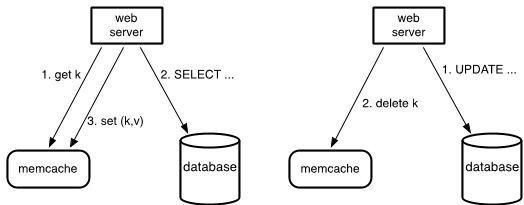
> 图 1：Memcache 作为按需填充的旁路缓存。
> 左半部分展示 Web 服务器在缓存未命中时的读路径，
> 右半部分展示写路径。

**查询缓存：** 我们依靠 memcache 来减轻数据库的读取负载。
具体来说，
我们把 memcache 用作*按需填充的旁路*缓存，
如图 1 所示。
当 Web 服务器需要数据时，
先用一个字符串键向 memcache 请求对应的值。
若该键对应的数据项不在缓存中，
Web 服务器就从数据库或其他后端服务取回数据，
并将这个键值对回填到缓存里。
对于写请求，
Web 服务器先向数据库执行 SQL 语句，
再向 memcache 发送 delete 请求，使已陈旧的数据失效。
我们选择删除缓存数据而非更新它，
因为删除操作是幂等的。
Memcache 并非数据的权威来源，
因此缓存中的数据随时可以被淘汰。

应对 MySQL 数据库过量读取流量的方法有好几种，
我们选择了 memcache。
在工程资源与时间都有限的条件下，
它是最佳选择。
此外，
把缓存层与持久化层分离后，
我们可以在工作负载变化时独立调整每一层。

**通用缓存：** 我们还将 memcache 用作更通用的键值存储。
例如，
工程师用 memcache 存储复杂机器学习算法的预计算结果，
这些结果随后可以被各种其他应用使用。
新服务几乎不费力气就能复用现有的 memcache 基础设施，
而无需承担调优、
优化、
置备和维护大型服务器集群的负担。

memcached 本身不提供服务器间协调；
它只是运行在单台服务器上的一张内存哈希表。
本文余下部分
将描述我们如何基于 memcached 构建一个能承载 Facebook 工作负载的分布式键值存储。
我们的系统提供了一整套
配置、聚合与路由服务，
把各个 memcached 实例组织成一个分布式系统。

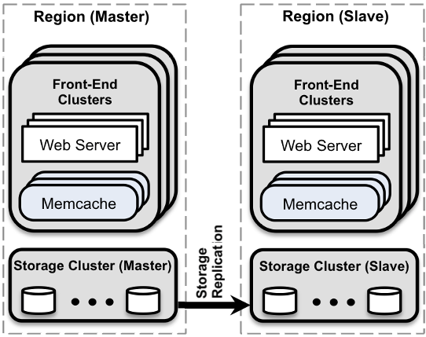
> 图 2：总体架构。
> 共置的集群被组织为一个区域，
> 并指定一个主区域，
> 由它向非主区域提供数据流，使其保持最新。

我们按三种不同部署规模下呈现的主题来组织本文结构。
在只有一个服务器集群时，
读密集型工作负载与宽扇出是主要关注点。
当需要扩展到多个前端集群时，
我们要解决这些集群之间的数据复制问题。
最后，
我们描述在集群遍布全球的情况下保持一致用户体验的机制。
运维复杂性与容错在所有规模下都很重要。
我们给出支撑设计决策的关键数据；
对工作负载更详细的分析，读者可参阅 Atikoglu 等人 [8] 的工作。
从宏观上看，
图 2 展示了最终架构：
我们将共置的集群组织成区域，
并指定一个主区域，由它提供数据流，使非主区域保持最新。

在系统演进过程中，
我们优先考虑两大设计目标。
(1) 任何改动都必须针对某个面向用户或运维的问题。
收益范围有限的优化很少被考虑。
(2) 我们把读到瞬态陈旧数据的概率视为一个可调参数，
与响应性类似。
我们愿意暴露略微陈旧的数据，
以此换取后端存储服务免于过载。

## 3 集群内：延迟与负载

我们现在来看在单个集群内扩展到数千台服务器的挑战。
在这一规模下，
我们的大部分努力集中在降低获取缓存数据的延迟，或减轻缓存未命中带来的负载。

### 3.1 降低延迟

无论数据请求导致缓存命中还是未命中，
memcache 的响应延迟都是用户请求响应时间的关键因素。
单个用户 Web 请求通常会导致数百个独立的 memcache get 请求。
例如，
加载我们的一个热门页面平均需要从 memcache 获取 521 个不同的数据项。¹

我们在集群中配置数百台 memcached 服务器以减少数据库和其他服务的负载。
数据项通过一致性哈希 [22] 分布在 memcached 服务器上。
因此 Web 服务器必须经常与许多 memcached 服务器通信以满足用户请求。
结果，
所有 Web 服务器在短时间内与每台 memcached 服务器通信。
这种全对全通信模式可能导致 incast 拥塞 [30]，
或使单个服务器成为许多 Web 服务器的瓶颈。
数据复制通常可以缓解单服务器瓶颈，
但在常见情况下会导致显著的内存低效。

我们主要通过打磨 memcache 客户端来降低延迟，
该客户端运行在每台 Web 服务器上。
这个客户端承担一系列功能，
包括序列化、
压缩、
请求路由、
错误处理和请求批处理。
客户端维护所有可用服务器的映射，
并通过一个辅助配置系统来更新。

**并行请求与批处理：** 我们组织 Web 应用代码，以最小化响应页面请求所需的网络往返次数。
我们构建一个有向无环图（DAG）来表示数据项之间的依赖关系。
Web 服务器使用这个 DAG 来最大化可以并发获取的数据项数量。
平均而言，
这些批次每个请求包含 24 个键²。

**客户端-服务器通信：** Memcached 服务器之间不通信。
在适当的时候，
我们将系统的复杂性嵌入无状态客户端而不是 memcached 服务器中。
这大大简化了 memcached，
使我们能专注于在较窄的用例下把性能做到极致。
保持客户端无状态允许软件快速迭代，并简化了部署流程。
客户端逻辑以两个组件的形式提供：一个可嵌入应用的库，
以及一个名为 mcrouter 的独立代理。
该代理对外呈现 memcached 服务器接口，
并负责把请求/响应路由到其他服务器或从其他服务器返回。

客户端使用 UDP 和 TCP 与 memcached 服务器通信。
我们依靠 UDP 进行 get 请求以减少延迟和开销。
由于 UDP 是无连接的，
Web 服务器中的每个线程都能直接与 memcached 服务器通信，
绕过 mcrouter，
无需建立和维护连接，
从而减少开销。

> ¹该页面获取的第 95 百分位数为 1,740 个数据项。

> ²第 95 百分位数为每个请求 95 个键。

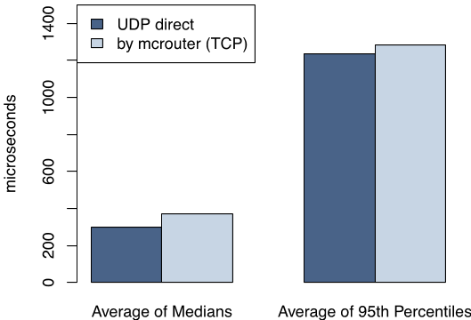
> 图 3：生产环境中 Web 服务器通过 UDP 和通过 mcrouter 的 TCP 获取键的平均、
> 中位数和第 95 百分位延迟。
> UDP 消除了 TCP 连接建立开销，
> 显著降低了延迟。

UDP 实现使用序列号检测被丢弃或乱序到达的数据包，
并在客户端把它们当作错误处理，
且不提供任何恢复机制。
我们在基础设施中的实践表明，
这个决定是务实的。
在峰值负载下，
memcache 客户端观察到有 0.25% 的 get 请求丢失。
这些丢失中约 80% 由延迟或丢弃的数据包造成，
其余则源于乱序交付。
客户端把 get 错误当作缓存未命中处理，
但 Web 服务器在查询数据后会跳过把条目回填进 memcached，
以免给可能已过载的网络或服务器增加额外负载。

为了可靠性，
客户端经由与 Web 服务器同机运行的 mcrouter 实例，
通过 TCP 执行 set 和 delete 操作。
对于需要确认状态变更的操作（更新与删除），
TCP 使我们无须为 UDP 实现添加重试机制。

Web 服务器依靠高度并行和超额订阅来实现高吞吐量。
开放 TCP 连接的高内存需求使得在每个 Web 线程和 memcached 服务器之间保持开放连接的成本过高，
除非通过 mcrouter 进行某种形式的连接合并。
合并这些连接通过减少高吞吐量 TCP 连接所需的网络、
CPU 和内存资源来提高服务器效率。
图 3 展示了生产环境中 Web 服务器通过 UDP 和通过 mcrouter 的 TCP 获取键的平均、
中位数和第 95 百分位延迟。
在所有情况下，
这些平均值的标准偏差小于 1%。
数据显示，
依靠 UDP 可将服务请求的延迟降低 20%。

**Incast 拥塞：** Memcache 客户端实现流控机制以限制 incast 拥塞。
当客户端请求大量键时，
如果这些响应同时到达，
可能会压垮机架和集群交换机等组件。
因此客户端使用滑动窗口机制 [11] 来控制未决请求的数量。
客户端收到响应后才能发送下一个请求。
类似于 TCP 的拥塞控制，
这个滑动窗口的大小在请求成功时缓慢增长，
在请求未得到应答时缩小。
该窗口对所有 memcache 请求生效，与目的地无关；
而 TCP 窗口只作用于单条流。

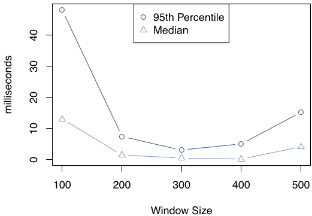
> 图 4：Web 请求在服务器内等待被调度的平均时间随滑动窗口大小的变化。
> 窗口大小（最大并发请求数）对请求排队等待时间有显著影响。

图 4 展示了窗口大小对用户请求处于可运行状态后仍在 Web 服务器内等待调度的时长的影响。
数据来自一个前端集群中的多个机架。
用户请求在每台 Web 服务器上呈泊松到达。
根据 Little 定律 [26]，
$L = \lambda W$，
在服务器中排队的请求数（$L$）与请求处理所需的平均时间（$W$）成正比，
前提是请求到达率恒定（我们的实验确实如此）。
Web 请求等待被调度的时间是系统中 Web 请求数量的直接指标。
窗口大小较小时，
应用必须串行地分派更多组 memcache 请求，
增加了 Web 请求的持续时间。
窗口大小过大时，
并发的 memcache 请求会引发 incast 拥塞。
结果就是 memcache 出错、应用回退到持久存储取数，
Web 请求的处理随之变慢。
在这两个极端之间存在一个平衡点，
可以避免不必要的延迟并最小化 incast 拥塞。

### 3.2 降低负载

我们使用 memcache 来减少沿更昂贵路径（如数据库查询）获取数据的频率。
当所需数据未被缓存时，
Web 服务器回退到这些路径。
以下小节描述了三种降低负载的技术。

#### 3.2.1 租约

我们引入了一种称为租约的新机制来解决两个问题：
陈旧写入和惊群效应。
当 Web 服务器写入 memcache 的值并非本应缓存的最新值时，就发生了陈旧写入。
并发更新 memcache 时，若更新顺序被打乱，就会出现这种情况。
当某个键经历密集的读写活动时，就会发生惊群效应。
写活动反复使刚写入的值失效，
许多读请求只能回退到更昂贵的路径。
我们的租约机制解决了这两个问题。

直觉上，
客户端缓存未命中时，
memcached 实例会发给它一个租约，
允许它把数据写回缓存。
租约是一个 64 位令牌，绑定到客户端最初请求的键。
客户端在缓存中设置值时提供租约令牌。
凭借租约令牌，
memcached 可以验证并决定数据是否应当存储，
从而对并发写入进行仲裁。
若 memcached 已因收到该数据项的 delete 请求而作废了租约令牌，
验证就可能失败。
租约以类似于 load-link/store-conditional 操作 [20] 的方式防止陈旧写入。

对租约稍加改动还能缓解惊群效应。
每台 memcached 服务器都会限制发放令牌的速率。
默认情况下，
我们把服务器配置为每个键每 10 秒只发放一次令牌。
令牌发出后 10 秒内再请求该键会收到一个特殊通知，
提示客户端稍等片刻。
通常，
持有租约的客户端会在几毫秒内成功写入数据。
因此，
当等待中的客户端重试时，
数据通常已在缓存里了。

为了说明这一点，
我们挑选了一组特别容易受惊群效应影响的键，
收集它们一周内所有缓存未命中的数据。
没有租约时，
这些缓存未命中使数据库查询率达到 17K/s 的峰值。
有了租约，
数据库查询率峰值只有 1.3K/s。
由于我们按峰值负载配置数据库，
租约机制直接转化为显著的效率提升。

**陈旧值：** 有了租约，
我们能在某些用例中把应用的等待时间降到最低。
如果能识别出返回略微陈旧的数据也可接受的场景，还能进一步缩短这一时间。
键被删除时，
其值会转入一个保存最近删除项的数据结构，
短暂保留后被清除。
get 请求可以返回租约令牌或标记为陈旧的数据。
能用陈旧数据继续推进的应用，不必等待从数据库取回最新值。
我们的经验表明，
由于缓存值往往是数据库单调递增的快照，
大多数应用无需任何改动就能使用陈旧值。

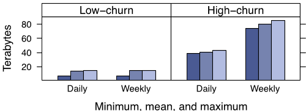
> 图 5：高流失率和低流失率键族的每日和每周工作集大小对比，
> 分别为最小、
> 平均和最大近似值。
> 每日与每周工作集之间的差异表示流失量。

#### 3.2.2 Memcache 池

把 memcache 用作通用缓存层，意味着不同工作负载要共享基础设施，
尽管它们的访问模式、
内存占用和服务质量要求各不相同。
不同应用的工作负载可能相互干扰，
拉低命中率。

为适应这些差异，
我们把集群内的 memcached 服务器划分成不同的池。
我们指定一个池（名为 wildcard）作为默认池，
并为不适合留在 wildcard 中的键单独建池。
例如，
我们可能为访问频繁但未命中代价低的键配一个小池，
也可能为访问稀疏但未命中代价极高的键配一个大池。

图 5 展示了两组不同数据项的工作集，
一组是低流失率的，
另一组是高流失率的。
工作集大小通过抽样近似：从每一百万个数据项中取一个，收集其全部操作。
对这些抽样数据项，
我们记录最小、
平均和最大的数据项大小。
将这些大小求和后乘以一百万，即得工作集的近似值。
每日与每周工作集之差反映流失量。
流失特征不同的数据项会以糟糕的方式相互影响：
仍有价值的低流失键会比已无人访问的高流失键更早被驱逐。
把这些键放进不同的池即可避免这种干扰，
也能按各自的未命中代价为高流失池单独定容。
第 7 节有进一步分析。

#### 3.2.3 池内复制

在部分池中，
我们用复制来降低延迟、提高 memcached 服务器的效率。
满足以下条件时，我们会在池内复制一类键：
(1) 应用经常同时获取大量键；
(2) 整个数据集放得进一两台 memcached 服务器；
(3) 请求率远高于单台服务器的处理能力。

这种情况下，
我们宁可用复制，也不再细分键空间。
假设一台 memcached 服务器存有 100 个数据项，每秒能响应 50 万次请求。
每个请求要取 100 个键。
一次取 100 个键与只取 1 个键相比，memcached 的开销差别很小。
要把系统扩展到每秒 100 万次请求，
假设我们加一台服务器，把键空间平分给两台机器。
客户端就得把每个 100 键请求拆成两个各约 50 键的并行请求。
结果，
每台服务器仍要每秒处理 100 万次请求。
反之，
若把全部 100 个键复制到多台服务器，
客户端的 100 键请求可以发送到任何副本。
每台服务器的负载便降到每秒 50 万次请求。
每个客户端根据自己的 IP 地址选择副本。
这种做法需要把失效操作送达所有副本，以维持一致性。

### 3.3 处理故障

从 memcache 取不到数据，后端服务就会承受过量负载，
还可能引发进一步的级联故障。
故障要在两个尺度上应对：(1) 网络或服务器故障导致少量主机不可访问；
(2) 影响集群内相当比例服务器的大面积中断。
若整个集群必须下线，
我们就把用户的 Web 请求引到其他集群，
这等于卸掉了该集群内 memcache 的全部负载。

小范围中断交给自动修复系统处理 [3]。
修复动作并非瞬时完成，
最长可能要几分钟。
这段时间足以引发上述级联故障，
因此我们引入一种机制，把后端服务与故障进一步隔离。
我们专门留出一小批机器（名为 Gutter），
在少数服务器故障时接管它们的职责。
Gutter 约占集群中 memcached 服务器的 1%。

memcached 客户端的 get 请求若无响应，
客户端就假定该服务器已故障，
把请求改发到专门的 Gutter 池。
若这次请求仍未命中，
客户端查询数据库后，会把相应的键值对写入 Gutter 机器。
Gutter 中的条目很快过期，因此无须对它做失效操作。
Gutter 以数据略微陈旧为代价，限制住后端服务的负载。

注意，
这种设计不同于让客户端在剩余 memcached 服务器之间重新哈希键的做法。
键的访问频率并不均匀，那种做法有引发级联故障的风险。
例如，
单个键可能占一台服务器请求量的 20%。
接管这个热键的服务器可能随之过载。
把负载引到空闲服务器上，
就限制了这种风险。

通常，
每个失败的请求都会打到后备存储上，
可能把它压垮。
用 Gutter 存下这些结果后，
相当一部分失败请求转化为 Gutter 池中的命中，
后备存储的负载随之下降。
实践中，
该系统把客户端可见的故障率降低了 99%，
每天还有 10%–25% 的故障被转化为命中。
一台 memcached 服务器完全宕机时，
Gutter 池的命中率通常在 4 分钟内超过 35%，
往往逼近 50%。
因此，
当少数 memcached 服务器因故障或小规模网络事故不可用时，
Gutter 能保护后备存储免受流量激增冲击。

## 4 区域内：复制

需求增长时，
靠添置更多 Web 和 memcached 服务器来扩展集群是很诱人的。
然而，
简单地扩容并不能消除所有问题。
为应对增长的用户流量而增加 Web 服务器后，
高请求量的数据项只会变得更热门。
memcached 服务器数量增加，
incast 拥塞也会加剧。
因此，
我们将 Web 和 memcached 服务器拆分为多个前端集群。
这些前端集群加上存放数据库的存储集群，共同构成一个区域。
这种区域架构还带来更小的故障域和更易管理的网络配置。
我们用数据复制换取更多相互独立的故障域、
更易管理的网络配置，并减轻 incast 拥塞。

本节分析多个前端集群共享同一存储集群带来的影响。
具体而言，
我们讨论允许数据跨这些集群复制的后果，以及禁止复制能带来的潜在内存效率。

### 4.1 区域失效

区域内的存储集群保存数据的权威副本，
但用户需求可能把数据复制到前端集群中。
存储集群负责使缓存数据失效，
让前端集群与权威版本保持一致。
作为优化，
修改数据的 Web 服务器还会向自己所在的集群发送失效，
为单个用户请求提供写后读语义，
并缩短陈旧数据留在本地缓存中的时间。

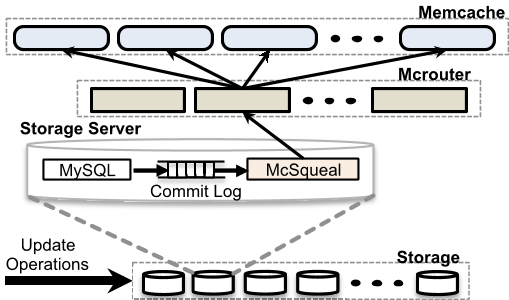
> 图 6：失效管道，展示需要经由守护进程（mcsqueal）删除的键。
> 数据库变更由 mcsqueal 守护进程批量转成失效请求发往 memcached 集群，
> 使缓存与数据库保持一致。

修改权威状态的 SQL 语句会被改写，附上事务提交后需要失效的 memcache 键 [7]。
我们为每个数据库部署了失效守护进程（名为 mcsqueal）。
每个守护进程检查所在数据库提交的 SQL 语句，
提取其中的删除操作，
广播到该区域内每个前端集群的 memcache 部署。
图 6 展示了这一机制。
我们注意到大多数失效并不会删除数据；
实际上，
发出的所有删除中只有 4% 真正使缓存数据失效。

**降低发包速率：** mcsqueal 固然可以直接联系 memcached 服务器，
但那样从后端集群发往前端集群的数据包速率会高得无法接受。
发包速率之所以成问题，是因为大量数据库和大量 memcached 服务器在跨集群边界通信。
失效守护进程把删除操作打包成数量更少的数据包，
发给每个前端集群中一组运行 mcrouter 实例的专用服务器。
这些 mcrouter 再把单个删除操作从每个批次中拆出，
路由到同在该前端集群内的目标 memcached 服务器。
批处理使每个数据包携带的删除数中位数提升到原来的 18 倍。

**经由 Web 服务器失效：** 让 Web 服务器向所有前端集群广播失效看似更简单。
可惜这种做法有两个问题。
首先，
它的数据包开销更大，
因为 Web 服务器批处理失效的效率不如 mcsqueal 管道。
其次，
一旦出现系统性的失效问题（比如配置错误导致删除被误路由），
它几乎无从补救。
过去，
这类问题往往要靠滚动重启整个 memcache 基础设施，
这个过程缓慢且影响面大，
我们希望避免。
相比之下，
失效嵌在 SQL 语句里，
由数据库提交并存入可靠日志，
mcsqueal 只需重放可能丢失或误路由的失效即可。

| |A（集群）|B（区域）|
| ---|---|---|
| 中位用户数|30|1|
| 每秒 get 数|3.26 M|458 K|
| 中位值大小|10.7 kB|4.34 kB|

> 表 1：决定两个数据项族采用集群复制还是区域复制的因素。

### 4.2 区域池

每个集群根据路由到自己的用户请求构成，独立地缓存数据。
若用户请求被随机路由到所有可用前端集群，
各前端集群缓存的数据就大致相同。
这样我们就能在不损失命中率的前提下把某个集群下线维护。
过度复制数据会浪费内存，
对体积大、
又很少访问的数据项尤其如此。
让多个前端集群共享同一组 memcached 服务器，即可减少副本数量。
我们称之为区域池。

跨集群边界访问延迟更高。
此外，
我们的网络跨集群边界的平均可用带宽比集群内部低 40%。
复制以更多 memcached 服务器为代价，换取更少的集群间带宽占用、
更低的延迟和更好的容错。
对某些数据而言，
放弃复制的好处、每区域只留一个副本反而更划算。
在区域内扩展 memcache 的一大挑战，是判断一个键该复制到所有前端集群，
还是每区域只留一个副本。
区域池中的服务器故障时，同样由 Gutter 接管。

表 1 总结了我们应用中两类值很大的数据项。
我们把其中一类（B）迁入了区域池，
另一类（A）保持不动。
注意，
客户端访问 B 类数据项的频率比 A 类低一个数量级。
B 类访问率低，正是区域池的理想候选，
因为它不会对集群间带宽造成压力。
若留在集群内，B 类还会占据每个集群 wildcard 池的 25%，
因此区域化能显著提升存储效率。
然而，
A 类数据项体积是 B 类的两倍，访问频率也高得多，
因此不适合放入区域池。
目前，是否把数据迁入区域池依靠一组人工启发式规则判断，
依据包括访问率、数据集大小，以及访问该数据项的唯一用户数。

### 4.3 冷集群预热

新集群上线、现有集群故障或执行计划内维护时，
缓存命中率会非常低，
削弱了缓存隔离后端服务的能力。
名为冷集群预热的系统缓解了这个问题：
它允许"冷集群"（即缓存为空的前端集群）中的客户端，
从"热集群"（即缓存命中率正常的集群）而非持久存储取数据。
这利用了前述跨前端集群的数据复制。
借助该系统，
冷集群几小时内即可恢复满载，而不必耗费数天。

必须小心避免因竞态条件导致的不一致。
例如，
如果冷集群中的客户端执行数据库更新，
而另一个客户端的后续请求在热集群收到失效通知之前从热集群检索了陈旧值，
则该数据项将在冷集群中无限期地不一致。
Memcached 的 delete 操作支持非零的 hold-off time，
并在这段指定时长内拒绝 add 操作。
默认情况下，
对冷集群的所有 delete 都带有两秒的 hold-off time。
在冷集群中检测到未命中时，
客户端从热集群重新请求该键并将其添加到冷集群。
add 的失败表明数据库上有更新的数据，
因此客户端将从数据库获取值。
虽然理论上 delete 仍可能延迟超过两秒，
但在绝大多数情况下并非如此。
冷集群预热的运维收益远远超过罕见缓存一致性问题的代价。
一旦冷集群的命中率稳定且收益减少，
我们就关闭它。

## 5 跨区域：一致性

把数据中心部署到更广阔的地理范围有若干优势。
首先，
把 Web 服务器部署在离终端用户更近的位置，可以显著降低延迟。
其次，
地理上的分散布局可以减轻自然灾害、大面积停电等事件的影响。
第三，
新的选址可能提供更廉价的电力和其他经济优惠。
我们通过多区域部署来获得这些优势。
每个区域包含一个存储集群和若干前端集群。
我们指定一个区域存放主数据库，
其余区域只保存只读副本，
并依靠 MySQL 的复制机制使副本数据库与主数据库保持同步。
在这一设计下，
无论访问本地 memcached 服务器还是本地数据库副本，Web 服务器都能获得低延迟。
扩展到多个区域之后，
保持 memcache 中的数据与持久存储之间的一致性，成为最主要的技术挑战。
这些问题都源于同一个根源：副本数据库可能落后于主数据库。

在一致性与性能的权衡谱系上，我们的系统只是其中一个点。
与系统的其他部分一样，
一致性模型多年来也在不断演进，
以适应站点规模的增长。
它融合了在不牺牲高性能要求的前提下、可以实际落地的各种机制。
系统管理的数据量极大，
任何增加网络或存储开销的微小改动都会带来不可忽视的成本。
大多数能提供更严格语义的方案都停留在设计阶段，
因为它们的代价高得无法接受。
与许多针对既有场景定制的系统不同，
memcache 是伴随 Facebook 一起开发演进的。
这让应用工程师与系统工程师能够共同探索，
找到一个应用工程师容易理解、同时性能和简洁性足以支撑大规模可靠运行的模型。
我们提供尽力而为的最终一致性，
但更强调性能和可用性。
实践证明，
这套系统对我们非常有效，
我们认为已经找到了一个可以接受的权衡点。

**来自主区域的写入：** 我们早先做过一个决定：由存储集群通过守护进程发送失效通知。这一决定在多区域架构中影响重大。
具体来说，
它避免了一种竞态条件：失效通知*先于*数据本身从主区域复制到达。
设想主区域中的一台 Web 服务器刚修改完数据库，准备让由此变得陈旧的数据失效。
在主区域内发送失效通知是安全的。
然而，
让 Web 服务器去失效副本区域中的数据可能为时过早，
因为改动可能尚未传播到副本数据库。
此后副本区域对该数据的查询会与复制流竞速，
从而增大把陈旧数据写进 memcache 的概率。
从发展历程看，
我们正是在扩展到多区域之后才实现 mcsqueal 的。

**来自非主区域的写入：** 再设想一个用户在复制延迟过大时，从非主区域更新自己的数据。
如果他最近的改动缺失，
用户的下一个请求就可能引发困惑。
只有等复制流追平之后，
才允许用副本数据库的数据回填缓存。
否则，
后续请求可能把副本中的陈旧数据取出来并缓存。

我们采用 remote marker 机制，把读到陈旧数据的概率降到最低。
某个键存在标记，说明本地副本数据库中的数据可能已经陈旧，
查询应重定向到主区域。
当 Web 服务器要更新影响键 $k$ 的数据时，
它会 (1) 在本区域设置 remote marker $r_k$；
(2) 向主数据库执行写入，
并在 SQL 语句中一并附上待失效的 $k$ 和 $r_k$；
(3) 在本地集群删除 $k$。
后续请求 $k$ 时，
Web 服务器会先发现缓存中已无数据，
接着检查 $r_k$ 是否存在，
并据此把查询导向主区域或本地区域。
在这里，
我们明确地以缓存未命中时的额外延迟，换取读到陈旧数据概率的下降。

remote marker 借助区域池来实现。
需要注意的是，
对同一键并发修改时，这一机制可能暴露陈旧信息：
一个操作可能删掉了另一个进行中的操作还需要保留的 remote marker。
值得强调的是，
把 memcache 用作 remote marker，与用它缓存结果有着微妙的差异。
作为缓存，
删除或驱逐键永远是安全的：
最多只会给数据库增加一些负载，
不会损害一致性。
而 remote marker 不同，
它的存在与否有助于判断非主数据库中的数据是否陈旧。
实践中，
我们发现 remote marker 被驱逐、以及并发修改的情形都很少见。

**运维考量：** 区域间通信开销很大，
因为数据要跨越遥远的地理距离（例如横跨美国大陆）。
删除流与数据库复制共享同一条通信链路，
可以在带宽较低的线路上提升网络利用效率。

4.1 节介绍的删除管理系统同样部署在副本数据库一侧，
负责把删除操作广播到副本区域的 memcached 服务器。
下游组件无响应时，
数据库和 mcrouter 会先把删除操作缓存起来。
任何一个组件故障或延迟，都会使读到陈旧数据的概率上升。
等这些下游组件恢复可用，
缓存的删除操作会被重放。
备选方案只有两种：把集群下线，或者在发现问题时在前端集群中过度失效数据。
就我们的工作负载而言，
这些做法带来的干扰大于收益。

## 6 单服务器改进

全对全的通信模式意味着单台服务器可能成为整个集群的瓶颈。
本节介绍 memcached 在性能与内存效率上的若干改进，
正是这些改进支撑了集群内更好的扩展。
提升单服务器缓存性能至今仍是活跃的研究领域 [9, 10, 28, 25]。

### 6.1 性能优化

我们最初使用的是单线程的 memcached，哈希表大小固定。
第一批主要优化包括：(1) 允许哈希表自动扩容，避免查找耗时退化到 $O(n)$；
(2) 用一把全局锁保护多个数据结构，把服务器改造为多线程；
(3) 为每个线程分配独立的 UDP 端口，减少发送回复时的争用，
并在之后分摊中断处理开销。
前两项优化已经回馈给开源社区。
本节余下的部分探讨尚未进入开源版本的进一步优化。

实验主机配备 Intel Xeon CPU（X5650），
主频 2.67GHz（12 核 12 超线程），
Intel 82574L 千兆以太网卡和 12GB 内存。
生产服务器的内存更大。
更多细节见我们此前的工作 [4]。
性能测试环境由 15 个客户端组成，
向一台运行 24 线程的 memcached 服务器发送 memcache 流量。
客户端与服务器部署在同一机架上，
通过千兆以太网互联。
测试在持续两分钟的负载下测量 memcached 的响应延迟。

**Get 性能：** 我们首先考察用细粒度锁替换原先多线程单锁实现带来的效果。
测量命中时，我们先向缓存预填充 32 字节的值，再逐个发出 10 键的 memcached 请求。
图 7 展示了不同版本 memcached 在亚毫秒平均响应时间下能维持的最大请求率。
第一组柱状图是引入细粒度锁之前的 memcached，
第二组是我们当前的 memcached，
最后一组是开源版本 1.4.10，
该版本独立实现了我们锁策略的一个更粗粒度的变体。

采用细粒度锁后，命中的峰值 get 速率从每秒 60 万提高到 180 万数据项，
提升至原来的三倍。
未命中的性能也从每秒 270 万提升到 450 万数据项。
命中比未命中更昂贵，
因为要构造并传输返回值；
而整个 multiget 全部未命中时只需返回一个静态响应（END），
表示所有键都未命中。

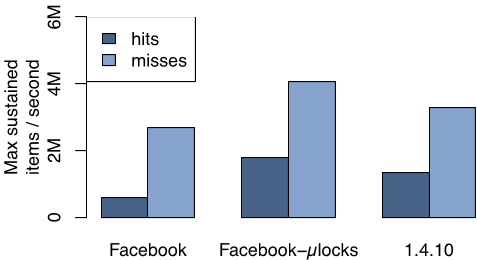
> 图 7：不同版本 memcached 在亚毫秒平均响应时间下可维持的最大请求率（multiget 命中与未命中）。
> 第一组为细粒度锁之前的 memcached，
> 第二组为采用细粒度锁的当前版本，
> 第三组为开源版本 1.4.10。

我们也考察了用 UDP 代替 TCP 的性能影响。
图 8 展示了在平均延迟低于一毫秒的前提下，
单个 get 与 10 键 multiget 各自能维持的峰值请求率。

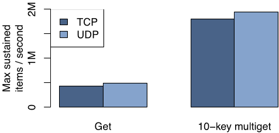
> 图 8：单个 get 和 10 键 multiget 在 TCP 和 UDP 上的 get 命中性能对比。
> UDP 在两种场景下均优于 TCP，
> multiget 通过批量获取提升了吞吐量。

结果显示，单个 get 上 UDP 实现比 TCP 实现快 13%，
10 键 multiget 上快 8%。

multiget 每个请求打包的数据比单个 get 更多，
完成同样的工作所需的数据包更少。
图 8 显示，10 键 multiget 相比单个 get 约有四倍的提升。

### 6.2 自适应 slab 分配器

memcached 使用 slab 分配器管理内存。
分配器把内存组织成若干 *slab 类*，
每个类包含预先分配的、
大小一致的内存块。
memcached 会把数据项存入能够容纳其元数据、
键和值的最小 slab 类。
slab 类的大小从 64 字节起步，
按 1.07 的因子指数增长直至 1 MB，
并按 4 字节边界对齐³。
每个 slab 类维护一个可用内存块的空闲列表，
空闲列表耗尽时，再以 1MB 的 slab 为单位申请更多内存。
当 memcached 服务器再无空闲内存可分配时，
就通过驱逐该 slab 类中最近最少使用（LRU）的数据项来为新数据项腾出空间。
工作负载变化后，
最初分给各 slab 类的内存可能不再够用，
进而拉低命中率。

> ³这一因子保证 64 字节和 128 字节的数据项都存在，
> 这两种大小更贴合硬件缓存行。

我们实现了一个自适应分配器，
定期重新平衡各 slab 类的内存配额，以匹配当前工作负载。
它把满足以下条件的 slab 类判定为需要更多内存：该类正在驱逐数据项，
且下一个待驱逐数据项的最近使用时间，比其他 slab 类中最近最少使用数据项的平均使用时间至少新 20%。
找到这样的类之后，
就把持有最近最少使用数据项的那块内存释放出来，转给缺内存的类。
值得一提的是，
开源社区也独立实现了一个类似的分配器，
它平衡各 slab 类之间的驱逐率，
而我们的算法专注于平衡各类中最旧数据项的年龄。
以年龄为平衡目标，能更好地近似整台服务器上的单一全局 LRU 驱逐策略；
调节驱逐率则不然，驱逐率很容易被访问模式左右。

### 6.3 Transient Item Cache

memcached 虽然支持过期时间，
条目却可能在过期之后仍在内存中驻留很久。
它只会在处理某个数据项的 get 请求、或该数据项到达 LRU 队尾时才检查过期时间，惰性驱逐这些条目。
这种方案在常见场景下足够高效，
却会让只经历一次访问爆发的短生命周期键一直占用内存，
直到它们排到 LRU 队尾。

为此，我们引入了一种混合方案：
大多数键仍靠惰性驱逐，
短生命周期键则在过期时主动驱逐。
我们按数据项的过期时间，把短生命周期数据项放入一个循环缓冲区的链表里
——这个缓冲区称为 *Transient Item Cache*，
以距离过期的秒数为索引。
每一秒，
缓冲区头部桶中的所有数据项都会被驱逐，
头部随之前移一位。
我们曾给一组使用频繁、但数据项有效生命周期很短的键加上短过期时间，
该键族占用的 memcache 池比例随即从 6% 降到 0.3%，
命中率不受影响。

### 6.4 软件升级

软件经常需要变更：升级、
修复 bug、
临时诊断或性能测试都会触发。
一台 memcached 服务器要经过几个小时才能恢复到峰值命中率的 90%。
因此，
升级一组 memcached 服务器可能要花 12 小时以上，
因为随之而来的数据库负载必须小心应对。
我们修改了 memcached，把缓存值和主要数据结构放进 System V 共享内存区域，
让数据在软件升级期间继续存活，
从而把中断降到最小。

## 7 Memcache 工作负载

接下来，我们用生产环境中实际运行的服务器数据来刻画 memcache 工作负载。

### 7.1 Web 服务器端的测量

我们记录了一小部分用户请求的全部 memcache 操作，
并据此分析工作负载在扇出、
响应大小和延迟方面的特征。

**扇出：** 图 9 展示了 Web 服务器响应一次页面请求时可能需要联系的不同 memcached 服务器数量的分布。
如图所示，
56% 的页面请求联系不到 20 台 memcached 服务器。
从总量上看，
用户请求通常只需要少量缓存数据。
不过，
这一分布存在明显的长尾。
图中还给出了我们某个热门页面的分布，
它更充分地体现了全对全通信模式。
这类请求大多会访问 100 多台不同的服务器；
访问数百台 memcached 服务器也不算稀奇。

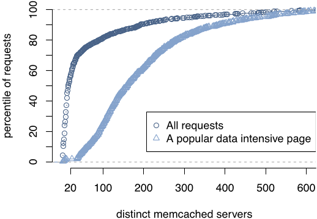
> 图 9：每次 Web 请求访问的不同 memcached 服务器数量的累积分布。
> 多数请求只需访问少数几台服务器，
> 但长尾请求可能需要访问大量服务器。

**响应大小：** 图 10 展示了 memcache 请求的响应大小分布。
中位数（135 字节）与均值（954 字节）差距悬殊，说明缓存数据项的大小差异非常大。
此外，
在大约 200 字节和 600 字节附近还有三个明显的峰值。
较大的数据项往往存储数据列表，
较小的数据项往往只存单条内容。

**延迟：** 我们测量了向 memcache 请求数据的往返延迟，
它包括路由请求与接收回复的开销、
网络传输时间，以及反序列化和解压缩的成本。
7 天的测量显示，
请求延迟中位数为 333 微秒，
p75 和 p95 分别为 475μs 和 1.135ms。
空闲 Web 服务器上测得的中位端到端延迟为 178μs，
p75 和 p95 分别为 219μs 和 374μs。
两个 p95 之间的巨大差距，来自处理大响应以及等待线程被调度的时间，
正如 3.1 节所讨论的。

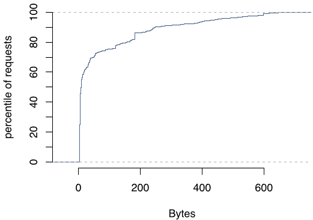
> 图 10：从 memcache 获取的值大小的累积分布。
> 中位数为 135 字节，
> 均值为 954 字节，
> 缓存数据项的大小差异很大。

### 7.2 池统计

接下来讨论四个 memcache 池的关键指标。
它们分别是：wildcard（默认池）、
app（专供某个应用使用的池）、
服务高频访问数据的复制池，
以及存放冷门数据的区域池。
每个池内，
我们每 4 分钟采集一次统计均值，
表 2 报告的是一个月采集期内最高的那个均值。
这组数据近似于这些池承受过的峰值负载。
表中可以看到，各池的 get、
set 和 delete 速率差异悬殊。
表 3 则给出各池的响应大小分布。
同样，
这些截然不同的特征正是我们希望把各工作负载彼此隔离的原因。

| 池|未命中率|$\frac{get}{s}$|$\frac{set}{s}$|$\frac{delete}{s}$|$\frac{packets}{s}$|出站带宽 (MB/s)|
| ---|---|---|---|---|---|---|
| wildcard|1.76%|262k|8.26k|21.2k|236k|57.4|
| app|7.85%|96.5k|11.9k|6.28k|83.0k|31.0|
| replicated|0.053%|710k|1.75k|3.22k|44.5k|30.1|
| regional|6.35%|9.1k|0.79k|35.9k|47.2k|10.8|

> 表 2：选定 memcache 池上每台服务器的流量，
> 7 天平均。

| 池|均值|标准差|p5|p25|p50|p75|p95|p99|
| ---|---|---|---|---|---|---|---|---|
| wildcard|1.11 K|8.28 K|77|102|169|363|3.65 K|18.3 K|
| app|881|7.70 K|103|247|269|337|1.68K|10.4 K|
| replicated|66|2|62|68|68|68|68|68|
| regional|31.8 K|75.4 K|231|824|5.31 K|24.0 K|158 K|381 K|

> 表 3：各池数据项大小的分布（字节）。

正如 3.2.3 节所讨论的，
我们在池内复制数据，并借助批处理应对高请求率。
值得注意的是，
复制池的 get 速率最高（约为次高池的 $2.7\times$），字节与数据包之比也最高，
尽管它的数据项最小。
这些数据与我们的设计吻合：
我们正是靠复制和批处理来换取更好的性能。
app 池中，
数据更替更快，未命中率自然更高。
这个池里的内容通常在被访问几个小时后就逐渐失热，让位于新内容。
区域池中的数据则偏大且访问频率低，
请求速率和取值大小分布都印证了这一点。

### 7.3 失效延迟

我们深知，失效是否及时，直接决定了暴露陈旧数据的概率。
为了监控这一健康指标，
我们按百万分之一的比例对删除操作采样，
记录删除发出的时间。
之后，我们每隔固定时间就查询所有前端集群中 memcache 的内容，
寻找被采样的键，
如果某个数据项本应被删除操作失效却仍在缓存中，就记一条错误。

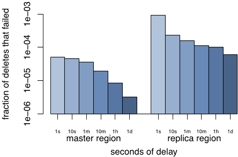
> 图 11：删除管道的延迟：给定延迟时间后仍未完成（失败）的删除操作比例，
> 分删除源和目标与主区域共置、
> 以及删除源自副本区域并发送到副本区域两种情况。

图 11 中，
我们用这一监控机制报告 30 天内的失效延迟。
数据分为两类：(1)
删除由主区域的 Web 服务器发出，目的地是主区域的 memcached 服务器；
(2) 删除由副本区域发出，目的地是另一个副本区域。
数据显示，
删除的源端和目标端都与主区域同置时，
成功率高得多：
1 秒内即可达到四个 9 的可靠性，
一小时后达到五个 9。
然而，
当删除的源端和目的端都在主区域之外时，
可靠性在 1 秒内只有三个 9，
10 分钟内达到四个 9。
经验告诉我们，
如果失效在短短几秒后仍未生效，
最常见的原因是首次尝试失败，
后续重试就能解决问题。

## 8 相关工作

其他几家大型网站同样认识到了键值存储的价值。
DeCandia 等人 [12] 提出了一个高可用的键值存储，
供 Amazon.com 的各类应用服务使用。
他们的系统面向写密集型工作负载优化，
我们的系统则面向以读为主的工作负载。
类似地，
LinkedIn 使用了受 Dynamo 启发的 Voldemort 系统 [5]。
键值缓存方案的其他大规模部署还包括 Github、
Digg 和 Blizzard 使用的 Redis [6]，
以及 Twitter [33] 和 Zynga 使用的 memcached。
Lakshman 等人 [1] 开发了 Cassandra，
一个基于模式的分布式键值存储。
我们之所以选择部署并扩展 memcached，
是因为它的设计更简单。

我们在 memcache 扩展上的工作，建立在分布式数据结构领域大量既有工作之上。
Gribble 等人 [19]
提出了面向互联网规模服务的键值存储系统的早期版本。
Ousterhout 等人 [29] 也论证了大规模内存键值存储系统的价值。
与这两种方案不同，
memcache 不保证持久性。
持久化数据存储交给其他系统负责。

Ports 等人 [31] 提供了一个库，用于管理事务型数据库查询结果的缓存。
我们的需求要求更灵活的缓存策略。
我们对租约 [18] 和陈旧读取 [23] 的使用，借鉴了此前关于高性能系统缓存一致性与读操作的研究。
Ghandeharizadeh 和 Yap [15]
的工作则提出了一种基于时间戳而非显式版本号来解决陈旧写入问题的算法。

软件路由器虽然更容易定制和编程，
性能却通常不如硬件方案。
Dobrescu 等人 [13] 借助多核、
多内存控制器、
多队列网卡以及通用服务器上的批处理来弥补这一差距。
把这些技术应用到 mcrouter 的实现上，仍是我们未来的工作。
Twitter 也独立开发了与 mcrouter 类似的 memcache 代理 [32]。

在 Coda [35] 中，
Satyanarayanan 等人展示了如何让因断连操作而产生分歧的数据集重新同步。
Glendenning 等人 [17] 利用 Paxos [24] 和法定人数 [16] 构建了 Scatter，
一个具备线性化语义 [21]、
能够抵御节点流失的分布式哈希表。
Lloyd 等人 [27] 研究了广域存储系统 COPS 中的因果一致性。

TAO [37] 是 Facebook 的另一个系统，同样重度依赖缓存来服务海量低延迟查询。
TAO 与 memcache 有两点根本不同。
(1) TAO 实现了图数据模型，
节点由定长的持久标识符（64 位整数）标识。
(2) TAO 内置了其图模型到持久存储的映射，
并自行负责持久性。
许多组件，
比如我们的客户端库和 mcrouter，
为两个系统共用。

## 9 结论

本文中，
我们展示了如何扩展基于 memcached 的架构，以满足 Facebook 不断增长的需求。
文中讨论的许多权衡并非本质使然，
而是源于一个现实：要在产品持续开发的同时演进一个在线系统，工程资源必须精打细算。
在构建、
维护和演进这套系统的过程中，
我们总结了以下经验。
(1) 把缓存系统与持久存储系统分开，才能独立扩展二者。
(2) 改善监控、
调试和运维效率的特性，与性能同样重要。
(3) 有状态组件的运维比无状态组件复杂得多。
因此，
把逻辑放在无状态客户端里，有助于快速迭代功能并把中断降到最小。
(4) 系统必须支持新功能的灰度上线与回滚，
哪怕这会造成一段时间内功能集的异构。
(5) 简单性至关重要。

## 致谢

我们感谢 Philippe Ajoux、
Nathan Bronson、
Mark Drayton、
David Fetterman、
Alex Gartrell、
Andrii Grynenko、
Robert Johnson、
Sanjeev Kumar、
Anton Likhtarov、
Mark Marchukov、
Scott Marlette、
Ben Maurer、
David Meisner、
Konrad Michels、
Andrew Pope、
Jeff Rothschild、
Jason Sobel 和 Yee Jiun Song 的贡献。
我们也感谢匿名审稿人、
本文 shepherd Michael Piatek、
Tor M. Aamodt、
Remzi H. Arpaci-Dusseau 和 Tayler Hetherington 对论文早期版本提出的宝贵意见。
最后，
感谢 Facebook 的工程师同僚们提供的建议、
bug 报告与支持，
正是这些让 memcache 成为今天的样子。

## 参考文献

[1] Apache Cassandra. http://cassandra.apache.org/.

[2] Couchbase. http://www.couchbase.com/.

[3] Making Facebook Self-Healing.
https://www.facebook.com/note.php?note_id=10150275248698920.

[4] Open Compute Project. http://www.opencompute.org.

[5] Project Voldemort. http://project-voldemort.com/.

[6] Redis. http://redis.io/.

[7] Scaling Out. https://www.facebook.com/note.php?note_id=23844338919.

[8] ATIKOGLU, B., XU, Y., FRACHTENBERG, E., JIANG, S., AND PALECZNY, M.
Workload analysis of a large-scale key-value store. ACM SIGMETRICS Performance
Evaluation Review 40, 1 (June 2012), 53–64.

[9] BEREZECKI, M., FRACHTENBERG, E., PALECZNY, M., AND STEELE, K. Power and
performance evaluation of memcached on the tilepro64 architecture. *Sustainable
Computing: Informatics and Systems* 2, 2 (June 2012), 81 – 90.

[10] BOYD-WICKIZER, S., CLEMENTS, A. T., MAO, Y., PESTEREV, A., KAASHOEK, M.
F., MORRIS, R., AND ZELDOVICH, N. An analysis of linux scalability to many
cores. In Proceedings of the 9th USENIX Symposium on Operating Systems Design &
Implementation (2010), pp. 1–8.

[11] CERF, V. G., AND KAHN, R. E. A protocol for packet network
intercommunication. ACM SIGCOMM Computer Communication Review 35, 2 (Apr. 2005),
71–82.

[12] DECANDIA, G., HASTORUN, D., JAMPANI, M., KAKULAPATI, G., LAKSHMAN, A.,
PILCHIN, A., SIVASUBRAMANIAN, S., VOSSHALL, P., AND VOGELS, W. Dynamo:
amazon's highly available key-value store. ACM SIGOPS Operating Systems Review
41, 6 (Dec. 2007), 205–220.

[13] FALL, K., IANNACCONE, G., MANESH, M., RATNASAMY, S., ARGYRAKI, K.,
DOBRESCU, M., AND EGI, N. Routebricks: enabling general purpose network
infrastructure. ACM SIGOPS Operating Systems Review 45, 1 (Feb. 2011), 112–125.

[14] FITZPATRICK, B. Distributed caching with memcached. *Linux Journal* 2004,
124 (Aug. 2004), 5.

[15] GHANDEHARIZADEH, S., AND YAP, J. Gumball: a race condition prevention
technique for cache augmented sql database management systems. In Proceedings of
the 2nd ACM SIGMOD Workshop on Databases and Social Networks (2012), pp. 1–6.

[16] GIFFORD, D. K. Weighted voting for replicated data. In Proceedings of the
7th ACM Symposium on Operating Systems Principles (1979), pp. 150–162.

[17] GLENDENNING, L., BESCHASTNIKH, I., KRISHNAMURTHY, A., AND ANDERSON, T.
Scalable consistency in Scatter. In Proceedings of the 23rd ACM Symposium on
Operating Systems Principles (2011), pp. 15–28.

[18] GRAY, C., AND CHERITON, D. Leases: An efficient fault-tolerant mechanism
for distributed file cache consistency. ACM SIGOPS Operating Systems Review 23,
5 (Nov. 1989), 202–210.

[19] GRIBBLE, S. D., BREWER, E. A., HELLERSTEIN, J. M., AND CULLER, D.
Scalable, distributed data structures for internet service construction. In
Proceedings of the 4th USENIX Symposium on Operating Systems Design &
Implementation (2000), pp. 319–332.

[20] HEINRICH, J. *MIPS R4000 Microprocessor User's Manual*. MIPS technologies,
1994.

[21] HERLIHY, M. P., AND WING, J. M. Linearizability: a correctness condition
for concurrent objects. *ACM Transactions on Programming Languages and Systems*
12, 3 (July 1990), 463–492.

[22] KARGER, D., LEHMAN, E., LEIGHTON, T., PANIGRAHY, R., LEVINE, M., AND
LEWIN, D. Consistent Hashing and Random trees: Distributed Caching Protocols for
Relieving Hot Spots on the World Wide Web. In Proceedings of the 29th annual ACM
Symposium on Theory of Computing (1997), pp. 654–663.

[23] KEETON, K., MORREY, III, C. B., SOULES, C. A., AND VEITCH, A. Lazybase:
freshness vs. performance in information management. ACM SIGOPS Operating
Systems Review 44, 1 (Dec. 2010), 15–19.

[24] LAMPORT, L. The part-time parliament. ACM Transactions on Computer Systems
16, 2 (May 1998), 133–169.

[25] LIM, H., FAN, B., ANDERSEN, D. G., AND KAMINSKY, M. Silt: a
memory-efficient, high-performance key-value store. In Proceedings of the 23rd
ACM Symposium on Operating Systems Principles (2011), pp. 1–13.

[26] LITTLE, J., AND GRAVES, S. Little's law. *Building Intuition* (2008),
81–100.

[27] LLOYD, W., FREEDMAN, M., KAMINSKY, M., AND ANDERSEN, D. Don't settle for
eventual: scalable causal consistency for wide-area storage with COPS. In
Proceedings of the 23rd ACM Symposium on Operating Systems Principles (2011),
pp. 401–416.

[28] METREVELI, Z., ZELDOVICH, N., AND KAASHOEK, M. Cphash: A
cache-partitioned hash table. In Proceedings of the 17th ACM SIGPLAN symposium
on Principles and Practice of Parallel Programming (2012), pp. 319–320.

[29] OUSTERHOUT, J., AGRAWAL, P., ERICKSON, D., KOZYRAKIS, C., LEVERICH, J.,
MAZIÈRES, D., MITRA, S., NARAYANAN, A., ONGARO, D., PARULKAR, G.,
ROSENBLOUM, M., RUMBLE, S. M., STRATMANN, E., AND STUTSMAN, R. The case for
ramcloud. *Communications of the ACM* 54, 7 (July 2011), 121–130.

[30] PHANISHAYEE, A., KREVAT, E., VASUDEVAN, V., ANDERSEN, D. G., GANGER, G.
R., GIBSON, G. A., AND SESHAN, S. Measurement and analysis of tcp throughput
collapse in cluster-based storage systems. In Proceedings of the 6th USENIX
Conference on File and Storage Technologies (2008), pp. 12:1–12:14.

[31] PORTS, D. R. K., CLEMENTS, A. T., ZHANG, I., MADDEN, S., AND LISKOV, B.
Transactional consistency and automatic management in an application data cache.
In Proceedings of the 9th USENIX Symposium on Operating Systems Design &
Implementation (2010), pp. 1–15.

[32] RAJASHEKHAR, M. Twemproxy: A fast, light-weight proxy for memcached.
https://dev.twitter.com/blog/twemproxy.

[33] RAJASHEKHAR, M., AND YUE, Y. Caching with twemcache.
http://engineering.twitter.com/2012/07/caching-with-twemcache.html.

[34] RATNASAMY, S., FRANCIS, P., HANDLEY, M., KARP, R., AND SHENKER, S. A
scalable content-addressable network. ACM SIGCOMM Computer Communication Review
31, 4 (Oct. 2001), 161–172.

[35] SATYANARAYANAN, M., KISTLER, J., KUMAR, P., OKASAKI, M., SIEGEL, E.,
AND STEERE, D. Coda: A highly available file system for a distributed
workstation environment. *IEEE Transactions on Computers* 39, 4 (Apr. 1990),
447–459.

[36] STOICA, I., MORRIS, R., KARGER, D., KAASHOEK, M., AND BALAKRISHNAN, H.
Chord: A scalable peer-to-peer lookup service for internet applications. ACM
SIGCOMM Computer Communication Review 31, 4 (Oct. 2001), 149–160.

[37] VENKATARAMANI, V., AMSDEN, Z., BRONSON, N., CABRERA III, G., CHAKKA, P.,
DIMOV, P., DING, H., FERRIS, J., GIARDULLO, A., HOON, J., KULKARNI, S.,
LAWRENCE, N., MARCHUKOV, M., PETROV, D., AND PUZAR, L. Tao: how facebook
serves the social graph. In Proceedings of the ACM SIGMOD International
Conference on Management of Data (2012), pp. 791–792.
