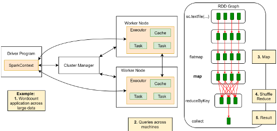
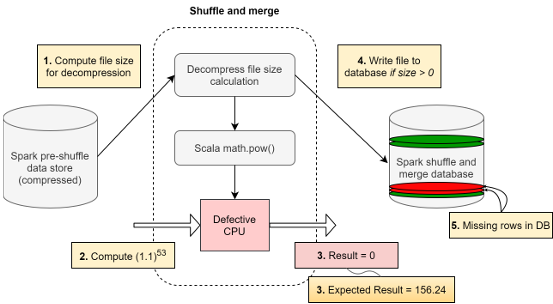
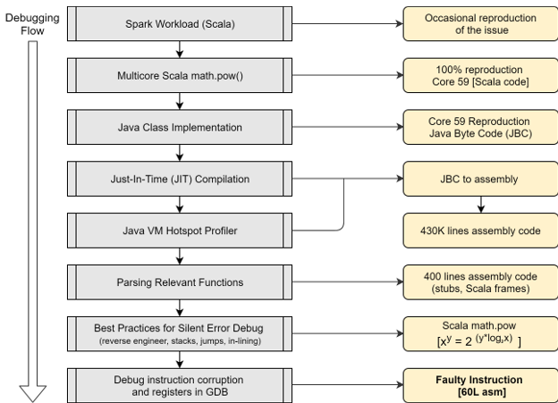

# Silent Data Corruptions at Scale

Harish Dattatraya Dixit、Sneha Pendharkar、Matt Beardon、Chris Mason、
Tejasvi Chakravarthy、Bharath Muthiah、Sriram Sankar

Facebook, Inc.

hdd@fb.com、spendharkar@fb.com、mbeardon@fb.com、clm@fb.com、
teju@fb.com、bharathm@fb.com、sriramsankar@fb.com

arXiv:2102.11245v1 [cs.AR]，2021 年 2 月 22 日

## 摘要

silent data corruption（SDC）
可能对大规模基础设施服务造成负面影响。
Central Processing Unit（CPU）内部的错误报告机制无法捕获 SDC，
因此无法在硬件层追踪它们。
然而，损坏的数据会沿整个技术栈传播，
最终表现为应用层问题。
这类错误可能导致数据丢失，
并耗费数月的工程调试时间。

本文介绍了硅片制造中会导致 SDC 的常见缺陷类型。
我们讨论了一个数据中心应用发生 SDC 的真实案例，
并以该案例说明我们采用的调试流程，
在 CPU 内对故障指令追根溯源并进行分诊。
我们还概述了若干缓解措施，
用于降低大规模生产集群中的 SDC 风险。

在我们的大规模基础设施中，
我们已经在集群里的数十万台机器上运行了庞大的 silent error 测试库。
这些测试检测出数百颗存在此类错误的 CPU，
表明 SDC 是跨越多代产品的系统性问题。
我们对 SDC 的监测已经持续超过 18 个月。
根据这些经验，
我们认为减少 SDC 不仅需要硬件韧性和生产环境检测机制，
还需要健壮的容错软件架构。

## 关键词

silent data error；数据损坏；系统可靠性；硬件可靠性；比特翻转

## 1 引言

Facebook 基础设施为 Facebook、WhatsApp、Instagram 和 Messenger 等众多应用提供服务。
这套基础设施由分布在全球各数据中心的数十万台服务器组成。
每台服务器都包含许多基础组件，
如主板、CPU、Dual In-line Memory Module（DIMM）、
Graphics Processing Unit（GPU）、Network Interface Card（NIC）、
Hard Disk Drive（HDD）、闪存盘和互连模块。
把这些组件连接在一起的关键单元是 CPU。
它管理各个设备，
高效地为它们调度事务，
并且每秒执行数十亿次计算。
这些计算支撑着图像处理、视频处理、数据库查询、
机器学习推理、排序和推荐系统等应用。

然而，我们观察到计算并不总是准确。
在某些情况下，CPU 会算错。
例如，在特定微架构条件下计算 $2\times3$ 时，
CPU 可能静默地给出 5 而不是 6，
系统事件日志和错误日志里都不会留下误算的迹象。
结果是，使用该 CPU 的服务可能并不知道计算是否准确，
并继续在应用中使用错误的值。
本文主要关注数据中心 CPU 出现的这类 SDC。
我们将深入分析一次真实的应用层损坏及其影响，
介绍调试这类损坏所采用的流程，
最后给出 SDC 的检测与缓解策略。
尽管本文只展示一个案例，
但我们已在多种场景、数据路径和架构模块中观察到 SDC；
因此，这是整个行业应当共同应对的系统性问题。

这一领域以往的工作 [11, 24, 28, 14, 15, 18]
主要关注辐射造成的软错误或合成故障注入。
相比之下，我们观察到，
SDC 并不限于具有概率模型的辐射和环境效应所造成的软错误。
设备特性同样可能导致 SDC，
而且这种错误可以大规模复现。
我们观察到的这些故障可复现，并非瞬态故障。
Error Correction Code（ECC）等技术有助于降低 SRAM 的错误率，
但数据中心 CPU 内并非所有模块都具有类似的数据路径保护。
此外，故障注入研究估计 CPU SDC 的发生概率约为百万分之一。
我们观察到的 CPU SDC 发生率，
比基于软错误的 FIT 模拟结果高出多个数量级。
由于功能模块内部只有很少的纠错保护，
CPU SDC 的发生率更高。
随着硅片密度提高和工艺不断缩放 [31, 13]，
我们认为学术界和产业界都应投入资源，
研究应对这些问题的方法。

Facebook 基础设施于 2018 年启动了 SDC 调查。
过去三年里，
我们完成了对多种检测策略及其性能成本的分析。
篇幅所限，
本文不讨论性能与成本权衡评估的细节；
后续研究将深入分析这些内容。
本文给出一个应用损坏案例，
未使用任何故障注入机制。
这个案例所涉及的 CPU，
是我们通过检测技术发现的数百颗真实发生 SDC 的 CPU 之一。

本文其余部分安排如下：
第 2 节概述这一领域的相关工作；
第 3 节介绍硅片设计和制造中的不同缺陷类别；
第 4 节详述一个真实的 SDC 应用案例，
以及损坏如何沿技术栈传播；
第 5 节列出大规模环境中对 SDC 追根溯源的最佳实践，
并介绍案例应用的调试过程；
第 6 节总结调试结果，
在深入理解 CPU 缺陷后重新审视应用故障；
第 7 节概述可用于降低 silent error 风险的集群检测机制；
第 8 节概述应对比特翻转和数据损坏的软件容错机制。

## 2 相关工作

以往的 silent error 研究考察了辐射导致的软错误 [11]，
以及环境因素如何在系统内引发软错误。
该研究给出了无 ECC 保护的 SRAM 错误率观测结果。
它根据辐射引起的软错误率（SER）进行计算，
估计结果为 50,000 FIT
（Failure-In-Time；1 FIT 相当于每十亿设备小时发生一次故障）。
因此，研究者建议使用 ECC，
它可以把 SRAM 的错误率降低 1,000 倍。

浮点单元中的比特翻转注入实验 [18]
展示了处理器内比特翻转的理论影响。
研究者还使用比特翻转注入机制，
比较处理器在基准测试中遭受合成注入和辐射诱发比特翻转时的表现 [15]。
2012 年的一项研究考察了一个 96 节点 HPC 集群中的 SDC [21]；
该研究使用故障注入器评估软错误的影响，
并重点研究如何在 Message Passing Interface（MPI）协议中纠正损坏。
在这项故障注入研究中，
注入器以每 500 万条消息损坏一次的频率运行，
以确保较高的注入概率。
研究还纳入了每 250 万条消息损坏一次的更高频率，
用于评估更高发生率对 MPI 工作负载的影响。

另一组研究评估了微处理器中软错误所致故障的风险和缓解策略。
ARM 的一项研究 [24]
通过分析容易受软错误影响、
且错误会传播至输出端口的时序逻辑所占比例，
评估 ARM Cortex-R5 CPU 对软错误的脆弱性。
Intel 与密歇根大学的一项合作研究 [28] 指出，
辐射诱发的软错误并不代表永久性故障。
该研究总结了量化软错误所需的关键指标，
评估了 FIT，
并讨论了通过工艺、电路和架构方案降低软错误发生率的技术。
IBM 的一项类似研究把 Power4 系统的目标设为 114 SDC FIT [14]。
这些研究都把错误视为瞬态错误或软错误，
体现了它们对辐射的依赖。

ECC 可以降低 SRAM 的错误率，
但数据中心 CPU 内并非所有数据路径都有 ECC 保护。
此外，上述研究的 CPU FIT 模型同样基于软错误概率，
用来评估健壮性、脆弱性和容错能力。
由于我们在数据中心观察到的 SDC 发生率高出多个数量级，
因此有必要探索在大规模环境中调试、检测和缓解 SDC 的最佳实践。

## 3 缺陷类别

每颗数据中心 CPU 都包含数十亿个不断切换状态的晶体管。
这些晶体管是以硅为主要材料、
掺入 p 型和 n 型杂质的器件。
CPU 的设计既要满足预期的计算需求，
又要满足芯片的功耗、散热和面积约束。
设计定稿后，
需要准备芯片版图，
在其中放置数十亿个逻辑门，
以尽量降低电气噪声和串扰，
并改善信号分布和稳定性。
最后，所有功能、架构和物理要求通过验证后，
芯片设计会在开发流程中流片。
制造完成后，
芯片还要接受测试模式，
验证预期功能行为并进行质量控制，
最终才会交付世界各地的客户。

### 3.1 器件错误

缺陷可能在制造和设计流程的多个环节显现。
设计中可能存在边界情况。
例如，
负责在特定功耗状态下管理缓存控制器的模块可能存在功能限制，
使器件卡死或发生功能错误。
在 CPU 内放置和布线各个模块时，
信号到达时间可能存在不确定性，
进而导致错误的比特翻转。
时序路径错误就是这类故障的一个例子。
制造过程中，
也可能并非所有晶体管都被可靠地蚀刻出来，
它们的峰值工作电压或功耗阈值也不尽相同。
这会造成器件特性的差异，
并导致制造错误 [27, 16]。

### 3.2 早期失效

制造测试会发现一部分早期失效，
这类失效会降低工艺良率。
有些器件足够健康，
可以通过制造测试模式，
却要到部署现场并开始承载工作负载后才表现出故障症状。
根据晶体管内部电气薄弱点的类型，
故障可能在最初几周、几个月内出现，
也可能在器件预期寿命结束前的任何时刻出现 [10, 17]。
这类故障被归为早期失效。

### 3.3 退化

器件也可能随着使用而变弱。
频繁使用的计算模块可能出现损耗，
退化速度比 CPU 其他部分更快。
与早期失效相比，
这类故障并不常见，
但业界仍然观察得到。
服务器中的另一类器件提供了一个例子：
针对 DDR4 内存组件的 Rowhammer 攻击 [23]。
器件会采用 ECC 等纠错机制，
防止器件内部的退化。
退化所致故障可能造成负面影响，
因为这一故障类别中的不同芯片并不会以相同速度老化。

### 3.4 寿命末期磨损

器件在现场承载工作负载超过额定寿命后，
整块硅片都会开始表现出磨损 [26, 20, 8]。
大多数组件中都能观察到这种现象，
在故障浴盆曲线模型中被归类为硅片磨损。
这一时间跨度通常也与 CPU 的故障分析支持或固件支持周期相当。

上述四种故障模式都有可能在机器集群中导致 SDC。
CPU 数量越多，
从统计上讲遇到 SDC 的可能性就越大。
我们观察到，
密度增加和数据路径变宽都会提高 silent error 的概率。
这个问题并不限于 CPU，
同样适用于专用加速器和其他具有宽数据路径的器件。
下一节将分析这些错误如何沿技术栈传播并表现为应用层故障，
介绍如何在大规模环境中调试它们，
并讨论不同抽象层上的检测实践。

## 4 SDC 对应用层的影响

Facebook 基础设施由数十万台服务器组成，
有数十亿用户访问我们的应用。
Facebook 系列应用拥有数十亿用户，
基础设施每天会收到数十亿次请求。
面对数十亿次用户查询、图像上传和媒体内容处理，
这些应用所需的处理必须快速、可靠且安全。
我们利用分布式系统中的基本概念对应用进行分区，
并分别优化每个分区。
根据应用的复杂度、资源特征和计算需求，
一个典型应用可能需要几十台乃至数十万台机器。

查询基础设施就是这样一个分区。
它用于跨多个数据集获取并执行 SQL 和类 SQL 查询，
如 Presto、Hive 和 Spark 查询 [5, 6]。



> 图 1：Spark 高层架构。
> Driver Program 通过 Cluster Manager 把任务分配给 Worker Node；
> RDD Graph 依次经过 flatMap、map、reduceByKey 和 collect，
> 完成 map、shuffle/reduce 并生成结果。

### 4.1 Spark

图 1 [19] 展示了典型的 Spark 集群架构。
Spark 是一种广为人知的分布式处理框架，
其工作方式基于弹性分布式数据集（RDD）的概念；
各个 RDD 可以并行运行。
一个大型数据处理应用需要经过几个关键步骤才能得到结果。
从高层来看，
首先由一个 map 函数映射数据块，
随后通过 reduce 操作汇总多个 RDD 的结果，
最后在 reduce 之后的 collect 阶段呈现结果。

例如，
一个 WordCount 应用要统计大型文件中每个词的出现次数，
会按以下方式执行。
大型文件先被拆分为多个 RDD，
再把这些 RDD 分配给工作节点；
每个工作节点计算数据集一个子集中的词频。
各节点的结果在 shuffle-reduce 阶段汇总。
最后，系统向用户提供一个输出表，
其中列出每个词及其出现次数。
在 Facebook 这样的大规模基础设施环境中，
这些应用每天会执行数百万次此类计算。

### 4.2 Facebook 压缩应用

与 WordCount 一样，
压缩也可以利用 Spark 架构。
压缩技术用于减少数据存储的空间占用，
存在多种不同的压缩算法。
本文不深入介绍这些算法；
感兴趣的读者可以参阅相关论文，
了解压缩算法的细节和比较 [30, 12, 25]。

文件通常会在无人读取时被压缩，
收到读取请求时再解压。
在大型基础设施中，
每天都会执行数百万次压缩和解压操作。
本例主要关注文件解压。
我们有一个数据库，
文件经过压缩后存储在其中的一个数据存储里。
收到请求后，
多组文件会被送入解压流水线。
执行解压前，
系统会检查文件大小是否大于 0。
包含内容的有效压缩文件大小应当非零。
图 2 直观展示了损坏如何显现，
以及它与数据库之间的关联。



> 图 2：应用层 SDC。
> 缺陷 CPU 在 Spark 的 shuffle-and-merge 流程中，
> 把用于计算解压文件大小的 $(1.1)^{53}$ 错算为 0，
> 而预期结果是 156.24；
> 文件因而没有写入数据库，造成数据行缺失。

在这样一次计算中，
解压流水线收到一个具有有效大小的文件作为解压算法输入。
计算文件大小时，
算法调用了 Scala 库提供的幂函数
（Scala 是 Spark 使用的一种编程语言）[7]。
值得注意的是，
已知解压后大小非零的文件，
Scala 函数却返回了大小为 $\mathbf{0}$ 的结果。
由于文件大小的计算结果变成了 0，
该文件没有被写入解压后的输出数据库。

设想同一计算每天执行数百万次。
这意味着在某些随机出现的场景中，
即便文件大小非零，
解压操作也根本不会执行。
结果是数据库中缺少文件，
这些缺失随后传播到应用。
应用维护着压缩文件的键值存储映射列表，
会立刻发现已压缩的文件无法再被恢复。
这条依赖链最终导致应用失效。
解压后，
查询基础设施最终会报告严重数据丢失。

问题偶尔会在用户把同一工作负载调度到一个机器集群时显现，
使其复杂度进一步上升。
这意味着复现和调试所需的模式是非确定性的。

## 5 大规模调试 SDC

多个工程团队协同调试和分诊，
在每一步都为所有工作机器启用了日志记录。
这帮助我们把问题缩小到了引发故障的主机。
该主机的系统事件日志和内核日志都很干净。
从系统健康监控的角度看，
这台机器没有任何故障症状。
它只会偶尔生成损坏的结果：
预期结果非零时返回零。

随后，
我们把多机器查询基础设施层的复现程序缩减为单机器工作负载。
从单机器工作负载中，
我们确认故障确实是偶发的。
该工作负载采用多线程；
改为单线程后，
故障不再是偶发的，
而是会在机器的某一个特定核上对一部分数据值稳定复现。
与多线程相关的随机性被消除了，
但与数据值相关的随机性仍然存在。
经过几轮尝试后，情况变得很明确：
在该 CPU 的第 59 号核上，
把

$$
\operatorname{Int}(1.1^{53})
$$

作为 Scala `math.pow` 函数的输入，
始终会得到 0。
然而，换用另一组输入值

$$
\operatorname{Int}(1.1^{52})=142
$$

计算结果就是准确的。

流程的下一步是深入理解损坏会在哪些场景下显现。
与这次 SDC 相关的其他变体也需要调查。
为了确认该问题对数据的依赖，
我们在第 59 号核上运行了多轮测试。
下面给出三轮测试的示例，
其中两项计算会反复产生错误结果。

**固定到单核的 Scala 工作负载**

```console
[root@hostname ~]# for x in {0..2}; do taskset -c 59 ./bitflip_repro.sh; done
Int(1.1^53), Int(1.1^68), Int(1.1^78)
Iteration 1: 0, 0, 1692
Iteration 2: 0, 0, 1692
Iteration 3: 0, 0, 1692
```

这个缺陷对数据的依赖已经清楚确立。
本例中的第 59 号核存在故障。
理想情况下，
工作负载出现问题时，
可以在 GNU Project Debugger（GDB）[4] 中逐步执行并进行逆向工程。
我们可以逐条执行指令，
把指令数据与参考计算进行比较。
这种逐步执行过程虽然耗时，
却可以用于调试 silent error。

然而，Scala 工作负载无法在 GDB 中逐步执行。
Scala 可以在 Java Virtual Machine（JVM）中运行 Java 字节码。
Java 字节码（JBC）[3] 由 Just-In-Time（JIT）编译器编译。

### 5.1 工具

为了分诊问题并定位根本原因，
我们必须在保持复现程序行为一致的同时转换语言。
本例从 Scala 复现程序转换到 Java 复现程序，
再转换到经 JIT 编译的 JBC，
最后转换为汇编，
从而分诊指令层的根本原因并得到可用的复现程序代码。

与 C 和 C++ 不同，
JIT 编译的代码不会提前编译。
然而，要调试 silent error，
就必须了解实际执行了哪些机器指令。
我们要么需要适用于 Java 和 Scala 的 ahead-of-time 编译器，
要么需要一个探针，
在 JIT 代码执行时给出所执行的指令列表。

#### 5.1.1 从 Scala 转换到 Java 字节码的示例

得到汇编代码的第一步，
是把复现程序从 Scala 转换为 Java。
完成这项转换有较丰富的资料可用。
我们可以使用 Scala 编译器 `scalac`，
从源代码获得 Java class 例程。
为了获得由 Scala 编译出的 Java 字节码，
我们把 Scala 脚本改写为对 Scala 编译器友好的复现程序代码。

```console
[root@hostname ~]# scalac Bitflip.scala
# 生成可由 Scala 和 Java 互操作的 class 文件。
# 这些文件可以作为 Java 字节码读取。
[root@hostname ~]# javap -c -v Bitflip$.class
```

#### 5.1.2 GCJ

GCJ [1] 曾是一款开源 ahead-of-time 编译器，
能够把 JBC 转换为目标文件和二进制文件。
这个二进制文件可以在 GDB 中调试。
然而，GCJ 的开发从 2008 年起便已停止，
CentOS 也在 2010 年弃用了这个工具。
没有 ahead-of-time 编译器时，
很难把 Java 字节码静态转换为汇编代码。

#### 5.1.3 HotSpot

Java 提供了 `+PrintAssembly` 选项；
它可以借助 HotSpot 性能分析充当探针，
打印已执行代码的汇编。
使用 `+PrintAssembly` 需要满足两个条件。

- **虚拟机支持 HotSpot 性能分析器：**
  可以在示例机器上运行以下命令来确认。
  输出中出现 HotSpot，
  就说明虚拟机支持性能分析。
  这里显示的版本号只是示例，
  并不代表任何实际部署。

  ```console
  $> java -version
  java version "A.B.C_DEF"
  Java(TM) SE Runtime Environment (build G.H.I_JKL-MNO)
  Java HotSpot(TM) 64-Bit Server VM (build PQ.RST-UVW, mixed mode)
  # 这意味着可以对 VM 进行性能分析。
  ```

- **用于性能分析的库：**
  HotSpot 是一个性能分析器，
  用于分析程序热点。
  这些热点会被优化以实现高性能执行，
  同时尽量减少对性能要求较低代码的额外开销。
  性能分析器提供 `PrintAssembly` [2] 选项，
  可以打印 JIT 编译出的汇编代码。
  借助这些汇编指令，
  我们随后就能对故障指令追根溯源并进行分诊。

启用性能分析器后，
我们得到了代码实际执行的汇编
（JIT 与 HotSpot 输出的汇编）。
第一版汇编有 43 万行。
有了这些汇编代码，
我们就可以调试 silent error。
在这 43 万行汇编中，
我们定位到了 Scala 的 `math.pow` 函数。
随后解析这些代码，
以优化复现程序。

然而，反汇编输出并不会给出实际执行的指令序列，
只会列出调用栈中使用的方法，
因此执行顺序可能并不清晰。
为了得到复现程序，
我们需要清理这些代码，
再用更小的汇编程序进行逆向工程。
从原始汇编中，
我们可以理解发送给 CPU 的指令序列，
并按照下面的 silent error 调试最佳实践，
对故障指令追根溯源。

### 5.2 silent error 调试的最佳实践

下面列出对打印出的汇编代码进行逆向工程时应遵循的一些准则。
这些准则虽然来自本例，
但也可以用于调试类似的 SDC。

- **绝对地址引用：**
  优化复现程序时，
  如果保留代码跳转所用的绝对地址，
  就会发生段错误。
  与其管理所有内存位置，
  如果确认某段汇编与故障复现没有依赖关系，
  更好的做法是删除其中的绝对地址引用。
- **意外分支：**
  如果没有映射意外的分支和跳转调用，
  代码就会因段错误和未定义的代码分支而崩溃，
  给函数引入更多不确定性。
  尝试构造确定性的比特翻转复现程序时，
  应当尽量减少这种不确定性。
- **外部库引用：**
  识别哪些指令会跳出当前代码路径，
  调用外部库。
  为了得到最小复现程序，
  最好不要依赖外部库。
- **编译器优化：**
  高性能代码会经过多轮编译器优化。
  观察编译器对数学表达式所做的优化，
  有助于理解复现程序所必需的关键汇编代码。
  逐步执行汇编指令时，
  这些优化不一定符合直觉。
- **stub 和冗余指令：**
  最好删除冗余指令和 stub 指令。
  Scala 使用 stub 进行内部管理，
  它们与故障指令的调试无关。
  stub 指令不会干扰 Scala 执行上下文以外的功能。
- **输入/输出寄存器：**
  对任何比特翻转复现程序，
  都需要识别关键指令的数据输入寄存器和结果寄存器。
  识别之后，
  必须添加额外指令以接收用户输入并取得结果。
  这样既能得到稳定的复现程序，
  也能识别 SDC 对数据的依赖。
- **管理栈帧：**
  独立运行的汇编复现程序需要正确管理栈帧。
  正确管理进出栈帧的事务，
  避免缓冲区溢出或下溢，
  对稳定性至关重要。
  如果没有栈帧，
  复现程序就无法管理基于栈的请求或函数调用。
- **内存偏移量引用：**
  寄存器通常会在指令中使用内存偏移量。
  必须正确初始化这些偏移量。
  如果没有计算并初始化偏移量，
  未初始化的数据就会导致段错误或复现程序损坏。
- **特殊功能单元：**
  ALU、DSP、FPU、AVX 等特殊功能单元会引入近似计算，
  因此需要监控发往这些单元的事务。
  此外，
  特殊功能单元会使用不同的位宽、
  特殊功能寄存器和栈架构。
- **main frame：**
  独立运行的重放程序必须具备适当的 main frame 和 function frame，
  否则就不完整。
  这些 frame 使代码可以执行。

本节只关注 silent error 调试的最佳实践，
不讨论 CPU 架构或 GDB 内部原理等知识前提。

- 我们略去了 CPU 所有子模块的硬件架构和实现细节。
  其中包括状态标志、
  特殊功能栈与普通整数栈之间的差别、
  指令截断，
  以及不同精度位宽和操作数类型之间的握手。
  这些细节对于识别 CPU 内部的处理步骤都很关键，
  已经有大量公开研究予以说明。
- 我们还略去了 GDB 内的所有操作步骤，
  包括打印、逐条执行命令，
  以及通过不同的栈、寄存器和内存地址编写脚本的方法；
  这些内容同样已经有大量文档。

对硬件模块之间的握手和汇编依赖图完成逆向工程后，
我们可以得到一个更简单的复现程序。
下面是从本例汇编代码中得到的几个有趣观察。

- 计算一个数的平方时，
  Scala 编译器会用查找表实现快速优化。
- `math.pow` 函数被内联到幂函数中，
  但 `PrintAssembly` 仍会分别打印它们。
- Scala 的 `math.pow` 使用以下公式计算幂：

  $$
  x^y=2^{y\log_2 x}
  $$

我们在 GDB 中逐条执行指令。
执行过程中，
会检查指令操作数、内存状态、寄存器状态和指令输出是否损坏。
经过这一过程，
我们在缺陷 CPU 中找到了发生故障的指令。

### 5.3 汇编层测试用例



> 图 3：silent error 的高层调试流程。
> 调试从偶发复现的 Spark 工作负载开始，
> 依次经过固定到第 59 号核的 Scala 代码、Java class、JIT 编译、
> HotSpot 性能分析、相关函数解析和汇编逆向工程，
> 最终把 43 万行汇编缩减为可稳定触发故障指令的 60 行代码。

获得汇编语言复现程序后，
我们会继续优化其效率。
最终，
能够准确复现缺陷的汇编代码被缩减为一个 60 行的汇编层复现程序。
我们从 43 万行开始，
最终缩减到了 60 行。
图 3 展示了对 silent error 追根溯源时采用的高层调试流程。

## 6 重新审视应用故障

需要注意的是，
运行该应用的所有机器都没有任何日志或系统层健康信息
表明存在这种故障模式。
我们发现过损坏影响非零操作数和非零结果计算的案例。
例如，
缺陷 CPU 执行了以下错误计算。
我们发现，
对于特定数据值，
正数幂和负数幂的计算都会受到影响。
在某些情况下，
本应为零的结果变成了非零值。
我们还观察到精度偏差程度各异的错误值。

**错误示例：**

$$
\begin{aligned}
\operatorname{Int}[(1.1)^3] &= 0,     &\text{预期值} &= 1,\\
\operatorname{Int}[(1.1)^{107}] &= 32809, &\text{预期值} &= 26854,\\
\operatorname{Int}[(1.1)^{-3}] &= 1,    &\text{预期值} &= 0.
\end{aligned}
$$

结果是，
应用解压后的文件可能大小错误，
而且会在没有 End-Of-File（EoF）终止符的情况下被错误截断。
这会造成悬空文件节点和数据缺失，
应用内部却没有任何损坏的可追踪记录。
损坏既依赖特定的核，
也依赖输入数据；
没有针对性的复现程序时，
几乎不可能检测到损坏并对它追根溯源。
在一个拥有数十万台机器、
每台机器每秒执行数百万次计算的集群中，
这个问题尤其困难。

我们用这个针对性的复现程序发现了更多机器。
随后把从复现程序中获得的经验整合进集群检测机制。
此外，
我们总结出的 silent error 调试最佳实践，
也有助于更快地对集群中的类似错误追根溯源并进行敏感性分析。

我们开始评估 SDC 对业务的影响，
量化这个问题在基础设施中的规模和严重程度。
由于这些错误具有静默性，
一开始很难评估问题规模。
最初，
我们只能根据启发式方法和较小的数据集，
估计每百万个部件中的缺陷数，
并分配调试工程时间、评估业务影响。
经过过去 18 个月的数据收集和分析，
我们得到了上述各项的经验值和取值范围。

### 6.1 应对 SDC 的硬件方法

我们观察到，
在大规模基础设施中，
SDC 并非罕见到只有百万分之一的发生概率。
这类错误是系统性的，
而且与机器检查异常等其他故障模式相比，
人们对它的理解还不够充分。
已有若干研究评估了降低处理器软错误发生率的技术 [33, 29]；
我们可以把这些技术扩展到发生率更高、可复现的 SDC。
通过采用不同策略，
可以降低应用暴露于 silent error 的风险。

- **受保护的数据路径：**
  为器件内的模块增加数据路径保护，
  采用类似 ECC 的算法，
  可以提高器件的韧性。
- **专项筛查：**
  在制造流程中设置专门的筛查和测试模式，
  用于检测 silent error。
  使用随机数据流进行测试，
  可以提高制造测试的检出概率。
- **理解大规模行为：**
  与大规模使用这些器件的客户密切合作，
  了解并评估 silent error 的影响。
  研究生产环境中的发生率、失效时间，
  以及错误对频率、电压和环境条件的依赖，
  有助于理解 SDC 的表现形式。
- **提高架构优先级：**
  随着密度提高、数据路径变宽和工艺不断缩放，
  未来更有可能观察到 SDC。
  在架构选择中优先考虑 SDC 防护，
  可以让未来的半导体器件更具韧性。

上述策略并不限于 CPU，
还可以扩展到 Application Specific Integrated Circuit（ASIC），
以及其他具有宽数据路径和无保护逻辑的器件。

## 7 检测机制

要在集群中检测这类错误，
我们需要运行会执行特定类型计算的工作负载，
再把计算结果与已知参考值比较，
确认结果是否准确。
SDC 往往依赖数据，
因此很难预测它们会在集群中的何处发生。
生产集群停机测试都会造成效率损失，
所以可以采用以下三种方式。

### 7.1 机会式检测

机会式利用处于维护状态的机器，
用随机数据输入验证指令层的准确性。
这种方式的问题在于，
集群覆盖率取决于机器进入这些可利用状态的频率。
在大型集群中，
我们预计不会有很大比例的机器处于这些状态；
不过，仍然可以机会式利用资源配置、服务设置等过渡状态。

### 7.2 周期性检测

实现一个调度器，
定期监测机器的 silent error 检测覆盖情况，
再根据周期计时器安排机器接受测试，
例如每 15 天一次。
这种方式的开销较高，
因为机器必须按指定计划退出生产环境进行测试。

### 7.3 生产环境友好型检测

可以优化测试，
尽量缩小其规模并缩短运行时间。
这样就能让测试指令与机器上的工作负载并行执行。
测试结果会发送给收集器，
报告机器通过或未通过。
这种方式需要与工作负载密切协调，
避免对生产工作负载造成不利影响。

## 8 软件容错机制

为了应对 silent error，
我们需要重新思考基础设施软件的设计理念和软件抽象应当具备多强的健壮性。

### 8.1 冗余

防止应用层故障的一种更好方式，
是在软件层实现冗余，
并在多个检查点定期验证计算数据是否准确。
这是一种久经考验的方法，
已经应用于太空研究 [32]、航空器 [22] 和汽车 [9]。

把这些方法用于大规模数据中心基础设施时，
必须考虑准确计算的成本。
冗余成本会直接影响资源消耗：
架构的冗余程度越高，
所需的重复资源池就越大。
不过，
它也能为应用提供概率性的容错能力。

### 8.2 容错库

在 PyTorch 等知名开源库中加入容错能力，
可以极大地帮助应用避免暴露于 SDC。
算法容错会给应用增加额外开销，
但可以把性能下降控制到可以忽略的程度。
这项工作需要硬件 silent error 研究社区与软件库社区密切配合。

过去 18 个月里，
Facebook 基础设施已经实现了上述硬件检测和软件容错技术的多种变体。
量化每种方法的收益和成本，
帮助基础设施为 Facebook 系列应用提供了可靠服务。
后续论文将从统计角度详细分析不同检测策略之间的权衡、
检测机制的覆盖场景以及容错软件库。

## 9 结论

在大规模运行的数据中心应用中，
SDC 是一种**真实存在**的现象。
本文给出的案例展示了我们遇到的许多场景之一；
这类错误依赖数据、表现隐蔽，而且难以调试。
理解这些损坏，
有助于我们通过错综复杂的指令流，
以及它们与编译器和软件架构的交互，
洞察硅器件的特性。

SDC 有多种检测和缓解策略，
每一种都会给大规模数据中心基础设施增加成本和复杂度。
我们对这些损坏理解得更加深入后，
得以推动软件架构向更强的容错能力和韧性演进。
这些策略结合起来，
让我们可以在 Facebook 的规模下降低数据损坏的代价。

**致谢：**
作者感谢 Manish Modi、Vijay Rao、T. S. Khurana、Aslan Bakirov、
Melita Mihaljevic、Kushal Thakkar、Nishant Yadav、Aravind Anbudurai、
Jason Liang、Jianyu Huang、Sihuan Li、Jongsoo Park，
以及其他基础设施工程师；
他们为方案实现贡献了力量，
并提出了宝贵的技术建议。

## 参考文献

[1] 2007.
GCJ: The GNU Compiler for Java - GNU Project - Free Software Foundation (FSF).
https://web.archive.org/web/20070509055923/http://gcc.gnu.org/java/

[2] 2013.
PrintAssembly - HotSpot - OpenJDK Wiki.
https://wiki.openjdk.java.net/display/HotSpot/PrintAssembly

[3] 2019.
Java Programming/Byte Code - Wikibooks, open books for an open world.
https://en.wikibooks.org/wiki/Java_Programming/Byte_Code

[4] 2020.
GDB: The GNU Project Debugger.
https://www.gnu.org/software/gdb/

[5] 2021.
MySQL :: MySQL Documentation.
https://dev.mysql.com/doc/

[6] 2021.
Overview - Spark 3.0.1 Documentation.
https://spark.apache.org/docs/latest/

[7] 2021.
*Scala Documentation*.
https://docs.scala-lang.org/?_ga=2.2010166221205038718.1605503218-1722664999.1605503218

[8] Mridul Agarwal, Bipul C Paul, Ming Zhang, and Subhasish Mitra.
2007.
Circuit failure prediction and its application to transistor aging.
In 25th IEEE VLSI Test Symposium (VTS'07).
IEEE, 277–286.

[9] Pete Bannon, Ganesh Venkataramanan, Debjit Das Sarma, and Emil Talpes.
2019.
Computer and Redundancy Solution for the Full Self-Driving Computer.
1–22.
https://doi.org/10.1109/HOTCHIPS.2019.8875645

[10] T. S. Barnett, A. D. Singh, and V. P. Nelson.
2003.
Extending integrated-circuit yield-models to estimate early-life reliability.
*IEEE Transactions on Reliability* 52, 3 (2003), 296–300.
https://doi.org/10.1109/TR.2003.816418

[11] R. C. Baumann.
2005.
Radiation-induced soft errors in advanced semiconductor technologies.
IEEE Transactions on Device and Materials Reliability 5, 3 (2005), 305–316.
https://doi.org/10.1109/TDMR.2005.853449

[12] Arup Kumar Bhattacharjee, Tanumon Bej, and Saheb Agarwal.
2013.
Comparison study of lossless data compression algorithms for text data.
IOSR Journal of Computer Engineering (IOSR-JCE) 11, 6 (2013), 15–19.

[13] M. T. Bohr and I. A. Young.
2017.
CMOS Scaling Trends and Beyond.
IEEE Micro 37, 6 (2017), 20–29.
https://doi.org/10.1109/MM.2017.4241347

[14] D. Bossen.
2002.
CMOS Soft Errors and Server Design - IRPS.
Tutorial Notes - Reliability Fundamentals. (2002).

[15] G. C. Cardarilli, F. Kaddour, A. Leandri, M. Ottavi, S. Pontarelli,
and R. Velazco.
2002.
Bit flip injection in processor-based architectures: a case study.
In Proceedings of the Eighth IEEE International On-Line Testing Workshop
(IOLTW 2002).
117–127.
https://doi.org/10.1109/OLT.2002.1030194

[16] C. Constantinescu.
2008.
Intermittent faults and effects on reliability of integrated circuits.
In 2008 Annual Reliability and Maintainability Symposium.
370–374.
https://doi.org/10.1109/RAMS.2008.4925824

[17] M. S. Cooper.
2005.
Investigation of Arrhenius acceleration factor for integrated circuit early
life failure region with several failure mechanisms.
IEEE Transactions on Components and Packaging Technologies 28, 3 (2005),
561–563.
https://doi.org/10.1109/TCAPT.2005.848581

[18] James Elliott, Frank Mueller, Frank Stoyanov, and Clayton Webster.
2013.
*Quantifying the impact of single bit flips on floating point arithmetic*.
Technical Report.
North Carolina State University. Dept. of Computer Science.

[19] EPCC.
2019.
Spark Cluster Overview.
https://events.prace-ri.eu/event/850/sessions/2616/attachments/955/1528/SparkCluster.pdf

[20] R. Fernandez, J. Martin-Martinez, R. Rodríguez, M. Nafria,
and X. H. Aymerich.
2008.
Gate Oxide Wear-Out and Breakdown Effects on the Performance of Analog and
Digital Circuits.
IEEE Transactions on Electron Devices 55, 4 (2008), 997–1004.
https://doi.org/10.1109/TED.2008.917334

[21] D. Fiala, F. Mueller, C. Engelmann, R. Riesen, K. Ferreira,
and R. Brightwell.
2012.
Detection and correction of silent data corruption for large-scale
high-performance computing.
In SC '12: Proceedings of the International Conference on High Performance
Computing, Networking, Storage and Analysis.
1–12.
https://doi.org/10.1109/SC.2012.49

[22] Paul M. Frank.
1990.
Fault diagnosis in dynamic systems using analytical and knowledge-based
redundancy: A survey and some new results.
*Automatica* 26, 3 (1990), 459–474.
https://doi.org/10.1016/0005-1098(90)90018-D

[23] Pietro Frigo, Emanuele Vannacci, Hasan Hassan, Victor van der Veen,
Onur Mutlu, Cristiano Giuffrida, Herbert Bos, and Kaveh Razavi.
2020.
TRRespass: Exploiting the Many Sides of Target Row Refresh.
arXiv:2004.01807 [cs.CR].

[24] X. Iturbe, B. Venu, and E. Ozer.
2016.
Soft error vulnerability assessment of the real-time safety-related
ARM Cortex-R5 CPU.
In 2016 IEEE International Symposium on Defect and Fault Tolerance in VLSI
and Nanotechnology Systems (DFT).
91–96.
https://doi.org/10.1109/DFT.2016.7684076

[25] SR Kodituwakku and US Amarasinghe.
2010.
Comparison of lossless data compression algorithms for text data.
Indian journal of computer science and engineering 1, 4 (2010), 416–425.

[26] C. Liu, E. Schneider, M. Kampmann, S. Hellebrand, and H. Wunderlich.
2018.
Extending Aging Monitors for Early Life and Wear-Out Failure Prevention.
In 2018 IEEE 27th Asian Test Symposium (ATS).
92–97.
https://doi.org/10.1109/ATS.2018.00028

[27] E. J. McCluskey and Chao-Wen Tseng.
2000.
Stuck-fault tests vs. actual defects.
In Proceedings International Test Conference 2000
(IEEE Cat. No.00CH37159).
336–342.
https://doi.org/10.1109/TEST.2000.894222

[28] S. S. Mukherjee, J. Emer, and S. K. Reinhardt.
2005.
The soft error problem: an architectural perspective.
In 11th International Symposium on High-Performance Computer Architecture.
243–247.
https://doi.org/10.1109/HPCA.2005.37

[29] N. Oh, P. P. Shirvani, and E. J. McCluskey.
2002.
Error detection by duplicated instructions in super-scalar processors.
IEEE Transactions on Reliability 51, 1 (2002), 63–75.
https://doi.org/10.1109/24.994913

[30] Khalid Sayood.
2017.
*Introduction to data compression*.
Morgan Kaufmann.

[31] P. Shivakumar, M. Kistler, S. W. Keckler, D. Burger, and L. Alvisi.
2002.
Modeling the effect of technology trends on the soft error rate of
combinational logic.
In Proceedings International Conference on Dependable Systems and Networks.
389–398.
https://doi.org/10.1109/DSN.2002.1028924

[32] Joel R. Sklaroff.
1976.
Redundancy management technique for space shuttle computers.
IBM Journal of Research and Development 20, 1 (1976), 20–28.

[33] C. Weaver, J. Emer, S. S. Mukherjee, and S. K. Reinhardt.
2004.
Techniques to reduce the soft error rate of a high-performance microprocessor.
In Proceedings 31st Annual International Symposium on Computer Architecture,
2004.
264–275.
https://doi.org/10.1109/ISCA.2004.1310780
