# Software Architecture: The Hard Parts

分布式架构的现代 trade-off 分析

Neal Ford、Mark Richards、 Pramod Sadalage 和 Zhamak Dehghani 著

## Software Architecture: The Hard Parts

软件架构中没有轻松的决定。
相反，有许多难点——即没有最佳实践的困难问题——迫使你在各种 trade-off
之间做出选择。 通过本书，你将学会如何批判性地思考分布式架构所涉及的 trade-off。

资深架构师兼实践顾问 Neal Ford、Mark Richards、 Pramod Sadalage 和 Zhamak
Dehghani 讨论了选择合适架构的策略。 通过穿插讲述一个虚构的技术团队——Sysops
Squad——的故事，
他们探讨了从如何确定服务粒度、管理工作流和编排、管理和解耦契约、管理分布式事务，
到如何优化可扩展性、弹性和性能等运维特性的一切内容。

本书聚焦于常见问题， 提供帮助你发现和评估作为架构师所面临问题的 trade-off
的技巧。

- 分析 trade-off 并有效记录你的决策

- 在服务粒度方面做出更好的决策

- 理解拆分单体应用的复杂性

- 管理和解耦服务之间的契约

- 在高度分布式的架构中处理数据

- 学习在拆分应用时管理工作流和事务的模式

"本书是每位构建现代分布式系统的架构师的必读之作。"

——Aleksandar Serafimoski，Thoughtworks 首席顾问

Neal Ford 是 Thoughtworks（一家全球领先的技术咨询公司）的董事、 软件架构师和
meme wrangler。

Mark Richards 是一位实战型软件架构师，
在设计和实现微服务、面向服务架构和分布式系统方面拥有丰富经验。

Pramod Sadalage 是 Thoughtworks 的数据与 DevOps 总监，
在应用和演进式数据库开发、数据架构、NoSQL 数据库和数据库重构模式方面经验丰富。

Zhamak Dehghani 是 Thoughtworks 的技术总监， 专注于分布式架构和新兴技术。 她是
Data Mesh 的创始人。

## 各界赞誉《Software Architecture: The Hard Parts》

"在构建微服务、分析整个技术栈中架构决策的细微差别方面，本书提供了此前缺失的手册。
书中列出了构建分布式系统时可以做出的架构决策目录，并逐一给出每个决策的优缺点。
本书是每位构建现代分布式系统的架构师的必读之作。"

——Aleksandar Serafimoski，Thoughtworks 首席顾问

"对于热衷于架构的技术专家来说，这是一本必读之作。模式阐述非常出色。"

——Vanya Seth，Thoughtworks India 技术主管

"无论你是初出茅庐的架构师还是带领团队的资深架构师，本书不会空谈，
它将引导你了解在企业应用和微服务创建中取得成功所需的具体细节。"

——Dr. Venkat Subramaniam，获奖作者、Agile Developer, Inc. 创始人

"《Software Architecture: The Hard Parts》
为读者提供了关于拆分高度耦合系统并重新构建它们的宝贵见解、实践和真实案例。
通过获得有效的 trade-off 分析技能，你将开始做出更好的架构决策。"

——Joost van Weenen，Infuze Consulting 管理合伙人兼联合创始人

"我很享受阅读这本关于分布式架构的综合性著作！扎实的基础概念讨论与大量实用建议的完美结合。"

——David Kloet，独立软件架构师

"拆分大泥球绝非易事。从代码入手再到数据，本书将帮助你识别应该提取出来的服务和应该保留在一起的服务。"

——Rubén Díaz-Martínez，Codesai 软件开发者

"本书将为你提供理论背景和实用框架，帮助回答现代软件架构中最困难的问题。"

——James Lewis，Thoughtworks 技术总监

# Software Architecture: The Hard Parts

# 分布式架构的现代 trade-off 分析

Neal Ford、Mark Richards、 Pramod Sadalage 和 Zhamak Dehghani 著

## Software Architecture: The Hard Parts

Neal Ford、Mark Richards、 Pramod Sadalage 和 Zhamak Dehghani 著

版权所有 © 2022 Neal Ford、Mark Richards、 Pramod Sadalage 和 Zhamak
Dehghani。保留所有权利。

加拿大印刷。

由 O'Reilly Media, Inc. 出版，地址： 1005 Gravenstein Highway North, Sebastopol,
CA 95472。

O'Reilly 图书可用于教育、商业或销售促销用途。大多数图书也提供在线版本（http:
//oreilly.com）。如需更多信息， 请联系我们的企业/机构销售部门：800-998-9938 或
corporate@oreilly.com。

策划编辑：Melissa Duffield

索引编制：Sue Klefstad

开发编辑：Nicole Taché

内文设计：David Futato

制作编辑：Christopher Faucher

封面设计：Karen Montgomery

文字编辑：Sonia Saruba

内文插图：O'Reilly Media, Inc.

校对：Sharon Wilkey

2021 年 10 月：第一版

### 第一版修订历史

2021-09-23：首次发布

发布详情请参见 http: //oreilly.com/catalog/errata.csp?isbn=9781492086895。

O'Reilly 标志是 O'Reilly Media, Inc. 的注册商标。 《Software Architecture: The
Hard Parts》、 封面图片以及相关商业外观均为 O'Reilly Media, Inc. 的商标。

本作品所表达的观点为作者个人观点，不代表出版方观点。尽管出版方和作者已尽善意努力确保本作品中包含的信息和说明准确无误，
但出版方和作者对任何错误或遗漏不承担任何责任，
包括但不限于对因使用或依赖本作品而造成的损害所承担的责任。使用本作品中包含的信息和说明的风险由你自行承担。
如果本作品包含或描述的任何代码示例或其他技术受开源许可证或他人知识产权的约束，
则你有责任确保你的使用符合此类许可证和/或权利。

978-1-492-08689-5

[MBP]

## 目录

- **[前言](#前言)**

1. **[第 1 章：当没有"最佳实践"时会发生什么？](#第-1-章当没有最佳实践时会发生什么)**
   - [架构决策记录](#架构决策记录)
   - [架构适应度函数](#架构适应度函数)
   - [引入 Sysops Squad Saga](#引入-sysops-squad-saga)
   - [非工单工作流](#非工单工作流)
   - [一个糟糕的场景](#一个糟糕的场景)

**[第一部分 拆分](#第一部分-拆分)**

2. **[第 2 章：识别软件架构中的耦合](#第-2-章识别软件架构中的耦合)**
   - [architecture quantum](#architecture-quantum)
   - [动态 quantum 耦合](#动态-quantum-耦合)
   - [Sysops Squad Saga：理解 quantum](#sysops-squad-saga理解-quantum)

3. **[第 3 章：架构模块化](#第-3-章架构模块化)**

4. **[第 4 章：架构分解](#第-4-章架构分解)**
   - [Sysops Squad Saga：选择分解方法](#sysops-squad-saga选择分解方法)

5. **[第 5 章：基于组件的分解模式](#第-5-章基于组件的分解模式)**

6. **[第 6 章：拆分运维数据](#第-6-章拆分运维数据)**
   - [Sysops Squad Saga：证明数据库分解的合理性](#sysops-squad-saga证明数据库分解的合理性)
   - [Sysops Squad Saga：Polyglot 数据库](#sysops-squad-sagapolyglot-数据库)

7. **[第 7 章：服务粒度](#第-7-章服务粒度)**
   - [粒度分解驱动因素](#粒度分解驱动因素)
   - [粒度整合驱动因素](#粒度整合驱动因素)
   - [Sysops Squad Saga：工单分配粒度](#sysops-squad-saga工单分配粒度)
   - [Sysops Squad Saga：客户注册粒度](#sysops-squad-saga客户注册粒度)

**[第二部分 重新组合](#第二部分-重新组合)**

8. **[第 8 章：代码重用模式](#第-8-章代码重用模式)**
   - [代码重用：何时增加价值？](#代码重用何时增加价值)
   - [通过平台重用](#通过平台重用)

9. **[第 9 章：数据所有权与分布式事务](#第-9-章数据所有权与分布式事务)**
   - [分布式事务](#分布式事务)
   - [基于事件的模式](#基于事件的模式)
   - [Sysops Squad Saga：工单处理的数据所有权](#sysops-squad-saga工单处理的数据所有权)

10. **[第 10 章：分布式数据访问](#第-10-章分布式数据访问)**

- [服务间通信模式](#服务间通信模式)
- [数据领域模式](#数据领域模式)
- [Sysops Squad Saga：工单分配的数据访问](#sysops-squad-saga工单分配的数据访问)

11. **[第 11 章：管理分布式工作流](#第-11-章管理分布式工作流)**

- [Orchestration 通信风格](#orchestration-通信风格)
- [Choreography 通信风格](#choreography-通信风格)
- [状态所有者和耦合](#状态所有者和耦合)

12. **[第 12 章：事务性 Saga](#第-12-章事务性-saga)**

- [事务性 Saga 模式](#事务性-saga-模式)
- [状态管理与最终一致性](#状态管理与最终一致性)
- [管理 Saga 的技术](#管理-saga-的技术)

13. **[第 13 章：契约](#第-13-章契约)**

- [严格契约与松散契约](#严格契约与松散契约)
- [严格与松散契约之间的 trade-off](#严格与松散契约之间的-trade-off)
- [微服务中的契约](#微服务中的契约)

14. **[第 14 章：管理分析数据](#第-14-章管理分析数据)**

- [数据仓库](#数据仓库)
- [data lake](#data-lake)
- [data mesh](#data-mesh)
- [data mesh 的定义](#data-mesh-的定义)
- [何时使用 data mesh](#何时使用-data-mesh)

15. **[第 15 章：构建你自己的 trade-off 分析](#第-15-章构建你自己的-trade-off-分析)**

- [评估 trade-off](#评估-trade-off)
- [trade-off 技术](#trade-off-技术)
- [MECE 清单](#mece-清单)
- ["脱离上下文"陷阱](#脱离上下文陷阱)
- [建模相关领域案例](#建模相关领域案例)

- **[附录 A：概念与术语参考](#附录-a概念与术语参考)**
- **[附录 B：架构决策记录参考](#附录-b架构决策记录参考)**
- **[附录 C：trade-off 参考](#附录-ctrade-off-参考)**

# 前言

当本书的两位作者 Neal 和 Mark 在撰写 《Fundamentals of Software
Architecture》一书时， 我们不断遇到一些想要涵盖却过于复杂的架构示例。
每个示例都没有简单的解决方案，有的只是一堆错综复杂的 trade-off。
我们把这些示例搁到一边，攒成了一堆，称之为"难点"。
那本书完成后，我们看着这堆现在已经十分庞大的难点，
试图弄清楚：*为什么这些问题在现代架构中如此难以解决？*

我们重新拾起所有示例，像架构师一样逐一推敲， 对每种情况应用 trade-off
分析，同时也关注我们得出这些 trade-off 的过程本身。
我们早期的发现之一是数据在架构决策中日益重要：
谁可以/应该访问数据，谁可以/应该写入数据，
以及如何管理分析型数据与运维型数据的分离。 为此，我们邀请了这些领域的专家加入，
使本书能够全面融入两个方向的决策考量：从架构看数据，以及从数据看架构。

其成果就是本书：现代软件架构中困难问题的集合， 也是那些让决策变得艰难的
trade-off。 它最终还是一份图解指南，向你展示如何将同样的 trade-off
分析应用到你自己的独特问题上。

## 本书使用的约定

本书使用以下排版约定：

*斜体*

表示新术语、URL、电子邮件地址、文件名和文件路径。

等宽字体

用于程序清单，以及在段落中引用程序元素，如变量或函数名、数据库、数据类型、环境变量、语句和关键字。

**等宽粗体**

显示应由用户逐字输入的命令或其他文本。

*等宽斜体*

表示需要替换为用户提供的值或根据上下文确定的值的文本。

> [!TIP]
> 此元素表示提示或建议。

## 使用代码示例

补充材料（代码示例、练习等）可从 http://architecturethehardparts.com 下载。

如果你有技术问题或使用代码示例时遇到问题，请发送电子邮件至
bookquestions@oreilly.com。

本书旨在帮助你完成工作。一般来说，如果本书提供了示例代码，你可以在你的程序和文档中使用它。
除非你要复制代码的很大一部分，否则无需联系我们获取许可。例如，
编写一个使用本书中若干代码块的程序不需要许可。 销售或分发 O'Reilly
图书中的示例需要许可。通过引用本书并引用示例代码来回答问题不需要许可。
将本书中大量示例代码整合到你的产品文档中需要许可。

我们感谢但不要求署名。署名通常包括书名、作者、出版社和 ISBN。例如： "Software
Architecture: The Hard Parts by Neal Ford, Mark Richards, Pramod Sadalage, and
Zhamak Dehghani (O'Reilly). Copyright 2022 Neal Ford, Mark Richards, Pramod
Sadalage, and Zhamak Dehghani, 978-1-492-08689-5."

如果你认为你对代码示例的使用超出了合理使用范围或上述许可范围， 请随时通过
permissions@oreilly.com 联系我们。

## O'Reilly 在线学习

> [!NOTE]
> 40 多年来，O'Reilly Media
> 一直提供技术和商业培训、知识和见解，帮助公司取得成功。
>
> 我们独特的专家和创新者网络通过书籍、文章和我们的在线学习平台分享他们的知识和专长。
> O'Reilly 的在线学习平台为你提供按需访问的现场培训课程、
> 深入的学习路径、交互式编码环境， 以及来自 O'Reilly 和 200
> 多家其他出版社的大量文本和视频。更多信息请访问 http: //oreilly.com。

## 如何联系我们

请将有关本书的评论和问题发送至出版社：

O'Reilly Media, Inc.

1005 Gravenstein Highway North

Sebastopol, CA 95472

800-998-9938（美国或加拿大）

707-829-0515（国际或本地）

707-829-0104（传真）

我们为本书设有网页，列出勘误、示例和任何附加信息。你可以通过 https:
//oreil.ly/sa-the-hard-parts 访问此页面。

发送电子邮件至 bookquestions@oreilly.com 对本书发表评论或提出技术问题。

关于我们书籍和课程的新闻和信息，请访问 http://oreilly.com。

在 Facebook 上找到我们：http://facebook.com/oreilly

在 Twitter 上关注我们：http://twitter.com/oreillymedia

在 YouTube 上观看我们：http://youtube.com/oreillymedia

## 致谢

Mark 和 Neal
要感谢所有参加我们（几乎完全是线上的）课程、研讨会、会议演讲和用户组会议的人，
以及所有其他听过本材料各个版本并提供宝贵反馈的人。
在无法线下进行的情况下迭代新材料尤其困难，
因此我们感谢那些对多次迭代发表评论的人。 我们感谢 O'Reilly 的出版团队，
他们让写书的体验尽可能轻松。 我们也感谢一些随机的、保持理智和激发创意的小团体，
它们有着诸如 Pasty Geeks 和 Hacker B&B 之类的名字。

感谢那些对我们的书进行技术审阅的人——Vanya Seth、 Venkat Subramanian、Joost van
Weenen、Grady Booch、 Ruben Diaz、David Kloet、Matt Stein、 Danilo Sato、James
Lewis 和 Sam Newman。
你们宝贵的见解和反馈帮助验证了我们的技术内容，使本书变得更好。

我们特别要感谢受意外全球疫情影响的众多工作者和家庭。
作为知识工作者，我们面临的不便与许多朋友和同事所遭受的巨大破坏和灾难相比微不足道。
我们尤其同情和感谢医护人员，
他们中的许多人从未想过会站在一场可怕的全球悲剧的前线， 却高尚地应对了它。
我们集体的感谢永远无法充分表达。

## Mark Richards 的致谢

除了前面的致谢之外，我再次感谢我可爱的妻子 Rebecca， 在我又写一本书期间包容我。
你无尽的支持和建议帮助我完成了这本书， 即使这意味着要占用你写自己小说的时间。
你对我而言意味着整个世界，Rebecca。 我也感谢我的好朋友兼合著者 Neal Ford。
与你合作编写本书（以及我们上一本书）的材料是一次真正宝贵而有益的经历。
你永远是我的朋友。

## Neal Ford 的致谢

我要感谢我的大家庭，Thoughtworks 这个集体， 以及 Rebecca Parsons 和 Martin
Fowler 作为其中的个体。 Thoughtworks 是一群非凡的人，他们为客户创造价值，
同时密切关注事物为何有效，以便我们能够改进它们。 Thoughtworks
以多种方式支持了本书，并持续培养着每天都在挑战和激励我的 Thoughtworkers。
我也感谢我们社区的鸡尾酒俱乐部，为日常生活提供了定期的逃离，
包括每周在户外保持社交距离的聚会版本，它们帮助我们所有人熬过了刚刚经历的那段怪异时光。
我感谢我的老朋友 Norman Zapien，与他交谈总是令人愉快。 最后，我感谢我的妻子
Candy，她继续支持这种让我盯着书本写作而不是过多关注我们家猫的生活方式。

## Pramod Sadalage 的致谢

我感谢我的妻子 Rupali 的所有支持和理解， 以及我可爱的女儿 Arula 和 Arhana
的鼓励；爸爸爱你们。
我所做的所有工作都离不开我合作的客户以及各种帮助我迭代概念和内容的会议。 我感谢
AvidXchange， 我目前合作的最新客户，为迭代新概念提供了支持和良好的空间。
我也感谢 Thoughtworks 在我生活中的持续支持， 以及 Neal Ford、Rebecca Parsons 和
Martin Fowler 成为出色的导师； 你们所有人都让我成为一个更好的人。
最后，感谢我的父母，尤其是我每天都在想念的母亲 Shobha。 我想你，妈妈。

## Zhamak Dehghani 的致谢

我感谢 Mark 和 Neal 的开放邀请，让我为这部了不起的作品做出贡献。 如果没有我丈夫
Adrian 的持续支持和我女儿 Arianna 的耐心， 我对本书的贡献不可能完成。
我爱你们俩。

# 第 1 章：当没有"最佳实践"时会发生什么？

为什么像软件架构师这样的技术专家会在会议上演讲或写书？
因为他们发现了一种俗称"最佳实践"的东西，
这个术语被过度使用，以至于使用它的人越来越多地遭遇抵制。
不管术语如何，当技术专家找到了解决某个普遍问题的新颖方案，
并希望将其传播给更广泛的受众时，他们就会写书。

但是，对于那些没有良好解决方案的大量问题，会发生什么？
软件架构中存在一整类问题，它们没有通用的良好解决方案， 而是呈现一组凌乱的
trade-off，与之相对的则是另一组（几乎）同样凌乱的 trade-off。

软件开发者练就了一身在线搜索当前问题解决方案的本领。
例如，如果他们需要弄清楚如何配置环境中的某个特定工具， 熟练使用 Google
就能找到答案。

但这对架构师来说并不成立。

对于架构师而言，许多问题之所以构成独特的挑战，
是因为它们融合了你所在组织的具体环境和情况——
有人遇到完全相同的场景并在博客中记录或发布到 Stack Overflow 上的概率有多大？

架构师可能想知道为什么与框架、API 等技术主题相比， 关于架构的书籍如此之少。
架构师很少遇到常见问题， 而是不断在新颖的情况下挣扎于决策制定。
对架构师来说，每个问题都是一片雪花。在许多情况下，问题不仅在特定组织内是新颖的，
而且在全世界范围内也是新颖的。针对这些问题没有书籍或会议演讲！

架构师不应不断寻找问题的银弹解决方案； 它们现在和 1986 年 Fred Brooks
创造这个术语时一样罕见：

> 无论是在技术还是管理技术方面，都不存在任何单一的发展，
> 其本身能够在十年内将生产力、可靠性、简洁性提升一个数量级（十倍）。

——Fred Brooks，《No Silver Bullet》

因为几乎每个问题都带来新颖的挑战，
架构师真正的价值在于：能够客观地识别和评估重大决策两侧的 trade-off，
从而尽可能好地解决问题。
我们作为作者（无论在本书中还是在现实世界里）从不谈论"最佳解决方案"，
因为"最佳"意味着架构师设法在设计中最大化了所有可能的竞争因素。
相反，我们半开玩笑的建议如下：

> [!TIP]
> 不要试图找到软件架构中*最佳*的设计；相反，要努力寻找*最不坏*的 trade-off
> 组合。

通常，架构师能创造的最佳设计就是最不坏的 trade-off 集合——
没有哪项单一的架构特征能像单独存在时那样突出，
但所有相互竞争的架构特征之间的平衡推动着项目走向成功。

这就引出了一个问题："架构师如何找到最不坏的 trade-off
组合（并有效地记录它们）？" 本书主要关于决策制定，
使架构师能够在面对新颖情况时做出更好的决策。

## 为什么叫"难点"？

为什么我们把这本书称为《Software Architecture: The Hard Parts》？
实际上，标题中的"硬"具有双重含义。 首先，*hard* 意味着*困难*，
架构师不断面临着字面上（和比喻上）前所未见的困难问题，
涉及众多技术决策，有着长期影响， 叠加在决策必须发生的人际和政治环境之上。

其次，*hard* 意味着*坚固*—— 正如硬件和软件的分离一样， *硬*
的部分应该变化少得多，因为它为*软*的部分提供了基础。
同样，架构师讨论架构和设计之间的区别， 前者是结构性的，后者更容易改变。
因此，在本书中，我们讨论的是架构的基础部分。

光是软件架构的定义本身，就让从业者们进行了许多毫无成效的讨论。
一个广为流传的半开玩笑的定义是"软件架构就是那些以后难以改变的东西"。
这些东西正是本书要讨论的内容。

## 给出关于软件架构的永恒建议

软件开发生态系统不断混乱地变化和增长。
几年前风靡一时的主题要么被生态系统吸纳并消失， 要么被不同/更好的东西替代。
例如，10 年前，大型企业的主流架构风格是编排驱动的面向服务架构。
现在，几乎没有人再构建那种架构风格了（原因我们将在书中逐一揭示）；
当前许多分布式系统偏好的风格是微服务。 这种转变是如何以及为什么发生的？

当架构师审视某种特定风格（尤其是历史风格）时，
他们必须考虑导致该架构成为主导的约束条件。 当时，许多公司正在合并成为企业，
伴随着随之而来的所有集成困境。
此外，对大型公司来说，开源并不是一个可行的选择（通常出于政治而非技术原因）。
因此，架构师强调共享资源和集中式编排作为解决方案。

不过，在接下来的几年里，开源和 Linux 成为可行的替代方案，
让操作系统在*商业上*变得免费。 而真正的转折点，是 Puppet 和 Chef 等工具的出现让
Linux 在*运维上*也免费了，
这些工具允许开发团队以编程方式把环境启动纳入自动化构建流程。
这种能力一旦成熟，便催生了一场架构革命，
伴随着微服务、快速涌现的容器基础设施以及 Kubernetes 等编排工具。

这说明软件开发生态系统会以完全意想不到的方式扩展和演化。
一种新能力催生另一种能力，又意外地创造出新的能力。
久而久之，整个生态系统会把自己彻底替换一遍，一次换掉一个部件。

这给技术书籍作者，特别是软件架构书籍作者，带来了一个古老的问题——
我们怎样才能写出不会立即过时的东西？

在本书中，我们不关注技术或其他实现细节。 相反，我们关注架构师*如何*做出决策，
以及如何在面对新颖情况时客观地进行 trade-off 分析。
我们使用当代的场景和示例来提供细节和背景， 但基本原则聚焦于面对新问题时的
trade-off 分析和决策制定。

## 数据在架构中的重要性

数据是宝贵的东西，会比系统本身存在得更久。

——Tim Berners-Lee

对于许多架构师来说，数据就是一切。 任何构建系统的企业都必须处理数据，
因为数据的寿命往往比系统或架构长得多， 需要审慎的思考与设计。
然而，数据架构师构建紧耦合系统的许多本能会在现代分布式架构中产生冲突。
例如，架构师和 DBA 必须确保业务数据在单体系统拆分后得以幸存，
并且业务仍然能够从数据中获取价值，无论架构如何波动。

有人说数据是公司最重要的资产。 企业希望从已有数据中提取价值，
并不断寻找将数据用于决策的新方式。 企业的每个部分现在都是数据驱动的，
从服务现有客户，到获取新客户，提高客户留存率，改进产品，预测销售和其他趋势。
这种对数据的依赖意味着所有软件架构都是为数据服务的，
确保正确的数据可供企业的所有部分使用。

几十年前，分布式架构刚开始流行时，作者们就构建过许多分布式系统，
但如今在微服务中做决策似乎更加困难， 我们想弄清楚原因。
我们最终意识到，在分布式架构的早期，
我们大多还是把数据持久化在单个关系数据库中。 然而，微服务秉承 **Domain-Driven
Design** 中 *bounded context* 的理念， 以此限制实现细节耦合的范围，
数据和事务性也随之上升为架构层面的关注点。
现代架构的许多难点源于数据和架构关注点之间的张力，
我们将在**第一部分**和**第二部分**中逐一解析。

我们在多个章节中涵盖的一个重要区别是运维数据与分析数据之间的分离：

**运维数据**

用于业务运营的数据，包括销售、事务数据、库存等。这些数据是公司赖以运转的——如果这些数据出现问题，组织无法长时间运作。
这种类型的数据被定义为 Online Transactional Processing（OLTP），
通常涉及在数据库中插入、 更新和删除数据。

**分析数据**

数据科学家和其他业务分析师用于预测、趋势分析和其他商业智能的数据。
这类数据通常不是事务性的，往往也不是关系型的——
可能存放在图数据库中，也可能是与原始事务形态不同的快照。
它对日常运营并非关键，但对长期的战略方向与决策至关重要。

我们在全书中涵盖运维数据和分析数据的影响。

## 架构决策记录

记录架构决策的最有效方法之一是通过 *Architectural Decision Records*（ADR）。 ADR
最初由 Michael Nygard 在一篇博客文章中推广， 后来在 Thoughtworks Technology
Radar 中被标记为"采用"。 ADR
由一个简短的文本文件（通常一到两页）组成，描述一个特定的架构决策。虽然 ADR
可以用纯文本编写， 但通常使用某种文本文档格式如 AsciiDoc 或 Markdown 编写。
或者，ADR 也可以使用 wiki 页面模板编写。 我们在上一本书《Fundamentals of
Software Architecture》（O'Reilly） 中用了整整一章讨论 ADR。

我们将利用 ADR 作为记录全书中各种架构决策的方式。对于每个架构决策，
我们将使用以下 ADR 格式，假设每个 ADR 都已获批准：

<a id="adr-noun-phrase"></a>

**ADR**：包含架构决策的简短名词短语

**上下文**

在 ADR 的这一部分，我们将添加对问题的一到两句简短描述，并列出替代解决方案。

**决策**

在这一部分，我们将陈述架构决策并提供决策的详细理由。

**后果**

在 ADR 的这一部分，我们将描述决策应用后的任何后果，并讨论所考虑的 trade-off。

本书中创建的所有架构决策记录列表可在附录 B 中找到。

记录决策对架构师而言很重要，但对决策的正确使用进行治理则是另一个话题。
幸运的是，现代工程实践允许借助架构适应度函数，把许多常见的治理关注点自动化。

## 架构适应度函数

架构师一旦厘清了组件之间的关系并将其固化为设计， 如何确保实现者遵守这个设计？
更广泛地说，如果架构师自己不参与实现，他们如何确保所定义的设计原则真正落地？

这些问题属于*架构治理*的范畴， 即对软件开发的一个或多个方面进行有组织的监督。
本书主要讲架构结构，
因此会在多处介绍如何用适应度函数把设计原则和质量原则自动化。

软件开发随时间缓慢演进，逐渐形成各自独特的工程实践。
在软件开发早期，人们常把制造业的隐喻套用到软件实践上，
既有大规模的（如瀑布开发过程），也有小规模的（如项目中的集成实践）。 20 世纪 90
年代初，Kent Beck 和 C3 项目的其他工程师对软件工程实践进行了重新思考，
其成果称为 eXtreme Programming（XP），
它揭示了增量反馈与自动化是提升软件开发生产力的关键推动力。 21
世纪初，同样的经验被应用到软件开发与运维的交汇地带， 催生了 DevOps
这一新角色，把许多原本手动的运维杂务自动化了。
和以往一样，自动化让团队能够跑得更快，
因为他们不必再担心系统出问题却得不到有效的反馈。
于是，自动化与反馈成了高效软件开发的核心信条。

不妨看看那些促成自动化突破的环境与情境。
在持续集成出现之前的年代，大多数软件项目都有一个漫长的集成阶段。
每位开发者都被要求在一定程度上彼此隔离地工作，
直到最后才把所有代码汇入一个集成阶段。
这一做法的残留痕迹至今可见：一些版本控制工具强制分支，阻碍了持续集成。
毫不奇怪，项目规模与集成阶段的痛苦程度强烈相关。 XP
团队率先实践持续集成，证明了快速、持续反馈的价值。

DevOps 革命走过了类似的路径。 随着 Linux 和其他开源软件对企业而言变得"足够好"，
再加上出现了能以编程方式定义机器（最终是虚拟机）的工具，
运维人员意识到他们可以自动化机器定义和许多其他重复性任务。

这两种情况的共同点是：技术进步与观念转变，让原本由昂贵角色承担的重复性工作得以自动化——
如今大多数组织中的架构治理，恰恰就是这类亟待自动化的工作。
例如，如果架构师选定了某种架构风格或通信媒介， 他们如何确保开发者正确地实现它？
如果靠人工治理，架构师只能做代码审查，或者组织架构评审委员会来评估治理状况。
然而，正如运维中手动配置机器一样， 重要的细节很容易在浮于表面的审查中被漏掉。

## 使用适应度函数

在 2017 年的书《Building Evolutionary Architectures》（O'Reilly）中， 作者（Neal
Ford、Rebecca Parsons 和 Patrick Kua）定义了*架构适应度函数*的概念：
任何对某些架构特征或架构特征组合执行客观完整性评估的机制。
以下是对该定义的逐点分解：

**任何机制**

架构师可以使用各种各样的工具来实现适应度函数； 我们将在书中给出大量示例。
例如，有专门测试架构结构的测试库，
架构师可以用监控器测试性能、可扩展性等运维架构特征，
用混沌工程框架测试可靠性与韧性。

**客观完整性评估**

自动化治理的一个关键推动因素是架构特征的客观定义。
例如，架构师不能指定他们想要一个"高性能"网站；
他们必须提供一个可以被测试、监控器或其他适应度函数度量的客观值。

架构师必须注意复合架构特征——
它们本身无法客观度量，实际上是其他可度量事物的复合体。
例如，"敏捷性"无法直接度量， 但架构师若把这个宽泛的概念拆开来看，
会发现其目标是让团队能够快速、自信地应对变化——无论是来自生态系统还是领域的变化。
因此，架构师可以找到有助于敏捷性的可度量特征： 可部署性、可测试性、周期时间等。
通常，某个架构特征无法度量，往往说明它的定义过于模糊。
架构师只要朝着可度量的属性努力， 就能把适应度函数的执行自动化。

**某些架构特征或架构特征组合**

此特征描述了适应度函数的两种范围：

**原子型**

这些适应度函数单独处理单个架构特征。例如，检查代码库中组件循环的适应度函数是原子范围的。

**整体型**

整体型适应度函数验证架构特征的组合。
架构特征的一个复杂特点是它们有时与其他架构特征表现出的协同效应。例如，如果架构师想要提高安全性，很有可能会影响性能。
同样， 可扩展性和弹性有时是矛盾的——支持大量并发用户可能使处理突发激增更加困难。
整体型适应度函数演练一组互锁的架构特征，以确保组合效应不会对架构产生负面影响。

架构师实现适应度函数以围绕架构特征中的意外变化建立保护。
在敏捷软件开发世界中，开发人员实现单元测试、功能测试和用户验收测试来验证领域设计的不同维度。
然而，直到现在，还没有类似的机制来验证设计的架构特征部分。
事实上，适应度函数和单元测试之间的分离为架构师提供了一个良好的范围界定指南。
适应度函数验证架构特征，而不是领域标准；单元测试则相反。
因此，架构师可以通过问一个问题来决定是需要适应度函数还是单元测试：
"执行此测试是否需要任何领域知识？"
如果答案是"是"，那么单元/功能/用户验收测试是合适的；
如果"否"，那么需要适应度函数。

例如，当架构师谈论*弹性*时，它是应用承受用户突然激增的能力。
注意，架构师不需要知道任何关于领域的细节——
这可以是一个电商网站、一个在线游戏或其他东西。
因此，*弹性*是一个架构关注点，属于适应度函数的范围。
另一方面，如果架构师想要验证邮件地址的正确部分，那通过传统测试来覆盖。
当然，这种分离不是纯粹二元的——一些适应度函数会触及领域，反之亦然，
但不同的目标提供了一个好的思维分离方式。

## 适应度函数示例

以下是一些使概念不那么抽象的示例。

架构师的一个常见目标是保持代码库良好的内部结构完整性。
然而，在许多平台上，总有一股邪恶力量在与架构师的良好意图作对。
例如，在任何流行的 Java 或 .NET 开发环境中编码时，
一旦开发者引用了一个尚未导入的类， IDE
就会贴心地弹出一个对话框，询问是否要自动导入该引用。
这种情况频繁发生，以至于大多数程序员已经养成条件反射式的习惯：随手拍掉自动导入对话框。

在组件之间随意互相导入类，对模块化而言就是灾难。 例如，图 1-1
展示了架构师极力避免的一种特别有害的反模式。

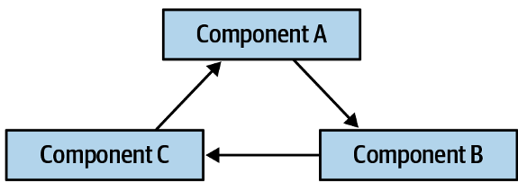

> 图 1-1：组件之间的循环依赖。

在这种反模式中，每个组件都引用了其他组件中的内容。
这样一张组件网络会损害模块化，
因为开发者无法单独复用某个组件，而不把其他组件一并带上。
当然，如果这些组件又耦合了更多组件， 架构就越来越趋向大泥球反模式。
架构师如何治理这种行为，又不必时刻盯着那些手快的开发者？
代码审查固然有帮助，但在开发周期中出现得太晚，难有成效。
如果架构师放任开发团队在代码审查之前的一周里跨代码库肆意导入，
代码库早已受到严重损害。

这个问题的解决方案是编写一个适应度函数来避免组件循环，如例 1-1 所示。

例 1-1。检测组件循环的适应度函数

```java
public class CycleTest {
    private JDepend jdepend;

    @BeforeEach
    void init() {
        jdepend = new JDepend();
        jdepend.addDirectory("/path/to/project/persistence/classes");
        jdepend.addDirectory("/path/to/project/web/classes");
        jdepend.addDirectory("/path/to/project/thirdpartyjars");
    }

    @Test
    void testAllPackages() {
        Collection packages = jdepend.analyze();
        assertEquals("Cycles exist", false, jdepend.containsCycles());
    }
}
```

在代码中，架构师使用度量工具 JDepend 来检查包之间的依赖关系。 该工具理解 Java
包的结构，如果存在任何循环则测试失败。 架构师可以将此测试接入项目的持续构建中，
不再担心冲动开发人员意外引入循环。
这是一个很好的例子，说明适应度函数守护着软件开发中*重要*而非*紧急*的实践：
这对架构师来说是一个重要关注点，但对日常编码影响很小。

例 1-1 展示了一个非常底层、以代码为中心的适应度函数。 许多流行的代码卫生工具（如
SonarQube）都以开箱即用的方式实现了常见的适应度函数。
不过，架构师往往还想验证架构的宏观结构，而不只是微观结构。 当设计像图 1-2
那样的分层架构时，架构师定义层以确保关注点分离。

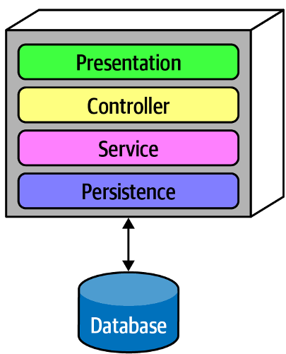

> 图 1-2：传统的分层架构。

然而，架构师如何确保开发者遵守这些分层？ 一些开发者可能不理解这些模式的重要性，
另一些人则可能出于某些压倒一切的局部考量（如性能），抱着"先斩后奏"的态度。
但放任实现者侵蚀架构的设计初衷，会损害架构的长期健康。

ArchUnit 允许架构师通过适应度函数来解决这个问题，如例 1-2 所示。

例 1-2。治理分层的 ArchUnit 适应度函数

```java
layeredArchitecture()
    .layer("Controller").definedBy("...controller...")
    .layer("Service").definedBy("...service...")
    .layer("Persistence").definedBy("...persistence...")
    .whereLayer("Controller").mayNotBeAccessedByAnyLayer()
    .whereLayer("Service").mayOnlyBeAccessedByLayers("Controller")
    .whereLayer("Persistence").mayOnlyBeAccessedByLayers("Service")
```

在例 1-2 中，架构师定义了层之间的理想关系，并编写验证适应度函数来治理它。
这使架构师能把架构原则固化在图表等说明性产物之外，并对其进行持续验证。

.NET 生态中有一个类似的工具 NetArchTest，支持在该平台上做同类测试。 C#
中的分层验证如例 1-3 所示。

例 1-3。NetArchTest 层依赖测试

```csharp
// 表示层中的类不应直接引用仓库
var result = Types.InCurrentDomain()
    .That()
    .ResideInNamespace("NetArchTest.SampleLibrary.Presentation")
    .ShouldNot()
    .HaveDependencyOn("NetArchTest.SampleLibrary.Data")
    .GetResult()
    .IsSuccessful;
```

这一领域的工具正不断涌现，能力也日益精进。
在我们结合众多解决方案演示适应度函数时，会继续重点介绍其中的许多技术。

为适应度函数找到客观结果是至关重要的。然而，*客观*并不意味着*静态*。
有些适应度函数返回与上下文无关的值，如 true/false 或性能阈值之类的数值。
另一些适应度函数（称为*动态*适应度函数）则返回依赖特定上下文的值。
例如，在度量*可扩展性*时，架构师度量并发用户数，通常也度量每个用户的性能。
通常，架构师设计系统使得随着用户数量增加，每个用户的性能略微下降——但不会断崖式下跌。
因此，对于这些系统，架构师设计考虑到并发用户数量的性能适应度函数。
只要架构特征的度量是客观的，架构师就可以测试它。

虽然大多数适应度函数应该自动化并持续运行，但有些必然会是手动的。
手动适应度函数需要一个人来处理验证。
例如，对于具有敏感法律信息的系统，律师可能需要审查对关键部分的更改以确保合法性，这无法自动化。
大多数部署流水线支持手动阶段，使团队能够容纳手动适应度函数。
理想情况下，这些尽可能频繁地运行——不运行的验证无法验证任何东西。
团队按需（很少）或作为持续集成工作流的一部分（最常见）执行适应度函数。
要完全实现像适应度函数这样的验证的好处，它们应该持续运行。

连续性很重要，正如下面这个使用适应度函数进行企业级治理的示例所说明的。
考虑以下场景：当企业在使用的某个开发框架或库中发现零日漏洞时，公司会怎么做？
如果像大多数公司一样，安全专家会在各个项目里翻找问题框架的版本并确保其得到更新，
但这个过程很少自动化，依赖许多手动步骤。
这不是一个抽象的问题；这个确切的场景就发生在[Equifax 数据泄露事件](#equifax-数据泄露事件)
中描述的那家大型金融机构身上。
就像前面描述的架构治理一样，手动流程容易出错，细节很容易被漏掉。

## Equifax 数据泄露事件

2017 年 9 月 7 日，美国主要信用评分机构 Equifax 宣布发生了数据泄露。 最终，
问题被追溯到 Java 生态系统中流行的 Struts Web 框架的黑客利用 （Apache Struts
CVE-2017-5638）。 该基金会于 2017 年 3 月 7 日发布声明宣布该漏洞并发布了补丁。
美国国土安全部于次日联系了 Equifax 和类似公司，警告他们这个问题， 并于 2017 年 3
月 15 日进行了扫描，但未能揭示所有受影响的系统。 因此，关键补丁直到 2017 年 7 月
29 日才应用于许多旧系统， 当时 Equifax
的安全专家识别出了导致数据泄露的黑客行为。

想象另一个世界，每个项目都运行一个部署流水线，
安全团队在每个团队的部署流水线中有一个"插槽"，可以部署适应度函数。
大多数时候，这些不过是平平无奇的防护措施检查，
比如防止开发者把密码存进数据库，以及类似的日常治理杂务。
然而，一旦出现零日漏洞，凭借这套无处不在的相同机制，安全团队就能在每个项目里插入一个测试，
检查特定的框架和版本号；一旦发现危险版本，就让构建失败并通知安全团队。
团队会把部署流水线配置为对生态系统的任何变化做出响应：代码、数据库模式、部署配置和适应度函数。
这使企业能够普遍自动化重要的治理任务。

适应度函数给架构师带来许多好处，其中尤其值得一提的是有机会重新写写代码！
架构师们普遍抱怨的一件事，就是自己不再有多少机会写代码了——而适应度函数往往就是代码！
通过构建架构的可执行规范——任何人都可以随时运行项目构建来验证它——
架构师必须深入理解系统及其持续演进，这与紧跟项目代码成长的初衷不谋而合。

无论适应度函数多么强大，架构师都应避免过度使用它们。
架构师不应结成小团体、退居象牙塔，炮制一套复杂得不可理喻、相互纠缠的适应度函数，
那只会让开发者和团队倍感沮丧。
相反，适应度函数是架构师为软件项目中那些*重要*但不*紧急*的原则建立可执行清单的手段。
许多项目被紧急事务淹没，任由一些重要原则被搁置一旁。
这正是技术债的常见成因："我们知道这样不好，但回头再来修"——而"回头"永远不会到来。
把关于代码质量、结构和防腐规则的约束编码成持续运行的适应度函数，
架构师构建了一个开发人员无法跳过的质量检查清单。

几年前，Atul Gawande 的优秀著作《The Checklist Manifesto》（Picador）
着重介绍了外科医生、 民航飞行员等专业人士使用检查清单的情况，
这些领域通常（有时甚至是法律强制）把检查清单作为日常工作的一部分。
这不是因为他们不懂自己的工作或特别健忘；
当专业人士一遍又一遍地执行同样的任务时，偶尔漏掉某个步骤却很容易自我麻痹，
而检查清单正是用来防止这一点的。
适应度函数就是架构师定义的重要原则检查清单，作为构建的一部分运行，
以确保开发者不会无意中（或在进度压力等外力下故意）跳过它们。

全书中，我们会在有机会展示如何治理架构方案以及如何进行初始设计时，随时利用适应度函数来加以说明。

## 架构与设计：保持定义简单

架构师不断挣扎的一个领域是将架构和设计保持为独立但相关的活动。
虽然我们不想涉入这场关于此区别的无休止争论，
但我们在本书中努力坚定地站在该光谱的架构一侧，原因有几个。

首先，架构师必须理解底层架构原则才能做出有效的决策。
例如，*同步*与*异步*通信之间的决策在架构师叠加实现细节之前有许多 trade-off。
在《Fundamentals of Software
Architecture》一书中，作者们创造了软件架构的第二定律： *为什么*比*如何*更重要。
虽然最终架构师必须理解如何实现解决方案，
但他们必须首先理解为什么一个选择比另一个有更好的 trade-off。

其次，通过聚焦于架构概念，我们可以避免这些概念的众多实现方式。
架构师可以以多种方式实现异步通信；我们聚焦于为什么架构师会选择异步通信，
并将实现细节留给其他地方。

第三，如果我们开始实现我们展示的所有选项的变体，这将是史上最长的书。
聚焦于架构原则使我们能够尽可能保持通用性。

为了尽可能使主题保持在架构基础上， 我们对关键概念使用尽可能简单的定义。
例如，架构中的*耦合*可以填满整本书（也确实有）。
为此，我们使用以下简单，甚至可以说是过分简化的定义：

**服务**

通俗地说，*服务*是作为独立可执行文件部署的一个内聚的功能集合。
我们讨论的大多数关于服务的概念广泛适用于分布式架构，特别是微服务架构。

在第 2 章中定义的术语中，服务是 architecture quantum 的一部分，
其中包括服务和其它 quantum 之间静态和动态耦合的进一步定义。

**耦合**

如果两个工件（包括服务）中的一个的变化可能需要另一个变化以维持正确的功能，则它们是耦合的。

**组件**

应用的架构构建块，执行某种业务或基础设施功能，
通常通过包结构（Java）、命名空间（C#）或在某种目录结构中的源文件物理分组来体现。
例如， 组件 Order History 可能通过位于命名空间 app.business.order.history
中的一组类文件来实现。

**同步通信**

如果调用者在继续之前必须等待响应，则两个工件同步通信。

**异步通信**

如果调用者在继续之前不等待响应，则两个工件异步通信。
可选地，当请求完成时，接收方可以通过单独的通道通知调用者。

**orchestrated 协调**

如果一个工作流包含一个服务，其主要职责是协调该工作流，则该工作流是编排式的。

**choreographed 协调**

当一个工作流缺少 orchestrator 时，它是 choreographed 的；
相反，工作流中的服务共享工作流的协调职责。

**原子性**

如果工作流的所有部分始终保持一致状态，则该工作流是*原子*的；
其对立面则是以*最终一致性*为代表的连续频谱，将在第 6 章中介绍。

**契约**

我们广泛使用术语*契约*来定义两个软件部分之间的接口，
可能包括方法或函数调用、集成架构远程调用、依赖关系等。
任何两个软件部分连接的地方，都涉及契约。

软件架构本质上是抽象的：我们无法知道读者可能拥有的平台、技术、
商业软件和其他令人眼花缭乱的可能性组合是什么，除了没有两个是完全相同的。
我们涵盖许多抽象概念，但必须用一些实现细节来使它们具体化。
为此，我们需要一个问题来说明架构概念——这引出了 Sysops Squad。

## 引入 Sysops Squad Saga

saga（名词）

一个英雄成就的长篇故事。

——牛津英语词典

我们在本书中讨论了多种 saga，既有字面意义也有比喻意义。
架构师借用术语*saga*来描述分布式架构中的事务行为（我们在第 12 章中详细讨论）。
然而，关于架构的讨论往往趋于抽象，尤其当讨论的对象本身就是架构难点这类抽象问题时。
为了缓解这个问题，也为我们讨论的解决方案提供一些现实世界的背景，
我们开启了一段围绕 *Sysops Squad* 的"字面" saga。

我们在每一章中使用 Sysops Squad Saga 来说明本书中描述的技术和 trade-off。
虽然许多软件架构书籍涵盖新的开发工作，但许多现实世界的问题存在于现有系统中。
因此，我们的故事从这里强调的现有 Sysops Squad 架构开始。

Penultimate Electronics 是一家大型电子巨头，在全国各地拥有众多零售店。
当客户购买电脑、电视、音响和其他电子设备时， 他们可以选择购买支持计划。
当出现问题时，面向客户的技术专家（Sysops
Squad）来到客户住所（或工作办公室）修复电子设备的问题。

Sysops Squad 工单应用的四个主要用户如下：

**管理员**

管理员维护系统的内部用户，包括专家名单及其相应的技能组合、地点和可用性。
管理员还管理使用该系统的客户的所有计费处理，并维护静态参考数据（如支持的产品、
系统中的名称-值对等）。

**客户**

客户注册 Sysops Squad 服务并维护他们的客户资料、支持合同和计费信息。
客户在系统中输入问题工单，并在工作完成后填写调查问卷。

**Sysops Squad 专家**

专家被分配问题工单并根据工单修复问题。他们还与知识库交互，搜索客户问题的解决方案并输入关于维修的笔记。

**经理**

经理跟踪问题工单操作，并接收关于整个 Sysops Squad 问题工单系统的运维和分析报告。

### 非工单工作流

非工单工作流包括管理员、经理和客户执行的与问题工单无关的操作。这些工作流概述如下：

1. Sysops Squad
   专家通过管理员在系统中添加和维护，管理员输入他们的地点、可用性和技能。

2. 客户在 Sysops Squad 系统中注册，并根据他们购买的产品拥有多个支持计划。

3. 客户根据其资料中包含的信用卡信息每月自动扣款。客户可以通过系统查看账单历史和账单。

4. 经理请求并接收各种运维和分析报告，包括财务报告、专家绩效报告和工单报告。

### 工单工作流

工单工作流从客户在系统中输入问题工单开始，到客户在维修完成后完成调查问卷结束。此工作流概述如下：

1. 购买了支持计划的客户使用 Sysops Squad 网站输入问题工单。

2. 一旦问题工单进入系统，系统然后根据技能、当前位置、 服务区域和可用性确定哪个
   Sysops Squad 专家最适合该工作。

3. 一旦分配， 问题工单被上传到 Sysops Squad 专家移动设备上的专用定制移动应用。
   专家还通过短信通知他们有一个新的问题工单。

4. 客户通过短信或电子邮件（基于他们的资料偏好）通知专家正在赶来。

5. 专家使用他们手机上的定制移动应用获取工单信息和位置。 Sysops Squad
   专家还可以通过移动应用访问知识库，了解过去为修复问题所做的工作。

6. 一旦专家修复了问题，他们将工单标记为"完成"。 Sysops Squad
   专家然后可以添加关于问题和维修的信息到知识库。

7. 系统收到工单完成的通知后，向客户发送一封带有调查问卷链接的电子邮件，客户然后填写。

8. 系统从客户那里接收完成的调查问卷并记录调查信息。

### 一个糟糕的场景

Sysops Squad 问题工单应用最近情况不太好。
当前的故障工单系统是一个多年前开发的大型单体应用。
客户抱怨顾问因为丢失工单而从未出现，
而且经常是错误的顾问来修复他们一无所知的东西。
客户还抱怨系统并不总是可以用于输入新的问题工单。

在这个大型单体中，变更也是困难且危险的。
每当进行更改时，通常需要太长时间，而且其他东西通常会出问题。
由于可靠性问题，Sysops Squad 系统经常"冻结"或崩溃，
导致所有应用功能在问题被识别和应用重新启动期间从 5 分钟到 2 小时不可用。

如果不尽快采取行动，Penultimate Electronics
将被迫放弃非常有利可图的支持合同业务线， 并裁掉所有 Sysops Squad
管理员、专家、经理和 IT 开发人员——包括架构师。

### Sysops Squad 架构组件

Sysops Squad 应用的单体系统处理工单管理、运维报告、客户注册和计费，
以及一般管理功能，如用户维护、登录和专家技能及资料维护。 图 1-3 和相应的表 1-1
说明和描述了现有单体应用的组件（命名空间的 ss. 部分指定了 Sysops Squad
应用上下文）。


> 图 1-3：现有 Sysops Squad 应用中的组件。

| 组件                  | 命名空间                 | 职责                               |
| --------------------- | ------------------------ | ---------------------------------- |
| Login                 | ss.login                 | 内部用户和客户登录及安全逻辑       |
| Billing payment       | ss.billing.payment       | 客户月度计费和客户信用卡信息       |
| Billing history       | ss.billing.history       | 付款历史和先前账单                 |
| Customer notification | ss.customer.notification | 通知客户计费、一般信息             |
| Customer profile      | ss.customer.profile      | 维护客户资料、客户注册             |
| Expert profile        | ss.expert.profile        | 维护专家资料（姓名、地点、技能等） |
| KB maint              | ss.kb.maintenance        | 维护和查看知识库中的条目           |
| KB search             | ss.kb.search             | 搜索知识库的查询引擎               |
| Reporting             | ss.reporting             | 所有报告（专家、工单、财务）       |
| Ticket                | ss.ticket                | 工单创建、维护、完成、通用代码     |
| Ticket assign         | ss.ticket.assign         | 找到专家并分配工单                 |
| Ticket notify         | ss.ticket.notify         | 通知客户专家正在赶来               |
| Ticket route          | ss.ticket.route          | 将工单发送到专家的移动设备应用     |
| Support contract      | ss.supportcontract       | 客户的支持合同、计划中的产品       |
| Survey                | ss.survey                | 维护调查问卷、收集和记录调查结果   |
| Survey notify         | ss.survey.notify         | 向客户发送调查问卷电子邮件         |
| Survey templates      | ss.survey.templates      | 根据服务类型维护各种调查问卷       |
| User maintenance      | ss.users                 | 维护内部用户和角色                 |

> 表 1-1：现有 Sysops Squad 组件。

这些组件将在后续章节中用于说明将应用拆分为分布式架构时的各种技术和 trade-off。

## Sysops Squad 数据模型

表 1-1 中列出的 Sysops Squad 应用及其各种组件在数据库中使用单一 schema
来托管其所有表和相关数据库代码。 该数据库用于持久化客户、用户、
合同、计费、付款、知识库和客户调查问卷；表列于表 1-2 中，ER 模型如图 1-4 所示。


> 图 1-4：现有 Sysops Squad 应用中的数据模型。

| 表                    | 职责                         |
| --------------------- | ---------------------------- |
| Customer              | 需要 Sysops 支持的实体       |
| Customer_Notification | 客户的通知偏好               |
| Survey                | 支持后客户满意度调查         |
| Question              | 调查中的问题                 |
| Survey_Question       | 问题被分配到调查             |
| Survey_Administered   | 调查问题被分配给客户         |
| Survey_Response       | 客户对调查的回复             |
| Billing               | 支持合同的计费信息           |
| Contract              | 实体与 Sysops 之间的支持合同 |
| Payment_Method        | 支持的付款方式               |
| Payment               | 为计费处理的付款             |
| SysOps_User           | Sysops 中的各种用户          |
| Profile               | Sysops 用户的资料信息        |
| Expert_Profile        | 专家的资料                   |
| Expertise             | Sysops 中的各种专长          |
| Location              | 专家服务的区域               |
| Article               | 知识库的文章                 |
| Tag                   | 文章上的标签                 |
| Keyword               | 文章的关键词                 |
| Article_Tag           | 与文章关联的标签             |
| Article_Keyword       | 关键词和文章的连接表         |
| Ticket                | 客户提出的支持工单           |
| Ticket_Type           | 不同类型的工单               |
| Ticket_History        | 支持工单的历史记录           |

> 表 1-2：现有 Sysops Squad 数据库表。

Sysops 数据模型是一个标准的第三范式数据模型，只有少量存储过程或触发器。然而，
存在相当数量的视图，主要由 Reporting 组件使用。
当架构团队试图拆分应用并转向分布式架构时，将不得不与数据库团队合作，在数据库层面完成任务。
这种数据库表和视图的设置将在全书中用于讨论完成拆分数据库任务的各种技术和
trade-off。

# 第一部分 拆分

正如我们许多人在孩提时代发现的那样，理解某物如何组合在一起的绝佳方式是先把它拆开。
要理解复杂的主题（如分布式架构中的 trade-off），架构师必须弄清楚从哪里开始拆解。

在《What Every Programmer Should Know About Object-Oriented Design》（Dorset
House）一书中， Meilir Page-Jones
做出了敏锐的观察，即架构中的耦合可以分为静态和动态耦合。
*静态*耦合指的是架构部件（类、组件、服务等）如何*连接*在一起：依赖关系、耦合程度、
连接点等。架构师通常可以在编译时测量静态耦合， 因为它代表架构中的静态依赖关系。

动态耦合指的是架构部件如何相互调用：什么类型的通信，传递什么信息，契约的严格程度等。

我们的目标是研究如何在分布式架构中进行 trade-off 分析；为此，
我们必须拆开这些活动的部件，在重新组合之前先独立讨论、充分理解它们。

第一部分主要处理*架构结构*，即事物如何静态耦合在一起。在第 2 章中，
我们要解决定义架构中静态与动态耦合范围的问题，并呈现必须拆开来理解的完整图景。
第 3 章开始这个过程，定义了架构中的模块化和分离。 第 4
章提供了评估和解构代码库的工具，第 5 章提供了协助该过程的模式。

数据和事务在架构中变得越来越重要，驱动着架构师和 DBA 的许多 trade-off 决策。 第
6 章讨论数据的架构影响，包括如何协调服务和数据边界。最后， 第 7
章把架构耦合与数据关注点联系起来，定义了*集成器*与*分解器*——促使服务规模与边界变大或变小的力量。

# 第 2 章：识别软件架构中的耦合

11 月 3 日，星期三，13:00


> 插图 2-1：Logan 在自助餐厅打断 Addison 和 Austen
> 等架构师关于分布式架构的讨论。

Penultimate Electronics 的首席架构师 Logan
打断了自助餐厅里一小群正在讨论分布式架构的架构师。 "Austen，你又打石膏了？"

"不，只是夹板，"Austen 回答说。"我周末打极限飞盘高尔夫扭伤了手腕——快好了。"

"什么是……算了。我闯进来的这场激烈讨论是什么？"

"为什么在微服务中不总是选择 saga 模式来连接事务？"Austen 问道。
"那样的话，架构师可以把服务做得尽可能小。"

"但 saga 不就得用编排吗？"Addison 问道。"需要异步通信的时候怎么办？还有，
事务会有多复杂？如果我们把东西拆得太细，真的能保证数据保真度吗？"

"你知道，"Austen
说，"如果我们用企业服务总线（ESB），可以让它管理大部分那些东西。"

"我以为没人再用 ESB 了——我们不应该用 Kafka 处理那种东西吗？"

"它们根本就不是一回事！"Austen 说。

Logan 打断了越来越激烈的讨论。"这确实是苹果和橘子的比较，
但这些工具和方法都不是银弹。像微服务这样的分布式架构是困难的，
尤其是架构师无法理清所有起作用的力量时。我们需要一个方法或框架，帮我们弄清架构中的难题。"

"好吧，"Addison
说，"不管我们做什么，都必须尽可能解耦——我读到的所有东西都说架构师应该尽可能拥抱解耦。"

"如果你遵循那个建议，"Logan 说，
"一切都会解耦到没有任何东西可以与其他任何东西通信——那样很难构建软件！像很多事情一样，耦合本身并不是坏的；
架构师只需要知道如何恰当地应用它。事实上，我记得一句希腊哲学家关于这一点的名言……"

> 万物皆有毒，没有东西是无毒的；唯有剂量决定一物不是毒药。

——帕拉塞尔苏斯

架构师将面临的最困难的任务之一，是解开分布式架构中各种起作用的力量和 trade-off。
提供建议的人不断颂扬"松耦合"系统的优点，
但架构师如何设计一个没有任何东西连接到任何其他东西的系统？
架构师设计细粒度微服务来实现解耦，但随之而来的是编排、事务性和异步性带来的巨大问题。泛泛的建议说"解耦"，
却没有提供*如何*在仍然构建有用系统的前提下实现这一目标的指南。

架构师在粒度和通信决策上挣扎，
因为没有明确的通用指南来做出决策——没有适用于现实世界复杂系统的最佳实践。直到现在，架构师缺乏正确的视角和术语，
来进行细致分析，从而逐案确定最佳（或最不坏）的 trade-off 集合。

为什么架构师在分布式架构中的决策如此挣扎？毕竟，我们从上个世纪就开始构建分布式系统，
使用了许多相同的机制（消息队列、事件等）。为什么微服务的复杂性攀升得如此厉害？
答案在于微服务的基本哲学，灵感来自*bounded context*的思想。 构建建模 bounded
context 的服务需要架构师对分布式系统设计方式进行微妙但重要的改变，
因为现在事务性是一等架构关注点。
在微服务之前架构师设计的许多分布式系统中，事件处理器通常连接到单一关系数据库，完整性、事务等细节交由数据库处理。
将数据库移入服务边界内，就把数据关注点转变成了架构关注点。

正如我们之前说过的，"软件架构"是你无法在 Google 上找到答案的东西。
现代架构师必须构建的一项技能是 trade-off 分析能力。
虽然有几个框架已经存在了几十年（如架构 trade-off 分析方法，即 ATAM），
但它们缺乏对架构师日常面临的实际问题的关注。

本书关注架构师如何针对自身情况特有的各种场景进行 trade-off 分析。
正如架构中的许多事情，建议很简单；难点在于细节，特别是困难的部分如何纠缠在一起，
使得难以看到和理解各个部分，如图 2-1 所示。

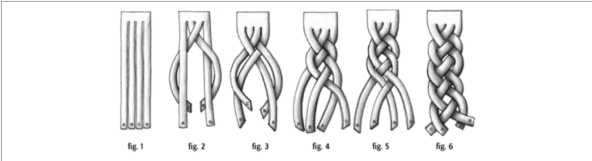

> 图 2-1：纠缠的发辫让单独的发丝难以辨认。

面对纠缠在一起的问题，架构师难以进行 trade-off
分析，因为关注点很难拆分开来独立考量。因此， trade-off
分析的第一步是解开问题的维度，分析哪些部分彼此耦合，
以及这种耦合对变更有什么影响。为此，我们使用耦合这个词的最简单定义：

**耦合**

如果软件系统的一个部分的变化可能导致另一个部分的变化，则这两个部分是耦合的。

通常，软件架构产生多维问题，其中多种力以相互依赖的方式相互作用。要分析
trade-off， 架构师必须首先确定哪些力需要彼此 trade-off。

因此，以下是我们对软件架构中现代 trade-off 分析的建议：

1. 找到哪些部分纠缠在一起。

2. 分析它们如何彼此耦合。

3. 通过确定变更对相互依赖系统的影响来评估 trade-off。

虽然步骤很简单，但难点潜伏在细节中。因此，为了在实践中说明这个框架，
我们以分布式架构中最困难（并且可能最接近通用）的问题之一为例，它与微服务相关：

架构师如何确定微服务的大小和通信风格？

确定微服务的适当大小似乎是一个普遍的问题——太小的服务会产生事务和编排问题，太大的服务会产生规模和分布问题。
为此，本书的其余部分解开了在回答上述问题时需要考虑的许多方面。
我们提供新的术语来区分相似但不同的模式，并展示应用这些模式和其他模式的实用示例。

然而，本书的首要目标是为你提供示例驱动的技术，
让你学会如何为你领域内的独特问题构建自己的 trade-off
分析。我们从分布式架构中力量的第一次大拆解开始： 定义 architecture quantum
以及两种类型的耦合，静态和动态。

## architecture quantum

术语*quantum*当然在物理学领域即*量子力学*中被大量使用。
然而，作者选择这个词的原因与物理学家选择它的原因相同。 *Quantum* 源自拉丁词
*quantus*，意为"多大"或"多少"。
在物理学领域采用它之前，法律行业用它来表示"所需或允许的金额"（例如，在损害赔偿中）。
该术语也出现在拓扑学数学领域中，涉及形状族的属性。由于其拉丁词根，单数是
*quantum*，复数是 *quanta*， 类似于 datum/data 的对称性。

architecture quantum
度量软件架构中与部件之间如何连接、如何通信相关的拓扑与行为的若干方面：
**architecture quantum**

architecture quantum 是一个独立可部署的工件，
具有高功能内聚、高静态耦合和同步动态耦合。 architecture quantum
的一个常见示例是工作流中的一个良好形成的微服务。

**静态耦合**

表示静态依赖如何通过契约在架构中解析。这些依赖包括操作系统、
框架和/或通过传递依赖管理交付的库，以及允许 quantum 操作的任何其他运维要求。

**动态耦合**

表示 quantum
在运行时如何通信，无论是同步还是异步。因此，这些特征的适应度函数必须是连续的，通常利用监控器。
尽管静态耦合与动态耦合看似相似，架构师必须辨明两个重要区别。
区分二者的一个简单思路是：*静态耦合*描述服务如何*连接*在一起，
而*动态耦合*描述了服务如何在运行时相互*调用*。例如，在微服务架构中，
服务必须包含数据库之类的依赖组件，这代表静态耦合——缺少必要的数据，服务就无法运转。
该服务可能在工作流过程中调用其他服务，这代表动态耦合。两个服务都不要求对方在场才能运行，
唯一的例外是这条运行时工作流。因此，静态耦合分析运维依赖，动态耦合分析通信依赖。

这些定义包含重要的特征；让我们逐一详细讨论，因为它们为本书中的大多数示例提供了信息。

### 独立可部署

独立可部署意味着 architecture quantum 的几个方面——每个 quantum
代表特定架构中的一个独立部署单元。 因此，
单体架构——作为单个单元部署的——根据定义是单个 architecture quantum。
在微服务等分布式架构中，开发人员倾向于让服务能够独立部署，
通常以高度自动化的方式。因此，从独立可部署的角度来看，
微服务架构中的服务代表一个 architecture quantum（取决于耦合——如下所述）。

让每个 architecture quantum 都代表架构内的一项可部署资产，有几个好处。
首先，architecture quantum 所代表的边界在架构师、
开发人员和运维之间充当有用的通用语言。各方对讨论的共同范围心领神会：架构师理解耦合特征，
开发人员理解行为范围，运维团队理解可部署特征。

其次， architecture quantum 代表一种作用力（静态耦合），
是架构师确定分布式架构中服务的恰当粒度时必须考虑的。通常，在微服务架构中，
开发人员面临一个困难的问题，即什么服务粒度提供了最优的 trade-off 集合。 其中一些
trade-off 围绕可部署性：
该服务需要什么发布节奏，其他哪些服务可能受到影响，涉及什么工程实践等。
架构师若能牢牢掌握分布式架构中部署边界的确切位置，将受益匪浅。 我们在第 7
章中讨论服务粒度及其伴随的 trade-off。

第三，独立可部署性迫使 architecture quantum 包含常见的耦合点如数据库。
大多数架构讨论都乐于回避数据库、用户界面这类问题，
但现实世界的系统通常必须处理这些问题。因此， 任何使用共享数据库的系统都不满足
architecture quantum 的独立部署标准，除非数据库与应用同步部署。
许多分布式系统本来可以构成多个 quantum，
但若共享一个有自己部署节奏的公共数据库，就在独立可部署这一条上不合格。
因此，只看部署边界并不能得到有用的度量。 架构师还应考虑 architecture quantum
的第二个标准，高功能内聚， 以将 architecture quantum 限制在有用的范围内。

### 高功能内聚

高功能内聚在结构上指相关元素的紧密程度：类、组件、服务等。纵观历史，
计算机科学家定义了多种内聚类型；这里的讨论范围限定为通用模块，
它在不同平台上可能表现为类或组件。从领域角度来看， 高功能内聚的技术定义与
domain-driven design 中 bounded context 的目标重叠：
实现特定领域工作流的行为和数据。

从纯粹独立可部署性的角度来看，一个巨大的单体架构符合 architecture quantum
的条件。然而， 它几乎肯定谈不上高功能内聚，而是包含了整个系统的功能。
单体越大，越不可能在单一功能上内聚。

理想情况下，在微服务架构中，每个服务建模一个单一的领域或工作流，因此表现出高功能内聚。
在这种上下文中的内聚不是关于服务如何交互以执行工作，
而是关于一个服务与另一个服务如何独立和耦合。

### 高静态耦合

高静态耦合意味着 architecture quantum 内部的元素紧密连接在一起，
这本质上关乎契约。架构师将 REST 或 SOAP 等认可为契约格式，
但方法签名和运维依赖（通过耦合点如 IP 地址或 URL）也代表契约。因此，
契约是架构的一个难点；我们在第 13 章中涵盖涉及所有类型契约的耦合问题，
包括如何选择合适的契约。

architecture quantum
部分是静态耦合的度量，对大多数架构拓扑而言，这个度量相当简单。例如，
以下图表显示了《Fundamentals of Software Architecture》中出现的架构风格， 以及
architecture quantum 静态耦合的说明。

任何单体架构风格必然有一个 quantum 为一，如图 2-2 所示。
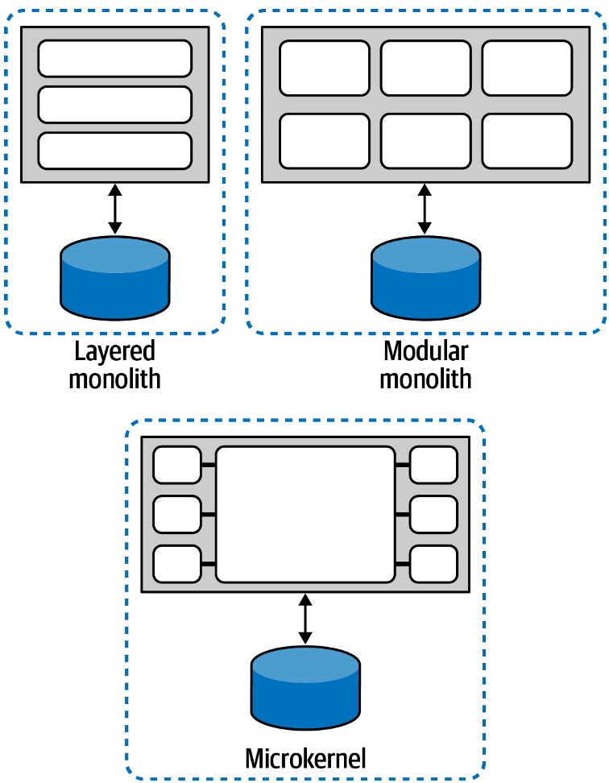

> 图 2-2：单体架构的 quantum 数始终为一。

如你所见，任何作为单个单元部署并使用单一数据库的架构将始终只有单个 quantum。
architecture quantum 的静态耦合度量包括数据库，
依赖单个数据库的系统不能有超过一个 quantum。因此， architecture quantum
的静态耦合度量有助于识别架构中的耦合点，而不仅仅是在开发中的软件组件内。
大多数单体架构包含一个单一的耦合点（通常是数据库），使其 quantum 度量为一。

分布式架构通常以组件级别的解耦为特征；考虑下一组架构风格，从图 2-3
所示的基于服务的架构开始。
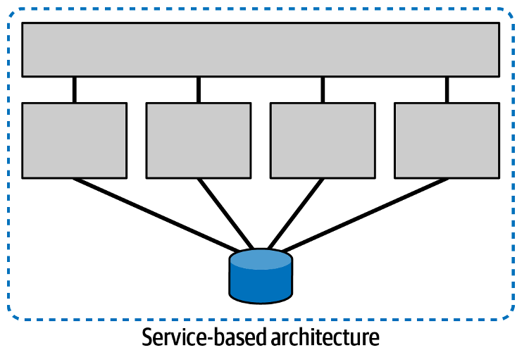

> 图 2-3：基于服务的架构的 architecture quantum。

虽然这个单独的服务模型显示了微服务中常见的隔离，但该架构仍然使用单个关系数据库，
使其 architecture quantum 评分为一。

## 基于服务的架构

当我们提到*基于服务的架构*时，我们不是指基于服务的通用架构，
而是指一种特定的混合架构风格，它遵循分布式宏分层结构，由独立部署的用户界面、
独立部署的远程粗粒度服务和单体数据库组成。这种架构解决了微服务的一个复杂性——数据库级别的分离。
基于服务的架构中的服务遵循与微服务相同的原则（基于 domain-driven design 的
bounded context）， 但依赖单个关系数据库，
因为架构师看不到分离的价值（或看到了太多负面的 trade-off）。
基于服务的架构是重构单体架构时的常见目标，
可以在不破坏现有数据库模式和集成点的情况下进行分解。分解模式将在第 5 章中介绍。
到目前为止，architecture quantum 的静态耦合度量将所有拓扑评估为一。
然而，分布式架构只是创造了多个 quantum 的可能性，并不保证一定如此。例如，
事件驱动架构的 mediator 风格将始终被评估为单个 architecture quantum， 如图 2-4
所示。

尽管这种风格属于分布式架构，两个耦合点仍把它推向单个 architecture
quantum：一是数据库， 与前面的单体架构相同； 二是请求 orchestrator
本身——架构运行所需的任何整体性耦合点，都会在其周围形成一个 architecture
quantum。

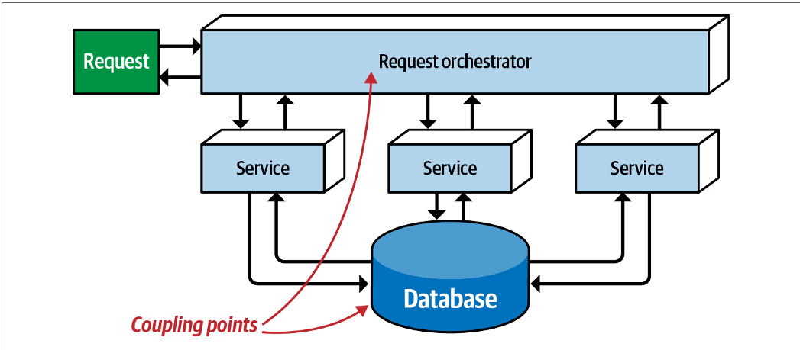

> 图 2-4：mediator 事件驱动架构具有单个 architecture quantum。

代理者风格的事件驱动架构（没有中央
mediator）耦合较少，但这并不保证完全解耦。考虑图 2-5 所示的事件驱动架构。
这种代理者风格的事件驱动架构（没有中央 mediator） 仍然是单个 architecture
quantum，因为所有服务都使用同一个关系数据库，它充当公共耦合点。 architecture
quantum 的静态分析回答的问题是，
"这个架构依赖是否是启动此服务所必需的？"即使在事件驱动架构中，某些服务不访问数据库，
如果它们依赖确实访问数据库的服务，那么它们就成为 architecture quantum
静态耦合的一部分。


> 图 2-5：即使是分布式架构如代理者风格的事件驱动架构也可以是单个 quantum。

然而，分布式架构中不存在公共耦合点的情况呢？考虑图 2-6 所示的事件驱动架构。
架构师设计了这个事件驱动系统，它有两个数据存储，各组服务之间没有静态依赖。请注意，
任一 architecture quantum 都可以在类似生产环境的生态系统中运行。
它可能无法参与系统所需的所有工作流，
但它能成功运行和工作——在架构中发送并接收请求。 architecture quantum
的静态耦合度量评估架构组件与运维组件之间的耦合依赖关系。
因此，操作系统、数据存储、消息代理、 容器编排和所有其他运维依赖构成了
architecture quantum 的静态耦合点，并使用尽可能严格的契约。 关于契约在
architecture quantum 中的作用，第 13 章有更多讨论。


> 图 2-6：具有多个 quantum 的事件驱动架构。

微服务架构风格以高度解耦的服务为特征，数据依赖也包括在内。这些架构中的架构师倾向于高度解耦，注意不在服务之间创建耦合点，
允许每个单独的服务各自形成自己的 quantum， 如图 2-7 所示。

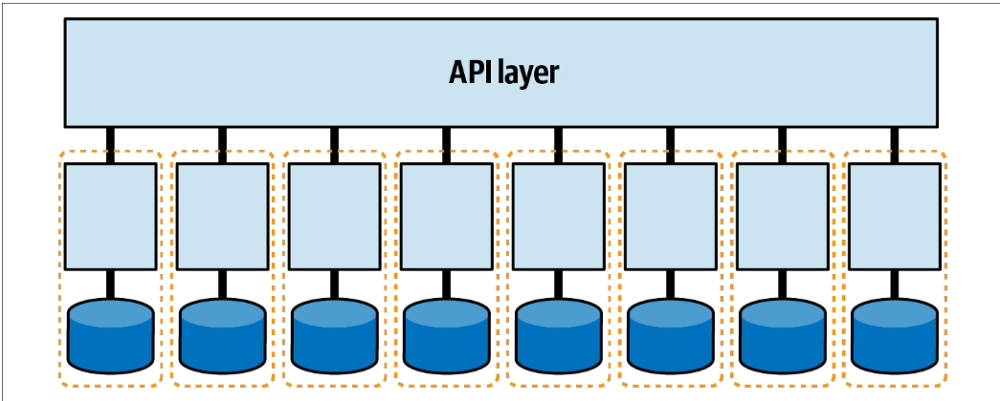

> 图 2-7：微服务可以形成自己的 quantum。

每个服务（作为 bounded context）
可能有自己的一组架构特征——一个服务的可扩展性或安全水平可能高于另一个服务。
这种对架构特征的细粒度界定，正是微服务架构风格的优势之一。
高度解耦让负责某个服务的团队能尽可能快地推进，而不必担心破坏其他依赖。
然而，如果系统与用户界面紧密耦合，架构就形成单个 architecture quantum，如图 2-8
所示。
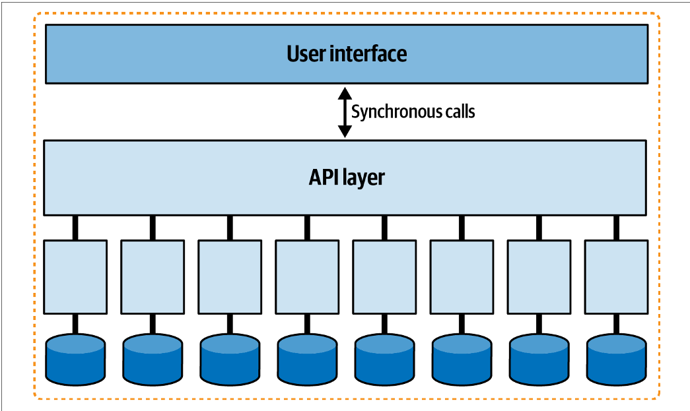

> 图 2-8：紧密耦合的用户界面可以将微服务 architecture quantum 数降为一。

用户界面在前端与后端之间创建耦合点，后端部分不可用时，大多数用户界面就无法运行。
此外，如果所有服务必须在同一个用户界面中协同工作（特别是在同步调用的情况下，
参见[动态 quantum 耦合](#动态-quantum-耦合)），
架构师将难以为每个服务设计不同水平的运维架构特征（性能、规模、弹性、可靠性等）。
架构师可以利用异步性设计用户界面，避免在前端与后端之间创建耦合。
许多微服务项目的一个趋势是使用*微前端*框架来处理微服务架构中的用户界面元素。在这种架构中，
代表服务进行交互的用户界面元素由服务本身发出。用户界面表面充当一块画布，
用户界面元素可以出现在其上；它还促进组件之间的松耦合通信，通常使用事件。
这种架构如图 2-9 所示。

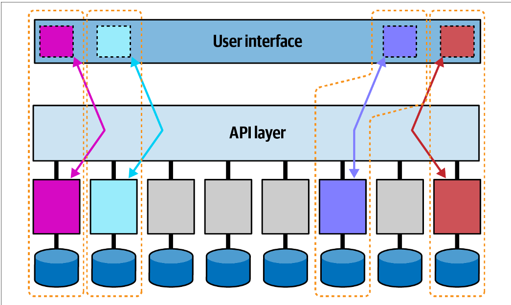

> 图 2-9：在微前端架构中，每个服务+用户界面组件形成一个 architecture quantum。

在这个例子中， 四个着色服务连同它们相应的微前端形成 architecture quantum：
这些服务中的每一个可能具有不同的架构特征。 从 quantum
的角度看，架构中的任何耦合点都可以构成静态耦合点。 考虑图 2-10
所示的两个系统之间共享数据库的影响。
系统的静态耦合提供了宝贵的洞察，即使在涉及集成架构的复杂系统中也是如此。
架构师理解遗留架构的常用技术，是绘制一张静态 quantum
图，展示各事物如何"连接"在一起， 这有助于确定哪些系统会受到变更影响，
也提供了一种理解（并可能解耦）架构的方式。
静态耦合只是分布式架构中作用力的一半。另一半是动态耦合。


> 图 2-10：共享数据库形成两个系统之间的耦合点，创建单个 quantum。

## 动态 quantum 耦合

architecture quantum 定义的最后部分涉及运行时的同步耦合——换句话说， architecture
quantum 在分布式架构中如何相互交互以形成工作流。
服务*如何*相互调用这件事会带来困难的 trade-off
决策，因为它代表一个多维决策空间，受三种互锁的力量影响： **通信**

指所用连接的同步类型：同步还是异步。 **一致性**

描述工作流通信是否需要原子性，还是可以利用最终一致性。 **协调**

描述工作流是否使用 orchestrator，还是服务通过 choreography 进行通信。

### 通信

当两个服务相互通信时，架构师的一个基本问题是该通信应该是同步还是异步。
同步通信要求请求者等待接收者的响应，如图 2-11 所示。


> 图 2-11：同步调用等待接收者的结果。

调用服务发起调用（使用 gRPC
等支持同步调用的协议之一）并阻塞（不再进行后续处理），
直到接收者返回值（或返回指示状态变化、错误的状态）。
两个服务之间也可以异步通信：调用者向接收者发布消息（通常借助消息队列等机制），
一旦调用者收到消息将被处理的确认，就返回继续工作。如果请求需要响应值，
接收者可以使用回复队列（异步地）通知调用者结果，如图 2-12 所示。


> 图 2-12：异步通信允许并行处理。

调用者向消息队列发布消息后继续处理，直到接收者通过回调通知所请求的信息已就绪。通常，
架构师使用消息队列来实现异步通信（在图 2-12 的顶部图中以灰色圆柱管表示），
但队列很常见，会在图上产生噪音，
所以许多架构师将它们省略，如底部图所示。当然，架构师也可以使用各种库或框架实现异步通信而不使用消息队列。
每种图表变体都暗示异步消息传递；第二种提供了视觉简写和更少的实现细节。

在选择服务如何通信时，架构师必须考虑重大的
trade-off。围绕通信的决策影响同步、错误处理、事务性、 可扩展性和性能。
本书的其余部分深入探讨了许多这些问题。

### 一致性

一致性指的是通信调用必须遵守的事务完整性的严格程度。
原子事务（在处理请求期间需要保持一致性的全有或全无事务）位于光谱的一端，不同程度的最终一致性则位于另一端。
事务性——让多个服务参与全有或全无事务——是分布式架构中最难建模的问题之一，
因此通行的建议是尽量避免跨服务事务。我们在第 6、9、 10 和 12
章中讨论一致性以及数据和架构的交叉。

### 协调

协调指的是通信所建模的工作流需要多少协调。 微服务的两种常见通用模式是
orchestration 和 choreography，我们在第 11 章中描述。
简单的工作流——单个服务响应请求——不需要在这个维度上做特殊考量。然而，随着工作流复杂性的增长，对协调的需求也越大。
这三个因素——通信、一致性和协调——都为架构师必须做出的重要决策提供信息。然而，关键的是，
架构师不能孤立地做出这些选择；每个选项都会对其他选项产生引力般的影响。例如，
事务性在带 mediator 的同步架构中更容易实现， 而最终一致的异步 choreography
系统则能支撑更高水平的规模。

把这些力量看作彼此相关，就形成了一个三维空间，如图 2-13 所示。
服务通信期间发挥作用的每种力量都表现为一个维度。对于特定决策，架构师可以在空间中标出代表这些力量强弱的位置。


> 图 2-13：动态 quantum 耦合的维度。

当架构师能够清楚理解特定情境中起作用的力量时，就为 trade-off
分析确立了标准。就动态耦合而言， 表 2-1
显示了基于八种可能组合识别基本模式名称的框架。

| 模式名称                   | 通信 | 一致性 | 协调          | 耦合   |
| -------------------------- | ---- | ------ | ------------- | ------ |
| Epic Saga (sao)            | 同步 | 原子   | orchestrated  | 非常高 |
| Phone Tag Saga (sac)       | 同步 | 原子   | choreographed | 高     |
| Fairy Tale Saga (seo)      | 同步 | 最终   | orchestrated  | 高     |
| Time Travel Saga (sec)     | 同步 | 最终   | choreographed | 中     |
| Fantasy Fiction Saga (aao) | 异步 | 原子   | orchestrated  | 高     |
| Horror Story (aac)         | 异步 | 原子   | choreographed | 中     |
| Parallel Saga (aeo)        | 异步 | 最终   | orchestrated  | 低     |
| Anthology Saga (aec)       | 异步 | 最终   | choreographed | 非常低 |

> 表 2-1：分布式架构维度交叉矩阵。

要完全理解这个矩阵，必须先分别研究每个维度。因此，接下来的章节帮你建立上下文，理解通信、
一致性与协调各自的 trade-off，然后在第 12 章中把它们重新纠缠到一起。
在第一部分余下的章节中，我们聚焦静态耦合，理解分布式架构中起作用的各种维度，
包括数据所有权、事务性和服务粒度。在第二部分"重新组合"中，
我们聚焦动态耦合，理解微服务中的通信模式。

## Sysops Squad Saga：理解 quantum

### 11 月 23 日，星期二，14:32


> 插图 2-2：Austen 来到 Addison 的办公室，请教 architecture quantum 的概念。

Austen 带着一反常态的恼怒表情来到 Addison
的办公室。"嘿，Addison，能打扰你一分钟吗？" "当然，怎么了？"

"我一直在读关于这个 architecture quantum 的东西，我就是……搞……不……懂！" Addison
笑了，"我明白你的意思。当它纯粹抽象时，我也很挣扎，
但当你把它落到实际事物上，你会发现它其实是一套有用的视角。" "你什么意思？"

"嗯，"Addison 说， "architecture quantum 基本上是用架构术语定义了 DDD bounded
context。" "那为什么不直接用 bounded context 呢？"Austen 问道。

"bounded context 在 DDD 中有特定的定义，
往里面掺入架构的内容，只会让大家不断去区分两者。它们相似，但不是一回事。
其中关于功能内聚与独立部署的部分，当然与基于 bounded context 的服务相匹配。 但
architecture quantum 定义更进一步，
它进一步识别了耦合的类型——这就是静态与动态概念的由来。"
"那到底是怎么回事？耦合不就是耦合吗？为什么要做区分？"
"围绕不同类型，其实聚集着一堆不同的关注点，"Addison 说。"先说静态的，
我喜欢把它想成事物如何连接在一起。换个方式想：
考虑我们正在构建的目标架构中的一个服务。引导该服务所需的所有连接是什么？"
"嗯，它是用 Java 写的，使用 Postgres 数据库，在 Docker 中运行——就这些，对吧？"
"你漏掉了很多。"Addison 说。"如果必须从零开始构建那个服务，
假设我们什么都没有，会需要什么？是 Java，但还有 SpringBoot，另外， 大概 15 到 20
个不同的框架和库？" "对，我们可以查看 Maven POM
文件来找出所有这些依赖。还有什么？" "静态 quantum
耦合背后的思想是运行所需的连接。我们正在使用事件在服务之间通信——事件代理呢？"
"但那不是动态部分吗？"
"不是说代理的存在本身。如果我想引导的服务（或者更广泛地说， architecture
quantum）要借助消息代理才能运行，那么代理必须存在。当服务通过代理调用另一个服务时，
我们就进入了动态层面。" "好的，这说得通，"Austen
说。"如果我想想从头开始引导它需要什么，那就是静态 quantum 耦合。"
"没错。而仅仅这些信息就超级有用。我们最近防御性地为每个服务构建了静态 quantum
耦合图。" Austen 笑了。"防御性地？你什么意思……"
"我们在做可靠性分析，确定如果改动某个东西，什么可能会坏，
其中'东西'可以是我们架构或运维中的任何事物。他们在做风险缓解——如果改动一个服务，
他们想知道必须测试什么。" "我明白了——那就是静态 quantum
耦合。我能看出这是个有用的视图。它还显示了团队之间如何相互影响。 这真的很有用。
有没有工具我们可以下载，帮我们自动搞明白这些？" "那该多好啊！"Addison
笑了。"不幸的是，
拥有我们这种独特架构组合的人，还没有构建并开源恰好是我们想要的工具。不过，一些平台团队正在开发工具来自动化这件事，
必然是为我们的架构定制的。他们在使用容器清单、POM 文件、 NPM
依赖和其他依赖工具来构建和维护构建依赖列表。我们还为所有服务建立了可观测性，
所以我们现在有一致的日志文件，记录了什么系统调用彼此、何时以及多频繁。他们在用这些构建调用图，
看看事物是如何连接的。" "好的，所以静态耦合是事物如何连接在一起。动态耦合呢？"
"动态耦合涉及 quantum
如何相互通信，特别是同步与异步调用及其对运维架构特征的影响——比如性能、规模、弹性、
可靠性等。 现在考虑弹性——还记得可扩展性和弹性之间的区别吗？" Austen
得意地笑了。"我不知道还要考试。
让我想想……可扩展性是支持大量并发用户的能力；弹性是支持短时间内用户请求突发的能力。"
"正确！给你一颗金星。好的，让我们想想弹性。假设在我们未来的目标架构中，有两个服务，
比如 Ticketing 和 Assignment，以及两种类型的调用。
我们精心设计服务，使它们在静态上高度解耦，从而可以各自独立地弹性伸缩。顺便说一句，
这是静态耦合的另一个副作用——它界定了运维架构特征等事物的适用范围。 假设
Ticketing 以 10 倍于 Assignment 的弹性规模运行，
我们需要在两者之间发起调用。如果采用同步调用，整个工作流就会被拖慢，
因为调用者要等待较慢的服务处理和返回。另一方面，如果我们进行异步调用，
以消息队列作为缓冲区，就能让两个服务在运维上独立执行，
调用者把消息加入队列后继续工作，在工作流完成时收到通知。"
"哦，我明白了，我明白了！ architecture quantum
界定了架构特征的范围——静态耦合如何影响它一目了然。
但我现在明白了，根据所发起的调用类型， 你可能会暂时把两个服务耦合在一起。"
"没错，"Addison 说。 "如果调用的性质把性能、响应性、
规模等一堆东西绑在一起，architecture quantum 就会在调用过程中暂时相互纠缠。"
"好的，我想我理解了什么是 architecture quantum，以及耦合定义如何工作。
但我永远也搞不对 quantum/quanta 那个东西！" "datum/data 也一样，但从来没人用
datum！"Addison 笑了。"随着你继续深入研究我们的架构，
你会看到动态耦合对工作流和事务 saga 的更多影响。" "我等不及了！"

# 第 3 章：架构模块化

9 月 21 日，星期二，09:33


> 插图 3-1： Sysops Squad 工单应用的业务赞助商与架构师 Addison 和 Austen
> 举行气氛紧张的会议。

还是那间他们去过一百次的会议室，但今天的气氛不同了。非常不同。人们聚集在一起，
却没有人闲聊。只有沉默。那种可以用刀切开的死一般的沉默。是的，
考虑到会议的主题，这确实是个应景的陈词滥调。 Sysops Squad
工单应用问题不断，它的业务领导人和赞助商约见了应用架构师 Addison 和 Austen，
表达他们对 IT 部门迟迟无法解决故障工单应用无穷问题的关切与沮丧。
"没有一个可用的应用，"他们说，"我们不可能继续支持这条业务线。"
当紧张的会议结束时，业务赞助商一个接一个安静地鱼贯而出，留下 Addison 和 Austen
独自在会议室里。 "那是一次糟糕的会议，"Addison 说。
"我不敢相信他们居然把故障工单应用当前的所有问题都归咎于我们。这局面实在太糟了。"
"是啊，我知道，"Austen 说。"特别是关于可能关闭产品支持业务线的部分。
我们会被分到其他项目，或者更糟——也许直接被裁。
虽然我宁愿把全部时间都花在足球场上，或者冬天泡在滑雪坡上，但我真的丢不起这份工作。"
"我也一样，"Addison
说。"而且，我真的很喜欢我们现在的开发团队，不想看着它被拆散。" "我也是，"Austen
说。"我仍然认为拆分应用会解决大多数这些问题。" "我同意你，"Addison
说，"但我们如何说服业务投入更多资金和时间来重构架构？
你看到他们在会议上怎么抱怨了——我们到处打补丁已经花了多少钱，
结果只是在过程中制造了更多问题。" "你说得对，"Austen
说。"他们现在绝不会同意一个昂贵且耗时的架构迁移工作。"
"但如果我们都同意，要保住这个应用就必须把它拆分，
那我们到底要怎么说服业务，拿到彻底重构 Sysops Squad 应用所需的资金和时间？"
Addison 问道。 "我也没辙，"Austen 说。"我们看看 Logan
有没有空跟我们讨论这个问题。" Addison 查看了一下在线状态， 看到 Penultimate
Electronics 的首席架构师 Logan 有空。Addison 发了条消息，
解释说他们想拆分现有的单体应用，但不确定如何说服业务相信这种做法会奏效。 Addison
在消息中说他们真的陷入了困境，需要一些建议。Logan 同意见面，
来到会议室与他们碰头。 "什么让你们如此确信拆分 Sysops Squad
应用会解决所有问题？"Logan 问道。 "因为，"Austen
说，"我们一遍又一遍地尝试修补代码，但似乎没有用。我们仍然有太多的问题。"
"你完全没抓住我的重点，"Logan 说。"让我换个方式问你们。
你们有什么把握，拆分系统除了花更多钱、浪费更多宝贵时间之外，还能达到任何效果？"
"嗯，"Austen 说，"实际上，我们没有。"
"那么你们怎么知道拆分应用是正确的方法？"Logan 问道。 "我们已经告诉你了，"Austen
说，"因为我们尝试的其他方法似乎都不起作用！" "抱歉，"Logan
说，"但你知我知，这对业务来说不是一个合理的理由。拿这种理由永远争取不到所需的资金。"
"那么，什么才是好的业务理由？"Addison
问道。"我们如何向业务推销这种方法并获得额外的资金批准？" "嗯，"Logan
说，"要为这种规模的事情构建一个好的业务案例，
首先要理解架构模块化的好处，把这些好处与当前系统面临的问题对上号，
最后分析并记录拆分应用涉及的 trade-off。"
今天的企业面临着变革的洪流；市场演进似乎以令人目眩的速度不断加速。业务驱动因素（如并购）、市场竞争加剧、
消费者需求增加以及创新增加（如通过机器学习和人工智能的自动化）必然要求底层计算机系统进行变更。在许多情况下，
而这些计算机系统的变更，又要求支撑它们的底层架构随之变更。
然而，不仅业务在经历持续快速的变化——这些计算机系统所处的技术环境也在变化。容器化、
向云基础设施的迁移、DevOps 的采用，甚至持续交付流水线的新进展，
都影响着这些计算机系统的底层架构。
在当今世界，管理所有这些与软件架构相关的持续快速变化是困难的。软件架构是系统的基础结构，
因此通常被认为是应该保持稳定、不经常变更的东西，
类似于大型建筑或摩天大楼的底层结构。然而，与建筑的结构不同，
软件架构必须不断变化和适应，以满足当今业务和技术环境的新需求。

考虑当今市场中并购数量的增加。当一家公司收购另一家公司时，
它不仅获得了公司的实体资产（人员、楼宇、库存等），还获得了更多客户。
并购双方的现有系统能否扩展，以满足并购带来的用户量增长？可扩展性是并购中的重要一环，
敏捷性和可扩充性也是如此，所有这些都是架构关注点。
大型单体（单次部署）系统通常无法提供支撑大多数并购所需的可扩展性、敏捷性和可扩充性水平。
额外机器资源（线程、内存和 CPU）的容量很快就会被填满。为了说明这一点， 考虑图
3-1 所示的水杯。杯子代表服务器（或虚拟机），水代表应用。
随着单体应用为了应对增长的消费者需求和用户负载（无论来自并购还是公司自身增长）而不断膨胀，
它们消耗的资源越来越多。往杯子里加入更多的水（代表增长的单体应用），杯子就会渐渐变满。
这时再添加一个杯子（代表另一台服务器或虚拟机）无济于事，
因为新杯子会包含与第一个相同数量的水。


> 图 3-1：一个满杯代表接近容量极限的大型单体应用。

架构模块化的一个方面是将大型单体应用分解为独立且更小的部分，
为进一步的可扩展性和增长提供更多容量，同时促进持续快速的变化。进而，
这些能力可以帮助实现公司的战略目标。
通过在我们的水杯示例中添加另一个空杯并将水（应用）分成两个独立的部分，
一半的水现在可以倒入新的空杯，提供 50% 更多的容量，如图 3-2 所示。
水杯类比是向业务利益相关者和 C
级高管解释架构模块化（单体应用的拆分）的绝佳方式，
他们不可避免地要为架构重构工作买单。


> 图 3-2：两个半满杯代表已拆分的应用，有充足的容量用于增长。

增加的可扩展性只是架构模块化的一个好处。另一个重要的好处是*敏捷性*，即快速响应变化的能力。
《福布斯》2020 年 1 月的一篇文章中 David Benjamin 和 David Komlos 说：
企业必须敏捷才能在当今世界生存。然而，
虽然业务利益相关者可能能够做出快速决策并迅速改变方向，但公司的技术员工可能无法足够快地实施这些新指令以产生影响。
使技术能够像业务一样快速移动（或者反过来说，防止技术拖慢业务）需要一定水平的架构敏捷性。

## 模块化驱动因素

除非有明确的业务驱动因素，否则架构师不应将系统分解为更小的部分。
将应用分解为更小部分的主要业务驱动因素包括*上市速度*（有时称为上市时间）
和在市场中实现*竞争优势*水平。
上市速度通过架构敏捷性——快速响应变化的能力——来实现。敏捷性是一个复合架构特征，
由许多其他架构特征组成，包括可维护性、可测试性和可部署性。

竞争优势通过上市速度结合可扩展性以及整体应用可用性和容错来实现。公司做得越好，增长越多，
因此需要更多的可扩展性来支持增加的用户活动。*容错*，
即应用在部分失败时仍能继续运行的能力。有了它才能确保当应用的部分失败时，
其他部分仍能正常运作，从而把对最终用户的整体影响降到最低。 图 3-3
展示了模块化的技术驱动因素与由此产生的业务驱动因素之间的关系（方框内所示）。

企业必须敏捷才能在当今快节奏和不断变化的动荡市场中生存，这意味着底层架构也必须敏捷。
如图 3-3 所示，为支持当今市场中的敏捷性、上市速度并最终实现竞争优势，
五个关键架构特征是可用性（容错）、可扩展性、可部署性、可测试性和可维护性。

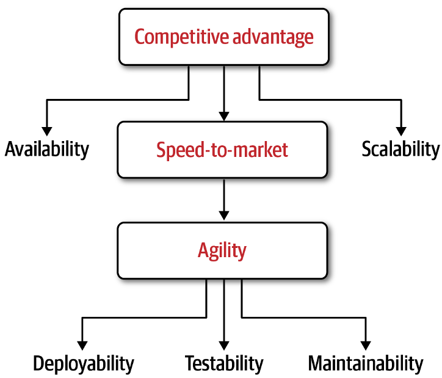

> 图 3-3：模块化的驱动因素及其关系。

请注意，*架构模块化*并不总是必须转化为分布式架构。可维护性、
可测试性和可部署性（定义见以下各节）也可以通过单体架构来实现，
如模块化单体甚至微内核架构（参见[附录 B](#附录-b架构决策记录参考)
了解这些架构风格的更多参考资料）。
这两种架构风格都基于组件的结构方式提供了一定水平的架构模块化。例如，使用模块化单体，
组件被分组为良好形成的领域， 提供所谓的*领域分区架构*（参见《Fundamentals of
Software Architecture》第 8 章）。使用微内核架构，
功能被分区为独立的插件组件，允许更小的测试和部署范围。

### 可维护性

可维护性关乎能否轻松地添加、更改或删除功能，以及能否轻松进行应用内部的变更，如维护补丁、框架升级、
第三方升级等。与大多数复合架构特征一样，可维护性难以客观定义。 Alexander von
Zitzewitz 是软件架构师、hello2morrow 公司的创始人，
他在一篇文章中提出了一个客观定义应用可维护性水平的新度量。
虽然他的可维护性度量相当复杂，涉及许多因素，但其初始形式如下：
$$ M L=100^{*}\sum_{i=1}^{k}c_{i} $$

其中 $ML$ 是整个系统的可维护性水平（百分比从 0% 到 100%）， $k$
是系统中逻辑组件的总数，$c_i$ 是任何给定组件的耦合水平，
特别关注入向耦合水平。这个方程基本上表明，组件之间的入向耦合水平越高，代码库的整体可维护性水平越低。
抛开复杂的数学，用于判定基于组件（应用的架构构建块）的应用相对可维护性的典型度量包括：
**组件耦合**

组件之间相互了解的程度和方式 **组件内聚**

组件操作相互关联的程度和方式 **圈复杂度**

组件内的间接和嵌套的总体水平 **组件大小**

组件内代码语句的聚合数量 **技术分区与领域分区**

组件按技术使用或领域目的对齐——参见[附录 A](#附录-a概念与术语参考)
在架构上下文中，我们将组件定义为应用的架构构建块，执行某种业务或基础设施功能，
通常通过包结构（Java）、命名空间（C#）或在某种目录结构中物理分组文件（类）
来体现。例如， Order History 组件可能通过位于命名空间 app.business.order.history
中的一组类文件来实现。
大型单体架构通常具有较低的可维护性水平，因为功能被技术分区到层中，组件之间紧密耦合，
以及从领域角度看组件内聚弱。例如，考虑传统单体分层架构中的一个新需求，
即向客户愿望清单中的商品添加过期日期。请注意，在图 3-4 中，
新需求的变更范围是应用级别的，因为变更传播到应用中的所有层。
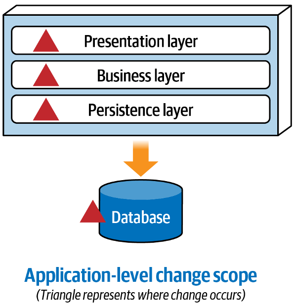

> 图 3-4：在单体分层架构中，变更是应用级别的。

根据团队结构，在单体分层架构中实现这个向愿望清单商品添加过期日期的简单变更可能需要至少三个团队的协调：

- 需要用户界面团队成员添加新的过期字段到屏幕。
- 需要后端团队成员添加与过期日期相关的业务规则，并更改契约以添加新的过期字段。
- 需要数据库团队成员更改表模式，在 Wishlist 表中添加新的过期列。 由于 Wishlist
  领域分布在整个架构中，维护特定领域或子域（如 Wishlist）
  变得更加困难。另一方面，模块化架构将领域和子域分区为更小的、
  单独部署的软件单元，从而使修改领域或子域变得更容易。请注意，在使用分布式基于服务的架构时，
  如图 3-5 所示，新需求的变更范围在特定领域服务中是*领域级别*的，
  这使得隔离需要变更的特定部署单元变得更容易。
  转向更高的架构模块化，如微服务架构，如图 3-6 所示，
  将新需求置于*功能级别*的变更范围，将变更隔离到负责愿望清单功能的特定服务。


> 图 3-5：在基于服务的架构中，变更是领域级别的。

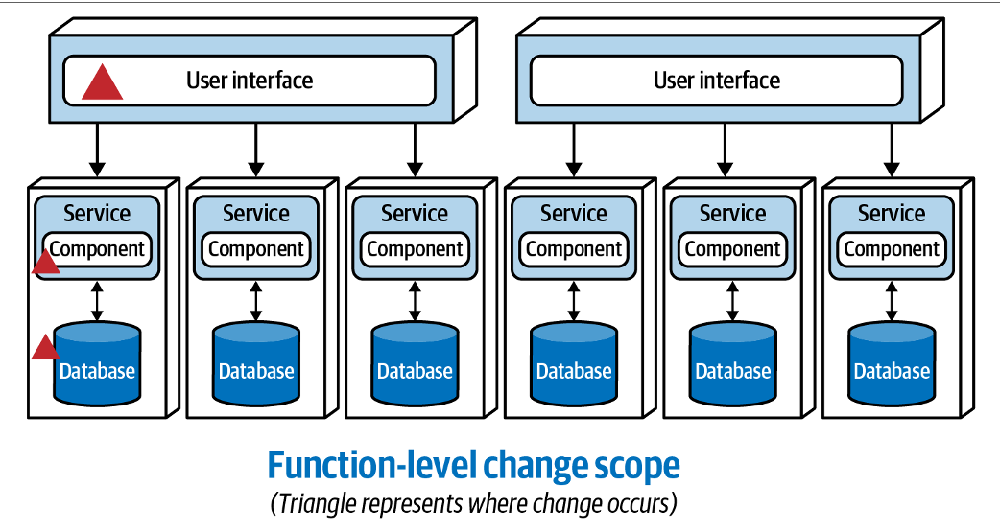

> 图 3-6：在微服务架构中，变更是功能级别的。

这三种向模块化的进展表明，随着架构模块化水平的提高，可维护性也随之提高，使得添加、更改或删除功能变得更容易。

### 可测试性

可测试性定义为测试的容易程度（通常通过自动化测试实现）以及测试的完整性。可测试性是架构敏捷性的基本要素。
大型单体架构风格如分层架构支持相对较低的可测试性水平（因此敏捷性也较低），
因为在大部署单元内实现所有功能的完全回归测试很困难。
即使单体应用确实有一套完整的回归测试，
想象一下对一个简单代码变更必须执行数百甚至数千个单元测试的挫败感。不仅执行所有测试需要很长时间，
而且可怜的开发人员还会被困在研究为什么几十个测试失败，而实际上失败的测试与变更无关。
架构模块化——将应用分解为更小的部署单元——显著减少了服务变更的整体测试范围，
允许更好的测试完整性和更容易的测试。模块化不仅导致更小、更有针对性的测试套件，
而且维护单元测试也变得更容易。
虽然架构模块化通常提高可测试性，但有时可能导致与单体单次部署应用相同的问题。例如，
考虑一个被分解为三个更小自包含部署单元（服务）的应用，如图 3-7 所示。 对 Service
A 进行变更将测试范围限制为仅该服务， 因为 Service B 和 Service C 不与 Service A
耦合。然而， 随着这些服务之间的通信增加，如图 3-7 底部所示，可测试性迅速下降，
因为对 Service A 变更的测试范围现在包括 Service B 和 Service C，
因此影响测试的容易程度和测试的完整性。


> 图 3-7：当服务相互通信时，测试范围增加。

### 可部署性

可部署性不仅是关于部署的容易程度——它还是关于部署的频率和部署的整体风险。
为了支持敏捷性、快速响应变化，应用必须同时兼顾这三个因素。每两周（或更久）
才部署一次软件，不仅会增加部署的整体风险（因为把多个变更打包在一起），
而且在大多数情况下，还会不必要地延迟本可以交付给客户的新功能或错误修复。当然，
部署频率必须与客户（或最终用户）快速吸收变化的能力相平衡。
单体架构通常支持较低的可部署性水平，因为部署应用涉及大量仪式（如代码冻结、模拟部署等），
新功能或错误修复部署后其他东西可能出问题的风险增加，
以及部署之间的时间框架长（数周到数月）。而具有一定架构模块化水平的应用，
其软件单元单独部署，仪式更少、风险更小，可以比大型单体应用更频繁地部署。
像可测试性一样，随着服务变得更小并相互通信更多以完成业务事务，可部署性也受到负面影响。
部署风险增加，由于担心破坏其他服务，部署简单变更变得更加困难。 引用软件架构师
Matt Stine 在他的文章中关于编排微服务的话：

> 如果你的微服务必须以完整集合的形式按特定顺序部署，请把它们放回单体中，让自己免于痛苦。

这种情况就是通常所说的"分布式大泥球"，架构模块化的好处很少（如果有的话）得以实现。

### 可扩展性

可扩展性定义为系统在用户负载随时间逐渐增加时保持响应的能力。与可扩展性相关的是弹性，
定义为系统在显著高的瞬时和不稳定的用户负载峰值期间保持响应的能力。 图 3-8
说明了可扩展性和弹性之间的区别。


> 图 3-8(a)：可扩展性与弹性不同——可扩展性。


> 图 3-8(b)：可扩展性与弹性不同——弹性。

虽然这两个架构特征都包括响应性作为并发请求（或系统中用户）数量的函数，
但从架构和实现的角度来看，它们的处理方式不同。可扩展性通常发生在较长的时间段内，
作为公司正常增长的函数，而弹性是对用户负载峰值的即时响应。
进一步说明差异的一个很好的例子是音乐会票务系统。在主要音乐会活动之间，
通常有相当轻的并发用户负载。然而，当流行音乐会的门票开始销售的那一刻，
并发用户负载显著飙升。系统可能在几秒钟内从 20 个并发用户跳到 3,000 个并发用户。
为了保持响应性，系统必须有处理用户负载高峰的容量，
也有即时启动额外服务以处理流量峰值的能力。
弹性依赖于服务具有非常小的平均启动时间（MTTS），这在架构上通过具有非常小、细粒度的服务来实现。
有了适当的架构解决方案，MTTS（因此弹性）可以通过设计时技术进一步管理，如小型轻量级平台和运行时环境。
虽然可扩展性和弹性都随着更细粒度的服务而改善，但弹性更多是粒度的函数（部署单元的大小），
而可扩展性更多是模块化的函数（将应用分解为单独的部署单元）。
考虑传统分层架构、基于服务的架构和微服务架构风格，
及其对应的可扩展性和弹性星级评分，如图 3-9 所示
（这些架构风格及其相应星级评分的详细信息可参见我们之前的著作 《Fundamentals of
Software Architecture》。 请注意，一颗星意味着该架构风格对该能力支持不佳，
而五颗星意味着该能力是该架构风格的主要特性，且得到了很好的支持）。
请注意，可扩展性和弹性在单体分层架构中评分相对较低。大型单体分层架构既难以扩展又昂贵，
因为所有应用功能必须扩展到相同的程度（应用级可扩展性和较差的 MTTS）。
这在基于云的基础设施中可能变得特别昂贵。然而，使用基于服务的架构，请注意可扩展性有所改善，
但弹性改善得不那么明显。这是因为基于服务的架构中的领域服务是粗粒度的，
通常在一个部署单元中包含整个领域（如订单处理或仓库管理），
并且通常具有太长的平均启动时间（MTTS），无法对即时需求做出足够快的响应以实现弹性，
因为它们的大小很大（领域级可扩展性和一般的 MTTS）。请注意，使用微服务，
可扩展性和弹性都最大化，因为每个单独部署的服务具有小型、单一用途、
细粒度的性质（功能级可扩展性和优秀的 MTTS）。
像可测试性和可部署性一样，服务相互通信越多以完成单个业务事务，
对可扩展性和弹性的负面影响就越大。因此，当需要高水平的可扩展性和弹性时，
保持服务之间的同步通信最小化很重要。
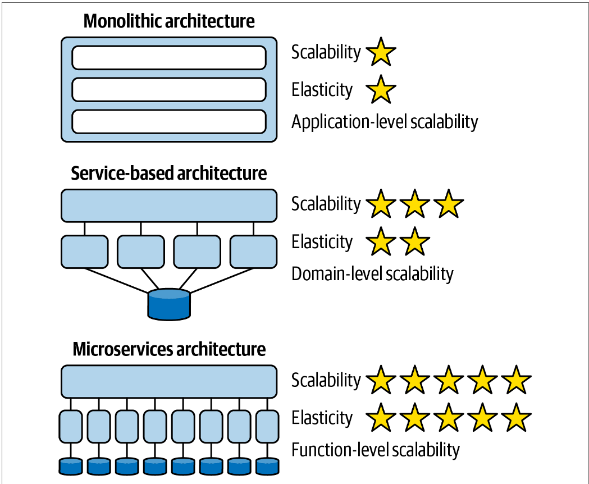

> 图 3-9：可扩展性和弹性随模块化而改善。

### 可用性/容错

像许多架构特征一样，容错有不同的定义。在架构模块化的上下文中，
我们将容错定义为系统某些部分在其他部分失败时保持响应和可用的能力。例如，
如果零售应用中支付处理部分发生致命错误（如内存不足情况），系统的用户仍然应该能够搜索商品和下订单，
即使支付处理不可用。 所有单体系统都存在低水平的容错。
虽然可以通过多个实例负载均衡整个应用在单体系统中在一定程度上缓解容错，但这种技术既昂贵又无效。
如果故障是由编程错误引起的，
那么该错误将存在于两个实例中，因此可能同时使两个实例宕机。
架构模块化对于在系统中实现领域级和功能级容错至关重要。通过将系统分解为多个部署单元，
灾难性故障被隔离到仅该部署单元，从而允许系统的其余部分正常运作。然而，
这里有一个警告：如果其他服务在同步上依赖于正在失败的服务，则无法实现容错。
这就是服务之间的异步通信对于在分布式系统中维持良好容错水平至关重要的原因之一。

## Sysops Squad Saga：创建业务案例

### 9 月 30 日，星期四，12:01


> 插图 3-2：Addison 和 Austen 将 Sysops Squad 的问题与模块化驱动因素匹配，
> 以创建业务案例。

Addison 和 Austen
对架构模块化的含义以及拆分系统的相应驱动因素有了更深的理解之后， 碰头讨论 Sysops
Squad 的问题，尝试把这些问题与模块化驱动因素逐一对应起来，
以构建一份扎实的业务理由，呈交给业务赞助商。

"让我们把面临的每个问题拿出来，看看是否可以将它们与某些模块化驱动因素匹配起来，"Addison
说。"这样， 我们可以向业务展示拆分应用实际上会解决我们面临的问题。"

"好主意，"Austen 说。"让我们从他们在会议上谈论的第一个问题开始——变更。
我们似乎无法有效地对现有单体系统应用变更而不破坏其他东西。而且，
变更需要太长时间，测试变更是一场真正的噩梦。"

"开发人员还不断抱怨代码库太大，很难找到正确的位置来应用新功能或错误修复的变更，"Addison
说。

"好的，"Austen 说，"所以很明显，整体可维护性是这里的一个关键问题。"

"对，"Addison 说。"所以，通过拆分应用，它不仅会解耦代码，
还会将功能隔离和分区到单独部署的服务中，使开发人员更容易应用变更。"

"可测试性是与这个问题相关的另一个关键特征，不过我们有那么多自动化单元测试，这方面已经有保障了，"Austen
说。

"实际上，并没有，"Addison 回答说。"看看这个。"

Addison 向 Austen 展示了超过 30% 的测试用例被注释掉或过时，
并且系统的一些关键工作流部分缺少测试用例。Addison 还解释说，
开发人员不断抱怨整个单元测试套件必须为任何变更（大或小）运行，
这不仅耗时漫长，开发人员还得修复与自己变更毫无关系的问题。
这就是为什么应用最简单的变更也需要这么长时间的原因之一。

"可测试性是关于测试的容易程度，也是关于测试的完整性，"Addison 说。
"我们两者都没有。通过拆分应用，我们可以显著减少应用变更的测试范围，
将相关的自动化单元测试组合在一起，并获得更好的测试完整性——因此更少的错误。"

"同样的情况也适用于可部署性，"Addison 继续说。"因为我们有一个单体应用，
哪怕只是一个小错误修复，我们也必须部署整个系统。而正因为部署风险如此之高，
Parker 坚持每月进行生产发布。Parker 不明白的是，通过这样做，
我们将多个变更堆积到每个发布中，其中一些甚至没有相互测试过。"

"我同意，"Austen 说，"而且，
我们为每次发布所做的模拟部署和代码冻结占用了宝贵的时间——我们没有的时间。然而，我们在这里谈论的不是架构问题，
而是纯粹的部署流水线问题。"

"我不同意，"Addison 说。"这绝对是架构相关的。想一想，Austen。
如果我们把系统分解为单独部署的服务，那么任何给定服务的变更将仅限于该服务。例如，
假设我们再次对工单分配流程进行更改。如果该流程是一个单独的服务，不仅测试范围会减少，
而且我们将显著降低部署风险。这意味着我们可以更频繁地部署，仪式更少，
并且显著减少错误数量。"

"我明白你的意思了，"Austen
说。"我同意你，但我仍然坚持，迟早我们也得改造现在的部署流水线。"

Addison 和 Austen 对拆分 Sysops Squad
应用并转向分布式架构将解决变更问题感到满意，
他们转向了其他业务赞助商关注的问题。

"好的，"Addison 说，"业务赞助商在会议上抱怨的另一件大事是整体客户满意度。
有时系统不可用，系统似乎在一天中的某些时候崩溃，
我们经历了太多丢失工单和工单路由问题。难怪客户开始取消他们的支持计划。"

"等等，"Austen 说。"我这里有最新的度量数据，
显示导致系统不断宕机的不是核心工单功能，而是客户调查功能和报告功能。"

"这是个极好的消息，"Addison 说。"所以通过将系统的这些功能分解为单独的服务，
我们可以隔离这些故障，保持核心工单功能运行。这本身就是一个很好的理由！ "

"没错，"Austen 说。"所以，
我们同意通过容错实现整体可用性将解决应用不总是对客户可用的问题，因为他们只与系统的工单部分交互。"

"但是系统冻结怎么办？"Addison 问道。"我们如何用拆分应用来证明那部分？"

"恰巧我让 Sysops Squad 开发团队的 Sydney 为我运行了一些关于这个问题的分析，
"Austen 说。"原来这是两个因素的组合。首先， 每当有超过 25
个客户同时创建工单时，系统就会冻结。但是，
看看这个——每当他们在白天客户输入问题工单时运行运维报告，系统也会冻结。"

"所以，"Addison 说，"我们似乎既有可扩展性问题，也有数据库负载问题。"

"没错！"Austen 说。"而且听着——通过拆分应用和单体数据库，
我们可以将报告隔离到自己的系统中，并也为面向客户的工单功能提供额外的可扩展性。"

Addison 和 Austen 对他们有一个好的业务案例可以向业务赞助商展示感到满意，
并且确信这是拯救这条业务线的正确方法， Addison
创建了一个架构决策记录（ADR），用于拆分系统并创建相应的业务案例演示。

<a id="adr-migrate-distributed"></a>

**ADR：将 Sysops Squad 应用迁移到分布式架构**

**上下文**

Sysops Squad 目前是一个单体问题工单应用，
支持许多与问题工单相关的不同业务功能，包括客户注册、问题工单输入和处理、运维和分析报告、计费和付款处理，
以及各种管理维护功能。当前应用在可扩展性、可用性和可维护性方面存在许多问题。

**决策**

我们将把现有的单体 Sysops Squad
应用迁移到分布式架构。转向分布式架构将实现以下目标：

- 使核心工单功能对我们的外部客户更可用，因此提供更好的容错

- 为客户增长和工单创建提供更好的可扩展性，解决我们频繁遇到的系统冻结问题

- 分离报告功能和报告对数据库的负载，解决我们频繁遇到的系统冻结问题

- 允许团队比当前单体应用更快地实现新功能和修复错误，因此提供更好的整体敏捷性

- 减少变更时引入系统的错误数量，因此提供更好的可测试性

- 允许我们以更快的速率（每周甚至每天）部署新功能和错误修复，因此提供更好的可部署性

**后果**

迁移工作将导致新功能引入延迟，因为大多数开发人员将被需要用于架构迁移。

迁移工作将产生额外成本（成本估算待定）。

在现有部署流水线被修改之前，发布工程师将不得不管理多个部署单元的发布和监控。

迁移工作将要求我们拆分单体数据库。

Addison 和 Austen 与 Sysops Squad 问题工单系统的业务赞助商会面，
以清晰简洁的方式展示了他们的案例。业务赞助商对演示感到满意， 并同意该方法，告知
Addison 和 Austen 继续进行迁移。

# 第 4 章：架构分解

## 10 月 4 日，星期一，10:04


> 插图 4-1：Addison 和 Austen 讨论拆分 Sysops Squad 应用的起步方法。

现在 Addison 和 Austen 获得了转向分布式架构和拆分单体 Sysops Squad 应用的许可，
他们需要确定开始的最佳方法。
"应用太大了，我甚至不知道从哪里开始。它像大象一样大！"Addison 惊叹道。
"嗯，"Austen 说。"你怎么吃大象？"
"哈，我以前听过这个笑话，Austen。当然是一口一口地吃！"Addison 笑了。
"没错。所以让我们对 Sysops Squad 应用使用同样的原则，"Austen 说。
"我们为什么不直接开始拆分它，一口一口地来？
记得我说过报告是导致应用冻结的原因之一吗？也许我们应该从那里开始。"
"那可能是一个好的开始，"Addison 说，"但数据怎么办？
仅仅把报告变成一个单独的服务并不能解决问题。我们也需要拆分数据，甚至创建一个单独的报告数据库，
用数据泵来供给它。我认为一开始就吃那么大一口太大了。" "你说得对，"Austen
说。"嘿，知识库功能怎么样？它相当独立，可能更容易提取。"
"确实。调查功能呢？那也应该很容易分离出来，"Addison 说。"问题是，
我忍不住觉得我们应该用更有条理的方法来处理这个问题，而不是仅仅一口一口地吃大象。"
"也许 Logan 可以给我们一些建议，"Austen 说。 Addison 和 Austen 与 Logan 会面，
讨论他们正在考虑的一些拆分应用的方法。他们向 Logan
解释说，他们想从知识库和调查功能开始， 但不确定之后该做什么。
"你们建议的方法，"Logan 说，"就是所谓的大象迁移反模式。
一口一口地吃大象开始时可能看起来是一个好方法，但在大多数情况下，它导致一种无结构的方法，
结果产生一个分布式大泥球，有些人也称之为分布式单体。我不推荐这种方法。"
"那么，还有哪些其他方法？有没有我们可以用来拆分应用的模式？"Addison 问道。
"你需要对应用采取整体视角，并应用战术 forking 或基于组件的分解， "Logan
说。"这是我所知道的两个最有效的方法。" Addison 和 Austen 看着
Logan。"但我们怎么知道该用哪一个？"
架构模块化描述了拆分单体应用的*为什么*，而架构分解描述了*如何*。拆分大型、
复杂的单体应用可能是一项复杂且耗时的工作，了解是否可行以及如何着手是很重要的。
基于组件的分解和战术 forking 是拆分单体应用的两种常见方法。
基于组件的分解是一种提取方法，应用各种重构模式来精炼和提取组件（应用的逻辑构建块），
以增量和受控的方式形成分布式架构。战术 forking 方法涉及制作应用的副本，
并像雕塑家从一块花岗岩或大理石中创造美丽的艺术品一样，
逐步去除不需要的部分以形成服务。
哪种方法最有效？这个问题的答案当然是*视情况而定*。
选择分解方法的主要因素之一是现有单体应用代码的结构有多好。代码库中是否存在清晰的组件和组件边界，
还是代码库基本上是一个无结构的大泥球？ 如图 4-1
中的流程图所示，架构分解工作的第一步是首先确定代码库是否可以被分解。
我们将在下一节详细讨论这个主题。
如果代码库可以被分解，下一步是确定源代码是否基本上是一个无结构的混乱，
没有明确定义的组件。如果是这种情况，那么战术
forking（参见[战术 Forking](#战术-forking)） 可能是正确的方法。然而，
如果源代码文件的结构方式将类似的功能组合在定义良好（甚至松散定义）的组件中，
那么基于组件的分解方法（参见[基于组件的分解](#基于组件的分解)）就是正确的选择。
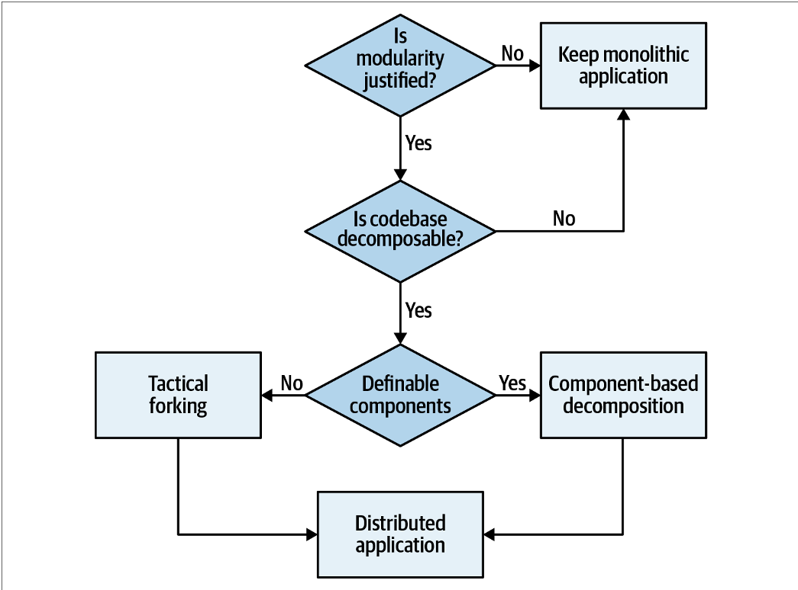

> 图 4-1：选择分解方法的决策树。

我们在本章中描述了这两种方法，然后用了整整一章（第 5
章）来详细描述每个基于组件的分解模式。

### 代码库是否可以被分解？

当代码库缺乏内部结构时会发生什么？它甚至可以被分解吗？这种软件有一个通俗的名字——**大泥球反模式**，
由 Brian Foote 在 1999 年的一篇同名文章 *Big Ball of Mud* 中创造。例如，
一个复杂的 Web 应用，事件处理器直接连接到数据库调用，没有模块化，
可以被视为大泥球架构。通常，架构师不会花太多时间为此类系统创建模式；软件架构关注内部结构，
而这些系统缺乏这一决定性特征。
不幸的是，如果没有仔细的治理，许多软件系统会退化为大泥球，留给后续的架构师（或者也许是他们自己鄙视的过去）来修复。
任何架构重构工作的第一步要求架构师确定重构的*计划*，这反过来又要求架构师理解内部结构。
架构师必须回答的关键问题是：这个代码库是否可以被挽救？换句话说，
它是分解模式的候选者，还是另一种方法更合适？
没有单一的度量可以确定代码库是否具有合理的内部结构——该评估由一位或多位架构师来确定。
然而，架构师确实有工具来帮助确定代码库的宏观特征，特别是耦合度量，
来帮助评估内部结构。

## 传入和传出耦合

1979 年， Edward Yourdon 和 Larry Constantine 出版了《结构化设计：
计算机程序与系统设计学科基础》，定义了许多核心概念，
包括传入和传出耦合的度量。*传入耦合*衡量到代码工件（组件、类、函数等）的*入向*连接数。
*传出耦合*衡量到其他代码工件的*出向*连接数。
请注意仅这两个度量在更改系统结构时的价值。例如，当将单体解构为分布式架构时，
架构师会发现像 Address 这样的共享类。在构建单体时， 开发人员重用核心概念如
Address 是常见且受鼓励的，但当拆分单体时，
架构师现在必须确定系统中有多少其他部分使用这个共享资产。
几乎每个平台都有工具允许架构师分析代码的耦合特征，以协助重构、迁移或理解代码库。
许多平台存在许多工具，提供类和/或组件关系的矩阵视图，如图 4-2 所示。
在这个例子中，Eclipse 插件提供了 JDepend 输出的可视化，
包括每个包的耦合分析，以及一些在下节中突出的聚合度量。


> 图 4-2：JDepend 在 Eclipse 中的耦合关系分析视图。

## 抽象性和不稳定性

Robert Martin（软件架构界的知名人物） 在 1990 年代末为一本 C++
书创建了一些派生度量，这些度量适用于任何面向对象语言。
这些度量——抽象性和不稳定性——衡量代码库内部特征的平衡。
抽象性是抽象工件（抽象类、接口等）与具体工件（实现类）的比率。它代表抽象与实现的度量。
抽象元素是代码库中允许开发人员更好地理解整体功能的特征。例如， 由一个 main()
方法和 10,000 行代码组成的代码库在这个度量上得分接近零，并且会相当难以理解。
抽象性的公式在方程 4-1 中显示。

方程 4-1。抽象性 $$ A=\frac{\sum m^a}{\sum m^c+\sum m^a} $$

在该公式中，$m^a$ 表示代码库中的抽象元素（接口或抽象类）， $m^c$ 表示具体元素。
架构师通过计算抽象工件总和与具体工件总和的比率来计算抽象性。
另一个派生度量——不稳定性——是传出耦合与传出、传入耦合之和的比率， 其公式如方程
4-2 所示。 方程 4-2。不稳定性 $$ I=\frac{C^e}{C^e+C^a} $$

其中 $C^e$ 是传出耦合（出向连接），$C^a$ 是传入耦合（入向连接）。
不稳定性度量确定代码库的波动性。
具有高度不稳定性的代码库在变更时更容易被破坏，因为耦合度高。
考虑两个场景：每个场景的 $C^a$ 都是 2。 第一个场景中 $C^e = 0$，不稳定性得分为
0； 另一个场景中 $C^e = 3$，不稳定性得分为 3/5。
因此，组件的不稳定性度量反映了相关组件的变更 可能强制该组件发生多少潜在变更。
不稳定性值接近 1 的组件是高度不稳定的， 接近 0
的值则可能表示稳定，也可能表示僵化：
如果模块或组件大部分包含的是抽象元素，则是稳定的；
如果大部分由具体元素组成，则是僵化的。 不过，高度稳定的 trade-off
是缺乏复用——如果每个组件都是自包含的， 就很可能产生重复。
因此，总体而言，重要的是把 $I$ 和 $A$ 的值放在一起看，
而不是孤立地看，这也是为什么要在下一页考虑主序列的原因。
这两个度量共同帮助架构师了解代码库的结构特征。例如，如果架构师想将单体分解为服务，
抽象性和不稳定性可以帮助识别可提取的组件。 我们在第 5
章中展示了如何使用这些度量来指导分解模式。

## 与主序列的距离

架构师用于衡量架构结构的少数整体度量之一是*与主序列的距离*，
这是一个基于不稳定性 和抽象性的派生度量，如公式 4-3 所示。 公式
4-3。与主序列的距离 $$ D=|A+I-1| $$

在该公式中，A = 抽象性，I = 不稳定性。
与主序列的距离度量设想了抽象性和不稳定性之间的理想关系；
落在该理想线附近的组件展示了这两种竞争关注点的健康组合。例如，绘制特定组件允许开发人员
计算与主序列的距离度量，如图 4-3 所示。


> 图 4-3：特定组件的归一化主序列距离。

开发人员绘制候选组件，然后测量其与理想线的距离。越接近该线，组件越平衡。
落入右上角过远的组件进入架构师所称的*无用区*：
过于抽象的代码变得难以使用。相反，落入左下角的代码进入*痛苦区*：
实现过多而抽象不足的代码变得脆弱且难以维护，如图 4-4 所示。
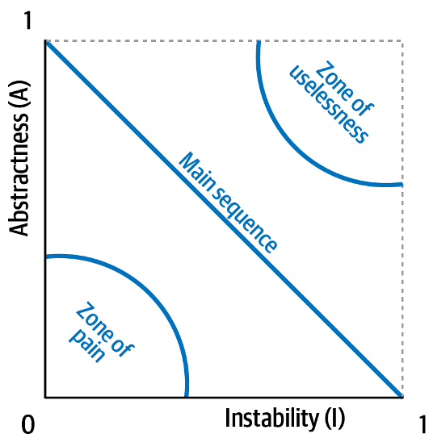

> 图 4-4：无用区与痛苦区。

许多平台都有提供这些度量的工具，在因不熟悉、迁移或技术债务评估而分析代码库时，
这些工具可以帮助架构师。
与主序列的距离度量告诉想要重构应用的架构师什么？就像在建筑工程中一样，
移动一个地基薄弱的大型结构存在风险。类似地，如果架构师希望重构应用，
改善内部结构将使移动该实体变得更容易。
该度量还提供了关于内部结构平衡的良好线索。如果架构师评估一个代码库，
其中许多组件落入无用区或痛苦区，那么试图加固内部结构到可以修复的程度
可能不是一个好的时间投资。 按照图 4-1
中的流程图，一旦架构师确定代码库可以被分解，
下一步就是确定采用哪种方式来分解应用。
以下各节描述分解应用的两种方式：*基于组件的分解*和*战术 forking*。

## 基于组件的分解

根据我们的经验，\
将单体应用迁移到微服务等高度分布式架构时，\
大部分困难和复杂性都来自定义不良的架构组件。\
这里我们将组件定义为应用的构建块， 它在系统中具有明确的角色和职责，\
以及一组定义良好的操作。\
在大多数应用中，\
组件通过命名空间或目录结构来体现，\
并通过组件文件（或源文件）来实现。\
例如，在图 4-5 中，\
目录结构 penultimate/ss/ticket/assign 表示一个名为 Ticket Assign 的组件，\
其命名空间为 penultimate.ss.ticket.assign。

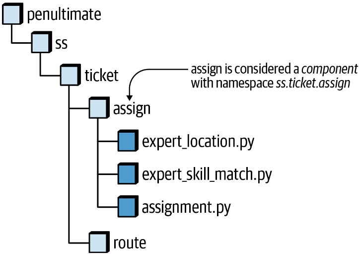

> 图 4-5：代码库的目录结构成为组件的命名空间。

> [!TIP]
> "将单体应用拆分为分布式架构时，\
> 要用组件而不是单个类来构建服务。"

在多年将单体应用迁移到分布式架构（如微服务）的共同实践中，\
我们总结出一套基于组件的分解模式（将在第 5 章介绍），\
帮助单体应用为迁移做好准备。\
这些模式涉及对源代码的重构，\
最终得到一组定义良好的组件，\
这些组件最终可以成为服务，\
从而降低将应用迁移到分布式架构所需的工作量。

这些基于组件的分解模式，\
本质上实现了从单体架构到基于服务的架构的迁移。 基于服务的架构在第 2
章中已有定义，\
并在《Fundamentals of Software Architecture》中有更详细的描述。\
基于服务的架构是微服务架构风格的一种混合体，\
应用被拆分为*领域服务*—— 即粗粒度、独立部署的服务，\
包含特定领域的全部业务逻辑。

迁移到基于服务的架构既适合作为最终目标，\
也适合作为通往微服务的垫脚石：

- 作为垫脚石，它让架构师能够确定哪些领域需要进一步细化为微服务，\
  哪些可以保持为粗粒度的领域服务（第 7 章将详细讨论这一决策）。
- 基于服务的架构不要求拆分数据库，\
  因此架构师可以在着手数据库分解（第 6 章详细讨论）之前，\
  先专注于领域和功能分区。
- 基于服务的架构不要求任何运维自动化或容器化。\
  每个领域服务都可以使用与原应用相同的部署工件\
  （如 EAR 文件、WAR 文件、Assembly 等）进行部署。
- 迁移到基于服务的架构是*技术层面*的举措，\
  意味着它通常不涉及业务利益相关者，\
  也不要求改变 IT 部门的组织结构或测试与部署环境。

> [!TIP]
> "将单体应用迁移到微服务时，\
> 可以考虑先迁移到基于服务的架构，\
> 将其作为通往微服务的垫脚石。"

但如果代码库是一个无结构的大泥球，\
几乎不包含可识别的组件，该怎么办呢？\
这就是战术 forking 的用武之地。

### 战术 Forking

*战术 forking* 模式由 Fausto De La Torre 命名，\
是一种重构基本上是大泥球的架构的务实方法。

通常，架构师在考虑重构代码库时，\
想到的是提取部分代码，如图 4-6 所示。


> 图 4-6：提取系统的一部分。

然而，隔离系统某部分的另一种思路\
是删除不再需要的部分，如图 4-7 所示。

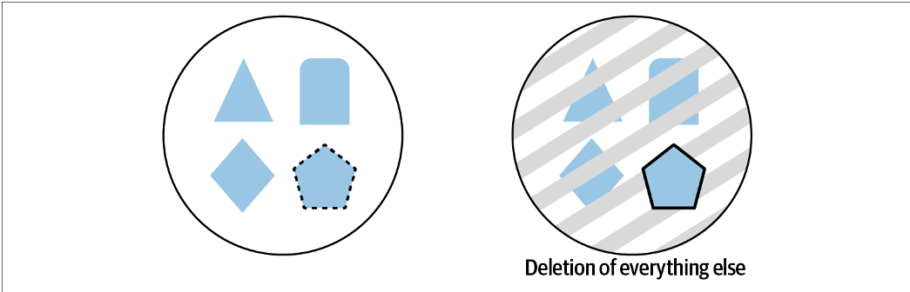

> 图 4-7：删除不需要的部分是隔离系统部分的另一种方式。

在图 4-6 中，\
开发人员不得不不断应对定义这种架构的大量耦合；\
随着他们提取部分代码，\
他们发现由于依赖关系，\
单体中越来越多的部分必须随之一起被提取出来。\
在图 4-7 中，\
开发人员删除不需要的代码，\
但依赖关系保持不变，\
从而避免了提取时不断被牵连拆解的效应。

提取与删除之间的差异启发了战术 forking 模式。\
在这种分解方式中，系统起初是一个单体应用，如图 4-8 所示。


> 图 4-8：重构之前，单体应用包含多个部分。

该系统由若干领域行为（图中以简单几何图形标识）组成，\
没有太多内部组织。\
此外，在这个场景中，\
期望的目标是由两个团队从现有单体应用创建两个服务：\
一个包含六边形和正方形领域，\
另一个包含圆形领域。

战术 forking 的第一步是克隆整个单体应用，\
并给每个团队一份完整代码库的副本，如图 4-9 所示。

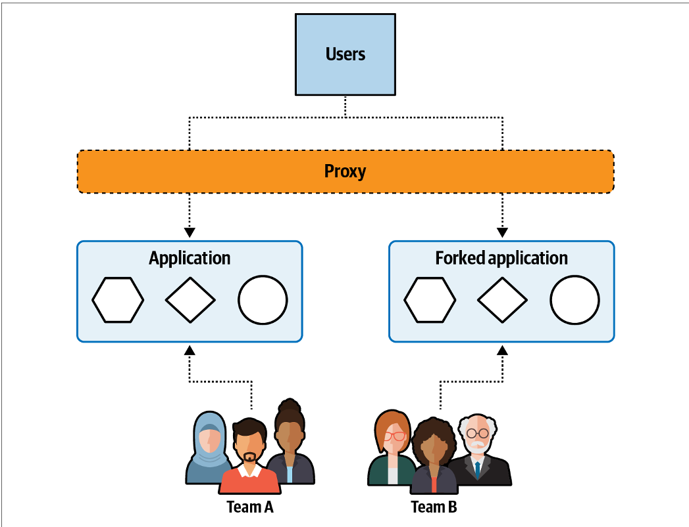

> 图 4-9：第一步克隆单体应用。

每个团队都收到完整代码库的副本，\
然后开始删除（如前图 4-7 所示）他们不需要的代码，\
而不是提取想要的代码。\
在紧耦合的代码库中，\
开发人员通常发现这种方式更容易，\
因为他们不必担心提取高耦合所产生的大量依赖。\
相反，在删除策略中，\
一旦功能被隔离，\
就删除任何不会破坏其他功能的代码。

随着该模式的继续推进，\
团队开始隔离目标部分，如图 4-10 所示。\
然后每个团队继续逐步消除不需要的代码。


> 图 4-10：团队不断重构以移除不需要的代码。

战术 forking 模式完成后，\
团队已将原来的单体应用拆分为两部分，\
并保留了每部分中行为的粗粒度结构，如图 4-11 所示。


> 图 4-11：战术 forking 的最终状态产生两个服务。

至此重构完成，结果是两个粗粒度的服务。

### trade-off

战术 forking 是更正式的分解方式的一种可行替代方案，\
最适合内部结构很少或完全没有内部结构的代码库。\
与架构中的所有实践一样，它也有自己的 trade-off：

### 优点

- 团队几乎不需要前期分析就可以立即开始工作。
- 开发人员发现删除代码比提取代码更容易。\
  从混乱的代码库中提取代码会因高耦合而困难重重，\
  而不需要的代码则可以通过编译或简单测试来验证。

### 缺点

- 生成的服务很可能仍包含大量从单体应用遗留下来的、\
  大多处于潜伏状态的代码。
- 除非开发人员付出额外努力，\
  否则新派生服务内部的代码不会比单体应用中的混乱代码更好——\
  只是数量变少了。
- 共享代码和共享组件文件的命名可能出现不一致，\
  导致难以识别公共代码并保持其一致性。

这个模式的名称很贴切（所有好的模式名称都应如此）——\
它为重构架构提供了一种*战术性*而非*战略性*的方法，\
让团队能够快速将重要或关键系统迁移到下一代\
（尽管是以一种无结构的方式）。

## Sysops Squad Saga：选择分解方法

### 10 月 29 日，星期五，10:01


> 插图 4-2：Addison 和 Austen 选择分解方式。

既然 Addison 和 Austen 已经了解了两种方式，\
他们在主会议室碰头，\
使用抽象性和不稳定性指标分析 Sysops Squad 应用，\
以确定哪种方式最适合他们的情况。

"看这里，"Addison 说，\
"大部分代码都分布在主序列附近。\
当然有一些离群点，\
但我认为可以得出结论：拆分这个应用是可行的。\
所以下一步是确定使用哪种方式。"

"我真的很喜欢战术 forking 方式，"Austen 说，\
"它让我想起那些著名的雕塑家——\
当被问及如何能从整块大理石中雕刻出如此美丽的作品时，\
他们回答说自己只是把不该存在的大理石去掉了。\
我觉得 Sysops Squad 应用可以成为我的雕塑作品！"

"先等等，米开朗基罗，"Addison 说，\
"先是运动，现在又是雕塑？\
你得想清楚自己业余时间到底喜欢干什么。\
我不喜欢战术 forking 方式的地方在于\
每个服务中都会有大量重复代码和共享功能。\
我们的大部分问题都与可维护性、可测试性和整体可靠性有关。\
你能想象要同时对几个不同的服务应用同一个变更吗？\
那将是一场噩梦！"

"但共享功能到底有多少呢？"Austen 问。

"我不确定，"Addison 说，\
"但我知道日志和安全这类基础设施功能有不少共享代码，\
而且应用持久层的很多数据库调用也是共享的。"

Austen 停下来，思考了一会儿 Addison 的论点。\
"也许你是对的。\
既然我们已经有了定义良好的组件边界，\
我可以接受较慢的基于组件的分解方式，\
放弃我的雕塑生涯。\
但我不会放弃运动！"

Addison 和 Austen 达成一致：\
基于组件的分解方式适合 Sysops Squad 应用。\
Addison 为这个决定写了一份 ADR，\
阐述了采用基于组件的分解方式的 trade-off 和理由。

#### ADR：使用基于组件的分解方式进行迁移

#### 上下文

我们将把 Sysops Squad 单体应用拆分为独立部署的服务。\
我们考虑的两种迁移到分布式架构的方式是\
战术 forking 和基于组件的分解。

#### 决策

我们将使用基于组件的分解方式，\
将现有的 Sysops Squad 单体应用迁移到分布式架构。

该应用具有定义良好的组件边界，\
适合采用基于组件的分解方式。

这种方式降低了在每个服务中维护重复代码的可能性。

采用战术 forking 方式，\
我们必须预先定义服务边界，\
才能知道要创建多少个 fork 出来的应用。\
而采用基于组件的分解方式，\
服务定义将通过组件分组自然浮现。

鉴于我们当前应用在可靠性、可用性、可伸缩性和工作流方面\
所面临问题的性质，\
与战术 forking 方式相比，\
使用基于组件的分解方式能提供更安全、更可控的增量式迁移。

#### 后果

采用基于组件的分解方式，\
迁移工作可能会比战术 forking 花费更长时间。\
然而，我们认为上一节所述的理由盖过了这一 trade-off。

这种方式让团队中的开发人员能够协作识别\
共享功能、组件边界和领域边界。\
战术 forking 则要求我们把团队拆分为\
每个 fork 应用对应的更小、相互独立的团队，\
并增加小团队之间所需的协调量。

# 第 5 章：基于组件的分解模式

## 11 月 1 日，星期一，11:53


> 插图 5-1：Addison 和 Austen 向 Logan 请教分解模式。

Addison 和 Austen 选择了基于组件的分解方式，\
但对每个分解模式的细节并不清楚。\
他们试图研究这种方式，\
但在互联网上找不到太多相关资料。\
于是，他们再次与 Logan 在会议室碰头，\
请教这些模式到底是什么以及如何使用。

"听着，Logan，"Addison 说， "首先要说的是，我们俩都很感激你花了这么多时间
帮我们启动这个迁移过程。 我知道你自己也忙于各种救火工作。"

"没问题，"Logan 说，\
"我们消防员就得互相照应。\
我以前也经历过你们的处境，\
所以我知道在这类事情上两眼一抹黑是什么感觉。\
再说，这是一次备受关注的迁移工作，\
你们俩第一次就把事情做对很重要。\
因为不会有第二次机会。"

"谢谢，Logan，"Austen 说，\
"我大约两小时后还有比赛，所以我们会尽量长话短说。\
你之前讲过基于组件的分解，我们也选择了这种方式，\
但在网上找不到太多相关内容。"

"我一点也不意外，"Logan 说，\
"这些模式还没有太多文字记载，\
不过我知道今年晚些时候会有一本书出版，\
详细描述这些模式。\
我最初是在大约四年前的一次大会上，\
从一位经验丰富的软件架构师的分享中了解到这些分解模式的。\
这种迭代的、有条理的方法\
可以安全地从单体架构迁移到\
基于服务的架构和微服务这样的分布式架构，\
给我留下了深刻印象。\
从那以后，我一直在使用这些模式，相当成功。"

"能给我们演示一下这些模式是怎么工作的吗？"Addison 问。

"当然，"Logan 说，"我们一次讲一个模式。"

基于组件的分解（第 4 章已介绍）\
是一种拆分单体应用的高效技术，\
适用于代码库有一定结构、并按命名空间（或目录）分组的情况。\
本章介绍一组称为*基于组件的分解模式*的模式，\
描述如何重构单体源代码，\
最终得到一组定义良好的、可以成为服务的组件。\
这些分解模式显著降低了\
将单体应用迁移到分布式架构的工作量。

图 5-1 展示了本章介绍的基于组件的分解模式的路线图，\
以及如何结合使用它们来拆分单体应用。\
最初，在将单体应用迁移到分布式架构时，\
这些模式按顺序组合使用；\
之后，在迁移过程中对单体应用进行维护时，\
则单独使用。\
这些分解模式概述如下：

- [识别并确定组件大小模式](#识别并确定组件大小模式)\
  通常是拆分单体应用时应用的第一个模式。\
  该模式用于识别、管理组件，并为组件确定合适的大小。
- [收集公共领域组件模式](#收集公共领域组件模式)\
  用于整合可能在应用中重复出现的公共业务领域逻辑，\
  减少生成的分布式架构中潜在的重复服务数量。
- [扁平化组件模式](#扁平化组件模式)\
  用于折叠或扩展领域、子领域和组件，\
  从而确保源代码文件只存在于定义良好的组件中。
- [确定组件依赖模式](#确定组件依赖模式)\
  用于识别组件依赖、细化这些依赖，\
  并确定从单体架构迁移到分布式架构的可行性和总体工作量。
- [创建组件领域模式](#创建组件领域模式)\
  用于将组件分组为应用内的逻辑领域，\
  并重构组件命名空间和/或目录，使其与特定领域对齐。
- [创建领域服务模式](#创建领域服务模式)\
  用于通过将单体应用内的逻辑领域\
  移动到独立部署的领域服务，\
  从物理上拆分单体架构。

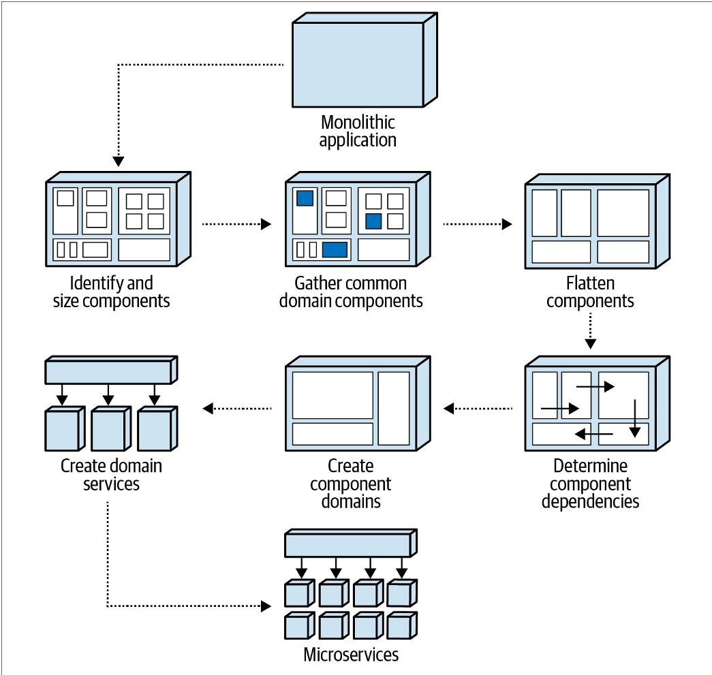

> 图 5-1：基于组件的分解模式的流程与用法。

本章介绍的每个模式都分为三个部分。 第一部分"模式描述"说明模式如何工作、
为什么重要以及应用该模式的结果。 考虑到大多数系统在迁移期间都在持续变化，
第二部分"用于治理的适应度函数" 描述应用该模式之后可以采用的自动化治理，
以便在持续维护期间不断分析和验证代码库的正确性。 第三部分使用真实的 Sysops Squad
应用 （参见[引入 Sysops Squad Saga](#引入-sysops-squad-saga)）
来演示该模式的使用， 并展示应用该模式后应用发生的变化。

## 架构故事

在本章中，\
我们将使用架构故事 来记录和描述每个 Sysops Squad saga 中\
影响应用结构层面的代码重构。\
与描述需要实现或更改的功能的用户故事不同，\
架构故事描述的是影响应用整体结构、\
并满足某种业务驱动因素\
（如更高的可伸缩性、更快的上市时间等）的特定代码重构。\
例如，如果架构师认为需要拆分支付服务，\
以便在添加新的支付类型时支持更好的整体可扩充性，\
就会创建一个新的架构故事，内容如下：

> 作为架构师，我需要解耦支付服务，\
> 以便在添加新的支付类型时支持更好的可扩充性和敏捷性。

我们把架构故事与*技术债务*故事区分开来。\
技术债务故事通常记录开发人员需要在后续迭代中\
"清理代码"的事项，\
而架构故事记录的是\
为了支持特定的架构特征或业务需求而需要快速完成的变更。

## 识别并确定组件大小模式

任何单体迁移的第一步\
都是应用*识别并确定组件大小*模式。\
该模式的目的是识别应用中的架构组件（逻辑构建块）并编目，\
然后为组件确定合适的大小。

### 模式描述

由于服务是由组件构建的，\
因此不仅要识别应用中的组件，\
还要为其确定合适的大小，这一点至关重要。\
该模式用于识别过大（承担太多职责）\
或过小（承担的职责不足）的组件。\
相对于其他组件过大的组件\
通常与其他组件耦合更紧、\
更难拆分为独立的服务，\
并导致架构的模块化程度更低。

遗憾的是，组件的大小很难确定。\
源文件数量、类数量和代码总行数都不是好的度量指标，\
因为每个程序员设计类、方法和函数的方式都不同。\
我们发现一个有用的组件大小度量指标\
是计算给定组件内的语句总数\
（即命名空间或目录中包含的所有源文件的语句数之和）。\
语句是源代码中执行的一个完整动作，\
通常以特殊字符结尾\
（如 Java、C、C++、C#、Go 和 JavaScript 等语言中的分号；\
或 F#、Python 和 Ruby 等语言中的换行符）。\
虽然这不是一个完美的度量指标， 但至少它能很好地指示组件做了多少事、 有多复杂。

应用内组件大小保持相对一致很重要。\
一般来说，\
应用中组件的大小\
应落在平均（均值）组件大小的一到两个标准差之内。\
此外，\
每个组件所代表的代码百分比\
应在应用组件之间大致均匀分布，\
不应有显著差异。

虽然许多静态代码分析工具\
可以显示源文件中的语句数量，\
但其中很多不会按组件累计语句总数。\
因此，\
架构师通常必须执行手动或自动化的后处理，\
按组件累计语句总数，\
然后计算该组件所代表的代码百分比。

无论使用什么工具或算法，\
该模式需要收集和计算的重要信息和度量指标\
如表 5-1 所示，并在下面的列表中定义。

| 组件名                | 组件命名空间             | 百分比 | 语句数 | 文件数 |
| --------------------- | ------------------------ | ------ | ------ | ------ |
| Billing Payment       | ss.billing.payment       | 5      | 4,312  | 23     |
| Billing History       | ss.billing.history       | 4      | 3,209  | 17     |
| Customer Notification | ss.customer.notification | 2      | 1,433  | 7      |

> 表 5-1：组件清单和组件大小分析示例。

### 组件名

组件的描述性名称和标识符，\
在应用的所有图表和文档中保持一致。\
组件名应当足够清晰，尽可能做到自描述。\
例如，表 5-1 中所示的 Billing History 组件\
显然是一个包含用于管理客户账单历史的源代码文件的组件。\
如果组件的独特角色和职责无法一眼看出，\
应考虑将组件（以及可能对应的命名空间）\
改为更具描述性的名称。\
例如，名为 Ticket Manager 的组件\
会让人对它在系统中的角色和职责产生太多疑问，\
应该重命名以更好地描述其角色。

### 组件命名空间

组件的物理（或逻辑）标识，\
表示实现该组件的源代码文件分组和存储的位置。\
该标识符通常通过命名空间、包结构（Java）或目录结构来表示。\
当使用目录结构来表示组件时，\
我们通常将文件分隔符转换为点（.），\
并创建相应的逻辑命名空间。\
例如，位于 ss/customer/notification 目录结构中的源代码文件，\
其组件命名空间的值为 ss.customer.notification。\
有些语言要求命名空间与目录结构一致\
（如 Java 的包），\
而其他语言（如 C# 的命名空间）则不强制这一约束。\
无论使用哪种命名空间标识符，\
都要确保标识符类型在应用的所有组件中保持一致。

### 百分比

基于组件占整体源代码的百分比得出的组件相对大小。\
百分比度量有助于识别\
在整体应用中显得过大或过小的组件。\
该度量的计算方法是：\
将代表该组件的源代码文件中的语句总数\
除以应用整个代码库的语句总数。\
例如，表 5-1 中 ss.billing.payment 组件的百分比值为 5，\
意味着该组件占整个代码库的 5%。

### 语句数

该组件包含的所有源文件中源代码语句的总数。\
该度量不仅可用于确定应用内组件的相对大小，\
还可用于确定组件的整体复杂性。\
例如，一个看似简单的单一用途组件 Customer Wishlist\
可能总共有 12,000 条语句，\
表明愿望清单条目的处理也许比看起来复杂得多。\
该度量也是计算前面所述百分比度量所必需的。

### 文件数

组件中包含的源代码文件\
（如类、接口、类型等）的总数。\
虽然该度量与组件的大小关系不大，\
但它确实从类结构的角度提供了关于组件的额外信息。\
例如，一个拥有 18,409 条语句却只有 2 个文件的组件，
很适合重构为更小、职责更聚焦的类。

在调整大组件的大小时，\
我们建议使用功能分解方法或领域驱动方法，\
来识别大组件内可能存在的子领域。\
例如，假设 Sysops Squad 应用有一个 Trouble Ticket 组件，\
占代码库的 22%，\
负责工单创建、分配、路由和完成。\
在这种情况下，\
将单个 Trouble Ticket 组件拆分为四个独立的组件\
（Ticket Creation、Ticket Assignment、 Ticket Routing 和 Ticket Completion）\
可能是有意义的，\
这样可以降低每个组件所代表的代码百分比，\
从而创建模块化程度更高的应用。\
如果大组件内不存在清晰的子领域，\
则保持该组件原样不变。

## 用于治理的适应度函数

一旦应用了这个分解模式、\
组件已被识别并确定了合适的大小，\
就需要应用某种自动化治理来识别新组件，\
并确保组件在正常的应用维护过程中不会变得过大，\
从而产生不想要或无意的依赖。\
自动化的整体适应度函数可以在部署时触发，\
在超出指定约束时向架构师发出警报\
（例如前面讨论的百分比度量，\
或使用标准差来识别离群点）。

适应度函数可以通过自定义代码实现，\
也可以通过开源或 commercial off-the-shelf（COTS）工具实现， 并作为 CI/CD
流水线的一部分。\
可用于帮助治理这个分解模式的一些自动化适应度函数如下。

### 适应度函数：维护组件清单

这个自动化的整体适应度函数\
通常通过 CI/CD 流水线在部署时触发，\
帮助保持组件清单为最新。\
它用于向架构师警示\
开发团队可能添加或移除的组件。\
识别新增或移除的组件\
不仅对这个模式至关重要，\
对其他分解模式也同样重要。\
例 5-1 展示了该适应度函数一种可能实现的伪代码和算法。

例 5-1。维护组件清单的伪代码

```
# 获取存储在数据存储中的先前组件命名空间
LIST prior_list = read_from_datastore()

# 遍历目录结构，为每个完整路径创建命名空间
LIST current_list = identify_components(root_directory)

# 如果识别到新增或移除的组件，则发送警报
LIST added_list = find_added(current_list, prior_list)
LIST removed_list = find_removed(current_list, prior_list)
IF added_list NOT EMPTY {
    add_to_datastore(added_list)
    send_alert(added_list)
}
IF removed_list NOT EMPTY {
    remove_from_datastore(removed_list)
    send_alert(removed_list)
}
```

### 适应度函数：任何组件不得超过整个代码库的 <某个百分比>

这个自动化的整体适应度函数 通常通过 CI/CD 流水线在部署时触发，
识别在整体源代码中所占百分比 超过给定阈值的组件，
并在任何组件超过该阈值时向架构师发出警报。 如本章前面所述，\
阈值百分比会因应用大小而异，\
但应设置为能够识别出显著的离群点。\
例如，对于一个只有 10 个组件的相对较小的应用，\
将百分比阈值设置为 30% 左右\
就足以识别出过大的组件；\
而对于拥有 50 个组件的大型应用，\
10% 的阈值会更合适。\
例 5-2 展示了该适应度函数一种可能实现的伪代码和算法。

例 5-2。基于代码百分比维持组件大小的伪代码

```
# 遍历目录结构，为每个完整路径创建命名空间
LIST component_list = identify_components(root_directory)

# 遍历所有源代码，累计语句总数
total_statements = accumulate_statements(root_directory)

# 遍历每个组件的源代码，累计语句数
# 并计算每个组件所代表的代码百分比。如果超过 10% 则发送警报
FOREACH component IN component_list {
    component_statements = accumulate_statements(component)
    percent = component_statements / total_statements
    IF percent > .10 {
        send_alert(component, percent)
    }
}
```

### 适应度函数：任何组件与平均组件大小的偏差不得超过 <某个标准差个数>

这个自动化的整体适应度函数 通常通过 CI/CD 流水线在部署时触发，
识别与所有组件大小均值的偏差 超过给定标准差个数阈值的组件
（组件大小以组件中的语句总数计）， 并在任何组件超过该阈值时向架构师发出警报。

标准差是确定组件大小离群点的有用手段。\
标准差的计算公式如下：

$$ s=\sqrt{\frac{1}{N-1}\sum_{i=1}^{N}\left(x_{i}-\bar{x}\right)^{2}} $$

其中 $N$ 是观测值的数量，\
$x_i$ 是各观测值，\
$\bar{x}$ 是观测值的均值。\
观测值的均值（$\bar{x}$）计算公式如下：

$$ \bar{x}=\frac{1}{N}\sum_{i=1}^{N}x_{i} $$

然后可以结合与均值的差值使用标准差，\
来确定组件大小与均值相差多少个标准差。\
例 5-3 展示了该适应度函数的伪代码，\
以与均值相差三个标准差作为阈值。

例 5-3。基于标准差个数维持组件大小的伪代码

```
# 遍历目录结构，为每个完整路径创建命名空间
LIST component_list = identify_components(root_directory)

# 遍历所有源代码，累计语句总数
# 以及每个组件的语句数
SET total_statements TO 0
MAP component_size_map
FOREACH component IN component_list {
    num_statements = accumulate_statements(component)
    ADD num_statements TO total_statements
    ADD component,num_statements TO component_size_map
}

# 计算标准差
SET square_diff_sum TO 0
num_components = get_num_entries(component_list)
mean = total_statements / num_components
FOREACH component,size IN component_size_map {
    diff = size - mean
    ADD square(diff) TO square_diff_sum
}
std_dev = square_root(square_diff_sum / (num_components - 1))

# 为每个组件计算与均值相差的标准差个数。
# 如果大于 3 则发送警报
FOREACH component,size IN component_size_map {
    diff_from_mean = absolute_value(size - mean);
    num_std_devs = diff_from_mean / std_dev
    IF num_std_devs > 3 {
        send_alert(component, num_std_devs)
    }
}
```

### Sysops Squad Saga：确定组件大小

#### 11 月 2 日，星期二，09:12


> 插图 5-2：Addison 分析组件大小。

在与 Logan（首席架构师）讨论了基于组件的分解模式之后，\
Addison 决定应用识别并确定组件大小模式，\
识别 Sysops Squad 工单应用中的所有组件，\
并根据每个组件的语句总数计算其大小。

Addison 收集了所有必要的组件信息，\
并将这些信息整理到表 5-2 中，\
根据整个应用的语句总数\
（在本例中为 82,931 条语句）\
计算每个组件的代码百分比。

| 组件名                | 组件命名空间             | 百分比 | 语句数 | 文件数 |
| --------------------- | ------------------------ | ------ | ------ | ------ |
| Login                 | ss.login                 | 2      | 1865   | 3      |
| Billing Payment       | ss.billing.payment       | 5      | 4,312  | 23     |
| Billing History       | ss.billing.history       | 4      | 3,209  | 17     |
| Customer Notification | ss.customer.notification | 2      | 1,433  | 7      |
| Customer Profile      | ss.customer.profile      | 5      | 4,012  | 16     |
| Expert Profile        | ss.expert.profile        | 6      | 5,099  | 32     |
| KB Maint              | ss.kb.maintenance        | 2      | 1,701  | 14     |
| KB Search             | ss.kb.search             | 3      | 2,871  | 4      |
| Reporting             | ss.reporting             | 33     | 27,765 | 162    |
| Ticket                | ss.ticket                | 8      | 7,009  | 45     |
| Ticket Assign         | ss.ticket.assign         | 9      | 7,845  | 14     |
| Ticket Notify         | ss.ticket.notify         | 2      | 1,765  | 3      |
| Ticket Route          | ss.ticket.route          | 2      | 1,468  | 4      |
| Support Contract      | ss.supportcontract       | 5      | 4,104  | 24     |
| Survey                | ss.survey                | 3      | 2,204  | 5      |
| Survey Notify         | ss.survey.notify         | 2      | 1,299  | 3      |
| Survey Templates      | ss.survey.templates      | 2      | 1,672  | 7      |
| User Maintenance      | ss.users                 | 4      | 3,298  | 12     |

> 表 5-2：Sysops Squad 应用的组件大小分析。

Addison 注意到，\
表 5-2 中列出的大多数组件大小大致相同，\
只有 Reporting 组件（ss.reporting）除外，\
它占了代码库的 33%。\
由于 Reporting 组件明显大于其他组件（如图 5-2 所示），\
Addison 选择拆分这个组件以减小其整体大小。


> 图 5-2：Reporting 组件太大，应该拆分。

经过一些分析，\
Addison 发现报表组件中包含的源代码\
实现了三类报表：

- 工单报表（工单人口统计报表、每日/每周/每月工单报表、\
  工单解决时间报表等）
- 专家报表（专家利用率报表、专家分布报表等）
- 财务报表（维修成本报表、专家成本报表、利润报表等）

Addison 还识别出所有报表类别都使用的公共（共享）代码，\
如公共工具、计算器、共享数据查询、报表分发和共享数据格式化器。\
Addison 为这次重构创建了一个架构故事\
（参见[架构故事](#架构故事)），\
并向开发团队做了解释。\
Sydney 是被分配到这个架构故事的 Sysops Squad 开发人员之一，\
她重构了代码，\
将单个 Reporting 组件拆分为四个独立的组件——\
一个包含公共代码的 Reporting Shared 组件，\
以及另外三个组件\
（Ticket Reports、Expert Reports 和 Financial Reports），\
每个组件代表一个功能报表领域，\
如图 5-3 所示。


> 图 5-3：大的 Reporting 组件被拆分为更小的报表组件。

在 Sydney 提交变更后，\
Addison 重新分析了代码，\
验证所有组件的大小现已相当均匀地分布。\
Addison 将应用这个分解模式的结果记录在表 5-3 中。

| 组件名                | 组件命名空间             | 百分比 | 语句数 | 文件数 |
| --------------------- | ------------------------ | ------ | ------ | ------ |
| Login                 | ss.login                 | 2      | 1865   | 3      |
| Billing Payment       | ss.billing.payment       | 5      | 4,312  | 23     |
| Billing History       | ss.billing.history       | 4      | 3,209  | 17     |
| Customer Notification | ss.customer.notification | 2      | 1,433  | 7      |
| Customer Profile      | ss.customer.profile      | 5      | 4,012  | 16     |
| Expert Profile        | ss.expert.profile        | 6      | 5,099  | 32     |
| KB Maint              | ss.kb.maintenance        | 2      | 1,701  | 14     |
| KB Search             | ss.kb.search             | 3      | 2,871  | 4      |
| Reporting Shared      | ss.reporting.shared      | 7      | 5,309  | 20     |
| Ticket Reports        | ss.reporting.tickets     | 8      | 6,955  | 58     |
| Expert Reports        | ss.reporting.experts     | 9      | 7,734  | 48     |
| Financial Reports     | ss.reporting.financial   | 9      | 7,767  | 36     |
| Ticket                | ss.ticket                | 8      | 7,009  | 45     |
| Ticket Assign         | ss.ticket.assign         | 9      | 7,845  | 14     |
| Ticket Notify         | ss.ticket.notify         | 2      | 1,765  | 3      |
| Ticket Route          | ss.ticket.route          | 2      | 1,468  | 4      |
| Support Contract      | ss.supportcontract       | 5      | 4,104  | 24     |
| Survey                | ss.survey                | 3      | 2,204  | 5      |
| Survey Notify         | ss.survey.notify         | 2      | 1,299  | 3      |
| Survey Templates      | ss.survey.templates      | 2      | 1,672  | 7      |
| User Maintenance      | ss.users                 | 4      | 3,298  | 12     |

> 表 5-3：应用识别并确定组件大小模式后的组件大小。

注意在前面的 Sysops Squad Saga 中，\
Reporting 在表 5-3 和图 5-3 中已不再作为组件存在。\
虽然该命名空间仍然存在（ss.reporting），\
但它不再被视为组件，而是一个子领域。\
表 5-3 中列出的重构后的组件\
将在应用下一个分解模式——收集公共领域组件模式时使用。

## 收集公共领域组件模式

从单体架构迁移到分布式架构时，\
识别并整合公共领域功能通常是有益的，\
可以让公共服务更容易被识别和创建。\
*收集公共领域组件*模式\
用于识别并收集公共领域逻辑，\
将其集中到单个组件中。

### 模式描述

共享领域功能与共享基础设施功能的区别在于： 领域功能是应用业务处理逻辑的一部分
（如通知、数据格式化和数据验证）， 仅为部分流程所共有；
而基础设施功能是运维性质的 （如日志、指标收集和安全）， 为所有流程所共有。

整合公共领域功能\
有助于在拆分单体系统时消除重复的服务。\
在整个应用中重复出现的公共领域功能之间\
往往只有非常细微的差别，\
而这些差别可以很容易地在\
单个公共服务（或共享库）内解决。

查找公共领域功能主要是一个手动过程，\
但可以使用一些自动化手段来辅助这项工作\
（参见[用于治理的适应度函数](#ch5-gather-ff)）。\
应用中存在公共领域处理的一个线索是：\
跨组件使用共享类，\
或者多个组件使用共同的继承结构。\
例如，一个大型代码库中有一个名为 SMTPConnection 的类文件，\
被五个类使用，\
而这五个类都位于不同的命名空间（组件）中。\
这种情形很好地表明：\
公共的电子邮件通知功能散布在整个应用中，\
可能是整合的良好候选。

识别公共领域功能的另一种方式\
是通过逻辑组件的名称或其对应的命名空间。\
考虑一个大型代码库中的以下组件（以命名空间表示）：

- Ticket Auditing（penultimate.ss.ticket.audit）
- Billing Auditing（penultimate.ss.billing.audit）
- Survey Auditing（penultimate.ss.survey.audit）

注意这些组件\
（Ticket Auditing、Billing Auditing 和 Survey Auditing）\
都有一个共同点——\
将执行的动作和请求该动作的用户写入审计表。\
虽然上下文可能不同，\
但最终结果是相同的——在审计表中插入一行。\
这种公共领域功能可以整合到一个名为\
penultimate.ss.shared.audit 的新组件中，\
从而减少代码重复，\
并减少生成的分布式架构中的服务数量。

并非所有公共领域功能都必须成为共享服务。\
另一种做法是，\
可以将公共代码收集到一个*共享库*中，\
在编译时绑定到代码中。\
使用共享服务还是共享库的利弊\
将在第 8 章详细讨论。

<a id="ch5-gather-ff"></a>

## 用于治理的适应度函数

对共享领域功能的治理实现自动化相当困难，\
因为识别共享功能\
并将其归类为领域功能还是基础设施功能\
带有主观性。\
因此，在大多数情况下，\
用于治理这个模式的适应度函数多少有些手动。\
尽管如此，\
还是有一些方法可以将治理自动化，\
以辅助对公共领域功能的手动判读。\
以下适应度函数可以帮助查找公共领域功能。

### 适应度函数：查找组件命名空间叶节点中的公共名称

这个自动化的整体适应度函数\
可以通过 CI/CD 流水线在部署时触发，\
用于在组件的命名空间中定位公共名称。\
当在两个或多个组件之间发现\
相同的结尾命名空间节点名称时，\
架构师会收到警报，\
并可以分析该功能以确定它是否为公共领域逻辑。\
为了避免同样的警报作为"误报"被不断发送，\
可以使用一个排除文件，\
存储那些虽然有相同的结尾节点名称、\
但不被视为公共领域逻辑的命名空间\
（如多个以 .calculate 或 .validate 结尾的命名空间）。\
例 5-4 展示了该适应度函数的伪代码。

例 5-4。查找公共命名空间叶节点名称的伪代码

```
# 遍历目录结构，为每个完整路径创建命名空间
LIST component_list = identify_components(root_directory)

# 定位可能重复的组件节点名称，
# 排除存储在数据存储中的排除列表里的名称
LIST excluded_leaf_node_list = read_datastore()
LIST leaf_node_list
LIST common_component_list

FOREACH component IN component_list {
    leaf_name = get_last_node(component)
    IF leaf_name IN leaf_node_list AND
        leaf_name NOT IN excluded_leaf_node_list {
        ADD component TO common_component_list
    } ELSE {
        ADD leaf_name TO leaf_node_list
    }
}

# 如果发现任何可能的公共组件，则发送警报
IF common_component_list NOT EMPTY {
    send_alert(common_component_list)
}
```

### 适应度函数：查找跨组件的公共代码

这个自动化的整体适应度函数\
可以通过 CI/CD 流水线在部署时触发，\
用于定位命名空间之间共用的公共类。\
虽然并不总是准确，\
但它确实有助于向架构师警示可能重复的领域功能。\
与前一个适应度函数一样，\
这里也使用排除文件来减少\
对于已知不被视为重复领域逻辑的公共代码的"误报"。\
例 5-5 展示了该适应度函数的伪代码。

例 5-5。查找组件之间公共源文件的伪代码

```
# 遍历目录结构，为每个完整路径创建命名空间，
# 并为每个组件建立源文件名列表
LIST component_list = identify_components(root_directory)
LIST source_file_list = get_source_files(root_directory)
MAP component_source_file_map
FOREACH component IN component_list {
    LIST component_source_file_list = get_source_files(component)
    ADD component, component_source_file_list TO component_source_file_map
}

# 定位跨组件的可能的公共源文件使用，
# 排除存储在数据存储中的排除列表里的文件
LIST excluded_source_file_list = read_datastore()
LIST common_source_file_list
FOREACH source_file IN source_file_list {
    SET count TO 0
    FOREACH component,component_source_file_list IN component_source_file_map {
        IF source_file IN component_source_file_list {
            ADD 1 TO count
        }
    }
    IF count > 1 AND source_file NOT IN excluded_source_file_list {
        ADD source_file TO common_source_file_list
    }
}

# 如果任何源文件被多个组件使用，则发送警报
IF common_source_file_list NOT EMPTY {
    send_alert(common_source_file_list)
}
```

### Sysops Squad Saga：收集公共组件

#### 11 月 5 日，星期五，10:34


> 插图 5-3：Addison 收集公共组件。

在识别了 Sysops Squad 应用中的组件并确定其大小之后，\
Addison 应用收集公共领域组件模式，\
查看组件之间是否存在任何公共功能。\
从表 5-3 的组件列表中，\
Addison 注意到有三个组件都与通知 Sysops Squad 客户有关，\
并将它们列在表 5-4 中。

| 组件                  | 命名空间                 | 职责             |
| --------------------- | ------------------------ | ---------------- |
| Customer Notification | ss.customer.notification | 一般通知         |
| Ticket Notify         | ss.ticket.notify         | 通知专家正在途中 |
| Survey Notify         | ss.survey.notify         | 发送调查电子邮件 |

> 表 5-4：具有公共领域功能的 Sysops Squad 组件。

虽然这些通知组件各自通知客户的上下文不同，\
但 Addison 意识到它们都有一个共同点——\
它们都向客户发送信息。\
图 5-4 展示了 Sysops Squad 应用中这些公共的通知组件。


> 图 5-4：通知功能在整个应用中重复出现。

注意到这些组件中包含的源代码也非常相似，\
Addison 与 Austen（另一位 Sysops Squad 架构师）进行了商讨。\
Austen 喜欢单一通知组件的想法，\
但担心会影响组件之间的整体耦合水平。\
Addison 同意这可能是个问题，\
并进一步研究了这个 trade-off。

Addison 分析了 Sysops Squad 现有通知组件的\
传入耦合水平， 得出了表 5-5 所列的耦合度量结果，\
其中"CA"表示需要该组件的其他组件数量（传入耦合）。

| 组件                  | CA | 使用方                            |
| --------------------- | -- | --------------------------------- |
| Customer Notification | 2  | Billing Payment, Support Contract |
| Ticket Notify         | 2  | Ticket, Ticket Route              |
| Survey Notify         | 1  | Survey                            |

> 表 5-5：组件整合前的 Sysops Squad 耦合分析。

Addison 随后发现，\
如果将客户通知功能整合为单个组件，\
生成的单个组件的耦合水平\
将上升到传入耦合 5，如表 5-6 所示。

| 组件         | CA | 使用方                                                          |
| ------------ | -- | --------------------------------------------------------------- |
| Notification | 5  | Billing Payment, Support Contract, Ticket, Ticket Route, Survey |

> 表 5-6：组件整合后的 Sysops Squad 耦合分析。

Addison 把这些发现带给 Austen，\
他们讨论了结果。\
他们发现，\
虽然新的整合组件具有相当高的传入耦合水平，\
但它并没有影响通知客户的整体传入耦合水平。\
换句话说，\
三个独立组件的总传入耦合水平是 5，\
而单个整合组件也是 5。

Addison 和 Austen 都意识到，\
在整合公共领域功能之后分析耦合水平是多么重要。\
在某些情况下，\
将公共领域功能合并为单个整合组件\
会增加该组件的传入耦合水平，\
从而导致应用中单个共享组件上的依赖过多。\
然而，在这个案例中，\
Addison 和 Austen 都对耦合分析感到满意，\
并同意整合通知功能，\
以减少代码和功能的重复。

Addison 写了一个架构故事，\
将所有通知功能合并到\
代表公共 Notification 组件的单一命名空间中。\
被分配到这个架构故事的 Sydney 重构了源代码，\
创建了一个单一的客户通知组件，\
如图 5-5 所示。


> 图 5-5：通知功能被整合到一个名为 Notification 的新组件中。

表 5-7 展示了 Sydney 实现 Addison 创建的架构故事后\
生成的组件。\
注意 Customer Notification 组件（ss.customer.notification）、\
Ticket Notify 组件（ss.ticket.notify）和\
Survey Notify 组件（ss.survey.notify）已被移除，\
源代码被移动到新的整合组件 Notification（ss.notification）中。

| 组件              | 命名空间               | 职责             |
| ----------------- | ---------------------- | ---------------- |
| Login             | ss.login               | 用户和客户登录   |
| Billing Payment   | ss.billing.payment     | 客户月度账单     |
| Billing History   | ss.billing.history     | 付款历史         |
| Customer Profile  | ss.customer.profile    | 维护客户资料     |
| Expert Profile    | ss.expert.profile      | 维护专家资料     |
| KB Maint          | ss.kb.maintenance      | 维护和查看知识库 |
| KB Search         | ss.kb.search           | 搜索知识库       |
| Notification      | ss.notification        | 所有客户通知     |
| Reporting Shared  | ss.reporting.shared    | 共享功能         |
| Ticket Reports    | ss.reporting.tickets   | 创建工单报表     |
| Expert Reports    | ss.reporting.experts   | 创建专家报表     |
| Financial Reports | ss.reporting.financial | 创建财务报表     |
| Ticket            | ss.ticket              | 工单创建和维护   |
| Ticket Assign     | ss.ticket.assign       | 为工单分配专家   |
| Ticket Route      | ss.ticket.route        | 将工单发送给专家 |
| Support Contract  | ss.supportcontract     | 支持合同维护     |
| Survey            | ss.survey              | 发送和接收调查   |
| Survey Templates  | ss.survey.templates    | 维护调查模板     |
| User Maintenance  | ss.users               | 维护内部用户     |

> 表 5-7：应用收集公共领域组件模式后的 Sysops Squad 组件。

## 扁平化组件模式

如前所述，\
组件——应用的构建块——\
通常通过命名空间、包结构或目录结构来识别，\
并通过包含在这些结构中的类文件（或源代码文件）来实现。\
然而，当组件建立在其他组件之上、\
而其他组件又建立在更多组件之上时，\
它们就开始失去自己的身份，\
不再符合我们对组件的定义。\
*扁平化组件*模式用于确保组件不相互堆叠，\
而是扁平化为目录结构或命名空间中的叶节点。

### 模式描述

当代表某个组件的命名空间被扩展时\
（换句话说，命名空间或目录结构中添加了另一个节点），\
先前的命名空间或目录就不再代表一个组件，\
而是一个子领域。\
为说明这一点，\
考虑 Sysops Squad 应用中的客户调查功能，\
它由两个组件表示：\
Survey（ss.survey）和 Survey Templates（ss.survey.templates）。\
注意在表 5-8 中，\
包含五个用于管理和收集调查的类文件的 ss.survey 命名空间，\
被 ss.survey.templates 命名空间扩展，\
后者包含七个类，\
代表发送给客户的每种调查类型。

| 组件名           | 组件命名空间        | 文件数 |
| ---------------- | ------------------- | ------ |
| → Survey         | ss.survey           | 5      |
| Survey Templates | ss.survey.templates | 7      |

> 表 5-8：Survey 组件包含孤儿类，应该被扁平化。

虽然从开发人员的角度来看，\
这种结构为了将模板代码与调查处理分开似乎合情合理，\
但它确实会带来一些问题，\
因为 Survey Templates 作为一个组件，\
会被视为 Survey 组件的一部分。\
人们可能会倾向于将 Survey Templates 视为 Survey 的子组件，\
但在尝试用这些组件构成服务时就会出现问题——\
两个组件都应该驻留在名为 Survey 的单个服务中，\
还是 Survey Templates 应该是独立于 Survey 服务的服务？

我们通过将组件定义为\
命名空间或目录结构的最后一个节点（或叶节点）\
解决了这个难题。\
根据这个定义，`ss.survey.templates` 是一个组件，\
而 `ss.survey` 会被视为一个子领域，而不是组件。\
我们进一步将 `ss.survey` 这样的命名空间定义为根命名空间，\
因为它们被其他命名空间节点（在本例中是 `.templates`）扩展。

注意表 5-8 中的 ss.survey 根命名空间包含五个类文件。\
我们把这些类文件称为*孤儿类*， 因为它们不属于任何可定义的组件。\
回想一下，\
组件是通过包含源代码的叶节点命名空间来识别的。\
由于 ss.survey 命名空间被扩展为包含 `.templates`，\
ss.survey 不再被视为组件，\
因此不应包含任何类文件。

以下术语及相应定义\
对于理解和应用扁平化组件分解模式非常重要：

### 组件

分组在叶节点命名空间中的一组类，\
在应用中执行某种特定功能\
（如支付处理或客户调查功能）。

### 根命名空间

被另一个命名空间节点扩展的命名空间节点。\
例如，给定命名空间 ss.survey 和 ss.survey.templates，\
ss.survey 会被视为根命名空间，\
因为它被 .templates 扩展。\
根命名空间有时也称为子领域。

### 孤儿类

包含在根命名空间中的类，\
因此没有与之关联的可定义组件。

这些定义如图 5-6 所示，\
其中带字母 C 的方框表示包含在该命名空间中的源代码。\
该图（以及所有类似的图）特意自下而上绘制，\
以强调应用中"山丘"的概念，\
并强调命名空间相互*堆叠*的概念。


> 图 5-6：组件、根命名空间和孤儿类（C 方框表示源代码）。

注意，由于 ss.survey 和 ss.ticket\
都被其他命名空间节点扩展，\
这些命名空间被视为根命名空间，\
而包含在这些根命名空间中的类因此是孤儿类\
（不属于任何已定义的组件）。\
因此，图 5-6 中标识的组件只有\
ss.survey.template、ss.login、 ss.ticket.assign 和 ss.ticket.route。

扁平化组件分解模式用于移动孤儿类，\
创建只以目录或命名空间叶节点形式存在的定义良好的组件，\
并在此过程中创建定义良好的子领域（根命名空间）。\
我们把组件的*扁平化*称为\
拆分（或向上构建）应用内的命名空间以移除孤儿类的过程。\
例如，扁平化图 5-6 中 ss.survey 根命名空间\
并移除孤儿类的一种方式是：\
将 ss.survey.templates 命名空间中的源代码\
下移到 ss.survey 命名空间中，\
从而使 ss.survey 成为单个组件\
（.survey 现在是该命名空间的叶节点）。\
这种扁平化方案如图 5-7 所示。


> 图 5-7：通过将调查模板代码移入 .survey 命名空间来扁平化 Survey。

另一种做法是，\
也可以对 ss.survey 中的源代码应用扁平化：\
通过功能分解或领域驱动设计\
识别根命名空间内不同的功能区域，\
从而由这些功能区域形成组件。\
例如，假设 ss.survey 命名空间中的功能\
是创建并向客户发送调查，\
然后处理从客户那里收到的已完成调查。\
就可以从 ss.survey 命名空间创建两个组件：\
创建并发送调查的 `ss.survey.create`，\
以及处理从客户收到的调查的 `ss.survey.process`。\
这种形式的扁平化如图 5-8 所示。

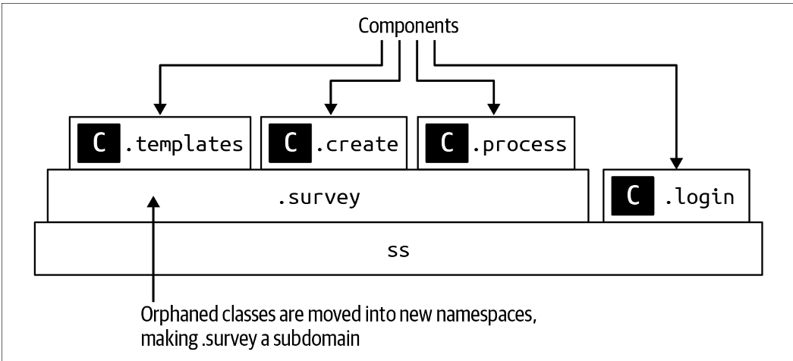

> 图 5-8：通过将孤儿类移动到新的叶节点（组件）来扁平化 Survey。

无论扁平化的方向如何，\
都要确保源代码文件只驻留在叶节点命名空间或目录中，\
从而使源代码始终可以在特定组件内被识别。

孤儿源代码可能驻留在根命名空间中的另一种常见场景是：\
代码被该命名空间内的其他组件共享。\
考虑图 5-9 中的例子，\
客户调查功能驻留在三个组件中\
（ss.survey.templates、 ss.survey.create 和 ss.survey.process），\
但公共代码（如接口、抽象类、公共工具）\
驻留在根命名空间 ss.survey 中。

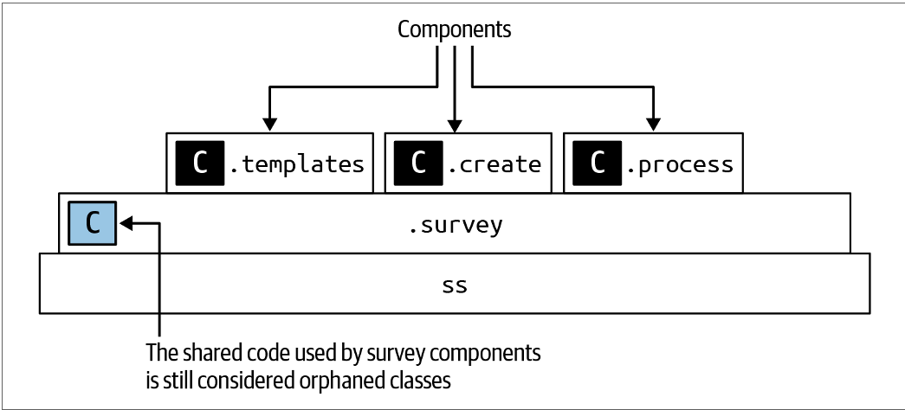

> 图 5-9：.survey 中的共享代码被视为孤儿类，应该被移动。

ss.survey 中的共享类仍会被视为孤儿类，\
尽管它们代表共享代码。\
应用扁平化组件模式会将这些共享的孤儿类\
移动到一个名为 ss.survey.shared 的新组件中，\
从而移除 ss.survey 子领域中的所有孤儿类，\
如图 5-10 所示。

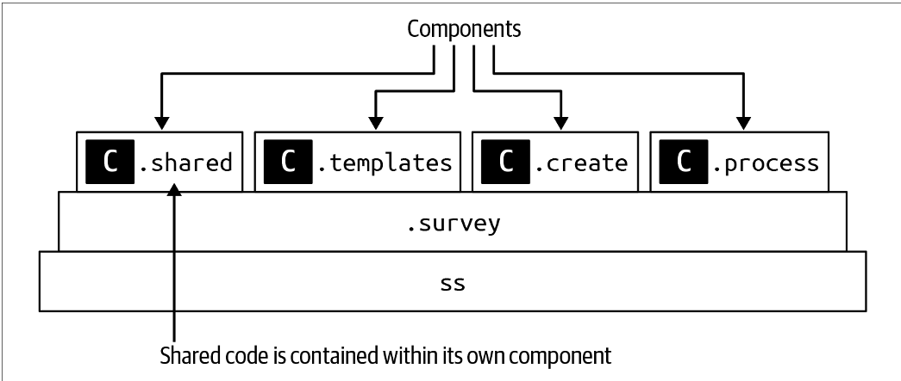

> 图 5-10：共享的调查代码被移动到它自己的组件中。

在将共享代码移动到独立组件（叶节点命名空间）时，\
我们的建议是选择一个\
在该领域任何现有代码库中都未使用的词，\
如 .sharedcode、.commoncode 或其他类似的独特名称。\
这使架构师能够基于代码库中共享组件的数量\
以及应用中共享源代码的百分比来生成度量。\
这是判断拆分单体应用可行性的一个良好指标。\
例如，\
如果所有以 .sharedcode 结尾的命名空间中的语句总数\
占整体源代码的 45%，\
那么迁移到分布式架构很可能会产生过多的共享库，\
最终因共享库依赖而成为维护的噩梦。

另一个涉及共享代码分析的良好度量\
是以 .sharedcode（或所用的任何公共共享命名空间节点）\
结尾的组件数量。\
这个度量让架构师能够洞察\
拆分单体应用将产生多少个共享库（JAR、DLL 等）或共享服务。

## 用于治理的适应度函数

应用扁平化组件分解模式涉及相当多的主观判断。\
例如，\
应该把叶节点中的代码合并到根命名空间，\
还是应该把根命名空间中的代码移动到叶节点？\
尽管如此，\
以下适应度函数可以帮助自动化\
保持组件扁平（只存在于叶节点）的治理。

### 适应度函数：根命名空间中不应驻留任何源代码

这个自动化的整体适应度函数\
可以通过 CI/CD 流水线在部署时触发，\
用于定位孤儿类——驻留在根命名空间中的类。\
使用这个适应度函数\
有助于在单体迁移期间保持组件扁平，\
特别是在迁移工作过程中\
对单体应用进行持续维护时。\
例 5-6 展示了当孤儿类出现在代码库中任何位置时\
向架构师发出警报的伪代码。

例 5-6。查找根命名空间中代码的伪代码

```
# 遍历目录结构，为每个完整路径创建命名空间
LIST component_list = identify_components(root_directory)

# 如果任何组件中的非叶节点包含源文件，则发送警报
FOREACH component IN component_list {
    LIST component_node_list = get_nodes(component)
    FOREACH node IN component_node_list {
        IF contains_code(node) AND NOT last_node(component_node_list) {
            send_alert(component)
        }
    }
}
```

### Sysops Squad Saga：扁平化组件

#### 11 月 10 日，星期三，11:10


> 插图 5-4：Addison 扁平化组件。

在应用了[收集公共领域组件模式](#收集公共领域组件模式)之后，\
Addison 分析了表 5-7 中的结果，\
观察到 Survey 和 Ticket 组件包含孤儿类。\
Addison 在表 5-9 和图 5-11 中突出显示了这些组件。

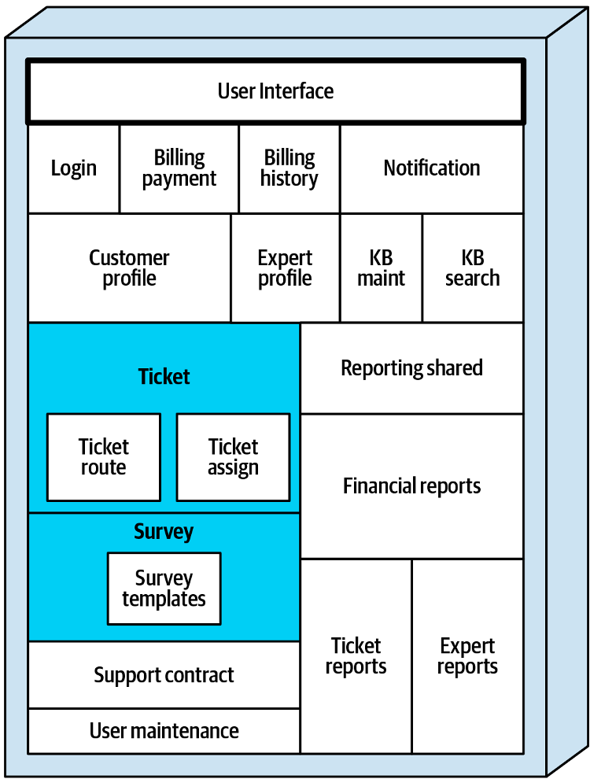

> 图 5-11：Survey 和 Ticket 组件包含孤儿类，应该被扁平化。

| 组件名           | 组件命名空间        | 语句数 | 文件数 |
| ---------------- | ------------------- | ------ | ------ |
| Ticket           | ss.ticket           | 7,009  | 45     |
| Ticket Assign    | ss.ticket.assign    | 7,845  | 14     |
| Ticket Route     | ss.ticket.route     | 1,468  | 4      |
| Survey           | ss.survey           | 2,204  | 5      |
| Survey Templates | ss.survey.templates | 1,672  | 7      |

> 表 5-9：Sysops Squad 的 Ticket 和 Survey 组件应该被扁平化。

Addison 决定先处理工单组件。\
由于扁平化组件意味着消除非叶节点中的源代码，\
Addison 有两个选择：\
将工单分配和工单路由组件中包含的代码\
合并到 ss.ticket 组件中；\
或者将 ss.ticket 组件中的 45 个类拆分为独立的组件，\
从而使 ss.ticket 成为一个子领域。\
Addison 与 Sydney（Sysops Squad 开发人员之一）讨论了这些选项，\
基于工单分配功能的复杂性和频繁变更，\
决定保持这些组件独立，\
并将 ss.ticket 根命名空间中的孤儿代码移动到其他命名空间，\
从而形成新的组件。

在 Sydney 的帮助下，\
Addison 发现 ss.ticket 命名空间中包含的 45 个孤儿类\
实现了以下工单功能：

- 工单创建和维护（创建工单、更新工单、取消工单等）
- 工单完成逻辑
- 大多数工单功能共用的共享代码

由于工单分配和工单路由功能\
已经在它们自己的组件中\
（分别是 ss.ticket.assign 和 ss.ticket.route），\
Addison 创建了一个架构故事，\
将 ss.ticket 命名空间中包含的源代码\
移动到三个新组件中，如表 5-10 所示。

| 组件               | 命名空间              | 职责               |
| ------------------ | --------------------- | ------------------ |
| Ticket Shared      | ss.ticket.shared      | 公共代码和工具     |
| Ticket Maintenance | ss.ticket.maintenance | 添加和维护工单     |
| Ticket Completion  | ss.ticket.completion  | 完成工单并发起调查 |
| Ticket Assign      | ss.ticket.assign      | 为工单分配专家     |
| Ticket Route       | ss.ticket.route       | 将工单发送给专家   |

> 表 5-10：原来的 Sysops Squad Ticket 组件被拆分为三个新组件。

然后 Addison 考虑了调查功能。\
通过与 Sydney 合作，\
Addison 发现调查功能很少变更，也不是过于复杂。\
Sydney 与 Skyler 进行了交谈——\
Skyler 是最初创建 ss.survey.templates 命名空间的\
Sysops Squad 开发人员——\
发现并没有什么令人信服的理由\
要把调查模板分离到它们自己的命名空间中\
（"当时只是觉得这是个好主意，"Skyler 说）。\
有了这些信息，\
Addison 创建了一个架构故事，\
将七个类文件从 ss.survey.templates 移动到 ss.survey 命名空间，\
并移除了 ss.survey.template 组件，如表 5-11 所示。

| 组件   | 命名空间  | 职责           |
| ------ | --------- | -------------- |
| Survey | ss.survey | 发送和接收调查 |

> 表 5-11：原来的 Sysops Squad Survey 组件被扁平化为单个组件。

应用扁平化组件模式（如图 5-12 所示）之后，\
Addison 观察到不再存在"山丘"（组件堆叠在组件之上）或孤儿类，\
所有组件都只包含在相应命名空间的叶节点中。


> 图 5-12：Survey 组件被扁平化为单个组件，而 Ticket 组件被向上提升并扁平化，
> 形成 Ticket 子领域。

Addison 将迄今为止应用这些分解模式的重构工作结果记录下来，\
并列在表 5-12 中。

| 组件               | 命名空间               |
| ------------------ | ---------------------- |
| Login              | ss.login               |
| Billing Payment    | ss.billing.payment     |
| Billing History    | ss.billing.history     |
| Customer Profile   | ss.customer.profile    |
| Expert Profile     | ss.expert.profile      |
| KB Maint           | ss.kb.maintenance      |
| KB Search          | ss.kb.search           |
| Notification       | ss.notification        |
| Reporting Shared   | ss.reporting.shared    |
| Ticket Reports     | ss.reporting.tickets   |
| Expert Reports     | ss.reporting.experts   |
| Financial Reports  | ss.reporting.financial |
| Ticket Shared      | ss.ticket.shared       |
| Ticket Maintenance | ss.ticket.maintenance  |
| Ticket Completion  | ss.ticket.completion   |
| Ticket Assign      | ss.ticket.assign       |
| Ticket Route       | ss.ticket.route        |
| Support Contract   | ss.supportcontract     |
| Survey             | ss.survey              |
| User Maintenance   | ss.users               |

> 表 5-12：应用扁平化组件模式后的 Sysops Squad 组件。

## 确定组件依赖模式

在考虑从单体应用迁移到分布式架构时，\
最常问到的三个问题如下：

1. 拆分现有的单体应用可行吗？
2. 这次迁移的大致总体工作量有多大？
3. 这需要重写代码还是重构代码？

本书作者之一几年前曾参与一个大型迁移项目，\
将一个复杂的单体应用迁移到微服务。\
在项目的第一天，\
CIO 只想知道一件事——\
这次迁移工作是一个高尔夫球、一个篮球，还是一架客机？\
本书作者对这种大小类比很好奇，\
但 CIO 坚持认为，\
鉴于这种粗粒度的规模估算方式，\
回答这个简单的问题应该没那么难。\
事实证明，\
应用*确定组件依赖*模式\
可以快速而轻松地回答 CIO 的这个问题——\
这次迁移工作不幸是一架客机，\
但只是一架小型的巴西航空工业 E190，\
而不是大型的波音 787 梦想客机。

### 模式描述

*确定组件依赖*模式的目的\
是分析*组件*之间的传入和传出依赖（耦合），\
以确定拆分单体应用后\
生成的服务依赖图可能是什么样子。\
虽然确定服务的正确粒度水平涉及许多因素（见第 7 章），\
但单体应用中的每个组件都是潜在的服务候选\
（取决于目标分布式架构风格）。\
因此，理解组件之间的交互和依赖至关重要。

需要注意的是，\
这个模式关注的是组件依赖，\
而不是组件内单个类之间的依赖。\
当一个组件（命名空间）中的类\
与另一个组件（命名空间）中的类发生交互时，\
就形成了组件依赖。\
例如，\
假设 ss.survey 组件中的 CustomerSurvey 类\
调用 ss.notification 组件中 CustomerNotification 类的方法\
来发送客户调查，\
如例 5-7 中的伪代码所示。

例 5-7。展示 Survey 和 Notification 组件之间依赖的伪代码

```
namespace ss.survey
class CustomerSurvey {
    function createSurvey {
        ...
    }

    function sendSurvey {
        ...
        ss.notification.CustomerNotification.send(customer_id, survey)
    }
}
```

注意 Survey 和 Notification 组件之间的依赖，\
因为 CustomerSurvey 类使用的 CustomerNotification 类\
位于 ss.survey 命名空间之外。\
具体来说，\
Survey 组件对 Notification 组件有传出依赖， 而 Notification 组件对 Survey
组件有传入依赖。

请注意，\
特定组件*内部*的类\
可能是一团有着大量依赖的高耦合乱麻，\
但在应用这个模式时这并不重要——\
重要的只是组件*之间*的依赖。

有几种工具可以帮助应用这个模式\
并将组件依赖可视化。\
此外，许多现代 IDE 都有插件，\
可以生成特定代码库中组件或命名空间的依赖图。\
这些可视化可以帮助回答本节开头提出的三个关键问题。

例如，考虑图 5-13 所示的依赖图，\
其中方框代表组件（而不是类），\
线条代表组件之间的耦合点。\
注意图中组件之间只有一个依赖，\
这使得该应用成为拆分的良好候选，\
因为各组件在功能上相互独立。

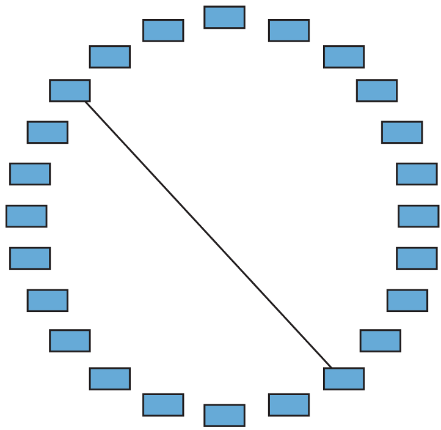

> 图 5-13：组件依赖极少的单体应用拆分工作量较小（高尔夫球级别）。

对于图 5-13 这样的依赖图，\
三个关键问题的答案如下：

1. 拆分现有的单体应用可行吗？可行
2. 这次迁移的大致总体工作量有多大？高尔夫球级别（相对直接）
3. 这需要重写代码还是重构代码？重构（将现有代码移动到独立部署的服务中）

现在看图 5-14 所示的依赖图。\
遗憾的是，\
这张图代表了大多数业务应用中组件之间的典型依赖。\
请特别注意，\
这张图的左侧耦合水平最高，\
而右侧看起来拆分起来要可行得多。


> 图 5-14：组件依赖很多的单体应用拆分工作量较大（篮球级别）。

面对组件之间这种紧耦合水平，\
三个关键问题的答案就不那么乐观了：

1. 拆分现有的单体应用可行吗？也许……
2. 这次迁移的大致总体工作量有多大？篮球级别（难得多）
3. 这需要重写代码还是重构代码？可能是部分重构和部分重写现有代码的结合

最后，考虑图 5-15 所示的依赖图。\
在这种情况下，\
架构师应该转身朝相反方向跑得越远越好！


> 图 5-15：组件依赖过多的单体应用不可行拆分（客机级别）。

对于具有这种组件依赖矩阵的应用，\
三个关键问题的答案并不令人意外：

1. 拆分现有的单体应用可行吗？不可行
2. 这次迁移的大致总体工作量有多大？客机级别
3. 这需要重写代码还是重构代码？*整个应用完全重写*

在拆分单体应用时，\
我们再怎么强调这类可视化图的重要性也不为过。\
从本质上讲，\
这些图构成了一部雷达，\
可以用来确定敌人（高组件耦合）的位置，\
同时也描绘出一幅图景：\
如果单体应用被拆分为高度分布式的架构，\
生成的服务依赖矩阵可能是什么样子。

根据我们的经验，\
组件耦合是确定单体迁移工作整体成功与否（及可行性）\
最重要的因素之一。\
识别并理解组件耦合水平，\
不仅可以让架构师确定迁移工作的可行性，\
还可以让他们对总体工作量有所预期。\
遗憾的是，\
我们太经常看到团队在没有任何分析、\
也不了解单体应用长什么样的情况下，\
就直接一头扎进把单体应用拆分为微服务的工作中。\
毫不奇怪，这些团队在拆分单体应用时举步维艰。

这个模式不仅可用于识别应用中组件耦合的总体水平，\
还可用于在拆分应用之前确定依赖重构的机会。\
在分析组件之间的耦合水平时，\
重要的是同时分析传入耦合\
（在大多数工具中表示为 CA）\
和传出耦合（在大多数工具中表示为 CE）。\
CT，即总耦合，是传入耦合和传出耦合之和。

很多时候，\
拆分一个组件可以降低该组件的耦合水平。\
例如，假设组件 A 的传入耦合水平为 20\
（意味着有 20 个其他组件依赖于该组件的功能）。\
这并不一定意味着\
所有这 20 个其他组件都需要组件 A 的全部功能。\
也许其中 14 个组件只需要组件 A 中包含的一小部分功能。\
将组件 A 拆分为两个不同的组件\
（组件 A1 包含较小的、被耦合的功能，\
组件 A2 包含大部分功能），\
可以将组件 A2 的传入耦合降低到 6，\
而组件 A1 的传入耦合水平为 14。

## 用于治理的适应度函数

对组件依赖实现自动化治理的两种方式是：\
确保没有组件拥有"过多"的依赖，\
以及限制某些组件与其他组件耦合。\
接下来介绍的适应度函数\
是治理这类依赖的一些方法。

### 适应度函数：任何组件的总依赖数不得超过 <某个数值>

这个自动化的整体适应度函数\
可以通过 CI/CD 流水线在部署时触发，\
确保任何给定组件的耦合水平不超过特定阈值。\
这个最大阈值应基于应用内的整体耦合水平和组件数量，\
由架构师来确定。\
这个适应度函数生成的警报\
使架构师能够与开发团队讨论任何耦合增加的情况，\
并可能促成拆分组件以降低耦合的行动。\
这个适应度函数也可以修改为\
仅针对传入、仅针对传出、\
或两者（作为单独的适应度函数）的阈值限制生成警报。\
例 5-8 展示了当总耦合（传入加传出）\
超过合计 15 的水平时发送警报的伪代码——\
对大多数应用来说，15 会被认为是相当高的。

例 5-8。限制任何给定组件总依赖数的伪代码

```
# 遍历目录结构，收集组件以及这些组件中包含的源代码文件
LIST component_list = identify_components(root_directory)
MAP component_source_file_map
FOREACH component IN component_list {
    LIST component_source_file_list = get_source_files(component)
    ADD component, component_source_file_list TO component_source_file_map
}

# 确定每个源文件存在多少引用，
# 如果总依赖数大于 15 则发送警报
FOREACH component,component_source_file_list IN component_source_file_map {
    FOREACH source_file IN component_source_file_list {
        incoming_count = used_by_other_components(source_file, component_source_file_map)
        outgoing_count = uses_other_components(source_file)
        total_count = incoming_count + outgoing_count
        IF total_count > 15 {
            send_alert(component, total_count)
        }
    }
}
```

### 适应度函数：<某个组件> 不应依赖于 <另一个组件>

这个自动化的整体适应度函数\
可以通过 CI/CD 流水线在部署时触发，\
限制某些组件对其他组件的依赖。\
在大多数情况下，\
每个依赖限制都会有一个对应的适应度函数，\
因此如果有 10 个不同的组件限制，\
就会有 10 个不同的适应度函数，\
每个受限制的组件一个。\
例 5-9 展示了一个使用 ArchUnit 的例子，\
确保 Ticket Maintenance 组件（ss.ticket.maintenance）\
不依赖于 Expert Profile 组件（ss.expert.profile）。

例 5-9。治理组件之间依赖限制的 ArchUnit 代码

```java
public void ticket_maintenance_cannot_access_expert_profile() {
    noClasses().that()
        .resideInAPackage("...ss.ticket.maintenance..")
        .should().accessClassesThat()
        .resideInAPackage("...ss.expert.profile..")
        .check(myClasses);
}
```

### Sysops Squad Saga：识别组件依赖

#### 11 月 15 日，星期一，09:45


> 插图 5-5：Addison 分析组件依赖。

在了解了确定组件依赖模式之后，\
Addison 想知道 Sysops Squad 应用的依赖矩阵是什么样子，\
以及拆分这个应用是否可行。\
Addison 使用 IDE 插件\
生成了当前 Sysops Squad 应用的组件依赖图。\
起初，Addison 感到有些沮丧，\
因为图 5-16 显示 Sysops Squad 应用组件之间存在大量依赖。


> 图 5-16：Sysops Squad 应用中的组件依赖。

然而，经过进一步分析，\
Addison 看到 Notification 组件拥有最多的依赖，\
考虑到它是一个共享组件，这并不奇怪。\
然而，Addison 还看到 Ticketing 和 Reporting 组件内部\
存在大量依赖。\
这两个领域都有一个专门用于共享代码的组件\
（接口、辅助类、实体类等）。\
Addison 意识到，\
工单和报表的共享代码大多包含编译期的类引用，\
很可能会以共享库而非服务的形式实现，\
于是过滤掉了这些组件，\
以便更清楚地查看应用核心功能之间的依赖，\
如图 5-17 所示。

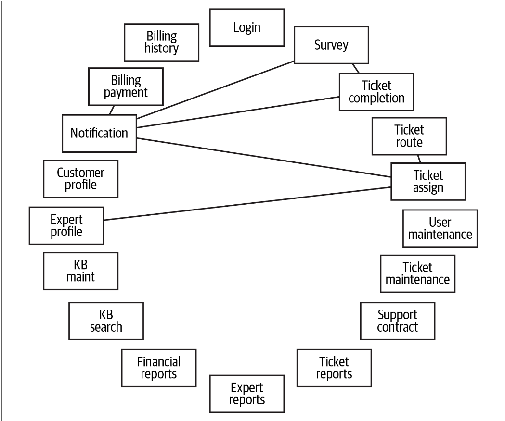

> 图 5-17：不含共享库依赖的 Sysops Squad 应用组件依赖。

过滤掉共享组件后，\
Addison 看到依赖相当少。\
Addison 把这些结果展示给 Austen，\
他们一致认为，\
大多数组件都相对自包含，\
Sysops Squad 应用看起来是\
拆分为分布式架构的良好候选。

## 创建组件领域模式

虽然单体应用中识别出的每个组件\
都可以被视为独立服务的可能候选，\
但在大多数情况下，\
服务与组件之间的关系是一对多的——\
即单个服务可能包含一个或多个组件。\
*创建组件领域*模式的目的\
是将组件在逻辑上分组，\
以便在拆分应用时创建更粗粒度的领域服务。

### 模式描述

识别组件领域——\
将执行某种相关功能的组件分组——\
是拆分任何单体应用的关键部分。\
回想一下第 4 章的建议：

> 拆分单体应用时，\
> 可以考虑先迁移到基于服务的架构，\
> 将其作为通往其他分布式架构的垫脚石。

创建组件领域是确定\
基于服务的架构中最终将成为领域服务的内容的有效方法。

组件领域在应用中通过组件命名空间（或目录）来物理体现。\
由于命名空间节点本质上是分层的，\
它们成为表示功能领域和子领域的绝佳方式。\
这项技术如图 5-18 所示，\
其中命名空间的第二个节点（.customer）指领域，\
第三个节点代表客户领域下的子领域（.billing），\
叶节点（.payment）指组件。\
该命名空间末尾的 .MonthlyBilling\
指 Payment 组件中包含的一个类文件。


> 图 5-18：通过命名空间节点识别组件领域。

由于许多较旧的单体应用\
是在领域驱动设计广泛使用之前实现的，\
因此在很多情况下，\
需要重构命名空间\
以在应用中结构化地识别领域。\
例如，考虑表 5-13 中列出的、\
构成 Sysops Squad 应用中 Customer 领域的组件。

| 组件             | 命名空间            |
| ---------------- | ------------------- |
| Billing Payment  | ss.billing.payment  |
| Billing History  | ss.billing.history  |
| Customer Profile | ss.customer.profile |
| Support Contract | ss.supportcontract  |

> 表 5-13：重构前与 Customer 领域相关的组件。

注意每个组件都与客户功能相关，\
但相应的命名空间并没有反映这种关联。\
为了正确识别 Customer 领域\
（通过命名空间 ss.customer 体现），\
必须修改 Billing Payment、Billing History 和 Support Contract\
组件的命名空间，\
在命名空间开头添加 .customer 节点，\
如表 5-14 所示。

| 组件             | 命名空间                    |
| ---------------- | --------------------------- |
| Billing Payment  | ss.customer.billing.payment |
| Billing History  | ss.customer.billing.history |
| Customer Profile | ss.customer.profile         |
| Support Contract | ss.customer.supportcontract |

> 表 5-14：重构后与 Customer 领域相关的组件。

注意在上表中，\
所有与客户相关的功能\
（账单、资料维护和支持合同维护）\
现在都分组在 .customer 之下，\
使每个组件与该特定领域对齐。

## 用于治理的适应度函数

重构完成后，\
重要的是对组件领域进行治理，\
确保命名空间规则得到执行，\
并确保不存在超出组件领域或子领域上下文的代码。\
一旦组件领域在单体应用中建立起来，\
就可以使用以下自动化适应度函数来帮助治理它们。

### 适应度函数：<根命名空间节点> 下的所有命名空间应限制在 <领域列表> 之内

这个自动化的整体适应度函数\
可以通过 CI/CD 流水线在部署时触发，\
限制应用中包含的领域。\
这个适应度函数有助于防止开发团队\
在不经意间创建额外的领域，\
并在任何新命名空间（或目录）\
被创建在已批准的领域列表之外时向架构师发出警报。\
例 5-10 展示了一个使用 ArchUnit 的例子，\
确保应用中只存在 ticket、customer 和 admin 领域。

例 5-10。治理应用内领域的 ArchUnit 代码

```java
public void restrict_domains() {
    classes()
        .should().resideInAPackage("...ss.ticket...")
        .orShould().resideInAPackage("...ss.customer...")
        .orShould().resideInAPackage("...ss.admin...")
        .check(myClasses);
}
```

### Sysops Squad Saga：创建组件领域

#### 11 月 18 日，星期四，13:15


> 插图 5-6：Addison 和 Austen 与 Parker 确定领域。

Addison 和 Austen 咨询了\
Sysops Squad 产品负责人 Parker，\
他们一起在应用中识别出五个主要领域：\
Ticketing 领域（ss.ticket），\
包含所有与工单相关的功能，\
包括工单处理、客户调查和知识库（KB）功能；\
Reporting 领域（ss.reporting），包含所有报表功能；\
Customer 领域（ss.customer），\
包含客户资料、账单和支持合同；\
Admin 领域（ss.admin），\
包含用户和 Sysops Squad 专家的维护；\
最后是 Shared 领域（ss.shared），\
包含其他领域使用的登录和通知功能。

Addison 创建了一张领域图（见图 5-19），\
展示了各个领域以及每个领域内相应的组件分组。\
他对这个分组感到满意，\
因为没有任何组件被遗漏，\
而且每个领域内的组件之间具有良好的内聚性。

Addison 绘制组件图并对组件进行分组的练习很重要，\
因为它验证了识别出的领域候选，\
也表明了与业务利益相关者\
（如产品负责人或业务应用赞助人）协作的必要性。\
如果组件不能恰当地对齐，\
或者 Addison 剩下一些无处安放的组件，\
就需要与 Parker（产品负责人）进行更多协作。

确认所有组件都能很好地归入这些领域之后，\
Addison 接着查看了\
应用[扁平化组件模式](#扁平化组件模式)后， 表 5-12 中的各个组件命名空间，\
并确定了需要进行的组件领域重构。

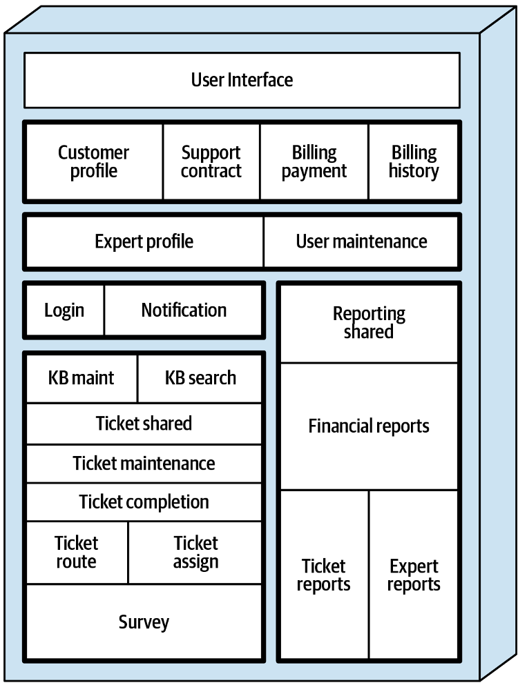

> 图 5-19：Sysops Squad 应用中识别出的五个领域（以加深的边框标出）。

Addison 从 Ticket 领域开始，\
发现虽然核心工单功能以命名空间 ss.ticket 开头，\
但调查和知识库组件却不是。\
因此，Addison 写了一个架构故事，\
重构表 5-15 中列出的组件，\
使其与工单领域对齐。

| 组件               | 领域   | 当前命名空间          | 目标命名空间             |
| ------------------ | ------ | --------------------- | ------------------------ |
| KB Maint           | Ticket | ss.kb.maintenance     | ss.ticket.kb.maintenance |
| KB Search          | Ticket | ss.kb.search          | ss.ticket.kb.search      |
| Ticket Shared      | Ticket | ss.ticket.shared      | 相同（无变更）           |
| Ticket Maintenance | Ticket | ss.ticket.maintenance | 相同（无变更）           |
| Ticket Completion  | Ticket | ss.ticket.completion  | 相同（无变更）           |
| Ticket Assign      | Ticket | ss.ticket.assign      | 相同（无变更）           |
| Ticket Route       | Ticket | ss.ticket.route       | 相同（无变更）           |
| Survey             | Ticket | ss.survey             | ss.ticket.survey         |

> 表 5-15：Ticket 领域的 Sysops Squad 组件重构。

接下来，Addison 考虑了与客户相关的组件，\
发现账单和调查组件需要重构，\
才能归入 Customer 领域，\
并在此过程中创建一个 Billing 子领域。\
Addison 为 Customer 领域功能的重构写了一个架构故事，\
如表 5-16 所示。

| 组件             | 领域     | 当前命名空间        | 目标命名空间                |
| ---------------- | -------- | ------------------- | --------------------------- |
| Billing Payment  | Customer | ss.billing.payment  | ss.customer.billing.payment |
| Billing History  | Customer | ss.billing.history  | ss.customer.billing.history |
| Customer Profile | Customer | ss.customer.profile | 相同（无变更）              |
| Support Contract | Customer | ss.supportcontract  | ss.customer.supportcontract |

> 表 5-16：Customer 领域的 Sysops Squad 组件重构。

通过应用[识别并确定组件大小模式](#识别并确定组件大小模式)，\
Addison 发现报表领域已经对齐，\
表 5-17 中列出的报表组件不需要进一步的操作。

| 组件              | 领域      | 当前命名空间           | 目标命名空间   |
| ----------------- | --------- | ---------------------- | -------------- |
| Reporting Shared  | Reporting | ss.reporting.shared    | 相同（无变更） |
| Ticket Reports    | Reporting | ss.reporting.tickets   | 相同（无变更） |
| Expert Reports    | Reporting | ss.reporting.experts   | 相同（无变更） |
| Financial Reports | Reporting | ss.reporting.financial | 相同（无变更） |

> 表 5-17：Sysops Squad 的 Reporting 组件已与 Reporting 领域对齐。

Addison 看到 Admin 和 Shared 领域也需要对齐，\
并决定为这次重构工作创建一个单一的架构故事，\
将这些组件列在表 5-18 中。\
Addison 还决定将 `ss.expert.profile` 命名空间\
重命名为 `ss.experts`，\
以避免在 Admin 领域下出现不必要的 Expert 子领域。

| 组件             | 领域   | 当前命名空间      | 目标命名空间           |
| ---------------- | ------ | ----------------- | ---------------------- |
| Login            | Shared | ss.login          | ss.shared.login        |
| Notification     | Shared | ss.notification   | ss.shared.notification |
| Expert Profile   | Admin  | ss.expert.profile | ss.admin.experts       |
| User Maintenance | Admin  | ss.users          | ss.admin.users         |

> 表 5-18：Admin 和 Shared 领域的 Sysops Squad 组件重构。

完成这个模式后，\
Addison 意识到他们现在已经准备好\
从结构上拆分单体应用，\
并通过应用创建领域服务模式（将在下一节介绍）\
迈向分布式架构的第一阶段。

## 创建领域服务模式

一旦组件被确定了合适的大小、\
扁平化并分组为领域，\
这些领域就可以被移动到独立部署的*领域服务*中，\
形成所谓的基于服务的架构（见附录 A）。\
领域服务是粗粒度、独立部署的软件单元，\
包含特定领域（如 Ticketing、Customer、Reporting 等）的全部功能。

### 模式描述

前面介绍的[创建组件领域模式](#创建组件领域模式)\
在单体应用内形成定义良好的组件领域，\
并通过组件命名空间（或目录结构）来体现这些领域。\
本模式则将这些定义良好的组件领域\
提取为独立部署的服务，称为*领域服务*，\
从而创建基于服务的架构。

在最简单的形式中，\
基于服务的架构由一个用户界面组成，\
该用户界面远程访问粗粒度的领域服务，\
所有服务共享一个单体数据库。\
虽然基于服务的架构有许多拓扑变体\
（如拆分用户界面、拆分数据库、添加 API 网关等），\
但图 5-20 所示的基本拓扑\
是迁移单体应用的良好起点。


> 图 5-20：基于服务的架构的基本拓扑。

除了[基于组件的分解](#基于组件的分解)中提到的好处之外，\
先迁移到基于服务的架构\
还让架构师和开发团队能够更深入地了解每个领域服务，\
以确定它应该在微服务架构中\
被拆分为更小的服务，\
还是保留为较大的领域服务。\
太多团队犯了一开始粒度就过细的错误，\
结果不得不在并不需要所有这些细粒度微服务的情况下，\
接受微服务的所有包袱\
（如数据分解、分布式工作流、分布式事务、\
运维自动化、容器化等）。

图 5-21 展示了*创建领域服务*模式的工作方式。\
注意图中，\
在[创建组件领域模式](#创建组件领域模式)中定义的 Reporting 组件领域\
是如何从单体应用中提取出来，\
形成自己独立部署的 Reporting 服务的。

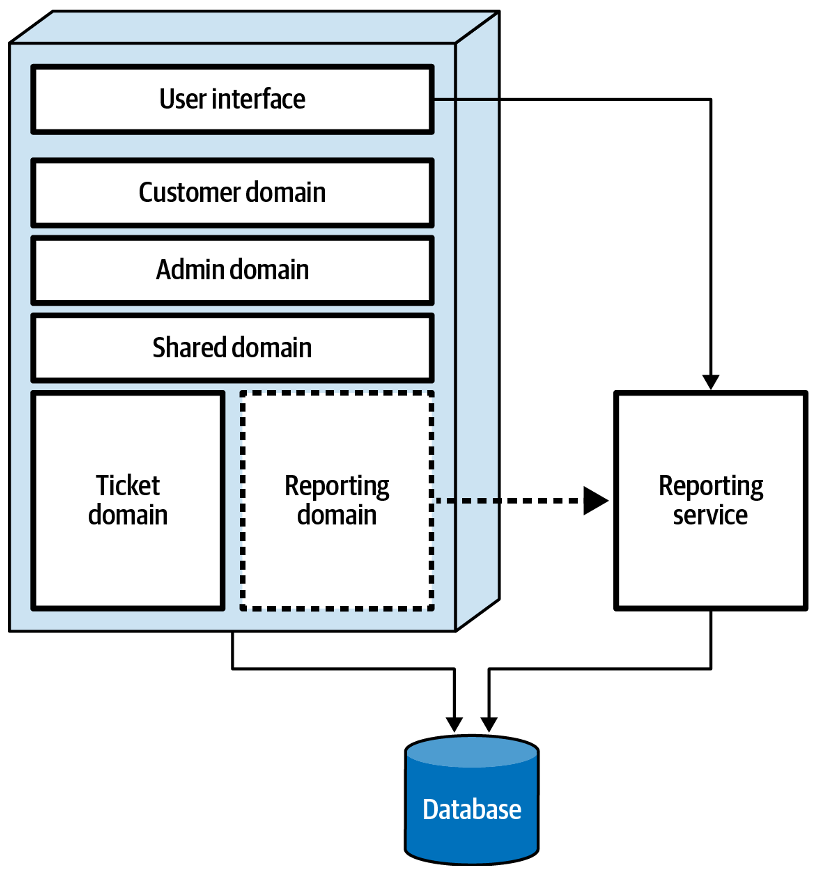

> 图 5-21：组件领域被移动到外部领域服务。

不过有一句忠告：\
在*所有*组件领域都被识别和重构之前，\
不要应用这个模式。\
这有助于减少在移动组件（以及源代码）时\
对每个领域服务所需的修改量。\
例如，\
假设 Sysops Squad 应用中的所有工单和知识库功能\
都已分组并重构到 Ticket 领域中，\
并从该领域创建了一个新的 Ticket 服务。\
现在假设客户调查组件\
（通过 `ss.customer.survey` 命名空间识别）\
被认定属于 Ticket 领域。\
由于 Ticket 领域已经迁移，\
现在必须修改 Ticket 服务以包含 Survey 组件。\
更好的做法是先将所有组件对齐并重构到组件领域中，\
*然后*再开始将这些组件领域迁移到领域服务。

## 用于治理的适应度函数

保持每个领域服务内的组件与领域对齐很重要，\
特别是当该领域服务将被拆分为更小的微服务时。\
这类治理有助于防止领域服务\
变成它们自己的无结构单体服务。\
以下适应度函数确保命名空间（以及组件）\
在领域服务内保持一致。

### 适应度函数：<某个领域服务> 中的所有组件应以相同的命名空间开头

这个自动化的整体适应度函数\
可以通过 CI/CD 流水线在部署时触发，\
确保领域服务内组件的命名空间保持一致。\
例如，\
Ticket 领域服务中的所有组件都应以 ss.ticket 开头。\
例 5-11 使用 ArchUnit 来确保这一约束。\
每个领域服务都会有自己对应的、\
基于其特定领域的适应度函数。

例 5-11。治理 Ticket 领域服务内组件的 ArchUnit 代码

```java
public void restrict_domain_within_ticket_service() {
    classes().should().resideInAPackage("...ss.ticket...")
        .check(myClasses);
}
```

### Sysops Squad Saga：创建领域服务

#### 11 月 23 日，星期二，09:04


> 插图 5-7：团队制定领域服务迁移计划。

Addison 和 Austen 与 Sysops Squad 开发团队密切合作，\
制定了一个迁移计划，\
将从组件领域到领域服务的迁移分阶段进行。\
他们意识到，\
这项工作不仅要求将每个组件领域内的代码\
从单体应用中提取出来并移动到新的项目工作区，\
还要求用户界面现在能够远程访问该领域内的功能。

基于之前在图 5-19 中识别出的组件领域，\
团队每次迁移一个组件，\
最终形成了基于服务的架构，如图 5-22 所示。\
注意前一个模式中识别出的每个领域\
现在如何成为一个独立部署的服务。

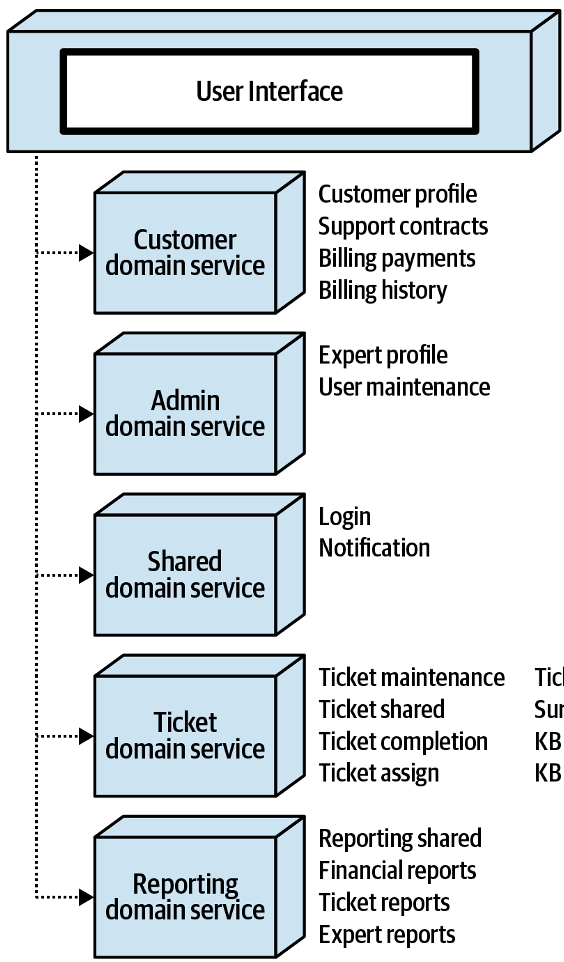

> 图 5-22：独立部署的领域服务生成分布式的 Sysops Squad 应用。

## 小结

根据我们的经验，\
"凭感觉行事"的迁移工作很少能产生积极的结果。\
应用这些基于组件的分解模式，\
为拆分单体架构提供了一种\
结构化、可控、增量的方法。\
应用这些模式之后，\
团队现在可以着手分解单体数据（见第 6 章），\
并根据需要开始将领域服务拆分为更细粒度的微服务\
（见第 7 章）。

# 第 6 章：拆分运维数据

## 10 月 7 日，星期四，08:55


> 插图 6-1：Addison 和 Austen 讨论拆分 Sysops Squad 数据库。

Sysops Squad 应用已成功拆分为独立部署的领域服务，Addison 和 Austen 都意识到，
是时候开始考虑拆分单体 Sysops Squad 数据库了。Addison 同意启动这项工作， 而
Austen 则开始着手增强 CI/CD 部署流水线。 Addison 与 Sysops Squad 数据架构师 Dana
以及支持 Penultimate Electronics 数据库的 DBA 之一 Devon 会面。

"我想听听你们对如何拆分 Sysops Squad 数据库的意见，"Addison 说。

"等一下，"Dana 说。"谁说要拆分数据库了？"

"Addison 和我上周已经达成一致，需要拆分 Sysops Squad 数据库，"Devon 说。
"如你所知，Sysops Squad 应用正在进行重大改造，而拆分数据是这次改造的一部分。"

"我认为单体数据库挺好的，"Dana 说。"我看不出有任何理由要拆分它。
除非你能说服我，否则我不会在这个问题上让步。
再说了，你知道拆分那个数据库有多难吗？"

"当然会有难度，"Devon 说，"但我知道一个利用 data domain 的五步流程，
对这个数据库会非常有效。这样，我们甚至可以开始考虑为应用的某些部分使用不同类型的数据库，
比如知识库，甚至是客户调查功能。"

"别太超前了，"Dana 说。"也别忘了我才是所有这些数据库的负责人。"

Addison 很快意识到事情正在失控，迅速运用了一些关键的谈判和引导技巧。
"好吧，"Addison 说，"我们应该在最初的讨论中就邀请你参与，对此我深表歉意。
我本该更清楚这一点。我们怎样才能让你加入进来，帮助我们分解 Sysops Squad
数据库？"

"这很简单，"Dana 说。"说服我 Sysops Squad 数据库确实需要被拆分。
给我一个充分的理由。如果你能做到，那我们就来谈谈 Devon 的五步流程。
否则，就保持现状。"

拆分数据库很难——事实上，比拆分应用功能要难得多。
因为数据通常是公司最重要的资产， 在拆分或重组数据时，业务和应用中断的风险更大。
此外，数据往往与应用功能高度耦合，
使得在大型数据模型中识别清晰的接缝变得更加困难。

就像单体应用被拆分为独立的部署单元一样，
有时拆分单体数据库也是可取的（甚至是必要的）。 某些架构风格（如
microservices）要求数据被拆分， 以形成明确定义的 bounded
context（每个服务拥有自己的数据）， 而其他分布式架构（如 service-based
architecture）则允许服务共享一个数据库。

有趣的是，拆分应用功能所使用的某些技术同样可以应用于拆分数据。 例如，组件对应
data domain， 类文件对应数据库表， 类之间的耦合点对应数据库构件， 如 foreign
key、视图、触发器，甚至存储过程。

在本章中，我们探讨分解数据的一些驱动因素， 并展示如何以迭代和受控的方式，
将单体数据有效拆分为独立的 data domain、schema，甚至独立的数据库。
我们认识到数据库世界不全是关系型的，
因此也讨论各种数据库类型——relational、graph、document、
key-value、columnar、NewSQL 和 cloud native—— 并概述每种数据库类型相关的各种
trade-off。

## 数据分解的驱动因素

拆分单体数据库可能是一项艰巨的任务，
因此，了解是否（以及何时）应该分解数据库非常重要，如图 6-1 所示。
架构师可以通过理解和分析*数据分解器*（data disintegrator，
证明拆分数据合理的驱动因素）和*数据集成器*（data integrator，
证明保持数据在一起的驱动因素）， 来为数据分解工作提供正当理由。
在这两种驱动力量之间寻求平衡，并分析每种力量的 trade-off，
是正确把握数据粒度的关键。

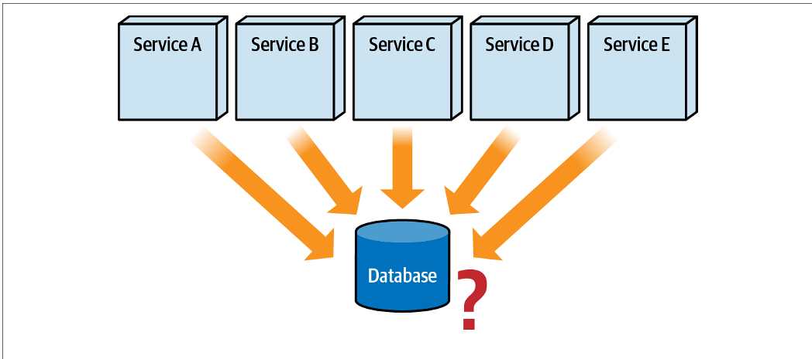

> 图 6-1：在什么情况下应该分解单体数据库？

在本节中，我们将探讨数据分解器和数据集成器，
它们有助于在考虑拆分单体数据时做出正确的选择。

### 数据分解器

数据分解驱动因素为"我应该在什么时候考虑拆分数据？"这个问题提供了答案和理由。
拆分数据的六个主要分解驱动因素包括：

变更控制

有多少服务会受到数据库表变更的影响？

连接管理

我的数据库能否处理来自多个分布式服务所需的连接？

可扩展性

数据库能否扩展以满足访问它的服务的需求？

容错

有多少服务会受到数据库崩溃或维护停机的影响？

architecture quantum

单个共享数据库是否迫使我进入一个不理想的单一 architecture quantum？

数据库类型优化

我能否通过使用多种数据库类型来优化数据？

每个分解驱动因素将在以下各节中详细讨论。

### 变更控制

主要的数据分解驱动因素之一是控制数据库表 schema 的变更。
删除表或列、更改表名或列名，甚至更改表中的列类型， 都会破坏访问这些表的相应
SQL， 进而破坏使用这些表的相应服务。 我们将这类变更称为*破坏性变更*（breaking
change）， 与之相对的是在数据库中添加表或列，
这通常不会影响现有的查询或写入操作。
毫不奇怪，使用关系数据库时，变更控制受到的影响最大，
但其他数据库类型也可能产生变更控制问题（参见[选择数据库类型](#选择数据库类型)）。

如图 6-2 所示，当数据库发生破坏性变更时，
多个服务必须与数据库变更一起更新、测试和部署。
随着共享同一数据库的独立部署服务数量增加，
这种协调很快就会变得既困难又容易出错。 想象一下，仅仅因为一次破坏性数据库变更，
就要协调 42 个独立部署的服务！

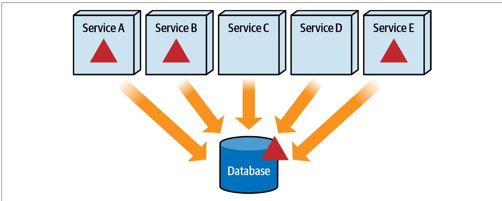

> 图 6-2：受数据库变更影响的服务必须与数据库一起部署。

协调多个分布式服务的共享数据库变更只是问题的一半。
在任何分布式架构中，更改共享数据库的真正危险在于，
忘记了哪些服务访问了刚刚被更改的表。 如图 6-3
所示，这些服务在*生产环境中*将变得不可用， 直到它们被修改、测试并重新部署。


> 图 6-3：受数据库变更影响但被遗忘的服务将继续失败，直到被重新部署。

在大多数应用中，遗忘服务的风险通过勤勉的影响分析和大量的回归测试来缓解。
然而，考虑一个有 400 个服务的 microservices 生态系统，
所有服务共享同一个高可用的单体集群关系数据库。
想象一下，要跑遍许多领域的所有开发团队， 试图找出哪些服务使用了被变更的表。
还想象一下，然后必须将所有这些服务与数据库*一起*协调、测试和部署为一个单元。
思考这个场景开始变得令人头晕目眩，通常会导致某种程度的疯狂。

将数据库拆分为明确定义的 bounded context， 可以显著帮助控制破坏性数据库变更。
bounded context 概念来自 Eric Evans 的开创性著作《Domain-Driven Design》
（Addison-Wesley），
它描述了源代码、业务逻辑、数据结构和数据全部绑定在一起——封装——在一个特定的上下文中。
如图 6-4 所示，围绕服务及其相应数据形成的良好 bounded context 有助于控制变更，
因为变更仅限于该 bounded context 内的那些服务。

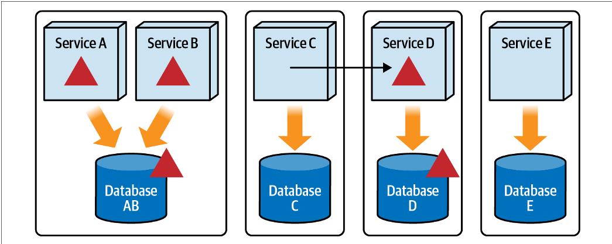

> 图 6-4：数据库变更仅隔离在关联 bounded context 内的那些服务中。

通常，bounded context 是围绕服务及该服务所拥有的数据来形成的。
"拥有"是指写入数据库的服务（与对数据具有只读访问权限相对）。 我们在第 9
章中更详细地讨论分布式数据所有权。

请注意，在图 6-4 中，Service C 需要访问 Database D 中的某些数据， 而这些数据与
Service D 处于同一个 bounded context 中。 由于 Database D 处于不同的 bounded
context 中， Service C 无法直接访问这些数据。 这不仅会违反 bounded context
规则， 还会在变更控制方面造成混乱。 因此，Service C 必须向 Service D 请求数据。
有许多方法可以在维护 bounded context 的同时，
访问一个服务不拥有的数据。这些技术在第 10 章中详细讨论。

bounded context 的一个重要方面， 与 Service C 需要数据而 Service D 在其 bounded
context 内拥有数据这一场景相关， 就是数据库抽象。 请注意，在图 6-5 中，Service D
通过某种契约（如 JSON、XML，甚至可能是对象） 发送 Service C 请求的数据。


> 图 6-5：服务调用的契约使调用者与底层数据库 schema 解耦。

bounded context 的优势在于， 发送给 Service C 的数据可以具有与 Database D 的
schema 不同的契约。 这意味着对 Database D 中某个表的破坏性变更只影响 Service D，
而不一定影响发送给 Service C 的数据契约。 换句话说，Service C 与 Database D
的实际 schema 结构是解耦的。

为了说明这种 bounded context 抽象在分布式架构中的威力， 假设 Database D 有一个
Wishlist 表，结构如下：

```sql
CREATE TABLE Wishlist (
    CUSTOMER_ID VARCHAR(10),
    ITEM_ID VARCHAR(20),
    QUANTITY INT,
    EXPIRATION_DT DATE
);
```

Service D 发送给 Service C 以请求愿望清单项目的相应 JSON 契约如下：

```json
{
    "$schema": "http://json-schema.org/draft-04/schema#",
    "properties": {
        "cust_id": { "type": "string" },
        "item_id": { "type": "string" },
        "qty": { "type": "number" },
        "exp_dt": { "type": "number" }
    },
}
```

请注意，JSON schema 中的过期日期字段（`exp_dt`）
的命名与数据库列名不同，且被指定为 number 类型 （一个 long 值，表示 epoch
时间——自 1970 年 1 月 1 日午夜以来的毫秒数）， 而在数据库中它被表示为 DATE
字段。 由于有了独立的 JSON 契约， 数据库中任何列名变更或列类型变更都不再影响
Service C。

为了说明这一点，假设业务决定不再让愿望清单项目过期。
这将需要更改数据库的表结构：

```sql
ALTER TABLE wishlist
DROP COLUMN EXPIRATION_DT;
```

Service D 必须修改以适应此变更， 因为它与数据库处于同一个 bounded context 中，
但相应的契约不必同时更改。 在契约最终变更之前， Service D
可以指定一个远在未来的日期， 或者将值设为零，表示该项目不会过期。 底线是，由于
bounded context， Service C 对 Database D 的破坏性变更保持了解耦。

### 连接管理

建立数据库连接是一项昂贵的操作。 数据库连接池通常不仅用于提高性能，
还用于限制应用允许使用的并发连接数。
在单体应用中，数据库连接池通常由应用（或应用服务器）拥有。
然而，在分布式架构中，每个服务——更具体地说，每个服务实例——
通常拥有自己的连接池。 如图 6-6 所示，当多个服务共享同一个数据库时，
连接数可能很快饱和， 特别是随着服务或服务实例数量的增加。


> 图 6-6：多个服务实例会迅速使数据库连接饱和。

达到（或超过）最大可用数据库连接数，
是决定是否拆分数据库时需要考虑的另一个驱动因素。
频繁的连接等待（等待连接变为可用的时间）
通常是达到最大数据库连接数的第一个迹象。
由于连接等待也可能表现为请求超时或断路器跳闸，
如果使用共享数据库时这些情况频繁发生， 我们通常建议首先检查连接等待。

为了说明数据库连接与分布式架构相关的问题，考虑以下示例： 一个拥有 200
个数据库连接的单体应用， 被拆分为一个由 50 个服务组成的分布式架构，
每个服务的连接池中有 10 个数据库连接。

| 原始单体应用     | 200 个连接 |
| ---------------- | ---------- |
| 分布式服务数     | 50         |
| 每个服务的连接数 | 10         |
| 最小服务实例数   | 2          |
| 总服务连接数     | 1,000      |

请注意，在同一个应用上下文中，数据库连接数从 200 增长到了 1,000，
而服务甚至还没有开始扩展！ 假设一半的服务扩展到平均每个 5 个实例，
数据库连接数将迅速增长到 1,700。

如果没有某种连接策略或治理计划， 服务将尝试使用尽可能多的连接，
经常使其他服务得不到急需的连接。
因此，在分布式架构中治理数据库连接的使用非常重要。
一种有效的方法是为每个服务分配一个 connection quota，
以治理可用数据库连接在服务之间的分配。
连接配额指定了服务在其连接池中允许使用或提供的最大数据库连接数。

通过指定连接配额，服务不允许创建超过分配给它的数据库连接。
如果服务达到其配额中的最大数据库连接数，
它必须等待其正在使用的某个连接变为可用。 这种方法可以通过两种方式实现：
为每个服务平均分配相同的连接配额， 或根据每个服务的需求分配不同的连接配额。

平均分配方法通常在首次部署服务时使用，
此时还不知道每个服务在正常和高峰操作期间需要多少连接。
虽然简单，但这种方法效率不高， 因为某些服务可能比其他服务需要更多的连接，
而其他服务持有的某些连接可能未被使用。

虽然更复杂，但可变分配方法在管理共享数据库的数据库连接方面效率更高。
使用这种方法，每个服务根据其功能和可扩展性需求被分配不同的连接配额。
这种方法的优点是优化了可用数据库连接在分布式服务之间的使用，
确保那些需要更多数据库连接的服务有连接可用。
然而，缺点是它需要了解每个服务的功能性质和可扩展性需求。

我们通常建议从平均分配方法开始，
并创建适应度函数来衡量每个服务的并发连接使用情况。
我们还建议将连接配额值保存在外部配置服务器（或服务）中，
以便可以通过简单机器学习算法手动或程序化地轻松调整这些值。
这种技术不仅有助于缓解连接饱和风险，
还能在分布式服务之间正确平衡可用的数据库连接， 确保没有空闲连接被浪费。

表 6-1 展示了一个使用平均分配方法开始的示例， 数据库最多支持 100 个并发连接。
请注意，Service A 最多只需要过 5 个连接， Service C 只有 15 个连接，Service E
只有 14 个连接， 而 Service B 和 Service D
已达到其最大连接配额并经历了连接等待。

|   | Service | 配额 | 最大使用 | 等待 |
| - | ------- | ---- | -------- | ---- |
|   | A       | 20   | 5        | 否   |
| → | B       | 20   | 20       | 是   |
|   | C       | 20   | 15       | 否   |
| → | D       | 20   | 20       | 是   |
|   | E       | 20   | 14       | 否   |

> 表 6-1：平均分配的连接配额。

由于 Service A 远低于其连接配额， 这是开始将连接重新分配给其他服务的好地方。 将
5 个数据库连接转移到 Service B， 将 5 个数据库连接转移到 Service D，
得到的结果如表 6-2 所示。

|   | Service | 配额 | 最大使用 | 等待 |
| - | ------- | ---- | -------- | ---- |
|   | A       | 10   | 5        | 否   |
| → | B       | 25   | 25       | 是   |
|   | C       | 20   | 15       | 否   |
|   | D       | 25   | 25       | 否   |
|   | E       | 20   | 14       | 否   |

> 表 6-2：可变分配的连接配额。

这好多了，但 Service B 仍然经历连接等待， 表明它需要的连接数超过了其连接配额。
进一步调整配额，从 Service A 和 Service E 各取 2 个连接， 得到的结果更好，如表
6-3 所示。

| Service | 配额 | 最大使用 | 等待 |
| ------- | ---- | -------- | ---- |
| A       | 8    | 5        | 否   |
| B       | 29   | 27       | 否   |
| C       | 20   | 15       | 否   |
| D       | 25   | 25       | 否   |
| E       | 18   | 14       | 否   |

> 表 6-3：进一步调整连接配额后，不再有连接等待。

这种分析可以从持续运行的适应度函数中得出， 这些函数从每个服务收集流式指标数据，
也可以用于确定最大使用连接数接近最大可用连接数的程度，
以及每个服务在其配额和最大使用连接数方面存在多少缓冲。

### 可扩展性

分布式架构的众多优势之一是可扩展性——
服务能够处理请求量的增加，同时保持一致的响应时间。
大多数基于云的和本地基础设施相关产品， 在确保服务、容器、HTTP
服务器和虚拟机扩展以满足需求增长方面做得很好。 但数据库呢？

如图 6-7 所示，服务可扩展性可能给数据库带来巨大压力，
不仅在数据库连接方面（如前一节所述）， 而且在吞吐量和数据库容量方面也是如此。
为了使分布式系统能够扩展，系统的*所有*部分都需要扩展——包括数据库。


> 图 6-7：当服务扩展时，数据库也必须扩展。

可扩展性是另一个在考虑拆分数据库时需要关注的数据分解驱动因素。
数据库连接、容量、吞吐量和性能都是决定共享数据库，
能否满足分布式架构中多个服务需求的因素。

考虑前一节中表 6-3 的优化可变数据库连接配额。
当服务通过添加多个实例来扩展时，情况会发生巨大变化， 如表 6-4
所示，其中数据库连接总数为 100。

| Service | 配额 | 最大使用 | 实例数 | 总使用 |
| ------- | ---- | -------- | ------ | ------ |
| A       | 8    | 5        | 2      | 10     |
| B       | 29   | 27       | 3      | 81     |
| C       | 20   | 15       | 3      | 45     |
| D       | 25   | 25       | 2      | 50     |
| E       | 18   | 14       | 4      | 56     |
| 总计    | 100  | 86       | 14     | 242    |

> 表 6-4：当服务扩展时，使用的连接数超过了可用的连接数。

请注意，即使连接配额被分配为匹配 100 个可用数据库连接，
一旦服务开始扩展，配额就不再有效， 因为使用的总连接数增加到 242，
比数据库中的可用连接数多出 142 个。 这很可能导致连接等待，
进而导致整体性能下降和请求超时。

将数据拆分为独立的 data domain， 甚至每个服务一个数据库， 如图 6-8
所示，每个数据库需要的连接数更少，
因此在服务扩展时提供更好的数据库可扩展性和性能。

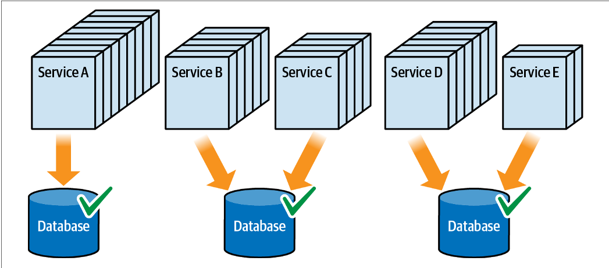

> 图 6-8：拆分数据库提供更好的数据库可扩展性。

除了数据库连接之外， 在可扩展性方面需要考虑的另一个因素是数据库上的负载。
通过拆分数据库，每个数据库上的负载更小， 从而提高整体性能和可扩展性。

### 容错

当多个服务共享同一个数据库时， 整个系统的容错能力降低， 因为数据库成为 single
point of failure（SPOF）。 在这里，我们将容错定义为，
当某个服务或数据库发生故障时， 系统的某些部分能够继续不间断运行的能力。
请注意，在图 6-9 中，当共享单个数据库时， 整体容错能力很低，
因为如果数据库宕机，所有服务都变得不可用。


> 图 6-9：如果数据库宕机，所有服务都变得不可用。

容错是考虑拆分数据的另一个驱动因素。 如果系统的某些部分需要容错，
拆分数据可以消除系统中的单点故障，如图 6-10 所示。
这确保了在数据库崩溃的情况下，系统的某些部分仍然可以运行。


> 图 6-10：拆分数据库实现更好的容错。

请注意，由于数据现在被拆分， 如果 Database B 宕机，只有 Service B 和 Service C
受到影响并变得不可用， 而其他服务继续不间断运行。

<a id="ch6-architecture-quantum"></a>

### architecture quantum

回顾第 2 章，architecture quantum 被定义为具有高功能内聚、
高静态耦合和同步动态耦合的独立可部署构件。 architecture quantum
有助于在何时拆分数据库方面提供指导， 使其成为另一个数据分解驱动因素。

考虑图 6-11 中的服务， 其中 Service A 和 Service B
需要与其他服务不同的架构特性。 请注意，图中虽然 Service A 和 Service B
被分组在一起， 但由于共享单个数据库， 它们并没有与其他服务形成独立的 quantum。
因此，所有五个服务与数据库一起形成一个单一的 architecture quantum。

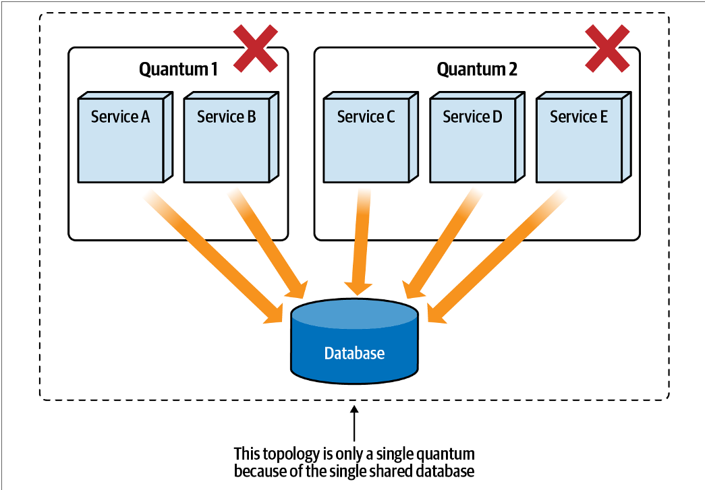

> 图 6-11：数据库是 architecture quantum 的一部分。

由于数据库包含在 architecture quantum 定义的功能内聚部分中，
因此有必要拆分数据， 以使每个结果部分都能处于自己的 quantum 中。 请注意，在图
6-12 中，由于数据库被拆分， Service A 和 Service B 以及相应的数据， 现在与
Service C、D 和 E 形成的 quantum 是独立的 quantum。


> 图 6-12：拆分数据库形成两个 architecture quanta。

### 数据库类型优化

通常情况下，并非所有数据都受到同等对待。
当使用单体数据库时，*所有*数据都必须遵循该数据库类型，
因此可能对某些类型的数据产生次优解决方案。

拆分单体数据允许架构师将某些数据迁移到更优化的数据库类型。
例如，假设一个单体关系数据库存储了应用相关的事务数据， 包括以 key-value
对形式存在的参考数据 （如国家代码、产品代码、仓库代码等）。
这类数据在关系数据库中难以管理， 因为数据本质上不是关系型的，而是 key-value
型的。 因此，*key-value* 数据库（参见[Key-Value 数据库](#key-value-数据库)）
会产生比关系数据库更优化的解决方案。

### 数据集成器

数据集成器与前一节讨论的数据分解器的作用正好相反。
这些驱动因素为"我应该在什么时候考虑将数据重新组合在一起？"
这个问题提供了答案和理由。 与数据分解器一起，
数据集成器为分析何时拆分数据、何时不拆分数据提供了平衡和 trade-off。

将数据重新组合的两个主要集成驱动因素是：

数据关系

表之间是否存在 foreign key、触发器或视图，形成紧密的关系？

数据库事务

是否需要单个事务工作单元来确保数据完整性和一致性？

每个集成驱动因素将在以下各节中详细讨论。

### 数据关系

就像架构中的组件一样，数据库表也可以耦合， 尤其是在关系数据库中。 foreign
key、触发器、视图和存储过程等构件将表绑定在一起， 使得拆分数据变得困难；参见图
6-13。


> 图 6-13：foreign key（FK）、触发器和视图在数据之间创建紧密耦合的关系。

想象一下，走到你的 DBA 或数据架构师面前， 告诉他们由于必须拆分数据库以支持
microservices 生态系统中紧密形成的 bounded context， 数据库中的每个 foreign key
和视图都需要被移除！ 这不是一个可能（甚至可行）的场景， 然而这正是支持
microservices 中 database-per-service 模式所需要做的事情。

这些构件在大多数关系数据库中对于支持数据一致性和数据完整性是必要的。
除了这些物理构件外，数据在逻辑上也可能相关，
例如问题工单表及其对应的问题工单状态表。 然而，如图 6-14
所示，当将数据移动到另一个 schema 或数据库以形成 bounded context 时，
这些构件必须被移除。


> 图 6-14：拆分数据时必须移除数据构件。

请注意，Service A 中表之间的 foreign key（FK）关系可以保留， 因为数据处于同一个
bounded context、schema 或数据库中。 然而，Service B 和 Service C 中表之间的
foreign key（FK）必须被移除 （以及 Service C 中使用的视图），
因为这些表与不同的数据库或 schema 相关联。

数据之间的关系，无论是逻辑的还是物理的， 都是一个数据集成驱动因素，
因此在数据分解器和数据集成器之间产生了 trade-off。
例如，变更控制（数据分解器）是否比保留表之间的 foreign key
关系（数据集成器）更重要？
容错（数据分解器）是否比保留表之间的物化视图（数据集成器）更重要？
识别什么更重要有助于做出关于数据是否应该被拆分， 以及由此产生的 schema
粒度应该是什么的决定。

### 数据库事务

另一个数据集成器是数据库事务， 我们在[分布式事务](#分布式事务)中详细讨论。 如图
6-15 所示，当单个服务对同一数据库或 schema 中的不同表执行多个数据库写操作时，
这些更新可以在原子性、一致性、隔离性、持久性（ACID）事务中完成，
并作为单个工作单元提交或回滚。

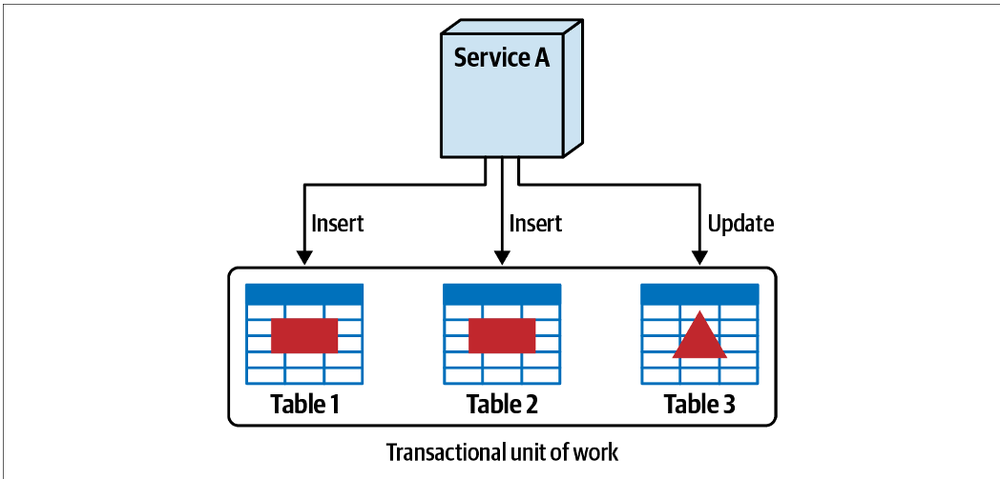

> 图 6-15：当数据在一起时，存在单个事务工作单元。

然而，当数据被拆分为独立的 schema 或数据库时， 如图 6-16
所示，由于服务之间的远程调用， 单个事务工作单元不再存在。
这意味着一个插入或更新可以在一个表中提交， 但由于错误条件，在其他表中不能提交，
从而导致数据一致性和完整性问题。

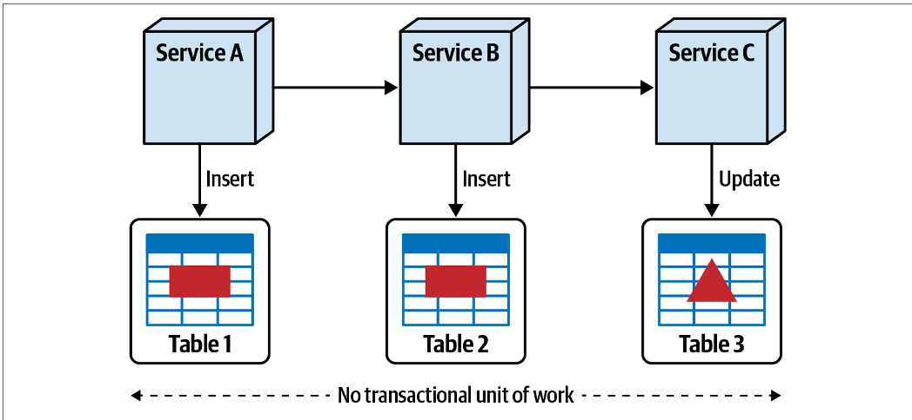

> 图 6-16：当数据被拆分时，不存在单个工作单元事务。

虽然我们在第 12 章中深入探讨分布式事务管理和事务性 saga 的细节，
但这里的重点是强调数据库事务是另一个数据集成驱动因素，
在考虑拆分数据库时应该被纳入考量。

## Sysops Squad Saga：证明数据库分解的合理性

### 11 月 15 日，星期一，15:55


> 插图 6-2：Addison 和 Devon 向 Dana 展示证据。

带着他们的理由，Addison 和 Devon 见面说服 Dana， 拆分单体 Sysops Squad
数据库是必要的。

"嗨，Dana，"Addison 说。"我们认为我们有足够的证据说服你， 拆分 Sysops Squad
数据库是必要的。"

"我洗耳恭听，"Dana 说，双臂交叉，准备争辩数据库应该保持原样。

"我先说，"Addison 说。 "注意这些日志持续显示，每当运营报表运行时，
应用中的工单功能就会冻结？"

"是的，"Dana 说，"我承认连我也怀疑过这一点。
这显然是工单功能访问数据库的方式有问题，而不是报表。"

"实际上，"Addison 说，"这是工单和报表两者的结合。看这里。"

Addison 向 Dana 展示了指标和日志， 证明某些查询必须被包装在线程中，
而且工单功能的查询因为报表查询运行时出现的等待状态而超时。 Addison
还展示了系统的报表部分如何使用并行线程， 并发地查询较复杂报表的各个部分，
基本上占用了所有数据库连接。

"好吧，我可以看出从数据库连接的角度来看，
拥有一个独立的报表数据库会如何改善这种情况。
但这仍然不能说服我，非报表数据也应该被拆分，"Dana 说。

"说到数据库连接，"Devon 说， "看看当我们开始拆分领域服务时，这个连接池的估算。"

Devon 向 Dana 展示了最终规划的 Sysops Squad 分布式应用中预计的服务数量，
包括随着应用扩展每个服务的预计实例数。 Dana 向 Devon
解释说，连接池是包含在每个独立服务实例中的，
不像当前迁移阶段那样由应用服务器拥有连接池。

"所以你看，Dana，"Devon 说，"根据这些预计估算， 我们将需要额外的 2,000
个数据库连接来提供我们处理工单负载所需的可扩展性，
而单个数据库根本无法提供这些连接。"

Dana 花了一些时间查看这些数字。"你同意这些数字吗，Addison？"

"我同意，"Addison 说。"Devon 和我经过大量分析， 基于 HTTP 流量以及 Parker
提供的预计增长率， 一起得出了这些数字。"

"我必须承认，"Dana 说，"你们俩准备的东西很好。
我特别喜欢你们已经考虑不让服务连接到多个数据库或 schema。
如你所知，在我看来那是不可接受的。"

"我们也是。不过，我们还有一个理由要和你讨论，"Addison 说。
"你可能知道，也可能不知道，我们一直遇到很多关于系统对客户不可用的问题。
虽然拆分服务为我们提供了某种程度的容错能力，
但如果单体数据库因维护或服务器崩溃而宕机， 所有服务都将无法运行。"

"Addison 的意思是，"Devon 补充道，
"通过拆分数据库，我们可以通过创建数据的领域隔离来提供更好的容错能力。
换句话说，如果 survey 数据库宕机，工单功能仍然可用。"

"我们称之为 architecture quantum，"Addison 说。
"换句话说，由于数据库是系统静态耦合的一部分，
拆分数据库将使核心工单功能成为独立的， 不再同步依赖于系统的其他部分。"

"听着，"Dana 说，"你已说服我，拆分 Sysops Squad 数据库有充分的理由，
但请向我解释，你们怎么能想到做这件事。 你知道那个数据库里有多少 foreign key
和视图吗？ 你们不可能移除所有这些构件。"

"我们不一定需要移除所有这些构件。 这就是 data domain
和五步流程发挥作用的地方，"Devon 说。 "来，让我解释……"

## 分解单体数据

分解单体数据库是困难的， 需要架构师与数据库团队紧密合作， 以安全有效地拆分数据。
一种特别有效的拆分数据技术是使用所谓的*五步流程*。 如图 6-17 所示，
这个演进式和迭代式的流程利用 data domain 的概念， 作为将数据有条不紊地迁移到独立
schema， 并最终迁移到不同物理数据库的载体。


> 图 6-17：分解单体数据库的五步流程。

一个 data domain 是一组耦合的数据库构件——表、视图、foreign key 和触发器——
它们都与特定领域相关， 并在有限的功能范围内经常一起使用。 为了说明 data domain
的概念， 考虑表 1-2 中引入的 Sysops Squad 表， 以及表 6-5 中显示的相应提议的
data domain 分配。

| 表                    | 提议的 data domain |
| --------------------- | ------------------ |
| customer              | Customer           |
| customer_notification | Customer           |
| survey                | Survey             |
| question              | Survey             |
| survey_administered   | Survey             |
| survey_question       | Survey             |
| survey_response       | Survey             |
| billing               | Payment            |
| contract              | Payment            |
| payment_method        | Payment            |
| payment               | Payment            |
| sysops_user           | Profile            |
| profile               | Profile            |
| expert_profile        | Profile            |
| expertise             | Profile            |
| location              | Profile            |
| article               | Knowledge Base     |
| tag                   | Knowledge Base     |
| keyword               | Knowledge Base     |
| article_tag           | Knowledge Base     |
| article_keyword       | Knowledge Base     |
| ticket                | Ticketing          |
| ticket_type           | Ticketing          |
| ticket_history        | Ticketing          |

> 表 6-5：现有 Sysops Squad 数据库表分配到 data domain。

表 6-5 列出了 Sysops Squad 应用中的六个 data domain：
Customer、Survey、Payment、Profile、Knowledge Base 和 Ticketing。 billing 表属于
Payment data domain， ticket 和 ticket_type 表属于 Ticketing data domain，等等。

从概念上理解 data domain 的一种方式是将数据库想象成一个足球，
每个白色六边形代表一个独立的 data domain。 如图 6-18 所示，
足球的每个白色六边形包含一组领域相关的表， 以及所有耦合构件（如 foreign
key、视图、存储过程等）。


> 图 6-18：六边形中的数据库对象属于一个 data domain。

以这种方式可视化数据库， 使架构师和数据库团队能够清楚地看到 data domain 的边界，
以及需要被打破的跨域依赖（如 foreign key、视图、存储过程等）。 注意在图 6-18
中，*在*每个白色六边形内部， 所有数据表的依赖关系和关联可以被保留，
但*在*每个白色六边形*之间*则不能。 例如，在图中注意实线表示自包含在 data domain
内的依赖关系， 而虚线跨越 data domain， 在 data domain 被提取到独立 schema
时必须被移除。

当提取 data domain 时，这些跨域依赖必须被移除。 这意味着移除 data domain 之间的
foreign key 约束、视图、触发器、函数和存储过程。 数据库团队可以利用 Scott Ambler
和 Pramod Sadalage 的著作 *Refactoring Databases: Evolutionary Database
Design*（Addison-Wesley） 中的重构模式，安全且迭代地移除这些数据依赖。


> 图 6-19：属于各 data domain 的表被提取出来，以及需要被打破的连接。

为了说明定义 data domain 和移除跨域引用的过程， 考虑图 6-19 中的图表，
其中创建了一个代表 Payment 的 data domain。 由于 customer 表与
v_customer_contract 属于不同的 data domain， customer 表必须从 Payment
域中的视图中移除。 在定义 data domain 之前，原始视图 v_customer_contract 如示例
6-1 所示。

#### 示例 6-1。通过跨域 join 获取客户未结工单的数据库视图

```sql
CREATE VIEW [payment].[v_customer_contract]
AS
SELECT
    customer.customer_id, customer.customer_name,
    contract.contract_start_date, contract.contract_duration,
    billing.billing_date, billing.billing_amount
FROM payment.contract AS contract
INNER JOIN customer.customer AS customer
ON ( contract.customer_id = customer.customer_id )
INNER JOIN payment.billing AS billing
ON ( contract.contract_id = billing.contract_id )
WHERE contract.auto_renewal = 0
```

注意在示例 6-2 所示的更新后的视图中， customer 和 payment 表之间的 join
被移除了， 客户名称列（customer.customer_name）也被移除了。

#### 示例 6-2。在工单域中获取指定客户未结工单的数据库视图

```sql
CREATE VIEW [payment].[v_customer_contract]
AS
SELECT
    billing.customer_id, contract.contract_start_date,
    contract.contract_duration, billing.billing_date,
    billing.billing_amount
FROM payment.contract AS contract
INNER JOIN payment.billing AS billing
ON ( contract.contract_id = billing.contract_id )
WHERE contract.auto_renewal = 0
```

data domain 的 bounded context 规则与单个表一样适用—— 一个服务不能与多个 data
domain 通信。 因此，通过从视图中移除此表， Payment 服务现在必须调用 Customer
服务来获取它原本从视图中获取的客户名称。

一旦架构师和数据库团队理解了 data domain 的概念，
他们就可以应用分解单体数据库的五步流程。 这五个步骤在以下各节中概述。

## 步骤 1：分析数据库并创建 data domain

如图 6-20 所示，所有服务都可以访问数据库中的所有数据。 这种做法， 被称为 Gregor
Hohpe 和 Bobby Woolf 在其著作 *Enterprise Integration Patterns: Designing,
Building, and Deploying Messaging Solutions*
（Addison-Wesley）中描述的共享数据库集成风格，
在数据和访问该数据的服务之间创建了紧密耦合。
如[数据分解驱动因素](#数据分解的驱动因素)中所讨论的，
数据库中的这种紧密耦合使变更管理变得非常困难。


> 图 6-20：多个服务使用同一个数据库，访问读或写所需的所有表。

拆分数据库的第一步是识别数据库中的特定领域分组。 例如，如表 6-5 所示，
相关表被分组在一起以帮助识别可能的 data domain。

### 步骤 2：将表分配到 data domain

下一步是按照特定的 bounded context 对表进行分组， 将属于特定 data domain
的表分配到它们自己的 schema 中。 *Schema* 是数据库服务器中的逻辑构造。 Schema
包含诸如表、视图、函数等对象。 在某些数据库服务器中，如 Oracle，schema
与用户相同， 而在其他数据库中，如 SQL Server， schema 是数据库对象的逻辑空间，
用户对这些 schema 具有访问权限。

如图 6-21 所示，我们为每个 data domain 创建了 schema， 并将表移动到它们所属的
schema 中。

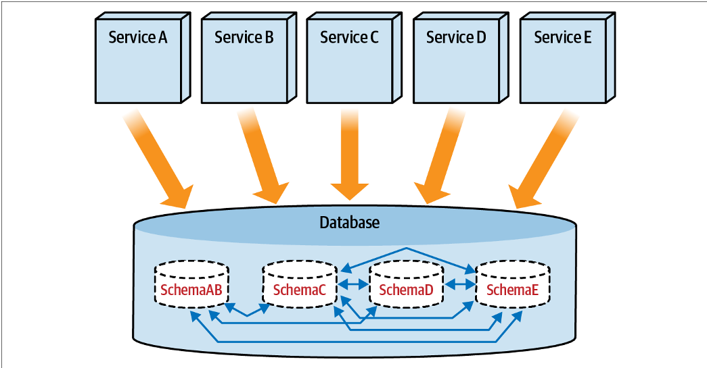

> 图 6-21：服务根据其 data domain 需求使用主 schema。

当属于不同 data domain 的表紧密耦合且相互关联时， data domain 必须被合并，
创建一个更广泛的 bounded context， 其中多个服务拥有一个特定的 data domain。 合并
data domain 在第 9 章中有更详细的讨论。

## Data Domain 与数据库 Schema

Data domain 是一个架构概念， 而 schema 是一个数据库构造， 用于容纳属于特定 data
domain 的数据库对象。 虽然 data domain 和 schema 之间的关系通常是一对一的， 但
data domain 可以映射到一个或多个 schema， 尤其是在因紧密耦合的数据关系而合并
data domain 时。 我们将把 data domain 和 schema 视为同一事物，
并交替使用这两个术语。

为了说明将表分配到 schema， 考虑 Sysops Squad 示例中， billing 表必须从其原始
schema 移动到另一个名为 payment 的 data domain schema：

```sql
ALTER SCHEMA payment TRANSFER sysops.billing;
```

或者，数据库团队可以为不属于其 schema 的表创建 synonym。 Synonym
是数据库构造，类似于符号链接， 为存在于相同或不同 schema
或服务器中的另一个数据库对象提供替代名称。 虽然 synonym 的思想是消除跨 schema
查询， 但访问它们需要读或写权限。

为了说明这种做法，考虑以下跨域查询：

```sql
SELECT
    history.ticket_id, history.notes, agent.name
FROM ticket.ticket_history AS history
INNER JOIN profile.sysops_user AS agent
ON ( history.assigned_to_sysops_user_id = agent.sysops_user_id )
```

接下来，在 ticketing schema 中为 profile.sysops_user 表创建一个 synonym：

```sql
CREATE SYNONYM ticketing.sysops_user
FOR profile.sysops_user;
GO
```

结果是，查询可以利用 synonym sysops_user 而不是跨域表：

```sql
SELECT
    history.ticket_id, history.notes, agent.name
FROM ticket.ticket_history AS history
INNER JOIN ticket.sysops_user AS agent
ON ( history.assigned_to_sysops_user_id = agent.sysops_user_id )
```

不幸的是，以这种方式为跨 schema 访问的表创建 synonym，
为应用开发人员提供了耦合点。 为了形成适当的 data domain，
这些耦合点需要在以后某个时间被打破， 从而将集成点从数据库层移动到应用层。

虽然 synonym 并没有真正消除跨 schema 查询，
但它们确实允许更容易的依赖检查和代码分析， 使以后拆分这些变得更容易。

### 步骤 3：将数据库连接分离到 data domain

在此步骤中，每个服务中的数据库连接逻辑被重构， 以确保服务连接到特定的 schema，
并且只对其 data domain 所属的表具有读写访问权限。 这种转变，如图 6-22
所示，是最困难的， 因为所有跨 schema 的访问必须在服务层面解决。

注意数据库配置已更改， 因此所有数据访问严格通过服务及其连接的 schema 进行。
在此示例中，Service C 与 Service D 通信，而不是与 SchemaD 通信。 没有跨 schema
访问； 在[步骤 2：将表分配到 data domain](#步骤-2将表分配到-data-domain)
中创建的所有 synonym 都被移除。


> 图 6-22：将跨 schema 对象访问移至服务，远离直接的跨 schema 访问。

> [!TIP]
> 当需要其他域的数据时， 不要直接访问它们的数据库。 而是通过拥有该 data domain
> 的服务来访问。

完成此步骤后，数据库处于*每个服务的数据主权*状态， 即每个服务拥有自己的数据。
每个服务的数据主权是分布式架构的理想状态。
与架构中的所有实践一样，它包含优点和缺点：

## 优点

- 团队可以更改数据库 schema，而不必担心影响其他域中的变更。

- 每个服务可以使用最适合其用例的数据库技术和数据库类型。

## 缺点

- 当服务需要访问大量数据时，会出现性能问题。

- 引用完整性无法在数据库中维护，可能导致数据质量差。

- 所有访问属于其他域的表的数据库代码（存储过程、函数）必须移至服务层。

## 步骤 4：将 schema 移动到独立的数据库服务器

一旦数据库团队创建并分离了 data domain， 并隔离了服务以使它们访问自己的数据，
他们现在可以将 data domain 移动到独立的物理数据库。 这通常是必要的步骤，
因为即使服务访问自己的 schema， 访问单个数据库会创建一个单一的 architecture
quantum， 如第 2 章中所讨论的，
这可能对可扩展性、容错和性能等运维特性产生不利影响。

当将 schema 移动到独立的物理数据库时，
数据库团队有两个选项：备份和恢复，或复制。 这些选项概述如下：

### 备份和恢复

使用此选项，团队首先备份每个带有 data domain 的 schema， 然后为每个 data domain
设置数据库服务器。 然后他们恢复 schema， 将服务连接到新数据库服务器中的 schema，
最后从原始数据库服务器中移除 schema。 这种方法通常需要迁移期间的停机时间。

### 复制

使用复制选项，团队首先为每个 data domain 设置数据库服务器。 接下来他们复制
schema， 将连接切换到新的数据库服务器， 然后从原始数据库服务器中移除 schema。
虽然这种方法避免了停机时间， 但确实需要更多的工作来设置复制和管理增加的协调。

图 6-23 显示了复制选项的示例， 其中数据库团队设置多个数据库服务器， 以便每个
data domain 有一个数据库服务器。

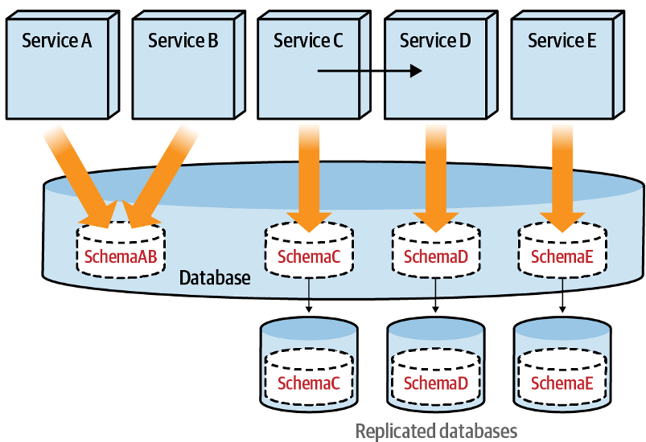

> 图 6-23：将 schema（data domain）复制到各自的数据库服务器。

## 步骤 5：切换到独立的数据库服务器

一旦 schema 被完全复制，服务连接就可以切换了。 使 data domain
和服务作为它们自己的独立可部署单元运行的最后一步，
是移除与旧数据库服务器的连接， 并从旧数据库服务器中移除 schema。 最终状态如图
6-24 所示。

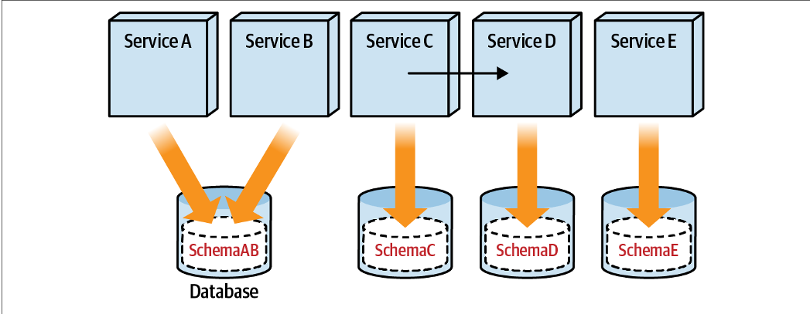

> 图 6-24：每个 data domain 拥有独立的数据库服务器。

一旦数据库团队分离了 data domain， 隔离了数据库连接， 并最终将 data domain
移动到它们自己的数据库服务器，
他们就可以优化各个数据库服务器的可用性和可扩展性。
团队还可以分析数据以确定最合适的数据库类型， 在生态系统中引入 polyglot
数据库使用。

### 选择数据库类型

大约从 2005 年开始，数据库技术发生了一场革命。
不幸的是，在此期间涌现的产品数量， 造成了被称为"选择悖论"的问题。
拥有如此大量的产品和选择， 意味着需要做出更多的 trade-off 决策。
鉴于每个产品都针对特定的 trade-off 进行了优化，
软件和数据架构师都需要根据与其问题空间相关的 trade-off， 选择合适的产品。

在本节中，我们为各种数据库类型引入星级评分， 在分析中使用以下特征：

#### 学习曲线

此特征指新开发人员、数据架构师、数据建模师、运维 DBA，
和其他数据库用户学习和采用的容易程度。 例如，假定大多数软件开发人员理解 SQL，
而像 Gremlin（一种图查询语言）这样的东西可能是一种小众技能。
星级评分越高，学习曲线越容易。 星级评分越低，学习曲线越困难。

#### 数据建模的容易程度

此特征指数据建模师以数据模型表示领域的容易程度。
较高的星级评分意味着数据建模与许多用例匹配， 并且一旦建模，易于更改和采用。

### 可扩展性/吞吐量

此特征指数据库扩展以处理增加的吞吐量的程度和容易程度。 数据库是否易于扩展？
数据库能否水平扩展、垂直扩展，或两者皆可？
较高的星级评分意味着更容易扩展并获得更高的吞吐量。

#### 可用性/分区容忍性

此特征指数据库是否支持高可用性配置 （如 MongoDB 中的 *replica-set* 或 **Apache
Cassandra** 中的*可调一致性*）。 它是否提供处理网络分区的功能？
星级评分越高，数据库对高可用性和/或更好的分区容忍性的支持越好。

### 一致性

此特征指数据库是否支持"始终一致"的范式。 数据库是否支持 ACID 事务，
还是倾向于具有最终一致性模型的 BASE 事务？
它是否提供为不同类型的写入提供可调一致性模型的功能？
星级评分越高，数据库支持的一致性越强。

### 编程语言支持、产品成熟度、SQL 支持和社区

此特征指数据库支持哪些（以及多少）编程语言，
数据库的成熟度，以及数据库社区的规模。
组织能否轻松招聘到知道如何使用该数据库的人？
较高的星级评分意味着有更好的支持，产品成熟，并且容易招聘人才。

### 读/写优先级

此特征指数据库是优先读取而不是写入，还是优先写入而不是读取，
还是在其方法上是平衡的。 这不是一个二元选择——
而是数据库优化方向的更偏向于量表的哪一端。

## 关系型数据库

关系型数据库（也称为 RDBMS）是三十多年来首选的数据库。
它们的使用和提供的稳定性具有重大价值， 特别是在大多数业务相关应用中。
这些数据库以无处不在的 Structured Query Language（SQL） 和它们提供的 ACID
属性而闻名。 它们提供的 SQL 接口，
使其成为在同一写入模型之上实现不同读取模型的首选。 关系型数据库的星级评分如表
6-25 所示。

| 评分主题                                 | RDBMS 数据库（Oracle, SQL Server, Postgres 等） |
| ---------------------------------------- | ----------------------------------------------- |
| 易学                                     |                                                 |
| 数据建模的容易程度                       |                                                 |
| 可扩展性/吞吐量                          |                                                 |
| 可用性/分区容忍性                        |                                                 |
| 一致性                                   |                                                 |
| 编程语言支持、产品成熟度、SQL 支持、社区 |                                                 |
| 读/写优先级                              |                                                 |

> 表 6-25：关系型数据库在各种采用特征上的评分。

### 学习曲线

关系型数据库已经存在多年。 它们在学校中普遍教授， 并且存在成熟的文档和教程。
因此，它们比其他数据库类型更容易学习。

### 数据建模的容易程度

关系型数据库允许灵活的数据建模。 它们允许建模 key-value、文档、图状结构，
并且允许通过添加新索引来改变读取模式。 有些模型确实很难实现，
如具有任意深度的图结构。 关系型数据库将数据组织成表和行（类似于电子表格），
这对于大多数数据库建模师来说是很自然的。

### 可扩展性/吞吐量

关系型数据库通常使用大型机器进行垂直扩展。 然而，设置复制和自动切换是复杂的，
需要更高的协调和设置。

### 可用性/分区容忍性

关系型数据库优先考虑一致性而不是可用性和分区容忍性，
详见[表拆分技术](#表拆分技术)。

### 一致性

关系型数据库多年来一直占据主导地位， 因为它们支持 ACID 属性。 ACID
特性处理并发系统中的许多关注点， 并允许开发应用而不必担心并发的更底层细节，
以及数据库如何处理它们。

### 编程语言支持、产品成熟度、SQL 支持和社区

由于关系型数据库已经存在多年， 众所周知的设计、实现和运维模式可以应用于它们，
从而使它们易于在架构中采用、开发和集成。 许多关系型数据库缺乏对响应式流 API
和类似新概念的支持； 较新的架构概念在成熟的关系型数据库中需要更长的时间来实现。
许多编程语言接口与关系型数据库配合使用，
用户社区很大（尽管分散在各个供应商之间）。

### 读/写优先级

在关系型数据库中，数据模型可以设计成使读取更高效或写入更高效。
同一个数据库可以处理不同类型的工作负载， 允许平衡的读写优先级。
例如，并非所有用例都需要 ACID 属性， 特别是在大数据和大流量场景中，
或者当需要真正灵活的 schema 时，如在 survey 管理中。
在这些情况下，其他数据库类型可能是更好的选择。

MySQL、Oracle、Microsoft SQL Server 和 PostgreSQL 是最流行的关系型数据库，
可以作为独立安装运行， 也可以作为主要云提供商平台上的 *Database as a Service*
使用。

## 聚合导向

聚合导向是倾向于操作相关且具有复杂数据结构的数据。 聚合是一个源自 Eric Evans 的
*Domain-Driven Design: Tackling Complexity in the Heart of Software* 的术语。
想想 Sysops Squad 中的 ticket 或 customer 及其所有依赖表——它们就是聚合。
与架构中的所有实践一样，聚合导向包含优点和缺点：

### 优点

- 能够在服务器集群中轻松分发数据，因为整个聚合可以被复制到不同的服务器上。

- 提高读写性能，因为它减少了数据库中的 join。

- 减少应用模型和存储模型之间的阻抗不匹配。

### 缺点

- 难以得出适当的聚合，更改聚合边界也很困难。

- 跨聚合分析数据是困难的。

### Key-Value 数据库

Key-value 数据库类似于哈希表数据结构， 就像 RDBMS 中的表， 以 ID 列作为
key，并且以 blob 列作为 value， 因此可以存储任何类型的数据。 Key-value
数据库是属于 NoSQL 数据库家族的一部分。 在 *NoSQL Distilled: A Brief Guide to
the Emerging World of Polyglot Persistence* （Addison-Wesley）一书中， Pramod
Sadalage（本书作者之一）和 Martin Fowler 描述了 NoSQL 数据库的兴起，
以及使用这些类型数据库的动机、用法和 trade-off，
是了解此数据库类型更多信息的良好参考。

Key-value 数据库是 NoSQL 数据库中最容易理解的。 应用客户端可以插入一个 key
和一个 value， 获取已知 key 的 value， 或删除已知 key 及其 value。 Key-value
数据库不知道 value 部分内部是什么， 也不关心里面是什么， 这意味着数据库只能使用
key 进行查询，不能使用其他任何东西。

与关系型数据库不同， key-value 数据库应根据需求选择。 有持久化的 key-value
数据库如 Amazon DynamoDB 或 Riak KV， 非持久化数据库如 MemcacheDB，
以及其他数据库如 Redis，可以配置为持久化或不持久化。
不支持其他关系型数据库构造如 join、where 和 order by， 而是支持 get、put 和
delete 操作。 Key-value 数据库的评分如表 6-26 所示。

| 评分主题                                 | Key-value 数据库（Redis, DynamoDB, Riak 等） |
| ---------------------------------------- | -------------------------------------------- |
| 易学                                     |                                              |
| 数据建模的容易程度                       |                                              |
| 可扩展性/吞吐量                          |                                              |
| 可用性/分区容忍性                        |                                              |
| 一致性                                   |                                              |
| 编程语言支持、产品成熟度、SQL 支持、社区 |                                              |
| 读/写优先级                              |                                              |

> 表 6-26：Key-value 数据库在各种采用特征上的评分。

### 学习曲线

Key-value 数据库易于理解。 由于它们使用[聚合导向](#聚合导向)，
正确设计聚合很重要， 因为聚合的任何更改都意味着重写所有数据。
从关系型数据库迁移到任何 NoSQL 数据库需要练习， 并放下熟悉的实践。
例如，开发人员不能简单地查询"给我所有的 key"。

### 数据建模的容易程度

由于 key-value 数据库是聚合导向的， 它们可以使用内存结构如数组、映射，
或任何其他类型的数据，包括大 blob。 数据只能通过 key 或 ID 查询，
这意味着客户端应该能够在数据库外部访问 key。 key 的好例子包括
session_id、user_id 和 order_id。

### 可扩展性/吞吐量

由于 key-value 数据库通过 key 或 ID 索引， key 查找非常快，因为没有 join 或
order by 操作。 Value 被获取并返回给客户端，
这使得更容易扩展并获得更高的吞吐量。

### 可用性/分区容忍性

由于有许多类型的 key-value 数据库， 每种都有不同的属性，
甚至同一个数据库也可以配置为以不同的方式运行， 无论是针对安装还是每次读取。
例如，在 Riak 中，用户可以使用 quorum 属性， 如 all、one、quorum 和 default。
当我们使用 one quorum 时， 查询可以在任何一个节点响应时返回成功。 当使用 all
quorum 时， 所有节点都必须响应才能使查询返回成功。
每次查询都可以调整分区容忍性和可用性。 因此，假设所有 key-value
存储都是相同的，是错误的。

### 一致性

在每次写入操作期间， 我们可以应用与在读取操作期间应用 quorum 类似的配置；
这些配置提供了所谓的可调一致性。 可以通过牺牲延迟来实现更高的一致性。
对于写入要高度一致，所有节点都必须响应， 这降低了分区容忍性。 使用多数 quorum
被认为是一个好的 trade-off。

### 编程语言支持、产品成熟度、SQL 支持和社区

Key-value 数据库具有良好的编程语言支持， 许多开源数据库拥有活跃的社区，
帮助学习和理解它们。 由于大多数数据库具有 HTTP REST API， 它们更容易与之交互。

### 读/写优先级

由于 key-value 数据库是聚合导向的， 通过 key 或 ID 访问数据倾向于*读取*优先。
Key-value 数据库可用于会话存储， 也可用于缓存用户属性和偏好。

### 数据库中的 Sharding

分区的概念在关系型数据库中众所周知： 表数据基于同一数据库服务器上的 *schema*
被分区为集合。 *Sharding* 类似于分区， 但数据驻留在不同的服务器或节点上。
节点协作以根据 sharding key 找出数据存在的位置， 或数据应该存储的位置。 *Shard*
一词意味着数据库中数据的*水平分区*。

### 文档数据库

诸如 JSON 或 XML 之类的文档是文档数据库的基础。
文档是人类可读的、自描述的、层次化的树形结构。 文档数据库是另一种类型的 NoSQL
数据库， 其评分如表 6-27 所示。 这些数据库理解数据的结构，
并且可以索引文档的多个属性， 从而允许更好的查询灵活性。

| 评分主题                                 | 文档数据库（MongoDB, CouchDB, Marklogic 等） |
| ---------------------------------------- | -------------------------------------------- |
| 易学                                     |                                              |
| 数据建模的容易程度                       |                                              |
| 可扩展性/吞吐量                          |                                              |
| 可用性/分区容忍性                        |                                              |
| 一致性                                   |                                              |
| 编程语言支持、产品成熟度、SQL 支持、社区 |                                              |
| 读/写优先级                              |                                              |

> 表 6-27：文档数据库在各种采用特征上的评分。

### 学习曲线

文档数据库类似于 key-value 数据库， 其中 value 是人类可读的。
这使得学习数据库更加容易。 企业习惯于处理文档， 如在不同上下文中的 XML 和 JSON，
例如 API 负载和 JavaScript 前端。

### 数据建模的容易程度

就像 key-value 数据库一样， 数据建模涉及建模聚合，如订单、工单和其他领域对象。
文档数据库在聚合设计方面是宽容的， 因为聚合的各个部分是可查询的并且可以被索引。

### 可扩展性/吞吐量

文档数据库是聚合导向的，易于扩展。 复杂的索引降低可扩展性，
而增加的数据大小导致需要分区或 sharding。 一旦引入 sharding， 它增加了复杂性，
并且还强制选择 sharding key。

### 可用性/分区容忍性

与 key-value 数据库一样， 文档数据库可以配置为更高的可用性。 当有用于 sharded
collection 的复制集群时，设置变得复杂。 云提供商正在努力使这些设置更易于使用。

### 一致性

一些文档数据库已经开始支持在 collection 内的 ACID 事务，
但这在某些边缘情况下可能不起作用。 就像 key-value 数据库一样，
文档数据库提供了使用 quorum 机制调优读写操作的能力。

### 编程语言支持、产品成熟度、SQL 支持和社区

文档数据库是 NoSQL 数据库中最流行的， 拥有活跃的用户社区、大量的在线学习教程，
以及许多编程语言驱动，使得更容易采用。

### 读/写优先级

文档数据库是聚合导向的， 并且具有二级索引可以查询，
因此这些数据库倾向于读取优先。

### 无 Schema 数据库

NoSQL 数据库中的一个共同主题， 是数据和 schema 属性名称的重复。 在 schema
或属性名称方面， 没有两个条目必须相同。
这引入了有趣的变更控制动态，并提供了灵活性。 数据库的无 schema 特性是强大的，
但重要的是要理解数据总是有 schema 的， 即使它是隐式的或在其他地方定义的。
应用需要处理数据库返回的多个版本的 schema。 声称 NoSQL 数据库完全是无 schema
的是误导性的。

## 列族数据库

列族数据库，也称为宽列数据库或大表数据库， 具有列数可变的行， 其中每列是一个
name-value 对。 在列式数据库中，名称被称为 column-key， 值被称为 column-value，
行的主键被称为 row key。 列族数据库是另一种类型的 NoSQL 数据库，
将同时访问的相关数据分组， 其评分如表 6-28 所示。

| 评分主题                                 | 列族数据库（Cassandra, Scylla, Druid 等） |
| ---------------------------------------- | ----------------------------------------- |
| 易学                                     |                                           |
| 数据建模的容易程度                       |                                           |
| 可扩展性/吞吐量                          |                                           |
| 可用性/分区容忍性                        |                                           |
| 一致性                                   |                                           |
| 编程语言支持、产品成熟度、SQL 支持、社区 |                                           |
| 读/写优先级                              |                                           |

> 表 6-28：列族数据库在各种采用特征上的评分。

### 学习曲线

列族数据库难以理解。 由于 name-value 对的集合属于一行， 每行可以有不同的
name-value 对。 一些 name-value 对可以有一个列的映射， 被称为*超级列*。
理解如何使用这些需要练习和时间。

### 数据建模的容易程度

使用列族数据库进行数据建模需要一些适应。 数据需要排列成具有单个行标识符的
name-value 对组， 设计这个 row key 需要多次迭代。 一些列族数据库如 Apache
Cassandra 引入了 一种称为 Cassandra Query Language（CQL）的类 SQL 查询语言，
使数据建模更加容易上手。

### 可扩展性/吞吐量

所有列族数据库都具有高度可扩展性， 适用于需要高写入或读取吞吐量的用例。
列族数据库可以水平扩展读写操作。

### 可用性/分区容忍性

列族数据库自然在集群中运行， 当集群的某些节点宕机时，对客户端是透明的。
默认的复制因子是 3， 这意味着至少会制作 3 份数据副本， 提高可用性和分区容忍性。
与 key-value 和文档数据库类似， 列族数据库可以根据 quorum 需求调优写入和读取。

### 一致性

列族数据库与其他 NoSQL 数据库一样， 遵循可调一致性的概念。 这意味着，根据需求，
每个操作可以决定需要多少一致性。 例如，在可以容忍一些数据丢失的高写入场景中，
可以使用 ANY 的写入一致性级别， 这意味着至少有一个节点已接受写入， 而 ALL
的一致性级别意味着所有节点都必须接受写入并响应成功。
类似的一致性级别可以应用于读取操作。 这是一个 trade-off——
更高的一致性级别降低可用性和分区容忍性。

### 编程语言支持、产品成熟度、SQL 支持和社区

像 Cassandra 和 Scylla 这样的列族数据库拥有活跃的社区， 而类 SQL
接口的开发使得这些数据库的采用更加容易。

### 读/写优先级

列族数据库使用 SSTable、commit log 和 memtable 的概念， 并且由于 name-value
对是在数据存在时填充的， 它们可以比关系型数据库更好地处理稀疏数据。
它们非常适合高写入量场景。

所有 NoSQL 数据库都设计为理解聚合导向。 拥有聚合可以提高读写性能，
并且在数据库作为集群运行时， 也允许更高的可用性和分区容忍性。 CAP
定理的概念在[表拆分技术](#表拆分技术)中有更详细的讨论。

## 图数据库

与关系型数据库不同——在关系型数据库中关系是基于引用隐含的——
图数据库使用节点来存储实体及其属性。 这些节点通过边连接， 也称为关系，
是显式对象。 节点按关系组织， 并允许通过沿特定边遍历来分析连接的数据。

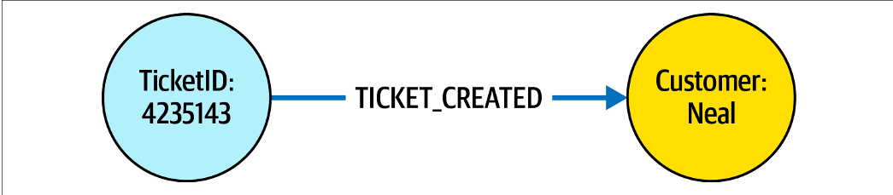

> 图 6-29：在图数据库中，边的方向在查询时具有重要意义。

图数据库中的边具有方向性意义。 在图 6-29 中，一条类型为 TICKET_CREATED 的边，
连接 ID 为 4235143 的 ticket 节点和 ID 为 Neal 的 customer 节点。 我们可以从
ticket 节点通过出边 TICKET_CREATED 遍历， 或从 customer 节点通过入边
TICKET_CREATED 遍历。 当方向混淆时，查询图变得非常困难。 图数据库的评分如表 6-30
所示。

| 评分主题                                 | 图数据库（Neo4J, Infinite Graph, Tigergraph 等） |
| ---------------------------------------- | ------------------------------------------------ |
| 易学                                     |                                                  |
| 数据建模的容易程度                       |                                                  |
| 可扩展性/吞吐量                          |                                                  |
| 可用性/分区容忍性                        |                                                  |
| 一致性                                   |                                                  |
| 编程语言支持、产品成熟度、SQL 支持、社区 |                                                  |
| 读/写优先级                              |                                                  |

> 表 6-30：图数据库在各种采用特征上的评分。

### 学习曲线

图数据库有陡峭的学习曲线。 理解如何使用节点、关系、关系类型和属性需要时间。

### 数据建模的容易程度

理解如何建模领域并将其转换为节点和关系是困难的。
一开始，倾向于将属性添加到关系中。 随着建模知识的提高， 增加节点和关系的使用，
并将一些关系属性转换为具有附加关系类型的节点， 这会改善图遍历。

### 可扩展性/吞吐量

复制的节点可以改善读取扩展， 并且吞吐量可以针对读取负载进行调优。 由于难以拆分或
shard 图， 写入吞吐量受所选图数据库类型的限制。 遍历关系非常快，
因为索引和存储是持久化的，而不是在查询时计算的。

### 可用性/分区容忍性

一些具有高分区容忍性和可用性的图数据库是分布式的。 图数据库集群可以使用节点，
在当前 leader 不可用时将其提升为 leader。

### 一致性

许多图数据库支持 ACID 事务。 一些图数据库，如 Neo4j，支持事务，
因此数据始终是一致的。

### 编程语言支持、产品成熟度、SQL 支持和社区

图数据库在社区中有很多支持。 许多算法，如 Dijkstra 算法或节点相似性，
在数据库中实现，减少了从头编写它们的需要。 称为 Gremlin
的语言框架在许多不同的数据库中工作， 有助于易用性。 Neo4J 支持一种称为 Cypher
的查询语言， 允许开发人员轻松查询数据库。

#### 读/写优先级

在图数据库中，数据存储针对关系遍历进行了优化， 与关系型数据库相反，
在关系型数据库中我们必须查询关系并在查询时派生它们。
图数据库更适合读密集型场景。

图数据库允许同一个节点具有各种类型的关系。 在 Sysops Squad 示例中，
示例图可能如下所示： a knowledge_base was created_by user sysops_user and
knowledge_base used_by sysops_user. 因此，关系 created_by 和 used_by
以不同的关系类型连接相同的节点。

## 更改关系类型

更改关系类型是一项昂贵的操作， 因为每个关系类型都必须重新创建。
当发生这种情况时， 必须访问由边连接的两个节点， 创建新边，并移除旧边。
因此，必须仔细考虑边类型或关系类型。

### NewSQL 数据库

Matthew Aslett 首次使用术语 *NewSQL* 来定义旨在提供 NoSQL 数据库的可扩展性，
同时支持关系型数据库的特性（如 ACID）的新型数据库。 NewSQL
数据库使用不同类型的存储机制， 所有都支持 SQL。

NewSQL 数据库的评分如表 6-31 所示， 它们通过提供自动数据分区或 sharding
来改进关系型数据库， 允许水平扩展和提高可用性，
同时允许开发人员轻松过渡到使用已知的 SQL 和 ACID 范式。

| 评分主题                                 | NewSQL 数据库（VoltDB, NuoDB, ClustrixDB 等） |
| ---------------------------------------- | --------------------------------------------- |
| 易学                                     |                                               |
| 数据建模的容易程度                       |                                               |
| 可扩展性/吞吐量                          |                                               |
| 可用性/分区容忍性                        |                                               |
| 一致性                                   |                                               |
| 编程语言支持、产品成熟度、SQL 支持、社区 |                                               |
| 读/写优先级                              |                                               |

> 表 6-31：NewSQL 数据库在各种采用特征上的评分。

### 学习曲线

由于 NewSQL 数据库就像关系型数据库一样 （具有 SQL 接口、水平扩展的附加功能、ACID
兼容）， 学习曲线容易得多。 其中一些仅作为 Database as a Service（DBaaS）提供，
这可能使学习它们更加困难。

### 数据建模的容易程度

由于 NewSQL 数据库类似于关系型数据库，
数据建模对许多人来说是熟悉的，并且更容易上手。 额外的复杂性在于 sharding 设计，
允许 shard 数据放置在地理上不同的位置。

### 可扩展性/吞吐量

NewSQL 数据库设计为支持分布式系统的水平扩展， 允许多个活动节点， 与只有一个活动
leader 而其余节点是 follower 的关系型数据库不同。 多个活动节点使 NewSQL
数据库具有高度可扩展性和更好的吞吐量。

### 可用性/分区容忍性

由于多活动节点设计， 可用性的好处可以非常高， 具有更大的分区容忍性。 CockroachDB
是一个流行的 NewSQL 数据库， 可以在磁盘、机器和数据中心故障后存活。

### 一致性

NewSQL 数据库支持强一致性的 ACID 事务。 数据始终是一致的，
这使得关系型数据库用户可以轻松过渡到 NewSQL 数据库。

### 编程语言支持、产品成熟度、SQL 支持和社区

有许多开源 NewSQL 数据库，因此学习它们的门槛较低。
一些数据库还支持与现有关系型数据库的 wire-compatible 协议，
这使它们能够替换关系型数据库而没有任何兼容性问题。

### 读/写优先级

NewSQL 数据库的使用方式与关系型数据库一样， 具有索引和在地理上分布的额外好处，
要么提高读取性能，要么提高写入性能。

### 云原生数据库

随着云使用的增加， 诸如 Snowflake、Amazon Redshift、Datomic 和 Azure CosmosDB
等云数据库， 越来越受欢迎。 这些数据库减少了运维负担， 提供了成本透明度，
并且是一种简单的实验方式， 因为不需要前期投资。 云原生数据库的评分如表 6-32
所示。

| 评分主题                                 | 云数据库（Snowflake, Amazon Redshift 等） |
| ---------------------------------------- | ----------------------------------------- |
| 易学                                     |                                           |
| 数据建模的容易程度                       |                                           |
| 可扩展性/吞吐量                          |                                           |
| 可用性/分区容忍性                        |                                           |
| 一致性                                   |                                           |
| 编程语言支持、产品成熟度、SQL 支持、社区 |                                           |
| 读/写优先级                              |                                           |

> 表 6-32：云原生数据库在各种采用特征上的评分。

### 学习曲线

一些云数据库如 AWS Redshift 类似于关系型数据库， 因此更容易理解。 像 Snowflake
这样的数据库， 具有 SQL 接口但具有不同的存储和计算机制， 需要一些练习。 Datomic
在模型方面完全不同， 使用不可变的原子事实。 因此，学习曲线因每个数据库产品而异。

### 数据建模的容易程度

Datomic 没有表的概念， 也不需要预先定义属性。 需要为各个 attribute 定义
property， 实体可以具有任何属性。 Snowflake 和 Redshift
更多用于数据仓库类型的工作负载。 理解数据库提供的建模类型，
对于选择要使用的数据库至关重要。

### 可扩展性/吞吐量

由于所有这些数据库都是纯云的， 扩展它们相对简单，
因为资源可以以一定价格自动分配。 在这些决策中，trade-off 通常与价格有关。

### 可用性/分区容忍性

此类别中的数据库（如 Datomic） 在使用*生产拓扑*部署时具有高可用性。
它们没有单点故障， 并受到广泛缓存的支持。 例如，Snowflake
跨区域和账户复制其数据库。 此类别中的其他数据库支持高可用性，
并具有各种配置选项。 例如，Redshift 在单个可用区中运行，
需要在多个集群中运行以支持更高的可用性。

#### 一致性

Datomic 使用将数据块存储在块存储中的存储引擎来支持 ACID 事务。 其他数据库，如
Snowflake 和 Redshift，支持 ACID 事务。

### 编程语言支持、产品成熟度、SQL 支持和社区

许多这些数据库是新的， 找到有经验的帮助可能很困难。 实验这些数据库需要云账户，
这可能造成另一个障碍。 虽然云原生数据库减少了运维 DBA 的运维工作量，
但它们确实对开发人员有更高的学习曲线。 Datomic 在所有示例中使用 Clojure，
存储过程用 Clojure 编写， 因此不懂 Clojure 可能是使用的障碍。

### 读/写优先级

这些数据库可以用于读密集型或写密集型负载。 Snowflake 和 Redshift
更倾向于数据仓库类型的工作负载， 使它们倾向于读取优先， 而 Datomic
可以通过不同的索引（如 EAVT——Entity, Attribute, Value, then Transaction）
支持两种类型的负载。

### 时间序列数据库

鉴于趋势，我们看到 IoT、微服务、自动驾驶汽车和可观测性的使用增加，
所有这些都驱动了时间序列分析的惊人增长。
这一趋势催生了针对存储时间窗口内收集的数据点序列而优化的数据库，
使用户能够跟踪任何时间段内的变化。 此数据库类型的评分如表 6-33 所示。

| 评分主题                                 | 时间序列数据库（InfluxDB, TimescaleDB 等） |
| ---------------------------------------- | ------------------------------------------ |
| 易学                                     |                                            |
| 数据建模的容易程度                       |                                            |
| 可扩展性/吞吐量                          |                                            |
| 可用性/分区容忍性                        |                                            |
| 一致性                                   |                                            |
| 编程语言支持、产品成熟度、SQL 支持、社区 |                                            |
| 读/写优先级                              |                                            |

> 表 6-33：时间序列数据库在各种采用特征上的评分。

### 学习曲线

理解时间序列数据通常很容易—— 每个数据点都附加到一个时间戳，
数据几乎总是插入，从不更新或删除。
理解仅追加操作需要放下一些其他数据库使用的习惯，
在那些数据库中，数据中的错误可以通过更新来纠正。 InfluxDB、Kx 和 TimeScale
是一些流行的时间序列数据库。

### 数据建模的容易程度

时间序列数据库的基本概念是分析数据随时间的变化。 例如，在 Sysops Squad 示例中，
对 ticket 对象的更改可以存储在时间序列数据库中， 其中标记了更改的时间戳和
ticket_id。 在一个标签中添加多个信息被认为是不良实践。 例如，ticket_status=Open,
ticket_id=374737 比 ticket_info=Open.374737 更好。

### 可扩展性/吞吐量

Timescale 基于 PostgreSQL， 允许标准的扩展和吞吐量改进模式。
通过使用管理元数据的 meta 节点和存储实际数据的 data 节点， 在集群模式下运行
InfluxDB， 提供扩展和吞吐量改进。

### 可用性/分区容忍性

一些数据库如 InfluxDB 具有更好的可用性和分区容忍性选项， 具有 meta 和 data
节点的配置， 以及复制因子。

### 一致性

使用关系型数据库作为存储引擎的时间序列数据库， 获得 ACID 属性以保持一致性，
而其他数据库可以使用 any、one 或 quorum 的一致性级别来调优一致性。
更高的一致性级别配置通常导致更高的一致性和更低的可用性， 因此这是一个需要考虑的
trade-off。

### 编程语言支持、产品成熟度、SQL 支持和社区

时间序列数据库最近变得流行， 有许多资源可以学习。 其中一些数据库，如 InfluxDB，
提供了一种称为 InfluxQL 的类 SQL 查询语言。

### 读/写优先级

时间序列数据库是仅追加的， 并且往往更适合读密集型工作负载。

当使用时间序列数据库时， 数据库自动为每个数据创建附加时间戳，
数据包含信息的标签或属性。 数据基于特定时间窗口之间的某些事实进行查询。
因此，时间序列数据库不是通用数据库。

总结本节讨论的所有数据库类型， 表 6-6 显示了该数据库类型的一些流行数据库产品。

| 数据库类型 | 产品                                           |
| ---------- | ---------------------------------------------- |
| 关系型     | PostgreSQL, Oracle, Microsoft SQL              |
| Key-value  | Riak KV, Amazon DynamoDB, Redis                |
| 文档       | MongoDB, Couchbase, AWS DocumentDB             |
| 列族       | Cassandra, Scylla, Amazon SimpleDB             |
| 图         | Neo4j, Infinite Graph, Tiger Graph             |
| NewSQL     | VoltDB, ClustrixDB, SimpleStore（又名 MemSQL） |
| 云原生     | Snowflake, Datomic, Redshift                   |
| 时间序列   | InfluxDB, kdb+, Amazon Timestream              |

> 表 6-6：数据库类型及该数据库类型中的产品摘要。

## Sysops Squad Saga：Polyglot 数据库

### 12 月 16 日，星期四，16:05


> 插图 6-3：Devon 和 Dana 讨论 Survey data domain 的数据库类型。

现在团队已经从单体 Sysops Squad 数据库形成了 data domain， Devon 注意到 Survey
data domain 将是一个很好的候选， 可以从传统的关系型数据库迁移到使用 JSON
的文档数据库。 然而，数据架构负责人 Dana 不同意，并希望将表保持为关系型。

"我就是不同意，"Dana 说。"调查表过去一直用关系表工作得很好，
所以我看不到改变的理由。"

"实际上，"Skyler 说，"如果在系统最初开发时你就和我们讨论过，
你会理解从用户界面的角度来看，处理关系型数据对于客户调查这样的事情真的很困难。
所以我不同意。也许对你来说工作得不错，但从用户界面开发的角度来看，
处理调查相关的关系型数据一直是一个主要的痛点。"

"你看，就是这样，"Devon 说。"这就是为什么我们需要将其改为文档数据库。"

"你似乎忘了，作为本公司的数据架构师，我对所有这些不同的数据库负有最终责任。
你不能随意向系统中添加不同的数据库类型，"Dana 说。

"但那将是更好的解决方案，"Devon 说。

"抱歉，但我不打算仅仅为了让 Skyler 能更轻松地维护用户界面
就在数据库团队中引起混乱。事情不是这么运作的。"

"等等，"Skyler 说，"我们不是都同意当前单体 Sysops Squad 应用的问题之一
就是开发团队与数据库团队不够紧密合作吗？"

"是的，"Dana 说。

"那好，"Skyler 说，"让我们那样做。让我们合作来解决这个问题。"

"好的，"Dana 说，"但我需要你和 Devon 提供一个充分的理由，
说明为什么要在混合中引入另一种数据库。"

"没问题，"Devon 说。"我们马上开始做。"

Devon 和 Skyler 知道文档数据库对于客户调查数据来说会是一个更好的解决方案，
但他们不确定如何为 Dana 构建合适的理由以同意迁移数据。Skyler 建议他们与 Addison
联系寻求帮助， 因为两人都认为这在某种程度上是一个架构问题。Addison 同意帮忙，
并安排了与 Parker（Sysops Squad 产品负责人）的会议，
以验证将客户调查表迁移到文档数据库是否有业务理由。

"感谢你们和我们开会，Parker，"Addison 说。"正如我之前跟你说过的，
我们正在考虑改变客户调查数据的存储方式，有几个问题想问你。"

"嗯，"Parker 说，"这也是我同意这次会议的原因之一。你知道吗，
客户调查部分一直是市场部门以及我本人的一个主要痛点。"

"啊？"Skyler 问。"什么意思？"

"你们对客户调查做哪怕最小的变更请求需要多长时间？"Parker 问。

"嗯，"Devon 说，"从数据库方面来看还不错。我的意思是，
就是为新问题添加一个新列或更改答案类型。"

"等等，"Skyler 说。"抱歉，但对我来说这是一个重大变更，
即使你只是增加一个问题。你不知道查询所有关系型数据
并在用户界面中渲染客户调查有多难。所以我的回答是，很长时间。"

"听着，"Parker 说。"我们业务这边自己也感到很沮丧，
当最简单的变更你们都真的要花好几天才能完成。这完全不可接受。"

"我想我能在这里帮上忙，"Addison 说。"那么 Parker，你的意思是说
客户调查变更频繁，而变更完成的时间太长？"

"没错，"Parker 说。"市场部门不仅想要客户调查更好的灵活性， 还想要 IT
部门更好的响应速度。很多时候他们不提交变更请求，
因为他们知道这只会以沮丧和他们没有计划到的额外成本告终。"

"如果我告诉你们，缺乏对变更请求的灵活性和响应速度
与用于存储客户调查的技术完全有关，
而且通过改变数据存储方式，我们可以显著提高灵活性
以及变更请求的响应时间呢？"Addison 问。

"那我就是世界上最开心的人了，市场部门也是，"Parker 说。

"Devon 和 Skyler，我想我们有了业务理由，"Addison 说。

业务理由确立后，Devon、Skyler 和 Addison 说服了 Dana 使用文档数据库。
现在团队必须弄清客户调查数据的最佳结构。现有的关系数据库表如图 6-34 所示。
每个客户调查由两个主要表组成——一个 Survey 表和一个 Question 表，
两者之间是一对多关系。

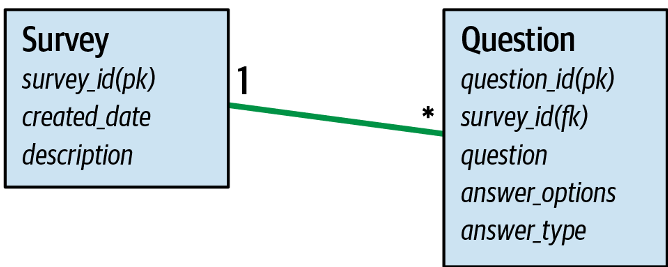

> 图 6-34：sysops 调查 data domain 中的表和关系。

每个表中包含的数据示例如表 6-35 所示，其中 Question
表包含问题、答案选项和答案数据类型。

| survey_id | created_date | description                  |
| --------- | ------------ | ---------------------------- |
| 19998     | May 20 2022  | Expert performance survey.   |
| 19999     | May 20 2022  | Service satisfaction survey. |

| question_id | survey_id | question  | answer_options | answer_type |
| ----------- | --------- | --------- | -------------- | ----------- |
| 50000       | 19999     | Did the.. | {Yes,No}       | Boolean     |
| 50001       | 19999     | Rate..    | {1,2,3,4,5}    | Option      |

> 表 6-35：调查 data domain 中 Survey 和 Question 表中的关系型数据。

"所以，本质上我们有两种选择来在文档数据库中对调查问题建模，"Devon 说。
"单个聚合文档或拆分的文档。"

"我们怎么知道用哪个？"Skyler 问，很高兴开发团队终于与数据库团队合作
来达成统一的解决方案。

"我知道，"Addison
说，"让我们把两种方案都建模看看，这样我们可以直观地看到每种方法的 trade-off。"

Devon 向团队展示了单聚合选项，如图 6-36 和对应的代码清单示例 6-3 所示，
调查数据和所有相关问题数据都作为一个文档存储。因此，整个客户调查 可以通过一次
get 操作从数据库中检索，使 Skyler 和开发团队的其他人 更容易处理数据。

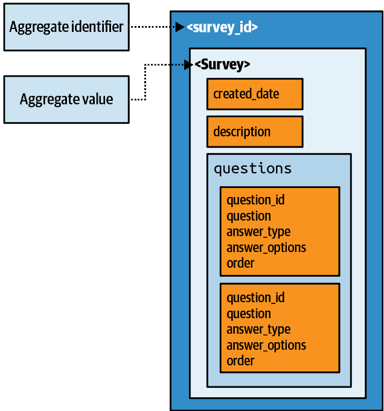

> 图 6-36：使用单聚合的调查模型。

示例 6-3。嵌入子项的单聚合设计的 JSON 文档

```json
# Survey aggregate with embedded questions
{
    "survey_id": "19999",
    "created_date": "Dec 28 2021",
    "description": "Survey to gauge customer...",
    "questions": [
        {
            "question_id": "50001",
            "question": "Rate the expert",
            "answer_type": "Option",
            "answer_options": "1,2,3,4,5",
            "order": "2"
        },
        {
            "question_id": "50000",
            "question": "Did the expert fix the problem?",
            "answer_type": "Boolean",
            "answer_options": "Yes,No",
            "order": "1"
        }
    ]
}
```

"我真的很喜欢这种方法，"Skyler 说。"本质上，我不需要在用户界面中
自己聚合东西，这意味着我可以直接渲染从数据库检索到的文档。"

"是的，"Devon 说，"但在数据库方面需要额外的工作，
因为问题会在每个调查文档中复制。你知道的，整个复用的论点。
来，让我给你展示另一种方法。"

Devon 解释说，另一种聚合方式是拆分调查和问题模型，
使问题可以以独立的方式操作，如图 6-37 和对应的代码清单示例 6-4 所示。
这将允许同一个问题在多个调查中使用，但比单聚合更难渲染和检索。

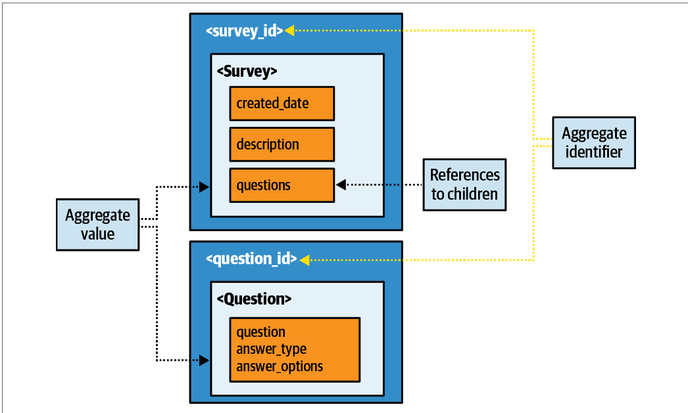

> 图 6-37：使用多聚合和引用的调查模型。

示例 6-4。聚合拆分且父文档显示对子项引用的 JSON 文档

```json
# Survey aggregate with references to Questions
{
    "survey_id": "19999",
    "created_date": "Dec 28",
    "description": "Survey to gauge customer...",
    "questions": [
        {"question_id": "50001", "order": "2"},
        {"question_id": "50000", "order": "1"}
    ]
}

# Question aggregate
{
    "question_id": "50001",
    "question": "Rate the expert",
    "answer_type": "Option",
    "answer_options": "1,2,3,4,5"
}
{
    "question_id": "50000",
    "question": "Did the expert fix the problem?",
    "answer_type": "Boolean",
    "answer_options": "Yes,No"
}
```

由于大部分复杂性和变更问题在用户界面端，Skyler 更喜欢单聚合模型。 Devon
喜欢多聚合以避免在每个调查中重复问题数据。然而，Addison 指出
只有五种调查类型（每个产品类别一种），而且大部分变更涉及添加或删除问题。
团队讨论了 trade-off，都同意愿意用一些问题数据的重复
来换取用户界面端变更和渲染的便利性。由于此决策的困难性和数据变更的结构性质，
Addison 创建了一个 ADR 来记录此决策的理由：

#### ADR：为客户调查使用文档数据库

#### 上下文

客户在工作完成后会收到一份调查，在网页上呈现给客户填写和提交。
客户根据修复或安装的电子产品类型收到五种调查类型之一。
调查目前存储在关系型数据库中，但团队希望使用 JSON 将调查迁移到文档数据库。

##### 决策

我们将为客户调查使用文档数据库。

市场部门需要客户调查更好的灵活性和变更及时性。迁移到文档数据库
不仅能提供更好的灵活性，还能为客户调查所需变更提供更好的及时性。

使用文档数据库将简化客户调查用户界面，并更好地促进对调查的变更。

#### 后果

由于我们将使用单聚合，当公共调查问题被更新、添加或删除时， 需要更改多个文档。

在从关系型数据库到文档数据库的数据迁移期间，调查功能需要暂停。

# 第 7 章：服务粒度

## 10 月 14 日，星期四，13:33


> 插图 7-1：Addison 和 Austen 讨论服务粒度。

随着迁移工作的展开， Addison 和 Austen
开始被之前识别出的领域服务分解所涉及的所有决策压得喘不过气来。
开发团队也有自己的意见， 这使得服务粒度的决策更加困难。

"我还是不确定核心工单功能该怎么处理，"Addison 说，
"我无法决定工单创建、完成、专家分配和专家路由应该是一个、两个、三个还是甚至四个服务。
Taylen 坚持把一切做得细粒度， 但我不确定这是否是正确的方法。"

"我也不确定，"Austen 说，
"而且我自己也在纠结客户注册、资料管理和计费功能是否应该拆分。
除此之外，我今晚还有一场比赛。"

"你总是有比赛要去，"Addison 说， "说到客户功能，
你弄清楚客户登录功能是否会是一个单独的服务了吗？"

"没有，"Austen 说， "我还在处理这个。 Skyler 说它应该是独立的，
但除了说它是单独的功能外， 没有给我任何理由。"

"这确实是难啃的骨头，"Addison 说， "你觉得 Logan 能给出一些启示吗？"

"好主意，"Austen 说， "这种凭感觉的分析真的在拖慢进度。"

Addison 和 Austen 邀请 Sysops Squad 技术负责人 Taylen 一起与 Logan 开会，
以便所有人都能在服务粒度问题上达成共识。

"我告诉你们，"Taylen 说， "我们需要把领域服务拆分成更小的服务。
它们对微服务来说太粗粒度了。 据我所知，micro 就是小的意思。
毕竟我们是在迁移到微服务。 Addison 和 Austen 建议的方案根本不符合微服务模型。"

"并非应用的每个部分都必须是微服务，"Logan 说，
"这是微服务架构风格最大的陷阱之一。"

"如果真是这样， 那你如何确定哪些服务应该拆分， 哪些不应该？"Taylen 问。

"让我问你一个问题，Taylen，"Logan 说， "你把所有服务都做得这么小的理由是什么？"

"单一职责原则，"Taylen 回答， "去查查吧。 微服务就是基于这个的。"

"我知道单一职责原则是什么，"Logan 说， "我也知道它有多主观。
拿我们的客户通知服务来说。 我们可以通过 Short Message
Service（SMS）、电子邮件通知客户， 甚至还发送邮政信件。
那么大家告诉我，一个服务还是三个服务？"

"三个，"Taylen 立即回答， "每种通知方式都是独立的事情。
这就是微服务的意义所在。"

"一个，"Addison 回答， "通知本身明显是一个单一职责。"

"我不确定，"Austen 回答， "我两种说法都能理解。 我们要不要掷硬币？"

"这正是我们需要帮助的原因，"Addison 叹了口气。

"做好服务粒度的关键，"Logan 说， "是去掉观点和直觉，
使用粒度分解驱动因素和整合驱动因素来客观分析 trade-off，
并为是否拆分一个服务形成坚实的依据。"

"什么是粒度分解驱动因素和整合驱动因素？"Austen 问。

"让我给你们展示一下，"Logan 说。

架构师和开发者经常混淆 modularity 和 granularity 这两个术语，
在某些情况下甚至将它们视为同义词。 考虑以下字典定义：

### 模块化

以标准化的单元或维度构建， 以实现灵活性和多样的用途。

### 粒度

由构成更大单元的众多粒子之一组成或看起来由其组成。

难怪这两个术语之间会有这么多混淆！ 虽然它们的字典定义相似， 但我们要区分它们，
因为它们在软件架构的上下文中意味着不同的事情。 在我们的用法中， *modularity*
关乎将系统拆分为独立的部分（参见第 3 章）， 而 *granularity*
关乎这些独立部分的*大小*。 有趣的是， 分布式系统中的大多数问题和挑战通常与
modularity 无关， 而是与 granularity 有关。

确定正确的粒度水平——即服务的大小——
是软件架构中架构师和开发团队持续挣扎的众多难点之一。
粒度不由服务中类或代码行的数量定义， 而是由服务做什么来定义——
这就是为什么做好服务粒度如此困难的原因。

架构师可以利用度量指标来监控和衡量服务的各个方面， 以确定适当的服务粒度水平。
一种用于客观衡量服务大小的度量指标是计算服务中的语句数量。
每个开发者有不同的编码风格和技巧，
这就是为什么类数和代码行数是衡量粒度的糟糕指标。 另一方面，
语句数量至少允许架构师或开发团队客观地衡量服务在做什么。 回顾第 4 章，
语句是源代码中执行的单一完整操作， 通常以特殊字符终止（如
Java、C、C++、C#、Go、JavaScript 中的分号； 或 F#、Python 和 Ruby 中的换行符）。

另一个确定服务粒度的度量指标是衡量和跟踪服务暴露的公共接口或操作数量。 诚然，
虽然这两个度量指标仍然存在一些主观性和可变性，
但这是我们目前能找到的最接近客观衡量和评估服务粒度的方法。

服务粒度的两个对立力量是粒度分解驱动因素和粒度整合驱动因素。 这两种对立力量如图
7-1 所示。
粒度分解驱动因素解决的问题是"我何时应该考虑将一个服务拆分成更小的部分？"，
而粒度整合驱动因素解决的问题是"我何时应该考虑将服务重新组合？"。
许多开发团队犯的一个常见错误是过于关注粒度分解驱动因素而忽略粒度整合驱动因素。
为服务达到适当粒度水平的秘诀是在这两种对立力量之间实现平衡。


> 图 7-1：服务粒度取决于分解驱动因素和整合驱动因素之间的平衡。

## 粒度分解驱动因素

粒度分解驱动因素为何时将一个服务拆分成更小的部分提供指导和依据。
虽然拆分服务的理由可能只涉及单一驱动因素， 但在大多数情况下，
理由将基于多个驱动因素。 粒度分解的六个主要驱动因素如下：

**服务范围和功能**

服务是否做了太多不相关的事情？

**代码波动性**

变更是否仅限于服务的一部分？

**可扩展性和吞吐量**

服务的各部分是否需要不同的扩展方式？

**容错**

服务中是否存在导致关键功能失败的错误？

**安全**

服务的某些部分是否需要比其他部分更高的安全级别？

**可扩充性**

服务是否总是在扩展以添加新的上下文？

以下各节详细描述了每个粒度分解驱动因素。

## 服务范围和功能

服务范围和功能是拆分单一服务为更小服务的第一个也是最常见的驱动因素，
尤其是对于微服务。 分析服务范围和功能时需要考虑两个维度。 第一个维度是内聚：
特定服务的操作之间相互关联的程度和方式。 第二个维度是组件的总体大小，
通常通过构成该服务的类的语句总数之和、 服务的公共入口点数量或两者来衡量。

考虑一个典型的通知服务， 它做三件事： 通过
SMS、电子邮件或邮寄给客户的打印信件通知客户。
虽然很诱人想将这个服务拆分为三个独立的单一目的服务 （一个用于
SMS、一个用于电子邮件、一个用于邮政信件）， 如图 7-2 所示，
但仅凭这一点不足以成为拆分服务的理由， 因为它已经具有相对较强的内聚——
所有这些功能都与一件事相关：通知客户。 由于"单一目的"留给了个人意见和解释，
因此很难知道是否应该拆分这个服务。


> 图 7-2：具有相对较强内聚的服务仅凭功能不足以成为分解的候选。

现在考虑一个管理客户资料信息、客户偏好以及客户在网站上评论的单一服务。
与之前的通知服务示例不同， 这个服务具有相对较弱的内聚，
因为这三个功能涉及更广泛的范围——客户。 这个服务可能做了太多的事情，
因此可能应该被拆分为三个独立的服务， 如图 7-3 所示。


> 图 7-3：具有相对较弱内聚的服务是分解的良好候选。

这个粒度分解驱动因素与 Robert C. Martin 提出的 SOLID 原则中的单一职责原则有关，
该原则指出： "每个类应该对程序功能的单一部分负责， 并应封装该功能。
模块、类或函数的所有服务应与该职责紧密对齐。"
虽然单一职责原则最初是在类的上下文中定义的， 但后来已扩展到包括组件和服务。

在微服务架构风格中， *microservice* 被定义为一种单一目的、 独立部署的软件单元，
它把*一件事*做得非常好。
难怪开发者如此倾向于在不考虑为什么的情况下尽可能把服务做小！
关于什么是不是单一职责的主观性， 是大多数开发者在服务粒度方面遇到麻烦的地方。
虽然有一些度量指标（如 LCOM）来衡量内聚， 但在服务方面仍然高度主观——
通知客户是一件事， 还是通过电子邮件通知是一件事？ 出于这个原因，
理解其他粒度分解驱动因素以确定适当的粒度水平至关重要。

### 代码波动性

代码波动性——源代码变更的速率—— 是拆分服务为更小服务的另一个良好驱动因素。
这也被称为基于波动性的分解。 客观衡量服务中代码变更的频率
（可通过任何源代码版本控制系统中的标准工具轻松完成）
有时可以为拆分服务提供良好的依据。 再次考虑前面部分的通知服务示例。
仅凭服务范围（内聚）不足以成为拆分服务的理由。 然而， 通过应用变更度量指标，
可以揭示关于该服务的相关信息：

- SMS 通知功能的变更频率：每六个月一次（平均）
- 电子邮件通知功能的变更频率：每六个月一次（平均）
- 邮政信件通知功能的变更频率：每周一次（平均）

注意， 邮政信件功能每周都在变化（平均）， 而 SMS 和电子邮件功能很少变化。
作为单一服务， 对邮政信件代码的任何更改都要求开发者测试和重新部署整个服务， 包括
SMS 和电子邮件功能。 根据部署环境的不同， 这可能还意味着在部署邮政信件变更时，
SMS 和电子邮件功能不可用。 因此， 作为单一服务， 测试范围增加， 部署风险高。
然而， 通过将此服务拆分为两个独立的服务 （电子通知和邮政信件通知）， 如图 7-4
所示， 频繁的变更现在被隔离到一个更小的单一服务中。
这反过来意味着测试范围显著减小， 部署风险更低，
并且在部署邮政信件变更期间不会中断 SMS 和电子邮件功能。


> 图 7-4：服务中高代码变更的区域是分解的良好候选。

## 可扩展性和吞吐量

拆分服务为更小独立服务的另一个驱动因素是 *scalability* 和 *throughput*。
可以客观衡量服务的不同功能的 scalability 需求， 以确定是否应该拆分服务。
再次考虑通知服务示例， 其中单一服务通过 SMS、电子邮件和打印信件通知客户。
衡量这个单一服务的 scalability 需求揭示了以下信息：

- SMS 通知：220,000/分钟
- 电子邮件通知：500/分钟
- 邮政信件通知：1/分钟

注意 SMS 通知和邮政信件通知之间的极端差异。 作为单一服务，
电子邮件和邮政信件功能必须不必要地扩展以满足 SMS 通知的需求， 影响成本以及 mean
time to startup（MTTS）方面的弹性。
将通知服务拆分为三个独立的服务（SMS、电子邮件和信件）， 如图 7-5 所示，
允许每个服务独立扩展以满足其不同的吞吐量需求。

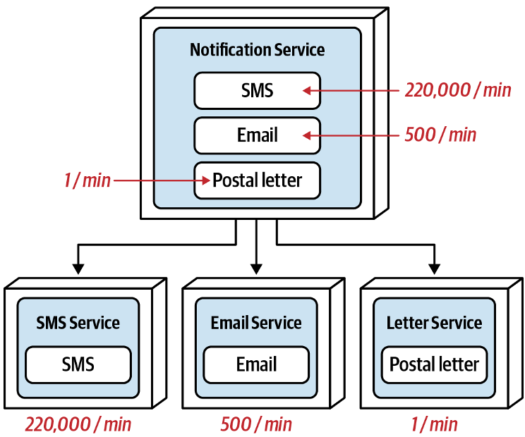

> 图 7-5：不同的可扩展性和吞吐量需求是良好的分解驱动因素。

## 容错

容错描述了应用或特定领域内的功能在发生致命崩溃（如内存不足条件）时继续运行的能力。
容错是粒度分解的另一个良好驱动因素。

考虑之前合并的通知服务示例， 它通过 SMS、电子邮件和邮政信件通知客户（图 7-6）。
如果电子邮件功能持续出现内存不足问题并致命崩溃， 整个服务都会崩溃， 包括 SMS
和邮政信件处理。

将这个合并的通知服务拆分为三个独立的服务 为客户通知领域提供了一定程度的容错。
现在， 电子邮件功能中的致命错误不会影响 SMS 或邮政信件。

注意在这个示例中， 通知服务被拆分为三个独立的服务（SMS、电子邮件和邮政信件），
即使电子邮件功能是唯一频繁崩溃的问题（其他两个非常稳定）。
既然电子邮件功能是唯一的问题， 为什么不把 SMS 和邮政信件功能合并为一个服务呢？

考虑之前部分的代码波动性示例。 在这种情况下邮政信件不断变化， 而其他两个（SMS
和电子邮件）不会。 将服务拆分为两个服务是有意义的， 因为邮政信件是问题功能，
但电子邮件和 SMS 是*相关的*—— 它们都与*电子化*通知客户有关。 现在考虑容错示例。
SMS 通知和邮政信件通知有什么共同点， 除了向客户发送通知的手段外？
这个组合服务的合适自描述名称是什么？


> 图 7-6：容错和服务可用性是良好的分解驱动因素。

将电子邮件功能移至单独的服务会破坏整体领域内聚， 因为由此产生的 SMS
和邮政信件功能之间的内聚较弱。 考虑可能的服务名称：
电子邮件服务和……其他通知服务？ 电子邮件服务和……SMS-信件通知服务？
电子邮件服务和……非电子邮件服务？
这种命名问题可以追溯到服务范围和功能粒度分解驱动因素——
如果一个服务因为做了太多事情而难以命名， 那么考虑拆分该服务。
以下分解有助于可视化这一重要观点：

- 通知服务 → 电子邮件服务、其他通知服务（差名称）
- 通知服务 → 电子邮件服务、非电子邮件服务（差名称）
- 通知服务 → 电子邮件服务、SMS-信件服务（差名称）
- 通知服务 → 电子邮件服务、SMS 服务、信件服务（好名称）

在这个示例中， 只有最后一种分解是有意义的， 特别是考虑到增加另一种社交媒体通知——
它应该放在哪里？ 无论使用什么分解驱动因素， 每当拆分服务时，
始终检查是否可以与"剩余"功能形成强内聚。

## 安全

在保护敏感数据时的一个常见陷阱是只考虑数据的存储。 例如， 将 Payment Card
Industry（PCI）数据与非 PCI 数据分离
可能通过驻留在不同安全区域的独立模式或数据库来解决。 然而，
这种做法有时缺失的是也保护该数据的访问方式。

考虑图 7-7 所示的示例， 描述了一个客户资料服务， 包含两个主要功能：
客户资料维护（添加、更改或删除基本资料信息， 如姓名、地址等）
和客户信用卡维护（添加、删除和更新信用卡信息）。

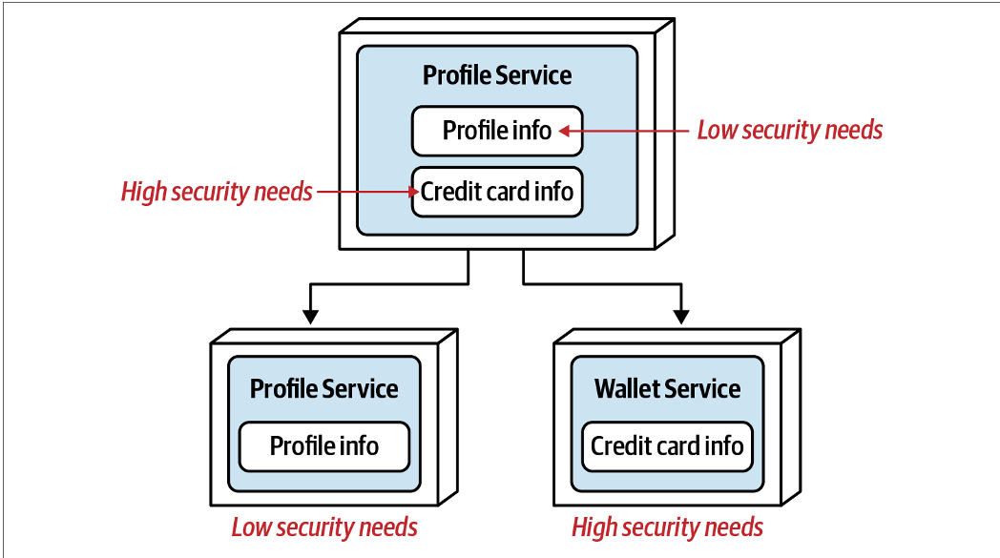

> 图 7-7：安全和数据访问是良好的分解驱动因素。

虽然信用卡数据可能受到保护， 但对该数据的访问存在风险，
因为信用卡功能与基本客户资料功能合在一起。 尽管进入合并客户资料服务的 API
入口点可能不同， 但仍然存在风险： 进入服务检索客户姓名的人也可能访问信用卡功能。
通过将此服务拆分为两个独立的服务， 用于维护信用卡信息的功能访问可以更加安全，
因为信用卡操作集只进入一个单一目的的服务。

## 可扩充性

粒度分解的另一个主要驱动因素是 *可扩充性*——
随着服务上下文的增长添加额外功能的能力。
考虑一个管理通过多种支付方式（包括信用卡、礼品卡和 PayPal
交易）的支付和退款服务。 假设公司想要开始支持其他受管理的支付方式，
如奖励积分、退货商店信用； 以及其他第三方支付服务， 如 ApplePay、SamsungPay 等。
扩展支付服务以添加这些额外支付方式有多容易？

这些额外的支付方式当然可以添加到单一合并的支付服务中。 然而，
每次添加新的支付方式时， 整个支付服务都需要测试（包括其他支付类型），
并且所有其他支付方式的功能都不必要地重新部署到生产环境中。 因此，
对于单一合并的支付服务， 测试范围增加， 部署风险更高，
使得添加额外的支付类型更加困难。

现在考虑将现有的合并服务拆分为三个独立的服务 （信用卡处理、礼品卡处理和 PayPal
交易处理）， 如图 7-8 所示。

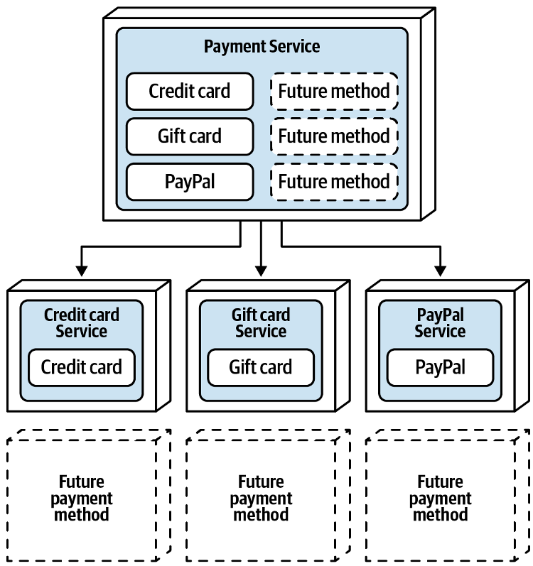

> 图 7-8：计划的可扩充性是良好的分解驱动因素。

现在单一支付服务已按支付方式拆分为独立的服务， 添加另一种支付方式（如奖励积分）
只需要开发、测试和部署一个独立于其他服务的新服务。 因此， 开发更快，
测试范围减小， 部署风险更低。

我们的建议是仅在事先知道计划中或预期的额外合并上下文功能、
或者属于正常领域的一部分时才应用此驱动因素。 例如， 对于通知，
通知手段是否会持续扩展超出基本通知手段（SMS、电子邮件或信件）是值得怀疑的。
然而， 对于支付处理， 很可能将来会添加额外的支付类型，
因此为每种支付类型设立独立的服务是合理的。
由于有时很难"猜测"上下文功能是否（以及何时）可能扩展 （如额外的支付方式），
我们的建议是将此驱动因素作为证明粒度分解的主要手段推迟，
直到可以建立模式或确认持续的可扩充性。

## 粒度整合驱动因素

粒度分解驱动因素为何时将一个服务拆分成更小的部分提供指导和依据，
而粒度整合驱动因素则以相反的方式工作——
它们为将服务重新组合（或首先不拆分服务）提供指导和依据。
分析分解驱动因素和整合驱动因素之间的 trade-off 是做好服务粒度的秘诀。
粒度整合的四个主要驱动因素如下：

### 数据库事务

独立服务之间是否需要 ACID 事务？

### 工作流和 choreography

服务之间是否需要相互通信？

### 共享代码

服务之间是否需要共享代码？

### 数据库关系

虽然服务可以被拆分， 它使用的数据是否也可以被拆分？

以下各节详细描述了每个粒度整合驱动因素。

## 数据库事务

大多数使用关系型数据库的单体系统和粗粒度领域服务
依赖单一工作单元的数据库事务来维护数据完整性和一致性；
参见[分布式事务](#分布式事务)了解 ACID（数据库）事务的详细信息 以及它与
BASE（分布式）事务的区别。 要理解数据库事务如何影响服务粒度， 考虑图 7-9
所示的情况， 客户功能已被拆分为客户资料服务 （维护客户资料信息）
和密码服务（维护密码和其他安全相关信息和功能）。

注意， 拥有两个独立的服务为密码信息提供了良好的安全访问控制级别，
因为访问是在服务级别而不是请求级别。
更改密码、重置密码和为客户登录访问客户密码等操作的访问 都可以限制在单一服务中
（因此访问可以限制到该单一服务）。 然而， 虽然这可能是一个良好的分解驱动因素，
但考虑注册新客户的操作， 如图 7-10 所示。


> 图 7-9：具有原子操作的独立服务具有更好的安全访问控制。

注册新客户时， 资料信息和加密密码信息都从用户界面屏幕传递到资料服务。
资料服务将资料信息插入相应的数据库表， 提交该工作，
然后将加密密码信息传递给密码服务，
密码服务依次将密码信息插入相应的数据库表并提交自己的工作。

虽然分离服务为密码信息提供了更好的安全访问控制， 但 trade-off
是对于注册新客户或退订（删除）客户的操作没有 ACID 事务。
如果密码服务在这些操作期间失败， 数据将处于不一致状态，
导致复杂的错误处理（也容易出错）来反转原始资料插入或采取其他纠正措施
（参见[事务性 Saga 模式](#事务性-saga-模式)了解分布式事务中的最终一致性和错误处理的详细信息）。
因此， 如果从业务角度需要单一工作单元的 ACID 事务， 这些服务应该合并为单一服务，
如图 7-11 所示。


> 图 7-10：具有组合操作的独立服务不支持数据库（ACID）事务。


> 图 7-11：单一服务支持数据库（ACID）事务。

## 工作流和 choreography

另一个常见的粒度整合驱动因素是 *workflow* 和 *choreography*—— 服务之间相互通信
（有时也称为 *interservice* 通信或 *east-west* 通信）。 服务之间的通信相当常见，
在许多情况下在像微服务这样的高度分布式架构中是必要的。 然而，
随着服务基于前几节中描述的分解因素向更细的粒度移动，
服务通信可能增加到出现负面影响的地步。

整体容错问题是过多同步服务间通信的第一个影响。 考虑图 7-12 中的图： 服务 A
与服务 B 和 C 通信， 服务 B 与服务 C 通信， 服务 D 与服务 E 通信， 最后服务 E
与服务 C 通信。 在这种情况下， 如果服务 C 宕机， 所有其他服务因与服务 C
的传递依赖而变得不可操作， 造成整体容错、可用性和可靠性问题。


> 图 7-12：过多的工作流影响容错。

有趣的是， 容错是前一节中的粒度分解驱动因素之一—— 但当这些服务需要相互通信时，
从容错角度来看实际上什么也没有获得。 拆分服务时，
始终检查功能是否紧密耦合和相互依赖。 如果是，
则从业务请求的角度无法实现整体容错， 可能最好考虑将服务保持在一起。

整体性能和响应性是粒度整合（将服务重新组合）的另一个驱动因素。 考虑图 7-13
中的场景： 一个大型客户服务被拆分为五个独立的服务（服务 A 到 E）。
虽然这些服务中的每个都有自己的内聚的原子请求集合， 但通过单一 API
请求从单一用户界面屏幕集体检索所有客户信息 在使用 choreography
时涉及五个独立的跳转 （参见第 11 章了解使用 orchestration
解决此问题的替代方案）。 假设每次请求的网络和安全延迟为 300 毫秒，
这个单一请求仅延迟就会产生额外的 1500 毫秒！
将所有这些服务合并为单一服务将消除延迟， 从而提高整体性能和响应性。

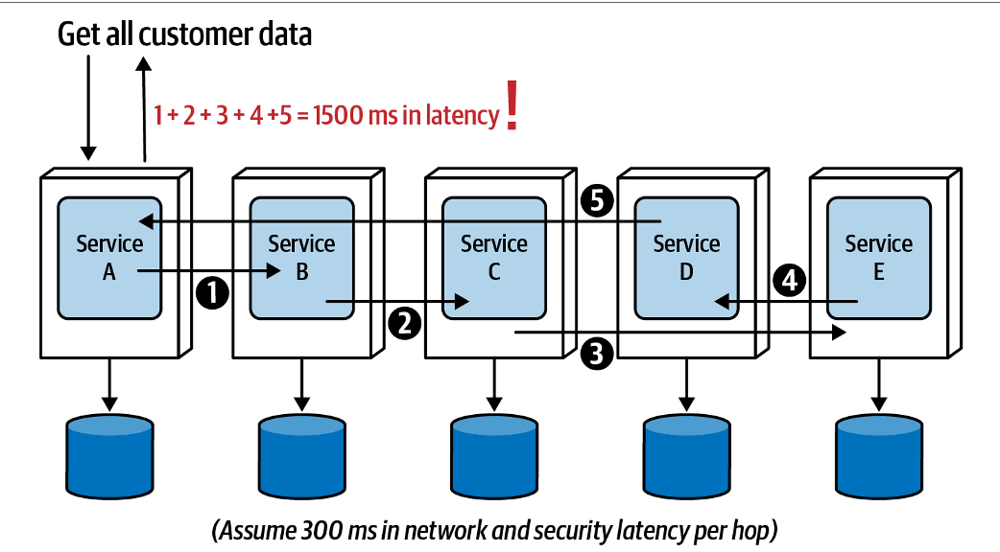

> 图 7-13：过多的工作流影响整体性能和响应性。

在整体性能方面， 此整合驱动因素的 trade-off
是在需要拆分服务与这些服务需要相互通信时相应的性能损失之间的平衡。
一个好的经验法则是考虑需要多个服务相互通信的请求数量， 同时考虑那些需要
interservice 通信的请求的关键性。 例如， 如果 30%
的请求需要服务之间的工作流来完成请求， 70%
是纯粹原子的（专用于单一服务而无需任何额外通信），
那么保持服务分开可能是可以的。 然而， 如果百分比反过来了，
则考虑将它们重新组合。 当然， 这假设整体性能很重要。 在后端功能的情况下，
最终用户不等待请求完成， 则有更多的余地。

另一个性能考虑是关于需要工作流的请求的关键性。 考虑之前的示例， 其中 30%
的请求需要服务之间的工作流来完成请求， 70% 是纯粹原子的。
如果需要极快响应时间的关键请求是那 30% 的一部分， 那么即使 70%
的请求是纯粹原子的， 也可能明智地将服务重新组合。

整体可靠性和数据完整性也受到服务通信增加的影响。 考虑图 7-14 中的示例：
客户信息被分离为五个独立的客户服务。 在这种情况下，
向系统添加新客户涉及所有五个客户服务的协调。 然而， 如前几节所述，
每个服务都有自己的数据库事务。 注意图 7-14 中服务 A、B 和 C
已经提交了部分客户数据， 但服务 D 失败了。


> 图 7-14：过多的工作流影响可靠性和数据完整性。

这造成了数据一致性和数据完整性问题， 因为部分客户数据已经提交，
并且可能已经被处理—— 例如另一个进程检索了该信息，
甚至某个服务还基于该数据广播了动作、发出了消息。 在任一情况下，
该数据要么必须通过 compensating transaction 回滚，
要么标记为特定状态以了解事务在何处中断以便重新启动。 这是一种非常混乱的情况，
我们在[事务性 Saga 模式](#事务性-saga-模式)中详细描述。
如果数据完整性和数据一致性对操作重要或关键，
则可能明智地考虑将这些服务重新组合。

## 共享代码

共享源代码是软件开发中常见（且必要）的做法。
日志、安全、工具、格式化器、转换器、提取器等功能都是共享代码的好例子。 然而，
在分布式架构中处理共享代码时事情可能变得复杂， 有时会影响服务粒度。

共享代码通常包含在 shared library 中， 如 Java 生态系统中的 JAR 文件、 Ruby
环境中的 GEM 或 .NET 环境中的 DLL， 通常在编译时绑定到服务。 虽然我们在第 8
章中详细深入代码重用模式，
但这里仅说明共享代码有时如何影响服务粒度并成为粒度整合驱动因素（将服务重新组合）。

考虑图 7-15 所示的五个服务。 虽然可能有拆分这些服务的良好分解驱动因素，
但它们都共享一个通用的领域功能代码库 （与通用的实用工具或基础设施功能相对）。
如果 shared library 中发生变更， 这最终需要使用该 shared library
的相应服务进行变更。 我们说*最终*是因为版本控制有时可以与 shared library
一起使用以提供敏捷性和向后兼容性（参见第 8 章）。 因此，
所有这些独立部署的服务必须一起变更、测试和部署。 在这些情况下，
可能明智地将这五个服务合并为单一服务，
以避免多次部署以及基于使用不同版本库而导致服务功能不同步。

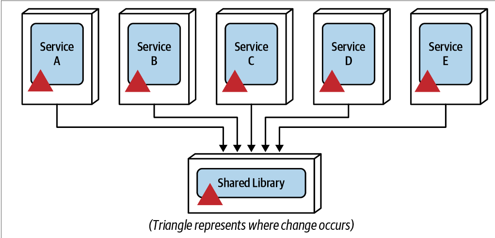

> 图 7-15：共享代码的变更需要所有服务的协调变更。

并非所有共享代码的使用都会驱动粒度整合。 例如，
所有服务使用的基础设施相关横切功能 （如日志、审计、认证、授权和监控）
*不是*将服务重新组合或甚至迁移回单体架构的良好驱动因素。
将共享代码视为粒度整合驱动因素的一些指导原则如下：

**特定的共享领域功能**

共享领域功能是包含业务逻辑的共享代码 （与基础设施相关的横切功能相对）。
如果共享领域代码的百分比相对较高，
我们的建议是考虑此因素作为可能的粒度整合驱动因素。 例如， 假设一组客户相关功能
（资料维护、偏好维护和添加或删除评论） 的通用（共享）代码占集体代码库的 40%
以上。 将集体功能拆分为独立服务意味着几乎一半的源代码在仅由这三个服务使用的
shared library 中。 在这个示例中，
可能明智地考虑将集体客户相关功能与共享代码一起保留在单一合并服务中
（特别是如果共享代码频繁变化， 如下所述）。

### 频繁的共享代码变更

无论 shared library 的大小如何，
对共享功能的频繁变更需要使用该共享领域功能的服务进行频繁的协调变更。
虽然版本控制有时可以帮助缓解协调变更，
但最终使用该共享功能的服务将需要采用最新版本。 如果共享代码频繁变化，
可能明智地考虑将使用该共享代码的服务合并，
以帮助缓解多个部署单元的复杂变更协调。

#### 无法版本控制的缺陷

虽然版本控制可以帮助缓解协调变更并允许向后兼容性和敏捷性（快速响应变更的能力），
但有时某些业务功能必须同时应用于所有服务（如缺陷或业务规则变更）。
如果这种情况频繁发生， 可能是时候考虑将服务重新组合以简化变更了。

## 数据关系

粒度分解驱动因素和整合驱动因素之间平衡的另一个 trade-off 是
单一合并服务使用的数据与独立服务将使用的数据之间的关系。
此整合驱动因素假设拆分服务后产生的数据不是共享的， 而是在每个服务内形成紧密的
bounded context， 以促进变更控制并支持整体可用性和可靠性。

考虑图 7-16 中的示例： 一个单一合并服务有三个功能（A、B 和
C）及相应的数据表关系。 指向表的实线代表对表的写入（因此是数据所有权），
从表指出的虚线代表对表的只读访问。 执行功能和表之间的映射操作揭示表 7-1
所示的结果， 其中 owner 意味着写入（和相应的读取）， access
意味着对该函数不拥有的表的只读访问。

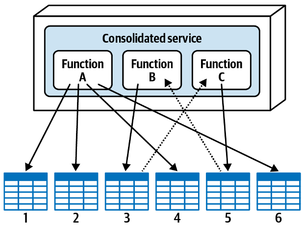

> 图 7-16：合并服务的数据库表关系。

| 功能 | 表 1  | 表 2  | 表 3   | 表 4  | 表 5   | 表 6  |
| ---- | ----- | ----- | ------ | ----- | ------ | ----- |
| A    | owner | owner |        | owner |        | owner |
| B    |       |       | owner  |       | access |       |
| C    |       |       | access |       | owner  |       |

> 表 7-1：功能到表的映射。

假设基于前几节中描述的一些分解驱动因素， 此服务被拆分为三个独立的服务
（合并服务中的每个功能一个）； 参见图 7-17。 然而，
将单一合并服务拆分为三个独立服务现在要求相应的数据表 与每个服务在 bounded
context 中关联。

注意图 7-17 顶部， 服务 A 拥有表 1、2、4 和 6 作为其 bounded context 的一部分；
服务 B 拥有表 3； 服务 C 拥有表 5。 然而， 注意图中服务 B 的每个操作都需要访问表
5 中的数据 （由服务 C 拥有）， 服务 C 的每个操作都需要访问表 3 中的数据（由服务
B 拥有）。 由于 bounded context， 服务 B 不能简单地直接查询表 5， 服务 C
也不能直接查询表 3。

为了更好地理解 bounded context 以及为什么服务 C 不能简单地访问表 3， 假设服务
B（拥有表 3）决定对其业务规则进行变更， 需要从表 3 中删除一列。 这样做会破坏服务
C 和使用表 3 的任何其他服务。 这就是 bounded context
概念在像微服务这样的高度分布式架构中如此重要的原因。 要解决此问题， 服务 B
必须向服务 C 请求其数据， 服务 C 也必须向服务 B 请求其数据，
导致这些服务之间来回的 interservice 通信， 如图 7-17 底部所示。

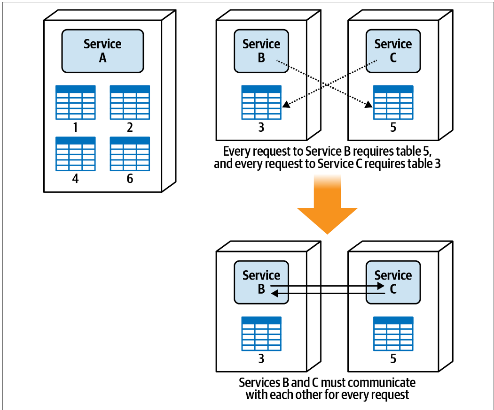

> 图 7-17：数据库表关系影响服务粒度。

基于服务 B 和 C 之间数据的依赖性， 明智的做法是将这些服务合并为单一服务，
以避免与这些服务之间 interservice 通信相关的延迟、 容错和可扩展性问题，
这表明表之间的关系可以影响服务粒度。 我们将此粒度整合驱动因素放在最后， 因为它是
trade-off 最少的粒度整合驱动因素。 虽然偶尔从单体系统迁移需要重构数据组织方式，
但在大多数情况下， 为了拆分服务而重新组织数据库表实体关系是不可行的。 我们在第 6
章中深入讨论拆分数据的详细信息。

## 找到正确的平衡

找到正确的服务粒度水平是困难的。
做好粒度的秘诀是理解粒度分解驱动因素（何时拆分服务）
和粒度整合驱动因素（何时将它们重新组合）， 并分析两者之间的相应 trade-off。
如前面场景所示， 这要求架构师不仅要识别 trade-off，
还要与业务利益相关者密切合作， 分析这些 trade-off 并得出适当的服务粒度解决方案。

表 7-2 和表 7-3 总结了分解驱动因素和整合驱动因素。

| 分解驱动因素 | 应用驱动因素的原因               |
| ------------ | -------------------------------- |
| 服务范围     | 具有紧密内聚的单一目的服务       |
| 代码波动性   | 敏捷性（减少测试范围和部署风险） |
| 可扩展性     | 更低的成本和更快的响应性         |
| 容错         | 更好的整体正常运行时间           |
| 安全访问     | 对某些功能更好的安全访问控制     |
| 可扩充性     | 敏捷性（易于添加新功能）         |

> 表 7-2：分解驱动因素（拆分服务）。

| 整合驱动因素 | 应用驱动因素的原因 |
| ------------ | ------------------ |
| 数据库事务   | 数据完整性和一致性 |
| 工作流       | 容错、性能和可靠性 |
| 共享代码     | 可维护性           |
| 数据关系     | 数据完整性和正确性 |

> 表 7-3：整合驱动因素（将服务重新组合）。

架构师可以使用这些表中的驱动因素形成 trade-off 声明，
然后通过与产品负责人或业务赞助人合作来讨论和解决。

### 示例 1：

**架构师：**"我们想拆分服务以隔离频繁的代码变更，
但这样做我们将无法维护数据库事务。 基于我们的业务需求， 哪个更重要——
更好的*整体敏捷性*（可维护性、可测试性和可部署性）， 转化为更快的上市时间，
还是更强的*数据完整性和一致性*？"

**项目赞助人：**"基于我们的业务需求，
我宁愿牺牲一点上市时间来获得更好的数据完整性和一致性，
所以暂时让它保持为单一服务。"

### 示例 2：

**架构师：**"我们需要将服务保持在一起以支持两个操作之间的数据库事务来确保数据一致性，
但这意味着合并的单一服务中的敏感功能安全性较低。 基于我们的业务需求，
哪个更重要—— 更好的*数据一致性*还是更好的*安全*？"

**项目赞助人：**"我们的 CIO 经历过一些关于安全和保护敏感数据的艰难情况，
这是他们脑海中的首要问题， 是几乎每次讨论的一部分。 在这种情况下，
保护敏感数据更重要， 所以让我们保持服务分开并想办法缓解数据一致性的问题。"

### 示例 3：

**架构师：**"我们需要拆分支付服务以提供更好的可扩展性来添加新支付方式，
但这意味着我们将增加工作流，
当订单使用多种支付方式时（这经常发生）会影响响应性。 基于我们的业务需求，
哪个更重要—— 支付处理中更好的可扩展性， 因此更好的*敏捷性*和*整体上市时间*，
还是付款的更好*响应性*？"

**项目赞助人：**"鉴于我看到我们在未来几年内只添加两三种支付方式，
我宁愿让我们关注整体响应性， 因为客户必须等待支付处理完成才能发出订单 ID。"

## Sysops Squad Saga：工单分配粒度

### 10 月 25 日，星期一，11:08


> 插图 7-2：Sysops Squad 工单分配场景。

一旦客户创建了故障工单并被系统接受， 就必须根据 Sysops Squad
专家的技能集、位置和可用性将工单分配给他们。 工单分配涉及两个主要组件——
工单分配组件（确定应将工作分配给哪位顾问） 和工单路由组件 （定位 Sysops Squad
专家、 将工单转发到专家的移动设备 （通过自定义的 Sysops Squad 移动应用） 并通过
SMS 短信通知专家已分配新工单）。

Sysops Squad 开发团队在决定这两个组件 （分配和路由）
应该实现为单一合并服务还是两个独立服务方面遇到了困难， 如图 7-18 所示。
开发团队咨询了 Addison（Sysops Squad 架构师之一） 以帮助决定应该选择哪个方案。


> 图 7-18(a)：工单分配和路由的选项。

#### 对比

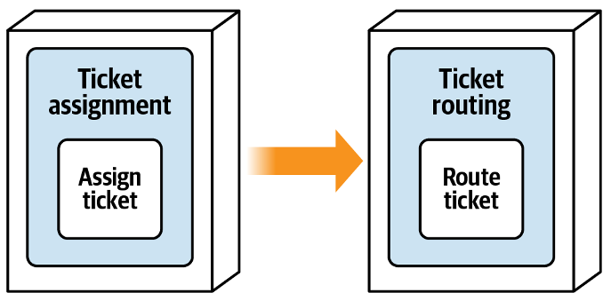

> 图 7-18(b)：工单分配和路由选项对比。

"所以你看，"Taylen 说， "工单分配算法非常复杂， 因此应该与工单路由功能隔离。
这样， 当这些算法变更时， 我不必担心所有路由功能。"

"是的， 但那些分配算法有多少变更？"Addison 问， "我们预计未来有多少变更？"

"我每月至少对这些算法应用两到三次变更。 我读过基于波动性的分解，
这种情况完美契合，"Taylen 说。

"但如果我们把分配和路由功能分离到两个服务中， 它们之间就需要持续通信，"Skyler
说， "此外， 分配和路由实际上是一个功能， 不是两个。"

"不，"Taylen 说， "它们是两个独立的功能。"

"等等，"Addison 说， "我明白 Skyler 的意思。 想一下。
一旦找到在某段时间内可用的专家， 工单就立即路由给该专家。 如果没有可用的专家，
工单就回到队列中等待直到找到专家。"

"是的，没错，"Taylen 说。

"看，"Skyler 说， "你不能在没有路由的情况下进行工单分配。
所以这两个功能是一个。"

"不，不，不，"Taylen 说， "你不明白。 如果看到某专家在某段时间内可用，
就分配给该专家。 就这样。 路由只是一个传输的事情。"

"在当前功能中， 如果工单无法路由到专家怎么办？"Addison 问。

"那就选择另一位专家，"Taylen 说。

"好的， 那么想一下， Taylen，"Addison 说， "如果分配和路由是两个独立的服务，
那么路由服务就必须与分配服务通信回去， 让它知道无法定位专家并选择另一个。
那就是两个服务之间的大量协调。"

"是的， 但它们仍然是两个独立的功能， 不是 Skyler 所说的一个，"Taylen 说。

"我有个主意，"Addison 说， "我们能否都同意分配和路由是两个独立的活动，
但彼此同步紧密绑定？ 也就是说， 一个功能不能没有另一个而存在？"

"是的， "Taylen 和 Skyler 都回答。

"在这种情况下，"Addison 说， "让我们分析 trade-off。 哪个更重要——
为了变更控制目的隔离分配功能， 还是将分配和路由合并为单一服务以获得更好的性能、
错误处理和工作流控制？"

"嗯， "Taylen 说， "当你这样表述时， 显然是单一服务。 但我仍然想隔离分配代码。"

"好的， "Addison 说， "那么， 我们可以在单一服务中创建三个不同的架构组件。
我们可以在代码中用不同的命名空间来划分分配、 路由和共享代码。 这有帮助吗？"

"是的， "Taylen 说， "这样可以。 好的， 你们都赢了。 让我们用一个单一服务。"

"Taylen， "Addison 说， "这不是关于赢， 而是关于分析 trade-off
以得出最适当的解决方案； 就这样。"

在大家都同意使用单一服务进行分配和路由后， Addison 为此决策编写了以下 ADR：

<a id="adr-ticket-assign-route"></a>

**ADR：工单分配和路由的合并服务**

**上下文**

一旦工单被创建并被系统接受， 就必须分配给专家并路由到该专家的移动设备。
这可以通过单一合并的工单分配服务 或工单分配和工单路由的独立服务来完成。

### 决策

我们将为工单的分配和路由功能创建单一合并的工单分配服务。

工单一旦被分配就立即路由给 Sysops Squad 专家，
因此这两个操作紧密绑定且相互依赖。

两个功能必须以相同的方式扩展， 因此这些服务之间没有 throughput 差异，
这些功能之间也不需要 back-pressure。

由于两个功能完全相互依赖， 容错不是拆分这些功能的驱动因素。

将这些功能设为独立服务需要在它们之间进行工作流，
导致性能、容错和可能的可靠性问题。

#### 后果

分配算法的变更（定期发生） 和路由机制的变更（不频繁的变更）
将需要测试和部署两个功能， 导致增加的测试范围和部署风险。

## Sysops Squad Saga：客户注册粒度

### 1 月 14 日，星期五，13:15


> 插图 7-3：客户注册讨论场景。

客户必须在系统中注册才能获得 Sysops Squad 支持计划的访问权限。 在注册过程中，
客户必须提供资料信息 （姓名、地址、适用的企业名称等）、 信用卡信息（按月计费）、
密码和安全问题信息， 以及他们希望在 Sysops Squad
支持计划下覆盖的已购买产品列表。

开发团队的一些成员坚持认为这应该是一个包含所有客户信息的单一合并客户服务，
而团队的其他成员不同意， 认为这些功能中的每一个都应该是独立的服务
（资料服务、信用卡服务、密码服务和支持产品服务）。 Skyler 在 PCI 和 Personally
Identifiable Information（PII） 数据方面有先前经验，
认为信用卡和密码信息应该是独立于其余部分的服务， 因此只有两个服务
（一个包含资料和产品信息的资料服务，
和一个包含信用卡和密码信息的独立客户安全服务）。 这三个选项如图 7-19 所示。


> 图 7-19：客户注册的选项。

因为 Addison 忙于核心工单功能， 开发团队请 Austen 帮助解决这个粒度问题。
预感到这不会是一个容易的决定， 特别是因为涉及安全， Austen 安排了与产品负责人
Parker 和 Penultimate Electronics 安全专家 Sam 的会议来讨论这些选项。

"好的， 你们有什么需要？"Parker 问。

"嗯， "Austen 说， "我们在为注册客户和维护客户相关信息创建多少服务方面挣扎。
你看， 我们在这里处理四个主要数据部分： 资料信息、 信用卡信息、
密码信息和已购买产品信息。"

"等等， "Sam 打断道。 "你知道信用卡和密码信息必须是安全的， 对吧？"

"我们当然知道它必须是安全的， "Austen 说。 "我们挣扎的是后端有一个单一的客户注册
API， 所以如果我们有独立的服务， 它们在注册客户时都需要协调在一起，
这将需要分布式事务。"

"你那是什么意思？"Parker 问。

"嗯， "Austen 说， "我们无法将所有数据作为一个原子工作单元同步在一起。"

"那不是选项， "Parker 说。 "所有的客户信息要么保存在数据库中， 要么不保存。
让我换个方式说。 我们绝对不能出现有客户记录但没有相应信用卡或密码记录的情况。
绝不能。"

"好的， 但保护信用卡和密码信息怎么办？"Sam 问。 "在我看来，
拥有独立的服务可以更好地安全控制这类敏感信息。"

"我想我有个主意。 "Austen 说。 "信用卡信息在数据库中是 tokenized 的， 对吧？"

"Tokenized 和加密的， "Sam 说。

"太好了。 密码信息呢？"Austen 问。

"一样的， "Sam 说。

"好的， "Austen 说， "所以在我看来，
我们这里真正需要关注的是将对密码和信用卡信息的访问控制 与其他客户相关请求分开——
你知道的， 比如获取和更新资料信息等。"

"我想我明白你的问题了， "Parker 说。
"你告诉我如果你将所有这些功能分离到独立服务中，
你可以更好地保护对敏感数据的访问， 但无法保证我的全有或全无需求。 对吧？"

"完全正确。 这就是 trade-off， "Austen 说。

"等等， "Sam 说。 "你是否使用 Tortoise 安全库来保护 API 调用？"

"是的。 我们不仅在 API 层使用这些库， 还在每个服务内使用它们来通过 service mesh
控制访问。 所以本质上是双重检查， "Austen 说。

"嗯， "Sam 说。 "好的， 我同意使用单一服务， 前提是你使用 Tortoise 安全框架。"

"我也同意， 前提是我们仍然可以有全有或全无的客户注册流程， "Parker 说。

"那么我想我们都同意全有或全无的客户注册是绝对要求， 并且我们将使用 Tortoise
维护多级安全访问， "Austen 说。

"同意， "Parker 说。

"同意， "Sam 说。

Parker 注意到 Austen 如何通过促进对话而不是控制它来处理会议。
这是作为架构师在识别、理解和协商 trade-off 方面的重要一课。 Parker
也更好地理解了设计与架构之间的区别——
安全可以通过设计（使用具有特殊加密的自定义库）
而不是架构（将功能拆分为独立部署单元）来控制。

基于与 Parker 和 Sam 的对话， Austen 决定客户相关功能将通过单一合并的领域服务
（而不是独立部署的服务）来管理， 并为此决策编写了以下 ADR：

<a id="adr-customer-consolidated"></a>

**ADR：客户相关功能的合并服务**

### 上下文

客户必须在系统中注册才能获得 Sysops Squad 支持计划的访问权限。 在注册过程中，
客户必须提供资料信息、 信用卡信息、 密码信息和已购买产品。
这可以通过单一合并的客户服务、 这些功能各自的独立服务，
或敏感和非敏感数据的独立服务来完成。

### 决策

我们将为资料、 信用卡、 密码和支持产品创建单一合并的客户服务。

客户注册和退订功能需要单一原子工作单元。 单一服务将支持 ACID 事务来满足此要求，
而独立服务则不会。

在 API 层和 service mesh 中使用 Tortoise 安全库将缓解对敏感信息的安全访问风险。

### 后果

我们将需要 Tortoise 安全库以确保 API gateway 和 service mesh 中的安全访问。

因为它是单一服务， 资料信息、 信用卡、
密码或已购买产品的源代码变更将增加测试范围并增加部署风险。

合并功能（资料、信用卡、密码和已购买产品）必须作为一个单元扩展。

与产品负责人和安全专家讨论的 trade-off 是事务性与安全之间的 trade-off。
将客户功能拆分为独立服务提供更好的安全访问，
但不支持客户注册或退订所需的"全有或全无"数据库事务。 然而，
安全问题通过使用自定义 Tortoise 安全库得到缓解。

# 第二部分 重新组合

*试图分解一个内聚模块只会导致耦合增加和可读性下降。*

——Larry Constantine

一旦系统被拆分，架构师通常会发现有必要将其重新缝合在一起，使其作为一个内聚单元运作。
正如 Larry Constantine 在上述引文中精辟地指出，
这并不像听起来那么容易，拆分事物时涉及许多 trade-off。

在本书的第二部分中，我们讨论了多种技术，用于克服分布式架构相关的一些艰难挑战，
包括管理服务通信、契约、分布式工作流、分布式事务、数据所有权、数据访问和分析数据。

第一部分关于*结构*；第二部分关于*通信*。一旦架构师理解了结构及其背后的决策，
就该思考结构各部分之间如何交互了。

## 2 月 2 日，星期三，15:15


> 插图 8-1：Skyler 和 Taylen 争论 shared library 与 shared service。

随着开发团队拆分领域服务，他们开始对如何处理所有共享代码和共享功能产生分歧。
Taylen 对 Skyler 在共享代码方面的做法感到不满，走到 Skyler 的桌前。

"你到底在做什么？"Taylen 问。

"我正在把所有共享代码移到一个新工作区，这样我们就可以从中创建一个共享
DLL，"Skyler 回答。

"一个单独的共享 DLL？"

"我计划就是这样，"Skyler 说。"大多数服务反正都需要这些东西，
所以我打算创建一个所有服务都可以使用的单一 DLL。"

"这是我听过的最糟糕的主意，"Taylen 说。"大家都知道在分布式架构中应该有多个
shared library！"

"我不这么认为，"Sydney 说。"对我来说， 管理一个单一的 shared library DLL
似乎比管理几十个要容易得多。"

"作为这个应用的技术负责人，我希望你把那个功能拆分成多个独立的 shared library。"

"好吧，好吧，我想如果这样能让你满意的话，我可以把所有授权功能移到它自己单独的
DLL 中，"Skyler 说。

"什么？"Taylen 说。"授权代码必须是 shared service， 你知道的——不是 shared
library。"

"不，"Skyler 说。"那代码应该在共享 DLL 中。"

"那边在吵什么？"Addison 问。

"Taylen 想让授权功能在 shared service 中。那太疯狂了。
我认为它应该放在通用的共享 DLL 中，"Skyler 说。

"不行，"Taylen 说。"它必须在自己的独立 shared service 中。"

"而且，"Skyler 说， "Taylen 坚持为共享功能使用多个 shared library 而不是单一的
shared library。"

"这样吧，"Addison 说。"让我们梳理一下 shared library 粒度的 trade-off， 以及
shared library 和 shared service 之间的 trade-off，
看看能不能以更合理、更周到的方式解决这些问题。"

# 第 8 章：代码重用模式

代码重用是软件开发中一个正常的部分。常见的业务领域功能，如格式化器、计算器、验证器和审计，通常在多个组件间共享，
常见的基础设施功能也是如此，如安全、日志和指标收集。在大多数单体架构中，代码重用很少需要多想——
只需简单地导入或自动注入共享类文件即可。然而，在分布式架构中，如图 8-1 所示，
事情变得复杂一些，因为会出现如何处理共享功能的问题。


> 图 8-1：代码重用是分布式架构中的一个难点。

在微服务和 serverless 环境等高度分布式架构中， 架构师常常鼓吹"reuse is
abuse!"和"share nothing!"之类的口号，
试图减少这些类型架构中的共享代码量。这些环境中的架构师甚至被发现提供与著名的 DRY
原则 （Don't repeat yourself）相反的建议， 使用一个对立的首字母缩写词 WET（Write
every time 或 Write everything twice）。

虽然开发人员应该尽量限制分布式架构中的代码重用量，但它仍然是软件开发中的一个事实，必须加以解决，
特别是在分布式架构中。在本章中，我们介绍了几种在分布式架构中管理代码重用的技术，
包括复制代码、shared library、 shared service 和 service mesh 中的 sidecar。
对于每种选项，我们还讨论了其优缺点和 trade-off。

## 代码复制

最基本的代码重用"技术"实际上根本不是重用——而是复制。 在代码复制中，
共享代码被复制到每个服务中（或者更具体地说， 每个服务的源代码仓库中）， 如图 8-2
所示， 每个服务都包含自己的类文件副本， 这些类文件在服务之间是相同的，
从而完全避免了代码共享。 虽然这听起来可能很疯狂，
但这种技术在微服务的早期变得流行起来， 当时人们对 bounded context
概念产生了大量困惑和误解， 因此推动了"share nothing architecture"的创建。
从理论上讲， 代码复制在当时似乎是减少代码共享的好方法，
但在实践中它很快就分崩离析了。


> 图 8-2：代码复制技术——每个服务维护自己的 shared library 副本。

虽然代码复制技术今天已不多用，但它仍然是解决多个分布式服务间代码重用的有效技术。
使用此技术时应格外小心，原因很明显：如果代码中发现错误或需要对代码进行重要更改，
更新所有包含复制代码的服务将非常困难且耗时。

有时，这种技术也能派上用场，
特别是对于大多数（或所有）服务都需要的高度静态的一次性代码。 例如，考虑示例 8-1
中的 Java 代码和示例 8-2 中相应的 C# 代码，
它们标识服务中代表服务入口点的类（通常是服务内的 RESTful API 类）。

#### 示例 8-1。定义服务入口点注解的源代码（Java）

```java
@Retention(RetentionPolicy.RUNTIME)
@Target(ElementType.TYPE)
public @interface ServiceEntrypoint {}

/* Usage:
@ServiceEntrypoint
public class PaymentServiceAPI {
...
}
*/
```

#### 示例 8-2。定义服务入口点属性的源代码（C#）

```csharp
[AttributeUsage(AttributeTargets.Class)]
class ServiceEntrypoint : Attribute {}

/* Usage:
[ServiceEntrypoint]
class PaymentServiceAPI {
...
}
*/
```

注意，示例 8-1 中的源代码实际上不包含任何功能。 该注解只是一个标记（或标签），
用于标识代表服务入口点的特定类。
然而，这个简单的注解对于放置有关特定服务的其他元数据注解非常有用，
包括服务类型、领域、bounded context 等； 参见 Kevlin Henney 和 Trisha Gee 所著的
*97 Things Every Java Programmer Should Know*（O'Reilly） 中的第 89 章，
了解这些元数据自定义注解的说明。

这类源代码是复制的良好候选，
因为它是静态的、不含任何缺陷（而且很可能将来也不会有）。
如果这是一个独特的一次性类， 将其复制到每个服务代码仓库中，而不是为其创建 shared
library，可能是值得的。 话虽如此，我们通常鼓励在尝试采用代码复制技术之前，
先研究本章介绍的其他代码共享技术。

虽然复制技术保留了 bounded context，
但如果代码确实需要修改，该技术会使变更难以应用。 表 8-1 列出了与该技术相关的各种
trade-off。

### trade-off

| 优点                 | 缺点                 |
| -------------------- | -------------------- |
| 保留 bounded context | 难以应用代码变更     |
| 无代码共享           | 服务间代码不一致     |
|                      | 跨服务无版本控制能力 |

> 表 8-1：代码复制技术的 trade-off。

### 何时使用

复制技术适用于开发人员拥有简单静态代码（如注解、属性、简单通用工具等）的场景，
这些代码要么是一次性的类，要么是不太可能因缺陷或功能变更而更改的代码。然而，
如前所述，我们鼓励在采用代码复制技术之前探索其他代码重用选项。

在从单体架构迁移到分布式架构时，我们还发现复制技术有时可以用于常见的静态工具类。例如，
通过将 Utility.cs C# 类复制到所有服务， 每个服务现在可以移除（或增强）Utility.cs
类以适应其特定需求，从而消除不必要的代码，
并允许工具类为每个特定上下文演化（类似于第 4
章中描述的[战术 Forking](#战术-forking)技术） 。同样，
这种技术的风险在于缺陷或变更非常难以传播到所有服务，
因为代码在每个服务中都是重复的。

## shared library

共享代码的最常见技术之一是使用 shared library。 shared library
是一个外部工件（如 JAR 文件、DLL 等），
包含由多个服务使用的源代码，通常在编译时绑定到服务（见图 8-3）。 虽然 shared
library 技术看似简单直接，但它也有其复杂性和 trade-off， 其中最重要的是 shared
library 的粒度和版本控制。

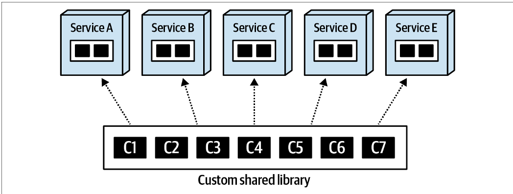

> 图 8-3：shared library 技术——公共代码在编译时被整合和共享。

### 依赖管理与变更控制

与服务粒度（在第 7 章中讨论）类似，shared library 的粒度也存在 trade-off。 形成
shared library trade-off 的两个对立力量是依赖管理和变更控制。

考虑图 8-4 中所示的粗粒度 shared library。请注意，
虽然依赖管理相对简单（每个服务使用单个 shared library），但变更控制却不简单。
如果粗粒度 shared library
中的任何类文件发生变更，*每个*服务，无论是否关心该变更， 最终都必须采用该变更，
因为 shared library
的版本弃用。这迫使所有使用该库的服务进行不必要的重新测试和重新部署，
从而显著增加了 shared library 变更的整体测试范围。


> 图 8-4：粗粒度 shared library 的变更影响多个服务，但保持较低依赖。

将共享代码拆分为更小的基于功能的 shared library（如安全性、
格式化器、注解、计算器等）更有利于变更控制和整体可维护性，
但不幸的是在依赖管理方面造成了混乱。如图 8-5 所示，共享类 C7 的变更仅影响服务 D
和服务 E， 但管理 shared library
和服务之间的依赖矩阵很快开始看起来像一团分布式大泥球（或某些人所说的分布式单体）。


> 图 8-5：细粒度 shared library 的变更影响更少的服务，但增加了依赖。

shared library 粒度的选择在只有少数服务时可能不太重要，
但随着服务数量的增加，与变更控制和依赖管理相关的问题也会增加。 想象一个有 200
个服务和 40 个 shared library 的系统——它很快就会变得过于复杂和不可维护。

鉴于变更控制和依赖管理的这些 trade-off，我们的建议是通常避免大型粗粒度 shared
library， 并尽可能争取更小的、功能分区的库，
从而在依赖管理之上优先考虑变更控制。例如，将相对静态的功能（如格式化器和安全性（认证和授权））
分离到它们自己的 shared library 中，
可以隔离这些静态代码，从而减少其他共享功能的测试范围和不必要的版本弃用部署。

### 版本控制策略

我们对 shared library 版本控制的一般建议是*始终使用版本控制！* 对你的 shared
library 进行版本控制不仅提供向后兼容性，
还提供高水平的敏捷性——快速响应变化的能力。

为了说明这一点，考虑一个包含通用字段验证规则的 shared library， 名为
*Validation.jar*，被 10 个服务使用。
假设其中一个服务需要立即更改其中一个验证规则。通过对 *Validation.jar*
文件进行版本控制， 需要更改的服务可以立即合并新的 *Validation.jar*
版本并立即部署到生产环境， 而不会影响其他 9 个服务。如果没有版本控制， 所有 10
个服务在进行 shared library 更改时都必须进行测试和重新部署， 从而增加 shared
library 更改的时间和协调量（因此敏捷性较低）。

虽然上述建议似乎显而易见，但版本控制中存在 trade-off
和隐藏的复杂性。事实上，版本控制可能如此复杂，
以至于你的作者们经常将版本控制视为分布式计算的第九个谬误： "版本控制很简单"。

shared library 版本控制的第一个复杂性是沟通版本变更。
在具有多个团队的高度分布式架构中，通常很难沟通 shared library 的版本变更。
其他团队如何知道 *Validation.jar* 刚刚升级到版本
1.5？变更了什么？哪些服务受到影响？ 哪些团队受到影响？ 即使有大量工具管理 shared
library、版本和变更文档（如 **JFrog Artifactory**），
版本变更仍然必须在正确的时间向正确的人进行协调和沟通。

另一个复杂性是 shared library 旧版本的弃用——在特定日期后移除不再支持的版本。
弃用策略范围从*自定义*（针对单个 shared library） 到*全局*（针对所有 shared
library）。而且，毫不奇怪，两种方法都涉及 trade-off。

为每个 shared library
分配自定义弃用策略通常是理想的方法，因为库的变更速度不同。例如， 如果
Security.jar shared library 不经常更改，只维护两到三个版本是合理的策略。然而，
如果 Calculators.jar shared library 每周更改，
只维护两到三个版本意味着所有使用该 shared library 的服务将每月（甚至每周）
合并新版本——导致大量不必要的频繁重新测试和重新部署。因此， 维护 Calculators.jar
的 10 个版本将是更合理的策略， 因为变更频率高。然而，这种方法的 trade-off 是，
必须有人维护和跟踪每个 shared library
的弃用。这有时可能是一项艰巨的任务，绝对不适合胆小的人。

由于各个 shared library 之间的变更是可变的，全局弃用策略虽然更简单，
但效果较差。全局弃用策略规定所有 shared library，无论变更速度如何，
都不会支持超过一定数量的向后版本（例如四个）。虽然这易于维护和治理，
但它可能导致显著的变动——服务的不断重新测试和重新部署——仅仅为了保持与频繁更改的
shared library 的最新版本的兼容性。 这可能会让团队发疯，
并显著降低整体团队速度和生产力。

无论使用哪种弃用策略，严重缺陷或对共享代码的破坏性变更都会使任何弃用策略失效，导致所有服务一次性（或在非常短的时间内）
采用 shared library 的最新版本。 这是我们建议保持 shared library
尽可能细粒度并避免包含系统中所有共享功能的粗粒度 SharedStuff.jar
类型库的另一个原因。

关于版本控制的最后一条建议：避免在指定服务需要哪个版本的库时使用 LATEST
版本。根据我们的经验， 使用 LATEST
版本的服务在进行快速修复或紧急热部署到生产环境时会遇到问题， 因为 LATEST
版本中的某些内容可能与服务不兼容，
从而导致团队需要额外的开发和测试工作才能将服务发布到生产环境。

虽然 shared library
技术允许对变更进行版本控制（因此为共享代码变更提供了良好的敏捷性水平），
但依赖管理可能困难且混乱。 表 8-2 列出了与此技术相关的各种 trade-off。

### trade-off

| 优点                             | 缺点                   |
| -------------------------------- | ---------------------- |
| 能够对变更进行版本控制           | 依赖可能难以管理       |
| 共享代码基于编译，减少运行时错误 | 异构代码库中的代码重复 |
| 对共享代码变更有良好的敏捷性     | 版本弃用可能困难       |
|                                  | 版本沟通可能困难       |

> 表 8-2：shared library 技术的 trade-off。

### 何时使用

shared library 技术适用于共享代码变更为低到中等的同构环境。
版本控制能力（虽然有时复杂）允许在进行共享代码变更时具有良好的敏捷性水平。 由于
shared library
通常在编译时绑定到服务，因此性能、可扩展性和容错等运维特性不会受到影响，
并且由于版本控制， 通过公共代码变更破坏其他服务的风险较低。

## shared service

使用 shared library 来提供公共功能的主要替代方案是使用 shared service。 *shared
service*技术，如图 8-6 所示， 通过将共享功能放在单独部署的服务中来避免重用。


> 图 8-6：shared service 技术——公共功能在运行时通过单独的服务提供。

shared service
技术的一个区别因素是共享代码必须采用组合形式，而不是继承。虽然从源代码设计的角度来看，
关于组合优于继承的使用存在很多争论（参见 Thoughtworks 文章"Composition vs.
Inheritance: How to Choose"和 Martin Fowler 的文章"Designed Inheritance"），
但在选择代码重用技术时，组合与继承在架构上很重要， 特别是对于 shared service
技术。

在过去，shared service 是解决分布式架构中共享功能的常见方法。
共享功能的变更不再需要重新部署服务；相反，由于变更隔离在单独的服务中，
它们可以在不重新部署需要共享功能的其他服务的情况下进行部署。然而，像软件架构中的一切一样，
使用 shared service 涉及许多 trade-off，包括变更风险、性能、 可扩展性和容错。

### 变更风险

使用 shared service 技术更改共享功能结果是一把双刃剑。如图 8-7 所示，
更改共享功能只需修改包含在单独服务中的共享代码（如折扣计算器），
重新部署服务，然后——变更现在对所有服务可用，无需重新测试和重新部署任何需要该共享功能的其他服务。


> 图 8-7：共享功能变更仅隔离在 shared service 中。

如果生活真那么简单就好了！当然， 问题在于对 shared service
的变更是*运行时*变更， 而不是 shared library 技术的*基于编译*的变更。因此，
shared service 中的"简单"变更可能有效地使整个系统瘫痪，如图 8-8 所示。


> 图 8-8：shared service 的变更可能在运行时破坏其他服务。

这必然将版本控制话题带到前台。在 shared library 技术中，
版本控制通过编译时绑定管理，显著降低了与 shared library 变更相关的风险。然而，
如何对一个简单的 shared service 变更进行版本控制？

当然，直接的回应是使用 API 端点版本控制——换句话说， 为每个 shared service
变更创建一个包含新版本 URI 的新端点，如示例 8-3 所示。

示例 8-3。使用版本控制进行 shared service 端点的折扣计算器

```text
app/1.0/discountcalc?orderid=123
app/1.1/discountcalc?orderid=123
app/1.2/discountcalc?orderid=123
app/1.3/discountcalc?orderid=123
latest change -> app/1.4/discountcalc?orderid=123
```

使用这种方法，每次 shared service 变更时， 团队都会创建一个包含新版本 URI 的新
API 端点。不难看出这种做法带来的问题。首先，
访问折扣计算器服务的服务（或每个服务的相应配置）必须更改以指向正确的版本。其次，
团队应该在什么时候创建新的 API 端点？对于简单的错误消息更改？对于新的计算？
版本控制此时开始变得非常主观，使用 shared service
的服务仍然必须更改以指向正确的端点。

API 端点版本控制的另一个问题是， 它假设对 shared service 的所有访问都是通过
RESTful API 调用进行的， 通过网关或点对点通信。然而，
在某些情况下，通过服务间通信访问 shared service 通常通过其他类型的协议进行，
如消息传递和 gRPC（除了 RESTful API 调用）。
这进一步复杂化了变更的版本控制策略，使得跨多个协议协调版本变得困难。

底线是，使用 shared service 技术， 对 shared service
的变更通常是运行时性质的，因此比 shared library 承担更大的风险。
虽然版本控制可以帮助降低这种风险，但它的应用和管理比 shared library 复杂得多。

### 性能

由于需要共享功能的服务必须对 shared service 进行服务间调用，
因此性能会因网络延迟（以及安全延迟，假设 shared service 的端点是安全的）
而受到影响。这种 trade-off，如图 8-9 所示， 在访问共享代码时使用 shared library
技术是不存在的。

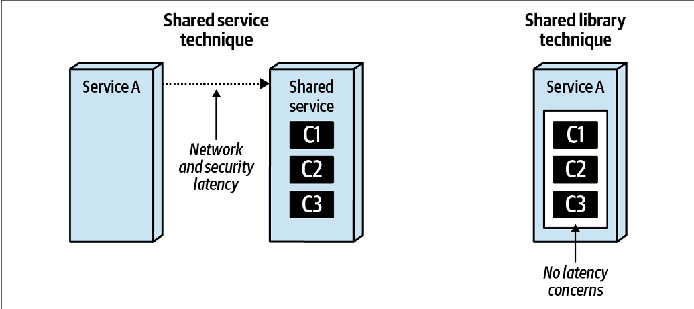

> 图 8-9：shared service 引入网络和安全延迟。

使用 gRPC
可以通过显著减少网络延迟来帮助缓解一些性能问题，使用异步协议（如消息传递）
也可以。通过消息传递，需要共享功能的服务可以通过请求队列发出请求，
执行其他工作，一旦需要，可以使用关联 ID
通过单独的回复队列检索结果（有关消息传递技术的更多信息， 请参见 *Java Message
Service, Second Edition*， Mark Richards 等人著，O'Reilly 出版）。

### 可扩展性

shared service 技术的另一个缺点是， shared service 必须随着使用 shared service
的服务扩展而扩展。这有时可能是一团乱麻， 特别是当多个服务同时访问同一个 shared
service 时。然而，如图 8-10 所示， shared library 技术没有这个问题，
因为共享功能在编译时包含在服务中。


> 图 8-10：shared service 必须随着依赖服务的扩展而扩展。

### 容错

虽然容错问题通常可以通过多个服务实例来缓解， 但它是使用 shared service
技术时需要考虑的一个 trade-off。如图 8-11 所示， 如果 shared service
变得不可用，需要共享功能的服务将被停止运行， 直到 shared service 可用。shared
library 技术没有这个问题，
因为共享功能在编译时包含在服务中，因此通过标准方法或函数调用访问。

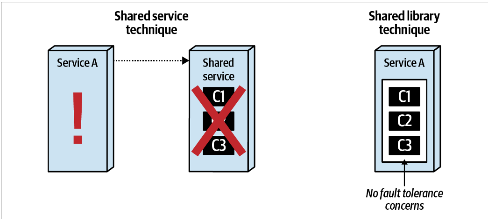

> 图 8-11：shared service 引入容错问题。

虽然 shared service 技术保留了 bounded context，
并且适用于频繁更改的共享代码，但性能、可扩展性和可用性等运维特性会受到影响。 表
8-3 列出了与此技术相关的各种 trade-off。

### trade-off

| 优点                   | 缺点                               |
| ---------------------- | ---------------------------------- |
| 适用于高代码变更率     | 版本控制变更可能困难               |
| 异构代码库中无代码重复 | 因延迟影响性能                     |
| 保留 bounded context   | 因服务依赖导致容错和可用性问题     |
| 无静态代码共享         | 因服务依赖导致可扩展性和吞吐量问题 |
|                        | 因运行时变更增加风险               |

> 表 8-3：shared service 技术的 trade-off。

### 何时使用

shared service 技术适用于高度 polyglot 环境（具有多种异构语言和平台的环境），
以及共享功能倾向于频繁更改时。 虽然 shared service 中的变更通常比 shared library
技术更敏捷， 但要小心运行时副作用和对需要共享功能的服务的风险。

## sidecar 与 service mesh

也许架构师对任何问题的最常见回答是"看情况！"在分布式架构中，没有哪个问题比运维耦合更能说明这种模糊性。

微服务架构的设计目标之一是高度解耦，通常体现在"重复优于耦合"的建议中。例如，
假设两个 Sysops Squad 服务需要传递客户信息， 但 domain-driven design 的 bounded
context 要求实现细节对服务保持私有。因此，
一个常见的解决方案允许每个服务拥有自己的实体内部表示（如 Customer），
以松散耦合的方式传递信息，例如 JSON 中的名称-值对。请注意，
这允许每个服务随意更改其内部表示，包括技术栈，而不会破坏集成。架构师通常不赞成重复代码，
因为它会导致同步问题、语义漂移和许多其他问题，
但有时存在比重复问题更糟糕的力量，而微服务中的耦合通常符合这种情况。因此，
在微服务架构中，对于"我们应该重复还是耦合到某个能力？
"这个问题的答案很可能是*重复*，而在另一种架构风格（如基于服务的架构）中，正确的答案很可能是*耦合*。看情况！

在设计微服务时，架构师已经接受了实现重复的现实以保持解耦。但是，
那些从高耦合中受益的能力类型呢？例如，考虑常见的运维能力，如监控、日志记录、认证和授权、
断路器以及每个服务应该具备的许多其他运维能力。但允许每个团队管理这些依赖通常会陷入混乱。例如，
考虑像 Penultimate Electronics 这样的公司试图标准化一个通用的监控解决方案，
以便更容易地运维各种服务。然而，
如果每个团队负责为其服务实现监控，运维团队如何确定他们做到了？还有，统一升级等问题呢？
如果监控工具需要在整个组织内升级，团队如何协调？

过去几年在微服务生态系统中出现的常见解决方案以一种优雅的方式解决了这个问题，即使用
sidecar 模式。 此模式基于 Alistair Cockburn
定义的更早的架构模式，称为*六边形架构*，如图 8-12 所示。


> 图 8-12：六边形模式将领域逻辑与技术耦合分离。

在这种六边形模式中，我们现在称之为领域逻辑的东西位于六边形的中心，周围是端口和适配器，
连接到生态系统的其他部分（事实上，这种模式也被称为*端口和适配器模式*）。
虽然比微服务早很多年，但这种模式与现代微服务有相似之处，但有一个显著的区别：数据保真度。
六边形架构将数据库视为另一个可以插入的适配器， 但 DDD
的一个见解表明，数据模式和事务性应该在内部——就像微服务一样。

*sidecar 模式*利用与六边形架构相同的概念，将领域逻辑与技术（基础设施）逻辑解耦。
例如，考虑两个微服务，如图 8-13 所示。


> 图 8-13：两个共享相同运维能力的微服务。

这里，每个服务都包含运维关注点（服务底部较大的组件）
和领域关注点（服务顶部标记为"领域"的框）之间的分离。如果架构师希望在运维能力方面保持一致性，
可分离的部分进入 sidecar 组件，其名称隐喻性地取自附着在摩托车上的 sidecar，
其实现要么是跨团队的共享责任，要么由集中的基础设施组管理。
如果架构师可以假设每个服务都包含 sidecar，它通过服务平面形成一致的运维接口，如图
8-14 所示。


> 图
> 8-14：当每个微服务包含一个公共组件时，架构师可以在它们之间建立链接以实现一致控制。

如果架构师和运维人员可以安全地假设每个服务都包含 sidecar
组件（由适应度函数治理）， 它就形成了一个 service mesh，如图 8-15 所示。
每个服务右侧的框都相互连接，形成"网格"。

拥有网格允许架构师和 DevOps 创建仪表板、控制运维特性（如扩展）以及许多其他能力。


> 图 8-15：service mesh 是服务之间的运维链接。

sidecar 模式允许治理组（如企业架构师）对过多的 polyglot 环境进行合理的约束：
微服务的一个优势是依赖集成而非公共平台，允许团队按服务选择正确的复杂性和能力水平。
然而，随着平台数量的激增，统一治理变得更加困难。因此，团队通常使用 service mesh
的一致性作为驱动程序， 以支持跨多个异构平台的基础设施和其他横切关注点。例如，
没有 service mesh，如果企业架构师希望统一一个公共监控解决方案，
那么团队必须为每个支持该解决方案的平台构建一个 sidecar。

sidecar 模式不仅代表了一种将运维能力与领域解耦的方式——它也是一种正交重用模式，
用于解决特定类型的耦合（参见[正交耦合](#正交耦合)）。通常，
架构解决方案需要几种类型的耦合，例如我们当前的领域与运维耦合示例。
正交重用模式提供了一种方式来重用与架构中的一个或多个接缝相对的某些方面。例如，
微服务架构围绕领域组织，但运维耦合需要跨越这些领域。 sidecar
允许架构师将这些关注点隔离在跨架构的横切但一致的层中。

### 正交耦合

在数学中，如果两条线以直角相交，则它们是*正交*的，这也意味着独立性。在软件架构中，
架构的两个部分可能是*正交耦合*的：两个不同的目的，
但仍然必须相交以形成完整的解决方案。本章中明显的例子是运维关注点（如监控），它是必要的，但独立于领域行为（如目录结账）。
识别正交耦合允许架构师找到在关注点之间造成最少纠缠的交叉点。

虽然 sidecar 模式提供了一个很好的抽象，但像所有其他架构方法一样，它也有
trade-off， 如表 8-4 所示。

### trade-off

| 优点                               | 缺点                           |
| ---------------------------------- | ------------------------------ |
| 提供一种一致的方式来创建隔离耦合   | 必须为每个平台实现一个 sidecar |
| 允许一致的基础设施协调             | sidecar 组件可能变得庞大/复杂  |
| 每个团队、集中化或某种组合的所有权 |                                |

> 表 8-4：sidecar 模式/service mesh 技术的 trade-off。

### 何时使用

sidecar 模式和 service mesh
提供了一种干净的方式来在分布式架构中传播某种横切关注点，
并且可以用于不仅仅是运维耦合（参见第 14 章）。 它提供了 Gang of Four
设计模式书中装饰器设计模式的架构等价物——它允许架构师在分布式架构中"装饰"行为，
独立于正常的连接性。

## Sysops Squad Saga：公共基础设施逻辑

### 2 月 10 日，星期四，10:34


> 插图 8-2：Sydney 和 Taylen 讨论共享消息分发库。

在一个雾蒙蒙的早晨，Sydney 探头到 Taylen
的办公室。"嘿，你在使用共享的消息分发库吗？"

Taylen 回答："是的，我们正在尝试统一使用它，以便在消息解析方面获得一些一致性。"

Sydney
说："好的，但现在我们收到了重复的日志消息——看起来库写入了日志，但我们的服务也写入了日志。
应该是这样吗？"

"不，"Taylen
回答。"我们绝对不想要重复的日志条目。那只会让一切变得混乱。我们应该问问
Addison。"

于是，Sydney 和 Taylen 来到了 Addison 的办公室。"嘿，你有时间吗？"

Addison 回答："总是为你——怎么了？"

Sydney 说："我们一直在将大量重复的代码整合到 shared library 中，
这很有效——我们在识别很少变更的部分方面做得越来越好。但是，
现在我们遇到了一个把我们带到这里的问题——谁应该负责写日志消息？库、服务，还是其他什么？而且，我们如何使其一致？"

Addison 说："我们碰到了运维共享行为。日志记录只是其中之一。监控、服务发现、
断路器，甚至一些工具函数，比如几个团队正在共享的 JSONtoXML 库呢？
我们需要一种更好的方式来处理这个问题，以防止问题。
这就是为什么我们正在实施一个带有 sidecar 组件的 service mesh
来包含这些公共行为。"

Sydney 说： "我读过关于 sidecar 和 service mesh
的文章——这是一种跨多个微服务共享东西的方式， 对吧？"

Addison 说："差不多，但不是所有种类的东西。 service mesh 和 sidecar
的意图是整合运维耦合，而不是领域耦合。例如，就像我们的情况一样，
我们希望所有服务的日志记录和监控保持一致，但不想让每个团队为此操心。
如果我们将日志记录代码整合到每个服务实现的公共 sidecar
中，我们就可以强制执行一致性。"

Taylen 问："谁拥有 shared library？所有团队共享责任？"

Addison 回答："我们考虑过这个问题，但我们现在有足够多的团队了；
我们已经建立了一个共享基础设施团队，负责管理和维护 sidecar 组件。
他们已经构建了部署流水线，一旦 sidecar
绑定到服务中，就使用一组适应度函数自动测试 sidecar。"

Sydney 说："所以如果我们需要在服务之间 shared library，只需让他们把它放在
sidecar 里？"

Addison 说："小心——sidecar 不是用来放任何东西的，只放运维耦合。"

"我不确定这个区别是什么，"Taylen 说。

"运维耦合包括我们一直在讨论的东西——日志记录、监控、服务发现、认证和授权等等。基本上，
它涵盖了基础设施的所有管道部分，没有领域责任。但你不应该把领域共享组件， 比如
Address 或 Customer 类，放在 sidecar 里。"

Sydney 问："但为什么？如果我需要在两个服务中使用相同的类定义呢？ 把它放在
sidecar 里不会使它对两者都可用吗？"

Addison 回答："是的，但现在你正在以我们在微服务中试图避免的方式增加耦合。
在大多数架构中，该服务的单一实现将在需要它的团队之间共享。然而，在微服务中，
这创建了一个耦合点，以一种不希望的方式将多个服务绑在一起——如果一个团队更改了共享代码，每个团队都必须协调该更改。然而，
架构师可以决定将 shared library 放在 sidecar 中——毕竟，它是一种技术能力。
两种答案都没有明确的对错， 这使它成为一个架构决策，值得进行 trade-off 分析。
例如，如果 Address 类发生变化，并且两个服务都依赖它，
它们都必须更改——这就是耦合的定义。我们用契约来处理这些问题。另一个问题涉及大小：
我们不希望 sidecar 成为架构中最大的部分。例如，考虑我们之前讨论的 JSONtoXML
库。有多少团队使用它？"

Taylen 说："嗯，任何需要与大型机系统集成的团队——大概 5 个，总共 16 或 17
个团队？"

Addison 说："完美。好的，把 JSONtoXML 放在 sidecar 中的 trade-off 是什么？"

Sydney 回答："嗯，这意味着每个团队自动拥有该库，不必通过依赖来引入它。"

"坏的一面呢？"Addison 问。

"嗯，把它放在 sidecar 里会使它变大，但不会太多——这是一个小库。"Sydney 说。

"这就是共享工具代码的关键
trade-off——有多少团队需要它，与它给每个服务增加多少开销，
特别是那些不需要它的服务。"

"如果不到一半的团队使用它，可能不值得这个开销，"Sydney 说。

"对！所以，目前，我们将把它放在 sidecar 之外，也许将来再重新评估，"Addison 说。

### ADR：使用 sidecar 进行运维耦合

#### 上下文

我们微服务架构中的每个服务都需要公共且一致的运维行为；将这一责任留给每个团队会引入不一致和协调问题。

#### 决策

我们将使用 sidecar 组件结合 service mesh 来整合共享的运维耦合。

共享基础设施团队将拥有并维护服务团队的 sidecar；服务团队充当他们的客户。sidecar
将提供以下服务：

- 监控
- 日志记录
- 服务发现
- 认证
- 授权

#### 后果

团队不应将领域类添加到 sidecar 中，这会鼓励不适当的耦合。

团队与共享基础设施团队合作，如果有足够多的团队需要，将共享的运维库放在 sidecar
中。

## 代码重用：何时增加价值？

许多架构师在遇到某些情况时未能正确评估 trade-off， 这不一定是缺陷——许多
trade-off 只有在事后才变得明显。

重用是最被滥用的抽象之一，因为组织中的普遍观点是重用代表了团队应该努力追求的值得称赞的目标。然而，
未能评估与重用相关的所有 trade-off 可能导致架构中的严重问题。

过度重用的危险是许多架构师从 20
世纪早期由编排驱动的面向服务架构趋势中学到的教训之一，
当时许多组织的主要目标之一是最大化重用。

考虑一个保险公司的场景，如图 8-16 所示。

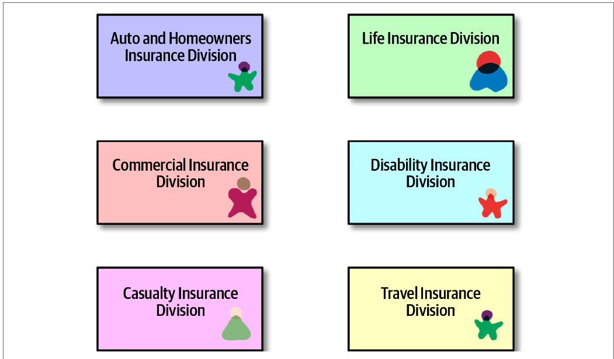

> 图 8-16：大型保险公司中每个领域都有自己对客户的视图。

公司中的每个部门都关心客户的某些方面。多年前，架构师被指示要留意这种共性；一旦发现，
目标是将组织对客户的视图整合到一个单一服务中，如图 8-17 所示。

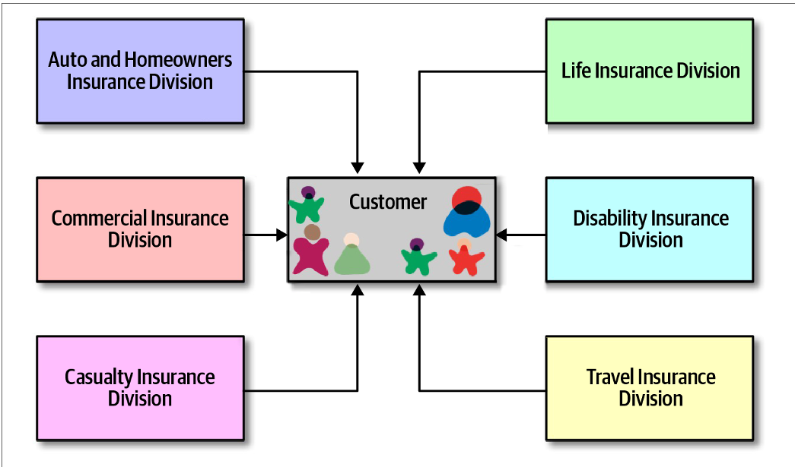

> 图 8-17：统一到一个集中的 Customer 服务。

虽然图 8-17 中的图景可能看起来合乎逻辑，但由于两个原因，它是一个架构灾难。首先，
如果关于关键实体（如 Customer）的所有机构信息必须驻留在单一位置，
那么该实体必须足够复杂以处理任何领域和场景，使得简单的事情难以使用。

其次，它在架构中创建了*脆性*。如果每个需要客户信息的领域都必须从单一位置获取，
那么当该位置发生变更时，所有东西都会崩溃。例如，在我们的示例中， 当
CustomerService 需要代表某个领域添加新功能时会发生什么？
该变更可能潜在地影响每个其他领域，需要协调和测试以确保变更没有在架构中"扩散"。

架构师未能意识到的是，重用有两个重要的方面；他们正确地理解了第一个：抽象。
架构师和开发人员发现重用候选者的方式是通过抽象。然而，
第二个考虑因素决定了实用性和价值：变更速率。

观察到某些重用会导致脆性，这引出了一个问题：这种重用与我们明显受益的重用类型有何不同？
考虑每个人成功重用的东西：操作系统、开源框架和库等。
是什么区分了这些与项目团队构建的资产？答案是*缓慢的变更速率*。我们受益于技术耦合，
如操作系统和外部框架，因为它们有充分理解的变更速率和更新节奏。
内部领域能力或快速变化的技术框架是糟糕的耦合目标。

> [!TIP]
> 重用通过抽象推导，但通过缓慢的变更速率来运作。

## 通过平台重用

大量报道颂扬了组织内平台的美德，几乎到了*语义扩散*的地步。然而，
大多数人同意*平台*是组织内重用的新目标，这意味着对于每个可区分的领域能力，
组织构建一个具有明确定义 API 的平台来隐藏实现细节。

缓慢的变更速率驱动了这种推理。正如我们在第 13 章中讨论的， API
可以被设计为与调用者相当松散地耦合，允许实现细节的激进内部变更速率而不破坏
API。当然，
这并不能保护组织免受必须在领域之间传递的信息的语义变更的影响，但通过精心设计封装和契约，
架构师可以限制集成架构中的破坏性变更和脆性。

## Sysops Squad Saga：共享领域功能

### 2 月 8 日，星期二，12:50


> 插图 8-3：Sydney 和 Taylen 讨论共享数据库逻辑。

在 Addison 的批准下，开发团队决定将核心工单功能拆分为三个独立的服务：
面向客户的工单创建服务、工单分配服务和工单完成服务。然而，
这三个服务都使用公共的数据库逻辑（查询和更新），并在工单数据领域中共享一组数据库表。

Taylen
想要创建一个共享数据服务，该服务将包含公共数据库逻辑，从而形成一个数据库抽象层，如图
8-18 所示。


> 图 8-18：使用共享工单数据服务作为 Sysops Squad
> 工单服务的公共数据库逻辑的选项。

Skyler 讨厌这个想法，并希望使用一个 shared library（DLL），
每个服务将其作为构建和部署的一部分包含，如图 8-19 所示。

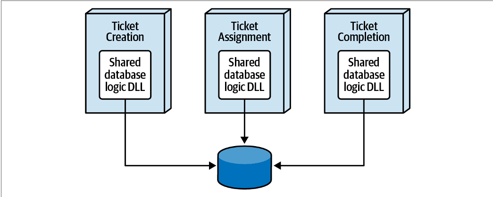

> 图 8-19：使用 shared library 作为 Sysops Squad
> 工单服务的公共数据库逻辑的选项。

两位开发人员与 Addison 会面以解决这个障碍。

"那么，Addison，你的意见是什么？ 共享数据库逻辑应该在共享数据服务中还是 shared
library 中？"Taylen 问道。

"这不是意见的问题，"Addison 说。 "这是分析 trade-off
以得出核心共享工单数据库功能的最合适解决方案的问题。让我们采用基于假设的方法，
假设最合适的解决方案是使用共享数据服务。"

"等等，"Skyler 说。"对于这个问题，这根本不是一个好的架构解决方案。"

"为什么？"Addison 问道，促使 Skyler 开始从 trade-off 的角度思考。

"首先，"Skyler 说，"所有三个服务都需要对共享数据服务进行服务间调用，
以进行每次数据库查询或更新。如果我们这样做，将会遭受严重的性能损失。此外，
如果共享数据服务宕机，所有这三个服务都将停止运行。"

"那又怎样？"Taylen
说。"这都是后端功能，谁在乎呢？后端功能不需要那么快，而且服务如果失败，恢复得相当快。"

"实际上，"Addison 说，"这不全是后端功能。别忘了，
工单创建服务是面向客户的，它将使用与后端工单功能相同的共享数据服务。"

"是的，但大部分功能仍然是后端，"Taylen 说，语气比之前少了一些自信。

"到目前为止，"Addison 说，"看起来使用共享数据服务的 trade-off
是工单服务的性能和容错。"

"我们也不要忘记，对共享数据服务所做的任何更改都是运行时更改。换句话说， "Skyler
说，"如果我们进行更改并部署共享数据服务，我们可能会破坏某些东西。"

"这就是我们测试的原因，"Taylen 说。

"是的，但如果你想降低风险，你必须为共享数据服务的每次更改测试所有工单服务，这显著增加了测试时间。使用共享
DLL， 我们可以对 shared library 进行版本控制以提供向后兼容性，"Skyler 说。

"好的，我们也将增加的风险和增加的测试工作添加到 trade-off 中， "Addison
说。"此外，我们不要忘记，从可扩展性的角度来看，我们会有额外的协调。
每次我们创建更多工单创建服务的实例时，我们都必须确保也创建更多共享数据服务的实例。"

"我们不要一直关注负面因素了，"Taylen 说。"使用共享数据服务的好处呢？"

"好的，"Addison 说，"让我们谈谈使用共享数据服务的好处。"

"当然是数据抽象，"Taylen
说。"服务不必担心任何数据库逻辑。它们只需要对共享数据服务进行远程服务调用即可。"

"还有其他好处吗？"Addison 问道。

"嗯，"Taylen 说，"我本来想说集中式连接池，
但无论如何我们都需要多个实例来支持客户工单创建服务。这会有帮助，但这不是一个重大的游戏规则改变者，
因为只有三个服务，每个服务的实例不多。然而，使用共享数据服务，
变更控制会容易得多。我们不必为数据库逻辑更改重新部署任何工单服务。"

"让我们看看仓库中那些共享类文件，并历史地看看该代码实际有多少变更，"Addison 说。

Addison、Taylen 和 Skyler 都查看了共享数据逻辑类文件的仓库历史。

"嗯..."Taylen
说，"我以为该代码的变更比仓库中显示的多得多。好的，所以我想共享数据库逻辑的变更确实相当少。"

通过讨论 trade-off 的对话， Taylen 开始意识到 shared service
的负面因素似乎超过了正面因素， 并且没有真正令人信服的理由将共享数据库逻辑放在
shared service 中。 Taylen 同意将共享数据库逻辑放在共享 DLL 中， Addison
为这个架构决策写了一份 ADR：

### ADR：使用 shared library 进行公共工单数据库逻辑

#### 上下文

工单功能被拆分为三个服务：工单创建、工单分配和工单完成。所有三个服务使用公共代码进行大部分数据库查询和更新语句。
两个选项是使用 shared library 或创建共享数据服务。

#### 决策

我们将使用 shared library 进行公共工单数据库逻辑。

使用 shared library
将改善面向客户的工单创建服务以及工单分配服务的性能、可扩展性和容错。

我们发现公共数据库逻辑代码变更不大，因此是相当稳定的代码。此外，
变更对公共数据库逻辑的风险较小，因为服务需要测试和重新部署。如果需要变更，
我们将在适当的地方应用版本控制，以便在公共数据库逻辑变更时并非所有服务都需要重新部署。

使用 shared library 减少了服务耦合，并消除了额外的服务依赖、HTTP
流量和整体带宽。

#### 后果

共享 DLL
中公共数据库逻辑的变更将需要工单服务进行测试和部署，因此降低了工单功能公共数据库逻辑的整体敏捷性。

服务实例需要管理自己的数据库连接池。

# 第 9 章：数据所有权与分布式事务

12 月 10 日，星期五，09:12


> 插图 9-1：Addison 和 Sydney 讨论数据所有权。

当数据库团队致力于分解单体 Sysops Squad 数据库时， Sysops Squad 开发团队与
Sysops Squad 架构师 Addison 一起， 开始致力于在服务和数据之间形成 bounded
context，在此过程中将表所有权分配给服务。

"为什么你把专家资料表添加到工单分配服务的 bounded context 中？"Addison 问道。

"因为，"Sydney
说，"工单分配依赖该表进行分配算法。它不断查询该表以获取专家的位置和技能信息。"

"但它只对专家表进行查询，"Addison 说。
"用户维护服务包含执行数据库更新以维护该信息的功能。因此，在我看来，专家资料表应该由用户维护服务拥有，
并放在该 bounded context 中。"

"我不同意，"Sydney
说。"我们根本无法承受分配服务为每次查询对用户维护服务进行远程调用。这根本行不通。"

"在这种情况下，当专家获得新技能或更改服务地点，专家表如何更新？还有，
当我们雇佣新专家时呢？"Addison 问道。"那将如何工作？"

"简单，"Sydney
说。"用户维护服务仍然可以访问专家表。它只需要连接到不同的数据库。这有什么大不了的？"

"你不记得 Dana 之前说的了吗？多个服务连接到同一个数据库模式是可以的，
但一个服务连接到多个数据库或模式是不可以的。Dana 说那是不可行的，
不会允许这种事情发生，"Addison 说。

"哦，对，我忘了那条规则。那么我们该怎么办？"Sydney 问道。
"我们有一个服务需要偶尔进行更新，而一个完全不同领域的完全不同服务需要频繁从表中读取。"

"我不知道正确答案是什么，"Addison 说。"显然，
这需要数据库团队和我们之间更多的协作来解决这些问题。让我看看 Dana
能否提供任何建议。"

一旦数据被拆分，就必须重新拼接起来以使系统工作。这意味着要弄清楚哪些服务拥有什么数据，
如何管理分布式事务，以及服务如何访问它们需要（但不再拥有）的数据。
在本章中，我们探讨将分布式数据重新组合的所有权和事务方面。

## 分配数据所有权

在分布式架构中拆分数据后，架构师必须确定哪些服务拥有什么数据。不幸的是，
将数据所有权分配给服务并不像听起来那么容易，这成为软件架构的另一个难题。

分配表所有权的一般经验法则是，对表执行写操作的服务拥有该表。
虽然这个一般经验法则适用于单一所有权（只有一个服务曾经写入表），
但当团队有联合所有权（多个服务对同一个表进行写操作）或更糟糕的是公共所有权（大多数或所有服务写入表）时，情况就变得混乱。

> [!TIP]
> 数据所有权的一般经验法则是，对表执行写操作的服务是该表的所有者。然而，联合所有权使这个简单的规则变得复杂！

为了说明数据所有权的一些复杂性，考虑图 9-1 所示的示例，显示三个服务： 一个
Wishlist 服务，管理所有客户愿望清单；一个 Catalog 服务， 维护产品目录；一个
Inventory 服务，维护产品目录中所有产品的库存和补货功能。

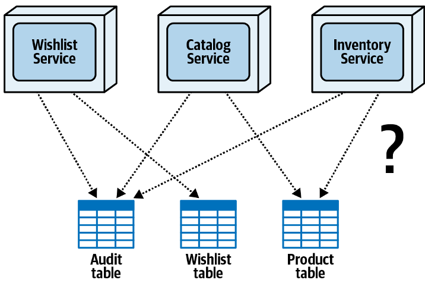

> 图 9-1：数据被拆分后，表必须分配给拥有它们的服务。

进一步复杂化的是， 注意 Wishlist 服务写入 Audit 表和 Wishlist 表， Catalog
服务写入 Audit 表和 Product 表， 而 Inventory 服务写入 Audit 表和 Product
表。突然之间， 这个简单的现实世界示例使分配数据所有权变得复杂而混乱。

在本章中，我们通过讨论将数据所有权分配给服务时遇到的三种场景（单一所有权、
公共所有权和联合所有权），并使用图 9-1
作为公共参考点，来探索解决这些场景的技术。

## 单一所有权场景

单一表所有权发生在只有一个服务写入表时。这是最直接的数据所有权场景，相对容易解决。回顾图
9-1， 注意 Wishlist 表只有一个服务写入它——Wishlist 服务。

在这种场景中， 很明显 Wishlist 服务应该是 Wishlist
表的所有者（无论其他服务是否需要对该表的只读访问）， 见图
9-2。注意在此图的右侧， Wishlist 表成为 Wishlist 服务 bounded context 的一部分。
这种图表技术是指示表所有权以及服务与其对应数据之间形成的 bounded context
的有效方式。

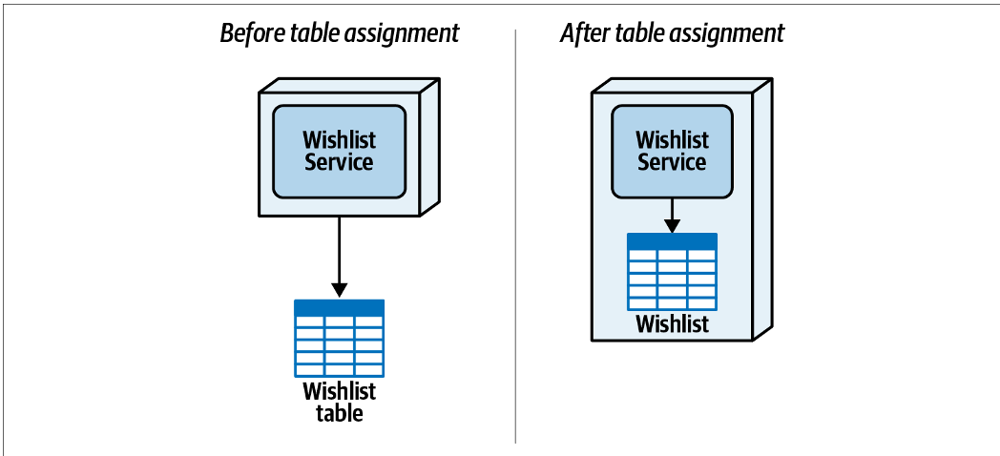

> 图 9-2：在单一所有权中，写入表的服务成为表所有者。

由于这种场景的简单性，我们建议首先解决单一表所有权关系，以清理场地，
从而更好地解决出现的更复杂的场景：公共所有权和联合所有权。

## 公共所有权场景

公共表所有权发生在大多数（或所有）服务需要写入同一个表时。例如， 图 9-1
显示所有服务（Wishlist、Catalog 和 Inventory） 都需要写入 Audit
表以记录用户执行的操作。由于所有服务都需要写入该表， 因此很难确定谁应该实际拥有
Audit 表。虽然这个简单示例只包含三个服务，
但想象一个更现实的示例，可能有数百（甚至数千）个服务必须写入同一个 Audit 表。

简单地将 Audit 表放在所有服务使用的共享数据库或共享模式中的解决方案，
不幸地重新引入了第 6 章开头描述的所有数据共享问题，包括变更控制、连接饥饿、
可扩展性和容错。因此，需要另一种解决方案来解决公共数据所有权。

解决公共表所有权的一种流行技术是指定一个专用的单一服务作为该数据的主要（和唯一）
所有者，这意味着只有一个服务负责将数据写入表。
需要执行写操作的其他服务将信息发送到专用服务，然后由该服务对表执行实际的写操作。

如果发送数据的服务不需要信息或确认，服务可以使用持久队列进行异步即发即忘消息传递。或者，
如果需要根据写操作向调用者返回信息（例如返回确认号或数据库键），
服务可以使用类似 REST、gRPC 或请求-回复消息传递（伪同步）进行同步调用。

回到 Audit 表示例，注意在图 9-3 中，架构师创建了一个新的 Audit 服务， 并分配其对
Audit 表的所有权，
这意味着它是唯一在表上执行读或写操作的服务。在此示例中，由于不需要返回信息，
架构师使用异步即发即忘消息传递和持久队列，以便 Wishlist 服务、 Catalog 服务和
Inventory 服务不需要等待审计记录写入表。
使队列持久化（意味着消息由代理存储在磁盘上）在服务或代理故障时提供保证传递，
并有助于确保没有消息丢失。

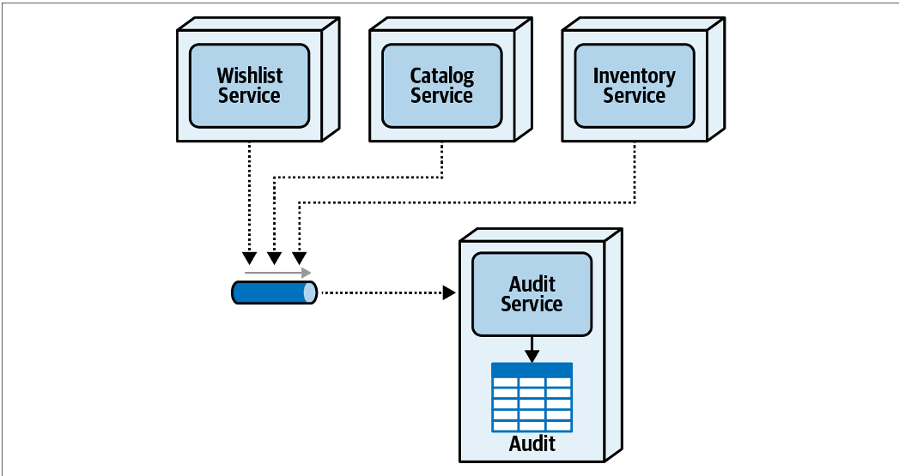

> 图 9-3：公共所有权使用专用服务所有者。

在某些情况下，服务可能需要读取它们不拥有的公共数据。这些只读访问技术在第 10
章中详细描述。

## 联合所有权场景

涉及数据所有权的更常见（和复杂）的场景之一是联合所有权，
当多个服务对同一个表执行写操作时发生。这种场景与之前的公共所有权场景不同，在联合所有权中，
只有同一领域内的几个服务写入同一个表，而在公共所有权中，大多数或所有服务对同一个表执行写操作。例如，
注意在图 9-1 中， 所有服务对 Audit 表执行写操作（公共所有权）， 而只有 Catalog
和 Inventory 服务对 Product 表执行写操作（联合所有权）。

图 9-4 显示了图 9-1 中隔离的联合所有权示例。 Catalog
服务将新产品插入表中，移除不再提供的产品，并更新静态产品信息的变化， 而
Inventory 服务负责读取和更新每个产品的当前库存，因为产品被查询、销售或退回。


> 图 9-4：当同一领域内的多个服务对同一个表执行写操作时，发生联合所有权。

幸运的是，存在几种技术来解决这种所有权场景——表拆分技术、数据领域技术、
委托技术和服务整合技术。每个技术在以下各节中详细讨论。

### 表拆分技术

*表拆分技术*将单个表拆分为多个表，以便每个服务拥有其负责的部分数据。 此技术在
*Refactoring Databases* 一书和配套网站中有详细描述。

为了说明表拆分技术，考虑图 9-4 中所示的 Product 表示例。在这种情况下，
架构师或开发人员首先创建一个单独的 Inventory 表， 包含产品
ID（键）和库存计数（可用项目数量），用现有 Product 表中的数据预填充 Inventory
表， 然后最终从 Product 表中移除库存计数列。 示例 9-1
中的源代码清单显示了如何在典型的关系型数据库中使用 data definition
language（DDL）实现此技术。

示例 9-1。拆分 Product 表并将库存计数移动到新 Inventory 表的 DDL 源代码

```sql
CREATE TABLE Inventory
(
    product_id VARCHAR(10),
    inv_cnt INT
);

INSERT INTO Inventory VALUES (product_id, inv_cnt)
AS SELECT product_id, inv_cnt FROM Product;

COMMIT;

ALTER TABLE Product DROP COLUMN inv_cnt;
```

拆分数据库表将联合所有权转变为单一表所有权场景：Catalog 服务拥有 Product
表中的数据， 而 Inventory 服务拥有 Inventory 表中的数据。然而，如图 9-5
所示，当创建或移除产品时， 此技术需要 Catalog 服务和 Inventory
服务之间的通信，以确保两个表之间的数据保持一致。

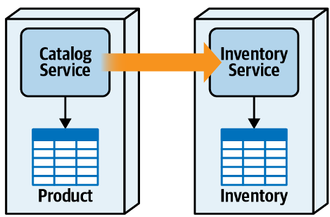

> 图 9-5：可以通过拆分共享表来解决联合所有权。

例如，如果添加新产品，Catalog 服务生成产品 ID 并将新产品插入 Product 表。然后，
Catalog 服务必须将该新产品 ID（以及可能的初始库存计数）发送到 Inventory
服务。如果移除产品， Catalog 服务首先从 Product 表中移除产品， 然后必须通知
Inventory 服务从 Inventory 表中移除库存行。

在拆分表之间同步数据不是一件小事。 Catalog 服务和 Inventory
服务之间的通信应该是同步还是异步？当添加或移除产品时， 如果发现 Inventory
服务不可用，Catalog 服务应该怎么办？这些是难以回答的问题，
通常由分布式架构中常见的传统可用性与一致性 trade-off 驱动。 选择可用性意味着
Catalog 服务始终能够添加或移除产品更为重要， 即使可能不会在 Inventory
表中创建相应的库存记录。 选择一致性意味着两个表始终保持同步更为重要，如果
Inventory 服务不可用，
这将导致产品创建或移除操作失败。由于网络分区在分布式架构中是必要的， CAP
定理指出这些选择（一致性或可用性）中只有一个可能。

通信协议的类型（同步与异步）在拆分表时也很重要。 Catalog
服务在创建新产品时是否需要确认相应的 Inventory
记录已添加？如果是，则需要同步通信，
以牺牲性能为代价提供更好的数据一致性。如果不需要确认，Catalog
服务可以使用异步即发即忘通信， 以牺牲数据一致性为代价提供更好的性能。如此多的
trade-off 需要考虑！

表 9-1 总结了联合所有权表拆分技术的 trade-off。

### trade-off

| 优点                 | 缺点                     |
| -------------------- | ------------------------ |
| 保留 bounded context | 表必须被修改和重构       |
| 单一数据所有权       | 可能的数据一致性问题     |
|                      | 表更新之间没有 ACID 事务 |
|                      | 数据同步困难             |
|                      | 表之间可能发生数据复制   |

> 表 9-1：联合所有权表拆分技术 trade-off。

### 数据领域技术

联合所有权的另一种技术是创建共享的*数据领域*。当数据所有权在服务之间共享时形成，从而为表创建多个所有者。使用此技术，
由相同服务共享的表被放入相同的模式或数据库中，因此在服务和数据之间形成更广泛的
bounded context。

注意图 9-6 看起来接近图 9-4 中的原始图表， 但有一个明显的区别——数据领域图将
Product 表放在每个拥有服务上下文之外的单独框中。
这种图表技术清楚地表明，该表不由任何服务拥有，也不属于任何服务的 bounded
context， 而是在更广泛的 bounded context 中在它们之间共享。


> 图 9-6：在联合所有权中，服务可以通过使用数据领域技术（共享模式）共享数据。

虽然数据共享在分布式架构中通常是不鼓励的（特别是微服务），
但它确实解决了其他联合所有权技术中发现的一些性能、可用性和数据一致性问题。因为服务不相互依赖，
Catalog 服务可以创建或移除产品而无需与 Inventory 服务协调， Inventory
服务可以调整库存而无需 Catalog 服务。 两个服务完全相互独立。

> [!TIP]
> 选择数据领域技术时，始终重新评估为什么需要单独的服务，因为数据对每个服务都是公共的。理由可能包括可扩展性差异、
> 容错需求、 吞吐量差异或隔离代码变更率（参见第 7 章）。

不幸的是，在分布式架构中共享数据引入了许多问题，首先是更改数据结构（例如更改表的模式）所需的增加努力。
因为在服务和数据之间形成了更广泛的 bounded context，
对共享表结构的更改可能需要这些更改在多个服务之间协调。这增加了开发工作量、
测试范围和部署风险。

数据领域技术在数据所有权方面的另一个问题是控制哪些服务对什么数据有写责任。在某些情况下，
这可能不重要，但如果控制对某些数据的写操作很重要，
则需要额外的努力来应用特定的治理规则以维护特定的表或列写所有权。

表 9-2 总结了联合所有权场景的数据领域技术的 trade-off。

### trade-off

| 优点                   | 缺点                       |
| ---------------------- | -------------------------- |
| 良好的数据访问性能     | 数据模式更改涉及更多服务   |
| 无可扩展性和吞吐量问题 | 数据模式更改的测试范围增加 |
| 数据保持一致           | 数据所有权治理（写责任）   |
| 无服务依赖             | 数据模式更改的部署风险增加 |

> 表 9-2：联合所有权数据领域技术 trade-off。

### 委托技术

解决联合所有权场景的另一种方法是*委托技术*。使用此技术，
一个服务被分配表的单一所有权并成为委托者，其他服务与委托者通信以代表其执行更新。

委托技术的挑战之一是知道哪个服务分配为委托者（表的唯一所有者）。
第一个选项称为*主要领域优先*，将表所有权分配给最接近数据主要领域的服务——换句话说，
对该领域内特定实体执行大部分主要实体 CRUD 操作的服务。
第二个选项称为*运维特性优先*，将表所有权分配给需要更高运维架构特性的服务，如性能、可扩展性、
可用性和吞吐量。

为了说明这两个选项和每个选项相应的 trade-off， 考虑图 9-4 中所示的 Catalog
服务和 Inventory 服务联合所有权场景。在此示例中， Catalog
服务负责创建、更新和移除产品，以及检索产品信息； Inventory
服务负责检索和更新产品库存计数，以及知道库存过低时何时补货。

使用主要领域优先选项，对主要实体执行大部分 CRUD 操作的服务成为表的所有者。如图
9-7 所示， 由于 Catalog 服务对产品信息执行大部分 CRUD 操作，Catalog
服务将被分配为表的唯一所有者。 这意味着 Inventory 服务必须与 Catalog
服务通信以检索或更新库存计数，因为它不拥有该表。


> 图 9-7：由于领域优先级，表所有权分配给 Catalog 服务。

像前面描述的公共所有权场景一样，委托技术始终强制需要更新数据的其他服务之间的服务间通信。注意在图
9-7 中， Inventory 服务必须通过某种远程访问协议将库存更新发送到 Catalog 服务，
以便它可以代表 Inventory 服务执行库存更新和读取。
这种通信可以是同步的或异步的。与软件架构中的一切一样，更多的 trade-off
分析需要考虑。

使用同步通信，Inventory 服务必须等待 Catalog
服务更新库存，这影响整体性能但确保数据一致性。 使用异步通信发送库存更新使
Inventory 服务执行得更快，但数据只是最终一致的。此外，使用异步通信，
由于在尝试更新库存时 Catalog 服务中可能发生错误，Inventory
服务无法保证库存曾经被更新， 也影响数据完整性。

使用运维特性优先选项，所有权角色将反转，因为库存更新以比静态产品数据更快的速度发生。
在这种情况下，表所有权将分配给 Inventory 服务，
理由是更新产品库存是购买产品的频繁实时事务处理的一部分，
而不是更新产品信息或添加和移除产品的更不频繁的管理任务（见图 9-8）。

使用此选项，频繁的库存计数更新可以使用直接数据库调用而不是远程访问协议，
因此使库存操作更快更可靠。此外，最易变的数据（库存计数）保持高度一致。


> 图 9-8：由于运维特性优先级，表所有权分配给 Inventory 服务。

然而，图 9-8 中所示图表的一个主要问题是领域管理责任。Inventory
服务负责管理产品库存，而不是添加、
移除和更新静态产品信息的数据库活动（及相应的错误处理）。因此，我们通常推荐领域优先选项，
并利用复制的内存缓存或分布式缓存来帮助解决性能和容错问题。

无论哪个服务被分配为委托者（唯一表所有者），委托技术都有一些缺点，
最大的缺点是服务耦合和服务间通信的需求。这反过来导致非委托服务的其他问题，
包括执行写操作时缺乏原子事务、因网络和处理延迟导致的低性能，以及低容错。由于这些问题，
委托技术通常更适合不需要原子事务且可以通过异步通信容忍最终一致性的数据库写场景。

表 9-3 总结了委托技术的整体 trade-off。

### trade-off

| 优点                   | 缺点                   |
| ---------------------- | ---------------------- |
| 形成单一表所有权       | 高水平的服务耦合       |
| 良好的数据模式变更控制 | 非所有者写入性能低     |
| 从其他服务抽象数据结构 | 非所有者写入无原子事务 |
|                        | 非所有者服务容错低     |

> 表 9-3：联合所有权委托技术 trade-off。

### 服务整合技术

前一节中讨论的委托方法突出了与联合所有权相关的主要问题——服务依赖。
*服务整合技术*通过将多个表所有者（服务）合并为单个整合服务来解决服务依赖并解决联合所有权，
从而将联合所有权转变为单一所有权场景（见图 9-9）。

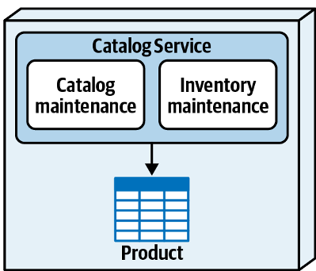

> 图 9-9：通过合并服务解决表所有权。

像数据领域技术一样，此技术解决了与服务依赖和性能相关的问题，同时解决了联合所有权问题。
然而，像其他技术一样，它也有其 trade-off。

合并服务创建了更粗粒度的服务，
从而增加了整体测试范围以及整体部署风险（当添加新功能或修复错误时，破坏服务中其他东西的机会）。
整合服务也可能影响整体容错， 因为服务的所有部分一起失败。

使用服务整合技术时，整体可扩展性也受到影响，因为服务的所有部分必须平等地扩展，
即使某些功能可能不需要与其它功能相同级别的扩展。例如，在图 9-9 中，
目录维护功能（之前在单独的 Catalog
服务中）必须不必要地扩展以满足库存检索和更新功能的高需求。

表 9-4 总结了服务整合技术的整体 trade-off。

### trade-off

| 优点           | 缺点               |
| -------------- | ------------------ |
| 保留原子事务   | 更粗粒度的可扩展性 |
| 良好的整体性能 | 较低的容错         |
|                | 增加的部署风险     |
|                | 增加的测试范围     |

> 表 9-4：联合所有权服务整合技术 trade-off。

## 数据所有权总结

图 9-10 显示了应用本节描述的技术后，图 9-1 中产生的表所有权分配。对于涉及
Wishlist 服务的单表场景， 我们简单地将所有权分配给 Wishlist 服务，
在服务和表之间形成紧密的 bounded context。对于涉及审计表的公共所有权场景，
我们创建了一个新的 Audit 服务，所有其他服务向持久队列发送异步消息。最后，
对于涉及 Catalog 服务和 Inventory
服务与产品表的更复杂的联合所有权场景，我们选择使用委托技术，
将产品表的单一所有权分配给 Catalog 服务，Inventory 服务将更新请求发送到 Catalog
服务。

一旦表所有权分配给服务，架构师必须通过分析业务工作流及其相应的事务需求来验证表所有权分配。

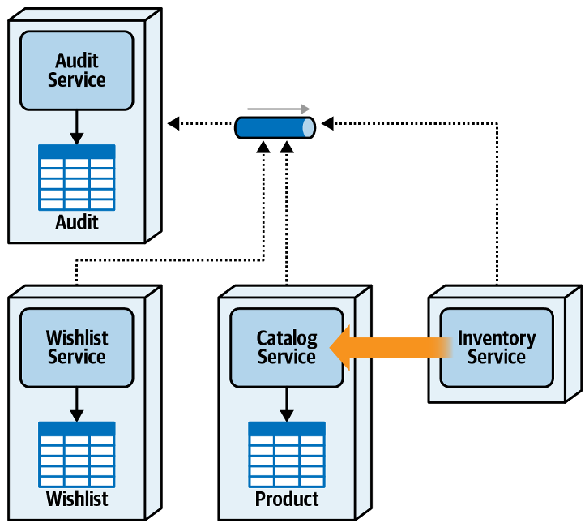

> 图 9-10：使用委托技术进行联合所有权的结果数据所有权。

## 分布式事务

当架构师和开发人员考虑事务时，他们通常考虑单个原子工作单元，其中多个数据库更新要么一起提交，要么在发生错误时全部回滚。
这种类型的原子事务通常被称为 ACID 事务。如第 6 章所述， ACID
是描述原子单工作单元数据库事务基本属性的缩写：原子性、一致性、隔离性和持久性。

要理解分布式事务如何工作以及使用分布式事务所涉及的 trade-off， 有必要充分理解
ACID 事务的四个属性。我们坚信，不理解 ACID 事务， 架构师就无法执行必要的
trade-off 分析，以了解何时（以及何时不）使用分布式事务。因此， 我们将首先深入
ACID 事务的细节，然后描述它们与分布式事务的区别。

原子性意味着事务必须在单个工作单元中提交或回滚所有更新，
无论在该事务期间进行的更新数量如何。换句话说，所有更新被视为一个整体，因此所有更改要么作为一个单元提交，
要么作为一个单元回滚。例如，假设注册客户涉及将客户资料信息插入客户资料表，
将信用卡信息插入钱包表，以及将与安全相关的信息插入安全表。
假设资料和信用卡信息成功插入，但安全信息插入失败。使用原子性，资料和信用卡插入将被回滚，保持数据库表同步。

一致性意味着在事务过程中，数据库永远不会处于不一致状态或违反数据库中指定的任何完整性约束。
例如，在 ACID 事务期间，系统不能在不先添加相应摘要记录（如订单）
的情况下添加详细记录（如项目）。虽然某些数据库将此检查推迟到提交时，但通常程序员在事务过程中不能违反一致性约束，
如外键约束。

隔离性指的是各个事务之间交互的程度。
隔离性保护未提交的事务数据在业务请求过程中对其他事务不可见。例如，在 ACID
事务过程中， 当客户资料信息插入客户资料表时， ACID
事务范围之外的任何其他服务都无法访问新插入的信息，直到整个事务提交。

持久性意味着一旦事务提交成功响应发生，保证所有数据更新是永久的，无论进一步系统故障如何。

为了说明 ACID 事务，假设注册 Sysops Squad
应用程序的客户在单个用户界面上输入所有资料信息、
他们希望在支持计划下覆盖的电子产品以及他们的账单信息。然后， 此信息被发送到单个
Customer 服务，如图 9-11 所示，
然后该服务执行与客户注册业务请求相关的所有数据库活动。

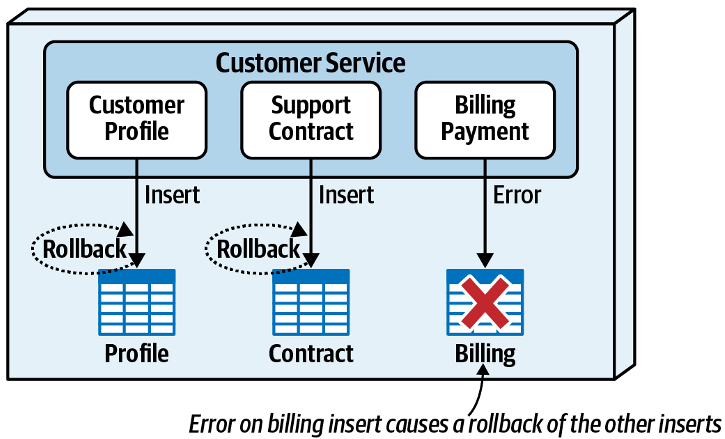

> 图 9-11：使用 ACID 事务，账单插入错误导致其他表插入回滚。

首先，注意使用 ACID 事务，由于在尝试插入账单信息时发生错误，
之前插入的资料信息和支持合同信息现在被回滚（这是 ACID
的*原子性*和*一致性*部分）。
虽然图中未显示，但在事务过程中插入每个表的数据对其他请求不可见（这是 ACID
的*隔离性*部分）。

注意，ACID
事务可以存在于分布式架构中每个服务的上下文中，但前提是相应的数据库也支持 ACID
属性。
每个服务可以在原子业务事务的范围内对其拥有的表执行自己的提交和回滚。然而，
如果业务请求跨越多个服务，整个业务请求本身不能是 ACID 事务——相反，
它成为分布式事务。

分布式事务发生在包含多个数据库更新的原子业务请求由单独部署的远程服务执行时。
注意在图 9-12 中，相同的客户注册请求（由代表客户发出请求的笔记本电脑图像表示）
现在分布在三个单独部署的服务中——客户资料服务、支持合同服务和账单支付服务。

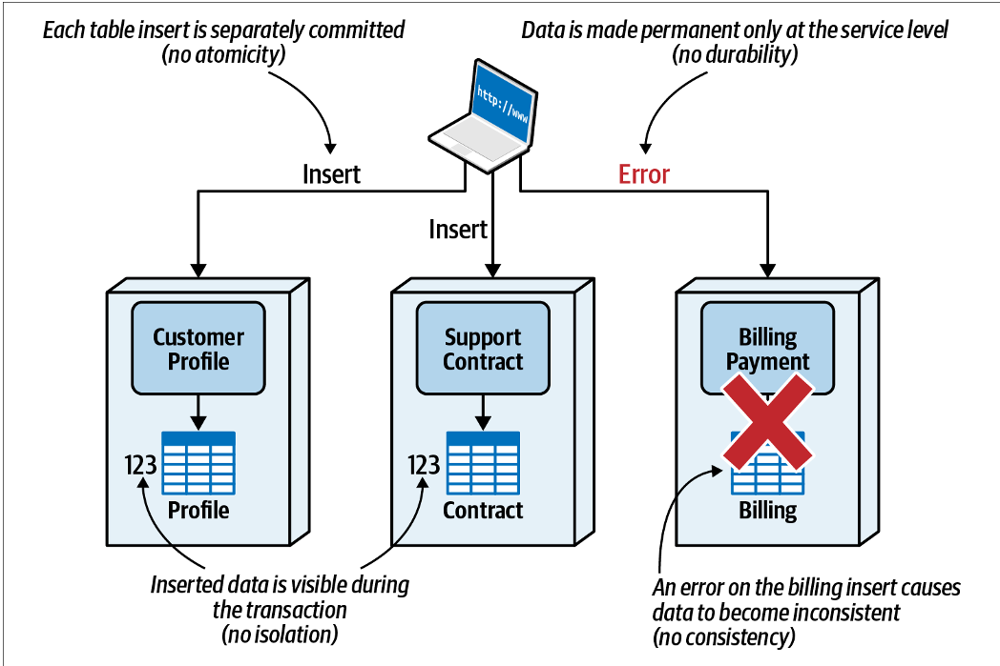

> 图 9-12：分布式事务不支持 ACID 属性。

如你所见，分布式事务不支持 ACID 属性。

原子性不受支持，因为每个单独部署的服务提交自己的数据，并且只执行整体原子业务请求的一部分。
在分布式事务中，原子性绑定到*服务*，而不是*业务请求*（如客户注册）。

一致性不受支持，因为一个服务中的故障导致负责业务请求的表之间的数据不同步。如图
9-12 所示， 由于账单支付服务插入失败，
资料表和合同表现在与账单表不同步（我们将在本节后面展示如何解决这些问题）。
一致性也受到影响，因为传统的关系型数据库约束（如外键始终匹配主键）
不能在每个单独的服务提交期间应用。

隔离性不受支持，因为一旦客户资料服务在分布式事务过程中插入资料数据以注册客户，
该资料信息对任何其他服务或请求可用，即使客户注册过程（当前事务）尚未完成。

持久性不受跨业务请求的支持——它仅支持每个单独的服务。换句话说，
任何单独的数据提交都不能确保整个业务事务范围内的所有数据是永久的。

分布式事务不支持 ACID，而是支持称为 BASE 的东西。在化学中，*acid* 物质和 *base*
物质正好相反。 原子事务和分布式事务也是如此——ACID 事务与 BASE 事务相反。 BASE
描述分布式事务的属性：基本可用性、软状态和最终一致性。

基本可用性（BASE
的"BA"部分）意味着分布式事务中的所有服务或系统预期可用来参与分布式事务。
虽然异步通信可以帮助解耦服务并解决与分布式事务参与者相关的可用性问题，但不幸的是，
它会影响原子业务事务数据变得一致所需的时间（参见本节后面的最终一致性）。

软状态（BASE 的 S 部分）
描述了分布式事务正在进行中且原子业务请求的状态尚未完成（或在某些情况下甚至未知）
的情况。在图 9-12 所示的客户注册示例中，
当客户资料信息插入（并提交）到资料表中，但支持合同和账单信息尚未插入时，
发生软状态。软状态的未知部分可能发生，如果使用相同的示例，
所有三个服务并行工作以插入其相应数据——原子业务请求的确切状态在任何时间点都不知道，直到所有三个服务报告数据已成功处理。
在使用异步通信的工作流的情况下（参见第 11
章），分布式事务的进行中或最终状态通常难以确定。

最终一致性（BASE 的 E
部分）意味着给定足够的时间，分布式事务的所有部分将成功完成，所有数据彼此同步。
使用的最终一致性模式类型和错误处理方式决定了分布式事务中涉及的所有数据源变得一致所需的时间。

下一节描述了三种最终一致性模式以及每种模式相应的 trade-off。

## 最终一致性模式

分布式架构严重依赖最终一致性作为更好的运维架构特性（如性能、可扩展性、弹性、容错和可用性）的
trade-off。 虽然有许多方法可以在数据源和系统之间实现最终一致性，
但今天使用的三种主要模式是后台同步模式、编排的基于请求的模式和基于事件的模式。

为了更好地描述每种模式并说明它们如何工作， 再次考虑我们之前在图 9-13 中讨论的
Sysops Squad 应用程序的客户注册过程。在此示例中，
三个独立的服务参与客户注册过程：维护基本资料信息的客户资料服务、 维护每个客户在
Sysops Squad 维修计划下覆盖的产品的支持合同服务，
以及向客户收取支持计划费用的账单支付服务。 注意图中客户 123 是 Sysops Squad
服务的订阅者，因此在每个服务拥有的相应表中都有数据。

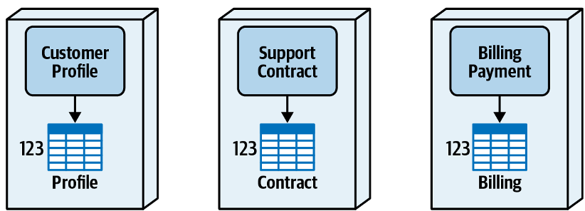

> 图 9-13：客户 123 是 Sysops Squad 应用程序中的订阅者。

客户 123 决定不再对 Sysops Squad 支持计划感兴趣，因此他们取消订阅服务。 如图
9-14 所示，客户资料服务从用户界面接收此请求，
从资料表中移除客户，并向客户返回确认，表示他们已成功取消订阅，将不再被收费。然而，
该客户的数据仍然存在于支持合同服务拥有的合同表和账单支付服务拥有的账单表中。

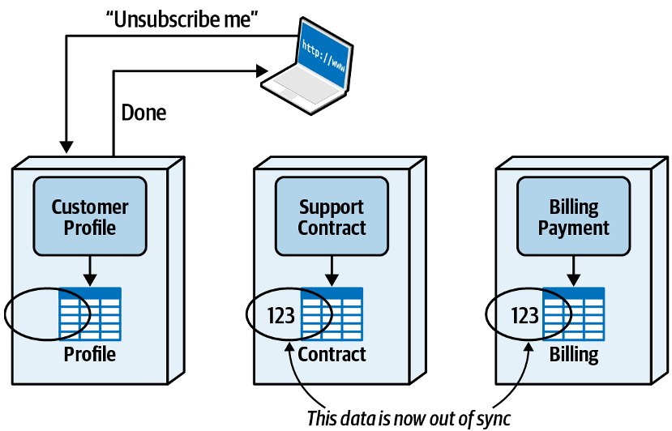

> 图 9-14：客户取消订阅支持计划后数据不同步。

我们将使用此场景来描述每种最终一致性模式，以使此原子业务请求的所有数据同步。

### 后台同步模式

*后台同步模式*使用单独的外部服务或进程定期检查数据源并保持它们彼此同步。使用此模式，
数据源变得最终一致的时间长度可能因后台进程是作为在夜间某个时间运行的批处理作业，
还是作为定期唤醒（例如每小时）以检查数据源一致性的服务而有所不同。

无论后台进程如何实现（夜间批处理或定期），此模式通常具有数据源变得一致的最长时间长度。
然而，在许多情况下，数据源不需要立即保持同步。 考虑图 9-14
中的客户取消订阅示例。一旦客户取消订阅，该客户的支持合同和账单信息仍然存在真的无关紧要。在这种情况下，
在夜间进行的最终一致性是使数据同步的足够时间。

此模式的一个挑战是，用于保持所有数据同步的后台进程必须知道哪些数据已更改。
这可以通过事件流、数据库触发器或从源表中读取数据并将目标表与源数据对齐来完成。
无论用于识别更改的技术如何，后台进程必须了解事务中涉及的所有表和数据源。

图 9-15 说明了 Sysops Squad 取消注册示例的后台同步模式的使用。 注意在
11:23:00，客户发出取消订阅支持计划的请求。
客户资料服务接收请求，移除数据，一秒后（11:23:01）
向客户响应他们已成功从系统中取消订阅。然后，在 23:00，后台批处理同步进程启动。
后台同步进程通过事件流或主表与次表增量检测到客户 123
已被移除，并从合同表和账单表中删除数据。

此模式对整体响应性有利，因为最终用户不必等待整个业务事务完成（在这种情况下，
取消订阅支持计划）。但不幸的是，这种最终一致性模式存在一些严重的 trade-off。

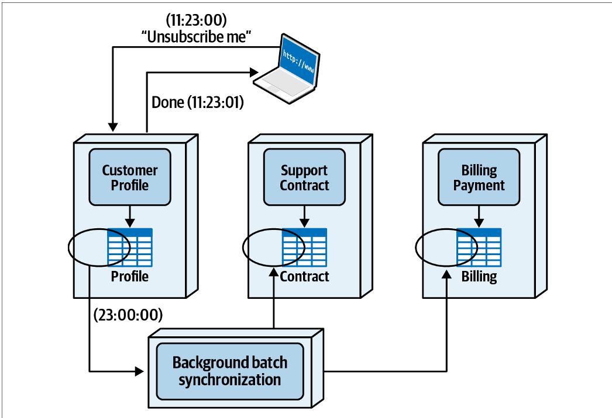

> 图 9-15：后台同步模式使用外部进程确保数据一致性。

后台同步模式的最大缺点是它将所有数据源耦合在一起，
从而破坏了数据和每个服务之间的 bounded context。注意在图 9-16 中，
后台批处理同步进程必须对相应服务拥有的每个表具有写访问权限，这意味着所有表实际上在服务和后台同步进程之间共享所有权。


> 图 9-16：后台同步模式与数据源耦合，因此破坏了 bounded context 和数据所有权。

服务和后台同步进程之间的这种共享数据所有权充满了问题，并强调了分布式架构中紧密
bounded context 的需求。
对每个服务拥有的表进行的结构更改（更改列名、删除列等）也必须与外部后台进程协调，使更改困难且耗时。

除了变更控制的困难外，还出现重复业务逻辑的问题。看图 9-15，可能看起来相当简单，
后台进程只需对所有包含客户 123 的合同表和账单表中的行执行 DELETE 操作。然而，
这些服务中可能存在特定操作的某些业务规则。

例如，当客户取消订阅时，他们现有的支持合同和账单历史保留三个月，以防客户决定重新订阅支持计划。因此，
不是删除这些表中的行， 而是设置一个 remove_date
列，其值为表示应删除行的日期（此列中的零值表示活跃客户）。 两个服务每天检查
remove_date 以确定应从其各自表中删除哪些行。问题是，
该业务逻辑在哪里？答案当然是在支持合同和账单支付服务中——哦，
还有后台批处理进程！

后台同步最终一致性模式不适用于需要紧密 bounded context
的分布式架构（如微服务）， 其中数据所有权和功能之间的耦合是架构的关键部分。
此模式有用的情况是封闭的（自包含的）异构系统，它们彼此不通信或共享数据。

例如，考虑一个承包商订单录入系统，接受建筑材料的订单，
以及另一个单独的系统（在不同平台上实现）进行承包商发票处理。一旦承包商订购了供应品，
后台同步进程将这些订单移动到发票系统以生成发票。当承包商更改订单或取消订单时，
后台同步进程将这些更改移动到发票系统以更新发票。
这是系统变得*最终一致*的一个很好的例子，承包商订单始终在两个系统之间同步。

表 9-5 总结了后台同步模式最终一致性的 trade-off。

### trade-off

| 优点         | 缺点                 |
| ------------ | -------------------- |
| 服务解耦     | 数据源耦合           |
| 良好的响应性 | 实现复杂             |
|              | 破坏 bounded context |
|              | 业务逻辑可能重复     |
|              | 缓慢的最终一致性     |

> 表 9-5：后台同步模式 trade-off。

### 编排的基于请求的模式

管理分布式事务的常见方法是确保在业务请求过程中（换句话说，在最终用户等待时）
所有数据源同步。这种方法通过所谓的*编排的基于请求的模式*实现。

与之前描述的后台同步模式或下一节描述的基于事件的模式不同，编排的基于请求的模式尝试在业务请求期间处理整个分布式事务，
因此需要某种 orchestrator 来管理分布式事务。orchestrator，
可以是指定的现有服务或新的单独服务，负责管理处理请求所需的所有工作，
包括业务过程的知识、涉及的参与者知识、多播逻辑、错误处理和契约所有权。

实现此模式的一种方法是指定一个主要服务（假设存在一个）来管理分布式事务。这种技术，
如图 9-17 所示，指定一个服务承担 orchestrator 角色，
除了其其他职责，在这种情况下是客户资料服务。


> 图 9-17：客户资料服务承担分布式事务的 orchestrator 角色。

虽然这种方法避免了单独的编排服务的需要， 但它倾向于使被指定为分布式事务
orchestrator 的服务的职责过载。除了 orchestrator 角色外，
管理分布式事务的指定服务还必须执行自己的职责。这种方法的另一个缺点是它倾向于导致服务之间的紧密耦合和同步依赖。

我们在使用编排的基于请求的模式时通常更喜欢的方法是使用专用的编排服务来处理业务请求。这种方法，如图
9-18 所示，
将客户资料服务从管理分布式事务的责任中解放出来，并将该责任放在单独的编排服务上。

我们将使用这种单独的编排服务方法来描述这种最终一致性模式如何工作以及与此模式相应的
trade-off。

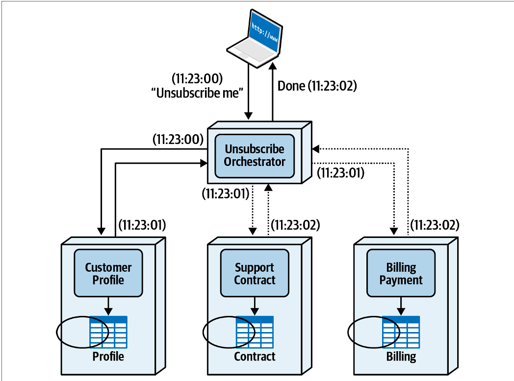

> 图 9-18：专用编排服务承担分布式事务的 orchestrator 角色。

注意在 11:23:00，客户发出取消订阅 Sysops Squad 支持计划的请求。 请求由取消订阅
orchestrator 服务接收，
该服务然后将请求同步转发到客户资料服务，以从资料表中移除客户。一秒后，
客户资料服务向取消订阅 orchestrator 服务发送确认， 然后 orchestrator
向支持合同和账单支付服务发送并行请求（通过线程或某种异步协议）。
这两个服务处理取消订阅请求， 然后一秒后向取消订阅 orchestrator
服务发送确认，表示它们已完成处理请求。现在所有数据同步， 取消订阅 orchestrator
服务在 11:23:02（初始请求后两秒）向客户端响应， 让客户知道他们已成功取消订阅。

第一个要观察的 trade-off 是编排方法通常倾向于数据一致性而非响应性。
添加专用编排服务不仅增加了额外的网络跳转和服务调用， 而且取决于 orchestrator
是串行还是并行执行调用， orchestrator
和它调用的服务之间的来回通信需要额外的时间。

通过在与其他服务同时执行客户资料请求，图 9-18 中的响应时间可以得到改善，
但我们选择同步执行该操作是出于错误处理和一致性原因。例如，
如果由于未结账单费用而无法从资料表中删除客户，
则不需要其他操作来撤销支持合同和账单支付服务中的操作。这代表了另一个一致性优于响应性的例子。

除了响应性，此模式的另一个 trade-off 是复杂的错误处理。
虽然编排的基于请求的模式可能看起来很简单，但考虑当客户从资料表和合同表中移除，
但在尝试从账单表中移除账单信息时发生错误时会发生什么，如图 9-19
所示。由于资料和支持合同服务单独提交了它们的操作， 取消订阅 orchestrator
服务现在必须决定在客户等待请求处理时采取什么行动：

1. orchestrator 是否应该再次向账单支付服务发送请求再试一次？
2. orchestrator 是否应该执行 compensating transaction，
   让支持合同和客户资料服务撤销其更新操作？
3. orchestrator 是否应该向客户响应发生了错误，并在尝试修复不一致性时请稍等再试？
4. orchestrator
   是否应该忽略错误，希望其他进程会处理问题，并向客户响应他们已成功取消订阅？

这个现实世界的场景为 orchestrator
创造了一个混乱的局面。因为这是正在使用的最终一致性模式，
没有其他方法来纠正数据并使事情恢复同步（因此否定了前面列表中的选项 3 和
4）。在这种情况下， orchestrator
唯一的真正选择是尝试撤销分布式事务——换句话说，发出*补偿更新*以重新插入客户到资料表中，
并将合同表中的 `remove_date` 列设回零。 这将要求 orchestrator
拥有重新插入客户所需的所有信息，
并且创建新客户时不会发生副作用（例如初始化账单信息或支持合同）。


> 图 9-19：使用编排的基于请求的模式时，错误条件很难处理。

分布式架构中 compensating transaction
的另一个复杂情况是补偿期间发生的故障。例如， 假设向客户资料服务发出了
compensating transaction 以重新插入客户，
而该操作失败了。现在怎么办？现在数据真的不同步了，
而且没有其他服务或进程来修复问题。这些情况通常需要人工干预来修复数据源并使它们恢复同步。
我们在[事务性 Saga 模式](#事务性-saga-模式) 中更详细地介绍了 compensating
transaction 和事务性 saga。

表 9-6 总结了编排的基于请求的模式最终一致性的 trade-off。

### trade-off

| 优点               | 缺点                              |
| ------------------ | --------------------------------- |
| 服务解耦           | 较慢的响应性                      |
| 数据一致性的及时性 | 复杂的错误处理                    |
| 原子业务请求       | 通常需要 compensating transaction |

> 表 9-6：编排的基于请求的模式 trade-off。

### 基于事件的模式

*基于事件的模式*是大多数现代分布式架构（包括微服务和事件驱动架构）
中最流行和最可靠的最终一致性模式之一。使用此模式，事件与异步发布-订阅
消息传递模型结合使用，以将事件（如*客户取消订阅*）或命令消息（如*取消订阅客户*）
发布到主题或事件流。分布式事务中涉及的服务监听某些事件并响应这些事件。

由于异步消息处理的并行和解耦性质，实现数据一致性的最终一致性时间通常很短。使用此模式，服务彼此高度解耦，响应性良好，
因为触发最终一致性事件的服务不必在向客户返回信息之前等待数据同步发生。

图 9-20 说明了基于事件的最终一致性模式如何工作。注意客户在 11:23: 00
向客户资料服务发出取消订阅请求。客户资料服务接收请求，从资料表中移除客户，
向消息主题或事件流发布消息，并在一秒后返回信息，让客户知道他们已成功取消订阅。
大约在同一时间，支持合同和账单支付服务都接收到取消订阅事件，
并执行取消订阅客户所需的任何功能，使所有数据源最终一致。

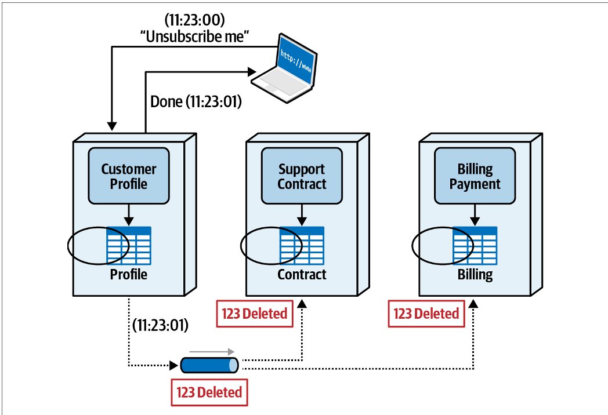

> 图 9-20：基于事件的模式使用异步发布-订阅消息传递或事件流来实现最终一致性。

对于使用标准基于主题的发布-订阅消息传递（如 ActiveMQ、RabbitMQ、 AmazonMQ
等）的实现，响应事件的服务必须设置为持久订阅者，
以确保在消息代理或接收消息的服务失败时不会丢失消息。持久订阅者在概念上类似于持久队列，
因为订阅者（在这种情况下，支持合同服务和账单支付服务）
不需要在消息发布时可用，并且订阅者保证在它们变得可用时接收消息。在事件流实现的情况下，
消息代理（如 Apache Kafka）必须始终持久化消息，
并确保它在主题中在合理的时间内可用。

基于事件的模式的优点是响应性、数据一致性的及时性和服务解耦。然而，
与所有最终一致性模式类似，此模式的主要 trade-off 是错误处理。
如果一个服务（例如图 9-20 中所示的账单支付服务）不可用，
它是持久订阅者的事实意味着最终当它变得可用时，它将接收和处理事件。然而，
如果服务正在处理事件并失败，事情很快变得复杂。

大多数消息代理将尝试一定次数传递消息，在接收者反复失败后， 代理将消息发送到 dead
letter queue（DLQ）。这是一个可配置的目的地，事件存储在其中，
直到自动化进程读取消息并尝试修复问题。如果无法以编程方式修复，消息通常被发送给人工进行手动处理。

表 9-7 列出了基于事件的最终一致性模式的 trade-off。

### trade-off

| 优点               | 缺点           |
| ------------------ | -------------- |
| 服务解耦           | 复杂的错误处理 |
| 数据一致性的及时性 |                |
| 快速的响应性       |                |

> 表 9-7：基于事件的模式 trade-off。

## Sysops Squad Saga：工单处理的数据所有权

### 1 月 18 日，星期二，09:14


> 插图 9-2：Sydney 和 Addison 讨论数据所有权。

在与 Dana 交谈并了解了数据所有权和分布式事务管理后， Sydney 和 Addison
很快意识到，如果不让两个团队协作解决方案， 拆分数据和分配数据所有权以形成紧密的
bounded context 是不可能的。

"难怪这里似乎什么都不行，"Sydney 观察到。
"我们和数据库团队之间一直存在问题和争论，现在我看到了公司将我们视为两个独立团队的结果。"

"确实如此，"Addison 说。"我很高兴我们现在与数据团队更紧密地合作。所以， 根据
Dana 所说的，对数据表执行写操作的服务拥有该表，
无论其他服务需要以只读方式访问数据。在这种情况下，看起来用户维护服务需要拥有数据。"

Sydney 同意，Addison 创建了一份通用架构决策记录，描述如何处理单表所有权场景：

### ADR：Bounded Context 的单表所有权

#### 上下文

在服务和数据之间形成 bounded context 时，必须将表分配给特定服务或服务组。

#### 决策

当只有一个服务写入表时，该表将被分配给该服务作为所有者。此外，
需要只读访问另一个 bounded context
中表的服务不能直接访问包含该表的数据库或模式。

根据数据库团队，表所有权定义为对表执行写操作的服务。因此，对于单表所有权场景，
无论有多少其他服务需要访问该表，只有一个服务被分配为所有者，
该所有者是维护数据的服务。

#### 后果

根据所使用的技术， 需要只读访问另一个 bounded context 中表的服务在访问不同
bounded context 中的数据时可能会遇到性能和容错问题。

现在 Sydney 和 Addison 更好地理解了表所有权以及如何在服务和数据之间形成 bounded
context， 他们开始处理调查功能。
工单完成服务将写入工单完成的时间戳和执行工作的专家到调查表。
调查服务将写入调查发送给客户的时间戳，并在收到调查后插入所有调查结果。

"现在我更好地理解了 bounded context 和表所有权，这并不难，"Sydney 说。

"好的，让我们继续处理调查功能，"Addison 说。

"哎呀，"Sydney 说。"工单完成服务和调查服务都写入调查表。"

"这就是 Dana 所说的联合表所有权，"Addison 说。

"那么，我们有什么选择？"Sydney 问道。

"由于拆分表行不通，我们真的只剩下两个选择，"Addison 说。
"我们可以使用公共数据领域，让两个服务都拥有数据，或者我们可以使用委托技术，
只分配一个服务作为所有者。"

"我喜欢公共数据领域。让两个服务都写入表并共享一个公共模式，"Sydney 说。

"只是在这个场景中不行，"Addison 说。
"工单完成服务已经在与公共工单数据领域通信。记住，一个服务不能连接到多个模式。"

"哦，对，"Sydney 说。"等一下，我知道，只需将调查表添加到工单数据领域模式中。"

"但现在我们开始将所有表重新组合在一起，"Addison
说。"很快我们就会回到单体数据库了。"

"那我们该怎么办？"Sydney 问道。

"等等，我想我看到了一个好的解决方案，"Addison 说。
"你知道工单完成服务无论如何都必须向调查服务发送消息，以便在工单完成后启动调查流程吗？
如果我们把必要的数据随该消息一起传递，这样调查服务在创建客户调查时可以插入数据呢？"

"这太聪明了，"Sydney 说。"这样，工单完成服务不需要任何对调查表的访问。"

Addison 和 Sydney 同意调查服务将拥有调查表，
并在表通知调查服务启动调查流程时使用委托技术传递数据，如图 9-21 所示。 Addison
为这个决策写了一份架构决策记录。


> 图 9-21：调查服务使用委托技术拥有数据。

### ADR：调查服务拥有调查表

#### 上下文

工单完成服务和调查服务都写入调查表。因为这是一个联合所有权场景，
替代方案是使用公共共享数据领域或使用委托技术。由于调查表的结构，表拆分不是一个选项。

#### 决策

调查服务将是调查表的唯一所有者，这意味着它是唯一可以对表执行写操作的服务。

一旦工单被标记为完成并被系统接受，工单完成服务需要向调查服务发送消息以启动客户调查处理。
由于工单完成服务已经在发送通知事件，必要的工单信息可以随该事件一起传递，
从而消除了工单完成服务对调查表具有任何访问权限的需要。

#### 后果

工单完成服务需要插入调查表的所有必要数据将需要作为触发客户调查流程时有效载荷的一部分发送。

在单体系统中，工单完成将调查记录的插入作为完成过程的一部分。根据此决策，
调查记录的创建是与工单创建过程分开的活动，现在由调查服务处理。

# 第 10 章：分布式数据访问

1 月 3 日，星期一，12:43


> 插图 10-1：Sydney 和 Addison 讨论数据访问。

"现在我们已经将专家资料表的所有权分配给用户管理服务，"Sydney 说，
"工单分配服务应该如何获取专家位置和技能数据？正如我之前所说，
考虑到它对数据库的读取次数，每次需要查询表时都进行远程调用真的不可行。"

"你能修改分配算法的工作方式，以便我们可以减少它需要的查询次数吗？"Addison 问道。

"我不知道，"Sydney 回答。"Taylen 通常是维护那些算法的人。"

Addison 和 Sydney 与 Taylen 会面，讨论数据访问问题， 并看看 Taylen
是否可以修改专家分配算法以减少对专家资料表的数据库调用次数。

"你在开玩笑吗？"Taylen
问道。"我绝对不可能重写分配算法来满足你的要求。绝对不可能。"

"但我们唯一的选择是每次分配算法需要专家数据时对用户管理服务进行远程调用，"Addison
说。

"什么？"Taylen 尖叫。"我们不能那样做！"

"我也是这么说的，"Sydney 说。"这意味着我们又回到了原点。
这个分布式架构的东西真难。我不想这么说，但我实际上开始怀念单体应用程序了。等等，我知道。
如果我们使用消息传递调用而不是 REST 来调用用户维护服务呢？""这是一回事， "Taylen
说。"我仍然需要等待信息返回，无论我们使用消息传递、 REST
还是任何其他远程访问协议。该表只需要与工单表在同一个数据领域中。"

"必须有另一种解决方案来访问我们不再拥有的数据，"Addison 说。"让我问问 Logan。"

在大多数使用单个数据库的单体系统中，开发人员不会对读取数据库表多加考虑。 SQL
表连接是常见的，通过简单的查询，所有必要的数据可以在单个数据库调用中检索。然而，
当数据被拆分为由不同服务拥有的单独数据库或模式时，读操作的数据访问开始变得困难。

本章描述了服务可以获得对它们不拥有的数据（换句话说， 在需要数据的服务的 bounded
context 之外）的读访问的各种方式。
我们在本章中讨论的四种数据访问模式包括服务间通信模式、列模式复制模式、复制缓存模式和数据领域模式。

每种数据访问模式都有其优点和缺点。是的，再次，trade-off。为了更好地描述每种模式，
我们将回到第 9 章中的 Wishlist 服务和 Catalog 服务示例。 图 10-1 中显示的
Wishlist 服务维护客户可能最终想要购买的物品列表， 并在相应的 Wishlist
表中包含客户 ID、物品 ID 和物品添加日期。 Catalog
服务负责维护公司销售的所有物品，并包括物品
ID、物品描述和静态产品尺寸信息，如重量、高度、长度等。

在此示例中，当客户发出请求显示其愿望清单时，物品 ID 和物品描述（item_desc）
都返回给客户。然而，Wishlist 服务在其表中没有物品描述； 该数据由 Catalog
服务在提供变更控制和数据所有权的紧密 bounded context 中拥有。
因此，架构师必须使用本章概述的数据访问模式之一， 以确保 Wishlist 服务可以从
Catalog 服务获取产品描述。

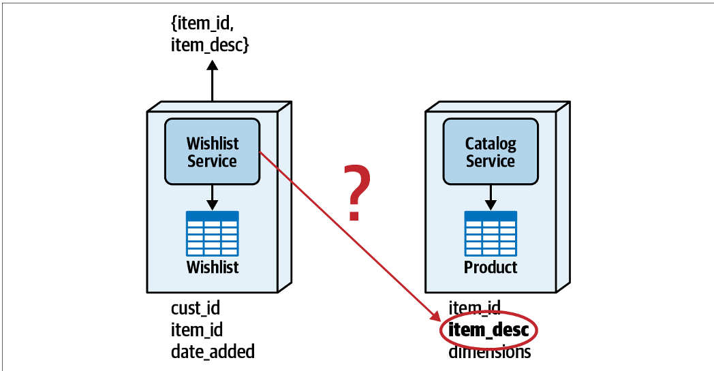

> 图 10-1：Wishlist 服务需要物品描述，但无法访问包含数据的产品表。

## 服务间通信模式

*服务间通信模式*是迄今为止分布式系统中访问数据的最常见模式。如果一个服务（或系统）需要读取它无法直接访问的数据，
它只需使用某种远程访问协议向拥有服务或系统*请求*。还有什么比这更简单的？

与软件架构中的大多数事情一样，一切并非表面看起来那样。虽然简单，但这种常见的数据访问技术不幸充满了缺点。
考虑图 10-2： Wishlist 服务对 Catalog 服务进行同步远程访问调用，传入物品 ID
列表以换取相应的物品描述列表。

注意，对于每个获取客户愿望清单的请求， Wishlist 服务必须对 Catalog
服务进行远程调用以获取物品描述。此模式中出现的第一个问题是因网络延迟、
安全延迟和数据延迟导致的较慢性能。网络延迟是往返服务的数据包传输时间（通常在 30
毫秒到 300 毫秒之间）。 安全延迟发生在目标服务端点需要额外授权来执行请求时。
安全延迟可以因被访问端点的安全级别而有很大差异，但对于大多数系统来说可能在 20
毫秒到 400 毫秒之间。
数据延迟描述了需要多个数据库调用来检索必要信息以返回给最终用户的情况。在这种情况下，不是单个
SQL 表连接语句， Catalog 服务必须进行额外的数据库调用来检索物品描述。
这可能增加大约 10 毫秒到 50
毫秒的额外处理时间。把所有这些加起来，延迟可能高达一秒， 仅仅为了获取物品描述。


> 图 10-2：服务间通信数据访问模式。

此模式的另一个大缺点是服务耦合。 因为 Wishlist 必须依赖 Catalog
服务可用，因此服务在语义和静态上都是耦合的， 这意味着如果 Catalog
服务不可用，Wishlist 服务也不可用。此外， 由于 Wishlist 服务和 Catalog
服务之间的紧密静态耦合， 随着 Wishlist 服务扩展以满足额外需求，Catalog
服务也必须扩展。

表 10-1 总结了服务间通信数据访问模式的 trade-off。

### trade-off

| 优点         | 缺点                         |
| ------------ | ---------------------------- |
| 简单性       | 网络、数据和安全延迟（性能） |
| 无数据量问题 | 可扩展性和吞吐量问题         |
|              | 无容错（可用性问题）         |
|              | 需要服务之间的契约           |

> 表 10-1：服务间通信数据访问模式的 trade-off。

## 列模式复制模式

使用*列模式复制模式*，列跨表复制，因此复制数据并使其对其他 bounded context
可用。 如图 10-3 所示， `item_desc` 列被添加到 Wishlist 表， 使该数据对 Wishlist
服务可用，无需向 Catalog 服务请求数据。

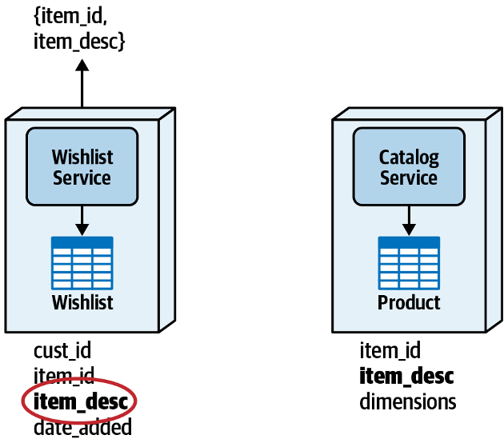

> 图 10-3：使用列模式复制数据访问模式，数据被复制到其他表。

数据同步和数据一致性是列模式复制数据访问模式的两个最大问题。每当创建产品、从目录中移除或更改产品描述时，
Catalog 服务必须以某种方式让 Wishlist 服务（以及任何其他复制数据的服务）
知道更改。这通常通过使用队列、主题或事件流的异步通信来完成。
除非需要立即事务同步，否则异步通信是优于同步通信的首选，因为它增加了响应性并减少了服务之间的可用性依赖。

此模式的另一个挑战是，有时难以管理数据所有权。因为数据在属于其他服务的表中被复制，
这些服务可以更新数据，即使它们不正式*拥有*数据。
这反过来又会产生更多数据一致性问题。

即使服务由于数据同步仍然耦合，需要读访问的服务可以立即访问数据，
并且可以对其自己的表进行简单的 SQL
连接或查询以获取数据。这增加了性能、容错和可扩展性，
这些都是服务间通信模式的缺点。

虽然我们通常对 Wishlist 服务和 Catalog
服务示例等场景使用此数据访问模式提出警告，
但可能考虑使用此模式的一些情况是数据聚合、报告，
或其他数据访问模式由于大数据量、高响应性需求或高容错需求而不适合的情况。

表 10-2 总结了列模式复制数据访问模式的 trade-off。

### trade-off

| 优点                   | 缺点           |
| ---------------------- | -------------- |
| 良好的数据访问性能     | 数据一致性问题 |
| 无可扩展性和吞吐量问题 | 数据所有权问题 |
| 无容错问题             | 需要数据同步   |
| 无服务依赖             |                |

> 表 10-2：列模式复制数据访问模式的 trade-off。

## 复制缓存模式

大多数开发人员和架构师认为缓存是一种增加整体响应性的技术。通过将数据存储在内存缓存中，
检索数据从几十毫秒变为仅几纳秒。然而，
缓存也可以是分布式数据访问和共享的有效工具。此模式利用复制的内存缓存，
使其他服务需要的数据对每个服务可用，而无需它们请求。复制缓存与其他缓存模型的不同之处在于，
数据在每个服务的内存中保存，并持续同步，以便所有服务始终拥有完全相同的数据。

为了更好地理解复制缓存模型，将其与其他缓存模型进行比较以查看它们之间的差异是有用的。
*单一内存*缓存模型是最简单的缓存形式，其中每个服务都有自己的内部内存缓存。
使用此缓存模型（如图 10-4
所示），内存数据不在缓存之间同步，这意味着每个服务都有自己特定于该服务的独特数据。
虽然此缓存模型确实有助于增加每个服务内的响应性和可扩展性，但由于服务之间缺乏缓存同步，它对于在服务之间共享数据没有用处。

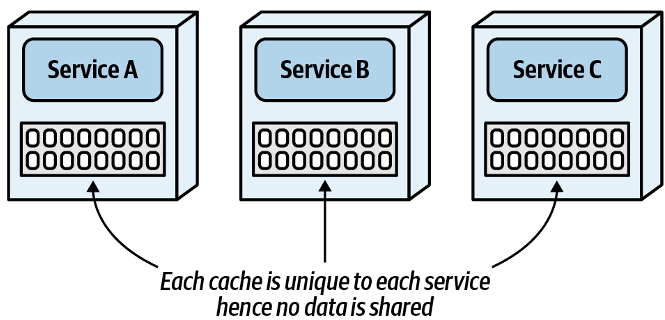

> 图 10-4：使用单一内存缓存，每个服务包含自己的独特数据。

分布式架构中使用的另一种缓存模型是分布式缓存。如图 10-5 所示，使用此缓存模型，
数据不在每个服务的内存中保存，而是外部保存在缓存服务器中。
服务使用专有协议向缓存服务器发出请求以检索或更新共享数据。注意，与单一内存缓存模型不同，数据可以在服务之间共享。

分布式缓存模型不是用于复制缓存数据访问模式的有效缓存模型，原因有几个。首先，
对服务间通信模式中发现的容错问题没有好处。不是依赖服务来检索数据，
依赖只是转移到缓存服务器。

由于缓存数据是集中和共享的，分布式缓存模型允许其他服务更新数据，
从而破坏了关于数据所有权的 bounded context。
这可能导致缓存和拥有数据库之间的数据不一致。虽然这有时可以通过严格的治理来解决，但仍然是此缓存模型的一个问题。

最后，由于对集中式分布式缓存的访问是通过远程调用进行的，
网络延迟增加了数据的额外检索时间，从而影响整体响应性，与内存复制缓存相比。

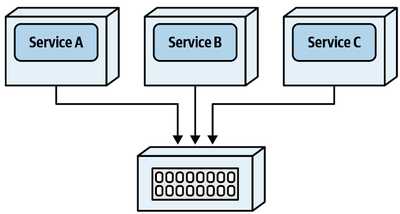

> 图 10-5：分布式缓存位于服务外部。

使用复制缓存，每个服务都有自己的内存数据，在服务之间保持同步，
允许相同的数据在多个服务之间共享。注意在图 10-6
中，没有外部缓存依赖。每个缓存实例相互通信，
以便当对缓存进行更新时，该更新立即（在幕后）异步传播到使用相同缓存的其他服务。

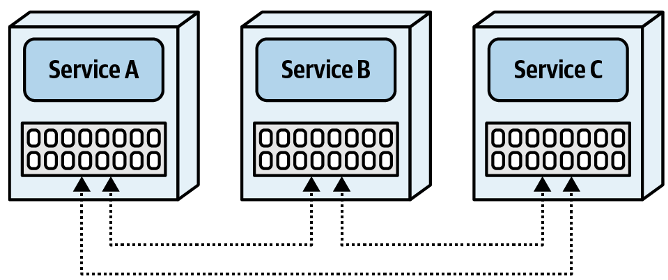

> 图 10-6：使用复制缓存，每个服务包含相同的内存数据。

并非所有缓存产品都支持复制缓存，因此检查缓存产品供应商以确保支持复制缓存模型非常重要。
一些支持复制缓存的流行产品包括 Hazelcast、 Apache Ignite 和 Oracle Coherence。

要了解复制缓存如何解决分布式数据访问问题， 我们将回到我们的 Wishlist 服务和
Catalog 服务示例。在图 10-7 中， Catalog
服务拥有产品描述的内存缓存（意味着它是唯一可以修改缓存的服务）， 而 Wishlist
服务包含相同缓存的只读内存副本。


> 图 10-7：复制缓存数据访问模式。

使用此模式， Wishlist 服务不再需要对 Catalog
服务进行调用以检索产品描述——它们已经在 Wishlist 服务的内存中。 当 Catalog
服务对产品描述进行更新时，缓存产品将更新 Wishlist 服务中的缓存以使数据一致。

复制缓存模式的明显优点是响应性、容错和可扩展性。因为服务之间不需要显式的服务间通信，
数据在*内存中*随时可用，为服务不拥有的数据提供最快可能的访问。
此模式也很好地支持容错。即使 Catalog 服务宕机， Wishlist
服务也可以继续运行。一旦 Catalog 服务恢复， 缓存相互连接而不会对 Wishlist
服务造成任何中断。最后，使用此模式， Wishlist 服务可以独立于 Catalog 服务扩展。

有了所有这些明显的优点，此模式怎么可能有 trade-off 呢？
正如我们的书《Fundamentals of Software Architecture》中所述，
软件架构的第一定律指出，软件架构中的一切都是 trade-off，
如果架构师认为他们发现了不是 trade-off 的东西， 那意味着他们只是还没有*识别*出
trade-off。

此模式的第一个 trade-off 是关于缓存数据和启动时序的服务依赖。 由于 Catalog
服务拥有缓存并负责填充缓存， 在初始 Wishlist 服务启动时它必须正在运行。 如果
Catalog 服务不可用，初始 Wishlist 服务必须进入等待状态， 直到与 Catalog
服务建立连接。注意， 只有*初始* Wishlist 服务实例受此启动依赖影响； 如果 Catalog
服务宕机，可以启动其他 Wishlist 实例， 缓存数据从其他 Wishlist
实例之一传输。同样重要的是要注意， 一旦 Wishlist
服务启动并在缓存中拥有数据，Catalog 服务*不*需要可用。 一旦缓存在 Wishlist
服务中可用， Catalog 服务可以启动和关闭而不影响 Wishlist 服务（或其任何实例）。

此模式的第二个 trade-off 是数据量。如果数据量太高（例如超过 500
MB），此模式的可行性迅速降低，
特别是对于需要数据的多个服务实例。每个服务实例都有自己的复制缓存，
这意味着如果缓存大小为 500 MB 且需要 5 个服务实例， 总内存使用量为 2.5
GB。架构师必须分析缓存大小和需要缓存数据的服务实例总数，
以确定复制缓存的总内存需求。

第三个 trade-off 是，如果数据变更率（更新速率）太高，
复制缓存模型通常无法在服务之间保持数据完全同步。这因数据大小和复制延迟而异，
但通常此模式不适合高度易变的数据（如产品库存计数）。然而，对于相对静态的数据（如产品描述），此模式效果很好。

与此模式相关的最后一个 trade-off 是配置和设置管理。 服务通过 TCP/IP
广播和查找在复制缓存模型中相互了解。如果 TCP/IP 广播和查找范围太广，
建立服务之间的套接字级握手可能需要很长时间。基于云和容器化的环境使这特别具有挑战性，
因为缺乏对 IP 地址的控制以及这些环境相关的 IP 地址的动态性质。

### trade-off

| 优点                   | 缺点                   |
| ---------------------- | ---------------------- |
| 良好的数据访问性能     | 云和容器化配置可能困难 |
| 无可扩展性和吞吐量问题 | 不适合高数据量         |
| 良好的容错水平         | 不适合高更新速率       |
| 数据保持一致           | 初始服务启动依赖       |
| 数据所有权得以保留     |                        |

> 表 10-3：复制缓存数据访问模式的 trade-off。

## 数据领域模式

在上一章中，我们讨论了使用*数据领域*来解决联合所有权，
其中多个服务都需要将数据写入同一个表。在服务之间共享的表被放入一个单一模式中，然后由两个服务共享。
同样的模式也可以用于数据访问。

再次考虑 Wishlist 服务和 Catalog 服务的问题， 其中 Wishlist
服务需要访问产品描述，但无法访问包含这些描述的表。 假设服务间通信模式由于
Catalog 服务的可靠性问题以及网络延迟和额外数据检索的性能问题不是可行的解决方案。
还假设使用列模式复制模式由于需要高水平的数据一致性而不可行。最后，
假设复制缓存模式由于高数据量不可行。唯一的选择是创建一个数据领域， 将 Wishlist
和 Product 表组合在同一个共享模式中， 对 Wishlist 服务和 Catalog 服务都可访问。

图 10-8 说明了此数据访问模式的使用。注意， Wishlist 和 Product
表不再由任何服务拥有，而是在它们之间共享， 形成更广泛的 bounded
context。使用此模式， 在 Wishlist 服务中获取产品描述只需在两个表之间进行简单的
SQL 连接。

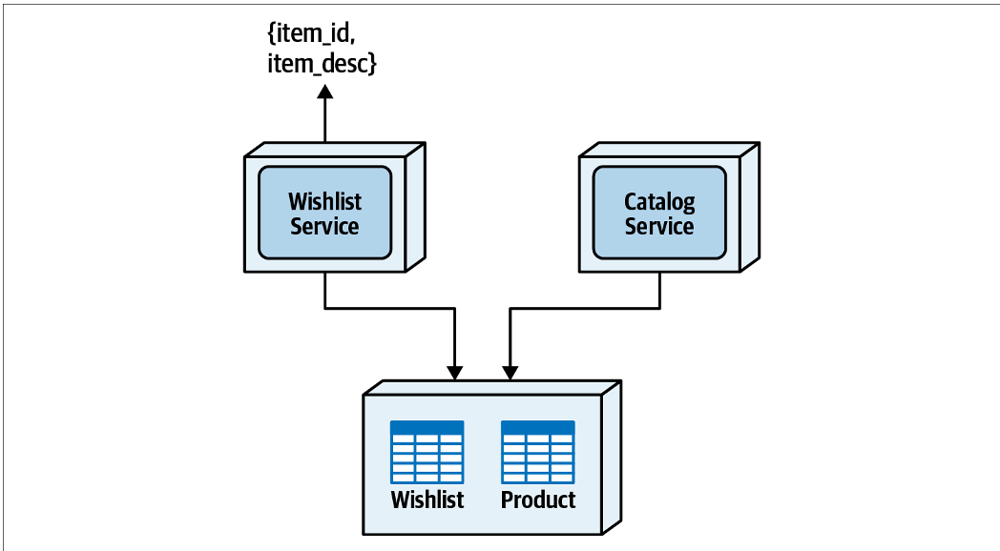

> 图 10-8：数据领域数据访问模式。

虽然在分布式架构中通常不鼓励共享数据，但此模式相对其他数据访问模式有巨大的好处。首先，
服务完全彼此解耦，从而解决了任何可用性依赖、响应性、吞吐量和可扩展性问题。
此模式的响应性非常好，因为数据使用正常的 SQL
调用可用，无需在服务的功能内进行额外的数据聚合（如复制缓存模式所需）。

数据一致性和数据完整性在数据领域模式中评分很高。由于多个服务访问相同的数据表，
数据不需要传输、复制或同步。数据完整性在此模式中得以保留，
因为现在可以在表之间强制执行外键约束。此外，其他数据库工件，如视图、存储过程和触发器，可以存在于数据领域中。事实上，
这些完整性约束和数据库工件的保留是使用数据领域模式的另一个驱动因素。

使用此模式，不需要额外的契约在服务之间传输数据——表模式成为契约。虽然这是此模式的一个优点，
但也是一个 trade-off。
服务间通信模式和复制缓存模式使用的契约在表模式之上形成抽象层，
允许表结构的更改保持在紧密的 bounded context 内，不影响其他服务。然而，
此模式形成更广泛的 bounded
context，当数据领域中任何表的结构更改时，可能需要多个服务更改。

此模式的另一个缺点是它可能打开与数据访问相关的安全问题。例如，在图 10-8 中，
Wishlist 服务对数据领域中的所有数据具有完全访问权限。 虽然这在 Wishlist 和
Catalog 服务示例中是可以的，但有时访问数据领域的服务不应该访问某些数据。
更紧密的 bounded context
和严格的服务所有权可以通过用于传递数据来回的契约防止其他服务访问某些数据。

表 10-4 列出了数据领域数据访问模式的 trade-off。

### trade-off

| 优点                   | 缺点                                 |
| ---------------------- | ------------------------------------ |
| 良好的数据访问性能     | 管理数据更改的更广泛 bounded context |
| 无可扩展性和吞吐量问题 | 数据所有权治理                       |
| 无容错问题             | 数据访问安全                         |
| 无服务依赖             |                                      |
| 数据保持一致           |                                      |

> 表 10-4：数据领域数据访问模式的 trade-off。

## Sysops Squad Saga：工单分配的数据访问

### 3 月 3 日，星期四，14:59


> 插图 10-2：Logan 解释数据访问方法。

Logan 解释了分布式架构中数据访问的各种方法，还概述了每种技术的相应
trade-off。Addison、 Sydney 和 Taylen 然后必须决定使用哪种技术。

"除非我们开始整合所有这些服务，否则我想我们只能接受工单分配需要以某种方式获取专家资料数据，而且要快，
"Taylen 说。

"好的，"Addison
说。"所以服务整合是不行的，因为这些服务在完全不同的领域，共享数据领域选项也是不行的，
原因和我们之前讨论的一样——我们不能让工单分配服务连接到两个不同的数据库。"

"所以，这给我们留下了两个选择之一，"Sydney
说。"要么我们使用服务间通信，要么使用复制缓存。"

"等等。让我们先探讨一下复制缓存选项，"Taylen 说。"我们在这里谈论多少数据？"

"嗯，"Sydney 说，"数据库中有 900
名专家。工单分配服务需要从专家资料表中获取什么数据？"

"大部分是静态信息，因为我们从其他地方获取当前的专家位置信息。所以，它将是专家的技能、
他们的服务位置区域和标准排班可用性，"Taylen 说。

"好的，所以每个专家大约 1.3 KB 的数据。由于我们总共有 900 名专家， 那将是...大约
1200 KB 的数据。而且数据是相对静态的， "Sydney 说。

"嗯，要存储在内存中的数据并不多，"Taylen 说。

"我们不要忘记，如果我们使用复制缓存，
我们必须考虑用户管理服务和工单分配服务各自有多少实例，"Addison
说。"为了安全起见， 我们应该使用每个服务预期的最大实例数。"

"我有这些信息，"Taylen
说。"我们预计用户管理服务最多只有两个实例，工单分配服务在最高峰时最多四个。"

"总内存数据并不多，"Sydney 观察到。

"是的，不多，"Addison 说。"好的，让我们使用之前尝试的基于假设的方法来分析
trade-off。 我建议我们采用内存复制缓存选项，仅缓存工单分配服务所需的数据。
你能想到其他 trade-off 吗？"

Taylen 和 Sydney 都坐在那里，试图为复制缓存方法想出一些负面因素。

"如果用户管理服务宕机怎么办？"Sydney 问道。

"只要缓存已填充，工单分配服务就没问题，"Addison 说。

"等等，你是说数据会在内存中，即使用户管理服务不可用？"Taylen 问道。

"只要用户管理服务在工单分配服务之前启动，那么是的，"Addison 说。

"啊！"Taylen 说。"那么这就是我们的第一个
trade-off。工单分配不能工作，除非用户管理服务已启动。 这不好。"

"但是，"Addison 说，"如果我们对用户管理服务进行远程调用，而它宕机了，
工单分配服务将停止运行。至少使用复制缓存选项，一旦用户管理服务启动并运行，
我们就不再依赖它。所以，在这种情况下，复制缓存实际上更容错。"

"是的，"Taylen 说。"我们只需要小心启动依赖。"

"你还能想到其他负面因素吗？"Addison 问道，知道另一个明显的
trade-off，但希望开发团队自己想到。

"嗯，"Sydney 说，"是的。我有一个。我们要使用什么缓存产品？"

"啊，"Addison 说，"那实际上是另一个
trade-off。你们以前做过复制缓存吗？或者开发团队中有人做过？"

Taylen 和 Sydney 都摇了摇头。

"那么我们这里有一些风险，"Addison 说。

"实际上，"Taylen 说，"我听说这个缓存技术已经有一段时间了，一直想尝试。
我自愿研究一些产品，并对这种方法做一些概念验证。"

"太好了，"Addison 说。"同时，我也会研究这些产品的许可费用，
以及我们的部署环境是否有任何技术限制。你知道，像可用区交叉、防火墙，这类东西。"

团队开始了研究和概念验证工作，发现这确实不仅是一个成本和工作量上可行的解决方案，而且会解决对专家资料表的数据访问问题。
Addison 与 Logan 讨论了这个方法，Logan 批准了该解决方案。 Addison 创建了一份 ADR
概述并证明此决定的合理性。

### ADR：对专家资料数据使用内存复制缓存

#### 上下文

工单分配服务需要持续访问专家资料表， 该表由用户管理服务在单独的 bounded context
中拥有。对专家资料信息的访问可以通过服务间通信、
内存复制缓存或公共数据领域来完成。

#### 决策

我们将在用户管理服务和工单分配服务之间使用复制缓存，用户管理服务是写操作的唯一所有者。

因为工单分配服务已经连接到共享的工单数据领域模式，它不能连接到额外的模式。此外，
由于用户管理功能和核心工单功能在两个不同的领域，
我们不想将数据表组合在一个单一模式中。因此，使用公共数据领域不是一个选项。

使用内存复制缓存解决了与服务间通信选项相关的性能和容错问题。

#### 后果

在启动工单分配服务的第一个实例时，至少必须有一个用户管理服务的实例正在运行。

此选项需要缓存产品的许可费用。

# 第 11 章：管理分布式工作流

2 月 15 日，星期二，14:34


> 插图 11-1：Austen 和 Logan 讨论通信模式。

午餐后，Austen 冲进了 Logan 的办公室。"我一直在看新的架构设计，我想帮忙。
你需要我写一些 ADR 或帮助做一些 spike 吗？ 我很乐意写一份
ADR，说明我们在新架构中只使用 choreography 以保持解耦。"

"哇，慢点，你这个疯子，"Logan 说。"你从哪里听到的？是什么让你有这样的印象？"

"嗯，我一直在读很多关于微服务的文章，每个人的建议似乎都是保持高度解耦。当我看通信模式时，
似乎 choreography 是最解耦的，所以我们应该总是使用它， 对吗？"

"在软件架构中，'总是'是一个棘手的术语。我有一个导师对此有一个令人难忘的观点，他总是说，
在谈论架构时永远不要使用绝对词，除非是在谈论绝对词。换句话说，
永远不要说永远。我想不出架构中有多少决策是'总是'或'永远'适用的。"

"好的，"Austen 说。"那么架构师如何在不同通信模式之间做出决定？"

作为我们对现代分布式架构相关 trade-off 的持续分析的一部分，我们到达了 quantum
耦合的*动态*部分， 实现了我们在第 2 章中描述和命名的许多模式。事实上，
即使是我们命名的模式也只是触及了现代架构中可能存在的许多排列。因此，
架构师应该理解起作用的力量，以便他们能够做出最客观的 trade-off 分析。

在第 2
章中，我们在考虑分布式架构中的交互模型时确定了三个耦合力：通信、一致性和协调，如图
11-1 所示。

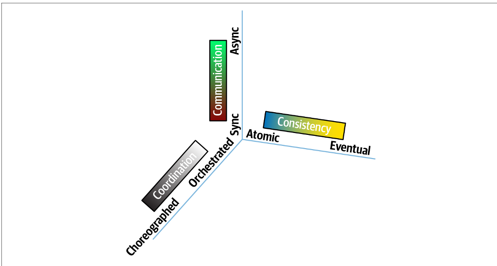

> 图 11-1：动态 quantum 耦合的维度。

在本章中，我们讨论*协调*：在分布式架构中组合两个或多个服务以形成某些特定领域的工作，以及许多伴随的问题。

分布式架构中存在两种基本的协调模式： orchestration 和
choreography。两种风格之间的基本拓扑差异如图 11-2 所示。

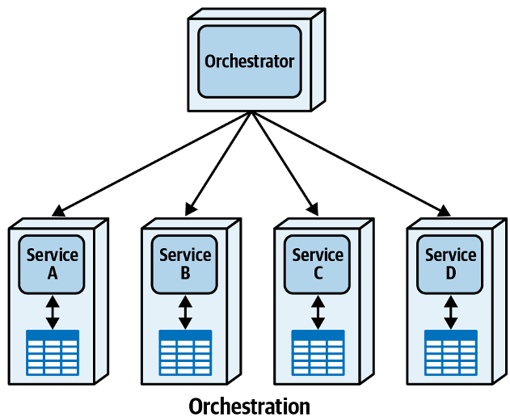

> 图 11-2(a)：orchestration —— 使用 orchestrator。

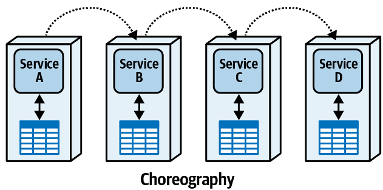

> 图 11-2(b)：choreography —— 不使用 orchestrator。

## Orchestration 通信风格

*orchestration 模式*使用*orchestrator*（有时称为*mediator*）
组件来管理工作流状态、可选行为、错误处理、
通知以及许多其他工作流维护任务。它是以音乐管弦乐队为特征命名的，
管弦乐队利用指挥来同步整体乐谱的不完整部分，以创建统一的音乐作品。 Orchestration
在图 11-3 中以最通用的表示形式说明。

在此示例中，服务 A-D 是领域服务，每个服务负责自己的 bounded
context、数据和行为。 orchestrator
组件通常不包含除其所中介的工作流之外的任何领域行为。请注意，
微服务架构为每个工作流配备一个 orchestrator， *不是*像 ESB 那样的全局
orchestrator。 微服务架构风格的主要目标之一是解耦，使用像 ESB
这样的全局组件会创建不希望的耦合点。 因此，微服务倾向于为每个工作流配备一个
orchestrator。


> 图 11-3：分布式微服务中的 orchestration。

当架构师必须建模包含不仅仅是单一"快乐路径"，还包括替代路径和错误条件的复杂工作流时，
orchestration 是有用的。然而，为了理解模式的基本形状，
我们从无错误的快乐路径开始。考虑一个非常简单的例子： Penultimate Electronics
在线向客户销售设备，如图 11-4 所示。

此系统将下订单请求传递给订单放置 orchestrator， 该 orchestrator
对订单放置服务进行同步调用，该服务记录订单并返回状态消息。接下来， mediator
调用支付服务，该服务更新支付信息。接下来， orchestrator
对履行服务进行异步调用来处理订单。该调用是异步的，因为与支付验证不同，
订单履行没有严格的时间依赖。例如，如果订单履行每天只发生几次，就没有理由进行同步调用的开销。类似地，
orchestrator 然后调用电子邮件服务通知用户成功的电子产品订单。

如果世界只包含快乐路径，软件架构将很容易。然而，软件架构的主要难题之一是错误条件和路径。

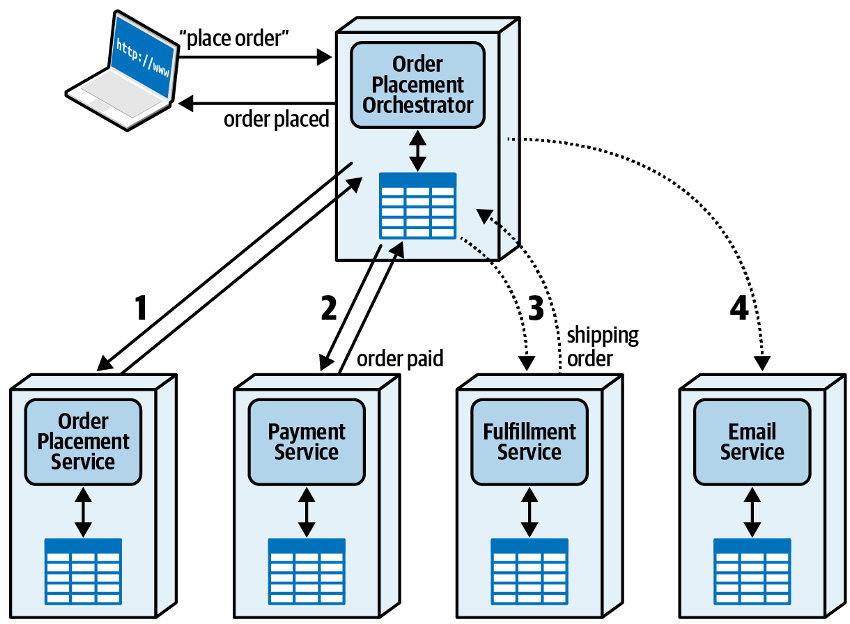

> 图 11-4： 使用 orchestrator
> 购买电子设备的"快乐路径"工作流（注意虚线表示不太时间敏感的异步调用）。

考虑电子产品购买的两种潜在错误场景。首先，如果客户的支付方式被拒绝会发生什么？此错误场景出现在图
11-5 中。


> 图 11-5：支付被拒绝的错误条件。

这里，订单放置 orchestrator 像之前一样通过订单放置服务更新订单。然而，
当尝试应用支付时，支付服务拒绝了它，可能是因为信用卡号过期。在这种情况下，
支付服务通知 orchestrator，orchestrator 然后进行（通常是异步的）
调用，向电子邮件服务发送消息通知客户订单失败。此外， orchestrator
更新订单放置服务的状态，该服务仍然认为这是一个活跃订单。

注意，在此示例中，我们允许每个服务维护自己的事务状态，
建模我们的[Fairy Tale Saga 模式](#fairy-tale-saga-模式)。
现代架构中最难的部分之一是管理事务， 我们将在第 12 章中介绍。

在第二个错误场景中，工作流已经进展得更远：当履行服务报告缺货时会发生什么？此错误场景出现在图
11-6 中。

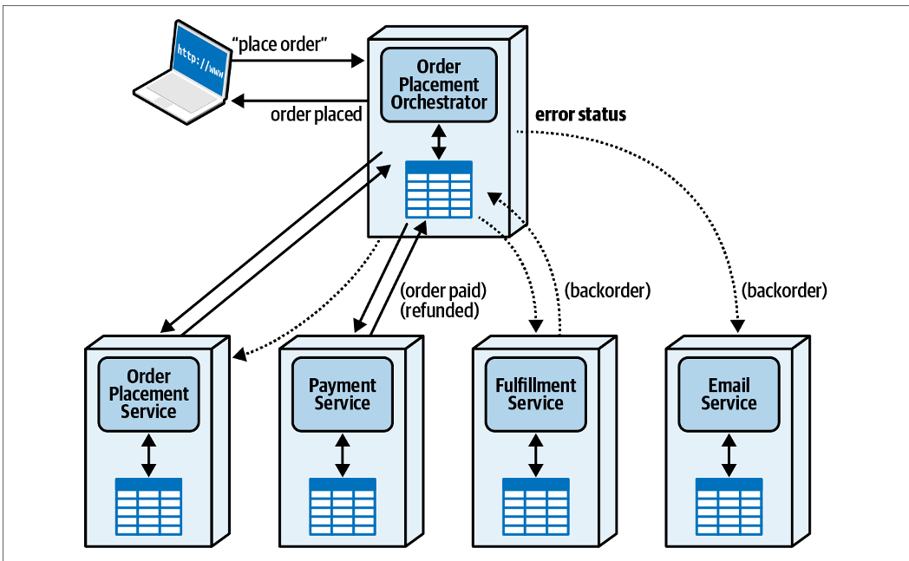

> 图 11-6：当物品缺货时，orchestrator 必须纠正状态。

如你所见，工作流正常进行，直到履行服务通知 orchestrator
当前物品缺货，需要延期交货。在这种情况下， orchestrator
必须退款（这就是为什么许多在线服务在发货时而不是下单时收费）并更新订单放置服务的状态。

图 11-6 中要注意的一个有趣特征是：即使在最复杂的错误场景中，
架构师也不需要添加额外的通信路径，这些路径不是已经存在以促进正常工作流的，
这与[Choreography 通信风格](#choreography-通信风格)不同。

Orchestration 通信风格的一般优点包括：

### 集中式工作流

随着复杂性的增加，拥有一个统一的状态和行为组件变得有益。

### 错误处理

错误处理是许多领域工作流的主要部分，拥有工作流的状态所有者有助于这一点。

### 可恢复性

因为 orchestrator
监控工作流的状态，如果某个领域服务遭受短期中断，架构师可以添加重试逻辑。

### 状态管理

拥有 orchestrator 使工作流的状态可查询，为其他工作流和其他瞬态提供位置。

Orchestration 通信风格的一般缺点包括：

### 响应性

所有通信必须通过 mediator，创建潜在的吞吐量瓶颈，可能损害响应性。

### 容错

虽然 orchestration 增强了领域服务的可恢复性，
但它为工作流创建了潜在的单点故障，可以通过冗余解决，但会增加更多复杂性。

### 可扩展性

这种通信风格不如 choreography 那样可扩展， 因为它有更多的 orchestrator
协调点，这减少了潜在的并行性。正如我们在第 2 章中讨论的， 几种动态耦合模式利用
choreography，
因此实现更高的可扩展性（特别是[Time Travel Saga 模式](#time-travel-saga-模式)
和[Anthology Saga 模式](#anthology-saga-模式)）。

### 服务耦合

拥有中央 orchestrator 在它和领域组件之间创建更高的耦合，这有时是必要的。

Orchestration 通信风格的 trade-off 见表 11-1。

### trade-off

| 优点         | 缺点     |
| ------------ | -------- |
| 集中式工作流 | 响应性   |
| 错误处理     | 容错     |
| 可恢复性     | 可扩展性 |
| 状态管理     | 服务耦合 |

> 表 11-1：orchestration 的 trade-off。

## Choreography 通信风格

Orchestration 通信风格以 orchestrator 提供的隐喻性中央协调命名，
而*choreography*
模式在视觉上说明了没有中央协调的通信风格的意图。相反，每个服务相互参与，类似于舞蹈伙伴。
这不是即兴表演——动作是由
choreographer/架构师事先计划的，但在没有中央协调器的情况下执行。

图 11-4 描述了客户从 Penultimate Electronics 购买电子产品的编排工作流； 以
choreography 通信风格建模的相同工作流出现在图 11-7 中。


> 图 11-7：使用 choreography 购买电子产品。

在此工作流中，初始请求转到责任链中的第一个服务——在这种情况下，订单放置服务。
一旦它更新了关于订单的内部记录，它发送一个异步请求，由支付服务接收。
一旦支付已应用，支付服务生成一个消息，由履行服务接收，该服务计划交付并向电子邮件服务发送消息。

乍一看，choreography 解决方案似乎更简单——更少的服务（没有 orchestrator），
以及简单的事件/命令链（消息）。然而，
与软件架构中的许多问题一样，困难不在于默认路径，而在于边界和错误条件。

如前一节所述，我们涵盖两种潜在的错误场景。第一个是支付失败，如图 11-8 所示。

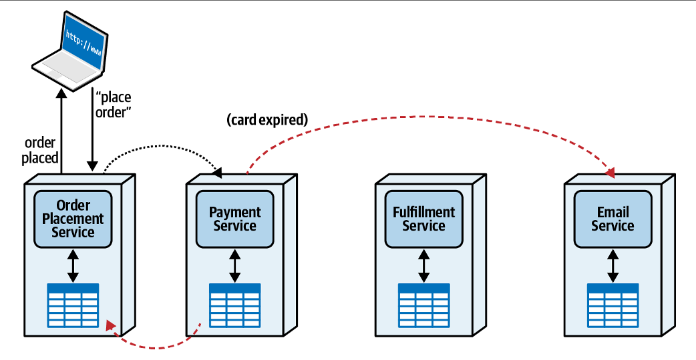

> 图 11-8：choreography 中的支付错误。

支付服务不是发送给履行服务的消息，而是发送指示失败的消息给电子邮件服务，
并返回订单放置服务以更新订单状态。这个替代工作流看起来并不太复杂，只有一个新的通信链接，
之前不存在。

然而，考虑由产品缺货的另一个错误场景带来的日益增加的复杂性，如图 11-9 所示。

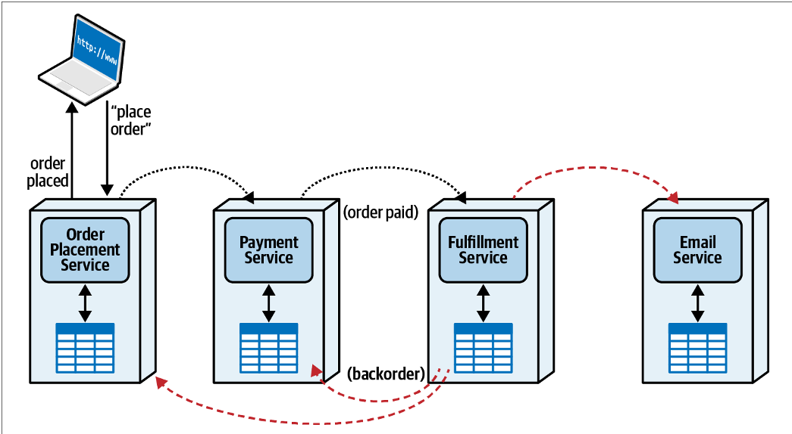

> 图 11-9：管理产品缺货的工作流错误条件。

此工作流的许多步骤已经在导致错误的事件（缺货）之前完成。
因为这些服务中的每一个都实现自己的事务性（这是[*Anthology Saga* 模式](#anthology-saga-模式)的一个例子），
当发生错误时，每个服务必须向其他服务发出补偿消息。一旦履行服务意识到错误条件，
它应该生成适合其 bounded context 的事件，也许是电子邮件、
支付和订单放置服务订阅的广播消息。

图 11-9 中所示的示例说明了复杂工作流和 mediator 之间的依赖关系。 虽然图 11-7
中所示的 choreography 中的初始工作流看起来比图 11-4 更简单，
但错误情况（和其他情况） 不断向 choreography 解决方案添加更多复杂性。在图 11-10
中， 每个错误场景迫使领域服务相互交互，添加了快乐路径不需要的通信链接。


> 图 11-10：choreography 中的错误条件通常会添加通信链接。

架构师需要在软件中建模的每个工作流都有一定量的*语义耦合*——问题领域中存在的固有耦合。例如，
将工单分配给 Sysops Squad 成员的过程具有一定的工作流：客户必须请求服务，
技能必须匹配特定专家，然后交叉引用到排班和位置。
架构师建模该交互的方式是*实现耦合*。

工作流的语义耦合由解决方案的领域需求决定，必须以某种方式建模。无论架构师多么聪明，
他们都不能减少语义耦合的量，但他们的实现选择可能会增加它。
这并不意味着架构师可能不会反对业务用户定义的不切实际或不可能的语义——某些领域需求会在架构中创建异常困难的问题。

这里有一个常见的例子。考虑标准的分层单体架构与更现代的模块化单体风格，如图 11-11
所示。

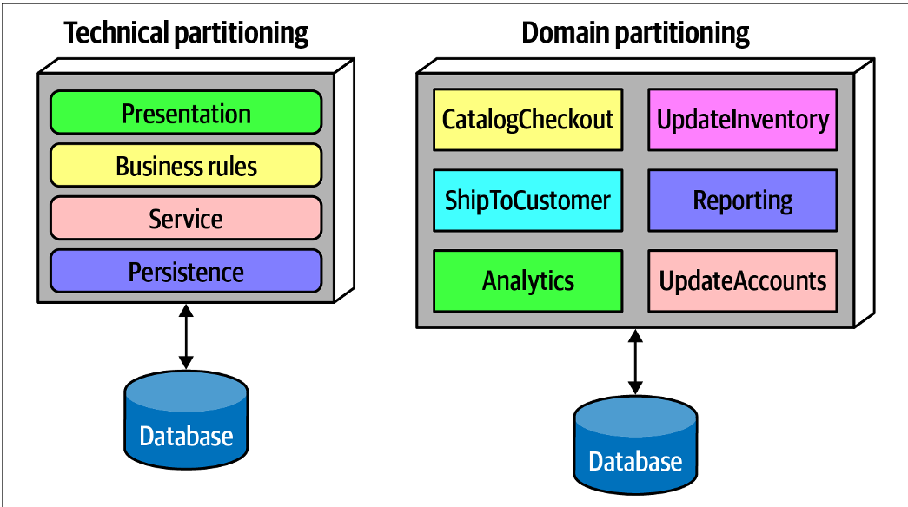

> 图 11-11：架构中的技术分区与领域分区。

左侧的架构代表传统的分层架构，按*技术*能力如持久性、业务规则等分离。右侧，
相同的解决方案出现，但按*领域*关注点如目录结账和更新库存分离，而不是技术能力。

两种拓扑都是组织代码库的逻辑方式。然而，考虑像目录结账这样的领域概念在每个架构中的位置，如图
11-12 所示。

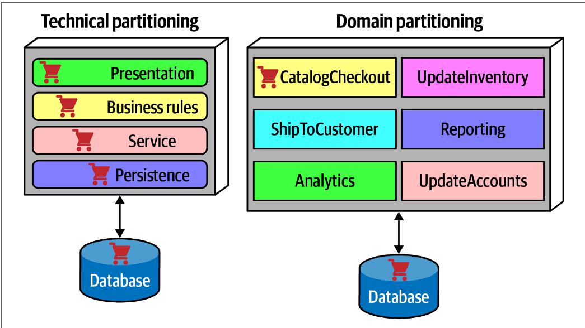

> 图 11-12：目录结账在技术分区架构中跨实现层分布。

目录结账在技术架构的各层中"分布"，而在领域分区示例中，它只出现在匹配的领域组件和数据库中。当然，
将领域与领域分区架构对齐并不是一个启示——domain-driven design
的见解之一是领域工作流的首要性。 无论如何，如果架构师想要建模工作流，
他们必须使这些移动部件协同工作。如果架构师已经按与领域相同的方式组织架构，
工作流的实现应该具有类似的复杂性。然而，如果架构师施加了额外的层（如技术分区，
图 11-12
所示），它会增加整体实现复杂性，因为现在架构师必须为语义复杂性以及额外的实现复杂性进行设计。

有时额外的复杂性是合理的。例如，许多分层架构源于架构师通过整合架构模式（如数据库连接池）来获得成本节约的愿望。
在这种情况下， 架构师考虑了技术分区数据库连接的成本节约与施加的复杂性之间的
trade-off，在许多情况下成本胜出。

过去十年架构设计的主要教训是，尽可能接近地建模工作流的语义与实现。

> [!TIP]
> 架构师永远不能通过实现减少语义耦合，但他们可以使它变得更糟。

因此，我们可以在语义耦合和协调需求之间建立关系——工作流所需的步骤越多，潜在的错误和其他可选路径就越多。

### 工作流状态管理

大多数工作流包括关于工作流状态的瞬态：哪些元素已执行，哪些剩余，排序，错误条件，重试等。对于编排的解决方案，
明显的工作流状态所有者是
orchestrator（尽管一些架构解决方案为更高的可扩展性创建无状态 orchestrator）。
然而， 对于 choreography，没有明显的工作流状态所有者。 管理 choreography
中的状态有许多常见选项；以下是三种常见的。

首先，*前端控制器模式*将状态责任放在责任链中的第一个被调用的服务上，
在这种情况下是订单放置服务。如果该服务包含关于订单和工作流状态的信息，
某些领域服务必须具有通信链接以查询和更新订单状态，如图 11-13 所示。

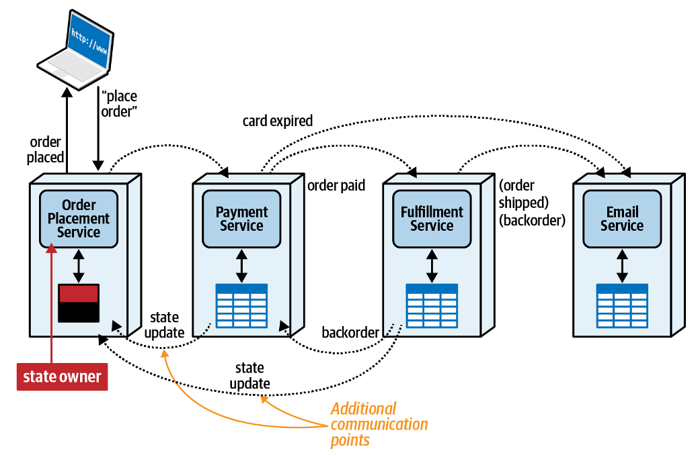

> 图 11-13：在 choreography
> 中，前端控制器是一个领域服务，除了领域行为外还拥有工作流状态。

在这种场景中，某些服务必须与订单放置服务通信以更新订单状态，因为它是状态所有者。虽然这简化了工作流，但它增加了通信开销，
并使订单放置服务比仅处理领域行为的服务更复杂。虽然前端控制器模式有一些有利的特性，
但它也有 trade-off，如表 11-2 所示。

### trade-off

| 优点                                   | 缺点                                             |
| -------------------------------------- | ------------------------------------------------ |
| 在 choreography 中创建伪 orchestration | 向领域服务添加额外的工作流状态                   |
| 使查询订单状态变得简单                 | 增加通信开销                                     |
|                                        | 对性能和可扩展性不利，因为它增加了集成通信的噪声 |

> 表 11-2：前端控制器模式的 trade-off。

架构师管理事务状态的第二种方法是根本不保留瞬态工作流状态，依赖查询各个服务来构建实时快照。
这被称为无状态 choreography。
虽然这简化了第一个服务的状态，但它大大增加了服务之间通信的网络开销，以构建有状态快照。例如，
考虑像图 11-7 中的简单 choreography 快乐路径这样的工作流，没有额外状态。
如果客户想知道他们订单的状态，
架构师必须构建一个工作流来查询每个领域服务的状态，以确定最新的订单状态。
虽然这使得解决方案高度灵活，但重建状态可能在运维架构特性（如可扩展性和性能）
方面复杂且昂贵。无状态 choreography 以高性能换取工作流控制，如表 11-3 所示。

### trade-off

| 优点                 | 缺点                       |
| -------------------- | -------------------------- |
| 提供高性能和可扩展性 | 工作流状态必须即时构建     |
| 极度解耦             | 复杂性随复杂工作流迅速上升 |

> 表 11-3：无状态 choreography 的 trade-off。

第三种解决方案利用 stamp
耦合（在[用于工作流管理的 Stamp 耦合](#用于工作流管理的-stamp-耦合)
中更详细描述）， 将额外的工作流状态存储在服务之间传递的消息契约中。
每个领域服务更新其整体状态的部分，并将其传递给责任链中的下一个。因此，
该契约的任何消费者可以在不查询每个服务的情况下检查工作流的状态。

这是一个部分解决方案，因为它仍然没有为用户提供查询正在进行的工作流状态的单一位置。然而，
它确实提供了一种在服务之间传递状态作为工作流一部分的方式，
为每个服务提供了额外的可能有用的上下文。与软件架构的所有特性一样，stamp
耦合有好有坏的特性，如表 11-4 所示。

### trade-off

| 优点                                               | 缺点                         |
| -------------------------------------------------- | ---------------------------- |
| 允许领域服务传递工作流状态，无需额外查询状态所有者 | 契约必须更大以容纳工作流状态 |
| 消除了对前端控制器的需求                           | 不提供即时状态查询           |

> 表 11-4：Stamp 耦合的 trade-off。

在第 13 章中，我们讨论契约如何减少或增加 choreography 解决方案中的工作流耦合。

Choreography 通信风格的优点包括：

### 响应性

这种通信风格具有更少的单一瓶颈点，因此提供更多的并行机会。

### 可扩展性

与响应性类似，缺乏像 orchestrator 这样的协调点允许更独立的扩展。

### 容错

缺乏单一 orchestrator 允许架构师通过使用多个实例来增强容错。

### 服务解耦

没有 orchestrator 意味着更少的耦合。

Choreography 通信风格的缺点包括：

### 分布式工作流

没有工作流所有者使错误管理和其他边界条件更加困难。

### 状态管理

没有集中式状态持有者阻碍了持续的状态管理。

### 错误处理

没有 orchestrator，错误处理变得更加困难，因为领域服务必须具有更多工作流知识。

### 可恢复性

类似地，没有 orchestrator 尝试重试和其他修复工作，可恢复性变得更加困难。

像[Orchestration 通信风格](#orchestration-通信风格)一样， choreography
有许多好和坏的 trade-off，通常是对立的，总结在表 11-5 中。

### trade-off

| 优点     | 缺点         |
| -------- | ------------ |
| 响应性   | 分布式工作流 |
| 可扩展性 | 状态管理     |
| 容错     | 错误处理     |
| 服务解耦 | 可恢复性     |

> 表 11-5：choreography 通信风格的 trade-off。

### Orchestration 和 Choreography 之间的 trade-off

与软件架构中的所有事物一样，orchestration 和 choreography
都不代表所有可能性的完美解决方案。 一些关键 trade-off，包括这里列出的一些，
将引导架构师走向这两种解决方案之一。

## 状态所有者和耦合

如图 11-13 所示，状态所有权通常驻留在某处，要么在作为 orchestrator 的正式
mediator 中， 要么在 choreography 解决方案中的前端控制器中。 在 choreography
解决方案中，移除 mediator 迫使服务之间进行更高水平的通信。
这可能是一个完全合适的
trade-off。例如，如果架构师有一个需要更高可扩展性且通常具有很少错误条件的工作流，
可能值得用 choreography 的更高可扩展性换取错误处理的复杂性。

然而，随着工作流复杂性的增加，对 orchestrator 的需求按比例上升，如图 11-14
所示。

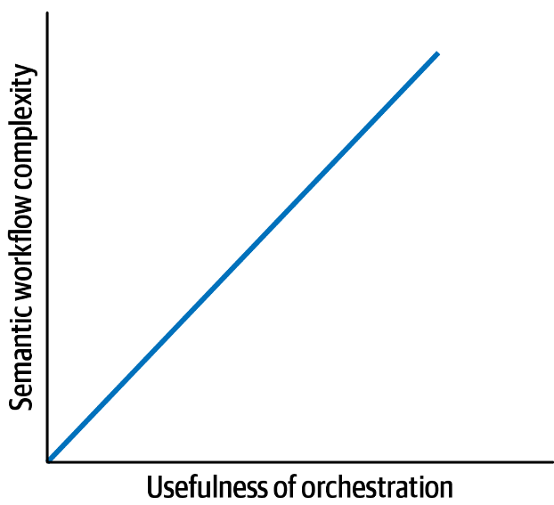

> 图 11-14：随着工作流复杂性的增加，orchestration 变得更加有用。

此外，工作流中包含的语义复杂性越多，orchestrator
就越实用。记住，实现耦合不能使语义耦合变得更好，只能更糟。

最终，choreography 的最佳位置在于需要响应性和可扩展性的工作流，
并且要么没有复杂的错误场景，要么它们不频繁。这种通信风格允许高吞吐量；
它被动态耦合模式[Phone Tag Saga 模式](#phone-tag-saga-模式)、
[Time Travel Saga 模式](#time-travel-saga-模式)
和[Anthology Saga 模式](#anthology-saga-模式)使用。
然而，当其他力量混合在一起时，它也可能导致极其困难的实现，
导致[Horror Story 模式](#horror-story-模式)。

另一方面，*orchestration* 最适合包含边界和错误条件的复杂工作流。
虽然这种风格不提供与 choreography 一样多的可扩展性，
但它在大多数情况下大大降低了复杂性。
这种通信风格出现在[Epic Saga 模式](#epic-saga-模式)、
[Fairy Tale Saga 模式](#fairy-tale-saga-模式)、
[Fantasy Fiction Saga 模式](#fantasy-fiction-saga-模式)
和[Parallel Saga 模式](#parallel-saga-模式)中。

协调是架构师在确定微服务之间最佳通信方式时产生复杂性的主要力量之一。接下来，
我们研究这种力量如何与另一个主要力量——一致性——相交。

## Sysops Squad Saga：管理工作流

### 3 月 15 日，星期四，11:00


> 插图 11-2：Addison、Austen 和 Logan 讨论工作流选项。

Addison 和 Austen 准时到达 Logan
的办公室，带着一个演示文稿和从厨房拿来的仪式用咖啡壶。

"你准备好见我们了吗？"Addison 问道。

"当然，"Logan
说。"时机正好——刚结束一个电话会议。你们准备好讨论主要工单流的工作流选项了吗？"

"是的！"Austen 说。"我认为我们应该使用 choreography， 但 Addison 认为应该用
orchestration，我们无法决定。"

"给我概述一下我们正在看的工作流。"

"这是主要工单工作流，"Addison 说。"它涉及四个服务；以下是步骤。"

面向客户的操作：

1. 客户通过工单管理服务提交故障工单，并收到工单号。

后台操作：

1. 工单分配服务为故障工单找到合适的 Sysops 专家。
2. 工单分配服务将故障工单路由到系统专家的移动设备。
3. 通过通知服务通知客户 Sysops 专家正在前来解决问题的路上。
4. 专家修复问题并将工单标记为完成，发送到工单管理服务。
5. 工单管理服务与调查服务通信，告诉客户填写调查。

"你建模了两种解决方案吗？"Logan 问道。

"是的。Choreography 的图见图 11-15。"

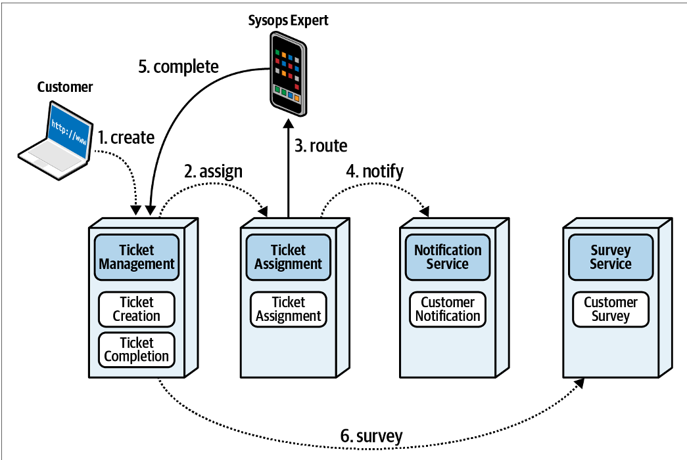

> 图 11-15：建模为 choreography 的主要工单流。

"...以及 orchestration 的模型见图 11-16。"


> 图 11-16：建模为 orchestration 的主要工单工作流。

Logan
思考了一会儿图表，然后宣布："嗯，这里似乎没有明显的赢家。你知道这意味着什么。"

Austen 插话："trade-off！"

"当然，"Logan
笑着说。"让我们想想可能的场景，看看每种解决方案如何应对它们。你主要关心的问题是什么？"

"第一个是丢失或错误路由的工单。业务一直在抱怨，这已经成为优先事项，"Addison 说。

"好的，哪个更好地处理这个问题——orchestration 还是 choreography？"

"更容易控制工作流听起来像 orchestrator
版本更好——我们可以在那里处理所有工作流问题， "Austen 自愿说。

"好的，让我们在表 11-6 中构建一个问题和首选解决方案的表格。"

### trade-off

| Orchestration | Choreography |
| ------------- | ------------ |
| 工作流控制    |              |

> 表 11-6：工单工作流的 orchestration 与 choreography 之间的 trade-off。

"我们应该建模的下一个问题是什么？"Addison 问道。

"我们需要在任何给定时刻知道故障工单的状态——业务已经请求了这个功能，
它使跟踪几个指标更容易。这意味着我们需要一个 orchestrator，
以便我们可以查询工作流的状态。"

"但你不一定需要 orchestrator 来做这个——我们可以查询任何给定的服务，
看看它是否处理了工作流的特定部分，或者使用 stamp 耦合， "Addison 说。

"没错——这不是零和游戏，"Logan 说。"两个都可能同样有效，或者都不行。
我们将在更新后的表 11-7 中给两个解决方案记分。"

### trade-off

| Orchestration | Choreography |
| ------------- | ------------ |
| 工作流控制    |              |
| 状态查询      | 状态查询     |

> 表 11-7： 工单工作流的 orchestration 与 choreography 之间更新后的 trade-off。

"好的，还有什么？"

"我能想到的还有一个，"Addison 说。"客户可以取消工单，工单也可能因专家可用性、
与专家移动设备的连接丢失或专家在客户现场的延迟而重新分配。因此，
正确的错误处理很重要。这意味着 orchestration？"

"是的，通常。复杂的工作流必须在某处存在，要么在 orchestrator 中，
要么散布在服务中。有一个单一位置来整合错误处理是很好的。 而且 choreography
在这里肯定得分不高，所以我们将在表 11-8 中更新我们的表格。"

### trade-off

| Orchestration | Choreography |
| ------------- | ------------ |
| 工作流控制    |              |
| 状态查询      | 状态查询     |
| 错误处理      |              |

> 表 11-8：工单工作流的 orchestration 与 choreography 之间最终 trade-off。

"看起来不错。还有吗？"

"没有不明显的东西了，"Addison 说。"我们会写一份
ADR；如果我们想到任何其他问题，可以在那里添加。"

### ADR：对主要工单工作流使用 Orchestration

#### 上下文

对于主要工单工作流，架构必须支持轻松跟踪丢失或错误跟踪的消息、出色的错误处理以及跟踪工单状态的能力。
图 11-16 中所示的 orchestration 解决方案或图 11-15 中所示的 choreography
解决方案都可以工作。

#### 决策

我们将对主要工单工作流使用 orchestration。

我们建模了 orchestration 和 choreography，并得出了表 11-8 中的 trade-off。

#### 后果

工单工作流可能在单个 orchestrator
周围存在可扩展性问题，如果当前可扩展性需求发生变化，应重新考虑。

# 第 12 章：事务性 Saga

3 月 31 日，星期四，16:55


> 插图 12-1：Austen 和 Logan 讨论 saga 模式。

在一个刮风的星期四下午晚些时候，Austen 出现在 Logan 的办公室。 "Addison
刚让我过来问你关于某个 horror story？"

Logan 停下来抬头。"这是你这个周末要做的疯狂极限运动的描述吗？这次是什么？"

"是晚春，所以一群人要去解冻的湖上滑冰。我们穿着全身服，所以实际上是滑冰和游泳的结合。但这不是
Addison 的意思。 当我给 Addison
看我的工单工作流设计时，我立即被指示来找你，告诉你我创造了一个 horror story。"

Logan 笑了。"哦，我明白怎么回事了——你无意中走进了 Horror Story saga 通信模式。
你设计了一个带有异步通信、 原子事务性和 choreography 的工作流，对吗？"

"你怎么知道？"

"那是 Horror Story saga 模式，或者更确切地说，是反模式。我们从八个通用 saga
模式开始， 所以了解它们是什么是好的， 因为每个都有不同的 trade-off 平衡。"

架构中 saga 的概念早于微服务，
最初关注的是限制早期分布式架构中数据库锁的范围——普遍认为创造了这个概念的文章来自
1987 年 ACM 会议论文集。 在他的书 *Microservices Patterns*（Manning
Publications） 中，也在他网站的"*Saga 模式*"部分中， Chris Richardson 将微服务的
*saga 模式*描述为一系列本地事务，
其中每个更新发布一个事件，从而触发序列中的下一个更新。如果任何更新失败， saga
发出一系列补偿更新以撤销在 saga 期间所做的先前更改。

然而，回顾第 2 章，这只是八种可能 saga 类型中的一种。在本节中，
我们深入探讨事务性 saga
的内部工作原理以及如何管理它们，特别是当错误发生时。毕竟，
由于分布式事务缺乏原子性（参见[分布式事务](#分布式事务)），使它们有趣的是当问题发生时。

## 事务性 Saga 模式

在第 2 章中，我们引入了一个矩阵，并列了架构师必须选择如何实现事务性 saga
时每个相交维度， 复现在表 12-1 中。

| 模式名称                   | 通信 | 一致性 | 协调          |
| -------------------------- | ---- | ------ | ------------- |
| Epic Saga (sao)            | 同步 | 原子   | 编排          |
| Phone Tag Saga (sac)       | 同步 | 原子   | choreographed |
| Fairy Tale Saga (seo)      | 同步 | 最终   | 编排          |
| Time Travel Saga (sec)     | 同步 | 最终   | choreographed |
| Fantasy Fiction Saga (aao) | 异步 | 原子   | 编排          |
| Horror Story (aac)         | 异步 | 原子   | choreographed |
| Parallel Saga (aeo)        | 异步 | 最终   | 编排          |
| Anthology Saga (aec)       | 异步 | 最终   | choreographed |

> 表 12-1：分布式架构的维度交叉矩阵。

我们为每种组合提供了一些异想天开的名称，都源自 saga 类型。然而，
模式名称的存在是为了帮助区分可能性，我们不想提供记忆测试来将模式名称与一组特征相关联，
因此我们为每种 saga 类型添加了上标， 指示按字母顺序列出的三个维度的值（如表 12-1
所示）。例如，*Epic Saga* 模式指示通信、
一致性和协调的值为*同步*、*原子*和*编排*。上标帮助你更容易地将名称与特征集关联起来。

虽然架构师将比其他更多地使用某些模式，但它们都有合法的用途和不同的 trade-off
集。

我们用三维表示空间中三种力量的交叉以及使用通用分布式服务的示例工作流来说明每种可能的通信组合，
我们称之为*同构图*。这些图以最通用的方式显示服务之间的交互，
以实现我们以最简单的形式展示架构概念的目标。在每个图中，我们使用图 12-1
中所示的通用符号集。


> 图 12-1：ISO 架构交互图图例。

对于每种架构模式，我们不展示每个可能的交互，这会变得重复。相反，
我们识别并说明模式的区分特征——使其行为在模式中独特的东西。

### Epic Saga 模式

这种通信类型是许多架构师理解的"传统"saga 模式， 也因其协调类型称为*编排的
Saga*。其维度关系出现在图 12-2 中。


> 图 12-2：Epic Saga 模式的动态耦合（通信、一致性、协调）关系。

此模式使用*同步*通信、*原子*一致性和*编排*协调。
选择此模式时架构师的目标模仿单体系统的行为——事实上，如果单体系统被添加到图 12-2
中的此图中， 它将是原点（0, 0,
0），完全缺乏分布。因此，这种通信风格对于传统事务系统的架构师和开发人员来说是最熟悉的。

Epic Saga 模式的同构表示出现在图 12-3 中。


> 图 12-3：Epic Saga 模式的同构通信图示。

这里，*orchestrator*服务编排一个工作流，包括对三个服务的更新，
预期以事务方式发生——要么所有三个调用成功，要么都不成功。如果一个调用失败，
它们都失败并返回到先前的状态。架构师可以以多种方式解决这个协调问题，
在分布式架构中都很复杂。然而，这些事务限制了数据库的选择，并具有臭名昭著的失败模式。

许多初出茅庐或天真的架构师相信，只要针对某个问题存在对应的模式，它就代表了干净的解决方案。然而，模式只是对共性的认识，
而不是可解决性。
分布式事务提供了这种现象的一个极好例子——习惯于在非分布式系统中建模事务的架构师有时认为将该能力移动到分布式世界是一个增量变化。
然而，
分布式架构中的事务提出了许多挑战，这些挑战根据问题的语义耦合的复杂性按比例变得更糟。

考虑 Epic Saga 模式的一种常见实现，使用 compensating transaction。
*补偿更新*是在分布式事务范围内撤销另一个服务执行的数据写操作（例如撤销更新、
重新插入先前删除的行或删除先前插入的行）的操作。
虽然补偿更新尝试撤销更改以使分布式数据源回到分布式事务开始之前的原始状态，但它们充满了复杂的问题、
挑战和 trade-off。

compensating transaction 模式分配一个服务来监控请求的事务完整性，如图 12-4
所示。


> 图 12-4：使用 compensating transaction 的成功编排事务 Epic Saga。

然而，与架构中的许多事情一样，错误条件导致困难。 在 compensating transaction
框架中，mediator 监控调用的成功，
如果一个或多个请求失败，则向其他服务发出补偿调用，如图 12-5 所示。


> 图 12-5：当发生错误时，mediator 必须向其他服务发送补偿请求。

mediator 既接受请求又中介工作流，对前两个服务的同步调用成功。然而，
当尝试对最后一个服务进行调用时，它失败了（可能来自各种领域和运维原因）。 因为
Epic Saga 的目标是原子一致性， mediator 必须使用 compensating
transaction，并要求其他两个服务撤销之前的操作，
将整体状态恢复到事务开始之前的状态。

此模式被广泛使用：它建模熟悉的行为，并且有一个成熟的模式名称。
许多架构师默认使用 Epic Saga 模式，因为它感觉与单体架构相似，
加上利益相关者有时要求状态更改必须同步，无论技术约束如何。然而， 许多其他动态
quantum 耦合模式可能提供更好的 trade-off 集。

Epic Saga 的明显优点是与单体系统相似的事务协调， 加上通过 orchestrator
表示的清晰工作流所有者。然而，缺点是多种多样的。首先， orchestration
加事务性可能影响运维架构特性，如性能、可扩展性、 弹性等——orchestrator
必须确保事务中的所有参与者都成功或失败， 创建时序瓶颈。其次，
用于实现分布式事务性的各种模式（如 compensating transaction）
会受到各种失败模式和边界条件的影响，
同时通过撤销操作增加固有复杂性。分布式事务呈现了许多困难，因此最好尽可能避免。

Epic Saga 模式具有以下特征：

#### 耦合水平

此模式在所有可能的维度上表现出极高的耦合水平：同步通信、原子一致性和编排协调——它实际上是列表中最耦合的模式。
这并不奇怪，
因为它建模了高度耦合的单体系统通信的行为，但在分布式架构中创建了许多问题。

#### 复杂性水平

错误条件和其他密集协调加上原子性要求增加了此架构的复杂性。
此架构使用的同步调用减轻了一些复杂性，因为架构师不必担心调用期间的竞争条件和死锁。

#### 响应性/可用性

Orchestration 创建了一个瓶颈，特别是当它还必须协调事务原子性时，
这降低了响应性。此模式使用同步调用，进一步影响性能和响应性。
如果任何服务不可用或发生不可恢复的错误，此模式将失败。

#### 可扩展性/弹性

与*响应性*类似，实现此模式所需的瓶颈和协调使可扩展性和其他运维关注点变得困难。

虽然 Epic Saga
因其熟悉性而受欢迎，但它从设计和运维特性角度都创建了许多挑战，如表 12-2 所示。

| Epic Saga (sao) 模式 | 评分   |
| -------------------- | ------ |
| 通信                 | 同步   |
| 一致性               | 原子   |
| 协调                 | 编排   |
| 耦合                 | 非常高 |
| 复杂性               | 低     |
| 响应性/可用性        | 低     |
| 可扩展性/弹性        | 非常低 |

> 表 12-2：Epic Saga 的评分。

幸运的是，架构师不必默认使用那些虽然看似熟悉但创建意外复杂性的模式——存在各种其他模式，
具有不同的 trade-off 集。
参见[Sysops Squad Saga：原子事务和补偿更新](#sysops-squad-saga原子事务和补偿更新)，
了解 Epic Saga 及它呈现的一些复杂挑战（以及如何解决这些挑战）的具体示例。

### Phone Tag Saga 模式

Phone Tag Saga 模式改变了 Epic Saga 的一个维度， 将协调从编排改为
choreographed；此更改如图 12-6 所示。


> 图 12-6：Phone Tag Saga 模式使用松散耦合的通信。

模式名称是*Phone
Tag*，因为它类似于北美众所周知的儿童游戏*电话*：孩子们围成一圈，
一个人向下一个人耳语一个秘密，下一个人再传递给下一个，
直到最后一个版本被最后一个人说出来。在图 12-6 中，choreography 优先于
orchestration， 创建了图 12-7 中所示的结构通信的相应变化。


> 图 12-7：由于缺乏编排，每个参与者必须协调状态。

Phone Tag Saga 模式具有原子性，但也有 choreography， 意味着架构师没有指定正式的
orchestrator。然而，原子性需要某种程度的协调。 在图 12-7
中，最初被调用的服务成为协调点（有时称为*前端控制器*）。一旦它完成工作，
它将请求传递给工作流中的下一个服务，持续直到工作流成功。然而，
如果发生错误条件，每个服务必须具有内置逻辑，沿链发送补偿请求。

因为架构目标是事务原子性，协调该原子性的逻辑必须存在于某处。因此，
领域服务必须包含关于它们参与的工作流上下文的更多逻辑，包括错误处理和路由。对于复杂的工作流，
此模式中的*前端控制器*将变得与大多数 mediator
一样复杂，降低了此模式的吸引力和适用性。因此，
此模式通常用于需要更高可扩展性但可能有潜在性能影响的简单工作流。

Choreography 与 orchestration 相比如何改善运维架构特性（如可扩展性）？
即使在同步通信中使用 choreography 也能减少瓶颈——在非错误条件下，
工作流中的最后一个服务可以返回结果，允许更高的吞吐量和更少的瓶颈点。
由于缺乏协调，快乐路径工作流的性能可能比 Epic Saga 更快。然而，没有 mediator，
错误条件会慢得多——每个服务必须解开调用链，这也增加了服务之间的耦合。

通常，Phone Tag Saga 提供比 Epic Saga 稍好的可扩展性，
因为缺乏可能成为限制瓶颈的 mediator。然而，
此模式在错误条件和其他工作流复杂性方面也表现出较低的性能——没有
mediator，工作流必须通过服务之间的通信来解决， 这影响性能。

非编排架构的一个好特性是缺乏耦合奇点，即工作流耦合到的单一位置。即使此模式使用同步请求，
快乐路径工作流存在较少的等待条件，允许更高的可扩展性。通常，
减少耦合会增加可扩展性。

随着缺乏编排带来的改进的可扩展性，领域服务管理除其名义职责之外的工作流关注点的复杂性增加。对于复杂的工作流，
增加的复杂性和服务间通信可能驱使架构师回到 orchestration 及其 trade-off。

Phone Tag Saga 具有相当罕见的特性组合——通常， 如果架构师选择
choreography，他们也会选择异步性。然而，在某些情况下，架构师可能选择此组合：
同步调用确保每个领域服务在调用下一个之前完成其工作流部分，消除竞争条件。
如果错误条件容易解决，或者领域服务可以利用幂等性和重试，
那么架构师可以使用此模式构建比 Epic Saga 更高的并行可扩展性。

Phone Tag Saga 模式具有以下特征：

#### 耦合水平

此模式放松了 Epic Saga 模式的耦合维度之一， 使用 choreographed
而非编排的工作流。因此，此模式耦合稍少，但具有相同的事务要求，
意味着工作流的复杂性必须在领域服务之间分布。

#### 复杂性水平

此模式比 Epic Saga
明显更复杂；此模式中的复杂性与工作流的语义复杂性成线性比例上升：
工作流越复杂，每个服务中必须出现的逻辑就越多， 以弥补 orchestrator
的缺乏。或者， 架构师可以将工作流信息添加到消息本身作为 stamp
耦合的一种形式（参见[用于工作流管理的 Stamp 耦合](#用于工作流管理的-stamp-耦合)），
以维护状态， 但增加了每个服务所需的开销上下文。

#### 响应性/可用性

更少的编排通常导致更好的响应性， 但此模式中的错误条件在没有 orchestrator
的情况下变得更难建模，需要更多通过回调和其他耗时活动的协调。

#### 可扩展性/弹性

缺乏编排转化为更少的瓶颈，通常增加可扩展性，但仅略微。
此模式仍然在三个维度中的两个上使用紧密耦合，因此可扩展性不是亮点，特别是如果错误条件很常见。

Phone Tag Saga 的评分见表 12-3。

| Phone Tag Saga (sac) | 评分          |
| -------------------- | ------------- |
| 通信                 | 同步          |
| 一致性               | 原子          |
| 协调                 | choreographed |
| 耦合                 | 高            |
| 复杂性               | 高            |
| 响应性/可用性        | 低            |
| 可扩展性/弹性        | 低            |

> 表 12-3：Phone Tag Saga 的评分。

Phone Tag Saga 模式更适合没有许多常见错误条件的简单工作流。 虽然它提供了比 Epic
Saga 稍好的几个特性， 但缺乏 orchestrator 引入的复杂性抵消了许多优点。

### Fairy Tale Saga 模式

典型的童话故事提供具有易于理解情节的快乐故事，因此命名为*Fairy Tale Saga*，
它使用同步通信、最终一致性和编排，如图 12-8 所示。


> 图 12-8：Fairy Tale Saga 说明了最终一致性。

此通信模式放松了困难的原子要求，为架构师设计系统提供了更多选项。例如，
如果服务暂时不可用，最终一致性允许缓存更改直到服务恢复。 Fairy Tale Saga
的通信结构如图 12-9 所示。

在此模式中，存在 orchestrator 来协调请求、响应和错误处理。然而， orchestrator
不负责管理事务，每个领域服务保留自己的责任（常见工作流的示例，
参见[第 11 章：管理分布式工作流](#第-11-章管理分布式工作流)）。因此，
orchestrator 可以管理补偿调用，但没有在活跃事务中发生的要求。

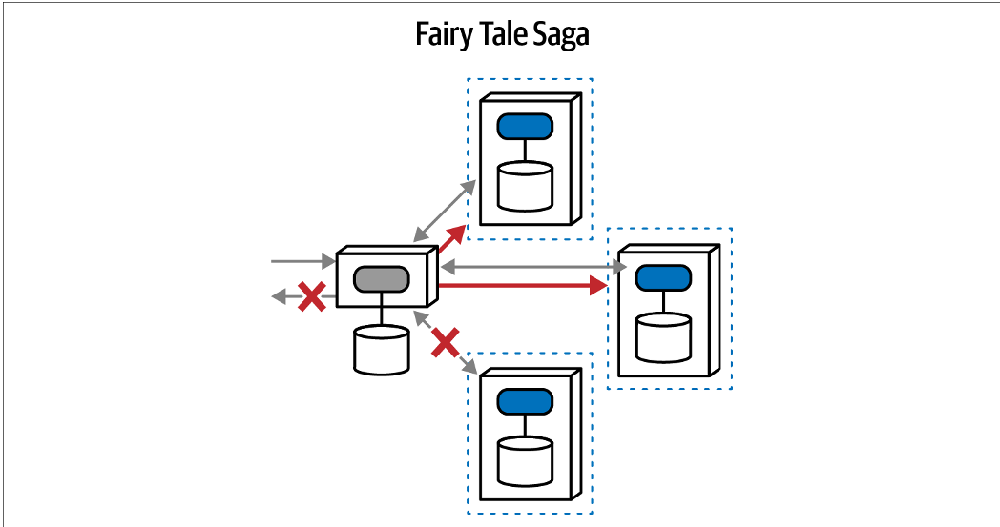

> 图 12-9：Fairy Tale Saga 交互的同构图示。

这是一个更具吸引力的模式，常见于许多微服务架构中。拥有 mediator
使管理工作流更容易，
同步通信是两种选择中更容易的，最终一致性移除了最困难的协调挑战，
特别是对于错误处理。

Fairy Tale Saga 最大的吸引人优点是缺乏整体事务。每个领域服务管理自己的事务行为，
依赖最终一致性来实现整体工作流。

与许多其他模式相比，此模式通常表现出良好的 trade-off 平衡：

#### 耦合水平

Fairy Tale Saga
具有高耦合，此模式中三个耦合驱动因素中的两个被最大化（同步通信和编排协调）。
然而，耦合复杂性的最差驱动因素——事务性——在此模式中消失，
取而代之的是最终一致性。orchestrator
仍然必须管理复杂的工作流，但没有在事务中执行此操作的严格限制。

#### 复杂性水平

Fairy Tale Saga 的复杂性相当低；它包括最方便的选项（编排、同步性）
和最宽松的限制（最终一致性）。因此，命名为 Fairy Tale
Saga——一个简单的故事，结局快乐。

#### 响应性/可用性

这种类型的通信风格中响应性通常更好，因为即使调用是同步的， mediator
需要包含的关于正在进行的事务的时间敏感状态较少，允许更好的负载均衡。然而，
真正的性能区别来自异步性，在未来的模式中说明。

#### 可扩展性/弹性

缺乏耦合通常导致更高的可扩展性；移除事务耦合允许每个服务更独立地扩展。

Fairy Tale Saga 的评分出现在表 12-4 中。

| Fairy Tale Saga (seo) | 评分   |
| --------------------- | ------ |
| 通信                  | 同步   |
| 一致性                | 最终   |
| 协调                  | 编排   |
| 耦合                  | 高     |
| 复杂性                | 非常低 |
| 响应性/可用性         | 中     |
| 可扩展性/弹性         | 高     |

> 表 12-4：Fairy Tale Saga 的评分。

如果架构师可以利用最终一致性，此模式是相当有吸引力的，结合了容易的移动部件和最少的可怕限制，使其成为架构师中的热门选择。

### Time Travel Saga 模式

*Time Travel Saga* 模式具有同步通信、最终一致性，但 choreographed
的工作流。换句话说， 此模式避免中央
mediator，将工作流责任完全放在参与的领域服务上， 如图 12-10 所示。


> 图 12-10：Time Travel Saga 模式使用三种解耦技术中的两种。

结构拓扑说明了缺乏编排，如图 12-11 所示。

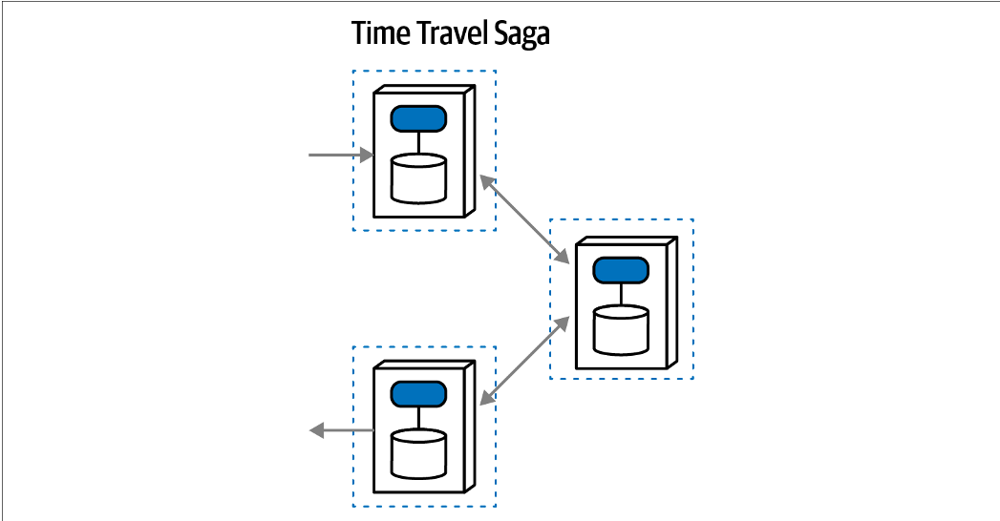

> 图 12-11：没有编排，复杂工作流变得难以管理。

在此工作流中，每个服务接受请求，执行操作，然后将请求转发给另一个服务。
此架构可以实现*责任链*设计模式或*管道和过滤器*架构风格——任何具有单向步骤序列的工作流。
此模式中的每个服务"拥有"自己的事务性，
因此架构师必须将工作流错误条件设计到领域设计中。通常，工作流复杂性和编排解决方案之间存在按比例复杂性关系，
因为缺乏通过 mediator 内置的协调——工作流越复杂， choreography
变得越困难。它被称为 Time Travel Saga，因为从时间角度来看一切都被解耦：
每个服务拥有自己的事务上下文，使工作流一致性在时间上逐渐——状态将根据交互的设计随时间变得一致。

Time Travel Saga 模式中缺乏事务使工作流更容易建模；然而， 缺乏 orchestrator
意味着每个领域服务必须包含大多数工作流状态和信息。
与所有编排解决方案一样，工作流复杂性和 orchestrator
的实用性之间存在直接相关性；因此， 此模式最适合简单工作流。

对于从高吞吐量中受益的解决方案，此模式对于"即发即忘"风格的工作流（如电子数据摄取、
批量事务等）非常有效。然而，因为没有 orchestrator，
领域服务必须处理错误条件和协调。

缺乏耦合增加了此模式的可扩展性；只有添加异步性才能使其更可扩展（如 Anthology
Saga 模式）。
然而，因为此模式缺乏整体事务协调，架构师必须付出额外努力来同步数据。

以下是 Time Travel Saga 模式的定性评估：

#### 耦合水平

Time Travel Saga 的耦合水平落在中等范围内， 由缺乏 orchestrator
带来的减少的耦合与同步通信的仍然存在的耦合相平衡。与所有最终一致性模式一样，
缺乏事务耦合缓解了许多数据关注点。

#### 复杂性水平

事务性的丧失为此模式提供了复杂性的降低。此模式是准专用的，非常适合快速吞吐量、单向通信架构，
耦合水平与该架构风格匹配良好。

#### 响应性/可用性

响应性在此架构模式中得分为中等：对于前述的专用系统来说相当高，
对于复杂的错误处理来说相当低。因为此模式中没有 orchestrator，
每个领域服务必须处理在错误条件情况下恢复最终一致性的场景，这将导致同步调用的大量开销，影响响应性和性能。

#### 可扩展性/弹性

此架构模式提供极好的可扩展性和弹性；只有通过异步性才能使其更好（参见 Anthology
Saga 模式）。

Time Travel Saga 模式的评分出现在表 12-5 中。

| Time Travel Saga (sec) | 评分          |
| ---------------------- | ------------- |
| 通信                   | 同步          |
| 一致性                 | 最终          |
| 协调                   | choreographed |
| 耦合                   | 中            |
| 复杂性                 | 低            |
| 响应性/可用性          | 中            |
| 可扩展性/弹性          | 高            |

> 表 12-5：Time Travel Saga 的评分。

Time Travel Saga 模式提供了通往更复杂但最终更可扩展的 Anthology Saga
模式的入口。 架构师和开发人员发现处理同步通信更容易推理、实现和调试；
如果此模式提供足够的可扩展性，团队不必拥抱更复杂但更可扩展的替代方案。

### Fantasy Fiction Saga 模式

*Fantasy Fiction Saga* 使用*原子一致性*、*异步通信*和*编排协调*，如图 12-12
所示。

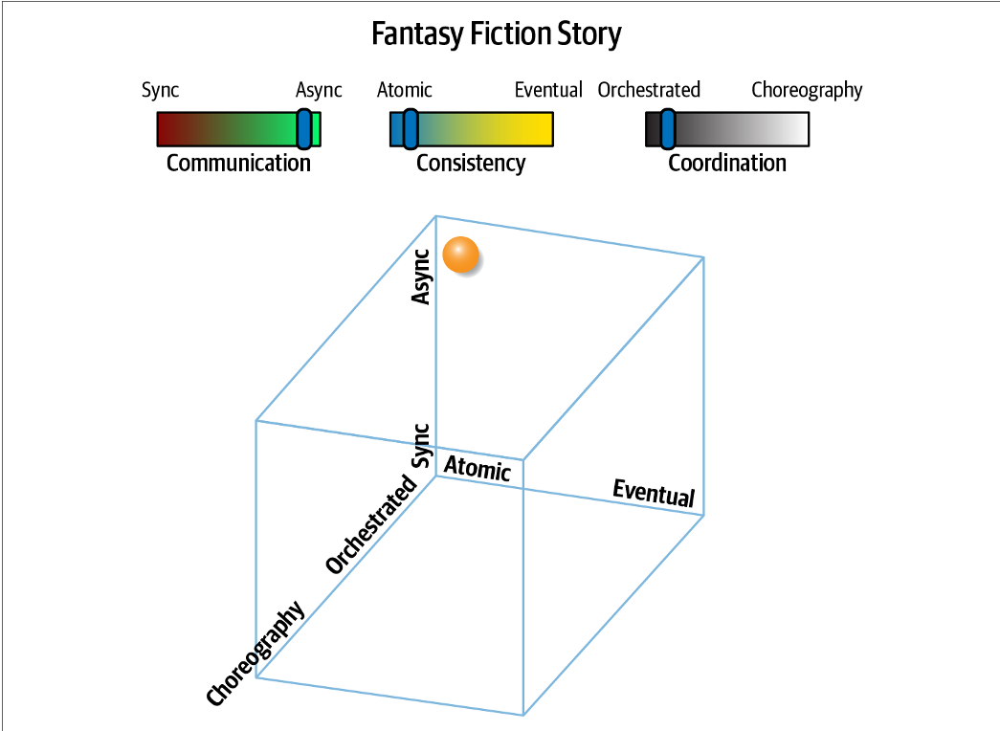

> 图 12-12：异步通信使此模式中的事务性变得困难。

图 12-13 中所示的结构表示开始显示此模式的一些困难。


> 图 12-13：Fantasy Fiction Saga 模式牵强，因为异步通信的事务协调带来困难。

仅仅因为架构力量的组合存在并不意味着它形成有吸引力的模式，
但这种相对不可信的组合也有用途。此模式在所有方面都类似于 Epic Saga，
除了通信——此模式使用异步而非同步通信。传统上，
架构师增加分布式系统响应性的一种方法是使用异步性，允许操作并行而不是串行发生。
这似乎是在 Epic Saga 之上提高感知性能的好方法。

然而，异步性不是一个简单的改变——它为架构增加了许多层复杂性，特别是围绕协调，
需要 mediator 中更多的复杂性。例如，假设事务工作流 Alpha 开始。
因为一切都是异步的，当 Alpha 待处理时，事务工作流 Beta 开始。现在， mediator
必须跟踪所有待处理中的正在进行的事务的状态。

情况变得更糟。假设工作流 Gamma 开始， 但对领域服务的第一次调用取决于 Alpha
的仍然待处理的结果——架构师如何建模这种行为？虽然可能， 但复杂性不断增长。

向编排的工作流添加异步性向方程中添加了异步事务状态，移除了关于排序的串行假设，
并添加了死锁、竞争条件和许多其他并行系统挑战的可能性。

此模式提供以下挑战：

#### 耦合水平

此模式中的耦合水平极高，使用 orchestrator
和原子性，但使用异步通信，这使得协调更加困难，
因为架构师和开发人员必须处理异步通信带来的竞争条件和其他乱序问题。

#### 复杂性水平

因为耦合如此困难，此模式中的复杂性也上升。不仅有*设计*复杂性，
需要架构师开发过于复杂的工作流，还有处理大规模异步工作流的*调试*和*运维*复杂性。

#### 响应性/可用性

因为此模式尝试跨调用进行事务协调，响应性将整体受到影响，如果一个或多个服务不可用，将极其糟糕。

#### 可扩展性/弹性

在事务系统中，高可扩展性几乎是不可能的，即使使用异步性。 可扩展性在类似的模式
Parallel Saga 中要好得多，该模式将原子改为最终一致性。

Fantasy Fiction Saga 模式的评分出现在表 12-6 中。

| Fantasy Fiction Saga (aao) | 评分 |
| -------------------------- | ---- |
| 通信                       | 异步 |
| 一致性                     | 原子 |
| 协调                       | 编排 |
| 耦合                       | 高   |
| 复杂性                     | 高   |
| 响应性/可用性              | 低   |
| 可扩展性/弹性              | 低   |

> 表 12-6：Fantasy Fiction Saga 的评分。

不幸的是，此模式比它应该的更受欢迎， 主要来自通过保持事务性来改善 Epic Saga
性能的误导尝试；更好的选择通常是 Parallel Saga。

### Horror Story 模式

其中一个模式必须是最糟糕的可能组合；它是恰当命名的*Horror Story*
模式，特征为*异步*通信、 *原子*一致性和*choreographed* 协调，如图 12-14 所示。

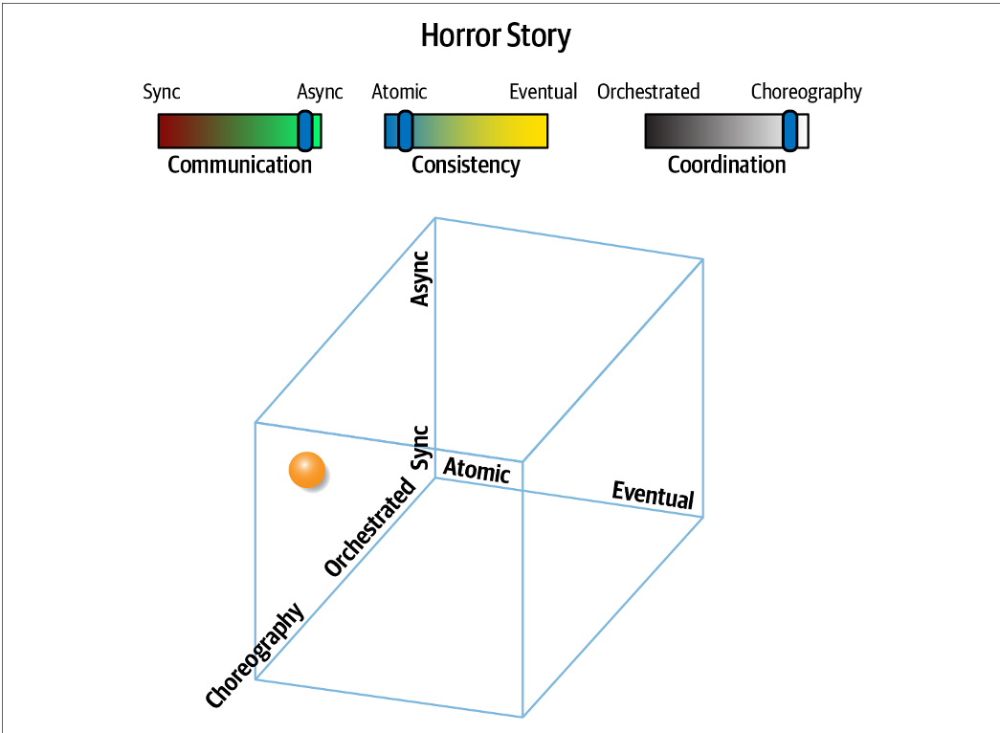

> 图 12-14：最困难的组合：在异步和 choreographed 时实现事务性。

为什么这个组合如此可怕？它结合了围绕一致性（原子）的最严格耦合与两种最松散的耦合风格，异步和
choreography。 此模式的结构通信出现在图 12-15 中。


> 图 12-15：由于所需的事务性且缺乏 mediator，此模式需要大量的服务间通信。

在此模式中，没有 mediator 来管理跨多个服务的事务一致性——同时使用异步通信。因此，
每个领域服务必须跟踪多个待处理事务的撤销信息，可能由于异步性而乱序，
并在错误条件期间相互协调。对于许多可能的可怕例子中的一个，想象事务 Alpha 开始，
在待处理时，事务 Beta 开始。Alpha 事务的一个调用失败——现在， choreographed
的服务必须反转触发顺序，撤销事务的每个（可能乱序的）元素。
错误条件的多样性和复杂性使这成为一个令人生畏的选择。

为什么架构师会选择这个选项？异步性作为性能提升是有吸引力的，
但架构师可能仍然试图保持事务完整性，这有许多各种失败模式。相反，架构师最好选择
Anthology Saga 模式， 它移除了整体事务性。

Horror Story 模式的定性评估如下：

#### 耦合水平

令人惊讶的是，此模式的耦合水平不是最差的（该"荣誉"属于 Epic Saga 模式）。
虽然此模式确实尝试了最糟糕的单种耦合（事务性），但它缓解了其他两种， 既缺乏
mediator，也缺乏增加耦合的同步通信。

#### 复杂性水平

正如名称所暗示的，此模式的复杂性真正可怕，是所有中最差的，因为它需要最严格的要求（事务性）
与实现该要求的最困难的其他因素组合（异步性和 choreography）。

#### 可扩展性/弹性

此模式确实比具有 mediator
的模式更好地扩展，异步性也增加了并行执行更多工作的能力。

#### 响应性/可用性

此模式的响应性较低，类似于其他需要整体事务的模式：工作流的协调需要大量的服务间"通信"，损害性能和响应性。

Horror Story 模式的 trade-off 出现在表 12-7 中。

| Horror Story (aac) | 评分          |
| ------------------ | ------------- |
| 通信               | 异步          |
| 一致性             | 原子          |
| 协调               | choreographed |
| 耦合               | 中            |
| 复杂性             | 非常高        |
| 响应性/可用性      | 低            |
| 可扩展性/弹性      | 中            |

> 表 12-7：Horror Story 模式的评分。

恰当命名的 Horror Story 模式通常是善意架构师从 Epic Saga 模式开始，
注意到由于复杂工作流导致的缓慢性能， 并意识到提高性能的技术包括异步通信和
choreography 的结果。然而，
这种思维提供了一个不考虑问题空间中所有纠缠维度的极好例子。孤立地看，
异步通信提高性能。然而，作为架构师，当它与其他架构维度（如一致性和协调）纠缠在一起时，我们不能孤立地考虑它。

### Parallel Saga 模式

*Parallel Saga* 模式以"传统"Epic Saga 模式命名，有两个关键区别，放松了限制，
因此使其成为更容易实现的模式：异步通信和最终一致性。 Parallel Saga
模式的维度图出现在图 12-16 中。

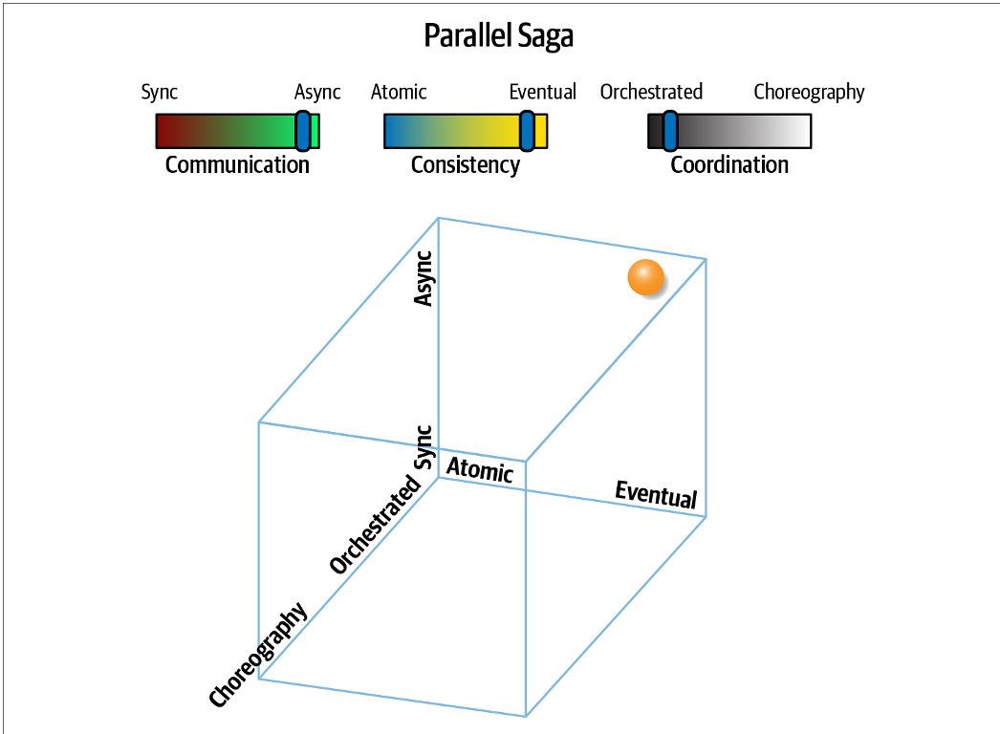

> 图 12-16：Parallel Saga 模式提供比传统 saga 更好的性能改进。

Epic Saga 模式中最困难的目标围绕事务和同步通信，两者都导致瓶颈和性能下降。 如图
12-16 所示，该模式放松了这两个限制。

Parallel Saga 的同构表示出现在图 12-17 中。


> 图 12-17：每个服务拥有自己的事务性；mediator 协调请求和响应。

此模式使用 mediator，使其适用于复杂的工作流。然而，它使用异步通信，
允许更好的响应性和并行执行。模式中的一致性在于领域服务，可能需要一些共享数据的同步，
无论是在后台还是通过 mediator 驱动。与需要协调的其他架构问题一样，mediator
变得非常有用。

例如，如果在工作流执行期间发生错误， mediator
可以向每个涉及的领域服务发送异步消息以补偿失败的更改，这可能涉及重试、数据同步或许多其他修复措施。

当然，放宽约束意味着一些好处将被交易掉，这是软件架构的本质。 缺乏事务性给
mediator 带来了更多负担，以解决错误和其他工作流问题。
异步通信虽然提供更好的响应性，但使解决时序和同步问题变得困难——竞争条件、死锁、
队列可靠性以及许多其他分布式架构的麻烦都在这个空间中。

Parallel Saga 模式表现出以下定性分数：

#### 耦合水平

此模式具有低耦合水平，将事务的耦合增强力量隔离到各个领域服务的范围内。它还使用异步通信，
进一步将服务与等待状态解耦，允许更多并行处理，
但为架构师的耦合分析添加了时间元素。

#### 复杂性水平

Parallel Saga 的复杂性也较低，反映了之前所述的耦合减少。
此模式对于架构师来说相当容易理解，编排允许更简单的工作流和错误处理设计。

#### 可扩展性/弹性

使用异步通信和较小的事务边界允许此架构很好地扩展，并且在服务之间具有良好的隔离水平。例如，
在微服务架构中，一些面向公众的服务可能需要更高水平的可扩展性和弹性，
而后台服务不需要可扩展性，但需要更高水平的安全性。在领域级别隔离事务释放了架构，使其围绕领域概念进行扩展。

#### 响应性/可用性

由于缺乏协调的事务和异步通信，此架构的响应性很高。事实上，
因为这些服务中的每一个都维护自己的事务上下文，此架构非常适合服务之间高度可变的服务性能足迹，
允许架构师根据需求比其他服务更多地扩展某些服务。

与 Parallel Saga 模式相关的评分出现在表 12-8 中。

| Parallel Saga (aeo) | 评分 |
| ------------------- | ---- |
| 通信                | 异步 |
| 一致性              | 最终 |
| 协调                | 编排 |
| 耦合                | 低   |
| 复杂性              | 低   |
| 响应性/可用性       | 高   |
| 可扩展性/弹性       | 高   |

> 表 12-8：Parallel Saga 的评分。

总体而言，Parallel Saga 模式为许多场景提供了一个有吸引力的 trade-off 集，
特别是对于需要高可扩展性的复杂工作流。

### Anthology Saga 模式

Anthology Saga 模式提供了与传统 Epic Saga 模式完全相反的特性集：它使用异步通信、
最终一致性和 choreographed 协调，提供了所有这些模式中最少耦合的范例。 Anthology
Saga 模式的维度视图出现在图 12-18 中。

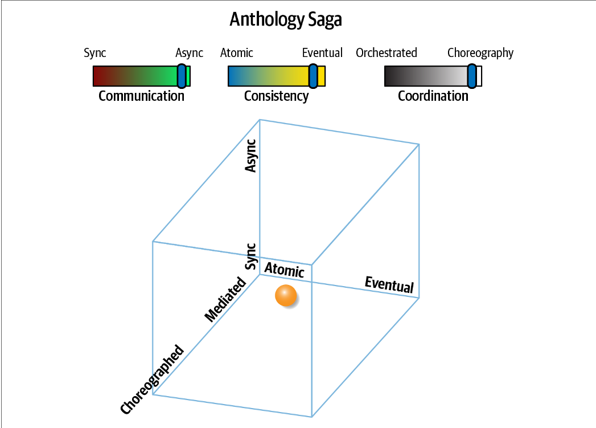

> 图 12-18：Anthology Saga 模式提供 Epic Saga 的相反极端，因此是最少耦合的模式。

Anthology 模式使用消息队列在没有编排的情况下向其他领域服务发送异步消息，如图
12-19 所示。

如你所见，每个服务维护自己的事务完整性，并且没有 orchestrator，
迫使每个领域服务包含关于它们参与的工作流的更多上下文，包括错误处理和其他协调策略。

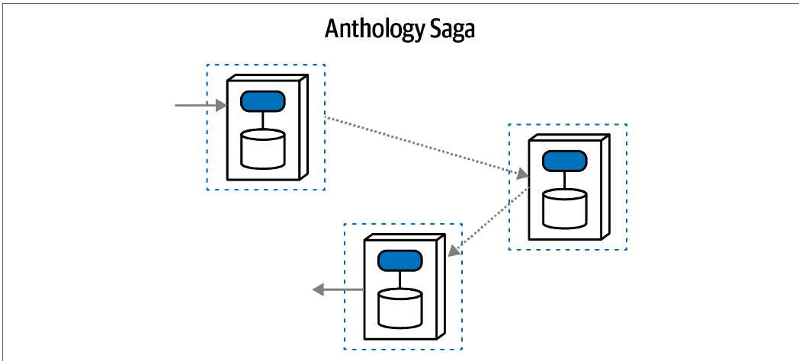

> 图 12-19：缺乏编排、最终一致性和异步性使此模式高度解耦，但对协调构成挑战。

缺乏编排使服务更复杂，但允许更高的吞吐量、可扩展性、弹性和其他有益的运维架构特性。
此架构中不存在瓶颈或耦合瓶颈点，允许高响应性和可扩展性。

然而，此模式对于复杂的工作流不太有效，特别是在解决数据一致性错误方面。虽然看起来没有
orchestrator 不可能， 但 stamp
耦合（参见[用于工作流管理的 Stamp 耦合](#用于工作流管理的-stamp-耦合)）
可用于携带工作流状态，如类似的 Phone Tag Saga 模式所述。

此模式最适合简单、大部分线性的工作流，其中架构师希望高处理吞吐量。
此模式为高性能和可扩展性提供了最大的潜力，使其成为当这些是系统关键驱动因素时的有吸引力的选择。
然而，解耦程度使协调变得困难，对于复杂或关键的工作流来说是禁止的。

受短篇小说启发的 Anthology Saga 模式具有以下特征：

#### 耦合水平

此模式的耦合是任何其他力量组合中最低的，创建了高度解耦的架构，非常适合高可扩展性和弹性。

#### 复杂性水平

虽然耦合极低，但复杂性相应较高，特别是对于
orchestrator（此处缺乏）很方便的复杂工作流。

#### 可扩展性/弹性

此模式在可扩展性和弹性类别中得分最高，与此模式中发现的整体缺乏耦合相关。

#### 响应性

此架构中的响应性很高，因为缺乏速度调节器（事务一致性、同步通信）和使用响应性加速器（choreographed
协调）。

Anthology Saga 模式的评分表出现在表 12-9 中。

| Anthology Saga (aec) | 评分          |
| -------------------- | ------------- |
| 通信                 | 异步          |
| 一致性               | 最终          |
| 协调                 | choreographed |
| 耦合                 | 非常低        |
| 复杂性               | 高            |
| 响应性/可用性        | 高            |
| 可扩展性/弹性        | 非常高        |

> 表 12-9：Anthology Saga 的评分。

Anthology Saga 模式非常适合具有简单或不频繁错误条件的极高吞吐量通信。例如，
*管道和过滤器*架构将完全符合此模式。

架构师可以以多种方式实现本节中描述的模式。例如，
架构师可以通过使用补偿更新或通过使用最终一致性管理事务状态来通过原子事务管理事务性
saga。 本节展示了每种方法的优点和缺点，这将帮助架构师决定使用哪种事务性 saga
模式。

## 状态管理与最终一致性

状态管理和最终一致性利用*有限状态机*（参见[Saga 状态机](#saga-状态机)）
始终知道事务性 saga 的当前状态，
并通过重试或某种自动化或手动纠正操作最终纠正错误条件。为了说明这种方法， 考虑图
12-20 中所示的工单完成示例的 Fairy Tale Saga 实现。

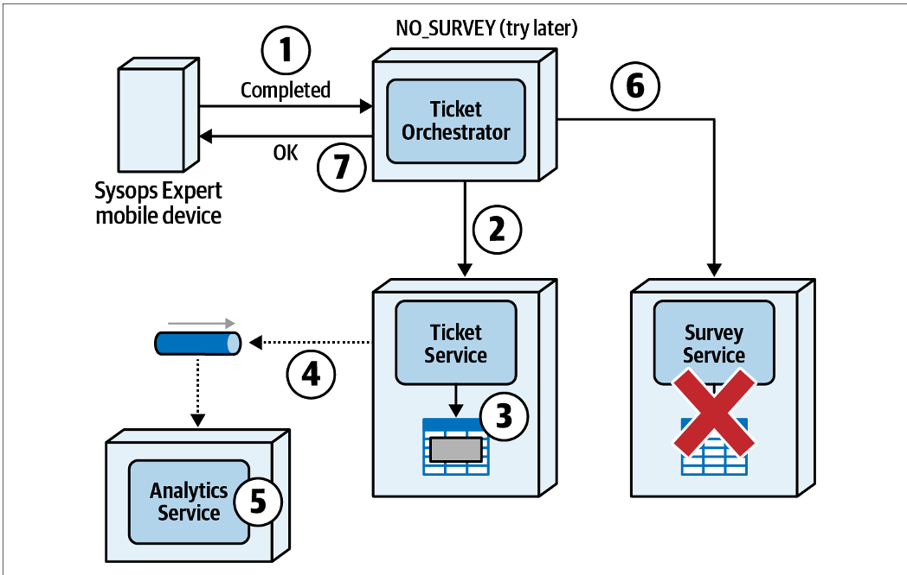

> 图 12-20：Fairy Tale Saga
> 导致更好的响应性，但使数据源彼此不同步，直到它们可以被纠正。

注意，调查服务在分布式事务范围内不可用。然而，使用这种类型的
saga，不是发出补偿更新， 而是将 saga 的状态更改为 NO_SURVEY， 并向 Sysops
专家发送成功响应（图中的步骤 7）。然后， 工单 orchestrator
服务异步工作（在幕后），通过重试和错误分析以编程方式解决错误。
如果无法解决错误，工单 orchestrator
服务将错误发送给管理员或主管进行手动修复和处理。

通过管理 saga 的*状态*而不是发出补偿更新，最终用户（在这种情况下，Sysops Squad
专家） 不需要担心调查未发送给客户——该责任由工单 orchestrator 服务负责。
从最终用户的角度来看，响应性良好，用户可以在系统处理错误时处理其他任务。

## Saga 状态机

状态机是一种描述分布式架构中可能存在的所有可能路径的模式。
状态机始终从启动事务性 saga
的开始状态开始，然后包含转换状态和当转换状态发生时应发生的相应操作。

为了说明 saga 状态机如何工作，考虑客户在 Sysops Squad
系统中创建的新问题工单的以下工作流：

1. 客户在系统中输入新问题工单。
2. 工单分配给下一个可用的 Sysops Squad 专家。
3. 工单然后路由到专家的移动设备。
4. 专家接收工单并处理问题。
5. 专家完成维修并将工单标记为完成。
6. 调查发送给客户。

此事务性 saga 中可能存在的各种状态以及相应的转换操作如图 12-21 所示。注意，
事务性 saga 以指示 saga 入口点的 START 节点开始， 并以指示 saga 出口点的 CLOSED
节点终止。

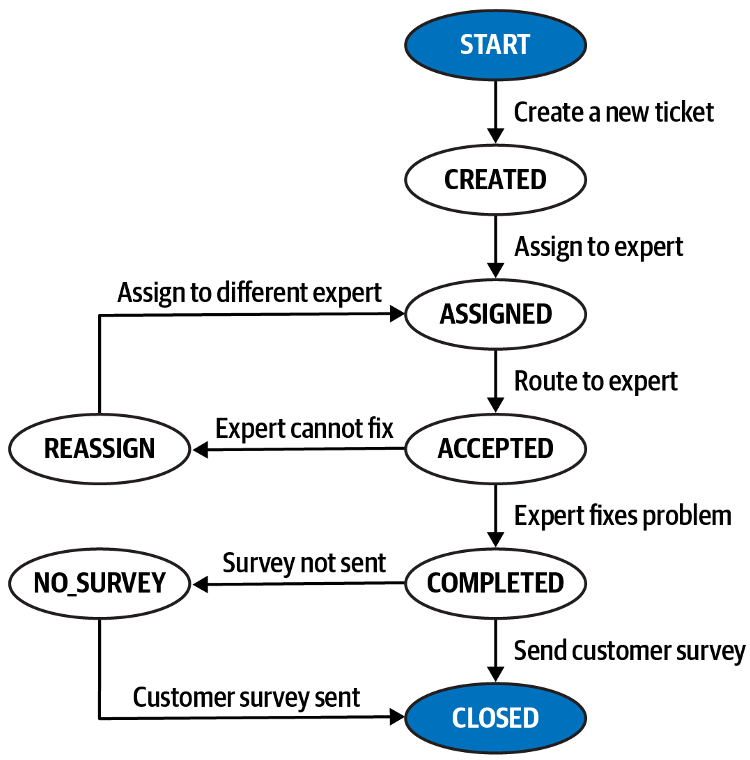

> 图 12-21：创建新问题工单的状态图。

以下项目更详细地描述了此事务性 saga 以及每个状态中发生的相应状态和转换操作：

#### START

事务性 saga
从客户在系统中输入新问题工单开始。验证客户的支持计划，并验证工单数据。一旦工单插入数据库中的工单表，
事务性 saga 状态移动到 CREATED，并通知客户工单已成功创建。
这是此状态转换的唯一可能结果——此状态中的任何错误都会阻止 saga 启动。

#### CREATED

一旦工单成功创建，它被分配给 Sysops Squad 专家。如果没有专家可用来服务工单，
它保持在等待状态，直到有专家可用。一旦分配了专家， saga 状态移动到 ASSIGNED
状态。这是此状态转换的唯一结果， 意味着工单保持在 CREATED
状态，直到它可以被分配。

#### ASSIGNED

一旦工单分配给专家，唯一可能的结果是将工单路由到专家。假设在分配算法期间，
专家已被定位并且可用。如果工单无法路由，因为专家无法定位或不可用， saga
保持在此状态，直到它可以被路由。一旦路由，专家必须确认工单已收到。
一旦发生这种情况，事务性 saga 状态移动到 ACCEPTED。
这是此状态转换的唯一可能结果。

#### ACCEPTED

一旦工单被 Sysops Squad 专家接受，有两种可能的状态： COMPLETED 或
REASSIGN。一旦专家完成维修并将工单标记为"完成"， saga 的状态移动到
COMPLETED。然而，如果出于某种原因，
工单被错误分配或专家无法完成维修，专家通知系统，状态移动到 REASSIGN。

#### REASSIGN

一旦进入此 saga 状态，系统将工单重新分配给不同的专家。像 CREATED 状态一样，
如果专家不可用，事务性 saga 将保持在 REASSIGN 状态，
直到分配了专家。一旦找到不同的专家并且工单再次分配，状态移动到 ASSIGNED 状态，
等待被其他专家接受。这是此状态转换的唯一可能结果， saga
保持在此状态，直到工单分配给专家。

#### COMPLETED

一旦专家完成工单，有两种可能的状态：CLOSED 或 NO_SURVEY。
当工单处于此状态时，向客户发送调查以评价专家和服务， saga 状态移动到
CLOSED，从而结束事务 saga。然而，
如果调查服务不可用或在发送调查时发生错误，状态移动到 NO_SURVEY，表示问题已修复，
但未向客户发送调查。

#### NO_SURVEY

在此错误条件状态中，系统继续尝试向客户发送调查。一旦成功发送，状态移动到
CLOSED， 标记事务性 saga 的结束。这是此状态转换的唯一可能结果。

在许多情况下，将所有可能的状态转换和相应的转换操作放在某种表中是有用的。
开发人员然后可以使用此表在编排服务中（或如果使用 choreography 则在各自服务中）
实现状态转换触发器和可能的错误条件。 此实践的一个例子如表 12-10
所示，它列出了当状态转换发生时触发的所有可能状态和操作。

| 初始状态  | 转换状态  | 事务操作               |
| --------- | --------- | ---------------------- |
| START     | CREATED   | 将工单分配给专家       |
| CREATED   | ASSIGNED  | 将工单路由到分配的专家 |
| ASSIGNED  | ACCEPTED  | 专家修复问题           |
| ACCEPTED  | COMPLETED | 发送客户调查           |
| ACCEPTED  | REASSIGN  | 重新分配给不同的专家   |
| REASSIGN  | ASSIGNED  | 将工单路由到分配的专家 |
| COMPLETED | CLOSED    | 工单 saga 完成         |
| COMPLETED | NO_SURVEY | 发送客户调查           |
| NO_SURVEY | CLOSED    | 工单 saga 完成         |

> 表 12-10：Sysops Squad 系统中新问题工单的 Saga 状态机。

在分布式事务工作流中使用补偿更新还是状态管理取决于情况以及响应性和一致性之间的
trade-off 分析。 无论使用哪种技术来管理分布式事务中的错误，
分布式事务的状态都应该被知道并且被管理。

表 12-11 总结了使用状态管理而不是具有补偿更新的原子分布式事务的 trade-off。

### trade-off

| 优点                     | 缺点                       |
| ------------------------ | -------------------------- |
| 良好的响应性             | 发生错误时数据可能不同步   |
| 对最终用户错误的影响较小 | 最终一致性可能需要一些时间 |

> 表 12-11：使用状态管理而不是具有补偿更新的原子分布式事务的 trade-off。

## 管理 Saga 的技术

分布式事务不是可以简单地"插入"到系统中的东西。 它们不能使用某种框架或产品（如
ACID 事务管理器）下载或购买——它们必须由开发人员和架构师设计、编码和维护。

我们喜欢用来帮助管理分布式事务的技术之一是利用注解（Java）或自定义属性（C#），
或其他语言中的类似工件。虽然这些语言工件本身不包含任何实际功能，
但它们确实提供了一种编程方式来捕获和记录系统中的事务性
saga，以及提供一种将服务与事务性 saga 关联的手段。

示例 12-1（Java）和示例
12-2（C#）中的源代码清单显示了实现这些注解和自定义属性的示例。注意，
在两个实现中， 事务性 saga（NEW_TICKET、CANCEL_TICKET 等）包含在 Transaction
枚举中， 在源代码中提供单一位置来列出和记录应用程序上下文中存在的各种 saga。

示例 12-1。定义事务性 saga 注解的源代码（Java）

```java
@Retention(RetentionPolicy.RUNTIME)
@Target(ElementType.TYPE)
public @interface Saga {
    public Transaction[] value();

    public enum Transaction {
        NEW_TICKET,
        CANCEL_TICKET,
        NEW_CUSTOMER,
        UNSUBSCRIBE,
        NEW_SUPPORT_CONTRACT
    }
}
```

示例 12-2。定义事务性 saga 属性的源代码（C#）

```csharp
[AttributeUsage(AttributeTargets.Class)]
class Saga : System.Attribute {
    public Transaction[] transaction;

    public enum Transaction {
        NEW_TICKET,
        CANCEL_TICKET,
        NEW_CUSTOMER,
        UNSUBSCRIBE,
        NEW_SUPPORT_CONTRACT
    };
}
```

一旦定义，这些注解或属性可用于标识参与事务性 saga 的服务。例如， 示例 12-3
中的源代码清单显示调查服务（由 SurveyServiceAPI 类标识为服务入口点） 参与
NEW_TICKET saga， 而工单服务（由 TicketServiceAPI 类标识为服务入口点）参与两个
saga： NEW_TICKET 和 CANCEL_TICKET。

示例 12-3。显示使用事务性 saga 注解的源代码（Java）

```java
@ServiceEntryPoint
@Saga(Transaction.NEW_TICKET)
public class SurveyServiceAPI {
    ...
}

@ServiceEntryPoint
@Saga({Transaction.NEW_TICKET,
        Transaction.CANCEL_TICKET})
public class TicketServiceAPI {
    ...
}
```

注意 NEW_TICKET saga 包括调查服务和工单服务。
这对开发人员来说是有价值的信息，因为它帮助他们在更改特定工作流或 saga
时定义测试范围， 还让他们知道事务性 saga 中某个服务的更改可能影响哪些其他服务。

使用这些注解和自定义属性，架构师和开发人员可以编写简单的 command-line
interface（CLI） 工具来遍历代码库或源代码仓库，以实时提供 saga 信息。例如，
使用简单的自定义代码遍历工具，开发人员、架构师甚至业务分析师都可以查询
NEW_TICKET saga 涉及哪些服务：

```bash
$ ./sagatool.sh NEW_TICKET -services

-> Ticket Service
-> Assignment Service
-> Routing Service
-> Survey Service
$
```

自定义代码遍历工具可以查看应用程序上下文中包含 @ServiceEntryPoint
自定义注解（或属性）的每个类文件， 并检查 @Saga 自定义注解是否存在特定
saga（在这种情况下， Transaction.NEW_TICKET）。这种自定义工具并不复杂，
可以在管理事务性 saga 时帮助提供有价值的信息。

### Sysops Squad Saga：原子事务和补偿更新

### 4 月 5 日，星期二，09:44


> 插图 12-2：Addison、Austen 和 Logan 讨论事务性。

Addison 和 Austen 第一时间与 Logan
在长长的会议室会面，讨论新微服务架构中的事务性问题。

Logan 开始说："我知道不是每个人都在同一页面上，
关于你们读到的东西如何应用于我们在这里做的事情。所以，我准备了一些工作流和图表，帮助每个人在同一页面上。
今天，我们讨论在系统中标记工单完成。对于此工作流， Sysops Squad
专家完成工作并使用专家移动设备上的移动应用程序将工单标记为'完成'。 我想谈谈 Epic
Saga 模式和补偿更新的问题。我创建了一个图表来说明此工作流，如图 12-22 所示。
每个人都能看到吗？"


> 图 12-22：Epic Saga 要求工单状态更新和调查发送在一个同步原子操作中。

Logan 继续说道："我还创建了一个描述每个步骤的列表。图上的圈号与工作流匹配。"

1. Sysops Squad 专家使用其移动设备上的应用程序将工单标记为完成， 由工单
   orchestrator 服务同步接收。
2. 工单 orchestrator
   服务向工单服务发送同步请求，将工单状态从"进行中"更改为"完成"。
3. 工单服务将数据库表中的工单号更新为"完成"并提交更新。
4. 作为工单完成过程的一部分，工单服务异步将工单信息（如工单修复时间、工单等待时间、
   持续时间等）发送到队列，由分析服务接收。一旦发送， 工单服务向工单
   orchestrator 服务发送确认，表示更新已完成。
5. 大约在同一时间，分析服务异步接收更新的工单分析并开始处理工单信息。
6. 工单 orchestrator
   服务然后向调查服务发送同步请求，以准备并向客户发送客户调查。
7. 调查服务将数据插入包含调查信息（客户、工单信息和时间戳）的表中并提交插入。
8. 调查服务然后通过电子邮件向客户发送调查，并向工单 orchestrator
   服务返回确认，表示调查处理已完成。
9. 最后，工单 orchestrator 服务向 Sysops Squad 专家的移动设备发送响应，
   说明工单完成处理已完成。一旦发生这种情况，
   专家可以选择分配给他们的下一个问题工单。

"哇，这真的很有帮助。你花了多长时间创建这个？"Addison 说。

"不是一点点时间，但它派上了用场。
你不是唯一一个对如何让所有这些移动部件协同工作感到困惑的组。这是软件架构的难点。每个人都理解工作流的基础了吗？"

在一片点头的海洋中，Logan 继续说道："补偿更新的第一个问题是，
由于分布式事务中没有事务隔离性（参见[分布式事务](#分布式事务)），
其他服务可能已经在分布式事务范围内更新的数据上采取了行动，在分布式事务完成之前。
为了说明这个问题，考虑图 12-23 中出现的相同 Epic Saga 示例： Sysops Squad
专家将工单标记为完成，但这次调查服务不可用。在这种情况下，
向工单服务发送补偿更新（图中的步骤 7），以撤销更新，
将工单状态从完成改回进行中（图中的步骤 8）。"

"还注意在图 12-23 中，由于这是一个原子分布式事务， 然后向 Sysops Squad
专家发送错误，表示操作不成功，请重试。现在，问你们一个问题： 为什么 Sysops Squad
专家必须担心调查未发送？"

Austen
思考了一会儿。"但这不是单体中工作流的一部分吗？如果我没记错的话，所有这些东西都在事务中发生。"

"是的，但我一直觉得这很奇怪，只是从来没说过，"Addison 说。
"我不认为专家应该担心调查。专家只是想继续处理下一个分配给他们的工单。"

"没错，"Logan
说。"这就是原子分布式事务的问题——最终用户不必要地在语义上与业务流程耦合。但注意，
图 12-23 也说明了分布式事务中缺乏事务隔离性的问题。注意，
作为将工单标记为完成的原始更新的一部分，工单服务异步将工单信息发送到队列（图中的步骤
4）， 由分析服务处理（步骤 5）。然而，当向工单服务发出补偿更新时（步骤
7），工单信息已经在步骤 5 中被分析服务处理了。"

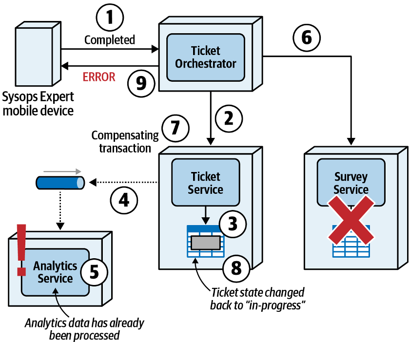

> 图 12-23：Epic Saga 需要补偿，但可能发生副作用。

"我们称这为分布式架构中的副作用。通过撤销工单服务中的事务，
使用先前更新数据的其他服务执行的操作可能已经发生，并且可能无法撤销。
此场景指出了事务中隔离性的重要性，这是分布式事务不支持的东西。为了解决这个问题，
工单服务可以通过数据泵向分析服务发送另一个请求，告知该服务忽略先前的工单信息，
但想象一下在分析服务中处理此补偿更改所需的复杂代码和时序逻辑量。此外，
可能已经对分析服务已经处理的分析数据采取了额外的下游操作，
进一步复杂化了要撤销和纠正的事件链。在分布式架构和分布式事务中，
有时真的是'turtles all the way down'。"

Logan 停顿了一会儿，然后继续说道："另一个问题——"

Austen 打断："另一个问题？"

Logan 微笑。"关于补偿更新的另一个问题是补偿失败。 继续使用相同的 Epic Saga
示例来完成工单，注意在图 12-24 中， 在步骤 7
中向工单服务发出补偿更新，将状态从完成改回进行中。然而，在这种情况下，
工单服务在尝试更改工单状态时生成错误（步骤 8）。"


> 图 12-24：Epic Saga
> 中的补偿更新可能失败，导致不一致性和对补偿失败时应采取什么行动的困惑。

"我见过这种情况！花了很长时间才追踪到，"Addison 说。

"架构师和开发人员倾向于假设补偿更新总是有效的，"Logan 说。"但有时它们不会。
在这种情况下，如图 12-24 所示，对于向最终用户（在这种情况下， Sysops Squad
专家）发送什么类型的响应存在困惑。工单状态已经标记为*完成*，因为补偿失败了，
所以再次尝试'标记为完成'请求可能只会导致另一个错误（例如*工单已标记为完成*）。谈论最终用户的困惑！"

"是的，我可以想象开发人员来找我们问如何解决这个问题，"Addison 说。

"通常开发人员是不完整或令人困惑的架构解决方案的良好检查。如果他们困惑，
可能有一个很好的理由，"Logan 说。"好的，还有一个问题。
原子分布式事务和相应的补偿更新也影响响应性。如果发生错误，
最终用户必须等待所有纠正操作（通过补偿更新）完成，然后才发送告诉用户错误的响应。"

"这不是最终一致性的改变有助于响应性的地方吗？"Austen 问道。

"是的， 虽然响应性有时可以通过最终一致性异步发出补偿更新来解决（例如 Parallel
Saga 和 Anthology Saga 模式），
但大多数原子分布式事务在涉及补偿更新时具有更差的响应性。"

"好的，这很合理——原子协调总是会有开销，"Austen 说。

"这是很多信息。让我们构建一个表来总结与原子分布式事务和补偿更新相关的一些
trade-off。"（见表 12-12。）

### trade-off

| 优点                   | 缺点                 |
| ---------------------- | -------------------- |
| 所有数据恢复到先前状态 | 无事务隔离性         |
| 允许重试和重启         | 补偿时可能发生副作用 |
|                        | 补偿可能失败         |
|                        | 最终用户响应性差     |

> 表 12-12：原子分布式事务和补偿更新的 trade-off。

Logan 说："虽然这种 compensating transaction 模式存在，但它也提供了许多挑战。
谁想说出一个？"

"我知道：服务不能执行回滚，"Austen 说。
"如果一个服务无法成功撤销先前的操作怎么办？orchestrator
必须有协调代码来指示事务不成功。"

"对——另一个呢？"

"锁定或不锁定参与服务？"Addison 说。 "当 mediator
对服务进行调用并更新值时，mediator
将对作为工作流一部分的后续服务进行调用。然而，
如果另一个请求出现，针对第一个服务，取决于第一个请求的解决结果，
无论是来自同一个 mediator 还是不同的上下文？当调用是异步而不是同步时，
这个分布式架构问题变得更糟（在[Phone Tag Saga 模式](#phone-tag-saga-模式)中说明）
。或者， mediator 可以坚持其他服务在工作流过程中不接受调用，
这保证了有效的事务，但破坏了性能和可扩展性。"

Logan 说："正确。让我们哲学一下。概念上，
事务迫使参与者停止他们各自的世界并在特定值上同步。这在单体架构和关系型数据库中如此容易建模，
以至于架构师在这些系统中过度使用事务。现实世界中的许多事情不是事务性的， 正如
Gregor Hohpe 的著名文章 "Starbucks Does Not Use Two-Phase Commit" 中所观察到的。
事务协调是架构中最难的部分之一，范围越广，情况越糟。"

"有替代使用 Epic Saga 的方法吗？"Addison 问道。

"是的！"Logan 说。 "对图 12-24 中描述的场景更现实的方法可能是使用 Fairy Tale
Saga 或 Parallel Saga 模式。 这些 saga
依赖异步最终一致性和状态管理，而不是在发生错误时使用补偿更新的原子分布式事务。使用这些类型的
saga， 用户较少受到分布式事务中可能发生的错误的影响，因为错误在幕后解决，
无需最终用户参与。使用状态管理和最终一致性方法，响应性也更好，
因为用户不必等待分布式事务中的纠正操作完成。如果我们在原子性方面有问题，我们可以研究这些模式作为替代方案。"

"谢谢——这是很多材料，但现在我明白为什么架构师在新架构中做出了一些决定，"Addison
说。

# 第 13 章：契约

4 月 15 日，星期五，12:01


> 插图 13-1：Addison 和 Sydney 讨论契约。

Addison 在自助餐厅与 Sydney 吃午餐时聊天， 讨论工单 orchestrator
和它为工单管理工作流集成的服务之间的协调。

"为什么不对所有通信都使用 gRPC？我听说它真的很快，"Sydney 说。

"嗯，那是实现，不是架构，"Addison 说。"我们需要先决定我们想要什么类型的契约，
然后再选择如何实现它们。首先，我们需要在严格和松散契约之间做出决定。
一旦我们决定了类型，我会让你决定如何实现它们，只要它们通过我们的适应度函数。"

"什么决定了我们需要什么类型的契约？"Sydney 说。

在第 2 章中，我们开始讨论三种重要力量的交集——通信、
一致性和协调——以及如何为它们制定
trade-off。我们在联合的三维空间中建模了三种力量的交集空间， 再次出现在图 13-1
中。在第 12 章中，我们通过讨论各种通信风格及其 trade-off 重新审视了这三种力量。

然而，无论架构能辨别出像这样的关系，某些力量会跨越概念空间，并平等地影响所有其他维度。
如果追求视觉三维隐喻，这些横切力量作为一个额外的维度，
就像时间与三个物理维度正交一样。


> 图 13-1：分布式架构中消息传递力量的三维交集空间。

软件架构中一个跨越并影响架构师决策几乎所有方面的恒定因素是*契约*，
广义定义为架构中不同部分如何相互连接。契约的字典定义如下：

#### 契约

一份书面或口头协议，特别是关于雇佣、销售或租赁的，旨在通过法律强制执行。

在软件中，我们广泛使用契约来描述架构中的集成点，许多契约格式是软件开发设计过程的一部分：
SOAP、REST、gRPC、XMLRPC 以及许多其他缩写的字母汤。
然而，我们扩展了该定义并使其更加一致：

#### hard parts 契约

架构各部分用于传达信息或依赖的格式。

这个契约定义涵盖了用于"连接"系统各部分的所有技术，包括框架和库的传递依赖、
内部和外部集成点、缓存以及各部分之间的任何其他通信。

本章说明了契约对架构许多部分的影响，包括静态和动态 quantum
耦合，以及改善（或损害）工作流有效性的方法。

## 严格契约与松散契约

像软件架构中的许多事物一样，契约不存在于二元中，而是存在于一个广泛的光谱上，从严格到松散。
图 13-2 说明了这个光谱，使用示例契约类型。

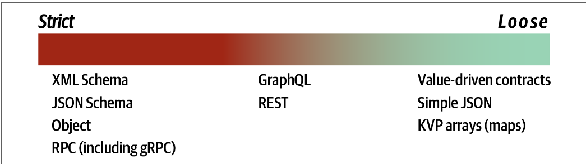

> 图 13-2：从严格到松散的契约类型光谱。

严格契约要求遵守名称、类型、排序和所有其他细节，不留下歧义。
软件中最严格契约的一个例子是远程方法调用，使用平台机制如 Java 中的
RMI。在这种情况下，
远程调用模仿内部方法调用，匹配名称、参数、类型和所有其他细节。

许多严格契约格式模仿方法调用的语义。例如，开发人员看到许多包含 RPC
变体的协议，传统上是远程过程调用的缩写。 gRPC
是默认使用严格契约的流行远程调用框架的一个例子。

许多架构师喜欢严格契约，因为它们建模了内部方法调用的相同语义行为。然而，
严格契约在集成架构中创建了脆性——这是应该避免的。正如第 8 章中所讨论的，
同时频繁变化并被多个不同架构部分使用的东西会在架构中创建问题。契约符合这一描述，
因为它们形成了分布式架构中的粘合剂：它们必须更改的频率越高，
它们对其他服务造成的问题就越多。然而，架构师不必被迫使用严格契约，只有在有利时才应该这样做。

即使是表面上松散的格式（如
JSON）也提供了向简单名称-值对选择性添加模式信息的方法。 示例 13-1
显示了附加了模式信息的严格 JSON 契约。

示例 13-1。严格 JSON 契约

```json
{
    "schema": "http://json-schema.org/draft-04/schema#",
    "properties": {
        "acct": { "type": "number" },
        "cusip": { "type": "string" },
        "shares": { "type": "number", "minimum": 100 }
    },
    "required": ["acct", "cusip", "shares"]
}
```

第一行引用我们使用的模式定义，并将对其进行验证。我们定义了三个属性（acct、 cusip
和 shares），以及它们的类型，最后一行指定哪些是必需的。
这创建了一个严格的契约，具有必填字段和指定类型。

较松散契约的例子包括 REST 和 GraphQL 等格式，它们非常不同， 但在展示比基于 RPC
的格式更松散的耦合方面相似。对于 REST，
架构师建模资源而不是方法或过程端点，使契约不那么脆。例如，
如果架构师构建一个描述飞机部件以支持有关座位的查询的 RESTful 资源，
将来如果有人添加有关引擎的细节，该查询不会中断——添加更多信息不会破坏已有的内容。

类似地，GraphQL 被分布式架构用于提供只读聚合数据，
而不是跨各种服务执行昂贵的编排调用。考虑示例 13-2 和 13-3 中的两个 GraphQL
表示， 提供 Profile 契约的两种不同但有能力的视图。

示例 13-2。Customer Wishlist Profile 表示

```graphql
type Profile {
    name: String
}
```

示例 13-3。Customer Profile 表示

```graphql
type Profile {
    name: String
    addr1: String
    addr2: String
    country: String
    ...
}
```

Profile 的概念出现在两个示例中，但具有不同的值。在这种场景中， Customer Wishlist
没有内部访问客户名称，只有一个唯一标识符。因此，
它需要访问将标识符映射到客户名称的 Customer Profile。另一方面， Customer Profile
包含除名称之外的大量客户信息。 就 Wishlist 而言，Profile
中唯一有趣的东西是名称。

一些架构师容易陷入的常见反模式是假设 Wishlist 可能最终需要所有其他部分，
因此架构师从一开始就将它们包含在契约中。这是 stamp 耦合的一个例子，
在大多数情况下是反模式，因为它引入了不需要的破坏性更改，使架构变得脆弱，但提供的好处很少。
例如，如果 Wishlist 只关心 Profile 中的客户名称， 但契约指定了 Profile
中的每个字段（以防万一）， 那么 Wishlist 不关心的 Profile
更改会导致契约破坏和协调修复。
将契约保持在"需要知道"的水平在语义耦合和必要信息之间取得平衡，而不会在集成架构中创建不必要的脆弱性。

在契约耦合光谱的另一端是极其松散的契约，通常以 YAML 或 JSON
等格式中的名称-值对表示， 如示例 13-4 所示。

示例 13-4。JSON 中的名称-值对

```json
{
    "name": "Mark",
    "status": "active",
    "joined": "2003"
}
```

此示例中只有原始事实！没有额外的元数据、类型信息或其他任何东西，只有名称-值对。

使用如此松散的契约允许极其解耦的系统，通常是架构（如微服务）的目标之一。然而，
契约的松散性伴随着 trade-off，如缺乏契约确定性、验证和增加的应用程序逻辑。
我们在[微服务中的契约](#微服务中的契约)中说明了架构师如何通过使用契约适应度函数来解决这个问题。

## 严格与松散契约之间的 trade-off

架构师应该何时使用严格契约，何时应该使用较松散的契约？像架构的所有难点一样，
这个问题没有通用答案，因此架构师了解每种情况下最合适的是很重要的。

### 严格契约

更严格的契约有许多优点，包括：

**保证契约保真度**：在契约中构建模式验证确保对值、
类型和其他治理的元数据的精确遵守。某些问题空间从契约更改的紧密耦合中受益。

**版本化**：严格契约通常需要版本控制策略来支持接受不同值的两个端点，
或管理领域随时间的演变。这允许对集成点进行渐进更改，同时支持选择性数量的过去版本，
使集成协作更容易。

**构建时更容易验证**：许多模式工具提供在构建时验证契约的机制，为集成点添加一层类型检查。

**更好的文档**：不同的参数和类型提供了没有歧义的出色文档。

严格契约也有一些缺点：

**紧密耦合**：根据我们对耦合的一般定义，严格契约创建紧密耦合点。如果两个服务共享严格契约且契约更改，
两个服务都必须更改。

**版本化**：这同时出现在优点和缺点中。虽然保持不同版本允许精确性，
但如果团队没有明确的弃用策略或尝试支持太多版本，它可能成为集成噩梦。

严格契约的 trade-off 总结在表 13-1 中。

### trade-off

| 优点             | 缺点     |
| ---------------- | -------- |
| 保证契约保真度   | 紧密耦合 |
| 版本化           | 版本化   |
| 构建时更容易验证 |          |
| 更好的文档       |          |

> 表 13-1：严格契约的 trade-off。

### 松散契约

松散契约，如名称-值对，提供最少耦合的集成点，但它们也有 trade-off，如表 13-2
所总结。

以下是松散契约的一些优点：

**高度解耦**：许多架构师对微服务架构有一个明确的目标，包括高水平的解耦，松散契约提供了最大的灵活性。

**更容易演变**：因为很少或没有模式信息存在，这些契约可以更自由地演变。当然，
语义耦合更改仍然需要所有相关方的协调——实现不能减少语义耦合——但松散契约允许更容易的实现演变。

松散契约也有一些缺点：

**契约管理**：松散契约按定义没有严格的契约特性，可能导致拼写错误的名称、
缺少的名称-值对以及模式可以修复的其他缺陷等问题。

**需要适应度函数**：为了解决刚才描述的契约问题，
许多团队使用消费者驱动的契约作为架构适应度函数，以确保松散契约仍然包含足够的信息以使契约正常工作。

### trade-off

| 优点       | 缺点           |
| ---------- | -------------- |
| 高度解耦   | 契约管理       |
| 更容易演变 | 需要适应度函数 |

> 表 13-2：松散契约的 trade-off。

作为架构师经常遇到的 trade-off 的例子， 考虑微服务架构中的契约。

## 微服务中的契约

架构师必须不断决定服务如何相互交互、传递什么信息（语义）、如何传递它（实现）以及服务之间耦合的紧密程度。

### 耦合水平

考虑两个具有独立事务性的微服务，它们必须共享领域信息，如*客户地址*，如图 13-3
所示。


> 图 13-3：两个必须共享客户领域信息的服务。

架构师可以在相同的技术栈中实现两个服务，并使用严格类型的契约，
要么是平台特定的远程过程协议（如 RMI），要么是独立于实现的协议（如 gRPC），
并以高契约保真度将客户信息从一个传递到另一个。然而，
这种紧密耦合违反了微服务架构的愿望目标之一，其中架构师试图创建解耦的服务。

考虑替代方法，其中每个服务有自己的 Customer 内部表示，
集成使用名称-值对将信息从一个服务传递到另一个，如图 13-4 所示。

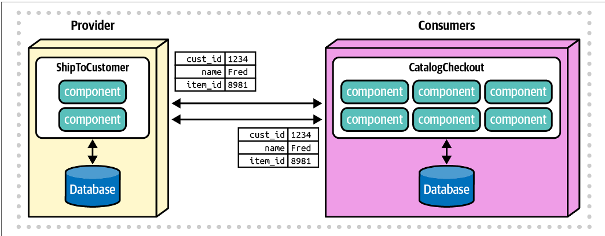

> 图 13-4：具有自己内部语义表示的微服务可以在简单消息中传递值。

这里，每个服务有自己的 bounded context 的 Customer 定义。
在传递信息时，架构师使用 JSON 中的名称-值对以松散契约传递相关信息。

这种松散耦合满足了许多微服务的总体目标。首先， 它创建了高度解耦的建模为 bounded
context 的服务，允许每个团队根据需要积极演变内部表示。其次，
它创建了实现解耦。如果两个服务以相同的技术栈开始，但第二个服务的团队决定迁移到另一个平台，它可能根本不会影响第一个服务。
所有常用的平台都可以生成和消费名称-值对，使它们成为集成架构的通用语言。

松散契约的最大缺点是契约保真度——作为架构师，
我如何知道开发人员为集成调用传递了正确数量和类型的参数？一些协议（如
JSON）包括模式工具，
允许架构师用更多元数据覆盖松散契约。架构师也可以使用一种称为*消费者驱动契约*的架构适应度函数风格。

### 消费者驱动契约

微服务架构中一个常见的问题是松散耦合与契约保真度的看似矛盾的目标。
一种利用软件开发进步的创新方法是*消费者驱动契约*，在微服务架构中常见。

在许多架构集成场景中，
服务决定向其他集成伙伴发出什么信息（推送模型——服务提供者向消费者推送契约）。
消费者驱动契约的概念将这种关系逆转为*拉取*模型；这里，
消费者汇总他们需要从提供者那里获取的项目的契约，并将契约传递给提供者，
提供者将其包含在其构建中，并始终保持契约测试绿色。契约封装了消费者从提供者那里需要的信息。
这可能适用于提供者必须遵守的互锁请求网络，如图 13-5 所示。


> 图 13-5：消费者驱动契约允许提供者和消费者通过自动化架构治理保持同步。

在此示例中，左侧的团队向右侧的每个消费者团队提供（可能重叠的）信息。
每个消费者创建一个指定所需信息的契约，并将其传递给提供者，
提供者将其测试作为持续集成或部署流水线的一部分。这允许每个团队根据需要严格或松散地指定契约，
同时保证构建过程中的契约保真度。
许多消费者驱动契约测试工具提供了自动化构建时契约检查的设施，提供了类似于更严格契约的另一个好处。

消费者驱动契约在微服务架构中相当常见，因为它们允许架构师解决松散耦合和治理集成的双重问题。
消费者驱动契约的 trade-off 如表 13-3 所示。

消费者驱动契约的优点如下：

**允许服务之间松散契约耦合**：使用名称-值对是两个服务之间可能的最松散耦合，允许实现更改，破坏的可能性最小。

**允许严格性上的可变性**：如果团队使用架构适应度函数，
架构师可以构建比模式或其他类型添加工具通常提供的更严格的验证。例如，大多数模式允许架构师指定数字类型，
但不指定可接受的值范围。构建适应度函数允许架构师构建他们喜欢的任意精确度。

**可演变**：松散耦合意味着可演变性。使用简单的名称-值对允许集成点更改实现细节，而不破坏服务之间传递的信息的语义。

消费者驱动契约的缺点如下：

**需要工程成熟度**：架构适应度函数是一个很好的例子，只有在纪律严明、
有良好实践且不跳过步骤的团队中才能真正发挥作用。例如，
如果所有团队运行包括契约测试的持续集成，那么适应度函数提供了良好的验证机制。另一方面，
如果许多团队忽略失败的测试或不及时运行契约测试，
集成点可能在架构中比期望的更长时间被破坏。

**两个互锁机制而不是一个**：架构师通常寻找单一机制来解决问题，许多模式工具具有精心设计的功能来创建端到端连接。然而，
有时两个简单的互锁机制可以更简单地解决问题。因此，
许多架构师使用名称-值对和消费者驱动契约的组合来验证契约。然而，这意味着团队需要两个机制而不是一个。

架构师对 trade-off
的最佳解决方案归结为团队成熟度和松散契约的解耦与更严格契约的复杂性加确定性。

### trade-off

| 优点                     | 缺点                   |
| ------------------------ | ---------------------- |
| 允许服务之间松散契约耦合 | 需要工程成熟度         |
| 允许严格性上的可变性     | 两个互锁机制而不是一个 |
| 可演变                   |                        |

> 表 13-3：消费者驱动契约的 trade-off。

## Stamp 耦合

分布式架构中一个常见模式（有时是反模式）是 stamp 耦合，
它描述了在服务之间传递大型数据结构，但每个服务只与数据结构的一小部分交互。
考虑图 13-6 中所示的四个服务的例子。

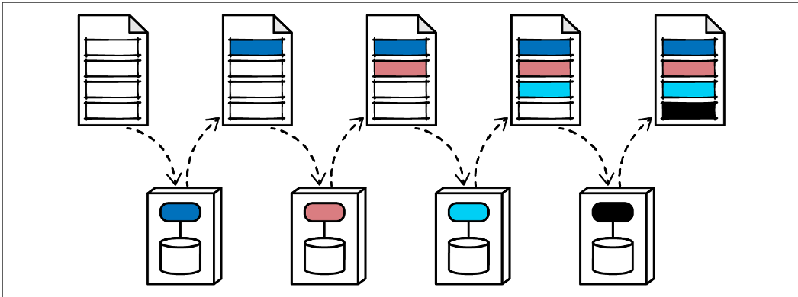

> 图 13-6：四个服务之间的 stamp 耦合。

每个服务仅访问（读取、写入或两者）在服务之间传递的数据结构的一小部分。
这种模式在存在行业标准文档格式时很常见，通常是 XML。例如，
旅游行业有一个全球标准的 XML 文档格式，指定了旅行行程的详细信息。
与旅行相关服务一起工作的几个系统传递整个文档，只更新它们相关的部分。

然而，stamp 耦合通常是一个意外的反模式，其中架构师过度指定了契约中不需要的细节，
或者意外地消耗了太多带宽用于普通调用。

### 通过 Stamp 耦合过度耦合

回到我们的 Wishlist 和 Profile 服务， 考虑将两者与严格契约结合 stamp
耦合绑定在一起，如图 13-7 所示。

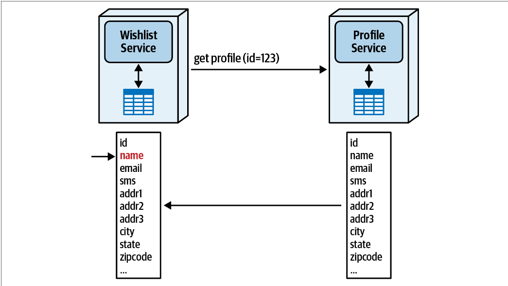

> 图 13-7：Wishlist 服务与 Profile 服务 stamp 耦合。

在此示例中，即使 Wishlist 服务只需要名称（通过唯一 ID 访问）， 架构师已经将
Profile 的整个数据结构作为契约耦合，
也许是出于未来证明的误导努力。然而，契约中太多耦合的负面副作用是脆性。 如果
Profile 更改了 Wishlist 不关心的字段（如 state）， 它仍然会破坏契约。

过度指定契约中的细节通常是反模式， 但在同时使用 stamp
耦合进行合法关注（包括工作流管理等用途，
参见[用于工作流管理的 Stamp 耦合](#用于工作流管理的-stamp-耦合)） 时很容易陷入。

### 带宽

某些架构师陷入的另一个意外反模式是分布式计算的著名谬误之一：*带宽是无限的*。
架构师和开发人员很少需要考虑他们在单体内进行的方法调用数量的累积大小，
因为存在自然障碍。然而，在分布式架构中，许多这些障碍消失了，无意中创建了问题。

考虑前面的例子，每秒 2,000 个请求。如果每个有效载荷是 500 KB，
那么这单个请求所需的带宽等于每秒 1,000,000 KB！
这显然是没有充分理由的带宽滥用。或者， 如果 Wishlist 和 Profile
之间的耦合只包含必要的信息 name，开销变为每秒 200 字节， 对于完全合理的 400 KB。

Stamp
耦合在过度使用时可能产生问题，包括因与带宽耦合过紧而产生的问题。然而，像架构中的所有事物一样，
它也有有益的用途。

## 用于工作流管理的 Stamp 耦合

在第 12 章中，我们涵盖了许多动态 quantum 通信模式，
包括几个以*协调*风格为*choreography*的模式。 架构师倾向于为复杂工作流使用
mediator，
原因有很多。然而，如果其他因素（如可扩展性）驱使架构师走向既编排又复杂的解决方案呢？

架构师可以使用 stamp
耦合在服务之间管理工作流状态，将领域知识和工作流状态作为契约的一部分传递， 如图
13-8 所示。


> 图 13-8：使用 stamp 耦合进行工作流管理。

在此示例中，架构师设计契约以包含工作流信息：工作流状态、事务状态等。
当每个领域服务接受契约时，它更新其契约部分和工作流状态，然后传递它。在工作流结束时，
接收者可以查询契约以确定成功或失败，以及错误消息等状态和信息。
如果系统需要在整个过程中实现事务一致性，那么领域服务应该将契约重新广播到先前访问过的服务，
以恢复原子一致性。

使用 stamp 耦合管理工作流确实在服务之间创建了比名义上更高的耦合，
但语义耦合必须存在于某处——记住，架构师不能通过实现减少语义耦合。然而，在许多情况下，
切换到 choreography 可以改善吞吐量和可扩展性， 使选择 stamp 耦合而非 mediator
成为一个有吸引力的选择。 表 13-4 显示了 stamp 耦合的 trade-off。

### trade-off

| 优点                                         | 缺点                                 |
| -------------------------------------------- | ------------------------------------ |
| 允许在 choreography 解决方案中进行复杂工作流 | 在协作者之间创建（有时人为的）高耦合 |
|                                              | 在高规模时可能创建带宽问题           |

> 表 13-4：Stamp 耦合的 trade-off。

## Sysops Squad Saga：管理工单契约

### 5 月 10 日，星期二，10:10


> 插图 13-2：Sydney 和 Addison 讨论工单契约。

Sydney 和 Addison 在自助餐厅边喝咖啡边讨论工单管理工作流中的契约。

Addison
说："让我们看看正在讨论的工作流，工单管理工作流。我已经草拟了我们应该使用的契约类型，想让你看看，
确保我没有遗漏什么。它如图 13-9 所示。"

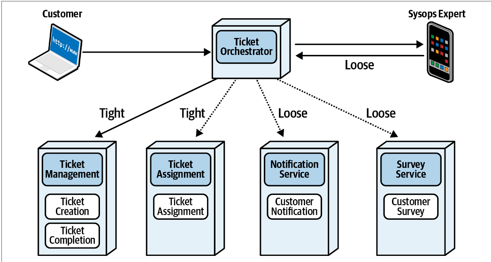

> 图 13-9：工单管理工作流中协作者之间的契约类型。

"orchestrator 和两个工单服务（工单管理和工单分配）之间的契约是严格的；
这些信息在语义上高度耦合，可能一起变化，"Addison 说。"例如，
如果我们添加新类型的东西来管理，分配必须同步。通知和调查服务可以更松散——信息变化更慢，且不会从脆性耦合中受益。"

Sydney 说： "所有这些决定都合理——但 orchestrator 和 Sysops Squad
专家应用程序之间的契约呢？ 似乎需要与分配一样严格的契约。"

"很好的发现——名义上，我们希望与移动应用程序的契约匹配工单分配。然而，
我们通过公共应用商店部署移动应用程序，其审批过程有时需要很长时间。
如果我们保持契约更松散，我们获得灵活性和更慢的变更速率。"

他们都为此写了一份 ADR：

### ADR：Sysops Squad 专家移动应用程序的松散契约

#### 上下文

Sysops Squad
专家使用的移动应用程序必须通过公共应用商店部署，对更新契约的能力施加了延迟。

#### 决策

我们将使用松散的名称-值对契约向 orchestrator 和移动应用程序之间传递信息。

我们将构建一个扩展机制，允许短期灵活性的临时扩展。

#### 后果

如果应用商店策略允许更快（或持续）部署，应重新考虑此决定。

更多验证契约的逻辑必须驻留在 orchestrator 和移动应用程序中。

# 第 14 章：管理分析数据

5 月 31 日，星期二，13:23


> 插图 14-1：Logan 和 Dana 讨论分析数据。

Logan 和 Dana（数据架构师）站在大会议室外面， 在每周状态会议后聊天。

"我们将如何在这个新架构中处理分析数据？"Dana
问道。"我们正在将数据库拆分成小部分，
但我们将不得不将所有这些数据重新粘合在一起以进行报告和分析。
我们试图实现的改进之一是更好的预测规划，
这意味着我们正在使用更多的数据科学和统计数据来做出更战略性的决策。我们现在有一个考虑分析数据的团队，
我们需要系统的一部分来处理这个需求。我们要有数据仓库吗？"

Logan
说："我们研究过创建数据仓库，虽然它解决了整合问题，但对我们来说有一堆问题。"

本书大部分内容关注如何在现有架构风格（如微服务）中分析 trade-off。然而，
我们强调的技术也可以用于理解软件开发生态系统中出现的新能力； *data mesh*
是一个优秀的例子。

分析数据和运维数据在现代架构中有广泛不同的目的（参见[数据在架构中的重要性](#数据在架构中的重要性)）；
本书大部分内容处理了与运维数据相关的困难 trade-off。
当客户端/服务器系统变得流行且强大到足以满足大型企业时，架构师和数据库管理员寻找一种允许专门查询的解决方案。

## 以前的方法

运维数据和分析数据之间的分裂并不是一个新问题——数据的不同基本用途自数据存在以来就一直存在。
随着架构风格的出现和演变，处理数据的方法也类似地变化和演变。

## 数据仓库

在软件开发的早期时代（例如，大型机计算机或早期个人计算机），应用程序是单体的，
包括同一物理系统上的代码和数据。毫不奇怪，考虑到我们到目前为止所涵盖的上下文，
跨不同物理系统的事务协调变得具有挑战性。随着数据需求变得更加雄心勃勃，
加上办公室中局域网的出现，这导致了*客户端/服务器*应用程序的兴起，
其中强大的数据库服务器在网络上运行，桌面应用程序在本地计算机上运行，通过网络访问数据。
应用程序和数据处理的分离允许更好的事务管理、协调和许多其他好处，
包括能够开始将历史数据用于新目的，如分析。

架构师早期尝试通过*数据仓库*模式提供可查询的分析数据。
他们试图解决的基本问题触及运维数据和分析数据分离的核心：一种的格式和模式不一定适合（甚至不允许使用）
另一种。例如，许多分析问题需要聚合和计算，这在关系型数据库上是昂贵的操作，特别是那些已经在沉重事务负载下运行的数据库。

演变的数据仓库模式有轻微的变化，主要基于供应商的产品和能力。然而，该模式有许多共同特征。
基本假设是运维数据存储在可通过网络直接访问的关系型数据库中。
以下是数据仓库模式的主要特征：

#### 从多个来源提取数据

由于运维数据驻留在各个数据库中，此模式的一部分指定了一种将数据提取到另一个（大规模）数据存储中的机制，
即模式的"仓库"部分。
跨组织中的所有各种数据库查询以构建报告是不切实际的，因此数据被提取到仓库中仅用于分析目的。

#### 转换为单一模式

通常，运维模式不匹配报告所需的模式。例如，运维系统需要围绕事务构建模式和行为，
而分析系统很少是 OLTP 数据（参见第 1 章），但通常处理大量数据，用于报告、
聚合等。因此，大多数数据仓库利用*星型模式*来实现维度建模，
将来自运维系统的不同格式的数据转换为仓库模式。为了促进速度和简单性，仓库设计人员对数据进行反规范化，
以促进性能和更简单的查询。

#### 加载到仓库

由于运维数据驻留在各个系统中，仓库必须构建机制来定期提取数据、转换数据并将其放入仓库。
设计人员要么使用内置的关系型数据库机制（如复制），
要么使用专门工具构建从原始模式到仓库模式的转换器。当然，
对运维系统模式的任何更改都必须在转换后的模式中复制，使更改协调变得困难。

#### 在仓库上进行分析

因为数据"生活"在仓库中，所有分析都在那里进行。从运维角度来看，这是可取的：
数据仓库机器通常具有大规模存储和计算能力，将繁重需求卸载到其自己的生态系统中。

#### 由数据分析师使用

数据仓库使用数据分析师，其工作包括构建报告和其他商业智能资产。然而，
构建有用的报告需要领域理解，这意味着领域专业知识必须同时存在于运维数据系统和分析系统中，
其中查询设计人员必须使用转换后的模式中的相同数据来构建有意义的报告和商业智能。

#### BI 报告和仪表板

数据仓库的输出包括商业智能报告、提供分析数据的仪表板、报告和任何其他信息，以使公司能够做出更好的决策。

#### 类 SQL 接口

为了使 DBA
更容易使用，大多数数据仓库查询工具提供熟悉的便利功能，如用于形成查询的类 SQL
语言。
前面提到的数据转换步骤的原因之一是为用户提供更简单的方式来查询复杂的聚合和其他智能。

#### 星型模式

*星型模式*模式在数据集市和仓库中很流行。它将数据语义分为*事实*，保存组织的可量化数据，
和*维度*；因此它们也被称为*维度模型*，包括事实数据的描述性属性。

Sysops Squad 的事实数据示例可能包括每小时费率、修复时间、
到客户的距离以及其他具体可衡量的东西。维度可能包括小队成员专业、小队成员姓名、
商店位置和其他元数据。

最重要的是，星型模式被有目的地反规范化，以促进更简单的查询、简化的业务逻辑（换句话说，
更少的复杂连接）、更快的查询和聚合、复杂分析（如数据立方体）
以及形成多维查询的能力。大多数星型模式变得极其复杂。

数据仓库模式提供了软件架构中*技术分区*的一个很好的例子：
仓库设计人员将数据转换为促进查询和分析的模式，但失去了任何领域分区，这必须在需要时在查询中重新创建。
因此，需要高度训练有素的专家来理解如何在此架构中构建查询。

然而，数据仓库模式的主要失败包括集成脆性、领域知识的极端分区、复杂性和预期目的的有限功能：

#### 集成脆性

此模式中内置的在注入阶段转换数据的要求在系统中创建了严重的脆性。
特定问题领域的数据库模式与该问题的语义高度耦合；对领域的更改需要模式更改，
这反过来又需要数据导入逻辑更改。

#### 领域知识的极端分区

构建复杂的业务工作流需要领域知识。构建复杂的报告和商业智能也需要领域知识，
加上专门的分析技术。因此，领域专业知识的维恩图重叠，但仅部分重叠。架构师、开发人员、
DBA 和数据科学家必须协调数据更改和演变，迫使生态系统截然不同的部分之间紧密耦合。

#### 复杂性

构建替代模式以允许高级分析增加了系统的复杂性，以及注入和转换数据所需的持续机制。
数据仓库是组织正常运维系统之外的一个独立项目，
因此必须作为完全独立的生态系统维护，但高度耦合到嵌入在运维系统中的领域。所有这些因素都增加了复杂性。

#### 预期目的的有限功能

最终，大多数数据仓库失败，因为它们没有提供与创建和维护仓库所需努力相称的业务价值。
因为这种模式在云环境出现之前很久就很常见，基础设施的物理投资是巨大的，
加上持续的开发和维护。通常，数据消费者会请求仓库无法提供的某种类型的报告。因此，
这种对最终有限功能的持续投资注定了大多数这些项目的失败。

#### 同步创建瓶颈

数据仓库中跨各种运维系统同步数据的需求创建了运维和组织瓶颈——多个原本彼此独立的数据流必须汇聚的位置。
数据仓库的一个常见副作用是同步过程影响运维系统， 尽管希望解耦。

#### 运维与分析契约差异

记录系统有特定的契约需求（在第 13 章中讨论）。分析系统也有契约需求，
通常与运维系统不同。在数据仓库中，管道通常处理转换和摄取，在转换过程中引入契约脆性。

表 14-1 显示了数据仓库模式的 trade-off。

### trade-off

| 优点                 | 缺点               |
| -------------------- | ------------------ |
| 数据的集中整合       | 领域知识的极端分区 |
| 专用分析孤岛提供隔离 | 集成脆性           |
|                      | 复杂性             |
|                      | 预期目的的有限功能 |

> 表 14-1：数据仓库模式的 trade-off。

5 月 31 日，星期二，13:33


> 插图 14-2：Logan 和 Dana 讨论 data lake。

"我们研究过创建数据仓库，但意识到它更适合旧的单体架构类型，而不是现代分布式架构，
"Logan 说。"此外，我们现在有大量更多的机器学习案例需要支持。"

"那我一直在听说的 data lake 想法呢？"Dana 问道。 "我在 Martin Fowler
的网站上读了一篇博客文章[^1]。它似乎解决了数据仓库的一堆问题， 而且更适合 ML
用例。"

[^1]: Martin Fowler 于 2015 年在他的博客上发布了一篇关于 Data Lake
    模式的有影响力的文章，见 https://martinfowler.com/bliki/DataLake.html。

"哦，是的，那篇文章出来时我读过，"Logan 说。"他的网站是丰富信息的宝库，
那篇文章是在微服务话题变得热门之后出来的。事实上， 我是在 2014
年第一次在同一个网站上读到微服务的，当时的一个大问题是，
我们如何在这样的架构中管理报告？data lake 是早期的答案之一，
主要是作为数据仓库的对立面，它绝对不能在微服务这样的东西中工作。"

"为什么不呢？"Dana 问道。

## data lake

作为对数据仓库的复杂性、费用和失败的许多反应性回应，设计钟摆摆到了相反的极端，
以 data lake 模式为例，这是有意作为数据仓库模式的反面。
虽然它保留了集中模型和管道，但它颠倒了数据仓库的"转换和加载"模型为"加载和转换"。
不是做大量的转换工作，data lake 模式的哲学认为，
与其做可能永远不会被使用的无用转换，不如不做转换，允许业务用户以其自然格式访问分析数据，
这通常需要为他们的目的进行转换和加工。因此，
工作的负担被变为反应式而非主动式——与其做可能不需要的工作，不如只在需要时进行转换工作。

许多架构师所做的基本观察是，数据仓库中预构建的模式经常不适合用户所需的报告或查询类型，
需要额外的工作来充分理解仓库模式以制定解决方案。此外，
许多机器学习模型在数据"更接近"半原始格式而不是转换后的版本时工作得更好。
对于已经理解领域的领域专家来说，这呈现了一种痛苦的折磨，
其中数据被剥离了领域分离和上下文，转换为数据仓库，只是为了需要领域知识来制定不适合新模式的自然查询！

data lake 模式的特征如下：

#### 从多个来源提取数据

在此模式中仍然提取运维数据，但较少进行向另一种模式的转换——相反，
数据通常以其"原始"或原生形式存储。此模式中仍可能发生一些转换。例如，
上游系统可能将格式化的文件转储到湖中，这些文件基于列快照组织。

#### 加载到湖中

湖，通常部署在云环境中，由来自运维系统的定期数据转储组成。

#### 由数据科学家使用

数据科学家和其他分析数据消费者在湖中发现数据，并执行回答特定问题所需的任何聚合、组合和其他转换。

data lake 模式虽然在许多方面是对数据仓库模式的改进，但仍然存在许多限制。

此模式仍然采用*集中式*数据视图，其中数据从运维系统的数据库中提取，
并复制到或多或少自由形式的湖中。负担落在消费者身上，以发现如何将不同的数据集连接在一起，
这在数据仓库中经常发生，尽管有规划水平。逻辑是，
如果我们将不得不为某些分析做前期工作，让我们为所有分析做，并跳过大规模的前期投资。

虽然 data lake
模式避免了数据仓库模式引起的转换问题，但它要么没有解决，要么创建了新问题。

#### 难以发现正确的资产

随着数据流入非结构化湖中，领域内数据关系的许多理解消失了。因此，领域专家仍然必须参与制定分析。

#### PII 和其他敏感数据

随着数据科学家将不同信息片段组合并学习侵犯隐私的知识的能力增强， 对 PII
的关注也在增加。许多国家现在不仅限制私人信息，还限制可以组合以学习和识别的信息，
用于广告定位或其他不太光彩的目的。
将非结构化数据转储到湖中通常会冒着暴露可以拼接在一起以侵犯隐私的信息的风险。不幸的是，正如在发现过程中一样，
领域专家拥有避免意外暴露所需的知识，迫使他们重新分析湖中的数据。

#### 仍然是技术分区，而非领域分区

软件架构当前的趋势将重点从基于技术能力划分系统转移到基于领域划分系统，
而数据仓库和 data lake 模式都关注技术分区。通常，
架构师设计这些解决方案中的每一个都具有不同的摄取、转换、加载和服务分区，
每个都专注于技术能力。现代架构模式倾向于领域分区，封装技术实现细节。例如，
微服务架构试图按领域而非技术能力分离服务，将领域知识（包括数据）封装在服务边界内。然而，
数据仓库和 data lake 模式都试图将数据作为独立实体分离，
在这个过程中丢失或模糊了重要的领域视角（如 PII 数据）。

最后一点至关重要——越来越多的架构师围绕*领域*而非*技术*分区设计架构，而之前的两种方法都体现了将数据与其上下文分离。
架构师和数据科学家需要的是保留适当类型的宏级分区，
同时支持分析数据与运维数据的清晰分离的技术。表 14-2 列出了 data lake 模式的
trade-off。

### trade-off

| 优点               | 缺点             |
| ------------------ | ---------------- |
| 比数据仓库结构更少 | 有时难以理解关系 |
| 较少的前期转换     | 需要临时转换     |
| 更适合分布式架构   |                  |

> 表 14-2：data lake 模式的 trade-off。

管道脆性和病态耦合的缺点仍然存在。虽然在 data lake
模式中做的转换较少，但仍然常见，还有数据清洗。

data lake 模式将数据完整性测试、数据质量和其他质量问题推向下游湖管道，
这可能创建一些在数据仓库模式中显现的相同运维瓶颈。

由于技术分区和批处理性质，解决方案可能面临数据陈旧问题。如果没有仔细协调，
架构师要么忽略上游系统中的更改，导致数据陈旧，要么允许耦合的管道断裂。

5 月 31 日，星期二，14:43


> 插图 14-3：Logan 和 Dana 讨论 data mesh。

"好的，所以我们也不能使用 data lake！"Dana 惊呼。"现在怎么办？"

"幸运的是，最近的一些研究找到了用微服务这样的分布式架构解决分析数据问题的方法，
"Logan 回答。"它遵循我们试图实现的领域边界，
但也允许我们以数据科学家可以使用的方式投射分析数据。而且，它消除了我们律师担心的
PII 问题。"

"太好了！"Dana 回答。"它是如何工作的？"

### data mesh

观察分布式架构中的其他趋势，Zhamak Dehghani 和其他几位创新者从微服务、 service
mesh 和 sidecar（参见[sidecar 与 service mesh](#sidecar-与-service-mesh)）
的面向领域解耦中推导出 data mesh 模式的核心思想，并将其应用于分析数据，
并进行了修改。正如我们在第 8 章中提到的， sidecar
模式提供了一种组织正交耦合的非纠缠方式（参见[正交耦合](#正交耦合)）；
运维数据和分析数据之间的分离正是这种耦合的另一个优秀例子，但比简单的运维耦合更复杂。

### data mesh 的定义

data mesh 是一种以去中心化方式共享、访问和管理分析数据的社会技术方法。
它满足广泛的分析用例，如报告、ML 模型训练和生成见解。与之前的架构相反，
它通过将数据的架构和所有权与业务领域对齐，并实现数据的点对点消费来做到这一点。

data mesh 建立在四个原则之上：

#### 数据的领域所有权

数据由最熟悉数据的领域拥有和共享：要么是原始数据的领域，要么是数据的一等消费者。
此架构允许以点对点方式从多个领域分布式共享和访问数据， 无需任何 mediator
和集中式湖或仓库，也无需专门的数据团队。

#### 数据即产品

为了防止数据孤岛化并鼓励领域共享其数据，data mesh 引入了数据作为产品服务的概念。
它建立了必要的组织角色和成功指标，
以确保领域以愉悦整个组织数据消费者体验的方式提供其数据。
此原则导致引入了一个名为*data product quantum*的新 architecture quantum，
以维护并向消费者提供可发现、可理解、及时、 安全且高质量的数据。本章介绍 data
product quantum 的架构方面。

#### 自助数据平台

为了使领域团队能够构建和维护其数据产品，data mesh 引入了一套新的自助平台能力。
这些能力专注于改善数据产品开发人员和消费者的体验。
它包括诸如数据产品的声明式创建、通过搜索和浏览跨网格发现数据产品，
以及管理其他智能图（如数据血缘和知识图谱）的出现等功能。

#### 计算联邦治理

此原则确保尽管数据所有权是去中心化的，但组织范围内的治理要求——如合规性、安全性、
隐私性和数据质量，以及数据产品的互操作性——在所有领域中一致地得到满足。 data mesh
引入了一个由领域数据产品所有者组成的联邦决策模型。
他们制定的策略被自动化并嵌入为每个数据产品中的代码。
这种治理方法的架构含义是平台提供的嵌入式 sidecar， 位于每个 data product quantum
中，以在访问点（数据读取或写入）存储和执行策略。

data mesh 是一个广泛的主题，在 Zhamak Dehghani（O'Reilly） 的 *Data Mesh*
一书中全面涵盖。在本章中， 我们专注于核心架构元素，即*data product quantum*。

### data product quantum

data mesh 的核心原则覆盖了现代分布式架构，如微服务。正如在*service mesh*中一样，
团队构建一个*data product quantum*（DPQ）， 与服务相邻但耦合，如图 14-1 所示。

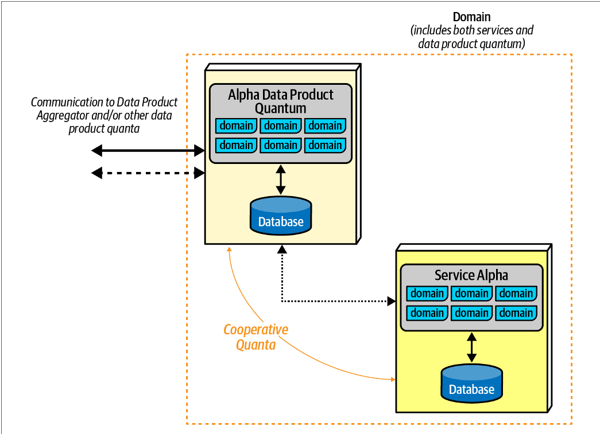

> 图 14-1：data product quantum 的结构。

在此示例中，服务 Alpha 包含行为和数据（运维数据）。 领域包括一个 data product
quantum，它也包含代码和数据， 并充当系统整体分析和报告部分的接口。DPQ
充当运维独立但高度耦合的一组行为和数据。

现代架构中通常存在几种类型的 DPQ：

**源对齐（原生）DPQ**： 代表协作 architecture
quantum（通常是微服务）提供分析数据，充当协作 quantum。

**聚合
DPQ**：从多个输入聚合数据，同步或异步。例如，对于某些聚合，异步请求可能足够；对于其他聚合，
聚合器 DPQ 可能需要对源对齐 DPQ 执行同步查询。

**适用 DPQ**：为满足特定需求而定制制作的
DPQ，可能包含分析报告、商业智能、机器学习或其他支持能力。

每个也为分析和商业智能做出贡献的领域都包含一个 DPQ，如图 14-2 所示。

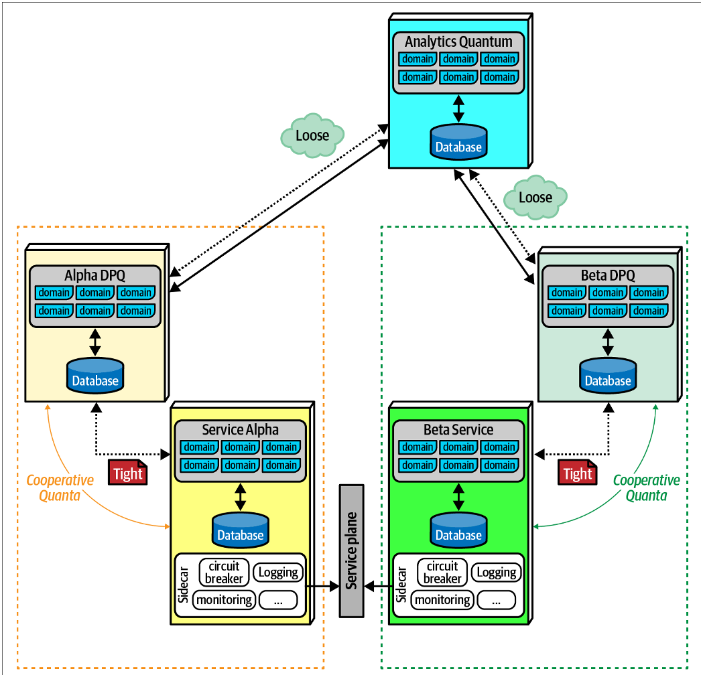

> 图 14-2：data product quantum 充当服务的独立但高度耦合的附属。

这里，DPQ
代表由负责实现服务的领域团队拥有的组件。它与数据库中存储的信息重叠，并可能与某些领域行为异步交互。
data product quantum 也可能具有用于分析和商业智能目的的行为和数据。

每个 data product quantum 充当服务本身的协作 quantum：

#### 协作 quantum

一个运维独立的 quantum，通过异步通信和最终一致性与其协作者通信，
但与协作者具有紧密的契约耦合，与分析 quantum（负责报告、分析、商业智能等的服务）
具有通常更松散的契约耦合。虽然两个协作 quantum
是运维独立的，但它们代表数据的两个方面： quantum 中的运维数据和 data product
quantum 中的分析数据。

系统的某部分将承担分析和商业智能的责任，这将形成自己的领域和 quantum。为了运作，
此分析 quantum 与它需要信息的各个 data product quantum 具有静态 quantum 耦合。
此服务可以对 DPQ 进行同步或异步调用，具体取决于请求的类型。例如， 某些 DPQ
将具有对分析 DPQ 的 SQL 接口，允许同步查询。其他需求可能跨多个 DPQ 聚合信息。

### data mesh、耦合和 architecture quantum

因为分析报告可能是解决方案的必需功能， DPQ 及其通信实现属于 architecture quantum
的静态耦合。例如，在微服务架构中，服务平面必须可用，
就像如果设计需要消息传递，消息代理必须可用一样。然而，像 service mesh 中的
sidecar 模式一样， DPQ 应该与服务的实现更改正交，并与数据平面维护单独的契约。

从动态 quantum 耦合的角度来看， 数据 sidecar
应始终实现同时具有最终一致性和异步性的通信模式之一：
要么是[Parallel Saga 模式](#parallel-saga-模式)，
要么是[Anthology Saga 模式](#anthology-saga-模式)。换句话说， 数据 sidecar
绝不应包含保持运维数据和分析数据同步的事务要求， 这将违背使用 DPQ
进行正交解耦的目的。类似地，与数据平面的通信通常应该是异步的，
以便对领域服务的运维架构特性影响最小。

### 何时使用 data mesh

像架构中的一切一样，此模式也有与之相关的 trade-off，如表 14-3 所示。

### trade-off

| 优点                                     | 缺点                                     |
| ---------------------------------------- | ---------------------------------------- |
| 非常适合微服务架构                       | 需要与 data product quantum 进行契约协调 |
| 遵循现代架构原则和工程实践               | 需要异步通信和最终一致性                 |
| 允许分析数据和运维数据之间出色的解耦     |                                          |
| 精心形成的契约允许分析能力的松散耦合演变 |                                          |

> 表 14-3：data mesh 模式的 trade-off。

它最适合具有良好包含的事务性和服务之间良好隔离的现代分布式架构，如微服务。
它允许领域团队确定其他 quantum 消费的数据的数量、节奏、质量和透明度。

在分析数据和运维数据必须始终保持同步的架构中更加困难，
这在分布式架构中呈现了一个令人生畏的挑战。找到支持最终一致性的方法，也许使用非常严格的契约，
允许许多不施加其他困难的模式。

data mesh 是软件开发生态系统中持续增量演变的杰出例子；新能力创造新视角，
这反过来又帮助解决过去的一些持久性头痛，如领域与数据（运维和分析）的人为分离。

## Sysops Squad Saga：data mesh

### 6 月 10 日，星期五，09:55


> 插图 14-4：Logan、Dana 和 Addison 讨论 data mesh。

Logan、Dana 和 Addison
在大会议室见面，那里通常有之前会议留下的零食（或者，在一天的这么早，早餐）。

"我刚从与我们的数据科学家的会议回来，他们正在试图找出一种方法，
为我们解决一个长期问题——我们需要在专家供应规划中变得数据驱动，
针对不同时间点不同地理位置的技能集需求。这种能力将有助于招聘、培训和其他与供应相关的功能，"Logan
说。

"我没有参与太多 data mesh 的实现——我们进展到什么程度了？"Addison 问道。

"我们实现的每个新服务都包含一个 DPQ。 领域团队负责运行和维护其服务的 DPQ 协作
quantum。我们才刚刚开始。我们正在逐步构建能力，因为我们识别需求。 我在图 14-3
中给出了工单管理领域的图。"

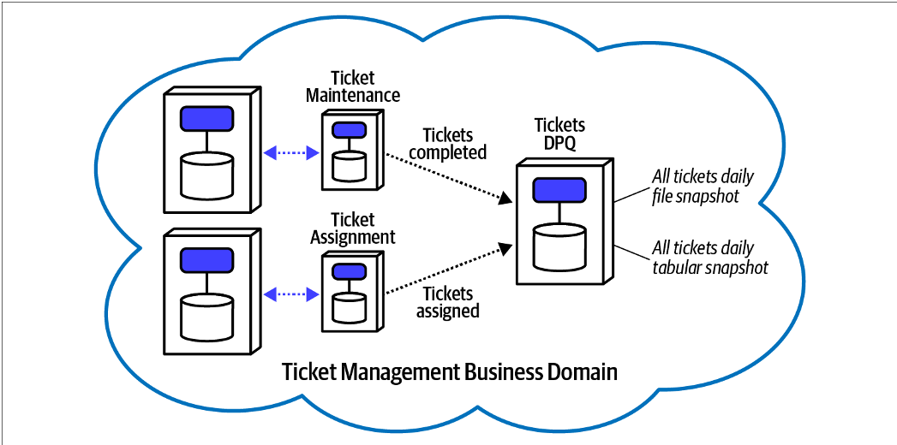

> 图 14-3：工单管理领域，包括两个带有自己 DPQ 的服务，以及一个工单 DPQ。

Logan 说："工单 DPQ 是其自己的 architecture quantum，
并充当其他系统关心的几个不同工单视图的聚合点。"

"每个团队需要构建多少，与已经提供的相比？"Addison 问道。

"我可以回答这个问题，"Dana 说。"data mesh
平台团队正在为数据用户和数据产品开发人员提供一套自助能力。
这允许任何想要构建新分析用例的团队搜索和找到现有 architecture quantum
中的首选数据产品， 直接连接到它们，并开始使用它们。
该平台还支持想要创建新数据产品的领域。该平台持续监控网格中任何数据产品的停机时间，
或与治理策略的不兼容性，并通知领域团队采取行动。"

Logan 说："领域数据产品所有者与安全、法律、 风险和合规 SME
以及平台产品所有者合作，形成了一个全局联邦治理组，该组决定 DPQ
必须标准化的方面，
如他们的数据共享契约、异步数据传输模式、访问控制等。平台团队在一段时间内，
用新的策略执行能力丰富 DPQ 的 sidecar，并统一在网格中升级 sidecar。"

"哇，我们比我想象的更进一步，"Dana
说。"我们需要什么数据来提供专家供应问题的信息？"

Logan 回答："与数据科学家合作，我们已经确定了我们需要聚合什么信息。
看起来我们有正确的信息：工单 DPQ 提供所有已提出和已解决的工单的长期视图，
用户维护 DPQ 提供所有专家资料的每日快照，调查 DPQ 提供所有客户调查结果的日志。"

"太棒了，"Addison 说。"也许我们应该创建一个新的 DPQ， 命名为类似专家供应
DPQ，它从这三个 DPQ 获取异步输入？ 它的第一个产品可以称为供应推荐，使用从调查、
工单和维护领域中的 DPQ 聚合的数据训练的 ML 模型。专家供应 DPQ
将提供每日推荐数据，随着关于工单、
调查和专家资料的新数据可用。整体设计看起来像图 14-4。"


> 图 14-4：实现专家供应 DPQ。

"好的，这看起来完全合理，"Dana 说。"服务已经完成；
我们只需要确保特定端点存在于每个源 DPQ 中，并实现新的专家供应 DPQ。"

"没错，"Logan 说。"不过，我们需要担心一件事——趋势分析依赖于可靠数据。
如果其中一个馈送源系统在一段时间内返回不完整信息会发生什么？
那不会破坏趋势分析吗？"

"没错——一段时间内没有数据比不完整数据更好，不完整数据会让它看起来流量比实际少，
"Dana 说。"我们可以豁免空白天，只要不经常发生。"

"好的，Addison，你知道这意味着什么，对吧？"Logan 说。

"是的，我当然知道——一份指定完整信息或无信息的
ADR，以及一个确保我们获得完整数据的适应度函数。"

### ADR：确保专家供应 DPQ 源提供整天的数据或无数据

#### 上下文

专家供应 DPQ
在指定时间段内执行趋势分析。特定日期的不完整数据将扭曲趋势结果，应避免。

#### 决策

我们将确保专家供应 DPQ
的每个数据源接收每日趋势的完整快照，或该日期无数据，允许数据科学家豁免该日期。

源馈送和专家供应 DPQ 之间的契约应该松散耦合以防止脆性。

#### 后果

如果由于可用性或其他问题导致太多天被豁免，趋势的准确性将受到负面影响。

#### 适应度函数：

**完整每日快照**。检查消息到达时的时间戳。鉴于典型消息量，任何超过一分钟的间隙表示处理中的间隙，将该日标记为豁免。

**工单 DPQ 和专家供应 DPQ
的消费者驱动契约适应度函数**。确保工单领域的内部演变不会破坏专家供应 DPQ。

# 第 15 章：构建你自己的 trade-off 分析

6 月 10 日，星期一，10:01


> 插图 15-1：Sysops Squad 回顾会议。

会议室似乎比九月那个命运攸关的日子更加明亮， 当时 Sysops Squad
的业务赞助商即将取消整个支持合同业务线。会议开始前，会议室里的人们相互交谈，
创造了一种很久很久没有在会议室里看到的能量。

"好吧，"Bailey（主要业务赞助商和 Sysops Squad
工单应用程序负责人）说，"我想我们应该开始了。 如你所知， 这次会议的目的是讨论 IT
部门如何能够扭转局面，修复九个月前还是一场灾难的东西。"

"我们称之为回顾，"Addison
说。"这对于发现如何将来做得更好，以及讨论似乎效果很好的事情非常有用。"

"那么，告诉我们，什么真正有效？你是如何从技术角度扭转这个业务线的？"Bailey
问道。

"真的不是单一的事情，"Austen 说，"而是很多事情的综合。首先， 我们 IT
部门学到了一个宝贵的教训，即把业务驱动因素作为解决问题和创建解决方案的方法。
以前，我们总是只关注问题的技术方面，结果从未看到大局。"

"那是一部分，"Dana 说，"但对我和数据库团队来说，
扭转局面的事情之一是开始与应用程序团队更多地合作解决问题。你看，以前，我们数据库方面的人做自己的事情，
应用程序开发团队做自己的事情。如果没有合作和共同努力迁移 Sysops Squad 应用程序，
我们永远不会达到现在的水平。"

"对我来说，是学习如何正确分析 trade-off，"Addison 说。"如果不是 Logan
的指导、见解和知识， 我们不会处于现在的状态。正是因为 Logan，
我们才能从业务角度证明我们的解决方案。"

"关于这一点，"Bailey 说，"我想我代表在座的每个人说，
你们最初的业务论证促使我们给你们的最后一次机会来修复我们陷入的混乱。这是我们不习惯的东西，而且，
坦率地说，这让我们感到惊讶——以好的方式。"

"好的，"Parker 说，"既然我们都同意事情似乎进展顺利，我们如何保持这种势头？
我们如何鼓励公司内的其他部门和分部不要陷入我们以前陷入的同样混乱？"

"纪律，"Logan 说。"我们继续我们为所有决策创建 trade-off 表的新习惯，
继续通过架构决策记录记录和沟通我们的决策，并继续与其他团队合作解决问题和方案。"

"但这不就是向组合中添加大量额外的流程和程序吗？"Morgan（市场营销部门负责人）问道。

"不，"Logan 说。"那是架构。正如你所看到的，它有效。"

在整本书中， 统一的例子说明了如何在分布式架构中通用地执行 trade-off
分析。然而，通用解决方案在架构中很少存在，如果存在，
对于高度特定的架构及其带来的独特问题通常是不完整的。因此， 我们不认为第 2
章中涵盖的通信分析是详尽的，而是为你添加更多列的起点，
这些列是你的问题空间中纠缠的独特元素。

为此，本章提供了一些关于如何构建你自己的 trade-off 分析的建议，
使用了许多我们用来推导本书中呈现的结论的相同技术。

我们在第 2 章中介绍的现代 trade-off 分析的三步过程如下：

- 找出哪些部分纠缠在一起。
- 分析它们如何相互耦合。
- 通过确定更改对相互依赖系统的影响来评估 trade-off。

我们接下来讨论每个步骤的一些技术和考虑。

## 寻找纠缠的维度

架构师在此过程中的第一步是发现哪些维度是纠缠或编织在一起的。这在特定架构中是独特的，但可以由经验丰富的开发人员、架构师、
运维人员和其他熟悉现有整体生态系统及其能力和约束的角色发现。

### 耦合

分析的第一部分为架构师回答这个问题：架构中的各部分如何相互耦合？
软件开发世界对耦合有各种各样的定义，但我们使用最简单、最直观的版本来进行此练习：
如果有人更改了 $X$，它是否可能迫使 $Y$ 更改？

在第 2 章中，我们描述了 architecture quantum 之间静态耦合的概念，
它提供了技术耦合的全面结构图。没有通用工具来构建此图，
因为每个架构都是独特的。然而，在组织内，开发团队可以手动或通过自动化构建静态耦合图。

例如，要为架构中的微服务创建静态耦合图，架构师需要收集以下详细信息：

- 操作系统/容器依赖
- 通过传递依赖管理（框架、库等）传递的依赖
- 对数据库、搜索引擎、云环境等的持久性依赖
- 服务自举所需的架构集成点
- 启用与其他 quantum 通信所需的消息传递基础设施（如消息代理）

静态耦合图不考虑那些唯一耦合点是与该 quantum 进行工作流通信的其他
quantum。例如， 如果 AssignTicket 服务在工作流中与 ManageTicket 合作，
但没有其他耦合点，它们在静态上是独立的（但在实际工作流期间动态耦合）。

已经通过自动化构建大部分环境的团队可以在该生成机制中构建额外的能力，以在系统构建时记录耦合点。

对于本书，我们的目标是衡量分布式架构耦合和通信中的 trade-off。
为了确定成为我们动态 quantum
耦合的三个维度的内容，我们查看了数百个分布式架构（微服务和其他）的例子，
以确定常见的耦合点。换句话说，我们查看的所有例子都对通信、一致性和协调维度的更改敏感。

此过程强调了架构中迭代设计的重要性。没有架构师如此聪明，以至于他们的第一稿总是完美的。
为工作流构建示例拓扑（正如我们在本书中所做的那样） 允许架构师或团队构建
trade-off 的矩阵视图，允许比临时方法更快、更彻底的分析。

### 分析耦合点

一旦架构师或团队确定了他们想要分析的耦合点，下一步是以轻量级方式建模可能的组合。
某些组合可能不可行，允许架构师跳过建模这些组合。
分析的目标是确定架构师需要研究哪些力量——换句话说，哪些力量需要 trade-off
分析？例如， 对于我们的 architecture quantum 动态耦合分析，我们选择了耦合、
复杂性、响应性/可用性和可扩展性/弹性作为我们主要的 trade-off
关注点，除了分析通信、一致性和协调的三种力量，
如[Parallel Saga 模式](#parallel-saga-模式)的评分表所示， 再次出现在表 15-1 中。

| Parallel Saga | 评分   |
| ------------- | ------ |
| 通信          | 异步   |
| 一致性        | 最终   |
| 协调          | 集中式 |
| 耦合          | 低     |
| 复杂性        | 低     |
| 响应性/可用性 | 高     |
| 可扩展性/弹性 | 高     |

> 表 15-1：Parallel Saga 模式的评分。

在构建这些评分列表时，我们孤立地考虑了每个设计解决方案（我们命名的模式），
仅在最后将它们组合在一起以查看差异，如表 15-2 所示。

### trade-off

| 模式                 | 耦合水平 | 复杂性 | 响应性/可用性 | 可扩展性/弹性 |
| -------------------- | -------- | ------ | ------------- | ------------- |
| Epic Saga            | 非常高   | 低     | 低            | 非常低        |
| Phone Tag Saga       | 高       | 高     | 低            | 低            |
| Fairy Tale Saga      | 高       | 非常低 | 中            | 高            |
| Time Travel Saga     | 中       | 低     | 中            | 高            |
| Fantasy Fiction Saga | 高       | 高     | 低            | 低            |
| Horror Story         | 中       | 非常高 | 低            | 中            |
| Parallel Saga        | 低       | 低     | 高            | 高            |
| Anthology Saga       | 非常低   | 高     | 高            | 非常高        |

> 表 15-2：动态耦合模式的综合比较。

一旦我们独立分析了每个模式，我们创建了一个矩阵来比较特征，从而得出有趣的观察结果。首先，
注意耦合水平和可扩展性/弹性之间的直接负相关：模式中存在的耦合越多，
其可扩展性越差。这在直觉上是有道理的；工作流中涉及的服务越多，架构师设计可扩展性就越困难。

其次，我们在*响应性/可用性*和*耦合水平*之间做了类似的观察，
这不像前面的相关性那样直接，但也很显著：更高的耦合导致更少的响应性和可用性，
因为工作流中涉及的服务越多，整个工作流基于服务失败而失败的可能性就越大。

这种分析技术体现了*迭代*架构。没有架构师，无论多么聪明，
都能立即理解真正独特情况的细微差别——而这些细微差别在复杂架构中不断呈现。
构建可能性矩阵为架构师可能想要做的建模练习提供信息，以研究排列一个或多个维度以查看结果效果的含义。

### 评估 trade-off

一旦你构建了一个允许迭代"如果"场景的平台，关注给定情况的基本
trade-off。例如，我们关注同步与异步通信，
这是一个创建大量可能性和限制的选择——软件架构中的一切都是 trade-off。因此，
首先选择像同步性这样的基本维度会限制未来的选择。在该维度现在固定的情况下，
对由第一个决定鼓励或强制的后续决策执行相同类型的迭代分析。架构师团队可以迭代此过程，
直到他们解决了困难的决策——换句话说，具有纠缠维度的决策。剩下的就是设计。

### trade-off 技术

随着时间的推移，作者们创建了许多 trade-off
分析，并积累了一些关于如何处理它们的建议。

#### 定性分析与定量分析

你可能已经注意到， 我们的 trade-off
表几乎没有一个是*定量*的——基于数字——而是*定性*的——衡量某物的质量而非数量，
这是必要的，因为两个架构总是会足够不同，
以防止真正的定量比较。然而，在大型数据集上使用统计分析允许合理的定性分析。

例如，在比较模式的可扩展性时，我们查看了通信、一致性和协调组合的多个不同*实现*，
在每种情况下评估可扩展性，并允许我们构建表 15-2 中所示的比较量表。

类似地，特定组织内的架构师可以进行相同的练习，构建耦合关注点的维度矩阵，
并查看代表性示例（要么在现有组织内，要么进行局部 spike 以测试理论）。

我们建议你磨练执行定性分析的技能，因为架构中真正的定量分析机会很少。

#### MECE 清单

架构师确保他们比较的是相同的东西而不是完全不同的东西很重要。例如，
将简单的消息队列与企业服务总线进行比较是无效的，企业服务总线包含消息队列，
但也包含数十个其他组件。

从技术战略世界借来的一个有用概念，帮助架构师获得正确匹配的比较事物是*MECE
清单*，即*相互排斥、集体穷尽*的缩写：

**相互排斥**：比较的项目之间没有任何能力重叠。如前面的例子， 将消息队列与整个
ESB 进行比较是无效的，因为它们不是同一类别的东西。
如果只想比较消息传递能力，不包括其他部分，那就将比较减少到两个相互可比的事物。

**集体穷尽**：这表明你已经覆盖了决策空间中的所有可能性，并且没有遗漏任何明显的能力。
例如，如果一个架构师团队正在评估高性能消息队列， 只考虑 ESB
和简单消息队列，但不考虑 Kafka，他们就没有考虑空间中的所有可能性。

MECE 清单的目标是完全覆盖类别空间，没有空洞或重叠，如图 15-1 所示。

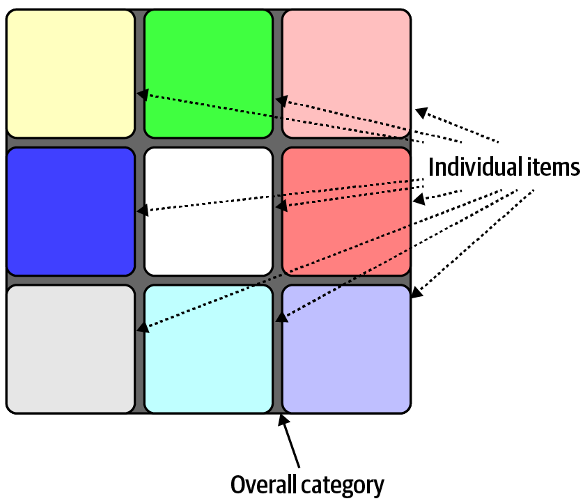

> 图 15-1：MECE 清单是相互排斥和集体穷尽的。

软件开发生态系统不断演变，沿途发现新能力。当做出具有长期影响的决策时，
架构师应确保没有刚刚出现的新能力改变了标准。确保比较标准是集体穷尽的鼓励了这种探索。

### "脱离上下文"陷阱

在评估 trade-off
时，架构师必须确保将决策保持在上下文中；否则，外部因素会不适当地影响他们的分析。通常，
解决方案有许多有益的方面，但缺乏阻止成功的关键能力。
架构师需要确保他们平衡*正确*的 trade-off 集，而不是所有可用的 trade-off。

例如， 也许架构师正在尝试决定是否在分布式架构中使用 shared service 或 shared
library 来提供公共功能， 如图 15-2 所示。

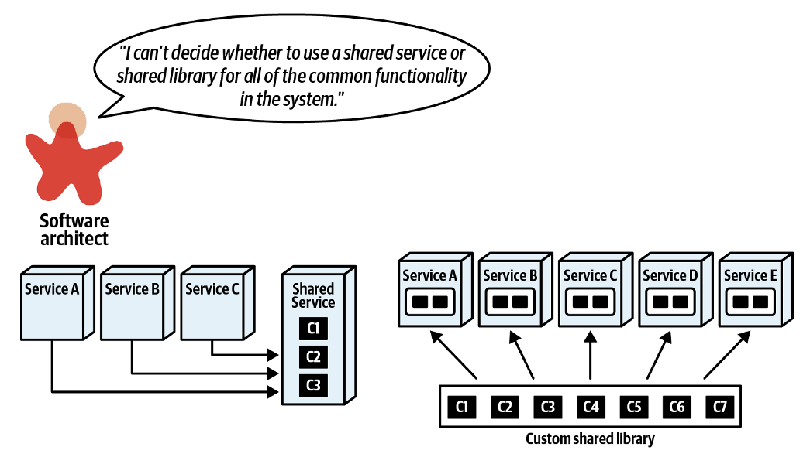

> 图 15-2：在分布式架构中决定 shared service 还是 shared library。

面对此决策的架构师将开始研究两种可能的解决方案，既通过研究发现的一般特征，也通过来自其组织内的实验数据。
该发现过程的结果导致 trade-off 矩阵，如图 15-3 所示。

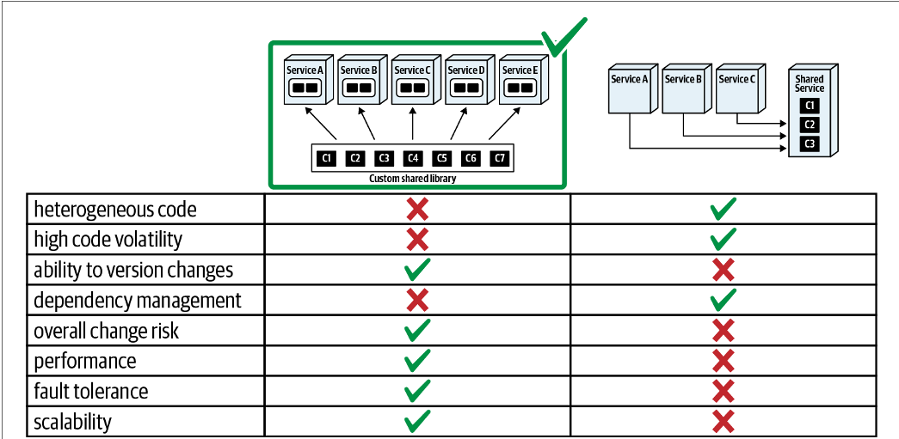

> 图 15-3：两种解决方案的 trade-off 分析。

架构师似乎有理由选择 shared library
方法，因为矩阵清楚地支持该解决方案...总体而言。然而，
此决策体现了脱离上下文问题——当问题的额外上下文变得清晰时，决策标准会改变，如图
15-4 所示。

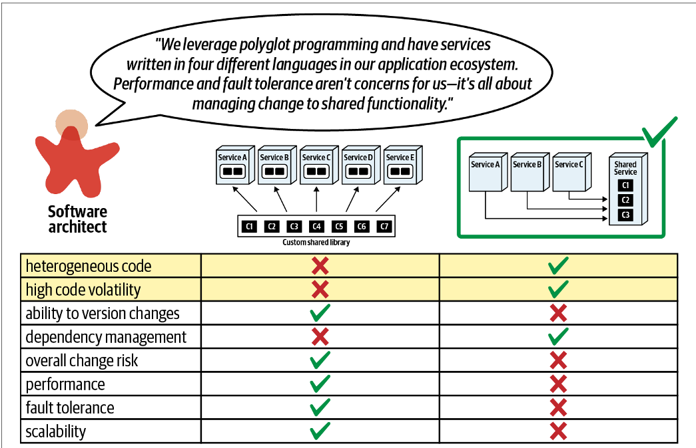

> 图 15-4：基于额外上下文的决策转变。

架构师继续研究不仅服务与库的通用问题，而且适用于这种情况的实际上下文。记住，
通用解决方案在实际架构中很少有用，除非应用额外的特定情况上下文。

此过程强调两个重要的观察结果。首先，找到决策的最佳上下文允许架构师考虑更少的选项，
大大简化了决策过程。软件智者的一条常见建议是"拥抱简单设计"，
但从不解释如何实现这一目标。为决策找到正确的狭窄上下文允许架构师少思考，在许多情况下简化设计。

其次，架构师理解架构中*迭代*设计的重要性至关重要，
通过绘制示例架构解决方案来玩定性"如果"游戏，以查看架构维度如何相互影响。使用迭代设计，
架构师可以研究可能的解决方案并发现决策所属的正确上下文。

## 建模相关领域案例

架构师不应在真空中做决策，没有为特定解决方案增加价值的相关驱动因素。
将这些领域驱动因素添加回决策过程可以帮助架构师过滤可用选项并专注于真正重要的
trade-off。

例如，考虑架构师关于是创建单一支付服务还是为每种支付类型创建单独服务的决策，如图
15-5 所示。


> 图 15-5：选择单一支付服务还是每种支付类型一个服务。

正如我们在第 7
章中讨论的，架构师可以从许多整合器和分解器中选择来协助此决策。然而，
这些力量是通用的——架构师可以通过建模一些可能的场景为决策添加更多细微差别。

例如，考虑第一个场景，如图 15-6 所示，更新信用卡处理服务。


> 图 15-6：场景 1：更新信用卡处理服务。

在此场景中，拥有单独的服务提供更好的*可维护性*、*可测试性*和*可部署性*，
所有这些都基于服务的 quantum 级隔离。然而，
单独服务的缺点是经常需要重复代码以防止服务之间的静态 quantum
耦合，这损害了拥有单独服务的好处。

在第二个场景中，架构师建模当系统添加新支付类型时会发生什么，如图 15-7 所示。


> 图 15-7：场景 2：添加支付类型。

架构师添加了*奖励积分*支付类型，以查看它对感兴趣的架构特性的影响，
突出了*可扩展性*作为单独服务的好处。到目前为止，单独服务看起来很有吸引力。

然而，与许多情况一样，更复杂的工作流突出了架构的困难部分，如图 15-8
中的第三个场景所示。

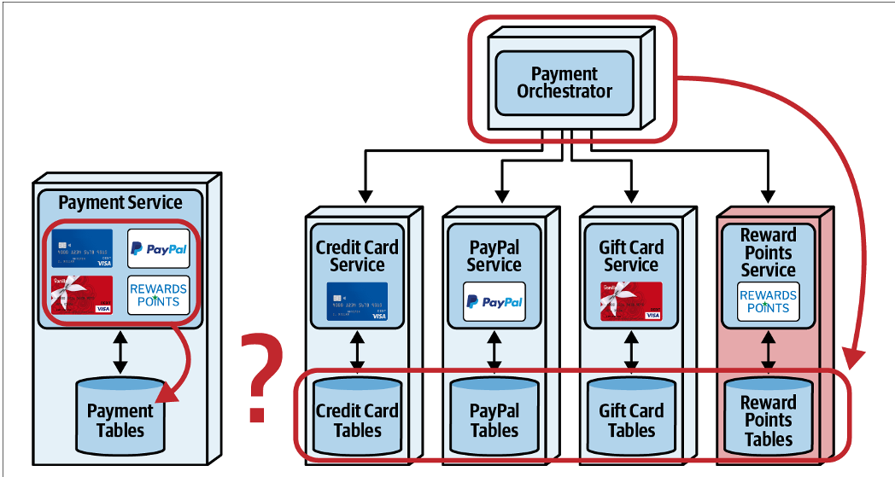

> 图 15-8：场景 3：使用多种支付类型。

在此场景中，架构师开始深入了解此决策中涉及的真正
trade-off。使用单独服务需要此工作流的协调， 最好由 orchestrator
处理。然而，正如我们在第 11 章中讨论的， 迁移到 orchestrator
可能对性能产生负面影响，并使数据一致性更具挑战性。 架构师可以避免
orchestrator，但工作流逻辑必须存在于某处——记住，
语义耦合只能通过实现增加，永远不能减少。

建模了这三个场景后，架构师意识到真正的 trade-off 分析归结为哪个更重要：
*性能和数据一致性*（单一支付服务）还是*可扩展性和敏捷性*（单独服务）。

在通用和抽象中思考架构问题只能让架构师走这么远。由于架构通常回避通用解决方案，
架构师培养建模相关领域场景以归向更好的 trade-off 分析和决策的技能非常重要。

## 优先考虑底线而非压倒性证据

架构师很容易在追求学习特定 trade-off 分析的所有方面时积累大量信息。此外，
任何学到新东西的人通常想告诉别人，特别是如果他们觉得对方会感兴趣。然而，
架构师发现的许多技术细节对非技术利益相关者来说是晦涩的，细节的数量可能压倒他们为决策添加有意义见解的能力。

架构师不应展示他们收集的所有信息，而应将 trade-off 分析减少到几个关键点，
这些点有时是个别 trade-off 的聚合。

考虑架构师在微服务架构中可能面临的常见问题，关于同步或异步通信的选择，如图 15-9
所示。


> 图 15-9(a)：决定通信类型——同步。

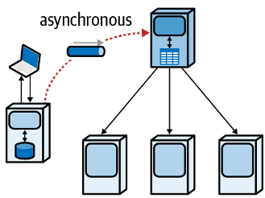

> 图 15-9(b)：决定通信类型——异步。

同步解决方案 orchestrator 进行同步 REST 调用以与工作流协作者通信，
而异步解决方案使用消息队列来实现异步通信。

在考虑了指向一种与另一种的通用因素后，
架构师接下来考虑非技术利益相关者感兴趣的特定领域场景。为此，
架构师将构建一个类似于表 15-3 的 trade-off 表。

### trade-off

| 同步优点                           | 同步缺点                               | 异步优点                    | 异步缺点         |
| ---------------------------------- | -------------------------------------- | --------------------------- | ---------------- |
|                                    | 客户必须等待信用卡审批流程开始         | 无需等待流程开始            |                  |
| 信用卡审批在客户请求结束前保证开始 |                                        |                             | 不保证流程已开始 |
|                                    | 如果 orchestrator 宕机，客户申请被拒绝 | 申请提交不依赖 orchestrator |                  |

> 表 15-3：信用卡处理同步与异步通信之间的 trade-off。

在建模这些场景后，架构师可以为利益相关者创建一个底线决策：哪个更重要，保证信用卡审批流程立即开始，还是响应性和容错？
消除令人困惑的技术细节允许非技术领域利益相关者专注于结果而不是设计决策，这有助于避免让他们淹没在细节的海洋中。

### 避免蛇油和传教

对技术热情的一个不幸副作用是传教，这应该是技术负责人和开发人员的奢侈品，但往往会让架构师陷入麻烦。

麻烦之所以来，是因为当有人传教一个工具、技术、方法或人们建立热情的任何其他东西时，
他们开始增强好的部分，淡化坏的部分。不幸的是，在软件架构中， trade-off
总是最终回来使事情复杂化。

架构师也应该警惕任何承诺惊人新能力的工具或技术，这些工具或技术会定期出现和消失。
始终强迫工具或技术的传教者提供好和坏的诚实评估——软件架构中没有什么全是好的——这允许更平衡的决策。

例如，考虑一个架构师过去在某种方法上取得了成功，并成为其传教者，如图 15-10
所示。

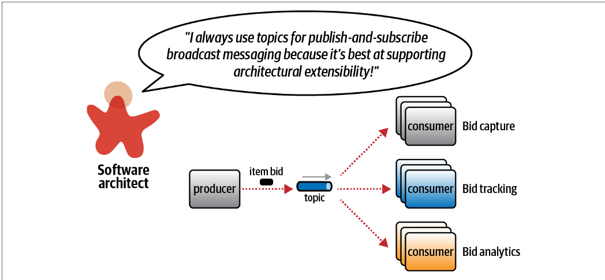

> 图 15-10：一个认为自己找到了银弹的架构师传教者。

这个架构师可能过去在可扩展性是关键驱动架构特性的问题上工作过，
并相信该能力将始终驱动决策过程。然而，架构中的解决方案很少能在特定问题空间的狭窄范围之外扩展。
另一方面，轶事证据通常令人信服。你如何找到隐藏在膝跳式传教背后的真正 trade-off？

虽然经验是有用的，但场景分析是架构师最强大的工具之一，允许在不构建整个系统的情况下进行迭代设计。通过建模可能的场景，
架构师可以发现特定解决方案是否会实际工作良好。

在图 15-10 所示的示例中，现有系统使用单个主题来广播更改。
架构师的目标是向工作流添加*出价历史*——团队应该保持现有的发布-订阅方法，
还是为每个消费者转向点对点消息传递？

为了发现这个特定问题的 trade-off，架构师应该使用两种拓扑建模可能的领域场景。
将出价历史添加到现有发布-订阅设计出现在图 15-11 中。


> 图 15-11：场景 1：将出价历史添加到现有主题。

虽然此解决方案有效，但它有问题。首先，如果团队需要为每个消费者使用不同的契约怎么办？
构建一个包含所有内容的单一大型契约实现了[用于工作流管理的 Stamp 耦合](#用于工作流管理的-stamp-耦合)
反模式；
迫使每个团队统一在一个单一契约上在架构中创建了一个意外的耦合点——如果一个团队更改其所需信息，
所有团队必须协调该更改。其次，数据安全呢？使用单个发布-订阅主题，
每个消费者都可以访问所有数据，这可能产生安全问题和 PII 问题。
第三，架构师应该考虑不同消费者之间的运维架构特性差异。
例如，如果运维团队想要监控队列深度并对出价捕获和出价跟踪使用自动扩展，
但对其他两个服务不使用，使用单个主题会阻止该能力——消费者现在在运维上耦合在一起。

为了缓解这些缺点，架构师应该建模替代解决方案，
看看它是否解决了前面的问题（并且不引入新的棘手问题）。单独队列版本出现在图 15-12
中。


> 图 15-12：使用单独队列捕获出价信息。

此工作流的每个部分（出价捕获、出价跟踪、出价分析和出价历史）使用自己的消息队列，
并解决了前面的许多问题。首先，每个消费者可以有自己的契约，将消费者彼此解耦。
其次，安全访问和数据控制驻留在生产者和每个消费者之间的契约中，
允许信息和变更速率上的差异。第三，每个队列现在可以独立监控和扩展。

当然，到本书此时，你应该意识到基于点对点的系统也不完美，但提供了一组不同的
trade-off。

一旦架构师建模了两种方法，似乎差异归结为表 15-4 中所示的选择。

### trade-off

| 点对点                       | 发布-订阅                    |
| ---------------------------- | ---------------------------- |
| 允许异构契约                 | 可扩展性（容易添加新消费者） |
| 更细粒度的安全访问和数据控制 |                              |
| 每个消费者独立的运维配置文件 |                              |

> 表 15-4：点对点与发布-订阅消息传递之间的 trade-off。

最后，架构师应该咨询相关方（运维、企业架构师、业务分析师等）以确定哪一组
trade-off 更重要。

有时架构师不选择传教某些东西，而是被迫扮演对立面，特别是对于没有明显优势的东西。
技术发展出粉丝，有时是狂热的粉丝，他们倾向于淡化缺点，增强优点。

例如，最近一个项目上的技术负责人试图将作者之一拖入关于 monorepo 与 trunk-based
开发的争论。 两者都有好坏方面，这是一个经典的软件架构决策。 技术负责人是
monorepo
方法的狂热支持者，并试图迫使作者采取相反的立场——如果不存在双方，就不是争论。

相反，架构师指出这是一个 trade-off，温和地解释说，
技术负责人吹捧的许多优点需要团队中过去从未体现过的纪律水平，但肯定会改善。

架构师没有被迫采取相反的立场，而是强制进行了基于真实世界的 trade-off 分析，
而不是基于通用解决方案。架构师同意尝试 Monorepo 方法，
但也收集指标以确保解决方案的负面方面不显现。例如，
他们想要避免的破坏性反模式之一是由于仓库邻近性导致的两个项目之间的意外耦合，
因此架构师和团队构建了一系列适应度函数，以确保虽然在技术上可能创建耦合点，但适应度函数阻止了它。

> [!TIP]
> 不要让别人强迫你传教某些东西——把它带回到 trade-off。

我们建议架构师避免传教，并尝试成为 trade-off
的客观仲裁者。架构师为组织增加真正价值， 不是通过追逐一个又一个银弹，
而是通过磨练他们分析 trade-off 出现时的技能。

## Sysops Squad Saga：尾声

### 6 月 20 日，星期一，16:55


> 插图 15-2：Addison 和 Austen 反思。

"好的，我想我终于明白了。我们不能真正依赖我们架构的通用建议——它与其他所有架构太不同了。
我们必须不断做 trade-off 分析的艰苦工作。"

"没错。但这不是缺点——这是优点。 一旦我们都学会如何隔离维度并执行 trade-off
分析，我们就在学习关于我们架构的具体事情。谁在乎其他通用的架构呢？
如果我们能把一个问题的 trade-off 数量减少到足够小，以实际建模和测试它们，
我们就获得了关于我们生态系统的宝贵知识。
你知道，结构工程师已经建立了大量数学和其他预测工具，
但构建他们的东西既困难又昂贵。软件要...嗯，柔软得多。
我一直说测试是软件开发的工程严谨性。虽然我们没有其他工程师拥有的那种数学，
但我们可以增量构建和测试我们的解决方案，允许更多的灵活性，并利用更灵活媒介的优势。
以客观结果进行测试允许我们的 trade-off 分析从定性到定量——从猜测到工程。
我们越能了解关于我们独特生态系统的具体事实，我们的分析就越精确。"

"是的，这很有道理。想去参加下班后的聚会庆祝大转变吗？""当然。"

# 附录 A：概念与术语参考

在本书中， 我们多次引用了在之前的书 *Fundamentals of Software Architecture*
中详细解释的术语或概念。 以下是这些术语和概念的前向参考：

圈复杂度：第 6 章

组件耦合：第 7 章

组件内聚：第 7 章

技术分区与领域分区：第 8 章

分层架构：第 10 章

基于服务的架构：第 13 章

微服务架构：第 12 章

# 附录 B：架构决策记录参考

本书中的每个 Sysops Squad 决策都附有相应的架构决策记录。 我们在此整合所有 ADR
以便于参考：

[ADR：包含架构决策的简短名词短语](#adr-noun-phrase)

[ADR：将 Sysops Squad 应用程序迁移到分布式架构](#adr-migrate-distributed)

[ADR：使用基于组件的分解方法进行迁移](#adr使用基于组件的分解方式进行迁移)

[ADR：为客户调查使用文档数据库](#adr为客户调查使用文档数据库)

[ADR：工单分配和路由的整合服务](#adr-ticket-assign-route)

[ADR：客户相关功能的整合服务](#adr-customer-consolidated)

[ADR：使用 sidecar 进行运维耦合](#adr使用-sidecar-进行运维耦合)

[ADR：使用 shared library 进行公共工单数据库逻辑](#adr使用-shared-library-进行公共工单数据库逻辑)

[ADR：Bounded Context 的单表所有权](#adrbounded-context-的单表所有权)

[ADR：调查服务拥有调查表](#adr调查服务拥有调查表)

[ADR：对专家资料数据使用内存复制缓存](#adr对专家资料数据使用内存复制缓存)

[ADR：对主要工单工作流使用 Orchestration](#adr对主要工单工作流使用-orchestration)

[ADR：Sysops Squad 专家移动应用程序的松散契约](#adrsysops-squad-专家移动应用程序的松散契约)

# 附录 C：trade-off 参考

本书的主要焦点是 trade-off 分析；为此， 我们在第二部分中创建了许多 trade-off
表和图表， 以总结围绕特定架构关注点的 trade-off。 本附录总结了所有 trade-off
表和图表以便于参考：

表 6-25，"关系型数据库在各种采用特征上的评分"

表 6-26，"Key-value 数据库在各种采用特征上的评分"

表 6-27，"文档数据库在各种采用特征上的评分"

表 6-28，"列族数据库在各种采用特征上的评分"

表 6-30，"图数据库在各种采用特征上的评分"

表 6-31，"NewSQL 数据库在各种采用特征上的评分"

表 6-32，"云原生数据库在各种采用特征上的评分"

表 6-33，"时间序列数据库在各种采用特征上的评分"

表 8-1，"代码复制技术的 trade-off"

表 8-2，"shared library 技术的 trade-off"

表 8-3，"shared service 技术的 trade-off"

表 8-4，"sidecar 模式/service mesh 技术的 trade-off"

表 9-1，"联合所有权表拆分技术 trade-off"

表 9-2，"联合所有权数据领域技术 trade-off"

表 9-3，"联合所有权委托技术 trade-off"

表 9-4，"联合所有权服务整合技术 trade-off"

表 9-5，"后台同步模式 trade-off"

表 9-6，"编排的基于请求的模式 trade-off"

表 9-7，"基于事件的模式 trade-off"

表 10-1，"服务间通信数据访问模式的 trade-off"

表 10-2，"列模式复制数据访问模式的 trade-off"

表 10-3，"复制缓存数据访问模式的 trade-off"

表 10-4，"数据领域数据访问模式的 trade-off"

表 11-1，"orchestration 的 trade-off"

表 11-2，"前端控制器模式的 trade-off"

表 11-3，"无状态 choreography 的 trade-off"

表 11-4，"Stamp 耦合的 trade-off"

表 11-5，"choreography 通信风格的 trade-off"

表 11-6，"工单工作流的 orchestration 与 choreography 之间的 trade-off"

表 11-7， "工单工作流的 orchestration 与 choreography 之间更新后的 trade-off"

表 11-8，"工单工作流的 orchestration 与 choreography 之间最终 trade-off"

表 12-11，"使用状态管理而不是具有补偿更新的原子分布式事务的 trade-off"

表 12-12，"原子分布式事务和补偿更新的 trade-off"

表 13-1，"严格契约的 trade-off"

表 13-2，"松散契约的 trade-off"

表 13-3，"消费者驱动契约的 trade-off"

表 13-4，"Stamp 耦合的 trade-off"

表 14-1，"数据仓库模式的 trade-off"

表 14-2，"data lake 模式的 trade-off"

表 14-3，"data mesh 模式的 trade-off"

表 15-2，"动态耦合模式的综合比较"

表 15-3，"信用卡处理同步与异步通信之间的 trade-off"

表 15-4，"点对点与发布-订阅消息传递之间的 trade-off"

# 关于作者

**Neal Ford** 是 Thoughtworks 的董事、 软件架构师和 meme wrangler。 Thoughtworks
是一家软件公司， 也是一个由充满激情、目标明确的个人组成的社区，
他们以颠覆性思维提供技术， 以应对最严峻的挑战， 同时寻求革新 IT
行业并创造积极的社会变革。 他是国际公认的软件开发和交付专家，
尤其在敏捷工程技术与软件架构的交叉领域。 Neal
已撰写七本书（还在增加中）、多篇杂志文章和数十个视频演示，
并在全球数百个开发者大会上发表演讲。
他的主题包括软件架构、持续交付、函数式编程、
前沿软件创新，以及一本关于改进技术演示的面向商业的书籍和视频。 请访问他的网站
Nealford.com。

**Mark Richards** 是一位经验丰富的实践型软件架构师， 参与微服务架构、
面向服务架构和分布式系统在各种技术中的架构、设计和实现。 他自 1983
年以来一直在软件行业工作，在应用程序、
集成和企业架构方面拥有丰富的经验和专业知识。 Mark 是众多技术书籍和视频的作者，
包括《Fundamentals of Software Architecture》、 《Software Architecture
Fundamentals》视频系列， 以及多本关于微服务和企业消息传递的书籍和视频。 Mark
还是一位会议演讲者和培训师， 曾在全球数百个会议和用户组上
就各种企业相关技术主题发表演讲。

**Pramod Sadalage** 是 Thoughtworks 的数据和 DevOps 总监。
他的专长包括应用程序开发、敏捷数据库开发、演进式数据库设计、
算法设计和数据库管理。

**Zhamak Dehghani** 是 Thoughtworks 的新兴技术总监。此前， 她曾在 Silverbrook
Research 担任首席软件工程师， 并在 Fox Technology 担任高级软件工程师。

# 版权页

*Software Architecture: The Hard Parts* 封面上的动物是黑腰金背啄木鸟（*Dinopium
benghalense*），
一种引人注目的啄木鸟物种，遍布印度次大陆的平原、山麓、森林和城市地区。

这种鸟的金色背部位于黑色的肩部和尾部之上， 这正是其名字中"火焰"意象的来源。
成年鸟有红色的冠， 头部和胸部有黑白斑点， 从眼睛到后脑勺有一条黑色条纹。
与其他常见的、 小嘴啄木鸟一样， 黑腰金背啄木鸟有直而尖的喙、
为支撑树干而生的僵硬尾羽，
以及四趾足——两趾向前，两趾向后。仿佛它的斑纹还不够独特，
黑腰金背啄木鸟常常通过其"ki-ki-ki-ki-ki"的叫声被发现， 叫声节奏逐渐加快。

这种啄木鸟以昆虫为食，如树皮下红蚁和甲虫幼虫，使用其尖喙和长舌取食。
有人观察到它们造访白蚁丘，甚至取食花蜜。 金背啄木鸟也能很好地适应城市栖息地，
以现成的落果和食物残渣为生。

这种鸟在印度被认为相对常见，目前的保护状态被列为"无危"。 O'Reilly
封面上的许多动物都是濒危物种；它们都对世界很重要。

封面图片是 Karen Montgomery 根据《Shaw's Zoology》中的黑白版画创作的彩色插图。
封面字体是 URW Typewriter 和 Guardian Sans。 正文字体是 Adobe Minion Pro 和
Myriad Pro； 标题字体是 Adobe Myriad Condensed； 代码字体是 Dalton Maag 的
Ubuntu Mono。

©2019 O'Reilly Media, Inc. O'Reilly 是 O'Reilly Media, Inc. 的注册商标。

### O'REILLY®

还有更多精彩内容。

在一个地方体验书籍、视频、 在线直播培训课程， 以及来自 O'Reilly 和 200
多个合作伙伴的更多内容。

了解更多，请访问 oreilly.com/online-learning
