# Start Small, Stay Small: A Developer's Guide to Launching a Startup

Rob Walling 著

Start Small, Stay Small

A Developer's Guide to Launching a Startup

Mike Taber 编辑

版权所有 © 2010 Rob Walling

www.startupbook.net

ISBN 978-0-615-37396-6

第一版

保留所有权利。未经 Rob Walling 书面许可，
本书任何部分不得以任何形式或通过任何电子或机械手段复制，
包括信息存储与检索系统，但书评作者可在评论中引用简短段落。

本书中出现了注册商标名称。我们并没有在每次出现这些名称时加上商标符号，
而是仅以编辑方式使用这些名称，以维护商标所有人的利益，并无侵权意图。

献给我的父母，多年前是他们教会了我努力工作的价值。

## 目录

- [第 1 章 开发者与创业者之间的鸿沟](#第-1-章-开发者与创业者之间的鸿沟)
- [第 2 章 为什么细分市场是关键](#第-2-章-为什么细分市场是关键)
- [第 3 章 你的产品](#第-3-章-你的产品)
- [第 4 章 打造高转化率的销售网站](#第-4-章-打造高转化率的销售网站)
- [第 5 章 创业营销](#第-5-章-创业营销)
- [第 6 章 虚拟助理与外包](#第-6-章-虚拟助理与外包)
- [第 7 章 做大它，还是重新开始](#第-7-章-做大它还是重新开始)
- [后记](#后记)

## 前言

### 本书面向谁？

本书面向希望在没有外部资金的情况下启动自己创业公司的开发者。
它适合由真正的开发者创办、用桌面、Web 和移动应用解决真实痛点的公司。

本书有意避开了仅适用于风险投资支持的创业公司的话题，
例如：打磨你的投资人路演、获得融资，
以及盘算如何花掉投资人不断放到你怀里的大堆现金。

在本书中，我假定：

- 你的银行账户里没有 600 万美元的投资人资金
- 你无法迁居到世界上屈指可数的几个创业中心
- 你不愿意拿着低薪每周工作 70 小时，只为寄望有朝一日靠股票期权赚到数百万美元

追求风投融资、试图像 eBay、Google、Twitter 和 Facebook
那样快速成长，这并没有错。
只是大多数人恰好不具备追求这条道路的条件。

### 本书涵盖哪些内容？

本书的重点是在没有外部资金的情况下，构建并成功发布一个软件、Web 或移动创业公司。

这一过程包括：

- 培养自筹资金创业公司所需的正确心态
- 理解 Market-First Approach（市场优先方法）
- 寻找并验证一个细分市场
- 选择最优的平台、定价和收入模式
- 打造一个高转化率的销售网站
- 理解你的销售网站的首要目的
- 营造正确的兴趣，从而为你的网站带来正确的流量
- 学习如何外包
- 与虚拟助理（VA）共事
- 确定发布之后该做什么：是把业务做大，还是重新开始？

如果你正在读这本书，我假定你是一名经验丰富的软件开发者，
因此我们不会讲解开发过程。如果你在构建软件方面需要帮助，
不乏专门为此而写的书。

在我开始写作时，我收到了开发者们的反馈，他们告诉我已经厌倦了“注水”内容——
软弱的案例研究、肤浅的访谈、整章整章罗列完成一项任务的 10 种做法，
却不指导该走哪条路、如何在它们之间做出抉择。

因此，我专注于提供一种实用的、循序渐进的方法来帮助你的创业公司起步，
并力求让每一个字都有价值。不允许任何注水内容。

如果你在阅读每一章时没有在疯狂地画线、高亮或做笔记，
那我就没有实现这本书的目标。

要提问、发表评论，或购买本书的纸质版、电子版或有声版，
请访问 www.StartupBook.net

## 关于作者

在你开始阅读任何一本书时，脑中都应该有一个问题：
我为什么要听这位作者的？以下是我迄今为止的过往成绩。

我的日常工作是管理 10 个盈利的软件产品和网站，
它们都是我在过去十年中构建或收购而来的。
我在 www.SoftwareByRob.com 上撰写关于创业公司、在线营销，
以及软件与 Web 创业的博客。

此外，我与同事 Mike Taber 一起运营着名为 Micropreneur Academy 的在线创业社区，
拥有数百名成员。

## 关于 Micropreneur Academy

Micropreneur Academy 是一个面向创业公司创始人的付费在线学习环境与社区网站。

虽然本书包含了少量来自 Micropreneur Academy 的材料，
但它只涵盖适合呈现在印刷页面上的主题。

Micropreneur Academy 旨在呈现以下内容：
需要交互元素（屏幕录像、音频和练习表）的主题、频繁变化的主题、
最前沿的方法，以及我们完整的供应商与承包商名录（Rolodex）。
此外，它还通过私密论坛，提供一个由志同道合的创业公司创始人组成的社区。

如果你有兴趣更快地启动或发展你的创业公司，
作为本书的拥有者，你有权免费获得 Academy 的第一个月。
要领取你的免费月份，请访问 www.Micropreneur.com/book/

那么……就让我们开始吧。
## 第 1 章 开发者与创业者之间的鸿沟

### 什么是创业者？

创业者是有远见的人。

他能看到一个点子中的潜力，从无到有地创建一家可行的企业。

她会投入数百个小时来打造、发布并营销一款产品，
一路披荆斩棘，克服途中的每一个障碍。

在本书中，我们将介绍两类创业者的做法：

- **Micropreneur**——希望始终保持单干的创业者。这意味着在任何情况下
  都不雇员工。micropreneur 可能只拥有一款产品，也可能拥有多款产品，
  共同构成他的收益。一种特定的生活方式，正是 micropreneur 的目标。

- **Bootstrapper**——bootstrapper 把目光放在比一人事业更大的东西上。
  也许是 5 名员工，也许是 10 名……bootstrapper 有一个想法，
  并且知道自己必须执行并壮大公司才能生存下去。

巧的是，要在 micropreneurship 和 bootstrapping 上取得成功，
所需知识的 90% 是相同的。找到细分市场、找到产品、打造、发布、
营销……都是同一个过程。

在本书中，我会指出少数几处两条路径分岔的地方，
并根据你所走的路线给出推荐的做法。

### 为什么摆出反风险投资的姿态？

我想尽早说明这一点，好让你清楚本书的重点。

我并不反对风险投资。我反对的是“人人都以为风险投资是
创办科技公司的唯一途径”这种想法。

寻求任何形式的融资都会带来两个问题。

第一，它需要投入大量的时间和精力，这会分散你对重要事情的注意力，
比如赚钱和维持经营。

第二，由于它限制了你可以追求的潜在市场，
它让规模适中的成功几乎变得不可能。

如果你是自筹资金、只有一两位创始人，
你可以靠一个每月带来 1 万美元收入的小小细分市场养活整个公司。

但有了风险投资（哪怕是几十万美元的天使投资），
你就被迫去追逐大得多的市场。而大 10 倍的市场，要做对就难上 100 倍。
那里的竞争更激烈、情况更复杂、广告费率更高、SEO 竞争更激烈，
受众也更分散。

瞄准一个庞大的、非细分的市场，在营销和支持方面的成本都很高。
如果你一上来就啃这块硬骨头，它会把你生吞活剥。

但如果你从小做起，把产品做得好到让细分市场里的人抢着注册，
口碑就会传开，很快你就会发现自己的产品已经超越了
那个小小的细分市场。

然而，这种有机增长需要时间；而外部融资不允许这样的做法。

### 看一看自筹资金的创业者

创业者有很多定义，但由于我们要讨论的是自筹资金的科技创业公司，
我们将把定义聚焦在几个关键点上：

#### 要点 1：创业者是有技术远见的人，为细分市场打造软件

细分市场至关重要。如果你想自筹资金创办一家创业公司，
就必须选择一个细分市场。

在做一款在线开票的 software as a service（SaaS）应用？祝你好运。

在做一款面向景观设计师（landscape architect）的在线开票应用？
这才有戏。

细分市场的精妙之处在于，它们对大型竞争者来说太小了，
这让灵活的创业者有喘息的空间，去专注于一个服务不足的受众群体。
一旦你在那个细分市场取得成功，你就可以利用这份成功为企业建立信誉，
进而进军更大的市场。

#### 要点 2：创业者把已有的技术知识与在线营销知识结合起来

创业者成功的关键因素，是他们营销自己产品的能力。
我几乎能听到你在呻吟……但请保持开放的心态。
这个世界上有数百万人会写软件，而其中既会写软件、
又能说服别人购买的人，只是极小的一部分。

懂得如何营销产品的开发者，是一种罕见（而且强大）的组合。

#### 要点 3：创业者是开发者、网站管理员与营销人员的结合体

#### 开发者

如果没有我们作为开发者学到的技术能力，软件创业几乎是不可能的。
修复一个正在崩溃的生产网站、为关键客户赶出一个紧急热修复补丁，
这些能力对你的成功至关重要。

#### 网站管理员

如今，你的创业公司必须懂得如何在线销售。
这意味着要创建一个能把访客转化为客户的网站。
我们将探讨多种打造高转化率销售网站的方法，
而要做到这些，需要基本的 HTML 知识。

网站上线之后，你会不断地更新：添加新内容以获得更好的搜索引擎排名，
调整转化率（邮件订阅注册、试用、购买等等）。这些任务中的大部分，
如果你能自己动手做些小改动，会完成得更好。
掌握 HTML 或某种 CMS 的基本知识必不可少。

#### 营销

营销比你的产品更重要。

让我换一种说法：

产品其次，营销第一。

你的产品必须足够好。如果不好，你就会倒闭。

但在打造出好产品之前，你必须先找到你的市场。
有大量轶事证据为我作证，我坚信：做出没人要的东西，
是创业者最常见的失败根源。

在第 2 章中，我们将看看如何在你动手开发*之前*，
确保人们想要的东西正是你要做的东西。

### 自筹资金与风险投资支持的对照

自筹资金创业，与科技创业圈里大多数人谈论的东西有天壤之别。

风险投资支持的创业公司通常从外部投资人那里募集资金，
目标是巨大的、加速的增长。他们进攻庞大而增长中的市场，
希望在 5 年或更短时间内实现 100 倍的增长。

例子不胜枚举，但你可以想想 Netscape、Google、Travelocity、Yelp、
Twitter 和 Facebook 这个路数。大笔资金，高速增长，高风险。

如果你是一家风险投资支持的创业公司创始人，
你面临的是多年的超时工作，以及很小的机会获得巨大的回报。

bootstrapper 同样追求增长，但节奏更慢，
因为他们是通过利润再投资来有机增长的。他们专注于更小的市场，
或者大市场中的细分领域，让利润和员工人数都有机增长。

例子包括 Joel Spolsky 的 Fog Creek Software 和 Eric Sink 的 SourceGear。
关键词：增长较慢，风险较低。

如果你是一名自筹资金的创业公司创始人，
你面临的是一个像样的机会，获得一份像样的回报。

micropreneur 的目标并不局限于经济收益，更多时候还涉及生活方式目标。
能够想住哪里就住哪里、想什么时候工作就什么时候工作，
对许多创始人来说是一个很有吸引力的选择。

### 两个真实案例

#### 一位 micropreneur：Ruben Gamez

Ruben Gamez 是一名 micropreneur。他有一份开发经理的全职工作，
但在 2009 年推出了他的 SaaS 应用 Bidsketch[^1]。如今，
他靠这款应用每月获得一笔可观的收入。Ruben 并不打算辞去工作，
但他享受这份额外的收入、享受对自己项目可以施加的掌控力，
也享受学习如何打造、发布和营销自己应用的过程。

Ruben 在过去一年发布和发展 Bidsketch 的过程中学到的经验，
将运用到他未来的努力中；他计划在接下来的一年里发布其他产品。
他的长期目标是连续不断的 micropreneurship，并最终实现自雇。

#### 一位 bootstrapper：Harry Hollander

Harry 与一位商业伙伴共同创办了 Moraware Software[^2]。
他们的目标是为台面安装商提供排程软件，六个月之内，
他们就知道这是一门可行的生意。八年后，Moraware 除了两位创始人之外
还雇用了四名员工，所有人都在各自的家中远程办公。

[^1]: www.bidsketch.com
[^2]: www.moraware.com

Moraware 专注于建筑这个垂直细分领域，更具体地说，是台面承包商。
把自己限定在这个群体内，与他们的成功有很大关系。
他们得以专注于满足客户的确切需求，并因此在台面排程软件市场中
占据了很大的份额。

### 以正确的理由开始

大多数开发者想打造软件产品，都是出于错误的理由。

#### 理由 1：有了一个产品创意

如果你有了一个产品创意，那么十有八九，
你混淆了项目（project）和产品（product）。

*项目*是你作为好玩的业余项目做出来的软件应用。写代码的过程很有趣，
因为你不用担心质量和性能，而最终得到的是一个精巧的小应用，
但很可能对很多人来说没什么用处。

产品是有人愿意付钱购买的项目。换句话说，它是一个有市场的项目
（市场就是一群想买它的人）。没有市场，一个软件应用就只是一个项目。

大多数想出点子的开发者，都清楚地知道自己要怎么把它做出来，
却完全不知道要如何触达潜在客户。他们以为来自 TechCrunch 的一个链接，
就能带来成百上千的销量。

在极少数情况下，产品优先的做法确实奏效，但绝大多数时候，
它是一剂通往失败的配方。

#### 理由 2：为了发财

发财不应该是你发布产品时的目标。

成千上万在编程和营销技能上都远超你的人，也打造并发布过产品，
却仍然要打工谋生。如果你是为了钱而做这件事，那么在那些没有分文进账、
只有辛苦工作的漫长月份里，你是坚持不下去的。

如果你想赚到一百万美元，去买彩票，或者去创办一家
风险投资支持的创业公司；这两条路成功的几率都对你非常不利，
但潜在的回报很大。

正如我前面所说，我很确定你来这里是为了做一件风险和回报都更低、
但成功几率高得多的事情。百万美元的发薪日很可能不在你的未来里，
但拥有一家成功的创业公司可以在。

#### 理由 3：因为听起来很有趣

我们都读过成功创业公司的故事，并梦想着有一天自己也能成为
*Fast Company* 报道里的那个人。无论是靠一个走运的 Facebook 应用
一夜爆红的人，还是你一路通过博客关注着、多年打拼建成一家
成功软件公司的人，故事总是被浪漫化的。换句话说，
你对创业生活仅有的几次匆匆一瞥，并不能真实反映幕后为了让它运转起来
所发生的一切。

如果你是因为听起来有趣才想成为 micropreneur，那么到了第 10 天，
当最初的兴奋消退、你在凌晨一点还在艰难地写着异常处理代码时，
你会猛然惊醒。

火上浇油的是，你对软件开发所了解的东西只是拼图的一小块。
写代码——我们大多数人都驾轻就熟的部分——只占发布一款成功产品
所需工作量的 30% 左右。

另外 70% 是调试、优化、制作安装程序、撰写文档、搭建销售网站、
开通商户账户、做广告、做推广、处理销售、提供支持，
以及我们在后面的模块里会深入探讨的上百件其他事情。
其中有些部分非常有趣……其他部分就没那么有趣了。

可以说，做创业者可以很有趣，但有趣的部分只有用数百个小时的
辛勤工作才能换来。

### 什么才是正确的理由？

开始创业的“正确”理由取决于你的目标。正如我之前提到的，
micropreneur 倾向于生活方式的选择（自由、收入独立、地点独立），
而 bootstrapper 可能更享受拥有自己的事业所带来的挑战与兴奋、
在自己拥有的东西里积累资产，以及掌控自己从事的项目。

### 为成功付出的代价

软件创业是一段美妙的经历。第一次有人为你写的软件付钱时，
你的脑袋几乎要兴奋得从脖子上转下来。

而归根结底，如果你能够驾驭“用软件而不是时间来撬动收入”的力量，
你就能获得超出自己心理准备的自由。第一次休一个月长假时，
我心里总有种挥之不去的感觉，觉得回家后得补上 160 个小时的工作……
然后我意识到，工时和金钱已经不再挂钩了。

要把自己从“按小时换钱”的心态里重新训练出来是很难的。
对我来说，这花了远不止一年的时间。

要获得这种回报，代价是前期巨大的时间投入。

也可能是一笔可观的资金投入，用来收购产品。

又或者，你会决定从代码中抽身，放下那种我们都觉得自己需要的掌控感，
把一部分开发工作雇人来做，好让你专注于业务的其他方面。

你要付出的代价是可以商量的，真正由你的个人目标来引导。
但底线是：你必须付出代价。

成为一名成功的创业者是一条漫长的路。会有很多个漫漫长夜，
尤其是在刚开始的时候。清楚地知道自己想从创业中得到什么至关重要——
这样你才能在沿途做出正确的决定，并且在你连续第十五天挑灯夜战时，
有个可以支撑你的东西。

### 你的目标是什么？

了解自己的目标，能让你在开始（或继续）创业之路时做出正确的决定。

人们创办创业公司有各种各样的原因，既有个人的，也有职业上的。
前方有艰难的抉择，而答案取决于你想从创业经历中得到什么。

举个例子，下面哪个选项听起来最吸引你？

1. 保住你的全职工作，同时在业余时间赚外快。

2. 打造一个产品组合，辞掉全职工作，同时仍然自己写代码。

3. 辞掉全职工作，打算把写代码的事外包出去，专注于创业的一面。

4. 辞掉全职工作，经营一家小公司，在家办公，可能还有几名员工。

当然还有其他选项，但你对上面问题的回答取决于你的个人偏好、
愿望和时间限制。幸运的是，你不必现在就决定一切。

但最好现在开始思考你创业的动机，
因为它决定了你应该发布什么类型的产品。

### 目标的力量

要弄清楚你想从创业中得到什么，你需要定好自己的目标。
大多数人会跳过这个过程，因为他们怀疑这个过程能带来的好处。

Dominican University 的一项研究[^3]表明，以下 3 个因素能显著提高
一个人坚持到底、实现目标的几率：

1. **写下来的目标**——“写下自己目标的人，比不写目标的人
   取得的成就明显更多。”

2. **公开承诺**——“……那些把自己的承诺发给朋友的人，比写下行动承诺
   或不写目标的人取得的成就明显更多。”

3. 问责——“……那些每周向朋友发送进度报告的人，比目标没有写下来的人
   取得的成就明显更多……”

你可能会觉得自己是个例外，觉得自己不需要目标或问责……
但请相信科学，试一试。花 20 分钟，列出你希望通过创业完成的事情。
如果你相信上面所说的话，这会带来很大的不同。最坏的情况，
也不过是浪费你 20 分钟的时间。

请记住，作为创业公司创始人，并不存在一条唯一的最佳成功路径。
既然你是在选择一种特定的生活方式，并且为了到达那里而做出牺牲，
这条路几乎可以是任何样子。只要确保那确实是你想要的。

[^3]: Summary of Recent Goals Research，Gail Matthews 博士著，
    Dominican University

清单上的后两项——公开承诺和问责——可以通过与志同道合的
创业公司创始人社区互动来实现。你可以通过本地的 Meetup 小组[^4]
找到这样的社区，也可以通过像 Micropreneur Academy[^5] 这样的
在线社区找到。

[^4]: www.meetup.com
[^5]: www.micropreneur.com

在 Academy 里，我们有一个问责房间，创始人们每周发布自己的进展更新，
并讨论那些影响他们进展的障碍，因为我们知道，
这确实能帮助人们实现目标。

### 我建议的一个短期目标

有一个问题你现在就应该思考：对你的创业公司来说，
一个好的短期目标是什么？

我有一个建议，可以帮你开个头：

| 努力打造一个每月能产生 500 美元利润的创业公司。|
| ---|

这听起来可能是个简单的目标，但它需要的工作量会超出你此刻的想象。

一旦你做到了这一点，你就会积累起丰富的经验，
多到你自己都不敢相信（也不敢相信自己刚开始的时候懂得有多可怜）。

### the Dip（又名“软件产品神话”）

你需要目标和问责的原因，是为了在艰难时期保持动力。
没有目标，当事情变得困难时，你就更有可能认输放弃。
这可能发生在你发布产品却无人问津的时候，
也可能发生在你被大量支持请求轰炸、没有足够时间开发新功能的时候。

大多数开发者一开始都是拿工资的雇员，埋头写代码并乐在其中，
因为他们从没想过一份工作可以既有挑战性、又能学到东西、
还纯粹地好玩。还有什么地方能让你每天学习新东西、摆弄电脑，
还能因此拿到报酬呢？

有一定比例的开发者，随着时间推移会对拿工资的开发工作感到不满
（通常是在被要求管理人员或维护遗留代码之后不久），
他们梦想着跳出格子间的围墙，自己当家作主。
有些人选择了做咨询，但许多人最终会决定做一款软件产品。

“毕竟，”他们想，“代码写一次就能卖上一千次——这就像自己印钞票！
我一直在做应用，发布一款产品能有多难？”

### 逆势而行

选择成为顾问（consultant）的开发者——无论是做自由职业
还是为公司工作——大多数情况下都过得不错。
她不用承担太大的风险，工作多少小时就拿多少报酬。

但跃身去做自己创业公司的开发者，就是另一回事了。
打造产品需要大量的前期时间投入，因此比做顾问风险大得多，
因为你要等上几个月，才能知道自己的付出能否带来收入。此外，
把一款产品培育到能提供可观收入的程度，是一条漫长而艰辛的路。

但是，为了讨论起见，我们假设你花了 6 个月的业余时间，
现在拥有了一个基于网页的车钥匙定位器，每月卖出 100 份，
每份 25 美元。经过数月夜里和周末的工作、
把每一个醒着的时刻都扑在代码上，营销、销售、挑灯夜战之后，
你终于过上了拥有自己创业公司的梦想生活。

除了一件事。

### 客户支持很残酷

在我们的设想中，你现在每月从产品赚到 2500 美元，
但因为你作为领工资的开发者年薪 6 万美元，
你不会为了辞掉全职工作而搬回去和父母住。

于是你白天为别人写 8 到 10 个小时的代码，每晚回到家，
迎接你的是缓慢但持续不断的支持邮件。最糟糕的是，
如果你的软件做得对，大多数问题都不会出在你的产品上，
而是操作系统安装老化、千奇百怪的配置、不会双击鼠标的客户，等等。

下一步是，你要在每周花在支持上的 5 到 10 个小时、
和每周花在上班上的 40 到 50 个小时之间，
想办法挤出时间来添加新功能。更气人的是，随着时间推移，
支持负担实际上会越来越重，因为你的客户群在增长。
1 个月后，你有 100 个可能遇到问题的客户；一年后，就是 1200 个。

而且没错，那个当初嫌价格太高（25 美元）、你还是决定卖给他的客户，
仍然阴魂不散，每周给你发邮件，问下一个版本什么时候发布。

但你坚持了下来，设法在源源不断的支持请求中艰难前行，
并着手开发新功能。

你会发现，和任何遗留系统一样，后续开发比全新开发要慢得多。
你现在被遗留代码和设计决策绑住了。你很快意识到，
这不是你当初灵光一闪——想到人们需要能在找钥匙时帮上忙的
网页软件——时所报名追求的生活。

差不多就是在这个时候，支持邮件开始无人回复，版本发布停止，
产品在藤蔓上枯萎。它最终可能被挂在 Flippa（www.flippa.com）上出售，
也可能被扔进失败软件产品的坟场。

### 光明的一面

硬币的另一面，是你已经在成功产品开发者的博客上听到过的那些。

一旦产品达到临界规模，你就攻克了这个等式中最难的部分。在那之后，
软件产品的指数级杠杆开始发挥作用，你可以靠你的
“基于网页的开锁设备定位应用”帝国尽享生活了。
这是一笔经常性的收入流，可以增长到远超你做顾问能赚到的水平，
同时还能创造资产负债表上的价值（也就是说，有一天你可以把它卖掉，
换来成堆俗话所说的现金，然后退休）。

这与你那位做顾问的哥们不同——等她决定退休时，
她的咨询公司只值 44 美分，因为她桌上还有一张没用过的邮票。

但在你到达这个拥有指数级杠杆和成堆俗话所说现金的地方之前，
有一个 dip。一个很大的 dip。而如果你能挺过去一次，
你就更有可能靠下一款产品再挺过去一次。以及再下一款。

帮你挺过 dip 的关键因素，是你的目标——也就是六个月前，
你因为一本偶然读到的创业书里的建议而写下来的那些目标。

一旦你成功到达彼岸，你就学会了发布和维护一款产品所需的一切。
下一次发布产品时，你成功的机会将大大提高，
因为你现在已经是一名更精明的软件创业者。

### 人们为什么从开发者转型为创业者

作为一名开发者，你的收入、你控制自己做什么项目的能力，
以及你控制自己学什么的能力，到了某个点就到头了。

在头几年里，你不断学习，做着（看起来）有趣的项目，
如果你肯努力，收入会增长得很快。

但许多资深开发者的经历表明，达到一定经验水平之后，
你就无法突破那道财务屏障。而追赶最新最潮的技术——
这件曾经让你兴奋的事——会开始让你疲惫不堪。

很难跳出那个位置，而且大多数时候需要冒很大的风险。
以我的经验，这种风险意味着加入一家现有的创业公司，
或者自己创办一家。

两种我都试过。我这么做更多是为了兴奋和自由，而不是为了收入。
事实上，从做咨询转向拥有自己的产品时，我降了薪。
但我对打造自己拥有的东西的热情，以及体验真正的
时间和地点独立的机会，远远盖过了收入的下降。

#### 缺乏学习

你“触顶”的一部分原因很可能是缺乏学习。虽然总有新技术可学，
但随着你在技术职业生涯中成熟，你很可能会开始觉得自己像
滚轮上的仓鼠——只不过又学了一种从数据库里取数据的新方法。
一想到要花时间学习如何用最新的方法来做同一件事，你就开始觉得累。

你开始觉得，自己只是在不断地从一种技术迁移到下一种技术，
其中很少涉及“真正”的学习，更多的是学习一些新语法或 API……
反正这些东西六个月后也会变。你开始觉得，余生都要学习的新技术，
基本上只是把你当程序员头两年学到的东西重新翻炒一遍。

#### 所有权

我喜欢用租房与买房来类比。租房时，你的承诺更少，可以经常搬家，
而且租房通常比买房便宜。但你什么都不拥有，也积累不了资产。
等你搬出去的时候，你的境况并不比搬进来时好。

领工资的雇员和做咨询也是如此。一天结束时，你一无所有。
这不仅意味着经济上没有收获，也是一种精神上的挑战。
许多人发现，自己一个应用接着一个应用地做，
却很难对自己正在做的应用产生热情。

一旦你发布了一款产品，你立刻就在积累资产。你每卖出一份拷贝、
每做出一项改进，都在打造一样不仅能在未来产生收入、
而且在公开市场上有实际价值的东西。不同于租约到期时两手空空，
你最终拿回了全部的“租金”，还额外获得了资产。

### 通往成功路上最大的障碍

从你定下产品创意的那天，到你发布产品的那天，中间有许多障碍。
你的全职工作、家庭责任，或者 TiVo 的诱惑，都倾向于一点点侵蚀
你的宏伟构想，让你感到不堪重负、效率低下、失去动力。

经过 6 个月的产品打造，除了几千行基础代码之外拿不出更多成果时，
人很容易失去专注，把整个事情一关了之。

下面讨论的是我亲身经历过的、或通过与创业者交谈发现的最大障碍，
以及如何避免它们的策略。

#### 障碍 1：没有市场

这是迄今我见过最常见的错误——做出没人要的东西。
我们将在第 2 章更详细地讨论拥有市场的重要性。

人们普遍认为，做出一款好产品就足以成功。事实并非如此。

如果你是典型的开发者，你将没有足够的金钱、权力或名气，
去为一款人们不需要、或不知道自己需要的产品创造需求。

#### 如何避免

避开这个障碍的方法，是在你*验证*市场确实存在*之后*再打造产品。

在第 2 章中，我们将看看应该就潜在市场问哪些正确的问题、
如何通过调研来回答这些问题，以及如何在写下第一行代码之前，
用最少的投入来检验你的市场是否成立。

#### 障碍 2：恐惧

第一次尝试任何事情都很可怕。

作为人类，我们恐惧未知。我们恐惧失败……拒绝……犯错。
这些要么是与生俱来的感觉，要么是被社会灌输进我们脑子里的。

正是这种恐惧让创办公司变得艰难。它伴随着大量的风险，
以及太多失败、被拒绝和犯错的可能。

#### 如何避免

虽然没有办法避免创办公司时的恐惧，
但下面这些话能帮你正确看待它：

事前的恐惧是一个重要的信号，表明如果你挺过去，
你将获得个人成长。而且坦率地说，那种恐惧感消退得相当快。

这是真的。出人意料的是，任何事情第二次做都会容易得多。
第三次也是。到第四次时，你甚至感觉不到脖子后面的汗毛竖起、
手心里的汗，因为它们已经不存在了。恐惧消退的速度快得惊人。

有趣的是，你越是品尝这种成长，就越想要它。
那是一种快感，而且会上瘾。

回头看看上个月、去年，甚至五年前那些曾让你害怕的事情，
然后意识到你已经征服了它们——这是对自信的巨大提振。

这种成功让你相信自己的直觉。它建立自信。它消除毫无意义的分析——
那些曾经让你在决策上空转几小时、几天甚至几周的分析。

克服第一次的恐惧很难，但这正是恐惧背后的目标值得实现的原因。
挡在你和目标之间的恐惧，是 99.9% 的人永远无法克服的。

#### 障碍 3：缺乏目标

如果你的创业公司没有清晰、写下来的目标，你就不会知道，
当有人在发布后两周向你提供一个白标合作的机会时，是该接受；
还是当有人找上门时，就该开始在海外市场销售。

如果对自己和创业公司都没有目标，在那些没有对错答案的情形里，
你就是在没有指引的情况下盲飞。答案必须源于你对自己和创业公司
长期的期望。

- 想做得尽可能大？那就以此为目标，利用降临到你头上的每一个机会。
  要意识到，这意味着雇员工、工作更长时间。

- 想多花点时间陪家人、辞掉朝九晚五的工作？那就以此为目标，
  并意识到你将不得不拒绝许多送上门的机会。

你的目标必须充当你的路线图，
把你带到你对“成功的创业公司”的定义那里。

#### 如何避免

这话你已经听过好几遍了：定义你的目标，并把它们写下来。

#### 障碍 4：不能持之以恒

不能持之以恒的主要问题在于，它会让你失去势头，
而势头对保持高效至关重要。

别管电视和电子游戏了。有多少次，你自以为一直很高效，
回头一看才发现自己花了 3 个小时去搜索和评估一样
可能 6 个月后都用不到的东西？

花一个晚上找 50 个可以用来做营销的博客，
是一种很有“高效感”的做法，但你真的需要 50 个吗，
还是说 10 个就够了？这个任务难道不应该以微不足道的价钱，
外包给任何一个体面的虚拟助理（VA）吗？实际上，
你花在调研上的 4 个小时，本应该是花在把这项任务写下来、
交代出去的 10 分钟。

难就难在，花 4 个小时做调研确实感觉很高效，而且还挺好玩。
不幸的是，它并没有让你离发布更近一步。

另一种伪装成高效的常见分心之事，是读商业书籍。*Why We Buy*[^6]、
*Made to Stick*[^7] 和 *Outliers*[^8] 看起来确实会帮你发布一款
成功的产品。但读书并不会让你比看 *Lost* 离发布更近。

[^6]: http://tinyurl.com/23bxxtb
[^7]: http://tinyurl.com/2b8v2x2
[^8]: http://tinyurl.com/23w2oz7

如果读商业书籍是你的爱好，那很好。
但它不会让你离发布近哪怕一个小时。

#### 如何避免

你很可能听说过“信息节食”（information diet）这个概念。

它的意思是，我们消费的大部分信息都是在浪费时间。
报纸、杂志、博客、播客、新闻……消费起来都很享受，
但它们有一种倾向：让你不断分心，无法真正高效。

你不能同时消费和生产——当你处于高产模式时，你必须暂时远离
杂志、博客和其他形式的分心之物。养成每次坐到电脑前就检查
RSS 阅读器的习惯，每周都会吞噬你好几个小时的高效时间。
而那是本可以用来打造你产品的时间。

这并不容易，但削减你的信息消费量会对你的效率产生巨大影响。

从每天只检查一次 RSS 阅读器开始，并把自己限制在 30 分钟以内。

把你读新闻和看电视的时间限制在 X 分钟以内
（以你觉得舒服的时长为准）。

任何时候你在电脑前，都问自己一句：
“这件事能让我离发布日期更近吗？”
### 障碍 5：认为凡事都得亲力亲为

我正在买房子。我们上周出价的那栋房子有 45 张照片，我想分享给家人和朋友，
但它们被藏在一个很可疑的 JavaScript 界面后面。凭借我高深的网页黑客知识
（也就是“查看源代码”），我抓取了每张图片的 URL 列表，放进一个文本文件。
接下来的十秒钟，让我这一天随后 20 分钟的度过方式大不相同。

我把第一个 URL 复制到剪贴板，正要把它粘贴到地址栏时，我（第一百次）意识到：
这正是那种看似能产出点什么、实则完全机械重复的任务。
写一个 Perl 脚本来完成抓取很简单（也很好玩），但花的时间差不多。

于是我把这个任务交给了我的虚拟助理（VA）。我只花了 90 秒整就把需求发给了他，
24 小时之内，我就拿到了一个包含这些图片的 zip 文件。计费时间 20 分钟，
按每小时 6 美元计算，这 24 小时的等待完全值得。

今天早上，我意识到我的一个网站需要一张图片，还要改一处 CSS。
我不是什么出色的设计师，但大概两小时也能设计出个东西来。
我也能自己改好 CSS 并在几个浏览器里测试，大概花一小时。

但这次我选择把这些简单的任务交给别人做，价格是每小时 15 美元。
我写了一封邮件说明需求，任务会在接下来一两天内完成。

- 花费时间：10 分钟

- 节省时间：2 小时 50 分钟

#### 你到底能获得多少收益？

以上是我称之为 *drip outsourcing*（点滴式外包）的几个微不足道的例子：
在日常工作中顺手把小任务外包出去。点滴式外包对我的生产力来说已经变得无价。

把上面三个例子加起来，也不过 6~7 个小时。但你可以不断地这样做，每天都做。
在开始任何任务之前，我都会问自己：“我的某个外包人员有可能做这件事吗？”

一个月下来，你不用费多大力气就能轻松省下 20~40 小时。
如今我每个月能省下 60~100 小时。

许多创业者在尝试发布产品时遇到的障碍是：认为*自己*，或者*某位联合创始人*，
*必须亲自完成把产品推出去所需的每一项任务*。

纯粹为了好玩，我来列一份清单：把一个基于 web 的产品从想法带到发布后的第一周，
需要完成哪些任务。开始：

- 细分市场头脑风暴与初步评估

- 细分市场评估

- 细分市场选择

- 产品选择

- 产品架构

- 功能设计

- 数据库设计

- 图形设计*

- HTML/CSS*

- UI 开发（AJAX/JS）*

- 业务层开发*

- 数据库开发*

- 编写单元测试*

- 编写 UI 测试*

- 手动测试*

- 修复发布后的 bug*

- 用户文档

- 安装文档

- 销售网站站点地图制作

- 销售网站文案撰写*

- 销售网站图形设计*

- 销售网站 HTML/CSS*

- 销售网站编程*

- 销售网站支付集成*

- 产品交付（通过电子邮件、站内链接等）*

- 建立邮件列表

- 注册域名与网站托管

- 开通电子邮件账户与 800 免费电话

- 配置统计分析

- 发布前的搜索引擎优化

- 发布前的按点击付费（PPC）设置

- 初期社交媒体/病毒式营销*

- 发布前的视频营销

- 发布前的合作伙伴关系

- 发布新闻稿*

- 发布前的电子邮件营销

- 发布前写博客或做播客

- 可能还有一些其他的……

以上一共 37 项任务，耗时从 2 小时到几百小时不等。

你会注意到其中许多项旁边标了星号。这些是最容易外包的任务——
它们需要的是某种技术或通用技能，而不是你产品特有的东西。

外包你的产品架构？只适用于小型应用。

外包你的图形设计和 HTML/CSS？每次都可以……

#### 如何避免

底线是：从小处开始，先与一位外包人员磨合出默契，再逐渐增加外包的量。

外包是一项需要习得的技能，第一次你很可能会搞砸。从非关键任务开始，
并且在执行方式上给出非常具体的说明。起初你会觉得，
分派任务花的时间比自己动手做完还长；但随着你逐渐了解你的外包对象，
它很快就会开始为你节省时间。如果没有，那你就该另找人选了。

聘请一位虚拟助理（VA）是绝佳的起步方式：几乎不需要资金投入，
时薪也很低（海外大约每小时 6 美元，美国每小时 10~20 美元）。
我们将在第 6 章进一步讨论 VA。

图形设计和 HTML/CSS 也是很好的切入点。图形设计的好处在于它不复杂，
所见即所得：要么好，要么不好。设计比编程容易外包得多。

找到像样的设计师比找 VA 稍微难一点——Elance[^9] 是个不错的途径，
但四处打听打听效果更好。

这个月冒一次险吧：外包你的第一个任务，看看它会把你带向何方。
上一次有哪个单一的工具或工作习惯能给你省下 20~60 小时的机会，是什么时候？

### 转变你的时间观念

从雇员变成创业者是一次巨大的跨越。最大的调整之一，
是接受“时间是你最宝贵的商品”这一事实。

#### 美元化

“美元化”（dollarize）一词在销售中用来描述这样一种做法：
向潜在客户说明，由于他们长期来看能省下一大笔钱，
你的价格其实比竞争对手更便宜。

例如，你可以把一颗螺丝[^10]美元化：展示你的交货永远准时、
缺陷率是竞争对手的一半、你的螺丝还能多承受 500 磅的压力——
每一项都能转化为客户在物料处理和保修电话上节省的时间。

更进一步，如果你掌握了适当的数据，就可以根据竞争对手交货延迟的次数，
以及客户使用你的螺丝所能避免的缺陷数量，
估算出你的螺丝在一年之内大约能为潜在客户省下多少钱。

这是一种强大的技巧，能把一笔原本同质化的商品采购，
转化为实实在在的利润底线节省。

#### 将你的时间美元化

同样的道理，将你的时间美元化，就是为你工作的每个小时标上一个理论金额。
如果你认为自己的时间价值每小时 100 美元，
那么像“把工作外包给每小时 6 美元的虚拟助理”这样的决定，就成了不用多想的选择。

为自己的时间定价，是成为创业者的基础性一步，而许多创业者从未迈出这一步。
跳过这一步，可能导致你深夜还在做那些本该外包出去的琐碎杂务，
实际时薪只比最低工资高出一点点。

自掏腰包付钱请别人做你自己能做的事，似乎从来都不是什么好主意……
直到你算清了这样做的经济账。

#### 将时间美元化的方法

将时间美元化有两种方法。选择最适合你情况的那一种。

#### 方法 1：自由职业费率

如果你是自由职业开发者或顾问，你很可能有自己的时薪。这是一个很好的起点。
如果你向客户收费每小时 60 美元，那么你的一个小时就值 60 美元。

如果你不做自由职业，可以在 Craigslist 或 Guru[^11] 上搜索你所在地区、
技能相近的自由职业者。作为一名有几年经验的开发者，
你看到的费率很可能在每小时 40 美元以上。坦率地说，如果你没有其他参考信息，
每小时 50 美元是个不错的起步数字。

#### 方法 2：薪水

如果你不做自由职业，或者很难在网上找到可比较的自由职业者，
另一种方法是把你目前的薪水加福利除以 2,000（一年工作的大致小时数），
再向上取整到最接近的 5 美元。

福利的比例差异很大，但一份典型的福利包——包括 401k 匹配、伤残保险、
医疗保险和带薪休假——大约相当于薪水的 20%~45%。
你可以用工资单稍加计算，得出接近真实的金额，
但如果只想粗略估算一下，就用 30%。

如果你的年薪是 60,000 美元，它的 30% 就是额外的 18,000 美元，
有效薪水为 78,000 美元。78,000 除以 2,000，得出时薪约 39 美元，
向上取整到最接近的 5 美元，即每小时 40 美元。

请注意，自由职业费率几乎总是高于全职薪资折算的费率，
因为自由职业者要把一部分时间花在开票、营销、销售等不计费的工作上。
他们必须提高计费费率，来弥补这些不计费的工时。

最终取决于你自己，但我倾向于为你的时间采用较高的自由职业费率——
尤其因为它更接近你选择做自由职业时在公开市场上能拿到的价格。

#### 牢记：期望收入

意识到自己的时间值每小时 50 美元只是第一步；
下一步是让你工作的每个小时真正产生 50 美元；
第三步则是想办法让你的时间值每小时 75 或 100 美元。
如果你一直认为自己的时间只值每小时 50 美元，那它就会一直停留在 50 美元。

每小时 100 美元是一个不错的长期目标。如果你研究过一人软件公司
（它们在经济模式上与小型软件创业公司相似），
就会发现大多数的现实更接近每小时 25 美元[^12]。

作为创业者，如果你每小时只赚 25 美元，那你一定是哪里做错了。
改进你的营销，扩大你的销售，找一个新的细分市场，外包并自动化。
每小时 25 美元不是一家创业公司可以接受的美元化费率。

虽然在你开始打造产品时，收入离每小时 50 美元还差得远，
但一旦发布，你就应该以在 6 个月内达到这个数字为目标。
在早期阶段，你的美元化费率只是一种心理状态，
但你要尽快把它变成现实。一旦成功，你就可以朝着提高它的方向努力。

#### 几点领悟

将时间美元化会带来几点领悟。

#### 领悟 1：外包很划算

一旦你确立了自己的时间值每小时 50 美元，那么花每小时 6 美元请人处理行政事务、
花每小时 15 美元请人写代码，感觉就像逛一元店一样便宜。

把部分业务外包出去，是我见过的提升创业者真实时薪的最有力的方法。
如果我不把行政事务外包出去，我的实际时薪会一落千丈。

#### 领悟 2：工作与娱乐分开

浪费时间是糟糕的。无聊的电影、烂电视节目和漫无目的的网上冲浪，
都是昂贵的消遣。如果你没有在享受某件事，就别再做了。

这里我需要重申：我并不是说你永远不该放松、玩乐、看电影、陪孩子玩、
看电视或上网。我是说，你应该有意识地安排自己的工作和闲暇，
从而从两者中都获得最大的收益。换句话说：

努力工作，尽情玩耍，但永远不要两者同时进行。

一天之中要无数次问自己：

此时此刻，我是在朝着划掉一项待办而前进，
还是在放松并恢复精力？

如果两者都不是，就评估一下当前的处境，然后改变它。

如果一部电影你觉得没意思，就起身离场。

如果你在陪孩子玩的同时还在 iPhone 上处理工作，那你既没有真正在工作，
也没有真正在陪玩——两件事都做得很差。把 iPhone 收起来，专心陪孩子；
你会惊讶地发现乐趣多了多少，而在做出这个选择之后，
你会感到精力充沛，准备好重新投入工作。

边看电视边 multitask 工作也是一样。试图两者兼顾时，你的效率大约只有 50%。
大多数晚上，你会觉得仿佛忙了一整夜，却什么都没做成。

#### 领悟 3：浪费时间很糟糕

如果你的时间价值，比如说，每小时 75 美元，那么在银行排队就是痛苦的。
堵在路上是另一种烧钱——你每花掉一分钟既没有产出、也不算休闲的时间，
就相当于把 1.25 美元冲进了下水道。

既然指望从此再也不用排队并不现实，
最好的反击办法是随身常备一个笔记本和一支笔。
把这些时间用来做高层次思考——坐在电脑前时，你可能很难做这种思考。

我们竟然以为自己能记住那些重要的想法，这很不可思议。
由于你每天摄入的信息量和遭遇的混乱，一个念头在你脑中停留几秒就会消失。
也许你会再想起它，也许不会。把重要的想法写下来，
对积累一份“改进业务的方法清单”至关重要。

手里拿着笔记本，你会发现自己在邮局排队时也能冒出惊人的洞见。

多年来，我走到哪里都带着一个笔记本，正是为了这个目的。
我用它记录关键词想法、产品想法、细分市场想法、待办事项，
以及任何浮现出来的有价值的信息。

再说一次，我并不是说你应该时刻都在工作——如果你想带本杂志在排队时读，
尽管去读。如果你在跑腿办事时大脑需要休息，那就把这段时间用来恢复精力，
好让你回到工作时能更卖力地投入。

这里真正要说的是：你永远不该发现自己在*消磨时间*。

#### 领悟 4：信息消费只有产出成果时才有益

下面的讨论不包括以娱乐为目的的消费，比如：读小说、看 *The Daily Show*、
看场电影，等等。

消费与综合是两码事；大量消费很容易，把信息综合起来则难得多。

你有没有过读完一整本杂志，却发现自己完全不记得刚才读了什么？

作为一个很可能喜欢大量消费信息的人，
总有一天你会意识到自己浪费了海量时间。我强烈建议你养成下面的做法：

在读博客、读书，或听播客、听有声书时，记行动笔记。

行动笔记是能直接应用于我的业务的短期或长期待办事项。

例如，我听几个 SEO 播客。如果他们提到一个有趣的网站，
我会记一条笔记，下次有空时去看看。

当他们提到一种新的 SEO 技术时，我会创建一条具体的待办，
在我的某个网站上试试这种方法。我把行动笔记写得足够具体，
这样下次有几分钟空闲时就能迅速执行。如果我写的是
“Google Webmaster Tools”这样笼统的东西，对我没什么帮助。
但如果我写的是“为 DotNetInvoice 创建 Google Webmaster Tools 账户”，
我就能迅速行动，不用费多少脑子就能把它从清单上划掉。

行动笔记能让你快速判断哪些资源提供了真正的价值，哪些是虚的。

自从实行行动笔记以来，我退订了两本杂志，从 RSS 阅读器里删掉了
40 多个博客，并且对购买有声书变得挑剔起来。

这种方法能为任何消费品的价值提供实时反馈。
一本 4.99 美元的有声书，如果吃掉你 6 个小时却没有任何可行动的内容，
那它实际上是一笔成本。

### 从开发者转型为创业者

你大概已经意识到，创业和软件开发是两件非常不同的事。
软件开发只是创业者成功创办并运营一家创业公司所需技能的一个子集。

如果你已经写了多年代码，那么你形成的一些观点和看法，
在这个新世界里并不那么成立。本课将介绍 9 点领悟，
它们会在你从开发者转型为创业者的某个阶段降临到你身上。

这里的信息量很大，所以不必觉得今天就必须完全消化所有内容。
如果有几点能沉淀下来，其余的能让你为即将到来之事有所准备，
你就站在了更有利于成功的位置上。

#### 领悟 1：做一名优秀的技术员还不够

在 *The E-Myth Revisited*[^13] 一书中，作者 Michael Gerber
谈到了经营企业的三种原型：创业者（entrepreneur）、管理者（manager）
和技术员（technician）。

- **创业者**是梦想家、远见者，是创造性的头脑。

- **管理者**思考投资回报率（ROI）、近期的成功和生产力。

- **技术员**负责把活干完。她遵循管理者的指导，关心的是今天的成功。

我们当中 95% 的人对做技术员感到自在，而且很可能还很擅长。
这意味着你擅长写代码、产出有形的东西，并一项接一项地埋头推进任务，
一步步更接近发布日期。

但经营一家成功的企业，光靠技术员是不够的。至关重要的是：
展望近期，判断哪些功能或营销工作能带来最好的 ROI（管理者）；
并放眼一年甚至更久，确定企业的长期方向（创业者）。

第一步是确定你的目的与目标，正如我们在本章一直在讨论的那样。

如果没有规划、组织、系统化、外包和营销——
这些恰恰是你作为技术员会回避的事情——你将永远无法爬出许多创业公司跌入的
“每小时 25 美元”的坑。

#### 领悟 2：市场第一，营销第二，美观第三，功能远远排在第四

拥有可观市场和低竞争的产品会获胜，哪怕它营销糟糕、界面难看、功能差劲。
想想早期的 QuickBooks，或者你见过的任何一个看起来像六岁小孩写出来、
却卖出几千份的细分市场产品。

在相同的市场里，营销更好的产品获胜。每一次都是如此。

在相同的市场、营销不相上下时，设计美感更好的产品获胜。
当然，会有一些人不厌其烦地发现那个“丑”产品的功能更好或更多，
但胜出的永远是网站和用户界面最好看的那个。

功能、代码质量和文档，全都远远排在第四。
我知道这对软件开发者来说简直是大逆不道，但除非你的营销对象就是软件开发者，
否则你的重要性排序应该是：市场、营销、美观、功能。

#### 领悟 3：事情永远不会像你所希望的那样清晰

写代码是干脆利落的。实现同一件事可以有不同的方式，但总的来说，
你知道自己希望应用如何表现，剩下的只是把它做到位。
你的约束条件是恒定不变的——编译器的行为和上次编译时一模一样。

相比之下，创业——尤其是营销这一面——从来没有这么清晰。
正如我们将在第 2 章讨论的，营销关乎数学和人类行为。
数学部分是直截了当的，而人类行为那部分会让你阵脚大乱。

即使是世界上最顶尖的营销专家，也不确定人们会不会买一款新产品。
拥有 20 年、30 年甚至 40 年经验的人，仍然只能对什么会成功做出最佳猜测。
他们必须不断尝试，边走边调整。他们常常先向测试受众做小范围发布，
在推向全世界之前先调整产品或营销信息。

你也必须这样做，而且在开始阶段会涉及大量的猜测。
当你习惯了基于事实做决定时，这很难接受。
相反，你必须先做出最佳猜测，然后度量并调整。

然后再重复 20 次，直到成功。

#### 领悟 4：你不可能把一切都写进规格……但你确实需要一个计划

作为开发者，我们大多数人都有瀑布式软件开发的经验——
写一份详细的规格说明，然后照规格构建。在瀑布式开发中，
变更是痛苦且耗时的。

如今你或许在使用某种敏捷方法论，它比瀑布式更贴近创业。
定义一个长期目标（发布你的产品），
看看下一组能让你离目标更近一步的任务，干活，然后一周后重新评估。

发布之前，你也许还能靠瀑布式方法凑合过去，但发布之后它会是一场灾难。
这对你的开发、支持和营销工作都适用。作为创业者，
你的头号优势是反应速度，而瀑布式方法的反应太慢了。

你不可能规定一切，但你确实需要一个计划，把你带到下一个版本。

#### 领悟 5：你需要快速失败并恢复

如果你还没有接受这一点，很快就必须接受了：你会失败很多次。
你会做出糟糕的决定、浪费时间、浪费金钱、投放无效的广告、
错过截止日期、发布有 bug 的代码。每次发生这种事，
你都必须承认自己失败了，然后继续前进。

你失败得越快、从错误中学得越快，你进步得就越快。很快，
你的广告就不再亏钱，你对工作量的估算会越来越准，
你也会确保彻底测试代码中复杂的部分。

但你必须蹚过那片失败的海洋，才能到达彼岸。而这可能是一件难事。

#### 领悟 6：你永远不会有“完成”的那一天

完成一个软件产品是一种美妙的感觉。
把新版本推上生产服务器的那个夜晚难以言喻。
那种如释重负、喜悦和成就感，是开发软件最有回报的部分之一。

而在你自己的产品上，你永远不会有那种感觉。

当然，你会有版本发布和里程碑。发布新版本的那天你也会感觉很好。

但你永远不会感到“完成了”。你永远会有一张清单，上面列着要做的功能、
营销测试、潜在的合作伙伴和新市场。旅程本身固然是一份礼物，
但永远没有完成的感觉，是你需要习惯的事情。

构建一个应用然后坐着收支票的想法，很遗憾，只是白日梦。
你必须持续投入产品和营销，才能保持成功。

#### 领悟 7：不要指望即时回报

发布的第一个月，收入能破 100 美元就算你走运了。

产品、营销投入和声誉都需要时间来建立。但一旦建立起来，
它们就会像滚雪球一样，使得发布产品新版本所需的努力相形见绌，
而你成功的机会也大得多。

当你已经有了 5 个版本、每月 1,500 个有针对性的访客、
一个 500 人的潜在客户邮件列表，以及数百个导入链接时……惊喜！
事情变容易了。容易得多。

让一个新产品从零起步所需的努力，
比在你已有资源和经验傍身时发布一个新产品，要多出指数级的差距。

不要指望发布后的第二天工作就结束了。那一天，工作才真正开始。

#### 领悟 8：流程为王

为任何你会做不止一次的事情记录可重复的流程，
对保持你的理智至关重要。

没错，你可以拍脑袋瞎干也能混过去，但这会让你沦为自己工作的人质。

如果你做过管理者，你很可能喜欢流程并理解它的好处。
如果你是开发者，你很可能讨厌流程，或者把它当作一种必要的恶。

创业公司精干高效，似乎是消灭文档、不要系统、不要流程的完美场所……
但事实远非如此。

没有流程，就无法委派任务，很难引入业务合伙人，还容易犯错。
有了流程，当你想退出时，出售产品也会容易得多。

事实是，创建流程会带给你自由——因为你可以轻松地自动化和外包任务。
我们将在第 6 章讨论这一点。

#### 领悟 9：创业没有一劳永逸的事

我们许多人都有这样的梦想：创办自己的创业公司，在营销上投入一段时间，
从那天起就可以专心写代码。问题是，创业中几乎所有事情都需要持续投入。

每个月你都必须往营销、开发、支持、SEO、AdWords，
以及业务的其他方方面面投入时间。构建一个从不出错、
永远不需要新功能、营销完全自动运行的应用——这种梦想是可能的，
但它不会凭空降临。

要达到创业公司自动运行的境界，你必须明智地选择细分市场和产品，
并投入大量时间把业务外包和自动化。即便如此，
支持和功能开发是最容易外包的部分，而营销是最难外包的部分之一。

### 结论

认识到开发与创业之间的差异，将在你追逐创办公司梦想的漫长道路上让你受益。

理解并拥抱创业者心态，将大大帮助你为创业这场混乱做好准备。

[^9]: www.elance.com

[^10]: 编者注：他们在内华达州经常这么干。

[^11]: www.guru.com

[^12]: http://blog.businessofsoftware.org/2007/09/start-a-softwar.html

[^13]: http://tinyurl.com/2bzsdab
## 第 2 章 为什么细分市场是关键

### 人气 vs. 成功

如果你听创业公司创始人们谈论，多年来你一定听过这样的说法：在构建软件产品之前，
先找到市场至关重要。

我还要更进一步：决定一个产品成败的最重要的单一因素，不是创始人，不是营销投入，
当然也不是产品本身。

而是是否有一群人愿意为它付钱。

我在上一章提到过：

> 市场第一，营销第二，美观第三，功能则远远排在第四。

上面这句话描述了我称之为“市场第一法”（Market First Approach）的理念，
它强调的是：在你对自己要构建的东西还没有任何概念之前，先找到你的市场，
这一点至关重要。

这与大多数开发者在尝试创业时采取的“产品第一法”（Product First Approach）
恰好相反——产品第一是指你想到了一个绝妙的应用点子，花九个月把它构建出来，
结果却发现没人愿意买它。

### 市场第一……

一个市场规模可观、竞争又小的产品，即使营销糟糕、界面难看、功能差劲也能赢。想想
QuickBooks、Palm 或 IE 5.5。

你可以把垃圾卖给一个饥渴的市场并赚到钱。不过，这不是可持续的策略。

### 运气是例外

但“市场第一”这个说法没有把运气考虑在内。这里说的运气，是指 Hot or Not[^14]、
Plenty of Fish[^15] 这样的创业公司，指人们在上面扔羊的 Facebook 应用、扔 @shp
的 Twitter 应用。

这些“创业公司”没人真正明白它们为什么会如此爆红；它们就是火起来了，
就像宠物石或呼啦圈一样。

在这些情况下，市场并不重要，因为运气压倒一切。有运气站在你这边，你不需要钱、
不需要好的营销、也不需要扎实的产品。你只需要走运。

要么你走运，你的点子像病毒一样传播开来（大约 1 万家创业公司里才有 1
家遇到这种事）；要么你的点子构思和执行得实在出色，人们争相掏出钱包，
因为你把他们的问题解决得太好了。

无论哪种情况都完全是掷骰子碰运气——直到成功出人意料地降临之前，
你并不知道你的应用会大获成功。街那头有个家伙技术水平跟你一样，
投入的时间跟你一样多，三个月后他有 100 万用户；而你有 12 个，其中一个是你妈。

既然有一些途径成功率高得多，又能提供几乎相同的全部好处，
为什么还有人要去掷这颗百万面的骰子呢？

因为高速成长的创业公司才是酷孩子们扎堆的地方。你梦想着成为下一个被 TechCrunch
报道的创业明星代言人。

你不会因为写了一个垃圾清运管理应用而登上 *Fast Company* 的封面。
但如果垃圾清运行业的人需要你的应用，你完全可以建立起一份非常可观的收入。

### 创业彩票

对于“热门点子”型创业公司，你能拿到投资的概率都低得可怜，
更不用说等到一个能把钱装进你口袋的流动性事件了。
你成功后的回报必须足够巨大（大到再也不用工作），因为你成功的概率是万分之一，
甚至更糟。

如果你接受这一点，并意识到以低于市场水平的薪水每周工作 80 小时、
持续一年（或三年）值得赌一把，那就去做吧。一路上会有大量的兴奋与乐趣，
以及对打造这样一家创业公司的真切激情与自豪……但从数学上讲，这是个糟糕的决定，
跟买彩票没什么两样。胜算对你极为不利，比你在赛马场上能下的任何赌注都糟。

但仍然有人追逐风投支持的“热门点子”创业公司。除了酷这个因素之外，
我们为什么还会去追求它呢？

我认识一小撮人——包括我自己——曾经追逐过风投支持的创业生活。我们每个人都做过一家，
也许两家这样的创业公司（在精疲力竭之前，你顶多只能做这么多）。毫不意外，
我们谁也没有“做成”。

基于与这些朋友的交谈，他们给出的走这条路的理由，和当年我跟两位耶鲁 MBA
一起走上这条路时给出的理由一样。这些理由分为两类：

1. 中大奖然后套现的“彩票”因素

2. 人气；让所有人都在谈论你

第一个理由意味着你打算用赚到的钱做点什么。我猜你要么打算停止工作、
退休搬去塔希提，要么只继续做自己喜欢的项目。那么，
为什么不现在就做一个自己喜欢的项目呢？

第二个理由是人气。这一条取决于你自己。如果你足够渴望人气，
宁可降低自己成功的机会，那是你的选择。但本书不会讨论这条路。

通往成功有很多条不需要风投资金的路：成为 micropreneur 或 bootstrapper，
就是本书将要探讨的两条路。

即使是一些你很可能从未听说过的人，比如 Stephane Grenier[^16] 或 David
Michael[^17]，也靠着满足市场需求的真正的软件产品过着不错的日子。他们不会以 1000
万美元的价格卖掉公司，但他们财务上过得不错，
而且拥有你期望从拥有一门生意中得到的全部好处：激情、灵活、自由，等等。

到目前为止我提到的所有创业者有一条共同的主线：
他们都找到了一群愿意为你的软件付钱的人。

### 回归基本

*Fast Company* 想让你相信，“3 个月 100 万用户”
的剧情是打造创业公司的最佳方式（因为这故事好听，能卖杂志）。

但这个世界上绝大多数（我敢说 99.5%）能长期成功的企业——无论大小，
无论是高速成长的创业公司还是生活方式型生意——成功的方式都是：
找到一个愿意为某样东西付钱给他们的市场。

这“某样东西”可以是干洗服务、开票软件，或托管的 salesforce
automation（销售自动化）。重要的是找到这样一群人：他们对你的“某样东西”的需要，
超过了他们对你所收的那些钱的需要。

如何找到这些人？我们下文会讨论。

而一旦你找到了他们，以毫无麻烦的方式提供你的产品，定一个能让你健康盈利的价格，
你就万事俱备了。

### 细分市场才是制胜关键

你很可能也有过类似下面的绝妙点子（这几乎是我四年前想法的真实记录）：

“这个世界需要一个在线记账应用。我要打造网页版的 QuickBooks。”

“让我想想……我知道我能写出一个杀手级的 AJAX 界面，数据库表也很简单……
我以前构建过这样的应用。1.0 版花不了几个月。”

幸运的是，在我写下一行代码之前，我做了大量的 Google 搜索。果不其然，
即使在四年前，这个领域的竞争就已经相当激烈。有几家大玩家拥有健全的开发团队、
可观的风投资金，以及数千付费客户带来的巨大优势。

对于自筹资金的创业公司来说，构建一个通用的小企业在线记账应用是个非常糟糕的主意。
首先，你没有足够的开发或营销资源去与 Freshbooks、Blinksale 和 BillMyClients
这类公司竞争。此外，面对那么多通用型企业客户，
你在客户支持和功能实现上也会跟不上。

### 进入细分市场

更好的方法是挑一个细分市场，比如网页设计师，
然后构建一个在方方面面都迎合他们的在线记账系统。把网站做得用户友好，
把图形设计做得惊艳，再内置一堆与设计师相关的预设发票项目。

或者，迎合治疗师怎么样？治疗师的账单情况很复杂，经常要与保险公司打交道；
你肯定能构建出一个比他们今天用的那种 12 年前的桌面软件更好的在线方案（注：
这是我酝酿了大约三年的真实商业点子——我认为它有赚大钱的潜力）。

无论采用这两种策略中的哪一种，你面向的市场都更小，但你可以为产品定更高的价格。
口碑会是一个巨大的因素，
而且你很可能会精确地知道去哪里高度集中地找到你的市场（你大概能随口列出 5
个网页设计师扎堆的网站）。

而且你可以让这个细分市场真的、真的非常开心。

如果你选择一个细分市场，并把焦点收得足够窄，窄到你的产品成为同类最佳，
那么这个细分市场的成员将别无选择，只能使用你的产品。

### 必须做细分市场的理由

以下是 micropreneur 和 bootstrapper 应当坚守细分市场、
对大市场尖叫着逃之夭夭的主要原因。

#### 理由 1：细分市场迫使你收窄产品焦点

这里有个练习：挑一个你很熟悉的人……你的配偶、你的兄弟、你的姐妹、父母，等等。

设计一个你确信这个人会使用的产品有多难……不太难，对吧？
这是因为你对他们生活中的种种私密细节了如指掌。

比如，基于你对他们用班卓琴演奏死亡金属这一爱好的了解，
你可能会构建一个聚合网上所有死亡金属班卓琴指法谱的网站（tablature
指法谱就像乐谱一样）。

或者你可能会构建一个显示常用死亡金属班卓琴和弦的软件。

无论哪种，你都有很大的机会做出一个他们离不开的东西，
而这仅仅因为你对他们的兴趣了如指掌。而且很有可能，
由于你的产品如此聚焦于他们的兴趣，它还不曾存在过。

换个角度想想；以下几本书，*你*更可能买哪一本？

1. 一本关于营销的书

2. 一本关于产品营销的书

3. 一本关于软件营销的书

4. 一本关于细分市场软件产品营销的书——由小型创业团队编写、主要通过互联网销售

从你在读这本书这个事实判断，我猜你会选第 4 本。

这里的教训是：在仍然保持市场足够大的前提下，你的产品能收得多窄，就尽量收多窄——
越窄，利润越多。就是这么简单：如果你能找到一小群人，让他们开心得不得了，
你就会赚到钱。

你愿意把软件卖给 5000 人细分市场里 100% 的人，还是 50000 人细分市场里 10% 的人？

正确答案是：5000 人细分市场里 100% 的人。

为什么？向 5000 人做广告更便宜，而且他们更可能都聚集在同一个地方——
无论是某个网站、论坛、博客还是杂志。竞争也要小得多。

#### 理由 2：细分市场广告更具成本效益

没有经验的营销者最常犯的错误，是进攻一个太大的市场。常识告诉你，
市场越大你就越好过。但对 bootstrapping 的创业公司来说，事实恰恰相反。

面向大市场做营销没有成本效益。市场越大，为了找到愿意购买你产品的人，
你需要花的钱就越多。

假设你为喜欢旅行的人构建了一个 iPhone 应用。它有图表、地图、
旅行指南和汇率计算器……在一个新地方游玩所需的一切。
既然你要向整个英语世界的每一位旅行者营销，你可能会想在 *Travel + Leisure*
杂志上登广告。如果真是这样，准备好为一整版广告砸下 106,000 美元吧。

而且很可能，看到你广告的大多数人都不会感兴趣。

再加上你将与 Princess Cruises 和 Travelocity 这样的巨头竞争——
这些公司有整个团队专门负责让他们的广告看起来比你的好得多——显然这不是一笔好投资。

注：我并不推荐创业公司做杂志广告；这只是一个用来说明收窄市场焦点的价值的例子。

与其向所有喜欢旅行的人营销，不如为你的产品量身定制，
面向喜欢去美国西北部旅行的人怎么样？

*Northwest* 杂志一整版广告的价格是 2,897 美元。它便宜了 36 倍，
这一事实不仅让它进入你负担得起的范围，还排除了大型竞争者，并意味着你的市场更小、
更聚焦。

如果一家出版商针对某个细分市场创办了杂志，而且整版广告低于 5,000 美元，
那么这很可能是一个值得探索的好细分市场。

向这个更小的受众做广告会获得更多“每浏览量行动数”。
如果你提供的东西如此独一无二地针对他们，你就能把广告本身、
你的文案和你的产品都聚焦于他们所需，他们就更有可能访问你的网站。

从按点击付费（PPC）的角度看，在 Google AdWords 上竞价“travel”这个关键词，
每月会带来约 300 万次广告展示，每次点击成本约 1.75 美元。可以这么说：你多半没有
Google 估算的那 146,000–239,000 美元，去让这个关键词排进前 3 名广告。

但上个月在 Google 上搜索“Oregon travel”各种变体的那约 5,000 个人呢？每次点击约
1.25 美元，花 110–180 美元就能覆盖这个关键词整整一个月……这可能更符合你的预算，
而且点击你广告的人都是高度精准的买家。

#### 理由 3：细分市场竞争更少

文字处理软件市场基本上已经被瓜分完了，你说是不是？Microsoft 多年前就给 Lotus
Notes 和 WordPerfect 钉上了棺材板。

那么我们该如何解释 Nota Bene[^18]——一个蓬勃发展的文字处理软件，网站难看，却卖
399 美元？（对比一下，你花 79 美元买的 Microsoft Office Home 2007 还包含另外 3
个应用程序。）

Nota Bene 是一款面向学者与研究者的细分文字处理软件，
对参考文献和引文提供高级支持。Microsoft
拿十英尺长的杆子都不会去碰这么小的细分市场；
它们的结构注定了无法在这样的微小市场里盈利。

如果一个市场规模不到 1 亿美元左右，你就不会看到 Microsoft 的身影。这样的市场，
以及更小得多的市场，正是你的创业公司蓬勃发展的空间。

拥有一个每年 50 万美元市场的大部分份额，足以支撑一家非常有利可图的创业公司，
尤其是一家没有拿过外部投资的创业公司。

#### 理由 4：细分市场利润率更高

在上面 Nota Bene 的例子里，你有没有注意到 Nota Bene 比 Microsoft Word 贵得多？
（Nota 卖 399 美元，Office Home 卖 79 美元。）

Nota Bene 没有 Word 易用，没有 Word 漂亮，也没有 Word 强大。
那它凭什么定价高这么多？因为 Nota Bene
是学术文字处理细分市场里仅有的少数玩家之一。

这并不是说 Dragonfly Software（Nota Bene 的开发商）在宰客；
他们是一家小软件公司，因此每卖出一份拷贝的成本要高得多。与此同时，
他们能够把价格推到极限，因为他们的受众知道自己找的是细分产品，
愿意付比通用文字处理工具高得多的价钱。

此外，Nota Bene 激光般聚焦的实用性——
它为其客户群解决了一个非常具体且痛苦的问题——
使它完全值 399 美元（如果你曾经试过在 Word 里管理参考文献，
你就会明白我的意思）。

总的来说，由于细分市场小，竞争就少；竞争少意味着你可以为产品收更多钱，
从而带来更高的利润率。

#### 理由 5：细分市场不习惯好的营销

你有没有比较过 *New York Times* 上的广告和你本地报纸上的广告？

*Super Bowl*（超级碗）期间播放的全国性广告，与你本地汽车经销商在 6
点新闻时段播出的广告相比呢？

细分市场通常由小玩家追逐；这些玩家没有大公司的营销专长（或人手）。因此，
在细分市场里竞争要比与 Monster.com
这样的公司正面硬碰容易得多（他们制作精良的广告每年都在超级碗期间播出）。

#### 理由 6：潜在客户更容易信任你

在更小的市场里更容易打出名声，因为人们更有可能在更短的时间段内多次听说你。

如果你在他们访问的网站上投放广告、在 AdWords 上为类似的关键词做广告，还有一个
Facebook 小组，那么在一个小细分市场里，他们很可能会在短时间内不止一次地碰到你。

有一个古老的营销理论说，潜在客户需要听到你的信息七次才会记住你，但在这个时代，
我认为情况不同了。

如今，当我从朋友那里听说一部电影时，我往往不以为意。第二次听说时，我会心动，
尤其是当它的主题正是我感兴趣的。第三次，还没等对方说完，
我就已经登录并把它加进了我的 Netflix 队列。

鉴于我们每天听到的营销信息数量之多，任何东西能被听到超过一次，都已经不同寻常了。

### 练习

“温”细分市场是指你与之有某种关联的细分市场。也许你曾在信用卡公司工作过几年，
你妻子是律师，你收集漫画书，或者你兄弟是水管工。

这些都可以算是“温”细分市场，向这种细分市场推出产品，
要比选择一个完全陌生的市场容易得多。记住，当你知道自己在向谁销售时，
你的胜算更大。

在一张纸上画两列。在左列的表头写上“人物”，在右列写上“爱好或工作经历”。

现在每一行写一个你认识的人的名字——包括你自己、朋友、亲戚或同事——
并在右列写下他们的工作经历或爱好。

这些就是你的“温”细分市场。本章后面你会用到它们。

### 寻找细分市场与产品创意

我从早期创业者那里收到的最流行的问题是：我如何找到一个细分市场？
我经常听到一种感慨：好的细分市场都被人占了。

挑战在于，当你刚起步时，你想要一个水晶般清晰的信号，表明你选择的细分市场会奏效。
你把大量时间押在了桌面上，想确保你的细分市场是可行的。你想要一个公式，
输入几个参数，就能精确地为你决定正确的细分市场。

虽然我可以告诉你探索不同细分市场要遵循的步骤，
但找到细分市场并敲定产品完全是营销的事，而营销是一门模糊、不精确的学科。

在选择产品的过程中，你将不得不凭信念纵身一跃——
不会有一条用金子铺好的完美道路摆在那里。在某个时刻，你必须基于你收集到的数据，
做出最好的猜测，跟着直觉走。

就像我在上一章说的：*事情永远不会像你希望的那样清晰。*

### 头脑风暴细分市场

几段之前，我们看了如何想出“温”细分市场的过程。这是关键的一环——
没有一个细分市场“内部人”，你的成功机会往好里说也值得怀疑。
但这并不意味着你不能考虑那些可能不“温”的细分市场。你总是可以动用你的人脉网络，
把一个“冷”细分市场捂热。

想出你最初的细分市场清单，等于凭空往外掏点子。这里有一些关于怎么做的建议。

#### 方法 1：审视你生活的方方面面

检查你的爱好、兴趣和工作经历。你喜欢体育、新闻、漫画书、手工艺、健康或购物吗？
你着迷于现代艺术吗？你有为牙医构建软件的经验吗？

其中任何一项都可以成为起点。

*Escape from Cubicle Nation* 博客[^19]和播客[^20]的 Pamela Slim
有一段关于选择商业点子的六分钟视频[^21]，我强烈推荐。
她的流程需要花一个月的时间，但为了收集关于你兴趣的信息，这份努力是值得的。

#### 方法 2：看看各种职业

浏览下面的职业列表，看看你是否有相关经验，或者你认识的人有没有：

http://en.wikipedia.org/wiki/List_of_occupations

http://www.bls.gov/news.release/ocwage.t01.htm

#### 方法 3：走捷径

有一个办法可以避开头脑风暴细分市场、评估需求、挑选产品这一多步流程：
直接跳到产品点子。而且，为什么不从一些灵感开始，再把它拉伸、
塑造成一个你熟悉的细分市场呢？

- http://www.entrepreneur.com/businessideas/ ——商业点子搜索引擎。我在
  Category->Online Businesses 分类下搜索时找到了最好的点子。

- http://www.sixmonthmba.com/2009/02/999ideas.html ——999 个产品点子的清单。
  只有一部分是软件/网站点子，
  但即使是实体产品点子也能让你的头脑开始思考具体的细分市场。

- http://www.ahbbo.com/ideas.html ——超过 400 个家庭生意点子。
  与其说是产品点子生成器，不如说是细分点子生成器。

- http://ycombinator.com/ideas.html ——YCombinator 想投资的创业点子。

为了获得持续的灵感，下面每一个博客我都订阅了。即使我还没准备好构建产品，
我也会把一个点子草草记下来，留到我准备构建下一个应用时再翻出来看。

- http://astartupaday.wordpress.com/（也在 Twitter 上：
  http://www.twitter.com/astartupaday）——迄今为止我最喜欢的 web 应用点子博客。
  我有好几次差点就照他写的原样去追他的点子。

- http://ideas.4brad.com/ ——来自 Brad Templeton 的疯狂点子。

- http://www.idealisqueen.com/wordpress/ ——我在这个博客上看到过不少适合
  micropreneur 的点子。

- http://www.ideataggering.com/ ——另一个扎实可靠的点子博客。

- http://springwise.com/ ——报道产品与商业模式上的创新。
  想想如何把他们提到的创新应用到你清单中的某个细分市场上。

- http://www.trendwatching.com/ ——从宏观视角看新兴的消费趋势。

- http://www.coolbusinessideas.com/ ——另一份已经在被别人实施的商业点子清单。

### 让找到细分市场变得更容易

[^14]: www.HotOrNot.com
[^15]: www.PlentyOfFish.com
[^16]: www.followsteph.com
[^17]: www.davidrm.com
[^18]: www.NotaBene.com
[^19]: www.escapefromcubiclenation.com
[^20]: escapefromcubiclenation.libsyn.com
[^21]: tinyurl.com/2cu2dn6
### 最好的细分市场留给付诸行动的人

我的博客每月都有 60 多名访客，他们是通过"make your own
magazine cover"（制作你自己的杂志封面）这个词的各种变体找过来的，
而吸引他们的只是我四年前发布的一篇 36 个词的短文。

我永远也猜不到这会是一个如此热门的话题。
而且我的博客只命中了这一个关键词短语——想象一下，
如果你对围绕杂志封面制作能想到的每一个关键词组合发起一次战略性进攻，
结果会怎样？

也许你可以卖一个可下载的应用，或者做一个按封面收费的网站。
把高端封面模板外包给设计师，让用户免费制作封面，
但导出 PDF 收 0.99 美元，
把光面印刷版寄到他们家里（或朋友家里）收 4.99 美元，
再收 9.99 美元的年费，让他们想把多少封面存成 PDF 就存多少。
你甚至可以收 19.99 美元，卖一件印着封面的 T 恤。

你还可以加入社交元素，让人们互相比赛，为最受欢迎的封面投票。
邀请设计师设计他们自己的封面……只要你放开思路，这里大有潜力。

若非 2005 年底我写的那 36 个词，我过一百万年也想不到这个细分市场。

每个人都在用同样的关键词工具，所以好的细分市场很快就会被发现并抢占。
最好的细分市场藏在雷达之下，你必须走出去做点什么，才能发现它们。

### 评估细分市场

既然你要专注于一个细分市场，下一步就是考虑向这个特定细分市场做营销的成本。
在本课中，你将学会如何确定一个市场是否可行——
方法是判断你能否用最划算的工具向它营销。

#### 蓝筹式方法

如果你在 Procter & Gamble（宝洁）——全球最大的消费品制造商之一——
的产品营销部门工作，你会对焦点小组、
八位数的广告预算和九位数的目标市场（数以亿计）再熟悉不过。

在这种场景里，电视和广播广告、广告牌、用公司名字冠名体育场馆都是广告选项，
而目标并不是找到一群正在寻找你产品的人，
而是通过向……嗯……几乎所有人做营销，为你的产品创造需求。

这种方式不仅昂贵，近年来也丧失了大部分效力，因为消费者对打断式营销
（interruption marketing）越来越免疫。
所谓打断式营销，就是试图在某人的日常生活中打断他，
而不是在他正在寻找问题解决方案的确切时刻与他说话。

#### Micropreneur 方法论

尽管这种方法叫*Micropreneur 方法论*，它对 micropreneur 和
bootstrapper 同样适用。

对自筹资金的创业公司来说，你没有巨额广告预算这种奢侈品，
所以你需要一些工具，帮你提前判断人们是否正在寻找某个特定问题的解决方案。
你注意到这里的区别了吗？

> 作为自筹资金的创业公司，你想要的是一个已经在寻找你的产品的市场，
> 哪怕这个产品还不存在。

这是因为创造需求非常非常昂贵，而满足既有需求相比之下很便宜。

电视、广播、杂志和广告牌广告的另一个问题是难以衡量。
如果你花 2 万美元买下一块广告牌，而这场营销活动同时还有其他 5 个营销动作在进行，
你怎么知道是哪一个在为你的网站带来访客，又是哪一个在带来付费客户？

这里还有更深一层——线下营销（通过互联网以外的渠道做营销）不只是昂贵；
作为一家小企业，它还难以调整、改进并借此盈利。

于是问题变成：你怎么读懂一个市场的心思？
你怎么窥见数百万人的想法，判断你的产品创意是否存在需求？

答案当然是互联网——这个星球上最大的市场信息集合。别搞错：
没有互联网，本书讨论的一切都不可能实现。事实上，让我把话说得更重一点：

> 如果你的目标市场不在网上，你就不可能用本书里的方法取得成功。

这是没有商量余地的。你选择的任何目标市场都必须在网上，
而且你必须有一个能解决他们问题的产品。

#### 进一步收窄

鉴于向大公司和政府机构销售的复杂性，
你会想把焦点收窄到消费者、小企业，或者在某些情况下两者兼顾。

这些人群有购买决策权，购买决策快，并且会在网上搜索解决方案。
从创业公司的角度看，他们是极好的人群。

记住这一点之后，关于一个潜在的细分市场，你需要回答两个问题：

- 市场足够大吗？
- 有没有低成本的触达方式？

#### 市场足够大吗？

寻找细分市场时有一条粗略的经验法则：
盯住那些你可以用不到 5,000 美元，
在面向该市场的杂志上买下整版广告的市场。

其思路是：如果一个市场有一本专门服务它的杂志，
它就大到足以提供足够多的客户；而如果整版广告不到 5,000 美元，
这个市场又小到让你能够有效地开展营销。

顺带一提，我并不推荐杂志广告，
因为很难追踪潜在客户、无法中途调整内容，
而且很难让人们从印刷品"转换媒介"到网络上。
但了解杂志出版商如何切分市场，会让你洞察哪些细分市场是可行的。

杂志出版商做的就是市场细分的生意。
你该不会以为你每年为《Fast Company》
付的 10 美元够付他们的印刷和运输成本吧？
不，他们的生意是触达尽可能多的人口统计特征"相似"的人，
好提高广告刊例价。

因此，如果你瞄准的细分市场有一本专门服务他们的杂志——
比如鲈鱼钓手或 ASP.NET 程序员——你就走对了路。

这条法则的逆命题并不成立。换句话说，一个细分市场没有专门的杂志，
并不一定意味着它太小。但杂志是走进客户思维过程的绝佳起点，
而且通常还附带一个你可以投放广告的网站，算是额外收获。

除了寻找迎合你的市场的杂志，你还应该查看人口普查和劳工统计数据，
估算你的市场规模。在这个过程中务必记住：
如果你无法通过某个具体的网站或杂志经济地触达他们，庞大的市场对你毫无帮助。

你的"市场规模"调研应当包括以下内容：

- 在网上搜索相关的杂志和网站
- 找到他们的广告刊例（rate card），
  它告诉你在他们的杂志或网站上投放广告要花多少钱
- 查看他们的发行量（杂志）、访客统计（网站）和报价
- 把没有刊例的网站输入 Compete.com[^22]，查看流量水平
- 找你身边友好的劳工统计局做个合理性核查，验证你的发现

[^22]: compete.com

例如，如果你的目标是美国的婚姻与家庭治疗师，
你会花几个小时在 Google 上搜索"family therapist magazine"和
"marriage therapist magazine"。你会访问他们的网站并收集刊例。
刊例几乎总能从杂志官网拿到：
在页脚找"rate card""advertising"或"ad rates"的链接。
刊例通常是 PDF，包含大量关于杂志订阅者群体的人口统计信息。

如果官网上没有（我只在小出版物上遇到过这种情况），
就直接发邮件索取刊例和发行量信息（包括网站统计数据）。

每年都会出一本收录这些信息的巨著，但相当昂贵（1,900 美元），
而且 6 到 9 个月后就有点儿过时了。如果你正好去本地图书馆，
可以在参考书区找到它，书名叫 *The Standard Periodicals Directory*。

接下来，你应该访问美国劳工统计局（U.S. Bureau of Labor Statistics）[^23]，
搜索 Occupational Employment Statistics（职业就业统计）。
点几下鼠标，你就会发现美国有 23,240 名婚姻与家庭治疗师
（截至 2009 年 4 月）。

[^23]: www.bls.gov

这个数字听起来可能很小（在 3 亿人口中），但它可能有误导性，
因为还有*药物滥用与行为障碍咨询师*、*心理健康咨询师*
等其他分类也符合这个市场，取决于你产品的性质。

考虑到面向治疗师的出版物和网站数量以及劳工数据，
他们是一个极好的细分市场。事实上，
瞄准这个细分市场内部的更细分领域
（比如刚开始第一次执业的年轻治疗师）甚至可能也是一个选项。
根据我的调研，一个 Web 2.0 风格的治疗师账单应用很有潜力。

如果一个市场找不到几个专门服务它的网站或杂志/期刊，
而且劳工统计声称从业者不足 1 万人，就要对它保持警惕。

最后，以下是调研就业与人口统计数据最好的在线资源：

- U.S. Bureau of Labor Statistics（www.bls.gov）
- FreeLunch.com（http://www.economy.com/freelunch/default.asp）——
  仅限美国的经济与金融数据
- **International Labour Services Library Services**
  （http://www.ilo.org/dyn/lfsurvey/lfsurvey.home）——
  来自全球各地的劳工统计
- **LABORSTA Internet**（http://laborsta.ilo.org/）——
  更多来自全球各地的劳工统计
- U.S. and International Statistics Agencies
  （http://www.bls.gov/bls/other.htm#International）——
  来自全球各地的劳工及其他统计

#### 有没有低成本的触达方式？

关于潜在市场你要问的第二个问题是：
你将以什么方式低成本、可持续地触达他们？

当我和那些考虑创业的人交谈时，我时不时会听到这样的说法：
只要能上 Digg[^24] 的首页，或者被 TechCrunch[^25] 提一嘴，他们就"稳了"。

问题是，你的市场很可能不是读 Digg 的人，也不是读 TechCrunch 的人。

我上过 Digg 首页的时候，超过 90% 的流量在我网站上停留不到 5 秒。
那不是市场，那是路过。

[^24]: digg.com
[^25]: techcrunch.com

当你从某家大型媒体网站获得 5 万名访客时，能转化五单销售就算你走运了。
区区五单。这足以拿下史上最差转化率的桂冠。

原因？他们不是你的市场。

审视你的营销计划时，你真正应该想的是：

"要是我能上[某个小型但高度聚焦的细分网站].com 的首页就好了。"

找到你*真正的*市场混迹的网站。这些人才会真正购买你的产品。
竞争会更少，而你的转化率会高出几个数量级。

不幸的是，
优秀的产品常常在没有考虑目标受众将如何得知它的情况下就被打造并发布出来。
你必须有一个低成本、持续不断的新客户来源。

营销软件的方式有数百种，但对 micropreneur 和 bootstrapper 来说，
有少数几种我称之为 Top Shelf 的方法，本书将仔细探讨。
这些方法是为你的业务提供可持续的长期潜在客户的最佳途径。

Top Shelf 方法聚焦两个关键领域：建立受众和搜索引擎优化。

这些方法的好消息是：它们虽能带来可持续的流量，但也存在一些捷径，
让你能用一笔小投入（通常 100 美元左右）轻松验证一个创业点子。

其他的营销方式也有很多，我称之为 *Second Shelf* 方法。包括：

- 制造网络话题与引荐流量
- 联合营销（JV）伙伴关系
- 文章营销
- 陌生电话推销（cold calling）
- 等等……

这些方法能为你带来额外收入，但如果没有一种 Top Shelf 方法，
你将很难产生可持续的潜在客户流。

所以，"有没有低成本的方式触达你的市场"这个问题的答案，
是另一个问题：能否通过建立受众——比如邮件列表、博客、播客或视频博客——
或者通过搜索引擎优化触达他们？

我们将在本章后面看看如何回答这个问题。

### 为什么垂直市场优于水平市场

如果你不熟悉*垂直市场*和*水平市场*这两个术语，别怕；
它们只是营销行话，我们会在本节把它们讲清楚。

- 把垂直市场想象成单一的行业或爱好。
  垂直市场的例子包括泳池清洁工、干洗店、网页设计师、
  红酒收藏者和朋克摇滚爱好者。
- 相比之下，*水平市场*横跨多个行业或爱好。
  通用开票软件就是一个水平市场，
  因为泳池清洁工、干洗店和网页设计师都能用它。

从创业的角度看，垂直细分市场优于水平市场，原因有若干，
我们下面逐一来看。

#### 理由 1：垂直市场的成员行为相似

泳池清洁工往往背景相似或职业路径相近，所以面对购买决策时，
他们往往表现出相似的行为。这也意味着，同一条营销信息更容易抓住他们的注意力；
相比之下，如果你试图同时向泳池清洁工和网页设计师营销软件，
就要难得多了。

这并不是说所有泳池清洁工的反应和行为都一模一样，
但与网页设计师相比，
他们在如何看待世界、拥有多少网络与技术知识、
如何做购买决定上，有多得多的相似之处。

这最终意味着，你的营销和销售方法可以比横跨多个垂直领域时更简单。

#### 理由 2：垂直市场的成员互相交流

小行业往往有少数几位意见领袖。

即便是泳池清洁工或台面安装工这样的行业，
也有推动行业前进的企业主：
他们发现并采用新技术，并通过会议、展会、行业刊物、
在线论坛、社交网络或邮件列表，把这些技术传播给行业里的其他人。

这对一家向这个行业销售的企业很重要，原因有二：

1. 如果你的产品好，口碑营销会迅速传播
2. 如果你能找到意见领袖并说服他们采用你的产品，
   你将在短时间内获得巨大的曝光

#### 理由 3：垂直市场的成员"聚"在一起

泳池清洁工是聚在一起的——无论是在本地行业会议、
全国性大会，还是在网上。
他们有少数几个聚集场所，这让营销容易得多，
因为你只需参加（或赞助）行业会议或大会即可。

或者，你也可以在你的目标市场高度聚集的任何线上场所出没
（或购买广告）。

这是创业者的梦想。

另一个好处是：如果你决定用直邮、
陌生电话推销或直接的电子邮件营销，
市面上有针对特定行业的名单可买。
如果你的产品瞄准这个细分领域，这些名单很可能转化良好。
对比一下：如果你做的是通用的小企业开票方案——
你怎么可能在不破产的情况下买到全美国每一家小企业的名单？

瞄准一个特定行业（比如泳池清洁工）要容易得多；
你的营销开支只是零头，转化率却高得多。

#### 理由 4：垂直市场的成员需求相似

想象一下为全世界每家小企业做一个开票应用。功能数量会多到令人崩溃。
你怎么可能提供一个同时适用于泳池清洁工、
网页设计师和干洗店的解决方案？

相比之下，做一个满足泳池清洁工每一个痛点的开票方案并没有那么难。
他们的需求定义明确，几乎对任何以清洁泳池为生的人都通用。
打造一个能极好地满足他们需求的应用，
对一两人的开发团队来说是一项可行的任务。

#### 水平市场有没有可能是好选择？

这并不是说你*永远*不该选择水平市场。但如果你在考虑这条路，
我建议你再回头看看你的温暖细分市场（warm niches），
设法把产品限定到一个垂直市场里。
一般来说，水平市场对自筹资金的创业公司来说太大、太贵，难以驾驭。

### 不花一分钱衡量市场需求

#### 开始之前

关于细分市场调研的信息，你一辈子也读不完。
每本 SEO 书籍、每个博客和网站都有自己的一套说法。
每位专家都有能帮你做细分市场调研的产品或服务。
利用搜索引擎关键词（下文会讲到）找到并向一个细分市场营销，
其重要性众所周知，对数百万试图在网上营销的人来说至关重要。

我猜你对一部 300 页、包罗万象的关键词研究专著并不感兴趣。
我存在的意义，是把信息提炼成易于消化的形式——
一份做这项研究的*最佳工具与最佳实践*简明清单，
而不是试图提供一部关于这个主题的大部头参考书。

细分市场调研的问题不在于找不到新点子，
而在于把范围收窄到那些你能在合理时间内实施的最有效策略上。
下面的技术就是我做的这种提炼。

鉴于我们正在通过以最少的时间投入、
零现金支出探索多个细分市场来收窄选择，
我们要找的是一种快速、简单、免费的方法，
来确定流量和收入估算的大致数量级。

> 这正是 Micropreneur 方法论所提供的东西。

在这次讨论的过程中，我们将覆盖几个看似不相关、
但都由*衡量需求*这把大伞串在一起的主题。
以下是我们沿这条路径将要讨论的高层主题：

- **转化率**——购买人数与网站访客人数之比
- **流量水平**——看看要在某个细分市场取得成功，
  你可能需要多高的流量
- **流量构成**——看看不同的流量来源通常可能各占多大比例

#### 关于销售你需要知道的一切

要在网上销售，你只需掌握两项技能：人类行为与数学。

理解**人类行为**意味着你知道人们如何思考、什么在驱动他们。
你需要学会对他们内心那个做购买决定的声音说话，
而不是对他们那副强硬、理性的外表说话。
我们将在第 4 章打造销售网站时讲到这一点。

**数学**是全世界每家生意背后的科学，无论他们是否意识到。
在网络营销中，数学涉及浏览量、点击、点击率、
独立访客、目标、转化率、毛利和净利。

而在本章……一切都关乎数学。

在本书中，我们不仅要在不花一分钱的情况下评估一个细分市场的需求，
还要学会判断一个细分市场是否可行背后的数学。
而要理解它，我们必须从头开始。

#### 转化率

严格来说，"转化率"指访问你网站的人数与完成某项特定任务的人数之比。
这项任务可以是你选择的任何东西……
注册你的邮件列表、试用你的在线演示、购买你的产品，等等。

就本书而言，除非另有说明，*转化率*
指购买你产品的网站访客所占的百分比。

我们从转化率讲起，因为它能让你大致知道，
要建成一门可行的生意需要什么样的流量。

例如，如果你卖一个 10 美元的产品，转化率为 5%，
你每月需要 1,000 名访客才能赚到 500 美元：

1,000 名访客 x 0.05 x 10 美元 = 500 美元

转化率会因多种因素而变化，包括流量来源、
你销售网站的效力，以及你的产品定价是否得当。
但为了给我们一个起点，以下是一些通用准则：

如果你的价格点落在我所说的 1 到 50 美元的消费者区间，
并且产品对你的市场定价得当，你的转化率应该在 1% 到 4% 之间。

如果你的定价在 50 到 1,000 美元之间，或提供周期性定价，
并且产品对你的市场定价得当，
你的转化率很可能在 0.5% 到 2% 之间。

这些数字会波动：如果你的 URL 上了 *Digg* 首页，数字会向下偏；
如果你发出一封有针对性的邮件，数字会向上偏。

#### 一些真实的转化率

以下是我参与过的几个网站的真实转化率示例：

- **FeedShot**[^26] 是我 2005 年推出、2007 年卖掉的博客目录提交服务。
  在 2 美元的价格点上，它的转化率略低于 3%。
- Just Beach Towels[^27] 是我曾拥有的一个电商网站。
  它的转化率在 2.5% 左右，平均订单金额约 20 美元。
- DotNetInvoice[^28] 是我的 329 美元开票软件包。
  它的转化率在 0.5% 到 0.7% 之间。

#### 流量

为了有个具体的例子，我们取一个价格点为 200 美元的可下载产品。

问题是：你需要多少访客才能毛收入 1,000 美元？

我们假设由于价格点较高，你的初始转化率为 0.5%。
这种情况下，你需要 1,000 名访客才能毛收入 1,000 美元，如下：

1,000 名访客 x 0.005 x 200 美元 = 1,000 美元

这里还有一些情况我们现在就来谈。
如果你的产品对目标市场定价不当，你的转化率会低于 0.5%。
我们会在后面的一课讨论定价，
但现在先假设 200 美元对你的产品是个好价格点。

虽然我们无法确定你在某个具体价格点的转化率会是多少，
但我们可以做出有根据的猜测，得出你需要争取的访客数量的大致范围，
以建成一门可行的生意。

[^26]: www.feedshot.com
[^27]: www.justbeachtowels.com
[^28]: www.dotnetinvoice.com

这里要记住的是：我们要找的不是精确数字。
营销不是编程；预测转化时没有精确数字可言。

记住，我们正在通过以最少的时间投入、
零现金支出探索多个细分市场来收窄选择。
我们要找的是一种快速、简单、免费的方法，
来确定流量和收入估算的大致量级。
为此，我们可以用上一点科学，再加上一点有根据的猜测。

#### 流量构成

网站流量可以分成四类：

- **搜索引擎**——在 Google、Yahoo! 等上面的自然搜索
- **外部链接**——来自博客、目录或任何其他网站的自然链接
- **直接流量**——有人在浏览器地址栏里直接输入你的 URL
- **广告**——AdWords、横幅广告等

前三个来源各自的流量占比，
取决于你的产品是获得了大量来自博客和社交媒体的链接，
还是对搜索引擎更友好。

如果你的网站在搜索引擎那里很有分量，
你可能会发现 95% 的流量来自自然搜索。

如果你有一个人们津津乐道的精彩故事，
你可能会发现 95% 的流量来自外部链接。

抛开广告不谈（它会随你的投放活动而变化），
一个非常笼统的经验是：
我参与过的电商类网站最终都稳定在约三分之一的流量来自搜索引擎、
三分之一来自外部链接、三分之一来自直接流量。

当然，数字会逐月、逐站变化，但除非你有理由相信情况不同
（比如你做的产品预期会引发大量话题），
前三个类别均分就是一个不错的估计。

有鉴于此，
如果我们在 200 美元的价格点上需要 1,000 名访客才能每月毛收入
1,000 美元，我们就需要通过自然搜索每月带来约 333 名访客。
保险起见，我们把它向上取整到 500 名访客。

如果我们能在足够多的关键词上获得足够高的排名，
每月拿到 500 名自然搜索访客，
那么另外两类（外部链接和直接流量）大概率也会跟上。
这不是保证，但是个合理的假设。

这些准则适用于上线几个月之后。
头几个月，你的网站流量会很不稳定，
最可能的情况是你只从外部链接和付费广告那里得到零星的流量，
其他来源寥寥无几。

要在 Google 上为大量关键词取得高排名需要一段时间——
有人说要 12 到 18 个月（这就是所谓的 Google Sandbox，
其是否存在至今仍有争论）。
即使没有 Google Sandbox，
也需要几个月才能开始在足够多的关键词上获得排名，
带来一股可观的流量。

说了这么多，现在让我们把目光转向一个具体的例子。
### Google 的力量

我们以一个理论上的应用为例：一套库存管理系统。这是个好例子，因为它完全
有可能定价 200 美元、转化率 0.5%，符合我们到目前为止所做的假设。

此时，我们每月需要从自然搜索流量中获得 500 名访客。来看看如何判断这是否
可行。

想象一下，如果你能窥探 Google 的数据库，看到每个月有 5,000 人搜索
"inventory software" 这个词。如果你在这个词上排名第一，就会获得大量免费
流量（接近每月 5,000 名访客）。

保守地假设你还能从其他来源再获得 5,000 名访客，以 200 美元的定价、0.5%
的转化率计算，你每月的收入就是 10,000 美元。

只要竞争不是异常激烈，这个细分市场看起来就是个不二之选。

只有一个问题：主流搜索引擎并不公开它们的搜索数据。因此，我们无法确切知道
某个词每月被搜索多少次。

不过，也有一些公开可用的数据来源；借助一些猜测和专有算法，有几款工具能
给出每月搜索次数的合理近似值。

这就是我们要走的路：在开发产品之前，根据某些词在 Google 上的月搜索量来
衡量产品需求。我们使用 Google，因为它提供了不错的研究工具，并且占有约
75% 的市场份额[^29]。

需要说明的是，查看搜索查询只是衡量需求的一种方式。如果你能通过博客或
邮件列表接触到一群人，调查问卷会是极好的信息来源。但假设你手头没有大量
受众，搜索引擎就是最好的选择。不过，在判断你的产品能否成功时，它们并非
万无一失。

首先，我们得头脑风暴出一批词，作为研究的起点。

### 从清单顶部开始

拿出你在本章开头列出的那份与你贴近的细分市场清单。

浏览这份爱好与职业的清单，纯粹根据你对这些领域的兴趣或热情选出前 5 名，
按你的兴趣程度排序。你的清单可能是这样的：

- 漫画书（爱好）
- 网页设计师（职业）
- 酿酒（爱好）
- 医生（职业）
- 会计师（职业）

下一步是确定这些细分市场各自迫切需要什么样的软件。我们会在网上做一部分
这类研究，但最好的起点是你在该细分市场的联系人（右栏里的那个人）。

给这个人打个电话，详细盘问她在工作或爱好中遇到的、可以用软件解决的痛点。
你很可能会发现至少几个点子；每个人都喜欢谈论自己日常的烦恼，尤其是他们
的软件有多糟糕。

接下来，我们会用几个关键词工具，看看还有哪些你的联系人没提到、但人们
正在搜索的产品创意。

开始之前，别忘了带上你那份藏起来的秘密应用创意清单。你知道我说的是哪
一份——我们每个人都有一份，不管有没有写下来。那是我们多年来一直打算
开发的应用清单。带上它们，就当是图个乐。

### 衡量需求

用搜索引擎衡量需求的 Micropreneur 方法论使用以下免费工具：

- Google AdWords Keyword Suggestion Tool[^30]
- SEO Logs Keyword Difficulty Tool[^31]

或者使用下面这款售价 97 美元（一次性付费）的工具：

- **Micro Niche Finder**[^32]——这款工具的营销做得很差，但工具本身极其
  强大。

在深入讲解具体做法之前，我们先了解一些关键词难度工具的背景。关键词难度
工具可以估算出某个词排名的难度。由于这是一个重要且复杂的问题，我们先
简要看看这类工具的三个价位及其能力。

#### 关键词难度工具的三个档次

本节介绍几款可以用来衡量某个关键词在 Google 上排名难度的工具。

过去几年我一直在用 SEO Logs Keyword Difficulty Tool，但最近几个月开始用
一款名为 Micro Niche Finder 的付费工具；根据我的经验，它提供的关键词难度
信息比我找到的任何免费工具都更准确。

#### 理想方法

在讨论这些工具时要记住一点：确定关键词难度唯一"正确"的方法是知道
Google 的排名算法。这显然是一个被严格保守的秘密，Google 短期内也不打算
与我们分享。

然而，即使我们知道他们的算法，也知道它在不断变化。我们下面要做的一切
都是对该算法的估算。问题是：你希望估算有多接近（以及你愿意为此付多少
钱）？

#### 最初

最初，衡量关键词难度的核心指标是 KEI，即关键词有效性指数（Keyword
Effectiveness Index）。KEI 的公式是：

每月搜索次数 / 搜索结果数量

如果你了解 Google 排名，就会知道这是一个空洞的指标。虽然它在 5 年多前
相当管用，但它太简单了，无法捕捉当今搜索引擎算法的复杂性。

#### 下一步

演进的下一步是开始纳入其他因素，比如你要与之竞争的某个页面的 SEO 做得
有多好。最容易衡量的一些因素包括：Google 索引中有多少页面在 HTML 页面
标题中包含你的关键词，以及有多少页面带有链接文本中包含你关键词的入站
链接。

使用一些巧妙的 Google 查询，你可以用电子表格手动研究单个关键词，方法
见这篇文章：

http://www.internetbusinesspath.com/search-engine-optimization/day-5-evaluating-your-keyword-difficulty

这是一个好方法，但耗时，而且无法快速评估多个细分市场。此外，虽然它比
免费的在线工具考虑了更多因素，但其准确性可能仍不及下面提到的任何一款
付费工具。

#### 电子表格之外的替代方案

考虑到这一点，我推荐用关键词难度工具代替电子表格，让电脑来完成繁重的
工作。

根据经验，我把关键词难度工具分成三类：

- 免费工具（如 SEO Logs）
- **付费工具**（如售价 97 美元的 Micro Niche Finder）
- SEOmoz（每月 79-229 美元）

我知道第三类只有一款工具很奇怪，但它远远领先于其他工具，理应自成一类。
我们逐类来看：

#### 类型 1：免费工具

网上有几十款免费的关键词难度工具，但绝大多数都是垃圾。有几款一运行就
崩溃，还有一些永远不出结果。

最流行的工具有：

- **SEO Logs**——根据其网站的说法，它用关键词饱和度（keyword
  saturation）来计算难度数值。本质上，它使用的是该关键词在主流搜索引擎
  中的搜索结果数量。

- **SEO Chat**——没有对其工作原理的任何说明。

上面这些工具的简单做法意味着它们只能提供粗略估计，不可尽信。如果你对
更详细的数据感兴趣，应该使用 Micro Niche Finder 或 SEOmoz，或者参考上面
提到的电子表格方法。

上述工具的局限在于，你在给定的每秒、每分钟、每小时或每天内能查询
Google 的次数。这些免费工具访问量极大，因此无法针对每个关键词运行多次
详细查询。

像 SEOmoz 这样的工具要求你输入自己的 Google API key，而 Micro Niche
Finder 是桌面应用，你的请求不是从集中式服务器发出的。

这意味着你可以一直查询，直到 IP 被封（我用 Micro Niche Finder 每隔几周
就会遇到一次）；而如果它从中央服务器运行，就绝不可能在不被 Google 封禁
的情况下，抓取到它们为每个关键词提供的所有详细信息。

#### 类型 2：付费工具——Micro Niche Finder

Micro Niche Finder 使用了更高级的技术，例如以下 Google 查询：

- inanchor
- intitle
- inurl

其结果是，它能更好地估算竞争对手的实力。

缺点呢？它要 97 美元（而且这款产品的营销真的很差——非常"深夜电视购物"
风格）。但工具很扎实；我每周用它 3-5 次，已经坚持了 9 个多月。以我的
使用频率，一次性付 97 美元很值。

#### 类型 3：SEOmoz

SEOmoz 的关键词难度工具自成一档。别人是 Toyota，它就是 Rolls Royce。

这里有几篇带截图的详细评测文章，提供了详细信息，可以阅读：

http://www.seomoz.org/blog/keyword-difficulty-tool-upgrade

http://seogadget.co.uk/understanding-search-rankings-competitiveness/

这款工具纳入并权衡了以下因素：

- 给定关键词短语的搜索结果数量
- 加引号搜索的结果数量
- 排名靠前的页面/网站的 PageRank
- 指向排名靠前页面/网站的链接数量
- 付费搜索结果中的最高出价
- 给定查询所展示的广告数量

其结果大概是市面上最准确的关键词竞争度视图。问题呢？只有 SEOmoz 会员
才能使用，而最便宜的套餐也要每月 79 美元。

#### 小结

这里没有对错之分；问题在于你愿意为想要的准确度付多少钱。

我的建议是：先用电子表格方法做一次，借此了解关键词难度检查的方方面面，
感受整个流程。之后，如果你想要更高的准确度，可以纳入更多因素（包括
SEO Logs 的结果）；如果你打算长期进行多次搜索，也可以购买付费工具。

#### 衡量需求的步骤

我们会介绍两种衡量需求的方法：免费方法和使用 Micro Niche Finder 的方法。

#### 免费方案

#### 第 1 步：Google AdWords 关键词工具

访问 https://adwords.google.com/select/KeywordToolExternal

把你的主要短语（不带引号）输入 Google AdWords 关键词工具。包含同义词，
然后运行搜索。搜索结果显示后，把匹配类型改为"完全匹配"（exact match），
再运行一次搜索。

完全匹配会把搜索限制在别人输入的确切短语上，而不是该短语的变体。例如，
如果有人搜索 "blue running shoes"，他们会出现在 "blue"、"running
shoes"、"blue running" 和 "blue running shoes" 的广泛匹配中。但他们只
对其实际搜索的确切短语 "blue running shoes" 构成完全匹配。

你看到的结果是每月有多少人搜索这个词及相关词的近似值。如果你的目标是
全球流量，使用 global（全球）列；如果是你本国的流量，使用 local（本地）
列。这不是精确数字，但能给你一个相对度量。

用我上面讨论过的公式，如果你搜索 *billing software*，会看到确切短语
"medical billing software" 的全球月搜索量约为 8,100。这是一个健康的
搜索量。

"attorney billing software" 这个词的全球月搜索量只有 1,900。它是比
"billing software" 更好的市场吗？我们快速看一下：

假设你能在 Google 上排到这个关键词的第 1 名，你大概能获得这 1,900 中
的 50% 左右。这是因为，在本书写作时，AdWords 关键词工具会高估搜索流量。
经验法则是把它显示的数值减半。

现在我们使用 *Micropreneur 方法论*：把这个 50% 的数值乘以 4，得到你在
这个关键词上排名第 1 时的大致总流量。

为什么乘以 4？来看：

- 如果你在这个通用关键词上排名第 1，你也会在许多长尾关键词上排名靠前，
  而长尾关键词带来的流量很容易超过单个主关键词。为保险起见，我们把你的
  搜索引擎总流量乘以 2。

- 由于你的网站还会有其他流量来源（还记得上面 1/3、1/3、1/3 的讨论
  吗？），我们可以把 3,800 乘以 3 来近似你的全部流量，但为了保险起见，
  我们只乘以 2。

因此可以近似估算：如果你在这个词上排名第 1，每月可能获得 3,800 名访客
（1,900 × 0.5 × 2 × 2）。

假设定价为 500 美元，由于价格高、且律师做技术决策的速度很慢，意味着
转化率会相当低。如果我们假设为 0.2%，你的月收入就是 3,800 美元。

这成不了下一个 Facebook，但这是个好的开始。对 micropreneur 来说，这是
一个很棒的市场；对 bootstrapper 来说，这或许是一个计费软件帝国的第一步。

#### 第 2 步：选择关键词

选定像 "attorney billing software" 这样的锚定关键词之后，查看工具结果中
的其他相关关键词，并把它们记录在一个文本文件里。像 "legal billing
software" 和 "attorney invoicing software" 这样的关键词都算相关词。

#### 第 3 步：SEO Logs 关键词难度工具

访问 http://www.seologs.com/keyword-difficulty.html。

把你在第 1 步和第 2 步找出的每个关键词逐个输入这个工具。

返回的分数是一个粗略近似（基于 Google 返回的搜索结果数量），表示在这个
词上排名的难度。分数越低越好。

39 或以下算好。60 或以上算差。40-59 一般。

"attorney billing software"（不带引号）返回 39。排名应该比较容易。

"legal billing software"（不带引号）返回 45。这个要难一些。

#### 第 4 步：合理性检查

要记住，这款免费工具的近似相当粗糙，所以下一步是对目前看到的结果做
一次合理性检查（sanity check）。

1. 为此，在 Google 搜索你的关键词。在我们的例子中是 "attorney billing
   software"（不带引号）。打开结果列表中的第一个结果。

2. 用 Google Toolbar 查看该页面的 PageRank（如果你没装，去下载一个[^33]）。
   第 1 名结果的 PageRank 是 5。哎哟，这可不好对付。

3. 查看该页面的源代码，看 meta keywords 和 description。这个页面做过
   优化——这个人知道自己在干什么。

4. 把域名输入 Network Solutions Whois[^34]。在这个例子中，该域名注册于
   1999 年。双重哎哟。老域名在 Google 中更有公信力。这个对手很难打败。

5. 最后，在 Google Toolbar 中点击 PageRank 指示条，从下拉列表中选择
   "Backward Links"。虽然这个网站只有 4 个外链，但由于年头久，它在
   Google 中拥有很高的权重。

不看排名第 2-5 的网站很难下最终结论，但这个网站很难击败。基于竞争情况，
我倾向于放弃这个细分市场。要靠 SEO 攻下第 1 名的位置，需要 6-12 个月。

这里其实还有另一项合理性检查：根据我与律师打交道的经验，他们对新技术
有抵触。这个市场不仅 SEO 难做，让律师购买新软件也极具挑战。仅凭这一点，
可能就足以让我远离这个市场。

#### Micro Niche Finder 方案

使用 Micro Niche Finder，整个过程只有一步。输入你的关键词，然后搜索。

返回的结果包含许多相关关键词，以及每个词的搜索次数、广告成本和竞争强度
（strength of competition，SOC）。

例如，搜索 "construction software"（不带引号）会返回一长串相关关键词及
相关数据。以下是按搜索量排名前 5 位的相关结果。

**注意：**你希望 SEO 竞争强度（SOC）低一些；低于 100 算好。超过 1,000
就是激烈的竞争。

| 关键词 | 月搜索量 | 广告成本（美元） | SOC |
| --- | --- | --- | --- |
| **project management software** | 301,000 | 10.72 | 69,500 |
| **construction software** | 14,800 | 6.36 | 2,970 |
| **project software planning software** | 12,100 | 8.27 | 2,390 |
|  | 8,100 | 4.08 | 44,800 |
| **engineering software** | 6,600 | 2.58 | 3,430 |

这个查询总共返回了 200 条结果，以上五条是很好的样本。

月搜索量就是 Google AdWords 关键词工具的完全匹配结果，但 Micro Niche
Finder 的价值在于：它能为你的关键词生成更多同义词、显示每个关键词的
广告成本，并能方便地获取每个关键词的 SEO 竞争强度。

你还可以获取精确短语数（Google 中返回的包含该精确短语的页面数量），
以及商业意图（commercial intent）——它试图衡量人们搜索这个关键词时
购买东西的可能性。

从上面的结果可以看出，按每月搜索量排序时，*project management software*
排在列表顶部。搜索 construction software 时会出现这个词，是因为 Micro
Niche Finder 擅长找到与你输入的词相关（但不完全相同）的关键词短语。

project management software 的月搜索量很大，但 SEO 竞争也高得难以置信。
我估计要干上 1-2 年，才能在这个词上进入 Google 首页。

通过对比可以看出，MNF 一次性提供了所有信息，而 AdWords 关键词工具的
方法需要多跑不少腿。在继续之前，我仍然会对排名靠前的网站做一次合理性
检查，但用 MNF 能更快得到最终结果。

### 用不到 100 美元测试一个创意

用关键词工具估算需求是一回事，但观察真实网站访客的行为——他们点击进入
你的网站、浏览、试用或购买——则是完全不同的体验。本节介绍一种方法，在
投入数百小时开发之前，对你的产品创意做最后一次测试。

#### 背景

关键词工具有缺陷。

它们是我们拥有的最好信息，但只不过是基于外推数据对搜索流量的估计。
不过，有一种方法能给出给定关键词在给定时间段内 Google 搜索的确切次数。

这种方法是投放一条完全匹配的 AdWords 广告（给关键词加上引号），并把
出价出到足够高，确保你的广告出现在第一页。每当这个词被搜索，你的广告
就会出现。你随时可以进入 AdWords 控制台，查看该搜索被执行了多少次。

当然，这不是免费的——每次有人点击你的广告你都要付费。但每次点击的成本
通常在 0.10-1.00 美元之间，足够便宜，值得在投入时间开发产品之前探索
这种方法。

#### AdWords 的好处

除了能验证搜索次数之外，AdWords 对于我们下面讨论的测试方法还有诸多
好处：

- 与大多数广告形式不同，它没有最低投入
- 与 SEO 和其他广告不同，它可以随时开启和关闭
- 它相对便宜

因此，AdWords 是测试产品创意的理想工具。测试创意是下一步：从本章前面
写下的比如 20 个细分市场，缩小到上一节用关键词工具筛选出的 1-4 个产品
创意之后。

由于我们知道上面讨论中使用的数据相对准确，本课要讲的内容将进一步检验
这些假设。这项测试的花费在 50 到 500 美元之间，取决于你所在细分市场的
AdWords 成本，以及你想把测试做到什么程度。

#### 具体做法

我们要介绍一种测试市场的方法，叫做*迷你销售网站*（Mini Sales Site）。

几年前我读了 *The 4-Hour Workweek* 之后提出了这个方法——我意识到作者
的测试方法可以从信息产品和实体产品的测试，改造后用于软件产品。

从那以后，*Lean Startup*（精益创业）方法论也定义了类似的方法。我把这
看作我们都走在正确道路上的信号。

#### 迷你销售网站

这个方法背后的理念是：如果你问访客会不会买你的产品，得到的会是不准确
的数据。要知道一个人是否会试用或购买你的产品，唯一的办法是让他访问你
的销售网站时，以为自己真的在试用或购买。

由于我们不想为了跑这个测试而搭建一个完整的销售网站，我们使用迷你销售
网站，也就是它的精简版本。

迷你销售网站方法最适合销售可下载或基于 Web 的（SaaS）应用的情况。

搭建步骤如下：

1. 从你的候选产品创意清单中，选出你最感兴趣的那个。

2. 搭建一个包含两到三个页面的迷你销售网站（关于如何搭建这些页面，详见
   第 4 章）：

   - 首页（Home）
   - 产品导览（Product Tour，可选）
   - 定价与注册（Pricing & Sign-up）

3. 你的首页和导览页要包含截图、功能列表和完整的产品信息，并附上试用/
   购买产品的行动号召。

4. 如果你的产品是可下载的且价格低于 40 美元，设法让人们点击"定价与
   注册"页上的"立即购买"按钮。

5. 如果你的产品是可下载的且价格高于 40 美元，设法让访客点击"定价与
   注册"页上的"下载免费试用"按钮。

6. 如果你的产品是 SaaS 或移动应用，设法让访客点击"定价与注册"页上的
   "立即购买"按钮。

7. 创建一个 AdWords 广告系列，把定向流量引到你的网站。

8. 当有人点击"试用"或"立即购买"时，用 Google AdWords 跟踪转化，并告知
   潜在客户你的产品仍在开发中。请他们留下电子邮件地址，以便产品发布时
   通知他们。你可能会拿到他们的邮箱，也可能拿不到。无论哪种情况，你都
   应该在 AdWords 中设置好转化目标，这样你就知道是哪个关键词带来了
   转化，也能看到每次转化花了多少钱。

你可能会对这种做法心存顾虑，觉得自己在误导潜在客户。如果对尚未完成的
产品装作已完成让你感到不安，可以在页面上某处加一个"即将推出"（Coming
soon）标识。

另外要认识到，网上大多数人只是在浏览。如果客户对你的产品不感兴趣，
他们会立刻知道，并且永远不会点"试用"或"购买"。如果他们感兴趣且产品
符合需求，那么几个月后你发布时，他们很可能仍然感兴趣。所以，允许他们
注册接收发布通知，对他们而言很可能是一项想要的福利。

与此同时，你得以获得关于关键词实际搜索次数、哪些关键词带来转化，以及
预期转化率的指标。

向你的网站导入 100-200 名访客后，看看"试用"或"购买"的次数。假设点击
"立即试用"或"下载免费试用"的人中有 2% 到 5% 会真正转化。假设点击
"立即购买"的人中有 40% 会完成购买。

#### 何时不要使用这种方法

一般来说，如果你打算做社交网络或社交媒体网站，或任何其他依赖网络效应
的产品，这种方法都行不通。对于这类网站，不做全面的营销投入就无法测试
创意。

但如果你销售的是面向细分市场的可下载、移动或基于 Web 的（SaaS）应用，
这种方法就行得通。

#### 组成部分

- **截图**——应用截图可以自己做，也可以花钱请设计师做效果图——你只需要
  2-3 个界面，而且它们永远不需要做成 HTML。设计师应该能以几百美元或
  更低的价格，做出一套设计和 2-3 张关键界面的效果图。

- **销售文案**——我们在第 4 章讨论销售文案。

- **AdWords 设置与转化跟踪**——关于设置 AdWords 广告系列并通过 AdWords
  跟踪转化的详细信息，见 Micropreneur Academy[^35] 或 *Ultimate Guide
  to Google AdWords*[^36]。

#### 案例研究：College Coach Finder

我一直计划在今年秋天测试一个新的产品创意，那时全美四年级的高中运动员
会开始搜索大学。你会惊讶地发现，能帮助高中运动员找到设有特定运动项目
的学校、并联系该项目教练的在线资源寥寥无几。

我研究了这个创意，找到了一份干净的数据集，其中包含搭建一款能弥合这一
缺口的产品所需的信息。问题是：这些数据的授权费每年要几千美元。

如果这个创意成功，授权费只是小数目；但如果失败，它就是一笔本可避免的
大额前期开支。

为了迎接 10 月开始的大学搜索"旺季"，我已经让设计师准备了迷你销售网站
的设计稿，他们会把它做成 HTML，然后我会用上面提到的方法进行测试。

设计稿还在草案阶段，但你可以在接下来两页看到它们。

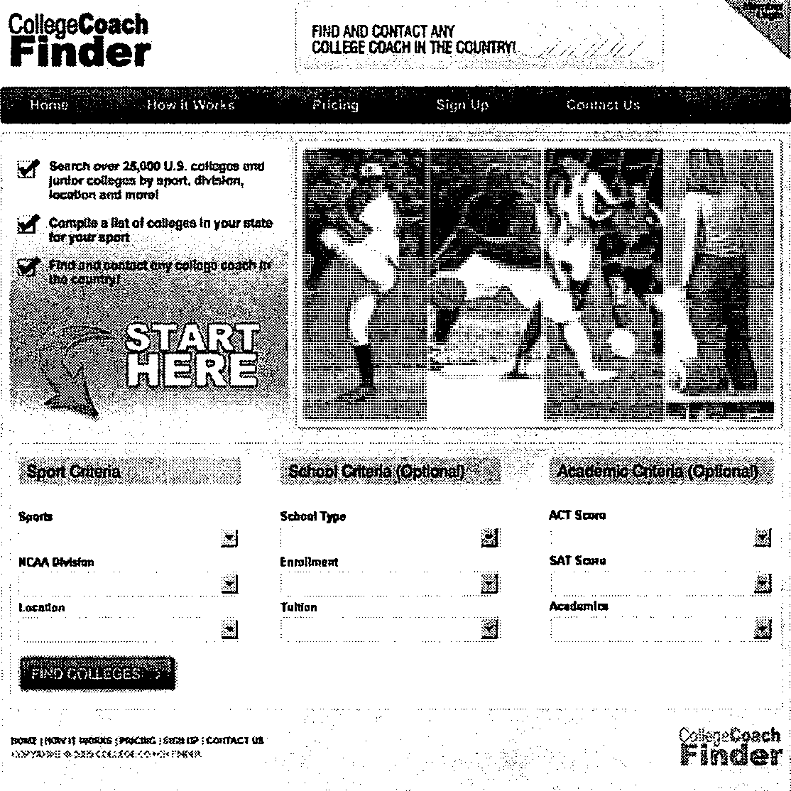

> 图 1：CollegeCoach Finder 迷你销售网站的首页设计稿。顶部是导航（Home、
> How it Works、Pricing、Sign Up、Contact Us），标语为 "Find and contact
> any college coach in the country"，下方是按运动项目、学校、学业条件搜索
> 大学的表单和 "Find Colleges" 按钮。

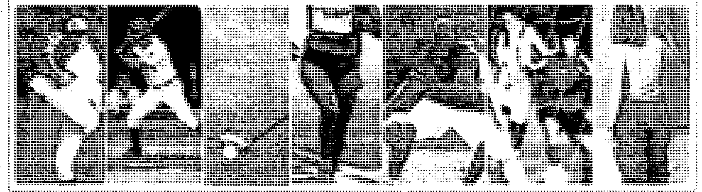

> 图 2：注册页（Sign Up Page）设计稿顶部的横幅，由多张各项目运动员的
> 黑白照片拼成。

> 图 3：注册页（Sign Up Page）设计稿中的 "SIGN UP" 按钮。注册表单提供
> 终身会员资格，包含免费更新。

设计与 HTML 的总成本不到 300 美元。

通过用 AdWords 引流，并跟踪有多少网站访客点击"搜索"按钮、多少人点击
"注册"按钮，我将在花费数千美元开发它之前，获得关于这个创意能否成功的
宝贵洞察。

### 小结

使用上述方法需要你投入一些时间和金钱。但要知道，如果你现在投入 8 小时，
而测试成功了，你将获得支撑你度过接下来 4 个月开发的信心。如果它惨败，
你就省下了数百小时，以及可能数千美元——不用去开发一款没人想要的产品。

虽然这种方法无法 100% 确定你的创意会成功还是失败，但它迫使你朝着发布
产品迈出下一步。

[^29]: 因地区而异。
[^30]: https://adwords.google.com/select/KeywordToolExternal
[^31]: http://www.seologs.com/keyword-difficulty.html
[^32]: http://tinyurl.com/26xhld5
[^33]: toolbar.google.com
[^34]: http://www.networksolutions.com/whois/
[^35]: www.Micropreneur.com
[^36]: http://tinyurl.com/26l4yr3
## 第 3 章 你的产品

### 产品成功三角

产品的成功取决于三件事：产品、市场和执行，
它们共同构成了我所说的*产品成功三角*
（Product Success Triangle）。

- **产品**——你的产品必须足够好
- **市场**——你需要一群愿意为它掏钱的人
- **执行**——你必须对它进行营销、销售和支持

在上面的模式中，产品只占这个等式的三分之一。
这与大多数开发者赋予产品的巨大权重相去甚远。
和大多数刚入行的开发者创业者聊聊，你会得到一种印象：
产品占了这个等式的 99%。

但一个出色的产品如果没有市场和执行，就是死路一条。
一个平庸的产品配上出色的营销和执行，却能让你赚到钱。

长期来看，你应该力求三者兼备；但在起步时，
要把重点放在后两者上，以判断这个创意是否可行。
一旦确认你有市场、也能执行，你就可以去改进产品了。
正因如此，本书聚焦于后两个步骤。

这也是为什么把产品的构建外包出去是一个可行选项：
它不必是你脑海中想象的那件杰作，也能取得成功。

我知道这很难接受。作为开发者，
我们认为代码是最重要的部分。
所以尽管我不打算过多唠叨"外包"这件事，
但它是一个我们需要探究的话题，好让你自己做出决定。

让我们来看看自己动手构建产品
与外包部分开发之间的区别。

### 自己动手构建

你热爱编写软件，所以自己动手构建会是你的首选。
让我们看一些粗略的数字，
让你对把产品做起来需要多少时间有个概念。

估算软件项目的方法有成百上千种。
下面是一个能得到数量级估算的好方法：

- 创建一份站点地图（针对网站）
  或界面清单（针对桌面应用）。
- 用纸和笔勾画出每个页面的样子，每页大约花 2 分钟。
  你不必勾画出所有页面，甚至不必涵盖所有功能；
  你只是想对每页的复杂程度有个概念。
- 根据复杂程度，按每页 4-12 小时估算。
- 根据复杂程度，为数据库设计加上 10-20 小时。
- 估算后端功能，如信用卡处理、PayPal 集成或定时任务。
  根据你的经验，每项加上 10-40 小时。
- 把它们加起来。

经验法则是：你通往 1.0 版本的过程
应该落在 200 到 400 小时之间。

如果低于 200 小时，这是个好兆头，
但要再看看你提供的功能
是否足以让你与竞争对手区分开来，
或者你是否真的只是在构建一个"工具"，
而不是一个完整的应用。
两者的区别在于：让人们为使用一个工具掏钱会很困难，
而应用能提供真正的价值并带来收入。

如果超过 400 小时，认真考虑砍掉一些功能，
以缩短上市时间。
这是我在 1.0 产品上见过的最常见错误——功能太多，
从开始开发到发布之间隔了太多个月。

销售网站、文档、营销以及其他所有事情
还要再花 100-200 小时。

如果你利用业余时间写代码，
每周能挤出 15 个小时的高效工作时间就已经很勉强了。
而且，你的效率会比白天低，
因为你只能以 2 小时为单位工作，
白天的工作还让你疲惫不堪。
我亲身经历过——这并不容易。

按每周 15 小时算，300 小时意味着 20 周的业余时间，
也就是 4 个半月。550 小时则是 8 个半月。
想想这是多长时间——想到未来 8 个月里
要把大部分晚上和周末都花在构建产品上，
而且这段时间没有任何收入，是相当惊人的。

#### 你有时间吗？

在选择这条路之前，你需要问问自己：
能否在未来 4 个半月到 8 个半月里，
把大部分业余时间投入到构建你的应用上。
在做这个决定之前，也考虑和你的配偶或另一半谈一谈。

记住，如果你花时间构建了这个产品，后来又决定放弃它，
那你基本上就浪费了花在上面的时间。

问问自己，你对产品创意
以及自己营销它的能力是否有信心。
在接下来的几章里，我们会告诉你如何回答这两个问题。

与外包相比，自己构建应用更容易导致倦怠和过早放弃。
如果你存有几千美元，你应该考虑外包开发。
如果你不走这条路的唯一原因是想掌控代码，
那么你需要认真重新思考自己能否放下这一点。
放下它、远离代码，会提高你成功发布产品的几率。

不过，如果你没有钱但有大把时间，
那么自己构建产品是个很好的选择。

最后一点：如果你每周能再多挤出 10 小时，
达到每周 25 小时的开发时间，
你的上市时间将缩短到 3 个月以内（按 300 小时计）。

如果你对产品创意足够投入，并且短期内负担得起，
你可以考虑每周只工作 4 天，
设想将来用产品收入来弥补损失的收入。

### 外包开发

雇人来构建你的软件是个不错的折中方案，
因为它让你既能掌控产品的技术层面，
又不会榨干你血管里的编码热情。

在决定是否雇人构建软件时，最大的障碍是：
你认为自己写的软件比别人好。

你不必向任何人承认这一点，
但我认识的每个优秀开发者
都认为自己的代码是世上最好的代码，
认为外包出去只会换来一个写得很烂的产品。
如果你打算外包软件开发：

你必须克服自己亲手写软件的欲望。

你确实必须如此。你必须接受一个事实：
代码不会完全是你的风格，也可能不如你自己写的好。

不过，一旦你找到一位优秀的开发者，
你会惊讶于别人的代码能写得多么好。
而且，如果你愿意把开发外包到海外，
你可能用不到 3,000 美元就能把整个应用开发出来
（200 小时，高级 PHP 开发者每小时 15 美元）。

你也可以把销售网站的设计和 HTML 开发外包出去，
这会花 500-1,500 美元，还能再为你省下 50 小时。

外包的好处在于，它让你有时间写文案、写文档、专注 SEO、
设置按点击付费（PPC）广告、接入支付处理，
以及处理让产品上线所需的其他上百件事。
你可以专注于成功三角中的后两个方面。

仔细想想……很多人都能构建出一个不错的发票应用。

但有多少人能打通必要的营销渠道、建立合作伙伴关系、
创建盈利的 PPC 广告活动、构建有说服力的销售网站？
找一个能做好这些事情的人，
比找一个能构建你应用的开发者要难得多（也贵得多）。

考虑到这一点，
让我们来估算一下这种方式涉及的所有成本：

- 如果外包到海外，平面设计和 HTML 的费用
  在 500-1,500 美元之间。
  在美国本土做则要花 2,000-6,000 美元。
- 两个月的开发（雇人从零构建一个小产品时的稳妥估计）
  在美国要 1.2 万-2 万美元，外包到海外大约 6,000 美元。
- 总计：在美国大约 1.4 万-2.6 万美元，
  外包到海外则是 6,500-7,500 美元。这些都是基于
  "典型的小型创业产品需要两个月开发"
  这一假设的粗略数字。

如果你具备基本的项目管理能力，并且能凑出 7,000 美元，
你就可以为自己省下几百小时的编码时间、更快进入市场，
并把更多时间放在营销上。

这是本书最后一次提到这个选项。
我知道大多数读者不会考虑这条路，这没关系。
但我想让你看到它，因为它有显著的好处，
而且我合作过的许多开发者都用这种方法取得了成功。

### 如何为产品定价

定价是发布产品时最具挑战性的环节之一。
你以前很可能读过这方面的文章，
而且对于如何为产品定出最佳价格，你可能仍然一头雾水。

在本节中，
我们会讨论你在敲定价格时需要记住的一些具体金额，
还会介绍一个确定最优定价结构的 12 步流程。

#### 定价的一般准则

在研究这个主题时，
我读了不下 25 篇与软件定价相关的文章、博客帖子和 PDF。
没有一篇给出过哪怕是粗略的定价区间。
我要打破这个惯例。

下面提到的每个价格都是粗略数字，
会因你的市场具体情况而有很大差异，
但可以把它们当作每个细分市场上限的一般准则。
请记住，我这里只讨论在线销售——没有销售人员、
没有上门拜访的互联网销售。
能雇得起销售团队的大型软件公司，
定价可以远高于这里给出的数字。

对于面向消费者的兴趣爱好类产品
（即不会帮人赚钱或省钱的产品），
你很难收取超过 29 美元的一次性价格或每月 14 美元。

对于能帮消费者赚到或省下可观金额的产品，
你的上限大约是 49 美元或每月 19 美元。

对于小型企业，除非你能解决一个严重的痛点，
否则你的上限大约是 400 美元或每月 99 美元。

对于规模更大的企业，除非你能解决一个严重的痛点，
否则你的上限大约是 1,000 美元[^37]或每月 199 美元。

[^37]: 关于这个 1,000 美元数字的背景，
    请参阅 Joel Spolsky 的论述：
    http://www.joelonsoftware.com/articles/CamelsandRubberDuckies.html

#### 找到你的价格

如果你买过房子，可能经历过估价流程。
估价师在确定房屋价值时，可以使用以下一种或多种方法：

1. **可比销售法**——查看同一区域近期售出的类似房屋
2. **重置价值法**——查看房屋损毁后重建该建筑所需的成本
3. **收益法**——查看市场租金，并用一个乘数来确定
   这栋房子对投资者来说值多少钱

在住宅估价中，可比销售法要常见得多。
不过，在投资性房地产中，
你会看到把两三种方法合并成单一数字的估价。

得出你的核心价格也需要同样的方法；
我们会看几种确定合理价格的方法，然后把结果合并起来。

找到购买价格第一版估算的步骤如下：

1. 了解你的市场。第一步是利用上面列出的定价一般准则，
   摸清你的市场以及它能承受的价格。
   你还需要弄清楚你的买家通常如何购买软件、
   会如何付款，以及他们无需审批就能购买多大金额。
2. **问问你自己。** 37Signals 在为新产品定价时[^38]，
   会问他们自己下面两个问题：

   a. 我们会出多少钱？
   b. 什么数字感觉对？

[^38]: http://www.37signals.com/svn/posts/1287-ask-37signals-how-did-you-come-up-with-pricing-for-your-products

3. 看看你的竞争对手。如果你有竞争对手，这一步很容易。
   如果竞争对手很少或没有，你需要与类似市场做比较。
   在为小型企业写库存软件？
   看看面向小型企业的发票或会计软件。
4. 确定产品的价值。
   如果你的软件每月能为潜在客户节省 5 小时，
   而你可以把他们的时间按每小时 25 美元货币化，
   那你每月能为他们节省 125 美元。
   你的收费不能超过这个数字，
   但可以把它作为潜在价格的上限。
5. 合并。用第 2-4 步的数字来确定产品的最优价格区间。
   理想情况下，你希望区间的高端是低端的 4 倍。
6. **倾向于更高的定价。** 开发者往往低估自己软件的价值，
   认为更低的价格会带来更高的销量。事实通常并非如此。
7. 使用三个档位。产品没有唯一的最佳价格，
   所以要设定多个价格点。把区间的低端作为最低档价格。
   中档价格乘以 2，最高档价格用中档再乘以 2。
8. 以 7、8 或 9 结尾。这很蠢，但很有效。
   让你的三个价格（美元那一栏）都以 7、8 或 9 结尾，
   并且确保它们都以同一个数字结尾。
9. 确定每个档位的权益。根据你对市场的了解，
   为每个档位决定哪些指标会随档位提升而增加
   （发送的发票数、磁盘空间、处理能力？）。
   确保价格逐档翻倍时，你提供的权益超过翻倍。
10. 加上支持服务。如果你对软件收取一次性费用，
    认真考虑每年收取该费用 20% 的支持和产品升级费。
    不收年度软件维护费，意味着你每次与客户沟通
    都会侵蚀你的利润率。
11. **计算周期性收费的另一种方法。**
    如果你采用按月周期收费，但由于某种原因，
    为你这类软件确定一次性价格更容易
    （也许没有竞争对手采用周期收费），
    那就用一次性价格除以 12，作为你的最高档价格。
12. 测试。试试下面提到的价格测试技巧。
    在测试过这些数字之前，不要对它们抱有自信。

#### 如何测试定价

人类的行为是非理性的。
这意味着没有人知道你的产品的正确定价结构。
与其找到一个价格点然后永远死守，
不如测试你的定价，看看你能把它推多远。

而你测试价格的方式取决于你的销售周期。

如果你有源源不断的新流量，并且销量足够大，
可以进行 1-3 天的测试并看到结果，那么测试很简单。
产品越贵就越复杂，因为销售周期可能长达数月甚至更久，
而且现有客户发现你价格测试的可能性也更高。

以下是根据你的销售周期长短推荐的价格测试方法：

- 如果你的销售周期不到 1 周，直接改价，不通知任何人。
  让新价格运行 1-2 周，然后对比结果。
- 如果你的销售周期超过 1 周，使用以下技巧之一：
  - 在发布新版本时提价，
    并向邮件列表上的所有人提供为期 7 天的旧价格。
    这会创造一波快速涌入的销量，而且你能顺利完成提价，
    因为新的潜在客户从未见过旧价格。
    然后，几周之后（取决于你一段时间内的销量），
    判断更高的价格是否带来了收入增长。
    如果没有，就降回原来的水平。
  - 降价并观察收入是否增加（同样，你必须等上几周，
    具体取决于你通常每周卖出多少份）。
    如果销量没有增加，你可以在一两周后改回原价。
    如果收到现有客户的邮件，主动提出为他们退还差价。

### 产品类型

下面介绍六种主要产品类型，
包括各自的典型定价结构、好处、缺点以及适用时机。

#### 类型 1：托管式 Web 应用

如今托管式 Web 应用被称为
Software as a Service 应用（SaaS），
但你可能更熟悉它们之前的名字——ASP 应用
（Application Service Provider，应用服务提供商），
或者那个被媒体越来越多地误用的新名字——
"云端应用"（Cloud-based Applications）。

大多数新的商业或生产力应用都是托管式 Web 应用。
例子不胜枚举，下面是一些比较流行的：

- FreshBooks[^39]（托管式发票应用）
- **Basecamp**[^40]（托管式项目管理软件）
- FogBugz on Demand[^41]（托管式缺陷跟踪/项目管理）

[^39]: www.freshbooks.com
[^40]: basecamphq.com
[^41]: www.fogcreek.com/FogBugs/

**定价结构**

- 通常按月或按年收取周期费用

**对创业者的好处**

- 稳定、持续的收入
- 支持工作比安装在用户机器上的软件容易得多，
  因为部署的每个环节都在你的掌控之中，
  而且你只需维护应用的单一版本
- 文档可以随着功能增加随时更新
- 客户反馈可以立即融入产品，
  从而以更短的发布周期提供增量改进

**对客户的好处**

- 客户无需为软件许可证进行大额的前期资本投入
- 客户无需维护自己的服务器、安装或升级软件，
  也无需开通共享主机账户
- 升级免费、无缝，客户无需付出任何精力
- 客户可以毫不费力地试用你的产品

**缺点**

- Web 开发可能有挑战性，构建应用需要学习多种技术
  （HTML/CSS/AJAX/JS/服务器端代码）
- 浏览器兼容性问题可能很繁琐，
  尤其是在浏览器市场份额越来越碎片化的今天
- 一些客户（通常是企业客户）
  不允许数据存放到公司围墙之外，
  因此不会使用托管式 Web 应用
- 它要求你维护一个 24/7 在线的主机方案，
  外加安全与备份

**适用时机**

在考虑一款面向企业的新应用时，
先从托管式 Web 应用的立场出发。
易于支持、易于采用以及持续收入模式都是重大优势。

Fog Creek Software[^42] 的 CEO Joel Spolsky
在 Venture Voice[^43] 的一次采访中说，
如果他今天才创办公司，
他不会为其旗舰产品 FogBugz 构建可下载版本。

[^42]: www.fogcreek.com
[^43]: www.venturevoice.com

对于托管式应用，问题不是"何时使用"，而是"何时不使用"。

以下情况不要使用托管式 Web 应用：

- 你的目标是一个特定人群，如 iPhone 或 Facebook 用户。
- 你的目标是希望数据留在自己围墙内的企业客户。
- 你的用户界面有 AJAX/DHTML 界面无法支持的复杂需求。
- 你的应用需要直接访问硬盘或外设，而这需要桌面应用。

#### 类型 2：可下载的 Web 应用

可下载的 Web 应用只服务于一个目的：
让客户能够使用你的 Web 应用，
同时永远不失去对自己数据的控制权。

鉴于一些公司需要把数据留在自己的围墙之内，
或者需要保证 24/7/365 的正常运行时间，
可下载的 Web 应用是有市场的。

可下载的 Web 应用只能由具备中等技术水平的人来安装。
这一限制把世界上 99.9% 的人排除在外。

**定价结构**

- 一次性收费，但可以包含年度支持费，
  通常约为购买价的 20%
- 虽然少见，但我见过应用租赁和租用的模式，
  用来消除高额的前期费用。如果你想走这条路，
  应该考虑在应用中内置反盗版机制。
  它应该允许你在购买者停止支付租赁或租用费用时
  远程停掉该应用。

**对创业者的好处**

- 无需维护主机基础设施
- 购买价通常一次性付清，
  因此与托管方案相比，一次性收入更高

**对客户的好处**

- 客户保持对自己数据的控制权
- 客户可以定制你的应用，包括设计和功能，
  并把它与他们自己的网站或 Web 应用集成

**缺点**

- 支持是个负担，因为每个客户的服务器都不一样
- 一次性而非周期性的许可费用
- 客户必须拿出一大笔前期资本来支付软件许可证
- 客户必须懂技术才能维护自己的服务器，
  所以你的市场比托管式 Web 应用小
- 升级很繁琐，尤其是客户已经好几个版本没有升级的情况
- 如果你从未做过 Web 开发，开发环境可能有挑战性
- 浏览器兼容性问题可能很繁琐，
  尤其是在浏览器市场份额越来越碎片化的今天
- 你的目标受众会根据你构建应用所用的
  服务器端技术而碎片化。
  换句话说，你有 Windows 用户、Linux 用户、
  OS X 和 Unix 用户。
- 跟踪哪些客户购买了软件维护以及何时到期，
  可能是一个额外的负担

**适用时机**

- 当你的目标是企业客户，或希望掌控自己数据的客户时
- 当你的目标是软件/Web 开发者，而他们希望以
  构建 API 无法实现的方式来定制你的应用或与之集成时

#### 类型 3：桌面应用

过去 10 年，从桌面应用转向 Web 的趋势显而易见。
新的 Web 应用每天都在发布，
桌面应用也随时间推移变得越来越稀少。

但桌面应用在若干领域仍有旺盛的需求，
包括但不限于音频和视频编辑、病毒扫描、
照片和文档编辑，以及平面设计。

**定价结构**

- 一次性收费，但可以包含约为购买价 20% 的年度支持费

**对创业者的好处**

- 无需维护主机基础设施
- 购买价一次性付清，因此一次性收入高
- 它不在浏览器中运行，所以没有浏览器兼容性问题

**对客户的好处**

- 客户保持对自己数据的控制权
- 用户界面可以优于 Web 应用

**缺点**

- 支持是个负担，因为每个客户的桌面环境都不一样
- 一次性而非周期性的许可费用
- 客户必须拿出一大笔前期资本来支付软件许可证
- 升级对你的客户来说很繁琐，还会给你带来支持负担
- 虽然你没有浏览器兼容性问题，
  但在是否支持多种操作系统
  （如 Windows、Linux、Mac 等）上，你面临更复杂的决策
- 跟踪哪些客户购买了软件维护以及何时到期，
  可能是一个额外的负担

**适用时机**

- 当你的应用有 AJAX/DHTML 界面无法支持的复杂性时
- 当你的应用需要直接访问硬盘或外设、
  要求代码在本地执行时。
  除非这是你应用的核心组成部分，
  否则你应该考虑把这项功能
  构建为 Web 应用的一个可下载扩展，
  以帮助减轻支持多个操作系统的负担。

#### 类型 4：移动应用

移动应用运行在手机、PDA、MP3 播放器和智能手机上。
这个范畴包括运行在任何移动操作系统上的应用，
如 iPhone、Windows Mobile、PalmOS、Google 的 Android OS，
以及众多手机操作系统。

移动应用眼下是个热门话题，
各公司都在 iPhone 应用领域争相圈地。
在 iPhone 发布后的头 4 个月里，
它的应用商店就出现了
由第三方开发者开发的 10,000 款应用。

移动应用本身就是一个市场，很像 Web 或桌面应用；
一些预测认为，到 2013 年
移动应用市场将达到 1 亿用户[^44]。

[^44]: http://news.softpedia.com/news/100-Million-Mobile-Users-to-Access-App-Stores-by-2013-107747.shtml

**定价结构**

- 一次性收费
- 一次性收费并绑定一项周期性服务
- 免费。许多移动应用对最终用户免费，
  因为它们是访问托管式 Web 应用的额外途径

**对创业者的好处**

- 你的受众通常只有一个购买应用的地方
  （如通过 iTunes 或手机运营商的网站），
  所以用户很有可能偶然发现你的应用
- 这个领域相对较新，竞争比 Web 或桌面应用少

**对客户的好处**

- 随时随地触手可及地使用你的应用的便利性

**缺点**

- 如果你不是移动应用开发者，
  你将不得不学习一套全新的范式（或雇一个已经懂的人）
- 让你的应用进入手机运营商的目录可能充满繁文缛节，
  可能耗时数周甚至数月，甚至可能直接被拒
- 手机的内存和处理资源有限，
  限制了你在应用里能做的事情。
  举例来说，iPhone 3G 配备 412MHz 的 CPU 和 128MB 内存
- 你将不得不决定以哪个平台为目标——
  大多数情况下，每个平台都需要不同的开发技术

**适用时机**

- 当你想通过增加移动能力来扩展现有 Web 或桌面应用时
- 当你的应用专门针对移动人群时

#### 类型 5：第三方插件

Web 上的第三方平台有成百上千个。
Facebook、MySpace、WordPress、DotNetNuke 和
Salesforce.com 等网站和应用提供 API 和应用平台，
你可以在上面构建产品，
并通过该平台的市场让一批用户发现它，
而你几乎不需要做任何营销。

开发者对许多插件平台做出了积极响应，
一个例子是 Facebook 平台上线第一年
就涌现了超过 77,000 个 Facebook 应用。

下面根据我能查到的最新数据，
快速盘点一下最大几个平台的潜在市场规模：

- Facebook——超过 5 亿活跃用户
- MySpace——超过 1.25 亿用户
- Salesforce.com——超过 150 万付费订阅用户

**定价结构**

- 在消费领域，应用是免费的，通常通过广告、联盟链接
  或把流量导向一个可以将用户变现的特定网站来赚取收入
- 在企业领域（如 Salesforce.com），
  应用可能收取一次性费用或周期性费用

**对创业者的好处**

- 这些平台对新插件的采用率往往很高
- 如果应用设计得当，
  你可以借助病毒式营销实现指数级增长，
  因为社交平台往往具有很强的网络效应
- 你的受众通常只有一个获取应用的地方
  （如 Facebook 应用目录或 Salesforce AppExchange），
  所以相比开放互联网上的应用，
  你的应用被偶然发现的可能性更大
- 这个领域相对较新，竞争比 Web 或桌面应用少

**对客户的好处**

- 无需依赖平台提供商就能方便地获得新特性和新功能
- 许多插件是免费的

**缺点**

- 淘金热心态和可疑的变现方式，
  意味着很少有应用真正能赚到钱
- 为大厂应用填补功能空白最终会适得其反，
  因为厂商可能把你的功能并入主应用

**适用时机**

- 当你想通过让平台用户轻松添加你应用的能力，
  来扩展现有 Web 或桌面应用时
- 当你的产品创意面向居住在某个特定平台上的人群时

#### 类型 6：社区网站

虽然不是传统的"软件换钱"模式，
但社交网络、论坛、社交书签工具、
文件共享或照片共享网站等社区网站
不仅构建起来有趣，营销起来也有趣，
因为媒体目前正迷恋这个细分市场。

社区网站是最有可能登上
*Fast Company* 或 *Inc.* 封面的产品类型，
因为它们增长飞快，
而且人人都能参与并理解它们的运作方式。

虽然不是 micropreneur 或 bootstrapper 的典型产品，
但这些网站有潜力快速增长，
能为有兴趣融资和招聘员工的人提供一段有趣的旅程。

**定价结构**

- 社区网站最常见的是广告支持模式，
  但付费会员网站也越来越常见

**对创业者的好处**

- 构建、发布和营销起来都很有趣的项目
- 它们具有"鸡尾酒会"效应：
  当你告诉别人你卖发票软件时，
  对方往往会突然需要去续杯；
  但告诉别人你运营着一个面向蜥蜴训练师的社交网络，
  会让你成为半个名人

**缺点**

- 很难起步——比构建和销售软件风险大得多
- 需要社区运营知识
- 在早期增长阶段，独自管理一个社区非常困难

**适用时机**

- 如果你能用很少的钱或不花钱触达潜在客户，
  比如通过邮件列表或博客
- 如果你深谙病毒式营销
- 如果你有兴趣探索"做大"风格的创业。
  大多数社区网站只有达到每月数百万的页面浏览量，
  才能在财务上成立。

### 结语

定价、自己构建还是外包、构建哪种产品类型，
这些决策将对你多快能进入市场、市场规模有多大、
能卖出多少份产生关键影响。

仅次于你的细分市场本身，
这些决策都必须以市场的需求为出发点来决定。
## 第 4 章 打造高转化率的销售网站

打造一个能把访客转化为买家的网站绝非偶然。大多数开发者以为，既然自己懂 HTML，
就能建出一个让人想买他们产品的网站。

不幸的是，事情比大多数人想象的要复杂。

### 销售漏斗

几乎每一本讲销售的书都会提到销售漏斗，而在描述在线销售流程时，它尤其好用。

销售漏斗背后的理念是：从一个人在互联网上浏览，到他购买你的产品，
中间隔着好几个步骤。

1. 首先，这个人必须**看到你的 URL**。它可能是博客里的一条链接、一个横幅广告、
TechCrunch 上的一篇报道、一个 AdWords 广告，或者论坛里的一条链接。

2. 其次，他必须点击链接，**成为网站访客**。

3. 接下来，他必须有足够的兴趣多停留几秒——时间长到足以读完你的销售文案、
看完你的视频演示、试用你的产品演示，并有可能把他的电子邮件地址留给你。到这一步，
他已经作为潜在客户“举起了手”，**成为一名潜在客户**。

4. 最后，他必须相信你的产品能以合适的价格解决他的问题，并付诸购买。
此时他**成为一名买家**。

在每一步，你都会失去这群人中的大多数：

- 大多数上网的人永远不会看到你的 URL
- 大多数看到你 URL 的人不会点击它
- 大多数点击了的人对你的网站兴趣不够，不会停留到成为潜在客户
- 大多数潜在客户不会购买你的产品

这个从一大群人开始、慢慢收窄到少数买家的过程就叫销售漏斗，如下图所示：

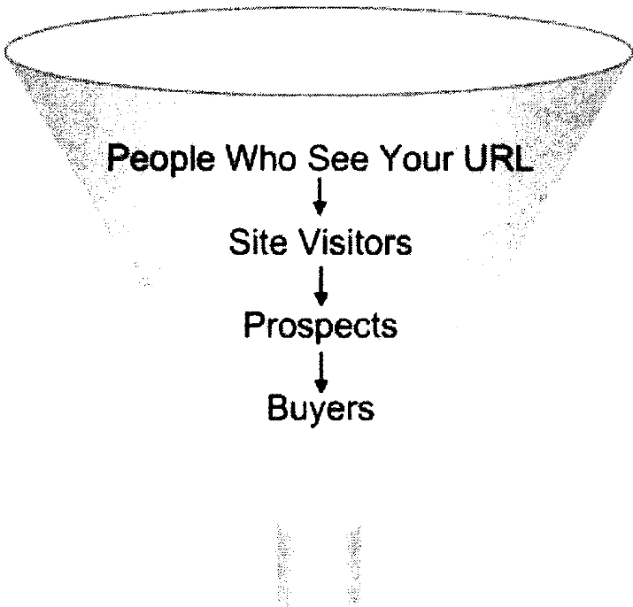

> 图 4：销售漏斗示意图。从看到你 URL 的人开始，逐层收窄为网站访客、潜在客户，
> 最终成为买家。

有一点需要注意：一个人从看到你的 URL 一路走到成为买家的概率很小；
而他第一次访问就完成这一切的概率几乎为零。

网站上线后，你需要针对销售漏斗中展示的每个步骤测试不同的方法、文案、按钮和赠品，
不断改进和打磨，以求最大收益。例如：

1. 你要花时间确保更多人看到你的 URL（争取被博客报道、测试并加大有效广告的投放、
监控论坛并把你的产品作为解决方案推荐，等等）。

2. 你需要花时间把浏览者变成潜在客户，也就是说，要用你的内容吸引他们，
并让他们相信，把电子邮件地址留给你对他们有好处。

3. 你需要花时间与潜在客户培养持续的关系，把更多人转化为买家，
同时打磨网站的销售说辞，提高你的销售转化率。

销售漏斗的每个阶段对整个流程都至关重要，你必须投入时间逐一优化。

这里有一个值得玩味的事实：

如果你的网站每月有 1,000 个访客，销售转化率为 1%，那么你每月能卖出 10 份产品。

要让每月多卖出 1 份（10%），你需要做到以下两件事之一：

- 为网站多带来 100 个访客
- 把转化率提高 0.1%

你认为哪个更难？答案是：第一个。

尽管传统智慧主张把精力放在流量上，但最优秀的互联网营销者明白，
提高现有网站访客的转化率能带来更好的投资回报。

### 不要指望在客户第一次访问时就卖出产品

销售网站的第一条规则是：最常见的做法是错误的。那就是：

你不应该指望在客户第一次访问时就向他卖出产品

这很可能与你见过的许多小型软件公司销售网站的做法相悖，
也可能与你见过的一些更成功的销售网站相悖（SourceGear Vault[^45]、FogBugz[^46]
和 Basecamp[^47]）。

想想我上面列出的三个网站和你的销售网站之间的差别。那三个网站有什么是你没有的？

答案是：它们拥有一批会一再回来的读者受众，反复研读、思考它们的产品，
直到产品深深印在脑中。经过这样的曝光，一旦他们需要源代码管理、
缺陷跟踪或项目管理软件，这些产品永远是他们的首选。

根据我们看到的那些高知名度网站来判断，你想象中的销售流程可能是这样的：

1. 一个人在博客上听说你的产品，点击进入你的网站。

2. 你的产品恰好完全适合这位访客，他一边摸索着掏出钱包，
一边点击进入你的结账页面，在首次到访你的网站一两分钟后就完成了购买。

这是绝对的例外。

在第 2 章中我们谈过转化率，我提到典型的转化率在 0.5% 到 4%之间，
具体取决于你的价格区间和客户群。这意味着每 1,000 个网站访客中，有 960 到 995
个人来了又走，什么都没做。

如果你的流量是按每次点击 50 美分买来的，费用很快就会变得昂贵。不仅如此，
如果获取一个客户的成本高于你的产品售价，那就得不偿失了。

成为买家的访客，通常会在几天或几周的时间里多次回访你的网站，
具体取决于你销售周期的长短。

销售流程的现实更接近下面这样：

1. 开会前五分钟，一位潜在客户在 Google 上搜索与你的产品相关的词。

2. 他在搜索结果旁边看到你的 Google AdWords 广告，点击进入你的网站。你被扣掉 50
美分。

3. 访客四处看了看：跳过大段文字，扫一眼图片，看了视频演示的前 30 秒，
又飞快地翻过你的定价页面。

4. 他在心里记下“回头再来看这个网站”，然后关掉浏览器跑去开会，从此再也没有回来。

你永远无法阻止这个人行色匆匆，也无法强迫他阅读你的内容。

但你可以帮助他回来。

### 网站的头号目标

你的头号目标——甚至排在卖出产品之前——是把浏览者变成潜在客户。
潜在客户是指对你的产品至少表露出一丝兴趣的人。在网上，
这通常通过请对方提供电子邮件地址来实现。

说服一个人留下电子邮件地址，比说服他购买你的产品要容易得多。
一旦你有了电子邮件地址，就有机会开始与客户建立关系，
还可以通过相关的邮件温和地提醒他回到你的网站。

要让一个人愿意把电子邮件地址给你，你必须做到三件事：

1. **建立信任**——访客必须相信你不会给他发垃圾邮件、不会卖掉他的电子邮件地址，
也不会发来 V1@gra 的推销。

2. **建立相关性**——访客必须相信你的产品与他的需求相关，
并且你通过邮件发给他的任何东西也都是相关的。

3. **建立回报**——人的行为是可以预测的。提供某种东西来交换电子邮件地址，
效果保证比什么都不提供要好。在 DotNetInvoice.com上，我原本有一个邮件注册表单，
人们可以注册接收我们产品的邮件更新，8 个月里我们收到 3 个注册。
后来我改成提供赢取DotNetInvoice 免费拷贝的机会……一个月就有 30 个注册。
仍有改进空间，但方向是对的。现在，当我发出获奖者公告时，我会附上一小段文字，
介绍我们最新版本里的新功能。最好的回报是：一场竞赛、一门相关的四五天邮件课程、
一份相关的白皮书，或一场网络研讨会。

本章后面我们会更多地讨论如何构建你的邮件列表。现在你要认识到：
你的邮件列表对你的成功至关重要。

### 客户画像

在开始搭建你的销售网站架构之前，你需要了解典型客户脑子里在想什么。在这个阶段，
甚至在构思网站的任何具体细节之前，你就需要像潜在客户一样思考。

你的目标应该是弄清楚：理想客户想在你的网站上找到什么，想在你的产品中找到什么，
以及什么样的触发因素会促使他们购买。

首先，想象一下你的理想客户：

- 他结婚了吗？
- 他有孩子吗？
- 他怎么去上班？
- 他在办公室工作？在建筑工地？还是开卡车？
- 他多大年纪？
- 他开什么车？
- 他看电视吗？上网吗？听音乐吗？

现在想象一下，理想客户来到你的网站时是什么感觉：

- 他想在那里找到什么？
- 你的产品能为他提供什么他绝对离不开的东西？
- 把这个信息传达给他的最佳方式是什么？
- 他会对什么做出反应？
- 哪些元素会自然而然地吸引他？音频？视频？图片？
- 什么会促使他点击一条链接？
- 你应该如何向客户介绍你的产品？他看到的第一页上文案该写些什么？
- 什么会说服他把电子邮件地址留给你？
- 什么会说服他购买你的产品？

为了弄清是什么在驱动你的理想客户，思考以下问题：

- 什么事让你的客户夜不能寐？
- 他们害怕什么？
- 他们为什么事生气？
- 他们每天最头疼的三件事是什么？
- 他们最渴望什么？
- 他们做决定的方式是否存在固有的偏好？（例如：工程师极其善于分析）
- 他们有自己的行话吗？
- 还有谁试图卖给他们类似的东西？那些人是怎么失败或成功的？

### 行动号召

我们要看的最后一个方面是行动号召。

在一个成功的销售网站中，每个页面都有一个唯一的主要行动号召，
也就是你希望用户采取的那个行动。

把你的销售网站想象成一条隧道（或者说一个漏斗），你要推动访客从中穿过。
起初你希望他们提供电子邮件地址。他们到达的任何页面，都应该包含一个显眼的、
请他们输入电子邮件地址的号召，或许还有一个次要的号召，
请他们购买你的产品（或进一步了解产品）。

例如，你的首页不应该是那种标准的链接、文字和公告大杂烩，让人想朝四面八方乱点。

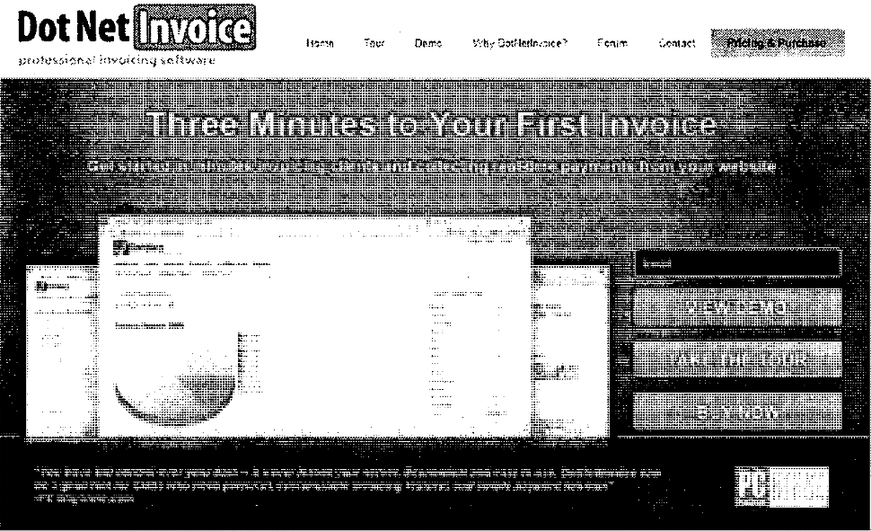

> 图 5：DotNetInvoice.com 首页截图，
> 目标是在人们试用在线演示时捕获他们的电子邮件地址。

DotNetInvoice.com（见上方截图）就是一个首页带行动号召的不错例子。
其目标是在人们试用我们的在线演示时捕获电子邮件。

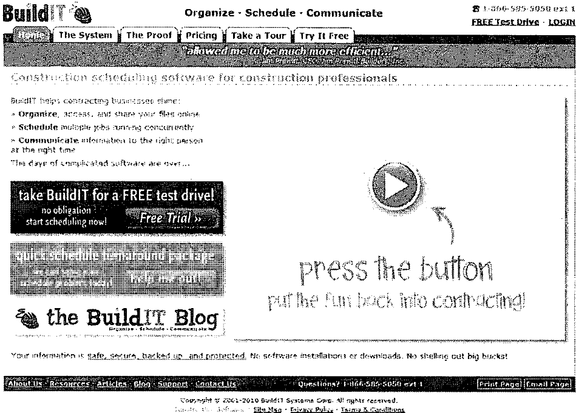

> 图 6：BuildIT Systems 首页截图：左侧是硕大的免费试用按钮，
> 配有一段介绍产品的视频，以及引导你观看视频的行动号召。

BuildIT Systems[^48] 是首页高度聚焦的好例子。这个网站（见上图）
左侧有一个硕大的免费试用按钮，视频里介绍了一些产品信息，
还有一个醒目的行动号召引导你去观看那个视频。这是教科书式的范例：把你的首要目标——
让人观看视频——放在首页的中心位置。

BlogJet[^49]（见下页截图）是最后一个例子。就我个人而言，我更希望用视频代替截图，
但他们的意图毫不隐晦：他们希望你下载试用版或购买产品。
任何其他操作都完全不在你的视线之内。

如果你想知道更多信息，可以向下滚动，查看视频演示和客户评价。
这是一个令人印象深刻的设计：它把你做购买决定所需的全部信息都放在一个页面上，
却不会让你感到信息过载。

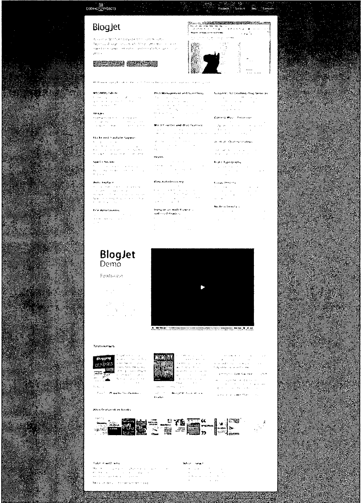

> 图 7：BlogJet 首页截图，用大幅截图引导你下载试用版或购买产品。

这种单页面呈现的优雅怎么强调都不为过，而且他们绝非偶然做到这一点的。

### 销售网站设计的七条规则

**规则 1：** 首页不一定是网站上访问量最大的页面。搜索引擎和深层链接[^50]
改变了这一点。

**规则 2：** 基于规则 1，每个页面都需要一个行动号召。访客第一次接触你的网站，
可能就是通过 Tour、Testimonials或 Pricing 页面。
所有这些页面都应该敦促用户采取行动，让他们更接近留下电子邮件、
试用你的演示或完成购买。可以参考 DotNetInvoice.com 每个子页面底部的做法。

**规则 3：** 每个页面都需要一个唯一的焦点。毫不留情地思考，
把多余的功能和重复的信息从你的网站上清除。每个页面都应服务于单一目的，
不包含任何会让用户偏离这个目的的东西。

**规则 4：** 一切都应该在两次点击之内到达。从任何页面出发，
访客都应该能在两次点击之内演示你的产品、购买你的产品，或留下电子邮件地址——
这包括点击“提交”按钮那一次。这会造就一个小巧紧凑、焦点单一的网站。
对于更大的公司或提供多种产品的网站，这一点未必在所有情况下都百分之百成立。

**规则 5：** 照顾不同的阅读习惯。为快速浏览者使用标题和项目符号列表；
为逐字逐句阅读的人把段落写得异乎寻常地短。

**规则 6：** 让按钮看起来像按钮。把你的按钮做得极具可点击感，让人忍不住去点。

**规则 7：** 没有人阅读。文字是糟糕的销售工具；音频、视频和图片总是更好。

### 页面

虽然不可能为每一种潜在的创业点子都列出网站该包含的页面清单，
但绝大多数可下载产品和 SaaS 应用靠五个核心页面就能有不错的表现。

#### 核心页面

- 首页（Home）
- 产品导览（Tour）
- 客户评价（Testimonials）
- 联系我们（Contact Us）
- 定价与购买（Pricing & Purchase）

#### 首页

你的首页的头号目标，是说服访客点击 1 条链接。为了说服他们不离开，
你要做的就是让他们点击一条链接。

首页的关键指标是放弃率（abandonment rate），即没有点击任何链接就离开的人数。
《Web Design for ROI》一书估计，首页在优化之前的平均放弃率为 40-60%。
这意味着大约一半的首页访客一个链接都没点就离开了。

解决办法？一个选项极少的简单首页，配上硕大、可点的按钮。

大多数网站没有做到这一点，但做到了的网站点击率都非常高。
下面是一些值得你努力效仿的例子：

> 图 8：Revive Africa（www.reviveafrica.com）首页截图。

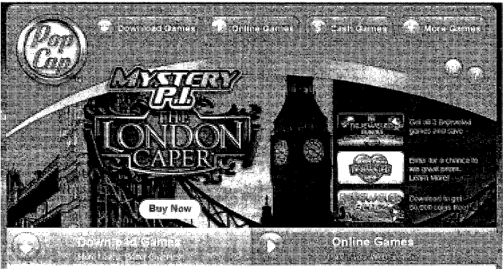

> 图 9：PopCap Games（www.popcap.com）首页截图。

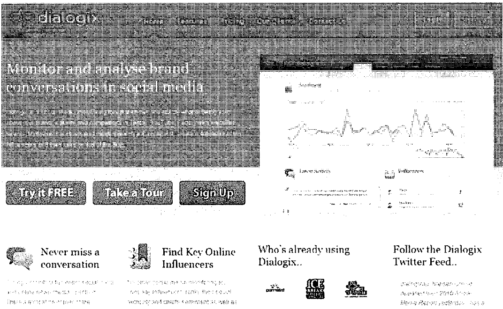

> 图 10：Dialogix（www.dialogix.com.au）首页截图。

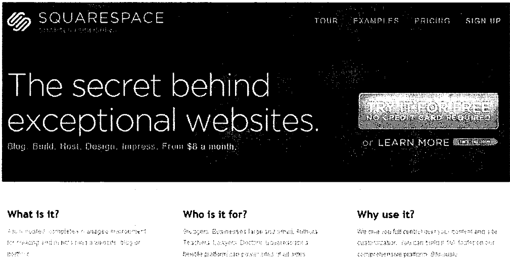

> 图 11：Squarespace（www.squarespace.com）首页截图。

如果你打算为首页配一张图，就选一张能展示产品成果的图。例如，
房屋贷款网站应该展示住在房子里的人；背包客网站应该展示站在山顶的人；
在线提案工具应该展示一份已完成提案的图片。

#### 找到你的 hook

营销中最难打造的东西之一就是 hook。hook 是你四秒钟的销售说辞，
它应该成为你首页的标题。就是这样一句话，抓住读者，让她知道自己来对地方了。

- DotNetInvoice 的 hook 是“Save Time. Get Paid Faster.”（节省时间，
更快收到回款。）
- FogBugz 的 hook 是“Bring Your Project into Focus”（让你的项目清晰聚焦。）
- Basecamp 的 hook 是“The Better Way to Get Projects Done”（完成项目的更好方式。
）
- Bidsketch 的 hook 是“Simple Proposal Software Made for Designers”
（为设计师打造的简单提案软件。）
- iPod 发布时的 hook 是“One Thousand Songs in Your Pocket”（把一千首歌装进口袋。
）

这些都是对你产品的五到七个词的总结。每一个都在你脑海中传达出一幅画面，
每一个都描述了产品做什么，以及（在大多数情况下）它为谁而做。

要找到你的 hook，可以采取以下三种方法之一：

1. 说明你的产品做什么、为谁而做。例如“Simple proposal software made for
designers.”（为设计师打造的简单提案软件。）

2. 向客户做出承诺，宣扬产品带来的好处，例如“Save Time. Get Paid Faster.”
（节省时间，更快收到回款。）

3. 描述你的产品最引人注目的单一特性，例如“One Thousand Songs in Your Pocket.”
（把一千首歌装进口袋。）

再举几个虚构的例子，以为杂货店做的库存软件这种无聊的东西为例：

1. **功能与对象：** 面向杂货店的库存追踪

2. **承诺：** 自动化你的库存管理

3. **特性：** 百万种商品，尽在你的指尖

花几分钟头脑风暴你的 hook，并和你目标市场中的一位朋友或同事讨论。
通常其中一个选项会明显优于其他选项。

一旦确定了 hook，就应该把它作为首页的标题，并考虑把它用作你的宣传语（tagline）。
有了这个 hook，你就能在 3 秒钟内告诉别人你的产品是做什么的，
或者至少说明它为什么酷到非看不可。

#### 产品导览页

我对产品导览页的建议是：放上填满数据的主要界面的中等尺寸截图，
并为每个页面配一段一分钟的屏幕录像（视频演示）。

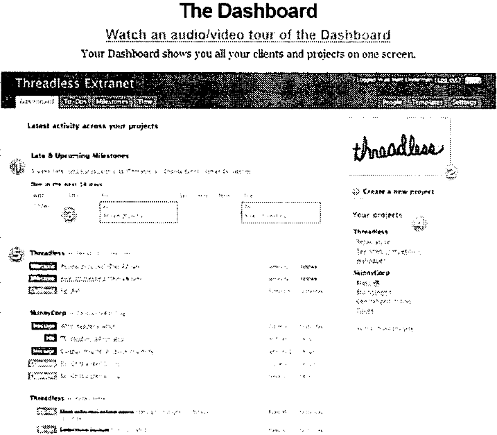

> 图 12：Basecamp 产品导览页截图（Dashboard 界面），图中带编号标注：1）
> 逾期事项以红色显示在顶部；2）你的 logo 放在这里；3）未来 1-4
> 天内到期的事项显示在这里；4）你的项目列表；5）所有项目的最新动态。

这个思路体现在 Basecamp 的产品导览页[^51]上（见上图），
但我会选择把截图做得更小，并支持用 Highslide JS 库[^52]放大查看，
还要放上一张可点击的视频图片。相比“Watch this Video”文字链接，
以视觉化方式呈现视频时，人们观看的可能性要大得多。

除了界面名称和每张截图一两句的描述之外，尽量避免在这个页面上堆放大量文字。

#### 客户评价

这个页面也可以命名为“Buzz”或“谁在用 [你的产品名]？”，
它是你网站上最重要的页面之一。没有客户评价就不要上线。

你会有试用你软件的 beta 测试者、朋友和同事——收集几条评价，把这个页面建起来。

用 Google Alerts 监控网上对你产品的提及，把精彩的引语和反向链接加到这个页面。
这不仅能充实你的 buzz 列表，还向人们表明：如果他们写你的产品，你就会链接到他们。

放上相关的 logo 来分隔页面——否则它会是一页无聊的文字[^53]。

不用说，人们不会读完你所有的评价，所以把最重要的放在顶部。

#### 联系我们

最好同时提供网页内的联系表单和一个单独的电子邮件地址。

此外，总要提供一个免费电话号码，哪怕你让它转进语音信箱再回拨。
很多客户看到你连电话号码都不提供，就会转身离开。

另外，写上一个实体地址会让一些访客更有信心。我发现，如今 DotNetInvoice
有了大量客户评价，也已经营了好几年，人们不再问了；但曾经有一段时间，
网站上没有实体地址是件大事。我通常只写我所在的城市和州，因为我没有办公室，
也不想公布我的家庭住址。

不过，有一项很棒的服务叫 *Earth Class Mail*[^54]，每月付大约 20 美元，
就能在多个美国主要城市（包括纽约、洛杉矶、旧金山、西雅图和波特兰）
租到一个邮政信箱（P.O. Box）。你也可以多付钱换一个实体街道地址，
但邮政信箱就够用了。

当有邮件寄到这个地址时，他们会扫描第一页，然后你收到一封电子邮件通知。
你可以登录他们的网站，指示他们粉碎、转寄或存档。这套系统很酷，真希望我在过去 10
年搬 9 次家之前就注册了它。

#### 定价与购买

对于 SaaS 应用，这个页面是“定价与注册”。

除非你有充分的理由另作安排，否则把它作为顶部导航最右侧的链接，
并通过加粗文字或改变颜色加上低调的高亮。

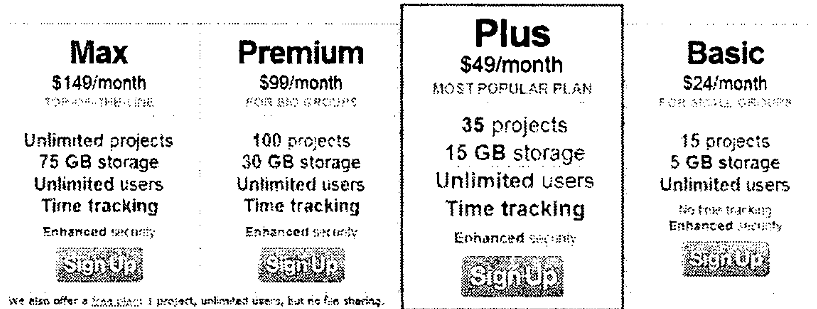

> 图 13：Basecamp 注册页截图。大字标题写着“所有账户均享 30 天免费试用”，
> 并称“每周有 1,000 家公司注册 Basecamp，60 秒即可拥有你自己的账户”；
> 四个价格方案中，Plus 被框选高亮为“最受欢迎方案”。

> 图 14：注册页方案下方展示的客户品牌 logo，表明 Basecamp
> 深受全球众多最受尊敬品牌的信赖（adidas、National Geographic、Kellogg's、The
> World Bank、patagonia 等）。

basecamphq.com/signup（见上方截图）是定价与购买页面设计出色的最佳范例之一。

有几点值得注意，你自己的定价页面也应该包含：

- 页面上没有小号文字——没有大段描述，只有大号字体。
- 用大号字体突出 30 天免费试用。
- 价格方案以最简描述和大号字体展示。
- 其中一个方案被高亮为最划算的选择，真的让人忍不住想点。
- 方案正下方展示着 logo。
- 页面底部（这张截图截断处以下）有少量与付款和长期合约相关的常见问题。
- 在最底部，注册之前你有机会提出任何问题。

另外还有两项，我会建议你也放进定价页面：

- 如果可能，加入一个追加销售（upsell）。如果你有附加模块或服务，就在这里提供。
如果没有别的，可以让客户以折扣价多买一年支持服务，或额外付费购买优先支持。

- 如果你不提供免费试用，那么至少提供 30 天无条件退款保证。
对软件这类东西这样做听起来像疯话，但想占你便宜的人数，
跟因为这项保证而购买产品的人数相比微不足道。我在 DotNetInvoice
提供退款保证多年，从未后悔过。

### 免费网站点评

销售网站建成之后，欢迎到 Startup Lens[^55] 来，
我会亲自为你的网站免费录制一段五分钟的屏幕录像点评。点击“submit your site”，
你的网站就会进入一个队列，我每周从中抽取。

我会按照你的网站符合上述标准的程度来评估它。

既然来了，也看看之前的点评，从中发现自己的销售网站可以避免的陷阱。

[^45]: www.sourcegear.com/vault/
[^46]: www.fogcreek.com/FogBugz/
[^47]: basecamphq.com
[^48]: www.builditsystems.com
[^49]: www.codingrobots.com/blogjet/
[^50]: 深层链接（deep linking）指链接到网站内部页面的做法。
    令人惊讶的是，在互联网存在的头几年里，这并非通行做法。
[^51]: basecamphq.com/tour
[^52]: www.highslide.com
[^53]: 如何让页面保持有趣的示例见
    http://www.dotnetinvoice.com/asp-net-web-host-billing-testimonials.aspx。
[^54]: www.earthclassmail.com

### 网站的头号目标

即使在 2010 年，电子邮件仍是最普及的在线沟通方式。
E-mail Data Source 在 2007 年的一项研究表明，
88% 的美国成年人拥有个人电子邮箱。而那已经是三年前的事了。
如果这一比例保持至今，意味着约有 2.2 亿美国成年人
拥有个人电子邮箱。

电子邮件是渗透力最强的在线沟通工具，
甚至超过博客、RSS、Twitter 和 Facebook 这些昨日与今日的“热门”事物。

虽然这些技术在你的营销武器库中都有一席之地，
但随着时间的推移逐步建立列表，
电子邮件真正有潜力创造可观的长期价值。

### “Email Marketing”：一个“脏词”

我一提电子邮件营销，你的第一反应大概是“垃圾邮件”。
但垃圾邮件发送者与你通过电子邮件营销产品时要做的事情之间，
有着天壤之别。

首先，你绝不会在未经许可的情况下给任何人发邮件。
你只会向一小群专门注册接收你邮件的人发送相关的邮件。

其次，你发出的每封邮件都会附带退订链接，
收件人可以随时退订。

最后，你绝不会出售或出租你的邮件列表。
那样做会毁掉列表成员对你的信任。

小心翼翼地对待你的订阅者，你会因提供的信息而受到称赞；
滥用他们，你很快就会听到反响。

我自 2001 年起就订阅了 Joel Spolsky 的邮件列表。
对于收到的他的邮件，我从未后悔过一次；
即使后悔，我也可以随时退订。根据他在 Stack Overflow
播客[^56]中的一条评论，Joel 的邮件列表规模在五位数的中高区间。
当他想让人们知道某件事时，他可以迅速把消息传播出去。

不要让别人对电子邮件的滥用，
把你从这个原本可行的营销渠道吓跑。

### 你最棒的一天

我早期在邮件列表上的一次成功发生在两年多以前。
当时我东拼西凑地攒了一个约 80 人的名单，
他们都有兴趣了解 DotNetInvoice 的下一个版本。
我当时对电子邮件营销知之甚少，
所以花了大约一年时间回答销售问题，
并一对一地询问人们是否愿意加入邮件列表。

新版本发布后，互联网上鸦雀无声。产品拷贝并没有被抢购一空。
在我和业务伙伴投入了那么多时间之后，我相当失望。

于是我决定给我们的潜在客户列表发一封邮件。
果不其然，我们一天之内卖出了五份。

诚然，这只相当于 1,500 美元，
但当我意识到自己的转化率很高（6%），
而拥有一个同等质量的 500 人列表将给我们带来
一个销量巨大的月份时，我说服自己投入更多精力，
从健康的流量中收集相关的电子邮件地址。
每个月只收集七八个邮箱地址，
就等于把钱（和满意的客户）留在了桌子上。

从那以后，我们大幅扩充了列表，
每次发布新版本，只要通知列表就会带来一波抢购。
每一次，我们都在为新的“最棒的一天”做准备。

如果我们的列表有 Joel Spolsky 的那么大，
发布月份的销量会是多少？
现在你知道他怎么负担得起那些豪华办公室了。

### 建立你的列表

如果你常和成功通过电子邮件与受众建立联系的人打交道，
你会听到“建立你的列表”（building your list）这个说法。
这是任何成功的电子邮件营销活动的基石——
用有针对性的、双重确认（double opt-in）的电子邮件订阅者
来扩充你的邮件列表。

“有针对性”是指订阅者对你选定的那个高度聚焦的细分市场感兴趣。

“双重确认”是指他们在你的注册表单中输入邮箱地址后，
会收到一封带有确认链接的邮件。
只有点击该链接，他们才会被加入你的列表。
这能确保你的列表保持最高的质量。

下面来看看你最可能取得成功的两种列表建设策略：

#### 赠送点什么

你见过 Freckle Time Tracking[^57] 免费赠送的
那份信用卡处理教程 PDF 吗？看看那份 PDF——太棒了；
这是免费提供巨大价值的完美范例。

如果你想知道他们为什么把它免费送出，请访问 jumpstartcc.com。
他们拿到了我的邮箱地址，还有成千上万人的。
有趣的是，他们甚至不要求你提供邮箱就能下载。
我主动把我的邮箱给了他们，
只是因为我想看看他们接下来会做什么。

如果你的应用是帮助设计师记录工时，
那就制作一份名为 *How to Increase Your Hourly Rate by 50%
Without Losing Business*（如何在不丢业务的情况下把时薪提高 50%）
的免费报告或白皮书。经过几个小时的研究和访谈，
你应该就能写出一份关于这个主题的报告。
有了这样的标题，再把注册表单放在主页的显眼位置，
你就会收到电子邮箱地址。

如果你卖沙滩毛巾，就提供一份
《沙滩之旅省钱的十大专家秘诀》的免费报告
（这是我在 JustBeachTowels.com 上真实赠送过的一份报告）。

我建议把目标定为一份 5 到 15 页的 PDF 报告。

关键在于找到一个你的受众不仅感兴趣、而且会如饥似渴求的主题。
一旦定下标题，你可以亲自创作，
也可以雇一名写手来处理这些跑腿工作。
我在 Elance.com 上找写手的运气一直不错。

#### 提供电子邮件课程

这听起来有点老套，
但提供一门免费的五天电子邮件课程可以有非凡的吸引力。
一般来说，技术性较强或熟悉网络的受众更喜欢较长的报告或白皮书，
而非技术型用户更喜欢电子邮件课程。
但这里并没有明确的界限，关键在于测试：

1. 首先制作你的报告，以 PDF 下载的形式提供一个月。
   记录你获得的注册数量。

2. 接下来，把报告拆分成一门五天的电子邮件课程，同样提供一个月。
   比较两者的结果，采用效果好的那种。

我开设过一门名为 *Becoming a Programmer*（成为程序员）的电子邮件课程，
它在与受众建立关系方面取得了巨大成功——
否则我与他们只会有一次接触，
然后就会被他们永远遗忘。

### 具体做法

希望读到这里，你已经接受了建立邮件列表的想法。
那么下一步呢？

第一步是部署邮件列表管理软件：
你需要在网站上放一个收集邮箱的表单、一个存储邮箱的地方、
在邮件底部添加退订链接的能力、
对外发邮件运行 SpamAssassin 以确保它们不会被垃圾邮件过滤器拦截、
同时发送 HTML 和纯文本邮件、跟踪点击和其他指标、
在有人注册时按顺序发送邮件、
防止因收件人在邮件客户端点击“垃圾邮件”而被列入黑名单……
等等等等。

不用说，你不会自己去开发一套列表管理系统，
*也不会自己托管它*。这是我见过的软件创业者
在列表管理上犯的头号错误：试图自己托管软件。

撇开维护的种种麻烦不谈，邮件送达率应该是你的头等大事，
而你永远达不到第三方服务商所能达到的送达率水平。

邮件列表服务商与 ISP 之间要走的流程和沟通的频度大得惊人。
他们有全职员工专门处理黑名单问题、垃圾邮件投诉，
并不断提升送达率。你永远无法接近他们的送达率水平；
而考虑到你为收集每一个邮箱地址所付出的努力，
确保每封邮件都抵达目的地是绝对值得的。

### 服务商

多年来我管理过好几个邮件列表，
我推荐的服务商只有一个：MailChimp[^58]。

MailChimp 是一个相对年轻的服务（创立于 2004 年），
它将精美的设计与易用性结合起来，并提供三种定价模式：
免费套餐、约每封 0.03 美元的按邮件计费模式，
或固定月费（500 名订阅者每月 10 美元，
2,500 名订阅者每月 30 美元）。

他们还有非常棒的邮件模板。MailChimp 是一个很好的起点，
因为你可以慢慢建立列表，按量付费。
MailChimp 为起步提供了一个坚实的平台，
应该能在相当长的时间内满足你的需求。

### 发什么内容

邮件列表有两种类型：

#### 相关信息

如果你的目标细分市场有着共同的兴趣，
比如私人教练或心理咨询师，
那么每两到四周提供一次持续的内容是建立关系的最佳方式。
把你的邮件列表想象成一个每两到四周发一篇新文章的博客
（为了从你的邮件通讯内容中获得 SEO 收益，
你也应该把它发布到自己的博客上）。

我大量使用过的一个强大技巧是使用自动回复序列
（autoresponder series），即按特定顺序发送给新订阅者的
一系列邮件，每封邮件之间有预先设定的间隔。
有了自动回复序列，你只需写一次内容，
就可以让它被重复使用很多年。

只要你不涉及时事类话题，你在启动邮件列表时就不应该
每两到四周发一次群发邮件，
而应该建立你的自动回复序列，每封邮件间隔两到四周。

这样，第一个注册的人会收到第一封邮件，间隔两周，
然后是第二封邮件。而一年后注册的第 500 个人
会收到同样的第一封邮件，间隔两周，然后是同样的第二封邮件。
通过这种方式，你的内容都不会被浪费；
你不会在列表早期写出一次性的邮件，
你写的每封邮件都会随着新人加入列表而被多次使用。

当你需要发送时效性强的信息（比如产品发布公告）时，
只需向列表发送一封一次性的群发邮件即可。
你的电子邮件自动回复序列不会受到影响。

如果序列中的邮件过时了，
你随时可以回去编辑或删除它们。

#### 产品动态

这是我们在 DotNetInvoice 使用的列表类型。
我们遇到的问题是，很难找到与我们所有客户都相关的
持续性内容，因为他们是各行各业的小企业主。

对于 DotNetInvoice 来说，潜在客户唯一的共同点是
他们都对发票解决方案感兴趣，而这是一个水平市场。
围绕这个主题几乎创作不出什么有趣的内容。
这就是为什么我们选择用邮件列表提供产品发布动态，
并征求大家对未来发展方向的意见。
即使参与度较低、发送的邮件少得多，
你也会对它的回复率感到惊讶。

### 内容

一个总会出现的问题是：我应该给列表发送什么样的信息？

关键在于**保持相关性**。
维持高度相关性对留住订阅者至关重要。

#### 点子 #1：关注时事

如果你可以做信息类列表而不仅仅是产品动态，
那么下一步就是关注以下新闻来源，
并向你的受众报告他们所在细分市场的新动向：

- Google Alerts
- Digg
- YouTube
- 该细分市场的热门博客

获取这些信息，分享相关链接并附上少量评论。
这是最好的内容类型——容易撰写，
却能为你的受众提供大量价值。
大多数受众（软件开发者和网页设计师除外）
都与自己行业的时事脱节，
所以每隔几周花几分钟时间就能提供相关的内容，简直易如反掌。

#### 点子 #2：问答

另一个很好的内容来源是客户或潜在客户提出的问题。
在你的邮件中回答这些问题，
巩固你作为该细分市场专家的地位。

#### 点子 #3：访谈

就现有客户如何使用你的软件做简短的邮件访谈，总是很有趣的。
你也可以借助行业内的知名博主。
这些访谈的准备时间不应超过 30 到 45 分钟，
因为你要做的只是（在获得对方许可后）
把一份问题清单发给某人，
然后把回答发布在你的邮件里。
作为交换，客户或博主获得了自我曝光的机会。

#### 点子 #4：雇一名写手

从 Elance[^59] 雇一名写手，
让他们就你选定的主题写一篇原创的短文章。
这要花费 20 到 30 美元，但如果它包含独特的信息，
就能让你的订阅者满意，还可能让你的邮件被转发，
从而扩充你的列表。

### 发送邮件的策略

以下是提高送达率、让人们打开你的邮件的七条关键技巧。

1. **发送时段与星期几**——乍一看并不明显，
   但你在一天中的什么时间、一周中的哪一天发送邮件，
   会对打开人数产生重大影响。
   “我应该什么时候发送？”的真正答案是自己测试：
   把列表分组，在不同时间发送同一封邮件。
   但一般来说，周二、周三和周四是最佳日子，
   最佳时间是上午 7 点到 10 点半之间。

2. **HTML 与纯文本**——答案是：你应该始终至少发送纯文本版本，
   因为许多移动设备无法阅读 HTML 邮件。
   所以真正的问题是：要不要费事做 HTML？视情况而定。
   如果你的受众是设计师、营销人员，
   或其他对精美包装感兴趣的人，那么你应该做。
   如果你面对的是技术型用户或普通大众，
   很可能用纯文本邮件就足够了。
   上面提到的两家服务商都提供 HTML 邮件模板，
   所以你可以把列表分组，两种方案都试一试，
   看哪一种对你的受众转化率更高。

3. **永远不要发送附件**——附件会损害送达率，
   而且很多会被垃圾邮件过滤器剥离。
   把文件上传到服务器，改为发送一个链接。

4. **注意你的“发件人”名称和地址**——
   看看你邮件客户端里的一封邮件，
   注意“发件人”地址是如何显示的。
   我收到的邮件中，“发件人”名称写着“Admin”的数量多得惊人。
   至少要写上“[产品名] 支持团队”或“[产品名] 邮件通讯”，
   让人大致知道你是谁。
   如果你与受众的关系更加个人化，也可以放心地署上真名。

5. **主题行就是你的标题**——也许唯一能决定
   你的邮件是否被打开的因素就是主题行。
   你必须磨练自己在 7 个词以内
   写出吸引人的主题行的能力。以下是一些准则：

   a. 越短越好。

   b. 在主题中提出一个问题，并在邮件正文中回答它。
      例如：DotNetInvoice 要上超级碗广告了？

   c. 写半句话并以“……”结尾，然后在邮件中把句子续完。
      例如：每天免费送出一份 DotNetInvoice……

   d. 在主题行中使用收件人的名字。
      例如：Rob，DotNetInvoice 免费 24 小时……

   e. 在主题中包含你产品的头号好处。
      例如：本月节省 5 小时时间

   f. 不要夸大其词。主题行承诺的任何事情都要兑现。

   g. **避开垃圾邮件过滤器**，留意你的垃圾邮件评分。
      MailChimp 会解析你的主题和正文，
      告诉你邮件是否看起来像垃圾邮件。
      最常见的原因是使用了诸如：免费、退款保证、
      点击这里之类的词，以及在主题中全部使用大写。
      其他一些需要避免的（常识性的）做法，
      请参阅 MailChimp 的这篇文章[^60]。

6. **每封邮件只设定一个目标**——这是一封充满信息、
   用于建立关系的邮件，还是你为它设定了一个行动号召？
   如果你有行动号召，就把它做得醒目，并请求人们采取行动。
   经验法则是，每第四或第五封邮件
   可以包含一条更有销售意味的信息。

7. **测试、测试、再测试**——这一切都是为了
   摸清你受众的偏好。我推荐的两家邮件服务商
   都能在发送群发邮件时对受众进行分组。
   测试一天中的时间、星期几和主题行。
   哪种方法更胜一筹，很快就会显而易见。

### 理想的发布

作为本章的结尾，
我想简要讨论一个我称之为*理想的发布*的概念。

几个月前，一位创业公司创始人请我描述一下
理想的创业公司发布。这是一个简单的愿景，大致如下：

#### 第 1 步：发布前六个月

在发布日期的六个月前，利用你在 Twitter、Facebook
和博客上的受众，为你的创业公司主页引流。
主页对你的产品做简要介绍，并向他们提供一项优惠：
只要留下邮箱地址以便接收发布通知即可获得。

#### 第 2 步：接下来的六个月

在接下来的六个月里，通过客座博客发文、
向你的社交网络发送有趣的动态、
在博客和论坛上发表评论，以及全面地与你的目标受众互动，
围绕你的产品制造话题，并始终把他们引向你的主页。

#### 第 3 步：发布前一周

大约在发布前一周（最好是周二、周三或周四），
向你收集的有针对性的邮箱地址列表发送邮件。
告诉他们你的产品将于下周发布，
并且因为他们在你的邮件列表中，
他们将获得一个仅面向列表成员的特价，
但该价格只持续 48 小时。

告诉他们将在哪一天、什么时间收到这封邮件。

#### 第 4 步：发布日

在发布当天，向你的列表发送邮件。
几乎立刻，订单就会开始滚滚而来。
你将迎来相当长一段时间内销量最好的一天。

有针对性的邮件推广转化率可以达到 20% 以上。
你的每月 19 美元的 SaaS 应用卖出几百份，
是启动创业公司的一个不错方式。

#### 第 5 步：发布后 36 小时

向你的列表发送最后一封邮件，
告知他们优惠将在 12 小时后结束。
在你关闭特价之前，你还会再收获几笔订单。

这个方案还有更复杂的变体，
但这是一个简单且经过验证的方法，
可以把发布日的销量提高十倍。
如果不采用上述方案的某种变体，
你在第一周能卖出 10 份授权就算走运了。

[^55]: www.startuplens.com
[^56]: blog.stackoverflow.com/category/podcasts/
[^57]: http://www.scribd.com/doc/11037739/Jumpstart-credit-card-processing-version-1
[^58]: www.mailchimp.com
[^59]: www.elance.com
[^60]: http://www.mailchimp.com/blog/most-common-spam-filter-triggers/
## 第 5 章 创业营销

### 不要轻信你读到的关于创业营销的一切

从今天的博客、书籍、播客和会议来看，你似乎只靠一个 Facebook 页面和一个
Twitter 账号，就能撑起整个公司的营销。

现实是，尽管这些社交渠道新鲜、有趣又令人兴奋，它们并没有取代那些基础的
互联网营销手段——而后者在五年前，自己也还是新鲜、有趣又令人兴奋的新事物。

我们愿意相信这些新工具是营销创业公司的最佳方式，因为它好玩、社交化而且公开。
但除了极少数例外，其投资回报率充其量只能说是存疑的。

建立受众、搜索引擎优化、参与细分社区等核心策略，对你最终收益的影响，
远大于你在商业媒体上读到的大多数新媒体工具。

在开始本章之前，请认识到：你听到的关于在 Twitter 和 Facebook 上做营销的一切
都是真的，只是略去了一些小细节。比如，那些靠 Twitter 实现盈利的公司拥有
数以万计的订阅者，而这是它们在过去几年里投入成百上千个小时的努力才积累起来的。

Facebook 也是如此。这些都不是捷径。没有什么能在一夜之间发生。

所以，虽然开设一个 Twitter 账号是个不错的策略，但要认识到，积累任何形式的
追随者都需要数月时间，而且 Twitter 极不可能成为你的主要销售渠道之一。

虽然 Twitter 在客户服务和活跃于在线社区方面确有价值，
但本章将聚焦那些能把精准的潜在客户引到你的网站、并有可能带来销售的策略。

介绍完毕，让我们来看看你在为创业公司做营销时想要达成的目标。

### 营销并非放之四海而皆准

如果你从本章什么也带不走，也请记住这一点：

许多方法在你的市场里是行不通的。

举例来说：用 Twitter 向泳池清洁工做营销不会有什么好效果。
用同样的方式瞄准网页设计师，却可能大获成功。

这一点太重要了，我想再说一遍：只有某些特定的营销策略才能让你的创业公司受益。
*而这些策略会因你所在的细分市场而变化。*

这意味着，当你读到一种新的社交媒体营销方法时，
你必须足够了解自己的市场，才能判断出这种方法是否行得通。

正如打造一款好的软件应用需要理解你的用户一样，
理解你的营销是打造成功生意的第一步。

### 流量质量的重要性

流量质量对你的网站把访客转化为顾客的效果有着巨大影响。

这里说的*质量*，指的是：每位访客与你的理想客户有多接近，
以及你与这位访客之间建立了多深的关系。

高质量流量意味着每位访客都非常接近你的理想客户，而且他们了解你、信任你。

这就是为什么 TechCrunch 的流量对创业公司无利可图。除非你的细分市场就是
其他创业公司，否则这是完全没有针对性的流量，而且你与这些受众没有任何关系。
按照上面的定义，这种流量的质量很低。

当你第一次向一个已经保持沟通一段时间的邮件列表发送邮件时，
流量质量的差异也会显现出来。这些访客的转化率会远远高于你网站的普通流量；
事实上可高出 10 倍之多。这是因为流量质量要好得多。

这一点很重要，因为它意味着你可以把精力集中在获取高质量的流量来源上。

如果来自邮件列表的人，其转化率是通过 Google 找到你网站的人的 5～10 倍，
那么你即便花上 5～10 倍的精力让人们加入你的邮件列表，
投资回报率也依然能够持平。

同样，如果你看到来自自然搜索的大量流量，
你必须知道其中有多少人在购买你的产品。
没有这项数据，你就是在盲飞，无法合理分配自己的时间。

幸运的是，Google Analytics[^61] 可以利用目标（goals）[^62] 功能为你把这一点
清晰地呈现出来。

[^61]: http://www.google.com/analytics/

[^62]: 关于设置目标（goals）的更多信息，请访问 http://tinyurl.com/69yw2b

这样做了之后，你会开始发现许多流量来源根本不会带来任何转化。
于是你可以停止追逐那些流量，把精力集中在能带来销售的方法上。

虽然有几千人访问你的网站是件好事，但如果他们不转化，
那就等于他们根本没来过。别以为你是在打造品牌——你不是 Coca-Cola，
也不是 Johnson & Johnson。那些用户离开你的网站的那一刻，
你就永远地从他们的脑海里消失了。

### 流量的两个层级

不可能说哪种流量来源对每个网站都是最好的，但在推出或改造过 20 多个
能产生收入的网站、并与数百位软件创业者合作之后，哪些流量策略能撑起一门生意、
哪些只能作为补充，确实存在明确的规律。

#### Top Shelf：能撑起一门生意的流量策略

1. 邮件列表

2. 博客、播客或视频博客

3. 自然搜索

#### Second Shelf：辅助性流量策略

1. 社交媒体／社交网络

2. 按点击付费广告

3. 论坛

4. 新闻稿

5. 客座博客

6. 联盟营销（Affiliate）计划

7. 横幅广告及其他广告

8. 其他一切……

你可能第一个念头就是："可是我听说过有人用 Twitter 赚了一大笔钱。"

这*有可能*是真的，但以下三种情况很可能必有其一：

1. 这件事并没有*真的*发生，只是讲起来好听。

2. 这个人并没有建立起一门可持续的生意。
   我们要找的是可以在其上建立生意的长期方法。

3. 这个人卖的不是面向细分受众的软件／Web／移动应用。

由于 Second Shelf 流量策略数量无限且不断增多，本书不会涉及它们。
此外，许多 Second Shelf 策略相对于其回报而言极其耗时，而且因市场不同差异巨大。
这意味着其中很多并不适用于你所在的细分市场。

#### 要点

要点在于认识到：在 Twitter[^63] 和 Facebook[^64] 上投入时间是一种有趣的消遣，
可以为你的生意带来流量或名气，但要建立能支撑一门真正生意的、
长期可持续的流量，必须依靠 Top Shelf 流量策略。

[^63]: twitter.com

[^64]: www.facebook.com

通过邮件列表、博客或播客建立受众，是目前为止最好的流量来源。
我鼓励你至少尝试其中一种。

最后，搜索引擎优化（SEO）是必做之事。至少你应该建立一个关键词列表并执行
站内 SEO，接下来的步骤则聚焦于链接建设策略，以提升你的自然搜索排名。

### 浅谈按点击付费广告

虽然有人把整个生意都建立在按点击付费（PPC）广告之上，
但我不推荐把它作为长期手段。

我对 PPC 的建议是：用它来找出能为你带来转化的关键词，
然后投入时间和金钱针对这些词做搜索引擎优化。
没完没了地往 Google AdWords 里砸钱，不是打造生意的方法。

PPC（尤其是 Google AdWords）的好处是上手容易、关停迅速，
而且你可以近乎实时地做出调整。但这种灵活性是有代价的，
而这个代价几乎肯定会随时间上涨。

所以，不要把 PPC 当作一种长期营销手段，而要把它当作寻找可转化关键词的捷径，
然后努力让这些关键词获得自然排名。

### 细看 Top Shelf 流量策略

既然我们已经定义了 Top Shelf 流量策略，
本章余下的部分将逐一探讨实施这些策略的一些准则。

每个主题都已有大量专著论述。鉴于这些主题的范围，我们无法逐步详述，
但我会说明你应该如何着手，并在需要时推荐延伸阅读。

#### 策略 #1：邮件列表

邮件列表将是你拥有的最有效的营销工具。它在任何市场都有效。
它是创业公司营销的*必备条件*。

如第 4 章所述，建立邮件列表不仅是 The Ideal Launch 计划的关键，
也应该成为你网站的头号目标。让人们与你互动、倾听你、信任你，
对销售的影响将超过任何其他营销手段。

随着时间推移，你的列表会成为一笔不可思议的资产。如果你善待你的列表，
提供见解、折扣、福利和有用的信息，日积月累，它对你的生意将变得价值连城。

你的创业公司收入最高的一天，将是你兑现一部分列表资产、
向列表成员发送限时促销邮件的那一天。
你会为 6 小时内能达成的订单数量感到震惊。

我们在第 4 章已经讲过邮件列表，这里不再重复。

#### 策略 #2：博客、播客或视频博客

博客、播客和视频博客需要一定量的独到见解或专业知识。
如果你不具备这些，就与具备这些的人合作。
每一个像你一样想获得某个市场的受众、从而推广自己软件的人，
都对应着一个掌握内幕知识、希望在同一个市场里被认可为专家的人。

从现实出发，选择博客、播客还是视频博客，取决于你对书面/口头表达的驾驭能力，
以及你的细分市场消费哪类内容。后者远比前者重要。

我的建议是先从写博客或做播客中选一个开始，直到你建立起受众。
你会发现内容创作要学的东西太多了，
同时尝试多种格式需要投入过多的前期时间。

之后再扩展到其他形式是扩大影响力的好方法，但第一天就贪多是嚼不烂的。
现在，让我们详细看看每种方式的好处。

#### 博客

在大多数市场里，博客次于邮件列表，因为博客读者往往更被动。
邮件列表会进入你的收件箱，你必须阅读或删除；
而博客订阅者更可能对一堆博客直接点下"标为已读"。

然而，在技术市场里，你很难建立起一个由开发者组成的邮件列表。
开发者往往远离那些会塞满收件箱的东西，通常转而选择 RSS 订阅。

但不要被迷惑；对于除此以外的所有领域，
电子邮件目前仍是与受众沟通的更好方式。

话虽如此，博客同时迎合你的受众和搜索引擎，营销效力因而加倍。

#### 受众 #1：人

如果你花上一两年时间写引人入胜的原创帖子，把它们提交到社交媒体网站，
并在显眼位置展示你的 RSS 和邮件订阅图标，
你就会逐渐建立起一群逐渐了解你、信任你的读者受众。

这种影响虽然不及同一批人组成的邮件列表，却同样价值非凡。
他们对你逐渐建立的信任，以及你随时间推移能够建立的关系，
其价值是一个新网站访客的许多倍。

#### 受众 #2：搜索引擎

除了为受众写作，你还应该针对搜索引擎优化你的博客，
调整你的帖子以瞄准特定的搜索关键词，让 Google 为你的博客带来流量。

通过搜索引擎偶然发现你博客的访客都是新人，不会有老读者那样的信任度，
但他们也是一股源源不断的免费进站流量。

即使转化率很低，每月有几百（甚至几千）人第一次看到你的内容，
也是一笔实实在在的资产。

博客相对于普通网站是否有某种 SEO 优势？是，也不是。

博客并不因为使用了博客引擎就占有优势。Google 并不在乎你用的是 WordPress
而不是静态 HTML，也不在乎你拥有按时间倒序发布的帖子，
而不是一个企业宣传网站。

一个 10 页的静态销售网站，和一个内容从不更新的 10 页 WordPress 博客，
在 Google 眼里看起来几乎一模一样。

然而，博客并不是 10 页的静态网站（而大多数销售网站恰恰是）。
博客有几个恰好投 Google 所好的优势：

1. Google 认为内容不断更新的网站是活跃且相关的，会给予更高的排名。
   博客恰恰就是为此而生的。

2. Google 喜欢大量的内容，而博客随着时间推移正朝着这个方向发展。

3. Google 喜欢聚焦单一主题的独立页面。
   博客在这方面堪称理想，因为每篇新帖子都是独立的一页。

4. Google 喜欢简单直接的链接结构，
   比如几乎每个博客都有一个归档页链接到所有已发布的帖子，
   还有把帖子按类别分组的分类页（SEO 行话称之为 silo）。

确实，在赢得搜索引擎信任度方面，博客领先静态销售网站好几个光年。

#### 能同时兼顾两者写博客吗？

这两者并不互斥。你不必只专注其一；实际上同时兼顾受众和搜索引擎是有益的。
如果你享受与受众的互动，一个信任你的社群所带来的长期好处是无可否认的。

但与此同时，为受众写博客并不适合所有人。
它很耗时间，而且需要持续不断地产出独特而优质的帖子。

为搜索引擎写博客并不意味着你可以发布垃圾内容，
但它确实卸下了必须时刻真正原创的负担。

写一些聚焦关键词的基础帖子、完全不经营受众，
对你的生意仍然可以是一笔价值惊人的资产，
而且这比努力打造真正的博客受众要容易得多。

#### 每个产品都需要博客吗？

你推出的大多数产品都应该有自己的博客，哪怕只是为了吸引搜索引擎流量。
如果你身处一个竞争不激烈的搜索市场，这一点尤其成立——一个存在了两年、
带少量导入链接的博客，就能让你的关键词排到第 1 名。

#### 播客与视频博客

问世数年之后的今天，播客和视频博客仍是变化不定的媒介。
虽然全世界播客和视频博客的受众与博客相比很小、与邮件列表相比更是微不足道，
但通过与听众对话所获得的参与度是前所未有的。博客和邮件列表望尘莫及。

虽然这些媒介的总体受众更小，但大多数细分领域里的竞争也很弱，甚至不存在。
而且你能与音频或视频受众建立的纽带，是文字根本无法实现的。
两者完全没有可比性。

播客和视频博客的门槛在于：大多数市场并不消费这类内容。它们制作起来很耗时，
而且要做出让人们保持兴趣的节目，需要一定的天赋。

话虽如此，如果你所从事的领域正是你的专长，你应该能用不到 90 分钟的
准备加录制时间产出一期 30 分钟的播客，再加上 2～3 小时的剪辑——
剪辑部分你应该外包出去。

至于视频，取决于你的形式。如果你像 Gary Vaynerchuk 的 Wine Library[^65]
那样走未经剪辑的原生内容路线，你可以在……15 分钟内捣鼓出一支 15 分钟的视频。
如果你选择重度剪辑和制作质感，一支 15 分钟的节目很容易耗掉你好几个小时。

显然，开办播客或视频博客的细节超出了本书的范围。如果你正考虑开办播客，
*Podcasting for Dummies*[^66] 是一本极佳的入门概览。

对于视频博客，我推荐 *Get Seen: Online Video Secrets to Building Your
Business*[^67] 一书。

随便哪一本都值得花 20 美元，帮你更清楚地判断这是否是你想走的路。

[^65]: tv.winelibrary.com

[^66]: http://tinyurl.com/22q8l3q

[^67]: http://tinyurl.com/29t2ekc

#### 策略 #3：自然搜索

驾驭自然搜索需要一样东西：搜索引擎优化（SEO）。
SEO 是一门优化你的网站以提升其在搜索引擎中排名的学问。

有人认为 SEO 在某种程度上是"钻系统的空子"，把垃圾网站推到排名榜首。

真实的答案是：确实如此。大量垃圾网站占据搜索引擎前列，
仅仅因为它们懂得怎么玩这场游戏。

但这里有一条有趣的界线要走。例如，Google 提供了一份 *Search Engine
Optimization Starter Guide*[^68]，讨论页面标题、Meta 标签、URL 结构以及
其他基础 SEO 知识，*这些内容能帮助 Google 理解你的网站是关于什么的，
因为这能改善他们的搜索结果*。

SEO *可以*是钻系统的空子，但它也可以是确保你的网站以一种搜索引擎
能够清晰、轻松理解的优化形式呈现。

举个例子：如果你是博主，你可能听说过应该在帖子标题中使用搜索量高的关键词。
有人可能把这看作钻系统的空子，但如果你提供的内容确实与这个词相关，
难道你不想围绕人们能找到的词来组织你的帖子吗？

在帖子标题中使用常用词，实际上比使用令人困惑或搜索量低的词更有帮助。
这可以被视为钻系统的空子。而我认为这是让你的帖子与受众更相关。

[^68]: http://www.google.com/webmasters/docs/search-engine-optimization-starter-guide.pdf

#### SEO 的两副面孔

关于 SEO 的资源和信息多到令人不知所措。问题在于，SEO 很少被拆解为
最简单的形式。SEO 只有两个组成部分：站内因素（on-page factors）和
导入链接（incoming links）。

**站内因素**包括一切你可以直接控制的东西，比如页面标题、Meta 标签、
URL 结构，甚至你的域名。这里我们不讲站内因素，
因为现存的每一本 SEO 入门书籍和每一个相关网站都已经讲滥了。

站内因素是 SEO 中简单的部分。不要被 SEO 表面上的复杂或神秘所困住。
做好你的站内 SEO，然后继续前进。

如果你需要一本站内 SEO 的参考书，
我推荐 *Search Engine Optimization an Hour a Day*[^69]。

[^69]: http://tinyurl.com/27gr5p6

**导入链接**是互联网的货币。一个链接意味着信任和信誉。
你从相关的权威网站获得的链接越多，Google 赋予你网站的权重就越高。

链接建设是 SEO 中"难"的部分。链接建设起来很有挑战，
需要投入时间或金钱，而且互联网的链接经济十分复杂。

不过，有几条链接建设准则可以把这个复杂的系统简化为一个可以理解的生态。
虽然链接建设的学问和 Google 的算法本身一样复杂，
但这些简化后的规则能点明你在为自己的网站建设链接时应该关注的要素。

#### 链接建设准则

#### 准则 #1：并非所有链接生而平等

对你网站而言，理想的链接来自一个存在已久、自身拥有大量导入链接的网站。
理想的链接应来自一个 PageRank 高、导出链接少的页面——一个页面的导出链接越多，
PageRank 就被稀释得越厉害。最后，该网站应与你的网站主题高度相关。

而在光谱的另一端，是一个新的或不受信任的域名、一个带数百个导出链接的页面，
以及一个与你的主题毫不相干的网站。

第一种链接的价值可以比第二种高出几个数量级。

#### 准则 #2：多样化链接文本

如今的搜索引擎很聪明。如果你在短时间内建设大量指向你首页的链接，
而且全部使用链接文本"Invoicing Software"，你就会触发警报。

这就是为什么你应该让一个页面针对多个相关关键词进行优化。
除了"Invoicing Software"，你还可以使用"ASP.NET Invoicing Software"、
"Software for Invoicing"和"Invoice Program"
（假设你的页面已针对这些词做了优化）。

我的一般原则是：把 50% 的链接集中在该页面最重要的关键词上，
另外 50% 分散到该页面瞄准的其他 3～5 个关键词上。

#### 准则 #3：循序渐进地建设链接

我说过搜索引擎很聪明吗？如果你一个月建设 120 个链接，
或者一年内每月建设 10 个链接，后一种情形会对你有利得多。

搜索引擎知道，权威网站会持续不断地收到来自整个互联网的引用。
一次性获得一大批链接，只有在你此后每月仍以稳定节奏建设链接的情况下才有帮助。

#### 准则 #4：远离"坏邻居"

"坏邻居"是搜索引擎不屑一顾的互联网区域。
它们就是那些主要由自由链接（free for all links，FFA）页面组成的链接农场。
它们的链接毫无价值。

通常你可以通过垃圾内容或不存在的内容、数不清的链接，
以及往往还有大量恼人的广告来识别这些网站。绝不要链接到这样的网站。

此外，交换链接早已死透了。搜索引擎很久以前就识破了它们。
任何建议你与其交换链接的人——哪怕用的是"环"式手法，
即网站 1 链接到网站 2，网站 2 链接到网站 3，
依此绕行直到网站 100 再链接回网站 1——都早已被 Google 挫败。

#### 如何建设链接

链接建设是 SEO 真正的功夫。有几种关键的链接建设方法，
既能让你待在好社区里，又能随着时间推移提升你在搜索引擎中的排名。

#### 方法 #1：目录网站

随着搜索引擎算法的改进，目录网站已经失去了很多影响力。
但仍有一些值得提交的目录。

我会提交自己网站的综合目录有：

- DMOZ（www.dmoz.org）——免费。虽然它的重要性已不如当年，但仍然值得提交。
  你只有一次机会，所以要链接到你的首页，并仔细选择链接文本。
  一条 DMOZ 收录可以抵得上 10～20 个来自低端目录的链接。

- **JoeAnt**（www.joeant.com）——40 美元

- **Gimpsy**（www.gimpsy.com）——6 个月的处理周期内免费，
  如需 3 天的处理周期则价格升至 49 美元。

我还没发现哪个自动提交套餐值你为它花的那 5 美元。省下你的时间和金钱吧。

#### 方法 #2：细分与本地目录

如果你销售与平面设计师相关的软件，用 Google 搜索以下关键词：

- graphic design software directory

- design software directory

许多目录的提交是免费的。明智地选择你的链接文本，并逐一手工提交。

#### 方法 #3：竞争对手的反向链接

链接到你竞争对手的网站，多半也会有兴趣链接到你。
使用 Yahoo! Site Explorer[^70] 查看竞争对手的反向链接，
判断是否适合给链接方的站长发邮件，请求把你的网站也加入列表。

#### 方法 #4：Google Alerts

Google Alerts[^71] 是在线营销中最被低估的工具之一。

为你的产品名、公司名、竞争对手的名字以及你自己的名字的所有变体创建快讯，
并为与你的产品高度相关的词组加上引号创建快讯。
你要让它们高度相关并加上引号，以免每天被铺天盖地的结果淹没。

[^70]: siteexplorer.search.yahoo.com

[^71]: www.google.com/alerts

如果有人在谈论一个你能解决的问题，就留下一条有见地的评论或贡献，
并附上你产品的链接。你必须小心把握听起来不带商业气息的尺度，
尤其是在博客上评论时。

#### 方法 #5：发布文章

文章营销是一种未被充分利用的创业营销工具。文章营销是把针对性链接
送进文章库手中的好方法，你的文章还有可能被那些使用这些目录供稿内容的
网站和博客转载。

注意：文章库自身的页面通常不会在 Google 获得排名，
因为这些文章被转载得满网都是，而如今 Google 不会给重复内容多少权重。

在互联网上数以千计的文章库中，你应该考虑这三家：

- **EzineArticles**（ezinearticles.com）

- GoArticles（www.goarticles.com）

- iSnare（www.isnare.com）

文章营销的关键是提交独特、聚焦细分主题的文章，
使用特定的链接文本链回你的网站，以助力你的 SEO
（记得仔细选择关键词，并遵守各网站关于每篇文章中
可放置链接的数量和性质的规定）。

你可以自己写这些文章，也可以根据主题花钱请人代写。Elance 上有数以千计的写手，
我用每篇 3～8 美元的价格（视篇幅而定）买到过效果不错的关键词导向文章。

另外还有几点建议：

- 大多数文章网站都有作者简介框。这往往是你唯一能使用锚文本和链接的地方。
  通常你只会在里面放一段简短的个人简介和一个指向你网站的链接；
  但如果作者简介框在页面上没有实际的边框（EzineArticles 就是这样），
  就把你的最后一段正文写进简介里，并在这里多加一个锚文本链接。
  人们点击文章中链接的意愿，远高于点击作者简介框里的链接。

- iSnare 收费 2 美元，可提交到数千个文章库。
  虽然进入数千个文章库本身带不来多少好处，
  但真正的好处发生在你的内容被转载到网上其他地方的时候。
  到那时，联系那个网站的站长，主动提出为他们撰写独特的内容。
  这将为他们提供独特的内容，并为你带来一个反向链接。

- 文章以 500～700 词为最佳。你需要达到 500 词才能满足最低长度要求，
  而超过 700 词大多数人就不会读了。

- 在你的简介里写上"http://"加你的网址，以防你的文章以纯文本形式被转载。

#### 方法 #6：提供产品的免费学术／非营利版本以换取链接

为这个世界做点好事，并从中收获一个链接。

最妙的是，学术机构和许多非营利组织在 Google 中拥有权威地位，
因为它们存在已久，而且不怎么链接到商业网站。
它们的一个链接，价值很容易达到普通网站链接的许多倍。

#### 方法 #7：客户证言

联系那些你在使用其产品的公司，提出愿意提供客户证言，
条件是他们在证言中附上指向你网站的链接。发送证言时，明确说明你的链接文本，
其中应尽可能包含你的关键词。

#### 方法 #8：购买链接

这将是本书讨论过的最具争议的策略，也被一些人视为可疑的做法。
我认识的大多数站长都在买卖链接。

存在一个庞大的链接经济，游离在 Google 和其他搜索引擎的雷达之下。
如果 Google 发现你在买卖链接，会惩罚你的网站，甚至将其从索引中移除。

购买链接主要有两种策略：

1. **链接租赁。** 买卖链接最出名的公司是 **Text-link-ads.com**（TLA）。
   它们出名到你在 Google 里根本搜不到它们，即使搜索"text link ads"
   这个短语也不行（不过搜索"text-link-ads.com"就能找到）。
   它们定价合理，还提供一份内容翔实的链接购买指南[^72]——
   如果你打算探索这条路，我建议你读一读。TLA 的主要缺点是它是一种
   "链接租赁"服务，也就是说你要为链接按月持续付费。这很快就会变得昂贵。

2. **购买链接。** 另一种选择是找那些能为你建设永久链接的服务。
   在 Google 搜索"contextual link building"会挖出许多这类服务。
   永久性的上下文链接，预计每个要付 5～20 美元，
   具体取决于网站的 PageRank。

[^72]: http://www.text-link-ads.com/r/starter_kit

### 结语

聚焦 Top Shelf 营销策略，再辅以针对你市场的补充性策略，
你就能为你的细分市场打造出一套最优的、量身定制的营销方案，
其效果远胜于你在科技媒体上读到的那些"热门"的社交媒体营销新方法。
## 第 6 章 虚拟助理与外包

### 什么是虚拟助理？

虚拟助理（virtual assistant，VA）是一名远程工作者，
受雇来完成你不愿意做、或者作为创业公司创始人本不该亲自做的任务。

这些任务可以是研究型的，比如找出所有写猫的科技博主；
也可以是重复型的，比如在 Word 文档里为产品创建 100 条 affiliate 链接；
还可以是持续型的，比如盯着几个招聘网站，把新职位发布到你的网站上。

VA 这个词已经扩展到泛指任何远程合同工作者，
包括帮忙做音频剪辑、视频剪辑、记账、网站管理、外链建设等等的人。
VA 可以在国内，也可以在国外，只要有一台电脑和一个电子邮件账号即可。

### 为什么我的创业公司要用虚拟助理？

把任务外包给虚拟助理，能大幅减少你花在行政事务上的时间，
让你有更多时间投入到业务增长上。

虚拟助理的价值主张在于你如何把自己的时间变现。
如果你的时间按每小时 50 美元变现，
而你可以用每小时 6 美元请一位 VA 来处理行政事务，
这就能腾出时间，让你通过开发新功能、加大营销力度，
在业务中创造真正的价值。

有些任务你花 6 美元就能请别人完成，却偏要亲自动手，
这是对创业者时间的愚蠢浪费。

过去几年里，我的 VA 们实实在在地为我节省了数百个小时。

### 案例研究：我如何借助外包提前一个月上线

两年多以前，我和我的商业伙伴讨论过，
要为我们的发票软件 DotNetInvoice 推出一个托管版本。

我们制定了计划和任务清单，估算工作量约为 160 小时，
其中包括把 DotNetInvoice 改造成多租户应用所需的开发时间。
但鉴于托管发票软件市场竞争激烈，再加上这项工作的工作量，
这个计划被一再搁置。

### 砍需求

在最初估算出 160 小时之后，过去两年里，
我们大约每半年就会重新考虑一次托管版本的想法，
直到去年 11 月的某一天。
那一天我们意识到：要有一个托管版本，
并不一定需要把 DotNetInvoice 做成多租户。
其他发票软件厂商是多租户的，因为他们的发票服务是从零开始写的，
但这不是唯一的做法。

我们越想越觉得，保持单租户应用是有好处的：
一是客户可以轻松地从托管版本迁移到下载版本，
二是可以把每个客户的数据隔离在它自己的数据库里——仅举这两点。

有趣的是，一旦这个大任务从清单上划掉，
其他东西也开始跟着往下掉。

此时，我们开始把 Hosted DotNetInvoice 的上线看作一次市场测试：
看看能不能积累起足够的客户群，
来证明值得在托管发票软件这个细分市场做重大投入。
带着这个思路，条目开始从我们的“必备功能”清单上飞速往下掉。

下一块大头是自动化新托管实例的注册与开通。
在理想世界里，当客户想要一个新的托管账户时，
他们只要在网页表单里填完所有信息，
30 秒内新托管版本就能就绪。
但这种程度的自动化——要知道我们得创建新子域名、新数据库，
还要复制物理文件——需要大量时间来开发和 QA。
于是我们把它砍掉了。

最后我们砍掉的是定制购买页面的需求，
也就是客户填写信息完成购买的那个页面。
为了拼命把整个项目压到两天以内的工作量，
我们直接用了 PayPal subscriptions（PayPal 订阅）。
这不是最优方案，但在我们为这个项目再投入一天之前，
用它来验证一个想法已经相当好用了。

### 迭代与自动化

作为开发者，我上面提到的那些功能看起来从第一天起就是必需品。
*不*把这个流程自动化，就会产生持续不断的重复劳动，
而这正是计算机被设计出来要处理的工作。
手动劳动……这不正是计算机应该帮我们省掉的吗！

但是，只要放下“一切都要自动化到无限规模”的执念，
让一位 VA 负责手动创建新的托管账户，
这个功能上线所需的时间投入就从 160 小时降到了 10 小时左右。

写到这里，我能听到全世界开发者的哀嚎：
“你不能上线一个半成品方案！你永远不会回头去修它的！”

我们大多数人都在公司环境里工作过，
在那里你永远不被允许回头重构代码。
这在我们心里烙下了一个观念：不要上线一个半成品的方案，
因为你永远不会有时间回去修它。

但是，自己当老板、做一家微型软件公司的好处就在于：
我随时可以回来处理这件事。
事实上，等到我付给 VA 处理这项任务的钱超过某个数额的那一天，
我会有十足的动力把它自动化。

理想情况下，等我动手写代码时，
我们已经有很多客户在使用这个平台，
这意味着我开发的是一个我确信可行的产品，
而且它正在为我在自动化上花的时间买单。

敏捷开发，来认识一下敏捷业务吧。

只要外包一点点工作给 VA，你就能以更少的先期投入、
远短于试图把一切自动化的时间进入市场。

如果我们当初选择把一切自动化，最坏的结果将是：
投入 160 小时（对创业公司来说这是一大笔时间），
然后把它整个扔掉。在小团队里工作，
你承受不起浪费这么多时间。

### 经验教训

这里的教训是：在你发布产品之前，
有哪些流程是可以不做自动化的？提醒邮件呢？每月账单呢？
能不能让一个活人每月跑一次报表，然后发邮件或者扣信用卡？

这不是我们开发者通常的思维模式，
因为我们习惯了企业 IT 部门那一套：一切都要能无限扩展。

作为创业公司，在需要扩展之前你有大把时间；
如果想法行不通，你可能永远都不需要扩展。
如果某段代码在产品证明自己之前，
完全可以由一个活人来做同样的任务，
那么写这段代码的每个小时都是浪费的时间。

### 虚拟助理最能帮上忙的两个时间点

在创业公司的生命周期里有两个关键节点，
如果你使用虚拟助理（VA），日子会轻松得多：

1. 在验证产品的阶段

2. 在产品发布之后

我们逐一来看。

### 时间点 #1：开发概念验证

在上面的 DotNetInvoice 案例里，我用一位 VA 缩短了产品开发时间，
让我们得以开始验证这个产品的概念，
而付出的工作量远小于把所有东西都用代码实现。

在把业务里的各个环节逐个自动化的过程中，
我注意到一个有趣的趋势：几乎所有我想自动化的东西，
都更容易先外包出去，等量上来了、值得了，再去把它自动化。

原因在于，任何时候你的盘子里都可能有——比如说——30 项任务，
而你应该尽可能多地把它们从任务清单上清掉，
无论是一次性任务还是持续性任务。

30 项任务里，如果你今天花 2-3 小时把流程写下来，
明天可能就能把其中 6 到 8 项外包出去。
相比之下，自动化可能要花一周甚至更久，
才能让一项任务离开你的盘子，
因为把一项任务自动化需要写很多代码。

作为创业公司，你的优势之一是行动非常快，
推出新功能的速度可以远超竞争对手。
而能够手动处理一项任务中的部分环节，
往往能把你的开发时间砍掉 50-80%，
让功能早点出门、摆到客户面前。

如果客户决定用它，你就把它自动化；如果不，
你就可以把花在上面的那点时间扔掉。
你只开发让这个最简功能跑起来所必需的最低限度功能，仅此而已；
其余的用一个人——你的 VA——来搭脚手架。

之后，再根据需要迭代式地改进后端自动化。

你的启动时间骤降到接近于零，
尽管维护成本会稍高一些，
因为你要按小时付费请人处理这项任务。

但这没关系，因为每一项你外包给时薪 6 美元的人的任务，
都能把你解放出来去开发新功能、专注营销……
这些事情带给你的远不止每小时 6 美元。

此外，外包还会留下一份这项任务的书面流程，
如果日后到了要自动化的时候，它就是一份蓝图。

### 时间点 #2：产品发布之后

用 VA 的次重要时点，是产品已经发布、
你需要开始支持客户的时候。

有了客户，你就必须为营销、销售、客服和后台行政事务建立流程。
任何能用书面流程描述清楚的持续性工作，
都可以外包给 VA，为创始人省下多得惊人的时间。

如果你不外包这些任务，
它们就会挡住那些对你的业务真正有产出的工作。

虽然大多数创业者觉得他们必须亲自掌控一线邮件支持、
一线销售咨询、网站在线聊天窗口值守、目录提交、
HTML 小改动、关键词研究、外链建设、跟进取消的订阅、
跑月末报表……但把这些任务交给一位称职的 VA，
能腾出大量时间，用在业务增长上。

而成本微不足道。

不要掉进凡事都要亲力亲为的陷阱。你现在是一名创业者了。

### 案例研究

下面是三个案例研究，
让你了解一下如何在自己的创业公司里使用 VA，
无论是承担核心业务职能，还是提供行政支持。

### 案例研究 #1：市场调研

2009 年，我创办了 Micropreneur Academy。
为了发布活动，我想联系创业和 microISV 领域的几位博主。
我有一份自己常读的博客清单，很快把它们加进了发送列表，
准备给每位博主发一封个性化的、有针对性的邮件。
我每个月收到的推销邮件足够多，
深知给博主群发邮件是行不通的。

在我脑海深处，我知道外面还有其他我不读的创业/microISV 博客，
但我不想花时间去把它们找出来。
更重要的是，我不想花时间去查他们的联系方式。
于是我的 VA 登场了。

我交给 VA 的任务是：找出涉及创业/microISV、
且在 Technorati 排名进入前 10 万的博客。
交付物是一个 Google 电子表格，
包含博客 URL、博主姓名和博主邮箱。

最终的表格里有 28 个博客。
接下来就靠我自己逐一浏览，熟悉他们的内容，
判断它与我信息的相关性，再写一封有针对性、个性化的邮件。
很多博客扫了一眼就被划掉了，但最终，
把这项研究任务交给 VA 所省下的时间，完全值回我那 12 美元。

### 案例研究 #2：JustBeachTowels.com

JustBeachTowels.com 是我收购的一个电商网站，
收购时希望实现高度自动化。

问题是，沙滩浴巾的代发货商（dropshipper）都不是什么高科技公司，
没有一家提供任何形式的下单 API。
所有订单都必须通过他们网页版的购物车手动下单。

早期，我打算写一个屏幕抓取程序，从我的数据库里取出订单，
自动向我合作的四家代发货商下单；
但我意识到这需要的工作量和 QA 都相当可观，
而且屏幕抓取会导致做出来的接口脆弱不堪。

于是，我改为指派一位 VA 来下所有进来的订单。
此后再也没回头考虑自动化，
因为搭建屏幕抓取接口所花的时间没有投资回报可言。

用 VA 而不是自动化来运营这个网站，从长远看为我省了时间，
因为要把下单流程完全自动化需要 50 多个小时，
这笔先期时间投入我永远也收不回来。

### 案例研究 #3：ApprenticeLinemanJobs.com

Apprentice Lineman Jobs（ALJ）是一个面向架线工的细分招聘网站，
架线工就是在电力线上作业的电工。

ALJ 的细分市场不错，也是个赚钱的网站。
但在互联网上搜刮那些不在大招聘网站上的架线工职位，
是一项技术性的工程。即使用开源爬虫，
要解析几十个招聘网站和公司网站上五花八门的页面，
再过滤掉重复、无关和垃圾的发布信息，
用代码来实现也是一项颇具挑战的任务。

但对一个人来说，这相当简单。于是我的 VA 登场了。

我每月付 60-100 美元，让我的招聘网站上始终填满有针对性、
经过良好筛选的职位列表——这些职位你得翻遍互联网才能找到。
其价值主张很简单：ALJ 是一个数据聚合器，求职者付费，
是为了省下自己翻遍我们每月监控的 200 多个网站的时间。

没有 VA，验证这个招聘网站的概念根本做不到；
取而代之的将是为了弄清这个概念行不行得通，
先写几百个小时的代码。

### 循序渐进地启用虚拟助理

外包是一门习得性技能，就像写代码一样。
如果你一头扎进去太快，结果多半会让你失望。
这往往是因为你还不知道如何与 VA 共事。

拥有 VA 的好处之一是，你可以用几个月的时间慢慢上手。
既然使用 VA 是一门习得性技能，你最好慢慢来：
先找一个按单个任务合作的人，需要时再过渡到兼职，
最后再到全职。

这些雇佣方式说明如下：

- **按任务计费**——（海外每小时 3-10 美元，美国每小时 12-50 美元）
  你给 VA 指派一个单独的任务，
  给出截止日期和允许花费在这项任务上的最长时间。
  因为你的 VA 也为其他客户工作，
  他们收到的所有任务由他们自己安排优先级。
  按任务计费的 VA 是学习委派门道的绝佳起点。

- **兼职**——（海外每小时 2-7 美元，美国每小时 10-40 美元）
  兼职 VA 把一周里固定的一部分时间（通常是 10、20 或 30 小时）
  专门留给你。
  兼职 VA 的时薪比按任务计费的 VA 低，
  但你需要有足够的工作量和经验，
  才能在你付费的时间里让他们一直有事可做。

- **全职**——（海外每小时 1-5 美元，美国每小时 8-35 美元）
  你可以想象，全职 VA 意味着不小的责任。
  虽然时薪最低，但你需要有 160 小时以上的工作量才能让他们忙起来。
  如果你的 VA 能自我管理，你可以一次布置一个月的任务。
  如果他们需要监督，那让他们全职可能就不值了。

### 步骤

学会与 VA 共事的关键是经验。问题是：
怎样才能轻松地、低风险地起步？步骤如下：

1. 找一位 VA

2. 从单个任务开始，随着你逐渐适应再慢慢增加工作量

3. 如果合作不顺利，换一位新 VA

三年前我开始外包时发现，当我收到完成的工作成果时，
我为自己没有花 3-4 小时去做它而欣喜不已。
这让我意识到，在同一段时间里我能完成多少其他任务。

### 第 1 步：寻找虚拟助理

我在菲律宾雇 VA 的效果最好。
这并不是说美国、印度、孟加拉国或其他国家没有优秀的 VA，
而是菲律宾人在学校里学英语，
往往不热衷于创业（因此不太可能偷走你的点子），
而且文化上以服务为导向。

你可能会发现另一个国家更契合你的管理风格，
但在与 10 多位 VA 共事之后，我现在几乎只与菲律宾人合作。
主要的例外是我在美国和加拿大的音频、视频剪辑师。

根据我的经验，寻找 VA 时你最好在下面几种选择里挑一种：

#### 1. 按任务计费的 VA

- 在 oDesk[^73] 上搜索 Admin Support -> Personal Assistant 或 Other。

- 在 Google 上搜索“virtual assistants”。
  通常网站做得最漂亮的，就是做事靠谱的正规公司。

- 在 Elance[^74] 上搜索 Admin Support -> Admin Assistant。

#### 2. 兼职 VA

- 在 oDesk 上搜索 Admin Support -> Personal Assistant 或 Other。

- 在 Google 上搜索“part-time virtual assistants”

#### 3. 全职 VA

- 在 oDesk 上搜索 Admin Support -> Personal Assistant 或 Other。

- 在 Google 上搜索“full-time virtual assistants”

上面列的每种方法我都用过，都有不错的效果，
也都亲自雇到过 VA。

我目前最爱的是 oDesk.com。我在 oDesk 上的运气好得惊人，
他们的项目管理工具也有助于确保你的 VA 在做你的任务。
他们的计时器会随机间隔截取 VA 屏幕的截图，
让你看到他们正在执行的任务。

### 说明：单人 vs. 团队

很多 VA 以团队形式工作，要么同属于一家公司，要么松散结盟。

单人 VA 往往比团队或大公司便宜。

对于对你的业务至关重要的重复性工作，与团队合作更好。
通常你会有一位主要 VA，他休假时会有替补顶上。

对于不那么讲究时效的持续性工作，我发现单人 VA 就很好。

刚起步时，我的建议是坚持选择较大的 VA 公司。
你会多付一点钱，但会得到更高的可靠性和安全性，
而且需要换人时能轻松找到替补。

### 如何评估候选虚拟助理

我的第一条建议是，雇人之前不要花太多时间纠结于筛选 VA。
说到底，他们行不行完全取决于他们完成任务的表现。

换句话说，可靠性，以及理解你的指令、提出好问题的能力，
才是关键所在。

不把人雇来，你就无从了解他们的可靠性；
你能考察的只有他们理解和提问的能力。

要做到这一点，
你需要评估他们的书面英语（或者你们将使用的任何工作语言）。
这同样适用于美国本土的 VA：
即使是母语者，合格的书面英语能力也不是人人都有。

如果你找的是通用型帮手，
你筛选的 10 位 VA 之间唯一看得见的差别，
就是他们的时薪和英语说写能力。

如果你需要的是专业工作，你可能还有额外要求，
比如他们还必须会剪音频。
这种情况下，要求对方提供过往的作品样本，
以及做过与你将要交给他们的任务完全相同工作的经验。

我发现评估英语能力最好的办法是来回通几封邮件，
问 2-3 个基础的面试问题。
这能很好地说明他们理解你指令的能力，
而他们的回复也能很好地表明你能否听懂他们的问题。
最好的办法是同时与 3-5 位 VA 通邮件，加快这个过程。

如果你是与 VA 公司合作，
我建议你要求指派一位书面英语出色的人，
然后对这个人执行上面那一步。如果他达不到你的标准，
就要求换一位新 VA，然后重复这个过程。

过去我曾要求提供写作样本，但这个办法让我失望了。
要写作样本的问题是：VA 很容易发来一篇经过重度编辑的文章，
或者干脆是别人写的。而在邮件往来中，
你可以确定自己看到的是他们英语能力的真实面目。

### 第 2 步：第一个任务

用好 VA 是一门习得性技能。很少有开发者第一次就做对，
所以很多人尝试一次之后就放弃了。
为了让你不掉进这个陷阱，
我们将在下面看看委派、描述和限定任务的最佳方式。

在确认你的 VA 有扎实的英语能力之后，
下一步就是把第一个任务发给他们。
做完一个任务，你就应该能判断出他们行不行。

如果你从未与 VA 共事过，你要假定他们不懂技术。
他们会有基本的电脑技能，但离技术达人差得远，
所以你给他们准备操作说明时，
要当成是写给你爸妈的（至少是写给我爸妈的）。

下面这种说法多半是行不通的：

打开命令提示符，输入“ipconfig”

但这样写应该就行：

在开始菜单里打开“运行”，输入“cmd”并回车。
窗口打开后输入 ipconfig 并回车。

记住了这一点，下面是我建议的第一个任务的布置方式：

- 在让他们碰生产文件之前，**把一切备份好**。
  他们不太可能有恶意，但可能不小心弄坏东西。

- 用项目符号/编号列表的形式提供详细说明。

- 截图帮助巨大。屏幕录像更好。
  我每月为我的 VA 们录制多段屏幕录像。
  Jing[^75] 干这个正合适。

- **给你的请求设定时间盒。** 举个例子，
  假设你有 20 个博客 URL，
  想让 VA 找出每一个的联系方式（无论是邮箱地址还是联系页面）。
  把 URL 清单交给 VA，并说明先工作 1 小时，
  然后向你汇报进展。
  这样你既能检查他们做得对不对，
  也能看到他们花了多长时间。
  如果花的时间比你预想的长，问问你能帮上什么忙。

- 假定他们没有你快。如果 1 个 URL 你要花 1 分钟，
  就假定你的 VA 起初要花 5 分钟，最终能降到 3 分钟。
  他们永远不会像你一样快。
  但以每小时 4-6 美元的价格，你很难抱怨什么。

- 如果你有时间要求，就明说（比如“我明天就要”）。
  如果没有，就告诉他们结果等 2 天也可以。
  我们睡觉的时候他们在工作，所以你当天什么也拿不到。

### 第 3 步：如果合作不顺利，换一位新 VA

找 VA 是个试错的过程。我前后换了 6 位以上的 VA，
才找到今天与我共事的这几位。
找设计师、开发者或任何外包伙伴也是类似的过程。
简历能告诉你的东西有限；最好的评估方式是试用，
也就是说，如果他们不行，你要迅速做出换人的决定。

与共事的人相处得舒服，这一点至关重要。
最好在你还没来得及把业务内部运作教给他们之前，
就在关系早期把人放走。

如果你是和 VA 公司合作，那就简单了：
直接要求换一位新 VA；如果可以，
给一个具体的理由说明上一位为什么不行。

如果你用的是个人 VA，
那就回到你从 Elance、Google 或 oDesk 攒下的候选人堆里挑。
第一次尝试就找到好手的可能性很低，
但找到一位好手，会给你的外包工作带来巨大的改观。

[^73]: www.odesk.com

[^74]: www.elance.com

[^75]: www.jingproject.com
## 第 7 章 做大它，还是重新开始

你已经发布了产品！恭喜你。你是少数能走到这一步的创始人之一。

那么接下来会发生什么？

答案完全取决于你的目标和性格。一旦产品出炉、真实的客户开始使用它，
创业公司创始人通常会被两种选择之一所吸引：

- **做大它**——如果这家创业公司就是你的宏大构想，你想看着它在未来
  二十年里不断成长，那就扎下根来，把它打造成一门真正的生意。
  眼下你拥有的是一个卖得动的产品；你的下一步是什么？

- **重新开始**——有些创业者热爱构建与发布，但一想到要长期守着同一件事，
  就觉得无聊到绝望。这没关系；你完全可以卖掉你的创业公司，
  或让它自动运行，然后奔向下一个宏大构想。

本章将讨论这两种选择。

### 方案 1：做大它

大多数取得早期成功的创业公司，都会发现自己身处"鸿沟"之中。
那是 Geoffrey Moore 在其奠基之作 *Crossing the Chasm*[^76] 中谈到的地方：
早期采用者已经在用你的产品，而你正在努力破解通往大众采用的谜题。

[^76]: http://tinyurl.com/2cj2sh8

不足为奇，当鸿沟出现在视野中时，你对客户的了解已经超过了你曾经的想象。
任何书籍、博客或会议，都无法比观察客户使用你的软件
教会你更多关于客户的知识。

由于客户知识会自然而然地积累起来，这一时期你最重要的学习将来自你的同行。
他们是其他行业中已经成功的软件与网络创业公司创始人，
他们通过书籍、博客、播客、演讲和在线社区分享自己的知识。

以下是与你的创业同行互动并向他们学习的最佳途径，
涵盖线下与线上、本地与全球：

#### 会议

- **Business of Software**（businessofsoftware.org）——面向"真正的"
  软件公司的顶级会议。是我找到的最好的软件创业公司人脉拓展机会之一。

- **LessConf**（lessconf.lesseverything.com）——价格相对便宜，
  LessConf 涵盖"从创业到设计到营销再到商业"的方方面面。

- **Future of Web Apps**（futureofwebapps.com）——面向网络开发者
  与创业者的全球性会议。

#### 聚会

- Meetup.com（www.meetup.com）——几乎在每个城市，你都能找到与其他创业者、
  创业公司创始人和技术爱好者的聚会。是每月拓展人脉的最佳来源。

- **StartupDigest**（thestartupdigest.com）——虽然更偏向风投支持的创业公司，
  但 Startup Digest 覆盖全球 36 个城市，每周为你推送所在地区的
  创业活动信息。

#### 博客

- **OnStartups**（onstartups.com）——Dharmesh Shah 创办过多家成功的公司，
  也融过风险投资，他在这个最好的创业博客之一上分享自己的洞见。

- **MicroISV on a Shoestring**（www.kalzumeus.com）——才华横溢的
  Micropreneur Patrick McKenzie 在这里分享他 microISV 的每一个细节。

- **A Smart Bear**（blog.asmartbear.com）——Jason Cohen 把自己的软件公司
  做大并卖掉了。如今他在这里分享知识，回馈创业社区。

- **Steve Blank**（steveblank.com）——Steve Blank 是硅谷老将，
  但他的许多洞见同样适用于自筹资金的创业公司。

- **Lessons Learned**（www.startuplessonslearned.com）——Eric Ries 的
  精益创业（Lean Startup）方法论与我在本书中阐述的 Micropreneur
  方法论高度相似，而他对创业过程的了解无人能及。

- **Single Founder**（www.singlefounder.com）——Mike Taber 分享他在
  创业一线摸爬滚打十年得来的洞见与智慧。

- **Paul Graham**（www.paulgraham.com/articles.html）——尽管偏向风投路线，
  Graham 对创业过程的洞见独特而有力。

- **Software by Rob**（www.softwarebyrob.com）——我自己的博客，
  我在这里谈论一切与自筹资金有关的话题。

#### 在线社区

- **The Micropreneur Academy**（www.micropreneur.com）——一个由
  bootstrapper 和 Micropreneur 组成的付费会员社区，大家聚在一起学习、
  相互监督负责、分享社区氛围，并发布成功的创业公司。

- **Answers.OnStartups**（answers.onstartups.com）——一个专门针对
  创业公司的问答社区。

- **StartupToDo.com**（www.startuptodo.com）——由 Bob Walsh 打造的
  面向创业公司创始人的效率应用。

- **Business of Software Forums**（discuss.joelonsoftware.com/?biz）——
  microISV 人群经常出没的论坛。

#### 播客

- **Mixergy**（mixergy.com）——对成功创业者的深度访谈。
  主持人（Andrew Warner）是我见过的最善于挖掘创始人成功根源的人之一。

- **Startups for the Rest of Us**（www.startupsfortherestofus.com）——
  由 Mike Taber 和我主持的播客，探讨启动、发布和做大一家
  自筹资金创业公司的具体策略。

- The Web 2.0 Show（web20show.com）——一档访谈节目，
  采访自筹资金和风投支持的网络创业公司创始人。

- **37signals Podcast**（37signals.com/podcast）——来自 37signals
  直言不讳的创始人们的机智、智慧与冷嘲热讽。

- The Startup Success Podcast（startuppodcast.wordpress.com）——
  一档面向自筹资金创业公司的长寿访谈播客。

### 方案 2：重新开始

对有些人来说，重新开始的念头令人振奋。对这些无畏的创始人来说，
把同一家创业公司经营 10 年，无异于在没有窗户的格子间里写 SQL 报表。
既然可以尝试新东西，为什么要在同一件无聊的事情上耗着？

但在你切换跑道之前，需要为现有的创业公司做个了断。
最常见的两种做法是把它自动化，或者把它卖掉。

本节将讨论这两种做法。

#### 方案 1：把它自动化

考虑到软件产品和网络应用的估值偏低（我们将在下一节讨论），
把创业公司自动化往往是最好的做法。你花了好几个月构建应用并把它
推向市场——如果它是盈利的，而且你几乎不花时间，为什么要卖掉它？

通常，bootstrapper 不会走自动化这条路。他们会卖掉或做大一家创业公司，
所以在本节余下的部分，我将使用"Micropreneur"这个词。

#### Serial 与 Parallel Micropreneurship

Serial 和 parallel 这两个词可能有点让人困惑，我们先简单辨析一下。

- Serial 意味着"一个接一个"

- Parallel 意味着"同时进行"

你可能在商业媒体上听过 serial entrepreneur（连续创业者）这个说法。
它通常用来描述这样的人：创办一家创业公司，把它做大，卖掉，
然后转向下一家。

Marc Andreessen 是 Netscape 的联合创始人，之后又创办了 Opsware、Ning，
如今则掌管一家风险投资基金。他是 serial entrepreneur 很好的例子，
Jeff Hawkins 和 Donna Dubinsky 也是——他们是 Palm、Handspring
以及如今的 Numenta 的创始人。

但作为创业公司创业者，挑战在于你无法同时创办两家公司。
创办一家公司需要投入巨大的精力和时间，无法并行进行。
除了创办一家、卖掉或关掉它、再转向下一家之外，别无他法。

Micropreneurship 则不同。在 Micropreneurship 之下，
你可以同时经营多家公司，尽管是很小的公司。
那么，我们为什么不把这个概念称为 Parallel Micropreneurship 呢？

任何 Micropreneur 产品的投入都集中在前期。构建产品，
以及实现营销、支持等等的自动化……这些都是巨大的、
无偿的前期时间投入。但一旦完成，你拥有的这门生意，
相对于它产生的收入，每月只需要很少的维护。

一旦自动化就位，第一个产品几乎就从你的雷达上消失了，
你得以腾出精力开始做下一个。而且你无需卖掉或关掉它就能做到这一点。

所以说，parallel entrepreneur 是疯狂的（谁会认为同时经营两家公司
是神志正常的？），Micropreneur 也一样（你不会想同时发布并爬坡
两个 Micropreneur 生意）。

但一个接一个地做（serial）确实行得通。只不过在创业这件事上，
你必须先发布，然后卖掉或关掉一家公司，才能开始下一家。
而在 Micropreneurship 里你不必如此；你可以让它在后台继续运转，
同时发布你的下一个产品。

#### 第 1 节：拥有多个产品的优势

你可能会质疑同时拥有多个产品这个想法。为什么要让自己受这份罪？

#### 优势 #1：可以选择小型细分市场

做传统生意，你必须选择一个每月有可能带来可观收入的市场。
除非你想一直保住全职工作，否则你每月赚到的钱必须足以覆盖全部开支。
这意味着，做"寻宝游戏地图"之类的东西不是好主意，
因为这个市场大概率永远产生不了全职收入。

而有了进军月收入 500–2000 美元细分市场的能力，
你就能躲开大多数企业的雷达。连小型软件公司都不会碰这么小的市场，
这意味着你更容易占据这个市场相当大的一部分，甚至是整个市场。

独占一个每月 2000 美元的细分市场，远比在一个每月 10000 美元的
细分市场里占有 20% 的份额要好得多。没有竞争意味着更低的广告价格、
更少的 SEO 竞争，而且随着市场成长，你的收入会自动增加，
因为你拥有整个市场。

#### 优势 #2：收入多元化

自雇本身就有风险，而只拥有单一产品风险更大。想象一下，
如果你的全部收入都系于你那可靠的"寻宝游戏生成器"软件，
而 37signals 明天就发布了一个同类软件呢？或者 Google 更新了算法，
不小心把你从它的索引里剔除了呢？

你的收入将会大幅下滑。

有了产品组合（Serial Micropreneur 拥有的一系列产品），
你就实现了收入多元化，也就分散了风险。如果任何一个产品失败或
收入下滑，其他产品很可能补上缺口。或者至少能撑到你把问题修好。

对我来说，我面向消费者的产品在经济衰退期间保持了平稳，
让我不必靠接咨询工作来付账单。

#### 优势 #3：注意力多元化

多元化的另一个好处是，它让你可以随时间尝试新想法，
看看哪些行得通。我们大多数人都是有创造力的人，
脑子里飘着无数产品创意。不得不把自己绑在一个创意上
两三年甚至五年，实在令人沮丧。

知道自己可以尝试一个想法，并在 6 个月到一年内把它自动化之后
转向下一个，相比必须决定未来 10 年要拥有哪个产品，
你能放开手脚承担更多风险。这两种心态差别巨大，
它让你敢于做出更冒险的决策。如果一个想法行不通，丢掉它，
再开始一个。

此外，我发现每天同时做多个产品更有意思。对一个感到厌倦时，
我就专注于另一个。各种各样的挑战让我保持动力，也让我乐在其中。

#### 优势 #4：规模经济

搭建问题跟踪器、技术支持系统、论坛、文档模板、支持邮件模板、
屏幕录像软件、麦克风，以及支撑一个产品所需的其他所有东西，
都需要一笔前期时间投入。

不足为奇，第二次做的时候大约只需要三分之一的时间。
不仅因为你的系统已经就位，还因为你可以在多个产品上使用
同一套软件，也没有前期学习曲线——不必再学怎么录屏幕录像、
怎么设置自动回复。你以前做过，这意味着分摊到每个产品上的
时间和金钱投入，比只做一个产品时要低。

#### 优势 #5：你可以专注于自己享受的部分

也许你喜欢创意阶段：头脑风暴出大量想法，逐一研究，
最后收窄到最终选择。

或者你喜欢创业阶段：写大量代码、构建新功能、为发布做准备。

又或者你喜欢营销：第一次把人吸引到你的网站，
看着最初的几美元滚进你的银行账户。

如果你只拥有一个产品，这些事你每件只会做一次。
你将再也不会头脑风暴细分市场、写全新领域的代码、或发布新产品。

如果产品开发中的这些环节正是你最享受的，
Serial Micropreneurship 就是让你能多次体验它们的道路。

#### 优势 #6：经验可以迁移

寻找细分市场、发布产品、设置 AdWords 和 SEO、邮件营销、
客户支持……你在每个领域积累的知识越多，你*所有*的产品
就会变得越好。

我第一次搭建邮件列表时，立刻意识到我需要为所有产品都建邮件列表。
这些工具可以无限扩展；一旦你学会如何使用其中一件，
它就能应用到你发布的每个产品上——无论你拥有的是咨询公司、
电商网站、软件产品还是电子书。

经验是保值的，如果你能把它复用到多个产品上，
它会为你赚到多得多的钱。

#### 第 2 节：拥有多个产品的陷阱

#### 陷阱 #1：任务切换

拥有多个产品最大的缺点是任务切换。这一点毫无疑问——
切换任务是低效的。如果你只有一个产品，
可以把全部精力集中在它上面，你的效率会更高。

不过，如果你有条理、能有效规划并做好时间盒管理，
你就能减少将会遇到的低效。

#### 陷阱 #2：外包与自动化至关重要

如果你不愿意大规模外包和自动化，就不要考虑做 Serial Micropreneur。
如果你必须亲自修改每一处代码、回复每一封收到的邮件，
你将在经营多个产品时无法存活。工作量太大了。

与其说这是一个陷阱，不如说是一个严厉警告。在你把第一个产品
能外包、能自动化的一切都做到位之前，不要构建或购买第二个产品。
只有当你开始觉得自己有大把空闲时间、而第一个产品仍在持续
创造收入时，才应该考虑迈向 Serial Micropreneurship。

#### 第 3 节：公式

Serial Micropreneurship 的公式如下：

1. 构建或购买一个产品

2. 发布它，或改造它

3. 把收入做到它的自然平台期

4. 无情地外包与自动化

5. 回到第 1 步

由此，我们可以回答几个关于 Serial Micropreneurship 的问题。

#### 问题 #1：什么时候该让产品进入自动运行状态？

在我拥有的每个产品上，我都发现了收入水平的自然平台期。
当基础营销就位并自动化之后，你的产品每月会带来 X 美元的收入，
上下浮动 20%。要突破这个平台期需要大量时间投入；
它往往意味着要进军一个全新的市场。

归根结底，这取决于你对这个产品的感觉：当它触及平台期时，
你有没有势能把它推过去？

两年前，当 DotNetInvoice 触及第一个收入平台期时，
我让它进入自动运行状态，购买了几个产品并加以改造。
这是一次很棒的学习经历，结果也是盈利的。此外，它让我重新
充满了电，也让我产生了一些回到 DotNetInvoice 的渴望。
最近我已经完全绕了回来，因为现在我有势能再发起一次大的冲刺，
希望能突破到下一个收入水平。

然后，它会再次回到自动运行状态，直到下一轮。

#### 问题 #2：如何把维护工作降到最低？

一旦你的产品构建完成并发布，就有三个方面需要持续维护：

- 支持

- 新功能

- 营销

#### 支持

如果你能打磨好你的邮件回复片段、优化安装流程和在线帮助文档，
尤其是如果你拥有的是 SaaS 应用，你就能把支持时间降到最低。
每收到一个支持请求，你的第一个念头应该是："我怎样才能确保
再也不会收到这个问题。"这会要求你在简单回复之外投入更多时间，
但在未来的岁月里它会为自己买单。

另外在支持方面，取决于你的产品，你很可能可以雇一名本国 VA
来处理一线邮件支持。雇用本国的人费用更高，但他们精通你的语言，
能提供更高质量的支持。

我每月把 30–40 小时的邮件支持外包给 VA，这意味着我每周可以
少工作一天，或者每月多经营一两个产品。

#### 新功能

如果你的产品处于自动运行状态，你应该总是及时修复 bug，
但你可以开发新功能，也可以不开发。

如果你的产品在平台期收入水平上持续稳定销售，而你又不投入
开发时间，那么与其开发新功能，不如去构建新产品——前者很难
说得通。如果市场本就认可产品的现状，为什么还要继续投入
开发时间，除非那正是你想做的事。这真的只关乎做你想做的事。

如果你有竞争对手，事情就更难了。这就是我在第 2 章谈到要进入
竞争很少的细分市场的原因之一。这让你能把产品更长时间地
置于自动运行状态。

有一点我要说清楚：没有任何产品会永远以同样的水平销售。
它总会在某个时刻需要更新。但目标是一次性构建一批新功能、
对产品投入大量时间，然后转向下一个产品，让这一个在自动运行中
继续赚钱。你可以在 4 个月、8 个月或 12 个月后再回来，
根据需要继续改进。

#### 营销

最后一块是营销。把营销置于自动运行状态，比你想象的要容易得多。

记住，营销就是把人带到你的网站，并把他们转化为客户。

在转化方面，一旦你前期投入时间提升了转化率，你的网站就会一直
保持这个转化水平，直到市场中出现某种变化。高转化率的页面不会
突然停止转化……它会在很长的时间里以同样的转化率持续转化。

那么就只剩下流量了。让我们看看最流行的几种流量来源：

- **按点击付费（PPC）广告**——广告活动需要一笔前期投入，
  之后每周甚至每月只需极少的维护。一旦你找到了能转化的关键词
  和有效的广告，只需要随竞争对手的变化进行调整。
  我有一些广告活动只做过小调整，已经运行了两年多。
  时间投入集中在最初的两三个月里：测试广告、找到能转化的关键词。

- **SEO**——一旦 SEO 就位，剩下的全是维护。如果你用 Google
  Analytics 监控流量并逐月对比，当某个关键词的流量下滑时
  你会注意到，然后可以调查原因。除此之外，SEO 也是一笔前期投入。

- **导入链接**——与 PPC 和 SEO 类似，一旦你有了导入链接，
  流量基本上每月都会涓涓流入。这里无事可做。

诚然，要做大一门生意你必须投入时间，但那不是我们这里讨论的内容。
我们说的是让一门生意休眠一段时间——一个月或六个月——
同时只需极少的维护就能保持收入水平。

这才是利用一个产品过上你所选择的生活方式的真正秘诀。
这就是 Serial Micropreneurship。

#### 方案 2：卖掉它

如果自动化行不通，卖掉你的产品是一个很好的备选方案。
首先要认识到的是：你拿到的钱不会像你感觉它值的那样多。

#### 先谈利润

如果你的创业公司没有盈利，退出时能拿到几千美元以上的
几率都微乎其微。忘掉不盈利的 YouTube 以 16.5 亿美元卖给
Google 的画面吧……除非你拥有数百万用户和指数级增长，
否则那不会发生。

#### 软件产品如何估值？

有些人整个职业生涯只做一件事：学习如何给一家企业估值。
以自助洗衣店为例，它们的估值通常约为月净利润的 50 倍
（还要根据设备年限、租约剩余期限以及一大堆其他因素进行调整）。

和每一种生意一样，网站和小型软件产品也有自己的公式。
只要你在网站交易市场上待上一段时间，就会学到一条经验法则：
一个网站或域名的售价通常在 6 到 24 个月净利润之间。
而 12 个月是一个合理的起点。

请记住，这个数字有很多调整项。如果你有一个通用的停放域名，
能获得大量直接输入流量，你可以拿到 24–36 个月的利润；
而一个收入特别高、自动化程度很高的网站可以卖到 20–24 个月。
需要大量持续维护工作的网站，则可能低至月利润的 2 到 3 倍。

以上是网站的数字。网站往往有很多潜在买家，
因为很多人都有维护它们的技能。

相比之下，软件产品更难卖一些，因为你的买家往往限于懂得
该产品所用编程语言的软件开发者。所以要认识到，从一开始，
你的潜在市场就更小，估值因此会落在上述区间的低端。

再加上软件产品需要持续的维护与支持，你就会明白，
为什么真正的软件产品估值通常在 6–15 个月之间。
而像 AdSense 网站和电子书这样的产品，几乎不需要任何
维护与支持。

#### 但我以为我们的创业公司能值几百万！

除非你的创业公司每年能带来六位数的利润，否则卖上几百万的
梦想……嗯，只是个梦。

无论商业媒体往你脑子里灌输了什么观念，请把它们留在门外。
他们写故事更多是为了卖杂志，而不是为了告诉你，每年被出售的
绝大多数企业究竟是什么行情。

出售小型软件产品或网站的现实是：估值基于利润的倍数，
只有极少数例外——比如出色的网页设计或异常独特的应用创意——
能拿到额外的溢价。

现实地说，创业公司更适合买，而不是卖。也就是说，如果有人
主动找上门来报价收购你的创业公司，你能开出的价格应该比在
公开市场上出售更高。

这种反向逻辑之所以成立，是因为如果有人主动找上你，
说明他们对你的应用有独特的需求，这很可能促使他们超越
简单的利润倍数来出价。

有了这些认识，我建议寻求退出的创业公司创始人先尝试把创业公司
自动化，只有在做不到的时候，才考虑出售。

#### 我们能从估值中学到什么

由于估值与利润高度相关，提高利润就能提高估值。

影响估值的另一个因素，是每月维护产品所需的时间。
如果你有一个网站，唯一收入来自咨询工作，你的估值会很低……
很容易只有月利润的 2–3 倍，因为做咨询工作的时间强度太大。

从这些想法中我们认识到：公开市场看重的是利润和自动化，
远胜于技术能力、功能、没有收入的裸流量，或网页设计。

因此，在市场眼中提升产品价值的关键，是通过营销与销售优化利润，
并通过外包与自动化把持续的时间投入降到最低。

有趣的是，你越专注于这些"退出策略"式的做法，
你的生意就变得越高效。

想想看，你越是提高收入、减少自己需要投入的时间，
你的生意对今天的你来说就越好。换句话说，市场的目标和你今天
应该为之奋斗的目标，在很大程度上是一致的。

#### 像潜在买家一样思考

以潜在买家的视角审视你的产品，是很有启发性的。你可以想象，
如果有人要收购你的产品，他们会问哪些问题。提前把这些问题的
答案准备好，能增强对方的信心，也能提高未来你决定出售时
别人愿意支付的价格。

#### 要点是：记录一切

即使你从未打算卖掉你的创业公司，你也应该收集并审视那些
最终能让你轻松完成出售的数据。

你本来就需要这些信息来理解和改进你的产品，所以把它当作动力，
从现在开始记录，以备哪天真的需要出售。

以下是你应该跟踪的关键指标：

- **流量统计**——我推荐使用 Google Analytics。

- **收入与支出**——每月月底花 30 分钟检查你的支付处理、PayPal
  和信用卡对账单，算出这个产品本月的总收入和总支出，
  从而算出当月利润。你会惊讶于小额开支累积起来的速度。

- **监控你的域名与商号**——潜在买家会用 Google 搜索你的产品名、
  域名和商号，看看产品口碑是好是坏。用 Google Alerts[^77]
  及早发现并化解这些问题。

- **记录花费的工时**——使用 SlimTimer[^78] 之类的工具，
  记录你花在产品上的每一分钟，按开发、支持和营销分类。
  这让你能在月底把自己的时间折算成钱，也能在出售时如实说明
  每月的时间投入。根据我的经验，你花在一个产品上的实际小时数
  比"感觉上"要少。

- **主机托管**——确保你的产品不与另一个网站共用数据库。
  保持各部分独立，以便能轻松迁移到另一台服务器。

- **许可证**——把你的法律事务打理好。不要使用可能在日后引发
  许可证问题的开源或第三方代码。你现在也许能蒙混过关，
  但当你试图出售产品时，你会为此后悔。

[^77]: www.google.com/alerts/

[^78]: www.slimtimer.com

#### 提升产品价值的案例研究

CMS Themer[^79] 是一项面向设计师的主题制作服务。客户以 PSD
文件的形式提交网站设计，CMS Themer 在 5 个工作日内返回一个
内容管理系统（CMS）主题。最流行的 CMS 是 WordPress、Drupal
和 Joomla。

当上一任主人最初把这个网站挂牌出售时，他实际上把买家限制在了
具备主题制作技能、并且每周能投入 5–15 小时制作主题的人。
这立刻缩小了他的潜在市场。

但我与一家离岸设计公司有关系，于是以极低的价格（不到 2 倍
月利润）买下了 CMS Themer。这个网站用 4 个月的净利润就收回了
成本。我一共持有了 9 个月，月月盈利，最后以可观的收益卖出。

当我把它挂牌出售时，之所以真的有数百个意向买家，
原因只有一个：我已经把主题制作中最困难的部分外包了出去，
并且记录了自己的时间，因此能够证明我花在 CMS Themer 上的时间
每小时赚到了 100 多美元。

我出售的是一门生意，而且是报酬丰厚的一门生意，
而不是像上一任主人那样在出售一份工作。

[^79]: www.cmsthemer.com

#### 如果你决定出售

如果你决定出售产品，最好的选择是你的职业人脉网络。
你的首选应该是给同事发邮件，并向你的 LinkedIn 联系人放出消息。

如果你的博客有不错的流量，可以考虑宣布出售，但要小心披露多少
信息。不要抛出产品的私密细节让搜索引擎永远索引，
这会降低产品对潜在买家的吸引力。

当你联系同事谈出售时，提及以下几点：

- **你的价格区间**——从我在上面给出的区间开始
  （月利润的 6–15 倍）。

- **保密要求**——此时一切仍是私密的，如果你预期售价超过
  1 万美元，在披露财务信息之前要求签署 NDA，以保护未来的买家。

- **准备你的销售资料包**——用一份 PDF 文档包含产品的详细摘要：

  - 产品概述
  - 客户
  - 技术细节
  - 好评与高知名度链接
  - 收入
  - 支出
  - 合作伙伴
  - 人员
  - 竞争情况
  - 网站流量（详细流量报告另附一份单独文档）
  - 出售所包含的资产
  - 价格区间
  - 未来计划（你肯定会有一英里长的清单）
  - 竞业禁止——说明你是否愿意在这个领域签署竞业禁止协议。

- **资产转让**——如果售价超过 1000 美元，表明你更愿意使用
  escrow.com 并分摊费用。Escrow.com 在资金存入托管账户后
  协助完成产品交接。你的另一种选择是使用销售合同，约定如下：
  先预付一半价款（支票支付），然后转让资产，最后支付另一半。
  如果售价低于 1000 美元，选择简单的 PayPal 交易即可。

给你的网络一些时间考虑并相互转告。急于出售是绝望的信号，
会降低你拿到合理价格的机会。

如果你在人脉网络中找不到买家，你可以尝试把创业公司自动化
（这是我的建议），或者通过拍卖出售你的产品。
网站和软件交易界的 eBay 是 Flippa[^80]。

### 结论

把创业公司自动化应该是你的首选。但如果你做不到或不愿意这么做，
通过出售获得一笔一次性付款也是一个诱人的选择。

[^80]: www.flippa.com
## 后记

### 大结局

在本书开篇，我写下了这样一段话：

如果你在阅读每一章时没有疯狂地划下划线、做标记或记笔记，
那就说明我没有达成为这本书设定的目标。

欢迎你就此提出意见。随时通过 rob@softwarebyrob.com 与我联系。

如果想提问、发表评论，或购买本书的纸质版、
电子书或有声版，请访问 www.StartupBook.net。

后会有期。

### 关于 Micropreneur Academy 的最后说明

我与同事 Mike Taber 一起运营一个名为 Micropreneur Academy
（www.Micropreneur.com）的在线创业社区。

Micropreneur Academy 是一个面向创业者的付费在线学习环境与社区网站。

虽然本书包含了少量来自 Micropreneur Academy 的内容，
但它只涵盖适合呈现在纸面上的主题。

Micropreneur Academy 的宗旨，是呈现那些需要互动元素
（屏幕录像、音频和工作表）的主题、更新频繁的主题、
最前沿的方法，以及我们完整的供应商与承包商名录。
此外，它还通过私密论坛，提供了一个由志同道合的创业者组成的社区。

如果你有兴趣更快地启动或发展自己的创业公司，
作为本书的拥有者，你有权免费使用 Academy 的第一个月。
要领取这个免费月份，请访问 www.Micropreneur.com/book/。

《Start Small, Stay Small》是一份启动自筹资金创业公司的分步指南。
如果你是一名桌面、移动或 Web 开发者，
这本书就是你在没有外部投资的情况下让创业公司起步的蓝图。

### 你将学到什么

- 如何克服创业路上最大的障碍

- 如何在开发产品之前测试你的市场

- 如何构建一个把访客转化为买家的网站

- 你的网站的第一目标应该是什么

- 如何为你的产品找到最优价格

- 应该专注于哪些具体的营销方法

- 如何让虚拟助理发挥最大效用

- 你的 Ideal Launch（理想发布）蓝图

### 对《Start Small, Stay Small》的赞誉

"每位软件创业者都能从这本书里获得一个点子。
真希望我开始创业的时候就有它。"

——Patrick McKenzie，BingoCardCreator.com

"我读遍了你能找到的每一本关于启动创业公司的书，
《Start Small, Stay Small》无疑是其中最有价值的一本。"

——Ruben Gamez，Bidsketch.com

"我非常喜欢这本书——书里满是 Rob 的实用建议，
它们来自真实创业者经营真实公司的经验，
而不只是行业里那些超级明星的故事。
作为一个正在经营一家小型、不起眼但盈利的公司的人，
这些经验之谈让我深有共鸣。
而且，书里有大量值得我学习和提醒自己的内容——
其中几条已经列入我的待办清单，准备进一步深入研究。
这本书把宏观的理念与将其落地的工具和策略出色地结合在了一起。"

——Harry Hollander，Moraware.com
